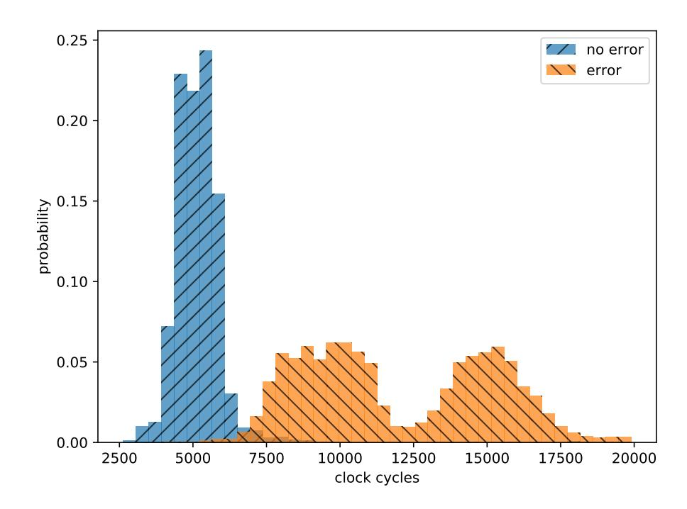
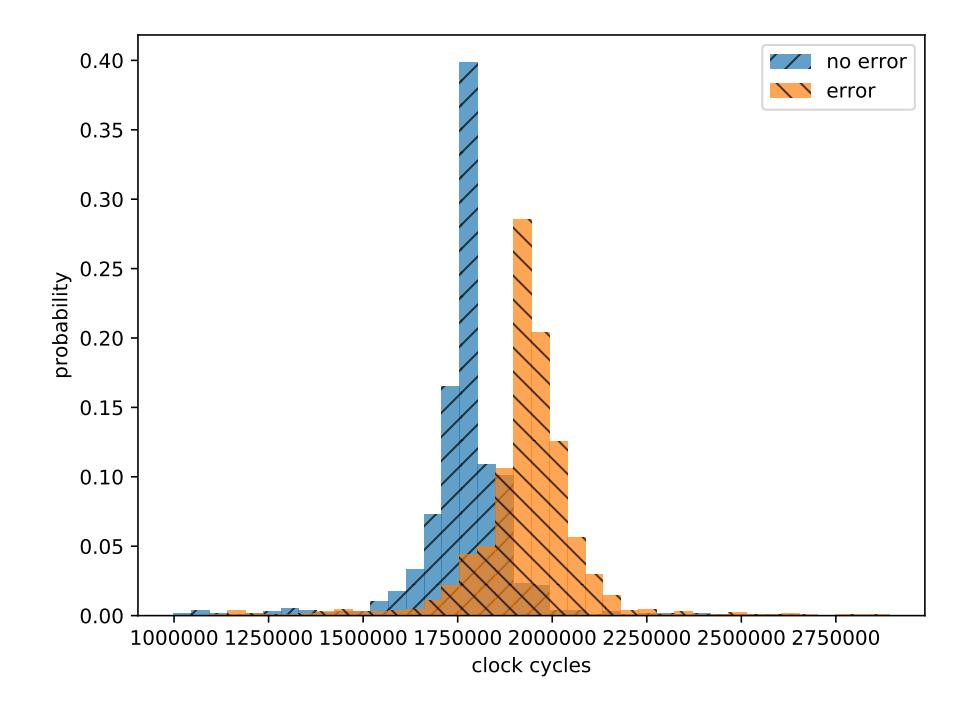

{0}------------------------------------------------

# Timing Attacks on Error Correcting Codes in Post-Quantum Schemes

Jan-Pieter D'Anvers<sup>1</sup> , Marcel Tiepelt<sup>2</sup> , Frederik Vercauteren<sup>1</sup> , and Ingrid Verbauwhede<sup>1</sup>

1 imec-COSIC, KU Leuven Kasteelpark Arenberg 10, Bus 2452, B-3001 Leuven-Heverlee, Belgium firstname.lastname@esat.kuleuven.be <sup>2</sup> Karlsruhe Institute of Technology, Kaiserstraße 12, 76131 Karlsruhe, Germany tiepelt@dev-nu11.de

Abstract. While error correcting codes (ECC) have the potential to significantly reduce the failure probability of post-quantum schemes, they add an extra ECC decoding step to the algorithm. Even though this additional step does not compute directly on the secret key, it is susceptible to side-channel attacks. We show that if no precaution is taken, it is possible to use timing information to distinguish between ciphertexts that result in an error before decoding and ciphertexts that do not contain errors, due to the variable execution time of the ECC decoding algorithm. We demonstrate that this information can be used to break the IND-CCA security of post-quantum secure schemes by presenting an attack on two round 1 candidates to the NIST Post-Quantum Standardization Process: the Ring-LWE scheme LAC and the Mersenne prime scheme Ramstake. This attack recovers the full secret key using a limited number of timed decryption queries and is implemented on the reference and the optimized implementations of both submissions. It is able to retrieve LAC's secret key for all security levels in under 2 minutes using less than 2<sup>16</sup> decryption queries and Ramstake's secret key in under 2 minutes using approximately 2400 decryption queries. The attack generalizes to other lattice-based schemes with ECC in which any side-channel information about the presence of errors is leaked during decoding.

## 1 Introduction

Learning With Errors (LWE) based algorithms are a promising alternative for current public key encryption schemes, which are vulnerable to attacks exploiting quantum computation. Several appealing public key encryption (PKE) schemes and key encapsulation mechanisms (KEM) based on the LWE hard problem or its variants have been proposed following the NIST Post-Quantum Cryptography process announcement. The LWE based submissions range from a standard approach in FrodoKEM [28] and Emblem [32], over Ring-LWE based schemes such as New Hope [4], LAC [24], LIMA [33] or R.Emblem [32], to the Mod-LWE based scheme Kyber [7]. Saber [10] and Round2 [5] adopt the similar Learning 

{1}------------------------------------------------

with Rounding paradigm to reduce bandwidth. In this paper will use LAC to refer to the original submission, while the updated round 2 version will be referred to as LACr2.

Another class of algorithms is based on the Mersenne Low Hamming Combination Assumption, as introduced by Aggarwal et al. [3]. Two proposals to the NIST Post-Quantum Cryptography process fall in this category: Mersenne-756839 [2] and Ramstake [34].

To convert an encryption scheme into a chosen ciphertext secure (IND-CCA) KEM, one can use a Post-Quantum secure version [22] of the Fujisaki-Okamoto transformation [17]. Most of the aforementioned algorithms adopt this transformation or a variant to obtain resistance against chosen ciphertext attacks.

One of the factors in the design of these schemes, is the failure probability: a high failure probability might give rise to attacks that exploit the failures to recover the secret [15, 12], a low failure probability leads to less competitive parameter settings with higher bandwidth and computational complexity. This observation prompted designers to adopt error correction in order to reduce the failure rate and thus allow a better parameter setting and smaller bandwidth. Mersenne prime based schemes inherently rely on error correcting codes (ECC) due to the nature of the algorithm. Mersenne-756839 [2] proposes a repetition code, while Ramstake defines a more involved error correcting code. Although LWE based schemes do not naturally involve the need for ECC, Lu et al. proposed LAC [24], a ring-LWE based scheme that relies extensively on the error correcting code BCH [21, 8]. A further analysis of ECC for LWE based schemes has been done by Fritzmann et al. [16] and D'Anvers et al. [13]. The downside of these error correcting codes is an increased complexity of the program code and a higher sensitivity to side-channel attacks.

While LWE-based schemes enjoy a strong theoretical security, their implementations might be vulnerable to side-channel attacks, where information is obtained through physical channels such as power measurements, electromagnetic radiation or timing. A timing attack is a type of side-channel attack first proposed by Kocher [23], where information on the timing of certain calculations is used to obtain information about the secrets in a cryptographic algorithm. Such side-channels have been proven efficient for attacking the secret generation of the lattice based signature scheme BLISS [19, 14]. However, these attacks do not carry over to the encryption case, where the secret generation is done in a more side-channel secure way. Carr´e et al. [9] measured possible cache-timing effects on various submissions to the NIST Post-Quantum standardization process. Alperin-Sheriff [1] noticed timing variabilities in the error correcting codes of LAC and Ramstake.

In this paper, we show that side-channel information on the execution of error correcting codes can be used to circumvent the IND-CCA security of postquantum encryption schemes, even though the error correction does not calculate on the secret key. We present an efficient chosen-ciphertext attack in which decryption errors are detected and exploited before the error correction. After some preliminaries in Section 2, we introduce the Ring-LWE based scheme LAC 

{2}------------------------------------------------

in Section 3 and the Mersenne prime scheme Ramstake in Section 4. In Section 5, we show that the variable time execution of the ECC leaks information about the presence of errors. This vulnerability is used in Section 6 and Section 7 to develop timing attacks<sup>1</sup> on both the reference and the optimized implementations of LAC and Ramstake.

### 2 Preliminaries

#### 2.1 Notation

Let  $\mathbb{Z}_q$  denote the ring of integers mod q. For LAC we will represent integers in (-q/2, q/2] and for Ramstake in [0, q]. When describing Ramstake, integers will be represented as little-endian binary strings, so that a[i:j] denotes selecting bits i to j from a, counted from the least significant bit (LSB). Let  $R_q$  be the polynomial ring  $\mathbb{Z}_q[X]/(X^n+1)$ . Elements of this ring will be denoted with bold lowercase letters. Define  $(\boldsymbol{a})^l$  for  $\boldsymbol{a} \in R_q$  as zeroing the coefficients associated with  $X^k$  for  $k \geq l$ . Sampling x according to a distribution x will be denoted with  $x \leftarrow x$ , which is extended coefficient-wise for polynomials as  $\boldsymbol{x} \leftarrow x$ . The uniform distribution is represented as  $\mathcal{U}$ .

#### 2.2 Cryptographic definitions

A Public Key Encryption scheme (PKE) is a triple of functions (KeyGen, Enc, Dec): KeyGen produces a secret key sk and a public key pk, Enc takes the public key pk and a message m to produce a ciphertext c, and Dec computes the message m' from the ciphertext c and the secret key sk.

A Key Encapsulation Mechanism (KEM) is defined as three functions (KeyGen, Encaps, Decaps): KeyGen returns a secret and a public key sk and pk respectively, Encaps uses a public key pk to generate a key k and a ciphertext c, Decaps uses c and sk to return the key k or a random output u.

The security notion of indistinguishability under chosen ciphertext attacks (IND-CCA) of a KEM is defined as follows:

$$\operatorname{Adv}^{\operatorname{ind-cca}}_{\operatorname{KEM}}(A) = \left| P \begin{pmatrix} b' = b : & (pk, sk) \leftarrow \operatorname{\texttt{KeyGen}}(), \ b \leftarrow \mathcal{U}(\{0, 1\}), \\ b' \leftarrow A^{\operatorname{\texttt{Decaps}}}(pk), k_1 \leftarrow \mathcal{K} \\ b' \leftarrow A^{\operatorname{\texttt{Decaps}}}(pk, c, k_b), \end{pmatrix} - \frac{1}{2} \right|.$$

where K is the probability distribution of keys k returned by Encaps().

#### 3 Ring-LWE based schemes

The decisional Ring-LWE problem [27] is a mathematical hard problem where the goal is to distinguish a uniformly random sample  $(\boldsymbol{a}, \boldsymbol{u}) \leftarrow \mathcal{U}(R_q \times R_q)$  from

<sup>&</sup>lt;sup>1</sup> The implementations are available at: https://github.com/KULeuven-COSIC/PQCRYPTO-decryption-failures

{3}------------------------------------------------

learning with errors samples  $(\boldsymbol{a}, \boldsymbol{as} + \boldsymbol{e})$ , with  $\boldsymbol{a} \leftarrow \mathcal{U}(R_q)$  and with the secrets  $\boldsymbol{s}$  and  $\boldsymbol{e}$  drawn from the distributions  $\chi_s$  and  $\chi_e$  respectively. The related search Ring-LWE problem consists of recovering  $\boldsymbol{s}$  from Ring-LWE samples.

#### 3.1 LAC.PKE

LAC is a package of cryptographic primitives whose security is based on the Ring-LWE problem. It contains a PKE and a KEM, which will be described in the following subsections. Let  $\psi_1$  be the probability distribution where 0 is drawn with probability 1/2 and 1 or -1 both with probability 1/4, and let  $\psi_{\frac{1}{2}}$  be the probability distribution where 0 is drawn with probability 3/4 and 1 or -1 both with probability 1/8. Define  $\chi_s$  and  $\chi_e$  as the probability distribution  $\psi_1$  or  $\psi_{\frac{1}{2}}$  following Table 1. Given a pseudorandom generator gen() that expands  $seed_a$  into a polynomial  $a \in R_q$ , and an error correcting code consisting of an encoding and decoding function ecc\_enc and ecc\_dec respectively, LAC.PKE is defined as in Algorithms 1 to 3. Note that the randomness required to generate s', e' and e'' is derived deterministically from the uniformly random seed r.

```
Algorithm 1: LAC.PKE.KeyGen()

1 \operatorname{seed}_{\boldsymbol{a}} \leftarrow \mathcal{U}(\{0,1\}^{256})

2 \boldsymbol{a} = \operatorname{gen}(\operatorname{seed}_{\boldsymbol{a}})

3 \boldsymbol{s} \leftarrow \chi_s(R_q), \boldsymbol{e} \leftarrow \chi_e(R_q)

4 \boldsymbol{b} = \boldsymbol{as} + \boldsymbol{e}

5 \operatorname{return} (pk := (\boldsymbol{b}, \operatorname{seed}_{\boldsymbol{a}}), sk := \boldsymbol{s})
```

```
Algorithm 2: LAC.PKE.Enc(pk = (\boldsymbol{b}, \operatorname{seed}_{\boldsymbol{a}}), m, r)

1 \boldsymbol{a} = \operatorname{gen}(\operatorname{seed}_{\boldsymbol{a}}) \in R_q

2 \boldsymbol{s}' \leftarrow \chi_s(R_q), \boldsymbol{e}' \leftarrow \chi_e(R_q), \boldsymbol{e}'' \leftarrow \chi_e(R_q) // derived from r

3 \boldsymbol{b}' = \boldsymbol{a}\boldsymbol{s}' + \boldsymbol{e}'

4 m_{ecc} = \operatorname{ecc\_enc}(m)

5 \boldsymbol{v}' = (\boldsymbol{b}\boldsymbol{s}' + \boldsymbol{e}'' + \lfloor \frac{q}{2} \rfloor m_{ecc})^l

6 return ct = (\boldsymbol{v}', \boldsymbol{b}')
```

After the execution of the protocol, the coefficients of  $m_{ecc}$  and  $m'_{ecc}$  coincide with a high probability. An error will be defined as a coefficient of  $m'_{ecc}$  that differs from the corresponding coefficient of  $m_{ecc}$ . The error correction capabilities of the ecc\_dec will be able to correct up to a certain number t of errors. An excess of errors will lead to a failure in which the decrypted message m' does not correspond to m. This happens with a failure probability  $p_f$ . The

{4}------------------------------------------------

```
Algorithm 3: LAC.PKE.Dec(sk = \mathbf{s}_A, ct = (\mathbf{v}', \mathbf{b}'))

1 \mathbf{v} = (\mathbf{b}'\mathbf{s})^l

2 for i = 0 to l - 1 do

3 | \mathbf{if} \frac{-q}{4} \leq \mathbf{v}' - \mathbf{v} < \frac{q}{4} then

4 | m'_{ecc,i} = 0

5 | \mathbf{else} |

6 | m'_{ecc,i} = 1

7 m' = \mathbf{ecc\_dec}(m'_{ecc})

8 return m'
```

parameter choices for the three versions of LAC are given in Table 1, with t the error correction capability of the used ECC,  $p_e$  the error probability of a single coefficient of  $m'_{ecc}$ , and with  $p_f$  the failure probability of the scheme under a honest submitter. The LAC NIST submission uses BCH for its error correction. For more details we refer to the original submission [24].

|         | q   | n    | l    | $\chi_s/\chi_e$      | t  | $p_e$      | $p_f$      |
|---------|-----|------|------|----------------------|----|------------|------------|
| LAC-128 | 251 | 512  | 512  | $\psi_1$             | 29 | $2^{-13}$  | $2^{-240}$ |
| LAC-192 | 251 | 1024 | 512  | $\psi_{\frac{1}{2}}$ | 13 | $2^{-25}$  | $2^{-254}$ |
| LAC-256 | 251 | 1024 | 1024 | $\psi_1^{^2}$        | 55 | $2^{-7.5}$ | $2^{-115}$ |

Table 1: Parameter choices for the variants of LAC

#### 3.2 LAC.KEM

The KEM variant of LAC uses a post-quantum version [22] of Fujisaki-Okamoto [17] to transform the PKE in an IND-CCA secure KEM. Given two hash functions  $\mathcal{G}$  and  $\mathcal{H}$  that model a random oracle, LAC.KEM re-uses the function KeyGen from LAC.PKE and defines the functions Encaps and Decaps as described in Algorithms 4 and 5.

```
Algorithm 4: LAC.KEM.Encaps(pk)

1 m \leftarrow \mathcal{U}(\{0,1\}^{256})

2 r = \mathcal{G}(m)

3 c = \text{LAC.PKE.Enc}(pk, m, r)

4 K = \mathcal{H}(m, c)

5 return (c, K)
```

{5}------------------------------------------------

```
Algorithm 5: LAC.KEM.Decaps(sk, pk, c)
1 m0 = LAC.PKE.Dec(sk, c)
2 r
   0 = G(m0
           )
3 c
   0 = LAC.PKE.Enc(pk, m0
                        , r0
                           )
4 if c = c
         0
          then
5 return K = H(m, c)
6 else
7 return K = H(H(sk), c)
```

## 4 Mersenne prime schemes

#### 4.1 Mersenne primes

A Mersenne prime is a prime of the form p = 2n−1, with n an integer. Mersenne prime numbers have the special property that performing a modulo operation a mod p on an integer a, does not increase its Hamming weight. Moreover, the modulo operation is a simple procedure on the binary expansion of an integer: bits at positions i ≥ n are cut off and are added as bits at position i mod n. The special case a · 2 <sup>k</sup> mod p results in a circular shift of the bits of a over k bits, when a is written as an n bit string. We will use this property during our attack.

### 4.2 Security assumption

The Mersenne Low Hamming Combination Assumption [3] states that, given a Mersenne prime p = 2<sup>n</sup> − 1 and an integer ω, it is hard to distinguish between

$$\left(\begin{bmatrix} R_1 \\ R_2 \end{bmatrix}, \begin{bmatrix} R_1 \\ R_2 \end{bmatrix} \cdot A + \begin{bmatrix} B_1 \\ B_2 \end{bmatrix}\right) \text{ and } \left(\begin{bmatrix} R_1 \\ R_2 \end{bmatrix}, \begin{bmatrix} R_3 \\ R_4 \end{bmatrix}\right), \tag{1}$$

where R1, R2, R3, R<sup>4</sup> ← U({0, 1} <sup>n</sup>), and A, B<sup>1</sup> and B<sup>2</sup> are n-bit random integers with Hamming weight ω, and where the calculations are performed in Zp.

#### 4.3 Ramstake.KEM

Ramstake is an IND-CCA secure KEM whose security is based on the Mersenne Low Hamming Combination Assumption. Let p = 2<sup>n</sup> − 1 be a Mersenne prime, let gen<sup>g</sup> () be a pseudorandom generator that expands seed<sup>g</sup> into a random n bit integer, and let HWω(n) denote the uniformly random sampling of an n bit integer with exactly ω bits set to 1. If a random seed r is given, HWω(n; r) denotes sampling this integer deterministically from r. Let F(), G() and H() be hash functions that model random oracles.

Ramstake defines a custom designed error correcting code described in Algorithms 6 and 7. This code uses a Reed Solomon (RS) ECC that takes a 256 

{6}------------------------------------------------

bit message and produces 255 byte codewords, where up to 111 corrupted bytes in the codeword can be corrected. The encoding function is denoted as encRS() and decoding function as decRS().

The RS encoding is combined with a variant on a repetition code, where the decoding receives ν RS encoded versions of the message and the hash of the message. Decryption proceeds by decoding the RS encoded versions one by one and checking whether the decoded messages comply with the hash. Once a matching pair is found, the message is returned. If none of the codewords decodes into the original message, a decryption failure has occured and ⊥ is returned.

```
Algorithm 6: Ramstake.E(m)
1 e = encRS(m)
2 m0
    ecc = 0
3 for i = 0 to ν − 1 do
4 m0
       ecc+ = e · 2
                  i l
                   ν
                     :
5 h = F(m)
6 return mecc, h
```

```
Algorithm 7: Ramstake.D(mecc, h)
1 for i = 0 to ν − 1 do
2 m = decRS(mecc[i
                     l
                     ν
                      : (i + 1) l
                             ν − 1])
3 if h == F(m) then
4 return m
5 return ⊥
```

If and only if the message is successfully recovered, a re-encryption step is performed which tests whether the inputs of the decryption ct = (v 0 , b0 , h) are generated from the message m. This re-encryption is part of the Fujisaki-Okamoto transformation [17] that provides IND-CCA security.

Algorithms 8 to 10 detail the three functions that make up Ramstake. Parameters that make up the two variants of Ramstake are given in Table 2. For the full specification we refer to the original submission [34].

# 5 Timing Variability

Decoding algorithms of advanced error correcting codes are not trivially programmed for constant-time execution, as some words are more easily decoded than others. This is especially the case with valid codewords, which typically decode faster than words that contain errors. We can also observe this behaviour

{7}------------------------------------------------

```
\begin{array}{|c|c|c|c|c|c|c|c|c|c|c|c|c|c|c|c|c|c|c
```

Table 2: Parameter choices for the variants of Ramstake

```
Algorithm 8: Ramstake.KEM.KeyGen()

1 seed_g \leftarrow \mathcal{U}(\{0,1\}^{256})

2 g = \text{gen}_g(\text{seed}_g)

3 s, e \leftarrow \mathcal{HW}_{\omega}(n)

4 b = gs + e \mod p

5 \text{return } (pk = (seed_g, b), sk = (s))
```

```
Algorithm 9: Ramstake.KEM.Encaps(pk = (seed_g, b))

1 g = gen_g(seed_g)

2 m \leftarrow \mathcal{U}(\{0, 1\}^{256})

3 r = \mathcal{G}(m)

4 s', e' \leftarrow \mathcal{HW}_{\omega}(n; r)

5 b' = s'g + e' \mod p

6 m_{ecc}, h = \mathcal{E}(m)

7 v' = (s'b \mod p)[0:l] \oplus m_{ecc}

8 K = \mathcal{H}(pk, m)

9 return (ct = (b', v', h), K)
```

```
Algorithm 10: Ramstake.KEM.Decaps(pk = (seed_g, b),
 sk = (s), ct = (b', v', h))
\mathbf{1} \ m'_{ecc} = (sb' \mod p)^l \oplus \overline{v'}
2 m = \mathcal{D}(m'_{ecc}, h)
3 if m \neq \perp then
        s', e' \leftarrow \mathcal{HW}_{\omega}(n; \mathcal{G}(m))
 4
        b_t' = s'g + e' \mod p
5
        m_{ecc}, h = \mathcal{E}(m)
6
        v'_t = (s'c \mod p)[0:l] \oplus m_{ecc}
 7
        if (b', v') == (b'_t, v'_t) then
8
             return \mathcal{H}(pk, m)
9
10 return \perp
```

{8}------------------------------------------------

in LAC: Figure 1 represents the number of clock cycles needed for the error decoding function of LAC-256 for both valid and faulty input words. This test is done on a desktop computer with an Intel(R) Core(TM) i5-6500 CPU running at 3.20GHz using the optimized implementation of LAC-256 [24]. However, these results carry over to other versions of LAC and can also be observed on the reference implementation.

As the other functions of the decapsulation are implemented in a constanttime fashion, the timing difference can also be seen in the execution of the whole decapsulation, as depicted in Figure 2. Using this timing information, we can thus with high probability distinguish between ciphertexts that lead to errors in the intermediate ciphertext before decoding m<sup>0</sup> ecc and ciphertexts without errors, a difference that is exploited in our attack on LAC.

For Ramstake, the error correction is inherently non-constant-time due to two reasons: First, once the valid m is found, the following encoded messages are skipped and work on the re-encryption is started immediately. Secondly, if no valid message is found (i.e. a decryption failure), re-encryption is not performed. As the re-encryption step requires more work than the decryption step, the time difference between decodable and undecodable ciphertexts is easily measured. This is the timing leakage that we will exploit during our attack on Ramstake. During the attack, if no valid message is found, the execution of the decapsulation takes on average 1.07 · 10<sup>7</sup> cycles, while a decapsulation with a valid message takes on average 2.32 · 10<sup>8</sup> cycles. Furthermore, Ramstake uses a Reed-Solomon error correcting code which can be an additional source of timing information.

During our attacks, we use inputs to the decapsulation function that are as similar as possible to reduce the timing variations that are not linked to the distinction between valid and compromised m<sup>0</sup> ecc. This leads to a better distinguishing capability of the attacks.



Fig. 1: Clock cycles for the execution of the ECC in LAC-256

{9}------------------------------------------------



Fig. 2: Clock cycles for the execution of the decapsulation function in LAC-256

# 6 Timing Attack on LAC

In the following attack, timing variations in the ECC of LAC.KEM are used to break its IND-CCA security and recover coefficients of the secret s. During the attack, we submit chosen ciphertexts to the decapsulation function, and use timing information as the input to our algorithm. As the submitted ciphertexts are not valid, the output of the decapsulation contains no useful information and is not used.

The decapsulation function takes two inputs  $\boldsymbol{b}'$  and  $\boldsymbol{v}'$  and calculates  $\Delta \boldsymbol{v} = \boldsymbol{v}' - (\boldsymbol{b}'\boldsymbol{s})^{(l)}$ , where  $\boldsymbol{s}$  is the secret.  $\Delta \boldsymbol{v}$  is used to recover the message  $m'_{ecc}$  using the following decoder:

$$m'_{ecc,i} = \begin{cases} 0 & \text{if } -\frac{q}{4} \le \Delta \mathbf{v}_i < \frac{q}{4} \\ 1 & \text{otherwise} \end{cases}$$
 (2)

During decoding, the message m' is retrieved from  $m'_{ecc}$ . As detailed in Section 5, this step leaks timing information that allows us to easily distinguish between an  $m'_{ecc}$  that contains an error and a correct  $m'_{ecc}$ .

Now we choose the polynomials  $\boldsymbol{b}'=1$  and  $\boldsymbol{v}'=\lfloor\frac{q}{4}\rfloor+\lfloor\frac{q}{2}\rfloor\boldsymbol{c}_v$  as inputs, with  $\boldsymbol{c}_v$  a valid codeword. Without loss of generality, we select the zero polynomial as codeword, so that  $\Delta \boldsymbol{v}=\lfloor\frac{q}{4}\rfloor-(\boldsymbol{s})^l$ . The only possible error location is  $\Delta \boldsymbol{v}_0$ , as the perturbation on other coefficients of  $\Delta \boldsymbol{v}$  is limited to  $\{-1,0,+1\}$ . The value of  $m'_{ecc,0}$  is calculated as follows:

{10}------------------------------------------------

$$m'_{ecc,0} = \begin{cases} 0 & \text{if } \lfloor \frac{q}{4} \rfloor - \boldsymbol{s}_0 < \frac{q}{4} \\ 1 & \text{otherwise} \end{cases}$$
 (3)

(4)

or:

$$m'_{ecc,0} = \begin{cases} 0 & \text{if } \mathbf{s}_0 \in \{0,1\} \\ 1 & \text{if } \mathbf{s}_0 = -1 \end{cases}$$
 (5)

The timing information of the decapsulation gives us enough information to distinguish between the two cases with high probability, as the ECC takes more time in the presence of an error. A longer time thus corresponds to a 1 in the  $0^{th}$  position of  $m'_{ecc}$  and therefore  $\mathbf{s}_0 = -1$ . We will denote the time for this decapsulation query with  $t_{-1}$ . Inputting  $\mathbf{b}' = -1$  with the same  $\mathbf{v}'$ , an error will occur when  $\mathbf{s}_0 = 1$ . The time for executing the decapsulation with these inputs will be written as  $t_1$ . The time difference  $\Delta t = t_1 - t_{-1}$  is now an indicator for the value of  $\mathbf{s}_0$ , as a high value indicates  $\mathbf{s}_0 = 1$ , a high negative value  $\mathbf{s}_0 = -1$ , and a small value  $\mathbf{s}_0 = 0$ .

Other coefficients of  $\boldsymbol{s}$  can be recovered by varying the input  $\boldsymbol{b}'$ : for estimating the  $k^{\text{th}}$  position of  $\boldsymbol{s}$ , we use the ciphertexts  $\boldsymbol{b}' = \pm X^{n-k}$  in conjunction with the same  $\boldsymbol{v}'$  as before. Looping over all possible k values, we can recover the whole secret  $\boldsymbol{s}$ .

#### 6.1 Results

We executed this attack on a desktop computer with an Intel(R) Core(TM) i5-6500 CPU running at 3.20GHz. Using one pair of measurements, we were able to correctly identify one coefficient of the secret with a certain probability, as given in Table 3 for LAC-256. To correctly identify the whole secret with a 50% probability, one would need on average 33 measurements of each coefficient of the secret, followed by a majority voting. In this scenario, an attacker would need to perform  $2 \cdot 1024 \cdot 33 = 2^{16}$  queries. This attack strategy was successfully repeated for the reference implementations, hereby showing that a side-channel secure implementation is of paramount importance for LWE based schemes that use error correcting codes.

### 6.2 Variants on the attack

We demonstrated the side-channel vulnerability of Ring-LWE schemes using a timing attack. However, the extent of the vulnerability goes further than timing attacks, as any side-channel that reveals information about the presence of errors can be used. Even when a constant-time implementation of the ECC is used, techniques such as power analysis and electromagnetic attacks might reveal the necessary information to enable our attack. Note that the attacker can input any chosen ciphertext to the implementation, and can thus select the ciphertexts so that the side-channel accuracy is optimized.

{11}------------------------------------------------

|                    | guess=-1 | guess=0 | guess=1 |
|--------------------|----------|---------|---------|
| $s_i = -1$         | 76.5%    | 22.2%   | 1.3%    |
| $\mathbf{s}_i = 0$ | 16.8%    | 65.6%   | 17.6%   |
| $s_i = 1$          | 1.7%     | 23.2%   | 75.1%   |

Table 3: The confusion matrix for our timing attack on LAC after one pair of measurements

### 7 Timing Attack on Ramstake

#### 7.1 Constructing an exploitable ciphertext

Our attack on Ramstake exploits the timing variations between the case where the decoding  $\mathcal{D}(m'_{ecc}, h)$  was successful, leading to the execution of the reencryption step, and the case where a decryption failure occurs, avoiding reencryption. However, we note that any (side-channel) information that reveals knowledge about the presence of errors before error correction can be used to construct a similar attack.

In the following sections we gradually construct a chosen ciphertext that reveals information about the bits of the secret s. First, consider the following input:

$$ct := (b' = 0, v' = 0, h = \mathcal{F}(0)).$$
 (6)

Since  $(sb' \mod p)[0:l] \oplus v' = m'_{ecc} = 0$ , this results in a decodable codeword and the re-encryption is performed. The re-encryption test fails and the decapsulation function returns a failure, but as we are not interested in the output of the decapsulation, this is not important.

Second, we add artificial errors to v' such that the decoding step is one error away from failing, i.e., by setting all but the first 255-111=144 bytes to one. This ciphertext still results in a decodable codeword, and thus re-encryption is still triggered. However, an additional error in the first 144 bytes of the recovered version of  $m'_{ecc}$  would trigger a decryption failure, thus avoiding re-encryption.

Third, we set  $b' = 2^0 = 1$ . Recall that the codeword is recovered as  $m'_{ecc} = (sb' \mod p)[0:l] \oplus v'$  and that an error in the first 144 bytes of  $m'_{ecc}$  would trigger a measurable decryption failure. Therefore, this ciphertext would fail if there is a nonzero byte in the first 144 positions of the secret s. We can thus, using this ciphertext, test if there is a one in the first  $8 \cdot 144$  bit positions of s.

Finally, by setting b' to different powers of 2, say  $b' = 2^k$ , we can vary which positions of s we are testing. Remembering the circular shift property from subsection 4.1, the multiplication with  $b' = 2^k$  corresponds to a circular shift of s with k positions. This allows us to perform a binary search for a position of a one in s.

Once we find a one at position i of s, we want to cancel it out to avoid finding it again. This is achieved by flipping bit  $2^{(n+i-k \mod n)}$  of v', which translates in correcting the error corresponding to that one due to the **xor** operation.

{12}------------------------------------------------

The additional advantage of this step is that it enables the attacker to correct wrong measurements: if a mistake occurs and a one is wrongly detected at a zero position i <sup>0</sup> of s, the flipped bit in v <sup>0</sup> would induce an error corresponding to the i <sup>0</sup> of s. Therefore, if position i 0 is mistakenly measured as a one position, it will be detected a second time, after which an attacker can correct his original mistake.

The full procedure to make a ciphertext that detects ones in range pos to pos + 144 · 8, taking into account the temporary estimation of the secret sest is given in Algorithm 11. Using this algorithm in a repeated binary search leads to a full recovery of the secret s.

```
Algorithm 11: gen ct(pos, sest)
1 b
   0 = 2pos
2 v
   0 = 0
3 for i = 144 to l/8 do
4 v
       0
        [8i : 8i + 7] = 66
5 h = F(0)
6 v
   0 = v
        0 ⊕ (sest · 2
                    pos mod p)
7 return b
           0
            , v0
               , h
```

#### 7.2 Recovering the secret

Now that we can construct a test that returns the existence of a one in a range of length l = 144 · 8 of the binary expansion of the secret s, we will perform a search for these ones. In the following section we will refer to the ones in the binary expansion of the secret as set bits. First, we scan the secret for a range where there is no set bit in p<sup>b</sup> − 1 − l to p<sup>b</sup> − 1 and where there is at least one set bit in p<sup>b</sup> to p<sup>b</sup> + l. This pattern always exists in the secret s.

Having found such a pattern, we start a binary search to find a set bit. Knowing that there is a set bit in the interval p<sup>b</sup> to pe, we test the interval d(p<sup>b</sup> + pe)/2 − le to d(p<sup>b</sup> + pe)/2e. If this contains a set bit, there is at least one set bit in p<sup>b</sup> to d(p<sup>b</sup> + pe)/2e, if not at least one set bit in d(p<sup>b</sup> + pe)/2 + 1e to pe. By iteratively reducing the search range, we will find a one in the secret.

Repeating this whole procedure but taking into account the temporary knowledge of the secret sest, we can retrieve all bits of the secret one by one, in a limited number of decryption queries.

### 7.3 Results

The attack was performed on a desktop computer with an Intel(R) Core(TM) i5- 6500 CPU running at 3.20GHz, recovering the full secret in under 2 minutes with approximately 2400 queries. Due to the significant timing variations between the 

{13}------------------------------------------------

case where a decryption failure occurs and the case where no decryption failure occurs, only one timing measurement was needed for each ciphertext query. These results emphasize the threat of side-channel information when using error correcting codes.

# 8 Overview of Round 2 proposals

Several lattice-based candidates to the second round of the NIST Post-Quantum Standardization Process use ECC to reduce their failure probability. In this section we will give an overview of the used ECC by different Learning with Error based schemes.

New Hope [30] uses a simple algorithm where message bits are encoded multiple times in the ciphertext, and during decoding the redundancy is used to slightly reduce the decryption failure rate. This ECC is trivially implemented in constant-time and protecting the ECC against other types of side-channel attacks would not be excessively costly due the modest nature of this algorithm.

Round5 [18] specifies a new ECC called XEf to correct up to f errors in the ciphertexts. In practice they correct between 0 and 5 errors in the message. Before error correction, they define an extra preprocessing step that removes dependencies between the transmitted bits, which occur due to the particular structure of the ring they work in. This step does not remove dependencies based on the norm of the error introduced by rounding, as discussed in [13], which could lead to an underestimation of the failure probability. Likewise, ThreeBears [20] uses a Melas Error Correcting Code to correct up to 2 errors in the ciphertext and also defines a preprocessing step to remove dependencies. Both the error correction and the preprocessing step are implemented in a constant-time fashion for Round5 and ThreeBears, but would require extra protection against other side-channel attacks.

As discussed previously, LAC [24] uses BCH to correct errors, with a correction capability up to 55 errors for LAC256. LACr2 [25], the second round submission of the LAC team, reduced the error correction capability of the employed BCH codes to a maximum correction capability of 16 errors. Moreover, in their 256 bit security scheme they additionally use a redundancy encoding that transmits each encoded bit 2 times. The round 2 submission LACr2 claimed a constant-time decoding of the ECC, but later results still showed a timing variations that depended on the number of errors [26]. Furthermore, the ECC would also require extra protection against other side-channel attacks. Walters and Roy [35] described a constant-time implementation of the BCH code used in LAC-128, which has an error correction capability of 20 errors. This implementation reaches constant-time execution of the ECC at a slowdown of factor 1.4 over the full decapsulation procedure.

FrodoKEM [29], Kyber [31] and Saber [11] choose their parameters so that their failure probability is small enough without need for ECC. NTRU [36] and NTRU prime [6] even eliminate all decryption failures without using any ECC. 

{14}------------------------------------------------

These schemes are therefore not vulnerable to side-channel analysis on ECC and do not need the extra protection against these types of attacks.

## 9 Conclusion

In this paper we successfully attacked the Ring-LWE scheme LAC and the Mersenne prime scheme Ramstake, using timing variations in the decoding steps of their error correction. First, we showed that timing variations expose information about presence of errors before error correction. We then described a method to break the IND-CCA security of these schemes based on this information and launched a chosen ciphertext attack which recovers the coefficients of the secret key with very high probability. Finally, the attack was demonstrated experimentally, leading to a recovery of the full secret of LAC in under two minutes using less than 2<sup>16</sup> decryption queries, and the full secret of Ramstake in a matter of minutes using approximately 2400 decryption queries. The attacks can be easily generalized for other post-quantum schemes that leak timing information on possible errors in the codeword before decoding. Furthermore, other side-channels such as power or electromagnetic radiation, which are hard to protect against, can be used to obtain the necessary information to break the schemes. Therefore, schemes that employ error correcting codes are exposed to increased side-channel vulnerability, as information leakage about the decoding of the ECC can lead to efficient attacks that break their security.

## 10 Acknowledgements

We thank the anonymous reviewers for their valuable comments. This work was supported in part by the Research Council KU Leuven grants: C16/15/058, C14/18/067 and STG/17/019 and by the European Commission through the Horizon 2020 research and innovation programme Cathedral ERC Advanced Grant 695305.

## References

- 1. NIST Post-Quantum Cryptography Process, Round1. National Institute of Standards and Technology, 2017.
- 2. D. Aggarwal, A. Joux, A. Prakash, and M. Santha. Mersenne-756839. Technical report, National Institute of Standards and Technology, 2017.
- 3. D. Aggarwal, A. Joux, A. Prakash, and M. Santha. A New Public-Key Cryptosystem via Mersenne Numbers. In H. Shacham and A. Boldyreva, editors, Advances in Cryptology – CRYPTO 2018, pages 459–482, Cham, 2018. Springer International Publishing.
- 4. E. Alkim, L. Ducas, T. P¨oppelmann, and P. Schwabe. Post-quantum key exchange – a New Hope. In USENIX Security 2016, 2016.
- 5. H. Baan, S. Bhattacharya, O. Garcia-Morchon, R. Rietman, L. Tolhuizen, J.-L. Torre-Arce, and Z. Zhang. Round2: KEM and PKE based on GLWR. Cryptology ePrint Archive, Report 2017/1183, 2017.

{15}------------------------------------------------

- 6. D. J. Bernstein, C. Chuengsatiansup, T. Lange, and C. van Vredendaal. NTRU Prime. Technical report, National Institute of Standards and Technology, Post-Quantum Standardization Process Round 2, 2019.
- 7. J. Bos, L. Ducas, E. Kiltz, T. Lepoint, V. Lyubashevsky, J. M. Schanck, P. Schwabe, and D. Stehl´e. CRYSTALS – Kyber: a CCA-secure module-lattice-based KEM. Cryptology ePrint Archive, Report 2017/634, 2017.
- 8. R. C. Bose and D. K. Ray-Chaudhuri. On a class of error correcting binary group codes. Information and Control, 3(1):68–79, 1960.
- 9. S. Carre, A. Facon, S. Guilley, Lec'hvien, Matthieu, and A. Schaub. Cache-Timing Vulnerabilities of NIST PQC Competitors.
- 10. J.-P. D'Anvers, A. Karmakar, S. S. Roy, and F. Vercauteren. Saber: Module-LWR Based Key Exchange, CPA-Secure Encryption and CCA-Secure KEM. In AFRICACRYPT 2018, pages 282–305, 2018.
- 11. J.-P. D'Anvers, A. Karmakar, S. S. Roy, and F. Vercauteren. SABER. Technical report, National Institute of Standards and Technology, Post-Quantum Standardization Process Round 2, 2019.
- 12. J.-P. D'Anvers, F. Vercauteren, and I. Verbauwhede. On the impact of decryption failures on the security of LWE/LWR based schemes. Cryptology ePrint Archive, Report 2018/1089, 2018.
- 13. J.-P. D'Anvers, F. Vercauteren, and I. Verbauwhede. The impact of error dependencies on Ring/Mod-LWE/LWR based schemes. Cryptology ePrint Archive, Report 2018/1172, 2018.
- 14. T. Espitau, P.-A. Fouque, B. G´erard, and M. Tibouchi. Side-Channel Attacks on BLISS Lattice-Based Signatures: Exploiting Branch Tracing Against strongSwan and Electromagnetic Emanations in Microcontrollers. In Proceedings of the 2017 ACM SIGSAC Conference on Computer and Communications Security, CCS '17, pages 1857–1874, New York, NY, USA, 2017. ACM.
- 15. S. Fluhrer. Cryptanalysis of ring-LWE based key exchange with key share reuse. Cryptology ePrint Archive, Report 2016/085, 2016.
- 16. T. Fritzmann, T. P¨oppelmann, and J. Sepulveda. Analysis of Error-Correcting Codes for Lattice-Based Key Exchange. In SAC 2018, pages 369–390, 2019.
- 17. E. Fujisaki and T. Okamoto. Secure Integration of Asymmetric and Symmetric Encryption Schemes. Journal of Cryptology, 26(1):80–101, 1 2013.
- 18. O. Garcia-Morchon, Z. Zhang, S. Bhattacharya, R. Rietman, L. Tolhuizen, J.-L. Torre-Arce, H. Baan, M.-J. O. Saarinen, S. Fluhrer, T. Laarhoven, and R. Player. Round2. Technical report, National Institute of Standards and Technology, Post-Quantum Standardization Process Round 2, 2019.
- 19. L. Groot Bruinderink, A. H¨ulsing, T. Lange, and Y. Yarom. Flush, Gauss, and Reload – A Cache Attack on the BLISS Lattice-Based Signature Scheme. In B. Gierlichs and A. Y. Poschmann, editors, Cryptographic Hardware and Embedded Systems – CHES 2016, pages 323–345, Berlin, Heidelberg, 2016. Springer Berlin Heidelberg.
- 20. M. Hamburg. ThreeBears. Technical report, National Institute of Standards and Technology, Post-Quantum Standardization Process Round 2, 2019.
- 21. A. Hocquenghem. Codes correcteurs d'erreurs (in French). Chiffers, 2:147–156, 1959.
- 22. D. Hofheinz, K. H¨ovelmanns, and E. Kiltz. A Modular Analysis of the Fujisaki-Okamoto Transformation. Cryptology ePrint Archive, Report 2017/604, 2017.
- 23. P. C. Kocher. Timing attacks on implementations of Diffie-Hellman, RSA, DSS, and other systems. In Annual International Cryptology Conference, pages 104–113. Springer, 1996.

{16}------------------------------------------------

- 24. X. Lu, Y. Liu, D. Jia, H. Xue, J. He, and Z. Zhang. LAC. Technical report, National Institute of Standards and Technology, 2017.
- 25. X. Lu, Y. Liu, D. Jia, H. Xue, J. He, Z. Zhang, Z. Liu, Z. Yang, H. Yang, B. Li, and W. Kunpeng. LAC. Technical report, National Institute of Standards and Technology, Post-Quantum Standardization Process Round 2, 2019.
- 26. X. Lu, Y. Liu, D. Jia, H. Xue, J. He, Z. Zhang, Z. Liu, Z. Yang, H. Yang, B. Li, and W. Kunpeng. LAC: NIST Second PQC Standardization Conference Presentation, 2019.
- 27. V. Lyubashevsky, C. Peikert, and O. Regev. On Ideal Lattices and Learning with Errors over Rings. In EUROCRYPT. 2010.
- 28. M. Naehrig, E. Alkim, J. Bos, L. Ducas, K. Easterbrook, B. LaMacchia, P. Longa, I. Mironov, V. Nikolaenko, C. Peikert, A. Raghunathan, and D. Stebila. FrodoKEM. Technical report, National Institute of Standards and Technology, 2017.
- 29. M. Naehrig, E. Alkim, J. Bos, L. Ducas, K. Easterbrook, B. LaMacchia, P. Longa, I. Mironov, V. Nikolaenko, C. Peikert, A. Raghunathan, and D. Stebila. FrodoKEM. Technical report, National Institute of Standards and Technology, Post-Quantum Standardization Process Round 2, 2019.
- 30. T. Poppelmann, A. Erdem, R. Avanzi, J. Bos, L. Ducas, A. de la Piedra, P. Schwabe, D. Stebila, M. R. Albrecht, E. Orsini, V. Osheter, K. G. Paterson, G. Peer, and N. P. Smart. NewHope. Technical report, National Institute of Standards and Technology, Post-Quantum Standardization Process Round 2, 2019.
- 31. P. Schwabe, R. Avanzi, J. Bos, L. Ducas, E. Kiltz, T. Lepoint, V. Lyubashevsky, J. M. Schanck, G. Seiler, and D. Stehle. Crystals-Kyber. Technical report, National Institute of Standards and Technology, Post-Quantum Standardization Process Round 2, 2019.
- 32. M. Seo, J. H. Park, D. H. Lee, S. Kim, and S.-J. Lee. Emblem and R.Emblem. Technical report, National Institute of Standards and Technology, 2017.
- 33. N. P. Smart, M. R. Albrecht, Y. Lindell, E. Orsini, V. Osheter, K. Paterson, and G. Peer. LIMA. Technical report, National Institute of Standards and Technology, 2017.
- 34. A. Szepieniec. Ramstake. Technical report, National Institute of Standards and Technology, 2017.
- 35. M. Walters and S. S. Roy. Constant-time BCH Error-Correcting Code. Cryptology ePrint Archive, Report 2019/155, 2019.
- 36. Z. Zhang, C. Chen, J. Hoffstein, W. Whyte, J. M. Schanck, A. Hulsing, J. Rijneveld, P. Schwabe, and O. Danba. NTRU. Technical report, National Institute of Standards and Technology, Post-Quantum Standardization Process Round 2, 2019.