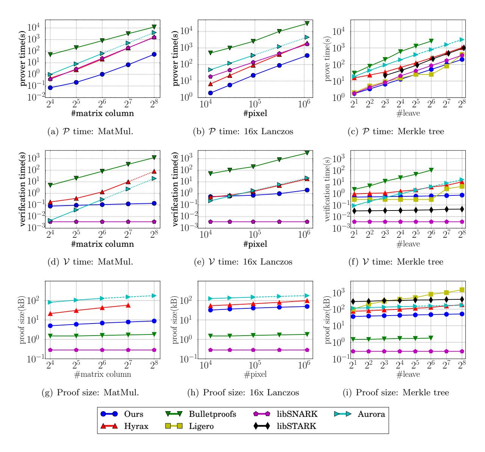

# <span id="page-0-0"></span>Libra: Succinct Zero-Knowledge Proofs with Optimal Prover Computation

Tiancheng Xie<sup>∗</sup> Jiaheng Zhang<sup>∗</sup> Yupeng Zhang† Charalampos Papamanthou‡ Dawn Song<sup>∗</sup>

#### Abstract

We present Libra, the first zero-knowledge proof system that has both optimal prover time and succinct proof size/verification time. In particular, if C is the size of the circuit being proved (i) the prover time is O(C) irrespective of the circuit type; (ii) the proof size and verification time are both O(d log C) for d-depth log-space uniform circuits (such as RAM programs). In addition Libra features an one-time trusted setup that depends only on the size of the input to the circuit and not on the circuit logic. Underlying Libra is a new linear-time algorithm for the prover of the interactive proof protocol by Goldwasser, Kalai and Rothblum (also known as GKR protocol), as well as an efficient approach to turn the GKR protocol to zero-knowledge using small masking polynomials. Not only does Libra have excellent asymptotics, but it is also efficient in practice. For example, our implementation shows that it takes 200 seconds to generate a proof for constructing a SHA2-based Merkle tree root on 256 leaves, outperforming all existing zero-knowledge proof systems. Proof size and verification time of Libra are also competitive.

## <span id="page-0-1"></span>1 Introduction

Zero-knowledge proofs (ZKP) are cryptographic protocols between two parties, a prover and a verifier, in which the prover can convince the verifier about the validity of a statement without leaking any extra information beyond the fact that the statement is true. Since they were first introduced by Goldwasser et al. [\[33\]](#page-33-0), ZKP protocols have evolved from pure theoretical constructs to practical implementations, achieving proof sizes of just hundreds of bytes and verification times of several milliseconds, regardless of the size of the statement being proved. Due to this successful transition to practice, ZKP protocols have found numerous applications not only in the traditional computation delegation setting but most importantly in providing privacy of transactions in deployed cryptocurrencies (e.g., Zcash [\[11\]](#page-32-0)) as well as in other blockchain research projects (e.g., Hawk [\[39\]](#page-33-1)).

Despite such progress in practical implementations, ZKP protocols are still notoriously hard to scale for large statements, due to a particularly high overhead on generating the proof. For most systems, this is primarily because the prover has to perform a large number of cryptographic operations, such as exponentiation in an elliptic curve group. And to make things worse the

<sup>∗</sup>University of California, Berkeley. Email: {tianc.x,jiaheng\_zhang,dawnsong}@berkeley.edu.

<sup>†</sup>University of California, Berkeley and Texas A&M University. Email: zhangyp@tamu.edu.

<sup>‡</sup>University of Maryland. Email: cpap@umd.edu.

asymptotic complexity of computing the proof is typically more than linear, e.g.,  $O(C \log C)$  or even  $O(C \log^2 C)$ , where C is the size of the statement.

Unfortunately, as of today we are yet to construct a ZKP system whose prover time is *optimal*, i.e., linear in the size of the statement C (this is irrespective of whether the ZKP system has per-statement trusted setup, one-time trusted setup or no trusted setup at all). The only notable exception is the recent work by Bünz et al. [18] that however suffers from linear verification time—for a detailed comparison see Table 1. Therefore designing ZKP systems that enjoy linear prover time as well as succinct<sup>1</sup> proof size and verification time is an open problem, whose resolution can have significant practical implications.

Our contributions. In this paper we propose Libra, the first ZKP protocol with linear prover time and succinct proof size and verification time in the size of the arithmetic circuit representing the statement C, when the circuit is log-space uniform. Libra is based on the doubly efficient interactive proof protocol proposed by Goldwasser et al. in [32] (referred as GKR protocol in this paper), and the verifiable polynomial delegation scheme proposed by Zhang et al. in [53]. As such it comes with one-time trusted setup (and not per-statement trusted setup) that depends only on the size of the input (witness) to the statement that is being proved. Not only does Libra have excellent asymptotic performance but also its prover outperforms in practice all other ZKP systems while verification time and proof size are also very competitive—see Table 1. Our concrete contributions are:

- GKR with linear prover time. Libra features a new linear-time algorithm to generate a GKR proof. Our new algorithm does not require any pattern in the circuit and our result subsumes all existing improvements on the GKR prover assuming special circuit structures, such as regular circuits in [45], data-parallel circuits in [45, 49], circuits with different sub-copies in [54]. See related work for more details.
- Adding zero-knowledge. We propose an approach to turn Libra into zero-knowledge efficiently. In particular, we show a way to mask the responses of our linear-time prover with small random polynomials such that the zero-knowledge variant of the protocol introduces minimal overhead on the verification time compared to the original (unmasked) construction.
- Implementation and evaluation. We implement Libra. Our implementation takes an arithmetic circuit with various types of gates (fan-in 2 and degree ≤ 2, such as +, -, ×, AND, XOR, etc.) and compiles it into a ZKP protocol. We conduct thorough comparisons to all existing ZKP systems (see Section 1.1). The open-source implementation of our system is released at [5].

#### <span id="page-1-1"></span>1.1 Comparing to other ZKP Systems

Table 1 shows a detailed comparison between Libra and existing ZKP systems. First of all, Libra is the best among all existing systems in terms of practical prover time. In terms of asymptotics, Libra is the only system with linear prover time and succinct verification and proof size for log-space uniform circuits. The only other system with linear prover time is Bulletproofs [18] whose verification time is linear, even for log-space uniform circuits. In the practical front, Bulletproofs prover time and verification time are high, due to the large number of cryptographic operations required for every gate of the circuit.

<span id="page-1-0"></span> $<sup>^{1}</sup>$ In ZKP literature, "succinct" is poly-logarithmic in the size of the statement C.

<span id="page-2-0"></span>Table 1: Comparison of Libra to existing ZKP systems, where (G,P, V, |π|) denote the trusted setup algorithm, the prover algorithm, the verification algorithm and the proof size respectively. Also, C is the size of the log-space uniform circuit with depth d, and n is the size of its input. The numbers are for a circuit computing the root of a Merkle tree with 256 leaves (511 instances of SHA256).[3](#page-2-1)

|   | libSNARK      | Ligero           | Bulletproofs  | Hyrax                   | libSTARK    | Aurora     | Libra      |
|---|---------------|------------------|---------------|-------------------------|-------------|------------|------------|
|   | [15]          | [7]              | [18]          | [51]                    | [10]        | [13]       |            |
|   | O(C)          |                  | O(n)          |                         |             |            |            |
| G | per-statement | no trusted setup |               |                         |             |            |            |
|   | trusted setup |                  | trusted setup |                         |             |            |            |
| P | O(C log C)    | O(C log C)       | O(C)          | O(C log C)              | O(C log2 C) | O(C log C) | O(C)       |
| V | O(1)          | O(C)<br>√        | O(C)          | √<br>O(<br>n + d log C) | O(log2 C)   | O(C)       | O(d log C) |
| π | O(1)          | O(<br>C)         | O(log C)      | √<br>O(<br>n + d log C) | O(log2 C)   | O(log2 C)  | O(d log C) |
| G | 1027s         | NA               |               |                         |             |            | 210s       |
| P | 360s          | 400s             | 2,555s        | 1,041s                  | 2,022s      | 3199s      | 201s       |
| V | 0.002s        | 4s               | 98s           | 9.9s                    | 0.044s      | 15.2s      | 0.71s      |
| π | 0.13KB        | 1,500KB          | 2KB           | 185KB                   | 395KB       | 174.3KB    | 51KB       |

The proof and verification of Libra are also competitive to other systems. In asymptotic terms, our proof size is only larger than libSNARK [\[15\]](#page-32-3) and Bulletproofs [\[18\]](#page-32-1), and our verification is slower than libSNARK [\[15\]](#page-32-3) and libSTARK [\[10\]](#page-32-5). Compared to Hyrax [\[51\]](#page-34-4), which is also based on similar techniques with our work, Libra improves the performance in all aspects (yet Hyrax does not have any trusted setup). One can refer to Section [5](#page-27-0) for a detailed description of our experimental setting as well as a more detailed comparison.

Finally, among all systems, libSNARK [\[15\]](#page-32-3) requires a trusted setup for every statement, and Libra requires an one-time trusted setup that depends on the input size. See Section [5.3](#page-31-0) for a discussion on removing trusted setup in Libra.

Log-space uniform circuits. Though the prover time in Libra is optimal for all circuits, the verification time is succinct only when the circuit is structured (log-space uniform with logarithmic depth). This is the best that can be achieved for all ZKP protocols without per-circuit setup, as the verifier must read the entire circuit, which takes linear time in the worst case. We always refer to log-space uniform circuits when we say our scheme is succinct in this paper, to differentiate from schemes with linear verification time on all circuits (irrespective of whether the circuits are log-space uniform or not). Schemes such as libSTARK [\[10\]](#page-32-5), zkVSQL [\[52\]](#page-34-5) and Hyrax [\[51\]](#page-34-4) also have such property.

In practice, with the help of auxiliary input and circuit squashing, most computations can be expressed as log-space uniform circuits with low depth, such as matrix multiplication, image scaling and Merkle hash tree in Section [5.](#page-27-0) Asymptotically, as shown in [\[10,](#page-32-5) [15,](#page-32-3) [54\]](#page-34-3), all random memory access (RAM) programs can be validated by circuits that are log-space uniform with log-depth in the running time of the programs (but linear in the size of the programs) by RAM-to-circuit reduction, which justifies the expressiveness of such circuits.

<span id="page-2-1"></span><sup>2</sup>STARK is in the RAM model. To compare the performance, we convert a circuit of size C to a RAM program with T = Θ(C) steps.

## 1.2 Our Techniques

Our main technical contributions are a GKR protocol with linear prover time and an efficient approach to turn the GKR protocol into zero-knowledge. We summarize the key ideas behind these two contributions. The detailed protocols are presented in Section [3](#page-11-0) and [4](#page-17-0) respectively.

GKR with linear prover. Goldwasser et al. [\[32\]](#page-33-2) showed an approach to model the evaluation of a layered circuit as a sequence of summations on polynomials defined by values in consecutive layers of the circuit. Using the famous sumcheck protocol (see Section [2.3.1\)](#page-7-0), they developed a protocol (the GKR protocol) allowing the verifier to validate the circuit evaluation in logarithmic time with a logarithmic size proof. However, the polynomials in the protocol are multivariate with 2s variables, where S is the number of gates in one layer of the circuit and s = log S. Naively running the sumcheck protocol on these polynomials incurs S <sup>2</sup> prover time, as there are at least 2 <sup>2</sup><sup>s</sup> = S <sup>2</sup> monomials in a 2s-variate polynomial. Later, Cormode et al. [\[25\]](#page-33-3) observed that these polynomials are sparse, containing only S nonzero monomials and improved the prover time to S log S.

In our new approach, we divide the protocol into two separate sumchecks. In each sumcheck, the polynomial only contains s variables, and can be expressed as the product of two multilinear polynomials. Utilizing the sparsity of the circuit, we develop new algorithms to scan through each gate of the circuit and compute the closed-form of all these multilinear polynomials explicitly, which takes O(S) time. With this new way of representation, the prover can deploy a dynamic programming technique to generate the proofs in each sumcheck in O(S) time, resulting in a total prover time of O(S).

Efficient zero-knowledge GKR. The original GKR protocol is not zero-knowledge, since the messages in the proof can be viewed as weighed sums of the values in the circuit and leak information. In [\[51,](#page-34-4)[52\]](#page-34-5), the authors proposed to turn the GKR protocol into zero-knowledge by hiding the messages in homomorphic commitments, which incurs a big overhead in the verification time. In [\[24\]](#page-33-4), Chiesa et al. proposed an alternative approach by masking the protocol with random polynomials. However, the masking polynomials are as big as the original ones and the prover time becomes exponential, making the approach mainly of theoretical interest.

In our scheme, we first show that in order to make the sumcheck protocol zero-knowledge, the prover can mask it with a "small" polynomial. In particular, the masking polynomial only contains logarithmically many random coefficients. The intuition is that though the original polynomial has O(2` ) or more terms (` is the number of variables in the polynomial), the prover only sends O(`) messages in the sumcheck protocol. Therefore, it suffices to mask the original polynomial with a random one with O(`) coefficients to achieve zero-knowledge. In particular, we set the masking polynomial as the sum of ` univariate random polynomials with the same variable-degree. In Section [4.1,](#page-18-0) we show that the entropy of this mask exactly counters the leakage of the sumcheck, proving that it is sufficient and optimal.

Besides the sumcheck, the GKR protocol additionally leaks two evaluations of the polynomial defined by values in each layer of the circuit. To make these evaluations zero-knowledge, we mask the polynomial by a special low-degree random polynomial. In particular, we show that after the mask, the verifier in total learns 4 messages related to the evaluations of the masking polynomial and we can prove zero-knowledge by making these messages linearly independent. Therefore, the masking polynomial is of constant size: it consists of 2 variables with variable degree 2.

## 1.3 Related Work

In recent years there has been significant progress in efficient ZKP protocols and systems. In this section, we discuss related work in this area, with the focus on those with sublinear proofs.

QAP-based. Following earlier work of Ishai [\[36\]](#page-33-5), Groth [\[35\]](#page-33-6) and Lipmaa [\[40\]](#page-33-7), Gennaro et al. [\[30\]](#page-33-8) introduced quadratic arithmetic programs (QAPs), which forms the basis of most recent implementations [\[12,](#page-32-7)[16,](#page-32-8)[21,](#page-32-9)[26,](#page-33-9)[29,](#page-33-10)[44,](#page-34-6)[50\]](#page-34-7) including libSNARK [\[15\]](#page-32-3). The proof size in these systems is constant, and the verification time depends only on the input size. Both these properties are particularly appealing and have led to real-world deployments, e.g., ZCash [\[11\]](#page-32-0). One of the main bottlenecks, however, of QAP-based systems is the high overhead in the prover running time and memory consumption, making it hard to scale to large statements. In addition, a separate trusted setup for every different statement is required.

IOPs. Based on "(MPC)-in-the-head" introduced in [\[23,](#page-33-11) [31,](#page-33-12) [37\]](#page-33-13), Ames et al. [\[7\]](#page-32-4) proposed a ZKP scheme called Ligero. It only uses symmetric key operations and the prover time is fast in practice. However, it generates proofs of size O( √ C), which is several megabytes in practice for moderate-size circuits. In addition, the verification time is quasi-linear to the size of the circuit. It is categorized as interactive PCP, which is a special case of interactive oracle proofs (IOPs). IOP generalizes the probabilistically checkable proofs (PCPs) where earlier works of Kilian [\[38\]](#page-33-14) and Micali [\[43\]](#page-34-8) are built on. In the IOP model, Ben-Sasson et al. built libstark [\[10\]](#page-32-5), a zero-knowledge transparent argument of knowledge (zkSTARK).libstark does not rely on trusted setup and executes in the RAM model of computation. Their verification time is only linear to the description of the RAM program, and succinct (logarithmic) in the time required for program execution. Recently, Ben-Sasson et al. [\[13\]](#page-32-6) proposed Aurora, a new ZKP system in the IOP model with the proof size of O(log<sup>2</sup> C).

Discrete log. Before Bulletproof [\[18\]](#page-32-1), earlier discrete-log based ZKP schemes include the work of Groth [\[34\]](#page-33-15), Bayer and Groth [\[9\]](#page-32-10) and Bootle et al. [\[19\]](#page-32-11). The proof size of these schemes are larger than Bulletproof either asymptotically or concretely.

Hash-based. Bootle et al. [\[20\]](#page-32-12) proposed a ZKP scheme with linear prover time and verification time. The verification only requires O(C) field additions. However, the proof size is O( √ C) and the constants are large as mentioned in the paper [\[20\]](#page-32-12).

Interactive proofs. The line of work that relates to our paper the most is based on interactive proofs [\[33\]](#page-33-0). In the seminal work of [\[32\]](#page-33-2), Goldwasser et al. proposed an efficient interactive proof for layered arithmetic circuits. Later, Cormode et al. [\[25\]](#page-33-3) improved the prover complexity of the interactive proof in [\[32\]](#page-33-2) to O(C log C) using multilinear extensions instead of low degree extensions. Several follow-up works further reduce the prover time assuming special structures of the circuit. For regular circuits where the wiring pattern can be described in constant space and time, Thaler [\[45\]](#page-34-1) introduced a protocol with O(C) prover time; for data parallel circuits with many copies of small circuits with size C 0 , a O(C log C 0 ) protocol is presented in the same work, later improved to O(C + C 0 log C) by Wahby et al. in [\[49\]](#page-34-2); for circuits with many non-connected but different copies, Zhang et al. showed a protocol with O(C log C 0 ) prover time.

In [\[53\]](#page-34-0), Zhang et al. extended the GKR protocol to an argument system using a protocol for verifiable polynomial delegation. Zhang et al. [\[54\]](#page-34-3) and Wahby et al. [\[51\]](#page-34-4) make the argument system zero-knowledge by putting all the messages in the proof into homomorphic commitments, as proposed by Cramer and Damgard in [\[27\]](#page-33-16). This approach introduces a high overhead on the verification time compared to the plain argument system without zero-knowledge, as each addition becomes a multiplication and each multiplication becomes an exponentiation in the homomorphic commitments. The multiplicative overhead is around two orders of magnitude in practice. Additionally, the scheme of [51], Hyrax, removes the trusted setup of the argument system by introducing a new polynomial delegation, increasing the proof size and verification time to  $O(\sqrt{n})$  where n is the input size of the circuit.

**Lattice-based.** Recently Baum et al. [8] proposed the first lattice-based ZKP system with sublinear proof size. The proof size is  $O(\sqrt{C \log^3 C})$ , and the practical performance is to be explored.

## 2 Preliminaries

## 2.1 Notation

In this paper, we use  $\lambda$  to denote the security parameter, and  $\mathsf{negl}(\lambda)$  to denote the negligible function in  $\lambda$ . "PPT" stands for probabilistic polynomial time. We use f(), h() for polynomials, x, y, z for vectors of variables and g, u, v for vectors of values.  $x_i$  denotes the i-th variable in x. We use bold letters such as  $\mathbf{A}$  to represent arrays. For a multivariate polynomial f, its "variable-degree" is the maximum degree of f in any of its variables.

**Bilinear pairings.** Let  $\mathbb{G}, \mathbb{G}_T$  be two groups of prime order p and let  $g \in \mathbb{G}$  be a generator.  $e : \mathbb{G} \times \mathbb{G} \to \mathbb{G}_T$  denotes a bilinear map and we use  $\mathsf{bp} = (p, \mathbb{G}, \mathbb{G}_T, e, g) \leftarrow \mathsf{BilGen}(1^\lambda)$  for the generation of parameters for the bilinear map. Our scheme relies on the q-Strong Bilinear Diffie-Hellman (q-SBDH) assumption and an extended version of the Power Knowledge of Exponent (PKE) assumption.

<span id="page-5-0"></span>**Assumption 1** (q-Strong Bilinear Diffie-Hellman). For any PPT adversary A, the following holds:

$$\Pr\begin{bmatrix} \mathsf{bp} \leftarrow \mathsf{BilGen}(1^\lambda) \\ s \overset{R}{\leftarrow} \mathbb{Z}_p^* \\ \sigma = (\mathsf{bp}, g^s, ..., g^{s^q}) \end{bmatrix} \leq \mathsf{negl}(\lambda)$$

The second assumption is a generalization of the q-PKE assumption [35] to multivariate polynomials, proposed in [52,53]. Let  $\mathcal{W}_{\ell,d}$  be the set of all multisets of  $\{1,...,\ell\}$  with the cardinality of each element being at most d.

<span id="page-5-1"></span>**Assumption 2** ( $(d, \ell)$ -Extended Power Knowledge of Exponent). For any PPT adversary  $\mathcal{A}$ , there is a polynomial time algorithm  $\mathcal{E}$  (takes the same randomness of  $\mathcal{A}$  as input) such that for all benign auxiliary inputs  $z \in \{0,1\}^{\mathsf{poly}(\lambda)}$  the following probability is negligible:

$$\operatorname{Pr} \begin{array}{l} \text{ inputs } z \in \{0,1\}^{\operatorname{poly}(\lambda)} \text{ the following probability is negligible:} \\ \\ \operatorname{bp} \leftarrow \operatorname{BilGen}(1^{\lambda}) \\ s_{1}, \ldots, s_{\ell}, s_{\ell+1}, \alpha \overset{R}{\leftarrow} Z_{p}^{*}, s_{0} = 1 \\ \\ \sigma_{1} = (\{g^{\prod_{i \in W} s_{i}}\}_{W \in \mathcal{W}_{\ell,d}, g^{s_{\ell+1}}}) \\ \\ \sigma_{2} = (\{g^{\alpha \prod_{i \in W s_{i}}}\}_{W \in \mathcal{W}_{\ell,d}}, g^{\alpha s_{\ell+1}}) \\ \\ \vdots \\ \\ \sigma = (\operatorname{bp}, \sigma_{1}, \sigma_{2}, g^{\alpha}) \\ \\ \mathbb{G} \times \mathbb{G} \ni (h, \tilde{h}) \leftarrow \mathcal{A}\left(1^{\lambda}, \sigma, z\right) \\ \\ \left(a_{0}, \ldots, a_{\left|\mathcal{W}_{\ell,d}\right|}, b\right) \leftarrow \mathcal{E}\left(1^{\lambda}, \sigma, z\right) \\ \\ \end{array} \right] \leq \operatorname{negl}(\lambda)$$

## 2.2 Interactive Proofs and Zero-knowledge Arguments

Interactive proofs. An interactive proof allows a prover  $\mathcal{P}$  to convince a verifier  $\mathcal{V}$  the validity of some statement. The interactive proof runs in several rounds, allowing  $\mathcal{V}$  to ask questions in each round based on  $\mathcal{P}$ 's answers of previous rounds. We phrase this in terms of  $\mathcal{P}$  trying to convince  $\mathcal{V}$  that f(x) = 1. The proof system is interesting only when the running time of  $\mathcal{V}$  is less than the time of directly computing the function f. We formalize interactive proofs in the following:

<span id="page-6-1"></span>**Definition 1.** Let f be a Boolean function. A pair of interactive machines  $\langle \mathcal{P}, \mathcal{V} \rangle$  is an interactive proof for f with soundness  $\epsilon$  if the following holds:

- Completeness. For every x such that f(x) = 1 it holds that  $\Pr[\langle \mathcal{P}, \mathcal{V} \rangle(x) = accept] = 1$ .
- $\epsilon$ -Soundness. For any x with  $f(x) \neq 1$  and any  $\mathcal{P}^*$  it holds that  $\Pr[\langle \mathcal{P}^*, \mathcal{V} \rangle = accept] \leq \epsilon$

**Zero-knowledge arguments.** An argument system for an NP relationship R is a protocol between a computationally-bounded prover  $\mathcal{P}$  and a verifier  $\mathcal{V}$ . At the end of the protocol,  $\mathcal{V}$  is convinced by  $\mathcal{P}$  that there exists a witness w such that  $(x;w) \in R$  for some input x. We focus on arguments of knowledge which have the stronger property that if the prover convinces the verifier of the statement validity, then the prover must know w. We use  $\mathcal{G}$  to represent the generation phase of the public key  $\mathsf{pk}$  and the verification key  $\mathsf{vk}$ . Formally, consider the definition below, where we assume R is known to  $\mathcal{P}$  and  $\mathcal{V}$ .

<span id="page-6-2"></span>**Definition 2.** Let R be an NP relation. A tuple of algorithm  $(\mathcal{G}, \mathcal{P}, \mathcal{V})$  is a zero-knowledge argument of knowledge for R if the following holds.

• Correctness. For every (pk, vk) output by  $\mathcal{G}(1^{\lambda})$  and  $(x, w) \in R$ ,

$$\langle \mathcal{P}(\mathsf{pk}, w), \mathcal{V}(\mathsf{vk}) \rangle(x) = \mathsf{accept}$$

• **Soundness**. For any PPT prover  $\mathcal{P}$ , there exists a PPT extractor  $\varepsilon$  such that for every  $(\mathsf{pk}, \mathsf{vk})$  output by  $\mathcal{G}(1^{\lambda})$  and any x, it holds that

$$\Pr[\langle \mathcal{P}(\mathsf{pk}), \mathcal{V}(\mathsf{vk}) \rangle(x) = \mathsf{accept} \land (x, w) \not\in R | w \leftarrow \varepsilon(\mathsf{pk}, x)] \leq \mathit{negl}(\lambda)$$

• **Zero knowledge**. There exists a PPT simulator S such that for any PPT adversary A, auxiliary input  $z \in \{0,1\}^{\mathsf{poly}(\lambda)}$ ,  $(x;w) \in R$ , it holds that

$$\begin{split} \Pr\left[ \langle \mathcal{P}(\mathsf{pk}, w), \mathcal{A} \rangle &= \mathsf{accept} : (\mathsf{pk}, \mathsf{vk}) \leftarrow \mathcal{G}(1^\lambda); (x, w) \leftarrow \mathcal{A}(z, \mathsf{pk}, \mathsf{vk}) \right] = \\ \Pr\left[ \langle \mathcal{S}(\mathsf{trap}, z, \mathsf{pk}), \mathcal{A} \rangle &= \mathsf{accept} : (\mathsf{pk}, \mathsf{vk}, \mathsf{trap}) \leftarrow \mathcal{S}(1^\lambda); (x, w) \leftarrow \mathcal{A}(z, \mathsf{pk}, \mathsf{vk}) \right] \end{split}$$

We say that  $(\mathcal{G}, \mathcal{P}, \mathcal{V})$  is a **succinct** argument system if the running time of  $\mathcal{V}$  and the total communication between  $\mathcal{P}$  and  $\mathcal{V}$  (proof size) are  $\mathsf{poly}(\lambda, |x|, \log |w|)$ .

### <span id="page-6-0"></span>2.3 GKR Protocol

In [32], Goldwasser et al. proposed an efficient interactive proof protocol for layered arithmetic circuits, which we use as a building block for our new zero-knowledge argument and is referred as the GKR protocol. We present the detailed protocol here.

<span id="page-7-1"></span>**Protocol 1** (Sumcheck). The protocol proceeds in  $\ell$  rounds.

 $\bullet$  In the first round,  ${\mathcal P}$  sends a univariate polynomial

$$f_1(x_1) \stackrel{def}{=} \sum_{b_2,\dots,b_\ell \in \{0,1\}} f(x_1,b_2,\dots,b_\ell),$$

V checks  $H = f_1(0) + f_1(1)$ . Then V sends a random challenge  $r_1 \in \mathbb{F}$  to  $\mathcal{P}$ .

• In the i-th round, where  $2 \le i \le l-1$ ,  $\mathcal{P}$  sends a univariate polynomial

$$f_i(x_i) \stackrel{def}{=} \sum_{b_{i+1},\dots,b_{\ell} \in \{0,1\}} f(r_1,\dots,r_{i-1},x_i,b_{i+1},\dots,b_{\ell}),$$

 $\mathcal{V}$  checks  $f_{i-1}(r_{i-1}) = f_i(0) + f_i(1)$ , and sends a random challenge  $r_i \in \mathbb{F}$  to  $\mathcal{P}$ .

 $\bullet$  In the  $\ell$ -th round,  ${\mathcal P}$  sends a univariate polynomial

$$f_{\ell}(x_{\ell}) \stackrel{def}{=} f(r_1, r_2, \dots, r_{l-1}, x_{\ell}),$$

 $\mathcal{V}$  checks  $f_{\ell-1}(r_{\ell-1}) = f_{\ell}(0) + f_{\ell}(1)$ . The verifier generates a random challenge  $r_{\ell} \in \mathbb{F}$ . Given oracle access to an evaluation  $f(r_1, r_2, \ldots, r_{\ell})$  of f,  $\mathcal{V}$  will accept if and only if  $f_{\ell}(r_{\ell}) = f(r_1, r_2, \ldots, r_{\ell})$ . The instantiation of the oracle access depends on the application of the sumcheck protocol.

## <span id="page-7-0"></span>2.3.1 Sumcheck Protocol.

The sumcheck problem is a fundamental problem that has various applications. The problem is to sum a polynomial  $f: \mathbb{F}^{\ell} \to \mathbb{F}$  on the binary hypercube

$$\sum_{b_1,b_2,...,b_{\ell}\in\{0,1\}} f(b_1,b_2,...,b_{\ell}).$$

Directly computing the sum requires exponential time in  $\ell$ , as there are  $2^{\ell}$  combinations of  $b_1, \ldots, b_{\ell}$ . Lund et al. [41] proposed a *sumcheck* protocol that allows a verifier  $\mathcal{V}$  to delegate the computation to a computationally unbounded prover  $\mathcal{P}$ , who can convince  $\mathcal{V}$  that H is the correct sum. We provide a description of the sumcheck protocol in Protocol 1. The proof size of the sumcheck protocol is  $O(d\ell)$ , where d is the variable-degree of f, as in each round,  $\mathcal{P}$  sends a univariate polynomial of one variable in f, which can be uniquely defined by d+1 points. The verifier time of the protocol is  $O(d\ell)$ . The prover time depends on the degree and the sparsity of f, and we will give the complexity later in our scheme. The sumcheck protocol is complete and sound with  $\epsilon = \frac{d\ell}{|\mathbb{F}|}$ .

#### 2.3.2 GKR protocol

Using the sumcheck protocol as a building block, Goldwasser et al. [32] showed an interactive proof protocol for layered arithmetic circuits.

**Definition 3 (Multi-linear Extension).** Let  $V: \{0,1\}^{\ell} \to \mathbb{F}$  be a function. The multilinear extension of V is the unique polynomial  $\tilde{V}: \mathbb{F}^l \to \mathbb{F}$  such that  $\tilde{V}(x_1, x_2, ..., x_l) = V(x_1, x_2, ..., x_l)$  for all  $x_1, x_2, ..., x_l \in \{0,1\}^l$ .

 $\tilde{V}$  can be expressed as:

$$\tilde{V}(x_1, x_2, ..., x_l) = \sum_{b \in \{0,1\}^{\ell}} \prod_{i=1}^{l} [((1 - x_i)(1 - b_i) + x_i b_i) \cdot V(b)]$$

where  $b_i$  is i-th bit of b.

**Multilinear extensions of arrays.** Inspired by the close form equation of the multilinear extension given above, we can view an array  $\mathbf{A} = (a_0, a_1, \dots, a_{n-1})$  as a function  $A : \{0, 1\}^{\log n} \to \mathbb{F}$  such that  $\forall i \in [0, n-1], A(i) = a_i$ . Therefore, in this paper, we abuse the use of multilinear extension on an array as the multilinear extension  $\tilde{A}$  of A.

**High Level Ideas.** Let C be a layered arithmetic circuit with depth d over a finite field  $\mathbb{F}$ . Each gate in the i-th layer takes inputs from two gates in the (i+1)-th layer; layer 0 is the output layer and layer d is the input layer. The protocol proceeds layer by layer. Upon receiving the claimed output from  $\mathcal{P}$ , in the first round,  $\mathcal{V}$  and  $\mathcal{P}$  run the sumcheck protocol to reduce the claim about the output to a claim about the values in the layer above. In the i-th round, both parties reduce a claim about layer i-1 to a claim about layer i through the sumcheck protocol. Finally, the protocol terminates with a claim about the input layer d, which can be checked directly by  $\mathcal{V}$ , or is given as an oracle access. If the check passes,  $\mathcal{V}$  accepts the claimed output.

**Notation.** Before describing the GKR protocol, we introduce some additional notations. We denote the number of gates in the *i*-th layer as  $S_i$  and let  $s_i = \lceil \log S_i \rceil$ . (For simplicity, we assume  $S_i$  is a power of 2, and we can pad the layer with dummy gates otherwise.) We then define a function  $V_i: \{0,1\}^{s_i} \to \mathbb{F}$  that takes a binary string  $b \in \{0,1\}^{s_i}$  and returns the output of gate b in layer i, where b is called the gate label. With this definition,  $V_0$  corresponds to the output of the circuit, and  $V_d$  corresponds to the input layer. Finally, we define two additional functions  $add_i, mult_i: \{0,1\}^{s_{i-1}+2s_i} \to \{0,1\}$ , referred as wiring predicates in the literature.  $add_i \ (mult_i)$  takes one gate label  $z \in \{0,1\}^{s_{i-1}}$  in layer i-1 and two gate labels  $x, y \in \{0,1\}^{s_i}$  in layer i, and outputs 1 if and only if gate z is an addition (multiplication) gate that takes the output of gate x, y as input. With these definitions,  $V_i$  can be written as follows:

$$V_{i}(z) = \sum_{x,y \in \{0,1\}^{s_{i+1}}} (add_{i+1}(z,x,y)(V_{i+1}(x) + V_{i+1}(y)) + mult_{i+1}(z,x,y)(V_{i+1}(x)V_{i+1}(y)))$$

$$(1)$$

for any  $z \in \{0, 1\}^{s_i}$ .

In the equation above,  $V_i$  is expressed as a summation, so  $\mathcal{V}$  can use the sumcheck protocol to check that it is computed correctly. As the sumcheck protocol operates on polynomials defined on  $\mathbb{F}$ , we rewrite the equation with their multilinear extensions:

<span id="page-8-0"></span>
$$\tilde{V}_{i}(g) = \sum_{x,y \in \{0,1\}^{s_{i+1}}} f_{i}(x,y) 
= \sum_{x,y \in \{0,1\}^{s_{i+1}}} (a\tilde{d}d_{i+1}(g,x,y)(\tilde{V}_{i+1}(x) + \tilde{V}_{i+1}(y)) 
+ \tilde{mult}_{i+1}(g,x,y)(\tilde{V}_{i+1}(x)\tilde{V}_{i+1}(y))),$$
(2)

where  $g \in \mathbb{F}^{s_i}$  is a random vector.

**Protocol.** With Equation 2, the GKR protocol proceeds as follows. The prover  $\mathcal{P}$  first sends the claimed output of the circuit to  $\mathcal{V}$ . From the claimed output,  $\mathcal{V}$  defines polynomial  $\tilde{V}_0$  and computes  $\tilde{V}_0(g)$  for a random  $g \in \mathbb{F}^{s_0}$ .  $\mathcal{V}$  and  $\mathcal{P}$  then invoke a sumcheck protocol on Equation 2 with i=0. As described in Section 2.3.1, at the end of the sumcheck,  $\mathcal{V}$  needs an oracle access to  $f_i(u,v)$ , where u,v are randomly selected in  $\mathbb{F}^{s_{i+1}}$ . To compute  $f_i(u,v)$ ,  $\mathcal{V}$  computes  $a\tilde{d}d_{i+1}(u,v)$  and  $m\tilde{u}lt_{i+1}(u,v)$  locally (they only depend on the wiring pattern of the circuit, but not on the values), asks  $\mathcal{P}$  to send  $\tilde{V}_1(u)$  and  $\tilde{V}_1(v)$  and computes  $f_i(u,v)$  to complete the sumcheck protocol. In this way,  $\mathcal{V}$  and  $\mathcal{P}$  reduces a claim about the output to two claims about values in layer 1.  $\mathcal{V}$  and  $\mathcal{P}$  could invoke two sumcheck protocols on  $\tilde{V}_1(u)$  and  $\tilde{V}_1(v)$  recursively to layers above, but the number of claims and the sumcheck protocols would increase exponentially in d.

Combining two claims: condensing to one claim. In [32], Goldwasser et al. presented a protocol to reduce two claims  $\tilde{V}_i(u)$  and  $\tilde{V}_i(v)$  to one as following.  $\mathcal{V}$  defines a line  $\gamma: \mathbb{F} \to \mathbb{F}^{s_i}$  such that  $\gamma(0) = u, \gamma(1) = v$ .  $\mathcal{V}$  sends  $\gamma(x)$  to  $\mathcal{P}$ . Then  $\mathcal{P}$  sends  $\mathcal{V}$  a degree  $s_i$  univariate polynomial  $h(x) = \tilde{V}_i(\gamma(x))$ .  $\mathcal{V}$  checks that  $h(0) = \tilde{V}_i(u), h(1) = \tilde{V}_i(v)$ . Then  $\mathcal{V}$  randomly chooses  $r \in \mathbb{F}$  and computes a new claim  $h(r) = \tilde{V}_i(\gamma(r)) = \tilde{V}_i(w)$  on  $w = \gamma(r) \in \mathbb{F}^{s_i}$ .  $\mathcal{V}$  sends r, w to  $\mathcal{P}$ . In this way, the two claims are reduced to one claim  $\tilde{V}_i(w)$ . Combining this protocol with the sumcheck protocol on Equation 2,  $\mathcal{V}$  and  $\mathcal{P}$  can reduce a claim on layer i to one claim on layer i+1, and eventually to a claim on the input, which completes the GKR protocol.

Combining two claims: random linear combination. In [24], Chiesa et al. proposed an alternative approach using random linear combinations. Upon receiving the two claims  $\tilde{V}_i(u)$  and  $\tilde{V}_i(v)$ ,  $\mathcal{V}$  selects  $\alpha_i, \beta_i \in \mathbb{F}$  randomly and computes  $\alpha_i \tilde{V}_i(u) + \beta_i \tilde{V}_i(v)$ . Based on Equation 2, this random linear combination can be written as

<span id="page-9-0"></span>
$$\alpha_{i}\tilde{V}_{i}(u) + \beta_{i}\tilde{V}_{i}(v)$$

$$= \alpha_{i} \sum_{x,y \in \{0,1\}^{s_{i+1}}} (\tilde{add}_{i+1}(u,x,y)(\tilde{V}_{i+1}(x) + \tilde{V}_{i+1}(y)) + \tilde{mult}_{i+1}(u,x,y)(\tilde{V}_{i+1}(x)\tilde{V}_{i+1}(y)))$$

$$+ \beta_{i} \sum_{x,y \in \{0,1\}^{s_{i+1}}} (\tilde{add}_{i+1}(v,x,y)(\tilde{V}_{i+1}(x) + \tilde{V}_{i+1}(y)) + \tilde{mult}_{i+1}(v,x,y)(\tilde{V}_{i+1}(x)\tilde{V}_{i+1}(y)))$$

$$= \sum_{x,y \in \{0,1\}^{s_{i+1}}} ((\alpha_{i}\tilde{add}_{i+1}(u,x,y) + \beta_{i}\tilde{add}_{i+1}(v,x,y))(\tilde{V}_{i+1}(x) + \tilde{V}_{i+1}(y))$$

$$+ (\alpha_{i}\tilde{mult}_{i+1}(u,x,y) + \beta_{i}\tilde{mult}_{i+1}(v,x,y))(\tilde{V}_{i+1}(x)\tilde{V}_{i+1}(y)))$$

$$(3)$$

 $\mathcal{V}$  and  $\mathcal{P}$  then execute the sumcheck protocol on Equation 3 instead of Equation 2. At the end of the sumcheck protocol,  $\mathcal{V}$  still receives two claims about  $\tilde{V}_{i+1}$ , computes their random linear combination and proceeds to an layer above recursively until the input layer.

In our new ZKP scheme, we will mainly use the second approach. The full GKR protocol using random linear combinations is given in Protocol 2.

**Theorem 1.** [47] [45] [25] [32]. Let  $C : \mathbb{F}^n \to \mathbb{F}^k$  be a depth-d layered arithmetic circuit. Protocol 2 is an interactive proof for the function computed by C with soundness  $O(d \log |C|/|\mathbb{F}|)$ . It uses  $O(d \log |C|)$  rounds of interaction and running time of the prover  $\mathcal{P}$  is  $O(|C| \log |C|)$ . Let the optimal computation time for all  $a\tilde{d}d_i$  and  $m\tilde{u}lt_i$  be T, the running time of  $\mathcal{V}$  is  $O(n+k+d \log |C|+T)$ . For log-space uniform circuits it is  $T = \mathsf{polylog}|C|$ .

<span id="page-10-0"></span>**Protocol 2.** Let  $\mathbb{F}$  be a prime field. Let  $C \colon \mathbb{F}^n \to \mathbb{F}^k$  be a d-depth layered arithmetic circuit.  $\mathcal{P}$  wants to convince that  $\mathsf{out} = C(\mathsf{in})$  where  $\mathsf{in}$  is the input from  $\mathcal{V}$ , and  $\mathsf{out}$  is the output. Without loss of generality, assume n and k are both powers of 2 and we can pad them if not.

- Define the multilinear extension of array out as  $\tilde{V}_0$ . V chooses a random  $g \in \mathbb{F}^{s_0}$  and sends it to  $\mathcal{P}$ . Both parties compute  $\tilde{V}_0(g)$ .
- P and V run a sumcheck protocol on

$$\tilde{V}_0(g^{(0)}) = \sum_{x,y \in \{0,1\}^{s_1}} \tilde{mult}_1(g^{(0)}, x, y)(\tilde{V}_1(x)\tilde{V}_1(y)) + \tilde{add}_1(g^{(0)}, x, y)(\tilde{V}_1(x) + \tilde{V}_1(y))$$

At the end of the protocol,  $\mathcal{V}$  receives  $\tilde{V}_1(u^{(1)})$  and  $\tilde{V}_1(v^{(1)})$ .  $\mathcal{V}$  computes  $\tilde{mult}_1(g^{(0)},u^{(1)},v^{(1)})$ ,  $\tilde{add}_1(g^{(0)},u^{(1)},v^{(1)})$  and checks that  $\tilde{mult}_1(g^{(0)},u^{(1)},v^{(1)})\tilde{V}_1(u^{(1)})\tilde{V}_1(v^{(1)}) + \tilde{add}_1(g^{(0)},u^{(1)},v^{(1)})(\tilde{V}_1(u^{(1)})+\tilde{V}_1(v^{(1)}))$  equals to the last message of the sumcheck.

- For i = 1, ..., d 1:
  - $\mathcal{V}$  randomly selects  $\alpha^{(i)}, \beta^{(i)} \in \mathbb{F}$  and sends them to  $\mathcal{P}$ .
  - $\mathcal{P}$  and  $\mathcal{V}$  run the sumcheck on the equation

$$\begin{split} \alpha^{(i)}\dot{V}_{i}(u^{(i)}) + \beta^{(i)}\dot{V}_{i}(v^{(i)}) &= \\ \sum_{x,y \in \{0,1\}^{s_{i+1}}} ((\alpha^{(i)}\tilde{mult}_{i+1}(u^{(i)},x,y) + \beta^{(i)}\tilde{mult}_{i+1}(v^{(i)},x,y))(\tilde{V}_{i+1}(x)\tilde{V}_{i+1}(y)) \\ &+ (\alpha^{(i)}\tilde{add}_{i+1}(u^{(i)},x,y) + \beta^{(i)}\tilde{add}_{i+1}(v^{(i)},x,y))(\tilde{V}_{i+1}(x) + \tilde{V}_{i+1}(y)) \end{split}$$

- At the end of the sumcheck protocol,  $\mathcal{P}$  sends  $\mathcal{V}$   $\tilde{V}_{i+1}(u^{(i+1)})$  and  $\tilde{V}_{i+1}(v^{(i+1)})$ .
- $\mathcal{V}$  computes the following and checks if it equals to the last message of the sumcheck. For simplicity, let  $Mult_{i+1}(x) = \tilde{mult}_{i+1}(x, u^{(i+1)}, v^{(i+1)})$  and  $Add_{i+1}(x) = \tilde{add}_{i+1}(x, u^{(i+1)}, v^{(i+1)})$ .

$$(\alpha^{(i)}Mult_{i+1}(u^{(i)}) + \beta^{(i)}Mult_{i+1}(v^{(i)})(\tilde{V}_{i+1}(u^{(i+1)})\tilde{V}_{i+1}(v^{(i+1)})) + (\alpha^{(i)}\tilde{Add}_{i+1}(u^{(i)}) + \beta^{(i)}\tilde{Add}_{i+1}(v^{(i)})(\tilde{V}_{i+1}(u^{(i+1)}) + \tilde{V}_{i+1}(v^{(i+1)}))$$

If all checks in the sumcheck pass, V uses  $\tilde{V}_{i+1}(u^{(i+1)})$  and  $\tilde{V}_{i+1}(v^{(i+1)})$  to proceed to the (i+1)-th layer. Otherwise,  $\mathcal V$  outputs reject and aborts.

• At the input layer d, V has two claims  $\tilde{V}_d(u^{(d)})$  and  $\tilde{V}_d(v^{(d)})$ . V queries the oracle of evaluations of  $\tilde{V}_d$  at  $u^{(d)}$  and  $v^{(d)}$  and checks that they are the same as the two claims. If yes, output accept; otherwise, output reject.

## <span id="page-10-1"></span>2.4 Zero-Knowledge Verifiable Polynomial Delegation Scheme

Let  $\mathbb{F}$  be a finite field,  $\mathcal{F}$  be a family of  $\ell$ -variate polynomial over  $\mathbb{F}$ , and d be a variable-degree parameter. A zero-knowledge verifiable polynomial delegation scheme (zkVPD) for  $f \in \mathcal{F}$  and  $t \in \mathbb{F}^{\ell}$  consists of the following algorithms:

- $\bullet \ (\mathsf{pp},\mathsf{vp}) \leftarrow \mathsf{KeyGen}(1^\lambda,\ell,d),$
- com  $\leftarrow$  Commit $(f, r_f, pp)$ ,
- {accept, reject} ← CheckComm(com, vp),

- $(y,\pi) \leftarrow \mathsf{Open}(f,t,r_f,\mathsf{pp}),$
- {accept, reject}  $\leftarrow$  Verify(com,  $t, y, \pi, vp$ ).

A zkVPD scheme satisfies correctness, soundness and zero knowledge, which we formally define below.

<span id="page-11-1"></span>**Definition 4.** Let  $\mathbb{F}$  be a finite field,  $\mathcal{F}$  be a family of  $\ell$ -variate polynomial over  $\mathbb{F}$ , and d be a variable-degree parameter. A zero-knowledge verifiable polynomial delegation scheme (zkVPD) consists of the following algorithms: (pp, vp)  $\leftarrow$  KeyGen( $1^{\lambda}, \ell, d$ ), com  $\leftarrow$  Commit( $f, r_f, pp$ ), {accept, reject}  $\leftarrow$  CheckComm(com, vp),  $(y, \pi) \leftarrow$  Open( $f, t, r_f, pp$ ), {accept, reject}  $\leftarrow$  Verify(com,  $t, y, \pi, vp$ ), such that

• Perfect Completeness For any polynomial  $f \in \mathcal{F}$  and value t, the following probability is 1.

$$\Pr_{r_f} \begin{bmatrix} (\mathsf{pp},\mathsf{vp}) \leftarrow \mathsf{KeyGen}(1^\lambda,\ell,d) \\ \mathsf{com} \leftarrow \mathsf{Commit}(f,r_f,\mathsf{pp}) : & \mathsf{CheckComm}(\mathsf{com},\mathsf{vp}) = \mathsf{accept} \ \land \\ (y,\pi) \leftarrow \mathsf{Open}(f,t,r_f,\mathsf{pp}) & \mathsf{Verify}(\mathsf{com},t,y,\pi,\mathsf{vp}) = \mathsf{accept} \end{bmatrix}$$

• **Binding** For any PPT adversary A and benign auxiliary input  $z_1, z_2$  the following probability is negligible of  $\lambda$ :

$$\Pr \begin{bmatrix} (\mathsf{pp},\mathsf{vp}) \leftarrow \mathsf{KeyGen}(1^\lambda,\ell,d) & \mathsf{CheckComm}(\mathsf{com}^*,\mathsf{vp}) = \mathsf{accept} \ \land \\ (\pi^*,\mathsf{com}^*,y^*,state) \leftarrow \mathcal{A}(1^\lambda,z_1,\mathsf{pp}) : & \mathsf{Verify}(\mathsf{com}^*,t^*,y^*,\pi^*,\mathsf{vp}) = \mathsf{accept} \ \land \\ (f^*,t^*,r_f^*) \leftarrow \mathcal{A}(1^\lambda,z_2,state,\mathsf{pp}) & \mathsf{com}^* = \mathsf{Commit}(f^*,r_f^*,\mathsf{pp}) \ \land \\ (y^*,\pi^*) = \mathsf{Open}(f^*,t^*,r_f^*,\mathsf{pp}) \ \land \\ f^*(t^*) \neq y^* \end{bmatrix}$$

• **Zero Knowledge** For security parameter  $\lambda$ , polynomial f, adversary A, and simulator S, consider the following two experiments:

$$\begin{aligned} &\operatorname{Real}_{\mathcal{A},f}(1^{\lambda}): \\ &1. \ (\operatorname{pp},\operatorname{vp}) \leftarrow \operatorname{KeyGen}(1^{\lambda},\ell,d) \\ &2. \ \operatorname{com} \leftarrow \operatorname{Commit}(f,r_f,\operatorname{pp}) \\ &3. \ k \leftarrow \mathcal{A}(1^{\lambda},\operatorname{com},\operatorname{vp}) \\ &4. \ For \ i=1,...,k \ repeat \\ &(a) \ t_i \leftarrow \mathcal{A}(1^{\lambda},\operatorname{com},y_1,...,y_{i-1},\pi_1, \\ &\dots,\pi_{i-1},\operatorname{vp}) \\ &(b) \ (y_i,\pi_i) \leftarrow \operatorname{Open}(f,t_i,r_f,\operatorname{pp}) \\ &5. \ b \leftarrow \mathcal{A}(1^{\lambda},\operatorname{com},(y_1,...,y_k,\pi_1,...,\pi_k),\operatorname{vp}) \\ &6. \ Output \ b \end{aligned} \end{aligned} \end{aligned} \end{aligned} \end{aligned} \end{aligned} \end{aligned} \end{aligned}$$
 
$$\begin{aligned} \operatorname{Ideal}_{\mathcal{A},\mathcal{S}}(1^{\lambda}): \\ 1. \ (\operatorname{com},\operatorname{pp},\operatorname{vp},\sigma) \leftarrow \operatorname{Sim}(1^{\lambda},\ell,d) \\ 2. \ k \leftarrow \mathcal{A}(1^{\lambda},\operatorname{com},\operatorname{vp}) \\ 3. \ For \ i=1,...,k \ repeat: \\ (a) \ t_i \leftarrow \mathcal{A}(1^{\lambda},\operatorname{com},y_1,...,y_{i-1},\pi_1, \\ \dots,\pi_{i-1},\operatorname{vp}) \\ (b) \ (y_i,\pi_i,\sigma) \leftarrow \operatorname{Sim}(t_i,\sigma,\operatorname{pp}) \\ 4. \ b \leftarrow \mathcal{A}(1^{\lambda},\operatorname{com},(y_1,...,y_k,\pi_1,...,\pi_k),\operatorname{vp}) \\ 5. \ Output \ b \end{aligned}$$

For any PPT adversary A and all polynomial  $f \in \mathbb{F}$ , there exists simulator S such that

$$|\Pr[\mathsf{Real}_{\mathcal{A},f}(1^\lambda) = 1] - \Pr[\mathsf{Ideal}_{\mathcal{A},\mathcal{S}}(1^\lambda) = 1]| \leq \mathsf{negl}(\lambda).$$

### <span id="page-11-0"></span>3 GKR Protocol with Linear Prover Time

In this section we present a new algorithm (see Algorithm 6) for the prover of the GKR protocol [32] that runs in linear time for arbitrary layered circuits. Before that, we present some necessary building blocks.

```
Algorithm 1 \mathcal{F} \leftarrow \mathsf{FunctionEvaluations}(f, \mathbf{A}, r_1, \dots, r_\ell)
```

```
Input: Multilinear f on \ell variables, initial bookkeeping table \mathbf{A}, random r_1, \ldots, r_{\ell};
```

**Output:** All function evaluations  $f(r_1, \ldots, r_{i-1}, t, b_{i+1}, \ldots, b_{\ell})$ ;

```
1: for i = 1, ..., \ell do
2: for b \in \{0, 1\}^{\ell - i} do
```

6: Let  $\mathcal{F}$  contain all function evaluations f(.) computed at Step 4

7: return  $\mathcal{F}$ 

## 3.1 Linear-time sumcheck for a multilinear function [45]

In [45], Thaler proposed a linear-time algorithm for the prover of the sumcheck protocol on a multilinear function f on  $\ell$  variables (the algorithm runs in  $O(2^{\ell})$  time). We review this algorithm here. Recall that in the i-th round of the sumcheck protocol the prover sends the verifier the univariate polynomial on  $x_i$ 

$$\sum_{b_{i+1},\ldots,b_{\ell},\in\{0,1\}} f(r_1,\ldots,r_{i-1},x_i,b_{i+1},\ldots,b_{\ell}),$$

<span id="page-12-2"></span>where  $r_1, \ldots, r_{i-1}$  are random values chosen by the verifier in previous rounds. Since f is multilinear, it suffices for the prover to send two evaluations of the polynomial at points t = 0 and t = 1, namely the evaluations

$$\sum_{b_{i+1},\dots,b_{\ell},\in\{0,1\}} f(r_1,\dots,r_{i-1},0,b_{i+1},\dots,b_{\ell})$$
(4)

<span id="page-12-3"></span>and

$$\sum_{b_{i+1},\dots,b_{\ell},\in\{0,1\}} f(r_1,\dots,r_{i-1},1,b_{i+1},\dots,b_{\ell}).$$
(5)

To compute the above sums the prover maintains a bookkeeping table **A** for f. This table, at round i, has  $2^{\ell-i+1}$  entries storing the values

$$f(r_1,\ldots,r_{i-1},b_i,b_{i+1},\ldots,b_{\ell})$$

for all  $b_i, \ldots, b_\ell \in \{0, 1\}$  and is initialized with evaluations of f on the hypercube. For every entry of  $\mathbf{A}$ , the prover subsequently computes, as in Step 4 of Algorithm 1 FunctionEvaluations<sup>3</sup> two values

$$f(r_1,\ldots,r_{i-1},0,b_{i+1},\ldots,b_{\ell})$$
 and  $f(r_1,\ldots,r_{i-1},1,b_{i+1},\ldots,b_{\ell})$ .

Once these function evaluations are in place, the prover can easily sum over them and compute the required sumcheck messages as reguired by Relations 4 and 5. This is done in Algorithm 2  $\mathsf{SumCheck}^4$ .

Complexity analysis. Both Algorithms 1 and 2 run in  $O(2^{\ell})$  time: The first iteration takes  $O(2^{\ell})$ , the second  $O(2^{\ell-1})$  and so on, and therefore the bound holds.

<span id="page-12-4"></span><span id="page-12-1"></span><sup>&</sup>lt;sup>3</sup>To be compatible with other protocols later, we use three values t = 0, 1, 2 in our evaluations instead of just two.

<sup>&</sup>lt;sup>4</sup>We note here that although these two steps can be performed together in a single algorithm and without the need to store function evaluations, we explicitly decouple them with two different algorithms (FunctionEvaluations and SumCheck) for facilitating the presentation of more advanced protocols later.

```
Algorithm 2 \{a_1, \ldots, a_\ell\} \leftarrow \mathsf{SumCheck}(f, \mathbf{A}, r_1, \ldots, r_\ell)
Input: Multilinear f on \ell variables, initial bookkeeping table \mathbf{A}, random r_1, \ldots, r_\ell;
Output: \ell sumcheck messages for \sum_{x \in \{0,1\}^\ell} f(x). Each message a_i consists of 3 elements (a_{i0}, a_{i1}, a_{i2});

1: \mathcal{F} \leftarrow \mathsf{FunctionEvaluations}(f, \mathbf{A}, r_1, \ldots, r_\ell)

2: for i = 1, \ldots, \ell do

3: for t \in \{0, 1, 2\} do

4: a_{it} = \sum_{b \in \{0, 1\}^{\ell-i}} f(r_1, \ldots, r_{i-1}, t, b) // All evaluations needed are in \mathcal{F}.

5: return \{a_1, \ldots, a_\ell\};
```

```
\mathbf{Algorithm} \ \mathbf{3} \ \{a_1, \dots, a_\ell\} \leftarrow \mathsf{SumCheckProduct}(f, \mathbf{A}_f, g, \mathbf{A}_g, r_1, \dots, r_\ell)
```

Input: Multilinear f and g, initial bookkeeping tables  $\mathbf{A}_f$  and  $\mathbf{A}_g$ , random  $r_1, \ldots, r_\ell$ ;

Output:  $\ell$  sumcheck messages for  $\sum_{x \in \{0,1\}^{\ell}} f(x)g(x)$ . Each message  $a_i$  consists of 3 elements  $(a_{i0}, a_{i1}, a_{i2})$ ;

1:  $\mathcal{F} \leftarrow \mathsf{FunctionEvaluations}(f, \mathbf{A}_f, r_1, \ldots, r_\ell)$ 

```
1: \mathcal{F} \leftarrow \mathsf{FunctionEvaluations}(f, \mathbf{A}_f, r_1, \dots, r_\ell)

2: \mathcal{G} \leftarrow \mathsf{FunctionEvaluations}(g, \mathbf{A}_g, r_1, \dots, r_\ell)

3: \mathbf{for} \ i = 1, \dots, \ell \ \mathbf{do}

4: \mathbf{for} \ t \in \{0, 1, 2\} \ \mathbf{do}

5: a_{it} = \sum_{b \in \{0, 1\}^{\ell - i}} f(r_1, \dots, r_{i-1}, t, b) \cdot g(r_1, \dots, r_{i-1}, t, b) // All evaluations needed are in
```

 $\mathcal{F}$  and  $\mathcal{G}$ .

6: **return**  $\{a_1, \ldots, a_\ell\}$ ;

# 3.2 Linear-time sumcheck for products of multilinear functions [45]

The linear-time sumcheck in the previous section can be generalized to a product of two multilinear functions. Let now f and g be two multilinear functions on  $\ell$  variables each, we describe a linear-time algorithm to compute the messages of the prover for the sumcheck on the product  $f \cdot g$ , as proposed in [45]. Note that we cannot use Algorithm 2 here since  $f \cdot g$  is not multilinear. However, similarly with the single-function case, the prover must now send, at round i, the following evaluations at points t = 0, t = 1 and t = 2

$$\sum_{b_{i+1},\ldots,b_{\ell},\in\{0,1\}} f(r_1,\ldots,r_{i-1},t,b_{i+1},\ldots,b_{\ell}) \cdot g(r_1,\ldots,r_{i-1},t,b_{i+1},\ldots,b_{\ell})$$

The above can be easily computed by computing evaluations for functions f and g separately using Algorithm 1 and the combining the results using our new Algorithm 3 SumCheckProduct. We now have the following lemma:

<span id="page-13-2"></span>Lemma 1. Algorithm SumCheckProduct runs in time  $O(2^{\ell})$ 

*Proof.* All loops in SumCheckProduct require time  $2^{\ell} + 2^{\ell-1} + \ldots = O(2^{\ell})$ . Also SumCheckProduct calls FunctionEvaluations twice (one for f and one for g) and each such call takes  $O(2^{\ell})$  time.

#### 3.3 Linear-time sumcheck for GKR functions

Let us now consider the sumcheck problem on a particular class of functions that are relevant for the GKR protocol (that is why we call them GKR functions). In particular we want to compute the sumcheck

<span id="page-14-0"></span>
$$\sum_{x,y\in\{0,1\}^{\ell}} f_1(g,x,y) f_2(x) f_3(y) , \qquad (6)$$

for a fixed point  $g \in \mathbb{F}^{\ell}$ , where  $f_2(x), f_3(x) : \mathbb{F}^{\ell} \to \mathbb{F}$  are multilinear extensions of arrays  $\mathbf{A}_{f_2}, \mathbf{A}_{f_3}$  of size  $2^{\ell}$ , and function  $f_1 : \mathbb{F}^{3\ell} \to \mathbb{F}$  is the multilinear extension of a sparse array with  $O(2^{\ell})$  (out of  $2^{3\ell}$  possible) nonzero elements. It is not hard to see that the sumcheck polynomials in GKR given by Equations 2 and 3 satisfy these properties.

We note here that applying Algorithm 1 FunctionEvaluations for this particular class of polynomials would lead to quadratic prover time. This is because  $f_1$  has  $2^{2\ell}$  variables to sum on yielding  $O(2^{2\ell})$  complexity. However, one could take advantage of the sparsity of  $f_1$ : the prover can store only the  $O(2^{\ell})$  non-zero values of the bookkeeping table **A**. This is exactly the approach used in many prior work [25, 49, 54]. However, with this approach, the number of nonzero values that must be considered in Step 2 is always at most  $2^{\ell}$ , since it is not guaranteed that this number will reduce to half (i.e., to  $2^{\ell-i}$ ) after every update in Step 5 of Algorithm 1 because it is sparse. Therefore, the overall complexity becomes  $O(\ell \cdot 2^{\ell})$ .

In this section we effectively reduce this bound to  $O(2^{\ell})$ . Our protocol divides the sumcheck into two phases: the first  $\ell$  rounds bounding the variables of x to a random point u, and the last  $\ell$  rounds bounding the variables of y to a random point v. The central idea lies in rewriting Equation 6 as follows

$$\sum_{x,y\in\{0,1\}^{\ell}} f_1(g,x,y) f_2(x) f_3(y) = \sum_{x\in\{0,1\}^{\ell}} f_2(x) \sum_{y\in\{0,1\}^{\ell}} f_1(g,x,y) f_3(y)$$
$$= \sum_{x\in\{0,1\}^{\ell}} f_2(x) h_g(x),$$

where  $h_g(x) = \sum_{y \in \{0,1\}^{\ell}} f_1(g,x,y) f_3(y)$ .

#### 3.3.1 Phase one.

With the formula above, in the first  $\ell$  rounds, the prover and the verifier are running exactly a sumcheck on a product of two multilinear functions  $f_2 \cdot h_g$ , since functions  $f_2$  and  $h_g$  can be viewed as functions only in x-y can be considered constant (it is always summed on the hypercube). To compute the sumcheck messages for the first  $\ell$  rounds, given their bookkeeping tables, we can call

SumCheckProduct
$$(h_q(x), \mathbf{A}_{h_q}, f_2(x), \mathbf{A}_{f_2}, u_1, \dots, u_\ell)$$

in Algorithm 3. By Lemma 1 this will take  $O(2^{\ell})$  time. We now show how to initialize the bookkeeping tables in linear time.

### Initializing the bookkeeping tables:

Initializing the bookkeeping table for  $f_2$  in  $O(2^{\ell})$  time is trivial, since  $f_2$  is a multilinear extension of an array and therefore the evaluations on the hypercube are known. Initializing the bookkeeping table for  $h_g$  in  $O(2^{\ell})$  time is more challenging but we can leverage the sparsity of  $f_1$ . Consider the following lemma.

<span id="page-14-1"></span>**Lemma 2.** Let  $\mathcal{N}_x$  be the set of  $(z,y) \in \{0,1\}^{2\ell}$  such that  $f_1(z,x,y)$  is non-zero. Then for all  $x \in \{0,1\}^{\ell}$ , it is  $h_g(x) = \sum_{(z,y) \in \mathcal{N}_x} I(g,z) \cdot f_1(z,x,y) \cdot f_3(y)$ , where  $I(g,z) = \prod_{i=1}^{\ell} ((1-g_i)(1-z_i) + g_i z_i))$ .

*Proof.* As  $f_1$  is a multilinear extension, as shown in [45], we have  $f_1(g, x, y) = \sum_{z \in \{0,1\}^{\ell}} I(g, z) f_1(z, x, y)$ , where I is the multilinear extension of the identity polynomial, i.e., I(w, z) = 1 iff w = z for all  $w, z \in \{0, 1\}^{\ell}$ . Therefore, we have

$$h_g(x) = \sum_{y \in \{0,1\}^{\ell}} f_1(g,x,y) f_3(y) = \sum_{z,y \in \{0,1\}^{\ell}} I(g,z) f_1(z,x,y) f_3(y) = \sum_{(z,y) \in \mathcal{N}_x} I(g,z) \cdot f_1(z,x,y) \cdot f_3(y)$$

# <span id="page-15-0"></span> $\mathbf{Algorithm} \ \mathbf{4} \ \mathbf{A}_{h_g} \leftarrow \mathsf{Initialize\_PhaseOne}(f_1, f_3, \mathbf{A}_{f_3}, g)$

**Input:** Multilinear  $f_1$  and  $f_3$ , initial bookkeeping tables  $\mathbf{A}_{f_3}$ , random  $g = g_1, \dots, g_{\ell}$ ;

Output: Bookkeeping table  $\mathbf{A}_{h_a}$ ;

```
1: \operatorname{procedure} \mathbf{G} \leftarrow \operatorname{Precompute}(g) // G is an array of size 2^{\ell}.

2: \operatorname{Set} \mathbf{G}[0] = 1

3: \operatorname{for} i = 0, \dots, \ell - 1 do

4: \operatorname{for} b \in \{0, 1\}^{i} do

5: \operatorname{G}[b, 0] = \operatorname{G}[b] \cdot (1 - g_{i+1})

6: \operatorname{G}[b, 1] = \operatorname{G}[b] \cdot g_{i+1}

7: \forall x \in \{0, 1\}^{\ell}, \operatorname{set} \mathbf{A}_{h_g}[x] = 0

8: \operatorname{for} \operatorname{every}(z, x, y) \operatorname{such} \operatorname{that} f_1(z, x, y) \cdot \operatorname{A}_{f_3}[y]

10: \operatorname{return} \mathbf{A}_{h_g};
```

Moreover,  $I(w,z) = \prod_{i=1}^{\ell} ((1-w_i)(1-z_i) + w_i z_i)$  is the unique polynomial that evaluates to 1 iff w=z for all  $w,z \in \{0,1\}^{\ell}$ . As the multilinear extension is unique, we have  $I(g,z) = \prod_{i=1}^{\ell} ((1-g_i)(1-z_i) + g_i z_i)$ .

<span id="page-15-1"></span>**Lemma 3.** The bookkeeping table  $A_{h_a}$  can be initialized in time  $O(2^{\ell})$ .

*Proof.* As  $f_1$  is sparse,  $\sum_{x \in \{0,1\}^{\ell}} |\mathcal{N}_x| = O(2^{\ell})$ . From Lemma 2, given the evaluations of I(g,z) for all  $z \in \{0,1\}^{\ell}$ , the prover can iterate all  $(z,y) \in \mathcal{N}_x$  for all x to compute  $\mathbf{A}_{h_g}$ . The full algorithm is presented in Algorithm 4.

Procedure Precompute(g) is to evaluate  $\mathbf{G}[z] = I(g,z) = \prod_{i=1}^{\ell} ((1-g_i)(1-z_i) + g_i z_i))$  for  $z \in \{0,1\}^{\ell}$ . By the closed-form of I(g,z), the procedure iterates each bit of z, and multiples  $1-g_i$  for  $z_i=0$  and multiples  $g_i$  for  $z_i=1$ . In this way, the size of  $\mathbf{G}$  doubles in each iteration, and the total complexity is  $O(2^{\ell})$ .

Step 8-9 computes  $h_g(x)$  using Lemma 2. When  $f_1$  is represented as a map of (z, x, y),  $f_1(z, x, y)$  for non-zero values, the complexity of these steps is  $O(2^{\ell})$ . In the GKR protocol, this is exactly the representation of a gate in the circuit, where z, x, y are labels of the gate, its left input and its right input, and  $f_1(z, x, y) = 1$ .

With the bookkeeping tables, the prover runs  $\mathsf{SumCheckProduct}(h_g(x), \mathbf{A}_{h_g}, f_2(x), \mathbf{A}_{f_2}, u_1, \dots, u_\ell)$  in Algorithm 3 and the total complexity for phase one is  $O(2^\ell)$ .

#### 3.3.2 Phase two.

At this point, all variables in x have been bounded to random numbers u. In the second phase, the equation to sum on becomes

$$\sum_{y \in \{0,1\}^{\ell}} f_1(g,u,y) f_2(u) f_3(y)$$

Note here that  $f_2(u)$  is merely a single value which we already computed in phase one. Both  $f_1(g, u, y)$  and  $f_3(y)$  are polynomials on y with  $\ell$  variables. Similar to phase one, to compute the messages for the last  $\ell$  rounds we can call

SumCheckProduct
$$(f_1(g, u, y), \mathbf{A}_{f_1}, f_3(y) \cdot f_2(u), \mathbf{A}_{f_2} \cdot f_2(u), v_1, \dots, v_\ell)$$
.

Note here that  $\mathbf{A}_{f_1}$  is the bookkeeping table for  $f_1(g, u, y)$ , not the original sparse function  $f_1(g, x, y)$ .

## <span id="page-16-2"></span>**Algorithm 5** $\mathbf{A}_{f_1} \leftarrow \mathsf{Initialize\_PhaseTwo}(f_1, g, u)$

**Input:** Multilinear  $f_1$ , random  $g = g_1, \ldots, g_\ell$  and  $u = u_1, \ldots, u_\ell$ ;

**Output:** Bookkeeping table  $\mathbf{A}_{f_1}$ ;

- 1:  $\mathbf{G} \leftarrow \mathsf{Precompute}(g)$
- 2:  $\mathbf{U} \leftarrow \mathsf{Precompute}(u)$
- 3:  $\forall y \in \{0,1\}^{\ell}$ , set  $\mathbf{A}_{f_1}[y] = 0$
- 4: for every (z, x, y) such that  $f_1(z, x, y)$  is non-zero do
- 5:  $\mathbf{A}_{f_1}[y] = \mathbf{A}_{f_1}[y] + \mathbf{G}[z] \cdot \mathbf{U}[x] \cdot f_1(z, x, y)$
- 6: **return**  $\mathbf{A}_{f_1}$ ;

## <span id="page-16-0"></span>Algorithm 6 $\{a_1,\ldots,a_{2\ell}\}\leftarrow \mathsf{SumCheckGKR}(f_1,f_2,f_3,u_1\ldots,u_\ell,v_1,\ldots,v_\ell,g)$

**Input:** Multilinear extensions  $f_1(z, x, y)$  (with  $O(2^{\ell})$  non-zero entries),  $f_2(x)$ ,  $f_3(y)$  and their book-keeping tables  $\mathbf{A}_{f_2}$ ,  $\mathbf{A}_{f_3}$ , randomness  $u = u_1, \dots, u_{\ell}$  and  $v = v_1, \dots, v_{\ell}$  and point g;

**Output:**  $2\ell$  sumcheck messages for  $\sum_{x,y\in\{0,1\}^{\ell}} f_1(g,x,y) f_2(x) f_3(y)$ ;

- 1:  $\mathbf{A}_{h_g} \leftarrow \mathsf{Initialize\_PhaseOne}(f_1, f_3, \mathbf{A}_{f_3}, g)$
- 2:  $\{a_1,\ldots,a_\ell\} \leftarrow \mathsf{SumCheckProduct}(\sum_{y\in\{0,1\}^\ell}^{\infty} f_1(g,x,y)f_3(y),\mathbf{A}_{h_g},f_2,\mathbf{A}_{f_2},u_1,\ldots,u_\ell)$
- 3:  $\mathbf{A}_{f_1} \leftarrow \mathsf{Initialize\_PhaseTwo}(f_1, g, u)$
- $4: \ \{a_{\ell+1},\ldots,a_{2\ell}\} \leftarrow \mathsf{SumCheckProduct}(f_1(g,u,y),\mathbf{A}_{f_1},f_3(y)\cdot f_2(u),\mathbf{A}_{f_3}\cdot f_2(u),v_1,\ldots,v_\ell)$
- 5: **return**  $\{a_1, \ldots, a_{2\ell}\}$

### Initializing the bookkeeping table for $f_1$ :

It now remains to initialize the bookkeeping table for  $f_1(g, u, y)$  efficiently. Similar to phase one, we have the following lemma:

<span id="page-16-1"></span>**Lemma 4.** Let  $\mathcal{N}_y$  be the set of  $(z, x) \in \{0, 1\}^{2\ell}$  such that  $f_1(z, x, y)$  is non-zero. Then for all  $y \in \{0, 1\}^{\ell}$ , it is  $f_1(g, u, y) = \sum_{(z, x) \in \mathcal{N}_y} I(g, z) \cdot I(u, x) \cdot f_1(z, x, y)$ .

*Proof.* This immediately follows from the fact that  $f_1$  is a multilinear extension. We have  $f_1(g,u,y) = \sum_{z,y \in \{0,1\}^\ell} I(g,z) \cdot I(u,x) \cdot f_1(z,x,y)$ , where the closed from of I is given in Lemma 2.

<span id="page-16-3"></span>**Lemma 5.** The bookkeeping table  $A_{f_1}$  can be initialized in time  $O(2^{\ell})$ .

*Proof.* Similar to Algorithm 4, he prover again iterates all non-zero indices of  $f_1$  to compute it using Lemma 4. The full algorithm is presented in Algorithm 5.

We now summarize the final linear-time algorithm for computing the prover messages for the sumcheck protocol on GKR functions. See Algorithm 6 SumCheckGKR.

**Theorem 2.** Algorithm SumCheckGKR runs in  $O(2^{\ell})$  time.

*Proof.* Follows from Lemmata 1, 3 and 5.

#### 3.3.3 Generalizations of our technique.

Our technique can be extended to sumchecks of the general type

$$\sum_{x_1,x_2,\ldots,x_c\in\{0,1\}^c} f_0(g,x_1,x_2,\ldots,x_c) f_1(x_1) f_2(x_2) \ldots f_c(x_c),$$

where c is a constant, functions  $f_i$  are multilinear and  $f_0()$  is sparse and consists of linearly-many nonzero monomials. We divide the protocol into c phases similarly as above. This generalization captures the sumcheck in the original GKR paper with identity polynomials (see [32]), and our new algorithms also improve the prover time of this to linear.

#### 3.4 Putting everything together

The sumcheck protocol in GKR given by Equation 2 can be decomposed into several instances that have the form of Equation 6 presented in the previous section. The term

$$\sum_{x,y\in\{0,1\}^{s_{i+1}}} \tilde{mult}_{i+1}(g,x,y)(\tilde{V}_{i+1}(x)\tilde{V}_{i+1}(y))$$

is exactly the same as Equation 6. The term  $\sum_{x,y\in\{0,1\}^{s_{i+1}}} \tilde{add}_{i+1}(g,x,y)(\tilde{V}_{i+1}(x)+\tilde{V}_{i+1}(y))$  can be viewed as:

$$\sum_{x,y \in \{0,1\}^{s_{i+1}}} a\tilde{d}d_{i+1}(g,x,y)\tilde{V}_{i+1}(x) + \sum_{x,y \in \{0,1\}^{s_{i+1}}} a\tilde{d}d_{i+1}(g,x,y)\tilde{V}_{i+1}(y)$$

The first sum can be computed using the same protocol in Algorithm 6 without  $f_3(y)$ , and the second sum can be computed without  $f_2(x)$ . The complexity for both cases remains linear. Due to linearity of the sumcheck protocol, the prover can execute these 3 instances simultaneously in every round, and sum up the individual messages and send them to the verifier.

Combining two claims. After the sumcheck in the GKR protocol is completed, as described in Section 2.3, the prover and the verifier need to combine the two claims about  $\tilde{V}_{i+1}$  received at the end of the sumcheck protocol to one to avoid the exponential blow-up. There are two ways to combine the two claims and we show how to do each of them in linear time.

The second approach using random linear combinations is rather straight forward. After the output layers,  $\mathcal{P}$  and  $\mathcal{V}$  execute sumcheck protocol on Equation 3 instead of Equations 2, which still satisfies the properties of Equation 6. One could view it as 6 instances of Equation 6 and the prover time is still linear. Moreover, there is a better way to further improve the efficiency. Taking  $\sum_{x,y\in\{0,1\}^{s_{i+1}}} (\alpha_i \tilde{mult_{i+1}}(u,x,y) + \beta_i \tilde{mult_{i+1}}(v,x,y)) \tilde{V}_{i+1}(x) \tilde{V}_{i+1}(y)$  as an example, in Algorithm 4, the prover runs Precompute twice on u and v to generate two arrays ( $\mathbf{G}_1$  and  $\mathbf{G}_2$ ), and sets  $\mathbf{G}[b] = \alpha_i \mathbf{G}_1[b] + \beta_i \mathbf{G}_2[b]$  for all b. The rest of the algorithms remains the same. This only incurs a small overhead in practice in our implementation, compared to the original algorithm on Equation 6.

Though with the approach above we already have a linear prover GKR protocol, the technique to condense two points to one proposed in the original GKR protocol [32] may still be interesting in some scenarios (e.g., in our implementation, we use this approach in the last layer and only make one query to the multi-linear extension of the input, which is more efficient practice). We present an algorithm to reduce the prover time of this approach to linear in Appendix A.

# <span id="page-17-0"></span>4 Zero Knowledge Argument Protocols

In this section, we present the construction of our new zero-knowledge argument system. In [53], Zhang et al. proposed to combine the GKR protocol with a verifiable polynomial delegation protocol, resulting in an argument system. Later, in [51,52], the construction was extended to zero-knowledge, by sending all

the messages in the GKR protocol in homomorphic commitments and performing all the checks by zero-knowledge equality and product testing. This incurs a high overhead for the verifier compared to the plain version without zero-knowledge, as each multiplication becomes an exponentiation and each equality check becomes a  $\Sigma$ -protocol, which is around  $100 \times$  slower in practice.

In this paper, we follow the same blueprint of combining GKR and VPD to obtain an argument system, but instead show how to extend it to be zero-knowledge efficiently. In particular, the prover masks the GKR protocol with special random polynomials so that the verifier runs a "randomized" GKR that leaks no extra information and her overhead is small. A similar approach was used by Chiesa et al. in [24]. In the following, we present the zero-knowledge version of each building block, followed by the whole zero-knowledge argument.

## <span id="page-18-0"></span>4.1 Zero Knowledge Sumcheck

As a core step of the GKR protocol,  $\mathcal{P}$  and  $\mathcal{V}$  execute a sumcheck protocol on Equation 2, during which  $\mathcal{P}$  sends  $\mathcal{V}$  evaluations of the polynomial at several random points chosen by  $\mathcal{V}$ . These evaluations leak information about the values in the circuit, as they can be viewed as weighted sums of these values.

To make the sumcheck protocol zero-knowledge, we take the approach proposed by Chiesa et al. in [24], which is masking the polynomial in the sumcheck protocol by a random polynomial. In this approach, to prove

$$H = \sum_{x_1, x_2, \dots, x_\ell \in \{0,1\}} f(x_1, x_2, \dots, x_\ell),$$

the prover generates a random polynomial g with the same variables and individual degrees of f. She commits to the polynomial g, and sends the verifier a claim  $G = \sum_{x_1, x_2, \dots, x_\ell \in \{0,1\}} g(x_1, x_2, \dots, x_\ell)$ . The verifier picks a

random number  $\rho$ , and execute a sumcheck protocol with the prover on

$$H + \rho G = \sum_{x_1, x_2, \dots, x_\ell \in \{0, 1\}} (f(x_1, x_2, \dots, x_\ell) + \rho g(x_1, x_2, \dots, x_\ell)).$$

<span id="page-18-1"></span>Construction 1. We assume the existence of a zkVPD protocol defined in Section 2.4. For simplicity, we omit the randomness  $r_f$  and public parameters pp, vp without any ambiguity. To prove the claim  $H = \sum_{x_1, x_2, \dots, x_\ell \in \{0,1\}} f(x_1, x_2, \dots, x_\ell)$ :

- 1.  $\mathcal{P}$  selects a polynomial  $g(x_1, ..., x_{\ell}) = a_0 + g_1(x_1) + g_2(x_2) + ... + g_{\ell}(x_{\ell})$ , where  $g_i(x_i) = a_{i,1}x_i + a_{i,2}x_i^2 + ... + a_{i,d}x_i^d$  and all  $a_{i,j}s$  are uniformly random.  $\mathcal{P}$  sends  $H = \sum_{x_1, x_2, ..., x_{\ell} \in \{0,1\}} f(x_1, x_2, ..., x_{\ell})$ ,
  - $G = \sum_{x_1,x_2,\dots,x_\ell \in \{0,1\}} g(x_1,x_2,\dots,x_\ell) \ \ and \ \mathsf{com}_g = \mathsf{Commit}(g) \ \ to \ \ \mathcal{V}.$
- 2. V uniformly selects  $\rho \in \mathbb{F}^*$ , computes  $H + \rho G$  and sends  $\rho$  to  $\mathcal{P}$ .
- 3.  $\mathcal{P}$  and  $\mathcal{V}$  run the sumcheck protocol on

$$H + \rho G = \sum_{x_1, x_2, \dots, x_\ell \in \{0, 1\}} (f(x_1, x_2, \dots, x_\ell) + \rho g(x_1, x_2, \dots, x_\ell))$$

- 4. At the last round of the sumcheck protocol,  $\mathcal V$  obtains a claim  $h_\ell(r_\ell) = f(r_1, r_2, \dots, r_\ell) + \rho g(r_1, r_2, \dots, r_\ell)$ .  $\mathcal P$  and  $\mathcal V$  opens the commitment of g at  $r = (r_1, \dots, r_\ell)$  by  $(g(r), \pi) \leftarrow \operatorname{Open}(g, r)$ ,  $\operatorname{Verify}(\operatorname{com}_g, g(r), r, \pi)$ . If  $\operatorname{Verify}$  outputs reject,  $\mathcal V$  aborts.
- 5. V computes  $h_{\ell}(r_{\ell}) \rho g(r_1, \ldots, r_{\ell})$  and compares it with the oracle access of  $f(r_1, \ldots, r_{\ell})$ .

At the last round of this sumcheck, the prover opens the commitment of g at  $g(r_1, \ldots, r_\ell)$ , and the verifier computes  $f(r_1, \ldots, r_\ell)$  by subtracting  $\rho g(r_1, \ldots, r_\ell)$  from the last message, and compares it with the oracle access of f. It is shown that as long as the commitment and opening of g are zero-knowledge, the protocol is zero-knowledge. Intuitively, this is because all the coefficients of f are masked by those of g. The soundness still holds because of the random linear combination of f and g.

Unfortunately, the masking polynomial g is as big as f, and opening it to a random point later is expensive. In [24], the prover sends a PCP oracle of g, and executes a zero-knowledge sumcheck to open it to a random point, which incurs an exponential complexity for the prover. Even replacing it with the zkVPD protocol in [52], the prover time is slow in practice.

In this paper, we show that it suffices to mask f with a small polynomial to achieve zero-knowledge. In particular, we set  $g(x_1,\ldots,x_\ell)=a_0+g_1(x_1)+g_2(x_2)+\ldots+g_\ell(x_\ell)$ , where  $g_i(x_i)=a_{i,1}x_i+a_{i,2}x_i^2+\ldots+a_{i,d}x_i^d$  is a random univariate polynomial of degree d (d is the variable degree of f). Note here that the size of g is only  $O(d\ell)$ , while the size of f is exponential in  $\ell$ .

The intuition of our improvement is that the prover sends  $O(d\ell)$  messages in total to the verifier during the sumcheck protocol, thus a polynomial g with  $O(d\ell)$  random coefficients is sufficient to mask all the messages and achieve zero-knowledge. We present the full protocol in Construction 1.

The completeness of the protocol holds obviously. The soundness follows the soundness of the sumcheck protocol and the random linear combination in step 2 and 3, as proven in [24]. We give a proof of zero knowledge here.

<span id="page-19-0"></span>**Theorem 3** (Zero knowledge). For every verifier  $\mathcal{V}^*$  and every  $\ell$ -variate polynomial  $f: \mathbb{F}^{\ell} \to \mathbb{F}$  with variable degree d, there exists a simulator  $\mathcal{S}$  such that given access to  $H = \sum_{x_1, x_2, \dots, x_{\ell} \in \{0,1\}} f(x_1, x_2, \dots, x_{\ell})$ ,  $\mathcal{S}$  is able to simulate the partial view of  $\mathcal{V}^*$  in step 1-4 of Construction 1.

*Proof.* We build the simulator S as following.

- 1.  $\mathcal{S}$  selects a random polynomial  $g^*(x_1,\ldots,x_\ell) = a_0^* + g_1^*(x_1) + g_2^*(x_2) + \cdots + g_\ell^*(x_\ell)$ , where  $g_i^*(x_i) = a_{i,1}^*x_i + a_{i,2}^*x_i^2 + \cdots + a_{i,d}^*x_i^d$ .  $\mathcal{S}$  sends H,  $G^* = \sum_{x_1,x_2,\cdots,x_\ell \in \{0,1\}} g^*(x_1,x_2,\cdots,x_\ell)$  and  $\mathsf{com}_{g^*} = \mathsf{Commit}(g^*)$  to  $\mathcal{V}$ .
- 2.  $\mathcal{S}$  receives  $\rho \neq 0$  from  $\mathcal{V}^*$ .

h and  $h^*$ .

- 3.  $\mathcal{S}$  selects a polynomial  $f^*: \mathbb{F}^\ell \to \mathbb{F}$  with variable degree d uniformly at random conditioning on  $\sum_{\substack{x_1, x_2, \cdots, x_\ell \in \{0,1\} \\ x_1, x_2, \cdots, x_\ell \in \{0,1\}}} f^*(x_1, x_2, \cdots, x_\ell) = H. \mathcal{S} \text{ then engages in a sumcheck protocol with } \mathcal{V} \text{ on } H + \rho G^* = \sum_{\substack{x_1, x_2, \cdots, x_\ell \in \{0,1\} \\ x_1, x_2, \cdots, x_\ell \in \{0,1\}}} (f^*(x_1, x_2, \cdots, x_\ell) + \rho g^*(x_1, x_2, \cdots, x_\ell))$
- 4. Let  $r \in \mathbb{F}^{\ell}$  be the point chosen by  $\mathcal{V}^*$  in the sumcheck protocol.  $\mathcal{S}$  runs  $(g^*(r), \pi) \leftarrow \mathsf{Open}(g^*, r)$  and sends them to  $\mathcal{V}$ .

As both g and  $g^*$  are randomly selected, and the zkVPD protocol is zero-knowledge, it is obvious that step 1 and 4 in S are indistinguishable from those in the real world of Construction 1. It remains to show that the sumchecks in step 3 of both worlds are indistinguishable.

To see that, recall that in round i of the sumcheck protocol,  $\mathcal{V}$  receives a univariate polynomial  $h_i(x_i) = \sum_{b_{i+1},\dots,b_{\ell}\in\{0,1\}} h(r_1,\dots,r_{i-1},x_i,b_{i+1},\dots,b_{\ell})$  where  $h=f+\rho g$ . (The view of  $\mathcal{V}^*$  is defined in the same way with  $h^*,f^*,g^*$  and we omit the repetition in the following.) As the variable degree of f and g is d,  $\mathcal{P}$  sends  $\mathcal{V}$   $h_i(0),h_i(1),\dots,h_i(d)$  which uniquely defines  $h_i(x_i)$ . These evaluations reveal d+1 independent linear constraints on the coefficients of h. In addition, note that when these evaluations are computed honestly by  $\mathcal{P}$ ,  $h_i(0) + h_i(1) = h_{i-1}(r_{i-1})$ , as required in the sumcheck protocol. Therefore, in all  $\ell$  rounds of the sumcheck,  $\mathcal{V}$  and  $\mathcal{V}^*$  receives  $\ell(d+1) - (\ell-1) = \ell d+1$  independent linear constraints on the coefficients of

As h and  $h^*$  are masked by g and  $g^*$ , each with exactly  $\ell d + 1$  coefficients selected randomly, the two linear systems are identically distributed. Therefore, step 3 of the ideal world is indistinguishable from that of the real world.

## <span id="page-20-2"></span>4.2 Zero knowledge GKR

To achieve zero-knowledge, we replace the sumcheck protocol in GKR with the zero-knowledge version described in the previous section. However, the protocol still leaks additional information. In particular, at the end of the zero-knowledge sumcheck,  $\mathcal{V}$  queries the oracle to evaluate the polynomial on a random point. When executed on Equation 2, this reveals two evaluations of the polynomial  $\tilde{V}_i$  defined by the values in the i-th layer of the circuit:  $\tilde{V}_i(u)$  and  $\tilde{V}_i(v)$ .

To prevent this leakage, Chiesa et al. [24] proposed to replace the multi-linear extension  $\tilde{V}_i$  with a low degree extension, such that learning  $\tilde{V}_i(u)$  and  $\tilde{V}_i(v)$  does not leak any information about  $V_i$ . Define a low degree extension of  $V_i$  as

$$\dot{V}_i(z) \stackrel{def}{=} \tilde{V}_i(z) + Z_i(z) \sum_{w \in \{0,1\}^{\lambda}} R_i(z, w), \tag{7}$$

<span id="page-20-0"></span>

<span id="page-20-1"></span>where  $Z(z) = \prod_{i=1}^{s_i} z_i (1-z_i)$ , i.e., Z(z) = 0 for all  $z \in \{0,1\}^{s_i}$ .  $R_i(z,w)$  is a random low-degree polynomial and  $\lambda$  is the security parameter. With this low degree extension, Equation 2 becomes

$$\dot{V}_{i}(g) = \sum_{x,y \in \{0,1\}^{s_{i+1}}} \tilde{mult}_{i+1}(g,x,y) (\dot{V}_{i+1}(x)\dot{V}_{i+1}(y)) 
+ a\tilde{d}d_{i+1}(g,x,y) (\dot{V}_{i+1}(x) + \dot{V}_{i+1}(y)) + Z_{i}(g) \sum_{w \in \{0,1\}^{\lambda}} R_{i}(g,w) 
= \sum_{x,y \in \{0,1\}^{s_{i+1}}, w \in \{0,1\}^{\lambda}} (I(\vec{0},w) \cdot \tilde{mult}_{i+1}(g,x,y) (\dot{V}_{i+1}(x)\dot{V}_{i+1}(y)) 
+ a\tilde{d}d_{i+1}(g,x,y) (\dot{V}_{i+1}(x) + \dot{V}_{i+1}(y)) + I((x,y),\vec{0}) Z_{i}(g) R_{i}(g,w))$$
(8)

where  $I(\vec{a}, \vec{b})$  is an identity polynomial  $I(\vec{a}, \vec{b}) = 0$  iff  $\vec{a} = \vec{b}$ . The first equation holds because  $\dot{V}_i$  agrees with  $\tilde{V}_i$  on the Boolean hyper-cube  $\{0, 1\}^{s_i}$ , as  $Z_i(z) = 0$  for binary inputs. The second equation holds because the mask in  $\dot{V}_i$  is in the form of a "sum" and can be moved into the sumcheck equation.

When executing the zero-knowledge sumcheck protocol on Equation 8, at the end of the protocol,  $\mathcal{V}$  receives  $\dot{V}_{i+1}(u)$  and  $\dot{V}_{i+1}(v)$  for random points  $u,v\in\mathbb{F}^{s_{i+1}}$  chosen by  $\mathcal{V}$ . They no longer leak information about  $V_{i+1}$ , as they are masked by  $Z_{i+1}(z)\sum_{w\in\{0,1\}^{\lambda}}R_{i+1}(z,w)$  for z=u and z=v.  $\mathcal{V}$  computes  $\tilde{mult}_{i+1}(g,u,v)$  and  $\tilde{add}_{i+1}(g,u,v)$  as before, computes  $Z_i(g),I(\vec{0},c),I((u,v),\vec{0})$  where  $c\in\mathbb{F}^{\lambda}$  is a random point chosen by  $\mathcal{V}$  for variable w, opens  $R_i(g,w)$  at c with  $\mathcal{P}$  through a polynomial commitment, and checks that together with  $\dot{V}_{i+1}(u),\dot{V}_{i+1}(v)$  received from  $\mathcal{P}$  they are consistent with the last message of the sumcheck.  $\mathcal{V}$  then uses  $\dot{V}_{i+1}(u),\dot{V}_{i+1}(v)$  to proceed to the next round.

Unfortunately, similar to the zero-knowledge sumcheck, the masking polynomial  $R_i$  is very large in [24]. Opening  $R_i$  at a random point takes exponential time for  $\mathcal{P}$  either using a PCP oracle as in [24] or potentially using a zkVPD, as R has  $s_i + 2s_{i+1} + \lambda$  variables.

In this section, we show that we can set  $R_i$  to be a small polynomial to achieve zero-knowledge. In particular,  $R_i$  has only two variables with variable degree 2. This is because in the (i-1)-th round,  $\mathcal{V}$  receives two evaluations of  $V_i$ ,  $\dot{V}_i(u)$  and  $\dot{V}_i(v)$ , which are masked by  $\sum_w R_i(u,w)$  and  $\sum_w R_i(v,w)$ ; in the i-th sumcheck,  $\mathcal{V}$  opens  $R_i$  at  $R_i(u,c)$  and  $R_i(v,c)$ . It suffices to make these four evaluations linearly independent, assuming the commitment and opening of  $R_i$  are using a zkVPD. Therefore, we set the low-degree term in Equation 7 as  $Z_i(z)\sum_{w\in\{0,1\}}R_i(z_1,w)$ , i.e.  $R_i$  only takes two variables, the first variable  $z_1$  of z and an extra variable  $w\in\{0,1\}$  instead of  $\{0,1\}^{\lambda}$ , with variable degree 2.

The full protocol is presented in Construction 2. Here we use superscriptions (e.g.,  $u^{(i)}$ ) to denote random numbers or vectors for the *i*-th layer of the circuit.

- **Construction 2.** 1. On a layered arithmetic circuit C with d layers and input in, the prover P sends the output of the circuit out to the verifier V.
  - 2.  $\mathcal{P}$  randomly selects polynomials  $R_1(z_1, w), \ldots, R_d(z_1, w) : \mathbb{F}^2 \to \mathbb{F}$  with variable degree 2.  $\mathcal{P}$  commits to these polynomials by sending  $\mathsf{com}_i \leftarrow \mathsf{Commit}(R_i)$  to  $\mathcal{V}$  for  $i \in [1, d]$ .
  - 3.  $\mathcal{V}$  defines  $\dot{V}_0(z) = \tilde{V}_0(z)$ , where  $\tilde{V}_0(z)$  is the multilinear extension of out.  $\dot{V}_0(z)$  can be viewed as a special case with  $R_0(z_1,w)$  being the 0 polynomial.  $\mathcal{V}$  evaluates it at a random point  $\dot{V}_0(g^{(0)})$  and sends  $g^{(0)}$  to  $\mathcal{P}$ .
  - 4.  ${\cal P}$  and  ${\cal V}$  execute the zero knowledge sumcheck protocol presented in Construction 1 on

$$\dot{V}_0(g^{(0)}) = \sum_{x,y \in \{0,1\}^{s_1}} \tilde{mult}_1(g^{(0)}, x, y) (\dot{V}_1(x)\dot{V}_1(y))$$
$$+ a\tilde{d}d_1(g^{(0)}, x, y) (\dot{V}_1(x) + \dot{V}_1(y))$$

If  $u_1^{(1)} = v_1^{(1)}$ ,  $\mathcal{P}$  aborts. At the end of the protocol,  $\mathcal{V}$  receives  $\dot{V}_1(u^{(1)})$  and  $\dot{V}_1(v^{(1)})$ .  $\mathcal{V}$  computes  $\tilde{mult}_1(g^{(0)}, u^{(1)}, v^{(1)})$ ,  $\tilde{add}_1(g^{(0)}, u^{(1)}, v^{(1)})$  and checks that

$$\tilde{mult}_1(g^{(0)}, u^{(1)}, v^{(1)})\dot{V}_1(u^{(1)})\dot{V}_1(v^{(1)}) + \tilde{add}_1(g^{(0)}, u^{(1)}, v^{(1)})(\dot{V}_1(u^{(1)}) + \dot{V}_1(v^{(1)}))$$

equals to the last message of the sumcheck (evaluation oracle).

- 5. For layer i = 1, ..., d 1:
  - (a) V randomly selects  $\alpha^{(i)}, \beta^{(i)} \in \mathbb{F}$  and sends them to  $\mathcal{P}$ .
  - (b) Let  $Mult_{i+1}(x,y) = \alpha^{(i)} \tilde{mult}_{i+1}(u^{(i)},x,y) + \beta^{(i)} \tilde{mult}_{i+1}(v^{(i)},x,y)$  and  $Add_{i+1}(x,y) = \alpha^{(i)} \tilde{add}_{i+1}(u^{(i)},x,y) + \beta^{(i)} \tilde{add}_{i+1}(v^{(i)},x,y)$ .  $\mathcal{P}$  and  $\mathcal{V}$  run the zero knowledge sumcheck on the equation

$$\alpha^{(i)}\dot{V}_{i}(u^{(i)}) + \beta^{(i)}\dot{V}_{i}(v^{(i)}) = \sum_{\substack{x,y \in \{0,1\}^{s_{i+1}} \\ w \in \{0,1\}}} (I(\vec{0},w) \cdot Mult_{i+1}(x,y)(\dot{V}_{i+1}(x)\dot{V}_{i+1}(y)) + Add_{i+1}(x,y)(\dot{V}_{i+1}(x) + \dot{V}_{i+1}(y)) + I((x,y),\vec{0})(\alpha^{(i)}Z_{i}(u^{(i)})R_{i}(u_{1}^{(i)},w) + \beta^{(i)}Z_{i}(v^{(i)})R_{i}(v_{1}^{(i)},w)))$$

If  $u_1^{(i+1)} = v_1^{(i+1)}$ ,  $\mathcal{P}$  aborts.

- (c) At the end of the zero-knowledge sumcheck protocol,  $\mathcal{P}$  sends  $\mathcal{V}$   $\dot{V}_{i+1}(u^{(i+1)})$  and  $\dot{V}_{i+1}(v^{(i+1)})$ .
- (d) V computes

$$a_{i+1} = \alpha^{(i)} \tilde{mult}_{i+1}(u^{(i)}, u^{(i+1)}, v^{(i+1)}) + \beta^{(i)} \tilde{mult}_{i+1}(v^{(i)}, u^{(i+1)}, v^{(i+1)})$$

and

$$b_{i+1} = \alpha^{(i)} \tilde{add}_{i+1}(u^{(i)}, u^{(i+1)}, v^{(i+1)}) + \beta^{(i)} \tilde{add}_{i+1}(v^{(i)}, u^{(i+1)}, v^{(i+1)})$$

locally.  $\mathcal{V}$  computes  $Z_i(u^{(i)}), Z_i(v^{(i)}), I(\vec{0}, c^{(i)}), I((u^{(i+1)}, v^{(i+1)}), \vec{0})$  locally.

(e)  $\mathcal{P}$  and  $\mathcal{V}$  open  $R_i$  at two points  $R_i(u_1^{(i)}, c^{(i)})$  and  $R_i(v_1^{(i)}, c^{(i)})$  using Open and Verify.

(f) V computes the following as the evaluation oracle and uses it to complete the last step of the zero-knowledge sumcheck.

$$\begin{split} &I(\vec{0},c^{(i)})(a_{i+1}(\dot{V}_{i+1}(u^{(i+1)})\dot{V}_{i+1}(v^{(i+1)})) + \\ &b_{i+1}(\dot{V}_{i+1}(u^{(i+1)}) + \dot{V}_{i+1}(v^{(i+1)}))) + \\ &I((u^{(i+1)},v^{(i+1)}),\vec{0})(\alpha^{(i)}Z_i(u^{(i)})R_i(u_1^{(i)},c^{(i)}) + \beta^{(i)}Z_i(v^{(i)})R_i(v_1^{(i)},c^{(i)})) \end{split}$$

If all checks in the zero knowledge sumcheck and Verify passes,  $\mathcal{V}$  uses  $\dot{V}_{i+1}(u^{(i+1)})$  and  $\dot{V}_{i+1}(v^{(i+1)})$  to proceed to the (i+1)-th layer. Otherwise,  $\mathcal{V}$  outputs reject and aborts.

6. At the input layer d, V has two claims  $\dot{V}_d(u^{(d)})$  and  $\dot{V}_d(v^{(d)})$ . V opens  $R_d$  at 4 points  $R_d(u_1^{(d)}, 0)$ ,  $R_d(u_1^{(d)}, 1)$ ,  $R_d(v_1^{(d)}, 0)$ ,  $R_d(v_1^{(d)}, 1)$  and checks that  $\dot{V}_d(u^{(d)}) = \tilde{V}_d(u^{(d)}) + Z_d(u^{(d)}) \sum_{w \in \{0,1\}} R_d(u_1^{(d)}, w)$  and  $\dot{V}_d(v^{(d)}) = \tilde{V}_d(v^{(d)}) + Z_d(v^{(d)}) \sum_{w \in \{0,1\}} R_d(v_1^{(d)}, w)$ , given oracle access to two evaluates of  $\tilde{V}_d$  at  $u^{(d)}$  and  $v^{(d)}$ . If the check passes, output accept; otherwise, output reject.

<span id="page-22-0"></span>**Theorem 4.** Construction 2 is an interactive proof protocol per Definition 1, for a function f defined by a layered arithmetic circuit C such that  $f(\mathsf{in},\mathsf{out})=1$  iff  $C(\mathsf{in})=\mathsf{out}$ . In addition, for every verifier  $\mathcal{V}^*$  and every layered circuit C, there exists a simulator  $\mathcal{S}$  such that given oracle access to  $\mathsf{out}$ ,  $\mathcal{S}$  is able to simulate the partial view of  $\mathcal{V}^*$  in step 1-5 of Construction 2.

The completeness follows from the construction explained above and the completeness of the zero knowledge sumcheck. The soundness follows the soundness of the GKR protocol with low degree extensions, as proven in [32] and [24]. We give the proof of zero knowledge here.

*Proof.* With oracle access to out, and the simulator  $S_{sc}$  of the zero-knowledge sumcheck protocol in Section 4.1 as a subroutine, we construct the simulator S as following:

- 1. S sends the out to  $V^*$ .
- 2.  $\mathcal{S}$  randomly selects polynomials  $R_1^*(z_1, w), \dots, R_d^*(z_1, w) : \mathbb{F}^2 \to \mathbb{F}$  with variable degree 2.  $\mathcal{S}$  commits to these polynomials by sending  $\mathsf{com}_i \leftarrow \mathsf{Commit}(R_i^*)$  to  $\mathcal{V}^*$  for  $i \in [1, d]$ .
- 3.  $\mathcal{S}$  receives  $q^{(0)}$  from  $\mathcal{V}^*$ .
- 4. S calls  $S_{sc}$  to simulate the partial view of the zero knowledge sumcheck protocol on

$$\dot{V}_0(g^{(0)}) = \sum_{x,y \in \{0,1\}^{s_1}} \tilde{\textit{mult}}_1(g^{(0)}, x, y) (\dot{V}_1(x)\dot{V}_1(y)) + \tilde{\textit{add}}_1(g^{(0)}, x, y) (\dot{V}_1(x) + \dot{V}_1(y))$$

If  $u_1^{(1)} = v_1^{(1)}$ ,  $\mathcal{S}$  aborts. At the end of the sumcheck,  $\mathcal{S}$  samples  $\dot{V}_1^*(u^{(1)})$  and  $\dot{V}_1^*(v^{(1)})$  such that  $\tilde{mult}_1(g^{(0)}, u^{(1)}, v^{(1)})\dot{V}_1^*(u^{(1)})\dot{V}_1^*(v^{(1)}) + a\tilde{d}d_1(g^{(0)}, u^{(1)}, v^{(1)})$   $(\dot{V}_1^*(u^{(1)}) + \dot{V}_1^*(v^{(1)}))$  equals to the last message of the sumcheck.

- 5. For layer i = 1, ..., d 1:
  - (a) S receives  $\alpha^{(i)}, \beta^{(i)}$  from  $\mathcal{V}^*$ .
  - (b) Let  $Mult_{i+1}(x,y) = \alpha^{(i)} \tilde{mult}_{i+1}(u^{(i)},x,y) + \beta^{(i)} \tilde{mult}_{i+1}(v^{(i)},x,y)$  and  $Add_{i+1}(x,y) = \alpha^{(i)} \tilde{add}_{i+1}(u^{(i)},x,y) + \beta^{(i)} \tilde{add}_{i+1}(v^{(i)},x,y)$ . S calls  $S_{sc}$  to simulate the partial view of the zero knowledge sumcheck protocol on

$$\begin{split} \alpha^{(i)} \dot{V}_{i}(u^{(i)}) + \beta^{(i)} \dot{V}_{i}(v^{(i)}) &= \\ \sum_{\substack{x,y \in \{0,1\}^{s_{i+1}} \\ w \in \{0,1\}}} (I(\vec{0},w) \cdot Mult_{i+1}(x,y) (\dot{V}_{i+1}(x)\dot{V}_{i+1}(y)) \\ &+ Add_{i+1}(x,y) (\dot{V}_{i+1}(x) + \dot{V}_{i+1}(y)) \\ &+ I((x,y),\vec{0}) (\alpha^{(i)} Z_{i}(u^{(i)}) R_{i}(u_{1}^{(i)},w) + \beta^{(i)} Z_{i}(v^{(i)}) R_{i}(v_{1}^{(i)},w))) \end{split}$$

If 
$$u_1^{(i+1)} = v_1^{(i+1)}$$
,  $\mathcal{S}$  aborts.

(c) At the end of the zero-knowledge sumcheck protocol, if  $u_1^{(i+1)} = v_1^{(i+1)}$ ,  $\mathcal{S}$  aborts. Otherwise,  $\mathcal{S}$  samples  $\dot{V}_{i+1}^*(u^{(i+1)})$  and  $\dot{V}_{i+1}^*(v^{(i+1)})$  randomly such that the following equals to the last message of the sumcheck protocol.

$$I(\vec{0}, c^{(i)})(a_{i+1}(\dot{V}_{i+1}^{*}(u^{(i+1)})\dot{V}_{i+1}^{*}(v^{(i+1)})) + b_{i+1}(\dot{V}_{i+1}^{*}(u^{(i+1)}) + \dot{V}_{i+1}^{*}(v^{(i+1)})))$$

$$+I((u^{(i+1)}, v^{(i+1)}), \vec{0})(\alpha^{(i)}Z_{i}(u^{(i)})R_{i}^{*}(u_{1}^{(i)}, c^{(i)}) + \beta^{(i)}Z_{i}(v^{(i)})R_{i}^{*}(v_{1}^{(i)}, c^{(i)}))$$

$$a_{i+1} = \alpha^{(i)} \tilde{mult}_{i+1}(u^{(i)}, u^{(i+1)}, v^{(i+1)}) + \beta^{(i)} \tilde{mult}_{i+1}(v^{(i)}, u^{(i+1)}, v^{(i+1)}) \text{ and } b_{i+1} = \alpha^{(i)} \tilde{add}_{i+1}(u^{(i)}, u^{(i+1)}, v^{(i+1)}) + \beta^{(i)} \tilde{add}_{i+1}(v^{(i)}, u^{(i+1)}, v^{(i+1)}). \quad \mathcal{S} \text{ sends } \dot{V}_{i+1}(u^{(i+1)}) \text{ and } \dot{V}_{i+1}(v^{(i+1)}) \text{ to } \mathcal{V}^*.$$

- (d)  $\mathcal{V}^*$  computes the corresponding values locally as in step 5(d) of Construction 2.
- (e) S opens  $R_i^*$  at two points  $R_i^*(u_1^{(i)}, c^{(i)})$  and  $R_i^*(v_1^{(i)}, c^{(i)})$  using Open.
- (f)  $V^*$  performs the checks as in step 5(f) of Construction 2.

Note here that  $\mathcal{V}^*$  can actually behave arbitrarily in step 5(d) and 5(f) above. We include these steps to be consistent with the real world in Construction 2 for the ease of interpretation.

To prove zero-knowledge, step 1,3, 5(a), 5(d) and 5(f) are obviously indistinguishable as S only receives messages from  $V^*$ . Step 2 and 5(e) of both worlds are indistinguishable because of the zero knowledge property of the zkVPD, and the fact that  $R^*$  and R are sampled randomly in both worlds. Step 4 and 5(b) are indistinguishable as proven in Theorem 3 for  $S_{sc}$ .

It remains to consider the messages received at the end of step 4 and in step 5(c), namely  $\dot{V}_i(u^{(i)}), \dot{V}_i(v^{(i)})$  and  $\dot{V}_i^*(u^{(i)}), \dot{V}_i^*(v^{(i)})$  for  $i = 1, \ldots, d$ . In the real world,  $\dot{V}_i(z)$  is masked by  $\sum_{w \in \{0,1\}} R_i(z_1, w) \ (Z(z)$  is publicly

known), thus 
$$\dot{V}_i(u^{(i)})$$
 and  $\dot{V}_i(v^{(i)})$  are masked by  $\sum_{w \in \{0,1\}} R_i(u_1^{(i)}, w)$  and  $\sum_{w \in \{0,1\}} R_i(v_1^{(i)}, w)$  correspondingly.

In addition, in step 5(e),  $\mathcal{V}^*$  opens  $R_i$  at  $R_i(u_1^{(i)}, c^{(i)})$  and  $R_i(v_1^{(i)}, c^{(i)})$ . To simplify the notation here, we consider only a particular layer and omit the subscription and superscription of i. Let  $R(z_1, w) = a_0 + a_1 z_1 + a_2 w + a_3 z_1 w + a_4 z_1^2 + a_5 w^2 + a_6 z_1^2 w^2$ , where  $a_0, \ldots, a_6$  are randomly chosen. We can write the four evaluations above as

$$\begin{bmatrix} 2 & 2u_1 & 1 & u_1 & 2u_1^2 & 1 & u_1^2 \\ 2 & 2v_1 & 1 & v_1 & 2v_1^2 & 1 & v_1^2 \\ 1 & u_1 & c & cu_1 & u_1^2 & c^2 & c^2u_1^2 \\ 1 & v_1 & c & cv_1 & v_1^2 & c^2 & c^2v_1^2 \end{bmatrix} \times \begin{bmatrix} a_0 & a_1 & a_2 & a_3 & a_4 & a_5 & a_6 \end{bmatrix}^T$$

After row reduction, the left matrix is

$$\begin{bmatrix} 2 & 2u_1 & 1 & u_1 & 2u_1^2 & 1 & u_1^2 \\ 0 & 2(v_1-u_1) & 0 & v_1-u_1 & 2(u_1^2-v_1^2) & 0 & u_1^2-v_1^2 \\ 0 & 0 & 2c-1 & (2c-1)u_1 & 0 & 2c^2-1 & (2c^2-1)u_1^2 \\ 0 & 0 & 0 & (2c-1)(v_1-u_1) & 0 & 0 & (2c^2-1)(v_1^2-u_1^2) \end{bmatrix}$$

As  $u_1 \neq v_1$ , the matrix has full rank if  $2c^2 - 1 \neq 0 \mod p$ , where p is the prime that defines  $\mathbb{F}$ . This holds if  $2^{-1}$  is not in the quadratic residue of p, or equivalently  $p \not\equiv 1,7 \mod 8$ . In case  $p \equiv 1,7 \mod 8$ , we can add a check to both the protocol and the simulator to abort if  $2c^2 - 1 = 0$ . This does not affect the proof of zero knowledge, and only reduces the soundness error by a small amount.

Because of the full rank of the matrix, the four evaluations are linearly independent and uniformly distributed, as  $a_0, \ldots a_6$  are chosen randomly. In the ideal world,  $R^*(u_1, c)$  and  $R^*(v_1, c)$  are independent and uniformly distributed, and  $\dot{V}^*(u), \dot{V}^*(v)$  are randomly selected subject to a linear constraint (step 5(c)), which is the same as the real world. Therefore, they are indistinguishable in the two worlds, which completes the proof.

## <span id="page-24-3"></span>4.3 Zero knowledge VPD

In this section, we present the instantiations of the zkVPD protocol, as defined in Definition 4. For every intermediate layer i, we use the same zkVPD protocol as proposed by Zhang et al. in [52] to commit and open the masking polynomials  $g_i(x)$ ,  $R_i(z_1, w)$ . In fact, as we show in the previous sections, these polynomials are very small ( $g_i$  is the sum of univariate polynomials and  $R_i$  has 2 variables with variable degree 2), the zkVPD protocols become very simple. The complexity of KeyGen, Commit, Open, Verify and proof size are all  $O(s_i)$  for  $g_i$  and are all O(1) for  $R_i$ . We omit the full protocols due to space limit.

For the zkVPD used for the input layer, we design a customized protocol based on the zkVPD protocol in [52]. Recall that at the end of the GKR protocol,  $\mathcal{V}$  receives two evaluations of the polynomial  $\dot{V}_d(z) = \tilde{V}_d(z) + Z_d(z) \sum_{w \in \{0,1\}} R_d(z_1, w)$  at  $z = u^{(d)}$  and  $z = v^{(d)}$ . In our zero knowledge proof protocol, which will be presented in Section 4.4,  $\mathcal{P}$  commits to  $\dot{V}_d(z)$  using the zkVPD at the beginning, and opens it to the two points selected by  $\mathcal{V}$ .

The protocol in [52] works for any polynomial with  $\ell$  variables and any variable degree, and is particularly efficient for multilinear polynomials. We modify the protocol for our zero-knowledge proof scheme and preserve the efficiency. Note that though  $\dot{V}_d(z)$  is a low degree extension of the input, it can be decomposed to the sum of  $\tilde{V}_d(z)$ , a multilinear polynomial, and  $Z_d(z) \sum_{w \in \{0,1\}} R_d(z_1, w)$ . Moreover,  $Z_d(u^{(d)})$  and  $Z_d(v^{(d)})$  can be computed directly by  $\mathcal{V}$ . Therefore, in our construction,  $\mathcal{P}$  commits to  $\tilde{V}_d(z)$  and  $\sum_{w \in \{0,1\}} R_d(z_1, w)$  separately, and later opens the sum together given  $Z_d(u^{(d)})$  and  $Z_d(v^{(d)})$ , which is naturally supported because of the homomorphic property of the commitment. Another optimization is that unlike other layers of the circuit,  $R_d(z_1, w)$  itself is not opened at two points ( $\mathcal{V}$  does not receive  $R_d(u^{(d)}, c^{(d)})$  and  $R_d(v^{(d)}, c^{(d)})$  in Construction 2). Therefore, it suffices to set  $\dot{V}_d(z) = \tilde{V}_d(z) + Z_d(z)R_d(z_1)$ , where  $R_d$  is a univariate linear polynomial. The full protocol is presented in Construction 3.

<span id="page-24-2"></span>**Theorem 5.** Construction 3 is a zero-knowledge verifiable polynomial delegation scheme as defined by Definition 4, under Assumption 1 and 2.

The proof of completeness, soundness and zero knowledge is similar to that of the zkVPD protocol in [52]. We only add an extra univariate linear polynomial  $R(x_1)$ , which does not affect the proof. We omit the proof due to space limit.

In Appendix B, we describe new algorithms to commit and open multilinear extensions directly in linear time. With the new algorithms, KeyGen, Commit and Open takes  $O(2^{\ell})$  field operations and multiplications in the base group of the bilinear map, Verify takes  $O(\ell)$  time and the proof size is  $O(\ell)$ .

<span id="page-24-0"></span><sup>&</sup>lt;sup>5</sup>From the reduced matrix, we can see that setting  $a_2 = a_3 = a_4 = 0$  does not affect the rank of the matrix, which simplifies the masking polynomial R in practice.

<span id="page-24-1"></span><sup>&</sup>lt;sup>6</sup>If one is willing to perform a check like this, we can simplify the masking polynomial R to be multilinear. The reduced matrix will be the first 4 columns of the matrix showed above, and it has full rank if  $c \neq 2^{-1}$ .

<span id="page-25-1"></span>**Construction 3.** Let  $\mathbb{F}$  be a prime-order finite field. Let  $\dot{V}(x) : \mathbb{F}^{\ell} \to \mathbb{F}$  be an  $\ell$ -variate polynomial such that  $\dot{V}(x) = \tilde{V}(x) + Z(x)R(x_1)$ , where  $\tilde{V}(x)$  is a multilinear polynomial,  $Z(x) = \prod_{i=1}^{\ell} x_i(1-x_i)$  and  $R(x_1) = a_0 + a_1x_1$ .

- $(pp, vp) \leftarrow \text{KeyGen}(1^{\lambda}, \ell)$ :  $Select \ \alpha, t_1, t_2, \cdots, t_l, t_{\ell+1} \in \mathbb{F} \ uniformaly \ at \ random, \ run \ bp \leftarrow \text{BilGen}(1^{\lambda})$  and  $compute \ pp = (bp, g^{\alpha}, g^{t_{\ell+1}}, g^{\alpha t_{\ell+1}}, \{g^{\prod_{i \in W} t_i}, g^{\alpha \prod_{i \in W} t_i}\}_{W \in \mathcal{W}_{\ell}})$ , where  $\mathcal{W}_{\ell}$  is the set of all subsets of  $\{1, \ldots, \ell\}$ . Set  $vp = (bp, g^{t_1}, \ldots, g^{t_{\ell+1}}, g^{\alpha})$ .
- $\begin{array}{l} \bullet \ \ \text{com} \leftarrow \mathsf{Commit}(\dot{V}, r_V, r_R, \mathsf{pp}) \colon \ Compute \ c_1 = g^{\tilde{V}(t_1, t_2, \cdots, t_\ell) + r_V t_{\ell+1}}, \ c_2 = g^{\alpha(\tilde{V}(t_1, t_2, \cdots, t_\ell) + r_V t_{\ell+1})}, \ c_3 = g^{R(t_1) + r_R t_{\ell+1}} \ \ and \ c_4 = g^{\alpha(R(t_1) + r_R t_{\ell+1})} \ \ output \ the \ commitment \ \mathsf{com} = (c_1, c_2, c_3, c_4). \end{array}$
- {accept, reject}  $\leftarrow$  CheckComm(com, vp): Output accept  $if\ e(c_1, g^{\alpha}) = e(c_2, g)$  and  $e(c_3, g^{\alpha}) = e(c_4, g)$ . Otherwise, output reject.
- $(y,\pi) \leftarrow \mathsf{Open}(\dot{V},r_V,r_R,u,\mathsf{pp})$ : Choose  $r_1,\ldots,r_\ell \in \mathbb{F}$  at random, and compute polynomials  $q_i$  such that

$$\tilde{V}(x) + r_V x_{\ell+1} + Z(u)(R(x_1) + r_R x_{\ell+1}) - (\tilde{V}(u) + Z(u)R(u_1)) = \sum_{i=1}^{\ell} (x_i - u_i)(q_i(x_i, \dots, x_{\ell}) + r_i x_{\ell+1}) + x_{\ell+1}(r_V + r_R Z(u) - \sum_{i=1}^{\ell} r_i(x_i - u_i)).$$

$$Set \quad \pi = (\{g^{q_i(t_i,...,t_\ell) + r_it_{\ell+1}}, g^{\alpha(q_i(t_i,...,t_\ell) + r_it_{\ell+1})}\}_{i \in [1,\ell]}, \quad g^{r_V + r_R Z(u) - \sum_{i=1}^\ell r_i(t_i - u_i)}, \\ g^{\alpha(r_V + r_R Z(u) - \sum_{i=1}^\ell r_i(t_i - u_i))}) \ \ and \ y = \tilde{V}(u) + Z(u)R(u_1).$$

• {accept, reject}  $\leftarrow$  Verify(com,  $u, y, \pi, \text{vp}$ ): Parse  $\pi$  as  $(\pi_i, \pi_{\alpha i})$  for  $i \in [1, \ell+1]$ . Check  $e(\pi_i, g^{\alpha}) = e(\pi_{\alpha i}, g)$  for  $i \in [1, \ell+1]$ . Check  $e(c_1 c_3^{Z(u)}/g^y, g) = \prod_{i=1}^{\ell} e(\pi_i, g^{t_i - u_i}) \cdot e(g^{\pi_{\ell+1}}, g^{t_{\ell+1}})$ . Output accept if all the checks pass, otherwise, output reject.

#### <span id="page-25-0"></span>4.4 Putting Everything Together

In this section, we present our zero knowledge argument scheme. At a high level, similar to [51–53],  $\mathcal{V}$  can use the GKR protocol to verify the correct evaluation of a circuit C on input x and a witness w, given an oracle access to the evaluation of a polynomial defined by x, w on a random point. We instantiate the oracle using the zkVPD protocol. Formally, we present the construction in Construction 4, which combines our zero knowledge GKR and zkVPD protocols. Similar to the protocols in [51,52], Step 6 and 7 are to check that  $\mathcal{P}$  indeed uses x as the input to the circuit.

**Theorem 6.** For an input size n and a finite field  $\mathbb{F}$ , Construction 4 is a zero knowledge argument for the relation

$$\mathcal{R} = \{ (C, x; w) : C \in \mathcal{C}_{\mathbb{F}} \land |x| + |w| \le n \land C(x; w) = 1 \},$$

as defined in Definition 2, under Assumption 1 and 2. Moreover, for every  $(C, x; w) \in \mathcal{R}$ , the running time of  $\mathcal{P}$  is O(|C|) field operations and O(n) multiplications in the base group of the bilinear map. The running time of  $\mathcal{V}$  is  $O(|x| + d \cdot \log |C|)$  if C is log-space uniform with d layers.  $\mathcal{P}$  and  $\mathcal{V}$  interact  $O(d \log |C|)$  rounds and the total communication (proof size) is  $O(d \log |C|)$ . In case d is  $\operatorname{polylog}(|C|)$ , the protocol is a succinct argument.

**Proof Sketch.** The correctness and the soundness follow from those of the two building blocks, zero knowledge GKR and zkVPD, by Theorem 4 and 5.

To prove zero knowledge, consider a simulator  $\mathcal{S}$  that calls the simulator  $\mathcal{S}_{GKR}$  of zero knowledge GKR given in Section 4.2 as a subroutine, which simulates the partial view up to the input layer. At the input layer, the major challenge is that  $\mathcal{S}$  committed to (a randomly chosen)  $\dot{V}_d^*$  at the beginning of the protocol, before

<span id="page-26-0"></span>Construction 4. Let  $\lambda$  be the security parameter,  $\mathbb{F}$  be a prime field, n be an upper bound on input size, and S be an upper bound on circuit size. We use  $\mathsf{VPD}_1, \mathsf{VPD}_2, \mathsf{VPD}_3$  to denote the  $\mathsf{zkVPD}$  protocols for input layer, masking polynomials  $g_i$  and  $R_i$  described in Construction 2.

- $\bullet \ \mathcal{G}(1^{\lambda}, n, S) \colon \ run \ (\mathsf{pp}_1, \mathsf{vp}_1) \leftarrow \mathsf{VPD}_1.\mathsf{KeyGen}(1^{\lambda}, \log n), \ (\mathsf{pp}_2, \mathsf{vp}_2) \leftarrow \mathsf{VPD}_2.\mathsf{KeyGen}(1^{\lambda}, \log S), \\ (\mathsf{pp}_3, \mathsf{vp}_3) \leftarrow \mathsf{VPD}_3.\mathsf{KeyGen}(1^{\lambda}). \ Output \ \mathsf{pk} = (\mathsf{pp}_1, \mathsf{pp}_2, \mathsf{pp}_3) \ and \ \mathsf{vk} = (\mathsf{vp}_1, \mathsf{vp}_2, \mathsf{vp}_3).$
- $\langle \mathcal{P}(\mathsf{pk}, w), \mathcal{V}(\mathsf{vk}) \rangle(x)$ : Let C be a layered arithmetic circuit over  $\mathbb{F}$  with d layers, input x and witness w such that  $|x| + |w| \le n$ ,  $|C| \le S$  and C(x; w) = 1. Without loss of generality, assume  $|w|/|x| = 2^m 1$  for some  $m \in \mathbb{N}$ .
  - 1.  $\mathcal{P}$  selects a random bivariate polynomial  $R_d$  with variable degree 2 and commits to the input of C by sending  $\mathsf{com}_d \leftarrow \mathsf{VPD}_1.\mathsf{Commit}(\dot{V}_d, r_V, r_R, \mathsf{pp}_1)$  to  $\mathcal{V}$ , where  $\tilde{V}_d$  is the multilinear extension of array (x; w) and  $\dot{V}_d = \tilde{V}_d + R_d$
  - 2. V runs  $VPD_1$ . Check $Comm(com_d, vp_1)$ . If it outputs reject, V aborts and outputs reject.
  - 3.  $\mathcal{P}$  and  $\mathcal{V}$  execute Step 1-5 of the zero knowledge GKR protocol in Construction 2, with the zkVPDs instantiated with VPD<sub>2</sub> and VPD<sub>3</sub>. If Construction 2 rejects,  $\mathcal{V}$  outputs reject and aborts. Otherwise, by the end of this step,  $\mathcal{V}$  receives two claims of  $\dot{V}_d$  at  $u^{(d)}$  and  $v^{(d)}$ .
  - $\text{4. } \mathcal{P} \ \ runs \ (y_1, \pi_1) \leftarrow \mathsf{VPD}_1.\mathsf{Open}(\dot{V}, r_V, r_R, u^{(d)}, \mathsf{pp}_1), \ (y_2, \pi_2) \leftarrow \mathsf{VPD}_1.\mathsf{Open}(\dot{V}, r_V, r_R, v^{(d)}, \mathsf{pp}_1) \\ \ \ and \ sends \ y_1, \pi_1, y_2, \pi_2 \ \ to \ \mathcal{V}.$
  - 5.  $\mathcal{V}$  runs  $\mathsf{Verify}(\mathsf{com}_d, u^{(d)}, y_1, \pi_1, \mathsf{vp}_1)$  and  $\mathsf{Verify}(\mathsf{com}_d, v^{(d)}, y_2, \pi_2, \mathsf{vp}_1)$  and output reject if either check fails. Otherwise,  $\mathcal{V}$  checks  $\dot{V}_d(u^{(d)}) = y_1$  and  $\dot{V}_d(v^{(d)}) = y_2$ , and rejects if either fails.
  - 6. V computes the multilinear extension of input x at a random point  $r_x \in \mathbb{F}^{\log|x|}$  and sends  $r_x$  to  $\mathcal{P}$ .
  - 7.  $\mathcal{P}$  pads  $r_x$  to  $r_x' \in \mathbb{F}^{\log|x|} \times 0^{\log|w|}$  with  $\log|w|$  0s and sends  $\mathcal{V}$   $(y_x, \pi_x) \leftarrow \mathsf{VPD}_1.\mathsf{Open}(\tilde{V}_d, r_V, r_R, r_x', \mathsf{pp}_1)$ .  $\mathcal{V}$  checks  $\mathsf{Verify}(\mathsf{com}_d, r_x', y_x, \pi_x, \mathsf{vp}_1)$  and  $y_x$  equals the evaluation of the multilinear extension on x.  $\mathcal{V}$  outputs reject if the checks fail. Otherwise,  $\mathcal{V}$  outputs accept.

knowing the points  $u^{(d)}$ ,  $v^{(d)}$  to evaluate on. If  $\mathcal{S}$  opens the commitment honestly, with high probability the evaluations are not consistent with the last message of the GKR (sumcheck in layer d-1) and a malicious  $\mathcal{V}^*$  can distinguish the ideal world from the real world. In our proof, we resolve this issue by using the simulator  $\mathcal{S}_{VPD}$  of our zkVPD protocol. Given the trapdoor trap used in KeyGen,  $\mathcal{S}_{VPD}$  is able to open the commitment to any value in zero knowledge, and in particular it opens to those messages that are consistent with the GKR protocol in our scheme, which completes the construction of  $\mathcal{S}$ .

The complexity of our zero knowledge argument scheme follows from our new GKR protocol with linear prover time, and the complexity of the zkVPD protocol for the input layer analyzed in Section 4.3. The masking polynomials  $g_i$ ,  $R_i$  and their commitments and openings introduce no asymptotic overhead and are efficient in practice.

Removing interaction. Our construction can be made non-interactive in the random oracle model using Fiat—Shamir heuristic [28]. Though GKR protocol is not constant round, recent results [14, 22] show that applying Fiat-Shamir only incurs a polynomial soundness loss in the number of rounds in GKR. In our implementation, the GKR protocol is on a 254-bit prime field matching the bilinear group used in the zkVPD. The non-interactive version of our system provides a security level of 100+ bits.

## <span id="page-27-0"></span>5 Implementation and Evaluation

**Software.** We fully implement Libra, our new zero knowledge proof system in C++. There are around 3000 lines of code for the zkGKR protocol, 1000 lines for the zkVPD protocol and 700 lines for circuit generators. Our system provides an interface to take a generic layered arithmetic circuit and turn it into a zero knowledge proof. We implement a new class for large integers named u512, and use it together with the GMP [2] library for large numbers and field arithmetic. We use the ate-pairing [1] library on a 254-bit elliptic curve for the bilinear map used in zkVPD. We plan to open-source our system.

**Hardware.** We run all of the experiments on Amazon EC2 c5.9xlarge instances with 70GB of RAM and Intel Xeon platinum 8124m CPU with 3GHz virtual core. Our current implementation is not parallelized and we only use a single CPU core in the experiments. We report the average running time of 10 executions.

More gate types with no overhead. We first present a concrete optimization we developed during the implementation to support various types of gates with no extra overhead. In our protocol in Section 3 and 4, we only consider addition and multiplication gates, as they are enough to represent all arithmetic circuits. However, in practice, the size of the circuit can be reduced significantly if we introduce other types of gate. The GKR protocol still works with these new gates, but they incur an overhead on the prover time for a circuit of the same size. Therefore, in prior work such as [48,54], this is considered as a trade-off.

Our protocol supports any gate with fan-in  $\leq 2$  and degree  $\leq 2$  with no overhead on the prover. Recall that in the GKR protocol, the values in layer i is represented as a sumcheck of values in layer i+1 and the wiring predicates, as shown in Equation 2. With a set of gate types  $\mathcal{T}$ , we can write the polynomial in the sum as

$$\sum_{i \in \mathcal{T}} g\tilde{a}te_i^{(j)}(g, x, y)G_i^{(j)}(\tilde{V}_{i+1}(x), \tilde{V}_{i+1}(x)),$$

where  $G_i^{(j)}()$  is the computation of gate type j (e.g., for addition gates,  $G_i^{(j)}(\tilde{V}_{i+1}(x), \tilde{V}_{i+1}(x)) = \tilde{V}_{i+1}(x) + \tilde{V}_{i+1}(x)$ ). As the gates have fan-in  $\leq 2$  and degree  $\leq 2$ ,  $G_i^{(j)}$  has up to 2 variables and total degree at most 2 for all j. Therefore, each  $G_i^{(j)}$  can be expressed explicitly as  $a_0 + a_1 \tilde{V}_{i+1}(x) + a_2 \tilde{V}_{i+1}(y) + a_3 \tilde{V}_{i+1}(x) \tilde{V}_{i+1}(y) + a_4 \tilde{V}_{i+1}(x)^2 + a_5 \tilde{V}_{i+1}(y)^2$ , at most 6 nonzero monomials. The prover can then combine all the wiring predicates  $g\tilde{a}te_i^{(j)}(g,x,y)$  for the same monomial through a summation. With this approach, when generating the proof in Algorithm 4 and 5, the prover only allocates one array for each monomial, and initializes all 6 arrays with one scan through all the gates in Init\_PhaseOne and Init\_PhaseTwo. In this way, the prover time remains the same regardless of the number of gate types.

In our experiments, useful types of gates include subtraction, relay, multiply by constant, x(1-x) for binary check, NOT, AND, OR, XOR, etc.

### <span id="page-27-2"></span>5.1 Improvements on GKR protocols

In this section, we compare the performace of our new GKR protocol with linear prover time with all variants of GKR in the literature on different circuits.

Methodology and benchmarks. For fair comparisons, we re-implement all of these variants in C++ with the same libraries. The variants include: (1) O(C) for regular circuits, proposed in [45], where the two inputs of a gate can be described by two mapping functions with constant size in constant time. See [45] for the formal definition of regular circuits. (2)  $O(C + C' \log C')$  for data-parallel circuits with a small copy of size C', proposed in [49]. (3)  $O(C \log C')$  for circuits with non-connected different copies of size C', proposed in [54]. (4)  $O(C \log C)$  for arbitrary circuits, proposed in [25].

We compare our GKR protocol to these variants on the benchmarks below:

• Matrix multiplication:  $\mathcal{P}$  proves to  $\mathcal{V}$  that it knows two matrices whose product equals a public matrix. The representation of this function with an arithmetic circuit is highly regular<sup>7</sup>. We evaluate on different

<span id="page-27-1"></span><sup>&</sup>lt;sup>7</sup>We use the circuit representation of matrix multiplication with  $O(n^3)$  gates for fair comparisons, not the special protocol proposed in [45].

| Matrica               | Matrix size      | 4x4     | 16x16    | 64x64    | 256x256            |
|-----------------------|------------------|---------|----------|----------|--------------------|
| Matrix multiplication | [45]             | 0.0003s | 0.006s   | 0.390s   | 29.0s              |
|                       | Ours             | 0.0004s | 0.014s   | 0.788s   | 50.0s              |
|                       | #pixels          | 112x112 | 176x176  | 560x560  | $1072 \times 1072$ |
| Image scaling         | [49]             | 0.445s  | 0.779s   | 7.54s    | 29.2s              |
|                       | Ours             | 0.337s  | 1.25s    | 19.8s    | 79.2s              |
| Image scaling with    | #pixels          | 112x112 | 176x176  | 560x560  | $1072 \times 1072$ |
| different parameters  | [53]             | 5.45s   | 21.8s    | 348s     | 1441s              |
| amerene parameters    | Ours             | 0.329 s | 1.22s    | 19.3s    | 77.2s              |
|                       | #gates per layer | $2^{8}$ | $2^{12}$ | $2^{16}$ | $2^{20}$           |
| Random circuit        | [25]             | 0.008s  | 0.179s   | 3.79s    | 83.1s              |
|                       | Ours             | 0.002s  | 0.039 s  | 0.635s   | 10.8s              |

<span id="page-28-0"></span>Table 2: Prover time of our linear GKR and previous GKR variants.

dimensions from  $4 \times 4$  to  $256 \times 256$  and the elements in the matrices are 32-bit integers.

- Image scaling: It computes a low-resolution image by scaling from a high-resolution image. We use the classic Lanczos re-sampling [46] method. It computes each pixel of the output as the convolution of the input with a sliding window and a kernel function defined as: k(x) = sinc(x)/sinc(ax), if -a < x < a; k(x) = 0, otherwise, where a is the scaling parameter and  $\text{sinc}(x) = \sin(x)/x$ . This function is data parallel, where each sub-circuit computes the same function to generate one pixel of the output image. We evaluate by fixing the window size as  $16 \times 16$  and increase the image size from 112x112 to 1072x1072. The pixels are 8-bit integers for greyscale images.
- Image scaling of different parameters: It is the same computation as above with different scaling parameters in the kernel function for different pixels. The circuit of this function consists of different sub-copies. We evaluate it with the same image sizes as above.
- Random circuit: It is randomly generated layered circuit. We randomly sample the type of each gate, input value and the wiring patterns. We fix the depth as 3 and increase the number of gates per layer from  $2^8$  to  $2^{20}$ .

To be consistent with the next section, all the protocols are executed on a 254-bit prime field. This does not affect the comparison at all, as all the protocols are in the same field. In Table 2, we report the prover time of the protocols. The proof size and the verification time of all the variants are similar.

**Results.** As shown in Table 2, the performance of our GKR protocol is comparable to those special protocols for structured circuits, and much better than the state-of-the-art on generic circuits. For example, for matrix multiplication, our protocol is slower by  $1.3-2.4\times$ , because the protocol in [45] writes the wiring of matrix multiplication explicitly and does not need to compute  $\tilde{add}$  and  $\tilde{mult}$ . For image scaling, our protocol is slower by  $2.5-4\times$ . This gap would become even smaller when the size of each sub-copy is larger. Here we use a small  $16\times16$  block, while the number of copies is 49-4489.

For image scaling with different parameters and generic random circuits, our protocol has a speedup of  $4-8\times$ , and the speedup will increase with the scale of the circuits, as indicated by the complexity.

Besides the speedup on complicated circuits, a significant advantage of our new GKR protocol is on the prover interface of the system. In prior work such as [49,54], as the protocols are particularly efficient for structured circuits, the circuits must be represented as small copies and the numbers of each copy. Even worse, the structure is explored per layer of the circuit, making the numbers of each copy potentially different in different layers. (E.g., 6 gates may be considered 3 copies with 2 gates and 2 copies with 3 gates in two different layers for efficiency purposes.) This constraint makes the interface of these systems hard to use and generalize. Our result gives a unified solution for arbitrary circuits, and it is the main reason that our prover can take the description of any layered arithmetic circuit potentially generated by other tools like Verilog.

### 5.2 Comparing to Other ZKP Schemes

In this section, we show the performance of Libra as a whole and compare it with several state-of-the-art zero knowledge proof systems.

Methodology. We compare with the following systems: libSNARK [15], Ligero [7], libSTARK [10], Hyrax [51], Bulletproofs [18] and Aurora [13]. See Section 1 for more explanations of these systems and their asymptotic.

- libSNARK: We use jsnark [4] to write the circuits (rank one constraint system (R1CS)), which compiles them to zero knowledge proofs using the libSNARK backend [6].
- Ligero: As the system is not open-source, we use the same number reported in [7] on computing hashes.
- libSTARK: After communications with the authors of [10], we obtain numbers for proving the same number of hashes in the 3rd benchmark below from the authors. The experiments are executed on a server with 512GB of DDR3 RAM (1.6GHz) and 16 cores (2 threads per core) at speed of 3.2GHz.
- Hyrax: We use the open-source implementation of the system at [3].
- Bulletproofs: We use the system re-implemented by [51] at [3] for the first two benchmarks. We obtain numbers for proving the same number of hashes in the 3rd benchmark through communications with the authors of [18].
- Aurora: As a recently accepted paper, the system is not available and we extrapolate its performance using the numbers reported in the paper [13] for circuits with  $2^{10} 2^{20}$  R1CS constrains.

Benchmarks. We evaluate the systems on three benchmarks: matrix multiplication, image scaling and Merkle Tree [42], which are used in [51]. Matrix multiplication and image scaling are the same as explained in Section 5.1. In the third benchmark,  $\mathcal{P}$  proves to  $\mathcal{V}$  that it knows the value of the leaves of a Merkle tree [42] that computes to a public root value [17]. We use SHA-256 for the hash function. We implement it with a flat circuit where each sub-computation is one instance of the hash function. The consistency of the input and output of corresponding hashes are then checked by the circuit. There are 2M-1 SHA256 invocations for a Merkle tree with M leaves. We increase the number of leaves from 16 to 256. We use the SHA-256 implemented by jsnark [4] in R1CS format to run libSNARK and estimate Aurora, and we use the SHA-256 arithmetic circuit implemented by Hyrax to run Hyrax, Bulletproofs and Libra. We only show the performance of Ligero and libSTARK on the third benchmark.

We report the prover time, proof size and verification time in Figure 1.

**Prover time.** As shown in Figure 1(a)(b)(c), the prover in Libra is the fastest among all systems in all three benchmarks we tested. Ligero is one of the best existing ZKP systems on prover time as it is purely based on symmetric key operations. Comparing to Ligero, the prover time of Libra is  $1.15\times$  faster on a Merkle tree with 2 leaves and  $2\times$  faster with 256 leaves. Comparing to other systems, Libra improves the prover time by  $3.4-8.9\times$  vs. Hyrax,  $7.1-16.1\times$  vs. Aurora,  $10.1-12.4\times$  vs. libSTARK and  $13-33\times$  vs. Bulletproof.

Libra is also faster than libSNARK on general circuits by  $5-10\times$ , as shown in Figure 1(a) and 1(b). The performance of Libra is comparable to libSNARK on Merkle trees in Figure 1(c). This is because (1) most values in the circuit of SHA256 are binary, which is friendly to the prover of libSNARK as the time of exponentiation is proportional to the bit-length of the values; (2) The R1CS of SHA256 is highly optimized by jsnark [4] and real world products like Zcash [11]. There are only 26,000 constrains in one hash. In the arithmetic circuit used by Libra, there are 60,000 gates with 38,000 of them being multiplication gates. Even so, Libra is still as fast as libSNARK on a Merkle tree with 2 leaves and  $2\times$  faster with 256 leaves. We plan to further optimize the implementation of SHA256 as an arithmetic circuit in the future.

The gap between Libra and other systems will become bigger as the size of the circuit grows, as the prover time in these systems (other than Bulletproof) scales quasi-linearly with the circuit size. The evaluations justify that the prover time in Libra is both optimal asymptotically, and efficient in practice.

**Verification time.** Figure 1(d)(e)(f) show the verification time. Our verifier is much slower than libSNARK and libSTARK, which runs in 1.8ms and 28-44ms respectively in all the benchmarks.



<span id="page-30-0"></span>Figure 1: Comparisons of prover time, proof size and verification time between Libra and existing zero knowledge proof systems.

Other than these two systems, the verification time of Libra is faster, as it grows sub-linearly with the circuit size. In particular, our verification time ranges from  $0.08-1.15\mathrm{s}$  in the benchmarks we consider. In Figure 1(f), the verification time of Libra is  $8\times$  slower than Aurora when M=2, and  $15\times$  faster when M=256. Libra is  $2.5\times$  slower than Ligero with M=2 and  $4\times$  faster with M=256. Comparing to Hyrax and Bulletproof, our verification is  $1.2-9\times$  and  $3-100\times$  faster respectively. Again, the gap increases with the scale of the circuits as our verification is succinct.

**Proof size.** We report the proof size in Figure 1(g)(h)(i). Our proof size is much bigger than libSNARK, which is 128 bytes for all circuits, and Bulletproof, which ranges in 1.5-2KBs. The proof size in Libra is in the range of 30-60KBs, except for the matrix multiplications where it reduces to 5-9KBs. This is better than Aurora, Hyrax and libSTARK, which also have poly-logarithmic proof size to the circuit. Finally, the proof size in Ligero is  $O(\sqrt{C})$  and grows to several megabytes in practice.

Setup time. Among all the systems, only Libra and libSNARK require trusted setup. Thanks to the optimization described in the beginning of this section, it only takes 202s to generate the public parameters in our largest instance with  $n=2^{24}$ . Libra only needs to perform this setup once and it can be used for all benchmarks and all circuits with no more inputs. libSNARK requires a per-circuit setup. For example, it takes 1027s for the Merkle tree with 256 leaves, and takes 210s for  $64 \times 64$  matrix multiplications.

#### <span id="page-31-0"></span>5.3 Discussions

In this section, we discuss some potential improvements for Libra.

**Improving verification time.** As shown in the experiments above, the verification time in Libra is already fast in practice compared to other systems, yet it can be further improved by 1-2 orders of magnitude.

Within the verification of Libra, most of the time (more than 95% in the evaluations above) is spent on our zkVPD protocols using bilinear pairings. In our current protocol, we use the pairing-based zkVPD both for the input layer and for the masking polynomials  $g_i, R_i$  in each intermediate layer. Although the masking polynomials are small, the verification of our zkVPD still requires  $O(s_i)$  pairings per layer for  $g_i$ , which is asymptotically the same as the input layer. For example, for the SHA256 circuit with 12 layers, the zkVPD verification of each  $g_i$  is around 46ms,  $\frac{1}{16}$  of the total verification time.

However, there are many zkVPD candidates for these masking polynomials. Recall that the size of  $g_i$  is only  $O(s_i)$ , logarithmic on the size of the circuit. We could use any zkVPD with up to linear commitment size, prover time, proof size and verification time while still maintaining the asymptotic complexity of Libra. The only property we need is zero knowledge. Therefore, we can replace our pairing-based zkVPD with any of the zero knowledge proof systems we compare with as a black-box. Ligero and Aurora are of particular interest as their verification requires no cryptographic operations. If we use the black-box of these two systems for the zkVPD of  $g_i$ ,  $R_i$ , the prover time and proof size would be affected minimally, and the verification time would be improved by almost d times, as only the zkVPD of the input layer requires pairings after the change. This is a 1-2 orders-of-magnitude improvement depending on the depth of the circuit. In addition, it also removes the trusted setup in the zkVPD for the masking polynomials. We plan to integrate this approach into our system when the implementations of Ligero and Aurora become available.

Removing trusted setup. After the change above, the only place that requires trusted setup is the zkVPD for the input layer. However, replacing our pairing-based zkVPD with other systems without trusted setup may affect the succinctness of our verification time on structured circuits. For example, using Ligero, Bulletproof and Aurora as a black-box would increase the verification time to O(n), and using Hyrax would increase the proof size and verification time to  $O(\sqrt{n})$ . Using libSTARK may keep the same complexity, as polynomial evaluation is a special function with short description, but the prover time and memory usage is high in STARK as shown in the experiments. Designing an efficient zkVPD protocol with logarithmic proof size and verification time without trusted setup is left as an interesting future work and we believe this paper serves as an important step towards the goal of efficient succinct zero knowledge proof without trusted setup.

# Acknowledgments

This material is in part based upon work supported by DARPA under Grant No. N66001-15-C-4066 and Center for Long-Term Cybersecurity (CLTC). Any opinions, findings, and conclusions or recommendations expressed in this material are those of the author(s) and do not necessarily reflect the views of DARPA or CLTC. Charalampos Papamanthou's work was supported by NSF grants #1652259 and #1514261 and by a NIST grant.

## References

<span id="page-31-1"></span>[1] Ate-pairing. https://github.com/herumi/ate-pairing

- <span id="page-32-15"></span>[2] The GNU multiple precision arithmetic library. <https://gmplib.org/>
- <span id="page-32-18"></span>[3] Hyrax reference implementation. <https://github.com/hyraxZK/hyraxZK>
- <span id="page-32-16"></span>[4] jsnark. <https://github.com/akosba/jsnark>
- <span id="page-32-2"></span>[5] Libra implementation. <https://github.com/sunblaze-ucb/Libra>
- <span id="page-32-17"></span>[6] libsnark. <https://github.com/scipr-lab/libsnark>
- <span id="page-32-4"></span>[7] Ames, S., Hazay, C., Ishai, Y., Venkitasubramaniam, M.: Ligero: Lightweight sublinear arguments without a trusted setup. In: Proceedings of the ACM SIGSAC Conference on Computer and Communications Security (2017)
- <span id="page-32-13"></span>[8] Baum, C., Bootle, J., Cerulli, A., Del Pino, R., Groth, J., Lyubashevsky, V.: Sub-linear lattice-based zero-knowledge arguments for arithmetic circuits. In: Annual International Cryptology Conference. pp. 669–699. Springer (2018)
- <span id="page-32-10"></span>[9] Bayer, S., Groth, J.: Efficient zero-knowledge argument for correctness of a shuffle. In: Annual International Conference on the Theory and Applications of Cryptographic Techniques. pp. 263–280. Springer (2012)
- <span id="page-32-5"></span>[10] Ben-Sasson, E., Bentov, I., Horesh, Y., Riabzev, M.: Scalable, transparent, and post-quantum secure computational integrity. Cryptology ePrint, 2018
- <span id="page-32-0"></span>[11] Ben-Sasson, E., Chiesa, A., Garman, C., Green, M., Miers, I., Tromer, E., Virza, M.: Zerocash: Decentralized anonymous payments from bitcoin. In: Proceedings of the Symposium on Security and Privacy SP, 2014 (2014)
- <span id="page-32-7"></span>[12] Ben-Sasson, E., Chiesa, A., Genkin, D., Tromer, E., Virza, M.: SNARKs for C: Verifying program executions succinctly and in zero knowledge. In: CRYPTO 2013
- <span id="page-32-6"></span>[13] Ben-Sasson, E., Chiesa, A., Riabzev, M., Spooner, N., Virza, M., Ward, N.P.: Aurora: Transparent Succinct Arguments for R1CS. Cryptology ePrint, 2018
- <span id="page-32-14"></span>[14] Ben-Sasson, E., Chiesa, A., Spooner, N.: Interactive oracle proofs. In: Theory of Cryptography Conference. pp. 31–60. Springer (2016)
- <span id="page-32-3"></span>[15] Ben-Sasson, E., Chiesa, A., Tromer, E., Virza, M.: Succinct Non-Interactive Zero Knowledge for a von Neumann Architecture. In: Proceedings of the USENIX Security Symposium, 2014
- <span id="page-32-8"></span>[16] Ben-Sasson, E., Chiesa, A., Tromer, E., Virza, M.: Scalable zero knowledge via cycles of elliptic curves. In: CRYPTO 2014, pp. 276–294 (2014)
- <span id="page-32-19"></span>[17] Blum, M., Evans, W., Gemmell, P., Kannan, S., Naor, M.: Checking the correctness of memories. Algorithmica 12(2-3), 225–244 (1994)
- <span id="page-32-1"></span>[18] B¨unz, B., Bootle, J., Boneh, D., Poelstra, A., Wuille, P., Maxwell, G.: Bulletproofs: Short proofs for confidential transactions and more. In: Proceedings of the Symposium on Security and Privacy (SP), 2018. vol. 00, pp. 319–338
- <span id="page-32-11"></span>[19] Bootle, J., Cerulli, A., Chaidos, P., Groth, J., Petit, C.: Efficient zero-knowledge arguments for arithmetic circuits in the discrete log setting. In: International Conference on the Theory and Applications of Cryptographic Techniques (2016)
- <span id="page-32-12"></span>[20] Bootle, J., Cerulli, A., Ghadafi, E., Groth, J., Hajiabadi, M., Jakobsen, S.K.: Linear-time zeroknowledge proofs for arithmetic circuit satisfiability. In: International Conference on the Theory and Application of Cryptology and Information Security. pp. 336–365. Springer (2017)
- <span id="page-32-9"></span>[21] Braun, B., Feldman, A.J., Ren, Z., Setty, S.T.V., Blumberg, A.J., Walfish, M.: Verifying computations with state. In: ACM SIGOPS 24th Symposium on Operating Systems Principles, SOSP, 2013

- <span id="page-33-18"></span>[22] Canetti, R., Chen, Y., Holmgren, J., Lombardi, A., Rothblum, G.N., Rothblum, R.D.: Fiat-shamir from simpler assumptions. Tech. rep., IACR Cryptology ePrint Archive, 2018: 1004 (2018)
- <span id="page-33-11"></span>[23] Chase, M., Derler, D., Goldfeder, S., Orlandi, C., Ramacher, S., Rechberger, C., Slamanig, D., Zaverucha, G.: Post-quantum zero-knowledge and signatures from symmetric-key primitives. In: Proceedings of the 2017 ACM SIGSAC Conference on Computer and Communications Security. pp. 1825–1842. ACM (2017)
- <span id="page-33-4"></span>[24] Chiesa, A., Forbes, M.A., Spooner, N.: A Zero Knowledge Sumcheck and its Applications. CoRR abs/1704.02086 (2017), <http://arxiv.org/abs/1704.02086>
- <span id="page-33-3"></span>[25] Cormode, G., Mitzenmacher, M., Thaler, J.: Practical Verified Computation with Streaming Interactive Proofs. In: Proceedings of the 3rd Innovations in Theoretical Computer Science Conference. ITCS '12
- <span id="page-33-9"></span>[26] Costello, C., Fournet, C., Howell, J., Kohlweiss, M., Kreuter, B., Naehrig, M., Parno, B., Zahur, S.: Geppetto: Versatile verifiable computation. In: S&P 2015
- <span id="page-33-16"></span>[27] Cramer, R., Damg˚ard, I.: Zero-knowledge proofs for finite field arithmetic, or: Can zero-knowledge be for free? In: Annual International Cryptology Conference, 1998
- <span id="page-33-17"></span>[28] Fiat, A., Shamir, A.: How to prove yourself: Practical solutions to identification and signature problems. In: Conference on the Theory and Application of Cryptographic Techniques. pp. 186–194. Springer (1986)
- <span id="page-33-10"></span>[29] Fiore, D., Fournet, C., Ghosh, E., Kohlweiss, M., Ohrimenko, O., Parno, B.: Hash first, argue later: Adaptive verifiable computations on outsourced data. In: Proceedings of the ACM SIGSAC Conference on Computer and Communications Security (2016)
- <span id="page-33-8"></span>[30] Gennaro, R., Gentry, C., Parno, B., Raykova, M.: Quadratic span programs and succinct NIZKs without PCPs. In: EUROCRYPT 2013. pp. 626–645 (2013)
- <span id="page-33-12"></span>[31] Giacomelli, I., Madsen, J., Orlandi, C.: Zkboo: Faster zero-knowledge for boolean circuits. In: USENIX Security Symposium. pp. 1069–1083 (2016)
- <span id="page-33-2"></span>[32] Goldwasser, S., Kalai, Y.T., Rothblum, G.N.: Delegating Computation: Interactive Proofs for Muggles. J. ACM 62(4), 27:1–27:64 (Sep 2015)
- <span id="page-33-0"></span>[33] Goldwasser, S., Micali, S., Rackoff, C.: The knowledge complexity of interactive proof systems. SIAM Journal on computing 18(1), 186–208 (1989)
- <span id="page-33-15"></span>[34] Groth, J.: Linear algebra with sub-linear zero-knowledge arguments. In: Advances in Cryptology-CRYPTO 2009, pp. 192–208. Springer (2009)
- <span id="page-33-6"></span>[35] Groth, J.: Short pairing-based non-interactive zero-knowledge arguments. In: International Conference on the Theory and Application of Cryptology and Information Security. pp. 321–340. Springer (2010)
- <span id="page-33-5"></span>[36] Ishai, Y., Kushilevitz, E., Ostrovsky, R.: Efficient arguments without short pcps. In: 22nd Annual IEEE Conference on Computational Complexity (CCC 2007)
- <span id="page-33-13"></span>[37] Ishai, Y., Kushilevitz, E., Ostrovsky, R., Sahai, A.: Zero-knowledge from secure multiparty computation. In: Proceedings of the annual ACM symposium on Theory of computing. pp. 21–30. ACM (2007)
- <span id="page-33-14"></span>[38] Kilian, J.: A note on efficient zero-knowledge proofs and arguments (extended abstract). In: Proceedings of the ACM Symposium on Theory of Computing (1992)
- <span id="page-33-1"></span>[39] Kosba, A., Miller, A., Shi, E., Wen, Z., Papamanthou, C.: Hawk: The blockchain model of cryptography and privacy-preserving smart contracts. In: Proceedings of Symposium on security and privacy (SP), 2016
- <span id="page-33-7"></span>[40] Lipmaa, H.: Progression-free sets and sublinear pairing-based non-interactive zero-knowledge arguments. In: Theory of Cryptography Conference (2012)

- <span id="page-34-9"></span>[41] Lund, C., Fortnow, L., Karloff, H., Nisan, N.: Algebraic Methods for Interactive Proof Systems. J. ACM 39(4), 859–868 (Oct 1992)
- <span id="page-34-13"></span>[42] Merkle, R.C.: A digital signature based on a conventional encryption function. In: Conference on the theory and application of cryptographic techniques (1987)
- <span id="page-34-8"></span>[43] Micali, S.: Computationally sound proofs. SIAM J. Comput. (2000)
- <span id="page-34-6"></span>[44] Parno, B., Howell, J., Gentry, C., Raykova, M.: Pinocchio: Nearly practical verifiable computation. In: S&P 2013. pp. 238–252 (2013)
- <span id="page-34-1"></span>[45] Thaler, J.: Time-Optimal Interactive Proofs for Circuit Evaluation. In: Canetti, R., Garay, J.A. (eds.) Advances in Cryptology – CRYPTO 2013 (2013)
- <span id="page-34-12"></span>[46] Turkowski, K.: Filters for common resampling tasks. In: Graphics gems. pp. 147–165. Academic Press Professional, Inc. (1990)
- <span id="page-34-10"></span>[47] Vu, V., Setty, S., Blumberg, A.J., Walfish, M.: A Hybrid Architecture for Interactive Verifiable Computation. In: Proceedings of the 2013 IEEE Symposium on Security and Privacy. SP '13 (2013)
- <span id="page-34-11"></span>[48] Wahby, R.S., Howald, M., Garg, S., Shelat, A., Walfish, M.: Verifiable asics. In: Security and Privacy (SP), 2016 IEEE Symposium on. pp. 759–778. IEEE (2016)
- <span id="page-34-2"></span>[49] Wahby, R.S., Ji, Y., Blumberg, A.J., Shelat, A., Thaler, J., Walfish, M., Wies, T.: Full accounting for verifiable outsourcing. In: Proceedings of the 2017 ACM SIGSAC Conference on Computer and Communications Security. ACM (2017)
- <span id="page-34-7"></span>[50] Wahby, R.S., Setty, S.T., Ren, Z., Blumberg, A.J., Walfish, M.: Efficient ram and control flow in verifiable outsourced computation. In: NDSS (2015)
- <span id="page-34-4"></span>[51] Wahby, R.S., Tzialla, I., Shelat, A., Thaler, J., Walfish, M.: Doubly-efficient zkSNARKs without trusted setup. In: 2018 IEEE Symposium on Security and Privacy (SP). pp. 926–943. IEEE (2018)
- <span id="page-34-5"></span>[52] Zhang, Y., Genkin, D., Katz, J., Papadopoulos, D., Papamanthou, C.: A Zero-Knowledge version of vSQL. Cryptology ePrint, 2017
- <span id="page-34-0"></span>[53] Zhang, Y., Genkin, D., Katz, J., Papadopoulos, D., Papamanthou, C.: vSQL: Verifying arbitrary SQL queries over dynamic outsourced databases. In: Security and Privacy (SP), 2017 IEEE Symposium on. pp. 863–880. IEEE (2017)
- <span id="page-34-3"></span>[54] Zhang, Y., Genkin, D., Katz, J., Papadopoulos, D., Papamanthou, C.: vRAM: Faster verifiable RAM with program-independent preprocessing. In: Proceeding of IEEE Symposium on Security and Privacy (S&P) (2018)

## <span id="page-35-0"></span>A Condensing to One Point in Linear Time

In this section, we present an algorithm to reduce two claims about  $\tilde{V}_{i+1}$  to one in linear time. Recall that as described in Section 2.3, in the *i*-th layer, after the sumcheck, the verifier receives two claims  $\tilde{V}(u), \tilde{V}(v)$ . (Again we omit the superscript and subscript of *i* for the ease of interpretation.) She then defines a line  $\gamma(x): \mathbb{F} \to \mathbb{F}^s$  such that  $\gamma(0) = u, \gamma(1) = v$  and the prover needs to provide  $\tilde{V}(\gamma(x))$ , a degree *s* univariate polynomial, to  $\mathcal{V}$ . If the prover computes it naively, which was done in all prior papers, it incurs  $O(s2^s)$  time, as it is equivalent to evaluating  $\tilde{V}()$  at s+1 points.

```
Algorithm 7 Compute \tilde{V}(\gamma(x)) = \sum_{y \in \{0,1\}^s} I(\gamma(x), y) \tilde{V}(y)
```

```
1: Initialize a binary tree T with s levels. We use T_{j}[b] to denote the b-th node at level j.

2: for b \in \{0,1\}^{s} do

3: T_{s}[b] = \tilde{V}(b).

4: Multiply T_{s}[b] with b_{s}(c_{s}x + d_{s}) + (1 - b_{s})(1 - c_{s}x - d_{s}).

5: for j = s - 1, \ldots, 1 do

6: for b \in \{0,1\}^{j} do

7: T_{j}[b] = T_{j+1}[b,0] + T_{j+1}[b,1].

8: T_{j}[b] = T_{j}[b] \cdot (b_{j}(c_{j}x + d_{j}) + (1 - b_{j})(1 - c_{j}x - d_{j})).

9: Output T_{1}[0].
```

In our new algorithm, we write  $\tilde{V}(\gamma(x)) = \sum_{y \in \{0,1\}^s} I(\gamma(x), y) \tilde{V}(y)$ , where I(a,b) is an identity polynomial I(a,b) = 0 iff a = b. This holds by inspection of both sides on the Boolean hypercube. We then evaluate the right side in linear time with a binary tree structure. The key observation is that the identity polynomial can be written as  $I(a,b) = \prod_{j=1}^s (a_j b_j + (1-a_j)(1-b_j))$ , and we can process one variable  $(a_j,b_j)$  at a time and multiply them together to get the final result.

We construct a binary tree with  $2^s$  leaves and initialize each leaf  $b \in \{0,1\}^s$  with  $\tilde{V}(b)$ . As  $\gamma(x)$  is a linear polynomial, we write it as  $\gamma(x) = [c_1, \dots, c_s]^T x + [d_1, \dots, d_s]^T$ . At the leaf level, we only consider the last variable of  $I(\gamma(x), y)$ . For each leaf  $b \in \{0,1\}^s$ , we multiply the value with  $b_s(c_s x + d_s) + (1 - b_s)(1 - c_s x - d_s)$ , the result of which is a linear polynomial. For a node  $b \in \{0,1\}^j$  in the intermediate level j, we add the polynomials from its two children, and multiply it with  $b_j(c_j x + d_j) + (1 - b_j)(1 - c_j x - d_j)$ , the part in I that corresponds to the j-th variable. In this way, each node in the j-th level stores a degree j polynomial. Eventually, the root is the polynomial on the right side of degree s, which equals to  $\tilde{V}(\gamma(x))$ . The algorithm is given in Algorithm 7.

To see the complexity of Algorithm 7, both the storage and the polynomial multiplication at level j is O(s-j+1) in each node. So the total time is  $O(\sum_{j=1}^{s} 2^{j}(s-j+1)) = O(2^{s})$ , which is linear to the number of gates in the layer.

An alternative way to interpret this result is to add an additional layer for each layer of the circuit in GKR relaying the values. That is,

$$\tilde{V}_i(g) = \sum_{x \in \{0,1\}^{s_i}} I(g,x) \tilde{V}_{i+1}(x),$$

where  $\tilde{V}_i = \tilde{V}_{i+1}$ . Then when using the random linear combination approach, the sumcheck is executed on

$$\alpha \tilde{V}_{i}(u) + \beta \tilde{V}_{i}(v) = \sum_{x \in \{0,1\}^{s_{i}}} (\alpha I(u,x) + \beta I(v,x)) \tilde{V}_{i+1}(x).$$

<span id="page-36-1"></span>**Algorithm 8** Committing and opening the multilinear extension of vector **V** of size  $2^{\ell}$ .

```
1: procedure pp \leftarrow \mathsf{KeyGen}(\ell, 1^{\lambda})
              Select \alpha, t_1, t_2, \dots, t_\ell \in \mathbb{F} randomly and run \mathsf{bp} \leftarrow \mathsf{BilGen}(1^\lambda).
 2:
              for k = 1, \ldots, \ell do
 3:
                    for all b \in \{0,1\}^k do
 4:
                           Compute g^{\prod_{i=1}^k \chi_{b_i}(t_i)}, g^{\alpha \prod_{i=1}^k \chi_{b_i}(t_i)}
 5:
                    \mathsf{pp}_k = (g^{\prod_{i=1}^k \chi_{b_i}(t_i)}, g^{\alpha \prod_{i=1}^k \chi_{b_i}(t_i)}) \text{ for all } b \in \{0, 1\}^k.
 6:
             Output pp = (pp_1, \dots, pp_\ell).
 7:
       \mathbf{procedure} \ \mathsf{com} \leftarrow \mathsf{Commit}(\mathsf{pp}, \mathbf{V})
             Compute com = (\prod_{b \in \{0,1\}^{\ell}} (g^{\prod_{i=1}^{\ell} \chi_{b_i}(t_i)})^{\mathbf{V}[b]}, \prod_{b \in \{0,1\}^{\ell}} (g^{\alpha \prod_{i=1}^{\ell} \chi_{b_i}(t_i)})^{\mathbf{V}[b]}.
      procedure (y, \pi) \leftarrow \mathsf{Open}(\mathbf{V}, u, \mathsf{pp})
             Set \mathbf{R}_{\ell} = \mathbf{V}
             for k = \ell, \ldots, 1 do
12:
                    Initialize two arrays \mathbf{Q}_k and \mathbf{R}_{k-1} of size 2^{k-1}
13:
                    for b \in \{0,1\}^{k-1} do
14:
                            \mathbf{Q}_{k}[b] = \mathbf{R}_{k}[b,1] - \mathbf{R}_{k}[b,0]
15:
                            \mathbf{R}_{k-1}[b] = \mathbf{R}_k[b,0] \cdot (1-u_k) + \mathbf{R}_k[b,1] \cdot u_k
16:
                    Compute \pi_k = (\prod_{b \in \{0,1\}^k} (g^{\prod_{i=1}^k \chi_{b_i}(t_i)})^{\mathbf{Q}_k[b]}, \prod_{b \in \{0,1\}^k} (g^{\alpha \prod_{i=1}^k \chi_{b_i}(t_i)})^{\mathbf{Q}_k[b]})
17:
              Output \pi = (\pi_1, \ldots, \pi_\ell).
18:
```

At the end of the sumcheck, the verifier receives a single claim on  $\tilde{V}_{i+1} = \tilde{V}_i$ . The sumcheck can obviously run in linear time, and the relay layers do not change the result of the circuit. This approach is actually the same as the condensing to one point in linear time above conceptually.

# <span id="page-36-0"></span>B Committing and Opening MLE in Linear Time

Using the algorithms proposed in [54], given a multilinear polynomial, Commit and Open of our zkVPD protocol in Construction 3 take linear time. However, in our new zero knowledge proof protocol in 4, the prover commits to the multilinear extension of the input and the witness, and later opens to the evaluation of a random point. Converting an MLE to the corresponding multilinear polynomial in the form of coefficients takes quasi-linear field operations (the algorithm is analogous to fast Fourier transform). To achieve linear prover time for our ZKP protocol, we propose new algorithms to commit and open directly on MLE.

Recall from Section 2.3 that an array  $\mathbf{V}$  of size  $2^{\ell}$  can be viewed as a function  $V:\{0,1\}^{\ell} \to \mathbb{F}$  such that  $V(b) = \mathbf{V}[b]$ , and its MLE  $\tilde{V}$  can be expressed as

$$\tilde{V}(x_1, x_2, ..., x_\ell) = \sum_{b \in \{0,1\}^\ell} (\prod_{i=1}^\ell \chi_{b_i}(x_i)) \cdot V(b),$$

where  $\chi_{b_i}(x_i) = (1 - b_i)(1 - x_i) + b_i x_i$ . That is,  $\chi_{b_i}(x_i) = 1 - x_i$  if  $b_i = 0$  and  $\chi_{b_i}(x_i) = x_i$  if  $b_i = 1$ . Therefore, to commit to an MLE, instead of generating pp as all the monomials of multilinear polynomials on the exponent, we compute the products of  $\chi_{b_i}$  on the exponent for all possible  $b \in \{0,1\}^k$  for  $k \le \ell$ . The new public parameters can either be computed from scratch in KeyGen, or be derived from the original pp in linear time. With the new public parameters, the commitment of an MLE can be computed in linear time simply by multiplying each public parameter with the corresponding element in the array.

In addition, to open the polynomial to the evaluation of a point, the proofs can also be computed in linear time through a dynamic programming algorithm. We present the algorithms in Algorithm 8. For

simplicity, we focus on the version without zero knowledge and only present KeyGen, Commit, Open that are modified. The rest of the algorithms remain the same, and it is straight forward to extend the scheme to a zkVPD using the same approach in Construction 3. In particular, in every iteration of Open, the prover divides the current polynomial by  $(x_k - u_k)$ . Because of the structure of MLE, all the elements with indices with least-significant-bit (LSB) 0 are multiplied by  $1 - x_k$ , and with LSB 1 are multiplied by  $x_k$ . Moreover, two elements  $v_0, v_1$  with indices with the same prefix other than LSB are multiplied by the same polynomial, which is a term in the MLE with one less variable. Therefore, their contribution to the quotient polynomial is  $v_1 - v_0$ , and to the remainder polynomial is  $v_0(1 - u_k) + v_1u_k$ . They are computed in Step 15 and 16 in Algorithm 8. Note that the quotient polynomial and the remainder polynomial are also MLEs of  $\mathbf{Q}_k$  and  $\mathbf{R}_{k-1}$ . Therefore, we can repeat the algorithm in the next iteration on  $\mathbf{R}_{k-1}$  recursively, and generate the proof  $\pi_k$  using the public parameter  $\mathsf{pp}_k$  and  $\mathbf{Q}_k$  in linear time to the size of the array in each iteration. As the size of the array is shrinking by half in each iteration, the total complexity of  $\mathsf{Open}$  is also linear.