### **Feistel Structures for MPC, and More**

#### **Extended Version**

Martin R. Albrecht<sup>1</sup> , Lorenzo Grassi<sup>2</sup> , Léo Perrin<sup>3</sup> , Sebastian Ramacher<sup>2</sup> , Christian Rechberger<sup>2</sup> , Dragos Rotaru<sup>4</sup>*,*<sup>5</sup> , Arnab Roy<sup>4</sup> and Markus Schofnegger<sup>2</sup> <sup>∗</sup>

> <sup>1</sup> Royal Holloway, University of London, UK 2 IAIK, Graz University of Technology, Austria 3 Inria, Paris, France <sup>4</sup> University of Bristol, Bristol, UK 5 imec-Cosic, Dept. Electrical Engineering, KU Leuven.

[martin.albrecht@royalholloway.ac.uk,lorenzo.grassi@iaik.tugraz.at,leo.perrin@](mailto:martin.albrecht@royalholloway.ac.uk, lorenzo.grassi@iaik.tugraz.at, leo.perrin@inria.fr, sebastian.ramacher@iaik.tugraz.at, christian.rechberger@tugraz.at, dragos.rotaru@esat.kuleuven.be, arnab.roy@bristol.ac.uk, markus.schofnegger@tugraz.at) [inria.fr,sebastian.ramacher@iaik.tugraz.at,christian.rechberger@tugraz.at,dragos.](mailto:martin.albrecht@royalholloway.ac.uk, lorenzo.grassi@iaik.tugraz.at, leo.perrin@inria.fr, sebastian.ramacher@iaik.tugraz.at, christian.rechberger@tugraz.at, dragos.rotaru@esat.kuleuven.be, arnab.roy@bristol.ac.uk, markus.schofnegger@tugraz.at) [rotaru@esat.kuleuven.be,arnab.roy@bristol.ac.uk,markus.schofnegger@tugraz.at](mailto:martin.albrecht@royalholloway.ac.uk, lorenzo.grassi@iaik.tugraz.at, leo.perrin@inria.fr, sebastian.ramacher@iaik.tugraz.at, christian.rechberger@tugraz.at, dragos.rotaru@esat.kuleuven.be, arnab.roy@bristol.ac.uk, markus.schofnegger@tugraz.at)

**Abstract.** We study approaches to generalized Feistel constructions with low-degree round functions with a focus on *x* → *x* 3 . Besides known constructions, we also provide a new balanced Feistel construction with improved diffusion properties. This then allows us to propose more efficient generalizations of the MiMC design (Asiacrypt'16), which we in turn evaluate in three application areas. Whereas MiMC was not competitive at all in a recently proposed new class of PQ-secure signature schemes, our new construction leads to about 30 times smaller signatures than MiMC. In MPC use cases, where MiMC outperforms all other competitors, we observe improvements in throughput by a factor of more than 4 and simultaneously a 5-fold reduction of preprocessing effort, albeit at the cost of a higher latency. Another use case where MiMC already outperforms other designs, in the area of SNARKs, sees modest improvements. Additionally, this use case benefits from the flexibility to use smaller fields.

**Keywords:** Feistel · Multiplicative Complexity · Algebraic Attack · Secure Multiparty Computation (MPC) · PQ-secure Signature Scheme · SNARKs

### **1 Introduction**

**Computing on Encrypted Data.** Due to an increasing maturity of secure multi-party computation, there are a couple of companies such as Partisia [\[64\]](#page-35-0), Sepior [\[70\]](#page-35-1), Sharemind [\[22\]](#page-32-0), Unbound [\[77\]](#page-36-0) which try to incorporate MPC frameworks into large projects to offer services where the companies do not need to know the user inputs to be able to compute on them [\[10\]](#page-31-0). Since the complexity of these systems grows, one must be able to incorporate encrypted databases with an MPC system to deal with data in transit or at rest.

For example, the trivial way of storing outputs to be later used is for each party in the MPC engine to encrypt their share using a (different) symmetric key and post it to the database. Later on, when the parties have decided to carry further computations on these shares they simply decrypt the ciphertexts using their corresponding keys. Notice that for a given shared secret there are *N* ciphertexts where *N* is the number of parties. This is

<sup>∗</sup>The sixth author was supported by the Defense Advanced Research Projects Agency (DARPA) and Space and Naval Warfare Systems Center, Pacific (SSC Pacific) under contract No. N66001-15-C-4070.

where cryptographic primitives such as block ciphers play an important role in storing outputs from the MPC engine into an encrypted database: parties can engage in an MPC protocol to compute an encryption of the share using a shared key. In this way, parties jointly produce a single ciphertext rather than having *N* ciphertexts per stored share.

If one chooses AES as the underlying primitive for the encryption scheme then the share conversions become the bottleneck of MPC procedures when the underlying engine performs arithmetic modulo *p*. This is indeed the case for most of the frameworks such as MP-SPDZ [\[7\]](#page-31-1), SCALE-MAMBA [\[6\]](#page-31-2), BDOZa [\[15\]](#page-32-1), VIFF [\[36\]](#page-33-0) and conversion to their boolean counterpart with same security properties is an expensive task. Hence, for efficient and secure computation of algorithms modulo *p* we would like a blockcipher over the same field. Grassi et al. [\[45\]](#page-34-0) give several constructions for lightweight pseudorandom functions (PRFs) when evaluated in a *prime field* of large characteristic and concluded that among various other options MiMC [\[4\]](#page-31-3) is competitive, which is the starting point of our design as well.

Besides database storage, MPC-friendly PRFs can cover other use-cases as well explored in [\[45,](#page-34-0) [24\]](#page-32-2). These include searchable encryption, authenticated encryption, oblivious RAM done in a distributed fashion using MPC and an efficient PRF.

**Our Results.** In this work, we continue the exploration of construction strategies for constructions for symmetric cryptography which benefit MPC applications. In particular, we continue with an old design idea by Nyberg and Knudsen [\[62\]](#page-35-2) from the 1990s, in which the round function of a Feistel network is the mapping *x* → *x* 3 . Even though the idea was abandoned soon after [\[49\]](#page-34-1), recently it was shown that it can lead to efficient instantiations for SNARKs [\[4\]](#page-31-3) and in MPC protocols [\[45\]](#page-34-0): The MiMC design mentioned above.

In this paper we generalize this design approach. Our generalized MiMC (GMiMC) can cope with prime fields while at the same time work on many field elements at once. For this be drawn from old approaches in symmetric cryptography: *Generalized Feistel networks* which generalize the approach taken the designers of the DES. Previous works [\[45,](#page-34-0) [67\]](#page-35-3) did not take into account how to optimize the number of multiplications for a higher number of blocks and treated the PRF as a black-box when extending to more inputs. This is where our constructions shine the most: if one chooses to encrypt multiple shares at once we can amortize the number of multiplications per share resulting in a more efficient preprocessing phase. We consider our work to be beneficial when there is a large number of blocks to encrypt.

Similar to [\[62,](#page-35-2) [4\]](#page-31-3), let's start considering the case of a 2-branch Feistel MiMC, i.e. a 2-branch Feistel scheme where the round function is simply defined by the cubing map. Even if an advantage of this Feistel approach seemed to be that inversion is as cheap as a forward computation (which is not true for the case of an Even-Mansour MiMC), a drawback of this construction is that, in a balanced Feistel scheme, *twice the number of rounds* are required. This is motivated by the possibility to set up competitive Meet-in-the-Middle algebraic attack, which is not possible in the case of an Even-Mansour MiMC. In this work, we show that this conclusion does not hold for generalized Feistel constructions. In particular, our analysis suggests that for unbalanced Feistel schemes with a contracting round function we do not have to increase the number of rounds further for *t >* 2 branches compared to *t* = 2 branches considered in [\[4\]](#page-31-3). Of course, this cannot hold for arbitrarily large *t*, as eventually generic attacks on such Feistel schemes, i.e., attacks that do not depend on the round function, become competitive. Still, for practical use cases we show that a high number of branches can be meaningful, hence allowing for an up to 100-fold improvement of multiplication-related metrics, which influence the performance of the applications such as number of multiplications or the product of field size and number of multiplications, compared to MiMC.

In order to effectively make use of a large number of branches t, we introduce a new

variant of the generalized Feistel network, which we call "*Multi-Rotating Feistel network*", that provides extremely fast diffusion. To the best of our knowledge, the first such variants were proposed in [\[74\]](#page-35-4), and later implemented in the block cipher Twine [\[75\]](#page-35-5). In those cases, the simple rotation of the branches used between the calls to the Feistel functions is replaced with a more sophisticated permutation. It permits the construction of a block cipher operating on *t* = 2*<sup>b</sup>* branches, which provides full diffusion in 2*b* = 2 · log<sup>2</sup> (*t*) rounds rather than *t*. This technique was recently generalized to a higher number of branches [\[30\]](#page-33-1). However, this last approach relies on expensive computer search that become infeasible when the number of branches is higher than 30. It also implies the use of a different an independently derived permutation for each number of branches.

We provide a general approach for building a generalized Feistel network operating on an even number *t* of branches which provide full diffusion in 2 · log<sup>2</sup> (*t*) rounds, without the restriction that *t* is a power of two or that it is smaller than a given threshold. In fact, our argument for the diffusion relies only on pencil and paper rather than a complex computer search meaning that we immediately "fill-in the blanks" left by [\[74\]](#page-35-4) and [\[30\]](#page-33-1) by providiung permutation that allow a fast diffusion for *all* numbers of branches.

We show the performance of GMiMC in MPC applications based on secret sharing techniques such as BDOZa [\[15\]](#page-32-1), SPDZ [\[37\]](#page-33-2) or VIFF [\[36\]](#page-33-0). Previous works [\[45,](#page-34-0) [67\]](#page-35-3) did not take into account how to optimize the number of multiplications per encrypted share and treated the PRF as a black-box when extending to more inputs. We show that using our construction one can choose to encrypt multiple shares at once thus amortizing the number of multiplications per share and results in a more efficient preprocessing phase. We consider our work to be beneficial when there is a large number of blocks to encrypt. From a theoretical point of view two of our constructions are the first to avoid the linear increase of time and data sent across the parties in the preprocessing phase with the number of encrypted blocks (in F*p*). Namely the cost per encrypted share if we encrypt more shares in one go. Details can be found in Section [7.1.](#page-26-0)

**Related Work.** Recently, Agrawal et al. [\[2\]](#page-31-4) considered the problem of parties jointly computing a symmetric-key encryption using a distributed PRF with implications to systems dealing with secret management [\[63\]](#page-35-6) or enterprise network authentication. Our approach is slightly different since it evaluates the block cipher inside the MPC engine. This is useful when external clients send encrypted data to the computing parties and wish to make abstraction of what the MPC engine inner workings are: number of players, type of sharing scheme, etc. Using a block cipher takes the burden off the clients who just encrypt their data, making them oblivious of the MPC engine details.

**Other Applications.** Basic cryptographic primitives that require a low number of multiplications without compromising security have many applications. These primitives can reduce the cost of countermeasures against various side-channel attacks [\[35,](#page-33-3) [46\]](#page-34-2), eliminate the ciphertext expansion in homomorphic encryption schemes [\[5,](#page-31-5) [57,](#page-34-3) [29,](#page-33-4) [42,](#page-34-4) [59\]](#page-35-7), help dealing with encrypted data in secure multi-party computation systems [\[5,](#page-31-5) [45,](#page-34-0) [67\]](#page-35-3), increase throughput or latency in SNARKs [\[4\]](#page-31-3), and reduce the signature size of signature schemes and (privacy-preserving) variants, e.g. ring and group signature schemes, based on one-way functions from symmetric-key primitives and non-interactive zero-knowledge proofs [\[31,](#page-33-5) [39,](#page-33-6) [23,](#page-32-3) [38,](#page-33-7) [50\]](#page-34-5).

Research efforts are manifold and cover questions on finding circuits for concrete mappings such as S-Boxes [\[28\]](#page-33-8), foundational theoretical results on the complexity of PRGs, PRFs, and cryptographic hashes [\[9,](#page-31-6) [8\]](#page-31-7), and new ad-hoc designs of permutations, ciphers and hash functions tailored for various multiplication-related metrics [\[5,](#page-31-5) [29,](#page-33-4) [57,](#page-34-3) [4\]](#page-31-3).

Even though our main aim in this work is to consider MPC applications, we also explore variants of our idea for a related use-case leading to a signature scheme, and a **zkSNARK Use-Case.** Our design approach can cover a wide-range of block-sizes and in addition to instantiating block ciphers we can also instantiate cryptographic permutations of large size. For this use-case we instantiate a permutation of more than 1000 bits. This permutation is then, in a Sponge construction, turned into a hash function, over whose circuit a proof is computed in a SNARK setting. This application pertains to Zerocash [13], which recently found wider attention due to the Z.cash ICO (see <a href="https://z.cash">https://z.cash</a>). For the expanding variant of the unbalanced Feistel approach, we measure an improvement by a factor of around 1.2 compared to MiMC which in turn is about a factor two better than the next best competitor.

This translates almost directly to a similar speed-up of "pour" performance in Zerocash systems, a computationally expensive operation done by payment clients to spend coins. However, the biggest advantage of our proposal in this setting is the flexibility of being able to rely on many different field sizes by choosing different branch numbers, and hence being able to take advantage of existing implementations with a fixed field size. Details can be found in Section 7.2.

ZKBoo Use-Case. Finally, we consider signature schemes based on zero-knowledge proofs of a preimage of a one-way function. It was recently shown that such schemes can be viable alternatives [31, 32] when instantiated with symmetric primitives (to construct a one-way function) that have a low number of multiplications. Public and private keys are minimized, and the only hardness assumption required to prove security is the one-wayness of the underlying function. Signature sizes strongly depend on the product of the number of multiplications of the OWF and the size of the field in which the multiplications are performed. The signature and verification times depend on the details of the scheme in a less straight-forward way. The block size of the instantiations we are interested in is around 256 bits. So far, LowMC was considered to be clearly the best choice for small signatures and runtimes, and MiMC resulted in 10 times larger and hence unpractical signature sizes. As we show in detail in Section 7.3, the picture is more complex and our generalized MiMC can be much more efficient than the original MiMC and competitive with LowMC. This is again due to the flexibility of being able to try many different field sizes by choosing different branch numbers.

### 2 Description of Generalized MiMC

**Notation.** In a Feistel network,  $X_{i-1}$  denotes the input to the branch i, where  $1 \leq i \leq t$ .  $X_{t-1}$  and  $X_0$  denote the inputs to the leftmost and rightmost branches respectively.  $X_i \in \mathbb{F}$  for a finite field  $\mathbb{F}$ . The block size (in bits) of the keyed Feistel permutation is denoted by N, while  $n = \lceil \log_2 |\mathbb{F}| \rceil$  denotes the branch size (in bits). We write  $\mathbb{F}_p$  for the finite prime field of order p. We write  $\mathbb{F}_{2^q}$  for any finite field of order  $2^q$ . The bit size of the key of a block cipher is denoted by  $\kappa$ . In particular, through the paper we work with two different cases (depending on the practical implementation), denoted as:

- the *univariate* case, for which the key-size is  $\kappa = n = \lceil \log_2 |\mathbb{F}| \rceil$ ;
- the multivariate case, for which the key-size is  $\kappa = N = n \cdot t = \lceil \log_2 |\mathbb{F}| \rceil \cdot t$ .

#### <span id="page-3-0"></span>2.1 The Block Cipher GMiMC

We construct "Generalized Feistel MiMC" (GMiMC) variants from several generalized (unbalanced and balanced) Feistel networks, e.g., with contracting round function (CRF),

<span id="page-4-0"></span>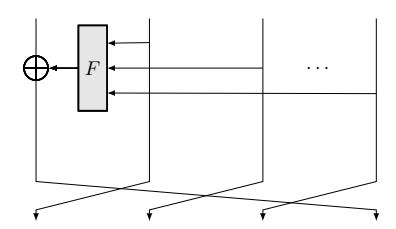

Figure 1: One round of a t-branch unbalanced Feistel network (UFN) with a contracting round function (CRF).

<span id="page-4-1"></span>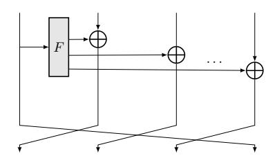

Figure 2: One round of a t-branch unbalanced Feistel network (UFN) with an expanding round function (ERF).

expanding round function (ERF), Nyberg's GFN and a new structure which we call Multi-Rotating (MR). Each of the following constructions is a keyed permutation over  $\mathbb{F}_{2^n}$  or  $\mathbb{F}_p$ . The three main parameters of the block ciphers are denoted by  $[\kappa, t, n]$ . For example, GMiMC<sub>crf</sub>[4n, 4, n] denotes the permutation GMiMC with CRF which has branch size n, key size 4n and number of branches 4. The numbers of rounds for all constructions are given in Table 3. The key schedule is linear and equal for all the proposed designs, and it is discussed in the following. All round constants are chosen randomly and fixed.

The following constructions are defined over  $\mathbb{F}_{2^n}$ . The description over  $\mathbb{F}_p$  is obtained by replacing the XOR-sum  $\oplus$  with the corresponding sum + modulo p.

#### 2.1.1 GMiMC<sub>crf</sub>

An unbalanced Feistel network (UFN) with a contracting round function (CRF) can be written as

$$(X_{t-1}, X_{t-2}, \dots, X_0) \leftarrow (X_{t-2}, X_{t-3}, \dots, X_{t-1} \oplus F(X_{t-2}, \dots, X_0))$$

where  $X_i$  is the input to the *i*-th branch of the Feistel network and  $F(\cdot)$  is a key-dependent function in round j, cf. Figure 1. In GMiMC<sub>crf</sub> we define the j-th round function as

$$F(x_{t-2},\ldots,x_0) := \left(\bigoplus_i x_i \oplus k_j \oplus c_j\right)^3$$

where  $c_j$  and  $k_j$  are respectively the round constant and the key of the round j (for  $1 \le j \le r$ ).

#### 2.1.2 GMiMC<sub>erf</sub>

An unbalanced Feistel network with an expanding round function (ERF) can be written as

$$(X_{t-1}, X_{t-2}, \dots, X_0) \leftarrow (X_{t-2} \oplus F(X_{t-1}), \dots, X_0 \oplus F(X_{t-1}), X_{t-1})$$

<span id="page-5-0"></span>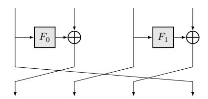

Figure 3: One round of a 4-branch Nyberg Generalized Feistel Network (GFN).

where *X<sup>i</sup>* is the input to the *i*-th branch of the Feistel network and *F*(·) is a key-dependent function in round *j*, cf. Figure [2.](#page-4-1) In GMiMCerf the *j*-th round function is defined as

$$F(x) \coloneqq (x \oplus k_j \oplus c_j)^3$$

where *k<sup>j</sup>* and *c<sup>j</sup>* are as in GMiMCcrf.

#### **2.1.3 GMiMCNyb**

A generalized Feistel network was proposed in [\[60\]](#page-35-8) for an even number of branches and can be written as

$$(X_{t-1},\ldots,X_1,X_0) \leftarrow (X_{t-2} \oplus F_0(X_{t-1}),X_{t-3},\ldots,X_0 \oplus F_{t/2}(X_1),X_{t-1})$$

Each *Fi*(·) in the *j*-th round of GMiMCNyb is defined as

$$F_i(x) := (x \oplus k_{i+j\cdot t/2} \oplus c_{i+j\cdot t/2})^3,$$

where *ci*+*j*·*t/*<sup>2</sup> are distinct constants in round *j* and *ki*+*j*·*t/*<sup>2</sup> are round keys, cf. Figure [3.](#page-5-0)

#### **2.1.4 GMiMCmrf**

In [\[74\]](#page-35-4), Suzaki and Minematsu introduced new variants of the GFN structure where the linear mixing applied after the Feistel functions is a complex permutation rather than a simple rotation. This allowed them to build GFNs operating on *t* = 2*<sup>b</sup>* branches such that full diffusion is achieved in 2*b* rounds rather than the 2*t* rounds needed by a Nyberg-style construction. They later used this approach to build the lightweight block cipher Twine [\[75\]](#page-35-5).

When the number of branches is not a power of 2, the authors of [\[30\]](#page-33-1) proposed a computer search that can find optimal permutations when the number of branches is not too large, typically lower than 30.

Here, we introduce the Multi-Rotating structure for generalized Feistel networks, which provides full diffusion as quickly as a Twine-like structure without the constraint that the number of branches is a power of 2 or lower than a certain threshold. It is also conceptually much simpler and thus easier in practice to apply to a larger number of branches. These improvements come at the cost of the use of a *different mixing layer in each round* which, to the best of our knowledge, has not been considered for a Feistel or generalized Feistel structure so far. However, we note that previously, the Serpent designers (of SPN type) considered using different mixing layers in each round in their design. In particular, they considered using a different linear transformation for even and odd rounds (see [\[20,](#page-32-5) App. A.6]), before settling for their current design.

To introduce the Multi-Rotating Feistel network structure, we first give a general expression of its round function. A *rotated Feistel round* is a permutation R*<sup>s</sup>* parameterized by a rotation amount *s* which operates on an even number of branches and works as

<span id="page-6-0"></span>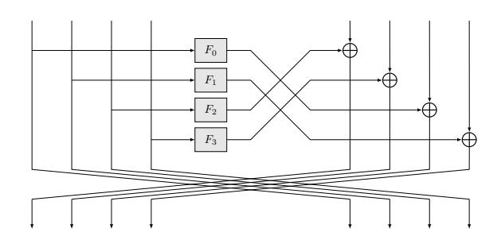

Figure 4: One round  $\mathcal{R}_s$  of an 8-branch Multi-Rotating Feistel network with a rotation by s=2.

follows:

$$(X_{t-1},\ldots,X_0) \leftarrow (X_{t/2-1} + F_{-s}(X_{t-1-g(s,0)}), X_{t/2-1} \oplus F_{1-s}(X_{t-1-g(s,1)}), \ldots, X_0 \oplus F_{t/2-1-s}(X_{t-1-g(s,t/2-1)}), X_{t-1},\ldots,X_{t/2})$$

where the index of the function  $F(\cdot)$  is taken modulo t/2 and  $g(s,i) = s+i \mod t/2$ . This process is summarized in Figure 4. Like in  $GMiMC_{Nyb}$ , each  $F_i$  in the j-th round of  $GMiMC_{mf}$  is defined as

$$F_i(x) := \left( x \oplus k_{i+j\cdot t/2} \oplus c_{i+j\cdot t/2} \right)^3,$$

where  $c_{i+j\cdot t/2}$  are distinct constants in round j and  $k_{i+j\cdot t/2}$  are round keys. By iterating such rounds  $\mathcal{R}_s$  for varying values of s we obtain a block cipher. An instance of such an r-round block cipher is specified using the sequence  $\{s_0, ..., s_{r-1}\}$  of the r rotation amounts used. As explained in Appendix B, it is possible to build a GFN with optimal diffusion by choosing the sequence  $\{s_j\}_{j < r}$  carefully.

We build a GMiMC<sub>mrf</sub> instance operating on t branches using a sequence of rotations  $\{s_j\}_{0 \le j \le r}$  where

<span id="page-6-1"></span>
$$s_{2\ell} = 0$$
, and  $s_{2\ell+1} = 2^{\ell \pmod{\lceil \log_2(t/2) \rceil}}$ . (1)

For instance, if t=32, then  $\log_2(t/2)=4$  and this sequence can be written as  $\{0,1,0,2,0,4,0,8,0,1,0,2,0,4,0,8,0,1,\ldots\}$ , i.e. it consists in as many repetitions as needed of the pattern  $\{0,1,0,2,0,4,0,8\}$  of length  $2\log_2(t/2)=8$ .

To better understand the security of  $GMiMC_{mrf}$ , we now investigate its diffusion. We borrow our definition of diffusion from [74]: if a variable y intervenes in the expression of an internal state word X then we say that X depends on y. If all output words of a (round-reduced) block cipher depend on all input words, we say that this primitive provides full diffusion.

The diffusion provided by  $GMiMC_{mrf}$  using the sequence of rotations from Equation (1) is quantified by the following Theorem, proved in Appendix B.

<span id="page-6-2"></span>**Theorem 1.** Let  $X_j^i$  denote the word with index j at the input of round i, so that for example  $X_j^0$  denotes a plaintext word. Consider a GMiMC<sub>mrf</sub> instance operating on t branches with the rotation sequence in Equation 1. If  $i \geq 2\lceil \log_2(t) \rceil$ , then  $X_j^i$  depends on  $X_{j'}^0$  for any j, j'. The same is true in the backwards direction. In other words, GMiMC<sub>mrf</sub> provides full diffusion after  $2\lceil \log_2(t) \rceil$  rounds.

For the following, we denote by  $\Lambda(t)$  the minimum number of rounds to achieve full diffusion, that is  $\Lambda(t) = 2\lceil \log_2(t) \rceil$ .

**Possible Variants.** Before going on, we refer to Appendix A for possible variants of the GMiMC family of ciphers, e.g. using a round function defined by a different power exponent. As for MiMC (see Section 5 of [4]), it turns out that the power exponent 3 is an optimal choice also for the GMiMC family of ciphers.

#### 2.1.5 Key Schedule

When |k| = n (i.e. the univariate case), then  $k_i = k \ \forall i$ . The key schedule for the multivariate case  $|k| = t \times n$  is a little more complicated. Let  $k = k_0 ||k_1|| \dots ||k_{t-1}||$ , and let M be a  $t \times t$  matrix with elements in  $\mathbb{F}_{2^n}$  or  $\mathbb{F}_p$  that satisfies the following condition:

- M is invertible, that is there exists  $M^{-1}$ ;
- for each  $1 \le i \le \lceil R/t \rceil$  where R is the number of rounds, then

$$M^{i}[j,l] \equiv (\underbrace{M \times M \times .... \times M}_{i\text{-th times}})[j,l] \neq 0$$

for all  $0 \le j, l < t$ , where X[j, l] denotes the coefficient in row j and column l of the matrix X.

For each  $1 \le i \le \lceil R/t \rceil$  let

$$[k_{i\cdot t}||k_{i\cdot t+1}||\dots||k_{(i+1)\cdot t-2}||k_{(i+1)\cdot t-1}|^T = M \times [k_{(i-1)\cdot t}||k_{(i-1)\cdot t+1}||\dots||k_{i\cdot t-2}||k_{i\cdot t-1}|^T.$$

The second condition on M guarantees that each subkey depends linearly on all the first t subkeys. This fact has an important consequence. Consider GMiMC<sub>crf</sub> and/or GMiMC<sub>erf</sub> instantiated with a key schedule that uses the subkeys cyclically, i.e.  $k_{i,j} = \hat{k}_{j \cdot t/2 + i \pmod{t}}$ . If the attacker guesses t-1 subkeys, then she can potentially skip both the first and the last t-1 rounds. Instead, in the case in which each subkey depends linearly on all the first t subkeys, this strategy simply does not apply. As a result, the proposed key schedule allows to save a certain number of rounds (approximately t-1) w.r.t. a key schedule that uses the subkeys cyclically. Similar argumentation - but on a smaller scale - holds for  $GMiMC_{Nyb}$  and  $GMiMC_{mrf}$ .

Remark - Round Constants. As for MiMC, we remark that also the key-schedule of GMiMC consists of a round-constant addition. This is "hidden" in the definition of each round function  $F_i(\cdot)$ , e.g.  $F_i(\cdot) = (\cdot \oplus k \oplus c_i)^3$  for a random round-constant  $c_i$ . We highlight that it is possible to define an equivalent key-schedule where the round-constant addition is already included in the key-schedule, e.g.  $\hat{k}_i := k_i \oplus c_i$  where  $k_i$  is defined by the previous kev-schedule.

#### <span id="page-7-2"></span>2.2 **Hash Function**

To construct the hash function GMiMCHash, we use one of the structures, e.g. the GMiMC<sub>erf</sub>, with fixed subkeys<sup>2</sup>, e.g.  $0^{n \cdot R}$ , where R is the number of rounds. Denoting the fixed key permutation as  $\mathrm{GMiMC}_{\mathsf{erf}}^{\pi}[\kappa,t,n]$ ,  $\mathrm{GMiMCHash}$  is constructed by instantiating a sponge construction [17] with  $\mathrm{GMiMC}_{\mathsf{erf}}^{\pi}[\kappa,t,\log_2 p]$ . The number of rounds of the permutation GMiMC is chosen according to Table 1 - univariate case  $2^{\kappa} \simeq 2^n \simeq p$ .

When the internal permutation  $\mathcal{P}$  of an N-bit sponge function (composed of c-bit capacity and r-bit bitrate -N=c+r) is modeled as a randomly chosen permutation, it has been proven by Bertoni et al. [17] to be indifferentiable from a random oracle up to

<span id="page-7-0"></span> $<sup>^{1}</sup>$ If no matrix exists that satisfies the following condition, then one must choose a matrix M for which the total number of zero coefficients for each  $M^i$  is minimum.

<sup>2</sup>We emphasize that no key schedule is required in this case, since there is no secret-key material.

<span id="page-7-1"></span>

 $2^{c/2}$  calls to  $\mathcal{P}$ . In other words, a sponge with a capacity of c provides  $2^{c/2}$  collision and  $2^{c/2}$  (second) preimage resistance. Given a permutation of size N and a desired security level s, we can hash r = N - 2s bits per call to the permutation.

As usual, the message is first padded according to the sponge specification so that the number of message blocks is a multiple of r, where r is the rate in sponge mode. For GMiMCHash-l we use a GMiMC permutation where  $N=n\cdot t=4\cdot l+1$  and  $s=2\cdot l$ . For GMiMCHash-256 we thus use a GMiMC permutation with  $N=n\cdot t=1024$  or 1025. The rate and the capacity are chosen as 512 and 513 respectively. This choice allows for processing the same amount of input bits as SHA-256 (512 bits) while at the same time offering collision security nd preimage security of 256 bits. We highlight that while we could use any of the GMiMC constructions, GMiMC<sub>erf</sub> turns out to be the most efficient choice in several settings as shown in Section 7.2.

### <span id="page-8-0"></span>3 Security Analysis

As for any new design, it is paramount to present a concrete security analysis. In the following, we provide an in-depth analysis of the security of the GMiMC family of block ciphers. In particular, for each proposal we consider the maximum number of rounds that can be attacked by the attacks currently present in the literature.

**Important Remark.** Due to our target applications, here we limit ourselves to provide the number of rounds to guarantee security **only** in the following two scenarios:

- GMiMC instantiated over  $\mathbb{F}_p$  such that the size of the prime is 128 bit or more (used for applications like SNARKs and MPC);
- GMiMC instantiated over  $\mathbb{F}_{2^n}$  in the low-data scenario (used for application like PQ-Signature Scheme).

We stress that this choice is motivated by the fact that we focus on the scenario that are useful for our applications. Thus, even if GMiMC can be instantiated over  $\mathbb{F}_{2^n}$ , we do not provide the number of rounds to guarantee security in this scenario.

Before going on, we remark that many (almost all) attacks work in the same way in  $\mathbb{F}_p$  and in  $\mathbb{F}_{2^n}$ . One of the few exception to this fact is the higher-order differential attack. More details on this fact are given in the following.

Security Analysis – GMiMC instantiated over  $\mathbb{F}_p$ . Almost all the attacks are independent of the fact whether (a) the size of the key is equal to the branch size  $\kappa=n$  (equivalently,  $2^{\kappa} \simeq p$  for the  $\mathbb{F}_p$  case) or (b) equal to  $\kappa=N=t\cdot n$  (equivalently,  $2^{\kappa}\simeq p^t$  for the  $\mathbb{F}_p$  case). Table 1 and Table 2 summarize the minimum number of rounds required to guarantee the security against several possible attacks respectively in the first and in the second case - we assume t>2 in both cases. The number of rounds of GMiMC is then chosen in order to provide security to all possible attack vectors.

Since the cryptanalysis strategy of the four proposals are very similar, in Sect. 3 the following we give a complete analysis only for  $GMiMC_{crf}$ , while we refer to Appendix C–D for the analysis of the other proposals. Starting from the results proposed in the following section, in Section 6 we list the minimum number of rounds for each construction, together with some useful observations for the possible applications like MPC, SNARKs and post-quantum signature schemes.

*Note:* given the number of rounds of a distinguisher that is independent of the secret key, we decided to add 2 rounds - in order to prevent key-guessing attack - for the univariate case. For the multivariate case, we decided to add (t+1) rounds - in order to prevent

<span id="page-9-0"></span>Table 1: Minimum number of rounds required to provide security of GMiMC instantiated over  $\mathbb{F}_p$  against the corresponding attacks when  $2^{\kappa} \simeq 2^n \simeq p$  — no restriction on data complexity - and t > 2. We recall that  $\Lambda(t) := 2\lceil \log_2(t) \rceil$ . For simplicity,  $2 \cdot \log_3(2) = 1.262$ .

|                                   | $\mathrm{GMiMC}_{crf}$                                                   | $\mathrm{GMiMC}_{erf}$                                                             |
|-----------------------------------|--------------------------------------------------------------------------|------------------------------------------------------------------------------------|
| GCD                               | $[1.262 \cdot \log_2(p) - 4\log_3(\log_2(p))] + 2t$                      | $[1.262 \cdot \log_2(p) - 4 \cdot \log_3(\log_2(p))] + 2t - 2$                     |
| Interpolation                     | $[1.262 \cdot \log_2(p)] + 4t - 3$                                       | $\lceil 1.262 \cdot \log_2(p) \rceil + 2t$                                         |
| Higher Order (in $\mathbb{F}_p$ ) | $2 + 4t + \lceil 2\log_3(t) \rceil$                                      | $2 + 2t + \lceil 2\log_3(t) \rceil$                                                |
| (Trunc.) Differential             | $2 + \left[ (t^2 + t) \times \frac{\log_2(p)}{2(\log_2(p) - 1)} \right]$ | $2 + \left\lceil (t^2 + t) \times \frac{\log_2(p)}{2(\log_2(p) - 1)} \right\rceil$ |
| Impossible Diff.                  | 3t-1                                                                     | $\frac{1}{2t}$                                                                     |
|                                   | $\mathrm{GMiMC}_{Nyb}$                                                   | $\mathrm{GMiMC}_{mrf}$                                                             |
| GCD                               | $[1.262 \cdot \log_2(p) - 4\log_3(\log_2(p))] + t + 2$                   | $\lceil 1.262 \cdot \log_2(p) - 4 \cdot \log_3(\log_2(p)) \rceil + \Lambda(t) + 4$ |
| Interpolation                     | $\lceil 1.262 \cdot \log_2(p) \rceil + t + 2$                            | $\lceil 1.262 \cdot \log_2(p) \rceil + 2\Lambda(t) + 4$                            |
| Higher Order (in $\mathbb{F}_p$ ) | $2+t+\lceil 2\log_3(t)\rceil$                                            | $2 + 2\Lambda(t) + \lceil 2\log_3(t) \rceil$                                       |
| (Trunc.) Differential             | 3t+2                                                                     | $3\Lambda\left(t\right)+2$                                                         |
| Impossible Diff.                  | 2t                                                                       | $2\Lambda(t)$                                                                      |

<span id="page-9-1"></span>Table 2: Minimum number of rounds required to guarantee the security of GMiMC instantiated over  $\mathbb{F}_p$  against the corresponding attacks when  $2^\kappa \simeq 2^N \simeq p^t$  - no restriction on data complexity - and t>2. We recall that  $\Lambda(t) \coloneqq 2\lceil \log_2(t) \rceil$ . For simplicity,  $2 \cdot \log_3(2) = 1.262$ .

| .03( )                            |                                                                               |                                                                                               |
|-----------------------------------|-------------------------------------------------------------------------------|-----------------------------------------------------------------------------------------------|
|                                   | $\mathrm{GMiMC}_{crf}$                                                        | $\mathrm{GMiMC}_{erf}$                                                                        |
| Guess + GCD                       | $\lceil 1.262 \cdot \log_2(p) - 4 \log_3(\log_2(p)) \rceil + 3t - 1$          | $\lceil 1.262 \cdot \log_2(p) - 4 \cdot \log_3(\log_2(p)) \rceil + 3t - 3$                    |
| Interpolation                     | $\lceil 1.262 \cdot \log_2(p) \rceil + 5t - 4$                                | $\lceil 1.262 \cdot \log_2(p) \rceil + 3t - 2$                                                |
| Gröbner Basis                     | $\lceil 0.631 \cdot \log_2(p) + 2\log_3(t) \rceil + 4t - 3$                   | $\lceil 0.631 \cdot \log_2(p) + 2\log_3(t) \rceil + 4t - 5$                                   |
| Higher Order (in $\mathbb{F}_p$ ) | $1 + 5t + \lceil 2\log_3(t) \rceil$                                           | $1 + 3t + \lceil 2\log_3(t) \rceil$                                                           |
| $(Trunc.) \ \ Differential$       | $1 + t + \left[ (t^2 + t) \times \frac{\log_2(p)}{2(\log_2(p) - 1)} \right]$  | $1 + t + \left[ (t^2 + t) \times \frac{\log_2(p)}{2(\log_2(p) - 1)} \right]$                  |
| Impossible Diff.                  | 4t-2                                                                          | 3t-1                                                                                          |
| "Generic" Attack                  | 5t-3                                                                          | 4t-2                                                                                          |
|                                   | $\mathrm{GMiMC}_{Nyb}$                                                        | $\mathrm{GMiMC}_{mrf}$                                                                        |
| Guess + GCD                       | $\left\lceil 1.262 \cdot \log_2(p) - 4\log_3(\log_2(p)) \right\rceil + t + 3$ | $\lceil 1.262 \cdot \log_2(p) - 4 \cdot \log_3(\log_2(p)) \rceil + \Lambda\left(t\right) + 5$ |
| Interpolation                     | $\lceil 1.262 \cdot \log_2(p) \rceil + t + 3$                                 | $\lceil 1.262 \cdot \log_2(p) \rceil + 2\Lambda(t) + 5$                                       |
| Gröbner Basis                     | $[0.631 \cdot \log_2(p) + 2\log_3(t)] + t + 2$                                | $\left\lceil 0.631 \cdot \log_2(p) + 2\log_3(t) \right\rceil + \Lambda\left(t\right) + 2$     |
| Higher Order (in $\mathbb{F}_p$ ) | $3 + t + \lceil 2 \log_3(t) \rceil$                                           | $3 + 2\Lambda(t) + \lceil 2\log_3(t) \rceil$                                                  |
| (Trunc.) Differential             | 3t+3                                                                          | $3\Lambda\left(t\right)+3$                                                                    |
| Impossible Diff.                  | 2t+1                                                                          | $2\Lambda(t) + 1$                                                                             |
| "Generic" Attack                  | -                                                                             | -                                                                                             |
|                                   |                                                                               |                                                                                               |

key-guessing attack - for  $GMiMC_{crf}$  and  $GMiMC_{erf}$ , and 3 rounds - in order to prevent key-guessing attack - for  $GMiMC_{Nyb}$  and  $GMiMC_{mrf}$ . This choice is supported by the definition of the key-schedule, in particular by the fact that each subkey depends linearly on all the first t subkeys (we refer to the previous section for details).

Security Analysis – GMiMCHash instantiated over  $\mathbb{F}_p$ . For the hash function GMiMCHash case, the number of rounds of the inner permutation is chosen according to the corresponding univariate case (referring to Table 1). This is due to the following considerations. First, as we just recalled in the previous section, when the internal permutation  $\mathcal{P}$  of an N=c+r bit sponge function is modeled as a randomly chosen permutation, the sponge hash function is indifferentiable from a random oracle up to  $2^{c/2}$  calls to  $\mathcal{P}$ . The numbers of rounds of the univariate case is sufficient to guarantee security against any (secret-/known-/chosen-) distinguisher which is independent of the key. Equivalently, this means that such

number of rounds guarantee that P does not present any non-random/structural property (among the ones known in the literature[3](#page-10-0) ). It follows that the previous assumption is satisfied. These and the fact that every key-recovery attack is meaningless in the hash scenario support our choice to consider the univariate case in order to determine the number of rounds of the inner permutation.

Before going on, we remark that the fact that P presents a non-random/structural property does not imply an attack on the hash sponge function instantiated by P. To have a concrete example, consider Keccak (SHA-3). A zero-sum distinguisher can be set up for the *full* 24-round internal permutation that defines it - see for example [\[26,](#page-32-7) [43\]](#page-34-6). In other words, the internal permutation that defines Keccak presents a non-random property, that is it does not look like a pseudo-random permutation[4](#page-10-1) . On the other hands, the best practical collision attack cover ("only") up to 6 rounds Keccak [\[66\]](#page-35-9), which is still far from threatening the security of the full 24-round Keccak family.

**Security Analysis – GMiMC instantiated over** F**2***<sup>n</sup>* **in the low-data scenario.** For some practical applications considered in the following, we also consider the case in which the attacker has a limited access to data (e.g. 1 or 2 (plaintext, ciphertext) pairs). The security analysis for this particular case is proposed in Sect. [5.](#page-19-0) As we are going to show, due to the fact that the attacker can have access to few (plaintext, ciphertext) pairs, only few attacks (e.g. the GCD one) apply to this case. We remark that all the attacks that we are going to consider in this scenario work in the same way in F2*<sup>n</sup>* and F*p*. As a result, we mainly re-use the results proposed in the Sect. [4.](#page-10-2)

### <span id="page-10-2"></span>**4 Security Analysis – GMiMC instantiated over** F*<sup>p</sup>*

### **4.1 Algebraic Attacks**

In this section, we consider algebraic attacks against GMiMC. These attacks are particularly relevant to applications which only make a limited number of (plaintext, ciphertext) pairs available to the attacker.

A key datum for all these attacks is the degree reached in each of our constructions after *r* rounds. Here we propose an analysis for the case of GMiMCcrf (similar for all other constructions).

**Grow of the Degree of GMiMCcrf.** Consider the *t*-branch, univariate case for GMiMCcrf and denote the branches by (*Xt*−1*, . . . , X*2*, X*1*, X*0). Given a known plaintext, the degree *d<sup>i</sup>* of the key in the branch *X<sup>i</sup>* for *i* = 0*, . . . , t* − 1 after *r* rounds is

$$d_i = \begin{cases} 3^{r-i} & \text{if } r > i, \\ 0 & \text{otherwise.} \end{cases}$$
 (2)

Note that *dt*−<sup>1</sup> = min*<sup>i</sup> d<sup>i</sup>* .

Considering the *t*-branch multivariate case, the degrees of the *t* keys growth differently in the *t* multivariate polynomials corresponding to the *t* branches of the Feistel network. In round *r*, the polynomial of the leftmost branch has the least degrees, which are given by

<span id="page-10-3"></span>
$$d_{i,j} = \begin{cases} 3^{r-(i-1)-j} & \text{if } r > i+j-1, \\ 0 & \text{otherwise.} \end{cases}$$
(3)

<span id="page-10-0"></span><sup>3</sup>That is, we do not exclude that a non-random property can be discovered in the future.

<span id="page-10-1"></span><sup>4</sup>We also refer to [\[16\]](#page-32-8) for a detailed discussion about this topic.

where *j* = *t* − 1 denotes the leftmost branch and the degree of variable *k<sup>i</sup>* in branch *j* is *di,j* . For all (algebraic) attacks in the following, we only care of the minimum degree:

$$d_{t-1,t-1} = \min_{i} \min_{j} d_{i,j} = 3^{r-2t+2},$$

where 0 ≤ *i* ≤ *t* − 1 and 0 ≤ *j < t*.

Finally, the degree of each word of the plaintext in the *t*-branch is given by formula [\(3\)](#page-10-3) both for the univariate and multivariate cases.

#### **4.1.1 Greatest Common Divisors**

As for the original MiMC [\[4\]](#page-31-3), an attack strategy is to compute Greatest Common Divisors (GCD). In particular, given more than one known (plaintext, ciphertext) pair or working on the output of different branches of a single known (plaintext, ciphertext) pair (as described in the following), one can construct their polynomial representations and compute their polynomial GCD to recover a multiple of the key[5](#page-11-0) . Note that this is a known-plaintext attack, and not a chosen-plaintext one.

*Since interpolation attack is more efficient than GCD attack (from the attacker point of view)*, we refer to Section [5.1](#page-20-0) and Appendix [C.4](#page-41-0) for all details about GCD attack. For each GMiMC family of block ciphers, we refer to Table [1](#page-9-0) for the minimum number of rounds that ensure security against the GCD attack.

Before going on, we remark that this is one of the few attacks that applies in the low-data scenario, considered in one of the following applications (i.e. post-quantum signatures). More details on this fact are given in the following.

#### <span id="page-11-1"></span>**4.1.2 Gröbner Bases**

The natural generalization of GCDs to the multivariate case is the notion of a Gröbner basis [\[34\]](#page-33-10). The attack proceeds like the GCD attack with the final GCD computation replaced by a Gröbner basis computation. Due to the Feistel structure, we highlight that it is possible to construct multivariate "meet-in-the-middle" polynomials – we denote their degree as *d<sup>i</sup>* in this subsection and define *d* = min*<sup>i</sup> d<sup>i</sup>* .

**Complexity** For generic systems, the complexity of computing a Gröbner basis for a system of N polynomials in V variables is

$$\mathcal{O}\left(\begin{pmatrix} \mathfrak{V} + D_{reg} \\ D_{reg} \end{pmatrix}^{\omega}\right) \tag{4}$$

operations over the base field F [\[19\]](#page-32-9), where *Dreg* is the *degree of regularity* and 2 ≤ *ω <* 3 is the linear algebra constant. We note that the memory requirement of these algorithms is of the same order as running time. The degree of regularity depends on the degrees of the polynomials *d* and the number of polynomials N. When V = N, we have a simple closed form [\[12\]](#page-31-8)

$$D_{reg} = 1 + \sum_{i=0}^{\mathfrak{N}-1} (d_i - 1),$$

where *d<sup>i</sup>* is the degree of the *i*-th polynomial *f<sup>i</sup>* in the polynomial system we are trying to solve. In the over-determined case, i.e., V *<* N, the degree of regularity can be estimated by developing the Hilbert series of an ideal generated by generic polynomials h*f*0*, . . . , f*N−1i

<span id="page-11-0"></span>Improving the computational complexity of this attack using more pairs is an open problem. However, since the cost is dominated by the size of the polynomials involved, it is not clear that significant improvements are possible.

of degrees  $d_i$ . We stress that this analysis presumes that the polynomials considered here behave like generic systems, which is in accordance with our practical experiments. Closed form formulas for  $D_{reg}$  are known for some special cases, but not in general.

In particular, each plaintext/ciphertext pair – denoted by  $p, c \in (\mathbb{F}_{2^n})^t$  where  $p \equiv (p_0, ..., p_{t-1})$  and  $c \equiv (c_0, ..., c_{t-1})$  – gives a system of t equations

$$\forall i = 0, ..., t - 1:$$
  $c_i = f_i(p_0, ..., p_{t-1}, k_0, ..., k_{t-1})$

in t variables  $k_0, ..., k_{t-1}$  (note that the key-schedule is linear), where  $f_i$  are functions of degree d. The introduction of new intermediate variables to reduce the degree of the involved polynomials does not lead to a reduced solving time as this increases the number of variables.

On the other hand, depending on parameter choices, the hybrid approach [18, 19] which combines exhaustive search with Gröbner basis computations may lead to a somewhat reduced cost. Following [18, 19], guessing  $\varphi \leq t$  components of the key leads to a complexity of  $\mathcal{O}\left(p^{\varphi} \cdot \binom{\mathfrak{I}-\varphi+D'_{reg}}{D'_{reg}}\right)^{\omega}$ , where  $D'_{reg} \leq D_{reg}$  is the degree of regularity for the system of equation after substituting  $\varphi$  variables with their guesses. Noting, though, that guessing a variable in a monomial reduces its degree and that guesses only affect a subset of rows in the Macaulay matrix, we will more conservatively assume an overall cost of

$$\mathcal{O}\left(p^{\varphi} \cdot \begin{pmatrix} \mathfrak{V} - \varphi + D'_{reg} - 1 \\ D'_{reg} - 1 \end{pmatrix}^{\omega}\right). \tag{5}$$

Many known pairs Each new (plaintext, ciphertext) pair provides a new polynomial while keeping the number of unknowns  $\mathfrak{V}=t$  constant. Thus, given that there are  $\binom{t+d}{d}$  monomials of degree less than or equal to d in t unknowns, we may simply collect  $\binom{t+d}{d}$  polynomials from the same number of known (plaintext, ciphertext) pairs. In this over-determined case (that is, number of equations  $n_e$  bigger than number of variables  $n_v$ ), there is no closed formula to compute  $D_{reg}$ . By definition, the degree of regularity is defined as the index of the first non-positive coefficient in

$$H(z) = \frac{\prod_{i=1}^{n_e} (1 - z^{d_i})}{(1 - z)^{n_v}} = \frac{(1 - z^{3^r})^{n_e}}{(1 - z)^{n_v}} = (1 - z^{3^r})^{n_e - n_v} \cdot (1 + z + z^2)^{n_v},$$

where  $n_e$  is the number of equations,  $n_v$  is the number of variables, and  $d_i = 3^r$  is the degree of the *i*-th equation. By simple observation, the index of the first non-positive coefficient can not be smaller than  $d = 3^r$ , since  $(1 + z + z^2)^{n_v}$  contains only positive terms. Thus, the overall complexity becomes  $\mathcal{O}(\binom{t+d}{d})^{\omega}$  with the hidden constant  $\geq 1$ . Following the method above, we expect  $D'_{reg} = D_{reg} - 1 = d - 1$  for the hybrid approach. Plugging the (MiMT) degrees from the previous sections into d then produces the expected overall solving time.

**GMiMC**<sub>crf</sub> (Case:  $2^{\kappa} \simeq p^t$ ). To prevent the Gröbner basis attack, the minimum number of rounds r must satisfy  $p^{\varphi} \cdot \binom{t-\varphi+d-1}{d-1}^{\omega} \geq p^t$ , for all  $\varphi \in \{0,\ldots,t-2\}$  and where the degree d is a function of the number of rounds r, that is, d=d(r). For our parameter choices, this expression is minimized for  $\varphi=0$ . We thus require

$$\binom{t+d}{d}^{\omega} = \binom{t+3^{r-2t+2}}{3^{r-2t+2}}^{\omega} \approx p^t.$$

Since

$$\binom{t+d}{d} = \frac{(d+t)!}{d! \cdot t!} \ge \frac{\prod_{i=1}^{t} (d+i)}{t^t} \ge (d/t)^t,$$

where  $n! \le n^n$  for each  $n \ge 1$ , and, setting  $\omega = 2$ , we obtain  $2t \log_2(d/t) = 2t \log_2(3^{r-2t+2}/t) \approx \log_2(p) t$  or

$$r = 2t + \lceil 1/2 \log_2(p) \cdot \log_3 2 - 2 + \log_3 t \rceil$$

. To thwart Meet-in-the-Middle attacks, this value is doubled.

To conclude, we emphasize that we use  $d(r) = 3^{r-2t+2}$  in order to compute the previous number of rounds. Since  $3^{r-2t+2}$  is the minimum of the degrees of the variables, it is plausible that a lower number of rounds is sufficient to protect against Gröbner basis attacks. Also, we reiterate that these attacks require roughly the same amount of memory as elementary operations. The same consideration holds for the other ciphers of the GMiMC family.

#### <span id="page-13-2"></span>4.1.3 Interpolation Attack

As for the original MiMC, one of the most powerful attacks against the GMiMC family is the interpolation attack, introduced by Jakobsen and Knudsen [49] in 1997. The strategy of the attack is to construct a polynomial corresponding to the encryption function without knowledge of the secret key. If an adversary can construct such a polynomial then for any given plaintext the corresponding ciphertext can be produced without knowledge of the secret key.

Let  $E_k: \mathbb{F}_q \to \mathbb{F}_q$  be an encryption function. For a randomly fixed key k, the polynomial P(x) representing  $E_k(x)$  – where x is the indeterminate corresponding to the plaintext – can be constructed using the  $Vandermonde\ matrix^6$  - cost approximately of  $\mathcal{O}(m^2)$  - or the Lagrange's theorem<sup>7</sup> - cost approximately of  $\mathcal{O}(m \cdot \log m)$ , where m is the number of monomials.

This method can be extended to a key-recovery attack. The attack proceeds by simply guessing the key of the final round, decrypting the ciphertexts and constructing the polynomial for r-1 rounds. With one extra (plaintext, ciphertext) pair, the attacker checks whether the polynomial is correct.

Each output branch of a (balanced or unbalanced) Feistel network can be represented as a multivariate polynomial where the variables are the inputs to each branch. If the maximum degree of a single variate monomial in one of these output polynomials is low, then an attacker can exploit this property to mount an attack on the block cipher.

Using this idea, we first briefly describe at high level generic attack(s) on the GMiMC block ciphers, focusing on a t-branch Feistel network. Let us denote the t input branches as  $x_{t-1},...,x_1$  and  $x_0$  from left to right. Suppose the polynomials over the field representing the output branches are denoted by  $P_i \in \mathbb{F}_{2^n}[X]$  (i=0,1,...,t-1) and  $d_i$  denotes the degree of the polynomial  $P_i$ . Working as in [49], the number of monomials of such polynomial is well approximated by  $\prod_{i=0}^{t-1} (d_i+1)$ . It follows that if the condition

$$\prod_{i=0}^{t-1} (d_i + 1) \approx 2^N \simeq p^t$$

<span id="page-13-0"></span><sup>&</sup>lt;sup>6</sup>The interpolation polynomial  $P(x) = a_t x^t + a_{t-1} x^{t-1} + ... + a_1 x + a_0$  interpolates the data points  $(x_i, y_i)$  in the sense that  $P(x_i) = y_i$  for all  $i \in \{0, 1, ..., t\}$ , where  $E_k(x_i) = y_i$  for each i. By substituting the first equation in here, one gets a system of linear equations in the coefficients  $a_j$ . By solving this system for  $a_j$ , one can construct the interpolant polynomial P(x). If one re-writes this system in a matrix-vector form, the matrix defined by the terms  $\{x_i^j\}_{0 \le i,j \le t}$  is commonly referred to as a Vandermonde matrix, and the cost to invert a  $(t+1) \times (t+1)$  Vandermonde matrix (i.e. to construct the interpolation polynomial) is  $\mathcal{O}(t^2)$ .

<span id="page-13-1"></span><sup>7</sup> If the polynomial has degree d, we can find it using Lagrange's formula  $P(x) = \sum_{i=0}^{d} y_i \cdot \prod_{0 \le j \le d, i \ne j} \frac{x - x_j}{x_i - x_j}$ , where  $E_k(x_i) = y_i$  for  $i = 0, 1, \ldots d$ .

is fulfilled, then the attacker requires the full code-book in order to construct the interpolation polynomial[8](#page-14-0) . As a result, such polynomial can not be used for a key-recovery attack or for a forgery attack.

**GMiMCcrf.** As we have just seen in [\(3\)](#page-10-3), the minimum degree of the output polynomials for each branch (after *r* rounds) is lower bounded by 3 *<sup>r</sup>*−2*t*+2. Due to the previous discussion, GMiMCcrf is secure against interpolation attack if (3*<sup>r</sup>*−2*t*+2) *<sup>t</sup>* ≈ 2 *N* ' *p t* . Hence,

$$r \geq \frac{\log_2(p)}{\log_2 3} + (2t-2)$$

rounds will be secure against the above-mentioned attacks. Conservatively, 2*r* + 2 rounds will be secure against meet-in-the-middle attacks/distinguishers for the case 2 *κ* ' *p*, while 2*r* + *t* + 1 rounds will be secure against meet-in-the-middle attacks/distinguishers for the case 2 *κ* ' *p t* .

**Remark - Interpolation and Forgery Attack.** One may ask if a similar attack is meaningful in the case of a permutation or/and in the case in which there is no secret material (e.g. known-/chosen-key distinguisher).

Here P denotes a permutation or a cipher with a fixed known/chosen key. Assume it is possible to construct the interpolation polynomial *without* using the full code-book. In this case, such a polynomial can be exploited to set up a *forgery attack* on the permutation P, which is instead not possible for a (pseudo-)random permutation.

This fact can have a *potential* consequence/effect in the case in which such permutation P is used to set up an hash function based on the sponge construction. As proved in [\[17\]](#page-32-6), when the internal permutation P of an *N* = *c* + *r* bit sponge function is modeled as a randomly chosen permutation, the sponge hash function is indifferentiable from a random oracle up to 2 *c/*2 calls to P. If the previous forgery (interpolation) attack can be used to distinguish P from a randomly chosen permutation (that is, to highlight a non-random property of P), then the result proposed in [\[17\]](#page-32-6) does not apply to such a sponge function instantiated by P.

In conclusion, in order to avoid such a distinguisher, it is sufficient that the number of rounds of the inner permutation GMiMC - instantiated with a fixed key - of the sponge construction is equal to the number of rounds necessary to prevent the interpolation attack discussed in this section (equivalently, the number of rounds necessary to ensure that the internal permutation has maximum degree).

#### <span id="page-14-1"></span>**4.1.4 Higher-Order Differential**

Let L A be an affine space. Higher-order differential attacks [\[53\]](#page-34-7) exploit the fact that *<sup>x</sup>*∈A *P*(*x*) = 0 if the dimension of A is higher than the degree of *P*(·). In other words, a higher-order differential attack can be mounted by choosing an affine space — like A of dimension *d* + 1 (or, equivalently, of size 2 *<sup>d</sup>*+1) if *P* has degree at most *d*. To thwart higher-order differential attacks, the number of rounds must be chosen in order to ensure that the algebraic degree of the GMiMC family of block ciphers is bigger than the biggest subspace in F.

**Higher-Order Differential in** F*<sup>p</sup>* **versus Higher-Order Differential in** F**2***<sup>N</sup>* **.** Due to the strategy exploited by the higher-order differential attack, there is a crucial difference between the cases F2*<sup>N</sup>* and F*p*.

<span id="page-14-0"></span><sup>8</sup>Due to the cost to construct the interpolation polynomial (approximately O (*m* log *m*) where *m* is the number of monomials), we emphasize that the cost of such attack is higher than the cost of a brute-force attack if condition [\(4.1.3\)](#page-13-2) is satisfied)

As we have just seen, given a function  $f(\cdot)$  of degree d, the sum over the outputs of the function applied to all elements of a vector space  $\mathcal{V}$  of dimension  $\geq d+1$  is zero. The crucial point here is that the previous result holds if  $\mathcal{V}$  is a (sub)space, and not only a generic set of elements. While  $\mathbb{F}_{2^m}$  is always a subspace of  $\mathbb{F}_{2^n}$  for each  $m \leq n$ , the only subspaces of  $\mathbb{F}_p$  are  $\{0\}$  and  $\mathbb{F}_p$ . It follows that the biggest subspace of  $(\mathbb{F}_p)^t$  has dimension t, with respect to the biggest subspace of  $(\mathbb{F}_{2^n})^t$ , which has dimension  $n \cdot t = N$ .

This fact has an important impact on the higher-order differential attack: if a cipher is instantiated over  $\mathbb{F}_p$ , then a lower degree (and hence a smaller number of rounds) is sufficient to protect it from the higher-order differential attack with respect to the number of rounds required for the  $\mathbb{F}_{2^N}$  case. In particular, it is sufficient that both the encryption and the decryption functions have degree at most t, w.r.t. degree N for the  $\mathbb{F}_p$  case.

**Higher-Order Differential on GMiMC instantiated over**  $\mathbb{F}_p$ . Due to the analysis proposed in 4.1.3, the minimum degree of GMiMC<sub>crf</sub> after r > 2t-1 rounds is (at least)  $3^{r-2t}$ . The condition  $3^{r-2t} \ge t$  is satisfied by  $r \ge 2t + \log_3(t)$ . Finally, we add 2 rounds to avoid key-guessing attack for the univariate case and t+1 rounds for the multivariate case.

We refer to App. C.2 for all details about the other constructions.

**Higher-Order Differential on GMiMC instantiated over**  $\mathbb{F}_{2^n}$  **– Some Remarks.** Since we do not require GMiMC instantiated over  $\mathbb{F}_{2^n}$  for our target applications, we stress that we do not provide any claim about the minimum number of rounds necessary to protect GMiMC w.r.t. an higher-order differential over  $\mathbb{F}_{2^n}$ . For completeness, here we briefly discuss this case.

In order to choose the number of rounds, one has to estimate the growth of the degree. First of all, since the degree of the round function in its algebraic representation in  $\mathbb{F}_{2^n}$  is only 2, the algebraic degree of one round is 2 as well. Clearly, the algebraic degree of the cipher after r rounds is bounded from above by  $2^r$ . However, a better and more realistic upper bound can be evaluated by using the division property [76], introduced by Todo at Eurocrypt 2015. As a main result, it turns out that the degree of the function – when it is iterated – grows in a much smoother way than expected when it approaches the number of variables. For instance, the degree of the composition of two functions  $G \circ F(\cdot)$  can always be upper-bounded by  $\deg(G \circ F) \leq \deg(G) \cdot \deg(F)$ . This trivial bound, however, is often very little representative of the true degree of the permutation, in particular if we are trying to estimate the degree after a high number of rounds. An analogous result for SPN ciphers was previously found by e.g. Boura et al. [26].

While the (just cited) results proposed by Boura et al.work for SPN ciphers, no equivalent results is given in the literature for Feistel constructions. Moreover, division property is a useful tool to study the growth of the degree when one considers a single cipher instantiated by fixed parameters n and t (or a "small" number of them), but it does not provide a generic formula that can work for any possible choice of parameters n and t. However, due to the scope of this work, the choice of the parameters depends on the performance of the practical applications, and it cannot be done in advance. In conclusion, a future open problem would be to determine a tight bound for the growth of the degree for a generic Feistel construction, as the one provided in [26].

**Zero-Sum Partitions and Sponge GMiMCHash.** Here we briefly discuss how to apply the previous analysis in the case of a sponge construction instantiated by one of the GMiMC structures, e.g. the GMiMC<sub>erf</sub>, with a fixed key, e.g.  $0^{\kappa}$ . Since the key is fixed,

<span id="page-15-0"></span><sup>&</sup>lt;sup>9</sup>Note that the attacker works at word level (i.e. with element of  $\mathbb{F}_p$ ) in the case of an higher order differential attack instantiated over  $\mathbb{F}_p$ . Instead, for the case  $\mathbb{F}_{2^n}$ , the attacker can work both at word level (i.e. with element of  $\mathbb{F}_{2^n}$ ) or at bit level (i.e. with element of  $\mathbb{F}_2$ ).

the previous key-recovery attacks are meaningless. On the other hand, previous analysis about the degree of GMiMC can be applied also in this scenario.

As showed in [17] and recalled in Section 2.2, when the internal permutation  $\mathcal{P}$  of a sponge function is modeled as a randomly chosen permutation, then the sponge construction is indifferentiable from a random oracle up to  $2^{c/2}$  calls to  $\mathcal{P}$ . To apply such result, we require that GMiMC does not present any non-random/structural property.

A possible distinguisher that can be set up in order to distinguish the permutation  $GMiMC^{\pi}$  from a (pseudo-)random one is the one based on the *zero-sum partition*.

**Definition 1** (Zero-sum Partition [25]). Let P be a permutation from  $\mathbb{F}_{2^n}$  to  $\mathbb{F}_{2^n}$ . A zero-sum partition for P of size  $K = 2^k \nleq 2^n$  is a collection of  $2^k$  disjoint sets  $\{X_1, X_2, ..., X_k\}$  sets with the following properties:

- $X_i = \{x_1^i, ..., x_{2n-k}^i\} \subset \mathbb{F}_{2n}$  for each i = 1, ..., k and  $\bigcup_{i=1}^{2^{n-k}} X_i = \mathbb{F}_{2n}$ ;
- for each  $i = 1, ..., 2^k$ , the set  $X_i$  satisfies zero-sum [11]

$$\bigoplus_{j=1}^{2^k} x_j^i = \bigoplus_{j=1}^{2^k} P(x_j^i) = 0.$$

A similar definition works also in the case of  $(\mathbb{F}_p)^t$ . Remember that if f is a k-degree function on  $\mathbb{F}_{2^n}$ , then  $\bigoplus_{v \in V \oplus a} f(v) = 0$  for any (k+1)-dimension subspace  $V \subseteq \mathbb{F}_{2^n}$ , where  $V \oplus a$  is an arbitrary coset of a space V.

To avoid this distinguisher, it is sufficient that to double the number of rounds of the permutation  $GMiMC^{\pi}$  - that is, GMiMC instantiated with a fixed key - given before necessary to prevent the higher-order differential attack discussed in the previous section. If this is not the case, a zero-sum partition on  $GMiMC^{\pi}$  can be mounted.

For completeness, we recall that, while it is known how to construct a zero-sum<sup>10</sup> for a random permutation (see [11, 16] for details), there is no way – to the best of our knowledge – to construct a zero-sum partition for a random permutation without using a brute-force approach. In conclusion, in the case in which GMiMC is instantiated with a lower number of rounds than the one determined by the higher-order differential attack, the permutation GMiMC  $^{\pi}$  does not look like a pseudo-random one.

Finally, we remark that a similar approach based on zero-sum partitions is largely used in the literature to set up attack or to investigate the security of (the inner permutation of) sponge hash functions (see e.g. Keccak [11, 25, 44], PHOTON [78], ...).

#### <span id="page-16-1"></span>4.2 Statistical Attacks

Here we consider statistical attacks against GMiMC. Unlike the algebraic analysis above, statistical attacks do not explicitly consider the number of variables involved in the output polynomials representing the (reduced-round) cipher.

Moreover, all statistical attacks that we are going to analyze work in the same way both for the case in which GMiMC is instantiated over  $\mathbb{F}_p$  or/and over  $\mathbb{F}_{2^n}$ . For this reason, in the following we do *not* study separately the two scenario.

#### 4.2.1 Classical and Truncated Differential Cryptanalysis

Differential cryptanalysis and its variations are the most widely used techniques to analyze symmetric-key primitives. The differential probability of any function over the finite field  $\mathbb{F}_{2^n}$  is defined as

$$\Pr[\alpha \to \beta] := |\{x : f(x) + f(x + \alpha) = \beta\}|/2^{n}.$$

<span id="page-16-0"></span><sup>&</sup>lt;sup>10</sup>We remark that for a zero-sum, it is sufficient to find a *single* set  $Z \equiv \{z_i\}_i$  s.t.  $\bigoplus_i z_i = \bigoplus_i P(z_i) = 0$ .

It is well known that the function  $f(x) = x^3$  is Almost Perfect Non-linear (APN) [61] and, thus, has optimal differential probability over a prime field or  $\mathbb{F}_{2^n}$ . For this function the probability is bounded above by  $2/2^n$  or  $2/|\mathbb{F}_p|$ . In the following, we provide the minimum number of rounds to guarantee security against this attack focusing on GMiMC<sub>crf</sub> (the analysis for the other cases is similar and it is given in App. D). A variant of classical differential cryptanalysis is the truncated differential one [53], in which the attacker can predict only part of the difference between pairs of texts.

As largely done in the literature, we assume that the cipher is secure against differential attack if any (truncated) differential characteristic has probability lower than  $2^{-N}$ .

**GMiMC**<sub>crf</sub>. In order to find the minimum number of rounds to protect the cipher against differential attack, we look for the best possible (truncated) differential characteristic. Consider an input difference<sup>11</sup> of the form  $(0, \ldots, 0, \Delta_I, \Delta_I)$  where  $\Delta_I \neq 0$ . It is straightforward to observe that such input difference does not active any S-Box in the first  $r_0 = t - 2$  rounds (since the input difference is always zero), that is the output difference after  $r_0$  rounds is  $(\Delta_I, \Delta_I, 0, \ldots, 0)$ . After  $r_1 = t - 1$  round, we get an output difference of the form  $(\Delta_I, 0, \ldots, 0, \Delta_I \oplus f^{r_1}(\Delta_I))$ , where  $f^{r_1}(\cdot)$  denotes the  $r_1$ -th round function. Observe that  $\Delta_I \oplus f^{r_1}(\Delta_I) = 0$  with prob.  $2^{-n+1}$ . Indeed, since an active (cubic) S-Box maps its non-zero input difference to  $2^{n-1}$  possible output differences each one with prob.  $2^{-n+1}$ , it follows that  $f^{r_1}(\Delta_I) = \Delta_I$  with probability  $2^{-n+1}$ . Assume  $f^{r_1}(\Delta_I) = \Delta_I$ . After  $r_2 = t$  rounds, we get an output difference of the form  $(0, \ldots, 0, \Delta_I)$ , while after  $r_3 = t + 1$  rounds, we get an output difference of the form  $(0, \ldots, 0, \Delta_I, f^{r_3}(\Delta_I))$ . Due to the previous consideration,  $f^{r_3}(\Delta_I) = \Delta_I$  with prob.  $2^{-n+1}$ .

As a result, the following (truncated) characteristic over t+1 rounds

$$(0, \dots, 0, \Delta_I, \Delta_I) \xrightarrow[\text{prob. } 1]{R^{t-2}(\cdot)} (\Delta_I, \Delta_I, 0, \dots, 0) \xrightarrow[\text{prob. } \leq 2^{-n+1}]{R(\cdot)} (\Delta_I, 0, \dots, 0) \xrightarrow[\text{prob. } 1]{R(\cdot)} (0, \dots, 0, \Delta_I) \xrightarrow[\text{prob. } \leq 2^{-n+1}]{R(\cdot)} (0, \dots, 0, \Delta_I, \Delta_I)$$

has an overall probability equal to  $2^{-2n+2}$ . Before going on, note that any other input difference active at least one S-Box in the first t-2 rounds. In other words, it seems not possible to find a longer (truncated) characteristic with lower probability.

By iterating this (truncated) characteristic, it is possible to construct a (truncated) differential characteristic over  $s\cdot (t+1)$  with probability at most  $(2^{-2n+2})^s$ . By simple computation,  $(2^{-2n+2})^s \leq 2^{-N}$  if and only if  $(2n-2)\cdot s \geq N$ , that is  $s \geq \lceil \frac{N}{2n-2} \rceil$ . As a result,  $2+t\cdot (t+1)\cdot \lceil \frac{n}{2(n-1)} \rceil$  rounds are sufficient to provide security in the univariate case, while  $1+t+t\cdot (t+1)\cdot \lceil \frac{n}{2(n-1)} \rceil$  rounds are sufficient to provide security in the multivariate case.

#### 4.2.2 Impossible Differential Cryptanalysis

Impossible differential cryptanalysis was introduced by Biham et al. [21] and Knudsen [54]. This cryptanalytic technique exploits differentials occurring with probability 0. It has been very successful against FNs and led to the best cryptanalysis against well known FN-based block ciphers like CLEFIA and CAMELLIA [27].

The approach used in the following - and largely exploited in the literature - to construct impossible differential is to combine two (truncated) differentials with prob. 1 that collide in the middle.

<span id="page-17-0"></span><sup>&</sup>lt;sup>11</sup>Here we work for simplicity in  $\mathbb{F}_{2^n}$ . The same result applies immediately to  $\mathbb{F}_p$  by considering an input difference of the form  $(0,\ldots,0,\Delta_I,-\Delta_I)$  where  $\Delta_I\neq 0$ .

**GMiMC**<sub>crf</sub>. As first thing we look for a probability-one truncated differential in order to construct impossible differentials for GMiMC<sub>crf</sub>. A probability-one differential for a maximum of t-1 rounds of this UFN with t branches is described as follows:

$$(0,\ldots,0,\alpha,\alpha) \to (0,\ldots,0,\alpha,\alpha,0) \to \ldots \to (\alpha,\alpha,0,\ldots,0).$$

A truncated differential with probability 1 exists for (t-1) + (t-1) = 2t - 2 rounds. This is described as follows:

$$(0,\ldots,0,\alpha,\alpha) \xrightarrow{t-1 \text{ rounds}} (\alpha,\alpha,0,\ldots,0) \xrightarrow{t-1 \text{ rounds}} (0,*,\ldots,*).$$

This will allow us to attack 3t-3 rounds of the cipher, exploiting the differential just given on 2t-2 rounds and noting that  $(\beta,0,\ldots,0) \xrightarrow{t-1 \text{ rounds}} (0,*,\ldots,*)$  with probability 1. As a result, the (3t-3)-rounds impossible differential used for the attack is given by

$$(0,\ldots,0,\alpha) \xrightarrow[\text{prob. } 1]{R^{2t-2}(\cdot)} (0,*,\ldots,*) \neq (\beta,0,\ldots,0) \xleftarrow[\text{prob. } 1]{R^{t-1}(\cdot)} (0,*,\ldots,*)$$

for  $\alpha, \beta \neq 0$ . Hence, the number of iterations to protect the cipher against such an attack must be at least [(2t-2)+(t-1)]+2=3t-1 for the case  $\kappa=n$ . For the case  $\kappa=t\cdot n$ , the number of rounds must be at least [(2t-2)+(t-1)]+t+1=4t-2.

#### 4.2.3 Linear Cryptanalysis

Similar to differential attacks, linear attacks [56] pose no threat to the GMiMC family of block ciphers *instantiated* with the same number of rounds previously defined for differential cryptanalysis. This follows from the fact that the cubic function is *almost bent*, which means that its maximum square correlation is limited to  $2^{-n+1}$  (see [1] for details). As a result, it offers the best possible resistance against linear cryptanalysis much like an APN function provides optimal resistance against differential cryptanalysis.

#### 4.2.4 "Generic" (MitM) Attacks

Recently, [47] proposed generic attacks on unbalanced Feistel ciphers based on the meetin-the-middle technique in the case in which the key size is the same as the block size, i.e,  $\kappa=t\,n$ . In particular, that work analyzes two general classes of unbalanced Feistel structures, namely contracting Feistel networks and expanding Feistel networks. In both of the cases, they consider the practical scenario where the round functions are keyless and known to the adversary. Such results improved the ones proposed in [65] for Feistel networks with contracting or expanding round functions. In the following, we apply such results on GMiMC<sub>crf</sub> and GMiMC<sub>erf</sub>.

**GMiMC**<sub>crf</sub>. Recently, in [47] an improved analysis was shown for the additive input to the Feistel function. This analysis considers the round function F with input  $x_1 \oplus \cdots \oplus x_{t-1} \oplus k_i$  and implies that 5t-4 rounds of the GMiMC<sub>crf</sub> construction can be attacked when the key size is the same as the block size<sup>12</sup>, i.e,  $\kappa = t \cdot n$ . This attack has a data complexity of  $2^{\frac{7N}{8}}$  chosen plaintexts.

**GMiMC**<sub>erf</sub> For unbalanced Feistel networks with expanding round functions generic attacks were shown [47] for 4t-2 rounds. The attack has a data complexity of  $2^{N-n}$  chosen plaintexts.

<span id="page-18-0"></span> $<sup>^{12}</sup>$ For completeness, we mention that according to the same analysis proposed in [47], for a fixed number of branches, if the key size is increased, then more rounds can be attacked. However, this case is not considered in our work.

#### 4.2.5 Other Attacks

We claim that GMiMC instantiated using the number of rounds of the univariate case <sup>13</sup> is secure in the known- and chosen-key model. In particular, such permutation is used in order to construct the hash function using the sponge construction. We recall that the (required) indifferentiable of the internal permutation of a sponge function from a random oracle - for a fixed key - is equivalent to the security of GMiMC in the known-and chosen-key model.

Finally we explicitly state that we do not have claims in related-key model as we do not consider it to be relevant for the intended use case.

#### 4.3 Quantum Improvements

In a post-quantum setting, the cost of exhaustive key search is square rooted by Grovers' algorithm. Statistical attacks remain unchanged (except perhaps their computational part). The quantum interpolation attack gives no significant advantage to the adversary since the attack requires d/2 queries, where d is the degree of the polynomial [33]. It is not clear that Grover's algorithm can help to improve the GCD attack. The attack cost  $\mathcal{O}(d \cdot \log^2 d)$  operations on inputs of size d. Thus, even with the square root reduction the attacker will still need to write the inputs of size d as classically; a similar argument holds for Gröbner basis attacks.

Finally, since we are here interested in post-quantum security of classical schemes and not in the security of symmetric primitives running on a quantum computer themselves, better attacks are known using Simon's algorithm [41].

# <span id="page-19-0"></span>5 Security Analysis – GMiMC instantiated over $\mathbb{F}_{2^n}$ in the Low-Data Attacks

For some practical applications considered in the following, we also consider the case in which the attacker has a limited access to data (e.g. 1 or 2 (plaintext, ciphertext) pairs). Here we consider this particular case. Due to the limited access to data, not all attacks work in this scenario. In particular, among all attacks present in the literature, only two of them apply for the case of low-data complexity, which are the GCD attack and its generalization as a Gröbner Basis attack. We emphasize that statistical attacks – like differential, linear, . . . – and other algebraic attacks – like interpolation and higher-order differential – are not competitive in this setting.

**Gröbner Basis Analysis – Case:**  $\kappa = t \cdot n$ . As explained in Section 4.1.2, the complexity of computing a Gröbner basis for a system of  $\mathfrak{N}$  polynomials in  $\mathfrak{V}$  variables is of  $\binom{D_{reg} + \mathfrak{V}}{D_{reg}}$  operations over the base field  $\mathbb{F}$  [19], where  $D_{reg}$  is the degree of regularity. As already pointed out, closed-form formulas for  $D_{reg}$  are known only for some special cases (e.g. when  $\mathfrak{V} = \mathfrak{N}$ ), but not in general.

In the low-data scenario, we use the SageMath code [73] in Appendix G to estimate  $D_{reg}$ , and so the complexity of the Gröbner Basis attack on GMiMC. In the low-data case, this analysis shows that in general the Gröbner basis attack does not outperform the GCD attack that we are going to recall.

<span id="page-19-1"></span><sup>&</sup>lt;sup>13</sup>The number of rounds in this case is given considering the number of rounds of any possible distinguisher - which is independent of the secret key - in the MitM scenario plus a secure margin. Since the key is fixed in the known- and chosen-key model, this number of rounds provides the security in these scenarios.

#### <span id="page-20-0"></span>5.1 Security Analysis — GCD Attacks

Since the GCD attack is one of the few attacks that work in the low-data scenario, here we recall the idea of such an attack.

Given more than one known (plaintext, ciphertext) pair or working on the output of each branches of a single known (plaintext, ciphertext) pair (as described below), one can construct their polynomial representation. The idea of the GCD attack is simply to compute their polynomial Greatest Common Divisors (GCD) to recover a multiple of the key.

Two-pair case. Denote by E(k,x) the encryption of x under key k. For a pair  $(x,y) \in \mathbb{F}_{2^N}$ , E(K,x)-y denotes a univariate polynomial in  $\mathbb{F}_q[K]$  corresponding to (x,y). Note that in our case the polynomial E(K,x)-y can be constructed conceptually easily from the encryption process, but writing down E(K,x)-y becomes computationally expensive as the number of rounds increases. Indeed, writing down E(K,x)-y requires not only large computational resources but also an exponential (in x) amount of memory.

Consider now two such polynomials  $E(K, p^1) - c^1$  and  $E(K, p^2) - c^2$ , with  $c^i = E(k, p^i)$  for i = 1, 2 and for a fixed but unknown key k. It is clear that these polynomials share (K - k) as a factor. Indeed, with high probability the greatest common divisor will be (K - k). Thus, by computing the GCD of the two polynomials, we can find the value of k.

**One-pair case.** Since we are working with a Feistel construction, we can also set up a GCD computation among the branches of the Feistel cipher. In other words, let  $p := (p_{t-1}, \ldots, p_1, p_0)$  and  $c := (c_{t-1}, \ldots, c_1, c_0)$ . For each component, the attacker constructs the interpolation polynomial

$$c_i = E_i(K, (p_{t-1}, \dots, p_1, p_0)) \quad \forall i = 0, \dots, t-1,$$

where K is the secret variable. The analysis then proceeds as above, working on different words of the same texts (instead of working on different texts). Thus, it is possible to perform the GCD among the branches also in the case in which the attacker knows only 1 (plaintext, ciphertext) pair.

Meet-in-the-Middle. Due to the Feistel structure, a Meet-in-the-Middle variant of the GCD attack can be performed. That is, instead of constructing polynomials expressing ciphertexts as polynomials in the plaintext and the key, we can construct two polynomials  $G'(K,x_i)$  and  $G''(K,y_i)$  expressing the state in round r/2 as a polynomial in the key and the plaintext or ciphertext respectively. Then, considering  $G'(K,x_0) - G''(K,y_0)$  and  $G'(K,x_1) - G''(K,y_1)$ , we can apply a GCD attack on polynomials with lower degree than before (approximately half). Hence, the number of rounds must be double to thwart this variant of the attack.

**Complexity.** It is well-known that the complexity for finding the GCD of two polynomials of degree d is  $\mathcal{O}(M(d)\log_2 d)$ , where M(d) is the cost of multiplying two degree-d polynomials. The best (known) complexity for M(d) is  $\mathcal{O}(d\log_2 d)$  using an FFT. Thus, we expect a GCD computation to cost  $\mathcal{O}\left(d\log_2^2 d\right)$ , where the hidden constant is greater than 1. In order to estimate the computational cost of such an attack, we have to estimate the degree of K in E(K,x)-y, which depends on the number of rounds r. To derive an estimate for the required number of rounds, we will target

$$d\log_2^2 d \approx 2^{\kappa} = 2^n,\tag{6}$$

where  $2^{\kappa}$  denotes the computational cost of a brute-force attack and  $\kappa = n$  denotes the number of key bits.

**GMiMC**<sub>crf</sub>. Case:  $\kappa = n$ . The condition  $3^{r-t+1} \log^2(3^{r-t+1}) \approx 2^n$  is fulfilled when  $r \simeq t-1+n \cdot \log_3 2 - 2\log_3 n$ . Thus, the number of rounds must be approximately

$$r = \left\lceil 2t + 2n \cdot \log_3 2 - 4 \cdot \log_3 n \right\rceil$$

to thwart the Meet-in-the-Middle variant.

Multivariate Case:  $\kappa=t\cdot n$ . To extend these attacks to the multivariate case, i.e.  $\kappa=t\cdot n$ , the attacker may guess  $(t-1)\cdot n$  bits of the key, and then perform the previous GCD attack on a univariate polynomial. We note, however, that in the multivariate case we are targeting a complexity of  $2^{t\,n}$  operations and are performing  $2^{(t-1)\,n}$  GCD computations. Thus, each GCD computation has a "budget" of  $2^n$  operations. On the other hand, guessing permits to shave off up to (t-1) rounds. Thus, the number of rounds required in the multivariate case is slightly higher than in the univariate case. Of course, this trade-off changes when  $2^{tn}\gg 2^{\lambda}$ , where  $\lambda$  is the targeted security level.

As a result, the number of rounds must be approximately

$$r = 3t + \left\lceil 2n \cdot \log_3 2 - 4 \cdot \log_3 n - 1 \right\rceil$$

to thwart the Meet-in-the-Middle variant. For each GMiMC family of block ciphers, we refer to Table 1 for the minimum number of rounds that ensure security against the GCD attack.

### <span id="page-21-0"></span>6 Parameter-Space Exploration

We compare the effects of different parameters in our Feistel-based constructions with block size N. In Table 3 we compare several parameters of the generalized constructions.

To simplify the notations, we denote the number of rounds necessary to protect the cipher from Interpolation attack, Gröbner basis attack, Higher-Order differential attack and (Truncated) Differential attack respectively by  $R_{\rm Int}$ ,  $R_{\rm Gröbner}$ ,  $R_{\rm HighOrd}$ ,  $R_{\rm TDiff}$ . Moreover, let  $\Lambda(t) := 2\lceil \log_2(t) \rceil$ .

For the following, we denote by  $\alpha$  the number of multiplication that must be performed to compute  $x^3$  for an arbitrary x, i.e.  $\alpha = 1$  for  $x \in \mathbb{F}_{2^n}$  (where  $x^2$  is linear in  $\mathbb{F}_{2^n}$ ) and  $\alpha = 2$  for  $x \in \mathbb{F}_p$  (for prime p).

 $GMiMC_{crf}$  vs  $GMiMC_{erf}$ .  $GMiMC_{crf}$  and  $GMiMC_{erf}$  are quite similar — only one multiplication is performed at each round. By our analysis, it turns out that  $GMiMC_{erf}$  is always more efficient than  $GMiMC_{crf}$ , since it always requires a lower number of rounds to be secure. For this reason, we only consider  $GMiMC_{erf}$  for the following practical applications.

 $\mathbf{GMiMC_{Nyb}}$  vs  $\mathbf{GMiMC_{mrf}}$ .  $\mathbf{GMiMC_{Nyb}}$  and  $\mathbf{GMiMC_{mrf}}$  are quite similar — t/2 multiplications are performed at each round. By our previous analysis, it turns out that  $\mathbf{GMiMC_{mrf}}$  is always more efficient than  $\mathbf{GMiMC_{Nyb}}$ , since it always requires a lower number of rounds to be secure. For this reason, we only consider  $\mathbf{GMiMC_{mrf}}$  for the following practical applications.

**Remark.** As pointed out in the introduction, Feistel MiMC requires approximately double the number of rounds of MiMC. However, we found that the number of rounds does not grow linearly with the number of branches. For a concrete example, the cases of GMiMC<sub>erf</sub> with  $t \cdot \log_2 p \approx 256$  and  $t \cdot \log_2 p \approx 1024$  fixed are depicted in Fig. 5 and Fig. 7.

<span id="page-21-1"></span><sup>&</sup>lt;sup>14</sup>Note that the solution of  $y = x \cdot \log^2(x)$  is well approximated by  $x = y/\log^2(y)$ .

<span id="page-22-0"></span>Table 3: Comparing the parameters of the GMiMC keyed permutation in different modes - no restriction on data complexity. For simplicity, we use the notation n and N to denote respectively the cases  $\log_2 p$  and  $t \cdot \log_2 p$ .

|                              | Branches      | Security     | round (R)                                                                                                                                                                                                        | #mult                              | $\#\text{mult} \cdot  \mathbb{F} $                                          |
|------------------------------|---------------|--------------|------------------------------------------------------------------------------------------------------------------------------------------------------------------------------------------------------------------|------------------------------------|-----------------------------------------------------------------------------|
| EM [4]                       | 1             | $n \equiv N$ | $\log_3(2) \cdot n + 1$                                                                                                                                                                                          |                                    | $N \cdot \alpha \cdot R$                                                    |
| Feistel [4] Feistel          | 2             | N N          | $2 \cdot \log_3(2) \cdot n + 1$ $\left\lceil 2 \cdot \log_3(2) \cdot n \right\rceil + 3$                                                                                                                         |                                    | $\frac{\frac{N}{2} \cdot \alpha \cdot R}{\frac{N}{2} \cdot \alpha \cdot R}$ |
| $\operatorname{GMiMC}_{crf}$ | $t \ge 3$     | n $N$        | $\max \left\{ R_{\text{Int}}, R_{\text{HighOrd}}, R_{\text{TDiff}} \right\}$ $\max \left\{ R_{\text{Int}}, R_{\text{Gr\"{o}bner}}, R_{\text{HighOrd}}, R_{\text{TDiff}} \right\}$                                | $\alpha \cdot R$                   | $\frac{N}{t} \cdot \alpha \cdot R$                                          |
| $\mathrm{GMiMC}_{erf}$       | $t \ge 3$     | n $N$        | $\begin{split} & \max \left\{ R_{\text{Int}}, R_{\text{HighOrd}}, R_{\text{TDiff}} \right\} \\ & \max \left\{ R_{\text{Int}}, R_{\text{Gr\"obner}}, R_{\text{HighOrd}}, R_{\text{TDiff}} \right\} \end{split}$   | $\alpha \cdot R$                   | $\frac{N}{t} \cdot \alpha \cdot R$                                          |
| $\mathrm{GMiMC}_{Nyb}$       | $t=2t'\geq 4$ | n $N$        | $\begin{split} & \max \left\{ R_{\text{Int}}, R_{\text{HighOrd}}, R_{\text{TDiff}} \right\} \\ & \max \left\{ R_{\text{Int}}, R_{\text{Gr\"obner}}, R_{\text{HighOrd}}, R_{\text{TDiff}} \right\} \end{split}$   | $\frac{t}{2} \cdot \alpha \cdot R$ | $\frac{N}{2} \cdot \alpha \cdot R$                                          |
| $\mathrm{GMiMC}_{mrf}$       | $t=2t'\geq 4$ | $n \ N$      | $\begin{split} & \max \left\{ R_{\text{Int}}, R_{\text{HighOrd}}, R_{\text{TDiff}} \right\} \\ & \max \left\{ R_{\text{Int}}, R_{\text{Gr\"{o}bner}}, R_{\text{HighOrd}}, R_{\text{TDiff}} \right\} \end{split}$ | $\frac{t}{2} \cdot \alpha \cdot R$ | $\frac{N}{2} \cdot \alpha \cdot R$                                          |

It is possible to observe the minimum number of rounds is obtained by choosing the number of branches t not too "small" and not too "big" (e.g.  $6 \le t \le 18$ ). As a result, for this range of values of t, GMiMC<sub>erf</sub> results to be as competitive as MiMC or even more for the applications that we have in mind. Similar results can be obtained for other values of  $t \cdot \log_2 p$  and for all other GMiMC ciphers proposed here (we focus on GMiMC<sub>erf</sub> since it results to be the most competitive one for the practical applications that we are studying in this paper).

#### 6.1 MPC/SNARK/PQ Signature Applications

In this section, we are interested to optimize the two GMiMC ciphers previously selected with respect to different metrics:

**SNARK:** minimize total number of "operations" (i.e. sum, multiplication with/without constant, square, ...) – case  $\kappa = \log_2 p$  (we recall that SNARK applications use the hash function GMiMCHash, where the number of rounds of the inner permutation is given by the univariate case);

**PQ Signature:** minimize total number of multiplications  $\times$  field size – case  $\kappa = N$  in low-data scenario;

**MPC:** motivated by real life applications, our goal is to reduce the total runtime. The main bottleneck of a protocol ran on top of SPDZ-framework is the triple generation mechanism which is given by the number of (parallel) multiplications. Hence the goal is to minimize/optimize both the total number of operations (as for SNARKs) and the total number of (parallel) multiplications (where note that the two metrics coincide for  $GMiMC_{crf}$  and  $GMiMC_{erf}$ ).

<span id="page-23-0"></span>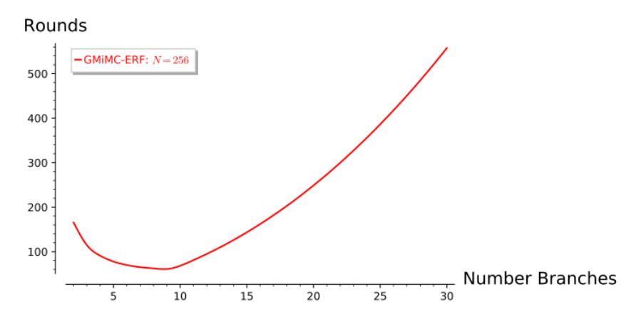

Figure 5: Number of Branches *versus* Number of Rounds – GMiMCerf with *t* · log<sup>2</sup> *p* ≈ 256 fixed.

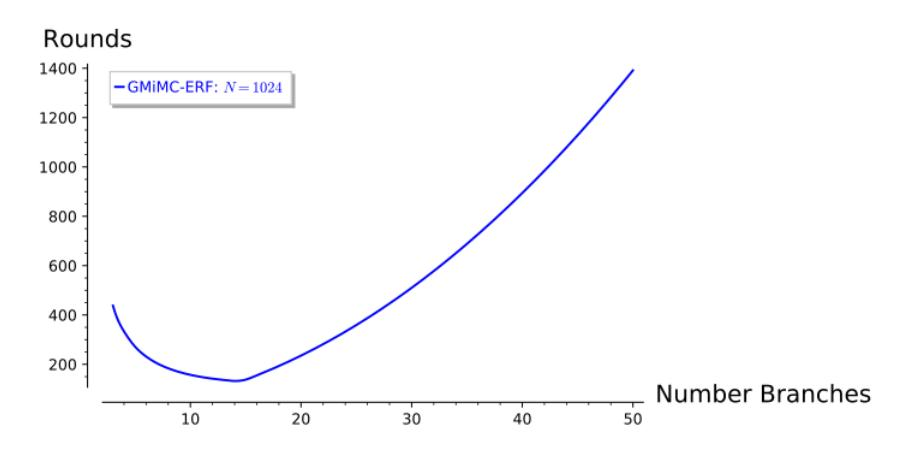

Figure 6: Number of Branches *versus* Number of Rounds – GMiMCerf with *t*·log<sup>2</sup> *p* ≈ 1024 fixed.

<span id="page-23-1"></span>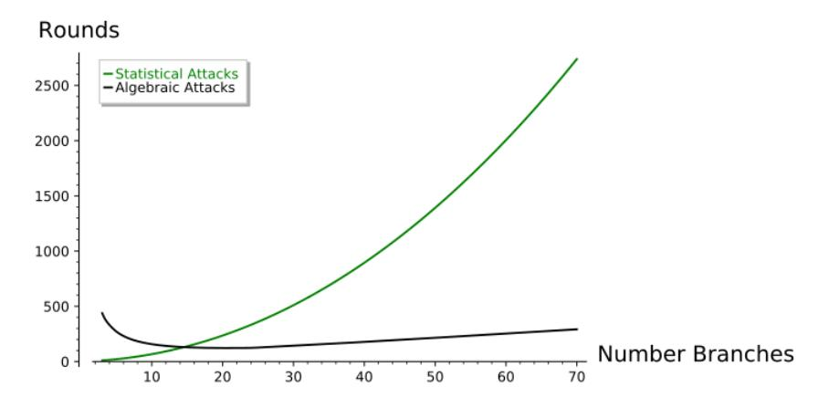

Figure 7: Number of Branches *versus* Number of Rounds *of different attacks* – GMiMCerf with *t* · log<sup>2</sup> *p* ≈ 1024 fixed. "Statistical Attacks" include Truncated diff., Impossible Diff. and Linear Diff. "Algebraic Attacks" include GCD attack, Interpolation attack, Gröbner Basis and Higher-Order Diff.

**Remark.** We remark that computing  $x^3$  requires 2 multiplications in  $\mathbb{F}_p$  and a single multiplication in  $\mathbb{F}_{2^n}$  (since  $x^2$  is linear in  $\mathbb{F}_{2^n}$ ).

Focusing on  $\mathbb{F}_{2^n}$ , the cost of performing one multiplication in  $\mathbb{F}_{2^n}$  using a fast Fourier transform is approximately  $\mathcal{O}(n \cdot \log n)$  bit-wise XORs (that is, approximately  $\beta \cdot n \cdot \log n$  for some constant  $\beta$ ), while the cost of one addition is n bit-wise XORs. As a result, a good approximation of this number is given by

number of rounds
$$\times \left( A + \frac{N}{\beta \cdot n \cdot \log(n)} \right)$$
, (7)

where

$$GMiMC_{crf}, GMiMC_{erf} : A = 1$$
 and  $GMiMC_{Nvb}, GMiMC_{mrf} : A = t/2$

since for each round  $\mathcal{A}$  multiplication(s) and (approximately)  $n \cdot t$  bit-wise XOR-sums are performed - remember that (1st) a single multiplication is necessary to compute  $x^3$  in  $\mathbb{F}_{2^n}$  and (2nd) the ratio between the cost of 1 multiplication and 1 addition is  $1/\log(n)$ . It follows that when the total number of multiplications is higher than the total number of additions (e.g. MiMC, GMiMC<sub>Nyb</sub> or GMiMC<sub>mrf</sub>), it is reasonable to approximate the total number of operations by the total number of multiplications. When the total number of additions is much higher than the total number of multiplications, one must take care of both these two numbers to compute the total cost. Finally, in the PQ signature case, we primarily consider the total number of multiplications (and not of generic operations), since this metric determines both the signature size and the number of pseudo-randomly generated field elements required for signing.

Similar results can be obtained as well also for the case  $\mathbb{F}_p$ . Here the cost of 1 multiplication can be approximated as  $O(\log_b(p)^2)$  word sum-operations (that is, approximately  $\beta \cdot \log_b(p)^2$  for some constant<sup>15</sup>  $\beta$ ) where b is the word size of the processor [58]. Thus a good approximation for the total number of operations for the case  $\mathbb{F}_p$  is given by

<span id="page-24-1"></span>number of rounds
$$\times \left(2 \cdot \mathcal{A} + \frac{t}{\beta \cdot [\log_2(p)]^2}\right)$$
, (8)

where  $p \approx 2^n$ ,  $\mathcal{A}$  is defined as before, and the factor 2 counts for the two multiplications required to compute cubes in  $\mathbb{F}_p$  (instead of a single one).

#### 6.1.1 SNARK — Number of "Operations"

First of all, for SNARKs applications we only consider the case  $\mathbb{F}_p$ . The reason of this choice is the fact that we cannot use the property that squaring is linear in  $\mathbb{F}_{2^n}$  for a more efficient implementation in this setting, since the cubes have to be represented as rank-1 constraint (see Section 7.2 for more details). We remark that similar consideration has been made for MiMC when used for SNARK applications (see [4, Section 6.1]).

Having said that and focusing only on the case  $\kappa = n$ , for the following it is interesting to observe that for each N fixed, it is possible to minimize the total number of "operations" by adjusting the parameters t and n. Both for the case of GMiMC<sub>mrf</sub> and GMiMC<sub>erf</sub>, this number corresponds to the total number of multiplications. In GMiMC<sub>erf</sub>, a good approximation of this number is given by formula (8).

Focusing on the case N=1024 - used in the following application, it turns out that GMiMC<sub>erf</sub> is more efficient in this setting. Consider e.g. the case  $\mathbb{F}_p$ . As showed in Fig. 8, it turns out that the best choice for GMiMC<sub>erf</sub> is n=103 and t=10. The number

<span id="page-24-0"></span> $<sup>^{15}</sup>$  For our practical implementation of the the SNARKs application in Section 7.2, the value of  $\beta$  is well approximated by  $\beta\approx 1.75/32^2$  based on the multiplication and reduction algorithms used by NTL. This number is consistent with the complexity discussion of Karatsuba multiplication and Barrett reduction and Schoolbook multiplication for small fields, respectively, in [58, Chapter 5].

<span id="page-25-0"></span>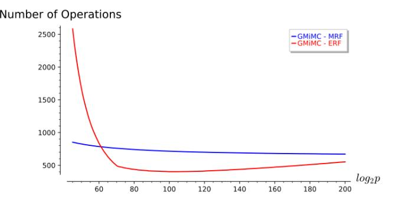

Figure 8: SNARK in F*<sup>p</sup>* - Comparison of the number of operations for GMiMCerf and GMiMCmrf for different values of *p* (*N* = log<sup>2</sup> *p* · *t* = 1024).

of total operations for this choice of parameters is ≈ 403. In GMiMCmrf, the number of multiplications is given by *R* × *t* (where *R* is the number of rounds and 2 × (*t/*2) = *t* multiplications in F*<sup>p</sup>* are performed in each round), which means that the total number of operations is (at least)

$$\max \left\{ 1.262 \cdot N + 4t + 2t \cdot \log_2(t), 4 + 4t^2 + 4t \cdot \log_2(N), 2t + \frac{6t \cdot n \cdot \log_2 t}{n-1} \right\} \ge 1.262 \cdot N \approx 1293,$$

that is approximately three times more. As a result, for the case *N* = 1024, GMiMCerf is (much) more efficient than GMiMCmrf.

#### **6.1.2 PQ Signatures — Number of Multiplications × Field Size (Low-Data Scenario)**

Focusing only on the case *κ* = *N* = *t* · *n* in F2*<sup>n</sup>* (analogous for F*p*), for the following it is interesting to observe that for *N* fixed, it is possible to minimize the product "numbers of multiplications × branch size" by adjusting the parameters *t* and *n*. This metric is the most interesting one, since it determines both the signature size and the size of the random tapes. Remember that the PQ signature is implemented in the low-data scenario only (which means that e.g. the differential attack does not apply). We give the best choice of *t* and *n* for this metric:

**GMiMCerf** With respect to the general scenario, in this case there is no closed-form formula to compute the number of rounds necessary to guarantee security. Combining the results provided by the GCD attack and the one provided by the SageMath code given in Appendix [G](#page-49-0) (in order to estimate Gröbner Basis attack), the number of rounds to provide security is[16](#page-25-1) *R* ≥ 1*.*262 · *n* − 4 · log<sup>3</sup> (*n*) +3*t* + 3 and the best choice is

$$n = 3,$$
  $R \cdot n \ge \lceil 1.262 \cdot n^2 - 4 \cdot \log_3(n) \cdot n \rceil + 3N + 3n \ge 3N + 9,$

where note that the number of multiplications is equal to the number of rounds in F2*<sup>n</sup>* (while it is double in F*p*).

**GMiMCmrf** Since the number of multiplications in F2*<sup>n</sup>* is given by *R* · *t/*2, it follows that[17](#page-25-2)

$$R \cdot \frac{t}{2} \cdot n \geq \left\lceil 0.631 \cdot N \cdot n \right\rceil + N \cdot \Lambda \left( t \right) + \frac{N}{2},$$

which is higher than the corresponding number for GMiMCerf. Indeed, since Λ(*x*) = 2 log<sup>2</sup> (*x*), the best choice is to minimize *n* (that is, to choose *n* = 3). It follows

<span id="page-25-2"></span><span id="page-25-1"></span><sup>16</sup>More details on the number of rounds in this scenario are provided in Appendix [F.](#page-47-0)

<sup>17</sup>We use the number of rounds provided by the GCD attack for the given estimation. Note that the real number of rounds is not lower than the number of rounds of the GCD attack.

that *R* · *t* 2 · *n* ≥ *N* · (2*.*4 + 2 log<sup>2</sup> (*N/*3)) = O(*N* log(*N*)) (*vs* O(*N*) for the case of GMiMCerf).

In more detail, for
$$n = 3$$
:  $\underbrace{N \cdot (2.4 + 2\log_2(N/3))}_{\text{GMiMC}_{\text{mf}}} \ge \underbrace{3N + 9}_{\text{GMiMC}_{\text{erf}}}$  for each  $N \ge 7$ .

As a result, it follows that GMiMCerf is more efficient in this setting (analogous for F*p*).

#### **6.1.3 MPC — Number of (parallel) Multiplications**

As for SNARKs applications, *also for MPC applications we only consider the case* F*p*.

In MPC the number of communication rounds is equal to the number of multiplications - that is *α* · *R* where *α* and *R* are defined as before - for all the proposed designs. In particular, note that for GMiMCNyb and GMiMCmrf the *t/*2 multiplications can all be executed in parallel. On the other hand, these parallel multiplications are not "costless": the effect of these *t/*2 multiplications per round is reflected in the throughput metric.

When *n* is fixed, GMiMCmrf requires a lower number of rounds (for both encryption and MPC communications) than GMiMCerf. However, GMiMCmrf has significantly less throughput (Section [7.1\)](#page-26-0) compared to GMiMCerf due to a lower number of multiplications.

### **7 Application and Implementation**

In this section we present various implementation results.

### <span id="page-26-0"></span>**7.1 MPC Setting**

We have benchmarked the protocols using the SPDZ framework, which provides active security against multiple malicious parties [\[52\]](#page-34-12). To compute a circuit with secret shared inputs in SPDZ, there are two generic phases. The first step is to produce random Beaver triples, also called the pre processing phase, which is independent of the inputs and can be done in advance. The second step is the online phase, which consumes a triple whenever there is a multiplication between shared values. Additions of secret values and scalar multiplications are (almost) for free in SPDZ. The protocols ran across two computers with Intel i7-4790 CPUs at 3.60GHz and 16GB of RAM connected via a 1 GB/s LAN network and an average round-trip time of 0.3 ms (see Table [4\)](#page-27-1). In our setting, both keys and messages are secretly shared among the two parties and each experiment was averaged among five executions with at least 1000 block cipher calls.

For a complete measurement of an MPC protocol, one needs to have in mind both preprocessing and online phases. The pre-processing phase cost is determined by the number of shared multiplications. Performance of the online phase is given by the multiplicative depth of the circuit to be evaluated as well as the number of openings (whenever a party reveals a secret value). For the online phase we give measurements in terms of *latency* and *throughput*. Latency indicates the minimum time spent for computing one encrypted F*<sup>p</sup>* block, whereas throughput shows the maximum F*<sup>p</sup>* objects that can be encrypted in parallel per second. Since the only non-linear operation we use in our block ciphers is *x* 7→ *x* 3 , this is done with three openings and two Beaver triples (for details see [\[67\]](#page-35-3)). We instantiate each block cipher with 4 and 16 input blocks/branches, where each block lies in F*<sup>p</sup>* and *p* ≈ 2 <sup>128</sup>. Note that for GMiMC constructions in MPC we have used an *n*-bit key. For a fair comparison with previous evaluations of MiMC in SPDZ, the online phase runs on a single thread.

The preprocessing column denotes the amount of time required to generate the triples for a single block cipher evaluation (4 or 16 encrypted blocks) in a two party SPDZ protocol. The figures for this column were estimated using the recent protocol by Keller et al. [\[51\]](#page-34-13)

<span id="page-27-1"></span>Table 4: Two-party costs for MiMC and GMiMC over a LAN network. Protocols ran across two computers with commodity hardware connected via a 1 GB/s LAN network and an average round-trip time of 0.3 ms.

| Mode     |                     | Online cost     |          |                    |                    | Prep/block(ms) |
|----------|---------------------|-----------------|----------|--------------------|--------------------|----------------|
|          | #Branch<br>/ #Block | (MPC)<br>Rounds | Openings | Latency<br>(ms)/Fp | Throughput<br>Fp/s |                |
| GMiMCcrf | 4                   | 178             | 534      | 3.65               | 15026              | 2.96           |
| GMiMCerf |                     | 172             | 516      | 3.55               | 15669              | 2.86           |
| GMiMCNyb |                     | 169             | 507      | 3.44               | 9131               | 5.63           |
| GMiMCmrf |                     | 175             | 525      | 3.62               | 8194               | 5.83           |
| MiMC     | 4 blocks            | 73              | 876      | 1.58               | 9965               | 4.86           |
| GMiMCcrf | 16                  | 238             | 714      | 1.21               | 39247              | 0.99           |
| GMiMCerf |                     | 208             | 624      | 1.06               | 49006              | 0.86           |
| GMiMCNyb |                     | 181             | 543      | 0.88               | 8605               | 6.03           |
| GMiMCmrf |                     | 183             | 549      | 1.02               | 8440               | 6.1            |
| MiMC     | 16 blocks           | 73              | 3504     | 0.47               | 10780              | 4.86           |

which is the fastest known protocol for SPDZ triples. We used the LowGear protocol with computational security 128 and 64 bit statistical security.

Experiments (Table [4\)](#page-27-1) show that GMiMCcrf and GMiMCerf have a very fast preprocessing phase because they perform a low number of multiplications. A big advantage of these two is how well they scale in terms of triples used, since they require one multiplication per cipher iteration. This is in contrast with MiMC, where increasing the number of blocks to be encrypted by a factor of *c* results in *c* times more multiplications. We stress that these two constructions are first to our knowledge which avoid the linear increase of pre-processing data with the number of blocks. To give an example of this behavior consider the case of 16 blocks for the preprocessing column (Table [4\)](#page-27-1) for GMiMCerf is 5*.*5 times smaller than MiMC: 0*.*86ms vs. 4*.*86ms.

Perhaps unexpectedly, GMiMCcrf and GMiMCerf have a higher online throughput compared to the rest of the variants, although they result in a larger number of rounds. The reason is that fewer openings - or multiplications in our case - means less data sent between the parties so we can batch more executions in parallel. Thus in a LAN network the number of rounds has a minor impact.

#### <span id="page-27-0"></span>**7.2 SNARKs**

The rank-1 constraints in SNARK is defined [\[14\]](#page-32-14) as a system of bilinear equations over a field F. The number of *rank-1 constraints* for a function contributes to the efficiency of the SNARK algorithm [\[4\]](#page-31-3). In this setting we count the number of multiplications required to generate the values of *witness variables* [\[14\]](#page-32-14).

**GMiMCcrf** The rank-1 constraints are as follows:

$$\sum_{i=0}^{t-1} X_i + U + k_r + C_r = 0, \ U \cdot U = Y, \ U \cdot Y + X_{t-1} = Z,$$

<span id="page-28-0"></span>Table 5: Comparison of MiMC with GMiMCerf (with different numbers of branches) in SNARK in F*<sup>p</sup>* when the block size is 1024 bits.

|                       | MiMC [4]       |               | GMiMCerf      |               |               |
|-----------------------|----------------|---------------|---------------|---------------|---------------|
| (p), R)<br>(t, log2   | (1, 1024, 646) | (2, 513, 647) | (4, 256, 332) | (8, 128, 178) | (16, 64, 141) |
| constraint generation | 4.553 ms       | 5.077 ms      | 4.735 ms      | 4.732 ms      | 8.057 ms      |
| witness generation    | 1.079 ms       | 0.639 ms      | 0.388 ms      | 0.296 ms      | 0.449 ms      |
| total time            | 5.632 ms       | 5.716 ms      | 5.123 ms      | 5.028 ms      | 8.507 ms      |
| #additions            | 646            | 1293          | 996           | 1246          | 2115          |
| #multiplications      | 1293           | 1293          | 664           | 356           | 282           |

where *k<sup>r</sup>* and *C<sup>r</sup>* are round keys and round constants respectively. For GMiMCcrf Hash the round keys are constant. The number of multiplication for GMiMCcrf Hash is 2 per round. Therefore the total number of multiplications is 2*R* where *R* is the number of rounds in the block cipher GMiMCcrf. Each round also requires *t* − 1 field additions.

**GMiMCerf** The rank-1 constraints can be constructed from the following equations:

$$X_{t-1} + U + k_r + C_r = 0, \ U \cdot U = Y, \ U \cdot Y + X_i = Z_i \text{ for } 0 \le i \le t-2,$$

where *k<sup>r</sup>* and *C<sup>r</sup>* are round keys and round constants respectively. For GMiMCerfHash the round keys are constant. The number of multiplications and additions are 2 and *t* − 1 per round respectively. Note that GMiMCerf has *t* − 1 rank-1 constraints per round whereas GMiMCcrf has 2 constraints.

**GMiMCNyb** For the keyed permutation the rank-1 constraints are as follows:

$$X_i + U_i + k_{i,r} + C_{i,r} = 0, U_i \cdot U_i = Y_i, U_i \cdot Y_i + X_{i+t-1} = Z_i,$$

where *Ci,r* is the round constant to the *i*-th function in round *r*. Note that in each round there are *t/*2 functions in the Nyberg mode and for each function we get the above-mentioned constraints. For GMiMCNybHash the round keys are constants. The number of multiplications per round is 2 · *t/*2 = *t*. Hence the total number of multiplications is *t* · *R*.

**GMiMCmrf** This constructions also uses *t/*2 different functions per round and the constraints for it can be obtained in a similar way.

We have implemented the GMiMCcrf and GMiMCerf in a SNARK setting using NTL [\[71\]](#page-35-15) for the GMiMC permutation and hash function. We compared the performance with MiMC. For *N* ≈ 1024-bit (prime) block size GMiMCerf[*N, t, n*], where *t* = 8, shows some improvement over MiMC-1025. For hashing a single message block, GMiMCHash-256 is more than 1*.*2 times faster than MiMCHash-256 and is significantly (*>* 12 times) faster than SHA-256. We stress that in comparison with MiMCHash the primary advantage of GMiMCerfHash is that it can be used over 256 bit or smaller field size. For all the field operations we have used the NTL together with the gf2x library. All the computations were performed on a system having an Intel Core i7-4790 with 3.6 GHz processor with 16 GB memory. We took the average time over ≈ 2000 iterations.

Note that the number of constraints for GMiMCHash-256 with fixed key permutation is only one more than the number of constraints for GMiMCerf. Hence the time taken by the hash function and the permutation with fixed key are the same (in Table [5\)](#page-28-0).

#### <span id="page-29-0"></span>**7.3 Post-Quantum Signatures**

Picnic [\[31\]](#page-33-5) is a new class of digital signature schemes which derive their security entirely from the security of symmetric-key primitives, have extremely small key pairs, and are highly parameterizable. The construction is based on a one-way function *f*, where for the secret key *x* the image *y* = *f*(*x*) is published as the public key. A signature on a message is then obtained from a non-interactive zero-knowledge proof of the relation *y* = *f*(*x*), that incorporates the message in the challenge generation. This proof uses ZKB++, a Σ-protocol for statements over general circuits made non-interactive. When instantiating *f* with LowMC [\[5,](#page-31-5) [3\]](#page-31-11), trying to reduce the signature size by reducing the number of multiplication gates comes at the cost of a more expensive linear layer, which leads to a runtime vs. signature size trade-off. Since the security proofs in [\[31\]](#page-33-5) only require a block cipher with a reduced data complexity of 1, the overall performance can be greatly improved as this fact allows to choose LowMC instances with less rounds. For the 128-bit PQ security level (i.e., 256-bit block size and key size) a good trade-off can be found by using 10 S-Boxes and 38 rounds, resulting in a view size of 1140 bits.

We implemented the signature scheme using GMiMCerf with key size and block size of ≈ 256 bits to build the one-way function. We consider instances with a data complexity of 1. The reduction steps of the modular multiplications were accelerated by using special prime moduli and irreducible polynomials of special form for prime fields and binary fields, respectively: generalized Mersenne primes [\[72\]](#page-35-16) were used for prime fields and trinomials and pentanomials with middle terms close to each other [\[69\]](#page-35-17) were used for binary fields.

In Table [6,](#page-30-0) we compare the circuit runtimes (i.e., runtimes without protocol overheads such as pseudo-random number sampling and the computation of commitments) of MiMC and GMiMCerf with different numbers of branches benchmarked on an Intel Core i7- 4790 with 3.6 GHz. We also include the view size required per repetition of ZKB++, and numbers for one two instances of LowMC using optimizations for the round key computations and linear layer [\[40\]](#page-33-13). Measuring only the circuit runtimes allows us to obtain a more accurate comparison in terms of computation time and view size, which are both directly related to the total runtime of the protocol and to the final signature size, respectively. Furthermore, the time required for pseudo-random number sampling – the dominating cost of the protocol overhead – is also reduced by making the view size smaller.

Instantiations using F2*<sup>n</sup>* tend to perform better than the comparable parameterizations in F*<sup>p</sup>* for mainly two reasons: in F2*<sup>n</sup>* additions do not require reductions, the cubing operation can be implemented with only one multiplication. In any case, even for very small fields with the smallest view sizes but slower signing and verification, GMiMCerf performs significantly better in terms of view size and runtime than MiMC. Compared to LowMC, choosing an instance over F<sup>2</sup> <sup>3</sup> allows us to beat the smallest signatures sizes obtainable using LowMC with one S-Box by 306 bits in terms of view size. We also note that both signing and verification times are smaller when using instances providing a good trade-off (i.e., setting *n* = 17 or *n* = 33), and view sizes can be kept small too by using the fact that squaring is linear in binary fields.

#### **Ring Signatures**

Continuing the work on signatures, ring signature scheme solely relying only on symmetrickey primitives can be constructed by proving an authentication path in a Merkle tree in zero-knowledge [\[39,](#page-33-6) [23\]](#page-32-3). Hence collision-resistant hash functions with low multiplicative complexity are of interest for this application and requires a cipher also secure in the full data setting, so we consider GMiMCerf over F*p*.

MiMC based hashes incur a view size of more than a million bits per hash function evaluation, which is larger than a LowMC based hash by a factor of about 1000. With GMiMC we can change the field size and are thus able to obtain much better numbers.

<span id="page-30-0"></span>Table 6: Comparison of MiMC with GMiMCerf and LowMC [\[5\]](#page-31-5) when the block size is ≈ 256 bits in the context of ZKB++. In LowMC-(*N, m, R*), *N* denotes the block size, *m* is the number of S-Boxes, and *R* denotes the number of rounds. Runtimes given for *Sign* and *Verify* are for the circuit computations only.

| Scheme              | (n, t, R)     | Sign      | Verify    | View size  |
|---------------------|---------------|-----------|-----------|------------|
| MiMC [4]            | (256, 1, 162) | 333.97 ms | 166.28 ms | 83456 bits |
|                     | (272, 1, 172) | 92.45 ms  | 46.32 ms  | 94112 bits |
| GMiMCerf over Fp    | (3, 86, 261)  | 97.32 ms  | 72.06 ms  | 1566 bits  |
|                     | (4, 64, 196)  | 62.35 ms  | 45.16 ms  | 1568 bits  |
|                     | (16, 16, 62)  | 7.59 ms   | 5.13 ms   | 1984 bits  |
|                     | (32, 8, 55)   | 4.95 ms   | 3.05 ms   | 3520 bits  |
|                     | (64, 4, 81)   | 11.78 ms  | 6.85 ms   | 10368 bits |
|                     | (136, 2, 163) | 67.51 ms  | 35.21 ms  | 44336 bits |
| GMiMCerf over F2n   | (3, 86, 261)  | 16.06 ms  | 10.76 ms  | 783 bits   |
|                     | (17, 16, 63)  | 3.73 ms   | 2.30 ms   | 1071 bits  |
|                     | (33, 8, 56)   | 3.34 ms   | 2.29 ms   | 1848 bits  |
| LowMC-(256, 10, 38) | -             | 3.74 ms   | 3.52 ms   | 1140 bits  |
| LowMC-(256, 1, 363) | -             | 9.55 ms   | 7.12 ms   | 1089 bits  |

When aiming for the same security level (*N* ≈ 256) with GMiMCerf and using the Davies-Meyer transformation, which is sufficient for this application[18](#page-30-1), we achieve a very competitive view size in comparison to of 5184 bits with *n* = 32 for one hash function evaluation. Additionally the GMiMC based hash comes close to a LowMC based hash, with its view sizes being larger by a factor of ≤ 5 (with *n* = 32), and significantly outperforms any MiMC based instantiation.

### **8 Discussion**

One key take-away of this work is that, when it comes to building structures in symmetric cryptography with low multiplicative complexity, balanced Feistel networks are not the best strategy. We provided a new and optimal (in some sense) variant of the GFN and yet we still cannot beat the ERF variant.

This observation is surprising, and thus interesting: Unbalanced Feistel networks, which appeared no later than the late 1980s, do not have a great track record in the academic literature and in recent designs. As an illustration, consider that among all the lightweight block cipher designs listed on the CryptoLux lightweight block cipher wiki[19](#page-30-2), 7 are Type-II GFNs and 10 are balanced Feistel networks, whereas *none* is of the UFN or ERF type.

And yet exactly those types turn out to be the best in our setting. We can even make a parallel with MiMC itself: Its structure is strongly related and building up on a design from the mid 1990s, which in recent textbooks [\[55,](#page-34-14) Section 8.4] was even shown as an example of how not to design a cipher. Despite this fact, it has turned out to be very good in many applications where multiplicative complexity matters. It may well be that the same is true with our work: Cryptographers had lost interest in the UBF or never considered it a reasonable option and yet it is the best in several of our specific use cases.

<span id="page-30-1"></span><sup>18</sup>See [\[23\]](#page-32-3) for a more detailed comparison of the various hash function constructions for this application.

<span id="page-30-2"></span><sup>19</sup>[https://www.cryptolux.org/index.php/Lightweight\\_Block\\_Ciphers](https://www.cryptolux.org/index.php/Lightweight_Block_Ciphers)

This of course raises one question: What are other known but out-of-fashion structures which might be very suitable for MPC, SNARKs, PQ signatures or related applications?

### **References**

- <span id="page-31-10"></span>[1] M. A. Abdelraheem, M. Ågren, P. Beelen, and G. Leander, "On the distribution of linear biases: Three instructive examples," in *CRYPTO 2012*, ser. LNCS, R. Safavi-Naini and R. Canetti, Eds., vol. 7417. Springer, Heidelberg, Aug. 2012, pp. 50–67.
- <span id="page-31-4"></span>[2] S. Agrawal, P. Mohassel, P. Mukherjee, and P. Rindal, "Dise: Distributed symmetrickey encryption," Cryptology ePrint Archive, Report 2018/727, 2018, accepted at CCS 2018 - [https://eprint.iacr.org/2018/727.](https://eprint.iacr.org/2018/727)
- <span id="page-31-11"></span>[3] M. Albrecht, C. Rechberger, T. Schneider, T. Tiessen, and M. Zohner, "Ciphers for MPC and FHE," Cryptology ePrint Archive, Report 2016/687, 2016, [http://eprint.](http://eprint.iacr.org/2016/687) [iacr.org/2016/687.](http://eprint.iacr.org/2016/687)
- <span id="page-31-3"></span>[4] M. R. Albrecht, L. Grassi, C. Rechberger, A. Roy, and T. Tiessen, "MiMC: Efficient encryption and cryptographic hashing with minimal multiplicative complexity," in *ASIACRYPT 2016, Part I*, ser. LNCS, J. H. Cheon and T. Takagi, Eds., vol. 10031. Springer, Heidelberg, Dec. 2016, pp. 191–219.
- <span id="page-31-5"></span>[5] M. R. Albrecht, C. Rechberger, T. Schneider, T. Tiessen, and M. Zohner, "Ciphers for MPC and FHE," in *EUROCRYPT 2015, Part I*, ser. LNCS, E. Oswald and M. Fischlin, Eds., vol. 9056. Springer, Heidelberg, Apr. 2015, pp. 430–454.
- <span id="page-31-2"></span>[6] A. Aly, M. Keller, E. Orsini, D. Rotaru, P. Scholl, N. Smart, and T. Wood, "Scalemamba v1.3 : Documentation," 2018, [https://homes.esat.kuleuven.be/~nsmart/](https://homes.esat.kuleuven.be/~nsmart/SCALE/) [SCALE/.](https://homes.esat.kuleuven.be/~nsmart/SCALE/)
- <span id="page-31-1"></span>[7] N. Analytics, "MP-SPDZ," 2019, [https://github.com/n1analytics/MP-SPDZ.](https://github.com/n1analytics/MP-SPDZ)
- <span id="page-31-7"></span>[8] B. Applebaum, N. Haramaty, Y. Ishai, E. Kushilevitz, and V. Vaikuntanathan, "Low-Complexity Cryptographic Hash Functions," in *8th Innovations in Theoretical Computer Science Conference – ITCS 2017*, ser. LIPIcs, vol. 67. Schloss Dagstuhl - Leibniz-Zentrum fuer Informatik, 2017, pp. 7:1–7:31.
- <span id="page-31-6"></span>[9] B. Applebaum, Y. Ishai, and E. Kushilevitz, "Cryptography in NC0," *SIAM J. Comput.*, vol. 36, no. 4, pp. 845–888, 2006.
- <span id="page-31-0"></span>[10] D. W. Archer, D. Bogdanov, L. Kamm, Y. Lindell, K. Nielsen, J. I. Pagter, N. P. Smart, and R. N. Wright, "From keys to databases – real-world applications of secure multi-party computation," Cryptology ePrint Archive, Report 2018/450, 2018, [https://eprint.iacr.org/2018/450.](https://eprint.iacr.org/2018/450)
- <span id="page-31-9"></span>[11] J.-P. Aumasson and W. Meier, "Zero-sum distinguishers for reduced Keccak-f and for the core functions of Luffa and Hamsi," 2009, presented at the Rump Session of Cryptographic Hardware and Embedded Systems - CHES 2009, [https://131002.net/](https://131002.net/data/papers/AM09.pdf) [data/papers/AM09.pdf.](https://131002.net/data/papers/AM09.pdf)
- <span id="page-31-8"></span>[12] M. Bardet, J. Faugere, B. Salvy, and B. Yang, "Asymptotic behaviour of the index of regularity of quadratic semi-regular polynomial systems," in *The Effective Methods in Algebraic Geometry Conference (MEGA)*, 2005, pp. 1–14.

- <span id="page-32-4"></span>[13] E. Ben-Sasson, A. Chiesa, C. Garman, M. Green, I. Miers, E. Tromer, and M. Virza, "Zerocash: Decentralized anonymous payments from bitcoin," in *2014 IEEE Symposium on Security and Privacy*. IEEE Computer Society Press, May 2014, pp. 459–474.
- <span id="page-32-14"></span>[14] E. Ben-Sasson, A. Chiesa, D. Genkin, E. Tromer, and M. Virza, "SNARKs for C: Verifying program executions succinctly and in zero knowledge," in *CRYPTO 2013, Part II*, ser. LNCS, R. Canetti and J. A. Garay, Eds., vol. 8043. Springer, Heidelberg, Aug. 2013, pp. 90–108.
- <span id="page-32-1"></span>[15] R. Bendlin, I. Damgård, C. Orlandi, and S. Zakarias, "Semi-homomorphic encryption and multiparty computation," in *EUROCRYPT 2011*, ser. LNCS, K. G. Paterson, Ed., vol. 6632. Springer, Heidelberg, May 2011, pp. 169–188.
- <span id="page-32-8"></span>[16] G. Bertoni, J. Daemen, M. Peeters, and G. Van Assche, "Note on zero-sum distinguishers of Keccak-f," [http://keccak.noekeon.org/NoteZeroSum.pdf.](http://keccak.noekeon.org/NoteZeroSum.pdf)
- <span id="page-32-6"></span>[17] ——, "On the indifferentiability of the sponge construction," in *EUROCRYPT 2008*, ser. LNCS, N. P. Smart, Ed., vol. 4965. Springer, Heidelberg, Apr. 2008, pp. 181–197.
- <span id="page-32-10"></span>[18] L. Bettale, J.-C. Faugere, and L. Perret, "Hybrid approach for solving multivariate systems over finite fields," *Journal of Mathematical Cryptology*, vol. 3, no. 3, pp. 177–197, 2009.
- <span id="page-32-9"></span>[19] L. Bettale, J. Faugère, and L. Perret, "Solving polynomial systems over finite fields: improved analysis of the hybrid approach," in *International Symposium on Symbolic and Algebraic Computation, ISSAC'12*. ACM, 2012, pp. 67–74.
- <span id="page-32-5"></span>[20] E. Biham, R. Anderson, and L. Knudsen, "Serpent: A new block cipher proposal," in *FSE 1998*, 1998, pp. 222–238.
- <span id="page-32-12"></span>[21] E. Biham, A. Biryukov, and A. Shamir, "Cryptanalysis of Skipjack reduced to 31 rounds using impossible differentials," in *EUROCRYPT'99*, ser. LNCS, J. Stern, Ed., vol. 1592. Springer, Heidelberg, May 1999, pp. 12–23.
- <span id="page-32-0"></span>[22] D. Bogdanov, S. Laur, and J. Willemson, "Sharemind: A framework for fast privacypreserving computations," in *ESORICS 2008*, ser. LNCS, S. Jajodia and J. López, Eds., vol. 5283. Springer, Heidelberg, Oct. 2008, pp. 192–206.
- <span id="page-32-3"></span>[23] D. Boneh, S. Eskandarian, and B. Fisch, "Post-quantum group signatures from symmetric primitives," *IACR Cryptology ePrint Archive*, vol. 2018, p. 261, 2018.
- <span id="page-32-2"></span>[24] D. Boneh, Y. Ishai, A. Passelègue, A. Sahai, and D. J. Wu, "Exploring crypto dark matter," in *Theory of Cryptography Conference*. Springer, 2018, pp. 699–729.
- <span id="page-32-11"></span>[25] C. Boura and A. Canteaut, "A zero-sum property for the keccak-f permutation with 18 rounds," in *ISIT*. IEEE, 2010, pp. 2488–2492.
- <span id="page-32-7"></span>[26] C. Boura, A. Canteaut, and C. D. Cannière, "Higher-Order Differential Properties of Keccak and *Luffa*," in *Fast Software Encryption - FSE 2011*, ser. LNCS, vol. 6733. Springer, 2011, pp. 252–269.
- <span id="page-32-13"></span>[27] C. Boura, M. Naya-Plasencia, and V. Suder, "Scrutinizing and improving impossible differential attacks: Applications to CLEFIA, Camellia, LBlock and Simon," in *ASIACRYPT 2014, Part I*, ser. LNCS, P. Sarkar and T. Iwata, Eds., vol. 8873. Springer, Heidelberg, Dec. 2014, pp. 179–199.

- <span id="page-33-8"></span>[28] J. Boyar, R. Peralta, and D. Pochuev, "On the multiplicative complexity of Boolean functions over the basis (cap, +, 1)," *Theor. Comput. Sci.*, 2000.
- <span id="page-33-4"></span>[29] A. Canteaut, S. Carpov, C. Fontaine, T. Lepoint, M. Naya-Plasencia, P. Paillier, and R. Sirdey, "Stream ciphers: A practical solution for efficient homomorphic-ciphertext compression," in *FSE 2016*, ser. LNCS, T. Peyrin, Ed., vol. 9783. Springer, Heidelberg, Mar. 2016, pp. 313–333.
- <span id="page-33-1"></span>[30] V. Cauchois, C. Gomez, and G. Thomas, "General diffusion analysis: How to find optimal permutations for generalized type-ii feistel schemes," *IACR Transactions on Symmetric Cryptology*, vol. 2019, no. 1, pp. 264–301, Mar. 2019. [Online]. Available: <https://tosc.iacr.org/index.php/ToSC/article/view/7404>
- <span id="page-33-5"></span>[31] M. Chase, D. Derler, S. Goldfeder, C. Orlandi, S. Ramacher, C. Rechberger, D. Slamanig, and G. Zaverucha, "Post-quantum zero-knowledge and signatures from symmetric-key primitives," in *ACM CCS 17*, B. M. Thuraisingham, D. Evans, T. Malkin, and D. Xu, Eds. ACM Press, Oct. / Nov. 2017, pp. 1825–1842.
- <span id="page-33-9"></span>[32] ——, "The Picnic Signature Algorithm Specification," 2017, [https://github.com/](https://github.com/Microsoft/Picnic/blob/master/spec.pdf) [Microsoft/Picnic/blob/master/spec.pdf.](https://github.com/Microsoft/Picnic/blob/master/spec.pdf)
- <span id="page-33-11"></span>[33] A. M. Childs, W. van Dam, S. Hung, and I. E. Shparlinski, "Optimal quantum algorithm for polynomial interpolation," in *ICALP*, ser. LIPIcs, vol. 55. Schloss Dagstuhl - Leibniz-Zentrum fuer Informatik, 2016, pp. 16:1–16:13.
- <span id="page-33-10"></span>[34] D. A. Cox, J. Little, and D. O'Shea, *Ideals, varieties, and algorithms - an introduction to computational algebraic geometry and commutative algebra (2. ed.)*, ser. Undergraduate texts in mathematics. Springer, 1997.
- <span id="page-33-3"></span>[35] J. Daemen, M. Peeters, G. Van Assche, and V. Rijmen, "Nessie Proposal: NOEKEON," 2000, [http://gro.noekeon.org/Noekeon-spec.pdf.](http://gro.noekeon.org/Noekeon-spec.pdf)
- <span id="page-33-0"></span>[36] I. Damgård, M. Geisler, M. Krøigaard, and J. B. Nielsen, "Asynchronous multiparty computation: Theory and implementation," in *PKC 2009*, ser. LNCS, S. Jarecki and G. Tsudik, Eds., vol. 5443. Springer, Heidelberg, Mar. 2009, pp. 160–179.
- <span id="page-33-2"></span>[37] I. Damgård, V. Pastro, N. P. Smart, and S. Zakarias, "Multiparty computation from somewhat homomorphic encryption," in *CRYPTO 2012*, ser. LNCS, R. Safavi-Naini and R. Canetti, Eds., vol. 7417. Springer, Heidelberg, Aug. 2012, pp. 643–662.
- <span id="page-33-7"></span>[38] D. Derler, S. Ramacher, and D. Slamanig, "Generic double-authentication preventing signatures and a post-quantum instantiation," in *ProvSec 2018*, ser. LNCS, J. Baek, W. Susilo, and J. Kim, Eds., vol. 11192. Springer, Heidelberg, Oct. 2018, pp. 258–276.
- <span id="page-33-6"></span>[39] ——, "Post-Quantum Zero-Knowledge Proofs for Accumulators with Applications to Ring Signatures from Symmetric-Key Primitives," in *Post-Quantum Cryptography – PQCrypto 2018*, ser. LNCS, vol. 10786. Springer, 2018, pp. 419–440.
- <span id="page-33-13"></span>[40] I. Dinur, D. Kales, A. Promitzer, S. Ramacher, and C. Rechberger, "Linear equivalence of block ciphers with partial non-linear layers: Application to lowmc," in *EUROCRYPT*, 2019, (accepted).
- <span id="page-33-12"></span>[41] X. Dong, Z. Li, and X. Wang, "Quantum cryptanalysis on some generalized Feistel schemes," Cryptology ePrint Archive, Report 2017/1249, 2017, [https://eprint.iacr.](https://eprint.iacr.org/2017/1249) [org/2017/1249.](https://eprint.iacr.org/2017/1249)

- <span id="page-34-4"></span>[42] Y. Doröz, A. Shahverdi, T. Eisenbarth, and B. Sunar, "Toward practical homomorphic evaluation of block ciphers using prince," in *FC 2014 Workshops*, ser. LNCS, R. Böhme, M. Brenner, T. Moore, and M. Smith, Eds., vol. 8438. Springer, Heidelberg, Mar. 2014, pp. 208–220.
- <span id="page-34-6"></span>[43] M. Duan and X. Lai, "Improved zero-sum distinguisher for full round Keccak-f permutation," *Chinese Science Bulletin*, vol. 57, no. 6, pp. 694–697, 2012.
- <span id="page-34-8"></span>[44] ——, "Improved zero-sum distinguisher for full round Keccak-*f* permutation," *Chinese Science Bulletin*, vol. 57, no. 6, pp. 694–697, 2012.
- <span id="page-34-0"></span>[45] L. Grassi, C. Rechberger, D. Rotaru, P. Scholl, and N. P. Smart, "MPC-friendly symmetric key primitives," in *ACM CCS 16*, E. R. Weippl, S. Katzenbeisser, C. Kruegel, A. C. Myers, and S. Halevi, Eds. ACM Press, Oct. 2016, pp. 430–443.
- <span id="page-34-2"></span>[46] V. Grosso, G. Leurent, F.-X. Standaert, and K. Varici, "LS-designs: Bitslice encryption for efficient masked software implementations," in *FSE 2014*, ser. LNCS, C. Cid and C. Rechberger, Eds., vol. 8540. Springer, Heidelberg, Mar. 2015, pp. 18–37.
- <span id="page-34-11"></span>[47] J. Guo, J. Jean, I. Nikolic, and Y. Sasaki, "Meet-in-the-middle attacks on classes of contracting and expanding Feistel constructions," *IACR Trans. Symm. Cryptol.*, vol. 2016, no. 2, pp. 307–337, 2016, [http://tosc.iacr.org/index.php/ToSC/article/view/576.](http://tosc.iacr.org/index.php/ToSC/article/view/576)
- <span id="page-34-15"></span>[48] D. Hankerson, A. J. Menezes, and S. Vanstone, *Guide to Elliptic Curve Cryptography*. Secaucus, NJ, USA: Springer-Verlag New York, Inc., 2003.
- <span id="page-34-1"></span>[49] T. Jakobsen and L. R. Knudsen, "The interpolation attack on block ciphers," in *FSE'97*, ser. LNCS, E. Biham, Ed., vol. 1267. Springer, Heidelberg, Jan. 1997, pp. 28–40.
- <span id="page-34-5"></span>[50] J. Katz, V. Kolesnikov, and X. Wang, "Improved non-interactive zero knowledge with applications to post-quantum signatures," in *ACM CCS 18*, D. Lie, M. Mannan, M. Backes, and X. Wang, Eds. ACM Press, Oct. 2018, pp. 525–537.
- <span id="page-34-13"></span>[51] M. Keller, V. Pastro, and D. Rotaru, "Overdrive: Making SPDZ Great Again," in *Advances in Cryptology – EUROCRYPT 2018*, ser. LNCS, vol. 10822. Springer, 2018, pp. 158–189.
- <span id="page-34-12"></span>[52] M. Keller, P. Scholl, and N. P. Smart, "An architecture for practical actively secure MPC with dishonest majority," in *ACM CCS 13*, A.-R. Sadeghi, V. D. Gligor, and M. Yung, Eds. ACM Press, Nov. 2013, pp. 549–560.
- <span id="page-34-7"></span>[53] L. R. Knudsen, "Truncated and higher order differentials," in *FSE'94*, ser. LNCS, B. Preneel, Ed., vol. 1008. Springer, Heidelberg, Dec. 1995, pp. 196–211.
- <span id="page-34-9"></span>[54] ——, "DEAL - A 128-bit Block Cipher," *Technical Report, Department of Informatics, Bergen, Norway*, 1998.
- <span id="page-34-14"></span>[55] L. R. Knudsen and M. J. B. Robshaw, *The Block Cipher Companion*. Springer Publishing Company, Incorporated, 2011.
- <span id="page-34-10"></span>[56] M. Matsui, "Linear cryptanalysis method for DES cipher," in *EUROCRYPT'93*, ser. LNCS, T. Helleseth, Ed., vol. 765. Springer, Heidelberg, May 1994, pp. 386–397.
- <span id="page-34-3"></span>[57] P. Méaux, A. Journault, F.-X. Standaert, and C. Carlet, "Towards stream ciphers for efficient FHE with low-noise ciphertexts," in *EUROCRYPT 2016, Part I*, ser. LNCS, M. Fischlin and J.-S. Coron, Eds., vol. 9665. Springer, Heidelberg, May 2016, pp. 311–343.

- <span id="page-35-14"></span>[58] N. E. Mrabet and M. Joye, *Guide to Pairing-Based Cryptography*. Chapman & Hall/CRC, 2016.
- <span id="page-35-7"></span>[59] M. Naehrig, K. E. Lauter, and V. Vaikuntanathan, "Can homomorphic encryption be practical?" in *Proceedings of the 3rd ACM Cloud Computing Security Workshop, CCSW 2011*, 2011, pp. 113–124.
- <span id="page-35-8"></span>[60] K. Nyberg, "Generalized Feistel networks," in *ASIACRYPT'96*, ser. LNCS, K. Kim and T. Matsumoto, Eds., vol. 1163. Springer, Heidelberg, Nov. 1996, pp. 91–104.
- <span id="page-35-11"></span>[61] K. Nyberg and L. R. Knudsen, "Provable Security Against Differential Cryptanalysis," in *Advances in Cryptology - CRYPTO 1992*, ser. LNCS, vol. 740. Springer, 1992, pp. 566–574.
- <span id="page-35-2"></span>[62] ——, "Provable security against a differential attack," *Journal of Cryptology*, vol. 8, no. 1, pp. 27–37, Dec. 1995.
- <span id="page-35-6"></span>[63] I. S. M. S. Overview., ["https://gist.github.com/maxvt/](https://gist.github.com/maxvt/bb49a6c7243163b8120625fc8ae3f3cd) [bb49a6c7243163b8120625fc8ae3f3cd.](https://gist.github.com/maxvt/bb49a6c7243163b8120625fc8ae3f3cd)"
- <span id="page-35-0"></span>[64] Partisia, ["https://partisia.com/."](https://partisia.com/)
- <span id="page-35-12"></span>[65] J. Patarin, V. Nachef, and C. Berbain, "Generic attacks on unbalanced Feistel schemes with contracting functions," in *ASIACRYPT 2006*, ser. LNCS, X. Lai and K. Chen, Eds., vol. 4284. Springer, Heidelberg, Dec. 2006, pp. 396–411.
- <span id="page-35-9"></span>[66] K. Qiao, L. Song, M. Liu, and J. Guo, "New Collision Attacks on Round-Reduced Keccak," in *Advances in Cryptology – EUROCRYPT 2017*, ser. LNCS, vol. 10212, 2017, pp. 216–243.
- <span id="page-35-3"></span>[67] D. Rotaru, N. P. Smart, and M. Stam, "Modes of operation suitable for computing on encrypted data," *IACR Trans. Symm. Cryptol.*, vol. 2017, no. 3, pp. 294–324, 2017.
- [68] R. Safavi-Naini and R. Canetti, Eds., *CRYPTO 2012*, ser. LNCS, vol. 7417. Springer, Heidelberg, Aug. 2012.
- <span id="page-35-17"></span>[69] M. Scott, "Optimal irreducible polynomials for GF(2*<sup>m</sup>*) arithmetic," Cryptology ePrint Archive, Report 2007/192, 2007, [http://eprint.iacr.org/2007/192.](http://eprint.iacr.org/2007/192)
- <span id="page-35-1"></span>[70] Sepior, ["https://sepior.com/.](https://sepior.com/)"
- <span id="page-35-15"></span>[71] V. Shoup, "Number Theory Library 5.5.2 (NTL)," [http://www.shoup.net/ntl/.](http://www.shoup.net/ntl/)
- <span id="page-35-16"></span>[72] J. A. Solinas, "Generalized mersenne numbers," NSA, Tech. Rep., 1999.
- <span id="page-35-13"></span>[73] W. Stein *et al.*, *Sage Mathematics Software Version 8.0*, The Sage Development Team, 2017, [http://www.sagemath.org.](http://www.sagemath.org)
- <span id="page-35-4"></span>[74] T. Suzaki and K. Minematsu, "Improving the generalized Feistel," in *FSE 2010*, ser. LNCS, S. Hong and T. Iwata, Eds., vol. 6147. Springer, Heidelberg, Feb. 2010, pp. 19–39.
- <span id="page-35-5"></span>[75] T. Suzaki, K. Minematsu, S. Morioka, and E. Kobayashi, "twine : A lightweight block cipher for multiple platforms," in *SAC 2012*, ser. LNCS, L. R. Knudsen and H. Wu, Eds., vol. 7707. Springer, Heidelberg, Aug. 2013, pp. 339–354.
- <span id="page-35-10"></span>[76] Y. Todo, "Structural Evaluation by Generalized Integral Property," in *Advances in Cryptology - EUROCRYPT 2015*, ser. LNCS, vol. 9056. Springer, 2015, pp. 287–314.

- <span id="page-36-0"></span>[77] Unbound, ["https://www.unboundtech.com/."](https://www.unboundtech.com/)
- <span id="page-36-1"></span>[78] Q. Wang, L. Grassi, and C. Rechberger, "Zero-Sum Partitions of PHOTON Permutations," in *Topics in Cryptology - CT-RSA 2018*, ser. LNCS, vol. 10808, 2018, pp. 279–299.

## **Appendices**

### <span id="page-37-1"></span>**A Variants of the GMiMC family of ciphers**

In this section, we briefly discuss different variants of GMiMC and we also explain some possible choices of the round function. Since the analysis is very similar to the one proposed in [\[4\]](#page-31-3), we refer to that paper for all the details and we limit ourselves here to recall the main points.

### **A.1 A Permutation Round Function**

The four GMiMC ciphers proposed in this paper are all based on the Feistel construction. As is well known, a Feistel construction has the nice property that decryption can easily be realized by using the encryption function with reversed order of round constants and subkeys. In other words, the same round functions are used for both encryption and decryption, that is, it is not necessary that the round function is a permutation. On the other hand, we have chosen to deal with a permutation round function in order to prevent attacks due to internal collisions.

For example, because of internal collisions in the round function, a truncated trail with only one active branch per round would be possible. This would be particularly undesirable in GMiMCerf. Indeed, the difference in a given branch may propagate to the others only every *t* rounds. If this difference hits an inner collision of the round function, the attacker can extend their trail by another *t* − 1 rounds for free.

#### **A.2 Different Round Functions**

As for MiMC and considering the case F2*<sup>n</sup>* , one may also consider a round function of the form

$$F(x) = (x \oplus k \oplus c)^d$$

for generic exponents *d*.

First of all, we recall that *d* must be different from a power of 2 in order to introduce non-linearity in the cipher[20](#page-37-2). Referring to the analysis proposed in MiMC, the best choices for exponents *d* seem to be *d* = 2*<sup>r</sup>* − 1 for integer *r*. It is simple to observe that the degree of the encryption function increases faster when *d* increases. It follows that the number of rounds can be reduced if one chooses *d >* 3. On the other hand, since the number of multiplications for each round increases (one round requires approximately d*r/*2e multiplications to compute *x d* for *d* = 2*<sup>r</sup>* − 1, as shown in detail in [\[4\]](#page-31-3)), the total number of multiplications does not change. In conclusion, the choice of an exponent of the form 2 *<sup>r</sup>* − 1 different from 3 seems not to offer any advantage.

### <span id="page-37-0"></span>**B Diffusion in GMiMCmrf**

In this section, we investigate the diffusion provided by GMiMCmrf. Diffusion is very fast in such a structure — much like in a GFN with a complex branch permutation as investigated in [\[74\]](#page-35-4) and used for example to build the lightweight block cipher Twine [\[75\]](#page-35-5). In particular, the number of rounds needed to achieve full diffusion increases with the logarithm of the number of branches rather than linearly, as would be the case if a constant rotation were used.

In this section, we prove that the number of rounds needed to achieve full diffusion for a *t*-branch Multi-Rotating Feistel network is equal to 2 log<sup>2</sup> *t* − 1, i.e., we prove Theorem [1.](#page-6-2)

<span id="page-37-2"></span><sup>20</sup>Remember that the square operation is linear in each field F2*<sup>n</sup>* .

We use slightly different notations in this part. The internal state is denoted by  $V_j^i$  for  $0 \le j < t/2$  and for  $-1 \le i$ , where  $V^i$  corresponds to the words that are input to the non-linear part of the round function in round i. The plaintext therefore consists of  $V^0||V^{-1} = V_0^0||...||V_{t/2-1}^0||V_0^{-1}||...||V_{t/2-1}^{-1}$ , the input of round i is  $V^i||V^{i-1}$ , and the output of round i is  $V^{i+1}||V^i$ . This is summarized in Figure 9.

<span id="page-38-1"></span>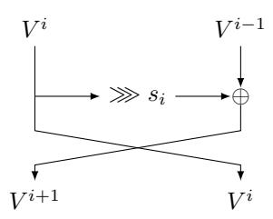

Figure 9: The notations used to study the Multi-Rotating Feistel network.

It is easy to track the propagation of  $V_0^0$  and  $V_0^{-1}$  throughout the rounds. In Figure 10a, we show the subsets  $I^i$  of  $\{0,...,t/2-1\}$  which correspond to the indices j such that  $V_j^i$  depends on  $V_0^0$ . Note that  $I^i$  can be obtained via the simple induction

$$I^{i+1} = I^{i-1} \cup (s_i + I^i)$$
,

where  $s_i + I^i$  is the set obtained by adding  $s_i$  (modulo t/2) to all elements in  $I^i$ . In Figure 10b, we show the same quantity except that we consider words which depend on  $V_0^{-1}$  rather than  $V_0^0$ .

Using the expression of  $s_i$ , we deduce that  $I^{2\ell+1} = I^{2\ell-1} \cup (2^\ell + I^{2\ell})$ , which we rewrite using that  $I^{2\ell} = I^{2\ell-2} \cup (0 + I^{2\ell-1})$  to obtain

$$I^{2i+1} = I^{2\ell-1} \cup (2^{\ell} + (I^{2\ell-2} \cup I^{2\ell-1})) \subseteq I^{2\ell-1} \cup (2^{\ell} + I^{2\ell-1})$$
.

As a consequence, if  $j \in I^{2\ell-1}$ , then both j and  $j+2^\ell$  are in  $I^{2\ell+1}$ . A simple induction shows that if  $j \in I^1$ , then  $I^{2\lceil \log(t/2) \rceil+1}$  contains  $j+\sum_{i=0}^{\lceil \log(t/2) \rceil} \alpha_i 2^i$  for all binary sequences  $\{\alpha_i\}_{0 \geq i}$ . Thus, all elements of  $\{0,...,t/2-1\}$  are in  $I^{2\lceil \log(t/2) \rceil+1}$ . The same argument holds if the sets  $I^i$  track the propagation of  $V_0^{-1}$  instead.

As a consequence,  $2\lceil \log(t/2) \rceil + 2 = 2\lceil \log_2(t) \rceil$  rounds provide full diffusion.

Note that this argument does not actually require that  $s_{2\ell+1} = 2^{\ell} \mod \lceil \log_2(t/2) \rceil$ , merely that the exponents of the non-zero rotation amounts are all distinct in each subsequence of length  $2\lceil \log_2(t/2) \rceil$ . This is the case when these exponents are incremented one by one (as in our construction), but it is also the case if they are decremented one by one instead. This last situation is equivalent to running our Multi-Rotating Feistel network structure backwards, meaning that its inverse has the same diffusion properties.

### <span id="page-38-0"></span>C Security Analysis

#### <span id="page-38-2"></span>C.1 Interpolation Attack

**GMiMC**<sub>erf</sub>. Working as in Sect. 4.1.3, the minimum degree of the output polynomials for each branch is lower bounded by  $3^{r-(t-1)}$  (after  $r \ge t$  rounds). Due to the argumentation proposed in Sect. 4.1.3, GMiMC<sub>erf</sub> is secure against interpolation attack if

$$(3^{r-(t-1)})^t \approx 2^N \simeq p^t.$$

Hence,  $r \approx \frac{\log_2(p)}{\log_2 3} + (t-1)$  rounds will be secure against the above-mentioned attacks. Conservatively, 2r+2 rounds will be secure against meet-in-the-middle attacks/distinguishers for the case  $2^\kappa \simeq p$ , while 2r+t+1 rounds will be secure against meet-in-the-middle attacks/distinguishers for the case  $2^\kappa \simeq p^t$ .

<span id="page-39-1"></span>

<span id="page-39-2"></span>Figure 10: Diffusion in GMiMC<sub>mrf</sub>.

**GMiMC**<sub>Nyb</sub>. Let  $t=2\cdot t'$ . We use a set of (plaintext, ciphertext) pairs to do the interpolation analysis. Working as before, after r>2 rounds, the minimum degree of the output polynomials will be  $3^{r-1}=d_j$  for some branch j (even j). In order to get the maximum degree  $3^{r-1}=p$ , the number of rounds must satisfy  $r\approx\frac{\log_2(p)}{\log_23}+1$ . For securing the cipher against MITM-type attacks/distinguishers, we use 2r rounds. Finally, we add t rounds to provide full diffusion and avoid key-guessing.

In the case  $2^{\kappa} = p^t$ , we have to add 1 more round in order to prevent the combination of the interpolation attack and the brute-force one.

**GMiMC**<sub>mrf</sub>. As explained in Appendix B, after  $r=1+\Lambda\left(t\right)+\lceil\log_{2}(p)/\log_{2}(3)\rceil$  rounds, all output branches have a maximum degree in all input branches and all key words. Thus, as for n-bit security, using  $R=2r=2+2\Lambda\left(t\right)+2\lceil\log_{2}(p)/\log_{2}(3)\rceil$  rounds is sufficient for GMiMC<sub>mrf</sub> to provide  $\log_{2}(p)$  bits of security against interpolation attacks.

In the case  $2^{\kappa} = p^t$ , we have to add 1 more round in order to prevent the combination of the interpolation attack and the brute-force one.

#### <span id="page-39-0"></span>C.2 Higher-Order Differential in $\mathbb{F}_p$

**GMiMC**<sub>erf</sub>. Using the same analysis proposed in Sect. 4.1.4 and due to the analysis proposed in App. C.1, the minimum degree of GMiMC<sub>erf</sub> after r > t rounds is (at least)  $3^{r-t}$ . The condition  $3^{r-t} \ge t$  is satisfied by  $r \ge t + \log_3(t)$ . In order to avoid distinguishers on GMiMCHash, we simply double this number of rounds. Finally, we add 2 rounds in order to avoid key-guessing attack for the univariate case and t+1 rounds for the multivariate case.

**GMiMC**<sub>Nyb</sub>. Using the same analysis proposed in Sect. 4.1.4 and due to the analysis proposed in App. C.1, the minimum degree of GMiMC<sub>Nyb</sub> after r > t rounds is (at least)  $3^{r-1}$ . The condition  $3^{r-1} \ge t$  is satisfied by  $r \ge 1 + \log_3(t)$ . In order to avoid distinguishers on GMiMCHash, we simply double this number of rounds. Finally, we add t rounds in order to avoid key-guessing attack for the univariate case and in order to provide full diffusion. One more round is added for the multivariate case.

**GMiMC**<sub>mrf</sub>. Using the same analysis proposed in Sect. 4.1.4 and due to the analysis proposed in App. C.1, the minimum degree of GMiMC<sub>erf</sub> after  $r > \Lambda(t)$  rounds is (at least)  $3^{r-\Lambda(t)}$ . The condition  $3^{r-\Lambda(t)} \ge t$  is satisfied by  $r \ge \Lambda(t) + \log_3(t)$ . In order to avoid distinguishers on GMiMCHash, we simply double this number of rounds. Finally, we add 2 rounds in order to avoid key-guessing attack for the univariate case and 3 rounds for the multivariate case.

#### C.3 Gröbner Basis Analysis

To prevent the Gröbner basis attack, the minimum number of rounds r must satisfy

$$2^{\kappa \, n} \cdot \binom{t-\kappa+d-1}{d-1}^{\omega} \ge 2^{t \, n}$$

for all  $\kappa \in \{0, \dots, t-2\}$  and where the degree d is a function of the number of rounds r, that is, d = d(r). For our parameter choices, this expression is minimized for  $\kappa = 0$ .

As explained in the main text, in the following we limit ourselves to consider only the case  $2^{\kappa} = p^t$  (for the case  $2^{\kappa} = p$ , the Gröbner basis attack is equivalent to a GCD attack).

**GMiMC**<sub>erf</sub>. After  $r \geq t$  rounds<sup>21</sup>, the minimum degree of a variable in the output polynomials is  $3^{r-t}$ .

To prevent the Gröbner basis attack, we require

$$\binom{t+d}{d}^{\omega} = \binom{t+3^{r-t}}{3^{r-t}}^{\omega} \approx p^t.$$

Using Stirling's approximation of the binomial when  $t \ll d$ , we approximate  $\binom{t+d}{d}$  by  $(d/t)^t = 2^{t \log_2(d/t)}$  and, setting  $\omega := 2$ , obtain

$$2t \log_2(d/t) = 2t \log_2(3^{r-t}/t) \approx \log_2(p) \cdot t \text{ or } r = [t + 1/2 \log_2(p) \cdot \log_3 2 + \log_3 t].$$

Due to the same argumentation given in Section C.4, this number of rounds must be incremented by a factor of t-3, that is, the minimum number of rounds is approximately given by  $r = \lceil 2t + 1/2 \log_2(p) \cdot \log_3 2 + \log_3 t - 3 \rceil$ . To thwart Meet-in-the-Middle attacks, this value is doubled.

 $\mathbf{GMiMC}_{\mathsf{Nyb}}$ . To prevent the Gröbner basis attack, we require

$$\binom{t+d}{d}^{\omega} = \binom{t+3^{r-1}}{3^{r-1}}^{\omega} \approx p^t.$$

Using Stirling's approximation of the binomial when  $t \ll d$ , we approximate  $\binom{t+d}{d}$  by  $(d/t)^t = 2^{t \log_2(d/t)}$  and, setting  $\omega := 2$ , obtain

$$2t\log_2(d/t) = 2t\log_2(3^{r-1}/t) \approx \log_2(p) \cdot t \qquad \text{ or } \qquad r = \left\lceil 1 + \frac{\log_3 2}{2}\log_2(p) + \log_3 t \right\rceil.$$

To thwart Meet-in-the-Middle attacks, this value is doubled. Moreover, t rounds are added to guarantee full diffusion.

<span id="page-40-0"></span><sup>&</sup>lt;sup>21</sup>For our goal, we do not need all the details regarding the degree for r < t.

**GMiMC**<sub>mrf</sub>. The minimum degree of a variable  $K_i$  (for some  $0 \le i \le t - 1$ ) in the output polynomials is  $3^{r-\Lambda(t)}$  after  $r(>\Lambda(t))$  rounds (where we recall that the number of branches t is even).

To prevent the Gröbner basis attack, we require

$$\binom{t+d}{d}^{\omega} = \binom{t+3^{r-\Lambda(t)}}{3^{r-\Lambda(t)}}^{\omega} \approx p^t.$$

Using Stirling's approximation of the binomial when  $t \ll d$ , we approximate  $\binom{t+d}{d}$  by  $(d/t)^t = 2^{t \log_2(d/t)}$  and, setting  $\omega := 2$ , obtain

$$2t\log_2(d/t) = 2t\log_2(3^{r-\Lambda(t)}/t) \approx \log_2(p) \cdot t \text{ or } r = \left\lceil \Lambda\left(t\right) + \frac{1}{2}\log_2(p) \cdot \log_3 2 + \log_3 t \right\rceil.$$

To thwart Meet-in-the-Middle attacks, this value is doubled.

#### <span id="page-41-0"></span>C.4 GCD Attacks in $\mathbb{F}_{2^n}$ – Low-Data Scenario

**GMiMC**<sub>erf</sub>. Case:  $\kappa = n$ . The degree  $d_i$  of  $X_i$  for i = 0, ..., t-1 after r rounds is

$$d_i = \begin{cases} 3^r & \text{if } r > 0 \text{ and } i \neq t - 1, \\ 3^{r-1} & \text{if } r > 1 \text{ and } i = t - 1, \\ 0 & \text{otherwise.} \end{cases}$$

Note that  $d_{t-1} = \min_i d_i$ . The condition  $3^{r-1} \log^2(3^{r-1}) \approx 2^n$  is fulfilled when  $r \simeq 1 + n \cdot \log_3 2 - 2 \log_3(n)$ .

Consideration. In order to compute the final number of rounds for GMiMC<sub>erf</sub>, one must take care of another attack. Let  $X_i^r$  be the output of the *i*-th branch after r rounds. Assume  $t \geq 3$  and consider the output of two branches, e.g. the output of the branches in position 1 — denoted by  $X_1^r$  — and 2 — denoted by  $X_2^r$ . By definition

$$X_i^r = X_{i-1}^{r-1} \oplus (X_t^{r-1} \oplus k \oplus c)^3,$$

where  $i=1,2,\,k$  is the secret key (remember that we are working in the case  $\kappa=n$ ) and c is the round constant. Note that  $X_j^s$  is a function of the key k, that is,  $X_j^s=X_j^s(k)$ . It is simple to observe that

$$X_1^r \oplus X_2^r = X_0^{r-1} \oplus (X_t^{r-1} \oplus k \oplus c)^3 \oplus X_1^{r-1} \oplus (X_t^{r-1} \oplus k \oplus c)^3 = X_0^{r-1} \oplus X_1^{r-1},$$

that is,  $X_1^r \oplus X_2^r$  is still a function of k, but the degree of such a function is lower than the degree of the functions that define  $X_1^r$  and  $X_2^r$ .

Moreover, observe that if GCD(f(k),g(k)) = GCD(h(k),g(k)), then also GCD(f(k),g(k)) = GCD(h(k),g(k)) = GCD(h(k),g(k)) = GCD(f(k)+h(k),g(k)). Thus, instead of computing the GCD between two (randomly chosen) outputs of GMiMC<sub>erf</sub>, the best choice for the attacker — due to previous considerations — is to compute  $GCD(X_{t-1} \oplus X_{t-2}, X_{t-2} \oplus X_{t-3})$ . To prevent this attack, it is sufficient to increment the number of rounds by t-3, that is,  $r \simeq t + n \cdot \log_3 2 - 2\log_3(n) - 2$ .

$$(X_{t-1}^{(j+1)}, X_{t-2}^{(j+1)}, \dots, X_0^{(j+1)}) \leftarrow (X_{t-2}^{(j)} + F_{t-2}(X_{t-1}^{(j)}), \dots, X_0^{(j)} + F_0(X_{t-1}^{(j)}), X_{t-1}^{(j)}),$$

<span id="page-41-1"></span> $<sup>^{22}</sup>$  For completeness, we mention another possible strategy to prevent this attack. Instead of incrementing the number of rounds, one possibility is to use a different constant for each branch of each round. In other words, consider GMiMC<sub>erf</sub> as defined in Section 2.1 for the case  $\kappa=n$  (a similar argument holds also for the case  $\kappa=t\cdot n$ ). The expanding round function (ERF) can be re-written as

As a result, the number of rounds must be approximately

$$r = \left\lceil 2n \cdot \log_3 2 - 4 \cdot \log_3(n) + 2t - 2 \right\rceil$$

to thwart the Meet-in-the-Middle variant[23](#page-42-0) .

*Case: κ* = *t* · *n.* The idea, once again, is simply to guess the first *t* − 1 round keys (i.e., (*t* − 1) · *n* bits of the key) and to apply the (univariate) GCD attack described previously. Using the previous strategy, it turns out that the number of rounds must be approximately

$$r = \lceil 2n \cdot \log_3 2 - 4 \cdot \log_3(n) + 3t - 3 \rceil$$

to thwart the Meet-in-the-Middle variant.

**GMiMCNyb.** *Case: κ* = *n.* Consider the *t*-branch case with *t* = 2 · *t* 0 . Since we are working in the univariate case, all the functions *F<sup>i</sup>* are equal, i.e., *F*<sup>1</sup> = *F*<sup>2</sup> = · · · = *Ft*, and they all depend on the same key. The degree *d<sup>i</sup>* of *X<sup>i</sup>* for *i* = 0*, . . . , t* − 1 after *r* ≥ 2 rounds is

$$d_i = \begin{cases} 3^{r-1} & \text{if } i \text{ even } (i \mod 2 = 0) \\ 3^r & \text{if } i \text{ odd } (i \mod 2 = 1) \end{cases}$$

As a result, the minimum degree after *r* ≥ 2 rounds is 3 *r*−1 . The condition 3 *r*−1 log<sup>2</sup> (3*r*−<sup>1</sup> ) ≈ 2 *<sup>n</sup>* is fulfilled when *r* ' 1 + *n* · log<sup>3</sup> 2 − 2 log<sup>3</sup> (*n*). Thus, the number of rounds must be approximately

$$r = [2 + t + 2n \cdot \log_3 2 - 4\log_3(n)]$$

to thwart the Meet-in-the-Middle variant, and to avoid key-guessing attack (we actually add *t* rounds in order to guarantee full diffusion).

*Case: κ* = *t* · *n.* Using the previous strategy and guessing the first *t* − 1 round keys (which corresponds to skipping one round), it turns out that the number of rounds must be approximately

$$r = \left\lceil 3 + t + 2n \cdot \log_3 2 - 4\log_3(n) \right\rceil$$

to thwart the Meet-in-the-Middle variant.

**GMiMCmrf.** *Case: κ* = *n.* After Λ(*t*) + 1 = 2dlog<sup>2</sup> (*t*)e + 1 rounds, each word in the internal state depends on all words in the input and on all words in the key — even if it has only one word. As a consequence, the degree in both input variables and key variables of each output branch is at least equal to 3 *<sup>r</sup>*−(Λ(*t*)+1), where *r* is the total number of rounds of the structure. As a consequence, to be sure that each branch has the highest degree in both input and key variables, it is necessary to keep iterating the (2Λ(*t*) + 2) round Multi-Rotating Feistel network with rotation sequence *s* = {0*,* 1*,* 0*,* 2*,* 0*,* 4*, ...*} until

where the round function is defined as

$$F_i(x) := (x + k + c_j)^3$$
, and

where the random constants *c<sup>i</sup>* are different for each branch.

This strategy allows to prevent the given attack without increasing the number of rounds. On the other hand, since our final goal is to minimize the total number of multiplications, this strategy is less efficient than the one proposed in the main text. Indeed, let *r* <sup>0</sup> = 1 + *n* · log<sup>3</sup> 2 − 2 log<sup>3</sup> (*n*). The strategy proposed in the main text requires *r* <sup>0</sup> + (*t* − 3) multiplications, while the one just given requires *r* 0 · (*t* − 1) multiplications, where *r* <sup>0</sup> + (*t* − 3) *< r*<sup>0</sup> · (*t* − 1) for each *t* ≥ 3 (and *r* <sup>0</sup> ≥ 1).

<span id="page-42-0"></span><sup>23</sup>We note that this attack crucially depends on separating monomials per round. In particular, if the degree of the target polynomial 2 *<sup>n</sup>*, then this condition does not hold as modular reductions modulo *x* 2 − 1 happen.

 $3^{r-\Lambda(t)-1} \ge 2^n-2$ , which is true if  $r > \left\lceil \frac{n}{\log_2(3)} \right\rceil + \Lambda(t) + 1 - 2\log_3(n)$ . To thwart the Meet-in-the-Middle variant:

$$r \geq 2 \left\lceil \frac{n}{\log_2(3)} \right\rceil + 2 \cdot \Lambda(t) + 4 - 4 \log_3(n).$$

Case:  $\kappa = t \cdot n$ . Using the previous strategy and guessing the first t-1 round-keys (which corresponds to skipping one round), it turns out that the number of rounds must be approximately

$$r = 2 \left\lceil \frac{n}{\log_2(3)} \right\rceil + 2 \cdot \Lambda(t) + 5 - 4 \log_3(n)$$

to thwart the Meet-in-the-Middle variant.

### <span id="page-43-0"></span>D Security Analysis — Statistical Attacks

Unlike the algebraic analysis above, statistical attacks do not explicitly consider the number of the variables involved in the output polynomials representing the (reduced-round) cipher.

### D.1 Classical and Truncated Differential Cryptanalysis

**GMiMC**<sub>erf</sub>. In order to find the minimum number of rounds to protect the cipher against differential attack, we look for the best possible (truncated) differential characteristic. Consider an input difference of the form  $(0, \ldots, 0, \Delta_I)$  where  $\Delta_I \neq 0$ . It is straightforward to observe that such input difference does not active any S-Box in the first  $r_0 = t - 1$  rounds (since the input difference is always zero), that is the output difference after  $r_0$  rounds is  $(\Delta_I, 0, 0, \ldots, 0)$ . After  $r_1 = t$  round, we get an output difference of the form  $(f^{r_1}(\Delta_I), \ldots, f^{r_1}(\Delta_I), \Delta_I)$ , where  $f^{r_1}(\cdot)$  denotes the  $r_1$ -th round function. Observe that  $\Delta_I = f^{r_1}(\Delta_I)$  with prob.  $2^{-n+1}$ . Indeed, since an active (cubic) S-Box maps its non-zero input difference to  $2^{n-1}$  possible output differences each one with prob.  $2^{-n+1}$ , it follows that  $f^{r_1}(\Delta_I) = \Delta_I$  with probability  $2^{-n+1}$ . Assume  $f^{r_1}(\Delta_I) = \Delta_I$ , that is an output difference of the form  $(\Delta_I, \ldots, \Delta_I)$ . After  $r_2 = t + 1$  rounds, we get an output difference of the form  $(\Delta_I \oplus f^{r_2}(\Delta_I), \ldots, \Delta_I \oplus f^{r_2}(\Delta_I), \Delta_I)$ . Due to the previous consideration,  $f^{r_2}(\Delta_I) = \Delta_I$  with prob.  $2^{-n+1}$ .

As a result, the following (truncated) characteristic over t+1 rounds

$$(0, \dots, 0, 0, \Delta_I) \xrightarrow[\text{prob.}]{R^{t-1}(\cdot)} (\Delta_I, 0, 0, \dots, 0) \xrightarrow[\text{prob.} \leq 2^{-n+1}]{R(\cdot)} (\Delta_I, \Delta_I, \dots, \Delta_I) \xrightarrow[\text{prob.} \leq 2^{-n+1}]{R(\cdot)} (0, \dots, 0, \Delta_I)$$

has an overall probability equal to  $2^{-2n+2}$ . Before going on, note that any other input difference active at least one S-Box in the first t-1 rounds. In other words, it seems not possible to find a longer characteristic with lower probability.

By iterating this (truncated) characteristic, it is possible to construct a differential characteristic over  $s \cdot (t+1)$  with probability at most  $(2^{-2n+2})^s$ . By simple computation,  $(2^{-2n+2})^s \leq 2^{-N}$  if and only if  $(2n-2) \cdot s \geq N$ , that is  $s \geq \lceil \frac{N}{2n-2} \rceil$ . As a result,  $2+t\cdot (t+1)\cdot \lceil \frac{n}{2(n-1)} \rceil$  rounds are sufficient to provide security in the univariate case, while  $1+t+t\cdot (t+1)\cdot \lceil \frac{n}{2(n-1)} \rceil$  rounds are sufficient to provide security in the multivariate case.

**GMiMC**<sub>Nyb</sub>. First of all, note that any input difference of the form  $(0, \Delta_I, 0, \dots, \Delta_I)$ , where  $\Delta_I \neq 0$ , does not activate any S-Box in the first round. Working as in the previous

case, it is possible to prove that the following (truncated) characteristic over 3t/2 = 3t' rounds (where t = 2t')

$$(\Delta, 0, \dots, 0) \xrightarrow{R^{3t'}(\cdot)} (\Delta', 0, \dots, 0)$$

has probability  $2^{(t-1)\cdot(-n+1)}$ , where in general  $\Delta \neq \Delta'$ .

By iterating this characteristic, it is possible to construct a differential characteristic over  $s\cdot(3t')$  with probability at most  $(2^{(t-1)\cdot(-n+1)})^s$ . As a result,  $(2^{(t-1)\cdot(-n+1)})^s\leq 2^{-N}$  if and only if  $(t-1)\cdot(n-1)\cdot s\geq 2N$ , that is  $s\geq 2$  (since  $N\geq 2(n+t-1)$  due to the fact that  $n\cdot(t-2)\geq 2(t-1)$  for each  $n\geq 3$ ). As a result, 2+3t rounds are sufficient to provide security in the univariate case, while 3+3t rounds are sufficient to provide security in the multivariate case.

**GMiMC**<sub>mrf</sub>. Using the same argumentation provide before for GMiMC<sub>Nyb</sub>, it follows that  $2 + 3\Lambda t$  rounds are sufficient to provide security in the univariate case, while  $3 + 3\Lambda t$  rounds are sufficient to provide security in the multivariate case.

For the following, we also prove the following proposition.

**Proposition 1.** There cannot be any truncated differential trail covering  $i \geq 4$  rounds of the GMiMC<sub>mrf</sub> instance with less than i active S-Boxes.

*Proof.* We simply observe that any truncated trail involving 1 active branch will activate at least 4 S-Boxes over the next 4 rounds.

Figure 11 illustrates the case where the unique active branch is an input of the Feistel function. We consider, without loss of generality, the case where this branch has index 0, and we track the set  $A^i$  of the indices j such that the branch with index j which is input to the Feistel functions is active.

- $i=2\ell$  This case is illustrated in Figure 11a. This truncated trail propagates with probability 1 for 3 rounds, activating 4 S-Boxes along the way. During the third round, one cancellation may occur so that 1 or 2 S-Boxes are active in the fourth round. In total, 5 or 6 S-Boxes are active.
- $i=2\ell+1$  This case is illustrated in Figure 11b. This truncated trail propagates with probability 1 for 4 rounds, activating 7 S-Boxes along the way.

We now consider the case where the unique active branch is not input to a Feistel function in the first round, so that we can skip one round without any active S-Box.

- $i=2\ell$  This case is illustrated in Figure 12a. This truncated trail propagates with probability 1 for 3 rounds, activating 3 S-Boxes along the way. During the third round, one cancellation may occur so that 1 or 2 S-Boxes are active in the fourth round. In total, 4 or 5 S-Boxes are active.
- $i = 2\ell + 1$  This case is illustrated in Figure 12b. This truncated trail propagates with probability 1 for 4 rounds, activating 4 S-Boxes along the way.

As we have seen, each of the 4 possible cases where a unique branch is active in the input yields at least 4 active S-Boxes during the next 4 rounds. It is thus impossible to cover  $i \geq 4$  rounds without activating at least i S-Boxes.

In practice, as shown in Section 6, the bound on q is smaller than the one needed to prevent GCD attacks unless t is very large and n very small. As a result and working as in the GMiMC<sub>Nyb</sub> case, a truncated differential with probability 1 exists for  $\Lambda(t) = 2\log_2(t)$  rounds.

<span id="page-45-1"></span><span id="page-45-0"></span>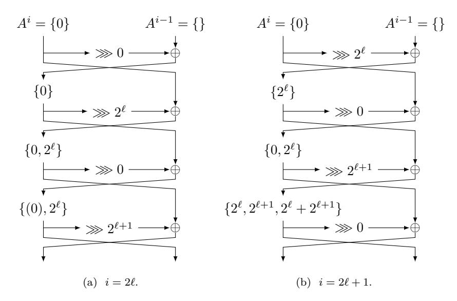

Figure 11: Truncated differentials in GMiMCmrf with 1 active branch (on the left) in the input.

<span id="page-45-3"></span><span id="page-45-2"></span>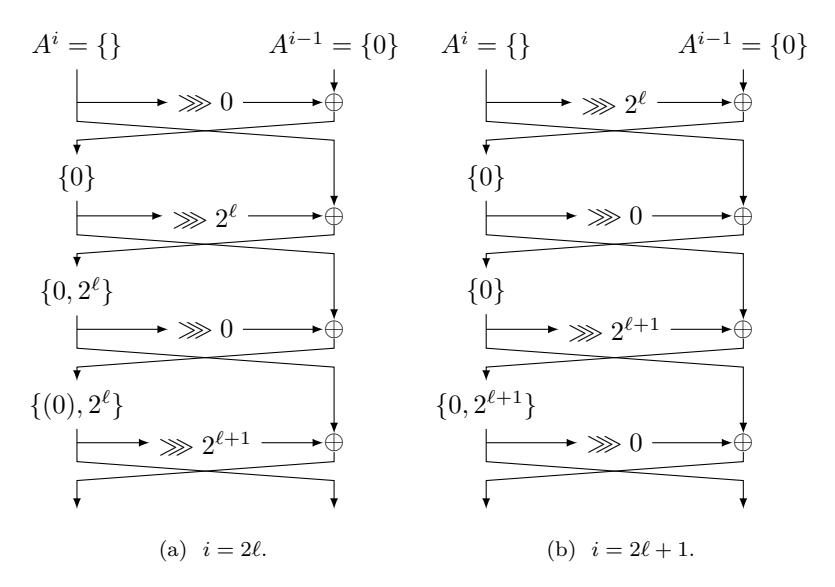

<span id="page-45-4"></span>Figure 12: Truncated differentials in GMiMCmrf with 1 active branch (on the left) in the input.

#### **D.2 Impossible Differential Cryptanalysis**

As done in Section [4.2,](#page-16-1) we construct an impossible differential by combining two (truncated) differentials that do not match in the middle.

**GMiMCerf.** A probability-one differential exists for a maximum of *t* − 1 rounds of the cipher, which is given as follows:

$$(0,\ldots,0,\alpha)\to(0,\ldots,0,\alpha,0)\to\ldots(\alpha,0,\ldots,0).$$

This differential can be extended to a probability-one truncated differential for t rounds as follows:

$$(0,\ldots,0,\alpha) \xrightarrow{t-1 \text{ rounds}} (\alpha,0,\ldots,0) \xrightarrow{1 \text{ round}} (*,*,\ldots,*,\alpha).$$

This probability-one differential allows us to construct an impossible differential for 2t-2 rounds, as depicted below:

$$(0,\ldots,0,\alpha) \xrightarrow[\text{prob. } 1]{R^{t-1}(\cdot)} (\alpha,0,\ldots,0) \neq (0,\ldots,0,\beta) \xleftarrow[\text{prob. } 1]{R^{t-1}(\cdot)} (\beta,0,\ldots,0)$$

for  $\alpha, \beta \neq 0$ . Conservatively, 2t rounds will be secure against meet-in-the-middle attacks/distinguishers for the case  $\kappa = n$ , while (2t-2) + (t+1) = 3t-1 rounds will be secure against meet-in-the-middle attacks/distinguishers for the case  $\kappa = t \cdot n$ .

**GMiMC**<sub>Nyb</sub> There exists a probability-one truncated differential for a maximum of t-1 rounds of this construction (with t=2t' branches). This is described as follows:

$$(0,\alpha,0,...,0) \to (\alpha,0,0,...,0) \to (*,0,...,0,\alpha) \to (*,0,...,0,\alpha,*) \to ... \to (*,0,*,...,*)$$

where  $\alpha \neq 0$ .

Using the probability-one truncated differentials similarly as described above, we can construct impossible differentials for  $GMiMC_{Nyb}$ . This will allow us to attack 2(t-1) rounds of the cipher. Hence, the number of iterations to protect the cipher against such attacks must be at least 2t for the case  $\kappa = n$ , and 2t + 1 for the case  $\kappa = t \cdot n$ .

**GMiMC**<sub>mrf</sub>. As shown in Theorem 1, one call to GMiMC<sub>mrf</sub> with rotation sequence  $\{0, 1, 0, 2, 0, 4, ...\}$  provides full diffusion after  $\Lambda(t) = 2\log_2(t)$  rounds. The same holds if one works in the decryption mode of GMiMC<sub>mrf</sub>.

As a result, using the probability-one truncated differentials described above, we can construct impossible differentials for GMiMC<sub>Nyb</sub> that cover  $2 \cdot (\Lambda(t) - 1)$  rounds of the cipher. Hence, the number of iterations to protect the cipher against such attacks must be at least  $2 \cdot \Lambda(t)$  for the case  $\kappa = n$ , and  $2 \cdot \Lambda(t) + 1$  for the case  $\kappa = t \cdot n$ .

#### **E** Field Arithmetic

Here we present an example of how Generalized Mersenne primes (or Solinas primes) are used to implement the signature scheme. Let  $p_{64}=2^{64}-2^8-1$  be the prime number used for modular arithmetic in a 64-bit prime field. Note that  $\gcd(p_{64}-1,3)=1$ , which is a requirement in order for  $f(x)=x^3$  to be a permutation. The idea of the reduction method is based on the fact that  $p_{64}$  can be represented as  $f(t)=t^8-t-1$ , where  $t=2^8$ . By calculating the residues of  $t^{15}, t^{14}, \ldots, t^8 \pmod{f(t)}$  and storing their coefficients as rows in a  $(n\times n)$ -matrix X where n=8, following holds for  $i=0,1,\ldots,7$ :

$$t^{8+i} \equiv \sum_{j=0}^{7} (X[i,j] \times t^j) \pmod{f(t)}.$$

Now let  $r = (r_{15}||r_{14}||...||r_0)$  be the result of a multiplication of two 64-bit integers, where each  $r_i$  is a 8-bit quantity. Then

$$r = \sum_{i=0}^{15} (r_i \times t^i) \equiv \sum_{i=0}^{7} (z_i \times t^i) \pmod{f(t)}, \text{ where}$$
$$(z_0 \dots z_7) = (r_0 \dots r_7) + (r_8 \dots r_{15}) \cdot X.$$

With  $p_{64} = t^8 - t - 1$  we have

$$\sum_{i=0}^{15} (r_i \times 2^{8i}) \equiv \sum_{i=0}^{7} (z_i \times 2^{8i}) \pmod{p_{64}}.$$

This method uses  $(log_2(t))$ -bit parts of r and in order to reduce the number of steps, in most cases it is wise to choose f(t) such that the number of bits is maximized. A more detailed description of how these equations are used to achieve a constant-time reduction algorithm for a specific prime number is given in [72].

For example, let  $p_{65}(z) = z^{65} + z^4 + z^3 + z + 1$  be the irreducible polynomial used for computations in a 65-bit binary field. The degree of  $p_{65}$  is odd, which again makes  $f(x) = x^3$  a permutation. Given a (2k-1)-bit product r of two k-bit polynomials, where k = 65, following equations hold:

$$z^{65} \equiv z^4 + z^3 + z + 1 \pmod{p_{65}(z)},$$

$$z^{66} \equiv z^5 + z^4 + z^2 + z \pmod{p_{65}(z)},$$

$$\vdots$$

$$z^{128} \equiv z^{67} + z^{66} + z^{64} + z^{63} \pmod{p_{65}(z)}.$$

The coefficients of  $z^{65}, z^{66}, \ldots, z^{128}$  are stored in the most significant 64 bits of the product and can be reduced by adding them consecutively to bits 4, 3, 1, and 0 of r. Reduction is performed one word at a time, starting from the most significant word, which means that some of r's most significant 64 bits need to be added to themselves first. This method is further described in [48], where examples are given for reduction polynomials recommended by NIST.

### <span id="page-47-0"></span>F $\operatorname{GMiMC}_{erf}$ - Number of Rounds in *Low-Data Scenario*

In Section 6, we propose the formula

$$r \ge \lceil 1.262 \cdot n - 4 \cdot \log_3(n) \rceil + 3t + 3$$

in order to compute the number of rounds of  $GMiMC_{erf}$  in the low-data scenario. Here we give more argumentation about this fact. We emphasize that we focus on PQ signature applications, and that the previous formula has been derived by combining the results provided by the GCD attack and the one provided by the SageMath code provided in Appendix G (in order to estimate Gröbner Basis attack)<sup>24</sup>.

Our results are summarized in the previous table, where we highlight the minimum number of rounds in order to protect GMiMC<sub>erf</sub> against the GCD attack, the Gröbner Basis attack and against a generic attack (using the previous formula). Since we consider GMiMC<sub>erf</sub> for PQ signature applications in the low-data scenario for N=128,192,256, we limit ourselves to focus on these cases and we highlight the parameter "Total Number of Multiplications ( $\equiv$  number of rounds r) × Field Size ( $\equiv$  branch size n)". We emphasize that this parameter is minimal when the branch size n is minimized (that is, n=3).

<span id="page-47-1"></span> $<sup>^{24}</sup>$ The results provided by the Sage function proposed in Appendix G are only based on the degree of the considered function. For the particular case of GMiMC<sub>erf</sub>, it is crucial to add 2t-6 rounds due to the attack described in detail in Appendix C.4.

Table 7: *Number of rounds for* GMiMCerf *in the low-data scenario. n* denotes the branch size, *t* denotes the number of branches (*N* = *n* × *t*), "*r* (GCD)" denotes the minimum number of rounds to guarantee security against the GCD attack, "*r* (Gröbner)" denotes the minimum number of rounds to guarantee security against the Gröbner Basis Attack, and "Number of Rounds r" denotes the minimum number of rounds to provide security against any attack. For PQ signature applications, we also highlight the parameter "Total Number of Multiplications × Field Size", and we emphasize the minimum value for each *N*.

| N   | n | t  | r (GCD) | r (Gröbner) | Number of Rounds r | r × t |
|-----|---|----|---------|-------------|--------------------|-------|
| 128 | 3 | 43 | 126     | 129         | 132                | 396   |
|     | 5 | 26 | 76      | 78          | 82                 | 410   |
|     | 9 | 15 | 46      | 47          | 52                 | 414   |
| 192 | 3 | 64 | 189     | 192         | 195                | 585   |
|     | 5 | 39 | 115     | 117         | 121                | 605   |
|     | 9 | 22 | 67      | 68          | 73                 | 657   |
| 256 | 3 | 86 | 255     | 258         | 261                | 783   |
|     | 5 | 52 | 154     | 156         | 160                | 800   |
|     | 9 | 29 | 88      | 89          | 94                 | 846   |

### <span id="page-49-0"></span>**G Low-Data Gröbner Basis Attack**

The following SageMath code returns the complexity of the Gröbner Basis attack on GMiMC. Such a function is especially used in the low-data attacks in order to estimate *Dreg*.

```
Parameter estimation for Groebner basis attacks on GMiMC
# Nicked from LWE Estimator
from collections import OrderedDict
class Cost :
    Algorithms costs .
    def __init__ ( self , data = None , ** kwds ):
         : param data : we call '' OrderedDict ( data ) ''
         if data is None :
              self . data = OrderedDict ()
         else :
              self . data = OrderedDict ( data )
         for k , v in kwds . iteritems ():
              self . data [k] = v
    def str ( self , keyword_width = None , newline = None , round_bound =2048 , compact = False ):
         format_strings = {u" beta ": u"%s: %4d", u"d": u"%s: %4d",
                              "b": "%s: %3d", "t1": "%s: %3d", "t2": "%s: %3d",
                              "l": "%s: %3d", " ncod ": "%s: %3d", " ntop ": "%s: %3d", " ntest ": "%s: %3d"}
         d = self . data
         s = []
         for k in d:
              v = d [k]
              kk = k
              if keyword_width :
                  fmt = u" %%% ds" % keyword_width
                  kk = fmt % kk
              if not newline and k in format_strings :
                  s. append ( format_strings [k ]%( kk , v ))
              elif ZZ (1)/ round_bound < v < round_bound or v == 0 or ZZ ( -1)/ round_bound > v > - round_bound :
                  try :
                       if compact :
                            s. append (u"%s: %d" % (kk , ZZ (v )))
                       else :
                            s. append (u"%s: %8d" % ( kk , ZZ (v )))
                  except TypeError :
                       if v < 2.0 and v >= 0.0:
                            if compact :
                                s. append (u"%s: %.6f" % (kk , v ))
                            else :
                                s. append (u"%s: %8.6 f" % (kk , v ))
                       else :
                            if compact :
                                s. append (u"%s: %.3 f" % (kk , v ))
                            else :
                                s. append (u"%s: %8.3 f" % (kk , v ))
              else :
                  t = u"%s2 ^%.1 f" % ("-" if v < 0 else "", log ( abs (v) , 2). n ())
                  if compact :
                       s. append (u"%s: %s" % ( kk , t ))
                  else :
                       s. append (u"%s: %8s" % (kk , t ))
         if not newline :
              if compact :
                  return u", ". join ( s)
              else :
                  return u", ". join (s)
         else :
              return u"\n". join (s)
    def reorder ( self , first ):
         keys = list ( self . data )
         for key in first :
              keys . pop ( keys . index ( key ))
         keys = list ( first ) + keys
         r = OrderedDict ()
         for key in keys :
              r[ key ] = self . data [ key ]
         return Cost (r)
    def filter ( self , keys ):
         r = OrderedDict ()
         for key in keys :
              r[ key ] = self . data [ key ]
         return Cost (r)
    def repeat ( self , times , select = None , lll = None ):
         # TODO review this list
```

```
do_repeat = {
              u" rop ": True ,
              u" red ": True ,
              u" babai ": True ,
              u" babai_op ": True ,
              u" epsilon ": False ,
              u" mem ": False ,
              u" delta_0 ": False ,
              u" beta ": False ,
              u"k": False ,
              u" D_reg ": False ,
              u"t": False ,
              u"m": True ,
              u"d": False ,
              u"|v|": False ,
              u" amplify ": False ,
              u" repeat ": False , # we deal with it below
              u"c": False ,
         if lll and self [" red "] != self [" rop "]:
              raise ValueError (" Amplification via LLL was requested but 'red ' != 'rop '")
         if select is not None :
              for key in select :
                   do_repeat [ key ] = select [ key ]
         ret = OrderedDict ()
         for key in self . data :
              try :
                   if do_repeat [ key ]:
                       if lll and key in (" red ", " rop "):
                            ret [ key ] = self [ key ] + times * lll
                       else :
                            ret [ key ] = times * self [ key ]
                   else :
                       ret [ key ] = self . data [ key ]
              except KeyError :
                   raise NotImplementedError (u"You found a bug , this function does not know about '%s' but should ."% key )
         ret [u" repeat "] = times * ret . get (" repeat ", 1)
         return Cost ( ret )
    def __rmul__ ( self , times ):
         return self . repeat ( times )
    def combine ( self , right , base = None ):
         """ Combine ''left ' ' and ''right ' '.
         : param left : cost dictionary
         : param right : cost dictionary
         : param base : add entries to ''base ''
         if base is None :
              cost = Cost ()
         else :
              cost = base
         for key in self . data :
              cost [ key ] = self . data [ key ]
         for key in right :
              cost [ key ] = right . data [ key ]
         return Cost ( cost )
    def __add__ ( self , other ):
         return self . combine ( self , other )
    def __getitem__ ( self , key ):
         return self . data [ key ]
    def __setitem__ ( self , key , value ):
         self . data [ key ] = value
    def __iter__ ( self ):
         return iter ( self . data )
    def values ( self ):
         return self . data . values ()
    def __str__ ( self ):
         return self . str ( compact = True )
    def __repr__ ( self ):
         return self . str ( newline = True , keyword_width =12)
# Parameter estimation
@cached_function
def have_magma ():
    try :
         magma (1)
         return True
    except TypeError :
         return False
def degree_of_regularity (n , D ):
    Degree of regularity estimation .
    : param n: number of variables 'n > 0'
```

```
: param D: tuple of '(d,m)' pairs where 'm' is number polynomials and 'd' is a degree
    : param omega : linear algebra exponent , i.e. matrix - multiplication costs 'O(n^ omega )' operations .
    m = sum ( m_ for D_ , m_ in D)
    if m <= n:
         # regular sequence case
         # Theorem 3 in http :// magali . bardet . free .fr/ Publis / bardet_et_all_MEGA05 . pdf .
         return sum ( m_ *( D_ -1) for D_ , m_ in D) + 1
    prec = 8192
    if have_magma ():
         R = magma . PowerSeriesRing (QQ , prec )
         z = R . gen (1)
         coeff = lambda f , d: f. Coefficient (d ) # noqa
    else :
         R = PowerSeriesRing (QQ , "z", prec )
         z = R . gen ()
         coeff = lambda f , d: f[d] # noqa
    s = 1
    for d , m in D:
         s *= (1 - z ** d )** m
    s = s / (1 - z )** n
    for dreg in range ( prec ):
         if coeff (s , dreg ) < 0:
             return dreg
    else :
         return prec
def gb_cost (n , dreg , omega =2):
    Estimate the complexity of computing a Groebner basis .
    : param n: number of variables 'n > 0'
    : param dreg : presumed degree of semi - regularity
    : param omega : linear algebra exponent , i.e. matrix - multiplication costs 'O(n^ omega )' operations .
    return binomial ( n + dreg , dreg )** omega
def estimate (n , l , t , d , m = Infinity , omega =2 , target_security_level = None ):
    """ Estimate cost of breaking GMiMC using GBs.
    : param n: bit - size of base field
    : param l: number of elements in the key , the key size - n*l
    : param t: number of branches in the Feistel network
    : param d: degree of *meet -in -the - middle * polynomials
    : param m: number of known pairs >= 1
    : param omega : linear algebra constant
    best = None
    for kappa in range (l )[:: -1]:
         if m is Infinity or l - kappa <= 1:
             dreg = min (d , 2** n)
         else :
             dreg = degree_of_regularity (l - kappa , (( d , m*t ) ,(2** n ,l )))
         if kappa :
             dreg -= 1
         current = Cost ()
         if l - kappa > 1:
             current [" rop "] = 2**( n* kappa ) * gb_cost (l - kappa , dreg , omega )
         elif l - kappa == 1:
             current [" rop "] = 2**( n* kappa ) * d* log (d ,2)**2
         else :
             current [" rop "] = 2**( n* kappa ) * d # guessing
         current [" kappa "] = kappa
         current ["d"] = d
         current ["D_{reg}"] = dreg
         if get_verbose () >= 2:
             print current . str ()
         if best is None or current [" rop "] < best [" rop "]:
             best = current
         if target_security_level and best [" rop "] < 2** target_security_level :
             break
    return best
def estimate_erf (n , t , r , l= None , m =1 , omega =2 , target_security_level = None ):
    if l is None :
         l = t
    if (r //2 - t ) >= 0:
         d = ZZ (3)**( r //2 - t)
    else :
         d = 1
    ret = estimate (n=n , l =l , t=t , d=d , m=m , omega = omega , target_security_level = target_security_level )
    ret ["n"] = n
    ret ["t"] = t
    ret ["r"] = r
    ret ["n*r"] = n*r
    return ret
def find_r_est (n , t , security_level , m =1 , omega =2):
    for r in range (2* t +2 , 2* t +32 , 2):
```

```
current = estimate_erf ( n=n , t=t , r =r , m=m , omega =2 , target_security_level = security_level )
         if get_verbose () >= 1:
             print current . str ()
         if current [" rop "] > 2** security_level :
             return current
# N = 128 ( low data ) , assuming one pair
print find_r_est (n=3 , t=43 , security_level =128)
print find_r_est (n=5 , t=26 , security_level =128)
print find_r_est (n=9 , t=15 , security_level =128)
# print find_r_est (n=17 , t=8 , security_level =128)
# print find_r_est (n=33 , t=4 , security_level =128)
print find_r_est (n=3 , t=64 , security_level =192)
print find_r_est (n=5 , t=39 , security_level =192)
print find_r_est (n=9 , t=22 , security_level =192)
print find_r_est (n=17 , t=12 , security_level =192)
print find_r_est (n=33 , t=6 , security_level =192)
print find_r_est (n=3 , t=86 , security_level =256)
print find_r_est (n=5 , t=52 , security_level =256)
print find_r_est (n=9 , t=29 , security_level =256)
print find_r_est (n=17 , t=16 , security_level =256)
print find_r_est (n=33 , t=8 , security_level =256)
# Experimental Verification
class GMiMC ( object ):
    def __init__ ( self , q , l , t , r , rf , s =0 x1337 ):
         : param q: order of base field
         : param l: number of elements in the key
         : param t: number of branches
         : param r: number of rounds
         : param rf: round function
         : param s: seed used to generate round constants
         self .K = GF (q , "a")
         self .R = PolynomialRing ( self .K , l , "k")
         self . kv = self .R. gens ()
         self .l , self .t , self .r = l , t , r
         self . rf = rf
         with seed ( s ):
             if rf in ( GMiMC . crf , GMiMC . erf ):
                  self .c = tuple ([ self . K. random_element () for _ in range ( self .r )])
             elif rf in ( GMiMC . nyb , GMiMC . mrf ):
                  self .c = tuple ([ tuple ([ self .K. random_element () for _ in range ( self .t //2)]) for _ in range ( self .r )])
             else :
                  raise ValueError
    @staticmethod
    def crf ( state , k , c , i , final = False , reverse = False ):
         l = len (k)
         state = list ( state )
         state [0] += ( sum ( state [1:]) + k [i%l ] + c[i ])**3
         if not final and not reverse :
             state = vector ( state [1:] + [ state [0]])
         elif not final and reverse :
             state = vector ([ state [ -1]] + state [: -1])
         else :
             state = vector ( state )
         return state
    @staticmethod
    def erf (x , k , c ):
         R = parent (x [0])
         raise NotImplementedError
    @staticmethod
    def nyb ( state , k , c , j , final = False , reverse = False ):
         l = len (k)
         state = list ( state )
         t = len ( state )
         for i in range (t //2):
             state [i] += ( state [t -i -1] + k [( j *( t //2) + i )% l] + c [j ][ i ])**3
         if not final and not reverse :
             state = vector ([ state [ -1]] + state [: -1])
         elif not final and reverse :
             state = vector ( state [1:] + [ state [0]])
         else :
             state = vector ( state )
         return state
    @staticmethod
```

```
def mrf (x , k , c ):
         R = parent (x [0])
         raise NotImplementedError
    def __call__ ( self , p , k ):
         l = len ( self . kv )
         state = p
         for i in range ( self .r ):
              state = self . rf ( state , k , self .c , i , final =( i == self .r -1))
         return state
    def polynomial_system ( self , m =2):
         k = vector ([ self .K. random_element () for i in range ( self .R. ngens ())])
         r2 = self .r //2
         F = []
         field = []
         for k_ in self . kv :
              field . append ( k_ ** self .K. order () - k_ )
         for i in range (m ):
              p = vector ( self .K , [ self .K. random_element () for i in range ( self .t )])
              c = self (p , k )
              lhs = p
              for i in range ( r2 ):
                   lhs = self . rf ( lhs , self .kv , self .c , i)
                   lhs = vector ([ f. reduce ( field ) for f in lhs ])
              rhs = c
              for i in range (r2 , self .r )[:: -1]:
                   rhs = self . rf ( rhs , self .kv , self .c , i , final =( i == r2 ), reverse = True )
                   rhs = vector ([ f. reduce ( field ) for f in rhs ])
              F. extend ( list ( rhs - lhs ))
         F. extend ( field )
         return Sequence ( F)
def gb_experiment (q , l , t , r , rf , m , s =0 x1337 ):
    gmimc = GMiMC (q=q , l =l , t=t , r=r , rf = GMiMC . nyb , s=s)
    F = gmimc . polynomial_system ( m=m)
    print "# polynomials : %3d"% len (F) ,
    print ", degrees :",
    for i in range (F. maximal_degree ()):
         c = len ([ f for f in F if f. degree () == i +1])
         if c:
              print "%d: %d,"%( i +1 , c),
    print "D_{reg }: %2d"%( F. ideal (). degree_of_semi_regularity ())
    F = F . ideal (). interreduced_basis ()
    print "# polynomials : %3d"% len (F) ,
    print ", degrees :",
    for i in range (F. maximal_degree ()):
         c = len ([ f for f in F if f. degree () == i +1])
         if c:
              print "%d: %d,"%( i +1 , c),
    print "D_{reg }: %2d"%( F. ideal (). degree_of_semi_regularity ())
    return F
```