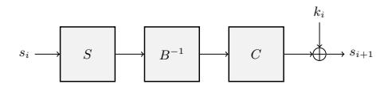
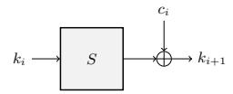
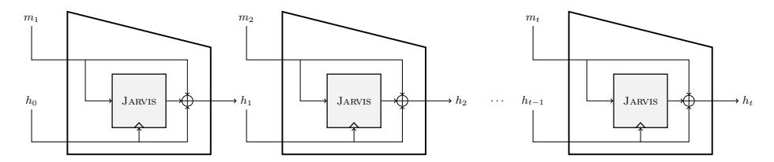
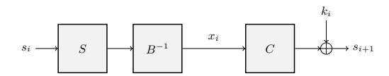
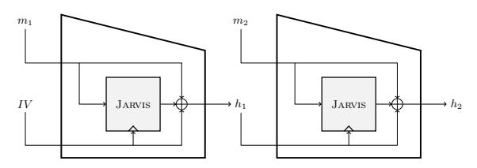
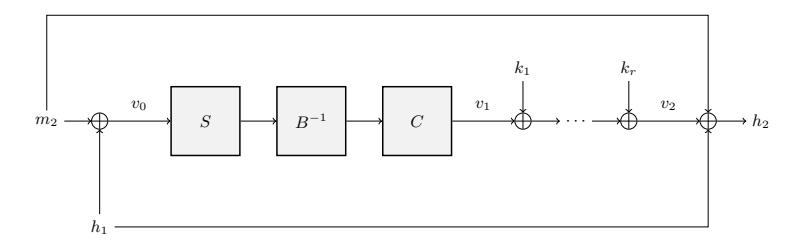
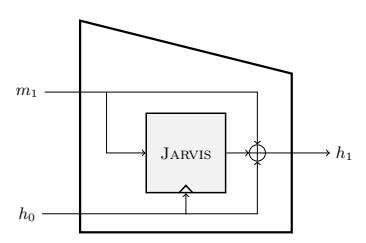

## Algebraic Cryptanalysis of STARK-Friendly Designs: Application to MARVELlous and MiMC

Martin R. Albrecht1 , Carlos Cid1,2 , Lorenzo Grassi5,6 , Dmitry Khovratovich3,4,7 , Reinhard Lüftenegger5 , Christian Rechberger5 , and Markus Schofnegger5

1 Information Security Group, Royal Holloway, University of London

2 Simula UiB

3 Dusk Network

4 ABDK Consulting

5 IAIK, Graz University of Technology

6 Know-Center

7 Evernym Inc.

firstname.lastname@rhul.ac.uk, khovratovich@gmail.com, firstname.lastname@iaik.tugraz.at

Abstract. The block cipher Jarvis and the hash function Friday, both members of the MARVELlous family of cryptographic primitives, are among the first proposed solutions to the problem of designing symmetric-key algorithms suitable for transparent, post-quantum secure zero-knowledge proof systems such as ZK-STARKs. In this paper we describe an algebraic cryptanalysis of Jarvis and Friday and show that the proposed number of rounds is not sufficient to provide adequate security. In Jarvis, the round function is obtained by combining a finite field inversion, a full-degree affine permutation polynomial and a key addition. Yet we show that even though the high degree of the affine polynomial may prevent some algebraic attacks (as claimed by the designers), the particular algebraic properties of the round function make both Jarvis and Friday vulnerable to Gröbner basis attacks. We also consider MiMC, a block cipher similar in structure to Jarvis. However, this cipher proves to be resistant against our proposed attack strategy. Still, our successful cryptanalysis of Jarvis and Friday does illustrate that block cipher designs for "algebraic platforms" such as STARKs, FHE or MPC may be particularly vulnerable to algebraic attacks.

Keywords: Gröbner Basis, MARVELlous, Jarvis, Friday, MiMC, ZK-STARKs, Algebraic Cryptanalysis, Arithmetic Circuits

## 1 Introduction

Background. Whenever a computation on sensitive data is outsourced to an untrusted machine, one has to ensure that the result is correct. Examples are database updates, user authentications, and elections. The underlying problem, formally called computational integrity, has been theoretically solved since the 1990s with the emergence of the PCP theorem. But the performance of actual implementations was too poor to handle any computation of practical interest. Only recently a few proof systems have appeared where the proving time is quasi-linear in the computation length (which is typically represented as an arithmetic circuit), e.g. ZK-SNARKs [\[PHG+13\]](#page-27-0), Bulletproofs [\[BBB+18\]](#page-24-0), and ZK-STARKs [\[BBH+18\]](#page-24-1). While they all share the overall structure, these proof systems differ in details such as the need of a trusted setup, proof size, verifier scalability, and post-quantum resistance.

The cryptographic protocols that make use of such systems for zeroknowledge proofs often face the problem that whenever a hash function is involved, the associated circuit is typically long and complex, and thus the hash computation becomes a bottleneck in the proof. An example is the Zerocash cryptocurrency protocol [\[BCG+14\]](#page-24-2): in order to spend a coin anonymously, one has to present a zero-knowledge proof that the coin is in the set of all valid coins, represented by a Merkle tree with coins as leaves. When a traditional hash function such as SHA-256 is used in the Merkle tree, the proof generation takes almost a minute for 28-level trees such as in Zcash [\[HBH+19\]](#page-26-0), which represents a real obstacle to the widespread use of privacy-oriented cryptocurrencies.

The demand for symmetric-key primitives addressing the needs of specific proof systems has been high, but only a few candidates have been proposed so far: a hash function based on Pedersen commitments [\[HBH+19\]](#page-26-0), MPC-oriented LowMC [\[ARS+15\]](#page-24-3), and big-field MiMC [\[AGR+16;](#page-23-0) [AGP+19\]](#page-23-1). Even worse, different ZK proof systems use distinct computation representations. Concretely, ZK-SNARKs prefer pairing-friendly curves over prime scalar fields, Bulletproofs uses a fast curve over a scalar field, whereas ZK-STARKs are most comfortable operating over binary fields. Hence, the issue of different representations further limits the design space of ZK-friendly primitives.

STARKs. ZK-STARKs [\[BBH+18\]](#page-24-1) is a novel proof system which, in contrast to SNARKs, does not need a trusted setup phase and whose security relies only on the existence of collision-resistant hash functions. The computation is represented as an execution trace, with polynomial relations among the trace elements. Concretely, the trace registers must be elements of some large binary field, and the polynomials should have low degree. The proof generation time is approximately[8](#page-1-0) O(S log S), where

S ≈ (Maximum polynomial degree × Trace length).

The STARK paper came with a proposal to use Rijndael-based hash functions, but as these have been shown to be insecure [\[KBN09\]](#page-26-1), custom designs are clearly needed.

8 We omit optimisations related to the trace layout.

Jarvis and Friday. Ashur and Dhooghe recently addressed this need with the proposal of the block cipher Jarvis and the hash function Friday [\[AD18\]](#page-23-2). The primitives were immediately endorsed by the ZK-STARK authors as possible solutions to reduce the STARK generation cost in many applications[9](#page-2-0) . The new hash function was claimed to offer up to a 20-fold advantage over Pedersen hashes and an advantage by a factor of 2.5 over MiMC-based hash functions, regarding the STARK proof generation time [\[BS18\]](#page-24-4).

Albeit similar in spirit to MiMC, Jarvis comes with novel design elements in order to considerably reduce the number of rounds, while still aiming to provide adequate security. In the original proposal several types of algebraic attacks were initially ruled out, and security arguments from Rijndael/AES were used to inform the choice of the number of rounds, leading to a statement that attacks were expected to cover up to three rounds only. An extra security margin was added, leading to a recommendation of 10 rounds for the variant with an expected security of 128 bits. Variants with higher claims of security were also specified.

Algebraic Attacks. This class of attacks aims to utilise the algebraic properties of a construction. One example is the Gröbner basis attack, which proceeds by modelling the underlying primitive as a multivariate system of equations which is then solved using off-the-shelf Gröbner basis algorithms [\[Buc65;](#page-24-5) [CLO97;](#page-25-0) [Fau99;](#page-25-1) [Fau02\]](#page-25-2). After some initial success against certain stream cipher constructions [\[Cou03b;](#page-25-3) [Cou03a\]](#page-25-4), algebraic attacks were also considered against block ciphers [\[MR02;](#page-27-1) [CB07\]](#page-25-5), albeit with limited success. Even approaches combining algebraic and statistical techniques [\[AC09\]](#page-23-3) were later shown not to outperform known cryptanalytic techniques [\[WSM+11\]](#page-27-2). As a result algebraic attacks are typically not considered a major concern for new block ciphers. We note however that Gröbner basis methods have proven fruitful for attacking a number of public-key schemes [\[FGO+10;](#page-25-6) [AG11;](#page-23-4) [ACF+14;](#page-23-5) [FPP14;](#page-26-2) [FGP+15\]](#page-25-7).

Contribution. In this paper we show that, while the overall design approach of Jarvis and Friday seems sound, the choice for the number of rounds is not sufficient to offer adequate security. We do this by mounting algebraic attacks on the full-round versions of the primitives with the help of Gröbner bases. Our results show that designers of symmetric-key constructions targeting "algebraic platforms" – such as STARKs, FHE and MPC – must pay particular attention to the algebraic structure of their ciphers, and that algebraic attacks should receive renewed attention from the cryptographic community.

Organisation. The remainder of this work is organised as follows. In Section [2](#page-3-0) we briefly describe the block cipher Jarvis and the hash function Friday. Following, we discuss various algebraic attacks in Section [3,](#page-6-0) including higher-order differential attacks, interpolation attacks, and in particular attacks using Gröbner

9 The ciphers were announced among high anticipation of the audience at the prime Ethereum conference DevCon4, held in November 2018 [\[BS18\]](#page-24-4).

bases. In the following sections, we describe our attacks, including key-recovery attacks on Jarvis in Section 4 and preimage attacks on Friday in Section 5. In Section 6, we describe our experimental results from running the attacks and discuss our findings. Finally, in Section 7 we analyse the S-box layer of Jarvis and compare it to the AES.

### 2 MARVELLOUS

MARVELLOUS [AD18; AABS+19] is a family of cryptographic primitives specifically designed for STARK applications. It includes the block cipher Jarvis as well as Friday, a hash function based on this block cipher. We briefly describe the two primitives in this section.

As usual, we identify functions on  $\mathbb{F}_{2^n}$  with elements in the quotient ring

$$\mathcal{R} := \mathbb{F}_{2^n}[X] / \langle X^{2^n} - X \rangle.$$

Whenever it is clear from the context, we refer to the corresponding polynomial representation in the above quotient ring when we speak of a function on  $\mathbb{F}_{2^n}$  and use the notation F(X), or just F, for the coset  $F(X) + \langle X^{2^n} - X \rangle \in \mathcal{R}$ .

#### 2.1 Jarvis

JARVIS is a family of block ciphers operating on a state and a key of n bits, thus working entirely over the finite field  $\mathbb{F}_{2^n}$ . The construction is based on ideas used by the AES, most prominently the wide-trail design strategy, which guarantees security against differential and linear (statistical) attacks. However, where AES uses multiple small S-boxes in every round, JARVIS applies a single nonlinear transformation to the whole state, essentially using one large n-bit S-box. The S-box of JARVIS is defined as the generalised inverse function  $S:\mathbb{F}_{2^n} \to \mathbb{F}_{2^n}$  with

$$S(x) := \begin{cases} x^{-1} & x \neq 0 \\ 0 & x = 0, \end{cases}$$

which corresponds to the element

$$S(X) := X^{2^n - 2} \in \mathcal{R}.$$

We note that this specific S-box makes the construction efficient in the STARK setting, because verifying it uses only one quadratic constraint (note that for non-zero  $x \in \mathbb{F}_{2^n}$  the equality  $\frac{1}{x} = y$  is equivalent to the equality  $x \cdot y = 1$ , and the constraint for the full S-box can be written as  $x^2 \cdot y + x = 0$ ). We refer to [BBH+18; AD18] for more details.

The linear layer of JARVIS is composed by evaluating a high-degree affine polynomial

$$A(X) := L(X) + \hat{c} \in \mathcal{R},$$

where  $\hat{c} \in \mathbb{F}_{2^n}$  is a constant and

$$L(X) := \sum_{i=0}^{n-1} l_{2^i} \cdot X^{2^i} \in \mathcal{R}$$

is a linearised permutation polynomial. Note that the set of all linearised permutation polynomials in  $\mathcal{R}$  forms a group under composition modulo  $X^{2^n} - X$ , also known as the *Betti-Mathieu* group [LN96].

In Jarvis, the polynomial A is built from two affine monic permutation polynomials B, C of degree 4, that is

$$B(X) := L_B(X) + b_0 := X^4 + b_2 X^2 + b_1 X + b_0 \in \mathcal{R}$$

and

$$C(X) := L_C(X) + c_0 := X^4 + c_2 X^2 + c_1 X + c_0 \in \mathcal{R}$$

satisfying the equation

$$A = C \circ B^{-1}$$
.

The operator  $\circ$  indicates composition modulo  $X^{2^n} - X$  and  $B^{-1}$  denotes the compositional inverse of B (with respect to the operator  $\circ$ ) given by

$$B^{-1}(X) := L_B^{-1}(X) + L_B^{-1}(b_0).$$

Here,  $L_B^{-1}$  denotes the inverse of  $L_B$  under composition modulo  $X^{2^n} - X$ , or in other words, the inverse of  $L_B$  in the Betti-Mathieu group. We highlight that the inverse  $B^{-1}$  shares the same affine structure with B, i.e. it is composed of a linearised permutation polynomial  $L_B^{-1}$  and a constant term in  $\mathbb{F}_{2^n}$ , but has a much higher degree.

One round of Jarvis is shown in Figure 1. Additionally, a whitening key  $k_0$  is applied before the first round.

Fig. 1: One round of the JARVIS block cipher. For simplicity, the addition of the whitening key is omitted.

**Key Schedule** The key schedule of JARVIS shares similarities with the round function itself, the main difference being that the affine transformations are omitted. In the key schedule, the first key  $k_0$  is the master key and the next round key  $k_{i+1}$  is calculated by adding a round constant  $c_i$  to the (generalised) inverse  $S(k_i)$  of the previous round key  $k_i$ . One round of the key schedule is depicted in Figure 2.

Fig. 2: The key schedule used by the JARVIS block cipher.

The first round constant  $c_0$  is randomly selected from  $\mathbb{F}_{2^n}$ , while subsequent round constants  $c_i$ ,  $1 \leq i \leq r$ , are calculated using the relation

$$c_i := a \cdot c_{i-1} + b$$

for random elements  $a, b \in \mathbb{F}_{2^n}$ .

**Instantiations** The authors of [AD18] propose four instances of Jarvis-n, where  $n \in \{128, 160, 192, 256\}$ . For each of these instances the values  $c_1$ , a, b, and the polynomials B and C are specified. Table 1 presents the recommended number of rounds r for each instance, where the claimed security level is equal to the key size (and state size) n. We will use  $r \in \mathbb{N}$  throughout this paper to denote the number of rounds of a specific instance.

Table 1: Instances of the JARVIS block cipher [AD18].

| Instance   | n   | # of rounds $r$ |
|------------|-----|-----------------|
| Jarvis-128 | 128 | 10              |
| Jarvis-160 | 160 | 11              |
| Jarvis-192 | 192 | 12              |
| Jarvis-256 | 256 | 14              |

### 2.2 Friday

FRIDAY is a hash function based on a Merkle-Damgård construction, where the block cipher Jarvis is transformed into a compression function using the Miyaguchi-Preneel scheme. In this scheme, a (padded) message block  $m_i$ ,  $1 \le i \le t$ , serves as input m to a block cipher E(m,k) and the respective previous hash value  $h_{i-1}$  serves as key k. The output of the block cipher is then added to the sum of  $m_i$  and  $h_{i-1}$ , resulting in the new hash value  $h_i$ . The first hash value  $h_0$  is an initialization vector and taken to be the zero element in  $\mathbb{F}_{2^n}$  in the case of Friday. The final state  $h_t$  is the output of the hash function. The hash function Friday is thus defined by the following iterative formula

$$h_0 := IV := 0,$$
  
 $h_i := E(m_i, h_{i-1}) + h_{i-1} + m_i,$ 

for  $1 \le i \le t$ , as illustrated in Figure 3.

Fig. 3: The Friday hash function.

### 3 Overview of Algebraic Attacks on Jarvis and Friday

From an algebraic point of view, JARVIS offers security mainly by delivering a high degree for its linear transformations and for the S-box. In the original proposal, the authors analyse the security against various algebraic attack vectors, such as higher-order differential attacks and interpolation attacks.

### 3.1 Higher-Order Differential Attacks

Higher-order differential attacks [Knu95] can be regarded as algebraic attacks that exploit the low algebraic degree of a nonlinear transformation. If this degree is low enough, an attack using multiple plaintexts and their corresponding ciphertexts can be mounted. In more detail, if the algebraic degree of a Boolean function f is d, then when applying f to all elements of an affine vector space  $\mathcal{V} \oplus c$  of dimension > d and taking the sum of these values, the result is 0, i.e.

$$\bigoplus_{v \in \mathcal{V} \oplus c} v = \bigoplus_{v \in \mathcal{V} \oplus c} f(v) = 0.$$

Finding such a distinguisher possibly allows the attacker to recover the secret key.

However, higher-order differential attacks pose no threat to JARVIS. Indeed, the algebraic degree of  $S(X) = X^{2^n-2}$  is the Hamming weight of  $2^n - 2$ , which is equal to n-1 and thus maximal (note that the S-box is a permutation). This makes higher-order differential attacks and zero-sum distinguishers infeasible after only one round of JARVIS.

### 3.2 Interpolation Attacks

Interpolation attacks were introduced in 1997 [JK97] and are another type of algebraic attack where the attacker constructs the polynomial corresponding to the encryption (or decryption) function without knowing the secret key. The basis of interpolation attacks is a consequence of the Fundamental Theorem of Algebra: given d+1 pairs  $(x_0,y_0),\ldots,(x_d,y_d)$  of elements in a certain field  $\mathbb{F}$ , there is a unique polynomial  $P(X) \in \mathbb{F}[X]$  of degree at most d which satisfies

$$P(x_i) = y_i$$

for all  $0 \le i \le d$ . To put it another way, the polynomial P(X) interpolates the given pairs  $(x_i, y_i)$ , which is why it deserves the denotation interpolation polynomial. There are several approaches for calculating all the coefficients of the interpolation polynomial. A classical technique is to choose Lagrange's basis  $(L_0, L_1, \ldots, L_d)$ , with

$$L_i(X) := \prod_{\substack{j=0\\j\neq i}}^d \frac{X - x_j}{x_i - x_j} \in \mathbb{F}[X],$$

as a basis for the  $\mathbb{F}$ -vector space  $\mathbb{F}[X]$  and read off the solution  $(p_0, \dots, p_d)$  from the resulting system of equations

$$y_i = P(x_i) = p_0 L_0(x_i) + p_1 L_1(x_i) + \ldots + p_d L_d(x_i), \ 0 \le i \le d.$$

Lagrange's basis leads to a complexity of  $\mathcal{O}(d^2)$  field operations and so does Newton's basis  $\{N_0, N_1, \dots, N_d\}$  with

$$N_i(X) := \prod_{j=0}^{i-1} (X - x_j) \in \mathbb{F}[X].$$

A different approach uses the fact that polynomial interpolation can be reduced to polynomial evaluation, as discussed by HOROWITZ [Hor72] and KUNG [Kun73], leading to a complexity of  $\mathcal{O}(d\log^2 d)$  field operations. In essence, this approach relies on the Fast Fourier Transform for polynomial multiplication.

From the above complexity estimates, it is thus desirable that the polynomial representation of the encryption function reaches a high degree and forces all possible monomials to appear. In JARVIS, a high word-level degree is already reached after only one round; additionally the polynomial expression of the encryption function is also dense after only two rounds. It follows that interpolation attacks pose no threat to JARVIS.

### 3.3 Gröbner Basis Attacks

The first step in a Gröbner basis attack is to describe the primitive by a system of polynomial equations. Subsequently, a Gröbner basis [Buc65; CLO97] for the ideal defined by the corresponding polynomials is calculated and finally used to solve for specified variables. In more detail, Gröbner basis attacks consist of three phases:

- 1. Set up an equation system and compute a Gröbner basis (typically for the degrevlex term order for performance reasons) using an algorithm such as Buchberger's algorithm [Buc65], F4 [Fau99], or F5 [Fau02].
- 2. Perform a change of term ordering for the computed Gröbner basis (typically going from the *degrevlex* term order to the *lex* one, which facilitates

computing elimination ideals and hence eliminating variables) using an algorithm such as FGLM [FGL+93]. Note that in our applications all systems of algebraic equations result in zero-dimensional ideals, i.e. the systems have only finitely many solutions.

3. Solve the univariate equation for the last variable using a polynomial factoring algorithm, and substitute into other equations to obtain the full solution of the system.

Cost of Gröbner Basis Computation. For a generic system of  $n_e$  polynomial equations

$$F_1(x_1,\ldots,x_{n_v}) = F_2(x_1,\ldots,x_{n_v}) = \cdots = F_{n_e}(x_1,\ldots,x_{n_v}) = 0$$

in  $n_v$  variables  $x_1, \ldots, x_{n_v}$ , the complexity of computing a Gröbner basis [BFP12] is

$$C_{\rm GB} \in \mathcal{O}\left(\binom{n_v + D_{\rm reg}}{D_{\rm reg}}\right)^{\omega},$$
 (1)

where  $2 \leq \omega < 3$  is the linear algebra exponent representing the complexity of matrix multiplication and  $D_{\text{reg}}$  is the degree of regularity. The constants hidden by  $\mathcal{O}(\cdot)$  are relatively small, which is why  $\binom{n_v + D_{\text{reg}}}{D_{\text{reg}}}^{\omega}$  is typically used directly. In general, computing the degree of regularity is a hard problem. However, the degree of regularity for "regular sequences" [BFS+05] is given by

$$D_{\text{reg}} = 1 + \sum_{i=1}^{n_e} (d_i - 1), \tag{2}$$

where  $d_i$  is the degree of  $F_i$ . Regular sequences have  $n_e = n_v$ . More generally, for "semi-regular sequences" (the generalisation of regular sequences to  $n_e > n_v$ ) the degree of regularity can be computed as the index of the first non-positive coefficient in

$$H(z) = \frac{1}{(1-z)^{n_v}} \times \prod_{i=1}^{n_e} (1-z^{d_i}).$$

It is conjectured that most sequences are semi-regular [Frö85]. Indeed, experimental evidence suggests random systems behave like semi-regular systems with high probability. Hence, assuming our target systems of equations behave like semi-regular sequences, i.e. they have no additional structure, the complexity of computing a Gröbner basis depends on (a) the number of equations  $n_e$ , (b) the degrees  $d_1, d_2, \ldots, d_{n_e}$  of the equations, and (c) the number of variables  $n_v$ . Crucially, our experiments described later in the paper indicate that the systems considered in this work do not behave like regular sequences.

 $Cost\ of\ Gr\"{o}bner\ Basis\ Conversion.$  The complexity of the FGLM algorithm [FGL+93] is

$$C_{\text{FGLM}} \in \mathcal{O}\left(n_v \cdot \deg(\mathcal{I})^3\right),$$
 (3)

where deg(I) is called the degree of the ideal and defined as the dimension of the quotient ring F[X1, X2, . . . , Xn]/I as an F-vector space. For the systems we are considering in this paper – which are expected to have a unique solution in F – the dimension of R/I corresponds to the degree of the unique univariate polynomial equation in the reduced Gröbner basis with respect to the canonical lexicographic order [\[KR00,](#page-26-8) Theorem 3.7.25]. Again, the hidden constants are small, permitting to use nv · deg(I) 3 directly. A sparse variant of the algorithm also exists [\[FM11\]](#page-25-9) with complexity O (deg(I)(N1 + nv log deg(I))), where N1 is the number of nonzero entries of a multiplication matrix, which is sparse even if the input system spanning I is dense. Thus, the key datum to establish for estimating the cost of this step is deg(I).

Cost of Factoring. Finally, we need to solve for the last variable using the remaining univariate polynomial equation obtained by computing all necessary elimination ideals. This can be done by using a factorisation algorithm. For example, the complexity of a modified version of the Berlekamp algorithm [\[Gen07\]](#page-26-9) to factorise a polynomial P of degree D over F2n is

$$C_{\text{Sol}} \in \mathcal{O}\left(D^3 n^2 + D n^3\right). \tag{4}$$

In our context, we can however reduce the cost of this step by performing the first and second steps of the attack for two (or more) (plaintext, ciphertext) pairs and then considering the GCD of the resulting univariate polynomials, which are univariate in the secret key variable k0. Computing polynomial GCDs is quasi-linear in the degree of the input polynomials. In particular, we expect

$$C_{\text{Sol}} \in \mathcal{O}\left(D(\log(D))^2\right).$$
 (5)

We will again drop the O(·) and use the expressions directly.

Our Algebraic Attacks on MARVELlous. All attacks on MARVELlous presented in this paper are inherently Gröbner basis attacks which, on the one hand, are based on the fact that the S-box S(X) = X2 n−2 of Jarvis can be regarded as the function S :F2n → F2n , where

$$S(x) = x^{-1}$$

for all elements except the zero element in F2n . As a consequence, the relation

$$y = S(x) = x^{-1}$$

can be rewritten as an equation of degree 2 in two variables, namely

$$x \cdot y = 1$$

which holds everywhere except for the zero element in F2n . We will use this relation in our attacks, noting that x = 0 occurs with a negligibly small probability for n ≥ 128.

On the other hand, we exploit the fact that the decomposition of the affine polynomial A originates from two low-degree polynomials B and C. When setting up the associated equations for Jarvis, we introduce intermediate variables in such a way that the low degree of B and C comes into effect, and then show that the particular combination of the inverse S-box  $S(X) = X^{2^n-2}$  with the affine layer in Jarvis is vulnerable to Gröbner basis attacks.

Based on the above observations, we describe in the next sections:

- a key-recovery attack on reduced-round Jarvis and an optimised key-recovery attack on full-round Jarvis;
- its extension to a (two-block) preimage attack on full-round FRIDAY;
- a more efficient direct preimage attack on full-round FRIDAY.

### 4 Gröbner Basis Computation for Jarvis

We first describe a straightforward approach, followed by various optimisations which are necessary to extend the attack to all rounds.

#### 4.1 Reduced-Round Jarvis

Let  $B, C \in \mathcal{R}$  be the polynomials of the affine layer in JARVIS. Furthermore, in round i of JARVIS let us denote the intermediate state between the application of  $B^{-1}$  and C as  $x_i$ , for  $1 \le i \le r$  (see Figure 4).

Fig. 4: Intermediate state  $x_i$  in one round of the encryption path.

As a result, two consecutive rounds of JARVIS can be related by the equation

$$(C(x_i) + k_i) \cdot B(x_{i+1}) = 1$$
 (6)

for  $1 \leq i \leq r-1$ . As both polynomials B and C have degree 4, equation (6) yields a system of r-1 polynomial equations, each of degree 8, in the variables  $x_1, \ldots, x_r$  and  $k_0, \ldots, k_r$ . To make the system dependent on the plaintext p and the ciphertext c, we add the two equations

$$B(x_1) \cdot (p + k_0) = 1,\tag{7}$$

$$C(x_r) = c + k_r \tag{8}$$

to this system. Additionally, two successive round keys are connected through the equation

$$(k_{i+1} + c_i) \cdot k_i = 1 \tag{9}$$

for 0 ≤ i ≤ r − 1. In total, the above description of Jarvis amounts to 2 · r + 1 equations in 2 · r + 1 variables, namely:

- r − 1 equations of degree 8 (equation [\(6\)](#page-10-2)),
- one equation of degree 5 (equation [\(7\)](#page-10-3)),
- one equation of degree 4 (equation [\(8\)](#page-10-4)),
- r equations of degree 2 (equation [\(9\)](#page-10-5)),

in the 2 · r + 1 variables x1, . . . , xr and k0, . . . , kr. Since the number of equations is equal to the number of variables, we can estimate the complexity of a Gröbner basis attack by using Equation [\(2\)](#page-8-0). According to this estimate, the computation of a Gröbner basis for the above system of equations is prohibitively expensive for full-round Jarvis. For example, Equation [\(2\)](#page-8-0) predicts a complexity of ≈ 120 bits (when setting ω = 2.8) for computing a Gröbner basis for r = 6. However, we note that we were able to compute such a basis in practice (Section [6\)](#page-18-0), which indicates that the above estimate is too pessimistic.

### 4.2 Optimisations for an attack on Full-Round Jarvis

In order to optimise the computation from the previous section and extend it to full-round Jarvis, we introduce two main improvements. First, we reduce the number of variables and equations used for intermediate states. Secondly, we relate all round keys to the master key, which helps to further reduce the number of variables.

A More Efficient Description of Intermediate States The main idea is to reduce the number of equations and variables for intermediate states at the expense of an increased degree in some of the remaining equations. By relating a fixed intermediate state xi to the respective preceding and succeeding intermediate states xi−1 and xi+1, we obtain the equations

$$B(x_i) = \frac{1}{C(x_{i-1}) + k_{i-1}},\tag{10}$$

$$C(x_i) = \frac{1}{B(x_{i+1})} + k_i \tag{11}$$

for 2 ≤ i ≤ r − 1. Since both B and C are monic affine polynomials of degree 4, we claim that it is possible to find monic affine polynomials

$$D(X) := X^4 + d_2 X^2 + d_1 X + d_0$$

and

$$E(X) := X^4 + e_2 X^2 + e_1 X + e_0,$$

also of degree 4, such that

$$D(B) = E(C).$$

Indeed, comparing corresponding coefficients of D(B) and E(C) yields a system of 5 linear equations in the 6 unknown coefficients d0, d1, d2, e0, e1, e2, which can then be solved. We explain the construction of D and E in more detail in Appendix [A.](#page-28-0)

From now on let us assume we have already found appropriate polynomials D and E. After applying D and E to Equation [\(10\)](#page-11-0) and Equation [\(11\)](#page-11-1), respectively, we equate the right-hand side parts of the resulting equations and get

$$D\left(\frac{1}{C(x_{i-1}) + k_{i-1}}\right) = E\left(\frac{1}{B(x_{i+1})} + k_i\right)$$
(12)

for 2 ≤ i ≤ r − 1. Eventually we obtain a system of polynomial equations of degree 36 by clearing denominators in Equation [\(12\)](#page-12-0).

The crucial point is that variables for every second intermediate state may now be dropped out of the description of Jarvis. This is because we can consider either only evenly indexed states or only odd ones, and by doing so, we have essentially halved the number of equations and variables needed to describe intermediate states. We note that in all optimised versions of our attacks we only work with evenly indexed intermediate states, as this choice allows for a more efficient description of Jarvis compared to working with odd ones.

Finally we relate the plaintext p and the ciphertext c to the appropriate intermediate state x2 and xr, respectively, and set

$$D\left(\frac{1}{p+k_0}\right) = E\left(\frac{1}{B(x_2)} + k_1\right),\tag{13}$$

$$C(x_r) + k_r = c. (14)$$

Here, the degree of Equation [\(13\)](#page-12-1) is 24, while Equation [\(14\)](#page-12-2) has degree 4.

Remarks. It is worth pointing out that the above description uses several implicit assumptions. First, it may happen that some intermediate states become zero, with the consequence that our approach will not find a solution. However, this case only occurs with a negligibly small probability, in particular when considering instances with n ≥ 128. If this event occurs we can use another plaintext-ciphertext pair. Secondly, when we solve the optimised system of equations (i.e. the system we obtain after applying D and E), not all of the solutions we find for this system are guaranteed to be valid solutions for the original system of equations. Lastly, Equation [\(14\)](#page-12-2) implicitly assumes an even number of rounds. If we wanted to attack an odd number of rounds instead, this equation had to be adjusted accordingly.

Relating Round Keys to the Master Key Two consecutive round keys in Jarvis are connected by the relation

$$k_{i+1} = \frac{1}{k_i} + c_i$$

if  $k_i \neq 0$ , which is true with high probability for large state sizes n. As a consequence, each round key is a rational function of the master key  $k_0$  of degree 1, i.e.

$$k_{i+1} = \frac{\alpha_i \cdot k_0 + \beta_i}{\gamma_i \cdot k_0 + \delta_i}.$$

We provide the exact values for  $\alpha_i$ ,  $\beta_i$ ,  $\gamma_i$ , and  $\delta_i$  in Appendix B. Expressing  $k_i$  as a rational function of  $k_0$  in Equation (12) and Equation (14) raises the total degree of these equations to 40 and 5, respectively. On the other hand, the degree of Equation (13) remains unchanged.

## 4.3 Complexity Estimates of Gröbner Basis Computation for Jarvis

Assuming the number of rounds  $\boldsymbol{r}$  to be even, the aforementioned two improvements yield

- $-\frac{r}{2}-1$  equations of degree 40 (equation (12)),
- one equation of degree 24 (equation (13)),
- one equation of degree 5 (equation (14)),

in  $\frac{r}{2}+1$  variables (the intermediate states  $x_2, x_4, \ldots, x_r$  and the master key  $k_0$ ). Since the number of equations equals the number of variables, we may calculate the degree of regularity using Equation (2), again assuming the system behaves like a regular sequence.

Our results for the degree of regularity, and thus also for the complexity of computing a Gröbner basis, are listed in Table 2. Note that we assume  $\omega=2.8$ . However, this is possibly a pessimistic choice, as the regarded systems are sparse. We therefore also give the complexities for  $\omega=2$  in parentheses.

Table 2: Complexity estimates of Gröbner basis computations for r-round JARVIS.

| r               | $n_v$ | $D_{\text{reg}}$ | Complexity in bits |
|-----------------|-------|------------------|--------------------|
| 6               | 4     | 106              | 63 (45)            |
| 8               | 5     | 145              | 82 (58)            |
| 10 (Jarvis-128) | 6     | 184              | 100 (72)           |
| 12 (Jarvis-192) | 7     | 223              | 119 (85)           |
| 14 (Jarvis-256) | 8     | 262              | 138 (98)           |
| 16              | 9     | 301              | 156 (112)          |
| 18              | 10    | 340              | 175(125)           |
| 20              | 11    | 379              | 194 (138)          |

These values show that we are able to compute Gröbner bases for, and therefore successfully attack, all full-round versions of JARVIS. We note that, even

when pessimistically assuming that the memory complexity of a Gröbner basis computation is asymptotically the same as its time complexity (the memory complexity of any algorithm is bounded by its time complexity) and when considering the time-memory product (which is highly pessimistic from an attacker's point of view), our attacks against JARVIS-256 are still valid.

## 5 Gröbner Basis Computation for FRIDAY

In this section, we let  $F: \mathbb{F}_{2^n} \times \mathbb{F}_{2^n} \to \mathbb{F}_{2^n}$  indicate the application of one block of FRIDAY.

# 5.1 Extending the Key-Recovery Attack on Jarvis to a Preimage Attack on Friday

Using the same equations as for Jarvis described in Section 4, a preimage attack on Friday may also be mounted. At its heart, the attack on Friday with r rounds is an attack on Jarvis with r-1 rounds.

Fig. 5: Two blocks of Friday.

We work with two blocks of Friday, hence a message m is the concatenation

$$m = m_1 \mid\mid m_2$$

of two message blocks  $m_1, m_2 \in \mathbb{F}_{2^n}$ . The output of the first block is denoted by  $h_1$  and the known (final) hash value of the second block is denoted by  $h_2$ . The hash values  $h_1$  and  $h_2$  can be expressed as

$$h_1 = F(m_1, IV)$$

and

$$h_2 = F(m_2, h_1).$$

The initialization vector IV is just the zero element in  $\mathbb{F}_{2^n}$ . We refer to Figure 5 for an illustration of the introduced notation.

Our preimage attack proceeds as follows: in the first part, we use random values  $\hat{m}_1$  for the input to the first block to populate a table  $T_1$  in which each

entry contains a pair  $(\hat{m}_1, \hat{h}_1)$ , where  $\hat{h}_1$  denotes the corresponding intermediate hash value

$$\hat{h}_1 := F(\hat{m}_1, IV).$$

In the second part, we find pairs  $(m'_2, h'_1)$  with

$$F(m_2', h_1') = h_2,$$

or in other words, pseudo preimages for the known hash value  $h_2$ . To find such a pseudo preimage, we fix the sum  $m_2 + h_1$  to an arbitrary value  $v_0 \in \mathbb{F}_{2^n}$ , i.e. we set

$$v_0 := m_2 + h_1.$$

This has two effects:

- 1. In the second block, the value  $v_1$  entering the first round of JARVIS is fixed and known until the application of the second round key. Essentially, this means that one round of JARVIS can be skipped.
- 2. Since  $v_0=m_2+h_1$  is fixed and known, the final output  $v_2$  of JARVIS is defined by

$$v_2 := v_0 + h_2$$

and thus also known.

In the current scenario, the intermediate hash value  $h_1$  serves as master key for the r round keys  $k_1, k_2, \ldots, k_r$  applied in the second block. Using  $v_1$  as plaintext and  $v_2$  as ciphertext, an attack on JARVIS with r-1 rounds is sufficient to reveal these round keys. Once one of the round keys is recovered, we calculate the second part  $h_1'$  of a pseudo preimage  $(m_2', h_1')$  by applying the inverse key schedule to the recovered key. Finally, we set

$$m_2' := h_1' + v_0$$

and thereby obtain the remaining part of a pseudo preimage. How the presented pseudo preimage attack on r-round FRIDAY reduces to a key-recovery attack on (r-1)-round JARVIS is outlined in Figure 6.

Conceptually, we repeat the pseudo preimage attack many times (for different values of  $v_0$ ) and store the resulting pairs  $(m'_2, h'_1)$  in a table  $T_2$ . The aim is to produce matching entries  $(\hat{m}_1, \hat{h}_1)$  and  $(m'_2, h'_1)$  in  $T_1$  and  $T_2$  such that

$$\hat{h}_1 = h_1',$$

which implies

$$F(m'_2, F(\hat{m}_1, IV)) = F(m'_2, \hat{h}_1) = F(m'_2, h'_1) = h_2,$$

giving us the preimage  $(\hat{m}_1, m'_2)$  we are looking for.

Fig. 6: Internals of the second block of FRIDAY. The values  $v_0$ ,  $v_1$  and  $v_2$  are known.

Remark. The (input, output) pairs  $(v_1, v_2)$  we use for the underlying keyrecovery attack on Jarvis are not proper pairs provided by, e.g., an encryption oracle for Jarvis. Thus, it may happen that for some pairs  $(v_1, v_2)$  the keyrecovery attack does not succeed, i.e. there is no key  $h'_1$  which maps  $v_1$  to  $v_2$ . The probability for such an event is

$$P_{\text{fail}} = \left(\frac{2^n - 1}{2^n}\right)^{2^n} = \left(1 - \frac{1}{2^n}\right)^{2^n} \approx \lim_{k \to \infty} \left(1 - \frac{1}{k}\right)^k = \frac{1}{e}$$

for large n.

### 5.2 Complexity of Generating Pseudo Preimages

The cost of generating pseudo preimages is not negligible. Hence, we cannot afford to generate tables  $T_1$  and  $T_2$ , each with  $2^{\frac{n}{2}}$  entries, and then look for a collision. However, given the attack complexities for JARVIS in Table 2, an attack on 9-round JARVIS has a complexity of around 83 bits (assuming  $\omega=2.8$ ). Considering JARVIS-128, for example, this means we can generate up to  $2^{45}$  pseudo preimages.

Let us assume we calculate  $2^{10}$  pseudo preimages  $(\hat{m}_1, m'_1)$  and  $2^{\frac{n}{2}}$  intermediate pairs  $(\hat{m}_1, \hat{h}_1)$ , in both cases for FRIDAY instantiated with JARVIS-128. This leaves us with a table  $T_1$  containing  $2^{\frac{n}{2}}$   $(\hat{m}_1, \hat{h}_1)$  pairs and a table  $T_2$  containing  $2^{10}$   $(m'_2, h'_1)$  pairs.

Assuming that all hash values in  $T_1$  are pairwise distinct and that also all hash values in  $T_2$  are pairwise distinct, the probability that we find at least one hash collision between a pair in  $T_1$  and a pair in  $T_2$  is

$$P = 1 - \prod_{i=0}^{|T_2|-1} \left( 1 - \frac{|T_1|}{2^{128} - i} \right), \tag{15}$$

which is, unfortunately, too low for  $|T_1| = 2^{\frac{n}{2}}$ . However, we can increase this probability by generating more entries for  $T_1$ . Targeting a total complexity of, e.g.,  $\approx 120$  bits, we can generate  $2^{118}$  such entries. Note that the number of

expected collisions in a table of m random n-bit entries is

$$N_c = m - 2^n + 2^n \cdot \left(\frac{2^n - 1}{2^n}\right)^m.$$

Therefore, the expected number of unique values in such a table is

$$N_u = \left(1 - \frac{N_c}{m}\right) \cdot m = m - N_c = 2^n - 2^n \cdot \left(\frac{2^n - 1}{2^n}\right)^m.$$

We want that  $N_u \geq 2^{118}$ , and by simple computation it turns out that  $2^{119}$  hash evaluations are sufficient with high probability. Using these values in Equation (15) yields a success probability of around 63 percent.

### 5.3 Direct Preimage Attack on FRIDAY

The preimage attack we present in this section works with *one* block of FRIDAY, as shown in Figure 7.

Fig. 7: Preimage attack on FRIDAY using one message block.

The description of the intermediate states  $x_1, \ldots, x_r$  yields the same system of equations as before; however, in contrast to the optimised attack on JARVIS described in Section 4.2, in the current preimage attack on FRIDAY the master key  $k_0$  and thus all subsequent round keys  $k_1, \ldots, k_r$  are known. As an effect, we do not need to express round keys as a rational function of  $k_0$  anymore. For the sake of completeness, we give Equation (12) once more and note that the degree now decreases to 32 (from formerly 40). It holds that

$$D\left(\frac{1}{C(x_{i-1}) + k_{i-1}}\right) = E\left(\frac{1}{B(x_{i+1})} + k_i\right)$$

for  $2 \le i \le r - 1$ . Moreover, an additional equation is needed to describe the structure of the Miyaguchi-Preneel compression function (see Figure 6), namely

$$B(x_1) \cdot (C(x_r) + k_r + h_1) = 1.$$

Again, we assume an even number of rounds r and work with intermediate states  $x_2, x_4, \ldots, x_r$ , which is why we need to apply the transformations D and E to cancel out the state  $x_1$  in the above equation. Thus, eventually we have

$$D\left(\frac{1}{C(x_r) + k_r + h_1}\right) = E\left(\frac{1}{B(x_2)} + k_1\right). \tag{16}$$

Here,  $h_1$  denotes the hash value for which we want to find a preimage  $m_1'$  such that

$$F(m_1', h_0) = h_1.$$

To obtain  $m'_1$  we solve for the intermediate state  $x_r$  and calculate

$$m_1' := C(x_r) + k_r + h_1 + h_0.$$

The value  $h_0 = k_0$  can be regarded as the initialisation vector and is the zero element in  $\mathbb{F}_{2^n}$ . The above attack results in:

- $-\frac{r}{2}-1$  equations of degree 32 coming from Equations (12) when considering even intermediate states, and
- one equation of degree 32 coming from Equation (16),

in the  $\frac{r}{2}$  variables  $x_2, x_4, \ldots, x_r$ . The number of equations is the same as the number of variables, and we can again use Equation (2) to estimate the degree of regularity. The complexities of the Gröbner basis computations are summarised in Table 3, where we pessimistically assume  $\omega = 2.8$ , but also give the complexities for  $\omega = 2$  in parentheses.

Table 3: Complexity estimates for the Gröbner basis step in preimage attacks on FRIDAY using r-round JARVIS.

| r               | $n_v$ | $D_{\text{reg}}$ | Complexity in bits |
|-----------------|-------|------------------|--------------------|
| 6               | 3     | 94               | 48 (34)            |
| 8               | 4     | 125              | 65 (47)            |
| 10 (Jarvis-128) | 5     | 156              | 83 (59)            |
| 12 (Jarvis-192) | 6     | 187              | 101 (72)           |
| 14 (Jarvis-256) | 7     | 218              | 118 (85)           |
| 16              | 8     | 249              | 136 (97)           |
| 18              | 9     | 280              | 154 (110)          |
| 20              | 10    | 311              | 172 (123)          |

## 6 Behaviour of the Attacks against Jarvis and Friday

Recall that our attack has three steps:

- 1. Set up an equation system and compute a Gröbner basis using, e.g., the F4 algorithm [Fau99], with cost  $C_{GB}$ .
- 2. Perform a change of term ordering for the computed Gröbner basis using the FGLM algorithm [FGL+93], with cost  $\mathcal{C}_{\text{FGLM}}$ .
- 3. Solve the remaining univariate equation for the last variable using a polynomial factoring algorithm, substitute into other equations, with cost  $\mathcal{C}_{Sol}$ .

For the overall cost of the attack we have 10:

$$C := 2C_{\text{GB}} + 2C_{\text{FGLM}} + C_{\text{Sol}},$$

$$C := 2\left(\binom{n_v + D}{D}^{\omega}\right) + 2\left(n_v \cdot D_u^3\right) + \left(D_u \log^2 D_u\right).$$

We can estimate  $\mathcal{C}_{GB}$  if we assume that our systems behave like regular sequences. For the  $\mathcal{C}_{FGLM}$  and  $\mathcal{C}_{Sol}$  we need to establish the degree  $D_u$  of the univariate polynomial recovered, for which however we do not have an estimate. We have therefore implemented our attacks on JARVIS and FRIDAY using Sage v8.6 [Ste+19] with Magma v2.20–5 [BCP97] as the Gröbner basis engine. In particular, we implemented both the unoptimised and the optimised variants of the attacks from Sections 4.2 and 5.3.

We observed that our attacks performed significantly better in our experiments than predicted. On the one hand, our Gröbner basis computations reached significantly lower degrees D than the (theoretically) expected  $D_{\text{reg}}$ . Furthermore, the degrees of the univariate polynomials seem to grow as  $\approx 2 \cdot 5^r$  (Jarvis) and as  $\approx 2 \cdot 4^r$  (Friday), respectively, suggesting the second and third steps of our attack are relatively cheap.

We therefore conclude that the complexities given in Tables 2 and 3 are conservative upper bounds for our attacks on Jarvis and Friday. We summarise our findings in Table 4, and the source code of our attacks on MARVELLOUS is available on GitHub11.

### 6.1 Comparison with MiMC

We note that the same attack strategy – direct Gröbner basis computation to recover the secret key – also applies, in principle, to MiMC, as pointed out by [Ash19]. In particular, it is easy to construct a multivariate system of equations for MiMC with degree 3 that is already a Gröbner basis by introducing a new state variable per round 12. This makes the first step of a Gröbner basis attack free. 13 However, then the change of ordering has to essentially undo the

As suggested in Section 3.3, our attack proceeds by running steps 1 and 2 twice, and recovering the last variable via the GCD computation, thus reducing the complexity of step 3.

11 https://github.com/IAIK/marvellous-attacks

&lt;sup>12 This property was observed by Tomer Ashur and Alan Szepieniec and shared with us during personal communication.

&lt;sup>13 We note that this situation is somewhat analogous to the one described in [BPW06].

Table 4: Experimental results using Sage.

|   |        |                  | Table 1: Expe                                           | 111110110 | car resures asm;          | 5 Dage.                   |                     |  |  |
|---|--------|------------------|---------------------------------------------------------|-----------|---------------------------|---------------------------|---------------------|--|--|
|   |        |                  | JA                                                      | RVIS (C   | optimised)                |                           |                     |  |  |
| r | $n_v$  | $D_{\text{reg}}$ | $2 \log_2 \binom{n_v + D_{\text{reg}}}{D_{\text{reg}}}$ | D         | $2\log_2\binom{n_v+D}{D}$ | $D_u = \deg(\mathcal{I})$ | Time                |  |  |
| 3 | 2      | 47               | 20                                                      | 26        | 17                        | 256                       | 0.3s                |  |  |
| 4 | 3      | 67               | 31                                                      | 40        | 27                        | 1280                      | 9.4s                |  |  |
| 5 | 3      | 86               | 34                                                      | 40        | 27                        | 6144                      | 891.4s              |  |  |
| 6 | 4      | 106              | 45                                                      | 41        | 34                        | 28672                     | $99989.0\mathrm{s}$ |  |  |
|   |        |                  | Jar                                                     | vis (ur   | noptimised)               |                           |                     |  |  |
| 3 | 4      | 25               | 29                                                      | 10        | 20                        | 256                       | 0.5s                |  |  |
| 4 | 5      | 33               | 38                                                      | 11        | 24                        | 1280                      | 23.9s               |  |  |
| 5 | 6      | 41               | 47                                                      | 13        | 29                        | 6144                      | $2559.8\mathrm{s}$  |  |  |
| 6 | 7      | 47               | 55                                                      | 14        | 34                        | 28672                     | 358228.6s           |  |  |
|   | Friday |                  |                                                         |           |                           |                           |                     |  |  |
| 3 | 2      | 39               | 19                                                      | 32        | 18                        | 128                       | 3.6s                |  |  |
| 4 | 2      | 63               | 22                                                      | 36        | 19                        | 512                       | 0.5s                |  |  |
| 5 | 3      | 70               | 32                                                      | 36        | 26                        | 2048                      | 36.5s               |  |  |
| 6 | 3      | 94               | 34                                                      | 48        | 29                        | 8192                      | 2095.2s             |  |  |
|   |        |                  |                                                         |           |                           |                           |                     |  |  |

In the table, r denotes the number of rounds,  $D_{\text{reg}}$  is the expected degree of regularity under the assumption that the input system is regular,  $n_v$  is the number of variables,  $2 \cdot \log_2 \binom{n_v + D_{\text{reg}}}{D_{\text{reg}}}$  is the expected bit security for  $\omega = 2$  under the regularity assumption, D is the highest degree reached during the Gröbner basis computation, and  $2 \cdot \log_2 \binom{n_v + D}{D}$  is the expected bit security for  $\omega = 2$  based on our experiments. The degree of the recovered univariate polynomial used for solving the system is denoted as  $D_u$ .

construction to recover a univariate polynomial of degree  $D_u \approx 3^r$ . Performing this step twice produces two such polynomials from which we can recover the key by applying the GCD algorithm with complexity  $\tilde{\mathcal{O}}(3^r)$ . In [AGR+16], the security analysis implicitly assumes that steps 1 and 2 of our attack are free by constructing the univariate polynomial directly and costing only the third and final step of computing the GCD.

The reason our Gröbner basis attacks are so effective against FRIDAY and JARVIS is that the particular operations used in the ciphers – finite field inversion and low-degree linearised polynomials – allow us to construct a polynomial system with a relatively small number of variables, which can in turn be efficiently solved using our three-step attack strategy. We have not been able to construct such amenable systems for MiMC.

### 7 Comparing the S-Boxes of Jarvis and the AES

The non-linear operation in JARVIS shows similarities with the AES S-box  $S_{AES}(X)$ . In particular,  $S_{AES}(X)$  is the composition of an  $\mathbb{F}_2$ -affine function  $A_{AES}$  and the multiplicative inverse of the input in  $\mathbb{F}_{2^8}$ , i.e.

$$S_{\text{AES}}(X) = A_{\text{AES}}(X^{254}),$$

where

$$\begin{split} A_{\rm AES}(X) &= \mathtt{0x8F} \cdot X^{128} + \mathtt{0xB5} \cdot X^{64} + \mathtt{0x01} \cdot X^{32} + \mathtt{0xF4} \cdot X^{16} + \\ \mathtt{0x25} \cdot X^8 + \mathtt{0xF9} \cdot X^4 + \mathtt{0x09} \cdot X^2 + \mathtt{0x05} \cdot X + \mathtt{0x63}. \end{split}$$

In Jarvis, we can also view the S-box as

$$S(X) = A(X^{254}),$$

where

$$A(X) = (C \circ B^{-1})(X)$$

and both B and C are of degree 4. In this section we show that  $A_{\rm AES}$  cannot be split into

$$A_{\text{AES}}(X) = (\hat{C} \circ \hat{B}^{-1})(X),$$

with both  $\hat{B}$  and  $\hat{C}$  of low degree. To see this, first note that above decomposition implies

$$\hat{B}(X) = A_{\text{AES}}^{-1}(\hat{C}(X)),$$

where

$$\begin{split} A_{\rm AES}^{-1}(X) &= \mathtt{0x6E} \cdot X^{128} + \mathtt{0xDB} \cdot X^{64} + \mathtt{0x59} \cdot X^{32} + \mathtt{0x78} \cdot X^{16} + \\ \mathtt{0x5A} \cdot X^8 + \mathtt{0x7F} \cdot X^4 + \mathtt{0xFE} \cdot X^2 + \mathtt{0x5} \cdot X + \mathtt{0x5} \end{split}$$

is the compositional inverse polynomial of  $A_{AES}$  satisfying the relation

$$A_{\text{AES}}^{-1}(A_{\text{AES}}(x)) = x,$$

for every  $x \in \mathbb{F}_{2^8}$ . Hence, to show that at least one of  $\hat{B}, \hat{C}$  is of degree > 4, it suffices to compute  $A_{\text{AES}}^{-1}(\hat{C})$  assuming a degree 4 for  $\hat{C}$ , and to show that then the corresponding  $\hat{B}$  has degree > 4.

Remark. First of all, note that since  $A_{\text{AES}}$  has degree 128, it is always possible to find polynomials  $\hat{C}$  and  $\hat{B}$  of degree 8 such that the equality  $A_{\text{AES}}(X) = \hat{C}(\hat{B}^{-1}(X))$  is satisfied. Indeed, if both  $\hat{C}$  and  $\hat{B}$  have degree 8, then each one of them have all monomials of degrees 1, 2, 4 and 8. The equality  $A_{\text{AES}}(X) = \hat{C}(\hat{B}^{-1}(X))$  is then satisfied if 8 equations (one for each monomial of  $A_{\text{AES}}$ ) in 8 variables (both  $\hat{C}$  and  $\hat{B}$  have 4 monomials each) are satisfied. Hence, a random polynomial  $A_{\text{AES}}$  satisfies the equality  $A_{\text{AES}}(x) = \hat{C}(\hat{B}^{-1}(x))$  with negligible probability if both  $\hat{C}$  and  $\hat{B}$  have degree at most 4.

Property of  $A_{\rm AES}$ . Let us assume a degree-4 polynomial

$$\hat{C}(X) = \hat{c}_4 X^4 + \hat{c}_2 X^2 + \hat{c}_1 X + \hat{c}_0.$$

We can now write down  $A_{\text{AES}}^{-1}(\hat{C}(X))$ , which results in  $\hat{B}(X)$ . However, we want  $\hat{B}$  to be of degree at most 4, so we set all coefficients for the degrees 8, 16, 32, 64, 128 to 0. This results in a system of five equations in the three variables  $\hat{c}_1, \hat{c}_2, \hat{c}_4$ , given in Appendix C. We tried to solve this system and confirmed that no solutions exist. Thus, the affine part of the AES S-box cannot be split into  $\hat{C}(\hat{B}^{-1}(X))$  such that both  $\hat{B}$  and  $\hat{C}$  are of degree at most 4, whereas in Jarvis this is possible.

As a result, from this point of view, the main difference between AES and Jarvis/Friday is that the linear polynomial used to construct the AES S-box does not have the splitting property used in our attacks, while the same is not true for the case of Jarvis/Friday. In this latter case, even if  $B(C^{-1})$  has high degree, it depends only on 9 variables instead of n+1 as expected by a linearised polynomial of degree  $2^n$  (where  $n \geq 128$ ). Thus, a natural question to ask is what happens if we replace B and C with other polynomials of higher degree.

### 8 Conclusion and Future Work

We have demonstrated that Jarvis and Friday are insecure against Gröbner basis attacks, mainly due to the algebraic properties of concatenating the finite field inversion with a function that is defined by composing two low-degree affine polynomials. In our attacks we modelled both designs as a system of polynomial equations in several variables. Additionally, we bridged equations over two rounds, with the effect of significantly reducing the number of variables needed to describe the designs.

Following our analysis, the area sees a dynamic development. Authors of Jarvis and Friday have abandoned their design. Their new construction [AABS+19] is substantially different, although it still uses basic components which we were able to exploit in our analysis. Whether our particular method of bridging internal state equations can be applied to the new hash functions is subject to future work. A broader effort is currently underway to identify designs practically useful for a range of modern proof systems. A noteable competition compares three new designs (Marvelous [AABS+19], Poseidon/Starkad [GKK+19], and GMiMC [AGP+19]) with the more established MiMC.

### Acknowledgements

We thank Tomer Ashur for fruitful discussions about Jarvis, Friday, and a preliminary version of our analysis. The research described in this paper was supported by the Royal Society International Exchanges grant "Domain Specific Ciphers" (IES\R2\170211).

## References

- [AABS+19] Abdelrahaman Aly, Tomer Ashur, Eli Ben-Sasson, Siemen Dhooghe, and Alan Szepieniec. Design of Symmetric-Key Primitives for Advanced Cryptographic Protocols. Cryptology ePrint Archive, Report 2019/426. <https://eprint.iacr.org/2019/426>. 2019 (cit. on pp. [4,](#page-3-1) [23\)](#page-22-0).
- [AC09] Martin Albrecht and Carlos Cid. "Algebraic Techniques in Differential Cryptanalysis". In: FSE 2009. Ed. by Orr Dunkelman. Vol. 5665. LNCS. Springer, Heidelberg, Feb. 2009, pp. 193–208. doi: [10.1007/978-3-642-03317-9\\_12](https://doi.org/10.1007/978-3-642-03317-9_12) (cit. on p. [3\)](#page-2-1).
- [ACF+14] Martin R. Albrecht, Carlos Cid, Jean-Charles Faugère, and Ludovic Perret. Algebraic Algorithms for LWE. Cryptology ePrint Archive, Report 2014/1018. [http : / / eprint . iacr . org / 2014 /](http://eprint.iacr.org/2014/1018) [1018](http://eprint.iacr.org/2014/1018). 2014 (cit. on p. [3\)](#page-2-1).
- [AD18] Tomer Ashur and Siemen Dhooghe. MARVELlous: a STARK-Friendly Family of Cryptographic Primitives. Cryptology ePrint Archive, Report 2018/1098. [https://eprint.iacr.org/2018/](https://eprint.iacr.org/2018/1098) [1098](https://eprint.iacr.org/2018/1098). 2018 (cit. on pp. [3,](#page-2-1) [4,](#page-3-1) [6\)](#page-5-2).
- [AG11] Sanjeev Arora and Rong Ge. "New Algorithms for Learning in Presence of Errors". In: ICALP 2011, Part I. Ed. by Luca Aceto, Monika Henzinger, and Jiri Sgall. Vol. 6755. LNCS. Springer, Heidelberg, July 2011, pp. 403–415. doi: [10 . 1007 / 978 - 3 - 642 -](https://doi.org/10.1007/978-3-642-22006-7_34) [22006-7\\_34](https://doi.org/10.1007/978-3-642-22006-7_34) (cit. on p. [3\)](#page-2-1).
- [AGP+19] Martin R. Albrecht, Lorenzo Grassi, Leo Perrin, Sebastian Ramacher, Christian Rechberger, Dragos Rotaru, et al. Feistel Structures for MPC, and More. Cryptology ePrint Archive, Report 2019/397, to appear in ESORICS 2019. [https://eprint.iacr.](https://eprint.iacr.org/2019/397) [org/2019/397](https://eprint.iacr.org/2019/397). 2019 (cit. on pp. [2,](#page-1-1) [23\)](#page-22-0).
- [AGR+16] Martin R. Albrecht, Lorenzo Grassi, Christian Rechberger, Arnab Roy, and Tyge Tiessen. "MiMC: Efficient Encryption and Cryptographic Hashing with Minimal Multiplicative Complexity". In: ASIACRYPT 2016, Part I. Ed. by Jung Hee Cheon and Tsuyoshi Takagi. Vol. 10031. LNCS. Springer, Heidelberg, Dec. 2016, pp. 191–219. doi: [10.1007/978-3-662-53887-6\\_7](https://doi.org/10.1007/978-3-662-53887-6_7) (cit. on pp. [2,](#page-1-1) [22\)](#page-21-1).

- [ARS+15] Martin R. Albrecht, Christian Rechberger, Thomas Schneider, Tyge Tiessen, and Michael Zohner. "Ciphers for MPC and FHE". In: EUROCRYPT 2015, Part I. Ed. by Elisabeth Oswald and Marc Fischlin. Vol. 9056. LNCS. Springer, Heidelberg, Apr. 2015, pp. 430–454. doi: [10 . 1007 / 978 - 3 - 662 - 46800 - 5 \\_ 17](https://doi.org/10.1007/978-3-662-46800-5_17) (cit. on p. [2\)](#page-1-1).
- [Ash19] Tomer Ashur. Private Communication. Mar. 2019 (cit. on p. [20\)](#page-19-4). [BBB+18] Benedikt Bünz, Jonathan Bootle, Dan Boneh, Andrew Poelstra, Pieter Wuille, and Greg Maxwell. "Bulletproofs: Short Proofs for Confidential Transactions and More". In: 2018 IEEE Symposium on Security and Privacy. IEEE Computer Society Press, May 2018, pp. 315–334. doi: [10.1109/SP.2018.00020](https://doi.org/10.1109/SP.2018.00020) (cit. on p. [2\)](#page-1-1).
- [BBH+18] Eli Ben-Sasson, Iddo Bentov, Yinon Horesh, and Michael Riabzev. Scalable, transparent, and post-quantum secure computational integrity. Cryptology ePrint Archive, Report 2018/046. [https://](https://eprint.iacr.org/2018/046) [eprint.iacr.org/2018/046](https://eprint.iacr.org/2018/046). 2018 (cit. on pp. [2,](#page-1-1) [4\)](#page-3-1).
- [BCG+14] Eli Ben-Sasson, Alessandro Chiesa, Christina Garman, Matthew Green, Ian Miers, Eran Tromer, et al. Zerocash: Decentralized Anonymous Payments from Bitcoin. Cryptology ePrint Archive, Report 2014/349. [http : / / eprint . iacr . org / 2014 / 349](http://eprint.iacr.org/2014/349). 2014 (cit. on p. [2\)](#page-1-1).
- [BCP97] Wieb Bosma, John Cannon, and Catherine Playoust. "The MAGMA Algebra System I: The User Language". In: Journal of Symbolic Computation 24. Academic Press, 1997, pp. 235–265 (cit. on p. [20\)](#page-19-4).
- [BFP12] Luk Bettale, Jean-Charles Faugère, and Ludovic Perret. "Solving polynomial systems over finite fields: improved analysis of the hybrid approach". In: International Symposium on Symbolic and Algebraic Computation, ISSAC'12. ACM, 2012, pp. 67–74 (cit. on p. [9\)](#page-8-1).
- [BFS+05] M Bardet, JC Faugere, B Salvy, and BY Yang. "Asymptotic behaviour of the index of regularity of quadratic semi-regular polynomial systems". In: The Effective Methods in Algebraic Geometry Conference (MEGA). 2005, pp. 1–14 (cit. on p. [9\)](#page-8-1).
- [BPW06] Johannes Buchmann, Andrei Pyshkin, and Ralf-Philipp Weinmann. "A Zero-Dimensional Gröbner Basis for AES-128". In: FSE 2006. Ed. by Matthew J. B. Robshaw. Vol. 4047. LNCS. Springer, Heidelberg, Mar. 2006, pp. 78–88. doi: [10 . 1007 /](https://doi.org/10.1007/11799313_6) [11799313\\_6](https://doi.org/10.1007/11799313_6) (cit. on p. [20\)](#page-19-4).
- [BS18] Eli Ben-Sasson. State of the STARK. available at [https://drive.](https://drive.google.com/file/d/1Osa0MXu-04dfwn1YOSgN6CXOgWnsp-Tu/view) [google.com/file/d/1Osa0MXu- 04dfwn1YOSgN6CXOgWnsp- Tu/](https://drive.google.com/file/d/1Osa0MXu-04dfwn1YOSgN6CXOgWnsp-Tu/view) [view](https://drive.google.com/file/d/1Osa0MXu-04dfwn1YOSgN6CXOgWnsp-Tu/view). Nov. 2018 (cit. on p. [3\)](#page-2-1).
- [Buc65] Bruno Buchberger. "Ein Algorithmus zum Auffinden der Basiselemente des Restklassenringes nach einem nulldimensionalen Poly-

- nomideal". PhD thesis. University of Innsbruck, 1965 (cit. on pp. [3,](#page-2-1) [8\)](#page-7-1).
- [CB07] Nicolas Courtois and Gregory V. Bard. "Algebraic Cryptanalysis of the Data Encryption Standard". In: 11th IMA International Conference on Cryptography and Coding. Ed. by Steven D. Galbraith. Vol. 4887. LNCS. Springer, Heidelberg, Dec. 2007, pp. 152– 169 (cit. on p. [3\)](#page-2-1).
- [CLO97] David A. Cox, John Little, and Donal O'Shea. Ideals, Varieties, and Algorithms – An Introduction to Computational Algebraic Geometry and Commutative Algebra. 2nd ed. Undergraduate Texts in Mathematics. Springer, 1997 (cit. on pp. [3,](#page-2-1) [8\)](#page-7-1).
- [Cou03a] Nicolas Courtois. "Fast Algebraic Attacks on Stream Ciphers with Linear Feedback". In: CRYPTO 2003. Ed. by Dan Boneh. Vol. 2729. LNCS. Springer, Heidelberg, Aug. 2003, pp. 176–194. doi: [10.1007/978-3-540-45146-4\\_11](https://doi.org/10.1007/978-3-540-45146-4_11) (cit. on p. [3\)](#page-2-1).
- [Cou03b] Nicolas Courtois. "Higher Order Correlation Attacks, XL Algorithm and Cryptanalysis of Toyocrypt". In: ICISC 02. Ed. by Pil Joong Lee and Chae Hoon Lim. Vol. 2587. LNCS. Springer, Heidelberg, Nov. 2003, pp. 182–199 (cit. on p. [3\)](#page-2-1).
- [Fau02] Jean-Charles Faugère. "A new efficient algorithm for computing Gröbner bases without reduction to zero (F5)". In: Proceedings of the 2002 International Symposium on Symbolic and Algebraic Computation ISSAC. Ed. by T. Mora. isbn: 1-58113-484-3. ACM Press, July 2002, pp. 75–83 (cit. on pp. [3,](#page-2-1) [8\)](#page-7-1).
- [Fau99] Jean-Charles Faugere. "A new efficient algorithm for computing Gröbner bases (F4)". In: Journal of Pure and Applied Algebra 139.1-3 (1999), pp. 61–88 (cit. on pp. [3,](#page-2-1) [8,](#page-7-1) [20\)](#page-19-4).
- [FGL+93] Jean-Charles Faugère, Patrizia M. Gianni, Daniel Lazard, and Teo Mora. "Efficient Computation of Zero-Dimensional Gröbner Bases by Change of Ordering". In: J. Symb. Comput. 16.4 (1993), pp. 329–344 (cit. on pp. [9,](#page-8-1) [20\)](#page-19-4).
- [FGO+10] Jean-Charles Faugère, Valérie Gauthier, Ayoub Otmani, Ludovic Perret, and Jean-Pierre Tillich. A Distinguisher for High Rate McEliece Cryptosystems. Cryptology ePrint Archive, Report 2010/331. [http : / / eprint . iacr . org / 2010 / 331](http://eprint.iacr.org/2010/331). 2010 (cit. on p. [3\)](#page-2-1).
- [FGP+15] Jean-Charles Faugère, Danilo Gligoroski, Ludovic Perret, Simona Samardjiska, and Enrico Thomae. "A Polynomial-Time Key-Recovery Attack on MQQ Cryptosystems". In: PKC 2015. Ed. by Jonathan Katz. Vol. 9020. LNCS. Springer, Heidelberg, 2015, pp. 150–174. doi: [10.1007/978-3-662-46447-2\\_7](https://doi.org/10.1007/978-3-662-46447-2_7) (cit. on p. [3\)](#page-2-1).
- [FM11] Jean-Charles Faugère and Chenqi Mou. "Fast algorithm for change of ordering of zero-dimensional Gröbner bases with sparse multiplication matrices". In: Symbolic and Algebraic Computation, International Symposium, ISSAC 2011. Ed. by Éric Schost and Ioan-

- nis Z. Emiris. ACM, 2011, pp. 115–122. doi: [10.1145/1993886.](https://doi.org/10.1145/1993886.1993908) [1993908](https://doi.org/10.1145/1993886.1993908) (cit. on p. [10\)](#page-9-0).
- [FPP14] Jean-Charles Faugère, Ludovic Perret, and Frédéric de Portzamparc. "Algebraic Attack against Variants of McEliece with Goppa Polynomial of a Special Form". In: ASIACRYPT 2014, Part I. Ed. by Palash Sarkar and Tetsu Iwata. Vol. 8873. LNCS. Springer, Heidelberg, Dec. 2014, pp. 21–41. doi: [10.1007/978-3-662-45611-](https://doi.org/10.1007/978-3-662-45611-8_2) [8\\_2](https://doi.org/10.1007/978-3-662-45611-8_2) (cit. on p. [3\)](#page-2-1).
- [Frö85] Ralf Fröberg. "An inequality for Hilbert series of graded algebras". In: Mathematica Scandinavica 56 (1985), pp. 117–144 (cit. on p. [9\)](#page-8-1).
- [Gen07] Giulio Genovese. "Improving the algorithms of Berlekamp and Niederreiter for factoring polynomials over finite fields". In: J. Symb. Comput. 42.1-2 (2007), pp. 159–177 (cit. on p. [10\)](#page-9-0).
- [GKK+19] Lorenzo Grassi, Daniel Kales, Dmitry Khovratovich, Arnab Roy, Christian Rechberger, and Markus Schofnegger. Starkad and Poseidon: New Hash Functions for Zero Knowledge Proof Systems. Cryptology ePrint Archive, Report 2019/458. [https://eprint.](https://eprint.iacr.org/2019/458) [iacr.org/2019/458](https://eprint.iacr.org/2019/458). 2019 (cit. on p. [23\)](#page-22-0).
- [HBH+19] Daira Hopwood, Sean Bowe, Taylor Hornby, and Nathan Wilcox. Zcash protocol specification: Version 2019.0-beta-37 [Overwinter+Sapling]. Tech. rep. available at [https : / / github . com /](https://github.com/zcash/zips/blob/master/protocol/protocol.pdf) [zcash/zips/blob/master/protocol/protocol.pdf](https://github.com/zcash/zips/blob/master/protocol/protocol.pdf). Zerocoin Electric Coin Company, 2019 (cit. on p. [2\)](#page-1-1).
- [Hor72] Ellis Horowitz. "A Fast Method for Interpolation Using Preconditioning". In: Information Processing Letters (IPL). Vol. 1. 4. June 1972, pp. 157–163 (cit. on p. [8\)](#page-7-1).
- [JK97] Thomas Jakobsen and Lars R. Knudsen. "The Interpolation Attack on Block Ciphers". In: FSE'97. Ed. by Eli Biham. Vol. 1267. LNCS. Springer, Heidelberg, Jan. 1997, pp. 28–40. doi: [10.1007/](https://doi.org/10.1007/BFb0052332) [BFb0052332](https://doi.org/10.1007/BFb0052332) (cit. on p. [7\)](#page-6-2).
- [KBN09] Dmitry Khovratovich, Alex Biryukov, and Ivica Nikolic. "Speeding up Collision Search for Byte-Oriented Hash Functions". In: CT-RSA 2009. Ed. by Marc Fischlin. Vol. 5473. LNCS. Springer, Heidelberg, Apr. 2009, pp. 164–181. doi: [10.1007/978-3- 642-](https://doi.org/10.1007/978-3-642-00862-7_11) [00862-7\\_11](https://doi.org/10.1007/978-3-642-00862-7_11) (cit. on p. [2\)](#page-1-1).
- [Knu95] Lars R. Knudsen. "Truncated and Higher Order Differentials". In: FSE'94. Ed. by Bart Preneel. Vol. 1008. LNCS. Springer, Heidelberg, Dec. 1995, pp. 196–211. doi: [10.1007/3-540-60590-8\\_16](https://doi.org/10.1007/3-540-60590-8_16) (cit. on p. [7\)](#page-6-2).
- [KR00] Martin Kreuzer and Lorenzo Robbiano. Computational Commutative Algebra 1. New York: Springer, 2000 (cit. on p. [10\)](#page-9-0).
- [Kun73] Hsiang-Tsung Kung. Fast Evaluation and Interpolation. Tech. rep. Department of Computer Science, Carnegie-Mellon University, Jan. 1973 (cit. on p. [8\)](#page-7-1).

- [LN96] Rudolf Lidl and Harald Niederreiter. Finite Fields. 2nd ed. Encyclopedia of Mathematics and its Applications. Cambridge University Press, 1996 (cit. on p. [5\)](#page-4-1).
- [MR02] Sean Murphy and Matthew J. B. Robshaw. "Essential Algebraic Structure within the AES". In: CRYPTO 2002. Ed. by Moti Yung. Vol. 2442. LNCS. Springer, Heidelberg, Aug. 2002, pp. 1–16. doi: [10.1007/3-540-45708-9\\_1](https://doi.org/10.1007/3-540-45708-9_1) (cit. on p. [3\)](#page-2-1).
- [PHG+13] Bryan Parno, Jon Howell, Craig Gentry, and Mariana Raykova. "Pinocchio: Nearly Practical Verifiable Computation". In: 2013 IEEE Symposium on Security and Privacy. IEEE Computer Society Press, May 2013, pp. 238–252. doi: [10.1109/SP.2013.47](https://doi.org/10.1109/SP.2013.47) (cit. on p. [2\)](#page-1-1).
- [Ste+19] William Stein et al. Sage Mathematics Software Version 8.6. Available at <http://www.sagemath.org>. The Sage Development Team. 2019 (cit. on p. [20\)](#page-19-4).
- [WSM+11] Meiqin Wang, Yue Sun, Nicky Mouha, and Bart Preneel. "Algebraic Techniques in Differential Cryptanalysis Revisited". In: ACISP 11. Ed. by Udaya Parampalli and Philip Hawkes. Vol. 6812. LNCS. Springer, Heidelberg, July 2011, pp. 120–141 (cit. on p. [3\)](#page-2-1).

## A Polynomials of Section [4.2](#page-11-3)

In Section [4.2,](#page-11-3) we search for monic affine polynomials D, E such that the equality

$$D(B) = E(C)$$

is satisfied, where B, C are monic affine polynomials of degree 4. In particular, given

$$B(X) = X^4 + b_2 X^2 + b_1 X + b_0$$
 and  $C(X) = X^4 + c_2 X^2 + c_1 X + c_0$ 

the goal is to find

$$D(X) = X^4 + d_2X^2 + d_1X^1 + d_0$$
 and  $E(X) = X^4 + e_2X^2 + e_1X + e_0$ 

such that D(B) = E(C).

By comparing the corresponding coefficients of D(B) and E(C), we obtain a system of 5 linear equations in the 6 variables d0, d1, d2, e0, e1, e2:

$$\begin{aligned} d_2 + e_2 &= b_2^4 + c_2^4, \\ d_1 + b_2^2 \cdot d_2 + e_1 + c_2^2 \cdot e_2 &= b_1^4 + c_1^4, \\ b_2 \cdot d_1 + b_1^2 \cdot d_2 + c_2 \cdot e_1 + c_1^2 \cdot e_2 &= 0, \\ b_1 \cdot d_1 + c_1 \cdot e_1 &= 0, \\ d_0 + b_0 \cdot d_1 + b_0^2 \cdot d_2 + e_0 + c_0 \cdot e_1 + c_0^2 \cdot e_2 &= b_0^4 + c_0^4. \end{aligned}$$

This system can be solved to recover D and E.

## B Constants αi, βi, γi, and δi for the Round Keys

Each round key ki+1 = 1 ki + ci in Jarvis can be written as

$$k_{i+1} = \frac{\alpha_i \cdot k_0 + \beta_i}{\gamma_i \cdot k_0 + \delta_i},$$

+ c0 =

c0k0 + 1 k0

(c0c1 + 1)k0 + c1

,

,

where αi , βi , γi , and δi are constants. By simple computation, note that:

$$k_1=\frac{1}{k_0}$$

and 
$$\alpha_0 = c_0, \beta_0 = 1, \gamma_0 = 1, \delta_0 = 0;$$

$$-i = 1$$
:  $k_2 = \frac{1}{l_1} + c_1 = 1$ 

and 
$$\alpha_1 = 1 + c_0 c_1, \beta_1 = c_1, \gamma_1 = c_0, \delta_1 = 1;$$

– i = 2:

– i = 0:

$$k_3 = \frac{1}{k_2} + c_2 = \frac{(c_0c_1c_2 + c_0 + c_2)k_0 + c_1c_2 + 1}{(c_0c_1 + 1)k_0 + c_1},$$

and 
$$\alpha_2 = c_0c_1c_2 + c_0 + c_2$$
,  $\beta_2 = c_1c_2 + 1$ ,  $\gamma_2 = c_0c_1 + 1$ ,  $\delta_2 = c_1$ ;

and so on. Thus, we can derive recursive formulas to calculate the remaining values for generic  $i \geq 0$ :

$$\begin{split} &\alpha_{i+1} = \alpha_i \cdot c_{i+1} + \gamma_i, \\ &\beta_{i+1} = \beta_i \cdot c_{i+1} + \delta_i, \\ &\gamma_{i+1} = \alpha_i, \\ &\delta_{i+1} = \beta_i. \end{split}$$

## C System of Equations from Section 7

The system of equations is constructed by symbolically computing  $A_{\text{AES}}^{-1}(\hat{C}(x))$ , as described in Section 7, and setting all coefficients for degrees 8, 16, 32, 64, 128 to 0. These are five possible degrees and the following equations are the sum of all coefficients belonging to each of these degrees:

$$\begin{split} \text{0x5a} \cdot \hat{c}_1^8 + \text{0x7f} \cdot \hat{c}_2^4 + \text{0xfe} \cdot \hat{c}_4^2 &= 0, \\ \text{0x78} \cdot \hat{c}_1^{16} + \text{0x5a} \cdot \hat{c}_2^8 + \text{0x7f} \cdot \hat{c}_4^4 &= 0, \\ \text{0x59} \cdot \hat{c}_1^{32} + \text{0x78} \cdot \hat{c}_2^{16} + \text{0x5a} \cdot \hat{c}_4^8 &= 0, \\ \text{0xdb} \cdot \hat{c}_1^{64} + \text{0x59} \cdot \hat{c}_2^{32} + \text{0x78} \cdot \hat{c}_4^{16} &= 0, \\ \text{0x6e} \cdot \hat{c}_1^{128} + \text{0xdb} \cdot \hat{c}_2^{64} + \text{0x59} \cdot \hat{c}_4^{32} &= 0. \end{split}$$

By practical tests we found that no (nontrivial) coefficients  $\hat{c}_1, \hat{c}_2, \hat{c}_4$  satisfy all previous equalities, which means that there are no polynomials  $\hat{B}$  and  $\hat{C}$  both of degree 4 that satisfy  $A_{\text{AES}}(X) = (\hat{C} \circ \hat{B}^{-1})(X)$ .