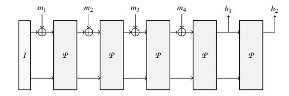
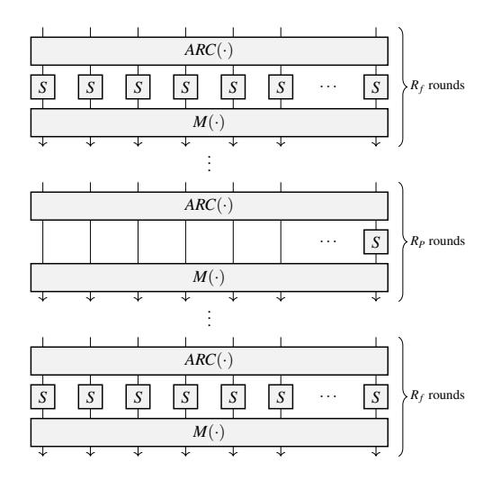

# POSEIDON: A New Hash Function for Zero-Knowledge Proof Systems (Updated Version)

Lorenzo Grassi1, Dmitry Khovratovich2, Christian Rechberger3, Arnab Roy4, and Markus Schofnegger3

1Radboud University Nijmegen 2Ethereum Foundation and Dusk Network 3IAIK, Graz University of Technology 4University of Klagenfurt

l.grassi@cs.ru.nl, khovratovich@gmail.com, firstname.lastname@iaik.tugraz.at, arnab.roy@aau.at

#### **Abstract**

The area of practical computational integrity proof systems, like SNARKs, STARKs, Bulletproofs, is seeing a very dynamic development with several constructions having appeared recently with improved properties and relaxed setup requirements. Many use cases of such systems involve, often as their most expensive part, proving the knowledge of a preimage under a certain cryptographic hash function, which is expressed as a circuit over a large prime field. A notable example is a zero-knowledge proof of coin ownership in the Zcash cryptocurrency, where the inadequacy of the SHA-256 hash function for such a circuit caused a huge computational penalty.

In this paper, we present a modular framework and concrete instances of cryptographic hash functions which work natively with GF(p) objects. Our hash function POSEIDON uses up to 8x fewer constraints per message bit than Pedersen Hash.

Our construction is not only expressed compactly as a circuit, but can also be tailored for various proof systems using specially crafted polynomials, thus bringing another boost in performance. We demonstrate this by implementing a 1-out-of-a-billion membership proof with Merkle trees in less than a second by using Bulletproofs.

**Previous Versions.** This paper is an *updated* version of [GKR+19] and [GKR+21] published at USENIX 2021. The main differences are as follows.

• In this updated version, we limit ourselves to POSEI-DON over a prime field  $\mathbb{F}_p^t$  instantiated with  $x\mapsto x^\alpha$ , where  $\alpha\geq 3$  is the *smallest* positive integer that satisfies  $\gcd(\alpha,p-1)=1$ . The reasons of this choice are due to the fact that (i) all applications we consider are more efficient when working with a prime field rather than a binary field, and that (ii) the version of POSEIDON instantiated with  $x\mapsto x^{-1}$  is not used in any practical application (to the best of our knoweldge).

- The security analysis has been updated. In particular, with respect to the earliest version, a further assumption on the linear layer has been added in order to take into account the recent attacks proposed in [KR21,BCD+20]. With respect to the latest one, we fixed some flaws and mistakes present in the security analysis of the Gröbner basis attacks. We also include the new results from [ABM23] in our updated analysis.
- The applications part and the comparison with respect to other schemes have been updated.

We emphasize that both (i) the entire family of STARKAD and (ii) POSEIDON instantiated with  $x \mapsto x^{-1}$  are considered as dismissed, and we advice against using them. We also recommend using the formula proposed in this updated version for computing the number of rounds of POSEIDON (note that the new round numbers are equal to the previous ones for all use cases we are aware of).

#### **Contents**

| 1 | Intr | oduction                                                     | 2 |
|---|------|--------------------------------------------------------------|---|
| 2 | The  | POSEIDON Hash Function                                       | 4 |
|   | 2.1  | Sponge Construction for Poseidon <math>\pi</math> | 5 |
|   | 2.2  | The HADES Design Strategy for Hashing                        | 5 |
|   | 2.3  | The Permutation Family Poseidon <math>\pi</math>  | 6 |
| 3 | App  | lications                                                    | 7 |
| 4 | Con  | crete Instantiations of $POSEIDON^{\pi}$                     | 8 |
|   | 4.1  | Main Instances                                               | 8 |
|   | 4.2  | Domain Separation for POSEIDON                               | 8 |
| 5 | Cry  | ptanalysis Summary of POSEIDON                               | 9 |
|   | 5.1  | Definitions                                                  | 9 |
|   | 5.2  | Security Claims                                              | 9 |
|   | 5.3  |                                                              | 9 |
|   | 5.4  |                                                              | 9 |

|   | 5.5     | Attack details                               | 10 |
|---|---------|-------------------------------------------------|----|
|   |         | 5.5.1 Statistical Attacks                 | 10 |
|   |         | 5.5.2 Algebraic Attacks                      | 10 |
| 6 |         | POSEIDON in Zero-Knowledge Proof Systems        | 11 |
|   | 6.1     | State of the Art                             | 12 |
|   | 6.2     | SNARKs with POSEIDONπ                        | 12 |
|   |         | 6.2.1 Groth16                                | 12 |
|   |         | 6.2.2 Bulletproofs                        | 13 |
|   |         | 6.2.3 PLONK                                  | 13 |
|   |         | 6.2.4 RedShift                            | 14 |
|   | 6.3     | Comparison with Other Hash Algorithms        | 14 |
|   | 6.4     | STARKs with POSEIDONπ                        | 15 |
| 7 |         | Acknowledgements                                | 15 |
| A |         | Auxiliary Files                                 | 20 |
| B |         | Efficient Implementation                        | 20 |
|   |         | α                                               |    |
| C |         | -POSEIDONπ Security Analysis: x              | 21 |
|   | C.1     | Statistical Attacks                             | 21 |
|   |         | C.1.1 Differential Cryptanalysis          | 21 |
|   |         | C.1.2 Linear Cryptanalysis                | 22 |
|   |         | C.1.3 Truncated Differential              | 22 |
|   |         | C.1.4 Rebound Attacks                        | 22 |
|   |         | C.1.5 Invariant Subspace Attack           | 23 |
|   | C.2     | Algebraic Attacks                               | 23 |
|   |         | C.2.1 Interpolation Attack                | 23 |
|   |         | C.2.2 Gröbner Basis Attack                   | 24 |
| D |         | Compact Constraints for STARKs and SNARKs       | 26 |
| E |         | Initialization of the Grain LFSR Used for Param |    |
|   |         | eter Generation                                 | 27 |
| F |         | Concrete Instances with Security Margin         | 28 |
| G |         | Selecting Number of Rounds in General Case      | 28 |
| H |         | Merkle Tree Instances of POSEIDON               | 29 |
| I |         | About STARKAD (Currently Dismissed)             | 29 |
|   | I.1     | The Permutation STARKADπ                     | 29 |
|   | I.2     | Cryptanalysis and Old Number of Rounds of       |    |
|   |         | STARKADπ                                     | 30 |
| J | About x | −1 -POSEIDON (Currently Dismissed)           | 30 |

## 1 Introduction

The recent advances in computational integrity proof systems made a number of computational tasks verifiable in short time and/or in zero knowledge. Several protocols appeared that require one party to prove the knowledge of a seed-derived secret, of an element being part of a large set, or their combination. Whereas accumulator-based solutions [\[CL02,](#page-16-2)[CKS09\]](#page-16-3) and algebraic Schnorr proofs exist in the area, they are quite involving and thus error-prone, require a trusted setup, are limited in statement language, and are often slow. An alternative is to express secret derivation using cryptographic hash functions, and to prove set membership by presenting an opening in a properly chosen Merkle tree, also built on a cryptographic hash function. Such hash-based protocols require a computational integrity proof system, which can be applied to an arbitrary arithmetic circuit. However, for the protocol to be efficient, proofs must be generated and verified in reasonable time, which in turn requires the hash function to be cheap in a certain metric depending on the proof system.

In the middle of 2020, the most popular proof systems are ZK-SNARKs (Pinocchio [\[PHGR13\]](#page-18-0), Groth16 [\[Gro16\]](#page-16-4), PLONK [\[GWC19\]](#page-17-1), Marlin [\[CHM](#page-15-1)+20] to name a few), Bulletproofs [\[BBB](#page-15-2)+18], ZK-STARKs [\[BBHR19\]](#page-15-3), and MPC-in-thehead systems [\[GMO16,](#page-16-5)[AHIV17,](#page-15-4)[CDG](#page-15-5)+17]. The former two groups have already been applied to a number of real-world protocols, whereas the latter ones are the most promising from the perspective of post-quantum security. These systems use two quite different circuit descriptions so that the proof size and generation time are computed differently:

- The R1CS format (rank-1 quadratic constraints) describes the circuit as a set of special quadratic polynomials of the form *L*1(*X*)· *L*2(*X*) = *L*3(*X*), where *X* is the tuple of internal and input variables, *Li* are affine forms and · is the field multiplication, and (possibly in an affine-equivalent form) is used in almost all SNARKs and Bulletproofs. The circuit multiplication and addition gates are defined over a prime field GF(*p*). The proof generation complexity is directly proportional to the number *T* of constraints, which often corresponds to the number of multiplication gates. The prime field GF(*p*) is the scalar field of an elliptic curve, where for ZK-SNARKs the curve should be pairing-friendly and for Bulletproofs it should just be a secure curve.
- The AET metric is used in ZK-STARKs and (to some extent) in the PLONK proof system. The computation is expressed as a set of internal program states related to each other by polynomial equations of degree *d*. The state consists of *w* field elements and undergoes *T* transformations. The proof generation is roughly proportional to the product *w*· *d* ·*T*. The number and sparsity of polynomial constraints do not play a major role.

Our goal was to design a family of hash functions that are optimal in the R1CS (as the most widespread) and good in the AET metric, while also supporting different finite field sizes. It turned out that the substitution-permutation network (SPN) design, well-known in symmetric cryptography, allows for a generic hash function framework where the only

Table 1: Our primary proposals and their competitors. "Tree" refers to the Merkle tree arity and is equal to the rate/capacity ratio. "Curve" denotes the curve (BLS12-381, BN254, Ed25519) whose (subgroup) scalar field determines the prime size. The R1CS/bit costs are obtained by dividing the R1CS prover costs by the message rate. Timings are from a third-party implementation of *Rescue* and POSEIDON on an i9-8950 CPU @2.9 Ghz and 32 GB RAM.

| Name          | S-box                                              | Rate bits/perm.     | $\begin{array}{c} \mathbf{SB} \ \mathbf{size} \\ (\log_2 p) \end{array}$ | Tree arity        | R F | $R_P$          | Curve Scalar field | R1CS /perm.       | R1CS /bit         | Time /perm.                     |
|---------------|----------------------------------------------------|---------------------|--------------------------------------------------------------------------|-------------------|----------------|----------------|-----------------------|-------------------|----------------------|---------------------------------|
| Poseidon-80   | $\begin{vmatrix} x^5 \\ x^5 \end{vmatrix}$         | 510 1020         | 255 255                                                               | 2:1 4:1           | 8 8            | 33 35       | BLS/BN/Ed             | 171 225        | 0.34 0.22         | 0.021 ms 0.05 ms             |
| Poseidon-128  | $\begin{array}{c c} x^5 \\ x^5 \\ x^5 \end{array}$ | 510 1020 2040 | 255 255 255                                                        | 2:1 4:1 8:1 | 8 8 8    | 57 60 63 | BLS/BN/Ed             | 243 300 405 | 0.47 0.29 0.2  | 0.033 ms 0.08 ms 0.259 ms |
| Poseidon-256  | $\begin{vmatrix} x^5 \\ x^5 \end{vmatrix}$         | 1020 2040        | 255 255                                                               | 2:1 4:1           | 8 8            | 120 120     | BLS/BN/Ed             | 504 600        | 0.5 0.3           | 0.216 ms 0.578 ms            |
| Pedersen Hash | -                                                  | 516                 | -                                                                        | 2:1               | -              |                | BLS12-381             | 869               | 1.68                 |                                 |
| Rescue        | $x^5 \& x^{1/5}$                                   | 510 1020 2040 | 255 255 255                                                        | 2:1 4:1 8:1 | 16 10 10 |                | BLS/BN/Ed             | 268 300 450 | 0.52 0.29 0.22 | 0.525 ms 0.555 ms 1.03 ms |

security-critical parameter that has to be changed for each instance is the number of rounds, and we provide an efficient and transparent strategy for its choice. The S-box is chosen as the power map  $x \mapsto x^d$ , where  $d \ge 3$  is usually chosen as the smallest integer that guarantees invertibility and provides nonlinearity. In particular, the cube function  $x^3$  is almost universally chosen, apart from cases of fields where this function is not a bijection. Instead, we suggest other S-boxes such as  $x^5$  or 1/x for these cases. Thanks to a succinct representation of the functions and a low S-box degree, we are able to optimize the circuit significantly for PLONK and RedShift proof systems, with performance improvements by a factor of up to 40.

**Our Contributions.** We design and analyze a family of hash functions over GF(p) named POSEIDON. The internal permutation is called POSEIDON $\pi$  and is based on the HADES design strategy [GLR+20], which is essentially a strategy based on substitution-permutation networks with t cells, but including the use of so-called *partial* rounds, which use nonlinear functions only for part of the state. In our specific construction, only one S-box is used in these partial rounds, while full nonlinear layers (i.e., t S-boxes) are used in all other rounds. This is done to reduce the R1CS or AET cost.

We aim to support security levels of 80, 128, and 256 bits, where the security is the same for collision and preimage resistance. For each pair (basic field, security level) we suggest a concrete instance of POSEIDON. In our hash function, a few S-box elements are reserved for the capacity (roughly double the security level in bits), and the rest for the rate. The permutation width is determined by the application: It is set close to

1280 bits for long-message hashing, whereas for Merkle trees we support various widths to enable 2:1, 4:1, and other arities and thus higher ZK performance.

We provide an extensive cryptanalysis of POSEIDON with an accent on algebraic methods as these prove to be the most effective. We explore different variants of interpolation, Gröbner basis, and higher-order differential attacks. As our permutations are quite wide, we do not aim for them behaving like randomly chosen permutations. Instead, for a security level of M bits we require that no attack could exhibit a nonrandom (but relevant for collision/preimage search) property of a permutation faster than in  $2^M$  queries. We then calculate the maximum number of rounds for each field, security level, and fixed permutation width that can be attacked. Then we select the number of rounds for concrete instances together with a security margin.

We have evaluated the number of constraints in POSEIDON instances for the R1CS metric and the AET metric. Our primary proposals POSEIDON-80/128/256 are listed in Table 1 (BLS being BLS12-3811, BN being BN254 [W+14], Ed being the Ristretto group2) and are compared to similar-purpose designs. Finally, we refer to Supplementary Material A for a complete overview of our auxiliary files, including reference implementations and scripts to create POSEIDON $\pi$  instances.

We also have third-party benchmarks of POSEIDON for regular hashing3 (Table 1) and in ZK proof systems: PLONK (Table 6), Groth16 (Table 3), and Bulletproofs (Table 5).

1https://electriccoin.co/blog/new-snark-curve/

2https://ristretto.group

3https://github.com/shamatar/poseidon\_hash and https: //github.com/shamatar/rescue\_hash

Comparison to HADES ([GLR+20]). Since the design of POSEIDON follows the same strategy as block ciphers in [GLR+20], we provide an explicit list of new material crafted for this paper:

- Hash-function specific (CICO, keyless, preimage) algebraic attacks, their analysis, and fixes against recent hash-only attacks
- Orientation towards various zero-knowledge proof systems and suggestions how to increase prover performance in these systems
- Instances for Merkle trees and variable-length hashing
- Concrete benchmarks for zero-knowledge proofs of accumulated values in Merkle trees, and a demonstration that it can be done in 1 second for billion-size trees

**Related Work.** The Zcash designers introduced a new 256-bit hash function called Pedersen hash [HBHW19, p.134], which is effectively a vectorized Pedersen commitment in elliptic curve groups with short vector elements. For the claimed 128-bit security level, it utilizes 869 constraints per 516-bit message chunk, thus having 1.7 constraints per bit, whereas our POSEIDON instances use from 0.2 to 0.45 constraints per bit, depending on the underlying prime field.

For the binary field case, Ashur and Dhooghe [AD18] have recently introduced the STARK-friendly block cipher JARVIS and its derivative hash function FRIDAY with several instances and security levels. They use a key-alternating structure with a single inverse S-box, followed by an affine transformation (with low degree in the extension field). However, both JARVIS and FRIDAY were successfully attacked shortly after their publication [ACG+19]. In the response, the authors created a new family of SNARK/STARK-friendly hash functions with Vision (binary fields) and Rescue (prime fields) being main instances [AABS+19]. The latter two share some similarity with our design with two important differences: First, all S-box layers are full (there are no partial rounds). Moreover, every second layer has S-boxes of the form  $x^{1/d}$ for small d. This approach prevents some algebraic attacks but is also more expensive in software as the resulting power functions have high Hamming weight and thus require many squarings.

**Structure of the Paper.** We introduce POSEIDON as a HADES-based hash in Section 2 and follow up with real-world applications in Section 3. Concrete instances with round numbers and domain constants are given in Section 4. We summarize the cryptanalysis results in Section 5 with the details in Appendix. Finally, we estimate the performance of POSEIDON instances in zero-knowledge proof systems in Section 6 by computing R1CS (SNARK) and AET (STARK) costs.

**Historic Remarks.** We started working on the design of POSEIDON in the fall of 2018. The work was triggered by the STARK paper [BBHR19] where a Rijndael-based hash function was proposed for zero-knowledge applications, but we identified that the underlying cipher is not suitable for the hash mode due to related-key trails. In the design of POSEI-DON, we were inspired by the LowMC cipher [ARS+15] with a partial S-box layer, the block cipher SHARK with its inverse S-box and its MDS matrix as the linear layer [RDP+96], and by MiMC with its algebraically simple approach of using the cube S-box [AGR+16, GRR+16b]. We immediately considered a partial S-box layer for most of the rounds in order to gain performance and safe constraints. The S-box was initially either the inverse or a power map (as the cube function), but we later found out that the inverse function does not provide a sufficiently fast degree growth.

In 2019, we separated the design into two parts due to diverging analysis and use cases, namely the block cipher HADESMIMC and the hash functions POSEIDON and STARKAD. The latter was designed for binary fields, as we thought that they are useful for STARKs. However, it turned out that they are neither especially useful in this setting nor equally secure [KR21,BCD+20], which is why we eventually dropped STARKAD.4

After the first publications of the design, we got requests from third parties to add explicit Merkle tree support and encryption (to be verifiable in zero knowledge). Later we were also asked to add weaker and stronger versions. Initially we allowed for greater flexibility in the choice of Sboxes, curves, width, etc., but only a few parameter sets are now given in the main body of this paper for the matter of user convenience: It turned out that too many possible parameters confuse users. Regarding zero-knowledge proof systems, we initially targeted Groth16 [Gro16], Bulletproofs [BBB+18] and STARKs [BBHR19], and we later also added PLONK [GWC19] due to its increased popularity.

### 2 The Poseidon Hash Function

In the following, we propose the hash function Poseidon, which maps strings over  $\mathbb{F}_p$  (for a prime  $p \approx 2^n > 2^{31}$ ) to fixed-length strings over  $\mathbb{F}_p$ , i.e., Poseidon:  $\mathbb{F}_p^* \to \mathbb{F}_p^o$ , where o is the output length measured in  $\mathbb{F}_p$  elements (usually, o=1). It is constructed by instantiating a sponge function with the Poseidon $\pi$  permutation. Poseidon $\pi$  is a variant of HadesMiMC proposed in [GLR+20], albeit instantiated with a fixed and known key.

We sometimes use the notation  $p \approx 2^n$  and  $N = n \cdot t \approx \log_2(p) \cdot t$  to denote the approximate size of the texts in bits.

&lt;sup>4For reference, we recall STARKAD in Supplementary Material I.

Figure 1: A sponge hash function.

### 2.1 Sponge Construction for Poseidon $^{\pi}$

**Sponges.** A sponge construction [BDPA08] builds upon an internal permutation and can be used to achieve various goals such as encryption, authentication, or hashing. In addition to the internal permutation, it is usually defined by two parameters, namely the rate (or arity in the context of tree hashing) r and the capacity (or inner part) c. The rate determines the throughput, whereas the capacity is crucial for the security level. This means that, when fixing the size of the internal permutation to N bits, a tradeoff between throughput and security has to be made.

An example for a sponge hash function is proposed in Fig. 1, where the construction is used to compute the hash output  $h_1 \mid\mid h_2$  of the 4-block message  $m_1 \mid\mid m_2 \mid\mid m_3 \mid\mid m_4$ , where  $m_i$  and  $h_i$  are r-bit values. The initial state I contains all zeros, i.e.,  $I = 0^r \mid\mid 0^c$  for an r-bit rate and a c-bit capacity.

**Sponge Security.** Depending on the properties of the *N*-bit internal permutation, a sponge construction allows to make strong arguments about the security of the overall design. Specifically, if this permutation is modeled as a randomly chosen permutation, the sponge function is indifferentiable from a random oracle for up to  $2^{c/2}$  calls ( $|\mathbb{F}|^{c/2}$  calls if the capacity is counted in field elements) [BDPA08]. A sponge hash function with a capacity of c bits can therefore provide  $2^{c/2}$  bits of collision and  $2^{c/2}$  bits of (second) preimage resistance.5

In this proposal, we instantiate the sponge function with our new permutation  $POSEIDON^{\pi}$ . Given the size N of the permutation and a desired security level s, we can hash r = N - 2s bits per call to the permutation. Following this design strategy, we choose the number of rounds of the inner permutation  $POSEIDON^{\pi}$  in order to ensure that such a permutation does not exhibit non-generic properties up to  $2^{M}$  queries, where M is the desired security level. For this we set the capacity to 2M and denote by POSEIDON-M a hash function that provides M bits of security against collision and preimage attacks.

**Our Poseidon** $\pi$  **Sponges.** We provide several Poseidon instances for different use cases, but they all use the sponge construction in the same way as illustrated in Fig. 1:

- 1. Depending on the use case (see Section 3 and Section 4 for more details), determine the capacity element value and the input padding if needed.
- 2. Split the obtained input into chunks of size r.
- 3. Apply the permutation POSEIDON $\pi$  to the capacity element and the first chunk.
- 4. Until no more chunks are left, add them into the state and apply the permutation.
- 5. Output *o* output elements out of the rate part of the state. If needed, iterate the permutation more times.

## 2.2 The HADES Design Strategy for Hashing

Cryptographic permutations usually consist of an efficient round function which is applied sufficiently many times in order to make the permutation behave like a randomly drawn one. In general, the same round function is used throughout the permutation, in order to destroy all of its possible symmetries and structural properties.

In HADES we consider different round functions within the same construction. More precisely, we mix rounds with *full S-box layers* and rounds with *partial S-box layers*. The motivation to have different types of rounds is that full S-box layers are expensive in software and ZK proof systems but are a good protection against statistical attacks, whereas partial layers are relatively cheap but are, in some cases, similarly good as full ones against algebraic attacks.

**Details on the HADES Strategy.** The HADES design strategy consists of  $R_f$  rounds in the beginning, in which S-boxes are applied to the full state. After these rounds,  $R_P$  rounds in the middle contain only a single S-box in each round, and the rest of the state goes through the nonlinear layer unchanged (i.e., identity functions are used instead of the missing S-boxes). Finally,  $R_f$  rounds at the end are applied by again using S-boxes for the full state.

The idea of this approach is to provide arguments for the security against statistical attacks using the  $R_F = 2R_f$  rounds with full S-box layers in the beginning and in the end together with the wide trail strategy [DR01], which is also used in, e.g., the AES [DR02]. On the other hand, the  $R_P$  rounds with partial S-box layers are a more efficient way to increase the degree of the overall function, and are mainly used for arguments against algebraic attacks.

A detailed overview of this approach is shown in Fig. 2.

&lt;sup>5We present the Sponge construction over a binary field in order to follow the presentation made in [BDPA08]. It can easily be generalized for a prime field  $\mathbb{F}_p^l$  by replacing each (N/t)-bit word by a  $(\lceil \log_2(p) \rceil)$ -bit one.

&lt;sup>6In other words, the permutation cannot be distinguished from a randomly drawn permutation.

Figure 2: Construction of the HADES-based POSEIDON $\pi$  permutation.

**The Round Function.** Each round function of our POSEI-DON permutation consists of the following three components.

- 1. AddRoundConstants, denoted by  $ARC(\cdot)$
- 2. *SubWords*, denoted by S-box( $\cdot$ ) or by  $SB(\cdot)$
- 3. *MixLayer*, denoted by  $M(\cdot)$

The MixLayer operation is the linear layer of our construction, and it consists in multiplying the state with a  $t \times t$  MDS matrix in order to apply the wide trail strategy.

In total we get:

$$\underbrace{ARC \to SB \to M}_{\text{First round}} \to \cdots \to \underbrace{ARC \to SB \to M}_{(R-1)\text{-th round}} \to \underbrace{ARC \to SB \to M}_{R\text{-th round}}$$

While  $ARC(\cdot)$  and  $M(\cdot)$  are the same in each round, the number of S-boxes is not the same, namely

- $R_f + R_f = R_F$  rounds have *full* S-box layers, i.e., t S-box functions, and
- $R_P$  rounds have *partial* S-box layers, i.e., 1 S-box and (t-1) identity functions.

We refer to [GLR+20] for more details about the HADES design strategy.

**Interaction Between Full and Partial Rounds.** Note that the same number of full rounds can be used instead of the partial rounds without decreasing the security, but this leads to substantially higher costs in our target applications. However, replacing t partial rounds with one full round may keep the costs in our target applications similar, but the security may be severely decreased due to a significantly lower degree of 1 full round compared to t partial rounds.

## 2.3 The Permutation Family Poseidon $^{\pi}$

The HADES design strategy provides a good starting point for our new hash function. Indeed, the combination of full and partial rounds allows us to make strong arguments about the security, while also exploiting the smaller number of S-boxes in the partial rounds in order to gain efficiency in the target applications.

The primary application of our design is hashing in large prime fields, hence  $POSEIDON^{\pi}$  takes inputs of  $t \ge 2$  words in  $\mathbb{F}_p$ , where p is a prime of size  $p \approx 2^n > 2^{30}$  (i.e.,  $\lceil \log_2(p) \rceil = n \ge 31$ ). We will now describe the components of each  $POSEIDON^{\pi}$  round in detail.

The S-Box Layer. For the applications we have in mind, we focus on the  $\alpha$ -power S-box, defined by S-box $(x)=x^{\alpha}$ , where  $\alpha \geq 3$  is the **smallest** positive integer that satisfies  $\gcd(\alpha,p-1)=1$ . In the following, these permutations are called " $x^{\alpha}$ -Poseidon". Examples are given by  $\alpha=3$  ( $x^3$ -Poseidon") if  $p\neq 1 \mod 3$ , or  $\alpha=5$  ( $x^5$ -Poseidon") if  $p=1 \mod 3$  and  $p\neq 1 \mod 5$ .

It turns out that the S-box  $x^5$  is suitable for two of the most popular prime fields in ZK applications, concretely the prime subfields of the scalar field of the BLS12-381 and BN254 curves, so we mainly consider this S-box, but try to present generic cryptanalytic results for other cases whenever possible.

**The Linear Layer.** A  $t \times t$  MDS matrix with elements in  $\mathbb{F}_p$  exists if  $2t + 1 \le p$  (see [MS78] for details).

Given p and t, there are several ways to construct an MDS matrix. One of them is using a Cauchy matrix [YMT97], which we recall here briefly. For  $x_i, y_i \in \mathbb{F}_p$ , where  $i \in [1, t]$ , the entries of the matrix  $\mathcal{M}$  are defined by

$$\mathcal{M}_{i,j} = \frac{1}{x_i + y_j},$$

where the entries of  $\{x_i\}_{1 \le i \le t}$  and  $\{y_i\}_{1 \le i \le t}$  are pairwise distinct and  $x_i + y_i \ne 0$ , where  $i \in \{1, ..., t\}$  and  $j \in \{1, ..., t\}$ .

**Avoiding Insecure Matrices.** We emphasize that not every MDS matrix provides the same level of security. In particular, the matrix  $\mathcal{M}$  must prevent the possibility to set up

&lt;sup>7A matrix  $M \in \mathbb{F}^{t \times t}$  is called *maximum distance separable* (MDS) iff it has a branch number  $\mathcal{B}(M)$  equal to  $\mathcal{B}(M) = t + 1$ . The branch number of M is defined as  $\mathcal{B}(M) = \min_{x \in \mathbb{F}^t} \{ \operatorname{wt}(x) + \operatorname{wt}(M(x)) \}$ , where wt is the Hamming weight in wide trail terminology. Equivalently, a matrix M is MDS iff every submatrix of M is non-singular.

- (1) invariant (or iterative) subspace trails [GRR16a] (or equivalently, truncated differentials) with prob. 1 with inactive S-boxes over more than t-1 rounds8 (more details are given in the following), or
- (2) invariant (or iterative) subspace trails with prob. 1 and with active S-boxes for any number of rounds.

Regarding the first point, let  $S^i$  be the subspace s.t. no S-box is active in the first i consecutive rounds, that is,

$$\mathcal{S}^{(i)} := \left\{ v \in \mathbb{F}^t \mid [\mathcal{M}^j \cdot v]_0 = 0 \in \mathbb{F}, j < i \right\}, \tag{1}$$

where  $[x]_0$  denotes the first word of  $x \in \mathbb{F}^t$ ,  $\mathcal{S}^{(0)} = \mathbb{F}^t$ , and  $\dim\left(\mathcal{S}^{(i)}\right) \geq t-i$ . For each pair of texts (x,y) in the same coset of  $\mathcal{S}^i$ , no S-boxes are active in the first i consecutive rounds. Hence, a truncated differential with prob. 1 (or equivalently, a subspace trail) can be set up for the first  $i \leq t-1$  rounds. The matrix  $\mathcal{M}$  must be chosen s.t. no subspace trail with inactive/active S-boxes can be set up for more than t-1 rounds.

A detailed analysis of matrix properties related to this attack vector can be found in [GRS21]. With these results in mind, we suggest the following method to generate matrices:

- 1. Randomly select pairwise distinct  $\{x_i\}_{1 \le i \le t}$  and  $\{y_i\}_{1 \le i \le t}$ , where  $x_i + y_j \ne 0$  and where  $i \in \{1, ..., t\}$  and  $j \in \{1, ..., t\}$ .
- 2. Determine if the matrix is secure using Algorithm 1, Algorithm 2, and Algorithm 3 provided9 in [GRS21]. For a secure matrix, no infinitely long (invariant and/or iterative) subspace trail (with or without active S-boxes) can be set up for all rounds with partial S-box layers.
- 3. Repeat this procedure until a secure matrix is found.

We used this method to generate the matrices for the instantiations given in Section 4. For [GRS21, Algorithm 3], we used a search period of l=4t, and we additionally made sure that no invariant subspace trails with active S-boxes exist for  $M, M^2, \ldots, M^l$ . In our experiments, we observed that only a few trials are needed in order to find a secure matrix for sufficiently large fields.

To summarize, this approach allows us to make sure that our MDS matrices do not exhibit the vulnerabilities discussed in [GRS21], and our instantiations are thus secure against this specific type of attack.

**Efficient Implementation.** We refer to Supplementary Material B for details about efficient POSEIDON $\pi$  implementa-

tions. The main advantage of these strategies consists of reducing the number of constant multiplications in each round with a partial S-box layer from  $t^2$  to 2t, which is particularly useful for large t and  $R_P$ . For example, we implemented  $x^3$ -Poseidon $\pi$  with  $(n,t,R_F,R_P)=(64,24,8,42)$  in Sage, and we could observe that the performance improves by a factor of about 5, with the average computation time being 4 ms for the optimized version.

## 3 Applications

We suggest POSEIDON for all applications of zero-knowledgefriendly hashing, concretely:

- Using POSEIDON for commitments in various protocols, where the knowledge of the committed value is proven in zero knowledge: For this we suggest a single-call permutation-based hashing with POSEIDON-128 and widths from 2 to 5 field elements. The advantage over the Pedersen hash, for example, is that POSEIDON is faster and can also be used in signature schemes which allows for a smaller code footprint.
- Hashing multi-element objects with certain fields encoded as field elements, so that statements about these fields are proven in zero knowledge: We suggest variable-length sponge-based hashing with POSEIDON-128 or POSEIDON-80 with width 5 (and rate 4).
- Using Poseidon in Merkle trees to enable zeroknowledge proofs of knowledge of a leaf in the tree with optional statements about the leaf content: We recommend Merkle trees of arity 4 (i.e., width 5) with Po-SEIDON-128 as the most performant, but trees of more conventional arities can be used as well.
- Verifiable encryption with POSEIDON within Integrated Encryption Scheme [GMHESÁ10]: Put POSEIDON inside the DuplexSponge authenticated encryption framework [BDPA11] and initialize it with a session key based on the recipient's public key. Then one can prove that the recipient can decrypt the ciphertext into a plaintext with certain properties.

There exist several third-party protocols that already use PO-SEIDON in these use cases:

- Filecoin employs POSEIDON for Merkle tree proofs with different arities and for two-value commitments. 10
- Dusk Network uses Poseidon to build a Zcash-like protocol for securities trading. 11 It also uses Poseidon for encryption as described above.

&lt;sup>8This fixes a weakness in the previous version of POSEIDON, where specific choices of  $\mathcal{M}$  over  $(\mathbb{F}_p)^t$  could have resulted in vulnerable instances. We refer to [KR21,BCD+20] for more details.

9https://extgit.iaik.tugraz.at/krypto/linear-layer-tool

10https://github.com/filecoin-project/neptune

11https://github.com/dusk-network/Poseidon252

- Sovrin uses POSEIDON for Merkle-tree based revocation [\[Lod19\]](#page-17-6).
- Loopring uses POSEIDON for private trading on Ethereum.[12](#page-7-3)

## 4 Concrete Instantiations of POSEIDONπ

As of mid-2020, many protocols that employ zero-knowledge proofs use (or plan to use) pairing-based proof systems [\[PHGR13,](#page-18-0) [Gro16,](#page-16-4) [GWC19,](#page-17-1) [CHM](#page-15-1)+20] or Bulletproofs [\[BBB](#page-15-2)+18]. The elliptic curves used by these systems are predominantly BLS12-381, BN254, and Ed25519. A hash function friendly for such a system would operate in the scalar prime field of the curve, and they all have a size of around 2 255 .

## 4.1 Main Instances

We present POSEIDONπ permutations for such prime fields, and leave the other cases to the appendix. The S-box function can be chosen as *x* 5 in all cases, i.e., we use *x* 5 -POSEIDON for hashing in all such protocols, though the concrete fields are slightly different (this affects only constants and matrices, but not the number of rounds).

The security levels *M* of 80 and 128 bits correspond to a 255-bit capacity, i.e., one field element. We focus on two possible widths, namely *t* = 3 and *t* = 5, as they correspond to popular cases of 2-to-1 and 4-to-1 compression functions. In the Merkle tree case, this corresponds to trees of arity 2 and 4, respectively. The round numbers for 80- and 128-bit security levels are given in Table [2,](#page-7-4) and a more extensive set is given in the appendix. For *M* = 256 we select a capacity and an output of 2 255-bit elements (one 510-bit element is possible too).

All our MDS matrices are Cauchy matrices, and the method to construct them is further described in Section [2.3.](#page-5-3) We use sequences of integers for the construction.

The round constants and matrices are generated using the Grain LFSR [\[HJMM08\]](#page-17-7) in a self-shrinking mode, and the detailed initialization and generation are described in Supplementary Material [E.](#page-26-0) Using this method, the generation of round constants and matrices depends on the specific instance, and thus different round constants are used even if some of the chosen parameters (e.g., *n* and *t*) are the same. Note that by using the Grain LFSR and instance-specific seed values, this approach is reminiscent of nothing-up-my-sleeve (NUMS) numbers. Indeed, letting the attacker freely choose round constants and/or matrices can lead to attacks.

Table 2: Concrete instantiations of POSEIDONπ (with security margin) over BLS12-381, BN254, Ed25519 scalar fields.

| 5 Instance (S-box: f(x) = x ) | t  | RF | RP  |
|-------------------------------------|----|----|-----|
| POSEIDONπ                           | 3  | 8  | 57  |
| -128                                | 5  | 8  | 60  |
| POSEIDONπ                           | 3  | 8  | 33  |
| -80                                 | 5  | 8  | 35  |
| POSEIDONπ                           | 6  | 8  | 120 |
| -256                                | 10 | 8  | 120 |

We provide the round constants, the matrices, and test vectors in auxiliary files for four primary instantiations. We also make reference implementations for these instantiations and scripts to calculate the round numbers, the round constants, and the MDS matrices available online.[13](#page-7-5) We refer to Supplementary Material [A](#page-19-0) for a more detailed overview of the auxiliary files.

## 4.2 Domain Separation for POSEIDON

POSEIDON can be used in a number of applications, and having the same instance for all of them is suboptimal. Also, some protocols explicitly require several different hash functions. We suggest using domain separation for this, concretely encoding the use case in the capacity element (which is fine as it is 256 bits large and has a lot of bits to fill) and using some padding to distiguish inputs of different lengths if they may happen. Although a concrete form of domain separation constants is not security critical, we suggest a common methodology to unify potential implementations.

Concretely, we propose:

- Merkle Tree (all leafs are present, up to arity 32). The capacity is 2 *arity* − 1. A generic case is considered in Supplementary Material [H.](#page-28-0) We use no padding here.
- Merkle Tree (some leafs may be empty). The capacity value equals the bitmask of which leafs are present. We use no padding here.
- Variable-Input-Length Hashing. The capacity value is 2 64 + (*o*−1) where *o* the output length. The padding consists of one field element being 1, and the remaining elements being 0.
- Constant-Input-Length Hashing. The capacity value is *length* ·(2 64)+ (*o*−1) where *o* the output length. The padding consists of the field elements being 0.
- Encryption. The capacity value is 2 32. The padding consists of the field elements being 0.

12<https://tinyurl.com/y7tl537o>

13 <https://extgit.iaik.tugraz.at/krypto/hadeshash>

• Future Uses. The capacity value is *identifier*·(2 32). The padding depends on the application.

### 5 Cryptanalysis Summary of POSEIDON

As for any new design, it is paramount to present a concrete security analysis. In the following, we provide an in-depth analysis of the security of our construction. Due to a lack of any method to ensure that a hash function based on a sponge construction is secure against all possible attacks, we base our argumentation on the following consideration. As we just recalled in the previous section, when the internal permutation *P* of an (*N* = *c*+*r*)-bit sponge function is modeled as a randomly chosen permutation, the sponge hash function is indifferentiable from a random oracle up to 2 *c*/2 calls to *P*. Thus, we choose the number of rounds of the inner permutation case in order to provide security against distinguishers relevant to collision/preimage attacks. Equivalently, this means that such a number of rounds guarantees that *P* does not exhibit any relevant non-random/structural properties (among the ones known in the literature).

## 5.1 Definitions

Definition 5.1. The function *F* is *T*-secure against collisions if there is no algorithm with expected complexity smaller than *T* that finds *x*1, *x*2 such that *F*(*x*1) = *F*(*x*2).

Definition 5.2. The function *F* is *T*-secure against preimages if there is no algorithm with expected complexity smaller than *T* that for given *y* finds *x* such that *F*(*x*) = *y*.

Definition 5.3. The function *F* is *T*-secure against second preimages if there is no algorithm with expected complexity smaller than *T* that for given *x*1 finds *x*2 such that *F*(*x*1) = *F*(*x*2).

Definition 5.4. The invertible function *P* is *T*-secure against the CICO (*m*1,*m*2)-problem if there is no algorithm with expected complexity smaller than *T* that for given *m*1-bit *I*1 and *m*2-bit *O*1 finds *I*2,*O*2 such that *P*(*I*1||*I*2) = *P*(*O*1||*O*2).

## 5.2 Security Claims

In terms of concrete security, we claim that POSEIDON-*M* is 2 *M*-secure against collisions and (second) preimages. To help increase confidence in our design and simplify external cryptanalysis, we also explicitly state another claim about our internal permutation: POSEIDONπ is 2 min(*M*,*m*1,*m*2) -secure against the CICO (*m*1,*m*2)-problem.

Even though an attack below these thresholds may not affect any concrete applications of our hash functions, we would still consider it an important cryptanalytic result.

## 5.3 Summary of Attacks

Here we list the main points of our cryptanalysis results. The number of rounds *R* = *RP* + *RF* we can break depends on the security level *M* and the number of S-boxes *t*, which we specify for each concrete hash function instance in the next section.

Before going on, we point out that for all attacks that are in common to the ones proposed for the cipher HadesMiMC [\[GLR](#page-16-6)+20], here we limit ourselves to report the main idea and result. For all other cases (namely, higher-order differentials, zero-sum partitions, Gröbner basis attacks, and preimage attacks), we present here more details. In any case, *all details are provided as supplementary material.*

We highlight that the following cryptanalysis is not equivalent to the one presented for the block cipher HADESMiMC. Indeed, the scenarios are different (in one case the goal is to guarantee the impossibility to find the secret key, while here there is no secret key material and the goal is to guarantee that the internal permutation looks like a pseudo-random permutation). This means that certain attacks that we consider here are not valid in the case of a block cipher and vice-versa. Just to give some examples, the rebound attack [\[LMR](#page-17-8)+09[,MRST09\]](#page-17-9) holds only in the context studied here, while a MitM scenario (crucial in the case of an SPN cipher) does not work in the context of a sponge function, since the attacker does not know the full output. More details are given in the following.

Proposition 5.1 (Informal). The following number of rounds for *x* 5 -POSEIDON-128 over F*p* with ≈ 256-bit *p* protects against statistical and algebraic attacks:

$$R_F = 6,$$
  $R = R_F + R_P = 56 + \lceil \log_5(t) \rceil.$

*Proof.* We substitute α = 5,*M* = 128 and log2 (*p*) = 255 to Equations [\(2\)](#page-9-3),[\(3\)](#page-9-4),[\(4\)](#page-10-1) and see that no one is satisfied, i.e., the attacks do not work.

Proposition 5.2 (Informal). The following number of rounds for *x* 5 -POSEIDON-80 over F*p* with ≈ 256-bit *p* protects against statistical and algebraic attacks:

$$R_F = 6,$$
  $R = R_F + R_P = 35 + \lceil \log_5(t) \rceil.$

Proposition 5.3 (Informal). The following number of rounds for *x* 5 -POSEIDON-256 over F*p* with ≈ 256-bit *p* protects against statistical and algebraic attacks:

$$R_F = 6,$$
  $R = R_F + R_P = 111 + \lceil \log_5(t) \rceil.$

## 5.4 Security Margin

Given the *minimum* number of rounds necessary to provide security against all attacks known in the literature, we *arbitrarily* decided to add

- (1) two more rounds with full S-box layers, and
- (2) 7.5% more rounds with partial S-box layers,

i.e.,  $+2 R_F$  and  $+7.5\% R_P$ . The resulting number of rounds for our primary instances is given in Table 2.

#### 5.5 Attack details

All the attacks below are applied to the internal permutation  $POSEIDON^{\pi}$ . The sponge framework dictates that all the attacks on the hash function with complexity below  $2^{c/2}$  must result from attacks on the permutation. Thus we show that no such attack on the permutation should exist.

#### 5.5.1 Statistical Attacks

**Differential/Linear Distinguishers.** As shown in the appendix, at least 6 rounds with full S-box layers are necessary to provide security against the statistical attacks we consider. In more detail, for

$$R_F < \begin{cases} 6 & \text{if } M \le (\lfloor \log_2 p \rfloor - C) \cdot (t+1) \\ 10 & \text{otherwise} \end{cases}$$
 (2)

linear [Mat93] and differential [BS91, BS93] attacks may be possible, where  $\mathcal{C} = \log_2(\alpha - 1)$  for  $S(x) = x^{\alpha}$  (where remember that  $\alpha$  is an odd integer number), e.g.,  $\mathcal{C} = 1$  for  $S(x) = x^3$  and  $\mathcal{C} = 2$  for  $S(x) = x^5$ .

Before going on, we highlight that we exploit only rounds with full S-box layers in order to prevent statistical attacks (as done in [GLR+20]). As explained in [KR21], under the assumption made for the linear layer in Section 2.3, it is possible to exploit both the rounds with partial and full S-box layers in order to guarantee security against some statistical attacks, like differential and linear attacks. Our decision to consider only rounds with full S-box layers has been made since a similar condition on the rounds with full S-box layers (e.g.,  $R_F \ge 6$ ) is necessary for the security against some algebraic attacks (e.g., Gröbner basis attacks – see in the following) and in order to provide simple security arguments for all statistical attacks (including e.g. the rebound one).

(Invariant) Subspace Trails. We emphasize that the choice of the matrix that defines the linear layer, made in Section 2.3, prevents the existence of subspaces S that generate infinitely long subspace trails, namely a finite collection of subspaces  $\{S_0, \ldots, S_{r-1}\}$  s.t. each coset of  $S_i$  is mapped into a coset of  $S_{i+1}$  with probability 1 (where the index is taken modulo r) an arbitrary number of times. This allows to fix the weakness of the previous version of POSEIDON.

**Other Attacks.** Finally, we briefly mention that the same number of rounds given before for the case of differential/linear attacks guarantees security against other attacks as truncated differentials [Knu94], impossible differentials [BBS99], rebound attacks [LMR+09, MRST09], and so on. More details are given in the appendix.

#### 5.5.2 Algebraic Attacks

In order to estimate the security against algebraic attacks, we evaluate the degree of the reduced-round permutations and their inverses. Roughly speaking, our results can be summarized as follows, where  $n \simeq \log_2(p)$ .

**Interpolation Attack.** The interpolation attack [JK97] depends on the number of different monomials in the interpolation polynomial, where (an upper/lower bound of) the number of different monomials can be estimated given the degree of the function. The idea of such an attack is to construct an interpolation polynomial that describes the function. If the number of unknown monomials is sufficiently large, then this cannot be done faster than via a brute-force attack.

For a security level of *M* bits, the number of rounds that can be attacked is

$$R \le \lceil \log_{\alpha}(2) \cdot \min\{M, \log_{2}(p)\} \rceil + \lceil \log_{\alpha} t \rceil. \tag{3}$$

In general, the number of unknown monomials does not decrease when increasing the number of rounds. Hence, a higher number of rounds likely leads to a higher (or equal) security against this attack. We also consider various approaches of the attack (such as the MitM one) in Supplementary Material C.2.1.

**Gröbner Basis Attack.** In a Gröbner basis attack [CLO97], one tries to solve a system of nonlinear equations that describe the function. The cost of such an attack depends on the degree of the equations, but also on the number of equations and on the number of variables. Since there are several ways for describing the studied permutation, there are several ways to set up such a system of equations and so the attack. Here, we focus on two extreme cases:

- 1. In the first case, the attacker derives equations, one for each word, for the entire *r*-round permutation. Assuming  $S(x) = x^{\alpha}$  (analogous for the others), we show that the attack complexity is about  $\alpha^{2t}$  (see below), therefore for a security level of *M* bits the attack works at most on  $\log_{\alpha} 2^{\min\{n/2, M/2\}}$  rounds.
- 2. In the second case, since a partial S-box layer is used, it may be more efficient to consider degree- $\alpha$  equations

for single S-boxes. In this case, more rounds can be necessary to guarantee security against this attack.

In both cases, it is possible to make use of the existence of the subspace  $\mathcal{S}^{(r)}$  defined as in Eq. (1) in order to improve the attack. As shown in [BCD+20], such a subspace can be exploited in order to replace some nonlinear equations of the system that we are trying to solve with linear equations. Indeed, given a text in a coset of the subspace  $\mathcal{S}^{(r)}$ , the output of such a text after r rounds with partial S-box layers is simply the result of an affine map applied to the input (i.e., no S-box is involved). As explained in detail in Supplementary Material C.2.2, this issue can easily be fixed both by a careful choice of the matrix that defines the linear layer (see Section 2.3 for details) and, if necessary, by adjusting the number of rounds with partial S-box layers.

With optimistic (for the adversary) complexity of the Gaussian elimination, we obtain three attacks which are faster than  $2^{M}$  if either condition is satisfied:

$$\begin{cases} R_{F} + R_{P} \leq \log_{\alpha}(2) \cdot \min \left\{ M, \log_{2}(p) \right\}, \\ R_{F} + R_{P} \leq t - 1 + \log_{\alpha}(2) \cdot \min \left\{ \frac{M}{t+1}, \frac{\log_{2}(p)}{2} \right\}, \\ (t-1)R_{F} + R_{P} \leq t - 2 + \frac{M}{2 \cdot \log_{2}(\alpha)}. \end{cases}$$
(4)

**Higher-Order Differential Attack.** Working over  $\mathbb{F}_{2^n}{}^t \equiv \mathbb{F}_2^{n \cdot t}$ , the higher-order differential attack [Knu94] depends on the *algebraic degree* of the polynomial function that defines the permutation, where the algebraic degree  $\delta$  of a function  $f(x) = x^d$  of degree d over  $\mathbb{F}_{2^n}$  is defined as  $\delta = \text{hw}(d)$  (where  $\text{hw}(\cdot)$  is the Hamming weight). The idea of such an attack is based on the property that given a function  $f(\cdot)$  of algebraic degree  $\delta$ ,  $\bigoplus_{x \in \mathcal{V} \oplus \phi} f(x) = 0$  if the dimension of the subspace  $\mathcal{V}$  satisfies  $\dim(\mathcal{V}) \geq \delta + 1$ . If the algebraic degree is sufficiently high, the attack does not work.

At first thought, one may think that this attack does not apply (or is much less powerful) in  $\mathbb{F}_p^t$  (due to the fact that the only subspaces of  $\mathbb{F}_p$  are  $\{0\}$  and  $\mathbb{F}_p$  itself). Recently, it has been shown in [BCD+20] how to set up an higher-order differential over  $\mathbb{F}_p^t$ . Given f over  $\mathbb{F}_p$  of degree  $d \leq p-2$ ,  $\sum_{x \in \mathbb{F}_p} f(x) = 0$ . Since this result is related to the degree of the polynomial that describes the permutation, we claim that the number of rounds necessary to provide security against the interpolation attack provides security against this attack as well.

(We Do Not Care About) Zero-Sum Partitions. Another property that can be demonstrated for some inner primitive in a hash function (with a relatively low degree) is based on the *zero-sum partition*. This direction has been investigated e.g. in [BCD11] for two SHA-3 candidates, *Luffa* and KECCAK. More generally, a zero-sum structure for a function  $f(\cdot)$  is defined as a set Z of inputs  $z_i$  that sum to zero, and for

which the corresponding outputs  $f(z_i)$  also sum to zero, i.e.,  $\sum_i z_i = \sum_i f(z_i) = 0$ . For an iterated function, the existence of zero sums is usually due to the particular structure of the round function or to a low degree. Since it is expected that a randomly chosen function does not have many zero sums, the existence of several such sets can be seen as a distinguishing property of the internal function.

**Definition 5.5** (Zero-Sum Partition [BCD11]). Let P be a permutation over  $\mathbb{F}_q^t$  for a prime  $q \geq 2$ . A zero-sum partition for P of size K < t is a collection of K disjoint sets  $\{X_1, \ldots, X_K\}$  with the following properties:

- $X_i \subset \mathbb{F}^t$  for each i = 1, ..., k and  $\bigcup_{i=1}^k X_i = \mathbb{F}^t$ ,
- $\forall i = 1, ..., K$ : the set  $X_i$  satisfies the zero-sum property  $\sum_{x \in X_i} x = \sum_{x \in X_i} P(x) = 0$ .

Here we explicitly state that we do not make claims about the security of  $\mathsf{POSEIDON}^\pi$  against zero-sum partitions. This choice is motivated by the gap present in the literature between the number of rounds of the internal permutation that can be covered by a zero-sum partition and by the number of rounds in the corresponding sponge hash function that can be broken e.g. via a preimage or a collision attack. As a concrete example, consider the case of KECCAK: While 24 rounds of KECCAK-f can be distinguished from a random permutation using a zero-sum partition [BCD11] (that is, *full* KECCAK-f), preimage/collision attacks on KECCAK can only be set up for up to 6 rounds of KECCAK-f [GLL+20]. This hints that zero-sum partitions should be largely ignored for practical applications.

For completeness, we mention that a zero-sum partition on (a previous version of) reduced-round POSEIDON $\pi$  has been proposed in [BCD+20]. Such a property can cover up to  $R_F = 6$  rounds (i.e., 2 rounds at the beginning and 4 rounds at the end) by exploiting the inside-out approach and by choosing a subspace of texts after the first  $R_f$  rounds with full S-box layers and before the  $R_P$  rounds with partial S-box layers. Since the number of rounds of this new version is not smaller than the number of rounds of the previous one, and since  $R_F \geq 8$  (see Section 5.4), it seems that a zero-sum partition cannot be set up for full POSEIDON $\pi$ .

## 6 POSEIDON in Zero-Knowledge Proof Systems

Our hash functions have been designed to be friendly to zero-knowledge applications. Specifically, we aim to minimize the proof generation time, the proof size, and the verification time (when it varies). Before presenting concrete results, we give a small overview of ZK proof systems to date.

#### 6.1 State of the Art

Let  $\mathcal{P}$  be a circuit over some finite field  $\mathbb{F}$  where gates are some (low-degree) polynomials over  $\mathbb{F}$  with I and O being input and output variables, respectively:  $\mathcal{P}(I) = O$ . The *computational integrity problem* consists of proving that some given  $O_0$  is the result of the execution of  $\mathcal{P}$  over some  $I_0$ :  $\mathcal{P}(I_0) = O_0$ . It is not difficult to show that any limited-time program on a modern CPU can be converted to such a circuit [BCTV14], and making the proof zero-knowledge is often possible with little overhead.

The seminal PCP series of papers states that for any program  $\mathcal{P}$  it is possible to construct a proof of computational integrity, which can be verified in time sublinear in the size of  $\mathcal{P}$ . However, for a long time the prover algorithms were so inefficient that this result remained merely theoretical. Only recently, proof systems where the prover costs are polynomial in  $|\mathcal{P}|$  were constructed, but they required a trusted setup: a verifier or someone else (not the prover) must process the circuit with some secret s and output a reference string S, used both by the prover and the verifier. In this setting, the prover's work can even be made linear in  $|\mathcal{P}|$ , and the verifier's costs are constant. These systems were called SNARKs for proof succinctness. The first generation of SNARKs, known as Pinocchio and Groth16 [PHGR13, Gro16], require a separate trusted setup for each circuit. The next generation, which includes Sonic [MBKM19], PLONK [GWC19], and Marlin [CHM $^+$ 20], can use one reference string of size d for all circuits with at most d gates, thus simplifying the setup and its reuse. Later on, proof systems without trusted setups appeared, of which we consider Bulletproofs [BBB+18], STARKs [BBHR19], and RedShift [KPV19] the most interesting, though all of them come with deficiencies: Bulletproofs have linear verifier times (but rather short proofs), STARKs work with iterative programs, and RedShift has large proofs (up to 1 MB for millions of gates).

Current benchmarks demonstrate that programs with millions of gates can be processed within a few seconds with the fastest proof systems, which solves the computational integrity problem for some practical programs. Among them, privacy-preserving cryptocurrencies, mixers, and private voting are prominent examples. In short, such applications work as follows:

- 1. Various users add publicly hashes of some secret and public values to some set *V*, which is implemented as a Merkle tree. Hashes can be currency transaction digests, public keys, or other credentials.
- 2. Only those who know a secret behind some hash are declared eligible for an action (e.g., to vote or to spend money).
- 3. A user who wants to perform the action proves that they

know a tree leaf L and a secret K such that L is both the hash of K and a leaf in V. If the proof passes, the user is allowed to perform an action (e.g., to vote). If an action must be done only once, a deterministic hash of the secret and leaf position can be computed and published.

This paradigm is behind the cryptocurrency Zcash and Ethereum mixers.

The bottleneck of such a system is usually the proof creation time, which took 42 seconds in the early version of Zcash, and sometimes the verifier's time. Both are determined by the size of the circuit that describes a Merkle proof and are thus dependent on the hash function that constitutes the tree.

Unfortunately, a single hash function cannot be optimal for all ZK proof systems, because they use different arithmetizations: STARKs can use prime and binary fields, Bulletproofs uses any prime field, whereas most SNARKs use a prime field based on a scalar field of a pairing-friendly elliptic curve. Therefore, for each proof system a new instance of POSEIDON may be needed. In the following we describe how this is done and how to optimize a circuit for some proof systems.

### **6.2** SNARKs with Poseidon $^{\pi}$

In SNARKs, the prime field is typically the scalar field of some pairing-friendly elliptic curve. The primitive Poseidon $\pi$  can be represented as such a circuit with reasonably few gates, but the parameters of Poseidon $\pi$  must have been determined first by p. Concretely, after p is fixed, we first check if  $x^{\alpha}$  is invertible in GF(p), which is true if  $p \mod \alpha \neq 1$ .

#### 6.2.1 Groth16

Groth16 [Gro16] is an optimization of the Pinocchio proof system and currently the fastest SNARK with the smallest proofs. The Groth16 prover complexity is O(s), where s is the number of rank-1 constraints – quadratic equations of the form  $(\sum_i u_i X_i)(\sum_i v_i X_i) = \sum_i w_i X_i$ , where  $u_i, v_i, w_i$  are field elements and  $X_i$  are program variables. It is easy to see that the S-box  $x^3$  is represented by 2 constraints and the S-box  $x^5$  by 3 constraints. Thus, in total we have

 $2tR_F + 2R_P$  constraints for  $x^3$ -PoseIDON $\pi$ ,  $3tR_F + 3R_P$  constraints for  $x^5$ -PoseIDON $\pi$ .

It requires a bit more effort to see that we do not need more constraints as the linear layers and round constants can be incorporated into these ones. However, it is necessary to do some preprocessing. For example, in the  $POSEIDON^{\pi}$  setting, the full S-box layers are followed by a linear transformation

M. Each round with a full S-box layer can be represented by the following constraints in the SNARK setting:

$$\left(\sum_{j} M_{i,j} x_{i,j}\right) \cdot \left(\sum_{j} M_{i,j} x_{i,j}\right) = y_{i} \quad 1 \le i \le t,$$
$$y_{i} \cdot \left(\sum_{j} M_{i,j} z_{i,j}\right) = z_{i},$$

where  $M = I_{t \times t}$  for the first round. However, in a round with a partial S-box layer, we will have only one such constraint for j = 1. For the rest of the t - 1 variables we will have linear constraints of the form

$$\sum_{i} M_{i,j} x_{i,j} = u_i \text{ ,where } 2 \le i \le t.$$

Since the linear constraints have little complexity effect in Groth16, in the partial S-box rounds they can be composed with the ones from the previous round(s) using

$$\sum_{k} M_{i,k} \left( \sum_{j} M_{i,j} x_{i,j} \right) = v_k \ 2 \le k \le t.$$

We can now calculate the number of constraints for the sponge mode of operation and for Merkle trees. In sponges, the 2M bits are reserved for the capacity, so N-2M bits are fed with the message. Therefore, we get

- $\frac{2tR_F + 2R_P}{N 2M}$  constraints per bit for  $x^3$ -POSEIDON $\pi$ ,
- $\frac{3tR_F + 3R_P}{N 2M}$  constraints per bit for  $x^5$ -POSEIDON $\pi$ .

For the Merkle tree, we suggest a 1-call sponge where all branches must fit into the rate. Then a Merkle tree has arity  $\frac{N}{2M}-1$ . Based on that we can calculate how many constraints we need to prove the opening in a Merkle tree of, for example,  $2^{32}$  elements (the recent ZCash setting). The tree will have  $\frac{32}{\log_2[N/(2M)-1]}$  levels with the number of constraints in each according to the above. The libsnark performance of the POSEIDON preimage prover (proof that for given y you know x such that H(x)=y) is given in Table 3. These experiments were performed on a desktop with an Intel Core i7-8700 CPU (@3.2GHz) and 32 GiB of memory.

As an example, we calculate the concrete number of constraints for a Merkle tree proof, where the tree has  $2^{30}$  elements, assuming a security level of 128 bits and a prime field of size close to  $2^{256}$ . We take the S-box equal to  $x^5$  as it fits many prime fields: Ristretto (the prime group based on the scalar field of Ed25519), BN254, and BLS12-381 scalar fields. The results are in Table 4.

#### 6.2.2 Bulletproofs

Bulletproofs [BBB+18] is a proof system that does not require a trusted setup. It is notable for short proofs which are

Table 3: libsnark [SCI] performance of the POSEIDON preimage prover (one permutation call). Here *t* denotes the width.

| Field | Arity (t)          | libsnark ZK proof time for one hash Prove Verify |                | R1CS constraints |  |  |  |  |
|-------|--------------------|--------------------------------------------------------|----------------|------------------|--|--|--|--|
|       | Poseidon-128       |                                                        |                |                  |  |  |  |  |
| BN254 | 2:1 (3) 4:1 (5) | 43.1ms 57.9ms                                       | 1.2ms 1.1ms | 276 440       |  |  |  |  |
|       | Poseidon-80        |                                                        |                |                  |  |  |  |  |
| BN254 | 2:1 (3) 4:1 (5) | 32.8ms 46.9ms                                       | 1.2ms 1.1ms | 180 290       |  |  |  |  |

logarithmic in the program size, and also for the shortest range proofs that do not require a trusted setup. However, its verifier is linear in the program size. For the use cases where the trusted setup is not an option, the Bulletproofs library "dalek" is among the most popular ZK primitives. We have implemented 14 a Merkle tree prover for POSEIDON in Bulletproofs using the same constraint system as for Groth16 with results outlined in Table 5. The performance varies since the underlying curves are based on prime fields of different size and weight: BN254 uses a 254-bit prime whereas BLS12-381 uses a 381-bit one (the reason for that is the recent reevaluation of discrete logarithm algorithms specific to pairing-friendly curves).

#### **6.2.3 PLONK**

PLONK [GWC19] is a novel but popular SNARK using a universal trusted setup, where a structured reference string of size d can be used for any circuit of d gates or less. The setup is pretty simple as for the secret k the values  $\{k^i \cdot B\}_{i \le d}$  are stored, where B is an elliptic curve point and  $\cdot$  denotes scalar multiplication. A PLONK proof is a combination of KZG polynomial commitments [KZG10] and their openings, both using the SRS.

The standard version of PLONK works with the same constraint system as we have described, plus it uses special machinery to lay out wires in the circuit. A prover first crafts three polynomials of degree equal to the number of gates, which are responsible for the left input, the right input, and the output, respectively. Then they allocate several supplementary polynomials to describe the wire layout. The prover complexity for a POSEIDON $\pi$  permutation with the S-box  $x^5$  of width w and R rounds is 11(w(w+6)+3)R point multiplications, and the proof has 7 group elements and 7 field

14https://github.com/lovesh/bulletproofs-rlcs-gadgets/bl
ob/master/src/gadget\_poseidon.rs

Table 4: Number of R1CS constraints for a circuit proving a leaf knowledge in the Merkle tree of  $2^{30}$  elements.

| Poseidon-128        |         |        |                   |                   |  |  |  |  |
|---------------------|---------|--------|-------------------|-------------------|--|--|--|--|
| Arity               | Width   | $R_F$  | $R_P$             | Total constraints |  |  |  |  |
| 2:1                 | 3       | 8      | 57                | 7290              |  |  |  |  |
| 4:1                 | 5       | 8      | 60                | 4500              |  |  |  |  |
| 8:1                 | 9       | 8      | 63                | 4050              |  |  |  |  |
|                     |         | Resc   | ue-x 5 |                   |  |  |  |  |
| 2:1                 | 3       | 16     | -                 | 8640              |  |  |  |  |
| 4:1                 | 5       | 10     | -                 | 4500              |  |  |  |  |
| 8:1                 | 9       | 10     | -                 | 5400              |  |  |  |  |
|                     |         | Peders | en has            | sh                |  |  |  |  |
| 510                 | 171     | _      | -                 | 41400             |  |  |  |  |
|                     | SHA-256 |        |                   |                   |  |  |  |  |
| 510                 | 171     | -      | -                 | 826020            |  |  |  |  |
| Blake2s             |         |        |                   |                   |  |  |  |  |
| 510                 | 171     | -      | -                 | 630180            |  |  |  |  |
| MiMC-2p/p (Feistel) |         |        |                   |                   |  |  |  |  |
| 1:1                 | 2       | 324    | -                 | 19440             |  |  |  |  |

elements. A third-party non-optimized implementation of a PLONK prover in Rust (Intel(R) Core(TM) i5-7300HQ CPU @ 2.50GHz) gives us benchmarks, which we provide in Table 6.

As we have almost identical rounds, the PLONK compiler can be heavily optimized. Concretely, we suggest the following.

- Define a separate polynomial for each S-box line.
- Get rid of wire layout polynomials.
- Express round transitions as a system of affine equations over polynomial values at adjacent points.

As a result, our optimized PLONK compiler makes only (w+11)R point multiplications for a single permutation call, whereas the proof consists of (w+3) group elements and 2w field elements. This might bring a 25-40x increase in performance depending on w.

#### 6.2.4 RedShift

RedShift [KPV19] is a STARK-inspired proof system which works with an arbitrary set of constraints. It can be viewed as PLONK with pairing-based polynomial commitments with the trusted setup being replaced by Reed-Solomon trust-

Table 5: Bulletproofs performance to prove 1 out of  $2^{30}$ -Merkle tree.

| 11011110 11001                |              |                        |                     |        |  |  |  |  |
|-------------------------------|--------------|------------------------|---------------------|--------|--|--|--|--|
| Field                         | Arity        | Merkle Bul Prove | R1CS constraints |        |  |  |  |  |
|                               | Poseidon-128 |                        |                     |        |  |  |  |  |
|                               | 2:1          | 16.8s                  | 1.5s                | 7290   |  |  |  |  |
| BLS12-381                     | 4:1          | 13.8s                  | 1.65s               | 4500   |  |  |  |  |
|                               | 8:1          | 8:1 11s 1.4s           |                     | 4050   |  |  |  |  |
|                               | 2:1          | 11.2s                  | 1.1s                | 7290   |  |  |  |  |
| BN254                         | 4:1          | 9.6s                   | 1.15s               | 4500   |  |  |  |  |
|                               | 8:1          | 7.4s                   | 1s                  | 4050   |  |  |  |  |
|                               | 2:1          | 8.4s                   | 0.78s               | 7290   |  |  |  |  |
| Ristretto                     | 4:1          | 6.45s                  | 0.72s               | 4500   |  |  |  |  |
|                               | 8:1          | 5.25s                  | 0.76s               | 4050   |  |  |  |  |
| SHA-256 [BBB + 18] |              |                        |                     |        |  |  |  |  |
| $GF(2^{256})$                 | 2:1          | 582s                   | 21s                 | 762000 |  |  |  |  |
|                               |              |                        |                     |        |  |  |  |  |

Table 6: PLONK performance to prove a 1-out-of- $2^n$ -Merkle tree of arity 4.

| Field        | Set size                                                      | Merkle 2 n -tree ZK proof PLONK time Prove   Verify |                          | R1CS constraints      |  |  |  |
|--------------|---------------------------------------------------------------|----------------------------------------------------------------|--------------------------|-----------------------|--|--|--|
| Poseidon-128 |                                                               |                                                                |                          |                       |  |  |  |
| BLS12-381    | $\begin{array}{ c c } 2^{16} \\ 2^{34} \\ 2^{68} \end{array}$ | 3.59s 6.3s 9.9s                                          | 0.7ms 1.55ms 2.7ms | 2400 5100 10200 |  |  |  |

less commitments. The RedShift proof is  $c_{\lambda} \log d^2$  KB large, where d is the degree of the circuit polynomials and  $c_{\lambda} \approx 2.5$  for a 120-bit security. Due to similarity, we can make the same optimizations as in PLONK, so that the entire Merkle tree proof requires polynomials of degree 4800 for width 5, resulting in the entire proof being around 12 KB in size. Unfortunately, no RedShift library is publicly available so far, and hence we could not measure the actual performance.

## 6.3 Comparison with Other Hash Algorithms

Unfortunately, no zero-knowledge system implementation contains all the primitives we want to compare with. However, for all systems we are interested it, the prover performance increases monotonically (and in practice, almost linearly) with the number of multiplications or, equivalently, with the number of R1CS constraints. We thus provide a summary of constraint counts for various hash functions in the concrete case of a Merkle tree with 230 elements in Table 4. We take Blake2s and Pedersen hash estimates from [HBHW19], the SHA-256

count from Hopwood's notes15, whereas for MiMC and *Rescue* we calculated them ourselves based on the round numbers provided in in [AGR+16, AABS+19]. The table implies that POSEIDON and *Rescue* should have the fastest provers, which is also confirmed for the STARK case [BSGL20]. However, *Rescue* has a slower performance in the non-ZK case (Table 1).

#### **6.4** STARKs with Poseidon $^{\pi}$

ZK-STARKs [BBHR19] is a proof system for the computational integrity, which is not vulnerable to quantum computers and does not use a trusted setup. STARKs operate with programs whose internal state can be represented as a set of w registers, each belonging to a binary field  $GF(2^n)$  or to a  $2^n$ -subgroup  $\mathbb G$  of a prime-order group (this is our primary case, as the scalar fields of BLS12-381 and BN254 have such a big subgroup).

The program execution is then represented as a set of T internal states. The computational integrity is defined as the set of all wT registers satisfying certain s polynomial equations (constraints) of degree d.

**STARK Costs.** According to [Sta18], the number of constraints does not play a major role in the prover, verifier, or communication complexity, which are estimated as follows:

- $8w \cdot T \cdot d \cdot \log(wT)$  operations in  $\mathbb{G}$  for the prover,
- a prover memory in  $\Omega(w \cdot T \cdot n)$ , and
- a communication (verifier time) of  $n \cdot (m + \log^2(8Td))$ ,

where m is the maximum number of variables in a constraint polynomial.

The primitive POSEIDON $\pi$  can be represented as such a program with few registers, a small number of steps, and low degree. Following the same approach as for SNARKs in Section 6.2, we keep in registers only S-box inputs and the permutation outputs. Setting w = t, we get  $T = R_F + \lceil R_P/t \rceil$  and  $wT = tR_F + R_P$ . Thus, the complexity is as follows:

- $24(tR_F + R_P) \cdot \log_2(tR_F + R_P)$  operations in  $\mathbb{G}$  for the prover,
- a prover memory in  $\Omega(63 \cdot (tR_F + R_P))$ , and
- a communication (verifier time) of  $63 \cdot (t + \log_2^2(24(tR_F + R_P)))$ .

We suggest  $t \in \{3,5\}$  in order to support the same Merkle tree cases as before. Thus, for our primary instance Poseidon-128, we get an AET cost of 20540 for each permutation call

for a width of 3. As we process 510 bits per call, we obtain a prover complexity of 40 operations per bit. For a width of 5 we get an AET cost of 38214, which translates to 38 operations per bit in  $\mathbb{G}$ .

## 7 Acknowledgements

This work is partially supported by the Ethereum foundation, Starkware Ltd, and IOV42 Ltd. We thank Alexander Vlasov, Lovesh Harshandani, and Carlos Perez for benchmarking PoseIDON in various environments.

#### References

- [AÅBL12] Mohamed Ahmed Abdelraheem, Martin Ågren, Peter Beelen, and Gregor Leander. On the Distribution of Linear Biases: Three Instructive Examples. In *CRYPTO 2012*, volume 7417 of *LNCS*, pages 50–67, 2012.
- [AABS+19] Abdelrahaman Aly, Tomer Ashur, Eli Ben-Sasson, Siemen Dhooghe, and Alan Szepieniec. Design of symmetric-key primitives for advanced cryptographic protocols. Cryptology ePrint Archive, Report 2019/426, 2019. https://eprint.iacr.org/2019/426.
- [ABM23] Tomer Ashur, Thomas Buschman, and Mohammad Mahzoun. Algebraic cryptanalysis of POSEIDON. *IACR Cryptol. ePrint Arch.*, page 537, 2023.
- [ACG+19] Martin R. Albrecht, Carlos Cid, Lorenzo Grassi, Dmitry Khovratovich, Reinhard Lüftenegger, Christian Rechberger, and Markus Schofnegger. Algebraic Cryptanalysis of STARK-Friendly Designs: Application to MARVELlous and MiMC. In *ASIACRYPT 2019*, volume 11923 of *LNCS*, pages 371–397, 2019.
- [AD18] Tomer Ashur and Siemen Dhooghe. Marvellous: a stark-friendly family of cryptographic primitives. Cryptology ePrint Archive, Report 2018/1098, 2018. https://eprint.iacr.org/2018/1098.
- [AGR+16] Martin R. Albrecht, Lorenzo Grassi, Christian Rechberger, Arnab Roy, and Tyge Tiessen. MiMC: Efficient Encryption and Cryptographic Hashing with Minimal Multiplicative Complexity. In *ASIACRYPT 2016*, volume 10031 of *LNCS*, pages 191–219, 2016.

15https://www.zfnd.org/zcon/0/workshop-notes/Zcon0%20Circuit%20Optimisation%20handout.pdf

- [AHIV17] Scott Ames, Carmit Hazay, Yuval Ishai, and Muthuramakrishnan Venkitasubramaniam. Ligero: Lightweight sublinear arguments without a trusted setup. In *CCS*, pages 2087– 2104. ACM, 2017.
- [ARS+15] Martin R. Albrecht, Christian Rechberger, Thomas Schneider, Tyge Tiessen, and Michael Zohner. Ciphers for MPC and FHE. In *EUROCRYPT 2015*, volume 9056 of *LNCS*, pages 430–454, 2015.
- [BBB+18] Benedikt Bünz, Jonathan Bootle, Dan Boneh, Andrew Poelstra, Pieter Wuille, and Gregory Maxwell. Bulletproofs: Short proofs for confidential transactions and more. In *IEEE Symposium on Security and Privacy*, pages 315– 334. IEEE Computer Society, 2018.
- [BBHR19] Eli Ben-Sasson, Iddo Bentov, Yinon Horesh, and Michael Riabzev. Scalable zero knowledge with no trusted setup. In *CRYPTO (3)*, volume 11694 of *LNCS*, pages 701–732. Springer, 2019.
- [BBS99] Eli Biham, Alex Biryukov, and Adi Shamir. Cryptanalysis of Skipjack Reduced to 31 Rounds Using Impossible Differentials. In *EUROCRYPT 1999*, volume 1592 of *LNCS*, pages 12–23, 1999.
- [BCD11] Christina Boura, Anne Canteaut, and Christophe De Cannière. Higher-Order Differential Properties of Keccak and *Luffa*. In *FSE 2011*, volume 6733 of *LNCS*, pages 252–269, 2011.
- [BCD+20] Tim Beyne, Anne Canteaut, Itai Dinur, Maria Eichlseder, Gregor Leander, Gaëtan Leurent, María Naya-Plasencia, Léo Perrin, Yu Sasaki, Yosuke Todo, and Friedrich Wiemer. Out of Oddity – New Cryptanalytic Techniques against Symmetric Primitives Optimized for Integrity Proof Systems. In *Advances in Cryptology - CRYPTO 2020*, volume 12172 of *LNCS*, pages 299–328. Springer, 2020.
- [BCLR17] Christof Beierle, Anne Canteaut, Gregor Leander, and Yann Rotella. Proving Resistance Against Invariant Attacks: How to Choose the Round Constants. In *CRYPTO 2017*, volume 10402 of *LNCS*, pages 647–678, 2017.
- [BCTV14] Eli Ben-Sasson, Alessandro Chiesa, Eran Tromer, and Madars Virza. Succinct noninteractive zero knowledge for a von neumann architecture. In *USENIX Security Sym-*

- *posium*, pages 781–796. USENIX Association, 2014.
- [BDPA08] Guido Bertoni, Joan Daemen, Michaël Peeters, and Gilles Van Assche. On the Indifferentiability of the Sponge Construction. In *EUROCRYPT 2008*, volume 4965 of *LNCS*, pages 181–197, 2008.
- [BDPA11] Guido Bertoni, Joan Daemen, Michaël Peeters, and Gilles Van Assche. Duplexing the sponge: Single-pass authenticated encryption and other applications. In *Selected Areas in Cryptography*, volume 7118 of *LNCS*, pages 320–337. Springer, 2011.
- [BFSY05] M Bardet, JC Faugere, B Salvy, and BY Yang. Asymptotic behaviour of the index of regularity of quadratic semi-regular polynomial systems. In *The Effective Methods in Algebraic Geometry Conference (MEGA)*, pages 1–14, 2005.
- [BS91] Eli Biham and Adi Shamir. Differential Cryptanalysis of DES-like Cryptosystems. *Journal of Cryptology*, 4(1):3–72, 1991.
- [BS93] Eli Biham and Adi Shamir. *Differential Cryptanalysis of the Data Encryption Standard*. Springer, 1993.
- [BSGL20] Eli Ben-Sasson, Lior Goldberg, and David Levit. Stark friendly hash – survey and recommendation. Cryptology ePrint Archive, Report 2020/948, 2020. [https://eprint](https://eprint.iacr.org/2020/948) [.iacr.org/2020/948](https://eprint.iacr.org/2020/948).
- [CDG+17] Melissa Chase, David Derler, Steven Goldfeder, Claudio Orlandi, Sebastian Ramacher, Christian Rechberger, Daniel Slamanig, and Greg Zaverucha. Postquantum zero-knowledge and signatures from symmetric-key primitives. In *CCS*, pages 1825–1842. ACM, 2017.
- [CGL+20] Carlos Cid, Lorenzo Grassi, Reinhard Lüftenegger, Christian Rechberger, and Markus Schofnegger. Higher-order differentials of word-oriented spn schemes with low-degree s-boxes. *IACR Cryptol. ePrint Arch.*, 2020:536, 2020.
- [CHM+20] Alessandro Chiesa, Yuncong Hu, Mary Maller, Pratyush Mishra, Noah Vesely, and Nicholas Ward. Marlin: Preprocessing zksnarks with universal and updatable srs. In Anne Canteaut and Yuval Ishai, editors, *Advances in Cryptology – EUROCRYPT 2020*,

|          | pages 738–768, Cham, 2020. Springer Inter national Publishing. Jan Camenisch, Markulf Kohlweiss, and [GKR+21] Claudio Soriente. An accumulator based on bilinear maps and efficient revocation for anonymous credentials. In Public Key Cryp tography, volume 5443 of LNCS, pages 481– 500. Springer, 2009. Jan Camenisch and Anna Lysyanskaya. Dy namic Accumulators and Application to Effi [GKRS22] cient Revocation of Anonymous Credentials. In CRYPTO 2002, volume 2442 of LNCS, pages 61–76. Springer, 2002. David A. Cox, John Little, and Donal O'Shea. Ideals, varieties, and algorithms - an intro duction to computational algebraic geometry [GLL+20] and commutative algebra (2. ed.). Undergrad uate texts in mathematics. Springer, 1997. Thomas H. Cormen, Charles E. Leiserson, Ronald L. Rivest, and Clifford Stein. Intro duction to Algorithms, Third Edition. The [GLR+20] MIT Press, 3rd edition, 2009. | Schofnegger. Poseidon: A New Hash Func tion for Zero-Knowledge Proof Systems. IACR Cryptol. ePrint Arch., 2019:458, 2019. |                                                                                                                                                                                                                       |  |  |
|----------|--------------------------------------------------------------------------------------------------------------------------------------------------------------------------------------------------------------------------------------------------------------------------------------------------------------------------------------------------------------------------------------------------------------------------------------------------------------------------------------------------------------------------------------------------------------------------------------------------------------------------------------------------------------------------------------------------------------------------------------------------------------------------------------------------------------------------------------------------------------------------------------------------------------------------------------------------------------------------------------------------------------------|------------------------------------------------------------------------------------------------------------------------------------|-----------------------------------------------------------------------------------------------------------------------------------------------------------------------------------------------------------------------|--|--|
| [CKS09]  |                                                                                                                                                                                                                                                                                                                                                                                                                                                                                                                                                                                                                                                                                                                                                                                                                                                                                                                                                                                                                    |                                                                                                                                    | Lorenzo Grassi, Dmitry Khovratovich, Chris tian Rechberger, Arnab Roy, and Markus Schofnegger. Poseidon: A New Hash Func tion for Zero-Knowledge Proof Systems. In 30th USENIX Security Symposium, USENIX |  |  |
| [CL02]   |                                                                                                                                                                                                                                                                                                                                                                                                                                                                                                                                                                                                                                                                                                                                                                                                                                                                                                                                                                                                                    |                                                                                                                                    | Security 2021, pages 519–535. USENIX As sociation, 2021.                                                                                                                                                           |  |  |
|          |                                                                                                                                                                                                                                                                                                                                                                                                                                                                                                                                                                                                                                                                                                                                                                                                                                                                                                                                                                                                                    |                                                                                                                                    | Lorenzo Grassi, Dmitry Khovratovich, Son dre Rønjom, and Markus Schofnegger. The Legendre Symbol and the Modulo-2 Opera                                                                                         |  |  |
| [CLO97]  |                                                                                                                                                                                                                                                                                                                                                                                                                                                                                                                                                                                                                                                                                                                                                                                                                                                                                                                                                                                                                    |                                                                                                                                    | tor in Symmetric Schemes over Fnp Preimage Attack on Full Grendel. IACR Trans. Sym metric Cryptol., 2022(1):5–37, 2022.                                                                                         |  |  |
|          |                                                                                                                                                                                                                                                                                                                                                                                                                                                                                                                                                                                                                                                                                                                                                                                                                                                                                                                                                                                                                    |                                                                                                                                    | Jian Guo, Guohong Liao, Guozhen Liu, Me icheng Liu, Kexin Qiao, and Ling Song. Practical Collision Attacks against Round                                                                                        |  |  |
| [CLRS09] |                                                                                                                                                                                                                                                                                                                                                                                                                                                                                                                                                                                                                                                                                                                                                                                                                                                                                                                                                                                                                    |                                                                                                                                    | Journal of Cryptology, Reduced SHA-3. 33(1):228–270, 2020.                                                                                                                                                      |  |  |
|          |                                                                                                                                                                                                                                                                                                                                                                                                                                                                                                                                                                                                                                                                                                                                                                                                                                                                                                                                                                                                                    |                                                                                                                                    | Lorenzo Grassi, Reinhard Lüftenegger, Chris tian Rechberger, Dragos Rotaru, and Markus                                                                                                                             |  |  |
| [DKP+19] | Itai Dinur, Daniel Kales, Angela Promitzer, Sebastian Ramacher, and Christian Rech berger. Linear Equivalence of Block Ciphers with Partial Non-Linear Layers: Application to LowMC. In EUROCRYPT 2019, volume 11476 of LNCS, pages 343–372, 2019.                                                                                                                                                                                                                                                                                                                                                                                                                                                                                                                                                                                                                                                                                                                                                  |                                                                                                                                    | Schofnegger. On a Generalization of Substitution-Permutation Networks: The HADES Design Strategy. In EUROCRYPT 2020, volume 12106 of LNCS, pages 674– 704, 2020.                        |  |  |
| [DKR97]  | Joan Daemen, Lars R. Knudsen, and Vincent Rijmen. The Block Cipher Square. In FSE 1997, volume 1267 of LNCS, pages 149–165, 1997.                                                                                                                                                                                                                                                                                                                                                                                                                                                                                                                                                                                                                                                                                                                                                                                                                                                                         |                                                                                                                                    | Gayoso Martínez, Luis Hernán dez Encinas, and Carmen Sánchez Ávila. A survey of the elliptic curve integrated encryp tion scheme. 2010. available at https://co re.ac.uk/download/pdf/36042967.pdf. |  |  |
| [DR01]   | Joan Daemen and Vincent Rijmen. The wide trail design strategy. In IMACC, volume 2260 of LNCS, pages 222–238. Springer, 2001.                                                                                                                                                                                                                                                                                                                                                                                                                                                                                                                                                                                                                                                                                                                                                                                                                                                                                | [GMO16]                                                                                                                            | Irene Giacomelli, Jesper Madsen, and Clau dio Orlandi. ZKBoo: Faster Zero-Knowledge In USENIX Security for Boolean Circuits.                                                                                 |  |  |
| [DR02]   | Joan Daemen and Vincent Rijmen. The De sign of Rijndael: AES - The Advanced En                                                                                                                                                                                                                                                                                                                                                                                                                                                                                                                                                                                                                                                                                                                                                                                                                                                                                                                                  |                                                                                                                                    | Symposium, pages 1069–1083. USENIX As sociation, 2016.                                                                                                                                                             |  |  |
|          | cryption Standard. Information Security and Cryptography. Springer, 2002.                                                                                                                                                                                                                                                                                                                                                                                                                                                                                                                                                                                                                                                                                                                                                                                                                                                                                                                                       | [Gra18]                                                                                                                            | Lorenzo Grassi. Mixture Differential Crypt analysis: a New Approach to Distinguishers                                                                                                                              |  |  |
| [EGL+20] | Maria Eichlseder, Lorenzo Grassi, Reinhard Lüftenegger, Morten Øygarden, Christian Rechberger, Markus Schofnegger, and Qingju                                                                                                                                                                                                                                                                                                                                                                                                                                                                                                                                                                                                                                                                                                                                                                                                                                                                             | [GMHESÁ10] Víctor 2018. [Gro16]                                                                                              | and Attacks on round-reduced AES. IACR Trans. Symmetric Cryptol., 2018(2):133–160,                                                                                                                                 |  |  |
|          | Wang. An Algebraic Attack on Ciphers with Low-Degree Round Functions: Application to Full MiMC. IACR Cryptol. ePrint Arch., 2020:182, 2020.                                                                                                                                                                                                                                                                                                                                                                                                                                                                                                                                                                                                                                                                                                                                                                                                                                                               |                                                                                                                                    | Jens Groth. On the size of pairing-based non-interactive arguments. In EUROCRYPT 2016, volume 9666 of LNCS, pages 305–326. Springer, 2016.                                                                |  |  |
| [GKR+19] | Lorenzo Grassi, Dmitry Khovratovich, Arnab                                                                                                                                                                                                                                                                                                                                                                                                                                                                                                                                                                                                                                                                                                                                                                                                                                                                                                                                                                         | [GRR16a]                                                                                                                           | Lorenzo Grassi, Christian Rechberger, and                                                                                                                                                                             |  |  |

Sondre Rønjom. Subspace Trail Cryptanaly-

Roy, Christian Rechberger, and Markus

|           | sis and its Applications to AES. IACR Trans. Symmetric Cryptol., 2016(2):192–225, 2016.                                                                               |          | iops. Cryptology ePrint Archive, Report https://eprint.iac 2019/1400, 2019. r.org/2019/1400.                                                                                                                      |  |  |  |
|-----------|--------------------------------------------------------------------------------------------------------------------------------------------------------------------------|----------|-------------------------------------------------------------------------------------------------------------------------------------------------------------------------------------------------------------------------------|--|--|--|
| [GRR+16b] | Lorenzo Grassi, Christian Rechberger, Dra gos Rotaru, Peter Scholl, and Nigel P Smart. MPC-friendly symmetric key primitives. In CCS, pages 430–443. ACM, 2016. | [KR21]   | Nathan Keller and Asaf Rosemarin. Mind the Middle Layer: The HADES Design Strat egy Revisited. In Advances in Cryptology -                                                                                           |  |  |  |
| [GRR17]   | Lorenzo Grassi, Christian Rechberger, and Sondre Rønjom. A New Structural                                                                                 |          | EUROCRYPT 2021, volume 12697 of LNCS, pages 35–63, 2021.                                                                                                                                                                   |  |  |  |
|           | Differential Property of 5-Round AES. In EUROCRYPT 2017, volume 10211 of LNCS, pages 289–317, 2017.                                                             | [KZG10]  | Aniket Kate, Gregory M. Zaverucha, and Ian Goldberg. Constant-size commitments to polynomials and their applications. In ASI                                                                                         |  |  |  |
| [GRS21]   | Lorenzo Grassi, Christian Rechberger, and Markus Schofnegger. Proving Resistance                                                                                   |          | ACRYPT, volume 6477 of LNCS, pages 177– 194. Springer, 2010.                                                                                                                                                               |  |  |  |
|           | Against Infinitely Long Subspace Trails: How IACR Trans. to Choose the Linear Layer. Symmetric Cryptol., 2021(2):314–352, 2021.                                 | [LAAZ11] | Gregor Leander, Mohamed Ahmed Abdelra heem, Hoda AlKhzaimi, and Erik Zenner. A Cryptanalysis of PRINTcipher: The Invariant                                                                                              |  |  |  |
| [GWC19]   | Ariel Gabizon, Zachary J. Williamson, and Oana Ciobotaru. PLONK: permutations over                                                                                    |          | Subspace Attack. In CRYPTO 2011, volume 6841 of LNCS, pages 206–221, 2011.                                                                                                                                                 |  |  |  |
|           | lagrange-bases for oecumenical noninterac tive arguments of knowledge. IACR Cryptol ogy ePrint Archive, 2019:953, 2019.                                            | [LMR+09] | Mario Lamberger, Florian Mendel, Chris tian Rechberger, Vincent Rijmen, and Martin Schläffer. Rebound Distinguishers: Results                                                                                           |  |  |  |
| [HBHW19]  | Daira Hopwood, Sean Bowe, Taylor Hornby, and Nathan Wilcox. Zcash protocol specification: Version 2020.1.14 [overwin                                   |          | on the Full Whirlpool Compression Function. In ASIACRYPT 2009, volume 5912 of LNCS, pages 126–143, 2009.                                                                                                                |  |  |  |
|           | ter+sapling+blossom+heartwood+canopy]. Technical report, Zerocoin Electric Coin Company, 2019. available at                                      | [Lod19]  | Mike Lodder, 2019. Mike Lodder, Sovrin's principal cryptographer www.sovrin.org, private communication.                                                                                                                 |  |  |  |
|           | https://github.com/zcash/zips/blob /master/protocol/protocol.pdf.                                                                                                     | [Mat93]  | Mitsuru Matsui. Linear Cryptanalysis In EUROCRYPT Method for DES Cipher.                                                                                                                                          |  |  |  |
| [HJMM08]  | Martin Hell, Thomas Johansson, Alexander Maximov, and Willi Meier. The Grain Family of Stream Ciphers. In The eSTREAM Final                                        |          | 1993, volume 765 of LNCS, pages 386–397, 1993.                                                                                                                                                                             |  |  |  |
|           | ists, volume 4986 of LNCS, pages 179–190. Springer, 2008.                                                                                                             | [MBKM19] | Mary Maller, Sean Bowe, Markulf Kohlweiss, and Sarah Meiklejohn. Sonic: Zero                                                                                                                                   |  |  |  |
| [JK97]    | Thomas Jakobsen and Lars R. Knudsen. The Interpolation Attack on Block Ciphers. In FSE 1997, volume 1267 of LNCS, pages 28– 40, 1997.                        |          | knowledge snarks from linear-size universal and updatable structured reference strings. In Lorenzo Cavallaro, Johannes Kinder, Xi aoFeng Wang, and Jonathan Katz, editors, Proceedings of the 2019 ACM SIGSAC Con |  |  |  |
| [JNP13]   | Jérémy Jean, María Naya-Plasencia, and Thomas Peyrin. Multiple Limited-Birthday Distinguishers and Applications. In SAC                                   |          | ference on Computer and Communications Security, CCS 2019, London, UK, November 11-15, 2019, pages 2111–2128. ACM, 2019.                                                                                                |  |  |  |
|           | 2013, volume 8282 of LNCS, pages 533–550, 2013.                                                                                                                       | [MRST09] | Florian Mendel, Christian Rechberger, Mar tin Schläffer, and Søren S. Thomsen. The                                                                                                                                      |  |  |  |
| [Knu94]   | Lars R. Knudsen. Truncated and Higher Or der Differentials. In FSE 1994, volume 1008 of LNCS, pages 196–211, 1994.                                                 |          | Rebound Attack: Cryptanalysis of Reduced Whirlpool and Grøstl. In FSE 2009, volume 5665 of LNCS, pages 260–276, 2009.                                                                                                   |  |  |  |
| [KPV19]   | Assimakis Kattis, Konstantin Panarin, and Alexander Vlasov. Redshift: Transparent                                                                                  | [MS78]   | F. J. MacWilliams and N. J. A. Sloane. The Theory of Error-Correcting Codes. North                                                                                                                                      |  |  |  |

holland Publishing Company, 1978.

snarks from list polynomial commitment

- [NK92] Kaisa Nyberg and Lars R. Knudsen. Provable Security Against Differential Cryptanalysis. In *CRYPTO 1992*, volume 740 of *LNCS*, pages 566–574, 1992.
- [Nyb94] Kaisa Nyberg. Differentially uniform mappings for cryptography. In *EUROCRYPT 1993*, volume 765 of *LNCS*, pages 55–64, 1994.
- [PHGR13] Bryan Parno, Jon Howell, Craig Gentry, and Mariana Raykova. Pinocchio: Nearly practical verifiable computation. In *IEEE Symposium on Security and Privacy*, pages 238–252. IEEE Computer Society, 2013.
- [RDP+96] Vincent Rijmen, Joan Daemen, Bart Preneel, Antoon Bosselaers, and Erik De Win. The cipher SHARK. In *Fast Software Encryption – FSE 1996*, volume 1039 of *LNCS*, pages 99–111. Springer, 1996.
- [SCI] SCIPR Lab. C++ library for zkSNARK. [ht](https://github.com/scipr-lab/libsnark) [tps://github.com/scipr-lab/libsnar](https://github.com/scipr-lab/libsnark) [k](https://github.com/scipr-lab/libsnark).
- [Sta18] StarkWare Industries Ltd. The complexity of STARK-friendly cryptographic primitives. Private communication, 2018.
- [W+14] Gavin Wood et al. Ethereum: A secure decentralised generalised transaction ledger. ethereum project yellow paper.(2014), 2014.
- [YMT97] A. M. Youssef, S. Mister, and S. E. Tavares. On the Design of Linear Transformations for Substitution Permutation Encryption Networks. In *School of Computer Science, Carleton University*, pages 40–48, 1997.

#### SUPPLEMENTARY MATERIAL

## A Auxiliary Files

We provide the following files as supplementary material:

- generate\_params\_poseidon.sage
- poseidonperm\_x5\_254\_3.sage
- poseidonperm\_x5\_254\_5.sage
- poseidonperm\_x5\_255\_3.sage
- poseidonperm\_x5\_255\_5.sage
- test\_vectors.txt
- poseidonperm\_x3\_64\_24\_optimized.sage

The first script is used to calculate round numbers and generate round constants and matrices (we discourage using the deprecated calc\_round\_numbers.py and generate\_parameters\_grain.sage files). The next five files contain the reference implementations and test vectors. Finally, we provide an optimized implementation of  $x^3$ -POSEIDON $^\pi$ , using the modifications shown in Supplementary Material B. All supplementary files are available online.  $^{16}$

## **B** Efficient Implementation

Like for LowMC, the fact that the nonlinear layer is partial in  $R_P$  rounds can be used to reduce the size of the round constants required in each partial round. Referring to [DKP+19], we recall here an equivalent representation of an SPN with partial nonlinear layers for an efficient implementation.

**Round Constants.** In the description of an SPN, it is possible to swap the order of the linear layer and the round constant addition as both operations are linear. The round constant then needs to be exchanged with an equivalent one. For round constant  $c^{(i)}$ , the equivalent one can be written as  $\hat{c}^{(i)} = MC^{-1}(c^{(i)})$ , where MC is the linear layer in the i-th round.

If one works with partial nonlinear layers, it is possible to use this property to move parts of the original round constants from the last round all the way through the permutation to the beginning. In order to do this, it is sufficient to split the round constants in two parts, one that applies to the S-box part of the nonlinear layer and one that applies to the identity part of the nonlinear layer. The constant part that only applies to the nonlinear layer part can now move further up. Working in

this way for all round constants, it is possible to finally end up with an equivalent representation in which round constants are only added to the output of the S-boxes apart from one constant which is applied to the entire state after the first  $R_f$  full rounds.

**Linear Layer.** The situation for our design is simpler than for LowMC, since it is always possible to guarantee the existence of invertible sub-matrices. Hence, a similar trick proposed for LowMC in [DKP+19] works here as well for the matrix multiplication.

Focusing on the rounds with a single S-box, let  $\mathcal{M}$  be the  $t \times t$  MDS matrix of the linear layer:

$$\begin{split} \mathcal{M} &= \begin{bmatrix} \begin{array}{c|cccc} \mathcal{M}_{0,0} & \mathcal{M}_{0,1} & \mathcal{M}_{0,2} & \cdots & \mathcal{M}_{0,t-1} & \mathcal{M}_{0,t} \\ \hline \mathcal{M}_{1,0} & & & & & \\ \mathcal{M}_{2,0} & & & & & \\ \vdots & & & & \hat{\mathcal{M}} & & \\ \mathcal{M}_{t-1,0} & & & & & \\ \mathcal{M}_{t,0} & & & & & \\ \end{array} \right] = \\ &= \begin{bmatrix} \begin{array}{c|cccc} \mathcal{M}_{0,0} & \nu & & & \\ \hline w & \hat{\mathcal{M}} & & & & \\ \end{array} \right], \end{split}$$

where  $\hat{\mathcal{M}}$  is a  $(t-1) \times (t-1)$  MDS matrix (note that since  $\mathcal{M}$  is MDS, every submatrix of  $\mathcal{M}$  is also MDS), v is a  $1 \times (t-1)$  matrix and w is a  $(t-1) \times 1$  vector. By simple computation, the following equivalence holds:

$$\mathcal{M} = \underbrace{\left[\begin{array}{c|c} 1 & 0 \\ \hline 0 & \hat{\mathcal{M}} \end{array}\right]}_{\mathcal{M}'} \times \underbrace{\left[\begin{array}{c|c} \mathcal{M}_{0,0} & v \\ \hline \hat{w} & I \end{array}\right]}_{\mathcal{M}''}, \tag{5}$$

where

$$\hat{w} = \hat{\mathcal{M}}^{-1} \times w$$

and I is the  $(t-1) \times (t-1)$  identity matrix. Note that both  $\mathcal{M}'$  and  $\mathcal{M}''$  are two invertible matrices.17

As for the round constants discussed previously, it is possible to use Eq. (5) in order to swap the S-box layer (formed by a single S-box and t-1 identity functions) and the matrix multiplication with the matrix  $\mathcal{M}'$ . As a result, each linear part in the  $R_P$  partial rounds is defined only by a multiplication with a matrix of the form  $\mathcal{M}''$ , which is a sparse matrix, since  $(t-1)^2-(t-1)=t^2-3t+2$  coefficients of  $\mathcal{M}''$  are equal to zero (moreover, t-1 coefficients of  $\mathcal{M}''$  are equal to one). It follows that this optimized representation can greatly reduce the number of operations needed to evaluate the linear layer.

16https://extgit.iaik.tugraz.at/krypto/hadeshash

&lt;sup>17First of all,  $\det(\mathcal{M}') = \det(\hat{\mathcal{M}}) \neq 0$  since  $\hat{M}$  is an MDS matrix, and so it is invertible. Secondly,  $\det(\mathcal{M}) = \det(\mathcal{M}') \cdot \det(\mathcal{M}'')$ . Since  $\det(\mathcal{M}) \neq 0$  and  $\det(\mathcal{M}') \neq 0$ , it follows that  $\det(\mathcal{M}'') \neq 0$ .

Computing Round Constants and Matrices. We provide an algorithmically optimized implementation of  $x^3$ -POSEIDON $\pi$  in the supplementary material (see Supplementary Material A). This file also contains functions to calculate the equivalent round constants and the equivalent matrices for the partial rounds. These functions can be used to generate these values for other instantiations of POSEIDON $\pi$ .

## C Security Analysis: $x^{\alpha}$ -Poseidon $\pi$ 

In the following, we assume that  $x \mapsto x^{\alpha}$  is invertible (that is,  $gcd(\alpha, p-1) = 1$ ).

**Differences to the Analysis for HADESMiMC.** Although some of our results are similar to those provided for HADESMiMC in [GLR+20], we emphasize that our analysis is more tailored towards our specific construction, which is a family of *unkeyed* permutations used in the context of a sponge function. This is why, for example, some MitM approaches do not work, as opposed to a (keyed) block cipher.

We make further distinctions also in the case of algebraic attacks. For example, we assume settings with  $\chi < t$  input and output words, since this reflects the situation an attacker has to deal with in a sponge setting. This distinction affects our analysis regarding interpolation attacks, and most prominently our analysis regarding Gröbner basis attacks.

Moreover, we consider the case of a combination of certain algebraic attacks with invariant subspace trails, which is not directly applicable in the keyed setting.

#### **C.1** Statistical Attacks

Since the results w.r.t. impossible differentials [BBS99], the multiple-of-8 property [GRR17], mixture differentials [Gra18] and integral distinguishers [DKR97] are equivalent to the ones proposed for HADESMiMC, we omit their analysis here and we refer to [GLR+20] for all details.

#### C.1.1 Differential Cryptanalysis

Here we focus only on the S-boxes used in the paper, namely  $x \mapsto x^3$  and  $x \mapsto x^5$ .

 $S(x) = x^3$ . Differential cryptanalysis [BS91, BS93] and its variations are the most widely used techniques to analyze symmetric-key primitives. The differential probability of any function over the finite field  $\mathbb{F}_p$  is defined as

$$Prob[\alpha \rightarrow \beta] := |\{x : f(x+\alpha) - f(x) = \beta\}|/p.$$

Since the cube function  $f(x) = x^3$  is an almost perfect nonlinear (APN) permutation [NK92, Nyb94], its differential probability over a prime field is bounded above by  $2/|\mathbb{F}_p|$ .

As largely done in the literature, we claim that  $POSEIDON^{\pi}$  is secure against differential cryptanalysis if each differential has probability at most  $p^{-t}$ . Since it is in general hard to compute the probability of a differential, we assume that this fact is satisfied if each characteristic has probability at most  $p^{-2t}$ . In order to compute the minimum number of rounds to guarantee this, we work only with the rounds with full S-box layers. In other words, we limit ourselves to work with a "weaker" version of the permutation defined as

$$R^{R_f} \circ L \circ R^{R_f}(\cdot),$$
 (6)

where

- *L* is an *invertible linear layer* (which is the "weakest" possible assumption), and
- $R(\cdot) = M \circ \text{S-box} \circ ARK(\cdot)$ , where  $\text{S-box}(\cdot)$  is a full S-box layer (remember that M is an MDS matrix).

We are going to show that this "weaker" permutation is secure against differential cryptanalysis for  $R_F = 2R_f = 10$ . As a result, it follows that also POSEIDON $\pi$  (instantiated with  $R_F$  rounds with full S-box layers) is secure against such an attack. Indeed, if the linear layer L (which we only assume to be invertible) is replaced by  $R_P$  rounds of POSEIDON $\pi$ , its security cannot decrease. The same strategy is exploited in the following in order to prove security against all attacks in this subsection.

In order to prove the result just given, we need a lower bound for the number of active S-boxes. Observe that the minimum number of active S-boxes in the permutation

$$R^{s} \circ L \circ R^{r}(\cdot) \equiv SB \circ \underbrace{M \circ SB}_{s-1 \text{ times}} \circ \underbrace{L'}_{s-1 \text{ times}} \circ SB \circ \underbrace{M \circ SB}_{r-1 \text{ times}} (\cdot)$$

(where  $s, r \ge 1$ ,  $R(\cdot)$  is a round with a full S-box layer and where L' is an invertible linear layer) is at least 18

number *active* S-boxes
$$\geq \underbrace{\left(\lfloor s/2\rfloor + \lfloor r/2\rfloor\right) \cdot (t+1)}_{\text{due to final/initial rounds}} + (s \mod 2) + (r \mod 2).$$

We emphasize that the (middle) linear layer  $L'(\cdot) \equiv L \circ M(\cdot)$  plays no role in the computation of the previous number. Since at least  $2 \cdot (t+1)$  S-boxes are active in the 4 middle rounds of  $R^2 \circ L \circ R^2(\cdot)$ , and since the maximum differential probability of the cube S-box is  $DP_{max} = 2/p$ , each characteristic has a probability of at most  $(2/p)^{2 \cdot (t+1)}$ , where

$$\begin{cases} p^{-2t} \cdot (p^{-2} \cdot 2^{2t+2}) \le p^{-2t} & \text{if } \log_2 p \ge t+1, \\ p^{-1.25 \cdot t} \cdot (p^{-0.75 \cdot t-2} \cdot 2^{2t+2}) < p^{-1.25 \cdot t} & \text{otherwise} \end{cases}$$

 $^{18}$ If  $s=2 \cdot s'$  is even, the minimum number of active S-boxes over  $R^s(\cdot)$  is  $\lfloor s/2 \rfloor \cdot (t+1)$ . Instead, if  $s=2 \cdot s'+1$  is odd, the minimum number of active S-boxes over  $R^s(\cdot)$  is  $\lfloor s/2 \rfloor \cdot (t+1)+1$ .

(where the second inequality holds since  $\log_2(p) \cdot [0.75 \cdot t + 2] \ge 2t + 2$ ) for each  $t \ge 2$  and  $\log_2(p) \ge 3$ . By doubling this number of rounds, we get that each characteristic has a probability of at most  $p^{-2.5t}$ . Finally, 1 more round guarantees that no differential attack can be set up.

Security up to  $2^M \le p^t$ . For completeness, we present the number of rounds necessary to provide security up to  $2^M$  (that is, the data and the computational cost of the attacker are upper-bounded by  $2^M$ ). Using the same analysis as before, it turns out that

$$R_F = \begin{cases} 6 & \text{if } M \le (t+1) \cdot (\log_2 p - 1) \\ 10 & \text{otherwise} \end{cases}$$

guarantees that no differential attack can be set up.

 $S(x)=x^5$ . As before,  $x^5$ -POSEIDON $\pi$  instantiated by S-box $(x)=x^5$  is secure against statistical attacks if and only if

$$R_F^{stat} \geq 6$$
.

The main difference here is due to differential and linear attacks. In particular, since  $^{19}$   $DP_{max}(S-box(x)=x^5)=4/p$ , it follows that the minimum number of rounds necessary to guarantee security against linear and differential attacks is given by

$$R_F = \begin{cases} 6 & \text{if } 2t + 2 < N + \lceil \log_2(p) \rceil - M \\ 10 & \text{if } 2t + 2 \ge N + \lceil \log_2(p) \rceil - M \end{cases}$$

for a security level up to  $2^M \le p^t$  (that is, the data and the computational cost of the attacker are upper-bounded by  $2^M$ ).

#### C.1.2 Linear Cryptanalysis

Similar to differential attacks, linear attacks [Mat93] pose no threat to the POSEIDON $^{\pi}$  family of permutations instantiated with the same number of rounds previously defined for classical differential cryptanalysis.

In more detail, this follows from the fact that the maximum square correlation of the cube function is limited to 2/p (see [AÅBL12] for details). As a result, it offers the best possible resistance against linear cryptanalysis much like an APN function provides optimal resistance against differential cryptanalysis.

#### **C.1.3** Truncated Differential

A variant of classical differential cryptanalysis is the truncated differential one [Knu94], in which the attacker can specify only part of the difference between pairs of texts.

We consider the "weaker" permutation described in Eq. (6) again. Focusing only on active/passive bytes (and not on the actual differences), there exist several differentials with probability 1 for a maximum of 1 round of POSEIDON $\pi$ , e.g.,

$$[\alpha, 0, \dots, 0]^T \xrightarrow{R(\cdot)} \mathcal{M} \times [\beta, 0, \dots, 0]^T,$$

where  $\alpha, \beta$  denote non-zero differences. Due to the next S-box layer, the linear relations given by  $\mathcal{M} \times (\beta, 0, \dots, 0)^T$  are destroyed in the next round. As a result, no probability-one truncated differential covers more than a single round.

Since no linear relation survives the S-box layer, it seems hard to set up a truncated differential for more than 2 rounds. As a result, it turns out that 4 rounds with full S-box layers make  $POSEIDON^{\pi}$  secure against this attack.

#### C.1.4 Rebound Attacks

The rebound attacks [LMR+09, MRST09] have much improved the best known attacks on many hash functions, especially for AES-based schemes. The goal of this attack is to find two (input, output) pairs  $(p^1,c^1)$  and  $(p^2,c^2)$  such that the two inputs satisfy a certain (truncated) input difference and the corresponding outputs satisfy a certain (truncated) output difference.

The rebound attack consists of two phases, called *inbound* and *outbound* phase. According to these phases, the internal permutation of the hash function is split into three sub-parts. Let f be the permutation, then we get  $f = f_{fw} \circ f_{in} \circ f_{bw}$ . The part of the inbound phase is placed in the middle of the permutation and the two parts of the outbound phase are placed next to the inbound part. In the outbound phase, two high-probability (truncated) differential trails are constructed, which are then connected in the inbound phase. Since the rebound attack is a differential attack, first the attacker needs to construct a "good" (truncated) differential trail. Such a trail should have a high probability in the outbound phases and can have a rather low probability in the inbound phase. In the first phase, the attacker uses the knowledge of the key to find pairs of texts that satisfy the middle rounds of the truncated differential trail. In the second one, they propagate the solutions found in the first phase in the forward and in the backward directions, and check if at least one of them satisfies the entire differential trail.

The best rebound attack on AES proposed in [JNP13] covers 8 rounds. Here we claim that 6 rounds with full S-box

&lt;sup>19Note that  $(x + \Delta_I)^5 - x^5 = \Delta_O$  is an equation of degree 4, hence there are at most 4 different solutions.

layers are sufficient to protect POSEIDON $\pi$  from this attack. To support it, note that (Ist) 1 round of POSEIDON $\pi$  provides full diffusion while 2 rounds of AES are necessary to provide it and (2nd) the best truncated differential covers 1 round of POSEIDON $\pi$ , but 3 rounds of AES. Since the best results on AES in the literature cover at most 8 rounds, due to the similarity between AES and POSEIDON $\pi$  and due to the previous observations, we argue that it is not possible to mount a rebound attack on more than 5 rounds with full S-box layers of POSEIDON $\pi$ . Hence, 6 rounds of POSEIDON $\pi$  with full S-box layers are sufficient to guarantee security against this attack.

#### C.1.5 Invariant Subspace Attack

The invariant subspace attack [LAAZ11] makes use of affine subspaces that are invariant under the round function.

**Definition C.1** (Invariant Subspace Trail). Let  $K_{\text{weak}}$  be a set of keys and  $k \in K_{\text{weak}}$ , with  $k \equiv (k^0, k^1, \dots, k^r)$  where  $k^j$  is the j-th round key. For each  $k \in K_{\text{weak}}$ , the subspace U generates an *invariant subspace trail* of length r for the function  $F_k(\cdot) \equiv F(\cdot) \oplus k$  if for each  $i = 1, \dots, r$  there exists a non-empty set  $A_i \subseteq U^c$  for which the following property holds:

$$\forall a_i \in A_i$$
:  $\exists a_{i+1} \in A_{i+1} \text{ s.t. } F_{k^i}(U \oplus a_i) = U \oplus a_{i+1}.$

All keys in the set  $K_{\text{weak}}$  are weak keys.

**Definition C.2** (Subspace Trails). Let  $(U_1, U_2, \ldots, U_{r+1})$  denote a set of r+1 subspaces with  $\dim(U_i) \leq \dim(U_{i+1})$ . If for each  $i=1,\ldots,r$  and for each  $a_i$ , there exists (unique)  $a_{i+1} \in U_{i+1}^c$  such that

$$F(U_i \oplus a_i) \subseteq U_{i+1} \oplus a_{i+1}$$
,

then  $(U_1, U_2, \dots, U_{r+1})$  is a *subspace trail* of length r for the function F. If all the previous relations hold with equality, the trail is called a *constant-dimensional subspace trail*.

Here we consider separately the two cases, namely rounds with full S-box layers and rounds with partial S-box layers.

- In the first case, as the round constant addition translates this invariant subspace [BCLR17], random round constants provide a good protection against these attacks.
- In the second case, it is always possible to construct a subspace trail for (at least) t-1 rounds without activating any S-box and for any choice of the linear layer. Due to the assumption made in Section 2.3, t-1 is also an upper bound for the number of rounds for which such a trail can be constructed.

In order words, due to the choice of the matrix that defines the linear layer (described in detail in Section 2.3), it is not possible to cover more than t-1 rounds with a subspace trail

(or equivalently, a truncated differential with prob. 1) with active/inactive S-boxes. We refer to [GRS21] for more details about the possibility to set up infinitely long subspace trails for partial SPN schemes (equivalently, for the rounds with partial S-box layers in HADES-like schemes).

## C.2 Algebraic Attacks

First, we introduce a simple lemma which follows from the iterative structure of the Poseidon $\pi$  permutation.

**Lemma C.1.** The algebraic degree  $D_{\alpha}(r)$  of r-round POSEIDON $\pi$  with the S-box  $x^{\alpha}$  as a function of input variables is at most  $\alpha^{r}$ , and we expect it to reach this degree no matter if partial or full rounds are used.

#### **C.2.1** Interpolation Attack

One of the most powerful attacks is the interpolation attack, introduced by Jakobsen and Knudsen [JK97] in 1997. In the case of a keyed function  $E_k : \mathbb{F} \to \mathbb{F}$ , the strategy of the attack is to construct a polynomial representation of the function without knowledge of the secret key. If an adversary can construct such a polynomial, they can compute any output without knowing the key, thus enabling forgeries (for MAC settings) and other attacks. The interpolation polynomial P(x) representing  $E_k(x)$  can be constructed using e.g. the Vandermonde matrix (cost approximately in  $O(t^2)$ ) or Lagrange's theorem (cost approximately in  $O(t \cdot \log t)$ ), where x is the indeterminate corresponding to the input.

Such an attack can be opportunely modified for the case of an unkeyed permutation  $E(\cdot)$ . In such a case, assume it is possible to construct the interpolation polynomial without using the full code book. In this case, such a polynomial can be exploited to set up a forgery attack on the permutation E, which, in general, is not possible for a (pseudo-)random permutation.

In more detail, each output word of an SPN permutation can be represented as a multivariate polynomial where the variables are the inputs to each S-box. Consider a permutation input where  $\chi$  input words are unknown to us, and the other  $t-\chi$  words are known.

A (rough) estimation of the number of monomials of the interpolation polynomial (and so of the complexity of the attack) is given by

$$(D_{\alpha}(R)+1)^{\chi}$$

where R is the number of rounds. As a result, by requiring the number of monomials to be close to the number of possible input values  $\min\{2^M, p^{\chi}\}$  for each  $\chi$ , the number of rounds must be at least

$$R \geq \max_{\chi \in \{1, \dots, t\}} \min\{M/\chi, \log_{\alpha}(p)\} = \min\{M, \log_{\alpha}(p)\}.$$

 $^{20}\mbox{The}$  best truncated differential distinguisher with prob. 1 covers 2 rounds of AES.

However, just reaching the full degree is not sufficient to prevent the interpolation attack. First, the polynomial should be dense to guarantee that most monomials occur in it. As shown in detail in [GLR+20], one needs at least  $1 + \lceil \log_{\alpha}(p) \rceil + \lceil \log_{\alpha}(t) \rceil$  rounds in order to guarantee that the interpolation polynomial  $E_k$  is dense.

Since S-box $^{-1}(x) = x^{1/\alpha}$  has a higher degree than S-box $(x) = x^{\alpha}$  (e.g.,  $x^{1/3} = x^{(2p-1)/3}$ ), we do not expect the attack to perform better when considering the backward direction instead of the forward one. In particular, we expect that 2 rounds are sufficient to reach the maximum degree in the backward direction. Moreover, we emphasize that we do not claim security w.r.t. the MitM variant of the interpolation attack. Indeed, since the permutation is used in a sponge construction, the attacker can only see part of the output of the permutation, which naturally prevents the MitM variant attack.

Secondly, we consider the algebraic degree not at round r but at round r-1 to account for the partial S-box case where the degree increase is delayed for t-1 words by 1 round. As a result, the total number of rounds  $R = R_P + R_F$  must satisfy r = r + r + r + r + r + r + r + r + r +

$$R_P + R_F \ge 1 + \lceil \log_{\alpha}(2) \cdot \min\{M, \log_2(p)\} \rceil + \log_{\alpha}(t)$$

to thwart the interpolation attack.

#### C.2.2 Gröbner Basis Attack

We consider the Gröbner basis attack in the same setting: Some permutation inputs are unknown and the rest are known to the attacker. Given some words of the permutation output, they have to find the unknowns.

A Gröbner basis attack usually consists of three steps, namely,

- (1) computing the Gröbner basis in degrevlex order,
- (2) converting the result to the lexicographic order, and
- (3) factorizing the univariate polynomial, and back-substituting its roots.

As largely done in the literature, we assume that the security of permutations against Gröbner basis attacks follows from the infeasible complexity of computing the Gröbner basis in *degrevlex* order. For generic systems, the complexity of this step for a system of  $\mathcal{N}$  polynomials  $f_i$  in  $\mathcal{V}$  variables is  $O\left(\binom{\mathcal{V}+D_{\text{reg}}}{D_{\text{reg}}}\right)^{\omega}$  operations over the base field  $\mathbb{F}$  [CLO97], where  $D_{\text{reg}}$  is the *degree of regularity* and  $2 \leq \omega < 3$  is the linear algebra constant (note that the memory requirement of these algorithms is of the same order as the running time).

The degree of regularity depends on the degrees of the polynomials d and the number of polynomials  $\mathcal{N}$ . When  $\mathcal{V} = \mathcal{N}$ , we have the simple closed-form approximation

$$D_{\text{reg}} := 1 + \sum_{i=0}^{\mathcal{N}-1} (d_i - 1), \tag{7}$$

where  $d_i$  is the degree of the i-th polynomial  $f_i$  in the polynomial system we are trying to solve (see [BFSY05] for details). In the over-determined case, i.e.,  $\mathcal{V} < \mathcal{N}$ , the degree of regularity can be estimated by developing the Hilbert series of an ideal generated by generic polynomials  $\langle f_0, \ldots, f_{\mathcal{N}-1} \rangle$  of degrees  $d_i$  (under the assumption that the polynomials behave like generic systems). Closed-form formulas for  $D_{\text{reg}}$  are known for some special cases, but not in general.

**Full-Permutation Equations.** In the first case, we derive equations for the entire r-round permutation. We consider the case in which the number of unknown input variables  $\chi$  is equal to the number of known output variables. Then we get  $\chi$  equations of degree  $D_{\alpha}(r) = \alpha^r$  in  $\chi$  variables. We now estimate the complexity of solving algorithms based on different values of  $\chi$ .

If  $\chi=1$  (i.e., we have one equation in one variable), the resulting system of equations is already a Gröbner basis consisting of a single equation of degree  $\alpha'$ . This means that we can omit the step of computing a Gröbner basis and we focus on the final step, which consists of finding the roots of the corresponding polynomial. This can be done by exploiting the root finding approach described in e.g. [GKRS22, Section 2.3.1], whose cost for a degree-D polynomial over  $\mathbb{F}_p$  is

$$\begin{split} C &\in \mathcal{O}\left(D \cdot \log_2(D)^2 \cdot (\log_2(D) + \log_2(p)) \cdot \log_2(\log_2(D))\right) \\ &\geq D \cdot \log_2(D)^2 \,. \end{split}$$

Hence, for a security level of  $\min\{M, \log_2(p)\}$  bits, the maximum number of attacked round r satisfies

$$\begin{aligned} &\alpha^r \cdot r^2 \cdot \log_2(\alpha)^2 \leq 2^{\min\{M, \log_2(p)\}} \\ &\implies r \leq \log_\alpha(2) \cdot \min\{M, \log_2(p)\}\,, \end{aligned}$$

or, in other words, the minimum number of rounds for providing security is

$$R_F + R_P \ge \left\lceil \frac{\min\{M, \log_2(p)\}}{\log_2(\alpha)} \right\rceil.$$

If  $\chi \geq 2$ , we consider multiple equations in multiple variables. Computing a Gröbner basis for the resulting system of equations can be estimated by

$$\left(\frac{\mathcal{V} + D_{\mathrm{reg}}}{D_{\mathrm{reg}}}\right)^2 \approx \left(\frac{\chi \alpha^r}{\chi}\right)^2,$$

&lt;sup>21We emphasize that in this analysis we do not take into account the cost to construct the interpolation polynomial, which is (in general) non-negligible.

where the approximation is due to the definition of  $D_{\text{reg}} = 1 + \sum_{i=1}^{\chi} (\alpha^r - 1) \approx \chi \cdot (\alpha^r - 1)$  in Eq. (7) and  $\mathcal{V} = \chi$ . In order to find the number of rounds for guaranteeing security, we propose the following lower bound of the cost:

$$\left(\frac{\chi\alpha^r}{\chi}\right)^2 \geq \left(\left(\frac{\chi\alpha^r}{\chi}\right)^\chi\right)^2 = \alpha^{2r\chi},$$

which follows from the inequality proposed in [CLRS09].22 Focusing on the complexity of computing a Gröbner basis and on an min{M,log2(p) $\chi$ }-bit security level, the number of rounds to be attacked can be estimated as

$$\alpha^{2r\chi} \leq 2^{\min\{M,\log_2(p)\chi\}}.$$

Since this value is maximized for  $\chi=2$  in this setting, we conjecture that security is provided by choosing

$$r = R_F + R_P \ge \min \left\{ \left\lceil \frac{M}{4 \log_2(\alpha)} \right\rceil, \left\lceil \frac{\log_2(p)}{2 \log_2(\alpha)} \right\rceil \right\},\,$$

where  $\frac{1}{4\log_2(3)}\approx 0.16$  and  $\frac{1}{4\log_2(5)}\approx 0.11$  for the cases we focus on in this paper.

By combining these two cases ( $\chi=1$  and  $\chi\geq 2$ ), we finally get

$$r = R_F + R_P \ge \left\lceil \frac{\min\{M, \log_2(p)\}}{\log_2(\alpha)} \right\rceil.$$

**Exploiting the Subspace**  $S^{(i)}$  **to Improve the Attack.** As shown in [BCD+20], the previous attack can be improved by exploiting the existence of the subspace  $S^{(r)}$  defined as in Eq. (1). In particular, given a text in a coset of  $S^{(r)}$ , the output of this text after r rounds with partial S-box layers is just the result of an affine map applied to the input. As explained in detail in [BCD+20], this fact can be exploited in order to replace some nonlinear equations of the system that we are trying to solve with linear equations. In particular, by starting in the "middle" with texts in a coset of  $S^{(r)}$ , one faces the following scenario

$$\text{input} \xleftarrow{R_F^{-R_f}(\cdot)} \xleftarrow{R_P^{-\frac{R_P-r}{2}}(\cdot)} \text{ text in coset of } \mathcal{S}^{(r)} \xrightarrow{\text{"linear" equations}}$$

text in coset of
$$\mathcal{M}'(\mathcal{S}^{(r)}) \xrightarrow{R_P^{R_P-r}} \xrightarrow{R_F^{R_F}(\cdot)} \xrightarrow{R_F^{R_f}(\cdot)} \text{output},$$
 (8)

where  $\mathcal{M}'$  is a  $t \times t$  matrix that depends on the details of the cipher and on the subspace  $\mathcal{S}^{(r)}$  (and where  $\mathcal{M}'(\mathcal{S}^{(r)}) = \{\mathcal{M}' \times x \mid x \in \mathcal{S}^{(r)}\}$ ).

$$\binom{a \cdot x}{x} = \frac{(a \cdot x)!}{x! \cdot ((a-1) \cdot x)!} = \prod_{i=1}^{x} \frac{(a-1) \cdot x + i}{i} \ge \prod_{i=1}^{x} \frac{a \cdot x}{x} = \left(\frac{a \cdot x}{x}\right)^{x}.$$

The number of rounds r described by linear equations is related to the dimension of the subspace  $\mathcal{S}^{(r)}$ . This fact has an impact on the chance to find a solution of the system of equations we are trying to solve (indeed, the number of variables of such a system of equations is related to the dimension of the subspace). In any case, due to the assumption made in Section 2.3 on the matrix that defines the linear layer, this strategy does not allow the attacker to cover more than t-1 rounds with partial S-box layers.

The scenario given in Eq. (8) can be described by

- (first part) t equations of degree  $\alpha^{R_f + \frac{R_P r}{2}}$ .
- (middle part) d linear equations and t d nonlinear equations of degree  $\alpha^r$ , and
- (final part) t equations of degree  $\alpha^{R_f + \frac{R_P r}{2}}$ .

Let us focus on the middle part (r rounds). Let  $S = \langle s_1, \ldots, s_{\lceil} \rangle$  be the subspace of dimension d defined before, and let  $S^c = \langle w_1, \ldots, w_{t-d} \rangle$ , where  $S^c$  denotes the complementary space of S (obviously,  $\mathbb{F}^t = \langle s_1, \ldots, s_d, w_1, \ldots, w_{t-d} \rangle$ ). Let x and y be resp. the input and the corresponding output of such a middle part, where y = F(x) for a specific function  $F(\cdot)$  of degree  $\alpha^r$ . Given x in a coset of S and by definition of S, the output y is in a subspace of  $\mathcal{M}'(S^{(r)})$  for a particular matrix  $\mathcal{M}'$ . Hence, the middle part can be described by a system of d linear equations of the form

$$s_i^T \cdot y = s_i^T \cdot (\mathcal{M}' \times x) \quad \forall i \in \{1, \dots, d\}$$

and t - d nonlinear equations of the form

$$w_i^T \cdot y = w_i^T \cdot F(x) \quad \forall i \in \{1, \dots, t - d\},$$

where  $a^T \cdot b$  denotes the scalar product between  $a, b \in \mathbb{F}^t$ .

Working as before, this means that the attacker has to face a system of  $t + (t - d) + \chi$  equations in  $t + (t - d) + \chi$  variables. By adding constraints on the previous t - d nonlinear equations (which corresponds to "fixing" the coset of the subspace S), this number of equations and variables can be reduced to  $t + \chi$ .

By using the previous computation and since  $D_{\text{reg}} = 1 + (t + \chi) \cdot (\alpha^{R_f + \frac{R_p - r}{2}} - 1) \approx (t + \chi) \cdot \alpha^{\frac{R_F + R_p - r}{2}}$ , the cost can be approximated by

for  $\omega \ge 2$ . If we target a security level of  $\min\{M, \log_2(p)\chi\}$

&lt;sup>22Note tha

bits, the number of rounds to be attacked is calculated as

$$\alpha^{(R_F+R_P-r)\cdot(t+\chi)} < 2^{\min\{M,\log_2(p)\chi\}}$$

$$\implies R_F + R_P \ge r + \min \left\{ \frac{M \log_{\alpha}(2)}{t + \chi}, \frac{\log_2(p) \chi \log_{\alpha}(2)}{t + \chi} \right\}.$$

Since the maximum number of rounds to be attacked is achieved resp. for  $\chi = 1$  in the first term and for  $\chi = t$  in the second one, the security is provided by choosing

$$R_F + R_P \ge t - 1 + \min \left\{ \frac{\log_{\alpha}(2) \cdot M}{t + 1}, \frac{\log_{\alpha}(2) \cdot \log_2(p)}{2} \right\},\,$$

where remember that  $r \le t - 1$ .

### Working at Round Level: Equations for Each S-Box.

Here we consider equations of degree  $\alpha$  for each S-box, which relate its inputs and outputs. Given  $\chi$  unknown permutation inputs and  $\chi$  known outputs, we get  $(t-1)R_F + R_P + \chi$  unknown S-boxes, and for each we use 1 variable (for its input). In total, we get  $(t-1)R_F + R_P$  equations for the S-box inputs in all rounds, and  $\chi$  equations for the outputs of the last round. Denoting the number of variables  $\mathcal V$  by  $q = (t-1)R_F + R_P + \chi$ , the degree of regularity is estimated by

$$D_{\text{reg}} \approx 1 + (\alpha - 1) \cdot q = 1 + (\alpha - 1) \cdot ((t - 1)R_F + R_P)$$

by using Eq. (7). The attack complexity can then be estimated by

$$\begin{pmatrix} \mathcal{V} + D_{\mathrm{reg}} \ D_{\mathrm{reg}} \end{pmatrix}^2 \approx \begin{pmatrix} \alpha \cdot q \ q \end{pmatrix}^2.$$

Working as before, we get the following lower bound:

$$\binom{\alpha \cdot q}{q}^2 \geq \left(\frac{\alpha \cdot q}{q}\right)^{2q} = \alpha^{2 \cdot q}.$$

If we target a security level of  $\min\{M, \log_2(p)\chi\}$  bits, the number of rounds to be attacked is calculated as

$$\alpha^{2 \cdot ((t-1)R_F + R_P + \chi)} \le 2^{\min\{M, \log_2(p)\chi\}}$$

$$\implies (t-1)R_F + R_P \le \frac{\min\{M, \log_2(p)\chi\}}{2 \cdot \log_2(\alpha)} - \chi$$

for each  $\chi \in \{1, ..., t\}$ . Note that

$$\max_{\chi \in \{1,\dots,t\}} \frac{\min\{M,\log_2(p)\chi\}}{2 \cdot \log_2(\alpha)} - \chi \leq \frac{M}{2 \cdot \log_2(\alpha)} - 1 \,.$$

We finally add t-1 rounds in order to prevent the version of the attack just described that makes use of the subspace  $S^i$  in order to skip rounds without activating any S-box. As a result, we conjecture that security is provided by choosing

$$(t-1)R_F + R_P \ge (t-2) + \frac{M}{2 \cdot \log_2(\alpha)}.$$
 (9)

**Working at Round Level: Follow-Up Work.** In a recent work [ABM23], the authors show that the previous  $D_{\text{reg}}$  is overestimated due to the fact that the system in consideration is not regular. In more details, they show that the system of equations can be actually set up via  $(R_F - 1) \cdot t + R_P + r$  equations in  $(R_F - 1) \cdot t + R_P + r$  variables, where  $r \ge t/3$  is the rate. In such a case, a better estimation of the degree of regularity is given by

$$D_{\mathrm{reg}} \approx r \cdot \frac{R_F}{2} + R_P + \alpha$$
.

We refer to [ABM23] for more details. Here, we limit ourselves to take this new result into account, and require (as before) that

$$\left(\begin{aligned} \mathcal{V} + D_{\mathrm{reg}} \ D_{\mathrm{reg}} \end{aligned}\right)^2 \geq 2^M,$$

where  $\mathcal{V} = (R_F - 1) \cdot t + R_P + r$ .

*Remark.* To the best of our knowledge, this new result does not affect instances currently used in practice. In particular, instances using a 128-bit security level and various compression ratios for primes of  $\approx 64$  and  $\approx 256$  bits are not affected. This includes popular instantiations with  $t \in \{3,5\}$  for SNARK protocols and  $t \in \{12,24\}$  for FRI-based approaches.

**Conclusion.** Combining the strategies together, we get the following conditions:

$$R_{F} + R_{P} \ge \log_{\alpha}(2) \cdot \min\{M, \log_{2}(p)\},$$

$$R_{F} + R_{P} \ge t - 1 + \log_{\alpha}(2) \cdot \min\left\{\frac{M}{t+1}, \frac{\log_{2}(p)}{2}\right\},$$

$$(t-1)R_{F} + R_{P} \ge (t-2) + \frac{M}{2 \cdot \log_{2}(\alpha)},$$

$$\binom{R_{F} \cdot (t+r/2) + 2R_{P} + 2 \cdot (r-t) + \alpha}{r \cdot R_{F}/2 + R_{P} + \alpha} \ge 2^{M/2},$$
(10)

where r is the rate in the last inequality. We provide a script that given instance parameters returns both the number of rounds and the round constants and matrices.23

We point out that in the case in which  $M \le \log_2(p)$  (that is,  $\min\{M, \log_2(p)\} = M$ ) and if  $R_F \ge 1$ , the third inequality is always satisfied if the first one is satisfied.

## D Compact Constraints for STARKs and SNARKs

In this section, we show how to generate constraints for S-boxes that depend only on a few variables. This is useful when t is relatively small compared to  $R_P$ .

 $^{23} \rm https://extgit.iaik.tugraz.at/krypto/hadeshash/-/blob/master/code/generate_params_poseidon.sage$

Let us denote the outputs of the ARK transformation in round r by  $A_r^1, A_r^2, \ldots, A_r^t$ . Let us also denote the inputs to the MDS matrix in round r by  $B_r^1, B_r^2, \ldots, B_r^t$ . We obtain that in full rounds

$$S(A_r^i) = B_r^i$$

whereas in partial rounds

$$S(A_r^t) = B_r^t, \quad A_r^i = B_r^i, i < t.$$

The S-box inputs will then be

$$A_r^i$$
 for  $i < t$ :  $r \in [1; R_F/2] \cup [R_F/2 + 1 + R_P; R_F + R_P]$
 $A_r^t$ :  $r \in [R_F/2 + 1; R_F/2 + R_P]$ . (11)

It is obvious that the equations above plus the MDS and ARK affine transformations

$$M\mathbf{B}_r + \mathbf{K}_r = \mathbf{A}_{r+1} \tag{12}$$

fully determine the permutation. Therefore, using 2Rt variables  $\{A_r^i, B_r^i\}$  we can describe the permutation using constraints of degree equal to the S-box degree d.

As we have mentioned, one can do better by substituting Eq. (12) for all  $B_r^i$ , thus getting equations in only Rt variables  $\{A_r^i\}$ . In the same way we can get rid of  $A_r^i$  that are not inputs to S-boxes, thus leaving with equations in  $R_Ft+R_P$  variables. However, this procedure creates equations with too many variables as S-box outputs in the first partial rounds now depend on the S-box inputs of all future partial rounds. Our goal is to construct compact equations in the same variables. We are going to work with two consecutive segments of t partial rounds each, let them be rounds from r to r+2t-1. We proceed as follows:

1. Express  $A_j^t$ ,  $j \in [r+t; r+2t-1]$  as affine functions of

$$A_{r+t}^1, A_{r+t}^2, \dots, A_{r+t}^t, B_{r+t}^t, B_{r+t+1}^t, \dots, B_{r+2t-1}^t.$$

2. Using Gaussian elimination, express  $(A_{r+t}^1, A_{r+t}^2, \dots, A_{r+t}^t)$  as affine functions of

$$A_{r+t}^{t}, A_{r+t+1}^{t}, \dots, A_{r+2t-1}^{t}, B_{r+t}^{t}, B_{r+t+1}^{t}, \dots, B_{r+2t-1}^{t}.$$

3. Express  $B_i^t$ ,  $j \in [r; r+t-1]$  as affine functions of

$$A_{r+t}^1, A_{r+t}^2, \dots, A_{r+t}^t, A_{r+1}^t, A_{r+2}^t, \dots, A_{r+t}^t.$$

4. Using Gaussian elimination, express  $(A_{r+t}^1, A_{r+t}^2, \dots, A_{r+t}^t)$  as affine functions of

$$A_{r+1}^{t}, A_{r+2}^{t}, \dots, A_{r+t}^{t}, B_{r}^{t}, B_{r+1}^{t}, \dots, B_{r+t-1}^{t}.$$

5. Combine items 2 and 4 and get a system of *t* affine equations that link

$$A_{r+t}^{l}, A_{r+t+1}^{l}, \dots, A_{r+2t-1}^{l}, B_{r+t}^{l}, B_{r+t+1}^{l}, \dots, B_{r+2t-1}^{l}, A_{r+1}^{l}, A_{r+2}^{l}, \dots, A_{r+t}^{l}, B_{r}^{l}, B_{r+1}^{l}, \dots, B_{r+t-1}^{l}.$$

6. Substitute  $B_j^t \leftarrow S(A_j^t)$  and get a system of t degree-d polynomial constraints on  $(A_{r+t}^t, A_{r+t+1}^t, \dots, A_{r+2t-1}^t, A_{r+1}^t, A_{r+2}^t, \dots, A_{r+t}^t)$ .

The resulting system  $P_1$  of polynomial constraints does not depend on r except for the constant term, which is determined by round constants. We do not have a formal proof that the systems composed at steps 1 and 3 have rank t but experiments show that it is the case for all matrices we tried.

We thus get the following system of constraints for the entire permutation:

- For the first group of full rounds:  $t(R_F/2 1)$  constraints of degree d that link  $(A_r^1, A_r^2, \dots, A_r^t, A_{r+1}^1, A_{r+1}^2, \dots, A_{r+1}^t), r \in [1; R_F/2 1]$ . The constraints depend on r in the constant terms only.
- Bridging the last full and t first partial rounds: t constraints of degree d that link  $(A_{RF/2}^1, A_{RF/2}^2, \dots, A_{RF/2}^t, A_{RF/2+1}^t, A_{RF/2+1}^2, \dots, A_{RF/2+t}^t)$ . To get them, we express  $A_{RF/2+1}^t, A_{RF/2+2}^2, \dots, A_{RF/2+t}^t$  as affine functions of  $(A_{RF/2}^1, A_{RF/2}^2, \dots, A_{RF/2}^t, B_{RF/2}^t, B_{RF/2}^t, B_{RF/2+1}^t, \dots, B_{RF/2+t-1}^t)$  and then substituting B as degree-d functions.
- For all  $R_P$  partial rounds: Divide them into groups of t rounds and use the system  $P_1$  (derived above) to link them consecutively, thus  $R_P t$  constraints in total.
- Bridging the last t partial rounds and round  $(R_P + R_F/2 + 1)$  (full one): t constraints of degree d.
- For the last group of full rounds:  $t(R_F/2-1)$  constraints of degree d.

This approach results in  $tR_F + R_P - t$  constraints of degree d.

## E Initialization of the Grain LFSR Used for Parameter Generation

We use the Grain LFSR for the generation of pseudo-random numbers.

- 1. First, the state is initialized with 80 bits  $b_0, b_1, \dots, b_{79}$  as follows:
  - (a)  $b_0, b_1$  describe the field,

- (b)  $b_i$  for  $2 \le i \le 5$  describe the S-box,
- (c)  $b_i$  for  $6 \le i \le 17$  are the binary representation of n,
- (d)  $b_i$  for  $18 \le i \le 29$  are the binary representation of t,
- (e)  $b_i$  for  $30 \le i \le 39$  are the binary representation of  $R_E$ .
- (f)  $b_i$  for  $40 \le i \le 49$  are the binary representation of  $R_P$ ,
- (g)  $b_i$  for 50 < i < 79 are set to 1.
- 2. Update the bits using  $b_{i+80} = b_{i+62} \oplus b_{i+51} \oplus b_{i+38} \oplus b_{i+23} \oplus b_{i+13} \oplus b_i$ .
- 3. Discard the first 160 bits.
- 4. Evaluate bits in pairs: If the first bit is a 1, output the second bit. If it is a 0, discard the second bit.

If a randomly sampled integer is larger than or equal to p, we discard this value and take the next one. We generate numbers starting from the most significant bit (i.e., the first bit sampled represents the most significant bit of the first constant). However, starting from the least significant bit or the most significant one makes no difference regarding the security.

Note that cryptographically strong randomness is not needed for the round constants or the matrices, and other methods can also be used.

## F Concrete Instances with Security Margin

Concrete instances for  $x^3$ -POSEIDON $\pi$  and  $x^5$ -POSEIDON $\pi$ , including the security margin, are given in Table 7 and Table 8, respectively.

Table 7: Concrete instances for  $x^3$ -Poseidon $\pi$  over  $\mathbb{F}_p$ , where S-box $(x) = x^3$ .

| Security M | $\begin{array}{ c c } \hline \textbf{Text Size} \\ N = n \times t \end{array}$ | S-box Size $(n \text{ or } \lceil \log_2 p \rceil)$ | # S-boxes (t) | R F | R P | Cost Eq. (13) |
|---------------|--------------------------------------------------------------------------------|-----------------------------------------------------|---------------|----------------|----------------|------------------|
| 128           | 1536                                                                           | 768                                                 | 2             | 8              | 83             | 99               |
| 128           | 1536                                                                           | 384                                                 | 4             | 8              | 84             | 116              |
| 128           | 1536                                                                           | 256                                                 | 6             | 8              | 84             | 132              |
| 128           | 1536                                                                           | 192                                                 | 8             | 8              | 84             | 148              |
| 128           | 1536                                                                           | 96                                                  | 16            | 8              | 64             | 192              |
| 256           | 1536                                                                           | 768                                                 | 2             | 8              | 170            | 186              |
| 256           | 1536                                                                           | 384                                                 | 4             | 8              | 171            | 203              |
| 256           | 1536                                                                           | 256                                                 | 6             | 8              | 171            | 219              |
| 256           | 1536                                                                           | 192                                                 | 8             | 8              | 128            | 192              |
| 256           | 1536                                                                           | 96                                                  | 16            | 8              | 64             | 192              |

Table 8: Concrete instances for  $x^5$ -POSEIDON $\pi$  over  $\mathbb{F}_p$ , where S-box $(x) = x^5$ .

| Security M | $\begin{array}{ c c } \hline \textbf{Text Size} \\ N = n \times t \end{array}$ | S-box Size $(n \text{ or } \lceil \log_2 p \rceil)$ | # S-boxes | R F | R P | Cost Eq. (13) |
|---------------|--------------------------------------------------------------------------------|-----------------------------------------------------|-----------|----------------|----------------|------------------|
| 128           | 1536                                                                           | 768                                                 | 2         | 8              | 56             | 72               |
| 128           | 1536                                                                           | 384                                                 | 4         | 8              | 56             | 88               |
| 128           | 1536                                                                           | 256                                                 | 6         | 8              | 57             | 105              |
| 128           | 1536                                                                           | 192                                                 | 8         | 8              | 57             | 121              |
| 128           | 1536                                                                           | 96                                                  | 16        | 8              | 42             | 170              |
| 256           | 1536                                                                           | 768                                                 | 2         | 8              | 116            | 132              |
| 256           | 1536                                                                           | 384                                                 | 4         | 8              | 116            | 148              |
| 256           | 1536                                                                           | 256                                                 | 6         | 8              | 117            | 165              |
| 256           | 1536                                                                           | 192                                                 | 8         | 8              | 86             | 150              |
| 256           | 1536                                                                           | 96                                                  | 16        | 8              | 42             | 170              |

## **G** Selecting Number of Rounds in General Case

The design goal is to offer a family of hash functions which minimize the R1CS costs. It turns out that for the fixed S-box function the minimum costs are delivered by a primitive with the smallest number of S-boxes, though the field size also plays a role. For each combination (security level M, prime/binary field type, S-box size, S-box function) we minimize the number of S-boxes taking into account Eq. (3) and Eq. (4).

Minimizing the Number of S-Boxes. In our design strategy, we always exploit the wide trail strategy in order to provide security against statistical attacks. In other words, for this class of attacks, we work only with rounds with full S-box layers. Our instances are secure against statistical attacks if

$$R_F^{stat} \ge \begin{cases} 6 & \text{if } M \le (\log_2 p - C) \cdot (t+1) \\ 10 & \text{otherwise} \end{cases}$$

where  $C = (\alpha - 1)/2$  for  $S(x) = x^{\alpha}$ . In order to minimize the number of S-boxes for given n and t, the goal is to find the best ratio between  $R_F$  and  $R_P$  that minimizes

number of S-boxes =
$$t \cdot R_F + R_P$$
, (13)

where  $t \ge 2$  and where the number of nonlinear operations is proportional to the number of S-boxes.

Overall, the S-box type and the number of rounds should be chosen as follows.

- (1) Choose the S-box  $S(x) = x^{\alpha}$  using the smallest  $\alpha$  such that  $gcd(\alpha, p-1) = 1$ .
- (2) Select the minimum  $R_F$  that provides security against statistical attacks (i.e., at least  $R_F = 6$ ).
- (3) Select  $R_P$  that minimizes  $tR_F + R_P$  such that Eq. (3) and Eq. (4) are not satisfied.

We have set up a script that calculates the number of rounds accordingly, using the security margin further described at the end of Section 5. Our resulting instances are given in Table 7 and Table 8.

**Results via Script.** A complete analysis on how to set up the script – in order to guarantee security and to find the best ratio between  $R_P$  and  $R_F$  – for this case has been proposed in [GLR+20]. For this reason, we refer to [GLR+20], and here we only report the minimum number of rounds necessary to provide security.

For completeness, we mention that the simplest way to set up the script is to test (e.g., by brute force) all possible values  $R_P$  and  $R_F$  that provide security (equivalently, for which the previous inequalities are satisfied), and find the ones that minimize the cost.

#### **H** Merkle Tree Instances of Poseidon

As a hash function used in a Merkle tree of a fixed arity always gets a message input of bounded length, it makes sense to have a compact padding of input elements. Concretely, we suggest the following:

- POSEIDON instances with width t are used for Merkle trees with arity t-c where c is the capacity (at word level, namely c elements in  $\mathbb{F}$ ). As the hash output is equal in size to the capacity, we should have c|(t-c). In the prime field setting with 128-bit security and a 256-bit field we will have c=1 and arity t-1.
- A tree node may have 0 to t-c child elements. The missing child element is denoted by  $\emptyset$  and we denote  $\widehat{\mathbb{F}} = \mathbb{F} \cup \{\emptyset\}$ .
- A node hash function  $\widehat{H}$  maps  $\widehat{\mathbb{F}}^{t-c}$  to  $\mathbb{F}^c$ . Therefore, a missing subtree of depth 1 (a single node) is represented as  $\emptyset$ , a missing subtree of depth 2 has the hash  $\widehat{H}_0^2 = \widehat{H}(\emptyset, \emptyset, \dots, \emptyset)$ , and a missing subtree of depth d has the hash

$$\widehat{H}^d_{\emptyset} = \widehat{H}(\widehat{H}^{d-1}_{\emptyset}, \widehat{H}^{d-1}_{\emptyset}, \dots, \widehat{H}^{d-1}_{\emptyset}).$$

• The node hash function  $\widehat{H}$ , based on the permutation  $\Pi$  of width t, is defined as follows:

$$\widehat{H}(X_{c+1}, X_{c+2}, \dots, X_t) = \prod_{c+1, \dots, 2c} (\widetilde{X}_1, \widetilde{X}_2, \widetilde{X}_3, \dots, \widetilde{X}_t),$$

where  $\Pi_{c+1...2c}$  are the first c non-capacity elements of the output of  $\Pi$  and

$$\widetilde{X}_1 = \cdots = \widetilde{X}_{c-1} = 0, \quad \widetilde{X}_c = \sum_i 2^i [X_i \neq \emptyset];$$

$$\widetilde{X}_{i>c} = \begin{cases} X_i, X_i \neq \emptyset; \\ 0, X_i = \emptyset \end{cases}$$

where  $[\cdot]$  is the Iverson bracket (1 if the input is true, 0 otherwise).

**Sponge Padding.** For a variable-length sponge instance of POSEIDON, we pad all message strings from  $\mathbb{F}^*$  with a single element  $1 \in \mathbb{F}$  and then, if necessary, with as many zero elements as needed to make the message length a multiple of t-c

## I About STARKAD (Currently Dismissed)

Besides POSEIDON, in the previous version of the paper [GKR+19, Version: 20200205:104144], we also proposed STARKAD, which is basically the counterpart of POSEIDON for the case of binary fields. As already mentioned in the introduction, for this new version of the paper, we decided to focus on POSEIDON only instantiated with  $x \mapsto x^{\alpha}$  for  $\alpha \ge 3$  being the smallest integer that satisfies  $\gcd(\alpha, d-1) = 1$ . The reason is that all applications we considered are more efficient when working with a prime field rather than a binary field.

Here we recall a few details of STARKAD. Before going on, we highlight that "weaker" versions of STARKAD have recently been broken in [KR21,BCD+20]. In the following, we mention how to fix the design in order to prevent the attack presented in such papers.

#### I.1 The Permutation STARKAD $^{\pi}$

The hash function24 STARKAD-Hash for the *binary case* is constructed by instantiating a sponge construction [BDPA08] with the STARKAD permutation denoted by STARKAD $^{\pi}$ . This permutation is equal to the permutation POSEIDON $^{\pi}$  defined in Section 2.3, with the following differences:

- It is defined over a binary field  $\mathbb{F}_{2^n}^t$  instead of a prime field  $\mathbb{F}_p^t$ .
- In order to define the S-box as  $S(x) = x^{\alpha}$ , the positive integer  $\alpha \ge 3$  must be chosen as the smallest integer s.t.  $gcd(\alpha, 2^n 1) = 1$  (e.g.,  $\alpha = 3$  if and only if n is odd).

In order to prevent the attacks presented in [KR21,BCD+20], it is sufficient to choose the MDS matrix that defines the MixLayer as described in Section 2.3. Namely, we assume that there exists no infinitely long subspace trail (either invariant or iterative and either with active or inactive S-boxes) for the rounds with partial S-box layer. In order to satisfy this assumption, it is sufficient to test the MDS matrix using the tools provided in [GRS21].

 $^{24}$ About the name: Starkad was a legendary hero in Norse mythology, who used to hash his enemies with  $2^2$  swords in  $2^3$  arms.

Table 9: **Old** range of different parameter sets for STARKAD instantiated by S-box $(x) = x^3$  (with security margin). We do **not** claim that STARKAD instantiated with these round numbers is secure.

| Security M | $\begin{array}{ c c } \hline \textbf{Text Size} \\ N = n \times t \end{array}$ | S-box Size (n) | # <b>S-boxes</b> (t) | R F | R P | Field              |
|---------------|--------------------------------------------------------------------------------|----------------|----------------------|----------------|----------------|--------------------|
| 128           | 1512                                                                           | 63             | 24                   | 8              | 45             | $\mathbb{F}_{2^n}$ |
| 128           | 1551                                                                           | 33             | 47                   | 8              | 25             | $\mathbb{F}_{2^n}$ |
| 128           | 1581                                                                           | 31             | 51                   | 8              | 24             | $\mathbb{F}_{2^n}$ |
| 256           | 1512                                                                           | 63             | 24                   | 8              | 45             | $\mathbb{F}_{2^n}$ |
| 256           | 1551                                                                           | 33             | 47                   | 8              | 25             | $\mathbb{F}_{2^n}$ |
| 256           | 1581                                                                           | 31             | 51                   | 8              | 24             | $\mathbb{F}_{2^n}$ |

## I.2 Cryptanalysis and Old Number of Rounds of $STARKAD^{\pi}$

The security analysis of STARKAD $\pi$  is similar to the one proposed for Poseidon $\pi$ . In particular, the number of rounds necessary to guarantee the security of STARKAD over  $\mathbb{F}_{2^n}^t$  cannot be smaller than the number of rounds of Poseidon over  $\mathbb{F}_p^t$ , where  $p>2^n$  is the prime closest to  $2^n$ .

At the same time, some important differences arise:

- We expect that the higher-order differential attack is more competitive (or at least, not less competitive) in the case of a binary field than in the case of a prime field. This means that, in principle, more rounds are necessary in order to provide the security of STARKADπ compared to POSEIDONπ.
- The MDS matrices proposed for the previous version of STARKADπ were weak matrices, in the sense that their squares were multiples of the identity. This weakness has been shown and exploited in [KR21, BCD+20]. The new assumption on the MDS matrix prevents this weakness.

Regarding the first point, we decided not to present a complete analysis of the security of  $STARKAD^{\pi}$  w.r.t. higher-order differential attacks. We point out that several works have recently been published in the literature (see [EGL+20, CGL+20] for more details) whose goal is to better understand the growth of the degree in the case of schemes over binary fields with large S-boxes. An open problem is to better understand how the combination of rounds with full and rounds with partial S-box layers influences the growth of the algebraic degree.

In Table 9, we recall the round numbers proposed in the previous version of the paper [GKR+19, Version: 20200205:104144]. We stress that we do not claim that STARKAD instantiated with these round numbers is secure, and we advice against using it.

Table 10: **Old**  $x^{-1}$ -POSEIDON over  $\mathbb{F}_p^t$ , where S-box $(x) = x^{-1}$  (with security margin). We do **not** claim that  $x^{-1}$ -POSEIDON instantiated with these round numbers is secure.

| Security M | $\begin{array}{ c c } \hline \textbf{Text Size} \\ N = n \times t \end{array}$ | S-box Size $(n \text{ or } \lceil \log_2 p \rceil)$ | # S-boxes (t) | R F | R P | Cost Eq. (13) |
|---------------|--------------------------------------------------------------------------------|-----------------------------------------------------|---------------|----------------|----------------|------------------|
| 128           | 1536                                                                           | 768                                                 | 2             | 8              | 65             | 81               |
| 128           | 1536                                                                           | 384                                                 | 4             | 8              | 60             | 92               |
| 128           | 1536                                                                           | 256                                                 | 6             | 8              | 57             | 105              |
| 128           | 1536                                                                           | 192                                                 | 8             | 8              | 54             | 118              |
| 128           | 1536                                                                           | 96                                                  | 16            | 8              | 32             | 160              |
| 256           | 1536                                                                           | 768                                                 | 2             | 8              | 134            | 150              |
| 256           | 1536                                                                           | 384                                                 | 4             | 8              | 128            | 160              |
| 256           | 1536                                                                           | 256                                                 | 6             | 8              | 126            | 174              |
| 256           | 1536                                                                           | 192                                                 | 8             | 8              | 89             | 153              |
| 256           | 1536                                                                           | 96                                                  | 16            | 8              | 32             | 160              |

## **J** About $x^{-1}$ -POSEIDON (Currently Dismissed)

Besides  $x^{\alpha}$ -POSEIDON $\pi$ , in the previous version of the paper [GKR+21], we proposed a version of POSEIDON instantiated with  $x \mapsto x^{-1}$  instead of  $x \mapsto x^{\alpha}$ . We emphasize that the only difference between these two versions regards the details of the S-box.

We are not aware of any application that makes use of this version of POSEIDON. Moreover, mistakes in the security analysis have been found. For this reason, as we already pointed in the introduction, we consider this version as dismissed, and we advice against using it.

Only for completeness, in Table 10 we recall the old number of rounds of this version proposed in the previous version of the paper [GKR+21]. One more time, we stress that we do not claim that POSEIDON with  $x \mapsto x^{-1}$  instantiated with these round numbers is secure.