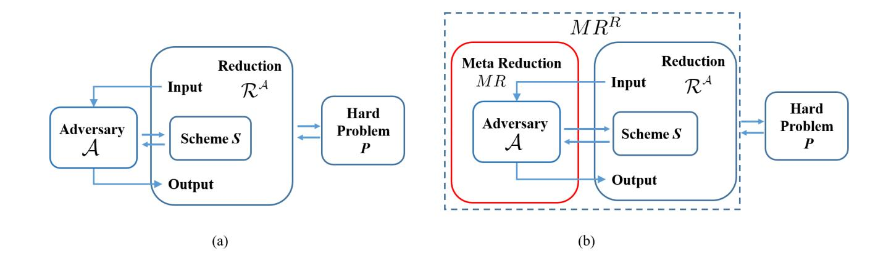

{0}------------------------------------------------

# On the non-tightness of measurement-based reductions for key encapsulation mechanism in the quantum random oracle model ?

Haodong Jiang1,2,3,<sup>4</sup> , Zhenfeng Zhang<sup>1</sup> , and Zhi Ma3,<sup>4</sup>

- <sup>1</sup> TCA Laboratory, State Key Laboratory of Computer Science, Institute of Software, Chinese Academy of Sciences, Beijing, 100190, China
- <sup>2</sup> State Key Laboratory of Cryptology, P.O. Box 5159, Beijing, 100878, China <sup>3</sup> State Key Laboratory of Mathematical Engineering and Advanced Computing,
- Zhengzhou, Henan, 450001, China <sup>4</sup> Henan Key Laboratory of Network Cryptography Technology, Zhengzhou, Henan,

450001, China haodong2020@iscas.ac.cn, zhenfeng@iscas.ac.cn, ma zhi@163.com

Abstract. Key encapsulation mechanism (KEM) variants of the Fujisaki-Okamoto (FO) transformation (TCC 2017) that turn a weakly-secure public-key encryption (PKE) into an IND-CCA-secure KEM, were widely used among the KEM submissions to the NIST Post-Quantum Cryptography Standardization Project. Under the standard CPA security assumptions, i.e., OW-CPA and IND-CPA, the security of these variants in the quantum random oracle model (QROM) has been proved by blackbox reductions, e.g., Jiang et al. (CRYPTO 2018), and by non-black-box reductions (EUROCRYPT 2020). The non-black-box reductions (EURO-CRYPT 2020) have a liner security loss, but can only apply to specific reversible adversaries with strict reversible implementation. On the contrary, the existing black-box reductions in the literature can apply to an arbitrary adversary with an arbitrary implementation, but suffer a quadratic security loss.

In this paper, for KEM variants of the FO transformation, we first show the tightness limits of the black-box reductions, and prove that a measurement-based reduction in the QROM from breaking the standard OW-CPA (or IND-CPA) security of the underlying PKE to breaking the IND-CCA security of the resulting KEM, will inevitably incur a quadratic loss of the security, where "measurement-based" means the reduction measures a hash query from the adversary and uses the measurement outcome to break the underlying security of PKE. In particular, most black-box reductions for these FO-like KEM variants are of this type, and our results suggest an explanation for the lack of progress in improving this reduction tightness in terms of the degree of security loss. Then, we further show that the quadratic loss is also unavoidable when one turns a search problem into a decision problem using the one-way to hiding technique in a black-box manner, which has been recognized as an essential technique to prove the security of cryptosystems involving quantum random oracles.

<sup>?</sup> This is the full version of the paper with the same title published at Asiacrypt'21.

{1}------------------------------------------------

**Keywords:** non-tightness  $\cdot$  quantum random oracle model  $\cdot$  key encapsulation mechanism  $\cdot$  Fujisaki-Okamoto  $\cdot$  one-way to hiding

#### 1 Introduction

Indistinguishability against chosen-ciphertext attacks (IND-CCA) [1] has been considered as a standard security notion for a key encapsulation mechanism (KEM) [2]. For designing efficient cryptographic protocols, an idealized model called Random oracle model (ROM) [3] is usually used, where a hash function is idealized to be a publicly accessible random oracle (RO). Generic constructions of an IND-CCA-secure KEM in the ROM were well studied by Dent [4] and Hofheinz, Hövelmanns and Kiltz [5].

Essentially, the generic constructions in [5] can be classified into two categories. One category is the KEM variants of the Fujisaki-Okamoto (FO) transformation [6,7] including FO $^{\perp}$ , FO $^{\perp}_m$ , FO $^{\perp}_m$ , FO $^{\perp}_m$ , QFO $^{\perp}_m$  and QFO $^{\perp}_m$ 5, which turn a public-key encryption (PKE) with the standard CPA security (one-wayness against chosen-plaintext attacks (OW-CPA) or indistinguishability against chosen-plaintext attacks (IND-CPA)) into an IND-CCA KEM. The second category is the KEM variants of the REACT/GEM transformation [9,10], including  $U^{\perp}$ ,  $U^{\perp}_m$ ,  $U^{\perp}_m$ ,  $U^{\perp}_m$  and  $QU^{\perp}_m$ , which turn a PKE with non-standard security (e.g., OW-PCA, one-way against plaintext checking attack [9,10]) or a deterministic PKE (DPKE, where the encryption algorithm is deterministic) into an IND-CCA-secure KEM. The modular analysis of the FO transformation by Hofheinz et al. [5] suggests that the FO transformation implicitly contains the REACT/GEM transformation at least as far as the proof techniques are concerned. Thus, in what follows, we just call these variants FO-like KEMs for brevity.

In modern cryptography, cryptosystem constructions are usually proposed together with a proof of security. Typically, when proving a security of a cryptographic scheme S under a hardness assumption of an underlying problem P, one usually constructs a reduction algorithm  $R^A$  that runs an adversary A against S as a subroutine to break the underlying hardness assumption of P. Let  $(T_A, \epsilon_A)$  and  $(T_R, \epsilon_R)$  denote the running times and advantages of A and  $R^A$ , respectively. The reduction is said to be tight if  $T_A \approx T_R$  and  $\epsilon_A \approx \epsilon_R$ . Otherwise, if  $T_R \gg T_A$  or  $\epsilon_R \ll \epsilon_A$ , the reduction is non-tight. Generally, the tightness gap, (informally) defined by  $\frac{T_A \epsilon_R}{T_R \epsilon_A}$  [11], is used to measure the quality of a reduction. Tighter reductions with smaller tightness gap are desirable for practical cryptographic applications especially in large-scale scenarios, since the tightness of a reduction determines the strength of the security guarantees provided by the security proof. Thus, pursuing tighter reduction has been recognized as a vital goal in cryptographic community.

<sup>&</sup>lt;sup>5</sup> Q means an additional Targhi-Unruh hash [8] (a length-preserving hash function) is appended to the ciphertext. m (without m) means K = H(m) (K = H(m, c)).  $\not \perp$  ( $\bot$ ) means implicit (explicit) rejection. In implicit (explicit) rejection, a pseudorandom key (an abnormal symbol  $\bot$ ) is returned for an invalid ciphertext.

{2}------------------------------------------------

A reduction is called black-box if it merely uses the adversary's input-output behavior, and does not depend on the internals like the adversary's code (e.g., concrete gate operations). As surveyed by Marc Fischlin [12], black-box reductions are pervasive in cryptography. In contrast, a non-black-box reduction requires knowledge of the adversary's internals. For several cryptographic tasks, e.g., zero-knowledge proofs [13], it can be shown that non-black-box reductions have significantly more power than black-box ones [14]. In particular, this additional power of non-black-box reductions can be used to obtain new results, which were previously proven to be impossible to obtain when using only black-box techniques [14]. However, in some settings, e.g. secure computation, non-black-box reductions may cause high efficiency costs, and are unlikely to be very useful in practice [15]. In addition, as argued by Pass, Tseng and Venkitasubramaniam [16], in the context of basing cryptographic primitives on one another, black-box reductions provide a semantically stronger notion of security than non-black-box reductions, since non-black-box reductions require an explicit description of the adversary's code that might be hard to find in practical attacks. Thus, typically, when proving the security of a cryptosystem, a black-box reduction is always the first choice.

In the ROM, if an adversary queries the random oracle with m, the reduction can see this query and learn m. This is sometimes called extractability. When proving the IND-CCA security of a PKE/KEM under various standard assumptions in the ROM, one usually constructs a query-based <sup>6</sup> reduction that uses a hash query from the adversary to break the underlying hard problem, such as when proving the FO transformation [6, 7], the REACT/GEM transformation [9, 10], the Bellare-Rogaway transformation [3], the OAEP transformation [18, 19], and the hashed ElGamal encryption scheme [20]. A query-based reduction is also used in getting a tight security proof for a unique signature [17]. In particular, for FO-like KEMs from standard CPA assumptions (in what follows, standard C-PA assumptions refer to OW-CPA and IND-CPA), the currently known security reductions in the ROM [4, 5, 21] are all query-based.

Recently, post-quantum security of FO-like KEMs has gathered great interest [5, 22–29] due to the widespread adoption [23, Table 1] in KEM submissions to the NIST Post-Quantum Cryptography (PQC) Standardization Project [30]. The goal of this project is to standardize new public-key cryptographic algorithms with security against quantum adversaries. Motivated by the fact that quantum adversaries can execute all "offline primitives" such as hash functions on arbitrary superpositions, Boneh et al. [31] introduced quantum random oracle model (QROM), where the adversary can query the random oracle with quantum state, and argued that to prove post-quantum security one needs to prove security in the QROM<sup>7</sup> .

Unfortunately, the aforementioned query-based reduction in the ROM can not carry over to the QROM setting offhand due to the fact that the extractability might be problematic when the query is a quantum state which can be a

<sup>6</sup> This name comes from Guo et al.'s paper [17].

<sup>7</sup> Separations of ROM and QROM were given by [31–33].

{3}------------------------------------------------

superposition of exponentially many classical states [31]. In a quantum world, measurement allows us to extract classical information from a quantum state and thus is a way that we can "read out" information. Thus, naturally, a QROM version of the aforementioned query-based reduction can be a reduction that measures a hash query from the adversary and uses the measurement outcome to break the underlying hard problem. In this paper, we call this type of reductions a measurement-based reduction.

Particularly, for FO-like KEMs from standard CPA assumptions, most black-box reductions<sup>8</sup> (e.g., [5, 22–27]) and non-black-box reductions [37] in the QROM are of this type, and have the tightness<sup>9</sup>, (1)  $T_R$  is about  $T_A$ ; (2)  $\epsilon_R \approx \frac{1}{\kappa} \epsilon_A^{\tau}$ , where  $\kappa$  and  $\tau$  are respectively called the factor and degree of security loss in the following. Let q be the total number of adversary's queries (including quantum and classical) to various oracles.

- In [5], Hofheinz et al. presented security reductions for  $QFO_m^{\checkmark}$  and  $QFO_m^{\downarrow}$  from the OW-CPA security of the underlying PKE with  $\kappa = O(q^6)$  and  $\tau = 4$ , for  $QU_m^{\checkmark}$  and  $QU_m^{\downarrow}$  from the OW-PCA security of the underlying PKE with  $\kappa = O(q^2)$  and  $\tau = 2$ .
- In [22], Saito, Xagawa and Yamakawa presented a tight security reduction (i.e.,  $\kappa = O(1)$  and  $\tau = 1$ ) for  $\mathbb{U}_m^{\checkmark}$  from a new non-standard security called disjoint simulatability (DS) of the underlying DPKE, and also provided a security reduction for a variant of  $FO_m^{\checkmark}$  from the standard IND-CPA security of the underlying PKE with  $\kappa = O(q^2)$  and  $\tau = 2$ .
- In [23], Jiang et al. first presented security reductions for FO<sup>\*\*</sup> and FO<sup>\*\*</sup> from the standard OW-CPA security of the underlying PKE with  $\kappa = O(q^2)$  and  $\tau = 2$ . Then, they presented security reductions for U<sup>\*\*</sup> (U<sup>\(\Delta\)</sup>, resp.) from the OW-qPCA (OW-qPVCA, resp.) security of the underlying PKE, U<sup>\*\*</sup><sub>m</sub> (U<sup>\(\Delta\)</sup>, resp.) from the OW-CPA (OW-VA, resp.) security of the underlying DPKE with  $\kappa = O(q^2)$  and  $\tau = 2$ , where OW-qPCA, OW-qPVCA and OW-VA are new non-standard security notions of PKE introduced by [5, 23].
- Using the semi-classical oracle technique in [38], [24,25,27] improved the tightness of security reductions in [23]. Precisely, under the standard IND-CPA security of the underlying PKE, security reductions with tightness  $\kappa = O(q)$  and  $\tau = 2$  were given for FO<sup> $\checkmark$ </sup>, FO<sup> $\checkmark$ </sup> and their variants with explicit rejection. For U<sup> $\checkmark$ </sup>, U<sup> $\checkmark$ </sup>, U<sup> $\checkmark$ </sup> and U<sup> $\checkmark$ </sup>, the reduction tightness was improved to be  $\kappa = O(q)$  and  $\tau = 2$  under the same security assumptions as in [23].
- In [26], following Zhandry's compressed oracle technique [34], Bindel et al. further gave tighter security reduction for U and its variants with  $\kappa = O(1)$  and  $\tau = 2$ .

<sup>&</sup>lt;sup>8</sup> The reductions in [34–36] that use the compressed oracle technique developed by [34] do not belong to the class of measurement-based reductions, since they access information contained in the adversary's queries in a non-trivially different way than by measurement.

<sup>&</sup>lt;sup>9</sup> When comparing the tightness of different reductions, we assume perfect correctness of the underlying scheme for brevity.

{4}------------------------------------------------

– In [37], introducing a new technique called "Measure-Rewind-Measure" (M-RM), Kuchta et al. first gave non-black-box reductions for FO-like KEMs. In particular, for U✚<sup>⊥</sup> (FO✚⊥, resp.) and its variants, the reduction tightness was improved to be κ = O(q) and τ = 1 (κ = O(q 2 ) and τ = 1, resp.).

As we can see, the existing black-box reductions in the QROM for FOlike KEMs from standard CPA assumptions, are far from desirable due to the quadratic security loss (at least). Although this quadratic loss can be avoided by non-black-box reductions [37], as we will show in Sec. 1.4, the non-black-box reductions in [37] can only apply to specific reversible adversaries<sup>10</sup> with strict reversible implementation (the existing black-box reductions in the literature can cover arbitrary adversaries with arbitrary implementations). These results are quite different from the ones in the ROM setting, where security reductions with linear loss can be achieved in a black-box manner [4, 5].

The quadratic loss in these security proofs arises from the usage of the oneway to hiding (OW2H) technique [39], which essentially gives a reduction from an extraction algorithm against the one-wayness-style property (search problem) to a distinguishing adversary against hiding-style property (decision problem) with quadratic loss. Actually, the OW2H technique has been recognized as an essential technique to prove security of various cryptosystems involving quantum random oracles [39, 38]. Besides FO-like constructions, the OW2H technique was also used to prove the security of revocable timed-release encryption schemes [39], authenticated key exchange [27], position verification protocol [40], PRF and MACs [41], non-interactive zero-knowledge proof systems and signature schemes [42–44]. Very recently, several works [38, 26, 37] tried to improve the tightness of the OW2H technique. However, as in the case of the aforementioned proofs for FO-like KEMs, the tightness improvements are only restricted to the factor of reduction loss, and the quadratic loss still exists (except the improvement using a non-black-box reduction for reversible distinguishing adversaries in [37]).

Thus, a natural question is that

For FO-like KEMs and the one-way to hiding technique, is the quadratic loss unavoidable for measurement-based black-box reductions?

#### 1.1 Our contributions

In this paper, we give an affirmative answer for the above question, and show that the current quadratic loss is indeed unavoidable for any measurement-based black-box reduction that runs the adversary once without rewinding<sup>11</sup> .

<sup>10</sup> In post-quantum setting, most adversaries are irreversible since most oracles (e.g., decapsulation oracle) in the security model can only be classically queried. Thus, a quantum adversary has to measure his quantum query registers to perform a classical query. Moreover, adversaries may also perform a mix of classical (probably irreversible) and quantum algorithm, see Appendix G for details.

<sup>11</sup> Our impossibility results can also be extended to cover measurement-based reductions with simple rewinding (a quantum counterpart of classical sequential rewinding [45]), see Remark 5 and Appendix D.

{5}------------------------------------------------

Given a real p ( $0 \le p \le 1$ ) and a FO-like KEM construction,

- 1. We first construct an unbounded quantum adversary  $\mathcal{A}$  that breaks the IND-CCA security of the resulting KEM by querying the random oracle with a well-designed quantum state and solving a discrimination problem between two quantum states. The advantage of  $\mathcal{A}$  is at least  $\sqrt{p}$ , i.e.,  $\epsilon_{\mathcal{A}} \gtrsim \sqrt{p}$ .
- 2. Then, using the meta-reduction methodology [46, 47], we bound the advantage  $\epsilon_R$  of a measurement-based reduction  $R^{\mathcal{A}}$  that runs above  $\mathcal{A}$  as a subroutine to break the OW-CPA (or IND-CPA) security of the underlying PKE. In particular, the advantage  $\epsilon_R$  can not substantially exceed p, i.e.,  $\epsilon_R \lesssim p$ , unless there exists an algorithm breaking the OW-CPA (or IND-CPA) security of the underlying PKE efficiently.

Therefore, for FO-like KEMs, our results show that a measurement-based black-box reduction in the QROM from breaking the standard OW-CPA (or IND-CPA) security of the underlying PKE to breaking the IND-CCA security of the resulting KEM, will *inevitably* incur a quadratic loss of the security.

Moreover, our impossibility results can also be extended to show that the quadratic loss is also unavoidable when one turns a search problem into a decision problem via the essential OW2H technique in a black-box manner. That is, the black-box OW2H technique [39, 38, 26] is essentially optimal in terms of the degree of reduction loss.

## 1.2 The interest of our result

As pointed out by [5, Sec. 1.2], FO-like constructions remain the only known generic constructions from CPA to CCA security. That is, our results cover all the current generic constructions of an IND-CCA-secure KEM based on a CPA-secure PKE. On the other hand, our impossibility results can apply to typical measurement-based reduction, which is a QROM version of the query-based reduction that has been widely used in proving CCA security of a PKE/KEM under various standard assumptions. For FO-like KEMs from a standard CPA PKE, the currently known black-box reductions in [5, 22–27] belong to this type. Thus, our results suggest an explanation for the lack of progress in improving the reduction tightness in terms of the degree of security loss in these works [5, 22–27].

The tightness of security reductions is important to evaluate the concrete security of a cryptosystem [11]. Our results first give a black-box reduction bound for FO-like KEMs, which can be taken as a baseline for tightness comparison. For example, at TCC 2019, Bindel et al. [26] took this result as a theoretical support for their "tight" reduction (their main contribution) for U and its variants since their black-box reductions essentially match our impossibility bound.

As pointed out by Baecher et al. [48], an impossibility result, which clearly specifies the type of reduction it rules out, enables us to identify the potential leverages to bypass the limits. Fischlin [12] mentioned that the impossibility result can also been viewed as a shortcoming of the proof technique itself, and

{6}------------------------------------------------

non-black-box techniques can be used to circumvent a black-box impossibility result. At EUROCRYPT 2020, following our work, Kuchta et al. [37] introduced a new technique called "measure-rewind-measure" (MRM), and proposed a non-black-box reduction that can bypass our black-box impossibility results to achieve a linear loss, see Sec. 1.4 for detailed discussion. Therefore, our impossibility results can be taken as guidance toward a positive answer, and will be a step forward into looking for new approaches to prove security in the QROM.

In NIST PQC standardization process, all the Round-3 KEM candidates use FO-like constructions to achieve the CCA security [30]. For NIST's round-3 evaluations, our results suggest that in order to derive a tight QROM proof, one (especially the NIST submission teams) has to research on developing new proof techniques (particularly for their specific constructions).

#### 1.3 Technique overview

In FO-like KEMs, the (session) key K is derived by H(m) (or H(m,c)) and the ciphertext c = Enc(pk, m; G(m)) (or Enc(pk, m) if Enc is deterministic) is the corresponding encapsulation of the key K, where Enc is the encryption algorithm of the underlying PKE, m is uniformly picked at random, G and H are random oracles. In this section, for a concise presentation, we just take KEM  $-U_m^{\prime\prime}$  (see Fig. 1 for details) as an example, and thus K = H(m) and C = Enc(pk, m). It is easy to extend the techniques here to other FO-like KEMs and the general OW2H technique, see Secs. 5.1 and 6.

Meta-reduction methodology. Since the introduction by Boneh and Venkatesan in [46], the meta-reduction methodology has proven to be a versatile tool in deriving impossibility results and tightness bounds of security proofs for many cryptosystem constructions [46, 47, 49–55, 45, 56], please see the review [12]. Let R be a reduction that breaks the underlying hard problem P with access to an adversary A against a scheme S. Roughly speaking, a meta-reduction  $MR^R$  simulates the adversarial part A, runs R as a subroutine, and break the underlying hard problem P directly without reference to an allegedly successful adversary. That is, a meta-reduction  $MR^R$  treats the reduction R as an adversary itself, and reduces the existence of such a reduction R to a presumably hard problem. Note that the meta-reduction methodology clearly requires the existence of a successful adversary A against the scheme S in the first place, and such an adversary is usually unbounded [12]. A more detailed description of the meta-reduction methodology can be found in Appendix A.

When attacking the IND-CCA security of KEM  $-U_m^{\mathcal{L}}$ , an adversary  $\mathcal{A}(pk, c^*, K_b)$  needs to distinguish  $K_0 = H(m^*)$  from a uniformly random key  $K_1$ , where  $c^* = Enc(pk, m^*)$  is an encryption of a uniformly random  $m^*$ , the coin  $b \in \{0, 1\}$  is uniformly random. We note that the random oracle H has a useful property that if  $m^*$  has not been queried by  $\mathcal{A}$ , then the value  $H(m^*)$  is uniformly random in  $\mathcal{A}$ 's view. Thus,  $\mathcal{A}$ 's distinguishing advantage is negligible when  $\mathcal{A}$  does not query H with  $m^*$ . Intuitively, to achieve a non-negligible distinguishing advantage,  $\mathcal{A}$  has to query H with  $m^*$ .

{7}------------------------------------------------

In the ROM,  $\mathcal{A}$  can only make classical queries to H. For any p ( $0 \leq p \leq 1$ ), if  $\mathcal{A}$  makes a query  $m^*$  to H with probability p, he will learn  $K_0 = H(m^*)$  with probability p and break the IND-CCA security with advantage approximately p by testing whether  $K_0$  is equal to  $K_b$ . For a reduction  $R^{\mathcal{A}}$  against the OW-CPA security of the underlying DPKE, a natural way is to take  $\mathcal{A}$ 's query as a return. Then, with probability p,  $R^{\mathcal{A}}$  will return the  $m^*$  and break the OW-CPA security of the underlying DPKE. That is, the advantages of  $R^{\mathcal{A}}$  and  $\mathcal{A}$  are approximately equal, which is consistent with the currently known tight reduction in [5].

Unbounded quantum adversary  $\mathcal{A}$ . In the QROM, a quantum adversary  $\mathcal{A}$  makes queries to H with quantum states. Consider the following quantum state

$$|\psi_{-1}\rangle := \sqrt{p}|m^*\rangle|0\rangle + \sqrt{1-p}|m'\rangle|\Sigma\rangle,$$

where  $m' \neq m^*$ ,  $|\Sigma\rangle = \sum_{k \in \mathcal{K}} 1/\sqrt{|\mathcal{K}|} |k\rangle$  and  $\mathcal{K}$  is the (session) key space. For a quantum query with  $|\psi_{-1}\rangle$ , the random oracle H will return

$$|\psi_0\rangle := \sqrt{p}|m^*\rangle|K_0\rangle + \sqrt{1-p}|m'\rangle|\Sigma\rangle.$$

We remark that if the adversary  $\mathcal{A}$  directly measures  $|\psi_0\rangle$  in the standard computational basis, he will obtain  $K_0$  with probability p, and break the IND-CCA security with advantage (approximately) p by testing whether  $K_0$  is equal to  $K_b$  as the aforementioned ROM adversary does.

Here, we construct an unbounded quantum adversary  $\mathcal{A}(pk, c^*, K_b)$  that first determines  $m^*$  such that  $c^* = Enc(pk, m^*)$  by exhaustive search (if none is found,  $\mathcal{A}$  outputs 1) and randomly selects a uniform m' such that  $m' \neq m^*$ , then queries H with  $|\psi_{-1}\rangle$ , lastly guesses b by testing whether  $|\psi_0\rangle$  is equal to  $|\psi_b\rangle$ , where

$$|\psi_b\rangle := \sqrt{p}|m^*\rangle|K_b\rangle + \sqrt{1-p}|m'\rangle|\Sigma\rangle.$$

Testing whether  $|\psi_0\rangle$  is equal to  $|\psi_b\rangle^{12}$  can be accomplished using the standard state discrimination method (known as Helstrom measurement) [57, 58] with advantage (approximately) at least  $\sqrt{p}$ . Thus, quantum adversary  $\mathcal{A}$  can break the IND-CCA security with advantage (approximately) at least  $\sqrt{p}$ . That is,  $\epsilon_{\mathcal{A}} \gtrsim \sqrt{p}$ .

In the currently known proofs for KEM –  $U_m^{\not L}$  in [23], the reduction algorithm  $R^A$  against the OW-CPA security of the underlying DPKE just randomly measures one of  $\mathcal{A}$ 's queries to H in the standard computational basis and takes the measurement outcome as a return. The security bound is given by  $\epsilon_{\mathcal{A}} \lesssim q \sqrt{\epsilon_R}$ . We note that the aforementioned unbounded adversary  $\mathcal{A}$  does not query the decapsulation oracle, and just reveals one quantum query  $|\psi_{-1}\rangle$  to H and a guessing of b. Thus, the total number of  $\mathcal{A}$ 's queries to various oracles is one, i.e., q=1. We also note that the advantage of the reduction algorithm  $R^A$  in [23] is exactly the probability of the measurement outputting  $m^*$ , which is equal to p. That is,  $\epsilon_R=p$ . Thus, for above unbounded quantum adversary  $\mathcal{A}$ , the advantage can match the bound  $\epsilon_{\mathcal{A}} \lesssim q \sqrt{\epsilon_R}$  in [23].

Formally, we need to judge  $|\psi_0\rangle\langle\psi_0|$  comes from  $|\psi_b\rangle\langle\psi_b|$  or  $\mathbb{E}_{K_{1-b}}|\psi_{1-b}\rangle\langle\psi_{1-b}|$  (the the expectation is taken over  $K_{1-b} \stackrel{\$}{\leftarrow} \mathcal{K}$ ), please refer to Sec. 3 for details.

{8}------------------------------------------------

The advantage of a measurement-based reduction. Here, we consider a measurement-based black-box reduction  $R^{\mathcal{A}}$  that runs  $\mathcal{A}$  once and without rewinding, measures  $\mathcal{A}$ 's query  $|\psi_{-1}\rangle$  and uses the measurement outcome (any further postprocessing is allowed) to break the OW-CPA security of the underlying DPKE. We say a reduction R is efficient if the running time of R (excluding  $\mathcal{A}$ 's running time) is polynomial in the security parameter. We make a convention that  $R^{\mathcal{A}}$  measures  $|\psi_{-1}\rangle$  in the standard computational basis<sup>13</sup>.

Consider the advantage of  $R^{\mathcal{A}}$  in the following three cases, where INE is denoted as the event that the exhaustive search does not return an  $m^*$  such that  $Enc(pk, m^*) = c^*$ , EXI is denoted as the event that such an  $m^*$  is found, GOOD is denoted as the event that the measurement outcome is  $m^*$ , and BAD is denoted as the event that the measurement outcome is not  $m^*$ .

Case 1: Inc. In this case,  $\mathcal{A}$  just outputs 1 without queries to H. Thus, exhaustive search for  $m^*$  in this case is vain, and  $\mathcal{A}$  can be replaced by an adversary  $\mathcal{A}_1$  that always outputs 1 without the search for  $m^*$  and the query to the random oracle H. Therefore, we can easily construct a meta-reduction  $MR_1^R$  that simulates  $\mathcal{A}_1$  and takes  $R^{\mathcal{A}_1}$  as a subroutine to break the OW-CPA security of the underlying DPKE such that the running time of  $MR_1^R$  is about the running time of R, and under the condition INE the advantage of R1 is about the advantage of R2.

Case 2: EXI  $\land$  GOOD. Since  $\Pr[\text{GOOD}|\text{EXI}] = p$ , we can bound the advantage of R in this case by p.

Case 3: EXI  $\land$  BAD. In this case, R gets  $m' \neq m^*$ . Let  $\mathcal{A}_2$  be an adversary that makes a single query to H with quantum state  $\sum_{m,k} 1/\sqrt{|\mathcal{M}|} \cdot |\mathcal{K}| |m\rangle |k\rangle$  and outputs 1 without searching for  $m^*$ . Thus, the advantage of R under the condition EXI  $\land$  BAD remains unchanged when  $\mathcal{A}$  is replaced by  $\mathcal{A}_2$ . As in the case 1, we can also construct a meta-reduction  $MR_2^R$  against the underlying OW-CPA security that simulates  $\mathcal{A}_2$  and takes  $R^{\mathcal{A}_2}$  as a subroutine such that the running time of  $MR_2^R$  is about the running time of R, and under the condition EXI  $\land$  BAD the advantage of  $MR_2^R$  is about the advantage of R.

Under the assumption that the advantage of any efficient algorithm breaking the OW-CPA security of the underlying DPKE is negligible, we have that both advantages of  $MR_1^R$  and  $MR_2^R$  are negligible since the running time is polynomial in the security parameter. Thus, both advantages of R in Case 1 and Case 3 are negligible, which implies that the upper bound of R's advantage is approximately p. That is, the advantage of a measurement-based black-box reduction against the OW-CPA security of the underlying DPKE can not substantially exceed p unless there exists an algorithm that can break the OW-CPA security of the underlying DPKE efficiently.

The discussion on other measurements is given by Sec. 4.

{9}------------------------------------------------

#### 1.4 Subsequent work

Observing our constructed quantum state distinguisher, Kuchta et al. [37] found that in one of the measurement basis states, the amplitude of |m<sup>∗</sup> i has a relatively high norm. That is, such a measurement basis state essentially encodes m<sup>∗</sup> , thus measuring this measurement basis state can give m<sup>∗</sup> with a high probability. In order to extract m<sup>∗</sup> from adversary's quantum registers, Kuchta et al. [37] developed a novel MRM extractor. In particular, the extractor of m<sup>∗</sup> first runs the adversary A until the end, performs the first-measurement on A's internal outputting registers, and then rewinds A conditioned on the first-measurement outcome, finally conducts a second-measurement on A's query registers. Note that above rewinding is done in the end of A's run by applying the inverses of the quantum gate operations (i.e., codes) that A has applied earlier, rather by restarting A in a black-box manner from the very beginning. Thus, the MRM extractor can only apply to reversible adversaries. In particular, the MRM extractor must access A in a non-black-box way since it requires knowledge of A's internal codes and needs to access A's internal quantum registers.

Based on the aforementioned MRM extractor, Kuchta et al. [37] gave a new non-black-box version of the OW2H lemma. Modifying the proofs in [26] by replacing the black-box OW2H with this non-black-box one, Kuchta et al. first achieved a linear reduction loss for FO-like KEMs. However, due to fact the M-RM extractor can only be used for reversible adversaries, thus the non-black-box proofs [37] can only cover reversible CCA adversaries with reversible implementation. We also note that the prior black-box security proofs, including [5, 22–27], can apply to arbitrary adversaries with arbitrary implementation. In particular, the prior black-box OW2H lemmas do not require the underlying adversary A unitary, e.g., [38, Theorems 1 and 3], see Appendix G.

Unfortunately, most adversaries in post-quantum setting are irreversible since most oracles (e.g., decapsulation oracle) in the security model can only be classically queried. That is, a quantum adversary has to measure his quantum query registers to perform a classical query. There are a well-known generic transform [59, Chap. 3.2.5] that can convert any irreversible adversary into a reversible one, and can be used to extend Kuchta et al.'s non-black-box OW2H to cover arbitrary adversaries with arbitrary implementation. However, on the one hand, such a transform will cost a space overhead linearly increased with the adversary's running time. On the other hand, it requires that the oracles (e.g., decapsulation oracle) accessed by the adversary must be simulated such that the adversary can make quantum queries instead of classical queries considered in the typical post-quantum setting. That is, the MRM OW2H extended by the aforementioned generic transform can only apply to the case where there are efficient quantum simulations for all the oracles accessed by the adversary. We provide a detailed discussion on these issues in Appendix G.

#### 1.5 Other related works

Before our work, the meta-reduction methodology was only used to derive a QROM impossibility for Fiat-Shamir signature by Dagdelen, Fischlin, and Gagliar

{10}------------------------------------------------

doni [53]. More specifically, they used the meta-reduction technique to show that if the Fiat-Shamir transformation applied to the identification protocol would support a knowledge extractor, then a contradiction to the active security will be obtained. In this paper, we focus on the limits of FO-like KEMs and more general one-way to hiding, and the meta-reduction constructions are totally different from theirs.

At ASIACRYPT 2020, Hosoyamada and Yamakawa [60] also studied black-box impossibility in quantum setting, and showed that there does not exist a quantum black-box reduction from collision-resistant hash functions to one-way permutations (or even trapdoor permutations). In particular, different from our work where the meta-reduction methodology is used, the results in [60] is obtained by using another typical technique called *two-oracle* technique [61] that is also popular in deriving the limitations of black-box reductions.

#### 2 Preliminaries

The cryptographic primitives used in this paper are given by Appendix B. For basics of quantum computation, one can refer to [59].

Symbol description. A security parameter is denoted by  $\lambda$ . We use the standard O-notations: O and  $\omega$ . The abbreviation PPT stands for probabilistic polynomial time. A function  $f(\lambda)$  is said to be negligible if  $f(\lambda) = \lambda^{-\omega(1)}$ . We denote a set of negligible functions by  $\operatorname{negl}(\lambda)$ .  $\mathcal{K}$ ,  $\mathcal{M}$ ,  $\mathcal{C}$  and R are respectively denoted as key space, message space, ciphertext space and randomness space. Given a finite set X, we denote the sampling of a uniformly random element x by  $x \overset{\$}{\leftarrow} X$ . Denote the sampling from some distribution D by  $x \leftarrow D$ . x = ?y is denoted as an integer that is 1 if x = y, and otherwise 0. Denote deterministic computation of an algorithm A on input x by y = A(x). Probabilistic computation of an algorithm A on input x is denoted by  $y \leftarrow A(x)$ . If necessary, we also make the used randomness x explicit by writing x = A(x; x). Let x = A(x; x) be the cardinality of set x = A(x; x) is the running time (computational steps) of an algorithm x = A(x; x). Time x = A(x; x) is the running time of an algorithm x = A(x; x) that takes x = A(x; x) as a subroutine x = A(x; x) is the number of times x = A(x; x) is invoked by x = A(x; x).

# 3 An unbounded quantum adversary against the IND-CCA security of KEM

In this section, we will construct an unbounded quantum adversary against the IND-CCA security of KEM -  $U_m^{\swarrow} = U_m^{\swarrow}[DPKE, H, f]$  shown by Fig. 1, where DPKE = (Gen', Enc', Dec'), a hash function  $H : \mathcal{M} \to \mathcal{K}$ , and a pseudorandom function (PRF) f with key space  $\mathcal{K}^{prf}$ . The IND-CCA game of KEM -  $U_m^{\swarrow}$  is given by Fig. 2.

 $<sup>\</sup>overline{^{14}}$  Here, in this paper,  $\mathcal{A}$  is forbidden to call R as a subroutine.

{11}------------------------------------------------

```
 \begin{array}{c|ccccccccccccccccccccccccccccccccccc
```

Fig. 1: IND-CCA-secure KEM –  $U_m^{\cancel{L}} = U_m^{\cancel{L}}[DPKE, H, f]$ 

```
IND-CCA game of KEM – U_m^{\not L} DECAPS (c \neq c^*)

1: (pk, sk') \leftarrow Gen; H \stackrel{\$}{\leftarrow} \Omega_H

1: Parse sk' = (sk, k)

2: m^* \stackrel{\$}{\leftarrow} \mathcal{M}; c^* := Enc'(pk, m^*)

3: K_0^* := H(m^*); K_1^* \stackrel{\$}{\leftarrow} \mathcal{K}; b \stackrel{\$}{\leftarrow} \{0, 1\}

4: b' \leftarrow \mathcal{A}^{H, \text{DECAPS}}(pk, c^*, K_b^*)

5: return b' = ?b

DECAPS (c \neq c^*)

1: Parse sk' = (sk, k)

2: m' := Dec'(sk, c)

3: if Enc'(pk, m') = c

4: return K := H(m')

5: else return K := f(k, c)
```

Fig. 2: IND-CCA game of KEM –  $U_m^{\cancel{/}}$ 

Let  $\mathcal{A}(pk, c^*, K_b; r_1, r_2)$  ( $r_1$  and  $r_2$  are classical randomness) be a quantum adversary against the IND-CCA game of KEM –  $U_m^{\cancel{L}}$  that does as follows.

```
\mathcal{A}(pk, c^*, K_b; r_1, r_2)
1: Search a m^* \in \mathcal{M} such that Enc'(pk, m^*) = c^*

## If no one (or more than one) is found, output 1 and terminate the procedure.

2: Sample a real p \in [0, 1] using randomness r_1

3: Sample a uniform m' from \{m' \in \mathcal{M} : m' \neq m^*\} using randomness r_2

4: Query H with quantum state |\psi_{-1}\rangle := \sqrt{p}|m^*\rangle|0\rangle + \sqrt{1-p}|m'\rangle|\Sigma\rangle

## |\Sigma\rangle = \sum_{k \in \mathcal{K}} 1/\sqrt{|\mathcal{K}|}|k\rangle can be derived by H^{\otimes \log |\mathcal{K}|}|0\rangle.
```

5: Perform Helstrom measurement M on  $|\psi_0\rangle$  (the state returned by H)

6: Return the measurement outcome.

Remark 1. The  $|\psi_0\rangle$  returned by H is given by

$$|\psi_{0}\rangle = \mathcal{O}_{H}|\psi_{-1}\rangle = \sqrt{p}|m^{*}\rangle|H(m^{*})\rangle + \sqrt{1-p}|m'\rangle|(\sum_{k\in\mathcal{K}}1/\sqrt{|\mathcal{K}|}|k\oplus H(m')\rangle)$$

$$= \sqrt{p}|m^{*}\rangle|K_{0}\rangle + \sqrt{1-p}|m'\rangle|(\sum_{k\in\mathcal{K}}1/\sqrt{|\mathcal{K}|}|k\rangle)$$

$$= \sqrt{p}|m^{*}\rangle|K_{0}\rangle + \sqrt{1-p}|m'\rangle|\Sigma\rangle.$$

{12}------------------------------------------------

Remark 2. Helstrom measurement M is a binary POVM measurement with measurement operators  $M_1$  and  $M_0 = I - M_1$ .  $M_1$  can be derived by following the standard method in [57, 58]. In details, let  $\psi_b = |\psi_b\rangle\langle\psi_b|$  and  $\psi_{1-b} =$  $\mathbb{E}_{K_{1-b}} |\psi_{1-b}\rangle\langle\psi_{1-b}|$ , where the expectation is taken over  $K_{1-b} \stackrel{\$}{\leftarrow} \mathcal{K}$  and  $|\psi_b\rangle =$  $\sqrt{p}|m^*\rangle|K_b\rangle+\sqrt{1-p}|m'\rangle|\Sigma\rangle$ . Note that  $\mathcal{A}$  knows  $\psi_b$  and  $\psi_{1-b}$  since he gets  $m^*$ , p, m' and  $K_b$ . Thus, by the spectral decomposition of  $\psi_b - \psi_{1-b} = \lambda_+ M_1 - \lambda_- M_0$ ,  $\mathcal{A}$  can easily obtain  $M_1$  and  $M_0$ . Theorem 3.1 shows that the adversary  $\mathcal{A}$  using Helstrom measurement can break security with advantage at least  $\sqrt{p}(1-1/|\mathcal{K}|)$ . It is well-known that Helstrom measurement has the optimal distinguishing advantage for two state discrimination<sup>15</sup>. But for our specific case, there still exist some alternative measurements that can also be adopted by the adversary to attain advantage at least  $\sqrt{p}(1-1/|\mathcal{K}|)$  (although they are not optimal). For example, the adversary can adopt the measurement with operators  $M_1 = |\Psi\rangle\langle\Psi|$  and  $M_0 = I - M_1$ , where  $|\Psi\rangle = \sin(x)|m^*\rangle|K_b\rangle + \cos(x)|m'\rangle|\Sigma\rangle$ and  $x = \frac{1}{2}\arccos(-\frac{\sqrt{p}}{\sqrt{4-3p}})$  (sin(2x)  $\geq$  0). In Appendix C, we will show the adversary with such an alternative measurement can also have advantage at least  $\sqrt{p}(1-1/|\mathcal{K}|).$ 

Theorem 3.1 (The advantage of  $\mathcal{A}$  in the QROM). If the underlying DP-KE is perfectly correct, the advantage of  $\mathcal{A}$  against the IND-CCA security of KEM  $-\mathbb{U}_m^{\cancel{L}}$  is at least  $\sqrt{p}(1-1/|\mathcal{K}|)$ .

*Proof.* In the IND-CCA game of KEM –  $U_m^{\not L}$ ,  $c^* = Enc'(pk, m^*)$ , where  $m^* \leftarrow \mathcal{M}$ , thus there exists at least one  $m^* \in \mathcal{M}$  such that  $Enc'(pk, m^*) = c^*$ . Since DPKE is perfectly correct, there are no more than one  $m^*$  such that  $Enc'(pk, m^*) = c^*$ . Thus, the  $m^*$  that  $\mathcal{A}$  gets is exactly the one chosen by the challenger.

Note that the adversary  $\mathcal{A}$  knows nothing about  $K_{1-b}$ . Thus, in  $\mathcal{A}$ 's view, the state  $|\psi_0\rangle$  returned by H can be described by a mixed state  $\psi_0 = \mathbb{E}_{K_{1-b}} |\psi_0\rangle\langle\psi_0|$ , where the expectation is taken over  $K_{1-b} \stackrel{\$}{\leftarrow} \mathcal{K}$ . It is obvious that  $\psi_0$  is equal to  $\psi_b$  if b=0, and  $\psi_{1-b}$  if b=1, where  $\psi_b$  and  $\psi_{1-b}$  are defined in Remark 2. Therefore, we have  $\operatorname{Adv}_{KEM-U_m}^{IND-CCA}(\mathcal{A}) = |\Pr[\mathcal{A} \Rightarrow 1|b=0] - \Pr[\mathcal{A} \Rightarrow 1|b=1]| = |tr(M_1\psi_b) - tr(M_1\psi_{1-b})|$ .

Since  $b \stackrel{\$}{\leftarrow} \{0,1\}$  and  $\mathcal{A}$  adopts Helstrom (optimal) measurement,  $||tr(M_1\psi_b)-tr(M_1\psi_{1-b})||$  is the optimal advantage of solving the minimum-error state discrimination between  $\psi_b$  and  $\psi_{1-b}$ . Thus,  $|tr(M_1\psi_b)-tr(M_1\psi_{1-b})|=||\psi_b-\psi_{1-b}||_1=|\lambda_+|+|\lambda_-|\geq 2(1-1/|\mathcal{K}|)\sqrt{p^2/4}+p(1-p)=2(1-1/|\mathcal{K}|)\sqrt{p}\sqrt{1-3/4p}$   $\geq (1-1/|\mathcal{K}|)\sqrt{p}\approx \sqrt{p}$ , where  $\lambda_+$  and  $\lambda_-$  are respectively positive eigenvalue and negative eigenvalue of operator  $\psi_b-\psi_{1-b}$ .

In the ROM,  $\mathcal{A}$  can only classically query the random oracle H. That is, before querying H, the input state is measured in the standard computational

Optimal quantum state discrimination is in general difficult apart from the case of two state discrimination, see the review [58].

{13}------------------------------------------------

basis. Then,  $\mathcal{A}$  will query H on  $m^*$  with probability p, and on m' with probability 1-p. Accordingly,  $H(m^*)$  or H(m') will be returned. Note that classical states (orthogonal quantum states) can be perfectly distinguished. Thus, by testing whether the returned hash value is equal to  $K_b$ ,  $\mathcal{A}$  can break the IND-CCA security of KEM –  $U_m^{\not{L}}$  with advantage  $1-\frac{1}{\mathcal{K}}$  if  $m^*$  is queried, and 0 if m' is queried. Thus, in the ROM, the advantage of  $\mathcal{A}$  will become  $p(1-\frac{1}{|\mathcal{K}|})$ .

# 4 The advantage of a measurement-based reduction

In this section, we will bound the advantage of a measurement-based black-box reduction that runs the quantum adversary  $\mathcal{A}$  (given by Sec. 3) once without rewinding  $^{16}$ , measures  $\mathcal{A}$ 's hash query and uses the measurement outcome to break the OW-CPA security of the underlying DPKE. Note that the quantum adversary  $\mathcal{A}$  in Sec. 3 just makes a *single* query to the random oracle  $\mathcal{H}$  and no queries to the DECAPS oracle. Thus, the total number q of  $\mathcal{A}$ 's queries to various oracles is one, i.e., q = 1.

Before giving our general result for a general measurement-based reduction, we first discuss a simple measurement-based reduction adopted by the current (black-box) proofs [23]. A simple measurement-based reduction  $R^{\mathcal{A}}(pk, c^*)$  samples a  $K_b \in \mathcal{K}$ , runs  $\mathcal{A}(pk, c^*, K_b)$ , measures  $\mathcal{A}$ 's query to H in the computational basis, and returns the measurement outcome without any further analysis. It is obvious that the advantage of  $R^{\mathcal{A}}(pk, c^*)$  against the OW-CPA security of the underlying DPKE is p, that is  $Adv_{\mathrm{DPKE}}^{\mathrm{OW-CPA}}(R^{\mathcal{A}}) = p$ . Thus, through the adversary  $\mathcal{A}$ , a simple measurement-based reduction in [23] inevitably has a quadratic security loss,  $Adv_{\mathrm{MPCCPA}}^{\mathrm{IND-CCA}}(\mathcal{A}) \gtrsim \sqrt{p} = \sqrt{Adv_{\mathrm{DPKE}}^{\mathrm{OW-CPA}}(R^{\mathcal{A}})}$ , which matches the bound given by [23].

Next, we consider a general measurement-based (black-box) reduction R described as follows. Since only one RO-query is revealed by the constructed adversary in Sec. 3, we just need to consider the behaviors of a reduction interacting with an adversary that just makes a single RO-query.

- 1. Reduction R receives a challenge  $inpt_1$  as input, runs a PPT preprocessing (quantum) subalgorithm  $(inpt, rand, s) \leftarrow R_1(inpt_1)$ , and then launches  $\mathcal{A}(inpt; rand)^{17}$ .
- 2. When  $\mathcal{A}$  makes a query to the RO with quantum state  $\phi$ , R measures  $\phi$  in the computational basis<sup>18</sup>, and gets the measurement outcome mest.
- 3. Reduction R runs a PPT postprocessing (quantum) subalgorithm  $out \leftarrow R_2(s, mest)$ , and returns out.

Take the adversary  $\mathcal{A}$  in Sec. 3 and a reduction R against the OW-CPA security of DPKE as an example. The reduction  $R^{\mathcal{A}}(inpt_1 = (pk_1, c_1^*))$  runs

An extension to measurement-based reductions with *simple* sequential rewinding can be found in Appendix D.

Here,  $inpt_1$ ,  $inpt_1$  and rand are classical, and s can be a quantum state.

The reduction R just measures the query input registers.

{14}------------------------------------------------

 $\mathcal{A}(inpt = (pk, c^*, K_b); rand = (r_1, r_2))$  in a black-box manner (any preprocessing subalgorithm  $R_1$  is allowed and  $(pk, c^*)$  is not required to be  $(pk_1, c_1^*)$ ), measures  $\mathcal{A}$ 's query in the computational basis, and uses the measurement outcome (any postprocessing subalgorithm  $(R_2 \text{ or } R_3)$  is allowed) to break the DPKE OW-CPA security.

Remark 3. Performing an additional quantum (unitary) operation on adversary's query before measuring isn't allowed. But, such an additional unitary operation U cannot substantially increase reduction's advantage. The sole ROquery by our adversary in Sec. 3 is  $|\psi_{-1}\rangle = \sqrt{p}|m^*\rangle|0\rangle + \sqrt{1-p}|m'\rangle|\Sigma\rangle$ , where  $|m'\rangle|\Sigma\rangle$  can be efficiently derived without  $m^*$ . The direct measurement  $P = |m^*\rangle\langle m^*|$  gives advantage p. If U is applied before P, we still have advantage  $||PU|\psi_{-1}\rangle||^2 \lesssim ||PU\sqrt{p}|m^*\rangle|0\rangle||^2 \leq p$ , since  $||PU|m'\rangle|\Sigma\rangle||^2$  is negligible (otherwise we can easily construct  $|m'\rangle|\Sigma\rangle$ , and use U to break the DPKE OW-CPA security without adversary's aid).

Remark 4. The currently known black-box reductions [5, 22–27], run the adversary once without rewinding, measure the adversary's queries, and directly take the measurement outcome as a return (without any further postprocessing) to break the underlying assumption. These measurements are standard measurement in computational basis, semi-classical measurement in [38] or the compressed measurement based on Zhandry's compressed oracle technique [26]. Since the adversary's RO query is the superposition of two terms  $|m^*\rangle|0\rangle$  and  $|m'\rangle|\Sigma\rangle$ , the semi-classical measurement and the compressed measurement are equivalent to the standard measurement considered in this paper. In addition, measurement-based reductions do not restrict the simulations of random oracles and other oracles that adversary queries. Thus, our results can cover the black-box reductions in [5, 22–27].

Constructing meta-reductions against the OW-CPA security, we bound the advantages of a measurement-based black-box reduction by the advantages of the meta-reductions. In general, the construction and analysis of meta-reductions are complicated since the meta-reductions need to efficiently simulate the unbounded adversary. But, thanks to our well-designed adversary in Sec. 3, the construction of our meta-reductions is concise, and the analysis is generally accessible.

**Theorem 4.1.** If the underlying DPKE is perfectly correct, for any above described measurement-based reduction  $R^A$  that run the adversary A once without rewinding, there exist two meta-reductions  $MR_1^R$  and  $MR_2^R$  against the OW-CPA security of the underlying DPKE such that

$$\mathrm{Adv}_{\mathrm{DPKE}}^{\mathrm{OW\text{-}CPA}}(R^{\mathcal{A}}) \leq p + \mathrm{Adv}_{\mathrm{DPKE}}^{\mathrm{OW\text{-}CPA}}(MR_1^R) + \frac{|\mathcal{M}|}{|\mathcal{M}|-1} \mathrm{Adv}_{\mathrm{DPKE}}^{\mathrm{OW\text{-}CPA}}(MR_2^R),$$

and  $\mathit{Time}(R) \approx \mathit{Time}(MR_1^R) \approx \mathit{Time}(MR_2^R)$ .

Let  $(pk_1, c_1^*)$  be the challenge given to  $R^{\mathcal{A}}$  against the OW-CPA security of underlying PKE, where  $(pk_1, sk_1) \leftarrow Gen'$ ,  $m_1^* \stackrel{\$}{\leftarrow} \mathcal{M}$ , and  $c_1^* = Enc'(pk_1, m_1^*)$ .

{15}------------------------------------------------

Then,  $Adv_{DPKE}^{OW\text{-}CPA}(R^{\mathcal{A}}) = \Pr[R^{\mathcal{A}} \Rightarrow m_1^*]$ . Let  $(pk, c^*, K_b)$  be the input to  $\mathcal{A}$  provided by  $R^{\mathcal{A}}$ . Since the underlying DPKE is perfectly correct, there are no more than one  $m^*$  such that  $Enc'(pk, m^*) = c^*$ . Let EXI be the event that there exists an  $m^*$  such that  $Enc'(pk, m^*) = c^*$ , and INE be the event that such an  $m^*$  dose not exist. Thus,

$$Adv_{\text{DPKE}}^{\text{OW-CPA}}(R^{\mathcal{A}}) = \Pr[R^{\mathcal{A}} \Rightarrow m_1^* \land \text{EXI}] + \Pr[R^{\mathcal{A}} \Rightarrow m_1^* \land \text{INE}]$$

$$\leq \Pr[\text{EXI}] \cdot \Pr[R^{\mathcal{A}} \Rightarrow m_1^* | \text{EXI}] + \Pr[R^{\mathcal{A}} \Rightarrow m_1^* \land \text{INE}]. \tag{1}$$

Denote Good as the event that the measurement on  $\mathcal{A}$ 's query returns an  $m^*$  such that  $Enc(pk, m^*) = c^*$ , and BAD as the event that an  $m' \neq m^*$  is returned. It's apparent that Pr[Good|Exi] = p and Pr[Bad|Exi] = 1 - p. Thus, we have

$$\Pr[R^{\mathcal{A}} \Rightarrow m_1^* | \text{EXI}] = \Pr[R^{\mathcal{A}} \Rightarrow m_1^* | \text{EXI} \land \text{GOOD}] \Pr[\text{GOOD} | \text{EXI}]$$

$$+ \Pr[R^{\mathcal{A}} \Rightarrow m_1^* | \text{EXI} \land \text{BAD}] \Pr[\text{BAD} | \text{EXI}]$$

$$\leq p + \Pr[R^{\mathcal{A}} \Rightarrow m_1^* | \text{EXI} \land \text{BAD}].$$
(2)

Combining the equations (1) and (2), we have

$$\mathrm{Adv}_{\mathrm{DPKE}}^{\mathrm{OW\text{-}CPA}}(R^{\mathcal{A}}) \leq p + \Pr[R^{\mathcal{A}} \Rightarrow m_1^* \wedge \mathrm{Ine}] + \Pr[\mathrm{Exi}] \cdot \Pr[R^{\mathcal{A}} \Rightarrow m_1^* | \mathrm{Exi} \wedge \mathrm{Bad}].$$

Then, we give upperbounds of  $\Pr[R^{\mathcal{A}} \Rightarrow m^* \land INE]$  and  $\Pr[Exi] \cdot \Pr[R^{\mathcal{A}} \Rightarrow m_1^* | BAD \land Exi]$  by the following Lemmas 4.1 and 4.2.

**Lemma 4.1.** There exists a meta-reduction  $MR_1^R$  such that  $\Pr[R^{\mathcal{A}} \Rightarrow m^* \land \text{INE}] \leq \text{Adv}_{\text{DPKE}}^{\text{OW-CPA}}(MR_1^R)$ , and  $\textit{Time}(R) \approx \textit{Time}(MR_1^R)$ .

Proof. Let  $\mathcal{A}_1(pk, c^*, K_b)$  be a trivial adversary against the IND-CCA game of KEM –  $U_m^{\prime}$  that always returns 1 and does nothing else. It is obvious that when INE happens, both  $\mathcal{A}$  and  $\mathcal{A}_1(pk, c^*, K_b)$  just outputs 1, and  $\Pr[R^{\mathcal{A}} \Rightarrow m^* \wedge \text{INE}] = \Pr[R^{\mathcal{A}_1} \Rightarrow m^* \wedge \text{INE}]$ .

Let  $MR_1^R(pk_1, c_1^*)$  be a meta reduction that simulates  $\mathcal{A}_1$ , runs  $R^{\mathcal{A}_1}(pk_1, c_1^*)$ , and returns  $R^{\mathcal{A}_1}$ 's output. It's obvious that  $Adv_{\mathrm{DPKE}}^{\mathrm{OW-CPA}}(MR_1^R) = Adv_{\mathrm{DPKE}}^{\mathrm{OW-CPA}}(R^{\mathcal{A}_1})$ . Since  $Adv_{\mathrm{DPKE}}^{\mathrm{OW-CPA}}(R^{\mathcal{A}_1}) \geq \Pr[R^{\mathcal{A}_1} \Rightarrow m^* \wedge \mathrm{INE}]$ , we have

$$\Pr[R^{\mathcal{A}} \Rightarrow m^* \land \text{Ine}] \le \text{Adv}_{\text{DPKE}}^{\text{OW-CPA}}(MR_1^R).$$

Since  $\mathsf{Time}(\mathcal{A}_1)$  is negligible,  $\mathsf{Time}(MR_1^R) \approx \mathsf{Time}(R) + \mathsf{Time}(\mathcal{A}_1) \approx \mathsf{Time}(R)$ .

**Lemma 4.2.** There exists a meta-reduction  $MR_2^R$  such that  $\Pr[\text{Exi}] \cdot \Pr[R^A \Rightarrow m_1^*|\text{Exi} \wedge \text{Bad}] \leq \frac{|\mathcal{M}|}{|\mathcal{M}|-1} \text{Adv}_{\text{DPKE}}^{\text{OW-CPA}}(MR_2^R)$ , and  $\textit{Time}(R) \approx \textit{Time}(MR_2^R)$ .

*Proof.* Let  $\mathcal{A}_2$  be an adversary against the IND-CCA game of KEM -  $U_m^{\prime}$  which queries the random oracle H with quantum state  $\psi'_{-1} = \sum_{m,k} \frac{1}{\sqrt{|\mathcal{M}| \cdot |\mathcal{K}|}} |m\rangle |k\rangle$ , and outputs 1 with probability 1 (after the return of the random oracle H).

{16}------------------------------------------------

We note that under the condition EXI  $\wedge$  BAD, both measurement outcomes of  $\mathcal{A}$ 's query and  $\mathcal{A}_2$ 's query obey the uniform distribution over  $\{m' \in \mathcal{M} : m' \neq m^*\}$ . Thus,  $\Pr[R^{\mathcal{A}} \Rightarrow m_1^* | \text{EXI} \wedge \text{BAD}] = \Pr[R^{\mathcal{A}_2} \Rightarrow m^* | \text{EXI} \wedge \text{BAD}]$ .

Construct a meta reduction  $MR_2^R(pk_1, c_1^*)$  against the OW-CPA security of the underlying DPKE that simulates  $\mathcal{A}_2$ , runs  $R^{\mathcal{A}_2}(pk_1, c_1^*)$ , and returns  $R^{\mathcal{A}_2}$ 's output.

It is easy to see that for above  $A_2$  and  $MR_2^R$ ,  $\Pr[Good|Exi] = \frac{1}{|\mathcal{M}|}$  and  $\Pr[Bad|Exi] = 1 - \frac{1}{|\mathcal{M}|}$ . Then, we have

$$\begin{split} \operatorname{Adv_{DPKE}^{OW\text{-}CPA}}(MR_2^R) &= \operatorname{Adv_{DPKE}^{OW\text{-}CPA}}(R^{\mathcal{A}_2}) \geq \Pr[R^{\mathcal{A}_2} \Rightarrow m^* | \operatorname{Exi}] \cdot \Pr[\operatorname{Exi}] \\ &\geq (1 - \frac{1}{|\mathcal{M}|}) \Pr[R^{\mathcal{A}_2} \Rightarrow m^* | \operatorname{Exi} \wedge \operatorname{Bad}] \cdot \Pr[\operatorname{Exi}] \\ &= (1 - \frac{1}{|\mathcal{M}|}) \Pr[R^{\mathcal{A}} \Rightarrow m_1^* | \operatorname{Exi} \wedge \operatorname{Bad}] \cdot \Pr[\operatorname{Exi}] \end{split}$$

as we wanted. Since  $\mathsf{Time}(\mathcal{A}_2)$  is negligible,  $\mathsf{Time}(MR_2^R) \approx \mathsf{Time}(R) + \mathsf{Time}(\mathcal{A}_2) \approx \mathsf{Time}(R)$ .

# 5 Impossibility results for FO-like KEMs

Combing Theorems 3.1 and 4.1, we can directly obtain the following main Theorem.

**Theorem 5.1.** If the underlying DPKE is perfectly correct, there exists a quantum adversary  $\mathcal{A}$  against the IND-CCA security of KEM -  $\mathbb{U}_m^{\not L}$  such that for any measurement-based black-box reduction  $R^{\mathcal{A}}$  that runs  $\mathcal{A}$  (once without rewinding), measures  $\mathcal{A}$ 's query and uses the measurement outcome to break the OW-CPA security of the underlying DPKE, there exist two meta-reductions  $MR_1^R$  and  $MR_2^R$  which take R as a subroutine to break the OW-CPA security of the underlying DPKE such that  $\operatorname{Adv}_{\mathrm{KEM-U}_m^{f}}^{\mathrm{IND-CCA}}(\mathcal{A}) \geq$ 

$$(1-\tfrac{1}{|\mathcal{K}|}) \times \sqrt{\mathtt{Adv}^{\mathrm{OW\text{-}CPA}}_{\mathrm{DPKE}}(R^{\mathcal{A}}) - \mathtt{Adv}^{\mathrm{OW\text{-}CPA}}_{\mathrm{DPKE}}(MR_1^R) - \tfrac{|\mathcal{M}|}{|\mathcal{M}|-1} \cdot \mathtt{Adv}^{\mathrm{OW\text{-}CPA}}_{\mathrm{DPKE}}(MR_2^R)}}$$

and  $Time(R) \approx Time(MR_1^R) \approx Time(MR_2^R)$ .

Assuming that no PPT adversary can break the OW-CPA security of the underlying DPKE with non-negligible probability, we must have that  $\mathsf{Adv}_{\mathsf{DPKE}}^{\mathsf{OW-CPA}}(MR_1^R) \approx \mathsf{Adv}_{\mathsf{DPKE}}^{\mathsf{OW-CPA}}(MR_2^R) \in \mathsf{negl}(\lambda)$  since  $\mathsf{Time}(MR_1^R) \approx \mathsf{Time}(MR_2^R) \approx \mathsf{Time}(R)$  is polynomial 19, and the message space  $\mathcal M$  is exponentially large due to the brute-force attack. For real-world applications, the key space  $\mathcal K$  is also exponentially large. Thus,  $1 - \frac{1}{|\mathcal K|} \approx 1$  and  $\frac{|\mathcal M|}{|\mathcal M|-1} \approx 1$ .

We remark that  $\mathsf{Time}(R^{\mathcal{A}}) = \mathsf{Time}(R) + \mathsf{Time}(\mathcal{A})$  is exponential since  $\mathcal{A}$  is an unbounded adversary.

{17}------------------------------------------------

Thus, informally, Theorem 5.1 shows the existence of a quantum adversary  $\mathcal{A}$  against the IND-CCA security of KEM –  $U_m^{\prime}$  with advantage  $\epsilon_{\mathcal{A}} = \operatorname{Adv}_{\mathrm{KEM}-U_m^{\prime}}^{\mathrm{IND-CCA}}(\mathcal{A})$  such that for any measurement-based black-box reduction  $R^{\mathcal{A}}$  that takes  $\mathcal{A}$  as a subroutine to break the OW-CPA security of the underlying DPKE, the advantage  $\epsilon_R = \operatorname{Adv}_{\mathrm{DPKE}}^{\mathrm{OW-CPA}}(R^{\mathcal{A}})$  is approximately at most  $\epsilon_{\mathcal{A}}^2$ , i.e.,  $\epsilon_R \lesssim \epsilon_{\mathcal{A}}^2$ . Namely, for KEM –  $U_m^{\prime}$  from a OW-CPA-secure DPKE, measurement-based black-box reductions inevitably have a quadratic security loss.

As discussed in Sec. 4, the black-box reductions in [22–27] belong to the class of measurement-based reductions considered in this paper. Thus, Theorem 5.1 suggests an explanation for the lack of progress in improving the black-box reduction tightness in terms of the degree of security loss.

Remark 5. The impossibility result in Theorem 5.1 and subsequent generalizations in Secs. 5.1 and 6.2 can be extended to cover measurement-based reductions with simple rewinding<sup>20</sup>. The simple rewinding here is a quantum counterpart of classical sequential rewinding [45]. In this rewinding, the reduction restarts the adversary with the same input and randomness from the very beginning, which is different from the rewinding in [37] where the reduction applies the inverses of the adversary's quantum operations (that have been applied already) on the adversary's registers from the end of adversary's run. In addition, the adversary is not allowed to use the intrinsic "quantum randomness" or have auxiliary quantum input, which guarantees the reduction can re-create the same quantum query state as before at every interaction point. In Appendix D, we will show that when simple rewinding is applied r times ( $r \ge 1$ ), we still have  $\epsilon_R \lesssim (r+1)\epsilon_A^2$ . Namely, the simple rewinding might increase the advantage of r by  $r \cdot \epsilon_A^2$ , but the running time of r will be accordingly increased by  $r \cdot \text{Time}(A)$ , where Time(A) is the running time of r.

#### 5.1 Extension to other FO-like KEMs

 $U_m^{\perp}$ ,  $U^{\perp}$ ,  $U_m^{\prime}$  and  $QU_m^{\perp}$  are variants of  $U_m^{\prime}$ , where m (without m, resp.) means K = H(m) (K = H(m,c), resp.),  $\not\perp$  ( $\bot$ , resp.) means implicit (explicit, resp.) rejection<sup>21</sup> and Q means adding an additional Targhi-Unruh hash to the ciphertext. It is easy to see that our main results for  $U_m^{\prime}$  can also apply to above variants from one-wayness security assumption. That is, measurement-based black-box reductions for these variants from one-wayness security assumption will *inevitably* have a quadratic security loss.

FO<sup> $\checkmark$ </sup>, FO<sup> $\bot$ </sup>, FO<sup> $\bot$ </sup>, FO<sup> $\bot$ </sup>, QFO<sup> $\checkmark$ </sup> and QFO<sup> $\bot$ </sup> in [5] are KEM variants of the FO transformation [6, 7], and widely used in the NIST KEM submissions. Following

In general, the rewinding is challenging when quantum adversaries are considered, see [62].

In implicit (explicit) rejection, a pseudorandom key (an abnormal symbol  $\perp$ ) is returned for an invalid ciphertext.

{18}------------------------------------------------

the same analysis for KEM  $-U_m^{\not L}$ , we can also show that for these KEM variants of the FO transformation from standard OW-CPA security (and even IND-CPA security) of the underlying PKE, quadratic security loss is also inevitable for measurement-based black-box reductions.

| Gen                                                | Encaps(pk)                                   | Decaps(sk',c)                          |
|----------------------------------------------------|----------------------------------------------|----------------------------------------|
| $1: (pk, sk) \leftarrow Gen'$                      | $1: m \stackrel{\$}{\leftarrow} \mathcal{M}$ | 1: Parse $sk' = (sk, k)$               |
| $2: k \stackrel{\$}{\leftarrow} \mathcal{K}^{prf}$ | 2: c = Enc'(pk, m; G(m))                     | $2: \ m' := Dec'(sk,c)$                |
| 3: sk' := (sk, k)                                  | 3: K:=H(m)                                   | 3: <b>if</b> $Enc'(pk, m'; G(m')) = c$ |
| $4: \mathbf{return}(pk, sk')$                      | $4: \mathbf{return} (K, c)$                  | 4: return $K := H(m')$                 |
|                                                    |                                              | 5: else return $K := f(k, c)$          |

Fig. 3: KEM – FO $_m$  = FO $_m$  [PKE,G,H,f], where PKE = (Gen', Enc', Dec') with message space  $\mathcal{M}$  and randomness space  $R, G : \mathcal{M} \to R, H : \mathcal{M} \to \mathcal{K}$  are hash functions, and f is a PRF with key space  $\mathcal{K}^{prf}$ .

**Theorem 5.2.** If the underlying PKE is perfectly correct, there exists a quantum adversary  $\mathcal{A}$  against the IND-CCA security of KEM – FO $_m^{\mathcal{L}}$  (see Fig. 3) such that for any measurement-based black-box reduction  $R^{\mathcal{A}}$  that runs  $\mathcal{A}$  (once without rewinding), measures  $\mathcal{A}$ 's query in the computational basis, and uses the measurement outcome to break the IND-CPA security (OW-CPA security, resp.) of the underlying PKE, there exist two meta-reductions  $MR_1^R$  and  $MR_2^R$  which take R as a subroutine to break the IND-CPA security (OW-CPA security, resp.) of the underlying PKE such that  $Time(R) \approx Time(MR_1^R) \approx Time(MR_2^R)$  and  $Adv^{IND-CCA}_{KEM-FO}(\mathcal{A}) \geq$ 

$$(1-\frac{1}{|\mathcal{K}|})\sqrt{\mathrm{Adv}_{\mathrm{PKE}}^{\mathrm{IND-CPA}}(R^{\mathcal{A}})-\epsilon_{1}^{\mathrm{IND}}-\frac{|\mathcal{M}|}{|\mathcal{M}|-1}\cdot(\epsilon_{2}^{\mathrm{IND}}+\frac{1}{|\mathcal{M}|})}$$
 
$$((1-\frac{1}{|\mathcal{K}|})\sqrt{\mathrm{Adv}_{\mathrm{PKE}}^{\mathrm{OW-CPA}}(R^{\mathcal{A}})-\epsilon_{1}^{\mathrm{OW}}-\frac{|\mathcal{M}|}{|\mathcal{M}|-1}\cdot\epsilon_{2}^{\mathrm{OW}}},\ resp.),$$
 
$$where\ \epsilon_{1}^{\mathrm{IND}}=\mathrm{Adv}_{\mathrm{PKE}}^{\mathrm{IND-CPA}}(MR_{1}^{R}),\ \epsilon_{2}^{\mathrm{IND}}=\mathrm{Adv}_{\mathrm{PKE}}^{\mathrm{IND-CPA}}(MR_{2}^{R}),\ \epsilon_{1}^{\mathrm{OW}}=\mathrm{Adv}_{\mathrm{PKE}}^{\mathrm{OW-CPA}}(MR_{2}^{R}).$$
 
$$\mathrm{Adv}_{\mathrm{PKE}}^{\mathrm{OW-CPA}}(MR_{1}^{R})\ \ and\ \epsilon_{2}^{\mathrm{OW}}=\mathrm{Adv}_{\mathrm{PKE}}^{\mathrm{OW-CPA}}(MR_{2}^{R}).$$

Remark 6. It is not hard to extend above results to other KEM variants of the FO transformation, including FO $^{\perp}$ , FO $^{\perp}$ , FO $^{\perp}$ , QFO $^{\perp}$  and QFO $^{\perp}$ , we just omit them in this paper.

The proof of Theorem 5.2 is similar to the proof of Theorem 5.1. We first construct a quantum adversary  $\mathcal{A}$  against the IND-CCA security of KEM – FO<sub>m</sub> with advantage at least  $(1-\frac{1}{|\mathcal{K}|})\sqrt{p}$ , and then use the meta-reduction methodology to bound the advantage of a measurement-based black-box reduction against the IND-CPA security (OW-CPA security, resp.) of the underlying PKE. The complete proofs are presented in Appendix E.

{19}------------------------------------------------

### 6 A generalization of our impossibility results

We note that the quantum adversaries against the IND-CCA security of FO-like KEMs in Sec. 5 make no queries to the decapsulation oracle. Therefore, the distinction between the IND-CPA security and the IND-CCA security of KEM is irrelevant. Thus, the impossibility results in Sec. 5 can be roughly interpreted as the unavoidable quadratic loss incurred by the black-box reduction from a search problem to an indistinguishability-based security.

In this section, we give a generalization of our impossibility results and show that a black-box one-way-to-hiding (OW2H) technique<sup>22</sup> that turns a one-wayness-style (search) problem into a hiding-style (decision) problem via a quantum random oracle, will *inevitably* incur a quadratic reduction loss. Thus, our impossibility results can also be used to explain why the quadratic loss in the black-box OW2H lemmas is unavoidable.

#### 6.1 One-way to hiding

Here, the description of one-way to hiding reduction follows [39].

Given a one-way function  $f:\{0,1\}^m \to \{0,1\}^n$  and a random oracle  $H:\{0,1\}^m \to \{0,1\}^{n'}$ , a hiding-style problem can be given as follows.

Construct a distinguishing game DIST for an adversary A.

$$\frac{\text{DIST}(|\psi_0\rangle, |\psi_1\rangle)}{b \stackrel{\$}{\leftarrow} \{0, 1\}, x \stackrel{\$}{\leftarrow} \{0, 1\}^m, K_0 = H(x), K_1 \stackrel{\$}{\leftarrow} \{0, 1\}^{n'}}
b' \leftarrow \mathcal{A}(f(x), K_b), \mathbf{return} \ b' =?b$$

Define the advantage of  $\mathcal{A}$  against the game DIST as  $Adv_{Hiding}^{\mathrm{DIST}}(\mathcal{A}) :=$ 

$$\left| 2\Pr[\mathrm{DIST}_{Hiding}^{\mathcal{A}} = 1] - 1 \right| = \left| \Pr[\mathcal{A} \Rightarrow 1 | b = 0] - \Pr[\mathcal{A} \Rightarrow 1 | b = 1] \right|.$$

Such a one-way to hiding technique can be seen as a generalization of FO-like KEMs. In particular, the one-way function f can be instantiated by the encryption algorithm of the underlying PKE, the one-wayness of f is exactly the one-way security of the underlying PKE, and the hardness of solving the hiding-style problem is exactly the indistinguishable security of the resulting KEM.

Query-based reduction in the ROM. We note that  $Adv_{Hiding}^{DIST}(A)$  can be bounded by the probability of the adversary A querying H with x. Thus, in the ROM, it is easy to construct a query-based reduction  $R^A$  against the one-wayness of f by running A and taking one of A's queries to H as a return. Obviously,

$$\mathrm{Adv}^{\mathrm{DIST}}_{Hiding}(\mathcal{A}) \leq q \mathrm{Adv}^{\mathrm{OW}}_f(R^{\mathcal{A}}).$$

Thus, the indistinguishability between  $K_0$  and  $K_1$  is reduced to the hardness of inverting f(x).

This name follows Unruh's paper [39].

{20}------------------------------------------------

Measurement-based reduction in the QROM. The case in the QROM is complicated since  $\mathcal{A}$  may make queries to H with quantum state and it's hard to well define whether x is queried. To circumvent this issue, Unruh [39] gave the following OW2H lemma, which essentially gives a measurement-based black-box reduction from a one-wayness-style property (unpredictability) to a hiding-style property (indistinguishability security) with quadratic loss.

Lemma 6.1 ([39, Lemma 6.2] and [38, Theorem 3] (OW2H)). Let  $S \subseteq X$  be random. Let  $G, H : X \to Y$  be random functions satisfying  $\forall m \notin S, G(m) = H(m)$ . Let z be a random value. (S, G, H, z) may have arbitrary joint distribution.) Consider an oracle algorithm  $A^O$  (not necessarily reversible  $^{23}$ ) that makes at most q queries to O ( $O \in \{G, H\}$ ). Let B be an oracle algorithm that on input z does the following: pick  $i \stackrel{\$}{\leftarrow} \{1, \ldots, q\}$ , run  $A^H(z)$  until (just before) the i-th query, measure the query input registers in the computational basis, output the set T of measurement outcomes. (When A makes less than i queries, B outputs  $\bot \notin X$ ).

Let

$$\begin{aligned} P_A^1 &= \Pr[b' = 1: b' \leftarrow A^H(z)], \\ P_A^2 &= \Pr[b' = 1: b' \leftarrow A^G(z)], \\ P_B &:= \Pr[S \cap T \neq \emptyset: T \leftarrow B^H(z)]. \end{aligned}$$

Then,

$$\left| P_A^1 - P_A^2 \right| \le 2q\sqrt{P_B}.$$

The OW2H lemma can be used to reduce the one-wayness of the function f (search problem) to the hardness of solving the aforementioned distinguishing problem between  $K_0 = H(x)$  and a uniformly random  $K_1$  (decision problem) in a black-box manner. Let  $X = \{0,1\}^m$ ,  $Y = \{0,1\}^{n'}$ ,  $S = \{x\}$ , H = H,  $G(x) = K_1$  and  $z = (f(x), K_1)$ . Let  $A^O(z)$  ( $O \in \{G, H\}$ ) be an oracle algorithm that runs  $A^O(z)$ , and returns A's guessing. Then, we have  $P_A^1 = \Pr[A \Rightarrow 1|b=1]$  and  $P_A^2 = \Pr[A \Rightarrow 1|b=0]$ . Let  $R^A(f(x))$  be a measurement-based black-box reduction that picks  $i \stackrel{\$}{\leftarrow} \{1, \ldots, q\}$  and  $j \stackrel{\$}{\leftarrow} \{0, 1\}^{n'}$ , runs A(f(x), y) until (just before) the i-th query, measures the query in the computational basis, output the measurement outcome. Thus,  $P_B = \operatorname{Adv}_f^{OW}(R^A)$ . Applying Lemma 6.1, we have

$$\mathrm{Adv}^{\mathrm{DIST}}_{Hiding}(\mathcal{A}) \leq 2q \sqrt{\mathrm{Adv}^{\mathrm{OW}}_f(R^{\mathcal{A}})}.$$

#### 6.2 Impossibility results for one-way to hiding

As we can see, the reduction given by the OW2H lemma (Lemma 6.1) is highly non-tight. The degree of reduction loss is two (i.e.,  $\tau = 2$ ), and the factor of reduction loss is about  $O(q^2)$  (i.e.,  $\kappa = O(q^2)$ ). Very recently, several variants of the OW2H lemma [38, 26] are introduced with tighter bounds in some special

 $<sup>\</sup>overline{^{23}}$  In [38, Theorem 3], Ambainis et al. state that  $A^O$  is not necessarily unitary. Note that a unitary algorithm must be reversible. To make a clear comparison with the non-black-box OW2H in [37], we substitute 'unitary' by 'reversible'.

{21}------------------------------------------------

cases. In particular, using the semi-classical oracle technique, [38] improved the factor of reduction loss  $\kappa$  to be O(q). Following the compressed oracle technique developed by [34] to record adversary's queries, [26] further improved  $\kappa$  to be O(1). However, all these OW2H lemmas still have a quadratic reduction loss. The reductions in [39, 38, 26] are black-box. In the following, we will show such a quadratic loss is unavoidable for these black-box reductions [39, 38, 26].

**Theorem 6.1.** If the underlying f is injective, there exists a quantum adversary  $\mathcal{A}$  solving the hiding-style problem such that for any measurement-based black-box reduction  $R^{\mathcal{A}}$  that runs  $\mathcal{A}$  (once without rewinding), measures  $\mathcal{A}$ 's query and uses the measurement outcome to break the one-wayness of the underlying f, there exist two meta-reductions  $MR_1^R$  and  $MR_2^R$  which take R as a subroutine to break the one-wayness of the underlying f such that  $Adv_{Hiding}^{DIST}(\mathcal{A}) \geq$ 

$$\frac{2^{n'}-1}{2^{n'}}\sqrt{\mathtt{Adv}_f^{\mathrm{OW}}(R^{\mathcal{A}})-\mathtt{Adv}_f^{\mathrm{OW}}(MR_1^R)-\frac{2^m}{2^m-1}\cdot\mathtt{Adv}_f^{\mathrm{OW}}(MR_2^R)},$$

and  $Time(R) \approx Time(MR_1^R) \approx Time(MR_2^R)$ .

The proof of Theorem 6.1 is essentially the same as the one of Theorem 5.1. We present it in Appendix F.

Assuming f is a one-way function, we have  $\mathrm{Adv}_f^{\mathrm{OW}}(MR_1^R) \approx \mathrm{Adv}_f^{\mathrm{OW}}(MR_2^R) \in \mathrm{negl}(\lambda)$  since  $\mathrm{Time}(MR_1^R) \approx \mathrm{Time}(MR_2^R) \approx \mathrm{Time}(R)$  is polynomial. Note that  $\frac{2^m}{2^m-1} \leq 2$ . Thus, informally, Theorem 6.1 shows the existence of a quantum adversary  $\mathcal A$  solving the hiding-style problem with advantage  $\epsilon_{\mathcal A} = \mathrm{Adv}_{Hiding}^{\mathrm{DIST}}(\mathcal A)$  such that for any measurement-based black-box reduction  $R^{\mathcal A}$  that takes  $\mathcal A$  as a subroutine to break the one-wayness of the underlying f, the advantage  $\epsilon_R = \mathrm{Adv}_f^{\mathrm{OW}}(R^{\mathcal A})$  is approximately at most  $\epsilon_{\mathcal A}^2$ , i.e.,  $\epsilon_R \lesssim \epsilon_{\mathcal A}^2$ . Namely, for the one-way to hiding technique, measurement-based black-box reductions inevitably have a quadratic loss.

Acknowledgements. We would like to thank anonymous reviewers for their insightful comments and suggestions. Haodong Jiang was supported by the National Key R&D Program of China (No. 2020YFA0309705), and the National Natural Science Foundation of China (Nos. 62002385, 61701539, 61802376). Zhenfeng Zhang was supported by the National Key R&D Program of China (No. 2017YFB0802000). Zhi Ma was supported by the National Natural Science Foundation of China (No. 61972413).

### References

- 1. Rackoff, C., Simon, D.: Non-interactive zero-knowledge proof of knowledge and chosen ciphertext attack. In Feigenbaum, J., ed.: Advances in Cryptology CRYP-TO 1991. Volume 576 of LNCS., Springer (1992) 433–444
- 2. Cramer, R., Shoup, V.: Design and analysis of practical public-key encryption schemes secure against adaptive chosen ciphertext attack. SIAM Journal on Computing **33**(1) (2003) 167–226

{22}------------------------------------------------

- 3. Bellare, M., Rogaway, P.: Random oracles are practical: A paradigm for designing efficient protocols. In Denning, D.E., Pyle, R., Ganesan, R., Sandhu, R.S., Ashby, V., eds.: Proceedings of the 1st ACM Conference on Computer and Communications Security – CCS 1993, ACM (1993) 62–73
- 4. Dent, A.W.: A designer's guide to KEMs. In Paterson, K.G., ed.: Cryptography and Coding: 9th IMA International Conference. Volume 2898 of LNCS., Springer-Verlag (2003) 133–151
- 5. Hofheinz, D., H¨ovelmanns, K., Kiltz, E.: A modular analysis of the Fujisaki-Okamoto transformation. In Kalai, Y., Reyzin, L., eds.: Theory of Cryptography - 15th International Conference – TCC 2017. Volume 10677 of LNCS., Springer (2017) 341–371
- 6. Fujisaki, E., Okamoto, T.: Secure integration of asymmetric and symmetric encryption schemes. In Wiener, M.J., ed.: Advances in Cryptology – CRYPTO 1999. Volume 99 of LNCS., Springer (1999) 537–554
- 7. Fujisaki, E., Okamoto, T.: Secure integration of asymmetric and symmetric encryption schemes. Journal of cryptology 26(1) (2013) 1–22
- 8. Targhi, E.E., Unruh, D.: Post-quantum security of the Fujisaki-Okamoto and OAEP transforms. In Hirt, M., Smith, A.D., eds.: Theory of Cryptography Conference – TCC 2016-B. Volume 9986 of LNCS., Springer (2016) 192–216
- 9. Okamoto, T., Pointcheval, D.: REACT: Rapid enhanced-security asymmetric cryptosystem transform. In Naccache, D., ed.: Topics in Cryptology – CT-RSA 2001. Volume 2020 of LNCS., Springer (2001) 159–174
- 10. Jean-S´ebastien, C., Handschuh, H., Joye, M., Paillier, P., Pointcheval, D., Tymen, C.: GEM: A generic chosen-ciphertext secure encryption method. In Preneel, B., ed.: Topics in Cryptology – CT-RSA 2002. Volume 2271 of LNCS., Springer (2002) 263–276
- 11. Menezes, A.: Another look at provable security (2012) Invited Talk at EU-ROCRYPT 2012, https://www.iacr.org/cryptodb/archive/2012/EUROCRYPT/ presentation/24260.pdf.
- 12. Fischlin, M.: Black-box reductions and separations in cryptography. In Mitrokotsa, A., Vaudenay, S., eds.: Progress in Cryptology - AFRICACRYPT 2012. Volume 7374 of LNCS., Springer (2012) 413–422
- 13. Boaz, B.: How to go beyond the black-box simulation barrier. In: 42nd Annual Symposium on Foundations of Computer Science, FOCS 2001, IEEE Computer Society (2001) 106–115
- 14. Boaz, B.: Non-black-box techniques in cryptography (2004) https://www. boazbarak.org/Papers/thesis.pdf.
- 15. Haitner, I., Ishai, Y., Kushilevitz, E., Lindell, Y., Petrank, E.: Black-box constructions of protocols for secure computation. SIAM Journal on Computing 40(2) (2011) 225–266
- 16. Pass, R., Tseng, W.D., Venkitasubramaniam, M.: Towards non-black-box lower bounds in cryptography. In Ishai, Y., ed.: Theory of Cryptography - 8th Theory of Cryptography Conference, TCC 2011. Volume 6597 of LNCS., Springer (2011) 579–596
- 17. Guo, F., Chen, R., Susilo, W., Lai, J., Yang, G., Mu, Y.: Optimal security reductions for unique signatures: Bypassing impossibilities with a counterexample. In Katz, J., Shacham, H., eds.: Advances in Cryptology – CRYPTO 2017. Volume 10402 of LNCS., Springer (2017) 517–547
- 18. Bellare, M., Rogaway, P.: Optimal asymmetric encryption. In Santis, A.D., ed.: Advances in Cryptology – EUROCRYPT 1994. Volume 950 of LNCS., Springer (1994) 92–111

{23}------------------------------------------------

- 19. Fujisaki, E., Okamoto, T., Pointcheval, D., Stern, J.: RSA-OAEP is secure under the RSA assumption. In Kilian, J., ed.: Advances in Cryptology – CRYPTO 2001. Volume 2139 of LNCS., Springer (2001) 260–274
- 20. Abdalla, M., Bellare, M., Rogaway, P.: The oracle Diffie-Hellman assumptions and an analysis of DHIES. In Naccache, D., ed.: CT-RSA 2001. Volume 2020 of LNCS., Springer (2001) 143–158
- 21. Bernstein, D.J., Persichetti, E.: Towards KEM unification. Cryptology ePrint Archive, Report 2018/526 (2018) https://eprint.iacr.org/2018/526.
- 22. Saito, T., Xagawa, K., Yamakawa, T.: Tightly-secure key-encapsulation mechanism in the quantum random oracle model. In Nielsen, J.B., Rijmen, V., eds.: Advances in Cryptology – EUROCRYPT 2018. Volume 10822 of LNCS. (2018) 520–551
- 23. Jiang, H., Zhang, Z., Chen, L., Wang, H., Ma, Z.: IND-CCA-secure key encapsulation mechanism in the quantum random oracle model, revisited. In Shacham, H., Boldyreva, A., eds.: Advances in Cryptology – CRYPTO 2018. Volume 10993 of LNCS. (2018) 96–125 https://eprint.iacr.org/2017/1096.
- 24. Jiang, H., Zhang, Z., Ma, Z.: Key encapsulation mechanism with explicit rejection in the quantum random oracle model. In Lin, D., Sako, K., eds.: Public-Key Cryptography - PKC 2019. Volume 11443 of LNCS., Springer (2019) 618–645
- 25. Jiang, H., Zhang, Z., Ma, Z.: Tighter security proofs for generic key encapsulation mechanism in the quantum random oracle model. In Ding, J., Steinwandt, R., eds.: Post-Quantum Cryptography - 10th International Conference, PQCrypto 2019. Volume 2019 of LNCS., Springer (2019) 227–248
- 26. Bindel, N., Hamburg, M., H¨ovelmanns, K., H¨ulsing, A., Persichetti, E.: Tighter proofs of CCA security in the quantum random oracle model. In Hofheinz, D., Rosen, A., eds.: Theory of Cryptography - 17th International Conference, TCC 2019. Volume 11892 of LNCS., Springer (2019) 61–90
- 27. H¨ovelmanns, K., Kiltz, E., Sch¨age, S., Unruh, D.: Generic authenticated key exchange in the quantum random oracle model. In Kiayias, A., Kohlweiss, M., Wallden, P., Zikas, V., eds.: Public-Key Cryptography - PKC 2020. Volume 12111 of LNCS., Springer (2020) 389–422
- 28. Szepieniec, A., Reyhanitabar, R., Preneel, B.: Key encapsulation from noisy key agreement in the quantum random oracle model. Cryptology ePrint Archive, Report 2018/884 (2018) https://eprint.iacr.org/2018/884.
- 29. Xagawa, K., Yamakawa, T.: (tightly) QCCA-secure key-encapsulation mechanism in the quantum random oracle model. In Ding, J., Steinwandt, R., eds.: Post-Quantum Cryptography - 10th International Conference, PQCrypto 2019. Volume 11505 of LNCS., Springer (2019) 249–268
- 30. NIST: National institute for standards and technology. Post quantum crypto project (2017) https://csrc.nist.gov/Projects/post-quantum-cryptography/ round-2-submissions.
- 31. Boneh, D., Dagdelen, O., Fischlin, M., Lehmann, A., Schaffner, C., Zhandry, M.: Random oracles in a quantum world. In Lee, D.H., Wang, X., eds.: Advances in Cryptology – ASIACRYPT 2011. Volume 7073 of LNCS., Springer (2011) 41–69
- 32. Yamakawa, T., Zhandry, M.: Classical vs quantum random oracles. In: Advances in Cryptology - EUROCRYPT 2021 (to appear). LNCS, Springer (2021)
- 33. Zhang, J., Yu, Y., Feng, D., Fan, S., Zhang, Z.: On the (quantum) random oracle methodology: New separations and more. Cryptology ePrint Archive, Report 2019/1101 (2019) https://eprint.iacr.org/2019/1101.
- 34. Zhandry, M.: How to record quantum queries, and applications to quantum indifferentiability. In Boldyreva, A., Micciancio, D., eds.: Advances in Cryptology - CRYPTO 2019. Volume 11693 of LNCS., Springer (2019) 239–268

{24}------------------------------------------------

- 35. Katsumata, S., Kwiatkowski, K., Pintore, F., Prest, T.: Scalable ciphertext compression techniques for post-quantum KEMs and their applications. In Moriai, S., Wang, H., eds.: Advances in Cryptology - ASIACRYPT 2020. Volume 12491 of Lecture Notes in Computer Science., Springer (2020) 289–320
- 36. Don, J., Fehr, S., Majenz, C., Schaffner, C.: Online-extractability in the quantum random-oracle model. Cryptology ePrint Archive, Report 2021/280 (2021) https: //ia.cr/2021/280.
- 37. Kuchta, V., Sakzad, A., Stehl´e, D., Steinfeld, R., Sun, S.: Measure-rewind-measure: tighter quantum random oracle model proofs for one-way to hiding lemma and CCA security. In Canteaut, A., Ishai, Y., eds.: Advances in Cryptology – EURO-CRYPT 2020. Volume 12107 of LNCS., Springer (2020) 703–728
- 38. Ambainis, A., Hamburg, M., Unruh, D.: Quantum security proofs using semiclassical oracles. In Boldyreva, A., Micciancio, D., eds.: Advances in Cryptology - CRYPTO 2019. Volume 11693 of LNCS., Springer (2019) 269–295
- 39. Unruh, D.: Revocable quantum timed-release encryption. Journal of the ACM 62(6) (2015) 49:1–49:76
- 40. Unruh, D.: Quantum position verification in the random oracle model. In Garay, J.A., Gennaro, R., eds.: Advances in Cryptology – CRYPTO 2014. Volume 8617 of LNCS., Springer (2014) 1–18
- 41. Song, F., Yun, A.: Quantum security of NMAC and related constructions. In Katz, J., Shacham, H., eds.: Advances in Cryptology - CRYPTO 2017. Volume 10402 of LNCS., Springer (2017) 283–309
- 42. Unruh, D.: Post-quantum security of Fiat-Shamir. In Takagi, T., Peyrin, T., eds.: Advances in Cryptology – ASIACRYPT 2017. Volume 10624 of LNCS., Springer (2017) 65–95
- 43. Unruh, D.: Non-interactive zero-knowledge proofs in the quantum random oracle model. In Oswald, E., Fischlin, M., eds.: Advances in Cryptology – EUROCRYPT 2015. Volume 9057 of LNCS., Springer (2015) 755–784
- 44. Eaton, E.: Leighton-micali hash-based signatures in the quantum random-oracle model. In Adams, C., Camenisch, J., eds.: Selected Areas in Cryptography - SAC 2017. Volume 10719 of LNCS., Springer (2017) 263–280
- 45. Bader, C., Jager, T., Li, Y., Sch¨age, S.: On the impossibility of tight cryptographic reductions. In Fischlin, M., Coron, J., eds.: Advances in Cryptology – EUROCRYPT 2016. Volume 9666 of LNCS., Springer (2016) 273–304
- 46. Boneh, D., Venkatesan, R.: Breaking RSA may not be equivalent to factoring. In Nyberg, K., ed.: Advances in Cryptology – EUROCRYPT 1998. Volume 1403 of LNCS., Springer (1998) 59–71
- 47. Coron, J.S.: Optimal security proofs for PSS and other signature schemes. In Knudsen, L.R., ed.: Advances in Cryptology – EUROCRYPT 2002. Volume 2332 of LNCS., Springer (2002) 272–287
- 48. Baecher, P., Brzuska, C., Fischlin, M.: Notions of black-box reductions, revisited. In Sako, K., Sarkar, P., eds.: Advances in Cryptology - ASIACRYPT 2013. Volume 8269 of LNCS., Springer (2013) 296–315
- 49. Dodis, Y., Oliveira, R., Pietrzak, K.: On the generic insecurity of the full domain hash. In Shoup, V., ed.: Advances in Cryptology – CRYPTO 2005. Volume 3621 of LNCS., Springer (2005) 449–466
- 50. Garg, S., Bhaskar, R., Lokam, S.V.: Improved bounds on security reductions for discrete log based signatures. In Wagner, D.A., ed.: Advances in Cryptology – CRYPTO 2008. Volume 5157 of LNCS., Springer (2008) 93–107

{25}------------------------------------------------

- 51. Seurin, Y.: On the exact security of Schnorr-type signatures in the random oracle model. In Pointcheval, D., Johansson, T., eds.: Advances in Cryptology – EUROCRYPT 2012. Volume 7237 of LNCS., Springer (2012) 554–571
- 52. Fischlin, M., Fleischhacker, N.: Limitations of the meta-reduction technique: The case of Schnorr signatures. In Johansson, T., Nguyen, P.Q., eds.: Advances in Cryptology – EUROCRYPT 2013. Volume 7881 of LNCS., Springer (2013) 444– 460
- 53. Dagdelen, O., Fischlin, M., Gagliardoni, T.: The Fiat-Shamir transformation in ¨ a quantum world. In Sako, K., Sarkar, P., eds.: Advances in Cryptology – ASI-ACRYPT 2013. Volume 8270 of LNCS., Springer (2013) 62–81
- 54. Fleischhacker, N., Jager, T., Schr¨oder, D.: On tight security proofs for Schnorr signatures. In Sarkar, P., Iwata, T., eds.: Advances in Cryptology – ASIACRYPT 2014. Volume 8873 of LNCS., Springer (2014) 512–531
- 55. Lewko, A., Waters, B.: Why proving HIBE systems secure is difficult. In Nguyen, P.Q., Oswald, E., eds.: Advances in Cryptology – EUROCRYPT 2014. Volume 8441 of LNCS., Springer (2014) 58–76
- 56. Kakvi, S.A., Kiltz, E.: Optimal security proofs for Full Domain Hash, revisited. Journal of Cryptology 31(1) (2018) 276–306
- 57. Helstrom, C.W.: Quantum detection and estimation theory. Journal of Statistical Physics 1 (1969) 231–252
- 58. Bae, J., Kwek, L.C.: Quantum state discrimination and its applications. Journal of Physics A: Mathematical and Theoretical 48(8) (2015) 083001
- 59. Nielsen, M.A., Chuang, I.L.: Quantum Computation and Quantum Information. Number 2. Cambridge University Press (2000)
- 60. Hosoyamada, A., Yamakawa, T.: Finding collisions in a quantum world: Quantum black-box separation of collision-resistance and one-wayness. In Moriai, S., Wang, H., eds.: Advances in Cryptology - ASIACRYPT 2020. Volume 12491 of LNCS., Springer (2020) 3–32
- 61. Hsiao, C., Reyzin, L.: Finding collisions on a public road, or do secure hash functions need secret coins? In Franklin, M.K., ed.: Advances in Cryptology - CRYPTO 2004. Volume 3152 of LNCS., Springer (2004) 92–105
- 62. Ambainis, A., Rosmanis, A., Unruh, D.: Quantum attacks on classical proof systems: The hardness of quantum rewinding. In: 55th IEEE Annual Symposium on Foundations of Computer Science – FOCS 2014, IEEE (2014) 474–483
- 63. Vit´anyi, P.M.B.: Time, space, and energy in reversible computing. In Bagherzadeh, N., Valero, M., Ram´ırez, A., eds.: Proceedings of the Second Conference on Computing Frontiers, 2005, ACM (2005) 435–444
- 64. Aaronson, S.: Quantum complexity theory. Lecture notes at MIT (2008) https: //ocw.mit.edu/courses/electrical-engineering-and-computer-science/ 6-845-quantum-complexity-theory-fall-2010/lecture-notes/MIT6\_845F10\_ lec03.pdf.
- 65. Boneh, D., Zhandry, M.: Secure signatures and chosen ciphertext security in a quantum computing world. In Canetti, R., Garay, J.A., eds.: Advances in Cryptology – CRYPTO 2013. Volume 8043 of LNCS., Springer (2013) 361–379

# A More descriptions of the meta-reduction methodology

Here, we follow the description in [12]. Fig. 4 is taken from [12, Figure 1]. A meta reduction is also called "reduction against the reduction". Let A be an 

{26}------------------------------------------------

adversary against the security of a scheme S. The reduction R that is given black-box access to A breaks the hardness of a problem P, by simulating the scheme S. As shown by Fig. 4, a meta-reduction simulates the adversary A, and turns the reduction R in a black-box manner into an algorithm MR<sup>R</sup> against the hardness of P directly.



Fig. 4: [12, Figure 1]. (a) shows a reduction that turns an adversary A against the security of a scheme S into an attacker R <sup>A</sup> against the hardness of a problem P, by simulating the scheme S. (b) shows the meta-reduction that simulates the adversary A and turns R <sup>A</sup> into an attacker MR<sup>R</sup> against the hardness of P directly.

In the typical meta-reduction methodology, one usually first designs an unbounded adversary A that break the security of the scheme, then replaces the unbounded adversary by an efficient meta-reduction, whose behavior is sufficiently close to the one of the unbounded adversary. Finally, one shows that MR<sup>R</sup> breaks the hardness of the problem with probability close to the reduction R<sup>A</sup>.

# B Cryptographic Primitives

Definition B.1 (One-way function (OWF)). We say a function f : {0, 1} <sup>n</sup> → {0, 1} <sup>m</sup> is a one way function if for any PPT adversary A, the following advantage function is negligible in λ: AdvOW f (A) := Pr[x <sup>0</sup> = x ∗ : x <sup>∗</sup> \$← {0, 1} <sup>n</sup>; y <sup>∗</sup> ← f(x ∗ ); x <sup>0</sup> ← A(1<sup>λ</sup> , y<sup>∗</sup> )].

Definition B.2 (Public-key encryption). A public-key encryption scheme PKE = (Gen, Enc, Dec) consists of a triple of polynomial time (in the security parameter λ) algorithms and a finite message space M. (1) Gen(1<sup>λ</sup> ) → (pk, sk): the key generation algorithm, is a probabilistic algorithm which on input 1 <sup>λ</sup> outputs a public/secret key-pair (pk, sk). Usually, for brevity, we will omit the input of Gen. (2) Enc(pk, m) → c: the encryption algorithm Enc, on input pk and a message m ∈ M, outputs a ciphertext c ← Enc(pk, m). If necessary, we make the used randomness of encryption explicit by writing c := Enc(pk, m; r), where r \$ ← R (R is the randomness space). (3) Dec(sk, c) → m: the decryption algorithm Dec, is a deterministic algorithm which on input sk and a ciphertext c outputs a message m := Dec(sk, c) or a rejection symbol ⊥∈ M/ .

{27}------------------------------------------------

A PKE is deterministic if Enc is deterministic. We denote DPKE to stand for a deterministic PKE.

**Definition B.3 (Correctness).** A public-key encryption scheme PKE is perfectly correct if for any  $(pk, sk) \leftarrow Gen$  and  $m \in \mathcal{M}$ , we have that  $\Pr[Dec(sk, c) = m|c \leftarrow Enc(pk, m)] = 1$ .

**Definition B.4 (OW-CPA-secure PKE).** Let PKE = (Gen, Enc, Dec) be a public-key encryption scheme with message space  $\mathcal{M}$ . Define OW – CPA game of PKE as in Fig. 5. Define the OW – CPA advantage of an adversary  $\mathcal{A}$  against PKE as  $Adv_{PKE}^{OW-CPA}(\mathcal{A}) := Pr[OW-CPA_{PKE}^{\mathcal{A}} = 1]$ .

```
Game OW-CPA
1: (pk, sk) \leftarrow Gen; m^* \stackrel{\$}{\leftarrow} \mathcal{M} \quad 1: (pk, sk) \leftarrow Gen; b \leftarrow \{0, 1\}
2: c^* \leftarrow Enc(pk, m^*) \quad 2: (m_0, m_1) \leftarrow \mathcal{A}(pk); c^* \leftarrow Enc(pk, m_b)
3: m' \leftarrow \mathcal{A}(pk, c^*) \quad 3: b' \leftarrow \mathcal{A}(pk, c^*)
4: \mathbf{return} \ m' = ?m^* \quad 4: \mathbf{return} \ b' = ?b
```

Fig. 5: Game OW-CPA and game IND-CPA for PKE.

```
Game IND-CCA
1: (pk, sk) \leftarrow Gen; b \stackrel{\$}{\leftarrow} \{0, 1\}
2: (K_0^*, c^*) \leftarrow Encaps(pk); K_1^* \stackrel{\$}{\leftarrow} \mathcal{K}
3: b' \leftarrow \mathcal{A}^{\text{Decaps}}(pk, c^*, K_b^*)
4: \mathbf{return} \ b' =?b
Decaps(sk, c)
1: \mathbf{if} \ c = c^*
2: \mathbf{return} \ \bot
3: \mathbf{else} \ \mathbf{return}
4: K := Decaps(sk, c)
```

Fig. 6: Game IND-CCA for KEM.

**Definition B.5 (IND-CPA-secure PKE).** Let PKE = (Gen, Enc, Dec) be a public-key encryption scheme with message space  $\mathcal{M}$ . Define IND — CPA game of PKE as in Fig. 5, where  $m_0$  and  $m_1$  have the same length. Define the advantage of an adversary  $\mathcal{A}$  against the IND — CPA security of PKE as  $Adv_{PKE}^{IND-CPA}(\mathcal{A}) := |2 \Pr[IND-CPA_{PKE}^{\mathcal{A}} = 1] - 1|$ .

**Definition B.6 (Key encapsulation).** A key encapsulation mechanism KEM consists of three algorithms Gen, Encaps and Decaps. (1)  $Gen(1^{\lambda}) \to (pk, sk)$ : the key generation algorithm Gen outputs a key pair (pk, sk). Usually, for brevity, we will omit the input of Gen. (2)  $Encaps(pk) \to (K, c)$ : the encapsulation algorithm Encaps, on input pk, outputs a tuple (K, c), where  $K \in \mathcal{K}$  and c is said to be an encapsulation of the key K. (3)  $Decaps(sk, c) \to K$ : the deterministic decapsulation algorithm Decaps, on input sk and an encapsulation sk, outputs either a key sk := sk sk sk sk sk sk sk sk

**Definition B.7 (IND-CCA-secure KEM).** We define the IND – CCA game as in Fig. 6 and the IND – CCA advantage of an adversary  $\mathcal{A}$  against KEM as  $\mathsf{Adv}^{\mathsf{IND-CCA}}_{\mathsf{KEM}}(\mathcal{A}) := |2\operatorname{Pr}[\mathsf{IND-CCA}^{\mathcal{A}}_{\mathsf{KEM}} = 1] - 1|.$ 

{28}------------------------------------------------

# C An alternative measurement for the adversary in Sec. 3

In this section, we show that an alternative measurement with operators  $M_1 = |\Psi\rangle\langle\Psi|$  and  $M_0 = I - M_1$  can also help the adversary in Sec. 3 to achieve advantage at least  $\sqrt{p}(1-1/|\mathcal{K}|)$ , where  $|\Psi\rangle = \sin(x)|m^*\rangle|K_b\rangle + \cos(x)|m'\rangle|\Sigma\rangle$  and  $x = \frac{1}{2}\arccos(-\frac{\sqrt{p}}{\sqrt{4-3p}})$  ( $\sin(2x) \geq 0$ ).

Theorem C.1 (The advantage of A with an alternative measurement). If the underlying DPKE is perfectly correct, the IND-CCA advantage of A with the above alternative measurement is at least  $\sqrt{p}(1-\frac{1}{|\mathcal{K}|})$ .

*Proof.* According to the proof of Theorem 3.1, the  $m^*$  that  $\mathcal{A}$  gets is exactly the one chosen by the challenger.

Let  $|\psi_0\rangle = \sqrt{p}|a\rangle + \sqrt{1-p}|c\rangle$ ,  $|\psi_1\rangle = \sqrt{p}|b\rangle + \sqrt{1-p}|c\rangle$ ,  $|\Psi_0\rangle = \sin(x)|a\rangle + \cos(x)|c\rangle$  and  $|\Psi_1\rangle = \sin(x)|b\rangle + \cos(x)|c\rangle$ , where  $|a\rangle = |m^*\rangle |K_0\rangle$ ,  $|b\rangle = |m^*\rangle |K_1\rangle$ , and  $|c\rangle = |m'\rangle |\Sigma\rangle$ . Then, the probability  $\Pr[\mathcal{A} \Rightarrow 1]$  is  $|\langle \psi_0 | \Psi_0 \rangle|^2$  if b = 0, and  $|\langle \psi_0 | \Psi_1 \rangle|^2$  if b = 1. Thus,

$$\text{Adv}_{\text{KEM}-\text{U}_{\text{L}}}^{\text{IND-CCA}}(\mathcal{A}) = \left|\left|\langle\psi_0|\varPsi_0\rangle\right|^2 - \left|\langle\psi_0|\varPsi_1\rangle\right|^2\right|.$$

When  $K_0 = K_1$ ,  $|\Psi_0\rangle = |\Psi_1\rangle$  and the advantage of  $\mathcal{A}$  is 0. In the following, we consider the case  $K_0 \neq K_1$ . It's easy to verify that when  $K_0 \neq K_1$ ,  $\langle a|b\rangle = \langle a|c\rangle = \langle b|c\rangle = 0$  since  $m^* \neq m'$ . Thus,  $|\langle \psi_0 | \Psi_1 \rangle|^2 = |\langle \psi_1 | \Psi_0 \rangle|^2$ . Therefore, the advantage of  $\mathcal{A}$  will become

$$\mathtt{Adv}^{\mathrm{IND\text{-}CCA}}_{\mathrm{KEM}-\mathrm{U}_{m}^{f}}(\mathcal{A}) = \left|\left|\langle\psi_{0}|\varPsi_{0}\rangle\right|^{2} - \left|\langle\psi_{1}|\varPsi_{0}\rangle\right|^{2}\right|.$$

Simple calculations show that  $\left| |\langle \psi_0 | \Psi_0 \rangle|^2 - |\langle \psi_1 | \Psi_0 \rangle|^2 \right| = \sqrt{p} (\frac{\sqrt{p} + \sqrt{4 - 3p}}{2})$ . It is easy to verify that  $\sqrt{p} + \sqrt{4 - 3p} \ge 2$  for  $0 \le p \le 1$ . Thus, we can have  $\left| |\langle \psi_0 | \Psi_0 \rangle|^2 - |\langle \psi_1 | \Psi_0 \rangle|^2 \right| \ge \sqrt{p}$ . Note that  $K_0 \ne K_1$  with probability  $1 - \frac{1}{|\mathcal{K}|}$ . Therefore, we have  $\operatorname{Adv}^{\text{IND-CCA}}_{\text{KEM-U}_{p_0}}(\mathcal{A}) \ge \sqrt{p} (1 - \frac{1}{|\mathcal{K}|}) \approx \sqrt{p}$ .

# D Impossibility results with sequential rewinding

In this section, we show Theorem 5.1 can be extended to cover measurement-based reductions with *simple* rewinding. Similarly, the generalized impossibility results in Secs. 5.1 and 6.2 can be also extended, we just omit them here.

As noted by Remark 5, simple rewinding considered here is a simple quantum counterpart of classical sequential rewinding [45]. In particular, quantum adversary  $\mathcal{A}$  is not allowed to use intrinsic "quantum randomness" or have auxiliary quantum input. The reduction R can sequentially restart  $\mathcal{A}$  with the same input and (classical) randomness used in the first invocation. Thus,  $\mathcal{A}$  queries

{29}------------------------------------------------

with a fixed quantum state in every invocation. Take the adversary in Sec. 3 as an example. When reduction  $R^{\mathcal{A}}$  rewinds  $\mathcal{A}$ ,  $R^{\mathcal{A}}$  restarts  $\mathcal{A}$  with the same input  $(pk, c^*, K_b)$  and randomness  $(r_1, r_2)$  from the beginning.

Next, we will bound the advantage of a measurement-based black-box reduction with *simple* rewinding, and extend Theorem 4.1 to the following theorem.

**Theorem D.1.** If the underlying DPKE is perfectly correct, for any measurement-based black-box reduction  $R^A$  that sequentially rewinds the adversary A at most r  $(r \ge 1)$  times, there exist two meta-reductions  $MR_1^R$  and  $MR_2^R$  against the OW-CPA security of the underlying DPKE such that

$$\mathrm{Adv}_{\mathrm{DPKE}}^{\mathrm{OW\text{-}CPA}}(R^{\mathcal{A}}) \leq (r+1) \cdot p + \mathrm{Adv}_{\mathrm{DPKE}}^{\mathrm{OW\text{-}CPA}}(MR_1^R) + (\frac{|\mathcal{M}|}{|\mathcal{M}|-1})^{r+1} \mathrm{Adv}_{\mathrm{DPKE}}^{\mathrm{OW\text{-}CPA}}(MR_2^R),$$

and  $\mathit{Time}(R) \approx \mathit{Time}(MR_1^R) \approx \mathit{Time}(MR_2^R)$ .

Proof. The proof of Theorem D.1 has the same skeleton as the one of Theorem 4.1. Let  $(pk_1, c_1^*)$  be the challenge given to  $R^{\mathcal{A}}$  against the OW-CPA security of underlying PKE, and  $\operatorname{Adv}_{\mathrm{DPKE}}^{\mathrm{OW-CPA}}(R^{\mathcal{A}}) = \Pr[R^{\mathcal{A}} \Rightarrow m_1^*]$ , where  $Enc(pk_1, m_1^*) = c_1^*$ . Let  $(pk, c^*, K_b)$  be the input to  $\mathcal{A}$  provided by  $R^{\mathcal{A}}$ . We only consider the reduction that rewinds the adversary with the same input and randomness. Thus,  $(pk, c^*, K_b)$  and  $r_1, r_2$  are fixed in every rewinding of  $\mathcal{A}$ . If the event EXI (INE, resp.) happens in the first invocation of  $\mathcal{A}$ , then the event EXI (INE, resp.) happens in the sequent rewinding with probability 1, where the events EXI and INE are defined as in Sec. 4. Then, define  $\overline{\mathrm{INE}}$  ( $\overline{\mathrm{EXI}}$ , resp.) as the event that INE (EXI, resp.) happens in every invocation of  $\mathcal{A}$ . Denote  $\overline{\mathrm{Good}}_i$  ( $i \in \{1, \ldots, r+1\}$ ) as the event that  $\overline{\mathrm{EXI}}$  happens, the measurement of  $\mathcal{A}$ 's query in the i-th invocation returns  $m^*$  such that  $\overline{\mathrm{ExI}}$  happens, and all the measurement outputs of  $\mathcal{A}$ 's queries in the previous i-1 invocations are not  $m^*$ . Denote  $\overline{\mathrm{BAD}}$  as the event that  $\overline{\mathrm{EXI}}$  happens, and all the the measurement outputs of  $\mathcal{A}$ 's queries in the r+1 invocations are not  $m^*$ . Thus, we have

$$\operatorname{Adv}_{\mathrm{DPKE}}^{\mathrm{OW\text{-}CPA}}(R^{\mathcal{A}}) = \sum_{i \in [r+1]} \Pr[R^{\mathcal{A}} \Rightarrow m_1^* \wedge \overline{\mathrm{Exi}} \wedge \overline{\mathrm{Good}}_i] + \Pr[R^{\mathcal{A}} \Rightarrow m_1^* \wedge \overline{\mathrm{Exi}} \wedge \overline{\mathrm{Bad}}] + \Pr[R^{\mathcal{A}} \Rightarrow m_1^* \wedge \overline{\mathrm{Ine}}]$$
(3)

Note that for any  $i \in \{1, ..., r+1\}$ ,  $\Pr[R^{\mathcal{A}} \Rightarrow m_1^* \land \overline{\text{Exi}} \land \overline{\text{Good}}_i]$ 

$$= \Pr[R^{\mathcal{A}} \Rightarrow m_1^* | \overline{\operatorname{Exi}} \wedge \overline{\operatorname{Good}}_i] \Pr[\overline{\operatorname{Good}}_i \wedge \overline{\operatorname{Exi}}]$$

$$\leq \Pr[\overline{\operatorname{Good}}_i \wedge \overline{\operatorname{Exi}}] = \Pr[\overline{\operatorname{Good}}_i | \overline{\operatorname{Exi}}] \Pr[\overline{\operatorname{Exi}}]$$

$$\leq \Pr[\overline{\operatorname{Good}}_i | \overline{\operatorname{Exi}}] = (1 - p)^{i - 1} \cdot p \leq p$$

$$(4)$$

Thus, combing the equations (3) and (4), we have  $Adv_{DPKE}^{OW-CPA}(R^A)$ 

$$\leq (r+1) \cdot p + \Pr[R^{\mathcal{A}} \Rightarrow m_1^* \wedge \overline{\text{EXI}} \wedge \overline{\text{BAD}}] + \Pr[R^{\mathcal{A}} \Rightarrow m_1^* \wedge \overline{\text{INE}}]$$
  
$$\leq (r+1) \cdot p + \Pr[R^{\mathcal{A}} \Rightarrow m_1^* | \overline{\text{EXI}} \wedge \overline{\text{BAD}}] \cdot \Pr[\overline{\text{EXI}}] + \Pr[R^{\mathcal{A}} \Rightarrow m_1^* \wedge \overline{\text{INE}}] \quad (5)$$

{30}------------------------------------------------

Note that when the event  $\overline{\text{INE}}$  happens,  $\mathcal{A}$  just outputs 1 for every invocation, and can be replaced by a trivial adversary  $\mathcal{A}_1$  that always returns 1 and does nothing else. Then, we can construct a meta reduction  $MR_1^R$  against the OW-CPA security of DPKE that simulates  $\mathcal{A}_1$ , runs  $R^{\mathcal{A}_1}$  and returns  $R^{\mathcal{A}_1}$ 's output. Obviously,  $\mathsf{Time}(R) \approx \mathsf{Time}(MR_1^R)$ . As in Lemma 4.1, we can have

$$\Pr[R^{\mathcal{A}} \Rightarrow m_1^* \wedge \overline{\text{INE}}] \le \text{Adv}_{\text{DPKE}}^{\text{OW-CPA}}(MR_1^R). \tag{6}$$

Meanwhile, if the event  $\overline{\mathrm{Exi}} \wedge \overline{\mathrm{Bad}}$  happens,  $\mathcal{A}$  can be substituted with  $\mathcal{A}_2$  that queries the random oracle H with  $\psi'_{-1} = \sum_{m,k} \frac{1}{\sqrt{|\mathcal{M}| \cdot |\mathcal{K}|}} |m\rangle |k\rangle$ , and outputs 1 with probability 1 in every invocation. Then, we can construct a meta reduction  $MR_2^R$  against the OW-CPA security of DPKE that simulates  $\mathcal{A}_2$ , runs  $R^{\mathcal{A}_2}$  and returns  $R^{\mathcal{A}_2}$ 's output. It is easy to see  $\mathsf{Time}(R) \approx \mathsf{Time}(MR_2^R)$ .

We note that conditioned on  $\overline{\text{Exi}} \wedge \overline{\text{Bad}}$ , both measurement outcomes of  $\mathcal{A}$ 's query and  $\mathcal{A}_2$ 's query obey the uniform distribution over  $\{m' \in \mathcal{M} : m' \neq m^*\}$  in every invocation. Thus,  $\Pr[R^{\mathcal{A}} \Rightarrow m_1^* | \overline{\text{Exi}} \wedge \overline{\text{Bad}}] = \Pr[R^{\mathcal{A}_2} \Rightarrow m_1^* | \overline{\text{Exi}} \wedge \overline{\text{Bad}}]$ . Since  $\Pr[\overline{\text{Bad}} | \overline{\text{Exi}}] = (1 - \frac{1}{|\mathcal{M}|})^{r+1}$ ,

$$\operatorname{Adv}_{\mathrm{DPKE}}^{\mathrm{OW\text{-}CPA}}(MR_{2}^{R}) = \operatorname{Adv}_{\mathrm{DPKE}}^{\mathrm{OW\text{-}CPA}}(R^{\mathcal{A}_{2}}) \geq \Pr[R^{\mathcal{A}_{2}} \Rightarrow m_{1}^{*}|\overline{\mathrm{EXI}}] \cdot \Pr[\overline{\mathrm{EXI}}]$$

$$\geq (1 - \frac{1}{|\mathcal{M}|})^{r+1} \Pr[R^{\mathcal{A}_{2}} \Rightarrow m_{1}^{*}|\overline{\mathrm{EXI}} \wedge \overline{\mathrm{BAD}}] \cdot \Pr[\overline{\mathrm{EXI}}]$$

$$= (1 - \frac{1}{|\mathcal{M}|})^{r+1} \Pr[R^{\mathcal{A}} \Rightarrow m_{1}^{*}|\overline{\mathrm{EXI}} \wedge \overline{\mathrm{BAD}}] \cdot \Pr[\overline{\mathrm{EXI}}]. \quad (7)$$

Combing the equations (5), (6) and (7), we can get the desired bound in Theorem D.1.

Assuming that no PPT adversary can break the OW-CPA security of the underlying DPKE with non-negligible probability, we have  $\mathrm{Adv_{DPKE}^{OW-CPA}}(MR_1^R) \approx \mathrm{Adv_{DPKE}^{OW-CPA}}(MR_2^R) \in \mathrm{negl}(\lambda)$ . In addition,  $(\frac{|\mathcal{M}|}{|\mathcal{M}|-1})^{r+1} \leq (1+\frac{1}{|\mathcal{M}|-1})^{|\mathcal{M}|-1} < \exp(1)$  (assuming  $r \leq |\mathcal{M}|-2$ ). Thus, Theorem D.1 essentially says  $\epsilon_R = \mathrm{Adv_{DPKE}^{OW-CPA}}(R^A) \lesssim (r+1) \cdot p$ . According to Theorem 3.1,  $\epsilon_A = \mathrm{Adv_{KEM-U_m}^{IND-CCA}}(A) \gtrsim \sqrt{p}$ . Thus, for  $r \geq 1$  (the reduction rewinds the adversary r times), we have  $\epsilon_R \lesssim (r+1) \cdot \epsilon_A^2$ . Namely, although the rewinding considered in this paper might increase the advantage of R by  $r \cdot \epsilon_A^2$ , the running time of R will be accordingly increased by  $r \cdot \mathrm{Time}(\mathcal{A})$ . Therefore, the current quadratic loss is also unavoidable for any measurement-based black-box reduction with simple rewinding.

#### E Proof of Theorem 5.2

*Proof.* The proof of Theorem 5.2 is similar to the proof of Theorem 5.1. We first construct a quantum adversary  $\mathcal{A}$  against the IND-CCA security of KEM - FO $_m^{\checkmark}$  with advantage at least  $(1-\frac{1}{|\mathcal{K}|})\sqrt{p}$ , then bound the advantage of a measurement-based reduction against the IND-CPA security (OW-CPA security, resp.) of the

{31}------------------------------------------------

underlying PKE by running  $\mathcal{A}$  and measuring  $\mathcal{A}$ 's query to utilize the measurement outcome.

Let  $\mathcal{A}(1^{\lambda}, pk, c^*, K_b)$  be a quantum adversary against the IND-CCA security of KEM – FO<sub>m</sub> that does as follows,

- 1. Search a  $m^* \in \mathcal{M}$  and  $r^* \in R$  such that  $Enc'(pk, m^*; r^*) = c^*$ . If none (or more than one) is found, output 1 and terminate the procedure.
- 2. Pick a real p such that  $0 \le p \le 1$ .
- 3. Sample a uniform m' from  $\{m' \in \mathcal{M} : m' \neq m^*\}$ .
- 4. Query the random oracle H with quantum state  $|\psi_{-1}\rangle := \sqrt{p}|m^*\rangle|0\rangle + \sqrt{1-p}|m'\rangle|\Sigma\rangle$ , where  $|\Sigma\rangle = \sum_{k\in\mathcal{K}} \frac{1}{\sqrt{|\mathcal{K}|}}|k\rangle$ . The random oracle returns  $|\psi_0\rangle := \sqrt{p}|m^*\rangle|K_0\rangle + \sqrt{1-p}|m'\rangle|\Sigma\rangle$ .
- 5. Perform a binary measurement M on  $|\psi_0\rangle$  with operators  $M_1 = |\Psi\rangle\langle\Psi|$  and  $M_0 = I M_1$ , where  $|\Psi\rangle = \sin(x)|m^*\rangle|K_b\rangle + \cos(x)|m'\rangle|\Sigma\rangle$  and  $x = \frac{1}{2}\arccos(-\frac{\sqrt{p}}{\sqrt{4-3p}})$  ( $\sin(2x) \geq 0$ ).
- 6. Output the measurement outcome.

In the IND-CCA game of KEM – FO $_m$ ,  $c^* = Enc'(pk, m^*; G(m^*))$  for some  $m^* \in \mathcal{M}$ , thus there exists at least one  $m^* \in \mathcal{M}$  and  $r^* = G(m^*)$  such that  $Enc'(pk, m^*; r^*) = c^*$ . Since the underlying PKE is perfectly correct, there exist no more than one  $m^*$  such that  $Enc'(pk, m^*; r^*) = c^*$  for some  $r^*$ . Thus, the  $m^*$  that  $\mathcal{A}$  gets is exactly the one chosen by the challenger. Then, following the proof of Theorem 3.1, we have

$$\operatorname{Adv}_{\operatorname{KEM-FO}_{m}}^{\operatorname{IND-CCA}}(\mathcal{A}) \ge \sqrt{p}(1 - \frac{1}{|\mathcal{K}|}). \tag{8}$$

Then, we use Lemma E.1 to bound the advantage of a measurement-based reduction R which runs  $\mathcal{A}$  with rewinding at most r times, measures  $\mathcal{A}$ 's query input in computational basis and uses the measurement outcome to break the underlying security assumption. Collecting the inequalities (8), (9) and (10) in Lemma E.1, we can derive the bounds as we want in Theorem 5.2.

**Lemma E.1.** If PKE is perfectly correct, for any measurement-based black-box reduction  $R^{\mathcal{A}}$  that runs  $\mathcal{A}$  with rewinding at most r times, there exist two meta-reductions  $MR_1^R$  and  $MR_2^R$  that break the IND-CPA (OW-CPA) security of PKE such that  $\operatorname{Adv}_{PKE}^{IND-CPA}(R^{\mathcal{A}}) \leq$ 

$$a + \mathrm{Adv_{PKE}^{IND\text{-}CPA}}(MR_1^R) + b \cdot [\mathrm{Adv_{PKE}^{IND\text{-}CPA}}(MR_2^R) + \frac{r+1}{|\mathcal{M}|}], \tag{9}$$

$$(\mathrm{Adv}_{\mathrm{PKE}}^{\mathrm{OW\text{-}CPA}}(R^{\mathcal{A}}) \leq a + \mathrm{Adv}_{\mathrm{PKE}}^{\mathrm{OW\text{-}CPA}}(MR_{1}^{R}) + b \cdot \mathrm{Adv}_{\mathrm{PKE}}^{\mathrm{OW\text{-}CPA}}(MR_{2}^{R})), \quad (10)$$

and  $\mathit{Time}(R) \approx \mathit{Time}(MR_1^R) \approx \mathit{Time}(MR_2^R)$ , where  $a = (r+1) \cdot p$  and  $b = (\frac{|\mathcal{M}|}{|\mathcal{M}|-1})^{r+1}$ .

{32}------------------------------------------------

**Proof of Lemma E.1** The proof for the case of OW-CPA security is the same as the one of Theorems 4.1 and D.1. Here, we just consider the reductions  $R^{\mathcal{A}}$  against the IND-CPA security of PKE, see Fig. 7.

```
Game IND-CPA for PKE

1: (pk_1, sk_1) \leftarrow Gen; \bar{b} \leftarrow \{0, 1\}; (m_0, m_1) \leftarrow R^{\mathcal{A}}(pk_1)

2: c_{\bar{b}}^* \leftarrow Enc(pk_1, m_{\bar{b}}); \bar{b}' \leftarrow R^{\mathcal{A}}(pk_1, c_{\bar{b}}^*); \mathbf{return} \ \bar{b}' = ?\bar{b}
```

Fig. 7: IND-CPA game for PKE.

Since the underlying PKE is perfectly correct, there exists no more than one  $m^*$  such that  $Enc'(pk, m^*; r^*) = c^*$  for some  $r^* \in R$ . Let INE (EXI, resp.) be the event that there exists no (a, resp.)  $m^*$  such that  $Enc'(pk, m^*; r^*) = c^*$  for some  $r^* \in R$ . Since in every invocation of  $\mathcal{A}$ , the input and randomness are identical, the event INE (EXI, resp.) happens absolutely if INE (EXI, resp.) happens in the first run of  $\mathcal{A}$ . Define  $\overline{\text{INE}}$  ( $\overline{\text{EXI}}$ , resp.) as the event that INE (EXI, resp.) happens in all the r+1 invocations of  $\mathcal{A}$ .

Thus,

$$\begin{aligned} &\operatorname{Adv}_{\operatorname{PKE}}^{\operatorname{IND-CPA}}(R^{\mathcal{A}}) = \left| 2\operatorname{Pr}[R^{\mathcal{A}} \Rightarrow \bar{b}] - 1 \right| \\ &= \left| \operatorname{Pr}[\overline{\operatorname{Exi}}](2\operatorname{Pr}[R^{\mathcal{A}} \Rightarrow \bar{b}|\overline{\operatorname{Exi}}] - 1) + \operatorname{Pr}[\overline{\operatorname{Ine}}](2\operatorname{Pr}[R^{\mathcal{A}} \Rightarrow \bar{b}|\overline{\operatorname{Ine}}] - 1) \right| \\ &\leq \left| \operatorname{Pr}[\overline{\operatorname{Exi}}](2\operatorname{Pr}[R^{\mathcal{A}} \Rightarrow \bar{b}|\overline{\operatorname{Exi}}] - 1) \right| + \left| \operatorname{Pr}[\overline{\operatorname{Ine}}](2\operatorname{Pr}[R^{\mathcal{A}} \Rightarrow \bar{b}|\overline{\operatorname{Ine}}] - 1) \right| \end{aligned} \tag{11}$$

Denote  $\overline{\text{Good}}_i$   $(i \in [r+1])$  as the event that  $\overline{\text{Exi}}$  happens, the measurement of  $\mathcal{A}$ 's query in the *i*-th invocation returns  $m^*$  such that  $Enc(pk, m^*; r^*) = c^*$  for some  $r^* \in R$ , and all the measurement outputs of  $\mathcal{A}$ 's queries in the previous i-1 invocations are not  $m^*$ . Denote  $\overline{\text{Bad}}$  as the event that  $\overline{\text{Exi}}$  happens, and all the measurement outputs of  $\mathcal{A}$ 's queries in the r+1 invocations are not  $m^*$ . It's obvious that for  $i \in [r+1]$ ,  $\Pr[\overline{\text{Good}}_i|\overline{\text{Exi}}] = (1-p)^{i-1} \cdot p \leq p$ . Thus, we have

$$\begin{aligned} & \left| 2\Pr[R^{\mathcal{A}} \Rightarrow \bar{b} | \overline{\operatorname{Exi}} \right| - 1 \right| \\ &= \sum_{i \in [r+1]} \left| \; (2\Pr[R^{\mathcal{A}} \Rightarrow \bar{b} | \overline{\operatorname{Exi}} \wedge \overline{\operatorname{Good}}_{i}] - 1) \Pr[\overline{\operatorname{Good}}_{i} | \overline{\operatorname{Exi}}] \right| \\ & + (2\Pr[R^{\mathcal{A}} \Rightarrow \bar{b} | \overline{\operatorname{Exi}} \wedge \overline{\operatorname{Bad}}] - 1) \Pr[\overline{\operatorname{Bad}} | \overline{\operatorname{Exi}}] \mid \\ &\leq \sum_{i \in [r+1]} p \left| 2\Pr[R^{\mathcal{A}} \Rightarrow \bar{b} | \overline{\operatorname{Exi}} \wedge \overline{\operatorname{Good}}_{i}] - 1 \right| + \left| 2\Pr[R^{\mathcal{A}} \Rightarrow \bar{b} | \overline{\operatorname{Exi}} \wedge \overline{\operatorname{Bad}}] - 1 \right| \\ &\leq (r+1)p + \left| 2\Pr[R^{\mathcal{A}} \Rightarrow \bar{b} | \overline{\operatorname{Exi}} \wedge \overline{\operatorname{Bad}}] - 1 \right|. \end{aligned} \tag{12}$$

$$\text{Combining the equations (11) and (12), we have } \operatorname{Adv}_{\operatorname{PKE}}^{\operatorname{IND-CPA}}(R^{\mathcal{A}}) \leq (r+1)p + \\ & \left| \Pr[\overline{\operatorname{INE}}] (2\Pr[R^{\mathcal{A}} \Rightarrow \bar{b} | \overline{\operatorname{INE}}] - 1) \right| + \left| \Pr[\overline{\operatorname{Exi}}] (2\Pr[R^{\mathcal{A}} \Rightarrow \bar{b} | \overline{\operatorname{Exi}} \wedge \overline{\operatorname{Bad}}] - 1) \right|. \end{aligned}$$

$$\text{By Lemmas E.2 and E.3, we bound } \left| \Pr[\overline{\operatorname{INE}}] (2\Pr[R^{\mathcal{A}} \Rightarrow \bar{b} | \overline{\operatorname{INE}}] - 1) \right| \text{ and } \\ & \left| \Pr[\overline{\operatorname{Exi}}] (2\Pr[R^{\mathcal{A}} \Rightarrow \bar{b} | \overline{\operatorname{Exi}} \wedge \overline{\operatorname{Bad}}] - 1) \right|. \end{aligned}$$

{33}------------------------------------------------

**Lemma E.2.** There exists a meta-reduction  $MR_1^R$  such that  $|\Pr[\overline{\text{INE}}](2\Pr[R^{\mathcal{A}} \Rightarrow \bar{b}|\overline{\text{INE}}] - 1)| \leq \text{Adv}_{\text{PKE}}^{\text{IND-CPA}}(MR_1^R)$ , and  $\textit{Time}(R) \approx \textit{Time}(MR_1^R)$ .

*Proof.* Define  $\mathcal{A}_1(pk, c^*, K_b)$  as a trivial adversary that always returns 1 and does nothing else in every invocation. It is obvious that when  $\overline{\text{INE}}$  happens, both  $\mathcal{A}$  and  $\mathcal{A}_1$  just outputs 1, and  $\Pr[R^{\mathcal{A}} \Rightarrow \bar{b} | \overline{\text{INE}}] = \Pr[R^{\mathcal{A}_1} \Rightarrow \bar{b} | \overline{\text{INE}}]$ .

Construct a meta reduction  $MR_1^R(pk_1)$  against the IND-CPA security of PKE as follows,

- 1. Run  $R^{\mathcal{A}_1}(pk_1)$ .
- 2. Simulate  $\mathcal{A}_1(pk, c^*, K_b)$  for  $R^{\mathcal{A}_1}(pk_1)$ .
- 3. Output  $R^{\mathcal{A}_1}$ 's output  $(m_0, m_1)$ .
- 4. Send the challenge ciphertext  $c_{\bar{b}}^*$  to  $R^{A_1}$ .
- 5. Return  $R^{\mathcal{A}_1}$ 's output  $\bar{b}'$ .

Since the output of  $A_1$  is independent of  $\overline{Exi}$  and  $\overline{INE}$ ,  $\Pr[R^{A_1} \Rightarrow \overline{b}|\overline{Exi}] = \Pr[R^{A_1} \Rightarrow \overline{b}|\overline{INE}]$ . Then we have

$$\begin{split} &\operatorname{Adv}_{\mathrm{PKE}}^{\mathrm{IND\text{-}CPA}}(MR_{1}^{R}) = \operatorname{Adv}_{\mathrm{PKE}}^{\mathrm{IND\text{-}CPA}}(R^{\mathcal{A}_{1}}) = \left| 2 \operatorname{Pr}[R^{\mathcal{A}_{1}} \Rightarrow \bar{b}] - 1 \right| \\ &= \left| \operatorname{Pr}[\overline{\mathrm{Exi}}](2 \operatorname{Pr}[R^{\mathcal{A}_{1}} \Rightarrow \bar{b}|\overline{\mathrm{Exi}}] - 1) + \operatorname{Pr}[\overline{\mathrm{Ine}}](2 \operatorname{Pr}[R^{\mathcal{A}_{1}} \Rightarrow \bar{b}|\overline{\mathrm{Ine}}] - 1) \right| \\ &\stackrel{(*)}{\geq} \left| \operatorname{Pr}[\overline{\mathrm{Ine}}](2 \operatorname{Pr}[R^{\mathcal{A}_{1}} \Rightarrow \bar{b}|\overline{\mathrm{Ine}}] - 1) \right| \\ &= \left| \operatorname{Pr}[\overline{\mathrm{Ine}}](2 \operatorname{Pr}[R^{\mathcal{A}} \Rightarrow \bar{b}|\overline{\mathrm{Ine}}] - 1) \right|. \end{split}$$

The inequality (\*) uses the fact for any reals  $a \cdot b \geq 0$ , we have  $|a + b| \geq |a|$ . Note that  $\mathsf{Time}(\mathcal{A}_1)$  is negligible, thus we have  $\mathsf{Time}(MR_1^R) \approx \mathsf{Time}(R) + \mathsf{Time}(\mathcal{A}_1) \approx \mathsf{Time}(R)$ .

**Lemma E.3.** There exists a meta-reduction  $MR_2^R$  such that  $|\Pr[\overline{\text{Exi}}](2\Pr[R^A \Rightarrow \overline{b}|\overline{\text{Exi}} \wedge \overline{\text{BAD}}] - 1) | \leq (\frac{|\mathcal{M}|}{|\mathcal{M}|-1})^{r+1}[\text{Adv}_{\text{PKE}}^{\text{IND-CPA}}(MR_2^R) + \frac{r+1}{|\mathcal{M}|}], \text{ and } \text{Time}(R) \approx \text{Time}(MR_2^R).$ 

*Proof.* Define  $A_2(pk, c^*, K_b)$  as follows,

- 1. Pick a real p such that  $0 \le p \le 1$ .
- 2. Query the random oracle H with quantum state  $\psi'_{-1} = \sum_{m,k} \frac{1}{\sqrt{|\mathcal{M}| \cdot |\mathcal{K}|}} |m\rangle |k\rangle$ .
- 3. After the return of the random oracle H, return 1 with probability 1.

We note that under the condition  $\overline{\mathrm{Exi}} \wedge \overline{\mathrm{Bad}}$ , both measurement outcomes of  $\mathcal{A}$ 's query and  $\mathcal{A}_2$ 's query obey the uniform distribution over  $\{m' \in \mathcal{M} : m' \neq m^*\}$  in every invocation. Thus, we have  $\Pr[R^{\mathcal{A}} \Rightarrow \overline{b} | \overline{\mathrm{Exi}} \wedge \overline{\mathrm{Bad}}] = \Pr[R^{\mathcal{A}_2} \Rightarrow \overline{b} | \overline{\mathrm{Exi}} \wedge \overline{\mathrm{Bad}}]$  due to the fact that R just uses the measurement outcome to break the IND-CPA security.

Construct a meta reduction  $MR_2^R(pk_1)$  against the IND-CPA security of the underlying PKE as follows,

1. Run  $R^{\mathcal{A}_2}(pk_1)$ .

{34}------------------------------------------------

- 2. Simulate  $\mathcal{A}_2(pk, c^*, K_b)$  for  $R^{\mathcal{A}_2}(pk_1)$ .
- 3. Output  $R^{\mathcal{A}_2}$ 's output  $(m_0, m_1)$ .
- 4. Send the received challenge ciphertext  $c_{\bar{b}}^*$  to  $R^{A_2}$ .
- 5. Return  $R^{\mathcal{A}_2}(pk_1, c_{\bar{b}}^*)$ 's output  $\bar{b}'$ .

Since the output of  $\mathcal{A}_2$  is independent of  $\overline{\mathrm{Exi}}$  and  $\overline{\mathrm{INE}}$ ,  $\Pr[R^{\mathcal{A}_2} \Rightarrow \bar{b} | \overline{\mathrm{Exi}}] = \Pr[R^{\mathcal{A}_2} \Rightarrow \bar{b} | \overline{\mathrm{INE}}]$ . It is easy to see that for above  $\mathcal{A}_2$  and  $MR_2^R$ ,  $\Pr[\overline{\mathrm{Good}}_i | \overline{\mathrm{Exi}}] = (1 - \frac{1}{|\mathcal{M}|})^{i-1} \cdot \frac{1}{|\mathcal{M}|} \leq \frac{1}{|\mathcal{M}|}$  and  $\Pr[\overline{\mathrm{Bad}} | \overline{\mathrm{Exi}}] = (1 - \frac{1}{|\mathcal{M}|})^{r+1}$ . Thus, we have

$$\begin{aligned} &\mathbf{I} - \frac{1}{|\mathcal{M}|})^{t-1} \cdot \frac{1}{|\mathcal{M}|} &\leq \frac{1}{|\mathcal{M}|} \text{ and } \Pr[\mathsf{BAD}|\mathsf{EXI}] = (1 - \frac{1}{|\mathcal{M}|})^{t+1}. \text{ Thus, we have} \\ &\mathbf{Adv}_{\mathsf{PKE}}^{\mathsf{IND-CPA}}(MR_2^R) = \mathsf{Adv}_{\mathsf{PKE}}^{\mathsf{IND-CPA}}(R^{A_2}) = \left| 2\Pr[R^{A_2} \Rightarrow \bar{b}] - 1 \right| \\ &= \left| \Pr[\overline{\mathsf{EXI}}](2\Pr[R^{A_2} \Rightarrow \bar{b}|\overline{\mathsf{EXI}}] - 1) + \Pr[\overline{\mathsf{INE}}](2\Pr[R^{A_2} \Rightarrow \bar{b}|\overline{\mathsf{INE}}] - 1) \right| \\ &\stackrel{(**)}{\geq} \left| \Pr[\overline{\mathsf{EXI}}](2\Pr[R^{A_2} \Rightarrow \bar{b}|\overline{\mathsf{EXI}}] - 1) \right| \\ &= \Pr[\overline{\mathsf{EXI}}] \left| \sum_{i \in [r+1]} \Pr[\overline{\mathsf{GOOD}}_i|\overline{\mathsf{EXI}}](2\Pr[R^{A_2} \Rightarrow \bar{b}|\overline{\mathsf{EXI}} \wedge \overline{\mathsf{GOOD}}_i] - 1) \right| \\ &+ \Pr[\overline{\mathsf{BAD}}|\overline{\mathsf{EXI}}](2\Pr[R^{A_2} \Rightarrow \bar{b}|\overline{\mathsf{EXI}} \wedge \overline{\mathsf{BAD}}] - 1) \right| \\ &\geq \Pr[\overline{\mathsf{EXI}}] \left| \Pr[\overline{\mathsf{BAD}}|\overline{\mathsf{EXI}}](2\Pr[R^{A_2} \Rightarrow \bar{b}|\overline{\mathsf{EXI}} \wedge \overline{\mathsf{BAD}}] - 1) \right| \\ &\geq \Pr[\overline{\mathsf{EXI}}] (1 - \frac{1}{|\mathcal{M}|})^{r+1} \left| 2\Pr[R^{A_2} \Rightarrow \bar{b}|\overline{\mathsf{EXI}} \wedge \overline{\mathsf{BAD}}] - 1 \right| - \frac{r+1}{|\mathcal{M}|} \\ &= (1 - \frac{1}{|\mathcal{M}|})^{r+1} \left| \Pr[\mathsf{EXI}](2\Pr[R^A \Rightarrow \bar{b}|\mathsf{EXI} \wedge \mathsf{BAD}] - 1) \right| - \frac{r+1}{|\mathcal{M}|} \end{aligned}$$

as we wanted, where the inequality (\*\*) uses the fact  $|a+b| \ge |a|$  for any reals  $a \cdot b \ge 0$ , and the inequality (\*\*\*) uses the fact  $|a+b| \ge |a| - |b|$  for any any reals a, b.

It's obvious that  $\mathsf{Time}(\mathcal{A}_2)$  is negligible, thus we have  $\mathsf{Time}(MR_2^R) \approx \mathsf{Time}(R) + \mathsf{Time}(\mathcal{A}_2) \approx \mathsf{Time}(R)$ .

# F Proof of Theorem 6.1

*Proof.* Let  $A(y, K_b)$  be a quantum adversary against the hiding-style problem that does as follows,

- 1. Search a  $x \in \{0,1\}^m$  such that f(x) = y. If none (or more than one) is found, output 1 and terminate the procedure.
- 2. Pick a real p such that  $0 \le p \le 1$ .
- 3. Sample a x' according to the uniform distribution over  $\{x' \in \{0,1\}^m : x' \neq x\}$ .

{35}------------------------------------------------

- 4. Query the random oracle H with quantum state  $|\psi_{-1}\rangle := \sqrt{p}|x\rangle|0\rangle + \sqrt{1-p}|x'\rangle|\Sigma\rangle$ , where  $|\Sigma\rangle = \sum_{k\in\{0,1\}^{n'}} 2^{-\frac{n'}{2}}|k\rangle$ . The random oracle returns  $|\psi_0\rangle := \sqrt{p}|x\rangle|K_0\rangle + \sqrt{1-p}|x'\rangle|\Sigma\rangle$ .
- 5. Perform a binary measurement M on  $|\psi_0\rangle$  with operators  $M_1 = |\Psi\rangle\langle\Psi|$  and  $M_0 = I M_1$ , where  $|\Psi\rangle = \sin(z)|x\rangle|K_b\rangle + \cos(z)|x'\rangle|\Sigma\rangle$  and  $z = \frac{1}{2}\arccos(-\frac{\sqrt{p}}{\sqrt{4-3p}})$  ( $\sin(2z) \geq 0$ ).
- 6. Output the measurement outcome.

Note that f is an injective function and y = f(x) for some x. Thus, the x that  $\mathcal{A}$  gets is exactly the one chosen by the challenger. Then, following the proof of Theorem 3.1, we have

$$Adv_{Hiding}^{DIST}(\mathcal{A}) \ge \sqrt{p}(1 - \frac{1}{2n'}). \tag{13}$$

Then, we use Lemma F.1 to bound the advantage of a measurement-based black-box reduction R which runs A, measures A's query in computational basis and uses the measurement outcome to break the underlying assumption. Collecting the inequalities (13) and (14) in Lemma F.1, we can derive the bound as we want in Theorem 6.1.

**Lemma F.1.** If f is an injective function, for any measurement-based black-box reduction  $R^{\mathcal{A}}$  that rewinds  $\mathcal{A}$  at most r times  $(r \geq 0)$ , there exist two meta-reductions  $MR_1^R$  and  $MR_2^R$  that break the one-wayness of f such that

$$\mathrm{Adv}_f^{\mathrm{OW}}(R^{\mathcal{A}}) \leq (r+1) \cdot p + \mathrm{Adv}_f^{\mathrm{OW}}(MR_1^R) + (\frac{2^m}{2^m-1})^{r+1} \mathrm{Adv}_f^{\mathrm{OW}}(MR_2^R) \ (14)$$

and  $Time(R) \approx Time(MR_1^R) \approx Time(MR_2^R)$ .

**Proof of Lemma F.1** Let  $R^{\mathcal{A}}$  be a reduction against the one-wayness of f. Since f is an injective function, there exists no more than one x such that f(x) = y. Let INE (EXI, resp.) be the event that there exists no (a, resp.) x such that f(x) = y. Since the black-box reduction only rewinds the adversary with the same randomness, f and g are fixed in every invocation of g. Thus, if the event EXI (INE, resp.) happens in the first invocation, then the event EXI (INE, resp.) happens with probability 1 in the following rewindings. Then, define  $\overline{\text{INE}}$  ( $\overline{\text{EXI}}$ , resp.) as the event that INE ( $\overline{\text{EXI}}$ , resp.) happens in all the r+1 invocations of g. Denote  $\overline{\text{Good}}_i$  (g (g (g (g )) as the event that g (g ) as the event that g (g ) as the event of g of g ) as the event of g of g of g ) as the event of g of g of g of g of g of g of g of g of g of g of g of g of g of g of g of g of g of g of g of g of g of g of g of g of g of g of g of g of g of g of g of g of g of g of g of g of g of g of g of g of g of g of g of g of g of g of g of g of g of g of g of g of g of g of g of g of g of g of g of g of g of g of g of g of g of g of g of g of g of g of g of g of g of g of g of g of g of g of g of g of g of g of g of g of g of g of g of g of g of g of g of g of g of g of g of g of g of g of g of g of g of g of g of g of g of g of g of g of g of g of g of g of g of g of g of g of g of g of g of g of g of g of g of g of g of g of g of g of g of g of g of g of g of g of g of g of g of g of g of g of g of g of g of g of g of g of g of g of g of g of g of g of g of g of g of g of g of g of g of g of g of g of g of g of g of g of g of

Following the analysis in the proof of Theorem D.1, we have

$$\mathrm{Adv}_f^{\mathrm{OW}}(R^{\mathcal{A}}) \leq (r+1) \cdot p + \Pr[R^{\mathcal{A}} \Rightarrow x \wedge \overline{\mathrm{Ine}}] + \Pr[\overline{\mathrm{Exi}}] \cdot \Pr[R^{\mathcal{A}} \Rightarrow x | \overline{\mathrm{Exi}} \wedge \overline{\mathrm{Bad}}].$$

We give upperbounds of  $\Pr[R^{\mathcal{A}} \Rightarrow x \land \overline{\text{INE}}]$  and  $\Pr[\overline{\text{ExI}}] \cdot \Pr[R^{\mathcal{A}} \Rightarrow x | \overline{\text{BAD}} \land \overline{\text{ExI}}]$  by following lemmas F.2 and F.3.

{36}------------------------------------------------

**Lemma F.2.** There exists a meta-reduction  $MR_1^R$  such that  $\Pr[R^A \Rightarrow x \land \overline{\text{INE}}] \leq \text{Adv}_f^{\text{OW}}(MR_1^R)$ , and  $\text{Time}(R) \approx \text{Time}(MR_1^R)$ .

*Proof.* Let  $\mathcal{A}_1(f(x), K_b)$  be a trivial adversary against the hiding-style problem that always returns 1 and does nothing else. It is obvious that when  $\overline{\text{INE}}$  happens, both  $\mathcal{A}$  and  $\mathcal{A}_1(f(x), K_b)$  just outputs 1, and  $\Pr[R^{\mathcal{A}} \Rightarrow x \land \overline{\text{INE}}] = \Pr[R^{\mathcal{A}_1} \Rightarrow x \land \overline{\text{INE}}]$ .

Construct a meta reduction  $MR_1^R(f(x_1))$  against the one-wayness of f as follows,

- 1. Run  $R^{A_1}(f(x_1))$ .
- 2. Simulate  $\mathcal{A}_1$  for  $R^{\mathcal{A}_1}$ .
- 3. Return  $R^{\mathcal{A}_1}$ 's output.

It's easy to see that  $Adv_f^{OW}(MR_1^R) = Adv_f^{OW}(R^{A_1})$ . Since  $Adv_f^{OW}(R^{A_1}) \ge \Pr[R^{A_1} \Rightarrow x \land \text{Ine}]$ , we have

$$\Pr[R^{\mathcal{A}} \Rightarrow x \wedge \overline{\text{Ine}}] \leq \text{Adv}_f^{\text{OW}}(MR_1^R).$$

Since  $\mathsf{Time}(\mathcal{A}_1)$  is negligible,  $\mathsf{Time}(MR_1^R) \approx \mathsf{Time}(R) + \mathsf{Time}(\mathcal{A}_1) \approx \mathsf{Time}(R)$ .

**Lemma F.3.** There exists a meta-reduction  $MR_2^R$  such that  $\Pr[\overline{\mathrm{Exi}}] \cdot \Pr[R^{\mathcal{A}} \Rightarrow x | \overline{\mathrm{Exi}} \wedge \overline{\mathrm{Bad}}] \leq (\frac{2^m}{2^m-1})^{r+1} \mathrm{Adv}_f^{\mathrm{OW}}(MR_2^R), \ and \ \mathit{Time}(R) \approx \mathit{Time}(MR_2^R).$ 

*Proof.* Let  $A_2(f(x), K_b)$  be an adversary against the hiding-style problem as follows,

- 1. Pick a real p such that  $0 \le p \le 1$ .
- 2. Query the random oracle H with quantum state  $\psi'_{-1} = \sum_{x,k} 2^{-\frac{m+n'}{2}} |x\rangle |k\rangle$ .
- 3. After the return of the random oracle H, output 1 with probability 1.

We note that under the condition  $EXI \land BAD$ , both measurement outcomes of  $\mathcal{A}$ 's query and  $\mathcal{A}_2$ 's query obey the uniform distribution over  $\{x' \in \{0,1\}^m : x' \neq x\}$ . Thus,  $\Pr[R^{\mathcal{A}} \Rightarrow x | \overline{EXI} \land \overline{BAD}] = \Pr[R^{\mathcal{A}_2} \Rightarrow x | \overline{EXI} \land \overline{BAD}]$  due to the fact that R just uses the information of the measurement outcome to break the one-wayness of the underlying f.

Construct a meta reduction  $MR_2^R(f(x_2))$  against the one-wayness of f as follows,

- 1. Run  $R^{A_2}(f(x_2))$ .
- 2. Simulate  $\mathcal{A}_2$  for  $R^{\mathcal{A}_2}$ .
- 3. Return  $R^{A_2}$ 's output.

It is easy to see that for above  $A_2$  and  $MR_2^R$ ,  $\Pr[\overline{BAD}|\overline{EXI}] = (1 - \frac{1}{2^m})^{r+1}$ . Then, we have

$$\begin{split} \operatorname{Adv}_f^{\operatorname{OW}}(MR_2^R) &= \operatorname{Adv}_f^{\operatorname{OW}}(R^{\mathcal{A}_2}) \geq \Pr[R^{\mathcal{A}_2} \Rightarrow x | \overline{\operatorname{Exi}}] \cdot \Pr[\overline{\operatorname{Exi}}] \\ &\geq (1 - \frac{1}{2^m})^{r+1} \Pr[R^{\mathcal{A}_2} \Rightarrow x | \overline{\operatorname{Exi}} \wedge \overline{\operatorname{Bad}}] \cdot \Pr[\overline{\operatorname{Exi}}] \end{split}$$

{37}------------------------------------------------

$$= (1 - \frac{1}{2^m})^{r+1} \Pr[R^{\mathcal{A}} \Rightarrow x | \overline{\mathrm{Exi}} \wedge \overline{\mathrm{Bad}}] \cdot \Pr[\overline{\mathrm{Exi}}]$$

as we wanted. Since  $\mathsf{Time}(\mathcal{A}_2)$  is negligible,  $\mathsf{Time}(MR_2^R) \approx \mathsf{Time}(R) + \mathsf{Time}(\mathcal{A}_2) \approx \mathsf{Time}(R)$ .

# G MRM technique for irreversible adversaries

Very recently, Kuchta et al. [37] give the following non-black-box OW2H lemma with a linear loss.

Lemma G.1 ([37, Lemma 3.3](OW2H with MRM)). Let  $S \subseteq X$  be random. Let  $G, H : X \to Y$  be random functions satisfying  $\forall m \notin S, G(m) = H(m)$ . Let z be a random value. (S, G, H, z may have arbitrary joint distribution.) Consider a reversible<sup>24</sup> oracle algorithm  $A^O$  that makes at most q queries to  $O(G \in \{G, H\})$ . Then, we can construct an algorithm  $D^A(z)$  with access to both G and H such that  $Time(D^A) \lesssim 3Time(A)$ ,  $Space(D^A) \approx Space(A)$  and

$$\left| P_A^1 - P_A^2 \right| \le 4q P_D,$$

where

$$\begin{split} P_A^1 &= \Pr[b'=1:b' \leftarrow A^H(z)], \\ P_A^2 &= \Pr[b'=1:b' \leftarrow A^G(z)], \\ P_D &:= \Pr[S \cap T \neq \emptyset:T \leftarrow D^{G,H}(z)]. \end{split}$$

In the proof of [37, Lemma 3.3], the algorithm D(z) is constructed by first picking  $i \stackrel{\$}{\leftarrow} \{1, \ldots, q\}$ , then running  $B_i^{G,H}(z)$  and  $C_i^{G,H}(z)$  to obtain  $T_{B_i}$  and  $T_{C_i}$  respectively, and finally outputting  $T = T_{B_i} \cup T_{C_i}$ . (When A makes less than i queries, D outputs  $\bot \notin X$ ).  $B_i^{G,H}(z)$  and  $C_i^{G,H}(z)$  are defined as follows,

- Algorithm  $B_i^{G,H}(z)$ . This algorithm runs A(z) using the oracle H for the first i-th queries, and G/H conditioned on an additional qubit b for the (i+1)-th query. After the (i+1)-th query,  $B_i^{G,H}(z)$  measures the qubit b. If b's measurement result is 1, then  $B_i^{G,H}(z)$  measures A's query input registers and outputs the measurement result as  $T_{B_i}$ .
- Algorithm  $C_i^{G,H}(z)$ . This algorithm has the same registers as the  $B_i^{G,H}(z)$ .  $C_i^{G,H}(z)$  first runs A(z) until the end. In particular, this algorithm responds with H(G, resp.) for the first i (last q-i-1, resp.) oracle queries, and with G/H conditioned on an additional qubit b for the (i+1)-th oracle query. Then,  $C_i^{G,H}(z)$  performs the first-measurements on the qubits b and b', where b' is A's output qubit. If b's measurement result is 0 and b''s measurement result is 1,  $C_i^{G,H}(z)$  rewinds A by applying the reverses of quantum gate operations that A performed earlier from the i+1-th oracle query to the end. Finally,  $C_i^{G,H}(z)$  performs a second-measurement on A's (i+1)-th query input registers and outputs the result as  $T_{C_i}$ .

Although this reversibility is not explicitly stated by [37, Lemma 3.3], its proof implicitly assumes  $A^O$  to be reversible.

{38}------------------------------------------------

As we can see, unlike the classical rewinding that restarts A with the same randomness from the very beginning, the rewinding in lemma G.1 is performed on the A's internal quantum registers by applying the inverses of the quantum gate operations that A performed earlier, which requires A's code to be explicitly described and accessed. Thus, such a rewinding requires the algorithm A reversible, which leads to the fact that the non-black-box OW2H with MRM in [37] can only apply to specific reversible adversaries with strict reversible implementation.

When proving security of FO-like KEMs, Kuchta et al. [37] instantiate the algorithm A in lemma G.1 by the CCA adversary against KEM. However, most CCA adversaries are irreversible since the decapsulation oracle can only be classically queried and CCA adversaries have to perform measurements on the quantum registers to make classical queries. Moreover, a CCA adversary may perform a mix of classical and quantum algorithms<sup>25</sup>. Thus, the proofs in [37] cannot cover all the post-quantum CCA adversaries.

Next, we explicitly show how a mix of classical (might be irreversible) and quantum algorithms (measurements may happens at anytime) can be simulated by a unitary (reversible) quantum algorithm with final measurements.

Lemma G.2. Let A be an algorithm that alternately runs some classical and quantum sub-algorithms and perform measurements at anytime. Let Event be an arbitrary classical event, and z be a random value. Then, there is a quantum algorithm <sup>A</sup><sup>e</sup> (the measurements are only performed in the end) such that Time(Ae) / <sup>O</sup>(Time(A)), Space(Ae) / <sup>O</sup>(Space(A) + Time(A)), and

$$\Pr[\textit{Event}: A(z)] = \Pr[\textit{Event}: \widetilde{A}(z)].$$

Proof. Let A be an algorithm that consists of T<sup>1</sup> classical gate operations on S<sup>1</sup> classical registers, T<sup>2</sup> quantum gate operations and T<sup>3</sup> measurements on S<sup>2</sup> quantum registers. Then Time(A) = T<sup>1</sup> + T<sup>2</sup> + T<sup>3</sup> and Space(A) = S<sup>1</sup> + S2. Note that the quantum gate operations are essentially unitary, and the product of two unitary operations is still unitary. Thus, we just need to show arbitrary classical gate and quantum measurement can be simulated by unitary quantum gates and final measurements.

Due to the reversibility of quantum gate operations, a classical gate operation can be simulated by quantum gate operations only if it is reversible. Luckily, reversible simulation of irreversible computations have been well studied [63]. In fact, any classical gate can be simulated by the reversible Fredkin gates (or Toffoli gates) [59, Chap. 3.2.5]. In particular, T<sup>1</sup> classical gate operations on S<sup>1</sup> classical registers can be simulated by O(T1) Fredkin gates on O(T<sup>1</sup> + S1) quantum registers. Now, we consider the measurements performed at intermediate stages. If the intermediate measurement are followed by a classically controlled

<sup>25</sup> While a universal quantum computer can do anything any classical computer can, a mix of classical and quantum computations are always used in reality due to the practical advantages, please see Qiskit texbook at https://qiskit.org/textbook/ ch-algorithms/defining-quantum-circuits.html

{39}------------------------------------------------

operations, then this intermediate measurement can commute with the quantum gates according to the principle of deferred measurement [59, Sec. 4.4]. In addition, it turns out that measuring a qubit can be simulated by applying a CNOT from that qubit to an another auxiliary quibit [64]. That is, all intermediate measurements can be faked by unitary operations. Therefore, intermediate measurements can always be moved to the end or simulated with the same time by adding at most  $O(T_3)$  auxiliary quantum registers. Note that these simulated measurements do not affect the probability distribution of the outcomes.

Thus, we construct an algorithm A that does the same operations as A does when quantum gate operations are performed, simulats A's operations with the aforementioned methods when classical gate operations and quantum measurements are applied. Then, it is easy to see  $\widetilde{A}$  is the desired quantum algorithm where all the operations are unitary except the final measurements.

Now, we explain how prior black-box OW2H lemmas (e.g., Lemma 6.1) can apply to irreversible adversaries. A proof for an irreversible adversary A consists of three steps, and is usually overlooked.

- 1. Irreversible A is replaced by a reversible  $\widetilde{A}$  that can perfectly simulate A.
- 2. Construct a reduction R that runs a reversible  $\tilde{A}$  to solve the one-wayness problem with the desired OW2H bound.
- 3. Replace  $\widetilde{A}$  by A for the reduction R.

In prior OW2H lemmas [38, 26], since the reduction (e.g., B in Lemma 6.1) is black-box and does not depend on  $\widetilde{A}$  's internals, the step 3 can be realized. But, for the OW2H lemma with MRM, the reduction (i.e., D in Lemma G.1) is non-black-box and depends on  $\widetilde{A}$ 's reversibility. Thus, the step 3 can not be accomplished for the OW2H lemma with MRM [37].

Combing lemmas G.1 and G.2, we can implement the first two steps and obtain the following lemma.

Lemma G.3 (OW2H with MRM for irreversible algorithms). Let  $S \subseteq X$  be random. Let  $G, H : X \to Y$  be random functions satisfying  $\forall m \notin S, G(m) = H(m)$ . Let z be a random value. (S, G, H, z may have arbitrary joint distribution.) Consider an oracle algorithm  $A^O$  (not necessarily reversible) that makes at most q queries to O ( $O \in \{G, H\}$ ). Then, we can construct an algorithm D(z) with access to both G and H such that  $Time(D^{\widetilde{A}}) \approx O(Time(A))$ ,  $Space(D^{\widetilde{A}}) \approx O(Space(A) + Time(A))$  and

$$\left| P_A^1 - P_A^2 \right| \le 4q P_D,$$

where  $\widetilde{A}$  is the unitary version of A using the method in lemma G.2, the definitions of  $P_A^1$ ,  $P_A^2$  and  $P_D$  are the same as lemma G.1.

Remark 7. Note that in the application of Lemma G.3 we need to ensure that all the oracles accessed by  $\widetilde{A}$  can be efficiently simulated such that  $\widetilde{A}$  can make quantum queries, which is not required by the known black-box OW2H lemmas.

{40}------------------------------------------------

For example, when using Lemma G.3 to prove the CCA security of KEM, the reduction R needs to simulate a quantum decapsulation oracle that is allowed to make quantum queries. That is, in order to use Lemma G.3, one essentially requires a qCCA proof instead of a CCA proof. Fortunately, a simple modification of the current CCA proofs for FO-like KEMs in [22–27, 37] can be a qCCA proof, see [29]. However, for general cases, a CCA proof might not imply a qCCA proof due to the separation of CCA security and qCCA security given by Zhandry [65]. Thus, for FO-like KEMs, one can slightly modify the proofs in [37], replace the application of Lemma G.3 by Lemma G.1, then derive non-black-box security reductions that can cover arbitrary adversaries with arbitrary implementations.

Remark 8. We note that such reductions have a linear security loss [37], but it will introduce a linear space expansion with the adversary's running time. Such a space expansion is introduced by the simulation of irreversible computation. There are some other approaches that can reduce the reduction's space expansion, but will increase the reduction's running time. That is, there is a tradeoff between running time and memory space when we reversibly simulate irreversible computation [63].