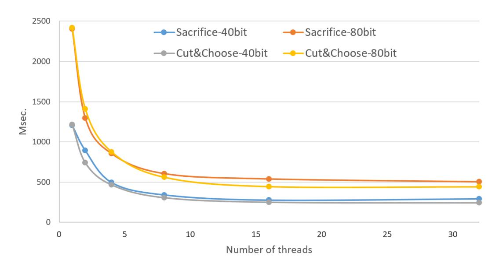

# Concretely-Efficient Zero-Knowledge Arguments for Arithmetic Circuits and Their Application to Lattice-Based Cryptography

Carsten Baum<sup>1</sup> Ariel Nof<sup>2</sup>

<sup>1</sup> Aarhus University, Denmark, carsten.baum@outlook.com <sup>2</sup> Technion, Israel, arie.nof@cs.biu.ac.il

Abstract. In this work we present a new interactive Zero-Knowledge Argument of knowledge for general arithmetic circuits. Our protocol is based on the "MPC-in-the-head"-paradigm of Ishai et al. (STOC 2009) and follows the recent "MPC-in-the-head with Preprocessing" as proposed by Katz, Kolesnikov and Wang (ACM CCS 2018). However, in contrast to Katz et al. who used the "cutand-choose" approach for pre-processing, we show how to incorporate the well-known "sacrificing" paradigm into "MPC-in-the-head", which reduces the proof size when working over arithmetic circuits. Our argument system uses only lightweight symmetric-key primitives and utilizes a simplified version of the so-called SPDZ-protocol.

Based on specific properties of our protocol we then show how it can be used to construct an efficient Zero-Knowledge Argument of Knowledge for instances of the Short Integer Solution (SIS) problem. We present different protocols that are tailored to specific uses of SIS, while utilizing the advantages of our scheme. In particular, we present a variant of our argument system that allows the parties to sample the circuit "on the fly", which may be of independent interest.

We furthermore implemented our Zero-Knowledge argument for SIS and show that using our protocols it is possible to run a complete interactive proof, even for general SIS instances which result in a circuit with > 10<sup>6</sup> gates, in less than 0.5 seconds.

## 1 Introduction

Zero-Knowledge Arguments of Knowledge (ZKAoK) are interactive protocols that allow a computationally bounded prover to convince a verifier that he knows a witness for a certain statement, without revealing any further information about the witness. Since their introduction in the 80's [\[GMR89\]](#page-40-0) these protocols have been important building blocks for applications in cryptography. While solutions for very specific languages have been plentiful, many applications require the use of arbitrary (algebraic) circuits in order to prove complex relationships. For example, proving that two homomorphic commitments contain the same committed message is generally an easy task, while proving knowledge of a preimage of a SHA-256 hash requires more generic solutions. Recent years saw a variety of different techniques which aim at providing such ZKAoK (see [\[PHGR16,](#page-41-0)[GMO16,](#page-40-1)[AHIV17](#page-39-0)[,BBHR19,](#page-39-1)[WTS](#page-41-1)+18[,BCR](#page-40-2)+19] to just name a few), varying in terms of argument size, prover/verification time, interaction and assumptions. While many of these systems perform very well with large witnesses and circuit sizes, none of them are a one-size-fits-all solution.

As an example, consider the so-called Short Integer Solution (SIS) problem. Here, a verifier has a matrix A and a vector t while the prover wants to prove knowledge of a secret s such that t = As mod q and ||s||<sup>∞</sup> ≤ β. SIS and related problems are crucial building blocks for post-quantum lattice-based cryptography and constructing efficient ZKAoK with a small communication complexity and low prover's running time has long been a problem: the soundness error of current special-purpose protocols is constant, meaning that the arguments have to be repeated many times to actually be convincing to a verifier. A particular, non-standard approach has been suggested by Bendlin & Damg˚ard [\[BD10\]](#page-40-3), who were the first to examine arguments of knowledge for SIS using generic proof systems. They observed that for certain argument schemes, the function that is computed to validate a SIS instance has both a very low multiplication depth and low total number of multiplications, if the secret s is a binary vector. However, many general ZKAoK systems only provide asymptotic efficiency, meaning that they require the circuit to be big before their strengths play out [\[BBC](#page-39-2)<sup>+</sup>18]. Moreover, many of these approaches achieve sub-linear communication complexity at the cost of high prover's running time [\[AHIV17,](#page-39-0)[PHGR16\]](#page-41-0). Other approaches are insecure to post-quantum attacks [\[WTS](#page-41-1)+18[,MBKM19](#page-41-2)[,BCC](#page-40-4)+16[,PHGR16\]](#page-41-0) or rely on knowledge assumptions that are poorly understood.

## 1.1 'MPC-in-the-Head' and Preprocessing

The "MPC-in-the-head" paradigm is a general technique which is used in our construction. Before outlining our contributions, we first describe this paradigm.

MPC or Secure Multiparty Computation describes a type of interactive protocol which allows to securely compute functions on secret data. No information is leaked beyond the output of the function with correctness even in the presence of dishonest participants.

MPC-in-the-head was introduced by Ishai et al. [\[IKOS07\]](#page-40-5) as a technique to construct generic zeroknowledge proofs from MPC protocols. Here, the statement to be proven is rewritten into a circuit C, which outputs y if and only if its input w is a correct witness for the statement to be proven. The prover simulates all parties of an MPC protocol as well as their interaction in his head. These parties obtain a secret-sharing of the witness w as their input, run a protocol to evaluate C and send the outputs to the verifier. Moreover, the prover commits to the inputs as well as randomness and exchanged messages of each party separately, and opens a verifier-chosen subset of these commitments to the verifier. The verifier then checks if these parties were simulated correctly by the prover and that the messages and the outputs are consistent. On a very high level, this is a proof of the statement if the MPC scheme is robust against active attacks, and it is zero-knowledge due to the privacy of it.

Preprocessing is a widely used optimization of practical MPC schemes. Here, each party begins the actual protocol with shares of correlated randomness, which is itself independent of the inputs of the protocol. This correlated randomness is then used to speed up the actual computation, and due to its independence of the inputs it can be computed ahead of time. To the best of our knowledge, the first MPC-in-the-head scheme that uses preprocessing was introduced in [\[KKW18\]](#page-40-6).

## 1.2 Our Contributions

In this work, we construct a new practically efficient ZKAoK for arithmetic circuits together with a multitude of techniques and apply these to construct interactive arguments for SIS. Our scheme is based on the "MPCin-the-head" approach and uses only symmetric-key primitives. It has an argument size that only depends on non-linear gates of the circuit C and low prover running time. We implemented our construction and report on its practicality. In more details:

'MPC-in-the-Head' with Preprocessing. We first generalize the idea of [\[KKW18\]](#page-40-6) to work over arithmetic circuits using a variant of the SPDZ MPC protocol [\[DPSZ12,](#page-40-7)[LN17\]](#page-40-8) and provide a formal proof of security to their "cut-and-choose" preprocessing heuristic. Then, we present a new construction where we replace the "cut-and-choose" mechanism with a "sacrificing"-based approach. While both approaches have similar cost per MPC instance, our "sacrificing"-based approach yields a smaller cheating probability, which means that the number of MPC instances simulated in the proof can be significantly smaller, thus reducing the overall communication footprint. Our scheme is highly flexible in its choice of parameters. In particular, by changing the number of parties in the underlying MPC protocol, one can alternate between achieving low communication and low running time. Our construction only requires efficient standard symmetric primitives, and thus is plausibly post-quantum secure even in the non-interactive case [\[DFMS19\]](#page-40-9). The two constructions can be found in Section [3.](#page-4-0)

Application to SIS. The MPC scheme which we use in our construction allows to perform additions and multiplications with public values "for free", meaning those do not have an impact on the size of the argument. In the SIS problem the verification of the input of the prover consists of computing a product with a public matrix A and a proof that the secret s contains bounded values, so the first part comes essentially for free. We initially tweak the approach of [\[BD10\]](#page-40-3) and only allow s to consist of bits, which allows for a very fast argument of size using one square gate per element of s. Then, we show how to handle more general distributions of s and introduce some specific optimizations to reduce communication and computation. In particular, we show how to adapt advanced techniques such as rejection sampling into the MPC-in-the-head framework, which yields a circuit with only linear gates. This is described in Section [5.](#page-26-0)

Experimental Results. We implemented our zero-knowledge protocol for the Binary SIS problem (i.e., where the secret s is a vector of bits) and ran extensive experiments with various sets of parameters – both for the SIS problem and for the simulated MPC protocol. For a 61-bit field and a matrix A of size 1024×4096 (which suffices for many applications such as encryption or commitments), we are able to run our argument in 1.2 seconds for 40-bits of statistical security when working with a single thread. When utilizing 32 threads, this reduces to only 250 ms. This shows that general lattice-based ZK arguments (which do not rely on structured lattices) are practical and can be used in real-world applications. To the best of our knowledge, we are also the first to implement ZK arguments for general SIS. The results and all the details can be found in Section [6.](#page-35-0)

Sampling Circuits on the fly. A major source of optimizations to our application is the fact that our "MPCin-the-head" protocol allows the prover and the verifier to negotiate the circuit C during the protocol, under certain circumstances. This fact is used by us to construct circuits "on the fly" with fewer non-linear gates, which helps to reduce the argument size. Thus, as an additional contribution of this work, we provide formal definitions for an argument system where the circuit is sampled jointly by the prover and the verifier during the execution and show how to incorporate this into our protocols. This is described in Section [4.](#page-22-0)

## <span id="page-2-1"></span>2 Preliminaries

Unless stated otherwise, operations in this work are carried out over the field F = F<sup>q</sup> for an odd prime q. Fq-elements are identified by the interval [−(q − 1)/2,(q − 1)/2]. B denotes the set {0, 1} while [n] stands for {1, . . . , n}. We use λ as the computational and κ as the statistical security parameters, and generally assume that q ≈ poly(λ, κ). We use bold lower-case letters such as s to denote a vector and bold upper-case letters like A for matrices. We let s[i] denote the ith component of the vector s.

## <span id="page-2-0"></span>2.1 Programming Model

Our notation for the circuits that we use in this paper will be similar to [\[BHR12\]](#page-40-10). The circuit C = (nin, nout, n<sup>C</sup> , L, R, F) is defined over F, and each wire w will hold a value from F or ⊥ initially. C has nin input wires, nout output wires and n<sup>C</sup> ≥ nin +nout wires in total. We define I = {1, . . . , nin}, W = {1, . . . , n<sup>C</sup> } and O = {n<sup>C</sup> − nout + 1, . . . , n<sup>C</sup> }. The circuit has ngates = n<sup>C</sup> − nin gates in total and we define the set G = {nin + 1, . . . , n<sup>C</sup> }.

We define functions L : G → W, R : G → W ∪ {⊥} such that L(x) < x as well as L(x) < R(x) < x if R(x) 6= ⊥ (i.e., the function L(x) returns the index of the left input wire of the gate whereas the function R(x) returns the index of the right input wire if it exists). The function F : G ×F×(F∪ {⊥}) → F determines the function which is computed by each gate.

The algorithm eval(C, x) with x ∈ F <sup>n</sup>in is defined as follows:

- 1. For i ∈ [nin] set w<sup>i</sup> ← x[i].
- 2. For each g ∈ G set l ← L(g), r ← R(g) and then w<sup>g</sup> ← F(g, l, r).
- 3. Output y = (w<sup>n</sup><sup>C</sup> <sup>−</sup>nout+1, . . . , w<sup>n</sup><sup>C</sup> ) >.

We further restrict F to compute certain functions only: (i) Add: On input x1, x<sup>2</sup> output x<sup>1</sup> +x2, (ii) Mult: On input x1, x<sup>2</sup> output x<sup>1</sup> ×x2, (iii) CAdd: On input x and for the hard-wired a output x+a, (iv) CMult: On input x and for the hard-wired a output x × a; and (v) Square: On input x output x 2 . We say that C(x) = y if eval(C, x) returns the value y ∈ F <sup>n</sup>out . We denote by nmul and nsq the number of multiplication and square gates in the circuit.

#### <span id="page-3-2"></span>2.2 Zero-Knowledge Arguments of Knowledge

Let TM be an abbreviation for Turing Machines. An iTM is defined to be an interactive TM, i.e. a Turing Machine with a special communication tape and a PPT TM is a probabilistic polynomial-time TM. Let  $L_R \subseteq \mathbb{B}^*$  be an NP language and R be its related NP-relation for circuits over  $\mathbb{F}$ . Thus  $(x = (C, \mathbf{y}), \mathbf{w}) \in R$  iff  $(C, \mathbf{y}) \in L_R$  and  $\mathbf{eval}(C, \mathbf{w}) = \mathbf{y}$ . We write  $R_x = \{\mathbf{w} \mid (x, \mathbf{w}) \in R\}$  for the set of witnesses for a fixed x.

Honest Verifier Zero Knowledge Argument of Knowledge (HVZKAoK) Assume  $(\mathcal{P}, \mathcal{V})$  is a pair of PPT iTMs and let  $\xi : \mathbb{B}^* \to [0, 1]$  be a function. We say that  $(\mathcal{P}, \mathcal{V})$  is a zero-knowledge argument of knowledge for the relation R with knowledge error  $\xi$  if the following properties hold:

**Completeness:** If  $\mathcal{P}$  and  $\mathcal{V}$  follow the protocol on input  $x \in L_R$  and private input  $\mathbf{w} \in R_x$  to  $\mathcal{P}$ , then  $\mathcal{V}$  always outputs 1.

**Knowledge Soundness:** There exists a probabilistic algorithm  $\mathcal{E}$  called the *knowledge extractor*, such that for every interactive prover  $\hat{\mathcal{P}}$  and every  $x \in L_R$ , the algorithm  $\mathcal{E}$  satisfies the following condition: let  $\delta(x)$  the probability that  $\mathcal{V}$  accepts on input x after interacting with  $\hat{\mathcal{P}}$ . If  $\delta(x) > \xi(x)$ , then upon input  $x \in L_R$  and oracle access to  $\hat{\mathcal{P}}$ , the algorithm  $\mathcal{E}$  outputs a vector  $\mathbf{w} \in R_x$  in expected number of steps bounded by  $O(\frac{1}{\delta(x)-\xi(x)})$ .

Honest Verifier Zero-Knowledge: Let  $\mathsf{view}_{\mathcal{V}}^{\mathcal{P}}(x, \mathbf{w})$  be a random variable describing the random challenge of  $\mathcal{V}$  and the messages  $\mathcal{V}$  receives from  $\mathcal{P}$  with input  $\mathbf{w}$  during the joint computation on common input x. Then, there exists a PPT simulator  $\mathcal{S}$ , such that for all  $x \in L_R$ ,  $\mathbf{w} \in R_x$ :  $\mathcal{S}(x) \approx_c \mathsf{view}_{\mathcal{V}}^{\mathcal{P}}(x, \mathbf{w})$ .

This definition suffices, since public-coin protocols like the protocols we consider in this work, which satisfy the above properties, can be easily transformed to protocols which are zero-knowledge in general by having the verifier commit to its challenges at the beginning of the protocol. As is well known, it is possible to obtain a non-interactive zero-knowledge argument of knowledge (NIZKAoK) from any HVZKAoK via the Fiat-Shamir transformation [FS86].

### 2.3 Commitments and Collision-Resistant Hash Functions

We use Commitments and Collision-Resistant Hash Functions (CRHF) as buildings blocks in our constructions and thus introduce them now briefly. A commitment scheme allows one party to commit to a message m by sending a commitment value which satisfies the following two properties: (i) Hiding: the commitment reveals nothing about m.; and (ii) Binding: it is (computationally) infeasible for the committing party to open a committed message m to different message  $m' \neq m$ . In this work, we assume that the commitment scheme is instantiated using a cryptographic hash function such as e.g. SHA-256, which we model as a Random Oracle<sup>3</sup> for the purpose of giving a proof of security.

A Collision-Resistant Hash Function (CRHF) is an efficiently computable function H for which it is "hard" to find x, x' such that H(x) = H(x'). Usually, CRHFs are used to compress a long message into a short digest and thus for almost all messages a collision exists. CRHFs require that a collision is hard to find for any PPT algorithm.

### <span id="page-3-3"></span>2.4 The Short Integer Solution Problem

We will now formalize the SIS problem, which was already informally introduced in the introduction.  $\mathbb{F}_q$  is the base field of the argument system. At the same time, the characteristic q will also be the modulus of the SIS instance which is defined over  $\mathbb{Z}_q$ . To define the Short Integer Solution problem, let  $n, m \in \mathbb{N}$  be such that  $n \ll m$ . We naturally embed  $\mathbb{Z}_q$  into  $\mathbb{Z}$  by identifying each mod q-number with an element from the interval  $\left[-\frac{q-1}{2}, \frac{q-1}{2}\right] \subset \mathbb{Z}$ . We thereby let  $||\mathbf{s}||_{\infty}$  be the  $\infty$ -norm of the embedding of  $\mathbf{s} \in \mathbb{Z}_q^m$  into the module  $\mathbb{Z}^m$ . Define  $S_{\mathcal{B}}^m \subset \mathbb{Z}_q^m$  as the subset of m-element vectors with  $\ell_{\infty}$ -norm  $\leq \beta$ .

<span id="page-3-1"></span><span id="page-3-0"></span><sup>&</sup>lt;sup>3</sup> This is to obtain the smallest possible argument size while avoiding attacks such as [DN19]. A generalization of our scheme without this assumption can be obtained by generating the randomness for commitments independent of the message.

**Definition 1** (Short Integer Solution (SIS)). Let m, n, q be as above and  $\beta \in \mathbb{N}$ . Given  $\mathbf{A} \in \mathbb{Z}_q^{n \times m}$  and  $\mathbf{t} \in \mathbb{Z}_q^n$ , the (inhomogeneous) SIS-problem is to find  $\mathbf{s} \in \mathbb{Z}_q^m$  such that  $\mathbf{t} = \mathbf{A}\mathbf{s} \mod q$  and  $\mathbf{s} \in S_\beta^m$ .

We collect such  $(\mathbf{A}, \mathbf{s}, \mathbf{t})$  that fulfill Definition 1 in an NP-relation

$$R_{\mathtt{SIS}}^{m,n,q,\beta} = \{(x,w) = ((\mathbf{A},\mathbf{t}),\mathbf{s}) \mid \mathbf{s} \in S^m_\beta \wedge \mathbf{A} \in \mathbb{F}_q^{n \times m} \wedge \mathbf{t} = \mathbf{A}\mathbf{s}\}.$$

In practice, one often encounters proofs that do not show exactly that  $\mathbf{s} \in S^m_\beta$  even though the prover has such a value as witness. Instead, they guarantee that the bound might be a bit bigger, by a factor at most  $\omega$  which usually is called *slack*. We have that  $R_{\mathtt{SIS}}^{m,n,q,\beta} \subseteq R_{\mathtt{SIS}}^{m,n,q,\omega\cdot\beta}$  if  $\omega \geq 1$ , so any honest prover will still make the verifier accept if it proves  $R_{\mathtt{SIS}}^{m,n,q,\omega\cdot\beta}$  instead. For simplicity, we also consider an instance of SIS where  $\mathbf{s}$  is binary.

**Definition 2** (Binary-SIS). Let m, n, q be defined as above. Given  $\mathbf{A} \in \mathbb{Z}_q^{n \times m}$  and  $\mathbf{t} \in \mathbb{Z}_q^n$ , the (inhomogeneous) Binary SIS-problem is to find  $\mathbf{s} \in \mathbb{B}^m$  such that  $\mathbf{t} = \mathbf{A}\mathbf{s} \mod q$ .

This Binary-SIS problem is not uncommon and e.g. [BD10,KTX08] used it. Its relation  $R_{B-SIS}^{m,n,q}$  can be defined similarly as  $R_{SIS}^{m,n,q,\beta}$ .

## <span id="page-4-0"></span>Honest Verifier Arguments of Knowledge for Arithmetic Circuits

In this section, we introduce our honest verifier zero-knowledge argument of knowledge (HVZKAoK) protocols for satisfiability of arithmetic circuits. We begin by describing the underlying MPC protocol to securely compute an arithmetic circuit. Then, we present two HVZKAoKs based on the MPC protocol - one that relies on the "cut-and-choose" paradigm and one that uses "sacrificing". While the first is a direct extension of a recent work of [KKW18], the second one is completely new to the best of our knowledge.

#### <span id="page-4-2"></span>The MPC protocol 3.1

Our MPC protocol is a simplified version of the SPDZ<sup>4</sup> protocol [DPSZ12]. Let N denote the number of parties and let  $P_1, \ldots, P_N$  denote the parties participating in the protocol.

Secret sharing scheme. Let [x] denote an additive sharing of x, i.e. a sharing of x consists of random  $x_1, \ldots, x_N \in \mathbb{F}_q$  such that  $x = \sum_{i \in [N]} x_i$ , where  $P_i$  holds  $x_i$ . We define the following operations on shares:

 $open(\llbracket x \rrbracket)$ : To reveal the secret x each party broadcasts its share  $x_i$ . Upon receiving  $x_j$  from each  $P_j$ ,  $P_i$  sets  $x = \sum_{i \in [N]} x_i$ .

[x] + [y]: Given two shares  $x_i$  and  $y_i$  of x and  $y_i$  each party  $P_i$  defines  $x_i + y_i$  as its share of the result.

 $\sigma + \|x\|$ : Given a sharing  $\|x\|$  and a public constant  $\sigma$ ,  $P_1$  defines  $x_1 + \sigma$  as its new share while other parties shares remain the same.

 $\sigma \cdot \llbracket x \rrbracket$ : Given a sharing  $\llbracket x \rrbracket$  and a public constant  $\sigma$ , each party  $P_i$  defines  $\sigma \cdot x_i$  as its share of the product.

Multiplications. We say that  $(\llbracket a \rrbracket, \llbracket b \rrbracket, \llbracket c \rrbracket)$  is a random multiplication triple if a and b are random and  $c = a \cdot b$ . To multiply [x] and [y] using a preprocessed random triple ([a], [b], [c]), the parties do the following:

- 1. The parties compute  $\llbracket \alpha \rrbracket = \llbracket x \rrbracket \llbracket a \rrbracket$  and  $\llbracket \beta \rrbracket = \llbracket y \rrbracket \llbracket b \rrbracket$ . 2. The parties run  $\mathsf{open}(\llbracket \alpha \rrbracket)$  and  $\mathsf{open}(\llbracket \beta \rrbracket)$  to obtain  $\alpha$  and  $\beta$ .
- 3. Each party computes  $\llbracket z \rrbracket = \llbracket c \rrbracket \alpha \cdot \llbracket b \rrbracket \beta \cdot \llbracket a \rrbracket + \alpha \cdot \beta$ .

The above is a well-known [Bea91] technique and works because

$$\begin{split} \llbracket z \rrbracket &= \llbracket c \rrbracket - \alpha \cdot \llbracket b \rrbracket - \beta \cdot \llbracket a \rrbracket + \alpha \cdot \beta \\ &= \llbracket ab \rrbracket - (x-a) \cdot \llbracket b \rrbracket - (y-b) \cdot \llbracket a \rrbracket + (x-a) \cdot (y-b) \\ &= \llbracket xy \rrbracket \end{aligned}$$

<span id="page-4-1"></span><sup>&</sup>lt;sup>4</sup> It works like SPDZ in the sense that it considers dishonest majority, uses an additive secret sharing and multiplication triples, but without the information-theoretic MAC.

Squaring. We say that  $(\llbracket b \rrbracket, \llbracket d \rrbracket)$  is a random square if b is random and  $d = b^2$ . To compute  $\llbracket x^2 \rrbracket$  given  $\llbracket x \rrbracket$  using a preprocessed  $(\llbracket b \rrbracket, \llbracket d \rrbracket)$ , the parties do the following:

- 1. The parties compute  $\llbracket \alpha \rrbracket = \llbracket x \rrbracket \llbracket b \rrbracket$ .
- 2. The parties run  $open(\llbracket \alpha \rrbracket)$  to obtain  $\alpha$ .
- 3. Each party computes  $\llbracket z \rrbracket = \alpha \cdot (\llbracket x \rrbracket + \llbracket b \rrbracket) + \llbracket d \rrbracket$ .

Note that the above holds since

<span id="page-5-0"></span>
$$\begin{split} [\![z]\!] &= \alpha \cdot ([\![x]\!] + [\![b]\!]) + [\![d]\!] = (x-b) \cdot ([\![x]\!] + [\![b]\!]) + [\![b^2]\!] \\ &= [\![x^2 - b^2 + b^2]\!] = [\![x^2]\!]. \end{aligned}$$

The protocol. The above building blocks can easily be combined to securely run  $eval(\cdot)$  on a circuit C: after the inputs are secret-shared using  $[\![\cdot]\!]$ , the parties apply G as defined in Section 2.1 consecutively to the shares. That is, addition gates and multiplication/addition by-a-public-constant gates are computed locally, whereas multiplication and square gates are computed using the above sub-protocols.

Security. For our purpose of using a MPC protocol to establish our zero-knowledge argument, the used protocol only needs to be secure in the presence of a semi-honest adversary. Furthermore, it suffices for the protocol to be secure in the client-server broadcast model, i.e., when the parties who run the protocol (the servers) do not hold input and do not see the final output, but rather receive shares of the inputs from the clients, perform the computation by only local computation as well as sending broadcast messages to each other, and then send the output shares back to the clients.

Formally, let  $\mathcal{F}_{tr}$  and  $\mathcal{F}_{sq}$  be ideal functionalities that provide the parties with random multiplication triples and squares. We define

 $\operatorname{view}_{I,\pi}^{\mathcal{F}_{\operatorname{tr}},\mathcal{F}_{\operatorname{sq}}}(C)$  to be the view of a subset of parties I during the execution of a protocol  $\pi$  on the circuit C, in the  $(\mathcal{F}_{\operatorname{tr}},\mathcal{F}_{\operatorname{sq}})$ -hybrid model and in the client-server model. The view consists of the input shares, the correlated randomness they receive from the functionalities and the messages they obtain from the other parties while evaluating C. The security of  $\pi$  is stated in Theorem 1.

**Theorem 1.** Let C be an arithmetic circuit over the field  $\mathbb{F}$  and let  $\pi$  be the protocol described above. Then, for every subset of parties  $I \subset \{P_1, \ldots, P_N\}$  with  $|I| \leq N-1$ , there exists a probabilistic polynomial-time algorithm S such that  $\{S(I,C)\}_{\equiv}\{\text{view}_{I,\pi}^{\mathcal{F}_{\text{tr}},\mathcal{F}_{\text{sq}}}(C)\}$ .

Proof. Intuitively, this follows from the fact that the corrupted parties see only shares of the values on the wires of the circuit that could open to any value or random public values. Formally, the simulator S begins by choosing t random shares for each input wire and adding them to the view of the corrupted parties in I. Then, it goes over the circuit in topological order; for addition gates and multiplication-by-a-constant, it does the local operation on the corrupted parties' shares as defined by the protocol. For multiplication gates, S chooses t shares of a,b and c and adds them to the corrupted parties' view. Then, it chooses random  $\alpha$  and  $\beta$ , compute the honest parties' shares of them accordingly (knowing the corrupted parties' shares) and adds them to the view. Then, it computes the corrupted parties' shares of z as defined by the protocol. Similarly, for square gates, it chooses t random shares for b and d and adds them to the view of the corrupted parties. Then, it chooses a random  $\alpha$ , computes the honest parties' shares accordingly, adds them to the view and computes the corrupted parties' shares of the output.

The only difference between the simulated view and the real execution is the way  $\alpha$  and  $\beta$  are chosen. However, in both cases the these values are uniformly distributed. Thus, the view generated by the simulator is identically distributed to the view in the real execution as required.

### 3.2 HVZKAoK Protocol using Cut and Choose

We now explain our first HVZKAoK protocol  $\Pi_{c\&c}$ , which is based on the MPC protocol from Section 3.1, and which relies on the cut–and–choose technique to generate correct random multiplication triples and squares. The formal description appears in Fig. 1.a and Fig. 1.b.

```
Let H be a CRHF and com be the Random Oracle-based commitment scheme.
Inputs: Both the prover \mathcal{P} and the verifier \mathcal{V} hold \mathbf{y} \in \mathbb{F}^{n_{\text{out}}}, a description of an arithmetic circuit C over a
 finite field \mathbb{F} and parameters M, N, \tau; the prover \mathcal{P} also holds a witness \mathbf{w} \in \mathbb{F}^{n_{\text{in}}} such that C(\mathbf{w}) = \mathbf{y}.
Round 1:
  1. \mathcal{P} chooses a random salt salt \leftarrow \{0,1\}^{\lambda}.
  2. For each e \in [M]:
  (a) \mathcal{P} initializes an empty string \mathsf{st}_e.
  (b) \mathcal{P} chooses a master seed \mathsf{sd}_e and uses it to generate \mathsf{sd}_{e,1},\ldots,\mathsf{sd}_{e,N}.
  (c) For each multiplication gate g_k \in \mathcal{G}:
       i. \mathcal{P} defines three random sharings \llbracket a_{e,k} \rrbracket, \llbracket b_{e,k} \rrbracket and \llbracket c_{e,k} \rrbracket by using \mathsf{sd}_{e,i} for each i \in [N] to generate
      a_{e,k,i}, b_{e,k,i} \text{ and } c_{e,k,i}.\nii. \mathcal{P} computes a_{e,k} = \sum_{i=1}^{N} a_{e,k,i} and b_{e,k} = \sum_{i=1}^{N} b_{e,k,i} and c_{e,k} = a_{e,k} \cdot b_{e,k}.
Then, it sets \Delta_{e,k} = c_{e,k} - \sum_{i=1}^{N} c_{e,k,i} and \mathsf{st}_e \leftarrow \mathsf{st}_e \parallel \Delta_{e,k}.
     iii. \mathcal{P} sets the random triple for this gate to be (\llbracket a_{e,k} \rrbracket, \llbracket b_{e,k} \rrbracket, \llbracket c_{e,k} \rrbracket + \Delta_{e,k})
  (d) For each square gate g_k \in \mathcal{G}:
       i. \mathcal{P} defines two random sharings \llbracket b_{e,k} \rrbracket and \llbracket d_{e,k} \rrbracket by using \mathsf{sd}_{e,i} for each i \in [N] to generate b_{e,k,i} and d_{e,k,i}
      ii. \mathcal{P} computes b_{e,k} = \sum_{i=1}^{N} b_{e,k,i}.
            Then, it computes \Delta_{e,k} = (b_{e,k})^2 - \sum_{i=1}^N d_{e,k,i} and \mathsf{st}_e \leftarrow \mathsf{st}_e \parallel \Delta_{e,k}.
     iii. \mathcal{P} sets the random square for this gate to be (\llbracket b_{e,k} \rrbracket, \llbracket d_{e,k} \rrbracket + \Delta_{e,k})
  (e) \mathcal{P} chooses a linear random sharing of the inputs:
       i. For each i \in [N], \mathcal{P} uses \mathsf{sd}_{e,i} to generate w_{e,1,i}, \ldots, w_{e,n_{in},i}.
   ii. For each k \in \mathcal{I}, \mathcal{P} sets \phi_{e,k} = w_k - \sum_{i=1}^N w_{e,k,i}.

(f) \mathcal{P} chooses a random string g_e \in \mathbb{B}^{\lambda} and then it computes \Omega_e = \text{com}(\phi_{e,1} \parallel \cdots \parallel \phi_{e,n_{\text{in}}}, g_e, \text{salt}).
  (g) For each i \in [N], \mathcal{P} uses \mathsf{sd}_{e,i} to generate r_{e,i} \in \mathbb{B}^{\lambda} and then it computes \Gamma_{e,i} = \mathsf{com}(\mathsf{sd}_{e,i}, r_{e,i}, \mathsf{salt}).
  (h) \mathcal{P} uses \mathsf{sd}_e to generate a random string s_e \in \mathbb{B}^{\lambda} and computes \Gamma_e = \mathsf{com}(\mathsf{st}_e, s_e, \mathsf{salt}).
   (i) Finally, \mathcal{P} computes h_e = H(\Gamma_e \parallel \Gamma_{e,1} \parallel \cdots \parallel \Gamma_{e,N}).
  3. \mathcal{P} computes h_{\Gamma} = H(h_1 \parallel \cdots \parallel h_M), h_{\Omega} = H(\Omega_1 \parallel \cdots \parallel \Omega_M) and sends them to \mathcal{V}.
Round 2: \mathcal{V} chooses a random challenge E \subset [M] such that |E| = \tau and sends it to \mathcal{P}.
```

Fig. 1.a: The "Cut-and-Choose" Based HVZK Argument  $\Pi_{c\&c}$  (Part 1)

The idea behind the protocol is that the prover  $\mathcal{P}$  proves its knowledge of w such that  $C(\mathbf{w}) = \mathbf{y}$  by simulating a secure N-party computation of the circuit over an additive sharing of w, using the MPC protocol described above. Since  $\mathcal{P}$  knows the input and thus the values on each wire of the circuit, it can simulate the execution "in the head". Since our MPC protocol uses random triples and squares supplied by the ideal functionalities  $\mathcal{F}_{tr}$  and  $\mathcal{F}_{sq}$ , the prover  $\mathcal{P}$  needs to play their role as well. Clearly,  $\mathcal{P}$  may try to cheat in the simulated computation, aiming to cause the verifier  $\mathcal{V}$  to accept false statements. This is prevented by having  $\mathcal V$  challenging  $\mathcal P$  in two ways. First, after  $\mathcal P$  has committed to M sets of random triples and squares,  $\mathcal V$ randomly selects  $\tau$  of them, which are then opened to it. The remaining  $M-\tau$  sets of the pre-processed data are used to support  $M-\tau$  circuit computations - each with different randomness. The prover  $\mathcal{P}$  performs these computations and commits to the views of the parties, to be then challenged for the second time by  $\mathcal{V}$ . In this second challenge, the verifier chooses a random subset of N-1 parties in each execution, whose views are opened and tested for consistency. If these two tests pass successfully and the output of the circuit is y, then  $\mathcal{V}$  outputs acc. Observe that  $\mathcal{V}$  cannot learn any information about the witness w during the protocol: the opened pre-processing executions reveal only random data which is thrown away afterwards, and the N-1 views that are opened do not reveal anything since the MPC protocol is resilient to N-1semi-honest parties. In more details, in Round 1,  $\mathcal{P}$  commits to M pre-processing executions. A major source of saving here is using pseudo-randomness instead of pure randomness. Specifically,  $\mathcal{P}$  chooses a seed  $\mathsf{sd}_e$  for each execution e, from which it derives the seeds  $\mathsf{sd}_{e,i}$  for each party  $P_i$ . These seeds are used to generate all the random shares held by  $P_i$  throughout the computation. Now, if execution e is selected to be tested by  $\mathcal{V}$  in Round 2, then  $\mathcal{P}$  can just send  $\mathsf{sd}_e$  to  $\mathcal{V}$ , thereby saving communication. For the  $M-\tau$  preprocessings

```
Round 3:
  1. Let \bar{E} = [M] \setminus E. First, \mathcal{P} chooses \mathsf{sd}_{\bar{E}}.
  2. For each e \in \bar{E}:
  (a) \mathcal{P} initializes an empty string \mathsf{view}_e. Then, it goes over the circuit in topological order and simulates each
        gate's computation using the MPC protocol described in Section 3.1, while consuming the random triples
        and squares it prepared in Round 1.
      i. For each multiplication gate g_k, \mathcal{P} sets
          \mathsf{view}_e \leftarrow \mathsf{view}_e \parallel \alpha_{e,k,1} \parallel \cdots \parallel \alpha_{e,k,N} \parallel \beta_{e,k,1} \parallel \cdots \parallel \beta_{e,k,N}.
     ii. For each square gate g_k, \mathcal{P} sets: \mathsf{view}_e \leftarrow \mathsf{view}_e \parallel \alpha_{e,k,1} \parallel \cdots \parallel \alpha_{e,k,N}.
  (b) Let o_{e,1,i}, \ldots, o_{e,n_{\text{out}},i} be the shares on the output wires held by party P_i at the end of the computation.
        Then, for each output wire k \in \mathcal{O}, \mathcal{P} sets \mathsf{view}_e \leftarrow \mathsf{view}_e \parallel o_{e,k,1} \parallel \cdots \parallel o_{e,k,N}.
  (c) \mathcal{P} uses \operatorname{sd}_{\bar{E}} to generate g_e \in \mathbb{B}^{\lambda} and computes \Pi_e = \operatorname{com}(\operatorname{view}_e, g_e, \operatorname{salt})
  3. \mathcal{P} computes h_{\pi} = H(\Pi_{e_1} \parallel \cdots \parallel \Pi_{e_{|\bar{E}|}}).
  4. \mathcal{P} sends \{\mathsf{sd}_e\}_{e\in E}, \{\Omega_e\}_{e\in E} and h_{\pi} to \mathcal{V}.
Round 4: For each e \in \bar{E}: \mathcal{V} chooses a random \bar{i}_e \in [N] and sends it to \mathcal{P}.
Round 5: For each e \in \bar{E}: Let I_e = [N] \setminus \{\bar{i}_e\}. Then, \mathcal{P} sends the following to \mathcal{V}: (i) salt, \operatorname{sd}_{\bar{E}}, \{\operatorname{sd}_{e,i}\}_{i \in I_e};
 (ii) \Gamma_{e,\bar{i}_e}; (iii) \alpha_{e,k,\bar{i}_e}, \beta_{e,k,\bar{i}_e} and \Delta_{e,k} for each multiplication or square gate g_k; (iv) g_e and \{\phi_{e,k}\}_{k=1}^{n_{in}}; and
 (v) o_{e,1,\bar{i}_e}, \dots, o_{e,n_{\text{out}},\bar{i}_e}.
Output: V outputs acc iff all the following checks succeed:
  1. For each e \in E, V uses sd_e to compute h_e as a honest prover would do.
       For each e \in \bar{E}, V uses \{\mathsf{sd}_{e,i}\}_{i \in I_e} to compute \Gamma_{e,i} as a honest prover would do. Then, using \Gamma_{e,\bar{i}_e} received
       from \mathcal{P}, the verifier \mathcal{V} computes h_e.
       Then, \mathcal{V} checks that h_{\Gamma} = H(h_1 \parallel \cdots \parallel h_M).
  2. For each e \in \bar{E}, \mathcal{V} computes \Omega_e using \{\phi_{e,k}\}_{k=1}^{n_{\text{in}}} and g_e. Then, using \{\Omega_e\}_{e \in E} received from \mathcal{P}, the verifier
       \mathcal{V} checks that h_{\Omega} = H(\Omega_1 \parallel \cdots \parallel \Omega_M).
  3. For each e \in \bar{E}, \mathcal{V} computes view<sub>e</sub> as an honest prover would do by going over the circuit in topological
       order and using \{\mathsf{sd}_{e,i}\}_{i\in I_e}, the shares \alpha_{e,k,\bar{i}_e},\beta_{e,k,\bar{i}_e} and \Delta_{e,k} received from \mathcal P for each multiplication and
       square gate, and \{o_{e,k,\bar{i}_e}\}_{k=1}^{n_{\text{out}}}. Then, it computes \Pi_e as a honest prover would do.
       Finally, \mathcal{V} checks that h_{\pi} = H(\Pi_{e_1} \parallel \cdots \parallel \Pi_{e_{|\bar{E}|}}).
  4. For each e \in \bar{E}, for each k \in \mathcal{O}, \mathcal{V} checks that \sum_{i=1}^{N} o_{e,k,i} = y_k
```

Fig. 1.b: The "Cut–and–Choose" Based HVZK Argument  $\Pi_{c\&c}$  (Part 2)

which are used in the on-line execution in Round 3,  $\mathcal{P}$  cannot send the master seed but rather will have to send N-1 seeds of the N-1 parties chosen to be opened by  $\mathcal{V}$  in Round 4. Thereby the data of one of the parties is kept secret. Observe, however, that not all the data held by the parties is random. In particular, when generating a multiplication triple  $[a_{e,k}]$ ,  $[b_{e,k}]$ ,  $[c_{e,k}]$  (e is the execution index and k is the index of the gate for which this triple is consumed), one can use the seeds of the parties to generate the sharing of  $a_{e,k}$  and  $b_{e,k}$ , but once these are fixed, so is  $c_{e,k} = a_{e,k} \cdot b_{e,k}$ . Therefore, when generating the sharing of  $c_{e,k}$ , it is necessary to "fix" the initial sharing derived from the random seeds. To obtain this, the prover also commits to the offset  $\Delta_{e,k}$  for each execution e and multiplication gate  $g_k$ , which is added to the initial random sharing  $[c_{e,k}]$ . The same applies when generating random squares. Similarly, when the sharings of the inputs are generated in Round 3,  $\mathcal{P}$  can use the seeds of the parties to derive their shares, and then adjust this initial sharing by adding the offset (denoted by  $\phi_{e,k}$ ) to obtain a correct sharing of the given input. Thus,  $\mathcal{P}$  must commit to the offset on each input wire as well. To further reduce communication, we hash all the commitments together and send only the hash value to  $\mathcal{V}$ .

Cheating error (soundness). We compute the probability that  $\mathcal{V}$  outputs acc when  $C(\mathbf{w}) \neq \mathbf{y}$ . Let c be the number of pre-processing emulations where  $\mathcal{P}$  cheats (i.e., by generating incorrect squares or multiplication triples). Since  $\tau$  emulations out of M are opened and tested by the verifier, we have that this step is passed without the cheating being detected with probability  $\frac{\binom{M-c}{\tau}}{\binom{M}{\tau}}$ . After this step,  $M-\tau$  circuit computations are

being simulated by the prover. In order to make the output of the protocol be  $\mathbf{y}$ ,  $\mathcal{P}$  must cheat (i.e., deviate from the specification of the MPC protocol) in  $M-\tau-c$  emulations. Since N-1 views are being opened in each such emulation,  $\mathcal{P}$  clearly will not sabotage the view of more than one party. Thus, the probability that this is not detected is  $\frac{1}{N^{M-\tau-c}}$ . The overall success cheating probability is therefore

$$\xi_{\mathsf{c\&c}}(M, N, \tau) = \max_{0 \le c \le M - \tau} \left\{ \frac{\binom{M - c}{\tau}}{\binom{M}{\tau} \cdot N^{M - \tau - c}} \right\}$$

Formal proof. As mentioned before, the above protocol has appeared already in [KKW18] (for Boolean circuits, but extending it to Arithmetic circuits is straightforward). However, there it was described as an optimization to their baseline protocol and so was not formally proven. We therefore now give a full security proof.

<span id="page-8-0"></span>**Theorem 2.** Let H be a collision-resistant hash function and let com be the Random Oracle-based commitment scheme. Then, the protocol  $\Pi_{c\&c}$  is an HVZKAoK with knowledge error (soundness)  $\xi_{c\&c}(M,N,\tau)$ .

*Proof.* We prove the that each of the three properties defined in Section 2.2 are satisfied by our protocol.

COMPLETENESS. This follows from the correctness of the MPC protocol.

HONEST VERIFIER ZERO KNOWLEDGE. This property follows from the security of the MPC protocol as defined in Theorem 1 and by the hiding property of the commitment scheme. Specifically, let  $S_{\pi}$  be the simulator that exists for the MPC protocol described in the proof of Theorem 3.1. We construct a honest-verifier zero-knowledge simulator S for our protocol, which works as follows:

- 1. S chooses random  $E \subset [M]$  such that  $|E| = \tau$ . Then, for each  $e \in \overline{E} = [M] \setminus E$ , it chooses a random  $i_e \in [N]$ .
- 2. For each  $e \in E$ , S prepares the pre-processing data as an honest prover would do in **Round 1**, with one exception: it computes  $\Pi_e$  as a commitment to a 0-string.
- 3. For each  $e \in \bar{E}$ ,  $\mathcal{S}$  chooses  $\mathsf{sd}_{e,i}$  for each  $i \in I_e = [N] \setminus \{i_e\}$ . Then, for the pre-processing in **Round 1**, it generates  $\mathsf{st}_e$  by choosing random  $\Delta_{e,k}$  for each multiplication/square gate. In addition, it chooses random  $\phi_{e,k}$  for each input wire k and compute  $\Pi_e$  accordingly. Proceeding to **Round 3**,  $\mathcal{S}$  generates view<sub>e</sub> by following the instructions of  $\mathcal{S}_{\pi}$  with  $I = I_e$  and using  $\mathsf{sd}_{e,i}$  to generate the required randomness. For the commitments  $\Gamma_{e,\bar{i}_e}$ ,  $\mathcal{S}$  uses the 0-string as the committed message.
- 4. For each  $e \in \bar{E}$ , for each  $k \in \mathcal{O}$ ,  $\mathcal{S}$  sets  $o_{e,k,i_e} = y_k \sum_{i \in I_e} o_{e,i}$ .
- 5. S computes all the hash values as an honest prover would do.
- 6. S outputs the transcript of the protocol.

From the indistinguishably of the transcript generated by  $S_{\pi}$  and the hiding property of the commitment scheme, it follows by a hybrid argument that the view generated by S is computationally indistinguishable from the view of a real protocol instance.

KNOWLEDGE SOUNDNESS. We proceed to prove the soundness property of the protocol. For simplicity we assume that the commitment scheme is perfectly binding and that there are no collisions for the hash function.

We first argue that if the success probability  $\delta(x)$  is higher than  $\xi_{c\&c}(M,N,\tau)$ , then there exists at least one MPC instance (out of M) where the prover has committed to a valid witness  $\mathbf{w}$ . Recall that we consider deterministic provers (by fixing the random tape), so the first message where he commits to the input  $\mathbf{w}$  is fixed once we fix the randomness tape. Now, let  $\mathbf{G}$  be a 0/1-matrix where each column corresponds to a possible first challenge of  $\mathcal{V}$  (i.e.,  $\tau$  pre-processings to be opened) and each row corresponds to a possible second challenge chosen by  $\mathcal{V}$  (i.e.,  $M-\tau$  parties indices for which the view should not to be opened). Thus,

 $\delta(x)$  is the fraction of '1' entries in  $\mathbf{G}$ . Let  $\xi_{\mathsf{c\&c}}(M,N,\tau) = \frac{\binom{M-c^*}{\tau}}{\binom{M}{\tau}} \cdot N^{M-\tau-c^*}$  (i.e.,  $c^*$  is the value for which the expression for  $\xi$  written above is maximized). We can write  $\xi_{\mathsf{c\&c}}$  also as  $\frac{\binom{M-c^*}{\tau} \cdot N^{c^*}}{\binom{M}{\tau} \cdot N^{M-\tau}}$ . Observe that the number of entries in  $\mathbf{G}$  is  $\binom{M}{\tau} \cdot N^{M-\tau}$ . From our assumption that  $\delta(x) > \frac{\binom{M-c^*}{\tau} \cdot N^{c^*}}{\binom{M}{\tau} \cdot N^{M-\tau}}$  it thus follows that the number of '1' entries in  $\mathbf{G}$  is higher than  $\binom{M-c^*}{\tau} \cdot N^{c^*}$ . Next, assume that in the interaction with the prover  $\mathcal{P}^*$ , it corrupts c of the pre-processings. Clearly, if any of these are opened, then the transcript won't be accepted by  $\mathcal{V}$ . Thus, there can be '1' entries only in  $\binom{M-c}{\tau}$  columns in  $\mathbf{G}$ . For each of these columns, there exists  $N^c$  possible challenges for the MPC instances where the pre-processing is incorrect. Since there are more than  $\binom{M-c^*}{\tau} \cdot N^{c^*} \geq \binom{M-c}{\tau} \cdot N^c$  entries with '1' in  $\mathbf{G}$ , then there must exist two accepting transcripts with the same first challenge E and with different second challenge E and E instance E with correct pre-processing. This means that all the views of the parties in E are also correct. Thus, the witness used in this instance must be a valid witness.

Next, given that a valid witness **w** is used in execution e, observe that it is possible to extract this witness using two accepting transcripts  $(E, \{i_e\}_{e \in \bar{E}}), (E', \{i'_e\}_{e \in \bar{E'}})$  when the challenge for e is different. Specifically, it is required that one of the following will hold:  $e \in E \cup E' \setminus E \cap E'$  or  $i'_e \neq i_e$ . This suffices since in the first case it is possible to extract the seeds of all parties from one transcript (where the pre-processing of e is opened) and the adjustments sent by the  $\mathcal{P}$  from the second transcript (where e's pre-processing is not opened), thereby obtaining the input shares of all parties. In the second case, where  $i'_e \neq i_e$ , one of the transcripts reveals N-1 input shares whereas the other reveals the remaining share, thereby again allowing us to compute the witness by adding all shares.

Let  $\delta(x) = \xi_{\mathsf{c\&c}}(M, N, \tau) + \epsilon$  for some  $\epsilon > 0$ . We now describe an extractor  $\mathcal{E}$  to obtain such two transcripts:

- 1. Probe the matrix **G** until the first '1' entry was found. Denote by  $\mathbf{c} = (c_1, \dots, c_M)$  the challenge for this entry, where for each  $e \in [M]$ ,  $c_e$  is the challenge for the *i*th execution.
- 2. For each execution e run an extractor  $\mathcal{E}_e$ , who probes  $\mathbf{G}$  at random until an entry '1' is found for which the challenge  $\mathbf{c}'$  is such that  $c'_e \neq c_e$ .
- 3. For each  $\mathbf{c}'$  outputted by  $\mathcal{E}_e$ , extract the witness  $\mathbf{w}$  used in execution e using  $\mathbf{c}$  and  $\mathbf{c}'$  (as explained in the text above), and check that  $C(\mathbf{w}) = \mathbf{y}$ . If yes, output  $\mathbf{w}$  and halt.

First, observe that the expected running time of the first step is  $\frac{1}{\delta} < \frac{1}{\epsilon}$ . For the second step, we prove the following Lemma:

<span id="page-9-1"></span>**Lemma 1.** Let  $J = \{j_{e_1}, j_{e_2}, \ldots\} \subseteq [M]$  be the set of indices which correspond to executions with valid witnesses and let |J| denote its size. Then there exists an  $e \in J$  such that  $\Pr\left[\operatorname{acc}|c'_e \neq c_e\right] \geq \epsilon/M$ , where  $\operatorname{acc}$  is the event where the verifier accepts.

*Proof.* We denote by Jeq the event  $\forall e \in J: c'_e = c_e$  and by  $\overline{\text{Jeq}}$  its negation  $\exists e \in J: c'_e \neq c_e$ . Assume in contradiction that for all  $e \in J$  it holds that  $\Pr\left[\operatorname{acc}|c'_e \neq c_e\right] < \epsilon/M$ .

It follows that

<span id="page-9-0"></span>
$$\begin{split} \delta(x) &= \Pr\left[\mathsf{acc} \land \mathsf{Jeq}\right] + \Pr\left[\mathsf{acc} \land \overline{\mathsf{Jeq}}\right] \\ &\leq \Pr\left[\mathsf{acc} \land \mathsf{Jeq}\right] + \Pr\left[\mathsf{acc} \mid \overline{\mathsf{Jeq}}\right] \\ &= \Pr\left[\mathsf{acc} \land \mathsf{Jeq}\right] + \\ &\qquad \Pr\left[\mathsf{acc} \mid c'_{e_{j_1}} \neq c_{e_{j_1}} \lor c'_{e_{j_2}} \neq c_{e_{j_2}} \lor \cdots\right] \\ &\leq \Pr\left[\mathsf{acc} \land \mathsf{Jeq}\right] + \sum_{e_j \in J} \Pr\left[\mathsf{acc} \mid c'_{e_j} \neq c_{e_j}\right] \\ &< \Pr\left[\mathsf{acc} \land \mathsf{Jeq}\right] + \sum_{e_j \in J} \epsilon / M \end{split}$$

$$\leq \Pr\left[\mathsf{acc} \land \mathsf{Jeq}\right] + M \cdot \epsilon/M$$

$$= \Pr\left[\mathsf{acc} \land \mathsf{Jeq}\right] + \epsilon$$

where the second inequality is obtained by using Union Bound, the third inequality follows from our assumption on  $\Pr\left[\mathsf{acc}|c_e' \neq c_e\right]$  for all  $e \in J$  and the last inequality holds since  $|J| \leq M$ .

We now proceed to bound  $\Pr[\mathsf{acc} \land \mathsf{Jeq}]$ , which is the probability of acceptance with all challenges for the executions with the valid witness remaining unchanged. In the following, we say that  $c_e = 0$  if the challenge for e is to open the pre-processing and  $c_e \neq 0$  otherwise. Now, without loss of generality, assume that for  $e \in \{e_{j_1}, \ldots, e_{j_k}\}$ , it holds that  $c_e = 0$ , whereas for  $e \in \{e_{j_{k+1}}, \ldots, e_{j_{|J|}}\}$  it holds that  $c_e \neq 0$  (i.e., exactly k of the executions with valid witness were chosen to be opened). It follows that

$$\Pr\left[c_{e_{j_1}} = \dots = c_{e_{j_k}} = 0 \land c_{e_{j_{k+1}}} \neq 0 \land \dots \land c_{e_{j_{|J|}}} \neq 0\right] = \frac{\binom{M - |J|}{\tau - k}}{\binom{M}{\tau}}$$

as well as

<span id="page-10-1"></span>
$$\Pr\left[\operatorname{Jeq} \left| c_{e_{j_1}} = \dots = c_{e_{j_k}} = 0 \land c_{e_{j_{k+1}}} \neq 0 \land \dots \land c_{e_{j_{|J|}}} \neq 0 \right] \right.$$

$$= \frac{\binom{M-|J|}{\tau-k}}{\binom{M}{\tau}} \cdot \frac{1}{N^{|J|-k}}$$

$$(2)$$

(recall that for executions  $e_{j_{k+1}}, \ldots, e_{j_{|J|}}$  a second challenge is chosen with probability 1/N).

Next, observe that once the challenges of the executions with correct witness are fixed and remain unchanged, we can compute the probability of obtaining a second acc using our formula of  $\xi_{c\&c}$ . That is, conditioned on the event that k MPC preprocessings are opened and |J| - k are not opened, it holds that

<span id="page-10-0"></span>
$$\Pr\left[\operatorname{acc} \left| \operatorname{Jeq} \wedge \begin{pmatrix} c_{e_{j_{1}}} = \cdots = c_{e_{j_{k}}} = 0 \wedge \\ c_{e_{j_{k+1}}} \neq 0 \wedge \cdots \wedge c_{e_{j_{|J|}}} \neq 0 \end{pmatrix} \right] \right.$$

$$\leq \frac{\binom{M-|J|-\bar{c}}{\tau-k}}{\binom{M-|J|}{\tau-k}} \cdot \frac{1}{N^{M-|J|-\tau+k-\bar{c}}}$$

$$(3)$$

(note that here  $\bar{c}$  is the number of corrupted pre-processings only within the executions with bad witness. This means that  $\bar{c} \leq c$ ). This holds since if the probability was higher, then a valid witness must have been used in some of the executions. However, in (3), the distribution is only over executions with an *invalid* witness.

Combining (2) and (3) together, we conclude that

$$\begin{split} \Pr\left[ \mathrm{acc} \wedge \mathrm{Jeq} \, \middle| \, \begin{array}{l} c_{e_{j_1}} = \cdots = c_{e_{j_k}} = 0 \; \wedge \\ c_{e_{j_{k+1}}} \neq 0 \wedge \cdots \wedge c_{e_{j_{|J|}}} \neq 0 \\ \\ \leq \frac{\binom{M-|J|-\bar{c}}{\tau-k}}{\binom{M-|J|}{\tau-k}} \cdot \frac{1}{N^{M-|J|-\tau+k-\bar{c}}} \cdot \frac{\binom{M-|J|}{\tau-k}}{\binom{M}{\tau}} \cdot \frac{1}{N^{|J|-k}} \\ \\ = \frac{\binom{M-|J|-\bar{c}}{\tau-k}}{\binom{M}{\tau}} \cdot \frac{1}{N^{M-\tau-\bar{c}}} < \frac{\binom{M-c*}{\tau}}{\binom{M}{\tau}} \cdot \frac{1}{N^{M-\tau-c*}} \end{split}$$

where the last inequality holds since  $\bar{c} \leq c$  (c is the number of overall corrupted pre-processings, where  $\bar{c}$  is the derived by looking only on bad processings of the executions),  $k + (c - \bar{c}) \leq |J|$  ( $c - \bar{c}$  is the number of corrupted pre-processings for executions with good witness while k is the number of such executions that are opened and so their pre-processing must be correct) and so  $k + c \leq |J| + \bar{c}$  which means that

$$\binom{M-|J|-\bar{c}}{\tau-k}N^{\bar{c}} \leq \binom{M-k-c}{\tau-k}N^c \leq \binom{M-c}{\tau}N^c \leq \binom{M-c*}{\tau}N^{c*}.$$

Here, the second inequality follows because  $\binom{x-1}{y-1} < \binom{x}{y}$  and the last step is due to the definition of c\*. Finally, we show that  $\Pr\left[\operatorname{acc} \wedge \operatorname{Jeq}\right] \leq \frac{\binom{M-c*}{y}}{\binom{M}{y}} \cdot \frac{1}{N^{M-\tau-c*}}$ . This easily holds since

$$\begin{split} \Pr\left[ \begin{matrix} \mathsf{acc} \\ \land \mathsf{Jeq} \end{matrix} \right] &= \sum_{Q \subseteq J} \left( \Pr\left[ \mathsf{acc} \land \mathsf{Jeq} \ \middle| \ \ \, \forall e \in Q : c_e = 0 \land \land \\ \forall e \in J \setminus Q : c_e \neq 0 \end{matrix} \right] . \end{split}$$

$$\qquad \qquad \qquad \qquad \qquad \qquad \qquad \qquad \qquad \qquad \qquad \qquad \qquad \qquad \qquad \qquad \qquad \qquad \qquad$$

Since  $1 = \sum_{Q \subseteq J} \Pr \left[ \forall e \in Q : c_e = 0 \land \forall e \in J \setminus Q : c_e \neq 0 \right]$  the last equality holds, which follows from the fact that the events whose probability we compute are all disjunct, but together they cover all possible challenges occurring for the elements in J.

Going back to (1), we have that  $\delta < \epsilon + \frac{\binom{M-c*}{\tau}}{\binom{M}{\tau}} \cdot \frac{1}{N^{M-c*-\tau}}$  in contradiction to the assumption that  $\delta = \xi(M,N,\tau) + \epsilon$ . Thus, there must exists an execution e with a valid witness, for which  $\Pr\left[\operatorname{acc} \mid c'_e \neq c_e\right] \geq \epsilon/M$ .

Recall that our extractor tries to extract the witness from all executions until it succeeds to extract a correct witness from some execution. From Lemma 1, there exists an execution e with a valid witness for which the probability of probing an accepting transcript that allows us to extract is higher than  $\frac{\epsilon}{M}$ . Thus, the expected number of steps until the witness is extracted is bounded by  $\frac{M}{\epsilon}$ . Note that M depends only on the statistical security parameter but its size in independent of the common input x held by the prover and the verifier (which is the circuit in our ZKAoK system). Thus, we conclude that if the success cheating probability is higher than  $\xi_{c\&c}(M,N,\tau)$ , then a valid witness can be extracted in  $O(\frac{|x|}{\epsilon})$  expected number of steps (recall that the extractor checks the validity of witnesses by running  $C(\mathbf{w})$ . Thus, the running time also depends on the common input x which is allowed by the definition). This concludes the proof.

Communication Cost Analysis. We now estimate the communication cost of the above protocol. The analysis includes the optimizations outlined at the end of the section. We denote by  $|\mathsf{hash}|$ ,  $|\mathsf{sd}|$  and  $|\mathsf{com}|$  the length of the hash values, seeds and commitments.

The communication cost of messages sent from  $\mathcal P$  to  $\mathcal V$  in each round is:

- 1. **Round 1**: 2|hash|;
- 2. Round 3:  $\tau \cdot |sd| + |hash| + (M \tau) \cdot |com|$ ; and
- 3. Round 5:  $|\operatorname{sd}| + (M \tau) \cdot (\log N \cdot |\operatorname{sd}|) + (M \tau) \cdot (|\operatorname{com}| + 3\log_2(|\mathbb{F}|) \cdot n_{mul} + 2\log_2(|\mathbb{F}|) \cdot n_{sq} + \log_2(|\mathbb{F}|) \cdot n_{\operatorname{in}}) + (M \tau) \cdot (\log_2(|\mathbb{F}|)).$

Summing the above, we obtain that the overall communication cost incurred by messages sent by  $\mathcal{P}$  is

$$\begin{aligned} |\mathsf{hash}| \cdot 3 + |\mathsf{sd}| \cdot (\tau + 1 + \log N(M - \tau)) + |\mathsf{com}| \cdot 2(M - \tau) + \\ \log_2(|\mathbb{F}|) \cdot (M - \tau)(3n_{mul} + 2n_{sq} + n_{\mathrm{in}} + 1) \text{ bits.} \end{aligned}$$

## 3.3 HVZKAoK Protocol Using Imperfect Preprocessing and Sacrificing

We now present our second HVZKAoK protocol Πsac. In this protocol, we rely on a method where one "sacrifices" random multiplication triples and squares in order to verify the correctness of multiplication and square operations. The idea of this protocol is that P does not simulate the execution of a protocol to compute multiplication and square gates, but rather simulates an execution of a protocol to verify that the shares on the output wires of these gates are correctly defined. This means that now P will first define and commit to sharings of the values on each wire of the circuit and then will simulate an execution of a verification protocol for multiplication and square gates (recall that for other gates the computation is local and thus no verification is required). We begin by describing the verification methods used in our protocol.

Verification of a multiplication triple using another. This procedure is reminiscent to the recent work of [\[LN17\]](#page-40-8). Given a random triple ([[a]], [[b]], [[c]]), it is possible to verify the correctness of a triple ([[x]], [[y]], [[z]]), i.e., that z = x · y, without revealing any information on either of the triples, in the following way:

- 1. The parties generate a random ∈ F.
- 2. The parties locally set [[α]] = [[x]] + [[a]], [[β]] = [[y]] + [[b]].
- 3. The parties run open([[α]]) and open([[β]]) to obtain α and β.
- 4. The parties locally set [[v]] = [[z]] − [[c]] + α · [[b]] + β · [[a]] − α · β.
- 5. The parties run open([[v]]) to obtain v and accept iff v = 0.

Observe that if both triples are correct multiplication triples (i.e., z = xy and c = ab) then the parties will always accept since

$$v = \epsilon \cdot z - c + \alpha \cdot b + \beta \cdot a - \alpha \cdot \beta$$
  
= \epsilon \cdot xy - ab + (\epsilon \cdot x + a)b + (y + b)a - (\epsilon \cdot x + a)(y + b) = 0

In contrast, if one (or both) of the triples are incorrect, then the parties will accept with probability at most 1/|F| as shown in Lemma [2.](#page-12-0)

<span id="page-12-0"></span>Lemma 2. If ([[a]], [[b]], [[c]]) or ([[x]], [[y]], [[z]]) is an incorrect multiplication triple then the parties output acc in the sub-protocol above with probability <sup>1</sup> |F| .

Proof. Let ∆<sup>z</sup> = z − x · y and ∆<sup>c</sup> = c − a · b. If the parties output acc then it means that v = 0, i.e.,

$$v = \epsilon \cdot z - c + \alpha \cdot b + \beta \cdot a - \alpha \cdot \beta$$

$$= \epsilon \cdot (xy + \Delta_z) - (ab + \Delta_c) + (\epsilon \cdot x + a)b + (y + b)a - (\epsilon \cdot x + a)(y + b)$$

$$= \epsilon \Delta_z - \Delta_c = 0.$$

Next, consider the following cases:

- Case 1: ∆<sup>z</sup> = 0, ∆<sup>c</sup> 6= 0. In this case, v = −∆<sup>c</sup> 6= 0. Thus, the parties will not output acc in contradiction to the assumption.
- Case 2: ∆<sup>z</sup> 6= 0, ∆<sup>c</sup> 6= 0. In this case, v = 0 iff = ∆<sup>c</sup> · (∆z) −1 . Since is uniformly distributed over F, this happens with probability 1/|F|.
- Case 3: ∆<sup>z</sup> 6= 0, ∆<sup>c</sup> = 0. In this case, v = 0 iff = 0 which, yet again, happens with probability 1/|F|.

Going over all cases, we conclude that the lemma follows. ut

Verification of a square pair using another. Similarly, one can use a random square ( $\llbracket b \rrbracket$ ,  $\llbracket d \rrbracket$ ) to verify the correctness of a given square  $(\llbracket x \rrbracket, \llbracket z \rrbracket)$  as follows:

- 1. The parties generate a random  $\epsilon \in \mathbb{F}$ .
- 2. The parties locally compute  $[\alpha] = [x] \epsilon [b]$ .
- 3. The parties run open( $\llbracket \alpha \rrbracket$ ) to obtain  $\alpha$ .
- 4. Each party locally computes  $\llbracket v \rrbracket = \llbracket z \rrbracket \alpha \cdot (\llbracket x \rrbracket + \epsilon \llbracket b \rrbracket) \epsilon^2 \llbracket d \rrbracket$ .
- 5. The parties run  $\operatorname{\mathsf{open}}(\llbracket v \rrbracket)$  to obtain v and accept iff v=0.

As before, if the squares are correct, i.e.,  $z = x^2$  and  $d = b^2$ , then the parties will accept. since

<span id="page-13-0"></span>
$$v = z - \alpha \cdot (x + \epsilon \cdot b) - \epsilon^2 \cdot d$$
  
=  $x^2 - (x - \epsilon \cdot b) \cdot (x + \epsilon \cdot b) - \epsilon^2 \cdot b^2$   
=  $x^2 - x^2 + \epsilon^2 b^2 - \epsilon^2 b^2 = 0$ 

In contrast, if one of the random squares (or both) is incorrect, then the parties will accept with probability  $\frac{2}{|\mathbb{F}|}$ . This is shown in Lemma 3 below.

**Lemma 3.** If  $(\llbracket x \rrbracket, \llbracket z \rrbracket)$  or  $(\llbracket b \rrbracket, \llbracket d \rrbracket)$  is an incorrect square, then the parties output acc in the above protocol with probability  $\frac{2}{|\mathbb{F}|}$ .

*Proof.* Let  $\Delta_d = d - b^2$  and  $\Delta_z = z - x^2$  and assume that the parties output acc. This means that

$$\begin{aligned} v &= z - \alpha \cdot (x + \epsilon \cdot b) - \epsilon^2 \cdot d \\ &= x^2 + \Delta_z - (x - \epsilon \cdot b) \cdot (x + \epsilon \cdot b) - \epsilon^2 \cdot (b^2 + \Delta_d) \\ &= \Delta_z - \epsilon^2 \cdot \Delta_d = 0. \end{aligned}$$

We consider the following three cases:

- Case 1:  $\Delta_z = 0$ ,  $\Delta_d \neq 0$ . In this case, v = 0 iff  $\epsilon^2 = 0 \mod |\mathbb{F}|$ , which holds iff  $\epsilon = 0$ . Since  $\epsilon$  is chosen
- randomly from  $\mathbb{F}$ , this holds with probability  $\frac{1}{|\mathbb{F}|} < \frac{2}{|\mathbb{F}|}$ .

    $Case\ 2:\ \Delta_z \neq 0,\ \Delta_d \neq 0$ . In this case, v=0 iff  $\epsilon^2 = \Delta_z \cdot (\Delta_d)^{-1}$ . Now, if  $\epsilon=0$ , then  $v=\Delta_z$  and the parties will reject. Otherwise, since there are  $\frac{|\mathbb{F}|-1}{2}$  squares in  $\mathbb{F}$ , then the parties will accept with probability  $\frac{2}{|\mathbb{F}|-1}$ . Thus, overall the parties accept with probability  $\frac{1}{|\mathbb{F}|} \cdot 0 + (1 \frac{1}{|\mathbb{F}|}) \cdot \frac{2}{|\mathbb{F}|-1} = \frac{2}{|\mathbb{F}|}$ .

    $Case\ 3:\ \Delta_z \neq 0,\ \Delta_d = 0$ . In this case,  $v=\Delta_z \neq 0$  and thus the parties will not output acc.

Going over all possible cases, we conclude that the lemma follows.

The protocol. Our AoK protocol is formally described in Fig. 2.a and Fig. 2.b. In this protocol, the prover P first commits in Round 1 to sharings of the values on each wire of the circuit and to sharings of random multiplication triples and squares for M independent executions. As in the previous protocol, we save communication by deriving all the random shares from a single seed. Then, in Round 2,  $\mathcal{V}$  challenges  $\mathcal{P}$  by choosing the randomness required for the verification procedure, i.e., an  $\epsilon$  value for each multiplication and square gate. Upon receiving the challenge from  $\mathcal{V}$ ,  $\mathcal{P}$  simulates M executions of the verification protocol in Round 3 and commits to the view of the parties in each execution. Then, in Round 4,  $\mathcal{V}$  picks its second challenge by choosing, for each execution, N-1 parties whose view will be opened and tested. In Round 5,  $\mathcal{P}$ sends to V the seeds from which the randomness of the N-1 parties was derived and all the messages sent to these parties from the remaining party  $P_{\bar{i}_e}$ . As in  $\Pi_{c\&c}$ , for values that are fixed, i.e., inputs, multiplications and squares,  $\mathcal{P}$  sends also an offset (which was committed in the first round) to "fix" the sharing to the correct value. As before, we further reduce the communication cost by hashing the commitments together and sending only the hash value. Finally,  $\mathcal{V}$  accepts if and only if all commitments are correct, the view of each party was computed correctly, the verification procedures conclude with the parties holding a sharing of 0 for each multiplication/square gate and the output of the circuit is y.

Cheating probability (soundness). We compute the probability that  $\mathcal{V}$  outputs acc when  $C(\mathbf{w}) \neq \mathbf{v}$ . Observe that all the M executions are independent of each other. When considering a single instance,  $\mathcal{P}$  can cheat in either computing the view of one of the parties or cheat by changing the shares on the output wire of a multiplication/square gate. In the former case, it will succeed with probability  $\frac{1}{N}$  whereas in the latter case it will succeed with probability  $\frac{1}{|\mathbb{F}|}$  or  $\frac{2}{|\mathbb{F}|}$  (note that if there are gates of both types in the circuit, it will be more beneficial for  $\mathcal{P}$  to cheat in square gates since  $\frac{2}{|\mathbb{F}|} > \frac{1}{|\mathbb{F}|}$ ). Furthermore, the best strategy for the prover is to first cheat in multiplication/square gates and then if it didn't receive the desired challenge that will cause the verification process to end successfully, it can manipulate one of the parties' view. Thus, if there are square gates in the circuit, then the overall cheating probability is

$$\xi_{\mathsf{sac}}(M,N) = \left(\frac{2}{|\mathbb{F}|} + \left(1 - \frac{2}{|\mathbb{F}|}\right) \cdot \frac{1}{N}\right)^M = \left(\frac{2N + |\mathbb{F}| - 2}{|\mathbb{F}| \cdot N}\right)^M.$$

Similarly, if there are multiplication gates in the circuit (and no square gates), then the cheating probability is

<span id="page-14-0"></span>
$$\xi_{\mathsf{sac}}(M,N) = \left(\frac{1}{|\mathbb{F}|} + \left(1 - \frac{1}{|\mathbb{F}|}\right) \cdot \frac{1}{N}\right)^M = \left(\frac{N + |\mathbb{F}| - 1}{|\mathbb{F}| \cdot N}\right)^M.$$

It can be seen that the impact of  $|\mathbb{F}|$  on the cheating probability in practice is not important, as the 1/N-term will dominate the expression since  $N \ll |\mathbb{F}|$ .

We will give the full proof of the following

**Theorem 3.** Let H be a collision-resistant hash function and let com be the Random Oracle-based commitment scheme. Then the protocol  $\Pi_{\mathsf{sac}}$  is a HVZKAoK with knowledge error (soundness)  $\xi_{\mathsf{sac}}(M,N)$ .

*Proof.* We prove that each of the three properties defined in Section 2.2 are satisfied by our protocol.

Completeness. This follows from the correctness of the MPC protocol.

HONEST VERIFIER ZERO KNOWLEDGE. We construct a simulator  $\mathcal{S}$  for our protocol which works as follows:

- 1. For e = 1, ..., M, S chooses random challenges  $\epsilon_{e,k}$  for each multiplication and square gate  $g_k$  in C and random  $i_e \in [N]$ .
- 2. S simulates the first step of the protocol: for each  $e \in [M]$  and  $i \in [N] \setminus \overline{i}_e$ , it defines the shares of the random multiplication triples and squares and the shares on each wire of the circuit as an honest prover would do. For generating  $\mathsf{st}_e$ ,  $\mathcal{S}$  chooses random  $\Delta_{e,k}$  for each random triple/square gate and random  $\varphi_{e,k}$ for each multiplication/square gate and random  $\phi_{e,k}$  for each input wire k. Then, it computes  $\mathsf{st}_{e,i}$  and  $\Gamma_{e,i}$  as an honest prover. For  $\Gamma_{e,\bar{i}_r}$ , it uses the 0-string as the committed message. Finally,  $\mathcal{S}$  computes  $h_{\Gamma}$  as an honest prover.
- 3. S simulates Round 3:
- (a) First, it initializes an empty string view<sub>e</sub> for all  $e \in [M]$ .
- (b) For each  $e \in [M]$ , it chooses random  $\alpha_{e,k,i}$  and  $\beta_{e,k,i}$  for each multiplication and square gate  $g_k$  and  $i \in [N]$  and adds them to view<sub>e</sub> (note that here it chooses shares for all parties including party  $\bar{i}_e$ ).
- (c) For each e ∈ [M], multiplication/square gate g<sub>k</sub> and i ∈ [N] \ {\vec{i}\_e}}, S computes v<sub>e,k,i</sub> as an honest prover. Then, it sets v<sub>e,k,\vec{i}e</sub> such that \(\sum\_{i=1}^{N} v\_{e,k,i} = 0\) and adds v<sub>e,k,i</sub> for all i ∈ [N] to view<sub>e</sub>.
  (d) For each e ∈ [M], i ∈ [N] \ {\vec{i}\_e} \) and k ∈ [n<sub>out</sub>], S computes o<sub>e,k,i</sub> as an honest prover. Then, it sets o<sub>e,k,\vec{i}e</sub> such that \(\sum\_{i=1}^{N} o\_{e,k,i} = y\_k\) and adds o<sub>e,k,i</sub> for all i ∈ [N], k ∈ [n<sub>out</sub>] to view<sub>e</sub>.
- (e) S computes  $\{\Pi_e\}_{e\in[M]}$  and  $h_{\pi}$  as an honest prover would do.
- 4.  $\mathcal{S}$  outputs the transcript of the protocol.

The only difference between the simulation and a real execution is the way the commitments to the shares of party  $\bar{i}_e$  are computed and the way  $\Delta_{e,k}$ ,  $\phi_{e,k}$ ,  $\varphi_{e,k}$ ,  $\alpha_{e,k,i}$  and  $\beta_{e,k,i}$  are chosen (in the simulation they are chosen uniformly whereas in the real execution they computed deterministically as the difference between

```
Let H be a CRHF and com be the Random Oracle-based commitment scheme.
Inputs: Both \mathcal{P} and \mathcal{V} hold \mathbf{v} \in \mathbb{F}^{n_{\text{out}}}, a description C over \mathbb{F} and parameters M, N: \mathcal{P} additionally holds
 \mathbf{w} \in \mathbb{F}^{n_{\text{in}}} such that C(\mathbf{w}) = \mathbf{y}.
Round 1:
  1. \mathcal{P} chooses a salt salt \leftarrow \mathbb{B}^{\lambda} and does the following for each e \in [M]:
  (a) Initialize empty strings \mathsf{st}_e, \{\mathsf{st}_{e,i}\}_{i\in[N]}.
  (b) Choose seeds \mathsf{sd}_e, \{\mathsf{sd}_{e,i}\}_{i \in [N]} and set \mathsf{st}_{e,i} \leftarrow \mathsf{sd}_{e,i} for i \in [N].
  (c) Prepare the pre-processing data:
       – For each multiplication gate g_k \in \mathcal{G}:
         i. For each i \in [N], use \mathsf{sd}_{e,i} to generate a_{e,k,i}, b_{e,k,i}, c_{e,k,i}. These shares define the random sharings
        [\![a_{e,k}]\!], [\![b_{e,k}]\!] and [\![c_{e,k}]\!], where a_{e,k} = \sum_{i=1}^N a_{e,k,i}, b_{e,k} = \sum_{i=1}^N b_{e,k,i} and c_{e,k} = \sum_{i=1}^N c_{e,k,i}. ii. Set \Delta_{e,k} = a_{e,k} \cdot b_{e,k} - c_{e,k} and ste \leftarrow ste \|\Delta_{e,k}\|.
       iii. Define the random triple for g_k to be (\llbracket a_{e,k} \rrbracket, \llbracket b_{e,k} \rrbracket, \llbracket c_{e,k} \rrbracket + \Delta_{e,k}).
       - For each square gate g_k \in \mathcal{G}:
       i. For each i \in [N] use \mathsf{sd}_{e,i} to generate b_{e,k,i} and d_{e,k,i}. These shares define the random sharings \llbracket b_{e,k} \rrbracket and \llbracket d_{e,k} \rrbracket, where b_{e,k} = \sum_{i=1}^N b_{e,k,i} and d_{e,k} = \sum_{i=1}^N d_{e,k,i}.
\nii. Set \Delta_{e,k} = (b_{e,k})^2 - d_{e,k} and \mathsf{st}_e \leftarrow \mathsf{st}_e \parallel \Delta_{e,k}.
       iii. Define the random square for g_k to be (\llbracket b_{e,k} \rrbracket, \llbracket d_{e,k} \rrbracket + \Delta_{e,k}).
  (d) Choose a random sharing of the inputs:
       i. For each i \in [N], use \mathsf{sd}_{e,i} to generate w_{e,1,i}, \ldots, w_{e,n_{\mathtt{in}},i}. These shares define the random sharings
      1. For each i \in [N], use \operatorname{Sd}_{e,i} to generate w_{e,1,i}, \ldots, w_{e,n_{\operatorname{in}},i}. These sharing [w_{e,1}], \ldots, [w_{e,n_{\operatorname{in}}}], where w_{e,k} = \sum_{i=1}^N w_{e,k,i}.
\nii. For each input wire k \in \mathcal{I} set \phi_{e,k} = w_k - \sum_{i=1}^{N-1} w_{e,k,i} and \operatorname{st}_e \leftarrow \operatorname{st}_e \| \phi_{e,k}. The sharing on this wire then
            is [w_{e,k}] + \phi_{e,k}.
  (e) Simulate the computation of C gate-by-gate in topological order:
       - For each linear gate, compute the parties' output shares via the local operation described in Section 3.1.
       – For each multiplication gate g_k \in \mathcal{G} with [x_k], [y_k] as inputs:
         i. For each i \in [N], use \mathsf{sd}_{e,i} to generate z_{e,k,i} which define the random sharing [z_{e,k}] where z_{e,k}
              \sum_{i=1}^{N} z_{e,k,i}.
        ii. Set: \varphi_{e,k} = x_k \cdot y_k - \sum_{i=1}^N z_{e,k,i} and \mathsf{st}_e \leftarrow \mathsf{st}_e \parallel \varphi_{e,k}. The sharing on the output wire is defined to be \llbracket z_{e,k} \rrbracket + \varphi_{e,k}.
       - For each square gate g_k \in \mathcal{G} with sharing [x_k] on its input wire:
           i. For each i \in [N] use \mathsf{sd}_{e,i} to generate z_{e,k,i}. These shares define the random sharing [z_{e,k}] where
                z_{e,k} = \sum_{i=1}^{N} z_{e,k,i}.
          ii. Set: \varphi_{e,k} = (x_k)^2 - \sum_{i=1}^N z_{e,k,i} and \mathsf{st}_e \leftarrow \mathsf{st}_e \parallel \varphi_{e,k}.
```

The sharing on the output wire is defined to be  $[z_{e,k}] + \varphi_{e,k}$ .

- (f) Use  $\operatorname{sd}_e$  to generate  $r_e \in \mathbb{B}^{\lambda}$  and compute  $\Gamma_e = \operatorname{com}(\operatorname{st}_e, r_e, \operatorname{salt})$ .
- (g) For each  $i \in [N]$  use  $\mathsf{sd}_{e,i}$  to generate  $r_{e,i} \in \mathbb{B}^{\lambda}$  and then compute  $\Gamma_{e,i} = \mathsf{com}(\mathsf{st}_{e,i}, r_{e,i}, \mathsf{salt})$ . Then set  $h_e = H(\Gamma_e \parallel \Gamma_{e,1} \parallel \cdots \parallel \Gamma_{e,N}).$
- 2. Compute  $h_{\Gamma} = H(h_1 \parallel \cdots \parallel h_M)$  and send it to  $\mathcal{V}$ .

Fig. 2.a: The "Sacrificing" Based Argument  $\Pi_{\sf sac}$  (Part 1)

random sharings and actual values that are on the wires). However, from the hiding property of the commitment the former does not change and since  $\Delta_{e,k}$ ,  $\phi_{e,k}$ ,  $\varphi_{e,k}$ ,  $\alpha_{e,k,i}$  and  $\beta_{e,k,i}$  are all uniformly distributed over F in both executions, the distribution of the latter does not change as well (since all of them are defined by a random sharing which is kept secret from the verifier). Therefore, we conclude that the transcript generated by S is indistinguishable from a real execution.

KNOWLEDGE SOUNDNESS. As in the proof of Theorem 2, we assume for simplicity that the commitment scheme is perfectly binding and that there are no collisions for the hash function. In addition, we consider the case where there are only multiplication gates in the circuit. The proof for the case when there are also square gates is similar with the appropriate changes. Recall that we denote by  $n_{mul}$  the number of multiplication gates in the circuit. Clearly, a cheating prover might not need to cheat in every multiplication gate in order

<span id="page-16-0"></span>**Round 2:** V chooses  $\mathsf{sd}_\iota$  and for each  $e \in [M]$  uses  $\mathsf{sd}_\iota$  to generate random coefficients  $\epsilon_{e,k}$  for each multiplication/square gate  $g_k$ .  $\mathcal{V}$  then sends  $\mathsf{sd}_{\iota}$  to  $\mathcal{P}$ .

**Round 3:**  $\mathcal{P}$  performs the following steps:

- 1. Choose a random seed  $\mathsf{sd}_E$ . Use  $\mathsf{sd}_\iota$  to generate random  $\epsilon_{e,k}$  as  $\mathcal{V}$  would do.
- 2. For each  $e \in [M]$ :
- (a) Initialize an empty string view $_e$ .
- (b) For each multiplication gate  $g_k$  (in topological order) simulate the verification procedure described in the text using  $\epsilon_{e,k}$ . In addition, set:  $\mathsf{view}_e \leftarrow \mathsf{view}_e \parallel \alpha_{e,k,1} \parallel \cdots \parallel \alpha_{e,k,N} \parallel \beta_{e,k,1} \parallel \cdots \parallel \beta_{e,k,N}$ .
- (c) For each square gate  $g_k$  (in topological order) simulate the verification procedure described in the text using  $\epsilon_{e,k}$ . In addition, sets view<sub>e</sub>  $\leftarrow$  view<sub>e</sub>  $\parallel \alpha_{e,k,1} \parallel \cdots \parallel \alpha_{e,k,N}$ .
- (d) Let  $v_{e,k,i}$  be the sharing held by party  $P_i$  at the end of the verification procedure of gate  $g_k$ . Then, for each  $i \in [N]$  set:  $\mathsf{view}_e \leftarrow \mathsf{view}_e \parallel v_{e,k,1} \parallel \cdots \parallel v_{e,k,N}$ .
- (e) Let  $o_{e,1,i}, \ldots, o_{e,n_{\text{out}},i}$  be the shares on the output wires of C held by  $P_i$ . Then, for output wire  $k \in \mathcal{O}$  set:  $\mathsf{view}_e \leftarrow \mathsf{view}_e \parallel o_{e,k,1} \parallel \cdots \parallel o_{e,k,N}.$
- 3. Generate  $g_e \in \{0,1\}^{\lambda}$  from  $\mathsf{sd}_E$  and set  $\Pi_e = \mathsf{com}(\mathsf{view}_e, g_e, \mathsf{salt})$ .
- 4. Compute  $h_{\pi} = H(\Pi_1 \parallel \cdots \parallel \Pi_M)$  and send it to  $\mathcal{V}$ .

**Round 4:** For each  $e \in [M]$ :  $\mathcal{V}$  sends a random  $\bar{i}_e \in [N]$  to  $\mathcal{P}$ .

**Round 5:** For each  $e \in [M]$ :

Let  $I_e = [N] \setminus \{\bar{i}_e\}$ . Then,  $\mathcal{P}$  sends the following to  $\mathcal{V}$ : salt,  $\mathsf{sd}_E$ ,  $\mathsf{sd}_e$ ,  $\{\mathsf{sd}_{e,i}\}_{i \in I_e}$ ,  $\Gamma_{e,\bar{i}_e}$ ,  $\{\phi_{e,k}\}_{k=1}^{n_{\text{in}}}$ , the tuple  $\left(\Delta_{e,k}, \varphi_{e,k}, \alpha_{e,k,\bar{i}_e}, \beta_{e,k,\bar{i}_e}, v_{e,k,\bar{i}_e}\right)$  for each multiplication or square gate  $g_k$ , and  $o_{e,1,\bar{i}_e}, \ldots, o_{e,n_{\text{out}},\bar{i}_e}$ .

Output: V outputs acc iff all the following checks succeed:

- 1. For each  $e \in [M]$ ,  $\mathcal{V}$  uses  $\{\mathsf{sd}_{e,i}\}_{i \in I_e}$  and the tuple received for each multiplication and square gate to compute the shares of the parties in  $I_e$  on each wire and their shares of each random triple and square. Then, it uses  $\mathsf{sd}_e$  to compute  $\Gamma_e$  and uses  $\{\mathsf{sd}_{e,i}\}_{i\in I_e}$  to compute  $\{\Gamma_{e,i}\}_{i\in I_e}$  as an honest prover would do. Then, using  $\Gamma_{e,\bar{i}_e}$  received from  $\mathcal{P}$ , the verifier  $\mathcal{V}$  computes  $h_e$ . Then, V checks that  $h_{\Gamma} = H(h_1 \parallel \cdots \parallel h_M)$ .
- 2. For each  $e \in [M]$ ,  $\mathcal{V}$  computes view<sub>e</sub> by going gate-by-gate in topological order and simulating the verification procedure using the tuple received from  $\mathcal{P}$  for each multiplication and square gate, and using  $\{o_{e,k,\bar{i}_e}\}_{k=1}^{n_{\text{out}}}$ Then, it computes  $\Pi_e$  as a honest prover would do. Finally,  $\mathcal{V}$  checks that  $h_{\pi} = H(\Pi_1 \parallel \cdots \parallel \Pi_M)$ . 3. For each  $e \in [M]$  and multiplication/square gate  $g_k$ ,  $\mathcal{V}$  checks if  $\sum_{i=1}^N v_{e,k,i} = 0$ . 4. For each  $e \in [M]$ , for each  $k \in \mathcal{O}$ ,  $\mathcal{V}$  checks that  $\sum_{i=1}^N o_{e,k,i} = y_k$ .

<span id="page-16-1"></span>Fig. 2.b: The "Sacrificing" Based Argument  $\Pi_{\sf sac}$  (Part 2)

to make the output correct, as this depends on the structure of the circuit. Thus, throughout the proof, we assume that the prover cheats in k multiplications and that this suffices to totally manipulate the output.

As the challenges of the different MPC instances are independent, we proceed by analyzing a single instance first (i.e. let  $M=1, \, \xi_{\sf sac}(1,N)=\xi_{\sf sac}(N)$ ) and then argue how this generalized to arbitrary choices of M. We begin by showing that if the cheating probability  $\delta(x)$  is higher than  $\xi_{sac}(N)$ , then the prover must have committed to the correct witness w.

**Lemma 4.** Let M = 1. If  $\delta(x) > \xi_{sac}(N)$ , then the prover  $\mathcal{P}^*$  must have committed to the correct witness w in Round 1.

*Proof.* To see this, let  $\mathbf{G}$  be a 0/1 matrix, where each column corresponds to a possible first challenge of the verifier, each row corresponds to a possible second challenge and the bit in each cell indicates whether the verifier outputs acc or not. It follows that there are  $|\mathbb{F}|^{n_{mul}}$  columns and N rows in G. Thus, if  $\delta(x) > \frac{N+|\mathbb{F}|-1}{N\cdot|\mathbb{F}|}$ then the number of '1' entries in **G** is larger than  $(N + \mathbb{F} - 1) \cdot |\mathbb{F}|^{n_{mul}-1}$ . Now, assume for the sake of contradiction that the prover has cheated in k>0 multiplication triples. By Lemma 2 there is one challenge for each of these gates for which the verifier won't detect cheating. With loss of generality we say that the challenges  $\epsilon_1, \ldots, \epsilon_k$  are for the corrupted gates and challenges  $\epsilon_{k+1}, \ldots, \epsilon_{n_{mul}}$  are for the remaining gates, and denote the k challenges, for which the verification procedure ends successfully, by  $\bar{\epsilon}_1, \ldots, \bar{\epsilon}_k$ .

Thus, there are  $|\mathbb{F}|^{n_{mul}-k}$  columns that can be filled with '1' entries (in each such column the challenges  $\epsilon_1,\ldots,\epsilon_k$  are fixed to  $\bar{\epsilon}_1,\ldots,\bar{\epsilon}_k$  and so it is required to choose a challenge only for the remaining  $n_{mul}-k$  multiplication gates). For the remaining columns, we claim that there must exist at least one column with more than a single '1' entry. This holds since otherwise the number of '1' entries in  $\mathbf{G}$  is bounded by  $|\mathbb{F}|^{n_{mul}-k}\cdot N+(|\mathbb{F}|^{n_{mul}}-|\mathbb{F}|^{n_{mul}-k})\cdot 1=(N+|\mathbb{F}|^k-1)\cdot |\mathbb{F}|^{n_{mul}-k}$  (for  $|\mathbb{F}|^{n_{mul}-k}$  columns all N entries are filled with '1' and for the other columns there is a single '1' entry). However, this is in contradiction to our assumption that there are more than  $(N+|\mathbb{F}|-1)\cdot |\mathbb{F}|^{n_{mul}-1}$  entries with '1' in  $\mathbf{G}$ , since

$$(N+|\mathbb{F}|-1)\cdot|\mathbb{F}|^{n_{mul}-1} \ge (N+|\mathbb{F}|^k-1)\cdot|\mathbb{F}|^{n_{mul}-k} \tag{5}$$

(to see that this inequality holds, observe that it is equivalent to  $(N+|\mathbb{F}|-1)\cdot |\mathbb{F}|^{k-1}\geq N+|\mathbb{F}|^k-1$  which is equivalent to  $N\cdot |\mathbb{F}|^{k-1}+|\mathbb{F}|^k-|\mathbb{F}|^{k-1}\geq N+|\mathbb{F}|^k-1$  which can be written as  $(N-1)\cdot |\mathbb{F}|^{k-1}\geq N-1$ which holds for any k>0). We conclude that there must be a column with challenges  $\epsilon'_1,\ldots,\epsilon'_{n_{mul}}$  such that  $\exists i \in [k] : \epsilon'_i \neq \bar{\epsilon}_i$ , that has at least two '1' entries. That is, for the first challenge which corresponds to that column, the prover can answer successfully at least two different second challenges. Let  $c_1$  and  $c_2$  the challenges corresponding to such two accepting transcripts, i.e., both have the same first challenge  $\epsilon'_1, \ldots, \epsilon'_{n_{mil}}$  and different second challenge  $i_1$  and  $i_2$ . Note that it is possible to compute a witness from  $c_1$  and  $c_2$ , since two different second challenges reveals the inputs of all the parties. Let  $\mathbf{w}^*$  be the witness computed from  $c_1$  and  $c_2$ . We argue that this is a valid witness, i.e., that  $C(\mathbf{w}) = \mathbf{y}$ . This holds since when the verifier accepts,  $C(\mathbf{w}) \neq \mathbf{y}$  only if one of two events occur: (a) one of the parties' views is inconsistent but it is not chosen to be opened by  $\mathcal{V}$  or (b) there are multiplication gates that were not correctly computed but V chooses the one single challenge that makes the verification procedure end successfully for each of these gates. However, the first event does not happen, since  $c_1$  and  $c_2$  differs in the second challenge, and thus all parties' views are covered and verified in the two executions. The second event does not happen as well for  $c_1$  and  $c_2$  since for both of them the first challenge has the property that  $\exists i \in [k]: \epsilon'_i \neq \bar{\epsilon}_i$  (recall that  $\bar{\epsilon}_i$  is the only challenge for the corrupted gate i that makes the verification procedure succeed). This contradicts our assumption on the number of multiplication triples which are incorrect. We conclude that  $\mathbf{w}$  must be a valid witness and thus the claim follows.

In the protocol however we will have M>1 MPC instances. We therefore define the set S as

$$\left\{ \tau = \begin{pmatrix} \epsilon_1^{(1)}, \dots, \epsilon_{n_{mul}}^{(M)}, \\ i_1, \dots, i_M \end{pmatrix} \middle| \begin{array}{l} \tau \in \mathbb{F}^{n_{mul} \cdot M} \times [N]^M \wedge \\ \tau \text{ is challenge} \\ \text{vector of accepting transcript} \end{array} \right\}$$

where  $\tau|_j = (\epsilon_1^{(j)}, \dots, \epsilon_{n_{mul}}^{(j)}, i_j)$  denotes the challenges of MPC instance j of the challenge vector  $\tau$  and  $\tau|_j^P = i_j$  denotes the choice of party which is not opened in the j-th MPC protocol. Furthermore, define  $S_1, \dots, S_M$  where  $S_j$  is

$$\left\{ \left( \epsilon_1^{(j)}, \dots, \epsilon_{n_{mul}}^{(j)}, i_j \right) \in \mathbb{F}^{n_{mul}} \times [N] \mid \exists \tau \in S \land \atop \tau|_j = \left( \epsilon_1^{(j)}, \dots, \epsilon_{n_{mul}}^{(j)}, i_j \right) \right\}.$$

We start out with the fact that  $\delta(x) > \xi_{\mathsf{sac}}(M,N)$  and so  $|S| = \delta(x) \cdot (|\mathbb{F}|^{n_{mul}} \cdot N)^M > \xi_{\mathsf{sac}}(M,N) \cdot (|\mathbb{F}|^{n_{mul}} \cdot N)^M$ , which follows from the definition of S. Now, assume that  $\forall j \in [M] : |S_j| \leq \xi(N) \cdot (|\mathbb{F}|^{n_{mul}} \cdot N)$ . Since  $S = \{\tau \mid \forall j \in [M] : \tau|_j \in S_j\}$  it must hold that  $|S| \leq |S_1| \cdots |S_M|$  because every  $\tau$  must be a combination of different  $\tau|_j$ . But that implies

<span id="page-17-0"></span>
$$|S| \leq \xi_{\mathsf{sac}}(N)^M \cdot (|\mathbb{F}|^{n_{mul}} \cdot N)^M = \xi_{\mathsf{sac}}(M,N) \cdot (|\mathbb{F}|^{n_{mul}} \cdot N)^M$$

in contradiction to our assumption on the upper-bound of each  $|S_j|$ . Therefore, there must exist a  $j \in [M]$  such that  $|S_j| > \xi_{\mathsf{sac}}(N) \cdot (|\mathbb{F}|^{n_{mul}} \cdot N)$ . From Lemma 4 it thus follows that this MPC instance must have the correct witness committed:

Corollary 1. If  $\delta(x) > \xi_{sac}(M,N)$ , then the prover  $\mathcal{P}^*$  must have committed to the correct witness w in Round 1 in at least one of the MPC instances.

Observe that once a correct witness is committed to in the first round in one of the MPC instances, then two accepting transcripts where the second challenge is different for such an instance are sufficient to extract it. We therefore can define an extractor  $\mathcal{E}$  (similar to the one in the proof of the previous protocol) which works as follows:

- 1. Choose random vectors  $\tau \in \mathbb{F}^{n_{mul} \cdot M} \times [N]^M$  until  $\tau \in S$  was found.

- 2. For each  $j \in [M]$  run the following in parallel: (a) Choose random vectors  $\tau' \in \mathbb{F}^{n_{mul} \cdot M} \times [N]^M$  such that  $\tau'|_j^P \neq \tau|_j^P$  until  $\tau' \in S$  was found. (b) Extract  $\mathbf{w}_j$  from MPC instance j using  $\tau|_j, \tau'|_j$ . If  $C(\mathbf{w}) = \mathbf{y}$  then output  $\mathbf{w}$  and stop, otherwise continue.

We now prove that the expected running time of our extractor satisfies the security definition.

**Lemma 5.** Let  $\delta(x) = \xi_{\mathsf{sac}}(M, N) + \varepsilon$ . Then, the expected running time of extractor  $\mathcal{E}$  is  $O(M|x|/\varepsilon)$ .

*Proof.* The proof is very similar to the one of the previous protocol. We will find the first  $\tau \in S$  in time  $O(|x|/\varepsilon)$  by definition. Thus, let us argue that the overall expected runtime until we find a correct witness **w** is  $M|x|/\varepsilon$  as in the previous proof.

By Corollary 1 there must be at least one MPC instance with a correct witness committed. Let k > 1be the overall number of these correct committed witnesses, and without loss of generality they are in MPC instances  $1, \ldots, k$ . As argued above, we can extract if we find  $\tau'$  such that  $\tau'|_j^P \neq \tau|_j^P$  for  $j \in [k]$ . For the sake of contradiction, assume that  $\Pr\left[\operatorname{acc}\mid \tau'|_j^P \neq \tau|_j^P\right] < \varepsilon/M$  for all  $j \in [k]$ . We can rewrite the success probability as

<span id="page-18-3"></span><span id="page-18-2"></span><span id="page-18-1"></span><span id="page-18-0"></span>
$$\begin{split} \delta(x) &= \Pr\left[\operatorname{acc}\right] = \Pr\left[\operatorname{acc} \wedge \tau'|_{1}^{P} = \tau|_{1}^{P} \wedge \dots \wedge \tau'|_{k}^{P} = \tau|_{k}^{P}\right] + \\ &\quad \Pr\left[\operatorname{acc} \wedge (\tau'|_{1}^{P} \neq \tau|_{1}^{P} \vee \dots \vee \tau'|_{k}^{P} \neq \tau|_{k}^{P})\right] \\ &\leq \Pr\left[\operatorname{acc} \wedge \tau'|_{1}^{P} = \tau|_{1}^{P} \wedge \dots \wedge \tau'|_{k}^{P} = \tau|_{k}^{P}\right] + \\ &\quad \sum_{j=1}^{k} \Pr\left[\operatorname{acc} \wedge \tau'|_{j}^{P} \neq \tau|_{j}^{P}\right] \\ &< \Pr\left[\operatorname{acc} \wedge \tau'|_{1}^{P} = \tau|_{1}^{P} \wedge \dots \wedge \tau'|_{k}^{P} = \tau|_{k}^{P}\right] + \\ &\quad M \cdot (\varepsilon/M) \end{split} \tag{6}$$

$$&= \Pr\left[\operatorname{acc} \mid \tau'|_{1}^{P} = \tau|_{1}^{P} \wedge \dots \wedge \tau'|_{k}^{P} = \tau|_{k}^{P}\right] \cdot \\ &= \Pr\left[\tau'|_{1}^{P} = \tau|_{1}^{P} \wedge \dots \wedge \tau'|_{k}^{P} = \tau|_{k}^{P}\right] + \varepsilon \\ &\leq \left(\frac{(N + |\mathbb{F}| - 1)}{|\mathbb{F}| \cdot N}\right)^{M - k} \cdot \frac{1}{N^{k}} + \varepsilon \end{aligned} \tag{7}$$

$$&\leq \frac{(N + |\mathbb{F}| - 1)^{M}}{|\mathbb{F}|^{M} \cdot N^{M}} + \varepsilon$$

$$&\leq \xi_{\operatorname{sac}}(N, M) + \varepsilon = \delta(x). \tag{8}$$

Here Eq. (6) uses the assumed upper-bound on all  $\Pr[\mathsf{acc} \mid \tau'|_j^P \neq \tau|_j^P]$  while Eq. (7) follows from the assumption that the M-k instances have an incorrect witness and so by Lemma 4, the acceptance probability in each of them is bounded by  $\xi_{\mathsf{sac}}(N)$  and since the probability that the second challenge in the other k instances remains the same is  $\frac{1}{N^k}$ . Finally, Eq. (8) follows since  $\frac{(N+|\mathbb{F}|-1)^{M-k}}{(|\mathbb{F}|\cdot N)^{M-k}\cdot N^k} = \frac{(N+|\mathbb{F}|-1)^{M-k}}{|\mathbb{F}|^{M-k}\cdot N^M}$  and so  $\frac{(N+|\mathbb{F}|-1)^{M-k}}{|\mathbb{F}|^{M-k} \cdot N^{M}} < \frac{(N+|\mathbb{F}|-1)^{M}}{|\mathbb{F}|^{M} \cdot N^{M}}$  since  $|\mathbb{F}|^{k} < (N+|\mathbb{F}|-1)^{k}$ , which holds because N > 1 and k > 0.

The resulting contradiction implies that there exists an instance j with valid witness such that  $\Pr\left[\operatorname{acc}\mid\tau'\mid_{j}^{P}\neq\tau\mid_{j}^{P}\right]\geq\varepsilon/M$  which means that  $\mathcal{E}$  will find the correct witness in expected runtime that is bounded by  $O(M|x|/\varepsilon)$  as required (recall that |x| in our protocol is the size of the circuit C).

We have proved that if the cheating probability is higher then  $\xi_{\sf sac}(M,N)$  by  $\varepsilon$ , then the prover must have committed to the correct witness and this can be extracted from him with expected running time that is bounded by  $O(M|x|/\varepsilon)$ . Note that M is independent from the common input and depends only on the statistical security parameter, and thus given a security parameter M can be viewed as a constant. This concludes the proof.

<span id="page-19-0"></span>Computation and Communication Cost. By inspecting both  $\Pi_{\mathsf{sac}}$  and  $\Pi_{\mathsf{c\&c}}$  one sees that for each multiplication gate  $O(M \cdot N)$  multiplications in  $\mathbb{F}$  must be computed. In practice, their runtime dominates those of the additions in  $\mathbb{F}$  which can be optimized by carrying out multiple  $\mathbb{F}$ -additions over the integers before applying a modular reduction. For large enough  $\mathbb{F}$  we have that  $\xi_{\mathsf{sac}}(M,N) \approx (1/N)^M$ , and so for statistical security parameter  $\kappa$  we have  $M \cdot \log N = \kappa$  which means that we will approximately have to perform  $O(\kappa \cdot (N/\log N) \cdot |C|)$  multiplications both at proving and verification time, but only over the field over which C is actually defined.

Next, we estimate both the practical and asymptotic communication cost of the  $\Pi_{sac}$  protocol. Again, denote by  $|\mathsf{hash}|, |\mathsf{sd}|$  and  $|\mathsf{com}|$  the length in bits of the hash values, seeds and commitments. The communication cost of messages sent from  $\mathcal{P}$  to  $\mathcal{V}$  in each round is:

- 1. **Round 1**: |hash|;
- 2. **Round 3**: |hash|; and
- 3. Round 5:  $|\operatorname{sd}| + M \cdot (|\operatorname{sd}| + \log N \cdot |\operatorname{sd}| + |\operatorname{com}| + 4\log_2(|\mathbb{F}|) \cdot n_{mul} + 3\log_2(|\mathbb{F}|) \cdot n_{sq} + \log_2(|\mathbb{F}|) + \log_2(|\mathbb{F}|) \cdot n_{in} + \log_2(|\mathbb{F}|).$

Let base(hash, sd, com,  $M, N) = 2 \cdot |\mathsf{hash}| + |\mathsf{sd}| \cdot (2 + M \log N) + |\mathsf{com}| \cdot M$  for which we only write base when the context is clear. We obtain that the overall amount of bits sent from  $\mathcal{P}$ 's side is base  $+ \log_2(|\mathbb{F}|) \cdot M(4n_{mul} + 3n_{sq} + n_{in} + 2)$ . Asymptotically, by setting  $|\mathsf{hash}| = |\mathsf{sd}| = |\mathsf{com}| = O(\lambda)$ ,  $\log_2(|\mathbb{F}|) = O(\log(\lambda))$  and M, N as above we get that the communication cost of  $\mathcal{P}$  is  $O(\log(\lambda) \cdot \kappa \cdot (|C|/\log(N)))$ .

### <span id="page-19-1"></span>3.4 Optimizations

The following optimizations can directly be made to our protocols:

- 1. The prover is required to send N-1 seeds for each execution e that was not chosen to be opened. Each of these seeds is used to generate the randomness of one party throughout the execution. As in [KKW18], we can reduce the number of seeds that are sent from N-1 to  $\log N$  by using a binary tree.
- 2. Each multiplication in  $\Pi_{\sf sac}$  is being verified separately. In order to save communication it is possible to batch-verify of them by opening a random linear combination of all  $\llbracket v \rrbracket$ -sharings.
- 3. We can reduce communication by verifying the correctness of the circuit's output in a batched manner, i.e., take a random linear combination of all outputs, where the randomness is chosen (as an additional challenge) by  $\mathcal{V}$ . Then, only the shares of this linear combination result are sent to  $\mathcal{V}$ .

We now discuss each of these in more detail.

Reducing the number of seeds sent by the prover. In both of our protocols, the prover is required to send N-1 seeds for each execution e that was not chosen to be opened. Each of these seeds is used to generate the randomness of one party throughout the execution. As in [KKW18], we can reduce the number of seeds that are sent from N-1 to  $\log N$  by using a binary tree. Specifically, let  $\operatorname{sd}_e$  be the root of a binary tree of height  $\log N$  where the seed in each internal node is used to generate the seeds of it's two descendants. The value of the ith leaf is labeled as  $\operatorname{sd}_{e,i}$  and used to generate the randomness of party  $P_i$ .

Now, when the verifier chooses a random  $\bar{i}_e \in [N]$  as its challenge, instead of sending him  $\mathsf{sd}_{e,i}$  for each  $i \in [N] \setminus \{\bar{i}_e\}$ , it suffices to send just  $\log N$  seeds. Specifically,  $\mathcal{P}$  can iterate over the tree beginning with the root, and for each node j, where  $\mathsf{sd}_{e,\bar{i}_e}$  is not in the induced sub-tree rooted at j, send the seed of j to the verifier. Once a seed has been chosen to be sent,  $\mathcal{P}$  does not proceed to traverse in the sub-tree rooted

in j but will descend into the other direction. Overall, in the first protocol, the communication induced by sending the seeds in  $M-\tau$  emulations is then reduced from  $(M-\tau)\cdot (N-1)$  seeds to  $(M-\tau)\log N$ , whereas in the second protocol it is reduced from  $M\cdot (N-1)$  seeds to  $M\log N$ , which can be significant when the number of parties is large.

Batch verification in  $\Pi_{\mathsf{sac}}$ . In  $\Pi_{\mathsf{sac}}$  each multiplication is being verified separately. In order to save communication it is possible to batch-verify all multiplications by taking a linear combination of all  $\llbracket v \rrbracket$ s and open only the result. Specifically, given a batch of products  $(\llbracket x_1 \rrbracket, \llbracket y_1 \rrbracket, \llbracket z_1 \rrbracket), \ldots, (\llbracket x_m \rrbracket, \llbracket y_m \rrbracket, \llbracket z_m \rrbracket)$  to verify using a batch of random triples  $(\llbracket a_1 \rrbracket, \llbracket b_1 \rrbracket, \llbracket c_1 \rrbracket), \ldots, (\llbracket a_m \rrbracket, \llbracket b_m \rrbracket, \llbracket c_m \rrbracket)$  (the same applies to squares), the parties first compute  $\llbracket v_k \rrbracket = \epsilon_k \cdot \llbracket z_k \rrbracket - \llbracket c_k \rrbracket + \alpha_k \cdot \llbracket b_k \rrbracket + \beta \cdot \llbracket a_k \rrbracket - \alpha_k \cdot \beta_k$  for each  $k \in [m]$  (as in Lemma 2). Then, they jointly generate public random coefficients  $\gamma_1, \ldots, \gamma_m \in \mathbb{F}$  and locally compute  $\llbracket v \rrbracket = \sum_{i=1}^m \gamma_k \cdot \llbracket v_k \rrbracket$ . Finally, the parties open  $\llbracket v \rrbracket$  and check equality to 0. If  $v_k = 0$  for all  $k \in [m]$  then obviously v = 0 as well. In contrast, if there exists  $k \in [m]$  such that  $v_k \neq 0$ , then v = 0 with probability  $1/|\mathbb{F}|$ . This is summed up in the following two propositions.

<span id="page-20-0"></span>**Proposition 1.** Let  $(\llbracket x_1 \rrbracket, \llbracket y_1 \rrbracket, \llbracket z_1 \rrbracket), \ldots, (\llbracket x_m \rrbracket, \llbracket y_m \rrbracket, \llbracket z_m \rrbracket)$  and  $(\llbracket a_1 \rrbracket, \llbracket b_1 \rrbracket, \llbracket c_1 \rrbracket), \ldots, (\llbracket a_m \rrbracket, \llbracket b_m \rrbracket, \llbracket c_m \rrbracket)$  be two lists of m triples. If there exists  $\hat{k} \in [m]$  such that  $(\llbracket x_{\hat{k}} \rrbracket, \llbracket y_{\hat{k}} \rrbracket, \llbracket z_{\hat{k}} \rrbracket)$  or  $(\llbracket a_{\hat{k}} \rrbracket, \llbracket b_{\hat{k}} \rrbracket, \llbracket c_{\hat{k}} \rrbracket)$  is incorrect, then the parties output acc in the batch verification protocol with probability at most  $\frac{1}{|\mathbb{F}|}$ .

Proof. If the parties output acc, this means that  $v = \sum_{k=1}^m \gamma_k \cdot v_k = 0$ . From Lemma 2 it follows that  $v_{\hat{k}} = 0$  with probability  $\frac{1}{|\mathbb{F}|}$  and so  $v_{\hat{k}} \neq 0$  with probability  $1 - \frac{1}{|\mathbb{F}|}$ . In the latter case, v = 0 iff  $\gamma_{\hat{k}} = (-\sum_{k=1}^m \gamma_k \cdot v_k) \cdot (v_{\hat{k}})^{-1}$  which happens with probability  $1/|\mathbb{F}|$  since  $\gamma_{\hat{k}}$  is chosen uniformly from  $\mathbb{F}$ . Thus, we have that the overall probability that the parties output acc is bounded by  $\frac{1}{|\mathbb{F}|} + (1 - \frac{1}{|\mathbb{F}|}) \frac{1}{|\mathbb{F}|} < \frac{2}{|\mathbb{F}|}$  as required.

**Proposition 2.** Let  $(\llbracket x_1 \rrbracket, \llbracket z_1 \rrbracket), \ldots, (\llbracket x_m \rrbracket, \llbracket z_m \rrbracket)$  and  $(\llbracket b_1 \rrbracket, \llbracket d_1 \rrbracket), \ldots, (\llbracket b_m \rrbracket, \llbracket d_m \rrbracket)$  be two lists of m squares. If there exists  $\hat{k} \in [m]$  such that  $(\llbracket x_{\hat{k}} \rrbracket, \llbracket z_{\hat{k}} \rrbracket)$  or  $(\llbracket b_{\hat{k}} \rrbracket, \llbracket d_{\hat{k}} \rrbracket)$  is incorrect, then the parties output acc in the batch verification protocol with probability of at  $most \frac{3}{|\mathbb{F}|}$ .

*Proof.* From Lemma 3 it follows that  $v_{\hat{k}} = 0$  with probability  $\frac{2}{|\mathbb{F}|}$ . Thus, the statement follows from exactly by the same argument as in the proof of Proposition 1.

Plugging in the batch verification procedure,  $\Pi_{\mathsf{sac}}$  is changed so that the random coefficients for the linear combination are chosen by the verifier and handed to the prover as and additional challenge. Specifically, in **Round 2**, the verifier picks a random coefficient  $\gamma_{e,k}$  for each instance e and each multiplication/square gate, and hands it to the prover in addition to the random elements  $\epsilon_{e,k}$  that are used inside the verification procedure. Then, in **Round 3** the prover simulates the verification procedure for each multiplication/square gate and then simulates each party i locally taking the linear combination  $v_{e,i} = \sum_k \gamma_{e,k} \cdot v_{e,k,i}$ , where  $v_{e,k,i}$  is its share of  $v_{e,k}$ . Finally,  $\mathcal{P}$  sets view<sub>e</sub>  $\leftarrow$  view<sub>e</sub>  $||v_{e,1}|| \cdots ||v_{e,N}|$ . This significantly reduces the communication of the protocol, since once the verifier chooses the one party  $\bar{i}_e$  whose view is not opened in execution e, the prover does not need to send the share of party  $\bar{i}_e$  for each  $v_{k,e}$ , but rather only its share of  $v_e$ , since only one single value is opened and checked for the entire circuit. On the other hand, observe that using this optimization also affects the soundness of the protocol, as the probability of not being caught in the verification procedure is now increased to  $\frac{2}{|\mathbb{F}|}$  for cheating in multiplication gates and  $\frac{3}{|\mathbb{F}|}$  for square gates (observe that once again manipulating the output of square gates would be more beneficial for the prover). Thus, if there are square gates in the circuit, the updated cheating probability is bounded by

$$\xi_{\mathsf{sac}}(M,N) = \left(\frac{3}{|\mathbb{F}|} + \left(1 - \frac{3}{|\mathbb{F}|}\right) \cdot \frac{1}{N}\right) = \left(\frac{3N + |\mathbb{F}| - 3}{|\mathbb{F}| \cdot N}\right)$$

whereas if there are multiplication gates in the circuit (and no square gates), the updated cheating probability is bounded by

$$\xi_{\mathsf{sac}}(M,N) = \left(\frac{2}{|\mathbb{F}|} + \left(1 - \frac{2}{|\mathbb{F}|}\right) \cdot \frac{1}{N}\right) = \left(\frac{2N + |\mathbb{F}| - 2}{|\mathbb{F}| \cdot N}\right).$$

Batching the output correctness check. Similarly to this previous optimization, we can reduce communication by verifying the correctness of the circuit's output in a batched manner, i.e., take a random linear combination of all outputs before sending it to  $\mathcal{V}$ . Recall that in both  $\Pi_{\mathsf{c\&c}}$ ,  $\Pi_{\mathsf{sac}}$ ,  $\mathcal{V}$  checks for each output wire  $k \in [n_{\mathsf{out}}]$  in each execution e, that the shares  $\{o_{e,k,i}\}_{i=1}^N$  add up to the output  $y_k$  that should be on that wire. This is the same as checking that  $\sum_{i=1}^N o_{e,k,i} - y_k = 0$ . Thus, we can take a random linear combination  $\sum_{k \in [n_{\mathsf{out}}]} \gamma_{e,k} \cdot (\sum_{i=1}^N o_{e,k,i} - y_k)$  with values  $\gamma_{e,k}$  chosen by  $\mathcal{V}$  and check that the result equals 0. This reduces communication, because now the prover is required to send the verifier only one single output share of party  $i_e$  instead of a share per each output wire (recall that for the other parties their entire view is revealed and thus the share on the output wires can be computed by the verifier).

In order to plug this idea into  $\Pi_{c\&c}$  while maintaining security, we need to add another round where, after the view during the circuit computation is committed, the verifier chooses randomly the random coefficients  $\gamma_{e,k}$  for each execution e and output wire k and hands them to the prover who then computes for each party i the random linear combination of its shares. Specifically, for each party i with shares  $\{o_{e,k,i}\}_{k\in[n_{\text{out}}]}$ , it computes  $o_{e,i} = \sum_{k\in[n_{\text{out}}]} \gamma_{e,k} \cdot o_{e,k,i}$ , and then commits to  $o_{e,1} \parallel \cdots \parallel o_{e,N}$  and sends the commitment to the verifier. Only then, the verifier chooses the party  $\bar{i}_e$ , whose view is kept secret and hands it to the prover. Then, in the final round, the prover sends all the data specified in the protocol's description with the exception being that instead of sending  $\{o_{e,k,\bar{i}_e}\}_{k\in[n_{\text{out}}]}$  for each execution e, it suffices to send  $o_{e,\bar{i}_e}$  only. The verifier then computes  $o_{e,i}$  for each  $i \in [N] \setminus \{\bar{i}_e\}$ , and using  $o_{e,\bar{i}_e}$  checks that  $\sum_{i=1}^N o_{e,i} - \sum_{k\in[n_{\text{out}}]} \gamma_{e,k} \cdot y_k = 0$  for each execution e.

For  $\Pi_{\mathsf{sac}}$  no additional rounds are required. After the prover  $\mathcal{P}$  has committed in the first round to the shares of the parties on all the wires of the circuit,  $\mathcal{V}$  can send the random coefficients along with the challenges it sends for the verification procedure. The prover  $\mathcal{P}$  then computes the linear combination of the output shares and commits to the obtained shares as explained above.

As in the previous optimization, we need to update the soundness of the two protocols, since taking a random linear combination can result in having 0, even though the sharing on the output wires were not correct (this happens with probability  $\frac{1}{|\mathbb{F}|}$  as in the previous optimization). In  $\Pi_{c\&c}$  we denote by  $c_1$  the number of pre-processings corrupted by the prover and by  $c_2$  the number of emulations where the prover cheats in computing the view of one of the parties. In the remaining executions, the prover do not cheat (but only uses an invalid witness), hoping that the output verification will succeed due to the random linear combination. Then, we have that the cheating probability is

$$\xi_{\mathsf{c\&c}}(M,N,\tau) = \max_{\substack{0 \leq c_1 \leq M - \tau \\ 0 \leq c_2 \leq M - \tau - c_1}} \left\{ \frac{\binom{M - c_1}{\tau}}{\binom{M}{\tau} \cdot N^{c_2} \cdot |\mathbb{F}|^{M - \tau - c_1 - c_2}} \right\}.$$

We remark that in all our instantiations, it always hold that  $|\mathbb{F}| \gg N$  and thus the best strategy for a cheating prover is to set  $c_2 = M - \tau - c_1$ , which means that the cheating probability remains the same as before.

For  $\Pi_{\mathsf{sac}}$ , we argue that the cheating probability  $\xi_{\mathsf{sac}}$  remains the same. This holds since the current optimization is independent of the verification of multiplications/squares process, meaning that both generate different outputs which the verifier checks in the last round. In particular, when the prover cheats in one of the multiplications/squares, it can get away with it only by receiving the "correct" challenge for the verification process or by changing one view, exactly as before. Thus, for each instance, the prover can either manipulate the output of multiplication/square gates or act honestly with an invalid witness and hope that taking the random linear combination of the incorrect outputs will equal to the random linear combination of the publicly known outputs. Therefore, the cheating probability for each instance is bounded

by  $\max\left\{\frac{2N+|\mathbb{F}|-2}{|\mathbb{F}|\cdot N},\frac{1}{|\mathbb{F}|}\right\}$  (in the case where the circuit consists of multiplication gates and no square gates; the analysis is similar for the other case). However, observe that  $\frac{2N+|\mathbb{F}|-2}{|\mathbb{F}|\cdot N}>\frac{1}{|\mathbb{F}|}$  (since  $N+|\mathbb{F}|-2>0$ ), and thus the soundness remains the same as before.

## <span id="page-22-0"></span>4 Sampling Circuits on the Fly

At the end of the previous section we briefly mentioned an optimization where  $\mathcal{V}$  checks output correctness by looking only at a linear combination of the outputs instead of checking each output separately. In particular, this is done by having  $\mathcal{V}$  choosing random coefficients which will be used to compute the linear combination after  $\mathcal{P}$  fixes the inputs and (correlated) randomness of the simulated parties. This process can also be viewed as an interaction where the parties determine the final circuit's structure during the execution, as here the challenge chosen by  $\mathcal{V}$  adds a layer on top of the initial circuit which consists of 'multiplication-by-a-constant' and addition gates. This idea, which we call "sampling the circuit on the fly" will be also used in some of the optimizations suggested for the application presented in Section 5. We therefore now formally establish this idea, so that security of optimizations of this kind can be derived easily without the need to re-prove security of the whole ZKAoK each time.

Although in the above example only  $\mathcal{V}$  chooses the circuit that will be evaluated, we consider a broader definition where both  $\mathcal{P}, \mathcal{V}$  sample the circuit together. The sampling process must begin only after  $\mathcal{P}$  has committed and fixed the witness and randomness that will be used. This means that from this point on any form of cheating is possible only during the simulation of the MPC protocol to compute the sampled circuit, as the witness cannot be tailored anymore to the actually chosen circuit. We remark that although the circuit will be jointly sampled by both parties, we restrict the sampling done by  $\mathcal{V}$  to be independent of the messages of  $\mathcal{P}$  and to not require him to keep a secret state so that the overall protocol stays publiccoin.  $\mathcal{P}$ , in contrast, will be allowed to make his choice depending on the witness that it committed or on other messages. At the same time, the choice of  $\mathcal{P}$  should neither allow him to break the soundness nor the zero-knowledge property.

In this section, we first provide a formal definition for the notion of circuit sampling. Then, we show how to incorporate it into our argument system and finally explain (as an example) how the output linear combination optimization described above is an instantiation of the general notion and how it fits into the framework. We want to mention that, independently, Badetscher et al. [BJM19] introduced a similar concept but in an unrelated context.

### <span id="page-22-3"></span>4.1 Definition of Circuit Sampling

First, we define the notion of circuit sampling for an NP relation.

**Definition 3** (R-circuit Sampler). Let R be an NP relation and  $S_{\mathcal{P}}, S_{\mathcal{V}}$  be two non-empty sets that can be described with a string of polynomial length (in the security parameter  $\lambda$ ). We say that Sample = (ExtWitness, Response, SampCircuit) is an R-circuit sampler for  $(x, w) \in R$  if

ExtWitness is a PPT algorithm which on input (x, w) outputs an extended witness  $\widehat{w}$ .

Response is a PPT algorithm which on input  $(x, w, \hat{w}, \tau_{\mathcal{V}})$  outputs  $\tau_{\mathcal{P}}$ .

SampCircuit is a deterministic polynomial-time algorithm which on input  $(x, \tau_{\mathcal{V}}, \tau_{\mathcal{P}})$  outputs a circuit C as well as a description of a set Y.

Furthermore, we require that membership in Y can be decided in polynomial time. We next define a security game which follows the way we embed these algorithms into our protocols. Consider the following game, which we denote by  $\mathsf{Game}_{R,\mathcal{P}}((x,w),S_{\mathcal{P}},S_{\mathcal{V}},\lambda)$ , executed with  $\mathcal{P}$ :

- <span id="page-22-1"></span>1.  $\mathcal{P}$  outputs  $\widehat{w}$ .
- <span id="page-22-2"></span>2. Choose a random  $\tau_{\mathcal{V}} \leftarrow S_{\mathcal{V}}$  and hand it to  $\mathcal{P}$ .

- <span id="page-23-0"></span>3.  $\mathcal{P}$  outputs  $\tau_{\mathcal{P}} \in S_{\mathcal{P}}$ .
- 4. Compute  $(C, Y) \leftarrow \mathsf{SampCircuit}(x, \tau_{\mathcal{P}}, \tau_{\mathcal{V}})$ .
- 5. Output 1 iff  $C(\widehat{w}) \in Y$ .

To understand the game, observe that Step 1 emulates the commitment to the witness, made by  $\mathcal{P}$  in the first step of our protocols, in Step 2 a challenge is chosen which is followed by the configuration chosen by  $\mathcal{P}$  in Step 3. Once all the input for SampCircuit is gathered, (C,Y) are being determined, and  $\mathcal{P}$  wins if computing the circuit C on  $\widehat{w}$  yields a valid output. In the above definition there is no validation ensuring that  $\tau_{\mathcal{P}}$  used in the game is valid. This can be done by SampCircuit outputting  $Y = \emptyset$  for an invalid  $\tau_{\mathcal{P}}$ .

<span id="page-23-1"></span>We have three requirements from the circuit sampler. First, an obvious requirement is that if  $\mathcal{P}$  uses the correct w and chooses  $\tau_{\mathcal{P}}$  honestly, then the output of the game should be 1 (except for a negligible probability).

**Definition 4 (Correct** R-circuit Sampler). Let Sample be an R-circuit sampler. If when  $\mathcal{P}$  on input  $(x,w) \in R$  computes  $\widehat{w} \leftarrow \mathsf{ExtWitness}(x,w)$  and  $\tau_{\mathcal{P}} \leftarrow \mathsf{Response}(x,w,\widehat{w},\tau_{\mathcal{V}})$ , with probability negligibly close to 1 it holds that  $\mathsf{Game}_{R,\mathcal{P}}((x,w),S_{\mathcal{P}},S_{\mathcal{V}},\lambda)=1$  then we say that  $\mathsf{Sample}$  is correct.

We furthermore require soundness. Similarly to the standard definition of it, here if  $\mathcal{P}$  wins in the above game with probability  $> \alpha$ , then a correct witness for R can be extracted.

**Definition 5** ( $\alpha$ -sound R-circuit Sampler). Let Sample be an R-circuit sampler. If given  $\Pr[\mathsf{Game}_{R,\mathcal{P}}((x,w),S_{\mathcal{P}},S_{\mathcal{V}},\lambda)=1]>\alpha$  (where the distribution is over  $\tau_{\mathcal{V}}\in S_{\mathcal{V}}$ ), there exists a deterministic polynomial-time extractor  $\mathcal{E}(\widehat{w})$  which outputs  $(x,w')\in R$  then we say that Sample is  $\alpha$ -sound.

The definition may look similar to knowledge soundness as defined in Section 2.2, but there are crucial differences:  $\mathcal{E}$  runs on  $\widehat{w}$  in polynomial time and with probability 1. This is because extracting some w' from  $\widehat{w}$  is an "easy" task (as we will see in all our circuit sampling uses) and so the only question is whether w' is valid for R or not. The definition thus says that if  $\mathcal{P}$  wins with probability higher than  $\alpha$ , then it must have used the correct witness w to compute  $\widehat{w}$  which can be obtained.

Finally, we also need to ensure that the additional interaction does not leak any information about w. This is formalized in the standard way of requiring the existence of a simulator who can output an indistinguishable transcript without knowing w. Clearly, the message  $\tau_{\mathcal{P}}$  should not reveal any information about  $\widehat{w}$  to an outsider. However, we additionally need simulatability of  $C(\widehat{w})$ : the sampled circuit may enforce the relation R in different ways than a static circuit would do, which could potentially leak information.

**Definition 6 (Simulatable** R-circuit Sampler). Let  $(x, w) \in R$  and Sample be an R-circuit sampler. Then we say that Sample is simulatable if there exists a PPT algorithm S such that

<span id="page-23-2"></span>
$$\{(\tau_{\mathcal{P}}, C(\widehat{w})) \leftarrow \mathcal{P}(x, w, \tau_{\mathcal{V}})\} \approx_s \{(\tau_{\mathcal{P}}, C(\widehat{w})) \leftarrow \mathcal{S}(x, \tau_{\mathcal{V}})\}$$

where  $\mathcal{P}$  acts honestly as in Definition 4.

## 4.2 Circuit Sampling and our ZKAoK

We now include the above approach into our second protocol  $\Pi_{\mathsf{sac}}$ . The modified protocol  $\Pi_{\mathsf{sac}}^{\mathsf{samp}}$  works as follows, where we highlight the additional steps:

**Round 1:** For each  $e \in [M]$  (i.e. each MPC instance),  $\mathcal{P}$  computes  $\widehat{w}_e \leftarrow \mathsf{ExtWitness}(x, w)$ . Then, it chooses the randomness used for the execution e (i.e., the seeds used to derive all randomness as well as the salt). Finally,  $\mathcal{P}$  commits to the extended witness and the randomness and sends it to  $\mathcal{V}$ .

**Round 2:** For each  $e \in [M]$ ,  $\mathcal{V}$  samples  $\tau_{\mathcal{V},e}$  as in Step 2 of the above game. It then sends  $\tau_{\mathcal{V},1},\ldots,\tau_{\mathcal{V},M}$  to  $\mathcal{P}$ .

**Round 3:**  $\mathcal{P}$  locally computes  $\tau_{\mathcal{P},e} \leftarrow \mathsf{Response}(x,w,\widehat{w}_e,\tau_{\mathcal{V},e})$  for each  $e \in [M]$  as well as  $(C_e,Y_e) \leftarrow \mathsf{SampCircuit}(x,\tau_{\mathcal{P},e},\tau_{\mathcal{V},e})$ . It uses  $C_e$  in MPC protocol instance e and sends the remaining first round messages together with  $\tau_{\mathcal{P},e}$  to  $\mathcal{V}$ .

**Round 4 - Round 7:** Run rounds 2-5 as in the regular protocol.

**Output:** Upon receiving the last message, for each  $e \in [M]$   $\mathcal{V}$  recomputes  $(C_e, Y_e) \leftarrow \mathsf{SampCircuit}(x, \tau_{\mathcal{P}, e}, \tau_{\mathcal{V}, e})$ , verifies the MPC transcripts for the individual  $C_e$  and then tests that each output lies in  $Y_e$ .

The following Lemma shows that  $\Pi_{\sf sac}^{\sf samp}$  is an HVZKAoK.

**Lemma 6.** Let Sample be a correct,  $\alpha$ -sound and simulatable R-circuit sampler for the NP-relation R. Then  $\Pi_{\mathsf{sac}}^{samp}$  is a statistically complete HVZKAoK for R with knowledge error  $(\alpha + (1 - \alpha) \cdot \xi_{\mathsf{sac}}(1, N))^M$ .

*Proof.* We prove the three properties required by the definition in Section 2.

COMPLETENESS.  $\Pi_{\mathsf{sac}}^{\mathsf{samp}}$  is complete, as  $\mathsf{Sample}$  is a correct R-circuit sampler. We allowed  $\mathsf{Sample}$  some slack to occasionally abort, but this will only happen with negligibly small probability.

HONEST VERIFIER ZERO-KNOWLEDGE. We can construct a simulator  $\mathcal{S}'$  for the new protocol as follows: first,  $\mathcal{S}'$  samples all messages of  $\mathcal{V}$  as in the protocol, together with all the  $\tau_{\mathcal{V},e}$  which it chooses honestly. Next,  $\mathcal{S}'$  samples  $(\tau_{\mathcal{P},e},C_e(\widehat{w}_e))$  using  $\mathcal{S}$  from Definition 6 and additionally generates  $C_e \leftarrow \mathsf{SampCircuit}(x,\tau_{\mathcal{V},e},\tau_{\mathcal{P},e})$  for each  $e \in [M]$ . Then, run the simulator of the original argument of knowledge-scheme, where we hard-wire the outputs  $C_e(\widehat{w})$  from  $\mathcal{S}$  into the individual MPC instances.

The Zero-Knowledge property now follows by a hybrid argument: we let  $\mathcal{H}_0$  be the distribution of transcripts of the protocol. In the first hybrid  $\mathcal{H}_1$ , we use the simulator of the overall argument of knowledge of Section 3 but compute  $(\tau_{\mathcal{P},e}, C_e(\mathbf{w}_e)) \leftarrow \mathsf{Response}(x, w, \mathbf{w}_e, \tau_{\mathcal{V},e})$  as in the protocol. By the proofs from the preceding section  $\mathcal{H}_0 \approx_s \mathcal{H}_1$ . Next, we define a sequence of hybrids  $\mathcal{H}_2^i$  for  $i = 0, \ldots, M$ . In hybrid  $\mathcal{H}_2^i$  we do the same as in  $\mathcal{H}_1$ , but replace  $(\tau_{\mathcal{P},e}, C_e(\mathbf{w}_e))$  in the first i instances by the output of  $\mathcal{S}$  from Definition 6.

the same as in  $\mathcal{H}_1$ , but replace  $(\tau_{\mathcal{P},e}, C_e(\mathbf{w}_e))$  in the first i instances by the output of  $\mathcal{S}$  from Definition 6. By definition, we then have  $\mathcal{H}_1 = \mathcal{H}_2^0$ . For each  $i \in [M]$  we have  $\mathcal{H}_2^{i-1} \approx_s \mathcal{H}_2^i$  by the definition of  $\mathcal{S}$  as we only change one value. Finally, observe that  $\mathcal{S}'$  outputs the same distribution as  $\mathcal{H}_2^M$  and the zero-knowledge property follows.

KNOWLEDGE SOUNDNESS. Since our proof here is only an adaptation of the proof of Theorem 3, we only highlight the changes that must be inserted to it.

The proof of Theorem 3 consists of three steps: (i) Show that for M=1 any  $\delta(x)>\xi_{\sf sac}(N)$  implies that a correct witness must have been committed. (ii) Show that this generalizes to M>1 executions, so that  $\delta(x)>\xi_{\sf sac}(M,N)$  means that at least one of the M instances has a correct witness committed. (iii) Show that by sending different challenges, it is possible to extract the witness from at least one of the MPC instances with a correct witness.

The first step, where M=1 follows from the proof of Lemma 4 and the soundness of the sampler. Specifically, assume that the success probability  $\delta(x)$  of the prover is higher than  $\alpha+(1-\alpha)\cdot\xi_{\sf sac}(N)$  and assume that it didn't commit to the correct witness  ${\bf w}$  (and so the extended witness  $\widehat{w}$  is also incorrect). Let K be the set of circuits that might be returned by  $\sf SampCircuit$  for a fixed x and  $\widehat{w}$ . Then we have

$$\begin{split} \Pr[\mathsf{acc}] = & \Pr[\mathsf{acc} \mid C(\widehat{w}) \in Y] \cdot \Pr[C(\widehat{w}) \in Y] + \\ & \Pr[\mathsf{acc} \mid C(\widehat{w}) \not \in Y] \cdot \Pr[C(\widehat{w}) \not \in Y] \\ = & \alpha + (1 - \alpha) \cdot \xi_{\mathsf{sac}}(N) \end{split}$$

where the distribution is over K and over the challenges of the verifier. This contradicts the assumption that  $\delta(x) = \Pr[\mathsf{acc}] > \alpha + (1-\alpha) \cdot \xi_{\mathsf{sac}}(N)$  and thus the prover must have committed to the correct witness.

Next, the above can be easily generalized to any M>1. That is, if we have M>1 executions, then  $\delta(x)>(\alpha+(1-\alpha)\cdot\xi_{\mathsf{sac}}(N))^M$  implies that there is at least one execution where the prover has committed to a correct witness. This follows from the same argument as in the proof of Theorem 3 which led to Corollary 1, with the only difference being that here the space of possible changes is larger and includes |K|.

Going into the third step of the proof, we can define the extractor  $\mathcal{E}$  in the same way as in the proof of Theorem 3. Informally speaking,  $\mathcal{E}$  first probes challenges at random until a first accepting transcript is

found. Then, E runs M processes in parallel where process j runs until a second accepting transcript has been found where the second challenge in execution j is different from the challenge in the first accepting transcript. Holding two accepting transcripts where the second challenge is different is sufficient for extracting the committed witness (as E has now the input shares of all parties), and so if the correct witness was found by one of the processes, then <sup>E</sup> halts (recall that once a correct extended witness <sup>w</sup><sup>b</sup> is found then by the soundness of the sampler, w is computed in polynomial time).

Assume that δ(x) = Pr[acc] = (α + (1 − α) · ξsac(N))<sup>M</sup> + ε for some ε > 0. Then, the first step requires 1/δ(x) < 1/ε expected number of steps. For the second step, we show that there exists an execution j ∈ [M] with the correct witness for which each attempt in the second step of E succeeds with probability > ε/M, implying that the correct witness will be found in the second step within expected M/ε number of steps.

Assume without loss of generality that the first k executions are the executions with the correct witness and assume in contradiction that the probability of finding the desired second accepting transcript in each of them is ≤ ε/M. Then, using exactly the same argument as in Lemma [5](#page-18-3) (see Eq. [6](#page-18-0) and [7\)](#page-18-1) we have

$$\delta(x) = \Pr\left[\mathsf{acc}\right] \leq \left(\alpha + (1-\alpha) \cdot \xi_{\mathsf{sac}}(N)\right)^{M-k} \cdot \frac{1}{N^k} + \varepsilon.$$

To complete the proof, we therefore need to show that

$$\left(\alpha + (1-\alpha) \cdot \xi_{\mathsf{sac}}(N)\right)^{M-k} \cdot \frac{1}{N^k} < \left(\alpha + (1-\alpha) \cdot \xi_{\mathsf{sac}}(N)\right)^M.$$

This is equivalent to showing that

$$1 < (\alpha + (1-\alpha) \cdot \xi_{\mathsf{sac}}(N))^k \cdot N^k$$

which holds if

$$1 < (\alpha + (1-\alpha) \cdot \xi_{\mathsf{sac}}(N)) \cdot N = \alpha \cdot N + (1-\alpha) \cdot \xi_{\mathsf{sac}}(N) \cdot N.$$

Recall that <sup>ξ</sup>sac(N) = <sup>N</sup>+|F|−<sup>1</sup> N·|F| , and so we need to show that

$$1 < \alpha \cdot N + (1 - \alpha) \cdot \frac{N + |\mathbb{F}| - 1}{|\mathbb{F}|}.$$

Observe that 1 < N+|F|−1 <sup>|</sup>F<sup>|</sup> < N (where the latter follows since <sup>|</sup>F<sup>|</sup> <sup>&</sup>gt; 1 and N > 1). Thus, it follows that

$$1 < \frac{N+|\mathbb{F}|-1}{|\mathbb{F}|} = \alpha \cdot \frac{N+|\mathbb{F}|-1}{|\mathbb{F}|} + (1-\alpha) \cdot \frac{N+|\mathbb{F}|-1}{|\mathbb{F}|} \tag{9}$$

$$<\alpha \cdot N + (1-\alpha) \cdot \frac{N+|\mathbb{F}|-1}{|\mathbb{F}|}$$
 (10)

which is exactly what we wanted to show.

We conclude that δ(x) = Pr [acc] < (α + (1 − α) · ξsac(N))<sup>M</sup> +ε in contradiction to our assumption. This means that our extractor can find the correct witness within expected number of O(M|x|/) steps, exactly as in the proof of Theorem [3.](#page-14-0) This concludes the proof. ut

Impact on the Argument Size and Runtime. As one can see from the above description, adding Circuit Sampling to the protocol Πsac adds another two rounds of communication. In terms of argument size, we essentially split Round 1 into two different parts and make two commitments instead of one which commit to preprocessed data and evaluation, but now separately. The extra cost is to send two extra commitments (thus base increases by 2 · |com|), which is negligible in comparison to the rest of the argument.

Furthermore, it is possible to cut away the extra two rounds of communication by running the simulation C in Round 3 only, at the expense of introducing more communication. This can be done by switching from the verification-based approach of Πsac to the standard forward circuit evaluation of π where we check the triples/squares while we use them, which is possible because now evaluation is fully deterministic. This allows to perform evaluation and checking in one round in parallel. We leave a detailed analysis as future work.

### <span id="page-26-2"></span>4.3 Output Compression as a Circuit Sampler

We now revisit the idea of output compression in the context of circuit sampling. Here  $\mathcal{V}$  chooses random coefficients that are used to compute the linear combination of the outputs, so that only one value is eventually opened by the resulting circuit instead of  $n_{\text{out}}$ .

We first define the three algorithms of the circuit sampler for this optimization: ExtWitness receives  $((C, \mathbf{y}), \mathbf{w})$  as an input and returns the extended witness  $\widehat{w}$ , which in this case is just  $\mathbf{w}$ . Response receives as an input the tuple  $((C, \mathbf{y}), \mathbf{w}, \widehat{w}, \tau_{\mathcal{V}})$ , but note that in this optimization, the verifier's challenge  $\tau_{\mathcal{V}}$  fully defines the circuit and thus the output of Response is just 1. Finally, SampCircuit receives  $((C, \mathbf{y}), \tau_{\mathcal{V}}, \tau_{\mathcal{P}})$  as its input and returns the circuit C' and the set Y defined in the following way: The circuit C' consists of the original circuit C and the following layers which are added on top of it: (i) subtraction gates for subtracting each value on an output wire  $\mathbf{y}'[k]$  by the expected public value  $\mathbf{y}[k]$ ; (ii) 'multiplication-by-a-constant' gates for each result of the previous layer, where the constants are defined by  $\tau_{\mathcal{V}}$ ; and (iii) addition gates for summing the results of the previous layer. The set Y consists of one value only. We summarize the construction in Fig. 3.

```
Let C = (n_{\text{in}}, n_{\text{out}}, n_C, L, R, F) be a circuit over \mathbb{F}.

ExtWitness: On input (x = (C, \mathbf{y}), \mathbf{w}) \in R set \widehat{w} := \mathbf{w}.

SampCircuit: On input \tau_{\mathcal{V}} = (\gamma) \in \mathbb{F}^{n_{\text{out}}} output the circuit C' doing the following:

1. Compute \mathbf{y}' = C(\widehat{w}) where \mathbf{y}' \in \mathbb{F}^{n_{\text{out}}} and y_1 = \sum_{i=1}^{n_{\text{out}}} \gamma[i] \cdot (\mathbf{y}'[i] - \mathbf{y}[i]).

2. Output y_1.

Furthermore output the set Y = \{(0)\}.

Response: Output 1.
```

Fig. 3: Batching the Output Check as a Circuit Sampler.

The three algorithms defined above satisfy the properties of the Circuit Sampler. Correctness is straightforward. Soundness of the sampler is  $\frac{1}{|\mathbb{F}|}$ , since if w is incorrect, then  $C(w) \in Y$  with probability  $\frac{1}{|\mathbb{F}|}$  because the random coefficients are uniform (see Lemma 2). Simulation follows since both  $\tau_{\mathcal{P}}$  and Y are fixed.

## <span id="page-26-0"></span>5 Proving Knowledge of SIS Instances

The protocols from Section 3 are asymptotically less communication-efficient than previous argument systems such as [AHIV17,BBC $^+$ 18] as can be seen in the analysis. However, they have advantages when the circuit size is not too big or when there are many linear gates in the circuit, because the communication is dominated by the number of non-linear operations in the circuit C and has very small circuit-independent cost. In this section, we exploit this fact to implement communication-efficient arguments of knowledge for different versions of the so-called Short-Integer Solution (SIS) problem.

The section is organized as follows. We begin by presenting an interactive argument for binary secrets which does not allow any slack, which is the same as in [BD10]. The approach can be simply generalized to secrets from a larger interval, but only at the expense of vastly increasing the communication. Then, we introduce some optimizations that allow us to reduce the communication for the suggested arguments and then further squeeze down their size by introducing a slack factor. Throughout the section, for each approach that we present, we will mention what is the resulting size of the argument, based on the analysis of  $\Pi_{\sf sac}^{\sf samp}$  (which is the same as that of  $\Pi_{\sf sac}$ ).

#### <span id="page-26-3"></span>5.1 The Baseline Proof for SIS

We start by presenting an argument for the Binary SIS problem as introduced in Section 2.4. The reason behind that is because general range proofs are hard using a circuit over  $\mathbb{F} = \mathbb{F}_q$  whereas they are very

simple for binary values. Moreover, the protocol we design for this problem will serve as a starting point for constructions supporting secrets from larger intervals.

There are two main tasks that the protocol has to achieve, which is to show that the secret  $\mathbf{s}$  is a binary vector and the correctness of the product  $\mathbf{t} = \mathbf{A}\mathbf{s}$ . The matrix multiplication uses a publicly known matrix, and since linear operations are free in our used MPC scheme computing  $\mathbf{t}$  can be done without increasing the proof size. What remains to show is that the witness consists of bits. This test is easy to perform because  $\mathbf{s}[i] \in \{0,1\}$  is equivalent to  $\mathbf{s}[i]^2 - \mathbf{s}[i] = 0$ . We can therefore let the circuit C compute the square of each element of  $\mathbf{s}$  and then perform a linear test. The obtained circuit is described in Fig. 4.

```
Witness: \mathbf{w} = (\mathbf{s}[1], \dots, \mathbf{s}[m]) \in \mathbb{F}^m

Computation:

1. \forall i \in [m] compute r_i \leftarrow \mathbf{s}[i]^2

2. \forall j \in [n] compute y_j \leftarrow \sum_{i \in [m]} a_{j,i}\mathbf{s}[i]

3. \forall i \in [m] compute y_{i+n} \leftarrow r_i - \mathbf{s}[i]

Output: \hat{\mathbf{y}} \leftarrow (y_1, \dots, y_{m+n})
```

Fig. 4: A circuit representation of  $R_{B-SIS}^{m,n,q}$ ; The circuit contains m square gates, has m inputs and m+n outputs.

For ease of notation we let  $a_{i,j} \in \mathbb{F}$  be the element in the *i*th row and the *j*th column of  $\mathbf{A}$ . The circuit can be evaluated using one of the protocols from Section 3, with  $\mathcal{V}$  testing that the circuit's output  $\hat{\mathbf{y}}$  equals  $(\mathbf{t}[1], \dots, \mathbf{t}[n], 0, \dots, 0)$ . This yields a highly efficient protocol, as there are only m non-linear gates in the circuit that require communication, and all of them are square gates. Using the cost analysis from Section 3.3, we conclude that the total communication by  $\mathcal{P}$  is base  $+\log q \cdot M(4m+2)$  bits.

#### 5.2 Proofs for SIS Instances with General Bounds

It is immediate to extend the construction from Fig. 4 to other input distributions. We first generalize it to secrets  $\mathbf{s}$  such that  $||\mathbf{s}||_{\infty} \leq 1$ . Again, we want to mainly use squaring instead of multiplication gates. Since  $\mathbf{s}[i] \in \{-1,0,1\} \iff \mathbf{s}[i]^3 - \mathbf{s}[i] = 0$  we could implement this test using one squaring and one multiplication gate. To further optimize this, observe that the polynomial  $X^4 - X^2$  has the same roots as  $X^3 - X$  (albeit with different multiplicity) but can be computed using two squaring gates instead (since  $X^4 - X^2 = (X^2)^2 - X^2$ ). Thus, in this setting,  $\mathcal{P}$ 's total communication is  $\mathbf{base} + \log q \cdot M(7m + 2)$  bits.

More generally, if we want to prove that  $0 \leq \mathbf{s}[i] < 2^r$  for some fixed  $r \in \mathbb{N}$ , the most direct way is to again prove that  $\mathbf{s}[i]$  is the root of the polynomial  $f(X) = \prod_{j=0}^{2^r-1} (X-j)$ . This will increase the argument size by a factor of  $2^r$  compared with the Binary SIS argument, but for the aforementioned interval one can reduce this to O(r): a number  $\mathbf{s}[i]$  is in the interval  $[0, 2^r - 1]$  if and only if there exists  $s_{i,1}, \ldots, s_{i,r}$  such that  $\mathbf{s}[i] = \sum_{j=0}^{r-1} s_{i,j+1} 2^j$  and  $s_{i,j} \in \mathbb{B}$ . This means that the interval check can be done by providing the bit decomposition  $s_{i,1}, \ldots, s_{i,r}$  of each  $\mathbf{s}[i]$ , testing if these  $s_{i,j}$  are indeed bits (using one square gate per test) and then reconstructing  $\mathbf{s}[i]$  on the fly. The circuit construction is summarized in Fig. 5.

The witness **w** is valid if  $\hat{\mathbf{y}}$  equals  $(\mathbf{t}[1], \dots, \mathbf{t}[n], 0, \dots, 0)$ . While the witness is now expanded by a factor r, we in total only have to compute  $m \cdot r$  square gates. All other operations are linear and do not influence the argument size, which in total is  $\mathsf{base} + \log q \cdot M(4m \cdot r + 2)$  bits.

**Proving Knowledge of general SIS instances.** Finally, we aim at constructing an argument of knowledge for SIS as defined in Definition 1, for which we need  $\mathbf{s}[i] \in [-\beta, \beta]$  or alternatively, that  $((\mathbf{A}, \mathbf{y}), \mathbf{s}) \in R_{\mathtt{SIS}}^{m,n,q,\beta}$ . Instead of proving this exact bound, we show that  $((\mathbf{A}, \mathbf{y}), \mathbf{s}) \in R_{\mathtt{SIS}}^{m,n,q,2\beta}$  using the circuit representation from Fig. 5. Therefore, consider the following algorithm:

```
Witness: \mathbf{w} = (s_{1,1}, \dots, s_{1,r}, \dots, s_{m,1}, \dots, s_{m,r}) \in \mathbb{F}_q^{m \cdot r}.

Computation:

1. \forall i \in [m], j \in [r] \text{ compute } r_{i,j} \leftarrow s_{i,j}^2

2. \forall i \in [m] \text{ compute } \mathbf{s}[i] \leftarrow \sum_{j=0}^{r-1} s_{i,j+1} 2^j

3. \forall j \in [n] \text{ compute } y_j \leftarrow \sum_{i \in [m]} a_{j,i} \mathbf{s}[i]

4. \forall i \in [m], j \in [r] \text{ compute } y_{i,j} \leftarrow r_{i,j} - s_{i,j}

Output: \hat{\mathbf{y}} \leftarrow (y_1, \dots, y_n, y_{1,1}, \dots, y_{m,r})
```

Fig. 5: An Arithmetic circuit representation of  $R_{\mathtt{SIS}}^{m,n,q}$  where each  $\mathbf{s}[i]$  is in the interval  $[0,2^r)$ ; The circuit contains  $m \cdot r$  square gates, has  $m \cdot r$  inputs and  $n + m \cdot r$  outputs.

- 1.  $\mathcal{P}, \mathcal{V}$  set  $\hat{\mathbf{t}} = \mathbf{t} + \mathbf{A}\beta$  and  $\mathcal{P}$  additionally sets  $\hat{\mathbf{s}} = \mathbf{s} + \beta$ .
- 2. Choose the smallest  $r \in \mathbb{N}$  such that  $\beta < 2^r 1$ .
- 3.  $\mathcal{P}, \mathcal{V}$  run one of our two protocols on the circuit from Fig. 5 using the interval  $[0, 2^{r+1} 1]$  and with the common output being  $(\hat{\mathbf{t}}[1], \dots, \hat{\mathbf{t}}[n], 0, \dots, 0)$ .

Then, the above algorithm is a zero-knowledge argument of knowledge for the SIS relation with slack 2 as long as  $2\beta < \frac{q-1}{2}$ . To see this, we only have to look at correctness and soundness as the zero-knowledge property follows trivially. For correctness, the chosen r will always lead to  $\hat{\mathbf{s}}$  being in the right interval since  $2\beta \leq 2(2^r-1) < 2^{r+1}-1$ . And due to the bound on  $\beta$  and q, adding and subtracting  $\beta$  will not cause a wrap-around mod q. For soundness, it is immediate that every extracted  $\hat{\mathbf{s}}'$  with  $\hat{\mathbf{t}} = \mathbf{A}\hat{\mathbf{s}}'$  can be turned into a witness  $\mathbf{s}'$  for  $\mathbf{t}$  by setting  $\mathbf{s}' = \hat{\mathbf{s}}' - \beta$ . In this case, it holds for each coefficient  $\mathbf{s}'[i]$  that

$$\mathbf{s'}[i] \in [-\beta, 2^{r+1} - 1 - \beta]$$
$$\in [-\beta, 2^{r+1} - 2^r] = [-\beta, 2^r]$$

Note that in the worst case,  $\beta$  is a power of 2 which means that we must set r such that  $2^r - 1 = 2\beta - 1$ . But then  $\mathbf{s}'[i] \in [-\beta, 2\beta]$  and the claimed slack follows.

It is possible to avoid the slack by choosing a different basis than powers of two for the decomposition, but we avoided this as it would have complicated the presentation. See e.g. [LNSW13] for more details.

### <span id="page-28-1"></span>5.3 Amortizing Bit Tests

We now discuss an optimization which aims at reducing the argument size for the Binary SIS problem by reducing the number of non-linear gates in the circuit. Recall that in Fig. 4, we defined a circuit for this problem that has m square gates. Each of the gates was used to verify that one of m inputs is a bit. We now show how the number of square gates can be reduced to 1, at the cost of adding elements to the witness. This reduces the overall communication since adding an element to the witness increases the size of the argument per MPC instance by one field element, whereas evaluating a square gate requires sending at least two field elements (secret-shared random square, messages during evaluation of the gate etc.). The optimization uses circuit sampling where only  $\mathcal V$  has a challenge and so only  $\mathcal V$  is actually sampling the circuit alone.

Assume that we want to check if m input sharings  $\mathbf{s}[1], \ldots, \mathbf{s}[m]$  indeed are bits, and let  $|\mathbb{F}| \gg 2m$ . We can implicitly define the polynomial  $D(X) \in \mathbb{F}[X]$  of degree at most m-1 such that  $\forall i \in [m] : D(i) = \mathbf{s}[i]$ . Furthermore, we know that there exists a polynomial  $B(X) = D(X) \cdot D(X)$  of degree at most 2m-2 such that  $\forall i \in \mathbb{F} : D(i)^2 = B(i)$ . We thus can say that  $\forall i \in [m] : \mathbf{s}[i] \in \mathbb{B}$  if and only if  $\forall i \in [m] : B(i) = D(i)$ .

This allows us to construct a new circuit-sampling procedure. Instead of testing all  $\mathbf{s}[i]$  separately for being bits, we let the prover  $\mathcal{P}$  secret-share the predetermined B(X) as part of the witness. Here, by our above observation that  $\forall i \in [m]: B(i) = D(i)$  it is only necessary to share the points  $B(m+1), \ldots, B(2m-1)$  (in addition to sharing all  $\mathbf{s}[i]$ ). Then, using the fact that Lagrange-interpolation requires only linear operations (so it is entirely local in the underlying MPC scheme) we let  $\mathcal{V}$  send a challenge  $x \in \mathbb{F}$  that is the point at which we will evaluate D, B and test that  $B(x) - D(x)^2 = 0$ . By the Schwartz-Zippel-Lemma, we then must

```
Let D(x) be a (m-1)-degree polynomial such that \forall i \in [m] : D(i) = \mathbf{s}[i] and B(x) = (D(x))^2 be a (2m-2)-degree polynomial. Let S_D = \{(i,D(i))\}_{i \in [m]} and S_B = S_D \cup \{(i,B(i))\}_{i \in [2m-1] \setminus [m]} be the evaluation points of the polynomials D, B. We set S_V = \mathbb{F}^{n+1}.

ExtWitness: On input  (x = (\mathbf{A},\mathbf{t}[1],\ldots,\mathbf{t}[n]), w = (\mathbf{s}[1],\ldots,\mathbf{s}[m])) \in R_{B-SIS}^{m,n,q} 
set \widehat{w} = (\mathbf{s}[1],\ldots,\mathbf{s}[m],b_1,\ldots,b_{m-1}) \in \mathbb{F}_q^{2m-1} where b_i = B(i+m) = D(i+m)^2.

SampCircuit: On input \tau_V = (\gamma,x) \in \mathbb{F}^n \times \mathbb{F} output the circuit C which performs the following:  1. \ \forall j \in [n] \text{ compute } \overline{y_j} \leftarrow \sum_{i \in [m]} a_{j,i} \mathbf{s}[i] 
 2. \ \text{Set } y_1 \leftarrow \sum_{j \in [n]} \gamma[j] \cdot (\overline{y_j} - \mathbf{t}[j]) 
 3. \ z_1 \leftarrow \sum_{j = 1}^m \ell_j^{S_D}(x) \cdot \mathbf{s}[j] 
 4. \ z_2 \leftarrow \sum_{j = 1}^m \ell_j^{S_D}(x) \cdot \mathbf{s}[j] 
 4. \ z_2 \leftarrow \sum_{j = 1}^m \ell_j^{S_D}(x) \cdot \mathbf{s}[j] 
 5. \ z_3 \leftarrow z_1^2 
 6. \ y_2 \leftarrow z_3 - z_2 
 7. \ \text{Output of } C \text{ is } (y_1, y_2) 
Furthermore output the set Y = \{(0,0)\}.

Response: Output 1.
```

Fig. 6: Sampling of a circuit for  $R_{\mathtt{B-SIS}}^{m,n,q}$ . This circuit contains 1 squaring gate, has 2m-1 inputs and 2 outputs.

<span id="page-29-1"></span>have identity of  $D(X)^2$  and B(X) except with probability  $\frac{2m-2}{|\mathbb{F}|}$ . We now show that the above intuition yields a circuit sampler as outlined in Fig. 6:

**Theorem 4.** The aforementioned approach yields a perfectly correct,  $\frac{2m-2}{|\mathbb{F}|}$ -sound and perfectly simulatable circuit sampler for the relation  $R_{\mathsf{B-SIS}}^{m,n,q}$ .

*Proof.* Correctness and the simulation property follow directly from the definition of the algorithms. What remains to show is the  $\frac{2m-2}{|\mathbb{F}|}$ -soundness.

Fix a string  $\widehat{w}$  and assume that soundness is higher than  $\frac{2m-2}{|\mathbb{F}|}$ . As  $\Pr[y_1=0]>\frac{2m-2}{|\mathbb{F}|}>\frac{1}{|\mathbb{F}|}$  for all m>1, this implies that  $\widehat{w}[1],\ldots,\widehat{w}[m]$  map to  $\mathbf{t}$  under multiplication with  $\mathbf{A}$  by the same argument as in Section 4.3. Consider the implicit polynomials D(X), B(X) which were defined through  $\widehat{w}$  and assume that  $D(X)^2\neq B(X)$ . Then by the Schwartz-Zippel Lemma the polynomial  $F(X)=D(X)^2-B(X)$  can have at most 2m-2 roots. But since  $\Pr[y_2=0]>\frac{2m-2}{|\mathbb{F}|}$  its number of roots is bigger and so F(X) must be the zero-polynomial. Due to the way D(X), B(X) are constructed (i.e., B(x)=D(x) for all  $i\in[m]$ ), it thus follows that  $\widehat{w}[1],\ldots,\widehat{w}[m]$  are bits, which concludes the proof.

Applying this optimization and using  $\Pi_{\sf sac}^{\sf samp}$ , we obtain that the total communication is  ${\sf base} + \log q \cdot M(2m+4)$  bits which is approximately  $\log q \cdot M(3m)$  bits smaller than the baseline approach.

## <span id="page-29-2"></span>5.4 Trading Argument Size for Slack

So far we have considered only arguments for SIS-instances where the gap between the norm of correct witnesses and the norm that the argument guarantees is small: if we start with  $((\mathbf{A},\mathbf{y}),\mathbf{s}) \in R_{\mathtt{SIS}}^{m,n,q,\beta}$  (i.e.,  $||\mathbf{s}||_{\infty} \leq \beta$ ) then the soundness guarantee is that a witness  $\mathbf{s}'$  with  $((\mathbf{A},\mathbf{y}),\mathbf{s}') \in R_{\mathtt{SIS}}^{m,n,q,\omega\beta}$  could be extracted (i.e.,  $||\mathbf{s}||_{\infty} \leq \omega\beta$ ) where  $\omega$  is a small constant. However, the argument size depends on  $M \cdot m \cdot \log_2(q) \cdot \log_2(\beta)$  as we have to perform non-linear computations for the bit-decomposition of each input  $\mathbf{s}[i]$ . The goal of this subsection is to give an approximate argument of size for the  $\mathbf{s}[i]$  without having to resort to bit-decomposition for each  $\mathbf{s}[i]$ . This would allow for a smaller number of square- or multiplication-gates as well as a more compact witness. On the other hand, the arguments will have a larger slack  $\omega$  which will now also depend on the number of inputs m.

To achieve a more compact argument, we will ask the prover to show that random linear combinations of elements from  $\mathbf{s}$  are small. For this we use a Lemma from [BL17] who showed that random linear combinations mod q of elements from  $\mathbf{s}$  are with certain probability not much smaller than  $||\mathbf{s}||_{\infty}$ :

**Lemma 7.** For all  $\mathbf{s} \in \mathbb{F}_q^k$  it holds that

$$\Pr_{\mathbf{c} \leftarrow \{0,1\}^k} \left[ |\langle \mathbf{c}, \mathbf{s} \rangle| < \frac{1}{2} \cdot ||\mathbf{s}||_{\infty} \right] \leq \frac{1}{2} \quad \text{ and } \quad \Pr_{\mathbf{C} \leftarrow \{0,1\}^{\ell \times k}} \left[ ||\mathbf{C} \cdot \mathbf{s}||_{\infty} < \frac{1}{2} \cdot ||\mathbf{s}||_{\infty} \right] \leq 2^{-\ell}.$$

*Proof.* See [BL17, Lemma 2.3 & Corollary 2.4].

The above Lemma only talks about the chance of detecting a vector of high norm by seeing *one* large element in the result of the product with a random binary matrix. We will now extend it to the case where we always see that lots such large elements in the product  $\mathbf{C} \cdot \mathbf{s}$ .

**Lemma 8.** Let  $\kappa, r \in \mathbb{N}^+, \mathbf{s} \in \mathbb{F}_q^k, \beta = ||\mathbf{s}||_{\infty}$  and define  $S_{\kappa}^{\beta} = \{\mathbf{h} \in \mathbb{F}_q^{r \cdot \kappa} \mid \exists T \subseteq [r \cdot \kappa] \land |T| > \kappa \land \forall i \in T : |\mathbf{h}[i]| \geq \frac{1}{2} \cdot \beta\}.$  Then

<span id="page-30-0"></span>
$$\Pr_{\mathbf{C} \leftarrow \mathbb{B}^{(r \cdot \kappa) \times k}} \left[ \mathbf{C} \cdot \mathbf{s} \not \in S_{\kappa}^{\beta} \right] \leq \exp \left( -\kappa \frac{(r-2)^2}{2r} \right).$$

The proof follows by a Hoeffding-bound argument.

*Proof.* Set  $\mathbf{r} = \mathbf{C} \cdot \mathbf{s}$  and define  $X_i \in \mathbb{B}$  to be 0 iff  $|\mathbf{r}[i]| \geq \beta/2$  and 1 otherwise. From Lemma 7 it follows that

$$\Pr_{\mathbf{C} \leftarrow \mathbb{B}^{(r \cdot \kappa) \times k}} [X_i = 1] \le 1/2$$

for all  $i \in [r \cdot \kappa]$ . Consider the mean  $\overline{X} = \frac{1}{r \cdot \kappa} \sum_{i=1}^{r \cdot \kappa} X_i$ . Then clearly  $E[\overline{X}] = E[X_i] = \Pr[X_i = 1] \le 1/2$  and thus  $-E[\overline{X}] \ge -1/2$ .

Using the one-sided Hoeffding inequality we obtain

$$\Pr_{\mathbf{C} \in \mathbb{B}^{(r \cdot \kappa) \times k}} \left[ \overline{X} - E[\overline{X}] \ge \frac{r - 1}{r} - \frac{1}{2} \right] \le \exp \left( -2(r \cdot \kappa) \cdot \left( \frac{r - 2}{2r} \right)^2 \right)$$

Since  $-E[\overline{X}] \ge -1/2$ , we have that

$$\Pr_{\mathbf{C} \in \mathbb{B}^{(r \cdot \kappa) \times k}} \left[ \overline{X} \ge \frac{r-1}{r} \right] \le \exp \left( -\kappa \cdot \frac{(r-2)^2}{2r} \right)$$

Observe that for the event  $\overline{X} \ge 1 - 1/r$  to happen, there must be  $\le \kappa$  variables for which  $X_i = 0$  (since in that case  $\overline{X} = \frac{1}{r \cdot k} \sum_{i=1}^{r \cdot k} X_i \ge \frac{r \cdot k - k}{r \cdot k} = 1 - \frac{1}{r}$ ). Thus,

$$\mathrm{Pr}_{\mathbf{C} \in \mathbb{B}^{(r \cdot \kappa) \times k}} \left[ \overline{X} \geq \frac{r-1}{r} \right] = \mathrm{Pr}_{\mathbf{C} \leftarrow \mathbb{B}^{(r \cdot \kappa) \times k}} \left[ \mathbf{C} \cdot \mathbf{s} \not \in S_{\kappa}^{\beta} \right]$$

and the claim follows.

From the above Lemma we can easily derive the following:

Corollary 2. Let  $\kappa, r \in \mathbb{N}^+$ ,  $\mathbf{s} \in \mathbb{F}_q^k$ ,  $\beta = ||\mathbf{s}||_{\infty}$  and define  $S_{\kappa}^{\beta} = \{\mathbf{h} \in \mathbb{F}_q^{r \cdot \kappa} \mid \exists T \subseteq [r \cdot \kappa] \land |T| > \kappa \land \forall i \in T : |\mathbf{h}[i]| \geq \frac{1}{2} \cdot \beta\}$ . If  $r \geq 5$  then

<span id="page-30-1"></span>
$$\Pr_{\mathbf{C} \leftarrow \mathbb{B}^{(r \cdot \kappa) \times k}} \left[ \mathbf{C} \cdot \mathbf{s} \notin S_{\kappa}^{\beta} \right] \le 2^{-\kappa}.$$

The above statements can directly be implemented in our argument system by the means of circuit sampling. Unfortunately, this results in a new problem, which is that we cannot output the product of  $\mathbf{s}$  with a random binary matrix to  $\mathcal{V}$  without necessarily leaking information about  $\mathbf{s}$ .

We resolve this problem using circuit sampling on the side of the prover and give two different solutions. The first idea is that  $\mathcal{P}$  can compute  $\mathbf{u} = \mathbf{C}\mathbf{s}$  and output  $\mathbf{u} +$  "small" where "small" is a value of small norm. To achieve good soundness guarantees we let "small" only be polynomially bigger than  $||\mathbf{u}||_{\infty}$  and use Rejection Sampling to hide the information from the product. Alternatively, we can allow  $\mathcal{P}$  to prove knowledge of the bit decomposition of each value of  $\mathbf{u} = \mathbf{C}\mathbf{s}$ . We now describe both ideas in more detail.

 $1^{st}$  Approach: Rejection Sampling. In this solution, we let the prover  $\mathcal{P}$  add additional random elements  $x_1, x_2, \ldots$  to the witness, which are supposed to be small. The verifier  $\mathcal{V}$  will then, as part of his challenge in the circuit sampling, ask  $\mathcal{P}$  to open a subset of  $x_1, x_2, \ldots$  to show that most of the remaining ones are indeed of small size.  $\mathcal{P}$  will then open sums of each  $\mathbf{u}[i]$  with some  $x_j$ , subject to the constraint that this does not leak information about s.  $\mathcal{V}$  later tests that each such  $\mathbf{u}[i] + x_i$  is of bounded norm.

```
Set \pi = 100. We will have S_{\mathcal{V}} = \{(\gamma, E, \mathbf{C}) \in \mathbb{F}_q^n \times \mathbb{B}^{16\kappa} \times \mathbb{B}^{5\kappa \times m}\}.
ExtWitness: On input
                                                          (x = (\mathbf{t}[1], \dots, \mathbf{t}[n]), w = (\mathbf{s}[1], \dots, \mathbf{s}[m])) \in R_{SIS}^{m,n,q,\beta}
sample x_1, \ldots, x_{16\kappa} uniformly at random from [-\pi \cdot m \cdot \beta, \pi \cdot m \cdot \beta] \subset \mathbb{F}. Then set
                                                                   \widehat{w} = (\mathbf{s}[1], \dots, \mathbf{s}[m], x_1, \dots, x_{16\kappa}) \in \mathbb{F}_q^{m+16\kappa}
Response: On input x, v, \widehat{w}, \tau_{\mathcal{V}} do the following:
 1. Set T \leftarrow \emptyset and let E be as in \tau_{\mathcal{V}}.
 2. Let \mathbf{u} \leftarrow \mathbf{Cs}. For all i \in [5\kappa]:
 (a) Set v_i \leftarrow \mathbf{u}[i] + x_e for the smallest e \in E.
 (b) Set E \leftarrow E \setminus \{e\}.
 (c) Set T \leftarrow T \cup \{(i,e)\} if |v_i| \leq (\pi-1) \cdot m \cdot \beta, otherwise begin again for the next element in E.
 3. Output \tau_{\mathcal{P}} = T.
SampCircuit: On input x, \tau_P = T, \tau_V = (\gamma, E, \mathbf{C}) where \ell = |\overline{E}| output the circuit C which performs the following:
 1. Compute \overline{y} \leftarrow \mathbf{As}.
 2. Set y \leftarrow \sum_{j \in [n]} \gamma[j] \cdot (\overline{y}[j] - \mathbf{t}[j]).
3. Write \overline{E} = \{e_1, \dots, e_\ell\}. Then for i \in [\ell] set v_i \leftarrow x_e.
 4. Compute \mathbf{u} \leftarrow \mathbf{Cs}.
 5. For i \in [5\kappa] set v_{i+\ell} \leftarrow \mathbf{u}[i] + x_{t_i} where (i, t_i) \in T.
 6. Output of C is (y, v_1, \ldots, v_{\ell+5\kappa}).
We implicitly set Y to be

\left\{ (0, v_1, \dots, v_{k+5\kappa}) \middle| \begin{aligned} \forall i \in [\ell] : & |v_i| \le \pi \cdot m \cdot \beta \wedge \\ \forall j \in [5\kappa] : & |v_{\ell+j}| \le (\pi - 1) \cdot m \cdot \beta \end{aligned} \right\}.

Fig. 7: Sampling of a circuit for R_{\mathtt{SIS}}^{m,n,q,4\pi m \cdot \beta}.
```

As part of rejection sampling a prover aborts whenever the argument would leak information. But our goal is that the argument is complete with overwhelming probability. To achieve this, we use an idea which is inspired by the "imperfect proof" of [BDLN16]. There, the authors gave a protocol that showed how to prove knowledge of  $\ell - \kappa$  out of  $\ell$  SIS instances using cut-and-choose and rejection sampling. Their approach aborts only with negligible probability and turns out to be compatible with our application. The circuit sampler is fully described in Fig. 7, based on which we can show the following:

**Theorem 5.** The aforementioned approach yields a statistically correct,  $\alpha$ -sound and perfectly simulatable circuit sampler for the relation  $R_{\mathtt{SIS}}^{m,n,q,4\pi m\cdot \beta}$  where  $\alpha = \max\{1/|\mathbb{F}|, 2^{-\kappa}\}$ .

*Proof.* We prove that the sampler satisfies the definitions in Section 4.1.

CORRECTNESS. We show that if the prover follows the sampler instructions, then  $C(\widehat{w}) \in Y$  except for a negligible probability in  $\kappa$ . Clearly, the event that  $C(\widehat{w}) \notin Y$  occurs only when  $16\kappa$  samples of  $x_e$  are not sufficient to terminate the process. We show that this indeed happens only with negligible probability. To prove this, we first compute the probability that  $x_e$  is "thrown away" and not used in the sum with  $\mathbf{u}[i]$ . As we assume that the prover acts honestly, we know that  $x_e \in [-\pi \cdot m \cdot \beta, \pi \cdot m \cdot \beta]$ , i.e.,  $x_e$  is sampled from a set of size  $2\pi \cdot m \cdot \beta + 1$ . In addition  $-\beta \leq \mathbf{s}[i] \leq \beta$  and so  $-m\beta \leq \mathbf{u}[i] \leq m\beta$ . Denote by  $\mathsf{bad}_x$  the event that  $x_e$  is not used. Thus, given  $\mathbf{u}[i]$ , we can write

$$\begin{split} \Pr[\mathsf{bad}_x] &= \Pr\left[\mathbf{u}[i] + x_e < -\pi \cdot m \cdot \beta + m \cdot \beta\right] + \\ &= \Pr\left[\mathbf{u}[i] + x_e > \pi \cdot m \cdot \beta - m \cdot \beta\right] \\ &= \Pr\left[x_e < -\pi \cdot m \cdot \beta + m \cdot \beta - \mathbf{u}[i]\right] + \\ &= \Pr\left[x_e > \pi \cdot m \cdot \beta - m \cdot \beta - \mathbf{u}[i]\right] \\ &= \frac{\pi \cdot m \cdot \beta + m \cdot \beta - \mathbf{u}[i] - (-\pi \cdot m \cdot \beta)}{2\pi \cdot m \cdot \beta + 1} + \\ &= \frac{\pi \cdot m \cdot \beta - (\pi \cdot m \cdot \beta - m \cdot \beta - \mathbf{u}[i])}{2\pi \cdot m \cdot \beta + 1} \\ &= \frac{2m \cdot \beta}{2\pi \cdot m \cdot \beta + 1} < \frac{2m \cdot \beta}{2\pi \cdot m \cdot \beta} = \frac{1}{\pi}. \end{split}$$

Note that this probability is independent of the value  $\mathbf{u}[i]$ . Therefore, given that each  $x_e$  is being sent in the clear to  $\mathcal{V}$  with probability 1/2, we obtain that each  $x_e$  is not used in the sum with  $\mathbf{u}[i]$  with probability  $p < 1/2 + 1/2 \cdot 1/\pi$ .

We now compute the probability that there aren't enough samples of  $x_e$  to construct the circuit. Let  $X_e \in \mathbb{B}$  be a random variable such that  $X_e = 0$  with probability p and  $X_e = 1$  with probability 1 - p. Furthermore, define  $\overline{X} = \frac{1}{16\kappa} \sum_{e=1}^{16\kappa} X_e$ . Since there are  $16\kappa$  samples of  $X_e$  to begin with and  $5\kappa$  are required to complete the circuit construction successfully, we need to determine  $\Pr\left[\sum_{e=1}^{16\kappa} X_e < 5\kappa\right] = \Pr\left[\overline{X} < \frac{5}{16}\right]$ . Observe that furthermore  $E\left[\overline{X}\right] = p < 1/2 + 1/2\pi$  and therefore

$$\Pr\left[\overline{X} < \frac{5}{16}\right] \le \Pr\left[\overline{X} - E[\overline{X}] < \frac{5}{16} - \frac{1}{2} - \frac{1}{2\pi}\right]$$
$$= \Pr\left[E[\overline{X}] - \overline{X} > \frac{3}{16} + \frac{1}{2\pi}\right].$$

Using the Hoeffding bound we obtain

$$\Pr\left[\sum_{e=1}^{16\kappa} X_e < 5\kappa\right] \le \exp\left(-2 \cdot 16\kappa \cdot \left(\frac{3\pi + 8}{16\pi}\right)^2\right)$$

$$\le \exp\left(-\kappa\right)$$

where the last inequality holds for any  $\pi \geq 1$ .

SIMULATABILITY. Recall that the definition of in Section 4.1, we need to show that a simulator who receives x, w and  $\tau_{\mathcal{V}}$  as its input can output  $\tau_{\mathcal{P}}$  and  $C(\widehat{w})$  that are indistinguishable from an output of a real execution. As we have seen, the aforementioned "throwing away" probability is actually independent of the value  $\mathbf{u}[i]$  as long as  $\mathbf{u}[i] \in [-m \cdot \beta, m \cdot \beta]$ . One can therefore simulate  $\tau_{\mathcal{P}}$  by flipping a biased coin. To simulate  $C(\widehat{w})$ , each value  $v_1, \ldots, v_{\ell+5\kappa}$  is simply chosen from its respective interval. This is obviously a perfect simulation for  $v_1, \ldots, v_\ell$  whereas  $v_{\ell+1}, \ldots, v_{\ell+5\kappa}$  is uniformly random in its interval by the choice of  $x_i$  in Response.

 $\alpha$ -Soundness. Let  $\widehat{w}$  be fixed and assume that the prover succeeds with probability  $> \alpha = \max\{1/|\mathbb{F}|, 2^{-\kappa}\}$ . As in previous arguments, this particularly implies that the committed  $\overline{\mathbf{w}}$  contains a correct preimage of  $\mathbf{t}$  under multiplication with  $\mathbf{A}$  and it remains to show that this preimage is of correct size.

By the fact that each  $x_e$  is chosen to be in the set E with probability 1/2, it follows that all but  $\kappa$  of the unopened  $x_e$  must be within the interval  $[-\pi \cdot \beta \cdot m, \pi \cdot \beta \cdot m]$ , as otherwise the success probability of the prover must be lower than  $\frac{1}{2\kappa}$ .

Let's consider the vector  $\mathbf{u}$  which the prover computes. By Corollary 2 we know that if  $\mathcal{P}$  uses  $\mathbf{s}$  such that  $||\mathbf{s}||_{\infty} \geq (4\pi - 2)m \cdot \beta + 2$  then  $\mathbf{u} \in S_{\kappa}^{(4\pi - 2)m\beta + 2}$  (i.e., there exist  $> \kappa$  values  $\mathbf{u}[j]$  for which  $|\mathbf{u}[j]| \geq$ 

 $(2\pi-1)m\cdot\beta+1)$ , except with probability  $2^{-\kappa}$ . Thus for the output of the circuit to be in Y each  $\mathbf{u}[j]$  with  $|\mathbf{u}[j]| \geq (2\pi-1)m\beta+1 > (2\pi-1)m\beta$  must be paired with a value  $x_e$  with  $|x_e| > \pi m\beta$  so that  $|v_j| = |\mathbf{u}[j] + x_e| \leq (\pi-1)m\beta$ . As there are at most  $\kappa$  many such "bad"  $x_i$ , the prover can make at most  $\kappa$  bad sums and at least one generated  $v_j$  will be outside of the interval and thus be noticed, except with probability  $2^{-\kappa}$ . Therefore, if the success probability of the prover is higher than  $2^{-\kappa}$ , then  $\widehat{w}$  must contain a preimage of  $\mathbf{t}$  of bound at most  $4\pi m\beta \geq (4\pi-2) \cdot m \cdot \beta + 2$ .

A drawback of this approach is the rather big slack of  $4\pi \cdot m$ . This slack is caused by two reasons. First, there is an inherent increase of m due to the use of Lemma 7. In addition, using Rejection Sampling means that we lose another factor  $\pi=100$ . One could decrease the constant by using a discrete Gaussian distribution for the  $x_i$  as in [Lyu12], but we opted for presenting the above idea due to its simplicity. On the positive side, there are no non-linear gates in the sampled circuit and  $\mathcal{P}$  will only have to add  $16 \cdot \kappa$  more values to the witness, independently of  $\beta$ . The sampled circuit will output  $\ell + 5\kappa + 1$  elements of  $\mathbb{F}$ , which in expectancy is around  $13\kappa + 1$  (since each of the  $16\kappa$  random samples is opened with probability 1/2).

Summing up, the communication of the argument (excluding  $\tau_P$ ) when using  $\Pi_{\mathsf{sac}}^{\mathsf{samp}}$  is  $\mathsf{base} + \log_2 q \cdot M(m+29\kappa+1)$  bits.

 $2^{nd}$  Approach: The Power of Random Bits. The previous solution has the disadvantage of having a comparably high slack of  $4\pi m$ . On the other hand, it does not use any non-linear gates. We will now show how to decrease the slack to be essentially m by reintroducing one square gate and adding computational work. To reduce the slack, we will again rely on Lemma 7. But instead of performing rejection sampling on the output, we perform a range proof for each element of the matrix product  $\mathbf{u} = \mathbf{C}\mathbf{s}$ . The problem that arises is that  $\mathbf{C}$  is only chosen at runtime, while the committed witness must be independent of the actual values in  $\mathbf{C}$ . At the same time, we must construct the argument in such a way that the circuit C will not reveal any information about the product except for bounds on each value.

We resolve this problem as follows: if the witness has  $||\mathbf{s}||_{\infty} \leq \beta$ , then since  $\mathbf{C} \in \mathbb{B}^{\kappa \times m}$  it must hold that  $||\mathbf{C}\mathbf{s}||_{\infty} \leq m \cdot \beta$ . Thus, letting r be the smallest integer such that  $m \cdot \beta < 2^r$ , it suffices for the prover to show that  $\mathbf{u}[i] \in [-2^r, 2^r - 1]$  (which can be done using bit decomposition as in the generalization of Section 5.1). To show the inclusion  $\mathcal{P}$  can add random bits  $x_0^i, \ldots, x_r^i$  to the witness. Then, once the challenge is received from  $\mathcal{V}$  and  $\mathbf{u}$  is known to  $\mathcal{P}$ , it can compute the bit decomposition  $\mathbf{u}[i] + 2^r = \sum_{j=0}^r 2^j h_j^i$  for each  $i \in [\kappa]$  and tell  $\mathcal{V}$  for each  $j \in \{0, \ldots, r\}$  if it should use  $x_j^i$  or  $1 - x_j^i$  to represent  $h_j^i$ . As all  $x_j^j$  are chosen randomly, this yields a simulatable circuit. The only issue that remains is for  $\mathcal{P}$  to prove that each  $x_i^j$  is indeed a bit. For this task, we use the method presented in Section 5.3, which uses polynomial evaluation and requires a single non-linear gate. The full circuit sampler can be found in Fig. 8.

**Theorem 6.** Assume that  $(q-1)/2 > 4m\beta$ . The aforementioned approach yields a perfectly correct,  $\alpha$ -sound and perfectly simulatable circuit sampler for the relation  $R_{\text{SIS}}^{m,n,q,2m\cdot\beta+4}$  where  $\alpha = \max\{\frac{2(r+1)\kappa-1}{|\mathbb{F}|}, 2^{-\kappa}\}$  and r is the smallest integer such that  $m \cdot \beta \leq 2^r - 1$ .

*Proof.* We prove that the sampler satisfies the definitions in Section 4.1.

CORRECTNESS: Most of the correctness follows simply by linearity as in the other constructions, so we will focus on the bit-decomposition part.

The multiplication of **s** with **C** trivially yields a bound  $||\mathbf{u}||_{\infty} \leq m \cdot ||\mathbf{s}||_{\infty} = m \cdot \beta$ . By shifting each  $\mathbf{u}[i]$  with the constant  $m \cdot \beta$  we will have that  $\mathbf{u}[i] + m \cdot \beta \in [0, 2^{r+1} - 1]$ . This can always be represented with r+1 bits as in the protocol.

 $\alpha$ -Soundness: The prover has three ways it can get away with using an invalid witness. The first is to use a input vector  $\mathbf{s}$  which is *not* a preimage of  $\mathbf{t}$  under multiplication with  $\mathbf{A}$ . But as in previous constructions this will only succeed with probability  $1/|\mathbb{F}|$  (due to the random linear combination of outputs). A second option to cheat is to use  $x_i^i$  that are *not* bits. Following the same idea as in the proof of Theorem 4, this

```
We will have S_{\mathcal{V}} = \{ (\gamma, \hat{x}, \mathbf{C}) \in \mathbb{F}_q^n \times \mathbb{F}_q \times \mathbb{B}^{\kappa \times m} \}.
Let \ell_j^T(x) = \prod_{\substack{1 \leq i \leq h \\ i \neq j}} \frac{x - x_i}{x_j - x_i} be Lagrange coefficients, where T = \{(x_i, y_i)\}_{i \in h} is the set of points used for polynomial
evaluation.
ExtWitness: On input (x = (\mathbf{t}[1], \dots, \mathbf{t}[n]), w = (\mathbf{s}[1], \dots, \mathbf{s}[m])) \in R_{\mathtt{SIS}}^{m,n,q,\beta} do the following:
 1. For i \in [\kappa] sample the random bits x_1^i, \ldots, x_{r+1}^i.
 2. Compute the unique polynomial D(X) of degree (r+1)\kappa-1 where D((i-1)(r+1)+j)=x_i^j for i\in
        [\kappa], j \in [r+1]. Furthermore, compute the polynomial B(X) = (D(X))^2 and set S_D = \{(i, D(i))\}_{i \in [(r+1)\kappa]}
        and S_B = S_D \cup \{(i, B(i))\}_{i \in [2(r+1)\kappa - 1] \setminus [(r+1)\kappa]} as the evaluation points of D(X), B(X).
                                                                    \widehat{w} = \begin{pmatrix} \mathbf{s}[1], \dots, \mathbf{s}[m], z_1, \dots, z_{(r+1)\kappa-1}, \\ x_1^1, \dots, x_{r+1}^1, \dots, x_1^\kappa, \dots, x_{r+1}^\kappa \end{pmatrix} \in \mathbb{F}_q^{m+(r+1)\kappa}
        where z_i = B(i + (r + 1)\kappa) = (D(i + (r + 1)\kappa))
Response: On input x, v, \widehat{w}, \tau_{\mathcal{V}} do the following:
 1. Set \mathbf{u} \leftarrow \mathbf{Cs}. Then for all i \in [\kappa] do the following:
 (a) Set v_i \leftarrow \mathbf{u}[i] + m \cdot \beta.
 (b) Find h_0^i, \ldots, h_r^i \in \mathbb{B} such that v_i = \sum_{j=0}^r h_j^i 2^j.
 (c) For each j \in \{0, \ldots, r\} set b_j^i = 0 if h_j^i = x_j^i and b_j^i = 1 otherwise.
 2. Output \tau_{\mathcal{P}} = (\{b_0^i, \dots, b_r^i\}_{i \in [\kappa]}).
SampCircuit: On input x, \tau_{\mathcal{P}} = (\{b_0^i, \dots, b_r^i\}_{i \in [\kappa]}), \tau_{\mathcal{V}} = (\gamma, \hat{x}, \mathbf{C}) the circuit C performs the following:
 1. Compute \overline{y} \leftarrow \mathbf{As}.
1. Compute y \leftarrow \mathbf{As}.

2. Set y_1 \leftarrow \sum_{j \in [n]} \gamma[j] \cdot (\overline{y}[j] - \mathbf{t}[j]).

3. Set \mathbf{u} \leftarrow \mathbf{Cs}.

4. z_1 \leftarrow \sum_{i=1}^{\kappa} \sum_{j=1}^{r+1} \ell_{(i-1)(r+1)+j}^{S_D}(\hat{x}) \cdot x_j^i

5. z_2 \leftarrow \sum_{i=1}^{\kappa} \sum_{j=1}^{r+1} \ell_{(i-1)(r+1)+j}^{S_B}(\hat{x}) \cdot x_j^i + \sum_{j=1}^{(r+1)\kappa-1} \ell_{j+(r+1)\kappa}^{S_B}(\hat{x}) \cdot z_j

6. z_3 \leftarrow z_1^2 and y_2 \leftarrow z_3 - z_2

7. For each i \in [\kappa], j \in \{0, \dots, r\} set h_j^i = x_{j+1}^i if b_j^i = 0 and h_j^i = 1 - x_{j-1}^i otherwise.

8. For i \in [\kappa] set y_{i+2} \leftarrow \mathbf{u}[i] + m \cdot \beta - \left(\sum_{j=0}^r h_j^i 2^j\right).
9. Output (y_1, \ldots, y_{\kappa+2}).
We output the set Y = \{(0, \cdots, 0) \in \mathbb{F}_q^{\kappa+2}\}.
```

Fig. 8: Sampling of a circuit for  $R_{\text{SIS}}^{m,n,q,3m\cdot\beta}$ .

prover can succeed here with probability of at most  $\frac{2(r+1)\kappa-1}{|\mathbb{F}|}$ . The third way is to use an input vector with norm that is not in allowed range. We will show now that the success probability in this case is at most  $2^{-\kappa}$ . Observe that  $\frac{2(r+1)\kappa-1}{|\mathbb{F}|} > \frac{1}{|\mathbb{F}|}$  and so the overall soundness error is as defined in the Theorem.

For the rest of the proof we assume that the committed values  $x_j^i$  are bits. Assume that  $\mathbf{s}$  as committed in the witness  $\widehat{w}$  is such that  $||\mathbf{s}||_{\infty} \geq 2m\beta + 4$ . Then by Lemma 7 we have that  $\Pr[||\mathbf{u}||_{\infty} < m \cdot \beta + 2] \leq 2^{-\kappa}$ . If  $||\mathbf{u}||_{\infty} \geq m \cdot \beta + 2$  then there exists an index i such that either  $\mathbf{u}[i] \in [-(q-1)/2, -m \cdot \beta - 2]$  or  $\mathbf{u}[i] \in [m \cdot \beta + 2, (q-1)/2]$ . In the first case we have  $v_i = \mathbf{u}[i] + m \cdot \beta$  which results in  $v_i \in [-(q-1)/2 + m \cdot \beta, -2]$ . But no such  $v_i$  can be represented as  $v_i = \sum_{j=0}^r h_j^i 2^j$  using bits  $h_j^i$  only. If on the other hand  $\mathbf{u}[i] \in [m \cdot \beta + 2, (q-1)/2]$  then  $v_i \in [2m \cdot \beta + 2, (q-1)/2] \cup [-(q-1)/2, -(q-1)/2 + m\beta - 1]$ . But the largest number which the sum  $\sum_{j=0}^r h_j^i 2^j$  can express with  $h_j^i \in \{0,1\}$  is  $2^{r+1} - 1 = 2m\beta + 1$  and the values from  $[-(q-1)/2, -(q-1)/2 + m\beta - 1]$  are not expressible by the bound on q. As the prover succeeds with probability strictly larger than  $2^{-\kappa}$  to represent all  $v_i$  as bits, it must hold by Lemma 7 that  $||\mathbf{s}||_{\infty} < 2m\beta + 4$  and the claim follows.

SIMULATABLE: The set Y is fixed for all instances.  $\tau_{\mathcal{P}}$  consists of bits  $b_j^i$  which are the XOR of the bit decomposition of the secret  $\mathbf{u}[i] + m\beta$  with uniformly random bits  $x_j^i$  and thus perfectly simulatable.

<span id="page-35-1"></span>

|    | Cut-and-Choose |                 |                                |                   |        |                                |  |  |  |
|----|----------------|-----------------|--------------------------------|-------------------|--------|--------------------------------|--|--|--|
| N  |                |                 | $\xi \le 2^{-40}$              | $\xi \le 2^{-80}$ |        |                                |  |  |  |
|    | M              | $\tau$          | Comm. of $\mathcal{P}$ (in KB) | M                 | $\tau$ | Comm. of $\mathcal{P}$ (in KB) |  |  |  |
| 2  | 75             | 34              | $31 + 0.123 \cdot \rho$        | 145               | 63     | $61.1 + 0.246 \cdot \rho$      |  |  |  |
| 4  | 55             | 32              | $22.4 + 0.069 \cdot \rho$      | 105               | 57     | $44.8 + 0.144 \cdot \rho$      |  |  |  |
| 8  | 55             | 38              | $20.7 + 0.051 \cdot \rho$      | 95                | 57     | $42 + 0.114 \cdot \rho$        |  |  |  |
| 16 | 45             | 26              | $23.4 + 0.057 \cdot \rho$      |                   | 63     | - 1 <i>F</i>                   |  |  |  |
| 32 | 45             | 28              | $23.8 + 0.051 \cdot \rho$      | 85                | 47     | $50.4 + 0.114 \cdot \rho$      |  |  |  |
| 64 | 45             | $\overline{28}$ | $26 + 0.051 \cdot \rho$        | 85                | 49     | $53+0.108 \cdot \rho$          |  |  |  |

Table 1: Parameters used in the experiments for  $\Pi_{c\&c}$  and argument size per parameter set as a function of  $\rho = m \cdot \log_2 |\mathbb{F}|$ .

The circuit we obtain has  $m + \kappa(r+1)$  inputs, one square gate and  $\kappa + 2$  outputs. Then the total communication of this argument when using  $\Pi_{\mathsf{sac}}^{\mathsf{samp}}$  is  $\mathsf{base} + \log_2 q \cdot M(m + \kappa(r+2) + 5)$  bits.

## <span id="page-35-0"></span>6 Evaluation and Experimental Results

We ran extensive experiments to measure the performance of our two protocols for the Binary-SIS problem. As setup we used Amazon C5.9xlarge instances using two servers with Intel Platinum 8000 series processors (Skylake-SP) which have clock speed up to 3.4 GHZ, 36 virtual cores per server (utilized based on the experiment setup) and 72 Gb RAM. The network bandwidth between the nodes is 10Gpbs. For our implementation we used only the baseline construction for the Binary-SIS problem presented in Section 5.1. Nevertheless, this includes the three general optimizations described in Section 3.4. Hash functions as well as commitments were implemented using SHA-256. Generation of pseudo-randomness from a seed was done using AES in counter-mode where the seed is the AES key. Thus,  $|\mathsf{hash}| = |\mathsf{com}| = 256$  bits and  $|\mathsf{sd}| = 128$  bits.

We used five sets of parameters for our experiments:

```
1. \log_2 |\mathbb{F}| = 15, n = 256 and m = 1024;

2. \log_2 |\mathbb{F}| = 15, n = 256 and m = 4096;

3. \log_2 |\mathbb{F}| = 31, n = 512 and m = 2048;

4. \log_2 |\mathbb{F}| = 59, n = 1024 and m = 4096; and

5. \log_2 |\mathbb{F}| = 61, n = 1024 and m = 4096.
```

The first parameter set reflects SIS-based constructions that do not need any additional functionality. For example, they can be used to instantiate [KTX08] with a binary secret. The second parameter set is then used to study the impact of using a much larger message in the commitment scheme, which also shows how the matrix size impacts the runtimes. The third set would be a typical example for SIS-based constructions such as somewhat homomorphic commitments and allows to prove that a committed message is small. An example for an application would be the commitment scheme of  $[BDL^{+}18]$ . The last two sets are used for applications such as somewhat homomorphic encryption schemes like [BGV14].

We ran experiments for 40 and 80 bits of statistical security  $\kappa$ . For the parameter N, i.e. the number of parties in the underlying MPC protocol, we used the values 2,4,8,16,32 and 64. Then, given the desired level of security and N we searched for the parameters for each protocol that minimized the overall cost.

In  $\Pi_{\mathsf{c\&c}}$ , there are two parameters to define: M (number of pre-processing executions) and  $\tau$  (number of pre-processing executions to open). To obtain these, we wrote a script that finds the minimal M and  $\tau$  such that  $\xi(M,N,\tau) \leq 2^{-40}$  or  $2^{-80}$ . In  $\Pi_{\mathsf{sac}}$ , we observe that for our choices of  $|\mathbb{F}|$  and N, it holds that  $\frac{3N+|\mathbb{F}|-3}{N\cdot|\mathbb{F}|} \approx \frac{1}{N}$  and so it suffices to choose M such that  $\xi(M,N) \approx \frac{1}{N^M} \leq 2^{-40}$  or  $2^{-80}$ .

We summarize the parameters used in our experiments in Tables 1, 2. In addition, for each set of parameters we give the size of the argument in Kbits as a formula of the SIS problem parameters  $\rho = m \cdot \log_2 |\mathbb{F}|$ .

|      | Sacrificing |                                           |              |              |  |  |  |  |
|------|-------------|-------------------------------------------|--------------|--------------|--|--|--|--|
| N    |             | −40<br>ξ ≤ 2                              | −80<br>ξ ≤ 2 |              |  |  |  |  |
|      |             | M Comm. of P (in KB) M Comm. of P (in KB) |              |              |  |  |  |  |
|      | 2 40        | 26.2+0.16·ρ                               | 80           | 51.8+0.32·ρ  |  |  |  |  |
|      | 4 20        | 16+0.08·ρ                                 | 40           | 31.3+0.16·ρ  |  |  |  |  |
|      | 8 14        | 13.2+0.056·ρ                              | 27           | 24.8+0.108·ρ |  |  |  |  |
|      | 16 10       | 10.9+0.04·ρ                               | 20           | 21.2+0.08·ρ  |  |  |  |  |
| 32 8 |             | 9.9+0.032·ρ                               | 16           | 19.1+0.064·ρ |  |  |  |  |
| 64 7 |             | 9.6+0.028·ρ                               | 14           | 18.6+0.056·ρ |  |  |  |  |

<span id="page-36-1"></span><span id="page-36-0"></span>Table 2: Parameters used in the experiments for Πsac and argument size per parameter set as a function of ρ = m · log<sup>2</sup> |F|.

| F    | n | m                 | Cut-and-Choose Sacrificing |       |  |        |  |      |             |
|------|---|-------------------|----------------------------|-------|--|--------|--|------|-------------|
| log2 |   |                   |                            | N M τ |  | time   |  | N M  | time        |
| 15   |   | 256 1024 2 75 34  |                            |       |  | 73.2   |  | 4 20 | 59.4        |
| 15   |   | 256 4096 2 75 34  |                            |       |  | 295.8  |  |      | 4 20 252.6  |
| 31   |   | 512 2048 2 75 34  |                            |       |  | 252.3  |  |      | 4 20 217.5  |
| 59   |   | 1024 4096 2 75 34 |                            |       |  | 1010.4 |  |      | 2 40 1075.1 |
| 61   |   | 1024 4096 2 75 34 |                            |       |  | 1204.6 |  |      | 2 40 1228.8 |

Table 3: Best running times in MSec for different sets of SIS parameters, κ = 40.

Observe that as the number of parties N grows, the number of MPC instances in Πsac becomes much smaller than the number required in Πc&c, which is translated to smaller proof size. This implies that our new 'sacrificing'-based approach outperforms the 'cut–and–choose'-based method for arithmetic circuits over large fields.

<span id="page-36-2"></span>Running times. In Table [3](#page-36-1) we present the running times (in Msec.) of the two protocols for 40 bits of security respectively whereas the runtime for 80 bits can be found in Table [4.](#page-36-2) In Fig. [9](#page-37-0) we present the running time as a function of the number of threads used. This experiment was ran only with the MPC instances that gave the best results in Table [3](#page-36-1) and Table [4.](#page-36-2)

| ρ  | n    | m    |   | Cut-and-Choose |    | Sacrificing |   |    |        |
|----|------|------|---|----------------|----|-------------|---|----|--------|
|    |      |      | N | M              | τ  | time        | N | M  | time   |
| 15 | 1024 | 256  | 2 | 145            | 63 | 146         | 4 | 40 | 118.6  |
| 15 | 256  | 4096 | 2 | 145            | 63 | 589.2       | 4 | 40 | 507.7  |
| 31 | 512  | 2048 | 2 | 145            | 63 | 505.4       | 4 | 40 | 436.8  |
| 59 | 1024 | 4096 | 2 | 145            | 63 | 2000.4      | 2 | 80 | 2138.8 |
| 61 | 1024 | 4096 | 2 | 145            | 63 | 2396.8      | 2 | 80 | 2432.3 |

Table 4: Best running times in MSec for different sets of SIS problem parameters, κ = 40.

<span id="page-37-0"></span>

Fig. 9: Running time in Msec. as a function of the number of threads used, for the instance with the parameters: ρ = 61, n = 1024, m = 4096 and N = 2

For each set of parameters for the SIS problem we report only the best running times achieved together with the MPC protocol parameters which lead to the result. As the number of non-linear gates in this circuit is small, it is not surprising that both schemes achieve similar results. Observe that small numbers of parties in the MPC protocol lead to faster running times, in contrast to proof size which is getting smaller when the number of parties is increased.

It is worth noting that a major source of improvement we discovered was to postpone the modular reduction in the matrix multiplication to the end. That is, when the prover/verifier multiply a row in the matrix A with a vector of shares of s (which is eventually what the computed circuit does), it is highly beneficial to do the reduction modulo q only at the end of the matrix multiplication. This simple optimization alone yields an improvement of approximately 33%.

Using Multi-threads. The above results were obtained using a single thread. As computation time is the bottleneck, we examined what happens when working with multiple threads which seems to be a straightforward optimization. This experiment was run for the "toughest" instance of the SIS problem, with log |F| = 61, n = 1024 and m = 4096 and with the MPC protocol parameters who yielded the best running time in Table [3.](#page-36-1) As we discovered, using two threads already cut the running time by half and using 20 threads speeds-up the runtime by more than 80%. As a consequence, we obtain a ZKAoK that runs in less than 0.5 seconds even for the of SIS instance with the largest parameters. This is orders of magnitude faster than any previous implementation for arithmetic circuits of the same size.

Faster Matrix Products & Structured Lattices. In this work we solely focus on unstructured matrices A for SIS. By micro-benchmarking the results, we observe that as the size of the matrix A grows, the time spent on computing the matrix multiplication becomes dominant. In particular, for the large instances, matrix multiplication takes > 85% of the overall local computation time. As we use only textbook matrix multiplication, this leaves plenty of room for improvement. Furthermore, on the verifier side it is possible to batch the matrix multiplications together as only verification is needed. Another direction would be to use structured matrices i.e. structured lattices, which opens the door for FFT-like algorithms.

|                                       | F  ≈<br>2 | 32  F  ≈<br>2  | 32  F  ≈<br>2 | 61  F  ≈<br>61<br>2             |
|---------------------------------------|-----------|----------------|---------------|---------------------------------|
|                                       | Binary    | β = 15         | Binary        | β = 15                          |
| Stern [Ste96]                         |           |                |               | 971 KB 7285 KB 3703 KB 27775 KB |
| Ligero [AHIV17]                       | 45 KB     | 55 KB          | 55 KB         | 80 KB                           |
| Ours, baseline                        | 357KB     | 2138 KB 1359KB |               | 8148 KB                         |
| Ours, amortized 179 KB 1069 KB 680 KB |           |                |               | 4075 KB                         |

<span id="page-38-1"></span><span id="page-38-0"></span>Table 5: Proof sizes for Binary-SIS and 5-bit secrets, small constant slack, κ = 40.

| Protocol        | F  ≈<br>61, Binary<br>2 | F  ≈<br>61, β<br>2<br>= 15 |
|-----------------|-------------------------|----------------------------|
| Stern [Ste96]   | 11851 KB                | 88882 KB                   |
| Ligero [AHIV17] | 200 KB                  | 267 KB                     |
| Ours, baseline  | 4077 KB                 | 24461 KB                   |
| Ours, amortized | 2041 KB                 | 12225 KB                   |

Table 6: Proof sizes for Binary-SIS and secrets of 5-bit size, small constant slack, κ = 128.

## 7 Related Work

The landscape for (lattice-based) ZK arguments has drastically changed during the past years. We will now describe how our protocol compares with other state-of-the-art arguments of knowledge in terms of communication, computation time, accuracy of the proof and the cryptographic assumptions. As most of existing work focuses only on minimizing the proof size, we can only estimate in many cases what will be the running time compared to ours. For this section, we used N = 16 parties in underlying MPC protocol for our scheme and set M accordingly to achieve the desired soundness. We stress that it is possible to further increase the number of parties in the underlying MPC and reduce the proof size even more, but at the cost of increasing also the running time.

Protocols for exact SIS. We subsume all protocols that prove the exact solution here. These are either based on Stern-type arguments [\[LNSW13\]](#page-41-3), direct applications of MPC-in-the-head/IOP [\[AHIV17,](#page-39-0)[BCR](#page-40-2)+19] or special-purpose protocols [\[BLS19,](#page-40-20)[Beu19](#page-40-21)[,YAZ](#page-41-6)+19]. Though STARKs [\[BBHR19\]](#page-39-1) fall into the second category, we do not consider those as related work as they are rather tailored to computations with looping components. While [\[LNSW13\]](#page-41-3) is a specific technique tailored to problems such as SIS, [\[AHIV17,](#page-39-0)[BCR](#page-40-2)+19] require an arithmetic circuit (similar to us) for the verification of the statement. The comparison in term of proof size to these works is presented in Table [5](#page-38-0) for 40 bits of statistical security whereas Table [6](#page-38-1) presents the proof sizes for 128-bit of soundness. Recall that 'baseline' refers to baseline protocol from Section [5.1](#page-26-3) while 'amortized' refer to the protocol with the 'amortizing bit tests' optimization from Section [5.3.](#page-28-1)

We did not include proof sizes for the Aurora protocol [\[BCR](#page-40-2)<sup>+</sup>19], as the authors there did not provide a general expression for the proof size, but rather experimental results for the binary field F<sup>2</sup> <sup>192</sup> . Nevertheless, we expect them to be comparable to the sizes reported for [\[AHIV17\]](#page-39-0). We note that the prover running time according to their experiments is ≈ 200s, and so is expected to be at least one order of magnitude bigger than in our protocols. The same applies to Ligero [\[AHIV17\]](#page-39-0), which requires extensive FFT computations for large polynomials, which cause the prover's running time to be much higher than ours. We thus conclude that these approaches, which achieve sun-linear communication, outperform our approach in the non-interactive setting. However, in the interactive setting- for example, when used as a building block in a larger interactive protocol (that use e.g. lattice-based commitments) with strong runtime requirements then our computationally efficient prover is advantageous. Concurrently to this work, the works of [\[BLS19,](#page-40-20)[Beu19,](#page-40-21)[YAZ](#page-41-6)<sup>+</sup>19] have improved upon the state of the art of ZKAoK for lattice-based primitives. While it can be expected that their solutions have the same or better communication complexity than our approach for exact SIS, it is still

| Protocol                          | Slack | Binary SIS | SIS with $\beta = 15$ |
|-----------------------------------|-------|------------|-----------------------|
|                                   | 288m  |            | 223 KB                |
| Ours, Approach 1 ( $\kappa = 8$ ) | 400m  | 100 KB     | 100 KB                |
| Ours, Approach 2 ( $\kappa = 8$ ) | <3m   | 96 KB      | 97 KB                 |
| Ours, Exact                       | 1     | 179 KB     | 1069 KB               |

Table 7: Proof sizes for non-constant slack with  $\log_2(|\mathbb{F}|) = 32$  and  $\kappa = 40$ .

<span id="page-39-3"></span>unclear what is their computational cost, as none of these works provides an implementation. Furthermore, in comparison to their work our protocols can be used to prove arbitrary statements.

**Protocols for SIS with slack.** Here, we compare with the argument system from the signature scheme of [Lyu12] (see Table 7). We compare the proof size of [Lyu12] with our baseline protocol and with the two solutions described in Section 5.4. We see that in particular the 2nd protocol of Section 5.4 improves upon [Lyu12] for all three considered cases. This is particularly true in the cases where the gap between  $\beta$  and  $|\mathbb{F}|$  is small, as our proof size increases as  $|\mathbb{F}|$  grows whereas the size of [Lyu12] depends on the bound  $\beta$  but not on  $|\mathbb{F}|$  when optimized correctly. At the same time, increasing  $\beta$  seems not to substantially change the communication complexity of either of our two proofs, whereas it has a direct impact on [Lyu12].

Other Approaches. Recently, del Pino et al. [dPLS19] showed how to obtain a ZK argument for our problem setting. While they have a drastically smaller proof size (in the order of 1.5KB), their construction relies on the DLog assumption and is therefore not post-quantum secure. Moreover, their computational efficiency relies on using structured lattices, which we do not need. The same applies to Hyrax [WTS+18], Sonic [MBKM19] or Libra [XZZ+19], who rely on the DLog-assumption. Older ZK-SNARKs such as [PHGR16,BSCTV14] would offer low argument size and verification time but in addition to large keys and a high prover runtime also rely on very strong assumptions. Similarly, the work of [BCC+16] is also in the DLog setting. Its lattice-based variant [BBC+18] is so far not implemented, may have large hidden constants and itself uses ZKAoKs for SIS as building blocks.

## Thanks & Acknowledgements

The authors want to thank Roey Sefi and Assi Barak for their help with the implementation as well as Carmit Hazay, Yehuda Lindell and Avishay Yanai as well as the anonymous reviewers for their helpful comments.

The work of both authors was mainly done at Bar Ilan University. Both authors acknowledge support by the BIU Center for Research in Applied Cryptography and Cyber Security in conjunction with the Israel National Cyber Bureau in the Prime Minister's Office. The work of Carsten was additionally funded by the European Research Council (ERC) under the European Unions' Horizon 2020 research and innovation programme under grant agreement No 669255 (MPCPRO).

## References

- <span id="page-39-0"></span>AHIV17. Scott Ames, Carmit Hazay, Yuval Ishai, and Muthuramakrishnan Venkitasubramaniam. Ligero: Lightweight sublinear arguments without a trusted setup. In *Proceedings of the 2017 ACM SIGSAC Conference on Computer and Communications Security*. ACM, 2017.
- <span id="page-39-2"></span>BBC<sup>+</sup>18. Carsten Baum, Jonathan Bootle, Andrea Cerulli, Rafael del Pino, Jens Groth, and Vadim Lyubashevsky. Sub-linear lattice-based zero-knowledge arguments for arithmetic circuits. In *Advances in Cryptology – CRYPTO 2018*. Springer International Publishing, 2018.
- <span id="page-39-1"></span>BBHR19. Eli Ben-Sasson, Iddo Bentov, Yinon Horesh, and Michael Riabzev. Scalable zero knowledge with no trusted setup. In *Advances in Cryptology - CRYPTO 2019*, pages 701–732, 2019.

- <span id="page-40-4"></span>BCC<sup>+</sup>16. Jonathan Bootle, Andrea Cerulli, Pyrros Chaidos, Jens Groth, and Christophe Petit. Efficient zeroknowledge arguments for arithmetic circuits in the discrete log setting. In Marc Fischlin and Jean-S´ebastien Coron, editors, Advances in Cryptology – EUROCRYPT 2016. Springer Berlin Heidelberg, 2016.
- <span id="page-40-2"></span>BCR<sup>+</sup>19. Eli Ben-Sasson, Alessandro Chiesa, Michael Riabzev, Nicholas Spooner, Madars Virza, and Nicholas P. Ward. Aurora: Transparent succinct arguments for R1CS. In Advances in Cryptology - EUROCRYPT 2019, pages 103–128, 2019.
- <span id="page-40-3"></span>BD10. Rikke Bendlin and Ivan Damg˚ard. Threshold decryption and zero-knowledge proofs for lattice-based cryptosystems. In Theory of Cryptography Conference. Springer, 2010.
- <span id="page-40-18"></span>BDL<sup>+</sup>18. Carsten Baum, Ivan Damg˚ard, Vadim Lyubashevsky, Sabine Oechsner, and Chris Peikert. More efficient commitments from structured lattice assumptions. In Dario Catalano and Roberto De Prisco, editors, Security and Cryptography for Networks, Cham, 2018. Springer International Publishing.
- <span id="page-40-17"></span>BDLN16. Carsten Baum, Ivan Damg˚ard, Kasper Green Larsen, and Michael Nielsen. How to prove knowledge of small secrets. In Annual Cryptology Conference. Springer, 2016.
- <span id="page-40-14"></span>Bea91. Donald Beaver. Efficient multiparty protocols using circuit randomization. In Annual International Cryptology Conference. Springer, 1991.
- <span id="page-40-21"></span>Beu19. Ward Beullens. On sigma protocols with helper for mq and pkp, fishy signature schemes and more. Cryptology ePrint Archive, Report 2019/490, 2019. <https://eprint.iacr.org/2019/490>.
- <span id="page-40-19"></span>BGV14. Zvika Brakerski, Craig Gentry, and Vinod Vaikuntanathan. (leveled) fully homomorphic encryption without bootstrapping. ACM Transactions on Computation Theory (TOCT), 6(3), 2014.
- <span id="page-40-10"></span>BHR12. Mihir Bellare, Viet Tung Hoang, and Phillip Rogaway. Foundations of garbled circuits. In Proceedings of the 2012 ACM Conference on Computer and Communications Security. ACM, 2012.
- <span id="page-40-15"></span>BJM19. Christian Badertscher, Daniel Jost, and Ueli Maurer. Agree-and-prove: Generalized proofs of knowledge and applications. Cryptology ePrint Archive, Report 2019/662, 2019. [https://eprint.iacr.org/2019/](https://eprint.iacr.org/2019/662) [662](https://eprint.iacr.org/2019/662).
- <span id="page-40-16"></span>BL17. Carsten Baum and Vadim Lyubashevsky. Simple amortized proofs of shortness for linear relations over polynomial rings, 2017. <https://eprint.iacr.org/2017/759>.
- <span id="page-40-20"></span>BLS19. Jonathan Bootle, Vadim Lyubashevsky, and Gregor Seiler. Algebraic techniques for short(er) exact lattice-based zero-knowledge proofs. In Advances in Cryptology - CRYPTO 2019, pages 176–202, 2019.
- <span id="page-40-23"></span>BSCTV14. Eli Ben-Sasson, Alessandro Chiesa, Eran Tromer, and Madars Virza. Succinct non-interactive zero knowledge for a von neumann architecture. In USENIX Security Symposium, 2014.
- <span id="page-40-9"></span>DFMS19. Jelle Don, Serge Fehr, Christian Majenz, and Christian Schaffner. Security of the fiat-shamir transformation in the quantum random-oracle model. In Advances in Cryptology - CRYPTO 2019, pages 356–383, 2019.
- <span id="page-40-12"></span>DN19. Itai Dinur and Niv Nadler. Multi-target attacks on the picnic signature scheme and related protocols. In Advances in Cryptology - EUROCRYPT 2019, pages 699–727, 2019.
- <span id="page-40-22"></span>dPLS19. Rafa¨el del Pino, Vadim Lyubashevsky, and Gregor Seiler. Short discrete log proofs for FHE and ring-lwe ciphertexts, 2019.
- <span id="page-40-7"></span>DPSZ12. Ivan Damg˚ard, Valerio Pastro, Nigel P. Smart, and Sarah Zakarias. Multiparty computation from somewhat homomorphic encryption. In Advances in Cryptology - CRYPTO 2012, 2012.
- <span id="page-40-11"></span>FS86. Amos Fiat and Adi Shamir. How to prove yourself: Practical solutions to identification and signature problems. In Advances in Cryptology - CRYPTO '86, 1986.
- <span id="page-40-1"></span>GMO16. Irene Giacomelli, Jesper Madsen, and Claudio Orlandi. Zkboo: Faster zero-knowledge for boolean circuits. In USENIX Security Symposium, 2016.
- <span id="page-40-0"></span>GMR89. Shafi Goldwasser, Silvio Micali, and Charles Rackoff. The knowledge complexity of interactive proof systems. SIAM Journal on computing, 18(1), 1989.
- <span id="page-40-5"></span>IKOS07. Yuval Ishai, Eyal Kushilevitz, Rafail Ostrovsky, and Amit Sahai. Zero-knowledge from secure multiparty computation. In Proceedings of the thirty-ninth annual ACM Symposium on Theory of Computing. ACM, 2007.
- <span id="page-40-6"></span>KKW18. Jonathan Katz, Vladimir Kolesnikov, and Xiao Wang. Improved non-interactive zero knowledge with applications to post-quantum signatures. In Proceedings of the 2018 ACM SIGSAC Conference on Computer and Communications Security, CCS 2018, 2018.
- <span id="page-40-13"></span>KTX08. Akinori Kawachi, Keisuke Tanaka, and Keita Xagawa. Concurrently secure identification schemes based on the worst-case hardness of lattice problems. In International Conference on the Theory and Application of Cryptology and Information Security. Springer, 2008.
- <span id="page-40-8"></span>LN17. Yehuda Lindell and Ariel Nof. A framework for constructing fast MPC over arithmetic circuits with malicious adversaries and an honest-majority. In Proceedings of the 2017 ACM SIGSAC Conference on Computer and Communications Security, CCS 2017, 2017.

- <span id="page-41-3"></span>LNSW13. San Ling, Khoa Nguyen, Damien Stehl´e, and Huaxiong Wang. Improved zero-knowledge proofs of knowledge for the isis problem, and applications. In Public-Key Cryptography – PKC 2013. Springer, 2013.
- <span id="page-41-4"></span>Lyu12. Vadim Lyubashevsky. Lattice signatures without trapdoors. In Annual International Conference on the Theory and Applications of Cryptographic Techniques. Springer, 2012.
- <span id="page-41-2"></span>MBKM19. Mary Maller, Sean Bowe, Markulf Kohlweiss, and Sarah Meiklejohn. Sonic: Zero-knowledge snarks from linear-size universal and updatable structured reference strings. In Proceedings of the 2019 ACM SIGSAC Conference on Computer and Communications Security, pages 2111–2128, 2019.
- <span id="page-41-0"></span>PHGR16. Bryan Parno, Jon Howell, Craig Gentry, and Mariana Raykova. Pinocchio: Nearly practical verifiable computation. Communications of the ACM, 59(2), 2016.
- <span id="page-41-5"></span>Ste96. Jacques Stern. A new paradigm for public key identification. IEEE Transactions on Information Theory, 42(6), 1996.
- <span id="page-41-1"></span>WTS<sup>+</sup>18. Riad S. Wahby, Ioanna Tzialla, Abhi Shelat, Justin Thaler, and Michael Walfish. Doubly-efficient zksnarks without trusted setup. In 2018 IEEE Symposium on Security and Privacy, SP 2018, Proceedings, 2018.
- <span id="page-41-7"></span>XZZ<sup>+</sup>19. Tiacheng Xie, Jiaheng Zhang, Yupeng Zhang, Charalampos Papamanthou, and Dawn Song. Libra: Succinct zero-knowledge proofs with optimal prover computation. In Annual International Cryptology Conference, pages 733–764. Springer, 2019.
- <span id="page-41-6"></span>YAZ<sup>+</sup>19. Rupeng Yang, Man Ho Au, Zhenfei Zhang, Qiuliang Xu, Zuoxia Yu, and William Whyte. Efficient latticebased zero-knowledge arguments with standard soundness: Construction and applications. In Advances in Cryptology - CRYPTO 2019, pages 147–175, 2019.