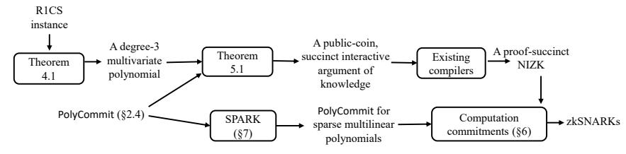

# Spartan: Efficient and general-purpose zkSNARKs without trusted setup

Srinath Setty *Microsoft Research*

#### Abstract

This paper introduces Spartan, a new family of zero-knowledge succinct noninteractive arguments of knowledge (zkSNARKs) for the rank-1 constraint satisfiability (R1CS), an NP-complete language that generalizes arithmetic circuit satisfiability. A distinctive feature of Spartan is that it offers the first zkSNARKs without trusted setup (i.e., transparent zkSNARKs) for NP where verifying a proof incurs sub-linear costs—without requiring uniformity in the NP statement's structure. Furthermore, Spartan offers zkSNARKs with a time-optimal prover, a property that has remained elusive for nearly all zkSNARKs in the literature.

To achieve these results, we introduce new techniques that we compose with the sum-check protocol, a seminal interactive proof protocol: (1) *computation commitments*, a primitive to create a succinct commitment to a description of a computation; this technique is crucial for a verifier to achieve sub-linear costs after investing a one-time, public computation to preprocess a given NP statement; (2) SPARK, a cryptographic compiler to transform any existing extractable polynomial commitment scheme for multilinear polynomials to one that efficiently handles *sparse* multilinear polynomials; this technique is critical for achieving a time-optimal prover; and (3) a compact encoding of an R1CS instance as a low-degree polynomial. The end result is a public-coin succinct interactive argument of knowledge for NP (which can be viewed as *a succinct variant of the sum-check protocol*); we transform it into a zkSNARK using prior techniques. By applying SPARK to different commitment schemes, we obtain several zkSNARKs where the verifier's costs and the proof size range from *O*(log<sup>2</sup> *n*) to *O*( √ *n*) depending on the underlying commitment scheme (*n* denotes the size of the NP statement). These schemes do not require a trusted setup except for one that requires a universal trusted setup.

We implement Spartan as a library in about 8,000 lines of Rust. We use the library to build a transparent zkSNARK in the random oracle model where security holds under the discrete logarithm assumption. We experimentally evaluate it and compare with state-of-the-art zkSNARKs for R1CS instance sizes up to 2 <sup>20</sup> constraints. Among transparent zkSNARKs, Spartan offers the fastest prover with speedups of 36–152× depending on the baseline, produces proofs that are shorter by 1.2– 416×, and incurs the lowest verification times with speedups of 3.6–1326×. The only exception is proof sizes under Bulletproofs, but Bulletproofs incurs slower verification both asymptotically and concretely. When compared to the state-of-theart zkSNARKs with trusted setup, Spartan's prover is 2× faster for arbitrary R1CS instances and 16× faster for data-parallel workloads.

Spartan's code is available from: https://github.[com/Microsoft/Spartan](https://github.com/Microsoft/Spartan).

#### <span id="page-1-0"></span>1 Introduction

We revisit the problem of designing zero-knowledge succinct non-interactive arguments of knowledge (zkSNARKs) [28, 60] for the complexity class NP: they enable a computationally-bounded prover to convince the membership of a problem instance in an NP language by producing a proof—without revealing anything besides the validity of the statement. Furthermore, the proof size and the verifier's costs are sub-linear in the size of the statement. We are motivated to design zkSNARKs because they enable many applications that involve various forms of delegation of computation for scalability or privacy [17, 33, 36, 38, 48, 49, 51, 56, 74, 76, 88, 91–96, 98, 108].

Specifically, we are interested in zkSNARKs that prove the satisfiability of R1CS instances over a finite field  $\mathbb{F}$  (an NP-complete language that generalizes arithmetic circuit satisfiability; see §2.1 for details): given a problem instance  $\mathbb{X} = (\mathbb{F}, A, B, C, io, m, n)$ , we desire a proof that demonstrates the knowledge of a witness w such that  $\mathtt{Sat}_{R1CS}(\mathbb{X}, w) = 1.^1$  We desire zkSNARKs for R1CS because there exist efficient toolchains to transform high-level applications of interest to R1CS [18, 20, 24, 38, 75, 88, 91, 95, 102].

There are many approaches to construct such arguments in the literature, starting with the work of Kilian [73] who provided the first construction of a succinct interactive argument protocol by employing probabilistically checkable proofs (PCPs) [8, 9, 12, 52, 54, 68] in conjunction with Merkle trees [83]. Micali [84] made a similar protocol non-interactive in the random oracle model, thereby obtaining the first zkSNARK. Unfortunately, the underlying PCP machinery remains extremely expensive for the prover and the verifier—despite foundational advances [19, 25–27].

Thus, the first works with an explicit motivation to make proof systems practical [48, 92, 94, 95, 98] refine and implement interactive protocols of Ishai et al. [69] and Goldwasser et al. [61], which do not require asymptotically-efficient PCPs. The principal downside is that they achieve practicality for only a restricted class of NP statements.

Gennaro, Gentry, Parno, and Raykova (GGPR) [58] address the above issue with a new characterization of NP called *quadratic arithmetic programs* (*QAPs*). By building on the work of Ishai et al. [69], Groth [63], and Lipmaa [80], GGPR construct a zkSNARK for R1CS in which the prover's running time is  $O(n \log n)$ , the size of a proof is O(1), and the verifier incurs O(|io|) computation to verify a proof, where n is the size of the statement, and io denotes the public input and output. Unfortunately, GGPR's zkSNARK requires a per-statement *trusted setup* that produces an  $O_{\lambda}(n)$ -sized structured common reference string and the trapdoor used in the setup process must be kept secret to ensure soundness. Relying on such a trusted setup is often infeasible, especially for applications that do not have trusted authorities. There exist several advances atop GGPR, but they retain a trusted setup [20, 24, 30, 64, 66, 88], or require interaction [93].

The above state of affairs has motivated another class of works, called *transparent* zkSNARKs, that aim to eliminate the requirement of a trusted setup. They prove security in the random oracle model, which is acceptable in practice. First, Hyrax [103] extends a line of work [48, 96, 98–101] that refines the doubly-efficient interactive proofs (IPs) of Goldwasser et al. [61]. Second, STARK [15] and Aurora [21] build on interactive oracle proofs (IOPs) [22, 89]. Third, Ligero [6] builds on the "MPC in the head" paradigm [70]. Fourth, Bulletproofs [39] builds on the work of Bootle et al. [34].

<sup>&</sup>lt;sup>1</sup>Although we use the word "proof", we mean proofs that are computationally sound [37].

Unfortunately, they face the following problems.

- The computational model of Hyrax [\[103\]](#page-38-10) is layered arithmetic circuits, where the verifier's costs and the proof sizes scale linearly in the depth of the circuit. Converting an arbitrary circuit into a layered form can increase its size quadratically [\[61\]](#page-37-8),<sup>2</sup> so Hyrax is restricted to low-depth circuits. Also, Hyrax achieves sub-linear verification costs only for circuits with a uniform structure (e.g., data-parallel circuits).
- STARK [\[15\]](#page-35-12) requires circuits with a sequence of identical sub-circuits, otherwise it does not achieve sub-linear verification costs. Any circuit can be converted to this form [\[18,](#page-35-4) [20\]](#page-35-5), but the transformation increases circuit sizes by 10–1000×, which translates to a similar factor increase in the prover's costs [\[102\]](#page-38-6).
- Ligero [\[6\]](#page-34-2), Bulletproofs [\[42\]](#page-36-11), and Aurora [\[21\]](#page-35-13) incur *O*(*n*) verification costs. Our work addresses these problems.

#### 1.1 Summary of contributions

This paper presents a new family of zkSNARKs, which we call *Spartan*, for proving the satisfiability of NP statements expressed in R1CS. Spartan offers the first transparent zk-SNARK that achieves sub-linear verification costs for arbitrary NP statements.<sup>3</sup> Spartan also offers zkSNARKs with a time-optimal prover, a property that has remained difficult to achieve in nearly all prior zkSNARKs.

In a nutshell, Spartan introduces a new public-coin succinct interactive argument of knowledge where the verifier incurs sub-linear costs for arbitrary R1CS instances by employing *computation commitments* (which we describe below). Our argument makes a black box use of an extractable polynomial commitment scheme in conjunction with an information-theoretic protocol, so its soundness holds under the assumptions needed by the polynomial commitment scheme (there exist many polynomial commitment schemes that can be instantiated under standard cryptographic assumptions [\[39,](#page-36-9) [103,](#page-38-10) [107\]](#page-38-13)). The interactive argument is public-coin, so we add zero-knowledge using existing compilers [\[103,](#page-38-10) [106,](#page-38-14) [109\]](#page-38-15), which themselves build on prior theory [\[14,](#page-35-16) [45,](#page-36-12) [50\]](#page-36-13). We then make the resulting zero-knowledge argument of knowledge non-interactive in the random oracle model using the Fiat-Shamir transform [\[55\]](#page-36-14). Since our interactive argument employs a polynomial commitment scheme as a black box, we obtain a family of zkSNARKs where each variant employs a different polynomial commitment scheme. In more detail, Spartan makes the following contributions.

- (1) A new family of public-coin succinct interactive arguments of knowledge. Our core insight is that the sum-check protocol [\[81\]](#page-37-14), a seminal interactive proof protocol (where soundness holds unconditionally), when applied to a suitably-constructed lowdegree polynomial yields a powerful—but *highly inefficient*—interactive proof protocol, but the inefficiency can be tamed with new techniques. Specifically, we introduce three techniques (Figure [1](#page-3-0) offers a visual depiction of how these techniques work together):
- (i) *Computation commitments*, a primitive for creating succinct cryptographic com-

<sup>2</sup>For a depth-*d* circuit, converting to a layered form increases the circuit size by a factor of *O*(*d*).

<sup>3</sup>To our knowledge, short PCP-based transparent zkSNARKs [\[73,](#page-37-3) [84\]](#page-37-6) do not achieve sub-linear verification costs unless one uses uniform circuits, which is undesirable as noted above.

<span id="page-3-0"></span>

FIGURE 1—Overview of our techniques for constructing zkSNARKs.

mitments to a mathematical description of an NP statement, which is critical for achieving sub-linear verification costs.

Achieving sub-linear verification costs appears fundamentally unrealizable because the verifier must process an NP statement for which the proof is produced before it can verify a purported proof. Our observation is that this cost can be made sub-linear in the size of an NP statement by introducing a *public preprocessing step*.

Specifically, our observation is that when verifying a proof under our interactive argument, the verifier must evaluate a low-degree polynomial that encodes the NP statement, which incurs *O*(*n*) costs to the verifier. Our primitive, computation commitments, enables verifiably delegating the necessary polynomial evaluations to the prover. Specifically, in Spartan, the verifier reads an R1CS instance (without the *io* component) for which the proof is produced and retains a short cryptographic commitment to a set of sparse multilinear polynomials that encode the R1CS structure. Later, when producing a proof, the prover evaluates the necessary polynomials and proves that the sparse polynomial evaluations are consistent with the commitment retained by the verifier. While the verifier incurs *O*(*n*) cost to compute a computation commitment, the cost is amortized over *all* future proofs produced for all R1CS instances with the same structure. This amortization is similar to that of GGPR [\[58\]](#page-36-8). However, unlike GGPR's trusted setup, creating a computation commitment does not involve any secret trapdoors. Section [6](#page-21-0) provides details.

- (ii) SPARK, a cryptographic compiler to transform any existing extractable polynomial commitment scheme for multilinear polynomials to one that efficiently handles sparse multilinear polynomials. Using the compiler, we obtain schemes with timeoptimal costs for both creating commitments to sparse multilinear polynomials and to produce proofs of evaluations of the committed polynomials. This compiler is crucial for achieving a time-optimal prover in Spartan. In more detail, SPARK employs an existing extractable polynomial commitment scheme as a black box, and uses it in conjunction with a special-purpose zkSNARK and a carefully-constructed circuit (that employs offline memory checking techniques [\[7,](#page-34-3) [31,](#page-35-17) [47,](#page-36-15) [53,](#page-36-16) [91\]](#page-38-1)) to efficiently prove evaluations of sparse multilinear polynomials. Section [7](#page-22-0) provides details.
- (iii) A compact encoding of an R1CS instance as a degree-3 multivariate polynomial that can be decomposed into four multilinear polynomials. The decomposition into multilinear polynomials is critical for achieving a time-optimal prover in the sumcheck protocol by employing prior ideas [\[96,](#page-38-2) [106\]](#page-38-14). Section [4](#page-15-0) provides details.

The following theorem states our main result informally and the result follows from our construction in the rest of the paper (Section 2 provides formal definitions). The corollary below follows from our main result in conjunction with prior transformations to achieve zero-knowledge [103, 106, 109] and non-interactivity [55].

**Theorem 1.1.** There exists a family of public-coin succinct interactive arguments of knowledge for NP under standard cryptographic hardness assumptions where the prover incurs O(n) to  $O(n \log n)$  costs, and the verifier's costs and communication range from  $O(\log^2 n)$  to  $O(\sqrt{n})$  (depending on the underlying extractable polynomial commitment scheme for multilinear polynomials), where n is size of the NP statement.

**Corollary 1.1.** There exists a family of zkSNARKs for NP in the random oracle model where the prover incurs O(n) to  $O(n \log n)$  costs, and the verifier's costs and proof sizes range from  $O(\log^2 n)$  to  $O(\sqrt{n})$  (depending on the underlying polynomial commitment scheme for multilinear polynomials), where n denotes the size of the NP statement.

- (2) An optimized implementation and experimental evaluation. We implement Spartan as a library in about 8,000 lines of Rust. We use the library to build a transparent zkSNARK that employs an extractable polynomial commitment scheme due to Wahby et al. [103] where soundness holds under the hardness of computing discrete logarithms. Our experimental evaluation demonstrates that, among schemes without trusted setup, Spartan offers the fastest prover with speedups of  $36-152\times$  depending on the baseline, produces proofs that are shorter by  $1.2-416\times$ , and incurs the lowest verification times with speedups of  $3.6-1326\times$ . The only exception is that Bulletproofs produces shorter proofs than Spartan, but Bulletproofs incurs slower verification both asymptotically and concretely. When compared to the state-of-the-art zkSNARK with trusted setup, Spartan's prover is  $2\times$  faster for arbitrary R1CS instances and  $16\times$  faster for data-parallel workloads. Our implementation is available as an open source project [5].
- (3) A unified understanding of different strands of theory. Spartan exposes interconnections among different lines of work on probabilistic proofs—from the perspective of zkSNARKs—including doubly-efficient IPs, MIPs, and short PCPs (§3.2).
- **(4) Improvements in zkSNARKs with universal setup.** While our focus is transparent zkSNARKs, Spartan improves on prior zkSNARKs with universal trusted setup.

By employing a different polynomial commitment scheme [87, 108], which requires q-type, knowledge of exponent assumptions, in SPARK, Spartan offers an alternative to Libra [106]; we refer to this variant as Spartan<sub>KE</sub>. Compared to Libra, Spartan<sub>KE</sub> supports arbitrary R1CS instances instead of layered arithmetic circuits. Furthermore, unlike Libra, the proof sizes and the verifier's running times in Spartan<sub>KE</sub> do not scale linearly with the circuit depth. Finally, Libra achieves sub-linear verification costs only for low-depth uniform circuits whereas Spartan<sub>KE</sub> achieves sub-linear verification costs for arbitrary R1CS instances via computation commitments.

#### 1.2 Additional related work

Figure 2 compares the asymptotic costs of Spartan-based zkSNARKs with other schemes.

**Recent schemes.** Following our preprint, there are three transparent zkSNARKs: Fractal [46], SuperSonic [39], and Virgo [107]. Virgo's model of computation is same as Hyrax's, so it achieves sub-linear verification costs only for low-depth, uniform circuits.

<span id="page-5-0"></span>

|                       | setup         | prover          | proof length    | verifier        | computational model    |
|-----------------------|---------------|-----------------|-----------------|-----------------|------------------------|
| GGPR [58]             | private       | $O(n \log n)$   | 0(1)            | O(1)            | R1CS                   |
| Libra [106]           | private*      | O(n)            | $O(d \log n)$   | $O(d \log n)$   | uniform circuits       |
| Ligero [6]            | public        | $O(n \log n)$   | $O(\sqrt{n})$   | O(n)            | arithmetic circuits    |
| Hyrax [103]           | public        | $O(n+m\cdot g)$ | $O(m+\sqrt{w})$ | $O(m+\sqrt{w})$ | data-parallel circuits |
| Bulletproofs [42]     | public        | O(n)            | $O(\log n)$     | O(n)            | arithmetic circuits    |
| STARK [15]            | public        | $O(n\log^2 n)$  | $O(\log^2 n)$   | $O(\log^2 n)$   | uniform circuits       |
| Aurora [21]           | public        | $O(n \log n)$   | $O(\log^2 n)$   | O(n)            | R1CS                   |
| Fractal [46]          | public        | $O(n \log n)$   | $O(\log^2 n)$   | $O(\log^2 n)$   | R1CS                   |
| Virgo [107]           | public        | $O(n \log n)$   | $O(d \log n)$   | $O(d \log n)$   | uniform circuits       |
| SuperSonic [39]       | public        | $O(n \log n)$   | $O(\log n)$     | $O(\log n)$     | arithmetic circuits    |
| Variants in Spartar   | n's family of | f zkSNARKs:     |                 |                 |                        |
| Spartan <sub>DL</sub> | public        | O(n)            | $O(\sqrt{n})$   | $O(\sqrt{n})$   | R1CS                   |
| Spartan <sub>KE</sub> | private*      | O(n)            | $O(\log^2 n)$   | $O(\log^2 n)$   | R1CS                   |
| Spartan <sub>RO</sub> | public        | $O(n \log n)$   | $O(\log^2 n)$   | $O(\log^2 n)$   | R1CS                   |
| Spartan <sub>CL</sub> | public        | $O(n \log n)$   | $O(\log^2 n)$   | $O(\log^2 n)$   | R1CS                   |

FIGURE 2—A comparison of prior and recent zkSNARKs, where n denotes the size of the NP statement. The depicted asymptotics depend on the security parameter  $\lambda$ , which we omit for brevity. For Hyrax [103], we assume a layered arithmetic circuit  $\mathcal{C}$  of depth d, width g, and  $\beta$  copies (i.e.,  $n=d\cdot g\cdot \beta$ ); w denotes the size of a witness to  $\mathcal{C}$ ; and  $m=d\cdot\log g$ . Hyrax and Spartan<sub>DL</sub> can achieve sub-sqrt proofs at the cost of increasing  $\mathcal{V}$ 's time. For Libra and Virgo, we assume a depth-d layered uniform circuit. The verifier incurs O(|io|) additional cost in all schemes where io denotes the public inputs and outputs of the NP relation being proved. Furthermore, all transparent zkSNARKs achieve non-interactivity in the random oracle model using the Fiat-Shamir heuristic [55]. Private\* means that the trusted setup is universal. Ligero, Virgo, STARK, Aurora, Fractal, and Spartan<sub>RO</sub> are plausibly post-quantum secure. Finally, Spartan<sub>CL</sub> applies SPARK to the commitment scheme of Bünz et al. [39], but the commitment scheme requires an adaptation (§5.1).

Fractal and SuperSonic achieve sub-linear verification costs for arbitrary NP statements. In these schemes, the verifier preprocesses an NP statement—without secret trapdoors—to create a commitment to the structure of the statement. In other words, they instantiate the computation commitments primitive. Unfortunately, both schemes incur orders of magnitude higher expense than Spartan (§9).

**Linear PCPs and QAPs.** Ishai, Kushilevitz, and Ostrovsky (IKO) [69] design the first interactive argument protocol without employing short PCPs. Instead, IKO use *linear* PCPs, a type of PCP in which the proof is a linear function [8, 9]. Such PCPs are simpler than short PCPs, but they are of size exponential in n. Thus, a polynomial time prover cannot materialize linear PCPs, a precise issue addressed by IKO: they devise a commitment protocol in which a prover can commit to an exponentially-long PCP without materializing the entire PCP.<sup>4</sup> Because of the specific linear PCP construction that they use, which is based on Hadamard codes [8, 9], the prover's work is  $O(n^2)$ . Setty et al. [94] strengthen IKO's cryptographic machinery to directly transform linear PCPs to arguments (IKO required the use of MIPs as an intermediate step), which simplifies the overall approach and significantly reduces constants. They also achieve O(n) asymptotics for the prover by designing "tailored" linear PCPs for circuits with

<sup>&</sup>lt;sup>4</sup>Spartan is analogous to IKO in this aspect: The provers in IKO and Spartan do not materialize a PCP. The difference between these two works is that Spartan employs the polynomially-sized short PCPs of Babai et al. [12] whereas IKO employs the exponentially-sized linear PCPs of Arora et al. [8, 9]. This necessitates different cryptographic machinery.

regular structure (e.g., matrix multiplication, polynomial evaluation). However, they retain the *O*(*n* ) costs for the prover in the general case.

As discussed in Section [1,](#page-1-0) GGPR [\[58\]](#page-36-8) address the prover's asymptotics with QAPs. Bitansky et al. [\[30\]](#page-35-11) and Setty et al. [\[93\]](#page-38-9) observe that QAPs can be viewed as linear PCPs. Zaatar [\[93\]](#page-38-9) leverages this observation to build an interactive argument with *O*(*n* log *n*) asymptotics for the prover by composing a QAPs-based linear PCP with a refined variant of IKO's machinery [\[94,](#page-38-8) [95\]](#page-38-5). The resulting asymptotics matches that of an argument based on state-of-the-art short PCPs. However, Zaatar retains the rest of IKO's limitations: the argument is interactive and achieves succinctness only when proofs for a batch of statements are proved at once. Note that Zaatar and IKO do not support zero-knowledge arguments, but it is not fundamental [\[69,](#page-37-7) §3.1].

Pinocchio [\[88\]](#page-38-0) optimizes and implements GGPR [\[58\]](#page-36-8) in entirety. It avoids the issues listed above for Zaatar and IKO—at the cost of making q-type, knowledge of exponent assumptions, which are non-standard and non-falsifiable (Zaatar does not need such assumptions, but it is worth noting that such assumptions are inherent for achieving non-interactivity in arguments for NP [\[60\]](#page-36-0)). BCGTV [\[20\]](#page-35-5), BCTV [\[24\]](#page-35-6), and Groth [\[64\]](#page-37-11) offer algorithmic and concrete performance improvements over Pinocchio's zkSNARK. However, all these works require a trusted setup as detailed earlier. To cope with trusted setup, recent works [\[66,](#page-37-12) [82\]](#page-37-16) propose schemes to update the structured common reference string after it is generated. However, at least one updating entity must be trusted.

Interactive proofs. While PCP-based arguments make cryptographic hardness assumptions, interactive proofs (IPs) are unconditionally secure. The early works on interactive proofs [\[11,](#page-35-18) [62\]](#page-37-17) focus on studying the power of IPs in the context of intractable languages. However, in 2008, Goldwasser, Kalai, and Rothblum (GKR) [\[61\]](#page-37-8) propose an elegant interactive proof system in the context of delegating computations where both the prover and the verifier are efficient; such IPs are called *doubly-efficient* IPs. Specifically, they construct doubly-efficient IPs for computations that can be expressed as log-space uniform circuits. In their protocol, the prover's running time is a polynomial in the size of the circuit, and the verifier's running time is linear in the depth of the circuit and logarithmic in the size of the circuit. Cormode, Mitzenmacher, and Thaler (CMT) [\[48\]](#page-36-2) refine GKR's protocol to reduce the prover's work from *O*(*n* 3 ) to *O*(*n* log *n*) by employing a specific polynomial extension to encode the circuit structure. A series of works [\[96,](#page-38-2) [98](#page-38-3)[–101\]](#page-38-11) further refines the approach of GKR and CMT to reduce constants and to improve asymptotics when circuits have structure such as data-parallelism. Recent work builds interactive arguments [\[108,](#page-38-4) [110\]](#page-38-16) and zkSNARKs [\[103,](#page-38-10) [106,](#page-38-14) [109\]](#page-38-15) using GKR, CMT, and their refinements. Section [3.2](#page-13-0) discusses, in context, how these works relate to Spartan.

## <span id="page-6-0"></span>2 Preliminaries

We use F to denote a finite field (e.g., the prime field F*<sup>p</sup>* for a large prime *p*) and λ to denote the security parameter. We use negl(λ) to denote a negligible function in λ. Throughout the paper, the depicted asymptotics depend on λ, but we elide this for brevity. We use "PPT algorithms" to refer to probabilistic polynomial time algorithms.

### <span id="page-7-0"></span>2.1 Problem instances in R1CS

Recall that for any problem instance x, if x is in an NP language L, there exists a witness *w* and a deterministic algorithm Sat such that:

$$\mathtt{Sat}_{\mathcal{L}}(\mathtt{x},w) = \begin{cases} 1 & \text{if } \mathtt{x} \in \mathcal{L} \\ 0 & \text{otherwise} \end{cases}$$

Alternatively, the set of tuples of the form ⟨x,*w*⟩ form a set of NP relations. The subset of those for which SatL(x,*w*) = 1 are called *satisfiable instances*, which we denote as: R<sup>L</sup> = {⟨x,*w*⟩ : SatL(x,*w*) = 1}.

As an NP-complete language, we focus on the rank-1 constraint satisfiability (R1CS). As noted earlier, R1CS is a popular target for compiler toolchains that accept applications expressed in high-level languages [\[88,](#page-38-0) [93,](#page-38-9) [95,](#page-38-5) [102\]](#page-38-6). R1CS is implicit in the QAPs of GGPR [\[58\]](#page-36-8), but it is used with (and without) QAPs in subsequent works [\[21,](#page-35-13) [79,](#page-37-18) [93\]](#page-38-9).

Definition 2.1 (R1CS instance). An R1CS instance is a tuple (F , *A*, *B*, *C*, *io*, *m*, *n*), where *io* denotes the public input and output of the instance, *A*, *B*, *C* ∈ F *<sup>m</sup>*×*<sup>m</sup>*, where *m* ≥ |*io*|+1 and there are at most *n* non-zero entries in each matrix.

Note that matrices *A*, *B*, *C* are defined to be square matrices for conceptual simplicity. Below, we use the notation *z* = (*x*, *y*,*z*) (where each of *x*, *y*,*z* is a vector over F ) to mean that *z* is a vector that concatenates the three vectors in a natural way. WLOG, we assume that *n* = *O*(*m*) throughout the paper.

Definition 2.2 (R1CS). An R1CS instance (F , *A*, *B*,*C*, *io*, *m*, *n*) is said to be *satisfiable* if there exists a witness *w* ∈ F *m*−|*io*|−1 such that (*A* · *z*) ◦ (*B* · *z*) = (*C* · *z*), where *z* = (*io*, 1, *w*), · is the matrix-vector product, and ◦ is the Hadamard (entry-wise) product.

Note that R1CS generalizes arithmetic circuit satisfiability because the entries in matrices *A*, *B*, *C* can be used to encode addition and multiplication gates over F . Furthermore, they can be used to encode a class of degree-2 constraints of the form *L*(*z*)· *R*(*z*) = *O*(*z*), where *L*, *R*, *O* are degree-1 polynomials over variables that take values specified by *z* = (*io*, 1,*w*). In other words, R1CS supports arbitrary fan-in addition gates, and multiplication gates that verify arbitrary bilinear relations over the entire *z*.

Definition 2.3. For an R1CS instance x = (F , *A*, *B*, *C*, *io*, *m*, *n*) and a purported witness *w* ∈ F *m*−|*io*|−1 , we define:

$$\mathtt{Sat}_{\mathtt{RICS}}(\mathtt{x},w) = \begin{cases} 1 & (A \cdot (io,1,w) \circ (B \cdot (io,1,w)) = (C \cdot (io,1,w)) \\ 0 & \text{otherwise} \end{cases}$$

The set of satisfiable R1CS instances can be denoted as:

$$\mathcal{R}_{\text{RICS}} = \{ \langle (\mathbb{F}, A, B, C, io, m, n), w \rangle : \mathtt{Sat}_{\text{RICS}}((\mathbb{F}, A, B, C, io, m, n), w) = 1 \}$$

Definition 2.4. For a given R1CS instance x = (F , *A*, *B*,*C*, *io*, *m*, *n*), the NP statement that x is satisfiable (i.e., ⟨x, ·⟩ ∈ RR1CS) is of size *O*(*n*).

#### 2.2 Succinct interactive arguments of knowledge

Let  $\langle \mathcal{P}, \mathcal{V} \rangle$  denote a pair of PPT interactive algorithms and Setup denotes an algorithm that outputs public parameters pp given as input the security parameter  $\lambda$ .

**Definition 2.5.** A protocol between a pair of PPT algorithms  $\langle \mathcal{P}, \mathcal{V} \rangle$  is called a public-coin succinct interactive argument of knowledge for a language  $\mathcal{L}$  if:

- Completeness. For any problem instance  $x \in \mathcal{L}$ , there exists a witness w such that for all  $r \in \{0,1\}^*$ ,  $\Pr\{\langle \mathcal{P}(pp,w), \mathcal{V}(pp,r)\rangle(x) = 1\} \geq 1 \text{negl}(\lambda)$ .
- **Soundness.** For any non-satisfiable problem instance x, any PPT prover  $\mathcal{P}^*$ , and for all  $w, r \in \{0, 1\}^*$ ,  $\Pr\{\langle \mathcal{P}^*(pp, w), \mathcal{V}(pp, r) \rangle(x) = 1\} \leq \text{negl}(\lambda)$ .
- Knowledge soundness. For any PPT adversary  $\mathcal{A}$ , there exists a PPT extractor  $\mathcal{E}$  such that for any problem instance x and for all  $w, r \in \{0, 1\}^*$ , if  $\Pr\{\langle \mathcal{A}(pp, w), \mathcal{V}(pp, r) \rangle(x) = 1\} \ge \operatorname{negl}(\lambda)$ , then  $\Pr\{\operatorname{Sat}_{\mathcal{L}}(x, w') = 1 | w' \leftarrow \mathcal{E}^{\mathcal{A}}(pp, x)\} \ge \operatorname{negl}(\lambda)$ .
- Succinctness. The total communication between  $\mathcal{P}$  and  $\mathcal{V}$  is sub-linear in the size of the NP statement  $x \in \mathcal{L}$ .
- **Public coin.** V's messages are chosen uniformly at random.

We adapt the following definitions from [103] for our notation.

<span id="page-8-0"></span>**Definition 2.6** (Witness-extended emulation [65]). An interactive argument (Setup,  $\mathcal{P}, \mathcal{V}$ ) for  $\mathcal{L}$  has witness-extended emulation if for all deterministic polynomial time programs  $\mathcal{P}^*$  there exists an expected polynomial time emulator E such that for all non-uniform polynomial time adversaries A and all  $z_{\mathcal{V}} \in \{0,1\}^*$ , the following probabilities differ by at most  $\operatorname{negl}(\lambda)$ :  $\operatorname{Pr}\{pp \leftarrow \operatorname{Setup}(1^{\lambda}) \; ; \; (\mathbb{X}, z_{\mathcal{P}}) \leftarrow A(pp) \; ; \; t \leftarrow tr \langle \mathcal{P}^*(z_{\mathcal{P}}), \mathcal{V}(z_{\mathcal{V}}) \rangle (\mathbb{X}) \; : A(t) = 1\}$  and  $\operatorname{Pr}\{pp \leftarrow \operatorname{Setup}(1^{\lambda}) \; ; \; (\mathbb{X}, z_{\mathcal{P}}) \leftarrow A(pp) \; ; \; (t, w) \leftarrow E^{\mathcal{P}^*(z_{\mathcal{P}})}(\mathbb{X}) \; : A(t) = 1 \land \text{if } t \text{ is an accepting transcript then } \operatorname{Sat}_{\mathcal{L}}(\mathbb{X}, w) = 1\}$ , where tr denotes the random variable that corresponds to the transcript of the interaction between  $\mathcal{P}^*$  and  $\mathcal{V}$ .

<span id="page-8-1"></span>**Definition 2.7.** An interactive argument (Setup,  $\mathcal{P}, \mathcal{V}$ ) for  $\mathcal{L}$  is computational zero-knowledge if for every PPT interactive machine  $\mathcal{V}^*$ , there exists a PPT algorithm S called the simulator, running in time polynomial in the length of its first input such that for every problem instance  $x \in \mathcal{L}, w \in \mathcal{R}_x$ , and  $z \in \{0,1\}^*$ , the following holds when the distinguishing gap is considered as a function of |x|:

$$View(\langle \mathcal{P}(w), \mathcal{V}^*(z) \rangle(x)) \approx_c S(x, z),$$

where  $View(\langle \mathcal{P}(w), \mathcal{V}^*(z) \rangle(x))$  denotes the distribution of the transcript of interaction between  $\mathcal{P}$  and  $\mathcal{V}^*$ , and  $\approx_c$  denotes that the two quantities are computationally indistinguishable. If the statistical distance between the two distributions is negligible then the interactive argument is said to be statistical zero-knowledge. If the simulator is allowed to abort with probability at most 1/2, but the distribution of its output conditioned on not aborting is identically distributed to  $View(\langle \mathcal{P}(w), \mathcal{V}^*(z) \rangle(x))$ , then the interactive argument is called perfect zero-knowledge.

#### 2.3 Polynomials and low-degree extensions

We recall a few basic facts about polynomials:

- A polynomial  $\mathcal{G}$  over  $\mathbb{F}$  is an expression consisting of a sum of *monomials* where each monomial is the product of a constant (from  $\mathbb{F}$ ) and powers of one or more variables (which take values from  $\mathbb{F}$ ); all arithmetic is performed over  $\mathbb{F}$ .
- The degree of a monomial is the sum of the exponents of variables in the monomial; the degree of a polynomial  $\mathcal{G}$  is the maximum degree of any monomial in  $\mathcal{G}$ . Furthermore, the degree of a polynomial  $\mathcal{G}$  in a particular variable  $x_i$  is the maximum exponent that  $x_i$  takes in any of the monomials in  $\mathcal{G}$ .
- A *multivariate* polynomial is a polynomial with more than one variable; otherwise it is called a *univariate* polynomial.

**Definition 2.8** (Multilinear polynomial). A multivariate polynomial is called a multilinear polynomial if the degree of the polynomial in each variable is at most one.

**Definition 2.9** (Low-degree polynomial). A multivariate polynomial  $\mathcal{G}$  over a finite field  $\mathbb{F}$  is called low-degree polynomial if the degree of  $\mathcal{G}$  in each variable is exponentially smaller than  $|\mathbb{F}|$ .

**Low-degree extensions (LDEs).** Suppose  $g : \{0, 1\}^m \to \mathbb{F}$  is a function that maps m-bit elements into an element of  $\mathbb{F}$ . A *polynomial extension* of g is a low-degree m-variate polynomial  $\widetilde{g}(\cdot)$  such that  $\widetilde{g}(x) = g(x)$  for all  $x \in \{0, 1\}^m$ .

A *multilinear* polynomial extension (or simply, a multilinear extension, or MLE) is a low-degree polynomial extension where the extension is a multilinear polynomial (i.e., the degree of each variable in  $\widetilde{g}(\cdot)$  is at most one). Given a function  $Z:\{0,1\}^m\to\mathbb{F}$ , the multilinear extension of  $Z(\cdot)$  is the unique multilinear polynomial  $\widetilde{Z}:\mathbb{F}^m\to\mathbb{F}$ . It can be computed as follows.

$$\widetilde{Z}(x_1, \dots, x_m) = \sum_{e \in \{0,1\}^m} Z(e) \cdot \prod_{i=1}^m (x_i \cdot e_i + (1 - x_i) \cdot (1 - e_i))
= \sum_{e \in \{0,1\}^m} Z(e) \cdot \widetilde{eq}(x, e)
= \langle (Z(0), \dots, Z(2^m - 1)), (\widetilde{eq}(x, 0), \dots, \widetilde{eq}(x, 2^m - 1)) \rangle$$

Note that  $\widetilde{eq}(x, e) = \prod_{i=1}^{m} (e_i \cdot x_i + (1 - e_i) \cdot (1 - x_i))$ , which is the MLE of the following function:

$$eq(x, e) = \begin{cases} 1 & \text{if } x = e \\ 0 & \text{otherwise} \end{cases}$$

For any  $r \in \mathbb{F}^m$ ,  $\widetilde{Z}(r)$  can be computed in  $O(2^m)$  operations in  $\mathbb{F}$  [96, 99].

<span id="page-9-0"></span>**Dense representation for multilinear polynomials.** Since the MLE of a function is unique, it offers the following method to represent any multilinear polynomial. Given

a multilinear polynomial  $\mathcal{G}(\cdot): \mathbb{F}^m \to \mathbb{F}$ , it can be represented uniquely by the list of evaluations of  $\mathcal{G}(\cdot)$  over the Boolean hypercube  $\{0,1\}^m$  (i.e., a function that maps  $\{0,1\}^m \to \mathbb{F}$ ). We denote such a representation of  $\mathcal{G}$  as  $\mathtt{DenseRepr}(\mathcal{G})$ .

**Lemma 2.1.** If for any  $x \in \{0,1\}^m$ ,  $\mathcal{G}(x) = 0$  then  $\mathsf{DenseRepr}(\mathcal{G})$  does not have to include an entry for x.

*Proof.* Recall the closed-form expression for evaluating  $\mathcal{G}(\cdot)$  at  $(r_1, \ldots, r_m) \in \mathbb{F}^m$ :  $\mathcal{G}(r_1, \ldots, r_m) = \sum_{x \in \{0,1\}^m} \mathcal{G}(x) \cdot \prod_{i=1}^m (r_i \cdot x_i + (1-r_i) \cdot (1-x_i))$ . Observe that if for any  $x \in \{0,1\}^m$ ,  $\mathcal{G}(x) = 0$ , x does not contribute to  $\mathcal{G}(r)$  for any  $r \in \mathbb{F}^m$ .

**Definition 2.10.** A multilinear polynomial  $\mathcal{G}: \mathbb{F}^m \to \mathbb{F}$  is a sparse multilinear polynomial if  $|\mathtt{DenseRepr}(\mathcal{G})|$  is sub-linear in  $O(2^m)$ . Otherwise, it is a dense multilinear polynomial.

As an example, suppose  $\mathcal{G}: \mathbb{F}^{2s} \to \mathbb{F}$ . Suppose  $|\mathsf{DenseRepr}(\mathcal{G})| = O(2^s)$ , then  $\mathcal{G}(\cdot)$  is a sparse multilinear polynomial because  $O(2^s)$  is sublinear in  $O(2^{2s})$ .

### <span id="page-10-0"></span>2.4 A polynomial commitment scheme for multilinear polynomials

We adopt our definitions from Bünz et al. [39] where they generalize the definition of Kate et al. [72] to allow interactive evaluation proofs. We also borrow their notation: in a list of arguments or returned tuples, variables before the semicolon are public and the ones after are secret; when there is no secret information, semicolon is omitted.

WLOG, below, when algorithms accept as input a multilinear polynomial, they use the dense representation of multilinear polynomials (§2.3).

A polynomial commitment scheme for multilinear polynomials is a tuple of four protocols PC = (Setup, Commit, Open, Eval):

- $pp \leftarrow \text{Setup}(1^{\lambda}, \mu)$ : takes as input  $\mu$  (the number of variables in a multilinear polynomial); produces public parameters pp.
- $(C; S) \leftarrow \text{Commit}(pp; G)$ : takes as input a  $\mu$ -variate multilinear polynomial over a finite field  $G \in \mathbb{F}[\mu]$ ; produces a public commitment C and a secret opening hint S.
- $b \leftarrow \operatorname{Open}(pp, \mathcal{C}, \mathcal{G}, \mathcal{S})$ : verifies the opening of commitment  $\mathcal{C}$  to the  $\mu$ -variate multilinear polynomial  $\mathcal{G} \in \mathbb{F}[\mu]$  with the opening hint  $\mathcal{S}$ ; outputs a  $b \in \{0,1\}$ .
- $b \leftarrow \text{Eval}(pp, \mathcal{C}, r, v, \mu; \mathcal{G}, \mathcal{S})$  is an interactive public-coin protocol between a PPT prover  $\mathcal{P}$  and verifier  $\mathcal{V}$ . Both  $\mathcal{V}$  and  $\mathcal{P}$  hold a commitment  $\mathcal{C}$ , the number of variables  $\mu$ , a scalar  $v \in \mathbb{F}$ , and  $r \in \mathbb{F}^{\mu}$ .  $\mathcal{P}$  additionally knows a  $\mu$ -variate multilinear polynomial  $\mathcal{G} \in \mathbb{F}[\mu]$  and its secret opening hint  $\mathcal{S}$ .  $\mathcal{P}$  attempts to convince  $\mathcal{V}$  that  $\mathcal{G}(r) = v$ . At the end of the protocol,  $\mathcal{V}$  outputs  $b \in \{0, 1\}$ .

**Definition 2.11.** A tuple of four protocols (Setup, Commit, Open, Eval) is an extractable polynomial commitment scheme for multilinear polynomials over a finite field  $\mathbb{F}$  if the following conditions hold.

• Completeness. For any *m*-variate multilinear polynomial  $\mathcal{G} \in \mathbb{F}[\mu]$ ,

$$\Pr\left\{\begin{array}{l} pp \leftarrow \mathsf{Setup}(1^{\lambda}, \mu); (\mathcal{C}, \mathcal{S}) \leftarrow \mathsf{Commit}(pp; \mathcal{G}) \text{:} \\ \mathsf{Eval}(pp, \mathcal{C}, r, v, \mu; \mathcal{G}, \mathcal{S}) = 1 \wedge v = \mathcal{G}(r) \end{array}\right\} \geq 1 - \mathsf{negl}(\lambda)$$

• **Binding.** For any PPT adversary A, size parameter  $\mu \geq 1$ ,

$$\Pr\left\{\begin{array}{l} pp \leftarrow \mathsf{Setup}(1^\lambda, m); (\mathcal{C}, \mathcal{G}_0, \mathcal{G}_1, \mathcal{S}_0, \mathcal{S}_1) = \mathcal{A}(pp); \\ b_0 \leftarrow \mathsf{Open}(pp, \mathcal{C}, \mathcal{G}_0, \mathcal{S}_0); b_1 \leftarrow \mathsf{Open}(pp, \mathcal{C}, \mathcal{G}_1, \mathcal{S}_1): \\ b_0 = b_1 \neq 0 \land \mathcal{G}_0 \neq \mathcal{G}_1 \end{array}\right\} \leq \mathsf{negl}(\lambda)$$

• **Knowledge soundness.** Eval is a public-coin succinct interactive argument of knowledge with witness-extended emulation (Definition 2.6) for the following NP relation given  $pp \leftarrow \text{Setup}(1^{\lambda}, \mu)$  for a size parameter on the number of variables  $\mu$ :

$$\mathcal{R}_{\mathsf{Eval}}(pp) = \{ \langle (\mathcal{C}, r, v), (\mathcal{G}, \mathcal{S}) \rangle : \mathcal{G} \in \mathbb{F}[\mu] \land \mathcal{G}(r) = v \land \mathsf{Open}(pp, \mathcal{C}, \mathcal{G}, \mathcal{S}) = 1 \}$$

<span id="page-11-0"></span>**Definition 2.12.** An extractable polynomial commitment scheme (Setup, Commit, Open, Eval) provides hiding commitments if for all PPT adversaries  $\mathcal{A} = (\mathcal{A}_0, \mathcal{A}_1)$ :

$$\begin{vmatrix} b = \bar{b}: \\ pp \leftarrow \mathsf{Setup}(1^{\lambda}, m); \\ (\mathcal{G}_0, \mathcal{G}_1, st) = \mathcal{A}_0(pp); \\ b \leftarrow_R \{0, 1\}; \\ (\mathcal{C}, \mathcal{S}) \leftarrow \mathsf{Commit}(pp, \mathcal{G}_b); \\ \bar{b} \leftarrow \mathcal{A}_1(st, \mathcal{C}) \end{vmatrix} \leq \mathsf{negl}(\lambda)$$

If the above holds for all algorithms, then the commitment is statistically hiding.

**Definition 2.13.** An extractable polynomial commitment scheme (Setup, Commit, Open, Eval) with hiding commitments (Definition 2.12) is zero-knowledge if Eval is a public-coin succinct interactive argument of knowledge with witness-extended emulation (Definition 2.6) and zero-knowledge (Definition 2.7) for the following NP relation given  $pp \leftarrow \text{Setup}(1^{\lambda}, \mu)$  for a size parameter on the number of variables  $\mu$ :

$$\mathcal{R}_{\mathsf{Eval}}(pp) = \{ \langle (\mathcal{C}, r, v), (\mathcal{G}, \mathcal{S}) \rangle : \mathcal{G} \in \mathbb{F}[\mu] \land \mathcal{G}(r) = v \land \mathsf{Open}(pp, \mathcal{C}, \mathcal{G}, \mathcal{S}) = 1 \}$$

#### <span id="page-11-1"></span>3 The sum-check protocol: opportunities and challenges

An interactive proof is an interactive argument, where the soundness holds unconditionally. We now describe a seminal interactive proof protocol that we employ in Spartan, called the sum-check protocol [81]. Suppose there is an  $\mu$ -variate low-degree polynomial,  $\mathcal{G}: \mathbb{F}^{\mu} \to \mathbb{F}$  where the degree of each variable in  $\mathcal{G}$  is at most  $\ell$ . Suppose that a verifier  $\mathcal{V}_{SC}$  is interested in checking a claim of the following form by an untrusted prover  $\mathcal{P}_{SC}$ :

$$T = \sum_{x_1 \in \{0,1\}} \sum_{x_2 \in \{0,1\}} \dots \sum_{x_{\mu} \in \{0,1\}} \mathcal{G}(x_1, x_2, \dots, x_{\mu})$$

Of course, given  $\mathcal{G}(\cdot)$ ,  $\mathcal{V}_{SC}$  can deterministically evaluate the above sum and verify whether the sum is T. But, this computation takes time exponential in  $\mu$ .

Lund et al. [81] describe the sum-check protocol that requires far less computation on  $\mathcal{V}_{SC}$ 's behalf, but provides a probabilistic guarantee. In the protocol,  $\mathcal{V}_{SC}$  interacts with

```
1: // reduces the claim P
                         x∈{0,1}s G(x)
                                      ?= T to G(r)
                                                  ?= e
 2: function SumCheckReduce(µ, ℓ, T, r)
 3: (r1,r2, . . . ,rµ) ← r
 4: e ← T
 5: for i = 1, 2, . . . , µ do
 6: Gi(·) ← ReceiveFromProver() // an honest PSC returns {Gi(0), Gi(1), . . . Gi(ℓ)}
 7: if Gi(0) + Gi(1) ̸= e then
 8: return 0
 9: SendToProver(ri)
10: e ← Gi(ri) // evaluate Gi(ri) using its point-value form received from the prover
      return e
```

FIGURE 3—Description of the sum-check protocol from the perspective of V*SC*. V*SC* checks if the µ-variate polynomial G(·) sums to *T* over the Boolean hypercube {0, 1} <sup>µ</sup> with the assistance of an untrusted prover P*SC*. The degree of G(·) in each variable is at most ℓ.

P*SC* over a sequence of µ rounds. At the end of this interaction, V*SC* outputs *b* ∈ {0, 1}. The principal cost to V*SC* is to evaluate G at a random point in its domain *r* ∈ F µ. We denote the sum-check protocol as *b* ← ⟨P*SC*, V*SC*(*r*)⟩(G, µ, ℓ, *T*). For any µ-variate polynomial G with degree at most ℓ in each variable, the following properties hold.

- Completeness. If *T* = P *<sup>x</sup>*∈{0,1}<sup>µ</sup> G(*x*), then for a correct P*SC* and for all *r* ∈ {0, 1} ∗ , Pr{⟨P*SC*(G), V*SC*(*r*)⟩(µ, ℓ, *T*) = 1} = 1.
- Soundness. If *T* ̸= P *<sup>x</sup>*∈{0,1}<sup>µ</sup> G(*x*), then for any P ⋆ *SC* and for all *r* ∈ {0, 1} ∗ , Pr*r*{⟨P<sup>⋆</sup> *SC*(G), V*SC*(*r*)⟩(µ, ℓ, *T*) = 1} ≤ ℓ · µ/|F |.
- Succinctness. The communication between P*SC* and V*SC* is *O*(µ · ℓ) elements of F .

An alternate formulation. In the rest of the paper, it is natural to view the sum-check protocol as a mechanism to reduce a claim of the form P *<sup>x</sup>*∈{0,1}*<sup>m</sup>* G(*x*) ?= *T* to the claim G(*r*) ?= *e*. This is because in most cases, the verifier uses an auxiliary protocol to verify the latter claim, so this formulation makes it easy to describe our end-to-end protocols. We denote this reduction protocol with *e* ← ⟨P*SC*(G), V*SC*(*r*)⟩(µ, ℓ, *T*). Figure [3](#page-12-0) depicts the verifier's side of the protocol from this perspective.

#### 3.1 Challenges with using the sum-check protocol for succinct arguments

To build a succinct interactive argument of knowledge for R1CS, we need an interactive protocol for the verifier V to check if the prover P knows a witness *w* to a given R1CS instance x = (F , *A*, *B*,*C*, *io*, *m*, *n*) such that SatR1CS(x,*w*) = 1.

At first glance, the sum-check protocol [\[81\]](#page-37-14) seems to offer the necessary building block (it is public-coin, incurs succinct communication, etc.). However, to build a succinct interactive argument of knowledge (that can in turn be compiled into a zkSNARK), we must solve the following sub-problems:

1. Encode R1CS instances as sum-check instances. For any R1CS instance x = (F , *A*, *B*,*C*, *io*, *m*, *n*), we must devise a degree-ℓ, µ-variate polynomial that sums to a specific value *T* over {0, 1} <sup>µ</sup> *if and only if* there exists a witness *w* such that SatR1CS(x,*w*) = 1, where µ = *O*(log *m*) and ℓ is a small constant (e.g., 3).

- 2. Achieve communication-succinctness. Although the sum-check protocol offers succinctness (if the first sub-problem is solved with constraints on µ and ℓ noted above), building a succinct interactive argument is non-trivial. This is because after the sum-check reduction, V must verify G(*r*) ?= *e*. Unfortunately, G(*r*) depends on the P's witness *w* to x. Thus, a naive evaluation of G(*r*) requires *O*(*m*) communication to transmit *w*. Transmitting *w* is also incompatible with zero-knowledge.
- 3. Achieve verifier-succinctness. To compile an interactive argument to a zkSNARK, V's costs must be sub-linear in the size of an NP statement, but evaluating G(*r*) requires *O*(*n*) computation if the statement has no structure (e.g., data-parallelism). A potential way around this fundamental issue is for V to preprocess the structure of the R1CS instance to accelerate all future verification of proofs for different R1CS instances with the same structure. However, to avoid any form of trusted setup, the preprocessing must not involve secret trapdoors.

The next subsection describes prior solutions to the three sub-problems.

### <span id="page-13-0"></span>3.2 Prior solutions to solve the above problems (Spartan's closely related works)

Prior literature on probabilistic proofs, starting with Babai et al. [\[12,](#page-35-7) [13\]](#page-35-19), offers a lowdegree polynomial G(·) that fits the structure of the sum-check protocol. However, most prior proposals construct such a polynomial for encoding the satisfiability of a Boolean formula [\[13\]](#page-35-19) (or the correct execution of a program under a pointer machine [\[12\]](#page-35-7)). These capture a general model of computation, but those representations are orders of magnitude more verbose than R1CS (verbosity translates to constants in the prover's and verifier's costs in the argument protocol). Blumberg et al. [\[32\]](#page-35-20) offer a low-degree polynomial as part of a multi-prover interactive proof (MIP) protocol [\[12,](#page-35-7) [57,](#page-36-18) [61,](#page-37-8) [104\]](#page-38-18) for the arithmetic circuit satisfiability (ACS) problem. In theory, this addresses the first sub-problem, but in practice, arithmetic circuits impose overheads that range from small constant factors to orders of magnitude compared to R1CS. Furthermore, they pose programmability challenges (e.g., ACS must explicitly encode additions whereas R1CS obtains them for free, checking a non-deterministic witness requires additional effort as part of the toolchain or the programmer).

We now discuss how prior work addresses the latter two sub-problems.

MIPs. MIP protocols solve the second sub-problem by employing two (or more) noncolluding provers. For example, in the protocol of Blumberg et al. [\[32\]](#page-35-20) (which builds on the two-prover protocol of Babai et al. [\[13\]](#page-35-19)), V interacts with the first prover using the sum-check protocol, which requires V to evaluate G(·) at a random point. As noted above, this requires *O*(|*w*|) communication from P to V. Instead, V interacts with a second prover—via *low-degree tests* [\[10,](#page-35-21) [85\]](#page-37-21)—to learn the desired evaluation of G(·). Despite a sophisticated analysis of soundness error, their protocol achieves only 23 bits of security (for |F | ≈ 2 <sup>300</sup>). Although MIPs require non-colluding provers, the compiler of Bitansky and Chiesa [\[29\]](#page-35-22) transforms MIPs to SNARKs. However, it relies on fully-homomorphic encryption (FHE) [\[59\]](#page-36-19), so it is only of theoretical interest at this point.

If we view Spartan in this light, Spartan is an efficient mechanism—without employing FHE or low-degree tests—to compile the two-prover protocol of Blumberg et al. [\[32\]](#page-35-20) and Babai et al. [\[13\]](#page-35-19) (and other similar two-prover IPs) into a public-coin succinct

interactive argument of knowledge (and then into a zkSNARK without trusted setup). For non-interactivity, Spartan assumes a random oracle model whereas the compiler of Bitansky and Chiesa [\[29\]](#page-35-22) requires a non-falsifiable variant of FHE. Furthermore, Spartan achieves a publicly-verifiable argument whereas the compiler of Bitansky and Chiesa only yields a *designated* verifier argument (i.e., the proof produced is meant for a specific verifier rather than any verifier). Relatedly, Thaler [\[97,](#page-38-19) §3] observes that the MIP of Blumberg et al. [\[32\]](#page-35-20) can be compiled into a single prover argument using a polynomial commitment scheme. However, the proposal does not solve the third sub-problem to achieve sub-linear verification costs for the verifier, so it does not lead to a zkSNARK.

Short PCPs. Babai et al. [\[12\]](#page-35-7) devise a short PCP where the PCP includes two components: (1) the prover's responses to all possible V's challenges in the sum-check protocol (an oracle access to such a PCP allows V to conduct the sum-check protocol by accessing a few bits in the PCP) and (2) a low-degree extension (LDE) of a purported witness *w* to an NP-complete problem, which, with an oracle access, allows V to evaluate *G*(·) at a random point as required by the last step of the sum-check protocol. Unfortunately, as discussed in Section [1,](#page-1-0) constructing a succinct interactive argument of knowledge via such short PCPs—using Kilian's approach [\[73\]](#page-37-3)—remains highly impractical.

Note that Spartan is a more direct transformation of the short PCP construction of Babai et al. [\[12\]](#page-35-7) into a succinct interactive argument of knowledge: (1) The prover in Spartan does not materialize a low-degree extension of *w* (but instead cryptographically commits to a multilinear extension of *w* using *w* alone); (2) The Spartan prover also does not materialize all possible responses to the verifier's challenges in the sum-check protocol; instead, the prover engages in an interactive sum-check protocol with V; (3) Babai et al. [\[12\]](#page-35-7) avoid multilinear extensions (MLE) of a witness since the resulting PCP string will be super-polynomial in the size of the NP instance; however, since Spartan's prover does not materialize the entire PCP, the use of a MLE is not only more efficient than other LDEs but also enables the use of simple cryptographic primitives to commit to such an MLE without ever materializing it. This view of Spartan is reminiscent of ideas in the work of Ishai et al. [\[69\]](#page-37-7), and the compiler of Bitansky and Chiesa [\[29\]](#page-35-22).

Doubly-efficient interactive proofs. Doubly-efficient interactive proofs [\[48,](#page-36-2) [61,](#page-37-8) [96,](#page-38-2) [98–](#page-38-3)[101\]](#page-38-11) solve all the three sub-problems—by restricting themselves to deterministic circuits in a layered form. They apply a sequence of sum-check protocols to recursively reduce a claim about outputs to a claim about inputs of the circuit. As a result, the lowdegree polynomial that V must evaluate as part of the final instance of the sum-check protocol is only over the inputs to the circuit, which V can locally compute. Naturally, these works are restricted to low-depth circuits since V's work is linear in the circuit depth. Furthermore, the circuits in these works cannot take a non-deterministic witness *w* as an input from P—without incurring *O*(|*w*|) communication from P to V [\[99\]](#page-38-17) or using additional machinery (see below). Besides generality, the lack of support for nondeterminism necessitates using Boolean circuits instead of arithmetic circuits (Boolean circuits are orders of magnitude more verbose than an equivalent arithmetic circuits for many programs of interest). This is because efficient transformations from high-level programs to ACS (or R1CS) make extensive use of non-determinism for integer and bitwise operations [\[88,](#page-38-0) [95\]](#page-38-5), storage [\[38,](#page-36-1) [91\]](#page-38-1), and RAM [\[18,](#page-35-4) [23,](#page-35-23) [102\]](#page-38-6).

Zhang et al. [\[108\]](#page-38-4) extend doubly-efficient IPs to the complexity class NP by em-

ploying a polynomial commitment scheme [\[72,](#page-37-20) [87\]](#page-37-15) and then transform their interactive argument to a zkSNARK [\[106,](#page-38-14) [109\]](#page-38-15) using prior transformations [\[14,](#page-35-16) [50\]](#page-36-13). However, their polynomial commitment scheme requires a trusted setup. In a different work, Wahby et al. [\[103\]](#page-38-10) transform the Giraffe IP [\[101\]](#page-38-11) (a doubly-efficient IP in the GKR [\[61\]](#page-37-8) line of work [\[48,](#page-36-2) [96,](#page-38-2) [100,](#page-38-20) [101\]](#page-38-11)) into a zkSNARK *without* requiring a trusted setup. They design optimized variants of prior zero-knowledge transformations [\[14,](#page-35-16) [50\]](#page-36-13) in conjunction with a new polynomial commitment scheme. However, the zkSNARKs of Wahby et al. [\[103\]](#page-38-10) and Zhang et al. [\[109\]](#page-38-15) retain the requirement of layered circuits. To address this, Kalai sketches "squashed GKR" [\[71\]](#page-37-22): instead of running the GKR protocol on a layered circuit, it is run on a low-depth circuit that takes as input a witness whose size is proportional to the number of gates in the layered circuit. To avoid the verifier from having to materialize the witness, the proposal employs low-degree tests and a polynomial commitment scheme. However, the scheme only produces designated verifier proofs and it relies on FHE. However, more fundamentally, the proposal does not address the third sub-problem to achieve sub-linear costs for the verifier.

To achieve sub-linear verification costs, Zhang et al. [\[108\]](#page-38-4) and Wahby et al. [\[103\]](#page-38-10) focus on data-parallel computations. Unfortunately, this poses severe restrictions in practice. To mitigate perils of such a requirement, Wahby et al. [\[103\]](#page-38-10) design an irregular circuit layer, called a *redistribution layer* (RDL), that allows sharing witness elements across different data-parallel units. Naturally, V incurs linear costs for RDL. Concretely, in two out of their three benchmarks, V's dominant cost is computation related to RDL.

If seen from the perspective of this line of work, Spartan is a way to eliminate the requirement of layered circuits as well as a way to achieve sub-linear verification costs—without requiring any homogeneity in circuit structure.<sup>5</sup> Specifically, we observe that the sum-check protocol (applied to a suitable low-degree polynomial G(·)), V can delegate the required evaluation of G(·) at a random point in its domain to the prover P.

### <span id="page-15-0"></span>4 An encoding of R1CS instances as low-degree polynomials

This section describes a compact encoding of an R1CS instance as a degree-3 multivariate polynomial. The following theorem summarizes our result, which we prove below.

<span id="page-15-1"></span>Theorem 4.1. *For any R1CS instance* x = (F , *A*, *B*,*C*, *io*, *m*, *n*)*, there exists a degree-3* log *m-variate polynomial* G *such that* P *<sup>x</sup>*∈{0,1}log *<sup>m</sup>* G(*x*) = 0 *if and only if there exists a witness w such that* Sat*R1CS*(x,*w*) = 1 *(except for a soundness error that is negligible in* λ*) under the assumption that* |F | *is exponential in* λ *and m* = *O*(λ)*.*

For a given R1CS instance x = (F , *A*, *B*,*C*, *io*, *m*, *n*), let *s* = ⌈log *m*⌉. Thus, we can view matrices *A*, *B*,*C* ∈ F *<sup>m</sup>*×*<sup>m</sup>* as functions with the following signature: {0, 1} *<sup>s</sup>* × {0, 1} *<sup>s</sup>* → F . Specifically, any entry in them can be accessed with a 2*s*-bit identifier (or two *s*-bit identifiers). Furthermore, given a purported witness *w* to x, let *Z* = (*io*, 1,*w*).

<sup>5</sup> In theory, Canetti et al [\[44\]](#page-36-20) propose an alternate approach for achieving sub-linear verification costs: the verifier pre-evaluates the necessary low-degree polynomials at *all* points in their domain (which resembles the prover's effort in the short PCPs of Babai et al. [\[12\]](#page-35-7)) and builds a Merkle tree. Later, when verifying proof, the verifier (with the root of the Merkle tree) can obtain desired polynomial evaluations from the prover with sub-linear costs. The work to create the Merkle tree is too expensive to be used in practice. In contrast, Spartan offers a more direct approach where the public computation is linear in the size of the NP relation.

It is natural to interpret Z as a function with the following signature:  $\{0,1\}^s \to \mathbb{F}$ , so any element of Z can be accessed with an s-bit identifier.

We now describe a function  $F_{io}(\cdot)$  that can be used to encode w such that  $F_{io}(\cdot)$  exhibits a desirable behavior if and only if  $Sat_{RICS}(x, w) = 1$ .

$$F_{io}(x) = \left(\sum_{y \in \{0,1\}^s} A(x,y) \cdot Z(y)\right) \cdot \left(\sum_{y \in \{0,1\}^s} B(x,y) \cdot Z(y)\right) - \sum_{y \in \{0,1\}^s} C(x,y) \cdot Z(y)$$

<span id="page-16-0"></span>**Lemma 4.1.**  $\forall x \in \{0,1\}^s$ ,  $F_{io}(x) = 0$  if and only if  $Sat_{RICS}(x,w) = 1$ .

*Proof.* This follows from the definition of  $Sat_{RICS}(x, w)$  (Section 2.1) and of  $Z(\cdot)$ .  $\square$

Unfortunately  $F_{io}(\cdot)$  is a function, *not* a polynomial, so it cannot be directly used in the sum-check protocol. But, consider its polynomial extension  $\widetilde{F}_{io}: \mathbb{F}^s \to \mathbb{F}$ .

$$\widetilde{F}_{io}(x) = \left(\sum_{y \in \{0,1\}^s} \widetilde{A}(x,y) \cdot \widetilde{Z}(y)\right) \cdot \left(\sum_{y \in \{0,1\}^s} \widetilde{B}(x,y) \cdot \widetilde{Z}(y)\right) - \sum_{y \in \{0,1\}^s} \widetilde{C}(x,y) \cdot \widetilde{Z}(y)$$

<span id="page-16-2"></span>**Lemma 4.2.**  $\forall x \in \{0,1\}^s$ ,  $\widetilde{F}_{io}(x) = 0$  if and only if  $Sat_{RICS}(x, w) = 1$ .

*Proof.* For any  $x \in \{0,1\}^s$ ,  $\widetilde{F}_{io}(x) = F_{io}(x)$ , so the result follows from Lemma 4.1.  $\square$

Since  $\widetilde{F}_{io}(\cdot)$  is a low-degree multivariate polynomial over  $\mathbb{F}$  in s variables, a verifier  $\mathcal{V}$  could check if  $\sum_{x \in \{0,1\}^s} \widetilde{F}_{io}(x) = 0$  using the sum-check protocol with a prover  $\mathcal{P}$ . But, this is insufficient:  $\sum_{x \in \{0,1\}^s} \widetilde{F}_{io}(x) = 0$  does not imply that  $F_{io}(x)$  is zero  $\forall x \in \{0,1\}^s$ . This is because the  $2^s$  terms in the sum might cancel each other making the final sum zero—even when some of the individual terms are not zero.

We addresses the above issue using a prior idea [13, 32, 43]. Consider:

$$Q_{io}(t) = \sum_{x \in \{0,1\}^s} \widetilde{F}_{io}(x) \cdot \widetilde{eq}(t,x),$$

where  $\widetilde{eq}(t, x) = \prod_{i=1}^{s} (t_i \cdot x_i + (1 - t_i) \cdot (1 - x_i)).$

Observe that  $Q_{io}(\cdot)$  is a multivariate polynomial such that  $Q_{io}(t) = \widetilde{F}_{io}(t)$  for all  $t \in \{0,1\}^s$ . Thus,  $Q_{io}(\cdot)$  is a *zero-polynomial* (i.e., it evaluates to zero for all points in its domain) *if and only if*  $\widetilde{F}_{io}(\cdot)$  evaluates to zero at all points in the *s*-dimensional Boolean hypercube (and hence *if and only if*  $\widetilde{F}_{io}(\cdot)$  encodes a witness w such that  $\operatorname{Sat}_{RICS}(x,w)=1$ ). To check if  $Q_{io}(\cdot)$  is a zero-polynomial, it suffices to check if  $Q_{io}(\tau)=0$  where  $\tau \in_R \mathbb{F}^s$ . This introduces a soundness error, which we quantify below.

<span id="page-16-1"></span>**Lemma 4.3.**
$$\Pr_{\tau}\{Q_{io}(\tau)=0|\exists x\in\{0,1\}^s \text{ s.t. } \widetilde{F}_{io}(x)\neq 0\}\leq \log m/|\mathbb{F}|$$

*Proof.* If  $\exists x \in \{0,1\}^s$  such that  $\widetilde{F}_{io}(x) \neq 0$ , then  $Q_{io}(t)$  is not a zero-polynomial. By the Schwartz-Zippel lemma,  $Q_{io}(t) = 0$  for at most  $d/|\mathbb{F}|$  values of t in the domain of  $Q_{io}(\cdot)$ , where d is the degree of  $Q_{io}(\cdot)$ . Here,  $d = s = \log m$ .

**Proof of Theorem 4.1.** For a given R1CS instance  $\mathbf{x} = (\mathbb{F}, A, B, C, io, m, n)$ , define,  $\mathcal{G}_{io,\tau}(x) = \widetilde{F}_{io}(x) \cdot \widetilde{\mathrm{eq}}(\tau, x)$ , so  $Q_{io}(\tau) = \sum_{x \in \{0,1\}^s} \mathcal{G}_{io,\tau}(x)$ . Observe that  $\mathcal{G}_{io,\tau}(\cdot)$  is a degree-3 s-variate polynomial if multilinear extensions of A, B, C, and Z are used in  $\widetilde{F}_{io}(\cdot)$ . In the terminology of the sum-check protocol,  $T = 0, \mu = s = \log m$ , and  $\ell = 3$ . Furthermore, if  $\tau \in_R \mathbb{F}^s$ ,  $\sum_{x \in \{0,1\}^s} \mathcal{G}_{io,\tau}(x) = 0$  if and only  $\widetilde{F}_{io}(x) = 0$   $\forall x \in \{0,1\}^s$ —except for soundness error that is negligible in  $\lambda$  under the assumptions noted above (lemma 4.3). This combined with lemma 4.2 implies the desired result.

## 5 A family of NIZKs with succinct proofs for R1CS

We first design an interactive argument with succinct communication costs and then compile it into a family of NIZKs in the random oracle model using prior transformations.

### <span id="page-17-0"></span>5.1 A new public-coin succinct interactive argument of knowledge

The following theorem summarizes our result in this section.

<span id="page-17-1"></span>**Theorem 5.1.** Given an extractable polynomial commitment scheme for multilinear polynomials, there exists a public-coin succinct interactive argument of knowledge where security holds under the assumptions needed for the polynomial commitment scheme and assuming  $|\mathbb{F}|$  is exponential in  $\lambda$  and the size parameter of RICS instance  $n = O(\lambda)$ .

To prove the above theorem, we first provide a construction of a public-coin succinct interactive argument of knowledge, and then analyze its costs and security. The proof of Theorem 4.1 established that for  $\mathcal V$  to verify if an R1CS instance  $\mathbf x=(\mathbb F,A,B,C,io,m,n)$  is satisfiable, it can check if  $\sum_{x\in\{0,1\}^s}\mathcal G_{io,\tau}(x)=0$ . By using the sum-check protocol, we can reduce the claim about the sum to  $e_x\stackrel{?}{=}\mathcal G_{io,\tau}(r_x)$  where  $r_x\in\mathbb F^s$ , so  $\mathcal V$  needs a mechanism to evaluate  $\mathcal G_{io,\tau}(r_x)$ —without incurring O(m) communication from  $\mathcal P$  to  $\mathcal V$ . Recall that  $G_{io,\tau}(x)=\widetilde F_{io}(x)\cdot\widetilde {\rm eq}(\tau,x)$ . Thus, to evaluate  $G_{io,\tau}(r_x)$ ,  $\mathcal V$  must evaluate  $\widetilde F_{io}(r_x)$  and  $\widetilde {\it eq}(\tau,r_x)$ . The latter can be evaluated in  $O(\log m)$  time. Furthermore, recall:

$$\widetilde{F}_{io}(r_x) = \left(\sum_{y \in \{0,1\}^s} \widetilde{A}(r_x, y) \cdot \widetilde{Z}(y)\right) \cdot \left(\sum_{y \in \{0,1\}^s} \widetilde{B}(r_x, y) \cdot \widetilde{Z}(y)\right) - \sum_{y \in \{0,1\}^s} \widetilde{C}(r_x, y) \cdot \widetilde{Z}(y)$$

To evaluate  $\widetilde{F}_{io}(r_x)$ ,  $\mathcal{V}$  needs to evaluate the following  $\forall y \in \{0,1\}^s$ :  $\widetilde{A}(r_x,y)$ ,  $\widetilde{B}(r_x,y)$ ,  $\widetilde{C}(r_x,y)$ , and  $\widetilde{Z}(y)$ . However, the evaluations of  $\widetilde{Z}(y)$  for all  $y \in \{0,1\}^s$  is the same as (io,1,w), so the communication from  $\mathcal{P}$  to  $\mathcal{V}$  is  $\geq O(|w|)$ . We now address this issue.

Our solution is a combination of three protocols: the sum-check protocol, a randomized mini protocol, and a polynomial commitment scheme. Our first observation is that the structure of the individual terms in  $F_{x,y}(\cdot)$  evaluated at  $r_x$  are in a form suitable for the application of a second instance of the sum-check protocol. Specifically, let  $\widetilde{F}_{io}(r_x) = \overline{A}(r_x) \cdot \overline{B}(r_x) - \overline{C}(r_x)$ , where

$$\overline{A}(r_x) = \sum_{y \in \{0,1\}^s} \widetilde{A}(r_x, y) \cdot \widetilde{Z}(y)
\overline{B}(r_x) = \sum_{y \in \{0,1\}^s} \widetilde{B}(r_x, y) \cdot \widetilde{Z}(y)
\overline{C}(r_x) = \sum_{y \in \{0,1\}^s} \widetilde{C}(r_x, y) \cdot \widetilde{Z}(y)$$

This observation opens up the following solution: the prover can make three separate claims to V, say that *A*(*rx*) = *vA*, *B*(*rx*) = *vB*, and *C*(*rx*) = *vC*. Then, V can evaluate:

$$\mathcal{G}_{io,\tau}(r_x) = (v_A \cdot v_B - v_C) \cdot \widetilde{eq}(r_x, \tau),$$

which in turn enables V to verify G*io*,<sup>τ</sup> (*rx*) ?= *<sup>e</sup>x*. Of course, V must still verify three new claims from P: *A*(*rx*) ?= *vA*, *B*(*rx*) ?= *vB*, and *C*(*rx*) ?= *vC*. To do so, V and P can run three independent instances of the sum-check protocol to verify these claims. Instead, we use a prior idea [\[45,](#page-36-12) [103\]](#page-38-10) to combine three claims into a single claim:

- V samples *rA*,*rB*,*r<sup>C</sup>* ∈*<sup>R</sup>* F and computes *c* = *r<sup>A</sup>* · *v<sup>A</sup>* + *r<sup>B</sup>* · *v<sup>B</sup>* + *r<sup>C</sup>* · *vC*.
- V uses the sum-check protocol with P to verify *rA*·*A*(*rx*)+*rB*·*B*(*rx*)+*rC*·*C*(*rx*) ?= *c*. In more detail, let *L*(*rx*) = *r<sup>A</sup>* · *A*(*rx*) + *r<sup>B</sup>* · *B*(*rx*) + *r<sup>C</sup>* · *C*(*rx*).

$$L(r_x) = \sum_{y \in \{0,1\}^s} r_A \cdot \widetilde{A}(r_x, y) \cdot \widetilde{Z}(y) + r_B \cdot \widetilde{B}(r_x, y) \cdot \widetilde{Z}(y) + r_C \cdot \widetilde{C}(r_x, y) \cdot \widetilde{Z}(y)$$

$$= \sum_{y \in \{0,1\}^s} M_{r_x}(y)$$

*Mr<sup>x</sup>* (*y*) is an *s*-variate polynomial with degree at most 2 in each variable. In the terminology of the sum-check protocol, µ = *s*, ℓ = 2, and *T* = *c*.

<span id="page-18-0"></span>**Lemma 5.1.**
$$\Pr_{r_A,r_B,r_C}\{r_A \cdot \overline{A}(r_x) + r_B \cdot \overline{B}(r_x) + r_C \cdot \overline{C}(r_x) = c | \overline{A}(r_x) \neq v_A \vee \overline{B}(r_x) \neq v_B \vee \overline{C}(r_x) \neq v_C\} \leq 1/|\mathbb{F}|, \text{ where } c = r_A \cdot v_A + r_y \cdot v_B + r_C \cdot v_C.$$

*Proof.* The LHS is a polynomial in *rA*,*rB*,*r<sup>C</sup>* of total degree 1; the same holds for the RHS. So, the desired result follows from the Schwartz-Zippel lemma.

V is not out of the woods. At the end of the second instance of the sum-check protocol, V must evaluate *M<sup>r</sup><sup>x</sup>* (*ry*) for *r<sup>y</sup>* ∈ F *s* :

$$M_{r_x}(r_y) = r_A \cdot \widetilde{A}(r_x, r_y) \cdot \widetilde{Z}(r_y) + r_B \cdot \widetilde{B}(r_x, r_y) \cdot \widetilde{Z}(r_y) + r_C \cdot \widetilde{C}(r_x, r_y) \cdot \widetilde{Z}(r_y)$$

=  $(r_A \cdot \widetilde{A}(r_x, r_y) + r_B \cdot \widetilde{C}(r_x, r_y) + r_C \cdot \widetilde{C}(r_x, r_y)) \cdot \widetilde{Z}(r_y)$

Observe that the only term in  $M_{r_x}(r_y)$  that depends on the prover's witness is  $\widetilde{Z}(r_y)$ . This is because all other terms in the above expression can be computed locally by  $\mathcal{V}$  using  $\mathbf{x} = (\mathbb{F}, A, B, C, io, m, n)$  in O(n) time (Section 6 discusses how to reduce the cost of those evaluations to be sub-linear in n). Our second observation is that to evaluate  $\widetilde{Z}(r_y)$  without incurring O(|w|) communication from  $\mathcal{P}$  to  $\mathcal{V}$ , we can employ an extractable polynomial commitment scheme for multilinear polynomials (§2.4). A similar observation was made by Zhang et al. [108] in a different context.

In more detail,  $\mathcal{P}$  sends a commitment to  $\widetilde{w}(\cdot)$  (i.e., a multilinear extension of its purported witness) to  $\mathcal{V}$  before the first instance of the sum-check protocol begins using an extractable polynomial commitment scheme for multilinear polynomials. To evaluate  $\widetilde{Z}(r_y)$ ,  $\mathcal{V}$  does the following. WLOG, assume |w|=|io|+1. Thus, by the closed form expression of multilinear polynomial evaluations, we have:

$$\widetilde{Z}(r_y) = (1 - r_y[0]) \cdot \widetilde{w}(r_y[1..]) + r_y[0] \cdot (io, 1)(r_y[1..]),$$

where  $r_y[1..]$  refers to a slice of  $r_y$  that excludes the first element.

**Putting things together.** We assume that there exists an extractable polynomial commitment scheme for multilinear polynomials PC = (Setup, Commit, Open, Eval).

- $pp \leftarrow \text{Setup}(1^{\lambda})$ : Invoke  $pp \leftarrow \text{PC.Setup}(1^{\lambda}, \log m)$ ; output pp.
- $b \leftarrow \langle \mathcal{P}(w), \mathcal{V}(r) \rangle (\mathbb{F}, A, B, C, io, m, n)$ :
  - 1.  $\mathcal{P}: (\mathcal{C}, \mathcal{S}) \leftarrow \mathsf{PC.Commit}(pp, \widetilde{w})$  and send  $\mathcal{C}$  to  $\mathcal{V}$ .
  - 2.  $V : \tau \in_{\mathbb{R}} \mathbb{F}^{\log m}$  and send  $\tau$  to  $\mathcal{P}$ .
  - 3. Let  $T_1 = 0$ ,  $\mu_1 = \log m$ ,  $\ell_1 = 3$ .
  - 4. V: Sample  $r_x \in_R \mathbb{F}^{\mu_1}$
  - 5. Sum-check#1.  $e_x \leftarrow \langle \mathcal{P}_{SC}(\mathcal{G}_{io,\tau}), \mathcal{V}_{SC}(r_x) \rangle (\mu_1, \ell_1, T_1)$
  - 6.  $\mathcal{P}$ : Compute  $v_A = \overline{A}(r_x), v_B = \overline{B}(r_x), v_C = \overline{C}(r_x)$ ; send  $(v_A, v_B, v_C)$  to  $\mathcal{V}$ .
  - 7. V: Abort with b = 0 if  $e_x \neq (v_A \cdot v_B v_C) \cdot \widetilde{eq}(r_x, \tau)$ .
  - 8. V: Sample  $r_A, r_B, r_C \in_R \mathbb{F}$  and send  $(r_A, r_B, r_C)$  to  $\mathcal{P}$ .
  - 9. Let  $T_2 = r_A \cdot v_A + r_B \cdot v_B + r_C \cdot v_C$ ,  $\mu_2 = \log m$ ,  $\ell_2 = 2$ .
  - 10. V: Sample  $r_v \in_R \mathbb{F}^{\mu_2}$
  - 11. Sum-check#2.  $e_y \leftarrow \langle \mathcal{P}_{SC}(M_{r_x}), \mathcal{V}_{SC}(r_y) \rangle (\mu_2, \ell_2, T_2)$
  - 12.  $\mathcal{P}$ :  $v \leftarrow \widetilde{w}(r_v[1..])$  and send v to  $\mathcal{V}$ .
  - 13.  $b_e \leftarrow \langle \mathcal{P}_{\mathsf{PC.Eval}}(\widetilde{w}, \mathcal{S}), \mathcal{V}_{\mathsf{PC.Eval}}(r) \rangle (pp, \mathcal{C}, r_y, v, \mu_2)$
  - 14. V: Abort with b = 0 if  $b_e == 0$ .
  - 15.  $V: v_Z \leftarrow (1 r_y[0]) \cdot \widetilde{w}(r_y[1..]) + r_y[0] \cdot (io, 1)(r_y[1..])$
  - 16.  $V: v_1 \leftarrow \widetilde{A}(r_x, r_y), v_2 \leftarrow \widetilde{B}(r_x, r_y), v_3 \leftarrow \widetilde{C}(r_x, r_y)$
  - 17.  $\mathcal{V}$ : Abort with b=0 if  $e_v \neq (r_A \cdot v_1 + r_B \cdot v_2 + r_C \cdot v_3) \cdot v_Z$ .
  - 18. V: Output b = 1.

Choice of a polynomial commitment scheme. There exist many extractable polynomial commitment schemes for multilinear polynomials [87, 103, 107, 108] that suffice for our purposes. The particular choice impacts the costs of our protocol as well as assumptions, so we review prior commitment schemes' costs and assumptions. An additional choice here is the scheme of Bünz et al [39] instantiated with class groups, but it requires a modification for our setting where we represent multilinear polynomials using their evaluations over a Boolean hypercube (§2.3,2.4).

<span id="page-20-0"></span>

| prior scheme                                        | setup                       | $\mathcal{P}_{Eval}$                                  | $ \mathcal{C} $                  | communication                                              | $\mathcal{V}_{Eval}$                                   | assumption            |
|-----------------------------------------------------|-----------------------------|-------------------------------------------------------|----------------------------------|------------------------------------------------------------|--------------------------------------------------------|-----------------------|
| Hyrax-PC [103]<br>vSQL-VPD [108]<br>Virgo-VPD [107] | public<br>private<br>public | $O(\Gamma)$<br>$O(\Gamma)$<br>$O(\Gamma \log \Gamma)$ | $O(\sqrt{\Gamma})$ $O(1)$ $O(1)$ | $O(\log \Gamma)$<br>$O(\log \Gamma)$<br>$O(\log^2 \Gamma)$ | $O(\sqrt{\Gamma}) \ O(\log \Gamma) \ O(\log^2 \Gamma)$ | DLOG<br>q-PKE<br>CRHF |

FIGURE 4—A comparison of candidate extractable polynomial commitment schemes for multilinear polynomials. Here,  $\Gamma=2^{\mu}$  where  $\mu$  is the number of variables in the multilinear polynomial. Hyrax-PC refers to the scheme of Wahby et al. [103], which also supports shorter commitments at the cost of increasing the verifier's time. vSQL-VPD refers to the zero-knowledge variant [109] of the scheme of Zhang et al. [108]. Virgo-VPD refers to the scheme of Zhang et al. [107]. The communication column refers to the amount of communication required in the interactive argument for PC.Eval.

**Analysis of costs.** Note that the polynomials over which the sum-check protocol is run in our interactive argument decompose into several multilinear polynomials (four in the first sum-check protocol and two in the second sum-check protocol), so by employing prior ideas [96, 101, 106] to implement a linear-time prover for the sum-check protocol, the costs of our interactive argument are as follows.

- $\mathcal{P}$  incurs: (1) O(n) costs to participate in the sum-check instances; (2) the cost of PC.Commit and PC.Eval for a  $\log m$ -variate multilinear polynomial  $\widetilde{w}(\cdot)$ .
- $\mathcal{V}$  incurs: (1)  $O(\log m)$  costs for the sum-check instances; (2) the cost of PC. Eval for a  $\log m$ -variate multilinear polynomial; and (3) O(n) costs to evaluate  $\widetilde{A}(\cdot)$ ,  $\widetilde{B}(\cdot)$ ,  $\widetilde{C}(\cdot)$ .
- The amount of communication is: (1)  $O(\log m)$  in the sum-check instances; (2) the size of the commitment to  $\widetilde{w}(\cdot)$  and the communication in PC.Eval for  $\widetilde{w}(\cdot)$ .

<span id="page-20-1"></span>

| PC choice                                           | setup                       | prover                       | communication                             | verifier                                                  | assumption            |
|-----------------------------------------------------|-----------------------------|------------------------------|-------------------------------------------|-----------------------------------------------------------|-----------------------|
| Hyrax-PC [103]<br>vSQL-VPD [108]<br>Virgo-VPD [107] | public<br>private<br>public | $O(n)$ $O(n)$ $O(n+m\log m)$ | $O(\sqrt{m}) \\ O(\log m) \\ O(\log^2 m)$ | $O(n + \sqrt{m})$<br>$O(n + \log m)$<br>$O(n + \log^2 m)$ | DLOG<br>q-PKE<br>CRHF |

FIGURE 5—Costs of our public-coin succinct interactive argument of knowledge instantiated with different polynomial commitment schemes. The depicted costs are for an R1CS instance  $x = (\mathbb{F}, A, B, C, io, m, n)$ .

**Proof of Theorem 5.1.** The desired completeness of our interactive argument of knowledge follows from the completeness of the sum-check protocol and of the underlying polynomial commitment scheme. Furthermore, in all the four candidate constructions for polynomial commitment schemes, the communication from  $\mathcal{P}$  to  $\mathcal{V}$  is sub-linear in m (Figure 4), which satisfies succinctness. Thus, we are left with proving witness-extended emulation, which we prove in Appendix A.

### <span id="page-21-1"></span>5.2 A family of NIZKs with succinct proofs for R1CS

The interactive argument from the prior subsection is public coin, so we add zeroknowledge using prior techniques [\[14,](#page-35-16) [50\]](#page-36-13). There are two compilers that are particularly efficient: (1) the one employed by Hyrax [\[103\]](#page-38-10), which relies on a zero-knowledge argument protocol for proving dot-product relationships and other relationships in zero-knowledge (e.g., products); and (2) the compiler employed by Libra [\[106\]](#page-38-14) and Virgo [\[107\]](#page-38-13), which relies on an extractable polynomial commitment scheme. This transformation does not change asymptotics of P, V, or of the amount of communication (Figure [5\)](#page-20-1). Section [8](#page-30-0) describes the specific zero-knowledge compiler we implement.

Finally, since our protocol is public coin, it can be made non-interactive in the random oracle model using the Fiat-Shamir transform [\[55\]](#page-36-14), thereby obtaining a family of NIZKs with succinct proofs for R1CS.

## <span id="page-21-0"></span>6 Computation commitments: zkSNARKs for R1CS from NIZK

The previous section constructed a family of NIZKs but not zkSNARKs. This is because the verifier incurs costs linear in the size of the R1CS instance to evaluate *<sup>A</sup>*e, *<sup>B</sup>*e,*C*<sup>e</sup> at (*rx*,*ry*). We now discuss how to achieve sub-linear verification costs.

At first blush, this appears impossible: The verifier incurs *O*(*n*) costs to evaluate *<sup>A</sup>*e, *<sup>B</sup>*e,*C*<sup>e</sup> at (*rx*,*ry*) (step 16,[§5.1\)](#page-17-0), which is time-optimal [\[96,](#page-38-2) [99\]](#page-38-17) if <sup>x</sup> has no structure (e.g., uniformity). We get around this impossibility by introducing a preprocessing step for V. In an offline phase, V with access to non-*io* portions of an R1CS instance x = (F , *A*, *B*,*C*, *io*, *m*, *n*) executes the following, where *ppcc* ← PC.Setup(1 λ , 2 log *m*) and PC is an extractable polynomial commitment scheme for multilinear polynomials.

```
Encode(ppcc,(A, B, C)):
```

- (C*A*, <sup>S</sup>*A*) <sup>←</sup> PC.Commit(*ppcc*, *<sup>A</sup>*e)
- (C*B*, <sup>S</sup>*B*) <sup>←</sup> PC.Commit(*ppcc*, *<sup>B</sup>*e)
- (C*C*, <sup>S</sup>*C*) <sup>←</sup> PC.Commit(*ppcc*, *<sup>C</sup>*e)
- Output (C*A*, C*B*, C*C*)

V retains commitments output by Encode (which need not hide the underlying polynomials, so in practice S*<sup>A</sup>* = S*<sup>B</sup>* = S*<sup>C</sup>* = ⊥). The interactive argument proceeds as in the prior section except that at step 16, instead of <sup>V</sup> evaluating *<sup>A</sup>*e, *<sup>B</sup>*e,*C*e, we have:

- <sup>P</sup> : *<sup>v</sup>*<sup>1</sup> <sup>←</sup> *<sup>A</sup>*e(*rx*,*ry*), *<sup>v</sup>*<sup>2</sup> <sup>←</sup> *<sup>B</sup>*e(*rx*,*ry*), *<sup>v</sup>*<sup>3</sup> <sup>←</sup> *<sup>C</sup>*e(*rx*,*ry*). Send (*v*1, *<sup>v</sup>*2, *<sup>v</sup>*3) to <sup>V</sup>.
- *<sup>b</sup>*<sup>1</sup> ← ⟨PPC.Eval(*A*e, <sup>⊥</sup>), <sup>V</sup>PC.Eval(*r*)⟩(*ppcc*, <sup>C</sup>*A*,(*rx*,*ry*), *<sup>v</sup>*1, 2 log *<sup>m</sup>*)
- *<sup>b</sup>*<sup>2</sup> ← ⟨PPC.Eval(*B*e, <sup>⊥</sup>), <sup>V</sup>PC.Eval(*r*)⟩(*ppcc*, <sup>C</sup>*B*,(*rx*,*ry*), *<sup>v</sup>*2, 2 log *<sup>m</sup>*)
- *<sup>b</sup>*<sup>3</sup> ← ⟨PPC.Eval(*C*e, <sup>⊥</sup>), <sup>V</sup>PC.Eval(*r*)⟩(*ppcc*, <sup>C</sup>*C*,(*rx*,*ry*), *<sup>v</sup>*3, 2 log *<sup>m</sup>*)
- V: Abort with *b* = 0 if *b*<sup>1</sup> = 0 ∨ *b*<sup>2</sup> = 0 ∨ *b*<sup>3</sup> = 0.

**Lemma 6.1.** The interactive argument from Section 5.1 where step 16 is replaced with the above protocol is a public-coin succinct interactive argument of knowledge assuming PC is an extractable polynomial commitment scheme for multilinear polynomials.

*Proof.* The result follows from the knowledge soundness property satisfied by PC scheme used in the Encode algorithm.  $\Box$

If  $\mathcal{V}$ 's costs to verify the three evaluations and the added communication are sublinear in O(n), the modified interactive argument leads to a zkSNARK (if we add zero-knowledge and non-interactivity as before).

Unfortunately, existing polynomial commitment schemes do not satisfy the desired efficiency properties: (1) to participate in Eval for any of  $\widetilde{A}, \widetilde{B}, \widetilde{C}, \mathcal{P}$  incurs at least quadratic costs i.e.,  $O(m^2)$ ; and (2) in some schemes (e.g., Hyrax-PC), the modified interactive argument does not offer improved asymptotics for the verifier.

**Details.** Recall that polynomials  $\widetilde{A}$ ,  $\widetilde{B}$ ,  $\widetilde{C}$  are are multilinear extensions of matrices A, B, C in an R1CS instance  $\mathbf{x} = (\mathbb{F}, A, B, C, io, m, n)$  (§4). Furthermore, these multilinear polynomials are defined over  $\mu = 2s$  variables, where  $s = \log m$ . Thus, if we apply any existing polynomial commitment from prior subsection (Figure 4):  $\Gamma = 2^{\mu} = 2^{2\log m}$ . Thus,  $\mathcal{P}_{\text{Eval}}$  incurs at least  $O(m^2)$ , which is also quadratic in n since n = O(m). Furthermore, in schemes such as Hyrax-PC,  $\mathcal{V}_{\text{Eval}}$  incurs O(n) costs. Neither is desirable for instantiating computation commitments (§6), which aims to make  $\mathcal{V}$ 's costs sub-linear in O(n) by delegating evaluations of  $\widetilde{A}$ ,  $\widetilde{B}$ ,  $\widetilde{C}$  at  $(r_x, r_y)$  to  $\mathcal{P}$ .

The next section describes a scheme that meets our efficiency requirements and leads to asymptotics noted in Figure 2.

## <span id="page-22-0"></span>7 The SPARK compiler

This section describes SPARK, a new cryptographic compiler to transform an existing extractable polynomial commitment scheme for dense multilinear polynomials to one that can efficiently handle sparse multilinear polynomials.

Our core observation is that it is possible to build a polynomial commitment scheme that efficiently handles sparse multilinear polynomials by using a zkSNARK that achieves sub-linear verification costs for a restricted class of NP statements. Two attractive candidates here include: Hyrax [103] and the Spartan-based NIZK from Section 5.2 (both can achieve sub-linear verification costs for NP statements with uniform structure).

For ease of exposition, we focus on describing SPARK that applies to  $2 \log m$ -variate sparse polynomials  $\widetilde{A}, \widetilde{B}, \widetilde{C}$  (where their dense representation is of size  $\leq n$ ) from Section 5.1, but our result generalizes to other sparse multilinear polynomials.

#### 7.1 SPARK-naive: A straw-man solution

To present our solution, we describe a straw-man that helps introduce the necessary building blocks as well as articulate difficulties addressed by SPARK. We recall Hyrax [103], a zkSNARK that achieves sub-linear verification costs for uniform circuits, specifically data-parallel circuits. The prover's costs in Hyrax can be made linear in the circuit size using subsequent ideas [106]. Furthermore, the verifier's costs are  $O(d \log n + e)$  where d is the depth of the circuit and e is the cost to the verifier to participate in PC.Eval to evaluate a  $\log |w|$ -variate multilinear polynomial where w is a witness to the circuit.

Details. Let *M* denote one of {*A*, *B*,*C*} and let *s* = log *m*, so µ = 2*s*. Recall the closed-form expression for multilinear polynomial evaluations at *r* ∈ F µ.

<span id="page-23-0"></span>
$$\widetilde{M}(r) = \sum_{i \in \{0,1\}^{\mu} :: M(i) \neq 0} M(i) \cdot \widetilde{\operatorname{eq}}(i,r)$$
(1)

The above sum has at most *n* terms since *M*(*i*) ̸= 0 for at most *n* values of *i*. Also, each entry in the sum can be computed with *O*(µ) multiplications. Consider the following circuit to evaluate *<sup>M</sup>*<sup>e</sup> (*r*).

#### A *O*(log µ)-depth circuit with *O*(*n* · µ) gates that:

- Takes as witness the list of *n* tuples of the form (*i*, *M*(*i*)) :: *M*(*i*) ̸= 0, where each *i* is represented with a vector of µ elements of F , so each entry in the list is µ + 1 elements of F (in other words, the witness is a log(*n* · (µ + 1))-variate multilinear polynomial whose dense representation is the above list of tuples);
- Takes as public input *r* ∈ F µ ;
- Asserts that in each of the *n* tuples, the first µ elements are either 0 or 1.
- Computes *<sup>v</sup>* <sup>←</sup> *<sup>M</sup>*<sup>e</sup> (*r*) using Equation [1;](#page-23-0)
- Outputs *v*

Note that the above circuit is uniform: there are *n* identical copies of a sub-circuit, where each sub-circuit computes *O*(µ) multiplications; the outputs of these sub-circuits is fed into a binary tree of addition gates to compute the final sum. Furthermore, there is no sharing of witness elements across data-parallel units, so it truly data-parallel.

Construction. Given an extractable polynomial commitment scheme PC for multilinear polynomials, we build a scheme for sparse multilinear polynomials as follows.

### PCnaive:

- *pp* ← Setup(1 λ , µ, *n*): PC.Setup(1 λ , log((µ + 1) · *n*))
- (C; <sup>S</sup>) <sup>←</sup> Commit(*pp*; *<sup>M</sup>*<sup>e</sup> ): PC.Commit(*pp*, <sup>D</sup>), where <sup>D</sup> is the unique log((<sup>µ</sup> <sup>+</sup> <sup>1</sup>) · *<sup>n</sup>*) variate multilinear polynomial whose dense representation is the list of tuples (*i*, *M*(*i*)) :: *M*(*i*) ̸= 0 and each entry is (µ + 1) elements of F .
- *<sup>b</sup>* <sup>←</sup> Open(*pp*, <sup>C</sup>, *<sup>M</sup>*<sup>e</sup> , <sup>S</sup>): PC.Open(*pp*, <sup>C</sup>, <sup>D</sup>, <sup>S</sup>), where <sup>D</sup> is defined as above.
- *<sup>b</sup>* <sup>←</sup> Eval(*pp*, <sup>C</sup>,*r*, *<sup>v</sup>*, <sup>µ</sup>, *<sup>n</sup>*; *<sup>M</sup>*<sup>e</sup> , <sup>S</sup>): <sup>P</sup> and <sup>V</sup> use Hyrax to verify the claim that *<sup>M</sup>*<sup>e</sup> (*r*) = *<sup>v</sup>* using the circuit described above.

Analysis of costs. Recall that computing *<sup>M</sup>*<sup>e</sup> (*r*) for *<sup>M</sup>* ∈ {*A*, *<sup>B</sup>*,*C*} and *<sup>r</sup>* <sup>∈</sup> <sup>F</sup> <sup>µ</sup> takes *O*(*n*) costs. The principal downside of PCnaive is it imposes an asymptotic overhead over its underlying commitment scheme for dense multilinear polynomials.

For example, with Hyrax-PC as the underlying commitment scheme, the prover with PCnaive incurs *O*(*n* log *n*) costs to prove an evaluation of a committed sparse multilinear polynomial. This is because the prover must prove the satisfiability of a circuit of size  $O(n \cdot \mu)$  as well as prove the evaluations of a constant number of  $(\log (n \cdot (\mu + 1)))$ -variate multilinear polynomials. This slowdown is also significant in practice (§8).

**Lemma 7.1.** *PC*<sup>naive</sup> is a polynomial commitment scheme for multilinear polynomials with the costs noted above.

*Proof.* Completeness follows from the completeness of PC and Hyrax. Binding follows from the uniqueness of the dense representation of a sparse multilinear polynomial. Knowledge soundness follows from the witness-extended emulation offered by Hyrax and PC.Eval. The claimed prover's slowdown follows from the costs of Hyrax and PC applied to a constant number of  $(\log (n \cdot (\mu + 1)))$ -variate multilinear polynomials.  $\Box$

#### 7.2 Eliminating asymptotic overheads by leveraging memory checking

We now improve on the straw-man scheme by devising an O(n)-sized circuit for sparse polynomial evaluation. Naturally, the size of the witness to the circuit is also of size O(n). This allows SPARK to achieve a linear-time prover if the underlying polynomial commitment scheme offers linear-time costs for the prover [87, 103]. More generally, when transforming an existing polynomial commitment scheme that meets our requirements (§2.4), SPARK does not add asymptotic overheads to the prover for proving the evaluations of committed sparse multilinear polynomials.

Observe that for  $M \in \{A, B, C\}$ ,  $M \in \mathbb{F}^{m \times m}$  and any  $r \in \mathbb{F}^{\mu}$ , we can rewrite the evaluation of  $\widetilde{M}(r)$  as follows. In our context  $\mu = 2 \log m$ , interpret r as a tuple  $(r_x, r_y)$  where  $r_x, r_y \in \mathbb{F}^s$  and  $s = \log m = \mu/2$ . Thus, we can rewrite Equation 1 as:

$$\widetilde{M}(r_x, r_y) = \sum_{(i,j) \in (\{0,1\}^s, \{0,1\}^s) :: M(i,j) \neq 0} M(i,j) \cdot \widetilde{\operatorname{eq}}(i, r_x) \cdot \widetilde{\operatorname{eq}}(j, r_y)$$

In our context, the above sum still contains n terms. Also, computing each entry in the sum still requires  $(\mu + 1)$  multiplications over  $\mathbb{F}$ . However, it is possible to compute a table of evaluations of  $\widetilde{\text{eq}}(i, r_x)$  for all  $i \in \{0, 1\}^s$  in  $O(2^s) = O(m)$  time. Similarly, it is possible to compute evaluations of  $\widetilde{\text{eq}}(j, r_y)$  for all  $j \in \{0, 1\}^s$  in O(m) time.

Unfortunately, this observation is insufficient: even though these tables can be computed in O(m) time, the sum is taken over the list of  $(i,j) \in (\{0,1\}^s, \{0,1\}^s)$  where  $M(i,j) \neq 0$  and for an arbitrary 2s-variate sparse multilinear polynomial, such a list has no structure, so computing the sum requires n random accesses into two tables each with m entries. We could attempt to build a circuit that supports RAM operations. Unfortunately, existing techniques to encode RAM in circuits incur a logarithmic blowup or constants that in practice are larger than a logarithmic blowup.

For m RAM operations over a memory of size m,

- Pantry [38], using Merkle trees, trees [31, 83], offers a circuit of size  $O(m \log m)$ .
- Buffet [102], using permutation networks [18], offers a circuit of size  $O(m \log m)$  with constants smaller than the ones in Pantry.
- vRAM [110] offers an O(m)-sized circuit with a constant of  $\log |\mathbb{F}|$  (to encode consistency checks over a memory transcript), so, in practice, this does not improve

on the straw-man. Other downsides: (1) it only supports 32-bit sized memory cells, whereas we need a memory over elements of  $\mathbb{F}$ ; (2) nearly all of the circuit's non-deterministic witness must be committed by  $\mathcal{P}$  during circuit evaluation.

Our solution specializes and improves upon a recent implementation of offline memory checking techniques [31] in Spice [91], which builds circuits to encode operations on persistent storage with serializable transactions. The storage abstraction can be used as a memory abstraction where for m operations, the circuit is of size O(m), but the constants are worse than those of VRAM:  $\geq 1000$  (to encode an elliptic-curve based multiset collision-resistant hash function for each memory operation). We get around this issue by designing an offline memory checking primitive via a new randomized check that only uses public coins. Furthermore, unlike a vRAM-based solution, most of the non-deterministic witness needed by the circuit can be created by PC.Commit (i.e., by the Encode algorithm in the context of computation commitments).

## **7.2.1** An O(n)-sized circuit for evaluating $\widetilde{M}$

We now describe an O(n)-sized circuit to compute an evaluation of  $\widetilde{M}$ . We prove that the circuit indeed computes the correct evaluation of the sparse polynomial in lemma 7.5. In the description of the circuit, we assume hash functions H and H, which are defined below (Equations 2 and 3). Before we describe the circuit for polynomial evaluation, we specify an encoding of sparse polynomials that our circuit leverages.

**Encoding sparse polynomials.** Given a sparse polynomial  $\widetilde{M}$  (e.g.,  $\widetilde{M} \in \{\widetilde{A}, \widetilde{B}, \widetilde{C}\}$ ), we encode it using three vectors of size n as follows. Since  $\widetilde{M}$  is represented by n tuples of the form (i,j,M(i,j)), where each tuple has 3 elements of  $\mathbb{F}$  such that  $M(i,j) \neq 0$ . Note that this encoding differs from the encoding in the straw-man where each i and j were encoded using a vector of s elements of  $\{0,1\} \in \mathbb{F}$ . The encoding here essentially packs s bits in i (or j) into a single element of  $\mathbb{F}$  in the obvious way, which works because  $s < \log |\mathbb{F}|$ . In some canonical order, let row, col, val be three vectors that encode the above n tuples such that for  $k \in [0, n-1]$  row(k) = i, col(k) = j, val(k) = M(i,j).

Encoding metadata for memory checking: "Memory in the head". The circuit below takes as witness additional metadata about  $\widetilde{M}$  (besides row, col, val introduced above). This metadata accelerates memory checking during the evaluation of  $\widetilde{M}(r)$ .

The metadata is in the form of six vectors:  $read-ts_{row} \in \mathbb{F}^n$ ,  $write-ts_{row} \in \mathbb{F}^n$ ,  $audit-ts_{row} \in \mathbb{F}^m$ ,  $read-ts_{col} \in \mathbb{F}^n$ ,  $write-ts_{col} \in \mathbb{F}^n$ , and  $audit-ts_{col} \in \mathbb{F}^m$ . We specify how these are computed below with pseudocode. Note that computing this metadata only needs the following parameters: memory size (which is determined by  $2^s = m$ ) and the sequence of addresses at which the memory is accessed (which are provided by row and col). In a nutshell,  $read-ts_{row}$  and  $write-ts_{row}$  denote the timestamps associated with read and write operations, and  $audit-ts_{row}$  denotes the final timestamps of memory cells in the offline memory checking primitive [31, §4.1] for the address sequence specified by row over a memory of size  $m = O(2^s)$ . Similarly,  $read-ts_{col}$ ,  $write-ts_{col}$ , and  $audit-ts_{col} \in \mathbb{F}^m$  denote timestamps for the address sequence specified by col. They are computed as follows (vec! uses Rust notation).

#### MemoryInTheHead(*m*, *n*, *addrs*):

- *read*-*ts* ← *vec*![*n* ; 0]; *write*-*ts* ← *vec*![*n* ; 0]; *audit*-*ts* ← *vec*![*m* ; 0]; *ts* ← 0
- for *i* in (0..*addrs*.*len*()):
  - *addr* ← *addrs*[*i*]
  - *r*-*ts* ← *audit*-*ts*[*i*]
  - *ts* ← *max*(*ts*,*r*-*ts*) + 1
  - *read*-*ts*[*i*] ← *r*-*ts*
  - *write*-*ts*[*i*] ← *ts*
  - *audit*-*ts*[*addr*] ← *ts*
- return (*read*-*ts*, *write*-*ts*, *audit*-*ts*)

Circuit description. The circuit below evaluates a sparse polynomial using the encoding and preprocessed metadata described above. It relies multiset hash functions, which we now define. Unlike ECC-based multiset hash functions in Spice [\[91\]](#page-38-1), we employ a public-coin hash function that verifies the desired multiset relationship. Specifically, we define two hash functions: (1) *h*<sup>γ</sup> : F <sup>3</sup> → F ; and (2) H<sup>γ</sup> : F <sup>∗</sup> → F , where F <sup>∗</sup> denotes a multiset with elements from F and γ ∈*<sup>R</sup>* F .

<span id="page-26-0"></span>
$$h_{\gamma}(a, v, t) = a \cdot \gamma^2 + v \cdot \gamma + t \tag{2}$$

$$\mathcal{H}_{\gamma}(\mathcal{M}) = \Pi_{e \in \mathcal{M}}(e - \gamma) \tag{3}$$

:

<span id="page-26-1"></span>Given (*A*, *V*, *T*) ∈ (F ℓ , F ℓ , F ℓ ) for ℓ > 0, we define a map *H*<sup>γ</sup> : (F ℓ , F ℓ , F ℓ ) → F ℓ

$$H_{\gamma}(A, V, T) = [h_{\gamma}(A[0], V[0], T[0]), \dots, h_{\gamma}(A[\ell-1], V[\ell-1], T[\ell-1])]$$

We capture the soundness errors of these hash functions in lemma [7.2](#page-27-1) and lemma [7.3.](#page-27-2)

#### An *O*(*n*)-sized, *O*(log *n*)-depth circuit (*Circuit*eval-opt).

- Takes as witness the following lists (Hyrax can accept witness in separate lists).
  - 1. a succinct description of *<sup>M</sup>*<sup>e</sup> : three lists *row*, *col*, *val*, where each list has *<sup>n</sup>* entries.
  - 2. two lists *erow*, *ecol*, where each list contains *n* elements of F .
  - 3. six lists: *read*-*tsrow*,*read*-*tscol*,*write*-*tsrow*, *write*-*tscol*,*audit*-*tsrow*, and *audit*-*tscol*. The first four are of size *n* and the last two are of size *m*; each entry is an element of F .
  - 4. two challenges γ1, γ<sup>2</sup> ∈ F .
- Takes as public input *r* = (*rx*,*ry*) ∈ F µ ;
- Output *<sup>M</sup>*<sup>e</sup> (*r*) using *<sup>v</sup>* <sup>←</sup> P*<sup>n</sup>*−<sup>1</sup> *k*=0 *val*[*k*] · *erow*[*k*] · *ecol*[*k*].
- Memory checking for *erow*:
  - *memrow* <sup>←</sup> [eq<sup>e</sup> (0,*rx*), . . . , eq<sup>e</sup> (*<sup>m</sup>* <sup>−</sup> 1,*rx*)] <sup>∈</sup> <sup>F</sup> *m*

- $Init_{row} \leftarrow H_{\gamma_1}([0,\ldots,m-1],mem_{row},[0,\ldots,0]) \in \mathbb{F}^m$
- $RS_{row} \leftarrow H_{\gamma_1}(row, e_{row}, read\text{-}ts_{row}) \in \mathbb{F}^n$
- $WS_{row} \leftarrow H_{\gamma_1}(row, e_{row}, write\text{-}ts_{row}) \in \mathbb{F}^n$
- $Audit_{row} \leftarrow H_{\gamma_1}([0,\ldots,m-1],mem_{row},audit-ts_{row}) \in \mathbb{F}^m$
- Assert  $\mathcal{H}_{\gamma_2}(\mathit{Init}_{\mathit{row}}) \cdot \mathcal{H}_{\gamma_2}(\mathit{WS}_{\mathit{row}}) = \mathcal{H}_{\gamma_2}(\mathit{RS}_{\mathit{row}}) \cdot \mathcal{H}_{\gamma_2}(\mathit{Audit}_{\mathit{row}})$
- Memory checking for  $e_{col}$ :
  - $mem_{col} \leftarrow [\widetilde{eq}(0, r_y), \dots, \widetilde{eq}(m-1, r_y)] \in \mathbb{F}^m$
  - Let  $Init_{col} \leftarrow H_{\gamma_1}([0,\ldots,m-1],mem_{col},[0,\ldots,0]) \in \mathbb{F}^m$
  - Let  $RS_{col} \leftarrow H_{\gamma_1}(col, e_{col}, read\text{-}ts_{col}) \in \mathbb{F}^n$
  - Let  $WS_{col} \leftarrow H_{\gamma_1}(col, e_{col}, write\text{-}ts_{col}) \in \mathbb{F}^n$
  - Let  $Audit_{col} \leftarrow H_{\gamma_1}([0, \dots, m-1], mem_{col}, audit-ts_{col}) \in \mathbb{F}^m$
  - Assert  $\mathcal{H}_{\gamma_2}(Init_{col}) \cdot \mathcal{H}_{\gamma_2}(WS_{col}) = \mathcal{H}_{\gamma_2}(RS_{col}) \cdot \mathcal{H}_{\gamma_2}(Audit_{col})$

<span id="page-27-1"></span>**Lemma 7.2.** For any two pairs  $(a_1, v_1, t_1) \in \mathbb{F}^3$  and  $(a_2, v_2, t_2) \in \mathbb{F}^3$ ,  $\Pr_{\gamma}\{h_{\gamma}(a_1, v_1, t_1) = h_{\gamma}(a_2, v_2, t_2) | (a_1, v_1, t_1) \neq (a_2, v_2, t_2)\} \le 3/|\mathbb{F}|$ .

*Proof.* This follows from the Schwartz-Zippel lemma.

<span id="page-27-2"></span>**Lemma 7.3.** For any  $\ell > 0$ ,  $(A_1, V_1, T_1) \in (\mathbb{F}^{\ell}, \mathbb{F}^{\ell})$  and  $(A_2, V_2, T_2) \in (\mathbb{F}^{\ell}, \mathbb{F}^{\ell}, \mathbb{F}^{\ell})$   $\Pr_{\gamma}\{\exists i :: H_{\gamma}(A_1, V_1, T_1)[i] = H_{\gamma}(A_2, V_2, T_2)[i] | (A_1, V_1, T_1) \neq (A_2, V_2, T_2)\} \leq 3 \cdot \ell/|\mathbb{F}|.$

*Proof.* This follows from a standard union bound with the result of the lemma 7.2.  $\Box$

<span id="page-27-3"></span>**Lemma 7.4.** For any two multisets  $\mathcal{M}_1$ ,  $\mathcal{M}_2$  of size  $\ell$  over  $\mathbb{F}$ ,

$$\Pr_{\gamma}\{\mathcal{H}_{\gamma}(\mathcal{M}_1)=\mathcal{H}_{\gamma}(\mathcal{M}_2)|\mathcal{M}_1\neq\mathcal{M}_2\}\leq \ell/|\mathbb{F}|$$

*Proof.* This follows from the Schwartz-Zippel lemma.

<span id="page-27-0"></span>**Lemma 7.5.** Assuming that  $|\mathbb{F}|$  is exponential in  $\lambda$  and  $n = O(\lambda)$ , for any  $2 \log m$ -variate multilinear polynomial M whose dense representation is of size at most n and for any given  $e_{row}, e_{col} \in \mathbb{F}^n$ ,

$$\Pr_{\gamma_1,\gamma_2}\{\mathit{Circuit}_{\mathit{eval-opt}}(w,(\gamma_1,\gamma_2),r)=v|\widetilde{M}(r)\neq v\}\leq \mathtt{negl}(\lambda),$$

where  $w = (row, col, val, e_{row}, e_{col}, \text{MemoryInTheHead}(m, n, row), \text{MemoryInTheHead}(m, n, col))$  and (row, col, val) denotes the dense representation of  $\widetilde{M}$ .

*Proof.* This follows from the soundness of the memory checking primitive [31] and the collision-resistance of the underlying hash functions used (lemmas 7.4 and 7.3).

#### 7.2.2 Construction of a polynomial commitment scheme

Given an extractable polynomial commitment scheme PC for multilinear polynomials, we build a scheme for sparse multilinear polynomials as follows.

Note that our focus is on designing a polynomial commitment scheme for efficiently realizing computation commitments ([§6\)](#page-21-0). For this purpose, the Spartan verifier runs the Commit algorithm (of the sparse polynomial commitment scheme) as part of the Encode algorithm, so unlike the general setup of polynomial commitments, the entity creating a commitment is the verifier itself (not an untrusted entity). As a result, the additional memory-checking metadata about the sparse polynomial as part of Commit is created by the verifier, so we do not need to verify that the timestamps are well-formed according to its specification in the MemoryInTheHead procedure as required by lemma [7.5.](#page-27-0) This is only an optimization and not a limitation. In the general setting where Commit (of the sparse polynomial commitment scheme) is run by an untrusted entity, we can require it to additionally produce a proof that proves that timestamps are well-formed. In the description below, given our focus on computation commitments, we omit those proofs.

```
PCSPARK:
  • pp ← Setup(1
                    λ
                      , µ, n): (PC.Setup(1
                                            λ
                                             , µ)), PC.Setup(1
                                                                 λ
                                                                  , log(n)))
  • (C; S) ← Commit(pp; Me ):
        • Let (ppm, ppn) ← pp
        • Let (row, col, val) denote the dense representation of Me as described in text.
              – (Crow, Srow) ← PC.Commit(ppn,rowg)
              – (Ccol, Scol) ← PC.Commit(ppn, col f)
              – (Cval, Sval) ← PC.Commit(ppn, val f)
        • Let (read-tsrow, write-tsrow, audit-tsrow) ← MemoryInTheHead(2
                                                                                  µ/2
                                                                                     , n,row)
              – (Cread-tsrow , Sread-tsrow ) ← PC.Commit(ppn,read^-tsrow)
              – (Cwrite-tsrow , Swrite-tsrow ) ← PC.Commit(ppn, write^-tsrow)
              – (Caudit-tsrow , Saudit-tsrow ) ← PC.Commit(ppm, audit ^-tsrow)
        • Let (read-tscol, write-tscol, audit-tscol) ← MemoryInTheHead(2
                                                                                µ/2
                                                                                    , n, col)
              – (Cread-tscol , Sread-tscol) ← PC.Commit(ppn,read^-tscol)
              – (Cwrite-tscol , Swrite-tscol) ← PC.Commit(ppn, write^-tscol)
              – (Caudit-tscol , Saudit-tscol) ← PC.Commit(ppm, audit ^-tscol)
        • Let C ← (Crow, Ccol, Cval, Cread-tsrow , Cwrite-tsrow , Caudit-tsrow , Cread-tscol , Cwrite-tscol , Caudit-tscol)
        • Let S ← (Srow, Scol, Sval, Sread-tsrow , Swrite-tsrow , Saudit-tsrow , Sread-tscol , Swrite-tscol , Saudit-tscol)
        • Output (C, S)
  • b ← Open(pp, C, Me , S):
        • Let (ppm, ppn) ← pp.
        • Let row, col, val denote dense representation of Me as defined above.
```

- Output PC.Open $(pp_n, \mathcal{C}.\mathcal{C}_{row}, \widetilde{row}, \mathcal{S}.\mathcal{S}_{row}) \land \text{PC.Open}(pp_n, \mathcal{C}.\mathcal{C}_{col}, \widetilde{col}, \mathcal{S}.\mathcal{S}_{col}) \land \text{PC.Open}(pp_n, \mathcal{C}, \mathcal{C}_{val}, \widetilde{val}, \mathcal{S}.\mathcal{S}_{val})$
- $b \leftarrow \text{Eval}(pp, \mathcal{C}, r, v, \mu, n; \widetilde{M}, \mathcal{S})$ :
  - Let  $(pp_m, pp_n) \leftarrow pp$  and let  $(r_x, r_y) = r$ , where  $r_x, r_y \in \mathbb{F}^{\mu/2}$ .
  - Let row, col, val denote dense representation of  $\widetilde{M}$  as defined above.
  - P
    - Compute  $e_{row}$  and  $e_{col}$  with 2n lookups over a table of size  $m=2^{\mu/2}$ . That is,  $e_{row}=[\widetilde{eq}(row(0),r_x),\ldots,\widetilde{eq}(row(n-1),r_x)];$  let  $e_{col}=[\widetilde{eq}(col(0),r_y),\ldots,\widetilde{eq}(col(n-1),r_y)].$
    - $(\mathcal{C}_{e_{row}}, \mathcal{S}_{e_{row}}) \leftarrow \mathsf{PC.Commit}(pp_n, \widetilde{e_{row}}); \text{ send } \mathcal{C}_{e_{row}} \text{ to } \mathcal{V}.$
    - $(\mathcal{C}_{e_{col}}, \mathcal{S}_{e_{col}}) \leftarrow \mathsf{PC.Commit}(pp_n, \widetilde{e_{col}}); \text{ send } \mathcal{C}_{e_{col}} \text{ to } \mathcal{V}.$
  - $\mathcal{V}: (\gamma_1, \gamma_2) \in_{\mathbb{R}} \mathbb{F}^2$ . Send  $(\gamma_1, \gamma_2)$  to  $\mathcal{P}$ .
  - $\mathcal P$  and  $\mathcal V$  use Hyrax (with PC as the extractable polynomial commitment scheme) to verify the claim that  $\widetilde M(r)=v$  using  $\mathit{Circuit}_{\mathrm{eval-opt}}.$

**Analysis of costs.** *Circuit*<sub>eval-opt</sub> is uniform because computing  $\mathcal{H}$  using a binary tree of multiplications [96] constitutes nearly all of the work in the above circuit. Figure 6 depicts the costs of PC<sup>SPARK</sup> with different choices for PC.

<span id="page-29-0"></span>

| PC choice                                           | setup                        | $\mathcal{P}_{Eval}$        | $ \mathcal{C} $             | communication                             | $\mathcal{V}_{Eval}$                      |
|-----------------------------------------------------|------------------------------|-----------------------------|-----------------------------|-------------------------------------------|-------------------------------------------|
| Hyrax-PC [103]<br>vSQL-VPD [108]<br>Virgo-VPD [107] | public<br>private*<br>public | $O(n)$ $O(n)$ $O(n \log n)$ | $O(\sqrt{n})$ $O(1)$ $O(1)$ | $O(\log^2 n)$ $O(\log^2 n)$ $O(\log^2 n)$ | $O(\sqrt{n})$ $O(\log^2 n)$ $O(\log^2 n)$ |

FIGURE 6—Costs of  $PC^{SPARK}$  with different choices for PC. Here, n is number of entries in the dense representation of the multilinear polynomial.

**Lemma 7.6.** Assuming that PC<sup>SPARK</sup>. Commit is run by an honest entity, then PC<sup>SPARK</sup> is a polynomial commitment scheme for multilinear polynomials with the costs noted.

*Proof.* Completeness follows from the completeness of PC, Hyrax, and  $Circuit_{eval-opt}$ . Binding follows from the uniqueness of the dense representation of the sparse multilinear polynomial as (row, col, val). Knowledge soundness follows from the witness-extended emulation offered by Hyrax and PC, and from the negligible soundness error of  $Circuit_{eval-opt}$  (lemma 7.5). Finally, the claimed costs follow from the cost model of Hyrax and of PC applied to a constant number of  $O(\log n)$ -variate multilinear polynomials.

#### 7.2.3 Optimizations

We now describe many optimizations to SPARK to reduce constants.

1. Instead of using Hyrax as a black box, we tailor it for *Circuit*<sub>eval-opt</sub> using prior ideas [96]. This reduces overall costs significantly. We also do not need Hyrax's zero-knowledge compiler for computation commitments.

- 2. For computation commitments, we build a single circuit that produces evaluations of  $\widetilde{A}$ ,  $\widetilde{B}$ ,  $\widetilde{C}$  at  $(r_x, r_y)$ . This enables reusing parts of the memory checking circuit (related to the state of the memory) across evaluations.
- 3. In our particular context, we can set  $\forall 0 \leq i < n$ :  $write-ts_{row}[i] = read-ts_{row}[i] + 1$  and  $write-ts_{col}[i] = read-ts_{read}[i] + 1$ . This is because unlike the traditional setting of offline memory checking, the read timestamps are not untrusted. This avoids having to commit to  $write-ts_{row}$  and  $write-ts_{col}$ .
- 4. During PC<sup>SPARK</sup>. Eval, at the witness layer in Hyrax,  $\mathcal{V}$  needs to evaluate a number of multilinear polynomials at either  $r_{row}, r_{col} \in \mathbb{F}^{\log n}$  or  $r_{mem} \in \mathbb{F}^{\log m}$ . We avoid having to commit to them by leveraging their succinct representations.
  - V can compute  $\widetilde{mem}_{row}(r_{row})$  and  $\widetilde{mem}_{col}(r_{col})$  in  $O(\log m)$  as follows:

$$\widetilde{mem}_{row}(r_{row}) \leftarrow \widetilde{eq}(r_{row}, r_x)$$

$$\widetilde{mem}_{col}(r_{col}) \leftarrow \widetilde{eq}(r_{col}, r_{y})$$

This avoids  $\mathcal{P}$  having to commit to  $\widetilde{mem}_{row}$  and  $\widetilde{mem}_{col}$ . It also avoids  $\mathcal{V}$  having to verify if the commitments correctly represent  $\widetilde{eq}(i, r_x)$  and  $\widetilde{eq}(i, r_y) \ \forall 0 \le i < m$ , which in turn would require verifying the satisfiability of another circuit.

- We leverage the following facts: (1)  $(0, 1, \ldots, m-1)(r_{mem}) = \sum_{i=0}^{\log m} 2^i \cdot r_{mem}[i];$  (2)  $(0, 0, \ldots, 0)(r_{mem}) = 0.$
- 5. It is possible to combine k  $\mu$ -variate multilinear polynomials into a single multilinear polynomial over  $\mu + \log k$  variables. We employ this technique to reduce the number of committed multilinear polynomials from 23 to 3.

#### <span id="page-30-0"></span>8 Implementation and optimizations

We implement Spartan as a modular library in about 8,000 lines of Rust including optimizations listed throughout the paper as well as optimizations from prior work [96, 99, 101, 103, 106]. Our implementation is open source [5].

We find that the prover under SPARK outperforms the prover under SPARK-naive by  $>10\times$  for R1CS instances with  $2^{20}$  constraints. We also implement SPARK with and without our optimizations. At  $2^{20}$  constraints, our optimizations reduce proof lengths from 3.1 MB to 142 KB, a improvement of over  $20\times$ ; our optimizations also improve prover and verification times by about  $10\times$ .

In the next section, we present results from SPARK instantiated with Hyrax-PC [103] i.e., we evaluate a zkSNARK whose security holds under the discrete logarithm problem. For curve arithmetic, we use curve25519-dalek [3], which offers an efficient implementation of a prime-order Ristretto group [4, 67] called ristretto255. The scalar arithmetic in the library is however slow since it represents the underlying scalar elements as byte strings for fast curve arithmetic. To cope with this, we optimize the underlying scalar arithmetic by  $\approx 10 \times$  by adapting other code [35].

To add zero-knowledge, we employ the zero-knowledge transformation from Hyrax, with one simplification: Hyrax employs a zero-knowledge sum-check protocol built

atop a single invocation of the dot product proof protocol. In our implementation, we employ a separate dot-product proof protocol for each round of the sum-check protocol. This simplifies the implementation, and the proof of the zero-knowledge property is trivial. Fortunately, the overheads from the simplification as well as the additional cost of providing the zero-knowledge property are small (since Spartan only needs two sumcheck invocations whereas Hyrax invokes one per layer in a layered circuit). Additionally, as in Hyrax, the prover and the verifier employ protocols for zero-knowledge proof of product, zero-knowledge proof of equality, and zero-knowledge proof of knowledge to prove that the verifier's checks after each sum-check invocation pass—without the verifier having to receive the prover's messages in plaintext. To implement the Fiat-Shamir transform [\[55\]](#page-36-14), we use merlin [\[2\]](#page-34-7).

## <span id="page-31-0"></span>9 Experimental evaluation

This section experimentally evaluates our implementation of Spartan and compares it with state-of-the-art zkSNARKs and proof-succinct NIZKs.

### 9.1 Metrics, methodology, and testbed

Our principal evaluation metrics are: (1) P's costs to produce a proof; (2) V's costs to preprocess an R1CS instance; (3) V's costs to verify a proof; and (4) the size of a proof. We measure P's and V's costs using a real-time clock and the size of proofs in bytes by serializing proof data structures. For Spartan, we use cargo bench to run experiments, and for baselines, we use profilers provided with their code.

We experiment with Spartan and several baselines (listed below) using a Microsoft Surface Laptop 3 on a single CPU core of Intel Core i7-1065G7 with 16 GB RAM running Ubuntu 20.04 atop Windows 10. We report results from a single-threaded configuration since not all our baselines leverage multiple cores. As with prior work [\[21\]](#page-35-13), we vary the size of the R1CS instance by varying the number of constraints and variables *m* and maintain the ratio *n*/*m* to approximately 1. In all Spartan experiments |*io*| = 10.

Baselines. We compare Spartan with the following zkSNARKs and NIZKs.

- 1. Groth16 [\[64\]](#page-37-11), the most efficient zkSNARK with trusted setup based on GGPR [\[58\]](#page-36-8).
- 2. Ligero [\[6\]](#page-34-2), a prior proof-succinct NIZK with a light-weight prover.
- 3. Hyrax [\[103\]](#page-38-10), a prior transparent zkSNARK that achieves sub-linear verification costs for data-parallel computations.
- 4. Aurora [\[21\]](#page-35-13), a prior proof-succinct NIZK.
- 5. Fractal [\[46\]](#page-36-17), a recent transparent zkSNARK that instantiates computation commitments to achieve sub-linear verification costs.

Additional baselines. We provide a rough comparison with three SNARKs and one NIZK, and leave it to the future to experiment with them on the same hardware.

STARK [\[15\]](#page-35-12) performs worse than Aurora [\[21\]](#page-35-13) on all our performance metrics for arbitrary R1CS instances [\[15,](#page-35-12) §11.2]. Virgo [\[107\]](#page-38-13) is specialized to layered circuits over F*<sup>p</sup>* where *p* = 2 <sup>61</sup> − 1, so it precludes computations such as cryptographic operations that operate over fields of size ≈2 <sup>256</sup> [\[1,](#page-34-8) [40,](#page-36-22) [41,](#page-36-23) [76,](#page-37-1) [86,](#page-37-24) [105\]](#page-38-21). Switching to such a prime field increases Virgo's reported prover's costs by at least 17×, which is slower than Spartan. SuperSonic [39] estimates that a proof size of  $\approx 10 \, \text{KB}$  and a verification time of  $\approx 100 \, \text{ms}$  for a  $2^{20}$ -gate circuit, but they do not report the prover's costs; our benchmarks suggest they can be several orders of magnitude higher than Spartan<sub>DL</sub>.

Bulletproofs [42] is a NIZK with short proofs ( $\approx$ 1.5 KB), but its concrete costs are orders of magnitude higher than Spartan and other schemes [106, Table 1]. For circuits with  $2^{20}$  gates, we estimate that the prover takes  $\approx$ 804 s and the verifier takes  $\approx$ 31 s [42].

**Methodology and parameters.** For Spartan<sub>DL</sub>, we report results from two variants: SpartansNARK (which incurs sub-linear verification) and SpartanNIZK (which incurs linear-time verification). This is because several baselines offer only a linear-time verifier. Also, for data-parallel workloads, the NIZK variant depicts the performance that SpartansNARK can achieve for the prover and proof sizes since SpartansNARK can amortize the costs of computation commitments across data-parallel units.

For Groth16, we benchmark its implementation from libsnark with bn128 curve [79]. For Hyrax, we use its reference implementation with curve25519 [77]. To compare Spartan with Hyrax, we transform R1CS instances to depth-1 arithmetic circuits where the circuit evaluates constraints in the R1CS instance, and outputs a vector of zeros when all constraints are satisfied. For an arbitrary R1CS instance, this circuit has no structure, and hence Hyrax incurs linear-time verification costs.

For Ligero, Aurora, and Fractal, we use their implementations from libiop with a prime field of size  $\approx 2^{256}$  [78]. The implementations of Aurora and Fractal support two sets of parameters: proven and non-proven (also known as heuristic). The default choice in their code is the heuristic parameters, which rely on non-standard conjectures related to Reed-Solomon codes (e.g., in the FRI protocol) for soundness [15, Appendix B]. Concretely, the heuristic parameters use  $\approx 10\times$  fewer query repetitions of FRI compared to the proven parameters. As expected, the heuristic versions achieve  $\approx 10\times$  lower verification costs and proof sizes than the corresponding provable versions. Note that very recent work makes progress toward proving some of these heuristics [16].

#### 9.2 Performance results

**Prover.** Figure 7 depicts the prover's costs under Spartan and its baselines. Spartan outperforms all its baselines. When compared to the most closely related system, Spartansnark is  $36 \times$  faster than Fractal at  $2^{18}$  constraints. When we compare Ligero, Aurora, and Hyrax with Spartannizk (since all of them are proof-succinct NiZKs and incur linear-time verification costs), Spartannizk is  $24 \times$  faster than Ligero,  $152 \times$  faster than Aurora, and  $99 \times$  faster than Hyrax at  $2^{20}$  instance sizes. Finally, compared to Groth 16, Spartansnark is  $2 \times$  faster and Spartannizk is  $16 \times$  faster for  $2^{20}$  constraints.

**Proof sizes.** Figure 8 depicts proof sizes under Spartan and its baselines. Although Spartansnark's proofs are asymptotically larger than Fractal (Figure 2), Spartansnark offers  $\approx 23 \times$  shorter proofs at  $2^{18}$  constraints. When we compare the proof-succinct NIZKs, Spartannizk offers proofs that are  $1.2\text{--}416 \times$  shorter than its baselines. All transparent zkSNARKs produce orders of magnitude longer proofs than Groth16.

**Verifier.** Figure 9 depicts the verifier times under different schemes. Groth16 offers the fastest verifier, but it requires a trusted setup. Among schemes without trusted setup,

<sup>&</sup>lt;sup>6</sup>Unfortunately, we could not run Fractal at 2<sup>19</sup> or 2<sup>20</sup> constraints because it crashes by running out of memory.

<span id="page-33-0"></span>

|                   | 10<br>2 | 11<br>2 | 12<br>2 | 13<br>2 | 14<br>2 | 15<br>2 | 16<br>2 | 17<br>2 | 18<br>2 | 19<br>2 | 20<br>2 |
|-------------------|---------|---------|---------|---------|---------|---------|---------|---------|---------|---------|---------|
| Groth16           | 0.17    | 0.26    | 0.46    | 0.85    | 1.5     | 2.8     | 5.4     | 10.1    | 23.2    | 44.7    | 76.2    |
| Hyrax             | 1.2     | 1.7     | 2.8     | 4.1     | 7.2     | 13.9    | 22.5    | 44.6    | 90      | 181     | 447     |
| Ligero            | 0.2     | 0.3     | 0.6     | 1.2     | 2.3     | 3.4     | 6.7     | 13.7    | 27.2    | 56.3    | 112     |
| Ligero-heuristic  | 0.16    | 0.3     | 0.6     | 1.3     | 2.4     | 3.5     | 6.6     | 13      | 25      | 51.3    | 101     |
| Aurora            | 0.7     | 1.2     | 2.5     | 4.6     | 9       | 17.3    | 36      | 69      | 140     | 282     | 688     |
| Aurora-heuristic  | 0.4     | 0.7     | 1.4     | 3.2     | 5.8     | 12.2    | 24.8    | 52.2    | 108     | 224     | 509     |
| Fractal           | 1       | 1.8     | 3.6     | 6.7     | 15      | 30      | 61      | 125     | 337     | –       | –       |
| Fractal-heuristic | 0.8     | 1.5     | 3       | 6.5     | 14      | 29      | 60      | 125     | 342     | –       | –       |
| SpartanNIZK       | 0.02    | 0.03    | 0.04    | 0.06    | 0.1     | 0.17    | 0.33    | 0.57    | 1.1     | 2.14    | 4.5     |
| SpartanSNARK      | 0.07    | 0.13    | 0.21    | 0.39    | 0.79    | 1.3     | 2.6     | 4.9     | 9.2     | 18.5    | 36.3    |

FIGURE 7—Prover's performance (in seconds) for varying R1CS instance sizes under different schemes.

<span id="page-33-1"></span>

|                   | 10<br>2 | 11<br>2 | 12<br>2 | 13<br>2 | 14<br>2 | 15<br>2 | 16<br>2 | 17<br>2 | 18<br>2 | 19<br>2 | 20<br>2 |
|-------------------|---------|---------|---------|---------|---------|---------|---------|---------|---------|---------|---------|
| Hyrax             | 13.7    | 15.7    | 16.8    | 19.9    | 21      | 26.3    | 27.5    | 37      | 38.2    | 56.4    | 57.5    |
| Ligero            | 546     | 628     | 1M      | 1.2M    | 2M      | 3M      | 5M      | 5M      | 10M     | 10M     | 20M     |
| Ligero-heuristic  | 559     | 620     | 1M      | 1.1M    | 2M      | 3M      | 5M      | 5M      | 10M     | 10M     | 20M     |
| Aurora            | 447     | 510     | 610     | 717     | 810     | 931     | 1M      | 1.1M    | 1.3M    | 1.5M    | 1.6M    |
| Aurora-heuristic  | 53      | 58      | 70      | 75      | 82      | 95      | 101     | 111     | 121     | 129     | 141     |
| Fractal           | 1.1M    | 1.2M    | 1.4M    | 1.5M    | 1.7M    | 1.8M    | 2M      | 2.1M    | 2.3M    | –       | –       |
| Fractal-heuristic | 125     | 136     | 148     | 163     | 177     | 189     | 206     | 219     | 234     | –       | –       |
| SpartanNIZK       | 9.3     | 10      | 11.7    | 12.5    | 15.2    | 16      | 20.7    | 21.5    | 30.3    | 31.1    | 48      |
| SpartanSNARK      | 32      | 37      | 41.7    | 48      | 54      | 63      | 71.6    | 85      | 98      | 120     | 142     |

FIGURE 8—Proof sizes in KBs for various zkSNARKs. Entries with "M" are in megabytes. The proof sizes under Groth16 [\[64\]](#page-37-11) is 128 bytes for all instance sizes.

Spartan offers the fastest verifier. Specifically, SpartanSNARK's verifier is 3.6× faster than Fractal (at the largest instance size Fractal can run), and at 2 <sup>20</sup> constraints, it is 1326× faster than Aurora, 383× faster than Ligero, and 80× faster than Hyrax. This type of performance is expected because Aurora, Ligero, and Hyrax incur linear costs for the verifier whereas SpartanSNARK (and Fractal) incur sub-linear verification costs due to the use of computation commitments, which requires preprocessing the non-*io* component of an R1CS instance (we quantify the costs of that process below). Among proof-succinct NIZKs, SpartanNIZK is 22× faster than Hyrax, 363× faster than Aurora, and 105× faster than Ligero at 2<sup>20</sup> constraints.

Finally, note that SpartanSNARK beats SpartanNIZK for verification costs at ≈2 17 constraints since the former incurs *O*( √ *n*) costs whereas the latter incurs *O*(*n*) costs, where *n* is the size of the R1CS instance.

Encoder. Figure [10](#page-34-10) depicts the cost to the verifier to preprocess an R1CS instance (without the *io* component) under SpartanSNARK, Fractal [\[46\]](#page-36-17), and Groth16 [\[64\]](#page-37-11). We do not depict other baselines because they do not require any preprocessing. SpartanSNARK's encoder is up to 52× faster than Fractal's encoder and about 4.7× faster than the trusted setup for Groth16 at the largest instance sizes.

<span id="page-34-9"></span>

|                   | 10<br>2 | 11<br>2 | 12<br>2 | 13<br>2 | 14<br>2 | 15<br>2 | 16<br>2 | 17<br>2 | 18<br>2 | 19<br>2 | 20<br>2 |
|-------------------|---------|---------|---------|---------|---------|---------|---------|---------|---------|---------|---------|
| Hyrax             | 206     | 231     | 253     | 257     | 331     | 473     | 594     | 926     | 1.6s    | 3.1s    | 8.1s    |
| Ligero            | 52      | 100     | 183     | 398     | 823     | 1.2s    | 2.2s    | 4.8s    | 9.5s    | 19s     | 38.5s   |
| Ligero-heuristic  | 53      | 99      | 176     | 446     | 822     | 1.2s    | 2.3s    | 4.3s    | 8.3s    | 16.6s   | 34.6s   |
| Aurora            | 221     | 351     | 694     | 1.1s    | 2.1s    | 4.1s    | 8.3s    | 14.7s   | 30s     | 56s     | 133s    |
| Aurora-heuristic  | 16      | 25      | 47      | 86      | 166     | 359     | 597     | 1.2s    | 2.4s    | 5.3s    | 10s     |
| Fractal           | 147     | 138     | 165     | 172     | 174     | 195     | 195     | 198     | 204     | –       | –       |
| Fractal-heuristic | 11      | 8.5     | 10      | 13      | 14      | 16      | 14      | 15      | 16      | –       | –       |
| SpartanNIZK       | 5       | 6       | 7.4     | 9.2     | 12.4    | 17.5    | 28      | 49      | 88.4    | 188.9   | 366     |
| SpartanSNARK      | 9.6     | 11.4    | 13.9    | 16.4    | 21      | 25      | 34.3    | 42      | 55.9    | 70.8    | 100.3   |

FIGURE 9—Verifier's performance (in ms) under different schemes. Entries with "s" are in seconds. The verifier under Groth16 [\[64\]](#page-37-11) takes ≈2 ms at all instance sizes.

<span id="page-34-10"></span>

|                   | 10<br>2 | 11<br>2 | 12<br>2 | 13<br>2 | 14<br>2 | 15<br>2 | 16<br>2 | 17<br>2 | 18<br>2 | 19<br>2 | 20<br>2 |
|-------------------|---------|---------|---------|---------|---------|---------|---------|---------|---------|---------|---------|
| Groth16           | 0.13    | 0.23    | 0.4     | 0.75    | 1.5     | 2.8     | 5.3     | 10.9    | 21.4    | 48.4    | 71.9    |
| Fractal           | 0.3     | 0.6     | 1.3     | 2.6     | 6       | 12.7    | 26.8    | 56      | 120     | 389     | –       |
| Fractal-heuristic | 0.3     | 0.6     | 1.2     | 2.6     | 5.9     | 12.5    | 26.1    | 55      | 119     | 358     | –       |
| SpartanSNARK      | 0.04    | 0.06    | 0.12    | 0.19    | 0.4     | 0.7     | 1.4     | 2.2     | 4.5     | 7.4     | 15.1    |

FIGURE 10—Encoder's performance (in seconds) for varying R1CS instance sizes under different schemes. For Groth16 [\[64\]](#page-37-11), we depict the cost of trusted setup, which preprocesses a given R1CS instance to generate parameters for the prover and the verifier. For Spartan and Fractal, the preprocessing is a public computation.

## Acknowledgments

Comments from Sebastian Angel, Melissa Chase, Hao Chen, Ben Fisch, Esha Ghosh, Abhiram Kothapalli, Satya Lokam, Bryan Parno, Ioanna Tzialla, Ramarathnam Venkatesan, and the CRYPTO 2020 reviewers helped improve this paper. Special thanks to Justin Thaler, Riad Wahby, and Michael Walfish for their detailed attention and thorough comments, which helped clarify several aspects of this work, and to Jonathan Lee for insightful discussions on various topics covered in this work. We thank Henry de Valence for help with curve25519-dalek.

## References

- <span id="page-34-8"></span>[1] Ethereum Roadmap. ZK-Rollups.
  - https://docs.ethhub.[io/ethereum-roadmap/layer-2-scaling/zk-rollups/](https://docs.ethhub.io/ethereum-roadmap/layer-2-scaling/zk-rollups/).
- <span id="page-34-7"></span>[2] Merlin: composable proof transcripts for public-coin arguments of knowledge. [https://docs](https://docs.rs/merlin/).rs/merlin/.
- <span id="page-34-5"></span>[3] A pure-Rust implementation of group operations on Ristretto and Curve25519. https://github.[com/dalek-cryptography/curve25519-dalek](https://github.com/dalek-cryptography/curve25519-dalek).
- <span id="page-34-6"></span>[4] The Ristretto group. [https://ristretto](https://ristretto.group/).group/.
- <span id="page-34-4"></span>[5] Spartan: High-speed zkSNARKs without trusted setup. https://github.[com/Microsoft/Spartan](https://github.com/Microsoft/Spartan).
- <span id="page-34-2"></span>[6] S. Ames, C. Hazay, Y. Ishai, and M. Venkitasubramaniam. Ligero: Lightweight sublinear arguments without a trusted setup. In *CCS*, 2017.
- <span id="page-34-3"></span>[7] A. Arasu, K. Eguro, R. Kaushik, D. Kossmann, P. Meng, V. Pandey, and R. Ramamurthy. Concerto: A high concurrency key-value store with integrity. In *SIGMOD*, 2017.
- <span id="page-34-0"></span>[8] S. Arora, C. Lund, R. Motwani, M. Sudan, and M. Szegedy. Proof verification and the hardness of approximation problems. *J. ACM*, 45(3), May 1998.
- <span id="page-34-1"></span>[9] S. Arora and S. Safra. Probabilistic checking of proofs: A new characterization of NP. *J. ACM*, 45(1):70–122, Jan. 1998.

- <span id="page-35-21"></span>[10] S. Arora and M. Sudan. Improved low-degree testing and its applications. *Combinatorica*, 23(3):365–426, 2003.
- <span id="page-35-18"></span>[11] L. Babai. Trading group theory for randomness. In *STOC*, pages 421–429, 1985.
- <span id="page-35-7"></span>[12] L. Babai, L. Fortnow, L. A. Levin, and M. Szegedy. Checking computations in polylogarithmic time. In *STOC*, 1991.
- <span id="page-35-19"></span>[13] L. Babai, L. Fortnow, and C. Lund. Non-deterministic exponential time has two-prover interactive protocols. *Computational Complexity*, 2(4), Dec. 1992.
- <span id="page-35-16"></span>[14] M. Ben-Or, O. Goldreich, S. Goldwasser, J. Håstad, J. Kilian, S. Micali, and P. Rogaway. Everything provable is provable in zero-knowledge. In *CRYPTO*, pages 37–56, 1988.
- <span id="page-35-12"></span>[15] E. Ben-Sasson, I. Bentov, Y. Horesh, and M. Riabzev. Scalable, transparent, and post-quantum secure computational integrity. ePrint Report 2018/046, 2018.
- <span id="page-35-25"></span>[16] E. Ben-Sasson, D. Carmon, Y. Ishai, S. Kopparty, and S. Saraf. Proximity gaps for reed-solomon codes. Cryptology ePrint Archive, Report 2020/654, 2020.
- <span id="page-35-1"></span>[17] E. Ben-Sasson, A. Chiesa, C. Garman, M. Green, I. Miers, E. Tromer, and M. Virza. Zerocash: Decentralized anonymous payments from Bitcoin. In *S&P*, 2014.
- <span id="page-35-4"></span>[18] E. Ben-Sasson, A. Chiesa, D. Genkin, and E. Tromer. Fast reductions from RAMs to delegatable succinct constraint satisfaction problems: Extended abstract. In *ITCS*, 2013.
- <span id="page-35-8"></span>[19] E. Ben-Sasson, A. Chiesa, D. Genkin, and E. Tromer. On the concrete efficiency of probabilistically-checkable proofs. In *STOC*, pages 585–594, 2013.
- <span id="page-35-5"></span>[20] E. Ben-Sasson, A. Chiesa, D. Genkin, E. Tromer, and M. Virza. SNARKs for C: Verifying program executions succinctly and in zero knowledge. In *CRYPTO*, Aug. 2013.
- <span id="page-35-13"></span>[21] E. Ben-Sasson, A. Chiesa, M. Riabzev, N. Spooner, M. Virza, and N. P. Ward. Aurora: Transparent succinct arguments for R1CS. In *EUROCRYPT*, 2019.
- <span id="page-35-14"></span>[22] E. Ben-Sasson, A. Chiesa, and N. Spooner. Interactive Oracle Proofs. In *TCC*, 2016.
- <span id="page-35-23"></span>[23] E. Ben-Sasson, A. Chiesa, E. Tromer, and M. Virza. Scalable zero knowledge via cycles of elliptic curves. In *CRYPTO*, 2014.
- <span id="page-35-6"></span>[24] E. Ben-Sasson, A. Chiesa, E. Tromer, and M. Virza. Succinct non-interactive zero knowledge for a von Neumann architecture. In *USENIX Security*, 2014.
- <span id="page-35-9"></span>[25] E. Ben-Sasson, O. Goldreich, P. Harsha, M. Sudan, and S. Vadhan. Short PCPs verifiable in polylogarithmic time. In *Computational Complexity*, 2005.
- [26] E. Ben-Sasson and M. Sudan. Simple PCPs with poly-log rate and query complexity. In *STOC*, pages 266–275, 2005.
- <span id="page-35-10"></span>[27] E. Ben-Sasson and M. Sudan. Short PCPs with polylog query complexity. *SIAM J. Comput.*, 38(2):551–607, May 2008.
- <span id="page-35-0"></span>[28] N. Bitansky, R. Canetti, A. Chiesa, and E. Tromer. From extractable collision resistance to succinct non-interactive arguments of knowledge, and back again. In *ITCS*, 2012.
- <span id="page-35-22"></span>[29] N. Bitansky and A. Chiesa. Succinct arguments from multi-prover interactive proofs and their efficiency benefits. In *CRYPTO*, 2012.
- <span id="page-35-11"></span>[30] N. Bitansky, A. Chiesa, Y. Ishai, O. Paneth, and R. Ostrovsky. Succinct non-interactive arguments via linear interactive proofs. In *TCC*, 2013.
- <span id="page-35-17"></span>[31] M. Blum, W. Evans, P. Gemmell, S. Kannan, and M. Naor. Checking the correctness of memories. In *FOCS*, 1991.
- <span id="page-35-20"></span>[32] A. J. Blumberg, J. Thaler, V. Vu, and M. Walfish. Verifiable computation using multiple provers. ePrint Report 2014/846, 2014.
- <span id="page-35-2"></span>[33] D. Boneh, E. Boyle, H. Corrigan-Gibbs, N. Gilboa, and Y. Ishai. Zero-knowledge proofs on secret-shared data via fully linear PCPs. ePrint Report 2019/188, 2019.
- <span id="page-35-15"></span>[34] J. Bootle, A. Cerulli, P. Chaidos, J. Groth, and C. Petit. Efficient zero-knowledge arguments for arithmetic circuits in the discrete log setting. In *EUROCRYPT*, 2016.
- <span id="page-35-24"></span>[35] S. Bowe. A BLS12-381 implementation. https://github.[com/zkcrypto/bls12\\_381](https://github.com/zkcrypto/bls12_381).
- <span id="page-35-3"></span>[36] S. Bowe, A. Chiesa, M. Green, I. Miers, P. Mishra, and H. Wu. Zexe: Enabling

- decentralized private computation. ePrint Report 2018/962, 2018.
- <span id="page-36-10"></span>[37] G. Brassard, D. Chaum, and C. Crépeau. Minimum disclosure proofs of knowledge. *J. Comput. Syst. Sci.*, 37(2):156–189, Oct. 1988.
- <span id="page-36-1"></span>[38] B. Braun, A. J. Feldman, Z. Ren, S. Setty, A. J. Blumberg, and M. Walfish. Verifying computations with state. In *SOSP*, 2013.
- <span id="page-36-9"></span>[39] B. Bunz, B. Fisch, and A. Szepieniec. Transparent SNARKs from DARK compilers. ePrint Report 2019/1229, 2019.
- <span id="page-36-22"></span>[40] V. Buterin. On-chain scaling to potentially 500 tx/sec through mass tx validation. https://ethresear.[ch/t/on-chain-scaling-to-potentially-500-tx-sec](https://ethresear.ch/t/on-chain-scaling-to-potentially-500-tx-sec-through-mass-tx-validation/3477)[through-mass-tx-validation/3477](https://ethresear.ch/t/on-chain-scaling-to-potentially-500-tx-sec-through-mass-tx-validation/3477), Sept. 2018.
- <span id="page-36-23"></span>[41] V. Buterin. The dawn of hybrid layer 2 protocols. https://vitalik.[ca/general/2019/08/28/hybrid\\_layer\\_2](https://vitalik.ca/general/2019/08/28/hybrid_layer_2.html).html, Aug. 2019.
- <span id="page-36-11"></span>[42] B. Bünz, J. Bootle, D. Boneh, A. Poelstra, P. Wuille, and G. Maxwell. Bulletproofs: Short proofs for confidential transactions and more. In *S&P*, 2018.
- <span id="page-36-21"></span>[43] M. Campanelli, D. Fiore, and A. Querol. LegoSNARK: modular design and composition of succinct zero-knowledge proofs. ePrint Report 2019/142, 2019.
- <span id="page-36-20"></span>[44] R. Canetti, B. Riva, and G. N. Rothblum. Two protocols for delegation of computation. In *ICITS*, pages 37–61, 2012.
- <span id="page-36-12"></span>[45] A. Chiesa, M. A. Forbes, and N. Spooner. A zero knowledge sumcheck and its applications. *CoRR*, abs/1704.02086, 2017.
- <span id="page-36-17"></span>[46] A. Chiesa, D. Ojha, and N. Spooner. Fractal: Post-quantum and transparent recursive proofs from holography. ePrint Report 2019/1076, 2019.
- <span id="page-36-15"></span>[47] D. Clarke, S. Devadas, M. V. Dijk, B. Gassend, G. Edward, and S. Mit. Incremental multiset hash functions and their application to memory integrity checking. In *ASIACRYPT*, 2003.
- <span id="page-36-2"></span>[48] G. Cormode, M. Mitzenmacher, and J. Thaler. Practical verified computation with streaming interactive proofs. In *ITCS*, 2012.
- <span id="page-36-3"></span>[49] C. Costello, C. Fournet, J. Howell, M. Kohlweiss, B. Kreuter, M. Naehrig, B. Parno, and S. Zahur. Geppetto: Versatile verifiable computation. In *S&P*, May 2015.
- <span id="page-36-13"></span>[50] R. Cramer and I. Damgård. Zero-knowledge proofs for finite field arithmetic, or: Can zero-knowledge be for free? In *CRYPTO*, pages 424–441, 1998.
- <span id="page-36-4"></span>[51] A. Delignat-Lavaud, C. Fournet, M. Kohlweiss, and B. Parno. Cinderella: Turning shabby X.509 certificates into elegant anonymous credentials with the magic of verifiable computation. In *S&P*, 2016.
- <span id="page-36-6"></span>[52] I. Dinur. The PCP theorem by gap amplification. *J. ACM*, 54(3), June 2007.
- <span id="page-36-16"></span>[53] C. Dwork, M. Naor, G. N. Rothblum, and V. Vaikuntanathan. How efficient can memory checking be? In *TCC*, 2009.
- <span id="page-36-7"></span>[54] U. Feige, S. Goldwasser, L. Lovász, S. Safra, and M. Szegedy. Interactive proofs and the hardness of approximating cliques. *J. ACM*, 43(2):268–292, Mar. 1996.
- <span id="page-36-14"></span>[55] A. Fiat and A. Shamir. How to prove yourself: Practical solutions to identification and signature problems. In *CRYPTO*, pages 186–194, 1986.
- <span id="page-36-5"></span>[56] D. Fiore, C. Fournet, E. Ghosh, M. Kohlweiss, O. Ohrimenko, and B. Parno. Hash first, argue later: Adaptive verifiable computations on outsourced data. In *CCS*, 2016.
- <span id="page-36-18"></span>[57] R. Gennaro, C. Gentry, and B. Parno. Non-interactive verifiable computing: Outsourcing computation to untrusted workers. In *CRYPTO*, 2010.
- <span id="page-36-8"></span>[58] R. Gennaro, C. Gentry, B. Parno, and M. Raykova. Quadratic span programs and succinct NIZKs without PCPs. In *EUROCRYPT*, 2013.
- <span id="page-36-19"></span>[59] C. Gentry. *A fully homomorphic encryption scheme*. PhD thesis, Stanford University, 2009.
- <span id="page-36-0"></span>[60] C. Gentry and D. Wichs. Separating succinct non-interactive arguments from all falsifiable assumptions. In *STOC*, pages 99–108, 2011.

- <span id="page-37-8"></span>[61] S. Goldwasser, Y. T. Kalai, and G. N. Rothblum. Delegating computation: Interactive proofs for muggles. In *STOC*, 2008.
- <span id="page-37-17"></span>[62] S. Goldwasser, S. Micali, and C. Rackoff. The knowledge complexity of interactive proof-systems. In *STOC*, 1985.
- <span id="page-37-9"></span>[63] J. Groth. Short pairing-based non-interactive zero-knowledge arguments. In *ASIACRYPT*, 2010.
- <span id="page-37-11"></span>[64] J. Groth. On the size of pairing-based non-interactive arguments. In *EUROCRYPT*, 2016.
- <span id="page-37-19"></span>[65] J. Groth and Y. Ishai. Sub-linear zero-knowledge argument for correctness of a shuffle. In *EUROCRYPT*, 2008.
- <span id="page-37-12"></span>[66] J. Groth, M. Kohlweiss, M. Maller, S. Meiklejohn, and I. Miers. Updatable and universal common reference strings with applications to zk-SNARKs. In *CRYPTO*, 2018.
- <span id="page-37-23"></span>[67] M. Hamburg. Decaf: Eliminating cofactors through point compression. In *CRYPTO*, 2015.
- <span id="page-37-4"></span>[68] J. Håstad. Some optimal inapproximability results. In *STOC*, pages 1–10, 1997.
- <span id="page-37-7"></span>[69] Y. Ishai, E. Kushilevitz, and R. Ostrovsky. Efficient arguments without short PCPs. In *Computational Complexity*, 2007.
- <span id="page-37-13"></span>[70] Y. Ishai, E. Kushilevitz, R. Ostrovsky, and A. Sahai. Zero-knowledge from secure multiparty computation. In *STOC*, pages 21–30, 2007.
- <span id="page-37-22"></span>[71] Y. T. Kalai. Delegating computation: A new perspective. A workshop at STOC 2017 on Probabilistically checkable and interactive proofs (PCP/IP): Between theory and practice, June 2017.
- <span id="page-37-20"></span>[72] A. Kate, G. M. Zaverucha, and I. Goldberg. Constant-size commitments to polynomials and their applications. In *ASIACRYPT*, pages 177–194, 2010.
- <span id="page-37-3"></span>[73] J. Kilian. A note on efficient zero-knowledge proofs and arguments (extended abstract). In *STOC*, 1992.
- <span id="page-37-0"></span>[74] A. Kosba, A. Miller, E. Shi, Z. Wen, and C. Papamanthou. Hawk: The blockchain model of cryptography and privacy-preserving smart contracts. In *S&P*, 2016.
- <span id="page-37-2"></span>[75] A. Kosba, C. Papamanthou, and E. Shi. xJsnark: A framework for efficient verifiable computation. In *S&P*, 2018.
- <span id="page-37-1"></span>[76] J. Lee, K. Nikitin, and S. Setty. Replicated state machines without replicated execution. In *S&P*, 2020.
- <span id="page-37-25"></span>[77] libfennel. Hyrax reference implementation. https://github.[com/hyraxZK/fennel](https://github.com/hyraxZK/fennel).
- <span id="page-37-26"></span>[78] libiop. A C++ library for IOP-based zkSNARK. https://github.[com/scipr-lab/libiop](https://github.com/scipr-lab/libiop).
- <span id="page-37-18"></span>[79] libsnark. A C++ library for zkSNARK proofs. https://github.[com/scipr-lab/libsnark](https://github.com/scipr-lab/libsnark).
- <span id="page-37-10"></span>[80] H. Lipmaa. Progression-free sets and sublinear pairing-based non-interactive zero-knowledge arguments. In *TCC*, 2012.
- <span id="page-37-14"></span>[81] C. Lund, L. Fortnow, H. Karloff, and N. Nisan. Algebraic methods for interactive proof systems. In *FOCS*, Oct. 1990.
- <span id="page-37-16"></span>[82] M. Maller, S. Bowe, M. Kohlweiss, and S. Meiklejohn. Sonic: Zero-knowledge SNARKs from linear-size universal and updateable structured reference strings. ePrint Report 2019/099, 2019.
- <span id="page-37-5"></span>[83] R. C. Merkle. A digital signature based on a conventional encryption function. In *CRYPTO*, 1988.
- <span id="page-37-6"></span>[84] S. Micali. CS proofs. In *FOCS*, 1994.
- <span id="page-37-21"></span>[85] D. Moshkovitz and R. Raz. Sub-constant error low degree test of almost-linear size. *SIAM J. Comput.*, 38(1):140–180, 2008.
- <span id="page-37-24"></span>[86] A. Ozdemir, R. S. Wahby, and D. Boneh. Scaling verifiable computation using efficient set accumulators. Cryptology ePrint Archive, Report 2019/1494, 2019.
- <span id="page-37-15"></span>[87] C. Papamanthou, E. Shi, and R. Tamassia. Signatures of correct computation. In *TCC*,

- 2013.
- <span id="page-38-0"></span>[88] B. Parno, C. Gentry, J. Howell, and M. Raykova. Pinocchio: Nearly practical verifiable computation. In *S&P*, May 2013.
- <span id="page-38-12"></span>[89] O. Reingold, G. N. Rothblum, and R. D. Rothblum. Constant-round interactive proofs for delegating computation. In *STOC*, pages 49–62, 2016.
- <span id="page-38-22"></span>[90] G. Rothblum. *Delegating Computation Reliably: Paradigms and Constructions*. PhD thesis, MIT, 2009.
- <span id="page-38-1"></span>[91] S. Setty, S. Angel, T. Gupta, and J. Lee. Proving the correct execution of concurrent services in zero-knowledge. In *OSDI*, Oct. 2018.
- <span id="page-38-7"></span>[92] S. Setty, A. J. Blumberg, and M. Walfish. Toward practical and unconditional verification of remote computations. In *HotOS*, May 2011.
- <span id="page-38-9"></span>[93] S. Setty, B. Braun, V. Vu, A. J. Blumberg, B. Parno, and M. Walfish. Resolving the conflict between generality and plausibility in verified computation. In *EuroSys*, Apr. 2013.
- <span id="page-38-8"></span>[94] S. Setty, R. McPherson, A. J. Blumberg, and M. Walfish. Making argument systems for outsourced computation practical (sometimes). In *NDSS*, Feb. 2012.
- <span id="page-38-5"></span>[95] S. Setty, V. Vu, N. Panpalia, B. Braun, A. J. Blumberg, and M. Walfish. Taking proof-based verified computation a few steps closer to practicality. In *USENIX Security*, Aug. 2012.
- <span id="page-38-2"></span>[96] J. Thaler. Time-optimal interactive proofs for circuit evaluation. In *CRYPTO*, 2013.
- <span id="page-38-19"></span>[97] J. Thaler. A state of the art MIP for circuit satisfiability (lecture 14, "COSC 544 – probabilistic proof systems").
  - http://people.cs.georgetown.[edu/jthaler/SecondMIPLecture](http://people.cs.georgetown.edu/jthaler/SecondMIPLecture.pdf).pdf, Oct. 2017.
- <span id="page-38-3"></span>[98] J. Thaler, M. Roberts, M. Mitzenmacher, and H. Pfister. Verifiable computation with massively parallel interactive proofs. In *HotCloud*, 2012.
- <span id="page-38-17"></span>[99] V. Vu, S. Setty, A. J. Blumberg, and M. Walfish. A hybrid architecture for verifiable computation. In *S&P*, 2013.
- <span id="page-38-20"></span>[100] R. S. Wahby, M. Howald, S. Garg, A. Shelat, and M. Walfish. Verifiable ASICs. In *S&P*, 2016.
- <span id="page-38-11"></span>[101] R. S. Wahby, Y. Ji, A. J. Blumberg, A. Shelat, J. Thaler, M. Walfish, and T. Wies. Full accounting for verifiable outsourcing. In *CCS*, 2017.
- <span id="page-38-6"></span>[102] R. S. Wahby, S. Setty, Z. Ren, A. J. Blumberg, and M. Walfish. Efficient RAM and control flow in verifiable outsourced computation. In *NDSS*, 2015.
- <span id="page-38-10"></span>[103] R. S. Wahby, I. Tzialla, A. Shelat, J. Thaler, and M. Walfish. Doubly-efficient zkSNARKs without trusted setup. In *S&P*, 2018.
- <span id="page-38-18"></span>[104] M. Walfish and A. J. Blumberg. Verifying computations without reexecuting them: From theoretical possibility to near practicality. *Commun. ACM*, 58(2), Jan. 2015.
- <span id="page-38-21"></span>[105] B. WhiteHat, A. Gluchowski, HarryR, Y. Fu, and P. Castonguay. Roll\_up / roll\_back snark side chain ~17000 tps. https://ethresear.[ch/t/roll-up-roll-back-snark](https://ethresear.ch/t/roll-up-roll-back-snark-side-chain-17000-tps/3675)[side-chain-17000-tps/3675](https://ethresear.ch/t/roll-up-roll-back-snark-side-chain-17000-tps/3675), Oct. 2018.
- <span id="page-38-14"></span>[106] T. Xie, J. Zhang, Y. Zhang, C. Papamanthou, and D. Song. Libra: Succinct zero-knowledge proofs with optimal prover computation. ePrint Report 2019/317, 2019.
- <span id="page-38-13"></span>[107] J. Zhang, T. Xie, Y. Zhang, and D. Song. Transparent polynomial delegation and its applications to zero knowledge proof. In *S&P*, 2020.
- <span id="page-38-4"></span>[108] Y. Zhang, D. Genkin, J. Katz, D. Papadopoulos, and C. Papamanthou. vSQL: Verifying arbitrary SQL queries over dynamic outsourced databases. In *S&P*, 2017.
- <span id="page-38-15"></span>[109] Y. Zhang, D. Genkin, J. Katz, D. Papadopoulos, and C. Papamanthou. A zero-knowledge version of vSQL. ePrint Report 2017/1146, 2017.
- <span id="page-38-16"></span>[110] Y. Zhang, D. Genkin, J. Katz, D. Papadopoulos, and C. Papamanthou. vRAM: Faster verifiable RAM with program-independent preprocessing. In *S&P*, 2018.

## <span id="page-39-0"></span>A Proof of witness-extended emulation for the protocol in [§5.1](#page-17-0)

To simplify the proof, we define an information-theoretic protocol (which we denote as ⟨P*IP*, V*IP*⟩ and refer to it as *Spartan-core*) that is identical to the interactive argument in Section [5.1](#page-17-0) except for the following:

- At step 1, instead of a commitment <sup>C</sup>, <sup>V</sup> receives *<sup>w</sup>*<sup>e</sup> ′ , which is a log *m*-variate multilinear polynomial, as an auxiliary input.
- At steps 13 and 14, <sup>V</sup> simply evaluates *<sup>v</sup>* <sup>←</sup> *<sup>w</sup>*<sup>e</sup> ′ (*rx*)

Spartan-core is similar to the Gir++ doubly-efficient interactive proof, except that Spartan-core only invokes two instances of the sum-check protocol whereas Gir++ invokes *O*(*d*) sum-check instances for a depth-*d* circuit.

Lemma A.1. *For any non-satisfiable R1CS instance* x*, any PPT prover* P ∗ *IP, and for all w*,*r* ∈ {0, 1} ∗ *,* Pr{⟨P<sup>∗</sup> *IP*(*w*), V*IP*(*r*)⟩(x) = 1} ≤ (6 log *m* + 1)/|F |

*Proof.* If x is not satisfiable, then *Qio*(*t*) is not a zero-polynomial. By the Schwartz-Zippel lemma, *Qio*(*t*) = 0 for at most *d*/|F | values of *t* ∈ F *s* , where *d* is the degree of *Qio*. In our context, *d* = *s* = log *m*. There are two cases to consider.

First, if V chooses a τ ∈ F *<sup>s</sup>* where *Qio*(τ ) = 0, then the verifier in Spartan-Core may incorrectly output *b* = 1.

Second, If V chooses a τ ∈ F *<sup>s</sup>* where *Qio*(τ ) ̸= 0, then a malicious prover begins with a false claim in the sum-check protocol. By the soundness of the sum-check protocol ([§3](#page-11-1) and a standard analysis of soundness error for a sequence of sum-checks [\[90,](#page-38-22) §3.3.3]) and the soundness error of the random linear combination (lemma [5.1\)](#page-18-0), the malicious prover succeeds with probability at most (ℓ<sup>1</sup> · µ<sup>1</sup> + ℓ<sup>2</sup> · µ<sup>2</sup> + 1)/|F |, where µ<sup>1</sup> = µ<sup>2</sup> = log *m*, ℓ<sup>1</sup> = 3, ℓ<sup>2</sup> = 2, and the probability is over V's randomness.

Applying a standard union bound establishes the desired result.

Theorem A.1. *Given an extractable polynomial commitment scheme for multilinear polynomials PC that satisfies witness-extended emulation for PC*.*Eval, the protocol in Section [5.1](#page-17-0) has witness-extended emulation.*

*Proof.* The proof is identical to Hyrax's except where their proof invokes properties of Gir++, we invoke properties of Spartan-core.