# Utreexo: A dynamic hash-based accumulator optimized for the Bitcoin UTXO set

Thaddeus Dryja tdryja@media.mit.edu

MIT Digital Currency Initiative

#### Abstract

In the Bitcoin consensus network, all nodes come to agreement on the set of Unspent Transaction Outputs (The "UTXO" set). The size of this shared state is a scalability constraint for the network, as the size of the set expands as more users join the system, increasing resource requirements of all nodes. Decoupling the network's state size from the storage requirements of individual machines would reduce hardware requirements of validating nodes. We introduce a hash based accumulator to locally represent the UTXO set, which is logarithmic in the size of the full set. Nodes attach and propagate inclusion proofs to the inputs of transactions, which along with the accumulator state, give all the information needed to validate a transaction. While the size of the inclusion proofs results in an increase in network traffic, these proofs can be discarded after verification, and aggregation methods can reduce their size to a manageable level of overhead. In our simulations of downloading Bitcoin's blockchain up to early 2019 with 500MB of RAM allocated for caching, the proofs only add approximately 25% to the amount otherwise downloaded.

# 1 Introduction

As cryptographic currencies such as Bitcoin [1] have seen increased adoption, scalability limitations persist as one of the major drawbacks of the technology. While Bitcoin's original author was optimistic that the network would scale well, later research has both tempered that optimism as well as presented novel solutions to reduce the resource requirements for operating the network.

Every node in the network verifies and stores the entire state of the system. Each user of the system has a wallet, which tracks at least one UTXO, but generally several. As the number of users of the system increases, the UTXO set grows, and the resource cost of running a node increases. This has led to a progressively smaller proportion of users running their own node as more users rely on light clients or on 3rd party nodes to inform them of the state of the network. Light clients, nodes that do not store the system state and do not validate transactions, can still obtain some assurance about transactions through Simplified Payment Verification (SPV), which leverages Bitcoin's Proof-of-Work and block commitment scheme to give compact proofs of transaction inclusion into a (not necessarily valid) blockchain.

SPV, while reducing the resource costs of operating a network node, comes with a number of security and privacy weaknesses not present in full nodes. SPV nodes rely on fully validating nodes to enforce the rules of the system as they cannot do so themselves. An adversary with sufficient hashing power can present transactions which SPV nodes will accept as confirmed, but which will be rejected by fully validating nodes. While improving the security and privacy of SPV is a promising area of research, this work focuses only on fully validating nodes, and on reducing the resource requirements to run one.

In this paper we present Utreexo, a method for greatly reducing the storage needed to run a fully validating node. In hardware setups where disk I/O speeds and storage requirements are the bottleneck, this can significantly accelerate the validation process, or make validation possible on hardware where it previously has not been.

Utreexo uses a hash-based cryptographic accumulator and introduces a new type of node, the "Compact State Node", which stores only an accumulator representation of the state. These nodes require additional inclusion proofs before they are able to verify transactions, and while the CPU time cost of this verification is small, the network bandwidth of these proofs is a trade-off made to achieve the lower state size. We explore several techniques to limit the size of these proofs. We observe that the spending patterns of outputs in Bitcoin follow a Pareto distribution where many outputs are short-lived. We can exploit this locality to keep outputs that are likely to be removed clustered together and use shorter, overlapping proofs when proving their inclusion. In addition, we are able to cache recent additions, and even anticipate deletions before they occur when catching up to the current network state. While the proofs add on the order of O(n log n) space overhead to synchronization, in practice with the empirical blockchain data and reasonable caching, about 25% more data needs to be downloaded.

# 2 Related Work

The limitations of having every client store the UTXO set have been clear since Bitcoin was first introduced; in fact this was the first comment ever recorded about Bitcoin [2]. Earlier work has focused on UTXO commitments [3], where some representation of the UTXO set would be included in the blockchain itself. With a consensus rule enforcing the validity of this UTXO commitment, users could get some assurance, similar to SPV security, about the representation of the UTXO set without downloading or validating it themselves. In contrast to UTXO commitments, Utreexo state is not transmitted to clients, but instead computed by them.

Techniques for speeding up or skipping parts of Initial Block Download have been proposed, the most promising of which is Mimblewimble [4]. While Mimblewimble maintains the same cryptographic security as downloading and verifying the transaction history, it is a substantial change in transaction format and is difficult to implement in a backwards-compatible way to the existing Bitcoin network. Systems which do implement Mimblewimble benefit from a decrease in data needed to perform initial synchronization, but once synchronized still maintain a full UTXO set. It's possible that Utreexo and Mimblewimble techniques could be implemented simultaneously, which would allow for both reduced state size and efficient initial synchronization.

Other recent work on accumulators for blockchain state has introduced constant-size accumulators using groups of unknown order [5]. While this construction has superior properties in terms of proof size and batching, it depends on either a trusted setup or novel cryptographic primitives. Another difficulty with accumulators using groups of unknown order is that while transmission of proofs can be batched and thus made very small, updating and maintaining many proofs (such as all of them) may be infeasable, due to proof updates not batching as is possible with Utreexo's hash based accumulator.

# 3 Application to Bitcoin

In contrast to account based systems where user balances can be incremented and decremented, the Bitcoin protocol keeps track of Unspent Transaction Outputs (referred to as UTXOs). A transaction in Bitcoin has inputs and outputs (TXOs), the inputs referring to, and consuming, previously created outputs. In this design, the only operations on the data set are create, read, and delete. There is no modification other than deletion possible of a set element after it is written.

Cryptographic accumulators, first introduced in [6], allow for set query operations without storing or revealing all members of the set. Bitcoin's UTXO set is well-suited to an accumulator construction; for each transaction we would like to query whether the TXOs being spent are indeed members of the UTXO set, and if not, reject the transaction.

In Bitcoin, clients verify all state changes. This significantly limits scalability of the system, as raising the resource requirements to participate reduces the number of participants in the system, in many cases forcing them to rely on SPV or custodial wallets. As of early 2019, the initial synchronization process, called "Initial Block Download" (IBD), requires users to download over 200 gigabytes of historic data and to verify hundreds of millions of digital signatures. The end state of the system is much smaller than the historic transcript – the UTXO set is closer to 4 gigabytes.

Long initial synchronization times and large data storage requirements present a burden to users and limit the reach and scalability of the system. IBD times vary widely depending on hardware, and there are several different constraints which can be the limiting factor for IBD speed. Disk I/O, especially the ability to rapidly perform random access reads, is very important for fast IBD. In machines with solid state drives, disk I/O is not usually the limiting factor, and the CPU will be kept busy with signature verification. In machines using mechanical hard drives however, disk I/O is usually the limiting factor, and the CPU will spend most of its time waiting for disk reads to complete. IBD times for a machine with an SSD can be around 6 hours, while the same machine using a mechanical hard drive can take more than a week.<sup>1</sup>

Current Bitcoin client implementations store the UTXO set in an ondisk database, so that nodes can verify the existence and details of every UTXO when performing the read and delete operations at the end of the UTXO's life in the database. From the creation of a UTXO to just before it is spent, a duration that is often several years, the UTXO has no effect on the system, and its database entry is never accessed. A transaction in Bitcoin cannot query the state or existence of other UTXOs, and UTXOs are only read from disk when they are being spent.

A design in which clients do not need to store UTXOs during this dormant period offers many benefits. Currently the system's state can be stored

<sup>1</sup>Recently tested with Bitcoin Core 0.17.1 on a AMD Ryzen 1700 Machine using a Samsung 960 EVO 500GB SSD, in comparison with the same machine where the bitcoin folder was instead stored on a Samsung HD154UI 1.5TB mechanical drive.

on inexpensive hardware, but as there is is no limit on the state's size, this may not continue to be the case. (Bitcoin's block size limit does limit the growth rate of the UTXO set to approximately 1MB every 10 minutes, but does not impose an absolute limit on the set size). Omitting dormant UTXOs not only helps long term scalability, but also increases synchronization speed as disk reads and writes are minimized. Full validation is possible using only data arriving over the network and a small in-memory state representation. Additionally, this type of client allows for better code separation as evaluating the validity of a transaction or block can be done in isolation, since all data needed to validate a transaction is comparable in size to the transaction itself, rather than the size of the entire UTXO database as is currently the case.

# 4 Dynamic Accumulator

We introduce a hash-based dynamic accumulator with no trusted setup or manager requirements. Introduced in [6], accumulators are compact representations of a set, to which elements can be added and proven. Our accumulator uses a forest of perfect Merkle trees [7] and extends the work of [8] to allow efficient removals of elements from the accumulator, reducing the total number of leaves in the forest when deletions occur.

Additions are computable without any data beyond the accumulator and the element to be added, and deletions are computable with an inclusion proof of the data to be deleted.

The design of the accumulator is a forest of perfect binary hash trees. The representation of the accumulator which must be stored includes: the number of elements stored, and the root of every tree in the forest.

To update the accumulator, Add(), Delete() and V erify() functions are defined, which each operate on single elements. Batched operations, where multiple elements are added or removed at the same time can speed up operations and reduce the sizes of proofs.

#### 4.1 Logical structure of the binary forest

We arrange the elements of the accumulator into a forest of perfect binary trees with the largest tree on the left and smallest on the right. This arrangement allows for a more intuitive visualization of trees merging and splitting when needed. Row operations are also possible where elements can move between sub-trees.

As the trees in the forest are always perfect, they hold 2<sup>h</sup> leaves, where h is the height of the tree. Any natural number of leaves can be organized into a forest of perfect binary trees, just as any natural number can be represented by a sum of powers of two. This relation provides a convenient shortcut: the number of trees in the accumulator is the number of 1-bits in the binary representation of the number of leaves. The heights of those trees is the bit-position of the 1-bits in that representation. For example, a forest with 133 leaves would have 3 trees: a height 7 tree, a height 2 tree, and a height 0 tree. This is quickly visible by looking at the binary representation of the number 133: 10000101.

Any set of leaves can be grouped into binary trees using this method. In all cases, it is possible to add one more leaf to the forest knowing only the roots of each tree. In the 133 leaf example, adding an extra leaf would result in 134 leaves, with a binary representation of 10000110. The 0-height tree (which itself is a leaf) would combine with the newly added leaf to create a 1-height tree with 2 leaves. A further addition to 135 would then create a 0-height tree with the additional leaf.

# 4.2 Adding and removing elements

We describe here how to add or remove a single element, which suffices for all operations as these algorithms can be invoked many times to add or remove many elements. In the case of removing elements, batching many removals into a single operation can significantly reduce CPU usage. The batch operation is described with examples in the appendix.

The P arent() function, used below, is the typical concatenate and hash function from Merkle trees; we append the height within the tree to prevent attacks such as in [9]. To simplify the pseudocode, this height argument is left out of the P arent() function call, as well as the left / right information in DeleteOne(), which can be obtained from the proof argument.

We represent the accumulator's Merkle forest roots as an array of hashes, which can include empty hashes. acc[n] is the root at index n, or ∅ if that index is unpopulated (if there is no tree of that height).

#### Algorithm 1 AddOne

```
1: function AddOne(acc, leaf) . add a leaf to the accumulator
2: n ← leaf . n is initially the leaf to add
3: h ← 0 . height is initially 0
4: r ← acc[h] . r is the lowest root
5: while r 6= ∅ do . loop until an empty root
6: n ← Parent(r, n)
7: acc[h] ← ∅
8: h ← h + 1
9: r ← acc[h]
10: acc[h] ← n
11: return acc
```

AddOne() takes in the accumulator roots and an element to add. It continues to compute parents until it encounters the first unpopulated space in the accumulator array, at which point it stores the output of the final parent function and returns a new list of hashes. This new list can have one more populated hash (in the case where index 0 was empty), the same number, or fewer, down to a single element.

#### Algorithm 2 DeleteOne

```
1: function DeleteOne(acc, proof) . Delete leaf from the accumulator
2: n ← ∅
3: h ← 0
4: while h < len(proof) do
5: p ← proof[h] . Iterate over each proof element
6: if n 6= ∅ then
7: n ← Parent(p, n)
8: else if acc[h] = ∅ then
9: acc[h] ← p
10: else
11: n ← Parent(p, acc[h])
12: acc[h] ← ∅
13: h ← h + 1
14: acc[h] ← n
15: return acc
```

DeleteOne() takes in the accumulator roots and an inclusion proof of the element to be deleted. The inclusion proof is also a list of hashes, along with a position index indicating which proof elements are right and which are left P arent() arguments. As in AddOne(), it begins with the smallest trees in the array, moving to larger trees, increasing height at each step. The loop runs through every element of the proof, consuming a proof element at every step, and returning a modified array of roots when done.

There are two distinct phases of the ascending loop: breaking and hashing. The deleted node can either be replaced with a tree root if one exists, or if one doesn't the sibling of the deleted node (the proof node) is promoted into a tree itself. Once a tree does exist and is swapped in to an empty spot, the algorithm latches into the hashing phase, where the remainder of the proofs are used to compute the root of the modified tree.

Thus the addition operation for the accumulator is to add elements, in whatever insertion order desired, to the bottom right of the forest. Even without knowing the entire bottom row, the new roots can be calculated, and the newly added leaves can be forgotten after the addition has completed.

# 4.3 Combining verification and deletion

Verification and deletion require the same proof data. This is convenient for our use case where elements are proven and then immediately deleted from the UTXO set. An inclusion proof consists of a integer position of the element to be proven, and a sequence of siblings to insert into the parent function. (Alternatively, a sequence of left / right flags can be provided, but this is equivalent to indicating the position of the leaf to be proven.) An inclusion proof is considered valid if the final hash computed is equal to the root already stored. The proof is considered invalid otherwise.

Once an inclusion proof is deemed valid, that same proof can be used to delete the element from the accumulator. This allows for an efficient Verify / Delete combined function call which returns an error if the inclusion proof is invalid, and otherwise returns the modified accumulator with the element removed.

#### 4.4 Bridge nodes

Using the above described accumulator, we can replace the on-disk database and store only the Merkle forest roots, while still adding and removing every TXO from the UTXO set. The issue then becomes where these proofs come from.

Introducing the Utreexo accumulator design to an already running system presents challenges. If we design a system with the accumulator in mind from the beginning, all wallet software which manages private keys would also manage and update inclusion proofs for UTXOs owned by that wallet. However, the Bitcoin network has been in operation for over a decade, and a wide variety of software and hardware manage UTXOs, none of which has yet implemented the ideas detailed in this paper. This poses a problem for the first client, or compact state node, which implements this accumulator. While a compact state node will be able to provide inclusion proofs for its own UTXOs, no other node will want them. More critically, the compact state node will require inclusion proofs in order to verify every transaction it sees, but no other node will provide any proofs! Unless everyone coordinates and switches simultaneously, the compact state nodes will be left behind as soon as they start.

In order to simultaneously support old nodes which store the full UTXO set as well new nodes which use the accumulator, the network requires a "bridge node". A bridge node is a node which stores proofs for every UTXO in the accumulator. In the case of Utreexo, a bridge node is simply a node which stores the entire Merkle forest at all times.

All nodes compute new hashes and update tree roots when additions and deletions to the set occur due to new blocks arriving. As inclusion proofs consist of branches up to the roots, maintaining and updating proofs of every element in the set incurs no additional computational cost above computing the roots. The only additional cost is space, as bridge nodes store approximately 2n hashes, in contrast to the log(n) hashes stored by compact state nodes.

In order for the bridge node to produce proofs with minimal latency, in addition to the full forest, a mapping of TXO identifier to leaf position must also be maintained. As the leaves in the forest are unsorted and in fact shuffle positions during accumulator updates, a bridge node would need to search linearly through the set of leaves to find a proof without such an index. A lookup table mapping outpoints to leaf positions presents an additional space requirement but improves speed. Ideally, a single bridge node should be able to attach proofs and relay all transactions to the network of compact state nodes with minimal latency.

## 4.5 Network Design

Compact state nodes can be incrementally added to the current network with no changes to the existing node software. Full nodes operate as before, propagating transactions and blocks to each other. The bridge node is a full node which also stores the entire Merkle forest and can provide proofs for

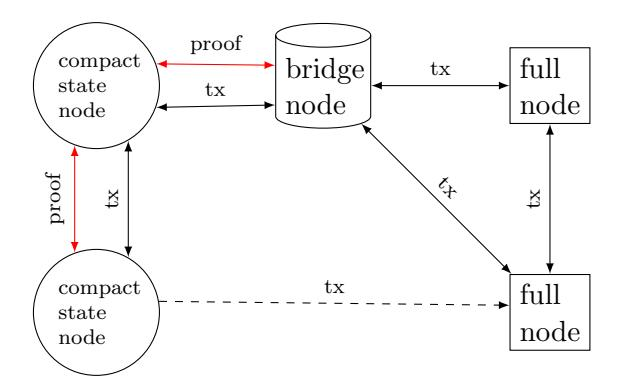

Figure 1: A bridge node connects the network of already existing full nodes to the network of compact state nodes. Full nodes propagate transactions (and blocks of transactions) to each other. Compact state nodes similarly propagate transactions, and also send inclusion proofs along with every transaction. Compact state nodes can send transaction messages to full nodes by omitting the inclusion proofs, but cannot receive transactions directly from full nodes, which are unable to provide proofs.

compact state nodes. The bridge node does not announce itself as such; to full nodes, it appears to be a standard full node, and to compact state nodes it appears to be a compact state node. While the bridge node links the two networks together, it is only needed to bridge in one direction: from the existing full node network to the Utreexo network. While the bridge node can send transactions from the Utreexo network to the full node network, so can any compact state node, as the data sent in the Utreexo network is a super-set of the data needed by full nodes.

## 4.6 Full and partial forest storage

Bridge nodes need to store the entirety of the hash forest data. An efficient storage mechanism for this is to store every hash sequentially in memory, and compute byte offsets to seek to a specific hash. This has no space overhead, but some I/O overhead when swapping elements. This can be implemented with a linear array of hashes, some of which remain unpopulated. We have also implemented the mapping of UTXO identifiers to leaf position in levelDB, so that bridge nodes can quickly provide an inclusion proof when they receive a transaction.

Compact state nodes need only store the tree roots, but as detailed in the next section, are able to trade some additional storage for reduced download size. To store partial forests, we use a variant of pointer-based binary trees where every node has two pointers to cousin nodes (the children of a node's sibling) rather than directly pointing to children. This allows efficient storage and processing of subsets of the forest, from the roots only to the entire forest (though if storing the entire forest, using a hash array is more efficient as no pointers are needed.)

# 5 Performance and Optimizations

# 5.1 Reducing proof length

While a single inclusion proof will be of log(n) size, we can send multiple simultaneous proofs in less space than sending each proof individually. The size reduction depends on the proximity of the leaves to be proven. Here are the two extreme examples: if two leaves are in different trees, there is no overlap in their proofs and two full-sized proofs are needed. If, however, the leaves are adjacent, then no additional data is needed and the second inclusion proof is obtained for free. When aggregating proofs, we send a sparse forest, covering every leaf to be proven, rather than a branch. Proof branches are provided only up to the point where they intersect an already provided branch. We can save even more space by omitting hashes that will be computed by the verifier; parent hashes can be omitted if both child hashes are contained in the proof. In the extreme case, the proof for all the leaves in a tree is just the leaves themselves, as all intermediate hashes can be computed from the leaves.

In Bitcoin, transactions are aggregated into blocks in order to be confirmed via proof-of-work. When compact state nodes propagate blocks, the existence of all UTXOs spent in the block (every input in the block) can be proven with a sparse forest. In cases where single transactions are being sent, a sparse forest proving all inputs within a transaction can be sent along with the transaction. To save bandwidth at the cost of some memory and complexity, clients can maintain their own sparse forest in memory. When sending a transaction, nodes send only the positions of the UTXOs consumed. Receiving clients then respond with a proof request, indicating which nodes in the forest are needed to get up to an intersection with nodes it already has in memory.

#### 5.2 Short trees

As the trees are of different heights, the length of an inclusion proof is dependent on the tree in which the leaf to be proven resides. Bitcoin's UTXO set exhibits a power-law distribution of UTXO durations, or the length of time between when a UTXO is created and when it is deleted. In fact, many UTXOs are created and destroyed within the same block, in which case we can ignore them as they have no effect on the accumulator. Among UTXOs that do persist, many only last a few blocks, while some last for hundreds of thousands. As we insert leaves into the forest on the right side, they will start off in the smaller trees, with shorter inclusion proofs. UTXOs which have made their way to the larger trees on the left tend to have been around for thousands of blocks, and proofs in the larger trees will be less frequent. The short-duration UTXOs will be added into short trees to the right and will be removed using smaller proofs, often with many adjacent leaves being deleted in the same block, which further reduces proof sizes.

# 5.3 Forest Caching Space/Space Trade-off

A node implementing the Utreexo accumulator can fully verify all inclusion proofs by storing only the roots of each tree in the forest, which on average is log(n)/2 hashes. The additional size of the inclusion proofs can be significant when initially synchronizing to the blockchain – if proofs are naively added to every transaction input, their size exceeds that of the transactions themselves.

The simplest way to reduce proof sizes is to eliminate redundant data among multiple proofs. Sending a sparse forest which simultaneously proves all inputs within a block, as described above, gives us the first significant space reduction.

Further proof size reductions can be achieved due to the redundancy of temporally rather than spatially distinct proofs. As noted above, many UTXOs persist only for a short duration. In the case where a UTXO persists for only a single block, the prover would be sending data that was known to (in fact computed by) the verifier just a single block prior. (In IBD scenarios, this could be a fraction of a second.) If the verifier had kept all the hash tree information they computed from the last block, they would not need proofs for these short-lived UTXOs.

While the idea of keeping extra data from the forest (which takes up space) seems counter to the point of using an accumulator (to take up less space), there are good reasons to do this. Without the ability to store and

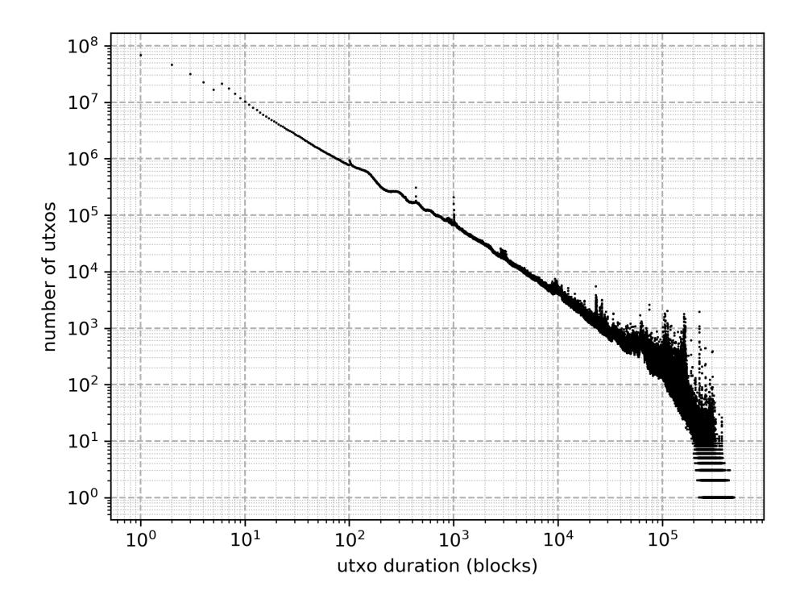

Figure 2: Distribution of UTXO duration in the Bitcoin blockchain. Short lifetimes are very common, and durations of 0 blocks even more so. 0 duration UTXOs are not displayed as they do not affect the accumulator (and don't fit on a log-scale x-axis). Note the distinct peaks at block durations of 6, 100, 433, and 1000. The 100 block delay for coinbase TXOs is a consensus rule, while the other peaks are likely due to user preferences and behavior.

remember parts of the forest, using an accumulator is all-or-nothing where the choices are to either run a traditional node with a database storing the entire UTXO set or an accumulator node with only a few hashes for tree roots. With the ability to store parts of the forest, this choice becomes a gradient, allowing users to select the memory vs. bandwidth trade-off they wish to make.

At one extreme of this gradient, nodes minimize storage and memory requirements, keeping only the roots of the hash trees, which never exceed a kilobyte. At the other extreme, nodes cache the entire hash forest and do not need downloaded proofs at all, just like a node with the full UTXO set (this is in fact a bridge node). Between these two extremes, there is

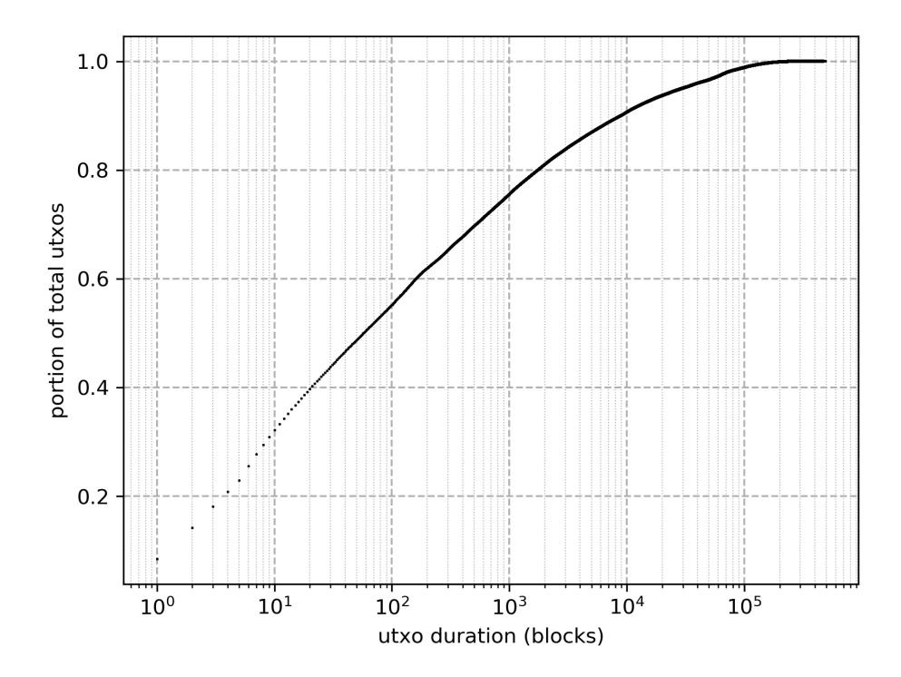

Figure 3: Fractional distribution of UTXO duration in the Bitcoin blockchain. This is another view of the same data from Figure 2. From this plot we can see that 40% of UTXOs last for 20 blocks or less, suggesting that a look-ahead cache of 20 blocks can reduce proof sizes by approximately 40%.

a gradual trade-off between network traffic and in-ram or on-disk storage. The more of the forest a node caches, the smaller the proofs it will need to download. Fortunately, due to the fact that transaction data exhibits a power-law distribution in the duration of UTXOs, this trade-off is not linear. The first few megabytes of caching space give a large reduction in proof download size, after which there are diminishing returns as more memory is devoted to forest caching. For the amounts of memory we would expect to see in low cost, widely used computing devices, the download overhead for IBD is quite reasonable.

Another advantage of storing partial forest data is that non-root data is easily recoverable. The partial forest data can be stored in volatile memory and not copied to persistent disk, with only the forest roots being maintained on disk. A node can forget all forest data except for the accumulator roots when it shuts down, and resume synchronization later. The node will need to download additional data (the hashes forgotten) but will not have to backtrack in the synchronization process.

### 5.4 What to cache

When a client is performing IBD and decides to cache some portion of the forest data, what should they retain, and what should they forget? A simple, but still fairly effective strategy would be to remember all leaves added to the forest until either they are removed, or some number of blocks (the look-back period) have passed, at which point they are forgotten. Given the distribution of TXO lifetimes, a small look-back period can significantly reduce the sizes of proofs.

Look-back caching is sub-optimal, however, as it would store many nodes for a period and then forgot them before they are used. The space these nodes took up was wasted, as they displaced other nodes which could have potentially reduced proof sizes. While this problem is generally unavoidable in caching algorithms, we can prevent this from happening completely in the case of IBD. The server which stores the blocks and inclusion proofs is already fully synchronized, and for every TXO created, it knows in which block (if any) that TXO is consumed. (For TXOs still in the UTXO set, the server considers that block to be "never".) Servers can send this time to live (TTL) value to the synchronizing client as a hint, allowing the client to cache look-ahead nodes rather than look-behind nodes. This also removes the need for the client to keep track of the insertion time of the cached leaves, as leaves are eliminated from memory only when the TXO is spent, and never from cache eviction.

The look-ahead caching is dependent on the cooperation of the IBD server. While this server provides a hint of the UTXO's TTL, the server does not provide any cryptographic proof for it. Such a proof could be constructed using SPV proofs of transactions spending the TXO. Unfortunately the size of such proofs would offset all download savings from the look-ahead, defeating the purpose of sending them. While the IBD node is "trusted" to give TXO TTL hints, this trust is only for an optimization, and the worst a malicious IBD server can do is cause the client to cache leaves inefficiently, resulting in higher network transfer sizes (which the server also suffers itself). A client could perform spot checks on the hints the server provides and disconnect from a server providing erroneous information.

IBD presents an unusual optimization scenario in that not only are TXO TTLs known ahead of time, but TXO arrivals are known before they happen as well. In fact, the entire sequence of TXO insertion and removal is fully known at the outset of the IBD process. Thus for a given amount of memory there is a deterministic, optimal caching schedule which can be precomputed. The caching schedule can be represented as a single bit for every TXO, with 0 meaning "immediately forget" and 1 meaning "remember until spent". We anticipate that the optimal selection algorithm in [10] can be effectively applied to reduce the proof sizes for IBD beyond the reductions provided by look-ahead caching. These caching schedules will be of reasonable size (on the order of 100MB) and are likely amenable to standard compression algorithms, unlike most of the data we deal with here, such as hashes and signatures.

We have left implementation of the clairvoyant cache scheduling for later work. We have implemented the simpler look-ahead caching to measure network traffic requirements for IBD, as detailed below. While implementing this caching strategy we observe that a fixed block look-ahead, while better than look-behind, is sub-optimal, and thus there may still be room for significant space savings. One easily observed deficiency is the highly variable amount of memory used. Client machines generally have a fixed amount of memory to be used for running Bitcoin, which would ideally be full, or close to full, at all times. In the early blocks of Bitcoin's blockchain, there are few transactions, and many blocks with no TXOs consumed at all. Thus clients with, for example, 100MB to dedicated to caching are using only a small fraction of that in the first half of the IBD process. Even in later blocks with higher transaction rates, there is still significant variability in memory usage for a fixed look-ahead strategy.

### 5.5 Measuring Performance

We implemented a Utreexo library and IBD simulator. This simulator iterates through the Bitcoin blockchain up to block 546000, adding and removing TXOs from the accumulator. We used blake2b as our hash function, and wrote the implementation in Go, compiled with go1.10.4 linux/amd64. Simulations were run on a machine with an AMD Ryzen 7 1700 processor and 32GB of RAM, running Ubuntu 18.04. Our implementation is publicly available at [11].

Given the power-law-like distribution of UTXO TTLs, we would expect a similar curve for download size as cache sizes increase, and our observed performance is in keeping with this expectation. We measured peak memory usage for the entire program, and had a minimum memory usage of approximately 80MB (likely due to database and other runtime memory usage). Due

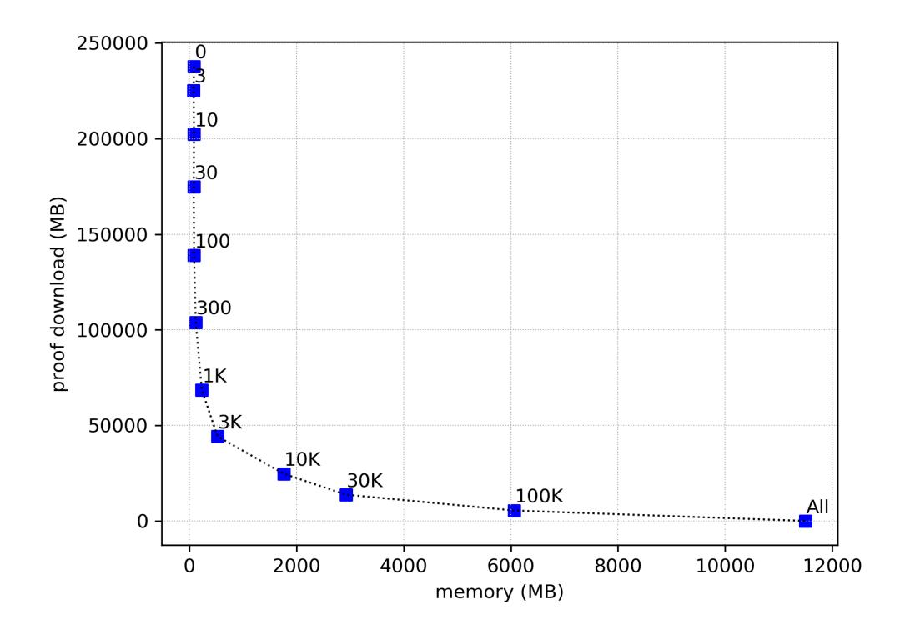

Figure 4: IBD proof size vs cache size. Labels on the points are the number of look-ahead blocks.

to this fixed overhead, very small lookahead values of 1, 3, or 10 blocks do not seem useful. Given that memory usage will be at least 80MB (and likely more for a real, rather than simulated node) saving a few megabytes of cache memory is undetectable, while the increase in download size is significant.

As we increase cache sizes, we see diminishing returns, and it takes nearly 12GB of memory to completely eliminate all proof downloads. With settings of this size the Utreexo design might seem superfluous as well – no proofs are ever given, and the client is storing the entire forest, which is larger than the standard UTXO set database. There are still advantages however, in that this node keeps the forest in volatile memory, only writing the tree roots to disk. There may be machine configurations with large amounts of volatile memory but limited non-volatile storage I/O.

With moderate amounts of memory, caching offers significant improvements for lower-end hardware with mechanical hard drives. A low-cost laptop with 4GB of RAM and a 500GB mechanical drive can use a lookahead value of 1000 blocks, which uses 234MB of RAM and gives an IBD download overhead of about 33%. We hope to bring this overhead down in the future with improved caching techniques.

## 5.6 Hardening against collision attacks

In addition to better caching techniques, another promising method to reduce proof sizes is to reduce the length of individual hash outputs. At first glance, truncating hashes may seem unsafe, but Bitcoin offers a unique environment which can help mitigate collision attacks on reduced length hashes.

As an attacker (especially a miner) has significant control over the accumulator's Merkle forest, one might expect that a collision-resistant hash function is required to prevent the attacker from creating invalid proofs (inclusion proofs for elements not previously added). In Bitcoin's case, however, we can make collision attacks infeasible, such that an attacker would instead need to perform a second preimage attack.

We assume an attacker who also is able to mine a block, and thus influence a number of leaf insertions, their positions, and the data they contain. The simplest attack would be to create TXOs txo and txo<sup>0</sup> , where h(txo) = h(txo<sup>0</sup> ). txo is an output from a valid transaction which all nodes on the network will confirm, while txo<sup>0</sup> is a made-up output of a million bitcoins that is not part of any valid transaction. The attacker can then provide an inclusion proof for txo<sup>0</sup> , and spend the million bitcoins even though only txo has been inserted into the accumulator.

As the attacker is able to freely create both txo and txo<sup>0</sup> , the attacker can mount a collision attack, which takes on the order of 2n/<sup>2</sup> computations, where n is the bit-length of the hash output. If we can restrict the attacker's ability to create either side of the collision (the hash being inserted or the hash being falsely proven) this attack is no longer feasable.

To prevent such an attack, we require that the data inserted into the accumulator be not just the hash of a TXO, which is controllable by the attacker, but instead the concatenation of the TXO data with the block hash in which the TXO is confirmed. The attacker does not know the block hash before the TXO is confirmed, and it is not alterable by the attacker after confirmation (without significant cost). Verifiers, when inserting into the accumulator, perform this concatenation themselves after checking the proof of work of the block. Inclusion proofs contain this block hash data so that the leaf hash value can be correctly computed.

This additional data thwarts collision attacks as the attacker needs to find a block (which currently takes more than 2<sup>70</sup> hash operations) to create a single txo. txo<sup>0</sup> can still be iterated through rapidly, as the attacker can use any previously computed block hash in their proof of txo<sup>0</sup> . The number of operations required to mount a collision attack when attempts on one side are more difficult can be computed by

$$s = 2^{\frac{d+n}{2}}$$

where d is the difficulty exponent, n is the size of the hash output in bits, and s is the resulting security against collisions. For collision attacks on 256-bit hashes, with 2<sup>70</sup> work required on one side, this would give 2<sup>163</sup> operations for a collision.

A second preimage attack, where txo is fixed and txo<sup>0</sup> alone can be iterated through, would seem to need 2<sup>256</sup> operations to succeed. However, the attacker doesn't need to collide with txo, but can in fact collide with any leaf present in the accumulator. This means the attack gets easier as the accumulator becomes larger; for 2<sup>32</sup> elements, the attack takes 2<sup>192</sup> attempts.

The security gain from mitigating collision attacks can be used to decrease the proof size by truncating the output length of all hashes computed. For a 2<sup>128</sup> security parameter, and an anticipated UTXO set size of 2<sup>32</sup> or fewer, we estimate that hash outputs of 186 bits would suffice. This would result in a 27% reduction in proof size with minimal complexity. However, if the UTXO set increases, security could be degraded as second preimage attacks become easier to mount. Once hashes are truncated, it's not possible to retroactively increase the output size, and instead the accumulator would need to be rebuilt from scratch with larger hash outputs. Additionally, the proof-of-work required to create a block in Bitcoin can decrease, which would also erode the protection from collisions the block hash provides.

Further protection from untargeted second preimage attacks may be gained by also committing to the leaf's position in the leaf data. In this case the leaves would be of the form h(txo||blockHash||position), where position is the integer index of the leaf position. This would require the attacker to select a single leaf to target for colliding instead of allowing the attacker to collide with any leaf in the forest. However, this technique is not applicable to our construction as leaves within the forest move due to deletions, and thus the position data salted into the hash will generally differ from the leaf position when the leaf is removed. The complexity of tracking leaf movements seems to overwhelm any savings from this technique, but we mention this idea as a different accumulator construction, possibly closer to that in [8] may allow for fixed leaf positions and shorter proofs while still being secure.

# 6 Conclusion

We have introduced a hash-based dynamic accumulator and architecture for using this accumulator in the Bitcoin network. Nodes using the accumulator need only store a logarithmically sized representation of the UTXO set, greatly reducing storage space and disk seek times. The trade-off is the additional download requirements of inclusion proofs, but with proof aggregation and caching the increase is of a manageable size.

# Acknowledgments

Thanks to Neha Narula and Cory Fields for discussion without which this paper would not have happened. Thanks to Pieter Wuille for discussions about the applicability of other accumulator designs and the difficulties of bridge nodes (as well as coining the term). Thanks to Sophia Yakoubov for discussing her work which can be extended and applied here. Thanks to Kalle Alm for discussion about caching strategies, Dan Cline for suggesting optimal caching strategies, and Peter Malamud Smith for comments and feedback.

# References

- [1] Satoshi Nakamoto. Bitcoin: A peer-to-peer electronic cash system. http://bitcoin.org/bitcoin.pdf, 2008.
- [2] James A. Donald. Re: Bitcoin p2p e-cash paper. http: //www.metzdowd.com/pipermail/cryptography/2008-November/ 014814.html, 2008.
- [3] Peter Todd. Making utxo set growth irrelevant with lowlatency delayed txo commitments. https://petertodd.org/2016/ delayed-txo-commitments, 2016. Accessed: 2019-05-10.
- [4] Tom Elvis Jedusor. Mimblewimble. http://diyhpl.us/~bryan/ papers2/bitcoin/mimblewimble.txt, 2016. Accessed: 2019-05-22.
- [5] Dan Boneh, Benedikt Bnz, and Ben Fisch. Batching techniques for accumulators with applications to iops and stateless blockchains. Cryptology ePrint Archive, Report 2018/1188, 2018. https://eprint.iacr. org/2018/1188.

- [6] Josh Benaloh and Michael de Mare. One-way accumulators: A decentralized alternative to digital sinatures (extended abstract). In EURO-CRYPT, 1993.
- [7] Ralph C. Merkle. Protocols for public key cryptosystems. 1980 IEEE Symposium on Security and Privacy, pages 122–122, 1980.
- [8] Leonid Reyzin and Sophia Yakoubov. Efficient asynchronous accumulators for distributed pki. Cryptology ePrint Archive, Report 2015/718, 2015. https://eprint.iacr.org/2015/718.
- [9] Charles Bouillaguet, Pierre-Alain Fouque, Adi Shamir, and Sebastien Zimmer. Second preimage attacks on dithered hash functions. Cryptology ePrint Archive, Report 2007/395, 2007. https://eprint.iacr. org/2007/395.
- [10] Laszlo A. Belady. A study of replacement algorithms for a virtualstorage computer. IBM Systems journal, 5(2):78–101, 1966.
- [11] MIT DCI. Utreexo implementation. https://github.com/mit-dci/ utreexo, 2019.

# 7 Appendix

# 7.1 Batch deletion process

The following is a description of the batch deletion process. While the single element deletion process is sufficient and can be invoked repeatedly, it is inefficient to do so. When many deletions occur simultaneously we can significantly reduce the number of hash operations needed to remove elements from the accumulator by batching the deletions.

Similar to the DeleteOne() function, the process for deleting many elements operates a row at a time, climbing from the bottom to the top of the forest. At each row, the same phases are followed. The data operated on at each row, includes the known hashes and their positions, as well a list of which locations to delete. The phases are, in order: "Twin", or twin extraction, "Swap", or sibling swapping, "Root", promoting a node to or demoting a node from a root position, and "Climb", ascending to the next row up. These 4 phases are described with accompanying diagrams. In the following diagrams, green nodes are nodes which are always known, as they are or were tree roots. Pink nodes are nodes which are being deleted.

## 7.2 Twin

While the twin step is optional, we can save time from the next step by immediately dealing with "twin" deletions; we define a twin deletion as a deletion where both the left and right sibling have been deleted. If we have a sorted list of locations to be deleted, a simple way to find these is to check if the next deletion is equal to the current deletion bitwise or'ed with 1. If so, we can remove both "twins" from the deletion list, and add the parent position to the next higher row of deletions to process.

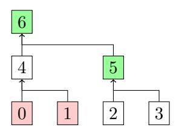

Figure 5: Twin phase; nothing moves, and 4 is marked for deletion.

## 7.3 Swap

While there are 2 or more deletion positions left in the list, we iterate through them. Call the two positions deletionA and deletionB.

Move the hash at deletionB ⊕ 1 to deletionA. When moving a node, all the node's children move with it. The parent of deletionB is added to the deletion list for the next row, and both deletionA and deletionB are removed from the current list. Note that in all cases we know the hash at deletionB⊕1, as it is the sibling of something being deleted (or the sibling of a parent of something being deleted) and thus is given to us in the inclusion proof.

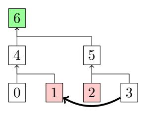

Figure 6: Swap phase; deletionA is 1, deletionB is 2. 3 moves to 1, and 5 is marked for deletion.

## 7.4 Root

If there are an even number of deletions on a row, the twin and swap phases will finish with no unpaired deletions, and the root phase is skipped. In cases where there are an odd number of deletions, however, the swap phase will finish with a single deletion remaining in the list. This final deletion is handled by the root phase.

For every row in the forest, there either is or is not a tree with a root at that height. For example, in the forest of 133 leaves, there is a root at height 0, but there is no root at height 1. There is a root at height 2, and no roots for several rows above that.

If we are on a row where a root is present, we move that root into the position of the remaining deletion, clear the deletion and are then finished with that row, adding no deletions for the next row. If a root is absent, we move the sibling of the deletion (position ⊕ 1) to the root position for this height, creating a new tree in the forest, and leaving a twin pair of deletions. We then mark the parent of the final deletion for deletion in the next row.

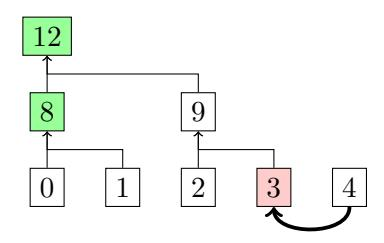

Figure 7: Root phase with root present; 4 is demoted from a root to the sibling of 2.

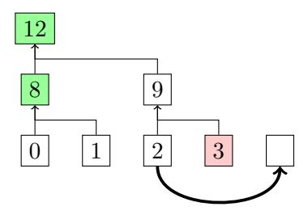

Figure 8: Root phase with root absent; 2 is promoted to root of the height 1 tree.

## 7.5 Climb

When the root phase has finished, the climb phase transitions between levels of the forest. All deletions will be in pairs of two deleted siblings. The parent nodes of all deleted sibling pairs are marked as deleted, and parents of nodes which moved in the swap or root phase are recomputed. When the deletion and hashing are finished, the per-row phases (starting with twin) begin on the next level up.

When the top of the forest is reached, the deletion process is finished. If a row is reached with no deletions, the process can terminate early.

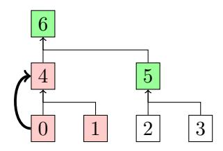

Figure 9: Climb phase; Begin a new deletion list from positions marked in the previous other 3 phases and climb to the next row.

## 7.6 Integrated batched deletion example

In this example, there are 8 leaves in a single tree. Leaves 5 and 6 are being deleted. An inclusion proof for both 5 and 6 is provided. Note that an inclusion proof for these nodes does not contain any nodes from the 2nd row, as both 10 and 11 are computable from data known in the first row.

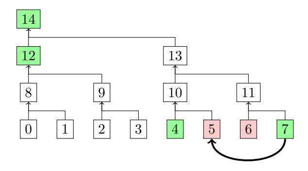

Figure 10: There are no twins, so first 7 is swapped with 5

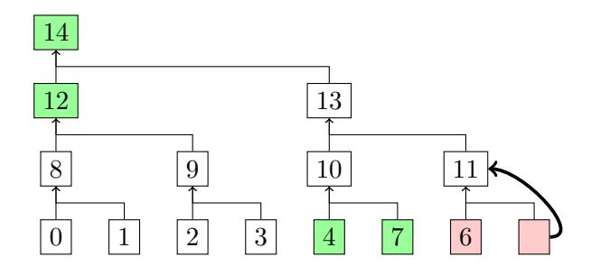

Figure 11: The bottom row is finished and 11 is marked for deletion as its children are gone. 10 is computed.

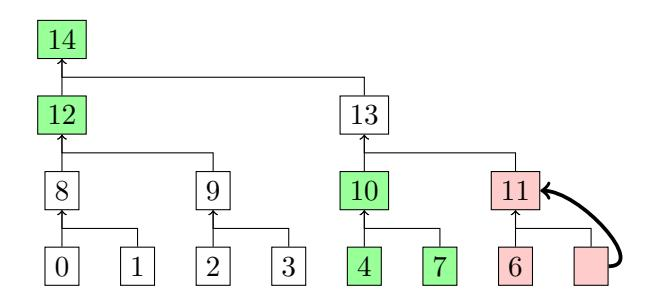

Figure 12: On the second row, there are no twins, and we cannot swap, so we proceed directly to root.

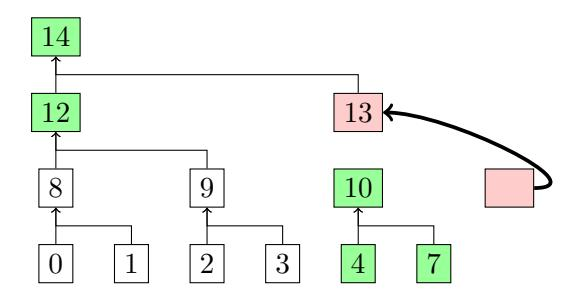

Figure 13: 10 becomes the root of its own tree, leaving 13 to be deleted as well.

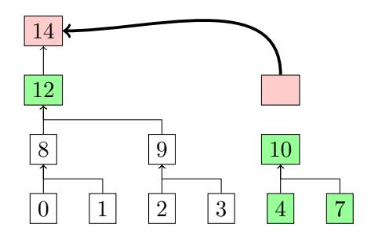

Figure 14: 14 is deleted as 12 becomes the root of its tree.

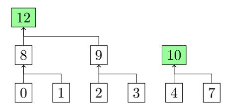

Figure 15: The final forest state after deletion is complete.