# **Extended Truncated-differential Distinguishers on Round-reduced AES**

Zhenzhen Bao<sup>1</sup> , Jian Guo<sup>1</sup> and Eik List<sup>2</sup>

<sup>1</sup> Division of Mathematical Sciences, School of Physical and Mathematical Sciences, Nanyang Technological University, Singapore {zzbao,guojian}(at)ntu.edu.sg <sup>2</sup> Bauhaus-Universität Weimar, Weimar, Germany eik.list(at)uni-weimar.de

**Abstract.** Distinguishers on round-reduced AES have attracted considerable attention in the recent years. While the number of rounds covered in key-recovery attacks did not increase, subspace, yoyo, mixture-differential, and multiple-of-*n* cryptanalysis advanced the understanding of the properties of the cipher.

For substitution-permutation networks, integral attacks are a suitable target for extension since they usually end after a linear layer sums several subcomponents. Based on results by Patarin, Chen et al. already observed that the expected number of collisions for a sum of permutations differs slightly from that for a random primitive. Though, their target remained lightweight primitives.

The present work illustrates how the well-known integral distinguisher on three-round AES resembles a sum of PRPs and can be extended to truncated-differential distinguishers over 4 and 5 rounds. In contrast to previous distinguishers by Grassi et al., our approach allows to prepend a round that starts from a diagonal subspace. We demonstrate how the prepended round can be used for key recovery with a new differential key-recovery attack on six-round AES. Moreover, we show how the prepended round can also be integrated to form a six-round distinguisher. For all distinguishers and the key-recovery attack, our results are supported by implementations with Cid et al.'s established Small-AES version. While the distinguishers do not threaten the security of the AES, they try to shed more light on its properties.

**Keywords:** Cryptanalysis · AES · Permutation · Collision · Differential · Expectation · Distinguisher

# **1 Introduction**

**During the previous two decades,** the Advanced Encryption Standard (AES) [\[Nat01\]](#page-36-0) has withstood vast amounts of cryptanalysis. Besides the biclique-based accelerated exhaustive search [BKR11],[1](#page-0-0) the best-known attacks on AES-128 in the secret-key model cover seven rounds, as had been the state of the art close after its announcement [FKL<sup>+</sup>00]. However, the community's efforts led to attacks with considerably reduced resources. Among the key-recovery attacks that cover that most rounds [BLNS18, DFJ13, FKL+00, MDRM10], the meet-in-the-middle attacks by Derbez et al. possess the lowest time and data complexities since 2013 [DFJ13]. Their attacks were based on Demirci and Selçuk's [DS08] variant of the earlier collision attack by Gilbert and Minier [GM00].

<span id="page-0-0"></span><sup>1</sup> Instead of exploiting dedicated properties of a given cipher, biclique-based attacks [BKR11] usually represent a general approach to speed up brute force since their outer loop iterates over all possible keys. Some works consider it therefore as accelerated exhaustive search instead of an attack cf. [DDKS13].

Although the number of rounds covered in key-recovery attacks has stagnated, the recent years were filled with research on distinguishers on round-reduced AES that significantly raised the understanding of the cipher's components. This direction appears promising – metaphorically, it is comparable to heuristics that sometimes also have to leave a local optimum to improve in the long run.

# **1.1 Distinguishers on Round-reduced AES**

**Negative results** paved a rocky start for the search for new distinguishers. Sun et al. [SLG<sup>+</sup>16b] proved the absence of impossible differentials over more than four rounds for the AES *structure*, which was tantamount with the absence of zero-correlation distinguishers over more than four rounds [SLR<sup>+</sup>15].[2](#page-1-0) Since [SLG+16b] ignored the details of the AES S-box and its key schedule, there remained a spark of hope for longer distinguishers of those kinds. The works by Wang and Jin [WJ18, [WJ19\]](#page-38-0) extinguished this spark. Under the assumption of independent random round keys, they showed the absence of any (truncated) impossible differentials over more than four-round of the AES taking also the details of the S-box into account.

**Key-dependent Distinguishers.** Despite the negative results, a series of works has been focusing on novel properties for distinguishers on fewer rounds than the best known attacks. First, several key-dependent distinguishers were crafted, e.g., the chosen-ciphertext zerocorrelation hull on five rounds by Sun et al. [SLG<sup>+</sup>16a] exploited a known difference in two key bytes to cover five rounds. While their distinguisher required the full codebook when converted to the single-key model, it re-ignited the community's efforts on analyzing round-reduced AES. Subsequent works [CCM<sup>+</sup>18, GRR16, Gra18a, HCGW18] improved on their result and proposed further key-dependent results. To the best of our knowledge, among the attacks on round-reduced AES with a single secret S-box [TKKL15], the lowest complexity so far is achieved by that by Dunkelman et al. [DKRS20]. Besides others, their work proposed two attacks in that setting: one with 2<sup>25</sup>*.*<sup>8</sup> adaptive chosen ciphertexts and the same computational complexity, and a second one with 2<sup>29</sup> computations and 2<sup>17</sup>*.*<sup>5</sup> adaptive chosen ciphertexts.

# **1.2 Key-independent Distinguishers on Round-reduced AES**

**Besides key-dependent results,** several powerful key-independent distinguishers have been proposed recently. In a series of works [GRR16, GRR17, GR18, Gra18b], Grassi et al. outlined novel observations and distinguishers on five-round AES. At their core, [GRR17] observed a strong property dubbed multiple-of-*n*: using all pairs from a diagonal space, the number of different ciphertext pairs that belonged to the same coset of a mixed space was always a multiple of *n* after five rounds. Boura et al. [BCC19] revisited the multiple-of-*n* property and derived similar distinguishers for further AES-like primitives.

**Mixture-differential Distinguishers.** In [Gra17, Gra18b], Grassi proposed mixture-differential distinguishers. Mixtures are couples of pairs that start from a pair of plaintexts (*P, P*′ ) that differ in multiple components, say values (*x, y*) in *P* and (*x* ′ *, y*′ ) in *P* ′ . A second plaintext pair (*P* ′′*, P*′′′) with byte values (*x, y*′ ) and (*x* ′ *, y*) is created from mixing the differing components such that the input difference remains invariant, and their corresponding ciphertext pairs lie in a coset of the same subspace. In [Gra18b], Grassi published an efficient four-round distinguisher and a five-round key-recovery attack from

<span id="page-1-0"></span><sup>2</sup>Sun et al. [SLR+15] showed that the existence of an impossible differential on a cipher E implies the existence of affine layers A<sup>1</sup> and A<sup>2</sup> such that there is an integral and a zero-correlation distinguisher on A<sup>2</sup> ◦ E ◦ A1.

<span id="page-2-0"></span>**Table 1:** Existing secret-key distinguishers on five and more rounds of the AES-128, ordered by rounds (descending) then time (ascending). MAs = memory accesses; Encs. = r-round AES encryptions; CP = chosen plaintexts; (A)CC = (adaptive) chosen ciphertexts; MD = mixture differential; TD = truncated differential. \*: We employ the updated parameters from [GR19]. The original distinguishers had been proposed in [GR18].

| Attack type                     | Time                | Time  |                   |                     | Ref.           |  |
|---------------------------------|---------------------|-------|-------------------|---------------------|----------------|--|
| Five Rounds                     |                     |       |                   |                     |                |  |
| Integral                        | $2^{128}$           | XORs  | $2^{128}$         | CC                  | $[SLG^+16a]$   |  |
| Impossible Differential         | $2^{107}$           | MAs   | $2^{98.2}$        | CP                  | [GRR16]        |  |
| Threshold MD                    | $2^{98.1}$          | MAs   | $2^{89}$          | CP                  | [Gra17]        |  |
| Impossible MD                   | $2^{97.8}$          | MAs   | $2^{82}$          | $\operatorname{CP}$ | [Gra17]        |  |
| Truncated differential          | $\mathbf{2^{73.3}}$ | MAs   | $\mathbf{2^{68}}$ | $\mathbf{CP}$       | Sect. 5        |  |
| Probabilistic MD                | $2^{71.5}$          | MAs   | $2^{52}$          | CP                  | [Gra19, Gra17] |  |
| Truncated differential $^\star$ | $2^{52.6}$          | MAs   | $2^{48.96}$       | $\operatorname{CP}$ | [GR18, GR19]   |  |
| Variance of $TD^*$              | $2^{37.6}$          | MAs   | $2^{34}$          | CP                  | [GR18, GR19]   |  |
| Multiple-of-8                   | $2^{35.6}$          | MAs   | $2^{32}$          | CP                  | [GRR17]        |  |
| Yoyo                            | $2^{26.2}$          | XORs  | $2^{27.2}$        | ACC                 | [BR19a]        |  |
| Yoyo                            | $2^{25.8}$          | XORs  | $2^{26.8}$        | ACC                 | [RBH17]        |  |
| Six Rounds                      |                     |       |                   |                     |                |  |
| Impossible Yoyo                 | $2^{121.83}$        | XORs  | $2^{122.83}$      | ACC                 | [RBH17]        |  |
| Truncated differential          | $2^{96.52}$         | MAs   | $2^{89.43}$       | $\mathbf{CP}$       | Sect. 7        |  |
| Exchange                        | $2^{88.2}$          | Encs. | $2^{88.2}$        | CP                  | [BR19b, BR19c] |  |
| Exchange                        | $2^{83}$            | Encs. | $2^{83}$          | ACC                 | [Bar19]        |  |

[Gra17]. Bar-On et al. [BODK $^+$ 18, BDK $^+$ 20] improved the key-recovery to the attack on five-round AES to  $2^{24}$  chosen plaintexts and operations. Dunkelman et al. [DKRS20] introduced conditional boomerangs for five-round attacks with the lowest time and data complexities so far: one with  $2^9$  adaptive chosen plain- and ciphertexts (ACCs) and  $2^{23}$  encryptions, and one with  $2^{15}$  ACCs and  $2^{16.5}$  operations.

In [Gra19], Grassi further published a probabilistic mixture-differential distinguisher on five rounds as well as a key-recovery attack on six rounds from [Gra17]. The latter version also contained further threshold as well as an impossible mixture-differential distinguisher. The probabilistic distinguisher exploited a tiny difference between two expectations: the expected number of sets with at least one pair whose both ciphertexts belong to the same coset of a subspace is a little lower for five-round AES than for a random permutation. Grassi's threshold distinguisher exploited different expectations between sets of couples. Each set was formed by couples whose both plaintexts mixed the byte values in two diagonals and differed only in those two diagonals. Finally, he considered an impossible mixture-differential distinguisher.

To the best of our knowledge, the best previously published distinguishers on round-reduced AES-128 in terms of minimal complexity are the exchange/yoyo-based proposals by Rønjom and Bardeh [BR19b, BR19c]. They extended their earlier yoyo attacks from [RBH17] and reduced the complexity to about  $2^{88}$  encryptions and chosen plaintexts. Bardeh [Bar19] recently proposed a variant with adaptively chosen ciphertexts with  $2^{83}$  data and time complexity. Note that the attacks by [DKRS20] represent a follow-up work that follows this direction, but considers distinguishers on fewer rounds. Table 1 provides a summary of existing distinguishers on five or more rounds of AES-128; note that many results hold for diverse versions of the AES; however, the focus of this work lies on the 128-bit variant.

#### 1.3 From Integral to Truncated-differential Distinguishers

Integral Distinguishers map multi-sets of inputs that iterate over all values to multi-sets of outputs that are balanced. Traditionally, the properties of bits or bytes are either constant (C), iterate over all values (A), are balanced (B), or unknown (U). A traditional integral distinguisher usually ends directly before all parts of the state become unknown. For the AES, the three-round integral distinguisher [DKR97] that maps sets of a single active byte to a set of states where each byte is balanced after three rounds is understood well, and so is the extension to a distinguisher on four rounds [DKR97, FKL<sup>+</sup>00] that prepends a round and starts from an active diagonal.

Extending Integrals To Truncated-differential Distinguishers. The core observation at the beginning of this work was that an integral distinguisher usually ends with a sum operation. In many Substitution-Permutation Networks (SPNs), the linear layer often consists of a sum of multiple words. At the end of an integral distinguisher, such a sum is equivalent to the sum of words that iterate over all values in the subspace—hence, a sum of permutations. The sum still has a Balanced (i.e., zero-sum) property, which is usually destroyed by the subsequent non-linear layer. As illustrated in [Pat08, Pat13], the number of collisions induced by a sum of permutations differs slightly from that of an ideal function. The sum in the linear layer preserves this number of collisions through the subsequent S-box operation. Therefore, an integral distinguisher can be extended through the subsequent non-linear operation.

We point out that Chen et al. [CMSZ15] had already considered this approach of Patarin's analysis for extending integrals of SPNs. They considered Type-II and Nyberg-type Feistel networks and conducted experiments on lightweight ciphers for which they could confirm that this strategy can lead to extended attacks. This work, however, focuses on the AES. We view such extended integrals as truncated differentials because we consider partial collisions in particular words.

A similar direction was followed by Heys (and Liu) [Hey14] for extending integrals on BSPN [YTH96], a byte-wise variant of [HT96]. Besides adapting the deterministic integrals on three- and four-round AES, they studied a probabilistic extension of obtaining a zero sum in the individual bytes after three rounds that allows them to be traced through the subsequent round. We added similar experiments on Small-AES in Appendix G.

**Probabilistic Integrals.** Integral distinguishers map a structure of  $2^s$  inputs that iterate over all values to b pairwise disjoint sets of t output bits each that are uniformly distributed. Wang et al. [WCC<sup>+</sup>16] proposed so-called statistical integrals, whereing they could reduce the data requirements to  $2^{s-t/2}$  texts. Cui et al. [CSCW17, CCM<sup>+</sup>18] transferred the approach to the AES and AES-like ciphers and exploited multiple structures on input and several integral properties on output. If  $N_s$  structures are necessary and consider b pairwise disjoint sets of t-bit output, their approach reduced the data complexity further to  $O(\sqrt{N_s/b} \cdot 2^{s-t/2})$ . Though, this approach does not directly aim at extending distinguishers but represents a data-reduction technique instead. The statistical integral distinguisher on five-round AES in [CSCW17, CCM<sup>+</sup>18] has been built upon the zero-correlation linear hull for five-round decryption of AES by Sun et al. in [SLG<sup>+</sup>16a], but has a great improvement in terms of data and time complexity (from  $2^{128}$  to  $2^{114.32}$  chosen ciphertexts). Moreover, inherited from [SLG<sup>+</sup>16a], the distinguisher by Cui et al. was in the secret-S-box setting.

Previous Truncated-differential Distinguishers on the AES. In [GR18], Grassi and Rechberger also considered truncated differentials and exploited smaller statistical differences. The core results are five-round distinguishers that exploit the following property of the AES: A structure of  $2^{32}$  plaintexts from a single diagonal space is mapped to a

mixed space through two rounds of AES with probability one; With a certain probability, it is mixed again to a single diagonal space after Round 3, from which it is mapped to a mixed space through two further rounds as before. Grassi and Rechberger observed that the probability for the transition in the middle is slightly higher for five-round AES than for a random permutation. Furthermore, they show how to exploit the considerably different variances. Their results are similar to ours; however, we start from a different angle (from integrals), whereas their work did not depend on Patarin's result. In contrast, the mean-based distinguishers in [Gra17, Gra19] considered the expectation of couples, whereas we consider pairs.

Contribution. This work tries to extend the known integral to truncated-differential distinguishers. As a result, it describes a five-round distinguisher from a single byte to a mixed space. Since inputs start from single-byte differences, plaintext structures can form fewer pairs than in e.g., the structures from diagonals as in [GR18]. As a consequence, the data and computational complexity of the five-round distinguisher here are higher than those of the probabilistic distinguishers in [GR18], but our proposal allows a straightforward extension to a six-round key-recovery attack by prepending a round. We present the results of a practical implementation of the five-round distinguisher and the six-round key-recovery attacks with a small-scale variant of the AES. Finally, we propose a possible extension to a six-round truncated-differential distinguisher and report our results of its implementation for the small variant.

**Outline.** The remainder is structured as follows. Next, Section 2 revisits the necessary preliminaries, as well as the known results by Patarin on sums of independent permutations and subspaces of the AES by Grassi et al. [GRR16], and briefly recalls the integral distinguishers of round-reduced AES. Section 3 provides a statistical model. Thereupon, Section 4 develops from them a four-round truncated distinguisher. Section 5 proceeds similarly for a five-round distinguisher. Section 6 describes a key-recovery attack on six rounds based on our five-round distinguisher. Section 7 derives a six-round distinguisher. We provide theoretical analysis for all distinguishers for both the AES as well as for Small-AES, and report on our results of experimental verification with the latter. Similarly, we implemented also the key-recovery on six rounds with Small-AES and provide insights to our results. The code to all our experiments is freely available online.<sup>3</sup> Section 8 discusses and concludes this work.

## <span id="page-4-0"></span>2 Preliminaries

**General Notations.** We denote by  $\mathbb{F}_2$  the finite field of characteristic two. We represent functions and variables by upper case letters and indices by lowercase letters, sets by calligraphic letters. We employ typewriter font for hexadecimal values. Let  $X,Y\in\mathbb{F}_2^n$  for some positive integer n in the following. Then, we denote by  $X\parallel Y$  the concatenation of X and Y, by  $X\oplus Y$  their bitwise XOR. For all  $X\in\mathbb{F}_2^n$ , we index the bits  $X=(X_{n-1}\ldots X_1X_0)$  where  $X_{n-1}$  is the most significant and  $X_0$  the least significant bit of X. For integers  $x\geq y$ , we write  $X_{x...y}$  as short form of  $(X_xX_{x-1}\ldots X_y)$ . We denote by  $\mathbb{E}[X]$  the expectation of a random variable X, by  $\sigma_X$  its standard deviation, and by  $\sigma_X^2=\mathsf{Var}[X]$  its variance.  $\mu$  and  $\sigma$  represent the mean and the standard deviation of a distribution.

**Functions and Permutations.** For sets  $\mathcal{X}$  and  $\mathcal{Y}$ , we define  $\mathsf{Func}(\mathcal{X},\mathcal{Y}) = ^{\mathsf{def}} \{F|F: \mathcal{X} \to \mathcal{Y}\}$  and  $\mathsf{Perm}(\mathcal{X})$  for the set of all permutations over  $\mathcal{X}$ . We define  $\mathsf{Func}_n = ^{\mathsf{def}} \mathsf{Func}(\mathbb{F}_2^n, \mathbb{F}_2^n)$  and write  $\mathsf{Perm}_n = \mathsf{Perm}(\mathbb{F}_2^n)$ . Note that  $|\mathsf{Func}_n| = (2^n)^{2^n}$  and  $|\mathsf{Perm}_n| = (2^n)!$ . We call

<span id="page-4-1"></span><sup>&</sup>lt;sup>3</sup>https://github.com/medsec/expectation-cryptanalysis-on-round-reduced-aes.

<span id="page-5-0"></span>**Table 2:** Expected numbers of collisions  $\mathbb{E}[N_k]$  after q queries for the sums of k permutations and distinguishing complexity for  $q \simeq 2^n$  from [Pat08].

|                                | 2                                                              | 3                                                                | 4                                                                | k                                                                              |
|--------------------------------|----------------------------------------------------------------|------------------------------------------------------------------|------------------------------------------------------------------|--------------------------------------------------------------------------------|
| $\mathbb{E}\left[N_{k}\right]$ | $\frac{g\binom{q}{2}}{2^n} + \frac{g\binom{q}{2}}{2^n(2^n-1)}$ | $\frac{g\binom{q}{2}}{2^n} - \frac{g\binom{q}{2}}{2^n(2^n-1)^2}$ | $\frac{g\binom{q}{2}}{2^n} + \frac{g\binom{q}{2}}{2^n(2^n-1)^3}$ | $\frac{g\binom{q}{2}}{2^n} + \frac{(-1)^k g\binom{q}{2}}{2^n (2^n - 1)^{k-1}}$ |
| Complexity                     | $O(2^{2n})$                                                    | $O(2^{4n})$                                                      | $O(2^{6n})$                                                      | $O(2^{(2k-2)n})$                                                               |

 $\pi$  an ideal permutation (over  $\mathbb{F}_2^n$ ) if  $\pi \leftarrow \mathsf{Perm}_n$ , i.e., if it is sampled uniformly at random from  $\mathsf{Perm}_n$ . Similarly, we call  $\rho$  an ideal function (over  $\mathbb{F}_2^n$ ) if  $\rho \leftarrow \mathsf{Func}_n$ . For integers  $m \leq n$  and arbitrary  $X \in \mathbb{F}_2^n$ , we define  $\mathsf{trunc}_m(X) =^{\mathsf{def}} \mathsf{msb}_m(X) =^{\mathsf{def}} X_{(n-1)..(n-m)}$  to truncate the input x and return only the most-significant (i.e., leftmost) m bits of x.

# 2.1 Distinguishers for Sums of Permutations

In the following, we recall briefly the results by [Pat08, Pat13]. Given a function set  $\mathcal{F}$ , we define by  $\mathsf{Gen}(\mathcal{F})$  a function generator that gives access to multiple pairwise independent instances from  $\mathcal{F}$ . Let  $\pi_1, \ldots, \pi_k \leftarrow \mathsf{Perm}_n$  be independent ideal random permutations, and let  $\rho \leftarrow \mathsf{Func}_n$ . We define a k-sum of permutations as  $\Sigma_k[\pi_1, \ldots, \pi_k](x) = ^{\mathsf{def}} \bigoplus_{i=1}^k \pi_i(x)$  and write  $\Sigma_k$  as short form.

The goal of a k-sum-distinguisher is to distinguish  $\rho$  from  $\Sigma_k$ . The setting where the adversary has access to only a single instance of  $\rho$  or  $\Sigma_k$  is usually irrelevant in the context of provable security since the query complexity of such distinguisher is close or exceeds  $O(2^n)$ , i.e., the codebook. Patarin studied a setting where the distinguisher has access to multiple independent functions in the generator  $\text{Gen}(\mathcal{F})$  and can ask more queries. We denote by g the number of available functions from the generator, and by q the number of queries  $x_i$  asked to each of the functions.

Let N be a random variable for the number of output collisions  $y_i$ , i.e.,  $N = |\{i, j \in [q] : i \neq j \land y_i = y_j\}|$ . For a function F, we define the random variable  $N_F$  for the number of collisions of F after q queries. So, let  $N_\rho$  be the number of collisions for  $\rho$ . Since all responses  $y_i$  are sampled independently uniformly at random, it holds that [Pat08]

$$\mathbb{E}\left[\mathsf{N}_{\rho}\right] = \frac{g\binom{q}{2}}{2^n} \quad \text{and} \quad \sigma(\mathsf{N}_{\rho}) = O\left(\frac{\sqrt{g}q}{\sqrt{2^n}}\right) \,.$$

Let  $\mathsf{N}_k$  be a random variable for the number of collisions of  $\Sigma_k$  ( $\mathsf{N}_k$  is short for  $\mathsf{N}_{\Sigma_k}$ ). Scenario 2 in [Pat08] gives

$$\mathbb{E}\left[\mathsf{N}_k\right] = \frac{g\binom{q}{2}}{2^n} \cdot \left(1 + \frac{(-1)^k}{(2^n-1)^{k-1}}\right) \quad \text{and} \quad \sigma(\mathsf{N}_k) = O\left(\frac{\sqrt{g}q}{\sqrt{2^n}}\right) \,.$$

Patarin argues with Chebyshev's theorem  $\Pr[|X - \mu|] \ge c\sigma] \le 1/c^2$ , that the distinguishing advantage between the collision distributions of two functions F and G becomes nonnegligible if

$$\sigma(\mathsf{N}_F) \ll |\mathbb{E}\left[\mathsf{N}_F\right] - \mathbb{E}\left[\mathsf{N}_G\right]| \quad \text{and} \quad \sigma(\mathsf{N}_G) \ll |\mathbb{E}\left[\mathsf{N}_F\right] - \mathbb{E}\left[\mathsf{N}_G\right]|,$$

hold. For example, the sum of k=2 permutations has

$$\mathbb{E}\left[\mathsf{N}_{2}\right] = \frac{g\binom{q}{2}}{2^{n}}\left(1 + \frac{1}{2^{n} - 1}\right) \,.$$

Thus, if

$$\frac{\sqrt{gq}}{\sqrt{2^n}} \ll \frac{g\binom{q}{2}}{2^{2n}} \,,$$

both distributions can be distinguished with non-negligible advantage. So, for  $q \simeq 2^n$ , the adversary can distinguish both settings in  $g \geq 2^n$ , i.e., the adversary needs  $O(2^{2n})$  queries. For k permutations, Patarin showed that the advantage is non-negligible when

<span id="page-6-0"></span>
$$\frac{\sqrt{gq}}{\sqrt{2^n}} \ll \frac{gq^2}{2^{kn}}.$$

For  $q \simeq 2^n$ , this yields that  $g \geq 2^{(2k-3)n}$  functions are necessary. The probability of a single collision is then given by

$$\frac{1}{2^n} + \frac{(-1)^k}{2^n (2^n - 1)^{k-1}}. (1)$$

Table 2 illustrates the expected number of collisions and distinguishing efforts for different values k.

# 2.2 The AES-128 and Its Subspaces

Brief Definition of The AES-128. We assume that the reader is familiar with the details of the AES and provide only a very brief summary here. Details can be found in, e.g., [DR02, Nat01]. The AES-128 is a substitution-permutation network that transforms 128-bit inputs through ten rounds, consisting of SubBytes (SB), ShiftRows (SR), MixColumns (MC), and a round-key addition with a round key  $K^i$ . Before the first round, a whitening key  $K^0$  is XORed to the state; the final round omits the MixColumns operation. We write  $S^i$  for the state after Round i, and  $S^i[j]$  for the j-th byte, for  $0 \le i \le 10$  and  $0 \le j \le 15$ . Though, we interchangeably also use the indices for a  $4 \times 4$ -byte matrix, i.e., 0, 0 for Byte 0, and 3, 3 for Byte 15. So, the byte ordering is given by either

$$\begin{bmatrix} 0 & 4 & 8 & 12 \\ 1 & 5 & 9 & 13 \\ 2 & 6 & 10 & 14 \\ 3 & 7 & 11 & 15 \end{bmatrix} \quad \text{or} \quad \begin{bmatrix} 0,0 & 0,1 & 0,2 & 0,3 \\ 1,0 & 1,1 & 1,2 & 1,3 \\ 2,0 & 2,1 & 2,2 & 2,3 \\ 3,0 & 3,1 & 3,2 & 3,3 \end{bmatrix}.$$

When using two-dimensional indices, we assume that all indices are taken modulo four.  $R[K^i] = ^{\operatorname{def}} \mathsf{AK}[K^i] \circ \mathsf{MC} \circ \mathsf{SR} \circ \mathsf{SB}$  denotes one application of the round function and denote by  $S^{r,\mathsf{SB}}$ ,  $S^{r,\mathsf{SR}}$ , and  $S^{r,\mathsf{MC}}$  the states in the r-th round directly after the application of  $\mathsf{SubBytes}$ ,  $\mathsf{ShiftRows}$ , and  $\mathsf{MixColumns}$ , respectively. Moreover, we denote by  $\widehat{\mathsf{R}}^r = ^{\operatorname{def}} \mathsf{SR} \circ \mathsf{SB} \circ \mathsf{R}[K^{r-1}] \circ \cdots \circ \mathsf{R}[K^1] \circ \mathsf{AK}[K^0]$  the sequence of r rounds, without the key addition and  $\mathsf{MixColumns}$  operation in the final round. Plus, we denote by  $\check{\mathsf{R}}$  the AES round function without the final  $\mathsf{AddRoundKeys}$ , and restricted to work on one diagonal and output the corresponding column. Finally, we use  $\mathsf{M}$  to denote the  $\mathsf{MixColumns}$  matrix in  $\mathbb{F}_2^{4\times 4}$ .

**Subspaces of The AES.** We adopt the notation of subspaces for the AES from Grassi et al. [GRR16]. Let  $\mathcal{W}$  denote a vector space and  $\mathcal{V} \subseteq \mathcal{W}$  be a subspace. If a is an element of  $\mathcal{W}$ , then a coset  $\mathcal{V} \oplus a$  of  $\mathcal{V}$  in  $\mathcal{W}$  is a subset  $\mathcal{V} \oplus a = \{v \oplus a | \forall v \in \mathcal{V}\}$ . We consider vectors and vector spaces over  $\mathbb{F}_{2^8}^{4 \times 4}$ , and denote by  $\{e_{0,0}, \ldots, e_{3,3}\}$  the unit vectors of  $\mathbb{F}_{2^8}^{4 \times 4}$ , i.e.,  $e_{i,j}$  has a single 1 in the i-th row and j-th column. For a vector space  $\mathcal{V}$  and a function  $F: \mathbb{F}_{2^8}^{4 \times 4} \to \mathbb{F}_{2^8}^{4 \times 4}$ , we let  $F(\mathcal{V}) = ^{\text{def}} \{F(v) | v \in \mathcal{V}\}$ . For a subset  $\mathcal{I} \subseteq \{1, 2, \ldots, n\}$  and a subset of vector spaces  $\{\mathcal{V}_1, \mathcal{V}_2, \ldots, \mathcal{V}_n\}$ , we define  $\mathcal{V}_{\mathcal{I}} = ^{\text{def}} \bigoplus_{i \in \mathcal{I}} \mathcal{V}_i$ . We adopt the definitions by Grassi et al. of four families of subspaces for the AES for each  $i \in \{0, 1, 2, 3\}$ :

• the column spaces  $C_{\{i\}} = \langle e_{0,i}, e_{1,i}, e_{2,i}, e_{3,i} \rangle$ ,

- the diagonal spaces  $\mathcal{D}_{\{i\}} = \mathsf{SR}^{-1}(\mathcal{C}_{\{i\}}),$
- the inverse-diagonal spaces  $\mathcal{ID}_{\{i\}} = \mathsf{SR}(\mathcal{C}_{\{i\}})$ , and
- the mixed spaces  $\mathcal{M}_{\{i\}} = \mathsf{MC}(\mathcal{ID}_{\{i\}})$ .

For  $\mathcal{I} \subseteq \{0,1,2,3\}$ , the spaces  $\mathcal{C}_{\mathcal{I}}$ ,  $\mathcal{D}_{\mathcal{I}}$ ,  $\mathcal{I}\mathcal{D}_{\mathcal{I}}$ , and  $\mathcal{M}_{\mathcal{I}}$  are defined as

$$\mathcal{C}_{\mathcal{I}} \stackrel{\mathrm{def}}{=} \bigoplus_{i \in \mathcal{I}} \mathcal{C}_{\{i\}} \,, \qquad \mathcal{D}_{\mathcal{I}} \stackrel{\mathrm{def}}{=} \bigoplus_{i \in \mathcal{I}} \mathcal{D}_{\{i\}} \,, \qquad \mathcal{I}\mathcal{D}_{\mathcal{I}} \stackrel{\mathrm{def}}{=} \bigoplus_{i \in \mathcal{I}} \mathcal{I}\mathcal{D}_{\{i\}} \,, \quad \text{and} \quad \mathcal{M}_{\mathcal{I}} \stackrel{\mathrm{def}}{=} \bigoplus_{i \in \mathcal{I}} \mathcal{M}_{\{i\}} \,.$$

**Small-AES.** Cid et al. [CMR05] proposed small-scale variants of the AES to help crypt-analysts study attacks whose complexity prohibited tests on the full-fledged cipher. We employ the four-bit variant in the following, which differs from the AES only in the following aspects:

- It operates on a  $4 \times 4$ -nibble state of 64 bits. States and keys are elements of  $\mathbb{F}_{24}^{4 \times 4}$ .
- The S-box operates on nibbles; it is given in Table 5 for completeness.
- The MixColumns multiplications operate in  $\mathbb{F}_{2^4}$  modulo  $p(x) = x^4 + x + 1$ . The values in the MixColumns matrix are equal to those of M in the original AES.
- The round constants to derive the round key  $K^i$  are  $\mathbf{x}^{i-1}$  in  $\mathbb{F}_{2^4}/p(\mathbf{x})$ .

# 2.3 S-box Properties

We study variants of Small-AES with different S-boxes. For this purpose, this section revisits some relevant S-box properties from [GR18, GR19].

**Mean.** For  $\Delta_I, \Delta_O \in \mathbb{F}_2^n$ , we denote the number of solutions for a differential  $\Delta_I \to \Delta_O$  through the S-box  $S : \mathbb{F}_2^n \to \mathbb{F}_2^n$  as  $\delta_S(\Delta_I, \Delta_O)$ , defined as

$$\delta_S(\Delta_I, \Delta_O) \stackrel{\text{def}}{=} |\{x \in \mathbb{F}_2^n : S(x) \oplus S(x \oplus \Delta_I) = \Delta_O\}| .$$

Independently of the S-box details, the expected number of solutions x for arbitrary non-zero input-output differences  $(\Delta_I, \Delta_O)$  is simply the mean over all non-zero columns or rows in the differential-distribution table:  $\mathbb{E}\left[\delta_S(\Delta_I, \Delta_O)\right] = \frac{2^b}{2^b-1} = \frac{256}{255}$  for the AES S-box.

**Differential Uniformity.** Let  $\Delta_I, \Delta_O \in \mathbb{F}_2^b$ . A mapping  $S : \mathbb{F}_2^b \to \mathbb{F}_2^b$  is called differentially  $\delta$ -uniform [Nyb93] iff for all non-zero  $\Delta_I \in \mathbb{F}_2^b$  and all  $\Delta_O \in \mathbb{F}_2^b$ , it holds that

$$\left|X \in \mathbb{F}_2^b \middle| S(X) \oplus S(X \oplus \Delta_I) = \Delta_O \right| \le \delta$$
.

In this work, we use the interpretation of

$$\mathsf{DU} = \max_{\Delta_I \neq 0} \delta_S(\Delta_I, \Delta_O) \,.$$

An S-box that has DU = 2 is called almost perfect(ly) non-linear (APN).

**Variance.** In contrast to the mean, the variance  $\text{Var}[\delta_S(\Delta_I, \Delta_O)]$  depends on the S-box internals. For each non-zero input difference  $\Delta_I$ , the S-box of the AES has one output difference  $\Delta_O$ , s. t.  $\delta_S(\Delta_I, \Delta_O)$  has four solutions, 126 differences  $\Delta_I$ , for which there exist two solutions, and 128 differences without solutions. For the S-box of the AES, the variance is therefore given by

$$\mathsf{Var}\left[\delta_{S_{\mathrm{AES}}}(\Delta_{I},\Delta_{O})\right] = 2^{2} \cdot \frac{126}{255} + 4^{2} \cdot \frac{1}{255} - \left(\frac{256}{255}\right)^{2} = \frac{67\,064}{65\,025}$$

**Differential Spectrum.** The differential spectrum of an S-box is a histogram of the number of values  $\delta_S(\Delta_I, \Delta_O)$ .

**Homogeneity.** Let  $\Delta_I, \Delta_O \in \mathbb{F}_2^b$  be non-zero. An S-box is called homogeneous if the distribution of  $\delta_S(\Delta_I, \Delta_O)$  w.r.t.  $\Delta_O \neq 0$  is independent of the value  $\Delta_I$ . It is called inverse homogeneous if the distribution of  $\delta_S(\Delta_I, \Delta_O)$  w.r.t.  $\Delta_I \neq 0$  is independent of the value  $\Delta_O$ . For example, the S-box of the AES is homogeneous since each non-zero  $\Delta_I$  has one output difference  $\Delta_O$  with four solutions, 126 output differences  $\Delta_O$  with two solutions, and 128 non-zero output differences  $\Delta_O$  with no solutions.

# 2.4 Known Integral Distinguishers on Round-reduced AES

Integral attacks consider the propagation of sets of inputs through a cryptographic transform such that the sum of their corresponding output parts sums to zero, similarly as cubes [DS09]. The principle had been extended and generalized in the division property by Todo [Tod15]. Integral distinguishers consider parts of the state in a given set and label the parts at certain states as either

- $\bullet$  CONSTANT (C) if all texts in a set have a constant value in the considered parts,
- BALANCED  $(\mathbf{B})$  if the sum of all texts in the considered parts is zero,
- $\bullet$  ALL (A) (or PERMUTATION) if the texts in a set cover all values of the part exactly once, or
- UNKNOWN  $(\mathbf{U})$  if no further knowledge of the part is known.

We briefly recall the well-known three-round integral distinguisher for the AES [DKR97].

**Three-round Integral Distinguisher.** Let  $\mathcal{I}, \mathcal{I}', \mathcal{J}, \mathcal{J}' \subseteq \{0, 1, 2, 3\}$ . Let  $X^i$  denote the i-th element in  $\mathcal{S}$  and define  $S^{r,i} = R^r(X^i)$  denote the encryption of  $X^i$  through r consecutive rounds of AES. Let  $r, c \in \{0, 1, 2, 3\}$ . We denote by  $\mathcal{S} = (\mathcal{D}_{\{r\}} \cap \mathcal{C}_{\{c\}}) \oplus A$  a  $\delta$ -set, that is a set of  $2^8$  texts that iterate over all values  $x_{c-r \mod 4,c}$  (the byte at Row  $(c-r) \mod 4$  and Column c is indicated as  $\mathbf{A}$ ) and are constant at all other bytes  $(\mathbf{C})$ .  $A \in \mathbb{F}_{2^8}^{4\times 4}$  is any given text. Then, the texts in  $\mathcal{S}$  iterate over all  $2^8$  values in each byte of  $S^2$  after two rounds of AES.

$$\begin{bmatrix} A & C & C & C \\ C & C & C & C \\ C & C & C$$

The ALL property is preserved through SubBytes and ShiftRows of the third round, but is no longer guaranteed after the MixColumns operation at the end of Round 3. Since MixColumns is linear, it preserves balanced input sets, i.e., the sum of all  $2^8$  states  $\bigoplus_{i=1}^{2^8} S^{3,i} = 0$ . This is indicated by **B**. The subsequent SubBytes operation in Round 4 destroys this Balanced property.

**Four-round Integral Distinguisher.** It is well-known that the three-round distinguisher can be extended to a four-rounds higher-order distinguisher [DKR97]. Let  $\mathcal{D}_{\mathcal{I}}$  for  $|\mathcal{I}| = 1$  be a diagonal space. Then, the texts in  $\mathcal{D}_{\mathcal{I}}$  iterate over all  $2^{32}$  values in each column of  $S^3$  after almost three rounds of AES.

$$\begin{bmatrix} A & C & C & C \\ C & A & C & C \\ C & C & A & C \\ C & C & C & A \end{bmatrix} \xrightarrow{R^3} \begin{bmatrix} A & A & A & A \\ A & A & A & A \\ A & A &$$

The ALL property is no longer guaranteed by the MixColumns operation at the end of Round 3. Since MixColumns is linear, it preserves the balancedness of the outputs, i.e., the sum of all  $2^{32}$  states  $\bigoplus_{i=1}^{2^{32}} S^{4,i} = 0$ . The SubBytes operation in the subsequent round destroys the Balanced property.

#### <span id="page-9-0"></span>3 Statistical Framework

We follow the framework by [GR19]. The binomial distribution  $\mathcal{B}(N,p)$  yields the number of successes in a sequence of N independent Boolean experiments, each of which is successful with probability p. The values  $\mu$  and variance  $\sigma^2$  are given by  $\mu = N \cdot p$  and  $\sigma^2 = N \cdot p \cdot (1-p)$ . The theorem by De Moivre and Laplace allows us to approximate the binomial distribution by a normal distribution if the skew is close to zero. Moreover, the difference as well as the sum of two normal distributions also yields a normal distribution. Let  $X_0 \sim \mathcal{N}(\mu_0, \sigma_0^2)$  follow a normal distribution with mean  $\mu_0$  and variance  $\sigma_0^2$ . Moreover, let  $X_1 \sim \mathcal{N}(\mu_1, \sigma_1^2)$ . Then,  $X_0 - X_1 \sim \mathcal{N}(\mu_0 - \mu_1, \sigma_0^2 + \sigma_1^2)$ . We consider two normal distributions, where we approximate that their difference is nor-

mally distributed with  $\mathcal{N}(\mu, \sigma^2)$ , with

<span id="page-9-4"></span><span id="page-9-1"></span>
$$\mu = N \cdot |p_0 - p_1| \quad \text{and} \tag{2}$$

$$\sigma^2 = \sigma_0^2 + \sigma_1^2 = N \cdot p_0 \cdot (1 - p_0) + N \cdot p_1 \cdot (1 - p_1). \tag{3}$$

We distinguish between at least two settings. In the setting when the distribution for the AES follows a single binomial distribution, we can replace the rightmost term of Equation (3) by  $\sigma_1^2 = N \cdot p_1 \cdot (1 - p_1)$ .

In the other setting, the distribution  $\mathcal{N}(\mu_1, \sigma_1^2)$  are composed of several binomial distributions. While this affects its mean slightly, it has a strong effect on the variance. In this case, we determine the quotient  $\sigma_1^2/\sigma_0^2$ , and obtain for the distribution of their differences that

$$\sigma^2 = \sigma_0^2 + \sigma_1^2 = N \cdot \left( p_0 \cdot (1 - p_0) + \frac{\sigma_1^2}{\sigma_0^2} \cdot p_1 \cdot (1 - p_1) \right). \tag{4}$$

Note that Equation (4) generalizes Equation (3), and we can continue to use the latter. Since the probability density of the normal distribution is

<span id="page-9-3"></span><span id="page-9-2"></span>
$$F\left(x|\mu,\sigma^2\right) \stackrel{\text{def}}{=} e^{-\frac{(x-\mu)^2}{2\sigma^2}} \cdot \frac{1}{\sigma\sqrt{2\pi}},$$

it follows that

$$P_S = \int_0^{+\infty} \frac{e^{-\frac{(x-\mu)^2}{2\sigma^2}}}{\sigma\sqrt{2\pi}} \; \mathrm{d}x = \int_{-\underline{\mu}}^{+\infty} \frac{e^{-\frac{x^2}{2}}}{\sqrt{2\pi}} \; \mathrm{d}x = \frac{1}{2} \left(1 + \mathrm{erf}\left(\frac{-\mu}{\sigma\sqrt{2}}\right)\right),$$

where erf(x) is the error function, i.e., the probability that a normally distributed random variable  $X \sim \mathcal{N}(0, 0.5)$  falls into the interval [-x, x]. To obtain a success probability of at least  $P_S$ , the number of trials N has to satisfy

$$N \ge \frac{2\left(p_0(1-p_0) + \frac{\sigma_1^2}{\sigma_0^2}p_1(1-p_1)\right)}{(p_0 - p_1)^2} \cdot \left(\text{erfinv}(2 \cdot P_S - 1)^2\right),\tag{5}$$

where erfinv(x) is the inverse error function.

# <span id="page-10-0"></span>4 Four-round Truncated-differential Distinguisher

We extend the deterministic three-round integral distinguisher to a probabilistic four-round truncated-differential distinguisher in the following.

We consider a  $\delta$ -set of  $2^8$  plaintexts that iterate over all values in a single plaintext byte and leave all other plaintext bytes constant. For a  $\delta$ -set, all output bytes after the operation sequence  $\widehat{\mathsf{R}}^3$  (that is after two rounds and SubBytes as well as ShiftRows of Round 3) iterate over all values. So, for each column, the MixColumns operation in Round 3 can be viewed as the sum of the results of four permutations where the inputs iterate over all values.

In this section, we try to provide insights on the following aspects: (1) We adapt Patarin's setting to three-round AES. (2) Thereupon, we provide theoretical bounds for the probability collisions in a single cell after almost four rounds for the AES and Small-AES. (3) Next, we report on our experiments with Small-AES.

Additionally, we could observe interesting effects. (4) On one hand, we observed that the collision probability depends strongly on the positions of the active cell in the plaintexts as well as the considered cell for partial collisions after almost four rounds. We report our findings in Appendix E.1. (5) Moreover, we found more deviations when investigating Small-AES different S-boxes. We provide the S-box details in Appendix A and our results and an explanation that correlates the S-box variance to the expected number of collisions in Appendix C.2.

# 4.1 Adapting Patarin's Setting to Three-round AES

We denote by  $M^i$  the i-th plaintext message in a  $\delta$ -set, and let  $x^i$  denote the iterated byte. Let  $v_0^i, v_1^i, v_2^i$ , and  $v_3^i$  be the four bytes of the first column after  $\widehat{\mathbb{R}}^3$  that correspond to  $x^i$ . For  $j \in \{0,1,2,3\}$ , we denote by  $\pi'_j : \mathbb{F}^8_2 \to \mathbb{F}^8_2$  the permutations that map  $x^i$  to  $v_{j-1}^i$ . In MixColumns, the bytes are multiplied by 1, 2, or 3 in  $\mathbb{F}_{2^8}$ , whose results are summed together finally. We denote by  $P_j : \mathbb{F}^8_2 \to \mathbb{F}^8_2$  the permutations, consisting of the multiplications from the topmost row of the MixColumns matrix and the byte rotation for the XOR operation when our target is Byte  $y^i = S_i^{3,\text{MC}}[0]$ . We write  $i^{3,\text{MC}}_i$  as the state in Round 3 directly after the application of MixColumns for an input  $x^i$ . So,  $P_0(x) = 2x$ ,  $P_1(x) = 3x$ ,  $P_2(x) = x$ ,  $P_3(x) = x$ , in  $\mathbb{F}_{2^8}$ .

To be compatible with Patarin's setting, the permutations  $\pi'_j$  would have to be random and independent. Then, if the permutations  $P_j$  are independent from the maps  $\pi'_j$ , the resulting compositions  $P_j \circ \pi'_j$  are also random permutations. Though, neither the permutations  $\pi'_j$  nor  $P_j$  can be fully random; it is an approximation to consider their composition as random to apply Patarin's setting. Our setting focuses on  $q=2^n$  queries per permutation evaluation. Of course, the setting can be generalized also to the other columns.

**Assumptions.** We can adopt the assumptions from [GR19]:

(1) The number of solutions for non-trivial differentials  $\Delta_I \xrightarrow{S} \Delta_O$  through the S-box S

<span id="page-10-1"></span>
$$S(X) \oplus S(X \oplus \Delta_I) = \Delta_O \,, \tag{6}$$

are uniformly distributed, for  $X, \Delta_I, \Delta_O \in \mathbb{F}_2^b$  for  $b \in \{4, 8\}$  (b = 8 for AES and b = 4 for Small-AES, respectively) and all non-zero differentials  $\Delta_I, \Delta_O$ .

(2) There is no non-trivial relation between the solutions of several equations (14) that we study. This means that the probability of one equation must not be a solution of a different one with probability different from that in Equation (15).

Later, we provide proofs for the mean and variances of our truncated differentials under those assumptions. Moreover, we also study the behavior of Small-AES experimentally and outline deviations from this idealized model in practice.

**Byte-collision Probabilities.** As a result of our assumption above, we approximate by  $\mathbb{E}[N_4]$  the expected number of byte collisions  $S_{r,c}^{3,i} = S_{r,c}^{3,j}$ . According to Equation (1), the probability for a byte collision is approximately

$$\Pr_{\text{AES}}\left[S_{r,c}^{3,i} = S_{r,c}^{3,j}\right] \simeq \frac{1}{2^8} + \frac{1}{2^8 \cdot (2^8 - 1)^3} \simeq 2^{-8} + 2^{-31.983}. \tag{7}$$

For a random permutation, the probability is roughly

<span id="page-11-2"></span><span id="page-11-1"></span>
$$\Pr_{\mathsf{rand}}\left[S_{r,c}^{3,i} = S_{r,c}^{3,j}\right] = \frac{2^{120} - 1}{2^{128} - 1} \simeq 2^{-8}. \tag{8}$$

Thus, the difference between those two probabilities can be exploited to build a truncated-differential distinguisher on four-round AES, because  $S_{r,c}^{3,i} = S_{r,c}^{3,j}$  directly implies a collision between the corresponding bytes in  $S^{4,SB}$ , which can be computed from the ciphertext by inverting the final ShiftRows operation (and the final MixColumns operation if present). The distinguisher is depicted on the left side of Figure 1.

**Settings.** Throughout this work, we consider two settings:

- <span id="page-11-0"></span>(1) We form pairs from  $\delta$ -sets that have no non-trivial relation to each other.
- <span id="page-11-3"></span>(2) We form pairs from  $\delta$ -sets such that all  $\binom{4}{1} \cdot 2^{24} \delta$ -sets of a single-diagonal space are contained exactly once.

The former provides more flexibility to the adversary. We consider the latter only since it serves as a subset of the diagonal space. This allows us to show our theoretical results. The means of the differentials do not deviate considerably between both settings. However, as Appendix B.1 shows, the latter inherits the multiple-of-eight property from the fiveround distinguisher by Grassi et al. [GRR17]. As a consequence, the variances differ considerably.

#### 4.2 Theoretical Analysis

Let Y be a random variable for the number of single-byte collisions after four rounds. Both settings consider the distribution of k collisions from N pairs. In Setting (1), this distribution can be approximated by a binomial distribution,  $Y \sim \mathcal{B}(N, p)$ , where p is the probability of Equation (7) or Equation (8), respectively.

In Setting (2), the distribution is more complex. Here, it holds that  $N = x \cdot 4 \cdot 2^{24} \cdot {2^8 \choose 2}$  stems from x diagonal spaces  $\mathcal{D}_{\{c\}}$ . Since the number of byte collisions in this setting possesses a multiple-of-eight property, it is reasonable to assume that the distribution of eight-tuples would approximately follow a binomial distribution, similar to [GR19]. Let  $X_3$  be a random variable for the number of eight-tuples of collisions. Given  $N_3$  ways of eight-tuples, according to [GR19],

$$\Pr\left[\mathsf{X}_{3} = \ell_{3}\right] = \left\{\binom{N_{3}}{\ell_{3}}(p_{3})^{\ell_{3}}(1 - p_{3})^{N_{3} - \ell_{3}}\right\}$$

where  $p_3 = p_{\mathsf{AES}}$  from Equation (7). For the total number of collisions  $\mathsf{Y}$ , we can derive similarly as Lemma 1 in [GR19] that

$$\Pr[\mathsf{Y} = \ell] = \begin{cases} 0 & \text{if } \ell \bmod 8 \not\equiv 0, \\ \binom{N_3}{\ell_3} (p_3)^{\ell_3} (1 - p_3)^{N_3 - \ell_3} & \text{otherwise,} \end{cases}$$

<span id="page-12-0"></span>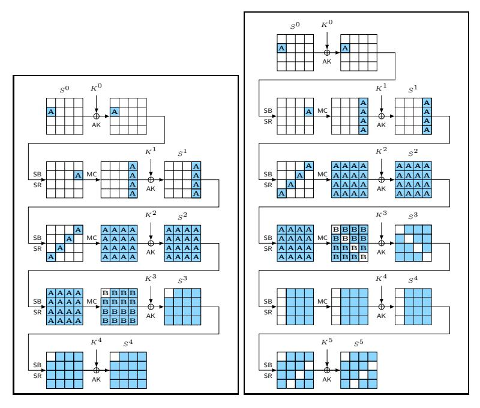

Figure 1: Our distinguishers over four (left) and five (right) rounds of AES. Darkened cells represent bytes with active (non-zero) difference, white cells represent bytes with zero difference.

where  $\ell = 2^3 \cdot \ell_3$ ,  $N_3 = 2^{31} \cdot 255^4/8$  and  $p_3 = 2^{-8} + 2^{-31.983}$ . In other words,  $\Pr[Y] = 2^3 \cdot X_3$ , where  $X_3 \sim \mathcal{B}(N_3, p_3)$  is a binomial distribution. The factor  $\ell_3$  represents the number of pairs in the input space that follow the distribution.

We conduct a proof that shows that the theoretical mean of collisions in the first byte matches our claims above, following the footsteps of the expectation proof in [GR19].

The first two rounds of the well-known integral distinguisher on three-round AES can be represented easily as a subspace trail. Let the  $\delta$ -set iterate over all values of plaintext byte  $S_{r,c}^0$ , and let  $k=^{\mathrm{def}}c-r$  mod 4 be the zero diagonal after three rounds. Then, there exists the deterministic subspace trail

$$\mathcal{C}_{\{c\}} \cap \mathcal{D}_{\{k\}} \oplus A \xrightarrow{\mathsf{R}} \mathcal{C}_{\{k\}} \oplus A' \xrightarrow{\mathsf{R}} \mathcal{M}_{\{k\}} \oplus A''$$
 .

The interesting part consists of the probabilistic transition to

$$\mathcal{M}_{\{k\}} \oplus A'' \xrightarrow{\mathsf{R}}^{\mathsf{R}} \mathcal{D}_{\mathcal{J}} \cap \mathcal{C}_{\{c\}} \oplus A'''$$

through Round 3 where  $\mathcal{J} \subset \{0,1,2,3\}$ ,  $|\mathcal{J}| = 3$ , and  $c \in \{0,1,2,3\}$ . We denote by  $\ell \in \{0,1,2,3\}$  the index of the zero-difference diagonal  $\ell \notin \mathcal{J}$ . A, A', A'', A''' are arbitrary constants in  $\mathbb{F}_{2^8}^{4\times 4}$ .

<span id="page-12-1"></span>**Theorem 1.** Let  $\mathcal{X} = \{X^i \in \mathbb{F}_{2^8}^{4 \times 4}\}$ , for  $0 \leq i < 2^{32}$ , denote a set of all texts in a coset  $\mathcal{M}_{\{k\}} \oplus A$  for some  $A \in \mathbb{F}_{2^8}^{4 \times 4}$ ,  $A \in \mathcal{X}^{\perp}$ , where all columns are active. Let  $\mathcal{Y} = \{Y^i \in \mathbb{F}_{2^8}^{4 \times 4} : Y^i = \mathsf{R}(X^i)\}$ ,  $0 \leq i < 2^{32}$ , denote the set of corresponding outputs after one round of AES. Let Y be a random variable for the number of different ciphertext pairs  $(Y^i, Y^j)$  s. t.  $Y^i, Y^j \in \mathcal{D}_{\mathcal{J}} \cap \mathcal{C}_{\{c\}} \oplus A'$ , for some  $A' \in \mathbb{F}_{2^8}^{4 \times 4}$ ,  $\mathcal{J} \subset \{0, 1, 2, 3\}$ ,  $|\mathcal{J}| = 3$ , and  $c \in \{0, 1, 2, 3\}$ . Then, under the assumption of the uniform distribution of non-trivial solutions of differentials through the S-box in Equation (6),

$$\Pr\left[\mathcal{M}_{\{k\}} \oplus A \xrightarrow{\mathsf{R}} \mathcal{D}_{\mathcal{J}} \cap \mathcal{C}_{\{c\}} \oplus A'\right] \simeq 2^{-8} + 2^{-31.983}.$$

Our proof is described in Appendix C.2. The analysis is conducted in Setting (2), which consists of two steps: First, determine the average number of solutions which yield a collision in a single byte after three rounds for all pairs from  $\delta$ -sets from a full single-diagonal plaintext space. Second, divide the number of pairs by the number of all pairs in a single-diagonal space. A proof of our claim about the mean in Setting (1) of independent  $\delta$ -sets can use a similar argumentation. A study of the variance can be found in Appendix D.2.

**Complexity.** The complexity of our four-round distinguisher is approximated by Equation (5) (plugging  $\Pr_{AES}\left[S_{r,c}^{3,i}=S_{r,c}^{3,j}\right]$  into  $p_{AES}$  and  $\Pr_{rand}\left[S_{r,c}^{3,i}=S_{r,c}^{3,j}\right]$  into  $p_{rand}$ ). Consider Setting (1) first. For a success probability of  $P_S=0.95$ , we obtain  $N>2^{58.402}$  pairs. In total, a δ-set contains  $\binom{2^8}{2}\simeq 2^{15}$  pairs. So, the distinguisher needs approximately  $2^{43.402}$  δ-sets with  $2^{51.402}$  chosen plaintexts. For  $P_S=0.99$ , we obtain  $N>2^{59.402}$  pairs, and therefore a data complexity of approximately  $2^{52.402}$  chosen plaintexts. Setting (2) has a stronger multiple-of-n property. In theory, it also possesses a considerably higher variance of approximately a factor of eight. Therefore, the data complexity increases by a factor of about  $2\sigma_{AES}^2/\sigma_{rand}^2=16$ . For  $P_S=0.95$ , we obtain  $2^{62.402}$  pairs and  $2^{47.402}$  δ-sets of  $2^{55.402}$  chosen plaintexts. For  $P_S=0.99$ , we obtain  $N>2^{63.402}$  pairs, and therefore a data complexity of approximately  $2^{56.402}$  chosen plaintexts.

Remark 1. We note that in the second setting, a far more efficient distinguisher that exploits the multiple-of-n property can be built. Moreover, there exist even more efficient distinguishers such as the usual integral. However, our focus here is on the concept of extending the integral probabilistically, to four and more round subsequently.

**Reduced Variant.** In order to allow a practical verification, we derive the corresponding probabilities for four rounds of Small-AES, the downscaled variant from [CMR05] which employs four-bit S-boxes. Again, we view the downscaled variant of MixColumns as a sum of four independent permutations on  $\mathbb{F}_{2^4}$ . Then, the probability that, after three rounds, a fixed nibble has zero difference is approximately

$$\Pr_{\text{Small-AES}}\left[S_{r,c}^{3,i} = S_{r,c}^{3,j}\right] \simeq \frac{1}{2^4} + \frac{1}{2^4 \cdot (2^4-1)^3} \simeq 2^{-4} + 2^{-15.721}.$$

For a random permutation, the probability can be approximated by

$$\Pr_{\mathrm{rand}}\left[S_{r,c}^{3,i}=S_{r,c}^{3,j}\right] = \frac{2^{60}-1}{2^{64}-1} \simeq 2^{-4}-2^{-64.093}.$$

Applying Equation (5) yields  $N > 2^{29.878}$  for  $P_S = 0.95$  in Setting 2. Since a  $\delta$ -set yields  $\binom{2^4}{2} = 120$  pairs, we need about  $2^{23}$   $\delta$ -sets with  $2^{27}$  chosen plaintexts. For  $P_S = 0.99$ , we obtain  $N > 2^{30.878}$  pairs, and therefore a data complexity of approximately  $2^{28}$  chosen plaintexts.

#### 4.3 Index Dependencies of The Four-round Distinguisher

The mean of the four-round truncated differential depends strongly on the index of (1) the input cell that is iterated over in the  $\delta$ -sets as well (2) the index of the inactive output cell after three rounds. Let  $i_{\rm in}$  and  $i_{\rm out}$  denote the cell indices of the relevant input and output cells. We obtain an equation system through three full rounds. Let  $x = S(P[i_{\rm in}] \oplus K^0[i_{\rm in}])$ . Since we consider all values of x,  $K^0[i_{\rm in}]$  is a constant, and the S-box a permutation, we can simply iterate over all values x and neglect  $K^0$ . For simplicity, let us define  $x_i = {}^{\rm def} i$ . Note that the position of  $x_i$  is relevant, and the ShiftRows operations affect the coefficients of the equation system. We define by  $(a_i,b_i,c_i,d_i) \in \mathbb{F}_{2^b}^4$  variables in terms of  $x_i$  at  $S_{\rm SB}^2$ ,

<span id="page-14-2"></span>

| Table 3: Means and standard deviations for the number of pairs that collided in a fixed output   |
|--------------------------------------------------------------------------------------------------|
| byte for our four-round distinguisher with Small-AES<br>in Setting (1). Each experiment employed |
| 100 random independent keys and 2s<br>random δ-sets. Experimental values are rounded. Full-round |
| Speck-64-96 was used as pseudorandom permutation π. ×σ denotes (µSmall-AES − µπ)/σSmall-AES      |
| with respect to the theoretical values.                                                          |

|    | π                     |    |                  | Small-AES |                       |             |    |            |                          |  |
|----|-----------------------|----|------------------|-----------|-----------------------|-------------|----|------------|--------------------------|--|
|    | Theory<br>Experiments |    | Theory           |           |                       | Experiments |    |            |                          |  |
| s  | µπ                    | σπ | µπ               | σπ        | µSmall-AES σSmall-AES |             | ×σ |            | µSmall-AES σSmall-AES ×σ |  |
| 20 | 7 863 200 2 715       |    | 7 864 396 2 566  |           | 7 866 650             | 2 716 1.27  |    | 7 870 789  | 2 918 2.60               |  |
| 21 | 15 728 600 3 840      |    | 15 728 650 3 957 |           | 15 733 300            | 3 841 1.22  |    | 15 742 188 | 3 809 3.54               |  |
| 22 | 31 457 300 5 431      |    | 31 457 205 5 096 |           | 31 466 600            | 5 431 1.71  |    | 31 484 544 | 6 007 4.54               |  |
| 23 | 62 914 600 7 680      |    | 62 915 004 7 820 |           | 62 933 200            | 7 681 2.42  |    | 62 967 244 | 7 030 6.85               |  |

i.e., after the SubBytes operation in the second round. Note that *b* = 4 for the Small-AES and *b* = 8 for the AES. For *i*in = 0, we define

<span id="page-14-0"></span>
$$\begin{pmatrix} a_i \\ b_i \\ c_i \\ d_i \end{pmatrix} \stackrel{\mathrm{def}}{=} \begin{pmatrix} S(2x_i \oplus K^1[0]) \\ S(x_i \oplus K^1[1]) \\ S(x_i \oplus K^1[2]) \\ S(3x_i \oplus K^1[3]) \end{pmatrix}.$$

Note that *K*<sup>1</sup> also covers the constant values of the plaintext bytes 1*,* 2*,* 3 here. Since we iterate over all values of all constants, we consider all possible values. After the second round, and the subsequent SubBytes operation in Round 3, we obtain an equation system of

$$\begin{pmatrix}
S(2a_i \oplus K^2[0]) & S(d_i \oplus K^2[4]) & S(c_i \oplus K^2[8]) & S(3b_i \oplus K^2[12]) \\
S(d_i \oplus K^2[5]) & S(3c_i \oplus K^2[9]) & S(2b_i \oplus K^2[13]) & S(a_i \oplus K^2[1]) \\
S(2c_i \oplus K^2[10]) & S(b_i \oplus K^2[14]) & S(a_i \oplus K^2[2]) & S(3d_i \oplus K^2[6]) \\
S(b_i \oplus K^2[15]) & S(3a_i \oplus K^2[3]) & S(2d_i \oplus K^2[7]) & S(c_i \oplus K^2[11])
\end{pmatrix} = (...), (9)$$

where the right-hand side reflects the left-hand side with (*a<sup>j</sup> , bj, c<sup>j</sup> , d<sup>j</sup>* ) for some *j* 6= *i*. For each output cell, we require only a column of the state in Equation [\(9\)](#page-14-0), i.e., four variables after the MixColumns operation at the end of Round 3. Each output cell contains a dependency of *a*, *b*, *c*, and *d* exactly once. So, we have to consider only four key variables of *K*<sup>2</sup> . Since we consider collisions in single cells after four rounds and can invert MixColumns and ShiftRows in that row, neither *K*<sup>4</sup> nor the S-box of Round 4 nor *K*<sup>3</sup> influence the number of collisions. For example, the equation system for a cell collision at position *i*out = 0 becomes

<span id="page-14-1"></span>
$$2S(2S(2x_{i} \oplus K^{1}[0]) \oplus K^{2}[0]) \oplus 3S(S(3x_{i} \oplus K^{1}[1]) \oplus K^{2}[5])$$

$$\oplus S(2S(x_{i} \oplus K^{1}[2]) \oplus K^{2}[10]) \oplus S(S(x_{i} \oplus K^{1}[3]) \oplus K^{2}[15])$$

$$= 2S(2S(2x_{j} \oplus K^{1}[0]) \oplus K^{2}[0]) \oplus 3S(S(3x_{j} \oplus K^{1}[1]) \oplus K^{2}[5])$$

$$\oplus S(2S(x_{j} \oplus K^{1}[2]) \oplus K^{2}[10]) \oplus S(S(x_{j} \oplus K^{1}[3]) \oplus K^{2}[15])$$
(10)

for *i* 6= *j*. For different in- or output positions, the equations differ naturally.

**Application to The AES.** For each output cell, Equation [\(10\)](#page-14-1) consists of eight keydependent variables. While this is infeasible to be computed naively for the AES, we can

<span id="page-15-0"></span>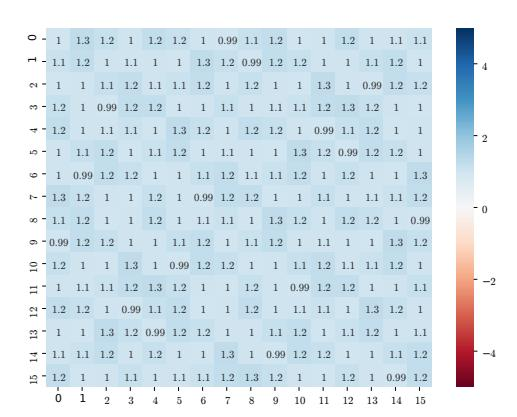

Figure 2: Theoretical index-dependent means from the equation system for our four-round distinguisher for the AES, in multiples of  $|\mu_{AES} - \mu_{rand}|$  deviations from the mean of the PRP. Each cell represents the result for the active input cell in the plaintexts (y-axis) and the tested inactive cell (x-axis) after four rounds without the final MixColumns operation. 1.0 means that the distinguisher matches our prediction closely.

observe that it consists of four terms whose key cells are pair-wise independent. Thus, we could split it into four terms that could be computed individually. For each of the  $\binom{2^8}{2}$  combinations of  $x_i, x_j$ , and each term  $\ell \in \{0, 1, 2, 3\}$ , we have  $2^8 \cdot 2^8$  solutions that could be stored in a table  $\mathcal{L}_{\ell}$ . Let  $f_0(K^1[0], K^2[0], x_i) = ^{\text{def}} 2S(2S(2x_i \oplus K^1[0]) \oplus K^2[0]) = Y$ , where  $K^1[0], K^2[0]$ , and Y are variables in  $\mathbb{F}_2^8$  and  $x_i$  is the iterating variable from the  $\delta$ -set. Then,  $\mathcal{L}_0$  contains the  $2^{16}$  solutions for each possible value of  $x_i$ . Thus,  $\mathcal{L}_0$  has  $2^8$  lists of  $2^{16}$  elements.

Having fixed  $x_i, x_j$ , we can derive the differences of  $f_{\ell}(K^1, K^2, x_i) \oplus f_{\ell}(K^1, K^2, x_j)$  and create a histogram table of all differences,  $\Delta \mathcal{L}_{\ell}$ . This means  $\Delta \mathcal{L}_{\ell}[\Delta]$  contains the number of pairs  $(x_i, x_j)$  that  $f_{\ell}(K^1[0], K^2[4], x_i) \oplus f_{\ell}(K^1[0], K^2[4], x_j) = \Delta$ . We can repeat this step for all values of  $\ell$  and merge the histogram tables  $\Delta \mathcal{L}_0$  and  $\Delta \mathcal{L}_1$  by taking the product and create a table  $\Delta \mathcal{L}_{0,1}$ . The same step can be computed for  $\Delta \mathcal{L}_2$  and  $\Delta \mathcal{L}_3$  to create a table  $\Delta \mathcal{L}_{2,3}$ . Finally, we consider the number of collisions by multiplying  $\Delta \mathcal{L}_{0,1}[\Delta]$  and  $\Delta \mathcal{L}_{2,3}[\Delta]$  element-wise for each  $\Delta \in \mathbb{F}_{2^8}$  and accumulate all results. This yields the number of  $(K^1[0,1,2,3],K^2[0,5,10,15],x_i,x_j)$  that collide in a particular output byte. We repeat this step for all input-output combinations. In total, this approach needs

$$16 \cdot 16 \cdot \left( \left(4 \cdot \binom{2^8}{2} \cdot 2^8 \cdot 2^8 \right) + 3 \cdot \left(2^8 \cdot 2^8 \right) \right)$$

which is feasible with  $O(2^{41})$  lookups. For an ideal permutation, we would expect

$$\mu_{\rm rand} = (2^8)^8 \cdot \binom{2^8}{2} \cdot 2^{-8} \simeq 2\,351\,959\,869\,397\,967\,831\,040 \qquad \text{and}$$

$$\sigma_{\rm rand} \simeq 48\,402\,195\,468.37\,,$$

whereas we would expect for AES in theory – that is, without an influence of the indices from the  $\mathsf{MixColumns}$  matrix or the S-box:

$$\mu_{\rm AES} = (2^8)^8 \cdot {2^8 \choose 2} \cdot (2^{-8} + 2^{-31.983}) \simeq 2351\,960\,011\,247\,373\,747\,803.$$
 and  $\sigma_{\rm AES} \simeq 48\,402\,196\,922.24$ .

The results are depicted Figure 2 in multiples of  $|p_{AES} - p_{rand}|$  of the deviation from the mean of the PRP. The most important observations are the following that our proposed

distinguisher seems to work: all deviations are close to 1.0 – more precisely, in the range [0.987..1.256] of the difference  $|p_{\mathsf{AES}} - p_{\mathsf{rand}}|$  – and there exists no significant deviations from it. Moreover, we can observe the regular structure where each row (results of each input cell) is a permutation of the numbers of solutions of the row (of the results for input cell 0).

**Application to Small-AES.** We also conducted similar experiments on Small-AES. In that case, we observed much stronger deviations from our expected values. For Small-AES, we could not only compute the theoretical index-dependent expectations but also implement it for all combinations to experimentally verify it, which supported our analysis. The details are provided in Appendix E.1.

#### 4.4 Verification

**Experimental Verification Using Small-AES.** We also verified the distinguisher experimentally with 100 random keys and  $2^s$   $\delta$ -sets, for  $s \in \{20, \dots, 23\}$ , and for the index positions of index cell 1 and output cell 0. Note that an experiment means to compute the number of collisions for  $2^s$   $\delta$ -sets and a random independent key. For each experiment, we evaluated the number of collisions of the first nibble of the output. As an approximation of a random permutation, we employed full-round Speck-64-96 with 100 random keys. Our results are listed in Table 3. The values  $\mu$  denote the obtained means of the number of pairs that collide in at least on inactive inverse diagonal, over all experiments, e.g. for  $2^{20}$   $\delta$ -sets, one could expect  $2^{20} \cdot {2^4 \choose 2} \cdot (2^{-4} + 2^{-15.721}) \approx 7\,866\,650$  colliding pairs per experiment.

**Transition-based Verification.** Rønjom [Røn19] proposed a general approach of transition-distribution matrices for substitution-permutation networks. Starting from a vector that represents the distribution of active-bytes-per-column in plaintexts, Rønjom's approach allows us to derive the probability of active bytes per column after r rounds of an SPN. Thus, his results can be viewed as a different view on the same distinguishing events that verify our attacks under idealized assumptions of the AES S-box. We employed his implementation for a second form of verification. We obtained

```
\begin{array}{ll} p_{\rm AES} & \simeq 0.00390625023558\ldots & \simeq 2^{-8} + 2^{-31.98306} \ {\rm and} \\ p_{\rm Small-AES} & \simeq 0.06251851851852\ldots & \simeq 2^{-4} + 2^{-15.72067} \,, \end{array}
```

which supports our analysis.

Effects of the Variance. From our theoretical considerations, we initially expected that the number of collisions for every single diagonal yielded always a multiple of eight. Since the variance is defined as  $\sigma^2 = N \cdot p \cdot (1-p)$ , one would expect that the variance in Setting (2) is about eight times higher than that in Setting (1) due to the multiple-of-eight property. So, we conducted experiments on the variance in both settings, whose results are provided in Appendix D.2. Interestingly, our experiments with Small-AES yielded that the numbers of collisions were always multiples of 32. From experiments with alternative S-boxes, it seemed that this is not a property of the S-box. More thoughts and a multiple-of-32 distinguisher are summarized in Appendix B.2.

Our experiments show that the variance differed significantly between the S-boxes. The variance for the original S-box of Small-AES was about 15.3 times higher in Setting (2) than the variance in Setting (1). For Small-AES with the S-box of PRESENT, the factor was roughly 12.7. Using the S-box of PRIDE, we obtained a huge deviation with a factor of roughly 40. This property affects the mean of our distinguisher only marginally. However, the reason for the strong deviations in the variances remains an interesting future work.

# <span id="page-17-0"></span>5 Five-round Truncated-differential Distinguisher

We can extend the four-round distinguisher from Section 4 to five rounds.

# 5.1 Setting

Consider some diagonal space  $\mathcal{D}_{\{c\}}$  for some index  $c \in \{0, 1, 2, 3\}$ . Then, the expected probability that all four bytes in that diagonal space collide for two texts in a  $\delta$ -set can be approximated by:

$$\Pr_{\text{AES}} \left[ S^3 \in \mathcal{D}_{\{c\}} \right] \simeq \left( 2^{-8} + \frac{1}{2^8 \cdot (2^8 - 1)^3} \right)^4 \simeq \left( 2^{-8} + 2^{-31.983} \right)^4,$$

Naively, we can approximate the same probability for a random permutation by

$$\Pr_{\mathsf{rand}}\left[S^3 \in \mathcal{D}_{\{c\}}\right] = \frac{2^{96} - 1}{2^{128} - 1} \simeq 2^{-32} - 2^{-128}.$$

This approximation is naive since the texts are not independent. In [GR18, Appendix C], Grassi and Rechberger provide arguments for the number of collisions for  $2^{32}$  input texts that can be combined to pairs with each other to a mixed space  $\mathcal{M}_{\mathcal{I}}$  for  $|\mathcal{I}|=3$ . They consider the dependency between multiple texts. Still, they show that the collision probability can be well approximated by  $2^{-32}$ .

Say, we observe the ciphertexts after five rounds that correspond to a  $\delta$ -set of  $2^8$  plaintexts. Again, the final MixColumns operation can be simply inverted to obtain the differences before it. Then, the probability to have at least one all-zero anti-diagonal in the difference is given for five-round AES by

$$p_{\mathsf{AES}} \simeq 1 - \left(1 - \Pr_{\mathsf{AES}}\left[S^3 \in \mathcal{D}_{\{c\}}\right]\right)^4 \simeq 2^{-30} + 2^{-51.985},$$

whereas for a random permutation, it is approximately

$$p_{\mathsf{rand}} \simeq 1 - \left(1 - \Pr_{\mathsf{rand}} \left[S^3 \in \mathcal{D}_{\{c\}}\right]\right)^4 \simeq 2^{-30} - 2^{-61.415}.$$

The distinguisher is depicted on the right side of Figure 1.

#### 5.2 Theoretical Analysis

As for our four-round distinguisher, we show the theoretical probability of inverse-diagonal collisions after almost five rounds in Setting (2). Our proof follows the mean-based proof by Grassi and Rechberger [GR19]. A proof of our claim for the mean in Setting (1) is similar, and the mean should not change. Moreover, Appendix D.1 calculates the variance in both settings for the AES and argues for Small-AES.

The core of our truncated-differential distinguisher is the probabilistic transition

$$\mathcal{M}_{\{k\}} \oplus A \xrightarrow{\mathsf{R}} \mathcal{D}_{\mathcal{J}} \oplus B$$

through Round 3 where  $\mathcal{J} \subset \{0,1,2,3\}$  and  $|\mathcal{J}| = 3$ . Let  $\ell \in \{0,1,2,3\}$  be the index of the zero-difference diagonal  $\ell \notin \mathcal{J}$ . Here,  $A, B \in \mathbb{F}_{2^8}^{4 \times 4}$  are arbitrary constants. Theorem 2 aims to approximate the probability p for the transition of the third round, under the condition that all columns after two rounds are active.

<span id="page-18-0"></span>**Theorem 2.** Let  $\mathcal{X} = \{X^i \in \mathbb{F}_{2^8}^{4 \times 4}\}$ , for  $0 \leq i < 2^{32}$ , denote a set of all texts in a coset  $\mathcal{M}_{\{k\}} \oplus A$  for some  $A \in \mathbb{F}_{2^8}^{4 \times 4}$ ,  $A \in \mathcal{X}^{\perp}$ , where all columns are active. Let  $\mathcal{Y} = \{Y^i \in \mathbb{F}_{2^8}^{4 \times 4} : Y^i = \mathsf{R}(X^i)\}$ ,  $0 \leq i < 2^{32}$ , denote the set of corresponding outputs after one round of AES. Then, under the assumption of the uniform distribution of nontrivial solutions of S-box differential transitions,

$$\Pr\left[\mathcal{M}_{\{k\}} \oplus A \xrightarrow{\mathsf{R}} \mathcal{D}_{\mathcal{J}} \oplus B\right] \simeq 2^{-30} + 2^{-51.985}$$
.

The analysis is described in Appendix C.1, and is again conducted in Setting (2). A proof of our claim about the mean in Setting (1) of independent  $\delta$ -sets can use the same argumentation.

Let Y be a random variable for the number of single-column collisions after four rounds. Both settings consider the distribution of k collisions from N pairs. In Setting (1), the distribution is approximately a binomial one,  $Y \sim \mathcal{B}(N, p)$ , with p as above.

In Setting (2), the distribution is more complex. Here, it holds that  $N = x \cdot 4 \cdot 2^{24} \cdot {2^8 \choose 2}$  stems from x diagonal spaces  $\mathcal{D}_{\{c\}}$ . Since this setting maintains a multiple-of-eight property, it is reasonable to assume that the distribution can be approximated by

$$\Pr[\mathsf{Y} = \ell] = \begin{cases} 0 & \text{if } \ell \bmod 8 \not\equiv 0, \\ \binom{N_3}{\ell_3} (p_3)^{\ell_3} (1 - p_3)^{N_3 - \ell_3} & \text{otherwise,} \end{cases}$$

where  $\ell=2^3\cdot\ell_3$ ,  $N_3=2^{28}\cdot255^4$  and  $p_3=2^{-30}+2^{-51.985}$ . The factor  $\ell_3$  represents the number of pairs in the input space that follow the distribution.

**Steps.** The steps of our distinguisher are as follows:

- 1. Initialize a collision counter.
- 2. For  $i = 1...2^s$ , collect a structure  $S_i$  of  $2^{32}$  texts that iterate over all values in any four bytes and leave the remaining bytes constants. Query the plaintexts of a structure and ask for their ciphertexts. Invert the final ShiftRows operations to get the states  $S^{5,SB}$  and store them in some list Q.
- 3. Form  $4 \cdot 2^{24}$   $\delta$ -sets from a structure, i.e., the texts in each  $\delta$ -set iterate over the  $2^8$  values in one byte and are constant in the 15 remaining bytes. For each  $\delta$ -set:
  - 3.1 Initialize four lists  $\mathcal{L}_i$ , for i = 0, 1, 2, 3 of  $2^{32}$  elements.
  - 3.2 For each column i of  $S^{5,SB}$ , interpret the column as 32-bit integer and append the text to  $\mathcal{L}_i$  the index corresponding to the column value for each list.
  - 3.3 For each of the lists  $\mathcal{L}_i$ , look for collisions, e.g., multiple values at the same index. For each collision, look up those pairs in other columns if they have already been counted. If not, increment the counter.
- 4. If the counter is higher than the threshold  $\theta$ , output real; otherwise, output random.

We can use the approximation for single differential characteristics from [SS17] for an approximation for threshold. The success probability corresponds to  $1-\alpha$ , where  $\alpha$  is the probability of the Type-I error, that the distinguisher decides that it were a random permutation, but is the AES. A possible choice for a threshold is, according to [SS17],

<span id="page-18-1"></span>
$$\theta = N \cdot |p_{\mathsf{AES}} - p_{\mathsf{rand}}| - \sqrt{3 \cdot N \cdot p_{\mathsf{AES}} \cdot \ln\left(\frac{1}{\alpha}\right)} \tag{11}$$

Setting  $P_S = 0.95$  implies  $\alpha = 0.05$ .

**Complexity.** Consider Setting (1) first. For a success probability of approximately  $P_S = 0.95$ , we obtain  $N \ge 2^{76.406}$ ; for  $P_S = 0.99$ , we obtain  $N \ge 2^{77.406}$  pairs. By fixing any set of four distinct bytes in the plaintexts, we can form  $2^{32}$  texts by iterating over all values of those four bytes and leaving the remaining twelve bytes constant for a structure. So, one structure provides

$$4 \cdot 2^{24} \cdot {2^8 \choose 2} \simeq 2^{40.994} \simeq 2^{41}$$
 pairs.

 $2^{36}$  structures with  $2^{68}$  chosen plaintexts with approximately  $2^{77}$  pairs suffice for a success probability of more than 0.95 on average. The memory complexity is given by storing  $2^{32}$  states in  $\mathcal{Q}$  and four lists  $\mathcal{L}_i$  of  $4 \cdot 2^{32}$  columns at a time. The time complexity consists of

- $2^{68}$  encryptions and 1/5 partial decryptions or  $2^{68.3}$  encryption equivalents.
- $2^{68} + 2^{68} \cdot 4 \simeq 2^{70.4}$  memory accesses for inserting the texts. Depending on the data structure, insertions or lookups need sorting, which requires  $N \log_2(N)$  operations on average with e.g., quicksort. Given four lists of  $2^8$  elements, sorting needs approximately  $2^{36} \cdot 2^{24} \cdot 4 \cdot 2^8 \cdot 8 \simeq 2^{73}$  memory accesses.
- At most  $2^{36} \cdot 2^{24} \cdot 4 \cdot {2^8 \choose 2} \cdot 2^{-32} \cdot 3 \simeq 2^{46.6}$  additional memory accesses when collisions occur to look up if other columns collide in the other lists.
- Approximately  $2^{36} \cdot 2^{24} \cdot 4 \cdot {2^8 \choose 2} \cdot 2^{-32} \simeq 2^{46}$  memory accesses to increment the counter.

So, the computational complexity can be approximated by  $2^{70.4} + 2^{73} + 2^{46.6} + 2^{46} \simeq 2^{73.3}$  memory accesses and  $2^{68.3}$  encryptions. From Equation (11), we obtain as an approximation for  $\theta$  for  $P_S = 0.95$

$$\theta \simeq 2^{76.406} \cdot 2^{-51.985} - \sqrt{3 \cdot 2^{76.406} \cdot 2^{-51.985} \cdot \ln(1/0.05)} \simeq 2^{24.420}$$

Setting (2) inherits the multiple-of-eight property. We study its variance in Appendix D.1. The variance for the AES is approximately a factor of eight higher in this setting than that for a random permutation. Therefore, the data complexity increases theoretically by a factor of about  $2 \cdot \sigma_{\text{AES}}^2 / \sigma_{\text{rand}}^2 \approx 16$ . For  $P_S = 0.95$ , we obtain  $2^{80.402}$  pairs and therefore a data complexity of approximately  $2^{40}$  structures with  $2^{72}$  chosen plaintexts. For  $P_S = 0.99$ , we obtain  $N > 2^{81.406}$  pairs, and therefore a data complexity of approximately  $2^{73}$  chosen plaintexts. From Equation (11), we obtain as an approximation for  $\theta$  for  $P_S = 0.95$

$$\theta \simeq 2^{80.402} \cdot 2^{-51.985} - \sqrt{3 \cdot 2^{80.402} \cdot 2^{-51.985} \cdot \ln(1/0.05)} \simeq 2^{28.417}$$

Remark 2. The distinguisher employs structures composed of  $2^{32}$  texts, e.g., from diagonals each, which are close to our analyzed setting. A more efficient approach, used in an earlier version of this paper, is to employ structures of  $2^{64}$  texts that iterate over eight bytes, and form pairs from the  $8 \cdot 2^{56} \cdot \binom{2^8}{2}$  structures. This approach would approximately halve the necessary data and computational complexities, but increases the memory complexity. Its disadvantage is an approximating assumption that the so-created structures are independent. We decided in favor of the more conservative approach here.

**Reduced Variant.** To allow a practical verification, we derive the corresponding probabilities for Small-AES. Again, we approximate the downscaled variant of MixColumns as a sum of four independent permutations on  $\mathbb{F}_{2^4}$ . The probability that all four bytes in a diagonal space  $\mathcal{D}_{\{c\}}$  collide for two texts in a  $\delta$ -set can be approximated by  $\mathbb{E}\left[N_4\right]^4$ :

$$\Pr_{\text{Small-AES}}\left[S^3 \in \mathcal{D}_{\{c\}}\right] = \left(2^{-4} + \frac{1}{2^4(2^4-1)^3}\right)^4 \simeq \left(2^{-4} + 2^{-15.721}\right)^4,$$

and that for a random permutation by

$$\Pr_{\mathsf{rand}} \left[ S^3 \in \mathcal{D}_{\{c\}} \right] = \frac{2^{48} - 1}{2^{64} - 1} \simeq 2^{-16} - 2^{-64}.$$

Then, the probability to have at least one all-zero anti-diagonal in the difference is given for five-round Small-AES by

$$p_{\text{Small-AES}} \simeq 1 - \left(1 - \Pr_{\text{Small-AES}} \left[S^3 \in \mathcal{D}_{\{c\}}\right]\right)^4 \simeq 2^{-14} + 2^{-23.748},$$

whereas for a random permutation, it is approximately

$$p_{\mathsf{rand}} \simeq 1 - \left(1 - \Pr_{\mathsf{rand}} \left[S^3 \in \mathcal{D}_{\{c\}}\right]\right)^4 \simeq 2^{-14} - 2^{-29.415}.$$

In Setting (1), Equation (5) yields, for a success probability of approximately  $P_S = 0.95$ , that the required number of pairs would have to be  $N \geq 2^{35.934}$ , and  $N \geq 2^{36.934}$  pairs for  $P_S = 0.99$ .  $2^{16}$  structures of  $(2^4)^4 = 2^{16}$  texts each that iterates over four cells of a diagonal for each structure can form  $2^{16} \cdot 4 \cdot 2^{12}$  sets of  $\binom{2^4}{2}$  pairs each, i.e.,

$$2^{16} \cdot 4 \cdot 2^{12} \cdot {2^4 \choose 2} \simeq 2^{36.907}$$
 pairs.

Thus,  $2^{16}$  structures of  $2^{16}$  texts each may suffice for a success probability of  $P_S \geq 0.95$ . In Setting (2), the variance should be eight times higher, and therefore,  $N \geq 2\sigma_{\rm Small-AES}^2$  /  $\sigma_{\rm rand}^2 = 16$  should be 16 times higher. Equation (5) yields, for a success probability of approximately  $P_S = 0.95$ , that the required number of pairs would have to be  $N \geq 2^{39.934}$ , and  $N \geq 2^{40.934}$  pairs for  $P_S = 0.99$ . So,  $2^{20}$  structures of  $2^{16}$  texts each may suffice to have a success probability of  $P_S \geq 0.95$ .

**Testing on A Single Diagonal.** A variant of the distinguisher can consider only a fixed inverse diagonal after almost five rounds. Then, the probabilities are

$$p_{\text{AES}} \simeq \Pr_{\text{AES}} \left[ S^3 \in \mathcal{D}_{\{c\}} \right] \simeq 2^{-32} + 2^{-53.983} \,,$$

whereas for a random permutation, it is approximately

$$p_{\mathsf{rand}} \simeq \Pr_{\mathsf{rand}} \left[ S^3 \in \mathcal{D}_{\{c\}} \right] \simeq 2^{-32} - 2^{-128} \,.$$

Then, the resulting data complexities for  $P_S=0.95$  would become  $N\geq 2^{78.402}$  and  $N\geq 2^{79.402}$  for  $P_S=0.99$ . So, the data complexity would become  $2^{70}$  and  $2^{71}$  chosen plaintexts, respectively.

For Small-AES, the corresponding complexities would become  $N \geq 2^{37.878}$  and  $N \geq 2^{38.878}$  pairs, i.e.,  $2^{33}$  and  $2^{34}$  chosen plaintexts would be required. Therefore, our distinguisher(s) test(s) on any inverse diagonal.

#### 5.3 Verification

**Experimental Verification.** Again, we tried to verify our distinguishers experimentally with Small-AES. Figure 3 depicts our results with 100 random keys and  $2^{30}$  random  $\delta$ -sets of  $2^4$  texts each. All values  $\mu$  denote the means for the number of pairs in  $\delta$ -sets that collided in at least one inverse diagonal after five rounds, over all  $\delta$  sets, e.g.,  $\mu = \binom{2^4}{2} \cdot 2^{30} \cdot p_{\mathsf{Small-AES}}$  for Small-AES for  $2^{30}$   $\delta$ -sets. Besides, we tested the Small-AES with the S-box of PRESENT. Like for our four-round distinguisher, we can observe the following:

<span id="page-21-0"></span>

| Instance    | µ                  | σ        |  |  |
|-------------|--------------------|----------|--|--|
| π           |                    |          |  |  |
| Theory      | 7 864 140          | 2 804.22 |  |  |
| Experiment  | 7 864 379.         | 2 492.46 |  |  |
| Small-AES   |                    |          |  |  |
| Theory      | 7 873 286          | 2 805.85 |  |  |
| Experiments | 7 875 860.         | 2 844.95 |  |  |
| Small-AES   | with PRESENT S-box |          |  |  |
| Experiments | 7 868 881.         | 2 785.78 |  |  |

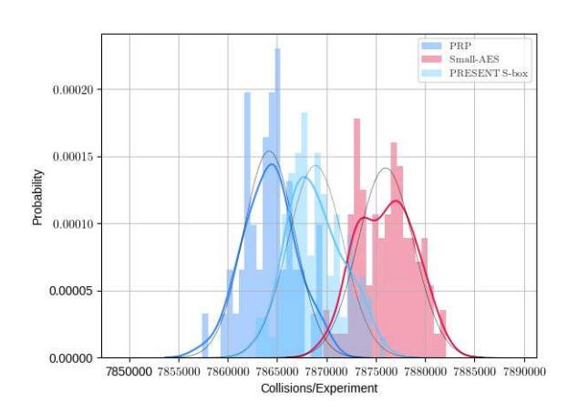

*.*

**Figure 3:** Means and standard deviations for the number of pairs that collided in at least one inverse diagonal for our five-round truncated-differential with Small-AES. Each experiment employed 100 random independent keys and 2<sup>30</sup> random *δ*-sets. Speck-64-96 has been used as PRP *π*. We compare to Small-AES with the PRESENT S-box.

- Small-AES deviates significantly from the theory, in the sense that the distinguisher is stronger. Here, the experimental mean is approximately one standard deviation higher than the theoretical prediction.
- Small-AES with the S-box of PRESENT has again a strong deviation, by approximately 1*.*6 standard-deviation units below the theoretical prediction. As for our four-round distinguisher, it still yields a distinguisher, its mean is approximately 1*.*7 standard-deviation units above the mean of the PRP, i.e., roughly in the middle between both theoretical predictions.

We conclude that the true distinguisher, at least for Small-AES, depends largely on the internals of the S-box.

**Transition-based Verification.** Again, we employ the transition-based approach by Rønjom [Røn19] for a second form of verification, using 100-bit precision. We obtained the probabilities

$$\begin{array}{ll} p_{\rm AES} & \simeq 0.2246672325602152\ldots \cdot 10^{-15} & \simeq 2^{-30} + 2^{-51.98306} \\ p_{\rm Small-AES} & \simeq 0.7244634283789227\ldots \cdot 10^{-7} & \simeq 2^{-14} + 2^{-23.71851} \end{array}$$

The results confirmed the biases of our five-round distinguishers. The slight deviations can be due to rounding.

**Effects of the Variance and Dependencies** Again, we also determined the variance in both settings experimentally. The results are given in Appendix [D.1.](#page-50-0) One would expect that the variance in Setting [\(2\)](#page-11-3) is about eight times higher than that in Setting [\(1\)](#page-11-0) due to the multiple-of-eight property. Though, we found that it is roughly 11*.*4 times larger as outlined in Table [9,](#page-57-1) i.e., roughly 12 times larger than the variance of Setting [\(1\).](#page-11-0) The reason for this gap is unknown.

The results give rise to the possibility that there exists some further multiple-of-four property in the distribution that may be hidden by the multiple-of-eight property. Note that this property affects the mean of our distinguisher only marginally. The variance, however, differs significantly, as we could experimentally observe.

# <span id="page-22-0"></span>6 Six-round Key-recovery Attack

We can extend the five-round distinguisher from Section 5 to a key-recovery attack on six-round AES that recovers 32 key bits. We apply the attack twice in a shifted form to recover 64 key bits. The remaining key bits can be recovered by exhaustive search. Table 4 compares it with the state-of-the-art of attacks on six- and seven-round AES-128. We emphasize that many more attacks have been published on the variants of AES with 192- and 256-bit keys.

**Precomputation.** We construct four tables  $\mathcal{H}_i$  for  $0 \leq i \leq 3$ . For  $\mathcal{H}_i$ , we store pairs  $(X, \Delta X) \in \mathbb{F}_{2^8}^4 \times \mathbb{F}_{2^8}^4$  such that  $\check{\mathsf{R}}(X) \oplus \check{\mathsf{R}}(X \oplus \Delta X)$  is non-zero only in Byte i of the output column, where  $\check{\mathsf{R}}$  is the AES round function missing AddRoundKeys and restricted to work on one diagonal and output the corresponding column (note that the computation on each diagonals) of the state can be done independently of the computation on other diagonals). The table  $\mathcal{H}_i$  can be constructed as follows: for each non-zero value y of the active byte  $\Delta Y$ , compute  $\Delta O = (\Delta O_0, \Delta O_1, \Delta O_2, \Delta O_3) = \mathsf{MC}^{-1}((y \parallel 0 \parallel 0 \parallel 0) \gg i)$  (where  $\gg i$  stands for a circular rotation of i bytes). For each  $\Delta O_j$  ( $0 \leq j \leq 3$ ), check the DDT of the AES S-box which is integrated with the information of correct pairs for each compatible difference, one can get 256 pairs  $(X_j, X_j')$  fulfilling the output difference  $\Delta O_j$ . For  $\Delta O$ , obtain all possible combinations between  $(X_0, X_0')$ ,  $(X_1, X_1')$ ,  $(X_2, X_2')$ ,  $(X_3, X_3')$ . Each combination corresponds to a valid  $(X, \Delta X)$ . Thus, one can get  $256^4$  valid pairs  $(X, \Delta X)$  for a non-zero value of the active byte  $\Delta Y$ . In total, each table  $\mathcal{H}_i$  contains  $255 \cdot 256^4$  entries. Then, the four tables need  $4 \cdot 255 \cdot 256^4 \cdot 8$  bytes, which corresponds to approximately  $4 \cdot 255 \cdot 256^4 \cdot 8/16 \simeq 2^{40.1}$  state equivalents.

#### **Steps.** The steps are as follows:

- 1. Initialize a zeroed list  $\mathcal{K}$  for the  $2^{32}$  key candidates for  $K^0[0, 5, 10, 15]$ .
- 2. Precompute the tables  $\mathcal{H}_i$ , for  $0 \leq i \leq 3$ .
- 3. For  $i = 1...2^s$ , collect a structure  $S_i$  of  $2^{32}$  texts in a coset of  $\mathcal{D}_{\{0\}}$ .
  - 3.1 So, the texts in each structure iterate over the  $2^{32}$  values in bytes P[0, 5, 10, 15] and are constant in the 12 remaining bytes.
  - 3.2 Initialize four lists  $\mathcal{L}_i$ , for i=0,1,2,3. Query the plaintexts of a structure to an encryption oracle to obtain the corresponding ciphertexts C. Invert the final ShiftRows operation to get the states  $S^{6,\text{SB}}$  and store the tuples of  $(P[0,5,10,15],S^{6,\text{SB}})$  into the four lists  $\mathcal{L}_i$ , where the texts are indexed by the i-th anti-diagonal of  $S^{6,\text{SB}}$ .
  - 3.3 For j = 0..3, consider the lists  $\mathcal{L}_j$ :
    - i. Look up collisions on the j-th anti-diagonal of  $(S^{6,SB}, S'^{6,SB})$ . For each collision, look up in the lists with lower indices j if the same pair collided already in a different anti-diagonal to prevent double counting.
    - ii. For each collision, consider their corresponding plaintexts P and P' and derive their difference on the diagonal  $\Delta P[0,5,10,15] = P[0,5,10,15] \oplus P'[0,5,10,15]$ . From  $\mathcal{H}_0$ ,  $\mathcal{H}_1$ ,  $\mathcal{H}_2$ , and  $\mathcal{H}_3$ , look up all possible pairs  $(X,\Delta X)$  such that  $\Delta P[0,5,10,15] = \Delta X$ . Then use the corresponding P[0,5,10,15] and X to derive the candidate, i.e.,  $K^0[0,5,10,15] = P[0,5,10,15] \oplus X$ , increase its counter in K.
- 4. Sort the list of key candidates and output the sorted list.

- 5. Apply the attack another time from a shifted diagonal, e.g.,  $\mathcal{D}_{\{1\}}$ , and with another  $2^s$  structures to recover another 32 bits of key material.
- 6. Test keys in descending order of their counters to recover the remaining 64 bits.

**Complexity.** Each structure yields  $4 \cdot 2^{24}$   $\delta$ -sets, which corresponds to approximately  $2^{41}$  pairs. We choose  $2^s$  structures, which corresponds to  $2^{s+32}$  chosen plaintexts The time complexity is given by the following:

- The precomputation costs  $4 \cdot 255 \cdot 256^4 \cdot 8/16 \cdot 1/6 \simeq 2^{38.5}$  encryption equivalents and  $2^{40.1}$  memory accesses for storing the values.
- Encrypting the data takes  $2^{s+32}$  encryptions and 1/6 partial decryptions, or at most  $2^{s+32.3}$  encryption equivalents.
- We need  $4 \cdot 2^{s+32} = 2^{s+34}$  memory accesses for storing the  $2^{s+32}$  texts into four lists. Sorting the four lists requires  $2^s \cdot 4 \cdot 2^{32} \cdot 32 \simeq 2^{s+39}$  memory accesses.
- Each structure yields about  $2^{63}$  pairs, and each pair has a probability of approximately  $2^{-30}$  to collide on a column. So, we expect approximately  $2^{s+63} \cdot 2^{-30} \simeq 2^{s+33}$  collisions. For each collision that occurs in a table  $\mathcal{L}_i$ , we need at most three memory accesses for the three other tables in  $\mathcal{L}_j$ ,  $j \neq i$ , to prevent double counting. Thus, we need  $2^{s+33} \cdot 3 \simeq 2^{s+34.6}$  MAs at that point.
- For each collision, we expect on average  $4 \cdot 255$  suggestions (because the match  $\Delta P[0, 5, 10, 15] = \Delta X$  imposes 32 bits conditions) from the hash tables  $\mathcal{H}_i$ . So, we need about  $2^{s+33} \cdot 4 \cdot 255 \simeq 2^{s+43.0}$  memory accesses plus the same amount in  $\mathcal{K}$ , plus the same amount of XORs.

Since the attack is performed twice with the same plaintext material but on 32 different key bits, e.g., K[3,4,9,14], we need the same number of encryptions (alternatively, they could be stored) and lookups, plus  $2^{64}$  encryptions for the key search. Let a be the attack advantage. The total time complexity consists of

$$2^{38.5} + 2 \cdot 2^{s+32.3} + 2^{64+2 \cdot (32-a)}$$
 Encryptions and  $2^{40.1} + 2 \cdot (2^{s+34} + 2^{s+39} + 2^{s+34.6} + 2^{s+43.0})$  MAs.

The attack stores  $2^{32}$  tuples of 4+16 bytes at a time for the states plus  $2^{32}$  byte counters candidates plus  $2^{40.1}$  states for the tables  $\mathcal{H}_i$ , which dominates the memory complexity.

#### 6.1 Relations between Success Probability, Advantage and Data

In Step 6, we apply the key-ranking approach, i.e. candidates of the attacked key bits are tested in the order of their decreasing counts. Thus, before reaching the correct key, all candidates ranked above are also checked with combinations of the remaining key bits to see if they are the correct value. Suppose an m-bit key is attacked and the correct key candidate is ranked  $\ell$ -th among all  $2^m$  candidates, then the key-ranking method reduces the complexity by a factor of  $2^{m-\lg \ell}$  over the exhaustive search. Denote by  $a=m-\lg \ell$ , this a is referred to as the advantage by Selçuk in [Sel08].

Remark 3. We note that the original model by Selçuk considers only a single list. The applicability to an attack that reduces the key in two independent columns may be more complex.

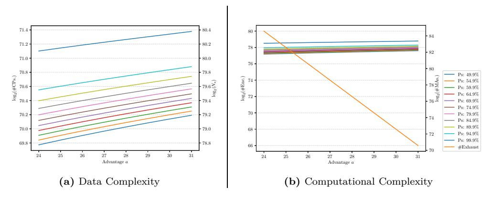

<span id="page-24-2"></span><span id="page-24-1"></span>**Figure 4:** Relations between success probability, advantage, data complexity, and computational complexity of the attack using the model in [Sel08]. Note that in our attack,  $\log_2(\text{\#CPs.}) = \log_2(N) - 41 + 32$ , and we assume  $\text{\#Encs.} \simeq 6 \cdot 4 \cdot \text{\#MAs.}$ .

Using the Model in [Sel08]. In [Sel08], Selçuk derived formulas to present the relation between the advantage a, the success probability  $P_s$  (the probability that the correct key candidate is ranked among the  $2^{m-a}$  first candidates), and the data complexity N both for linear and differential cryptanalysis. The results were derived on order statistics and are applicable for normally distributed random variables. The derived formula is less accurate for differential than that for linear cryptanalysis, mainly because for classical differential cryptanalysis, using the normal distribution to approximate binomial distribution is not quite accurate. However, in the presented truncated differential attack, the binomial distribution of the random variables – the number of collisions for the right key (denoted as  $X_R$ , i.e., the number of collisions for the 5-round distinguisher) and that for wrong keys (denoted as  $X_R$ , i.e., the number of collisions for random permutations) – are allowed to be approximated with normal distributions. Recall that we have  $X_R \sim \mathcal{N}(\mu_R, \sigma_R^2)$  and  $X_W \sim \mathcal{N}(\mu_W, \sigma_W^2)$ , where

$$\begin{split} \mu_R &= N \cdot p_{\text{AES}}, & \sigma_R &= N \cdot p_{\text{AES}} \cdot (1 - p_{\text{AES}}), & \text{where } p_{\text{AES}} &\simeq 2^{-30} + 2^{-51.985} \\ \mu_W &= N \cdot p_{\text{rand}}, & \sigma_W &= N \cdot p_{\text{rand}} \cdot (1 - p_{\text{rand}}), & \text{where } p_{\text{rand}} &\simeq 2^{-30} - 2^{-61.415} \,. \end{split}$$

Plugging this configuration into the following Theorem 3, we can draw the trade-off curves (Figure 4a) between the advantage a, the success probability  $P_s$ , and the data complexity (note that there is a difference between the required number of plaintext pairs and the required number of plaintexts due to the using of plaintext structures) for the key-recovery attack on six-round AES.

<span id="page-24-0"></span>**Theorem 3** ([Sel08]). Let the statistic for a correct key candidate follow the normal distribution  $\mathcal{N}(\mu_R, \sigma_R^2)$ , and the statistic for wrong key candidate follow  $\mathcal{N}(\mu_W, \sigma_W^2)$ . Let m be the number of attacked key bits, a be the advantage of an attack, and N be the number of available samples. Then, the success probability of the attack  $P_s$  can be approximated by:

$$P_s \simeq \Phi_{0,1} \left( \frac{\mu_R - \mu_a}{\sqrt{\sigma_R^2 + \sigma_a^2}} \right),$$

where
$$\mu_a = \mu_W + \sigma_W \Phi_{0,1}^{-1} (1 - 2^{-a})$$
, and  $\sigma_a^2 \simeq \frac{\sigma_W^2 \cdot 2^{-(m+a)}}{\phi_{0,1}^2 (\Phi_{0,1}^{-1} (1 - 2^{-a}))}$ .

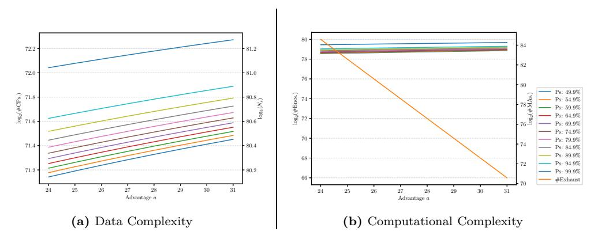

<span id="page-25-2"></span><span id="page-25-1"></span>**Figure 5:** Relations between success probability, advantage, data complexity, and computational complexity of the attack using the model in [SS17]. Note that in our attack,  $\log_2(\#\text{CPs.}) = \log_2(N) - 41 + 32$ , and we assume  $\#\text{Encs.} \simeq 6 \cdot 4 \cdot \#\text{MAs.}$ .

Using the Model in [SS17]. In [SS17], Samajder and Sarkar provide closed-form upper bounds on the data complexity in terms of the success probability and the advantage of a multiple (truncated) differential attack (the upper bound on the data complexity shows how much data is sufficient to mount an attack with specified advantage and success probability). By employing the Chernoff bounds, they do not need any approximations (e.g., the Gaussian approximation of the binomial distribution or the Poisson approximation of the binomial distribution tails). Using their result presented below (Proposition 1) and substituting  $p_1$  with  $p_{AES}$ , and  $q_1$  with  $p_{rand}$ , we obtain the trade-off curves (Figure 5a) between the advantage a, the success probability  $P_s$ , and the upper bound on the data complexity (note that there is a difference between the required number of plaintext pairs N and the required number of chosen plaintexts due to the use of plaintext structures) for the key-recovery attack on six-round AES.

<span id="page-25-0"></span>**Proposition 1** ([SS17]). Let  $0 < \alpha, \beta < 1$  and N be such that

$$N \ge \frac{3\left(\sqrt{p_1 \ln(1/\alpha)} + \sqrt{q_1 \ln(1/\beta)}\right)^2}{(p_1 - q_1)^2}$$
.

Then the probabilities of the Type-1 and Type-2 errors in Hypothesis Test-1 are upper bounded by  $\alpha$  and  $\beta$  respectively. Putting  $\alpha = 1 - P_s$  and  $\beta = 2^{-a}$ , it follows that for

$$N \ge \frac{3\left(\sqrt{p_1 \ln(1 - P_s)} + \sqrt{aq_1 \ln(2)}\right)^2}{(p_1 - q_1)^2}.$$

the success probability is at least  $P_s$  and the advantage at least a.

Optimal Computational Complexity. To optimize the computational complexity of the attack, we need to balance the time of the exhaustive search (combining  $2^{m-a}$  candidates ranked at the top of each of the two lists with the 64 remaining key bits. So, we can see if they are the correct value) and that of the attack steps (dominated by the  $2 \cdot 2^{s+63-30} \cdot 4 \cdot 255 \simeq 2^{s+44.0}$  memory accesses), where m=32 is the number of attacked key bits, a is the advantage,  $2^s$  is the number of plaintext structure ( $s=\log_2(N)-41$ , where N is the required number of pairs and  $2^{41}$  is the number of pairs in each structures). To do that, we assume that one 6-round AES encryption (Encs.) costs equivalently to  $6 \times 4 \simeq 2^{4.585}$  times of memory access (MAs.) to a data structure of size no more than  $2^{32}$ . Thus, we

<span id="page-26-0"></span>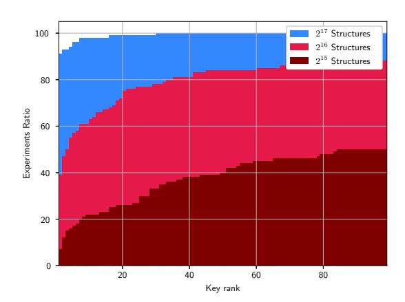

**Figure 6:** Rank distribution for the correct key among  $2^{16}$  candidates from 100 runs of our six-round attack with Small-AES, with random keys and  $2^{15}$ ,  $2^{16}$ , or  $2^{17}$  structures of  $2^{16}$  texts each

need to find a balance between  $2^{64} \cdot 2^{2 \cdot (m-a)} = 2^{128-2a}$  and  $2 \cdot 2^{\log_2(N)-41+44.0}/(6 \cdot 4) \simeq 2^{\log_2(N)-1.591}$

Figure 4b shows the trade-off curves under different success probability based on the result obtained using the model in [Sel08], and Figure 5b shows that using the model in [SS17]. With a moderate success probability 63% (note that the success probability of the six-round key-recovery attack in [BODK+18] is approximately 63%), based on the model by [Sel08], we pick the balance point with a=25.5. At that point, the required number of plaintext pairs is  $N=2^{79.045}$ , the data complexity is approximately  $2^{70.045}$  chosen plaintexts. The computational complexity is approximately  $2^{77.454}$  encryption equivalents. Using the model from Samajder and Sarkar [SS17], we choose the balance point with a=25. At that point, the required number of plaintext pairs is  $N=2^{80.285}$ , the data complexity is approximately  $2^{71.285}$  chosen plaintexts, and the computational complexity is approximately  $2^{78.695}$  six-round encryptions. In Table 4, we chose the more conservative higher complexities from the model by [SS17].

#### 6.2 Experimental Verification

We verified our attack in a variant that omits the second execution on Small-AES. The resulting S-box is inherited 4-differential-uniformity; for each input difference  $\alpha$ , there exist six output differences  $\beta$  with  $\Pr[S(x) \oplus S(x \oplus \alpha) = \beta] = 2/16$ , and one difference  $\beta$  for which  $\Pr[S(x) \oplus S(x \oplus \alpha) = \beta] = 4/16$ . Similar properties hold for the inverse S-box for Small-AES. So, each hash table  $\mathcal{H}_i$ , for  $0 \le i \le 3$  contains  $2^{16}$  16-bit entries for each input difference  $\Delta P$  on average. This corresponds to  $2^{20}$  bytes or  $2^{17}$  64-bit states for Small-AES.

We chose  $2^s$  structures of  $2^{16}$  texts each, which yielded  $2^s \cdot 4 \cdot 2^{12}$   $\delta$ -sets. For s=16, this corresponds to approximately  $2^{36.907}$  pairs. The time complexity is given by

- $4 \cdot 15 \cdot 15 \cdot 2^{16} \cdot 8/16 \cdot 1/6 \simeq 2^{22.3}$  encryptions for the hash tables.
- $2^{32}$  encryptions and 1/6 partial decryptions, or at most  $2^{32.22}$  encryption equivalents.
- $2^{34}$  memory accesses for storing the texts and  $4 \cdot 2^{16} \cdot 16 \cdot 2^{16} = 2^{38}$  memory accesses for sorting the lists.

| /     | J                          |                | 1            |             | I                      |
|-------|----------------------------|----------------|--------------|-------------|------------------------|
| #Rds. | Attack type                | Time<br>(Enc.) | Data<br>(CP) | $P_S$       | Ref.                   |
| 6     | Impossible Differential    | $2^{122.0}$    | $2^{91.5}$   | ≈ 1         | [CKK <sup>+</sup> 01]  |
| 6     | MitM                       | $2^{106.2}$    | $2^{8}$      | $\approx 1$ | [DFJ13]                |
| 6     | Prob. Mixture-differential | $2^{105.0}$    | $2^{72.8}$   | $\geq 0.95$ | [Gra17, Gra19]         |
| 6     | Mixture-differential       | $2^{81.0}$     | $2^{27.5}$   | 0.632       | [BODK <sup>+</sup> 18] |
| 6     | Truncated differential     | $2^{78.7}$     | $2^{71.3}$   | 0.632       | Sect. 6                |
| 6     | Integral                   | $2^{51.7}$     | $2^{35}$     | $\approx 1$ | [Tod14, TA14]          |
| 6     | Partial Sum                | $2^{42.0}$     | $2^{32}$     | $\approx 1$ | [Tun12a, Tun12b]       |
| 7     | Impossible Differential    | $2^{106.88}$   | $2^{105}$    | ≈ 1         | [BLNS18]               |
| 7     | MitM                       | $2^{99.0}$     | $2^{97}$     | ≈ 1         | [DFJ13]                |

<span id="page-27-1"></span>Table 4: Comparison of the best secret-key key-recovery attacks on six-round AES-128 and the best attacks on seven rounds, ordered by rounds (descending) then time (ascending). Enc. = encryptions; MAs = memory accesses; CP = chosen plaintexts,  $P_S = success$  probability.

- It yields about  $2^{16} \cdot 4 \cdot 2^{12} \cdot \binom{2^4}{2} \cdot 2^{-14} \simeq 2^{22.91}$  collisions. Given that we need at most three accesses to the lists  $\mathcal{L}$  per collision, this corresponds to at most  $2^{25.49}$  memory accesses.
- Per collision, we expect on average  $4 \cdot 15$  suggestions from the hash tables. So, we require  $2 \cdot (2^{22.91} \cdot 4 \cdot 15) \simeq 2^{29.82}$  XORs for deriving the keys in  $\mathcal{K}$  and the same maximum number of MAs to increment the counters in  $\mathcal{K}$ .

We omit the second execution; the attack requires

$$2^{22.3} + 2^{32.22} \simeq 2^{32.23} \text{ encryptions and } 2^{34} + 2^{38} + 2^{24.49} + 2^{29.82} \simeq 2^{38.1} \text{ MAs}$$

to reduce the key space for  $K^0[0,5,10,15]$ . The attack stores  $2^{16}$  tuples of 4+16 nibbles at a time for the states plus  $2^{16}$  four-nibble key candidates, plus  $2^{17}$  states for the hash tables, which corresponds to less than  $2^{17.9}$  states.

Figure 6 illustrates the results of 100 experiments that employed independent random keys for  $2^{15}$ ,  $2^{16}$ , and  $2^{17}$  structures of  $2^{16}$  plaintexts each. Our experiments aimed at recovering the 16 key bits  $K^0[0, 5, 10, 15]$  from the first diagonal. The experiments yielded mean advantages of 7.070, 10.550, and 14.243 bits, respectively.

# <span id="page-27-0"></span>7 Six-round Truncated-differential Distinguisher

Core Idea. We can derive a six-round distinguisher that shares the higher-level concept of our six-round key-recovery attack. Our five-round distinguisher started from a single-byte difference that was transformed through five rounds to a mixed space  $\mathcal{M}_{\mathcal{J}}$  for arbitrary  $\mathcal{J} \subseteq \{0,1,2,3\}$  and  $|\mathcal{J}|=3$ . The idea is to extend the five-round distinguisher at the beginning by starting from a single-diagonal space. Let  $X, X' \in (\mathbb{F}_{2^8})^{4\times 4}$  be distinct and  $\Delta X = X \oplus X' \in \mathcal{D}_{\{c\}}$  for some fixed  $c \in \{0,1,2,3\}$ . Let Y and Y' be the corresponding ciphertexts of X and X', respectively; either generated by transforming them through six-round AES, or through a random permutation  $\pi \leftarrow \text{Perm}((\mathbb{F}_{2^8})^{4\times 4})$ . We define the space  $\mathcal{B}_{\{r,c\}} = ^{\text{def}} \mathcal{C}_{\{c\}} \cap \mathcal{D}_{\{r\}}$ , i.e., the space of the single Byte in Row r and Column c for  $r, c \in \{0,1,2,3\}$ . With a certain probability that we denote as  $p_1$ ,  $R(X) \oplus R(X') \in \mathcal{B}_{\{r,0\}}$  possesses a single-byte difference after the first round. Then, the probability that the difference in their ciphertexts is in  $\Delta Y \in \mathcal{M}_{\mathcal{J}}$  is approximately the probability of our five-round distinguisher. We denote that probability as  $p_{\text{AES},5}$ . Let us define the random variable Y to be 1 iff  $Y \oplus Y' \in \mathcal{M}_{\mathcal{J}}$  for arbitrary  $\mathcal{J} \subseteq \{0,1,2,3\}$  and  $|\mathcal{J}|=3$ , and 0

otherwise. In the case that multiple bytes are active in the difference after the first round, we can approximate the probability of Y by that for a random permutation.

For a random permutation, the probability is always q ignorant of the plaintext pair. So, for a fraction of pairs, we have a higher probability that their ciphertext difference is in  $\mathcal{M}_{\mathcal{J}}$ . If  $p_1$  is not too small, we can build a distinguisher with a smaller mean than before, which can still be used in a distinguisher.

**Formulation.** In the following, we omit writing the condition  $X \oplus X' \in \mathcal{D}_{\{c\}}$  explicitly for brevity. By the law of total probability,

$$\begin{split} &\Pr\left[Y \oplus Y' \in \mathcal{M}_{\mathcal{J}}\right] \\ &= \Pr\left[\mathsf{R}^{6}(X) \oplus \mathsf{R}^{6}(X') \in \mathcal{M}_{\mathcal{J}}\right] \\ &= \Pr\left[\mathsf{R}^{6}(X) \oplus \mathsf{R}^{6}(X') \in \mathcal{M}_{\mathcal{J}} \middle| \mathsf{R}(X) \oplus \mathsf{R}(X') \in \mathcal{B}_{\{r,c\}}\right] \cdot \Pr\left[\mathsf{R}(X) \oplus \mathsf{R}(X') \in \mathcal{B}_{\{r,c\}}\right] + \\ &\Pr\left[\mathsf{R}^{6}(X) \oplus \mathsf{R}^{6}(X') \in \mathcal{M}_{\mathcal{J}} \middle| \mathsf{R}(X) \oplus \mathsf{R}(X') \not\in \mathcal{B}_{\{r,c\}}\right] \cdot \Pr\left[\mathsf{R}(X) \oplus \mathsf{R}(X') \not\in \mathcal{B}_{\{r,c\}}\right] \;. \end{split}$$

Under the Markov-cipher assumption, we know from our five-round distinguisher that

$$p_{5,\text{AES}} \stackrel{\text{def}}{=} \Pr \left[ \mathsf{R}^6(X) \oplus \mathsf{R}^6(X') \in \mathcal{M}_{\mathcal{J}} | \mathsf{R}(X) \oplus \mathsf{R}(X') \in \mathcal{B}_{\{r,c\}} \right]$$
$$\simeq 2^{-30} + 2^{-51.985} - 2^{-61.415}.$$

For  $X \in (\mathbb{F}_{2^8})^{4\times 4}$ , let wt :  $(\mathbb{F}_{2^8})^{4\times 4} \to \mathbb{Z}_{16}$  represent the byte weight, which yields the number of non-zero cells in the input:

$$\mathsf{wt}(X) \stackrel{\mathrm{def}}{=} \sum_{i=0}^{15} \delta(X[i]) \quad \text{where} \quad \delta(X[i]) \stackrel{\mathrm{def}}{=} \begin{cases} 1 & \text{if } X[i] \neq 0, \\ 0 & \text{otherwise.} \end{cases}$$

The probability for a difference with a single active byte after the first round is simply

$$\begin{aligned} p_{1,\text{AES}} &\stackrel{\text{def}}{=} \Pr\left[\mathsf{R}(X) \oplus \mathsf{R}(X') \in \mathcal{B}_{\{r,c\}}\right] \\ &= \Pr\left[\mathsf{R}(X) \oplus \mathsf{R}(X') \in \mathcal{B}_{\{r,c\}} | \mathsf{wt}(X \oplus X') = 4\right] \cdot \Pr\left[\mathsf{wt}(X \oplus X') = 4\right] + \\ &\quad \Pr\left[\mathsf{R}(X) \oplus \mathsf{R}(X') \in \mathcal{B}_{\{r,c\}} | \mathsf{wt}(X \oplus X') < 4\right] \cdot \Pr\left[\mathsf{wt}(X \oplus X') < 4\right] \\ &= 4 \cdot \frac{255}{255^4} \cdot \frac{255^4}{2^{32} - 1} + 0 = \frac{4 \cdot 255}{2^{32} - 1} \,. \end{aligned}$$

Furthermore, we approximate

<span id="page-28-1"></span><span id="page-28-0"></span>
$$\Pr\left[\mathsf{R}^6(X) \oplus \mathsf{R}^6(X') \in \mathcal{M}_{\mathcal{J}} | \mathsf{R}(X) \oplus \mathsf{R}(X') \not\in \mathcal{B}_{\{r,c\}}\right]$$
$$\simeq \Pr\left[\pi(X) \oplus \pi(X') \in \mathcal{M}_{\mathcal{J}}\right] \stackrel{\text{def}}{=} p_{\mathsf{rand}} \simeq 2^{-30} - 2^{-61.415}.$$

Thus, we obtain from simple calculation that

$$p_{6,\text{AES}} \simeq p_{5,\text{AES}} \cdot \frac{4 \cdot 255}{2^{32} - 1} + p_{\text{rand}} \cdot \left(1 - \frac{4 \cdot 255}{2^{32} - 1}\right) \simeq 2^{-30} - 2^{-61.415} + 2^{-73.98856} \,. \tag{13}$$

This implies a difference of  $|p_{\sf rand} - p_{\sf 6,AES}| \simeq 2^{-73.989}$ . This difference is very small, but may still be high enough to distinguish between the distributions. The setting is illustrated in Figure 7.

Equation (5) yields, again for a success probability of  $P_S \geq 0.95$ , that one would need approximately  $N \geq 2^{120.43}$  pairs, and  $N \geq 2^{121.43}$  pairs for  $P_S \geq 0.99$ . Assuming that a diagonal structure of  $2^{32}$  texts contains  $\binom{2^{32}}{2}$  pairs, this amount of pairs can be obtained by querying  $2^{57.43}$  structures or  $2^{89.43}$  chosen plaintexts.

<span id="page-29-0"></span>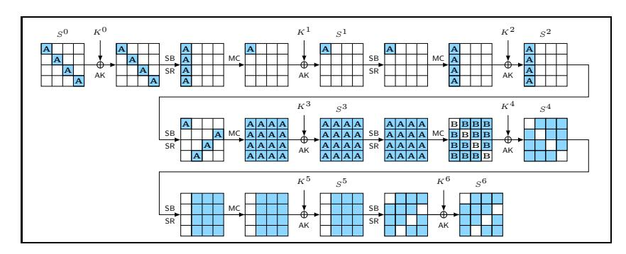

Figure 7: Six-round distinguisher. Darkened cells represent bytes with active (non-zero) difference, white cells represent bytes with zero difference.

**Steps.** The steps are as follows:

- 1. Initialize a collision counter.
- 2. For  $i=1..2^s$ , collect a structure  $S_i$  of  $2^{32}$  texts that iterate over all values in  $\mathcal{D}_{\{0\}}$  and leave the remaining bytes constant. Query the plaintexts of a structure and ask for their corresponding ciphertexts after six rounds. Invert the final MixColumns and ShiftRows operations to get the states  $S^{6,\text{SB}}$  and store them in a list  $\mathcal{Q}$ .
- 3. For each structure and each state  $S^{6,\mathsf{SB}}$  therein:
  - 3.1 Initialize four lists  $\mathcal{L}_i$ , for i = 0, 1, 2, 3 of  $2^{32}$  elements.
  - 3.2 For each column  $i \in \{0, 1, 2, 3\}$  of  $S^{6, \mathsf{SB}}$ , interpret the *i*-th column as 32-bit integer  $\mathbf{c}$  and append the text to  $\mathcal{L}_i[\mathbf{c}]$  at the index corresponding to the column value  $\mathbf{c}$ , e.g.,  $\mathbf{c} = S^{6, \mathsf{SB}}[0, 1, 2, 3]$  for Column 0.
- 4. For each list  $\mathcal{L}_i$ :
  - 4.1 Look for collisions, e.g., multiple values at the same index.
  - 4.2 For each collision, look up those pairs in other lists  $\mathcal{L}_j$ , for  $i \neq j$ , if they have already been counted. Otherwise, increment the corresponding key counter.
- 5. If the counter exceeds a given threshold  $\theta$ , output real; otherwise, output random.

An approximation for  $\theta$  can be  $2^{57.43} \cdot \binom{2^{32}}{2} \cdot (p_{6,AES} + p_{\mathsf{rand}})/2$ .

**Complexity.** The attack employs  $2^{57.43}$  structures or  $2^{89.43}$  chosen plaintexts for a success probability of about 0.95. The memory complexity is given by storing  $2^{32}$  states in  $\mathcal{Q}$  and four lists  $\mathcal{L}_i$  of  $4 \cdot 2^{32}$  columns at a time. The time complexity consists of

- $2^{89.43}$  encryptions and 1/6 partial decryptions or  $2^{89.7}$  encryption equivalents.
- $2^{89.43} \cdot 4 \simeq 2^{91.43}$  memory accesses for inserting the texts. Sorting requires approximately  $2^{57.43} \cdot 4 \cdot 32 \cdot 2^{32} \simeq 2^{96.43}$  memory accesses.
- If a collision occurs when inserting for a column, at most  $2 \cdot 2^{57.43} \cdot \binom{2^{32}}{2} \cdot 2^{-32} \cdot 3 \simeq 2^{91.02}$  additional memory accesses are needed to look up if other columns collide in the other lists.
- Approximately  $2 \cdot 2^{57.43} \cdot {2^{32} \choose 2} \cdot 2^{-32} \simeq 2^{89.43}$  memory accesses to increment the counter.

So, the computational complexity is given by approximately  $2^{89.7}$  encryptions and  $2^{91.43} + 2^{96.43} + 2^{91.02} + 2^{89.43} \simeq 2^{96.52}$  memory accesses.

<span id="page-30-0"></span>

|           |             | Per structure |          |            | Per experiment        |               |  |
|-----------|-------------|---------------|----------|------------|-----------------------|---------------|--|
| Instance  |             | $\mu$         | $\sigma$ | $\sigma^*$ | $\mu$                 | σ             |  |
| $\pi$     | Theory      | 131 067.000   | 362.021  |            | 5 085 047 291 904.000 | 2 254 936.126 |  |
|           | Experiment  | 131 066.993   | 362.022  | 0.056      | 5085047013804.869     | 2182652.286   |  |
| Small-AES | Theory      | 131 067.137   | 362.021  |            | 5 085 052 607 135.744 | 2 254 937.303 |  |
|           | Experiments | 131 067.191   | 362.041  | 0.053      | 5085054704906.403     | 2040063.345   |  |

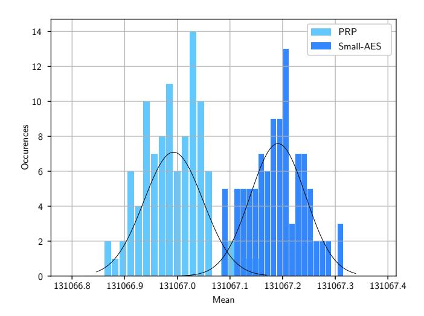

**Figure 8:** Distribution of the means  $(\mu)$  and fitted normals from 100 experiments that counted the number of collisions in at least one ciphertext column per structure of  $2^{16}$  texts of our sixround distinguisher on Small-AES and full Speck-64 as pseudorandom permutation  $\pi$ .  $\sigma^*$  is the observed standard deviation of the means per structure among the 100 experiments.

**Small Variant.** For the small-scale variant of AES with four-bit S-boxes, we obtain from the adapted Equations (12) and (13) that

$$\begin{split} p_{\text{Small-AES},1} &= 4 \cdot \frac{15}{15^4} \cdot \frac{15^4}{2^{16}-1} = \frac{4 \cdot 15}{2^{16}-1} \text{ and} \\ p_{\text{Small-AES},6} &\simeq p_{\text{Small-AES},5} \cdot \frac{4 \cdot 15}{2^{16}-1} + p_{\text{rand}} \cdot \left(1 - \frac{4 \cdot 15}{2^{16}-1}\right) \simeq 2^{-14} - 2^{-29.415} + 2^{-33.869} \,. \end{split}$$

This yields a mean of  $p_{\text{Small-AES},6} \cdot {2^{16} \choose 2} \simeq 131\,067.137$  colliding pairs per structure. For a random permutation, the probability of a pair to collide is approximately

$$p_{\rm rand} \simeq 2^{-14} - 2^{-29.415}$$

which gives a mean of  $p_{\mathsf{rand}} \cdot \binom{2^{16}}{2} \simeq 131\,067.000$  colliding pairs per structure. So, a similar distinguisher on the small-scale version of the AES would need  $2^{56.18}$  experiments, which corresponds to  $2^{25.18}$  structures of  $2^{16}$  texts each, or  $2^{41.18}$  chosen plaintexts. For both variants AES and Small-AES, we provide theoretical trade-offs of success probability and data complexity in Figure 9.

**Experimental Verification.** We implemented the distinguisher for Small-AES with 100 random keys. For each of them, we encrypted  $37 \cdot 2^{20} \simeq 2^{25.21}$  structures of  $2^{16}$  texts

*,*

<span id="page-31-0"></span>

**Figure 9:** Success probability for the plausible range of the data complexity (number of pairs) for our six-round distinguisher, derived from Equation [\(5\)](#page-9-3) from [GR19].

each. For Small-AES, we used five full rounds plus SubBytes and AddRoundKeys in the last round since MixColumns and ShiftRows are easily invertible. As a pseudorandom permutation *π*, we employed full Speck-64-96. For each primitive, the 100 experiments required about three CPU years of computations.

For reproducibility, we employed the most significant (leftmost) eight bytes from the first 100 output values from the NIST random Beacon service[4](#page-31-1) as (pseudo)random independent keys. For each structure, we counted the number of pairs that collided in at least one column. For Small-AES, we observed a mean of *µ* = 131 067*.*191 pairs per structure, and *µ* = 131 066*.*993 for our pseudorandom permutation. Figure [8](#page-30-0) illustrates the results of our experiments. Both illustrate that the difference in the distributions is even slightly higher in our experiments than in the theory. Most importantly, while the standard deviation per structure (*σ*) is far too high, an experiment consists of sufficiently many structures so that the standard deviation per structure over the experiment (*σ* ∗ ) allows us to distinguish both distributions very well.

**Transition-based Verification.** Again, we employ the transition-based approach by Rønjom [Røn19] for a second form of verification. The results basically confirmed the biases of our six-round distinguishers as

$$p_{\text{AES},6} \simeq 0.533575144973... \cdot 10^{-22} \simeq 2^{-30} - 2^{-61.415} + 2^{-73.98866}$$

 $p_{\text{Small-AES},6} \simeq 0.674785648935... \cdot 10^{-10} \simeq 2^{-14} - 2^{-29.415} + 2^{-33.78678}$

which have again slight deviations that can be due to rounding.

**S-box and Index Dependencies.** Again, we emphasize that our assumptions are an approximation of ideal structures for the AES and Small-AES. Our six-round distinguisher does not directly employ a single cell as input and considers all four possible positions for *δ*-sets after the first round. So, the position-dependent considerations from our four- and five-round distinguishers do not apply here.

<span id="page-31-1"></span><sup>4</sup>See <https://beacon.nist.gov/beacon/2.0/chain/1/pulse/<i>> for 1 ≤ *i* ≤ 100.

#### <span id="page-32-0"></span>8 Discussion and Conclusion

This work extends the well-known integral distinguisher on three-round AES to truncated-differential distinguishers. Our attacks exploit a small difference in the average number of byte collisions between the sum of four permutations and the number of collisions for a truncated random permutation. In the AES, this sum is approximated by almost three rounds plus the MixColumns operation. The small but significant difference allowed us to extend the integral attack to four rounds. By extending this approach to collisions in the four bytes of an inverse diagonal, we proposed a novel five-round distinguisher for the AES.

Compared to the five-round distinguisher by Grassi and Rechberger [GR19], our distinguishers start from a single active byte. Thus, they could benefit from the fact that one can easily prepend one round for an attack and start from a diagonal structure of  $2^{32}$  texts. Thus, although inferior to previous key-recovery results on the AES, we could extend it to a key-recovery attack on six rounds in Section 6. Moreover, Section 7 showed that even this prepended round could still be included in a secret-key distinguisher, with considerably lower but still distinguishable bias.

**Verifiability.** We note that it is infeasible to verify the proposed distinguishers for the AES directly. Where possible, we tried where possible to implement small-scale variants with Cid et al.'s established version of Small-AES with four-bit cells. We employed the transition-distribution approach by Rønjom as a second means of verification. All our implementations are freely available online.<sup>3</sup>

**Open Questions.** We observe that the distinguishers ask interesting follow-up questions:

- Which properties in the S-box and the cipher structure lead to the position-dependent diverse distribution of means in our four- and five-round distinguishers?
- Can we predict a-priori which input-output indices yield particularly strong distinguishers for the three-round differential in our four-round distinguisher, given the S-box? Can we predict the behavior for the S-box of the AES?
- Which property leads to the multiple-of-32 collision counts for Small-AES?
- Is it the same or a different property that leads to higher variances in our five-round distinguisher for Small-AES?
- Is it the same or a different property that leads to the multiple-of-four property when concerning a full diagonal space to a single cell through four full rounds of Small-AES?
- Which property leads to the significant deviation in the variance of Small-AES with the PRIDE S-box for our four-round distinguisher?

We think that the simple three-round truncated-differential that ignited this work seems particularly well-suited to further investigate those and related questions.

**Acknowledgments.** The stay by Eik List at Nanyang Technical University Singapore was kindly supported by the DAAD IPID4all programme through the Bauhaus Research School at Weimar. Parts of the research leading to these results was made possible by DFG Grant LU 608/9-1. This research is partially supported by Nanyang Technological University in Singapore under Grant 04INS000397C230, Singapore's Ministry of Education under Grants RG18/19 and MOE2019-T2-1-060. Special thanks go to Lorenzo Grassi and Sondre Rønjom for numerous fruitful discussions, suggestions, and hints that lead to

considerable improvements. Moreover, we thank Navid Bardeh and Sondre Rønjom for discussions and insights on their recent publications. Thanks to Jannis Bossert and Stefan Lucks for their helpful suggestions on the four-round distinguisher. Moreover, our thanks go to Maik Fröbe, Johannes Kiesel, and Michael Völske for their kind support for working on the Webis betaweb cluster. We thank the ToSC reviewers and Orr Dunkelman for numerous very good comments and hints that improved the quality of this work considerably. They also hinted us to the work by Heys [\[Hey14\]](#page-36-1).

# **References**

- [ADK+14] Martin R. Albrecht, Benedikt Driessen, Elif Bilge Kavun, Gregor Leander, Christof Paar, and Tolga Yalçin. Block Ciphers - Focus on the Linear Layer (feat. PRIDE). In Juan A. Garay and Rosario Gennaro, editors, *CRYPTO I*, volume 8616 of *LNCS*, pages 57–76. Springer, 2014. [https://doi.org/10.1007/978-3-662-44371-2\\_4.](https://doi.org/10.1007/978-3-662-44371-2_4)
- [Bar19] Navid Ghaedi Bardeh. A Key-Independent Distinguisher for 6-round AES in an Adaptive Setting. *IACR Cryptology ePrint Archive*, 2019:945, 2019. [http://eprint.iacr.org/2019/945.](http://eprint.iacr.org/2019/945)
- [BCC19] Christina Boura, Anne Canteaut, and Daniel Coggia. A General Proof Framework for Recent AES Distinguishers. *IACR Trans. Symmetric Cryptol.*, 2019(1):170–191, 2019. [https://doi.org/10.13154/tosc.v2019.i1.170-191.](https://doi.org/10.13154/tosc.v2019.i1.170-191)
- [BCG<sup>+</sup>12] Julia Borghoff, Anne Canteaut, Tim Güneysu, Elif Bilge Kavun, Miroslav Knezevic, Lars R. Knudsen, Gregor Leander, Ventzislav Nikov, Christof Paar, Christian Rechberger, Peter Rombouts, Søren S. Thomsen, and Tolga Yalçin. PRINCE - A Low-Latency Block Cipher for Pervasive Computing Applications - Extended Abstract. In Xiaoyun Wang and Kazue Sako, editors, *ASIACRYPT*, volume 7658 of *LNCS*, pages 208–225. Springer, 2012. [https://doi.org/10.1007/978-3-642-34961-4\\_14.](https://doi.org/10.1007/978-3-642-34961-4_14)
- [BDK<sup>+</sup>20] Achiya Bar-On, Orr Dunkelman, Nathan Keller, Eyal Ronen, and Adi Shamir. Improved Key Recovery Attacks on Reduced-Round AES with Practical Data and Memory Complexities. *Journal of Cryptology*, 33(3):1003– 1043, 2020. [https://doi.org/10.1007/s00145-019-09336-w.](https://doi.org/10.1007/s00145-019-09336-w)
- [BKL<sup>+</sup>07] Andrey Bogdanov, Lars R. Knudsen, Gregor Leander, Christof Paar, Axel Poschmann, Matthew J. B. Robshaw, Yannick Seurin, and C. Vikkelsoe. PRESENT: An Ultra-Lightweight Block Cipher. In Pascal Paillier and Ingrid Verbauwhede, editors, *CHES*, volume 4727 of *LNCS*, pages 450–466. Springer, 2007. [https://doi.org/10.1007/978-3-540-74735-2\\_31.](https://doi.org/10.1007/978-3-540-74735-2_31)
- [BKR11] Andrey Bogdanov, Dmitry Khovratovich, and Christian Rechberger. Biclique Cryptanalysis of the Full AES. In Dong Hoon Lee and Xiaoyun Wang, editors, *ASIACRYPT*, volume 7073 of *LNCS*, pages 344–371. Springer, 2011. [https://doi.org/10.1007/978-3-642-25385-0\\_19.](https://doi.org/10.1007/978-3-642-25385-0_19)
- [BLNS18] Christina Boura, Virginie Lallemand, María Naya-Plasencia, and Valentin Suder. Making the Impossible Possible. *J. Cryptology*, 31(1):101–133, 2018. [https://doi.org/10.1007/s00145-016-9251-7.](https://doi.org/10.1007/s00145-016-9251-7)
- [BODK<sup>+</sup>18] Achiya Bar-On, Orr Dunkelman, Nathan Keller, Eyal Ronen, and Adi Shamir. Improved Key Recovery Attacks on Reduced-Round AES with

- Practical Data and Memory Complexities. In Hovav Shacham and Alexandra Boldyreva, editors, *CRYPTO II*, volume 10992 of *LNCS*, pages 185–212. Springer, 2018. [https://doi.org/10.1007/978-3-319-96881-0\\_7.](https://doi.org/10.1007/978-3-319-96881-0_7)
- [BR19a] Navid Ghaedi Bardeh and Sondre Rønjom. Practical Attacks on Reduced-Round AES. In Johannes Buchmann, Abderrahmane Nitaj, and Tajjeeddine Rachidi, editors, *Africacrypt*, volume 11627 of *LNCS*, pages 297–310. Springer, 2019. [https://doi.org/10.1007/978-3-030-23696-0\\_15.](https://doi.org/10.1007/978-3-030-23696-0_15)
- [BR19b] Navid Ghaedi Bardeh and Sondre Rønjom. The Exchange Attack: How to Distinguish 6 Rounds of AES with 288*.*<sup>2</sup> chosen plaintexts. *IACR Cryptology ePrint Archive*, 2019:652, 2019. [https://eprint.iacr.org/2019/652.](https://eprint.iacr.org/2019/652)
- [BR19c] Navid Ghaedi Bardeh and Sondre Rønjom. The Exchange Attack: How to Distinguish 6 Rounds of AES with 288*.*<sup>2</sup> chosen plaintexts. In Steven D. Galbraith and Shiho Moriai, editors, *ASI-ACRYPT*, volume 11923 of *LNCS*, pages 347–370. Springer, 2019. [https://doi.org/10.1007/978-3-030-34618-8\\_12.](https://doi.org/10.1007/978-3-030-34618-8_12)
- [CCM+18] Tingting Cui, Huaifeng Chen, Sihem Mesnager, Ling Sun, and Meiqin Wang. Statistical integral distinguisher with multi-structure and its application on AES-like ciphers. *Cryptography and Communications*, 10(5):755–776, 2018. [https://doi.org/10.1007/s12095-018-0286-5.](https://doi.org/10.1007/s12095-018-0286-5)
- [CKK<sup>+</sup>01] Jung Hee Cheon, MunJu Kim, Kwangjo Kim, Jung-Yeun Lee, and SungWoo Kang. Improved Impossible Differential Cryptanalysis of Rijndael and Crypton. In Kwangjo Kim, editor, *ICISC*, volume 2288 of *LNCS*, pages 39–49. Springer, 2001. [https://doi.org/10.1007/3-540-45861-1\\_4.](https://doi.org/10.1007/3-540-45861-1_4)
- [CMR05] Carlos Cid, Sean Murphy, and Matthew J. B. Robshaw. Small Scale Variants of the AES. In Henri Gilbert and Helena Handschuh, editors, *FSE*, volume 3557 of *LNCS*, pages 145–162. Springer, 2005. [https://doi.org/10.1007/11502760\\_10.](https://doi.org/10.1007/11502760_10)
- [CMSZ15] Jiageng Chen, Atsuko Miyaji, Chunhua Su, and Liang Zhao. A New Statistical Approach for Integral Attack. In Meikang Qiu, Shouhuai Xu, Moti Yung, and Haibo Zhang, editors, *NSS*, volume 9408 of *LNCS*, pages 345–356. Springer, 2015. [https://doi.org/10.1007/978-3-319-25645-0\\_23.](https://doi.org/10.1007/978-3-319-25645-0_23)
- [CSCW17] Tingting Cui, Ling Sun, Huaifeng Chen, and Meiqin Wang. Statistical Integral Distinguisher with Multi-structure and Its Application on AES. In Josef Pieprzyk and Suriadi Suriadi, editors, *ACISP I*, volume 10342 of *LNCS*, pages 402–420. Springer, 2017. [https://doi.org/10.1007/978-3-319-60055-0\\_21.](https://doi.org/10.1007/978-3-319-60055-0_21)
- [DDKS13] Itai Dinur, Orr Dunkelman, Nathan Keller, and Adi Shamir. Key Recovery Attacks on 3-round Even-Mansour, 8-step LED-128, and Full AES<sup>2</sup> . In Kazue Sako and Palash Sarkar, editors, *ASI-ACRYPT I*, volume 8269 of *LNCS*, pages 337–356. Springer, 2013. [https://doi.org/10.1007/978-3-642-42033-7\\_18.](https://doi.org/10.1007/978-3-642-42033-7_18)
- [DFJ13] Patrick Derbez, Pierre-Alain Fouque, and Jérémy Jean. Improved Key Recovery Attacks on Reduced-Round AES in the Single-Key Setting. In Thomas Johansson and Phong Q. Nguyen, editors, *EU-ROCRYPT*, volume 7881 of *LNCS*, pages 371–387. Springer, 2013. [https://doi.org/10.1007/978-3-642-38348-9\\_23.](https://doi.org/10.1007/978-3-642-38348-9_23)

- [DKR97] Joan Daemen, Lars R. Knudsen, and Vincent Rijmen. The Block Cipher Square. In Eli Biham, editor, *FSE*, volume 1267 of *LNCS*, pages 149–165. Springer, 1997. [https://doi.org/10.1007/BFb0052343.](https://doi.org/10.1007/BFb0052343)
- [DKRS20] Orr Dunkelman, Nathan Keller, Eyal Ronen, and Adi Shamir. The Retracing Boomerang Attack. In Anne Canteaut and Yuval Ishai, editors, *EUROCRYPT I*, volume 12105 of *LNCS*, pages 280–309. Springer, 2020. [https://doi.org/10.1007/978-3-030-45721-1\\_11.](https://doi.org/10.1007/978-3-030-45721-1_11)
- <span id="page-35-0"></span>[DR02] Joan Daemen and Vincent Rijmen. *The Design of Rijndael: AES - The Advanced Encryption Standard*. Springer, 2002. [https://doi.org/10.1007/978-3-662-04722-4.](https://doi.org/10.1007/978-3-662-04722-4)
- [DS08] Hüseyin Demirci and Ali Aydin Selçuk. A Meet-in-the-Middle Attack on 8-Round AES. In Kaisa Nyberg, editor, *FSE*, volume 5086 of *LNCS*, pages 116–126. Springer, 2008. [https://doi.org/10.1007/978-3-540-71039-4\\_7.](https://doi.org/10.1007/978-3-540-71039-4_7)
- [DS09] Itai Dinur and Adi Shamir. Cube Attacks on Tweakable Black Box Polynomials. In Antoine Joux, editor, *EUROCRYPT*, volume 5479 of *LNCS*, pages 278–299. Springer, 2009. [https://doi.org/10.1007/978-3-642-01001-9\\_16.](https://doi.org/10.1007/978-3-642-01001-9_16)
- [FKL<sup>+</sup>00] Niels Ferguson, John Kelsey, Stefan Lucks, Bruce Schneier, Michael Stay, David A. Wagner, and Doug Whiting. Improved Cryptanalysis of Rijndael. In Bruce Schneier, editor, *FSE*, volume 1978 of *LNCS*, pages 213–230. Springer, 2000. [https://doi.org/10.1007/3-540-44706-7\\_15.](https://doi.org/10.1007/3-540-44706-7_15)
- [GM00] Henri Gilbert and Marine Minier. A Collision Attack on 7 Rounds of Rijndael. In *AES Candidate Conference*, pages 230–241, 2000.
- [GR18] Lorenzo Grassi and Christian Rechberger. New Rigorous Analysis of Truncated Differentials for 5-round AES. *IACR Cryptology ePrint Archive*, 2018:182, 2018. Version 20180713:144052, [http://eprint.iacr.org/2018/182.](http://eprint.iacr.org/2018/182)
- [GR19] Lorenzo Grassi and Christian Rechberger. Rigorous Analysis of Truncated Differentials for 5-round AES. *IACR Cryptology ePrint Archive*, 2018:182, April 06 2019. Updated version 20190604:090617, [http://eprint.iacr.org/2018/182.](http://eprint.iacr.org/2018/182)
- [Gra17] Lorenzo Grassi. Mixture Differential Cryptanalysis: a New Approach to Distinguishers and Attacks on round-reduced AES. *IACR Cryptology ePrint Archive*, 2017:832, 2017. [https://eprint.iacr.org/2017/832.](https://eprint.iacr.org/2017/832)
- [Gra18a] Lorenzo Grassi. MixColumns Properties and Attacks on (Round-Reduced) AES with a Single Secret S-Box. In Nigel P. Smart, editor, *CT-RSA*, volume 10808 of *LNCS*, pages 243–263. Springer, 2018. [https://doi.org/10.1007/978-3-319-76953-0\\_13.](https://doi.org/10.1007/978-3-319-76953-0_13)
- [Gra18b] Lorenzo Grassi. Mixture Differential Cryptanalysis: a New Approach to Distinguishers and Attacks on round-reduced AES. *IACR Transactions on Symmetric Cryptology*, 2018(2):133–160, 2018. [https://tosc.iacr.org/index.php/ToSC/article/view/891.](https://tosc.iacr.org/index.php/ToSC/article/view/891)
- [Gra19] Lorenzo Grassi. Probabilistic Mixture Differential Cryptanalysis on round-reduced AES. In Kenneth G. Paterson and Douglas Stebila, editors, *SAC*, volume 11959 of *LNCS*, pages 53–84. Springer, 2019. [https://doi.org/10.1007/978-3-030-38471-5\\_3.](https://doi.org/10.1007/978-3-030-38471-5_3)

- [GRR16] Lorenzo Grassi, Christian Rechberger, and Sondre Rønjom. Subspace Trail Cryptanalysis and its Applications to AES. *IACR Trans. Symmetric Cryptol.*, 2016(2):192–225, 2016. [https://doi.org/10.13154/tosc.v2016.i2.192-225.](https://doi.org/10.13154/tosc.v2016.i2.192-225)
- [GRR17] Lorenzo Grassi, Christian Rechberger, and Sondre Rønjom. A New Structural-Differential Property of 5-Round AES. In Jean-Sébastien Coron and Jesper Buus Nielsen, editors, *EUROCRYPT II*, volume 10211 of *LNCS*, pages 289–317, 2017. [https://doi.org/10.1007/978-3-319-56614-6\\_10.](https://doi.org/10.1007/978-3-319-56614-6_10)
- [HCGW18] Kai Hu, Tingting Cui, Chao Gao, and Meiqin Wang. Towards Key-Dependent Integral and Impossible Differential Distinguishers on 5-Round AES. In Carlos Cid and Michael J. Jacobson Jr., editors, *SAC*, volume 11349 of *LNCS*, pages 139–162. Springer, 2018. [https://doi.org/10.1007/978-3-030-10970-7\\_7.](https://doi.org/10.1007/978-3-030-10970-7_7)
- <span id="page-36-1"></span>[Hey14] Howard Heys. Integral cryptanalysis of the BSPN block cipher. In *Biennial Symposium on Communications (QBSC)*, pages 153–158. IEEE, 2014. [http://www.engr.mun.ca/ howard/PAPERS/qbsc2014.pdf.](http://www.engr.mun.ca/~howard/PAPERS/qbsc2014.pdf)
- [HT96] Howard M. Heys and Stafford E. Tavares. Substitution-Permutation Networks Resistant to Differential and Linear Cryptanalysis. *J. Cryptology*, 9(1):1–19, 1996.
- [LP07] Gregor Leander and Axel Poschmann. On the Classification of 4 Bit S-Boxes. In Claude Carlet and Berk Sunar, editors, *WAIFI*, volume 4547 of *LNCS*, pages 159–176. Springer, 2007. [https://doi.org/10.1007/978-3-540-73074-3\\_13.](https://doi.org/10.1007/978-3-540-73074-3_13)
- [MDRM10] Hamid Mala, Mohammad Dakhilalian, Vincent Rijmen, and Mahmoud Modarres-Hashemi. Improved Impossible Differential Cryptanalysis of 7- Round AES-128. In Guang Gong and Kishan Chand Gupta, editors, *INDOCRYPT*, volume 6498 of *LNCS*, pages 282–291. Springer, 2010. [https://doi.org/10.1007/978-3-642-17401-8\\_20.](https://doi.org/10.1007/978-3-642-17401-8_20)
- <span id="page-36-0"></span>[Nat01] National Institute of Standards and Technology. FIPS 197. *National Institute of Standards and Technology, November*, pages 1–51, 2001. [http://csrc.nist.gov/publications/fips/fips197/fips-197.pdf.](http://csrc.nist.gov/publications/fips/fips197/fips-197.pdf)
- [Nyb93] Kaisa Nyberg. Differentially Uniform Mappings for Cryptography. In Tor Helleseth, editor, *EUROCRYPT*, volume 765 of *LNCS*, pages 55–64. Springer, 1993. [https://doi.org/10.1007/3-540-48285-7\\_6.](https://doi.org/10.1007/3-540-48285-7_6)
- [Pat08] Jacques Patarin. Generic Attacks for the Xor of *k* random permutations. *IACR Cryptology ePrint Archive*, 2008:9, 2008. [http://eprint.iacr.org/2008/009.](http://eprint.iacr.org/2008/009)
- [Pat13] Jacques Patarin. Generic Attacks for the Xor of k Random Permutations. In Michael J. Jacobson Jr., Michael E. Locasto, Payman Mohassel, and Reihaneh Safavi-Naini, editors, *ACNS*, volume 7954 of *LNCS*, pages 154–169. Springer, 2013. [https://doi.org/10.1007/978-3-642-38980-1\\_10.](https://doi.org/10.1007/978-3-642-38980-1_10)
- [RBH17] Sondre Rønjom, Navid Ghaedi Bardeh, and Tor Helleseth. Yoyo Tricks with AES. In Tsuyoshi Takagi and Thomas Peyrin, editors, *ASI-ACRYPT I*, volume 10624 of *LNCS*, pages 217–243. Springer, 2017. [https://doi.org/10.1007/978-3-319-70694-8\\_8.](https://doi.org/10.1007/978-3-319-70694-8_8)

- [Røn19] Sondre Rønjom. A Short Note on a Weight Probability Distribution Related to SPNs. *IACR Cryptology ePrint Archive*, 2019:750, 2019. [http://eprint.iacr.org/2019/750.](http://eprint.iacr.org/2019/750)
- [Sel08] Ali Aydin Selçuk. On Probability of Success in Linear and Differential Cryptanalysis. *J. Cryptology*, 21(1):131–147, 2008. [http://dx.doi.org/10.1007/s00145-007-9013-7.](http://dx.doi.org/10.1007/s00145-007-9013-7)
- [SLG+16a] Bing Sun, Meicheng Liu, Jian Guo, Longjiang Qu, and Vincent Rijmen. New Insights on AES-Like SPN Ciphers. In Matthew Robshaw and Jonathan Katz, editors, *CRYPTO I*, volume 9814 of *LNCS*, pages 605–624. Springer, 2016. [https://doi.org/10.1007/978-3-662-53018-4\\_22.](https://doi.org/10.1007/978-3-662-53018-4_22)
- [SLG+16b] Bing Sun, Meicheng Liu, Jian Guo, Vincent Rijmen, and Ruilin Li. Provable Security Evaluation of Structures Against Impossible Differential and Zero Correlation Linear Cryptanalysis. In Marc Fischlin and Jean-Sébastien Coron, editors, *EUROCRYPT I*, volume 9665 of *LNCS*, pages 196–213. Springer, 2016. [https://doi.org/10.1007/978-3-662-49890-3\\_8.](https://doi.org/10.1007/978-3-662-49890-3_8)
- [SLR<sup>+</sup>15] Bing Sun, Zhiqiang Liu, Vincent Rijmen, Ruilin Li, Lei Cheng, Qingju Wang, Hoda AlKhzaimi, and Chao Li. Links Among Impossible Differential, Integral and Zero Correlation Linear Cryptanalysis. In Rosario Gennaro and Matthew Robshaw, editors, *CRYPTO I*, volume 9215 of *LNCS*, pages 95– 115. Springer, 2015. [https://doi.org/10.1007/978-3-662-47989-6\\_5.](https://doi.org/10.1007/978-3-662-47989-6_5)
- [SS17] Subhabrata Samajder and Palash Sarkar. Rigorous upper bounds on data complexities of block cipher cryptanalysis. *J. Mathematical Cryptology*, 11(3):147–175, 2017. [https://doi.org/10.1515/jmc-2016-0026.](https://doi.org/10.1515/jmc-2016-0026)
- [SW12] Yu Sasaki and Lei Wang. Meet-in-the-Middle Technique for Integral Attacks against Feistel Ciphers. In Lars R. Knudsen and Huapeng Wu, editors, *SAC*, volume 7707 of *LNCS*, pages 234–251. Springer, 2012. [https://doi.org/10.1007/978-3-642-35999-6\\_16.](https://doi.org/10.1007/978-3-642-35999-6_16)
- [TA14] Yosuke Todo and Kazumaro Aoki. FFT Key Recovery for Integral Attack. In Dimitris Gritzalis, Aggelos Kiayias, and Ioannis G. Askoxylakis, editors, *CANS*, volume 8813 of *LNCS*, pages 64–81. Springer, 2014. [https://doi.org/10.1007/978-3-319-12280-9\\_5.](https://doi.org/10.1007/978-3-319-12280-9_5)
- [TKKL15] Tyge Tiessen, Lars R. Knudsen, Stefan Kölbl, and Martin M. Lauridsen. Security of the AES with a Secret S-Box. In Gregor Leander, editor, *FSE*, volume 9054 of *LNCS*, pages 175–189. Springer, 2015. [https://doi.org/10.1007/978-3-662-48116-5\\_9.](https://doi.org/10.1007/978-3-662-48116-5_9)
- [Tod14] Yosuke Todo. FFT-Based Key Recovery for the Integral Attack. *IACR Cryptology ePrint Archive*, 2014:187, 2014. [http://eprint.iacr.org/2014/187.](http://eprint.iacr.org/2014/187)
- [Tod15] Yosuke Todo. Structural Evaluation by Generalized Integral Property. In Elisabeth Oswald and Marc Fischlin, editors, *EURO-CRYPT I*, volume 9056 of *LNCS*, pages 287–314. Springer, 2015. [https://doi.org/10.1007/978-3-662-46800-5\\_12.](https://doi.org/10.1007/978-3-662-46800-5_12)
- [Tun12a] Michael Tunstall. Improved Partial Sums-based Square Attack on AES. In Pierangela Samarati, Wenjing Lou, and Jianying Zhou, editors, *SECRYPT*, pages 25–34. SciTePress, 2012.

- [Tun12b] Michael Tunstall. Improved "Partial Sums"-based Square Attack on AES. IACR Cryptology ePrint Archive, 2012:280, 2012. http://eprint.iacr.org/2012/280.
- [WCC<sup>+</sup>16] Meiqin Wang, Tingting Cui, Huaifeng Chen, Ling Sun, Long Wen, and Andrey Bogdanov. Integrals Go Statistical: Cryptanalysis of Full Skipjack Variants. In Thomas Peyrin, editor, *FSE*, volume 9783 of *LNCS*, pages 399–415. Springer, 2016. https://doi.org/10.1007/978-3-662-52993-5\_20.
- [WJ18] Qian Wang and Chenhui Jin. Upper bound of the length of truncated impossible differentials for AES. *Des. Codes Cryptography*, 86(7):1541–1552, 2018. https://doi.org/10.1007/s10623-017-0411-z.
- <span id="page-38-0"></span>[WJ19] Qian Wang and Chenhui Jin. More accurate results on the provable security of AES against impossible differential cryptanalysis. *Designs, Codes and Cryptography*, July 2019. https://doi.org/10.1007/s10623-019-00660-7.
- [YTH96] Amr Youssef, Stafford E. Tavares, and Howard Heys. A new class of substitution-permutation networks. In Carlos Cid and Michael J. Jacobson Jr., editors, SAC, volume 96 of Workshop on Selected Areas in Cryptography, pages 132–147, 1996.
- [ZBRL15] Wentao Zhang, Zhenzhen Bao, Vincent Rijmen, and Meicheng Liu. A New Classification of 4-bit Optimal S-boxes and Its Application to PRESENT, RECTANGLE and SPONGENT. In Gregor Leander, editor, FSE, volume 9054 of LNCS, pages 494–515. Springer, 2015. https://doi.org/10.1007/978-3-662-48116-5\_24.

## <span id="page-38-1"></span>A Alternative S-boxes

Inspired by the experiments from [GR18, GR19], we conducted further studies with variants of Small-AES that employed different four-bit S-boxes. Often, we considered six additional S-boxes: three real-world ciphers PRESENT [BKL $^+$ 07], PRINCE [BCG $^+$ 12], and PRIDE [ADK $^+$ 14], as well as three artificial constructions called Toy-6, Toy-8, and Toy-10 from [GR19]. For the sake of self-containment, the details of those S-boxes and their differential spectra are listed in Table 5. The S-box of Small-AES had been constructed in a similar manner as that of the AES, whereas the real-world examples had been selected for security and lightweight properties. The S-boxes of PRINCE and PRIDE contain one-dimensional linear structures. In this context, the x in Toy-x denotes the differential uniformity of an artificial S-box, i.e., the maximal number of pairs occurring for some differential.

# B Multiple-of-n Properties

#### <span id="page-38-2"></span>**B.1** Five-round Multiple-of-Eight Property

Consider the five-round distinguisher from Setting (2), which takes pairs of plaintexts from  $\delta$ -sets of a diagonal. This section shows briefly that this setting preserves the multiple-of-eight property of the full-diagonal distinguisher.

We define a cell-mixing function  $\rho: \mathbb{F}_2^m \times \mathbb{F}_{2^b}^m \times \mathbb{F}_{2^b}^m \to \mathbb{F}_{2^b}^m$  similar to that in [RBH17]. Moreover, we define  $\delta: \mathbb{F}_2 \times \mathbb{F}_2^b \times \mathbb{F}_2^b \to \mathbb{F}_2^b$ . Let  $X = (X[0], \dots X[m-1]) \in \mathbb{F}_2^m$  be a vector of m bits,  $P_i, P_j \in \mathbb{F}_{2^b}^m$  be two arbitrary elements. Then, the mixture  $P = \rho(X, P_i, P_j)$

<span id="page-39-0"></span>

|           | $S(\mathtt{x})$ |         |         |         | Differential spectra $p_m$                      |  |  |
|-----------|-----------------|---------|---------|---------|-------------------------------------------------|--|--|
| x         | 0 1 2 3         | 4 5 6 7 | 89ab    | c d e f | 0 2 4 6 8 10                                    |  |  |
| Small-AES | 6 b 5 4         | 2 e 7 a | 9 d f c | 3 1 0 8 | 120/225 90/225 15/225                           |  |  |
| PRESENT   | c 5 6 b         | 9 0 a d | 3 e f 8 | 4712    | 129/225 $72/225$ $24/225$                       |  |  |
| PRINCE    | b f 3 2         | 1 5 e 9 | 2 7 a c | e 5 d 4 | $120/225 \ 90/225 \ 15/225$                     |  |  |
| PRIDE     | 0 4 8 f         | 4 5 6 7 | 8 9 a b | b d 6 3 | 129/225 $72/225$ $24/225$                       |  |  |
| Toy-6     | 1 3 6 4         | 2 5 9 a | 0 f 7 e | c b d 8 | 125/225 $81/225$ $18/225$ $1/225$ — —           |  |  |
| Toy-8     | 1 3 6 4         | 2 5 a c | 0 f 7 8 | e b d 9 | $130/225 \ 74/225 \ 18/225 \ 2/225 \ 1/225$ —   |  |  |
| Toy-10    | 6 4 c 5         | 0 7 2 e | 1 f 3 d | 8 a 9 b | $140/225 \ 60/225 \ 17/225 \ 7/225 \ - \ 1/225$ |  |  |

Table 5: Properties of the employed S-boxes and differential spectra.

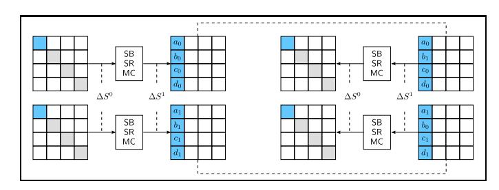

Figure 10: Left: A pair that maps a single-byte difference to a four-byte difference  $\Delta S^1$  through the first round. If this pair produces a desired difference after almost five rounds, then, there exist seven further mixture pairs (e.g., one is depicted **right**) of the variables after the first round that have the same difference  $\Delta S^1$ . Thus, they must have had the same difference before MixColumns, and therefore must also stem from δ-sets of the first diagonal.

according to X is defined as

$$\begin{split} \delta(X[k], P^i[k], P^j[k]) &\stackrel{\text{def}}{=} \begin{cases} P^i[k] & \text{if } X = 0, \\ P^j[k] & \text{otherwise,} \end{cases} \\ \rho(X, P^i, P^j) &\stackrel{\text{def}}{=} \left( \delta(X[0], P^i[0], P^j[0]), \dots, \delta(X[m-1], P^i[m-1], P^j[m-1]) \right). \end{split}$$

We slightly abuse the notation, by interpreting AES states as inputs as elements of  $\mathbb{F}_{2^b}^{16}$ . Moreover, we consider also non-full states but also columns or diagonals.

**Theorem 4.** Let  $\mathcal{I}, \mathcal{J} \subset \{0,1,2,3\}$  and assume  $|\mathcal{I}| = |\mathcal{J}| = 1$ . Fix two cell indices  $k \in \{0,\ldots,15\}$ . Given a diagonal space  $\mathcal{D}_{\mathcal{I}}$  and constants  $A \in \mathbb{F}_{2^b}^{4\times 4}$ . Let  $\mathcal{P}$  denote the set of all plaintexts in a single-diagonal coset  $P^i \in \mathcal{D}_{\mathcal{I}} \oplus A$ , for  $0 \leq i < 2^{4b}$ . Let  $\mathcal{C}$  denote the set of their corresponding ciphertexts after almost five rounds without the final MixColumns operation containing  $C^i = C^i = \mathsf{MC}^{-1}(\mathsf{R}^4(P^i))$ , for  $0 \leq i < 2^{4b}$ . Then, the number of distinct pairs  $(C^i, C^j)$  for  $0 \leq i < j < 2^{4b}$  such that  $P^i \oplus P^j$  differ only in a single byte and  $(C^i \oplus C^j)[k] = 0$  is a multiple of eight, i.e.,  $\exists N' \in \mathbb{N}$  such that

$$\mathsf{C} \stackrel{\mathrm{def}}{=} \left| \left\{ 0 \leq i < j < 2^{4b} : P^i \oplus P^j \in \mathcal{D}_{\mathcal{I}} \cap \mathcal{C}_{\mathcal{J}} \wedge (C^i \oplus C^j)[k] = 0 \right\} \right| = 8 \cdot N' \,.$$

*Proof.* Let  $P^i$  and  $P^j$  denote two plaintexts from a  $\delta$ -set, i.e., that differ only in a single cell. W.l.o.g., we assume that they differ only in their first cell,  $P^i[0] \neq P^j[0]$ . Let  $S^i$  and  $S^j$  denote their corresponding states after the first round, respectively.  $P^i$  and  $P^j$  are encrypted to  $S^i$  and  $S^j$  through one round, and differ in four variables due to the

branch number of MixColumns. We let  $(a_0,b_0,c_0,d_0)\in\mathbb{F}_{2^b}^4$  denote the variables of the first column of  $S^i$  and  $(a_1,b_1,c_1,d_1)\in\mathbb{F}_{2^b}^4$  denote those of  $S^j$ , as before. For this purpose, we also denote  $S^i=S^{0000}$  and  $S^j=S^{1111}$ .

In general, let  $I=(i_0,i_1,i_2,i_3)\in\mathbb{F}_2^4$ . We define  $S^I=\rho(I,S^i,S^j)$ . For example,  $(S^{0001},S^{1110})$  is a mixture of  $(S^{0000},S^{1111})$ , which also differs only in the same column, in the sense that the leftmost column of  $S^{0001}$  consists of the values  $(a_0,b_0,c_0,d_1)$ , and that of  $S^{1110}$  of  $(a_1,b_1,c_1,d_0)$ . All other columns are equal in them and equal with the corresponding columns of  $S^{0000}$  and  $S^{1111}$ ). We extend the definitions in the natural manner to

$$(S^{0010},S^{1101}),(S^{0011},S^{1100}),(S^{0100},S^{1011}),\\(S^{0101},S^{1010}),(S^{0110},S^{1001}),(S^{0111},S^{1000}).$$

Note that for each of those eight mixtures, the difference between their pair after the first round is the same. Since  $\mathsf{SR}^{-1} \circ \mathsf{MC}^{-1} \circ \mathsf{AK}[K^1]$  is linear, this means that their difference  $S^{i_0i_1i_2i_3}_{\mathsf{SB}} \oplus S^{i'_0i'_1i'_2i'_3}_{\mathsf{SB}}$  is the same for each pair. Since  $S^{0000}_{\mathsf{SB}} \oplus S^{1111}_{\mathsf{SB}}$  is active in a single (the first) cell, so is each pair of all other seven mixtures. Hence, they are all guaranteed to be in  $\delta$ -sets. Since  $\mathsf{AK}[K^0] \circ \mathsf{SB}^{-1}$  is a permutation, they are guaranteed to be sixteen distinct texts. Though, note that the values  $S^1$  differ in less than four bytes between each text of each pair. Thus, each of the eight pairs in a mixture is produced by a **different**  $\delta$ -set

It remains to show that if one pair of an eight-tuple of mixtures has an inactive diagonal after three rounds, the other seven mixture pairs also have. We denote by  $C^i$  the encryption of  $P^i$  after four rounds of AES without the final MixColumns operation. Assume,  $C_{0000}$  and  $C_{1111}$  lie in the coset of an inverse-diagonal space  $\mathcal{ID}_{\mathcal{I}}$ , for  $\mathcal{I} \subset \{0,1,2,3\}$  and  $|\mathcal{I}| < 4$ . Then, the differences of the seven further pairs

$$(C_{0001} \oplus C_{1110}), (C_{0010} \oplus C_{1101}), (C_{0011} \oplus C_{1100}), (C_{0100} \oplus C_{1011}), (C_{0101} \oplus C_{1010}), (C_{0110} \oplus C_{1001}), (C_{0111} \oplus C_{1011})$$

lie also in  $\mathcal{ID}_{\mathcal{I}}$ . Though, this is exactly the well-known multiple-of-eight property that has already been shown by Grassi et al. in [GRR17]. Therefore, the multiple-of-eight property of our distinguisher in Setting (2) follows.

#### <span id="page-40-0"></span>B.2 Four-round Multiple-of-32 Property for Small-AES

Consider the four-round distinguisher in Setting (2), which takes pairs of plaintexts from  $\delta$ -sets of a diagonal. This section outlines briefly that the distinguisher in this setting possesses a multiple-of-32 property.

Note the peaked plots that represent the experimental distribution in Setting (2) in Figure 15. Those peaks (can only) indicate that the number of collisions are a multiple of 32, e.g., the first ten random keys and  $\delta$ -sets for the Small-AES yield the sequence of collisions: (123 456, 123 040, 120 512, 120 736, 123 744, 121 504, 122 368, 120 896, 123 136, 123 808). This phenomenon repeated for the other S-boxes as well, though, not for the AES with eight-bit S-boxes. 32 is also the largest power of two, e.g., the number of collisions is no multiple of 64 in general.

Clearly, the number of collisions has to be a multiple of eight since our four-round distinguisher can be seen as a subset of the five-round distinguisher that we studied in Section B.1. Our five-round distinguisher itself inherited that property from the well-known multiple-of-eight distinguisher by Grassi and Rechberger [GRR17]. Given that the other S-boxes yield similar results, we conjecture that there exists an additional multiple-of-four property for the AES when operating with four-bit S-boxes. Thus, we state the following claim, but cannot prove it at the moment.

Claim. Let  $\mathcal{I}, \mathcal{J} \subset \{0, 1, 2, 3\}$  and assume  $|\mathcal{I}| = |\mathcal{J}| = 1$ . Fix a cell index  $k \in \{0, \dots, 15\}$ . Given a coset of  $\mathcal{D}_{\mathcal{I}}$  containing all  $2^{4b}$  plaintexts of a diagonal and their corresponding ciphertexts after four rounds  $(P^i, C^i)$  with  $i \in \{0, \dots, 2^{4b} - 1\}$  and  $C^i = \mathsf{MC}^{-1}(\mathsf{R}^4(P^i))$ , that is after four rounds of AES with the final MixColumns operation omitted. Then, the number of distinct pairs  $(C^i, C^j)$  for  $i \neq j$  and  $0 \leq i < j < 2^{4b}$  such that  $P^i \oplus P^j$  differ only in a single byte and  $(C^i \oplus C^j)[k] = 0$  is a multiple of 32, i.e.,  $\exists N' \in \mathbb{N}$  such that

$$\mathsf{C} \stackrel{\mathrm{def}}{=} \left| \left\{ 0 \leq i < j < 2^{4b} : P^i \oplus P^j \in \mathcal{D}_{\mathcal{I}} \cap \mathcal{C}_{\mathcal{J}} \wedge (C^i \oplus C^j)[k] = 0 \right\} \right| = 32 \cdot N' \,.$$

**Four-round Distinguisher.** It is straight-forward to formulate a distinguisher from the multiple-of-32 property with the following steps:

- 1. Initialize  $16 \times 16$  collision counters  $X_{i,j}$  for each byte and each value.
- 2. Collect a structure S of  $2^{16}$  texts that iterate over all  $\delta$ -sets of a diagonal, e.g., using texts from  $\mathcal{D}_{\{0\}} \oplus A$  for arbitrary  $A \in \mathbb{F}_{2^4}^{4 \times 4}$ , and leave the remaining bytes constants. Query the plaintexts of a structure and ask for their ciphertexts.
- 3. For each ciphertext, invert the final MixColumns operations to get the states  $S^{4,SR}$ . Increment its value j for Byte i, for  $i \in \{0, \ldots, 15\}$ , in  $X_{i,j}$ .
- 4. For each byte  $i \in \{0, \dots, 15\}$ , test if  $(\sum_{j=0}^{15} {X_{i,j} \choose 2}) \mod 32 = 0$ . If yes, return "real"; return "random" otherwise.

**Complexity.** The distinguisher requires  $2^{16}$  chosen plaintexts,  $2^{16}$  encryptions and  $2^{16} \cdot 16 = 2^{20}$  memory accesses. The success probability is one for the real construction; the probability is  $(2^{-5})^{16} = 2^{-80}$  to wrongly identify a random permutation as the real four-round Small-AES. The memory is negligible, 256 16-bit values or  $2^6$  states of memory plus some constant overhead suffices.

Alternative MixColumns Matrices. We further tested whether the multiple-of-k property depends on the employed MixColumns matrix. We denote circulant matrices by the elements of their topmost row  $\operatorname{circ}(a_1,\ldots,a_m)$ , e.g., the MixColumns matrix can be described as  $\operatorname{circ}(2,3,1,1)$ . We employed variants of Small-AES with alternative MixColumns matrices and for comparison with different S-box:

- Small-AES with its original S-box and the circulant matrix generated by circ(1,3,2,2). This is also an MDS matrix.
- Small-AES with its original S-box and the matrix generated by circ(0,1,1,1) from Midori, which is not MDS.
- Small-AES with the S-box of PRESENT and the circulant matrix generated by circ(1,3,2,2).
- Small-AES with the S-box of PRESENT and the matrix circ(0, 1, 1, 1).

All other components remained unchanged. Table 6 visualizes our results and compares the result with the original matrix. It illustrates that the multiple-of-k property depends strongly on the employed MixColumns matrix; the variants with the Midori matrix yielded even a multiple-of-16 384 property. The variance differs greatly as a direct consequence.

<span id="page-42-0"></span>**Table 6:** Means, standard deviations, and maximal k for multiple-of-k for the number of collisions in at least one anti-diagonal after four rounds of 100 000 experiments with random key each of  $2^{16}$  texts from a full single-diagonal space. k is the maximum factor.

| S-box     | MC Matrix                                           | $\mu$       | σ         | k        |
|-----------|-----------------------------------------------------|-------------|-----------|----------|
| Small-AES | circ(2, 3, 1, 1)                                    | 122 921.676 | 1 329.731 | $2^{5}$  |
| Small-AES | circ(1,3,2,2)                                       | 122946.734  | 1347.866  | $2^5$    |
| Small-AES | circ(0,1,1,1)                                       | 123980.022  | 47151.760 | $2^{14}$ |
| PRESENT   | circ(2, 3, 1, 1)                                    | 122 908.033 | 1 209.539 | $2^5$    |
| PRESENT   | circ(1,3,2,2)                                       | 122911.852  | 1226.596  | $2^5$    |
| PRESENT   | $circ(\mathtt{0},\mathtt{1},\mathtt{1},\mathtt{1})$ | 124763.341  | 47429.148 | $2^{14}$ |

# <span id="page-42-1"></span>B.3 Multiple-of-four Distinguisher on Five-round Small-AES

Let  $\mathcal{S}$  be a structure that iterates over all  $2^{16}$  values of one diagonal space of Small-AES and fixes all other cells to a constant. Then, after four rounds, the number of pairs that collide in any fixed byte is a multiple of four. This implies that, after five rounds without the final MixColumns operation (or inverted), the number of pairs that collide in any fixed byte is a multiple of four. This property is absent in the real AES with eight-bit S-boxes; it seems independent, however, from the S-box. It has been found also when using e.g., in variants of Small-AES with the S-boxes of PRESENT or Toy-10.

Five-round Distinguisher. The distinguisher is depicted in Figure 11.

**Steps.** The steps of our distinguisher are as follows:

- 1. Initialize  $16 \times 16$  collision counters  $X_{i,j}$  for each byte and each value.
- 2. Collect a structure S of  $2^{16}$  texts that iterate over all values in four cells of a diagonal, e.g., using texts from  $\mathcal{D}_{\{0\}} \oplus A$  for arbitrary  $A \in \mathbb{F}_{2^4}^{4 \times 4}$ , and leave the remaining bytes constants. Query the plaintexts of a structure and ask for their ciphertexts.
- 3. For each ciphertext, invert the final MixColumns operations to get the states  $S^{5,SR}$ . Increment its value j for Byte i, for  $i \in \{0, \ldots, 15\}$ , in  $X_{i,j}$ .
- 4. For each byte  $i \in \{0, \dots, 15\}$ , test if  $(\sum_{j=0}^{15} {X_{i,j} \choose 2}) \mod 4 = 0$ . If yes, return real; return random otherwise.

**Complexity.** The distinguisher requires  $2^{16}$  chosen plaintexts,  $2^{16}$  encryptions and  $2^{16} \cdot 16 = 2^{20}$  memory accesses. The success probability is one for the real construction; the probability is  $(2^{-2})^{16} = 2^{-32}$  to wrongly identify a random permutation as the real fiveround Small-AES. The memory is negligible, 256 16-bit values or  $2^6$  states of memory plus some constant overhead suffices.

## B.4 Multiple-of-four Key-recovery Attack on Six-round Small-AES

The five-round distinguisher can be extended to a six-round key-recovery attack in a straight-forward manner.

**Steps.** The steps are as follows:

<span id="page-43-0"></span>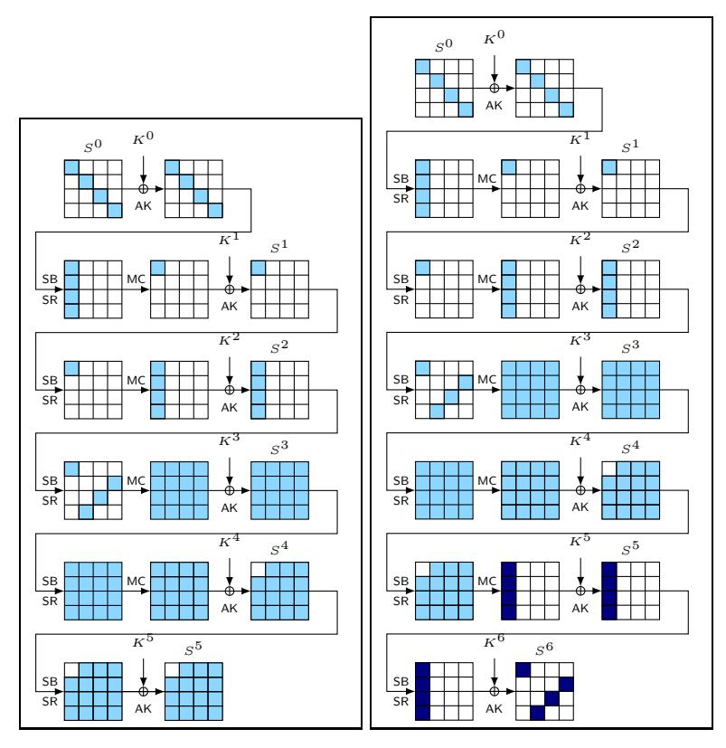

Figure 11: Multiple-of-four distinguisher on five-round Small-AES (left), and the key-recovery attack on six rounds (right).

- 1. Initialize  $4 \cdot 2^{16} \cdot 16 \times 16$  collision counters  $X_{i,j}$  for each candidate of  $K^6[0,7,10,13]$ ,  $K^6[3,4,9,14]$ ,  $K^6[2,7,8,13]$ ,  $K^6[1,6,11,12]$ , each byte, and each byte value. Initialize four lists  $\mathcal{K}_{\ell}$ , for  $\ell \in \{0,1,2,3\}$ .
- 2. Collect a structure  $\mathcal{S}$  of  $2^{16}$  texts that iterate over all values in four cells of a diagonal, e.g., using texts from  $\mathcal{D}_{\{0\}} \oplus A$  for arbitrary  $A \in \mathbb{F}_{2^4}^{4 \times 4}$ , and leave the remaining bytes constants. Query the plaintexts of a structure and ask for their ciphertexts.
- 3. For each candidate of  $K^6[0, 7, 10, 13]$ :
  - 3.1 For each ciphertext, decrypt to the state  $\widehat{S}^{5,\mathsf{SR}}[0,1,2,3]$  and increment its value j for Byte i, for  $i \in \{0,\ldots,15\}$ , in  $X_{i,j}$ .
  - 3.2 For each counter, test if  $\binom{X_{i,j}}{2} \mod 4 = 0$ , for  $i \in \{0,1,2,3\}$ . If yes, add the surviving inverse-diagonal key candidate to list  $\mathcal{K}_0$ .
  - 3.3 Repeat the same procedure for the other inverse diagonals of  $K^6$  and add the surviving lists  $\mathcal{K}_{\ell}$  for the corresponding values of  $\ell$ .
- 4. Test the remaining key candidates.

**Complexity.** The distinguisher requires  $2^{16}$  chosen plaintexts,  $2^{16}$  encryptions, and  $2^{16} \cdot 2^{16} \cdot 4 \cdot \frac{1}{4} \cdot \frac{1}{6}$  decryptions of one column through one of six rounds for each of four anti-diagonal key candidate and each of  $2^{16}$  texts. This yields  $2^{29.415}$  encryption equivalents. Each value of each inverse diagonal of the key has a chance of  $2^{16} \cdot (2^{-2})^4 = 2^{-8}$  to survive. Thus, we can expect about  $2^{4\cdot 8} = 2^{32}$  key candidates that can be tested with an exhaustive

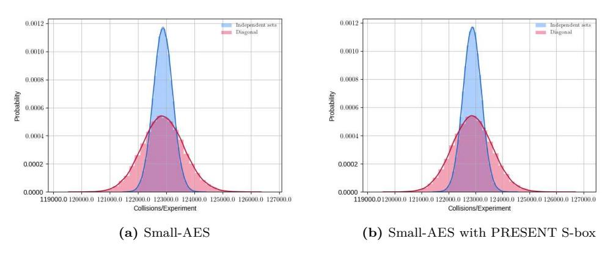

**Figure 12:** Distribution of the number of collisions in the first byte after five rounds in both settings, with the final MixColumns operation omitted. Both distributions used 100 000 random keys and counted the collisions from  $2^{14}$   $\delta$ -sets per key that were independent in Setting (1) or the  $2^{14}$   $\delta$ -sets from  $\mathcal{D}_{\{0\}}$ . Thin lines are fitted normal distributions, thick lines the best fitted distributions.

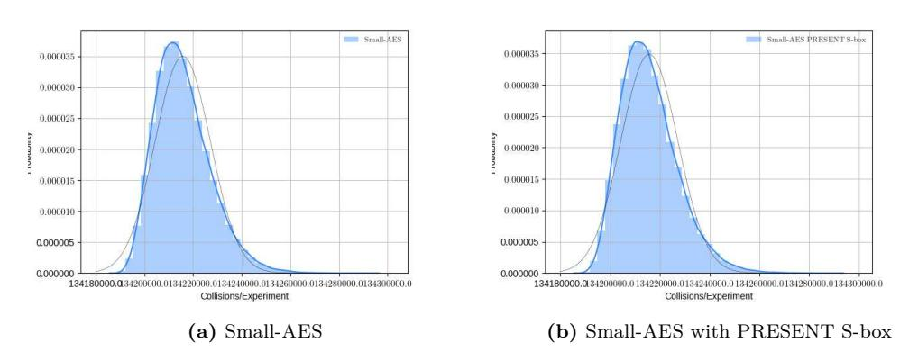

**Figure 13:** Distribution of the number of collisions in the first byte after five rounds taking all  $\binom{2^{16}}{2}$  pairs from a single plaintext diagonal. All distributions used 100 000 random keys and counted the collisions for one diagonal per key. Thin lines are fitted normal distributions, thick lines the best fitted distributions.

search. Thus, the computational complexity is upper bounded by  $2^{32} + 2^{29.415} \simeq 2^{32.223}$  Encryptions. The attack needs  $4 \cdot 2^{16} \cdot 16 \cdot 16 = 2^{26}$  memory accesses. The memory is  $4 \cdot 2^{16} \cdot 16 \cdot 16 = 2^{26}$  64-bit values or states, and  $4 \cdot 2^8 = 2^{10}$  values for the key candidates. We note that the time complexity of the attack can be decreased further with the meet-in-the-middle technique by Sasaki and Wang [SW12] that was adapted by Bar-On et al. to attacks on final-round AES [BODK+18] to about  $2^{16} \cdot 2 \cdot 2^8 \simeq 2^{25}$  last-round decryptions. However, the property is the relevant thing in this section, and we provide a distinguisher and key-recovery attack only for the sake of completeness.

# C Expectation of The Distinguishers

# <span id="page-45-0"></span>C.1 Expectation of The Five-round Distinguisher

This section shows Theorem 2 in Setting (2). It is rooted on the existing rigorous study by Grassi and Rechberger [GR18] of the number of solutions for the transition of pairs in a mixed space  $\mathcal{M}_{\{k\}}$  to a diagonal space  $\mathcal{D}_{\mathcal{J}}$  with  $\mathcal{J} \subset \{0,1,2,3\}$  and  $|\mathcal{J}| = 3$ .

**Notation.** The subspace notation does not always express easily that certain cells are zero or not. Therefore, we can adapt the notation by [RBH17]. Though, we use the active-byte pattern, whereas the work by [RBH17] employs the zero-byte pattern convention. We decide for the former only since it is more intuitive that the hamming weight represents the number of active cells from our point of view.

We use bit vectors  $\mathbf{u}=(u_0,u_1,u_2,u_3)$  and  $\mathbf{v}=(v_0,v_1,v_2,v_3)$  with  $\mathbf{u},\mathbf{v}\in\mathbb{F}_2^4$  to represent the active-byte patterns of a column or diagonal. For a column or diagonal vector  $\mathbf{x}=(x_0,x_1,x_2,x_3)\in\mathbb{F}_{2^8}^4$ , we further define the function  $\rho:\mathbb{F}_{2^8}^4\to\mathbb{F}_2^4$  to map  $\mathbf{x}$  to its active-byte pattern:  $\mathbf{u}=(u_0,u_1,u_2,u_3)=\rho((x_0,x_1,x_2,x_3)),$  where  $u_i=1$  iff  $x_i$  is active and 0 otherwise. For a state  $S\in\mathbb{F}_{2^8}^{4\times 4}$ , we define  $\nu:\mathbb{F}_{2^8}^{4\times 4}\to\mathbb{F}_2^{4\times 4}$  to produce its active-column pattern:

$$\nu(S) \stackrel{\text{def}}{=} (\rho(S_0), \rho(S_1), \rho(S_2), \rho(S_3)).$$

Thus, we search for all pairs  $\mathbf{u} \xrightarrow{\mathsf{R}} \mathbf{v}$  with  $\mathsf{wt}(\mathbf{u}) > 1$  and  $\mathsf{wt}(\mathbf{v}) = 4$ . Below, we briefly restate Theorem 2 for readability.

**Theorem 2.** Let  $\mathcal{X} = \{X^i \in \mathbb{F}_{2^8}^{4 \times 4}\}$ , for  $0 \leq i < 2^{32}$ , denote a set of all texts in a coset  $\mathcal{M}_{\{k\}} \oplus A$  for some  $A \in \mathbb{F}_{2^8}^{4 \times 4}$ ,  $A \in \mathcal{X}^{\perp}$ , where all columns are active. Let  $\mathcal{Y} = \{Y^i \in \mathbb{F}_{2^8}^{4 \times 4} : Y^i = \mathsf{R}(X^i)\}$ ,  $0 \leq i < 2^{32}$ , denote the set of corresponding outputs after one round of AES. Let Y be a random variable for the number of different unordered ciphertext pairs  $(Y^i, Y^j)$  s. t.  $Y^i, Y^j \in \mathcal{D}_{\mathcal{J}} \oplus B$ , for some  $B \in \mathbb{F}_{2^8}^{4 \times 4}$ ,  $\mathcal{J} \subset \{0, 1, 2, 3\}$ , and  $|\mathcal{J}| = 3$ . Then, under the assumption of the uniform distribution of non-trivial solutions of differential transitions through the S-box,

$$\Pr\left[\mathcal{M}_{\{k\}} \oplus A \xrightarrow{\mathsf{R}} \mathcal{D}_{\mathcal{J}} \oplus B\right] \simeq 2^{-30} + 2^{-51.985}$$
.

The analysis of Theorem 2 employs two Lemmas. Lemma 1 reconsiders the number of solutions, Lemma 2 the fraction of solutions that start from a single active byte.

<span id="page-45-1"></span>**Lemma 1.** Under the assumption of the uniform distribution of non-trivial solutions of differential transitions through the S-box, the number of solutions from a mixed space with no equal generating variables is approximately  $2\,114\,125\,822.5 \simeq 2^{30.977}$ .

*Proof.* The proof of Lemma 1 is given from the third case of the proof of Theorem 2 by Grassi and Rechberger [GR19, Sect. 5.3.3]. We restate it only for the sake of completeness. In the following, we consider  $\mathcal{J}=\{1,2,3\}$  as the set of active diagonals after the round, or  $\ell=0$  as the index of the zero-difference diagonal after the round. the cases for other values of  $\ell$  are analogous. We denote  $X^1, X^2 \in \mathcal{M}_{\{k\}} \oplus A$ . Then, there exist  $x^i, y^i, z^i, w^i \in \mathbb{F}_{2^8}$ , for  $1 \leq i \leq 2$ , s. t.

$$X^i = \begin{bmatrix} 2x^i & w^i & z^i & 3y^i \\ x^i & w^i & 3z^i & 2y^i \\ x^i & 3w^i & 2z^i & y^i \\ 3x^i & 2w^i & z^i & y^i \end{bmatrix} \oplus A \,.$$

In the context here, all variables are distinct, i.e.  $x^1 \neq x^2$ ,  $y^1 \neq y^2$ ,  $z^1 \neq z^2$ , and  $w^1 \neq w^2$ . Let  $\Delta Y = Y^1 \oplus Y^2$ . We consider the following four equations:

$$\Delta Y[0] = \bigoplus_{i=1}^{2} 2S \left(2x^{i} \oplus A[0]\right) \oplus 3S \left(w^{i} \oplus A[5]\right) \oplus S \left(2z^{i} \oplus A[10]\right) \oplus S \left(y^{i} \oplus A[15]\right) = 0$$

$$(14)$$

$$\Delta Y[5] = \bigoplus_{i=1}^{2} S \left(w^{i} \oplus A[4]\right) \oplus 2S \left(3z^{i} \oplus A[9]\right) \oplus 3S \left(y^{i} \oplus A[14]\right) \oplus S \left(3x^{i} \oplus A[3]\right) = 0$$

$$\Delta Y[10] = \bigoplus_{i=1}^{2} S \left(z^{i} \oplus A[8]\right) \oplus S \left(2y^{i} \oplus A[13]\right) \oplus 2S \left(x^{i} \oplus A[2]\right) \oplus 3S \left(2w^{i} \oplus A[7]\right) = 0$$

$$\Delta Y[15] = \bigoplus_{i=1}^{2} 3S \left(3y^{i} \oplus A[12]\right) \oplus S \left(x^{i} \oplus A[1]\right) \oplus S \left(3w^{i} \oplus A[6]\right) \oplus 2S \left(z^{i} \oplus A[11]\right) = 0.$$

All four equations possess a form of

$$\bigoplus_{i=1}^{2} A \cdot S\left(B \cdot x^{i} \oplus b\right) \oplus C \cdot S\left(D \cdot w^{i} \oplus d\right) \oplus E \cdot S\left(F \cdot z^{i} \oplus f\right) \oplus G \cdot S\left(H \cdot y^{i} \oplus h\right) = 0.$$

We rewrite  $\widehat{x}=B\cdot x^i\oplus b$ ,  $\widehat{w}=D\cdot w^i\oplus d$ ,  $\widehat{z}=F\cdot z^i\oplus f$ , and  $\widehat{y}=H\cdot y^i\oplus h$ . We denote the input differences between the variable pairs as  $\Delta^x_I=x^1\oplus x^2$ , and  $\Delta^y_I=y^1\oplus y^2$ ,  $\Delta^z_I=z^1\oplus z^2$ , and  $\Delta^w_I=w^1\oplus w^2$ . We can reformulate the equation systems to

<span id="page-46-0"></span>
$$\begin{split} S\left(\widehat{x}\right) \oplus S\left(\widehat{x} \oplus \Delta_{I}^{x}\right) &= \Delta_{O}^{x} \\ S\left(\widehat{w}\right) \oplus S\left(\widehat{w} \oplus \Delta_{I}^{w}\right) &= \Delta_{O}^{w} \\ S\left(\widehat{z}\right) \oplus S\left(\widehat{z} \oplus \Delta_{I}^{z}\right) &= \Delta_{O}^{z} \\ S\left(\widehat{y}\right) \oplus S\left(\widehat{y} \oplus \Delta_{I}^{y}\right) &= \Delta_{O}^{y} \end{split}$$

From  $\Delta_I^x$ ,  $\Delta_I^w$ ,  $\Delta_I^z$ ,  $\Delta_I^y \neq 0$ , it follows that  $\Delta_O^x$ ,  $\Delta_O^w$ ,  $\Delta_O^z$ ,  $\Delta_O^y \neq 0$ . Moreover, one variable is defined from the equation system of the others as

$$\Delta_O^y = G^{-1} \cdot (A \cdot \Delta_O^x \oplus C \cdot \Delta_O^w \oplus E \cdot \Delta_O^z) \ .$$

Since they cannot be zero, there exist in total  $255^3$  solutions for  $\Delta_O^x$ ,  $\Delta_O^w$ ,  $\Delta_O^z$ . Though, having fixed  $\Delta_O^x$ ,  $255 \cdot 254$  pairs  $\Delta_O^w$ ,  $\Delta_O^z$  solutions would lead to  $\Delta_O^y = 0$ . So, there are  $255^3 - 255 \cdot 254$  possible tuples  $(\Delta_O^x, \Delta_O^w, \Delta_O^z, \Delta_O^y)$ . The next step is to obtain the number of different non-trivial solutions  $[(x^1, y^1, z^1, w^1), (x^2, y^2, z^2, w^2)]$  to the four equations from Equation (14). For  $\Delta_I, \Delta_O \in \mathbb{F}_2^8$ , we denote the number of solutions by

$$\delta_S(\Delta_I, \Delta_O) \stackrel{\text{def}}{=} |\{x \in \mathbb{F}_2^n : S(x) \oplus S(x \oplus \Delta_I) = \Delta_O\}| .$$

Independently of the S-box details, the expected number of solutions x for arbitrary non-zero input-output differences  $(\Delta_I, \Delta_O)$  is simply the mean over all non-zero columns or rows in the DDT:

$$\mathbb{E}\left[\delta_S(\Delta_I, \Delta_O)\right] = \frac{256}{255}.$$

Given a fixed  $\Delta_I$ , the average number of solutions for one equation is 256/255. There exist 255 values of  $\Delta_I$ , and four pairs  $(\Delta_I^x, \Delta_O^x), \ldots, (\Delta_I^y, \Delta_O^y)$ , which yields

$$\left(255 \cdot \frac{256}{255}\right)^4 = 2^{32}$$

<span id="page-47-2"></span><span id="page-47-0"></span>

solutions of values  $(x^1,y^1,z^1,w^1), (x^2,y^2,z^2,w^2)$  for fixed differences  $(\Delta_I^x,\Delta_I^y,\Delta_I^z,\Delta_I^w)$  on average. To prevent double counting solutions  $[(x^1,y^1,z^1,w^1),(x^2,y^2,z^2,w^2)]$  and  $[(x^2,y^2,z^2,w^2),(x^1,y^1,z^1,w^1)]$ , we employ a partial order, e.g., require that  $w^1 < w^2$ . The total number of different solutions  $(x^1,y^1,z^1,w^1),(x^2,y^2,z^2,w^2)$ , for the order  $w^1 < w^2$ , to the four Equations 14 is then given by

$$\frac{1}{2} \cdot \left(255^3 - 255 \cdot 254\right) \cdot \left(255 \cdot \frac{256}{255}\right)^4 = \left(255^3 - 255 \cdot 254\right) \cdot 2^{31}.$$

So, we have the number of solutions for one (arbitrary equation) of the four equations in Equation 14. Next, we have to determine the probability that the solutions for the remaining three equations match the fixed equation. Fix  $[(x^1, y^1, z^1, w^1), (x^2, y^2, z^2, w^2)]$  for the first equation. Consider a second equation  $[(\hat{x}^1, \hat{y}^1, \hat{z}^1, \hat{w}^1), (\hat{x}^2, \hat{y}^2, \hat{z}^2, \hat{w}^2)]$ . The probability that  $(x^1, y^1, z^1, w^1) = (\hat{x}^1, \hat{y}^1, \hat{z}^1, \hat{w}^1)$  is

$$\left(\frac{1}{256}\right)^4$$
.

Having fixed  $(x^1,\,y^1,\,z^1,\,w^1)$ , there remain only 255 possible values for  $x^2$  and  $\widehat{x}^2$  since they must be distinct. So, the probability that  $(x^2,\,y^2,\,z^2,\,w^2)=(\widehat{x}^2,\,\widehat{y}^2,\,\widehat{z}^2,\,\widehat{w}^2)$  is  $1/255^4$ . The same can apply if  $(x^1,\,y^1,\,z^1,\,w^1)=(\widehat{x}^2,\,\widehat{y}^2,\,\widehat{z}^2,\,\widehat{w}^2)$  and  $(x^2,\,y^2,\,z^2,\,w^2)=(\widehat{x}^1,\,\widehat{y}^1,\,\widehat{z}^1,\,\widehat{w}^1)$ . So, there are two ways to combine each pair of equations. Thus, the probability that two equations are equal is

$$2 \cdot \left(\frac{1}{256}\right)^4 \cdot \left(\frac{1}{255}\right)^4. \tag{15}$$

We obtain that

$$\left( \left( 255^3 - 255 \cdot 254 \right) \cdot 2^{31} \right)^4 \cdot \left( 2 \cdot \left( \frac{1}{256} \right)^4 \cdot \left( \frac{1}{255} \right)^4 \right)^3 \simeq 2114125822.5 \simeq 2^{30.977}, \quad (16)$$

which yields the claim of Lemma 1.

Equation (16) uses all pairs that come from a mixed space  $\mathcal{M}_{\{k\}}$  with four different variables. Clearly, such a mixed space must have resulted from a diagonal space  $\mathcal{D}_{\{k\}}$  two rounds earlier. Here, we do not consider all pairs from the diagonal space  $\mathcal{D}_{\{k\}}$ . Among the  $\binom{2^{32}}{2}$  pairs from a full diagonal space, we restrict our focus on  $\delta$ -sets. Assume, we consider all  $\delta$ -sets from a diagonal space. This yields  $2^{24} \cdot 4 \delta$ -sets, each of which contains  $\binom{2^8}{2}$  pairs. We have to determine the fraction of solutions that is covered by the  $\delta$ -sets. For this purpose, we have to count the number of pairs that translate from a single active diagonal to a mixed space with two restrictions: (1) their plaintext pairs have come from a diagonal space, and (2) their mixed space after two rounds has four active columns, which implies that after the first round, all bytes in Column k are active.

<span id="page-47-1"></span>**Lemma 2.** Let  $\mathcal{X} = \{X^i \in \mathbb{F}_{2^8}^{4 \times 4}\}$ , for  $0 \leq i < 2^{32}$ , denote a set of all texts in a coset  $\mathcal{D}_{\{k\}} \oplus A$  for some  $A \in \mathbb{F}_{2^8}^{4 \times 4}$ . Then, the fraction of pairs  $X^i, X^j$  whose difference  $\Delta X^{i,j}$  lies in  $\mathcal{C}_{\{c\}} \cap \mathcal{D}_{\{k\}}$ , for any  $c \in \{0,1,2,3\}$ , among all pairs in  $\mathcal{X}$ , is  $4/255^3$ .

Proof of Lemma 2. Table 7 lists the number of differences that follow the transitions from  $\mathbf{u} \stackrel{\mathsf{R}}{\to} \mathbf{v}$ . The rightmost column of that table lists all input differences that lead to four active bytes in  $\mathcal{C}_{\{k\}}$  after the first round. In sum, there are  $2^{55^4}$  such differences. In total, there are  $2^{32}-1$  differences. So, from  $2^{32}\cdot(2^{32}-1)/2$  pairs, we can multiply each entry in Table 7 by  $2^{32}/2=2^{31}$  to obtain the number of pairs with such a difference in a

|                  | $wt(\mathbf{v})$              |                                 |                                    |                                         |  |
|------------------|-------------------------------|---------------------------------|------------------------------------|-----------------------------------------|--|
| $wt(\mathbf{u})$ | 1                             | 2                               | 3                                  | 4                                       |  |
| 1                | -                             | _                               | -                                  | $\binom{4}{1}\binom{4}{4}255$           |  |
| 2                | _                             | -                               | $\binom{4}{2}\binom{4}{3}255$      | $\binom{4}{2}\binom{4}{4}64005$         |  |
| 3                | _                             | $\binom{4}{3}\binom{4}{2}255$   | $\binom{4}{3}\binom{4}{3}64005$    | $\binom{4}{3}\binom{4}{4}16323825$      |  |
| 4                | $\binom{4}{4}\binom{4}{1}255$ | $\binom{4}{4}\binom{4}{2}64005$ | $\binom{4}{4}\binom{4}{3}16323825$ | $\binom{4}{4}\binom{4}{4}4$ 162 570 275 |  |
| $\sum$           | $\binom{4}{1} \cdot 255$      | $\binom{4}{2} \cdot 255^2$      | $\binom{4}{3} \cdot 255^3$         | $\binom{4}{4} \cdot 255^4$              |  |

<span id="page-48-1"></span>**Table 7:** Number of differences that translate from a diagonal vector  $\mathbf{x}$  with active-byte pattern  $\mathbf{u}$  to a column vector  $\mathbf{y}$  with active-byte pattern  $\mathbf{v}$  through one round of the AES, depending on the weight of  $\mathbf{u}$  and  $\mathbf{v}$ .

diagonal. We obtain that a diagonal contains  $4 \cdot 2^{24} \cdot {2^8 \choose 2}$  pairs in  $\delta$ -sets that differ in a single plaintext byte. This is a fraction of

$$\frac{\binom{4}{1}\binom{4}{4} \cdot 255 \cdot 2^{31}}{255^4 \cdot 2^{31}} = \frac{4}{255^3}$$

pairs, which yields the claim in Lemma 2.

It remains to combine the results of Lemma 1 and 2 to show Theorem 2.

Proof of Theorem 2. A diagonal space has  $2\,114\,125\,822.5$  solutions, on average, when we consider pairs generated from a mixed space with four pair-wise different variables  $x^1 \neq x^2$ ,  $y^1 \neq y^2$ ,  $w^1 \neq w^2$ ,  $z^1 \neq z^2$  after two rounds. Among all the pairs with four pair-wise different variables, our expectation distinguisher considers a fraction of  $4/255^3$  of the pairs, namely only those that were mapped from a diagonal space of one active plaintext byte among to a column of four active bytes after the first round. Thus, we have on average

$$2\,114\,125\,822.5 \cdot \frac{4}{255^3} \simeq 510.000123$$

solutions if we consider all interesting pairs among a diagonal space of  $2^{32}$  plaintexts. There exist  $4 \cdot 2^{24} \cdot \binom{2^8}{2}$  such pairs in such a diagonal space. Thus, we obtain a probability of

$$\frac{2\,114\,125\,822.5\cdot\frac{4}{255^3}}{4\cdot 2^{24}\cdot {2^8\choose 2}}\simeq 2^{-32}+2^{-53.9831}\,.$$

Since there are four diagonals, the probability to have one inactive diagonal after three rounds is on average

$$p_{\mathsf{AES}} \simeq 1 - \left(1 - \left(2^{-32} + 2^{-53.9831}\right)\right)^4 \simeq 2^{-30} + 2^{-51.98515} \,.$$

This yields the claim of our five-round distinguisher.

#### <span id="page-48-0"></span>C.2 Expectation of The Four-round Distinguisher

This section shows Theorem 1 in Setting (2). We restate it below for readability. Our goal in the remainder is to obtain an approximate for the probability p for the transition of the third round, under the condition that all columns after two rounds are active.

**Theorem 1.** Let  $\mathcal{X}=\{X^i\in\mathbb{F}_{2^8}^{4\times 4}\}$ , for  $0\leq i<2^{32}$ , denote a set of all texts in a coset  $\mathcal{M}_{\{k\}}\oplus A$  for some  $A\in\mathbb{F}_{2^8}^{4\times 4},\ A\in\mathcal{X}^\perp$ , where all columns are active. Let  $\mathcal{Y}=\{Y^i\in\mathbb{F}_{2^8}^{4\times 4}:Y^i=\mathsf{R}(X^i)\},\ 0\leq i<2^{32}$ , denote the set of corresponding outputs after one round of AES. Let Y be a random variable for the number of different ciphertext pairs  $(Y^i,Y^j)$  s. t.  $Y^i,Y^j\in\mathcal{D}_{\mathcal{J}}\cap\mathcal{C}_{\{c\}}\oplus A'$ , for some  $A'\in\mathbb{F}_{2^8}^{4\times 4},\ \mathcal{J}\subset\{0,1,2,3\},\ |\mathcal{J}|=3$ , and  $c\in\{0,1,2,3\}$ . Then, under the assumption of the uniform distribution of non-trivial solutions of S-box differential transitions in Equation (6),

$$\Pr\left[\mathcal{M}_{\{k\}} \oplus A \xrightarrow{\mathsf{R}} \mathcal{D}_{\mathcal{J}} \cap \mathcal{C}_{\{c\}} \oplus A'\right] \simeq 2^{-8} + 2^{-31.983}.$$

Note that the analysis of Theorem 1 is a simpler variant of the proof strategy of our five-round distinguisher. To show Theorem 1, we employ two Lemmas. Lemma 3 reconsiders the number of solutions, Lemma 2 provides us with the fraction of solutions that start from a single active byte.

<span id="page-49-0"></span>**Lemma 3.** Under the assumption of the uniform distribution of non-trivial solutions of S-box differential transitions, the number of solutions from a mixed space with no equal generating variables is approximately  $2^{54.9774}$ .

*Proof.* Again, we can prove Lemma 3 from adapting the third case of the proof of Theorem 2 by Grassi and Rechberger [GR19, Sect. 5.3.3]. Let  $\mathcal{J}=\{1,2,3\}$  as the set of active diagonals after the round, and let  $\ell=0$  and c=0; the cases for other values of  $\ell$  and c are analogous. We denote  $X^1,X^2\in\mathcal{M}_{\{k\}}\oplus A$ . Then, there exist  $x^i,y^i,z^i,w^i\in\mathbb{F}_{2^8}$ , for  $1\leq i\leq 2$ , s. t.

$$X^i = \begin{bmatrix} 2x^i & w^i & z^i & 3y^i \\ x^i & w^i & 3z^i & 2y^i \\ x^i & 3w^i & 2z^i & y^i \\ 3x^i & 2w^i & z^i & y^i \end{bmatrix} \oplus A \,.$$

All variables are distinct, i.e.  $x^1 \neq x^2$ ,  $y^1 \neq y^2$ ,  $z^1 \neq z^2$ , and  $w^1 \neq w^2$ . We consider the following equation:

$$\Delta Y[0] = \bigoplus_{i=1}^{2} 2S\left(2x^{i} \oplus A[0]\right) \oplus 3S\left(w^{i} \oplus A[5]\right) \oplus S\left(2z^{i} \oplus A[10]\right) \oplus S\left(y^{i} \oplus A[15]\right) = 0,$$

$$(17)$$

which can be generalized to

$$\bigoplus_{i=1}^{2} A \cdot S\left(\widehat{x}\right) \oplus C \cdot S\left(\widehat{w}\right) \oplus E \cdot S\left(\widehat{z}\right) \oplus G \cdot S\left(\widehat{y}\right) = 0.$$

We denote the input differences between the variable pairs as  $\Delta_I^x = x^1 \oplus x^2$ , and  $\Delta_I^y = y^1 \oplus y^2$ ,  $\Delta_I^z = z^1 \oplus z^2$ , and  $\Delta_I^w = w^1 \oplus w^2$ . We can reformulate the equation systems to

$$S(\widehat{x}) \oplus S(\widehat{x} \oplus \Delta_{I}^{x}) = \Delta_{O}^{x}$$

$$S(\widehat{w}) \oplus S(\widehat{w} \oplus \Delta_{I}^{w}) = \Delta_{O}^{w}$$

$$S(\widehat{z}) \oplus S(\widehat{z} \oplus \Delta_{I}^{z}) = \Delta_{O}^{z}$$

$$S(\widehat{y}) \oplus S(\widehat{y} \oplus \Delta_{I}^{y}) = \Delta_{O}^{y}.$$

From  $\Delta_I^x$ ,  $\Delta_I^w$ ,  $\Delta_I^z$ ,  $\Delta_I^y \neq 0$ , it follows that  $\Delta_O^x$ ,  $\Delta_O^w$ ,  $\Delta_O^z$ ,  $\Delta_O^y \neq 0$ . Moreover, one variable is defined from the equation system of the others as

$$\Delta_O^y = G^{-1} \cdot (A \cdot \Delta_O^x \oplus C \cdot \Delta_O^w \oplus E \cdot \Delta_O^z) \ .$$

Again, there exist  $255^3$  solutions for  $\Delta_O^x$ ,  $\Delta_O^w$ ,  $\Delta_O^z$ . Though, having fixed  $\Delta_O^x$ ,  $255 \cdot 254$  pairs  $\Delta_O^w$ ,  $\Delta_O^z$  solutions would lead to  $\Delta_O^y = 0$ . So, there are  $255^3 - 255 \cdot 254$  possible tuples  $(\Delta_O^x, \Delta_O^w, \Delta_O^z, \Delta_O^y)$ . Given a fixed  $\Delta_I$ , the average number of solutions for one equation is 256/255. There exist 255 values of  $\Delta_I$ , and four pairs  $(\Delta_I^x, \Delta_O^x)$ , ...,  $(\Delta_I^y, \Delta_O^y)$ , which yields

$$\left(255 \cdot \frac{256}{255}\right)^4 = 2^{32}$$

solutions of values  $(x^1,y^1,z^1,w^1),(x^2,y^2,z^2,w^2)$  for fixed differences  $(\Delta_I^x,\Delta_I^y,\Delta_I^z,\Delta_I^w)$  on average. To prevent double counting solutions  $[(x^1,y^1,z^1,w^1),(x^2,y^2,z^2,w^2)]$  and  $[(x^2,y^2,z^2,w^2),(x^1,y^1,z^1,w^1)]$ , we employ a partial order, e.g., require that  $w^1< w^2$ . The total number of different solutions  $(x^1,y^1,z^1,w^1),(x^2,y^2,z^2,w^2)$ , for the order  $w^1< w^2$ , to the four Equations 14 is then given by

$$\frac{1}{2} \cdot \left(255^3 - 255 \cdot 254\right) \cdot \left(255 \cdot \frac{256}{255}\right)^4 = \left(255^3 - 255 \cdot 254\right) \cdot 2^{31} \tag{18}$$

$$= 35469139157975040 \simeq 2^{54.9774} \,. \tag{19}$$

<span id="page-50-1"></span>

which yields the claim of Lemma 3.

Equation (18) uses all pairs that come from a mixed space  $\mathcal{M}_{\{k\}}$  with four different variables. Such a mixed space must have resulted from a diagonal space  $\mathcal{D}_{\{k\}}$  two rounds earlier. Here, we do not consider all pairs from the diagonal space  $\mathcal{D}_{\{k\}}$ . Among the  $\binom{2^{3^2}}{2}$  pairs from a full diagonal space, we restrict our focus on  $\delta$ -sets. Assume, we consider all  $\delta$ -sets from a diagonal space. Then, Lemma 2 showed that the fraction of pairs  $X^i, X^j$  whose difference  $\Delta X^{i,j}$  lies in  $\mathcal{C}_{\{c\}} \cap \mathcal{D}_{\{k\}}$ , for any  $c \in \{0,1,2,3\}$ , among all pairs in  $\mathcal{X}$ , is  $4/255^3$ . This yields  $2^{2^4} \cdot 4$   $\delta$ -sets, each of which contains  $\binom{2^8}{2}$  pairs.

Proof of Theorem 1. A diagonal space has  $(255^3-255\cdot254)\cdot2^{31}$  solutions when we consider pairs generated from a mixed space with four pair-wise different variables  $x^1\neq x^2$ ,  $y^1\neq y^2$ ,  $w^1\neq w^2$ ,  $z^1\neq z^2$  after two rounds. Among all the pairs with four pair-wise different variables, our expectation distinguisher considers a fraction of  $4/255^3$  of the pairs, namely only those that were mapped from a diagonal space of one active plaintext byte among to a column of four active bytes after the first round. Among a diagonal space of  $2^{32}$  plaintexts, there exist  $4\cdot2^{24}\cdot\binom{2^8}{2}$  such pairs in such a diagonal space. Thus, we obtain a probability of

$$\frac{35469139157975040 \cdot \frac{4}{255^3}}{4 \cdot 2^{24} \cdot {2^8 \choose 2}} \simeq 2^{-8} + 2^{-31.983} \, .$$

which yields the claim of our four-round distinguisher.

# D Variance of The Distinguishers

#### <span id="page-50-0"></span>D.1 Variance of The Five-round Distinguisher

#### D.1.1 Recap of the Variance from [GR19]

Grassi and Rechberger [GR19] considered all pairs in a diagonal space  $\mathcal{D}_{\mathcal{I}}$  to an inverse-diagonal space after five rounds. They showed that their distribution of collisions could be modeled by the sum of three binomial distributions. Let Y be the random variable for

the number of collisions after five rounds. Then, the probability of k collisions from N trials follows

$$\Pr\left[\mathsf{Y} = k\right] = \begin{cases} 0 & \text{if } k \bmod 8 \not\equiv 0 \\ \sum_{k_3, k_{10}, k_{17} \in \mathcal{K}_N} \left(\prod_{i \in \{3, 10, 17\}} \binom{N_i}{k_i} \cdot (p_i)^{k_i} \cdot (1 - p_i)^{N_i - k_i}\right) & \text{otherwise,} \end{cases}$$

where

$$K_N \stackrel{\text{def}}{=} \left\{ (k_3, k_{10}, k_{17}) \in \mathbb{N}^3 \left| 0 \le k_i \le N_i \wedge 2^3 \cdot k_3 + 2^{10} \cdot k_{10} + 2^{17} \cdot k_{17} = k \right. \right\} ,$$

and

$$N_3 = 1 \cdot 2^{28} \cdot 255^4$$
  $p_3 = 2^{-32} + 2^{-53.983}$
 $N_{10} = 4 \cdot 2^{21} \cdot 255^3$   $p_{10} = 2^{-32} - 2^{-45.989}$
 $N_{17} = 6 \cdot 2^{14} \cdot 255^2$   $p_{17} = 2^{-32} + 2^{-37.986}$

Note that, in contrast to  $p_i$  and  $N_i$ , the tuples  $(k_3, k_{10}, \text{ and } k_{17})$  are no single values but can take potentially many combinations

Or said easier: the distribution of the number of a fixed single anti-diagonal collisions after five-round AES from a diagonal space Y is described by

$$\Pr\left[\mathsf{Y}\right] = 2^{3} \cdot \mathsf{X}_{3} + 2^{10} \cdot \mathsf{X}_{10} + 2^{17} \cdot \mathsf{X}_{17} \,,$$

where  $X_i \sim \mathcal{B}(N_i, p_i)$  are binomial distributions for  $i \in \{3, 10, 17\}$ . The factors  $2^3$ ,  $2^{10}$ , and  $2^{17}$  represent the number of pairs in the input space that follow this distribution. They correspond to the pairs with four, three, and two (in that order) different generating variables in the expectation proof.

[GR19] determined the variance  $\mathsf{Var}\left[\mathsf{Y}\right]$  as

$$\mathsf{Var}\left[\mathsf{Y}\right] \stackrel{\mathrm{def}}{=} \mathsf{Var}\left[2^3 \cdot \mathsf{X}_3\right] + \mathsf{Var}\left[2^{10} \cdot \mathsf{X}_{10}\right] + \mathsf{Var}\left[2^{17} \cdot \mathsf{X}_{17}\right] \, .$$

Since  $Var[\alpha \cdot X] = \alpha^2 \cdot Var[X]$  holds for any constant  $\alpha$ , it followed that

$$\begin{split} \mathsf{Var}\left[\mathsf{Y}\right] &= (2^3)^2 \cdot \mathsf{Var}\left[\mathsf{X}_3\right] + (2^{10})^2 \cdot \mathsf{Var}\left[\mathsf{X}_{10}\right] + (2^{17})^2 \cdot \mathsf{Var}\left[\mathsf{X}_{17}\right] \\ &= 2^6 \cdot (N_3 \cdot p_3 \cdot (1-p_3)) + 2^{20} \cdot (N_{10} \cdot p_{10} \cdot (1-p_{10})) + 2^{34} \cdot (N_{17} \cdot p_{17} \cdot (1-p_{17})) \;. \end{split}$$

[GR19] employed a full diagonal space with up to four active bytes in the input. To obtain a zero-difference diagonal after three rounds (i.e., at most three active bytes per column), they needed at least two active bytes per column, i.e., at least two active bytes after the first round. Under other output restrictions, the sum would also contain another term  $X_{24}$  for the number of pairs with a single different generating variable.

#### D.1.2 Variance of Our Five-round Distinguisher

The five-round distinguisher in this work does not employ a full diagonal space but starts from a single active byte. Therefore, all pairs after one round are guaranteed to have four active bytes and four different generating variables. In the following, we derive the variance for both settings.

**Setting (2).** Here, we claim that the probability distribution of collisions of a single inverse diagonal after five rounds is given by

$$\Pr[\mathsf{Y} = k] = \begin{cases} 0 & \text{if } k \bmod 8 \not\equiv 0 \\ \binom{N_3}{k_3} \cdot (p_3)^{k_3} \cdot (1 - p_3)^{N_3 - k_3} & \text{otherwise.} \end{cases}$$

So, we obtain actually one of the three sub-cases from [GR19]. We can determine the variance as

$$\begin{split} \mathsf{Var}\left[\mathsf{Y}\right] &= (2^3)^2 \cdot \mathsf{Var}\left[\mathsf{X}_3\right] = 2^6 \cdot \left(N_3 \cdot p_3 \cdot (1-p_3)\right) \\ &= 2^6 \cdot \frac{4 \cdot 255 \cdot 2^{31}}{8} \cdot \left(2^{-30} + 2^{-51.985} - 2^{-61.415}\right) \cdot \left(1 - \left(2^{-30} + 2^{-51.985} - 2^{-61.415}\right)\right) \\ &\simeq 4\,080\,. \end{split}$$

Note that the variance of a random binomial distribution is given by

$$\begin{split} \operatorname{Var}\left[\mathbf{Y}\right] &= N \cdot p \cdot (1-p) \\ &= 4 \cdot 2^{24} \cdot \binom{2^8}{2} \cdot \left(2^{-30} - 2^{-61.415}\right) \cdot \left(1 - \left(2^{-30} - 2^{-61.415}\right)\right) \\ &\simeq 509.999 \ldots \simeq 510 \,. \end{split}$$

So, the variance is about eight times higher in Setting [\(2\).](#page-11-3)

**Setting [\(1\).](#page-11-0)** This setting does not have the strong multiple-of-eight relation, The distribution after *N* trials follows approximately a binomial distribution:

$$\Pr\left[\mathsf{Y} = k\right] = \binom{N}{k} \cdot p^k \cdot (1-p)^{N-k}.$$

We can determine the variance as

$$\begin{aligned} \mathsf{Var}\left[\mathsf{Y}\right] &= N \cdot p \cdot (1-p) \\ &= 4 \cdot 2^{24} \cdot \binom{2^8}{2} \cdot \left(2^{-30} + 2^{-51.985} - 2^{-61.415}\right) \cdot \left(1 - \left(2^{-30} + 2^{-51.985} - 2^{-61.415}\right)\right) \\ &\simeq 510.000122 \ldots . \end{aligned}$$

So, the variance is marginally higher than that for a random permutation.

## **D.1.3 Variance of Our Five-round Distinguisher for Small-AES**

For Small-AES, we derive the variance similarly.

**Setting [\(2\).](#page-11-3)** Here, we can determine the variance as

$$\begin{split} \mathsf{Var}\left[\mathsf{Y}\right] &= (2^3)^2 \cdot \mathsf{Var}\left[\mathsf{X}_3\right] = 2^6 \cdot \left(N_3 \cdot p_3 \cdot (1-p_3)\right) \\ &= 2^6 \cdot \frac{4 \cdot 15 \cdot 2^{15}}{8} \cdot \left(2^{-14} + 2^{-23.748} - 2^{-29.415}\right) \cdot \left(1 - \left(2^{-14} + 2^{-23.748} - 2^{-29.415}\right)\right) \\ &\simeq 961.094 \simeq 2^{9.9085} \,. \end{split}$$

Note that the variance of a random binomial distribution is given by

$$\begin{split} \mathsf{Var}\left[\mathsf{Y}\right] &= N \cdot p \cdot (1-p) \\ &= 4 \cdot 2^{12} \cdot \binom{2^4}{2} \cdot \left(2^{-14} - 2^{-29.415}\right) \cdot \left(1 - \left(2^{-14} - 2^{-29.415}\right)\right) \\ &\simeq 119.9899\ldots \simeq 2^{6.907} \,. \end{split}$$

So, the variance is again about eight times higher in the Setting [\(2\).](#page-11-3)

|               | Setting (1) | Setting (2) |           |             |
|---------------|-------------|-------------|-----------|-------------|
| Construction  | Theory      | Experiments | Theory    | Experiments |
| π             | 509.999     | –           | 509.999   | –           |
| AES           | 510.000     | –           | 4 080.000 | –           |
| π             | 119.9899    | –           | 119.9899  | –           |
| Small-AES     | 120.130     | 119.601     | 961.094   | 1 388.735   |
| PRESENT S-box | 120.130     | 118.796     | 961.094   | 1 375.978   |
| PRINCE S-box  | 120.130     | 120.299     | 961.094   | 1 370.575   |
| PRIDE S-box   | 120.130     | 119.996     | 961.094   | 1 391.445   |

**Table 8:** Summary of the variances for our five-round distinguisher. *π* = random permutation. Exp. = experiments from 100 000 random keys with 2<sup>14</sup> *δ*-sets each.

**Setting [\(1\).](#page-11-0)** Again, this setting lacks the multiple-of-eight relation, and the distribution of collisions after *N* trials follows roughly a binomial distribution:

$$\Pr\left[\mathsf{Y} = k\right] = \binom{N}{k} \cdot p^k \cdot (1-p)^{N-k}.$$

We can determine the variance as

$$\begin{split} \operatorname{Var}\left[\mathbf{Y}\right] &= N \cdot p \cdot (1-p) \\ &= 4 \cdot 2^{12} \cdot \binom{2^4}{2} \cdot \left(2^{-14} + 2^{-23.748} - 2^{-29.415}\right) \cdot \left(1 - \left(2^{-14} + 2^{-23.748} - 2^{-29.415}\right)\right) \\ &\simeq 120.1295\ldots \simeq 2^{6.908} \,. \end{split}$$

So, the variance in Setting [\(1\)](#page-11-0) is again marginally higher than that for a random permutation.

#### **D.1.4 Experimental Verification of the Variance of Our Five-round Distinguisher for Small-AES**

We verified the variance experimentally for Small-AES. We chose 100 000 random keys. For Setting [\(1\),](#page-11-0) we chose 2<sup>14</sup> random independent *δ*-sets per key, which matches the number of *δ*-sets in a diagonal of Setting [\(2\).](#page-11-3) For each such experiment, we counted the number of collisions in at least one of the inverse diagonals after five rounds without the final MixColumns operation. Figure [14](#page-54-0) visualizes the distributions for both settings.

## **D.1.5 Discussion**

As a result, we conclude that there has to be another property in Small-AES beyond the multiple-of-eight property that yields the observable deviation. In Setting [\(2\),](#page-11-3) the variance differs significantly from our expectation. One could expect that it roughly is eight times higher than the variance in Setting [\(1\)](#page-11-0) due to the multiple-of-eight property. Though, for Small-AES, it is only roughly 11*.*4 times larger as outlined in Table [9,](#page-57-1) i.e., roughly 12 times larger than the variance of Setting [\(1\).](#page-11-0) The reason for this gap is still unknown.

# <span id="page-53-0"></span>**D.2 Variance of The Four-round Distinguisher**

The variance of the four-round distinguisher can be derived similarly as for our five-round distinguisher.

<span id="page-54-0"></span>

Figure 14: Distribution of the number of collisions in the first cell after five rounds in both settings, with the final MixColumns operation omitted. Both distributions used 100 000 random keys and counted the collisions from  $2^{14}$   $\delta$ -sets per key that were independent in Setting (1) or the  $2^{14}$   $\delta$ -sets from  $\mathcal{D}_{\{0\}}$ . Thin lines are fitted normal distributions, thick lines the best fitted distributions.

#### D.2.1 Variance of Our Four-round Distinguisher for The AES

**Setting (2).** Here, we claim that the probability distribution of collisions of a single inverse diagonal after five rounds is given by

$$\Pr[\mathsf{Y} = k] = \begin{cases} 0 & \text{if } k \bmod 8 \not\equiv 0 \\ \binom{N_3}{k_3} \cdot (p_3)^{k_3} \cdot (1 - p_3)^{N_3 - k_3} & \text{otherwise.} \end{cases}$$

So, we obtain actually one of the three sub-cases from [GR19]. We can determine the variance as

$$\begin{split} \mathsf{Var}\left[\mathsf{Y}\right] &= (2^3)^2 \cdot \mathsf{Var}\left[\mathsf{X}_3\right] = 2^6 \cdot \left(N_3 \cdot p_3 \cdot (1-p_3)\right) \\ &= 2^6 \cdot \frac{4 \cdot 255 \cdot 2^{31}}{8} \cdot \left(2^{-8} + 2^{-31.983}\right) \cdot \left(1 - \left(2^{-8} + 2^{-31.983}\right)\right) \\ &\simeq 68\,183\,658\,496.108 \simeq 2^{35.9887} \,. \end{split}$$

Note that the variance of a random binomial distribution is given by

$$\begin{split} \operatorname{Var}\left[\mathbf{Y}\right] &= N \cdot p \cdot (1-p) \\ &= 4 \cdot 2^{24} \cdot \binom{2^8}{2} \cdot \left(2^{-8}\right) \cdot \left(1-\left(2^{-8}\right)\right) \end{split}$$

$$\simeq 8522956800 \simeq 2^{32.9887} \,.$$

So, the variance should be about eight times higher in Setting [\(2\).](#page-11-3)

## **D.2.2 Variance of Our Four-round Distinguisher for Small-AES**

For Small-AES, we derive the variance similarly. However, due to the multiple-of-32 property, we have a different computation. We define *p*5, X<sup>5</sup> and *N*<sup>5</sup> similar as *p*3, X<sup>3</sup> and *N*<sup>3</sup> before.

**Setting [\(2\).](#page-11-3)** Here, we can determine the variance as

$$\begin{split} \mathsf{Var}\left[\mathsf{Y}\right] &= (2^5)^2 \cdot \mathsf{Var}\left[\mathsf{X}_5\right] = 2^{10} \cdot \left(N_5 \cdot p_5 \cdot (1-p_5)\right) \\ &= 2^{10} \cdot \frac{4 \cdot 15 \cdot 2^{15}}{32} \cdot \left(2^{-4} + 2^{-15.721}\right) \cdot \left(1 - \left(2^{-4} + 2^{-15.721}\right)\right) \\ &\simeq 3\,687\,419.195 \simeq 2^{21.8142}\,. \end{split}$$

Note that the variance of a random binomial distribution is given by

$$\begin{split} \mathsf{Var}\left[\mathsf{Y}\right] &= N \cdot p \cdot (1-p) \\ &= 4 \cdot 2^{12} \cdot \binom{2^4}{2} \cdot \left(2^{-4} - 2^{-64.093}\right) \cdot \left(1 - \left(2^{-4} - 2^{-64.093}\right)\right) \\ &\simeq 115\,200 \simeq 2^{16.8138} \,. \end{split}$$

So, the variance should be about 32 times higher in the Setting [\(2\).](#page-11-3)

**Setting [\(1\).](#page-11-0)** Again, this setting lacks the multiple-of-32 relation, and the distribution of collisions after *N* trials follows roughly a binomial distribution:

$$\Pr\left[\mathsf{Y} = k\right] = \binom{N}{k} \cdot p^k \cdot (1 - p)^{N - k}.$$

We can determine the variance as

$$\begin{split} \operatorname{Var}\left[\mathbf{Y}\right] &= N \cdot p \cdot (1-p) \\ &= 4 \cdot 2^{12} \cdot \binom{2^4}{2} \cdot \left(2^{-4} + 2^{-15.721}\right) \cdot \left(1 - \left(2^{-4} + 2^{-15.721}\right)\right) \\ &\simeq 115\,231.850\ldots \simeq 2^{16.8142}\,. \end{split}$$

So, the variance in Setting [\(1\)](#page-11-0) is again marginally higher than that for a random permutation.

## **D.2.3 Experimental Verification of the Variance of Our Four-round Distinguisher for Small-AES**

We verified the variance experimentally for Small-AES. We chose 100 000 random keys. For Setting [\(1\),](#page-11-0) we chose 2<sup>14</sup> random independent *δ*-sets per key, which matches the number of *δ*-sets in a diagonal of Setting [\(2\).](#page-11-3) For each such experiment, we counted the number of collisions in the first byte after four rounds without the final MixColumns operation. Figure [15](#page-56-0) visualizes the distributions for both settings.

<span id="page-56-0"></span>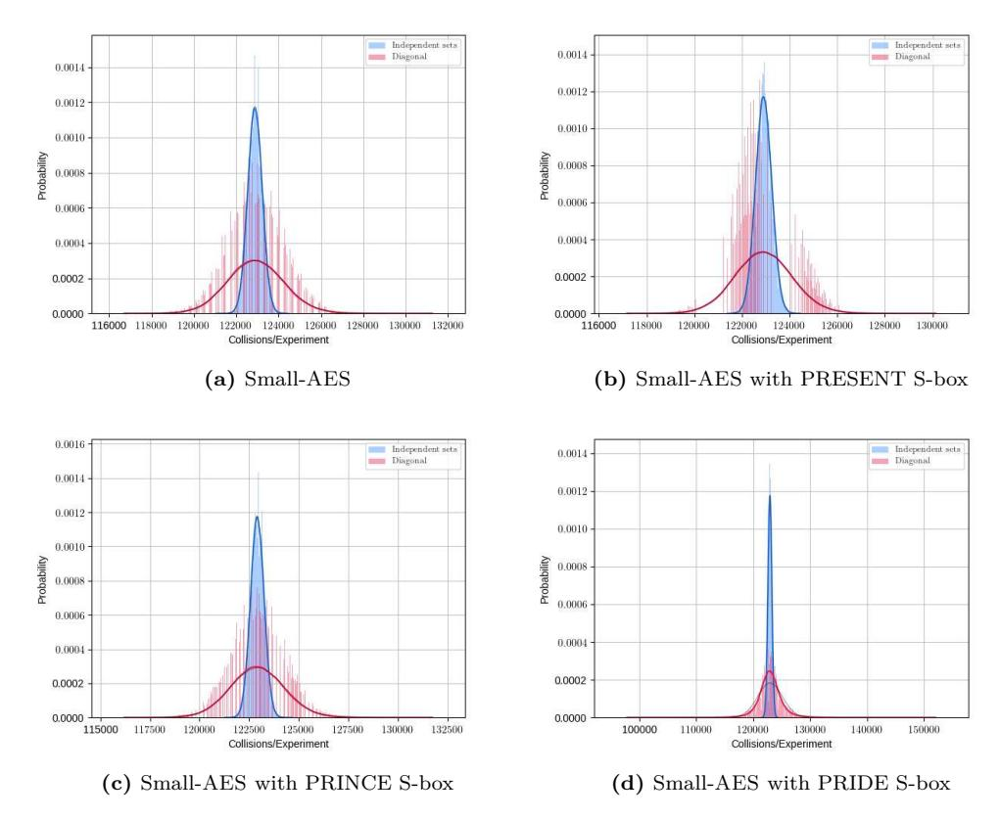

Figure 15: Distribution of the number of collisions in the first cell after four rounds in both settings, with the final MixColumns operation omitted. Both distributions used 100 000 random keys and counted the collisions from  $2^{14}$   $\delta$ -sets per key that were independent in Setting (1) or the  $2^{14}$   $\delta$ -sets from  $\mathcal{D}_{\{0\}}$ . Thin lines are fitted normal distributions, thick lines the best fitted distributions.

#### D.2.4 Discussion

In Setting (2), the variance differs significantly from our expectation. First, one can expect that it roughly is 32 times higher than the variance in Setting (1) due to the multiple-of-32 property. From the experiments, we observed the multiple-of-32 property in Section B.2. However, the variance of Small-AES in Setting (2) can then be expected to be roughly a 32 times the variance of Setting (1). Though, for Small-AES, it is only roughly 15.4 times larger as outlined in Table 9, i.e., roughly 16 times larger than the variance of Setting (1). The reason for this gap is still unknown.

For the five-round distinguisher, the tested S-boxes behaved quite similarly. For the four-round distinguisher, they differ hugely, e.g., the variance for Small-AES with the S-box of PRESENT has a factor of 12.7 instead of roughly 16, and that of PRIDE a factor of roughly 40.9. It is equally unknown which properties cause those S-boxes to possess such huge differences.

We conjecture that the multiple-of-four property behaves in a multiplicative fashion in the four-round distinguisher and in an additive fashion in our five-round distinguisher. This means, instead of 16-tuples of texts that form a multiple-of-eight property, the property builds 64-tuples texts that yield the multiple-of-32 property. So, it is included in the multiple-of-eight tuples. For the five-round distinguisher, we conjecture that the property behaves additively, i.e., there exist 16-tuples of texts that yield the multiple-of-eight

|               |              | Setting (1) |              | Setting (2)                 |  |  |
|---------------|--------------|-------------|--------------|-----------------------------|--|--|
| Construction  | Theory       | Experiments | Theory       | Experiments                 |  |  |
| π             | 32.9887<br>2 | –           | 232.9887     | –                           |  |  |
| AES           | 32.9887<br>2 | –           | 35.9887<br>2 | –                           |  |  |
| π             | 115 200      | –           | 115 200      | –                           |  |  |
| Small-AES     | 115 231.850  | 115 080.346 |              | 3 687 419.195 1 768 183.658 |  |  |
| PRESENT S-box | 115 231.850  | 116 507.699 |              | 3 687 419.195 1 462 985.130 |  |  |
| PRINCE S-box  | 115 231.850  | 115 049.655 |              | 3 687 419.195 1 886 523.688 |  |  |
| PRIDE S-box   | 115 231.850  | 114 859.203 |              | 3 687 419.195 4 709 431.259 |  |  |

<span id="page-57-1"></span>**Table 9:** Summary of the variances for our four-round distinguisher. RP = random permutation. Exp. = experiments from 100 000 random keys with 2<sup>14</sup> *δ*-sets each.

property and separate 8-tuples that yield an additional multiple-of-four property that is hidden but notable in the variance. It is imaginable that the same property causes the five-round multiple-of-four distinguisher in Appendix [B.3.](#page-42-1)

# **E Index Dependencies for Small-AES**

# <span id="page-57-0"></span>**E.1 Index Dependencies of The Four-round Distinguisher**

Recall Equation [\(10\)](#page-14-1) that consisted of eight key-dependent variables for *i* 6= *j*:

$$2S(2S(2x_i \oplus K^1[0]) \oplus K^2[0]) \oplus 3S(S(3x_i \oplus K^1[1]) \oplus K^2[5])$$

$$\oplus S(2S(x_i \oplus K^1[2]) \oplus K^2[10]) \oplus S(S(x_i \oplus K^1[3]) \oplus K^2[15])$$

$$= 2S(2S(2x_j \oplus K^1[0]) \oplus K^2[0]) \oplus 3S(S(3x_j \oplus K^1[1]) \oplus K^2[5])$$

$$\oplus S(2S(x_j \oplus K^1[2]) \oplus K^2[10]) \oplus S(S(x_j \oplus K^1[3]) \oplus K^2[15]).$$

For different in- or output positions, the equations differ naturally. In all cases, however, we have eight cells as degrees of freedom, i.e., 2<sup>32</sup> possible values of keys and plaintexts. For simplicity, we denote them as *κ* 1 [0*..*3]*, κ*<sup>2</sup> [0*..*3] in all cases. For each value of the eight *κ* 1 [0*..*3]*, κ*<sup>2</sup> [0*..*3], we compute the equation over all 2<sup>4</sup> values of *x<sup>i</sup>* , form their 2 4 2 pairs, and count the number of collisions. For an ideal permutation, we would expect

$$\begin{split} \mu_{\mathsf{rand}} &= (2^4)^8 \cdot \binom{2^4}{2} \cdot (2^{-4} - 2^{-64.093}) \simeq 32\,212\,254\,719.999\dots \text{ and} \\ \sigma_{\mathsf{rand}} &\simeq 173\,778.563, \end{split}$$

whereas we would expect for Small-AES in theory – that is, without an influence of the indices from the MixColumns matrix or the S-box:

$$\mu_{\text{Small-AES}} = (2^4)^8 \cdot {2^4 \choose 2} \cdot (2^{-4} + 2^{-15.792}) \simeq 32\,221\,796\,920.671\dots$$
 and  $\sigma_{\text{Small-AES}} \simeq 173\,802.580.$

**Implementation.** In practice, the influences the of S-box and MixColumns matrix cause deviations that are predictable by the 16 × 16 cell-dependent equations. We implemented the system for Small-AES with its original and six alternative S-boxes. The results are

<span id="page-58-0"></span>

| <b>(0</b> )                                                     | (4)                                                             | (8)                                                                | (12)                                                               |
|-----------------------------------------------------------------|-----------------------------------------------------------------|--------------------------------------------------------------------|--------------------------------------------------------------------|
| 0 4 8 12                                                        | 12 0 4 8                                                        | 8 12 0 4                                                           | 4 8 12 0                                                           |
| 1 5 9 13                                                        | 13 1 5 9                                                        | 9 13 1 5                                                           | 5 9 13 1                                                           |
| 2 6 1014                                                        | 14 2 6 10                                                       | 1014 2 6                                                           | 6 1014 2                                                           |
| 3 7 11 15                                                       | 15 3 7 11                                                       | 11 15 3 7                                                          | 7 11 15 3                                                          |
| <b>(1)</b>                                                      | <b>(5</b> )                                                     | (9)                                                                | <b>(13)</b>                                                        |
| 15 3 7 11                                                       | 11 15 3 7                                                       | 7 11 15 3                                                          | 3 7 11 15                                                          |
| 12 0 4 8                                                        | 8 12 0 4                                                        | 4 8 12 0                                                           | 0 4 8 12                                                           |
| 13 1 5 9                                                        | 9 13 1 5                                                        | 5 9 13 1                                                           | 1 5 9 13                                                           |
| 14 2 6 10                                                       | 101426                                                          | 6 1014 2                                                           | 2 6 1014                                                           |
|                                                                 |                                                                 |                                                                    |                                                                    |
| <b>(2</b> )                                                     | (6)                                                             | (10)                                                               | (14)                                                               |
| (2)<br>1014 2 6                                                 | (6)<br>6 1014 2                                                 | (10)<br>2 6 1014                                                   | (14)<br>14 2 6 10                                                  |
|                                                                 |                                                                 |                                                                    |                                                                    |
| 1014 2 6                                                        | 6 10 14 2                                                       | 2 6 1014                                                           | 14 2 6 10                                                          |
| 1014 2 6<br>11 <b>15</b> 3 7                                    | 6 10 14 2<br>7 11 15 3                                          | 2 6 10 14<br>3 7 11 15                                             | 14 2 6 10<br>15 3 7 11                                             |
| 1014 2 6<br>11 <b>15</b> 3 7<br>8 12 0 4                        | 6 1014 2<br>7 1115 3<br>4 8 12 0                                | 2 6 10 14<br>3 7 11 15<br>0 4 8 12                                 | 14 2 6 10<br>15 3 7 11<br>12 0 4 8                                 |
| 1014 2 6<br>1115 3 7<br>8 12 0 4<br>9 13 1 5                    | 6 10 14 2<br>7 11 15 3<br>4 8 12 0<br>5 9 13 1                  | 2 6 1014<br>3 7 11 <mark>15</mark><br>0 4 8 12<br>1 5 9 13         | 14 2 6 10<br>15 3 7 11<br>12 0 4 8<br>13 1 5 9                     |
| 1014 2 6<br>1115 3 7<br>8 12 0 4<br>9 13 1 5                    | 6 1014 2<br>7 1115 3<br>4 8 12 0<br>5 9 13 1                    | 2 6 1014<br>3 7 11 <mark>15</mark><br>0 4 8 12<br>1 5 9 13<br>(11) | 14 2 6 10<br>15 3 7 11<br>12 0 4 8<br>13 1 5 9<br>(15)             |
| 1014 2 6<br>1115 3 7<br>8 12 0 4<br>9 13 1 5<br>(3)<br>5 9 13 1 | 6 1014 2<br>7 1115 3<br>4 8 12 0<br>5 9 13 1<br>(7)<br>1 5 9 13 | 2 6 1014<br>3 7 1115<br>0 4 8 12<br>1 5 9 13<br>(11)<br>13 1 5 9   | 14 2 6 10<br>15 3 7 11<br>12 0 4 8<br>13 1 5 9<br>(15)<br>9 13 1 5 |

Figure 16: Permutations of numbers of solutions for each input byte, where the bold index in parentheses refers to the position of the  $\delta$ -sets in the plaintext,  $i_{in}$ , and the position in the small squares the index of the output (colliding) cell  $i_{out}$ . The blue cells are exemplary for the position  $(i_{in}, i_{out}) = (0, 15)$ , the best distinguisher for Small-AES.

provided in Figure 17. For each S-box, we obtained distinct values for each output cell. The numbers of solutions in each row are permutations of each other with strong regularity. More precisely, the numbers of solutions repeat as shown by equal indices in Figure 16. This means, the first row of the left part of Figure 17 corresponds to the top-left of Figure 16. For  $i_{\rm in}=0$ , the position  $i_{\rm out}=15$  yields the highest number of collisions,  $32\,239\,747\,072$ . For  $i_{\rm in}=1$ , this value repeats at index  $i_{\rm out}=0$ ; for  $i_{\rm in}=2$ , this value repeats at index  $i_{\rm out}=5$ ; and for  $i_{\rm in}=3$ , this value repeats at index  $i_{\rm out}=10$ . This corresponds to the darkest cells in the left part of Figure 17. The situation is the same for the distinguisher with alternative S-boxes, e.g., compare to that of PRESENT, in the right part of Figure 17.

**Practical Verification.** We implemented the position-dependent four-round distinguisher also for Small-AES with its original S-box, and with the PRESENT S-box to verify our approach. Figure 18 illustrates the average means from our experiments with  $2^{23}$   $\delta$ -sets for Small-AES on the left, in terms of the deviation from the theoretical mean of a pseudo-random permutation 62 914 600 in multiples of its standard deviation of  $\sigma \simeq 7931$ . Therefore, we consider the trail from input nibble 1 to output nibble 15 for our distinguisher for Small-AES. The corresponding figure for the PRP possessed about  $\pm 0.6\sigma$  as the highest deviation. One can observe that the figures are close to our theoretical prediction.

One can further observe significant deviations between the combinations. Recall that the range of  $[-\sigma..+\sigma]$  yields no obvious distinguisher. In contrast, the range of  $[+2\sigma..+4\sigma]$  yields roughly the theoretically expected distinguisher. Interestingly, the majority of combinations yield distinguishers for Small-AES. More detailed, for each input index, a single output index possesses a mean close to the pseudorandom value, and two further indices are mostly in the range of  $[+\sigma..+2\sigma]$ . All further combinations give higher means. One combination per input index peaked particularly with a derivation of about  $+7\sigma$ .

#### E.2 Index Dependencies of The Five-round Distinguisher

Again, we emphasize that our assumptions approximate the structures of AES and Small-AES. For consistency, we iterated again over the cell at index 1 in the plaintexts in Setting (1) in our distinguisher on five rounds. Since our distinguisher starts again from a single cell, we expect weaker deviations due to the additional round compared to our

<span id="page-59-0"></span>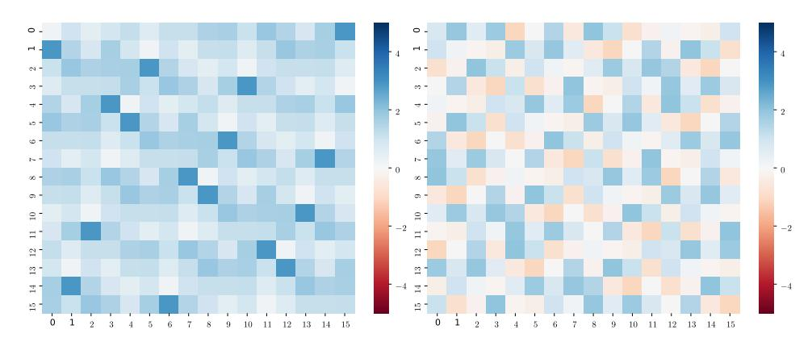

Figure 17: Theoretical index-dependent means from the equation system for our four-round distinguisher with the S-box of Small-AES and that of PRESENT, in multiples of  $|\mu_{\text{Small-AES}} - \mu_{\text{rand}}|$  deviations from the mean of the PRP. Each cell represents the mean of the result for the active input cell in the plaintexts (y-axis) and the tested inactive cell (x-axis) after four rounds without the final MixColumns operation. Darker color (ignorant of sign) imply better distinguishers.

four-round distinguisher and due to the fact that it considers four cells after three full rounds at a time. Figure 19 presents our preliminary results. One can observe that all choices for the active input cell yield distinguishers that are at least  $2.2\sigma$  above the mean of the PRP, with peaks at  $4.9\sigma$ .

# F S-box Dependencies of The Four-round Distinguisher for Variants of Small-AES

Alternative S-boxes. The results for our four-round distinguisher from Section 4 for Small-AES in Table 3 ( $\mu=62\,967\,244$ ,  $\sigma\simeq7\,030$ ) deviate significantly from the theoretical prediction ( $\mu=62\,933\,200$ ,  $\sigma\simeq7\,681$ ). The deviation is as large as 6.85 standard-deviation units, in the sense that Small-AES appears to yield a considerably better distinguisher than anticipated. The naturally arising question is which reasons cause this phenomenon. In the beginning, we aimed to search for additional internal properties due to the AES. For each S-box, we employed again  $2^{23}$  independent  $\delta$ -sets. Surprisingly, our results indicate that the employed S-box can produce tremendous biases, both positively and negatively. Our results are listed in Table 10 and illustrated in Figure 20. In summary:

- The three real-world S-boxes show lower, but a noticeable distance to the random permutation. While PRESENT and PRINCE are below the prediction, the distance to the pseudo-random permutation is significant (1.85 and 1.92 standard-deviation units of the theoretical prediction for Small-AES).
- Two out of three toy S-boxes, Toy-8 and Toy-10, behave close to random (-0.02 and -0.09 standard-deviation units) and do not yield a distinguisher for the employed amount of data.
- The Toy-6 S-box strongly deviates from all others by having a significantly lower mean than the random permutation and all others (-2.86 standard-deviation units).

**Alternative S-boxes and Index Dependencies.** The index pattern depends also strongly on the employed S-box. For comparison, the right side of Figure 18 shows the corresponding input-output pattern for Small-AES with the S-box of PRESENT. It differs strongly

<span id="page-60-0"></span>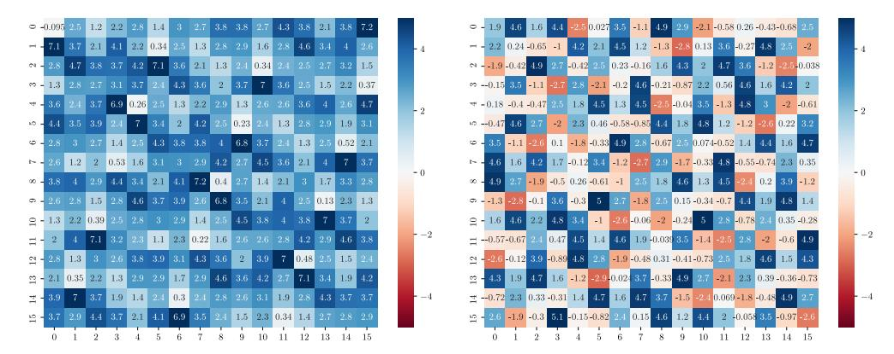

Figure 18: Experimental index-dependent means from 50 experiments (random keys and  $2^{23}$  δ-sets) on Small-AES with (right) its original S-box and (left) the PRESENT S-box. Values are multiplies of  $\sigma$  deviations from the mean of the PRP. The cell positions x, y represent the active plaintext cell (y-axis) and the tested ciphertext cell (x-axis) after four rounds without the final MixColumns operation.

<span id="page-60-1"></span>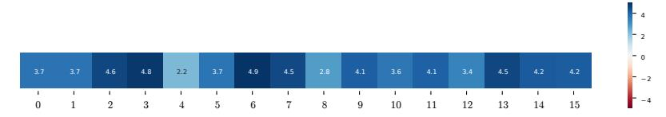

**Figure 19:** Average means of five experiments with random keys and  $2^{30}$   $\delta$ -sets for our five-round distinguisher with Small-AES in  $\times \sigma$  deviations from the mean of the PRP. Each cell represents the result for the active input cell in the plaintexts.

from that of Small-AES with its original S-box. In general, the obtained means are lower and the peaks lower. All input positions have in common that there exist two to three output cells for each that input-cell position with means of  $[4.5\sigma..5.5\sigma]$ , i.e., strong distinguishers. Moreover, almost each input position (except two and five) share equally usable distinguishers with means of  $[-2\sigma..-3\sigma]$  below the mean of the PRP.

Figure 21 shows the details also for the S-boxes of PRINCE, PRIDE, Toy-6, Toy-8, and Toy-10. The considerably higher number of dark spots in the representations of the latter three illustrate the strong effect of the S-box for both positive and negative biases.

**S-box Properties.** The question remains which S-box properties cause the deviations. We tested also particularly well-suited S-boxes: the 16 affine-equivalent representatives of optimal S-boxes from [LP07] with respect to differential and linear cryptanalysis. Moreover, we also considered the 10 representatives of platinum S-boxes with minimal CardD1 (number of 1-bit-to-1-bit differentials with non-zero probability) and CardL1 (number of 1-bit-to-1-bit linear approximations) from [ZBRL15].

To compare the S-boxes, we chose a metric that captures the average absolute deviation of each output cell to the theoretically expected number of collisions  $p_{\mathsf{Small-AES}}$  for our four-round distinguisher. So, we used the Euclidean distance for this purpose. For an S-box  $S: \mathbb{F}_2^4 \to \mathbb{F}_2^4$ , let  $D_S$  denote our distance,  $\mathsf{X}_{i_{\mathsf{out}}}^S$  the number of collisions from plaintext  $\delta$ -sets that iterate over Cell  $i_{\mathsf{in}} = 0$  and count the number of pairs that collide in Cell  $i_{\mathsf{out}}$  after four rounds without the final MixColumns operation. Moreover, let  $\mathbb{E}\left[\mathsf{X}\right] \simeq 32\,221\,796\,921$  denote the expected number of collisions. Note that the multi-set

<span id="page-61-0"></span>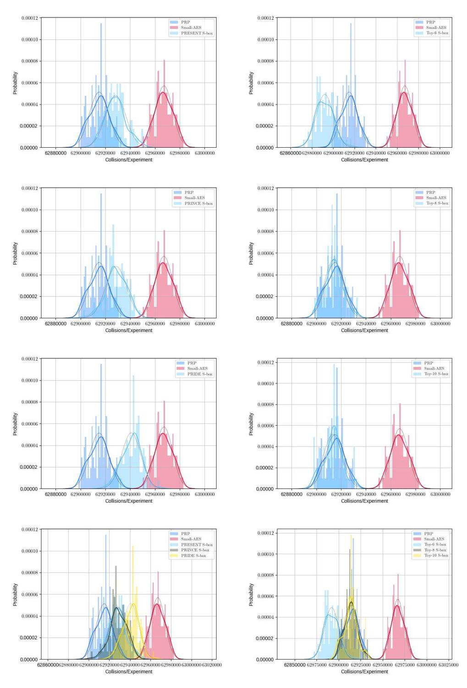

**Figure 20:** Distribution of means from 100 experiments with random keys for our four-round distinguisher on variants of Small-AES with different S-boxes. Each experiment used 2<sup>23</sup> independent *δ*-sets.

<span id="page-62-0"></span>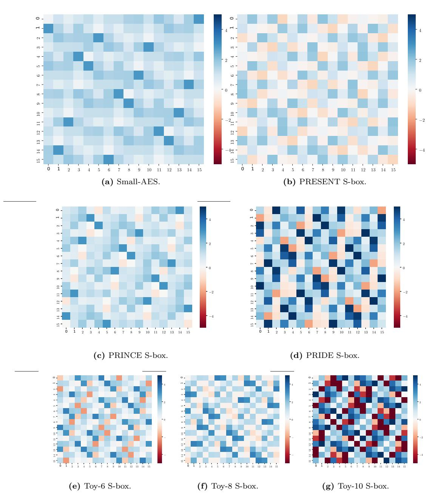

**Figure 21:** Theoretical index-dependent means from the equation system for our four-round distinguisher with different S-boxes, in ×|*p*Small-AES − *p*rand| deviations from the mean of the PRP. Each cell represents the result for the active input cell in the plaintexts (**y**-axis) and the tested inactive cell (**x**-axis) after four rounds without the final MixColumns operation. Darker colors (ignorant of sign) imply better distinguishers.

<span id="page-63-0"></span>**Table 10:** Results of the four-round distinguisher on Small-AES with different S-boxes and 100 random keys. Speck-64-96 has been used as PRP. Difference = to the theoretical value;  $\mathbf{DP}_{\text{max}}$  = the maximal number of pairs for a differential through the S-box; Var = variance; hom. = homogeneous;  $\sqrt{-}$  = yes/no.

|           |             |          | Difference | e to Theory |    |         |              |
|-----------|-------------|----------|------------|-------------|----|---------|--------------|
| Instance  | $\mu$       | $\sigma$ | $\pi$      | Small-AES   | DU | Var     | Hom.         |
| Theory    | 62 914 000. | 7680.    | -          | -19200.     |    |         |              |
| PRP       | 62915004.   | 7820.    | +1004.     | -18196.     |    |         |              |
| Theory    | 62 933 200. | 7681.    | +19 200.   | _           |    |         |              |
| Small-AES | 62 967 244. | 7 030.   | +53244.    | +34044.     | 4  | 344/225 | $\checkmark$ |
| PRESENT   | 62 928 210. | 8 321.   | +14210.    | -4990.      | 4  | 416/225 | -            |
| PRINCE    | 62928742.   | 8 387.   | +14742.    | -4458.      | 4  | 344/225 | -            |
| PRIDE     | 62940902.   | 7761.    | +26902.    | +7682.      | 4  | 416/225 | _            |
| Toy-6     | 62892051.   | 8 151.   | -21949.    | -41148.     | 6  | 392/225 | -            |
| Toy-8     | 62913848.   | 7443.    | -152.      | -19352.     | 8  | 464/225 | _            |
| Toy-10    | 62913322.   | 7779.    | -678.      | -19878.     | 10 | 608/225 | -            |

 $\{\mathsf{X}^S_{i_\mathsf{out}}\}_{0 \leq i_\mathsf{out} \leq 15}$  is invariant for different values of  $i_\mathsf{in}$ . Then

$$D_{S} \stackrel{\text{def}}{=} \sqrt{\sum_{i_{\text{out}}=0}^{15} \left| \mathsf{X}_{i_{\text{out}}}^{S} - \mathbb{E}\left[\mathsf{X}\right] \right|^{2}}$$

<span id="page-63-1"></span>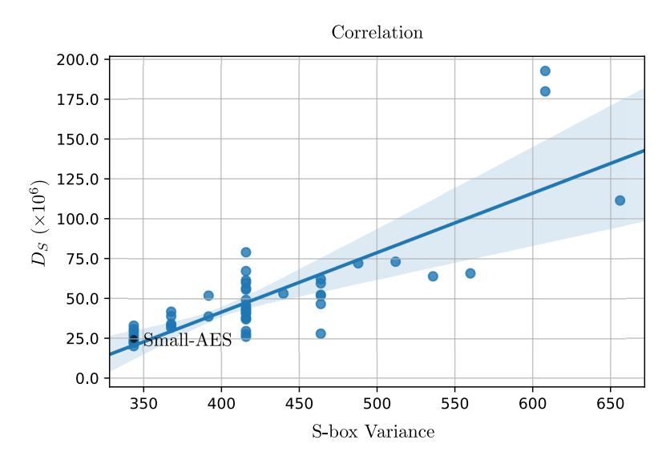

**Figure 22:** Correlation of  $D_S$ , i.e., the squared distance to the expected number of collisions over all output-cell positions and the variance of our tested S-boxes.

We tested whether the distances are correlated with particular S-box properties. Grassi and Rechberger [GR19] already suggested that their five-round distinguisher on the AES would be related to the variance of the S-box. Therefore, the correlation of the  $D_S$  measure to the S-box would be interesting, which could be evaluated by the Pearson correlation coefficient  $\rho$ . We determined its r-value and p-value; Recall that for two random variables

X and Y:

$$\rho_{X,Y} \stackrel{\text{def}}{=} \frac{\text{cov}(X,Y)}{\sigma_X \cdot \sigma_Y},$$

where  $\operatorname{cov}(\mathsf{X},\mathsf{Y}) =^{\operatorname{def}} \mathbb{E}\left[(\mathsf{X} - \mu_\mathsf{X}) \cdot (\mathsf{Y} - \mu_\mathsf{Y})\right]$  is the covariance of X and Y. We obtained  $(r,p) \simeq (0.812, 1.637 \cdot 10^{-13})$ , i.e., a high correlation of 0.812; the *p*-value denotes a very small probability that our results were observed but would be uncorrelated. The relationship is depicted in Figure 22. S-boxes with low variances are considerably closer to the expected numbers of collisions. The highest deviations were observed for the random S-boxes  $S_{17}$  and  $S_3$  as well as for Toy-10, whose variances were the highest 656, 608, and 608. Though, several S-boxes with a low variance of 416/256 (e.g. that of PRIDE) had considerably large values of  $D_S$ . As a result, the variance is related, though, does not fully explain the quality of an S-box. We further observed that the ten S-boxes (nine optimal S-boxes 3–7, 10–13, and the Small-AES S-box) whose autocorrelation-table entries  $a_{i,j}$ , for i,j>0 consisted of only values  $\pm 8$  and contained no  $\pm 16$ , (which implied the minimal variance of 344/256) all had low values of  $D_S$ . This implied the absence of linear structures.

**Table 11:** S-box properties, in ascending order by  $D_S$ . DU = differential uniformity, lin. = linearity, NL = nonlinearity, LS = linear structures.

| Name                        | Sbox                                    | $D_S$     | Var.   | DU | Lin. | NL | LS           |
|-----------------------------|-----------------------------------------|-----------|--------|----|------|----|--------------|
| Optimal-06                  | [0 1 2 13 4 7 15 6 8 12 11 9 10 14 5 3] | 20440130  | 344.00 | 4  | 8    | 4  | _            |
| Optimal-04                  | [0 1 2 13 4 7 15 6 8 12 9 11 10 14 5 3] | 22521284  | 344.00 | 4  | 8    | 4  | _            |
| Optimal-03                  | [0121347156812531014119]                | 22706595  | 344.00 | 4  | 8    | 4  | -            |
| Optimal-11                  | [0121347156814111059123]                | 23218095  | 344.00 | 4  | 8    | 4  | -            |
| ${\bf Optimal \text{-} 07}$ | [0121347156812141110935]                | 24444860  | 344.00 | 4  | 8    | 4  | -            |
| Small-AES                   | [6 11 5 4 2 14 7 10 9 13 15 12 3 1 0 8] | 24893844  | 344.00 | 4  | 8    | 4  | _            |
| Platinum-05                 | [0134117149261035811512]                | 26272446  | 416.00 | 4  | 8    | 4  | ✓            |
| Optimal-12                  | [0 1 2 13 4 7 15 6 8 14 11 10 9 3 12 5] | 27188316  | 344.00 | 4  | 8    | 4  | _            |
| Platinum-02                 | [0129761152311414138105]                | 27800383  | 416.00 | 4  | 8    | 4  | ✓            |
| Random-06                   | [1240796133514810215111]                | 28205615  | 344.00 | 6  | 12   | 2  | $\checkmark$ |
|                             | :                                       |           |        |    |      |    |              |
| Random-02                   | [8411105121326159147310]                | 73193659  | 512.00 | 6  | 12   | 2  | <b>√</b>     |
| PRIDE                       | [0481515149271012111363]                | 79057073  | 416.00 | 4  | 8    | 4  | ✓            |
| Random-17                   | [11 14 13 8 2 7 12 6 5 0 4 15 10 9 3 1] | 111443494 | 656.00 | 8  | 16   | 0  | ✓            |
| Random-03                   | [7 1 5 10 4 11 12 3 13 8 9 15 14 2 0 6] | 179623034 | 608.00 | 8  | 16   | 0  | $\checkmark$ |
| Toy-10                      | [6412507214115313810911]                | 192390502 | 608.00 | 10 | 12   | 2  | $\checkmark$ |

# <span id="page-64-0"></span>G Adapted Heys-Liu Probabilistic Integral Distinguisher on Four-round Small-AES

The Heys-Liu Integral Distinguisher on BSPN. In 2014, Heys [Hey14] conducted a similar analysis BSPN [YTH96], a byte-wise variant of the involutional SPN of [HT96]. BSPN transforms a vector of eight bytes through SubBytes, a mixing layer, and AddRoundKeys, similar to the AES and with the same S-box, but with a mixing layer that multiplies the state with the circulant matrix  $o(0,1,\ldots,1)$ . The round function of BSPN is therefore simpler and a similar integral as for the AES applies. Heys and Liu studied a probabilistic extension of the three-round integral. More precisely, they studied the probability of obtaining a zero sum in the individual bytes after three rounds that naturally allows them to be traced through the subsequent round. In contrast to our approach, they studied the probability that the sum of an entire  $\delta$ -set of 256 texts is zero with a probability significantly deviating from random.

<span id="page-65-1"></span><span id="page-65-0"></span>

| (a) Mean and standard deviation of the Heys-Liu experiments adapted to four rounds of Small-AES with |
|------------------------------------------------------------------------------------------------------|
| 100 experiments with random keys.                                                                    |

|                    | Random perr   | nutation  | Small-AES     |           |  |
|--------------------|---------------|-----------|---------------|-----------|--|
| $\delta$ -sets $s$ | $\mu$         | $\sigma$  | $\mu$         | $\sigma$  |  |
| 24                 | 1 048 573.120 | 964.778   | 1 049 134.150 | 1 079.363 |  |
| 26                 | 4194297.190   | 2182.769  | 4196155.600   | 2382.283  |  |
| 28                 | 16776997.485  | 3808.268  | 16785415.790  | 5787.742  |  |
| 30                 | 67109083.490  | 8 114.173 | 67143877.360  | 16479.876 |  |

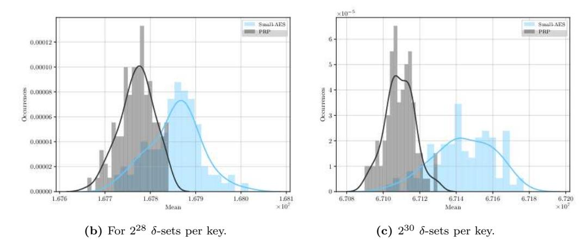

**Figure 23:** Results of the Heys-Liu experiments adapted to four rounds of Small-AES with 100 experiments with random keys.

**Adaption to Small-AES.** Inspired by their approach, we conducted a similar study for round-reduced AES. Since we expected the result to be inapplicable for the AES, we considered Small-AES instead. More precisely, we employed 100 random keys and  $2^s$   $\delta$ -sets that iterated over all  $2^4$  values of the first input byte for each. We counted the number of times that we obtained a zero sum in the first output byte after almost four rounds, i.e., without the final MixColumns operation. Our results are illustrated in Figure 23 for  $s \in \{28, 30\}$ ; detailed means and standard deviations are provided for those as well as for  $s \in \{24, 26\}$  in Table 23a.

**Interpretation.** We see considerable differences in the distribution starting from s=28, although still a broad overlap of both distributions. For s=30, the different distributions become apparent. From our point of view, the distinguisher is a consequence of ours, but significantly more sophisticated to explore. We leave its more detailed foundations as interesting future work.