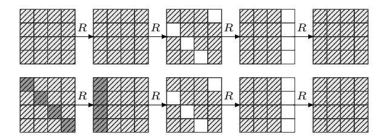
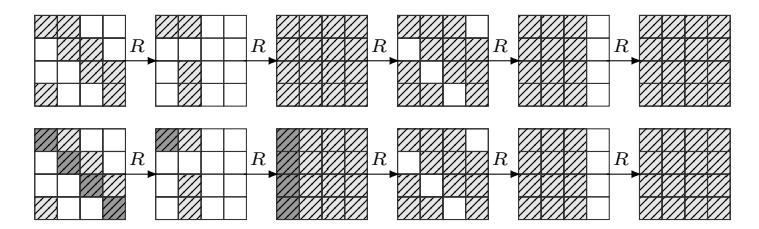
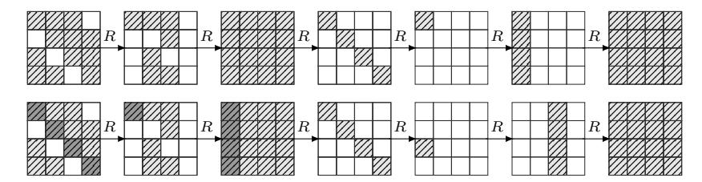

### The Exchange Attack: How to Distinguish Six Rounds of AES with 2 <sup>88</sup>.<sup>2</sup> chosen plaintexts

Navid Ghaedi Bardeh and Sondre Rønjom

Department of Informatics University of Bergen 5020 Bergen, Norway {navid.bardeh,sondre.ronjom}@uib.no

Abstract. In this paper we present exchange-equivalence attacks which is a new cryptanalytic attack technique suitable for SPN-like block cipher designs. Our new technique results in the first secret-key chosen plaintext distinguisher for 6-round AES. The complexity of the distinguisher is about 2<sup>88</sup>.<sup>2</sup> in terms of data, memory and computational complexity. The distinguishing attack for AES reduced to six rounds is a straightforward extension of an exchange attack for 5-round AES that requires 2 <sup>30</sup> in terms of chosen plaintexts and computation. This is also a new record for AES reduced to five rounds. The main result of this paper is that AES up to at least six rounds is biased when restricted to exchangeinvariant sets of plaintexts.

Keywords: SPN, AES, Exchange-Equivalence Attacks, Exchange-Invariant Sets, Exchange-Equivalence Class, Secret-Key model, Differential Cryptanalysis

## 1 Introduction

Block ciphers are typically designed by iterating an efficiently computable round function many times in the hope that the resulting composition behaves like a randomly drawn permutation. The designer is typically constrained by various practical criterion, e.g. security target, implementation boundaries, and specialized applications, that might lead the designer to introduce symmetries and structures into the round function as a compromise between efficiency and security. In the compromise, a round function is iterated enough times to make sure that any symmetries and structural properties that might exist in the round function vanish. Thus, a round function is typically designed to increasingly decorrelate with structure and symmetries after several rounds. However, what actually constitutes structure is an open question which requires continuous investigation as long as using randomly drawn codebooks is out of reach.

Low data- and computational-complexity distinguishers and key-recovery attacks on round-reduced block ciphers have recently gained renewed interest in the literature. There are several reasons for this. In one direction cryptanalysis of block ciphers has focused on maximizing the number of rounds that can be broken without exhausting the full codebook and key space. This often leads to attacks marginally close to that of pure brute-force. These are attacks that typically have been improved over time based on many years of cryptanalysis. The most successful attacks often become de-facto standard methods of cryptanalysis for a particular block cipher and might discourage anyone from pursuing new directions in cryptanalysis that do not reach the same number of rounds. This in itself might hinder new breakthroughs, thus it can be important to investigate new promising ideas that might not have reached its full potential yet. New methods of cryptanalysis that break or distinguish fewer rounds faster but with lower complexity than established cryptanalysis is therefore interesting in this process. Many constructions employ reduced round AES as part of their design. On the other hand, reduced versions of AES have nice and well-studied properties that can be favorable as components of larger designs (see for instance Simpira[10]).

The security of Rijndael-type block cipher designs is believed to be a wellstudied topic and has been in the focus of a large group of cryptanalysts during the last 20 years (e.g. see [13, 1, 12, 5, 3, 2, 6, 8]). Thus, it is rather surprising that new and quite fundamental results continuously appear for 2-4 rounds of AES that enables completely new types of more efficient attacks for an increasing number of rounds of AES. At Crypto 2016, the authors of [15] presented the very first secret-key 5-round distinguisher for AES. Secret-key (or key-independent) means that the attack does not care about the particular round keys (e.g. in contrast to related-key attacks). They extend a 4-round integral property to 5 rounds by exploiting properties of the AES MixColumn matrix. Although their distinguisher requires the whole codebook, it spawned a series of new fundamental results for AES. It was later improved to 298.<sup>2</sup> chosen plaintexts with 2 <sup>107</sup> computations by extending a 4-round impossible differential property to a 5-round property. Then, at Eurocrypt 2017, the authors of [9] proposed the first 5-round secret-key chosen plaintext distinguisher which requires 2<sup>32</sup> chosen texts with a computational cost of 235.<sup>6</sup> look-ups into memory of size 2<sup>36</sup> bytes. They showed that by encrypting cosets of certain subspaces of the plaintext space the number of times the difference of ciphertext pairs lie in a particular subspace of the state space always is a multiple of 8.

Later, at Asiacrypt 2017, the authors of [14] presented new fundamental properties for Rijndael-type block cipher designs leading to new types of 3- to 6-round secret-key distinguishers for AES that beats all previous records. The authors introduced a new deterministic 4-round property in AES, which states that sets of pairs of plaintexts that are equivalent by exchange of any subset of diagonals encrypts to a set of pairs of ciphertexts after four rounds that all have a difference of zero in exactly the same columns before the final linear layer. This was further explored in [7] under the name "mixture cryptanalysis".

## 1.1 Our Contribution

The first 5-round secret-key chosen-plaintext distinguisher for AES was introduced at Crypto 2016, almost 20 years after Rinjdael was first proposed as a candidate in the AES-competition, and required the whole codebook. In this paper, only three years later, we introduce the first 6-round secret-key distinguisher for AES that has complexity of about  $2^{88.2}$  computations and ciphertexts. This is a giant leap for cryptanalysis of AES. Our distinguishers are based on simple techniques which are easy to verify theoretically and in practice. Moreover, we prove that AES up to at least 6 rounds is biased on exchange-invariant sets. The 5-round distinguisher has been practically verified on a scaled down version in C/C++ on a standard laptop<sup>1</sup>.

## 1.2 Overview of This Paper and Main Results

In Section 2 we briefly describe results and notation that makes up the machinery for the rest of this paper. In particular, we describe what we call exchange operators, exchange-invariant sets and exchange-equivalence classes, and their relations to AES. In Section 3, we prove that five full rounds of AES is biased on exchange-invariant sets and in Section 4 and Section 5 we turn this result into simple distinguishers for AES reduced to five and six rounds.

The currently best secret-key distinguishers for 5- and 6-round AES are given in Table 1. We adopt that data complexity is measured in a minimum number of chosen plaintexts/ciphertexts CP/CC or adaptively chosen plaintexts/ciphertexts ACP/ACC. Time complexity is measured in equivalent number of AES encryptions (E), memory accesses (M) and/or XOR operations (XOR) - adopting that  $20M \approx 1$  round of AES.

| Table 1: Secret-Key Distinguishers for ALS |        |                         |                  |         |
|--------------------------------------------|--------|-------------------------|------------------|---------|
| Property                                   | Rounds |                         | Cost             | Ref.    |
| Impossible Diff                            | 5      |                         | $2^{129.6}$ XORs | [15]    |
| Multiple-8                                 | 5      | $2^{32}$ CP             | $2^{35.6} M$     | [9]     |
| Exchange Attack                            |        | $2^{30} \text{ CP}$     | $2^{30}{\rm E}$  | Sect. 4 |
| Zero difference                            | 6      | $2^{122.8} \text{ ACC}$ | 2 11010          | [14]    |
| Exchange Attack                            | 6      | $2^{88.2} \text{ CP}$   | $2^{88.2}E$      | Sect. 5 |

Table 1: Secret-Key Distinguishers for AES

### 2 Preliminaries

The Advanced Encryption Standard (AES)[4] is the most widely adopted block cipher in the world today and is a critical component in protecting information in both commercial and high-assurance communication. The AES internal state is typically represented by a 4 by 4 matrix in  $\mathbb{F}_{2^8}^{4\times4}$ . The matrix representation is for the most part purely representational as the actual properties of the matrix (e.g. rank, order etc.) are not actually exploited for anything. One full round

<sup>&</sup>lt;sup>1</sup> https://github.com/Symmetric-crypto/ExchangeAttack.git

of AES consists of SubBytes (SB), ShiftRows (SR), MixColumns (MC) and AddKey (AK). The SB-layer applies a fixed permutation over  $\mathbb{F}_{2^8}$  independently to each byte of the state, the SR-layer cyclically shifts the *i*-th row by *i* positions, while the MC-layer applies a fixed linear transformation to each column. The key addition adds a secret round-dependent value to the state. One full round is composed as  $R = AK \circ MC \circ SR \circ SB$ . We follow standard convention and simplify notation by writing  $R^t(x)$  to mean t rounds of AES where each round key is fixed to some random value.

In this section we recall some basic results and introduce necessary notation. We begin by defining what we call *column exchange differences*.

**Definition 1.** For a vector  $v \in \mathbb{F}_2^4$  and a pair of states  $\alpha, \beta \in \mathbb{F}_{2^8}^{4 \times 4}$  define the column exchange difference  $\Delta_v^{\alpha,\beta} \in \mathbb{F}_{2^8}^{4 \times 4}$  where the i-th column is defined by

$$(\Delta_v^{\alpha,\beta})_i = (\alpha_i \oplus \beta_i)v_i$$

where  $\alpha_i$  and  $\beta_i$  are the i-th columns of  $\alpha$  and  $\beta$ .

A pair of states define a set of  $2^{wt_c(\alpha \oplus \beta)}$  possible column exchange differences where  $wt_c(x)$  denotes the number of non-zero columns of x. We can now define three related operators that exchange diagonal, column and mixed values between a pair of AES states.

**Definition 2** (*Column exchange*). For a vector  $v \in \mathbb{F}_2^4$  and a pair of states  $\alpha, \beta \in \mathbb{F}_{2^8}^{4 \times 4}$ , define column exchange according to v as

$$\rho_c^v(\alpha,\beta) = \alpha \oplus \Delta_v^{\alpha,\beta}.$$

It is easy to see that the pair of states  $(\rho_c^v(\alpha, \beta), \rho_c^v(\beta, \alpha)) = (\alpha \oplus \Delta_v^{\alpha, \beta}, \beta \oplus \Delta_v^{\alpha, \beta})$  are formed by exchanging individual columns between  $\alpha$  and  $\beta$  according to the binary coefficients of v. Thus, for any v it is easy to see that

$$\alpha \oplus \beta = \rho_c^v(\alpha, \beta) \oplus \rho_c^v(\beta, \alpha).$$

From the definition of column exchange, we may define diagonal exchange as follows.

**Definition 3 (Diagonal exchange).** For a vector  $v \in \mathbb{F}_2^4$  and a pair of states  $\alpha, \beta \in \mathbb{F}_{2^8}^{4 \times 4}$ , define diagonal exchange according to v as

$$\rho_d^v(\alpha,\beta) = \alpha \oplus SR^{-1}(\Delta_v^{SR(\alpha),SR(\beta)}).$$

The new pair  $(\rho_d^v(\alpha, \beta), \rho_d^v(\beta, \alpha))$  is formed by exchanging individual diagonals between  $\alpha$  and  $\beta$  according to the binary coefficients of v. The relationship between exchange of diagonals and exchange of columns is intuitively straightforward.

**Lemma 1.** From the definition of  $\rho_d^v$  and  $\rho_c^v$  it follows that

$$R(\rho_d^v(\alpha, \beta)) = \rho_c^v(R(\alpha), R(\beta)).$$

*Proof.* By definition of diagonal exchange, it follows that

$$MC \circ SR(\rho_d^v(\alpha,\beta)) = \rho_c^v(MC \circ SR(\alpha), MC \circ SR(\beta))$$

and since both  $\rho_d$  and  $\rho_c$  commute with SB, it follows that

$$R(\rho_d^v(\alpha,\beta)) = \rho_c^v(R(\alpha),R(\beta)).\square$$

The last exchange operation involves exchanging more general looking subspace components belonging to the subspaces formed by applying SR and MC to single columns.

**Definition 4** (*Mixed exchange*). For a vector  $v \in \mathbb{F}_2^4$  and a pair of states  $\alpha, \beta \in \mathbb{F}_{2^8}^{4 \times 4}$  define mixed exchange according to v as

$$\rho_m^v(\alpha,\beta) = a \oplus L(\Delta_v^{L^{-1}(\alpha),L^{-1}(\beta)})$$

where  $L = MC \circ SR$ .

**Lemma 2.** From the definition of  $\rho_c^v$  and  $\rho_m^v$  it follows that

$$R(\rho_c^v(\alpha, \beta)) = \rho_m^v(R(\alpha), R(\beta)).$$

*Proof.* By definition of  $\rho_m^v$ , let  $L = MC \circ SR$ , we have that

$$\begin{split} \rho_m^v(R(\alpha),R(\beta)) = & R(a) \oplus L(\Delta_v^{L^{-1}(R(\alpha)),L^{-1}(R(\beta))}) \\ = & L \circ (SB(\alpha) \oplus \Delta_v^{SB(\alpha),SB(\beta)}) \\ = & L \circ SB(\alpha \oplus \Delta_v^{\alpha,\beta}) \\ = & R(\rho_v^c(\alpha,\beta)). \Box \end{split}$$

Although the following trivial two-round property in AES is straight-forward, we add it as a simple theorem to summarise the exchange operators.

**Theorem 1.** For two random states  $\alpha, \beta$  and some non-zero vector  $v \in \mathbb{F}_2^4$ , we have that

$$R^2(\rho_d^v(\alpha,\beta)) = \rho_m^v(R^2(\alpha),R^2(\beta)).$$

*Proof.* Follows by combining Lemma 1 and Lemma 2.

The exchange operators are related to a type of sets called exchange-invariant sets.

**Definition 5.** A set  $A \subset \mathbb{F}_{2^8}^{4 \times 4}$  is called exchange-invariant if it satisfies

$$A=\{\rho^v(a,b)\,|\,a,b\in A,\,v\in\mathbb{F}_2^4\}$$

where  $\rho$  is either of the three exchange operators.

Diagonal exchange-invariant sets have the following form. Let  $A=A_0\oplus A_1\oplus A_2\oplus A_3$  where  $A_i$  corresponds to a subset of  $\mathbb{F}_{2^8}^{4\times 4}$  of matrix states where only the *i*-th diagonal is non-zero. It then follows from the definition of the diagonal exchange operator that

$$A = \{ \rho_d^v(a, b) \mid a, b \in A, v \in \mathbb{F}_2^4 \}.$$

Similarly, we have that a column exchange-invariant set B has the form

$$B = SR(A)$$

$$= SR(A_0) \oplus SR(A_1) \oplus SR(A_2) \oplus SR(A_3)$$

$$= B_0 \oplus B_1 \oplus B_2 \oplus B_3$$

and similarly, a mixed exchange-invariant set has the form

$$C = SR \circ MC(B)$$

=  $SR \circ MC(B_0) \oplus SR \circ MC(B_1) \oplus SR \circ MC(B_2) \oplus SR \circ MC(B_3)$
=  $C_0 \oplus C_1 \oplus C_2 \oplus C_3$ .

Then from the definition of exchange-invariant sets and the definition of the exchange operator, it follows that two rounds of AES maps a diagonal exchange-invariant set  $A = A_0 \oplus A_1 \oplus A_2 \oplus A_3$  to a mixed exchange-invariant set  $C = C_0 \oplus C_1 \oplus C_2 \oplus C_3$  where  $|C_i| = |A_i|$ . The adversary may predict the exact size of each set  $C_i$  (since they are equal to the size of  $A_i$ 's), but he may even predict new plaintext/ciphertext pairs over two rounds. For instance, let  $A = A_0 \oplus A_1$  with  $A_0 = \{a_0, a_1\}$  and  $A_1 = \{b_0, b_1\}$  (i.e. |A| = 4). Then the adversary may encrypt two out of four plaintexts from the set A, say  $a_0 \oplus b_0$  and  $a_1 \oplus b_1$ , for two rounds to a pair of ciphertexts  $c^0$  and  $c^1$  that provides him with a minimal set of generators (relative to the mixed exchange operator) which allows him to predict the remaining ciphertexts corresponding to the remaining two plaintexts in A, i.e.

$$C = \{ \rho_m^v(c^0, c^1) \, | \, v \in \mathbb{F}_2^4 \}.$$

For a state  $s \in \mathbb{F}_{2^8}^{4 \times 4}$ , define  $L^{-1}(s) = SR^{-1} \circ MC^{-1}(s)$  and let  $\nu(s)$  denote the binary indicator vector which is 1 in position i if the i-th column of  $L^{-1}(s)$  is non-zero and 0 otherwise. We use this notation to simplify the results and to avoid working with more complicated state spaces. Thus,  $\nu(s)$  simply indicates the non-zero columns of the state before the last linear layer. For a subset  $I \subset \{0,1,2,3\}$ , we write  $v^I \in \mathbb{F}_2^4$  to mean the indicator vector which has value  $v^I_i = 1$  if  $i \in I$  and 0 otherwise.

**Definition 6.** Let  $\alpha, \beta$  be a pair of states that are different in diagonals indicated by  $H \subset \{0,1,2,3\}$  and let  $H^* \subset H$  denote the set formed by removing one element from H. Then we define the exchange-equivalence class relative to  $(\alpha, \beta)$  as

$$S_{\alpha,\beta} = \{ (\rho_d^{v^I}(\alpha,\beta), \rho_d^{v^I}(\beta,\alpha)) \mid I \subseteq H^*. \}$$

All pairs in  $S_{\alpha,\beta}$  are exchange-equivalent to each other. Since  $2^{t-1}$  of the  $2^t$  possible exchange-equivalent pairs are unique (e.g.  $\rho_d^{v^I+(1,1,1,1)}(\alpha,\beta)=\rho_d^{v^I}(\beta,\alpha)$  when |H|=4), we fix one index in H in all pairs (i.e. we do not exchange it) and call it  $H^*$ .

**Theorem 2.** Let  $A = A_0 \oplus A_1 \oplus A_2 \oplus A_3$  be a diagonal exchange-invariant set and assume  $|A_i| = m_i$  such that  $|A_i| = m_0 \cdot m_1 \cdot m_2 \cdot m_3$ . Then there are exactly

$$L_t(m_0, m_1, m_2, m_3) = \sum_{\substack{I \subset \{0, 1, 2, 3\} \\ wt(I) = t}} \prod_{i \in I} {m_i \choose 2} \prod_{j \in \{0, 1, 2, 3\} \setminus I} m_j$$

representative pairs  $\alpha, \beta \in A$  which are different in exactly t diagonals and where each define a unique exchange-equivalence class  $S_{\alpha,\beta}$  of size  $2^{t-1}$ . It follows that

$$\sum_{t=1}^{4} L_t(m_0, m_1, m_2, m_3) 2^{t-1} = \begin{pmatrix} \prod_{i=0}^{3} m_i \\ 2 \end{pmatrix}$$

is the total number of pairs in A and

$$\sum_{t=1}^{4} L_t(m_0, m_1, m_2, m_3)$$

is the number of distinct exchange-equivalence classes in A.

*Proof.* The number of pairs in A that are different in t diagonals I and equal in the remaining (4-t) diagonals J, is given by  $\prod_{i\in I}\binom{m_i}{2}\prod_{j\in J}m_j$ . Each such combination corresponds to one unique exchange-equivalence class  $S_{a,b}$  of size  $2^{t-1}$ . By inspecting the terms in the sums over the  $L_t$ , it can also easily be seen that it is equivalent to  $\binom{m_0 \cdot m_1 \cdot m_2 \cdot m_3}{2}$ .

Thus, the space of  $\binom{|A|}{2}$  pairs can be grouped into  $\sum_{t=1}^{4} L_t(m_0, m_1, m_2, m_3)$  exchange-equivalence classes, which provides us with a fine grained view of the exchange-equivalence structure of the sets.

We may write a pair in terms of their exchange indicators v, e.g.  $a_v = (\rho_d^v(\alpha,\beta),\rho_d^v(\beta,\alpha))$  where v is drawn from a (t-1)-dimensional vector space (to ensure that we generate only unique pairs) defined by fixing one of the active diagonals in all exchanged pairs. Taking the  $\binom{2^{t-1}}{2}$  combinations of all possible pairs  $a_v, a_u$  can be viewed as combining (t-1)-dimensional vectors u and v. We are interested in determining the number of combinations of pairs from a set  $S_{\alpha,\beta}$  in which the first pair can be derived from the other by exchanging exactly t diagonals. Thus we will need the following.

**Lemma 3.** The number of distinct pairs of vectors in  $\mathbb{F}_2^n$  whose difference has Hamming weight t, is given by

$$c(n,t) = \binom{n}{t} 2^{n-1}.$$

*Proof.* There are  $\binom{n}{t}$  vectors of weight t. For each such vector, we need to identify the unique pairs that sum to this vector. For the t positions where the vector is 1, the two vectors can be set to  $2^{t-1}$  unique combinations such that those positions sum one. The remaining positions in the two vectors must be identical, thus there are  $2^{n-t}$  choices for this part. The proof follows.

We can generate  $\binom{2^{t-1}}{2}$  unique combinations of pairs  $(a_v, a_u)$  from  $S_{a,b}$  where c(t-1,j) counts the number of combinations of pairs  $(a_u, a_v)$  in  $S_{a,b}$  which are exchange-equivalent if one pair can be obtained from the other by exchanging exactly j diagonals. In other words, c(t-1,j) of the combinations of pairs in  $S_t(\alpha,\beta)$  are equivalent if exactly j diagonals are exchanged between them. Moreover, it follows that

$$\sum_{j=1}^{t-1} c(t-1,j) = \sum_{i=1}^{t-1} {t-1 \choose j} 2^{t-2}$$

$$= 2^{t-2} \cdot (2^{t-1} - 1)$$

$$= \frac{2^{t-1} \cdot (2^{t-1} - 1)}{2}$$

$$= {2^{t-1} \choose 2}.$$

We will need the following modified theorem from [14], which states an exchange-difference relation over 4 rounds of AES. Let  $\mathbb{R}^4$  denotes 4 full rounds of AES with randomly fixed round keys. Then Theorem 1 of [14] is equal to the following (slightly re-formulated) theorem.

**Theorem 3 (4-round exchange-difference relation).** Let  $\alpha, \beta \in \mathbb{F}_{2^8}^{4 \times 4}$  and  $\alpha' = \rho_d^v(\alpha, \beta), \beta' = \rho_d^v(\beta, \alpha)$  for any  $v \in \mathbb{F}_2^4$ , then

$$\nu(R^4(\alpha) \oplus R^4(\beta)) = \nu(R^4(\alpha') \oplus R^4(\beta')).$$

In other words, the pattern of non-zero and zero columns in the difference  $L^{-1}(R^4(\alpha) \oplus R^4(\beta))$  is preserved by diagonal exchange of plaintext pairs  $\alpha$  and  $\beta$ , i.e. on exchange-equivalence classes  $S_{\alpha,\beta}$ . Figure 1 depicts this relation for the case when the exchanged pair of plaintexts is formed by exchanging the first diagonal and the first pair is zero in the last column before the last linear layer. If we let  $\operatorname{wt}(x)$  denote the ordinary Hamming weight of a binary vector, then one last property of AES will be important in this paper.

**Theorem 4.** Assume a pair of states  $\alpha$  and  $\beta$  with  $\operatorname{wt}(\nu(\alpha \oplus \beta)) = w_1$ . Then

$$P(\text{wt}(\nu(R(\alpha) \oplus R(\beta))) = w_2) = {4 \choose 4 - w_2} (2^{-8})^{w_1(4 - w_2)}.$$

*Proof.* If  $SR^{-1} \circ MC^{-1}(\alpha) \oplus SR^{-1} \circ MC^{-1}(\beta)$  has  $w_1$  active columns, then each column of  $\alpha \oplus \beta$  can be written as a linear function of  $w_1$  independent bytes. E.g.



Fig. 1: 4-round exchange trail.

the probability that one column is zero, is thus exactly  $(2^8)^{-w_1}$ . Moreover, the probability that exactly  $w_2$  of the columns are non-zero (i.e.  $4-w_2$  of the columns are zero) is thus exactly  $\binom{4}{4-w_2}(2^8)^{-w_1(4-w_2)}$ . Since the s-box layer preserves zero differences in bytes (and thus columns), it follows that  $\nu(R(\alpha) \oplus R(\beta))$  has the desired probability.

#### 2.1 Collision and Multicollision in a Set

The expected number of collision and multicollision in a set are computed in [11]. Suppose m objects taken uniformly at random from a given set (with replacement), of size N. Then by using a heuristic method, the expected number of collision is:

$$\frac{m \cdot (m-1)}{2N}$$

assuming independence between pairs of objects. In general, the expected number of collisions in two subsets, of cardinality  $m_0$  and  $m_1$ , which obtained by drawing at random without replacement from a large set of size N is:

$$\frac{m_0 \cdot m_1}{N}$$

Multicollision can be considered in a set as have l different elements with the same value or in l different sets and search for an element common to all. Using the same heuristic method, the expected number of multicollisions in a subset of size m drawn from a set of size N is:

$$s(m, N, l) = \frac{\prod_{i=1}^{l} m + 1 - i}{l! N^{l-1}}.$$
 (1)

### 3 When Column Exchange Equals Diagonal Exchange

In the previous section we showed that exchanging diagonals between plaintexts is the same as exchanging column values after one round. In this section we describe the intersection of column exchange and diagonal exchange, i.e. the probabilistic case when exchange of some diagonals between a pair of plaintexts is equal to exchange of (possibly some other) diagonals after one round. We then

combine this with Theorem 3 to form a probabilistic version of Theorem 3 that instructs us how to construct a chosen-plaintext distinguisher for five rounds of AES. For this we will need to count the number of bytes that are simultaneously active in both a fixed set of diagonals and a fixed set of columns. Thus, we define sets of indices related to diagonals and columns.

**Definition 7.** For a set  $I \subset \{0,1,2,3\}$ , let  $D_I$  denote the set of indices  $D_I = \{(k,k+i) \mod 4 \mid 0 \le k < 4, i \in I\}$  where  $(i,j) \in D_I$  if the byte at index (i,j) is activated by any of the diagonals indicated by I.

**Definition 8.** For a  $J \subset \{0,1,2,3\}$ , let  $C_J = \{(k,i) | 0 \le k < 4, i \in J\}$  denote the set of indices (i,j), where the byte at position (i,j) is activated by any of the columns indicated by J.

It is easy to see that the number of bytes that are simultaneously in a set of diagonals I and set of columns J is equal to  $|D_I \cap C_J| = |I| \cdot |J|$ . Thus, it follows that  $|D_I \cup C_J| = 4(|I| + |J|) - |I| \cdot |J|$  bytes are activated in total by the diagonals I and by the columns J.

Assume we have a pair of plaintexts  $(p^0, p^1)$  that we encrypt one round to a pair of ciphertexts  $(c^0, c^1)$ . Then assume that we make a new pair of plaintexts

$$(p'^0,p'^1)=(\rho_d^{(1000)}(p^0,p^1),\rho_d^{(1000)}(p^1,p^0)),$$

by exchanging the first diagonal such that the new pair of ciphertexts satisfy

$$\begin{split} (R(p'^0), R(p'^1)) = & (\rho_c^{(1000)}(c^0, c^1), \rho_c^{(1000)}(c^1, c^0)) \\ = & (c'^0, c'^1). \end{split}$$

We have a new pair of ciphertexts  $(c'^0, c'^1)$  formed by exchanging the first column between  $c^0$  and  $c^1$ . Now let  $I = \{0\}$  such that  $C_I$  contains the indices of the first column and imagine that there exists a set J such that the difference  $c^0 \oplus c^1$  is zero in all indices in  $C_I \cup D_J$  except exactly the indices in the intersection  $C_I \cap D_J$ , where it can be random. Then, certainly, if the column bytes indicated by  $C_I$  were exchanged between the ciphertexts  $(c^0, c^1)$  to get  $(c'^0, c'^1)$ , then certainly we must also have had that diagonal bytes indicated by  $D_J$ , and thus the diagonals indicated by J, were exchanged too. Hence, the pair of states are in a configuration where exchanging columns and diagonals means the same thing. The following theorem summarizes the probability of this event.

**Theorem 5.** Let  $I, J, K \subset \{0, 1, 2, 3\}$  and  $\alpha, \beta \in \mathbb{F}_{28}^{4 \times 4}$  be two random states. Then the probability that a set of diagonals J are exchanged, given that a set of columns I are exchanged when the difference  $\alpha \oplus \beta$  is zero in columns indicated by K, i.e.

$$P((\rho_d^{v^J}(\alpha,\beta),\rho_d^{v^J}(\beta,\alpha)) = (\rho_c^{v^I}(\alpha,\beta),\rho_c^{v^I}(\beta,\alpha)))$$

is given by

$$P(|I|, |J|, |K|) = (2^{-8})^{4(|I|+|J|)-|K||J|-2|I|\cdot|J|}$$
.

*Proof.* We restrict the state difference  $\alpha \oplus \beta$  to bytes indicated by indices  $C_I \cup D_J$  and require that all byte differences in this restriction is zero except for the bytes in the intersection  $C_I \cap D_J$ . Since  $|C_I \cap D_J| = |I| \cdot |J|$  and  $|C_I \cup D_J| = 4(|I| + |J|) - |I| \cdot |J|$ , and since the bytes take on  $2^8$  values, it follows that with a probability

$$(2^8)^{|I|\cdot|J|}/(2^8)^{4(|I|+|J|)-|I|\cdot|J|} = (2^{-8})^{4(|I|+|J|)-2|I|\cdot|J|}$$

we have that exchanging columns I is equivalent to exchanging diagonals J (and vice versa). If columns K are equal this means that I can not take on values from K (else the relation become trivial), but only take on values  $I \subset \{0,1,2,3\} \setminus K$  not in K such that |I| < 4 - |K|. Thus, if the states are equal in K columns, then since the restriction of  $C_K$  to  $C_I \cup D_J$  is equal to  $C_K \cap D_J = |K| \cdot |J|$  bytes, the probability is increased by a factor of  $(2^8)^{|K| \cdot |J|}$  to  $(2^{-8})^{4(|I|+|J|)-|K||J|-2|I||J|}$ .

(a) |K| = 0 (b) |K| = 1 (c) |K| = 2

Fig. 2: Example conditions for column/diagonal exchange equivalence.

In other words we have that with some fixed probability, exchanging diagonals between plaintexts is the same as exchanging (possibly some other) diagonals between the intermediate states after one round. And if some diagonals are exchanged after one round, then with probability 1 we also have that Theorem 3 applies. For instance, suppose two random plaintexts verify the differential characteristic of one of the examples in Figure 2. Then if we exchange the first diagonal between these two plaintexts, then after one round encryption only the first byte is exchanged between the intermediate states. As a consequence, both the first column and the first diagonal are exchanged between the intermediate pair after one round, and thus Theorem 3 can be extended to 5 rounds. This is summarized as follows.

**Theorem 6.** Let  $\alpha, \beta \in \mathbb{F}_{28}^{4 \times 4}$  denote two plaintexts equal in |K| diagonals indicated by  $K \subset \{0, 1, 2, 3\}$  and assume  $0 < \operatorname{wt}(\nu(R^5(\alpha) \oplus R^5(\beta))) < 4$ . Then for a non-trivial choice of  $I \subset \{0, 1, 2, 3\} \setminus K$  the relation

$$\nu(R^5(\alpha) \oplus R^5(\beta))) = \nu(R^5(\rho_d^{v^I}(\alpha, \beta)) \oplus R^5(\rho_d^{v^I}(\beta, \alpha)))$$

г

holds with probability

$$P_5(|I|, |K|) = \sum_{d=1}^{3} {4 \choose d} P(|I|, d, |K|)$$

 ${\it Proof.}$  The relation follows trivially by combining Theorem 3 and Theorem 5. Theorem 3 states that

$$\nu(R^4(\rho_d^v(R(\alpha),R(\beta))) \oplus R^4(\rho_d^v(R(\beta),R(\alpha)))) = \nu(R^5(\alpha) \oplus R^5(\beta))$$

for any non-zero  $v \in \mathbb{F}_2^4$ . Theorem 5 states that, if diagonals indicated by I are exchanged between the plaintexts  $\alpha$  and  $\beta$ , then there is a probability  $P(|I|, |J|, |K|) = (2^{-8})^{4(|I|+|J|)-|K||J|-2|I|\cdot|J|}$  that this equals exchanging diagonals J after one round, i.e.

$$(\rho_d^{v^J}(R(\alpha),R(\beta)),\rho_d^{v^J}(R(\beta),R(\alpha))) = (R(\rho_d^{v^l}(\alpha,\beta)),R(\rho_d^{v^l}(\beta,\alpha))).$$

Then by summing over the probabilities for each possible choice of J, for a fixed I and K, gives the desired expression.

For instance, if |K| = 2 and |I| = 1, the relation holds with probability  $P_5(1,2) = 2^{-28.19}$ . Note that we could set  $\geq$  in front of the probabilities in Theorem 5 and Theorem 6 instead of equality, since the case when exchange of columns does not equal an exchange of diagonals contributes a tiny fraction to the total probability of the event. However, for our applications this contribution is vanishingly small, thus we may think of it as equality. This will in the worst case mean that our attack analysis is pessimistic since a higher probability will only decrease the complexity of all of our attacks.

Assume an diagonal exchange-invariant set  $A = A_0 \oplus A_1 \oplus A_2 \oplus A_3$ . We then have the following result.

**Theorem 7.** For a diagonal exchange-invariant set  $A = A_0 \oplus A_1 \oplus A_2 \oplus A_3$  where  $|A_i| = m_i$ , the expected number of combinations of pairs  $(a,b),(c,d) = (\rho_d^v(a,b),\rho_d^v(b,a))$  that satisfy

$$(\rho_d^u(R(a), R(b)), \rho_d^u(R(b), R(a))) = (R(c), R(d))$$

for any u and v is expected to be

$$G(m_1, m_2, m_3, m_4) = \sum_{t=1}^{4} L_t(m_1, m_2, m_3, m_4) \cdot \sum_{j=1}^{t-1} c(t-1, j) \cdot P_5(j, 4-t).$$
 (2)

*Proof.* Let  $S_{\alpha,\beta}$  denotes one of the exchange-equivalence classes in A of size  $2^{t-1}$ . Then there are c(t-1,j) combinations of two pairs  $a_u, a_v$  from  $S_{\alpha,\beta}$  such that  $\rho_d^z(a_u) = a_v$  for a vector z of weight j. For each of those combinations, the probability is  $P_5(j, 4-t)$  that the relation holds, and thus

$$\sum_{j=1}^{t-1} c(t-1,j) \cdot P_5(j,4-t)$$



Fig. 3: 5-round exchange trail.

is the expected number of combinations of pairs from one such set  $S_{\alpha,\beta}$  of size  $2^{t-1}$  that satisfy the condition. Then since there are  $L_t(m_1, m_2, m_3, m_4)$  exchange-equivalence classes of size  $2^{t-1}$ , the expression follows.

# 4 The Exchange Attack on Five Rounds AES

Theorem 6 can be used directly to show that AES limited to five full rounds is biased when plaintexts are closed under the action of diagonal exchange operations, i.e. diagonal invariant sets. We show this using the following approach. Assume f(x) is a random permutation acting on the same state space as AES and two random plaintexts  $p^i, p^j$  together with the exchanged plaintexts  $p'^i = \rho_d^v(p^i, p^j), p'^j = \rho_d^v(p^j, p^i)$ . We assume that  $p^i$  and  $p^j$  are different in at least two diagonal positions or else the exchanged pair will be equivalent to the original pair. Then let  $c^i = f(p^i), c^j = f(p^j), c'^i = f(p'^i)$  and  $c'^j = f(p'^j)$ . Then we ask the question; what is the probability that

$$0 < \operatorname{wt}(\nu(c^i \oplus c^j)) = d < 4$$

and simultaneously

$$\nu(c^i \oplus c^j) = \nu(c'^i \oplus c'^j)?$$

In other words, what is the probability that  $SR^{-1} \circ MC^{-1}(c^i \oplus c^j)$  is zero in 4-d columns and that  $SR^{-1} \circ MC^{-1}(c'^i \oplus c'^j)$  is zero in exactly the same columns?

For a single combination of pairs, the probability that  $c^i$  and  $c^j$  satisfy  $\operatorname{wt}(\nu(c^i\oplus c^j))=d$  (i.e.  $SR^{-1}\circ MC^{-1}(c^i)$  and  $SR^{-1}\circ MC^{-1}(c^j)$  collide in 4-d columns) is given by

$$P_{first} = \binom{4}{4-d} (2^{32})^{-(4-d)}.$$

For instance, the probability that two ciphertexts satisfy  $\operatorname{wt}(\nu(c^i \oplus c^j)) = 3$  is given by  $\binom{4}{1} \cdot (2^{32})^{-1} = 2^{-30}$ , and the probability that the pair has  $\operatorname{wt}(\nu(c^i \oplus c^j)) = 2$  is given by  $\binom{4}{2} \cdot (2^{32})^{-2} = 6 \cdot 2^{-64}$ , and so on. The probability that the second pair is zero in the exact same columns as the first is then in general

$$P_{second} = (2^{32})^{-(4-d)}$$
.

Thus, in the random case the probability of the two events is given by

$$P_{rand} = P_{first} \cdot P_{second} \tag{3}$$

$$= \binom{4}{d} (2^{32})^{-(4-d)} \cdot (2^{32})^{-(4-d)}. \tag{4}$$

But for AES, Theorem 6 states that the probability is P5(|I|, |K|) for the second event, where I is the set of exchanged diagonals while K is the set of diagonals that are equal in the initial plaintext pair. Thus, the total probability for AES becomes instead

$$P_{AES} = P_{first} \cdot P_5(|I|, |K|). \tag{5}$$

For instance, if we set |I| = 1 (i.e. one diagonal is exchanged) and |K| = 2 (i.e. the difference of the plaintexts is zero in two diagonals), we get that P5(1, 2) > 2 −28.2 , while it is 2<sup>−</sup><sup>32</sup> for random, the probability that second pair is zero in the exact same columns as the first one is. Notice that the second term of Prand, Psecond, is a function of the ciphertext collision event while the second term of PAES, P5(|I|, |K|), is fixed and independent of this ciphertext collision condition. Thus, while the second term in the probability for the random case depends on the size of the space that the difference c <sup>0</sup><sup>i</sup> ⊕ c 0j is required to collide in (e.g. has probability 2<sup>−</sup><sup>96</sup> for the second event), the second term of PAES is fixed and independent of this (e.g. has always probability 2<sup>−</sup>28.<sup>2</sup> for the second event). Thus, since the probability of the exchange-equivalence condition of Theorem 5 can easily be made higher than the random collision condition for the second pair, a distinguishing condition follows.

For five rounds, the adversary bases the distinguisher more concretely on the following question with respect to a larger subset of plaintexts:

For a subset of plaintexts A, what is the probability that there exist two distinct pairs au, a<sup>v</sup> from any of the exchange-equivalence classes Sa,b in A that satisfy

$$\nu(R^5(a) \oplus R^5(b)) = \nu(R^5(c) \oplus R^5(d))$$

and

$$0 < \operatorname{wt}(\nu(R^5(a) \oplus R^5(b))) = d < 4.$$

Theorem 6 and Theorem 7 in the previous section can be used directly to set up a straight-forward 5-round chosen plaintext distinguisher for AES. If the adversary observes a pair of plaintexts (p 0 , p<sup>1</sup> ) corresponding to a pair of ciphertexts that satisfy 0 < wt(ν(c 0 , c<sup>1</sup> )) < 4, then Theorem 6 states that for any other pair (p 00 , p<sup>0</sup><sup>1</sup> ) ∈ Sp0,p<sup>1</sup> , the probability of the event ν(c <sup>0</sup><sup>0</sup> ⊕ c 01 ) = ν(c <sup>0</sup> ⊕ c 1 ) is significantly higher than for the random case. In Theorem 7 we showed that the expected number of combinations of diagonal exchange-equivalent pairs (a, b),(c, d) from the diagonal exchange-invariant set A = A<sup>0</sup> ⊕ A<sup>1</sup> ⊕ A<sup>2</sup> ⊕ A<sup>3</sup> that are also diagonal exchange equivalent after one round, is given by G(m1, m2, m3, m4) where m<sup>i</sup> = |A<sup>i</sup> |. In this case, the combination of pairs also obey the additional 4 round exchange difference relation of Theorem 3, thus  $G(m_1, m_2, m_3, m_4)$  is also the expected number of combinations of exchange equivalent plaintext pairs that enjoy the 4-round exchange-difference relation for five rounds. Since  $G(m_1, m_2, m_3, m_4)$  is the expected number of combinations of exchange-equivalent pairs  $a_u, a_v$  that satisfy Theorem 6, it follows that

$$E_{AES} = G(m_1, m_2, m_3, m_4) \cdot \binom{4}{d} (2^{-32})^{(4-d)}$$

is the expected number of combinations of pairs from the exchange-equivalence classes whose ciphertexts satisfy

$$\nu(c'^0 \oplus c'^1) = \nu(c^0 \oplus c^1)$$

when  $\operatorname{wt}(\nu(c^0\oplus c^1))=d.$  For the random case, the same probability becomes

$$E_{rand} = H(m_1, m_2, m_3, m_4) \cdot \binom{4}{d} (2^{-32})^{(4-d)} \cdot (2^{-32})^{(4-d)}$$

where

$$H(m_1, m_2, m_3, m_4) = \sum_{t=1}^{4} L_t(m_1, m_2, m_3, m_4) \binom{2^{t-1}}{2}$$

follows from Theorem 7 and is the total number of combinations of two pairs from each possible exchange-equivalence class  $S_{a,b}$ .

An algorithm for the 5-round distinguisher is presented in Algorithm 1. In our distinguisher for five rounds, we pick two random subsets  $A_0$  and  $A_1$  of  $\mathbb{F}^4_{28}$ , each of size m, and encrypt the resulting diagonal exchange-invariant set of  $m^2$  plaintexts A formed by spanning the first diagonal with the possible elements from  $A_0$  and the second diagonal with elements from  $A_1$ , while setting the remaining bytes to random constants. The structure of the plaintext subset is determined by optimizing  $E_{AES}$  relative to  $E_{rand}$  with the condition that d=3, i.e. the two pairs of ciphertexts must collide in the same column before the last linear layer.

In this particular case, when only two diagonals are active in the plaintexts, the set of plaintexts contains exchange-equivalence classes of size 1 and 2 (note that we can not draw pairs from an exchange-equivalence class of size 1). If we set  $m=2^{15}$ , we get that

$$E_{AES} = G(m, m, 1, 1) \cdot 2^{-30}$$

 $\approx 1$

while

$$E_{rand} = H(m, m, 1, 1) \cdot 2^{-62}$$

  $\approx 2^{-4}$ .

Thus, by encrypting a plaintext set  $A = A_0 \oplus A_1 \oplus A_2 \oplus A_3$  where  $|A_0| = |A_1| = m$  and  $|A_2| = |A_3| = 1$  (i.e.  $|A| \approx 2^{30}$ ), we are able to distinguish AES. An unoptimized algorithm for the distinguisher is presented in Algorithm 1.

Algorithm 1: Pseudo-code for 5-round distinguisher.

```
Input: m = 2^{15}, D = 2^{30}
Result: 1 if AES, -1 otherwise.
L^{-1} \leftarrow SR^{-1} \circ MC^{-1}
Choose m random values A = \{a_0, a_1, \dots, a_{m-1}\} \subset \mathbb{F}_{2^8}^4
Choose m random values B = \{b_0, b_1, \dots, b_{m-1}\} \subset \mathbb{F}_{28}^4
Choose random constants z_2, z_3 \in \mathbb{F}_{28}^4
C \leftarrow \{\}
T_0, T_1, T_2, T_3 = \{\} // empty hash tables containing unordered sets(e.g.
 unordered multisets)
/* Encrypt and order 2^{30} plaintexts
                                                                                             */
for i from 0 to m-1 do
    for j from 0 to m-1 do
        l \leftarrow i \cdot m + j
         p^l \leftarrow (a_i, b_j, z_2, z_3) // a_i is the first diagonal value and b_j is
             the second diagonal value and so forth.
         c^l \leftarrow E_K(p^l)
         /* Add (i,j) to T_k[z] according to value z of column k of
             L^{-1}(c^l)
         for k from 0 to 3 do
             z \leftarrow |L^{-1}(c^l)_k| // |L^{-1}(c^l)_k| is integer value of k-th column
             T_k[z] \leftarrow T_k[z] \cup \{(i,j)\}
         end
         C \leftarrow C \cup \{c^l\}
    \mathbf{end}
end
/* Search for double collisions
                                                                                             */
for each c^i in C do
    /* coeffs(i) returns coefficients a,b s.t. a \cdot m + b = i
    i_1, j_1 \leftarrow coeffs(i)
    for j from 0 to 3 do
        for i_2, j_2 \in T_j[|c_j^i|] do
             if i_1 \neq i_2 and j_1 \neq j_2 then
                 if L^{-1}(c^{(i_2 \cdot m + j_1)} \oplus c^{(i_1 \cdot m + j_2)})_k equals 0 then
                      /* Two pairs forming double collision found
                                                                                            */
                      return 1
                 end
             end
        end
    end
end
return -1
```

#### 4.1 Complexity of Distinguisher

The algorithm consists of two parts. In the first part, the adversary encrypts  $D=m^2=2^{30}$  plaintexts and inserts the index (i,j) into each of the four tables

 $T_k$  according to the integer column values of  $L^{-1}(c^{i \cdot m+j})$ , i.e. the index (i,j) is inserted into  $T_k[|L^{-1}(c^{i \cdot m+j})_k|]$  where  $|L^{-1}(c^{i \cdot m+j})_k|$  is the integer value of the k-th column of  $L^{-1}(c^{i \cdot m+j})$ . The complexity of this part is roughly D encryptions plus D ciphertext-lookups times four insertions to the hash tables  $T_k$ , which is roughly about

$$C_{part_1} = D + \frac{(4 \cdot D)}{80}$$

$$\approx D$$

if we use the convention that one encryption (i.e.  $5 \cdot 16 = 80$  s-box lookups) corresponds to one unit of computation. To determine the complexity of the second part, we need to estimate approximately the expected number of entries that contains 0 values, 1 values, 2 values etc. using the formula for the expected number of multicollisions.

For  $D=2^{30}$  and  $N=2^{32}$ , by using the formula 1, we do not expect any multicollisions involving more than seven ciphertexts (i.e.  $s(D,N,8)\approx 0.7$ ) and thus  $T_k[r]$  contains at most seven values such that the complexity of testing each combination of ciphertexts related to an index entry of  $T_k[r]$  takes at most  $\binom{7}{2}=21$ . But to get a more accurate complexity estimate, we may iteratively compute the expected number of sets  $T_k[r]$  which contains l=7 elements (i.e. correspond to a 7-multicollision), which contains l=6 elements, and so forth. To do this, we let  $s_7=s(D,N,7)$ . Then the number of 6-multicollisions not already inside a 7-multicollision is given by

$$s_6 = s(D, N, 6) - s_7 \cdot \binom{7}{6}.$$

Then the number of 5-multicollisions that are not already inside a 6-multicollision, is given by

$$s_5 = s(D, N, 5) - s_6 \cdot \binom{6}{5}$$

and so forth, obeying the recurrence

$$s_t = s(D, N, t) - s_{t+1} \cdot \binom{t+1}{t}$$

until we arrive at  $s_1$ , which is the expected number of entries which contains only one element. Moreover, we should have that  $\sum_{t=1}^{7} s_t \cdot t \approx D$ , and indeed we get that

$$\sum_{t=1}^{7} s_t \cdot t \approx 2^{30}$$

as expected. From this, we can compute the complexity corresponding to finding collisions in one of the tables T<sup>k</sup> in part 2 as

$$C'_{part_2} = s_1 + \sum_{t=2}^{7} s_t t^2$$

$$\approx (2^{29.7} + 2^{29}) \cdot C$$

$$\approx 2^{30} \cdot C$$

such that the total complexity of part 2 roughly becomes

$$C_{part_2} = \frac{4 \cdot C'_{part_2}}{80}$$
$$\approx 2^{25.7}$$

if we adopt the convention that one operation equals one encryption, which can be viewed as 16 · 5 = 80 s-box lookups, where C is the number of ciphertextlookups we do for each combinations of pairs. Hence, five rounds of AES can be distinguished using a chosen plaintext distinguisher with D = 2<sup>30</sup> data and about the same computational complexity. In the next section, we show that with a change of parameters the same distinguisher can be used to distinguish fix rounds of AES.

# 5 The Exchange Attack on Six Rounds AES

In this section we present the first 6-round secret-key chosen plaintext distinguisher for AES, which follows from a straight-forward extension of Theorem 6. Imagine a setup similar to the 5-round distinguisher, but where we encrypt two random plaintexts p <sup>i</sup> and p <sup>j</sup> which are non-zero in all bytes except the last diagonal. As before, let p <sup>0</sup><sup>i</sup> = ρ v d (p i , p<sup>j</sup> ) and p <sup>0</sup><sup>j</sup> = ρ v d (p j , p<sup>i</sup> ).

Now assume the following two conditions, where the first one is given by

$$\operatorname{wt}(\nu(R^5(p^i) \oplus R^5(p^j))) = 1 \tag{6}$$

and second one is given by

$$\operatorname{wt}(\nu(R^6(p^i) \oplus R^6(p^j))) = 1. \tag{7}$$

At random, the first condition happens with probability 2<sup>−</sup><sup>94</sup> and thus the second condition happens with probability 4 3 (2<sup>−</sup><sup>8</sup> ) <sup>3</sup> = 2<sup>−</sup><sup>22</sup> by Theorem 4 conditioned on the first event. By symmetry of Theorem 4, the same condition applies in the reverse direction. If we observe that the second condition (7) holds, which happens with probability 2<sup>−</sup><sup>94</sup> at random, then the first condition (6) holds with probability 2<sup>−</sup><sup>22</sup> by Theorem 4. So assume that we observe a pair of ciphertexts c <sup>i</sup> = R<sup>6</sup> (p i ) and c <sup>j</sup> = R<sup>6</sup> (p j ) that happens to satisfy the second condition (7), i.e. SR−<sup>1</sup> ◦ MC−<sup>1</sup> (c <sup>i</sup> ⊕ c j ) contains exactly one active column. Such an event happens at random with probability

$$P_{R6} = 2^{-94}.$$

Then by Theorem 4 applied in the reverse direction, the probability of the first condition (6) conditioned on the event (7) is given by

$$P_{R5} = 2^{-22},$$

i.e. SR−<sup>1</sup> ◦MC−<sup>1</sup> (R<sup>5</sup> (p i )⊕R<sup>5</sup> (p j )) contains exactly one active column too. But if the first event (6) occurs, then by Theorem 6 we also have that the event

$$\nu(R^5(p'^i) \oplus R^5(p'^j)) = \nu(R^5(p^i) \oplus R^5(p^j))$$

happens with probability probability PR<sup>1</sup> = P5(3, 1) ≈ 2 <sup>−</sup><sup>38</sup> for the exchanged pair. Hence, both pairs satisfy

$$wt(\nu(R^{5}(p'^{i}) \oplus R^{5}(p'^{j}))) = wt(\nu(R^{5}(p^{i}) \oplus R^{5}(p^{j})))$$
=1

and thus it follows from Theorem 4 applied to the exchanged pair in the fifth round that the probability of the two simultaneous events (conditioned on the previous events)

$$\operatorname{wt}(\nu(R^{6}(p^{i}) \oplus R^{6}(p^{j}))) = \operatorname{wt}(\nu(R^{6}(p^{i}) \oplus R^{6}(p^{j}))) = 1$$

is given by PR<sup>6</sup> <sup>0</sup> = 2<sup>−</sup>22. Hence, if the adversary observes a pair of ciphertexts that satisfy (7), then the probability that the event wt(ν(R<sup>6</sup> (p 0i )⊕R<sup>6</sup> (p 0j ))) = 1 occur (i.e. the same event happens for the exchanged pair too) is given by

$$P_{second} = P_{R5} \cdot P_5(3,1) \cdot P_{R6'}$$

 $\approx 2^{-44} \cdot 2^{-38}$
 $= 2^{-82}$ .

In the random case, however, the probability that the second ciphertext pair satisfies the last condition (7) is 2<sup>−</sup><sup>94</sup> for both pairs of ciphertexts. Thus, for a random plaintext/ciphertext pair (p i , p<sup>j</sup> ) → (c i , c<sup>j</sup> ) and an exchanged pair (p 0i , p<sup>0</sup><sup>j</sup> ) → (c 0i , c<sup>0</sup><sup>j</sup> ), the probability that

$$\operatorname{wt}(\nu(c^i \oplus c^j)) = \operatorname{wt}(\nu(c'^i \oplus c'^j)) = 1$$

is for a random permutation given by

$$P_{rand} = 2^{-94} \cdot 2^{-94}$$
$$= 2^{-188}$$

while it is equal to

$$P_{AES} = 2^{-94} \cdot 2^{-82}$$
$$= 2^{-176}$$

for AES. We may summarize the result as follows.

Theorem 8. Let A = A<sup>0</sup> ⊕ A<sup>1</sup> ⊕ A<sup>2</sup> ⊕ A<sup>3</sup> with |A0| = |A1| = |A2| = 229.<sup>4</sup> and |A3| = 1 such that |A| = 288.<sup>2</sup> , then the expected number of combinations of pairs (a, b),(c, d) from the exchange-equivalence classes in A whose ciphertexts satisfy

$$\Pr(\text{wt}(\nu(R^6(a) \oplus R^6(b))) = \text{wt}(\nu(R^6(c) \oplus R^6(d))) = 1)$$

is given by

$$E_{AES} = G(m, m, m, 1) \cdot 2^{-44} \cdot 2^{-94}$$

$$\approx 1$$

while

$$E_{rand} = H(m, m, m, 1) \cdot 2^{-94} \cdot 2^{-94}$$

  $\approx 2^{-11}$

for random.

Proof. Proof follows straight forwardly by combining Theorem 6, Theorem 7 and Theorem 4. Assume that two exchange-equivalent pairs satisfy the 5 round exchange relation and assume that one of them satisfy relation 6. Then the other pair must satisfy this relation. The probability that both pairs satisfy this condition is therefore 2<sup>−</sup><sup>94</sup> (in comparison to 2<sup>−</sup>94−<sup>94</sup> for random). Then due to Theorem 4, it follows that the probability that both pairs of ciphertexts obey relation 7, is 2<sup>−</sup><sup>22</sup> · 2 <sup>−</sup><sup>22</sup> = 2<sup>−</sup><sup>44</sup> . ut

Hence, if the adversary encrypts a set of D = (229.<sup>4</sup> ) <sup>3</sup> = 288.<sup>2</sup> plaintexts, we expect to find a combination of pairs that satisfy our condition, while we expect to find 2<sup>−</sup><sup>10</sup> double collisions for a random permutation. Thus, we have the basis for a distinguisher which can distinguish 6 full rounds of AES that requires 288.<sup>2</sup> chosen plaintexts.

### 5.1 Distinguishing Attack Algorithm for Six Rounds

Similar to the 5-round distinguisher, we pick three sets A0, A<sup>1</sup> and A2, each of size ≈ 2 29.4 such that we may generate a diagonal exchange-invariant set of D = 288.<sup>2</sup> plaintexts in such a way that the i-th diagonal of each plaintext is spanned by the possible elements of A<sup>i</sup> while the last diagonal is set to a random constant. In fact, the algorithm is exactly the same as the 5-round distinguisher, except for a change of parameters and collision condition. Moreover, this time each of our hash-tables may in the worst case contain up to 2<sup>88</sup>.<sup>2</sup> values. The algorithm for six rounds AES is presented in Algorithm 2 and it can be readily seen that ciphertexts are essentially the same as for five rounds. However, if we observe a pair of ciperhtexts c <sup>i</sup> and c j that have our desired collision property and which stems from a plaintext pair p <sup>i</sup> and p <sup>j</sup> which differ in all three diagonals, then we need to generate the remaining three possible exchanges of those to test the secondary condition. Due to our use of indices for locating ciphertexts in the algorithm, exchanging a pair of plaintexts corresponds to exchanging indices between the corresponding ciphertexts. However, in the algorithm we are more explicit for ease of understanding.



Fig. 4: 6-round exchange trail.

#### 5.2 Complexity of Distinguisher

The analysis of the 6-round distinguisher pretty much follows the same line as the 5-round distinguisher. The distinguisher consists of two parts; first the adversary populates the tables T<sup>k</sup> followed by a collision search. The first part is estimated in the same way as for the five rounds, i.e. we get roughly

$$\begin{aligned} C_{part_1} = & D + \frac{(4 \cdot D)}{96} \\ \approx & D. \end{aligned}$$

where we adopt the convention that one unit equals one encryption, where one encryption equals 96 s-box look-ups for six full rounds. For part 2, searching for collisions, the analysis is the same as for five rounds. Again, by using the recurrence (1) for multicollisions, we find that more than 10 collisions in the same entry Tk[r] is unlikely (i.e. s(288.<sup>2</sup> , 2 96 , 10) ≈ 2 −4 ). Thus, again we may apply the recursion

$$s_t = s(D, N, t) - s_{t+1} \cdot \binom{t+1}{t}$$

to compute s<sup>8</sup> down to s<sup>1</sup> given that s<sup>9</sup> is expected to be s(D, N, 9). This way, we find the expected number of entries in each table which has nine elements, eight elements, and so on. If the computation is correct, we should have that

$$\sum_{t=1}^{9} s_t \cdot t \approx 2^{88.2}$$

which we indeed get. From this, we can compute the complexity corresponding to finding collisions in one of the tables T<sup>k</sup> in part 2 as

$$C'_{part_2} = (s_1 + \sum_{t=2}^{9} s_t t^2) \cdot C$$
$$\approx (2^{88.19} + 2^{81.4}) \cdot C$$
$$\approx 2^{88.2} \cdot C$$

where C is the number of ciphertext-lookups we do for each combinations of pairs. Note that the algorithm will spend most of the time detecting entries with no collision. In the second term above, each table index of size t is visited t times (once for each ciphertext in it, which is not optimal). We can do at most three additional exchanges between the observed pairs, or else we can do one or zero exchanges, depending on the size of the exchange-equivalence class these pairs belong to (either size one, two or four). In any case, this last term does not contribute to the final complexity  $C'_{part_2}$ . Thus, the expected complexity of evaluating the four tables then roughly becomes

$$C_{part_2} = \frac{4 \cdot C'_{part_2}}{96}$$
$$\approx 2^{83.6}$$

where we adopt the convention that one unit equals one encryption, where one encryption equals 96 s-box look-ups for six full rounds. Thus, the total complexity of the algorithm is dominated by the number of required ciphertexts,  $D=2^{88.2}$ , in terms of data, memory and computation.

#### 6 Conclusion

In this paper we have introduced the first 6-round secret-key chosen-plaintext distinguisher for AES using a new type of attack called exchange-equivalence attacks (or simply, exchange attacks). The distinguisher has data and computational complexity of only  $2^{88.2}$  and can thus be viewed as a giant leap in the cryptanalysis of AES when one considers that the first 5-round secret-key distinguisher for AES appeared nearly 20 years after the publication of Rijndael. All of our attacks can easily be turned into chosen ciphertext attacks on the inverted block cipher due to the inherent symmetry of the properties we are using. Our results are easily generalized to any SPN-like cipher, and in particular, we note that the theory in this paper can be generalized to extend the attacks for more rounds for ciphers with slower diffusion (e.g. lightweight designs). We are confident that our results lead the way to further breakthroughs on ciphers such as AES.

## 7 Acknowledgments

We thank the anonymous reviewers for their valuable comments and suggestions. This research was supported by the Norwegian Research Council.

## References

- 1. Biham, E., Keller, N.: Cryptanalysis of reduced variants of rijndael. In: 3rd AES Conference. vol. 230 (2000)
- 2. Bouillaguet, C., Derbez, P., Dunkelman, O., Fouque, P.A., Keller, N., Rijmen, V.: Low-data complexity attacks on aes. IEEE Transactions on Information Theory 58(11), 7002–7017 (2012)

- 3. Daemen, J., Rijmen, V.: Plateau characteristics. IET Information Security 1, 11–17 (2007)
- 4. Daemen, J., Rijmen, V.: The design of rijndael: Aes the advanced encryption standard. In: Springer (2002)
- 5. Daemen, J., Rijmen, V.: Understanding two-round differentials in aes. In: Security and Cryptography for Networks: 5th International Conference, SCN 2006, Maiori, Italy, September 6-8, 2006. Proceedings. pp. 78–94. Springer Berlin Heidelberg, Berlin, Heidelberg (2006)
- 6. Derbez, P., Fouque, P.A.: Automatic search of meet-in-the-middle and impossible differential attacks. In: Advances in Cryptology – CRYPTO 2016: 36th Annual International Cryptology Conference, Santa Barbara, CA, USA, August 14-18, 2016, Proceedings, Part II. pp. 157–184. Springer Berlin Heidelberg, Berlin, Heidelberg (2016)
- 7. Grassi, L.: Mixture differential cryptanalysis: a new approach to distinguishers and attacks on round-reduced AES. IACR Transactions on Symmetric Cryptology 2018(2), 133–160 (Jun 2018)
- 8. Grassi, L., Rechberger, C., Rønjom, S.: Subspace trail cryptanalysis and its applications to AES. IACR Trans. Symmetric Cryptol. 2016(2), 192–225 (2016)
- 9. Grassi, L., Rechberger, C., Rønjom, S.: A new structural-differential property of 5-round aes. In: Advances in Cryptology – EUROCRYPT 2017: 36th Annual International Conference on the Theory and Applications of Cryptographic Techniques, Paris, France, April 30 – May 4, 2017, Proceedings, Part II. pp. 289–317. Springer International Publishing, Cham (2017)
- 10. Gueron, S., Mouha, N.: Simpira v2: A family of efficient permutations using the aes round function. In: Cheon, J.H., Takagi, T. (eds.) Advances in Cryptology – ASIACRYPT 2016: 22nd International Conference on the Theory and Application of Cryptology and Information Security, Hanoi, Vietnam, December 4-8, 2016, Proceedings, Part I. pp. 95–125. Springer Berlin Heidelberg, Berlin, Heidelberg (2016)
- 11. Joux, A.: Algorithmic Cryptanalysis. Chapman & Hall/CRC, 1st edn. (2009)
- 12. Knudsen, L.R., Wagner, D.: Integral cryptanalysis. In: Fast Software Encryption, 9th International Workshop, FSE 2002, Leuven, Belgium, February 4-6, 2002, Revised Papers. pp. 112–127 (2002)
- 13. Rijmen, V.: Cryptanalysis and design of iterated block ciphers. Doctoral Dissertation, K.U.Leuven (1997)
- 14. Rønjom, S., Bardeh, N.G., Helleseth, T.: Yoyo tricks with AES. In: Advances in Cryptology - ASIACRYPT 2017 - 23rd International Conference on the Theory and Applications of Cryptology and Information Security, Hong Kong, China, December 3-7, 2017, Proceedings, Part I. pp. 217–243 (2017)
- 15. Sun, B., Liu, M., Guo, J., Qu, L., Rijmen, V.: New insights on aes-like spn ciphers. In: Robshaw, M., Katz, J. (eds.) Advances in Cryptology – CRYPTO 2016: 36th Annual International Cryptology Conference, Santa Barbara, CA, USA, August 14-18, 2016, Proceedings, Part I. pp. 605–624. Springer Berlin Heidelberg (2016)

#### **Algorithm 2:** Pseudo-code for 6-round distinguisher.

```
Input: m = 2^{29.4}, D = 2^{88.2}
Result: 1 if AES, -1 otherwise.
L^{-1} \leftarrow SR^{-1} \circ MC^{-1}
Choose m random values A = \{a_0, a_1, \dots, a_{m-1}\} \subset \mathbb{F}_{2^8}^4
Choose m random values B = \{b_0, b_1, \dots, b_{m-1}\} \subset \mathbb{F}_{28}^4
Choose m random values C = \{c_0, c_1, \dots, c_{m-1}\} \subset \mathbb{F}_{28}^{4}
Choose random constants z_3 \in \mathbb{F}_{28}^4
C \leftarrow \{\}
T_0, T_1, T_2, T_3 = \{\} // empty hash tables containing unordered sets(e.g.
    unordered multisets)
/* Encrypt 2^{88.2} plaintexts
                                                                                           */
for i from 0 to m-1 do
    for j from 0 to m-1 do
        for k from 0 to m-1 do
             l \leftarrow i \cdot m^2 + j \cdot m + k
             p^l \leftarrow (a_i, b_j, c_k, z_3) // a_i is the first diagonal value and b_j
                 is the second diagonal value and so forth.
             c^l \leftarrow E_K(p^l)
             /* T_r[z] contains indices (i,j,k) for ciphertext c^{i\cdot m^2+j\cdot m+k}
                 with value z in the r-th column of L^{-1}(c^{i\cdot m^2+j\cdot m+k}) */
             for r from 0 to 3 do
                 z \leftarrow |L^{-1}(c^l)_r| // |L^{-1}(c^l)_r| is integer value of r-th
                 T_r[z] \leftarrow T_r[z] \cup \{(i,j,k)\}
             end
             C \leftarrow C \cup \{c^l\}
        \mathbf{end}
    end
end
/* Search for double collisions
                                                                                            */
for each c^i in C do
    /* coeffs(i) returns coefficients a,b,c s.t. a\cdot m^2+b\cdot m+c=i */
    i_1, j_1, k_1 \leftarrow coeffs(i)
    for j from 0 to 3 do
        for i_2, j_2, k_2 \in T_j[|c_i^i|] do
             /* G_{i,j} is the set of ciphertexts corresponding to
                 exchange-equivalence class S_{p^i,p^j}
                                                                                           */
             S \leftarrow G_{(i_1,j_1,k_1),(i_2,j_2,k_2)} //|G| \le 4
             for each pair (a,b) \in S do
                 if wt(\nu(R^6(a)) \oplus R^6(b)) equals 1 then
                     /* Two pairs forming double collision found
                                                                                          */
                 return 1 end
             end
        end
    end
end
return -1
```