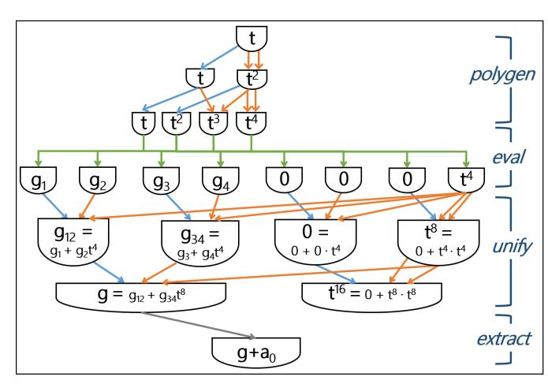
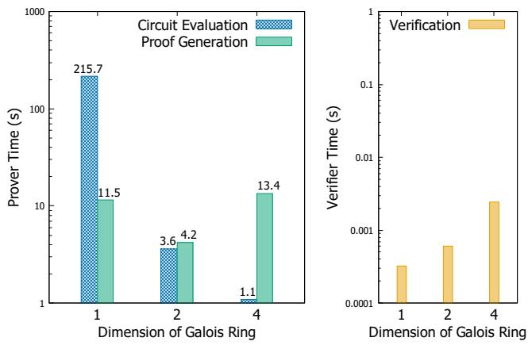
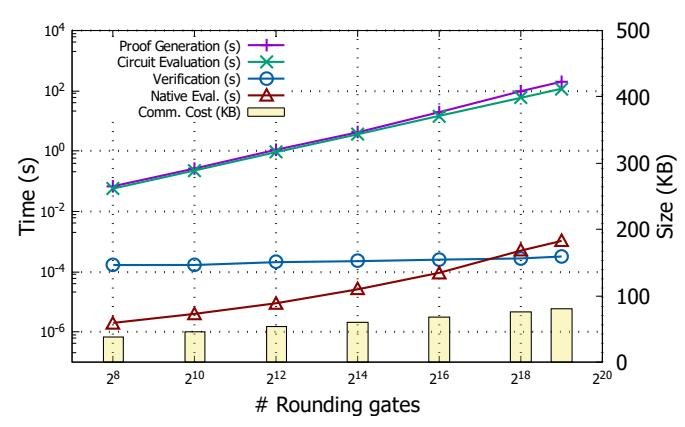
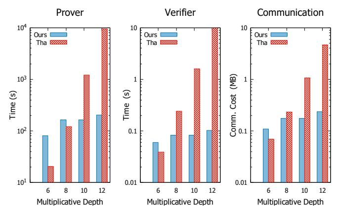

# Verifiable Computing for Approximate Computation

Shuo Chen Microsoft Research shuochen@microsoft.com Jung Hee Cheon Seoul National University jhcheon@snu.ac.kr Dongwoo Kim Seoul National University dwkim606@snu.ac.kr Daejun Park Runtime Verification, Inc. daejunpark@gmail.com

Abstract—Verifiable computing (VC) is a complexity-theoretic method to secure the integrity of computations. The need is increasing as more computations are outsourced to untrusted parties, e.g., cloud platforms. Existing techniques, however, only deal with exact computations, without the capability of rounding (e.g., " $1.11 \times 2.22 = 2.4642$ " is verifiable, but " $1.11 \times 2.22$  rounds-to 2.46" is not). Hence, in a long sequence of calculations (e.g., multiplications), the number of digits of the result keeps increasing and will quickly exceed the precision limit of the underlying system. Because of this limitation, VC is currently missing the opportunity in the whole AI space where approximate computations are unavoidable.

In pursuit of the vision of verifiable AI computing, a solution to support the *rounding* operation is necessary. In this paper, we present an efficient verifiable computing scheme to achieve it. The main idea is to reduce the rounding operation into an efficient arithmetic circuit representation, and reuse the machinery of the Goldwasser, Kalai, and Rothblum's protocol (also known as the GRK protocol), the state-of-the-art interactive proof protocol. Specifically, we shift the algebraic structure from a field to a ring to better deal with the notion of "digits", and generalize the original GKR protocol over a ring. Then, we reduce the rounding operation to a low-degree polynomial in a ring, and present a novel, optimal circuit construction of an arbitrary polynomial to transform the rounding polynomial to an optimal arithmetic circuit representation. Moreover, we further optimize the proof generation cost for rounding by employing a Galois ring. We provide experimental results that show the efficiency of our scheme for approximate computations. For example, our implementation performed two orders of magnitude better than the existing GKR protocol for a nested 128×128 matrix multiplication of depth 12 on the 16-bit fixed-point arithmetic.

#### I. INTRODUCTION

Verifiable computing (VC) [4], [34], [25], [23] aims to ensure the integrity of computations performed by an untrusted party. In the cloud computing era, as more computationally heavy tasks are delegated to the cloud, VC is considered by the research community as a very compelling solution for proving their security.

The existing literature has demonstrated the feasibility of several basic primitives, such as addition, multiplication, comparisons [52], set operations [31], and key-value store retrieval [43]. Using these primitives, VC was shown feasible for a number of tasks, including matrix multiplication [18], [39], [45], certain SQL-like queries [59], and state-machine updates [13]. A fundamental commonality of the above techniques is that they only deal with *exact* computations. For example, they can assert that  $1.11 \times 2.22 = 2.4642$  is verifiable, but  $1.11 \times 2.22 \simeq 2.46$  is not, although  $\lfloor 1.11 \times 2.22 \rfloor_2 = 2.46$  (where  $\lfloor \cdot \rfloor_2$  denotes rounding to two decimal places). Being

incapable of approximate computations, i.e., not being able to drop insignificant digits, VC is currently missing the opportunity in the whole AI space, as we discuss next.

Motivation. This paper is motivated by our vision about verifiable AI computation. Specifically, consider a deep neural network (DNN) training task: it is a computation that takes a set of samples, and produces an output model represented as one or more matrices. The computation often takes hours or even days. Should the training set be poisoned or the training machine(s) be compromised, the output model would have potentially devastating hidden behaviors. Unlike programming bugs or malicious code, compromised AI models are extremely difficult to detect, because the models are nothing but some matrices. However, if verifiable AI computation is achieved, we will be able to trust a model by only trusting the fundamental mathematics, not any other factors such as human operators, program, or platform doing the training.

AI computations are many orders of magnitude heavier and involve more challenging operations than the aforementioned primitives in the VC literature, so it could be a long journey to fully realize the vision. Specifically, DNN training processes mainly consist of an overwhelmingly large amount of computing matrix multiplication and a relatively small amount of computing various non-linear functions such as ReLU, maxpooling, and softmax, where all the operations are performed using approximate arithmetic such as fixed-point or floatingpoint arithmetic. Here the following fundamental operations are required for DNN training computations: (1) approximate arithmetic, (2) comparison (for ReLU and max-pooling), and (3) natural exponentiation  $e^x$  (for softmax and sigmoid). While the comparison operation was shown to be feasible in [52], and  $e^x$  can be approximated as a (piecewise) polynomial, approximate arithmetic is not supported in existing VC schemes (e.g., acknowledged in [52], [46]), to the best of our knowledge.11

**Fixed precision and rounding.** A DNN training often involves hundreds of thousands nested multiplications. Since the exact multiplication doubly increases the number of significant digits, the *rounding* operation is essential to allow the computation to be performed within a fixed precision. As

 $^{\mathrm{i}}$ In particular, it is a well-known practice to use an input normalization for  $e^x$  [51] to avoid overflow when computing softmax or sigmoid, in which case  $x \leq 0$ , and thus a (piecewise) polynomial approximation of  $e^x$  for  $x \leq 0$  can provide a sufficient precision since  $e^x$  is converging in the negative domain.

iiAlthough the technique used for comparison [52] has a potential to be used for rounding, their approach inherently introduces a significant overhead which is not involved in our approach. See Section IX for more details.

mentioned earlier, the traditional VC only deals with exact computations, and the underlying algebraic structure is a finite *field*. It is worth noting that, when the exact multiplication is replaced by the rounded multiplication, the structure is no longer a field. (Recall that, for a structure to be a field, every nonzero element would need to have a multiplicative inverse. However, the rounded multiplication is a many-to-one mapping, thus some elements do not have an inverse.) This presents a need for a substantial re-thinking about existing theories and re-targeting them to the new problem.

In this paper, we present a verifiable computing scheme that supports rounding efficiently. We base our scheme on a so-called GKR protocol, a state-of-the-art interactive proof protocol originally proposed by Goldwasser, Kalai, and Rothblum [25], and improved by [18], [47], [54], [58].iii In particular, we consider interactive proofs instead of non-interactive arguments such as SNARKs [24], [8], [10], since interactive proofs have the advantage of admitting much better performance in generating proofs (roughly >1000× faster [10], [47]) than noninteractive arguments that rely on expensive cryptographic operations. Note that the proof generation cost is a dominating factor in the overall complexity of VC, and for practical purpose, it is critical to reduce the cost to deal with a heavy computation workload such as DNN training.

**Our contributions.** In pursuit of the vision of verifiable AI, finding a solution to support rounding is an unavoidable effort. It demands a paradigm shift for VC, because it requires re-thinking the underlying algebraic structure, existing techniques, and results from other areas. We have made contributions in these aspects:

- 1) Extending the underlying algebraic structure to a ring. We explained above that the existing theorems need to be adapted to handle approximate computations. More technically, when VC is performed on exact computations, the notion of "digit" is not needed, so the underlying algebraic structure is simply a finite field  $\mathbb{Z}_p$ , where pis a prime number. (Note that  $\mathbb{Z}_p$  represents the integer set from 0 to p-1, and all operations are performed with modulo p.) To support approximate computations, we need the notion of "digit", since it is essential in the rounding operation. We shift the algebraic structure to a finite ring  $\mathbb{Z}_{p^e}$ , which is used to represent e digits, each from 0 to p-1. Although  $\mathbb{Z}_{p^e}$  is a ring, not a field (since  $p^e$  is not a prime), we found that the GKR protocol, originally defined over a finite field, can be generalized over a finite ring (Section IV).
- 2) Reducing the rounding operation to an efficient combination of the plain ring operations. With the  $\mathbb{Z}_{p^e}$  structure, the rounding operation becomes the operation of removing the lowest digit. Interestingly, we were

iiiAlthough our approach is applicable to all of the existing variants of the GKR protocol, we report the complexity of our scheme (in Section VI and Section VII) based on Thaler's variant [47]. Note that the asymptotic complexity of our scheme does not change even if a more recent variant (including the latest one [58, Section 3]) is employed, because of our optimal circuit construction that we will explain later.

- able to relate our need to a recent study [16] in the homomorphic encryption area. The study was oriented to improving performance of a homomorphic encryption scheme, but we found that its core idea can be utilized for our purpose. Specifically, it allows us to construct an efficient (low-degree) polynomial that performs the rounding operation. This in turn allows us to represent the rounding operation as a combination of the plain ring operations (e.g., addition and multiplication), which can be easily admitted by our generalized GKR protocol over a ring mentioned earlier.
- 3) Optimal circuit construction for arbitrary polynomial. In the GKR protocol (as well as our generalized one), a computation of interest needs to be represented in the form of an arithmetic circuit, and the performance of the protocol could be largely affected by the structure of a circuit. Now that we have the aforementioned rounding polynomial, it is important to carefully construct a circuit of the polynomial to achieve good performance. To this end, we devised a novel, optimal circuit construction of an arbitrary polynomial for the GKR protocol. A constructed circuit is regular with depth  $O(\log d)$  and size O(d) where d is the degree of the polynomial. The circuit construction is optimal in that the proof generation complexity is linear in d. Moreover, the complexity for proof generation becomes even sublinear in case that the same polynomial is evaluated on multiple inputs (Section VI-B), while the previously best known result is linear [58]. Such a single-polynomial-multiple-inputs computation is common in data-parallel computing as well as DNN training (e.g., the activation function of each layer is pointwisely applied to a weight vector/matrix). Note that our circuit construction is general, admitting an arbitrary polynomial, and thus can be used in other contexts, e.g., computing (a polynomial approximation of) the activation function in DNN training.
- Optimization of proof generation cost for rounding. Consider an approximate computation on  $\mathbb{Z}_{p^e}$ . The underlying ring  $\mathbb{Z}_{p^e}$  can be replaced by another ring  $\mathbb{Z}_{q^{de}}$  with a much smaller prime  $q \simeq \sqrt[d]{p}$ , via base conversion, that is, converting numbers in the base-p system to the corresponding numbers in the base-q system. iv Here the advantage of employing  $\mathbb{Z}_{q^{de}}$  is that the size of the rounding polynomial in  $\mathbb{Z}_{q^{de}}$  is much smaller than that of  $\mathbb{Z}_{p^e}$ , which in turn significantly reduces the proof generation cost for rounding. However, employing  $\mathbb{Z}_{q^{de}}$ leads to sacrificing the soundness of the protocol. To mitigate this dilemma, we proposed a technique that allows us to employ  $\mathbb{Z}_{q^{de}}$  without compromising the soundness, by exploiting an interesting property of a Galois ring (Section VII). However, there is a cost overhead when employing a Galois ring, since the operations on

&lt;sup>ivThe converted number may be marginally different from the original, but such an inaccuracy is acceptable in approximate computation such DNN training.

a Galois ring become more expensive as its dimension increases. Thus, having a too small prime q may offset the aforementioned cost benefit. Nevertheless, one can find an optimal q given a set of parameters, and our experiment showed that two orders of magnitude performance improvement can be made by finding such a sweet spot (Section VIII).

These techniques lay the foundation for theoretical feasibility of verifiable approximate computations. In particular, our approach provides a desirable asymptotic complexity. For each rounding layer, the proof generation cost is *linear*, and the verification cost is *logarithmic* in the number of rounding gates in the layer. V Moreover, we conducted experiments to quantify the performance of verifiable rounding operations. In a moderate laptop, for  $2^{12}$  number of 16-bit rounding operations, the proof generation took a second, while the proof verification took less than a millisecond. Also, considering that matrix multiplication dominates (constituting ~90% of) DNN training workloads [57], we experimented with our scheme on matrix multiplication. Given a nested  $128 \times 128$  matrix multiplication of depth 12 over fixed-point numbers with 16bits below the decimal point, our refinement took 3 minutes to generate a proof for each matrix multiplication, while the original GKR protocol took 2.5 hours for the same task. The gap between the two will increase exponentially as the depth of multiplication increases, while the depth often increases to hundreds of thousands in real DNN training.

Other applications of individual results. While we have initially developed various technical results (i.e., the generalized GKR protocol over a ring, the optimization via a Galois ring, and the optimal circuit construction) for the sole purpose of realizing an efficiently verifiable rounding operation, each individual result turns out to have its own applications as well. We will further discuss about this in Section X.

**Roadmap.** The rest of the paper is organized as follows. Section II provides the preliminaries of our work. The overview of our approach is described in Section III. Section IV to Section VII explain our approach in details. Experimental results are analyzed in Section VIII. We present related work in Section IX and conclude in Section X.

#### II. PRELIMINARIES

In this section, we review a number of basic concepts about verifiable computing (VC). In a VC scenario, a customer delegates a computation to an untrusted platform, and wants to be assured that the computational result is correct. The untrusted platform is called the Prover  $\mathcal{P}$ , and the customer is called the Verifier  $\mathcal{V}$ . As a motivating scenario of our work,  $\mathcal{V}$  submits a DNN training job to  $\mathcal{P}$ , which may take days to run. The goal of VC is to give  $\mathcal{V}$  the ability to quickly

verify the correctness of the computational result provided by  $\mathcal{P}$ , without re-running the same job by  $\mathcal{V}$  itself.

Next, we delve a little deeper into the type of VC we discuss in this paper, the interactive proof protocol.

# A. Interactive Proof Protocol

We start with a definition of the interactive proof protocol for a function f as follows.

**Definition 1.** (Interactive Proof Protocol for f [18], [47]) Consider a prover  $\mathcal{P}$  and a verifier  $\mathcal{V}$  who wishes to compute a function  $f:X\to Y$ . For an input  $x\in X$  chosen by  $\mathcal{V}$ ,  $\mathcal{P}$  gives the claimed output y to  $\mathcal{V}$ . Then, they exchange a sequence of messages and  $\mathcal{V}$  accepts or rejects.

- Completeness. For all inputs  $x \in X$ , if  $\mathcal{P}$  follows the protocol and y = f(x),  $\Pr[\mathcal{V} \text{ accepts}] = 1$ .
- $\delta$ -Soundness. For all inputs  $x \in X$ , if  $y \neq f(x)$ ,  $\Pr[\mathcal{V} \text{ accepts}] < \delta$ .

We will call  $\delta$  the soundness probability bound. If  $\mathcal P$  and  $\mathcal V$  exchange r messages, we say the protocol has  $\lceil r/2 \rceil$  rounds.

The GKR protocol is an interactive proof protocol for the evaluation of a layered arithmetic circuit over a finite field  $\mathbb{F}$  where the circuit is composed of addition and multiplication gates (over  $\mathbb{F}$ ) of fan-in 2.

## B. Schwartz-Zippel Lemma

We first recall the Schwartz-Zipple lemma, the Sum-Check protocol, and the Multilinear Extension which constitute the GKR protocol.

**Lemma 1.** (Schwartz-Zippel [41]) Let  $\mathbb{F}$  be a field, and  $f: \mathbb{F}^n \to \mathbb{F}$  be an n-variate nonzero polynomial of total degree (the sum of degrees of each variable) D. Then on any finite set  $A \subseteq \mathbb{F}$  with  $D \le |A|$ ,  $\Pr_{\vec{x} \leftarrow A^m}[f(\vec{x}) = 0] \le \frac{D}{|A|}$ .

Note that the lemma implies that two different polynomials can coincide at only tiny fractions of points. It contributes to soundness of the following sum-check protocol and thus the GKR protocol.

## C. Sum-Check Protocol

The Sum-Check protocol [32] is an interactive proof protocol for a specific summation function S(f) over a field  $\mathbb F$  as follows.

**Theorem 1.** (Sum-Check Protocol [32]) Let  $\mathbb{F}$  be a finite field. Let  $f: \mathbb{F}^n \to \mathbb{F}$  be an n-variate polynomial of degree at most  $d < |\mathbb{F}|$  in each variable. The Sum-Check protocol is an interactive proof protocol with soundness  $\frac{nd}{|\mathbb{F}|}$  for the function:

$$S(f) := \sum_{x_1 \in \{0,1\}} \sum_{x_2 \in \{0,1\}} \cdots \sum_{x_n \in \{0,1\}} f(x_1, x_2, \dots, x_n).$$

Protocol description: the protocol proceeds in n rounds. In the first round,  $\mathcal P$  sends the value S(f), and a polynomial

$$f_1(t) := \sum_{(x_2, x_3, \dots, x_n) \in \{0,1\}^{n-1}} f(t, x_2, x_3, \dots, x_n).$$

&lt;sup>vAs we will explain in Section II, in the GKR protocol, an arithmetic circuit is layered, and the proof generation and verification are performed by layer, where the overall cost of the protocol is simply the sum of the cost for each layer.

 $\mathcal{V}$  checks if  $f_1(0) + f_1(1) = S(f)$ , and rejects otherwise. In the *i*-th  $(2 \le i \le n)$  round,  $\mathcal{V}$  chooses  $r_{i-1}$  randomly from  $\mathbb{F}$ , and sends it to  $\mathcal{P}$ . In response,  $\mathcal{P}$  sends a polynomial

$$f_i(t) := \sum_{(x_{i+1},\dots,x_n)\in\{0,1\}^{n-i}} f(r_1,\dots,r_{i-1},t,x_{i+1},\dots,x_n).$$

 $\mathcal{V}$  checks if  $f_{i-1}(r_{i-1})=f_i(0)+f_i(1)$ , and rejects otherwise. After the final n-th round,  $\mathcal{V}$  accepts if  $f_n(r_n)=f(r_1,r_2,\ldots,r_n)$  for a random element  $r_n\in\mathbb{F}$ , and rejects otherwise.

Note that the soundness of sum-check protocol is based on Schwartz-Zippel lemma (Lemma 1); if dishonest  $\mathcal{P}'$  sent wrong value  $S'(f) \neq S(f)$ , he must send a polynomial  $f_1'(t) \neq f_1(t)$  resulting in  $f_1'(r_1) \neq f_1(r_1)$  with high probability. Repeatedly, the lemma forces  $\mathcal{P}'$  to send polynomials  $f_i'(t) \neq f_i(t)$  and to be rejected (at the final round) with high probability.

Note that the sum-check protocol enable  $\mathcal V$  to  $\mathit{reduce}$  the verification task on S(f) to that on the evaluation of f on one random point. It is the core functionality of sum-check in the GKR protocol.

# D. Multilinear Extension (MLE)

**Lemma 2.** (Multilinear Extension [18]) Given a function  $V: \{0,1\}^n \to \mathbb{F}$ , there exists a unique multilinear polynomial  $\tilde{V}(x): \mathbb{F}^n \to \mathbb{F}$  extending V, i.e.,  $\tilde{V}(x) = V(x)$  for all  $x \in \{0,1\}^n$ . We call  $\tilde{V}$  the multilinear extension (MLE) of V over  $\mathbb{F}$ .

The existence of multilinear extension  $\tilde{V}$  is guaranteed from the following construction.

$$\tilde{V}(x_1, x_2, \dots, x_n) := \sum_{b \in \{0,1\}^n} V(b) \cdot \prod_{i=1}^n [(1-b_i)(1-x_i) + b_i x_i].$$

The uniqueness of multilinear extension is also straightforward, see Appendix B2. In GKR protocol, the output of each layer in the circuit give rise to the unique multilinear extension.

## E. GKR Protocol

Now we describe the GKR protocol which is an interactive proof protocol for the evaluation of a layered arithmetic circuit over a finite field  $\mathbb{F}^{,vii}$  We only give an overview of the protocol, and a detailed description can be found in [25], [48] or in Section IV-B.

**Overview.** Assume we are given a layered arithmetic circuit (over  $\mathbb{F}$ ) of depth d, of size S, and of fan-in 2. Each layer is composed of gates outputing addition or multiplication of two inputs. The layers are numbered in a way that output layer is 0, input layer is d, and gates of i-th layer take as input the output of gates in i+1-th layer. Let  $S_i$  denotes the size of i-th layer,

and assume it is a power of 2, i.e.,  $S_i = 2^{s_i}$  for simplicity. We can number each gate of *i*-th layer with a binary string in  $\{0,1\}^{s_i}$ , and it defines a function  $V_i:\{0,1\}^{s_i}\to\mathbb{F}$  relating the given binary string to output of the corresponding gate. Let  $\tilde{V}_i$  be the MLE of  $V_i$ , then there exists an interesting relation between MLEs defined from adjacent layers as follows [49]:

$$\tilde{V}_{i}(z) = \sum_{(\omega_{1},\omega_{2})\in\{0,1\}^{2s_{i+1}}} [\tilde{add}_{i}(z,\omega_{1},\omega_{2})(\tilde{V}_{i+1}(\omega_{1}) + \tilde{V}_{i+1}(\omega_{2}) + \tilde{mult}_{i}(z,\omega_{1},\omega_{2})(\tilde{V}_{i+1}(\omega_{1})\tilde{V}_{i+1}(\omega_{2}))]$$
(1)

where  $\tilde{add}_i$  (or  $\tilde{mult}_i$ ) is a MLE of a function which is 1 only if the input binary strings indicate an addition (or multiplication) gate and its corresponding two gates providing inputs, and 0 otherwise. We call  $\tilde{add}_i$  (and  $\tilde{mult}_i$ ) as wiring predicates [18].

Now, the GKR protocol proceeds in layer by layer starting from the output layer.  $\mathcal V$  having an output of the circuit, gets a claim  $\tilde V_0(z_0)=v_0$  evaluating  $\tilde V_0$  on random point  $z_0$ . Then, she reduces the claim to  $\tilde V_1(z_1)=v_1$  executing the sum-check protocol on the relation of MLEs we described. Continuing this process layer by layer, she finally gets a claim that  $\tilde V_d(z_d)=v_d$ , and checks if it is correct evaluating  $\tilde V_0$  defined with her inputs.

**Computational complexity.** The computational complexity of  $\mathcal{P}$  and  $\mathcal{V}$  in the number of operations over  $\mathbb{F}$ , and the communication cost  $\mathcal{C}$  in the number of elements of  $\mathbb{F}$  are as follows [18], [47], [52]: viii

$$\mathcal{P}: O(S \log S), \quad \mathcal{V}: O(n + d \log S), \quad \mathcal{C}: O(d \log S)$$
 (2)

where n is the number of input and output values. Here the prover's cost can be further reduced to O(S) in the latest variant of the GKR protocol [58, Section 3], to which our technique is still applicable.

We note that the prover's cost can be broken down into the circuit evaluation cost and the proof generation cost. They are asymptotically the same in general, but later we will show certain circuits for which the proof generation cost is smaller than the circuit evaluation cost (Section VI).

#### III. OVERVIEW OF OUR APPROACH AND RESULT

This section provides an overview of the technical details of our approach and result. The goal of this work is to present an extended GKR protocol that efficiently admits the rounding operation. The idea is to reduce the rounding operation into an efficient circuit representation, and reuse the machinery of the GKR protocol on it. Specifically, we consider an approximate arithmetic circuit over a ring  $\mathbb{Z}_{p^e} = \mathbb{Z}/p^e\mathbb{Z}$  (i.e., integers in a base p system of e digits), where p is a prime and e>1, and the (floor) rounding operation,  $x\mapsto \lfloor x/p\rfloor$ . (Note that the proper rounding,  $\lfloor x/p \rceil$ , can be represented using the floor rounding, i.e.,  $\lfloor x/p \rceil = \lfloor (x+\frac{p-1}{2})/p \rfloor$ .) Below we explain each of our main technical developments.

 $^{viii}$ We assume that the wiring predicates of circuit are efficiently computable by  $\mathcal{V}$  [18]. If not, the cost can be amortized by batching [52].

viAn n-variate polynomial  $f(x_1,\ldots,x_n):\mathbb{F}^n\to\mathbb{F}$  is called *multilinear* if it is linear in each variable, e.g.,  $f(x_1,x_2,x_3)=ax_1x_2x_3+bx_2x_3+cx_3$ . viiIn particular, we describe the recent variant [18], [49], [47] of the GKR protocol that our technical development later will be based on.

Efficient circuit representation of rounding operation (Sections VI and V). We present an efficient circuit representation of the rounding operation over the base p system. At first, we employ the lowest digit removal polynomial [16], ldr, that we borrowed from the literature of the homomorphic encryption area. The polynomial ldr sets the least significant digit to zero, i.e.,  $|d\mathbf{r}: x \mapsto \lfloor x/p \rfloor \cdot p$ , and thus we can have the floor rounding operation by  $|d\mathbf{r}(x)/p|$ . We exploit the fact that ldr is the *lowest* degree polynomial whose degree is < ep, while the degree of such a polynomial could be as large as  $p^e$  if it is generated by using the general interpolation technique. ix

Then, we present an optimal construction of the ldr circuit, an arithmetic circuit over  $\mathbb{Z}_{p^e}$  that computes ldr (Section V-B). We carefully design the circuit to be optimal in the prover's cost. Specifically, our circuit exploits the linear-sum gate,  $(x_1, \dots, x_n) \mapsto a_1x_1 + \dots + a_nx_n$ , and the fused multiplyadd gate,  $(x, y, z) \mapsto xy + z$ , which can be efficiently verified via the Sum-Check (and GKR) protocol. Indeed, our circuit construction is general, being applicable for an arbitrary univariate polynomial of degree d, yielding a circuit of size O(d) and depth  $O(\log d)$ , for which the prover's cost is O(d) and the verifier's cost is  $O(\log^2 d)$ . Furthermore, in case that the same polynomial is evaluated on m inputs, our circuit construction yields a circuit of size O(md) and depth  $O(\log d)$ , for which the proof generation cost is  $O(m\sqrt{d+d})$ , which is sublinear in the circuit size (i.e., the proof generation is faster than even the circuit evaluation!), while the previously best known result is linear [58]. This improvement of the proof generation cost is significant for a rounding layer that consists of multiple rounding gates, which is common in DNN training as mentioned in the introduction.

Generalization of the GKR protocol over a ring (Section IV). While the original GKR protocol is valid over a finite field, since the domain  $\mathbb{Z}_{p^e}$  we consider is no longer a field for e>1, we identify a minimal modification to the original protocol to admit a ring (Section IV-B), and present its construction for a specific family of rings, i.e.,  $\mathbb{Z}_{p^e}$  and its extension rings.

Specifically, the GKR protocol is based on the Sum-Check protocol that in turn is based on the Schwartz-Zippel lemma. However, the Schwartz-Zippel lemma does not hold for a ring in general. To extend the original protocol, we first employ the generalized Schwartz-Zippel lemma [12] over a ring, which restricts the (randomness) sampling set to a subset of the domain such that the difference between any two elements of the subset is not a zero divisor. Then, we show that the Sum-Check protocol as well as the GKR protocol can be extended over a ring by restricting the (verifier's randomness) sampling set to a subset satisfying the aforementioned property. Moreover, we further identify a stronger condition for the sampling set (Section 1), the "unit difference" property [36], that is, that the difference between any two elements of the sampling set has an inverse. This stronger condition allows us to employ the

 $^{\mathrm{ix}}$ Moreover, when e>1 or p is not a prime, such polynomials may not even exist, where the interpolation techniques are not applicable.

cost reduction technique [47] proposed for the original GKR protocol to our extended protocol.

The extended protocol enjoys the same complexity with the original, provided that the unit difference property holds for the sampling set A. Specifically, given a circuit of size S and depth d, the prover's cost is  $O(S \log S)$ , and the verifier's cost is  $O(n+d\log S)$ , where O(n) is the additional cost (for generating the multi-linear extension) at the input/output layer, and n is the number of input/output values. The communication cost is  $O(d \log S)$ . The soundness probability, however, becomes bigger (i.e., worse) than that of the original. That is, it is bounded by  $(7d \log S + \log n)/|A|$ , where the denominator is the size of the sampling set A, while it was the size of the entire domain for the original protocol. Note that, however, for practical purposes, the soundness probability can be quickly improved by simply having multiple prover-verifier pairs in parallel, which does not affect the overall throughput.

Performance optimization of the generalized GKR protocol (Section VII). We further extend the domain of  $\mathbb{Z}_{p^e}$  into a Galois ring,  $\mathbb{Z}_{(q^d)^e}[t]/f(t)$ , where f(t) is a monic irreducible polynomial, which allows us to employ a smaller prime  $q \sim$  $\sqrt[d]{p}$  where d is the degree of f(t). Employing a smaller prime leads to further reducing the size of the rounding circuit, since the degree of the lowest digit removal polynomial drastically decreases from ep into  $edq \simeq ed \sqrt[d]{p}$ . Note that the soundness probability is not compromised at all with the smaller prime q, because the extension ring yields a sampling set of the similar size,  $q^d \simeq p$ , to that of the original one (Theorem 4). However, employing the extension ring incurs additional costs for the individual ring operations, which may offset the benefit from the smaller rounding circuit. To better understand such a tradeoff, we provide a formal analysis as well as a microbenchmark experimental result on it.

### IV. GENERALIZATION OF GKR PROTOCOL OVER A RING

In this section, we show that the GKR protocol can be applied to an arithmetic circuit over a ring, a more general algebraic structure than a field. Throughout this paper, we refer a ring R to a finite commutative ring with the multiplicative identity 1. It is similar to a field in that it has two operations, i.e., addition and multiplication that is distributive over addition, an additive identity 0, and a multiplicative identity 1. It also has an additive inverse for every element, but does not necessarily have a multiplicative inverse, in contrast to a field. A zero divisor of a ring R is an element  $x \in R$  which divides 0, i.e., there exists a nonzero element  $y \in R$  such that xy = 0. An integral domain is a ring that has no zero divisors other than 0. Typical examples of ring are  $\mathbb{Z}$  (integers) and  $\mathbb{Z}_N$  (integers modulo N). Note that  $\mathbb{Z}$  is an integral domain, and  $\mathbb{Z}_N$  is a field if N is a prime, but is not even an integral domain otherwise.

&lt;sup>xThe prover's cost becomes O(S) if the generalization is made on top of the latest GKR variant [58].

A. Schwartz-Zippel Lemma and Sum-Check Protocol Over a Ring

Since the original GKR protocol is based on the Schwartz-Zippel lemma (Lemma 1), the starting point of generalization is also the lemma. Here we exploit more generalized form given by Bishnoi *et al.* [12] as follows.

**Lemma 3.** (Generalized Schwartz-Zippel [12]) Let R be a ring, and  $f: R^n \to R$  be an n-variate nonzero polynomial of total degree (the sum of degrees of each variable) D over R. Let  $A \subseteq R$  be a finite set with  $|A| \ge D$  such that  $\forall x \ne y \in A$ ,  $x - y \in R$  is not a zero divisor. Then,  $\Pr_{\vec{x} \leftarrow A^n}[f(\vec{x}) = 0] \le \frac{D}{|A|}$ . We will call A a sampling set.

This lemma guarantees that the identity check of a polynomial over R can be done similarly as in a field if we sample the random points from a *sampling set*  $A \subseteq R$ .

**Example 1.** Let  $R=\mathbb{Z}_{p^e}$  for an odd prime p, and  $A=\{0,1,2,\ldots,p-2,p-1\}$ . Then, A is the *sampling set* of Lemma 3, since  $\forall x\neq y\in A,\ x-y\in\{-(p-1),\ldots,-1,1,\ldots,p-1\}$  is not a zero divisor. Note that zero divisors of R are exactly the nonzero multiples of p. The set A is maximal in that  $a\in A$  implies  $a+np\notin A$  for any nonzero integer n.

Now we can naturally extend the Sum-Check protocol (Theorem 1) over R, only restricting the random points chosen by V.

**Theorem 2.** (Generalized Sum-Check Protocol) Let R be a ring,  $f: R^n \to R$  be an n-variate polynomial of degree at most d in each variable. Let  $A \subseteq R$  be a sampling set of Lemma 3 such that d < |A|. Then, the Generalized Sum-Check protocol where  $\mathcal{V}$  chooses each random point  $r_i$  from A, is an interactive proof protocol with soundness  $\frac{nd}{|A|}$  for the function:

$$S(f) := \sum_{x_1 \in \{0,1\}} \sum_{x_2 \in \{0,1\}} \cdots \sum_{x_n \in \{0,1\}} f(x_1, x_2, \dots, x_n).$$

*Proof.* Appendix B4.

Note that the soundness probability is  $\frac{nd}{|A|}$  in contrast to  $\frac{nd}{|\mathbb{F}|}$  in Theorem 1.

Remark 1 (Additional condition for efficient specification of  $f_i(t)$ ). In the *i*-th round of the Sum-Check protocol, (honest)  $\mathcal{P}$  should provide

$$f_i(t) := \sum_{(x_{i+1},\dots,x_n)\in\{0,1\}^{n-i}} f(r_1,\dots,r_{i-1},t,x_{i+1},\dots,x_n)$$

to  $\mathcal{V}$ . While the  $f_i(t)$  is specified by evaluations of it on  $\deg_i f+1$  distinct points from A, we need more condition on that distinct points for Lagrange interpolation to be available; the distinct points must satisfy the condition that all of their differences have inverses in R. It is a stronger condition than that of A. Note that, in all specific rings we use in this paper, the *sampling set* A also satisfies that stronger condition.

**Example 2.** Let  $R = \mathbb{Z}_{p^e}$  for an odd prime p, and  $A = \{0, 1, 2, \ldots, p-2, p-1\}$  as Example 1. Then, A also satisfies the stronger condition mentioned above, i.e.,  $\forall x \neq y \in A$ , x-y has a multiplicative inverse in R. It follows from the fact that all elements of  $R = \mathbb{Z}_{p^e}$  other than multiples of p have a multiplicative inverse in  $R = \mathbb{Z}_{p^e}^{x^i}$ .

# B. GKR Protocol Over a Ring

Now we present a generalized GKR protocol over R. We can see that the original GKR protocol can be applied to an arithmetic circuit over R by restricting random points required in the protocol to the *sampling set* A of Lemma 3. Below we clarify and validate the modification made in each step of the protocol.

Multilinear extension & initial step. We first need to ensure that the existence and uniqueness (Lemma 2) of Multilinear Extension (MLE)  $\tilde{V}:R^n\to R$  extending a function  $V:\{0,1\}^n\to R$ . It follows from the fact that the proof of Lemma 2 is valid in R since it exploits only the properties (i.e., commutativity and distributivity of addition and multiplication, and existence of the multiplicative inverse 1) that hold in R as well. At the initial step,  $\mathcal{V}$  reduces the task of checking output values to that of checking  $\tilde{V}_0(z_0)=v_0$  where  $\tilde{V}_0$  is a MLE of the output values. In the original protocol, the reduction is valid by Lemma 1. In the generalized protocol, the reduction is valid by Lemma 3, provided that  $\mathcal{V}$  samples the random point  $z_0$  from the set A of Lemma 3.

Applying Sum-Check protocol. We already have shown that the Sum-Check protocol is valid in R as well by Theorem 2. Therefore, reducing the task of checking  $\tilde{V}_i(z_i) = v_i$  to that of checking both  $\tilde{V}_{i+1}(\omega_1^*) = v_{i+1,1}$  and  $\tilde{V}_{i+1}(\omega_2^*) = v_{i+1,2}$  can be done using the generalized Sum-Check protocol. Note that  $\mathcal V$  samples each random points from the set A in the generalized Sum-Check protocol.

Reduction to verification at a single point & final step. Reducing the task of checking both  $\tilde{V}_{i+1}(\omega_1^*) = v_{i+1,1}$  and  $\tilde{V}_{i+1}(\omega_2^*) = v_{i+1,2}$  to that of checking  $\tilde{V}_{i+1}(z_{i+1}) = v_{i+1}$  requires the generalized Schwartz-Zippel lemma (Lemma 3), and  $\mathcal V$  must evaluate the polynomial  $h(t) := \tilde{V}_{i+1}(l(t))$  on  $t_{i+1}$  that is randomly sampled from the set A, to compute  $\tilde{V}_{i+1}(z_{i+1}) = h(t_{i+1})$ . Finally,  $\mathcal V$  having  $\tilde{V}_d(z_d) = v_d$  checks if it is correct by evaluating the MLE  $\tilde{V}_d$  of the input values on  $z_d$  by herself.

Complexity & soundness. Note that the computational cost of the generalized protocol is the same with that of the original protocol (Equation 2) except that the cost is measured by the number of operations or elements of R instead of  $\mathbb{F}$ . The cost reduction techniques [18], [52], [47], [58] proposed in refinements of GKR protocol are also applicable if R satisfies the additional condition introduced in Remark 1.

Soundness of the generalized GKR protocol follows from that of the generalized Sum-Check protocol. Hence, it has

xiIf  $x \in \mathbb{Z}_{p^e}$  is not a multiple of p,  $\gcd(x, p^e) = \gcd(x, p) = 1$ , and  $ax + bp^e = 1$  for some  $a, b \in \mathbb{Z}$ , i.e.,  $a \pmod{p^e} \in \mathbb{Z}_{p^e}$  is a multiplicative inverse of x.

the same soundness with the original one except that  $|\mathbb{F}|$  is substituted by |A| (see following Theorem 3).

**Theorem 3.** (GKR protocol over R) Let R be a finite ring, and C be an arithmetic circuit of size S, depth d, with m outputs over R. Let A be the sampling set of R in Lemma 3. The generalized GKR protocol described above is an interactive proof protocol for the evaluation of C with soundness  $(7d \log S + \log m)/|A|$ . The complexity of the generalized GKR protocol is the same with that of the original protocol described in Section II-E.

## V. VERIFIABLE ROUNDING OPERATION

In this section, we explain how to support the rounding operation on top of the generalized GKR protocol described in Section IV. As explained in Section I, we consider an approximate arithmetic circuit over a ring  $\mathbb{Z}_{p^e}$  (i.e., integers in the base-p system) where p is a prime and e>1, and the rounding gate that performs the (floor) rounding:  $x\mapsto \lfloor x/p\rfloor$ . \*\*ii Like closely related previous work [25], [18], [47], we assume that the given circuit is layered. For the simplicity of the presentation, we also assume that the given circuit is structured to have rounding layers each of which consists solely of rounding gates, while the other layers have only addition and multiplication gates. \*\*xiii

The idea is to replace each rounding gate with a combination of plain arithmetic gates, and use our generalized GKR protocol over  $\mathbb{Z}_{p^e}$ . Specifically, we employ a low-degree polynomial  $\mathrm{Idr}(x)$  such that  $\lfloor x/p \rfloor = \mathrm{Idr}(x)/p$ , where  $\mathrm{Idr}(x)$  can be represented as a circuit over addition and multiplication gates. (Later, in Section VI, we will provide an optimal circuit construction for arbitrary polynomials including  $\mathrm{Idr}(x)$ .) Then, the rounding gate can be replaced with the circuit of  $\mathrm{Idr}(x)$  followed by a division-by-p gate,  $x \mapsto x/p$ . Below we will explain what is the polynomial  $\mathrm{Idr}(x)$ , and how to verify the division-by-p gate in our generalized GKR protocol.

## A. Lowest-Digit-Removal Polynomial Over $\mathbb{Z}_{p^e}$

Chen and Han [16] recently showed the existence of a polynomial over  $\mathbb{Z}_{p^e}$  that sets the input's lowest-digit to zero. They also provided an exact construction of such polynomial.

**Lemma 4.** (Lowest-digit-removal polynomial [16]) Let p be a prime and  $e \ge 1$  be a positive integer. Then there exists a polynomial  $\operatorname{Idr}(x)$  of degree at most (e-1)(p-1)+1 such that for every integer  $0 \le x < p^e$ , we have

$$\mathsf{Idr}(x) \equiv x - (x \bmod p) \mod p^e,$$

where  $(x \mod p) \in \{0, 1, \dots, p-1\}.$ 

Note that the degree of Idr(x) is small: roughly *logarithmic* in the size of  $\mathbb{Z}_{p^e}$ . It provides us an efficient representation of rounding as a combination of additions and multiplications.

**Example 3.** ([16]) For e = 2, we have:

$$\mathsf{Idr}(x) = -x(x-1)\cdots(x-p+1)$$

# B. Verification of Division-by-p Layer

As mentioned earlier, the rounding operation  $(t \mapsto \lfloor t/p \rfloor)$  can be represented as  $t \mapsto \mathsf{Idr}(t)/p$ . Here the problem is that division is not admitted in an arithmetic circuit over a ring (thus not in the generalized GKR protocol over a ring) in general. However, in  $\mathsf{Idr}(x)/p$ , the division is always well-defined, since the result of  $\mathsf{Idr}(x)$  is guaranteed to be a multiple of p, where p is constant. Also, as mentioned earlier, the given circuit is assumed to have a separate rounding layer that consists solely of rounding gates. Thus, the reduced circuit will have a separate division-by-p layer that also consists solely of the division-by-p gates, and we have the following equation:

$$\tilde{V}_i(z) = \tilde{V}_{i+1}(z)/p \tag{3}$$

where  $\tilde{V}_i$  (and  $\tilde{V}_{i+1}$ ) denotes the MLE of outputs (and inputs, resp.) of the division-by-p layer. Now, in the generalized GKR protocol, the verifier verifies the outputs of the division-by-p layer by reducing the verification task of  $\tilde{V}_i(r) = v$ , to the verification task of  $\tilde{V}_{i+1}(r) = pv$ . This reduction enjoys the perfect soundness, since for  $\tilde{V}_i'(r) \neq \tilde{V}_i(r)$ , we have  $\tilde{V}_{i+1}(r) = p\tilde{V}_i(r) \neq p\tilde{V}_{i'}(r) = \tilde{V}_{i+1}(r) \pmod{p^e}$ .

Remark 2 (Modulus change at division-by-p layer). Note that the codomain of  $\tilde{V}_i$  is  $\mathbb{Z}_{p^{e-1}}$ , while the codomain of  $\tilde{V}_{i+1}$  is  $\mathbb{Z}_{p^e}$ . That is, the outputs of each rounding layer should be regarded as an element of  $\mathbb{Z}_{p^{e-1}}$  while the inputs are elements of  $\mathbb{Z}_{p^e}$ . This is because  $t=ap+b\in\mathbb{Z}_{p^e}$  represents  $(ap+b)+np^e\in\mathbb{Z}$  for some  $n\in\mathbb{Z}$  where  $0\leq b< p$ , while  $\lfloor t/p\rfloor\equiv a+np^{e-1}\in\mathbb{Z}$  is represented by  $a\in\mathbb{Z}_{p^{e-1}}$ .

# VI. OPTIMAL CIRCUIT CONSTRUCTION OF POLYNOMIAL

In this section, we present a novel, optimal circuit construction of an arbitrary polynomial for the GKR protocol. The circuit has an optimal depth, and is regular so that a prover (and a verifier) enjoys an optimal cost (and high efficiency) when proving (and verifying) the circuit via the GKR protocol. It has an additional advantage when applied to the parallel evaluation of the same polynomial on multiple inputs, in which case, once a prover has evaluated the circuit, the proof generation cost becomes *sublinear* in the size of the circuit (i.e., the proof generation is much faster than even the circuit evaluation!), which is better than the previously best known results [54], [58].

# A. Overview of Our Circuit Construction

Our circuit construction is inspired by the Paterson-Stockmeyer algorithm [40] evaluating a polynomial g(t) of degree N in  $O(\sqrt{N})$  non-constant multiplications. Specifically, for a given polynomial  $g(t) = \sum_{i=0}^N a_i t^i$ , our circuit is constructed to first compute  $\sqrt{N}$  sub-polynomials  $g_k$ 's (for  $1 \le k \le \sqrt{N}$ ) where  $g_k(t) = \sum_{j=1}^{\sqrt{N}} a_{j+\sqrt{N}(k-1)} t^j$ , and then

&lt;sup>xiiAs mentioned earlier, the proper rounding,  $\lfloor x/p \rfloor$ , can be represented using the floor rounding, i.e.,  $\lfloor x/p \rceil = \lfloor (x + \frac{p-1}{2})/p \rfloor$ .

xiii An arbitrary circuit can be adjusted to satisfy this assumption by adding dummy gates (i.e., a multiplication-by-p gate followed by a rounding gate) for each non-rounding gate.

&lt;sup>xivFor the simplicity of the presentation, let  $N = 2^{2n}$  be the smallest power of four such that  $N \ge \deg(q)$ .

compute  $a_0 + \sum_{k=1}^{\sqrt{N}} g_k(t) \cdot t^{\sqrt{N}(k-1)}$ , which gives g(t). For example, for a polynomial  $g(t) = a_0 + a_1t + \cdots + a_{16}t^{16}$  of degree 16, the constructed circuit (as shown in Figure 1) computes the polynomial as follows:

$$a_0 + ((a_1t + \dots + a_4t^4) + (a_5t + \dots + a_8t^4) \cdot t^4) + ((a_9t + \dots + a_{12}t^4) + (a_{13}t + \dots + a_{16}t^4) \cdot t^4) \cdot t^8$$

Here we note two properties of the above evaluation method that contributes to our optimal circuit construction. First, not all powers of t are needed, but only, for example, t,  $t^2$ ,  $t^3$ ,  $t^4$ , and  $t^8$  are. In general, only  $(\sqrt{N} + \log \sqrt{N})$  powers of t, that is, t,  $t^2$ ,  $\cdots$ ,  $t^{\sqrt{N}}$ ,  $t^{2\sqrt{N}}$ ,  $t^{4\sqrt{N}}$ ,  $t^{8\sqrt{N}}$ ,  $\cdots$ ,  $t^{N/2}$ , are needed to compute g(t) in the above evaluation method. Also, every sub-polynomial  $g_k$  is computed using the same small subset of powers of t, that is, t,  $t^2$ ,  $\cdots$ ,  $t^{\sqrt{N}}$ . These properties contribute to reducing the circuit size, and increasing the circuit regularity.

Now we describe certain observations that led us to our circuit construction. The first observation is that the GKR protocol admits any efficiently computable gate with fan-in >2 without affecting the asymptotic complexity of the protocol, as long as the fan-in is constant. Also, the GKR protocol can admit a layer that solely consists of the linear-sum gates,  $\vec{x} \mapsto \sum a_i x_i$ , at no cost overhead, by exploiting its nice evaluation structure, even if its fan-in is not constant (see Appendix A for more details). These observations give us more flexibility in constructing a circuit, and we utilize the linear-sum gate for the evaluation of  $g_k$ 's, and the fused multiply-add gate,  $(x,y,z)\mapsto xy+z$ , for the summation of  $g_k$ 's. This yields a circuit of width  $2\sqrt{N}$  and depth  $(3+\log N)$  with a regular wiring pattern.

Figure 1 shows our circuit construction of a single polynomial g(t). The circuit is composed of four parts. The first part referred to as polygen, consisting of  $\log \sqrt{N}$  layers with multiplication gates, takes as input t and computes its powers,  $t, t^2, \dots, t^{\sqrt{N}}$ . The second part referred to as *eval*, consisting of a single layer over the linear-sum gates, computes the sub-polynomials  $g_k(t)$ 's. The third part referred to as unify, consisting of  $\log \sqrt{N}$  layers over the fused multiplyadd gates, computes the summation of the sub-polynomials,  $g(t)-a_0$ . Note that the *unify* part also computes the square-powers,  $t^{2\sqrt{N}}$ ,  $t^{4\sqrt{N}}$ ,  $t^{8\sqrt{N}}$ ,  $\cdots$ ,  $t^{N/2}$  by the side of the main computation, where the same multiply-add gate is used along with introducing dummy gates, to achieve a regular wiring pattern. The last part referred to as extract, consisting of a single layer of a constant-addition gate, computes the final result g(t). More details and a precise definition of our circuit construction are provided in Appendix A.

In case that multiple inputs need to be evaluated on the same polynomial, our circuit construction simply puts multiple copies of the same circuit shown in Figure 1 side-by-side. This yields a circuit that has a larger width  $O(M\sqrt{N})$  but the same depth  $O(\log N)$ , where M is the number of inputs.

Fig. 1: Our circuit construction of a polynomial of degree 16,  $g(t) = \sum_{i=0}^{16} a_i t^i$ . The value of each gate denotes the output of the gate, where  $g_k = \sum_{j=1}^4 a_{j+4(k-1)} t^j$ . The green arrow denotes the linear-sum gate wiring. The gates computing zero are dummy gates that are added to achieve a regular wiring pattern and thus admit an optimal prover and an efficient verifier. The presence of the dummy gates does not affect the asymptotic cost.

#### B. Cost Analysis

Let us consider the case of multiple inputs being evaluated on the same polynomial. The following lemma shows the complexity of the GKR protocol (precisely, the variants [47] or [58, Section 3]) on our circuit construction for such a case. (The complexity for the single-input case is an instance of that of the single-polynomial-multiple-inputs case.)

**Lemma 5** (Complexity of Protocol on Our Circuit Construction). Let C be a circuit generated by our construction for the case of M inputs being evaluated on the same polynomial of degree N. Then, the complexity of the GKR protocol on C is as follows:

- Circuit evaluation: O(MN)
- Proof generation:  $O(M\sqrt{N}+N)$
- Verification:  $O(M + \log N \log MN)$
- Communication:  $O(\log N \log MN)$
- Soundness:  $O((\log N \log MN)/A)$

where A is the size of the sampling set, and the verification cost excludes the offline precomputation cost O(N). The complexity for the single input case is simply the one having M=1 in the above.

Here we note that our proof generation cost is better than the previously best known result. Specifically, let C be the circuit described in Lemma 5, and C' be a circuit that is equivalent to C with the same size O(MN) and the same depth  $O(\log N)$ , but is constructed in a standard way (i.e., computing all the powers of t using the exponentiation-by-squaring method, computing all the monomials, and adding

all the monomials in a binary tree fashion). Then, the proof generation cost of Giraffe [54] and Libra [58] on C' are  $O(MN+N\log N)$  and O(MN), respectively, while ours is  $O(M\sqrt{N}+N)$ . Their other costs (i.e., circuit evaluation, verification, and communication) on C' are the same with ours.

#### VII. COST OPTIMIZATION FOR ROUNDING OPERATION

In this section, we present an optimization technique that can significantly reduce the prover's cost for the rounding layers described in Section V.

#### A. Galois Ring over $\mathbb{Z}_{p^e}$ and Sampling Set

A Galois ring  $\mathbb{Z}_{p^e}[t]/(f(t))$  over  $\mathbb{Z}_{p^e}$  for a monic irreducible polynomial  $f(t) \in \mathbb{Z}_p[t]$  is a natural generalization of the Galois field  $\mathrm{GF}(p^n)$  over a finite field  $\mathbb{F}_p$ . The representation of elements and operations in  $\mathbb{Z}_{p^e}[t]/(f(t))$  is similar to that of  $GF(p^n)$  modulo the difference between  $\mathbb{Z}_{p^e}$  and  $\mathbb{F}_p$ . Let d be the degree of  $f(t) = t^d + f_{d-1}t^{d-1} + \ldots + f_0$ , where  $f_i \in \mathbb{Z}_p$ . Then, the dimension of  $\mathbb{Z}_{p^e}[t]/(f(t))$  is d, and each element is represented as a d-dimensional tuple in  $\mathbb{Z}_{p^e}^d$  whose standard basis corresponds to  $1, t, t^2, \ldots, t^{d-1}$ . Thus, the addition corresponds to the component-wise addition in  $\mathbb{Z}_{p^e}^d$ , and the multiplication by an element  $a = (a_0, a_1, \ldots a_{d-1})$  corresponds to the matrix multiplication by its corresponding matrix according to the multiplication rule  $t \cdot (a_0, a_1, \ldots, a_{d-1}) = (0, a_0, a_1, \ldots, a_{d-2}) - a_{d-1} \cdot (f_0, f_1, \ldots, f_{d-1})$ .

A nice property of the Galois ring  $\mathbb{Z}_{p^e}[t]/(f(t))$  is that every nonzero element whose coefficients are in  $\{-(p-1),\ldots,-1,0,1,\ldots,p-1\}$  is invertible, which leads to the following theorem.

**Theorem 4.** [33] Let p be an odd prime, e be a positive integer, and R be a Galois ring  $\mathbb{Z}_{p^e}[t]/(f(t))$  of dimension d. Then, all nonzero elements in  $\{a_0+a_1t+\ldots+a_{d-1}t^{d-1}\mid a_i\in [-(p-1),p-1]\cap \mathbb{Z}\}\subseteq R$ , are invertible (hence are not zero-divisors) in R. Therefore, the subset  $A=\{a_0+a_1t+\ldots+a_{d-1}t^{d-1}\mid a_i\in [0,p-1]\cap \mathbb{Z}\}\subseteq R$  is a valid sampling set for the generalized Schwartz-Zippel lemma (Lemma 3) as well as the generalized GKR protocol (Theorem 3).

Note that the cardinality of the sampling set A in Theorem 4 is  $p^d \gg p$ , which is maximal.xv. Moreover, A satisfies the additional condition of Remark 1.

**Irreducible Polynomial in**  $\mathbb{Z}_p[t]$ . To construct a Galois ring  $\mathbb{Z}_{p^e}[t]/(f(t))$ , we need an irreducible polynomial in  $\mathbb{Z}_p[t]$ . Indeed, there exist many irreducible polynomials  $f(t) \in \mathbb{Z}_p[t]$  for any degree d, but a sparse polynomial (where most of its coefficients are zero) is desired for the efficiency of multiplication in  $\mathbb{Z}_{p^e}[t]/(f(t))$ . Below we provide examples of such a sparse irreducible polynomial. (More irreducible polynomials can be systemically found. See Appendix B7.)

**Lemma 6.** Let p be a prime number. All of the following polynomials are irreducible in  $\mathbb{Z}_p$ :

- (i)  $\Phi_4(x) = x^2 + 1 \text{ when } p \equiv 3 \mod 4.$
- (ii)  $\Phi_5(x) = x^4 + x^3 + x^2 + x + 1$  when  $p \equiv \pm 2 \mod 5$ .

- (iii)  $\Phi_9(x) = x^6 + x^3 + 1$  when  $p \equiv 2$  or  $5 \mod 9$ .
- (iv)  $x^3 a$  for some a when  $p \equiv 1 \mod 3$ .
- (v)  $x^4 2$  when  $p \equiv 5 \mod 8$ .
- (vi)  $x^4 3$  when  $p \equiv 5 \mod 12$ .

Proof. Appendix B7

#### B. Optimization of Prover's Cost for Rounding Layers

Now we explain how to optimize the prover's cost for the rounding layers. Let  $C_p$  be a given approximate arithmetic circuit over  $\mathbb{Z}_{p^e}$ , and q be a prime such that  $p \simeq q^d$ . First, we convert  $C_p$  to an approximately equivalent circuit  $C_q$  over  $\mathbb{Z}_{q^{de}}$ , by the base-p-to-base-q conversion, where each basep rounding gate  $(x \mapsto \lfloor x/p \rfloor)$  in  $C_p$  is replaced with dconsecutive base-q rounding gates  $(x \mapsto |x/q|)$  in  $C_q$ . Then, we apply the generalized GKR protocol over a Galois ring  $\mathbb{Z}_{q^{de}}[t]/(f(t))$  where f(t) is a monic irreducible polynomial of degree d. Here, we employ the sampling set given in Theorem 4, whose cardinality is  $q^d \simeq p$ , which affects the soundness. Moreover, in the process of the protocol, we have the circuit evaluation to be performed over  $\mathbb{Z}_{q^{de}}$ , and the proof generation and the verification to be conducted over  $\mathbb{Z}_{q^{de}}[t]/(f(t))$ . This is valid, since  $\mathbb{Z}_{q^{de}}[t]/(f(t))$  naturally embeds  $\mathbb{Z}_{q^{de}}$  as constant terms.

Now we analyze the complexity of the protocol for a rounding layer that consists of r rounding gates. First, note that the degree of the rounding polynomial (ldr) of  $C_p$  is ep, while that of  $C_q$  is  $deq \simeq de \sqrt[d]{p}$ , which is much smaller than ep for some d. On the other hand, the cost of the individual addition (and multiplication) operation in  $\mathbb{Z}_{q^{de}}[t]/(f(t))$  is O(d) (and  $O(d^2)$ , resp.) times larger than that of  $\mathbb{Z}_{p^e}$ . Based on these facts and Lemma 5, the complexity of the unoptimized protocol on  $C_p$  and the optimized protocol on  $C_q$  can be summarized as follows (the two are equivalent when d=1):

|               | $C_p$                     | $C_q$                                                                     |  |
|---------------|---------------------------|---------------------------------------------------------------------------|--|
| Circuit eval. | O(epr)                    | $2d^2e\sqrt[d]{p}r$                                                       |  |
| Proof gen.    | O(epr)                    | $32d^4e\sqrt[d]{p} + 70d^3\sqrt{de\sqrt[d]{p}}r$                          |  |
| Verification  | $O(\log^2 epr)$           | $d^3(\log de\sqrt[d]{\overline{p}})(\log de\sqrt[d]{\overline{p}}r^{10})$ |  |
| Soundness     | $O(\frac{\log^2 epr}{p})$ | $d(\log de\sqrt[d]{p})(\log de\sqrt[d]{p}r^6)/4p$                         |  |

Here the optimization problem is to find d such that the costs for  $C_q$  are minimized. In particular, given p, the term  $d^4\sqrt[d]{p}$  is minimized to  $((e\ln p)/4)^4$ , which is much smaller than p, when  $d=(\ln p)/4$ , where e is Euler's number. In Section VIII, we will present an experimental result where two orders of magnitude cost reduction was made by finding a proper d.

#### VIII. EXPERIMENTAL RESULTS

We present experimental results that quantify the efficiency of our scheme. Specifically, we conducted experiments that show how efficiently our scheme support rounding, and how

 $^{xv}$ A set containing more than  $p^d$  elements has distinct elements x and y such that  $x-y=(n_0p,n_1p,\ldots,n_{d-1}p)\in\mathbb{Z}_{p^e}[t]/(f(t))$  by the Pigeonhole principle where  $n_i$ 's are integers, and  $(n_0p,n_1p,\ldots,n_{d-1}p)$  is a zero-divisor.

effective the optimization technique is. Also, to show the importance of rounding, we compare our scheme (with rounding) to the original GKR protocol (without rounding) on deeply nested matrix multiplications. We consider matrix multiplication since it is a well-experimented subject considered by all of the existing GKR protocol variants, making it easier to compare with them. More importantly, matrix multiplication constitutes about 90% of DNN training workloads [57].

# A. Experimental Setup

We implemented our generalized GKR protocolxvi over a ring  $R=Z_{p^e}[t]/(f(t))$  where f(t) is a monic irreducible polynomial over  $\mathbb{Z}_{p^e}$ . The modulo operations of  $\mathbb{Z}_{p^e}$  are implemented using the Montgomery modular multiplication [38]. The code is written in C++11 using the GMP library, and compiled with the LLVM GCC compiler 9.1.0 (with -O3). All the experiments were performed on a laptop machine with Intel Core i5 CPU running MacOS (64-bit) at 2.9GHz processor and 8GB memory. Throughout this section, we report the verification cost excluding the cost of evaluating MLE of input/output layers, since they are not involved in verifying rounding layers placed in the middle of a circuit.

#### B. Effectiveness of Optimization via Galois Ring

To show the effectiveness of the optimization technique described in Section VII, we instantiated our scheme with different Galois rings and compared their performance. Specifically, given an original ring,  $R_1 = \mathbb{Z}_{(65537)^7}$ , we took two Galois rings,  $R_2 = \mathbb{Z}_{(271)^{14}}[t]/(x^2+1)$  and  $R_3 = \mathbb{Z}_{(17)^{28}}[t]/(x^4-3)$ , where  $|R_1| \simeq |R_2| \simeq |R_3| \simeq 2^{112}$ . Then, we instantiated our optimized protocol (Section VII) with the three different rings, and experimented with them for a rounding layer that consists of  $2^{14}$  rounding gates, where each rounding gate performs, roughly speaking, the 16-bit rounding, i.e., truncating the least-significant 16 bits. viii

Figure 2 shows the performance of the protocol over the different rings. The circuit evaluation cost drastically decreases as the dimension of a Galois ring increases. This is because the size of the rounding circuit for  $R_3$  is much smaller than that of  $R_1$ , since the size depends on ep. However, the proof generation cost is not the case, since the cost of individual ring operations quadratically increases as the dimension of a Galois ring increases, thus it offsets the benefit of a smaller rounding circuit when the dimension is too high. In our experimental setup, the protocol over  $R_2$  of dimension two performed best in generating proofs. On the other hand, the verification cost increases as the dimension of a Galois ring increases, since the verification cost logarithmically depends on the rounding circuit size, thus the benefit of a smaller rounding circuit is insignificant, but the cost of individual ring operations dominates. In general, the optimal dimension varies depending

|       | p     | $\log p$ | e  | f(t)        | d | $\lambda_s$ |
|-------|-------|----------|----|-------------|---|-------------|
| $R_1$ | 65537 | ~16      | 7  | N/A         | 1 | 0.020       |
| $R_2$ | 271   | $\sim$ 8 | 14 | $x^{2} + 1$ | 2 | 0.011       |
| $R_3$ | 17    | $\sim$ 4 | 28 | $x^4 - 3$   | 4 | 0.007       |

(a) Galois ring structures  $\mathbb{Z}_{p^e}[t]/(f(t))$ 

(b) Performance of protocol over different Galois rings

Fig. 2: Performance of our protocol over different Galois rings  $\mathbb{Z}_{p^e}[t]/(f(t))$ , for a rounding layer consisting of  $2^{14}$  gates. The table describes three different rings  $R_1=\mathbb{Z}_{(65537)^7},\ R_2=\mathbb{Z}_{(271)^{14}}[t]/(x^2+1)$  and  $R_3=\mathbb{Z}_{(17)^{28}}[t]/(x^4-3)$ , where d denotes the dimension of a Galois ring, and  $\lambda_s$  denotes the soundness probability bound of the protocol over the ring. Each rounding gate performs  $x\mapsto \lfloor x/(p^d)\rfloor$ , i.e., roughly the 16-bit rounding.

on the set of parameters of the protocol and the characteristics of computation of interest. Also, we note that the circuit evaluation cost does not involve the cost overhead of individual operations of a Galois ring, since the circuit evaluation is performed over a base ring  $\mathbb{Z}_{p^e}$  instead of its Galois ring  $\mathbb{Z}_{p^e}[t]/(f(t))$ , as mentioned in Section VII. This is why the proof generation cost is bigger than the circuit evaluation cost when the dimension is greater than one, although our optimal circuit construction offers the proof generation cost that is asymptotically smaller than the circuit evaluation cost, as described in Section VI-B.

# C. Efficiency of Verifiable Rounding Operation

To quantify the efficiency of our scheme for rounding, we applied our scheme for a single rounding layer that consists of multiple rounding gates. Specifically, we consider our generalized GKR protocol over  $R_2 = \mathbb{Z}_{(271)^{14}}[t]/(x^2+1)$ , and the rounding operation  $x \mapsto \lfloor x/(271^2) \rfloor$ , roughly the 16-bit rounding. Figure 3 shows the performance of our protocol for a rounding layer of various sizes, from  $2^8$  to  $2^{19}$ . As described in Section VI-B, the cost of circuit evaluation and proof generation is linear in the number of rounding gates, while the cost of verification and communication is logarithmic in the number of rounding gates. We also note that the verification becomes even faster than the native evaluation (i.e., performing

xvi Specifically, the generalization was made on top of Thaler's variant [47], since we considered Thaler's variant to compare ours to the original GKR protocol as explained in Section VIII-D.

&lt;sup>xviiMore precisely, each rounding gate takes as input x, and outputs  $\lfloor x/65537 \rfloor$ ,  $\lfloor x/(271^2) \rfloor$ , and  $\lfloor x/(17^4) \rfloor$ , respectively, for each  $R_1$ ,  $R_2$ , and  $R_3$ .

Fig. 3: Performance of our protocol for a rounding layer of various sizes. The protocol is over  $R_2 = \mathbb{Z}_{(271)^{14}}[t]/(x^2+1)$ , and the rounding operation is  $x \mapsto \lfloor x/(271^2) \rfloor$ , roughly the 16-bit rounding.

the rounding operation directly in the native processor, without going through the arithmetic circuit) when the number of rounding gates is more than  $2^{18}$ .

# D. Comparison to Original GKR Protocol for Rounding

Now we compare our protocol (that supports rounding) to the original GKR protocol (that does not support rounding) on deeply nested matrix multiplications. The most important value of rounding is that it controls the number of digits within the limit of the underlying system, which is especially necessary for AI computations. This is the most fundamental advancement of our approach, compared to the original GKR. Moreover, in order to understand the end-to-end performance of our approach, we conducted a performance comparison with the original GKR as follows.

We considered the Thaler [48]'s implementation for the original GKR protocol since it shows the best performance for matrix multiplication among other variants (e.g., [54], [58]). To be a fair comparison, we modified the Thaler's implementation to employ the same GMP library we used in our protocol implementation. xviii

Moreover, we consider a nested multiplication of depth n,  $(\cdots ((M^2)^2)^2 \cdots)^2 = M^{2^n}$ , where M is a  $128 \times 128$  matrix whose elements are fixed-point numbers with 16 fractional bits (i.e., 16 bits below the decimal point), and no overflow occurs during the computation. xix

In the original GKR protocol (over a finite field  $\mathbb{Z}_q$ ) that does not support rounding, the above nested multiplication over the fixed-point numbers is represented as the integer-scaled nested multiplication, i.e.,  $(\cdots(((2^{16}M)^2)^2)^2\cdots)^2=(2^{16})^{2^n}M^{2^n}$ . This means that the prime q must be taken to be larger than  $(2^{16})^{2^n}$ , that is, the bit-size of field elements (in

Fig. 4: Performance comparison of ours to Thaler [47]'s on a single  $128 \times 128$  matrix multiplication (over fixed-point numbers with 16 fractional bits) in the context of different multiplication depths. The domain of each protocol is chosen to be large enough to admit a given multiplication depth. That is, our protocol is over  $\mathbb{Z}_{(271)^e}[t]/(t^3+2)$ , where e=14, 18, 22, and 26, respectively. Thaler's is over  $\mathbb{Z}_q$ , where  $q=(2^{1279}-1)$ ,  $(2^{4253}-1)$ ,  $(2^{19937}-1)$ , and  $(2^{86243}-1)$ , respectively. The performance of Thaler's on the multiplicative depth 12 is extrapolated.

 $\mathbb{Z}_q$ ) exponentially grows in the multiplication depth n. In our protocol (over a ring  $\mathbb{Z}_{p^e}$ ), however, the nested multiplication is represented as the integer-scaled nested multiplication with rounding, i.e.,  $\lfloor (\cdots \lfloor (\lfloor (\lfloor (2^{16}M)^2 \rfloor)^2 \rfloor \cdots)^2 \rfloor \simeq 2^{16}M^{2^n}$ , where  $\lfloor \cdot \rfloor$  denotes  $x \mapsto \lfloor x/(2^{16}) \rfloor$ . Thus  $p^e$  can be only larger than  $2^{16} \cdot 2^{16n}$  (the additional term  $2^{16n}$  is due to the modulus change by rounding as described in Remark 2). That is, the bit-size of ring elements (in  $\mathbb{Z}_{p^e}$ ) is linear in the multiplication depth.

In our experiment, we considered nested matrix multiplications of depth n=6, 8, 10, and 12. Depending on the multiplication depth, we took different sized fields or rings. That is, for the original GKR protocol over  $\mathbb{Z}_q$ , we took the smallest Mersenne prime  $q>(2^{16})^{2^n}$ , i.e.,  $(2^{1279}-1)$ ,  $(2^{4253}-1)$ ,  $(2^{19937}-1)$ , and  $(2^{86243}-1)$ , respectively, while for our protocol over  $\mathbb{Z}_{p^e}[t]/(t^3+2)$ , we took  $p=271\simeq 2^8$  and the smallest e such that  $p^e>2^{16(n+1)}$ , i.e.,  $p^e=271^{14}$ ,  $271^{18}$ ,  $271^{22}$ , and  $271^{26}$ , respectively, for each multiplication depth n=6, 8, 10, and 12.

In Figure 4, we compare the performance of our protocol to that of Thaler's on nested matrix multiplication of different depths. To highlight the net effect of rounding, we report the cost for a single matrix multiplication in the context of different multiplication depths. That is, the cost for the entire nested multiplication is the one in Figure 4 multiplied by the number of matrix multiplications.

Figure 4 shows that the cost of Thaler's *exponentially* increases in the multiplication depth, while ours is *linear* in the depth. When the multiplication depth is small (e.g., depth 6), the cost of our protocol could be bigger than Thaler's, due to

xviiiWhile we experimented with matrix multiplication, we considered Thaler's general-purpose machinery instead of the special-purpose scheme for matrix multiplication, for the generality of experimental results.

xix For simplicity, we consider M such that the elements of M and  $M^{2^n}$  are positive fixed-point numbers less than 1, i.e., being represented in 16 bits.

the overhead of rounding. However, when the multiplication depth is greater than a certain amount (e.g., depth 8), ours is much better than Thaler's (e.g., two orders of magnitude better when depth is 12), and the difference will be exponential as the depth increases. This experimental result confirms that it is critical to support the rounding operation for verifiable computing of an approximate arithmetic circuit with a large multiplication depth.

# *E. Discussion*

We want to note that there is still room for improvement of our implementation, since in this work, we have mainly focused on the proof-of-concept evaluation of our approach. In particular, the implementation of the individual operations of a Galois ring can be further improved. While those operations are sequentially executed in our current implementation, they can be easily broken down into multiple independent subroutines, being suitable for parallelization [\[17\]](#page-13-27), [\[21\]](#page-13-28) or hardware acceleration. This optimization will drastically reduce the overhead of increasing the dimension of a Galois ring, which in turn will allow us to employ a much smaller prime p, further improving the overall performance of the protocol.

On the other hand, the soundness probability of our protocol in Figure [4](#page-10-4) is set to 2 −14, which is not high, but sufficient in certain contexts. Moreover, it can be quickly improved by simply running n parallel pairs of the prover and the verifier, which yields (2−14) n soundness, without affecting the throughput performance. For example, running only four prover-verifier pairs in parallel will achieve 2 −56 < 10−16 soundness,[xx](#page-11-1) which is similar to the soundness probability (2 −45 to 2 −20 [\[48\]](#page-13-20), [\[46\]](#page-13-11)) of existing verifiable computing scheme experiments.[xxi](#page-11-2)

# IX. RELATED WORK

The problem of delegating computation with securing integrity has been extensively studied in both theory and practice perspectives. Here we mainly focus on the general-purpose protocols and systems that aim to be practical.

# *A. Interactive Proofs: GKR Protocol and Refinements*

Goldwasser, Kalai, and Rothblum [\[25\]](#page-13-2) proposed an interactive proof protocol (also known as GKR protocol) that runs in polynomial time. For a layered arithmetic circuit of size S and depth d, the prover of their protocol runs in time poly(S), and the verifier runs in time poly(d, log S).

Several refinements of the GKR protocol have been proposed to improve the cost of the protocol, especially the prover's cost. Cormode, Mitzenmacher, and Thaler [\[18\]](#page-13-7) presented a refinement of the GKR porotocol (hereafter, CMT) that allows the prover to run in O(S log S). Thaler [\[47\]](#page-13-13) further improved the protocol, which allows the prover to run in O(S) for a circuit with a "sufficiently" regular wiring pattern. Subsequently, it has been shown that the prover's cost can be reduced when a circuit is composed of many parallel copies of subcircuits. Specifically, the prover's cost is reduced to O(S log Sc) in [\[48\]](#page-13-20), [\[59\]](#page-14-0), and further reduced to O(S + Sc log Sc) in [\[54\]](#page-14-1), where Sc is the size of a subcircuit. Recently, Xie *et al.* [\[58\]](#page-14-2) proposed a refinement that allows the prover to run in O(S) for an arbitrary circuit. Although being asymptotically equivalent, Thaler's refinement [\[47\]](#page-13-13) still performs better than Xie *et al.*'s [\[58\]](#page-14-2) for a regular circuit.

On the other hand, substantial efforts have been made to support more operations than the plain field arithmetic. Vu *et al.* [\[52\]](#page-13-4) proposed an extension of CMT that supports inequalities by augmenting a circuit with additional verification logic and auxiliary inputs to be fed by the prover. However, their approach suffers from a significant overhead of the verifier due to the irregularity of their augmented circuit, which needs to be amortized by batching verifications (i.e., verifying the same circuit against many different inputs at the same time) for practical purposes. Zhang *et al.* [\[59\]](#page-14-0) improved this by combining CMT with a verifiable polynomial delegation scheme, and showed that an arithmetic circuit with auxiliary inputs can be efficiently verified.

There are other lines of refinement work such as supporting "streaming" verifiers [\[15\]](#page-13-30), [\[19\]](#page-13-31) that run in a limited space; employing hardware accelerators such as ASICs and GPUs [\[53\]](#page-14-5), [\[54\]](#page-14-1), [\[50\]](#page-13-32); and supporting zero-knowledge proofs [\[56\]](#page-14-6), [\[58\]](#page-14-2).

Note that, however, no existing interactive proof systems support a verifiable rounding operation, to the best of our knowledge, which is critical to deal with an approximate arithmetic circuit with a large depth.[xxii](#page-11-3)

# *B. Arguments: Non-Interactiveness and Zero-Knowledge*

Argument systems are different from interactive proofs in that they are secure only against *computationally bounded* dishonest provers. Employing cryptographic primitives, they can provide versatile properties such as non-interactiveness, public verifiability, and zero-knowledge proofs. However, the use of expensive cryptographic primitives incurs a significant overhead to the prover's cost.

There have been substantial efforts [\[30\]](#page-13-33), [\[34\]](#page-13-1), [\[11\]](#page-13-34), [\[7\]](#page-13-35) of developing argument systems based on probabilistically checkable proofs (PCPs) [\[3\]](#page-12-1), [\[2\]](#page-12-2), especially ones called "short" PCPs. Although being asymptotically similar to their counterparts (that we will explain below), the PCP-based arguments involve large constants, being too expensive to be practical.

On the other hand, there have been much efforts on developing argument systems without using the short PCPs. Setty *et al.* [\[45\]](#page-13-9), [\[46\]](#page-13-11), [\[44\]](#page-13-36) proposed argument systems based on linear PCPs [\[29\]](#page-13-37), where their systems were shown to achieve a practical performance in the batch verification setting. Gennaro *et*

xxiiAlthough, in theory, the existing work can support rounding by degenerating to much verbose Boolean circuits, it is highly inefficient to implement such Boolean circuits in practice. Also, although the approach used to support inequalities [\[52\]](#page-13-4) has a potential to be used for rounding, our circuit construction yields a circuit that is sufficiently regular, thus does not suffer from their overhead due to the irregularity of their augmented circuit.

xxFor comparison, 10−16 to 10−13 is the uncorrectable bit error rate of a typical hard disk [\[26\]](#page-13-29).

xxiPinocchio [\[39\]](#page-13-8) offers roughly 2−128 soundness, but it is based on strong cryptographic assumptions.

al. [24] introduced quadratic arithmetic programs (QAPs), a novel efficient encoding of computations, and proposed a zero-knowledge non-interactive argument system (zkSNARK). Much of improvements have been proposed [39], [8], [10], [27], but these argument systems suffer from a trusted setup cost that needs to be amortized to be practically efficient. The trusted setup issue, however, has been largely addressed in recent work [5], [9], [14], [56], [1], [42].

There also has been substantial work [6], [8], [10], [13], [55] to extend the coverage of verifiable computing to a more generalized form of computations. Essentially, they developed a "compiler" that translates C-like programs (with e.g., memory accesses and control flows) into corresponding arithmetic circuits. However, their approaches often do not efficiently scale, due to the blowup in the size of generated circuits. On the other hand, [46], [44] presented an encoding of rational numbers in a finite field, but still did not support rounding, suffering from the same problem (i.e., the exponential blowup of the field size) with the integer scaling method described in Section VIII.

#### X. CONCLUDING REMARKS

We presented a verifiable computing scheme that supports rounding which is essential for approximate computations. Based on the (latest variant of) GKR protocol that is most efficient in generating proofs among existing verifiable computing protocols, our scheme consists of the following elements: generalization of the GKR protocol over a ring, reduction of the rounding operation to a low-degree polynomial in a ring, optimal circuit construction of arbitrary polynomials, and optimization of proof generation for rounding via a Galois ring. We implemented our scheme, and presented experimental results that show the efficiency of our scheme for approximate computations. For example, ours performed two orders of magnitude better than the existing GKR protocol for a nested matrix multiplication of depth 12 on the 16-bit fixed-point arithmetic.

Application to Verifiable AI. We believe that this work is an important step toward the vision of verifiable AI computations. Specifically, the DNN training iterates the forward and backward passes over the sequence of layers, where each layer computation (in both forward and backward passes) consists of matrix multiplication and nonlinear function application on approximate arithmetic. Without the ability of rounding, the number of digits of the computation results will keep increasing and exceed the limit. Thus the existing VC approaches are not capable in the AI space. Our approach gives a theoretical feasibility for these computations. In addition, it also sheds light on the real-world performance – as shown in Section VIII, matrix multiplication on the fixed-point arithmetic can be efficiently supported by our scheme.

Among the nonlinear functions, the ReLU and maxpooling functions can be represented in an (approximate) arithmetic circuit by using the comparison operation [52], [59]. The sigmoid and tanh functions were shown to be effectively

approximated as a polynomial [28] with achieving a sufficient accuracy, while such a polynomial can be efficiently represented in a circuit by using our optimal circuit construction. The softmax function requires to compute the natural exponentiation function  $e^x$ , which can be also approximated as a polynomial for  $x \le 0$ , using the input normalization [51], as mentioned in Section I.

Moreover, multiple iterations can be "squashed" [54] into a wide and shallow circuit by laying identical subcircuits of a single iteration side by side. This squashing can drastically reduce the depth of a circuit, which can significantly improve the protocol's performance [48], [54] at the cost of communication overheads. Finally, the protocol performance can be further improved by using hardware accelerators such as GPUs [50], [48] and ASICs [53], [54].

Other applications of individual results. As mentioned in the introduction, the individual technical results that we developed for the verifiable rounding operation have their own applications as well. First, our generalized GKR protocol can be used in other settings where rounding is not necessarily involved. For example, a ring  $\mathbb{Z}_{p^e}$  has a nice property that addition and multiplication on  $\mathbb{Z}_{p^e}$  are equivalent to that of the e-bit machine integer arithmetic when p = 2, including the "wrapping-around" behavior in case of overflow (e.g., " $4+4 \equiv$ 0" in both  $Z_{2^3}$  and the 3-bit (unsigned) machine integer arithmetic). Thanks to this property, for certain computations that inherently require the modular arithmetic (e.g., ones in cryptography implementations), one can construct arithmetic circuits of such computations at no extra cost. xxiii Note that to admit such computations with the original GKR protocol, one needs to additionally develop a circuit representation of the modulo reduction, i.e.,  $x \mapsto x \mod 2^e$ , which incurs additional overheads in protocol performance due to the circuit size blowup.

On the other hand, our optimal circuit construction is applicable to the original GKR protocol (and its variants) as well, since it is not specific to the underlying algebraic structure. That is, when a given computation involves evaluation of certain polynomials, our circuit construction scheme can be used to optimize the protocol performance.

## REFERENCES

- [1] S. Ames, C. Hazay, Y. Ishai, and M. Venkitasubramaniam, "Ligero: Lightweight sublinear arguments without a trusted setup," in Proceedings of the 2017 ACM SIGSAC Conference on Computer and Communications Security, ser. CCS '17, 2017, pp. 2087–2104.
- [2] S. Arora, C. Lund, R. Motwani, M. Sudan, and M. Szegedy, "Proof verification and the hardness of approximation problems," *J. ACM*, vol. 45, no. 3, pp. 501–555, 1998.
- [3] S. Arora and S. Safra, "Probabilistic checking of proofs: A new characterization of np," *J. ACM*, vol. 45, no. 1, pp. 70–122, 1998.

 $^{xxiii}$ In this case, the optimization via a Galois ring (Section VII) is needed to secure a sampling set that is large enough for the protocol soundness. Moreover, the same technique is applicable to a more general ring  $\mathbb{Z}_n$  for an arbitrary integer n by using the Chinese remainder theorem, i.e., reducing operations on  $\mathbb{Z}_n$  to that of  $\prod_i \mathbb{Z}_{p_i^{e_i}}$  where  $\prod_i p_i^{e_i}$  is the prime factorization of n. Note that the modular arithmetic on  $\mathbb{Z}_n$  is commonly used in, e.g., the lattice-based cryptography [35].

- [4] L. Babai, L. Fortnow, L. A. Levin, and M. Szegedy, "Checking computations in polylogarithmic time," in *Proceedings of the twenty-third annual ACM symposium on Theory of computing*. ACM, 1991, pp. 21–32.
- [5] E. Ben-Sasson, I. Bentov, Y. Horesh, and M. Riabzev, "Scalable, transparent, and post-quantum secure computational integrity," Cryptology ePrint Archive, Report 2018/046, 2018.
- [6] E. Ben-Sasson, A. Chiesa, D. Genkin, and E. Tromer, "Fast reductions from rams to delegatable succinct constraint satisfaction problems," in *Proceedings of the 4th conference on Innovations in Theoretical Computer Science*. ACM, 2013, pp. 401–414.
- [7] E. Ben-Sasson, A. Chiesa, D. Genkin, and E. Tromer, "On the concrete efficiency of probabilistically-checkable proofs," in *Proceedings of the Forty-fifth Annual ACM Symposium on Theory of Computing*, ser. STOC '13, 2013, pp. 585–594.
- [8] E. Ben-Sasson, A. Chiesa, D. Genkin, E. Tromer, and M. Virza, "Snarks for c: Verifying program executions succinctly and in zero knowledge," in *Advances in Cryptology–CRYPTO 2013*. Springer, 2013, pp. 90–108.
- [9] E. Ben-Sasson, A. Chiesa, M. Riabzev, N. Spooner, M. Virza, and N. P. Ward, "Aurora: Transparent succinct arguments for r1cs," Cryptology ePrint Archive, Report 2018/828, 2018.
- [10] E. Ben-Sasson, A. Chiesa, E. Tromer, and M. Virza, "Succinct noninteractive zero knowledge for a von neumann architecture." in *USENIX Security Symposium*, 2014, pp. 781–796.
- [11] E. Ben-Sasson and M. Sudan, "Short pcps with polylog query complexity," *SIAM J. Comput.*, vol. 38, no. 2, pp. 551–607, 2008.
- [12] A. Bishnoi, P. L. Clark, A. Potukuchi, and J. R. Schmitt, "On zeros of a polynomial in a finite grid," *Combinatorics, Probability and Computing*, vol. 27, no. 3, pp. 310–333, 2018.
- [13] B. Braun, A. J. Feldman, Z. Ren, S. Setty, A. J. Blumberg, and M. Walfish, "Verifying computations with state," in *Proceedings of the Twenty-Fourth ACM Symposium on Operating Systems Principles*. ACM, 2013, pp. 341–357.
- [14] B. Bünz, J. Bootle, D. Boneh, A. Poelstra, P. Wuille, and G. Maxwell, "Bulletproofs: Short proofs for confidential transactions and more," in *2018 IEEE Symposium on Security and Privacy, SP 2018, Proceedings, 21-23 May 2018, San Francisco, California, USA*, 2018, pp. 315–334.
- [15] A. Chakrabarti, G. Cormode, and A. Mcgregor, "Annotations in data streams," in *International Colloquium on Automata, Languages, and Programming*. Springer, 2009, pp. 222–234.
- [16] H. Chen and K. Han, "Homomorphic lower digits removal and improved FHE bootstrapping," in *Advances in Cryptology – EUROCRYPT 2018*, 2018, pp. 315–337.
- [17] J. W. Cooley and J. W. Tukey, "An algorithm for the machine calculation of complex fourier series," *Mathematics of computation*, vol. 19, no. 90, pp. 297–301, 1965.
- [18] G. Cormode, M. Mitzenmacher, and J. Thaler, "Practical verified computation with streaming interactive proofs," in *Proceedings of the 3rd Innovations in Theoretical Computer Science Conference*. ACM, 2012, pp. 90–112.
- [19] G. Cormode, J. Thaler, and K. Yi, "Verifying computations with streaming interactive proofs," *Proceedings of the VLDB Endowment*, vol. 5, no. 1, pp. 25–36, 2011.
- [20] E. Driver, P. A. Leonard, and K. S. Williams, "Irreducible quartic polynomials with factorizations modulo p," *The American Mathematical Monthly*, vol. 112, no. 10, pp. 876–890, 2005.
- [21] F. Franchetti, M. Puschel, Y. Voronenko, S. Chellappa, and J. M. Moura, "Discrete fourier transform on multicore," *IEEE Signal Processing Magazine*, vol. 26, no. 6, pp. 90–102, 2009.
- [22] P. Garret, "Abstract algebra," [http://www-users.math.umn.edu/~garrett/](http://www-users.math.umn.edu/~garrett/m/algebra/notes/Whole.pdf) [m/algebra/notes/Whole.pdf,](http://www-users.math.umn.edu/~garrett/m/algebra/notes/Whole.pdf) 2007, pp. 100–102.
- [23] R. Gennaro, C. Gentry, and B. Parno, "Non-interactive verifiable computing: Outsourcing computation to untrusted workers," in *Annual Cryptology Conference*. Springer, 2010, pp. 465–482.
- [24] R. Gennaro, C. Gentry, B. Parno, and M. Raykova, "Quadratic span programs and succinct nizks without pcps," in *Annual International Conference on the Theory and Applications of Cryptographic Techniques*. Springer, 2013, pp. 626–645.
- [25] S. Goldwasser, Y. T. Kalai, and G. N. Rothblum, "Delegating computation: interactive proofs for muggles," in *Proceedings of the fortieth annual ACM symposium on Theory of computing*. ACM, 2008, pp. 113–122.
- [26] J. Gray and C. van Ingen, "Empirical measurements of disk failure rates and error rates," *CoRR*, vol. abs/cs/0701166, 2007.

- [27] J. Groth, "On the size of pairing-based non-interactive arguments," in *Proceedings, Part II, of the 35th Annual International Conference on Advances in Cryptology — EUROCRYPT 2016 - Volume 9666*, 2016, pp. 305–326.
- [28] E. Hesamifard, H. Takabi, and M. Ghasemi, "Cryptodl: Deep neural networks over encrypted data," *CoRR*, vol. abs/1711.05189, 2017.
- [29] Y. Ishai, E. Kushilevitz, and R. Ostrovsky, "Efficient arguments without short pcps," in *Computational Complexity, 2007. CCC'07. Twenty-Second Annual IEEE Conference on*. IEEE, 2007, pp. 278–291.
- [30] J. Kilian, "A note on efficient zero-knowledge proofs and arguments (extended abstract)," in *Proceedings of the Twenty-fourth Annual ACM Symposium on Theory of Computing*, ser. STOC '92, 1992, pp. 723–732.
- [31] A. E. Kosba, D. Papadopoulos, C. Papamanthou, M. F. Sayed, E. Shi, and N. Triandopoulos, "Trueset: Faster verifiable set computations," in *Proceedings of the 23rd USENIX Conference on Security Symposium*, ser. SEC'14. Berkeley, CA, USA: USENIX Association, 2014, pp. 765–780.
- [32] C. Lund, L. Fortnow, H. Karloff, and N. Nisan, "Algebraic methods for interactive proof systems," *Journal of the ACM (JACM)*, vol. 39, no. 4, pp. 859–868, 1992.
- [33] B. R. McDonald, *Finite rings with identity*. Marcel Dekker Incorporated, 1974, vol. 28.
- [34] S. Micali, "Cs proofs," in *Foundations of Computer Science, 1994 Proceedings., 35th Annual Symposium on*. IEEE, 1994, pp. 436–453.
- [35] D. Micciancio, "Lattice-based cryptography," *Encyclopedia of Cryptography and Security*, pp. 713–715, 2011.
- [36] D. Micciancio and C. Peikert, "Trapdoors for lattices: Simpler, tighter, faster, smaller," in *Annual International Conference on the Theory and Applications of Cryptographic Techniques*. Springer, 2012, pp. 700– 718.
- [37] J. S. Milne, "Fields and galois theory (v4. 60)," *order*, vol. 3, p. 138, 2018.
- [38] P. L. Montgomery, "Modular multiplication without trial division," *Mathematics of computation*, vol. 44, no. 170, pp. 519–521, 1985.
- [39] B. Parno, J. Howell, C. Gentry, and M. Raykova, "Pinocchio: Nearly practical verifiable computation," in *2013 IEEE Symposium on Security and Privacy*. IEEE, 2013, pp. 238–252.
- [40] M. S. Paterson and L. J. Stockmeyer, "On the number of nonscalar multiplications necessary to evaluate polynomials," *SIAM Journal on Computing*, vol. 2, no. 1, pp. 60–66, 1973.
- [41] J. T. Schwartz, "Fast probabilistic algorithms for verification of polynomial identities," *Journal of the ACM (JACM)*, vol. 27, no. 4, pp. 701–717, 1980.
- [42] S. Setty, "Spartan: Efficient and general-purpose zksnarks without trusted setup," Cryptology ePrint Archive, Report 2019/550, 2019.
- [43] S. Setty, S. Angel, T. Gupta, and J. Lee, "Proving the correct execution of concurrent services in zero-knowledge," in *Proceedings of the 12th USENIX Conference on Operating Systems Design and Implementation*, ser. OSDI'18. Berkeley, CA, USA: USENIX Association, 2018, pp. 339–356.
- [44] S. Setty, B. Braun, V. Vu, A. J. Blumberg, B. Parno, and M. Walfish, "Resolving the conflict between generality and plausibility in verified computation," in *Proceedings of the 8th ACM European Conference on Computer Systems*. ACM, 2013, pp. 71–84.
- [45] S. T. Setty, R. McPherson, A. J. Blumberg, and M. Walfish, "Making argument systems for outsourced computation practical (sometimes)." in *NDSS*, vol. 1, no. 9, 2012, p. 17.
- [46] S. T. Setty, V. Vu, N. Panpalia, B. Braun, A. J. Blumberg, and M. Walfish, "Taking proof-based verified computation a few steps closer to practicality." in *USENIX Security Symposium*, 2012, pp. 253–268.
- [47] J. Thaler, "Time-optimal interactive proofs for circuit evaluation," in *Advances in Cryptology–CRYPTO 2013*. Springer, 2013, pp. 71–89.
- [48] J. Thaler, "Time-optimal interactive proofs for circuit evaluation," *arXiv preprint arXiv:1304.3812*, 2013.
- [49] J. Thaler, "A note on the gkr protocol," 2015.
- [50] J. Thaler, M. Roberts, M. Mitzenmacher, and H. Pfister, "Verifiable computation with massively parallel interactive proofs," *arXiv preprint arXiv:1202.1350*, 2012.
- [51] T. Vieira, "Exp-normalize trick," [https://timvieira.github.io/blog/post/](https://timvieira.github.io/blog/post/2014/02/11/exp-normalize-trick/) [2014/02/11/exp-normalize-trick/.](https://timvieira.github.io/blog/post/2014/02/11/exp-normalize-trick/)
- [52] V. Vu, S. Setty, A. J. Blumberg, and M. Walfish, "A hybrid architecture for interactive verifiable computation," in *Security and Privacy (SP), 2013 IEEE Symposium on*. IEEE, 2013, pp. 223–237.

- [53] R. S. Wahby, M. Howald, S. Garg, A. Shelat, and M. Walfish, "Verifiable asics," in *Security and Privacy (SP)*, 2016 IEEE Symposium on. IEEE, 2016, pp. 759–778.
- [54] R. S. Wahby, Y. Ji, A. J. Blumberg, A. Shelat, J. Thaler, M. Walfish, and T. Wies, "Full accounting for verifiable outsourcing," in *Proceedings of the 2017 ACM SIGSAC Conference on Computer and Communications Security*. ACM, 2017, pp. 2071–2086.
- [55] R. S. Wahby, S. T. Setty, Z. Ren, A. J. Blumberg, and M. Walfish, "Efficient ram and control flow in verifiable outsourced computation." in NDSS, 2015.
- [56] R. S. Wahby, I. Tzialla, A. Shelat, J. Thaler, and M. Walfish, "Doubly-efficient zksnarks without trusted setup," in 2018 IEEE Symposium on Security and Privacy (SP). IEEE, 2018, pp. 926–943.
- [57] P. Warden, "Why GEMM is at the heart of deep learning," https://petewarden.com/2015/04/20/.
- [58] T. Xie, J. Zhang, Y. Zhang, C. Papamanthou, and D. Song, "Libra: Succinct zero-knowledge proofs with optimal prover computation," Cryptology ePrint Archive, Report 2019/317, 2019.
- [59] Y. Zhang, D. Genkin, J. Katz, D. Papadopoulos, and C. Papamanthou, "vsql: Verifying arbitrary sql queries over dynamic outsourced databases," in 2017 IEEE Symposium on Security and Privacy (SP). IEEE, 2017, pp. 863–880.

#### **APPENDIX**

A. Circuit Representation for Verifiable Polynomial Delegation.

**Notation.** Assume we are given a polynomial g over a finite ring  $\mathbb{Z}_{p^e}$ . (Our representation is also valid with a polynomial over a finite field  $\mathbb{F}$ .) Let us fix  $N=2^{2n}$  to denote the smallest power of four such that  $N \geq \deg(g)$ . Let us index each layer where the input layer is indexed by  $0.^{\mathrm{xxiv}}$  Let us also index each gate in a layer where the left-most gate is indexed by  $0, \mathrm{And}$  the index value is represented in the binary form. We write  $\tilde{V}_i$  to denote the MLE of the output values of the  $i^{\mathrm{th}}$  layer as usual. For the simplicity of the presentation, we assume that the number of inputs denoted by  $M=2^m$  is a power of two, in multi-input case. We write  $\beta_s(x,y): \mathbb{Z}_{p^e}^s \times \mathbb{Z}_{p^e}^s \to \mathbb{Z}_{p^e}^s$  to denote the MLE of  $B_s(x,y): \{0,1\}^s \times \{0,1\}^s \to \{0,1\}$  where  $B_s(x,y)$  is the comparison function that returns 1 if x=y, and 0 otherwise. We write  $\vec{1}_s=(1,1,\ldots,1)\in\{0,1\}^s,$  and  $\chi_s(x):=B_s(x,\vec{1}_s):\{0,1\}^s \to \{0,1\}$ . We omit s when it is obvious.

**Description.** Now we present the circuit representation for the polynomial  $g(t) = \sum_{i=0}^{N} a_i t^i$ . The circuit is composed of four parts, each of which is called *polygen*, *eval*, *unify*, and *extract*, respectively, as illustrated in Figure 1. We note that, as we will explain below, the *eval* and *unify* layers consist of two subcircuits placed in parallel, where the left-hand side sub-circuit computes the sub-polynomials  $g_i$  and  $g_{i,j}$ , while the right-hand side one computes the power terms  $t^i$ . Although the two sub-circuits compute different types of values, we design them to have the identical wiring pattern by introducing the dummy gates (i.e., the gates computing zero), so that the overall circuit becomes *regular*, allowing the verifier to be efficient. Here, the dummy gates affect only the width of the circuit, not the depth, and thus their effect on the verifier's cost is negligible, i.e., asymptotically zero, as the verifier's cost is logarithmically

proportional to the circuit width. We first describe the single-input case (Figure 1).

The *polygen* part corresponds to the sub-circuit between the layers 1 and n, where for each  $i^{\text{th}}$  layer, the input values are  $\{t^j\}_{j=1}^{2^{i-1}}$ , and the output values are  $\{t^j\}_{j=1}^{2^i}$ . Now we have the following relation between  $\tilde{V}_{i+1}$  and  $\tilde{V}_i$  (for  $0 \le i < n$ ) as follows.

$$\tilde{V}_{i+1}(z) = \tilde{V}_i(z_{-0})[(1-z_0) + z_0\tilde{V}_i(\vec{1})]$$

where  $z=(z_0,z_1,\ldots z_i),\ z_{-0}=(z_1,z_2,\ldots z_i),\ \vec{1}=(1,1,\ldots,1),$  and  $\tilde{V}_0=t.$  The validity of this equation is derived from the fact that both sides of the equation are MLEs in z agreeing on  $\{0,1\}^{i+1}$ , and the uniqueness of MLE (Lemma 2) that holds for an arbitrary ring (Section IV-B). Recall that the gate index value is represented in a bit vector, e.g.,  $\tilde{V}_2(0,0)=t,\ \tilde{V}_2(0,1)=t^2,\ \tilde{V}_2(1,0)=t^3,$  and  $\tilde{V}_2(1,1)=t^4$  denote the output value of the first, the second, the third, and the fourth gate of the second layer, respectively, as shown in Figure 1.

The eval layer, i.e., the  $(n+1)^{\text{th}}$  layer, produces  $2\sqrt{N}$  output values which consists of  $g_1(t),\cdots,g_{\sqrt{N}}(t),0,0,\cdots,0,t^{\sqrt{N}},$  from the input values  $\{t^j\}_{j=1}^{\sqrt{N}}$ . Each  $g_k$  (for  $1\leq k\leq n$ ) is a polynomial of degree at most  $\sqrt{N}$ , defined by  $g_k(t)=\sum_{j=1}^{\sqrt{N}}a_{j+\sqrt{N}(k-1)}t^j.$  The zeros are the outputs of dummy gates as explained earlier. Now we have the following relation between the two MLEs.

$$\tilde{V}_{n+1}(z) = \sum_{q \in \{0,1\}^n} \alpha(z,q) \cdot \tilde{V}_n(q) \ \text{ where } z = (z_0,z_1,\ldots,z_n),$$

$$\alpha(z,q) := \text{MLE of } \begin{cases} a_{[(x,y)]}, & \text{ if } z_0 = 0 \\ \chi_{2n}, & \text{ if } z_0 = 1 \end{cases}$$

where [v] denotes the integer value represented by the binary vector v, e.g., [(1,1,0,1)] = 13.

The *unify* part follows the *eval* layer, corresponding to a sub-circuit of depth  $\log \sqrt{N}$  from the  $(n+2)^{\text{th}}$  layer to the  $(2n+1)^{\text{th}}$  layer, as shown in Figure 1. Each layer of the *unify* part takes as input,  $g_1(t),\ldots,g_i(t),0,\ldots,0,t^j$ , and produces  $g_{1,2}(t),\ldots,g_{i-1,i}(t),0,\ldots,0,t^{2j}$ , where  $g_{k,k+1}=g_k+g_{k+1}t^j$ . The final layer of the *unify* part will produce  $(g(t)-a_0)$  and  $t^N$ . Now we have the following relation between two adjacent MLEs.

$$\tilde{V}_{i+1}(z) = \tilde{V}_i(z,0) + \tilde{V}_i(z,1) \cdot \tilde{V}_i(1,1,\ldots,1)$$

where  $z = (z_0, z_1, \dots, z_{2n-i})$ .

Note that the above equation makes no distinction between the two sub-circuits, i.e., one that computes  $g_{1,2}(t),\ldots,g_{i-1,i}(t)$  and another that computes  $0,\ldots,t^{2j}$ , which significantly reduces the prover's cost that otherwise would have been very large. This is achieved by introducing the dummy gates that compute zero, as explained earlier.

Finally, the *extract* layer, i.e., the  $(2n+2)^{\text{th}}$  layer, takes two inputs  $(g(t)-a_0)$  and  $t^N$ , and simply returns g(t) by adding the constant  $a_0$  to the first input. The relation is as follows:

$$\tilde{V}_{2n+2} = \tilde{V}_{2n+1}(0) + a_0$$

• For each polygen layer,  $\tilde{V}_i(w,z): \mathbb{Z}_{p^e}^m \times \mathbb{Z}_{p^e}^i \to \mathbb{Z}_{p^e} \ (0 \leq i \leq n-1)$ ,

$$\tilde{V}_{i+1}(w,z) = \sum_{q \in \{0,1\}^m} \beta(w,q) \tilde{V}_i(q,z_{-0}) [(1-z_0) + z_0 \tilde{V}_i(q,\vec{1}_i)]$$

where  $z=(z_0,z_1,\ldots z_i)\in\mathbb{Z}_{p^e}^{i+1}$ , and  $z_{-0}=(z_1,z_2,\ldots z_i)\in\mathbb{Z}_{p^e}^i$ .

• For the eval layer,  $\tilde{V}_{n+1}(w,z):\mathbb{Z}_{p^e}^m\times\mathbb{Z}_{p^e}^{n+1}\to\mathbb{Z}_{p^e}$ ,

$$\tilde{V}_{n+1}(w,z) = \sum_{q \in \{0,1\}^n} \alpha(z,q) \cdot \tilde{V}_n(w,q)$$

• For each unify layer,  $\tilde{V}_{j+1}(w,z):\mathbb{Z}_{p^e}^m\times\mathbb{Z}_{p^e}^{2n+1-j}\to\mathbb{Z}_{p^e}$   $(n+1\leq j\leq 2n),$ 

$$\tilde{V}_{j+1}(w,z) = \sum_{q \in \{0,1\}^m} \beta(w,q) [\tilde{V}_j(q,z,0) + \tilde{V}_j(q,z,1) \cdot \tilde{V}_j(q,\vec{1}_{2n+2-j})]$$

• For the extract layer,  $\tilde{V}_{2n+2}(w): \mathbb{Z}_{p^e}^m \to \mathbb{Z}_{p^e}$ ,

$$\tilde{V}_{2n+2}(w) = \tilde{V}_{2n+1}(w,0) + a_0$$

Fig. 5: Construction of (sub-)circuit representation of a polynomial evaluation that consists of  $M=2^m$  inputs. Here we consider operations over  $\mathbb{Z}_{p^e}$ , and the polynomial in the form of  $g(t) = \sum_{i=0}^N a_i t^i$  for the smallest  $N = 2^{2n} \ge \deg(g)$ . We write  $\vec{1}_k = (1, \dots, 1) \in \mathbb{Z}_{p^e}^k$ , and  $\alpha(z, q) : \mathbb{Z}_{p^e}^{n+1} \times \mathbb{Z}_{p^e}^n \to \mathbb{Z}_{p^e}$  to denote the MLE of a boolean hypercube function  $A(x) : \{0, 1\}^{2n+1} \to \mathbb{Z}_{p^e}$  that represents  $(a_1, \dots, a_N, 0, \dots, 0, 1) \in \mathbb{Z}_{p^e}^{2N}$ . For example,  $A(0, 0, \dots, 0) = a_1$ ,  $A(0, 1, \dots, 1) = a_N$ , and  $A(1, 1, \dots, 1) = 1$ . We also write  $\beta(w, p) : \mathbb{Z}_{p^e}^m \times \mathbb{Z}_{p^e}^m \to \mathbb{Z}_{p^e}$  to denote the MLE of a comparison function  $B(x, y) : \{0, 1\}^m \to \{0, 1\}^m \to \{0, 1\}^m \to \{0, 1\}^m \to \{0, 1\}^m \to \{0, 1\}^m \to \{0, 1\}^m \to \{0, 1\}^m \to \{0, 1\}^m \to \{0, 1\}^m \to \{0, 1\}^m \to \{0, 1\}^m \to \{0, 1\}^m \to \{0, 1\}^m \to \{0, 1\}^m \to \{0, 1\}^m \to \{0, 1\}^m \to \{0, 1\}^m \to \{0, 1\}^m \to \{0, 1\}^m \to \{0, 1\}^m \to \{0, 1\}^m \to \{0, 1\}^m \to \{0, 1\}^m \to \{0, 1\}^m \to \{0, 1\}^m \to \{0, 1\}^m \to \{0, 1\}^m \to \{0, 1\}^m \to \{0, 1\}^m \to \{0, 1\}^m \to \{0, 1\}^m \to \{0, 1\}^m \to \{0, 1\}^m \to \{0, 1\}^m \to \{0, 1\}^m \to \{0, 1\}^m \to \{0, 1\}^m \to \{0, 1\}^m \to \{0, 1\}^m \to \{0, 1\}^m \to \{0, 1\}^m \to \{0, 1\}^m \to \{0, 1\}^m \to \{0, 1\}^m \to \{0, 1\}^m \to \{0, 1\}^m \to \{0, 1\}^m \to \{0, 1\}^m \to \{0, 1\}^m \to \{0, 1\}^m \to \{0, 1\}^m \to \{0, 1\}^m \to \{0, 1\}^m \to \{0, 1\}^m \to \{0, 1\}^m \to \{0, 1\}^m \to \{0, 1\}^m \to \{0, 1\}^m \to \{0, 1\}^m \to \{0, 1\}^m \to \{0, 1\}^m \to \{0, 1\}^m \to \{0, 1\}^m \to \{0, 1\}^m \to \{0, 1\}^m \to \{0, 1\}^m \to \{0, 1\}^m \to \{0, 1\}^m \to \{0, 1\}^m \to \{0, 1\}^m \to \{0, 1\}^m \to \{0, 1\}^m \to \{0, 1\}^m \to \{0, 1\}^m \to \{0, 1\}^m \to \{0, 1\}^m \to \{0, 1\}^m \to \{0, 1\}^m \to \{0, 1\}^m \to \{0, 1\}^m \to \{0, 1\}^m \to \{0, 1\}^m \to \{0, 1\}^m \to \{0, 1\}^m \to \{0, 1\}^m \to \{0, 1\}^m \to \{0, 1\}^m \to \{0, 1\}^m \to \{0, 1\}^m \to \{0, 1\}^m \to \{0, 1\}^m \to \{0, 1\}^m \to \{0, 1\}^m \to \{0, 1\}^m \to \{0, 1\}^m \to \{0, 1\}^m \to \{0, 1\}^m \to \{0, 1\}^m \to \{0, 1\}^m \to \{0, 1\}^m \to \{0, 1\}^m \to \{0, 1\}^m \to \{0, 1\}^m \to \{0, 1\}^m \to \{0, 1\}^m \to \{0, 1\}^m \to \{0, 1\}^m \to \{0, 1\}^m \to \{0, 1\}^m \to \{0, 1\}^m \to \{0, 1\}^m \to \{0, 1\}^m \to \{0, 1\}^m \to \{0, 1\}^m \to \{0, 1\}^m \to \{0, 1\}^m \to \{0, 1\}^m \to \{0, 1\}^m \to \{0, 1\}^m \to \{0, 1\}^m \to \{0, 1\}^m \to \{0, 1\}^m \to \{0, 1\}^m \to \{0, 1\}^m \to \{0, 1\}^m \to \{0, 1\}^m \to \{0, 1\}^m \to \{0, 1\}^m \to \{0, 1\}^m \to \{0, 1\}^m \to \{0, 1$  $B(x,y):\{0,1\}^m\times\{0,1\}^m\to\{0,1\}$  where B(x,y) returns 1 if x=y, and 0 otherwise.

The multi-input case with  $M = 2^m$  number of inputs follows naturally from single-input case described so far (see Figure 5).

# B. Proofs of Theorems and Lemmas

# 1) Proof of Theorem 1:

*Proof.* (Sketch) Completeness directly follows from the protocol description. The main idea for showing soundness can be summarized as follows (See [25] or [32] for the full proof). Assume that a (dishonest)  $\mathcal{P}'$  sends an incorrect result  $S(f)' \neq$ S(f) to  $\mathcal{V}$ . Let us distinguish the values claimed by  $\mathcal{P}'$  from the values which would be claimed by an honest  $\mathcal{P}$  by adding the prime (') symbol. Then  $f_1(t)' \neq f_1(t)$ . Otherwise, V will reject immediately by checking if  $S(f)' = f_1(0)' + f_1(1)'$ . When V chooses a random  $r_1$  from  $\mathbb{F}$ , by the Schwartz-Zippel lemma (Lemma 1),  $f_1(r_1)' \neq f_1(r_1)$  with the high probability  $(1-\frac{d}{|\mathbb{F}|})$  since  $f_1(t)$  is a polynomial of degree at most d. If  $f_1(r_1)' \neq f_1(r_1)$ ,  $\mathcal{P}'$  must send  $f_2(t)' \neq f_2(t)$ because of the same reasoning as before. Continuing this,  $\mathcal{P}'$ must send  $f_n(t)' \neq f_n(t) = f(r_1, \dots, r_{n-1}, t)$ , and will be rejected with the high probability by V who finally checks if  $f_n(r_n)' = f(r_1, \dots, r_n)$  for a randomly chosen  $r_n$  in  $\mathbb{F}$ . The soundness probability bound is derived from the probability  $1-(1-\frac{d}{|\mathbb{F}|})^n$  that at least one of the above high probability events does not occur during the protocol.

#### 2) Proof of Lemma 2:

*Proof.* Uniqueness follows from the observation that any multilinear polynomial  $V(x_1, x_2, \dots, x_n)$  can be represented by  $\sum_{b \in \{0,1\}^n} C(b) x_b$ , where  $x_b := \prod_{i \in I} x_i$  with  $I := \{i \mid b_i = 1\}$ 1}, and  $C(b) \in \mathbb{F}$  is a coefficient corresponding to each monomial  $x_b$ . Then, C(b) is uniquely determined by V(b)'s for  $b \in \{0,1\}^n$ . Specifically, for a zero vector  $\vec{0}$ ,  $C(\vec{0}) = V(\vec{0})$ . For an elementary vector  $e_i$  whose *i*-th component is 1 and all others are 0,  $C(e_i) = \tilde{V}(e_i) - C(\vec{0})$ . For a vector  $e_{i,j} \in \{0,1\}^n \ (i \neq j)$  whose i-th and j-th components are 1 and all others are 0,  $C(e_{i,j}) = \tilde{V}(e_{i,j}) - C(e_i) - C(e_j) - C(\vec{0})$ . Continuing this process with increasing the weight of each vector  $b \in \{0,1\}^n$ , we can see that every C(b) is uniquely determined by V(b) for  $b \in \{0,1\}^n$ .

#### 3) Proof of Lemma 3:

Proof. It follows from the induction on the number of variables n as the original Schwartz-Zippel lemma (Lemma 1), provided that it holds in the single variable case. Let  $a_1 \in A$ be a root of f(t). By the division algorithm with a monic polynomial  $(t - a_1)$ ,  $f(t) = (t - a_1)f_1(t)$  and the degree of  $f_1(t)$  is less than that of f(t). Note that another root, if exists,  $a_2 \in A$   $(a_2 \neq a_1)$  must be a root of  $f_1(t)$  since  $(a_2 - a_1)$  is not a zero divisor and  $f(a_2) = 0$ . Then, the division algorithm with a monic polynomial  $(t - a_2)$  on  $f_1(t)$ gives  $f(t) = (t - a_1)(t - a_2)f_2(t)$  and the degree of  $f_2(t)$  is less than that of  $f_1(t)$ . Continuing this process, we conclude that f(t) cannot have more roots in A than the degree of f(t).

#### 4) Proof of Theorem 2:

*Proof.* The proof is almost the same as that of the original Sum-Check protocol. The gerenalized Schwartz-Zippel lemma (Lemma 3) implies that any two distinct univariate polynomials of degree  $\leq d$  over R agree on at most d points among A. Following the proof of the original Sum-Check protocol (Theorem 1), the soundness probability of the generalized Sum-Check protocol is bounded by  $\frac{nd}{|A|}$ .

#### 5) Proof of Lemma 5 (Prover Cost):

*Proof.* The circuit representation is composed of four parts; polygen, eval, unify, extract, and division as described before, and the depth is  $2n+3=O(\log N)$ . We first estimate the cost of  $\mathcal P$  for evaluating the circuit. It is simply M times of the cost for evaluating the circuit of single rounding gate, and we only estimate the single case (Fig.1). The i-th layer in polygen requires  $2^{i-1}$  multiplications resulting in  $O(2^n)$  total for polygen part. The eval layer requires  $O(2^n \cdot 2^{n+1}) = O(2^{2n})$  operations, since evaluating each  $f_i(t)$  given  $\{t^j\}_{j=1}^{2^n}$  requires  $O(2^n)$  operations. The j-th layer in unify requires  $2^{2n+3-j}$  operations resulting in  $O(2^n)$  total for unify part. Since extract and division part is of negligible cost, the total cost for evaluation is  $O(2^n+2^{2n}+2^n)=O(N)$ , resulting in O(NM) for M rounding gates.

Now we estimate the cost of  $\mathcal{P}$  for proving the evaluation given all output of gates in the circuit. We assume Thaler [48]'s Reusing Work reducing  $\mathcal{P}$ 's cost for evaluating all  $\beta_m(w,p)$ ,  $\tilde{V}(q)$ , and  $\alpha(r)$  values required for sum-check to be only  $O(2^m)$ ,  $O(2^s)$ , and  $O(2^t)$  respectively, where m, s, and t are the number of variables constituting p, q, and r, respectively xxv. Thus, for estimation of the cost, it suffices to count the number of variables appear in summands of the relation of MLEs in multi rounding case (Figure 5).

In polygen part, reducing from  $\tilde{V}_{i+1}$  to  $\tilde{V}_i$  requires  $O(2^m+2^{m+i})$  cost for sum-check, and additional  $O(i\cdot 2^i)$  cost for reducing to single point, resulting in total  $O(2^{m+n}+n\cdot 2^n)$  cost. In eval layer, sum-check requires  $O(2^{2n+1}+2^{m+n})$  cost. In unify part, reducing from  $\tilde{V}_{j+1}$  to  $\tilde{V}_j$  requires  $O(2^m+2^{m+2n+2-j})$  cost for sum-check, and additional  $O((2n+2-j)\cdot 2^{2n+2-j})$  cost for reducing to single point xxvi, resulting in total  $O(2^{m+n}+n\cdot 2^n)$  cost. The extract and division layer doesn't affect  $\mathcal{P}$ 's cost since it does not require sum-check. Overall, the cost of proving is  $O(2^{m+n}+2^{2n}+2^{m+n}+n\cdot 2^n)$  which is  $O(\sqrt{N}M+N)$ .

# 6) Proof of Lemma 5 (Verifier Cost):

*Proof.* Note that  $\alpha(z,q)$  can be precomputed in cost O(N), using memoization [52], and will not be considered in the following estimation. Each  $\beta_m$  can be evaluated in cost O(m)

due to its simple form [48, Section 4.3.1], without affecting the asymptotic cost of  $\mathcal{V}$ . Also, as the original GKR protocol,  $\mathcal{V}$ 's cost for the initial an final step is  $O(M \log M)$ , since there are O(M) input and output.

Now, we can estimate the cost of  $\mathcal V$  based on that in the sumcheck (Theorem 1). Recall that in sum-check, the cost of  $\mathcal V$  depends on the number of variables managed by summation. In polygen layers, reducing from  $\tilde V_{i+1}$  to  $\tilde V_i$  requires  $\mathcal V$  to perform O(m) operations for sum-check, and O(i) for reducing to single point. Therefore, the cost for polygen layers is  $O(mn+n^2)$ . In eval layer, O(n) cost is required. In unify layers, reducing from  $\tilde V_{j+1}$  to  $\tilde V_j$  requires  $\mathcal V$  to perform O(m) operations for sum-check, O(2n+2-j) for reducing to single point, resulting in  $O(mn+n^2)$  cost total. Since the cost for extract and division layers are negligible, the total cost of  $\mathcal V$  without initial and final step is  $O(mn+n^2)=O(\log N\log MN)$ . The bound of soundness probability and communication cost can be estimated similarly.

7) Proof of Lemma 6: We exploit following Lemma whose proof can be found in [37].

**Lemma 7.** [37, Lemma 5.9] An n-th cyclotomic polynomial  $\Phi_n$  of degree  $\varphi(n)$  is irreducible if and only if p is a primitive root modulo n (i.e., p does not divide n), and its multiplicative order modulo n is  $\varphi(n)$ , where  $\varphi$  is the Euler's totient function.

*Proof of Lemma 6.* (i), (ii), (iii) directly follows from the above lemma and the fact that each prime p is a primitive root modulo 4, 5, or 9, respectively.

More algebraic proof can be found in [22].

For (iv), note that if  $x^3-a$  is reducible, it has monic factor and  $x^3-a$  has a solution in  $\mathbb{Z}_p$ . We show that there exists an a such that  $x^3-a$  has no solution in  $\mathbb{Z}_p$  which is equivalent to the claim that the function  $t\to t^3:\mathbb{Z}_p\to\mathbb{Z}_p$  is not injective. Note that the multiplicative group  $\mathbb{Z}_p^\times$  of  $\mathbb{Z}_p$  has order p-1, and the order is multiple of 3 when  $p\equiv 1\mod 3$ . Now, by Sylow theorem, there exists a group of order 3 in  $\mathbb{Z}_p^\times$ , and there exists at least 3 elements in  $\mathbb{Z}_p$  whose cube is 1. Therefore, the claim follows.

(v), (vi) follows from general irreducibility results on quartic polynomials [20, Theorem 3.(iv)].

Note that above Lemma 7 implies that we can find many irreducible cyclotomic polynomials (with few non-zero coefficients) of higher degree, if needed.

\*\*There is a procedure computing the inverse of each component  $z_i$  of z for efficient computation of  $\beta(z,p)$ , but we can deviate from it without asymptotic increase of the cost. More precisely,  $C^{(j)}[(p_{j+1},\ldots,p_{s_i})]$  in [48, equation (7)] (Full ver. of [47]) can be calculated by  $r_jC^{(j-1)}[1,p_{j+1},\ldots,p_{s_i}]+(1-r_j)C^{(j-1)}[0,p_{j+1},\ldots,p_{s_i}]$  without  $z_j^{-1}$ .

 $^{\rm xxvi}{\rm In}$  fact, we perform two consecutive processes of reducing to single point,  $\tilde{V}_j(p,z,1)$  &  $\tilde{V}_j(p,z,0)$  to  $\tilde{V}_j(p,z,r_1)$ , then  $\tilde{V}_j(p,z,r_1)$  &  $\tilde{V}_j(p,1,1,\ldots,1)$  to  $\tilde{V}_j(p,r).$