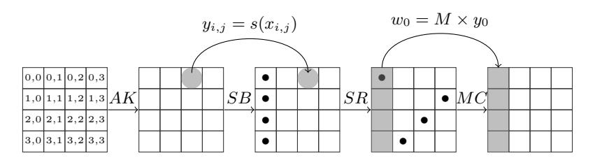
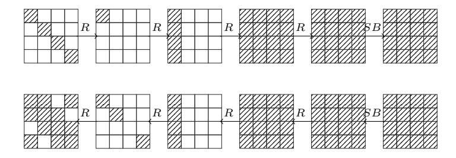
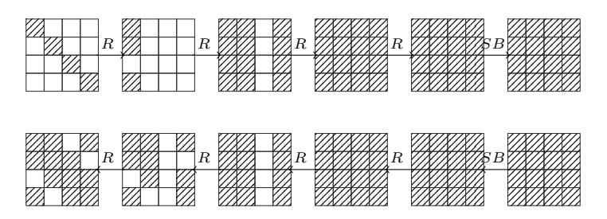
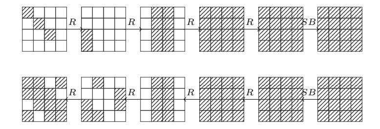

# Practical Attacks on Reduced-Round AES

Navid Ghaedi Bardeh and Sondre Rønjom

Department of Informatics, University of Bergen, Bergen, Norway {navid.bardeh,sondre.ronjom}@uib.no

Abstract. In this paper we investigate the security of 5-round AES against two different attacks in an adaptive setting. We present a practical key-recovery attack on 5-round AES with a secret s-box that requires 2<sup>32</sup> adaptively chosen ciphertexts, which is as far as we know a new record. In addition, we present a new and practical key-independent distinguisher for 5-round AES which requires 2<sup>27</sup>.<sup>2</sup> adaptively chosen ciphertexts. While the data complexity of this distinguisher is in the same range as the current best 5-round distinguisher [14], it exploits new structural properties of 5-round AES.

Keywords: AES · Zero-difference · Secret-key distinguisher · Differential · Secret S-box.

# 1 Introduction

Block ciphers are typically designed by iterating an efficiently computable round function many times in the hope that the resulting composition behaves like a randomly drawn permutation. The designer is typically constrained by various practical criterion, e.g. security target, implementation boundaries, and specialized applications, that might lead the designer to introduce symmetries and structures in the round function as a compromise between efficiency and security. In the compromise, a round function is iterated enough times to make sure that any symmetries and structural properties that might exist in the round function vanish. Thus, a round function is typically designed to increasingly de-correlate with structure and symmetries after several rounds. Low dataand computational-complexity distinguishers and key-recovery attacks on roundreduced block ciphers have recently gained renewed interest in the literature. There are several reasons for this. In one direction cryptanalysis of block ciphers has focused on maximizing the number of rounds that can be broken without exhausting the full codebook and key space. This often leads to attacks marginally close to that of pure brute-force. These are attacks that typically have been improved over time based on many years of cryptanalysis. The most successful attacks often become de-facto standard methods of cryptanalysis for a particular block cipher and might discourage anyone from pursuing new directions in cryptanalysis that do not reach the same number of rounds. This in itself might hinder new breakthroughs, thus it can be important to investigate new promising ideas that might not have reached its full potential yet. New methods of cryptanalysis that break or distinguish fewer rounds faster but with lower complexity than established cryptanalysis is therefore interesting in this process. Many constructions employ reduced round AES as part of their design. On the other hand, reduced versions of AES have nice and well-studied properties that can be favorable as components of larger designs (see for instance Simpira [13]).

The security of Rijndael-type block cipher [5] designs is believed to be a well-studied topic and has been in the focus of a large group of cryptanalysts during the last 20 years (see e.g. [2, 3, 6, 7, 4, 8, 9, 12, 14, 1]). Several distinguisher attacks exists agaist reduced-round of AES. The aim of a distinguisher attack is to distinguish the cipher from a sufficiently generic permutation i.e. the aim is to find some properties of the cipher that allows to set up a test for an unusual event with sufficiently different probability of happening in comparison to random (e.g. finding certain collision-events in a set of ciphertexts when restricted to structured sets of plaintexts). At Crypto 2016, Sun et al. [15] presented the very first 5-round key-dependent distinguisher for AES. They extend a 4-round integral property to 5-rounds by exploiting properties of the AES MixColumn matrix. Although their distinguisher requires the whole codebook, it spawned a series of new fundamental results for AES. It was later improved to 298.<sup>2</sup> chosen plaintexts with 2<sup>107</sup> computations by extending a 4-round impossible differential property to a 5-round property. Then, at Eurocrypt 2017, Grassi et al. [12] proposed the first 5-round key-independent chosen plaintext distinguisher which requires 2<sup>32</sup> chosen plaintexts with a computational cost of 2 36.6 look-ups into memory of size 2<sup>36</sup> bytes. They showed that by encrypting cosets of certain subspaces of the plaintext space the number of times the difference of ciphertext pairs lie in a particular subspace of the state space always is a multiple of 8. Later, at Asiacrypt 2017, Rønjom et al. [14] presented new fundamental properties for Rijndael-type block cipher designs leading to new types of 3- to 6-round key-independent distinguishers for AES that beats all previous records. They showed that zero-differences of encrypted plaintext (or decrypted ciphertext) pairs are left invariant by encrypting new pairs formed by exchanging ciphertext/plaintext-dependent values between already observed pairs. Using this property they present the first 6-round distinguisher which requires 2122.<sup>83</sup> adaptively chosen ciphertexts and which has computational cost of 2121.<sup>83</sup> XORs. Note that their result is in the adaptive setting where the adversary can actively query the encryption and decryption function depending on observed values, while the previous distinguishers are in the chosen plaintext or ciphertext setting.

The security of AES with a secret s-box has been investigated in several papers. In this case, when the choice of s-box is made uniformly at random from all 8-bit s-boxes, the size of the secret information increases from 128− and 256 bit keys to 1812− and 1940-bits of secret key material. In FSE 2015, Tiessen et al. [16] proposed the first 5-round key recovery attack on AES with a secret sbox based on integral cryptanalysis, which requires 2<sup>40</sup> chosen plaintexts with a computational cost of 2<sup>38</sup>.<sup>7</sup> encryptions. In their attack, they first derive an affine equivalent s-box before they recover the secret key. Then at FSE 2016, Grassi et al. [11] proposed a key recovery attack which exploits a particular property of the AES MixColumn matrix. They then combine this with impossible differential cryptanalysis to derive the secret key. Their attack requires 2<sup>102</sup> chosen plaintexts with 2100.<sup>4</sup> computations. It was later improved to 253.<sup>25</sup> chosen plaintexts and 2 52.6 computations in [10] by using a similar approach, but instead of using impossible differential cryptanalysis, they apply multiple-n cryptanalysis.

## 1.1 Our Contribution

So far, various 5-round key recovery attacks on AES with a secret s-box have been presented based on integral, impossible differential and multiple-n cryptanalysis. In this paper, we raise the question whether it is possible to set up a 5-round key recovery attack on AES with a secret s-box based on recently developed attack techniques called zero-difference cryptanalysis. In this paper we present an efficient key-recovery attack on 5-round AES with a secret s-box based on zerodifference cryptanalysis that requires 2<sup>32</sup> adaptively chosen ciphertexts and that has computational complexity consisting of 2<sup>31</sup> XORs. We also present a new key-independent distinguisher for 5-round AES which requires 227.<sup>2</sup> adaptively chosen ciphertexts and which has computational complexity consisting of 226.<sup>2</sup> XORs. The latter distinguisher exploits new structural properties in 5-round AES.

#### 1.2 Overview of This Paper and Main Results

In Section 2 we briefly recall some results and notation that we use in the rest of this paper. In Section 3, we describe a new 5-round distinguisher for AES. Then in Section 4 we present a new key-recovery attack for AES with a secret s-box. The current best secret key distinguishers for 5-round AES and best key-recovery attacks for 5-round AES-128 with a secret s-box are presented in Table 1 and Table 2. We adopt that data complexity is measured in a minimum number of chosen plaintexts/ciphertexts CP/CC or adaptively chosen plaintexts/ciphertexts ACP/ACC. Time complexity is measured in equivalent number of AES encryptions (E), memory access (M) and/or XOR operations (XOR).

Table 1. Secret-Key Distinguishers for 5-round AES

| Property        | Rounds | Data          | Cost          | Key-Independent | Ref.    |
|-----------------|--------|---------------|---------------|-----------------|---------|
| Multiple-8      | 5      | 32 CP<br>2    | 36.6 M<br>2   | X               | [12]    |
| Zero Difference | 5      | 27.2 ACC<br>2 | 26.2XOR<br>2  | X               | Sect. 3 |
| Zero Difference | 5      | 26.8 ACC<br>2 | 25.8 XOR<br>2 | X               | [14]    |

#### 4 N.G. Bardeh et al.

Table 2. Comparison of key-recovery on 5-round AES with a secret s-box

| Attack          | Rounds | Data                      | Computation   | Memory    | Ref.    |
|-----------------|--------|---------------------------|---------------|-----------|---------|
| Imp. Diff.      | 5      | $2^{76.37} \text{ CP}$    | $2^{74.09} E$ | 28        | [10]    |
| Multiple of $n$ | 5      | $2^{53.25} \text{ CP}$    | $2^{52.6} E$  | $2^{16}$  | [10]    |
| Integral        | 5      | $2^{40} \text{ CP}$       | $2^{38.7} E$  | $2^{40}$  | [16]    |
| Zero Difference | 5      | $2^{29.19}CP + 2^{32}ACC$ | $2^{31}$ XOR  | $small^1$ | Sect. 4 |



Fig. 1. Description of one AES round

# 2 Preliminaries

# 2.1 A Short Description of AES

The AES internal state is typically represented as a 4 by 4 matrix over the finite field  $\mathbb{F}_{2^8}$ . The state is sometimes also represented as a vector of length 4 over  $\mathbb{F}_{2^8}^4$  typically formed by concatenating the columns of the matrix state from left to right. This is the view typically taken in SuperBox cryptanalysis. One full round of AES consists of SubBytes (SB), ShiftRows (SR), MixColumns (MC) and AddKey (AK),  $R = AK \circ MC \circ SR \circ SB$  (depicted in Figure 1). The SB-layer applies a fixed 8-bit to 8-bit s-box independently to each byte of the state, the SR-layer cyclically shift the *i*-th row by *i* positions, while the MC-layer applies a fixed linear transformation to each column. The key addition simply XORs a secret round-dependent value to the state. Also,  $R^n(x)$  means n rounds of AES. We omit the last  $MC \circ SR$  operations to simplify the presentation of our attacks (our attacks work as well in the case in which the final linear layer is omitted).

## 2.2 Subspace trail on AES

In [11], Grassi et al. present subspace trail cryptanalysis on AES. They define two different subspaces related to AES. If we let  $\{e_{0,0},...,e_{3,3}\}$  form the unit vectors of  $\mathbb{F}_{2^8}^{4\times 4}$ , we have the following.

**Definition 1.** (Diagonal spaces) The diagonal spaces  $\mathcal{D}_i$  are defined as

$$\mathcal{D}_i = \langle e_{0,i}, e_{1,i+1}, e_{2,i+2}, e_{3,i+3} \rangle$$

where i + j is computed modulo 4. For instance, the diagonal space  $\mathcal{D}_0$  corresponds to the symbolic matrix:

$$\mathcal{D}_0 = \left\{ \begin{bmatrix} x_1 & 0 & 0 & 0 \\ 0 & x_2 & 0 & 0 \\ 0 & 0 & x_3 & 0 \\ 0 & 0 & 0 & x_4 \end{bmatrix} \middle| \forall x_1, x_2, x_3, x_4 \in \mathbb{F}_{2^8} \right\}.$$

**Definition 2.** (Column spaces) The column spaces  $C_i$  are defined as

$$C_i = \langle e_{0,i}, e_{1,i}, e_{2,i}, e_{3,i} \rangle$$
.

For instance, the columns space  $C_0$  corresponds to the symbolic matrix

$$C_0 = \left\{ \begin{bmatrix} x_1 & 0 & 0 & 0 \\ x_2 & 0 & 0 & 0 \\ x_3 & 0 & 0 & 0 \\ x_4 & 0 & 0 & 0 \end{bmatrix} \middle| \forall x_1, x_2, x_3, x_4 \in \mathbb{F}_{2^8} \right\}.$$

**Definition 3.** Let  $I \subseteq \{0,1,2,3\}$ . Let  $\mathcal{D}_I$  and  $\mathcal{C}_I$  be defined as

$$\mathcal{D}_I = \bigoplus_{i \in I} \mathcal{D}_i, \qquad \mathcal{C}_I = \bigoplus_{i \in I} \mathcal{C}_i.$$

The dimension of the subspaces  $\mathcal{D}_I$  and  $\mathcal{C}_I$  are both  $4 \cdot |I|$ . The following theorem describes the deterministic mapping between these two subspaces.

**Theorem 1.** [11] For  $I \subset \{0, 1, 2, 3\}$  and for each  $a \in \mathcal{D}_I^{\perp}$  (orthogonal complement of  $D_I$ ), there exists one and only one  $b \in \mathcal{C}_I^{\perp}$  (orthogonal complement of  $C_I$ ) such that:

$$R(\mathcal{D}_I \oplus a) = \mathcal{C}_I \oplus b.$$

**Lemma 1.** [11] For all  $x,y \in \mathbb{F}_{2^8}^{4 \times 4}$  and for all  $I \subseteq \{0,1,2,3\}$ , it follows that

$$Pr(R(x) \oplus R(y) \in C_I | x \oplus y \in D_I) = 1.$$

In the other word, we can deduce that for each  $c \in \mathcal{C}_I^{\perp}$ , there exists exactly one  $d \in \mathcal{D}_I^{\perp}$  such that

$$R^{-1}(\mathcal{C}_I \oplus c) = \mathcal{D}_I \oplus d$$

and in general

$$Pr(R^{-1}(x) \oplus R^{-1}(y) \in \mathcal{D}_I | x \oplus y \in \mathcal{C}_I) = 1.$$

**Lemma 2.** [11] For any  $C_I$  and  $D_J$ , we have that

$$Pr(x \in (\mathcal{C}_I \cap \mathcal{D}_J) | x \in \mathcal{C}_I) = (2^{-8})^{4 \cdot |I| - |I| \cdot |J|}$$

$$Pr(x \in (\mathcal{C}_I \cap \mathcal{D}_I) | x \in \mathcal{D}_I) = (2^{-8})^{4 \cdot |I| - |I| \cdot |J|}.$$

This means that if two elements belong to the same coset of  $\mathcal{D}_I$  (respectively  $\mathcal{C}_I$ ), then they also belong to the same coset of  $\mathcal{C}_J$  (respectively  $\mathcal{D}_J$ ) with probability  $(2^{-8})^{4\cdot |I|-|I|\cdot |J|}$ . More precisely, when we encrypt two plaintexts from the same coset of  $\mathcal{D}_I$  for one round, then they belong to the same coset of  $\mathcal{C}_I \cap \mathcal{D}_J$  with probability  $(2^{-8})^{4\cdot |I|-|I|\cdot |J|}$ . We use this lemma to compute most of the probabilities in our attacks.

#### 2.3 Zero-difference for 4-round AES

In [14], Rønjom et al. present zero-difference cryptanalysis against generic Substitution Permutation Networks (SPNs). In the following, we recall the basic zero-difference properties for 4-rounds of AES.

**Definition 4.** [14] For a vector  $v \in \mathbb{F}_2^4$  and a pair of states  $\alpha, \beta \in \mathbb{F}_{2^8}^{4 \times 4}$  define a new state

$$\rho^{v}(\alpha,\beta) = (\alpha_{i}v_{i} \oplus \beta_{i}(v_{i} \oplus 1) \mid 0 \leq i < n).$$

where  $\alpha_i$  and  $\beta_i$  are ith columns of  $\alpha$  and  $\beta$ 

The new pair  $(\alpha', \beta') = (\rho^v(\alpha, \beta), \rho^v(\beta, \alpha))$  is formed by exchanging individual words between  $\alpha$  and  $\beta$  according to the binary coefficients of v.

Zero-difference cryptanalysis exploits a fundamental property of the SLS construction (S is a non-linear layer and L is a linear transformation) which is encapsulated in the following theorem originally presented in [14].

**Theorem 2.** [14] Let 
$$\alpha, \beta \in \mathbb{F}_{2^8}^{4 \times 4}$$
 and  $\alpha' = \rho^v(\alpha, \beta), \beta' = \rho^v(\beta, \alpha)$  then

$$\nu(S \circ L \circ S(\alpha) \oplus S \circ L \circ S(\beta)) = \nu(S \circ L \circ S(\alpha') \oplus S \circ L \circ S(\beta'))$$

where  $\nu(x)$  denotes the indicator vector which is 1 if the word i of x is zero and 0 otherwise.

Due to the symmetry of SLS, we get exactly the same result in the decryption direction. Note that the SLS construction essentially corresponds to 4 full rounds of AES. In [14], the authors fix plaintexts with fixed zero diagonals and decrypt the exchanged ciphertext pairs to a new plaintext pair which with probability 1 have exactly the same zero diagonals.

We can represent Theorem 2 in terms of subspace cryptanalysis. Consider two plaintexts in the same coset of a diagonal space  $\mathcal{D}_I$ ,  $p^0, p^1 \in \mathcal{D}_I + a$ . Then let  $c^0 = R^4(p^0)$ ,  $c^1 = R^4(p^1)$ ,  $p'^0 = R^{-4}(\rho^v(c^0, c^1))$  and  $p'^1 = R^{-4}(\rho^v(c^1, c^0))$ . Then with probability one, we also have that  $p'^0 \oplus p'^1 \in \mathcal{D}_I$  (different coset than  $D_I + a$ ). In the next two sections, we present two practical different attacks based on this 4-round property. We have practically verified the attacks on full-scale AES in  $C/C++^2$ .

## 3 5-round key-independent distinguisher

In this section we extend the 4-round distinguisher mentioned in the previous section to a 5-round distinguisher by adding one round at beginning. We encrypt a plaintext set and expect that some of them follow the 4-round property after one round encryption. Thus, we present a new 5-round key-independent distinguisher which requires  $2^{27.2}$  adaptively chosen ciphertexts. The idea for setting up a 5-round distinguisher is as follows. We pick a plaintext set P from a coset of a diagonal space  $\mathcal{D}_0$ ,  $P \subset \mathcal{D}_0 + a$ , and encrypt them. Then from the

<sup>&</sup>lt;sup>2</sup> https://github.com/Kryptoraphy/practical-attacks



Fig. 2. 5-round truncated differential characteristic used in case 1

set of all possible ciphertext pairs we form 7 new ciphertext pairs by exchanging mixed values between the original pairs. Then we decrypt the set of these newly generated ciphertext pairs and expect to observe one such pair belonging to the same coset of  $\mathcal{D}_L$  with |L|=3.

We know that each coset of  $\mathcal{D}_I$  is mapped into a coset of  $\mathcal{C}_I$  with probability one, and diagonal and column spaces always have an intersection with a certain probability (Lemma 2). So, when we encrypt the plaintexts set P, one of following cases may happen after one round encryption.

*First case.* After one round encryption, then according to Lemma 2, with probability  $4 \cdot 2^{-24}$  (a single byte can be active in 4 different positions in a column) we have that

$$R(p^i) \oplus R(p^j) \in D_K \cap C_0$$

where |K| = 1. If we swap word(s) between the ciphertexts and decrypt them, we have, according to the 4-round property mentioned in Section 2.3, that

$$R^{-4}(\rho^v(c^i, c^j)) \oplus R^{-4}(\rho^v(c^j, c^i)) \in D_K$$

and

$$R^{-4}(\rho^v(c^i, c^j)) \oplus R^{-4}(\rho^v(c^j, c^i)) \in D_K \cap C_L$$

where |L|=3 with probability  $4\cdot 2^{-8}$  (there are 4 possible choices for choosing L). It means that after one more round of decryption, according to Theorem 1, the two new plaintexts,  $p'^i$  and  $p'^j$ , are in same coset of a diagonal space  $\mathcal{D}_L$  where |L|=3. Thus, it happens with a probability  $4\cdot 2^{-24}\cdot 4\cdot 2^{-8}$ . The truncated differential characteristic used in this case is depicted in Figure 2.

**Second case.** In this case,  $R(p^i) \oplus R(p^j)$  differ in only two bytes with probability  $6 \cdot 2^{-16}$ . In other words:

$$R(p^i) \oplus R(p^j) \in D_K \cap C_0$$

where |K| = 2. Then, according to the 4-round property, we have that

$$R^{-4}(\rho^v(c^i,c^j)) \oplus R^{-4}(\rho^v(c^j,c^i)) \in D_K,$$


Fig. 3. 5-round truncated differential characteristic used in case 2



Fig. 4. 5-round truncated differential characteristic used in case 3

and with probability  $4 \cdot 2^{-16}$  we have that

$$R^{-4}(\rho^v(c^i, c^j)) \oplus R^{-4}(\rho^v(c^j, c^i)) \in D_K \cap C_L$$

so  $R^{-5}(\rho^v(c^i,c^j)) \oplus R^{-5}(\rho^v(c^j,c^i))$  is zero in a diagonal with probability  $6 \cdot 2^{-16} \cdot 4 \cdot 2^{-16}$ . Figure 3 depicts the truncated differential characteristic used in this case.

**Third case.** There is also a case that  $R(p^i) \oplus R(p^j)$  is zero in all bytes except three bytes, which happens with probability  $4 \cdot 2^{-8}$ . It means that

$$R(p^i) \oplus R(p^j) \in D_K \cap C_0$$

where |K| = 3. Thus, this pair follows the 4-round property

$$R^{-4}(\rho^v(c^i, c^j)) \oplus R^{-4}(\rho^v(c^j, c^i)) \in D_K,$$

and with probability  $4 \cdot 2^{-24}$ , we also have that

$$R^{-4}(\rho^v(c^i, c^j)) \oplus R^{-4}(\rho^v(c^j, c^i)) \in D_K \cap C_L.$$

Then after one more round of decryption, it follows that  $p'^i \oplus p'^j \in \mathcal{D}_L$  where |L| = 3. In total, we expect this event happens with probability  $4 \cdot 2^{-8} \cdot 4 \cdot 2^{-24}$ . In Figure 4, the truncated differential characteristic used in this case is depicted.

In total, the probability that there is a plaintext pair such that  $p'^i \oplus p'^{\bar{j}} \in C_L$  is  $16 \cdot 2^{-24} \cdot 2^{-8} + 24 \cdot 2^{-16} \cdot 2^{-16} + 16 \cdot 2^{-8} \cdot 2^{-24} = 2^{-26.19}$ . In order to set up

a distinguisher, we encrypt  $2^{12.2}$  plaintexts from a coset of  $D_0$ . We generate all  $2^{23.4}$  possible ciphertext pairs and for each pair we generate all 7 possible new ciphertext pairs by swapping words between them. Then we decrypt all  $7 \cdot 2^{23.4}$  ciphertext pairs and expect that there is at least one plaintext pair such that  $p'^0 \oplus p'^1 \in D_L$  with |L| = 3. At random, the probability that two plaintexts belong to the same coset of  $D_L$  is  $2^{-30}$ . For AES, the probability of having a plaintext pair with our desired difference pattern is  $1 - (1 - 2^{-26.2})^{2^{26.2}} = 0.63$  after decrypting  $2^{26.2}$  ciphertext pairs, while for a random permutation, this probability is  $1 - (1 - 2^{-30})^{2^{26.2}} = 0.07$ . Thus, the probability of success is 0.58. So, we can distinguish 5-round AES from a random permutation using  $2^{12.2}$  chosen plaintext and  $2 \cdot 2^{26.2} = 2^{27.2}$  adaptively chosen ciphertext. The algorithm for this distinguisher is presented in Algorithm 1.

The data complexity of this distinguisher is in the same range as the data complexity of the best 5-round adaptive distinguisher presented in [14]. Both distinguishers extend on the 4-round distinguisher mentioned in Section 2.3 to a 5-round distinguisher by adding a round at the beginning. In the distinguisher presented in [14], the aim is to find plaintext pairs such that all of them have a certain property (a certain zero-byte set). To achieve this, attacker needs to generate new pairs of plaintexts and ciphertexts adaptively from the original pairs. To set up our distinguisher, we just need to generate new ciphertext pairs adaptively. Our distinguisher exploits another structural properties over 5-round.

## Algorithm 1: 5-round key-independent distinguisher

```
Input: Set \mathcal{P} contains 2^{12.2} plaintext p^i where bytes in first diagonal takes a
          random values and others are constant
Output: 1 for an AES, -1 otherwise.
for i from 0 to 2^{12.2} do
    c^i \leftarrow enc_k(p^i)
end
for i from 0 to 2^{12.2} do
    for j from i + 1 to 2^{12.2} - 1 do
         for r from 1 to 7 do
              c'^i \leftarrow \rho^{v_r}(c^i, c^j), c'^j \leftarrow \rho^{v_r}(c^j, c^i)
              p'^i \leftarrow dec_k(c'^i), p'^j \leftarrow dec_k(c'^j)
              if p'^i \oplus p'^j \in D_L where |L| = 3 then
                   return 1
              end
         end
    end
end
```

# 4 Key recovery attack on 5-round AES with a single secret s-box

In this section we present a new key-recovery attack on 5-round AES with a secret s-box. The idea is to turn the 4-round distinguisher mentioned in section 2.3 to a key recovery attack by adding a round at beginning using a property of the MixColumn operation in AES. The MixColumns matrix M in AES is defined by

$$M = \begin{bmatrix} \alpha & \alpha + 1 & 1 & 1 \\ 1 & \alpha & \alpha + 1 & 1 \\ 1 & 1 & \alpha & \alpha + 1 \\ \alpha + 1 & 1 & 1 & 1 \end{bmatrix}.$$

We pick two pairs of plaintexts  $p^0$  and  $p^1$  where the first diagonal is given by  $SR^{-1}(p_0^0) = SR^{-1}(0,i,j,0)$  and  $SR^{-1}(p_0^1) = SR^{-1}(z,z+i,z+j,0)$  and where z is a random non-zero element of  $\mathbb{F}_{2^8}$ . Let  $k_0 = (k_{0,0},k_{1,1},k_{2,2},k_{3,3})$  denote the key-bytes XORed with the first diagonal of the plaintext. Then the difference between the first column after one encryption of the two plaintexts becomes

$$\alpha \Delta x_0 \oplus (\alpha + 1) \Delta x_1 \oplus \Delta x_2 = y_0$$
  
$$\Delta x_0 \oplus \alpha \Delta x_1 \oplus (\alpha + 1) \Delta x_2 = y_1$$
  
$$\Delta x_0 \oplus \Delta x_1 \oplus \alpha \Delta x_2 = y_2$$
  
$$(\alpha + 1) \Delta x_0 \oplus \Delta x_1 \oplus \Delta x_2 = y_3.$$

where  $\Delta x_0 = s(k_{0,0}) \oplus s(z \oplus k_{0,0})$ ,  $\Delta x_1 = s(k_{1,1} \oplus z \oplus i) \oplus s(k_{1,1} \oplus i)$ ,  $\Delta x_2 = s(k_{2,2} \oplus z \oplus j) \oplus s(k_{2,2} \oplus j)$  and where s(x) is the AES-sbox. Since the plaintexts are equal in the last byte, this part cancels out in the difference. In particular, if we look at the first two equations, it is not hard to see that they are zero when  $\Delta x_0 = \Delta x_1 = \Delta x_2$ ,

$$s(k_{0,0}) \oplus s(z \oplus k_{0,0}) = s(k_{1,1} \oplus z \oplus i) \oplus s(k_{1,1} \oplus i) = s(k_{2,2} \oplus z \oplus j) \oplus s(k_{2,2} \oplus j)$$

This happens when  $i \in \{k_{0,0} \oplus k_{1,1}, z \oplus k_{0,0} \oplus k_{1,1}\}$  and  $j \in \{k_{0,0} \oplus k_{2,2}, z \oplus k_{0,0} \oplus k_{2,2}\}$ . Thus, if we let i and j run through all values of  $\mathbb{F}_{2^8}$ , we are guaranteed that there are at least four values for which the first two equations are zero.

We prepare a set  $\mathcal{P}$  of plaintext pairs as follows. For each i and j, we generate a pair of plaintexts  $p^0$  and  $p^1$  where the first diagonal of  $p^0$  is  $SR^{-1}(p_0^0) = SR^{-1}(0,i,j,0)$  while the first diagonal in the second text is  $SR^{-1}(p_0^1) = SR^{-1}(z,z\oplus i,z\oplus j,0)$ . We then encrypt this pair five rounds to a pair of ciphertexts  $c^0$  and  $c^1$ . We then pick all 7 new ciphertext pairs  $c'^0, c'^1 = (\rho^v(c^0,c^1),\rho^v(c^1,c^0))$  and return the corresponding plaintexts  $p'^0$  and  $p'^1$ . Now we know that there are 28 pairs in the set such that

$$R^{-4}(\rho^v(c^0,c^1)) \oplus R^{-4}(\rho^v(c^1,c^0)) \in D_K$$

where |K|=2, since for each of the pair satisfy  $R(p^0)\oplus R(p^1)\in D_K$ . Thus, according to Lemma 2, with probability  $4\cdot 2^{-16}$  we have that

$$R^{-4}(\rho^v(c^0,c^1)) \oplus R^{-4}(\rho^v(c^1,c^0)) \in D_K \cap C_L$$



Fig. 5. 5-round truncated differential characteristic used in key recovery attack AES

where |L| = 3. This means that p <sup>0</sup><sup>0</sup> ⊕ p <sup>0</sup><sup>1</sup> ∈ DL. Thus, for this pair, we can deduce the values of i and j which corresponds to k0,<sup>0</sup> ⊕k1,<sup>1</sup> (z ⊕k0,<sup>0</sup> ⊕k1,1) and k0,<sup>0</sup> ⊕ k2,<sup>2</sup> (z ⊕ k0,<sup>0</sup> ⊕ k2,2) respectively. The truncated differential characteristic used in the attack is depicted in Figure 5. Since there are 28 right pairs in the set P, the probability that there is a new plaintext pair such that p <sup>0</sup><sup>0</sup> ⊕ p <sup>0</sup><sup>1</sup> ∈ C<sup>L</sup> is 1 − (1 − 2 <sup>−</sup>14) <sup>28</sup> = 2<sup>−</sup>9.19. Then we need to encrypt 29.<sup>19</sup> sets P (by picking different constants for the last three diagonals). Thus, to find two bytes of the key, the attacker needs 2 · 2 9.19 · 2 <sup>16</sup> = 226.<sup>19</sup> chosen plaintexts and 2·7·2 9.19 ·2 <sup>16</sup> = 2<sup>29</sup> adaptively chosen ciphertexts. Then the attacker can repeat the attack for other diagonals (two times for each diagonal) and guess one byte of the key for each diagonal. In total the attacker needs 229.<sup>19</sup> chosen plaintexts and 2 <sup>32</sup> adaptively chosen ciphertexts to form an attack with success rate of 0.63. The algorithm for this key recovery attack is presented in Algorithm 2. The key-recovery attacks on 5-round AES with a secret s-box presented in [10] are based on impossible and multiple-n cryptanalysis, while our attack is based on zero-difference cryptanalysis. Since our attack exploits a probability one 4-round property, it requires less texts than others which exploit probabilistic 4-round properties. Also, the best 5-round key recovery attacks in adaptive setting [14] and non-adaptive setting [1] require 211.<sup>3</sup> adaptively chosen ciphertexts and 2<sup>22</sup> chosen plaintext respectively (with a known s-box), so compared to our attack, and despite the increased size of the secret information, the required data is increased, at most, by a factor of 2<sup>21</sup> .

# 5 Conclusion

In this paper we have introduced a new 5-round key-independent distinguisher which requires 2<sup>12</sup>.<sup>2</sup> chosen plaintexts and 2<sup>27</sup>.<sup>2</sup> adaptively chosen ciphertexts. In addition, we present a new key recovery attack against 5-round AES with a secret s-box based on zero-difference cryptanalysis.The attack requires 2<sup>29</sup>.<sup>19</sup> chosen plaintexts and 2<sup>32</sup> adaptively chosen ciphertexts. Both attacks mentioned in this paper are practical and have been verified experimentally on a standard laptop.

**Algorithm 2:** Key recovery attack on 5-round AES with a single secret s-box

```
Input: 2^{9.12} different sets \mathcal{P} where each contains 2^{16} plaintext pairs
Output: Candidates for k_{0,0} \oplus k_{1,1} (1 \oplus k_{0,0} \oplus k_{1,1}) and k_{0,0} \oplus k_{2,2}
                   (1 \oplus k_{0,0} \oplus k_{2,2})
for c from 0 to 2^{9.12} do
       for i from 0 to 2^8 do
              for j from 0 to 2^8 do
                     \begin{array}{l} j_0^0 \leftarrow (0,i,j,0), \ p_0^1 \leftarrow (1,1 \oplus i,1 \oplus j,0) \\ p_l^0 = p_l^1 = Random - value \ \text{for} \ l = 1,2,3 \\ c^0 \leftarrow enc_k(p^0), \ c^1 \leftarrow enc_k(p^1) \end{array}
                     for r from 1 to 7 do
                            c'^{0} \leftarrow \rho^{v_{r}}(c^{0}, c^{1}), c'^{1} \leftarrow \rho^{v_{r}}(c^{1}, c^{0})
p'^{0} \leftarrow dec_{k}(c'^{0}), p'^{1} \leftarrow dec_{k}(c'^{1})
                            if p'^0 \oplus p'^1 \in D_L where |L| = 3 then
                                    (i,j) is a candidate for two bytes of key.
                            end
                     end
              end
       end
end
```

# 6 Acknowledgments

We thank the anonymous reviewers for their valuable comments and suggestions. This Research was supported by the Norwegian Research Council.

#### References

- Bar-On, A., Dunkelman, O., Keller, N., Ronen, E., Shamir, A.: Improved key recovery attacks on reduced-round AES with practical data and memory complexities. In: Advances in Cryptology - CRYPTO 2018 - 38th Annual International Cryptology Conference, Santa Barbara, CA, USA, August 19-23, 2018, Proceedings, Part II. pp. 185–212 (2018). https://doi.org/10.1007/978-3-319-96881-0\_7
- 2. Biryukov, A., Khovratovich, D.: Related-key cryptanalysis of the full AES-192 and AES-256. In: Advances in Cryptology ASIACRYPT 2009, 15th International Conference on the Theory and Application of Cryptology and Information Security, Tokyo, Japan, December 6-10, 2009. Proceedings. pp. 1–18 (2009). https://doi.org/10.1007/978-3-642-10366-7\_1
- Biryukov, A., Khovratovich, D., Nikolic, I.: Distinguisher and related-key attack on the full AES-256. In: Advances in Cryptology - CRYPTO 2009, 29th Annual International Cryptology Conference, Santa Barbara, CA, USA, August 16-20, 2009. Proceedings. pp. 231–249 (2009). https://doi.org/10.1007/978-3-642-03356-8\_14
- Bouillaguet, C., Derbez, P., Dunkelman, O., Fouque, P., Keller, N., Rijmen, V.: Low-data complexity attacks on AES. IEEE Trans. Information Theory 58(11), 7002–7017 (2012). https://doi.org/10.1109/TIT.2012.2207880

- 5. Daemen, J., Rijmen, V.: The block cipher rijndael. In: Smart Card Research and Applications, This International Conference, CARDIS '98, Louvainla-Neuve, Belgium, September 14-16, 1998, Proceedings. pp. 277–284 (1998). https://doi.org/10.1007/10721064 26
- 6. Derbez, P., Fouque, P., Jean, J.: Improved key recovery attacks on reduced-round AES in the single-key setting. In: Advances in Cryptology - EUROCRYPT 2013, 32nd Annual International Conference on the Theory and Applications of Cryptographic Techniques, Athens, Greece, May 26-30, 2013. Proceedings. pp. 371–387 (2013). https://doi.org/10.1007/978-3-642-38348-9 23
- 7. Dunkelman, O., Keller, N., Shamir, A.: Improved single-key attacks on 8-round AES-192 and AES-256. In: Advances in Cryptology - ASIACRYPT 2010 - 16th International Conference on the Theory and Application of Cryptology and Information Security, Singapore, December 5-9, 2010. Proceedings. pp. 158–176 (2010). https://doi.org/10.1007/978-3-642-17373-8 10
- 8. Ferguson, N., Kelsey, J., Lucks, S., Schneier, B., Stay, M., Wagner, D.A., Whiting, D.: Improved cryptanalysis of rijndael. In: Fast Software Encryption, 7th International Workshop, FSE 2000, New York, NY, USA, April 10-12, 2000, Proceedings. pp. 213–230 (2000). https://doi.org/10.1007/3-540-44706-7 15
- 9. Gilbert, H., Minier, M.: A collision attack on 7 rounds of rijndael. In: AES Candidate Conference. pp. 230–241 (2000)
- 10. Grassi, L.: Mixcolumns properties and attacks on (round-reduced) AES with a single secret s-box. In: Topics in Cryptology - CT-RSA 2018 - The Cryptographers' Track at the RSA Conference 2018, San Francisco, CA, USA, April 16-20, 2018, Proceedings. pp. 243–263 (2018). https://doi.org/10.1007/978-3-319-76953-0 13
- 11. Grassi, L., Rechberger, C., Rønjom, S.: Subspace trail cryptanalysis and its applications to AES. IACR Trans. Symmetric Cryptol. 2016(2), 192–225 (2016). https://doi.org/10.13154/tosc.v2016.i2.192-225
- 12. Grassi, L., Rechberger, C., Rønjom, S.: A new structural-differential property of 5-round AES. In: Advances in Cryptology - EUROCRYPT 2017 - 36th Annual International Conference on the Theory and Applications of Cryptographic Techniques, Paris, France, April 30 - May 4, 2017, Proceedings, Part II. pp. 289–317 (2017). https://doi.org/10.1007/978-3-319-56614-6 10
- 13. Gueron, S., Mouha, N.: Simpira v2: A family of efficient permutations using the AES round function. In: Advances in Cryptology - ASIACRYPT 2016 - 22nd International Conference on the Theory and Application of Cryptology and Information Security, Hanoi, Vietnam, December 4-8, 2016, Proceedings, Part I. pp. 95–125 (2016). https://doi.org/10.1007/978-3-662-53887-6 4
- 14. Rønjom, S., Bardeh, N.G., Helleseth, T.: Yoyo tricks with AES. In: Advances in Cryptology - ASIACRYPT 2017 - 23rd International Conference on the Theory and Applications of Cryptology and Information Security, Hong Kong, China, December 3-7, 2017, Proceedings, Part I. pp. 217–243 (2017). https://doi.org/10.1007/978-3-319-70694-8 8
- 15. Sun, B., Liu, M., Guo, J., Qu, L., Rijmen, V.: New insights on aes-like SPN ciphers. In: Advances in Cryptology - CRYPTO 2016 - 36th Annual International Cryptology Conference, Santa Barbara, CA, USA, August 14-18, 2016, Proceedings, Part I. pp. 605–624 (2016). https://doi.org/10.1007/978-3-662-53018-4 22
- 16. Tiessen, T., Knudsen, L.R., K¨olbl, S., Lauridsen, M.M.: Security of the AES with a secret s-box. In: Fast Software Encryption - 22nd International Workshop, FSE 2015, Istanbul, Turkey, March 8-11, 2015, Revised Selected Papers. pp. 175–189 (2015). https://doi.org/10.1007/978-3-662-48116-5 9