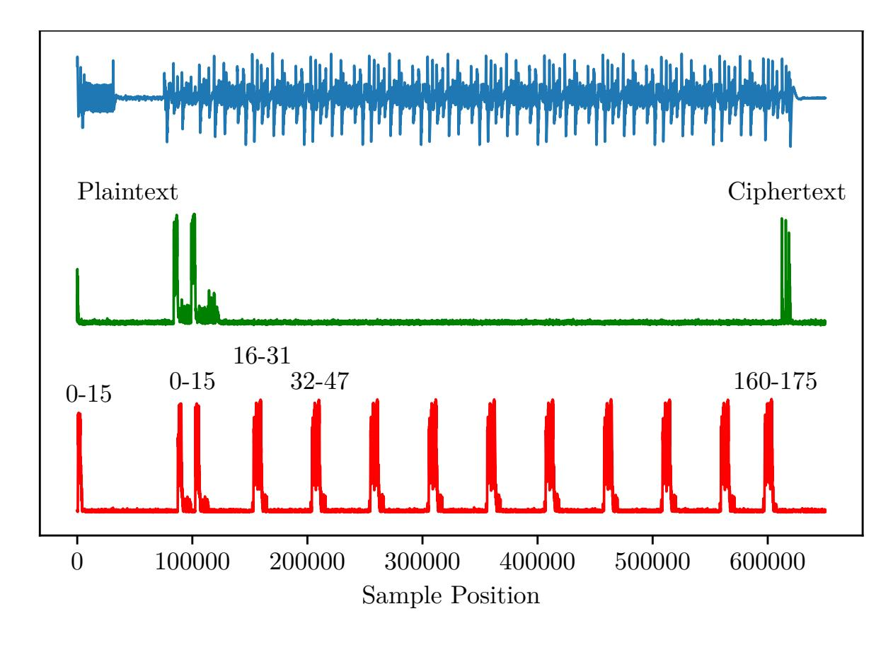
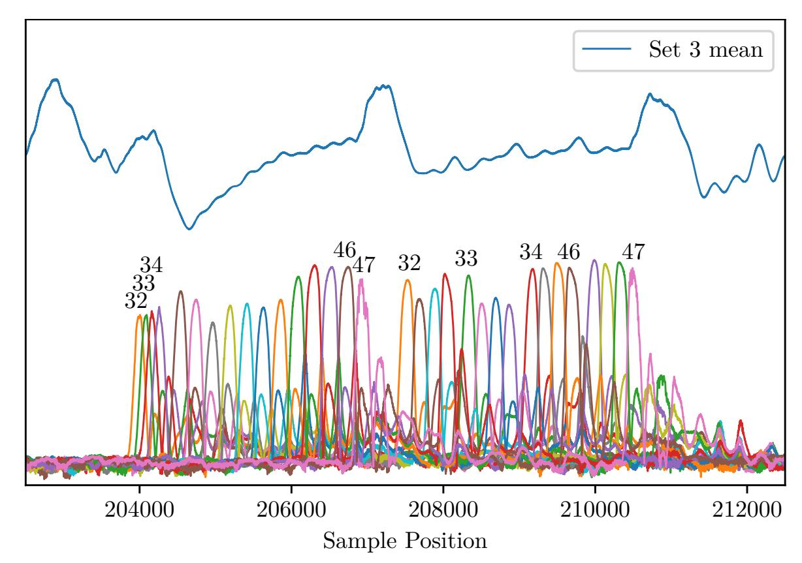
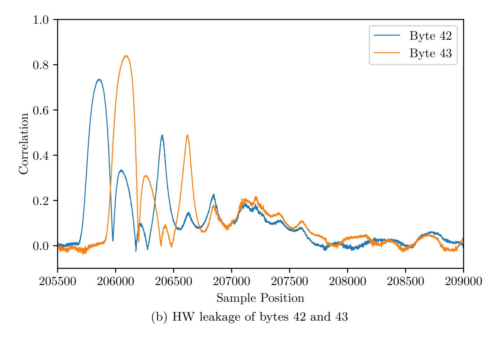
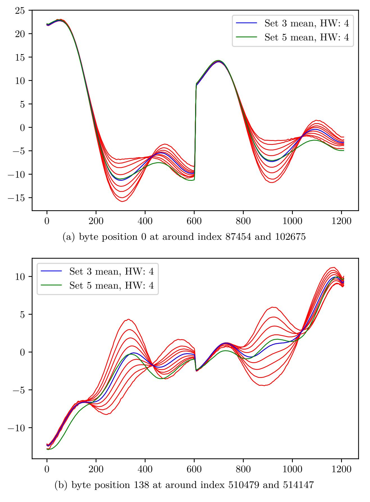
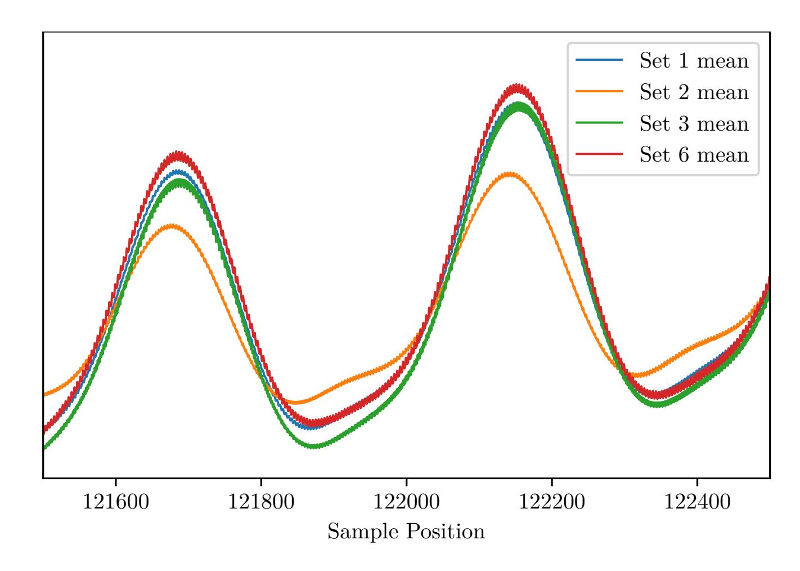
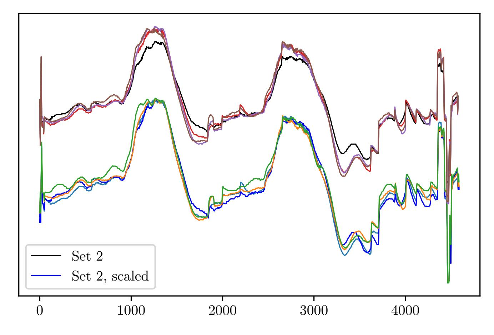
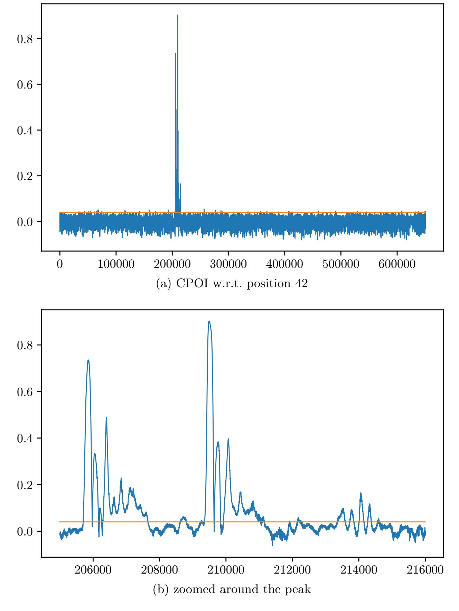
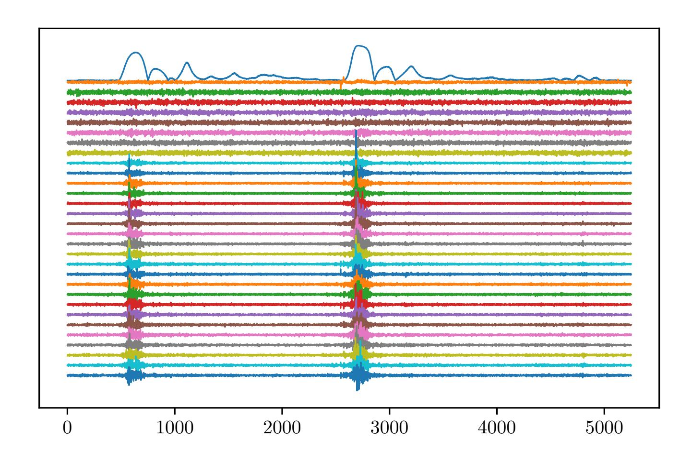

{0}------------------------------------------------

# **Dissecting the CHES 2018 AES Challenge**

Tobias Damm[0000−0003−3221−7207], Sven Freud, and Dominik Klein[0000−0001−8174−7445]

Bundesamt für Sicherheit in der Informationstechnik (BSI) {firstname.lastname}@bsi.bund.de

**Abstract.** One challenge of the CHES 2018 side channel contest was to break a masked AES implementation. It was impressively won by Gohr et al. by applying *ridge regression* to obtain guesses for the hamming weights of the (unmasked) AES key schedule, and then using a SAT solver to brute force search the remaining key space. Template attacks are one of the most common approaches used to assess the leakage of a device in a security evaluation. Hence, this raises the question whether *ridge regression* is a more suitable choice for security evaluation, especially w.r.t. portability. We investigate the feasibility of template attacks to break the presented AES implementation, analyze the leakage of the device, and based on this mount a template attack on hamming weights of the key expansion. We then use classical key search algorithms to recover the AES key. By analyzing the leakage and applying dimension reduction techniques we are able to compress each trace from 650 000 points to only 30 points that are then used to create the templates. Our experimental results indicate that such classical templates achieve similar results compared to ridge regression, and in several cases even slightly outperforming it. According to the organizers, the CTF was *aimed to evaluate the concepts of deep learning and classic profiling*. Our final conclusion is that the challenge traces are not optimal to settle the question intended, as the leakage is very strong and local. Therefore it is very suitable to apply classical machine learning techniques such as template attacks or ridge regression, and the difficulty in recovering the key is more linked to the resulting key search problem than to the actual attack.

# **1 Introduction**

Cryptographic devices may leak information about the used key in various *side channels*. In particular Kocher [Koc96] showed how to extract cryptographic keys by analyzing the power consumption (resp. electromagnetic emissions) of a device that executes cryptographic operations. Side channel attacks and countermeasures remain an active research area until today, especially w.r.t. implementations of the AES cipher. A popular counter-measure to minimize leakage about the AES key is *masking*, originally proposed in [AG01]. Masking can either fully prevent several classes of side channel attacks or make attacks infeasible in practice.

{1}------------------------------------------------

The CHES 2018 side channel contest CTF included a challenge on AES. Presented were power traces from a masked AES implementation. The goal was to recover the key in two settings: In the first setting, both training and attack traces were recorded with the same device. In the second setting training traces were provided from three different devices, and the attack traces were recorded with yet another different fourth device.

Most advanced attack methods require a training step to assess the leakage of the device. Based on this training step, an attack can be executed. Portability in this context is a difficult challenge: First, due to the manufacturing process no two chips are identical, and therefore their power and EM characteristics may vary. Moreover even when using the same chip, it is difficult for an attacker to ensure perfect identical environmental conditions when recording training and attack traces, for example due to varying operating temperatures or supply currents.

Template attacks [CRR03] remain one of the most popular attack methods for power or EM side channel attacks and are widely used in the evaluation of security chips. Another straight forward attack path is to apply linear regression. Traces are then explanatory variables for some response (i.e. hamming weights of keys), and the task is to find a relationship between them such that accurate predictions are possible. Both methods are based on different assumptions w.r.t. leakage and noise present in a recorded signal:

- **–** *Template Attacks* assume that the traces can be modeled by a multivariate Gaussian distribution. Mean and covariance matrices for each targeted value are approximated by training traces. Then, given one or more attack traces, possible values are ranked using the maximum likelihood principle.
- **–** *Linear Regression*. A major point is that the response, e.g. here the hamming weights of the key schedule, must have a linear relationship with the input variables – here the trace points. Ridge regression is a particular form of linear regression where overfitting is prevented by applying regularization with the L2 norm.

It is difficult to assess which of these theoretical assumptions hold in practice, especially if we consider the case of portable attacks.

For the CHES challenge, Gohr et al. [GJS19] identified that the AES key expansion was not masked. They then mounted a linear regression attack – more specifically ridge regression – on the hamming weight of all 176 key bytes of the AES key expansion. Traces were compressed (apparently for computational feasibility) by taking every tenth point of each trace. The result of this attack step was a ranked list of the nine possible hamming weights of each of the 176 bytes. Since the correct hamming weight was mostly among the top two guesses, they randomly removed 20 guesses, encoded the remaining 156 top two guesses as an instance of SAT with respect to the underlying dependencies implied by the key expansion, and solved this by CryptoMiniSAT [SNC09]. The process has to be repeated until all wrong top two guesses lie in the removed set and the remaining 156 top two guesses are correct.

{2}------------------------------------------------

Noteworthy is also that for the success of their ridge regression classifier it seemed crucial that the compressed trace as a whole, i.e. approximately 65 000 sample points for each trace, were utilized.

This impressive result raises the question whether ridge regression is per se a better choice in this scenario, and in the portability scenario in general. In particular we pose the following research questions: 1.) How can the leakage of the AES key schedule be characterized for this challenge set, in particular is signal leakage globally present throughout the trace, or more locally present at those specific time-points where the byte values of the key expansion are computed? 2.) Is ridge regression a better choice, especially in the portability setting? 3.) Applying ridge regression to very large sample sets can be computationally difficult, especially in the day to day operations of a security evaluation facility. Templates can be made very compact, and several computational optimization methods exist [CK14]. Is the computational effort worth it, or are very compact templates also a suitable and high-performing tool in this setting? Note that while the portability challenge for template attacks has been studied, to our best knowledge no direct comparison between ridge regression and templates has been investigated, in particular not on this challenge set.

Last, SAT solvers replaced domain specific search algorithms in several areas. Here we mention model-checking, termination analysis [FGM+07] or very recently theorem proving [WM18]. The problem encoding to SAT however is sometimes not straight forward. Hence 4.) we pose the question on whether SAT solvers are essential for the success of the attack or whether a classical search algorithm [VBC05] also suffices in this setting.

This paper is structured as follows: In Section 2 we analyze the trace set w.r.t. to signal leakage and motivate our attack path. In Section 3 we very briefly recapitulate template attacks and our particular choice of implementation. In Section 4 we provide experimental results and compare the success of our mounted attack to the results reported in [GJS19]. We conclude our presentation in Section 5.

# **2 Trace Inspection and Leakage Analysis**

The CHES 2018 CTF challenge was split into a training phase and a subsequently released attack phase containing four and two sets of recorded traces, respectively. The four sets given for training purposes feature 10 000 traces each and use 650 000 sample points per trace. Sets 1, 2 and 3 were recorded with three different devices **A**, **B** and **C** of the same type using known random input data (plaintext) and known random keys, thus constituting the training data for the presented challenges. Set 4 contains traces for a *fixed* known key and known random input recorded with device **C** and can be used to prepare and test attack strategies. Sets 5 and 6 form the attack sets with known (random) input and an unknown fixed key with a reduced trace count of 1000 traces per set (but unchanged sample count). While Set 5 was recorded using one of the devices for 

{3}------------------------------------------------

which training data exist (device **C**, Set 3), Set 6 features yet another different device **D**, hence forming the portability challenge.

Inspecting the given trace data one finds the same general signal pattern in all presented data sets. Within each set all traces appear to be aligned reasonably well to justify no further preprocessing. As this is rarely seen when analyzing hardware security controllers due to countermeasures typically implemented in such devices, we assume the devices presented in this challenge to be some sort of general purpose microcontroller. However, we found a very small subset of roughly 20 traces in Set 2 to a) appear to be apparently misaligned and b) exhibit a mismatching set of plaintext, ciphertext and key.

#### **2.1 Leakage Analysis**

As mounting template attacks on data sets this huge is computationally infeasible, one needs to find a proper subset of Points-Of-Interest (POIs) leaking information. Although a lot of statistical tests are useful to detect (first-order) side channel leakage (e.g. p-, s-, t- or *χ* 2 -tests), we mainly use the *Normalized Inter-Class Variance* (NICV; f-test) based on [BDGN14] as well as *Correlation based POIs* (CPOI-test) from [DS16]. Both methods yield comparable results — which is why we focus on CPOI from now on — and indicate a byte-wise hamming weight leakage rather than direct value leakage in the given data sets, as is usually observed in power-based device analysis.

**Fig. 1.** Full mean trace of Set 3 (blue), detected plaintext and ciphertext leakage (green) as well as key expansion leakage grouped as complete AES-128 round keys (red). Leakage is computed using CPOI.

{4}------------------------------------------------

Figure 1 shows the mean trace of data Set 3 as well as hamming weight leakage of plaintext, ciphertext and the (sub-)bytes of the expanded 128-bit AES key. Leakage of the 16 bytes of the AES key as well as the last plaintext byte is observable in the first few thousand samples and later at the beginning of the main signal starting at approx. sample 75 000. This lets us assume that some sort of preprocessing, data loading or communication is done in the first small block of visible activity. Also, the creation of a masking bit pattern seems plausible here.

The main signal block exhibits leakage of all 16 bytes of plaintext (twice) and ciphertext (three times) at the beginning and end, respectively. Most interestingly it also features leakage of all 176 bytes (16 bytes \* 11 rounds) of the expanded AES key. Each byte appears twice as each 16 byte round key block is repeated once in direct succession. The equidistant appearance of round keys, with the last round being shorter due to the missing MixColumns step, hints at a straight forward implementation of the AES 128-bit algorithm with a memory saving "calculate when needed" key expansion policy. However, as we could not detect any further significant first-order leakage of intermediate values, the AES implementation otherwise appears to be properly masked. This leaves the unmasked key expansion as the main exploitable attack vector, as already noted by Gohr et al. [GJS19].

The detected leakage of one of the round key double blocks is depicted in Figure 2a. The first block shows the byte-wise appearance in incremental order (0*,* 1*,* 2*,* 3*, ..*), while in the second block all byte positions are reordered to match the characteristic row-column representation of AES (0*,* 4*,* 8*,* 12*,* 1*,* 5*, ...*). Whether this last step is carried out for reordering purposes only or applied in conjunction with further processing (e.g. masking) is unknown. Figure 2b shows a close-up onto the leakage of two consecutive bytes (42 and 43) on their first occurrence. Each is characterized by a large peak followed by a few minor peaks in a broader wing indicating a sort of *ring-down*. While the main peak has a full width at half maximum of approx. 150 samples, overall significant leakage is present for up to 2000 sample points – but with no clear peak structures. Such leakage mostly overlaps with leakage of neighboring bytes. Although the information present in the main peaks of the two blocks might suffice to attack most of the expanded key bytes, we expect the success rate to be significantly increased by exploiting the full leakage. However, based on this analysis there is no indication that leakage can be found more globally in the given traces.

A simple attack on two bytes of the expanded key used in Set 5 is showcased in Figure 3. The mean traces w.r.t. each hamming weight at the appropriate byte position of training Set 3 are shown at the positions of the two main peaks. In close vicinity to the peak positions, the mean trace of the attack set closely matches the expected mean training trace. Although this straight forward approach is able to successfully retrieve the correct hamming weight for most of the key bytes, the high count of remaining mismatches still renders subsequent key search algorithms computationally infeasible. In particular, it is only feasible if a huge amount of attack traces is available.

{5}------------------------------------------------

(a) 3rd round key byte leakage (bytes 32 to 47)

**Fig. 2.** Key expansion leakage analysis. (a): Leakage of the 3rd round key bytes showing two occurrences per byte in changing order. (b): Overlapping leakage of individual bytes starting with a main peak and subsequent broad wing.

{6}------------------------------------------------

**Fig. 3.** Training trace mean values w.r.t. each hamming weight at a 300 point window around the two major CPOI peaks (red, concatenated). The mean of attack Set 5 (green) closely matches the mean of the expected hamming weight (blue). For the ease of illustration, mean values were smoothed using convolution of a scaled Hanning window.

{7}------------------------------------------------

#### 2.2 Portability Challenge

The additional issues arising in the portability challenge are indicated in Figure 4. Shown is the same small sample trace section for training data sets 1,2,3 and attack Set 6, each recorded with a different device. Although revealing an identical general shape, each set features a specific set of characteristics regarding horizontal alignment and vertical scaling. Fortunately, the internal oscillators of the inspected devices seem to behave identical for the most part. So applying a set-wise static offset is a good first approximation to correct for horizontal misalignment.

Among the trace sets provided for training and attacking, all show a similar signal variance. However in particular Set 2 deviates from the other sets. Consider Figure 5, which shows one trace each from Set 1, 2, 3 and 6. The traces are here compressed and only include those sample points with a CPOI leakage greater or equal 0.04 for key byte expansion position 43. One can observe that Set 2 has a very different signal amplitude, especially at the hills and valleys around indices 1250, 1900, 2800 and 3500. However these are exactly those positions which appear to have high leakage according to their CPOI score. To compensate for this difference in signal amplitude, we apply row normalization: Let  $\mathbf{x} = x_0, \ldots, x_m$  be a single compressed trace. Then define  $\mathbf{x}' = x_0', \ldots, x_m'$  as

$$x_i' = \frac{x_i - \min(\boldsymbol{x})}{\max(\boldsymbol{x}) - \min(\boldsymbol{x})}.$$

Note that we range over the points of one trace, i.e. each trace is normalized independently of the rest of the trace set. Often, as reported in the context of machine learning, one ranges over the data set itself, i.e. applies *column normalization*, meaning normalization w.r.t. one sample point over all traces. However if few attack traces are available, such normalization has little to no effect, and thus requires the attacker to obtain a significant amount of attack traces for such normalization to work.

#### 3 Template Attacks

We very briefly recall template attacks. Assume for the simplicity of presentation that for each possible key value  $k \in S$  that we want to attack, there are n traces  $x_{ki}$ ,  $1 \le i \le n$ , where each trace consists of m sample points. A template consists of mean  $\overline{x}_k$  and an approximation of the covariance  $S_k$ :

$$\overline{\boldsymbol{x}}_{\boldsymbol{k}} = \frac{1}{n} \sum_{i=1}^{n} \boldsymbol{x}_{\boldsymbol{k}i}, \quad \boldsymbol{S}_{\boldsymbol{k}} = \frac{1}{n-1} \sum_{i=1}^{n} (\boldsymbol{x}_{\boldsymbol{k}i} - \overline{\boldsymbol{x}}_{\boldsymbol{k}}) (\boldsymbol{x}_{\boldsymbol{k}i} - \overline{\boldsymbol{x}}_{\boldsymbol{k}})'$$

Traces can be modeled by a multivariate normal distribution. Then the probability density function (pdf) is given by

$$f(\boldsymbol{x}|k) = \frac{1}{\sqrt{(2\pi)^m \det(\boldsymbol{S}_{\boldsymbol{k}})}} e^{-\frac{1}{2}(\boldsymbol{x} - \overline{\boldsymbol{x}}_{\boldsymbol{k}})' \boldsymbol{S}_{\boldsymbol{k}}^{-\frac{1}{2}}(\boldsymbol{x} - \overline{\boldsymbol{x}}_{\boldsymbol{k}})}.$$

{8}------------------------------------------------

**Fig. 4.** Excerpt of mean traces from Set 1*,* 2*,* 3 and 6 illustrating a small horizontal misalignment.

**Fig. 5.** Selected trace indices at byte position 43 with hamming weight 4 before (top) and after (below) min-max row normalization. The traces after applying normalization were additionally shifted down along the y-axis for this illustration.

{9}------------------------------------------------

Suppose we are given one or more attack traces  $X_a$ , all recorded while the device under attack processed the unknown key k'. Then we can compute for each possible value k a discriminant score based on the pdf and Bayes' rule as

$$D(k|\mathbf{X}_a) = \frac{\left(\prod_{i=1}^a p(\mathbf{x}_i|k)\right) \cdot P(k)}{\sum_{k_l \in S} \left(\prod_{i=1}^a p(\mathbf{x}_i|k_l)\right) \cdot P(k_l)},$$

and identify the most likely value for the unknown k'. It was observed in [CK14] that several numerical instabilities can be avoided by computing  $\log(D(k|X_i))$  – after all, we are not interested in the real probabilities but rather some discriminant score to distinguish the different key hypothesis. Hence, in our analysis we omit the constant denominator and use  $\log(D(k|X_a))$ , namely

$$\sum_{\boldsymbol{x_i} \in \boldsymbol{X_a}} \left[ -\frac{1}{2} \left[ m \log(2\pi) + \log\left(\det(\boldsymbol{S_k}\right)\right) + (\boldsymbol{x_i} - \overline{\boldsymbol{x}_k}) \boldsymbol{S_k^{-1}} (\boldsymbol{x_i} - \overline{\boldsymbol{x}_k})' \right] \right] + \log(P(k)).$$

Further simplifications can be made, by omitting constant terms, by using  $S_{\text{pooled}}$  (see below) and assuming  $P(k) = \frac{1}{|S|}$ . Note that the latter is only true if one attacks key byte values directly. If we assume a random key byte value, then the probability of the hamming weight h is given by the number of occurrences among the possible byte values, i.e.  $P(h) = \frac{\binom{8}{h}}{256}$ . Because of that and since the above discriminant is numerically stable, any further computational optimization in our setting with few attack traces does not yield any advantage.

The invertibility of  $S_k$  however is a numerical issue in most template attacks. One can either use a different covariance estimator, use the pseudo-inverse or use the pooled covariance matrix  $S_{\text{pooled}} = \frac{1}{|S|} \sum_{k \in S} S_k$ . Theoretically this is only justified if the matrices  $S_k$  are very similar and are independent of the the candidate k, i.e. if the correlation between sample points does not depend on k. It is difficult to assess whether these assumptions hold in practice, and experience shows that even if statistical tests fail or manual inspection does not hint to equal covariance, the numerical benefits that are obtained by employing a pooled covariance matrix almost always outweigh potential drawbacks. Therefore we make use of  $S_{\text{pooled}}$ .

Due to the distribution of the hamming weights w.r.t. one byte, the assumption that there is a fixed value n of training traces for each candidate k does not hold in the present setting. Let  $n_1, ...n_{|S|}$  denote the number of training traces for each  $k \in S$ . Then:

$$S_{\text{pooled}} = \frac{1}{n_1 + ... + n_{|S|} - |S|} \sum_{j=1}^{|S|} \sum_{i=1}^{n_j} (\boldsymbol{x_{ki}} - \overline{\boldsymbol{x}_k}) (\boldsymbol{x_{ki}} - \overline{\boldsymbol{x}_k})'.$$

Since we attack the *hamming weights* of the key schedule, there is in fact a very uneven distribution of training traces. Consider for example byte 42 of the key expansion. We have 120 training traces where byte 42 has hamming weight 0, but 8172 traces with hamming weight 4. Especially if the individual covariance

{10}------------------------------------------------

matrices are not perfectly equal, computing  $S_{\text{pooled}}$  as above yields a covariance matrix that is biased towards often occurring hamming weights. Hence we weight each  $S_k$  to account for that. Let N be the maximum among the number of traces for each k. We then approximate the pooled covariance matrix as

$$S_{\text{pooled}} = \frac{1}{N|S|-|S|} \sum_{j=1}^{|S|} \frac{N}{n_j} \sum_{i=1}^{n_j} (\boldsymbol{x_{ki}} - \overline{\boldsymbol{x}_k}) (\boldsymbol{x_{ki}} - \overline{\boldsymbol{x}_k})'.$$

Another factor is that traces usually contain too many sample points to apply template attacks efficiently. Hence one typically employs dimension reduction techniques to compress traces. Linear discriminant analysis has been shown to be very effective in this setting [BGH+15]. As suggested in [CK14] we compute eigenvectors and eigenvalues of  $S_{\text{pooled}}^{-1}S_B$  where  $S_B$  denotes the between-class scatter matrix. Note that as above, we use weighting when computing  $S_{\text{pooled}}$ . Since eigendecomposition of  $S_{\text{pooled}}^{-1}S_B$  can also become numerically unstable, a preferred way is to employ a whitening transformation with respect to the pooled within-class covariance, i.e. compute  $S_{\text{pooled}}^{-\frac{1}{2}}$ , and then apply singular value decomposition on the symmetric matrix  $S_{\text{pooled}}^{-\frac{1}{2}}S_BS_{\text{pooled}}^{-\frac{1}{2}}$ . This matrix has the same eigenvalues  $u_j$  as  $S_{\text{pooled}}^{-1}S_B$ , and the transformation matrix can then be obtained by  $S_{\text{pooled}}^{-\frac{1}{2}}u_j$ , cf. Chapter 4.3.3 in [HTF09]. Note that as correctly pointed out in [CK18], in general one cannot directly apply singular value decomposition on  $S_{\text{pooled}}^{-1}S_B$ , as this matrix is not necessarily symmetric, and therefore SVD is not equivalent to eigenvalue decomposition of  $S_{\text{pooled}}^{-1}S_B$  – which we actually seek to compute. In practice however we observed that directly applying SVD on  $S_{\text{pooled}}^{-1}S_B$  is a computational simplification that yields equivalent results.

#### 4 Experimental Results

#### 4.1 Training on the same device

We applied a template attack as described in the previous section. Altogether 176 templates were created, one for each byte position of the key expansion separately. Trace Set 3 was used for training, and Set 5 holds the attack traces.

First, we computed correlation points of interest by splitting Trace Set 3 (cf. Figure 6a). Each trace was then compressed by selecting only those indices where the CPOI score was greater or equal 0.04. This threshold was identified by manual selection, in particular by considering the two peaks as shown in Figure 6.

We then applied linear discriminant analysis. Investigating the obtained eigenvectors showed that, depending on the key byte position, the first eigenvector explained around 83 percent (for byte position  $\leq 16$ ) resp. up to 90 percent (byte positions > 16) of variance. The reason for this difference is that for the first sixteen key byte positions, the key load stage at the very beginning of each trace

{11}------------------------------------------------

**Fig. 6.** Correlation points of interest w.r.t. key byte position 42 of the key expansion. The orange line indicates a threshold of 0*.*04.

{12}------------------------------------------------

includes signal leakage, and this part of the trace shows a high signal variance. Further inspection showed that the remaining eigenvectors appear to contain mostly noise, and only the first eigenvector was considered. This fits with the observation made in Chapter 2.1, i.e. that the signal leakage is very local.

As mentioned, all traces seem to be reasonably aligned. Moreover the traces appear to be very similar, as they are recorded on the same device. Hence, no additional signal processing – in particular min-max normalization - was applied. For attacking, we divided the set of attack traces into disjunctive sets of size *N* by partitioning traces of subsequent indices into one attack set. For example for *N* = 2 we build one attack set of traces with index 0 and 1, one with 2 and 3, up until one attack set consisting of traces with index 998 and 999.

The results of the template attack are depicted in Table 1. Rows denote the number of traces within one attack. Columns show the percentage of attacks that have at most *n* (for *n* = 0*,* 1*,* 2*,* 3*,* 4) top2 errors. A *top2 error* occurs if the top2 rank positions do not contain the correct hamming weight. Note that in our setting, at most four top2 errors are computationally feasible (cf. Table 3).

**Table 1.** Cumulative *top2* rate [%], Set 3 vs Set 5

|     | 0     | ≤ 1    | ≤ 2    | ≤ 3    | ≤ 4    |
|-----|-------|--------|--------|--------|--------|
| N=1 | 2.40  | 8.70   | 24.10  | 40.10  | 60.80  |
| N=2 | 32.80 | 71.40  | 89.80  | 97.00  | 99.40  |
| N=3 | 66.60 | 94.90  | 99.40  | 100.00 | 100.00 |
| N=4 | 80.40 | 98.00  | 100.00 | 100.00 | 100.00 |
| N=5 | 88.00 | 100.00 | 100.00 | 100.00 | 100.00 |

The result indicates that the device has a strong leakage, and often a single attack trace suffices to fully extract the key. We anticipate that further optimizations are possible in this setting – i.e. even better signal alignment by dynamic time warping – but deemed such micro-optimizations to be not of interest.

### **4.2 Training on different devices**

Here we again applied a template attack as described in the previous section with 176 templates. Trace Set 1, 2, and 3 were used for training, and Set 6 was the set of attack traces.

For trace compression we again utilized the correlation points of interest computed with Set 3. We took the same threshold of 0*.*04 for index selection.

Since we used trace sets generated by different devices for training, we performed min-max normalization on each trace. After this step of trace compression we obtained traces that contain between 5000 and 9000 trace points, depending on the byte position of the key expansion. We then applied linear discriminant

{13}------------------------------------------------

Fig. 7. First 30 eigenvectors for byte position 42 of the AES key expansion (top to bottom) in the portability setting. The first line shows the corresponding CPOI value.

analysis to reduce each trace to 30 points. Figure 7 shows the first thirty eigenvectors (i.e. the 30 eigenvectors from  $S_{\text{pooled}}^{-1}S_B$  with highest eigenvalues; each plotted along the x-axis) for byte position 42 of the key expansion in relation to the CPOI score. One can see that while the latter eigenvectors weight specific peak points related to the CPOI score, the eigenvectors with the largest eigenvalues consider all trace points. We also experimented with taking different subsets or more eigenvectors and different selection strategies [CDP15], but this did not lead to any improvement.

The results are depicted in Table 2. As one can see, we obtain similar, in some cases even slightly superior results compared to those reported in [GJS19]. But there are also cases, where ridge regression performs better.

Note also, that for a small percentage of all attack traces (row N=1), one single attack trace of this subset suffices to successfully recover the key.

As mentioned, in particular Set 2 deviates from the other trace sets w.r.t. the signal shape. Nevertheless, including these traces for training improves the overall result, as we confirmed by leaving out Set 2 during training.

We should note that trace compression by CPOI selection seems to be suitable for template attacks only: When applying ridge regression1 with leave-one-out cross validation using values  $\alpha = 0.1, 1.0, 10.0, 16384$  on compressed traces (i.e. indices with CPOI  $\geq 0.04$ ), we did not obtain competitive results.

&lt;sup>1 using the Python library sklearn.linear\_model.RidgeCV

{14}------------------------------------------------

**Table 2.** Cumulative *top2* rate [%], Set 1*,* 2*,* 3 vs Set 6.

|     |       | Current Result |       |       |       | Gohr et al. [GJS19] |     |     |     |     |
|-----|-------|----------------|-------|-------|-------|---------------------|-----|-----|-----|-----|
|     | 0     | ≤ 1            | ≤ 2   | ≤ 3   | ≤ 4   | 0                   | ≤ 1 | ≤ 2 | ≤ 3 | ≤ 4 |
| N=1 | 0.00  | 0.10           | 0.60  | 2.10  | 4.70  | -                   | -   | -   | -   | -   |
| N=2 | 1.40  | 9.80           | 25.00 | 44.8  | 62.60 | 1                   | 8   | 24  | 41  | 57  |
| N=3 | 14.41 | 40.84          | 63.06 | 85.29 | 92.19 | 10                  | 38  | 63  | 82  | 91  |
| N=4 | 26.00 | 65.60          | 85.60 | 96.00 | 99.20 | 31                  | 60  | 84  | 96  | 98  |
| N=5 | 42.00 | 80.00          | 94.00 | 98.50 | 99.00 | 45                  | 83  | 95  | 99  | 100 |

### **4.3 Key recovery**

To complement template attacks – and eventually solve the CTF challenge – one needs to recover the correct key from the obtained results. In the case of perfectly matching (top1) hamming weights for the complete set of 176 key bytes this task can be considered trivial and is solved in a few milliseconds by any sound algorithm. However, as also shown in this work, attacks most often produce ambiguous and erroneous results, raising demand for highly optimized strategies for key recovery.

As the explicit focus of this work is the feasibility of mounting classical template attacks on the given data sets, we used the most simple approach that seemed appropriate for key recovery in this context. Based on the work of VanLaven et al. [VBC05] we implemented an optimized brute force key search algorithm using the obtained top2-guesses per byte position as input and allowing for *N*err overall errors. To clarify, our algorithm scans the full scope of possible AES-128 keys and returns all keys matching our top2 hamming weight guesses at 176 − *N*err byte positions. For a small amount of tolerable errors (*N*err ≤ 4) this algorithm performs reasonably well. Table 3 indicates execution times for a full search running single threaded on an Intel Core i7 8550U@1.8 GHz. Note that the algorithm is easily parallelized, and on average matching keys are found in only half the time. Apparently, this direct brute force search, that takes the implied dependencies from the key expansion algorithm into account, is able to solve the problem at hand with sufficient effectiveness.

**Table 3.** Key search execution times for *N*err allowed erroneous top2-guesses (scaled to single core performance).

| Nerr | 0   | 1     | 2      | 3    | 4        |
|------|-----|-------|--------|------|----------|
| time | 6 s | 190 s | 50 min | 18 h | ≈ 1 week |

{15}------------------------------------------------

# **5 Conclusion**

We applied a standard template attack on the CHES 2018 AES challenge. Our results show that "classical" template attacks are still one of the most powerful techniques for side channel analysis compared to other methods from the field of machine learning, such as ridge regression. This holds both for the setting when training and attack traces can be obtained from the same device as well as in the portability setting. The advantages of applying standard template attacks are the competitive results and the rather low computational effort – after all, traces can be efficiently compressed to only one resp. 30 trace points. A clear drawback is the manual work involved, i.e. the identification of leakage points and selecting and applying suitable preprocessing methods. Last, there are certain implementation caveats one has to be aware of.

All in all, we do not consider the trace sets to be optimally suited for deeplearning, as such approaches tend to work well especially in those settings, where non-linear functions have to be approximated and where a lot of training data is available. We anticipate that since in the current setting linear approximations seem to be sufficient to characterize the leakage, and since the amount of training samples for supervised learning is rather low (e.g. in the case for hamming weight 0), the full potential of deep-learning based approaches is difficult to showcase. A more thorough comparison of template attacks compared to other learning based approaches, especially in the portability setting on real security controllers, is subject to future work.

**Acknowledgements** We would like to thank Aron Gohr, Sven Jacob, and Werner Schindler for insightful comments and discussions on an earlier draft of this paper.

# **References**

- [AG01] M.-L. Akkar and C. Giraud. An Implementation of DES and AES, Secure against Some Attacks. In *Proc. 3rd CHES*, pages 309–318, 2001.
- [BDGN14] Shivam Bhasin, Jean-Luc Danger, Sylvain Guilley, and Zakaria Najm. Sidechannel Leakage and Trace Compression Using Normalized Inter-class Variance. In *Proc. 3rd HASP*, pages 7:1–7:9, 2014.
- [BGH+15] Nicolas Bruneau, Sylvain Guilley, Annelie Heuser, Damien Marion, and Olivier Rioul. Less is More - Dimensionality Reduction from a Theoretical Perspective. In *Proc. 17th CHES*, pages 22–41, 2015.
- [CDP15] Eleonora Cagli, Cécile Dumas, and Emmanuel Prouff. Enhancing Dimensionality Reduction Methods for Side-Channel Attacks. In *Proc. 14th CARDIS, Revised Selected Papers*, pages 15–33, 2015.
- [CK14] Omar Choudary and Markus G. Kuhn. Efficient Template Attacks. In *Proc. 12th CARDIS*, pages 253–270, 2014.
- [CK18] Marios O. Choudary and Markus G. Kuhn. Efficient, Portable Template Attacks. *IEEE Trans. Information Forensics and Security*, 13(2):490–501, 2018.

{16}------------------------------------------------

- [CRR03] S. Chari, J. R. Rao, and P. Rohatgi. Template Attacks. In *Proc. 4th CHES*, pages 13–28, 2003.
- [DS16] François Durvaux and François-Xavier Standaert. From Improved Leakage Detection to the Detection of Points of Interests in Leakage Traces. In *Proc. 35th EUROCRYPT*, pages 240–262, 2016.
- [FGM+07] Carsten Fuhs, Jürgen Giesl, Aart Middeldorp, Peter Schneider-Kamp, René Thiemann, and Harald Zankl. SAT Solving for Termination Analysis with Polynomial Interpretations. In *Proc. 10th SAT*, pages 340–354, 2007.
- [GJS19] Aron Gohr, Sven Jacob, and Werner Schindler. CHES 2018 Side Channel Contest CTF - Solution of the AES Challenges. Cryptology ePrint Archive, Report 2019/094, 2019. https://eprint.iacr.org/2019/094.
- [HTF09] Trevor Hastie, Robert Tibshirani, and Jerome H. Friedman. *The Elements of Statistical Learning: Data Mining, Inference, and Prediction, 2nd Edition*. Springer Series in Statistics. Springer, 2009.
- [Koc96] Paul C. Kocher. Timing Attacks on Implementations of Diffie-Hellman, RSA, DSS, and Other Systems. In *Proc. 16th CRYPTO*, pages 104–113, 1996.
- [SNC09] Mate Soos, Karsten Nohl, and Claude Castelluccia. Extending SAT Solvers to Cryptographic Problems. In *Proc. 12th SAT*, pages 244–257, 2009.
- [VBC05] Joel VanLaven, Mark Brehob, and Kevin J. Compton. A Computationally Feasible SPA Attack on AES VIA Optimized Search. In *Proc. 20th SEC*, pages 577–588, 2005.
- [WM18] Sarah Winkler and Georg Moser. MædMax: A Maximal Ordered Completion Tool. In *Proc. 9th IJCAR*, pages 472–480, 2018.