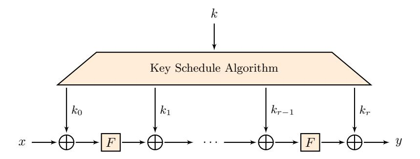
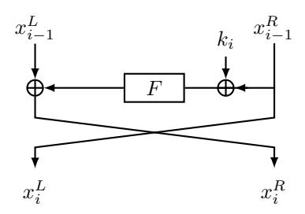

# Improved Interpolation Attacks on Cryptographic Primitives of Low Algebraic Degree

Chaoyun Li and Bart Preneel

imec-COSIC, Dept. Electrical Engineering (ESAT), KU Leuven, Leuven, Belgium chaoyun.li@esat.kuleuven.be, bart.preneel@esat.kuleuven.be

Abstract. Symmetric cryptographic primitives with low multiplicative complexity have been proposed to improve the performance of emerging applications such as secure Multi-Party Computation. However, primitives composed of round functions with low algebraic degree require a careful evaluation to assess their security against algebraic cryptanalysis, and in particular interpolation attacks. This paper proposes new low-memory interpolation attacks on symmetric key primitives of low degree. Moreover, we present generic attacks on block ciphers with a simple key schedule; our attacks require either constant memory or constant data complexity. The improved attack is applied to the block cipher MiMC which aims to minimize the number of multiplications in large finite fields. As a result, we can break MiMC-129/129 with 38 rounds with time and data complexity 2<sup>65</sup>.<sup>5</sup> and 2<sup>60</sup>.<sup>2</sup> respectively and with negligible memory; this attack invalidates one of the security claims of the designers. Our attack indicates that for MiMC-129/129 the full 82 rounds are necessary even with restrictions on the memory available to the attacker. For variants of MiMC with larger keys, we present new attacks with reduced complexity. Our results do not affect the security claims of the full round MiMC.

Keywords: Block cipher, Cryptanalysis, Interpolation attack, MiMC

# 1 Introduction

Symmetric cryptographic primitives have been widely employed to provide confidentiality and authenticity for communicated and stored data [24]. Recently, they find new applications in advanced cryptographic protocols for computing on encrypted data, such as secure Multi-Party Computation (MPC), Zero-Knowledge proofs (ZK) and Fully Homomorphic Encryption (FHE). The adoption of dedicated symmetric key primitives turns out to be vital to improve the efficiency of these protocols. The main design goal is to minimize the multiplicative complexity (MC), i.e., minimize the number of multiplications in a circuit and/or to minimize the multiplicative depth of the circuit. However, traditional block ciphers, stream ciphers and hash functions are typically not designed to minimize these parameters; to the contrary, having high multiplicative depth is seen as an important requirement to achieve strong security.

Many new symmetric primitives have been proposed in the context of MPC, ZK, or FHE schemes [5, 15, 8, 3]. The block cipher LowMC [5] is one of the earliest designs dedicated to FHE and MPC applications. With very small multiplicative size and depth, it outperforms AES-128 in computation and communication complexity for these applications. The stream ciphers Kreyvium [8] and FLIP [20] have been designed to minimize the AND-depth of the circuit. Indeed, they aim to provide practical solutions for efficient homomorphic-ciphertext compression [8, 20]. A new family of stream ciphers Rasta [12] intends to achieve both minimum AND-depth and minimum number of AND gates per encrypted bit.

MiMC, proposed by Albrecht *et al.* in 2016 [3, 4], is dedicated to applications for which the total number of field multiplications in the underlying cryptographic primitive poses the largest performance bottleneck. More specifically, MiMC aims to minimize multiplications in the larger fields  $\mathbb{F}_{2^n}$  and  $\mathbb{F}_p$ . Indeed, MiMC outperforms both AES and LowMC in applications such as MPC [15], Succinct Non-interactive Arguments of Knowledge (SNARKs) [7], and Scalable Transparent ARguments of Knowledge (STARKs) [6]. New variants of MiMC, such as GMiMC [2], have been constructed by inserting the original design into generalized Feistel structures.

However, the security of MiMC is not well understood. Due to the simple algebraic structure and the large number of rounds, the security evaluation of MiMC has been focusing on algebraic attacks such as interpolation attacks and Gröbner basis attacks [3, 1]. In the design paper, the authors first consider the classical interpolation attack. Moreover, the so-called GCD attack has been introduced. With this new technique, new lower bounds on the number of rounds have been derived. However, there is a need for further work to assess the security of round-reduced MiMC and to find tighter lower bounds on the number of rounds.

Our Contributions. This paper presents novel attacks against primitives with low algebraic degree. The first new attack is based on an observation from Sun et al. [27]. It introduces novel interpolation attacks with constant memory complexity: some key-dependent terms of the interpolated polynomial are determined directly, without constructing the complete polynomial. Then we propose an algorithm with constant memory for recovering the second highest order coefficient resulting in an efficient key recovery attack.

The second new attack exploits a simple cyclic key schedule. The master key is  $k_0||k_1||\cdots||k_{\ell-1}$  and the round keys are given by  $k_i=k_{i \bmod \ell}+c_i$ , where the  $c_i$ 's are constants that are chosen independently. For this specific key schedule, we present generic attacks with either constant memory or constant data complexity. Our attacks follow a guess-and-determine strategy. After guessing  $(\ell-1)$  subkeys, we apply state-of-the-art key recovery attacks to the reduced cipher. The advantage of our strategy is that we can keep the data and memory complexity of the whole attack as low as those of the attack on the reduced cipher. The results of our attacks are summarized in Table 1.

As an illustration, we apply the new attacks to the block cipher MiMC. Specifically, we can break 38-round MiMC-129/129 with time complexity  $2^{65.5}$ ,

data complexity  $2^{60.2}$  and negligible memory. Our results refute the claim of the MiMC designers who consider attacks with less than  $2^{64}$  bytes memory and conclude [4, p. 17]: "38 rounds are sufficient to protect MiMC-129/129 against the interpolation, the GCD and the other attacks. Time-memory trade-offs might well be possible, and we leave this as a topic for future research." Our attack simply reduces memory while keeping the time complexity at the same value, hence we show that there is no trade-off. Further, our attack indicates that for MiMC-n/n over  $\mathbb{F}_q$  the number of rounds cannot be smaller than  $\lceil \frac{\log_2(q)}{\log_2(3)} \rceil$  even if there is a restriction on the memory available to the attacker.

For a two-key version of MiMC-n/n, the best attack described by the designers has complexity  $O(3^{3r})$ . The designers further claimed that the bound can be improved by a Meet-In-The-Middle (MITM) attack [4, p. 18], but they offer no details. By employing our generic attack to the concrete design, the complexity can be reduced to  $O(r3^r)$  if  $r \leq \lceil \frac{n}{\log_2(3)} \rceil - 1$  and  $O(r3^{2r-1})$  if  $r \geq \lceil \frac{n}{\log_2(3)} \rceil$ . Our reduced bound is the first tighter bound based on specific attacks.

To the best of our knowledge, our analysis of MiMC is the first third party cryptanalysis of MiMC.

Related Work. MiMC has a very a simple round function  $F_i(x) := (x+k+c_i)^3$ . This design is inspired by the KN cipher of Nyberg and Knudsen [22] and the  $\mathcal{PURE}$  cipher of Jakobsen and Knudsen, which is a simplified variant of the KN cipher [16]. The KN cipher is a prototype cipher which is provably secure against linear and differential attacks. However, Jakobsen and Knudsen showed that the KN cipher is vulnerable to the higher-order differential attacks [16]. The same authors introduced interpolation attacks and applied the new method to assess the security of  $\mathcal{PURE}$  [16, 17].

However, neither the higher-order differential attack [19, 18] nor the classical interpolation attack is applicable to MiMC. In both attacks, one needs to guess the last round key which is exactly the master key of MiMC. Thus, one already reaches the complexity of exhaustive key search. By contrast, our low-memory interpolation attack does not need to guess any round key; it is the first low-memory attack applicable to round-reduced MiMC.

Interpolation attacks are known to be efficient against primitives with operations over a large finite field. To improve the attack on bit-oriented primitives, Dinur et al. [10] proposed the optimized interpolation attack, which breaks the first version of LowMC. The optimized interpolation attacks exploit higher-order differential properties, building on Shimoyama et al. [25]. As pointed out by the designers of MiMC, the degree of any state bits rises quickly when the round function is viewed as a vectorial Boolean function. This makes it impossible to obtain higher-order differentials of MiMC after a few rounds. Hence, the optimized interpolation attacks on MiMC would be infeasible.

Recently, Rechberger *et al.* have introduced difference enumeration techniques to analyze the full LowMC v2 [23]. In order to counter this atack, a new version was proposed called LowMC v3 [5].

**Table 1.** Attacks on r-round key-alternating and Feistel network ciphers with round function of degree d over  $\mathbb{F}_q$ . For  $\ell > 1$ , we cyclically add  $\ell$  independent subkeys in each round.

| Feistel<br>network                                                                                                                                                                                                                                                                                  | Key-alternating                                                                                                                                                                      | Type I   |
|-----------------------------------------------------------------------------------------------------------------------------------------------------------------------------------------------------------------------------------------------------------------------------------------------------|--------------------------------------------------------------------------------------------------------------------------------------------------------------------------------------|----------|
| $q$ $q^{\ell}$ $q^{\ell}$                                                                                                                                                                                                                                                                           | q $q$ $q$ $q$ $q$ $q$ $q$ $q$ $q$ $q$                                                                                                                                                | Key size |
| $O(\lfloor \frac{r}{2}\rfloor^2 d^{\lfloor \frac{r}{2}\rfloor}) \\ O(rd^{r-2})\P \\ O(rd^{r-2})\P \\ O(R_{\text{FN}}(r,\ell)d^{R_{\text{FN}}(r,\ell)-2}q^{\ell-1})\P \ddagger \\ O(\lfloor \frac{R_{\text{FN}}(r,\ell)}{2}\rfloor^2 d^{\lfloor \frac{R_{\text{FN}}(r,\ell)}{2}\rfloor} q^{\ell-1})$ | $O(rd^r) \ O(r^2d^r) \ O(r^2d^r) \ O(rd^r) \sharp \ O(rd^r) \sharp \ O(R_{KA}(r,\ell)d^{R_{KA}(r,\ell)}q^{\ell-1}) \dagger \sharp \ O(R_{KA}(r,\ell)^2d^{R_{KA}(r,\ell)}q^{\ell-1})$ | Time     |
| $O(\lfloor \frac{r}{2} \rfloor d^{\lfloor \frac{r}{2} \rfloor}) \\ O(1) \\ O(1) \\ O(1) \\ O(1) \\ O(\lfloor \frac{R_{\mathbb{P}^{\mathbb{N}}(r,\ell)}}{2} \rfloor d^{\lfloor \frac{R_{\mathbb{P}^{\mathbb{N}}(r,\ell)}}{2} \rfloor})$                                                              | $O(rd^r) \ O(rd^r) \ O(1) \ O(1) \ O(1) \ O(1) \ O(R_{\text{Ka}}(r,\ell)d^{R_{\text{Ka}}(r,\ell)})$                                                                                  | Memory   |
| $d^{r-2} + 1 \\ d^{r-2} + 1 \\ d^{r-2} + 1 \\ d^{R_{\text{FN}}(r,\ell)-2} + 1$                                                                                                                                                                                                                      | $d^r + 1 \ 3 \ d^r + 1 \ d^r + 1 \ d^{R_{Ka}(r,\ell)} + 1$                                                                                                                           | Data     |
| [4]<br>Sect. 3.3<br>Sect. 4.1<br>Sect. 4.2<br>Sect. 4.2                                                                                                                                                                                                                                             | [4]<br>[4]<br>Sect. 3.3<br>Sect. 4.1<br>Sect. 4.2<br>Sect. 4.2                                                                                                                       | Ref.     |

 $\begin{aligned} &\sharp r \leq \lceil \log_d(q-1) \rceil + \ell - 2 \\ &\P r \leq \lceil \log_d(q-1) \rceil + \ell \\ &\dagger R_{\mathsf{KA}}(r,\ell) = (\lfloor \frac{r+1}{\ell} \rfloor - 1)\ell \\ &\ddagger R_{\mathsf{FN}}(r,\ell) = 1 + (\lfloor \frac{r}{\ell} \rfloor - 1)\ell \end{aligned}$ 

We conclude the related work by briefly recalling some recent work on the dedicated low MC stream ciphers Kreyvium and FLIP. Cube attacks [11] and guess-and-determine attacks are common techniques for the cryptanalysis of stream ciphers. Cube attacks based on the division property have been introduced by Todo et al. [28] and further improved by Wang et al. [29]. They yield the current best key recovery attack on round-reduced Kreyvium. A preliminary version of the stream cipher FLIP [20] has been broken by guess-and-determine attacks [13]. This has resulted in more conservative parameters of the design.

The remainder of this paper is organized as follows. In Sect. 2, we introduce iterated ciphers and recall some classical polynomial algorithms. In Sect. 3, new low-memory interpolation attacks are presented. Section 4 proposes attacks on ciphers with simple key schedules. Applications of our attacks to MiMC are provided in Sect. 5. The final section concludes the paper.

# 2 Preliminaries

In this section, alternating ciphers and Feistel ciphers are presented. We also recall some polynomial algorithms, which will be used in the sequel.

Notation. We will use the following notation in the sequel.

- Let F<sup>q</sup> be the finite field with q elements, where q is a prime power.
- The symbol "+" stands for addition in the finite field F<sup>q</sup> . It can also denote integer addition; we trust that the meaning will be clear from the context.
- d is the degree of the round function F(x), where d > 1
- r represents the number of rounds of a block cipher
- κ is the size of key space in bits
- R(d, q) = dlog<sup>d</sup> (q − 1)e
- T/M/D represent time, memory and data complexities of an attack respectively

### 2.1 Basic Constructions for Block Ciphers

An r-round key-alternating (KA) cipher is constructed by iterating a round function r times where each round consists of a key addition and the application of a nonlinear function F. The ciphertext is obtained by adding a final key k<sup>r</sup> to the output of the last round. Let the round function be Fi(x) = F(x + ki). Then the encryption process is given by

$$E_k(x) = (F_{r-1} \circ F_{r-2} \circ \cdots \circ F_0)(x) + k_r,$$
 (1)

where k is the master key, k<sup>i</sup> is the i-th round key derived from k by a key schedule algorithm, and x and Ek(x) are plaintext and ciphertext, respectively. An r-round KA cipher is depicted in Fig. 1.



Fig. 1. A key-alternating cipher

An r-round  $Feistel\ Network\ (FN)\ cipher\ consists$  of the r-round repetition of a round function F and swap:

$$x_i^L = x_{i-1}^R \,, \tag{2}$$

$$x_i^R = F(k_i + x_{i-1}^R) + x_{i-1}^L,$$
(2)

where  $x=x_0^L||x_0^R$  is the plaintext, and the ciphertext is  $x_r^R||x_r^L$  since the swap operation is not applied in the last round. One round of an FN cipher is depicted in Fig. 2.



Fig. 2. One round of a Feistel network

In this paper, we always assume that the round function F is a monic polynomial of degree d over  $\mathbb{F}_q$ , i.e.,

$$F(x) = x^d + \sum_{i=0}^{d-1} a_i x^i,$$
(4)

where d is a positive integer and  $a_i \in \mathbb{F}_q$ .

We associate to the parameters  $q, \kappa, \dot{d}, r$  (cf. supra) a KA cipher KA[ $q, \kappa, d, r$ ]. Similarly, we define the FN cipher FN[ $q, \kappa, d, r$ ]. Here q is the size of only half of the state, i.e., the whole state has size  $q^2$ . It should be pointed that we ignore the details of the polynomials since our attacks work on the generic constructions regardless of the concrete choice of the components.

How to Choose the Polynomial F(x). Since a block cipher must have invertible round functions, F(x) needs to be a permutation polynomial for KA ciphers. While for FN ciphers, there is no such restriction. It is readily seen that F(x) is the only nonlinear component. For instance, F(x) must have high nonlinearity and low differential uniformity to provide resistance against differential and linear attacks [21,9]. For FHE- and MPC-friendly ciphers, an additional requirement is to minimize the number of multiplications in the implementation of F(x). This motivates the choice of F(x) with very low algebraic degree, such as  $x^3$  in MiMC.

The Number of Rounds. Since we focus on ciphers with low degree components, a large number of rounds is needed to protect against algebraic cryptanalysis. The design goal is to achieve the balance between security and performance. Thus we aim to deduce some lower bounds to preclude algebraic attacks.

### 2.2 Polynomial Algorithms

This paper measures the time complexity of polynomial algorithms in terms of field operations. Without loss of generality, we also assume that the underlying finite fields support Fast Fourier Transforms (FFTs). Similarly, the memory complexity is estimated with regard to field elements.

Polynomial Interpolation. Assume that  $f(x) \in \mathbb{F}_q[x]$  has degree at most n, where n is a positive integer. Consider (n+1) distinct points  $\{(x_0, y_0), (x_1, y_1), \dots, (x_n, y_n)\}$  where  $y_i = f(x_i)$  and  $x_i \in \mathbb{F}_q$ . Then f(x) is uniquely determined by the following Lagrange interpolation formula

$$f(x) = \sum_{i=0}^{n} y_i \cdot \prod_{0 \le j \le n, j \ne i} \frac{x - x_j}{x_i - x_j}.$$
 (5)

It has been shown in [26, 14] that the Lagrange interpolation polynomial can be constructed with time and memory complexity  $O(n \log(n))$ .

GCD Algorithms. Given two polynomials of degree n with coefficients from  $\mathbb{F}_q$ , the straightforward Euclidean Algorithm computes the Greatest Common Divisor (GCD) with  $O(n^2)$  field operations. The Fast Euclidean Algorithm computes the same GCD in  $O(M(n)\log(n))$  field operations, where M(n) is the time to multiply two n-degree polynomials [14]. In this paper, we take  $M(n) = O(n\log(n))$ . Hence, the time complexity of the GCD algorithm is  $O(n\log^2(n))$ , which is exactly the estimate used by the MiMC designers [3].

### 3 Low-Memory Interpolation Attacks

This section presents novel interpolation attacks on primitives with low algebraic degree. Compared with classical interpolation attacks, our new attacks have very low memory complexities. Before giving our attacks, we first recall the classical interpolation attacks.

#### 3.1 Interpolation Attacks

Interpolation attacks were introduced by Jakobsen and Knudsen [16, 17]: one considers the (intermediate) ciphertext as a polynomial of plaintext. With sufficiently many plaintext/ciphertext pairs, one can reconstruct this polynomial. Since the polynomial is key-dependent, it is possible to recover some round keys by employing a guess-and-determine strategy.

Assume that a block cipher E has r rounds. First, one finds an upper bound N on the degree of the intermediate ciphertext after (r-1) rounds, denoted with  $y^{r-1}$ . Next one guesses the last round key and obtains the corresponding value of  $y^{r-1}$ . With (N+1) distinct plaintext/ciphertext pairs, one can construct the polynomial representation of  $y^{r-1}$  by Lagrange interpolation. Afterwards, the key guess can be confirmed with an additional plaintext/ciphertext pair. Specifically, one decrypts the last round and evaluates the polynomial in the corresponding plaintext. Then the key guess is considered as a valid key candidate if the decrypted and evaluated values match. Otherwise, the key guess is eliminated and we repeat the process until the correct key is found.

Let L denote the number of all possible last round keys of the cipher E. Then the above attack has time complexity  $O(N \log(N) \cdot L)$ , memory complexity O(N) and data complexity N+2.

The **meet-in-the-middle (MITM)** approach has also been introduced in [16]. One considers h(x) and g(y) as two polynomials describing the same intermediate state, where x and y denote the plaintext and ciphertext respectively, hence h(x) = g(y). If one substitutes the values of x and y, this yields a linear equation in the unknown coefficients of h and g. By collecting a sufficient number of plaintext/ciphertext pairs, one can solve the linear system to recover these coefficients. Then one can mount a key recovery attack with a similar guess-and-determine strategy as in the original interpolation attack. The only difference is that here we test the key guess by checking if the plaintext/ciphertext pair satisfies the equation h(x) = g(y).

If both the encryption and decryption round functions have low degree, the MITM attack can cryptanalyze more rounds than the original interpolation attack. Let  $\deg(h) = N_1$  and  $\deg(g) = N_2$ . Then one needs to establish  $O(N_1 + N_2 + 2)$  linear equations with  $O(N_1 + N_2 + 2)$  data and solve these for each key guess. The time and memory complexities are  $O((N_1 + N_2 + 2)^2 \cdot L)$  and  $O((N_1 + N_2 + 2)^3)$  respectively, where L is the number of last round keys.

We briefly discuss the impact of the MITM attack on different constructions. For any permutation polynomial  $g(x) \in \mathbb{F}_q[x]$  with  $\deg(g) > 1$ , let  $g^{-1}(x)$  be the (compositional) inverse of g(x), then

$$g^{-1}(g(x)) \equiv x \pmod{x^q - x}$$
.

Hence we have  $\deg(g) \cdot \deg(g^{-1}) \geq q$ . Note that we always assume that  $\deg(g)$  is small, so  $\deg(g^{-1})$  can be quite large, i.e., close to q. Thus, for  $\mathrm{KA}[q,\kappa,d,r]$ , there is no benefit to consider the MITM attacks. However, for Feistel networks, we need to take the MITM attack into account since the inverse of the round function has the same degree as the original one.

### 3.2 Leading Terms of the Output

We present some results on the leading terms, i.e., terms with the highest and the second highest degrees, of the output of KA and FN ciphers. These results will be used in the sequel.

**Proposition 1.** Let  $f(x) = x^d + \sum_{i=0}^{d-1} a_i x^i$  be the round function of  $KA[q, \kappa, d, r]$ , where d is a positive integer with d > 1 and  $a_i \in \mathbb{F}_q$ . If  $r \leq R(d,q) - 1$ , then for  $KA[q, \kappa, d, r]$ , we have that (i) the algebraic degree of the output is  $d^r$ , and (ii) the leading terms of the output are  $x^{d^r} + (d_p^r \cdot k_0 + d_p^{r-1} \cdot a_{d-1})x^{d^r-1}$ , where  $d \equiv d_p \mod p$ ,  $0 \leq d_p \leq p-1$  and p is the characteristic of  $\mathbb{F}_q$ .

*Proof.* The claim (i) is a direct corollary of (ii), so it suffices to prove (ii). We will show the result by induction on r. If r = 1, then the output is  $f(x+k_0)+k_1$ . By the binomial theorem, the output can be written as

$$x^{d} + d \cdot k_{0}x^{d-1} + g_{1}(x) + a_{d-1}x^{d-1} + g_{2}(x)$$
,

where  $deg(g_1 + g_2) \leq d - 2$ . Hence the leading terms are

$$x^d + (d_p \cdot k_0 + a_{d-1})x^{d-1}$$
.

Assume that the claim holds for t-1, where  $1 \le t-1 \le R(d,q)-2$ . Then the leading terms of the output of round t-1 are

$$x^{d^{t-1}} + (d_p^{t-1} \cdot k_0 + d_p^{t-2} \cdot a_{d-1}) x^{d^{t-1}-1}$$
.

Again, by the binomial theorem, the leading terms of the round t output is

$$\left(x^{d^{t-1}}\right)^d + d \cdot \left(x^{d^{t-1}}\right)^{d-1} (d_p^{t-1} \cdot k_0 + d_p^{t-2} \cdot a_{d-1}) x^{d^{t-1}-1}$$

$$= x^{d^t} + \left(d_p^t \cdot k_0 + d_p^{t-1} \cdot a_{d-1}\right) x^{d^t-1} ,$$

which implies that the claim is true for t. Therefore, the claim holds for any  $r \leq R(d,q) - 1$ .

For  $\mathrm{FN}[q,\kappa,d,r]$ , we consider plaintexts of the form x||C, where C is a constant in  $\mathbb{F}_q$ . As shown in the following proposition, we can achieve two more rounds compared with KA ciphers.

**Proposition 2.** Let  $f(x) = x^d + \sum_{i=0}^{d-1} a_i x^i$  be the round function of  $FN[q, \kappa, d, r]$ , where d is a positive integer with d > 1 and  $a_i \in \mathbb{F}_q$ . Consider plaintexts of the form x||C, where C is a constant in  $\mathbb{F}_q$ . If  $3 \le r \le R(d,q) + 1$ , then the leading terms of the right part of the output are  $x^{d^{r-2}} + (d_p^{r-2} \cdot (k_1 + f(C + k_0)) + d_p^{r-3} \cdot a_{d-1})x^{d^{r-2}-1}$ , where  $d \equiv d_p \mod p$ ,  $0 \le d_p \le p-1$  and p is the characteristic of  $\mathbb{F}_q$ .

*Proof.* The output of the first round is  $C||(x+f(C+k_0))$ . This leads to the output  $(x+f(C+k_0))||(f(x+k_1+f(C+k_0))+C)$  after the second round and output  $(f(x+k_1+f(C+k_0))+C)||(x+f(C+k_0)+f(f(x+k_1+f(C+k_0))+C+k_2))$  after the third round. Then similarly to Proposition 1, one can prove that the leading terms of the right part of the output are

$$x^{d^{r-2}} + (d_p^{r-2} \cdot (k_1 + f(C + k_0)) + d_p^{r-3} \cdot a_{d-1}) x^{d^{r-2} - 1}$$
 when  $3 \le r \le R(d, q) + 1$ .

Remark 1. Note that the special case p=2, d odd and P=x||C or C||x has been described by Sun et al. [27].

#### 3.3 New Attacks

One of the bottlenecks of classical interpolation attacks is that the attacker always needs to store the whole interpolated polynomial. Thus, the memory complexity can be very high if the degree of the polynomial is high. Based on the result in Sect. 3.2, for certain KA and FN ciphers, the key can be deduced from the second highest term of the interpolated polynomial. Hence, to recover the key, we only need to store the coefficient of the specific term rather than the whole polynomial. In this way, we can present our new interpolation attack with constant memory complexity.

**Interpolating One Coefficient.** Now we present the algorithm for recovering the coefficient of the second highest term of the interpolated polynomial.

Assume that  $g(x) \in \mathbb{F}_q[x]$  has degree at most  $\Delta$ . Also assume that we know  $(\Delta+1)$  points  $\{(x_0,y_0),(x_1,y_1),\cdots,(x_\Delta,y_\Delta)\}$ , where  $x_i=\alpha^i$  for some primitive element  $\alpha \in \mathbb{F}_q$  and  $y_i=g(x_i)$ . Then by the Lagrange interpolation formula, g(x) is uniquely determined by the formula

$$g(x) = \sum_{i=0}^{\Delta} g(\alpha^i) \cdot \prod_{0 \le j \le \Delta, j \ne i} \frac{x - \alpha^j}{\alpha^i - \alpha^j}.$$

Let  $g(x) = \sum_{i=0}^{\Delta} a_i x^i$ , then the coefficient of the second highest term is equal to

$$a_{\Delta-1} = \sum_{i=0}^{\Delta} \frac{-g(\alpha^i) \cdot \sum_{0 \le j \le \Delta, j \ne i} \alpha^j}{\prod\limits_{0 \le j \le \Delta, j \ne i} (\alpha^i - \alpha^j)} = \sum_{i=0}^{\Delta} g(\alpha^i) \frac{\beta_i}{\gamma_i},$$
 (6)

where  $\gamma_i = \prod_{0 \le j \le \Delta, j \ne i} (\alpha^i - \alpha^j)$  and  $\beta_i = -\sum_{0 \le j \le \Delta, j \ne i} \alpha^j$ . Note that

$$\gamma_{i+1} = \gamma_i \cdot \alpha^{\Delta} \cdot \frac{\alpha^i - \alpha^{-1}}{\alpha^i - \alpha^{\Delta}} \text{ and } \beta_i = \alpha^i - \sum_{0 \le j \le \Delta} \alpha^j.$$

By combining these observations, we present the procedure for recovering only the coefficient of the second highest term in Algorithm 1.

Proposition 3 describes the complexity of Algorithm 1.

#### Algorithm 1 Recover the coefficient of the second highest term

**Input:** The algebraic degree  $\Delta$  of the polynomial, a primitive element  $\alpha \in \mathbb{F}_q$ , and the polynomial evaluation oracle  $\mathcal{O}$ 

Output: The coefficient t of the second highest term

```
1: t \leftarrow 0

2: s \leftarrow -\sum_{j=0}^{\Delta} \alpha^{j}

3: a \leftarrow \prod_{j=1}^{\Delta} (1 - \alpha^{j})

4: b \leftarrow 1

5: for i from 0 to \Delta do

6: t \leftarrow t + \mathcal{O}(b) \cdot \frac{s+b}{a}

7: if i < \Delta then

8: a \leftarrow a \cdot \alpha^{\Delta} \cdot \frac{b-\alpha^{-1}}{b-\alpha^{\Delta}}

9: b \leftarrow b \cdot \alpha

10: end if

11: end for

12: return t
```

**Proposition 3.** Algorithm 1 has time complexity  $O(\Delta \log(\Delta))$  and memory complexity O(1).

*Proof.* The time complexity of Algorithm 1 is exactly the time complexity of interpolating one coefficient in Lagrange interpolation, which is shown to be  $O(\Delta \log(\Delta))$  in [26]. Due to the simplicity of the algorithm, one can immediately obtain that the memory complexity is O(1).

New Attacks on KA. Assume that  $d_p \neq 0$  and  $r \leq R(d,q) - 1$ . Then the attack on KA $[q, \kappa, d, r]$  is described below.

- 1. Let  $\Delta=d^r$ . Choose a primitive element  $\alpha\in\mathbb{F}_q$ , and the encryption oracle  $\mathcal E$  as input to Algorithm 1.
- 2. Run Algorithm 1. Let t be the output.
- 3. By Proposition 1, we have  $t = d_p^r \cdot k_0 + d_p^{r-1} \cdot a_{d-1}$ . Therefore,  $k_0$  can be determined from

$$k_0 = \frac{t - d_p^{r-1} \cdot a_{d-1}}{d_p^r} \,.$$

In the above attack, we need to query the encryption oracle  $d^r + 1$  times. The time and memory complexity are dominated by Algorithm 1, which is  $O(rd^r)$  and O(1) respectively according to Proposition 3. In summary, the time/memory/data complexities of the attack on KA[q,  $\kappa$ , d, r] are as follows:

$$T = O(rd^r), M = O(1), D = d^r + 1.$$
 (7)

New Attacks on FN. Assume that  $d_p \neq 0$  and  $3 \leq r \leq R(d,q) + 1$ . For  $r \leq R(d,q) + 1$ , the attack on  $FN[q,\kappa,d,r]$  is shown below:

- 1. Let  $\Delta=d^{r-2}$  and  $C_0$  be a constant in  $\mathbb{F}_q$  . Take a primitive element  $\alpha\in$  $\mathbb{F}_q$ , and the FN encryption oracle  $\mathcal{E}$  as input to Algorithm 1. Note that the input of  $\mathcal{E}$  is of the form  $\alpha^i || C_0$ .

- 2. Run Algorithm 1. Let t be the output. 3. By Proposition 1, we have  $t = d_p^{r-2} \cdot (k_1 + f(C + k_0)) + d_p^{r-3} \cdot a_{d-1}$ . 4. Pick two other distinct constants  $C_1$  and  $C_2$ . Repeat Steps 1-3, assume that the results are  $t_1$  and  $t_2$  respectively. Now we have the system of equations with unknowns  $k_0$  and  $k_1$ :

$$\begin{cases} t_0 = d_p^{r-2} \cdot (k_1 + f(C_0 + k_0)) + d_p^{r-3} \cdot a_{d-1}, \\ t_1 = d_p^{r-2} \cdot (k_1 + f(C_1 + k_0)) + d_p^{r-3} \cdot a_{d-1}, \\ t_2 = d_p^{r-2} \cdot (k_1 + f(C_2 + k_0)) + d_p^{r-3} \cdot a_{d-1}. \end{cases}$$
(8)

5. From Eqn. (8), we obtain

$$f(C_i + k_0) - f(C_j + k_0) - \frac{t_i - t_j}{d_p^{r-2}} = 0,$$

where  $0 \le i \le j \le 2$ . Then  $k_0$  can be determined by computing the GCD of the three polynomials of  $k_0$ . Finally, one can obtain

$$k_1 = \frac{t_0 - d_p^{r-3} \cdot a_{d-1}}{d_p^{r-2}} - f(C_0 + k_0).$$

Note that f(x) is assumed to have low degree in this paper. Thus, the complexity of Step 5 is negligible. Then similarly to the analysis of attacks on KA ciphers, the complexity of the above attack on  $FN[q, \kappa, d, r]$  is:

$$T = O(rd^{r-2}), M = O(1), D = d^{r-2} + 1.$$

**Discussion.** It is worth pointing out that our new attacks are chosen-plaintext attacks since we need to choose plaintexts of a specific form in Algorithm 1. As classical interpolation attacks are known-plaintext attacks, the low-memory interpolation attacks requires a stronger attack model.

Note that Sun et al. in [27] also present a low-memory higher-order integral attack which applies to both KA and FN ciphers. However, their attack needs to know the values of the interpolated polynomials over all elements in  $\mathbb{F}_q$ . That is, their attack has data complexity q. Under our assumption, we always have  $d^r + 1 \leq q$ . Hence, our attack has smaller data complexity than the higher-order integral attack in [27].

An interesting research direction is to break the barrier of the assumption, i.e., determine some key-dependent terms even with r > R(d,q) + 1.

### Attacks on Block Ciphers with Simple Key Schedules

This section proposes attacks on block ciphers with simple key schedules. The first type of attacks are direction applications of the low-memory attack proposed in Sect. 3. The second class of attacks are based on the same strategy and are divided into two groups in terms of memory and data complexities.

We consider ciphers with key space size κ = q ` , i.e., KA[q, q` , d, r] and FN[q, q` , d, r], where 2 ≤ ` ≤ r+1. In this section, we assume a simple key schedule. The master key is k0||k1|| · · · ||k`−<sup>1</sup> and the i-th round key is k<sup>i</sup> mod ` + c<sup>i</sup> , i.e., the i-th round function is

$$F_i(x) := F(x + k_{i \mod \ell} + c_i), \ 0 \le i \le r,$$

where F has the form as in (4) and the c<sup>i</sup> 's are independently chosen constants.

# 4.1 Iterative Low-Memory Interpolation Attacks

This section presents attacks on block ciphers with simple key schedules by iteratively applying the low-memory attack proposed in Sect. 3.

Our attack is based on the observation that the low-memory interpolation attack is independent of the key schedule. Hence, one can recover the first subkey k<sup>0</sup> by the low-memory interpolation attack and then substitute the obtained subkey to peel off the first round. By repeating the process, the remaining subkeys can be determined, as illustrated in Algorithm 2. An interesting property of the attack is that the complexity of the whole attack is dominated by that of recovering the first subkey. Actually, the complexities of recovering the i-th subkey k<sup>i</sup> are given by those of the low-memory interpolation attack on the (r − i)-round reduced cipher. Thus, by the analysis in Sect. 3.3, the i-th subkey k<sup>i</sup> can be determined with complexities:

$$T_i = O(rd^{r-i}), M_i = O(1), D_i = d^{r-i} + 1, i = 0, 1, \dots, \ell - 1.$$

Therefore, the total complexities of the full attack is dominated by those of recovering the subkey k0, i.e. ,

$$T = O(rd^r), M = O(1), D = d^r + 1.$$

Algorithm 2 Attacks on KA[q, q` , d, r] with r ≤ R(d, q) − 1 and FN[q, q` , d, r] with r ≤ R(d, q) + 1

- 1. Recover k<sup>0</sup> by the low-memory interpolation attack in Sect. 3.3.
- 2. Substitute k<sup>0</sup> in the cipher. Then repeat Step 1 to recover k1.
- 3. Repeat Step 2 until the master key k0||k1|| · · · ||k`−<sup>1</sup> is obtained.

Now we elaborate the above attack for the cipher KA[q, q<sup>2</sup> , d, r] with a simple key schedule. Assume that d<sup>p</sup> 6= 0 and r ≤ R(d, q) − 1. Then the attack is described below.

1. Let ∆ = d r . Choose a primitive element α ∈ F<sup>q</sup> , and the encryption oracle E as input to Algorithm 1.

- 2. Run Algorithm 1. Let t be the output.
- 3. By Proposition 1, we have  $t=d_p^r\cdot k_0+d_p^{r-1}\cdot a_{d-1}$ . Therefore,  $k_0$  can be determined from

$$k_0 = \frac{t - d_p^{r-1} \cdot a_{d-1}}{d_p^r} \,.$$

4. Substitute  $k_0$  in the cipher. Then repeat Steps 1-3 with the minor change that  $\Delta = d^{r-1}$ . Finally,  $k_1$  can be recovered.

Similar to the discussion in Sect. 3.3, it is readily seen that the time/memory/data complexities of the attack on  $KA[q, q^2, d, r]$  are as follows:

$$T = O(rd^r), M = O(1), D = d^r + 1.$$

The following proposition summarize the results in this section.

**Proposition 4.** Assume that  $r \leq R(d,q)-1$  for  $KA[q,q^{\ell},d,r]$  and  $r \leq R(d,q)+1$  for  $FN[q,q^{\ell},d,r]$ . Then there exists an attack on  $KA[q,q^{\ell},d,r]$  with time complexity  $O(rd^r)$ , memory complexity O(1), and data complexity  $d^r+1$  while there exists an attack on  $FN[q,q^{\ell},d,r]$ , with time complexity  $O(rd^{r-2})$ , memory complexity O(1), and data complexity  $d^{r-2}+1$ .

### 4.2 Attacks based on Guess-and-Determine Strategies

This section explores the guess-and-determine strategies in the analysis of block ciphers with simple key schedules. We propose a generic attack and then implement the attack with existing techniques.

Based on a guess-and-determine strategy, a generic attack on  $\mathrm{KA}[q,q^\ell,d,r]$  and  $\mathrm{FN}[q,q^\ell,d,r]$  is presented in Algorithm 3. The main idea is that after guessing  $(\ell-1)$  subkeys  $k_0,k_1,\cdots,k_{\ell-2}$ , we can skip the first  $(\ell-1)$  rounds. If the last round key is not  $k_{\ell-1}$ , by decrypting with the guessed subkeys we can also skip several final rounds until we hit  $k_{\ell-1}$ . As a result, we only need to consider  $R_{\mathtt{KA}}(r,\ell)$  and  $R_{\mathtt{FN}}(r,\ell)$  rounds for  $\mathrm{KA}[q,q^\ell,d,r]$  and  $\mathrm{FN}[q,q^\ell,d,r]$  respectively, where

$$R_{\mathtt{KA}}(r,\ell) = \left( \left\lfloor \frac{r+1}{\ell} \right\rfloor - 1 \right) \ell \text{ and } R_{\mathtt{FN}}(r,\ell) = 1 + \left( \left\lfloor \frac{r}{\ell} \right\rfloor - 1 \right) \ell.$$
 (9)

Moreover, the reduced cipher can be regarded as a reduced-round cipher by replacing some key additions with constant additions. This fact allows us to extend the attack on the single key version to large key versions. The above observation has been summarized in the following.

**Proposition 5.** Assume that there is an attack on KA[q,q,d,r] or FN[q,q,d,r] with time complexity T(r), memory complexity M(r), and data complexity D(r). Then there exists an attack on  $KA[q,q^{\ell},d,r]$  or  $FN[q,q^{\ell},d,r]$  with time complexity  $T(R_{\lambda}(r,\ell))q^{\ell-1}$ , memory complexity  $M(R_{\lambda}(r,\ell))$ , and data complexity  $D(R_{\lambda}(r,\ell))$ , where  $\lambda \in \{KA,FN\}$ .

We will implement Algorithm 3 with low-memory interpolation and GCD attacks.

# **Algorithm 3** Generic attacks on $KA[q, q^{\ell}, d, r]$ and $FN[q, q^{\ell}, d, r]$

- 1. Guess subkeys  $k_0, k_1, \cdots, k_{\ell-2}$ .
- 2. Mount a key recovery attack on the reduced cipher with  $k_{\ell-1}$  the only unknown key. If it fails to recover the remaining  $k_{\ell-1}$ , then go back to Step 1. Otherwise, one obtains a candidate  $k_{\ell-1}^*$ .
- 3. Test the candidate master key  $k_0||k_1||\cdots||k_{\ell-1}^*$  with an additional random plaintext/ciphertext pair. If the test is passed, then  $k_0||k_1||\cdots||k_{\ell-1}^*$  is the right key. Otherwise, repeat Steps 1-3 until right keys are found.

**Low-Memory Interpolation Attacks** Note that the attack in Sect. 3.3 can be directly applied to the reduced ciphers of  $KA[q, q^{\ell}, d, r]$  and  $FN[q, q^{\ell}, d, r]$ . Then by Proposition 5, we have the following result.

**Proposition 6.** Assume that  $r \leq R(d,q) + \ell - 2$  for  $KA[q,q^{\ell},d,r]$  and  $r \leq R(d,q) + \ell$  for  $FN[q,q^{\ell},d,r]$ . There exists an attack on  $KA[q,q^{\ell},d,r]$  with time complexity  $O(R_{KA}(r,\ell)d^{R_{KA}(r,\ell)}q^{\ell-1})$ , memory complexity O(1), and data complexity  $d^{R_{KA}(r,\ell)} + 1$  and there exists an attack on  $FN[q,q^{\ell},d,r]$ , with time complexity  $O(R_{FN}(r,\ell)d^{R_{FN}(r,\ell)-2}q^{\ell-1})$ , memory complexity O(1), and data complexity  $d^{R_{FN}(r,\ell)-2} + 1$ .

To illustrate the main procedure, we present an attack on KA[ $q, q^2, d, r$ ]. Assume that  $d_p \neq 0, r \leq R(d, q)$  and  $r \equiv 0 \pmod{2}$ . Then the attack is given below.

- 1. Guess subkey  $k_0$ .
- 2. Let  $\Delta = d^{r-2}$ . Choose a primitive element  $\alpha \in \mathbb{F}_q$ , and the encryption oracle  $\mathcal{E}$  as input to Algorithm 1.
- 3. In Line 6 of Algorithm 1, the oracle returns  $F^{-1}(\mathcal{E}(F^{-1}(b)+k_0+c_0)+k_0+c_r)$ , where  $F^{-1}$  is the compositional inverse of F. Thus, Algorithm 1 returns the coefficient of the second highest term of the polynomial representing the last (r-2) rounds of the cipher. Run Algorithm 1.
- 4. Let t be the output of Algorithm 1. By Proposition 1, we have  $t=d_p^{r-2}\cdot k_1+d_p^{r-3}\cdot a_{d-1}$ , where the notation is from Proposition 1. Therefore,  $k_1^*$  can be determined from  $k_1^*=(t-d_p^{r-3}\cdot a_{d-1})/d_p^{r-2}$ .
- 5. Test the candidate master key  $k_0||k_1^*$ . If the test is passed, then  $k_0||k_1^*$  is the right key. Otherwise, repeat Steps 1-5 until the right keys are found.

Step 1 needs q guesses in the worst case; for each guess we execute Steps 2-4, that correspond to a low-memory interpolation attack on an (r-2)-round reduced cipher. From Eqn. (7) the complexity of the above attack is given by

$$T = O(rd^{r-2}q), M = O(1), D = d^{r-2} + 1.$$

GCD Attacks The GCD attack on MiMC was introduced by Albrecht *et al.* [3]: it deduces the key by computing the greatest common divisor of polynomials from known plaintext/ciphertext pairs. The GCD attack enjoys very low data

complexity, which makes it appropriate in a low-data scenario. It is straightforward to plug the attack into the framework of Algorithm 3. We will present GCD attacks on KA[q,  $q^{\ell}$ , d, r] and FN[q,  $q^{\ell}$ , d, r].

Denote by E(x) the encryption of plaintext x under the key  $k_0||k_1||\cdots||k_{\ell-1}$ . The GCD attack on KA $[q, q^{\ell}, d, r]$  proceeds as follows:

- 1. Guess subkey  $k_0, k_1, \dots, k_{\ell-2}$ .
- 2. Denote by  $E(k_{\ell-1}, x)$  the output of the  $R_{\mathtt{KA}}(r, \ell)$ -round reduced cipher with input x. For any two different plaintext/ciphertext pairs, one can obtain the corresponding input/output pairs  $(x_i, y_i)$  for i = 0, 1.
- 3. Compute the univariate polynomial  $E(K, x_i) y_i$  explicitly for i = 0, 1. It is clear that these polynomials share  $K k_{\ell-1}$  as a factor if the key guess is correct. Indeed, in this case with high probability  $\gcd(E(K, x_0) y_0, E(K, x_1) y_1) = K k_{\ell-1}$ .
- 4. Compute  $gcd(E(K, x_0) y_0, E(K, x_1) y_1)$ . If the result is 1 or has only irreducible factors with degree larger than two, then the key guess is wrong and we go back to Step 1. Otherwise, the constant part of the linear factors of the result are candidates for  $k_{\ell-1}$ , denoted by  $k_{\ell-1}^*$ .
- 5. Test the candidate master key  $k_0||k_1||\cdots||k_{\ell-1}^*$ . If the test is passed, then  $k_0||k_1||\cdots||k_{\ell-1}^*$  is the right key. Otherwise, repeat Steps 1-6 until the right keys are found.

As we show in Appendix A, Step 3 can be implemented with both time and memory complexities  $O(R_{\mathtt{KA}}(r,\ell)d^{R_{\mathtt{KA}}(r,\ell)})$ . Note that both of the polynomials  $E(K,x_0)-y_0$  and  $E(K,x_1)-y_1$  have degree  $d^{R_{\mathtt{KA}}(r,\ell)}$ . Then, by the estimation in Sect. 2.2, the complexity of computing greatest common divisors in Step 4 is  $O(R_{\mathtt{KA}}(r,\ell)^2d^{R_{\mathtt{KA}}(r,\ell)})$ . Thus, the time complexity for each subkey guess is dominated by the computation of the greatest common divisor, i.e.,  $O(R_{\mathtt{KA}}(r,\ell)^2d^{R_{\mathtt{KA}}(r,\ell)})$ . Therefore, the total time complexity of the above attack is  $O(R_{\mathtt{KA}}(r,\ell)^2d^{R_{\mathtt{KA}}(r,\ell)}q^{\ell-1})$ . Moreover, the memory consumption is around  $O(R_{\mathtt{KA}}(r,\ell)d^{R_{\mathtt{KA}}(r,\ell)})$  since Step 3 dominates the memory complexity. Notably, we only need three plaintext/ciphertext pairs. To sum up, the time/memory/data complexities of the above attack are given by

$$T = O(R_{\mathtt{KA}}(r,\ell)^2 d^{R_{\mathtt{KA}}(r,\ell)} q^{\ell-1}), M = O(R_{\mathtt{KA}}(r,\ell) d^{R_{\mathtt{KA}}(r,\ell)}), D = 3.$$

With the MITM approach, one can mount an attack on  $\operatorname{FN}[q,q^\ell,d,r]$  with similar complexity but double the number of rounds attainable. Now we sketch the main idea by the attack on  $\operatorname{FN}[q,q,d,r]$ . First, we construct two polynomials G(K,x) and H(K,y) representing the state after round  $\lceil r/2 \rceil$  as a polynomial in the unknown key and the plaintext or ciphertext respectively. Then the key can be deduced by computing the greatest common divisor of two polynomials  $G(K,x_0)-H(K,y_0)$  and  $G(K,x_1)-H(K,y_1)$  whose degrees are upper bounded by  $d^{\lfloor r/2 \rfloor}$ . Hence, the time/memory/data complexities of the above attack are given by

$$T = O(\lfloor r/2 \rfloor^2 d^{\lfloor r/2 \rfloor}), M = O(\lfloor r/2 \rfloor d^{\lfloor r/2 \rfloor}), D = 3 \,.$$

We can generalize the above attack to  $\operatorname{FN}[q,q^\ell,d,r]$  with slight modifications. Note that we only need to consider the  $R_{\operatorname{FN}}(r,\ell)$ -round cipher after the subkey guessing. Next, we compute two polynomials G(K,x) and H(K,y) representing the state after round  $\lceil R_{\operatorname{FN}}(r,\ell)/2 \rceil$  of the reduced cipher as a polynomial in the unknown  $k_{\ell-1}$  and the input or output of the reduced cipher respectively. Then consider the two polynomials  $G(K,x_0)-H(K,y_0)$  and  $G(K,x_1)-H(K,y_1)$ . The remaining steps of the GCD computation and key filtering are the same as in the case  $\operatorname{KA}[q,q^\ell,d,r]$ . Hence, we omit the details. Similar to the attack on  $\operatorname{FN}[q,q,d,r]$ , we have that the complexity of the attack on  $\operatorname{FN}[q,q^\ell,d,r]$  equals

$$T = O(\lfloor R_{\mathtt{FN}}(r,\ell)/2 \rfloor^2 d^{\lfloor R_{\mathtt{FN}}(r,\ell)/2 \rfloor} q^{\ell-1}), \\ M = O(\lfloor R_{\mathtt{FN}}(r,\ell)/2 \rfloor d^{\lfloor R_{\mathtt{FN}}(r,\ell)/2 \rfloor}), \\ D = 3 \,.$$

In this way, with similar complexities one can double the number of rounds attainable compared with the GCD attack on  $KA[q, q^{\ell}, d, r]$ .

We summarize the discussion in the following result.

**Proposition 7.** There exists an attack on  $KA[q, q^{\ell}, d, r]$  with time complexity  $O(R_{KA}(r, \ell)^2 d^{R_{KA}(r, \ell)} q^{\ell-1})$ , memory complexity  $O(R_{KA}(r, \ell) d^{R_{KA}(r, \ell)})$ , and data complexity 3, and there exists an attack on for  $FN[q, q^{\ell}, d, r]$  with time complexity  $O(\lfloor R_{FN}(r, \ell)/2 \rfloor^2 d^{\lfloor R_{FN}(r, \ell)/2 \rfloor} q^{\ell-1})$ , memory complexity  $O(\lfloor R_{FN}(r, \ell)/2 \rfloor d^{\lfloor R_{FN}(r, \ell)/2 \rfloor})$  and data complexity 3.

Remark 2. GCD attacks enjoy very low data complexity while they suffer large memory complexity since one needs to compute and store the two polynomials. Thus, the low-memory interpolation attack and low data GCD attacks are not superior to each other.

# 5 Applications to MiMC

In this section, we apply our new techniques to the block cipher MiMC. Using our new techniques, we can break a variant of MiMC with memory restriction on attacks and lower the attack complexity of the larger key versions.

#### 5.1 Description of MiMC

MiMC is a family of block cipher designs operating entirely over the finite field  $\mathbb{F}_q$ ; they can be seen as generalizations of the KN-cipher [22] and  $\mathcal{PURE}$  [16]. The design aims to achieve an efficient implementation over a field  $\mathbb{F}_q$  — especially the large prime field  $\mathbb{F}_p$  — by minimizing computationally expensive field operations, e.g. multiplications or exponentiations.

 $\mathit{MiMC-n/n}$ . Let q be a prime or power of 2 such that  $\gcd(3,q-1)=1$ . For a message  $x\in\mathbb{F}_q$  and a secret key  $k\in\mathbb{F}_q$ , the encryption process of MiMC-n/n is constructed by iterating a round function r times. At round i, the round function is defined as

$$F_i(x) := (x + k + c_i)^3,$$

where the c<sup>i</sup> 's are random constants in F<sup>q</sup> and c<sup>0</sup> = c<sup>r</sup> = 0. Then the encryption process is given by

$$E_k(x) = (F_{r-1} \circ F_{r-2} \circ \cdots \circ F_0)(x) + k.$$

The number of rounds is given by r = d log<sup>2</sup> (q) log<sup>2</sup> (3) e.

MiMC-2n/n(Feistel). By employing the same permutation polynomial in FN, one can process larger blocks and have the same circuit for encryption and decryption. The round function of MiMC-2n/n is defined by

$$x_i^L || x_i^R \leftarrow x_{i-1}^R + (x_{i-1}^L + k + c_i)^3 || x_{i-1}^L ,$$

where the c<sup>i</sup> 's are random constants in F<sup>q</sup> and c<sup>0</sup> = c<sup>r</sup> = 0. The swap operation is not applied in the last round. The number of rounds is given by r <sup>0</sup> = 2 · d log<sup>2</sup> (q) log<sup>2</sup> (3) e.

# 5.2 Attacks on a Variant with Low Memory Complexity

This section presents an attack on an instantiation of MiMC where the memory available to the attacker is limited. Our results indicate that the number of rounds proposed by the designers is too optimistic.

In [3], the designers consider the case in which there is a restriction on the memory available to the attacker. In this setting, many memory-consuming attacks will be infeasible. According to the designers, this enables the reduction of the number of rounds to gain better performance. To be specific, the authors claim that this restriction has a great impact on interpolation attacks and GCD attacks. Indeed, the problem arises if the attacker is not able to store all the coefficients of the interpolation polynomial and similar for the GCD attack.

For MiMC-129/129, the number of rounds is 82 = l 129 log<sup>2</sup> (3)m in the original design. A much more aggressive version with only 38 rounds is proposed under the assumption that the attacker is restricted to a memory of 2<sup>64</sup> bytes.

The Attack. We note that the 38-round MiMC-129/129 fits into the model of KA[2<sup>129</sup> , 2 129 , 3, 38]. Additionally, we have d<sup>p</sup> = 1 in this case. Then we can adapt the attack on KA[q, κ, d, r] to this concrete cipher. The attack is given below.

- 1. Let ∆ = 3<sup>38</sup>. Choose a primitive element α ∈ F<sup>2</sup> <sup>129</sup> , and the encryption oracle 38-round MiMC-129/129 as input to Algorithm 1.
- 2. Run Algorithm 1. Let t be the output.
- 3. By Proposition 1, we have k = t since c<sup>0</sup> = 0, d<sup>p</sup> = 1 and a<sup>d</sup>−<sup>1</sup> = 0.

Complexity Analysis. In this attack, we need to query the encryption oracle 3 <sup>38</sup> + 1 times, i.e, around 2<sup>60</sup>.<sup>23</sup>. Actually, the time complexity is dominated by the running time of Algorithm 1, which is around 38 · (3<sup>38</sup> + 1), i.e., 2<sup>65</sup>.<sup>48</sup>. The data complexity is also  $3^{38} + 1$ , i.e, around  $2^{60.23}$ . Finally, as we can see, the memory complexity is negligible.

Our low-memory interpolation attacks have the same time complexity as classical interpolation attack with negligible memory complexity. This implies that the number of round **cannot be smaller than**  $\left\lceil \frac{\log_2(q)}{\log_2(3)} \right\rceil$  even if there is a restriction on the memory available to the attacker.

Discussion. It is worth pointing out that neither of the classical interpolation attacks nor higher-order differential attacks work on  $\operatorname{MiMC-}n/n$ . In both attacks, one needs to guess the last round key which is exactly the master key of MiMC. This leads to an attack with complexity worse than exhaustive key search. By contrast, our low-memory interpolation attack does not need to guess any round key. Therefore, our attack is the first low-memory attack against MiMC.

### 5.3 Attacks on Larger Key Versions

This section shows attacks on variants of MiMC with a larger key size. Our results indicate that the security margin is less than claimed by the designers.

Instead of adding the same key in each round, a variant of MiMC is proposed with a key length that is equal to  $\ell$  times the block length. In this case, we cyclically add  $\ell$  independent keys. That is, at round i, the round function is defined as

$$F_i(x) := (x + k_{i \mod \ell} + c_i)^3$$
,

where the  $c_i$ 's are random constants in  $\mathbb{F}_q$  and  $c_0 = c_r = 0$ .

We note that the MiMC-n/n and MiMC-2n/n with larger key size fit into the model of KA[ $q, q^{\ell}, 3, r$ ] and FN[ $q, q^{\ell}, 3, r$ ] respectively. Then by Propositions 4, 6 and 7, we have the following results.

**Proposition 8.** Let  $R_{KA}(r,\ell)$  and  $R_{FN}(r,\ell)$  be given as in Eqn. (9). (i) Assume that  $r \leq \lceil \log_3(q-1) \rceil - 1$  for  $KA[q,q^\ell,3,r]$  and  $r \leq \lceil \log_3(q-1) \rceil + 1$  for  $FN[q,q^\ell,3,r]$ . There exists an attack on r-round MiMC-n/n with key size  $\ell n$  having complexity  $T = O(r3^r)$ , M = O(1),  $D = 3^r + 1$ . While for MiMC-2n/n with key size  $\ell n$ , there exists an attack with complexity  $T = O(r3^{r-2})$ , M = O(1),  $D = 3^{r-2} + 1$ .

- (ii) Assume that  $r \leq \lceil \log_3(q-1) \rceil + \ell 2$  for  $KA[q,q^\ell,3,r]$  and  $r \leq \lceil \log_3(q-1) \rceil + \ell$  for  $FN[q,q^\ell,3,r]$ . There exists an attack on r-round MiMC-n/n with key size  $\ell n$  having complexity  $T = O(R_{KA}(r,\ell)3^{R_{KA}(r,\ell)}q^{\ell-1}), M = O(1), D = 3^{R_{KA}(r,\ell)} + 1$ . While for MiMC-2n/n with key size  $\ell n$ , there exists an attack with complexity  $T = O(R_{FN}(r,\ell)3^{R_{FN}(r,\ell)-2}q^{\ell-1}), M = O(1), D = 3^{R_{FN}(r,\ell)-2} + 1$ .
- (iii) There exists an attack on r-round MiMC-n/n having key size  $\ell n$  with complexity  $T = O(R_{KA}(r,\ell)^2 3^{R_{KA}(r,\ell)} q^{\ell-1}), M = O(R_{KA}(r,\ell) 3^{R_{KA}(r,\ell)}), D = 3.$  While for r-round MiMC-2n/n having key size  $\ell n$ , there exists attacks with complexity  $T = O(\lfloor R_{FN}(r,\ell)/2 \rfloor^2 3^{\lfloor R_{FN}(r,\ell)/2 \rfloor} q^{\ell-1}), M = O(\lfloor R_{FN}(r,\ell)/2 \rfloor 3^{\lfloor R_{FN}(r,\ell)/2 \rfloor}), D = 3.$

The designers of MiMC-n/n analyze the case  $\ell=2$  [3]. By computing the Gröbner basis the time complexity equals  $O(4\cdot 3^{3r})$  while the resultant algorithms lead to a complexity of  $O(3^{4.69r})$ . By Proposition 8 (i), our attacks have time complexity  $O(r3^r)$  if  $r \leq \lceil \log_3(q-1) \rceil - 1$ . While for  $r \geq \lceil \log_3(q-1) \rceil$ , by Proposition 8 (ii), our attacks have asymptotic time complexity  $O(r3^{2r-1})$ . Therefore, our analysis shows a smaller security margin of the MiMC-n/n instance with larger key size.

For MiMC-2n/n, by Proposition 8 (i) and (iii), our attacks have time complexity  $O(r3^{r-2})$  if  $r \leq \lceil \log_3(q-1) \rceil - 1$  and  $O(r^23^{\lfloor \frac{3r-2}{2} \rfloor - 1})$  if  $r \geq \lceil \log_3(q-1) \rceil$ .

The MiMC designers claimed that their security bounds  $O(4 \cdot 3^{3r})$  and  $O(3^{4 \cdot 69r})$  can be improved by an MITM approach [4, p. 18]. However, there were no details on the claim. Our reduced bound is the first tighter bound which is derived from a specific attack.

#### 5.4 Verification on MiMC over Small Fields

We have verified our attack experimentally. For instance, we have implemented the low-memory interpolation attack on 10-round MiMC-17/17. As a result, we can recover the key in 1.3 seconds with Sage.

We have also implemented the GCD attacks on larger key versions. Take  $\ell=2$ , for finite fields with small size, one can recover the master key in practical time with Sage. For example, one can recover the key in less than one hour for 7-round MiMC-11/11.

We have also carried out experiments to evaluate the behavior of the GCD value obtained after guessing certain round keys when the GCD attack is applied to the larger key version. Again we take  $\ell=2$ . The experiments are performed in fields  $\mathbb{F}_q$  with  $q \leq 2^{17}$ . We take random plaintext/ciphertext pairs to obtain the distribution of GCD values. Our experiments show the following results:

- When the key guess  $k_0$  is correct, we can always obtain the GCD value  $K k_1$ .
- When the key guess  $k_0$  is wrong, mostly we get GCD value 1 hence we can eliminate the wrong key guess immediately. With small probability, say less than 1%, we can get nontrivial GCD values and even a linear factor K a. In this case, a is considered as a valid candidate that can be filtered out with an additional test.

The above observations support the settings of the attack described in Sect. 4.2.

# 6 Concluding Remarks

This paper has shown that the memory requirements for classical interpolation attacks can be reduced substantially, resulting in practical attacks on primitives with low algebraic degrees. For a simple key schedule, we present generic attacks that have either constant memory or constant data complexity. To illustrate our techniques, we have applied the new attacks to the block cipher MiMC.

As a result, we can break a round-reduced version of MiMC with low memory complexity and we can reduce the attack complexity of the larger key versions. However, our results do not affect the security claims of the full round MiMC. To the best of our knowledge, our analysis of MiMC is the first third-party cryptanalysis of MiMC.

For future research, it is of interest to assess the security of MiMC with original key size, i.e., a single key addition in all rounds. It remains unclear if the approaches in this paper can be applied to the new proposal GMiMC. Moreover, it is an open problem to analyze the security of the MiMC-based hash function MiMCHash.

**Acknowledgement.** The authors thank the anonymous reviewers for many helpful comments. The work is supported by the Research Council KU Leuven under the grant C16/15/058 and by the European Unions Horizon 2020 research and innovation programme under grant agreement No. H2020-MSCA-ITN-2014-643161 ECRYPT-NET.

#### Algorithm for Computing $E(K, x_i) - y_i$ $\mathbf{A}$

This section describes the algorithm to obtain the explicit expression of  $E(K, x_i)$  $y_i$  which is used in Step 3 of the GCD attacks in Sect. 4.2. Recall that here K is the variable and  $(x_i, y_i)$  is an input/output pair corresponding to some plaintext/ciphertext pair.

- 1. Select  $d^{R_{\mathtt{KA}}(r,\ell)} + 1$  different values  $\alpha_0, \cdots, \alpha_{d^{R_{\mathtt{KA}}(r,\ell)}} \in \mathbb{F}_q$ . 2. Compute  $\beta_j = E(\alpha_j, x_i) y_i$  for i = 0, 1 and  $0 \le j \le d^{R_{\mathtt{KA}}(r,\ell)}$ .
- 3. Interpolate the polynomial  $g_i(x)$  such that  $g_i(\alpha_j) = \beta_j$  for i = 0, 1 and  $0 \le j \le d^{R_{\mathrm{KA}}(r,\ell)}.$

First observe that the iterative structure of  $E(K, x_i) - y_i$  enables us to evaluate  $E(\alpha_i, x_i) - y_i$  round by round. In each round one needs to evaluate a polynomial with constant degree, which can be done in constant time. Hence, each  $\beta_j$  is obtained with complexity only  $O(R_{\mathtt{KA}}(r,\ell))$  though the degree is  $d^{R_{\mathtt{KA}}(r,\ell)}$ . It follows that the second step has time complexity  $O(R_{KA}(r,\ell)d^{R_{KA}(r,\ell)})$ . The third step is a standard polynomial interpolation with complexity  $O(R_{\mathtt{KA}}(r,\ell)d^{R_{\mathtt{KA}}(r,\ell)})$ . Hence, the total time complexity is  $O(R_{KA}(r,\ell)d^{R_{KA}(r,\ell)})$ . The memory complexities of the algorithm is  $O(R_{\mathtt{KA}}(r,\ell)d^{R_{\mathtt{KA}}(r,\ell)})$  due to the polynomial interpolation in the third step [14].

#### References

1. Albrecht, M.R., Cid, C., Grassi, L., Khovratovich, D., Lüftenegger, R., Rechberger, C., Schofnegger, M.: Algebraic cryptanalysis of STARK-friendly designs: Application to MARVELlous and MiMC. Cryptology ePrint Archive, Report 2019/419 (2019), https://eprint.iacr.org/2019/419

- 2. Albrecht, M.R., Grassi, L., Perrin, L., Ramacher, S., Rechberger, C., Rotaru, D., Roy, A., Schofnegger, M.: Feistel structures for MPC, and more. Cryptology ePrint Archive, Report 2019/397 (2019), https://eprint.iacr.org/2019/397
- 3. Albrecht, M.R., Grassi, L., Rechberger, C., Roy, A., Tiessen, T.: MiMC: Efficient encryption and cryptographic hashing with minimal multiplicative complexity. In: Advances in Cryptology - ASIACRYPT 2016 - 22nd International Conference on the Theory and Application of Cryptology and Information Security, Hanoi, Vietnam, December 4-8, 2016, Proceedings, Part I. pp. 191–219 (2016)
- 4. Albrecht, M.R., Grassi, L., Rechberger, C., Roy, A., Tiessen, T.: MiMC: Efficient encryption and cryptographic hashing with minimal multiplicative complexity. Cryptology ePrint Archive, Report 2016/492 (2016), https://eprint.iacr.org/ 2016/492
- 5. Albrecht, M.R., Rechberger, C., Schneider, T., Tiessen, T., Zohner, M.: Ciphers for MPC and FHE. In: Advances in Cryptology - EUROCRYPT 2015 - 34th Annual International Conference on the Theory and Applications of Cryptographic Techniques, Sofia, Bulgaria, April 26-30, 2015, Proceedings, Part I. pp. 430–454 (2015)
- 6. Ben-Sasson, E., Bentov, I., Horesh, Y., Riabzev, M.: Scalable, transparent, and post-quantum secure computational integrity. Cryptology ePrint Archive, Report 2018/046 (2018), https://eprint.iacr.org/2018/046
- 7. Ben-Sasson, E., Chiesa, A., Genkin, D., Tromer, E., Virza, M.: SNARKs for C: verifying program executions succinctly and in zero knowledge. In: Advances in Cryptology - CRYPTO 2013 - 33rd Annual Cryptology Conference, Santa Barbara, CA, USA, August 18-22, 2013. Proceedings, Part II. pp. 90–108 (2013)
- 8. Canteaut, A., Carpov, S., Fontaine, C., Lepoint, T., Naya-Plasencia, M., Paillier, P., Sirdey, R.: Stream ciphers: A practical solution for efficient homomorphicciphertext compression. In: Fast Software Encryption - 23rd International Conference, FSE 2016, Bochum, Germany, March 20-23, 2016, Revised Selected Papers. pp. 313–333 (2016)
- 9. Daemen, J., Rijmen, V.: The Design of Rijndael: AES The Advanced Encryption Standard. Information Security and Cryptography, Springer (2002)
- 10. Dinur, I., Liu, Y., Meier, W., Wang, Q.: Optimized interpolation attacks on LowMC. In: Advances in Cryptology - ASIACRYPT 2015 - 21st International Conference on the Theory and Application of Cryptology and Information Security, Auckland, New Zealand, November 29 - December 3, 2015, Proceedings, Part II. pp. 535–560 (2015)
- 11. Dinur, I., Shamir, A.: Cube attacks on tweakable black box polynomials. In: Advances in Cryptology - EUROCRYPT 2009, 28th Annual International Conference on the Theory and Applications of Cryptographic Techniques, Cologne, Germany, April 26-30, 2009. Proceedings. pp. 278–299 (2009)
- 12. Dobraunig, C., Eichlseder, M., Grassi, L., Lallemand, V., Leander, G., List, E., Mendel, F., Rechberger, C.: Rasta: A cipher with low ANDdepth and few ANDs per bit. In: Advances in Cryptology - CRYPTO 2018 - 38th Annual International Cryptology Conference, Santa Barbara, CA, USA, August 19-23, 2018, Proceedings, Part I. pp. 662–692 (2018)
- 13. Duval, S., Lallemand, V., Rotella, Y.: Cryptanalysis of the FLIP family of stream ciphers. In: Advances in Cryptology - CRYPTO 2016 - 36th Annual International Cryptology Conference, Santa Barbara, CA, USA, August 14-18, 2016, Proceedings, Part I. pp. 457–475 (2016)
- 14. von zur Gathen, J., Gerhard, J.: Modern Computer Algebra (3. ed.). Cambridge University Press (2013)

- 15. Grassi, L., Rechberger, C., Rotaru, D., Scholl, P., Smart, N.P.: MPC-friendly symmetric key primitives. In: Proceedings of the 2016 ACM SIGSAC Conference on Computer and Communications Security, Vienna, Austria, October 24-28, 2016. pp. 430–443 (2016)
- 16. Jakobsen, T., Knudsen, L.R.: The interpolation attack on block ciphers. In: Fast Software Encryption, 4th International Workshop, FSE '97, Haifa, Israel, January 20-22, 1997, Proceedings. pp. 28–40 (1997)
- 17. Jakobsen, T., Knudsen, L.R.: Attacks on block ciphers of low algebraic degree. J. Cryptology 14(3), 197–210 (2001)
- 18. Knudsen, L.R.: Truncated and higher order differentials. In: Preneel, B. (ed.) FSE 1994. LNCS, vol. 1008, pp. 196–211. Springer (1994)
- 19. Lai, X.: Higher order derivatives and differential cryptanalysis. In: Communications and Cryptography. The Springer International Series in Engineering and Computer Science, vol. 276, pp. 227–233 (1994)
- 20. M´eaux, P., Journault, A., Standaert, F., Carlet, C.: Towards stream ciphers for efficient FHE with low-noise ciphertexts. In: Advances in Cryptology - EUROCRYPT 2016 - 35th Annual International Conference on the Theory and Applications of Cryptographic Techniques, Vienna, Austria, May 8-12, 2016, Proceedings, Part I. pp. 311–343 (2016)
- 21. Nyberg, K.: Differentially uniform mappings for cryptography. In: Advances in Cryptology - EUROCRYPT '93, Workshop on the Theory and Application of of Cryptographic Techniques, Lofthus, Norway, May 23-27, 1993, Proceedings. pp. 55–64 (1993)
- 22. Nyberg, K., Knudsen, L.R.: Provable security against a differential attack. J. Cryptology 8(1), 27–37 (1995)
- 23. Rechberger, C., Soleimany, H., Tiessen, T.: Cryptanalysis of low-data instances of full LowMCv2. IACR Transactions on Symmetric Cryptology 2018(3), 163–181 (Sep 2018). https://doi.org/10.13154/tosc.v2018.i3.163-181, https://tosc.iacr. org/index.php/ToSC/article/view/7300
- 24. Shannon, C.E.: Communication theory of secrecy systems. Bell Systems Technical Journal 28(4), 656–715 (1949)
- 25. Shimoyama, T., Moriai, S., Kaneko, T.: Improving the higher order differential attack and cryptanalysis of the KN cipher. In: Information Security, First International Workshop, ISW '97, Tatsunokuchi, Japan, September 17-19, 1997, Proceedings. pp. 32–42 (1997)
- 26. Stoß, H.: The complexity of evaluating interpolation polynomials. Theor. Comput. Sci. 41, 319–323 (1985)
- 27. Sun, B., Qu, L., Li, C.: New cryptanalysis of block ciphers with low algebraic degree. In: Fast Software Encryption, 16th International Workshop, FSE 2009, Leuven, Belgium, February 22-25, 2009, Revised Selected Papers. pp. 180–192 (2009)
- 28. Todo, Y., Isobe, T., Hao, Y., Meier, W.: Cube attacks on non-blackbox polynomials based on division property. In: Advances in Cryptology - CRYPTO 2017 - 37th Annual International Cryptology Conference, Santa Barbara, CA, USA, August 20-24, 2017, Proceedings, Part III. pp. 250–279 (2017)
- 29. Wang, Q., Hao, Y., Todo, Y., Li, C., Isobe, T., Meier, W.: Improved division property based cube attacks exploiting algebraic properties of superpoly. In: Advances in Cryptology - CRYPTO 2018 - 38th Annual International Cryptology Conference, Santa Barbara, CA, USA, August 19-23, 2018, Proceedings, Part I. pp. 275–305 (2018)