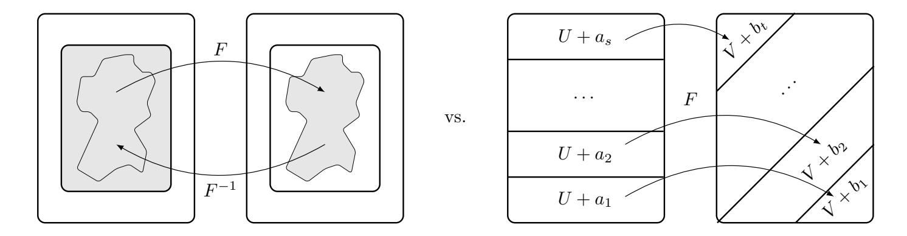

{0}------------------------------------------------

## Weak-Key Distinguishers for AES

Lorenzo Grassi1,<sup>4</sup> , Gregor Leander<sup>2</sup> , Christian Rechberger<sup>1</sup> , Cihangir Tezcan<sup>3</sup> , and Friedrich Wiemer<sup>2</sup>

1 IAIK, Graz University of Technology, Austria

christian.rechberger@iaik.tugraz.at,cihangir@metu.edu.tr, friedrich.wiemer@rub.de

Abstract In this paper, we analyze the security of AES in the case in which the whitening key is a weak key.

After a systematization of the classes of weak-keys of AES, we perform an extensive analysis of weak-key distinguishers (in the single-key setting) for AES instantiated with the original key-schedule and with the new key-schedule proposed at ToSC/FSE'18. As one of the main results, we show that (almost) all the secret-key distinguishers for round-reduced AES currently present in the literature can be set up for a higher number of rounds of AES if the whitening key is a weak-key.

Using these results as starting point, we describe a property for 9-round AES-128 and 12-round AES-256 in the chosen-key setting with complexity 2 <sup>64</sup> without requiring related keys. These new chosen-key distinguishers set up by exploiting a variant of the multiple-of-8 property introduced at Eurocrypt'17 improve all the AES chosen-key distinguishers in the single-key setting.

The entire analysis has been performed using a new framework that we introduce here called weak-key subspace trails, which is obtained by combining invariant subspaces (Crypto'11) and subspace trails (FSE'17) into a new, more powerful, attack.

Keywords: AES; Key Schedule; Weak-Keys; Chosen-Key Distinguisher

## 1 Introduction

Block ciphers are certainly among the most important cryptographic primitives. Their design and analysis are well advanced, and with today's knowledge designing a secure block cipher is a problem that is largely considered solved. Especially with the AES we have at hand a very well analyzed and studied cipher that, after more than 20 years of investigation still withstands all cryptanalytic attacks.

Clearly, security of symmetric crypto is always security against specic attacks. First of all, the number of available attacks has increased signicantly ever

<sup>2</sup> Horst Görtz Institute for IT-Security, Ruhr-Universität Bochum, Germany 3 Informatics Institute, Department of Cyber Security, CyDeS Laboratory,

Middle East Technical University, Ankara, Turkey <sup>4</sup> Digital Security Group, Radboud University, Nijmegen, The Netherlands lgrassi@science.ru.nl,gregor.leander@rub.de,

{1}------------------------------------------------

since the introduction of dierential [\[2\]](#page-19-0) and linear [\[29\]](#page-21-0) cryptanalysis in the early 1990. Another important aspect is that the attacker model is regularly changing. With the introduction of statistical attacks, especially linear and dierential cryptanalysis, the attacker was suddenly assumed to be able to retrieve, or even choose, large amounts of plaintext/ciphertext pairs. Later, in the related-key setting, the attacker became even more powerful and was assumed to be able to choose not only plaintexts but also ask for the encryption of chosen messages under a key that is related to the unknown secret key. Finally, in the open-key model, the attacker either knows the key or has the ability to choose the key herself. While the practical impact of such models is often debatable, they actually might become meaningful when the block cipher is used as a building block for other primitives, in particular for the construction of hash-functions. Moreover, even if those considerations do not pose practical attacks, they still provide very useful insights and observations that strengthen our understanding of block ciphers in general.

Our work builds upon the above in the sense that we combine previously separate attacks to derive new results on the AES in the secret-/open-key model.

#### Weak Keys and Key-Schedule

A key is said to be weak if, used with a specic cipher, it makes the cipher behave in some undesirable way (namely, if it makes the cipher weaker w.r.t. other keys). The most famous example of weak-keys is given for the DES, which has a few specic keys termed weak-keys and semi-weak-keys [\[30\]](#page-21-1). These are keys that cause the encryption mode of DES to act identically to the decryption mode of DES (albeit potentially that of a dierent key). Even if weak keys usually represent a very small fraction of the overall key-space, it is desirable for a cipher to have no weak keys. Weak-keys are much more often a problem where the adversary has some control over what keys are used, such as when a block cipher is used in a mode of operation intended to construct a secure cryptographic hash function. For example, in the Davies-Meyer construction or the Miyaguchi-Preneel, one can transform a secure block cipher into a secure compression function. In a hash setting, block cipher security models such as the known-key model (or the chosen-key model) makes sense since in practice the attacker has full access and control over the internal computations.

The presence of a set of weak keys is usually related to the details of the keyschedule, namely the algorithm that takes as input a master key and outputs so-called round keys that are used in each round to mix the current state with the key. While the concrete security of the AES and other well-known ciphers is well studied, it is not clear what properties a good key schedule has to have. Even if there are some general guidelines on what a key schedule should not look like, these guidelines are rather basic and ensure mainly that trivial guessand-determine or/and meet-in-the-middle attacks or/and structural attacks (e.g. slide-attacks, symmetries, invariant subspace attacks) are not possible.

{2}------------------------------------------------

#### Our Contribution

Recently, more and more attacks on perfectly good ciphers that exploit only weak-keys and key schedule weaknesses, e.g. [\[20\]](#page-20-0) indicate that the research on key schedule design principles is pressing. For the case in which the r-th round-key k<sup>r</sup> is simply dened by the XOR of the whitening key K and a round constant RCr, that is k<sup>r</sup> = K ⊕RC<sup>r</sup> (a key-schedule largely used for lightweight ciphers), in [\[1\]](#page-19-1) authors show that a proper choice of round constants can easily avoid (unwanted) properties related to structural attacks. In this paper, we rst analyze the security of AES instantiated with a weak-key against secretkey distinguishers, both for the case of the AES key-schedule and for the case of a recent proposed key-schedule based only on permutation of the byte positions [\[22\]](#page-20-1). Then, we use these results as starting points in order to construct new chosen-key distinguishers for AES in the single-key model.

Systematization of Knowledge: Weak-key Subspace Trail Cryptanalysis. First of all, we start by recalling the basic set-up of subspace trail cryptanalysis (see [\[18](#page-20-2)[,19,](#page-20-3)[28\]](#page-21-2)) and invariant subspace attacks (see [\[26,](#page-21-3)[27\]](#page-21-4)) in [Section 2.](#page-3-0) Our rst main focus is to point out the important dierences of these two attacks. As we will explain, those concepts are not generalizations of each other but rather orthogonal attack vectors. From this point of view, a natural step is to ll this gap, by combining both approaches into a new, more powerful, attack. This is in line with what was done previously with other attacks as mentioned above.

As invariant subspace attacks are weak-key attacks by nature, the new attack originating from the combination of invariant subspace attacks and subspace trail cryptanalysis is a weak-key attack as well. Here, weak-key refers to the fact that the attacks do not work for any key, but rather only for a fraction of all keys (besides the fact that they heavily depend on details of the key-schedule). Consequently, in [Section 2](#page-3-0) we coin the new strategy weak-key subspace trail cryptanalysis.

Weak-Key Secret-Key Distinguishers for AES. Previously, invariant subspace attacks were only applied to ciphers with very simple key schedule algorithms. As a result, ciphers where the round keys diered not only by round constants seemed secure against this type of attacks. E.g. up to now, it seemed impossible to apply invariant subspace attacks on the AES.

With our new combination of invariant subspace attacks and subspace trail cryptanalysis, we overcome this inherently dicult problem. As a showcase of the increased possibilities of our attack, and as the most important example anyway, in [Sections 3.2](#page-8-0) and [4](#page-10-0) we present several new observations on the AES. Using as starting point the invariant subspace found by our algorithm and presented in [Section 3.2,](#page-8-0) we show that several secret-key distinguishers for round-reduced AES currently present in the literature (in particular, truncated dierential distinguishers) can be set up for a higher number of rounds of AES if the whitening key is a weak-key.

{3}------------------------------------------------

In particular, we show that the secret-key distinguisher based on the multipleof-n property proposed at Eurocrypt 2017 [\[19\]](#page-20-3) can be extended by one round if the (secret) whitening key is a weak-key. As a concrete application of such result, in [Appendix D](#page-26-0) we present examples of compression collisions for 6- and 7-round AES-256 used in DaviesMeyer, Miyaguchi-Preneel and Matyas-Meyer-Oseas construction.

As a side-result, we analyze the security of an alternative AES key schedule proposed at ToSC'18 [\[22\]](#page-20-1), which is dened by a permutation of the byte positions only and that aims to provide resistance against related-key dierential attacks. In [Section 3.2,](#page-9-0) we show the importance of adding random constants at every round in order to prevent the weak-key subspace trail attack proposed here.

Chosen-Key Distinguisher for AES. Known-key distinguishers were introduced by Knudsen and Rijmen in [\[23\]](#page-20-4) for their analysis of AES and a class of Feistel ciphers in order to examine the security of these block ciphers in a model where the adversary knows the key. To succeed, the adversary has to discover some property of the attacked cipher that e. g. holds with a probability higher than for an ideal cipher, or is generally believed to be hard to exhibit generically. The idea of chosen-key distinguishers was popularized in the attack on the full-round AES-256 [\[3,](#page-19-2)[4\]](#page-20-5) in a related-key setting. This time the adversary is assumed to have a full control over the key. A chosen-key attack was shown on 9-round reduced AES-128 in [\[13\]](#page-20-6) in the related-key setting, and on 8-round AES-128 in [\[11\]](#page-20-7) in the single-key setting. Both the known-key and chosen-key distinguishers are collectively known as open-key distinguishers.

Building up on our weak-key multiple-of-n results, we are able to construct new chosen-key distinguishers for up to 9-round AES-128 and 12-round AES-256 in the single-key model and based on the multiple-of-n (weak-key) property. This improves all the chosen-key distinguishers for AES in the single-key setting. In particular, in [Section 5](#page-14-0) we exhibit a chosen-key distinguisher with complexity 2 64 for 9-round AES-128 in the single-key model[1](#page-3-1) , valid for 2 <sup>32</sup> keys. For these results we combine two weak-key subspace trails in an inside-out manner and, instead of a simple truncated dierential property at the plaintexts and ciphertexts, we use a variant of the multiple-of-n property recently shown for AES in [\[19\]](#page-20-3).

## <span id="page-3-0"></span>2 Weak-Key (Invariant) Subspace Trails

#### 2.1 Subspace Trails

Subspace trails have been rst dened in [\[18\]](#page-20-2), and a connection between subspace trails and truncated dierential attacks has been studied in details in [\[28\]](#page-21-2). We recall the denition of a subspace trail next. Our treatment here is however

<span id="page-3-1"></span><sup>1</sup> A 10-round known-key distinguisher for AES has been proposed by Gilbert [\[14\]](#page-20-8) at Asiacrypt 2014. Echoing [\[17\]](#page-20-9), in [Appendix F](#page-30-0) we argue why such distinguisher can be considered articial. Briey, the property of this distinguisher does not involve directly the plaintexts/ciphertexts, but their encryption/decryption after one round.

{4}------------------------------------------------

meant to be self-contained. For this, let F denote a round function of a keyalternating block cipher, and let  $U \oplus a$  denote a coset of a vector space U. By  $U^c$  we denote the complementary subspace of U.

<span id="page-4-0"></span>**Definition 1 (Subspace Trails).** Let  $(U_1, U_2, \ldots, U_{r+1})$  denote a set of r+1 subspaces with  $\dim(U_i) \leq \dim(U_{i+1})$ . If for each  $i=1,\ldots,r$  and for each  $a_i$ , there exists (unique)  $a_{i+1} \in U_{i+1}^c$  such that  $F(U_i \oplus a_i) \subseteq U_{i+1} \oplus a_{i+1}$ , then  $(U_1, U_2, \ldots, U_{r+1})$  is a subspace trail of length r for the function F. If all the previous relations hold with equality, the trail is called a constant-dimensional subspace trail.

One important observation is the following. Consider a key-alternating cipher  $E_k$  using F as a round function and where the round keys are xored in between the rounds, that is

$$E(\cdot) = k_r \oplus F(... \oplus F(k_1 \oplus F(k_0 \oplus \cdot)))$$

where  $k^i$  is the *i*-th subkey. In this case, a subspace trail for F will extend to a subspace trail for  $E_k$  for any choice of round keys. This is a simple consequence as

$$F(U_i \oplus a_i) \subseteq U_{i+1} \oplus a_{i+1}$$
 implies  $F_{k^i}(U_i \oplus a_i) \equiv F(U_i \oplus a_i) \oplus k^i \subseteq U_{i+1} \oplus a'_{i+1}$ 

for a suitable  $a'_{i+1} = a_{i+1} \oplus k^i$ . In other words, the key addition changes only the coset of the subspace  $U_{i+1}$ , while it does not affect the subspace itself. Thus, not only do subspace trails work for all keys, they are also completely independent of the key schedule. Here, invariant subspace attacks behave very differently.

#### 2.2 Invariant Subspace Attacks

Invariant subspace attacks, which can be seen as a general way of capturing symmetries, have been first introduced in [26] in an attack on PRINTCipher. Later, those attacks have been applied to several other (lightweight) primitives, e.g. in [27], where a generic tool to detect them has been proposed.

As above, denoting by  $F_k(\cdot) = F(\cdot) \oplus k$  the round function of a key-alternating block-cipher, let  $U \subset \mathbb{F}_2^n$  be a subspace. Then, U is called an invariant subspace if there exist constants  $a, b \in \mathbb{F}_2^n$  such that  $F_k(U \oplus a) = U \oplus b$ . In order to extend the invariant subspace  $U \oplus a_i \mapsto U \oplus a_{i+1}$  to the whole cipher, we need all round keys to be in specific cosets of U namely,  $k_i \in U \oplus (a_{i+1} \oplus b_i)$  (where  $F(U \oplus a_i) = U \oplus b_i$ ):  $F_k(U \oplus a_i) = F(U \oplus a_i) \oplus k = U \oplus b_i \oplus k = U \oplus a_{i+1}$ .

**Definition 2 (Invariant Subspace Trail).** Let  $K_{weak}$  be a set of weak keys and  $k \in K_{weak}$ , with  $k \equiv (k^0, k^1, \dots, k^r)$  where  $k^j$  is the j-th round key. For each  $k \in K_{weak}$ , the subspace U generates an invariant subspace trail of length r for the function  $F_k(\cdot) \equiv F(\cdot) \oplus k$  if for each  $i = 1, \dots, r$  there exists a non-empty set  $A_i \subseteq U^c$  for which the following property holds:

<span id="page-4-1"></span>
$$\forall a_i \in A_i : \exists a_{i+1} \in A_{i+1} \text{ s.t. } F_{k^i}(U \oplus a_i) \equiv F(U \oplus a_i) \oplus k^i = U \oplus a_{i+1}.$$

{5}------------------------------------------------

#### 2.3 Weak-Key Subspace Trails

When comparing subspace trail and invariant subspace attacks, two obvious but important differences can be observed. First, subspace trails are clearly much more general as they allow different spaces in the domain and co-domain of F. Second, subspace trails are by far more restrictive, as not only one coset of the subspace has to be mapped to one coset of (a potentially different) subspace, but rather all cosets have to be mapped to cosets. For subspace trails, the later fact is the main reason for allowing arbitrary round keys.

The main idea for weak-key subspace trails is to stick to the property of invariant subspace attacks where only few (even just one) cosets of a subspace are mapped to other cosets of a subspace. However, borrowing from subspace trails, we allow those subspaces to be different for each round. As this will again restrict the choice of round keys that will keep this property invariant to a class of weak-keys we call this combination weak-key subspace trails (or simply, weak subspace trails). The formal definition is the following.

<span id="page-5-0"></span>**Definition 3 (Weak-Key Subspace Trails).** Let  $K_{weak}$  be a set of keys and  $k \in K_{weak}$  with  $k \equiv (k^0, k^1, \ldots, k^r)$  where  $k^j$  is the j-th round key. Further let  $(U_1, U_2, \ldots, U_{r+1})$  denote a set of r+1 subspaces with  $\dim(U_i) \leqslant \dim(U_{i+1})$ . For each  $k \in K_{weak}$ ,  $(U_1, U_2, \ldots, U_{r+1})$  is a weak-key subspace trail (WKST) of length r for the function  $F_k(\cdot) \equiv F(\cdot) \oplus k$  if for each  $i = 1, \ldots, r$  there exists a non-empty set  $A_i \subseteq U_i^c$  for which the following property holds:

$$\forall a_i \in A_i : \exists a_{i+1} \in A_{i+1} \text{ s.t. } F_{k^i}(U_i \oplus a_i) \equiv F(U_i \oplus a_i) \oplus k^i \subseteq U_{i+1} \oplus a_{i+1}.$$

All keys in the set  $K_{weak}$  are weak-keys. If all the previous relations hold with equality, the trail is called a weak-key constant-dimensional subspace trail.

Usually, the set  $A_i \subseteq U_i^c$  reduces to a single element  $a_i$ :  $A_i \equiv \{a_i\}$ . Moreover, we can easily see that Definition 3 is a generalization of both Definitions 1 and 2:

- if  $K_{\text{weak}}$  is equal to the whole set of keys and if  $A_i = U_i^c$ , then it corresponds to subspace trails;
- if  $U_i = U_{i+1}$  for all i, then it corresponds to invariant subspace trails.

Security Problem. Clearly, a WKST allows greater freedom for an attacker. In comparison to invariant subspace attacks, WKSTs have the potential of being better applicable to block ciphers with non trivial key schedules. At the same time, with respect to subspace trails it is not necessary for WKSTs to hold for all possible keys.

Interestingly, proving resistance against invariant subspace (or more generally invariant sets) in the case of identical round keys (up to the addition of round constants) is well understood, see [1]. However, the situation changes completely when considering WKSTs and/or ciphers with a non-trivial key schedule. In those situations, the analysis of [1] is no longer applicable and we do not have a generic approach to argue the resistance against WKSTs. It follows that the concept of WKSTs opens up many new opportunities and raises many new, probably highly non-trivial questions on how to protect against it.

{6}------------------------------------------------

#### 3 Preliminary – Subspace Trail Properties of the AES

The Advanced Encryption Standard [9] is a Substitution-Permutation network that supports key sizes of 128, 192 and 256 bits. The 128-bit plaintext initializes the internal state as a  $4 \times 4$  matrix of bytes as values in the finite field  $\mathbb{F}_{256}$ , defined using the irreducible polynomial  $x^8 + x^4 + x^3 + x + 1$ . Depending on the version of AES,  $N_r$  rounds are applied to the state:  $N_r = 10$  for AES-128,  $N_r = 12$  for AES-192 and  $N_r = 14$  for AES-256. One round of AES can be described as  $R(x) = K \oplus MC \circ SR \circ SB(x)$ , where

- SubBytes (SB) applying the same 8-bit to 8-bit invertible S-Box 16 times in parallel on each byte of the state (it provides non-linearity in the cipher);
- ShiftRows (SR) cyclic shift of each row to the left;
- MixColumns (MC) multiplication of each column by a constant  $4 \times 4$  invertible matrix  $M_{\rm MC}$  (MC and SR provide diffusion in the cipher);
- AddRoundKey (ARK) XORing the state with a 128-bit subkey.

In the first round an additional AddRoundKey operation (using a whitening key) is applied, and in the last round the MixColumns operation is omitted.

Key Schedule AES-128. The key schedule of AES-128 takes the user key and transforms it into 11 subkeys of 128 bits each. The subkey array is denoted by  $W[0, \ldots, 43]$ , where each word of  $W[\cdot]$  consists of 4 bytes and where the first 4 words of  $W[\cdot]$  are loaded with the user secret key. The remaining words of  $W[\cdot]$  are updated according to the following rule:

$$W[i][j] = \begin{cases} W[i][j-4] \oplus \operatorname{SB}(W[i+1][j-1]) \oplus R[i][j/4] & \text{if } j \bmod 4 = 0 \\ W[i][j-1] \oplus W[i][j-4] & \text{otherwise} \end{cases}$$

where  $i = 0, 1, 2, 3, j = 4, \dots, 43$  and  $R[\cdot]$  is an array of constants<sup>2</sup>

The Notation used in the Paper. Let x denote a plaintext, a ciphertext, an intermediate state or a key. Then  $x_{i,j}$  or  $x_{i+4\times j}$  with  $i,j\in\{0,\ldots,3\}$  denotes the byte in the row i and in the column j. We denote by  $k^r$  the key of the r-th round. If only one key is used, then we denote it by k to simplify the notation. Finally, we denote by R one round of AES, while we denote r rounds of AES by  $R^r$ . We sometimes use the notation  $R_K$  instead of R to highlight the round key K. As last thing, in the paper we often use the term "partial collision" (or "collision") when two texts belong to the same coset of a given subspace X.

#### <span id="page-6-1"></span>3.1 Subspace Trails of AES

In this section, we recall the main concepts of the subspace trails of AES presented in [18]. In the following, we only work with vectors and vector spaces

<span id="page-6-0"></span>The round constants are defined in  $GF(2^8)[X]$  as R[0][1] = X,  $R[0][r] = X \cdot R[0][r-1]$  if r > 2 and  $R[i][\cdot] = 0$  if  $i \neq 0$ . For the following, let  $R[r] \equiv R[0][r]$ .

{7}------------------------------------------------

over  $\mathbb{F}_{2^8}^{4\times 4}$ , and we denote by  $\{e_{0,0},\ldots,e_{3,3}\}$  or  $\{e_0,\ldots,e_{15}\}$  the unit vectors of  $\mathbb{F}_{2^8}^{4\times 4}$  (e. g.  $e_{i,j}$  or  $e_{i+4\times j}$  has a single 1 in row i and column j). We also recall that given a subspace X, the cosets  $X\oplus a$  and  $X\oplus b$  (where  $a\neq b$ ) are equal  $(X\oplus a\equiv X\oplus b)$  if and only if  $a\oplus b\in X$ .

**Definition 4.** The column spaces  $C_i$  are defined as  $C_i = \langle e_{0,i}, e_{1,i}, e_{2,i}, e_{3,i} \rangle$ .

**Definition 5.** The diagonal spaces  $\mathcal{D}_i$  and the inverse-diagonal spaces  $\mathcal{I}\mathcal{D}_i$  are respectively defined as  $\mathcal{D}_i = \mathrm{SR}^{-1}(\mathcal{C}_i) \equiv \langle e_{0,i}, e_{1,i+1}, e_{2,i+2}, e_{3,i+3} \rangle$  and  $\mathcal{I}\mathcal{D}_i = \mathrm{SR}(\mathcal{C}_i) \equiv \langle e_{0,i}, e_{1,i-1}, e_{2,i-2}, e_{3,i-3} \rangle$ , where the indexes are taken modulo 4.

**Definition 6.** The *i*-th mixed spaces  $\mathcal{M}_i$  are defined as  $\mathcal{M}_i = \mathrm{MC}(\mathcal{ID}_i)$ .

**Definition 7.** For  $I \subseteq \{0, 1, 2, 3\}$ , let  $C_I$ ,  $D_I$ ,  $ID_I$  and  $M_I$  be defined as

$$\mathcal{C}_I = \bigoplus_{i \in I} \mathcal{C}_i, \qquad \mathcal{D}_I = \bigoplus_{i \in I} \mathcal{D}_i, \qquad \mathcal{I}\mathcal{D}_I = \bigoplus_{i \in I} \mathcal{I}\mathcal{D}_i, \qquad \mathcal{M}_I = \bigoplus_{i \in I} \mathcal{M}_i.$$

For completeness, we briefly describe the subspace trail notation using a more "classical" one. If two texts  $t^1$  and  $t^2$  are equal except for the bytes in the i-th diagonal<sup>3</sup> for each  $i \in I$ , then they belong in the same coset of  $\mathcal{D}_I$ . Two texts  $t^1$  and  $t^2$  belong in the same coset of  $\mathcal{M}_I$  if the bytes of their difference  $\mathrm{MC}^{-1}(t^1 \oplus t^2)$  in the i-th anti-diagonal for each  $i \notin I$  are equal to zero. Similar considerations hold for the spaces  $\mathcal{C}_I$  and  $\mathcal{I}\mathcal{D}_I$ .

<span id="page-7-2"></span>**Theorem 1** ([18]). For each I and for each  $a \in \mathcal{D}_I^{\perp}$ , there exists one and only one  $b \in \mathcal{M}_I^{\perp}$  such that  $R^2(\mathcal{D}_I \oplus a) = \mathcal{M}_I \oplus b$ .

Observe that if X is a generic subspace,  $X \oplus a$  is a coset of X and x and y are two elements of the (same) coset  $X \oplus a$ , then  $x \oplus y \in X$ . It follows that:

**Lemma 1.** For all 
$$I \subseteq \{0, 1, 2, 3\}$$
:  $\Pr \left[ R^2(x) \oplus R^2(y) \in \mathcal{M}_I \mid x \oplus y \in \mathcal{D}_I \right] = 1$ .

<span id="page-7-3"></span><span id="page-7-1"></span>Finally, for the follow-up, we introduce a generic subspace trail of length 1.

**Definition 8.** Given 
$$I \subseteq \{(0,0),(0,1),\ldots,(3,2),(3,3)\} \equiv \{(i,j)\}_{0 \leq i,j \leq 3}$$
, let the subspace  $\mathcal{X}_I$  be defined as  $\mathcal{X}_I = \langle \{e_{i,j}\}_{(i,j)\in I}\rangle \equiv \left\{\bigoplus_{(i,j)\in I}\alpha_{i,j}\cdot e_{i,j} \mid \forall \alpha_{i,j}\in \mathbb{F}_{2^8}\right\}$ .

In other words,  $\mathcal{X}_I$  is the set of elements given by linear combinations of  $\{e_{i,j}\}_{(i,j)\in I}$ , where  $e_{i,j} \in \mathbb{F}_{2^8}^{4\times 4}$  has a single 1 in row i and column j.

**Theorem 2.** For each  $I \subseteq \{(0,0),(0,1),\ldots,(3,2),(3,3)\} \equiv \{(i,j)\}_{0 \leq i,j \leq 3}$  and for each  $a \in \mathcal{X}_I^{\perp}$ , there exists one and only one  $b \in \mathcal{Y}_I^{\perp}$  such that  $R(\mathcal{X}_I \oplus a) = \mathcal{Y}_I \oplus b$ , where  $\mathcal{Y}_I = MC \circ SR(\mathcal{X}_I)$ .

Proof is given in Appendix B. Such subspace trail cannot be extended on two rounds for any generic  $\mathcal{X}_I$ , due to the non-linear S-Box operation of the next round (that can destroy the linear relations that hold among the bytes).

<span id="page-7-0"></span>The *i*-th diagonal of a  $4 \times 4$  matrix A is defined as the elements that lie on row r and column c such that  $r - c = i \mod 4$ . The *i*-th anti-diagonal of a  $4 \times 4$  matrix A is defined as the elements that lie on row r and column c such that  $r + c = i \mod 4$ .

{8}------------------------------------------------

#### <span id="page-8-0"></span>3.2 (Weak-Key) Invariant Subspace Trail for AES

In this section, we present a subspace  $\mathcal{IS}$  which is invariant for a key-less AES round, and a set of weak-keys for AES-128 that allows to set up an invariant subspace trail for 2-round AES-128. Similar results – presented in Appendix C – can be provided for AES-192 and AES-256. Then, we discuss a weakness of an alternative linear key-schedule for AES-128 proposed at ToSC/FSE 2018 [22], based on permutations of the byte positions.

Invariant Subspace  $\mathcal{IS}$  for AES. Let the subspace  $\mathcal{IS}$  be defined as

<span id="page-8-1"></span>
$$\mathcal{IS} := \left\{ \begin{bmatrix} a & b & a & b \\ c & d & c & d \\ e & f & e & f \\ g & h & g & h \end{bmatrix} \middle| \forall a, b, c, d, \dots, h \in \mathbb{F}_{2^8} \right\}$$
 (1)

This subspace is invariant under a key-less round  $R(\cdot) = MC \circ SR \circ SB(\cdot)$ , since

$$SB(\mathcal{IS}) = \mathcal{IS}$$
  $SR(\mathcal{IS}) = \mathcal{IS}$   $MC(\mathcal{IS}) = \mathcal{IS}$ .

This subspace – already presented and used in e. g. [25,7] – will be our starting point to set up a weak-key invariant subspace trail for all versions of AES.

Weak-Keys of AES-128 & Invariant Subspace Trail. In the case of the AES key-schedule, under one of the  $2^{32}$  weak-keys in  $K_{\text{weak}}$ 

<span id="page-8-2"></span>
$$K_{\text{weak}} := \left\{ \begin{bmatrix} A & A & A & A \\ B & B & B & B \\ C & C & C & C \\ D & D & D & D \end{bmatrix} \middle| \forall A, B, C, D \in \mathbb{F}_{2^8} \right\}$$
 (2)

the subspace  $\mathcal{IS}$  is mapped into a coset of  $\mathcal{IS}$  after two complete AES rounds. In more details, given  $k \in K_{\text{weak}}$ , let  $\hat{k}$  be the corresponding subkey after 2 rounds of the key schedule (where  $\hat{k} \notin K_{\text{weak}}$  in general). It follows that

$$\mathcal{IS} \xrightarrow{R_K^2 \circ ARK(\cdot)} \mathcal{IS} \oplus \hat{k}$$

where  $R_K(\cdot) \equiv \text{ARK} \circ \text{MC} \circ \text{SR} \circ \text{SB}(\cdot)$ , that is  $\mathcal{IS}$  forms a weak invariant subspace of length 2. In order to prove this result, it is sufficient to note that

- 1.  $K_{\text{weak}} \subseteq \mathcal{IS}$ , which implies that  $\mathcal{IS} \oplus k = \mathcal{IS}$  for all  $k \in K_{\text{weak}}$ ;
- 2. the first round key derived from the key-schedule of  $K_{\text{weak}}$  denoted by  $K'_w$  is a subset of  $\mathcal{IS}$

$$K'_{w} \equiv \begin{bmatrix} \operatorname{SB}(B) \oplus A \oplus R[1] & \operatorname{SB}(B) \oplus R[1] & \operatorname{SB}(B) \oplus A \oplus R[1] & \operatorname{SB}(B) \oplus R[1] \\ \operatorname{SB}(C) \oplus B & \operatorname{SB}(C) & \operatorname{SB}(C) \oplus B & \operatorname{SB}(C) \\ \operatorname{SB}(D) \oplus C & \operatorname{SB}(D) & \operatorname{SB}(D) \oplus C & \operatorname{SB}(D) \\ \operatorname{SB}(A) \oplus D & \operatorname{SB}(A) & \operatorname{SB}(A) \oplus D & \operatorname{SB}(A) \end{bmatrix}$$

{9}------------------------------------------------

<span id="page-9-0"></span>Key Schedules based on Permutation of the Byte Positions. The possibility to set up a weak invariant subspace trail depends on the concrete value of the secret key and of the key schedule details. To better understand this point, here we analyze another key-schedule recently proposed at ToSC/FSE 2018 [22] in the case in which no random round-constant is added. Such a key-schedule – proposed with the only goal to provide resistance against related key-differential attacks – is linear and it is based on permutations of the byte positions: each subkey is the result of a particular permutation applied to the whitening key defined as follows

$$\begin{pmatrix}
0 & 4 & 8 & 12 \\
1 & 5 & 9 & 13 \\
2 & 6 & 10 & 14 \\
3 & 7 & 11 & 15
\end{pmatrix}
\rightarrow
\begin{pmatrix}
11 & 15 & 3 & 7 \\
12 & 0 & 4 & 8 \\
1 & 5 & 9 & 13 \\
2 & 6 & 10 & 14
\end{pmatrix}$$
(3)

In the case in which random round-constants are added, an invariant subspace attack that covers an unlimited number of rounds is very unlikely, as showed e.g. in [1] (for the case of other ciphers). Hence, by adding random constants at every round, such key-schedule is perfectly fine and could be a good candidate for future designs. Instead, in the case in which no random round-constant is added, then an "infinitely-long" weak invariant subspace can be set up. Indeed, consider the previous subspace  $\mathcal{IS}$  defined in Eq. (1) and assume that the whitening key belongs to such subspace: It follows that any subkey generated by the previous permutation belongs to this subspace (due to particular symmetries of the permutation).

Adding a (partial) S-Box Layer. Besides adding random round-constants, another possible way to prevent such invariant subspace attack is by adding non-linear operations in the key-schedule. In [22, Sect. 6], authors propose to "tweak this design (without increasing the tracking effort) by adding an S-Box layer every round to the entire first row of the key state". Due to the analysis just proposed and only in the case in which no round-constant is added, this operation does not improve the security against the presented invariant subspace attack. Indeed, note that the invariant subspace  $\mathcal{IS}$  is still mapped into itself even if an S-Box layer is applied to the entire first row of the key state:

$$\begin{bmatrix} \operatorname{SB}(a) & \operatorname{SB}(b) & \operatorname{SB}(a) & \operatorname{SB}(b) \\ c & d & c & d \\ e & f & e & f \\ g & h & g & h \end{bmatrix} = \begin{bmatrix} a' & b' & a' & b' \\ c & d & c & d \\ e & f & e & f \\ g & h & g & h \end{bmatrix} \in \mathcal{IS}.$$

We emphasize that this problem can be easily fixed by applying such an S-Box layer every round to the entire (e.g.) first column/diagonal. As a result, even in the case in which no random round-constant are added, the partial S-Box layer applied every round to the entire first column/diagonal<sup>4</sup> is sufficient by itself to prevent "infinitely-long" weak invariant subspace trails based on  $\mathcal{IS}$ .

<span id="page-9-1"></span><sup>&</sup>lt;sup>4</sup> For completeness, we emphasize that the same result holds in the case of the original AES key-schedule without random constants.

{10}------------------------------------------------

<span id="page-10-1"></span>**Table 1.** Secret-key properties for round-reduced AES. In the following, we list the properties for round-reduced AES which are independent of the secret key, together with the corresponding number of rounds. "Number of keys" denotes the number of keys (with respect to the total space) for which a particular property holds for up to r rounds. Just for simplicity, we do not add the distinguisher complexity (or equivalently, the probability of the exploited property).

| Property                            | Version of AES                                          | Rounds                                   | Number of keys                                                               | Reference                  |
|-------------------------------------|---------------------------------------------------------|------------------------------------------|------------------------------------------------------------------------------|----------------------------|
| Weak-key<br>Subspace Trail          | ${\rm AES-}128/256 \ {\rm AES-}128/256 \ {\rm AES-}256$ | $\begin{matrix} 3\\4\\6/7/8\end{matrix}$ | $All: 2^{128} / 2^{256}$ $2^{32} / 2^{128}$ $2^{96} / 2^{64} / 2^{32}$       | folklore<br>§ 4.1<br>§ 4.1 |
| ${\bf Multiple\text{-}of\text{-}}n$ | AES-128/256<br>AES-128/256<br>AES-256                   | $5\\6\\7/8/9$                            | All: $2^{128} / 2^{256}$<br>$2^{32} / 2^{128}$<br>$2^{96} / 2^{64} / 2^{32}$ | [19]<br>§ 4.2<br>§ 4.2     |

Follow-Up Works: Key-Schedule based on Permutation. After the initial work [22], other key-schedules based only on permutations have been recently proposed at SAC 2018 [12]. Here we focus on the one proposed in [12, Theorem 2], and defined by the following byte-permutation:

$$(15 \quad 0 \quad 2 \quad 3 \quad 4 \quad 11 \quad 5 \quad 7 \quad 6 \quad 12 \quad 8 \quad 10 \quad 9 \quad 1 \quad 13 \quad 14),$$

which guarantees more security than the AES one w.r.t. related-key differential attacks. W.r.t. the key-schedule proposed in [22] and only in the case in which no random round-constant is added, here an "infinitely-long" invariant subspace trail can be set up for a set of 2<sup>8</sup> weak keys only (which corresponds to the case in which all bytes of the whitening key are equal).

#### <span id="page-10-0"></span>4 Weak-Key Secret-Key Distinguishers for AES

As a first application of the invariant subspaces just found, we are going to show that under the assumption of weak-keys it is possible to extend the secret-key distinguishers present in the literature to more rounds (note that all the following results are independent of the details of the S-Box and of the MixColumns operation). In the following, we present in detail only the results for AES-128 for the encryption/forward direction (analogous results hold also in the decryption/backward direction). Similar results can be obtained also for AES-192 and AES-256, using the corresponding weak-keys and weak-key invariant subspace trails defined in Appendix C. The results – which have been practically tested using a C/C++ implementation – are summarized in Table 1.

**Assumption.** From now on we assume that the secret key is a weak-key (that is, a key in the set  $K_{weak}$  as described previously).

{11}------------------------------------------------

#### <span id="page-11-0"></span>4.1 Subspace Trail Distinguishers

In the case of AES, it is possible to set up subspace trail distinguishers for 3-round AES independently of the secret-key, of the details of the S-Box and of the MixColumns matrix (assuming branch number equal to five). It is based on the fact that  $\Pr\left[R^3(x) \oplus R^3(y) \in \mathcal{M}_J \mid x \oplus y \in \mathcal{D}_I\right] = (2^8)^{-4|I|+|I|\cdot|J|}$  as showed in detail in [18], while for a random permutation  $\Pi$  the previous probability is (approximately) equal to

<span id="page-11-2"></span>
$$\Pr\left[\Pi(x) \oplus \Pi(y) \in \mathcal{M}_J \mid x \oplus y \in \mathcal{D}_I\right] = (2^8)^{-16+4|J|}.\tag{4}$$

In the following, we extend the previous subspace trail distinguisher for up to 4 rounds in the case of weak-keys. Focusing on the case of AES-128, we have just seen that the subspace  $\mathcal{IS}$  is mapped into a coset  $\mathcal{IS} \oplus a$  after two rounds if the secret key is a weak-key. In other words, given two plaintexts  $x, y \in \mathcal{IS}$ , then  $R^2(x) \oplus R^2(y) \in \mathcal{IS}$  under a weak-key. Since the 1st and the 3rd diagonals of each text in  $\mathcal{IS}$  are equal (as well as the 2nd and the 4th ones) and by definition of  $\mathcal{D}_I$ , note that

<span id="page-11-3"></span>
$$\Pr\left[z \in \mathcal{D}_I \mid z \in \mathcal{IS}\right] = \begin{cases} 2^{-32} & I \equiv \{0, 2\}, \{1, 3\} \\ 0 & \text{otherwise} \end{cases}$$
 (5)

where we assume that  $z \notin \mathcal{D}_L$  for all  $L \subseteq \{0, 1, 2, 3\}$  s.t. |L| < |I| < 4. This is the starting point for our results, together with the fact that  $\Pr[z \in \mathcal{D}_{0,2}] = \Pr[z \in \mathcal{D}_{1,3}] = 2^{-64}$  for a generic text z.

Weak-Key Subspace Trail over 4-round AES-128 Since  $R^2(\mathcal{D}_I \oplus a) = \mathcal{M}_I \oplus b$  (that is  $\Pr\left[R^2(x) \oplus R^2(y) \in \mathcal{M}_I \mid x \oplus y \in \mathcal{D}_I\right] = 1$ ), it follows that for an AES permutation and for a weak-key<sup>5</sup>

$$\Pr\left[R^4(x) \oplus R^4(y) \in \mathcal{M}_I \mid x, y \in \mathcal{IS}, k \in K_{\text{weak}}\right] = 2^{-32} \quad \text{if } I \equiv \{0, 2\}, \{1, 3\}, \{1, 3\}, \{1, 3\}, \{1, 3\}, \{1, 3\}, \{1, 3\}, \{1, 3\}, \{1, 3\}, \{1, 3\}, \{1, 3\}, \{1, 3\}, \{1, 3\}, \{1, 3\}, \{1, 3\}, \{1, 3\}, \{1, 3\}, \{1, 3\}, \{1, 3\}, \{1, 3\}, \{1, 3\}, \{1, 3\}, \{1, 3\}, \{1, 3\}, \{1, 3\}, \{1, 3\}, \{1, 3\}, \{1, 3\}, \{1, 3\}, \{1, 3\}, \{1, 3\}, \{1, 3\}, \{1, 3\}, \{1, 3\}, \{1, 3\}, \{1, 3\}, \{1, 3\}, \{1, 3\}, \{1, 3\}, \{1, 3\}, \{1, 3\}, \{1, 3\}, \{1, 3\}, \{1, 3\}, \{1, 3\}, \{1, 3\}, \{1, 3\}, \{1, 3\}, \{1, 3\}, \{1, 3\}, \{1, 3\}, \{1, 3\}, \{1, 3\}, \{1, 3\}, \{1, 3\}, \{1, 3\}, \{1, 3\}, \{1, 3\}, \{1, 3\}, \{1, 3\}, \{1, 3\}, \{1, 3\}, \{1, 3\}, \{1, 3\}, \{1, 3\}, \{1, 3\}, \{1, 3\}, \{1, 3\}, \{1, 3\}, \{1, 3\}, \{1, 3\}, \{1, 3\}, \{1, 3\}, \{1, 3\}, \{1, 3\}, \{1, 3\}, \{1, 3\}, \{1, 3\}, \{1, 3\}, \{1, 3\}, \{1, 3\}, \{1, 3\}, \{1, 3\}, \{1, 3\}, \{1, 3\}, \{1, 3\}, \{1, 3\}, \{1, 3\}, \{1, 3\}, \{1, 3\}, \{1, 3\}, \{1, 3\}, \{1, 3\}, \{1, 3\}, \{1, 3\}, \{1, 3\}, \{1, 3\}, \{1, 3\}, \{1, 3\}, \{1, 3\}, \{1, 3\}, \{1, 3\}, \{1, 3\}, \{1, 3\}, \{1, 3\}, \{1, 3\}, \{1, 3\}, \{1, 3\}, \{1, 3\}, \{1, 3\}, \{1, 3\}, \{1, 3\}, \{1, 3\}, \{1, 3\}, \{1, 3\}, \{1, 3\}, \{1, 3\}, \{1, 3\}, \{1, 3\}, \{1, 3\}, \{1, 3\}, \{1, 3\}, \{1, 3\}, \{1, 3\}, \{1, 3\}, \{1, 3\}, \{1, 3\}, \{1, 3\}, \{1, 3\}, \{1, 3\}, \{1, 3\}, \{1, 3\}, \{1, 3\}, \{1, 3\}, \{1, 3\}, \{1, 3\}, \{1, 3\}, \{1, 3\}, \{1, 3\}, \{1, 3\}, \{1, 3\}, \{1, 3\}, \{1, 3\}, \{1, 3\}, \{1, 3\}, \{1, 3\}, \{1, 3\}, \{1, 3\}, \{1, 3\}, \{1, 3\}, \{1, 3\}, \{1, 3\}, \{1, 3\}, \{1, 3\}, \{1, 3\}, \{1, 3\}, \{1, 3\}, \{1, 3\}, \{1, 3\}, \{1, 3\}, \{1, 3\}, \{1, 3\}, \{1, 3\}, \{1, 3\}, \{1, 3\}, \{1, 3\}, \{1, 3\}, \{1, 3\}, \{1, 3\}, \{1, 3\}, \{1, 3\}, \{1, 3\}, \{1, 3\}, \{1, 3\}, \{1, 3\}, \{1, 3\}, \{1, 3\}, \{1, 3\}, \{1, 3\}, \{1, 3\}, \{1, 3\}, \{1, 3\}, \{1, 3\}, \{1, 3\}, \{1, 3\}, \{1, 3\}, \{1, 3\}, \{1, 3\}, \{1, 3\}, \{1, 3\}, \{1, 3\}, \{1, 3\}, \{1, 3\}, \{1, 3\}, \{1, 3\}, \{1, 3\}, \{1, 3\}, \{1, 3\}, \{1, 3\}, \{1, 3\}, \{1, 3\}, \{1, 3\}, \{1, 3\}, \{1, 3\}, \{1, 3\}, \{1, 3\}, \{1, 3\}, \{1, 3\}, \{1, 3\}, \{1, 3\}, \{1, 3\}, \{1, 3\}, \{1, 3\}, \{1, 3\}, \{1, 3\}, \{1, 3\}, \{1, 3\}, \{1, 3\}, \{1, 3\}, \{1, 3\}, \{1, 3\}, \{1, 3\}, \{1, 3\}, \{1, 3\}, \{1, 3\}, \{1, 3\}, \{1, 3\}, \{1, 3\}, \{1, 3\}, \{1, 3\}, \{1, 3\}, \{1, 3\}, \{1, 3\}, \{1, 3\}, \{1, 3\}, \{1, 3\}, \{1, 3\}, \{1, 3\}, \{1, 3\}, \{1, 3\}, \{1, 3\}, \{1, 3\}, \{1, 3\}, \{1, 3\}, \{1, 3\},$$

while for a random permutation  $\Pi$  the probability is equal to  $2^{-64}$  (see Eq. (4)). This fact can also be re-written using the subspace trail notation.

**Proposition 1.** Consider  $2^{64}$  plaintexts in the subspace  $\mathcal{IS}$ , and the corresponding ciphertexts after 4-rounds AES-128 encrypted under a weak-key  $k \in \mathcal{K}_{weak}$ .

With probability 1, there exist  $2^{32}$  (in  $2^{64}$ ) different cosets of  $\mathcal{M}_{0,2}$  and there exist  $2^{32}$  (in  $2^{64}$ ) different cosets of  $\mathcal{M}_{1,3}$  s.t. each one of them contains exactly  $2^{32}$  ciphertexts. For a random permutation, each one of the previous events is satisfied with probability  $\binom{2^{64}}{2^{32}} \cdot \prod_{i=0}^{2^{32}-1} \left[ \left(2^{-64}\right)^{2^{32}-1} \cdot \left(1-i \cdot 2^{-64}\right) \right] \approx 2^{-2^{70}}$ .

A complete proof of this proposition can be found in Appendix E.1.

<span id="page-11-1"></span>Note that the condition " $x, y \in \mathcal{IS}$ " cannot be replaced by the weaker one: "x, y s.t.  $x \oplus y \in \mathcal{IS}$ ". Indeed, if  $x, y \in \mathcal{IS}$ , then  $R^2(x) \oplus R^2(y) \in \mathcal{IS}$  (as showed before), while this is not true – in general – for x, y s.t.  $x \oplus y \in \mathcal{IS}$ .

{12}------------------------------------------------

#### <span id="page-12-0"></span>4.2 Weak-Key "Multiple-of-n" Property for 5-/6-round AES-128

At Eurocrypt 2017, Grassi et al. [19] presented the first property on 5-round AES which is independent of the secret key and of the details of the S-Box and of the MixColumns. The result can be summarized as follows: Given  $2^{32 \cdot |I|}$  plaintexts in the same coset of a diagonal space  $\mathcal{D}_I$ , the number of different pairs of ciphertexts that belong to the same coset of  $\mathcal{M}_J$  after 5-round AES is always a multiple of 8. The "multiple-of-8" property is related to the "mixture differential" cryptanalysis presented in [16], and recently re-visited in [5].

In the case of a weak-key, we are able to extend the previous result for up to 6-round AES-128. The obtained results – which hold also in the *decryption* direction – are proposed in the following Theorems:

<span id="page-12-2"></span>**Theorem 3.** Let  $\mathcal{IS}$  and  $\mathcal{M}_I$  be the subspaces defined as before for a fixed I with  $1 \leq |I| \leq 3$ . Assume that the whitening key is a weak-key, that is it belongs to the set  $K_{weak}$  as defined in Eq. (2). Given  $2^{64}$  plaintexts in  $\mathcal{IS}$ , the number n of different pairs of ciphertexts ( $c^i = R^5(p^i)$ ,  $c^j = R^5(p^j)$ ) after 5-round AES for  $i \neq j$  that belong to the same coset of  $\mathcal{M}_I$  (that is  $c^i \oplus c^j \in \mathcal{M}_I$ ) is a multiple of 128, independently of the details of the S-Box and of the MixColumns matrix.

*Proof.* First of all, since the invariant subspace  $\mathcal{IS}$  is mapped into a coset of  $\mathcal{IS}$  after 2-round encryption, and similarly a coset of  $\mathcal{M}_I$  is mapped into a coset of  $\mathcal{D}_I$  after 2-round decryption, that is

$$\forall k \in K_{\text{weak}}: \qquad \mathcal{IS} \xrightarrow{R^2(\cdot)} \mathcal{IS} \oplus a \xrightarrow{R(\cdot)} \mathcal{D}_I \oplus a' \xrightarrow{R^2(\cdot)} \mathcal{M}_I \oplus b'$$

we focus only on the middle round, and we prove the following equivalent result: given  $2^{64}$  plaintexts in a coset of  $\mathcal{IS}$ , the number n of different pairs of ciphertexts  $(c^i, c^j)$  for  $i \neq j$  that belong to the same coset of  $\mathcal{D}_I$  (that is  $c^i \oplus c^j \in \mathcal{D}_I$ ) after 1 round is a multiple of 128. This result can be achieved by observing that, given a pair of texts  $t^1, t^2 \in \mathcal{IS} \oplus a$ , there exist other pair(s) of texts  $s^1, s^2 \in \mathcal{IS} \oplus a$  s.t.

- $-R(t^1) \oplus R(t^2) \in \mathcal{D}_I \iff R(s^1) \oplus R(s^2) \in \mathcal{D}_I;$
- the texts  $s^1, s^2$  are given by any different combination of the generating variables of  $t^1, t^2$ .

By definition of  $\mathcal{IS}$ , let  $t^1$  and  $t^2$  be as  $t^i = a \oplus \bigoplus_{j=0}^7 x_j^i \cdot (e_j \oplus e_{j+8})$  where  $x_j \equiv x_{r+4\times c}$  denotes the byte in the r-th row and in the c-th & (c+2)-th columns. For simplicity, let  $t^i \equiv (x_0^i, x_1^i, x_2^i, x_3^i, x_4^i, x_5^i, x_6^i, x_7^i)$ .

Case: Different Generating Variables. Consider initially the case in which all the generating variables are different, that is  $x_j^1 \neq x_j^2$  for j = 0, 1, ..., 7. Let  $S_{t^1,t^2}$  be the set of pairs of texts  $s^1, s^2 \in \mathcal{IS} \oplus a$  defined by swapping some

<span id="page-12-1"></span><sup>&</sup>lt;sup>6</sup> Two pairs (s,t) and (t,s) are considered to be equivalent.

{13}------------------------------------------------

generating variables of  $t^1$  and  $t^2$ . More formally, the set  $S_{t^1,t^2}$  contains all 128 pairs of texts  $(s^1, s^2)$  for all  $I \subseteq \{0, 1, 2, 3, 4, 5, 6, 7\}$  where

$$s^{1} = a \oplus \bigoplus_{j=0}^{7} \left\{ \left[ \left( x_{j}^{1} \cdot \delta_{j}(I) \right) \oplus \left( x_{j}^{2} \cdot \left[ 1 - \delta_{j}(I) \right] \right) \right] \cdot \left( e_{j} \oplus e_{j+8} \right) \right\}$$

$$s^{2} = a \oplus \bigoplus_{j=0}^{7} \left\{ \left[ \left( x_{j}^{2} \cdot \delta_{j}(I) \right) \oplus \left( x_{j}^{1} \cdot \left[ 1 - \delta_{j}(I) \right] \right) \right] \cdot \left( e_{j} \oplus e_{j+8} \right) \right\}$$

where the pairs  $(s^1, s^2)$  and  $(s^2, s^1)$  are considered to be equivalent, and where  $\delta_x(A)$  is the Dirac measure defined as  $\delta_x(A) = \begin{cases} 1 & \text{if } x \in A \\ 0 & \text{if } x \notin A \end{cases}$ . By showing that

<span id="page-13-0"></span>
$$\forall (s^1, s^2) \in S_{t^1, t^2}: \qquad R(t^1) \oplus R(t^2) = R(s^1) \oplus R(s^2), \tag{6}$$

it follows immediately that  $R(t^1) \oplus R(t^2) \in \mathcal{D}_I \Leftrightarrow R(s^1) \oplus R(s^2) \in \mathcal{D}_I$  for each  $(s^1, s^2) \in S_{t^1, t^2}$ . The equivalence Eq. (6) is due to the facts that the S-Box operation works independently on each byte and that the XOR-sum is commutative. Since each set  $S_{t^1, t^2}$  has cardinality 128, in the case in which one focuses on the pairs of texts with different generating variables, it follows that the multiple-of-128 property previously defined holds.

Generic Case. In the case in which some variables are equal, e.g.  $x_j^1 = x_j^2$  for  $j \in J \subseteq \{0, ..., 7\}$  with  $|J| \ge 1$ , the difference  $R(t^1) \oplus R(t^2)$  is independent of the value of  $x_j^1 = x_j^2$  for each  $j \in J$ . Thus, the idea is to consider all the different pairs of texts given by swapping one or more variables  $x_l^1$  and  $x_l^2$  for l = 0, 1, ..., 7, where  $x_j$  for  $j \in J$  can take any possible value in  $\mathbb{F}_{2^8}$ . Note that in the case in which  $0 \le |J| < 8$  variables are equal, it is possible to identify

$$\underbrace{2^{7-|J|}}_{\text{by swapping different gen. variables}} \times \underbrace{2^{8\cdot |J|}}_{\text{due to equal gen. variables}} = 2^{7\cdot (1+|J|)} = 128^{1+|J|}$$

different texts  $s^1$  and  $s^2$  in  $\mathcal{IS} \oplus a$  that satisfy the condition  $R(t^1) \oplus R(t^2) = R(s^1) \oplus R(s^2)$ . More formally, given  $t^1$  and  $t^2$ , the set  $S_{t^1,t^2}$  contains all  $2^{7\cdot(1+|J|)}$  pairs of texts  $(s^1 \oplus a, s^2 \oplus a)$  for all  $I \subseteq \{0, 1, 2, 3, 4, 5, 6, 7\} \setminus J$  and for all  $\alpha_0, \ldots, \alpha_{|J|} \in \mathbb{F}_{2^8}$  where  $s^1, s^2$  are defined as

$$s^{1} = \bigoplus_{j \in \{0, \dots, 7\} \setminus J} \left\{ \left[ \left( x_{j}^{1} \cdot \delta_{j}(I) \right) \oplus \left( x_{j}^{2} \cdot \left[ 1 - \delta_{j}(I) \right] \right) \right] \cdot \left( e_{j} \oplus e_{j+8} \right) \right\} \oplus \bigoplus_{j \in J} \alpha_{j} \cdot \left( e_{j} \oplus e_{j+8} \right)$$

$$s^{2} = \bigoplus_{j \in \{0, \dots, 7\} \setminus J} \left\{ \left[ \left( x_{j}^{2} \cdot \delta_{j}(I) \right) \oplus \left( x_{j}^{1} \cdot \left[ 1 - \delta_{j}(I) \right] \right) \right] \cdot \left( e_{j} \oplus e_{j+8} \right) \right\} \oplus \bigoplus_{j \in J} \alpha_{j} \cdot \left( e_{j} \oplus e_{j+8} \right)$$

<span id="page-13-1"></span>In conclusion, given plaintexts in the same coset of  $\mathcal{IS}$ , the number of different pairs of ciphertexts that belong to the same coset of  $\mathcal{D}_I$  after one round is a multiple of 128.

{14}------------------------------------------------

**Theorem 4.** Let  $\mathcal{IS}$ ,  $\mathcal{M}_J$  and  $\mathcal{X}_I$  be the subspaces defined as before, for an arbitrary  $J \subseteq \{0,1,2,3\}$  and arbitrary  $I \subset \{(0,0),(0,1),\ldots,(3,2),(3,3)\} \equiv \{(i,j)\}_{0\leq i,j\leq 3}$ . Assume that the whitening key is a weak-key, i. e. it belongs to the set  $K_{weak}$  defined in Eq. (2). Given  $2^{64}$  plaintexts in  $\mathcal{IS}$ , the following properties hold independently of the details of the S-Box:

- 5-round AES-128: the number n of different pairs of ciphertexts  $(c^i, c^j)$  for  $i \neq j$  that belong to the same coset of  $\mathcal{X}_I$  is a multiple of 2;
- 6-round AES-128: the number n of different pairs of ciphertexts  $(c^i, c^j)$  for  $i \neq j$  that belong to the same coset of  $\mathcal{M}_J$  is a multiple of 2.

The proof of these properties – similar to the one given in [19] and to the one already given – is proposed in details in Appendix E.2.

#### 4.3 Practical Experiments

Most of the previous properties have been practically verified<sup>7</sup>. Here we briefly present the practical results and we compare them with the theoretical ones.

All our distinguishers are based on  $\mathcal{IS}$  and their practical verification requires at least  $2^{64}$  reduced-round AES encryptions. For this reason, we performed our experiments on small-scale AES [8], where each word is composed of 4-bit instead of 8 (note that all previous results are independent of the details of the S-Box). This implies that the dimension of  $\mathcal{IS}$  reduces to 32 bits from 64.

Practical Results. For Theorem 3 and Theorem 4, we performed 5-round and 6-round encryptions of  $\mathcal{IS}$  for more than 100 randomly chosen weak-keys in  $K_{\text{weak}}$ . We counted the collisions in each of the four inverse diagonals space  $\mathcal{ID}$  and observed the multiple-of-128 and multiple-of-2 properties hold for 5-round and 6-round encryptions, respectively. Similar tests have been performed in order to check the multiple-of-2 property on the subspaces  $\mathcal{X}_I$  as defined in Definition 8 for each  $|I| \leq 4$ . Due to increased time and memory complexity, these properties were not verified for |I| > 4. The experiment results – also performed in the decryption direction – agree with the theoretical ones summarized in Tables 1 and 2.

#### <span id="page-14-0"></span>5 New Chosen-Key Distinguishers for AES

In this section we present new chosen-key distinguishers for AES in the single-key setting. In particular, as major results, we are able to present the first candidate 9-round chosen-key distinguisher for AES-128 and a 12-round candidate chosen-key distinguisher for AES-256, both in the single-key setting. All the distinguishers that we present are based on the (practically verified) multiple-of-n property proposed in Section 4.2.

<span id="page-14-1"></span>The source codes of the distinguishers/attacks are publicly available, and they can be found in https://github.com/cihangirtezcan/AES\_weak\_keys

{15}------------------------------------------------

<span id="page-15-0"></span>**Table 2.** AES Chosen-Key Distinguishers. The computation cost is the cost to generate N-tuples of plaintexts/ciphertexts. "SK" denotes a chosen-key distinguisher in the Single-Key setting, while "RK" denotes a chosen-key distinguisher in the Related-Key setting. We mention that the known-key distinguishers presented in [14] are excluded from this Table due to the arguments reported in Appendix F.

| AES     | Rounds    | Computations      | Property                              | SK | RK | Reference |
|---------|-----------|-------------------|---------------------------------------|----|----|-----------|
| AES-128 | 8         | $2^{24}$          | Multiple Diff. Trail                  | ✓  |    | [11]      |
|         | 8         | $2^{13.4}$        | Multiple Diff. Trail                  | ✓  |    | [21]      |
|         | 9         | $2^{55}$          | Multi-Collision Diff.                 |    | ✓  | [13]      |
|         | 9         | $\mathbf{2^{64}}$ | Multiple-of-n $(2^{32} \text{ keys})$ | ✓  |    | $\S~5.3$  |
| AES-256 | 9         | $2^{24}$          | Multiple Diff. Trail                  | ✓  |    | [11]      |
|         | 12        | $\mathbf{2^{64}}$ | Multiple-of-n $(2^{32} \text{ keys})$ | ✓  |    | App. I.2  |
|         | 14 (full) | $2^{120}$         | Multi-Collision Diff.                 |    | ✓  | [4]       |

The goal of an open-key distinguisher is to differentiate between a block cipher E which allows to generate plaintext/ciphertext pairs which exhibit a rare relation, even for a small set of keys or a single key, and an ideal cipher  $\Pi$  that does not have such a property. However, this poses a definitional problem as it was shown already in [6] that any concrete implementable cipher (like the AES) can be trivially distinguished from an ideal cipher. To the best of our knowledge, finding a proper formal definition that captures the intuition behind chosen-key distinguishers has been a challenging task for the last fifteen years and is still an open problem.

We do not attempt to address this formalization challenge here, but proceed in the way that is custom in the literature to describe chosen-key distinguisher: (1st) describe the rare property (see Section 5.2), (2nd) show that it can be efficiently constructed for the block cipher usually using an inside-out approach (see Section 5.3 for 9-round AES-128), and (3rd) argue or prove in some model that any generic method is less efficient or has low success probability (see Section 5.4). Our results are summarized in Table 2: in order to compare the results, note that an attack/distinguisher with no key difference is (logically) harder than an attack/distinguisher for which key differences are allowed, since the attacker has less freedom.

As before, in the following we limit ourselves to give all the details for the AES-128 case (analogous result for AES-256 are presented in Appendix I.2).

#### 5.1 Open-Key Distinguishers – State of the Art for AES

Chosen-Key Distinguishers – State of the Art for AES. To the best of our knowledge, the first chosen-key distinguisher for AES in the single-key setting has been proposed in [11]. In there, the chosen-key model asks the adversary to find two plaintexts/ciphertexts pairs and a key such that the two plaintexts are equal in 3 diagonals and the two ciphertexts are equal in 3 anti-diagonals (if the final

{16}------------------------------------------------

MixColumns is omitted). Equivalently, using the subspace trail notation, the goal is to find  $(p^1, c^1 \equiv R^8(p^1))$  and  $(p^2, c^2 \equiv R^8(p^2))$  for  $p^1 \neq p^2$  s.t.  $p^1 \oplus p^2 \in \mathcal{D}_I$  and  $c^1 \oplus c^2 \in \mathcal{M}_J$  for a certain  $I, J \subseteq \{0, 1, 2, 3\}$  s.t. |I| = |J| = 1. This problem is equivalent to the one proposed in [15,21] in the known-key scenario. In particular, the main (and only) difference is related to the freedom of choosing the key, which allows to reduce the computational cost. For completeness, similar results have been proposed for 9-round AES-256.

The chosen-key model has been popularized some years before by Biryukov et al. [4], since a distinguisher in this model has been extended to a related-key attack on full AES-256. A related distinguisher for 9-round AES-128 has been proposed by Fouque et al. [13]. Both the chosen-key distinguisher proposed in these papers are in the related-key setting. Here we briefly recall them, but we emphasize that we do not consider related-keys in this article. In [4], authors show that it is possible to construct a q-multicollision on Davies-Meyer compression function using AES-256 in time  $q \cdot 2^{67}$ , whereas for an ideal cipher it would require on average  $q \cdot 2^{\frac{q-1}{q+1}128}$  time complexity. A similar approach has been exploited in [13] to set up the first chosen-key distinguisher for 9-round AES-128. Here, the chosen-key model asks the adversary to find a pair of keys (k, k') satisfying  $k \oplus k' = \delta$  with a known (fixed) difference  $\delta$ , and a pair of messages  $(p^1, c^1 \equiv R^9(p^1))$  and  $(p^2, c^2 \equiv R^9(p^2))$  conforming to a partially instantiated differential characteristic in the data part.

Finally, echoing [17], in Appendix F we briefly recall and discuss the 10-round known-key distinguisher for AES proposed by Gilbert [14] at Asiacrypt 2014.

#### <span id="page-16-0"></span>5.2 The "Simultaneous Multiple-of-n" Property

In our distinguisher, the chosen-key model asks the adversary to find a set of  $2^{64}$  (plaintexts, ciphertexts), that is  $(p^i, c^i \equiv R^9(p^i))$  for  $i = 0, \ldots, 2^{64} - 1$  – where all the plaintexts/ciphertexts are generated by the same key – and a key such that the following "simultaneous multiple-of-n" property is satisfied:

- for each  $J, I \subseteq \{0, 1, 2, 3\}$ , the number of different pairs of ciphertexts that belong to the same coset of  $\mathcal{M}_J$  and the number of different pairs of plaintexts that belong to the same coset of  $\mathcal{D}_I$  are a multiple of  $128 = 2^7$ ;
- for each  $J, I \subset \{(0,0), (0,1), \ldots, (3,2), (3,3)\} \equiv \{(i,j)\}_{0 \leq i,j \leq 3}$ , the number of different pairs of ciphertexts that belong to the same coset of  $MC(\mathcal{X}_I)$  and the number of different pairs of plaintexts that belong to the same coset of  $\mathcal{X}_J$  are a multiple of 2.

For the follow-up, we emphasize that the subspaces  $\mathcal{X}$  (defined as in Definition 8) are independent, in the sense that e.g. the fact that the multiple-of-2 property is satisfied by  $\mathcal{X}_I$  and/or  $\mathcal{X}_J$  does not imply anything on  $\mathcal{X}_{I\cup J}$  and vice-versa. This is due to the fact that given  $\mathcal{X}_I$  and  $\mathcal{X}_J$ , then  $\mathcal{X}_I \cup \mathcal{X}_J \subsetneq \mathcal{X}_{I\cup J}$ . As a result, any information about the multiple-of-n property on  $\mathcal{X}_I, \mathcal{X}_J$  (and so  $\mathcal{X}_I \cup \mathcal{X}_J$ ) is useless to derive information about the multiple-of-n property on  $\mathcal{X}_{I\cup J}\setminus(\mathcal{X}_I\cup\mathcal{X}_J)$  (and so on  $\mathcal{X}_{I\cup J}$ ).

{17}------------------------------------------------

#### <span id="page-17-0"></span>5.3 9-round Chosen-Key Distinguisher for AES-128

To find a set of  $2^{64}$  plaintexts/ciphertexts with the required "simultaneous multiple-of-n" property, the distinguisher exploits the fact that the required property can be fulfilled by starting in the middle with a suitable set of texts. In particular, the idea is simply to choose the key such that the subkey of the 4-th round  $k^4$  belongs the subset  $K_{weak}$  defined as in Eq. (2). Thus, consider the invariant subspace  $\mathcal{IS}$  defined as in Eq. (1), and define the  $2^{64}$  plaintexts as the 4-round decryption of  $\mathcal{IS}$ . Due to the secret-key distinguishers just presented, this set satisfies the required "simultaneous multiple-of-n" property.

In more details, due to the assumption on the key (that is,  $k^4 \in K_{\text{weak}} \subseteq \mathcal{IS}$ ), note that the subspace  $\mathcal{IS}$  is mapped into a coset of  $\mathcal{IS}$  after two rounds of encryption and one round of decryption, that is

$$\forall k^4 \in K_{\mathrm{weak}}: \qquad \mathcal{IS} \oplus \hat{k} \xleftarrow{R^{-1}(\cdot)} \mathcal{IS} \xrightarrow{R^2(\cdot)} \mathcal{IS} \oplus \tilde{k}.$$

Due to the results of Section 4.2 and since  $k^4 \in K_{\text{weak}}$ , the multiple-of-n properties hold with probability 1 on the plaintexts and on the ciphertexts

$$\text{Multiple-of-}n \xleftarrow{R^{-3}(\cdot)} \mathcal{IS} \oplus \hat{k} \xleftarrow{R^{-1}(\cdot)} \mathcal{IS} \xrightarrow{R^{2}(\cdot)} \mathcal{IS} \oplus \tilde{k} \xrightarrow{R^{3}(\cdot)} \text{Multiple-of-}n$$

It follows that the required set can be constructed using  $2^{64}$  computations. Moreover, we emphasize that our experiments on the secret-key distinguishers of Section 4.2 implies the *practical verification of this distinguisher*. What remains is to give arguments as to why producing that property simultaneously on the plaintext and ciphertext side of an ideal cipher is unlikely to be as efficient.

## <span id="page-17-1"></span>5.4 Achieving the "Simultaneous Multiple-of-n" Property Generically

In this case, the adversary faces a family of random and independent *ideal ciphers*  $\{\Pi(K,\cdot), K \in \{0,1\}^k\}$ , where k=128,192,256 respectively for the cases AES-128/192/256. His goal is to find a key k and a set of  $2^{64}$  plaintexts/ciphertexts  $(p^i, c^i = \Pi(k, p^i))$  s.t. the "simultaneous multiple-of-n" property is satisfied. As we are going to show, the probability to find a set of  $2^{64}$  plaintexts/ciphertexts pairs  $(X_i, Y_i)$  that satisfies the "simultaneous multiple-of-n" property for a random permutation is upper bounded by  $2^{-65618}$ .

As first thing, we discuss the freedom to choose the key. Since the adversary does not know the details of the ideal cipher  $\Pi$ , he does not have any advantage to choose a particular key instead of another one. For this reason, in the following we limit to consider the case in which the permutation  $\Pi$  is instantiated by a fixed key chosen at random in the set  $\{0,1\}^k$  – from now:  $\Pi(p^i) := \Pi(k,p^i)$ .

<span id="page-17-2"></span>Exploiting the same strategy proposed in [14], it is possible to prove that the success probability of any oracle algorithm of overall time complexity upper bounded by  $2^{64}$  is negligible.

{18}------------------------------------------------

**Proposition 2.** Given a perfect random permutation  $\Pi$  of  $\{0,1\}^{128}$  (e. g. instantiated by an ideal cipher with a fixed key uniformly chosen at random in  $\{0,1\}^k$ ), consider  $N=2^{64}$  oracle queries made by any algorithm A to the perfect random permutation  $\Pi$  or  $\Pi^{-1}$ . Denote this set of  $2^{64}$  plaintexts/ciphertexts pairs by  $(X_i, Y_i = \Pi(X_i))$  for  $i=0,\ldots,2^{64}-1$ . The probability that A outputs a set of  $2^{64}$  plaintexts/ciphertexts pairs  $(X_i, Y_i)_{i=0,\ldots,2^{64}-1}$  that satisfies the "simultaneous multiple-of-n" property is upper bounded by  $2^{-65618}$ .

A complete proof of the previous proposition is given in Appendix G.

What happens if the adversary performs more than  $2^{64}$  computations? To answer this question, we first compute the probability that a random set of  $2^{64}$  plaintexts/ciphertexts generated by the same key satisfies the "simultaneous multiple-of-n" property. As formally showed in Appendix G, the "simultaneous multiple-of-n" property is satisfied with probability

$$\left[ (2^{-1})^{2^{16} - 16} \cdot (2^{-7})^{14} \right]^2 = (2^{-65618})^2 \simeq 2^{-2^{17}}$$

since (1st) there are  $\sum_{i=1}^{15} {16 \choose i} = 2^{16} - 2$  different subspaces  $\mathcal{X}_I$  for which the multiple-of-2 property holds, and among them there are 14 subspaces  $\mathcal{M}_I$  for which the multiple-of-128 property holds and (2nd) the probability that the number of collisions is a multiple of N is  $\approx 1/N$ .

As a result, given  $2^{64} + 2^{12}$  random texts, the player can find a set of  $2^{64}$  texts that satisfy the required property both on the plaintexts and on the ciphertexts, since it is possible to construct  $\binom{2^{64}+2^{12}}{2^{64}} \approx \frac{(2^{64})^{2^{12}}}{2^{12}!} \simeq 2^{2^{17.7}}$  different sets of  $2^{64}$  texts (where  $n! \simeq (n/e)^n \cdot \sqrt{2\pi n}$ ). On the other hand, the cost to identify the right  $2^{64}$  texts among all the others is in general much higher than  $2^{64}$  computations: Indeed, to have a chance of success higher than 95%, one must consider approximately  $3 \cdot 2^{131 \cdot 236}$  different sets (note that  $1 - (1 - 2^{-131 \cdot 236})^{3 \cdot 2^{131 \cdot 236}} \simeq 1 - e^{-3} \equiv 0.95$ ).

Moreover, consider the following. Given a set of random texts, suppose to change one plaintext in order to modify the number of collisions in the subspace  $\mathcal{X}_I$  (or/and  $\mathcal{D}_I$ ) for a particular I. As a consequence, all the other numbers of collisions in the subspace  $\mathcal{X}_J$  (or/and  $\mathcal{D}_J$ ) for all  $J \neq I$  change. Even if it is possible to have control of these numbers, a problem arises since also the numbers of collisions among the ciphertexts in each subspace  $\mathcal{M}_K$  and  $\mathrm{MC}(\mathcal{X}_K)$  change, and in general it is not possible to predict such change in advance. For all these reasons, we conjecture that that there is no (efficient) strategy – that does not involve brute force search – to fulfill the required "simultaneous multiple-of-n" property for which the cost is approximately of  $2^{64}$  computations (or lower). The problem to formally prove this fact is left for future work.

Remarks. Finally, we highlight that our previous claim/result is not true in general if one considers only the multiple-of-n property (for  $n \leq 8$ ) in the subspaces  $\mathcal{D}_I$  and  $\mathcal{M}_J$ , that is, not for the generic subspaces  $\mathcal{X}$ . For a broader understanding of the role of the invariant subspace in the previous distinguishers, in

{19}------------------------------------------------

[Appendix H](#page-32-0) we discuss the (im)possibility to set up an open-key distinguisher using the multiple-of-8 property [\[19\]](#page-20-3) for more than 8-round AES.

#### 5.5 Simultaneous Properties for 10-round (full) AES-128

As last thing, we mention that the previous chosen-key distinguisher can be potentially extended to 10-round AES-128, by considering the following two possible approaches:

- add one round at the beginning (or at the end) at the previous distinguisher on 9-round + exploit a weaker property on the plaintexts (or on the ciphertexts);
- add one round in the middle at previous distinguisher on 9-round + exploit the remaining degrees of freedom in the choice of the key.

As a result, for a given chosen key, both these two strategies allow us to nd a set of (plaintexts, ciphertexts) with some particular simultaneously multiple-of-n properties similar to the ones dened for 9-round AES. In any case, we emphasize that we do not claim anything regarding the possibility to exploit such strategies in order to set up chosen-key distinguishers for 10-round (full) AES-128, since:

- as showed in [Appendix I.1,](#page-33-0) in the case in which one adds one round at the beginning (resp. at the end), one is forced to exploit a (very) weak multipleof-n property on the plaintexts (resp. on the ciphertexts). As a result, the gap between the cost for the AES case and for the case of an adversary facing a family of random and independent ideal ciphers becomes too small to set up a condent distinguisher;
- as showed in [Appendix I.1,](#page-35-0) in the case in which one adds one round in the middle by using the remaining degrees of freedom in the choice of the key, one can re-exploit exactly the same multiple-of-n properties proposed for the 9-round case. However, the set up distingisher over 10-round AES-128 works for just one (chosen) key.

Acknowledgment. Authors thank reviewers for their valuable comments. Lorenzo Grassi is supported by the European Research Council under the ERC advanced grant agreement under grant ERC-2017-ADG Nr. 788980 ESCADA.

## References

- <span id="page-19-1"></span>1. Beierle, C., Canteaut, A., Leander, G., Rotella, Y.: Proving Resistance Against Invariant Attacks: How to Choose the Round Constants. In: CRYPTO 2017. LNCS, vol. 10402, pp. 647678 (2017)
- <span id="page-19-0"></span>2. Biham, E., Shamir, A.: Dierential Cryptanalysis of DES-like Cryptosystems. In: CRYPTO 1990. LNCS, vol. 537, pp. 221 (1990)
- <span id="page-19-2"></span>3. Biryukov, A., Khovratovich, D.: Related-Key Cryptanalysis of the Full AES-192 and AES-256. In: ASIACRYPT 2009. LNCS, vol. 5912, pp. 118 (2009)

{20}------------------------------------------------

- <span id="page-20-5"></span>4. Biryukov, A., Khovratovich, D., Nikoli¢, I.: Distinguisher and Related-Key Attack on the Full AES-256. In: CRYPTO 2009. LNCS, vol. 5677, pp. 231249 (2009)
- <span id="page-20-14"></span>5. Boura, C., Canteaut, A., Coggia, D.: A General Proof Framework for Recent AES Distinguishers. IACR Transactions on Symmetric Cryptology 2019(1), 170191 (2019)
- <span id="page-20-17"></span>6. Canetti, R., Goldreich, O., Halevi, S.: The Random Oracle Methodology, Revisited. Journal ACM 51(4), 557594 (2004)
- <span id="page-20-11"></span>7. Chaigneau, C., Fuhr, T., Gilbert, H., Jean, J., Reinhard, J.R.: Cryptanalysis of NORX v2.0. IACR Transactions on Symmetric Cryptology 2017(1), 156174 (2017)
- <span id="page-20-15"></span>8. Cid, C., Murphy, S., Robshaw, M.J.B.: Small Scale Variants of the AES. In: FSE 2005. LNCS, vol. 3557, pp. 145162 (2005)
- <span id="page-20-10"></span>9. Daemen, J., Rijmen, V.: The Design of Rijndael: AES - The Advanced Encryption Standard. Information Security and Cryptography, Springer (2002)
- <span id="page-20-20"></span>10. Daemen, J., Rijmen, V.: Understanding Two-Round Dierentials in AES. In: SCN 2006. LNCS, vol. 4116, pp. 7894 (2006)
- <span id="page-20-7"></span>11. Derbez, P., Fouque, P., Jean, J.: Faster Chosen-Key Distinguishers on Reduced-Round AES. In: INDOCRYPT 2012. LNCS, vol. 7668, pp. 225243 (2012)
- <span id="page-20-12"></span>12. Derbez, P., Fouque, P., Jean, J., Lambin, B.: Variants of the AES Key Schedule for Better Truncated Dierential Bounds. In: SAC 2018. LNCS, vol. 11349, pp. 2749 (2018)
- <span id="page-20-6"></span>13. Fouque, P.A., Jean, J., Peyrin, T.: Structural Evaluation of AES and Chosen-Key Distinguisher of 9-Round AES-128. In: CRYPTO 2013. LNCS, vol. 8042, pp. 183 203 (2013)
- <span id="page-20-8"></span>14. Gilbert, H.: A Simplied Representation of AES. In: ASIACRYPT 2014. LNCS, vol. 8873, pp. 200222 (2014)
- <span id="page-20-18"></span>15. Gilbert, H., Peyrin, T.: Super-Sbox Cryptanalysis: Improved Attacks for AES-Like Permutations. In: FSE 2010. LNCS, vol. 6147, pp. 365383 (2010)
- <span id="page-20-13"></span>16. Grassi, L.: Mixture Dierential Cryptanalysis: a New Approach to Distinguishers and Attacks on round-reduced AES. IACR Trans. Symmetric Cryptol. 2018(2), 133160 (2018)
- <span id="page-20-9"></span>17. Grassi, L., Rechberger, C.: Revisiting Gilbert's known-key distinguisher. Des. Codes Cryptogr. 88(7), 14011445 (2020)
- <span id="page-20-2"></span>18. Grassi, L., Rechberger, C., Rønjom, S.: Subspace Trail Cryptanalysis and its Applications to AES. IACR Trans. Symmetric Cryptol. 2016(2), 192225 (2016)
- <span id="page-20-3"></span>19. Grassi, L., Rechberger, C., Rønjom, S.: A New Structural-Dierential Property of 5-Round AES. In: EUROCRYPT 2017. LNCS, vol. 10211, pp. 289317 (2017)
- <span id="page-20-0"></span>20. Guo, J., Jean, J., Nikolic, I., Qiao, K., Sasaki, Y., Sim, S.: Invariant Subspace Attack Against Midori64 and The Resistance Criteria for S-box Designs. IACR Transactions on Symmetric Cryptology 2016(1), 3356 (2016)
- <span id="page-20-16"></span>21. Jean, J., Naya-Plasencia, M., Peyrin, T.: Multiple Limited-Birthday Distinguishers and Applications. In: SAC 2013. LNCS, vol. 8282, pp. 533550 (2013)
- <span id="page-20-1"></span>22. Khoo, K., Lee, E., Peyrin, T., Sim, S.: Human-readable proof of the related-key security of AES-128. IACR Transactions on Symmetric Cryptology 2017(2), 5983 (2017)
- <span id="page-20-4"></span>23. Knudsen, L.R., Rijmen, V.: Known-Key Distinguishers for Some Block Ciphers. In: ASIACRYPT 2007. LNCS, vol. 4833, pp. 315324 (2007)
- <span id="page-20-19"></span>24. Lamberger, M., Mendel, F., Schläer, M., Rechberger, C., Rijmen, V.: The Rebound Attack and Subspace Distinguishers: Application to Whirlpool. Journal of Cryptology 28(2), 257296 (2015)

{21}------------------------------------------------

- <span id="page-21-5"></span>25. Le, T.V., Sparr, R., Wernsdorf, R., Desmedt, Y.: Complementation-Like and Cyclic Properties of AES Round Functions. In: Advanced Encryption Standard - AES, 4th International Conference. LNCS, vol. 3373, pp. 128141 (2004)
- <span id="page-21-3"></span>26. Leander, G., Abdelraheem, M.A., AlKhzaimi, H., Zenner, E.: A Cryptanalysis of PRINTcipher: The Invariant Subspace Attack. In: CRYPTO 2011. LNCS, vol. 6841, pp. 206221 (2011)
- <span id="page-21-4"></span>27. Leander, G., Minaud, B., Rønjom, S.: A Generic Approach to Invariant Subspace Attacks: Cryptanalysis of Robin, iSCREAM and Zorro. In: EUROCRYPT 2015. LNCS, vol. 9056, pp. 254283 (2015)
- <span id="page-21-2"></span>28. Leander, G., Tezcan, C., Wiemer, F.: Searching for Subspace Trails and Truncated Dierentials. IACR Trans. Symmetric Cryptol. 2018(1), 74100 (2018)
- <span id="page-21-0"></span>29. Matsui, M.: Linear Cryptanalysis Method for DES Cipher. In: EUROCRYPT 1993. LNCS, vol. 765, pp. 386397 (1994)
- <span id="page-21-1"></span>30. Moore, J.H., Simmons, G.J.: Cycle Structure of the DES with Weak and Semi-Weak Keys. In: CRYPTO 1986. LNCS, vol. 263, pp. 932 (1987)

{22}------------------------------------------------

## A Algorithmic Detection of Weak-Key Subspace Trails

Here we take a look at how we can find weak-key subspace trails algorithmically. To begin with, we recapitulate how the algorithms for invariant subspaces [27] and subspace trails work [28].



**Figure 1.** To find invariant subspaces (left part), we iteratively compute the image of the current subspace and map the span of it backwards through the inverse function, until the process stabilizes. For subspace trails (right part), *all* cosets of the starting subspace get mapped to a coset of the ending subspace. This implies that the derivative of the round function is in the ending subspace.

<span id="page-22-0"></span>First, Fig. 1 (left part) sketches the idea for invariant subspaces. Given a round function  $F: \mathbb{F}_2^n \to \mathbb{F}_2^n$ , the algorithm guesses a starting offset a for the affine subspace  $U \oplus a$  and then maps  $U \oplus a$  forwards and back through F and  $F^{-1}$ , every-time computing the span of the image. If the subspace stabilizes, we have found an invariant subspace.

Second, Fig. 1 (right part) illustrates the main idea for subspace trails. The important difference to invariant subspaces is that every coset of the starting subspace U is mapped to some coset of the ending subspace V. The implication of this is, see [28, Lemma 1], the images of the derivatives  $\Delta_u F(\cdot) := F(\cdot \oplus u) \oplus F(\cdot)$  of the round function F span a subspace of V. In other words, if  $U \stackrel{F}{\to} V$  is a subspace trail, then

$$U \xrightarrow{F} \operatorname{span} \left( \bigcup_{u \in U} \operatorname{Im}(\Delta_u(F)) \right) \subseteq V.$$

We cannot exploit this fact for WKSTs, though. Instead we base the algorithm on the idea for invariant subspaces.

**Goal and Details of the Algorithm.** Given a round function  $R: \mathbb{F}_2^n \to \mathbb{F}_2^n$  and a key schedule  $K_i: \mathbb{F}_2^m \to \mathbb{F}_2^n$  for  $0 \le i \le r$  rounds, the goal is to find two subspaces  $U, V \subset \mathbb{F}_2^n$  and a subset  $S \subseteq \mathbb{F}_2^m$ , s.t. every message m chosen from U and every key  $k \in S$  get mapped to a ciphertext  $c = E_k(m) \in V$ , where the encryption uses the round function R and key schedule  $K_i$  for the i-th round key. Thus, all master keys in S are weak-keys.

{23}------------------------------------------------

#### <span id="page-23-2"></span>Algorithm 1 Compute an initial Weak-key subspace trail

Precondition: A round function R : F n <sup>2</sup> → F n <sup>2</sup> and a key schedule K<sup>i</sup> : F n <sup>2</sup> → F n <sup>2</sup> for 0 ≤ i ≤ r rounds. An upper bound max\_rnd on the number of rounds to cover. Postcondition: A weak-key subspace trail U<sup>0</sup> → · · · → U<sup>l</sup> over l rounds for a set S of weak-keys.

```
1 function wkst(R, Ki, max_rnd)
2 S ← {0}
3 L ← [U0 = {0, K0(0)}]
4 while for the last element Ui in L: dim(Ui) < n do
5 Ui+1 ← ∅
6 for enough x ∈R Ui do
7 Ui+1 ← Ui+1 ∪ {R(x)}
8 Ui+1 ← span(Ui+1 ∪ {Ki+1(k) | ∀k ∈ S})
9 append Ui+1 to L
10 if len(L) ≥ max_rnd then
11 return L
12 return (L, S)
```

As a starting point, we assume that the zero message m = 0 is in our starting subspace U0. This is anyway always the case, as we assume all U<sup>i</sup> 's to be subspaces. Additionally, we require that a certain key k weak chosen by the user is weak, thus in S. Since k weak = 0 ∈ S is very often the case if invariant subspace attacks apply, we assume k weak = 0 in the following. In particular, we have the following conditions:

<span id="page-23-3"></span>
$$0 \in U_i, \qquad R(U_i) \subseteq U_{i+1},$$
  

$$K_i(S) \subseteq U_i, \qquad R(K_i(S)) \subseteq U_{i+1}. \tag{7}$$

Exploiting these conditions and starting at the above mentioned point, we can simply compute the WKST forwards. We may want to check if the resulting trail is invariant, for that we can simply compute the trail backwards at some point. For the complete pseudocode[8](#page-23-1) see [Algorithm 1.](#page-23-2)

The runtime of our algorithm depends on the while and for loop. The rst loop iterates over the subspaces in our trail and is thus bounded by the length of the WKST. For the later loop, we have to iterate over enough x. Following the same argument as in [\[28\]](#page-21-2), it follows that sampling n + 100 random inputs is enough to compute the following subspace with overwhelming probability.

## <span id="page-23-0"></span>B Generic Subspace Trail (of length 1) for AES Proof

Here we give a complete proof regarding the subspace trail of length 1 set up using the generic subspace X dened in [Section 3.1.](#page-6-1)

<span id="page-23-1"></span><sup>8</sup> Only for simplicity, the update process for the set S is not included in the algorithm. More weak-keys can be found by computing backward from the Ui's, see [Eq. \(7\)](#page-23-3) and the Sage implementation.

{24}------------------------------------------------

**Theorem 5.** For each  $I \subseteq \{(0,0),(0,1),\ldots,(3,2),(3,3)\} \equiv \{(i,j)\}_{0 \leq i,j \leq 3}$  and for each  $a \in \mathcal{X}_I^{\perp}$ , there exists one and only one  $b \in \mathcal{Y}_I^{\perp}$  such that  $R(\mathcal{X}_I \oplus a) = \mathcal{Y}_I \oplus b$ , where  $\mathcal{Y}_I = MC \circ SR(\mathcal{X}_I)$ .

Proof. To prove the Theorem, we simply compute  $R(\mathcal{X}_I \oplus a)$ . Since SubBytes is bijective and operates on each byte independently, its only effect is to change the coset. In other words, it simply changes the coset  $\mathcal{X}_I \oplus a$  to  $\mathcal{X}_I \oplus a'$ , where  $a'_{i,j} = SB(a_{i,j})$  for each  $i, j = 0, \ldots, 3$ . ShiftRows simply moves the bytes of  $\mathcal{X}_I \oplus a'$  into  $SR(\mathcal{X}_I) \oplus b'$ , where b' = SR(a'). Since MixColumns is a linear operation, it follows that  $MC(SR(\mathcal{X}_I) \oplus b') = MC \circ SR(\mathcal{X}_I) \oplus MC(b') = MC \circ SR(\mathcal{X}_I) \oplus b''$ . Key addition then changes the coset to  $MC \circ SR(\mathcal{X}_I) \oplus b$ .

#### <span id="page-24-0"></span>C Weak-Key Invariant Subspace Trails of AES-256

#### C.1 AES-256 Key-Schedule

In this case, the subkey array is denoted by W[0, ..., 59], where here the first 8 words of  $W[\cdot]$  are loaded with the user secret key. The remaining words of  $W[\cdot]$  are updated according to the following rule:

$$W[i][j] = \begin{cases} W[i][j-8] \oplus \text{SB}(W[i+1][j-1]) \oplus R[i][j/8] & \text{if } j \bmod 8 = 0 \\ W[i][j-8] \oplus \text{SB}(W[i][j-1]) & \text{if } j \bmod 8 = 4 \\ W[i][j-1] \oplus W[i][j-8] & \text{otherwise} \end{cases}$$

where i = 0, 1, 2, 3, j = 8, ..., 59 and  $R[\cdot]$  is an array of predetermined constants.

#### <span id="page-24-1"></span>C.2 Invariant Subspace – Weak-Keys of AES-256

For the case AES-256, a set of  $2^{128}$  weak-keys is given by

$$K_{\text{weak}} \coloneqq \left\{ \begin{bmatrix} A^0 & A^1 & A^0 & A^1 & E^0 & E^1 & E^0 & E^1 \\ B^0 & B^1 & B^0 & B^1 & F^0 & F^1 & F^0 & F^1 \\ C^0 & C^1 & C^0 & C^1 & G^0 & G^1 & G^0 & G^1 \\ D^0 & D^1 & D^0 & D^1 & H^0 & H^1 & H^0 & H^1 \end{bmatrix} \middle| \begin{array}{c} \forall A^i, \dots, H^i \in \mathbb{F}_{2^8} \\ \forall i = 0, 1 \end{array} \right\}$$

Under any of such keys, the subspace  $\mathcal{IS}$  is mapped after two complete rounds into a coset of  $\mathcal{IS}$ , that is  $\mathcal{IS} \xrightarrow{R_K^2 \circ \text{ARK}(\cdot)} \mathcal{IS} \oplus \hat{k}$ , where  $\hat{k}$  is the corresponding subkey after 2 rounds of the key schedule.

For the follow-up, we also present three subspaces of  $K_{\text{weak}}$  for which it is possible to construct a longer invariant subspace trail:

**3-round:** working with any of the  $2^{96}$  keys that satisfy  $A^0 = A^1, \dots D^0 = D^1$ , the subspace  $\mathcal{IS}$  is mapped after three complete rounds into a coset of  $\mathcal{IS}$ , that is  $\mathcal{IS} \xrightarrow{R_K^3 \circ \text{ARK}(\cdot)} \mathcal{IS} \oplus \hat{k}'$  where  $\hat{k}'$  is the subkey after 3 rounds.

{25}------------------------------------------------

**4-round:** working with any of the  $2^{64}$  keys that satisfy  $A^0 = A^1, \ldots, H^0 = H^1$ , the subspace  $\mathcal{IS}$  is mapped after four complete rounds into a coset of  $\mathcal{IS}$ , that is  $\mathcal{IS} \xrightarrow{R_K^4 \circ \operatorname{ARK}(\cdot)} \mathcal{IS} \oplus \hat{k}''$  where  $\hat{k}''$  is the subkey after 4 rounds.

that is  $\mathcal{IS} \xrightarrow{R_K^4 \circ \text{ARK}(\cdot)} \mathcal{IS} \oplus \hat{k}''$  where  $\hat{k}''$  is the subkey after 4 rounds. **5-round:** working with any of the  $2^{32}$  keys that satisfy  $A^0 = A^1 = B^0 = \ldots = D^0 = D^1 = 0$  and  $E^0 = E^1, \ldots, H^0 = H^1$ , the subspace  $\mathcal{IS}$  is mapped after five complete rounds into a coset of  $\mathcal{IS}$ , that is  $\mathcal{IS} \xrightarrow{R_K^5 \circ \text{ARK}(\cdot)} \mathcal{IS} \oplus \hat{k}'''$  where  $\hat{k}'''$  is the subkey after 5 rounds.

The complete expressions of the subkeys involved for the previous results are given for completeness in the following.

**Details** – **Sub-Keys involved for AES-256** In order to prove the results proposed for AES-256 given before, we list here the subkeys involved.

(1st) Consider the  $2^{96}$  keys that satisfy

$$A^0 = A^1$$
,  $B^0 = B^1$ ,  $C^0 = C^1$ ,  $D^0 = D^1$ 

that is

$$\left\{ \begin{bmatrix} A & A & A & A & E^0 & E^1 & E^0 & E^1 \\ B & B & B & B & F^0 & F^1 & F^0 & F^1 \\ C & C & C & C & G^0 & G^1 & G^0 & G^1 \\ D & D & D & D & H^0 & H^0 & H^1 \end{bmatrix} \mid \forall A, B, C, D, \dots, H^0, H^1 \in \mathbb{F}_{2^8} \right\}$$

The next subkey is given by

$$\begin{bmatrix} A \oplus SB(F^1) \oplus R[1] \ SB(F^1) \oplus R[1] \ A \oplus SB(F^1) \oplus R[1] \ SB(F^1) \oplus R[1] \\ B \oplus SB(G^1) \quad SB(G^1) \quad B \oplus SB(G^1) \quad SB(G^1) \\ C \oplus SB(H^1) \quad SB(H^1) \quad C \oplus SB(H^1) \quad SB(H^1) \\ D \oplus SB(E^1) \quad SB(E^1) \quad D \oplus SB(E^1) \quad SB(E^1) \end{bmatrix}$$

(2nd) Consider the  $2^{64}$  keys that satisfy

$$A^0 = A^1$$
,  $B^0 = B^1$ ,  $C^0 = C^1$ ,  $D^0 = D^1$ , ...,  $H^0 = H^1$ 

The next subkey is given by

$$\begin{bmatrix} SB(\hat{F} \oplus R[1]) \oplus E \ SB(\hat{F} \oplus R[1]) \ SB(\hat{F} \oplus R[1]) \oplus E \ SB(\hat{F} \oplus R[1]) \\ SB(\hat{G}) \oplus F \ SB(\hat{G}) \ SB(\hat{G}) \oplus F \ SB(\hat{G}) \\ SB(\hat{H}) \oplus G \ SB(\hat{H}) \ SB(\hat{H}) \oplus G \ SB(\hat{H}) \\ SB(\hat{E}) \oplus H \ SB(\hat{E}) \ SB(\hat{E}) \oplus H \ SB(\hat{E}) \end{bmatrix}$$

where

$$\hat{E} := SB(E), \quad \hat{F} := SB(F), \quad \hat{G} := SB(G), \quad \hat{H} := SB(H).$$

(3rd) Consider the  $2^{32}$  keys that satisfy

$$A^0 = A^1 = B^0 = \dots = D^0 = D^1 = 0, \quad E^0 = E^1, \quad F^0 = F^1, \quad \dots \quad H^0 = H^1.$$

{26}------------------------------------------------

Then, the next subkeys is given by

$$\begin{bmatrix} SB(\hat{\hat{G}}) \oplus \hat{F} \oplus R'[2] & SB(\hat{\hat{G}}) \oplus R[2] & SB(\hat{\hat{G}}) \oplus \hat{F} \oplus R'[2] & SB(\hat{\hat{G}}) \oplus R[2] \\ SB(\hat{\hat{H}}) \oplus \hat{G} & SB(\hat{\hat{H}}) & SB(\hat{\hat{H}}) \oplus \hat{G} & SB(\hat{\hat{H}}) \\ SB(\hat{\hat{E}}) \oplus \hat{H} & SB(\hat{\hat{E}}) & SB(\hat{\hat{E}}) \oplus \hat{H} & SB(\hat{\hat{E}}) \\ SB(\hat{F}) \oplus \hat{E} & SB(\hat{F}) & SB(\hat{F}) \oplus \hat{E} & SB(\hat{F}) \end{bmatrix}$$

where

$$\hat{\hat{E}} := SB(SB(E)),$$
  $\hat{\hat{F}} := SB(\hat{F} \oplus R[1]),$   $\hat{\hat{G}} := SB(SB(G)),$   $\hat{\hat{H}} := SB(SB(H))$ 

and  $R'[2] := R[1] \oplus R[2]$ .

# <span id="page-26-0"></span>D Practical Collisions for 7-round AES-256 Compressing Modes

Many block cipher hashing modes contain XOR of input and output of the cipher. E.g. given an input  $x = (x_0, x_1, ..., x_n)$ , the corresponding hash  $H = (H_0 \equiv IV, H_1, ..., H_n)$  can be produced using

- the Davies-Meyer hash function:  $H_i = E_{x_i}(H_{i-1}) \oplus H_{i-1}$ ;
- the Matyas-Meyer-Oseas hash function  $H_i = E_{g(H_{i-1})}(x_i) \oplus x_i$ ;
- the Miyaguchi-Preneel hash function  $H_i = E_{g(H_{i-1})}(x_i) \oplus H_{i-1} \oplus x_i$ .

In this section, we show how to produce collisions for some of such constructions exploiting our invariant subspace  $\mathcal{IS}$ . Since we assume the attacker is able to choose the initial value IV, we propose our results in the compressing mode.

Using the result proposed in Appendix I.2 and when the first and second round keys (namely,  $k_1$  and  $k_2$ ) are all zero, it is possible to show that

$$\mathcal{IS} \oplus k_0 \stackrel{R^{-1}(\cdot)}{\longleftarrow} \mathcal{IS} \stackrel{R^6(\cdot)}{\longrightarrow} \mathcal{IS} \oplus k_6,$$

where  $k_0$  and  $k_6$  are the initial and final round keys.

Since dimension of  $\mathcal{IS}$  is 64, we expect to find a collision with (at least)  $2^{32}$  elements in  $\mathcal{IS}$ . In fact, since one can construct  $\binom{2^{32}}{2} = 2^{32} \cdot (2^{32} - 1)/2 \approx 2^{63}$ , the probability to find a collision is approximately  $1 - (1 - 2^{-64})^{2^{63}} \approx 1 - e^{-1/2} \approx 39.35\%$ . We performed two experiments by encrypting  $2^{32}$  elements in  $\mathcal{IS}$  in an inside out fashion by choosing the AES-256 key as  $[k_0||k_1] = [62636363\ 00000000\ 00000000\ 000000000\ 0000000$ 

As a result, we got a 7-round collision in both cases for the Matyas-Meyer-Oseas or Miyaguchi-Preneel compressing functions constructed with 7-round

{27}------------------------------------------------

<span id="page-27-0"></span>**Table 3.** Examples of compression collisions for 6 and 7-round AES-256 used in Matyas-Meyer-Oseas construction where  $k_0||k_1| = 62636363 00000000 000000000 000000000 00000000$ 

| Plaintext          |                  | $Hash \; (i.e.,  Plaintext  \oplus  Ciphertext)$ |                  |  |  |  |  |
|--------------------|------------------|--------------------------------------------------|------------------|--|--|--|--|
| 7-round Collisions |                  |                                                  |                  |  |  |  |  |
| 6407503c0664335f   | 0664335f0664335f | 4a2e96618b438711 284df50                         | 28/df5028b/38711 |  |  |  |  |
| c2e01a46a0837925   | a0837925a0837925 | 4a2e30010D430711 204d130                         | 2040130200430711 |  |  |  |  |
| fa8cca8ad93ff889   | 98efa9e9d93ff889 | 79b1f1b3c1415dd7 1bd292c                         | 10c1415dd7       |  |  |  |  |
| 02cc0aa7b96b44b3   | 60af69c4b96b44b3 | 73511155C1415QQ7 15Q232C                         | 1502520001415007 |  |  |  |  |
| 6-round Collisions |                  |                                                  |                  |  |  |  |  |
| b1b602e8d3d5618b   | d3d5618bd3d5618b | f85752aah3488410 Qa34318                         | 9a34318db3488419 |  |  |  |  |
| d0122734b2714457   | b2714457b2714457 | 100,026600400413 3404010                         |                  |  |  |  |  |
| e75dd657853eb534   | 853eb534853eb534 | c99eec4ba84135a3 abfd8f2                         | abfd8f28a84135a3 |  |  |  |  |
| 27f4f3b1459790d2   | 459790d2459790d2 | COSECTRACTIONS ADIGCIZ                           |                  |  |  |  |  |

AES-256, where the attacker choose  $IV (= H_0)$  as  $k_0$ . Note that since AES-256 block size is 128 bits and key size is 256 bits, a  $g(\cdot)$  conversion/padding function is used on the output to make it suitable as the key. A very natural function  $g(\cdot): \mathbb{F}_{2^n} \mapsto \mathbb{F}_{2^{2n}}$  that turns out to be good for our purpose is given by  $g(x) = x \| \underbrace{0...0}_{n \text{ bit}} \in \mathbb{F}_{2^{2n}}$ , where  $\|$  denotes concatenation. Our collisions for 7-

round AES-256 hashing modes are provided in Table 3. Moreover, an perhaps a more natural application, these collisions turn into collisions for Davies-Meyer compressing mode where the message block is fixed to  $k_0||k_1|$  and the plaintexts of Table 3 are used as IVs.

To the best of our knowledge, the best known collision attacks on AES compressing modes are the trivial conversion of the Whirlpool attacks of [24]. They turn into 6-round collision attacks on every key length of AES which require  $2^{56}$  time and  $2^{32}$  memory complexity. Our collisions are on 7 rounds and require  $2^{32}$  time and  $2^{32}$  memory complexity where a time-memory tradeoff is also possible. Our attack is also valid for 6 rounds with the same complexities. It may be conceivable that local collision methods from [4] can be adapted to the compression collision setting we consider here. Note however that this approach can not avoid to simultaniously require differences in both the chaining as well as the message input of an AES-256-based compression functions, whereas we only need a difference in one of the two.

{28}------------------------------------------------

## E Proofs of Results given in Section 4

#### <span id="page-28-0"></span>E.1 Proofs of Prop. 1

As showed in Section 4.1, a subspace  $\mathcal{IS}$  is mapped into a coset of  $\mathcal{IS}$  after 2 rounds AES-128 under a weak-key. By definition of  $\mathcal{IS} \oplus a$ , the first and the third diagonals (resp. the second and the fourth) are equal. This means that:

- there are  $2^{32}$  texts that are equal in the first and the third diagonals, and that differ in the second and in the fourth ones. By definition, these  $2^{32}$  texts belong to the same coset of  $\mathcal{D}_{1,3}$ . It follows that after 2-round encryption, the  $2^{64}$  texts are divided into  $2^{32}$  different cosets of  $\mathcal{D}_{1,3}$ ;
- equivalently, there are  $2^{32}$  texts that are equal in the second and in the fourth diagonals, and that differ first and the third ones. By definition, these  $2^{32}$  texts belong to the same coset of  $\mathcal{D}_{0,2}$ . It follows that after 2-round encryption, the  $2^{64}$  texts are divided into  $2^{32}$  different cosets of  $\mathcal{D}_{0,2}$ .

The result follows immediately from the fact that each coset of  $\mathcal{D}_I$  is mapped into a coset of  $\mathcal{M}_I$  after 2-round AES encryption – see Theorem 1.

In the case of a random permutation, note that

- there are  $\binom{2^{64}}{2^{32}}$  different ways to divide  $2^{64}$  texts in sets of  $2^{32}$  elements;
- for each set,  $2^{32}$  texts are equal on two diagonals with prob.  $(2^{-64})^{2^{32}-1}$ ;
- the probability that these two diagonals are different for each set is equal to  $\prod_{i=0}^{2^{3^2}-1} \frac{2^{64}-i}{2^{64}} = \prod_{i=0}^{2^{3^2}-1} \left(1-i\cdot 2^{-64}\right).$

As a result, the probability for the case of a random permutation is given by

using Stirling's approximation  $n! \approx n^n \cdot e^{-n} \cdot \sqrt{2\pi \cdot n}$ .

#### <span id="page-28-1"></span>E.2 Proofs of Weak-Key "Multiple-of-n" – Theorem 4

As before, since the invariant subspace  $\mathcal{IS}$  is mapped into a coset of  $\mathcal{IS}$  after 2-round encryption, since a coset of  $\mathcal{X}_I$  is mapped into a coset of  $\mathcal{Y}_I = SR^{-1} \circ MC^{-1}(\mathcal{X}_I)$  after 1-round decryption (as showed in Theorem 2) and since a coset of  $\mathcal{M}_J$  is mapped into a coset of  $\mathcal{D}_J$  after 2-round decryption, that is

$$\forall k \in K_{\text{weak}}: \qquad \mathcal{IS} \xrightarrow[\text{prob. } 1]{R^2(\cdot)} \mathcal{IS} \oplus a \xrightarrow[\text{prob. } 1]{R^2(\cdot)} \mathcal{Y}_I \oplus a' \xrightarrow[\text{prob. } 1]{R(\cdot)} \mathcal{X}_I \oplus b'$$

$$\forall k \in K_{\text{weak}}: \mathcal{IS} \xrightarrow{R^2(\cdot)} \mathcal{IS} \oplus a \xrightarrow{R^2(\cdot)} \mathcal{D}_J \oplus a' \xrightarrow{R^2(\cdot)} \mathcal{M}_J \oplus b'$$

{29}------------------------------------------------

the idea is to prove an equivalent results that involve only the two middle rounds. Given a pair of texts  $t^1, t^2 \in \mathcal{IS} \oplus a$ , we prove that there exist other pair(s) of texts  $s^1, s^2 \in \mathcal{IS} \oplus a$  such that  $R^2(t^1) \oplus R^2(t^2) = R^2(s^1) \oplus R^2(s^2)$ , where the texts  $s^1, s^2$  are obtained by swapping the diagonals of  $t^1, t^2$ . As before, this implies that

$$R^2(t^1) \oplus R^2(t^2) \in \mathcal{X}_I \iff R^2(s^1) \oplus R^2(s^2) \in \mathcal{X}_I;$$
  
 $R^2(t^1) \oplus R^2(t^2) \in \mathcal{D}_J \iff R^2(s^1) \oplus R^2(s^2) \in \mathcal{D}_J.$ 

In order to prove the previous claim, we use the "Super-S-Box" notation [10], where

$$super-SBox(\cdot) = SB \circ ARK \circ MC \circ SB(\cdot). \tag{8}$$

Case: Different Diagonals. As before, in the case in which the diagonals are different (i. e.,  $[x_0^1, x_5^1, x_2^1, x_7^1] \neq [x_0^2, x_5^2, x_2^2, x_7^2]$  and  $[x_1^1, x_4^1, x_3^1, x_6^1] \neq [x_1^2, x_4^2, x_3^2, x_6^2]$ ), given  $t^1$  and  $t^2$  defined as

$$SR(t^i) \equiv \left(\underbrace{[x_0^i, x_5^i, x_2^i, x_7^i]}_{1st \text{ and } 3rd \text{ columns}}, \underbrace{[x_1^i, x_4^i, x_3^i, x_6^i]}_{2nd \text{ and } 4th \text{ columns}}\right)$$

where  $SR(\cdot)$  denotes the ShiftRows operation, then  $R^2(t^1) \oplus R^2(t^2) = R^2(s^1) \oplus R^2(s^2)$  if  $s^1$  and  $s^2$  are defined as

$$\mathrm{SR}(s^i) \equiv \underbrace{\left( \underbrace{[x_0^{3-i}, x_5^{3-i}, x_2^{3-i}, x_7^{3-i}]}_{1st \text{ and } 3rd \text{ columns}}, \underbrace{[x_1^i, x_4^i, x_3^i, x_6^i]}_{2nd \text{ and } 4th \text{ columns}} \right).$$

To prove the previous fact, we first recall that 2-round encryption can be rewritten using the "super-SBox" notation  $R^2(\cdot) = ARK \circ MC \circ SR \circ super-SBox \circ SR(\cdot)$ . Thus, we are going to prove that

$$\operatorname{super-SBox}(\hat{t}^1) \oplus \operatorname{super-SBox}(\hat{t}^2) = \operatorname{super-SBox}(\hat{s}^1) \oplus \operatorname{super-SBox}(\hat{s}^2) \in \mathcal{W}_I$$

where  $\hat{t}^i = \operatorname{SR}(t^i) \in \mathcal{I}S \oplus \operatorname{SR}(a)$  and  $\hat{s}^i = \operatorname{SR}(s^i) \in \mathcal{I}S \oplus \operatorname{SR}(a)$  for i = 1, 2 (note that  $t^i, s^i \in \mathcal{I}S \oplus a$ ). Note that the first and the third columns of  $\hat{t}^i$  and  $\hat{s}^i$  are equal, as well as the second and the fourth columns. Similar to the 5-round case, since the first and the second columns (and so the third and the fourth ones) of  $\hat{t}^1$  and  $\hat{t}^2$  depend on different and independent variables, since the Super-S-Box works independently on each column and since the XOR-sum is commutative, it follows the thesis.

Generic Case. What happens if one diagonal is in common for the two texts, e.g.  $[x_0^1, x_5^1, x_2^1, x_7^1] = [x_0^2, x_5^2, x_2^2, x_7^2]$  (analogous for  $[x_1^1, x_4^1, x_3^1, x_6^1] = [x_1^2, x_4^2, x_3^2, x_6^2]$ )? As before, in this case the difference  $R^2(t^1) \oplus R^2(t^2)$  is independent of the values of such diagonal. It follows that the pair of texts  $s^1$  and  $s^2$  can be constructed as

$$\begin{aligned} \mathrm{SR}(s^i) &\equiv \underbrace{\left( \underbrace{[x_0^{3-i}, x_5^{3-i}, x_2^{3-i}, x_7^{3-i}]}_{1st \text{ and } 3rd \text{ columns}}, \underbrace{\left[\alpha_0, \alpha_5, \alpha_2, \alpha_7\right]}_{2nd \text{ and } 4th \text{ columns}} \right), \\ \mathrm{SR}(s^i) &\equiv \underbrace{\left( \underbrace{[x_1^i, x_4^i, x_3^i, x_6^i]}_{1st \text{ and } 3rd \text{ columns}}, \underbrace{\left[\alpha_0, \alpha_5, \alpha_2, \alpha_7\right]}_{2nd \text{ and } 4th \text{ columns}} \right), \end{aligned}$$

{30}------------------------------------------------

where  $\alpha_0, \alpha_5, \alpha_2, \alpha_7$  can take any possible values in  $\mathbb{F}_{2^8}$ . Note that in this case, it is possible to identify  $2 \cdot 2^{32} = 2^{33}$  different texts  $s^1$  and  $s^2$  in  $\mathcal{IS} \oplus a$  that satisfy the condition  $R^2(t^1) \oplus R^2(t^2) = R^2(s^1) \oplus R^2(s^2)$ . In conclusion, given plaintexts in the same coset of  $\mathcal{IS}$ , the number of different pairs of ciphertexts that belong to the same coset of  $\mathcal{I}_I$  and/or  $\mathcal{D}_I$  after two rounds is always a multiple of 2.  $\square$ 

## <span id="page-30-0"></span>F Gilbert's Known-Key Distinguisher for AES

Here, we briefly mention that a 10-round known-key distinguisher for AES has been proposed by Gilbert [14] at Asiacrypt 2014. In such case, the known-key model asks the adversary to find a set of  $2^{64}$  (plaintext, ciphertext) pairs, that is  $(p^i, c^i)$  for  $i = 0, \ldots, 2^{64} - 1$ , and two keys  $k^0$  and  $k^{10}$  with the following properties<sup>9</sup>:

- 1. the partially encrypted texts  $\{R_{k^0}(p^i)\}_i$  are uniformly distributed among the cosets of  $\mathcal{D}_I$  for each I with |I|=3;
- 2. the partially decrypted texts  $\{R_{k^{10}}^{-1}(c^i)\}_i$  are uniformly distributed among the cosets of  $\mathcal{M}_J$  for each J with |J|=3.

We emphasize that such properties are not verified directly by the plaintexts and by the ciphertexts but after one round encryption/decryption, and they involve keys  $k^0$  and  $k^{10}$  that can be different from the subkeys derived from k. The probability that  $2^{64}$  (plaintext, ciphertext) generated by a random permutation satisfy the previous property is  $2^{-7200}$ . Thus, given  $2^{64} + 2^8$  plaintexts/ciphertexts, the probability to find among them a subset of  $2^{64}$  pairs of texts with the required properties is close to 1.

A distinguisher based on the Gilbert's technique is different from all the previous distinguishers up to 8 rounds present in the literature. For all distinguishers up to 8-round (and for the distinguishers proposed in this paper), the  $property/relation \ \mathcal{R}$  - that the N-tuple of (plaintexts, ciphertexts) must satisfy - does not involve any operation of the block cipher E. On the other hand, the previous Gilbert's like distinguishers do not satisfy this requirement, since in such cases the property/relation  $\mathcal R$  involves and re-uses some operations of E: indeed, instead of considering properties "directly" on the plaintexts/ciphertexts, the idea is to show the existence of certain keys for which some properties hold after one round encryption/decryption. Moreover, in order to support such a new kind of distinguisher, it is claimed in [14] that (1st) it seems technically difficult to use a stronger property than the uniform distribution one to extend an 8-round known-key distinguisher to a 10-round one and (2nd) it is impossible to use the same technique in order to extend a distinguisher for more than 2 rounds. Recently, both claims have been disproved in [17], which leads to the conclusion that argumentation given to support such known-key distinguishers could be artificial. Hence, the problem to set up a 9 (or more) rounds openkey distinguisher in the single-key setting for AES-128 without exploiting the Gilbert's technique is still open.

<span id="page-30-1"></span><sup>&</sup>lt;sup>9</sup> For this distinguisher, we abuse the notation  $k^r$  to denote a key of a certain round r. We emphasize that  $k^r$  is not necessarily equal to the secret key.

{31}------------------------------------------------

## <span id="page-31-0"></span>G Proof of Proposition 2

Assume all the pairs  $(X_i, Y_i)$  result from queries to  $\Pi$  or  $\Pi^{-1}$ . Consider a (random) set of  $2^{64}-1$  plaintexts/ciphertexts pairs  $\{(X_i,Y_i)\}_{i=0,\dots,2^{64}-2}$  such that there exists (at least) one plaintext/ciphertext pair  $(\hat{X},\hat{Y})$  for which the set  $\{(X_i,Y_i)\}_{i=0,\dots,2^{64}-1}$  satisfies the required multiple-of-n property. By assumption, the player can always find  $\hat{X}'$  (resp.  $\hat{Y}'$ ) such that the "simultaneous multiple-of-n" property is satisfied for the plaintexts (resp. for the ciphertexts). However, the oracle's answer  $\hat{Y}'$  (resp.  $\hat{X}'$ ) is uniformly drawn from  $\{0,1\}^{128} \setminus \{Y_1,Y_2,\dots,Y_{2^{64}-1}\}$  (resp. from  $\{0,1\}^{128} \setminus \{X_1,X_2,\dots,X_{2^{64}-1}\}$ ). Therefore, the probability that the answer to the N-th query allows the output of A to satisfy property  $\mathcal{R}$  (i. e. multiple-of-n) is upper bounded by  $(2^{-1})^{2^{16}-16} \cdot (2^{-7})^{14} = 2^{-65618} \simeq 2^{-2^{16}}$  since

- there are  $\sum_{i=1}^{15} {16 \choose i} = 2^{16} 2$  different subspaces  $\mathcal{X}_I$  for which the multiple-of-2 property holds, and among them there are 14 subspaces  $\mathcal{M}_I$  for which the multiple-of-128 property holds;
- the probability that the number of collisions is a multiple of N is  $\approx 1/N$ .

In order to prove this second point, we first show that the probabilistic distribution of the number of collisions is a binomial distribution.

Given a set of n pairs of texts, consider the event that m pairs belong to the same coset of a subspace  $\mathcal{X}$ . As first thing, we show that the probabilistic distribution of number of collisions is simply described by a binomial distribution. By definition, a binomial distribution with parameters n and p is the discrete probability distribution of the number of successes in a sequence of n independent yes/no experiments, each of which yields success with probability p. In our case, given n pairs of texts, each of them satisfies or not the above property/requirement with a certain probability. Thus, this model can be described using a binomial distribution, for which the mean  $\mu$  and the variance  $\sigma^2$  are respectively given by  $\mu = n \cdot p$  and  $\sigma^2 = n \cdot p \cdot (1-p)$ .

In our case, the number of pairs is given by  $\binom{2^{64}}{2} \simeq 2^{127}$ , the probability that a pair of texts belong to the same coset of  $\mathcal{X}_I$  is equal to  $2^{-8\cdot(16-|I|)}$ , while it is equal to  $2^{-32\cdot(4-|J|)}$  for the subspaces  $\mathcal{D}_J$  and  $\mathcal{M}_J$ .

Probability that "the number of collision is even" is (approximately) 1/2 – Case: subspaces  $\mathcal{X}_I$ . In order to prove the previous result, let X be a binomial distribution  $X \sim \mathcal{B}(n,p)$ . Combining the facts that

$$\Pr[X \text{ even}] + \Pr[X \text{ odd}] = \sum_{k=0}^{n} \binom{n}{k} \cdot p^k \cdot (1-p)^{n-k} = [(1-p) + p]^n = 1$$

$$\Pr[X \text{ even}] - \Pr[X \text{ odd}] = \sum_{k=0}^{n} \binom{n}{k} \cdot (-p)^k \cdot (1-p)^{n-k} = [(1-p)-p]^n,$$

it follows that  $\Pr[X \text{ even}] = \frac{1}{2} + \frac{1}{2} \cdot (1 - 2p)^n$ . Hence, the probability that the number of collisions is even is given by  $\frac{1}{2} + \frac{1}{2} \cdot (1 - 2p)^n$ . In our case, since

{32}------------------------------------------------

 $n \simeq 2^{127}$  and  $2^{-120} \le p \le 2^{-8}$  (where the prob.  $2^{-120}$  and  $2^{-8}$  correspond resp. to the cases |I| = 15 and |I| = 1), the previous probability is well approximated by  $1/2 + 1/2 \cdot (1 - 2^{-7})^{2^{127}} \approx 1/2$ .

Probability that "the number of collision is a multiple of N" is (approximately) 1/N-Case: subspaces  $\mathcal{M}_J$  and  $\mathcal{D}_J$ . In order to prove this result, we first approximate the binomial distribution with a normal one. De Moivre-Laplace Theorem claims that the normal distribution is a good approximation of the binomial one if the skewness of the binomial distribution – given by  $(1-2p)/\sqrt{n\cdot p\cdot (1-p)}$  – is close to zero. In our case, since  $n \simeq 2^{127}$  and  $2^{-96} \le p \le 2^{-32}$  (where the prob.  $2^{-96}$  and  $2^{-32}$  correspond resp. to the cases |J|=3 and |J|=1), it follows that  $2^{-47.5} \le skew \le 2^{-15.5}$ , which means that the normal approximation is sufficiently good. Thus, we approximate the binomial distribution with a normal one  $\mathcal{N}(\mu=n\cdot p,\sigma^2=n\cdot p\cdot (1-p))$ , where the probability density function is given by  $\varphi(x)=\frac{1}{\sqrt{2\pi\cdot\sigma^2}}e^{-\frac{(x-\mu)^2}{2\sigma^2}}$ .

In order to compute the probability that the multiple-of-N collisions is satisfied, it is sufficient to sum all the probabilities where the number of collisions is a multiple-of-N (for  $N \in \mathbb{N}$  and  $N \neq 0$ ), that is

$$\sum_{x \in \mathbb{Z}} \frac{1}{\sqrt{2\pi \cdot \sigma^2}} e^{-\frac{(N \cdot x - \mu)^2}{2\sigma^2}} = \frac{1}{N} \cdot \underbrace{\sum_{x \in \mathbb{Z}} \frac{1}{\sqrt{2\pi \cdot \tilde{\sigma}^2}} e^{-\frac{(x - \tilde{\mu})^2}{2\tilde{\sigma}^2}}}_{=1 \text{ by definition}} = \frac{1}{N}$$

where  $\tilde{\mu} = \mu/N$  and  $\tilde{\sigma}^2 = \sigma^2/N^2$ .

# <span id="page-32-0"></span>H On the Difficulty to set up "Multiple-of-n" Open-Key Distinguishers Without Relying on Weak-Keys

In order to better understand the role of the invariant subspace, and hence the dependence on weak-keys, we briefly discuss the following problem: is it possible to set up a similar distinguisher using the multiple-of-8 property proposed in [19] which holds for any key? We conjecture that this is hard.

Given a coset of a diagonal space  $\mathcal{D}_I$ , the multiple-of-8 property holds (1) after 5-round encryption and (2) after 3-round decryption. It follows that given a coset of  $\mathcal{C}_I$  in the middle, then

$$\forall k: Multiple \text{-}of \text{-}8 \xleftarrow{R^{-4}(\cdot)} \mathcal{C}_I \oplus a \xrightarrow{R^4(\cdot)} Multiple \text{-}of \text{-}8,$$

it is possible to achieve a simultaneous multiple-of-8 property on 8 rounds.

Distinguisher on 8 rounds? First of all, one may ask if this property is strong enough in order to set up a chosen-key distinguisher. Consider the case of an adversary faces a family of random and independent ideal ciphers  $\{\Pi(K,\cdot), K \in$ 

{33}------------------------------------------------

 $\{0,1\}^k\}$ , where k=128,192,256 respectively for the cases AES-128/192/256: his goal is to find a key k and a set of  $2^{64}$  plaintexts/ciphertexts  $(p^i,c^i=\Pi(k,p^i))$  s.t. the "simultaneous multiple-of-n" property is satisfied.

Working exactly as in Section 5, a random sets of  $2^{64}$  plaintexts/ciphertexts pairs  $(X_i, Y_i)$  satisfies the "simultaneous multiple-of-8" property with prob.  $(1/8)^{(2)} \cdot 14 = 2^{-84}$  (since (1) the probability that a number is a multiple of 8 is 1/8, (2) there are 14 different subspaces  $D_I$  and 14 different subspaces  $M_I$  for  $I \subseteq \{0, 1, 2, 3\}$ ). It follows that given  $2^{64} + 2$  random texts, the adversary can construct  $\binom{2^{64}+2}{2^{64}} \approx 2^{127}$  different sets of  $2^{64}$  texts. Hence, it seems the simultaneous multiple-of-8 property is not strong enough to set up a chosen-key distinguisher.

Extension to 9 rounds. Let's assume that the previous 8-round distinguisher is valid. In order to extend it to more rounds, a possibility can be to use a coset of  $\mathcal{D}_I \oplus \mathcal{M}_J$  in the middle. Here we show why this solution does not work.

First of all, observe that

$$\mathcal{D}_I \oplus \mathcal{M}_J \oplus a \equiv \bigcup_{b \in \mathcal{D}_I \oplus a} \mathcal{M}_J \oplus b \equiv \bigcup_{b \in \mathcal{M}_J \oplus a} \mathcal{D}_I \oplus b$$

Thus, consider 5-round encryption (similar for the decryption direction). The number of collisions between the pairs of ciphertexts whose corresponding plaintexts are in the same coset of  $\mathcal{D}_I$  is a multiple of 8 with prob. 1. However, it is not possible to claim anything about the pairs of ciphertexts whose corresponding plaintexts are in the same coset of  $\mathcal{M}_J$ , or for which one plaintext is in  $\mathcal{D}_I \oplus a'$  and the other in  $\mathcal{M}_J \oplus b'$ . As a result, one looses any multiple-of-n property. A similar argumentation works also in the decryption direction.

## I Chosen-Key Distinguishers and "Simultaneous Property" for AES-128 and AES-256

In Section 5.3, we have proposed a chosen-key distinguisher for 9-round AES-128. Here we analyze the case in which such a distinguisher is extended to 10-round AES-128. Moreover, using the same strategies, here we present similar results for AES-256.

#### I.1 "Simultaneous Property" for 10-round AES

<span id="page-33-0"></span>"Simultaneous Property" for 10-round AES – Exploiting a Weaker Property. In the first approach, one is able to generate a set of  $2^{64}$  (plaintexts, ciphertexts), that is  $(p^i, c^i \equiv R^{10}(p^i))$  for  $i = 0, \ldots, 2^{64} - 1$  – where all the plaintexts/ciphertexts are generated by the same key – and a key such that the following "simultaneous multiple-of-n" property is satisfied:

**Plaintext:** on the plaintexts, we re-use the previous properties:

{34}------------------------------------------------

(1st) for each  $J \subseteq \{0, 1, 2, 3\}$ , the number of different pairs of plaintexts that belong to the same coset of  $\mathcal{D}_J$  is a multiple of  $128 = 2^7$ ;

(2nd) for each  $I \subseteq \{(0,0), (0,1), \ldots, (3,2), (3,3)\} \equiv \{(i,j)\}_{0 \le i,j \le 3}$ , the number of different pairs of plaintexts that belong to the same coset of  $\mathcal{X}_I$  are a multiple of 2;

**Ciphertext:** for each  $J \subseteq \{0,1,2,3\}$ , the number of different pairs of ciphertexts that belong to the same coset of  $\mathcal{M}_J$  is a multiple of 2.

Choosing one of the  $2^{32}$  keys proposed for the 9-round distinguisher given in Section 5.3, it is possible to construct such set with a computational cost of  $2^{64}$ . In more details:

- due to the assumption on the key (that is,  $k^4 \in K_{\text{weak}} \subseteq \mathcal{IS}$ ), note that the subspace  $\mathcal{IS}$  is mapped into a coset of  $\mathcal{IS}$  after two rounds encryption and one round decryption, that is

$$\forall k^4 \in K_{\text{weak}}: \qquad \mathcal{IS} \oplus \hat{k} \xleftarrow{R^{-1}(\cdot)} \mathcal{IS} \xrightarrow{R^2(\cdot)} \mathcal{IS} \oplus \tilde{k};$$

- due to the results of Section 4.2, given  $k^4 \in K_{\text{weak}}$ , (1st) the multiple-of-128 property (on  $\mathcal{D}_J$ ) and the multiple-of-2 property (on  $\mathcal{X}_I$ ) hold on the plaintexts while (2nd) the multiple-of-2 property (on  $\mathcal{M}_J$ ) holds on the ciphertexts

$$\text{Multiple-of-}n \xleftarrow{R^{-3}(\cdot)} \mathcal{IS} \oplus \hat{k} \xleftarrow{R^{-1}(\cdot)} \mathcal{IS} \xrightarrow{R^{2}(\cdot)} \mathcal{IS} \oplus \tilde{k} \xrightarrow{R^{4}(\cdot)} \text{Multiple-of-}2$$

What about an adversary facing a family of random and independent ideal ciphers? Due to previous analysis, the property on the plaintexts is satisfied with prob.  $2^{-32\,809} \simeq 2^{-2^{15}}$  while the property on the ciphertexts is satisfied with prob.  $2^{-14}$ , for an overall probability of  $2^{-32\,809} \cdot 2^{-14} = 2^{-32\,823} \simeq 2^{-2^{15}}$ .

In other words, the property on the ciphertexts is much weaker than the property on the plaintexts. This fact can be potentially used to generate a set of  $2^{64}$  plaintexts/ciphertexts with the required properties with a data cost of  $3 \cdot 2^{78}$ . Indeed, the attacker can easily generate a set of  $2^{64}$  plaintexts that satisfy the "Multiple-of-n" property as described before (e.g. he can generate such set using the fact that the 4-round AES decryption of  $\mathcal{IS}$  – namely  $R^4(\mathcal{IS})$  – has the required "Multiple-of-n" property). Then, he simply asks the oracle for the corresponding ciphertexts, which satisfy the "Multiple-of-2" property with prob.  $2^{-14}$ . By repeating this process  $3 \cdot 2^{14}$  times, the probability of success<sup>10</sup> is higher than 95%. The cost of such strategy (which includes both the generation of the texts and the check that the property is satisfied) is at least of  $2^{78}$ .

Even if this attack is faster than  $2^{128}$ , its cost is still (much) bigger than  $2^{64}$ , which is the cost to generate the required set of plaintexts/ciphertexts for the case of 10-round AES. Remember that the goal in an open-key distinguisher is indeed to be able to generate the requires set of plaintexts/ciphertexts with a similar (or even the same) cost for AES (or the studied cipher) and for the ideal

<span id="page-34-0"></span>The probability of success is given by  $1 - (1 - 2^{-14})^{3 \cdot 2^{14} \ge 0.95}$ .

{35}------------------------------------------------

cipher. In this case, it is very unlikely that any generic attack can get close to that: even if we would allow unlimited time, the data complexity of a generic attack would still need to be higher than  $2^{64}$ . Indeed, working as in the 9-round case, a simple brute force attack requires at least<sup>11</sup>  $2^{64} + 2^{11}$  plaintexts/ciphertexts in order to find a set of  $2^{64}$  plaintexts with the required properties. For all these reasons and same as for the 9-round case (see our arguments from Section 5.4), we conjecture that the data/computational cost of an adversary to generate such set is (much) higher than  $2^{64}$  computations.

<span id="page-35-0"></span>"Simultaneous Property" for 10-round AES – Exploiting Degrees of Freedom in the Weak-Key. In the second approach, the idea is to extend it to 10-round by adding one round in the middle using the remaining degrees of freedom in the choice of the key.

In more details, referring to the 9-round distinguisher proposed in Section 5.3, if the subkey  $k^4$  of the 4-th round belongs in  $K_{\text{weak}}$  (defined as in Eq. (2) and Section 3.2), it follows that

$$Multiple \text{-}of \text{-}n \xleftarrow{R^{-3}(\cdot)} \mathcal{IS} \oplus a \xleftarrow{R^{-1}(\cdot)} \mathcal{IS} \xrightarrow{R^{2}(\cdot)} \mathcal{IS} \oplus b \xrightarrow{R^{3}(\cdot)} Multiple \text{-}of \text{-}n$$

In other words, one exploits the fact that the subspace  $\mathcal{IS}$  is mapped into a coset of it after 2-round encryption and 1-round decryption for any subkey in  $K_{\text{weak}}$ .

By simple computation, there is a key in  $K_{\text{weak}}$  for which the subspace  $\mathcal{IS}$  is mapped into a coset of it after two rounds decryption. In more details, for the key  $\hat{k} \in K_{\text{weak}}$  defined by

$$\hat{k} \equiv (A = 0x63 \oplus R[5], B = 0x63, C = 0x63, D = 0x63) \in K_{\text{weak}}$$

it follows that

$$\mathcal{IS} \oplus a \stackrel{R^{-2}(\cdot)}{\longleftarrow} \mathcal{IS} \xrightarrow{R^2(\cdot)} \mathcal{IS} \oplus b.$$

To see this, it is sufficient to compute one round of the key schedule

$$\begin{bmatrix} A \oplus 0x63 \oplus R[5] \ 0 \ 0 \ 0 \\ B \oplus 0x63 & 0 \ 0 \ 0 \\ C \oplus 0x63 & 0 \ 0 \ 0 \end{bmatrix} \xrightarrow{\text{1-round } Key \ Schedule} K_{\text{weak}} \equiv \begin{bmatrix} A \ A \ A \ A \\ B \ B \ B \\ C \ C \ C \ C \\ D \ D \ D \end{bmatrix},$$

and to look for a key in  $K_{\text{weak}}$  that belongs to  $\mathcal{IS}$  one round before. As a result, it follows that for the key  $\hat{k} \equiv (A = 0x63 \oplus R[5], B = 0x63, C = 0x63, D = 0x63)$ 

<span id="page-35-1"></span> $<sup>\</sup>frac{11}{11}$  Note that  $\binom{2^{64}+2^{11}}{2^{64}} \ge 2^{32823}$ .

{36}------------------------------------------------

 $0x63) \in K_{\text{weak}}$  it is possible to set up a distinguisher on 10 rounds<sup>12</sup> since

$$\textit{Multiple-of-n} \xleftarrow{R^{-3}(\cdot)} \mathcal{IS} \oplus a \xleftarrow{R^{-2}(\cdot)} \mathcal{IS} \xrightarrow{R^{2}(\cdot)} \mathcal{IS} \oplus b \xrightarrow{R^{3}(\cdot)} \textit{Multiple-of-n}$$

Using this observation, one is able to find a set of  $2^{64}$  plaintexts/ciphertexts, i.e.  $(p^i, c^i \equiv R^{10}(p^i))$  for  $i = 0, \ldots, 2^{64} - 1$  – where all the plaintexts/ciphertexts are generated by the same key – and a key such that

- for each  $J, I \subseteq \{0, 1, 2, 3\}$ , the number of different pairs of ciphertexts that belong to the same coset of  $\mathcal{M}_J$  and the number of different pairs of plaintexts that belong to the same coset of  $\mathcal{D}_I$  are a multiple of  $128 \equiv 2^7$ ;
- for each  $J, I \subseteq \{(0,0), (0,1), \ldots, (3,2), (3,3)\} \equiv \{(i,j)\}_{0 \leq i,j \leq 3}$ , the number of different pairs of ciphertexts that belong to the same coset of  $MC(\mathcal{X}_I)$  and the number of different pairs of plaintexts that belong to the same coset of  $\mathcal{X}_J$  are a multiple of 2.

Similar to the 9-round case, due to our arguments from Section 5.4 we conjecture that the computational cost of an adversary to generate such set is (much) higher than  $2^{64}$  computations.

## <span id="page-36-0"></span>I.2 Chosen-Key Distinguisher and "Simultaneous Properties" for AES-256

Before presenting the distinguisher, we recall that:

- it is possible to set up a weak invariant subspace of length two/three/four/five for  $2^{128}/2^{96}/2^{64}/2^{32}$  weak-keys of AES-256;
- due to the argumentation proposed in Section 4.2, it follows that the multiple-of-128 property holds for up to 7-round AES-256, while the multiple-of-2 property holds for up to 9-round AES-256.

Chosen-Key Distinguisher for 12-round AES-256. Similarly, to set up the 12-round distinguisher of AES-256, one exploits the fact that

$$\forall k \in K_{\text{weak}}: \qquad \mathcal{IS} \oplus a \stackrel{R^{-1}(\cdot)}{\longleftarrow} \mathcal{IS} \xrightarrow{R^5(\cdot)} \mathcal{IS} \oplus b$$

for each key in  $K_{\text{weak}}$  defined in Appendix C.2 where

$$A^0 = A^1 = B^0 = \dots = D^0 = D^1 = 0, \quad E^0 = E^1, F^0 = F^1, \dots, H^0 = H^1.$$

<span id="page-36-1"></span>For completeness, we discuss the relevance of a distinguisher that can be constructed for a single key (which this does not mean – in general – that it holds for one key only). A single collision/near-collision/ or similar distinguishing property for a block-cipher based compression function or hash function would be also a property of the cipher that holds (depending on the mode) for a single key. Assume this is found with a non-generic approach. This simple example shows that, in principle, properties even for single keys can be interesting.

{37}------------------------------------------------

"Simultaneous Property" for 13-round AES-256 – "Weaker" Property. As for AES-128, the simplest way to extend the previous distinguisher to 13-round is to exploit a weaker property on (e.g.) the ciphertexts. As a result, while the property on the plaintexts is unchanged, one is able to generate a set of  $2^{64}$  (plaintexts, ciphertexts), that is  $(p^i, c^i \equiv R^{13}(p^i))$  for  $i = 0, \ldots, 2^{64} - 1$  – where all the plaintexts/ciphertexts are generated by the same key – such that for each  $J \subseteq \{0,1,2,3\}$ , the number of different pairs of ciphertexts that belong to the same coset of  $\mathcal{M}_I$  is a multiple of 2.

"Simultaneous Property" for 13-round AES-256 – Freedom of the Key. Another possibility to extend the previous distinguisher to 13-round is to exploit the freedom in the key. In more details, in order to find a set of  $2^{64}$  (plaintexts, ciphertexts) that satisfy the required "simultaneous multiple-of-n" properties for

13-round AES-256, among the previous weak-keys the idea is to choose the sub-key defined by

$$\hat{k} \equiv (E^0 = E^1 = 0 \times 63 \oplus R[5], F^0 = F^1 = 0 \times 63, \dots, H^0 = 0, H^1 = 0 \times 63) \in K_{\text{weak}}$$

for which

$$\mathcal{IS} \oplus a \stackrel{R^{-2}(\cdot)}{\longleftarrow} \mathcal{IS} \xrightarrow{R^5(\cdot)} \mathcal{IS} \oplus b.$$

or

$$\hat{k} \equiv (E^0 = E^1 = F^0 = F^1 = \dots = H^0 = 0, H^1 = 0) \in K_{\text{weak}}$$

for which

$$\mathcal{IS} \oplus a \stackrel{R^{-1}(\cdot)}{\longleftarrow} \mathcal{IS} \xrightarrow{R^6(\cdot)} \mathcal{IS} \oplus b.$$

"Simultaneous Property" for full AES-256. The previous "simultaneous properties" cover 13 rounds of AES-256. Here we show that it is possible to consider a weaker property (e.g.) on the plaintexts to cover full AES-256 in the single-key setting. In this case, one can generate a set of  $2^{64}$  (plaintexts, ciphertexts), that is  $(p^i, c^i \equiv R^{14}(p^i))$  for  $i = 0, \ldots, 2^{64} - 1$  – where all the plaintexts/ciphertexts are generated by the same key – and a key such that the following "simultaneous multiple-of-n" property is satisfied:

**Plaintext:** on the plaintexts, we re-use the previous properties:

(1st) for each  $J \subseteq \{0, 1, 2, 3\}$ , the number of different pairs of plaintexts that belong to the same coset of  $\mathcal{D}_J$  is a multiple of  $128 = 2^7$ ;

(2nd) for each  $I \subset \{(0,0), (0,1), \ldots, (3,2), (3,3)\} \equiv \{(i,j)\}_{0 \leq i,j \leq 3}$ , the number of different pairs of plaintexts that belong to the same coset of  $\mathcal{X}_I$  are a multiple of 2;

**Ciphertext:** for each  $J \subseteq \{0, 1, 2, 3\}$ , the number of different pairs of ciphertexts that belong to the same coset of  $\mathcal{M}_J$  is a multiple of 2.

Choosing the key as before and due to the same arguments given for AES-128 and AES-192, the computational cost to construct such set is of  $2^{64}$ .

{38}------------------------------------------------

What about an adversary facing a family of random and independent ideal ciphers? Due to previous analysis, the required properties holds with prob. 2 <sup>−</sup>32 823 ' 2 −2 <sup>15</sup> for a random set of texts. As before, a simple brute force attack requires at least 2 <sup>64</sup> + 2<sup>11</sup> plaintexts/ciphertexts in order to nd a set of 2 64 plaintexts with the required properties. Due to our argumentations from [Sec](#page-17-1)[tion 5.4,](#page-17-1) we conjecture that the computational cost of an adversary to generate such set is (much) higher than 2 <sup>64</sup> computations.