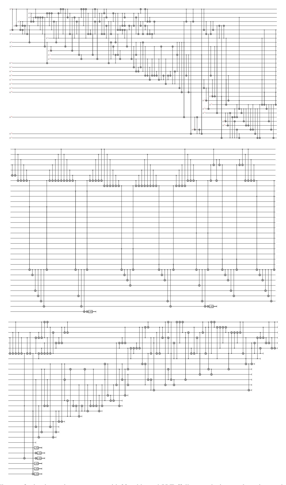
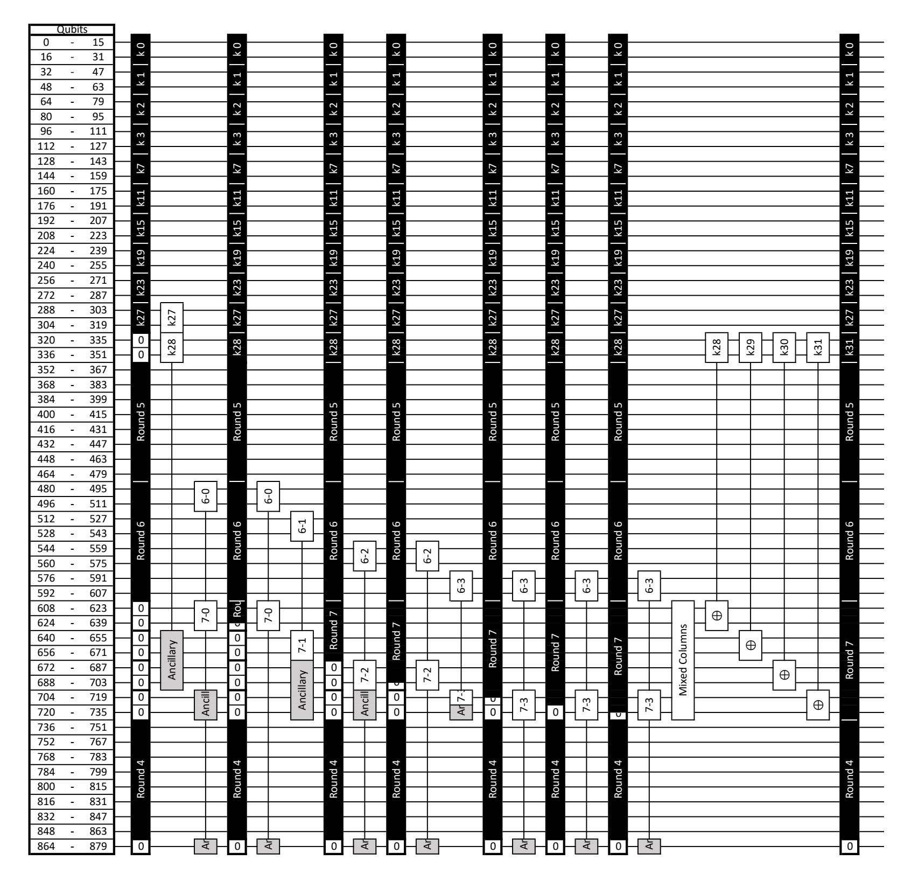
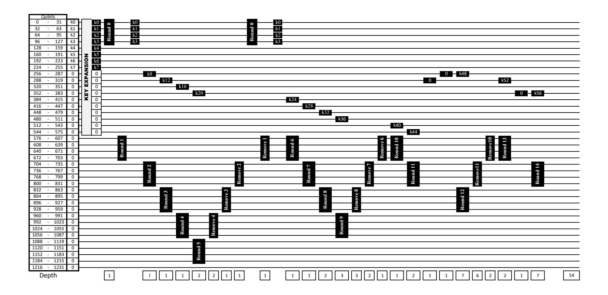

{0}------------------------------------------------

# Reducing the Cost of Implementing AES as a Quantum Circuit

Brandon Langenberg1,<sup>3</sup> , Hai Pham<sup>2</sup> , and Rainer Steinwandt<sup>2</sup>

1 PQSecure Technologies Boca Raton, FL 33431 brandon.langenberg@pqsecurity.com <sup>2</sup> Department of Mathematical Sciences Florida Atlantic University Boca Raton, FL 33431 {hpham9,rsteinwa}@fau.edu <sup>3</sup> Department of Computer and Electrical Engineering and Computer Science Florida Atlantic University

Abstract. To quantify security levels in a post-quantum scenario, it is common to use the quantum resources needed to attack AES as a reference value. Specifically, in NIST's ongoing post-quantum standardization effort, different security categories are defined that reflect the quantum resources needed to attack AES-128, AES-192, and AES-256.

Boca Raton, FL 33431

This paper presents a quantum circuit to implement the S-box of AES. Leveraging also an improved implementation of the key expansion, we identify new quantum circuits for all three AES key lengths. For AES-128, the number of Toffoli gates can be reduced by more than 88% compared to Almazrooie et al.'s and Grassl et al.'s estimates, while simultaneously reducing the number of qubits. Our circuits can be used to simplify a Grover-based key search for AES.

Keywords: quantum cryptanalysis; quantum circuit; Grover's algorithm; AES

## 1 Introduction

Reacting to progress in the development of quantum computers, NIST has initiated a process to standardize cryptographic primitives that are designed to remain secure in the presence of large-scale quantum computers [13]. To fix security categories, NIST's call for proposals offers the quantum resources for an exhaustive key search in the case of AES-128, AES-192, and AES-256 as a reference point. Relevant cost measures include the number of qubits, the number of T- and Clifford gates, and the T-depth. It is not hard to see that with exception of the highly structured S-box—the SubByte transform—all of AES can be implemented by means of NOT and CNOT gates.

*Contributions.* Below we present a new quantum circuit to implement SubByte, which builds on a result by Boyar and Peralta [6]. This approach allows a substantial reduction in the number of T-gates compared to the quantum circuits proposed by Grassl et al. [8] and, more recently, by Almazrooie et al. [1]. Our circuit requires 32 qubits, 55 Toffoli gates, 314 CNOT gates, 4 NOT gates, Toffoli depth 40, and a total (NCT) depth of 298, including "cleaning up" ancillas—a reduction of the Toffoli count by more than 88%. There are different options to compile Toffoli gates into Clifford and T-gates, and the common quantum cryptanalytic approach is to first express AES as an NCT circuit, i. e., with NOT, CNOT, and Toffoli gates. Consequently, in this paper we stay at the NCT level, leaving the choice of a particular decomposition of Toffoli gates into more elementary building blocks to a subsequent synthesis step.

Moreover, building on [8, 1], we present new quantum circuits for all three standardized key lengths of AES, which simultaneously offer savings in the number of qubits, the number of Toffoli gates, and the number of Clifford gates.

*Organization.* First, we briefly recall the structure of the S-box of AES and survey prior work to express this functionality as a quantum circuit. Thereafter, we present our design for implementing SubByte in the NCT gate set and integrate it into quantum circuits for AES-128, AES-192, and AES-256. We conclude with updated cost estimates for an exhaustive key search with Grover's algorithm for AES.

{1}------------------------------------------------

### 2 Preliminaries

For a full specification of AES we refer to [12], but we briefly recall the algebraic structure of SubByte.

#### 2.1 The S-box of AES

The AES algorithm uses multiple different transformations, but as detailed in [8], with the exception of SubByte all needed calculations can be expressed with NOT and CNOT gates alone. The non-linear SubByte transformation takes a one byte input  $\boldsymbol{b} \in \mathbb{F}_2^8$  and substitutes it with a byte  $S(\boldsymbol{b}) \in \mathbb{F}_2^8$  obtained by applying the following two operations:

- 1. Interpret b as coefficient vector of an element  $b \in \mathbb{F}_2[z]/(z^8+z^4+z^3+z+1)$ , and replace b with the bitstring b' corresponding to  $b^{-1}$ . For b = 0, set b' = b.
- 2. Apply an affine transformation, which consists of multiplication by an invertible matrix followed by the addition of a vector:

$$\mathbf{b'} \longmapsto \begin{bmatrix} 1 & 0 & 0 & 0 & 1 & 1 & 1 & 1 \\ 1 & 1 & 0 & 0 & 0 & 1 & 1 & 1 \\ 1 & 1 & 1 & 0 & 0 & 0 & 1 & 1 \\ 1 & 1 & 1 & 1 & 1 & 0 & 0 & 0 & 1 \\ 1 & 1 & 1 & 1 & 1 & 0 & 0 & 0 & 1 \\ 0 & 1 & 1 & 1 & 1 & 1 & 0 & 0 & 0 \\ 0 & 0 & 1 & 1 & 1 & 1 & 1 & 0 & 0 \\ 0 & 0 & 0 & 1 & 1 & 1 & 1 & 1 & 1 \end{bmatrix} \cdot \mathbf{b'} + \begin{bmatrix} 1 \\ 1 \\ 0 \\ 0 \\ 0 \\ 0 \\ 0 \\ 0 \\ 0 \\ 0 \\$$

In [12, Figure 7], SubByte is expressed as a traditional substitution table, but when aiming at an efficient quantum circuit, one can try to leverage the available algebraic structure:

- Observing that the map S that defines SubBye is a permutation on  $\mathbb{F}_2^8$  and therewith inherently reversible, we can try to reduce the number of qubits by evaluating S "in place."
- The affine map in the second step can be expressed with NOT and CNOT gates only, and one can focus on minimizing resources for the binary field inversion step, possibly exploiting the presence of intermediate fields.

#### 2.2 Prior work to implement SubByte as quantum circuit

Several authors looked into implementations of AES and its S-box as quantum circuits. In 2016, Grassl et al. [8] report a quantum circuit that builds on the observation that SubByte is a permutation. They offer a circuit that maps  $|x\rangle$  with  $x \in \mathbb{F}_2^8$  to  $|S(x)\rangle$  using only a single ancilla. However, the circuit (found by solving a word problem in a permutation group) is quite large: while it requires only 9 qubits, it uses 1385 Toffoli plus 1551 CNOT or NOT gates.

In [8], another circuit is offered, which exploits the algebraic structure of SubByte and maps the input  $|x\rangle |0^{32}\rangle$  to  $|x\rangle |S(x)\rangle |0^{24}\rangle$ . With 40 qubits, this circuit needs only 512 Toffoli along with 469 CNOT and 4 NOT gates. Kim et al. [11] suggest an improvement to the design in [8], saving one  $\mathbb{F}_{2^8}$ -multiplication. Almazrooie et al. [1] improve on Grassl et al.'s Toffoli count, using the same number of  $\mathbb{F}_{2^8}$ -multiplications as Kim et al. Exploiting again the algebraic structure of the S-box, Almazrooie et al. identify a quantum circuit with 56 qubits, 448 Toffoli gates, 494 CNOT gates, and 4 NOT gates.

When aiming at a reduction of T-gates and T-depth, work on classical reversible circuits offers helpful results, and it seems these have not been fully leveraged yet. For instance, in 2018, Saravanan and Kalpana [14] suggest an implementation of SubByte involving only 35 Toffoli, 152 CNOT, and 4 NOT gates. This design (which again exploits the algebraic structure of the S-box) produces dozens of "garbage outputs," and for our purposes the cost to "clean up" wires is to be taken into account. Still, combining Bennett's method [4] with [14] leads to a quantum circuit with a Toffoli count of only  $2 \cdot 35 = 70$ , less than one sixth of the Toffoli counts in [8, 1].

Exploring the S-box in AES from the perspective of identifying a low-depth combinational circuit, Boyar and Peralta present in [7] a proposal with only 34 AND gates. Their design again leverages the algebraic structure of

{2}------------------------------------------------

SubByte, and by naïvely combining Boyar and Peralta's work with Bennett's method we could derive a quantum circuit for the S-box of AES with no more than 68 Toffoli gates—though possibly a solid number of ancillas. As starting point for our work we use an older design by Boyar and Peralta [6], which involves only 32 AND gates to evaluate SubByte. Below, we transform the latter into a quantum circuit for SubByte that avoids the direct application of Bennett's method. In particular, this limits the number of Toffoli gates to 55, including all necessary "clean up."

### 3 Proposed quantum circuit for the S-box in AES

In [6], Boyar and Peralta discuss a technique for combinational logic optimization, which involves two steps. The first step identifies non-linear circuit components and reduces the number of AND gates—which for our purposes can be interpreted as saving Toffoli gates. The second step finds maximal linear components of the circuit and minimizes the number of XOR gates needed—therewith reducing the number of CNOT gates.

#### 3.1 Decomposition of the S-box by Boyar and Peralta

Making use of the intermediate fields  $\mathbb{F}_2 < \mathbb{F}_{2^2} < \mathbb{F}_{2^4} < \mathbb{F}_{2^8}$ , Boyar and Peralta derive a representation  $S(\boldsymbol{x}) = B \cdot F(U \cdot \boldsymbol{x})$  with matrices  $B \in \mathbb{F}_2^{8 \times 18}$ ,  $U \in \mathbb{F}_2^{22 \times 8}$ , and a non-linear function  $F : \mathbb{F}_2^{22} \longrightarrow \mathbb{F}_2^{18}$ . The matrices B and U are given in [6, Appendix A], and the function F can be computed as shown in Figure 1.

```
\begin{array}{llll} t_2 &= y_{12} \cdot y_{15} & t_3 &= y_3 \cdot y_6 & t_4 &= t_3 + t_2 \\ t_5 &= y_4 \cdot x_7 & t_6 &= t_5 + t_2 & t_7 &= y_{13} \cdot y_{16} \\ t_8 &= y_5 \cdot y_1 & t_9 &= t_8 + t_7 & t_{10} &= y_2 \cdot y_7 \\ t_{11} &= t_{10} + t_7 & t_{12} &= y_9 \cdot y_{11} & t_{13} &= y_{14} \cdot y_{17} \\ \hline \end{array}
t_{14} = t_{13} + t_{12} t_{15} = y_8 \cdot y_{10} t_{16} = t_{15} + t_{12}
t_{17} = t_4 + t_{14} t_{18} = t_6 + t_{16} t_{19} = t_9 + t_{14}
t_{20} = t_{11} + t_{16} \qquad t_{21} = t_{17} + y_{20}
                                                                      t_{22} = t_{18} + y_{19}
t_{23} = t_{19} + y_{21} t_{24} = t_{20} + y_{18}
t_{25} = t_{21} + t_{22} t_{26} = t_{21} \cdot t_{23} t_{27} = t_{24} + t_{26}
t_{28} = t_{25} \cdot t_{27} t_{29} = t_{28} + t_{22} t_{30} = t_{23} + t_{24}
t_{31} = t_{22} + t_{26} t_{32} = t_{31} \cdot t_{30} t_{33} = t_{32} + t_{24}
t_{34} = t_{23} + t_{33} t_{35} = t_{27} + t_{33} t_{36} = t_{24} \cdot t_{35}
t_{37} = t_{36} + t_{34} t_{38} = t_{27} + t_{36} t_{39} = t_{29} \cdot t_{38}
t_{40} = t_{25} + t_{39}
t_{41} = t_{40} + t_{37} t_{42} = t_{29} + t_{33} t_{43} = t_{29} + t_{40}
t_{44} = t_{33} + t_{37} t_{45} = t_{42} + t_{41} t_{20} = t_{44} \cdot y_{15}
z_1 = t_{37} \cdot y_6 z_2 = t_{33} \cdot x_7 z_3 = t_{43} \cdot y_{16} z_4 = t_{40} \cdot y_1 z_5 = t_{29} \cdot y_7 z_6 = t_{42} \cdot y_{11}
z_7 = t_{45} \cdot y_{17} z_8 = t_{41} \cdot y_{10} z_9 = t_{44} \cdot y_{12}
z_{10} = t_{37} \cdot y_3 z_{11} = t_{33} \cdot y_4 z_{12} = t_{43} \cdot y_{13} z_{13} = t_{40} \cdot y_5 z_{14} = t_{29} \cdot y_2 z_{15} = t_{42} \cdot y_9
z_{16} = t_{45} \cdot y_{14}
                                      z_{17} = t_{41} \cdot y_8
```

**Fig. 1.** Non-linear portion  $F: \mathbb{F}_2^{22} \longrightarrow \mathbb{F}_2^{18}$ ,  $(x_7, y_1, y_2, \dots, y_{21}) \longmapsto (z_0, \dots, z_{17})$  of the SubByte S-Box in AES as given in [6, Appendix C, Figure 3].

From this, we see that no more than 32 Toffoli gates are needed to evaluate SubByte, but we still need to take care of "cleaning up" ancillas—and would like to keep the number of qubits small. To optimize the linear portion of SubByte, Boyar and Peralta derive short linear programs, which we do not reproduce here; they are available in

{3}------------------------------------------------

[6, Appendix C, Figures 2 and 4] and involve XOR and XNOR operations only. The four NOT gates in our quantum circuit originate in the four XNOR gates used by Boyar and Peralta.

#### 3.2 Deriving a compact quantum circuit

A na¨ıve conversion of Boyer and Peralta's circuit yields a quantum circuit with 126 qubits, 32 Toffoli gates, 166 CNOT gates and 4 NOT gates—not yet taking into account the "clean up" cost. The circuit we aim at is to map |xi |0 a i to |xi S(x)|0 a−8 i with a small number a of ancilla qubits. Our circuit uses a = 24. We also identified a circuit with a = 23, but that circuit came at the expense of increasing the Toffoli count by 2, and our primary objective is to reduce the number of Toffoli gates.

To reduce the number of qubits in a straightforward translation, we notice that certain wires, after being accessed for a few immediate computations, remain idle until the end. Uncomputing these wires early on, enables us to reuse them instead of introducing additional ancillas. Another observation is that wires that store the output of the S-box do not need to be cleaned up. Thus, we try to have Toffoli gates applied directly to those wires to avoid involving them in the clean up process. Also, some computations would target a wire, and later on, the result is just added somewhere else. We try to place gates so that such "intermediate wires" are avoided. The final circuit we obtain, including "cleaning up", requires 32 qubits, 55 Toffoli, 314 CNOT, and 4 NOT gates. The Toffoli depth is 40, and the overall S-box depth is 298. Figure 2 gives a high-level view of the circuit, Appendix A gives a detailed description.

To produce the circuit description in Appendix A, we used the open-source software framework for quantum computing ProjectQ [16, 10]. The 8-bit input of SubByte is represented by U; T and Z represent ancillas, which are used in the intermediate computations and returned to zero at the end, and S represents the output of the S-box.

The main portion of the source code is the translation of equations in Figure 1. We treat U[0],. . . , U[7] as basis elements, and we update them as we progress to provide needed input values for a calculation. For instance, to compute t2, we first compute y<sup>12</sup> and y<sup>15</sup> and then apply a Toffoli gate. The value y<sup>12</sup> can be obtained as a linear combination of U[0], U[3], U[5], U[6], and we store this result on U[5]. Similarly, y<sup>15</sup> is a linear combination of U[0], U[3], U[4], U[6], and we store this result on U[4]. The Toffoli will use U[5], U[4] as controls and target T[0], which is t<sup>2</sup> at this moment. Our basis elements remain the same except for U[4] and U[5]. We have U[0]+U[3]+U[4]+U[6] and U[0]+U[3]+U[5]+U[6] respectively for the next computation. We repeat this technique until t<sup>45</sup> is computed. Notice that we are able to reuse the qubit T[8].

The computations annotated by "for z16" to "for z14" are preparations for later usages, because we do not want to uncompute Toffoli gates that can target output qubits directly. Some of the z<sup>i</sup> can be computed directly onto an output qubit and copied to other designated locations. For others, we compute them onto the ancilla Z[0], then copy the result to the needed output qubits before cleaning up Z[0] for reuse.

## 4 Quantum resource estimates for AES-{128, 192, 256}

Aside from the reduced S-box above, we offer a reduction for AES in terms of circuit depth as well as number of qubits over prior work in [8, 1]. This saving is due to a new cost-saving design in the architecture of the key expansion along with the reduced qubit requirements of our S-box. For our round generation, we adopt the "zig-zag" method from [8]. This is kept identical in AES-128 and AES-256, and a minimal change is made at the very end for AES-192. Expanding on ideas in [1], we recognize that by storing all k4n+3 for AES-128 and AES-256 and k4n+5 for AES-192 where n represents the round number, not only could we use a combination to construct future keys, but also gain the ability to remove keys once they are no longer used in future constructions. Since there is a direct correlation between T-depth and "S-box depth" (as the S-box is the only use of T-gates in our construction), we stop at S-box depth; the S-box can be replaced if a different design is preferred. Note the S-box design proposed in this paper uses 8 less qubits than [8] and 24 less qubits than [1] which allows for greater parallelization and thus a generally reduced "S-box depth."

### 4.1 Savings in AES-128

As part of the key expansion, various keywords k<sup>i</sup> are computed. Each k4<sup>n</sup> requires the use of four S-boxes and an XOR of previous keys. After Round 3 (after k12), all keys have a similar structure which can be seen below. In our

{4}------------------------------------------------



Fig. 2. Circuit diagram for implementing SubByte with 32 qubits and 55 Toffoli gates; the input value x is stored on the top-most eight wires; the output S(x) of SubByte is stored on the last 8 wires.

{5}------------------------------------------------

design, we store k4n+3 once round n has been fully computed. To save depth, each keyword will be constructed at the same time as the round it is used in, except for round one. This is because the plaintext and cipher key (k0, k1, k2, and k3) are XORed together to produce Round 0. However, both are required to construct Round 1, so Round 1 and k<sup>4</sup> must be constructed at sequential times. For the remaining rounds, the parallelization greatly reduces depth. For example, during Round 2, all S-box computations for k<sup>8</sup> as well as Round 2 can be computed with an S-box depth of one, using 320 auxiliary qubits. Once these S-boxes and MixColumns are computed, k<sup>8</sup> can be XORed onto Round 1, followed by the construction of k9, k10, and k11, each being XORed onto the round one construction. Thus, Round 2 is fully computed, and k<sup>11</sup> is stored, and this entire construction took a total S-box depth of one. When 320 auxiliary qubits are not available, not all S-box computations can be done in parallel and the depth must be increased (up to 7). Round 1 (without k4), Round 2, removing Round 1, and Round 5 all are computed with an S-box depth of one.

```
k4 : k3, k0 k5 : k4, k1 k6 : k5, k2 k7 : k6, k3
k8 : k7, k3, k2, k1 k9 : k8, k7, k3, k2 k10 : k7, k3 k11 : k10, k7
k12 : k11, k7, k2 k13 : k12, k11, k3 k14 : k13, k11, k7 k15 : k14, k11
k16 : k15, k11, k7, k3 k17 : k16, k15, k7 k18 : k17, k15, k11 k19 : k18, k15
k20 : k19, k15, k11, k7 k21 : k20, k19, k11 k22 : k21, k19, k15 k23 : k22, k19
k24 : k23, k19, k15, k11 k25 : k24, k23, k15 k26 : k25, k23, k19 k27 : k26, k23
k28 : k27, k23, k19, k15 k29 : k28, k27, k19 k30 : k29, k27, k23 k31 : k30, k27
k32 : k31, k27, k23, k19 k33 : k32, k31, k23 k34 : k33, k31, k27 k35 : k34, k31
k36 : k35, k31, k27, k23 k37 : k36, k35, k27 k38 : k37, k35, k31 k39 : k38, k35
k40 : k39, k35, k31, k27 k41 : k40, k39, k31 k42 : k41, k39, k35 k43 : k42, k39
```

Fig. 3. The keys required to construct each key in AES-128. The leftmost column requires four S-boxes while the rightmost column is what is stored at the end of each round.

While computing the keywords along with the rounds substantially reduces the overall depth, it does mean when auxiliary qubits are unavailable, the 20 S-boxes (16 for the round and 4 for the key) may require an increased S-box depth to be computed. While Round 2 has an S-box depth of one, Round 7 has an S-box depth of 7 since there are only 16 auxiliary qubits available (plus any qubits that have not stored part of Round 7 so far). Sometimes, round keys can be computed during the clean up of previous rounds. For example, when reversing and cleaning up Round 8, the key for Round 10 (k40) can be computed, thus needing only 16 S-boxes with a depth of 6 to compute Round 10 and thus complete the computations of AES-128.

By storing k4n+3 for each n ≤ 7, once we get to Round 7, and store keyword k31, we can remove keywords k15, k11, and k<sup>7</sup> from Rounds 3, 2, and 1, thus gaining storage space to place keywords for Rounds 8, 9, 10 in this space. This removal is done using S-boxes in reverse after the keys are returned to their k4<sup>n</sup> values. This is equivalent to the "zig-zag" method used in [8] to remove rounds, but here we use it to remove keys. This saves 96 qubits over [8] and 64 qubits over [1] who only removed one keyword. Since each keyword uses four S-boxes, the removal requires the use of 12 additional S-boxes for a substantial savings in qubits. The removal of keyword k<sup>15</sup> can be done during the removal of Round 5 without additional depth. Similarly, the removal of keyword k<sup>7</sup> can be done during the construction of Round 8 without additional depth. Thus, the S-box depth for the key expansion is two, which includes computing k<sup>4</sup> and removing k11, both with an S-box depth of one. If in the future, it is found the savings in qubits is not worth the additional gates and a depth of three S-boxes, this can be ignored and extra qubits can be used. The total depth of this circuit uses 47 S-boxes, 15 MixColumns computations with a depth of 39 each, and a depth of 142 to apply the AddRoundKey to each round.

#### 4.2 Savings in AES-192

AES-192 differs slightly in the key generation. Recall AES-192 only uses an S-box for every sixth key, and since only four keys are needed per round, some rounds only need 16 S-boxes to be fully computed and some need 16 plus the additional 4 for the key generation. So even though there are more rounds than in AES-128, there are less keywords

{6}------------------------------------------------



**Fig. 4.** AES-128 Diagram of Round 7 computations which have an S-box depth of seven. Each column represents an S-box depth of one.

generated. By the time keyword  $k_{48}$  needs to be computed,  $k_{11}$  and smaller keys are no longer needed, thus  $k_{11}$  can be reversed to  $k_6$  and then removed using an inverted S-box, thus saving 32 qubits for an additional 4 S-boxes.

Also, the "zig-zag" method used in [8] used the same amount of qubits for AES-256 as it did for AES-192. This means there is room for additional rounds or space savings. While we did not reduce the number of qubits for the round generation, we were able to use some of this additional space for the key expansion. Instead of placing Round 12 on the remaining 128 qubits, we can reverse part of Round 10 and reuse those qubits to store part of Round 12, thus gaining enough qubits to store round keys. Thus, when keyword  $k_{42}$  is generated, it is generated below where Round 11 is stored, thus saving another 32 qubits for the cost of another 4 inverted S-boxes. Overall, we were able to save 64 qubits over the results in [8]. The total depth of this circuit uses 41 S-boxes, 18 MixColumns, and a depth of 208 to apply AddRoundKey to each round.

#### 4.3 Savings in AES-256

The methods for AES-128 in Section 4.1 above apply equally here, but since the key constructions in AES-256 require more previous keys, the removal of keys is not as simple. However, after Round 11 and key  $k_{47}$  is constructed, keys for

{7}------------------------------------------------

rounds three and two  $(k_{15}$  and  $k_{11})$  can be removed in the same fashion as above, and keys for Rounds 12 and 13  $(k_{51}$  and  $k_{55})$  can be stored in their place. Also, after Round 13, key  $k_{23}$  can be removed and replaced with key material for Round 14  $(k_{59})$ . This is a total saving of 96 qubits for the increased costs of 12 S-boxes with a total additional depth of 3 S-boxes. The total depth of this circuit uses 54 S-boxes, 22 MixColumns, and a depth of 267 to apply AddRoundKey to each round.

This method of computing the keywords during the round generation and only storing  $k_{4n+3}$  for AES-128 and AES-256, and  $k_{4n+5}$  for AES-192 means the keys between  $k_{4n}$  and this key need to be computed several times, however this method is comparable to other methods of producing the additional keys directly in the rounds.



Fig. 5. AES-256 Circuit Diagram showing when keys are constructed and the S-box depth of each round computation.

Table 1 summarizes the resources needed to implement AES with the approach suggested here. For comparison,

|   |         | #NOT  | #CNOT   | #Toffoli | S-box Depth | Toffoli Depth | #Qubits |
|---|---------|-------|---------|----------|-------------|---------------|---------|
|   | AES-128 | 1,507 | 107,960 | 16,940   | 47          | 1,880         | 864     |
| Ì | AES-192 | 1,692 | 125,580 | 19,580   | 41          | 1,640         | 896     |
| İ | AES-256 | 1,992 | 151,011 | 23,760   | 54          | 2,160         | 1,232   |

Table 1. Quantum resources to implement AES.

we also recall resource counts for designs proposed in [8, 1]. Comparing Table 2 with Table 1, we see that the revised S-box design in combination with the changes to handling the key expansion enables attractive resource savings.

|                | Grassl et al. [8] |         |          |                                  | Almazrooie et al. [1] |                |         |          |                |         |
|----------------|-------------------|---------|----------|----------------------------------|-----------------------|----------------|---------|----------|----------------|---------|
|                | #NOT              | #CNOT   | #Toffoli | Toffoli Depth                    | #qubits               | #NOT           | #CNOT   | #Toffoli | Toffoli Depth  | #qubits |
| AES-128        | 1,456             | 166,548 | 151,552  | 12,672                           | 984                   | 1,370          | 192,832 | 150,528  | (not reported) | 976     |
| AES-192        | 1,608             | 189,432 | 172,032  | 11,088                           | 1,112                 | (not reported) |         |          |                |         |
| <b>AES-256</b> | 1,943             | 233,836 | 215,040  | ,040 14,976 1,336 (not reported) |                       |                |         |          |                |         |

Table 2. Resource estimates for AES using designs from prior literature.

{8}------------------------------------------------

### 5 Exhaustive key search with Grover's algorithm

For our discussion of leveraging Grover's algorithm for an exhaustive key search, we follow the approach in [8], i. e., we assume a straightforward application of Grover's algorithm, using our AES design to implement the pertinent Grover operator. We leave it for future work to explore possible time-space trade-offs in the spirit of Kim et al.'s work [11]. For Grover's algorithm [9], we need a quantum circuit  $U_f:|x\rangle|y\rangle\longmapsto|x\rangle|y\oplus f(x)\rangle$ , where  $x\in\{0,1\}^k$  represents a candidate key, and f(x)=1 if the key x matches all given plaintext-ciphertext pairs, and f(x)=0, otherwise. Following Amento-Adelmann et al. [2], we assume that  $r_k=\lceil k/128\rceil$  known plaintext-ciphertext pairs are sufficient to avoid false positives in an exhaustive key search for AES-k ( $k\in\{128,192,256\}$ ). Thus, taking into account "cleaning up" of wires, we need to implement

- 2 AES instances (for  $r_{128} = 1$  plaintext-ciphertext pair) for AES-128
- 4 AES instances (for  $r_{192} = 2$  plaintext-ciphertext pairs) for AES-192
- 4 AES instances (for  $r_{256} = 2$  plaintext-ciphertext pairs) for AES 256

Here, we do not distinguish between implementing encryption or decryption, as the latter can be obtained by running encryption backwards, thereby not affecting the cost parameters we are looking at.

Remark 5.1. The above choices for  $r_{128}$ ,  $r_{192}$ , and  $r_{256}$  are smaller than the ones used by Grassl et al. [8], but Amento-Adelmann et al.'s [2] reasoning could be applied to argue for a smaller number of AES instances in [8], too. We are not offering anything novel here — our contribution only affects the quantum circuit for AES.

#### 5.1 Number of qubits

As noted in [2], multiple plaintext-ciphertext pairs can be tested sequentially or in parallel, trading gates and circuit depth for the number of qubits. Prioritizing a smaller T-depth, here we choose the parallel option, as in [8], which leads to a total qubit count of  $r_k \cdot q_k + 1$ , where  $q_k$  is the number of qubits needed to implement AES-k according to Table 1:

- $1 \cdot 864 + 1 = 865$  qubits for a Grover-based key search in AES-128.
- $-2 \cdot 896 + 1 = 1,793$  qubits for a Grover-based key search in AES-192.
- $-2 \cdot 1,232 + 1 = 2,465$  qubits for a Grover-based key search in AES-256.

#### 5.2 Gate counts

Operator  $U_f$ . Inside the operator  $U_f$ , we need to compare the 128-bit outputs of the AES instances with  $r_k$  given ciphertexts. For this, we can use a  $128 \cdot r_k$ -controlled NOT (plus some NOT gates, which we neglect and that depend on the given ciphertext(s).) We also budget  $2 \cdot (r_k - 1) \cdot k$  CNOT gates to make the input key available to all  $r_k$  parallel AES instances (and uncomputing this operation at the end). And, of course, we need need to implement the actual AES instances. From Table 1, we obtain the following resource estimates:

- AES-128: Two AES-instances require  $2 \cdot 16$ , 940 = 33, 880 Toffoli gates with a Toffoli depth of  $2 \cdot 1$ , 880 = 3, 760. In addition, we need  $2 \cdot 1$ , 507 = 3, 014 NOT gates and  $2 \cdot 107$ , 960 = 215, 920 CNOT gates.
- AES-192: Four AES-instances require  $4 \cdot 19,580 = 78,320$  Toffoli gates with a Toffoli depth of  $2 \cdot 1,640 = 3,280$ . In addition, we need  $4 \cdot 1692 = 6,768$  NOT gates and  $4 \cdot 125,580 + 2 \cdot 192 = 502,704$  CNOT gates.
- AES-256: Four AES-instances require  $4 \cdot 23$ , 760 = 95, 040 Toffoli gates with a Toffoli depth of  $2 \cdot 2$ , 160 = 4, 320. In addition, we need  $4 \cdot 1$ , 992 = 7, 968 NOT gates and  $4 \cdot 151$ ,  $011 + 2 \cdot 256 = 604$ , 556 CNOT gates.

*Grover operator.* Grover's algorithm repeatedly applies the operator

$$G = U_f \cdot \left( \left( H^{\otimes k} \left( 2 \left| 0 \right\rangle \left\langle 0 \right| - \mathbf{1}_{2^k} \right) H^{\otimes k} \right) \otimes \mathbf{1}_2 \right),$$

where  $|0\rangle$  is the all-zero basis state of appropriate size. So in addition to  $U_f$ , further gates are needed. In this paper we do not offer any improvements to those parts of the algorithm. Following [8], for the operator  $2|0\rangle\langle 0|-\mathbf{1}_{2^k}$ , we budget a k-fold controlled NOT gate. With  $\lfloor \frac{\pi}{4} \cdot 2^{k/2} \rfloor$  Grover iterations being used for AES-k, we can now give estimates in the Clifford+T model and compare our results with prior work.

{9}------------------------------------------------

### 5.3 Overall cost

The above discussion does not rely on a particular translation from Toffoli gates to T-gates. For a comparison with prior work, we proceed similarly as in [8]:

- The number of T-gates to realize an `-fold controlled NOT (` ≥ 5) is estimated as 32 · ` − 84 (see [17]).
- Toffoli gates are assigned a cost of 7 T-gates plus 8 Clifford gates, a T-depth of 4, and a total depth of 8; this is motivated by the decomposition in [3, Fig. 7(a)]. Certainly, other choices would be possible here; e. g., in [15], Selinger offers a Toffoli decomposition with T-depth 1, using 7 T-gates, 18 Clifford gates, and 4 ancillas.
- To estimate the total number of Clifford gates, we count only the Clifford gates in the AES-instances, plus the 2 · (r<sup>k</sup> − 1) · k CNOT gates inside U<sup>f</sup> for the parallel processing of plaintext-ciphertext pairs.
- To estimate depth and T-depth we only take the depth and T-depth of AES-k into account (ignoring in particular the two multi-controlled NOT gates). For the S-box used in this paper, the (Clifford+T) depth is about 600.

With this, the estimated total cost for a Grover-based attack against AES-k is as follows.

### – AES-128:

- T-gates: b π 4 · 2 <sup>64</sup>c · (7 · 33, 880 + 32 · 128 − 84 + 32 · 128 − 84) ≈ 1.47 · 2 <sup>81</sup> T-gates with a T-depth of b π 4 · 2 <sup>64</sup>c · 4 · 3, 760 ≈ 1.44 · 2 77 .
- Clifford gates: b π · 2 <sup>64</sup>c · (8 · 33, 880 + 3, 014 + 215, 920) ≈ 1.46 · 2 82
- 4 • Circuit Depth: b π 4 · 2 <sup>64</sup>c · 2 · (47 · 600 + 15 · 39 + 142) ≈ 1.39 · 2 79

#### – AES-192:

- T-gates: b π 4 · 2 <sup>96</sup>c · 7 · (78, 320 + 32 · 192 − 84 + 32 · 256 − 84) ≈ 1.68 · 2 <sup>114</sup> T-gates with a T-depth of b π 4 · 2 <sup>96</sup>c · 4 · 3, 280 ≈ 1.26 · 2 109 .
- Clifford gates: b π 4 · 2 <sup>96</sup>c · (8 · 78, 320 + 6, 768 + 502, 704) ≈ 1.71 · 2 115
- Circuit Depth: b π 4 · 2 <sup>96</sup>c · 2 · (41 · 600 + 18 · 39 + 254) ≈ 1.23 · 2 111

## – AES-256:

- T-gates: b π 4 · 2 <sup>128</sup>c · 7 · (95, 040 + 32 · 256 − 84 + 32 · 256 − 84) ≈ 1.02 · 2 <sup>147</sup> T-gates with a T-depth of b π 4 · 2 <sup>128</sup>c · 4 · 4, 320 ≈ 1.66 · 2 141 .
- Clifford gates: b π 4 · 2 <sup>128</sup>c · (8 · 95, 040 + 7, 968 + 604, 556) ≈ 1.03 · 2 148
- Circuit Depth: b π 4 · 2 <sup>128</sup>c · 2 · (54 · 600 + 22 · 39 + 267) ≈ 1.61 · 2 143

Table 3 summarizes the main resource counts; for comparison we also include the estimates reported in [8].

## 6 Conclusion

The above discussion establishes that fewer quantum resources for an exhaustive key search in AES are required than previously reported. In particular, the number of Toffoli – and therewith the number of costly T-gates – can be reduced. These savings can be achieved in tandem with reducing the T-depth, the number of Clifford gates, and the number of qubits needed. Even for AES-128, the established quantum resource estimates remain well beyond currently available technology, but for a quantitative interpretation of the security categories offered by NIST in [13], it may be helpful to take the revised resource estimates into account.

## Acknowledgments

The authors would like to thank Mathias Soeken for making us aware of the work in [7] during a discussion with one of the authors at a Dagstuhl Seminar on quantum cryptanalysis. RS is in part supported through NATO SPS Project G5448 and through NIST awards 60NANB18D216 and 60NANB18D217.

{10}------------------------------------------------

|                 | Grassl et al. [8] | this paper      |  |  |  |  |
|-----------------|-------------------|-----------------|--|--|--|--|
| AES-128:        |                   |                 |  |  |  |  |
| #qubits         | 2, 953            | 865             |  |  |  |  |
| #T-gates        | 86<br>1.19 · 2    | 81<br>1.47 · 2  |  |  |  |  |
| T-depth         | 80<br>1.06 · 2    | 77<br>1.44 · 2  |  |  |  |  |
| #Clifford gates | 86<br>1.55 · 2    | 82<br>1.46 · 2  |  |  |  |  |
| overall depth   | 81<br>1.16 · 2    | 79<br>1.39 · 2  |  |  |  |  |
| AES-192:        |                   |                 |  |  |  |  |
| #qubits         | 4, 449            | 1, 793          |  |  |  |  |
| #T-gates        | 118<br>1.81 · 2   | 114<br>1.68 · 2 |  |  |  |  |
| T-depth         | 112<br>1.21 · 2   | 109<br>1.26 · 2 |  |  |  |  |
| #Clifford gates | 119<br>1.17 · 2   | 115<br>1.71 · 2 |  |  |  |  |
| overall depth   | 113<br>1.33 · 2   | 111<br>1.23 · 2 |  |  |  |  |
| AES-256:        |                   |                 |  |  |  |  |
| #qubits         | 6, 681            | 2, 465          |  |  |  |  |
| #T-gates        | 151<br>1.41 · 2   | 147<br>1.02 · 2 |  |  |  |  |
| T-depth         | 144<br>1.44 · 2   | 141<br>1.66 · 2 |  |  |  |  |
| #Clifford gates | 151<br>1.83 · 2   | 148<br>1.03 · 2 |  |  |  |  |
| overall depth   | 145<br>1.57 · 2   | 143<br>1.61 · 2 |  |  |  |  |

Table 3. Revised resource estimates in the Clifford+T model for a Grover-based key search for AES-k.

## References

- 1. Mishal Almazrooie, Azman Samsudin, Rosni Abdullah, and Kussay N. Mutter. Quantum reversible circuit of AES-128. *Quantum Information Processing*, 17(5):112, 2018.
- 2. Brittanney Amento-Adelmann, Markus Grassl, Brandon Langenberg, Yi-Kai Liu, Eddie Schoute, and Rainer Steinwandt. Quantum Cryptanalysis of Block Ciphers: A Case Study. Poster at Quantum Information Processing QIP 2018, 2018.
- 3. Matthew Amy, Dmitri Maslov, Michele Mosca, and Martin Roetteler. A Meet-in-the-Middle Algorithm for Fast Synthesis of Depth-Optimal Quantum Circuits. *IEEE Transactions on Computer-Aided Design of Integrated Circuits and Systems*, 32(6):818–830, 2013.
- 4. Charles H. Bennett. Logical Reversibility of Computation. *IBM Journal of Research and Development*, 17(6):525–532, 1973.
- 5. Wieb Bosma, John Cannon, and Catherine Playoust. The Magma algebra system. I. The user language. *Journal of Symbolic Computation*, 24(3–4):235–265, 1997.
- 6. Joan Boyar and Rene Peralta. A New Combinational Logic Minimization Technique with Applications to Cryptology. In Paola ´ Festa, editor, *International Symposium on Experimental Algorithms SEA 2010*, volume 6049 of *Lecture Notes in Computer Science*, pages 178–189. Springer, 2010. Preprint available at https://eprint.iacr.org/2009/191.
- 7. Joan Boyar and Rene Peralta. A depth-16 circuit for the AES S-box. Cryptology ePrint Archive: Report 2011/332, June 2011. ´ Available at https://eprint.iacr.org/2011/332.
- 8. Markus Grassl, Brandon Langenberg, Martin Roetteler, and Rainer Steinwandt. Applying Grover's Algorithm to AES: Quantum Resource Estimates. In Tsuyoshi Takagi, editor, *Post-Quantum Cryptography PQCrypto 2016*, volume 9606 of *Lecture Notes in Computer Science*, pages 29–43. Springer, 2016.
- 9. Lov K. Grover. A Fast Quantum Mechanical Algorithm for Database Search. In *Proceedings of the 28th Annual ACM Symposium on the Theory of Computing STOC 1996*, pages 212–219, 1996.
- 10. Thomas Haner, Damian S. Steiger, Krysta Svore, and Matthias Troyer. A software methodology for compiling quantum ¨ programs. *Quantum Science and Technology*, 3, 2018. Preprint available at https://arxiv.org/abs/1604.01401.
- 11. Panjin Kim, Daewan Han, and Kyung Chul Jeong. Time–space complexity of quantum search algorithms in symmetric cryptanalysis: applying to AES and SHA-2. *Quantum Information Processing*, 17:339, 2018.
- 12. NIST. Advanced Encryption Standard (AES). Federal Information Processing Standards Publication 197, November 2001.
- 13. NIST. Submission Requirements and Evaluation Criteria for the Post-Quantum Cryptography Standardization Process, 2017. Available at https://csrc.nist.gov/CSRC/media/Projects/Post-Quantum-Cryptography/ documents/call-for-proposals-final-dec-2016.pdf.
- 14. P. Saravanan and P. Kalpana. Novel Reversible Design of Advanced Encryption Standard Cryptographic Algorithm for Wireless Sensor Networks. *Wireless Personal Communications*, 100(4):1427–1458, 2018.

{11}------------------------------------------------

- 15. Peter Selinger. Quantum circuits of T-depth one. *Physical Review A*, 87(4):042302, 2013.
- 16. Damian S. Steiger, Thomas Haner, and Matthias Troyer. ProjectQ: An Open Source Software Framework for Quantum Com- ¨ puting. *CoRR*, abs/1612.08091, 2016.
- 17. Nathan Wiebe and Martin Roetteler. Quantum arithmetic and numerical analysis using Repeat-Until-Success circuits. *Quantum Information & Computation*, 16(1–2):34–178, 2016.

## A Description of our quantum circuit for **SubByte** in ProjectQ

```
impor t math
from p r o j e c t q . o p s impor t CNOT, Measu re , X, T o f f o l i
from p r o j e c t q impor t MainEngine
from p r o j e c t q . meta impor t Compute , Uncompute
from p r o j e c t q . b a c k e n d s impor t Ci r c uit D r a w e r , R e s o u r c eC o u nt e r ,
     C l a s s i c a l S i m u l a t o r
impor t p r o j e c t q . l i b s . math
d r a w i n g e n g i n e = C i r c u i t D r a w e r ( )
r e s o u r c e c o u n t e r = R e s o u r c eC o u nt e r ( )
sim = C l a s s i c a l S i m u l a t o r ( )
eng = MainEngine ( sim )
d e f ae s−box ( eng ) :
     U = eng . a l l o c a t e q u r e g ( 8 )
      T = eng . a l l o c a t e q u r e g ( 1 5 )
      Z = eng . a l l o c a t e q u r e g ( 1 )
      S = eng . a l l o c a t e q u r e g ( 8 )
      i n p ut m = [ 0 ] ∗ ( 8 )
      o ut p ut m = [ 0 ] ∗ ( 8 )
      wit h Compute ( eng ) :
            CNOT | (U [ 0 ] ,U [ 5 ] )
            CNOT | (U [ 3 ] ,U [ 5 ] )
            CNOT | (U [ 6 ] ,U [ 5 ] )
            CNOT | (U [ 0 ] ,U [ 4 ] )
            CNOT | (U [ 3 ] ,U [ 4 ] )
            CNOT | (U [ 6 ] ,U [ 4 ] )
            T o f f o l i | (U [ 5 ] ,U [ 4 ] , T [ 0 ] ) # t 2
            CNOT | ( T [ 0 ] , T [ 5 ] )
            CNOT | (U [ 1 ] ,U [ 3 ] )
            CNOT | (U [ 2 ] ,U [ 3 ] )
            CNOT | (U [ 7 ] ,U [ 3 ] )
            T o f f o l i | (U [ 3 ] ,U [ 7 ] , T [ 0 ] ) # t 6
            CNOT | (U [ 0 ] ,U [ 6 ] )
            CNOT | (U [ 0 ] ,U [ 2 ] )
```

{12}------------------------------------------------

```
CNOT | (U [ 4 ] ,U [ 2 ] )
CNOT | (U [ 5 ] ,U [ 2 ] )
CNOT | (U [ 6 ] ,U [ 2 ] )
T o f f o l i | (U [ 6 ] ,U [ 2 ] , T [ 1 ] ) # t 7
CNOT | ( T [ 1 ] , T [ 2 ] )
CNOT | (U [ 2 ] ,U [ 1 ] )
CNOT | (U [ 4 ] ,U [ 1 ] )
CNOT | (U [ 5 ] ,U [ 1 ] )
CNOT | (U [ 7 ] ,U [ 1 ] )
CNOT | (U [ 1 ] ,U [ 0 ] )
CNOT | (U [ 6 ] ,U [ 0 ] )
T o f f o l i | (U [ 1 ] ,U [ 0 ] , T [ 1 ] ) # t 9
CNOT | (U [ 1 ] ,U [ 6 ] )
CNOT | (U [ 0 ] ,U [ 2 ] )
T o f f o l i | (U [ 6 ] ,U [ 2 ] , T [ 2 ] ) # t 1 1
CNOT | (U [ 6 ] ,U [ 3 ] )
CNOT | (U [ 7 ] ,U [ 2 ] )
T o f f o l i | (U [ 3 ] ,U [ 2 ] , T [ 3 ] ) # t 1 2
CNOT | ( T [ 3 ] , T [ 4 ] )
CNOT | (U [ 1 ] ,U [ 6 ] )
CNOT | (U [ 5 ] ,U [ 6 ] )
CNOT | (U [ 2 ] ,U [ 0 ] )
CNOT | (U [ 4 ] ,U [ 0 ] )
CNOT | (U [ 7 ] ,U [ 0 ] )
T o f f o l i | (U [ 6 ] ,U [ 0 ] , T [ 3 ] ) # t 1 4
CNOT | (U [ 6 ] ,U [ 3 ] )
CNOT | (U [ 2 ] ,U [ 0 ] )
T o f f o l i | (U [ 3 ] ,U [ 0 ] , T [ 4 ] ) # t 1 6
CNOT | ( T [ 3 ] , T [ 1 ] ) # t 1 9
CNOT | (U [ 1 ] ,U [ 3 ] )
CNOT | (U [ 7 ] ,U [ 4 ] )
T o f f o l i | (U [ 3 ] ,U [ 4 ] , T [ 5 ] ) # t 4
CNOT | ( T [ 5 ] , T [ 3 ] ) # t 1 7
CNOT | ( T [ 4 ] , T [ 0 ] ) # t 1 8
CNOT | ( T [ 2 ] , T [ 4 ] ) # t 2 0
CNOT | (U [ 1 ] ,U [ 6 ] )
CNOT | (U [ 2 ] ,U [ 6 ] )
CNOT | (U [ 3 ] ,U [ 6 ] )
CNOT | (U [ 6 ] , T [ 3 ] ) # t 2 1
```

{13}------------------------------------------------

```
CNOT | (U [ 0 ] ,U [ 1 ] )
CNOT | (U [ 3 ] ,U [ 1 ] )
CNOT | (U [ 1 ] , T [ 0 ] ) # t 2 2
CNOT | (U [ 1 ] ,U [ 5 ] )
CNOT | (U [ 4 ] ,U [ 5 ] )
CNOT | (U [ 6 ] ,U [ 5 ] )
CNOT | (U [ 7 ] ,U [ 5 ] )
CNOT | (U [ 5 ] , T [ 1 ] ) # t 2 3
CNOT | (U [ 1 ] ,U [ 4 ] )
CNOT | (U [ 3 ] ,U [ 4 ] )
CNOT | (U [ 5 ] ,U [ 4 ] )
CNOT | (U [ 4 ] , T [ 4 ] ) # t 2 4
T o f f o l i | ( T [ 3 ] , T [ 1 ] , T [ 6 ] ) # t 2 6
CNOT | ( T [ 0 ] , T [ 3 ] ) # t 2 5
CNOT | ( T [ 4 ] , T [ 7 ] )
CNOT | ( T [ 6 ] , T [ 7 ] ) # t 2 7
CNOT | ( T [ 0 ] , T [ 6 ] ) # t 3 1
T o f f o l i | ( T [ 3 ] , T [ 7 ] , T [ 0 ] ) # t 2 9
CNOT | ( T [ 1 ] , T [ 8 ] )
CNOT | ( T [ 4 ] , T [ 8 ] ) # t 3 0
T o f f o l i | ( T [ 6 ] , T [ 8 ] , T [ 9 ] ) # t 3 2
# c l e a n up T [ 8 ] :
CNOT | ( T [ 4 ] , T [ 8 ] )
CNOT | ( T [ 1 ] , T [ 8 ] )
#T [ 8 ] i s f r e e t o r e u s e
CNOT | ( T [ 4 ] , T [ 9 ] ) # t 3 3
CNOT | ( T [ 9 ] , T [ 1 ] ) # t 3 4
CNOT | ( T [ 7 ] , T [ 8 ] )
CNOT | ( T [ 9 ] , T [ 8 ] ) # t 3 5
T o f f o l i | ( T [ 4 ] , T [ 8 ] , T [ 1 0 ] ) # t 3 6
# c l e a n up T [ 8 ] a g ai n :
CNOT | ( T [ 9 ] , T [ 8 ] )
CNOT | ( T [ 7 ] , T [ 8 ] )
#T [ 8 ] i s f r e e t o r e u s e
CNOT | ( T [ 1 0 ] , T [ 1 ] ) # t 3 7
CNOT | ( T [ 1 0 ] , T [ 7 ] ) # t 3 8
```

{14}------------------------------------------------

```
T o f f o l i | ( T [ 0 ] , T [ 7 ] , T [ 3 ] ) # t 4 0
     CNOT | ( T [ 3 ] , T [ 8 ] )
     CNOT | ( T [ 1 ] , T [ 8 ] ) # t 4 1
     CNOT | ( T [ 0 ] , T [ 1 1 ] )
     CNOT | ( T [ 9 ] , T [ 1 1 ] ) # t 4 2
     CNOT | ( T [ 0 ] , T [ 1 2 ] )
     CNOT | ( T [ 3 ] , T [ 1 2 ] ) # t 4 3
     CNOT | ( T [ 9 ] , T [ 1 3 ] )
     CNOT | ( T [ 1 ] , T [ 1 3 ] ) # t 4 4
     CNOT | ( T [ 1 1 ] , T [ 1 4 ] )
     CNOT | ( T [ 8 ] , T [ 1 4 ] ) # t 4 5
     CNOT | (U [ 0 ] ,U [ 2 ] )
     CNOT | (U [ 1 ] ,U [ 2 ] )
     CNOT | (U [ 6 ] ,U [ 2 ] ) # f o r z 1 6
     CNOT | (U [ 1 ] ,U [ 4 ] )
     CNOT | (U [ 3 ] ,U [ 4 ] )
     CNOT | (U [ 5 ] ,U [ 4 ] ) # f o r z 1
     CNOT | (U [ 1 ] ,U [ 6 ] )
     CNOT | (U [ 3 ] ,U [ 6 ] )
     CNOT | (U [ 4 ] ,U [ 6 ] )
     CNOT | (U [ 5 ] ,U [ 6 ] )
     CNOT | (U [ 7 ] ,U [ 6 ] ) # f o r z 1 1
     CNOT | (U [ 1 ] ,U [ 0 ] )
     CNOT | (U [ 3 ] ,U [ 0 ] ) # f o r z 1 3
     CNOT | (U [ 0 ] ,U [ 3 ] )
     CNOT | (U [ 2 ] ,U [ 3 ] )
     CNOT | (U [ 6 ] ,U [ 3 ] ) # f o r z 1 4
T o f f o l i | ( T [ 0 ] ,U [ 3 ] , S [ 2 ] ) # z 1 4
CNOT | ( S [ 2 ] , S [ 5 ] )
CNOT | (U [ 0 ] ,U [ 3 ] )
T o f f o l i | ( T [ 1 2 ] ,U [ 3 ] , S [ 6 ] ) # z 1 2
CNOT | ( S [ 6 ] , S [ 2 ] )
CNOT | ( S [ 6 ] , S [ 5 ] )
CNOT | (U [ 0 ] ,U [ 3 ] )
T o f f o l i | ( T [ 1 ] ,U [ 4 ] , S [ 1 ] ) # z 1
CNOT | ( S [ 1 ] , S [ 3 ] )
CNOT | ( S [ 1 ] , S [ 4 ] )
```

{15}------------------------------------------------

```
CNOT | (U [ 7 ] ,U [ 4 ] )
T o f f o l i | ( T [ 1 3 ] ,U [ 4 ] , S [ 7 ] ) # z 0
CNOT | ( S [ 7 ] , S [ 1 ] )
CNOT | ( S [ 7 ] , S [ 2 ] )
CNOT | ( S [ 7 ] , S [ 3 ] )
CNOT | ( S [ 7 ] , S [ 5 ] )
CNOT | (U [ 7 ] ,U [ 4 ] )
T o f f o l i | ( T [ 3 ] ,U [ 0 ] , S [ 6 ] ) # z 1 3
CNOT | ( S [ 6 ] , S [ 7 ] )
CNOT | (U [ 3 ] ,U [ 6 ] )
T o f f o l i | ( T [ 1 1 ] ,U [ 6 ] , S [ 0 ] ) # z 1 5
CNOT | ( S [ 0 ] , S [ 2 ] )
CNOT | (U [ 3 ] ,U [ 6 ] )
T o f f o l i | ( T [ 1 4 ] ,U [ 2 ] , S [ 0 ] ) # z 1 6
CNOT | ( S [ 0 ] , S [ 1 ] )
CNOT | ( S [ 0 ] , S [ 3 ] )
CNOT | ( S [ 0 ] , S [ 4 ] )
CNOT | ( S [ 0 ] , S [ 5 ] )
CNOT | ( S [ 0 ] , S [ 6 ] )
CNOT | ( S [ 0 ] , S [ 7 ] )
T o f f o l i | ( T [ 9 ] ,U [ 7 ] , Z [ 0 ] ) # z 2
CNOT | ( Z [ 0 ] , S [ 2 ] )
CNOT | ( Z [ 0 ] , S [ 4 ] )
CNOT | ( Z [ 0 ] , S [ 5 ] )
CNOT | ( Z [ 0 ] , S [ 7 ] )
T o f f o l i | ( T [ 9 ] ,U [ 7 ] , Z [ 0 ] )
wit h Compute ( eng ) :
      CNOT | (U [ 0 ] ,U [ 5 ] )
      CNOT | (U [ 3 ] ,U [ 5 ] )
      T o f f o l i | ( T [ 1 2 ] ,U [ 5 ] , Z [ 0 ] ) # z 3
CNOT | ( Z [ 0 ] , S [ 0 ] )
CNOT | ( Z [ 0 ] , S [ 3 ] )
CNOT | ( Z [ 0 ] , S [ 5 ] )
CNOT | ( Z [ 0 ] , S [ 7 ] )
Uncompute ( eng )
wit h Compute ( eng ) :
      CNOT | (U [ 1 ] ,U [ 6 ] )
      CNOT | (U [ 2 ] ,U [ 6 ] )
      CNOT | (U [ 3 ] ,U [ 6 ] )
      CNOT | (U [ 4 ] ,U [ 6 ] )
      T o f f o l i | ( T [ 3 ] ,U [ 6 ] , Z [ 0 ] ) # z 4
CNOT | ( Z [ 0 ] , S [ 0 ] )
CNOT | ( Z [ 0 ] , S [ 3 ] )
CNOT | ( Z [ 0 ] , S [ 4 ] )
```

{16}------------------------------------------------

```
CNOT | ( Z [ 0 ] , S [ 5 ] )
CNOT | ( Z [ 0 ] , S [ 6 ] )
Uncompute ( eng )
wit h Compute ( eng ) :
      CNOT | (U [ 0 ] ,U [ 6 ] )
      CNOT | (U [ 1 ] ,U [ 6 ] )
      CNOT | (U [ 2 ] ,U [ 6 ] )
      CNOT | (U [ 4 ] ,U [ 6 ] )
      CNOT | (U [ 5 ] ,U [ 6 ] )
      T o f f o l i | ( T [ 0 ] ,U [ 6 ] , Z [ 0 ] ) # z 5
CNOT | ( Z [ 0 ] , S [ 4 ] )
CNOT | ( Z [ 0 ] , S [ 6 ] )
CNOT | ( Z [ 0 ] , S [ 7 ] )
Uncompute ( eng )
wit h Compute ( eng ) :
      CNOT | (U [ 0 ] ,U [ 7 ] )
      CNOT | (U [ 1 ] ,U [ 7 ] )
      CNOT | (U [ 2 ] ,U [ 7 ] )
      CNOT | (U [ 4 ] ,U [ 7 ] )
      CNOT | (U [ 5 ] ,U [ 7 ] )
      CNOT | (U [ 6 ] ,U [ 7 ] )
      T o f f o l i | ( T [ 1 1 ] ,U [ 7 ] , Z [ 0 ] ) # z 6
CNOT | ( Z [ 0 ] , S [ 0 ] )
CNOT | ( Z [ 0 ] , S [ 1 ] )
CNOT | ( Z [ 0 ] , S [ 2 ] )
Uncompute ( eng )
wit h Compute ( eng ) :
      CNOT | (U [ 0 ] ,U [ 7 ] )
      CNOT | (U [ 3 ] ,U [ 7 ] )
      CNOT | (U [ 4 ] ,U [ 7 ] )
      CNOT | (U [ 5 ] ,U [ 7 ] )
      T o f f o l i | ( T [ 1 4 ] ,U [ 7 ] , Z [ 0 ] ) # z 7
CNOT | ( Z [ 0 ] , S [ 0 ] )
CNOT | ( Z [ 0 ] , S [ 1 ] )
CNOT | ( Z [ 0 ] , S [ 5 ] )
CNOT | ( Z [ 0 ] , S [ 6 ] )
Uncompute ( eng )
wit h Compute ( eng ) :
      CNOT | (U [ 1 ] ,U [ 6 ] )
      CNOT | (U [ 2 ] ,U [ 6 ] )
      CNOT | (U [ 3 ] ,U [ 6 ] )
      T o f f o l i | ( T [ 8 ] ,U [ 6 ] , Z [ 0 ] ) # z 8
CNOT | ( Z [ 0 ] , S [ 2 ] )
CNOT | ( Z [ 0 ] , S [ 5 ] )
CNOT | ( Z [ 0 ] , S [ 6 ] )
Uncompute ( eng )
```

{17}------------------------------------------------

```
wit h Compute ( eng ) :
      CNOT | (U [ 0 ] ,U [ 3 ] )
      CNOT | (U [ 2 ] ,U [ 3 ] )
      T o f f o l i | ( T [ 1 3 ] ,U [ 3 ] , Z [ 0 ] ) # z 9
CNOT | ( Z [ 0 ] , S [ 0 ] )
CNOT | ( Z [ 0 ] , S [ 1 ] )
CNOT | ( Z [ 0 ] , S [ 3 ] )
CNOT | ( Z [ 0 ] , S [ 4 ] )
Uncompute ( eng )
wit h Compute ( eng ) :
      CNOT | (U [ 0 ] ,U [ 6 ] )
      CNOT | (U [ 2 ] ,U [ 6 ] )
      CNOT | (U [ 3 ] ,U [ 6 ] )
      T o f f o l i | ( T [ 1 ] ,U [ 6 ] , Z [ 0 ] ) # z 1 0
CNOT | ( Z [ 0 ] , S [ 0 ] )
CNOT | ( Z [ 0 ] , S [ 1 ] )
CNOT | ( Z [ 0 ] , S [ 3 ] )
CNOT | ( Z [ 0 ] , S [ 4 ] )
CNOT | ( Z [ 0 ] , S [ 5 ] )
Uncompute ( eng )
CNOT | (U [ 2 ] ,U [ 6 ] )
CNOT | (U [ 3 ] ,U [ 6 ] )
T o f f o l i | ( T [ 8 ] ,U [ 6 ] , S [ 2 ] ) # z 1 7
CNOT | (U [ 3 ] ,U [ 6 ] )
CNOT | (U [ 2 ] ,U [ 6 ] )
T o f f o l i | ( T [ 9 ] ,U [ 6 ] , S [ 5 ] ) # z 1 1
X | S [ 1 ]
X | S [ 2 ]
X | S [ 6 ]
X | S [ 7 ]
```

Uncompute ( eng )