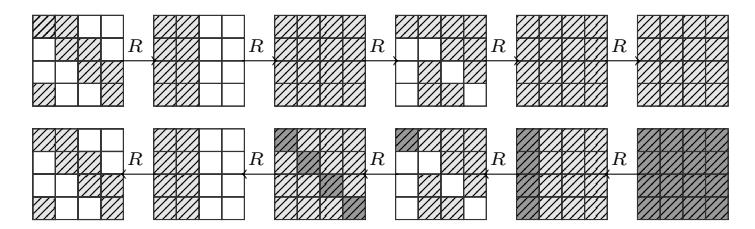
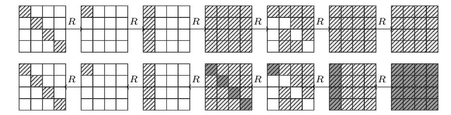

# A Key-Independent Distinguisher for 6-round AES in an Adaptive Setting

Navid Ghaedi Bardeh

Department of Informatics University of Bergen, Norway

Abstract. In this paper, we study the results of the recently proposed exchange attack in an adaptive setting. As expected, it leads to present a better 6-round key-independent distinguisher in terms of data and computational complexities. More specifically, our 6-round adaptive distinguisher requires 2<sup>83</sup> chosen plaintexts and 2<sup>83</sup> adaptively chosen ciphertexts and has a computational cost of 2<sup>83</sup> encryption.

Keywords: SPN, AES, Exchange Attack, Secret-Key model, Difference Cryptanalysis

# 1 Introduction

In 2000, Rijndael block cipher is accepted as AES (Advance Encryption Standard) by NIST. AES is provably resistant against differential and linear cryptanalysis. During the last 20 years, among to large amount researches [15, 4, 14, 9, 7, 6, 10]), there is only the biclique attack [5] which can break AES faster than exhaustive search. Up to now, the best known key recovery attack in secret key model can break 7-round of AES.

Integral and impossible differential distinguishers on 4-round AES, in secret key model, were best distinguishers (in term of reaching highest rounds) for several years. Recently, since 2016, new developments has been presented for roundreduced AES. These developments showed several basic and unexplored properties for round-reduced AES. First 5-round distinguishers have been appeared in several studies[17, 12, 16, 3, 11, 1, 2]. Some of these 5-round distinguishers have gained more attentions since they can be extended to 6-round distinguishers.

### 1.1 Overview of 6-round distinguishers on AES

At Asiacrypt 2017, the authors of [16] presented the first 6-round secret-key distinguishers for AES which requires 2<sup>122</sup>.<sup>8</sup> adaptive chosen plaintexts/ciphertexts and a computational cost of 2<sup>121</sup>.<sup>8</sup> XORs. The authors introduced a new deterministic 4-round property in AES, which states that sets of pairs of plaintexts that are equivalent by exchange of any subset of diagonals encrypts to a set of pairs of ciphertexts after four rounds that all have a difference of zero in exactly the same columns before the final linear layer.

Then, Bardeh and Rønjom [2] presented a new technique called exchange attack. They showed that 6-round of AES is biased when the plaintexts are chosen from a certain set (exchange equivalence sets). Their 6-round distinguisher requires 288.<sup>2</sup> chosen plaintexts and a computational cost of 288.<sup>2</sup> encryption.

Later, Bao, Guo and List [1] presented a 6-round distinguisher requires 289.<sup>43</sup> chosen plaintexts and a computational cost of 296.<sup>52</sup> look-ups into memory. The authors extended a known integral distinguisher to the exception distinguisher.

## 1.2 Our Contribution

We investigate the results of exchange attack in an adaptive setting. As results, we present a 5-round adaptive chosen ciphertext distinguisher which it's data complexity is higher than the best current adaptive chosen ciphertext distinguisher. However, it can be extended to a 6-round adaptive chosen ciphertext distinguisher which requires 2<sup>83</sup> chosen plaintexts and 2<sup>83</sup> adaptive chosen ciphertexts, which is as far as we know a new record.

## 1.3 Overview of This Paper and Main Results

In Section 2 we briefly describe the exchange attack and it's results on reducedround of AES. In section 3 we present a key independent 5-round ACC distinguisher. In section 4 we introduce an efficient 6-round key-independent ACC distinguisher. The currently best secret-key distinguishers for 5- and 6-round AES are given in Table 1. We adopt that data complexity is measured in a minimum number of chosen plaintexts/ciphertexts CP/CC or adaptively chosen plaintexts/ciphertexts ACP/ACC. Time complexity is measured in equivalent number of AES encryptions (E), memory accesses (M) and/or XOR operations (XOR) - adopting that 20M ≈ 1 round of AES.

Table 1: Secret-Key Distinguishers for AES

| Property          | Rounds | Data                     | Cost            | Ref.    |
|-------------------|--------|--------------------------|-----------------|---------|
| Integral          | 5      | 128 CP<br>2              | 129.6 XORs<br>2 | [17]    |
| Expectation of TD | 5      | 65 CP<br>2               | 70.2 M<br>2     | [1]     |
| Expectation of TD | 5      | 48.96 CP<br>2            | 46 E<br>2       | [11]    |
| Exchange Attack   | 5      | 35.5 CP + 239 ACC<br>2   | 35.5 E<br>2     | Sect. 3 |
| Multiple-8        | 5      | 32 CP<br>2               | 35.6 M<br>2     | [13]    |
| Exchange Attack   | 5      | 30 CP<br>2               | 30E<br>2        | [2]     |
| Zero difference   | 5      | 12.2 CP + 227.2 ACC<br>2 | 26.2 XOR<br>2   | [3]     |
| Zero difference   | 5      | 26.8 ACC<br>2            | 25.8 XOR<br>2   | [16]    |
| Zero difference   | 6      | 122.8 ACC<br>2           | 121.8 XOR<br>2  | [16]    |
| Expectation of TD | 6      | 89.43 CP<br>2            | 96.52 M<br>2    | [1]     |
| Exchange Attack   | 6      | 88.2 CP<br>2             | 88.2E<br>2      | [2]     |
| Exchange Attack   | 6      | 83 CP + 283 ACC<br>2     | 83 E<br>2       | Sect. 4 |

#### 2 Preliminaries

The Advanced Encryption Standard (AES)[8] is the most widely adopted block cipher in the world today and is a critical component in protecting information in both commercial and high-assurance communication. The AES internal state is typically represented by a 4 by 4 matrix in  $\mathbb{F}_{2^8}^{4\times4}$ . The matrix representation is for the most part purely representational as the actual properties of the matrix (e.g. rank, order etc.) are not actually exploited for anything. One full round of AES consists of SubBytes (SB), ShiftRows (SR), MixColumns (MC) and AddKey (AK). The SB-layer applies a fixed permutation over  $\mathbb{F}_{2^8}$  independently to each byte of the state, the SR-layer cyclically shifts the *i*-th row by *i* positions, while the MC-layer applies a fixed linear transformation to each column. The key addition adds a secret round-dependent value to the state. One full round is composed as  $R = AK \circ MC \circ SR \circ SB$ . We follow standard convention and simplify notation by writing  $R^t(x)$  to mean t rounds of AES where each round key is fixed to some random value.

We recall the exchange attack presented in [2]. Here, we recall the basic definitions and Theorems presented in the exchange attack to use them for presenting our results.

**Definition 1.** [2] For a vector  $v \in \mathbb{F}_2^4$  and a pair of states  $\alpha, \beta \in \mathbb{F}_{2^8}^{4 \times 4}$  define the column exchange difference  $\Delta_v \stackrel{def}{=} \Delta_v^{\alpha,\beta} \in \mathbb{F}_{2^8}^{4 \times 4}$  where the i-th column is defined by

$$(\Delta_v)_i = (\alpha_i \oplus \beta_i)v_i$$

where  $\alpha_i$  and  $\beta_i$  are the i-th columns of  $\alpha$  and  $\beta$ .

A pair of states define a set of  $2^{wt_c(\alpha \oplus \beta)}$  possible column exchange differences where  $wt_c(x)$  denotes the number of non-zero columns of x. We can now define three related operators that exchange diagonal, column and mixed values between a pair of AES states.

**Definition 2** (Column exchange). [2] For a vector  $v \in \mathbb{F}_2^4$  and a pair of states  $\alpha, \beta \in \mathbb{F}_{2^8}^{4 \times 4}$ , define column exchange according to v as

$$\rho_c^v(\alpha,\beta) = \alpha \oplus \Delta_v.$$

It is easy to see that the pair of states  $(\rho_c^v(\alpha, \beta), \rho_c^v(\beta, \alpha)) = (\alpha \oplus \Delta_v, \beta \oplus \Delta_v)$  are formed by exchanging individual columns between  $\alpha$  and  $\beta$  according to the binary coefficients of v. Thus, for any v it is easy to see that

$$\alpha \oplus \beta = \rho_c^v(\alpha, \beta) \oplus \rho_c^v(\beta, \alpha).$$

**Definition 3** (*Diagonal exchange*). [2] For a vector  $v \in \mathbb{F}_2^4$  and a pair of states  $\alpha, \beta \in \mathbb{F}_{2^8}^{4 \times 4}$ , define diagonal exchange according to v as

$$\rho_d^v(\alpha, \beta) = \alpha \oplus SR^{-1}(\Delta_v^{SR(\alpha)), SR(\beta)}).$$

The new pair  $(\rho_d^v(\alpha, \beta), \rho_d^v(\beta, \alpha))$  is formed by exchanging individual diagonals between  $\alpha$  and  $\beta$  according to the binary coefficients of v. The relationship between exchange of diagonals and exchange of columns is intuitively straightforward.

**Lemma 1.** [2] From the definition of  $\rho_d^v$  and  $\rho_c^v$  it follows that

$$R(\rho_d^v(\alpha, \beta)) = \rho_c^v(R(\alpha), R(\beta)).$$

**Definition 4 (Mixed exchange).** [2] For a vector  $v \in \mathbb{F}_2^4$  and a pair of states  $\alpha, \beta \in \mathbb{F}_{28}^{4 \times 4}$  define mixed exchange according to v as

$$\rho_m^v(\alpha,\beta) = a \oplus L(\Delta_v^{L^{-1}(\alpha),L^{-1}(\beta)})$$

where  $L = MC \circ SR$ .

**Lemma 2.** [2] From the definition of  $\rho_c^v$  and  $\rho_m^v$  it follows that

$$R(\rho_c^v(\alpha,\beta)) = \rho_m^v(R(\alpha),R(\beta)).$$

**Lemma 3.** [2] For two random states  $\alpha, \beta$  and some non-zero vector  $v \in \mathbb{F}_2^4$ , we have that

$$R^{2}(\rho_{d}^{v}(\alpha,\beta)) = \rho_{m}^{v}(R^{2}(\alpha), R^{2}(\beta)).$$

To indicate the zero column(s) of a state  $x \in \mathbb{F}_{28}^{4 \times 4}$ , we define  $\nu(x)$  which denotes the binary indicator vector which is 0 in position i if the i-th column of x is zero and 1 otherwise. We also are interested to know the zero column of a state after/before the first and last linear layer so we define,  $L = SR \circ MC$ ,  $\nu_m(x) = \nu(L^{-1}(x))$  and  $\nu_d(x) = \nu(SR(x))$ . For a subset  $I \subset \{0,1,2,3\}$ , we write  $v^I \in \mathbb{F}_2^4$  to mean the indicator vector which has value  $v^I_i = 1$  if  $i \in I$  and 0 otherwise.

**Theorem 1.** [2] Let  $I, J, K \subset \{0, 1, 2, 3\}$  and  $\alpha, \beta \in \mathbb{F}_{28}^{4 \times 4}$  be two random states. Then the probability that a set of diagonals J are exchanged, given that a set of columns I are exchanged when the difference  $\alpha \oplus \beta$  is zero in columns indicated by K, i.e.

$$\Pr((\rho_d^{v^J}(\alpha,\beta),\rho_d^{v^J}(\beta,\alpha)) = (\rho_c^{v^I}(\alpha,\beta),\rho_c^{v^I}(\beta,\alpha)))$$

is given by

$$p(|I|, |J|, |K|) = (2^{-8})^{4(|I|+|J|)-|K||J|-2|I|\cdot|J|}$$
.

**Theorem 2.** [2] Let  $\alpha, \beta \in \mathbb{F}_{28}^{4 \times 4}$  denote two plaintexts equal in |K| diagonals indicated by  $K \subset \{0,1,2,3\}$  and assume  $0 < \operatorname{wt}(\nu(R^5(\alpha) \oplus R^5(\beta))) < 4$ . Then for a non-trivial choice of  $I \subset \{0,1,2,3\} \setminus K$  the relation

$$\nu_m(R^5(\alpha) \oplus R^5(\beta))) = \nu_m(R^5(\rho_d^{v^I}(\alpha, \beta)) \oplus R^5(\rho_d^{v^I}(\beta, \alpha)))$$

holds with probability

$$p_5(|I|, |K|) = \sum_{d=1}^{3} {4 \choose d} p(|I|, d, |K|)$$

We remark that the result of previous Theorem works as well in decryption direction by applying an appropriate exchange operation considering the corresponding linear layer.

#### 3 5-round ACC distinguisher

In this section we show how to one can use the result of Theorem 2 in an adaptive setting.

**Theorem 3.** Let  $p^0, p^1 \in \mathbb{F}_{2^8}^{4 \times 4}$  denote two plaintexts and assume  $0 < \text{wt}(\nu_d(p^0 \oplus p^1)) < 4$ . Then for a non-trivial choice of  $I \subset \{0, 1, 2, 3\}$  the relation

$$\nu_d(p^0 \oplus p^1) = \nu_d(R^{-5}(\rho_m^{v^I}(R^5(p^0), R^5(p^1)) \oplus R^{-5}(\rho_m^{v^I}(R^5(p^1), R^5(p^0)))$$

holds with probability

$$p_5(|I|, 0) = \sum_{d=1}^{3} {4 \choose d} p(|I|, d, 0)$$

Since ciphertexts are random, we consider only the case |K| = 0 in Theorem 3. We can set up a 5-round distinguisher based on the result of Theorem 3. The idea is to generate a new plaintext pair adaptively such that:

$$\nu_d(p^0 \oplus p^1) = \nu_d(R^{-5}(\rho_m^{v^I}(R^5(p^0), R^5(p^1)) \oplus R^{-5}(\rho_m^{v^I}(R^5(p^1), R^5(p^0)))$$
$$= \nu_d(p'^0 \oplus p'^1)$$

Let  $wt(\nu_d(p^0 \oplus p^1)) = d$ , then if  $p_5(|I|, 0)$  is higher than  $2^{-32 \cdot (4-d)}$ , the probability of this event at random, we can distinguish 5-round AES from a random permutation. If we set d = 2, (i.e. the difference of the plaintexts is zero in two diagonals, and |I| = 1 then we get that  $p_5(|I|, 0) = 2^{-46}$  while it is  $2^{-64}$  for random case.

Now, to set up a 5-round distinguisher, adversary prepares  $2^{23.5}$  plaintexts where bytes in the first two diagonals take random values and other diagonals take a random constant. Then he can generate  $2^{46}$  pairs and at least one of them verify the upper trail of Figure 1. Then he applys the Mixed exchange operator to all ciphertext pairs and decrypt new ciphertext pairs. So he expects to observe a new plaintext pair such that

$$\nu_d(p^i \oplus p^j) = \nu_d(p'^i \oplus p'^j)$$
$$= (1, 1, 0, 0)$$

Thus adversary can distinguish 5-round AES from a random permutation using  $2^{23.5}$  chosen plaintexts and  $2 \cdot 2^{46} = 2^{47}$  adaptively chosen ciphertexts. The data complexity can be reduced by adding a certain condition on the ciphertext pairs. Suppose that after 3-round encryption, the k-th diagonal in the difference of states,  $R^3(p^i) \oplus R^3(p^j)$ , is zero then adversary can filter ciphertext pairs which



Fig. 1: 5-round exchange trail

have a zero column in their difference before last linear layer. So the probability of exchange trail is  $2^{-46-24}=2^{-70}$ . Now adversary prepares  $2^{35.5}$  plaintexts where the first two diagonals take  $2^{35.5}$  random values, and the remaining diagonals are fixed to a constant. Thus he can construct  $2^{70}$  ciphertext pairs and filter the ciphertext pairs such that only  $2^{70-32}=2^{38}$  of them are remained. For each of remaining pairs, he decrypts the new ciphertext pair formed by applying the mixed exchange operation on them,  $\rho_m^{v^I}$  and estimates one of new generated plaintext pair is differ in the first two diagonals. Hence, he can distinguish 5-round AES from a random permutation using  $2^{35.5}$  chosen plaintexts and  $2 \cdot 2^{38} = 2^{39}$  adaptively chosen ciphertexts.

# 4 6-round ACC distinguisher

In this section we present a 6-round key-independent distinguisher for AES in an adaptive setting. We extent the 5-round distinguisher to 6-round one by adding one round at beginning of it. Now, the idea of setting up a distinguisher is as follows. Suppose a plaintext pair, which differ in only a diagonal, verifies the upper trail in Figure 2. Then we generate two new ciphertexts by

$$(c'^0,c'^1)=(\rho_m^{v^I}(R^6(p^1),R^6(p^0)),\rho_m^{v^I}(R^6(p^0),R^6(p^1)))$$

and decrypt them. Then according to Theorem 3, we have that

$$wt(\nu_d(R(p^0) \oplus R(p^1))) = wt(\nu_d(R^{-5}(c'^0) \oplus R^{-5}(c'^1)))$$
=1

with probability  $2^{-46}$ . Also we are interested in the following condition:

$$wt(\nu_d(p^0 \oplus p^1)) = wt(\nu_d(R^{-6}(c'^0) \oplus R^{-6}(c'^1)))$$

=  $wt(\nu_d(p'^0 \oplus p'^1))$
= 1

This condition happens with probability  $2^{-22} \cdot 2^{-22}$  ( $2^{-22}$  for each pair). So, in total, with probability  $(2^{-22})^2 \cdot 2^{-46} = 2^{-90}$  we expect that we have two new plaintexts,  $p^{0}$  and  $p^{1}$ , such that they differ in only one diagonal. For a random



Fig. 2: 6-round exchange trail

permutation, the probability that two plaintexts differ in only one diagonal is  $4 \cdot 2^{-96} = 2^{-94}$ . Now, we prepare a structure of  $2^{32}$  plaintexts where the first diagonal takes all possible 2<sup>32</sup> values, and the remaining diagonals are fixed to some constants. Thus we can construct  $2^{63}$  plaintext pairs and thus we will need to encrypt  $2^{90-63}=2^{27}$  structures. Hence, we can distinguish 6-round AES from a random permutation using  $2^{32+27} = 2^{59}$  chosen plaintexts and  $2 \cdot 2^{90} = 2^{91}$ adaptively chosen ciphertexts. Similar to the 5-round distinguisher, the data complexity can be reduced by adding a certain condition on the ciphertext pairs. Suppose that after 4-round encryption, the k-th diagonal in state difference is zero. Then we can decrypt ciphertext pairs which the k-th column of  $L^{-1}(c^i \oplus c^j)$ is zero. So the total probability changes to  $(2^{-22})^2 \cdot 2^{-46} \cdot 2^{-24} = 2^{-114}$ . The structure of plaintexts can take  $2^{32}$  values, and so we can construct  $2^{63}$  pairs. Now we need to encrypt  $2^{114-63} = 2^{51}$  structures and filter the ciphertext pairs such that only  $2^{114-32} = 2^{82}$  of them are remained. For each of remaining pairs we decrypt the new pair formed by applying the mixed exchange operation on them,  $\rho_m^{v'}$ . Now, we expect that there is a new plaintext pair which differ in a diagonal and thus we can distinguish 6-round AES from a random permutation using  $2^{32+51} = 2^{83}$  chosen plaintexts and  $2 \cdot 2^{82} = 2^{83}$  adaptive chosen ciphertexts.

# 5 Acknowledgments

The author would like thank Sondre Rønjom for fruitful discussions and helpful comments.

#### 6 Conclusion

In this paper we have investigated the results of exchange attack in an adaptive setting. So, we improve the current best 6-round key-independent distinguisher. Our proposed distinguisher requires  $2^{83}$  chosen plaintexts and  $2^{83}$  adaptively chosen ciphertexts and has a computational cost of  $2^{83}$  encryption.

**Input:** Ask for 2<sup>51</sup> structures each structure has 2<sup>32</sup> plaintexts **Result:** 1 for an AES permutation, -1 otherwise.

```
// 2^{51} times on average
for each structure do
     C \leftarrow \{\}
                              // empty hash table containing unordered sets(e.q.
     T = \{\} ;
       unordered multisets)
     Ask for a structure \mathcal{P} of 2^{32} plaintexts p^i where bytes in diagonal 0 take all
     C \leftarrow C \cup \{c^i\}
     z \leftarrow |L^{-1}(c^i)_k|
                                      // |L^{-1}(c^i)_k| is a integer value of k'th column
     T[z] \leftarrow T[z] \cup \{i\}
     for each c^i in C do
                                                                        // 2^{31} pairs are remained
          for a \in T[|c^i|] do
               j \leftarrow T[|c^i|][a]
               c'^{i} = \rho_{m}^{vI}(c^{i}, c^{j}), c'^{j} = \rho_{m}^{vI}(c^{j}, c^{i}) \text{ for a fixed } I \text{ with } |I| = 1
Ask for decryption of c'^{i} and c'^{j}\nif wt(\nu_{d}(p'^{i} \oplus p'^{j})) equals 1 then
| \text{ return } 1.
                end
          end
     end
end
return -1
          Algorithm 1: Pseudo-code for 6-round acc distinguisher.
```

#### References

- Zhenzhen Bao, Jian Guo, and Eik List. Extended expectation cryptanalysis on round-reduced aes. Cryptology ePrint Archive, Report 2019/622, 2019. https://eprint.iacr.org/2019/622.
- 2. Navid Ghaedi Bardeh and Sondre Rønjom. The exchange attack: How to distinguish 6 rounds of aes with  $2^{88.2}$  chosen plaintexts. Cryptology ePrint Archive, Report 2019/652, 2019. https://eprint.iacr.org/2019/652.
- 3. Navid Ghaedi Bardeh and Sondre Rønjom. Practical attacks on reduced-round aes. Cryptology ePrint Archive, Report 2019/770, 2019. https://eprint.iacr.org/2019/770.
- 4. Eli Biham and Nathan Keller. Cryptanalysis of reduced variants of rijndael. In 3rd AES Conference, volume 230, 2000.
- Andrey Bogdanov, Dmitry Khovratovich, and Christian Rechberger. Biclique cryptanalysis of the full AES. In Advances in Cryptology ASIACRYPT 2011 17th International Conference on the Theory and Application of Cryptology and Information Security, Seoul, South Korea, December 4-8, 2011. Proceedings, pages 344-371, 2011.
- 6. C. Bouillaguet, P. Derbez, O. Dunkelman, P. A. Fouque, N. Keller, and V. Rijmen. Low-data complexity attacks on aes. volume 58, pages 7002–7017, Nov 2012.
- 7. J. Daemen and V. Rijmen. Plateau characteristics. volume 1, pages 11–17, 2007.
- 8. Joan Daemen and Vincent Rijmen. The design of rijndael: Aes the advanced encryption standard. In *Springer*, 2002.

- 9. Joan Daemen and Vincent Rijmen. Understanding two-round differentials in aes. In Security and Cryptography for Networks: 5th International Conference, SCN 2006, Maiori, Italy, September 6-8, 2006. Proceedings, pages 78–94, Berlin, Heidelberg, 2006. Springer Berlin Heidelberg.
- 10. Patrick Derbez and Pierre-Alain Fouque. Automatic search of meet-in-the-middle and impossible differential attacks. In Advances in Cryptology – CRYPTO 2016: 36th Annual International Cryptology Conference, Santa Barbara, CA, USA, August 14-18, 2016, Proceedings, Part II, pages 157–184, Berlin, Heidelberg, 2016. Springer Berlin Heidelberg.
- 11. Lorenzo Grassi and Christian Rechberger. Rigorous analysis of truncated differentials for 5-round aes. Cryptology ePrint Archive, Report 2018/182, 2018. https://eprint.iacr.org/2018/182.
- 12. Lorenzo Grassi, Christian Rechberger, and Sondre Rønjom. Subspace trail cryptanalysis and its applications to AES. IACR Trans. Symmetric Cryptol., 2016(2):192–225, 2016.
- 13. Lorenzo Grassi, Christian Rechberger, and Sondre Rønjom. A new structuraldifferential property of 5-round aes. In Advances in Cryptology – EUROCRYPT 2017: 36th Annual International Conference on the Theory and Applications of Cryptographic Techniques, Paris, France, April 30 – May 4, 2017, Proceedings, Part II, pages 289–317, Cham, 2017. Springer International Publishing.
- 14. Lars R. Knudsen and David Wagner. Integral cryptanalysis. In Fast Software Encryption, 9th International Workshop, FSE 2002, Leuven, Belgium, February 4-6, 2002, Revised Papers, pages 112–127, 2002.
- 15. Vincent Rijmen. Cryptanalysis and design of iterated block ciphers. Doctoral Dissertation, K.U.Leuven, 1997.
- 16. Sondre Rønjom, Navid Ghaedi Bardeh, and Tor Helleseth. Yoyo tricks with AES. In Advances in Cryptology - ASIACRYPT 2017 - 23rd International Conference on the Theory and Applications of Cryptology and Information Security, Hong Kong, China, December 3-7, 2017, Proceedings, Part I, pages 217–243, 2017.
- 17. Bing Sun, Meicheng Liu, Jian Guo, Longjiang Qu, and Vincent Rijmen. New insights on aes-like spn ciphers. In Matthew Robshaw and Jonathan Katz, editors, Advances in Cryptology – CRYPTO 2016: 36th Annual International Cryptology Conference, Santa Barbara, CA, USA, August 14-18, 2016, Proceedings, Part I, pages 605–624, Berlin, Heidelberg, 2016. Springer Berlin Heidelberg.