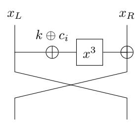
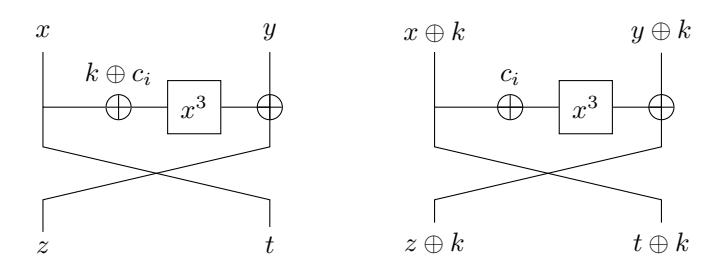

# **Collisions on Feistel-MiMC and univariate GMiMC**

#### Xavier Bonnetain

1 Sorbonne Université, Collège Doctoral, F-75005 Paris, France 2 Inria, France [xavier.bonnetain@inria.fr](mailto:xavier.bonnetain@inria.fr)

**Abstract.** MiMC and GMiMC are families of MPC-friendly block ciphers and hash functions. In this note, we show that the block ciphers MiMC-2*n/n* (or Feistel-MiMC) and univariate GMiMC are vulnerable to an attack which allows a key recovery in 2 *n/*2 operations. This attack, which is reminiscent of a slide attack, only relies on their weak key schedules, and is independent of the round function (*x* 3 here) and the number of rounds.

**Keywords:** MiMC, MPC, symmetric cryptanalysis

# **1 Description of the ciphers**

## **1.1 MiMC-2***n/n*

MiMC-2*n/n* [\[Alb+16\]](#page-3-0) is a 2*n*-bit block size, *n*-bit key block cipher. It claimed *n* bits of security. Its round function is described in [Figure 1,](#page-0-0) and can be written as

$$R_k^i(x_L, x_R) = x_R \oplus (x_L \oplus k \oplus c_i)^3, x_L$$
.

**Figure 1:** MiMC-2*n/n* round function

## **1.2 GMiMC**

GMiMC [\[Alb+19\]](#page-3-1) generalizes the MiMC-2*n/n* construction to generalized Feistels. Two key schedules are proposed. The univariate key schedule uses a fixed key for each round, while the multivariate key schedule uses *t* initial keys and updates the round keys. Their claimed security corresponds to the number of bits of the key. Four generalized feistel constructions are proposed:

**GMiMC-crf.** GMiMC-crf has t branches and adds a function of t-1 branches on one branch. The round function is

$$R_k^i(x_1,\ldots,x_t) = x_2,\ldots,x_t,x_1 \oplus \left(\bigoplus_{j=2}^t x_j \oplus k \oplus c_i\right)^3$$
.

**GMiMC-erf.** GMiMC-erf has t branches, and adds a function of one branch on all the other. The round function is

$$R_k^i(x_1,\ldots,x_t) = x_2 \oplus (x_1 \oplus k \oplus c_i)^3,\ldots,x_t \oplus (x_1 \oplus k \oplus c_i)^3,x_1 ...$$

**GMiMC-Nyb.** GMiMC-Nyb has 2t branches, and adds a function of each odd branch to the next branch. The round function is

$$R_k^i(x_1, ..., x_t) = x_2 \oplus (x_1 \oplus k \oplus c_{ti})^3, x_3, x_4 \oplus (x_3 \oplus k \oplus c_{ti+1})^3, ..., x_{2t} \oplus (x_{2t-1} \oplus k \oplus c_{ti+t-1})^3, x_1.$$

**GMiMC-mrf**. GMiMC-mrf is a generalization of the previous construction with a permutation of the branches that change for each round.

#### 2 Attacks

## 2.1 Attack on MiMC-2n/n

The attack relies on an invariant property of the round function, and can be seen as a slight generalization of a slide attack presented in [BNPS19]. The invariant property is described in Figure 2.

Figure 2: Illustration of Lemma 1

**Lemma 1.** Let  $R_k^i$  be the round function of MiMC-2n/n with the key k for round i. Then for all x, y, k, i,  $R_k^i(x, y) \oplus (k, k) = R_0^i(x \oplus k, y \oplus k)$

Proof.
$$R_0^i(x \oplus k, y \oplus k) = (y \oplus k \oplus (x \oplus k \oplus c_i)^3, x \oplus k) = (y \oplus (x \oplus k \oplus c_i)^3, x) \oplus (k, k) = R_k^i(x, y) \oplus (k, k)$$

**Theorem 1.** Let  $E_k$  be MiMC-2n/n with the key k. Then, for all x, y, k,  $E_k(x, y) \oplus (k, k) = E_0(x \oplus k, y \oplus k)$ .

*Proof.* By induction over the number of rounds. The base case is Lemma 1. If the property holds after i-1 rounds, then

$$(R_k^{i-1} \circ R_k^{i-2} \cdots \circ R_k^1)(x,y) \oplus (k,k) = (R_0^{i-1} \circ R_0^{i-2} \cdots \circ R_0^1)(x \oplus k, y \oplus k).$$

Xavier Bonnetain 3

By [Lemma 1,](#page-1-1)

$$\begin{split} &(R_0^i \circ R_0^{i-1} \cdots \circ R_0^1)(x \oplus k, y \oplus k) = R_0^i((R_0^{i-1} \circ R_0^{i-2} \cdots \circ R_0^1)(x \oplus k, y \oplus k)) \\ = &R_0^i((R_k^{i-1} \circ R_k^{i-2} \cdots \circ R_k^1)(x, y) \oplus (k, k)) = (R_k^i \circ R_k^{i-1} \cdots \circ R_k^1)(x, y) \oplus (k, k) \end{split}$$

**Corollary 1.** *Let Ek be MiMC-*2*n/n with the key k. Let f*(*x*) = *Ek*(*x, x*) ⊕ (*x, x*) *and g*(*x*) = *E*0(*x, x*) ⊕ (*x, x*)*. Then f*(*x*) = *g*(*x* ⊕ *k*)*.*

*Proof.*

$$g(x \oplus k) = E_0(x \oplus k, x \oplus k) \oplus (x \oplus k, x \oplus k) = E_k(x, x) \oplus (k, k) \oplus (x \oplus k, x \oplus k)$$
$$= E_k(x, x) \oplus (x, x) = f(x)$$

**Key recovery.** The key recovery simply consists in looking for a collision between *f* and *g* from [Corollary 1,](#page-2-0) which can be done in time 2 *n/*2 as the two functions have an *n*-bit input. This contradicts the claim of *n* bits of security of MiMC-2*n/n*.

**Hash function.** MiMC can be used keyless as a permutation for a sponge-based hash function. As there is no key in this construction, it is unclear how [Theorem 1](#page-1-2) could be used to attack the hash function.

## **2.2 Attacks on GMiMC**

In most cases ,the same property can be found in univariate GMiMC, that is, *Ek*(*x*1*, . . . , xt*)⊕ (*k, . . . , k*) = *E*0(*x*1 ⊕ *k, . . . , xt* ⊕ *k*), which allows to apply the same attack as in the MiMC-2*n/n* case.

**GMiMC-Nyb and GMiMC-mrf.** One round of GMiMC-Nyb and GMiMC-mrf can be seen, up to a permutation of the branches, as *t* Feistel in parallel. Hence, the property holds.

**GMiMC-erf.** The added function only depends on one input branch, hence the property also holds.

**GMiMC-crf.** The function is slightly different in that case, as it depends on more than one branch. For the property to hold, we must have that

$$\left(\left(\bigoplus_{j=2}^t x_j\right) \oplus k \oplus c_i\right)^3 = \left(\bigoplus_{j=2}^t (x_j \oplus k) \oplus c_i\right)^3.$$

Hence, the property holds only if *t* is even.

## **2.3 Variants in large characteristics**

MiMC and GMiMC can also be defined over a finite field of large characteristic. In that case, the property we have is *Ek*(*x*1*, . . . , xt*) + (*k, . . . , k*) = *E*0(*x*1 + *k, . . . , xt* + *k*), and the same attack can be applied. The only exception is GMiMC-crf, where we need to have *k* + *k* = 0 for the property to hold.

## **2.4 Quantum attacks**

The collision property corresponds to a hidden period, and as such, permits a key recovery in O(*n*) quantum queries. With a restriction to classical queries, these attacks happens to be in a form suitable for the offline Simon's algorithm [\[Bon+19\]](#page-3-3), which allows to make a key recovery in O(2*n/*3 ) classical queries and quantum time.

## **3 Conclusion**

We have shown that MiMC-2*n/n* and all the versions of univariate GMiMC except some instances of GMiMC-crf are vulnerable to a collision attack. More generally, this demonstrates that using round constants is not enough for a key schedule to secure a Feistel or generalized Feistel construction.

This attack does not appear to be applicable to the other MiMC construction, MiMC*n/n*, nor to the hash functions based on any version of MiMC or GMiMC.

**Acknowledgements.** The author would like to thank Chaoyun Li for his presentation of MiMC and for suggesting to apply the attack to GMiMC. The author would also like to thank the authors of MiMC and GMiMC for their comments and discussions on this result. This project has received funding from the European Research Council (ERC) under the European Union's Horizon 2020 research and innovation programme (grant agreement no. 714294 - acronym QUASYModo).

# **References**

- [Alb+16] Martin R. Albrecht et al. "MiMC: Efficient Encryption and Cryptographic Hashing with Minimal Multiplicative Complexity". In: *ASIACRYPT 2016, Part I*. Ed. by Jung Hee Cheon and Tsuyoshi Takagi. Vol. 10031. LNCS. Springer, Heidelberg, Dec. 2016, pp. 191–219. doi: [10.1007/978- 3- 662-](http://dx.doi.org/10.1007/978-3-662-53887-6_7) [53887-6\\_7](http://dx.doi.org/10.1007/978-3-662-53887-6_7).
- [Alb+19] Martin R. Albrecht et al. "Feistel Structures for MPC, and More". In: *ESORICS 2019*. 2019.
- [BNPS19] Xavier Bonnetain, María Naya-Plasencia, and André Schrottenloher. "On Quantum Slide Attacks". In: *SAC 2019*. Ed. by Kenneth G. Paterson and Douglas Stebila: LNCS. Springer, Heidelberg, Aug. 2019.
- [Bon+19] Xavier Bonnetain et al. "Quantum Attacks without Superposition Queries: the Offline Simon Algorithm". In: *ASIACRYPT 2019*. Ed. by Steven Galbraith and Shiho Moriai. LNCS. Springer, Heidelberg, Dec. 2019. url: [https://](https://eprint.iacr.org/2019/614) [eprint.iacr.org/2019/614](https://eprint.iacr.org/2019/614).