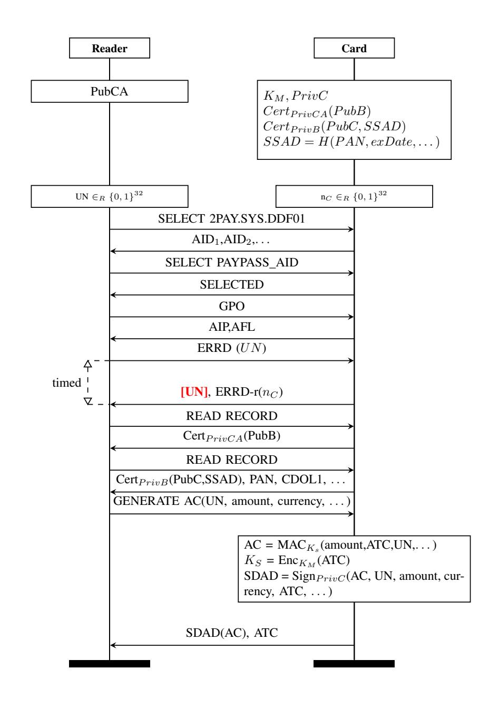

{0}------------------------------------------------

# Mechanised Models and Proofs for Distance-Bounding

Ioana Boureanu\*, Constantin Catalin Dragan\*, François Dupressoir<sup>†</sup>, David Gérault\*, Pascal Lafourcade<sup>‡</sup>

\*University of Surrey, Surrey Centre for Cyber Security (SCCS), UK; <sup>†</sup>University of Bristol, UK;

<sup>‡</sup>Université Clermont Auvergne, CNRS, Mines Saint-Etienne, Clermont Auvergne INP, LIMOS, F-63000 Clermont-Ferrand, France Email: \*{i.boureanu, c.dragan, david.gerault}@surrey.ac.uk, <sup>†</sup>f.dupressoir@bristol.ac.uk, <sup>‡</sup>pascal.lafourcade@uca.fr

Abstract—In relay attacks, a man-in-the-middle adversary impersonates a legitimate party and makes it this party appear to be of an authenticator, when in fact they are not. In order to counteract relay attacks, distance-bounding protocols provide a means for a verifier (e.g., an payment terminal) to estimate his relative distance to a prover (e.g., a bankcard). We propose FlexiDB, a new cryptographic model for distance bounding, parameterised by different types of fine-grained corruptions. FlexiDB allows to consider classical cases but also new, generalised corruption settings. In these settings, we exhibit new attack strategies on existing protocols. Finally, we propose a proof-of-concept mechanisation of FlexiDB in the interactive cryptographic prover EasyCrypt. We use this to exhibit a flavour of man-in-the-middle security on a variant of MasterCard's contactless-payment protocol.

#### I. Introduction

Across the UK alone, "contactless payments have grown in recent years, with a record 34% of card payments using contactless<sup>1</sup> in June 2017". Contactless systems are gaining popularity because of their increased usability and convenience. Yet contactless communications, such as tap-and-pay and remote keyless ignition (RKI) systems, due precisely to their lack of active user-input, are particularly vulnerable to relay attacks, where a man-in-the-middle (MiM) ferries the communication back and forth between two parties P and V, unbeknown to them. P and V are outside of the required communication range, but the relaying adversary forces a stealth out-of-band interaction by impersonating V to P and vice-versa. The aim of the relaying MiM is to get some illicit gain, that normally is attributed to P and/or V. Indeed, relay attacks working successfully across distances as wide as from the US to the UK have been shown on contactless payments [28]; in this case, the attacker pays fraudulently by a payment-terminal V with the funds associated to a bankcard P, without any evidence of this disclosed to P or V.

**Distance Bounding (DB):** To counteract relay attacks, one classical means is to add a *distance-bounding (DB)* or *proximity-checking* mechanism on top of contactless protocols, be them authentication, payments schemes or RKI. In the simplest form of distance-bounding, the verifier party V (i.e., the car, the payment-terminal) measures the round trip times (RTT) of an exchange with the prover party P (i.e., the keyfob, the bankcard) and compares this measurement to a given

bound. If the measurement is within the bound, then the verifier concludes that the prover is likely to be physically within some given, acceptable range. Nowadays, distance bounding is not just in the realms of theory, it is very much adopted in real-life applications. For instance, since 2016, Mastercard has augmented its original, contactless-payment scheme called PayPass, with the so-called *relay protection protocol (RRP)* — which is a distance-bounding procedure; this is now part of the most widely used payments standard – the EMV (Europay, Mastercard and Visa) standard.

Incomparable DB Security Models: The security of DB constructs has been studied for two decades [5], not just as a RTT-measuring mechanism but generally as an authentication protocol. Semi-formal and formal models of its security appeared from 2011 onwards [5]. However, the security specifics of the different threat models vary from formalism to formalism: (a) should we have multiple provers be exploitable in an attack or consider that just the victim prover is present? (b) should device corruption be considered black-box or white-box? (c) should the attacker have powerful control over the network (e.g., use signal amplification, flip bits) or just do pure/simple relaying? Not having a consensus on such matters leads to incomparable (in)security results.

No Mechanised Cryptographic Proofs for DB: In formal methods for security analysis, there are two main schools of thought: symbolic and computational [16]. Their tools model traditional security properties and cryptographic primitives, having no built-in capabilities to facilitate the reasoning about physical aspects such as time-measurements or distance bounds. In the last two years, symbolic verification made steps towards the mechanisation of distance-bounding analysis, including looking at those used in payments. However, there is currently no computational mechanisation of distance-bounding models and/or proofs.

**Contributions:** Our two main contributions are:

- 1) We develop a new DB security formalism, called FlexiDB, which is in fact a hierarchy of threat-models for DB, parameterised by the capabilities of the adversary w.r.t. party corruption and network-manipulation abilities. This means that each application (i.e., authentication, payments, RKI) can pick the adversary or sets thereof that fit their domain and security requirements.
  - The security properties included in our FlexiDB model

<span id="page-0-0"></span><sup>&</sup>lt;sup>1</sup>https://www.visa.co.uk/about-visa/newsroom/press-releases.2130476.html

{1}------------------------------------------------

- capture existing DB-security properties, but it also generalises them into new security properties.
- Indeed, the latter leads to us also exhibiting new attacks on DB protocols, including on contactless payments.
- 2) We mechanise FlexiDB in EasyCrypt [\[10\]](#page-13-2), along with a security proof that—against one of the threat models in FlexiDB—MasterCard's distance-bounding mechanism provides security against MiM attackers.[2](#page-1-0) Unlike existing (symbolic) formal models, our formal model precisely captures time and avoids relying on metaarguments to simplify formal reasoning.

Upshot: The take-home message of our contributions is two-fold. First, our model permits to prove the security of a protocol within specific corruption settings: e.g., an adversary having cryptographic powers such as knowing several secret keys, whilst having limited network/channel control. The need for such granularity arises directly from practical applications. For instance, in the plastic-card contactless payments, communications are assumed to only be possible within limited range, and cards are assumed to be resistant to tampering. Conversely, in smartphone contactless payments, key extraction can become feasible. Second, our EasyCrypt mechanisation shows that FlexiDB is amenable to formal reasoning *as it is defined*, and without relying on meta-arguments to simplify reasoning. This comes at a cost in the formal analysis, but provides an additional tool which complements existing less precise but more automated—verification techniques in increasing assurance and informing security decisions without having to trust complex proofs.

# II. BACKGROUND & RELATED WORK

<span id="page-1-2"></span>Distance-Bounding Notions: Distance-bounding protocols are subject to four main threats. 1. *Mafia fraud (MF)* is an attack whereby a MiM, present in the range of the verifier V , tries to authenticate as a legitimate prover P, whilst P is out of V 's range. 2. In a *distance fraud (DF)*, a malicious prover located beyond the acceptable bound from the verifier attempts to authenticate. 3. *Distance hijacking (DH)* generalises DF, as the far-away, corrupt prover is abusing honest provers found close to the verifier. 4. In a *terrorist fraud (TF)*, the DFmounting far-away prover P has an accomplice located near the verifier and this accomplice tries to authenticate as P under special conditions (e.g., the accomplice does not learn P's cryptographic secrets). Variations and generalisations of the above descriptions of DF, DH, MiM exist [\[5\]](#page-13-0). In our model we consider the strongest generalisation of these and even strengthen them further. However, due to the lack of consensus on TF in the community, we leave this threat out of our model.

Main Cryptographic Models for DB: In 2009, Avoine *et al.* put forward the first a semi-formal, computational framework for DB security [\[6\]](#page-13-3). They considered a single prover and verifier present in all attack scenarios. They explicitly distinguish black-box provers from white-box provers[3](#page-1-1) .

In 2011, Durholz ¨ *et al.* proposed the so-called "*DFKO*" computational model [\[37\]](#page-14-1) for DB, which is more formal than [\[6\]](#page-13-3), which formalises DB as in a Bellare-Rogaway style, via session-interleaving with the notion of timing implicit to this session-interleaving. This formalism allows for concurrency, considers all dishonest provers to be corrupted in the white-box manner, and the formalisation of DF, MF is not generalised. In 2013, Boureanu *et al.* published the socalled "*BMV*" model [\[20\]](#page-13-4), which formalises DB security as interactive proofs, with timing and laws of physics being explicitly encoded. This model allows for concurrency, all dishonest provers are corrupted in the white-box manner, but unlike [\[6\]](#page-13-3), the BMV model generalises the DF, DH and MF definitions, allowing for learning phases before the attacks, and for multiple provers being present alongside during the attacks. In 2017, Ahmadhi *et al.* [\[3\]](#page-13-5) extended the BMV model by allowing the adversary to send unicast messages (as opposed to the traditional broadcast-only); this gave rise to new attacks. There are more variations on the cryptographic models mentioned above (i.e., on Durholz ¨ *et al.*, on the BMV model), yet for the purpose of this work, these are not essential. For a summary of these, please see [\[5\]](#page-13-0). Some further, pertinent differences between the DFKO and the BMV models are discussed in Appendix [C.](#page-16-0)

We place ourselves squarely in a computational model of cryptography. However, an extensive summary on symbolicverification of DB is available in Appendix [C.](#page-16-0) This appendix is also a critical review of all prior work of formal treatment of DB (incl. symbolic verification) and this work. Finally, we direct the reader with an avid interest in symbolic verification of DB to the review in [\[31\]](#page-14-2).

# Our FlexiDB Model vs. Existing Models for DB:

FlexiDB is comparable to the BMV model (we consider a learning phase and full concurrency). However, we operate in an oracle-based model rather than interactive-Turing-machines setting. Further, by allowing a wide variation in adversaries, we offer a hierarchy of definitions for each security property, strengthening the definitions in the BMV model. Concretely, our DF and MF definitions allow for several types of corrupted provers, not included in the BMV model, as detailed next.

First, we adopt the white-box vs. black-box corruption idea from [\[6\]](#page-13-3). Second, we take this further; whilst our *weakinsider* adversaries correspond to [\[6\]](#page-13-3)'s white-box attackers, we additionally introduce several stronger adversaries: *strong insiders*, who can pick their own secret keys. Third, we further allow multiple, concurrent presences thereof. Fourth, we yield a full hierarchy of attackers, as we also endow our different types of *Insider, Outsider* attackers with various networkmanipulation abilities; to this end, like [\[3\]](#page-13-5), we allow both broadcast and unicast messages. Finally, we also allow, like in symbolic-verification, that messages be modified from afar.

On the Necessity of Considering *Insider* Adversaries: Consider the toy distance-bounding protocol depicted on Fig. [1.](#page-2-0) This protocol is, in the usual DB models, resistant to distance fraud. However, now consider this in our model, and take a dishonest prover A with key x who also knows the key

<span id="page-1-1"></span><span id="page-1-0"></span><sup>2</sup><https://gitlab.com/ec-db/ec-db.git>

<sup>3</sup>The user of a white-box device has access to its secret key, while black-box provers operate in a manner that it totally opaque to their users.

{2}------------------------------------------------

y of an honest prover P located near the verifier. Now, this attacker  $\mathcal{A}$  can perform a form of distance hijacking which falls under our *generalised distance-fraud* attacks; this attack is by replacing the NV-value received by the honest prover with one chosen by  $\mathcal{A}$  such that it yield the same r vector as the  $\mathcal{A}$ 's own nonce.

Prover 
$$P$$
 Verifier  $V$  Shared keys:  $x$  Shared keys:  $x$   $NP \stackrel{\$}{\leftarrow} \{0,1\}^n$   $\xrightarrow{P,NP}$   $NV \stackrel{\$}{\leftarrow} \{0,1\}^n$   $r = E_x(NP) \oplus E_x(NV)$   $r = E_x(NP) \oplus E_x(NV)$  for  $i \in [1;n]$  
$$c_i \stackrel{\$}{\leftarrow} \{0,1\}$$
 
$$c_i \stackrel{c_i}{\leftarrow} \text{Start clock}$$
 
$$\xrightarrow{r_i \oplus c_i} \text{Stop clock}$$

<span id="page-2-0"></span>Figure 1. "Toy" Protocol – exemplifying the value of our threat model, where E is a symmetric key encryption scheme; the rest is self-explained.

In our attack, the adversary  $\mathcal{A}$  starts a session with the verifier, sends his identifier  $\mathcal{A}$  and his value for NP, and receives NV. Then,  $\mathcal{A}$  triggers P to start a session with V, receives P's messages P and some value NP' for P's nonce, and blocks verifier's nonce from reaching P. Knowing  $\mathcal{A}$  computes a value X such that  $r = E_x(NP) \oplus E_x(NV) = r' = E_y(NP') \oplus X$ , decrypts X with Y to obtain X such that X is authenticated.

<u>Note</u>. In this paper, we show that similar generalised distance-fraud attacks that indeed apply to several existing/real protocols. In turn, this motivated the need to model adversaries knowing several keys, as we do in FlexiDB.

In more details, our formal model opens to three categories of attacks akin to distance hijacking (generalising and extending the above toy example). In the first one, the adversary uses advanced network-manipulation abilities to selectively overwrite part of the messages from an honest prover. In the second one, the adversary exploits several honest provers located near the verifier: intuitively, since our attacker will know their keys, he will know which ones can have the same responses as him for a given round. He picks one of these provers to send a response, and blocks all communications from the others. Finally, in the last type of our new attacks, we combine advanced network-manipulation and knowledge of several keys with the idea of trapdoored PRF [19], to yield more advanced/harder/complicated attacks. As we can see, these attacks show a hierarchy in complexity too. The first is simpler than the second, which is simpler than the third, and they require increasingly stronger attacker; this is also what motivates a fine-tuned attacker model like the one in our FlexiDB formalism.

#### <span id="page-2-4"></span>III. FLEXIDB: FORMALISING REFINED THREATS IN DB

# A. Distance-Bounding Protocols

Def. III.1 gives our formally formulation of a DB protocol.

<span id="page-2-1"></span>**Definition III.1** (Distance-Bounding Protocols). A *distance-bounding protocol* is a tuple  $\Pi = (\mathbb{P}, \mathbb{V}, Setup, \mathbb{B})$ , such that:

- $-\mathbb{P}$  and  $\mathbb{V}$  are the prover the verifier algorithm,
- $-\mathbb{B}$  is a fixed distance bound within a metric space,
- $-\mathbb{V}$  outputs a bit  $out_V$ , denoting authentication success/failure,
- Setup is an algorithm used to initialise the DB system.

All algorithms are polynomial probabilistic time (ppt) in a security parameter s.

We assume the existence of an infrastructure that supports DB protocols to be executed, *i.e.*, the authentication material generation algorithms and cryptographic primitives relevant to a given protocol. We call this infrastructure a *DB system*.

**Setup, Algorithms & Parties:** The goal of the Setup (Def. III.1) is to generate the authentication material of provers and verifiers, as well as their unique public identifier, as they are registered onto the DB system. During this Setup phase, the  $\mathbb{P}$  and  $\mathbb{V}$  algorithms are loaded onto physical devices (e.g., cards, phones, terminals).

Provers, verifiers, and adversarial devices are collectively referred to as parties. A party U with public identifier i is denoted  $U_i$ . Prover and verifier parties are registered onto the DB system upon requests, which in our model are controlled by the adversary.

#### B. Physical & Communication Model

**Positions & Distances.** Each party U occupies a position  $place_U$  in a metric space, in which a distance-function d is defined. For any two parties U, V, if  $d(place_U, place_V) \leq \mathbb{B}$ , then we say that U is close to V; otherwise, we say that U is far from V.

Messages are subject to a time of flight, measured via a global counter called Clock. We model computations<sup>5</sup> as instantaneous, *i.e.*, occur in 0 clock ticks.

The distance d between two parties measures the time-of-flight of messages between them, considering messages travel uniformly at a speed c of one distance-unit per time-unit. No message can travel faster than this speed c.

All messages sent by prover and verifier parties are broadcast, whereas adversarial parties can send unicast messages.

#### C. Threat Model

The adversary  $\mathcal{A}$  has full control over two parties, denoted  $\mathcal{A}_P$  and  $\mathcal{A}_V$ , which operate as ITMs. We distinguish these adversarial parties from the honest parties (i.e., from prover and verifier parties). This adversarial modelling follows the classical mafia-fraud setting, where two adversary parties are involved:  $\mathcal{A}_V$  and  $\mathcal{A}_P$  represent adversarial devices found near a verifier and near a prover, respectively. We consider a hierarchy of adversaries, determined by two classes of adversarial abilities: (1) corruption of parties; (2) corruption of the network. This is described next.

<span id="page-2-2"></span><sup>&</sup>lt;sup>4</sup>Computational measures such as polynomial probabilistic time (ppt), negligible, etc., vary with the security parameter. We consider these and associated notions, *e.g.*, Interactive Turing Machines (ITMs) [59], commonplace.

<span id="page-2-3"></span><sup>&</sup>lt;sup>5</sup>We only allow computations of up to polynomial-time.

{3}------------------------------------------------

- *1) Party Corruption:* A prover-party is said to be *corrupted* if the adversary has access to its authentication material. Therefore, corrupted parties are not controlled by the adversary: he merely has access to their secret material. We distinguish two main levels of party-corruption:
- *Outsider* (*O*) adversary given only the public identifiers of all parties;
- *Insider* (*I*) adversary given the authentication material of some parties. Particularly, an *Insider* adversary can be:
  - *Weak-Insider* (*WI*) given the authentication material of prover-devices of his choice;
  - *Strong-Insider* (*SI*) allowed to select the authentication material and identifiers of prover-devices of his choice.

Moreover, *Insider* adversaries is quantified:

- 1-*Weak-Insider* (*1-WI*) or 1-*Strong-Insider* (*1-SI*) can corrupt one prover;
- n-*Weak-Insider* (*n-WI*) or n-*Strong-Insider* (*n-SI*) can corrupt several provers.

When the distinction between *Weak-Insider* and *Strong-Insider* is not important, we simply write "*Insider*".

These corruption abilities allow the adversary to register one or more provers for which he knows (*Weak-Insider*) or, alternatively, choses (*Strong-Insider*) the secret material.

- *2) Network Corruption:* We distinguish four types of adversarial communication capability, mainly determined by the physical-layer implementation of the protocol:
- *Dummy* (*Dum*) can only send and receive messages to/from honest parties within a distance smaller than or equal to the bound B;
- *Amplifier* (*Amp*) can receive and send messages to/from honest parties across distances larger than the bound B;
- *Injector* (*Inj*) can block messages, or overwrite them with his own, when the message is originated from a point found no further than the bound B;
- *Full* can do all of the above, *i.e.*, send, receive, block and (blindly) overwrite messages even if they originate from point found further than the bound B.

Comparison to previous models: In terms of party corruption, previous models consider *Outsider* adversaries for mafia fraud, and 1-*Weak-Insider* adversaries for attacks in which the prover is dishonest. The notion of *Strong-Insider*, and the quantification on the number of corrupted provers, do not appear in previous models. Regarding network corruption, prior models allow for amplification. Message overwriting and blocking, for instance through overshadowing [\[54\]](#page-14-4), is not explicitly used in prior cryptographic models, but is common in recent symbolic verification mechanisms (*e.g.*, [\[34\]](#page-14-5), [\[50\]](#page-14-6)).

The entire threat model and the adversarial communications aforementioned are formalised via a set of oracles presented in Subsection [III-D.](#page-3-0) A breakdown of our different adversary types presented above, in terms of access to the different oracles we formalise next, is recounted in Table [I.](#page-5-0)

# <span id="page-3-0"></span>*D. Execution Model*

Sessions. A party's execution of (a part of) a DB protocol is called a *session*. If one execution is run on a prover-device or verifier-device, then it is a *prover session* or a *verifier session*, respectively. We write U i for the i*-th session of a party* U.

Each prover and verifier party has a *status*, active or inactive, defining whether it is currently running at least one session.

The chronologically-ordered list of the messages sent and received by a party in a session form the *transcript* of the session. All sessions are attributed a unique identifier. A session is *full* if its transcript contains all the messages of the specification. As per our DB definition (Def. [III.1\)](#page-2-1), the verifiertranscripts show whether the authentication is accepted or not. Moreover, we consider that from a successful, full verifiertranscript, one can extract the public identifier of the proverparty that was authenticated[6](#page-3-1) .

Challenger (*Ch*). To mechanise the execution environment and to arbitrate the adversarial actions within it, we use a *challenger*. The main features of Ch are:

- 1) The challenger Ch is aware of the global clock Clock.
- 2) The challenger Ch keeps a list Pts of all parties[7](#page-3-2) in the system, indexed by their id. Also, Ch deals with all adversarial actions via a set of oracles presented later; as such, challenger Ch knows if a given party has been corrupted by A and his list Pts is kept up-to-date accordingly.
- 3) The challenger Ch keeps track of all sessions in a list Sess, indexed by the unique session identifier. It contains the time the session started, its type (prover or verifier session), the up-to-date status of a session (*i.e.*, finished or running), and a transcript of the session.
- 4) The challenger Ch keeps a list Sends of timed, sent messages, containing: the id of the session (of the sender party) the message belongs to, the sender party, the aimed receiver party (optional), the message, and the sending time. The targetted receiver can only be set for messages sent by an adversary party.
- 5) The challenger Ch keeps a list Reads of read messages at given times, containing: the id of the session (of the reading party) in which this message is being read, the (apparent) sender party, the (real) sender party, the receiver party, the message, the time of the receipt.

We underline one time-keeping aspect here. If a "read" is from/to a sender and receiver, then an entry in the Reads list is possible only if the message appears in the sent list Sends, and the message had time to travel from the sender to the receiver, *i.e.*, d(sender, receiver) ≤ (current time−tsent)×c where Ch reads the positions of sender, receiver in the Pts list, the time tsent in the Sends list, the current time via the global Clock, and c is the speed of messages. If this inequality holds, then the time of receipt inside Reads is set to current time.

The points above make the challenger Ch an arbiter for the setup of the system, enforcing the communication rules. Specifically, w.r.t. point (5) above, the challenger Ch uses his

<span id="page-3-1"></span><sup>6</sup>This is realistic (as such public identifiers are often sent in clear) and poses no problem herein, as we do not treat provers' anonymity or privacy.

<span id="page-3-2"></span><sup>7</sup> "Parties" include all adversarial parties, as aforesaid.

{4}------------------------------------------------

"communication logs" kept via the lists Pts, Sess, Sends and Reads, to prevent the communication rules to be broken.

Adversarial Oracles. The challenger Ch permits the adversary to interact with the environment through a polynomial number of calls to *oracles*. These allow the adversary to place provers and verifiers in the environment at positions of his choice, and enforce communication and corruption rules.

All our oracle calls are done by an adversary party Aid and each call takes account of Aid's position in the metric space. For instance, parties can read a message sent by Aid only at a time proportional to the distance between Aid and themselves. Similarly, creation of parties at a given position are only effective after the time proportional to the distance between the party created and Aid. For simplicity, we often omit the Aid parameter in the description of our oracles.

To describe each oracle, we generally write oracle-nameadversary max , where "adversary" denotes the kind of adversary (*e.g.*, *Amplifier*, *Weak-Insider*, etc) allowed to call the oracle, and "max" denotes the maximum value of a counter internal to the oracle. If the superscript is missing, then the oracle can be called by any type of adversary. If the subscript is missing from the description of an oracle, then the challenger Ch keeps track of the numbers of calls for this oracle, as opposed to the oracle itself. Our oracles follow.

**join**(type, pos): This oracle simulates the registration of a new honest party of a given type (*i.e.*, prover or verifier) at a position pos in the metric space. To Aid calling join, the oracle returns the public identifier of the new party.

**join**<sup>k</sup> W I (pos): This oracle permits a *Weak-Insider* adversary to register a corrupted prover at a position pos in the metric space. To Aid calling joinW I , the oracle returns the public identifier and authentication material of the new prover. **join**<sup>k</sup> SI (id, auth, pos): This oracle permits a *Strong-Insider* adversary to register a new corrupted prover at position pos, with public identifier id and authentication material auth. It aborts and returns ⊥, if another prover with the same identifier or authentication material already exists. Otherwise, to Aid calling join<sup>k</sup> SI , the oracle returns >.

For join, join<sup>k</sup> W I , join<sup>k</sup> SI , it is also the case that:

- the challenger Ch adds the registered party to the Pts list and it also specifies its type: honest for join, corrupted for join<sup>k</sup> W I and join<sup>k</sup> SI ;
- at each call, an internal counter is incremented; after k calls, the oracle is disabled, *i.e.*, returns ⊥.

**enable-broadcast**(): This oracle activates a communication mode in which all messages by prover and verifier parties are sent to all parties even if they are found far apart from where the message originates. The challenger Ch stores and sets a flag broadcast, once this is called.

**init**([P, V ]): This oracle simulates the start of new executions by a prover-party with id P and/or for a verifier-party with the id V . Either P or V can be omitted, in which case the adversary is running a session with the party invoked.

If the broadcast flag is not set, then this oracle can only be called on provers and verifiers within the distance bound from the position of Aid who calls this.

From the point of the call, the Ch delays the start of session by the time proportional to the distance the parties in the session (P and/or V and/or A).

The session identified is returned to the adversary and it is stored by Ch in the Sess list. All other relevant aspects (*e.g.*, status of P, V in the Pts list) are updated by Ch at its end. **move**([P], pos): This oracle moves a party with the identifier P from its current position to pos. If P is omitted, the party being moved is the adversary party Aid calling this oracle.

The challenger updates its Pts list accordingly.

**send**Dum([X, sid], m): This simulates the sending of a message m from Aid to the session sid of the party with the id X. If X is a prover/verifier party far from the Aid who calls this, and broadcast is unset, then the oracle aborts/outputs ⊥.

The parameters X and sid are optional. If omitted, then the message m is broadcast to all parties, either within the distance-bound from Aid if broadcast is not set, or otherwise broadcast even past the distance bound from Aid.

The challenger records this in the Sess list (updating transcripts) and the Sends list (updating time, etc.).

**replace**(U, sid, B, U, S, m<sup>0</sup> ): Let M = M<sup>0</sup> . . . M<sup>k</sup> denote all the bits of the next message to be sent by the party U in the session sid, U be a (possibly empty) set of parties, S be a (possibly empty) set of sessions, and m<sup>0</sup> be a message. This oracle replaces the message bits {M<sup>i</sup> |i ∈ B} with m<sup>0</sup> , so that the sessions in S and the parties in U receive the modified message; this modification may result in deleting bits from the message. If B = ?, then the whole message is replaced. If U is a prover or verifier party located past the distance bound from Aid, and if broadcast is not set, then it returns ⊥.

We also define the following "tool function", not accessible to the adversary, but used as a syntactic shortcut to express the success or failure of a session.

**result**(sid, V): This retrieves the session with the id sid of the verifier-party V . If it exists, and the V accepted the authentication of a prover P.id, it returns (>, P.id). Otherwise, it returns ⊥ – meaning unsuccessful authentication of P.id.

Note: For simplicity, we only include the level of detail necessary to understand the security properties of Section [IV](#page-4-0) and the attacks of Section [V.](#page-6-0) Therefore, we omit the following: (a) a read oracle aligned to the send oracle; (b) details of the timing-keeping within the send/ read oracles; (c) details of exact book-keeping the Sess list, w.r.t. these two oracles; (d) the honest versions of the send/ read oracle. These details are however included in Section [VI,](#page-8-0) where we present the mechanisation of this model in EasyCrypt.

# IV. DB SECURITY PROPERTIES IN FLEXIDB

<span id="page-4-0"></span>We first define the set of oracles given to each adversary.

*A. Oracles, Adversary Positions and Attack Phases.*

We write A<sup>O</sup> to mean that the adversary has access to a particular set O of oracles. Our oracles are split in three sets:

- Ocore: set of oracles accessible to all adversaries.
- Ocom: set of oracles related to network-corruption only;
- Ocorr: set of oracles related to party-corruption only.

{5}------------------------------------------------

| Adversary type   | Ocore | O <sup>corr</sup>          | Ocom                       |  |
|------------------|-------|----------------------------|----------------------------|--|
| Outsider         | Main  | Ø                          |                            |  |
| 1-Weak-Insider   | Main  | $\{\texttt{join}_1^{WI}\}$ |                            |  |
| n-Weak-Insider   | Main  | $\{\mathtt{join}_n^{WI}\}$ |                            |  |
| 1-Strong-Insider | Main  | $\{join_1^{SI}\}$          |                            |  |
| n-Strong-Insider | Main  | $\{join_n^{SI}\}$          |                            |  |
| Dummy            | Main  |                            | Ø                          |  |
| Amplifier        | Main  |                            | {enable-broadcast}         |  |
| Injector         | Main  |                            | {replace}                  |  |
| Full             | Main  |                            | {enable-broadcast,replace} |  |

Table I

<span id="page-5-0"></span>ORACLES PER ADVERSARY TYPE, WHERE  $Main=\{\text{join}, \text{init}, \text{move}, \text{send}^{Dum}\}$ . Blank spaces signify no relevance to the resp. type.

Our different adversaries are described in Table I.

By integrating fine-grained corruption capacities, we generalise the notion of mafia fraud with resistance to *generalised* mafia-fraud (GMF) and distance fraud with *generalised* distance-fraud (GDF).

In the GMF experiment, the adversary is considered as 2 entities:  $A = (A_V, A_P)$ , respectively close to the designated verifier and the designated prover.

In the GDF security experiment, a single adversary party  $A_P$  is located far away from the designated verifier.

In both cases, the designated prover is far from the designated verifier. These two settings are illustrated on Figure 2.

$$> \mathbb{B}$$
  $> \mathbb{B}$   $> \mathbb{B}$   $\mathcal{A}_{V} \leftarrow \cdots \leftarrow \mathcal{A}_{P}$   $\mathcal{A}_{P} \leftarrow \mathcal{A}_{P}$   $\mathcal{A}_{P} \leftarrow \mathcal{A}_{P}$   $\mathcal{A}_{P} \leftarrow \mathcal{A}_{P}$ 

<span id="page-5-1"></span>Figure 2. Examples of GMF (left) and GDF (right) environments.  $d\mathbb{V}$  is the designated verifier,  $d\mathbb{P}$  is the designated prover authenticated/attacked, and P denotes an arbitrary set of provers.

In our GMF and GDF, the adversary is allowed to perform a **learning phase**, in which he can freely interact with the environment, with no positioning restrictions w.r.t. to provers/verifiers. In model such as [20], such learning phases allow an adversary to interact with all parties without distance restrictions, thus enabling more attack strategies.

During this phase,  $\mathcal{A}$  populates the environment with provers and verifiers, interacts with them and sets all positions as he wishes. Then, the adversary selects a designated prover  $d\mathbb{P}$  and a designated verifier  $d\mathbb{V}$ , and gives their identifiers to the challenger. The challenger, then disables, verifies that the setting of the environment is correct with regards to the security property, and allows the adversary to run the actual **attack phase**. During this phase, the adversary has access to a restricted set of oracles, and is subject to positioning rules.

#### B. Security Properties Definitions

a) Generalised Distance Fraud (GDF): This security property comprises a class of distance-frauds and distance-hijacking attacks, which vary with the strength of the corruption and network-manipulation.

Our Fine-Grained GDF & Its Benefits. In the classical setting of distance fraud, a dishonest prover  $d\mathbb{P}$  tries to fraudulently authenticate from afar. In our terminology, this would be

an *Insider* adversary  $\mathcal{A}$  who called  $\mathtt{join}^{WI}(\mathsf{if} \ \mathsf{not} \ \mathtt{join}^{SI})$  on  $d\mathbb{P}$  (i.e., knows the authentication material of  $d\mathbb{P}$ ) and who attempts to authenticate from afar. In FlexiDB, we additionally allow for the much stronger setting where  $\mathcal{A}$  knows, or even choses, the authentication material of several provers, as well as the benign case where  $\mathcal{A}$  is an *Outsider*.

We give our generalised distance-fraud in Def. IV.1, a class of attacks in which an adversary tries to make a designated verifier  $d\mathbb{V}$  authenticate a prover  $d\mathbb{P}$ , potentially exploiting other provers, even though no adversarial party nor  $d\mathbb{P}$  is within a distance  $\mathbb{B}$  of  $d\mathbb{V}$ .

<span id="page-5-2"></span>Definition IV.1. Generalised Distance-fraud (GDF) & Security against GDF. Let  $\Pi$  be the a DB protocol. A *generalised distance-fraud (GDF) game G* against the DB protocol  $\Pi$  is split in two phases: the *learning phase* and the *attack phase*.

- i) The *learning phase for GDF* is a multi-party execution of the protocol  $\Gamma$  in the presence of an adversary  $\mathcal{A}=(\mathcal{A}_P,\mathcal{A}_V)$  such that the position  $\mathsf{pos}_{\mathcal{A}_P}$  of  $\mathcal{A}_P$  and the position  $\mathsf{pos}_{\mathcal{A}_V}$  of  $\mathcal{A}_V$  is arbitrary.
- In this phase, the challenger Ch starts by setting up an execution environment and giving access to A to the set of oracles  $\{O^{core}, O^{com}, O^{corr}\}$ .
- The phase finishes with the adversary returning a designated prover and verifier pair  $(d\mathbb{P}, d\mathbb{V})$ , and the starting position of one adversarially controlled parties denoted  $\mathcal{A}_P$ , *i.e.*,:  $(\mathsf{pos}_{\mathcal{A}_P}, d\mathbb{P}, d\mathbb{V}) \leftarrow \mathcal{A}^{\{\mathsf{O^{\mathsf{core}}}, \mathsf{O^{\mathsf{corr}}}, \mathsf{O^{\mathsf{corr}}}\}}$ .
- The challenger Ch disables all oracles, all the parties are remain fixed at the position at which they were when A's output was made,  $A_V$  is removed from the environment, and then Ch checks whether the setting  $(\mathsf{pos}_{\mathcal{A}_{\mathsf{P}}}, d\mathbb{P}, d\mathbb{V})$  returned by the adversary is *valid for GDF*. A setting  $(\mathsf{pos}_{\mathcal{A}_{\mathsf{P}}}, d\mathbb{P}, d\mathbb{V})$  is a *valid setting for GDF* if (1)  $d(\mathsf{pos}_{\mathcal{A}_{\mathsf{P}}}, d\mathbb{V}) \geq \mathbb{B}$  and (2)  $d(d\mathbb{P}, d\mathbb{V}) \geq \mathbb{B}$ .
- If  $(pos_{A_P}, d\mathbb{P}, d\mathbb{V})$  is not a valid setting for GDF, then the challenger aborts the game and A loses. Otherwise, the challenger begins the attack phase.
- ii) The attack phase for GDF is a multi-party execution of the protocol  $\Gamma$  in the presence of an adversary  $\mathcal{A}_P$  found at position  $\mathsf{pos}_{\mathcal{A}_P}$ . In this,  $\mathcal{C}h$  allows the adversary access to the init,  $\mathsf{send}^{Dum}$ ,  $\mathsf{O}^{\mathsf{com}}$  oracles.
- The phase finishes with the adversary outputting a session identifier sid, i.e.,  $sid \leftarrow \mathcal{A}_{P}^{\{\text{init},\text{send}^{Dum},\mathsf{O}^{\text{com}}\}}$ .

The adversary wins the GDF game if the session sid is a verifier-session started during the attack phase, such that  $result(sid) = (\top, d\mathbb{P})$ , i.e.,  $d\mathbb{V}$  accepted the far-away prover  $d\mathbb{P}$  during the attack phase.

The advantage of an adversary A in the GDF game is his success probability  $\alpha$ .

A protocol  $\Pi$  is *GDF-secure* if the advantage of all adversaries  $\mathcal{A}$  in winning in an un-aborted generalised distance-fraud game  $\mathcal{G}$  is negligible.

**b)** Generalised Mafia Fraud (GMF): In this setting, two adversary parties collaborate to authenticate as an uncorrupted prover located outside of the distance-bound of a designated verifier  $d\mathbb{V}$ . The goal of the adversary is to make

{6}------------------------------------------------

 $d\mathbb{V}$  accept the authentication of the prover  $d\mathbb{P}$ , located at a distance greater than  $\mathbb{B}$  of  $d\mathbb{V}$ , optionally exploiting additional provers placed at his convenience.

We formalise generalised mafia-fraud in Def. IV.2.

<span id="page-6-1"></span>**Definition IV.2.** Mafia-fraud (GMF) & Security against GMF. Let  $\Pi$  be the a DB protocol. A *generalised distance-fraud (GDF) game G* against the DB protocol  $\Pi$  is split in two phases: the *learning phase* and the *attack phase*.

- i) The *learning phase for GMF* is a multi-party execution of the protocol  $\Gamma$  in the presence of an adversary  $\mathcal{A}=(\mathcal{A}_P,\mathcal{A}_V)$  such that the position  $\mathsf{pos}_{\mathcal{A}_P}$  of  $\mathcal{A}_P$  and the position  $\mathsf{pos}_{\mathcal{A}_V}$  of  $\mathcal{A}_V$  can be arbitrary.
- In this phase, the challenger Ch starts by setting up an execution environment and giving access to A to the set of oracles  $\{O^{core}, O^{com}, O^{corr}\}$ .
- The phase finishes with the adversary returning a designated prover and verifier pair  $(d\mathbb{P}, d\mathbb{V})$ , and the position of the two adversarially controlled parties  $\mathcal{A}_P$  and  $\mathcal{A}_V$ ,  $i.e.,: (\mathsf{pos}_{\mathcal{A}_P}, \mathsf{pos}_{\mathcal{A}_V}, d\mathbb{P}, d\mathbb{V}) \leftarrow \mathcal{A}^{\{\mathsf{O}^{\mathsf{core}}, \mathsf{O}^{\mathsf{corr}}\}}$ .
- The challenger Ch then disables all oracles, and checks whether the setting defined by the adversary is *valid* setting for GMF. A setting  $(pos_{\mathcal{A}_P}, pos_{\mathcal{A}_V}, d\mathbb{P}, d\mathbb{V})$  is a valid setting for GMF for GMF if (1)  $d(d\mathbb{P}, d\mathbb{V}) \geq \mathbb{B}$ , (2)  $d\mathbb{P}$  is not marked as corrupted.
- If  $(pos_{A_P}, pos_{A_V}, d\mathbb{P}, d\mathbb{V})$  is not a valid setting for GMF, then the challenger Ch aborts the game and A loses. Otherwise, the challenger begins the *attack phase*.
- ii) The attack phase for GMF is a multi-party execution of the protocol  $\Gamma$  in the presence of an adversary  $(\mathcal{A}_P, \mathcal{A}_V)$  found at position  $\mathsf{pos}_{\mathcal{A}_P}$  and  $\mathsf{pos}_{\mathcal{A}_V}$ . In this,  $\mathcal{C}h$  allows the adversary access to  $\mathsf{init}$ ,  $\mathsf{send}^{Dum}$ ,  $\mathsf{O}^{\mathsf{com}}$  oracles.
- The phase finishes with the adversary outputting a session identifier sid, i.e.,  $sid \leftarrow \mathcal{A}_{P}^{\{\text{init}, \text{send}^{Dum}, \mathsf{O}^{\text{com}}\}}$ .

The adversary wins the GMF game if the session sid is a verifier-session started during the attack phase, such that  $result(sid) = (\top, d\mathbb{P})$ , i.e.,  $d\mathbb{V}$  accepted the far-away prover  $d\mathbb{P}$  during the attack phase.

The advantage of an adversary A in the GMF game is his success probability  $\beta$ .

The protocol  $\Pi$  is *GMF-secure* if the advantage of all adversaries  $\mathcal{A}$  in winning in an un-aborted generalised mafiafraud game  $\mathcal{G}$  is negligible.

#### c) Our Security Notions vs. Existing Ones:

- 1) 1-Weak-Insider GDF corresponds to the classical distance fraud and distance hijacking notions.
- 2) 1-Outsider GDF extends the black-box distance fraud by Avoine et al. in [6] to a setting that allows additional honest provers to be present, as in a distance hijacking.
- 3) 1-Weak-Insider GDF corresponds to generalised distance-fraud in the BMV model [20].
- 4) *n-Insider* GDF is a completely new property, allowing the multiple provers to be corrupted. In Section V, we show that this enables new attacks.
- 5) GMF extends previous models by the fine-grained party-corruption it offers (i.e., Insider vs Outsider, as well as

- 1 vs n), as opposed to traditional mafia-fraud definitions only consider one *Outsider* adversary.
- 6) The Strong-Insider notion is new.

#### <span id="page-6-0"></span>V. VALIDATING FLEXIDB: NOVEL PROXIMITY ATTACKS

We illustrate the applicability and expressivity of our FlexiDB model by exhibiting:

- a new vulnerability on the EMV-RRP protocol [38];
- new GDF attacks on proven secure protocols;
- a generic distance-hijacking strategy that enables attacks on most protocols of the literature.

These attacks exploit our advanced adversary corruption abilities, It is true that the top end of these may be impractical, in some cases. For instance, the underlying techniques can be hard to implement in practice when targeting short-range distance-bounding systems, such as contactless payments. Yet, there are scenarios enabling advanced attacks more easily/readily: e.g., Identification Friend or Foe (IFF) protocols in avionics [4], where the distances to be checked are orders of magnitude higher (than in payments), and where the devices (i.e., planes) can carry significantly more powerful communication systems.

#### A. New (1-Weak-Insider, Full)-Attack on Payments

**High-level Description of EMV-RRP:** Mastercard's EMV-RRP (Figure 3 – without the UN msg. 8) is Mastercard's contactless-payment protocol with relay protection. For the latter, MasterCard added to their initial contactless-payment protocol, called PayPass, a special command ERRD ("Exchange Relay Resistance Data"), described<sup>8</sup> below. In Pay-Pass and in EMV-RRP, the card possesses a private key  $Priv_C$ , a symmetric key  $K_M$  shared with the bank, a certificate chain  $Cert_{Priv_{CA}}(Pub_C)$  for the card's public key  $Pub_C$ . The card and the reader generate two nonces  $n_C$  and UN, respectively. After some generic setup messages, in EMV-RRP, the reader sends an ERRD command, containing the nonce UN, to the card. The card answers with an ERRD response ERRD-r and a nonce  $n_C$ . The reader measures the corresponding round trip time. The card also gives an estimation of the time of this exchange called "Timing\_Info". The reader compares the two timings, and stops the communication if the measured time is too large. Otherwise, the reader requests that the card generates a "cryptogram" AC. It is a MAC keyed with  $K_S$  of data including the ATC, UN, and the transaction information. The encryption with  $K_M$  of the number-oftransactions' counter, ATC, forms a session-key denoted  $K_S$ . The card signs UN, amount, currency, ATC,  $N_C$ , yielding the "Signed Dynamic Application Data (SDAD)". Finally, before accepting the payment, the reader checks the validity of the signature *SDAD*.

<span id="page-6-2"></span><sup>8</sup>This command is described in the EMV standard [38], w.r.t. Mastercard. The reader and the card have an exchange of nonces, up to three times. For each exchange, the reader times the communication time and checks it is under a given bound. If it is not up to two times in a row, it continues. Otherwise, it fails and the protocol stops. In our proofs, we model just one exchange, for simplicity.

{7}------------------------------------------------



<span id="page-7-0"></span>Figure 3. MasterCard's EMV-RRP & EMV-RRPv2 which is an EMV-RRP extension [49], [17]; [UN] in msg. 8 is only present in EMV-RRPv2.

- [49], [17] give EMV-RRPv2 a modified version of EMV-RRP described in Fig. 3 with the UN in message 8. It differs from EMV-RRP only in that in the timed phase, the card adds the reader's nonce UN to its response. This protects against certain distance frauds [49], [17] in EMV-RRP.
- a) Our Attack on EMV-RRPv2: EMV-RRPv2 was symbolically verified in [49], [27], [33], [32] and found secure in their respective models. We show that EMV-RRPv2 is in fact vulnerable to a type of distance hijacking, in the presence of a (1-Weak-Insider, Full) adversary.

Our attack is executed in our GDF setting: an honest prover  $\mathbb{P}$  and the designated verifier  $d\mathbb{V}$  are within distance at most  $\mathbb{B}$  of each other, and a  $(1\text{-}Weak\text{-}Insider,Full})$ -adversary  $\mathcal{A}$  and the designated prover  $d\mathbb{P}$  are both at a distance greater than  $\mathbb{B}$  of  $d\mathbb{V}$ . We denote by  $\mathsf{pos}_{\mathbb{P}}, \mathsf{pos}_{d\mathbb{V}}, \mathsf{pos}_{\mathcal{A}}$  and  $\mathsf{pos}_{d\mathbb{P}}$  their respective positions. Note that  $d\mathbb{P}$  is not actually used in this attack, since the insider adversary knows  $d\mathbb{P}$ 's key and authenticates from a distance on  $d\mathbb{P}$ 's behalf.

The idea of attack is simple: to bypass the timing check on  $(UN, n_C, TimingInfo)$ ,  $\mathcal{A}$  lets P reflect UN, and overwrites every other value sent by P with his own.

1) During the learning phase,  $\mathcal{A}$  registers P by calling  $join(prover,pos_{\mathbb{P}})$ ,  $d\mathbb{V}$  by calling  $join(verifier,pos_{d\mathbb{V}})$ ,

- and  $d\mathbb{P}$  by calling  $join(prover,pos_{d\mathbb{P}})$ . He also calls enable-broadcast() oracle to enable full broadcast mode, and returns the setting  $(pos_{\mathcal{A}}, d\mathbb{P}, d\mathbb{V})$ ;
- 2) During the attack phase,  $\mathcal{A}$  calls init(P,  $d\mathbb{V}$ ), to start a session sid between P and  $d\mathbb{V}$ ;
- 3) A uses the replace oracle to piggyback all of his messages on P's messages.
  - a) all messages are fully overwritten with  $\mathcal{A}$ 's own messages (computed with the secret key of  $d\mathbb{P}$ ), except for  $(UN, n_C, TimingInfo)$ .
  - b) for this message,  $\mathcal{A}$  uses replace(P, sid, {bits( $n_C$ , TimingInfo)}, { $d\mathbb{V}$ }, {sid}, ( $n_{C\mathcal{A}}$ ,  $TimingInfo_{\mathcal{A}}$ )), where we denote by {bits( $n_C$ , TimingInfo)} the bit-positions corresponding to the values ( $n_C$ , TimingInfo). This oracle call replaces the  $n_C$  and TimingInfo from P by the ones of  $\mathcal{A}$ , while not modifying the UN part of the message.

#### 4) A returns sid.

The session sid authenticates  $d\mathbb{P}$ : all authenticating messages in the sessions are computed with the authentication material of  $d\mathbb{P}$ . Therefore, the prover  $d\mathbb{P}$  is accepted by  $d\mathbb{V}$ , even though  $d(\mathsf{pos}_{d\mathbb{P}},\mathsf{pos}_{d\mathbb{V}}) > \mathbb{B}$  and  $d(\mathsf{pos}_{\mathcal{A}},\mathsf{pos}_{d\mathbb{V}}) > \mathbb{B}$ .

- **b) Application to PayBCR:** In [26], a new version of EMV-RRP, called PayBCR, is proposed. An attestation of the proximity-checking performed by the reader is sent to the card-issuing bank, who can further re-verify it. In this case, the transaction constitutes a strong proof that the card was within the range of the verifier when the purchase was made. Since PayBCR is based on EMV-RRP, our EMV-RRPv2 attack applies directly.
- c) Attacks' Significance: Due to the strong adversary setting, this attack does not pose a direct threat to payment protocols as of today. However, such distance frauds, if they become practical, could translate into financial loss for the banks. Assume a malicious card paying legitimately in store A. If this card can mount a distance fraud to pay in a far-away store B at the same time, then the card owner can claim that their card was hacked/cloned, as it appears to be paying in two locations at the same time. This would most likely entail the bank having to reimburse both purchases.

In the case of PayBCR, any forgery of proximity-proof by a dishonest card is a forgery of a (hardware-attested) proof accepted by the bank. Our attack can therefore not only lead to reimbursement of fraudulent payments, but also be used as a strong alibi by the card owner to show that they were by the payment terminal when they were not.

#### <span id="page-7-1"></span>B. New (n-Weak-Insider, Full)-Attack on 40+ DB Protocols

We now show another type of generalised distance-frauds, which works against 40+ distance-bounding protocols with one-bit challenges and responses, where each round is independent from the previous rounds [23]. We illustrate it on DB3 [22], previously proven secure in the BMV model.

The DB3 Protocol (with its parameter q equal to 2) [22]: In DB3, the verifier first sends a nonce NV,

{8}------------------------------------------------

and the prover replies with a nonce NP. Both compute  $a=f_x(NP,NV)$ , where  $f_x$  is a PRF keyed on the shared key x. Then, in n timed rounds, the verifier sends a random bit  $c_i$ , expects a response  $r_i=a_i\oplus c_i$ . Finally, the prover sends  $tag=f_x(NP,NV,c)$  (where c is the concatenation of the  $c_i$ s). The verifier accepts if the times,  $r_i$  and tag are correct. See complete description in [22].

Our attack on DB3 is in our GDF setting: n provers  $P_1, \ldots, P_n$  and the designated verifier  $d\mathbb{V}$  are within distance at most  $\mathbb{B}$  of each other, and a n-WI, Full adversary  $\mathcal{A}$  and the designated prover  $d\mathbb{P}$  are both at a distance greater than  $\mathbb{B}$  of  $d\mathbb{V}$ . We write  $\mathsf{pos}_{\mathbb{P}_i}, \mathsf{pos}_{d\mathbb{V}}, \mathsf{pos}_{\mathcal{A}}$  and  $\mathsf{pos}_{d\mathbb{P}}$  to denote their respective positions, without loss of generality. Note that  $d\mathbb{P}$  is not actually used in this attack, as the insider adversary, knowing his key, authenticates from a distance on his behalf.

Let  $R_j^i = (r0_j^i, r1_j^i)$  denote the responses of the prover  $P_i$  at round j for the challenge  $c_j = 0$  (resp.  $c_j = 1$ ). In our attack, at each round j,  $\mathcal{A}$  selects a prover  $P_i$  such that  $R_j^i = R_j^{\mathcal{A}}$ , and blocks the responses of all provers but  $P_i$ .

#### a) Our GDF Illustrated on DB3:

- 1) During the learning phase,  $\mathcal{A}$  registers  $\mathsf{P}_i$  by calling  $\mathsf{join}^{WI}(\mathsf{pos}_{\mathbb{P}_i})$  (for i from 1 to n),  $d\mathbb{V}$  by calling  $\mathsf{join}(\mathsf{verifier},\mathsf{pos}_{d\mathbb{V}})$ , and  $d\mathbb{P}$  by calling  $\mathsf{join}^{WI}(\mathsf{pos}_{d\mathbb{P}})$ . He also calls enable-broadcast() oracle to enable full broadcast mode, and returns the setting  $(\mathsf{pos}_{\mathcal{A}}, d\mathbb{P}, d\mathbb{V})$ ;
- 2) During the attack phase, for i from 1 to n,  $\mathcal{A}$  calls  $init(P_i, d\mathbb{V})$  to start sessions  $sid_i$  between  $P_i$  and  $d\mathbb{V}$ , and records the messages  $NP_i$  sent by each prover;
- 3)  $\mathcal{A}$  selects a random nonce NV, and calls  $send^{Dum}(\mathsf{P}_i, sid_i, NV)$  to send NV to the n provers;
- 4)  $\mathcal{A}$  calls  $\operatorname{init}(d\mathbb{V})$  to start a session sid with  $d\mathbb{V}$ , picks a random NP, and calls  $\operatorname{send}^{Dum}(d\mathbb{V}, sid, NP)$ ;
- 5)  $\mathcal{A}$  uses the keys  $x_{\mathsf{P}_i}$  to compute  $a_i = f_{\mathsf{P}_i}(NP_i, NV)$ ;
- 6) At each round j,  $\mathcal{A}$  selects a prover  $P_i$ , such that  $R_j^i = R_j^{\mathcal{A}}$ . If no such prover exists, the attack aborts.
- 7)  $\mathcal{A}$  calls replace( $P_z, sid_z, *, \emptyset, \emptyset, \emptyset$ ) for  $z \neq i$ , to block the responses of all provers but  $P_i$ .  $\mathcal{A}$  stores the corresponding challenge issued by  $d\mathbb{V}$  in session  $sid_i$  as  $C_j$  (denoting the  $j^{th}$  bit of a string C);
- 8)  $\mathcal{A}$  calls  $\operatorname{send}^{Dum}(d\mathbb{V}, sid, tag_{\mathcal{A}} = f_{x_{d\mathbb{P}}}(NP, NV, C))$  and  $\operatorname{replace}(\mathsf{P}_i, sid_i, *, \emptyset, \emptyset, \emptyset)$  to block final messages of all provers and send his own;
- 9)  $\mathcal{A}$  returns sid.

All authenticating messages in the session sid are computed with the authentication material of  $d\mathbb{P}$ . Therefore,  $d\mathbb{P}$  is accepted by  $d\mathbb{V}$ , even though  $d(\mathsf{pos}_{d\mathbb{P}},\mathsf{pos}_{d\mathbb{V}}) > \mathbb{B}$  and  $d(\mathsf{pos}_{\mathcal{A}},\mathsf{pos}_{d\mathbb{V}}) > \mathbb{B}$ .

The pair  $(r0_j^i, r1_j^i)$  can take 4 different values. At each challenge response round j, the probability to have  $R_j^i = R_j^{\mathcal{A}}$ , for any prover  $d\mathbb{P}_i$ , is therefore  $\frac{1}{4}$ . Hence, the probability that there exists no prover such that  $R_j^i = R_j^{\mathcal{A}}$  at a given round is  $1 - (\frac{3}{4})^n$ : over k rounds, the success probability of our attack is therefore  $(1 - (\frac{3}{4})^n)^k$ . For a large enough n and n = k the success probability  $P_S$  converges to 1.

Applicability of This Attack: We described our GDF attack on DB3, with its parameter q=2, meaning that challenges/responses of each round take 2 possible values. However, our attack still applies to DB3 when its q parameter is greater than 2. In particular, the selective blocking of responses would be done bitwise, *i.e.*,  $\mathcal{A}$  would select a different prover for each bit of the response, at each round.

A few protocols resist this attack: e.g., those in [45], where the time between 2 consecutive challenges is randomised. Furthermore, the number of provers required can grow with the size of the responses; therefore, our attack becomes impractical against certain protocols with long (rather than binary) challenges and responses. Such protocols are, however, not common in the literature.

#### C. More Attacks Using FlexiDB

- 1) In Appendix A, we show that a (2-Weak-Insider, Full)-attack applying to several distance-bounding protocols.
- 2) In Appendix B, we show that the famous Swiss-Knife protocol [47] is subject to a (1-Strong-Insider, Full) generalised distance fraud.

#### <span id="page-8-0"></span>VI. EASYCRYPT-MECHANISED PROOFS FOR EMV-RRP

We now discuss our mechanisation of the FlexiDB model given in Section III and its GMF security property in the Easy-Crypt proof assistant. Based on the resulting formal models, we develop a machine-checked proof, in EasyCrypt, of the MiM-security of EMV's EMV-RRP against (*Outsider,Full*) adversaries with a slightly generalised replace oracle. In particular, we consider an attacker that corrupts cards as an outsider, can amplify and drop messages, and can modify messages after they have been sent. We discuss this more precisely in Section VI-E.

Beyond the security proof for EMV's EMV-RRP and the necessary cryptographic modelling, this mechanisation in EasyCrypt is the first attempt at capturing – in a formal model of computational security – the physical aspects linked to time and distance measuring in communication protocols. As such, our EasyCrypt models constitute a feasibility study for capturing distance-bounding in EasyCrypt, and carrying out machine-checked computational cryptographic proofs in such physicality-enhanced communication models. In Section VI-G, we discuss the lessons learned on modelling physical aspects of communication, and potential modelling alternatives that could be usefully explored in further efforts.

# <span id="page-8-1"></span>A. A simplified EMV-RRP protocol and security model

We operate over a simplified version of the EMV-RRP protocol, in which the payment-issuing signature SDAD issued by the card is sent at the same time as the response to the ERRD command, alongside the nonce  $n_c$ . The verifier checks the time over the ERRD command, as before. Like in EMV-RRP, the card is accepted by the reader if the ERRD passes the timing check and the SDAD signature verifies. We therefore also simplify other aspects of the protocol and model, which we consider to be orthogonal to this goal.

{9}------------------------------------------------

These simplifications are in fact less intrusive than those made in existing mechanised models for distance-bounding. In particular, although we restrict the adversary's ability to interact with the card during the challenge session, we do not forbid any such interaction. We discuss this, and ways to avoid even those limited restrictions on adversaries, in Sec. [VI-G.](#page-11-0)

In addition, we take care to ensure our model could be if desired—extended to include more of the protocol details. More precisely, we simplify the following aspects:

- we focus the model and proof on the authentication and distance-bounding component of the Core-RRP protocol, noting that our model features an abstract and adversary-controlled session ID; as such, we can extend the proof to the full EMV-RRP, seen as an adversary for its authentication and distance-bounding component;
- we consider a single card and a single verifier, to avoid the burden of book-keeping credentials and corruption (which are both well-understood and not our main focus/goal);
- we consider a weakened model of generalized mafia fraud where the adversary can only interact once with the card during its attack phase. In contrast, Chothia et al. [\[28\]](#page-14-0) write formal models that forbid *any* such interaction, justified with protocol-specific semi-formal arguments.

# *B. The EasyCrypt proof assistant*

EasyCrypt is an interactive proof assistant designed for analysing cryptographic primitives or protocols in the computational model. Theorem statements proved in EasyCrypt can be interpreted as exact security statements when combined with some (unverified) complexity analysis. EasyCrypt can be used to prove concrete bounds on the advantage of a blackbox reduction, constructed as concrete programmes that make use of abstract, universally-quantified *modules*. The same mechanism can also be used to prove general statements on universally quantified modules (which serve as abstractions), and later instantiate these requiring any assumptions made in the abstract proof to be discharged to concrete values without re-doing the entire proof.

This methodology aligns particularly well with game-based notions of security. The challenger is represented as a module parameterised by a protocol and an adversary – also modules, mediates the interactions between the adversary and the protocol. This is done via *oracles* which are accessed by the adversary as part of an *experiment* (or game). These oracles are usually simple wrappers around the protocol operations, that ensure that only interactions allowed by the threat model can occur, and keeping any state required to decide whether security was broken in a particular execution.

Modules have procedures, which are written in a small imperative probabilistic language, PWHILE, which supports standard control-flow (if statements and while loops), procedure calls, deterministic assignments (denoted with ←) and sampling in discrete distributions (denoted with ←\$ ). In order to simplify the code presented, and more specifically to simplify error handling, we also make use of an "errorchecking assignment" (denoted with ←⊥) that stops execution and returns a distinguished error symbol ⊥ if its righthand side evaluates to ⊥, and otherwise lets execution carry on as specified. In code, v ←<sup>⊥</sup> e is syntactic sugar for if e = ⊥ then return ⊥ else v ← e.

Procedures within a module can share state, declared as global variables. Such variables are given a type, which we denote using set membership in module specifications. In practice, the initial value of such global variables must be explicitly specified as part of the model. To simplify presentation here, we omit this initialisation. Unless otherwise specified, numeric-type variables are initialised with 0, and global variables that model partial maps are initially everywhere undefined. Variables of other types are always explicitly initialised in the modules discussed here.

# *C. Modelling Environments with Physicalities*

As a *general* proof assistant, EasyCrypt does not cater for domain-specific modelling of time, locations, distances, or of systems with such "physicalities". Further, the EasyCrypt semantics are purely sequential. Hence we cannot model a ticking, global clock that keeps time during the execution of a protocol.

- a) High-level Choices from FlexiDB: We develop a formal framework within which our proof for Core-RRP is carried out. Our formal EasyCrypt framework captures the essential aspects of the FlexiDB model, that is time, space, and asynchronous broadcast communication. Our framework also gives the protocol and adversary certain (controlled) abilities to monitor and act on the physical environment it models. By design, we choose to only enforce simple constraints on the behaviour of clock, locations and communication in the framework. This should support, when needed, a layered imposition of additional constraints. And, the correctness/security of mechanisms meant to provide or enforce such additional constraints could also be reasoned about in EasyCrypt.
- b) Concrete Modelling of FlexiDB: Our framework takes the form of a single module Env, parameterised by three types (or sets) name, location and message, which respectively capture the names of parties, the set of locations (we assume a notion of distance d over type location), and the set of messages that will be exchanged. Figure [4](#page-11-1) displays this module, whose details we now discuss.

Time is captured as a global variable clock taking values in R. The Environment[9](#page-9-0) exposes a getter procedure denoted get time, and a *controlled* procedure to modify the clock, denoted add time, which adds its real-valued argument to the clock variable unless it is negative.

The actual locations of parties are captured as a partial mapping lmap from names to locations. The Environment allows anyone to retrieve the location of some party given its name (through procedure get location). Further, the location of each party can be initialised once using set location.

Finally, we capture asynchronous broadcast communication as a network map nmap from *message handles* to messages. Message handles are unique indices, here in N.

<span id="page-9-0"></span><sup>9</sup>This is the equivalent of the Challenger Ch in FlexiDB.

{10}------------------------------------------------

As per FlexiDB, in our EasyCrypt framework, sending a message m on behalf of party p proceeds by retrieving the current clock value t and the current location l of p if it exists, and stores t, l and m against an unused message handle h. The message handle is returned to the caller.

We make replacing messages possible through a separate *modify map* mmap that maps *modify handles* to message transformations (functions from messages to messages). Modify handles are as before, indices in N, used once only.

Reading a message was left underspecified in Section [III](#page-2-4) saying that the challenger makes the necessary check. Concretely, in our EasyCrypt framework, to read a message from the network on behalf of party p given the corresponding message handle h, we simply recover the time ts, location l<sup>s</sup> and message m stored against h in the network map, recover the current time t<sup>r</sup> and the location l<sup>r</sup> of p from the Environment, and check that enough time has elapsed between t<sup>s</sup> and t<sup>r</sup> to allow the message's propagation from l<sup>s</sup> to lr. [10](#page-10-1)

In addition, an optional modify handle can be provided to the oracle. This is used to find a transformation in the modify map, which is applied to the message m. If the (optional) message handle does not exist, or insufficient time has elapsed, we return a distinguished error symbol. Otherwise, the retrieved message m is returned to the caller.

# *D. Modelling* Core*-RRP in EasyCrypt*

Modelling Core-RRP in EasyCrypt, as expected, rests on calling the Environment oracles to obtain the current time, and to send and receive messages as shown in Figure [5.](#page-11-2)

*1) Modelling the verifier:* The code for the verifier allows an arbitrary number of parallel protocol executions, indexed by session identifiers that allows the adversary to control scheduling, and could be used to capture protocol context in a broader proof. Each session is a simple two-state machine, whose state is stored in a *state map* smap, indexed by session identifiers. Each session can be either *uninitialised* (when smap contains no entry against sid, or smap[sid] = ⊥), or *initialised* with a time in R and nonce in {0, 1} ` – used to track which challenge was sent, and at what time.

Each of the protocol oracles proceeds by retrieving the session state from the state map and checking whether the transition it captures applies to the current state (send challenge only applies to an uninitialised session, whereas recv response only applies to an initialised session). It then operates on the given state, and saves the resulting state back to the state map before returning any data needed to produce outputs to be emitted to the network, or used locally.

Apart from its state map, the reader also presents two variables: a local bound B on the distance it considers as "near", and a public key cpk for which it will receive/check signatures. Both are provided as arguments to a setup procedure. In our model, the cpk variable is a single public key, and will be set by the experiment to be the public key of the (single) honest card. In more complex models, it could be replaced with a dynamically-updatable set of keys whose signatures would be accepted (idealising a PKI), or even with a single root certificate if certificate validation were to be modelled.

*2) Modelling the prover:* In contrast, modelling the prover is a much easier task, since its part of the protocol is entirely stateless. Module P in Figure [5](#page-11-2) captures its operations.

The experiment is expected to initialise the prover by calling its setup procedure, which generates a fresh keypair for the signing scheme, storing the secret key on the card itself, and outputting the public key back to the experiment (for use, for example, in initialising the reader). The recv challenge oracle captures the prover's step in the Core-RRP protocol: upon receiving a nonce N from the network, the card will sample a nonce N2, then sign the pair (N, N2) and output N<sup>2</sup> and the signature to the network.

# <span id="page-10-0"></span>*E. Modelling MiM adversaries with physicality*

We aim to prove a version of FlexiDB's GMF security for the Core-RRP protocol against a MiM (*Outsider*,*Full*) adversary as per FlexiDB's hierarchy. To capture the (*Outsider*,*Full*)-capabilities, we give our adversary control over: i) the initial location and movement of protocol participants (incl. the adversary herself); ii) the clock; iii) the message scheduling, incl. the ability to drop, insert or modify broadcast messages; iv) the scheduling of protocol steps.

This is done, as is usual, through *oracles*. The oracles are displayed in Figure [6.](#page-11-3) They make use of a partially instantiated environment E, in which the sets of names and messages are defined concretely. The set of names is simply defined as name = {A, P, V}. The set of messages is assumed to be some set that properly encodes requests and responses (such that we have functions format challenge ∈ nonce → message, and format response ∈ nonce×signature → message; and respective partial inverses parse challenge ∈ message → nonce<sup>⊥</sup> and parse response ∈ message → (nonce×signature)⊥). This implies additional, but reasonable, assumption on the protocol's wire format: 1) It is invertible (and indeed fully inverted by the appropriate parsing function) 2) It is unambiguous (that is, if parsing succeeds, then the message is indeed a formatted value of the right kind).[11](#page-10-2)

When triggering protocol operations, the adversary provides as input, where necessary, a session identifier, or a message handle (with an optional modify handle) used to retrieve network input from the Environment. Output from such oracles is most often output to the Environment through send, and the corresponding handle given out to the adversary for use in a subsequent oracle query. In the case of the reader's verification step, we choose instead to return the oracle's output directly to the adversary. This helps us capture that the output is to be used locally by the reader in some overarching application.

<span id="page-10-1"></span><sup>10</sup>Our model assumes a constant message propagation speed of one "unit" of distance per "unit" of time. This could be generalised.

<span id="page-10-2"></span><sup>11</sup>Our formal model makes similar assumptions, expressed slightly differently: our type of messages is a sum type, or tagged union, essentially leaving the adversary in charge of parsing and formatting, under the same practical assumptions on the messages' wire format. We note that these assumptions could be relaxed, but this is unrelated to this paper's objectives.

{11}------------------------------------------------

```
\mathbf{module} \; \mathsf{Env}_{\langle \mathsf{name}, \mathsf{location}, \mathsf{message} \rangle}
 var clock \in \mathbb{R}
 \mathbf{var} \; \mathsf{Imap} \in \mathsf{name} \rightharpoonup \mathsf{location}
 \mathbf{var} \ \mathsf{mh} \in \mathbb{N}
 \mathbf{var}\ \mathsf{nmap} \in \mathbb{N} \rightharpoonup \mathsf{message}
 \mathbf{var} \ \mathsf{rh} \in \mathbb{N}
 \mathbf{var} \ \mathsf{mmap} \in \mathbb{N} \rightharpoonup (\mathsf{message} \rightarrow \mathsf{message})
  proc \ get\_time() \qquad proc \ add\_time(t)
  return clock
                                        clock \leftarrow clock + max(0, t)
                                                \mathbf{proc}\ set\_location(p,l)
  \mathbf{proc} \ get\_location(p)
  return Imap[p]
                                                \mathbf{if}\ \mathsf{Imap}[p] = \bot
                                                \lfloor \; \mathsf{Imap}[p] \leftarrow l
  ______
  proc send(p, m)
                                            proc recv(p, h, rh_{\perp})
  t \leftarrow get\_time()
                                            t_r \leftarrow get\_time()
 l \leftarrow_{\perp} get\_location(p) l_r \leftarrow_{\perp} get\_location(p)
 h \leftarrow \mathsf{mh}
                                            (t_s, l_s, m) \leftarrow_{\perp} \mathsf{nmap}[h]
  \mathsf{mh} \leftarrow \mathsf{mh} + 1
                                            if d(l_r, l_s) \leq |t_r - t_s|
                                               \mathbf{if}\ rh_{\perp} \neq \bot \land rh \in \mathsf{mmap}
  nmap[h] \leftarrow (t, l, m)
 \mathbf{return}\ h
                                                  (t_m, l_m, f) \leftarrow \mathsf{mmap}[rh]
                                                  if d(l_r, l_m) \leq |t_r - t_m|
 proc modify(p, f)
                                                  | return f(m)
t \leftarrow qet \ time()
                                               return m
l \leftarrow_{\perp} get\_location(p)
                                            return \perp
h \leftarrow \mathsf{rh}
\mathsf{rh} \leftarrow \mathsf{rh} + 1
\mathsf{mmap}[h] \leftarrow (t, l, f)
return h
```

<span id="page-11-1"></span>Figure 4. Environments with physicalities.

```
\mathbf{var} \; \mathsf{cpk} \in \mathsf{pkey}
        \mathbf{var} \ \mathsf{smap} \in \mathsf{sid} \rightharpoonup \mathbb{R} \times \mathsf{nonce}
        \mathbf{proc}\ setup(\mathsf{bd},pk)
       \mathbb{B} \leftarrow \mathsf{bd}
        \mathsf{cpk} \leftarrow pk
        smap \leftarrow \bot
        \mathbf{proc}\ send\_challenge(sid)
       if smap[sid] = \bot
        t \leftarrow \mathsf{Env}.qet\_time()
          N \leftarrow \$ \{0,1\}^{\ell}
          \mathsf{smap}[sid] \leftarrow (t, N)
        | return N
        return \perp
        \mathbf{proc}\ recv\_response(sid, N, \sigma)
        b \leftarrow false
        \mathbf{if}\ \mathrm{smap}[sid] \neq \bot
        (t_1, N_1) \leftarrow \operatorname{smap}[sid]
          t \leftarrow \mathsf{Env}.get\_time()
          if \mathbb{B} < |t_1 - t|
          b \leftarrow \mathcal{S}.\mathsf{Vf}(\mathsf{cpk},(N_1,N),\sigma)
        \lfloor \operatorname{smap}[sid] \leftarrow \bot
        \mathbf{return}\ b
\mathbf{module}\ \mathsf{P}^{\mathcal{S}}
  \mathbf{var}\ sk \in \mathsf{skey}
                                    proc setup()
                                    (sk, pk) \leftarrow S.\mathsf{KGen}()
                                    return pk
\mathbf{proc}\ recv\_challenge(N)
N_2 \leftarrow \$ \{0,1\}^{\ell}
```

 $\mathbf{module}\ \mathsf{V}^\mathcal{S}$ 

 $\mathbf{var}\;\mathbb{B}\;\in\mathbb{R}$ 

Figure 5. The Core-RRP protocol based on signature scheme S.

 $\sigma \leftarrow \mathcal{S}.\mathsf{Sig}(sk,(N,N_2))$ 

<span id="page-11-2"></span>**return**  $(N_2, \sigma)$ 

```
module OV,P
 proc \ verifier\_send\_challenge(sid)
 N \leftarrow_{\perp} \mathsf{V}.send\_challenge(sid)
 m \leftarrow \mathsf{format\_challenge}(\mathsf{N})
 h \leftarrow \mathsf{E}.send(\mathsf{V}, m)
 return h
proc card\_send\_response(h, rh)
m \leftarrow_{\perp} \mathsf{E}.recv(\mathsf{P},h,rh)
N_c \leftarrow_{\perp} \mathsf{parse\_challenge}(m)
(N_r, \sigma) \leftarrow \mathsf{P}.recv\_challenge(N_c)
m' \leftarrow \mathsf{format\_response}(N_r, \sigma)
h \leftarrow \mathsf{E}.send(\mathsf{P},m')
return h
proc verifier\_recv\_response(sid, h, rh)
m \leftarrow_{\perp} \mathsf{E}.recv(\mathsf{V}, h, rh)
(N_r, \sigma) \leftarrow_{\perp} \mathsf{parse\_response}(m)
b \leftarrow_{\perp} \mathsf{V}.recv\_response(sid, N_r, \sigma)
return b
proc get_time()
                                  \mathbf{proc} \ send(m)
E.get_time()
                                  h \leftarrow \mathsf{E}.send(\mathcal{A}, m)
                                  return h
proc add\_time(t)
                                  proc modify(f)
E.add\_time(t)
                                 h \leftarrow \mathsf{E}.modify(\mathcal{A}, f)
\mathbf{proc} \ get\_loc(p)
                                 return h
\mathsf{E}.get\_location(p)
                                  \mathbf{proc} \ recv(h, rh)
\mathbf{proc} \ set\_loc(p, l)
                                  m \leftarrow \mathsf{E}.recv(\mathcal{A}, h, rh)
\mathsf{E}.set\_location(p,l)
                                 return m
```

<span id="page-11-3"></span>Figure 6. Adversary oracles for a MiM adversary with control over scheduling and network.

```
\mathsf{Exp}^{bsec}_{\mathsf{P},\mathsf{V},\mathcal{A},\mathcal{S}}
b \leftarrow \mathsf{false}; hr \leftarrow \bot; \mathsf{O}^{\mathsf{V}^{\mathcal{S}},\mathsf{P}^{\mathcal{S}}}.\mathsf{init}()
(\mathbb{B}, sid_c) \leftarrow \mathcal{A}_1^{set\_loc}()
pk \leftarrow \mathsf{P}^{\mathcal{S}}.setup(); \mathsf{V}^{\mathcal{S}}.setup(\mathbb{B}, pk)
/ Learning Phase starts
\mathcal{A}_{2}^{\mathsf{O}^{\mathsf{V}^{\mathcal{S}}},\mathsf{P}^{\mathcal{S}}}(pk)
/ Attack Phase starts
pos_{P} \leftarrow E.get\_location(P)
pos_V \leftarrow E.get\_location(V)
pos_{\mathcal{A}} \leftarrow E.get\_location(\mathcal{A})
if \mathbb{B} < 2 \cdot d(\mathsf{pos}_\mathsf{P}, \mathsf{pos}_\mathsf{V})
   \mathit{hc} \leftarrow \mathsf{O}^{\mathsf{V}^{\mathcal{S}},\mathsf{P}^{\mathcal{S}}}.\mathit{verifier\_send\_challenge}(\mathit{sid}_\mathit{c})
     (t_{c1}, qcard, rh) \leftarrow \mathcal{A}_3^{\mathsf{OE}}(hc)
    \mathsf{E}.add\_time(t_{c1});
     \mathbf{if}\ qcard
        E.add\_time(d(pos_V, pos_P));
         hr \leftarrow \mathsf{O}^{\mathsf{V}^{\mathcal{S}},\mathsf{P}^{\mathcal{S}}}.card\_send\_response(h,rh)
       E.add\_time(d(pos_{P}, pos_{A}));
     (t_{c2}, N_c, \sigma_c) \leftarrow \mathcal{A}_4^{\mathsf{O_E}}(hr)
     \mathsf{E}.add\_time(t_{c2});
     h \leftarrow \mathsf{O}^{\mathsf{V}^{\mathcal{S}},\mathsf{P}^{\mathcal{S}}}.send(sid_c,N_c,\sigma_c)
    E.add\_time(d(pos_V, pos_A));
    b \leftarrow \mathsf{O}^{\mathsf{V}^{\mathcal{S}},\mathsf{P}^{\mathcal{S}}}.verifier\_recv\_response(sid_c,h,\bot)
return b
```

<span id="page-11-4"></span>Figure 7. Security against an adversary  $\mathcal{A} = (\mathcal{A}_1, \mathcal{A}_2, \mathcal{A}_3, \mathcal{A}_4)$ , with a single prover P, a single verifier V, and the set of oracles O defined in Fig. 6. O<sub>E</sub> denotes environment oracles {  $get\_time$ ,  $add\_time$ ,  $get\_loc$ , send, modify, recv }.

#### F. MiM security of EMV-RRP.

Figure 7 shows the GMF security property as we formalise it in EasyCrypt. The advantage of an adversary  $\mathcal{A}$  in breaking this notion of GMF security is  $\mathsf{Adv}^{\mathsf{bsec}}_{\mathcal{A},\mathsf{P},\mathsf{V}} = \Pr\left[\mathbf{Exp}^{bsec}_{\mathsf{P},\mathsf{V},\mathcal{A}}() = \mathsf{true}\right]$ .

Theorem 1. GMF Security of Core-RRP against (Outsider, Full)-adversaries. For any (Outsider, Full)-adversary  $\mathcal{A}$  that makes at most q queries to its  $prover\_recv\_challenge$  oracle, we construct a forger  $\mathcal{B}(\mathcal{A})$  targeting the signature scheme  $\mathcal{S}$  and such that:  $Adv^{bsec}_{\mathcal{A},P,V} \leq q/2^{\ell} + Adv^{euf}_{\mathcal{B}(\mathcal{A}),\mathcal{S}}$ .

*Proof.* The proof is formalised in EasyCrypt. At its core, the proof relies on refactoring the prover and verifier as adversaries against the signature scheme, and folding them into the adversary and oracle code. The resulting construction forms the core of our reduction  $\mathcal{B}$ . It is then easy to show that any response accepted by the verifier that did not come from the prover can be used to produce a valid forgery, while also proving that any response that did involve the prover must have been received by the prover after time  $tc + 2 \cdot d(\mathsf{pos}_{\mathsf{V}}, \mathsf{pos}_{\mathsf{P}})$ , or reused a challenge nonce. The latter can only occur with probability at most  $q/2^{\ell}$ .

1) Mechanised proof: Our EasyCrypt formalisation [1] is composed of roughly 1000 lines of model (including a significant amount of reusable framework code) and 900 lines of proof. This proof involves a small example, but its definition

to proof ratio is encouraging, and seems to indicate that our approach—based on a separate Environment that serves to mediate all interactions between the adversary and protocol participants—does not introduce a significant burden to the proof. In fact, most of the non-cryptographic proof burden is related to the management of verifier sessions. This is in line with previous efforts on formalising stateful protocols [9], where difficulties arise mainly from managing non-monotonic state (such as the verifier's session map smap, in our case).

In more complex proofs, the heavy use of maps to model state may also make it useful to manually express and prove framing variants for all oracles—expressing the fact that sections of the state disjoint from those used by a particular query are both irrelevant to the query's semantics, and left untouched by the oracle. Such invariants can be expressed and proved once and for all, and used as needed in combination with more direct proofs. Although we did not rely on them in our proof, our formalisation of the Environment does include statements and proofs to this effect.

#### <span id="page-11-0"></span>G. Discussions and Further Extensions

Enforcement vs Assumption of Physical Constraints: In In our model, we choose to let the Environment enforce physical constraints on the propagation of messages and information. A popular alternative when discussing the violation of trust assumptions or other constraints is to explicitly include the

{12}------------------------------------------------

advantage of an adversary in violating these constraints whilst still allowing them.

In this small proof of concept, enforcement makes the most sense, for two reasons: i. It allows us to convince ourselves early on in the formalisation that all physical properties we wish to rely on in proofs are accurately captured; ii. It allows us to directly use the constraints as invariants on the state in proofs. For example, we know that, at any point in any execution, it was always the case that a message read has already been sent. Further, one could argue that physical constraints are in fact being enforced by the real-world, and violating them is not simply a "cheating" behaviour.

However, it is worth considering that some attacks on DB protocols rely on the adversary's ability to break abstractions, inferring information from partial signals, and reacting before an honest party would have fully "received" the information [\[29\]](#page-14-14). Capturing this information as advantage terms would make security claims safer by keeping them explicit, and would also support a compositional analysis of lower-level mechanisms aimed at reducing the probability of such attacks succeeding.

We suspect that any reduction in a model with physical constraints as an explicit assumption would start by a transition to an enforcement model with the probability of the physical assumption being broken appearing as a simple term in the advantage. As such, the "enforcement-style" proof would in fact be a part of the "assumption-style" proof itself.

*Corrupted Participants and Control Messages:* Although we do not model adversaries that can corrupt otherwise honest participants, future developments in such models will need to take care of the fact that *control* messages used to control corruption or release a corrupted party's state to the adversary must be passed through the environment in order to avoid any problems with the teleportation of information. Before tackling models that require more extensive use of control messages, it may be worth extending the environment-based framework to capture control messages in a separate queue: as noted in the context of UC, the ability to easily distinguish between control and protocol messages, and to apply different processing to them, is often a key ingredient in complex proofs.

*Alignment with the FlexiDB Model:* The Environmentbased framework presented here only captures those details necessary to an *Outsider* adversary with strong control of the network. Our framework, however, captures all core aspects of FlexiDB, and is developed in such a way as to support extensions to cover all aspects of FlexiDB. We only discuss them briefly here, as we do not yet know whether such extensions could be carried out in a way amenable to reasoning.

Locations are currently static. Implementing a move oracle, which updates the location map, is already possible, and would align the framework fully with FlexiDB with respect to adversarial control over participant locations. However, care needs to be taken to prevent teleportation of parties and the information they carry in their state. In practice, it would be sufficient to make get location return ⊥ or some timedependent intermediate location for parties that are "in transit".

Our modify oracle is slightly more powerful than the replace oracle specified by FlexiDB. Indeed, our oracle allows the adversary to decide *where* and *when* the transformation will be applied and have these decisions propagate instantly, although the information contained in the transformation itself still propagates within the given physical constraints. Finer-grained modelling of the modify oracle to align it with replace is possible, but would require significantly more complexity in the recv oracle. In particular, it would require the recv oracle to *modify* the environment state (instead of just consuming it) to mark a transformation as having already taken effect. We do not add this complexity here, since it is unnecessary in our proof. Yet, the adversary's ability to (instantly) control a channel, via its modify oracle, may cause problems in proofs for more complex protocols, or in settings where adversaries in different physical locations collaborate to break protocol security.[12](#page-12-0)

Finally, we choose in this paper not to generalise the management of multiple instances of parties, and multiple protocol sessions. This problem is known to be hard independently of physicalities [\[9\]](#page-13-14), [\[24\]](#page-13-15), and should first be tackled separately. Our approach here was to capture session management as part of the protocol directly, rather than as part of the model. We were disciplined in our modelling of session management: although we do not describe these details here, our formal model separates the—entirely stateless—code for protocol steps from the stateful wrapper that manages the session state. We believe this discipline could be generalised into a framework and folded into the Environment, but note that this may not always be beneficial. Dealing with such scenarios in ad hoc ways may currently be the best approach until better tool support is available.

*Towards full GMF security:* As discussed in Section [VI-A,](#page-8-1) we formalise a slightly weakened notion of security by allowing the adversary to interact with the card at most once while the challenge session is ongoing. This restriction can potentially be removed: we can prove systematically in EasyCrypt that the sampling and computation of data sent through the environment can equivalently be delayed until the sampled value, or the computation's result affects the adversary's view—either because the adversary queries its recv oracle on the corresponding message handle, or queries a final oracle with direct output (say, verifier recv response).

In the context of Core-RRP, allowing the adversary to interact with provers and verifier during the attack phase would add a case to the reduction, where the challenge nonce from the challenge session collides with one the adversary submitted to the card independently of the reader during the attack phase. Delaying the sampling of the challenge nonce until it becomes visible to the adversary would reduce this case to that of a freshly sampled value being equal to one picked by the adversary earlier—a low probability event.

<span id="page-12-0"></span><sup>12</sup>One can see how our modify oracle may allow the construction of an unrealistic distinguisher: two physically distant adversaries can simply register two distinct constant transformations at the beginning of the experiment, and later use them to teleport one bit of information across arbitrary distances.

{13}------------------------------------------------

# VII. CONCLUSION

We introduce FlexiDB, a formal model distance-bounding protocols. It proposes several levels of an attacker's ability, combining capabilties to manipulate the network and corrupt parties in the system. We also extend the standard definitions of distance-fraud and mafia-fraud. To this end, we capture and strengthen existing threat models/definitions, as well as us adding new ones. Thus, we find new attacks on most DB protocols, including on contactless payments.

We also provide a feasibility-study in EasyCrypt, by encoding most of FlexiDB therein. This is the first time a distanceboudning formal model has been modelled in EasyCrypt, or any cryptographic prover. We complete this study by a mechanised-proof for a version of MasterCard's contactless payment protocol, in one of the threat models in FlexiDB. This current proof-of-concept can be used as basis for future work aiming to fully formalise DB and contactless payments in EasyCrypt. We also expect our Environment-based framework to be helpful in making proofs for interactive protocols more systematic.

# ACKNOWLEDGMENTS

Pascal Lafourcade was partly funded under the French government research program "Investissements d'Avenir" through the IDEX-ISITE initiative 16-IDEX-0001 (CAP 20- 25), the IMobS3 Laboratory of Excellence (ANR-10-LABX-16-01), the French ANR PRC grant MobiS5 (ANR-18- CE39-0019), DECRYPT (ANR-18-CE39-0007), SEVERITAS (ANR-20-CE39-0005). Ioana Boureanu was partly supported by "TimeTrust", a project funded by UK's National Cyber Security Centre (NCSC).

We thank Joe Konathapally for contributing to the bushwhacking of an early version of our EasyCrypt model, during a NSCS-funded research-internship. We thank the CSF reviewers for their comments and prompting us to resubmit, leading to us to improving our formal results in the meantime.

# REFERENCES

- <span id="page-13-13"></span>[1] Distance Bounding EasyCrypt Code. [https://gitlab.com/ec-db/ec-db.git.](https://gitlab.com/ec-db/ec-db.git) Online: 2021-05-20.
- <span id="page-13-22"></span>[2] M. Abadi and C. Fournet. Mobile Values, New Names, and Secure Communication. In *Proc. of the 28th ACM SIGPLAN-SIGACT Symposium on Principles of Programming Languages*, pages 104–115, London, UK, 2001. ACM Press New York.
- <span id="page-13-5"></span>[3] H. Ahmadi and R. Safavi-Naini. Secure distance bounding verification using physical-channel properties. *CoRR*, abs/1303.0346, 2013.
- <span id="page-13-7"></span>[4] R. J. Anderson. *Security Engineering: A Guide to Building Dependable Distributed Systems*. Wiley Publishing, 2 edition, 2008.
- <span id="page-13-0"></span>[5] G. Avoine, A. Bingol, I. Boureanu, S. Capkun, G. Hancke, S. Kardas, C. Kim, C. Lauradoux, B. Martin, et al. Security of distance-bounding: A survey. *ACM Computing Surveys*, 2018.
- <span id="page-13-3"></span>[6] G. Avoine, M. A. Bingol, S. Karda, C. Lauradoux, and B. Martin. A formal framework for analyzing RFID distance bounding protocols. In *Journal of Computer Security - Special Issue on RFID System Security, 2010*, 2010.
- <span id="page-13-18"></span>[7] G. Avoine, X. Bultel, S. Gambs, D. Gerault, P. Lafourcade, C. Onete, and ´ J.-M. Robert. A terrorist-fraud resistant and extractor-free anonymous distance-bounding protocol. In *Proc. of ASIA CCS '17*, pages 800–814. ACM, 2017.

- <span id="page-13-16"></span>[8] G. Avoine and A. Tchamkerten. An efficient distance bounding RFID authentication protocol: Balancing false-acceptance rate and memory requirement. In *Information Security, 12th International Conference, ISC 2009, Pisa, Italy, September 7-9, 2009. Proceedings*, pages 250– 261, 2009.
- <span id="page-13-14"></span>[9] G. Barthe, J. M. Crespo, Y. Lakhnech, and B. Schmidt. Mind the gap: Modular machine-checked proofs of one-round key exchange protocols. In E. Oswald and M. Fischlin, editors, *Advances in Cryptology - EUROCRYPT 2015*, pages 689–718, Berlin, Heidelberg, 2015. Springer Berlin Heidelberg.
- <span id="page-13-2"></span>[10] G. Barthe, F. Dupressoir, B. Gregoire, C. Kunz, B. Schmidt, and P. Strub. ´ Easycrypt: A tutorial. In *Proceedings of FOSAD 2013*, pages 146–166, 2013.
- <span id="page-13-21"></span>[11] D. Basin, S. Capkun, P. Schaller, and B. Schmidt. Formal reasoning about physical properties of security protocols. *ACM Transactions on Information and System Security (TISSEC)*, 14(2):1–28, 2011.
- <span id="page-13-23"></span>[12] D. A. Basin, R. Sasse, and J. Toro-Pozo. The EMV standard: Break, fix, verify. In *Security and Privacy (SP) 2021*.
- <span id="page-13-20"></span>[13] A. Bay, I. Boureanu, A. Mitrokotsa, I. Spulber, and S. Vaudenay. The Bussard-Bagga and Other Distance-Bounding Protocols under Attacks. In *Information Security and Cryptology - 8th International Conference, Inscrypt 2012*, Lecture Notes in Computer Science 7763, pages 371– 391, Beijing, China, November 2012. Springer.
- <span id="page-13-17"></span>[14] A. Benfarah, B. Miscopein, J. Gorce, C. Lauradoux, and B. Roux. Distance bounding protocols on TH-UWB radios. In *Proceedings of the Global Communications Conference, 2010. GLOBECOM 2010, 6- 10 December 2010, Miami, Florida, USA*, pages 1–6, 2010.
- <span id="page-13-26"></span>[15] B. Blanchet. An Efficient Cryptographic Protocol Verifier Based on Prolog Rules. In *14th IEEE Computer Security Foundations Workshop (CSFW-14)*, pages 82–96, Cape Breton, Nova Scotia, Canada, June 2001. IEEE Computer Society.
- <span id="page-13-1"></span>[16] B. Blanchet. Security protocol verification: Symbolic and computational models. In *Principles of Security and Trust*, pages 3–29, Berlin, Heidelberg, 2012. Springer Berlin Heidelberg.
- <span id="page-13-8"></span>[17] I. Boureanu and A. Anda. Another look at relay and distance-based attacks in contactless payments. Cryptology ePrint Archive, Report 2018/402, 2018. [https://eprint.iacr.org/2018/402.](https://eprint.iacr.org/2018/402)
- <span id="page-13-24"></span>[18] I. Boureanu, T. Chothia, A. Debant, and S. Delaune. Security Analysis and Implementation of Relay-Resistant Contactless Payments. In *Proceedings of the 2020 ACM SIGSAC Conference on Computer and Communications Security*, 2020.
- <span id="page-13-6"></span>[19] I. Boureanu, A. Mitrokotsa, and S. Vaudenay. On the pseudorandom function assumption in (secure) distance-bounding protocols. *Progress in Cryptology – LATINCRYPT 2012*, pages 100–120, 2012.
- <span id="page-13-4"></span>[20] I. Boureanu, A. Mitrokotsa, and S. Vaudenay. Practical and Provably Secure Distance-Bounding. *Journal of Computer Security*, 23(2):229– 257, 2015.
- <span id="page-13-19"></span>[21] I. Boureanu, A. Mitrokotsa, and S. Vaudenay. Practical and provably secure distance-bounding. In Y. Desmedt, editor, *ISC 2013*, Cham, 2015. Springer.
- <span id="page-13-12"></span>[22] I. Boureanu and S. Vaudenay. Optimal proximity proofs. In *Proc. of Inscrypt*, pages 170–190. Springer, 2015.
- <span id="page-13-11"></span>[23] A. Brelurut, D. Gerault, and P. Lafourcade. Survey of distance bounding ´ protocols and threats. In *Foundations and Practice of Security - 8th International Symposium, FPS 2015, Clermont-Ferrand, France, 2015*, Lecture Notes in Computer Science. Springer, 2015.
- <span id="page-13-15"></span>[24] R. Canetti, A. Stoughton, and M. Varia. Easyuc: Using easycrypt to mechanize proofs of universally composable security. In *32nd IEEE Computer Security Foundations Symposium, CSF 2019, Hoboken, NJ, USA, June 25-28, 2019*, pages 167–183. IEEE, 2019.
- <span id="page-13-25"></span>[25] R. Chadha, S¸. Ciobacˆ a, and S. Kremer. Automated verification of ˘ equivalence properties of cryptographic protocols. In H. Seidl, editor, *Programming Languages and Systems*, pages 108–127, Berlin, Heidelberg, 2012. Springer Berlin Heidelberg.
- <span id="page-13-10"></span>[26] T. Chothia, I. Boureanu, and L. Chen. Short paper: Making contactless EMV robust against rogue readers colluding with relay attackers. In I. Goldberg and T. Moore, editors, *Financial Cryptography and Data Security - 23rd International Conference, FC 2019, Frigate Bay, St. Kitts and Nevis, February 18-22, 2019, Revised Selected Papers*, volume 11598 of *Lecture Notes in Computer Science*, pages 222–233. Springer, 2019.
- <span id="page-13-9"></span>[27] T. Chothia, J. de Ruiter, and B. Smyth. Modelling and analysis of a hierarchy of distance bounding attacks. In W. Enck and A. P. Felt, editors, *27th USENIX Security Symposium, USENIX Security 2018,*

{14}------------------------------------------------

- *Baltimore, MD, USA, August 15-17, 2018.*, pages 1563–1580. USENIX Association, 2018.
- <span id="page-14-0"></span>[28] T. Chothia, F. D. Garcia, J. de Ruiter, J. van den Breekel, and M. Thompson. Relay cost bounding for contactless EMV payments. In R. Bohme ¨ and T. Okamoto, editors, *Financial Cryptography and Data Security - 19th International Conference, FC 2015, San Juan, Puerto Rico, January 26-30, 2015, Revised Selected Papers*, volume 8975 of *Lecture Notes in Computer Science*, pages 189–206. Springer, 2015.
- <span id="page-14-14"></span>[29] J. Clulow, G. P. Hancke, M. G. Kuhn, and T. Moore. So near and yet so far: Distance-bounding attacks in wireless networks. In L. Buttyan, ´ V. D. Gligor, and D. Westhoff, editors, *Security and Privacy in Ad-Hoc and Sensor Networks, Third European Workshop, ESAS 2006, Hamburg, Germany, September 20-21, 2006, Revised Selected Papers*, volume 4357 of *Lecture Notes in Computer Science*, pages 83–97. Springer, 2006.
- <span id="page-14-31"></span>[30] J. de Ruiter and E. Poll. Formal analysis of the emv protocol suite. In *Theory of Security and Applications - Joint Workshop, TOSCA*, 2011.
- <span id="page-14-2"></span>[31] A. Debant. *Symbolic verification of distance bounding protocols - Application to payment protocols*. PhD thesis, Univ de Rennes, 2020.
- <span id="page-14-10"></span>[32] A. Debant and S. Delaune. Symbolic verification of distance bounding protocols. Research report, Univ Rennes, CNRS, IRISA, France, Feb. 2019.
- <span id="page-14-9"></span>[33] A. Debant, S. Delaune, and C. Wiedling. Proving physical proximity using symbolic models. Research report, Univ Rennes, CNRS, IRISA, France, Feb. 2018.
- <span id="page-14-5"></span>[34] A. Debant, S. Delaune, and C. Wiedling. Symbolic analysis of terrorist fraud resistance. In *European Symposium on Research in Computer Security*, pages 383–403. Springer, 2019.
- <span id="page-14-27"></span>[35] D. Duc and K. Kim. Securing HB+ against GRS man-in-the-middle attack. In *Symposium on Cryptography and Information Security (SCIS)*. The Institute of Electronics, Information and Communication Engineers, 2007.
- <span id="page-14-28"></span>[36] N. Durgin, P. Lincoln, and J. Mitchell. Multiset Rewriting and the Complexity of Bounded Security Protocols. *Journal of Computer Security*, 12(2):247–311, 2004.
- <span id="page-14-1"></span>[37] U. Durholz, M. Fischlin, M. Kasper, and C. Onete. A formal approach to ¨ distance bounding RFID protocols. In *Proceedings of ISC 2011*, volume 7001 of *LNCS*, pages 47–62. Springer-Verlag, 2011.
- <span id="page-14-7"></span>[38] EMVCo. Book C-2 kernel 2 specification v2.7. EMV contactless specifications for payment system. [www.emvco.com/wp-content/](www.emvco.com/wp-content/plugins/pmpro-customizations/oy-getfile.php?u=/wp-content/uploads/documents/C-7_Kernel_7_V_2_7_Final.pdf) [plugins/pmpro-customizations/oy-getfile.php?u=/wp-content/uploads/](www.emvco.com/wp-content/plugins/pmpro-customizations/oy-getfile.php?u=/wp-content/uploads/documents/C-7_Kernel_7_V_2_7_Final.pdf) [documents/C-7](www.emvco.com/wp-content/plugins/pmpro-customizations/oy-getfile.php?u=/wp-content/uploads/documents/C-7_Kernel_7_V_2_7_Final.pdf) Kernel 7 V 2 7 Final.pdf, Feb, 2018.
- <span id="page-14-24"></span>[39] R. Entezari, H. Bahramgiri, and M. Tajamolian. A mafia and distance fraud high-resistance rfid distance bounding protocol. In *2014 11th International ISC Conference on Information Security and Cryptology*, pages 67–72, 2014.
- <span id="page-14-30"></span>[40] T. Fabrega, J. Herzog, and J. Guttman. Strand Spaces: Proving Security ´ Protocols Correct. *Journal of Computer Security*, 7(1):191–230, 1999.
- <span id="page-14-25"></span>[41] M. S. Fatemeh Baghernejad, Nasour Bagheri. Security analysis of the distance bounding protocol proposed by jannati and falahati. *Electrical and Computer Engineering Innovations*, 2(2):85–92, 2014.
- <span id="page-14-26"></span>[42] M. Fischlin and C. Onete. Terrorism in distance bounding: modeling terrorist-fraud resistance. In *International Conference on Applied Cryptography and Network Security*, pages 414–431. Springer, 2013.
- <span id="page-14-21"></span>[43] A. O. Gurel, A. Arslan, and M. Akg ¨ un. Non-uniform stepping approach ¨ to rfid distance bounding problem. In *Proceedings of the 5th International Workshop on Data Privacy Management, and 3rd International Conference on Autonomous Spontaneous Security*, DPM'10/SETOP'10, pages 64–78, Berlin, Heidelberg, 2011. Springer-Verlag.
- <span id="page-14-18"></span>[44] G. P. Hancke and M. G. Kuhn. An RFID distance bounding protocol. In *Proceedings of SecureComm 2005*, pages 67–73. IEEE, 2005.
- <span id="page-14-11"></span>[45] H. Kilinc¸ and S. Vaudenay. Optimal proximity proofs revisited. In T. Malkin, V. Kolesnikov, A. B. Lewko, and M. Polychronakis, editors, *Applied Cryptography and Network Security - 13th International Conference, ACNS 2015, New York, NY, USA, June 2-5, 2015, Revised Selected Papers*, volume 9092 of *Lecture Notes in Computer Science*, pages 478–494. Springer, 2015.
- <span id="page-14-16"></span>[46] C. H. Kim and G. Avoine. Rfid distance bounding protocol with mixed challenges to prevent relay attacks. In *Proceedings of the 8th International Conference on Cryptology and Network Security*, CANS '09, pages 119–133, Berlin, Heidelberg, 2009. Springer-Verlag.
- <span id="page-14-13"></span>[47] C. H. Kim, G. Avoine, F. Koeune, F. Standaert, and O. Pereira. The swiss-knife RFID distance bounding protocol. In *Information Security*

- *and Cryptology (ICISC) 2008*, LNCS, pages 98–115. Springer-Verlag, 2008.
- <span id="page-14-22"></span>[48] S. Lee, J. S. Kim, S. J. Hong, and J. Kim. Distance bounding with delayed responses. *IEEE Communications Letters*, 16(9):1478–1481, 2012.
- <span id="page-14-8"></span>[49] S. Mauw, Z. Smith, J. Toro-Pozo, and R. Trujillo-Rasua. Distancebounding protocols: Verification without time and location. In *2018 IEEE Symposium on Security and Privacy, SP 2018, Proceedings, 21- 23 May 2018, San Francisco, California, USA*, pages 549–566, 2018.
- <span id="page-14-6"></span>[50] S. Mauw, Z. Smith, J. Toro-Pozo, and R. Trujillo-Rasua. Post-collusion security and distance bounding. In L. Cavallaro, J. Kinder, X. Wang, and J. Katz, editors, *Proceedings of the 2019 ACM SIGSAC Conference on Computer and Communications Security, CCS 2019, London, UK, November 11-15, 2019*, pages 941–958. ACM, 2019.
- <span id="page-14-32"></span>[51] S. Meier, B. Schmidt, C. Cremers, and D. Basin. The TAMARIN Prover for the Symbolic Analysis of Security Protocols. In N. Sharygina and H. Veith, editors, *Computer Aided Verification*, volume 8044 of *Lecture Notes in Computer Science*, pages 696–701. Springer Berlin Heidelberg, 2013.
- <span id="page-14-23"></span>[52] A. Mitrokotsa, C. Onete, and S. Vaudenay. Mafia fraud attack against the rc distance-bounding protocol. In ˇ *2012 IEEE International Conference on RFID-Technologies and Applications, RFID-TA 2012, Nice, France, November 5-7, 2012*, pages 74–79, 2012.
- <span id="page-14-19"></span>[53] J. Munilla and A. Peinado. Distance bounding protocols for rfid enhanced by using void-challenges and analysis in noisy channels. *Wirel. Commun. Mob. Comput.*, 8(9):1227–1232, Nov. 2008.
- <span id="page-14-4"></span>[54] C. Popper, N. O. Tippenhauer, B. Danev, and S. Capkun. Investigation of ¨ signal and message manipulations on the wireless channel. In *European Symposium on Research in Computer Security*, pages 40–59. Springer, 2011.
- <span id="page-14-15"></span>[55] B. Preneel. Post-snowden threat models. In *Proceedings of the 20th ACM Symposium on Access Control Models and Technologies*, pages 1–1, 2015.
- <span id="page-14-29"></span>[56] P. D. Rowe, J. D. Guttman, and J. D. Ramsdell. Assumption-Based Analysis of Distance-Bounding Protocols with CPSA. In *Logic, Language, and Security*. 2020.
- <span id="page-14-20"></span>[57] R. Trujillo-Rasua, B. Martin, and G. Avoine. The poulidor distancebounding protocol. In *Proceedings of the 6th International Conference on Radio Frequency Identification: Security and Privacy Issues*, RFID-Sec'10, pages 239–257, Berlin, Heidelberg, 2010. Springer-Verlag.
- <span id="page-14-17"></span>[58] R. Trujillo-Rasua, B. Martin, and G. Avoine. Distance-bounding facing both mafia and distance frauds: Technical report. *CoRR*, abs/1405.5704, 2014.
- <span id="page-14-3"></span>[59] J. van Leeuwen and J. Wiedermann. The turing machine paradigm in contemporary computing. In B. Engquist and W. Schmid, editors, *Mathematics Unlimited — 2001 and Beyond*, pages 1139–1155. Springer Berlin Heidelberg, Berlin, Heidelberg, 2001.

# <span id="page-14-12"></span>APPENDIX A

# (2-*Weak-Insider Full*)-GDF AGAINST 13+ DB PROTOCOLS

The distance-fraud security of distance-bounding protocols is usually proven with regards to one dishonest prover knowing his own secret key. We now show that our model FlexiDB allowing us to capture an adversary knowing not one but two secret keys, leads to new attacks on protocols that were proven secure in classical models. We illustrate this on the proven-secure DB3 distance-bounding protocol [\[22\]](#page-13-12), recalled in Section [V-B.](#page-7-1)

Programmable PRF. In DB3, as in many distance bounding protocols, the response to the challenge c<sup>i</sup> is computed as a function of a and c<sup>i</sup> , where a is the output of a PRF f for some initially-exchanged nonces. Our attack assumes that the PRF used in the protocol is programmable, as defined in [\[19\]](#page-13-6). Specifically, the PRF returns a constant value R when one of its inputs has a certain form.

{15}------------------------------------------------

Let f be the PRF specified in DB3,  $f_z$  denote an instance of f keyed with a key z, and R be a constant. Let pf be the programmed version of f, such that:

$$\mathsf{pf}_z(NP,NV) = \begin{cases} R \text{ if } NP = g(z) \\ R \text{ if } NV = h(z) \\ f_z(NP,NV) \text{ otherwise,} \end{cases}$$

where g and h are functions from  $\{0,1\}^{|z|}$  to  $\{0,1\}^{|nonce|}$ . For clarity, we use g(z)=h(z)=z. Therefore, for two different secret keys  $x_{\mathsf{P}}$  and  $x_{\mathcal{A}}$ , we have (1)  $pf_{x_{\mathsf{P}}}(NP,x_{\mathsf{P}})=pf_{x_{\mathcal{A}}}(x_{\mathcal{A}},NV)=R$ . Our attack exploits this equality.

Notes on Attacks using Programmable-PRFs. Firstly, our attack is not strictly the same as in [19]; the attacks therein were distance-fraud and MiM attacks. Our attacks are a generalisation of the distance-fraud attacks. Secondly, the attacks similar to those in [19] do not apply "for granted" on any/all DB protocols. Instead –if existent– they are constructive attacks, based on the mechanism in the protocol at hand proofing. Further once exposed in principle, one needs to show/argue that the trapdoor-ed PRF in their construction is indeed a PRF, which is non trivial in itself. We do this below for our case. Thirdly, attacks of this type, and ours with them, are an as real a threat as all the so-called "post-Snowden security" or "post-compromise" security [55].

#### A. Our (2-Weak-Insider Full)-GDF against DB3 [22]

This attack is executed in our GDF setting: an honest prover P and the designated verifier  $d\mathbb{V}$  are within distance at most  $\mathbb{B}$  of each other, and an  $\mathcal{A}_{2\text{-}WI,Full}$  adversary  $\mathcal{A}$  and the designated prover  $d\mathbb{P}$  are both at a distance greater than  $\mathbb{B}$  of  $d\mathbb{V}$ . We write  $\mathsf{pos}_{\mathbb{P}}, \mathsf{pos}_{d\mathbb{V}}, \mathsf{pos}_{\mathcal{A}}$  and  $\mathsf{pos}_{d\mathbb{P}}$  to denote their respective positions. Note that  $d\mathbb{P}$  is not actually active in this attack, as the insider adversary, knowing  $d\mathbb{P}$ 's key, authenticates from a distance on his behalf.

The idea of our attack is as follows:

- $-\mathcal{A}$  injects nonces such that equality (1) above holds;
- therefore, the response vector of P matches the response vector of  $\mathcal{A}$ , and  $\mathcal{A}$  does not need to run the timed phase of the protocol himself.

In the next, let  $x_P$  (resp.  $x_{d\mathbb{P}}$ ) denote the secret keys of P and  $d\mathbb{P}$ . Concretely, the attack goes as follows:

- 1) During the learning phase,  $\mathcal{A}$  registers P by calling  $\texttt{join}(\texttt{prover}, \texttt{pos}_{\mathbb{P}})$ ,  $d\mathbb{V}$  by calling  $\texttt{join}(\texttt{verifier}, \texttt{pos}_{d\mathbb{V}})$ , and  $d\mathbb{P}$  by calling  $\texttt{join}^{WI}(\texttt{pos}_{d\mathbb{P}})$ . He also calls the enable-broadcast() oracle to enable full broadcast mode, and returns the setting  $(\texttt{pos}_{\mathcal{A}}, d\mathbb{P}, d\mathbb{V})$ ;
- 2) During the attack phase,  $\mathcal{A}$  calls init(P,  $d\mathbb{V}$ ), to start a session sid between P and  $d\mathbb{V}$ ;
- 3)  $\mathcal{A}$  calls replace( $\mathsf{P}, sid, *, \{d\mathbb{V}\}, \{sid\}, x_{d\mathbb{P}}$ ), to replace  $d\mathbb{P}$ 's NP with the secret key of  $d\mathbb{P}$ .
- 4)  $\mathcal{A}$  calls  $\operatorname{replace}(d\mathbb{V}, sid, *, x_{\mathsf{P}}, \{\mathsf{P}\}, \{sid\})$ . This replaces the message NV from  $d\mathbb{V}$  with the secret key of P. Yet,  $\mathcal{A}$  receives the unmodified message NV. At this stage, we have  $a_{\mathsf{P}} = a_{\mathcal{A}} = R$ .

- 5) During the challenge response phase of the protocol,  $\mathcal{A}$  does not interact with the parties, but records the challenges c issued by  $d\mathbb{V}$ ;
- 6)  $\mathcal{A}$  calls  $\operatorname{replace}(\mathsf{P}, sid, *, \{d\mathbb{V}\}, \{sid\}, tag_{\mathcal{A}})$ , where  $tag_{\mathcal{A}} = f_{x_{d\mathbb{P}}}(x_{d\mathbb{P}}, NV, c)$ , to replace P's final msg. with his own.
- 7) A returns sid.

The session sid authenticates  $d\mathbb{P}$ : all authenticating messages in the session are computed with the authentication material of  $d\mathbb{P}$ . Therefore, the prover  $d\mathbb{P}$  is accepted by  $d\mathbb{V}$ , even though  $d(\mathsf{pos}_{d\mathbb{P}},\mathsf{pos}_{d\mathbb{V}}) > \mathbb{B}$  and  $d(\mathsf{pos}_{\mathcal{A}},\mathsf{pos}_{d\mathbb{V}}) > \mathbb{B}$ .

#### B. More (2-Weak-Insider, Full)-Attacks

The same attack as in Subsection A against DB3 [22] applies to other distance-bounding protocols. A non-exhaustive list of which is given in Table II. In all protocols therein, the timed-phase response function always uses a bitstring awhich, in turn, is the output a PRF on two nonces used in the initialisation phase. However, compared with DB3, some other details may differ. Columns 2 and 3 of Table II capture such differences: column 2 indicates whether NP is sent before NV; column 3 indicates whether messages are sent after the timed phase. For instance, for the protocols where V sends his nonce before the prover's, steps 2 and 3 of the attack against DB3 would be inverted. For the protocols where no messages are sent during after the end of the timed phase, step 5 is not executed. Finally, in the protocol in [8], an additional value  $v_0$ , derived from a, is sent by the prover before the timed phase:  $\mathcal{A}$  can either send it, or let the close-by prover send it.

| Protocol                             | NP first | Final message |
|--------------------------------------|----------|---------------|
| Kim and Avoine [46]                  | Х        | Х             |
| Benfarah et al. [14] (both versions) | Х        | Х             |
| TMA [58]                             | Х        | Х             |
| Hancke and Kuhn [44]                 | <b>✓</b> | Х             |
| Munilla et Peinado [53]              | <b>✓</b> | <b>✓</b>      |
| Avoine et Tchamkerten [8]            | <b>✓</b> | Х             |
| Poulidor [57]                        | <b>✓</b> | Х             |
| NUS [43]                             | <b>✓</b> | <b>✓</b>      |
| Lee et al. [48]                      | <b>✓</b> | Х             |
| LPDB [52]                            | <b>✓</b> | Х             |
| EBT [39]                             | <b>✓</b> | Х             |
| Baghernejad et al. [41]              | ✓        | X             |

Table II

<span id="page-15-1"></span>CERTAIN DB PROTOCOLS VULNERABLE TO GENERALISED DISTANCE FRAUD VIA PROGRAMMABLE PRF, IN FlexiDB.

#### <span id="page-15-0"></span>APPENDIX B

NEW (1-Strong-Insider, Full)-Attack on DB Protocols

We consider adversaries that can chose their secret keys. Our attack targets protocols designed to be terrorist-fraud resistant, in which the two responses  $r0_j, r1_j$  at round j are such that  $r0_j \oplus r1_j = x_j$ , where x is the secret key of the prover. These protocols often have a structure similar to the Swiss-Knife (SK) protocol [47]; so, we present our attack on SK, noting that it applies to other protocols of the same family.

The Swiss-Knife Protocol [47] & Its Security: In the SK protocol, the verifier sends a nonce NA, and receive a nonce NB in return. Both P and V compute  $a = f_x(CB, NB)$  (where CB is a constant, and f is a PRF. The response at round j is computed as  $a_j$  if  $c_j = 0$ , and  $a_j \oplus x_j$ 

{16}------------------------------------------------

if  $c_j = 1$ . In the end, P sends  $T_B = f_x(c, ID, NA, NB)$ , where c is the concatenation of all the challenges and ID is the identifier of P. The verifier replies with  $f_x(NB)$ .

a) Our Attack on the Swiss-Knife Protocol: In our attack,  $\mathcal{A}$  picks a key  $x_{d\mathbb{P}}=0$ . Therefore, for all rounds, it holds that  $r0_j=r1_j=a_j$ . Since the response is independent of the challenge,  $\mathcal{A}$  can send it before V issues the challenge.

This attack is executed in our GDF setting: a  $\mathcal{A}_{1\text{-}SI,Full}$  adversary  $\mathcal{A}$  and the designated prover  $d\mathbb{P}$  are both at a distance greater than  $\mathbb{B}$  of  $d\mathbb{V}$ . As long as these conditions are met, their exact position does not change the validity of our attack. So, we write  $\mathsf{pos}_{\mathcal{A}}, \mathsf{pos}_{d\mathbb{P}}$  and  $\mathsf{pos}_{d\mathbb{V}}$  to denote their respective positions, without loss of generality. Note that  $d\mathbb{P}$  is not actually used in this attack, as the insider adversary, knowing his key, authenticates from a distance on his behalf.

Concretely, the attack goes as follows:

- $d\mathbb{V}$ 1) During the learning phase,  $\mathcal{A}$ registers  $join(verifier, pos_{dV}),$ by calling and  $d\mathbb{P}$ by  $join^{SI}(d\mathbb{P}, pos_{d\mathbb{P}}).$ calling also He calls enable-broadcast() oracle to enable full broadcast mode, and returns the setting ( $pos_A$ ,  $d\mathbb{P}$ ,  $d\mathbb{V}$ );
- 2) During the attack phase,  $\mathcal{A}$  calls  $init(d\mathbb{V})$  to start a session sid with  $d\mathbb{V}$ , receives NA, sends a random nonce NB with  $send^{Dum}(d\mathbb{V}, sid, NB)$  and computes  $a = f_{x_{d\mathbb{P}}}(CB, NB)$ ;
- 3) At each round j,  $\mathcal{A}$  uses  $send^{Dum}(d\mathbb{V}, sid, a_j)$  in advance;
- 4)  $\mathcal{A}$  uses  $\operatorname{send}(d\mathbb{V}, sid, T_B)$ , where  $T_B = f_{x_{d\mathbb{P}}}(c, d\mathbb{P}, NA, NB)$ .
- 5) A returns sid.

The session sid authenticates  $d\mathbb{P}$ : all authenticating messages in the session are computed with the authentication material of  $d\mathbb{P}$ . Therefore, the prover  $d\mathbb{P}$  is accepted by  $d\mathbb{V}$ , even though  $d(\mathsf{pos}_{d\mathbb{P}},\mathsf{pos}_{d\mathbb{V}}) > \mathbb{B}$  and  $d(\mathsf{pos}_{\mathcal{A}},\mathsf{pos}_{d\mathbb{V}}) > \mathbb{B}$ .

**b)** Counteraction & Applicability of Our Attack on SK: While the Swiss-Knife protocol, and other similar ones, are vulnerable to this attack due to the mechanism introduced to counter terrorist-fraud (the presence of the key in the response function), it is noteworthy that a fix can be applied. For instance, in [7], a random bitmask m, chosen by the verifier at each session, is applied. The response to challenge  $c_i = 1$  becomes  $a_i \oplus x_i \oplus m_i$ , while the response to the challenge zero remains  $a_i$ . Therefore, fixing the secret key to only permits to send responses in advance for half the rounds on average (the ones where  $m_i = 0$ ).

The attack presented above can be seen as a *destructive* attack, as the adversary implicitly leaks his secret key to potential eavesdroppers by executing it. Nonetheless, it remains relevant in settings where the adversary has no rationale interest in protecting his credentials, *i.e.*, the gain from executing the attack is greater than the loss incurred by leaking his secret key.

# <span id="page-16-0"></span>APPENDIX C FLEXIDB VS. PRIOR SYMBOLIC & COMPUTATIONAL MODELS FOR DB

# A. The Main Computational Models for DB

a) Explicit vs Implicit Timing: In the DFKO formalism [37], [42], time is not explicitly modelled and legitimate session-interleaving are defined through a series of allowed and forbidden actions. The idea is that some order of interactions with the prover are only allowed when a relay is in place.

Unlike in the DFKO model, in the BMV formalism [21], [20], the notion of messages travelling over a course of time is explicit. In that sense, the attacker is allowed any action. It may indeed well be that a certain action may take too long, in the sense that if the adversary behaves in that way the attack would not be successful.

Note. FlexiDB is like BMV in the sense that we have explicit timing. DB encoding in FlexiDB is not an interactive-proofs' system in the style of BMV, and it is not fully session-based or Bellare-Rogaway like DFKO is. Instead, in FlexiDB the notion of protocol session does exist (unlike in the BMV model), but session interleaving is handled implicitly via oracle calls. Moreover, our DB security definitions are based, like in BMV, on explicit times and locations and not on session interleaving.

**b)** Modifying Messages from Afar: In the original DFKO model from 2011 [37], the attacker was restricted as to when it could interact with the prover. In 2013, [42] relaxed this to then allow the attacker to interact with the prover and verifier in the timed phase as well.

Yet, in this 2013 DFKO model, the attacker is allowed to perform a form of relay if the adversary changes the message before forwarding it, even when the prover is far away; this is to account for the fact that, in practice, computing the response for a given challenge might take significantly longer than for another challenge, which can be leveraged by an adversary to perform a man-in-the-middle attack. Whilst this may be true in practice, it makes proofs in the DFKO model sometimes arguably confusing (i.e., message-dependent relaying) and cumbersome.

On the other hand, in the BMV model, the adversary can only modify messages during a learning phase, where the prover is close-by to the verifier and the attacker is between them. This allows the adversary to try to learn the key by injecting errors [13], [35], but not to directly win in a manin-the-middle when the prover is close to the verifier. During BMV's attack phases, in which the attacker must be accepted by the verifier, the prover is far away and, the adversary is not allowed to flip messages during this timed phase.

Modifying the messages of a far-away prover, during the timed phase, is only relevant for protocols where the time taken by the prover to respond varies according to the value of the random coins, which does not hold for all protocols. On the other hand, not taking into account this computation

{17}------------------------------------------------

time difference can lead to being able to proving an insecure protocol secure.

Note: In FlexiDB, we have a hierarchy of attackers w.r.t. to their capabilities of modifying messages. To this end, from *Amplifier* up to *Full* they can modify these messages even from afar. We allow for this to occur at any stage during the protocol, and security properties are parameterised on the type of adversary consider. Thus, our model can capture both the BMV and the DFKO attackers w.r.t. message modification, yet we do not make this depend on the value of the challenge as in DFKO; this is possible, yet it would make a tiered attacker-model like ours too detailed. What is more, separating the *Injector* type adversary from the *Amplifier* type adversary allows to express threats not explicitly capture in either the BMV or the DFKO model. Notwithstanding, these threats are further refined by our varied expression of corruption capabilities. Finally, in EasyCrypt , we mechanised the strongest network/message-manipulating adversary.

# *B. Symbolic Models for DB Analysis*

In 2011, the first symbolic verification of DB was proposed [\[11\]](#page-13-21). Building on these ideas, in 2017 – 2018, three main symbolic formalisms for DB-security verification emerged: *Mauw et al.* [\[49\]](#page-14-8) (based on multiset rewriting [\[36\]](#page-14-28)), *Chothia et al.* [\[27\]](#page-13-9) and *Debant et al.* [\[33\]](#page-14-9) (based on applied pi calculus [\[2\]](#page-13-22)). In fact, [\[56\]](#page-14-29) was also put forward, based on strand space [\[40\]](#page-14-30); however, its nature is not dissimilar to the *Mauw et al.* and *Chothia et al.* models, does not develop new foundations for this area, so we will not detail further on it, focusing on the former two main models. Recently and very specifically (i.e., around terrorist-fraud verification), extensions of these were proposed [\[50\]](#page-14-6) (extension of 2018's *Mauw et al.* model) and [\[34\]](#page-14-5) (extension of 2018's *Debant et al.* model).

Past symbolic-verification models of EMV include [\[30\]](#page-14-31), [\[12\]](#page-13-23) and of EMV with distance bounding [\[27\]](#page-13-9), [\[28\]](#page-14-0), [\[49\]](#page-14-8), [\[33\]](#page-14-9), [\[18\]](#page-13-24). The model in [\[28\]](#page-14-0) does not consider distance bounding from a formal modelling perspective and looks at the protocol as an authentication protocol. The other formalisations are all discussed below.

- a) Symbolic Abstractions of Messages: These symbolic models are less precise than the computational counterparts mentioned in Section [II.](#page-1-2) For instance, the distancebounding phase cannot be modelled at bit-level which is necessary for most text-book DB protocols. So, what is mostly verified are coarse abstractions of the standard DB protocols in [\[5\]](#page-13-0) in which multiple timed exchanges are collapsed into one exchange only, and all the bit-level reasoning (e.g., XORing of two such exchanges) is inexistent. This abstraction lends itself particularly to protocols with 1 single timed exchange, and eludes some man-in-the-middle attacks (dubbed as GRS-like attacks) [\[13\]](#page-13-20), [\[35\]](#page-14-27) which exploit relations between challenges.
- b) Communication Capabilities: Symbolic models make slightly different assumptions on the capacities of the adversary w.r.t. communication from afar. For instance, in all

these symbolic formalisms, the adversary has the ability to block or replace messages in flight, even from afar (which is not true e.g., in the BMV computational model). In fact, this capability is realistic and grounded in well-known signal manipulation techniques [\[54\]](#page-14-4).

Note: In FlexiDB, we capture this utmost strength but we all have the added finesse of various types of weaker messagemanipulation.

c) Modelling Timing: Modelling timing in any formal protocol-verification tool is non-trivial. Therefore, when mechanised, symbolic models tend to eliminate timing even if this is considered in some of the theoretical models. We develop on this in the below.

Debant *et al.* in [\[33\]](#page-14-9), [\[34\]](#page-14-5) are the only symbolic models to encode time and location explicitly not just in the theoretical framework but also in their mechanised verification. They present an applied-pi style calculus [\[2\]](#page-13-22) extended to support locations in a metric space, travel times of messages from one location to another, and agents mobility, i.e., in which agents can move during an execution. They allow for an arbitrary number of agents, each located at arbitrary locations. This work extends the AKISS tool [\[25\]](#page-13-25) to make it account for timing and location.

The DB formalism in Chothia *et al.* [\[27\]](#page-13-9) is based on an applied-pi-based calculus enhanced with expressions of time and locations, whereas the formalisms by Mauw *et al.* [\[49\]](#page-14-8), [\[50\]](#page-14-6) have a formalism based on multiset rewriting with minimal notions of times added to it (based on [\[11\]](#page-13-21)); these model also allow for unbounded number of parties, but they do not allow for mobility. In terms of mechanisations of the "Chothia" model and the "Mauw" model, the former provides one in Proverif [\[15\]](#page-13-26), whereas the latter one in Tamarin [\[51\]](#page-14-32). Both these mechanisations into tools elude times altogether. Chothia *et al.* reduces the problem (without a proof) to a modelling based on Proverif processes with phases but no time. Mauw *et al.* have a proof that, under certain conditions and for certain protocols (e.g., with one DB exchange, with no other timing notions, without certain message inter-dependencies), timed DB-security can be reduced to checking an order of events on traces; this is what they mechanise and verify in Tamarin.

In [\[18\]](#page-13-24), there is an interesting mix of all these contributions. The authors use the calculus by Debant *et al.* and, on it, extend the reduction to checking DB-security via ordered events on traces by Mauw *et al.* to work even when agents move including during the fast phase; and to add to Chothia's initial contribution too, as they (semi-formally) justify a mechanisation in Proverif using phases, a la Chothia *et al.*, to verify these well-ordered traces.

Finally, what is really worth reiterating is that only Debant *et al.* in [\[33\]](#page-14-9), [\[34\]](#page-14-5) are providing a formalism for DB that is mechanised in a way that explicitly includes the encoding of time in a verification tool, whereas all the other formalism have tool-based analyses where the time and locations are totally abstracted away (with or without formal justification). In AKISS [\[25\]](#page-13-25), Debant *et al.* enhance each process with a 

{18}------------------------------------------------

unique clock and the management of synchronisation proves troublesome.

Note: Our mechanisation in EasyCrypt does not only include the global-clock modelling as per our theoretical model FlexiDB, but in fact strengthens this encoding and provides the full book-keeping of this global-clock by the Challenger. In that sense, FlexiDB is the first formalism to mechanise time as close as possible to real time in a verification tool. Although we do not model more advanced features in this first attempts at computational formalisation with time and space, we do discuss, where relevant, how the model could be extended to capture more advanced aspects—for example, per-party clocks and mobile parties. Considering arbitrary instances is a known problem with computational models, which needs addressed independently of timing first.

d) Modelling Topologies: In terms of metric spaces and the positioning of parties in these spaces (i.e., in order to capture different attack topologies/scenarios), only the models by Debant *et al.* [\[33\]](#page-14-9), [\[34\]](#page-14-5) and the one by Chothia *et al.* [\[27\]](#page-13-9) model them (i.e., Mauw *et al.* do not). However, it is clear that considering all possible positionings of parties in the mechanised versions of these models is not possible. To this end, Debant *et al.* [\[33\]](#page-14-9) offer a proof of how to reduce the unbounded number of possible setups of parties in the space to just a finite number of configurations for each attack and in their AKISS-extension includes that. Chothia *et al.* [\[27\]](#page-13-9) has no such proof and just considers one positioning for each attack setting in the Proverif models.

Note: Our mechanisation in EasyCrypt considers an abstract metric space to represent physical distance. This does not present a particular challenge in the limited setting we consider here, of a single prover-verifier pair. We expect more complex settings to heavily rely on results like Debant et al.'s [\[33\]](#page-14-9) that generically reduce the set of topologies to consider.

e) Symbolic Formalisation of DB Properties: The Mauw *et al.* models [\[49\]](#page-14-8), [\[50\]](#page-14-6) collapse mafia-fraud and distance-hijacking into one single property called "secure distance bounding". In models with just one dishonest prover as opposed to multiple such provers, this property encompasses mafia-fraud as well. However, the way to check security is hierarchical in nature: i.e., a protocol admits a mafia fraud if secure distance-bounding does not hold when the model is restricted to honest provers; and a protocol admits a distancehijacking attack if secure distance-bounding holds when the model is restricted to honest provers, but does not hold otherwise. This is troublesome to verify, involving varying models but also inspecting traces to understand which attack is present.

The Debant *et al.* models [\[33\]](#page-14-9), [\[34\]](#page-14-5) and the Chothia *et al.* [\[27\]](#page-13-9) model separate mafia-fraud, distance-fraud and distance-hijacking security properties. What is more, the Chothia *et al.* creates a hierarchy of these properties, where more refined variants falling in between distance-fraud and mafia-fraud properties is included. These align better with generalised mafia-fraud and generalised distance-fraud properties proposed in the BMV model.

In terms of terrorist fraud, Chothia's modelling is minimalistic, not including the two phases of the attack, and being in fact reduced to a type of distance-fraud. By contrast, in [\[34\]](#page-14-5) and in [\[50\]](#page-14-6), Debant *et al.*, and Mauw *et al.* respectively define terrorist-fraud resistances in their models, and the two definitions are aligned. However, Debant *et al.* do have a formal approach to express the universal nature of the first phase of a terrorist-fraud attack, whereas Mauw *et al.* do not treat this formally; to this end, the terrorist-fraud mechanisation in verification tools also contains a gap between theory and practice in the Mauw *et al.* case but not in the Debant *et al.* models.

Note: Our FlexiDB does not include terrorist-fraud. In terms of the other properties (i.e., mafia fraud, distance fraud, distance hijacking), we refine them past any formalisation in symbolic models. In the mechanisation in EasyCrypt, we include only the encoding for mafia fraud.