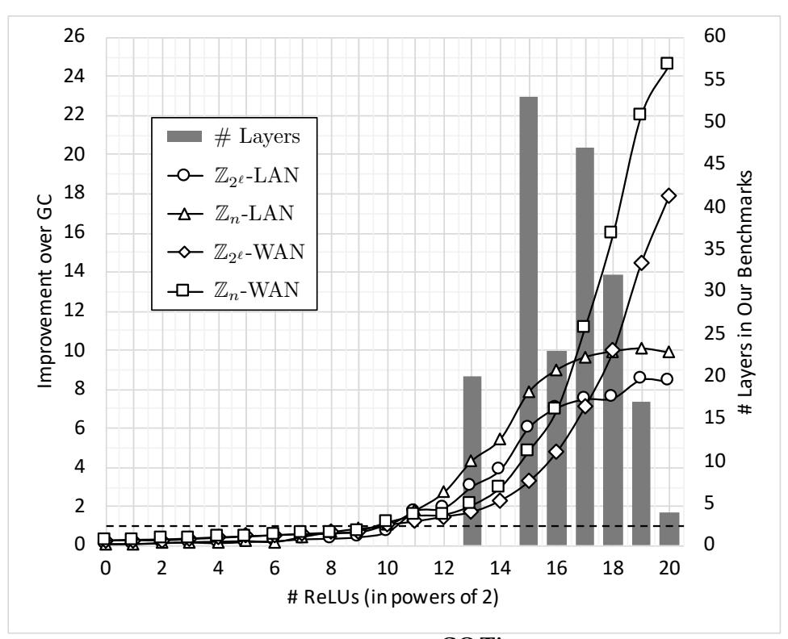

{0}------------------------------------------------

## **CRYPTFLow2: Practical 2-Party Secure Inference**

<span id="page-0-3"></span>Deevashwer Rathee Microsoft Research t-dee@microsoft.com

Mayank Rathee Microsoft Research t-may@microsoft.com Nishant Kumar Microsoft Research nishant.kr10@gmail.com Nishanth Chandran Microsoft Research nichandr@microsoft.com

Divya Gupta Microsoft Research divya.gupta@microsoft.com Aseem Rastogi Microsoft Research aseemr@microsoft.com Rahul Sharma Microsoft Research rahsha@microsoft.com

#### **ABSTRACT**

We present CrypTFlow2, a cryptographic framework for secure inference over realistic Deep Neural Networks (DNNs) using secure 2-party computation. CrypTFlow2 protocols are both correct – i.e., their outputs are bitwise equivalent to the cleartext execution – and efficient – they outperform the state-of-the-art protocols in both latency and scale. At the core of CrypTFlow2, we have new 2PC protocols for secure comparison and division, designed carefully to balance round and communication complexity for secure inference tasks. Using CrypTFlow2, we present the first secure inference over ImageNet-scale DNNs like ResNet50 and DenseNet121. These DNNs are at least an order of magnitude larger than those considered in the prior work of 2-party DNN inference. Even on the benchmarks considered by prior work, CrypTFlow2 requires an order of magnitude less communication and 20×-30× less time than the state-of-the-art.

#### **KEYWORDS**

Privacy-preserving inference; deep neural networks; secure twoparty computation

#### 1 INTRODUCTION

The problem of privacy preserving machine learning has become increasingly important. Recently, there have been many works that have made rapid strides towards realizing *secure inference* [4, 6, 13, 17, 19, 22, 31, 43, 48, 49, 51, 55, 57]. Consider a server that holds the weights w of a publicly known deep neural network (DNN), F, that has been trained on private data. A client holds a private input x; in a standard machine learning (ML) inference task, the goal is for the client to learn the prediction F(x, w) of the server's model on the input x. In secure inference, the inference is performed with the guarantee that the server learns *nothing* about x and the client learns nothing about the server's model w beyond what can be deduced from F(x, w) and x.

A solution for secure inference that scales to practical ML tasks would open a plethora of applications based on MLaaS (ML as a Service). Users can obtain value from ML services without worrying about the loss of their private data, while model owners can effectively monetize their services with no fear of breaches of client data (they never observe private client data in the clear). Perhaps the most important emerging applications for secure inference are in healthcare where prior work [4, 45, 55] has explored secure inference services for privacy preserving medical diagnosis of chest diseases, diabetic retinopathy, malaria, and so on.

Secure inference is an instance of secure 2-party computation (2PC) and cryptographically secure general protocols for 2PC have been known for decades [32, 63]. However, secure inference for practical ML tasks, e.g., ImageNet scale prediction [24], is challenging for two reasons: a) realistic DNNs use ReLU activations<sup>1</sup> that are expensive to compute securely; and b) preserving inference accuracy requires a faithful implementation of secure fixed-point arithmetic. All prior works [6, 31, 43, 48, 49, 51] fail to provide efficient implementation of ReLUs. Although ReLUs can be replaced with approximations that are more tractable for 2PC [22, 31, 49], this approach results in significant accuracy losses that can degrade user experience. The only known approaches to evaluate ReLUs efficiently require sacrificing security by making the untenable assumption that a non-colluding third party takes part in the protocol [7, 45, 50, 56, 61] or by leaking activations [12]. Moreover, some prior works [45, 49-51, 61] even sacrifice correctness of their fixedpoint implementations and the result of their secure execution can sometimes diverge from the expected result, i.e. cleartext execution, in random and unpredictable ways. Thus, correct and efficient 2PC protocols for secure inference over realistic DNNs remain elusive.

#### 1.1 Our Contributions

In this work, we address the above two challenges and build new semi-honest secure 2-party cryptographic protocols for secure computation of DNN inference. Our new efficient protocols enable the first secure implementations of ImageNet scale inference that complete in under a minute! We make three main contributions:

- First, we give new protocols for millionaires' and DReLU<sup>2</sup> that enable us to securely and efficiently evaluate the non-linear layers of DNNs such as ReLU, Maxpool and Argmax.
- Second, we provide new protocols for division. Together with new theorems that we prove on fixed-point arithmetic over shares, we show how to evaluate linear layers, such as convolutions, average pool and fully connected layers, faithfully.
- Finally, by providing protocols that can work on a variety of input domains, we build a system<sup>3</sup> CrypTFlow2 that supports two different types of Secure and Correct Inference (SCI) protocols where linear layers can be evaluated using either homomorphic encryption (SCI<sub>HE</sub>) or through oblivious transfer (SCI<sub>OT</sub>).

We now provide more details of our main contributions.

<span id="page-0-0"></span><sup>&</sup>lt;sup>1</sup>ReLU(x) is defined as max(x, 0).

<span id="page-0-1"></span><sup>&</sup>lt;sup>2</sup>DReLU is the derivative of ReLU, i.e., DReLU(x) is 1 if  $x \ge 0$  and 0 otherwise.

<span id="page-0-2"></span><sup>&</sup>lt;sup>3</sup>Implementation is available at https://github.com/mpc-msri/EzPC.

{1}------------------------------------------------

**New millionaires' and** DReLU **protocols.** Our first main technical contribution is a novel protocol for the well-known *millionaires'* problem [63], where parties  $P_0$  and  $P_1$  hold  $\ell$ -bit integers x and y, respectively, and want to securely compute x < y (or, secret shares of x < y). The theoretical communication complexity of our protocol is  $\approx 3 \times$  better than the most communication efficient prior millionaires' protocol [21, 29, 32, 62, 63]. In terms of round complexity, our protocol executes in  $\log \ell$  rounds (e.g. 5 rounds for  $\ell = 32$  bits); see Table 1 for a detailed comparison and [21] for a detailed overview of the costs of other comparison protocols.

Using our protocol for millionaires' problem, we build new and efficient protocols for computing DReLU for both ℓ-bit integers (i.e.,  $\mathbb{Z}_L$ ,  $L=2^{\ell}$ ) and general rings  $\mathbb{Z}_n$ . Our protocol for DReLU serves as one of the main building blocks for non-linear activations such as ReLU and Maxpool, as well as division over both input domains. Providing support for  $\ell$ -bit integers  $\mathbb{Z}_L$  as well as arbitrary rings  $\mathbb{Z}_n$ , allows us to securely evaluate the linear layers (such as matrix multiplication and convolutions) using the approaches of Oblivious Transfer (OT) [8, 51] as well as Homomorphic Encryption (HE) [30, 43, 49], respectively. This provides our protocols great flexibility when executing over different network configurations. Since all prior work [43, 48, 49, 51] for securely computing these activations rely on Yao's garbled circuits [63], our protocols are much more efficient in both settings. Asymptotically, our ReLU protocol over  $\mathbb{Z}_L$  and  $\mathbb{Z}_n$  communicate  $\approx 8 \times$  and  $\approx 12 \times$  less bits than prior works [43, 48, 49, 51, 62, 63] (see Table 2 for a detailed comparison). Experimentally, our protocols are at least an order of magnitude more performant than prior protocols when computing ReLU activations at the scale of ML applications.

**Fixed-point arithmetic.** The ML models used by all prior works on secure inference are expressed using fixed-point arithmetic; such models can be obtained from [39, 42, 45, 52]. A faithful implementation of fixed-point arithmetic is quintessential to ensure that the secure computation is *correct*, i.e., it is *equivalent* to the cleartext computation for all possible inputs. Given a secure inference task F(x, w), some prior works [45, 49–51, 61] give up on correctness when implementing division operations and instead compute an approximation F'(x, w). In fixed-point arithmetic, each multiplication requires a division by a power-of-2 and multiplications are used pervasively in linear-layers of DNNs. Moreover, layers like average-pool require division for computing means. Loss in correctness is worrisome as the errors can accumulate and F'(x, w) can be arbitrarily far from F(x, w). Recent work [49] has shown that even in practice the approximations can lead to significant losses in classification accuracy.

As our next contribution, we provide novel protocols to compute division by power-of-2 as well as division by arbitrary integers that are both correct and efficient. The inputs to these protocols can be encoded over both  $\ell$ -bit integers  $\mathbb{Z}_L$  as well as  $\mathbb{Z}_n$ , for arbitrary n. To the best of our knowledge, the only known approach to compute division correctly is via garbled circuits which we compare with in Table 3. While garbled circuits based protocols require communication which is quadratic in  $\ell$  or  $\log n$ , our protocols are asymptotically better and incur only linear communication. Concretely, for average pool with  $7 \times 7$  filters and 32-bit integers, our protocols have  $\approx 54 \times$  less communication.

**Scaling to practical DNNs.** These efficient protocols, help us securely evaluate practical DNNs like SqueezeNet on ImageNet scale classification tasks in under a minute. In sharp contrast, all prior works on secure 2-party inference ([4, 6, 13, 17, 19, 22, 31, 43, 48, 49, 51, 55, 57]) has been limited to small DNNs on tiny datasets like MNIST and CIFAR. While MNIST deals with the task of classifying black and white handwritten digits given as  $28 \times 28$  images into the classes 0 to 9, ImageNet tasks are much more complex: typically  $224 \times 224$  colored images need to be classified into thousand classes (e.g., agaric, gyromitra, ptarmigan, etc.) that even humans can find challenging. Additionally, our work is the first to securely evaluate practical convolutional neural networks (CNNs) like ResNet50 and DenseNet121; these DNNs are at least an order of magnitude larger than the DNNs considered in prior work, provide over 90% Top-5 accuracy on ImageNet, and have also been shown to predict lung diseases from chest X-ray images [45, 65]. Thus, our work provides the first implementations of practical ML inference tasks running securely. Even on the smaller CIFAR scale DNNs, our protocols require an order of magnitude less communication and 20×-30× less time than the state-of-the-art [49] (see Section 7.2).

**OT vs HE.** Through our evaluation, we also resolve the OT vs HE conundrum: although the initial works on secure inference [48, 51] used OT-based protocols for evaluating convolutions, the state-of-the-art protocols [43, 49], which currently provide the best published inference latency, use HE-based convolutions. HE-based secure inference has much less communication than OT but HE requires more computation. Hence, at the onset of this work, it was not clear to us whether HE-based convolutions would provide us the best latency for ImageNet-scale benchmarks.

To resolve this empirical question, we implement two classes of protocols,  $SCI_{OT}$  and  $SCI_{HE}$ , in CRYPTFLOW2. In  $SCI_{OT}$ , inputs are in  $\mathbb{Z}_L$  ( $L=2^\ell$ , for a suitable choice of  $\ell$ ). Linear layers such as matrix multiplication and convolution are performed using OT-based techniques [8, 51], while the activations such as ReLU, Maxpool and Avgpool are implemented using our new protocols over  $\mathbb{Z}_L$ . In  $SCI_{HE}$ , inputs are encoded in an appropriate prime field  $\mathbb{Z}_n$  (similar to [43, 49]). Here, we compute linear layers using homomorphic encryption and the activations using our protocols over  $\mathbb{Z}_n$ . In both  $SCI_{OT}$  and  $SCI_{HE}$  faithful divisions after linear layers are performed using our new protocols over corresponding rings. Next, we evaluate ImageNet-scale inference tasks with both  $SCI_{OT}$  and  $SCI_{HE}$ . We observe that in a WAN setting, where communication is a bottleneck, HE-based inference is always faster and in a LAN setting OT and HE are incomparable.

#### 1.2 Our Techniques

**Millionaires'.** Our protocol for securely computing the millionaires' problem (the bit x < y) is based on the following observation (first made in [29]). Let  $x = x_1 || x_0$  and  $y = y_1 || y_0$  (where || denotes concatenation and  $x_1, y_1$  are strings of the same length). Then,

<span id="page-1-0"></span><sup>&</sup>lt;sup>4</sup>Here we state the communication numbers for GMW [32] for a depth-optimized circuit. The circuit that would give the best communication would still have a complexity of  $> 2\lambda\ell$  and would additionally pay an inordinate cost in terms of rounds, namely  $\ell$ . <sup>5</sup>Couteau [21] presented multiple protocols; we pick the one that has the best communication complexity.

{2}------------------------------------------------

<span id="page-2-0"></span>

| Layer               | Protocol                       | Comm. (bits)           | Rounds                     |
|---------------------|--------------------------------|------------------------|----------------------------|
|                     | GC [62, 63]                    | 4λℓ                    | 2                          |
| Millionaires'       | GMW <sup>4</sup> /GSV [29, 32] | $\approx 6\lambda\ell$ | $\log \ell + 3$            |
| on $\{0,1\}^{\ell}$ | SC3 <sup>5</sup> [21]          | <i>&gt;</i> 3λℓ        | $\approx 4 \log^* \lambda$ |
|                     | This work $(m = 4)$            | $<\lambda\ell+14\ell$  | log ℓ                      |
|                     | GC [62, 63]                    | 16384                  | 2                          |
| Millionaires'       | GMW/GSV [29, 32]               | 23140                  | 8                          |
| example             | SC3 [21]                       | 13016                  | 15                         |
| $\ell = 32$         | This work $(m = 7)$            | 2930                   | 5                          |
|                     | This work $(m = 4)$            | 3844                   | 5                          |

Table 1: Comparison of communication with prior work for millionaires' problem. For our protocol, m is a parameter. For concrete bits of communication we use  $\lambda = 128$ .

<span id="page-2-1"></span>

| Layer                              | Protocol    | Comm. (bits)                            | Rounds          |
|------------------------------------|-------------|-----------------------------------------|-----------------|
| ReLU for                           | GC [62, 63] | $8\lambda\ell-4\lambda$                 | 2               |
| $\mathbb{Z}_{2^\ell}$              | This work   | $<\lambda\ell+18\ell$                   | $\log \ell + 2$ |
| ReLU for                           | GC [62, 63] | $18\lambda\eta - 6\lambda$              | 2               |
| general $\mathbb{Z}_n$             | This work   | $< \frac{3}{2}\lambda(\eta+1) + 31\eta$ | $\log \eta + 4$ |
| ReLU for                           | GC [62, 63] | 32256                                   | 2               |
| $\mathbb{Z}_{2^{\ell}}, \ell = 32$ | This work   | 3298                                    | 7               |
| ReLU for                           | GC [62, 63] | 72960                                   | 2               |
| $\mathbb{Z}_n$ , $\eta = 32$       | This work   | 5288                                    | 9               |

Table 2: Comparison of communication with garbled circuits for ReLU. We define  $\eta = \lceil \log n \rceil$ . For concrete bits of communication we use  $\lambda = 128$ .

<span id="page-2-2"></span>

| Layer                              | Protocol    | Comm. (bits)                                         | Rounds                 |
|------------------------------------|-------------|------------------------------------------------------|------------------------|
| $Avgpool_d$                        | GC [62, 63] | $2\lambda(\ell^2 + 5\ell - 3)$                       | 2                      |
| $\mathbb{Z}_{2^\ell}$              | This work   | $<(\lambda+21)\cdot(\ell+3\delta)$                   | $\log(\ell\delta) + 4$ |
| Avgpool <sub>d</sub>               | GC [62, 63] | $2\lambda(\eta^2 + 9\eta - 3)$                       | 2                      |
| $\mathbb{Z}_n$                     | This work   | $< (\frac{3}{2}\lambda + 34) \cdot (\eta + 2\delta)$ | $\log(\eta\delta) + 6$ |
| Avgpool <sub>49</sub>              | GC [62, 63] | 302336                                               | 2                      |
| $\mathbb{Z}_{2^{\ell}}, \ell = 32$ | This work   | 5570                                                 | 10                     |
| Avgpool <sub>49</sub>              | GC [62, 63] | 335104                                               | 2                      |
| $\mathbb{Z}_n$ , $\eta = 32$       | This work   | 7796                                                 | 14                     |

Table 3: Comparison of communication with garbled circuits for  $\operatorname{Avgpool}_d$ . We define  $\eta = \lceil \log n \rceil$  and  $\delta = \lceil \log(6 \cdot d) \rceil$ . For concrete bits of communication we use  $\lambda = 128$ . Choice of d = 49 corresponds to average pool filter of size  $7 \times 7$ .

x < y is the same as checking if either  $x_1 < y_1$  or  $x_1 = y_1$  and  $x_0 < y_0$ . Now, the original problem is reduced to computing two millionaires' instances over smaller length strings ( $x_1 < y_1$  and  $x_0 < y_0$ ) and one equality test ( $x_1 = y_1$ ). By continuing recursively, one could build a tree all the way where the leaves are individual bits, at which point one could use 1-out-of-2 OT-based protocols to perform the comparison/equality. However, the communication complexity of this protocol is still quite large. We make several important modifications to this approach. First, we modify the tree so that the recursion is done  $\log(\ell/m)$  times to obtain leaves with strings of size m, for a parameter m. We then use 1-out-of-2m OT to compute the comparison/equality at the leaves, employing the lookup-table based approach of [25]. Second, we observe that by carefully setting up the receiver's and sender's messages in the

OT protocols for leaf comparisons and equality, multiple 1-out-of-2 $^m$  OT instances can be combined to reduce communication. Next, recursing up from the leaves to the root, requires securely computing the AND functionality $^6$  that uses Beaver bit triples [8]. We observe that the same secret value is used in 2 AND instances. Hence, we construct correlated pairs of bit triples using 1-out-of-8 OT protocols [44] to reduce this cost to  $\lambda$  + 8 bits (amortized) per triple, where  $\lambda$  is the security parameter and typically 128. Some more work is needed for the above technique to work efficiently for the general case when m does not divide  $\ell$  or  $\ell/m$  is not a power of 2. Finally, by picking m appropriately, we obtain a protocol for millionaires' whose concrete communication (in bits) is nearly 5 times better than prior work.

DReLU. Let a be additively secret shared as  $a_0$ ,  $a_1$  over the appropriate ring. DReLU(a) is 1 if  $a \ge 0$  and 0 otherwise; note that  $a \ge 0$  is defined differently for  $\ell$ -bit integers and general rings. Over  $\mathbb{Z}_L$ , where values are encoded using 2's complement notation,  $DReLU(a) = 1 \oplus MSB(a)$ , where MSB(a) is the most significant bit of a. Moreover,  $MSB(a) = MSB(a_0) \oplus MSB(a_1) \oplus carry$ . Here, carry = 1 if  $a'_0 + a'_1 \ge 2^{\ell-1}$ , where  $a'_0, a'_1$  denotes the integer represented by the lower  $\ell - 1$  bits of  $a_0$ ,  $a_1$ . We compute this carry bit using a call to our millionaires' protocol. Over  $\mathbb{Z}_n$ , DReLU(a) = 1 if  $a \in [0, \lceil n/2 \rceil)$ . Given the secret shares  $a_0, a_1$ , this is equivalent to  $(a_0 + a_1) \in [0, \lceil n/2 \rceil) \cup [n, \lceil 3n/2 \rceil)$  over integers. While this can be naïvely computed by making 3 calls to the millionaires' protocol, we show that by carefully selecting the inputs to the millionaires' protocol, one can do this with only 2 calls. Finally, we set things up so that the two calls to millionaires' have correlated inputs that reduces the overall cost to  $\approx$  1.5 instances of millionaires' over  $\mathbb{Z}_n$ .

**Division and Truncation.** As a technical result, we provide a *correct* decomposition of division of a secret ring element in  $\mathbb{Z}_L$  or  $\mathbb{Z}_n$ by a public integer into division of secret shares by the same public integer and correction terms (Theorem 4.1). These correction terms consist of multiple inequalities on secret values. As a corollary, we also get a much simpler expression for the special case of trunca*tion*, i.e., dividing  $\ell$ -bit integers by a power-of-2 (Corollary 4.2). We believe that the general theorem as well as the corollary can be of independent interest. Next, we give efficient protocols for both general division (used for Avgpool, Table 3) as well as division by a power-of-2 (used for multiplication in fixed-point arithmetic). The inequalities in the correction term are computed using our new protocol for millionaires' and the division of shares can be done locally by the respective parties. Our technical theorem is the key to obtaining secure implementation of DNN inference tasks that are bitwise equivalent to cleartext fixed-point execution.

#### 1.3 Other Related Work

Perhaps the first work to consider the secure computation of machine learning inference algorithms was that of [14]. SecureML [51] was the first to consider secure neural network inference and training. Apart from the works mentioned earlier, other works include

<span id="page-2-3"></span><sup>&</sup>lt;sup>6</sup>This functionality takes as input shares of bits x, y from the two parties and outputs shares of x AND y to both parties.

{3}------------------------------------------------

those that considered malicious adversaries [20, 36, 64] (for simpler ML models like linear models, regression, and polynomials) as well as specialized DNNs with 1 or 2 bit weights [4, 55, 57]. Recently, [26] gave protocols for faithful truncation (but not division) over  $\ell$ -bit integers and prime fields in various adversarial settings. For 2-party semi-honest setting, our protocols have up to  $20 \times$  less communication for the truncations required in our evaluation.

#### 1.4 Organisation

We begin with the details on security and cryptographic primitives used in Section 2 on preliminaries. In Section 3 we provide our protocols for millionaires' (Section 3.1) and DReLU (Section 3.2, 3.3), over both  $\mathbb{Z}_L$  and general ring  $\mathbb{Z}_n$ . In Section 4, we present our protocols for division and truncation. We describe the various components of DNN inference in Section 5 and show how to construct secure protocols for all these components given our protocols from Sections 3 and 4. We present our implementation details in Section 6 and our experiments in Section 7. Finally, we conclude and discuss future work in Section 8.

#### <span id="page-3-0"></span>**2 PRELIMINARIES**

*Notation.* For a set W,  $w \stackrel{\$}{\leftarrow} W$  denotes sampling an element w, uniformly at random from W.  $[\ell]$  denotes the set of integers  $\{0, \dots, \ell-1\}$ . Let  $1\{b\}$  denote the indicator function that is 1 when b is *true* and 0 when b is *false*.

#### 2.1 Threat Model and Security

We provide security in the simulation paradigm [18, 32, 47] against a static semi-honest probabilistic polynomial time (PPT) adversary  $\mathcal{A}$ . That is, a computationally bounded adversary  $\mathcal{A}$  corrupts either  $P_0$  or  $P_1$  at the beginning of the protocol and follows the protocol specification honestly. Security is modeled by defining two interactions: a real interaction where  $P_0$  and  $P_1$  execute the protocol in the presence of  $\mathcal{A}$  and the environment  $\mathcal{Z}$  and an ideal interaction where the parties send their inputs to a trusted functionality that performs the computation faithfully. Security requires that for every adversary  $\mathcal{A}$  in the real interaction, there is an adversary S (called the simulator) in the ideal interaction, such that no environment  $\mathcal{Z}$  can distinguish between real and ideal interactions. Many of our protocols invoke multiple sub-protocols and we describe these using the *hybrid model*. This is similar to a real interaction, except that sub-protocols are replaced by the invocations of instances of corresponding functionalities. A protocol invoking a functionality  $\mathcal{F}$  is said to be in " $\mathcal{F}$ -hybrid model."

#### 2.2 Cryptographic Primitives

2.2.1 Secret Sharing Schemes. Throughout this work, we use 2-out-of-2 additive secret sharing schemes over different rings [11, 59]. The 3 specific rings that we consider are the field  $\mathbb{Z}_2$ , the ring  $\mathbb{Z}_L$ , where  $L=2^\ell$  ( $\ell=32$ , typically), and the ring  $\mathbb{Z}_n$ , for a positive integer n (this last ring includes the special case of prime fields used in the works of [43, 49]). We let  $\operatorname{Share}^L(x)$  denote the algorithm that takes as input an element x in  $\mathbb{Z}_L$  and outputs shares over  $\mathbb{Z}_L$ , denoted by  $\langle x \rangle_0^L$  and  $\langle x \rangle_1^L$ . Shares are generated by sampling random ring elements  $\langle x \rangle_0^L$  and  $\langle x \rangle_1^L$ , with the only constraint that  $\langle x \rangle_0^L + \langle x \rangle_1^L = x$  (where + denotes addition in  $\mathbb{Z}_L$ ). Additive secret

sharing schemes are perfectly hiding, i.e., given a share  $\langle x \rangle_0^L$  or  $\langle x \rangle_1^L$ , the value x is completely hidden. The reconstruction algorithm  $\operatorname{Reconst}^L(\langle x \rangle_0^L, \langle x \rangle_1^L)$  takes as input the two shares and outputs  $x = \langle x \rangle_0^L + \langle x \rangle_1^L$ . Shares (along with their corresponding Share() and  $\operatorname{Reconst}()$  algorithms) are defined in a similar manner for  $\mathbb{Z}_2$  and  $\mathbb{Z}_n$  with superscripts B and n, respectively. We sometimes refer to shares over  $\mathbb{Z}_L$  and  $\mathbb{Z}_n$  as arithmetic shares and shares over  $\mathbb{Z}_2$  as boolean shares.

2.2.2 Oblivious Transfer. Let  $\binom{k}{1}$ -OT<sub> $\ell$ </sub> denote the 1-out-of-k Oblivious Transfer (OT) functionality [16] (which generalizes 1-out-of-2 OT [27, 54]). The sender's inputs to the functionality are the kstrings  $m_0, \dots, m_{k-1}$ , each of length  $\ell$  and the receiver's input is a value  $i \in [k]$ . The receiver obtains  $m_i$  from the functionality and the sender receives no output. We use the protocols from [44], which are an optimized and generalized version of the OT extension framework proposed in [9, 41]. This framework allows the sender and receiver, to "reduce"  $\lambda^c$  number of oblivious transfers to  $\lambda$  "base" OTs. We also use the notion of correlated 1-out-of-2 OT [5], denoted by  $\binom{2}{1}$ -COT<sub> $\ell$ </sub>. In our context, this is a functionality where the sender's input is a ring element x and the receiver's input is a choice bit b. The sender receives a random ring element r as output and the receiver obtains either r or x + r as output depending on b. The protocols for  $\binom{k}{1}$ -OT<sub> $\ell$ </sub> [44] and  $\binom{2}{1}$ -COT<sub> $\ell$ </sub> [5] execute in 2 rounds and have total communication  $^7$  of  $2\lambda + k\ell$  and  $\lambda + \ell$ , respectively. Moreover, simpler  $\binom{2}{1}$ -OT $_{\ell}$  has a communication of  $\lambda + 2\ell$  bits [5, 41].

<span id="page-3-3"></span>2.2.3 Multiplexer and B2A conversion. The functionality  $\mathcal{F}_{\mathsf{MUX}}^n$  takes as input arithmetic shares of a over n and boolean shares of choice bit c from  $P_0, P_1$ , and returns shares of a if c = 1, else returns shares of 0 over the same ring. A protocol for  $\mathcal{F}_{\mathsf{MUX}}^n$  can easily be implemented by 2 simultaneous calls to  $\binom{2}{1}$ -OT $_{\eta}$  and communication complexity is  $2(\lambda + 2\eta)$ , where  $\eta = \lceil \log n \rceil$ .

The functionality  $\mathcal{F}_{B2A}^n$  (for boolean to arithmetic conversion) takes boolean (i.e., over  $\mathbb{Z}_2$ ) shares as input and gives out arithmetic (i.e., over  $\mathbb{Z}_n$ ) shares of the same value as output. It can be realized via one call to  $\binom{2}{1}$ -COT $_{\eta}$  and hence, its communication is  $\lambda + \eta$ . For completeness, we provide the protocols realizing  $\mathcal{F}_{MUX}^n$  as well as  $\mathcal{F}_{B2A}^n$  formally in Appendix A.3 and Appendix A.4, respectively.

<span id="page-3-2"></span>2.2.4 Homomorphic Encryption. A homomorphic encryption of x allows computing encryption of f(x) without the knowledge of the decryption key. In this work, we require an additively homomorphic encryption scheme that supports addition and scalar multiplication, i.e. multiplication of a ciphertext with a plaintext. We use the additively homomorphic scheme of BFV [15, 28] (the scheme used in the recent works of Gazelle [43] and Delphi [49]) and use the optimized algorithms of Gazelle for homomorphic matrix-vector products and homomorphic convolutions. The BFV scheme uses the batching optimization [46, 60] that enables operation on plaintext vectors over the field  $\mathbb{Z}_n$ , where n is a prime plaintext modulus of the form 2KN+1, K is some positive integer and N is scheme parameter that is a power-of-2.

<span id="page-3-1"></span><sup>&</sup>lt;sup>7</sup>The protocol of  $\binom{k}{1}$ -OT<sub> $\ell$ </sub> [44] incurs a communication cost of  $\lambda + k\ell$ . However, to achieve the same level of security, their security parameter needs to be twice that of  $\binom{2}{1}$ -COT<sub> $\ell$ </sub>. In concrete terms, therefore, we write the cost as  $2\lambda + k\ell$ .

{4}------------------------------------------------

#### <span id="page-4-0"></span>3 MILLIONAIRES' AND DReLU PROTOCOLS

In this section, we provide our protocols for millionaires' problem and DReLU(a) when the inputs are  $\ell$  bit signed integers as well as elements in general rings of the form  $\mathbb{Z}_n$  (including prime fields). Our protocol for millionaires' problem invokes instances of  $\mathcal{F}_{AND}$  that take as input boolean shares of values  $x, y \in \{0, 1\}$  and returns boolean shares of  $x \wedge y$ . We discuss efficient protocols for  $\mathcal{F}_{AND}$  in Appendix A.1 and A.2.

#### <span id="page-4-1"></span>3.1 Protocol for Millionaires'

In the Yao millionaires' problem, party  $P_0$  holds x and party  $P_1$  holds y and they wish to learn boolean shares of  $\mathbf{1}\{x < y\}$ . Here, x and y are  $\ell$ -bit unsigned integers. We denote this functionality by  $\mathcal{F}_{\text{MILL}}^{\ell}$ . Our protocol for  $\mathcal{F}_{\text{MILL}}^{\ell}$  builds on the following observation that was also used in [29].

<span id="page-4-3"></span>
$$\mathbf{1}\{x < y\} = \mathbf{1}\{x_1 < y_1\} \oplus (\mathbf{1}\{x_1 = y_1\} \land \mathbf{1}\{x_0 < y_0\}),$$
 (1) where,  $x = x_1 ||x_0|$  and  $y = y_1 ||y_0|$ .

Intuition. Let m be a parameter and  $M=2^m$ . First, for ease of exposition, we consider the special case when m divides  $\ell$  and  $q=\ell/m$  is a power of 2. We describe our protocol for millionaires' problem in this setting formally in Algorithm 1. We use Equation 1 above, recursively  $\log q$  times to obtain q leaves of size m bits. That is, let  $x=x_{q-1}||\dots||x_0$  and  $y=y_{q-1}||\dots||y_0$  (where every  $x_i,y_i\in\{0,1\}^m$ ). Now, we compute the shares of the inequalities and equalities of strings at the leaf level using  $\binom{M}{1}$ -OT<sub>1</sub> (steps 9 and 10, resp.). Next, we compute the shares of the inequalities (steps 14 & 15) and equalities (step 16) at each internal node upwards from the leaf using Equation 1. Value of inequality at the root gives the final output.

Correctness and security. Correctness is shown by induction on the depth of the tree starting at the leaves. First, by correctness of  $\binom{M}{1}$ -OT<sub>1</sub> in step 9,  $\langle \operatorname{lt}_{0,j} \rangle_1^B = \langle \operatorname{lt}_{0,j} \rangle_0^B \oplus 1\{x_j < y_j\}$ . Similarly,  $\langle \operatorname{eq}_{0,j} \rangle_1^B = \langle \operatorname{eq}_{0,j} \rangle_0^B \oplus 1\{x_j = y_j\}$ . This proves the base case. Let  $q_i = q/2^i$ . Also, for level i of the tree, parse  $x = x^{(i)} = x_{q_{i-1}}^{(i)}||\dots x_0^{(i)}$  and  $y = y^{(i)} = y_{q_{i-1}}^{(i)}||\dots y_0^{(i)}$ . Assume that for i it holds that  $\operatorname{lt}_{i,j} = \langle \operatorname{lt}_{i,j} \rangle_0^B \oplus \langle \operatorname{lt}_{i,j} \rangle_1^B = 1\{x_j^{(i)} < y_j^{(i)}\}$  and  $\langle \operatorname{eq}_{i,j} \rangle_0^B \oplus \langle \operatorname{eq}_{i,j} \rangle_1^B = 1\{x_j^{(i)} = y_j^{(i)}\}$  for all  $j \in \{0,\dots,q_i-1\}$ . Then, we prove the same for i+1 as follows: By correctness of  $\mathcal{F}_{\text{AND}}$ , for  $j \in \{0,\dots,q_{i+1}-1\}$ ,  $\langle \operatorname{lt}_{i+1,j} \rangle_0^B \oplus \langle \operatorname{lt}_{i+1,j} \rangle_1^B = \operatorname{lt}_{i,2j+1} \oplus (\operatorname{lt}_{i,2j} \wedge \operatorname{eq}_{i,2j+1}) = 1\{x_{2j+1}^{(i)} < y_{2j+1}^{(i)}\} \oplus (1\{x_{2j}^{(i)} < y_{2j}^{(i)}\} \wedge 1\{x_{2j+1}^{(i)} = y_{2j+1}^{(i)}\}) = 1\{x_j^{(i+1)} < y_j^{(i+1)}\}$  (using Equation 1). The induction step for  $\operatorname{eq}_{i+1,j}$  holds in a similar manner, thus proving correctness. Given uniformity of  $\langle \operatorname{lt}_{0,j} \rangle_0^B$ ,  $\langle \operatorname{eq}_{0,j} \rangle_0^B$  for all  $j \in \{0,\dots,q-1\}$ , security follows easily in the  $(\binom{M}{1})$ -OT<sub>1</sub>,  $\mathcal{F}_{\text{AND}}$ )-hybrid.

*General case.* When m does not divide  $\ell$  and  $q = \lceil \ell/m \rceil$  is not a power of 2, we make the following modifications to the protocol. Since m does not divide  $\ell$ ,  $x_{q-1} \in \{0,1\}^r$ , where  $r = \ell \mod m$ .<sup>8</sup> When doing the compute for  $x_{q-1}$  and  $y_{q-1}$ , we perform a small

<span id="page-4-2"></span>**Algorithm 1** Millionaires',  $\Pi_{MILL}^{\ell,m}$ :

**Input:**  $P_0, P_1 \text{ hold } x \in \{0, 1\}^{\ell} \text{ and } y \in \{0, 1\}^{\ell}, \text{ respectively.}$  **Output:**  $P_0, P_1 \text{ learn } \langle \mathbf{1}\{x < y\} \rangle_0^B \text{ and } \langle \mathbf{1}\{x < y\} \rangle_1^B, \text{ respectively.}$ 

1:  $P_0$  parses its input as  $x = x_{q-1} || \dots || x_0$  and  $P_1$  parses its input

```
as y = y_{q-1}||\dots||y_0, where x_i, y_i \in \{0, 1\}^m, q = \ell/m.

2: Let M = 2^m.

3: for j = \{0, \dots, q - 1\} do

4: P_0 samples \langle \operatorname{lt}_{0,j} \rangle_0^B, \langle \operatorname{eq}_{0,j} \rangle_0^B \stackrel{\$}{\leftarrow} \{0, 1\}.

5: for k = \{0, \dots, M - 1\} do

6: P_0 sets s_{j,k} = \langle \operatorname{lt}_{0,j} \rangle_0^B \oplus 1\{x_j < k\}.

7: P_0 sets t_{j,k} = \langle \operatorname{eq}_{0,j} \rangle_0^B \oplus 1\{x_j = k\}.

8: end for
```

<span id="page-4-4"></span>9:  $P_0 \& P_1$  invoke an instance of  $\binom{M}{1}$ -OT<sub>1</sub> where  $P_0$  is the sender with inputs  $\{s_{j,k}\}_k$  and  $P_1$  is the receiver with input  $y_j$ .  $P_1$  sets its output as  $\langle \operatorname{lt}_{0,j} \rangle_1^B$ .

<span id="page-4-5"></span>10:  $P_0 \& P_1$  invoke an instance of  $\binom{M}{1}$ -OT<sub>1</sub> where  $P_0$  is the sender with inputs  $\{t_{j,k}\}_k$  and  $P_1$  is the receiver with input  $y_j$ .  $P_1$  sets its output as  $\langle eq_{0,j}\rangle_1^B$ .

```
11: end for
12: for i = \{1, ..., \log q\} do
             for j = \{0, \dots, (q/2^i) - 1\} do
13:
                   For b \in \{0, 1\}, P_b invokes \mathcal{F}_{AND} with inputs \{\mathsf{lt}_{i-1, 2j}\}_{b}^{B}
14:
      and \langle eq_{i-1,2j+1}\rangle_h^B to learn output \langle temp\rangle_h^B.
                   P_b sets \langle \mathsf{lt}_{i,j} \rangle_b^B = \langle \mathsf{lt}_{i-1,2j+1} \rangle_b^B \oplus \langle \mathsf{temp} \rangle_b^B.
15:
                   For b \in \{0, 1\}, P_b invokes \mathcal{F}_{AND} with inputs \langle eq_{i-1, 2i} \rangle_b^B
16:
      and \langle eq_{i-1,2j+1} \rangle_h^B to learn output \langle eq_{i,j} \rangle_h^B.
             end for
17:
18: end for
19: For b \in \{0, 1\}, P_b outputs \langle \operatorname{lt}_{\log q, 0} \rangle_b^B
```

optimization and use  $\binom{R}{1}$ -OT<sub>1</sub> in steps 9 and 10, where  $R=2^r$ . Second, since q is not a power of 2, we do not have a perfect binary tree of recursion and we need to slightly change our recursion/tree traversal. In the general case, we construct maximal possible perfect binary trees and connect the roots of the same using the relation in Equation 1. Let  $\alpha$  be such that  $2^{\alpha} < q \le 2^{\alpha+1}$ . Now, our tree has a perfect binary sub-tree with  $2^{\alpha}$  leaves and we have remaining  $q' = q - 2^{\alpha}$  leaves. We recurse on q'. In the last step, we obtain our tree with q leaves by combining the roots of perfect binary tree with  $2^{\alpha}$  leaves and tree with q' leaves using Equation 1. Note that value at the root is computed using  $\lceil \log q \rceil$  sequential steps starting from the leaves.

<span id="page-4-10"></span>3.1.1 Optimizations. We reduce the concrete communication complexity of our protocol using the following optimizations that are applicable to both the special and the general case.

Combining two  $\binom{M}{1}$ -OT<sub>1</sub> calls into one  $\binom{M}{1}$ -OT<sub>2</sub>: Since the input of  $P_1$  (OT receiver) to  $\binom{M}{1}$ -OT<sub>1</sub> in steps 9 and 10 is same, i.e.  $y_j$ , we can collapse these steps into a single call to  $\binom{M}{1}$ -OT<sub>2</sub> where  $P_0$  and  $P_1$  input  $\{(s_{j,k}||t_{j,k})\}_k$  and  $y_j$ , respectively.  $P_1$  sets its output as  $(\langle \operatorname{It}_{0,j} \rangle_1^B || \langle \operatorname{eq}_{0,j} \rangle_1^B)$ . This reduces the cost from  $2(2\lambda + M)$  to  $(2\lambda + 2M)$ .

<span id="page-4-9"></span><sup>8</sup> Note that r = m when m divides  $\ell$ .

{5}------------------------------------------------

- Pealizing  $\mathcal{F}_{AND}$  efficiently: It is well-known that  $\mathcal{F}_{AND}$  can be realized using Beaver bit triples [8]. For our protocol, we observe that the 2 calls to  $\mathcal{F}_{AND}$  in steps 14 and 16 have a common input,  $\langle eq_{i-1,2j+1}\rangle_b^B$ . Hence, we optimize communication of these steps by generating correlated bit triples  $(\langle d\rangle_b^B, \langle e\rangle_b^B, \langle f\rangle_b^B)$  and  $(\langle d'\rangle_b^B, \langle e\rangle_b^B, \langle f'\rangle_b^B)$ , for  $b \in \{0, 1\}$ , such that  $d \wedge e = f$  and  $d' \wedge e = f'$ . Next, we use  $\binom{8}{1}$ -OT<sub>2</sub> to generate one such correlated bit triple (Appendix A.2) with communication  $2\lambda + 16$  bits, giving the amortized cost of  $\lambda + 8$  bits per triple. Given correlated bit triples, we need 6 additional bits to compute both  $\mathcal{F}_{AND}$  calls.
- Removing unnecessary equality computations: As observed in [29], the equalities computed on lowest significant bits are never used. Concretely, we can skip computing the values  $eq_{i,0}$  for  $i \in \{0, ..., \log q\}$ . Once we do this optimization, we only need a single call to  $\mathcal{F}_{AND}$  instead of 2 correlated calls for the leftmost branch of the tree. We use the  $\binom{16}{1}$ -OT<sub>2</sub>  $\rightarrow$  2  $\times$   $\binom{4}{1}$ -OT<sub>1</sub> reduction to generate 2 regular bit triples from [25] (Appendix A.1) with communication of  $2\lambda + 32$  bits. This gives us amortized communication of  $\lambda + 16$  bits per triple and we need 4 additional bits to realize  $\mathcal{F}_{AND}$ . Overall, we get a reduction in total communication by M (for the leaf) plus  $(\lambda + 2) \cdot \lceil \log q \rceil$  (for leftmost branch) bits.

<span id="page-5-7"></span>3.1.2 Communication Complexity. In our protocol, we communicate in protocols for OT (steps 9&10) and  $\mathcal{F}_{AND}$  (steps 14&16). With above optimizations, we need 1 call to  $\binom{M}{1}$ -OT<sub>1</sub>, (q-2) calls to  $\binom{M}{1}$ -OT<sub>2</sub> and 1 call to  $\binom{R}{1}$ -OT<sub>2</sub> which cost  $(2\lambda+M)$ ,  $((q-2)\cdot(2\lambda+2M))$  and  $(2\lambda+2R)$  bits, respectively. In addition, we have  $\lceil \log q \rceil$  invocations of  $\mathcal{F}_{AND}$  and  $(q-1-\lceil \log q \rceil)$  invocations of correlated  $\mathcal{F}_{AND}$ . These require communication of  $(\lambda+20)\cdot\lceil \log q \rceil$  and  $(2\lambda+22)\cdot(q-1-\lceil \log q \rceil)$  bits. This gives us total communication of  $\lambda(4q-\lceil \log q \rceil-2)+M(2q-3)+2R+22(q-1)-2\lceil \log q \rceil$  bits. Using this expression for  $\ell=32$  we get least communication for m=7 (Table 1). We note that there is a trade-off between communication and computational cost of OTs used and we discuss our choice of m for our experiments in Section 6.

#### <span id="page-5-0"></span>3.2 Protocol for DReLU for ℓ-bit integers

In Algorithm 2, we describe our protocol for  $\mathcal{F}_{\mathsf{DReLU}}^{\mathsf{int},\ell}$  that takes as input arithmetic shares of a and returns boolean shares of  $\mathsf{DReLU}(a)$ . Note that  $\mathsf{DReLU}(a) = (1 \oplus \mathsf{MSB}(a))$ , where  $\mathsf{MSB}(a)$  is the most significant bit of a. Let arithmetic shares of  $a \in \mathbb{Z}_L$  be  $\langle a \rangle_0^L = \mathsf{msb}_0 || x_0$  and  $\langle a \rangle_1^L = \mathsf{msb}_1 || x_1$  such that  $\mathsf{msb}_0$ ,  $\mathsf{msb}_1 \in \{0,1\}$ . We compute the boolean shares of  $\mathsf{MSB}(a)$  as follows: Let carry  $= \mathbf{1}\{(x_0 + x_1) > 2^{\ell-1} - 1\}$ . Then,  $\mathsf{MSB}(a) = \mathsf{msb}_0 \oplus \mathsf{msb}_1 \oplus \mathsf{carry}$ . We compute boolean shares of carry by invoking an instance of  $\mathcal{F}_{\mathsf{MIII}}^{\ell-1}$ .

Correctness and security. By correctness of  $\mathcal{F}_{\mathsf{MILL}}^{\ell-1}$ ,  $\mathsf{Reconst}^B(\langle \mathsf{carry} \rangle_0^B, \langle \mathsf{carry} \rangle_1^B) = \mathbf{1}\{(2^{\ell-1}-1-x_0) < x_1\} = \mathbf{1}\{(x_0+x_1) > 2^{\ell-1}-1\}$ . Also,  $\mathsf{Reconst}^B(\langle \mathsf{DReLU} \rangle_0^B, \langle \mathsf{DReLU} \rangle_1^B) = \mathsf{msb}_0 \oplus \mathsf{msb}_1 \oplus \mathsf{carry} \oplus 1 = \mathsf{MSB}(a) \oplus 1$ . Security follows trivially in the  $\mathcal{F}_{\mathsf{MILL}}^{\ell-1}$  hybrid.

Communication complexity In Algorithm 2, we communicate the same as in  $\Pi_{\text{MILL}}^{\ell-1}$ , that is  $<(\lambda+14)(\ell-1)$  by using m=4.

<span id="page-5-2"></span>**Algorithm 2**  $\ell$ -bit integer DReLU,  $\Pi_{DReLU}^{int,\ell}$ :

**Input:**  $P_0$ ,  $P_1$  hold  $\langle a \rangle_0^L$  and  $\langle a \rangle_1^L$ , respectively. **Output:**  $P_0$ ,  $P_1$  get  $\langle \mathsf{DReLU}(a) \rangle_0^B$  and  $\langle \mathsf{DReLU}(a) \rangle_1^B$ .

- 1:  $P_0$  parses its input as  $\langle a \rangle_0^L = \mathsf{msb}_0 || x_0$  and  $P_1$  parses its input as  $\langle a \rangle_1^L = \mathsf{msb}_1 || x_1$ , s.t.  $b \in \{0,1\}$ ,  $\mathsf{msb}_b \in \{0,1\}$ ,  $x_b \in \{0,1\}^{\ell-1}$ .
- 2:  $P_0 \& P_1$  invoke an instance of  $\mathcal{F}_{\mathsf{MILL}}^{\ell-1}$ , where  $P_0$ 's input is  $2^{\ell-1} 1 x_0$  and  $P_1$ 's input is  $x_1$ . For  $b \in \{0, 1\}$ ,  $P_b$  learns  $\langle \mathsf{carry} \rangle_b^B$ .
- 3: For  $b \in \{0, 1\}$ ,  $P_b$  sets  $\langle \mathsf{DReLU} \rangle_b^B = \mathsf{msb}_b \oplus \langle \mathsf{carry} \rangle_b^B \oplus b$ .

<span id="page-5-3"></span>**Algorithm 3** Simple Integer ring DReLU,  $\Pi_{DReLU^{simple}}^{ring,n}$ :

**Input:**  $P_0$ ,  $P_1$  hold  $\langle a \rangle_0^n$  and  $\langle a \rangle_1^n$ , respectively, where  $a \in \mathbb{Z}_n$ . **Output:**  $P_0$ ,  $P_1$  get  $\langle \mathsf{DReLU}(a) \rangle_0^B$  and  $\langle \mathsf{DReLU}(a) \rangle_1^B$ .

- <span id="page-5-4"></span>1:  $P_0 \& P_1$  invoke an instance of  $\mathcal{F}_{\mathsf{MILL}}^{\eta}$  with  $\eta = \lceil \log n \rceil$ , where  $P_0$ 's input is  $\left(n - 1 - \langle a \rangle_0^n\right)$  and  $P_1$ 's input is  $\langle a \rangle_1^n$ . For  $b \in \{0, 1\}$ ,  $P_b$  learns  $\langle \mathsf{wrap} \rangle_b^B$  as output.
- <span id="page-5-5"></span>2:  $P_0$  &  $P_1$  invoke an instance of  $\mathcal{F}_{\mathsf{MILL}}^{\eta+1}$ , where  $P_0$ 's input is  $\left(n-1-\langle a\rangle_0^n\right)$  and  $P_1$ 's input is  $\left((n-1)/2+\langle a\rangle_1^n\right)$ . For  $b\in\{0,1\}$ ,  $P_b$  learns  $\langle\mathsf{lt}\rangle_b^B$  as output.
- <span id="page-5-6"></span>3:  $P_0$  &  $P_1$  invoke an instance of  $\mathcal{F}_{\mathsf{MILL}}^{\eta+1}$ , where  $P_0$ 's input is  $\left(n+(n-1)/2-\langle a\rangle_0^n\right)$  and  $P_1$ 's input is  $\langle a\rangle_1^n$ . For  $b\in\{0,1\}$ ,  $P_b$  learns  $\langle \mathsf{rt}\rangle_b^B$  as output.
- 4: For  $b \in \{0, 1\}$ ,  $P_b$  invokes  $\mathcal{F}_{\mathsf{MUX}}^2$  with input  $\left(\langle \mathsf{lt} \rangle_b^B \oplus \langle \mathsf{rt} \rangle_b^B\right)$  and choice  $\langle \mathsf{wrap} \rangle_b^B$  to learn  $\langle z \rangle_b^B$ .
- 5: For  $b \in \{0, 1\}$ ,  $P_b$  outputs  $\langle z \rangle_h^B \oplus \langle \operatorname{lt} \rangle_h^B \oplus b$ .

#### <span id="page-5-1"></span>3.3 **Protocol for** DReLU **for general** $\mathbb{Z}_n$

We describe a protocol for  $\mathcal{F}_{\mathsf{DReLU}}^{\mathsf{ring},n}$  that takes arithmetic shares of a over  $\mathbb{Z}_n$  as input and returns boolean shares of  $\mathsf{DReLU}(a)$ . For integer rings  $\mathbb{Z}_n$ ,  $\mathsf{DReLU}(a) = 1$  if  $a < \lceil n/2 \rceil$  and 0 otherwise. Note that this includes the case of prime fields considered in the works of [43, 49]. Below, we formally discuss the case of rings of odd number of elements and omit the analogous case of even rings. We first describe a (simplified) protocol for  $\mathsf{DReLU}$  over  $\mathbb{Z}_n$  in Algorithm 3 with protocol logic as follows: Let arithmetic shares of  $a \in \mathbb{Z}_n$  be  $\langle a \rangle_0^n$  and  $\langle a \rangle_1^n$ . Define wrap =  $1\{\langle a \rangle_0^n + \langle a \rangle_1^n > n-1\}$ , It =  $1\{\langle a \rangle_0^n + \langle a \rangle_1^n > (n-1)/2\}$  and rt =  $1\{\langle a \rangle_0^n + \langle a \rangle_1^n > n + (n-1)/2\}$ . Then,  $\mathsf{DReLU}(a)$  is  $(1 \oplus \mathsf{It})$  if wrap = 0, else it is  $(1 \oplus \mathsf{rt})$ . In Algorithm 3, steps 1,2,3, compute these three comparisons using  $\mathcal{F}_{\mathsf{MUL}}$ . Final output can be computed using an invocation of  $\mathcal{F}_{\mathsf{MUX}}^2$ .

Optimizations. We describe an optimized protocol for  $\mathcal{F}_{DReLU}^{ring,n}$  in Algorithm 4 that reduces the number of calls to  $\mathcal{F}_{MILL}$  to 2. First, we observe that if the input of  $P_1$  is identical in all three invocations, then the invocations of OT in Algorithm 1 (steps 9&10) can be done together for the three comparisons. This reduces the communication for each leaf OT invocation in steps 9&10 by an additive factor of  $4\lambda$ . To enable this,  $P_0$ ,  $P_1$  add (n-1)/2 to their inputs to  $\mathcal{F}_{MILL}^{\eta+1}$  in steps 1,3 ( $\eta = \lceil \log n \rceil$ ). Hence,  $P_1$ 's input to

{6}------------------------------------------------

<span id="page-6-2"></span>**Algorithm 4** Optimized Integer ring DReLU,  $\Pi_{DReLU}^{ring,n}$ :

**Input:**  $P_0, P_1 \text{ hold } \langle a \rangle_0^n \text{ and } \langle a \rangle_1^n, \text{ respectively, where } a \in \mathbb{Z}_n. \text{ Let } \eta = \lceil \log n \rceil.$ 

**Output:**  $P_0, P_1$  get  $\langle \mathsf{DReLU}(a) \rangle_0^B$  and  $\langle \mathsf{DReLU}(a) \rangle_1^B$ .

- <span id="page-6-3"></span>1:  $P_0$  &  $P_1$  invoke an instance of  $\mathcal{F}_{\mathsf{MILL}}^{\eta+1}$ , where  $P_0$ 's input is  $\left(3(n-1)/2 - \langle a \rangle_0^n\right)$  and  $P_1$ 's input is  $(n-1)/2 + \langle a \rangle_1^n$ . For  $b \in \{0,1\}$ ,  $P_b$  learns  $\langle \mathsf{wrap} \rangle_b^B$  as output.
- 2:  $P_0$  sets  $x = \left(2n 1 \langle a \rangle_0^n\right)$  if  $\langle a \rangle_0^n > (n-1)/2$ , else  $x = \left(n 1 \langle a \rangle_0^n\right)$ .
- <span id="page-6-4"></span>3:  $P_0 \& P_1$  invoke an instance of  $\mathcal{F}_{\mathsf{MILL}}^{\eta+1}$ , where  $P_0$ 's input is x and  $P_1$ 's input is  $\left((n-1)/2 + \langle a \rangle_1^n\right)$ . For  $b \in \{0,1\}$ ,  $P_b$  learns  $\langle \mathsf{xt} \rangle_b^B$  as output.

```
4: P_0 samples \langle z \rangle_0^B \stackrel{\$}{\leftarrow} \{0, 1\}.
 5: for j = \{00, 01, 10, 11\} do
             P_0 parses j as j_0||j_1 and sets t_j = 1 \oplus \langle \mathsf{xt} \rangle_0^B \oplus j_0.
 6:
             if \langle a \rangle_0^n > (n-1)/2 then
 7:
                   P_0 \text{ sets } s'_j = t_j \wedge (\langle \text{wrap} \rangle_0^B \oplus j_1).
 8:
             else
 9:
                    P_0 \text{ sets } s'_i = t_j \oplus ((1 \oplus t_j) \wedge (\langle \operatorname{wrap} \rangle_0^B \oplus j_1))
10:
             end if
11:
             P_0 \text{ sets } s_j = s_j' \oplus \langle z \rangle_0^B
12:
13: end for
```

- 14:  $P_0$  &  $P_1$  invoke an instance of  $\binom{4}{1}$ -OT<sub>1</sub> where  $P_0$  is the sender with inputs  $\{s_j\}_j$  and  $P_1$  is the receiver with input  $\langle xt \rangle_1^B ||\langle wrap \rangle_1^B . P_1$  sets its output as  $\langle z \rangle_1^B$ .
- 15: For  $b \in \{0, 1\}$ ,  $P_b$  outputs  $\langle z \rangle_b^B$ .

 $\mathcal{F}_{\mathsf{MILL}}^{\eta+1}$  is  $(n-1)/2 + \langle a \rangle_1^n$  in all invocations and  $P_0$ 's inputs are  $\left(3(n-1)/2 - \langle a \rangle_0^n\right)$ ,  $\left(n-1-\langle a \rangle_0^n\right)$ ,  $\left(2n-1-\langle a \rangle_0^n\right)$  in steps 1,2,3, respectively.

Next, we observe that one of the comparisons in step 2 or step 3 is redundant. For instance, if  $\langle a \rangle_0^n > (n-1)/2$ , then the result of the comparison It =  $\langle a \rangle_0^n + \langle a \rangle_1^n > (n-1)/2$  done in step 2 is always 1. Similarly, if  $\langle a \rangle_0^n \leq (n-1)/2$ , then the result of the comparison rt =  $1\{\langle a\rangle_0^n + \langle a\rangle_1^n > n + (n-1)/2\}$  done in step 3 is always 0. Moreover,  $P_0$  knows based on her input  $\langle a \rangle_0^n$  which of the two comparisons is redundant. Hence, in the optimized protocol,  $P_0$  and  $P_1$  always run the comparison to compute shares of wrap and one of the other two comparisons. Note that the choice of which comparison is omitted by  $P_0$  need not be communicated to  $P_1$ , since  $P_1$ 's input is same in all invocations of  $\mathcal{F}_{MILL}$ . Moreover, this omission does not reveal any additional information to  $P_1$  by security of  $\mathcal{F}_{\text{MILL}}$ . Finally,  $P_0$  and  $P_1$  can run a  $\binom{4}{1}$ -OT<sub>1</sub> to learn the shares of DReLU(a). Here,  $P_1$  is the receiver and her choice bits are the shares learnt in the two comparisons.  $P_0$  is the sender who sets the 4 OT messages based on her input share, and two shares learnt from the comparison protocol. We elaborate on this in the correctness proof below.

Correctness and Security. First, by correctness of  $\mathcal{F}_{\text{MILL}}^{\eta+1}$  (step 1), wrap = Reconst<sup>B</sup>( $\langle \text{wrap} \rangle_0^B$ ,  $\langle \text{wrap} \rangle_1^B$ ) =  $1\{\langle a \rangle_0^L + \langle a \rangle_1^L > n - 1\}$ . Let  $j^* = \langle \text{xt} \rangle_1^B || \langle \text{wrap} \rangle_1^B$ . Then,  $t_{j^*} = 1 \oplus \text{xt}$ . We will show that  $s'_{j^*} = \text{DReLU}(a)$ , and hence, by correctness of  $\binom{4}{1}$ -OT<sub>1</sub>,  $z = \text{Reconst}^B(\langle z \rangle_0^B, \langle z \rangle_1^B) = \text{DReLU}(a)$ . We have the following two cases.

When  $\langle a \rangle_0^L > (n-1)/2$ , lt = 1, and DReLU(a) = wrap  $\land$  (1  $\oplus$  rt). Here, by correctness of  $\mathcal{F}_{\mathsf{MILL}}^{\eta+1}$  (step 3), xt = Reconst $^B(\langle \mathsf{xt} \rangle_0^B, \langle \mathsf{xt} \rangle_1^B)$  = rt. Hence,  $s'_{j^*} = t_{j^*} \land (\langle \mathsf{wrap} \rangle_0^B \oplus j_1^*) = (1 \oplus \mathsf{rt}) \land \mathsf{wrap}$ .

When  $\langle a \rangle_0^L \leq (n-1)/2$ ,  $\operatorname{rt} = 0$ ,  $\operatorname{DReLU}(a)$  is  $1 \oplus \operatorname{lt}$  if  $\operatorname{wrap} = 0$ , else 1. It can be written as  $(1 \oplus \operatorname{lt}) \oplus (\operatorname{lt} \wedge \operatorname{wrap})$ . In this case, by correctness of  $\mathcal{F}_{\operatorname{MILL}}^{\eta+1}$  (step 3),  $\operatorname{xt} = \operatorname{Reconst}^B(\langle \operatorname{xt} \rangle_0^B, \langle \operatorname{xt} \rangle_1^B) = \operatorname{lt}$ . Hence,  $s'_{j^*} = t_{j^*} \oplus ((1 \oplus t_{j^*}) \wedge (\langle \operatorname{wrap} \rangle_0^B \oplus j_1^*)) = (1 \oplus \operatorname{lt}) \oplus (\operatorname{lt} \wedge \operatorname{wrap})$ . Since  $\langle z \rangle_0^B$  is uniform, security follows in the  $(\mathcal{F}_{\operatorname{MILL}}^{\eta+1}, \binom{4}{1} - \operatorname{OT}_1)$ -hybrid.

Communication complexity. With the above optimization, the overall communication complexity of our protocol for DReLU in  $\mathbb{Z}_n$  is equivalent to 2 calls to  $\Pi_{\text{MILL}}^{\eta+1}$  where  $P_1$  has same input plus  $2\lambda + 4$  (for protocol for  $\binom{4}{1}$ -OT<sub>1</sub>). Two calls to  $\Pi_{\text{MILL}}^{\eta+1}$  in this case (using m=4) cost  $<\frac{3}{2}\lambda(\eta+1)+28(\eta+1)$  bits. Hence, total communication is  $<\frac{3}{2}\lambda(\eta+1)+28(\eta+1)+2\lambda+4$ . We note that the communication complexity of simplified protocol in Algorithm 3 is approximately 3 independent calls to  $\Pi_{\text{MILL}}^{\eta}$ , which cost  $3(\lambda\eta+14\eta)$  bits, plus  $2\lambda+4$  bits for  $\mathcal{F}_{\text{MUX}}^2$ . Thus, our optimization gives almost  $2\times$  improvement.

#### <span id="page-6-1"></span>4 DIVISION AND TRUNCATION

We present our results on secure implementations of division in the ring by a positive integer and truncation (division by powerof-2) that are bitwise equivalent to the corresponding cleartext computation. We begin with closed form expressions for each of these followed by secure protocols that use them.

# 4.1 Expressing general division and truncation using arithmetic over secret shares

Let idiv :  $\mathbb{Z} \times \mathbb{Z} \to \mathbb{Z}$  denote signed integer division, where the quotient is rounded towards  $-\infty$  and the sign of the remainder is the same as that of divisor. We denote division of a ring element by a positive integer using rdiv :  $\mathbb{Z}_n \times \mathbb{Z} \to \mathbb{Z}_n$  defined as

<span id="page-6-5"></span>
$$rdiv(a,d) \triangleq idiv(a_u - 1\{a_u \ge \lceil n/2 \rceil\} \cdot n, d) \bmod n, \qquad (2)$$

where the integer  $a_u \in \{0, 1, ..., n-1\}$  is the unsigned representation of  $a \in \mathbb{Z}_n$  lifted to integers and 0 < d < n. For brevity, we use  $x =_n y$  to denote  $x \mod n = y \mod n$ .

<span id="page-6-0"></span>THEOREM 4.1. (Division of ring element by positive integer). Let the shares of  $a \in \mathbb{Z}_n$  be  $\langle a \rangle_0^n$ ,  $\langle a \rangle_1^n \in \mathbb{Z}_n$ , for some  $n = n^1 \cdot d + n^0 \in \mathbb{Z}$ , where  $n^0$ ,  $n^1$ ,  $d \in \mathbb{Z}$  and  $0 \le n^0 < d < n$ .

Let the unsigned representation of a,  $\langle a \rangle_0^n$ ,  $\langle a \rangle_1^n$  in  $\mathbb{Z}_n$  lifted to integers be  $a_u, a_0, a_1 \in \{0, 1, \dots, n-1\}$ , respectively, such that  $a_0 = a_0^1 \cdot d + a_0^0$  and  $a_1 = a_1^1 \cdot d + a_1^0$ , where  $a_0^1, a_0^0, a_1^1, a_1^0 \in \mathbb{Z}$  and  $0 \leq a_0^0, a_1^0 < d$ . Let  $n' = \lceil n/2 \rceil \in \mathbb{Z}$ . Define corr, A, B,  $C \in \mathbb{Z}$ 

{7}------------------------------------------------

as follows:

$$\operatorname{corr} = \begin{cases} -1 & (a_u \ge n') \land (a_0 < n') \land (a_1 < n') \\ 1 & (a_u < n') \land (a_0 \ge n') \land (a_1 \ge n') \\ 0 & otherwise \end{cases},$$

$$A = a_0^0 + a_1^0 - (1\{a_0 \ge n'\} + 1\{a_1 \ge n'\} - \operatorname{corr}) \cdot n^0.$$

$$B = \operatorname{idiv}(a_0^0 - 1\{a_0 \ge n'\} \cdot n^0, d) + \operatorname{idiv}(a_1^0 - 1\{a_1 \ge n'\} \cdot n^0, d)$$

$$C = 1\{A < d\} + 1\{A < 0\} + 1\{A < -d\}$$

Then, we have:

$$\operatorname{rdiv}(\langle a \rangle_0^n, d) + \operatorname{rdiv}(\langle a \rangle_1^n, d) + (\operatorname{corr} \cdot n^1 + 1 - C - B) =_n \operatorname{rdiv}(a, d).$$

The proof of the above theorem is presented in Appendix C.

4.1.1 Special Case of truncation for  $\ell$  bit integers. The expression above can be simplified for the special case of division by  $2^s$  of  $\ell$ -bit integers, i.e., arithmetic right shift with  $s \gg s$ , as follows:

<span id="page-7-0"></span>COROLLARY 4.2. (Truncation for  $\ell$ -bit integers). Let the shares of  $a \in \mathbb{Z}_L$  be  $\langle a \rangle_0^L$ ,  $\langle a \rangle_1^L \in \mathbb{Z}_L$ . Let the unsigned representation of a,  $\langle a \rangle_0^L$ ,  $\langle a \rangle_1^L$  in  $\mathbb{Z}_L$  lifted to integers be  $a_u$ ,  $a_0$ ,  $a_1 \in \{0, 1, \dots, 2^{\ell} - 1\}$ , respectively, such that  $a_0 = a_0^1 \cdot 2^s + a_0^0$  and  $a_1 = a_1^1 \cdot 2^s + a_1^0$ , where  $a_0^1$ ,  $a_0^0$ ,  $a_1^1$ ,  $a_1^0 \in \mathbb{Z}$  and  $0 \le a_0^0$ ,  $a_1^0 < 2^s$ . Let corr  $\in \mathbb{Z}$  be defined as in Theorem 4.1. Then, we have:

$$(a_0 \gg s) + (a_1 \gg s) + \operatorname{corr} \cdot 2^{\ell - s} + 1\{a_0^0 + a_1^0 \ge 2^s\} =_L (a \gg s).$$

PROOF. The corollary follows directly from Theorem 4.1 as follows: First,  $(a \gg s) = \operatorname{rdiv}(a, 2^s)$ . Next,  $n = 2^\ell$ ,  $n^1 = 2^{\ell-s}$ , and  $n^0 = 0$ . Using these, we get  $A = a_0^0 + a_1^0$ , B = 0 and  $C = \mathbf{1}\{A < 2^s\} = \mathbf{1}\{a_0^0 + a_1^0 < 2^s\}$ .

#### 4.2 Protocols for division

In this section, we describe our protocols for division in different settings. We first describe a protocol for the simplest case of truncation for  $\ell$ -bit integers followed by a protocol for general division in  $\mathbb{Z}_n$  by a positive integer (Section 4.2.2). Finally, we discuss another simpler case of truncation, which allows us to do better than general division for rings with a special structure (Section 4.2.3).

4.2.1 **Protocol for truncation of**  $\ell$ **-bit integer**. Let  $\mathcal{F}_{\mathsf{Trunc}}^{\mathsf{int},\ell,s}$  be the functionality that takes arithmetic shares of a as input and returns arithmetic shares of  $a \gg s$  as output. In this work, we give a protocol (Algorithm 5) that realizes the functionality  $\mathcal{F}_{\mathsf{Trunc}}^{\mathsf{int},\ell,s}$  correctly building on Corollary 4.2.

Intuition. Parties  $P_0$  &  $P_1$  first invoke an instance of  $\mathcal{F}_{\mathsf{DReLU}}^{\mathsf{int},\ell}$  (where one party locally flips its share of  $\mathsf{DReLU}(a)$ ) to get boolean shares  $\langle m \rangle_b^B$  of  $\mathsf{MSB}(a)$ . Using these shares, they use a  $\binom{4}{1}$ - $\mathsf{OT}_\ell$  for calculating  $\langle \mathsf{corr} \rangle_b^L$ , i.e., arithmetic shares of corr term in Corollary 4.2. Next, they use an instance of  $\mathcal{F}_{\mathsf{MILL}}^s$  to compute boolean shares of  $c = 1\{a_0^0 + a_1^0 \geq 2^s\}$ . Finally, they compute arithmetic shares of c using a call to  $\mathcal{F}_{\mathsf{B2A}}^L$  (Algorithm 7).

Correctness and Security. For any  $z \in \mathbb{Z}_L$ ,  $\mathsf{MSB}(z) = \mathbf{1}\{z_u \geq 2^{\ell-1}\}$ , where  $z_u$  is unsigned representation of z lifted to integers. First, note that  $\mathsf{Reconst}^B(\langle m \rangle_0^B, \langle m \rangle_1^B) = \mathbf{1} \oplus \mathsf{Reconst}^B(\langle \alpha \rangle_0^B, \langle \alpha \rangle_1^B) = \mathsf{MSB}(a)$  by correctness of  $\mathcal{F}_{\mathsf{DReLU}}^{\mathsf{int},\ell}$ . Next, we show that  $\mathsf{Reconst}^L(\langle \mathsf{corr} \rangle_0^L, \langle \mathsf{corr} \rangle_1^L) = \mathsf{corr}$ , as defined in Corollary 4.2. Let  $x_b = \mathsf{MSB}(\langle a \rangle_b^L)$ 

```
Algorithm 5 Truncation, \Pi_{\text{Trunc}}^{\text{int},\ell,s}
```

```
Input: For b \in \{0, 1\}, P_b holds \langle a \rangle_b^L, where a \in \mathbb{Z}_L.
Output: For b \in \{0, 1\}, P_b learns \langle z \rangle_b^L s.t. z = a \gg s.
  1: For b \in \{0, 1\}, let a_b, a_b^0, a_b^1 \in \mathbb{Z} be as defined in Corollary 4.2.
  2: For b \in \{0, 1\}, P_b invokes \mathcal{F}_{\mathsf{DReLU}}^{\mathsf{int}, \ell} with input \langle a \rangle_b^L to learn
       output \langle \alpha \rangle_h^B. Party P_b sets \langle m \rangle_h^B = \langle \alpha \rangle_h^B \oplus b.
  3: For b \in \{0, 1\}, P_b sets x_b = \mathsf{MSB}(\langle a \rangle_b^L).
  4: P_0 samples \langle \mathsf{corr} \rangle_0^L \stackrel{\$}{\leftarrow} \mathbb{Z}_{2^\ell}.
   5: for j = \{00, 01, 10, 11\} do
              P_0 computes t_j = (\langle m \rangle_0^B \oplus j_0 \oplus x_0) \wedge (\langle m \rangle_0^B \oplus j_0 \oplus j_1) s.t.
   6:
        j = (j_0||j_1).
              if t_i \wedge 1\{x_0 = 0\} then
   7:
                    P_0 sets s_i =_L -\langle \text{corr} \rangle_0^L - 1.
  8:
              else if t_i \wedge 1\{x_0 = 1\} then
  9:
                    P_0 sets s_i =_L -\langle \operatorname{corr} \rangle_0^L + 1.
 10:
 11:
                    P_0 \text{ sets } s_j =_L -\langle \text{corr} \rangle_0^L
 12:
              end if
 13:
 14: end for
```

- <span id="page-7-4"></span><span id="page-7-3"></span>15:  $P_0 \& P_1$  invoke an instance of  $\binom{4}{1}$ -OT<sub> $\ell$ </sub>, where  $P_0$  is the sender with inputs  $\{s_j\}_j$  and  $P_1$  is the receiver with input  $\langle m \rangle_1^B || x_1$  and learns  $\langle \text{corr} \rangle_1^L$ .
- 16:  $P_0 \& P_1$  invoke an instance of  $\mathcal{F}^s_{\mathsf{MILL}}$  with  $P_0$ 's input as  $2^s 1 a_0^0$  and  $P_1$ 's input as  $a_1^0$ . For  $b \in \{0, 1\}$ ,  $P_b$  learns  $\langle c \rangle_b^B$ .
- <span id="page-7-5"></span>17: For  $b \in \{0, 1\}$ ,  $P_b$  invokes an instance of  $\mathcal{F}_{\mathsf{B2A}}^L$   $(L = 2^\ell)$  with input  $\langle c \rangle_b^B$  and learns  $\langle d \rangle_b^L$ .
- 18:  $P_b$  outputs  $\langle z \rangle_b^L = (\langle a \rangle_b^L \gg s) + \langle \text{corr} \rangle_b^L \cdot 2^{\ell-s} + \langle d \rangle_b^L, b \in \{0, 1\}.$

for  $b \in \{0, 1\}$ , and let  $j^* = (\langle m \rangle_1^B || x_1)$ . Then,  $t_{j^*} = (\langle m \rangle_0^B \oplus \langle m \rangle_1^B \oplus x_0) \wedge (\langle m \rangle_0^B \oplus \langle m \rangle_1^B \oplus x_1) = (\mathsf{MSB}(a) \oplus x_0) \wedge (\mathsf{MSB}(a) \oplus x_1)$ . Now,  $t_{j^*} = 1$  implies that we are in one of the first two cases of expression for corr – which case we are in can be checked using  $x_0$  (steps 7 & 9). Now it is easy to see that  $s_{j^*} = -\langle \mathsf{corr} \rangle_0^L + \mathsf{corr} = \langle \mathsf{corr} \rangle_1^L$ .

& 9). Now it is easy to see that  $s_{j^*} = -\langle \text{corr} \rangle_0^L + \text{corr} = \langle \text{corr} \rangle_1^L$ . Next, by correctness of  $\mathcal{F}_{\text{MILL}}^s$ ,  $c = \text{Reconst}^B(\langle c \rangle_0^B, \langle c \rangle_1^B) = \langle c \rangle_0^B \oplus \langle c \rangle_1^B = \mathbf{1}\{a_0^0 + a_1^0 \geq 2^s\}$ . Given boolean shares of c, step 17, creates arithmetic shares of the same using an instance of  $\mathcal{F}_{\text{B2A}}^L$ . Since  $\langle \text{corr} \rangle_0^L$  is uniformly random, security of our protocol is easy to see in  $(\mathcal{F}_{\text{DReLU}}^{\text{int},\ell}, \binom{4}{1} - \text{OT}_{\ell}, \mathcal{F}_{\text{MILL}}^s, \mathcal{F}_{\text{B2A}}^L)$ -hybrid.

Communication complexity.  $\Pi_{\mathsf{Trunc}}^{\mathsf{int},\ell,s}$  involves a single call each to  $\mathcal{F}_{\mathsf{DReLU}}^{\mathsf{int},\ell}$ ,  $\binom{4}{1}$ - $\mathsf{OT}_{\ell}$ ,  $\mathcal{F}_{\mathsf{B2A}}^{L}$  and  $\mathcal{F}_{\mathsf{MILL}}^{s}$ . Hence, communication required is  $<\lambda\ell+2\lambda+19\ell+$  communication for  $\mathcal{F}_{\mathsf{MILL}}^{s}$  that depends on parameter s. For  $\ell=32$  and s=12, our concrete communication is 4310 bits (using m=7 for  $\Pi_{\mathsf{MILL}}^{12}$  as well as  $\Pi_{\mathsf{MILL}}^{31}$  inside  $\Pi_{\mathsf{DReLU}}^{\mathsf{int},32}$ ) as opposed to 24064 bits for garbled circuits.

<span id="page-7-1"></span>4.2.2 **Protocol for division in ring.** Let  $\mathcal{F}_{\mathsf{DIV}}^{\mathsf{ring},n,d}$  be the functionality for division that takes arithmetic shares of a as input and returns arithmetic shares of  $\mathsf{rdiv}(a,d)$  as output. Our protocol builds on our closed form expression from Theorem 4.1. We note that  $\ell$ -bit integers is a special case of  $\mathbb{Z}_n$  and we use the same protocol for

{8}------------------------------------------------

division of an element in  $\mathbb{Z}_L$  by a positive integer.

*Intuition.* This protocol is similar to the previous protocol for truncation and uses the same logic to compute shares of corr term. Most non-trivial term to compute is *C* that involves three signed comparis ons over  $\mathbb Z.$  We emulate these comparisons using calls to  $\mathcal F_{\mathsf{DReLU}}^{\mathsf{int},\delta}$ where  $\delta$  is large enough to ensure that there are no overflows or underflows. It is not too hard to see that  $-2d + 2 \le A \le 2d - 2$ and hence,  $-3d + 2 \le A - d$ , A,  $A + d \le 3d - 2$ . Hence, we set  $\delta = \lceil \log 6d \rceil$ . Now, with this value of  $\delta$ , the term C can we re-written as  $(\mathsf{DReLU}(A-d) \oplus 1) + (\mathsf{DReLU}(A) \oplus 1) + (\mathsf{DReLU}(A+d) \oplus 1)$ , which can be computed using three calls to  $\mathcal{F}_{\mathsf{DReLU}}^{\mathsf{int},\delta}$  (Step 19) and  $\mathcal{F}_{\mathsf{B2A}}^n$  (Step 20) each. Finally, note that to compute C we need arithmetic shares of A over the ring  $\mathbb{Z}_{\Delta}$ ,  $\Delta = 2^{\delta}$ . And this requires shares of corr over the same ring. Hence, we compute shares of corr over both  $\mathbb{Z}_n$  and  $\mathbb{Z}_{\Delta}$  (Step 15). Due to space constraints, we describe the protocol formally in Appendix D along with its communication complexity. Also, Table 3 provides theoretical and concrete communication numbers for division in both  $\mathbb{Z}_L$  and  $\mathbb{Z}_n$ , as well as a comparison with garbled circuits.

<span id="page-8-1"></span>4.2.3 **Truncation in rings with special structure**. It is easy to see that truncation by s in general rings can be done by performing a division by  $d=2^s$ . However, we can omit a call to  $\mathcal{F}_{\mathsf{DReLU}}^{\mathsf{int},\delta}$  and  $\mathcal{F}_{\mathsf{B2A}}^n$  when the underlying ring and d satisfy a relation. Specifically, if we have  $2 \cdot n^0 \le d = 2^s$ , then A is always greater than equal to -d, where  $n^0, A \in \mathbb{Z}$  are as defined in Theorem 4.1. Thus, the third comparison (A < -d) in the expression of C from Theorem 4.1 can be omitted. Moreover, this reduces the value of  $\delta$  needed and  $\delta = \lceil \log 4d \rceil$  suffices since  $-2d \le A - d, A \le 2d - 2$ .

Our homomorphic encryption scheme requires n to be a prime of the form 2KN + 1 (Section 2.2.4), where K is a positive integer and  $N \ge 8192$  is a power-of-2. Thus, we have  $n^0 = n \mod 2^s = 1$  for  $1 \le s \le 14$ . For all our benchmarks,  $s \le 12$  and we use this optimization for truncation in SCI<sub>HE</sub>.

#### <span id="page-8-0"></span>**5 SECURE INFERENCE**

We give an overview of all the layers that must be computed securely to realize the task of secure neural network inference. Layers can be broken into two categories - *linear* and *non-linear*. An inference algorithm simply consists of a sequence of layers of appropriate dimension connected to each other. Examples of linear layers include matrix multiplication, convolutions, Avgpool and batch normalization, while non-linear layers include ReLU, Maxpool, and Argmax.

We are in the setting of secure inference where the model owner, say  $P_0$ , holds the weights. When securely realizing each of these layers, we maintain the following invariant: Parties  $P_0$  and  $P_1$  begin with arithmetic shares of the input to the layer and after the protocol, end with arithmetic shares (over the same ring) of the output of the layer. This allows us to stitch protocols for arbitrary layers sequentially to obtain a secure computation protocol for any neural network comprising of these layers. Semi-honest security of the protocol will follow trivially from sequential composibility of

individual sub-protocols [18, 32, 47]. For protocols in  $SCI_{OT}$ , this arithmetic secret sharing is over  $\mathbb{Z}_L$ ; in  $SCI_{HE}$ , the sharing is over  $\mathbb{Z}_n$ , prime n. The inputs to secure inference are floating-point numbers, encoded as fixed-point integers in the ring ( $\mathbb{Z}_L$  or  $\mathbb{Z}_n$ ); for details see Appendix E.

#### 5.1 Linear Layers

<span id="page-8-2"></span>*5.1.1 Fully connected layers and convolutions.* A fully connected layer in a neural network is simply a product of two matrices - the matrix of weights and the matrix of activations of that layer - of appropriate dimension. At a very high level, a convolutional layer applies a filter (usually of dimension  $f \times f$  for small integer f) to the input matrix by sliding across it and computing the sum of elementwise products of the filter with the input. Various parameters are associated with convolutions - e.g. stride (a stride of 1 denotes that the filter slides across the larger input matrix beginning at every row and every column) and zero-padding (which indicates whether the matrix is padded with 0s to increase its dimension before applying the filter). When performing matrix multiplication or convolutions over fixed-point values, the values of the final matrix must be scaled down appropriately so that it has the same scale as the inputs to the computation. Hence, to do faithful fixed-point arithmetic, we first compute the matrix multiplication or convolution over the ring ( $\mathbb{Z}_L$  or  $\mathbb{Z}_n$ ) followed by truncation, i.e., division-by-2<sup>s</sup> of all the values. In SCI<sub>OT</sub>, multiplication and convolutions over the ring  $\mathbb{Z}_L$ are done using oblivious transfer techniques and in SCI<sub>HE</sub> these are done over  $\mathbb{Z}_n$  using homomorphic encryption techniques that we describe next followed by our truncation method.

OT based computation. The OT-based techniques for multiplication are well-known [8, 23, 51] and we describe them briefly for completeness. First consider the simple case of secure multiplication of a and b in  $\mathbb{Z}_L$  where  $P_0$  knows a and  $P_0$  and  $P_1$  hold arithmetic shares of b. This can be done by invoking  $\binom{2}{1}$ -COT $_i$  for  $i \in \{1, \ldots, \ell\}$  requiring communication equivalent to  $\ell$  instances of  $\binom{2}{1}$ -COT $_{\frac{\ell+1}{2}}$ . Using this, multiplying two matrices  $A \in \mathbb{Z}_L^{M,N}$  and  $B \in \mathbb{Z}_L^{N,K}$  such that  $P_0$  knows A and B is arithmetically secret shared requires  $MNK\ell$  instances of  $\binom{2}{1}$ -COT $_{\frac{\ell+1}{2}}$ . This can be optimized with structured multiplications inside a matrix multiplication by combining all the COT sender messages when multiplying with the same element, reducing the complexity to that of  $NK\ell$  instances of  $\binom{2}{1}$ -COT $_{\frac{M(\ell+1)}{2}}$ . Finally, we reduce the task of secure convolutions to secure matrix multiplication similar to [45, 50, 61].

HE based computation. SCI<sub>HE</sub> uses techniques from Gazelle [43] and Delphi [49] to compute matrix multiplications and convolutions over a field  $\mathbb{Z}_n$  (prime n), of appropriate size. At a high level, first,  $P_1$  sends an encryption of its arithmetic share to  $P_0$ . Then,  $P_0$  homomorphically computes on this ciphertext using weights of the model (known to  $P_0$ ) to compute an encryption of the arithmetic share of the result and sends this back to  $P_1$ . Hence, the communication only depends on the input and output size of the linear layer and is independent of the number of multiplications being performed. Homomorphic operations can have significantly high computational cost - to mitigate this, we build upon the *output rotations* method from [43] for performing convolutions, and reduce its

{9}------------------------------------------------

number of homomorphic rotations. At a very high level, after performing convolutions homomorphically, ciphertexts are grouped, rotated in order to be correctly aligned, and then packed using addition. In our work, we divide the groups further into subgroups that are misaligned *by the same offset*. Hence the ciphertexts within a subgroup can first be added and the resulting ciphertext can then be aligned using a single rotation as opposed to subgroup-size many rotations in [43]. We refer the reader to Appendix F for details.

*Faithful truncation.* To correctly emulate fixed-point arithmetic, the value encoded in the shares obtained from the above methods needs to be divided-by- $2^s$ , where s is the scale used. For this we invoke  $\mathcal{F}_{\mathsf{Trunc}}^{\mathsf{int},\ell,s}$  in  $\mathsf{SCI}_{\mathsf{OT}}$  and  $\mathcal{F}_{\mathsf{DIV}}^{\mathsf{ring},n,2^s}$  in  $\mathsf{SCI}_{\mathsf{HE}}$  for each value of the resulting matrix. With this, result of secure implementation of fixed-point multiplication and convolutions is bitwise equal to the corresponding cleartext execution. In contrast, many prior works on 2PC [49, 51] and 3PC [45, 50, 61] used a local truncation method for approximate truncation based on a result from [51]. Here, the result can be arbitrarily wrong with a (small) probability p and with probability 1 - p the result can be wrong in the last bit. Since p grows with the number of truncations, these probabilistic errors are problematic for large DNNs. Moreover, even if p is small, 1bit errors can accumulate and the results of cleartext execution and secure execution can diverge; this is undesirable as it breaks correctness of 2PC.

5.1.2 Avgpool<sub>d</sub>. The function Avgpool<sub>d</sub> $(a_1, \cdots, a_d)$  over a pool of d elements  $a_1, \cdots, a_d$  is defined to be the arithmetic mean of these d values. The protocol to compute this function works as follows:  $P_0$  and  $P_1$  begin with arithmetic shares (e.g. over  $\mathbb{Z}_L$  in SCI<sub>OT</sub>) of  $a_i$ , for all  $i \in [d]$ . They perform local addition to obtain shares of  $w = \sum_{i=1}^d a_i$  (i.e.,  $P_b$  computes  $\langle w \rangle_b^L = \sum_{i=1}^d \langle a_i \rangle_b^L$ ). Then, parties invoke  $\mathcal{F}_{\text{DIV}}^{\text{ring},L,d}$  on inputs  $\langle w \rangle_b^L$  to obtain the desired output. Correctness and security follow in the  $\mathcal{F}_{\text{DIV}}^{\text{ring},L,d}$  —hybrid model. Here too, unlike [49], our secure execution of average pool is bitwise equal to the cleartext version.

#### 5.2 Nonlinear Layers

5.2.1 ReLU. Note that ReLU(a) = a if  $a \ge 0$ , and 0 otherwise. Equivalently, ReLU(a) = DReLU(a) · a. For  $\mathbb{Z}_L$ , first we compute the boolean shares of DReLU(a) using a call to  $\mathcal{F}_{\mathsf{DReLU}}^{\mathsf{int},\ell}$  and then we compute shares of ReLU(a) using a call to multiplexer  $\mathcal{F}_{\mathsf{MUX}}^L$  (Section 2.2.3). We describe the protocol for ReLU(a) over  $\mathbb{Z}_L$  formally in Algorithm 8, Appendix B (the case of  $\mathbb{Z}_n$  follows in a similar manner). For communication complexity, refer to Table 2 for comparison with garbled circuits and Appendix B for details.

5.2.2 Maxpool<sub>d</sub> and Argmax<sub>d</sub>. The function Maxpool<sub>d</sub>  $(a_1, \dots, a_d)$  over d elements  $a_1, \dots, a_d$  is defined in the following way. Define  $\operatorname{gt}(x,y)=z$ , where w=x-y and z=x, if w>0 and z=y, if  $w\leq 0$ . Define  $z_1=a_1$  and  $z_i=\operatorname{gt}(a_i,z_{i-1})$ , recursively for all  $2\leq i\leq d$ . Now, Maxpool<sub>d</sub>  $(a_1,\dots,a_d)=z_d$ .

We now describe a protocol such that parties begin with arithmetic shares (over  $\mathbb{Z}_L$ ) of  $a_i$ , for all  $i \in [d]$  and end the protocol with arithmetic shares (over  $\mathbb{Z}_L$ ) of Maxpool<sub>d</sub>  $(a_1, \dots, a_d)$ . For simplicity, we describe how  $P_0$  and  $P_1$  can compute shares of  $z = \operatorname{gt}(x, y)$  (beginning with the shares of x and y). It is easy to see then how

they can compute  $\operatorname{Maxpool}_d$ . First, parties locally compute shares of w = x - y (i.e.,  $P_b$  computes  $\langle w \rangle_b^L = \langle x \rangle_b^L - \langle y \rangle_b^L$ , for  $b \in \{0, 1\}$ ). Next, they invoke  $\mathcal{F}_{\mathsf{DReLU}}^{\mathsf{int},\ell}$  with input  $\langle w \rangle_b^L$  to learn output  $\langle v \rangle_b^B$ . Now, they invoke  $\mathcal{F}_{\mathsf{MUX}}^L$  with input  $\langle w \rangle_b^L$  and  $\langle v \rangle_b^B$  to learn output  $\langle t \rangle_b^L$ . Finally, parties output  $\langle z \rangle_b^L = \langle y \rangle_b^L + \langle t \rangle_b^L$ . The correctness and security of the protocol follows in a straightforward manner. Computing  $\mathsf{Maxpool}_d$  is done using d-1 invocations of the above sub-protocol in d-1 sequential steps.

Argmax<sub>d</sub>  $(a_1, \dots, a_d)$  is defined similar to  $\mathsf{Maxpool}_d(a_1, \dots, a_d)$ , except that its output is an index  $i^*$  s.t.  $a_{i^*} = \mathsf{Maxpool}_d(a_1, \dots, a_d)$ . Argmax<sub>d</sub> can be computed securely similar to  $\mathsf{Maxpool}_d(a_1, \dots, a_d)$ .

#### <span id="page-9-0"></span>**6 IMPLEMENTATION**

We implement our cryptographic protocols in a library and integrate them into the CrypTFlow framework [1, 45] as a new cryptographic backend. CrypTFlow compiles high-level TensorFlow [3] inference code to secure computation protocols using its frontend Athos, that are then executed by its cryptographic backends. We modify the truncation behavior of Athos in support of faithful fixed-point arithmetic. We start by describing the implementation of our cryptographic library, followed by the modifications that we made to Athos.

#### 6.1 Cryptographic backend

To implement our protocols, we build upon the  $\binom{2}{1}$ -OT $_{\ell}$  implementation from EMP [62] and extend it to  $\binom{k}{1}$ -OT $_{\ell}$  using the protocol from [44]. Our linear-layer implementation in SCI<sub>HE</sub> is based on SEAL/Delphi [2, 58] and in SCI<sub>OT</sub> is based on EMP. All our protocol implementations are multi-threaded.

Oblivious Transfer.  $\binom{k}{1}$ -OT $_{\ell}$  requires a correlation robust function to mask the sender's messages in the OT extension protocol, and we use AES $_{256}^{RK}$  (re-keyed AES with 256-bit key) $^9$  to instantiate it as in [23, 25]. We incorporated the optimizations from [33, 34] for AES key expansion and pipelining these AES $_{256}^{RK}$  calls. This leads to roughly 6× improvement in the performance of AES $_{256}^{RK}$  calls, considerably improving the overall execution time of  $\binom{k}{1}$ -OT $_{\ell}$  (e.g. 2.7× over LAN for  $\binom{16}{1}$ -OT $_{8}$ ).

*Millionaires' protocol.* Recall that m is a parameter in our protocol  $\Pi_{\text{MILL}}^{\ell,m}$ . While we discussed the dependence of communication complexity on m in Section 3.1.2, here we discuss its influence on the computational cost. Our protocol makes  $\ell/m$  calls to  $\binom{M}{1}$ -OT<sub>2</sub> (after merging steps 9&10), where  $M=2^m$ . Using OT extension techniques, generating an instance of  $\binom{M}{1}$ -OT<sub>2</sub> requires 6 AES<sup>FK</sup><sub>256</sub> and (M+1) AES<sup>RK</sup><sub>256</sub> evaluations. Thus, the computational cost grows super-polynomially with m. We note that for  $\ell=32$ , even though communication is minimized for m=7, empirically we observe that m=4 gives us the best performance under both LAN and WAN settings (communication in this case is about 30% more than when m=7 but computation is  $\approx 3 \times 100$  lower).

<span id="page-9-1"></span><sup>&</sup>lt;sup>9</sup>There are two types of AES in MPC applications - fixed-key (FK) and re-keyed (RK) [10, 35]. While the former runs key schedule only once and is more efficient, the latter generates a new key schedule for every invocation and is required in this application.

{10}------------------------------------------------

Implementing linear layers in SCI<sub>HE</sub>. To implement the linear layers in SCI<sub>HE</sub>, we build upon the Delphi implementation [2, 49], that is in turn based on the SEAL library [58]. We use the code for fully connected layers as it is from [2]. For convolution layers, we parallelize the code, employ modulus-switching [58] to reduce the ciphertext modulus (and hence ciphertext size), and implement the strided convolutions proposed in Gazelle [43]. These optimizations resulted in significant performance improvement of convolution layers. E.g. for the first convolution layer<sup>10</sup> of ResNet50, the runtime decreased from 306s to 18s in the LAN setting and communication decreased from 204 MiB to 76 MiB.

#### 6.2 CrypTFlow integration

We integrate SCI<sub>OT</sub> and SCI<sub>HE</sub> as new cryptographic backends into the CrypTFlow framework [1, 45]. CrypTFlow's TensorFlow frontend Athos outputs fixed-point DNNs that use 64-bit integers and sets an optimal scale using a validation set. CrypTFlow required a *bitwidth* of 64 to ensure that the probability of local truncation errors in its protocols is small (Section 5.1.1). Since our protocols are correct and have no such errors, we extend Athos to set both the bitwidth and the scale optimally by autotuning on the validation set. The bitwidth and scale leak information about the weights and this leakage is similar to the prior works on secure inference [43, 45, 48–51, 61].

Implementing faithful truncations using  $\Pi^{\mathsf{int},\ell,s}_{\mathsf{Trunc}}$  requires the parties to communicate. We implement the following peephole optimizations in Athos to reduce the cost of these truncation calls. Consider a DNN having a convolution layer followed by a ReLU layer. While truncation can be done immediately after the convolution, moving the truncation call to after the ReLU layer can reduce the cost of our protocol  $\Pi^{\text{int},\ell,s}_{\text{Trunc}}$ . Since the values after ReLU are guaranteed to be all positive, the call to  $\mathcal{F}_{\mathsf{DReLU}}^{\mathsf{int},\ell}$  within it (step 2 in Algorithm 5) now becomes redundant and can be omitted. Our optimization further accounts for operations that may occur between the convolutions and ReLU, say a matrix addition. Moving the truncation call from immediately after convolution to after ReLU means the activations flowing into the addition operation are now scaled by 2s, instead of the usual s. For the addition operation to then work correctly, we scale the other argument of addition by s as well. These optimizations are fully automatic and need no manual intervention.

#### <span id="page-10-0"></span>7 EXPERIMENTS

We empirically validate the following claims:

- In Section 7.1, we show that our protocols for computing ReLU activations are more efficient than state-of-the-art garbled circuits-based implementations (Table 4). Additionally, our division protocols outperforms garbled circuits when computing average pool layers.
- On the DNNs considered by prior work on secure inference, our protocols can evaluate the non-linear layers much more efficiently and decrease the total time (Table 5) as well as the online time (Table 6).

<span id="page-10-3"></span>

Figure 1: The left y-axis shows  $(\frac{GC\ Time}{Our\ Time})$ . The right y-axis shows the total number of ReLU layers corresponding to each layer size in our benchmark set. The legend entries denote the input domain and the network setting.

• We show the first empirical evaluation of 2-party secure inference on ImageNet-scale benchmarks (Section 7.3). These results show the trade-offs between OT and HE-based secure DNN inference (Table 7).

We start with a description of our experimental setup and benchmarks, followed by the results.

Experimental Setup. We ran our benchmarks in two network settings, namely, a LAN setting with both machines situated in West Europe, and a transatlantic WAN setting with one of the machines in East US. The bandwidth between the machines is 377 MBps and 40 MBps in the LAN and the WAN setting respectively and the echo latency is 0.3ms and 80ms respectively. Each machine has commodity class hardware: 3.7 GHz Intel Xeon processor with 4 cores and 16 GBs of RAM.

Our Benchmarks. We evaluate on the ImageNet-scale benchmarks considered by [45]: SqueezeNet [40], ResNet50 [37], and DenseNet121 [38]. To match the reported accuracies, we need 37-bit fixed-point numbers for ResNet50, whereas 32 bits suffice for DenseNet121 and SqueezeNet (Appendix I). Recall that our division protocols lead to correct secure executions and there is no accuracy loss in going from cleartext inference to secure inference. Appendix G provides a brief summary of these benchmarks.

#### <span id="page-10-2"></span>7.1 Comparison with Garbled Circuits

We compare with EMP-toolkit [62], the state-of-the-art library for Garbled Circuits (GC). Figure 1 shows the improvement of our ReLU protocols over GC in both LAN and WAN settings. On the x-axis, which is in log-scale, the number of ReLUs range from  $2^0$  to  $2^{20}$ . The histogram shows, using the right y-axis, the cumulative number of layers in our benchmarks (SqueezeNet, ResNet50, DenseNet121) which require the number of ReLU activations given on the x-axis. We observe that these DNNs have layers that compute between  $2^{13}$  and  $2^{20}$  ReLUs. For such layers, we observe (on the left y-axis) that

<span id="page-10-1"></span> $<sup>^{10}</sup>$  Layer parameters: image size 230  $\times$  230, filter size 7  $\times$  7, input channels 3, output channels 64, and stride size 2  $\times$  2

{11}------------------------------------------------

<span id="page-11-2"></span>

|             |       | Garbled Circuits |       | Our Protocols |       |      |
|-------------|-------|------------------|-------|---------------|-------|------|
| Benchmark   | LAN   | WAN              | Comm  | LAN           | WAN   | Comm |
| SqueezeNet  | 26.4  | 265.6            | 7.63  | 3.5           | 33.3  | 1.15 |
| ResNet50    | 136.5 | 1285.2           | 39.19 | 16.4          | 69.4  | 5.23 |
| DenseNet121 | 199.6 | 1849.3           | 56.57 | 24.8          | 118.7 | 8.21 |

(a) over <sup>Z</sup><sup>2</sup> ℓ

|             |       | Garbled Circuits |        | Our Protocols |       |       |
|-------------|-------|------------------|--------|---------------|-------|-------|
| Benchmark   | LAN   | WAN              | Comm   | LAN           | WAN   | Comm  |
| SqueezeNet  | 51.7  | 525.8            | 16.06  | 5.6           | 50.4  | 1.77  |
| ResNet50    | 267.5 | 2589.7           | 84.02  | 28.0          | 124.0 | 8.55  |
| DenseNet121 | 383.5 | 3686.2           | 118.98 | 41.9          | 256.0 | 12.64 |

(b) over Z

Table 4: Performance comparison with Garbled Circuits for ReLU layers. Runtimes are in seconds and comm. in GiB.

our protocols are 2×–25× faster than GC – the larger the layers the higher the speedups, and gains are larger in the WAN settings. Specifically, for WAN and > 2 <sup>17</sup> ReLUs, the speedups are much higher than the LAN setting. Here, the cost of rounds is amortized over large layers and the communication cost is a large fraction of the total runtime. Note that our implementations perform loadbalancing to leverage full-duplex TCP.

Next, we compare the time taken by GC and our protocols in computing the ReLU activations of our benchmarks in [Table 4.](#page-11-2) Our protocol over Z is up to 8× and 18× faster than GC in the LAN and WAN settings respectively, while it is ≈ 7× more communication efficient. As expected, our protocol over Z has even better gains over GC. Specifically, it is up to 9× and 21× faster in the LAN and WAN settings respectively, and has ≈ 9× less communication.

We also performed a similar comparison of our protocols with GC for the Avgpool layers of our benchmarks, and saw up to 51× reduction in runtime and 41× reduction in communication. We report the concrete performance numbers and discuss the results in more detail in [Appendix H.](#page-17-1)

#### <span id="page-11-0"></span>7.2 Comparison with Delphi

In this section, we compare with Delphi [\[49\]](#page-13-3), which is the current state-of-the-art for 2-party secure DNN inference that outperforms [\[12,](#page-12-8) [13,](#page-12-2) [17,](#page-12-3) [19,](#page-12-4) [22,](#page-12-5) [31,](#page-13-0) [43,](#page-13-1) [48,](#page-13-2) [56\]](#page-13-11) in total time as well as the time taken in online phase. It uses garbled circuits for non-linear layers, and we show that with our protocols, the time taken to evaluate the non-linear layers can be decreased significantly.

For a fair evaluation, we demonstrate these improvements on the benchmarks of Delphi [\[49\]](#page-13-3), i.e., the MiniONN (CIFAR-10) [\[48\]](#page-13-2) and ResNet32 (CIFAR-100) DNNs with ReLU activations (as opposed to the ImageNet-scale benchmarks for which Delphi has not been optimized). Similar to Delphi, we perform these computations with a bitwidth of 41 in the LAN setting.

In [Table 5,](#page-11-3) we report the performance of Delphi for evaluating the linear and non-linear components of MiniONN and ResNet32 separately, along with the performance of our protocols for the same non-linear computation[11](#page-11-6). The table shows that the time to evaluate non-linear layers is the bulk of the total time and our

<span id="page-11-3"></span>

|           |        |        | Non-linear |      |             |  |
|-----------|--------|--------|------------|------|-------------|--|
| Benchmark | Metric | Linear | Delphi     | Ours | Improvement |  |
| MiniONN   | Time   | 10.7   | 30.2       | 1.0  | 30.2×       |  |
|           | Comm.  | 0.02   | 3.15       | 0.28 | 12.3×       |  |
|           | Time   | 15.9   | 52.9       | 2.4  | 22.0×       |  |
| ResNet32  | Comm.  | 0.07   | 5.51       | 0.59 | 9.3×        |  |

Table 5: Performance comparison with Delphi [\[49\]](#page-13-3) for nonlinear layers. Runtimes are in seconds and comm. in GiB.

<span id="page-11-4"></span>

|           |        |        | Non-linear |             |
|-----------|--------|--------|------------|-------------|
| Benchmark | Linear | Delphi | Ours       | Improvement |
| MiniONN   | < 0.1  | 3.97   | 0.32       | 12.40×      |
| ResNet32  | < 0.1  | 6.99   | 0.63       | 11.09×      |

Table 6: Performance comparison with Delphi [\[49\]](#page-13-3) for online runtime in seconds.

protocols are 20×–30× faster in evaluating the non-linear layers. Also note that we reduce the communication by 12× on MiniONN, and require 9× less communication on ResNet32.

Next, we compare the online time of our protocols with the online time of Delphi in [Table 6.](#page-11-4) In the online phase, linear layers take negligible time and all the time is spent in evaluating the nonlinear layers. Here, our protocols are an order of magnitude more efficient than Delphi.

#### <span id="page-11-5"></span>7.3 Evaluation on practical DNNs

With all our protocols and implementation optimizations in place, we demonstrate the scalability of CrypTFlow2 by efficiently running ImageNet-scale secure inference. Table [7](#page-12-28) shows that both our backends, SCIOT and SCIHE, are efficient enough to evaluate SqueezeNetin under a minute and scale to ResNet50 and DenseNet121.

In the LAN setting, for both SqueezeNet and DenseNet121, SCIOT performs better than SCIHE by at least 20% owing to the higher compute in the latter. However, the quadratic growth of communication with bitlength in the linear-layers of SCIOT can easily drown this difference if we go to higher bitlengths. Because ResNet50, requires 37-bits (compared to 32 in SqueezeNet and DenseNet121) to preserve accuracy, SCIHE outperforms SCIOT in both LAN and WAN settings. In general for WAN settings where communication becomes the major performance bottleneck, SCIHE performs better than SCIOT: 2× for SqueezeNet and DenseNet121 and 4× for ResNet50. Overall, with CrypTFlow2, we could evaluate all the 3 benchmarks within 10 minutes on LAN and 20 minutes on WAN. Since CrypTFlow2 supports both SCIOT and SCIHE, one can choose a specific backend depending on the network statistics [\[17,](#page-12-3) [53\]](#page-13-37) to get the best secure inference latency. To the best of our knowledge, no prior system provides this support for OT and HE-based secure DNN inference.

#### <span id="page-11-1"></span>8 CONCLUSION AND FUTURE WORK

We have presented secure, efficient, and correct implementations of practical 2-party DNN inference that outperform prior work [\[49\]](#page-13-3) by an order of magnitude in both latency and scale. We evaluate the first secure implementations of ImageNet scale inference, a task that previously required 3PC protocols [\[7,](#page-12-7) [45\]](#page-13-7) (which provide weaker security guarantees) or leaking intermediate computations [\[12\]](#page-12-8). In

<span id="page-11-6"></span><sup>11</sup>Our non-linear time includes the cost of correct truncation.

{12}------------------------------------------------

<span id="page-12-28"></span>

| Benchmark     | Protocol          | LAN   | WAN    | Comm   |
|---------------|-------------------|-------|--------|--------|
| SqueezeNet    | SCI <sub>OT</sub> | 44.3  | 293.6  | 26.07  |
| Squeezervet   | SCI <sub>HE</sub> | 59.2  | 156.6  | 5.27   |
| ResNet50      | SCI <sub>OT</sub> | 619.4 | 3611.6 | 370.84 |
| Resinetsu     | SCI <sub>HE</sub> | 545.8 | 936.0  | 32.43  |
| DenseNet121   | SCI <sub>OT</sub> | 371.4 | 2257.7 | 217.19 |
| DeliseMet 121 | SCI <sub>HE</sub> | 463.2 | 1124.7 | 35.56  |

Table 7: Performance of CRYPTFLOW2 on ImageNet-scale benchmarks. Runtimes are in seconds and comm. in GiB.

the future, we would like to consider ImageNet scale secure *training*. Even though we can run inference on commodity machines, for training we would need protocols that can leverage specialized compute and networking hardware. Like all prior work on 2PC for secure DNN inference, CRYPTFLOW2 only considers semi-honest adversaries. In the future, we would like to consider malicious adversaries. Another future direction is to help the server in hiding F from the client when computing a classifier F(x, w). Like [43], SCI<sub>HE</sub> can hide some aspects of F: the filter sizes, the strides, and whether a layer is convolutional or fully connected. Thus, SCI<sub>HE</sub> hides more information than OT-based tools [48] but reveals more information than FHE-based tools [13, 31]. We are exploring approaches to hide more information about F while incurring minimal overhead.

#### **REFERENCES**

- <span id="page-12-24"></span>[1] 2020. CrypTFlow: An End-to-end System for Secure TensorFlow Inference. https://github.com/mpc-msri/EzPC.
- <span id="page-12-26"></span>[2] 2020. Delphi: A Cryptographic Inference Service for Neural Networks. https://github.com/mc2-project/delphi.
- <span id="page-12-25"></span>[3] Martín Abadi, Ashish Agarwal, Paul Barham, Eugene Brevdo, Zhifeng Chen, Craig Citro, Gregory S. Corrado, Andy Davis, Jeffrey Dean, Matthieu Devin, Sanjay Ghemawat, Ian J. Goodfellow, Andrew Harp, Geoffrey Irving, Michael Isard, Yangqing Jia, Rafal Józefowicz, Lukasz Kaiser, Manjunath Kudlur, Josh Levenberg, Dan Mané, Rajat Monga, Sherry Moore, Derek Gordon Murray, Chris Olah, Mike Schuster, Jonathon Shlens, Benoit Steiner, Ilya Sutskever, Kunal Talwar, Paul A. Tucker, Vincent Vanhoucke, Vijay Vasudevan, Fernanda B. Viégas, Oriol Vinyals, Pete Warden, Martin Wattenberg, Martin Wicke, Yuan Yu, and Xiaoqiang Zheng. 2016. TensorFlow: Large-Scale Machine Learning on Heterogeneous Distributed Systems. *CoRR* abs/1603.04467 (2016). https://arxiv.org/abs/1603.04467
- <span id="page-12-0"></span>[4] Nitin Agrawal, Ali Shahin Shamsabadi, Matt J. Kusner, and Adrià Gascón. 2019. QUOTIENT: Two-Party Secure Neural Network Training and Prediction. In Proceedings of the 2019 ACM SIGSAC Conference on Computer and Communications Security, CCS 2019, London, UK, November 11-15, 2019. 1231–1247.
- <span id="page-12-20"></span>[5] Gilad Asharov, Yehuda Lindell, Thomas Schneider, and Michael Zohner. 2013. More efficient oblivious transfer and extensions for faster secure computation. In 2013 ACM SIGSAC Conference on Computer and Communications Security, CCS'13, Berlin, Germany, November 4-8, 2013, Ahmad-Reza Sadeghi, Virgil D. Gligor, and Moti Yung (Eds.). ACM, 535–548. https://doi.org/10.1145/2508859.2516738
- <span id="page-12-1"></span>[6] Marshall Ball, Brent Carmer, Tal Malkin, Mike Rosulek, and Nichole Schimanski. 2019. Garbled Neural Networks are Practical. *IACR Cryptology ePrint Archive* 2019 (2019), 338. https://eprint.iacr.org/2019/338
- <span id="page-12-7"></span>[7] Assi Barak, Daniel Escudero, Anders Dalskov, and Marcel Keller. 2019. Secure Evaluation of Quantized Neural Networks. Cryptology ePrint Archive, Report 2019/131. https://eprint.iacr.org/2019/131.
- <span id="page-12-10"></span>[8] Donald Beaver. 1991. Efficient Multiparty Protocols Using Circuit Randomization. In Advances in Cryptology - CRYPTO '91, 11th Annual International Cryptology Conference, Santa Barbara, California, USA, August 11-15, 1991, Proceedings. 420– 432.
- <span id="page-12-19"></span>[9] Donald Beaver. 1996. Correlated Pseudorandomness and the Complexity of Private Computations. In *Proceedings of the Twenty-Eighth Annual ACM Symposium on the Theory of Computing, Philadelphia, Pennsylvania, USA, May 22-24, 1996*, Gary L. Miller (Ed.). ACM, 479–488. https://doi.org/10.1145/237814.237996
- <span id="page-12-27"></span>[10] Mihir Bellare, Viet Tung Hoang, Sriram Keelveedhi, and Phillip Rogaway. 2013. Efficient Garbling from a Fixed-Key Blockcipher. In 2013 IEEE Symposium on Security and Privacy, SP 2013, Berkeley, CA, USA, May 19-22, 2013. IEEE Computer Society, 478–492. https://doi.org/10.1109/SP.2013.39

- <span id="page-12-16"></span>[11] G. R. Blakley. 1979. Safeguarding cryptographic keys. In Managing Requirements Knowledge, International Workshop on. IEEE Computer Society, Los Alamitos, CA, USA, 313. https://doi.org/10.1109/AFIPS.1979.98
- <span id="page-12-8"></span>[12] Fabian Boemer, Anamaria Costache, Rosario Cammarota, and Casimir Wierzynski. 2019. nGraph-HE2: A High-Throughput Framework for Neural Network Inference on Encrypted Data. In *Proceedings of the 7th ACM Workshop on Encrypted Computing & Applied Homomorphic Cryptography, WAHC@CCS 2019, London, UK, November 11-15, 2019*, Michael Brenner, Tancrède Lepoint, and Kurt Rohloff (Eds.). ACM, 45–56. https://doi.org/10.1145/3338469.3358944
- <span id="page-12-2"></span>[13] Fabian Boemer, Yixing Lao, Rosario Cammarota, and Casimir Wierzynski. 2019. nGraph-HE: A Graph Compiler for Deep Learning on Homomorphically Encrypted Data. In *Proceedings of the 16th ACM International Conference on Computing Frontiers, CF 2019, Alghero, Italy, April 30 - May 2, 2019.* 3–13.
- <span id="page-12-12"></span>[14] Raphael Bost, Raluca Ada Popa, Stephen Tu, and Shafi Goldwasser. 2015. Machine Learning Classification over Encrypted Data. In 22nd Annual Network and Distributed System Security Symposium, NDSS 2015, San Diego, California, USA, February 8-11, 2015. The Internet Society. https://www.ndss-symposium.org/ndss2015/machine-learning-classification-over-encrypted-data
- <span id="page-12-21"></span>[15] Zvika Brakerski. 2012. Fully Homomorphic Encryption without Modulus Switching from Classical GapSVP. In Advances in Cryptology - CRYPTO 2012 - 32nd Annual Cryptology Conference, Santa Barbara, CA, USA, August 19-23, 2012. Proceedings (Lecture Notes in Computer Science, Vol. 7417), Reihaneh Safavi-Naini and Ran Canetti (Eds.). Springer, 868–886. https://doi.org/10.1007/978-3-642-32009-5\_50
- <span id="page-12-17"></span>[16] Gilles Brassard, Claude Crépeau, and Jean-Marc Robert. 1986. All-or-Nothing Disclosure of Secrets. In *Advances in Cryptology - CRYPTO '86, Santa Barbara, California, USA, 1986, Proceedings (Lecture Notes in Computer Science, Vol. 263)*, Andrew M. Odlyzko (Ed.). Springer, 234–238. https://doi.org/10.1007/3-540-47721-7\_17
- <span id="page-12-3"></span>[17] Niklas Büscher, Daniel Demmler, Stefan Katzenbeisser, David Kretzmer, and Thomas Schneider. 2018. HyCC: Compilation of Hybrid Protocols for Practical Secure Computation. In Proceedings of the 2018 ACM SIGSAC Conference on Computer and Communications Security, CCS 2018, Toronto, ON, Canada, October 15-19, 2018, David Lie, Mohammad Mannan, Michael Backes, and XiaoFeng Wang (Eds.). ACM, 847–861. https://doi.org/10.1145/3243734.3243786
- <span id="page-12-15"></span>[18] Ran Canetti. 2000. Security and Composition of Multiparty Cryptographic Protocols. *J. Cryptology* 13, 1 (2000), 143–202.
- <span id="page-12-4"></span>[19] Nishanth Chandran, Divya Gupta, Aseem Rastogi, Rahul Sharma, and Shardul Tripathi. 2019. EzPC: Programmable and Efficient Secure Two-Party Computation for Machine Learning. In *IEEE European Symposium on Security and Privacy, EuroS&P 2019, Stockholm, Sweden, June 17-19, 2019.* 496–511.
- <span id="page-12-13"></span>[20] Valerie Chen, Valerio Pastro, and Mariana Raykova. 2019. Secure Computation for Machine Learning With SPDZ. *CoRR* abs/1901.00329 (2019). arXiv:1901.00329 http://arxiv.org/abs/1901.00329
- <span id="page-12-9"></span>[21] Geoffroy Couteau. 2018. New Protocols for Secure Equality Test and Comparison. In Applied Cryptography and Network Security - 16th International Conference, ACNS 2018, Leuven, Belgium, July 2-4, 2018, Proceedings (Lecture Notes in Computer Science, Vol. 10892), Bart Preneel and Frederik Vercauteren (Eds.). Springer, 303– 320. https://doi.org/10.1007/978-3-319-93387-0 16
- <span id="page-12-5"></span>[22] Roshan Dathathri, Olli Saarikivi, Hao Chen, Kristin Lauter, Saeed Maleki, Madan Musuvathi, and Todd Mytkowicz. 2019. CHET: An Optimizing Compiler for Fully-Homomorphic Neural-Network Inferencing. In Proceedings of the 40th ACM SIGPLAN Conference on Programming Language Design and Implementation, PLDI 2019, Phoenix, AZ, USA, June 22-26, 2019. 142–156.
- <span id="page-12-23"></span>[23] Daniel Demmler, Thomas Schneider, and Michael Zohner. 2015. ABY - A Framework for Efficient Mixed-Protocol Secure Two-Party Computation. In 22nd Annual Network and Distributed System Security Symposium, NDSS 2015, San Diego, California, USA, February 8-11, 2015.
- <span id="page-12-6"></span>[24] Jia Deng, Wei Dong, Richard Socher, Li-Jia Li, Kai Li, and Fei-Fei Li. 2009. ImageNet: A large-scale hierarchical image database. In 2009 IEEE Computer Society Conference on Computer Vision and Pattern Recognition (CVPR 2009), 20-25 June 2009, Miami, Florida, USA. 248–255.
- <span id="page-12-11"></span>[25] Ghada Dessouky, Farinaz Koushanfar, Ahmad-Reza Sadeghi, Thomas Schneider, Shaza Zeitouni, and Michael Zohner. 2017. Pushing the Communication Barrier in Secure Computation using Lookup Tables. In 24th Annual Network and Distributed System Security Symposium, NDSS 2017, San Diego, California, USA, February 26 - March 1, 2017. The Internet Society. https://www.ndss-symposium.org/ndss2017/ndss-2017-programme/pushing-communication-barrier-secure-computation-using-lookup-tables/
- <span id="page-12-14"></span>[26] Daniel Escudero, Satrajit Ghosh, Marcel Keller, Rahul Rachuri, and Peter Scholl. 2020. Improved Primitives for MPC over Mixed Arithmetic-Binary Circuits. In Advances in Cryptology - CRYPTO 2020 - 40th Annual International Cryptology Conference.
- <span id="page-12-18"></span>[27] Shimon Even, Oded Goldreich, and Abraham Lempel. 1985. A Randomized Protocol for Signing Contracts. *Commun. ACM* 28, 6 (1985), 637–647. https://doi.org/10.1145/3812.3818
- <span id="page-12-22"></span>[28] Junfeng Fan and Frederik Vercauteren. 2012. Somewhat Practical Fully Homomorphic Encryption. Cryptology ePrint Archive, Report 2012/144. http://eprint.iacr.org/2012/144.

{13}------------------------------------------------

- <span id="page-13-13"></span>[29] Juan A. Garay, Berry Schoenmakers, and José Villegas. 2007. Practical and Secure Solutions for Integer Comparison. In *Public Key Cryptography - PKC 2007*, 10th International Conference on Practice and Theory in Public-Key Cryptography, Beijing, China, April 16-20, 2007, Proceedings (Lecture Notes in Computer Science, Vol. 4450), Tatsuaki Okamoto and Xiaoyun Wang (Eds.). Springer, 330–342. https://doi.org/10.1007/978-3-540-71677-8\_22
- <span id="page-13-15"></span>[30] Craig Gentry. 2009. Fully homomorphic encryption using ideal lattices. In *Proceedings of the 41st Annual ACM Symposium on Theory of Computing, STOC 2009, Bethesda, MD, USA, May 31 - June 2, 2009,* Michael Mitzenmacher (Ed.). ACM, 169–178. https://doi.org/10.1145/1536414.1536440
- <span id="page-13-0"></span>[31] Ran Gilad-Bachrach, Nathan Dowlin, Kim Laine, Kristin E. Lauter, Michael Naehrig, and John Wernsing. 2016. CryptoNets: Applying Neural Networks to Encrypted Data with High Throughput and Accuracy. In *Proceedings of the 33nd International Conference on Machine Learning, ICML 2016, New York City, NY, USA, June 19-24, 2016.* 201–210.
- <span id="page-13-8"></span>[32] Oded Goldreich, Silvio Micali, and Avi Wigderson. 1987. How to Play any Mental Game or A Completeness Theorem for Protocols with Honest Majority. In *Proceedings of the 19th Annual ACM Symposium on Theory of Computing, 1987, New York, New York, USA.* 218–229.
- <span id="page-13-31"></span>[33] Shay Gueron. 2016. AES-GCM-SIV implementations (128 and 256 bit). https://github.com/Shay-Gueron/AES-GCM-SIV.
- <span id="page-13-32"></span>[34] Shay Gueron, Yehuda Lindell, Ariel Nof, and Benny Pinkas. 2018. Fast Garbling of Circuits Under Standard Assumptions. *J. Cryptol.* 31, 3 (2018). https://doi.org/10.1007/s00145-017-9271-y
- <span id="page-13-33"></span>[35] C. Guo, J. Katz, X. Wang, and Y. Yu. 2020. Efficient and Secure Multiparty Computation from Fixed-Key Block Ciphers. In *2020 IEEE Symposium on Security and Privacy (SP)*. IEEE Computer Society, Los Alamitos, CA, USA, 247–263. https://doi.org/10.1109/SP.2020.00016
- <span id="page-13-21"></span>[36] Carmit Hazay, Yuval Ishai, Antonio Marcedone, and Muthuramakrishnan Venkitasubramaniam. 2019. LevioSA: Lightweight Secure Arithmetic Computation. In Proceedings of the 2019 ACM Conference on Computer and Communications Security, CCS 2019, London, UK, November 11-15, 2019. 327–344.
- <span id="page-13-35"></span>[37] Kaiming He, Xiangyu Zhang, Shaoqing Ren, and Jian Sun. 2016. Deep Residual Learning for Image Recognition. In 2016 IEEE Conference on Computer Vision and Pattern Recognition, CVPR 2016, Las Vegas, NV, USA, June 27-30, 2016. 770–778.
- <span id="page-13-36"></span>[38] Gao Huang, Zhuang Liu, Laurens van der Maaten, and Kilian Q. Weinberger. 2017. Densely Connected Convolutional Networks. In 2017 IEEE Conference on Computer Vision and Pattern Recognition, CVPR 2017, Honolulu, HI, USA, July 21-26, 2017. 2261–2269.
- <span id="page-13-16"></span>[39] Itay Hubara, Matthieu Courbariaux, Daniel Soudry, Ran El-Yaniv, and Yoshua Bengio. 2016. Binarized Neural Networks. In *Advances in Neural Information Processing Systems 29: Annual Conference on Neural Information Processing Systems 2016, December 5-10, 2016, Barcelona, Spain*, Daniel D. Lee, Masashi Sugiyama, Ulrike von Luxburg, Isabelle Guyon, and Roman Garnett (Eds.). 4107–4115.
- <span id="page-13-34"></span>[40] Forrest N. Iandola, Matthew W. Moskewicz, Khalid Ashraf, Song Han, William J. Dally, and Kurt Keutzer. 2016. SqueezeNet: AlexNet-level accuracy with 50x fewer parameters and <1MB model size. *CoRR* abs/1602.07360 (2016). arXiv:1602.07360 http://arxiv.org/abs/1602.07360
- <span id="page-13-26"></span>[41] Yuval Ishai, Joe Kilian, Kobbi Nissim, and Erez Petrank. 2003. Extending Oblivious Transfers Efficiently. In Advances in Cryptology - CRYPTO 2003, 23rd Annual International Cryptology Conference, Santa Barbara, California, USA, August 17-21, 2003, Proceedings (Lecture Notes in Computer Science, Vol. 2729), Dan Boneh (Ed.). Springer, 145–161. https://doi.org/10.1007/978-3-540-45146-4\_9
- <span id="page-13-17"></span>[42] Benoit Jacob, Skirmantas Kligys, Bo Chen, Menglong Zhu, Matthew Tang, Andrew G. Howard, Hartwig Adam, and Dmitry Kalenichenko. 2018. Quantization and Training of Neural Networks for Efficient Integer-Arithmetic-Only Inference. In 2018 IEEE Conference on Computer Vision and Pattern Recognition, CVPR 2018, Salt Lake City, UT, USA, June 18-22, 2018. 2704–2713.
- <span id="page-13-1"></span>[43] Chiraag Juvekar, Vinod Vaikuntanathan, and Anantha Chandrakasan. 2018. GAZELLE: A Low Latency Framework for Secure Neural Network Inference. In 27th USENIX Security Symposium, USENIX Security 2018, Baltimore, MD, USA, August 15-17, 2018. 1651–1669.
- <span id="page-13-20"></span>[44] Vladimir Kolesnikov and Ranjit Kumaresan. 2013. Improved OT Extension for Transferring Short Secrets. In Advances in Cryptology - CRYPTO 2013 - 33rd Annual Cryptology Conference, Santa Barbara, CA, USA, August 18-22, 2013. Proceedings, Part II (Lecture Notes in Computer Science, Vol. 8043), Ran Canetti and Juan A. Garay (Eds.). Springer, 54-70. https://doi.org/10.1007/978-3-642-40084-1
- <span id="page-13-7"></span>[45] Nishant Kumar, Mayank Rathee, Nishanth Chandran, Divya Gupta, Aseem Rastogi, and Rahul Sharma. 2020. CrypTFlow: Secure TensorFlow Inference. In 2020 IEEE Symposium on Security and Privacy, S&P 2020, San Francisco, CA, USA, May 18-20, 2020. 1521–1538.
- <span id="page-13-27"></span>[46] Kim Laine. 2017. Simple Encrypted Arithmetic Library 2.3.1. https://www.microsoft.com/en-us/research/uploads/prod/2017/11/sealmanual-2-3-1.pdf.
- <span id="page-13-23"></span>[47] Yehuda Lindell. 2016. How To Simulate It - A Tutorial on the Simulation Proof Technique. Cryptology ePrint Archive, Report 2016/046. https://eprint.iacr.org/2016/046.
- <span id="page-13-2"></span>[48] Jian Liu, Mika Juuti, Yao Lu, and N. Asokan. 2017. Oblivious Neural Network Predictions via MiniONN Transformations. In *Proceedings of the 2017 ACM SIGSAC*

- Conference on Computer and Communications Security, CCS 2017, Dallas, TX, USA, October 30 November 03, 2017. 619–631.
- <span id="page-13-3"></span>[49] Pratyush Mishra, Ryan Lehmkuhl, Akshayaram Srinivasan, Wenting Zheng, and Raluca Ada Popa. 2020. Delphi: A Cryptographic Inference Service for Neural Networks. In *29th USENIX Security Symposium, USENIX Security 20.* Boston, MA.
- <span id="page-13-10"></span>[50] Payman Mohassel and Peter Rindal. 2018. ABY<sup>3</sup>: A Mixed Protocol Framework for Machine Learning. In *Proceedings of the 2018 ACM SIGSAC Conference on Computer and Communications Security, CCS 2018, Toronto, ON, Canada, October 15-19, 2018.* 35–52.
- <span id="page-13-4"></span>[51] Payman Mohassel and Yupeng Zhang. 2017. SecureML: A System for Scalable Privacy-Preserving Machine Learning. In 2017 IEEE Symposium on Security and Privacy, S&P 2017, San Jose, CA, USA, May 22-26, 2017. 19–38.
- <span id="page-13-18"></span>[52] Markus Nagel, Mart van Baalen, Tijmen Blankevoort, and Max Welling. 2019. Data-Free Quantization Through Weight Equalization and Bias Correction. In 2019 IEEE/CVF International Conference on Computer Vision, ICCV 2019, Seoul, Korea (South), October 27 - November 2, 2019. IEEE, 1325–1334.
- <span id="page-13-37"></span>[53] Erman Pattuk, Murat Kantarcioglu, Huseyin Ulusoy, and Bradley A. Malin. 2016. CheapSMC: A Framework to Minimize Secure Multiparty Computation Cost in the Cloud. In *Data and Applications Security and Privacy XXX - 30th Annual IFIP WG 11.3 Conference, DBSec 2016, Trento, Italy, July 18-20, 2016. Proceedings* (*Lecture Notes in Computer Science, Vol. 9766*), Silvio Ranise and Vipin Swarup (Eds.). Springer, 285–294.
- <span id="page-13-25"></span>[54] Michael O. Rabin. 1981. How to exchange secrets with oblivious transfer. Technical Report TR-81, Aiken Computation Lab, Harvard University. https://eprint.iacr.org/2005/187.pdf.
- <span id="page-13-5"></span>[55] M. Sadegh Riazi, Mohammad Samragh, Hao Chen, Kim Laine, Kristin E. Lauter, and Farinaz Koushanfar. 2019. XONN: XNOR-based Oblivious Deep Neural Network Inference. In 28th USENIX Security Symposium, USENIX Security 2019, Santa Clara, CA, USA, August 14-16, 2019. 1501–1518.
- <span id="page-13-11"></span>[56] M. Sadegh Riazi, Christian Weinert, Oleksandr Tkachenko, Ebrahim M. Songhori, Thomas Schneider, and Farinaz Koushanfar. 2018. Chameleon: A Hybrid Secure Computation Framework for Machine Learning Applications. In Proceedings of the 2018 on Asia Conference on Computer and Communications Security, AsiaCCS 2018, Incheon, Republic of Korea, June 04-08, 2018. 707-721. https://doi.org/10. 1145/3196494.3196522
- <span id="page-13-6"></span>[57] Bita Darvish Rouhani, M. Sadegh Riazi, and Farinaz Koushanfar. 2018. Deepsecure: scalable provably-secure deep learning. In *Proceedings of the 55th Annual Design Automation Conference, DAC 2018, San Francisco, CA, USA, June 24-29, 2018.* ACM, 2:1–2:6.
- <span id="page-13-30"></span>[58] SEAL 2019. Microsoft SEAL (release 3.3). https://github.com/Microsoft/SEAL. Microsoft Research, Redmond, WA.
- <span id="page-13-24"></span>[59] Adi Shamir. 1979. How to Share a Secret. Commun. ACM 22, 11 (1979), 612–613. https://doi.org/10.1145/359168.359176
- <span id="page-13-28"></span>[60] N.P. Smart and F. Vercauteren. 2011. Fully Homomorphic SIMD Operations. Cryptology ePrint Archive, Report 2011/133. http://eprint.iacr.org/2011/133.
- <span id="page-13-12"></span>[61] Sameer Wagh, Divya Gupta, and Nishanth Chandran. 2019. SecureNN: 3-Party Secure Computation for Neural Network Training. *PoPETs* 2019, 3 (2019), 26–49.
- <span id="page-13-14"></span>[62] Xiao Wang, Alex J. Malozemoff, and Jonathan Katz. 2016. EMP-toolkit: Efficient MultiParty computation toolkit. https://github.com/emp-toolkit.
- <span id="page-13-9"></span>[63] Andrew Chi-Chih Yao. 1986. How to Generate and Exchange Secrets (Extended Abstract). In 27th Annual Symposium on Foundations of Computer Science, Toronto, Canada, 27-29 October 1986. IEEE Computer Society, 162–167. https://doi.org/10. 1109/SFCS.1986.25
- <span id="page-13-22"></span>[64] Wenting Zheng, Raluca Ada Popa, Joseph E. Gonzalez, and Ion Stoica. 2019. Helen: Maliciously Secure Coopetitive Learning for Linear Models. In 2019 IEEE Symposium on Security and Privacy, S&P 2019, San Francisco, CA, USA, May 19-23, 2019. 724–738.
- <span id="page-13-19"></span>[65] Xiaoyong Zhu, George Iordanescu, Ilia Karmanov, and Mazen Zawaideh. 2018. https://blogs.technet.microsoft.com/machinelearning/2018/03/07/using-microsoft-ai-to-build-a-lung-disease-prediction-model-using-chest-x-ray-images/

#### A SUPPORTING PROTOCOLS

Here, we describe supporting protocols that our main protocols rely on.

#### <span id="page-13-29"></span>A.1 Protocol for regular $\mathcal{F}_{AND}$

Regular  $\mathcal{F}_{AND}$  can be realized using bit-triples [8], which are of the form  $(\langle d \rangle_b^B, \langle e \rangle_b^B, \langle f \rangle_b^B)$ , where  $b \in \{0, 1\}$  and  $d \land e = f$ . Using an instance of  $\binom{16}{1}$ -OT<sub>2</sub>, the parties can generate two bit-triples [25]. We describe this protocol for generating the first triple, and from there, it will be easy to see how to also get the second

{14}------------------------------------------------

### <span id="page-14-6"></span> $\overline{\text{Algorithm}}$ 6 Multiplexer, $\Pi_{\text{MUX}}^n$ :

**Input:** For  $b \in \{0, 1\}$ ,  $P_b$  holds  $\langle a \rangle_b^n$  and  $\langle c \rangle_b^B$ . **Output:** For  $b \in \{0, 1\}$ ,  $P_b$  learns  $\langle z \rangle_b^n$  s.t. z = a if c = 1, else z = 0.

- 1: For  $b \in \{0, 1\}$ ,  $P_b$  picks  $r_b \stackrel{\$}{\leftarrow} \mathbb{Z}_n$ .
- 2:  $P_0$  sets  $s_0, s_1$  as follows: If  $\langle c \rangle_0^B = 0$ ,  $(s_0, s_1) = (-r_0, -r_0 + \langle a \rangle_0^n)$ . Else,  $(s_0, s_1) = (-r_0 + \langle a \rangle_0^n, -r_0)$ .
- 3:  $P_0 \& P_1$  invoke an instance of  $\binom{2}{1}$ -OT $_{\eta}$  where  $P_0$  is the sender with inputs  $(s_0, s_1)$  and  $P_1$  is the receiver with input  $\langle c \rangle_1^B$ . Let  $P_1$ 's output be  $x_1$ .
- 4:  $P_1$  sets  $t_0$ ,  $t_1$  as follows: If  $\langle c \rangle_1^B = 0$ ,  $(t_0, t_1) = (-r_1, -r_1 + \langle a \rangle_1^n)$ . Else,  $(t_0, t_1) = (-r_1 + \langle a \rangle_1^n, -r_1)$ .
- 5:  $P_0 \& P_1$  invoke an instance of  $\binom{2}{1}$ -OT $_{\eta}$  where  $P_1$  is the sender with inputs  $(t_0, t_1)$  and  $P_0$  is the receiver with input  $\langle c \rangle_0^B$ . Let  $P_0$ 's output be  $x_0$ .
- 6: For  $b \in \{0, 1\}$ ,  $P_b$  outputs  $\langle z \rangle_b^n = r_b + x_b$ .

triple using the same OT instance. The parties start by sampling random shares  $\langle d \rangle_b^B, \langle e \rangle_b^B \stackrel{\$}{\leftarrow} \{0,1\}$  for  $b \in \{0,1\}$ .  $P_1$  sets the first two bits of its input to  $\binom{16}{1}$ -OT<sub>2</sub> as  $\langle d \rangle_1^B || \langle e \rangle_1^B$ , while the other two bits are used for the second triple.  $P_0$  samples a random bit r and sets its input messages to  $\binom{16}{1}$ -OT<sub>2</sub> as follows: for the i-th message, where  $i \in \{0,1\}^4$ ,  $P_0$  uses the first two bits  $i_1 || i_2$  of i to compute  $r \oplus ((i_1 \oplus \langle d \rangle_0^B) \wedge (i_2 \oplus \langle e \rangle_0^B))$ , and sets it as the first bit of the message, while reserving the second bit for the other triple. Finally,  $P_0$  sets  $\langle f \rangle_0^B = r$ , and  $P_1$  sets the first bit of the output of  $\binom{16}{1}$ -OT<sub>2</sub> as  $\langle f \rangle_1^B$ . It is easy to see correctness by noting that  $\langle f \rangle_1^B = \langle f \rangle_0^B \oplus (d \wedge e)$ , and since  $\langle f \rangle_0^B$  is uniformly random, security follows directly in the  $\binom{16}{1}$ -OT<sub>2</sub>-hybrid.

The communication of this protocol is the same as that of  $\binom{16}{1}$ -OT<sub>2</sub>, which is  $2\lambda + 16 \cdot 2$  bits. Since we generate two bit-triples using this protocol, the amortized cost per triple is  $\lambda + 16$  bits, which is 144 for  $\lambda = 128$ .

#### <span id="page-14-2"></span>A.2 Protocol for correlated $\mathcal{F}_{AND}$

Correlated triples are two sets of bit triples  $(\langle d \rangle_b^B, \langle e \rangle_b^B, \langle f \rangle_b^B)$  and  $(\langle d' \rangle_b^B, \langle e' \rangle_b^B, \langle f' \rangle_b^B)$ , for  $b \in \{0, 1\}$ , such that  $e = e', d \land e = f$ , and  $d' \land e' = f'$ . The protocol from Appendix A.1 required a  $\binom{16}{1}$ -OT<sub>2</sub> invocation to generate two regular triples, where the 4 bits of  $P_1$ 's input were its shares of d, e, d', and e'. However, when generating correlated triples, we can instead use an instance of  $\binom{8}{1}$ -OT<sub>2</sub> because e = e', and thus, 3 bits suffice to represent  $P_1$ 's input. Correctness and security follow in a similar way as in the case of regular  $\mathcal{F}_{\mathsf{AND}}$  (see Appendix A.1).

The communication of this protocol is equal to that of  $\binom{8}{1}$ -OT<sub>2</sub>, which costs  $2\lambda + 8 \cdot 2$  bits. Thus, we get an amortized communication of  $\lambda + 8$  bits per correlated triple.

#### <span id="page-14-0"></span>A.3 Protocol for Multiplexer

We describe our protocol for realizing  $\mathcal{F}^n_{\mathsf{MUX}}$  in Algorithm 6. First we argue correctness. Let  $c = \mathsf{Reconst}^B(\langle c \rangle_0^B, \langle c \rangle_1^B) = \langle c \rangle_0^B \oplus \langle c \rangle_1^B$ . By correctness of  $\binom{2}{1}$ -OT $_\eta$ ,  $x_1 = -r_0 + c \cdot \langle a \rangle_0^n$ . Similarly,  $x_0 = -r_1 + c \cdot \langle a \rangle_1^n$ . Hence,  $\mathsf{Reconst}^n(\langle z \rangle_0^n, \langle z \rangle_1^n) = z_0 + z_1 = c \cdot a$ .

#### <span id="page-14-3"></span>**Algorithm 7** Boolean to Arithmetic, $\Pi_{B2A}^n$ :

**Input:**  $P_0$ ,  $P_1$  hold  $\langle c \rangle_0^B$  and  $\langle c \rangle_1^B$ , respectively, where  $c \in \{0, 1\}$ . **Output:**  $P_0$ ,  $P_1$  learn  $\langle d \rangle_0^n$  and  $\langle d \rangle_1^n$ , respectively, s.t. d = c.

- 1:  $P_0 \& P_1$  invoke an instance of  $\binom{2}{1}$ -COT $_{\eta}$  where  $P_0$  is the sender with correlation function  $f(x) = x + \langle c \rangle_0^B$  and  $P_1$  is the receiver with input  $\langle c \rangle_1^B$ . Party  $P_0$  learns x and sets  $y_0 = n x$  and  $P_1$  learns  $y_1$ .
- 2: For  $b \in \{0, 1\}$ ,  $P_b$  computes  $\langle d \rangle_b^n = \langle c \rangle_b^B 2 \cdot y_b$ .

## <span id="page-14-4"></span>**Algorithm 8** $\ell$ -bit integer ReLU, $\Pi_{ReLU}^{int,\ell}$ :

**Input:**  $P_0, P_1 \text{ hold } \langle a \rangle_0^L \text{ and } \langle a \rangle_1^L, \text{ respectively.}$ **Output:**  $P_0, P_1 \text{ get } \langle \text{ReLU}(a) \rangle_0^L \text{ and } \langle \text{ReLU}(a) \rangle_1^L.$ 

- 1: For  $b \in \{0, 1\}$ ,  $P_b$  invokes  $\mathcal{F}_{\mathsf{DReLU}}^{\mathsf{int},\ell}$  with input  $\langle a \rangle_b^L$  to learn output  $\langle y \rangle_b^B$ .
- 2: For  $b \in \{0, 1\}$ ,  $P_b$  invokes  $\mathcal{F}_{\text{MUX}}^L$  with inputs  $\langle a \rangle_b^L$  and  $\langle y \rangle_b^B$  to learn  $\langle z \rangle_b^L$  and sets  $\langle \text{ReLU}(a) \rangle_b^L = \langle z \rangle_b^L$ .

Security trivially follows in  $\binom{2}{1}$ -OT $_{\eta}$ -hybrid. Communication complexity is  $2(\lambda + 2\eta)$ .

#### <span id="page-14-1"></span>A.4 Protocol for B2A

We describe our protocol for realizing  $\mathcal{F}_{\mathsf{B2A}}^n$  formally in Algorithm 7. For correctness, we need to show that  $d = \mathsf{Reconst}^L(\langle d \rangle_0^n, \langle d \rangle_1^n) = \langle c \rangle_0^B + \langle c \rangle_1^B - 2 \langle c \rangle_0^B \langle c \rangle_1^B$ . By correctness of  $\binom{2}{1}$ -COT $_\eta$ ,  $y_1 = x + \langle c \rangle_0^B \langle c \rangle_1^B$ . Using this,  $\langle d \rangle_0^n = \langle c \rangle_0^B + 2x$  and  $\langle d \rangle_1^n = \langle c \rangle_1^B - 2x - 2 \langle c \rangle_0^B \langle c \rangle_1^B$ . Security follows from the security of  $\binom{2}{1}$ -COT $_\eta$  and communication required is  $\lambda + \eta$  bits.

#### <span id="page-14-5"></span>**B PROTOCOL FOR ReLU**

We describe our ReLU protocol for the case where the input and output shares are over  $\mathbb{Z}_L$  in Algorithm 8, and note that the case of  $\mathbb{Z}_n$  follows similarly. It is easy to see that the correctness and security of the protocol follow in the  $(\mathcal{F}_{\mathsf{DReLU}}^{\mathsf{int},\ell},\mathcal{F}_{\mathsf{MUX}}^L)$ -hybrid.

Communication complexity. We first look at the complexity of  $\Pi^{\text{int},\ell}_{\text{ReLU}}$ , which involves a call to  $\mathcal{F}^{\text{int},\ell}_{\text{DReLU}}$  and  $\mathcal{F}^L_{\text{MUX}}$ .  $\mathcal{F}^{\text{int},\ell}_{\text{DReLU}}$  has the same communication as  $\mathcal{F}^{\ell-1}_{\text{MILL}}$ , which requires  $\lambda(\ell-1)+13\frac{1}{2}(\ell-1)-2\lambda-22$  bits if we assume m=4 and  $m\mid(\ell-1)$ , and exclude optimization (3.1.1) in the general expression from Section 3.1.2.  $\mathcal{F}^L_{\text{MUX}}$  incurs a cost of  $2\lambda+4\ell$  bits, bringing the total cost to  $\lambda\ell+17\frac{1}{2}\ell-\lambda-35\frac{1}{2}$  bits, which can be rewritten as  $<\lambda\ell+18\ell$ . We get our best communication for  $\ell=32$  (with all the optimizations) by taking m=7 for the  $\Pi^{31}_{\text{MILL}}$  invocation inside  $\Pi^{\text{int},32}_{\text{DReLU}}$ , which gives us a total communication of 3298 bits.

Now, we look at the complexity of  $\Pi^{\text{ring},n}_{\text{ReLU}}$ , which makes calls to  $\mathcal{F}^{\text{ring},n}_{\text{DReLU}}$  and  $\mathcal{F}^n_{\text{MUX}}$ . The cost of  $\mathcal{F}^{\text{ring},n}_{\text{DReLU}}$  is  $2\lambda+4$  bits for  $\binom{4}{1}$ -OT<sub>1</sub>, plus  $\frac{3}{2}\lambda(\eta+1)+27(\eta+1)-4\lambda-44$  bits for 2 invocations of  $\mathcal{F}^{\eta+1}_{\text{MILL}}$ , where  $P_1$ 's input is the same in both invocations and the same assumptions are made as for the expression of  $\mathcal{F}^{\ell-1}_{\text{MILL}}$  above. The cost of  $\mathcal{F}^n_{\text{MUX}}$  is  $2\lambda+4\eta$  bits, and thus, the total cost is  $\frac{3}{2}\lambda(\eta+1)+31\eta-13$ , which

{15}------------------------------------------------

<span id="page-15-5"></span>

| # | $1\{a_0 \geq n'\}$ | $1\{a_1 \geq n'\}$ | $1\{a_u \ge n'\}$ | w | $c^1$ | $c^0$  |
|---|--------------------|--------------------|-------------------|---|-------|--------|
| 1 | 0                  | 0                  | 0                 | 0 | 0     | $A_0'$ |
| 2 | 0                  | 0                  | 1                 | 0 | -1    | $A_1'$ |
| 3 | 0                  | 1                  | 0                 | 1 | 0     | $A'_1$ |
| 4 | 0                  | 1                  | 1                 | 0 | 0     | $A_1'$ |
| 5 | 1                  | 0                  | 0                 | 1 | 0     | $A_1'$ |
| 6 | 1                  | 0                  | 1                 | 0 | 0     | $A_1'$ |
| 7 | 1                  | 1                  | 0                 | 1 | 1     | $A_1'$ |
| 8 | 1                  | 1                  | 1                 | 1 | 0     | $A_2'$ |

Table 8: Truth table for the correction terms  $c^0$  and  $c^1$  in the proof of division theorem (Appendix C).

can be rewritten as  $<\frac{3}{2}\lambda(\eta+1)+31\eta$ . Concretely, we get the best communication for  $\eta=32$  by taking m=7 for the millionaire invocations, getting a total communication of 5288 bits.

#### <span id="page-15-0"></span>C PROOF OF DIVISION THEOREM

Here, we prove Theorem 4.1.

PROOF. From Equation 2, we can write  $rdiv(\langle a \rangle_i^n, d)$  as:

$$rdiv(\langle a \rangle_{i}^{n}, d) =_{n} idiv(a_{i} - 1\{a_{i} \geq n'\} \cdot n, d)$$

$$=_{n} idiv(a_{i}^{1} \cdot d + a_{i}^{0} - 1\{a_{i} \geq n'\} \cdot (n^{1} \cdot d + n^{0}), d)$$

$$=_{n} a_{i}^{1} - 1\{a_{i} \geq n'\} \cdot n^{1} + idiv(a_{i}^{0} - 1\{a_{i} \geq n'\} \cdot n^{0}, d),$$
(3)

for  $i \in \{0, 1\}$ .  $a_u$  can be expressed as  $a_u = a_0 + a_1 - w \cdot n$ , where the wrap-bit  $w = 1\{a_0 + a_1 \ge n\}$ . We can rewrite this as:

$$a_{u} = a_{0} + a_{1} - w \cdot n$$

$$= (a_{0}^{1} + a_{1}^{1} - w \cdot n^{1}) \cdot d + (a_{0}^{0} + a_{1}^{0} - w \cdot n^{0})$$

$$= (a_{0}^{1} + a_{1}^{1} - w \cdot n^{1} + k) \cdot d + (a_{0}^{0} + a_{1}^{0} - w \cdot n^{0} - k \cdot d), \quad (4)$$

for some integer k such that  $0 \le a_0^0 + a_1^0 - w \cdot n^0 - k \cdot d < d$ . Similar to Equation 3 and from Equation 4, we can write rdiv(a, d) as:

$$rdiv(a,d) =_{n} a_{0}^{1} + a_{1}^{1} - w \cdot n^{1} + k - 1\{a \ge n'\} \cdot n^{1}$$

$$+ idiv(a_{0}^{0} + a_{1}^{0} - w \cdot n^{0} - k \cdot d - 1\{a \ge n'\} \cdot n^{0}, d)$$

$$=_{n} a_{0}^{1} + a_{1}^{1} - w \cdot n^{1} - 1\{a \ge n'\} \cdot n^{1}$$

$$+ idiv(a_{0}^{0} + a_{1}^{0} - w \cdot n^{0} - 1\{a \ge n'\} \cdot n^{0}, d).$$
 (5)

From Equations 3 and 5, we have the following correction term:

$$c =_{n} \operatorname{rdiv}(a, d) - \operatorname{rdiv}(\langle a \rangle_{0}^{n}, d) - \operatorname{rdiv}(\langle a \rangle_{1}^{n}, d)$$

$$=_{n} \left( \mathbf{1} \{ a_{0} \geq n' \} + \mathbf{1} \{ a_{1} \geq n' \} - w - \mathbf{1} \{ a \geq n' \} \right) \cdot n^{1}$$

$$+ \operatorname{idiv}(a_{0}^{0} + a_{1}^{0} - w \cdot n^{0} - \mathbf{1} \{ a \geq n' \} \cdot n^{0}, d)$$

$$- \left( \operatorname{idiv}(a_{0}^{0} - \mathbf{1} \{ a_{0} \geq n' \} \cdot n^{0}, d) + \operatorname{idiv}(a_{1}^{0} - \mathbf{1} \{ a_{1} \geq n' \} \cdot n^{0}, d) \right)$$

$$=_{n} c^{1} \cdot n^{1} + c^{0} - B$$

$$(7)$$

Let  $A_i' = \text{idiv}(a_0^0 + a_1^0 - i \cdot n^0, d)$ . Then the values of the correction terms  $c^1$  and  $c^0$  are as summarized in Table 8.

From the table, we have  $c^1 = \text{corr}$  and can rewrite the correction term as  $c =_n \text{corr} \cdot n^1 + c^0 - B$ . Thus, adding  $\text{corr} \cdot n^1 - B \mod n$  to  $\text{rdiv}(\langle a \rangle_0^n, d) + \text{rdiv}(\langle a \rangle_1^n, d)$  accounts for all the correction terms except  $c_0 \mod n$ .

Now all that remains to be proven is that  $c^0 = 1 - C$ . Let  $C_0 = 1\{A < d\}$ ,  $C_1 = 1\{A < 0\}$ , and  $C_2 = 1\{A < -d\}$ . Then, we have  $C = C_0 + C_1 + C_2$ . Note from the theorem statement that  $A = a_0^0 + a_1^0$  and  $A = a_0^0 + a_1^0 - 2 \cdot n^0$  for the cases corresponding to rows 1 and 8 respectively from the table, while  $A = a_0^0 + a_1^0 - n^0$  for the rest of cases. Thus, it is easy to see that  $c^0 = \operatorname{idiv}(A, d)$ . Also note that  $-2 \cdot d + 2 \le A \le 2 \cdot d - 2$ , implying that the range of  $c^0$  is  $\{-2, -1, 0, 1\}$ . Now we look at each value assumed by  $c^0$  separately as follows:

- $c^0 = -2$ : In this case, we have (A < -d), implying  $C_0 = C_1 = C_2 = 1$ , and 1 C = -2.
- $c^0 = -1$ : In this case, we have  $(-d \le A < 0)$ , implying  $C_0 = C_1 = 1, C_2 = 0$  and 1 C = -1.
- $c^0 = 0$ : In this case, we have  $(0 \le A < d)$ , implying  $C_0 = 1, C_1 = C_2 = 0$  and 1 C = 0.
- $c^0 = 1$ : In this case, we have  $(d \le A)$ , implying  $C_0 = C_1 = C_2 = 0$  and 1 C = 1.

Thus,  $c =_n \operatorname{corr} \cdot n^1 + (1 - C) - B =_n \operatorname{rdiv}(a, d) - \operatorname{rdiv}(\langle a \rangle_0^n, d) - \operatorname{rdiv}(\langle a \rangle_1^n, d)$ .

#### <span id="page-15-1"></span>**D** PROTOCOL FOR GENERAL DIVISION

<span id="page-15-2"></span>We describe our protocol for general division formally in Algorithm 9. As discussed in Section 4.2.2, our protocol builds on Theorem 4.1 and we compute the various sub-terms securely using our new protocols. Let  $\delta = \lceil \log 6d \rceil$ . We compute the shares of corr over both  $\mathbb{Z}_n$  and  $\mathbb{Z}_\Delta$  (Step 15). We write the term C as  $(\mathsf{DReLU}(A-d)\oplus 1)+(\mathsf{DReLU}(A)\oplus 1)+(\mathsf{DReLU}(A+d)\oplus 1)$ , which can be computed using three calls to  $\mathcal{F}^{\mathsf{int},\delta}_{\mathsf{DReLU}}$  (Step 19) and  $\mathcal{F}^n_{\mathsf{B2A}}$  (Step 20) each.

<span id="page-15-3"></span>Correctness and Security. First,  $m = \operatorname{Reconst}^B(\langle m \rangle_0^B, \langle m \rangle_1^B) = \operatorname{Reconst}^B(\langle \alpha \rangle_0^B, \langle \alpha \rangle_1^B) = 1\{a \geq n'\}$ . Next, similar to Algorithm 5, Reconst<sup>L</sup>( $\langle \operatorname{corr} \rangle_0^L, \langle \operatorname{corr} \rangle_1^L) = \operatorname{corr} = \operatorname{Reconst}^\Delta(\langle \operatorname{corr} \rangle_0^\Delta, \langle \operatorname{corr} \rangle_1^\Delta)$ , where corr is as defined in Theorem 4.1. Given the bounds on value of A (as discussed above), it easy to see that Steps 16&17 compute arithmetic shares of A, and  $A_0 = (A - d), A_1 = A, A_2 = (A + d)$ , respectively. Now, invocation of  $\mathcal{F}_{DReLU}^{int,\delta}$  on shares of  $A_j$  (Step 19) returns boolean shares of  $\gamma = (1 \oplus \operatorname{MSB}(A_j))$  over  $\delta$  bit integers, which is same as  $1 \oplus 1\{A_j < 0\}$  over  $\mathbb{Z}$ . Hence,  $C_j' = \operatorname{Reconst}^B(\langle C_j' \rangle_0^B, \langle C' \rangle_1^B) = 1\{A_j < 0\}$ . By correctness of  $\mathcal{F}_{B2A}^n$ , step 22 computes arithmetic shares of C as defined in Theorem 4.1. In step 23,  $B_0 + B_1 =_n B$  as defined. Hence, correctness holds and  $\langle z \rangle_b^n$  are shares of rdiv(a, d).

<span id="page-15-4"></span>Given that  $\langle \text{corr} \rangle_0^n$  and  $\langle \text{corr} \rangle_0^\Delta$  are uniformly random, security of the protocol is easy to see in  $(\binom{4}{1}\text{-OT}_{\eta+\delta}, \mathcal{F}_{\mathsf{DReLU}}^{\mathsf{int},\delta}, \mathcal{F}_{\mathsf{B2A}}^n)$ -hybrid.

Communication complexity.  $\Pi_{\mathsf{DIV}}^{\mathsf{ring},n,d}$  involves a single call to  $\mathcal{F}_{\mathsf{DReLU}}^{\mathsf{ring},n}$  and  $\binom{4}{1}$ -OT $_{\eta+\delta}$ , and three calls each to  $\mathcal{F}_{\mathsf{DReLU}}^{\mathsf{int},\delta}$  and  $\mathcal{F}_{\mathsf{B2A}}^n$ . From Appendix B, we have the cost of  $\mathcal{F}_{\mathsf{DReLU}}^{\mathsf{ring},n}$  as  $\frac{3}{2}\lambda\eta + 27\eta - \frac{\lambda}{2} - 13$  bits.  $\binom{4}{1}$ -OT $_{\eta+\delta}$  and  $3\times\mathcal{F}_{\mathsf{B2A}}^n$  cost  $2\lambda + 4\cdot(\eta+\delta)$  and  $3\lambda + 3\eta$  bits respectively. Since the cost of  $\mathcal{F}_{\mathsf{DReLU}}^{\mathsf{int},\ell}$  is  $\lambda\ell + 13\frac{1}{2}\ell - 3\lambda - 35\frac{1}{2}$  bits (see Appendix B),  $3\times\mathcal{F}_{\mathsf{DReLU}}^{\mathsf{int},\delta}$  requires  $3\lambda\delta + 40\frac{1}{2}\delta - 9\lambda - 106\frac{1}{2}$  bits

{16}------------------------------------------------

```
Algorithm 9 Integer ring division, \Pi_{\mathsf{DIV}}^{\mathsf{ring},n,d}:
```

```
Input: For b \in \{0, 1\}, P_b holds \langle a \rangle_b^n, where a \in \mathbb{Z}_n.
Output: For b \in \{0, 1\}, P_b learns \langle z \rangle_h^n s.t. z = \text{rdiv}(a, d).
    1: For b \in \{0, 1\}, let a_b, a_b^0, a_b^1 \in \mathbb{Z} and n^0, n^1, n' \in \mathbb{Z} be as defined
         in Theorem 4.1. Let \eta = \lceil \log(n) \rceil, \delta = \lceil \log 6d \rceil, and \Delta = 2^{\delta}.
    2: For b \in \{0,1\}, P_b invokes \mathcal{F}^{\text{ring},n}_{\mathsf{DReLU}} with input \langle a \rangle_b^n to learn
   output \langle \alpha \rangle_b^B. Party P_b sets \langle m \rangle_b^B = \langle \alpha \rangle_b^B \oplus b.

3: For b \in \{0, 1\}, P_b sets x_b = \mathbf{1}\{\langle a \rangle_b^n \geq n'\}.
    4: P_0 samples \langle \operatorname{corr} \rangle_0^n \stackrel{\$}{\leftarrow} \mathbb{Z}_n and \langle \operatorname{corr} \rangle_0^\Delta \stackrel{\$}{\leftarrow} \mathbb{Z}_\Delta.
    5: for j = \{00, 01, 10, 11\} do
                  P_0 computes t_j = (\langle m \rangle_0^B \oplus j_0 \oplus x_0) \wedge (\langle m \rangle_0^B \oplus j_0 \oplus j_1) s.t.
    6:
          j = (j_0||j_1).
                  if t_i \wedge 1\{x_0 = 0\} then
    7:
                          P_0 sets s_j =_n -\langle \operatorname{corr} \rangle_0^n - 1 and r_j =_{\Delta} -\langle \operatorname{corr} \rangle_0^{\Delta} - 1.
    8:
                  else if t_i \wedge 1\{x_0 = 1\} then
    9:
                          P_0 sets s_j =_n -\langle \operatorname{corr} \rangle_0^n + 1 and r_j =_\Delta -\langle \operatorname{corr} \rangle_0^\Delta + 1.
  10:
                  else
  11:
                          P_0 sets s_j =_n -\langle \operatorname{corr} \rangle_0^n and r_j =_\Delta -\langle \operatorname{corr} \rangle_0^\Delta.
  12:
                  end if
  13:
  14: end for
  15: P_0 \& P_1 invoke an instance of \binom{4}{1}-OT_{\eta+\delta} where P_0 is the sender
         with inputs \{s_j||r_j\}_j and P_1 is the receiver with input \langle m \rangle_1^B ||x_1|.
         P_1 sets its output as \langle \operatorname{corr} \rangle_1^n || \langle \operatorname{corr} \rangle_1^{\Delta}.
  16: For b \in \{0, 1\}, P_b sets \langle A \rangle_b^{\hat{\Delta}} =_{\hat{\Delta}} a_b^0 - (x_b - \langle \operatorname{corr} \rangle_b^{\hat{\Delta}}) \cdot n^0.
 17: For b \in \{0, 1\}, P_b sets \langle A_0 \rangle_b^{\Delta} =_{\Delta} \langle A \rangle_b^{\Delta} - b \cdot d, \langle A_1 \rangle_b^{\Delta} = \langle A \rangle_b^{\Delta},
         and \langle A_2 \rangle_b^{\Delta} =_{\Delta} \langle A \rangle_b^{\Delta} + b \cdot d.
  18: for j = \{0, 1, 2\} do
         For b \in \{0, 1\}, P_b invokes \mathcal{F}_{\mathsf{DReLU}}^{\mathsf{int}, \delta} with input \langle A_j \rangle_b^{\Delta} to learn output \langle \gamma_j \rangle_b^B. Party P_b sets \langle C_j' \rangle_b^B = \langle \gamma_j \rangle_b^B \oplus b.

For b \in \{0, 1\}, P_b invokes an instance of \mathcal{F}_{\mathsf{B2A}}^n with input
  19:
  20:
          \langle C'_j \rangle_b^B and learns \langle C_j \rangle_b^n.
 21: end for
 22: For b \in \{0, 1\}, P_b sets \langle C \rangle_b^n = \langle C_0 \rangle_b^n + \langle C_1 \rangle_b^n + \langle C_2 \rangle_b^n.
 23: For b \in \{0, 1\}, P_b sets B_b = \text{idiv}(a_b^0 - x_b \cdot n^0, d).
 24: P_b sets \langle z \rangle_b^n =_n \operatorname{rdiv}(\langle a \rangle_b^n, d) + \langle \operatorname{corr} \rangle_b^n \cdot n^1 + b - \langle C \rangle_b^n - B_b, for
          b \in \{0, 1\}.
```

<span id="page-16-10"></span><span id="page-16-9"></span><span id="page-16-8"></span><span id="page-16-7"></span><span id="page-16-2"></span><span id="page-16-1"></span><span id="page-16-0"></span>of communication. Thus, the overall communication of  $\Pi_{\mathsf{DIV}}^{\mathsf{ring},n,d}$  is  $\frac{3}{2}\lambda\eta + 34\eta + 3\lambda\delta + 44\frac{1}{2}\delta - 4\frac{1}{2}\lambda - 119\frac{1}{2}$ , which can be rewritten as  $<(\frac{3}{2}\lambda + 34)\cdot(\eta + 2\delta)$ . Concretely, we get the best communication for  $\Pi_{\mathsf{DIV}}^{\mathsf{ring},n,49}$  ( $\eta = 32$ ) by setting m = 7 in all our millionaire invocations, which results in a total communication of 7796 bits.

Note that for the case of  $\ell$ -bit integers, our division protocol would require a call to  $\mathcal{F}_{\mathsf{DReLU}}^{\mathsf{int},\ell}$  and  $\binom{4}{1}\mathsf{-OT}_{\ell+\delta}$ , and three calls each to  $\mathcal{F}_{\mathsf{DReLU}}^{\mathsf{int},\delta}$  and  $\mathcal{F}_{\mathsf{DReLU}}^{L}$  and  $\mathcal{F}_{\mathsf{DReLU}}^{L}$  and  $3\times\mathcal{F}_{\mathsf{DReLU}}^{\mathsf{int},\delta}$  are as mentioned in the previous paragraph, and the cost of  $\binom{4}{1}\mathsf{-OT}_{\ell+\delta}$  and  $\mathcal{F}_{\mathsf{B2A}}^{L}$  are  $2\lambda+4\cdot(\ell+\delta)$  and  $3\lambda+3\ell$  bits respectively. Thus, the overall communication is  $\lambda\ell+3\lambda\delta+20\frac{1}{2}\ell+44\frac{1}{2}\delta-7\lambda-142$  bits, which can be rewritten as  $<(\lambda+21)\cdot(\ell+3\delta)$ . By setting m=8 in

all our millionaire invocations, we get the best communication of 5570 bits for  $\Pi_{\text{DIV}}^{\text{int},32,49}$ .

#### <span id="page-16-3"></span>**E INPUT ENCODING**

Neural network inference performs computations on floating-point numbers, whereas the secret-sharing techniques only work for integers in a ring  $\mathbb{Z}_n$ , for any  $n \in \mathbb{N}$ .

To represent a floating-point number  $x \in \mathbb{Q}$  in the ring  $\mathbb{Z}_n$ , we encode it as a fixed-point integer  $a = \lfloor x \cdot 2^s \rfloor \mod n$  with scale s. Fixed-point arithmetic is performed on the encoded input values (in the secure domain) and the same scale s is maintained for all the intermediate results. The ring size n and the scale s are chosen such that the absolute value of any intermediate result does not exceed the bound  $\lfloor n/2 \rfloor$  and there is no loss in accuracy (refer Appendix I).

# <span id="page-16-4"></span>F IMPROVEMENT TO GAZELLE'S ALGORITHM

Gazelle [43] proposed two methods for computing convolutions, namely, the input rotations and the output rotations method. The only difference between the two methods is the number of (homomorphic) rotations required<sup>13</sup>. In this section, we describe an optimization to reduce the number of rotations required by the output rotations method.

Let  $c_i$  and  $c_o$  denote the number of input and output channels respectively, and  $c_n$  denote the number of channels that can fit in a single ciphertext. At a high level, the output rotations method works as follows: after performing all the convolutions homomorphically, we have  $c_i \cdot c_o/c_n$  intermediate ciphertexts that are to be accumulated to form tightly packed output ciphertexts. Since most of these ciphertexts are misaligned after the convolution, they must be rotated in order to align and pack them. The intermediate ciphertexts can be grouped into  $c_o/c_n$  groups of  $c_i$  ciphertexts each, such that the ciphertexts within each group are added (after alignment) to form a single ciphertext. In [43], the ciphertexts within each group are rotated (aligned) individually, resulting in  $\approx c_i \cdot \frac{c_o}{c_n}$ rotations. We observe that these groups can be further divided into  $c_n$  subgroups of  $c_i/c_n$  ciphertexts each, such that ciphertexts within a subgroup are misaligned by the same offset. Doing this has the advantage that the  $c_i/c_n$  ciphertexts within each subgroup can first be added and then the resulting ciphertext can be aligned using a single rotation. This brings down the number of rotations by a factor of  $c_i/c_n$  to  $\approx c_n \cdot \frac{c_o}{c_n}$ 

With our optimization, the output rotations method is better than the input rotations method when  $f^2 \cdot c_i > c_o$ , where  $f^2$  is the filter size, which is usually the case.

#### <span id="page-16-5"></span>**G** COMPLEXITY OF OUR BENCHMARKS

The complexity of the benchmarks we use in Section 7 is summarized as follows:

• SqueezeNet: There are 26 convolution layers of maximum filter size  $3 \times 3$  and up to 1000 output channels. The activations after linear layers are ReLUs with size of up to 200,704

<span id="page-16-11"></span> $<sup>^{12}</sup>$  Note that this includes the case of  $\ell\text{-bit}$  integers when  $n=2^{\ell}$  .

<span id="page-16-12"></span><sup>&</sup>lt;sup>13</sup>The number of homomorphic additions also differ, but they are relatively very cheap.

{17}------------------------------------------------

<span id="page-17-3"></span>

| Benchmark      | Bitwidth | Scale | TF    | Fixed | TF    | Fixed |
|----------------|----------|-------|-------|-------|-------|-------|
| Deficilitation | Ditwidth | Scale | Top 1 | Top 1 | Top 5 | Top 5 |
| SqueezeNet     | 32       | 9     | 55.86 | 55.90 | 79.18 | 79.22 |
| ResNet50       | 37       | 12    | 76.47 | 76.45 | 93.21 | 93.23 |
| DenseNet121    | 32       | 11    | 74.25 | 74.35 | 91.88 | 91.90 |

Table 10: Summary of the accuracy achieved by fixed-point code vs input TensorFlow (TF) code.

<span id="page-17-2"></span>

| Benchmark      | Ga   | rbled Ci | rcuits  | Our Protocol |     |        |  |
|----------------|------|----------|---------|--------------|-----|--------|--|
| Deficilitation | LAN  | WAN      | Comm    | LAN          | WAN | Comm   |  |
| SqueezeNet     | 0.2  | 2.0      | 36.02   | 0.1          | 0.8 | 1.84   |  |
| ResNet50       | 0.4  | 3.9      | 96.97   | 0.1          | 0.8 | 2.35   |  |
| DenseNet121    | 17.2 | 179.4    | 6017.94 | 0.5          | 3.5 | 158.83 |  |

(a) over  $\mathbb{Z}_{2\ell}$ 

| Benchmark   | Garbled Circuits |       |         | Our Protocol |     |        |
|-------------|------------------|-------|---------|--------------|-----|--------|
| Denchmark   | LAN              | WAN   | Comm    | LAN          | WAN | Comm   |
| SqueezeNet  | 0.2              | 2.2   | 39.93   | 0.1          | 0.9 | 1.92   |
| ResNet50    | 0.4              | 4.2   | 106.22  | 0.1          | 1.0 | 3.82   |
| DenseNet121 | 19.2             | 198.2 | 6707.94 | 0.6          | 4.4 | 214.94 |

(b) over  $\mathbb{Z}_n$ 

Table 9: Performance comparison of Garbled Circuits with our protocols for computing Avgpool layers. Runtimes are in seconds and communication numbers are in MiB.

elements per layer. All ReLU layers combined have a size of 2,033,480. Additionally, there are 3 Maxpool layers and an Avgpool<sub>169</sub> layer (Avgpool with pool size 169).

ResNet50: There are 53 convolution layers of maximum filter size 7 × 7 and a peak output channel count of 2048. Convolution layers are followed by batch normalization and then ReLUs. There are 49 ReLU layers totaling 9,006,592 ReLUs, where the biggest one consists of 802,816 elements. Moreover, ResNet50 also has Maxpool layers and an Avgpool<sub>49</sub>.

DenseNet121: There are 121 convolution layers with maximum filter dimension of 7 × 7 and up to 1000 output channels. Similar to ResNet50, between 2 convolution layers, there is batch normalization followed by ReLU. The biggest ReLU layer in DenseNet121 has 802,816 elements and the combined size of all ReLU layers is 15,065,344. In addition, DenseNet121 consists of a Maxpool, an Avgpool<sub>49</sub> and 3 Avgpool<sub>4</sub> layers.

# <span id="page-17-1"></span>H GARBLED CIRCUITS VS OUR PROTOCOLS FOR Avgpool

In this section, we compare our protocols with garbled circuits for evaluating the Avgpool layers of our benchmarks, and the corresponding performance numbers are given in Table 9. On DenseNet121, where a total of 176, 640 divisions are performed, we have improvements over GC of more than 32× and 45× in the LAN and the WAN setting, respectively, for both our protocols. However, on SqueezeNet and ResNet50, the improvements are smaller (2× to 7×) because these DNNs only require 1000 and 2048 divisions, respectively, which are not enough for the costs in our protocols to amortize well. On the other hand, the communication difference between our protocols and GC is huge for all three DNNs. Specifically, we have an improvement of more than 19×, 27×, and 31× on SqueezeNet, ResNet50, and DenseNet121 respectively, for both our protocols.

## <span id="page-17-0"></span>I FIXED-POINT ACCURACY OF OUR BENCHMARKS

In this section, we show that the accuracy achieved by the fixed-point code matches the accuracy of the input TensorFlow code. Table 10 summarizes the bitwidths, the scales, and the corresponding TensorFlow (TF) and fixed-point accuracy for each of our benchmarks. Since our truncation and division protocols lead to faithful implementation of fixed-point arithmetic, accuracy of secure inference is the same as the fixed-point accuracy.