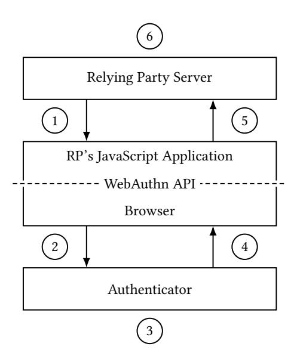

{0}------------------------------------------------

## Asynchronous Remote Key Generation: An Analysis of Yubico's Proposal for W3C WebAuthn

Nick Frymann n.frymann@surrey.ac.uk Surrey Centre for Cyber Security University of Surrey Guildford, UK

> Emil Lundberg emil@yubico.com Yubico AB Stockholm, Sweden

Daniel Gardham d.gardham@surrey.ac.uk Surrey Centre for Cyber Security University of Surrey Guildford, UK

Mark Manulis mark@manulis.eu Surrey Centre for Cyber Security University of Surrey Guildford, UK

Franziskus Kiefer mail@franziskuskiefer.de Wire Swiss GmbH Berlin, Germany

Dain Nilsson dain@yubico.com Yubico AB Stockholm, Sweden

## ABSTRACT

WebAuthn, forming part of FIDO2, is a W3C standard for strong authentication, which employs digital signatures to authenticate web users whilst preserving their privacy. Owned by users, WebAuthn authenticators generate attested and unlinkable public-key credentials for each web service to authenticate users. Since the loss of authenticators prevents users from accessing web services, usable recovery solutions preserving the original WebAuthn design choices and security objectives are urgently needed.

We examine Yubico's recent proposal for recovering from the loss of a WebAuthn authenticator by using a secondary backup authenticator. We analyse the cryptographic core of their proposal by modelling a new primitive, called Asynchronous Remote Key Generation (ARKG), which allows some primary authenticator to generate unlinkable public keys for which the backup authenticator may later recover corresponding private keys. Both processes occur asynchronously without the need for authenticators to export or share secrets, adhering to WebAuthn's attestation requirements. We prove that Yubico's proposal achieves our ARKG security properties under the discrete logarithm and PRF-ODH assumptions in the random oracle model. To prove that recovered private keys can be used securely by other cryptographic schemes, such as digital signatures or encryption schemes, we model compositional security of ARKG using composable games by [Brzuska et al.](#page-12-0) (ACM CCS 2011), extended to the case of arbitrary public-key protocols.

As well as being more general, our results show that private keys generated by ARKG may be used securely to produce unforgeable signatures for challenge-response protocols, as used in WebAuthn. We conclude our analysis by discussing concrete instantiations behind Yubico's ARKG protocol, its integration with the WebAuthn standard, performance, and usability aspects.

## CCS CONCEPTS

• Security and privacy → Key management; Multi-factor authentication; Pseudonymity, anonymity and untraceability.

## KEYWORDS

WebAuthn; web authentication; key generation; composability

## 1 INTRODUCTION

In recent years, the desire to move away from password-based authentication on the web has become more pronounced due to the amount of damage caused to individuals, organisations, and industry through phishing attacks, compromised web servers, bad password choices, frequent password reuse, and poor password management [\[11\]](#page-12-1).

Popular web-based federated identity and single-sign on protocols, such as SAML [\[9\]](#page-12-2) and OIDC [\[33\]](#page-12-3), partly mitigate against some of these problems by using a trusted identity provider to help authenticate users on behalf of other web services (relying parties). These solutions improve usability by reducing the need for password management as users may use their existing online accounts, with Google and Facebook, for example, to authenticate to countless web services. Despite this, they still represent a single point of attack and failure, with their security depending on the underlying mechanism through which the identity provider authenticates users.

The need to end reliance on passwords as the only authentication factor, driven by new regulations such as the Payment Services Directive 2 (PSD2) [\[2\]](#page-11-0), led to the rise of two-factor authentication (2FA). Many 2FA solutions employ one-time passcodes (OTPs), such as HOTP [\[27\]](#page-12-4) and TOTP [\[28\]](#page-12-5), which are sent to users over out-ofband channels, email or SMS for instance, or generated locally, either in software (e.g., Google Authenticator) or hardware (e.g., RSA SecurID, YubiKey). However, as well as being less usable and convenient [\[16\]](#page-12-6), OTP-based solutions have also been shown to be susceptible to various types of attacks [\[12,](#page-12-7) [26\]](#page-12-8) and account providers often rely on static and predictable security questions for account recovery as the fallback authentication method [\[32\]](#page-12-9).

Stronger 2FA and multi-factor authentication (MFA) methods for web authentication using public key cryptography have started to emerge in recent years—rooted in specifications from the FIDO Alliance<sup>1</sup> , consisting of major web technology vendors and organisations. Their FIDO U2F (Universal 2nd Factor) [\[34\]](#page-12-10) specification was designed to extend the widely-used password-over-TLS approach with signature-based challenge-response authentication as a second factor. The signing keys for each web service are typically

1

<sup>1</sup><https://fidoalliance.org/>

{1}------------------------------------------------

<span id="page-1-0"></span>

Figure 1: WebAuthn components and message flow for registration and authentication [\[3\]](#page-11-1).

stored on some physical device, an authenticator, owned by the user who can unlock their use for signature generation through some simple action or gesture, such as pressing a button. The FIDO UAF (Universal Authentication Framework) [\[23\]](#page-12-11) specification was designed to remove reliance on passwords and protect the unlocking of signing keys with other factors, typically biometric. These early FIDO specifications have evolved into the W3C<sup>2</sup> Web Authentication (WebAuthn) standard [\[3\]](#page-11-1) for interaction between the user's client (e.g., a web browser) and web server. WebAuthn, recently endorsed by the World Economic Forum [\[37\]](#page-12-12), specifies an abstract authenticator model—of which the most well-known implementation is the FIDO Client-to-Authenticator Protocol (CTAP) [\[1\]](#page-11-2). CTAP includes two protocols: CTAP1 for U2F authenticators and CTAP2 for WebAuthn authenticators, offering a passwordless experience. WebAuthn and CTAP2 are known together as FIDO2.

## 1.1 WebAuthn overview and key properties

In WebAuthn, the user authenticates to a relying party (RP) using an authenticator, which manages the user's keys and employs asymmetric cryptography to prove their possession. WebAuthn is a decentralised web authentication mechanism since no third party is required for a user to register with and authenticate to an RP, and there is no central location to store user information.

The authenticator creates a unique private-public key pair for each RP and supplies the RP with the generated public key. The authenticator may be integrated in a smartphone or laptop with a secure element, or may exist as a separate hardware token, communicating with the user's device using CTAP over a USB, NFC, or Bluetooth connection. Most of today's authenticators implement CTAP1/U2F to strengthen conventional passwords, whilst newer authenticators implement CTAP2 and may perform client-side verification of a PIN or biometric input.

As shown in Fig. [1,](#page-1-0) WebAuthn adopts a similar message flow for the registration and authentication procedures. During registration, the server sends user information and a challenge to the client-side JavaScript application 1 , which is relayed to the authenticator by the browser 2 . The authenticator generates a new private-public key pair, signs the challenge, and generates attestation data 3 , returning the public key, signed challenge, and attestation to the browser 4 . The browser returns these to the client-side application, which sends it back to the server 5 . The server verifies these and stores the new public key.

For authentication, the RP sends a challenge in the authentication request to the client-side application 1 , which relays the request through the browser to the authenticator 2 . The authenticator signs the challenge 3 and returns it to the browser 4 . The browser returns this to the client-side application which sends it back to the server 5 . The server verifies the data and grants access 6 .

Steps 2 and 4 are defined by the CTAP specification, whereas the others are defined by the WebAuthn standard. The WebAuthn API is used to facilitate communication between the browser—and the authenticator by extension—and the RP's JavaScript application.

The following aspects of WebAuthn's design are particularly important for security and privacy: the unlinkability of registered public keys and authenticator attestations:

Non-correlateable and unlinkable keys. To guarantee user privacy, WebAuthn requires that all public key credentials output by the same authenticator remain unlinkable such that no RP can determine whether they were created by a single authenticator. This property prevents malicious RPs from correlating users between their systems without additional information such as a wilfully reused username or email address [\[3,](#page-11-1) §14.2].

Attestation. WebAuthn authenticators are equipped with attestation keys and certificates to provide assurance about their provenance. By signing new public keys with its attestation private key and supplying its attestation certificate to the RP, the authenticator can prove its make and model and provide assurance about, for example, how strongly it protects generated private keys. Attestation can further help the RP to establish trust in the client-side verification of additional authentication factors (e.g., biometrics) in CTAP2 authenticators. These capabilities are required for highsecurity certification levels3,4 of the authenticators. To preserve privacy, WebAuthn describes a set of mechanisms that can be used for attestation. FIDO UAF [\[23\]](#page-12-11), for example, mandates that attestation keys are used for at least 100,000 authenticator devices. As discussed in the standard [\[3,](#page-11-1) §14.4.1], using ECDAA [\[22\]](#page-12-13) is another option for privacy-preserving attestation.

Internal and remote key storage. WebAuthn authenticators may have an internal symmetric wrapping key. Upon registration, for each generated key pair, the authenticator can use this key to encrypt the private key and include its ciphertext in the credential that is sent to and stored by the RP, instead of storing the private key locally. During authentication, the RP returns this credential as part of its challenge, allowing the authenticator to decrypt the private key. This allows for secure management of WebAuthn private keys without consuming storage space on the authenticator.

## 1.2 Authenticator loss

A problem that remains unresolved in WebAuthn, and is currently under discussion within the W3C working group [\[17\]](#page-12-14), is how a

<sup>2</sup><https://www.w3.org/>

<sup>3</sup><https://fidoalliance.org/certification/authenticator-certification-levels/>

<sup>4</sup>[https://fidoalliance.org/specs/fido-security-requirements/fido-authenticator](https://fidoalliance.org/specs/fido-security-requirements/fido-authenticator-security-requirements-v1.3-fd-20180905.html)[security-requirements-v1.3-fd-20180905.html](https://fidoalliance.org/specs/fido-security-requirements/fido-authenticator-security-requirements-v1.3-fd-20180905.html)

{2}------------------------------------------------

user may securely regain access to an account if an authenticator is lost or damaged, and therefore any private keys managed by it are also lost. A recent study by Lyastani et al. [25] showed that losing authenticators is one of the biggest fears affecting the adoption of WebAuthn by users. Although a user may register multiple authenticators for each RP and use one as a backup in case another is lost, this currently requires that the backup authenticator be present at the time of its registration. Since users need to keep the backup authenticator on hand, they risk losing it as well—which defeats the purpose of having the backup authenticator. Registering multiple authenticators also requires additional user interaction and generally cannot be expected from the user.

1.2.1 Challenges. The attestation and unlinkability properties of WebAuthn impose some design restrictions on solutions for regaining account access. Further restrictions apply for a solution to be widely interoperable and implementable by resource-constrained authenticators.

Attestation restricts how keys may be shared. It should not be possible to circumvent an RP's attestation policy by registering one authenticator and then transferring private key material to a different authenticator. Transferring keys between *similar* authenticators (e.g., same brand or series) may be acceptable in some cases, but interoperability would likely suffer since resource-constrained authenticators cannot feasibly verify attestation signatures for more than a few kinds of authenticator.

Unlinkability restricts how keys may be generated. In particular, different keys must be used for each new account at each RP. This means, for example, that one cannot simply generate a static backup public key to be included in each new registration since the user could then be tracked using that static public key. Additionally, resource-constrained authenticators typically rely on remote key storage and have limited internal storage space. For example, generating large numbers of key pairs in advance is not feasible, since this would require large amounts of storage locally or introduce dependency on a remote third party.

1.2.2 Yubico's proposal. A recent proposal by Lundberg and Nilsson [24] from Yubico, a FIDO Alliance member and a global vendor of hardware authenticators known as YubiKeys, aims to address these challenges. Their approach assumes that, in addition to a primary authenticator that is used on a regular basis for WebAuthn registration and authentication, the user has a backup authenticator. After an initial setup procedure, the primary authenticator can start registering unlinkable public keys with RPs on behalf of the backup authenticator, in addition to its own public keys. If the primary authenticator is lost, the backup authenticator, following interaction with an RP, can recover the private key to access the account at the RP. An important property of Yubico's proposal is that registration of public keys by the primary authenticator and recovery of private keys by the backup authenticator does not require any interaction between the authenticators after setting them up, nor any transfer or sharing of secrets, thus respecting restrictions on attestation. Although the proposal specifies the protocols and their integration with WebAuthn, it remains unclear whether it meets the security and privacy objectives for use in WebAuthn due to the lack of analysis.

#### 1.3 Contribution

Our main contribution is a modular analysis of the cryptographic core behind Yubico's proposal [24] for recovering access to online accounts after losing WebAuthn authenticators. As a first step, we explain the protocols from the proposal by modelling them as a new cryptographic primitive, Asynchronous Remote Key Generation (ARKG), capturing the core properties behind remote generation and registration of public keys and later recovery of private keys. We define ARKG security under various trust assumptions on the involved parties. We then view Yubico's protocol as an instance of our general ARKG scheme for which we prove security under the discrete logarithm and PRF-ODH assumptions.

As a second step, we model composition of ARKG with arbitrary asymmetric protocols to establish sufficient conditions under which the keys can be used securely. We repurpose the framework of composed games by Brzuska et al. [8] to handle the case of asymmetric ARKG keys and public-key protocols. We prove that the general ARKG scheme can be composed with all public-key protocols which rely on the DL assumption and use keys with matching distribution. Taking into account the adopted instances of cryptographic algorithms in Yubico's proposal, our analysis implies that recovered private keys can be securely used in WebAuthn's signature-based challenge-response protocol. We note that our model for ARKG and its composability with asymmetric protocols might be of independent interest, applied not only to authentication but also public-key encryption. As part of an extended discussion, we address the implementation, efficiency, integration, and usability aspects of Yubico's proposal.

Organisation. Section 2 explains Yubico's proposal and highlights its cryptographic core. The ARKG primitive is modelled in Section 3. Section 4 presents a generalised ARKG scheme and proves its security. ARKG composability with arbitrary asymmetric protocols, based on composed games, is modelled and proven in Section 5. The extended discussion is provided in Section 6 and other related work is addressed in Section 7. We conclude in Section 8.

## <span id="page-2-0"></span>2 YUBICO'S PROPOSAL FOR WEBAUTHN ACCOUNT RECOVERY

Here we describe Yubico's proposal [24], which allows users to securely regain access to an account after losing an authenticator.

#### 2.1 Overview

We focus on the cryptographic core which involves three parties: the primary authenticator (PA), backup authenticator (BA), and WebAuthn relying party (RP). In a nutshell, PA remotely generates and registers a fresh public key P at some RP for which BA may recover the corresponding private key p at a later time to regain access to the account. Crucially, PA and BA do not share any secrets, the registration of P does not require interaction with BA, and recovery of p does not require the presence of PA.

Yubico's specification can be split into three main stages, described in the following (see also Fig. 2), whilst adopting the original notations:  $\mathsf{LEFT}(a,b)$  returns the first b bytes of byte array a and  $\mathsf{DROP\_RIGHT}(a,b)$  returns the byte array a without the last b bytes. Elliptic curve operations are performed on the NIST P-256

{3}------------------------------------------------

curve [29], generated by G with order n. ECDH [10] is used along with key derivation functions KDF<sub>1</sub> and KDF<sub>2</sub>, based on HKDF [21], and MAC, based on HMAC [14]. Instantiations are discussed further in Section 6.1.

In our analysis, we use the setup stage, along with both procedures specified in Fig. 2, as part of a new cryptographic primitive which we call Asynchronous Remote Key Generation (ARKG) and model in Section 3. By proving compositional security of ARKG with arbitrary public-key protocols in Section 5, we implicitly show that it is safe to use the key pair (p, P) established through the above stages with the standard WebAuthn signature-based challenge-response authentication protocol.

Setup. BA generates a private-public key pair (s, S) and transfers its public key S to PA. This S will be used by PA to derive new public keys on BA's behalf, whilst the private key s will be stored by BA and used for account recovery purposes. In our analysis, we assume that this phase is trusted as it is performed locally by the owner of both authenticators. Therefore, it does not involve interaction with the relying party and as such it is outside the scope of WebAuthn. In Section 6, we discuss implementing the transfer of S in a possible CTAP extension.

Registration. When registering with RP, identified by rpId, PA registers its own public key as in the WebAuthn standard, but also generates a key handle E, derives a public key P using E and S, and sends cred (containing E) to RP as shown in Fig. 2a. PA will generate an independent pair (P, cred) for each BA with which it has completed the setup stage and send this to RP.

*Recovery.* At a later time, BA can request cred from RP and use s to derive p (Fig. 2b). The user provides an identifier for their account at RP, which can then retrieve all cred associated with the account. BA processes all received cred—if it finds a cred that was registered on its behalf, it may then use the generated p to authenticate with RP, which holds P, to regain access to the account using the WebAuthn authentication procedure as normal.

#### <span id="page-3-2"></span>2.2 Intuitive security and privacy goals

We now motivate the desirable security and privacy goals for Yubico's proposal, preparing for our formal analysis in later sections.

Security goals. Intuitively, the scheme needs to ensure that no adversary can gain access to the user's account without knowledge of BA's private key s, since multiple public keys P for BA may be registered by PA on its behalf at different RPs. Consequently, the secrecy of recovered keys p must be guaranteed for all P registered by PA before its loss. An adversary with access to PA may learn its internal secrets and try to use them to break secrecy of the keys registered earlier. In general, we assume that, during the registration phase, any RP can be compromised and the attacker may learn public keys P and key handles E in cred as registered by PA. An adversary may further compromise an RP during the recovery phase and use either these honestly generated keys, or maliciously modify them when interacting with BA, to obtain information that would allow it to gain backup access to user accounts with other RPs.

*Privacy goals.* In addition to the security against impersonation attacks on BA and secrecy of recovered keys p, the proposal should

preserve WebAuthn user privacy by ensuring that registered public keys *P* and key handles *E* remain unlinkable—that is, no RP can decide whether they were registered for the same or different BAs.

## <span id="page-3-0"></span>3 MODELLING ASYNCHRONOUS REMOTE KEY GENERATION

In this section, we model the general Asynchronous Remote Key Generation (ARKG) protocol and define its security and privacy properties. As discussed in Section 2, we use ARKG as a new primitive for the modular analysis of Yubico's proposal by considering public key registration by PA and private key recovery by BA separately from this key pair's usage in the authentication procedure, for which we adopt a compositional approach in Section 5.

#### <span id="page-3-1"></span>3.1 Syntax of ARKG

ARKG functionality. ARKG allows arbitrary public keys pk' to be derived from an original pk, with corresponding sk' being calculated at a later time—requiring private key sk for the key pair (sk, pk) and credential cred.

*Definition 3.1 (ARKG).* The remote key generation and recovery scheme ARKG := (Setup, KGen, DerivePK, DeriveSK, Check) consists of the following algorithms:

- Setup(1 $^{\lambda}$ ) generates and outputs public parameters pp =  $((\mathbb{G}, g, q), \text{MAC}, \text{KDF}_1, \text{KDF}_2)$  of the scheme for the security parameter  $\lambda \in \mathbb{N}$ .
- KGen(pp), on input pp, computes and returns a privatepublic key pair (sk, pk).
- DerivePK(pp, pk, *aux*) probabilistically returns a new public key pk' together with the link cred between pk and pk', for the inputs pp, pk and auxiliary data *aux*. The input *aux* is always required but may be empty.
- DeriveSK(pp, sk, cred), computes and outputs either the new private key sk', corresponding to the public key pk' using cred, or ⊥ on error.
- Check(pp, sk', pk'), on input (sk', pk'), returns 1 if (sk', pk') forms a valid private-public key pair, where sk' is the corresponding private key to public key pk', otherwise 0.

*Correctness.* An ARKG scheme is correct if,  $\forall \lambda \in \mathbb{N}$ , pp  $\leftarrow$  Setup(1 $^{\lambda}$ ), the probability Pr[Check(pp, sk', pk') = 1] = 1 if

```
(sk, pk) \leftarrow KGen(pp);

(pk', cred) \leftarrow DerivePK(pp, pk, \cdot);

sk' \leftarrow DeriveSK(pp, sk, cred).
```

#### <span id="page-3-3"></span>3.2 Security definitions

For an ARKG scheme we define two properties: the secrecy of a derived private key and its initial private key, and the unlinkability of derived public keys to an initial public key.

Adversaries and oracles. An adversary  $\mathcal{A}$ , used in our security experiments, is modelled as a probabilistic polynomial time (PPT) algorithm and is allowed to call any of the public procedures defined in Section 3.1 with the parameters to which it is given access. The adversary  $\mathcal{A}$  may make a polynomial number of queries to the following oracles:

{4}------------------------------------------------

```
Register
 1: \mathbf{PA}(S)
                                                                                                                                 \mathbf{RP}(\mathsf{rpId})
                                                                                             rpId
 2:
       (e, E) \leftarrow \$ KGen
 3:
 4: k_{\text{cred}} \leftarrow \text{KDF}_1(\text{ECDH}(e, S))
       k_{\text{mac}} \leftarrow \text{KDF}_2(\text{ECDH}(e, S))
 5:
 6: if k_{cred} \ge  order of P256 then goto 3
 7: P \leftarrow (k_{\mathsf{cred}} \cdot G) + S
 8: if P = 0 then goto 3
      cred \leftarrow E \| LEFT(MAC(k_{mac}, E \| rpId), 16)
 9:
                                                                                           P, cred
10:
                                                                                                                                 store P, cred
11:
```

(a) Registration of backup credentials.

```
Recover
 1: \mathbf{BA}(s)
                                                                                                                                      RP(rpId)
                                                                                                                                      retrieve cred
 2:
                                                                                                     cred, rpId
 3:
      E \leftarrow \mathsf{DROP\_RIGHT}(\mathsf{cred}, 16)
 4:
 5: if E = 0 then abort
       k_{\text{cred}} \leftarrow \text{KDF}_1(\text{ECDH}(s, E))
 6:
 7: k_{\text{mac}} \leftarrow \text{KDF}_2(\text{ECDH}(s, E))
      if cred \neq E \parallel \text{LEFT}(MAC(k_{mac}, E \parallel rpId), 16) then abort
 8:
 9: p \leftarrow k_{\text{cred}} + s \mod n
```

(b) Key recovery using backup authenticator.

Figure 2: Yubico's protocols for registration/recovery of WebAuthn backup credentials [24].

- Derived public key oracle  $O_{pk'}(pk, \cdot)$ :  $O_{pk'}$  is parameterised with public key pk. This oracle returns the result of calling DerivePK(pp, pk, aux) on input aux. It records the resulting (pk', cred) in PKList: PKList  $\leftarrow$  PKList  $\cup$  (pk', cred). PKList is initialised as PKList  $\leftarrow$  Ø.
- Challenge oracle  $O_{pk'}^b(b, sk_0, pk_0)$ :  $O_{pk'}^b$  is parameterised with a bit b and fixed key pair  $(sk_0, pk_0)$ , and takes no inputs. When called, the oracle either returns (sk', pk') derived using the initial  $pk_0$ , when b = 0, or a freshly-generated key pair sampled from a distribution  $\mathcal{D}$ , when b = 1.
- Private key oracle  $O_{sk'}(sk, \cdot)$ : on input cred, where  $(\cdot, cred)$  ∈ PKList,  $O_{sk'}$  outputs the result of DeriveSK(pp, sk, cred) and updates SKList ← SKList  $\cup$  cred. SKList is initialised as SKList ← Ø. If  $(\cdot, cred) \notin PKList$ , the oracle aborts, otherwise it returns sk' without giving access to sk.

*SK-security.* The private-key security property ensures that for an initial public key pk, an adversary  $\mathcal{A}$  cannot derive a valid key pair (sk\*, pk\*) along with corresponding cred\* (see Section 2.2).

We consider four variants of private-key security, modelled using the experiment  $\operatorname{Exp}_{\mathsf{ARKG},\mathcal{A}}^{\mathsf{ks}}(\lambda)$  in Fig. 3 with  $\mathsf{ks} \in \{\mathsf{mwKS}, \mathsf{hwKS}, \mathsf{msKS}, \mathsf{hsKS}\}$ .

Adversary  $\mathcal{A}$  is always given access to  $O_{pk'}$  and must find a  $(sk^*, pk^*, cred^*)$  triple for a provided pk.

The malicious (m) and honest (h) variants result from the omission or presence of the PKList check on line 8, respectively, which ensures that the triple is for an honestly-generated pk (modelled using  $O_{\rm pk'}$ ) if present. The weak (w) and strong (s) variants depend on whether  $\mathcal A$  has access to the private key derivation oracle  $O_{\rm sk'}$ . If  $\mathcal A$  has access to  $O_{\rm sk'}$ , trivially querying it with cred\* is prevented through the SKList check on line 7.

Definition 3.2 (SK-security). An ARKG scheme provides privatekey security with ks  $\in$  {mwKS, hwKS, msKS, hsKS} if the following advantage is negligible in  $\lambda$ :

$$Adv_{\mathsf{ARKG},\mathcal{A}}^{\mathsf{ks}}(\lambda) := \Pr \left[ \mathsf{Exp}_{\mathsf{ARKG},\mathcal{A}}^{\mathsf{ks}}(\lambda) = 1 \right]$$

{5}------------------------------------------------

```
\frac{\operatorname{Exp}_{\operatorname{ARKG},\mathcal{A}}^{\operatorname{ks}}(\lambda)}{1: \operatorname{pp} \leftarrow \operatorname{Setup}(1^{\lambda})}
  2: (sk, pk) \leftarrow KGen(pp)
  3: (sk^*, pk^*, cred^*) \leftarrow \mathcal{A}^{O_{pk'}, |O_{sk'}|}(pp, pk)
   4: sk' \leftarrow DeriveSK(pp, sk, cred^*)
            return Check(sk^{\star}, pk^{\star}) \stackrel{?}{=} 1
   5:
                             \wedge Check(sk', pk*) \stackrel{?}{=} 1
   6:
                             ∧ cred* ∉ SKList¦
  7:
                            \land (pk^*, cred^*) \in PKList
  8:
\frac{\mathsf{Exp}_{\mathsf{ARKG},\mathcal{A}}^{\mathsf{pku}}(\lambda)}{_{1}:\ \mathsf{pp}\leftarrow\mathsf{Setup}(1^{\lambda})}
  2: (sk_0, pk_0) \leftarrow KGen(pp)
  3: b \leftarrow \$ \{0,1\}
  4: b' \leftarrow \mathcal{A}^{O_{\mathsf{pk'}}^b}(\mathsf{pp}, \mathsf{pk}_0)
  5: return b \stackrel{?}{=} b'
```

Figure 3: Security experiments for ARKG. The presence or omission of boxes results in the four variants of the ks ∈ {mwKS, hwKS, msKS, hsKS} experiment. Presence of the dashed boxes gives the strong variants of ks (msKS and hsKS), the presence of the dotted box gives the honest variants (hwKS and hsKS), and the omission of all boxes gives mwKS.

It is easy to see that msKS  $\Rightarrow$  mwKS  $\Rightarrow$  hwKS and msKS  $\Rightarrow$  hsKS  $\Rightarrow$  hwKS, making msKS the strongest and hwKS the weakest SK-security properties.

Remark 1. An even stronger ks flavour can be defined by dropping the  $(\cdot, \text{cred}) \notin \text{PKList}$  restriction in the  $O_{\text{sk'}}$  oracle of msks. We mention this here for completeness as such property would be too strong for the envisioned use of ARKG in practice, as it would allow the attacker to query the user's BA on arbitrary inputs, bypassing security mechanisms of WebAuthn. This property is not satisfied by Yubico's proposal.

PK-unlinkability. This property ensures that derived key pairs cannot be distinguished from a sample of a distribution  $\mathcal{D}$  and also prevents an adversary from linking a derived public key to a long-term public key. This models the required unlinkable privacy goal of WebAuthn, given in Section 2.2.

<span id="page-5-2"></span>The unlinkability between public keys pk and derived public keys pk' is defined using  $\operatorname{Exp}_{\mathsf{ARKG},\mathcal{A}}^{\mathsf{pku}}(\lambda)$ . The game chooses a bit  $b \in \{0,1\}$  and generates a key pair  $(\mathsf{sk}_0,\mathsf{pk}_0)$ .  $\mathcal{A}$  is given access to oracle  $O_{\mathsf{pk}'}^b$ , public parameters pp, and  $\mathsf{pk}_0$ . When called,  $O_{\mathsf{pk}'}^b$  returns a derived key pair  $(\mathsf{sk}',\mathsf{pk}')$ , which is derived from  $\mathsf{pk}_0$  if b=0, otherwise, for b=1, it samples and returns key pair  $(\mathsf{sk}',\mathsf{pk}')$  according to a distribution  $\mathcal{D}$ . It is able to corrupt any derived key, for which corresponding  $\mathsf{sk}'$  is output. The adversary  $\mathcal{A}$  wins the game if it is able to determine whether  $O_{\mathsf{pk}'}^b$  is instantiated with b=0 or b=1.

*Definition 3.3 (PK-unlinkability).* An ARKG scheme provides PK-unlinkability if the following advantage is negligible in  $\lambda$ :

$$Adv_{\mathsf{ARKG},\mathcal{A}}^{\mathsf{pku}}(\lambda) \coloneqq \left| \Pr \left[ \mathsf{Exp}_{\mathsf{ARKG},\mathcal{A}}^{\mathsf{pku}}(\lambda) = 1 \right] - \frac{1}{2} \right|$$

<span id="page-5-3"></span>Remark 2. Definition 3.3 provided here is designed to allow secure composability with asymmetric protocols, however we also capture a weaker useful property that any two derived public keys cannot be linked, which gives the name for this property. As a result, any RP that stores derived public keys cannot link any two of them to a common PA, even with knowledge of the derived secret key—which would most likely not be the case for real-world applications. This can be seen by arguing that if no derived key pair can be distinguished from a random sample from a distribution  $\mathcal{D}$ , then neither can any two derived key pairs that are distributed with respect to  $\mathcal{D}$ .

#### <span id="page-5-0"></span>4 AN ARKG SCHEME FOR DL-BASED KEYS

We present a general ARKG construction in a cyclic group  $\mathbb{G}$  of order q based on DL keys (sk, pk) =  $(x, g^x)$  for a generator  $g \in \mathbb{G}$  and  $x \in \mathbb{Z}_q$ . Note that we use multiplicative notation for group operations. In addition we require the following building blocks.

Pseudorandom Function (PRF) [15]. A pseudorandom function PRF(k, m) takes high-entropy key k and message m and produces an output that is, for a PPT adversary  $\mathcal{A}$ , indistinguishable from a uniformly-sampled bitstring of the same length.  $\mathcal{A}$  has access to oracle  $O_{\mathsf{PRF}}(\cdot)$  which cannot be queried with m and returns either PRF(k,  $\cdot$ ) or  $f(\cdot)$ , with f being a truly random function.

Key Derivation Function (KDF) [18]. A key generation function KDF(k,l) takes source key k and label l and returns a new key k'. It is secure if the advantage  $\operatorname{Adv}^{\mathsf{KDF}}_{\mathcal{A}}(\lambda)$  is negligible in  $\lambda$  for a PPT adversary  $\mathcal{A}$  to distinguish derived keys from uniformly-sampled bitstrings of the same length. In this paper we consider KDF<sub>1</sub>(k) = KDF( $k,l_1$ ) and KDF<sub>2</sub>(k) = KDF( $k,l_2$ ), where KDF<sub>1</sub>:  $\mathbb{G} \to \mathbb{Z}_q$ , KDF<sub>2</sub>:  $\mathbb{G} \to \{0,1\}^*$  and  $l_1,l_2$  are fixed labels.

Message Authentication Code (MAC) [4]. A message authentication code MAC = (KGen, Tag, Verify) consists of three algorithms. KGen( $1^{\lambda}$ ) outputs secret key  $mk \leftarrow_{\$} \{0,1\}^{\lambda}$  for security parameter  $\lambda$ . Tag(mk, m) outputs tag  $\mu$  for input key mk and message m, and Verify(mk, m,  $\mu$ ) outputs 1 if  $\mu$  is valid for m under mk, otherwise 0. MAC satisfies its correctness property iff,  $\forall (mk, m)$ , Verify(mk, m, Tag(mk, m)) = 1. MAC is unforgeable if the advantage  $\mathrm{Adv}_{\mathcal{A}}^{\mathrm{MAC}}(\lambda)$  is negligible in  $\lambda$  for a PPT adversary  $\mathcal{A}$  to find, without mk, a valid tag  $\mu^*$  for a new message  $m^*$ .  $\mathcal{A}$  is given access to oracle  $O_{\mathrm{Tag}}(\cdot)$ , which on input message  $m \neq m^*$  returns the result of Tag(mk, m).

#### 4.1 The ARKG scheme

The algorithms of our ARKG scheme for DL-based keys are specified in Fig. 4. Note that DerivePK generates an ephemeral key pair (e, E), which is used to derive pk' using KDF<sub>1</sub>, which gives the credential key ck. Integrity checking is provided by MAC for cred. DeriveSK may compute sk' using E, recorded in cred, using the property that  $S^e = E^s$  for key pairs (s, S) and (e, E). This also ensures the correctness property of the scheme holds.

{6}------------------------------------------------

```
Setup(1^{\lambda})
return pp = ((\mathbb{G}, q, q), MAC, KDF_1, KDF_2)
KGen(pp)
x \leftarrow \mathbb{Z}_q
return (sk, pk) = (x, q^x)
\mathsf{Check}(\mathsf{pp},\mathsf{sk'}=x,\mathsf{pk'}=X)
\overline{\operatorname{return} g^{x} \stackrel{?}{=} X}
DerivePK(pp, pk = S, aux)
 1: (e, E) \leftarrow \mathsf{KGen}(\mathsf{pp})
 2: ck \leftarrow KDF_1(S^e)
 3: mk \leftarrow KDF_2(S^e)
 4: P \leftarrow q^{ck} \cdot S
 5: \mu \leftarrow MAC(mk, (E, aux))
 6: return pk' = P, cred = (E, aux, \mu)
DeriveSK(pp, sk = s, (E, aux, \mu))
 1: ck \leftarrow KDF_1(E^s)
 2: mk \leftarrow KDF_2(E^s)
       if \mu = MAC(mk, (E, aux)) then
 3:
           return sk' = ck + s \mod q
 4:
      else return ⊥
 5:
```

Figure 4: Algorithms of the ARKG scheme.

#### <span id="page-6-3"></span>4.2 Security analysis

In this section we define the hardness assumptions and prove security of the proposed ARKG scheme.

*Discrete logarithm (DL) assumption.* For a cyclic group  $\mathbb{G}$  of order q and a generator  $g \in \mathbb{G}$ , the discrete logarithm is hard if there exists no polynomial time adversary that, when given  $X \leftarrow_{\$} \mathbb{G}$ , is able to compute  $x \in \mathbb{Z}$  such that  $X = g^x$ .

The lrPRF-ODH assumption [6]. We require several intractability assumptions introduced by Brendel et al. [6], with the generic form written as lrPRF-ODH. Its instances have successfully been used to analyse security of the Extended Access Control (EAC) [5] and the TLS 1.3 [6] protocols. We will use two variants of this assumption.

Let  $\mathbb{G}$  be a cyclic group of order q with generator  $g \in \mathbb{G}$ . Let  $\mathsf{PRF}: \mathbb{G} \times \{0,1\}^* \to \{0,1\}^*$  be a pseudorandom function that on input a key  $K \in \mathbb{G}$  and a label  $X \in \{0,1\}^*$  outputs  $g \in \{0,1\}^*$ .

For the complete range of variants given in [6], the adversary has access to left and right  $O_{\rm ODH}$  oracles. The number of queries is bound by the values for l and r, where the possible values are n = none, s = single and m = many. We only need to consider snPRF-ODH, which allows a single call to one oracle, and nnPRF-ODH, where the adversary cannot make any calls. In our description of the oracle, we omit the element  $U = g^u$  as input since it is implicit from the game. The PRF-ODH assumption holds if the advantage of the adversary in Fig. 5 is negligible. As proven by Brendel et al. [6], the hardness of the snPRF-ODH implies the hardness of nnPRF-ODH,

```
\frac{\operatorname{Exp}_{\mathcal{A}}^{\mathsf{nnPRF-ODH}}(\lambda)}{1: \quad u, v \leftarrow \mathbb{Z}_{q}}
2: \quad \mathsf{pp} \leftarrow (\mathbb{G}, g, g^{u}, g^{v})
3: \quad \mathsf{pick challenge label } x \in \{0, 1\}^{*}
4: \quad y_{0} \leftarrow \operatorname{PRF}(g^{uv}, x)
5: \quad y_{1} \leftarrow \mathbb{S}\{0, 1\}^{\lambda}
6: \quad b \leftarrow \mathbb{S}\{0, 1\}
7: \quad b' \leftarrow \mathcal{A}^{|OODH|}(\mathsf{pp}, y_{b}, x)
8: \quad \mathsf{return } b \stackrel{?}{=} b'
OODH(\cdot) \text{ where } (\cdot) = (S, \hat{x})
1: \quad \mathsf{if } S \notin \mathbb{G} \lor (S, \hat{x}) = (g^{v}, x) \text{ then } y \leftarrow \bot
2: \quad \mathsf{else } y \leftarrow \operatorname{PRF}(S^{u}, x)
3: \quad \mathsf{return } y
```

Figure 5: The lrPRF-ODH security experiment and its  $O_{ODH}$  oracle. nnPRF-ODH is given by the exclusion of the dashed box and snPRF-ODH by its inclusion.

and snPRF-ODH is implied by the hardness of the Strong Diffie-Hellman assumption [31] (also known as the *Gap Diffie-Hellman assumption*) and a random oracle, whereas nnPRF-ODH is implied from DDH and existence of a pseudorandom function. This latter reduction is given in the standard model.

<span id="page-6-2"></span>Theorem 4.1. The ARKG scheme satisfies PK-unlinkability given the nnPRF-ODH and DL assumptions hold in  $\mathbb{G}$ .

PROOF.  $\mathcal{G}_0$  is defined exactly by  $\mathsf{Exp}^{\mathsf{pku}}_{\mathsf{ARKG},\mathcal{A}}(\lambda)$ . Thus

$$\Pr\left[\mathcal{G}_0^b = 1\right] = \Pr\left[\mathsf{Exp}_{\mathsf{ARKG},\mathcal{A}}^{\mathsf{pku}}(\lambda) = 1\right]$$

We immediately begin by combining, when the challenge bit b is set to 0, the secret key derivation performed by the DeriveSK algorithm with DerivePK performed by the oracle. This is a semantic change and hence there is no loss of advantage to the adversary as the outputs of the oracle are indistinguishable. We now define a series of hybrid games  $\mathcal{H}_i^b$  such that  $\mathcal{H}_0^b \coloneqq \mathcal{G}_0$  and  $\mathcal{H}_i^b$  as  $\mathcal{H}_{i-1}^b$  but with the exception that, in the *i*th oracle call to  $O_{pk'}^b$ , computation of P is replaced with ' $p \leftarrow_{\$} \mathbb{Z}_q$ ,  $P \leftarrow_{\$} g^{ck_i} g^p$ '. Note that p is now returned as sk'. The adversary is unable to distinguish between  $\mathcal{H}_i^b$  and  $\mathcal{H}_{i-1}^b$  as the random sample of  $ck_i$  in  $\mathcal{H}_{i-1}^b$  ensures the distribution of  $(p_i, P_i)$  is uniformly random in both games, giving

$$\left| \Pr \left[ \hat{\mathcal{H}}_{k}^{b} = 1 \right] \right| = \left| \Pr \left[ \hat{\mathcal{H}}_{k-1}^{b} = 1 \right] \right|$$

Next, we continue by defining another series of hybrid games  $\tilde{\mathcal{H}}_{j}^{b}$  where  $\tilde{\mathcal{H}}_{0}^{b} \coloneqq \mathcal{G}_{1}$ . Game  $\tilde{\mathcal{H}}_{j}^{b}$  is defined to be game  $\tilde{\mathcal{H}}_{j-1}^{b}$ , with the exception that the execution of DerivePK in the jth oracle call is altered when the challenge bit is set to 0. We replace ' $\mu \leftarrow \text{MAC}(mk_{j}, (E, aux))$ ' with ' $\mu \leftarrow \text{MAC}(mk'_{j}, (E, aux))$ ', where  $mk'_{j}$  is a uniformly sampled MAC key independent from  $mk_{j}$ . The adversary is able to distinguish between the games  $\tilde{\mathcal{H}}_{j}^{b}$  and  $\tilde{\mathcal{H}}_{j-1}^{b}$  if it is able to forge the MAC key  $mk_{j}$ , where  $mk_{j}$  is the MAC key

{7}------------------------------------------------

from  $\tilde{\mathcal{H}}_{j}^{b}$ . We show that the adversary's ability to do this is bounded by the nnPRF-ODH property of KDF<sub>2</sub>.

The adversary  $\mathcal{B}$ , against the nnPRF-ODH game, plays the role of challenger in  $\tilde{\mathcal{H}}^b_j$  for  $\mathcal{A}$ . It invokes its own game, receiving  $\mathbb{G}$ ,  $g, S \leftarrow g^s$ , and the nnPRF-ODH challenge  $(E = g^e, y^{\bigstar})$ , and sets the challenge label x as the label for KDF<sub>2</sub>. It wins its own game if it can decide whether b = 0 or b = 1.  $\mathcal{B}$  invokes  $\tilde{\mathcal{H}}^b_j$  and sets  $\mathsf{pk}_0 \leftarrow S, \mathsf{sk}_0 \leftarrow \bot$ . It answers the jth oracle query to  $O^b_{\mathsf{pk'}}$  honestly except it sets  $\mathsf{pk}_1 = E, \mathsf{sk}_1 = \bot$ , and  $mk_j \leftarrow y_j^{\bigstar}$ , which is the output of KDF<sub>2</sub> in game  $\tilde{\mathcal{H}}^b_j$ . It then waits for  $\mathcal{A}$  to output a bit b. It forwards b as the answer to its own nnPRF-ODH game and wins with probability equal to that of  $\mathcal{A}$  distinguishing  $\tilde{\mathcal{H}}^b_j$  from  $\tilde{\mathcal{H}}^b_{j-1}$ . Thus, we have

$$\left| \Pr \left[ \tilde{\mathcal{H}}_{j}^{b} = 1 \right] - \Pr \left[ \tilde{\mathcal{H}}_{j-1}^{b} = 1 \right] \right| \leq \mathsf{Adv}_{\mathsf{KDF}_{2}^{i},\mathcal{B}}^{\mathsf{nnPRF-ODH}}(\lambda)$$

We define  $\mathcal{G}_2^b \coloneqq \tilde{\mathcal{H}}_{q_o}^b$ , where  $q_o$  is the number of queries made to the  $O_{\mathrm{pk'}}^b$  oracle. Next, we define a third series of hybrid games  $\hat{\mathcal{H}}_k^b$  where  $\hat{\mathcal{H}}_0^b \coloneqq \mathcal{G}_2^b$ . Game  $\hat{\mathcal{H}}_k^b$  is defined to be game  $\hat{\mathcal{H}}_{k-1}^b$ , with the exception that the execution of DerivePK in the kth oracle call is altered. We replace ' $ck \leftarrow \mathrm{KDF}_1(S^e)$ ' with ' $ck \leftarrow \{0,1\}$ '. The advantage of the adversary distinguishing  $\hat{\mathcal{H}}_k^b$  from  $\hat{\mathcal{H}}_{k-1}^b$  is also bound by the nnPRF-ODH in an argument almost identical to that of  $\tilde{\mathcal{H}}_i^b$  and  $\hat{\mathcal{H}}_{i-1}^b$ . It is omitted here for brevity. Thus we have

$$\left| \Pr \left[ \hat{\mathcal{H}}_{k}^{b} = 1 \right] - \Pr \left[ \hat{\mathcal{H}}_{k-1}^{b} = 1 \right] \right| \leqslant \mathsf{Adv}_{\mathsf{KDF}_{1}^{i},\mathcal{B}}^{\mathsf{nnPRF-ODH}}(\lambda)$$

We define  $\mathcal{G}_3^b := \hat{\mathcal{H}}_{q_o}^b$  and analyse the advantage of  $\mathcal{A}$  in distinguishing between b = 0 and b = 1. Since the game is independent of b, and the distributions of (p, P) are identical, it follows that

$$\left| \Pr \left[ \mathcal{G}_3^b = 1 \right] \right| = \frac{1}{2}$$

Thus the advantage of  $\mathcal{A}$  is bounded by

$$\mathrm{Adv}_{\mathsf{ARKG},\mathcal{A}}^{\mathsf{pku}}(\lambda) \leqslant q_o \cdot \left( \mathrm{Adv}_{\mathsf{KDF}_1,\mathcal{B}}^{\mathsf{nnPRF-ODH}}(\lambda) + \mathrm{Adv}_{\mathsf{KDF}_2,\mathcal{B}}^{\mathsf{nnPRF-ODH}}(\lambda) \right)$$

By assumption that  $KDF_1$  and  $KDF_2$  are nnPRF-ODH secure, the advantage of their adversaries is negligible and hence the advantage of the adversary against PK-unlinkability is also negligible.

Next, we analyse all flavours of SK-security showing that its malicious variants (mwKS, msKS) can be reduced to the aforementioned snPRF-ODH assumption [6] (requiring the random oracle model), whereas its honest variants (hwKS, hsKS) can be reduced directly to the DL assumption in the standard model.

<span id="page-7-1"></span>Theorem 4.2. The ARKG construction is:

- <span id="page-7-2"></span>(1) msKS-secure given the snPRF-ODH assumption holds in  $\mathbb{G}$ .
- <span id="page-7-3"></span>(2) mwKS-secure given the snPRF-ODH assumption holds in  $\mathbb{G}$ .
- <span id="page-7-4"></span>(3) hsKS-secure given the DL assumption holds in  $\mathbb{G}$ .
- <span id="page-7-5"></span>(4) hwKS-secure given the DL assumption holds in  $\mathbb{G}$ .

Proof. All proofs for Theorem 4.2 are given in Appendix A. □

# <span id="page-7-0"></span>5 COMPOSITION OF ARKG WITH GENERIC PUBLIC KEY PROTOCOLS

As a next step in our analysis, we model and prove composition of the general ARKG scheme with arbitrary public key protocols using the framework of *composed games* from Brzuska et al. [8], which has been used to prove composition of key exchange protocols with symmetric key protocols [7, 13]. In this work, we reuse and adopt their general modelling techniques to the case of asymmetric key pairs generated by ARKG and generic public key protocols. We will model their composition by means of a composed protocol whose security is defined via a composed game, in which an adversary is challenged to mount a successful attack against the generic protocol  $\Pi$  that uses keys generated by ARKG. Note that the goal of this adversary is to break security of the higher-level protocol  $\Pi$  and not of the ARKG scheme. Intuitively, this is because the composed protocol ARKG;  $\Pi$  adopts the functionality of the higher-level protocol and thus also adopts its security requirements.

Our composition result proves that any key pair (sk', pk') generated by ARKG can be used in any public-key protocol that is compatible with the structure of ARKG keys, i.e., DL-based keys generated by our ARKG scheme in Section 4.

#### 5.1 Modelling ARKG composition

Recall that ARKG is defined as ARKG := (Setup<sub>ARKG</sub>, KGen<sub>ARKG</sub>, DerivePK, DeriveSK, Check) and, for any generic public-key protocol, we have the key generation phase and the protocol phase, henceforth written as  $\Pi := (KGen_{\Pi}, \Sigma_{\Pi})$ . We consider a combined protocol ARKG;  $\Pi := (KGen_{ARKG;\Pi}, \Sigma_{ARKG;\Pi})$ , defined in Fig. 6. Since the composed protocol  $\Sigma_{ARKG;\Pi}$  generates the long-term user keys for the ARKG protocol we set  $KGen_{ARKG;\Pi} := KGen_{ARKG}$ . If  $\Pi$  also has a setup phase, we denote this by  $Setup_{\Pi}$ . Security for the composed protocol is defined by the security of  $\Pi$  with respect to a game  $Exp_{\Pi}(\lambda)$ . We denote the security game for the composed protocol as  $Exp_{ARKG;\Pi}(\lambda)$ . As this game depends on the properties of  $\Pi$ , we define a *behaviour* that describes an adversary's interaction with the composed game.

Exp $_{\mathsf{ARKG};\Pi}(\lambda)$  is constructed from queries and states from both ARKG and  $\Pi$  and the behaviour allows us to describe certain oracle calls explicitly, whilst allowing any protocol-specific queries to be generically handled by  $\mathsf{Exp}_\Pi(\lambda)$ . Furthermore, it restricts sharing state information between ARKG and  $\Pi$  to only necessary information, as given by  $\mathsf{Exp}_\Pi(\lambda)$ , to ensure the adversary does not trivially win its game. We allow the adversary  $\mathcal A$  to interact with multiple, simultaneous, and distinct executions of the composed protocol where some may be running the ARKG algorithm as well. Note that  $\mathcal A$  wins if it breaks the security property of  $\Pi$  only and that the advantage of  $\mathcal A$  against  $\mathsf{Exp}_{\mathsf{ARKG};\Pi}(\lambda)$  is given by  $\mathsf{Adv}_{\mathsf{ARKG};\Pi,\mathcal A}(\lambda)$ .

In order to enable interaction between the two protocols, Brzuska et al. [8] define a set of generic states to store variables specific to the security game, as well as values used in the execution of the protocol. Although the authors propose composition with symmetric protocols, the generic nature behind their modelling of states lends itself to the composition with public-key protocols, for which we can define general experiments. We use the following internal states:

{8}------------------------------------------------

- Local Session Identifier (LSID). The set of all local session identifiers of the form  $(i, j) \in \mathbb{Z}^2$ , where i and j are polynomial in  $\lambda$  and represent the number of main authenticators and derived public keys (i.e., BAs), respectively.
- Session State (SST). For a given lsid ∈ LSID, SST(lsid) gives the session state for that local session. It includes protocol specific information and will include user information such as derived keys and the corresponding long-term keys from which they were derived. We also allow additional information to be stored in an auxiliary variable, *aux*. The game may access the session state as SST(lsid).(sk, pk, sk', pk', *aux*).
- Local Session State (LST). LST(lsid) returns the local state for lsid, which includes game-relevant variables. We store a boolean  $\delta$  that records whether a pk' is corrupt, that is if the adversary has knowledge of its corresponding sk'.
- Execution Session State (EST). EST contains global information for the execution of the protocol, i.e., it does not depend on local session identifiers. In our composed game, this will hold long-term keys of users stored as EST(*i*).(sk, pk).
- Model Session State (MST). The model state is used to store non-session-specific game-relevant information, such as the challenge bit in an indistinguishability game. In the composed game, we do not define MST as it will depend on the security game  $\text{Exp}_{II}(\lambda)$ .

The composed game must keep track of all states for ARKG and  $\Pi$ . The session state function for the composed game is simply given by the union of the ARKG and  $\Pi$  session states, thus  $SST_{ARKG;\Pi} :=$  $SST_{ARKG} \cup SST_{II}$ , and the local state of the composed game is similarly defined to be both local session states of the composed protocols, LST<sub>ARKG</sub>;  $\Pi$  := LST<sub>ARKG</sub>  $\cup$  LST $\Pi$ . For the execution session state, we have  $EST_{ARKG;\Pi} = EST_{ARKG}$  as the execution state for the composing protocol is always undefined because the game execution state depends on the protocol  $\Pi$ , which is not defined here. We also have  $MST_{ARKG;\Pi} = MST_{\Pi}$  since the security game is only with respect to  $\Pi$  and hence the model state for the key recovery is also not defined. The adversary interacts with the composed protocol via a behaviour  $\chi_{ARKG;\Pi}$ , described in Fig. 7, which answers queries for oracles related to this phase of the protocol, otherwise forwarding the query to the protocol phase and relaying the reply to  $\mathcal{A}$ . The behaviour separates states to limit protocol-specific variables, allowing only derived key pairs to be passed from ARKG to  $\Pi$ . We consider two relevant oracles,  $O_{\text{corrupt}}$ , which upon input of a derived public key returns the corresponding derived secret key, and  $O_{\text{execute}}$ , which runs the protocol for ARKG keys. Any other protocol-specific oracle would not need special treatment and thus is forwarded to the game for  $\Pi$ .

Winning predicate. The state of the adversary is evaluated by a predicate P that encodes the winning condition for the game. For the composed protocol, the winning condition is precisely that of the generic protocol's game  $\mathcal{G}_{\Pi}$ .

Validity predicates. Evaluations on the input of each oracle call are achieved by corresponding validity predicates. If true is returned, the oracle answers the query, otherwise the query is aborted. Validity predicates are used to capture the correct behaviour

```
Setup<sub>ARKG:\Pi</sub>(\lambda)
 1: pp_1 \leftarrow Setup_{ARKG}(\lambda)
 2: pp_2 \leftarrow Setup_{\Pi}(\lambda)
 3: \mathbf{return} \ \mathsf{pp} = (\mathsf{pp}_1, \mathsf{pp}_2)
\Sigma_{\mathsf{ARKG};\Pi}(\mathsf{SST}_{\mathsf{ARKG};\Pi}(\mathsf{lsid}),\mathsf{msg})
        Parse SST<sub>ARKG: [I]</sub> (lsid) as (pk', sk', sk, cred)
 1:
        \gamma \leftarrow \text{check}(\text{sk'}, \text{pk'})
 2:
 3: if \gamma \neq accept then
             sk' \leftarrow ARKG(sk, cred)
 4:
             if sk' = \bot then abort
 5:
             SST_{ARKG:\Pi}(Isid).sk' \leftarrow sk'
 6:
 7: return (SST_{ARKG;\Pi}, \Sigma_{\Pi}(sk', m))
```

Figure 6: Algorithms of the composed protocol.

of an adversary against any restrictions made by the game, for example, in our composed protocol, we capture the scenario where an adversary submits an  $O_{\text{execute}}$  query on behalf of a user without a defined key, that is,  $sk = \bot$  or the message msg is empty. The validity predicate returns false and the query is aborted. The  $O_{\text{corrupt}}$  oracle checks that pk' exists and that pk' does not already have an existing derived secret key, otherwise it aborts.

Setup phase. This phase initialises the execution and game variables for the composed game  $\operatorname{Exp}_{\mathsf{ARKG};\Pi}(\lambda)$ , which are handled by the two setup algorithms, SetupG and SetupE, respectively. For the generic protocol, SetupE sets all values to be undefined, as they are set during interaction with the adversary. SetupG initialises the model and local session states for the game  $\mathcal{G}_{\Pi}$ , which, due to the generality of the model, is unknown and therefore not specified here. The setup phase for the composed protocol consists of running all setup algorithms for ARKG and  $\Pi$  as shown in Fig. 6.

#### <span id="page-8-1"></span>5.2 Analysis of ARKG composition

In this section, we show that our ARKG scheme can replace the KGen algorithm for any secure public-key protocol that uses DL-based keys. Our main composability result is stated in Theorem 5.1.

Intuitively, one might expect that secure composition holds under the assumption that it is hard to recover a private key corresponding to a public key, as captured by SK-security properties from Section 3.2. However, there is a nuance to what Theorem 5.1 claims. It says that composing our ARKG with any compatible asymmetric protocol is at least as secure as the unmodified protocol itself, given the hardness assumptions hold. Theorem 5.1 makes no claims over the security of the protocol itself. It is the security of the protocol  $\Pi$  that is reduced to key secrecy of its key generation algorithm, and hence we show that, given that the hardness assumptions hold, ARKG offers key secrecy such that it may be composed with all asymmetric protocols that require secrecy of their DL-based private keys. We have shown in Section 4 that key secrecy for ARKG, modelled via different SK-security flavours, can be achieved under different assumptions from the PRF-ODH family.

To achieve our result, we require that public keys generated by ARKG remain indistinguishable from randomly sampled keys d

{9}------------------------------------------------

```
\chi_{\mathsf{ARKG};\Pi}(\mathsf{query},(\mathsf{LSID},(\mathsf{SST}_{\mathsf{ARKG}},\mathsf{SST}_{\Pi}),(\mathsf{LST}_{\mathsf{ARKG}},\mathsf{LST}_{\Pi}),\mathsf{EST}_{\mathsf{ARKG}},\mathsf{MST}_{\Pi}))
```

```
if query = corrupt then
1:
            Parse query into O_{corrupt} (Isid)
 2:
            ((SST'_{ARKG}, LST'_{ARKG}, EST_{ARKG}, \bot), response) \leftarrow corrupt(Isid, (LSID, SST_{ARKG}, LST_{ARKG}, EST_{ARKG}))
 3:
            \mathsf{SST}_\Pi' \leftarrow \mathsf{SST}_\Pi, \mathsf{LST}_\Pi' \leftarrow \mathsf{LST}_\Pi, \mathsf{MST}_\Pi' \leftarrow \mathsf{MST}_\Pi
 4:
            \mathbf{return}\ ((\mathsf{SST}'_{\mathsf{ARKG}:\Pi},\mathsf{LST}'_{\mathsf{ARKG}:\Pi},\mathsf{EST}'_{\mathsf{ARKG}},\mathsf{MST}'_{\Pi}),\mathsf{response})
 5:
       if query = execute then
 6:
            Parse query into O_{\text{execute}} (lsid, msg)
 7:
            SST'_{ARKG:\Pi} \leftarrow SST_{ARKG;\Pi}
 8:
            (SST'_{ARKG;\Pi}(Isid), response) \leftarrow \Sigma_{ARKG;\Pi}(SST_{ARKG;\Pi}(Isid), msg)
 9:
            return ((SST'_{ARKG;\Pi}, LST_{ARKG;\Pi}, EST_{ARKG}, MST_{\Pi}), response)
10:
11:
       else
            ((SST'_{\Pi}, LST'_{\Pi}, \bot, MST'_{\Pi}), response) \leftarrow \chi_{\Pi}(query, (LSID, SST_{\Pi}, LST_{\Pi}, \bot, MST_{\Pi}), msg)
12:
            SST'_{ARKG} \leftarrow SST_{ARKG}, LST'_{ARKG} \leftarrow LST_{ARKG}, EST'_{ARKG} \leftarrow EST_{ARKG}
13:
            return ((SST'_{ARKG:\Pi}, LST'_{ARKG:\Pi}, EST'_{ARKG}, MST'_{\Pi}), response)
14:
```

Figure 7: Behaviour for the composed protocol.

of the same distribution  $\mathcal{D}$ . This property is implied by the PK-unlinkability property of ARKG from Section 3.2. In order to use it in our proof, we first ensure notational compatibility of PK-unlinkability with the framework of composed games and the generic public-key protocol by rewriting it using the notions of states and predicates as defined by Brzuska et al. [8], which we present in Appendix B.

<span id="page-9-1"></span>Theorem 5.1. For an ARKG that provides PK-unlinkability and outputs keys with distribution  $\mathcal{D}$ , let  $\Pi$  be a secure protocol with respect to  $\operatorname{Exp}_{\Pi}(\lambda)$ . If the KGen of  $\Pi$  outputs keys d with distribution  $\mathcal{D}$ , then the composition ARKG;  $\Pi$  is secure with respect to  $\operatorname{Exp}_{\operatorname{ARKG},\Pi}(\lambda)$ .

PROOF. The adversary interacts with the game  $\mathcal{G}_{\mathsf{ARKG};\Pi}$  via behaviour  $\chi_{\mathsf{ARKG};\Pi}$ , defined in Fig. 7. Oracle descriptions are given in Appendix C.

To prove the theorem, we begin by using Remark 2 to swap long-term public keys of backup authenticators from  $pk_i$  to  $pk_0$ , which means restricting LSID entries to be of the form (0, j). The strategy is to define a set of hybrid games where each key is replaced with  $pk_0$  in turn. The advantage of a distinguishing adversary is bound by the success probability of an adversary against PK-unlinkability and, as the detail is almost identical to the proof of Theorem 4.1, is omitted here.

Next, we define a set of hybrid games where we replace the output of ARKG with a randomly-sampled key pair d also from distribution  $\mathcal{D}$ . We define a game  $\mathcal{G}_{\mathsf{ARKG};\Pi}^{\kappa,\mathcal{D}}$  by the game  $\mathcal{G}_{\mathsf{ARKG};\Pi}$ , but where the first  $\kappa$  sessions generate derived keys from a random sample of the distribution  $\mathcal{D}$  for use in the protocol  $\Pi$  along with the addition of a variable  $\kappa^{\star}$ , initially set to 0. The behaviour of  $\mathcal{G}_{\mathsf{ARKG};\Pi}^{\kappa,\mathcal{D}}$ , given by  $\chi_{\mathsf{ARKG};\Pi}^{\star}$ , is defined as  $\chi_{\mathsf{ARKG};\Pi}$  except upon an  $O_{\mathsf{execute}}$  query, where instead it performs  $O_{\mathsf{execute}}$  as described in Appendix C. Note that Lemma 1 gives us  $\mathcal{G}_{\mathsf{ARKG};\Pi}^{0,\mathcal{D}} = \mathcal{G}_{\mathsf{ARKG};\Pi}$ , thus we have

$$\left| \mathsf{Adv}_{\mathsf{ARKG};\Pi,\mathcal{A}}^{\mathcal{G}^{0,d}_{\mathsf{ARKG};\Pi}}(\lambda) - \mathsf{Adv}_{\mathsf{ARKG};\Pi,\mathcal{A}}^{\mathcal{G}^{qo,d}_{\mathsf{ARKG};\Pi}}(\lambda) \right| \leqslant \frac{q_o^2}{p} \cdot \mathsf{Adv}_{\mathsf{ARKG},\mathcal{A}}^{\mathsf{Exp}^{\mathsf{pku}}_{\mathsf{ARKG},\mathcal{A}}(\lambda)}(\lambda)$$

Lemma 2 shows that the success probability against  $\operatorname{Exp}_{\mathsf{ARKG};\Pi}^{q_o,\mathcal{D}}(\lambda)$  is bound by the advantage of  $\mathcal{B}$  against the security of  $\Pi$  with respect to  $\operatorname{Exp}_{\Pi,\mathcal{B}}(\lambda)$ . As  $\Pi$  is secure with respect to  $\operatorname{Exp}_{\Pi,\mathcal{B}}(\lambda)$ , then ARKG;  $\Pi$  is secure with respect to  $\operatorname{Exp}_{\mathsf{ARKG};\Pi,\mathcal{B}}(\lambda)$ .

Remark 3. In Theorem 5.1, generic protocol  $\Pi$  may rely on further hardness assumptions to satisfy its own security properties. In WebAuthn,  $\Pi$  is a challenge-response protocol with DL-based signature keys.

For our ARKG, the DL property of its keys is implied by any variant of SK-security (from Theorem 4.2). We would only require the additional snPRF-ODH assumption in cases that allow for a stronger adversary.

<span id="page-9-2"></span>LEMMA 1. For an ARKG that provides PK-unlinkability and outputs keys with respect to the distribution  $\mathcal{D}$ , and a protocol  $\Pi$  that uses DL-based keys with distribution  $\mathcal{D}$ , we have, for all  $\kappa = 1, \ldots, q_0$  and any PPT adversary  $\mathcal{A}$ :

$$\mathsf{Adv}_{\mathsf{ARKG},\mathcal{H}}^{\mathcal{G}^{\kappa,d}_{\mathsf{ARKG};\Pi}}(\lambda) - \mathsf{Adv}_{\mathsf{ARKG},\mathcal{H}}^{\mathcal{G}^{\kappa-1,d}_{\mathsf{ARKG};\Pi}}(\lambda) \leqslant \frac{q_o}{p} \cdot \mathsf{Adv}_{\mathsf{ARKG},\mathcal{H}}^{\mathsf{Exp}^{\mathsf{pku}}_{\mathsf{ARKG},\mathcal{H}}(\lambda)}(\lambda)$$

<span id="page-9-3"></span>LEMMA 2. For an ARKG that provides PK-unlinkability, let  $\Pi$  be a DL-based protocol whose keys have distribution  $\mathcal{D}$ . For any PPT adversary  $\mathcal{A}$ , we have

$$\mathsf{Adv}_{\mathsf{ARKG},\mathcal{A}}^{\mathcal{G}_{\mathsf{ARKG},\Pi}^{o,D}}(\lambda) \leqslant \mathsf{Adv}_{\Pi,\mathcal{B}}^{\mathsf{Exp}_{\Pi}(\lambda)}(\lambda)$$

The proofs for Lemmas 1 and 2 may be found in Appendix A.

This composability result shows that, for any generic protocol that uses DL keys, we can instead use the keys generated by ARKG securely provided that the nnPRF-ODH assumption holds in  $\mathbb{G}$ . The security of a signature scheme is reduced to the DL structure of its key pairs, and thus we require ARKG to offer some flavour of SK-security for use in WebAuthn. Our composition modelling supports up to the strongest notion, msKS, as it can handle corruption queries of honest parties, which is what our msKS property captures for ARKG and is required in typical unforgeability games. As shown

{10}------------------------------------------------

in Section 4, this is achieved under the snPRF-ODH assumption in the random oracle model.

#### <span id="page-10-0"></span>**6 EXTENDED DISCUSSION**

We discuss how Yubico's proposal [24] instantiates our ARKG scheme and can be integrated with the WebAuthn standard. We address the attestation requirements, performance, and usability.

#### <span id="page-10-1"></span>6.1 Yubico's ARKG instance

Instead of generic building blocks from Section 4, Yubico's proposal uses standards-based cryptographic algorithms.

For compatibility with WebAuthn [3], all operations in  $\mathbb{G}$  are based on Elliptic Curve Cryptography (ECC) [10] on the P-256 curve and the ECDSA standard [29] is used as a signature algorithm.

The standards-based HKDF [21] is used with SHA-256 [14] to instantiate the KDF functions, which offers the necessary PRF-ODH security [8, 19]. In DerivePK, only the x-coordinate of ECDH(e, S), where e is the private key of the ephemeral key pair (e, E) and S is the public key of the backup authenticator, is used as input to HKDF-Extract. HKDF-Expand uses HKDF-Extract's 256-bit pseudorandom key output and two separate fixed "info" arguments, and returns  $k_{\text{cred}}$  and  $k_{\text{mac}}$  as 256 bits of keying material per invocation. DeriveSK uses the same instantiations as DerivePK.

HMAC-SHA-256 [20] is used to instantiate MAC. The auxiliary input *aux* to the DerivePK algorithm is defined as the SHA-256 hash of the RP's identifier rpId, which becomes part of the credential cred.

#### 6.2 Integration with WebAuthn

6.2.1 WebAuthn's extensions interface. Yubico's ARKG instance can be integrated with WebAuthn using the existing extensions interface [3, §9]. In particular, the generate action can invoke DerivePK on PA, which generates a credential for BA and signs it with the PA's private key. The recover action can invoke DeriveSK on BA when recovering access to an account at some RP. According to the proposal [24], this integration would not require any changes to WebAuthn.

6.2.2 Attestation requirements. Yubico's proposal respects WebAuthn's attestation framework by using the backup key pair (p, P) as a single-use key used by BA to authenticate registration of a new key pair to replace PA's key pair. BA can then provide attestation as usual for this new key.

In the setup stage, BA transfers S to PA together with some attestation metadata A. During registration, PA generates and registers its own authentication key pair (k, K). It also derives a public key P from S, uses k to sign (P, A) and includes (K, P, A) and the signature in the registration. When BA later derives the private key p, it also creates a new key pair (k', K') as it would for a normal registration. It signs K' using both p and its attestation key, stores k', discards p, and registers K' as a replacement for K and P. The RP can now verify BA's attestation per its usual attestation policy.

This creates a signature chain from PA's key K, via the singleuse backup key P, to BA's new key K'. Note that at the time P is registered, the attestation metadata A is not signed by BA. The RP's attestation policy is enforced when BA creates (k', K'). However, since this is assumed to happen after PA is lost, A is provided to

<span id="page-10-2"></span>Table 1: Impact of ARKG on WebAuthn operation run times, given in milliseconds per operation for 10,000 invocations for a software implementation.

|               |          | Registration |      | Authentication |      |
|---------------|----------|--------------|------|----------------|------|
| Scheme        | № of BAs | Mean         | Max  | Mean           | Max  |
| WebAuthn only | 0        | 2.1          | 3.9  | 1.1            | 1.4  |
| WebAuthn with | 1        | 5.3          | 8.2  | 2.2            | 4.2  |
| ARKG          | 5        | 18.0         | 23.0 | 6.4            | 9.6  |
|               | 10       | 34.0         | 41.0 | 12.0           | 15.0 |

allow RP to reject P on creation, before PA is lost. If the attestation metadata A is maliciously modified, it may cause a false-positive rejection of P but cannot bypass RP's attestation policy.

This metadata consists of the 128-bit authenticator attestation GUID (aaguid). The same aaguid may be shared between authenticator models with the same firmware or capabilities. An attestation certificate chain is also provided, using X.509 certificates. Note that the attestation data are not unique to an authenticator.

6.2.3 CTAP. The setup stage of ARKG would not form part of the WebAuthn extension, instead falling under CTAP's remit as this is a procedure involving two authenticators and no RPs. Yubico's proposal specifies the required extensions to CTAP in order to setup an authenticator so that it may generate and register keys on behalf of other authenticators. It proposes a method to transfer this *seed* key S to a PA using an intermediate host device, the *client*. The CTAP extension [24], which applies to the operations authenticators can perform with clients, adds the exportSeed and importSeed operations. Using a client supporting this CTAP extension, the user first exports S from BA and then imports it into PA, most likely over USB.

#### 6.3 Performance evaluation

ARKG as specified in Section 4, is extremely efficient: DerivePK uses three exponentiations, one group operation, and two KDF calls, and DeriveSK uses one exponentiation, and two KDF calls. In practice, some further optimisations can be performed to further reduce the computation.

Each WebAuthn registration procedure requires one key generation and one signing operation and each authentication procedure requires one signing operation. Assuming only P-256 keys are used, these are dominated by two P-256 exponentiations and one exponentiation, respectively. We thus estimate the WebAuthn registration procedure, with execution of DerivePK, to take approximately 150 % longer per backup public key *S* associated with PA and authentication, with execution of DeriveSK, to take approximately 100 % longer per cred for which BA must process before finding a matching MAC.

Table 1 shows run times for the standard WebAuthn operations and those using ARKG to generate private and public keys, measured on a single-threaded Python implementation, published together with [24], on an AMD Ryzen 7 3700X processor.

{11}------------------------------------------------

The WebAuthn-only results use abstracted WebAuthn operations: registration generates a P-256 key pair and an ECDSA signature; authentication only generates a signature. Registration for WebAuthn with ARKG requires PA to generate a P-256 key pair, run DerivePK for each BA's *S*, and generate a signature for its key pair. Authentication for WebAuthn with ARKG requires BA to run DeriveSK for all received cred until one returns successfully, then generate a signature with the derived private key. Since one PA may be associated with several BAs, and a user may have more than one BA, run times are presented for one, five, and ten BAs. For these measurements, the successful cred is always found last.

The results in Table 1 show that using ARKG to generate public and private key pairs for WebAuthn, for the expected case of an average user having one BA for a PA, gives an increase in computation time over standard WebAuthn for registration and recovery of 152 % and 100 %, respectively.

For comparison, the average run time for standard WebAuthn authentication with a P-256 key on a YubiKey 5 token, was measured to be 94 ms over 1,000 invocations, including USB communication overheads. Registration could not be measured since it is dominated by a mandatory physical user gesture.

#### 6.4 Usability

Combining ARKG with WebAuthn would allow PA to register keys for BAs on behalf of the user without requiring BAs to be present—this means users do not need to carry their BAs with them when registering to web services.

This requires users to have performed the setup procedure beforehand for the transfer of *S*. Additionally, mobile devices may be able to add support for this as many are suitable as both authenticator devices, thanks to their secure elements, and clients for additional external authenticators. The proposal also discusses the user experience for registering backup credentials and account recovery, including the messages that will be shown and the actions an RP should perform. For example, the proposal recommends that RPs explicitly inform users of registered recovery credentials and that clients should display details about the authenticators for which it may register keys. Overall, the core usability benefit of the proposal is that users do not need to manage their backup authenticators manually by having them present and registering them by hand when creating accounts.

#### <span id="page-11-3"></span>7 OTHER RELATED WORK

Finally, we mention several other approaches that have been proposed for the recovery of WebAuthn accounts. Nishimura et al. [30] propose identity-based key sharing in the context of WebAuthn using a third party to mediate the sharing of keys amongst devices. The third party authenticates the user at each device to ensure keys are not shared to other users.

Takakuwa et al. discuss the issue of replacing authenticators [36], presenting a protocol for the transfer of account details from one authenticator to another over an assumed secure channel. The primary application of this protocol is to allow users to transfer authenticator data from an old device to a new one, so that they need not re-register with the new device for online accounts. Although a related problem, this is not applicable to the authenticator

loss problem since it assumes that the user still has access to the authenticator to be replaced.

Takakuwa [35] proposes two protocols for solving the authenticator loss problem: Preemptively Synced Keys (PSK) and Online Recovery Storage (ORS). PSK does not require a third party as the backup device instead generates a number of key pairs and transfers public keys to the primary authenticator. ORS requires the storage of recovery information for every registration at a third party and connectivity during registration and recovery procedures. Both protocols have caveats that make them impractical for resource-constrained authenticators: PSK requires large amounts of storage space for preemptively generated keys, and ORS requires that the authenticator can connect to the internet.

#### <span id="page-11-4"></span>8 CONCLUSION

We proved security of Yubico's recent proposal [24] for account recovery in WebAuthn. To model the cryptographic core of Yubico's proposal, we presented a new cryptographic primitive, called ARKG, which allows for asynchronous and remote generation of public keys, for which private keys may be derived later by the owner of the key pair. Yubico's proposal instantiates ARKG with DL-based keys and enables primary authenticators to remotely generate and register public keys for a backup authenticator. Our analysis proves that Yubico's ARKG can be securely composed with public-key protocols, such as WebAuthn's signature-based challenge-response protocol, assuming the hardness of the DL and PRF-ODH assumptions in the random oracle model.

We discussed the integration of ARKG with WebAuthn and the usability aspects of such an integration, as well as the concrete instantiations recommended in the proposal. Our experimental results show that performance overhead of ARKG for a single backup authenticator, when combined with WebAuthn, increases the run time of the registration and authentication/recovery procedures by 152 % and 100 %, respectively.

Finally, by decoupling ARKG into a separate, yet composable building block, our modelling technique prepares ground for further instantiations and utilisation of the scheme. Of particular interest is a post-quantum secure instance of ARKG for the time when WebAuthn begins adoption of new quantum-safe cryptographic standards. Another interesting research objective is to utilise ARKG to allow users to delegate access to their WebAuthn accounts to other users.

#### **ACKNOWLEDGMENTS**

Researchers from the Surrey Centre for Cyber Security were supported by the UK's National Cyber Security Centre.

#### **REFERENCES**

- <span id="page-11-2"></span>[1] FIDO Alliance. 2018. *Client to Authenticator Protocol (CTAP)*. Technical Report. https://fidoalliance.org/specs/fido-v2.0-id-20180227/fido-client-to-authenticator-protocol-v2.0-id-20180227.html
- <span id="page-11-0"></span>[2] European Banking Authority. 2018. *Payment services and electronic money*. Technical Report. https://eba.europa.eu/regulation-and-policy/payment-services-and-electronic-money
- <span id="page-11-1"></span>[3] Dirk Balfanz, Alexei Czeskis, Jeff Hodges, J.C. Jones, Michael B. Jones, Akshay Kumar, Angelo Liao, Rolf Lindemann, and Emil Lundberg. 2019. *Web Authentication: An API for accessing Public Key Credentials Level 1.* Technical Report. https://www.w3.org/TR/webauthn

{12}------------------------------------------------

- <span id="page-12-23"></span>[4] Mihir Bellare, Ran Canetti, and Hugo Krawczyk. 1996. Keying Hash Functions for Message Authentication. In *Advances in Cryptology – CRYPTO '96*. Springer Berlin Heidelberg, 1–15. https://doi.org/10.1007/3-540-68697-5\_1
- <span id="page-12-25"></span>[5] Jacqueline Brendel and Marc Fischlin. 2017. Zero Round-Trip Time for the Extended Access Control Protocol. In *Computer Security – ESORICS 2017*. Springer International Publishing, 297–314. https://doi.org/10.1007/978-3-319-66402-6\_18
- <span id="page-12-24"></span>[6] Jacqueline Brendel, Marc Fischlin, Felix Günther, and Christian Janson. 2017. PRF-ODH: Relations, Instantiations, and Impossibility Results. In *Advances in Cryptology – CRYPTO 2017*. Springer International Publishing, 651–681. https://doi.org/10.1007/978-3-319-63697-9\_22
- <span id="page-12-28"></span>[7] C. Brzuska, M. Fischlin, N. P. Smart, B. Warinschi, and S. C. Williams. 2013. Less is More: Relaxed yet Composable Security Notions for Key Exchange. *Int. J. Inf. Secur.* (2013). https://doi.org/10.1007/s10207-013-0192-y
- <span id="page-12-0"></span>[8] Christina Brzuska, Marc Fischlin, Bogdan Warinschi, and Stephen C. Williams. 2011. Composability of Bellare-Rogaway Key Exchange Protocols. In *Proceedings* of the 18th ACM Conference on Computer and Communications Security (CCS '11). ACM Press, 51–62. https://doi.org/10.1145/2046707.2046716
- <span id="page-12-2"></span>[9] Scott Cantor, John Kemp, Rob Philpott, and Eve Maler. 2005. *Assertions and Protocols for the OASIS Security Assertion Markup Language (SAML) V2.0.* Technical Report. https://www.oasis-open.org/standards#samlv2.0
- <span id="page-12-18"></span>[10] Certicom Research. 2009. *SEC 1: Elliptic Curve Cryptography*. Technical Report. http://www.secg.org/sec1-v2.pdf
- <span id="page-12-1"></span>[11] Dipankar Dasgupta, Arunava Roy, and Abhijit Nag. 2017. Multi-Factor Authentication. In *Infosys Science Foundation Series*. Springer International Publishing, 185–233. https://doi.org/10.1007/978-3-319-58808-7\_5
- <span id="page-12-7"></span>[12] Alexandra Dmitrienko, Christopher Liebchen, Christian Rossow, and Ahmad-Reza Sadeghi. 2014. On the (In)Security of Mobile Two-Factor Authentication. In *Financial Cryptography and Data Security*. Springer Berlin Heidelberg, 365–383. https://doi.org/10.1007/978-3-662-45472-5\_24
- <span id="page-12-29"></span>[13] Benjamin Dowling, Marc Fischlin, Felix Günther, and Douglas Stebila. 2015. A Cryptographic Analysis of the TLS 1.3 Handshake Protocol Candidates. In *Proceedings of the 22nd ACM SIGSAC Conference on Computer and Communications Security (CCS '15)*. Association for Computing Machinery. https://doi.org/10. 1145/2810103.2813653
- <span id="page-12-20"></span>[14] D. Eastlake and T. Hansen. 2006. US Secure Hash Algorithms (SHA and HMAC-SHA). Technical Report. https://doi.org/10.17487/rfc4634
- <span id="page-12-21"></span>[15] Oded Goldreich, Shafi Goldwasser, and Silvio Micali. 1986. How to construct random functions. *Journal of the ACM* 33, 4 (aug 1986), 792–807. https://doi.org/10.1145/6490.6503
- <span id="page-12-6"></span>[16] Nancie Gunson, Diarmid Marshall, Hazel Morton, and Mervyn Jack. 2011. User perceptions of security and usability of single-factor and two-factor authentication in automated telephone banking. *Computers & Security* 30, 4 (jun 2011), 208–220. https://doi.org/10.1016/j.cose.2010.12.001
- <span id="page-12-14"></span>[17] Jeff Hodges. 2018. *Recovering from Device Loss.* https://github.com/w3c/webauthn/issues/931
- <span id="page-12-22"></span>[18] Hugo Krawczyk. 2010. Cryptographic Extraction and Key Derivation: The HKDF Scheme. In *Advances in Cryptology – CRYPTO 2010*. Springer Berlin Heidelberg, 631–648. https://doi.org/10.1007/978-3-642-14623-7 34
- <span id="page-12-30"></span>[19] Hugo Krawczyk. 2010. Cryptographic Extraction and Key Derivation: The HKDF Scheme. In *Advances in Cryptology – CRYPTO 2010*, Tal Rabin (Ed.). Springer Berlin Heidelberg.
- <span id="page-12-31"></span>[20] H. Krawczyk, M. Bellare, and R. Canetti. 1997. *HMAC: Keyed-Hashing for Message Authentication*. Technical Report. https://doi.org/10.17487/rfc2104
- <span id="page-12-19"></span>[21] H. Krawczyk and P. Eronen. 2010. *HMAC-based Extract-and-Expand Key Derivation Function (HKDF)*. Technical Report. https://doi.org/10.17487/rfc5869
- <span id="page-12-13"></span>[22] Rolf Lindemann. 2018. FIDO ECDAA Algorithm. Technical Report. https://fidoalliance.org/specs/fido-v2.0-id-20180227/fido-ecdaa-algorithm-v2.0-id-20180227.html
- <span id="page-12-11"></span>[23] Rolf Lindemann, Davit Baghdasaryan, and Eric Tiffany. 2014. FIDO UAF Protocol Specification v1.0. Technical Report. https://fidoalliance.org/specs/fido-uaf-v1.0-ps-20141208/fido-uaf-protocol-v1.0-ps-20141208.html
- <span id="page-12-16"></span>[24] Emil Lundberg and Dain Nilsson. 2019. Webauthn recovery extension. https://github.com/Yubico/webauthn-recovery-extension/
- <span id="page-12-15"></span>[25] S. Ghorbani Lyastani, M. Schilling, M. Neumayr, M. Backes, and S. Bugiel. 2020. Is FIDO2 the Kingslayer of User Authentication? A Comparative Usability Study of FIDO2 Passwordless Authentication. In *2020 IEEE Symposium on Security and Privacy (SP)*. IEEE Computer Society, Los Alamitos, CA, USA, 842–859. https://doi.org/10.1109/SP40000.2020.00047
- <span id="page-12-8"></span>[26] Ariana Mirian, Joe DeBlasio, Stefan Savage, Geoffrey M. Voelker, and Kurt Thomas. 2019. Hack for Hire: Exploring the Emerging Market for Account Hijacking. In *WWW 2019*. ACM, 1279–1289.
- <span id="page-12-4"></span>[27] D. M'Raihi, M. Bellare, F. Hoornaert, D. Naccache, and O. Ranen. 2005. *HOTP: An HMAC-Based One-Time Password Algorithm*. Technical Report. https://doi.org/10.17487/rfc4226
- <span id="page-12-5"></span>[28] D. M'Raihi, S. Machani, M. Pei, and J. Rydell. 2011. *TOTP: Time-Based One-Time Password Algorithm*. Technical Report. https://doi.org/10.17487/rfc6238
- <span id="page-12-17"></span>[29] National Institute of Standards and Technology. 2013. *Digital Signature Standard (DSS)*. Technical Report. https://doi.org/10.6028/nist.fips.186-4

- <span id="page-12-32"></span>[30] Hideo Nishimura, Yoshihiko Omori, Takao Yamashita, and Satoru Furukawa. 2018. Secure authentication key sharing between mobile devices based on owner identity. In 2018 Fourth International Conference on Mobile and Secure Services (MobiSecServ). IEEE. https://doi.org/10.1109/mobisecserv.2018.8311436
- <span id="page-12-26"></span>[31] Tatsuaki Okamoto and David Pointcheval. 2001. The Gap-Problems: A New Class of Problems for the Security of Cryptographic Schemes. In *Public Key Cryptography*, Kwangjo Kim (Ed.).
- <span id="page-12-9"></span>[32] Ariel Rabkin. 2008. Personal knowledge questions for fallback authentication. In *Proceedings of the 4th symposium on Usable privacy and security - SOUPS '08*. ACM Press. https://doi.org/10.1145/1408664.1408667
- <span id="page-12-3"></span>[33] N. Sakimura, J. Bradley, M. Jones, B. de Medeiros, and C. Mortimore. 2014. *OpenID Connect 1.0*. Technical Report. https://openid.net/connect/
- <span id="page-12-10"></span>[34] Sampath Srinivas, Dirk Balfanz, and Eric Tiffany. 2014. *Universal 2nd Factor (U2F) Overview*. Technical Report. https://fidoalliance.org/specs/fido-u2f-v1.0-ps-20141009/fido-u2f-overview-ps-20141009.html
- <span id="page-12-34"></span>[35] Alex Takakuwa. 2019. *Moving from Passwords to Authenticators*. Ph.D. Dissertation. http://hdl.handle.net/1773/44147
- <span id="page-12-33"></span>[36] Alex Takakuwa, Tadayoshi Kohno, and Alexei Czeskis. 2017. *The Transfer Access Protocol—Moving to New Authenticators in the FIDO Ecosystem.* Technical Report. http://dada.cs.washington.edu/research/tr/2017/06/UW-CSE-17-06-01.pdf
- <span id="page-12-12"></span>[37] World Economic Forum. 2020. *Passwordless Authentication: The next breakthrough in secure digital transformation*. Technical Report. http://www3.weforum.org/docs/WEF\_Passwordless\_Authentication.pdf

#### <span id="page-12-27"></span>A ADDITIONAL SECURITY PROOFS

Here we present the additional proofs from Section 4.2 and Section 5.2.

#### A.1 Proof of Theorem 4.2 (1)

PROOF.  $G_0$  is defined exactly by the experiment  $\mathsf{Exp}_{\mathsf{ARKG},\mathcal{A}}^{\mathsf{msKS}}(\lambda)$ . Thus

$$\Pr[\mathcal{G}_0 = 1] = \Pr\left[\mathsf{Exp}_{\mathsf{ARKG},\mathcal{A}}^{\mathsf{msKS}}(\lambda) = 1\right]$$

Define  $G_1$  as  $G_0$  with the exception that line 4 of DerivePK is replaced with  $r \leftarrow_{\mathbb{S}} \mathbb{Z}_p$ ,  $P \leftarrow g^{ck} \cdot g^r$  during the oracle call  $O_{pk'}$ . The adversary  $\mathcal{B}$  keeps an internal list List that contains elements of the form (E, e, r). If  $\mathcal{A}$  queries  $O_{sk'}$  with cred  $\ni E$  such that  $E \in \text{List}$  then it replaces line 4 of DeriveSK run by  $O_{sk'}$  with 'return sk' = ck + r' where r is obtained from the matching E entry in List. This ensures that sk' output from the oracle still passes Check when called on a corresponding public key obtained from  $O_{pk'}$ . As both s and r are uniformly sampled from the same space, the two games are indistinguishable. Hence

$$\Pr[G_1 = 1] = \Pr[G_0 = 1]$$

We then construct an adversary  $\mathcal{B}$  for the snPRF-ODH game from an adversary that is able to win at  $\mathcal{G}_1$ . That is, break msKS security of ARKG.

The adversary  $\mathcal{B}$  gets the challenge S from its snPRF-ODH game. It sets up the game as described except it sets  $\mathsf{sk} \leftarrow \bot$ ,  $\mathsf{pk} \leftarrow S$ , and the label of  $\mathsf{KDF}_1$  to be the challenge label x from its own game. It challenges  $\mathcal{A}$  to create a forgery on S and is able to answer oracle queries honestly. Then,  $\mathcal{A}$  outputs the tuple  $(\mathsf{sk}^\star, \mathsf{pk}^\star, \mathsf{cred}^\star)$ , from which  $\mathcal{B}$  can create a successful answer to the snPRF-ODH challenge  $(g, S, \hat{E}, y^\star)$ . It extracts E from  $\mathsf{cred}^\star$  and uses the single ODH oracle query in the snPRF-ODH game to get  $ck = y \leftarrow \mathsf{PRF}(g^{se}, x)$ .  $\mathcal{B}$  can then compute the secret key as  $s = \mathsf{sk} - ck \mod q$ . With knowledge of s it is trivial for  $\mathcal{B}$  to compute  $y = \mathsf{PRF}(\hat{E}^s, x)$  and make the comparison  $y \stackrel{?}{=} y^\star$ . If they are equal, then b = 0, otherwise b = 1. The event that  $\mathcal{A}$  queries  $E = \hat{E}$  (which would cause the experiment to abort) happens with probability  $q_o/p$  where p is the size of  $\mathbb{G}$  and  $q_o$  is the number of oracle queries made by  $\mathcal{A}$ . This probability is negligible as p is large.

{13}------------------------------------------------

Thus, the advantage of  $\mathcal{A}$  in  $Exp_{ARKG,\mathcal{A}}^{msKS}(\lambda)$  is bound by an adversary  $\mathcal{B}$  against the snPRF-ODH assumption, giving

$$\mathsf{Adv}_{\mathsf{ARKG},\mathcal{A}}^{\mathsf{msKS}}(\lambda) \leqslant \frac{p-q_o}{p} \cdot \mathsf{Adv}_{\mathbb{G},\mathcal{B}}^{\mathit{snPRF}-ODH}(\lambda)$$

If the snPRF-ODH assumption is hard in  $\mathbb G$  then ARKG is msKS secure.  $\square$ 

### A.2 Proof of Theorem 4.2 (2)

PROOF.  $\mathcal{G}_0$  is defined exactly by the experiment  $\mathsf{Exp}_{\mathsf{ARKG},\mathcal{A}}^{\mathsf{mwKS}}(\lambda)$ . Thus

$$\Pr[\mathcal{G}_0 = 1] = \Pr\left[\mathsf{Exp}_{\mathsf{ARKG},\mathcal{A}}^{\mathsf{mwKS}}(\lambda) = 1\right]$$

We immediately construct an adversary  $\mathcal{B}$  for the snPRF-ODH game from an adversary that is able to win at  $\mathcal{G}_0$ . That is, break mwKS security of ARKG.

The adversary  $\mathcal{B}$  gets the challenge S from its snPRF-ODH game. It sets up the game as described except on line 2 where instead it sets 'sk  $\leftarrow \bot$ , pk  $\leftarrow S$ ', and sets the label of KDF<sub>1</sub> to be the challenge label x from its own game. It challenges  $\mathcal{A}$  to create a forgery on S and is able to answer oracle queries honestly. Then,  $\mathcal A$  outputs the tuple ( $sk^*$ ,  $pk^*$ ,  $cred^*$ ), from which  $\mathcal{B}$  can create a successful answer to the snPRF-ODH challenge  $(g, S, E, y^*)$ . It extracts E from cred\* and uses the single *ODH* oracle query in the snPRF-ODH game to get  $ck = y \leftarrow \mathsf{PRF}(g^{se}, x)$ .  $\mathcal{B}$  can then compute the secret key as  $s = sk^* - ck$ . With knowledge of the secret key s it is trivial for  $\mathcal{B}$  to compute  $y = PRF(\hat{E}^s, x)$  and make the comparison  $y \stackrel{?}{=} y^*$ . If they are equal, then b = 0, otherwise b = 1. The event that  $\mathcal{A}$ queries E = E (which would cause the experiment to abort) happens with probability  $q_o/p$  where p is the size of  $\mathbb{G}$  and  $q_o$  is the number of oracle queries made by  $\mathcal{A}$ . This probability is negligible as p is large.

Thus, the advantage of  $\mathcal{A}$  in  $\mathsf{Exp}^{\mathsf{msKS}}_{\mathsf{ARKG},\mathcal{A}}(\lambda)$  is bounded by an adversary  $\mathcal{B}$  against the snPRF-ODH assumption, giving

$$\mathsf{Adv}^{\mathsf{mwKS}}_{\mathsf{ARKG},\mathcal{A}}(\lambda) \leqslant \frac{p-q_o}{p} \mathsf{Adv}^{snPRF-ODH}_{\mathbb{G},\mathcal{B}}(\lambda)$$

If the snPRF-ODH assumption is hard in  $\mathbb G$  then ARKG is mwKS secure.  $\Box$ 

#### A.3 Proof of Theorem 4.2 (3)

Proof.  $G_0$  is defined exactly by the experiment  $\mathsf{Exp}_{\mathsf{ARKG},\mathcal{A}}^{\mathsf{hsKS}}(\lambda)$ . Thus

$$\Pr[\mathcal{G}_0 = 1] = \Pr\left[\mathsf{Exp}_{\mathsf{ARKG},\mathcal{A}}^{\mathsf{hsKS}}(\lambda) = 1\right]$$

Define  $G_1$  as  $G_0$  with the exception that line 4 of DerivePK is replaced with  $r \leftarrow \mathbb{Z}_p$ ,  $P \leftarrow g^{ck} \cdot g^r$  during the oracle call  $O_{pk'}$ . If  $\mathcal{A}$  queries  $O_{sk'}$  with cred  $\ni E$  such that  $E \in \text{List}$ , then it replaces line 4 of DeriveSK executed by  $O_{sk'}$  with 'return sk' = ck + r' where r is obtained from the matching E entry in List. This ensures that sk' output from the oracle still passes Check when called on a corresponding public key obtained from  $O_{pk'}$ . As both s and r are uniformly sampled from the same space, the two games are indistinguishable. Hence

$$\Pr\left[\mathcal{G}_1=1\right]=\Pr\left[\mathcal{G}_0=1\right]$$

We then construct an adversary  $\mathcal{B}$  for the DL game from an adversary that is able to win at  $\mathcal{G}_1$ . That is, break hsKS security of

ARKG. The adversary  $\mathcal{B}$  sets up the game as described in  $\mathcal{G}_1$ , except that on line 2 it replaces '(sk, pk)  $\leftarrow$  KGen' with 'pk  $\leftarrow$  Y, sk  $\leftarrow$   $\bot$ ', where Y is  $\mathcal{B}$ 's challenge from the DL game. The challenger  $\mathcal{B}$  chooses one query to the oracle where it guesses  $\mathcal{A}$  will use the derived pk' as part of its forgery. For this query, it can answer oracles calls to  $O_{\text{pk}'}$  using the DL challenge S, and cannot answer  $O_{\text{sk}'}$  queries. In the event this oracle is queried, the experiment aborts. For all other queries,  $\mathcal{B}$  can answer oracle queries made by  $\mathcal{A}$  as  $\mathcal{B}$  generates the ephemeral key pair (e, E) and can extract the value r from List.

Then,  $\mathcal{B}$  waits for  $\mathcal{A}$  to output a successful forgery sk' with credential cred\*. Using E from cred\*,  $\mathcal{B}$  is able to locate E in List and find the corresponding e. This allows  $\mathcal{B}$  to recompute ck from  $KDF_1(S^e)$  and compute an s such that  $g^s = S$  as  $s = sk' - ck \mod q$ .  $\mathcal{B}$  is guaranteed that  $E \in L$  ist as a successful forgery in the hsKS game requires  $(pk^*, cred^*) \in PKL$  which can only happen if  $\mathcal{B}$  generated E during an oracle call from  $\mathcal{A}$ . However, the simulation fails if  $\mathcal{A}$  queries  $O_{sk'}$  on pk' that embeds the DL challenge, which happens with probability  $(q_o - 1)/q_o$ . Thus, the advantage of  $\mathcal{A}$  in  $Exp_{ARKG,\mathcal{A}}^{hsKS}(\lambda)$  is bound by an adversary  $\mathcal{B}$  against the discrete logarithm assumption, giving

$$\mathsf{Adv}_{\mathsf{ARKG},\mathcal{A}}^{\mathsf{hwKS}}(\lambda) \leqslant \frac{1}{q_o} \mathsf{Adv}_{\mathbb{G},\mathcal{B}}^{DL}(\lambda)$$

By assumption, the DL problem is hard in  $\mathbb G$  and thus ARKG is hsKS secure.  $\Box$ 

## A.4 Proof of Theorem 4.2 (4)

PROOF.  $\mathcal{G}_0$  is defined exactly by the experiment  $\mathsf{Exp}^{\mathsf{hwKS}}_{\mathsf{ARKG},\mathcal{A}}(\lambda)$ . Thus

$$\Pr[\mathcal{G}_0 = 1] = \Pr\left[\mathsf{Exp}_{\mathsf{ARKG},\mathcal{A}}^{\mathsf{hwKS}}(\lambda) = 1\right]$$

We immediately construct an adversary  $\mathcal{B}$  for the DL game from an adversary that is able to win at  $\mathcal{G}_0$ . That is, break hwKS security of ARKG. The adversary  $\mathcal{B}$  sets up the game as described in the experiment, except that on line 2 it replaces '(sk, pk)  $\leftarrow$  KGen' with 'pk  $\leftarrow$  Y, sk  $\leftarrow$   $\bot$ ', where Y is  $\mathcal{B}$ 's challenge from the DL game. It can answer oracle queries made by  $\mathcal{A}$  as  $\mathcal{B}$  generates the ephemeral key pair (e, E) and thus can compute  $E^s$  as  $S^e$  in lines 1 and 2 of DerivePK, and the rest can be executed without knowledge of the exponent.

In particular,  $\mathcal{A}$  is unable to do this as it does not have knowledge of e. When  $\mathcal{A}$  does make an oracle call,  $\mathcal{B}$  stores the key pair (e, E) in a list List. Then,  $\mathcal{B}$  waits for  $\mathcal{A}$  to output a successful forgery sk' with credential cred\*. Using E from cred\*,  $\mathcal{B}$  is able to locate E in List and find the corresponding e. This allows it to recompute ck from  $\mathrm{KDF}_1(S^e)$  and compute an s such that  $g^s = S$  as  $s = \mathrm{sk'} - ck$  mod g. g is guaranteed that g is a successful forgery in the hwKS game requires  $(\mathrm{pk*},\mathrm{cred*}) \in \mathrm{PKList}$  which can only happen if g generated g during an oracle call from g.

Thus, the advantage of  $\mathcal{A}$  in  $\mathsf{Exp}^{\mathsf{hwKS}}_{\mathsf{ARKG},\mathcal{A}}(\lambda)$  is bounded by an adversary  $\mathcal{B}$  against the DL assumption, giving

$$\mathsf{Adv}^{\mathsf{hwKS}}_{\mathsf{ARKG},\mathcal{A}}(\lambda) \leqslant \mathsf{Adv}^{DL}_{\mathbb{G},\mathcal{B}}(\lambda)$$

By assumption, the DL problem is hard in  $\mathbb{G}$  and thus ARKG is hwKS secure.  $\Box$ 

{14}------------------------------------------------

#### A.5 Proof of Lemma 1

PROOF. Given an adversary  $\mathcal{A}$  against  $\mathcal{G}_{\mathsf{ARKG};\Pi}^{\kappa-1,\mathcal{D}}$ , we construct an adversary  $\mathcal{B}$  against the PK-unlinkability property of ARKG. To start,  $\mathcal{B}$  honestly simulates the  $\Pi$  stage of the composition, using keys from the PK-unlinkability game  $\mathsf{Exp}_{\mathsf{ARKG},\mathcal{A}}^{\mathsf{pk}}(\lambda)$ . To allow  $\mathcal{B}$  to simulate the  $\Pi$  stage, it simulates the lists  $\mathsf{SST}_\Pi$ ,  $\mathsf{LST}_\Pi$  and the variable  $\kappa^{\star}$ . It also keeps track of corrupt keys by maintaining and updating the list  $\mathsf{LST}_{\mathsf{ARKG}}$ . Upon execution, it sets up the game:

$$\begin{aligned} (\mathsf{SST}_{\varPi}, \mathsf{EST}_{\varPi}) &\leftarrow \mathsf{SetupE}_{\varPi}(\mathsf{LSID}, \mathsf{ARKG}.\mathsf{KGen}, \kappa) \\ (\mathsf{LST}_{\varPi}, \mathsf{MST}_{\varPi}) &\leftarrow \mathsf{SetupG}_{\varPi}(\mathsf{LSID}, \mathsf{SST}_{\varPi}, \mathsf{EST}_{\varPi}, \kappa) \\ \kappa^{\bigstar} &\leftarrow 0 \end{aligned}$$

 $\forall \mathsf{lsid} \in \mathsf{LSID}, \mathsf{LST}_{\Pi}(\mathsf{lsid}).\delta \leftarrow \mathsf{honest}$ 

The adversary  $\mathcal{B}$  now invokes  $\mathcal{A}$ . It is able to make oracle queries, which  $\mathcal{B}$  answers as described by  $O_{\mathsf{executeB}}$  and  $O_{\mathsf{corrupt}}$  in Appendix C.

The probability that  $\mathcal{A}$  issues a  $O_{\text{corrupt}}$  query against a simulated key in the PK-unlinkability game is bounded by  $q_0/p$ . Notice that, if the challenge oracle in the PK-unlinkability game returns a real key, then  $\mathcal{B}$  perfectly simulates  $\mathcal{G}_{\mathsf{ARKG},\Pi}^{\kappa-1,\mathcal{D}}$ . If a simulated key is returned, then it perfectly simulates  $\mathcal{G}_{\mathsf{ARKG},\Pi}^{\kappa,\mathcal{D}}$ . If  $\mathcal{A}$  wins against the composed game,  $\mathcal{B}$  sends the query  $O_{\mathsf{guess}}(1)$ , otherwise it sends  $O_{\mathsf{guess}}(0)$ . Therefore, the difference in success probability of  $\mathcal{A}$  provides a lower bound for the success of  $\mathcal{B}$  against  $\mathsf{Exp}_{\mathsf{ARKG},\mathcal{A}}^{\mathsf{pk}}(\lambda)$ . That is, we have

$$\Pr\left[\mathsf{Exp}_{\mathsf{ARKG},\mathcal{A}}^{\mathsf{pk}_0}(\lambda) = 0\right] = \mathsf{Adv}_{\mathsf{ARKG},\mathcal{A}}^{\mathcal{G}_{\mathsf{ARKG},\mathcal{H}}^{k-1,d}}(\lambda)$$

$$\Pr\left[\mathsf{Exp}_{\mathsf{ARKG},\mathcal{A}}^{\mathsf{pk}_1}(\lambda) = 1\right] = \mathsf{Adv}_{\mathsf{ARKG},\mathcal{H}}^{\mathcal{G}_{\mathsf{ARKG},\mathcal{H}}^{k,d}}(\lambda)$$

Which gives the following bound, where negl is a negligible function in the security parameter  $\lambda$ ,

$$\begin{split} \mathsf{Adv}_{\mathsf{ARKG},\mathcal{A}}^{\mathsf{Exp}_{\mathsf{ARKG},\mathcal{A}}^{\mathsf{Pk}}(\lambda)}(\lambda) &= \left| \Pr \left[ \mathsf{Exp}_{\mathsf{ARKG},\mathcal{A}}^{\mathsf{pk}_0}(\lambda) = 0 \right] - \Pr \left[ \mathsf{Exp}_{\mathsf{ARKG},\mathcal{A}}^{\mathsf{pk}_1}(\lambda) = 1 \right] \right| \\ &= \left| \mathsf{Adv}_{\mathsf{ARKG},\mathcal{A}}^{\mathcal{G}_{\mathsf{ARKG};\Pi}^{\mathsf{K},d}}(\lambda) - \mathsf{Adv}_{\mathsf{ARKG},\mathcal{A}}^{\mathcal{G}_{\mathsf{ARKG};\Pi}^{\mathsf{K}-1,d}}(\lambda) \right| \leqslant \mathsf{negl}(\lambda) \end{split}$$

#### A.6 Proof of Lemma 2

PROOF. Let  $\mathcal B$  be a PPT adversary against  $\mathcal G_\Pi$  that simulates the composed game  $\mathcal G_{\mathsf{ARKG};\Pi}^{q_o,\mathcal D}$ . Since the keys used in the protocol stage are independent of those used in the ARKG phase,  $\mathcal B$  can answer  $\mathcal A$ 's queries to the ARKG stage using its simulated composed game, whilst forwarding  $\mathcal A$ 's queries to the protocol stage to  $\mathcal G_\Pi$ . The outputs of  $\mathcal B$  to  $\mathcal A$  are distributed exactly as  $\mathcal A$  expects to play against.

To construct the simulation,  $\mathcal{B}$  internally defines and maintains  $SST_{ARKG}$ ,  $LST_{ARKG}$ ,  $EST_{ARKG}$ , and  $MST_{ARKG}$  as in the composed game. To generate these variables,  $\mathcal{B}$  runs:

$$(SST_{ARKG}, EST_{ARKG}) \leftarrow SetupE_{ARKG}(LSID, KGen, \lambda)$$
  
 $(LST_{ARKG}, MST_{ARKG}) \leftarrow SetupG_{ARKG}(LSID, SST, EST, \lambda)$ 

Then,  $\mathcal{B}$  invokes  $\mathcal{A}$ , which can query oracles offered by the composed game. If the query is to the  $\Pi$  phase of the composed

protocol, then  $\mathcal{B}$  forwards the query to  $\mathsf{Exp}_\Pi(\lambda)$  and forwards the response to  $\mathcal{A}$ . If the query is to the ARKG phase of the protocol, then  $\mathcal{B}$  uses its internal simulated states, that is  $\mathsf{SST}_{\mathsf{ARKG}}$ ,  $\mathsf{LST}_{\mathsf{ARKG}}$ ,  $\mathsf{EST}_{\mathsf{ARKG}}$ , and  $\mathsf{MST}_{\mathsf{ARKG}}$ , to answer  $\mathcal{A}$ . Since  $\mathcal{B}$  and  $\mathcal{G}_\Pi$  run the same algorithms as in the composed game, the simulation is perfect.

Eventually,  $\mathcal A$  will terminate, at which point  $\mathcal B$  also stops. The success probability  $\mathcal A$  is lower bound for the success probability of  $\mathcal B$  against its game. Thus

$$\mathsf{Adv}_{\mathsf{ARKG},\mathcal{H}}^{\mathcal{G}^{q_o,D}}(\lambda) \leqslant \mathsf{Adv}_{\Pi,\mathcal{B}}^{\mathsf{Exp}_{\Pi}(\lambda)}(\lambda)$$

#### <span id="page-14-0"></span>**B REWRITING PK-UNLINKABILITY**

Here we rewrite the PK-unlinkability property defined in Section 3.2 using the framework from Brzuska et al. [8]. We stress that we capture the same winning conditions for the adversary. The framework allows us to separate the session and game states for PK-unlinkability from that of a generic protocol, which allows us to address security of their composition. The algorithms and oracles are given in Fig. 8.

We now define the states that formally capture this security experiment, but note that we do not make use of the local session state  $LST_{ARKG}$  for this security property. Furthermore, for readability, we omit the subscript for all states in this section, as this only pertains to a property for ARKG, all states have an implicit ARKG subscript, i.e.,  $SST = SST_{ARKG}$ . The setup algorithms are run first to set up the experiment. The states, algorithms, oracles and predicates required are:

- Game Execution State. The execution state comprises of a key pair  $(sk_0, pk_0)$  from which derived keys are computed.
- Session State. The session state SST is indexed by a local session identifier  $|s| \in LSID$ , which is derived from a user's long-term key and an integer in  $1 \le i \le n$ , where n is the number of derived key pairs per user in the game. In this game, there is only one user, namely that with key pair  $(sk_0, pk_0)$ . Initially set to undefined, it is populated with a key pair (sk', pk') when computed by the challenge oracle.
- Model Session State. The model state MST stores two values (b, b'). The challenge bit b is sampled and set during the start of the game, and b', which is the adversary's guess at b, is initially set to undefined and updated by the adversary before its termination.
- Setup. The algorithm SetupE is used to initialise all long-term keys for all users. Each session is initialised with the correct key pair and all other variables are initially set to be undefined. SetupG picks the challenge bit  $b \in \{0, 1\}$ .
- Queries. For PK-unlinkability, we allow the adversary one oracle—the challenge oracle. The oracle responds with the tuple ((SST, LST, EST, MST), pk', sk') when queried. That is, it updates the appropriate session states and outputs a potentially derived key pair (sk', pk').
- Predicate. The guess predicate defines the winning condition of the adversary. That is, the predicate evaluates the output of the  $O_{\text{guess}}$  oracle, where the predicate evaluates  $b' \stackrel{?}{=} b$ , with equality indicating a win for the adversary.

15

{15}------------------------------------------------

```
SetupE(LSID, KGen, \lambda)
                                                           SetupG(LSID, SST, EST)
                                                                                                                       Opk_{b'}(LSID, SST, EST, EST, MST, \lambda)
                                                                                                                        1: SST' \leftarrow SST
1: EST.(sk_0, pk_0) \leftarrow KGen(\lambda)
                                                           1: MST.b \leftarrow \$ \{0,1\}
                                                            2: \mathsf{MST}.b' \leftarrow \bot
 2: \text{ for } (\star) \in \mathsf{LSID}
                                                                                                                        2: if MST.b \stackrel{?}{=} 0 then
          \mathsf{SST}(\mathsf{pk}_0, \bigstar) \leftarrow (\bot, \bot)
                                                            3: return (LST, MST)
                                                                                                                                 pk' \leftarrow DerivePK(EST.pk_0)
 3:
                                                                                                                        3:
                                                                                                                                 sk' \leftarrow DeriveSK(pk', EST.sk_0)
 4: return (SST, EST)
                                                                                                                        4:
                                                                                                                        5: else (sk', pk') \leftarrow$ \mathcal{D}
                                                                                                                        6: SST'(Isid).pk' \leftarrow pk'
P(LSID, SST, LST, EST, MST)
                                                           O_{\text{guess}}(\text{SST}, \text{LST}, \text{EST}, \text{MST}, b)
                                                                                                                        7: SST'(Isid).sk' \leftarrow sk'
                                                            1: MST' \leftarrow MST, MST'.b' \leftarrow b
1: return MST.b \stackrel{?}{=} MST.b'
                                                                                                                        8: return ((SST', LST, EST, MST), pk', sk')
                                                            2: return (SST, LST, EST, MST')
```

Figure 8: Algorithms and oracles for remodelling PK-unlinkability in Section 3.2.

```
O_{\text{executeB}}(\text{Isid}, \text{msg})
                                                                                                                                         O_{\text{executeA}}(\text{lsid}, \text{msg})
                                                                                                                                          1: if LST(lsid).\delta = corrupt then sk' \leftarrow SST(lsid).sk'
 1: if LST(lsid).\delta = corrupt then sk' \leftarrow SST(lsid).sk'
                                                                                                                                           2: elseif \kappa^* < \kappa
 2: elseif \kappa^* < \kappa
             (sk', pk') \leftarrow \mathcal{D}
                                                                                                                                                       (sk', pk') \leftarrow \mathcal{D}
 3:
                                                                                                                                           3:
             SST_{\Pi}(lsid).(sk',pk') \leftarrow (sk',pk')
                                                                                                                                                       SST_{ARKG:\Pi}(Isid).(sk',pk') \leftarrow (sk',pk')
 4:
                                                                                                                                           4:
                                                                                                                                                       \kappa^{\star} = \kappa^{\star} + 1
             \kappa^{\star} = \kappa^{\star} + 1
 5:
                                                                                                                                           5:
                                                                                                                                           6: elseif \kappa^* = \kappa
 6: elseif \kappa^* \geq \kappa
             pk' \leftarrow DerivePK(pk_0)
                                                                                                                                                       SST_{ARKG;\Pi}(Isid).pk' \leftarrow O_{pk_h}
 7:
                                                                                                                                           7:
             sk' \leftarrow corrupt(pk')
                                                                                                                                                       SST_{ARKG:\Pi}(Isid).sk' \leftarrow O_{DeriveSK}(Isid)
 8:
                                                                                                                                           8:
             SST_{II}(lsid).(sk',pk') \leftarrow (sk',pk')
                                                                                                                                                       \kappa^{\star} = \kappa^{\star} + 1
 9:
                                                                                                                                           9:
             \kappa^{\star} = \kappa^{\star} + 1
                                                                                                                                          10: elseif \kappa^* > \kappa
10:
11: return (\chi_{\Pi}(sk', pk', msg), (SST<sub>ARKG;\Pi</sub>, MST<sub>ARKG;\Pi</sub>, LST'<sub>ARKG;\Pi</sub>,
                                                                                                                                                       pk' \leftarrow DerivePK(LST_{ARKG;\Pi}(Isid).pk)
                                                                                                                                          11:
                                                                                                                                                       sk' \leftarrow corrupt(lsid)
12:
                      \mathsf{EST}_{\mathsf{ARKG}:\Pi}
                                                                                                                                         12:
                                                                                                                                                       SST_{ARKG:\Pi}(Isid).(sk',pk') \leftarrow (sk',pk')
                                                                                                                                         13:
O_{\operatorname{corrupt}}(\operatorname{Isid}, (\operatorname{SST}_{\operatorname{ARKG};\Pi}, \operatorname{MST}_{\operatorname{ARKG};\Pi}, \operatorname{LST}'_{\operatorname{ARKG};\Pi}, \operatorname{EST}_{\operatorname{ARKG};\Pi}))
                                                                                                                                                       \kappa^{\star} = \kappa^{\star} + 1
                                                                                                                                          14:
 1: LST'(Isid) \leftarrow LST
                                                                                                                                          15: return (\chi_{\Pi}(sk', pk', msg), SST<sub>ARKG;\Pi</sub>, MST<sub>ARKG;\Pi</sub>,
 2: LST'(Isid).\delta \leftarrow corrupt
                                                                                                                                          16:
                                                                                                                                                               \mathsf{LST}_{\mathsf{ARKG};\Pi}, \mathsf{EST}_{\mathsf{ARKG};\Pi})
 3: return (LST'(lsid).sk', (SST<sub>ARKG;\Pi</sub>, MST<sub>ARKG;\Pi</sub>, LST'<sub>ARKG;\Pi</sub>,
                      \mathsf{EST}_{\mathsf{ARKG};\Pi}))
 4:
```

Figure 9: Additional oracles for Theorem 5.1.

#### <span id="page-15-0"></span>**C** ADDITIONAL ORACLES

In Fig. 9, we give the additional oracles for the proof of Theorem 5.1. The  $O_{\text{corrupt}}$  oracle, upon input of a session identifier Isid, executes and returns DeriveSK as sk' and updates LST(Isid). $\delta \leftarrow$  corrupt. It is used as the  $O_{\text{corrupt}}$  oracle in Theorem 5.1 and in Lemmas 1 and 2.

The  $O_{\text{executeA}}$  oracle is used in the proof of Theorem 5.1 to swap each derived key pair for a random sample of distribution  $\mathcal{D}$ . It is implicitly indexed by the value of  $\kappa^*$ . The  $O_{\text{executeB}}$  oracle is used in the proof of Lemma 1. It embeds a PK-unlinkability challenge in the session  $\kappa^*$ . Again, this oracle is also implicitly indexed by the value of  $\kappa^*$ .