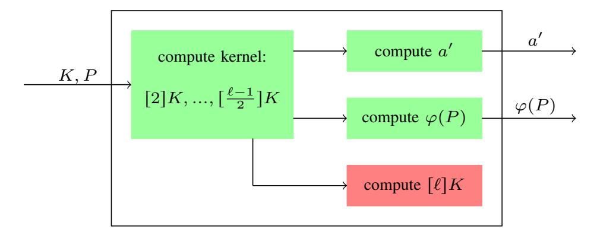
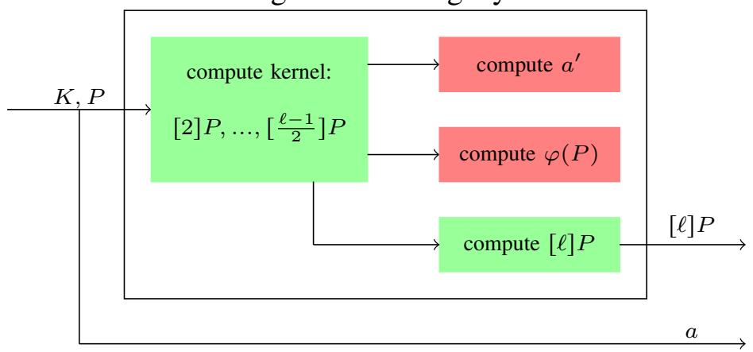
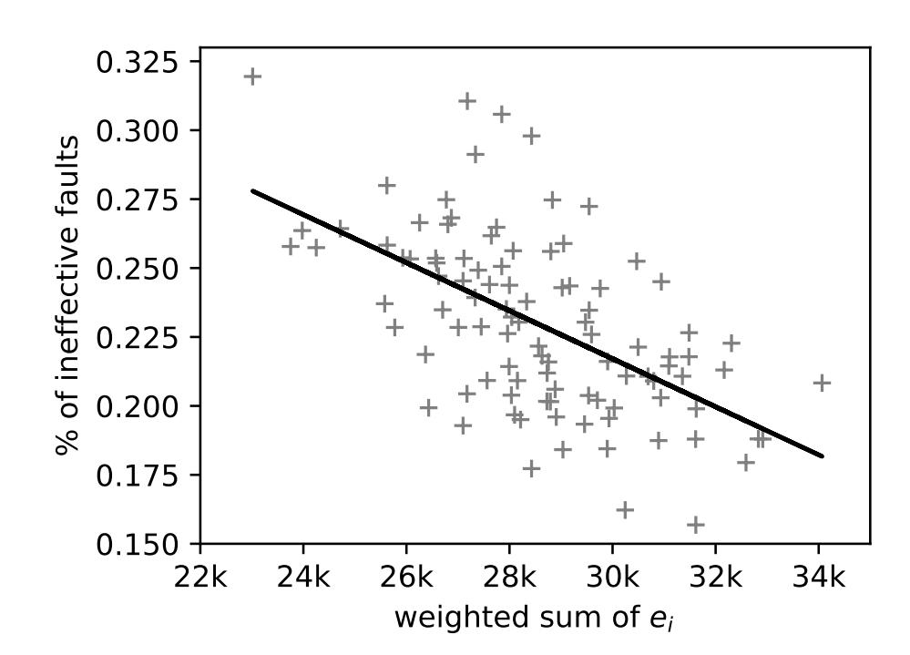

{0}------------------------------------------------

# <span id="page-0-0"></span>Trouble at the CSIDH: Protecting CSIDH with Dummy-Operations against Fault Injection Attacks

Fabio Campos˚ , Matthias J. Kannwischer: , Michael Meyer˚;, Hiroshi Onuki§ , and Marc Stöttinger¶

˚ Department of Computer Science, University of Applied Sciences Wiesbaden, Germany [campos@sopmac.de](mailto:campos@sopmac.de) , [michael.meyer@hs-rm.de](mailto:michael.meyer@hs-rm.de)

: Radboud University, Nijmegen, The Netherlands

[matthias@kannwischer.eu](mailto:matthias@kannwischer.eu)

; Department of Mathematics, University of Würzburg, Germany

§ Department of Mathematical Informatics, University of Tokyo, Japan

[onuki@mist.i.u-tokyo.ac.jp](mailto:onuki@mist.i.u-tokyo.ac.jp)

¶ Security & Privacy Competence Center, Continental AG, Germany [marc.stoettinger@continental-corporation.com](mailto:marc.stoettinger@continental-corporation.com)

*Abstract*—The isogeny-based scheme CSIDH is a promising candidate for quantum-resistant static-static key exchanges with very small public keys, but is inherently difficult to implement in constant time. In the current literature, there are two directions for constant-time implementations: algorithms containing dummy computations and dummy-free algorithms. While the dummy-free implementations come with a 2x slowdown, they offer by design more resistance against fault attacks. In this work, we evaluate how practical fault injection attacks are on the constant-time implementations containing dummy calculations. We present three different fault attacker models. We evaluate our fault models both in simulations and in practical attacks. We then present novel countermeasures to protect the dummy isogeny computations against fault injections. The implemented countermeasures result in an overhead of 7% on the Cortex-M4 target, falling well short of the 2x slowdown for dummy-less variants.

*Index Terms*—Isogeny-based Cryptography, CSIDH, Fault Injection Attack, Fault Resistant Implementation

# I. INTRODUCTION

Isogeny-based cryptography is a promising candidate for quantum-resistant schemes. The most popular schemes, SIDH (Supersingular Isogeny Diffie-Hellman) and CSIDH (Commutative Supersingular Isogeny Diffie-Hellman), offer key exchange protocols with the smallest key sizes, but the worst performance among all current post-quantum schemes. In contrast to SIDH, CSIDH is non-interactive, and basically could be used as a drop-in replacement for current applications of Diffie-Hellman or ECDH. However, it seems that until now, isogeny-based PQC schemes have not received much attention in the implementation attack literature [\[1\]](#page-8-0). Only few faultinjection attacks on SIDH and more general investigations ([\[2\]](#page-8-1), [\[3\]](#page-8-2), [\[4\]](#page-8-3)) have been discussed and published in the community so far. In [\[5\]](#page-8-4), fault-injection attacks on a constanttime implementation of CSIDH have been discussed. However, all previous publications only consider attacks on a theoretical level and omit discussing a particular fault model, fault-attack method, and fault-injection technique. To the best of the authors' knowledge in none of the publications the practical execution of fault-injection attacks has been investigated. Therefore, this is the first work on practical evaluation on the feasibility of fault attacks on an implementation of the CSIDH key-exchange protocol.

In this work we focus on CSIDH, for which there are currently two proposals to design constant-time implementations. One approach uses dummy computations to achieve time constantness ([\[6\]](#page-8-5), [\[7\]](#page-8-6), [\[5\]](#page-8-4)), while the other is dummy-free ([\[5\]](#page-8-4)). The former approach is believed to be less secure against fault attacks, but is twice as fast as the latter. In this work, we evaluate practical fault attacks on the former approach, and present countermeasures, leading to a relatively small slowdown by a factor of 1.07, which yields a significantly better performance than the dummy-free alternative.

The contributions of this work are as follows: Firstly, we discuss practical attacker models for fault attacks and side-channel assisted fault attacks on constant time CSIDH implementation with dummy isogenies. We then simulate all discussed attack models and perform practical experiments with low-budget attack equipment. Lastly, we practically evaluate the performance of the proposed countermeasures.

We place the code used for this work in the public domain; it is available at [https://github.com/csidhfi/csidhfi.](https://github.com/csidhfi/csidhfi) It includes the CSIDH implementation with and without countermeasures, the attack-simulation scripts, and attack scripts.

*Remark 1:* The majority of this work was done prior to the publication of asymptotically faster isogeny formulas by Bernstein, De Feo, Leroux, and Smith [\[8\]](#page-8-7). Some of our countermeasures rely on the structure of the isogeny computations in the implementations [\[5\]](#page-8-4), [\[6\]](#page-8-5), [\[7\]](#page-8-6). Since this is significantly altered in the formulas from [\[8\]](#page-8-7), it is unclear whether they can be protected by similar countermeasures. However, for small degrees the formulas used in this work are still faster, and it is yet unclear for which threshold the new formulas become faster in a constant-time implementation. Even if there are no similar countermeasures for [\[8\]](#page-8-7), one could design a hybrid implementation, where the small degrees use protected dummy 

{1}------------------------------------------------

<span id="page-1-3"></span>computations, while the larger degrees use the dummy-free approach.

## II. PRELIMINARIES

#### A. CSIDH

We focus on an algorithmic description of CSIDH here; for more background, we refer to [9].

First, we define a prime of the form  $p = 4\ell_1 \cdots \ell_n - 1$ , where  $\ell_1, \ldots, \ell_n$  are small distinct odd primes, and work with supersingular elliptic curves in Montgomery form  $E_A: y^2 =$  $x^3 + Ax^2 + x$  over  $\mathbb{F}_p$ . Therefore, each such curve contains points of orders  $\ell_i$  for all  $1 \leq i \leq n$ , which can be used as input to compute an isogeny of degree  $\ell_i$ , e.g. using the formulas of [10]. A private key is given by a vector of integers  $(e_1,\ldots,e_n)$ , where the entry  $e_i$  determines that  $|e_i|$  isogenies of degree  $\ell_i$  have to be computed, and the sign of  $e_i$  determines if an order- $\ell_i$  point on the current curve or its twist has to be taken as the input. The entries are sampled from a small interval [-m, m] to obtain an efficient computation. This socalled class group action evaluation thus takes as input a curve E, computes the required chain of isogenies, and outputs a different curve E'. Note that the order of computing the required isogenies is not fixed, due to the commutativity of this action. In practice, efficient algorithms for this class group action sample a point on the current curve, and compute as many isogenies from this point as possible, thereby requiring to push this point through each computed isogeny in this chain. This can be seen in Algorithm 2 of [9].

The commutativity immediately allows us to set up a Diffie-Hellman-style key exchange: Alice and Bob agree on an initial curve  $E_0$  and choose private key vectors. Both compute the respective class group action, and obtain a public key  $E_A$  resp.  $E_B$ . Then, Alice repeats the computation of her chain of isogenies with the starting curve  $E_B$ , and Bob proceeds vice versa with  $E_A$ . Because of the commutativity, both parties then arrive at the same curve  $E_{AB}$ , which can be used as the shared secret. This key exchange is non-interactive, and due to the efficient verification of public keys, allows for static-static key exchange [9].

## <span id="page-1-0"></span>B. Isogenies

As shown by Costello and Hisil [10], for curves in Montgomery form, an isogeny  $\varphi: E \to E'$  of odd degree  $\ell = 2d+1$  can be computed from the following formulas. Let  $K \in E$  be a point of order  $\ell$ , and denote by  $(X_i:Z_i)$  the projective coordinates of the point [i]K. Then

$$\varphi: (X:Z) \mapsto \left(X \left(\prod_{i=1}^{d} (X-Z)(X_i+Z_i) + (X+Z)(X_i-Z_i)\right)^2 : Z \left(\prod_{i=1}^{d} (X-Z)(X_i+Z_i) - (X+Z)(X_i-Z_i)\right)^2\right).$$
(1)

The curve parameter a' = (A' : C') of E' can be computed by formulas by Meyer and Reith [11], exploiting the birational equivalence to a twisted Edwards curve:

$$(A':C') = \left(2 \cdot \left( (A+2)^{\ell} \pi_{+}^{8} + (A-2)^{\ell} \pi_{-}^{8} \right) : (A+2)^{\ell} \pi_{+}^{8} - (A-2)^{\ell} \pi_{-}^{8} \right), \quad (2)$$

where

<span id="page-1-1"></span>
$$\pi_{+} = \prod_{i=1}^{d} (X_i + Z_i)$$
 and  $\pi_{-} = \prod_{i=1}^{d} (X_i - Z_i)$ .

Dummy isogenies: As suggested by Meyer and Reith [11], constant-time algorithms of CSIDH often use dummy isogenies, since otherwise the running time is correlated to the secret key, which specifies the number of isogenies to be computed. These dummy computations perform the same instructions as real isogeny computations, but discard the results. Thus, they allow for a fixed number of isogeny computations, independent from the respective private key.

In order to speed up computations, dummy isogenies are designed to compute  $[\ell]P$  for the input point P. This has to be done, since for a real isogeny of degree  $\ell$ , the order of P loses the factor  $\ell$  by being pushed through. Therefore, a dummy isogeny would require a subsequent multiplication  $[\ell]P$ , which is prevented by performing this computation inside the dummy algorithm. To this end, a dummy isogeny swaps the input points K (kernel point) and P (point to be evaluated), to compute  $[(\ell-1)/2]P$  in the kernel computation part. Then two further differential additions suffice to compute  $[\ell]P$ . However, this method requires to perform these two further additions in a real isogeny as well, and discard their results, in order to achieve a constant-time behavior.

Figure 1 and Figure 2 show the different computation blocks that are contained in the degree- $\ell$  isogeny algorithm. For real and dummy isogenies, the green blocks are necessary computations in order to produce a valid output, while the red blocks entirely consist of dummy computations, whose results are discarded. Note that these figures do not show conditional swaps, which are necessary to avoid conditional branches based on the private key. We refer to [6] and the accompanying implementation for more details.

## C. Constant-time algorithms

<span id="page-1-2"></span>Meyer, Campos, and Reith (MCR) [6] pointed out that in addition to the variable number of isogenies, also the sign distribution of the key elements may leak information through the running time. Thus, they proposed a constant-time algorithm of CSIDH by using dummy isogenies, and by changing the secret key intervals from  $[-m,m]^n$  to  $[0,2m]^n$ . As a result, for any secret key the performance is the same as for the action of the integer vector  $(2m,\ldots,2m)$ . This cost is about twice as much as that of the action of  $(m,\ldots,m)$ , which is the worst case in the variable-time algorithm. Further, they proposed several optimizations, such as the batching technique SIMBA or the usage of the point sampling method Elligator

{2}------------------------------------------------

<span id="page-2-2"></span><span id="page-2-0"></span>

Fig. 1: Real isogeny



Fig. 2: Dummy isogeny

[12], which was first used in the context of CSIDH in [13], and obtain a speed-up factor of roughly 2.

Onuki, Aikawa, Yamazaki, and Takagi (OAYT) [7] proposed an idea for mitigating the increase of the computational cost due to the key interval [0, 2m]. By keeping two points  $P_0 \in E[\pi - 1]$  and  $P_1 \in E[\pi + 1]$  in each step in the algorithm, where  $\pi$  denotes the Frobenius endomorphism, one can compute isogenies for positive signs and negative signs of a secret key in the same loop. By always choosing the point  $P_s$  that suits the sign of  $e_i$  for computing the kernel generator of an  $\ell_i$ -isogeny, the correlation between running time and sign distribution is eliminated. Thus, this method allows for the use of the secret key intervals  $[-m, m]^n$ , and therefore halves the number of total isogenies at the cost of an additional point evaluation per isogeny. We describe their algorithm in Algorithm 1. Note that, for the sake of simplicity, optimizations such as SIMBA are not described in Algorithm 1. We refer to [6], [7] for more details.

Cervantes-Vázquez, Chenu, Chi-Domínguez, De Feo, Rodríguez-Henríquez, and Smith (CCCDRS) [5] obtained a speedup for the MCR and OAYT implementations by using twisted Edwards curves. Further, they proposed a dummy-less implementation in order to improve the resistance against fault attacks, at the cost of a slowdown by a factor of 2.

#### III. ATTACKER MODELS

The attacker we are modeling in this work is deploying safeerror analysis to detect the dummy isogenies within CSIDH, i.e., he injects faults during the computation of the CSIDH group action and observes if an occurring fault impacts the shared secret. An adversary that can reliably skip or corrupt an isogeny computation of a chosen degree at a chosen index can easily recover the full secret key with a relatively small number of fault injections. However, due to various sources of randomness during the execution, it is impossible

## Algorithm 1: Constant-time class group action

```
Input: A \in \mathbb{F}_p s.t, E_A is supersingular, m \in \mathbb{N},
                 (e_1,\ldots,e_n) s.t. -m \leqslant e_i \leqslant m for
   i=1,\ldots,n.
   Output: B \in \mathbb{F}_p s.t. E_B = (\mathfrak{l}_1^{e_1} \cdots \mathfrak{l}_n^{e_n}) * E_A.
1 Set e'_i = m - |e_i| for i = 1, ..., n.
2 while some e_i \neq 0 or e'_i \neq 0 do
         Set S = \{i \mid e_i \neq 0 \text{ or } e'_i \neq 0\}.
 3
         Set k = \prod_{i \in S} \ell_i.
 4
         Generate P_0 \in E_A[\pi - 1] and P_1 \in E_A[\pi + 1] by
 5
           Elligator.
         Let P_0 \leftarrow [(p+1)/k]P_0 and P_1 \leftarrow [(p+1)/k]P_1.
 6
         for i \in S do
 7
               Set s the sign bit of e_i.
 8
               Set K = [k/\ell_i]P_s.
 9
              Let P_{1-s} \leftarrow [\ell_i] P_{1-s}.
10
              if K \neq \infty then
11
                    if e_i \neq 0 then
12
                         Compute \varphi: E_A \to E_B with
13
                           \ker \varphi = \langle K \rangle.
                         Let A \leftarrow B, P_0 \leftarrow \varphi(P_0), P_1 \leftarrow \varphi(P_1),
14
                           and e_i \leftarrow e_i - 1 + 2s.
                    else
15
                          Compute dummy isogeny:
16
                         Let A \leftarrow A, P_s \leftarrow [\ell_i]P_s, and e'_i \leftarrow e'_i - 1.
17
              Let k \leftarrow k/\ell_i.
18
19 return A.
```

<span id="page-2-1"></span>to always corrupt the intended operation and without sidechannel information an adversary cannot know which isogeny was affected. Therefore, we propose three different attacker models with increasing capabilities to evaluate the impact of the resulting attacks.

In general, we assume that an adversary is able to repeatedly trigger an evaluation of the group action using the same secret key. The input curve may be the same for all evaluations, but may also be different. As CSIDH allows a static-static key exchange, this is likely how a key exchange is implemented. The attacker is able to inject faults that will set variables to random values or skip instructions. An attacker is limited to observe whether both parties obtained the same shared secret, e.g., by observing failure later in the protocol. Expressed in a more formal way, this model is the same as the second oracle from [4]. We propose the following three attackers with increasing capabilities. Attacker 1 and Attacker 2 are limited to fault injection, while Attacker 3 can also obtain additional side-channel information.

• Attacker 1: Shotgun at the CSIDH. Our weakest adversary model assumes that the attacker can reliably cause a fault during the computation of the CSIDH group action, but has no control over the location of the fault. He can then observe how often this leads to a wrong shared secret. This proportion of failures intuitively is depending

{3}------------------------------------------------

<span id="page-3-2"></span>on the ratio of "real" vs. "dummy" isogenies. While this is a rather weak adversary model, it nicely demonstrates the inherent problem of dummy operations in the context of fault injection attacks.

The main limitation of Attacker 1 is that he has no control over the operation that is affected. Since the isogeny computations make up about 42% of cycles during the group action on the Cortex-M4, the attacker is likely to hit an isogeny computation relatively often. However, he has no knowledge of the order of the faulty isogeny computation which limits the information he can learn about the secret key.

• Attacker 2: Aiming at isogenies at index i. A slightly more powerful adversary can target isogeny computations at positions of his choice. This does not fully allow to target isogenies of a chosen degree, as the isogenies may be evaluated out of order due to point rejections. However, since the first evaluated isogenies have relatively large orders  $\ell_i$ , and the point rejection probability is  $1/\ell_i$ , the sequence of the first isogenies is almost deterministic and the individual isogenies can be targeted easily. We evaluate how many isogenies the adversary can realistically attack in Section IV.

For all entries of the secret key with  $e_i = 0$ , the injected fault will not change the result, and an adversary immediately knows this part of the secret key. For the remaining  $e_i$  the adversary has reduced the search space.

• Attacker 3: Aiming at isogeny computations and tracing the order. Our most powerful attacker model complements attacker 2 by additionally allowing the adversary to trace the faulty isogeny computation to determine the degree of the isogeny that the fault was injected into. Since the isogeny order determines the run-time of the isogeny computation the order might be recovered from a power trace, e.g., using Simple Power Analysis [14].

One could imagine yet another adversary that is capable of setting certain  $e_i$  of the secret key to a chosen value. A possible attack would be as follows: For each  $e_i$  try all possible values and observe for which value the derived shared secret is correct. For the CSIDH512 parameters proposed in [7], this would require at most 882 successful fault injections for fully recovering the secret key. This attack would also apply to dummy-free implementations like [5]. Note, however, that this adversary is overly powerful especially when assuming the low-cost fault injection equipment we are targeting in this work. Therefore, we focus on more realistic fault models for the remainder of this paper which can be achieved using relatively cheap clock-glitching equipment.

## IV. SIMULATION

<span id="page-3-0"></span>To gain a better understanding of how many fault injections an adversary would require to obtain a certain key space reduction or key recovery, we simulate the three previously defined adversary models and mount practical experiments on them.

<span id="page-3-1"></span>

Fig. 3: Simulation results for attack 1 using 100 random CSIDH512 secret keys. 500,000 faults are injected into random operations during the group action.

## A. Attack 1

For the simulation attack 1, we implemented a Python script which simulates all operations that are performed within CSIDH in the OAYT implementation. Our approach works as follows: We use our implemented cost-simulation to output a transcript of each point multiplication, isogeny computation, etc., in addition to their cost. We then select one of these operations using the strategy corresponding to the attack model (e.g., uniformly random for attack 1) and determine the impact of a fault occurring at that position. This script is parameterized by the relative cost of each operation which we experimentally determine for our target implementation.

In general there can be two outcomes of a simulated fault injection:

- A fault was injected into an operation that was not a dummy operation which will lead to a wrong shared secret in most cases, which can be observed by the adversary.
- A fault was injected into a dummy operation, i.e., there is no change in the shared secret. This can be considered an ineffective fault.

Note that there are some special cases, where a fault was injected into a non-dummy operation, but the resulting shared secret is not influenced by this. Although these cases are rather rare, our simulation still considers them, in order to give more realistic results.

In attack 1, the adversary simply observes the percentage of fault injections that yield a wrong shared secret. This proportion depends on the secret key as it determines the proportion of real versus dummy operations.

a) Results: We simulated the attack for 100 randomly selected CSIDH512 keys and performed 500,000 fault injections at random locations during the entire group action. Fig. 3 shows the plot of the probability of an ineffective fault in relation to the weighted sum of the secret key. As the the run-time of an individual isogeny is linear in its degree, the

{4}------------------------------------------------

<span id="page-4-2"></span>time spent in `i-isogenies is proportional to |e<sup>i</sup> |¨ `<sup>i</sup> . Therefore, we compute the weighted sum as <sup>ř</sup> |ei |`<sup>i</sup> which corresponds to the approximate time spent in real isogenies. From the simulation, it is easy to see that the probability of seeing a faulty shared secret is correlated with secret key. An adversary learning this probability, can also infer information about the secret key. The more faults are injected, the more evident this relationship becomes.

*b) Impact:* After obtaining the percentage of ineffective faults for a large enough number of rounds, the attacker now wants to gain information on the used secret key. However, we provide an example to show that this does not lead to a large reduction of the possible key space. Suppose the attacker obtains a percentage that allows him to assume that the weighted sum of the secret key is less than 24k. Then, by a Monte Carlo method, we can estimate that roughly 1% of all the possible CSIDH512 keys satisfy this condition. This means that the search space got reduced from 2 <sup>256</sup> to roughly 2 <sup>249</sup>. Since the correlation between the obtained percentage and weighted sum of the key is not even strong enough to allow for an assumption as in this example, we conclude that this attack is not able to significantly reduce the respective search space.

# *B. Attack 2*

In the proposed constant-time implementations based on dummy isogenies (MCR and OAYT), the calculation for a certain e<sup>i</sup> from the secret key vector pe1, . . . , enq acts deterministically. This means that first real and then dummy isogenies are calculated (see lines 12 - 17 in Algorithm [1\)](#page-2-1). Thus, it is sufficient to determine within this calculation sequence where the first dummy isogeny occurs in order to know the absolute value of each e<sup>i</sup> .

We assume in attack 2 and attack 3 that the attacker knows spots in the isogeny computation for the respective degree which reveal whether it is a real or dummy isogeny calculation with a single fault injection. Such critical spots (according to Figure [1](#page-2-0) and Figure [2\)](#page-2-0) in the code can be empirically determined in advance with manageable effort. In our experiments, we achieved an accuracy of over 95% with a single fault injection.

*a) Results:* For the second attack, it suffices to simply determine up to which isogeny computation the algorithm is likely to be deterministic, i.e., no points are going to be re-sampled. Since the probability of point rejection for a given degree `<sup>i</sup> is 1{`<sup>i</sup> , the sequence of the first isogeny computations is deterministic with high probability, due to the relatively large degrees. For example, the attacker knows with a probability of 71% that the first 23 isogeny computations run without point rejection in the OAYT implementation. This makes it easy to target these first 23 isogenies and find out whether they are real or dummy computations with relatively few fault attempts. Extending this number of 23 isogenies leads to a quickly increasing probability for point rejections, thus preventing unambiguous results for later isogenies.

*b) Impact:* The space reduction achieved in this attack model is from 2 <sup>256</sup> to 2 <sup>177</sup> in the best case, where all the respective key elements are 0, and roughly to 2 <sup>244</sup> in the average case. For the average case, we assume that 1{11 of the respective key elements, which lie in the range r´5, 5s resp. r0, 10s, are 0. In the worst case, i.e. none of the respective key elements being 0, the key space is reduced to 2 253

# *C. Attack 3*

Since in this attack model the attacker is also able to trace the order of the isogeny calculation, a divide-and-conquer approach provides the most effective strategy.

- *a) Results:* Both constant-time implementations (MCR and OAYT) use a bound vector m " pm1, m2, . . . , mnq defining the intervals from which each secret exponent e<sup>i</sup> must be sampled. The number of fault injections required to obtain the absolute value of a certain e<sup>i</sup> depends on the corresponding m<sup>i</sup> from the bound vector and on the number of attempts needed to distinguish a real from a dummy isogeny. For each individual degree, the attacker simply performs a binary search until the calculation of the first dummy isogeny is identified.
- *b) Impact:* In the case of the MCR implementation, where only positive values were used for the secret key vector pe<sup>i</sup> P r0, 2ms, where m " 5q, at least 178 injections are required in the worst case for a full key recovery. Whereas in the case of the OAYT implementation our strategy requiring at least 178 injections leads to a space reduction to 2 <sup>74</sup> in the worst case and to 2 <sup>67</sup>.<sup>06</sup> in the average case. The remaining search complexity can be further reduced to roughly 2 <sup>38</sup> in the worst case resp. 2 34.5 in the average case by a meet-inthe-middle approach as described in [\[9\]](#page-8-8).

# V. PRACTICAL EXPERIMENTS

<span id="page-4-1"></span>All our fault-injection experiments were performed on a ChipWhisperer-Lite (CW1173) 32-bit basic board, which includes a 32-bit STM32F303 ARM Cortex-M4 processor as the target core. The attacks were implemented in Python (version 3.6.9) using the ChipWhisperer open source toolchain[1](#page-4-0) (version 5.1.3). An ARM plain C implementation of CSIDH, based on the implementation by Onuki, Aikawa, Yamazaki, and Takagi (OAYT) [\[7\]](#page-8-6), was implemented for our project.

To reduce the time required for all experiments on the target board, we reduced the key space from 11<sup>74</sup> to 3 2 , i.e., our secret consists of two elements in t´1, 0, 1u. Furthermore, in attack 1 we compute isogenies with the smallest degrees (3 and 5).

In all implemented attacks, the isogenies are calculated without randomness, i.e., points and private keys used were precomputed. To require only one CSIDH action call per experiment, Bob's public key and the resulting shared secret for Alice's given public key were calculated in advance. Specifically, in all the implemented scenarios Alice's computation of the shared secret is attacked.

<span id="page-4-0"></span><sup>1</sup>[https://github.com/newaetech/chipwhisperer,](https://github.com/newaetech/chipwhisperer) commit 887e6c7

{5}------------------------------------------------

<span id="page-5-0"></span>TABLE I: Results for attack 1 and attack 2

| type     | key    | # of trials | faulty shared secret |
|----------|--------|-------------|----------------------|
| attack 1 | {0,0}  | 5000        | 19.8%                |
|          | {0,1}  | 5000        | 27.3%                |
|          | {-1,1} | 5000        | 32.8%                |
| attack 2 | {0,1}  | 5000        | 2.1%                 |
|          | {-1,1} | 5000        | 16.4%                |

In our setup, the fault is injected by suddenly increasing the clock frequency, hence, forcing the target core to skip an instruction.

Table I shows the results for the practical attacks. While the rate for attack 1 increases slightly for keys containing more real isogenies, the increase for random-based (without knowledge of critical points) attack 2 is much higher. The results from attack 2 also apply to attack 3.

## VI. COUNTERMEASURES

<span id="page-5-2"></span>We describe countermeasures for the OAYT implementation, but note that this also applies to MCR, and, with slight modifications, to the CCCDRS implementation containing dummy computations.

It is evident that attack 3 is the main threat that should be considered for countermeasures. Thus, we analyze the required countermeasures for the involved dummy computations during isogenies. However, the simulation of attack 1 shows that there are other parts of the CSIDH algorithm that could leak some information on the private key, if specifically attacked as in the attacker 3 model. Therefore, we describe the further required countermeasures, such that the resulting implementation is secure against leakage in all three attack models.

A rather simple countermeasure would be to randomize the order in which real and dummy isogenies for a specific degree are computed, instead of always computing the real ones first. However, attacker 3 can still attack this with a slightly larger number of faults, using a probabilistic method to obtain the key elements. In contrast to this, our idea for countermeasures against the described fault injection attacks is to redesign the algorithm such that any fault injection will lead to the output of an error instead of the output curve. This means that an attacker does no longer see if the injected fault affected a real or a dummy operation, and is thus effective against all three attack models we described.

A key function that is frequently used is a check for equality. This is performed in constant time and therefore does not leak any information. The presented countermeasures are designed for our described specific attack model, i.e. the adversary is limited to injecting exactly one fault, which can either be a random fault or an instruction skip.

## A. Isogenies

In order to reach security against attack 3, we have to be able to detect faults during the dummy computations of isogenies. However, we stress that we require a unified isogeny algorithm, which computes a real isogeny or dummy isogeny of given degree in constant time, based on a decision bit  $b \in \{0,1\}$ . This means that countermeasures for one of the two cases must be executed in *both* cases to maintain the

## Algorithm 2: Protecting the codomain curve

**Input**: Curve parameters  $A, C \in \mathbb{F}_p$ , degree  $\ell$ , kernel points  $(X_i : Z_i)$  for  $1 \le i \le (\ell - 1)/2$ , bitmask  $b \in \{0, 1\}$ .

**Output:** Curve parameters  $A', C' \in \mathbb{F}_p$ , error variable error.

```
1 Set \pi_+ \leftarrow 1, \pi_- \leftarrow 1
 2 for i \in \{1, \ldots, (\ell - 1)/2\} do
          t_0 \leftarrow \operatorname{cadd}(X_i, Z_i, b).
 3
 4
          t_1 \leftarrow \text{csub}(X_i, Z_i, b).
  5
         \pi_+ \leftarrow \pi_+ \cdot t_0.
 6
       \pi_- \leftarrow \pi_- \cdot t_1.
 7 t_0 \leftarrow \text{cadd2}(C, C, b).
 8 t_1 \leftarrow (A - t_0)^{\ell} \cdot \pi_-^8.
 9 t_0 \leftarrow (A + t_0)^{\ell} \cdot \pi_+^8.
10 A' \leftarrow \operatorname{cadd}(t_1, t_0, b).
11 A' \leftarrow \operatorname{cadd}(A', A', b).
12 C' \leftarrow \text{csub}(t_0, t_1, b).
13 error \leftarrow cverify(A', C', \neg b).
14 return A', C', error.
```

<span id="page-5-1"></span>constant-time property. However, it must be ensured that the verifications only lead to the output of an error in the relevant case. This is implemented via the function cverify(x,y,b), which always checks whether x=y via the constant-time check for equality, but only outputs the result if b=1.

In this section, we assume that the decision bit is set as b=0 if a dummy isogeny is to be computed, and b=1 for the real isogeny case.

- 1) Real isogenies: As depicted in Section II-B, the two additional differential additions (DADDs) are the only dummy computations in a real isogeny. Since their output is discarded, we have to validate that no fault has been injected during their execution. However, in this case the validation is straightforward. The DADDs are designed to compute  $K' = [\ell]K$  for an  $\ell$ -isogeny (see Section II-B). Thus, in real isogenies, the result must be the point  $\infty$ , since K has order  $\ell$ . This means that we can simply call cverify $(K', \infty, b)$ , in order to perform this validation only in the case of real isogenies.
- 2) Dummy isogenies: In dummy isogenies, the dummy computations are the codomain curve computation and the point evaluation, as described in Section II-B. However, the involved dummy computations here don't allow for an elegant verification of point orders or supersingularity, as in all the other cases in this section. Instead, we will make use of a conditional addition cadd(x,y,b), which outputs x if b=0 and x+y if b=1. This function is implemented by first calling a conditional set function, which takes as input y and b, is initialized by the output value 0, and overwrites this output by y if b=1. Note that this function is implemented to run in constant time, in order to prevent leakage. Then, we call the usual addition function for  $\mathbb{F}_p$ -elements, and obtain the desired output in constant time.

While we have to maintain the structure of computations in the case of real isogenies (i.e. for b=1), we have to make

{6}------------------------------------------------

<span id="page-6-2"></span>changes to them in order to obtain verifiable results in the dummy case (i.e. for b=0). To manage this in constant-time, we make use of the conditional add function. Analogously, we define a conditional subtraction csub(x,y,b), and can compute cadd2(x,y,b) with result bx+by through two calls to the conditional set function.

a) Codomain curve computation: Instead of using multiples of the kernel generator K, dummy isogenies use multiples of the input point  $P_s$ . Thus, the output does not refer to a special type of curve or follow any other special property that can be validated.

Recall that the codomain curve parameters are computed by Eq. 2. It is evident that different steps during the computations of A' and C' contain similar terms, and mostly differ in sign changes. Therefore, our strategy to evaluate these computations in the dummy case is to manipulate some of them with conditional additions, in order to obtain A' = C'. To reach this, our algorithm is designed in a way such that a fault injection in any line of code leads to  $A' \neq C'$  in the dummy case. On the other hand, it obviously computes the correct output parameters in the case of real isogenies. Algorithm 2 details this method. Again we make use of the conditional verify function, to only possibly raise an error if b = 0.

b) Point evaluation: Analogously to the codomain curve computation, there is no possibility to check for the correct executions of this part through point order checks in the dummy case. Thus, we resort to the same strategy as for the codomain curve computation.

The output points are computed by Eq. 1. We can again use the same strategy to manipulate the computations to output values satisfying X' = Z' in the dummy case. As above, a fault to any line of code will result in output values with  $X' \neq Z'$ , and in the real isogeny case, the algorithm stays unchanged. This method is detailed in Algorithm 3. Note that we are required to run this algorithm twice per isogeny, since both points  $P_0$  and  $P_1$  must be pushed through an isogeny at each step.

In addition to the faults aiming at dummy computations, we need to be able to detect faults in non-dummy computations as well, in order to output an error instead of the output at the end of the algorithm. Otherwise, the attacker could still observe the difference between these cases.

To this end, we note that the output of an isogeny consists of the codomain curve parameters, and the evaluated points. If a fault is injected during the computation of the codomain curve, then (with very high probability) the resulting parameters will not refer to a supersingular curve anymore. This can be deduced from the fact that the probability of a random parameter a = A/C to define a supersingular curve is roughly  $1/\sqrt{p}$ , and therefore negligible [9]. Thus, the resulting curve at the end of the algorithm will most likely not be supersingular. It therefore suffices to perform a single supersingularity check, e.g. as done in the public key validation in [9], at the end of the algorithm, and output an error in case of a non-supersingular curve. Instead of using the validation from [9], we use a differ-

## **Algorithm 3:** Protecting the point evaluation

```
(X_i:Z_i) for 1 \le i \le (\ell-1)/2, bitmask
                    b \in \{0, 1\}.
     Output: Output point (X':Z'), error variable error.
 1 t_+ \leftarrow \operatorname{cadd}(X, Z, b).
 t_{-} \leftarrow \operatorname{csub}(X, Z, b).
 3 Set \pi_X \leftarrow 1, \pi_Z \leftarrow 1.
 4 for i \in \{1, \ldots, (\ell - 1)/2\} do
           t_0 \leftarrow \operatorname{cadd}(X_i, Z_i, b).
 5
           t_1 \leftarrow \text{csub}(X_i, Z_i, b).
  6
 7
           t_0 \leftarrow t_- \cdot t_0.
  8
           t_1 \leftarrow t_+ \cdot t_1.
          t_2 \leftarrow \operatorname{cadd}(t_1, t_0, b).
  9
          t_3 \leftarrow \text{csub}(t_0, t_1, b).
10
          \pi_X \leftarrow \pi_X \cdot t_2.
11
      \pi_Z \leftarrow \pi_X \cdot t_3.
12
13 X' \leftarrow \text{cadd}(\neg b, X, b).
14 Z' \leftarrow \operatorname{cadd}(\neg b, Z, b).
15 X' \leftarrow X' \cdot \pi_X^2.
16 Z' \leftarrow Z' \cdot \pi_Z^2.
17 error \leftarrow cverify(X', Z', \neg b).
```

**Input**: Input point (X : Z), degree  $\ell$ , kernel points

ent, slightly relaxed, approach. We simply sample a random point Q on the curve, and check that  $[p+1]Q = \infty$ . This method is much faster, but has a small chance to output false positives, so is not usable as public key validation. However, we heuristically tested the probability for false positives, and found that in  $10^8$  experiments with random curve parameters, our method and the rigorous verifications always had the same result. Thus, it seems to be infeasible for the attacker to exploit this relaxed supersingularity check.

The case of output points will be handled in detail in the following section.

## B. Point orders and scalar multiplications

<span id="page-6-0"></span>18 return X', Z', error.

Scalar multiplications take place in line 6 and 9–10 in Algorithm 1, and are intended to produce points of the desired orders. If during such a multiplication a fault is injected randomly, i.e. not aiming to produce a specific faulty output, then the probability for still generating a point of desired order is negligible. The same is true for faults injected during the point evaluation of a real isogeny. For detecting such a fault, it therefore suffices to check if the output point P has the required order  $\ell$  by verifying that  $\lceil \ell \rceil P = \infty$ .

However, it is not required to perform such a check after each scalar multiplication resp. isogeny. Indeed, it suffices to check point orders in the two following situations:

• At the end of each run through a batch of isogenies, if all computations are running correctly, then both points  $P_0$  and  $P_1$  must be the point at infinity  $\infty$  at the end of the

<span id="page-6-1"></span><sup>2</sup>This follows since the required orders are always small, and for each prime factor  $\ell_i | \#E[\pi-1] = \#E[\pi+1] = p+1$ , the probability for the order of a random point with x-coordinate in  $\mathbb{F}_p$  to contain the factor  $\ell_i$  is  $1-1/\ell_i$ .

{7}------------------------------------------------

<span id="page-7-0"></span>for-loop in line 7 of Algorithm [1.](#page-2-1) Thus, if we verify this at the end of each run through a batch, we are able to detect faults even if the respective faulty point P<sup>s</sup> is not used to generate a kernel input point for an isogeny anymore after the fault is injected. This ensures the correctness of the scalar multiplications in lines 6 and 10 of Algorithm [1,](#page-2-1) and of the involved isogeny point evaluations.

' In order to validate the scalar multiplication in line 9 of Algorithm [1,](#page-2-1) we need to verify that K indeed has the correct order ` for each isogeny. This is done by calculating r`sK and verifying that the result equals 8 for each isogeny. Note that in the case of real isogenies, a faulty point K leads to wrong results, that can be detected anyway; however, in the dummy case, the input point K is discarded, so this order check is indeed required. In order to keep our algorithm constant-time, this therefore has to be done in both cases.

All other scalar multiplications do not require separate order checks, since faults would be detected by the mentioned verifications.

*Remark 2:* Theoretically, the attacker could try to inject a fault such that a specific output point is produced, although this is not possible in our attacker model. In particular, the above verification does not detect a fault, if the order of the output point divides the desired order. If the attacker produces a point that lies on the same curve as the correct output point would (i.e., not on its twist), then this does not lead to a wrong computation, and therefore does not lead to possible leakage. Note that in CSIDH any point P of order ` on the same curve produces the same `-isogeny codomain curve. It only makes a difference if P P Erπ ´ 1s or P P Erπ ` 1s.

This also explains a possible attack strategy: The adversary forces the output of a point on the twist with order dividing the expected order. Thus, the respective isogenies are computed with the wrong direction in the isogeny graph, which leads to leakage.

However, this is only a theoretical attack. Indeed, the chance for this to happen by accident is negligible, and to specifically map a point to a point on the twist of the same order, with an unknown curve, seems infeasible. Even computing such a point with known curve would require to compute an irrational endomorphism, which, if possible in general, would completely break CSIDH on its own [\[15\]](#page-8-14). Computing small prime order points, thus possibly having an order dividing the expected order, could otherwise be done through division polynomials. However, as explained above, the attacker does not know the current curve (except for the starting curve) when injecting a fault, which means that division polynomials cannot be computed.

However, there is a simple, but rather costly, countermeasure to prevent attacks of this fashion. It suffices to check if the input kernel generator K lies on the correct curve via a Legendre symbol computation for each isogeny, and output an error otherwise. Although this seems not to be necessary for the reasons above, we report on the performance implications for this in Section [VII.](#page-8-15)

# *C. Other functions*

The CSIDH constant-time algorithms from [\[6\]](#page-8-5), [\[7\]](#page-8-6) feature some more functions outside of the scope of the sections above. Compared to isogeny computations and scalar multiplications, their share of the total running time is small. Nevertheless, we review if countermeasures against fault injections for these functions are required.

The mentioned functions include the Elligator map [\[12\]](#page-8-11), a method for efficient point sampling. For our discussion and in our implementation, we use the projective Elligator implementation from [\[5\]](#page-8-4). Further, the constant-time conditional point swap function cswap plays an important role in all current constant-time CSIDH implementations, and we review a method to prevent obvious loop-abort faults.

Apart from these functions, there are more functions, like integer multiplications. However, we disregard them here, since any fault to these functions is detectable through our described methods, e.g. through point order checks.

*1) Conditional point swaps:* The cswap function takes two Fp-values and a decision bit b P t0, 1u as input, and swaps the input values if b " 1. However, this is performed in constanttime, independent from the value of b. The swapping of two elliptic curve points therefore requires two separate executions of cswap for their two coordinates.

If one of these swaps is skipped or subject to a fault injection, this means that the respective X- and Z-coordinates of the two points no longer fit together as before. Thus, the coordinates refer to different points then, also leading to different point orders. This also means that our point order checks from the previous sections can detect such a fault.

*2) Elligator:* The Elligator map as used in [\[5\]](#page-8-4) efficiently samples projective points P<sup>0</sup> P EArπ ´ 1s and P<sup>1</sup> P EArπ ` 1s on the current curve, where the cost is dominated by one Legendre symbol calculation. However, if a fault is injected there, we can no longer guarantee that indeed P<sup>0</sup> P EArπ ´1s and P<sup>1</sup> P EArπ `1s. Deviating from this would mean that we compute isogenies with a wrong sign, and therefore obtain a wrong output curve, which can cause leakage.

We mitigate this by computing the Legendre symbol for both of these points, and thereby making sure that P<sup>0</sup> P EArπ ´ 1s and P<sup>1</sup> P EArπ ` 1s is satisfied.

- *3) Loop-abort faults:* As mentioned in [\[5\]](#page-8-4), and also applied to SIDH in [\[2\]](#page-8-1), loop-abort faults can lead to a stopping of the algorithm, although not all required isogenies have been computed. In the CSIDH implementation featuring dummy isogenies, this can lead to leakage, since a correctly established shared secret in this case means that all the skipped isogenies have been dummies. As usual, this can be prevented by using multiple counters, in order to make it far harder for the attacker to achieve an undetected loop-abort. In the CSIDH implementations from MCR and OAYT, there already are several counters, so it suffices to compare them before outputting the resulting curve, and thereby checking if one of them has been manipulated to abort the loop.
- *4) Decision bits:* In many cases, decision bits must be set, such as b, which decides whether a real or dummy isogeny

{8}------------------------------------------------

<span id="page-8-21"></span><span id="page-8-19"></span>TABLE II: Performance results for one group action for the CSIDH512 implementation on the ARM Cortex-M4 without and with countermeasures. Averaged over 10 evaluations. Countermeasures for the theoretical twist attack are evaluated separately.

|                   | STM32F407 (24 MHz) |      | STM32F303 (7.4 MHz) |      |
|-------------------|--------------------|------|---------------------|------|
|                   | [clock cycles]     |      | [clock cycles]      |      |
| w/o CM            | 15 523M            |      | 15 721M             |      |
| w/ CM (w/o twist) | 16 322M            |      | 16 751M             |      |
| overhead          | 804M               | +5%  | 1 030M              | +7%  |
| w/ CM (w/ twist)  | 20 907M            |      | 21 486M             |      |
| overhead          | 5 384M             | +35% | 5 765M              | +37% |

must be computed, or a decision bit that decides if P<sup>0</sup> or P<sup>1</sup> is used to compute the kernel generator for an isogeny. For our attack models, we could disregard these parts because of the low computational cost, but anyway we provide a simple countermeasure for leakage through an injected fault here. Since in our model the attacker only performs one fault injection, we can simply compute the respective bit twice, check if both computations obtained the same result, and output an error otherwise.

*Remark 3:* We note that also the dummy-free implementation of [\[5\]](#page-8-4) offers attack surface; e.g. it is vulnerable to attacks aiming at the cswap function, Elligator, or some of the decision bit choices, which means that our discussion on these functions also applies to the dummy-free implementation.

# VII. PERFORMANCE RESULTS

<span id="page-8-15"></span>We implemented the countermeasures described in Section [VI](#page-5-2) into the implementation that was used in Section [V](#page-4-1) to investigate the performance overhead of the proposed countermeasures. The concrete security of CSIDH512 is currently under heavy debate [\[16\]](#page-8-16), [\[17\]](#page-8-17); like most previous work on CSIDH implementations, we focus on the CSIDH512 parameter set. The proposed attacks and countermeasures, however, apply to other parameter sets as well. The code was compiled with arm-none-eabi-gcc[3](#page-8-18) Version 10.1.0. Table [II](#page-8-19) contains the performance results without and with the countermeasures implemented. We report cycle counts for both the STM32F303, which is the core on the 32-bit ChipWhisperer Lite, and the STM32F407 which is used in various post-quantum cryptography implementations in the literature and the benchmarking project PQM4 [\[18\]](#page-8-20). Our benchmarking code is primarily based on PQM4 and we follow the common practice of down-clocking the STM32F407 to 24 MHz to avoid flash wait states impacting the performance results. We report the average over 10 evaluations of the group action. The overhead of the presented countermeasures is 5% to 7% and, therefore, relatively small compared to generic countermeasures like duplicating isogeny computations. The cost for the described twist attack countermeasures is slightly larger, namely 35% to 37% in total, including all other countermeasures. However, as described above, this attack is only of theoretical nature, which means that the former implementation suffices in practice. Note that the implementation of the arithmetic is a portable C implementation that was not heavily optimized for performance for this platform yet. It is, therefore, expected that all implementations can be further improved in terms of speed.

# *Acknowledgements*

This work has been supported by the European Commission through the ERC Starting Grant 805031 (EPOQUE), by the German Federal Ministry of Education and Research (BMBF) under the project "QuantumRISC" (16KIS1034), by JST CREST Grant Number JPMJCR14D6, by Elektrobit Automotive GmbH, and by Continental AG.

## REFERENCES

- <span id="page-8-0"></span>[1] S. Chowdhury, A. Covic, R. Y. Acharya, S. Dupee, F. Ganji, and ´ D. Forte, "Physical security in the post-quantum era: A survey on sidechannel analysis, random number generators, and physically unclonable functions," *ArXiv*, 2020. [1](#page-0-0)
- <span id="page-8-1"></span>[2] A. Gélin and B. Wesolowski, "Loop-abort faults on supersingular isogeny cryptosystems," in *PQCrypto 2017*. Springer, 2017, pp. 93– 106. [1,](#page-0-0) [8](#page-7-0)
- <span id="page-8-2"></span>[3] Y. B. Ti, "Fault Attack on Supersingular Isogeny Cryptosystems," in *PQCrypto 2017*. Springer, 2017, pp. 107–122. [1](#page-0-0)
- <span id="page-8-3"></span>[4] S. D. Galbraith, C. Petit, B. Shani, and Y. B. Ti, "On the security of supersingular isogeny cryptosystems," in *ASIACRYPT 2016*. Springer, 2016, pp. 63–91. [1,](#page-0-0) [3](#page-2-2)
- <span id="page-8-4"></span>[5] D. Cervantes-Vázquez, M. Chenu, J. Chi-Domínguez, L. D. Feo, F. Rodríguez-Henríquez, and B. Smith, "Stronger and Faster Side-Channel Protections for CSIDH," in *LATINCRYPT 2019*. Springer, 2019, pp. 173–193. [1,](#page-0-0) [3,](#page-2-2) [4,](#page-3-2) [8,](#page-7-0) [9](#page-8-21)
- <span id="page-8-5"></span>[6] M. Meyer, F. Campos, and S. Reith, "On Lions and Elligators: An efficient constant-time implementation of CSIDH," in *PQCrypto 2019*. Springer, 2019, pp. 307–325. [1,](#page-0-0) [2,](#page-1-3) [3,](#page-2-2) [8](#page-7-0)
- <span id="page-8-6"></span>[7] H. Onuki, Y. Aikawa, T. Yamazaki, and T. Takagi, "(Short Paper) A Faster Constant-Time Algorithm of CSIDH Keeping Two Points," in *Advances in Information and Computer Security*. Springer, 2019, pp. 23–33. [1,](#page-0-0) [3,](#page-2-2) [4,](#page-3-2) [5,](#page-4-2) [8](#page-7-0)
- <span id="page-8-7"></span>[8] D. J. Bernstein, L. D. Feo, A. Leroux, and B. Smith, "Faster computation of isogenies of large prime degree," Cryptology ePrint Archive, Report 2020/341, 2020, [https://eprint.iacr.org/2020/341.](https://eprint.iacr.org/2020/341) [1](#page-0-0)
- <span id="page-8-8"></span>[9] W. Castryck, T. Lange, C. Martindale, L. Panny, and J. Renes, "CSIDH: An Efficient Post-Quantum Commutative Group Action," in *ASIACRYPT 2018*. Springer, 2018, pp. 395–427. [2,](#page-1-3) [5,](#page-4-2) [7](#page-6-2)
- <span id="page-8-9"></span>[10] C. Costello and H. Hisil, "A simple and compact algorithm for SIDH with arbitrary degree isogenies," in *ASIACRYPT 2017*. Springer, 2017, pp. 303–329. [2](#page-1-3)
- <span id="page-8-10"></span>[11] M. Meyer and S. Reith, "A faster way to the CSIDH," in *INDOCRYPT 2018*. Springer, 2018, pp. 137–152. [2](#page-1-3)
- <span id="page-8-11"></span>[12] D. J. Bernstein, M. Hamburg, A. Krasnova, and T. Lange, "Elligator: Elliptic-curve points indistinguishable from uniform random strings," in *ACM SIGSAC 2013*. ACM, 2013, pp. 967–980. [3,](#page-2-2) [8](#page-7-0)
- <span id="page-8-12"></span>[13] D. J. Bernstein, T. Lange, C. Martindale, and L. Panny, "Quantum circuits for the CSIDH: optimizing quantum evaluation of isogenies," in *EUROCRYPT 2019*. Springer, 2019, pp. 409–441. [3](#page-2-2)
- <span id="page-8-13"></span>[14] P. C. Kocher, J. Jaffe, and B. Jun, "Differential Power Analysis," in *CRYPTO '99*. Springer, 1999, pp. 388–397. [4](#page-3-2)
- <span id="page-8-14"></span>[15] W. Castryck, L. Panny, and F. Vercauteren, "Rational isogenies from irrational endomorphisms," in *EUROCRYPT 2020*. Springer, 2020, pp. 523–548. [8](#page-7-0)
- <span id="page-8-16"></span>[16] C. Peikert, "He gives c-sieves on the CSIDH," in *EUROCRYPT 2020*. Springer, 2020, pp. 463–492. [9](#page-8-21)
- <span id="page-8-17"></span>[17] X. Bonnetain and A. Schrottenloher, "Quantum security analysis of CSIDH," in *EUROCRYPT 2020*. Springer, 2020, pp. 493–522. [9](#page-8-21)
- <span id="page-8-20"></span>[18] M. J. Kannwischer, J. Rijneveld, P. Schwabe, and K. Stoffelen, "PQM4: Post-quantum crypto library for the ARM Cortex-M4," [https://github.](https://github.com/mupq/pqm4) [com/mupq/pqm4.](https://github.com/mupq/pqm4) [9](#page-8-21)

<span id="page-8-18"></span><sup>3</sup><https://developer.arm.com/>