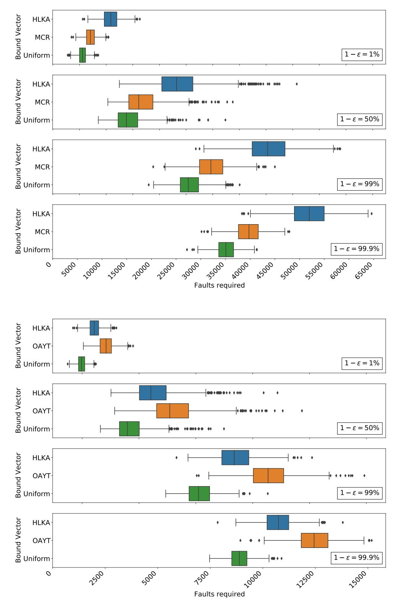
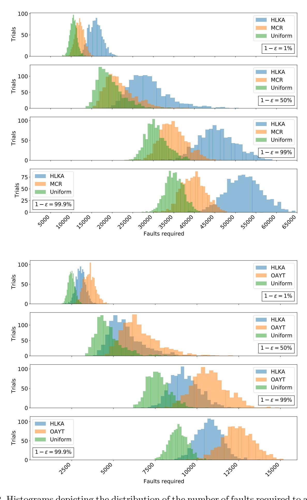
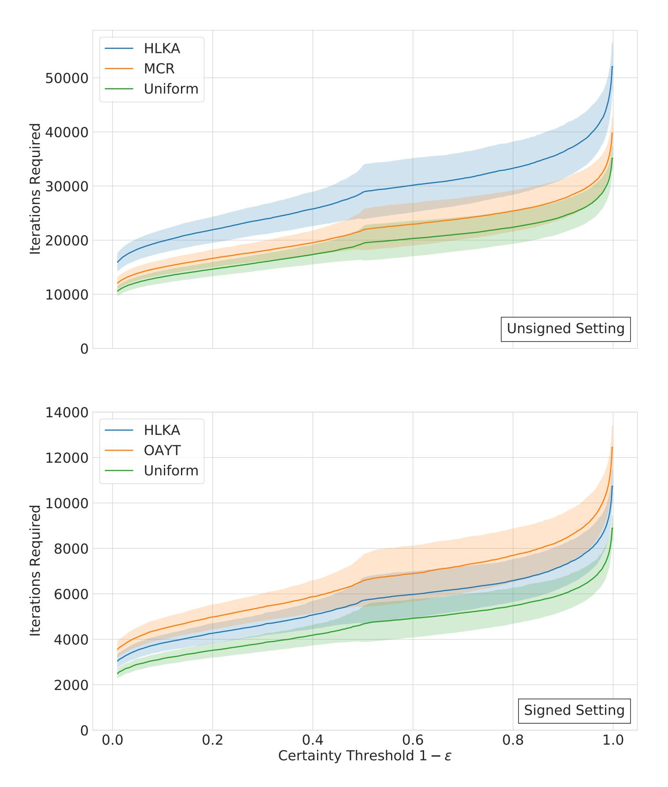

{0}------------------------------------------------

# An Analysis of Fault Attacks on CSIDH

Jason LeGrow<sup>1</sup> and Aaron Hutchinson<sup>2</sup>

<sup>1</sup> Department of Mathematics, University of Auckland, Auckland, New Zealand <sup>2</sup> Department of Combinatorics and Optimization and Institute for Quantum Computing, University of Waterloo, Waterloo, Ontario, Canada

Abstract. CSIDH is an isogeny-based post-quantum key establishment protocol proposed in 2018. In this work, we analyze attacking implementations of CSIDH which use dummy isogeny operations using fault injections from a mathematical perspective. We detail an attack by which the private key can be learned by the attacker up to sign with absolute certainty using Pdlog<sup>2</sup> (bi) + 1e fault attacks on pairwise distinct group action evaluations under the same private key under ideal conditions using a binary search approach, where b is the bound vector defining the keyspace. As a countermeasure to this attack, we propose randomly mixing the real degree `<sup>j</sup> isogenies together with the dummy ones by means of a binary decision vector. To evaluate the efficiacy of this countermeasure, we formulate a probability-based attack on this randomized scheme using a maximum likelihood approach and simulate the attack using 6 bound vectors used in previous CSIDH implementations. We found that the number of attacks required under our model to reach just 1% certainty about the key increased by a factor between 8–12 over the standard approach in the setting of signed private keys and a factor between 28–45 using non-negative private keys, depending on b. We derive theoretical bounds on the number of attacks required to reach a specified certainty threshold about the key under our model. Based on our data and the minimal additional overhead required, we recommend all future implementations of CSIDH to employ a randomized decision vector approach. Finally since our model assumes fault attacks provide no information on the sign of the key, we use a technique based on Gray codes to optimize the standard meet-in-the-middle attack for learning the sign of the key values once their magnitudes have been learned through fault attacks. We estimate that, on average, this optimized technique uses approximately 88% fewer field-multiplication-equivalent operations over the standard approach.

Keywords: isogeny-based cryptography, CSIDH, fault attacks, key establishment

# 1 Introduction

Commutative Supersingular Isogeny-based Diffie-Hellman (CSIDH) is a postquantum key establishment protocol from 2018 proposed by Wouter Castryck,

{1}------------------------------------------------

Tanja Lange, Chloe Martindale, Lorenz Panny, and Joost Renes in [2]. As the name suggests, CSIDH uses isogenies between supersingular elliptic curves to perform a key establishment analogous to the Diffie-Hellman protocol. Specifically, let  $p = 4\ell_1 \cdots \ell_n - 1$  be a prime number, with  $\ell_1, \dots, \ell_n$  small odd primes. The primes  $\ell_1, \ldots, \ell_{n-1}$  are typically taken to be the first n-1 odd primes, and  $\ell_n$  is chosen as the next smallest prime which makes p prime. The value n depends on the targeted security level. The supersingular Montgomery curve  $E_0: y^2 = x^3 + x$  defined over  $\mathbb{F}_p$  has the property that the ideal generated by  $[\ell_i]$  in the endomorphism ring of  $E_0$  splits into the product of the ideals  $\mathfrak{l}_i := ([\ell_i], \pi - 1)$  and  $\mathfrak{l}_i := ([\ell_i], \pi + 1)$ , where  $\pi$  is the Frobenius endomorphism of  $E_0$ . In the ideal class group, we have  $[\mathfrak{l}_j]^{-1} = [\bar{\mathfrak{l}}_j]$ . Let  $\mathbf{b} = (b_1, \ldots, b_n)$  be a vector of small positive integers. The vector **b** is called a bound vector and must be carefully chosen to ensure the security of the scheme. For a vector of integers  $\mathbf{e} = (e_1, \dots, e_n)$  and an elliptic curve E with  $\mathbb{F}_p$ -endomorphism ring isomorphic to that of  $E_0$ , we define  $\mathbf{e} * E := [\mathfrak{l}_1]^{e_1} \cdots [\mathfrak{l}_n]^{e_n} * E$ , where \* in the latter expression denotes the class group action.

The CSIDH key establishment is performed as follows. Alice and Bob choose their private keys  $\mathbf{e}^A$  and  $\mathbf{e}^B$  from the set  $\prod_{j=1}^n [-b_j, b_j] \cap \mathbb{Z}$ , respectively. More recent works [10,7] on CSIDH choose private keys from the non-negative intervals  $\prod_{j=1}^n [0,b_j] \cap \mathbb{Z}$ ; we distinguish these two scenarios as the *signed* and *unsigned* settings, respectively. With the private keys chosen, Alice computes her public key as  $E_A := \mathbf{e}^A * E_0$  and similarly Bob computes his as  $E_B := \mathbf{e}^B * E_0$ . Alice then sends  $E_A$  to Bob, and Bob sends  $E_B$  to Alice. Each party then evaluates the action of their private key on the curve they received from the other party: Alice computes  $E_{BA} := \mathbf{e}^A * E_B$ , while Bob computes  $E_{AB} := \mathbf{e}^B * E_A$ . By the commutativity of the ideal class group, we have  $E_{BA} \cong E_{AB}$ ; the shared key is then (derived from) the  $\mathbb{F}_p$  isomorphism class of this final curve.

Since CSIDH's initial submission in 2018, there have already been many optimizations toward improving it [13,7,12,11,10,1]. Michael Meyer and Steffen Reith in [11] first remarked on making CSIDH constant time by constructing a constant number of isogenies during execution of the algorithm. In a follow up work [10] with Fabio Campos, they implemented such a constant time algorithm using dummy isogeny constructions. That is, for each  $1 \leq j \leq n$  exactly  $b_j$  many isogenies of degree  $\ell_j$  are constructed regardless of the key  $e_j$ , with  $|e_j|$  many being real and  $b_j - |e_j|$  being dummy. As far as we are aware at the time of this writing, nearly all constant time implementations of CSIDH so far have used dummy isogeny constructions in this manner, with the exception of the computationally slower "no-dummy" algorithm presented in [3]. Dummy operations often leave cryptosystems vulnerable to attack by means of fault injections, and these constant time implementations of CSIDH which use dummy isogenies are no exception.

Our contributions in this work can be summarized as follows:

1. We demonstrate that current implementations of CSIDH which use a "real-then-dummy" approach are vulnerable to fault injection attacks, in which an attacker can achieve a complete break of the system under ideal conditions

{2}------------------------------------------------

- by recovering the private key using  $\sum_{j=1}^{n} \lceil \log_2(b_j) + 1 \rceil$  many faults via a binary search attack in a static key setting.
- 2. As a countermeasure to the above attack, for a fixed key  $\mathbf{e}$  we propose randomly mixing the constructions of the  $|e_j|$  many degree  $\ell_j$  real isogenies with the dummy isogenies. At the time of evaluation of the group action, we choose a binary-valued decision vector  $\mathbf{x}^j = (x_1^j, \dots, x_{b_j}^j)$  with weight  $|e_j|$  uniformly at random; we then construct the  $i^{\text{th}}$  isogeny of degree  $\ell_j$  as real if  $x_i^j = 1$  and dummy otherwise.
- 3. We analyze a naïve attack on the randomized protocol described above using an oracle  $\mathcal{O}$ , in which  $\mathcal{O}(j,i)$  reveals  $x_i^j$ . We derive formulas for the distribution on the magnitude  $|e_j|$  of the key given a string of outputs from  $\mathcal{O}(j,-)$  from pairwise different instances of  $\mathbf{x}^j$  under the same key  $\mathbf{e}$ . We derive an upper bound on the number of faults required to achieve any desired error threshold  $\epsilon$  for any given bound vector in this setting. We also give some results in the direction of lower bounds for a particular class of attacks.
- 4. In the setting of signed keys, we discuss an optimization of the standard meet-in-the-middle attack to determine the signs of the key entries once their magnitudes have been determined using fault attacks. We introduce an approach based on Gray codes which we estimate based on numerical experiments to be, on average, 88.5% more efficient in populating collision tables than the naïve approach under the state-of-the-art bound vector of [7], even when optimized permutations and strategies are employed.
- 5. We simulated attacking this randomized version of CSIDH under ideal conditions with 6 different bound vectors **b** used in previous implementations of CSIDH-512. We found that an attacker can learn the key up to sign with absolute certainty in the real-then-dummy setting using between 260–300 fault attacks in the signed setting and between 340–370 attacks in the unsigned setting depending on the bound vector. In contrast, by using a uniformly random decision vector the number of attacks needed to learn the key up to sign with only 1% certainty on average increases to a range of 2 400–3 600 in the signed setting and 10 500–16 000 in the unsigned setting. To achieve 99% certainty, the number of attacks increases to 7 600–12 700 in the signed setting and 30 700–45 600 for the unsigned setting. Based on our data and the minimal overhead required for this modification, we recommend that future implementations of CSIDH utilizing dummy isogeny constructions randomize the constructed isogenies in this manner.

This paper is organized as follows. Section 2 introduces decision vectors, details the fault attacks we consider, and derives oracles based on these attacks. In Section 3 we derive a probability distribution on the magnitude of the private key given a sequence of oracle outputs from each index j, and detail an algorithm which most effectively attacks CSIDH using this distribution. Furthermore Section 3 derives theoretical bounds on the number of attacks needed to reach a desired certainty threshold about the value of the key, and shows how Gray codes can be used to efficiently learn the sign of the key given its magnitude. Fi-

{3}------------------------------------------------

nally Section 4 reports the results of simulating these ideas on 6 different bound vectors.

## <span id="page-3-0"></span>2 Preliminaries

Let  $p = 4\ell_1 \cdots \ell_n - 1$  be prime with  $\ell_1, \ldots, \ell_n$  pairwise distinct small odd primes. For each prime  $\ell_j$ , we encode the choice of constructing the  $i^{\text{th}}$  degree  $\ell_j$  isogeny  $\varphi_{i,j}$  as either a real or dummy into a binary decision vector  $\mathbf{x}^j = (x_1^j, \ldots, x_{b_j}^j)$ , in which  $x_i^j = 1$  denotes that the ith degree  $\ell_j$  isogeny shall be constructed as real, and  $x_i^j = 0$  denotes that the ith degree  $\ell_j$  isogeny shall be constructed as a dummy. For correctness of the algorithm, the Hamming weight  $H(\mathbf{x}^j)$  of  $\mathbf{x}^j$  must be equal to  $|e_j|$ . This vector  $x^j$  represents only the choice of the type of isogeny constructed and may be explicitly or implicitly stored in memory for a given implementation of the group action, and it is this vector which our attacks target. As an example, Algorithm 1 depicts the constant time algorithm given by Onuki et al. in [13]. Line 12 of Algorithm 1 computes the boolean value " $e_i \neq 0$ ", which is used as a mask bit to determine the type of isogeny to be constructed. We consider this boolean as one of the values in the decision vector  $\mathbf{x}^i$ . The decision vector for other dummy-based constant time algorithms for CSIDH, such as those given in [7,10], are defined similarly.

Algorithm 1 can be converted to an unsigned version by using an input consisting of non-negative key values  $e_i$ . The sign bit computed in line 8 is then always 0, and all references to  $P_1$  can be removed.

## 2.1 General Structure of the Attack

We target our attacks on the second round of the key establishment when one party is computing the action of their private key on the curve they received from the other party. Through most of this work we consider only the scenario that an attacker targets only a single isogeny constructed for a specific prime and iteration; i.e., the attacker carries out a bit-flip fault attack which changes the value of  $x_i^j$  for one particular i and j. We assume an ideal setting in which the attacker can precisely target this decision vector using the methods described in the next two sections for their choice of any single pair (j,i). If an adversary performs multiple attacks on pairs  $(j_1,i_1),\ldots,(j_m,i_m)$ , we assume that each pair references a distinct evaluation of  $(\mathbf{e},E) \mapsto \mathbf{e} * E$ , with the private key  $\mathbf{e}$  static and E allowed to vary. This would be the case for example when a static key is used over multiple sessions.

#### 2.2 Fault Attack Method and Oracle: Unsigned Setting

We now define an oracle which models fault attacks in the setting of unsigned private keys (that is,  $e_j \in [0, b_j] \cap \mathbb{Z}$ ). An intuitive attack to consider is flipping the value of  $x_j^i$ . In Algorithm 1, this can be accomplished by influencing the value

{4}------------------------------------------------

**Algorithm 1:** Constant time version of CSIDH group action evaluation.

```
Input: A \in \mathbb{F}_p, b \in \mathbb{N}, a list of integers (e_1, \ldots, e_n) s.t. -b \le e_i \le b for
                  i=1,\ldots,n, and distinct odd primes \ell_1,\ldots,\ell_n s.t. p=4\prod_i\ell_i-1.
    Output: B \in \mathbb{F}_p s.t. E_B = (\mathfrak{l}_1^{e_1} \cdots \mathfrak{l}_n^{e_n}) * E_A, where \mathfrak{l}_i = (\ell_i, \pi - 1) for
                  i=1,\ldots,n, and \pi is the p-th power Frobenius endomorphism of E_A.
 1 Set e'_i = b - |e_i|.
 2 while some e_i \neq 0 or some e'_i \neq 0 do
         Set S = \{i | e_i \neq 0 \text{ or } e'_i \neq 0\}.
 3
          Set k = \prod_{i \in S} \ell_i.
 4
         Generate points P_0 \in E_A[\pi - 1] and P_1 \in E_A[\pi + 1] by Elligator.
 5
         Let P_0 = [(p+1)/k]P_0 and P_1 = [(p+1)/k]P_1.
 6
          for i \in S do
 7
               Set s be the sign bit of e_i.
 8
               Set Q = [k/\ell_i]P_s.
 9
               Let P_{1-s} = [\ell_i] P_{1-s}.
10
               if Q \neq \infty then
11
                    if e_i \neq 0 then
12
                         Compute an isogeny \varphi: E_A \to E_B with \ker(\varphi) = \langle Q \rangle.
13
                         Let A \leftarrow B, P_0 \leftarrow \varphi(P_0), P_1 \leftarrow \varphi(P_1), and e_i \leftarrow e_i - 1 + 2s.
14
                    else
15
                         Dummy computation.
16
                         Let A \leftarrow A, P_s \leftarrow [\ell_i]P_s, and e_i' \leftarrow e_i' - 1.
17
                    end
18
               end
19
          end
20
         Let k \leftarrow k/\ell_i.
21
22 end
23 Return A
```

of the boolean computed in line 12 on a particular iteration. If  $x_i^j$  is changed from 0 (dummy construction) to 1 (real construction), then the output curve will likely have an extra factor of  $[\mathfrak{l}_j]$  applied compared to the correct shared key because keys here are unsigned. In the event the construction is skipped due to the point lacking the proper order, the correct output curve will be computed. If  $x_i^j$  is modified from 1 to 0, then the output curve will be lacking a factor of  $[\mathfrak{l}_j]$ . Upon a key reveal query the attack can determine which situation they are in and learn the true value of  $x_i^j$ .

Other implementations of CSIDH, such as that of [7], use non-multiplication based strategies for evaluating the group action, and in such an implementation the point multiplication performed in line 17 of Algorithm 1 is moved for efficiency to be included in line 6 (in a constant time fashion) for any indices for which a dummy computation is performed. As a consequence, if the attacker attempts to change the value of  $x_i^j$  from 0 to 1 at the time of isogeny construction, the construction will automatically be skipped because the point to be used as the kernel generator is actually trivial and the correct shared key will be com-

{5}------------------------------------------------

puted. On the other hand if  $x_i^j$  is changed from 1 to 0 in such a generalized algorithm, the point to be used to normally construct the isogeny will retain a factor of  $\ell_j$  in its order (assuming it was present to begin with) throughout the remainder of the algorithm until a fresh point is chosen. Therefore all further isogeny constructions derived from this point will be corrupted and the final output of the algorithm will be incorrect. One option for the attacker is to change both  $x_i^j$  and the decision on multiplying the point by  $\ell_j$ , but this may or may not be practical to achieve.

In both settings above, the attacker can target  $x_i^j$  and subsequently learn its value. We therefore define an oracle  $\mathcal{O}$  which reveals the value of  $\mathbf{x}$  at the desired pair of indices:  $\mathcal{O}(j,i) = x_i^j$  for  $1 \le j \le n$  and  $0 \le i \le b_j$ .

#### 2.3 Fault Attack Method and Oracle: Signed Setting

Here we describe an attack and an oracle for the setting of signed private keys (so  $e_j \in [-b_j, b_j] \cap \mathbb{Z}$ ). As in the previous subsection, we formulate an attack which reveals the value of  $x_i^j$ .

For Algorithm 1, changing the value of the boolean in line 12 will produce an output curve that is off by either a factor of  $[\mathfrak{l}_j]$  or  $[\mathfrak{l}_j]^{-1}$  depending on both  $x_i^j$  and the sign of  $e_j$ . To get an outcome with more information, we instead target the sign bit s computed in line 8. Let E be the curve determined at the end of the algorithm when no attack is performed and let  $\hat{E}_{i,j}$  be the final resulting curve when the sign bit s used for constructing isogeny (j,i) is flipped. If  $x_i^j$  is 0, then a dummy construction is performed regardless of how s is modified and we have  $E = \hat{E}_{i,j}$ . If  $x_i^j$  is 1, we will have  $\hat{E}_{i,j} = [\mathfrak{l}_j]^2 * E$  if  $e_j > 0$  or  $\hat{E}_{i,j} = [\mathfrak{l}_j]^{-2} * E$  if  $e_j < 0$ . After a key reveal query, the attacker can check which equality holds, learn the value of  $x_i^j$ , and additionally learn the sign of  $e_j$  when  $x_i^j = 1$ .

In the context of a generalized algorithm using a non-multiplication based strategy such as the algorithm of [7], the attack described in the previous subsection still applies here and one may formulate the same oracle as shown there. The attack described above which modifies s will only work if the attacker modifies both s and prevents  $\ell_j$  from being multiplied to the points after they are randomly generated, for otherwise the resulting kernel generator will be trivial and the isogeny construction skipped.

Based on this discussion, the attacker has the ability to learn the value of  $x_i^j$  using a fault attack, but not necessarily the sign of  $e_j$ . To address the most general case, we assume the oracle does not reveal the sign of the key and define  $\mathcal{O}(j,i) = x_i^j$  as before.

# <span id="page-5-0"></span>3 Attack Analysis

In this section, we analyze how individual attacks from Section 2 which target particular isogenies  $\varphi_{i,j}$  can be performed together for varying i and j to gain information about the private key vector  $\mathbf{e}$ . Going forward, we will use  $\mathcal{O}$  to

{6}------------------------------------------------

refer to the proper oracle from Section 2. The analysis is quite similar for the unsigned and signed settings.

We consider cases on how  $\mathbf{x}$  is generated. Section 3.1 examines the setting in which all real degree  $\ell_j$  isogenies are constructed first, followed by any remaining degree  $\ell_j$  dummy isogenies. The remainder of the section analyzes when each  $\mathbf{x}^j$  is chosen uniformly at random at the time of the group action evaluation with the correct Hamming weight.

#### <span id="page-6-0"></span>3.1 "Real-then-dummy" Decision Vector

Here we briefly consider the "real-then-dummy" method, which every instantiation of CSIDH in the literature has used so far at the time of this writing. Here,  $\mathbf{x}^{j}$  has exactly the form

$$\mathbf{x}^j = (\underbrace{1, 1, \dots, 1}_{|e_j|}, 0, 0 \dots, 0).$$

For this scenario the attack is extremely simple: the magnitude of the private key  $|e_j|$  corresponds exactly with the position in which the last 1 appears, and so a simple binary search can determine  $|e_j|$  with absolute certainty in exactly  $\lceil \log_2(b_j) \rceil + 1$  many queries to the oracle  $\mathcal{O}(j, -)$ . It follows that the entire key  $\mathbf{e}$  can be determined exactly up to sign using  $\sum_{j=1}^{n} (\lceil \log_2(b_j) \rceil + 1)$  calls to  $\mathcal{O}$ .

As the above shows, the real-then-dummy case is susceptible to a very simple attack. The most obvious change to make to attempt to counter the binary search attack is to randomize the value of each  $\mathbf{x}^j$ . In the following subsections, we consider the case when  $\mathbf{x}^j$  is drawn from the set  $X_j := \{\mathbf{x}^j \in \{0,1\}^{b_j}: H(\mathbf{x}^j) = |e_j|\}$  uniformly at random, where H denotes Hamming weight.

#### 3.2 Fixed Uniformly Random Decision Vector

We briefly remark on the approach of generating  $\mathbf{x}^j$  randomly from the set  $X_j$  at the time of key generation, and using this same  $\mathbf{x}^j$  for every evaluation of the action  $\mathbf{e} * E$ . Effectively  $\mathbf{x}^j$  becomes part of the key in this scenario. The most straight forward attack to learn  $|e_j|$  would query  $\mathcal{O}$  at (j,i) for  $i=1,2,\ldots,b_j$  to find each value of  $\mathbf{x}^j$ , which is possible since the value of  $\mathbf{x}^j$  never changes among subsequent group actions. Therefore in this setting  $|e_j|$  can be learned using  $b_j$  calls to  $\mathcal{O}(j,-)$ , and the total key  $\mathbf{e}$  can be learned up to sign using  $\sum_{j=1}^n b_j$  many calls to  $\mathcal{O}$ . Asymptotically this is better than the real-then-dummy approach, but in practice offers little extra security for actual values of  $\mathbf{b}$ . See Section 4 for a comparison.

#### 3.3 Dynamic Uniformly Random Decision Vector

We now consider the primary focus of this work, which is when the decision vector  $\mathbf{x}^j$  is chosen from  $X_j = \{\mathbf{x}^j \in \{0,1\}^{b_j} : H(\mathbf{x}^j) = |e_j|\}$  uniformly at

{7}------------------------------------------------

random during every evaluation  $(\mathbf{e}, E) \mapsto \mathbf{e} * E$  of the group action. We refer to this setting as having a *dynamic* decision vector. If one views the decision vector  $\mathbf{x}^j$  as a means of permuting the constructions of the real and dummy isogenies, then the oracle calls  $\mathcal{O}(j, i_1)$  and  $\mathcal{O}(j, i_2)$  for  $i_1 \neq i_2$  on different computations of the group action may actually correspond to the construction of the "same" isogeny, and so multiple calls to  $\mathcal{O}(j, -)$  yield less information than in the previous settings.

In the following subsections, we compute probability formulas for the key being a given value based on the outputs of the oracle  $\mathcal{O}$ . We examine the setting of unsigned and signed exponents separately, though they are quite similar.

**Unsigned Setting** Fix an index  $1 \leq j \leq n$  to analyze. For  $\ell \in \mathbb{N}$ , let  $\boldsymbol{\beta}^{(\ell)} = (\beta_1^{(\ell)}, \dots, \beta_\ell^{(\ell)})$  (depending on j) denote the string of outputs of the first  $\ell$  queries of  $\mathcal{O}(j, -)$ , and let  $\mathbf{q}_j^{(\boldsymbol{\beta}^{(\ell)})}$  denote the adversary's a posteriori distribution on  $e_j$ , having seen  $\boldsymbol{\beta}^{(\ell)}$ . That is,

<span id="page-7-0"></span>
$$q_{i,k}^{(\boldsymbol{\beta}^{(\ell)})} := \mathbb{P}[e_j = k | \boldsymbol{\beta}^{(\ell)}]$$

for  $0 \le k \le b_j$ . We compute the value of this probability explicitly below:

<span id="page-7-2"></span>**Theorem 1.** In the setting of unsigned exponents and dynamic decision vectors, for every  $1 \le j \le n$ ,  $0 \le k \le b_j$ , and binary string  $\boldsymbol{\beta}^{(\ell)}$  of length  $\ell \ge 1$  we have

$$q_{j,k}^{(\boldsymbol{\beta}^{(\ell)})} = \frac{\mathbb{P}[x_i^j = \boldsymbol{\beta}_{\ell}^{(\ell)} | e_j = k] \cdot q_{j,k}^{(\boldsymbol{\beta}^{(\ell-1)})}}{\sum_{t=0}^{b_j} \mathbb{P}[x_j^j = \boldsymbol{\beta}_{\ell}^{(\ell)} | e_j = t] \cdot q_{j,t}^{(\boldsymbol{\beta}^{(\ell-1)})}},$$
(1)

where  $\boldsymbol{\beta}^{(0)}$  is the empty string and  $q_{j,k}^{(0)} := \mathbb{P}[e_j = k] = 1/(b_j + 1)$  for every k. A non-recursive form of  $q_{j,k}^{(\boldsymbol{\beta}^{(\ell)})}$  for any  $\boldsymbol{\beta}^{(\ell)}$  with  $\ell \geq 0$  is

<span id="page-7-1"></span>
$$q_{j,k}^{(\boldsymbol{\beta}^{(\ell)})} = \frac{(b_j - k)^{\ell - H(\boldsymbol{\beta}^{(\ell)})} k^{H(\boldsymbol{\beta}^{(\ell)})}}{\sum_{t=0}^{b_j} (b_j - t)^{\ell - H(\boldsymbol{\beta}^{(\ell)})} t^{H(\boldsymbol{\beta}^{(\ell)})}},$$
(2)

where H denotes Hamming weight.

Equation 1 can be proved using Bayes' Theorem, the Law of Total Probability, and the fact that the  $e_j$  are chosen uniformly at random. Equation 2 is proved using induction on  $\ell$  and Equation 1.

**Signed Setting** In this section we consider signed exponents  $e_j \in [-b_j, b_j] \cap \mathbb{Z}$  rather than unsigned exponents. Let each variable be defined as in the previous section so that

$$q_{j,k}^{(\beta_{\ell})} = \mathbb{P}[e_j = k | \boldsymbol{\beta}^{(\ell)}],$$

except that  $-b_j \leq k \leq b_j$ .

{8}------------------------------------------------

**Theorem 2.** In the setting of signed exponents and dynamic decision vectors, for every  $1 \leq j \leq n$ ,  $-b_j \leq k \leq b_j$ , and binary string  $\boldsymbol{\beta}^{(\ell)}$  of length  $\ell \geq 1$  we have

$$q_{j,k}^{(\boldsymbol{\beta}^{(\ell)})} = \frac{\mathbb{P}[x_i^j = \boldsymbol{\beta}_{\ell}^{(\ell)} | e_j = k] \cdot q_{j,k}^{(\boldsymbol{\beta}^{(\ell-1)})}}{\sum_{t=-b_j}^{b_j} \mathbb{P}[x_j^j = \boldsymbol{\beta}_{\ell}^{(\ell)} | e_j = t] \cdot q_{j,t}^{(\boldsymbol{\beta}^{(\ell-1)})}},$$
(3)

where  $\boldsymbol{\beta}^{(0)}$  is the empty string and  $q_{j,k}^{(0)} := \mathbb{P}[e_j = k] = 1/(2b_j + 1)$  for every k. A non-recursive form of  $q_{j,k}^{(\boldsymbol{\beta}^{(\ell)})}$  for any  $\boldsymbol{\beta}^{(\ell)}$  with  $\ell \geq 0$  is

$$q_{j,k}^{(\boldsymbol{\beta}^{(\ell)})} = \frac{(b_j - |k|)^{\ell - H(\boldsymbol{\beta}^{(\ell)})} |k|^{H(\boldsymbol{\beta}^{(\ell)})}}{\sum_{t=-b_j}^{b_j} (b_j - |t|)^{\ell - H(\boldsymbol{\beta}^{(\ell)})} |t|^{H(\boldsymbol{\beta}^{(\ell)})}},$$
(4)

where H denotes Hamming weight.

The proof is nearly identical to that of Theorem 1, with the sum being taken over all  $-b_j \leq k \leq b_j$ . Note that the sign of  $e_j$  does not affect the decision vector  $\mathbf{x}^j$ , and so  $\mathbb{P}[x_j^i = 0|e_j = k] = \mathbb{P}[x_j^i = 0|e_j = -k] = |k|/b_j$  and  $\mathbb{P}[x_j^i = 1|e_j = k] = \mathbb{P}[x_j^i = 1|e_j = -k] = (b_j - |k|)/b_j$ .

Attack Model Here we detail an attack on CSIDH in the setting of dynamic decision vectors in both the signed and unsigned settings which makes use of the probabilities previously computed in this section. In the attack, referred to as least certainty, the attacker chooses a key index  $1 \le j^* \le n$  in which to inject a fault on each iteration, where in the unsigned setting the index is chosen through the formula

<span id="page-8-0"></span>
$$j^* = \underset{1 \le j \le n}{\operatorname{arg\,min}} \left( \underset{0 \le k \le b_j}{\operatorname{max}} q_{j,k}^{\beta_j^{(\ell)}} \right). \tag{5}$$

where  $\beta_j^{(\ell)}$  is the string of oracle outputs for the index j (with  $\ell$  also depending on j). That is, the attacker targets the index for which they are least certain about the value of the key. The variables  $q_j$  are initialized as the uniform distribution on  $b_j + 1$  elements.

For the signed setting, our oracle  $\mathcal{O}(j,-)$  only gives information on  $e_j$  up to sign, and so our attack attempts only to learn the key up to sign. For  $1 \leq k \leq b_j$  we therefore define

$$r_{j,k}^{\boldsymbol{\beta}_{j}^{(\ell)}} = q_{j,k}^{\boldsymbol{\beta}_{j}^{(\ell)}} + q_{j,-k}^{\boldsymbol{\beta}_{j}^{(\ell)}} = 2q_{j,k}^{\boldsymbol{\beta}_{j}^{(\ell)}}$$

and  $r_{j,0}^{\beta_j^{(\ell)}} = q_{j,0}^{\beta_j^{(\ell)}}$ , and the attacker chooses the index to attack as in Equation 5 but replacing q with r. Here we initialize  $q_j$  as the uniform distribution on  $2b_j + 1$  elements.

{9}------------------------------------------------

In both settings the index i for which to call  $\mathcal{O}(j,-)$  on is chosen uniformly at random, but the index may be selected in any other manner without affecting the overall efficiency of the attack.

In both the signed and unsigned setting, the attacker performs some desired number of iterations, with each iteration choosing the index  $j^*$  to attack based on the above formulas. Once these iterations are complete, the attacker is left with a probability distribution on the (absolute value of the) key, in which the most likely value for  $|e_j|$  is given by  $\underset{0 \le k \le b_j}{\arg\max} r_{j,k}^{\beta_j^{(\ell)}}$ , with  $r_{j,k}^{\beta_j^{(\ell)}} = q_{j,k}^{\beta_j^{(\ell)}}$  in the unsigned setting.

These attacks are detailed in Algorithms 2 and 3 in the unsigned and signed settings, respectively. Both algorithms keep variables  $\ell[j]$  and w[j] tracking the number of attacks on index j and number of 1's seen from the oracle  $\mathcal{O}(j,-)$ , respectively (so, the information contained in  $\beta_j^{(\ell)}$  above). Variables q[j][k] store the probabilities  $r_{j,k}^{\beta_j^{(\ell)}}$  for  $1 \leq j \leq n$  and  $0 \leq k \leq b_j$  and the current value of  $\ell$ . In the signed context of Algorithm 3, the probability  $q_{j,0}^{\beta^{(\ell)}} = \mathbb{P}[e_j = 0|\beta^{(\ell)}]$  is computed as a special case since all other  $q_{j,k}^{\beta^{(\ell)}}$  have their values doubled as discussed previously.

Both Algorithms 2 and 3 perform attacks until some desired certainty threshold on the total key is obtained. The certainty on the key is given by the quantity

$$\prod_{j=1}^{n} \max_{0 \le k \le b_j} q[j][k],$$

which represents the probability that the key e (up to sign) is equal to

$$\left(\underset{0 \le k \le b_j}{\operatorname{arg max}} q[1][k], \dots, \underset{0 \le k \le b_j}{\operatorname{arg max}} q[n][k]\right).$$

Bounds on Naive Attacks In this section we seek to determine an upper bound on the number of faults required to guarantee a given success rate  $1 - \epsilon$  in a fault attack. To that end, we consider a particular kind of attack—which we call the "naïve" method—which is simultaneously intuitive, effective, and easy enough to analyze. Throughout this section we implicitly assume that we are working in the setting of unsigned keys; the techniques in this section extend in a very straightforward fashion to determining the magnitude of a given key entry in the signed setting. We consider the problem of determining the sign of the key given its magnitude in Section 3.4.

Our naïve attack in this setting is as follows: choose a vector  $\mathbf{m} \in \mathbb{N}^n$  in advance<sup>3</sup>, and for  $1 \leq j \leq n$ , apply  $m_j$  fault attacks on isogenies of degree

<span id="page-9-0"></span><sup>&</sup>lt;sup>3</sup> This is in contrast with Algorithms 2 and 3, where the number of attacks is not determined in advance, and instead we stop once we are sufficiently certain about the key.

{10}------------------------------------------------

# Algorithm 2: Least Certainty Attack (Unsigned Dynamic)

```
Parameters: Bound vector \mathbf{b} = (b_1, \dots, b_n) from which keys e_j \in [0, b_j] are
                             drawn.
     Input
                          : Certainty bound \epsilon \in (0,1), unknown private key
                             \mathbf{e} = (e_1, \dots, e_n) accessed through oracle \mathcal{O}.
                          : Probability distribution q_{j,k} on key e.
     Output
  1 \ell \leftarrow [0: j = 1, 2, \dots, n].
  2 w \leftarrow [0: j = 1, 2, \dots, n].
  3 q \leftarrow [[1/(b_j+1): k=0,1,\ldots,b_j]: j=1,2,\ldots,n].
  4 certainty \leftarrow 0.
  5 while certainty < \epsilon do
            /* Choose index and attack.
                                                                                                                                 */
           j^* \leftarrow \underset{1 \le j \le n}{\operatorname{arg\,min}} \left( \underset{0 \le k \le b_j}{\operatorname{max}} q[j][k] \right).
  6
           w[j^*] \leftarrow w[j^*] + \mathcal{O}(j^*, \operatorname{Random}(1, 2, \dots, b_j)).
\ell[j^*] \leftarrow \ell[j^*] + 1.
  7
  8
           /* Update probabilities for index j^*.
                                                                                                                                 */
          den \leftarrow \sum_{k=0}^{b_{j^*}} (b_{j^*} - k)^{\ell[j^*] - w[j^*]} \cdot k^{w[j^*]}.
  9
           q[j^*] \leftarrow \left[ (b_{j^*} - k)^{\ell[j^*] - w[j^*]} \cdot k^{w[j^*]} / \text{den} : k = 0, 1, \dots, b_{j^*} \right].
10
           certainty \leftarrow \prod_{i=1}^{n} \max_{0 \le k \le b_j} q[j][k].
11
12 end
13 Return q
```

 $\ell_j$ . Then, suppose that you observe a sequence  $\boldsymbol{\beta}^{(m_j)}$  of outputs in which  $w_j$  such isogenies are revealed to be real; you then guess that  $e_j = e_j^* := \left\lceil b_j \frac{w_j}{m_j} \right\rceil$ ; that is, you guess the  $e_j$  which minimizes  $\left\lceil \frac{e_j}{b_j} - \frac{w_j}{m_j} \right\rceil$ . This value of  $e_j$  is what you would obtain by rounding the maximum likelihood estimate for  $e_j$ , if the a priori distribution of  $e_j$  were uniform on  $[0,b_j]$  rather than  $[0,b_j] \cap \mathbb{Z}$ —note that this is not always the same as the maximum likelihood estimate of  $e_j$  for our a priori distribution; this is most easily seen by considering the case when  $0 < w_j < \frac{m_j}{2b_j}$ , in which the naïve method recommends guessing  $e_j = 0$ , while the maximum likelihood method knows that  $e_j = 0$  is impossible. Your guess at the entire key  $\mathbf{e}$  is then

$$\mathbf{e} = (e_1^*, e_2^*, \dots, e_n^*)^T.$$

How large should each  $m_j$  be chosen to ensure that you have a reasonable probability (say,  $1 - \epsilon$ ) of guessing the final key correctly? In particular, we address the problem of how large  $m_i$  must be to have a sufficiently large guaranteed success probability in the worst case (i.e., for all keys). In order to develop these arguments, we must first determine a more convenient expression for when the naïve guess is correct. To begin, the naïve guess is correct exactly when

{11}------------------------------------------------

### Algorithm 3: Least Certainty Attack (Signed Dynamic)

```
Parameters: Bound vector \mathbf{b} = (b_1, \dots, b_n) from which keys e_j \in [-b_j, b_j] are
                            drawn.
     Input
                          : Certainty bound \epsilon \in (0,1), unknown private key
                            \mathbf{e} = (e_1, \dots, e_n) accessed through oracle \mathcal{O}.
                          : Probability distribution q_{j,k} on key e.
     Output
 1 \ell \leftarrow [0:j=1,2,\ldots,n]
 2 w \leftarrow [0: j = 1, 2, \dots, n].
 3 q \leftarrow [[1/(2b_j+1)] \text{ cat } [2/(2b_j+1): k=1,2,\ldots,b_j]: j=1,2,\ldots,n]
 4 for certainty < \epsilon do
           /* Choose index and attack.
                                                                                                                             */
 5 j^* \leftarrow \underset{1 \le j \le n}{\operatorname{arg \, min}} \left( \underset{0 \le k \le b_j}{\operatorname{max}} q[j][k] \right).
          w[j^*] \leftarrow w[j^*] + \mathcal{O}(j^*, \text{Random}(1, 2, \dots, b_j)).
 6
          \ell[j^*] \leftarrow \ell[j^*] + 1.
 7
           /* Update probabilities for index j^*.
                                                                                                                             */
          den \leftarrow b_{j^*}^{\ell[j^*]-w[j^*]} \cdot 0^{w[j^*]} + \sum_{j=1}^{b_{j^*}} 2(b_{j^*} - k)^{\ell[j^*]-w[j^*]} \cdot k^{w[j^*]}.
 8
          q[j^*][0] \leftarrow b_{j^*}^{\ell[j^*]-w[j^*]} \cdot 0^{w[j^*]}/\text{den}
 9
          q[j^*][k] \leftarrow 2(b_{j^*} - k)^{\ell[j^*] - w[j^*]} \cdot k^{w[j^*]} / \text{den for } k = 1, 2, \dots, b_{j^*}.
10
          certainty \leftarrow \prod_{i=1}^{n} \max_{0 \le k \le b_i} q[j][k].
11
12 end
13 Return q
```

$$e_j = \left[b_j \frac{w_j}{m_j}\right]$$
. Written more explicitly, we require

$$e_j - \frac{1}{2} \le b_j \frac{w_j}{m_j} < e_j + \frac{1}{2} \text{ or, equivalently } \frac{e_j}{b_j} - \frac{1}{2b_j} \le \frac{w_j}{m_j} < \frac{e_j}{b_j} + \frac{1}{2b_j};$$

that is, we guess  $e_j$  correctly if the empirical probability of detecting a real isogeny (which is  $\frac{w_j}{m_j}$ ) differs from the true probability (which is  $\frac{e_j}{b_j}$ ) by at most  $\frac{1}{2b_j}$  (on the left) or by strictly less than  $\frac{1}{2b_j}$  on the right. We can loosen this bound slightly to obtain the following convenient inequalities:

<span id="page-11-1"></span>
$$\mathbb{P}\left[\left|\frac{e_j}{b_j} - \frac{w_j}{m_j}\right| < \frac{1}{2b_j}\right] \le \mathbb{P}\left[e_j = \left\lceil b_j \frac{w_j}{m_j} \right\rfloor\right] \le \mathbb{P}\left[\left|\frac{e_j}{b_j} - \frac{w_j}{m_j}\right| \le \frac{1}{2b_j}\right]$$
(6)

These sandwiching probabilities are of convenient forms for applying generic probability theoretic results.

Guaranteeing sufficient success probability. We are now prepared to determine an upper bound on the number of attacks required in order to guarantee

{12}------------------------------------------------

<span id="page-12-0"></span>success probability  $1 - \epsilon$ . We have the following theorem which uppers bounds the number of attacks required.

**Theorem 3.** Let **b** be a bound vector. For any  $\epsilon \in (0,1)$ , in order to guarantee success probability at least  $1 - \epsilon$  in a naïve attack on a key chosen from the keyspace defined by **b**, it suffices to inject

$$\min \left\{ \sum_{j=1}^{n} \left[ 2b_j^2 \log_e \frac{2}{1 - \sqrt[n]{1 - \epsilon}} \right], \sum_{j=1}^{n} \left[ 2b_j^2 \log_e \left( 2 + \frac{\frac{2}{\epsilon} \|\mathbf{b}\|^2 - 2 \min_k \{b_k\}^2}{b_j^2} \right) \right] \right\}$$

individual faults.

*Proof.* We note that in order for the attack on the full key **e** to succeed with this probability it suffices that the attack on each individual key entry  $e_j$  succeeds with probability  $\sqrt[n]{1-\epsilon}$ , and so we proceed to determine the number of fault attacks required on  $e_j$  to have this success probability.

When performing fault attacks on  $e_j$ , the outcome of the  $i^{\text{th}}$  attack is modelled by a Bernoulli random variable  $\zeta_i \sim \mathrm{B}(\frac{e_j}{b_j})$ . For  $m_j \in \mathbb{N}$ , let  $Z_{m_j} = \frac{1}{m_j} \sum_{i=1}^{m_j} \zeta_i$ . Note first that  $\mathbb{E}[Z_{m_j}] = \frac{e_j}{b_j}$ ; then, by Equation (6), we have

$$\mathbb{P}\left[\left|Z_{m_j} - \mathbb{E}[Z_{m_j}]\right| < \frac{1}{2b_j}\right] = \mathbb{P}\left[\left|\frac{e_j}{b_j} - \frac{w_j}{m_j}\right| < \frac{1}{2b_j}\right] \le \mathbb{P}\left[e_j = \left[b_j \frac{w_j}{m_j}\right]\right]$$

We will apply a Hoeffding bound [6] to the lefthand side; in particular, for any  $t \ge 0$  we have

$$\mathbb{P}\left[\left|Z_{m_{i}} - \mathbb{E}[Z_{m_{i}}]\right| < t\right] \ge 1 - 2e^{-2m_{i}t^{2}}.$$

Substituting  $\mathbb{E}[Z_{m_j}] = \frac{e_j}{b_j}$  and  $t = \frac{1}{2b_j}$  we find that

$$\mathbb{P}\left[\left|Z_{m_{j}} - \frac{e_{j}}{b_{j}}\right| < \frac{1}{2b_{j}}\right] \ge 1 - 2e^{-\frac{m_{j}}{2b_{j}^{2}}}.$$

Thus to ensure sufficient success probability, it suffices to ensure that for each j we have  $1-2e^{-\frac{m_j}{2b_j^2}} \geq \sqrt[n]{1-\epsilon}$ ; that is, that  $m_j \geq 2b_j^2 \log_e \frac{2}{1-\sqrt[n]{1-\epsilon}}$ . Noting that we must inject an integer number of faults, we round this quantity up for all j to obtain the first bound of the Theorem.

Of course, there is no reason that the probability of success of each key entry be equal; indeed, it may be possible to achieve the required success probability using fewer total fault injections to achieve higher certainty on some key entries and lower certainty on others. We can formulate an integer convex program which minimizes the total number of fault attacks required to ensure probability  $1-\epsilon$  of guessing the key correctly, using the Hoeffding bound to lower bound the success probability of guessing each key entry. Note that

$$\mathbb{P}\left[\mathbf{e} = (e_1^*, \dots, e_n^*)\right] = \prod_{j=1}^n \mathbb{P}[e_j = e_j^*] \ge \prod_{j=1}^n \left(1 - 2e^{-\frac{m_j}{2b_j^2}}\right)$$

{13}------------------------------------------------

and so to guarantee success probability  $1 - \epsilon$  it suffices to have

$$\prod_{j=1}^{n} \left(1 - 2e^{-\frac{m_j}{2b_j^2}}\right) \ge 1 - \epsilon, \text{ or, equivalently, } \sum_{j=1}^{n} \log_e \left(1 - 2e^{-\frac{m_j}{2b_j^2}}\right) \ge \log_e(1 - \epsilon).$$

This constraint is convex; our final integer convex program is

<span id="page-13-0"></span>Minimize 
$$\sum_{j=1}^{n} m_{j}$$
Subject to 
$$\sum_{j=1}^{n} \log_{e} \left( 1 - 2e^{-\frac{m_{j}}{2b_{j}^{2}}} \right) \ge \log_{e} (1 - \epsilon)$$

$$\mathbf{m} \in \mathbb{Z}^{n}$$
(P)

This program is difficult to solve in general, but we can use duality to find an upper bound on its optimal value.

The Lagrangian for the convex relaxation of (P) is

$$\mathcal{L}(\mathbf{m}; \lambda) = \lambda \log_e(1 - \epsilon) + \sum_{i=1}^n \left( m_i - \lambda \log_e \left( 1 - 2e^{-\frac{m_j}{2b_j^2}} \right) \right).$$

We know from the KKT conditions that at the optimal  $\mathbf{m} = \mathbf{m}^*$ , there will exist a corresponding multiplier  $\lambda^* \geq 0$  which satisfies  $\nabla_{\mathbf{m}} \mathcal{L}(\mathbf{m}^*; \lambda^*) = \mathbf{0}$ . We compute

$$\frac{\partial}{\partial m_j} \mathcal{L}(\mathbf{m}^*; \lambda^*) = 1 + \frac{\frac{\lambda^*}{b_j^2}}{e^{\frac{m_j^*}{2b_j^2}} - 2}$$

so that

$$\nabla_{\mathbf{m}} \mathcal{L}(\mathbf{m}^*; \lambda^*) = \mathbf{0} \iff m_j^* = 2b_j^2 \log_e \left(2 + \frac{\lambda^*}{b_j^2}\right) \text{ for all } j.$$

We have thus reduced the problem to determining  $\lambda^*$ . Moreover, noting that if  $\mathbf{m} \geq \mathbf{m}^*$  then  $\mathbf{m}$  is also feasible for (P), in fact it suffices to find a lower bound on  $\lambda^*$ .

Substituting the form of  $m_i^*$  into the constraint, we find that  $\lambda^*$  must satisfy

$$\sum_{j=1}^{n} \log_{e} \left( 1 - 2e^{-\frac{2b_{j}^{2} \log_{e} \left( 2 + \frac{\lambda^{*}}{b_{j}^{2}} \right)}{2b_{j}^{2}}} \right) = \sum_{j=1}^{n} \log_{e} \left( 1 - \frac{2b_{j}^{2}}{\lambda^{*} + 2b_{j}^{2}} \right) \ge \log_{e} (1 - \epsilon).$$

$$(7)$$

(indeed, it is the smallest solution to the above). Exponentiating both sides of the inequality above, we find that  $\lambda^*$  satisfies

<span id="page-13-1"></span>
$$\prod_{j=1}^{n} \left( 1 - \frac{2b_j^2}{\lambda^* + 2b_j^2} \right) \ge 1 - \epsilon$$

From here we must bound the quantity on the left from below in order to find a lower bound for  $\lambda^*$ . We apply the following straightforward lemma:

{14}------------------------------------------------

**Lemma 1.** Let  $n \geq 2$  and  $\alpha_1, \alpha_2, \ldots, \alpha_n \in [0, 1]$ . Then we have  $1 - \sum_{j=1}^n \alpha_j \leq \prod_{j=1}^n (1 - \alpha_j)$ .

We use Lemma 1 to complete the proof of Theorem 3. Now for  $\lambda \geq 0$  we have  $\frac{2b_j^2}{\lambda + 2b_j^2} \in [0, 1]$  for all  $b_j \in \mathbb{R}$ , and so we can write

$$\prod_{j=1}^{n} \left( 1 - \frac{2b_j^2}{\lambda + 2b_j^2} \right) \ge 1 - \sum_{j=1}^{n} \frac{2b_j^2}{\lambda + 2b_j^2} \ge 1 - \sum_{j=1}^{n} \frac{2b_j^2}{\lambda + 2\min_k \{b_k\}^2} = 1 - \frac{2\|\mathbf{b}\|^2}{\lambda + 2\min_k \{b_k\}^2}$$

Thus to guarantee sufficient success probability it suffices to enforce

$$1 - \frac{2\|\mathbf{b}\|^2}{\lambda + 2\min_k \{b_k\}^2} \ge 1 - \epsilon$$

for which we can take  $\lambda = \frac{2}{\epsilon} ||\mathbf{b}||^2 - 2\min_k \{b_k\}^2$  and hence

$$m_j = 2b_j^2 \log_e \left( 2 + \frac{\frac{2}{\epsilon} ||\mathbf{b}||^2 - 2\min_k \{b_k\}^2}{b_j^2} \right) \quad \forall j.$$

Again, we round these terms up to account for the fact that we must inject an integer number of faults. Taking the smaller of the two upper bounds we have derived yields the result of Theorem 3.

Remark 1. In numerical experiments the second of the two bounds we derived tends to yield a smaller upper bound at higher certainty levels and when the bound vector has a few large entries and many small entries; in contrast, the first bound performs better at smaller certainty levels and when the bound vector is more uniform.

Guaranteeing sufficient failure probability. We now move on to the following question: how many fault attacks are provably *not* enough to allow a desired success probability? We first consider the "worst case" variant of this question; in particular, for any desired success probability  $\frac{1}{2} \leq 1 - \epsilon \leq 1$ , we determine a key  $\mathbf{e}$  and a number of fault attacks m for which the success probability of the naïve attack is less than  $1 - \epsilon$  for key  $\mathbf{e}$ .

We first consider the special case when each entry of the bound vector  $\mathbf{b}$  is even, since this case allows us to apply tighter estimates, leading to stronger overall results. We first state a theorem regarding fault attacks on a single key entry, which we later extend to full keys.

<span id="page-14-0"></span>**Theorem 4.** Let  $1 \le j \le n$ , and let **b** be a bound vector with  $b_j$  even. Consider a key **e** whose  $j^{th}$  key entry is  $e_j = \frac{1}{2}b_j$ . Suppose that the naïve attack is launched, and that  $m_j$  faults are targeted at the  $j^{th}$  entry of the key. Suppose further that

$$m_j < \frac{1}{2}b_j^2 \left(1 - \sqrt{2\epsilon}\right)^2$$

for some  $\epsilon \leq \frac{1}{2}$ . Then the attack will return the incorrect value for the  $j^{th}$  key entry with probability at least  $\epsilon$ .

{15}------------------------------------------------

*Proof.* Let  $\{\xi_i\}_{i=1}^{\infty}$  be a sequence of *iid* random variables following the  $B_{\pm}(\frac{1}{2})$  distribution; that is, for all  $i \in \mathbb{N}$ 

$$\mathbb{P}[\xi_i = 1] = \mathbb{P}[\xi_i = -1] = \frac{1}{2}.$$

For each  $m \in \mathbb{N}$ , define the random variable  $\Xi_m = \left| \frac{1}{m} \sum_{i=1}^m \xi_i \right|$ . In particular,  $\Xi_{m_j}$  is the quantity by which the fraction of real isogenies or dummy isogenies detected (whichever is greater) exceeds the fraction of dummy isogenies or real isogenies (whichever is smaller) after m fault attacks are performed; equivalently, it is twice the quantity by which fraction of real isogenies or dummy isogenies (whichever is greater) exceeds the expected fraction,  $\frac{1}{2}$ . We know that after m fault attacks, the probability of failure is at least the probability that  $\Xi_{m_j}$  differs from 0 by more than  $\frac{1}{b_j}$ ; we will bound this probability from below.

We first require bounds on  $\mathbb{E}[\Xi_m]$ . Applying Khintchine's Inequality [8] with optimal constants [5], we find that

<span id="page-15-0"></span>
$$\frac{1}{\sqrt{2m_j}} \le \mathbb{E}[\Xi_{m_j}] \le \frac{1}{\sqrt{m_j}}.$$

We are now in a position to apply the Paley-Zygmund inequality [14]. In particular, for any  $\vartheta \in [0,1]$  we have

$$(1-\vartheta)^2 \frac{\mathbb{E}[\Xi_{m_j}]^2}{\mathbb{E}[\Xi_{m_j}]} \le \mathbb{P}\left[\Xi_{m_j} > \vartheta \mathbb{E}[\Xi_{m_j}]\right] \le \mathbb{P}\left[\Xi_{m_j} > \frac{\vartheta}{\sqrt{2m_j}}\right].$$

Taking  $\vartheta = \frac{\sqrt{2m_j}}{b_j}$  (which is valid for the Paley-Zygmund inequality as long as  $m_j \leq \frac{b_j^2}{2}$ , which is guaranteed from the hypotheses of the theorem) yields

$$\mathbb{P}[\text{We guess incorrectly}] \ge \mathbb{P}\left[\Xi_{m_j} > \frac{1}{b_j}\right] \ge \left(1 - \frac{\sqrt{2m_j}}{b_j}\right)^2 \frac{\mathbb{E}[\Xi_{m_j}]^2}{\mathbb{E}[\Xi_{m_j}^2]}.$$
 (8)

Since we know  $\frac{1}{2m_j} \leq \mathbb{E}[\Xi_{m_j}]^2 \leq \frac{1}{m_j}$ , to obtain a lower bound on our failure probability, it suffices to determine  $\mathbb{E}[\Xi_{m_j}^2]$ . We have

$$\Xi_{m_j}^2 = \frac{1}{m_j} \left( \sum_{i=1}^{m_j} \xi_i \right)^2 = \frac{1}{m_j^2} \sum_{i=1}^{m_j} \xi_i^2 + \frac{1}{m_j^2} \sum_{i=1}^{m_j} \sum_{i'=i+1}^{m_j} \xi_i \xi_{i'}$$

so that

$$\mathbb{E}[\Xi_{m_j}^2] = \frac{1}{m_j} + \frac{1}{m_j^2} \mathbb{E}\left[\sum_{i=1}^{m_j} \sum_{j=i+1}^{m_j} \xi_i \xi_j\right] = \frac{1}{m_j}.$$

since the  $\xi_i$  are independent with mean 0 and satisfy  $\xi_i^2 = 1$ . Substituting this into Equation (8) we obtain the following lower bound on the failure probability

{16}------------------------------------------------

of the naïve attack on the  $j^{\text{th}}$  entry of the given key:

$$\mathbb{P}\left[\Xi_{m_j} > \frac{1}{b_j}\right] \ge \frac{1}{2} \left(1 - \frac{\sqrt{2m_j}}{b_j}\right)^2. \tag{9}$$

Thus to ensure that the failure probability is sufficiently high for this particular key entry, it suffices to solve  $\frac{1}{2} \left( 1 - \frac{\sqrt{2m_j}}{b_j} \right)^2 > \epsilon$ , whose solution is readily seen to be

<span id="page-16-0"></span>
$$m_j < \frac{1}{2}b_j^2 \left(1 - \sqrt{2\epsilon}\right)^2$$

provided that  $\epsilon \leq \frac{1}{2}$ , as required.

Theorem 4 has the following immediate corollary:

**Corollary 1.** Let **b** be a bound vector in which the entries labelled by  $I_{even}$  are even, and let  $T \subseteq I_{even}$  with |T| = t. Then for any naïve attack which targets  $m_j$  fault attacks at the  $j^{th}$  key entry for each  $j \in T$  and succeeds in recovering the full key with probability at least  $1 - \epsilon$  for some  $\epsilon \leq 1 - 2^{-t}$  when the true key **e** satisfies  $e_j = \frac{1}{2}b_j \ \forall j \in T$ , we must have

$$\exists j \in T \text{ such that } m_j \geq \frac{1}{2} b_j^2 \left(1 - \sqrt{2\left(1 - \sqrt[t]{1 - \epsilon}\right)}\right)^2.$$

*Proof.* Suppose for contradiction that

$$m_j < \frac{1}{2}b_j^2 \left(1 - \sqrt{2\left(1 - \sqrt[t]{1 - \epsilon}\right)}\right)^2 \quad \forall j \in T.$$

Applying Theorem 4 (noting that  $\epsilon \leq 1 - 2^{-t}$  implies  $1 - \sqrt[t]{1 - \epsilon} \leq \frac{1}{2}$ ), for each  $j \in T$ , the probability that the  $j^{\text{th}}$  key entry is not guessed correctly is strictly greater than  $1 - \sqrt[t]{1 - \epsilon}$ . Noting that in order to recover the full key correctly we must recover the key entries from T correctly, we find that the probability of recovering the full key correctly is at most

$$\mathbb{P}[\text{The attack recovers } \mathbf{e}] < \prod_{i \in T} (1 - (1 - \sqrt[t]{1 - \epsilon})) = 1 - \epsilon$$

as required.

Taking sets of the form  $T=\{j\}$  in Corollary 1, we obtain the following result:

<span id="page-16-1"></span>Corollary 2. Let **b** be a bound vector in which the entries labelled by  $I_{even}$  are even. Then in any naïve attack which targets  $m_j$  fault attacks at the  $j^{th}$  key entry for each  $j \in I_{even}$  and succeeds in recovering the full key with probability at least  $1 - \epsilon$  for some  $\epsilon \leq \frac{1}{2}$  when the true key **e** satisfies  $e_j = \frac{1}{2}b_j \ \forall j \in I_{even}$ , we must have

$$m_j \ge \frac{1}{2}b_j^2 \left(1 - \sqrt{2\epsilon}\right)^2 \quad \forall j \in I_{even}.$$

{17}------------------------------------------------

Corollary 2 yields the following straightforward lower bound on the number of faults required to ensure success probability  $1 - \epsilon$ , for any  $\epsilon \leq \frac{1}{2}$ , when the key satisfies  $e_j = \frac{1}{2}b_j \ \forall j \in I_{\text{even}}$ :

$$\sum_{j \in I_{\text{even}}} m_j \ge \frac{1}{2} \left( 1 - \sqrt{2\epsilon} \right)^2 \sum_{j \in I_{\text{even}}} b_j^2.$$

However, with more care, Corollary 1 can also be used to obtain the following, stronger result:

<span id="page-17-0"></span>**Corollary 3.** Let **b** be a bound vector in which the entries labelled by  $I_{even} = \{1, 2, ..., t\}$  are even. Then in any naïve attack which targets  $m_j$  fault attacks at the  $j^{th}$  key entry for each  $j \in I_{even}$  and succeeds in recovering the full key with probability at least  $1 - \epsilon$  for some  $\epsilon \leq \frac{1}{2}$  when the true key **e** satisfies  $e_j = \frac{1}{2}b_j \ \forall j \in I_{even}$ , we must have

$$\sum_{j \in I_{even}} m_j \ge \frac{1}{2} \sum_{j=1}^{t} b_j^2 \left( 1 - \sqrt{2 \left( 1 - \sqrt[j]{1 - \epsilon} \right)} \right)^2$$

where **b** is ordered such that  $b_1 \geq b_2 \geq \cdots \geq b_t$ .

*Proof.* To begin, consider the following mathematical program:

Minimize 
$$\sum_{j \in I_{\text{even}}} m_j$$
Subject to 
$$\max_{j \in T} \left\{ m_j - \frac{1}{2} b_j^2 \left( 1 - \sqrt{2 \left( 1 - \sqrt{2 \left( 1 - \sqrt{2 \left( 1 - \sqrt{2 \left( 1 - \epsilon \right)} \right)} \right)^2} \right) \right\} \ge 0 \quad \forall T \subseteq I_{\text{even}}$$
(10)

By Corollary 1, for any fault attack which targets  $m_j$  faults at the  $j^{\text{th}}$  key entry for each  $j \in I_{\text{even}}$  and which satisfies the assumptions of Corollary 3, the tuple  $(m_j)_{j \in I_{\text{even}}}$  is feasible for (10). We will prove Corollary 3 by solving (10) and

demonstrating that its optimal value is precisely  $\frac{1}{2} \sum_{j=1}^{t} b_j^2 \left(1 - \sqrt{2\left(1 - \sqrt[4]{1 - \epsilon}\right)}\right)^2$ .

First, this objective value is clearly achievable: simply take

<span id="page-17-2"></span><span id="page-17-1"></span>
$$m_j = \frac{1}{2}b_j^2 \left(1 - \sqrt{2\left(1 - \sqrt[j]{1 - \epsilon}\right)}\right)^2.$$
 (11)

This is feasible for (10) since for each  $1 \le k \le t$ , each subset T of  $I_{\text{even}}$  of size k contains at least one element of  $\{t, t-1, \ldots, k\}$ , say  $j^*$ . Then,

$$m_{j^*} = \frac{1}{2} b_{j^*}^2 \left( 1 - \sqrt{2 \left( 1 - \sqrt[j^*]{1 - \epsilon} \right)} \right)^2 \ge \frac{1}{2} b_{j^*}^2 \left( 1 - \sqrt{2 \left( 1 - \sqrt[k]{1 - \epsilon} \right)} \right)^2$$

since  $j^* \geq k$ , establishing the feasibility of (11).

To demonstrate that (11) is optimal for (10), we first have the following claim.

{18}------------------------------------------------

Claim. Let  $\hat{\mathbf{m}}$  be feasible for (10). Then there exists  $\tilde{\mathbf{m}}$  which:

- Is feasible for (10);
- Has objective value no larger than  $\hat{\mathbf{m}}$ , and;
- Satisfies

$$\tilde{m}_{k'_{j}} = \frac{1}{2} b_{k_{j}}^{2} \left( 1 - \sqrt{2 \left( 1 - \sqrt[j]{1 - \epsilon} \right)} \right)^{2}$$

for j = 1, 2, ...t, where  $(k_1, k_2, ..., k_t)$  is a permutation of  $\{1, 2, ..., t\}$  such that

$$\frac{2\hat{m}_{k_1}}{b_{k_1}^2} \le \frac{2\hat{m}_{k_2}}{b_{k_2}^2} \le \dots \le \frac{2\hat{m}_{k_t}}{b_{k_t}^2}$$

*Proof.* Let  $(k_1, k_2, \ldots, k_t)$  be a permutation of  $\{1, 2, \ldots, t\}$  such that

$$\frac{2\hat{m}_{k_1}}{b_{k_1}^2} \le \frac{2\hat{m}_{k_2}}{b_{k_2}^2} \le \dots \le \frac{2\hat{m}_{k_t}}{b_{k_t}^2}.$$

Let  $\alpha_j = \frac{2\hat{m}_{k_j}}{b_{k_i}^2}$  for each  $j \in \{1, 2, \dots, t\}$ . If  $\alpha_j = \left(1 - \sqrt{2\left(1 - \sqrt[j]{1 - \epsilon}\right)}\right)^2$  for all j, we are done; if not, let

$$J = \left\{ j^* : \alpha_{j*} \neq \left( 1 - \sqrt{2 \left( 1 - \sqrt[j^*]{1 - \epsilon} \right)} \right)^2 \right\} \neq \varnothing.$$

There are then two cases:

Case 1:  $\exists j^* \in J$  such that  $\alpha_{j^*} < \left(1 - \sqrt{2\left(1 - \sqrt[j^*]{1 - \epsilon}\right)}\right)^2$ . Choose the smallest such  $j^*$  and let  $T^* = \{k_1, k_2, \dots, k_{j^*}\}$ . By our choice of  $j^*$ , we have  $\alpha_j < \left(1 - \sqrt{2\left(1 - \sqrt[j^*]{1 - \epsilon}\right)}\right)^2$  for all  $j \leq j^*$ ; that is,

$$\hat{m}_{k_j} < \frac{1}{2} b_{k_j}^2 \left( 1 - \sqrt{2 \left( 1 - \sqrt[j^*]{1 - \epsilon} \right)} \right)^2$$

for all  $j \in \{1, 2, ..., j^*\}$ . Thus  $\hat{\mathbf{m}}$  violates the constraint

$$\max_{j \in T^*} \left\{ m_j - \frac{1}{2} b_j^2 \left( 1 - \sqrt{2 \left( 1 - \sqrt{2 \left( 1 - \sqrt{2 \left( 1 - \sqrt{2 \left( 1 - \sqrt{2 \left( 1 - \epsilon \right)} \right)} \right)^2} \right)^2} \right) \ge 0 \right\}$$

so that  $\hat{\mathbf{m}}$  was not feasible to begin with.

Case 2: 
$$\alpha_j > \left(1 - \sqrt{2\left(1 - \sqrt[j]{1 - \epsilon}\right)}\right)^2 \quad \forall j \in J.$$

In this case, consider the new vector  $\tilde{\mathbf{m}}$  defined by

$$\tilde{m}_{k_j} = \begin{cases} \frac{1}{2} b_{k_j}^2 \left( 1 - \sqrt{2 \left( 1 - \sqrt[j]{1 - \epsilon} \right)} \right)^2 & \text{if } j \in J\\ \hat{m}_j & \text{otherwise} \end{cases}$$

It is clear that  $\tilde{\mathbf{m}} \leq \hat{\mathbf{m}}$  and so  $\tilde{\mathbf{m}}$  achieves a better objective value, and so it only remains to show that  $\tilde{\mathbf{m}}$  is feasible. Let  $T \subseteq \{1, 2, \dots, n\}$ , and consider the constraint of (10) indexed by T. We consider three cases:

{19}------------------------------------------------

Case a:  $T \cap J = \emptyset$ .

In this case the constraint is clearly satisfied since  $\tilde{m}_{k_j} = \hat{m}_{k_j}$  as long as  $j \notin J$ .

Case b:  $T \cap J \neq \emptyset$  and  $|T| \leq \max_{j \in T \cap J} \{j\}$ .

Let  $j^* = \max_{j \in T \cap J} \{j\}$ . In this case the constraint is satisfied because  $j^* \in T$  and

$$\tilde{m}_{j^*} = \frac{1}{2} b_{k_{j^*}}^2 \left( 1 - \sqrt{2 \left( 1 - \sqrt[j^*]{1 - \epsilon} \right)} \right)^2 \ge \frac{1}{2} b_{k_{j^*}}^2 \left( 1 - \sqrt{2 \left( 1 - \sqrt[|T|]{1 - \epsilon} \right)} \right)^2$$

since  $|T| \leq j^*$ .

Case c:  $k_{j^*} \in T \text{ and } |T| > \max_{j \in T \cap J} \{j\}.$ 

Again, let  $j^* = \max_{j \in T \cap J} \{j\}$ . There are two possibilities:

Case i: 
$$\alpha_{j^*} < \left(1 - \sqrt{2(1 - \sqrt[|T|]{1 - \epsilon})}\right)^2$$
.

Since  $\hat{\mathbf{m}}$  was feasible for (10), we know that  $\exists k_{i_T} \in T$  such that

$$\hat{m}_{k_{j_T}} \ge \frac{1}{2} b_{k_{j_T}}^2 \left( 1 - \sqrt{2(1 - \sqrt{2(1 - \sqrt{1 - \epsilon})})^2} \right)^2.$$

Since this inequality is not satisfied when  $j_T = j^*$  (by the assumption of the case), we have  $j_T \neq j^*$ . Then, since  $\tilde{m}_{k_{j_T}} = \hat{m}_{k_{j_T}}$ , the constraint indexed by T is indeed satisfied.

Case ii: 
$$\alpha_{j^*} \geq \left(1 - \sqrt{2(1 - \sqrt{1-\epsilon})}\right)^2$$
.

Since  $|T| > j^*$ ,  $\exists j_T > j^*$  with  $k_{j_T} \in T$ . By the ordering of the  $\alpha_j$ , this implies that

$$\hat{m}_{k_{j_T}} \ge \frac{1}{2} b_{k_{j_T}}^2 \left( 1 - \sqrt{2(1 - \sqrt[|T|]{1 - \epsilon})} \right)^2$$

so that the constraint indexed by T is indeed satisfied.

The  $\tilde{\mathbf{m}}$  constructed in case 2 is precisely what is hypothesized.

In light of Claim 13, it suffices to demonstrate that our proposed solution m has the smallest objective value among all vectors of the form  $\tilde{\mathbf{m}}$ . We use the following claim:

Claim. Let  $\tilde{\mathbf{m}}$  satisfy

$$\tilde{m}_{k_j} = \frac{1}{2} b_{k_j}^2 \left( 1 - \sqrt{2 \left( 1 - \sqrt[j]{1 - \epsilon} \right)} \right)^2$$

for j = 1, 2, ..., t, where  $(k_1, k_2, ..., k_t)$  is a permutation of  $\{1, 2, ..., t\}$  such that

$$\frac{2\hat{m}_{k_1}}{b_{k_1}^2} \le \frac{2\hat{m}_{k_2}}{b_{k_2}^2} \le \dots \le \frac{2\hat{m}_{k_t}}{b_{k_t}^2}.$$

Suppose that  $(k_1, k_2, ..., k_t)$  has at least one inversion (that is, there exists  $j_1 < j_2$  with  $k_{j_1} > k_{j_2}$ ). Then there exists  $\mathbf{m}'$  which

{20}------------------------------------------------

- Has objective value no greater than that of  $\tilde{\mathbf{m}}$ , and;
- Satisfies the above condition, with a new permutation  $(k'_1, k'_2, \ldots, k'_t)$  which has fewer inversions than  $(k_1, k_2, \ldots, k_t)$ .

*Proof.* Let  $j_1, j_2$  be an inversion in  $(k_1, k_2, \ldots, k_t)$ . Define

$$k'_{j} = \begin{cases} k_{j_{2}} & \text{if } j = j_{1} \\ k_{j_{1}} & \text{if } j = j_{2} \\ k_{j} & \text{otherwise} \end{cases}.$$

and  $m'_{k'_j} = \frac{1}{2}b_{k'_j}\left(1 - \sqrt{2\left(1 - \sqrt[j]{1 - \epsilon}\right)}\right)^2$  for j = 1, 2, ..., t. Clearly  $(k'_1, k'_2, ..., k'_t)$  has fewer inversions than  $(k_1, k_2, ..., k_t)$ , since we have swapped two entries of an inversion and left the other entries alone. As for their objective values, we have

$$\sum_{j \in I_{\text{even}}} \tilde{m}_j - \sum_{j \in I_{\text{even}}} m'_j$$

$$= \frac{1}{2} \underbrace{\left(b_{k_{j_1}}^2 - b_{k_{j_2}}^2\right)}_{\geq 0} \underbrace{\left(\left(1 - \sqrt{2(1 - (1 - \epsilon)^{1/k_{j_1}})}\right)^2 - \left(1 - \sqrt{2(1 - (1 - \epsilon)^{1/k_{j_2}})}\right)^2\right)}_{\geq 0}$$

$$\geq 0$$

so that  $\mathbf{m}'$  has objective value at most that of  $\tilde{\mathbf{m}}$ , as required.

Thus the optimal solution  $\mathbf{m}$  to (10) must satisfy

$$m_{k_j} = \frac{1}{2} b_{k_j}^2 \left( 1 - \sqrt{2 \left( 1 - \sqrt[j]{1 - \epsilon} \right)} \right)^2$$

for j = 1, 2, ..., t, where  $(k_1, k_2, ..., k_t)$  is a permutation of  $\{1, 2, ..., t\}$  such that

$$\frac{2\hat{m}_{k_1}}{b_{k_1}^2} \le \frac{2\hat{m}_{k_2}}{b_{k_2}^2} \le \dots \le \frac{2\hat{m}_{k_t}}{b_{k_t}^2};$$

moreover, there exists such an optimal solution for which  $(k_1, k_2, ..., k_t)$  has no inversions; that is, it is the identity permutation. This is precisely our proposed solution, and hence the proof is complete.

The hypothesis that the error probability  $\epsilon$  satisfies  $\epsilon \leq \frac{1}{2}$  is required for Corollary 3 in order for the lower bound of Corollary 2 to be valid. When  $\epsilon > \frac{1}{2}$ , however, we can still obtain a lower bound on the number of faults required in the worst case by considering the inequalities of Corollary 1 which remain valid. In particular, we have the following result.

{21}------------------------------------------------

Corollary 4. Let **b** be a bound vector in which the entries labelled by  $I_{even} = \{1, 2, ..., t\}$  are even. Then in any naïve attack which targets  $m_j$  fault attacks at the  $j^{th}$  key entry for each  $j \in I_{even}$  and succeeds in recovering the full key with probability at least  $1 - \epsilon$  for some  $\epsilon \leq 1 - 2^{-s}$  for some integer  $1 \leq s \leq t$  when the true key **e** satisfies  $e_j = \frac{1}{2}b_j \ \forall j \in I_{even}$ , we must have

$$\sum_{j=s}^{t} m_j \ge \frac{1}{2} \sum_{j=s}^{t} b_j^2 \left( 1 - \sqrt{2 \left( 1 - \sqrt[j]{1 - \epsilon} \right)} \right)^2$$

where **b** is ordered such that  $b_1 \geq b_2 \geq \cdots \geq b_t$ .

*Proof.* By Corollary 1, for each subset T of  $I_{\text{even}}$  of size at least s, we must have

$$\exists j \in T \text{ such that } m_j \geq \frac{1}{2} b_j^2 \left( 1 - \sqrt{2 \left( 1 - \sqrt{2 \left( 1 - \sqrt{1 - \epsilon} \right)} \right)^2} \right).$$

For sets T of size less than s we cannot apply Corollary 1 because  $\epsilon$  may be too large; the lower bound of this corollary compared with Corollary 3 is a consequence of this fact.

From here, the result follows by applying the technique of the proof of Corollary 3 to the candidate solution **m** defined by

$$m_j = \begin{cases} 0 & \text{if } j < s \\ \frac{1}{2} b_j^2 \left( 1 - \sqrt{2 \left( 1 - \sqrt[j]{1 - \epsilon} \right)} \right)^2 & \text{if } j \ge s \end{cases}.$$

From here, we continue our "worst-case" analysis by extending to bound vectors whose entries may be even or odd, and arbitrary key values. In particular, we have the following result:

**Theorem 5.** Let **b** be a bound vector entry and let  $e_j \in \{1, 2, ..., b_j - 1\}$  be a possible value of  $j^{th}$  key entry. Let  $\hat{e}_j = \min\{e_j, b_j - e_j\}$ , and  $0 \le \epsilon \le \frac{\hat{e}_j}{8(b_j - \hat{e}_j)}$ . Then for a naïve attack which targets  $m_j$  faults at the  $j^{th}$  key entry and which correctly recovers its value with probability at least  $1 - \epsilon$  when it is equal to  $e_j$ , we have

$$m_j \ge \frac{1}{2}\hat{e}_j^2 \left(1 - 2\sqrt{\frac{2(b_j - \hat{e}_j)}{\hat{e}_j}\epsilon}\right)^2$$

*Proof.* Let  $\Xi_{m_j} = |\sum_{i=1}^{m_j} \xi_i|$  for  $\xi_i \sim B_{\pm}(p)$  independent and identically distributed; that is,

$$P[\xi_i = b] = \begin{cases} 1 - p & \text{if } b = \frac{-1}{2(1 - p)} \\ p & \text{if } b = \frac{1}{2p} \end{cases}.$$

Note that each  $\mathbb{E}[\xi_i] = 0$ , so we are able to apply the Marcinkiewicz-Zygmund inequality [9] with optimal constants [4, Theorem 10.3.2], which states that

$$\frac{1}{2\sqrt{2}}\mathbb{E}\left[\sqrt{\sum_{i=1}^{m_j}\xi_i^2}\right] \leq \mathbb{E}[\Xi_{m_j}] \leq 2\mathbb{E}\left[\sqrt{\sum_{i=1}^{m_j}\xi_i^2}\right]$$

{22}------------------------------------------------

for all  $m_j \geq 1$ . We note that these constants are precisely half (on the left) and twice (on the right) the corresponding constants from the Khintchine inequality; this will lead us to looser bounds, which is why we considered the case of  $e_j = \frac{b_j}{2}$  separately. We have that

$$\mathbb{E}\left[\sqrt{\sum_{i=1}^{m_j} \xi_i^2}\right] = \sum_{k=0}^{m_j} {m_j \choose k} p^k (1-p)^{m_j-k} \sqrt{\frac{k}{4p^2} + \frac{m_j-k}{4(1-p)^2}}.$$

For simplicity, assume that  $p \leq \frac{1}{2}$  (the  $p > \frac{1}{2}$  case can be treated similarly); then from the above we can write

$$\frac{\sqrt{m_j}}{2(1-p)} \le \mathbb{E}\left[\sqrt{\sum_{i=1}^{m_j} \xi_i^2}\right] \le \frac{\sqrt{m_j}}{2p}$$

from which it follows by the Marcinkiewicz-Zygmund inequality that

$$\frac{\sqrt{m_j}}{4\sqrt{2}(1-p)} \le \mathbb{E}[\Xi_{m_j}] \le \frac{\sqrt{m_j}}{p}.$$

Now, we would like to apply the Paley-Zygmund inequality again; to do so, we must compute  $\mathbb{E}[\Xi_{m_j}^2]$ . We have

$$\Xi_{m_j}^2 = \sum_{i=1}^{m_j} \xi_i^2 + \sum_{i=1}^{m_j} \sum_{k=i+1}^{m_j} \xi_i \xi_k$$

$$\implies \mathbb{E}[\Xi_{m_j}^2] = \sum_{i=1}^{m_j} \mathbb{E}[\xi_i^2] + \sum_{i=1}^{m_j} \sum_{k=i+1}^{m_j} \mathbb{E}[\xi_i] \mathbb{E}[\xi_k]$$

$$= m_j \cdot \left(\frac{p}{4p^2} + \frac{1-p}{4(1-p)^2}\right) + \binom{m_j}{2} \cdot 0^2 = \frac{m_j}{4p(1-p)}.$$

Thus for any  $\vartheta \in [0,1]$  we have

<span id="page-22-0"></span>
$$\mathbb{P}\left[\Xi_{m_{j}} > \vartheta \frac{\sqrt{m_{j}}}{4\sqrt{2}(1-p)}\right] \geq \mathbb{P}\left[\Xi_{m_{j}} > \vartheta \mathbb{E}[\Xi_{m_{j}}]\right] 
\geq (1-\vartheta)^{2} \frac{\mathbb{E}[\Xi_{m_{j}}]^{2}}{\mathbb{E}[\Xi_{m_{j}}]} 
\geq (1-\vartheta)^{2} \frac{\frac{m_{j}}{32(1-p)^{2}}}{\frac{m_{j}}{4p(1-p)}} = (1-\vartheta)^{2} \frac{p}{8(1-p)}.$$
(12)

How does this connect to fault attacks on CSIDH? Suppose that the  $j^{\text{th}}$  key entry is  $e_j \in [1, \frac{b_j}{2}]$ ; letting  $p = \frac{e_j}{b_j}$ , we can think of  $\xi_i$  as reporting the result of the  $i^{\text{th}}$  fault attack on  $e_j$ , returning the positive result if the corresponding isogeny is real, and the negative result if the isogeny is dummy.

{23}------------------------------------------------

Let  $w_j$  be the number of real isogenies detected; if we can express  $\mathbb{P}[|\frac{w_j}{m_j} - \frac{e_j}{b_j}| > \frac{1}{2b_j}]$  in terms of the behaviour of  $\Xi_{m_j}$ , we can lower bound our failure probability. Note that

$$\Xi_{m_j} = \left| \frac{w_j}{2p} - \frac{m_j - w_j}{2(1-p)} \right| = \left| \frac{w_j}{2p(1-p)} - \frac{m_j}{2(1-p)} \right| = \frac{m_j}{2p(1-p)} \left| \frac{w_j}{m_j} - p \right|$$

and so

$$\left| \frac{w_j}{m_j} - \frac{e_j}{b_j} \right| > \frac{1}{2b_j} \iff \Xi_m > \frac{m_j}{4p(1-p)b_j} = \frac{m_j b_j}{4e_j(b_j - e_j)}.$$

Now, taking  $\vartheta = \frac{\sqrt{2m_j}}{e_j}$  in Equation (12) we obtain

$$\mathbb{P}\left[\left|\frac{w_j}{m_j} - \frac{e_j}{b_j}\right| > \frac{1}{2b_j}\right] = \mathbb{P}\left[\Xi_{m_j} > \frac{m_j b_j}{4(b_j - e_j)e_j}\right] \ge \left(1 - \frac{\sqrt{2m_j}}{e_j}\right)^2 \frac{e_j}{8(b_j - e_j)}$$

whenever  $e_j \leq \frac{b_j}{2}$  and  $1 \leq m_j \leq \frac{1}{2}e_j^2$ . Similarly we find that when  $e_j > \frac{b_j}{2}$  we have

$$\mathbb{P}\left[\left|\frac{w_j}{m_j} - \frac{e_j}{b_j}\right| > \frac{1}{2b_j}\right] = \mathbb{P}\left[\Xi_{m_j} > \frac{m_j b_j}{4e_j(b_j - e_j)}\right] \ge \left(1 - \frac{\sqrt{2m_j}}{b_j - e_j}\right)^2 \frac{b_j - e_j}{8e_j}$$

whenever  $1 \leq m_j \leq \frac{1}{2}(b_j - e_j)^2$ . We can unify these statements as

$$\mathbb{P}\left[\left|\frac{w_{j}}{m_{j}} - \frac{e_{j}}{b_{j}}\right| > \frac{1}{2b_{j}}\right] \ge \left(1 - \frac{\sqrt{2m_{j}}}{\min\{e_{j}, b_{j} - e_{j}\}}\right)^{2} \frac{\min\{e_{j}, b_{j} - e_{j}\}}{8\max\{e_{j}, b_{j} - e_{j}\}}$$

for all  $e_j \in \{1, ..., b_j - 1\}$ , provided that  $1 \le m_j \le \frac{1}{2} \min\{e_j^2, (b_j - e_j)^2\}$ . Thus, if

$$1 \le m_j < \frac{1}{2} \min\{e_j^2, (b_j - e_j)^2\} \left(1 - 2\sqrt{\frac{2 \max\{e_j, b_j - e_j\}}{\min\{e_j, b_j - e_j\}}}\epsilon\right)^2$$

we are guaranteed that the attack will fail to correctly recover the  $j^{\text{th}}$  key entry with probability greater than  $\epsilon$ , as required.

We can extend these results to the "average-case" (over uniformly random key entries) by noting that the *a priori* probability that the  $j^{\text{th}}$  key entry is any particular value  $e_j^* \in \{1, 2, \dots, b_j - 1\}$  is  $\frac{1}{b_j + 1}$ ; then, we have the lower bound

 $\mathbb{P}[\text{We guess } e_j \text{ incorrectly}] \geq \mathbb{P}\left[e_j = e_j^*\right] \cdot \mathbb{P}\left[\text{We guess } e_j \text{ incorrectly } \mid e_j = e_j^*\right]$ 

$$\geq \begin{cases} \frac{1}{2(b_j+1)} \left(1 - \frac{\sqrt{2m_j}}{b_j}\right)^2 & \text{if } e_j^* = \frac{b_j}{2} \\ \frac{\min\{e_j^*, b_j - e_j^*\}}{8(b_j+1) \max\{e_j^*, b_j - e_j^*\}} \left(1 - \frac{\sqrt{2m_j}}{\min\{e_j^*, b_j - e_j^*\}}\right)^2 & \text{otherwise} \end{cases}$$

whenever  $m_j \leq \frac{1}{2} \min\{e_j^*, b_j - e_j^*\}^2$ . From there, one could perform an analogous analysis to the worst-case case.

{24}------------------------------------------------

#### <span id="page-24-0"></span>3.4 Determining the Signs of the Key

In Section 2 we formulated the oracle  $\mathcal{O}$  so that only information on the magnitude  $|e_j|$  of the key can be gained, but remarked that some settings may allow learning the sign of the key as well. In this section we introduce a modification of the standard meet-in-the-middle attack based on Gray codes which can be used to determine the sign of the key values when  $\mathcal{O}$  has no ability to do so.

Let  $|e_1^*|, \ldots, |e_n^*|$  be the magnitudes of the key values, learned through fault attacks as in the previous sections, so that the true key  $e_j$  satisfies  $e_j \in \{|e_j^*|, -|e_j^*|\}$  with some degree of probability. The standard meet-in-the-middle approach would split the primes making up p into two batches; for the moment, say these batches are  $B_L = \{\ell_1, \ell_2, \ldots, \ell_k\}$  and  $B_R = \{\ell_{k+1}, \ell_{k+2}, \ldots, \ell_n\}$  where  $k = \lceil \frac{n}{2} \rceil$ . The following two sets of curves are considered based on  $B_L$  and  $B_R$ :

$$T_{L} = \left\{ \left[ \ell_{1}^{(-1)^{s_{1}} | e_{1}^{*}|} \cdots \ell_{k}^{(-1)^{s_{k}} | e_{k}^{*}|} \right] * E_{0} : s_{i} \in \{0, 1\} \right\},$$

$$T_{R} = \left\{ \left[ \ell_{k+1}^{(-1)^{s_{k+1}} | e_{k+1}^{*}|} \cdots \ell_{n}^{(-1)^{s_{n}} | e_{n}^{*}|} \right] * E_{A} : s_{i} \in \{0, 1\} \right\},$$

where  $E_0$  is the initial curve and  $E_A$  is the public key. All curves in  $T_L$  are computed and stored in a table, and curves in  $T_R$  are iterated through (but not stored) until a collision with  $T_L$  is found. When a match between the sets is found at  $s_1^*, s_2^*, \ldots, s_n^*$ , the correct key is

$$\mathbf{e}^* = ((-1)^{s_1^*} | e_1^* |, \dots, (-1)^{s_k^*} | e_k^* |, -(-1)^{s_{k+1}^*} | e_{k+1}^* |, \dots, -(-1)^{s_n^*} | e_n^* |).$$

Naïvely, computing all curves in the above sets  $T_L$  and  $T_R$  requires evaluating the class group action  $2^k + 2^{n-k}$  times, using ideals whose product decomposition contains  $\sum_{i=1}^k |e_i^*|$  terms (for  $T_L$ ) or  $\sum_{i=k+1}^n |e_i^*|$  terms (for  $T_R$ ). However, this can be made more efficient by constructing the curves in a particular order. In the following we optimize computing all curves in  $T_L$ , and iteration through  $T_R$  can be optimized analogously.

Note that iterating through  $T_L$  corresponds with iterating through  $\{0,1\}^k$ . If the tuples  $(s_1,\ldots,s_k)$  are ordered according to a length-k binary Gray code C, we need only apply the class group element  $l_j^{\pm 2|e_j^*|}$  to the previously computed curve, where j is the index which changes between the previous tuple and the current one. This reduces the cost to

$$\sum_{i=1}^{k} 2\tau_i |e_i^*| \kappa_i \tag{13}$$

where  $\tau$  are the transition numbers of C—that is,  $\tau_i$  is the number of times that the  $i^{\text{th}}$  bit flips in C—and  $\kappa_i$  is the cost of evaluating  $(E, \ell_i) \mapsto \mathfrak{l}_i * E$ .

To get a better performing partition of the  $\ell_j$ , we define the permutation  $\sigma$  which satisfies

$$|e_{\sigma(1)}^*|\kappa_{\sigma(1)} \leq |e_{\sigma(2)}^*|\kappa_{\sigma(2)} \leq \cdots \leq |e_{\sigma(n)}^*|\kappa_{\sigma(n)},$$

{25}------------------------------------------------

order the  $\ell_j$  according to  $\sigma$ , and then alternately assign the  $\ell_{\sigma(j)}$  to  $B_L$  and  $B_R$  so that

$$B_L = \{\ell_{\sigma(j)} : j \equiv 1 \pmod{2} \text{ and } 1 \leq j \leq n\},$$
  
 $B_R = \{\ell_{\sigma(j)} : j \equiv 0 \pmod{2} \text{ and } 1 \leq j \leq n\}.$ 

Then, to iterate through  $T_L$  and  $T_R$ , we order the sign vectors **s** according to the binary reflected Gray code, whose transition numbers are  $\tau = (2^{k-1}, 2^{k-2}, \dots, 1)$ . It can be shown that iterating via  $\sigma$  and the reflected binary Gray code is optimal over all binary Gray codes. In the case of  $T_L$  when all curves are stored, one may optionally use any curve already computed to determine the next curve rather than being limited to only the previously computed curve; such a method of iteration would correspond to a spanning tree within the graph whose vertex set is  $\{0,1\}^k$  and whose edges connect any two vertices which have a unit basis vector difference. Even when allowing such algorithms to be used, it can be shown that the above method using the reflected binary Gray code is still optimal.

This gives a complete picture of our optimized version of the meet-in-the-middle attack to determine the signs of the key given its magnitude. The question now becomes how much more efficient is this method over the naïve meet-in-the-middle approach, which is addressed in Section 4.

# <span id="page-25-0"></span>4 Simulation Results and Data for Parameters

#### 4.1 Simulation Results

We simulated fault injection attacks on CSIDH-512 using Algorithms 2 and 3 and various values for the bound vector **b**. For the unsigned dynamic setting, we used three bound vectors from previous works: (1) the uniform vector (10, 10, ..., 10) given by Castryck *et al.* in [2], referred to as UD-Uniform; (2) the vector given by Meyer, Campos, and Reith in [10], labeled UD-MCR; (3) the vector given by Hutchinson, LeGrow, Koziel, and Azarderakhsh in [7], labeled UD-HLKA. In the signed dynamic setting, we also used three different vectors: (1) the uniform vector  $(5,5,\ldots,5)$  given by Castryck *et al.* in [2], labeled SD-Uniform; (2) the vector of Onuki, Aikawa, Yamazaki, and Takagi in [13], labeled SD-OAYT; (3) the vector given by Hutchinson, LeGrow, Koziel, and Azarderakhsh in [7], labeled SD-HLKA.

We implemented Algorithms 2 and 3 in Python and tested each of the above vectors over 1000 randomly chosen secret keys, with each simulation using a certainty level of 0.999. In each simulation we recorded the number of attacks used to achieve certainty y for each  $y \in \{0.001x + 0.1 : x \in [0,990] \cap \mathbb{Z}\}$ .

Table 1 reports on the mean number of attacks used in our simulations for each vector to reach a certainty level of 1%, 50%, 99%, and 99.9%. In particular, for the unsigned setting we found that the mean number of faults required for the attacker to reach 1% certainty was 15921 for HLKA, 12067 for MCR, and 10584 for Uniform, while reaching 99.9% certainty required a mean of 52092 attacks

{26}------------------------------------------------

for HLKA, 39738 for MCR, and 35129 for Uniform. In contrast, this is a drastic improvement over the attacks needed in the real-then-dummy setting (exactly  $\sum \lceil \log(b_j) + 1 \rceil$ ; see Section 3.1), in which the number of attacks required to reach 99.9% certainty increased by a factor of about 146 for HLKA, 116 for MCR, and 95 for Uniform. Reaching the same certainty levels in the signed setting requires fewer attacks since the key is only learned up to sign and the bound vector entries are typically smaller. Reaching a certainty level of 1% in the signed setting used 3039 faults for HLKA, 3552 for OAYT, and 2484 for Uniform, while a certainty level of 99.9% needed 10734 faults on average for HLKA, 12447 for OAYT, and 8890 for Uniform. In the signed setting, the number of attacks used to learn the key up to sign with 99.9% certainty increased by a factor of 40 for HLKA when using a dynamic decision vector, a factor of 46 for OAYT, and of 30 for Uniform.

Appendix B gives plots on the means of the number of attacks used at each threshold value for each bound vector, as well as corresponding histograms and box plots.

|                     | Certainty: | 1%    | 50%   | 99%   | 99.9% | $\left \sum \lceil \log(b_j) + 1 \rceil \right $ | $\sum b_j$ |
|---------------------|------------|-------|-------|-------|-------|--------------------------------------------------|------------|
| Unsigned<br>Setting | HLKA       | 15921 | 28865 | 45561 | 52062 | 356                                              | 815        |
|                     | MCR        | 12067 | 21872 | 34855 | 39738 | 342                                              | 763        |
|                     | Uniform    | 10584 | 19387 | 30760 | 35129 | 370                                              | 740        |
| Signed<br>Setting   | HLKA       | 3039  | 5708  | 9272  | 10734 | 263                                              | 388        |
|                     | OAYT       | 1     |       |       | l     | 266                                              | 404        |
|                     | Uniform    | 2484  | 4667  | 7686  | 8890  | 296                                              | 370        |

<span id="page-26-0"></span>**Table 1.** Mean number of attacks used to reach specified certainty thresholds for various bound vectors over 1000 randomly generated private keys. For each bound vector  $\mathbf{b} = (b_1, \ldots, b_n)$  the sums  $\sum_{j=1}^n \lceil \log(b_j) + 1 \rceil$  (a sufficient number of attacks to learn the key with 100% certainty in the real-then-dummy setting) and  $\sum_{j=1}^n b_j$  (a sufficient number of attacks to learn the key with 100% certainty when the decision vector  $\mathbf{x}$  is fixed) are also reported.

#### 4.2 Upper Bounds

Table 2 contains the upper bounds on the number of faults required from Theorem 3 at the four certainty levels 1%, 50%, 99%, 99.9% for the six bound vectors listed here. At each certainty level these upper bounds are on the order of 3 to 5 times as large as the number of faults required in our simulations.

#### 4.3 Performance of Gray Code Method

Here we compare the standard meet-in-the-middle approach to determining the signs of the private key to the Gray code approach of Section 3.4. It is difficult to analytically estimate the cost of the naïve method for iterating through the sets  $T_L$  and  $T_R$  of Section 3.4 since the adversary is not obligated to use constant-time

{27}------------------------------------------------

|                     | Certainty: | 1%    | 50%   | 99%    | 99.9%  |
|---------------------|------------|-------|-------|--------|--------|
| Unsigned<br>Setting | HLKA       |       |       | l      |        |
|                     | MCR        | 58808 | 90067 | 158754 | 197264 |
| setting             | Uniform    | 52022 | 79698 | 142154 | 176194 |
| Signed              | HLKA       | 15679 | 23981 | 42043  | 52270  |
| Setting             | OAYT       | 18177 | 27812 | 48157  | 60024  |
| setting             | Uniform    | 13024 | 19980 | 35594  | 44104  |

<span id="page-27-0"></span>**Table 2.** Upper bounds on the number of required faults to achieve certainty 1%, 50%, 99%, and 99.9% for six bound vectors, obtained using Theorem 3.

algorithms to construct the curves, and thus can use a permutation and strategy which is optimized for the computed key magnitudes (see [7] for a discussion of permutations and strategies); hence, we were not able to analytically compare the cost of the Gray code method to the naïve method.

Instead, we estimated the cost of the naïve method as follows. Since for a fixed key e the curves in  $T_L$  each require roughly the same amount of work to compute under the naïve method, the cost for computing all curves in  $T_L$ is approximately  $2^k$  times the cost of computing a single curve, and the latter cost is that of performing the action  $(\mathbf{e}, E) \mapsto \left| \prod_{i=1}^k \mathfrak{t}_i^{e_i} \right| * E$  in non-constant time. A similar statement holds for  $T_R$ . To approximate this, we sampled 1000 random keys from the keyspace defined by the HLKA signed setting bound vector from |7|. For each key, we found an optimal non-constant time strategy (i.e., a strategy not employing dummy isogenies) and permutation using the code publicly provided in [7], and estimated the cost of executing the optimal strategy under the optimal permutation using the cost model of [7, Table 1]. Over the 1000 keys, the average cost of computing  $(\mathbf{e}, E) \mapsto \left[\prod_{i=1}^k \mathfrak{l}_i^{e_i}\right] * E$  was about 150 000 many  $\mathbb{F}_p$  multiplications, where we've assumed  $1\mathbf{M} = 0.8\mathbf{S}$  and ignored additions. The total cost of computing both  $T_L$  and  $T_R$  for HLKA is then  $(2^{37} + 2^{36}) \cdot 1.5 \times 10^5 \approx 2^{54.87}$ , assuming on average only half of  $T_R$  needs to be computed before a collision is found.

For particular values of **b** and  $\kappa$ , we can estimate the cost of method based on Gray codes as follows. As before, let  $k = \lceil \frac{n}{2} \rceil$ . First note that since the ordering based on Gray codes is optimal, we can upper bound the expected cost by instead computing the expected cost when the ordering is such that  $B_L = \{\ell_1, \ldots, \ell_k\}$  and  $B_R = \{\ell_{k+1}, \ldots, \ell_n\}$  and

$$\frac{b_1(b_1+1)}{2b_1+1}\kappa_1 \le \frac{b_2(b_2+1)}{2b_2+1}\kappa_2 \le \dots \le \frac{b_k(b_k+1)}{2b_k+1}\kappa_k, \text{ and}$$

$$\frac{b_{k+1}(b_{k+1}+1)}{2b_{k+1}+1}\kappa_{k+1} \le \frac{b_{k+2}(b_{k+2}+1)}{2b_{k+2}+1}\kappa_{k+2} \le \dots \le \frac{b_n(b_n+1)}{2b_n+1}\kappa_n.$$

{28}------------------------------------------------

Then, noting that in expectation only half of the right table will need to be computed, we have

$$\mathbb{E}[\text{Gray code cost}] \leq \mathbb{E}_{\mathbf{e}} \left[ \sum_{j=1}^{k} 2 \cdot 2^{k-j} \cdot |e_{j}| \kappa_{j} + \frac{1}{2} \sum_{j=1}^{n-k} 2 \cdot 2^{(n-k)-j} \cdot |e_{j+k}| \kappa_{j+k} \right]$$

$$= \sum_{j=1}^{k} 2 \cdot 2^{k-j} \cdot \mathbb{E}_{\mathbf{e}}[|e_{j}|] \kappa_{j} + \frac{1}{2} \sum_{j=1}^{n-k} 2 \cdot 2^{(n-k)-j} \cdot \mathbb{E}_{\mathbf{e}}[|e_{j+k}|] \kappa_{j+k}$$

$$= \sum_{j=1}^{k} 2 \cdot 2^{k-j} \cdot \frac{b_{j}(b_{j}+1)}{2b_{j}+1} \kappa_{j} + \frac{1}{2} \sum_{j=1}^{n-k} 2 \cdot 2^{(n-k)-j} \cdot \frac{b_{j+k}(b_{j+k}+1)}{2b_{j+k}+1} \kappa_{j+k}.$$

This cost only accounts for the "transition costs;" that is, the total costs of moving from each element to the next within each table. To account for finding the first curve in the table (which is done by using the naïve technique starting from the base curve E), we would add the expected cost of evaluating the action of  $[\prod_{i=1}^k l_i^{|e_i^*|}]$  and the expected cost of evaluating the action of  $[\prod_{i=k+1}^n l_i^{|e_i^*|}]$ . Again, because we cannot analytically determine these costs, we instead use the experimentally-determined mean cost. Substituting the values of the  $\kappa_i$  and  $b_i$  using the cost model and bound vector of [7] (noting that these  $\kappa_i$  are not the same as those from [7]) we arrive at an upper bound of  $1.725 \times 10^4$  field-multiplication-equivalent operations per table entry, with an average-case cost of approximately  $2^{51.66}$   $\mathbb{F}_p$  multiplication-equivalent operations for computing  $T_L$  and  $T_R$ . The bound on the expected cost of the Gray code method is approximately 88% less than the estimated expected cost of the naïve technique using per-key optimized permutations and strategies.

## 5 Conclusions

Based on our analysis and the results of our simulations, it seems that using a randomized decision vector severely reduces the amount of information an attacker can gain by using fault attacks under the model we considered in this work. Since using a dynamic decision vector over a real-then-dummy vector introduces negligible overhead in the implementation of CSIDH and provides additional resistance against fault injection attacks, it is our recommendation that all future implementations of the CSIDH key establishment adopt a randomized decision vector.

# References

<span id="page-28-0"></span>1. Wouter Castryck and Thomas Decru. Csidh on the surface. In Jintai Ding and Jean-Pierre Tillich, editors, *Post-Quantum Cryptography*, pages 111–129, Cham, 2020. Springer International Publishing.

{29}------------------------------------------------

- <span id="page-29-0"></span>2. Wouter Castryck, Tanja Lange, Chloe Martindale, Lorenz Panny, and Joost Renes. CSIDH: An Efficient Post-Quantum Commutative Group Action. In Thomas Peyrin and Steven Galbraith, editors, Advances in Cryptology – ASIACRYPT 2018, pages 395–427, Cham, 2018. Springer International Publishing.
- <span id="page-29-6"></span>3. Daniel Cervantes-V´azquez, Mathilde Chenu, Jes´us-Javier Chi-Dom´ınguez, Luca De Feo, Francisco Rodr´ıguez-Henr´ıquez, and Benjamin Smith. Stronger and Faster Side-Channel Protections for CSIDH. In Peter Schwabe and Nicolas Th´eriault, editors, Progress in Cryptology – LATINCRYPT 2019, pages 173–193, Cham, 2019. Springer International Publishing.
- <span id="page-29-12"></span>4. Yuan Chow and Henry Teicher. Probability theory : independence, interchangeability, martingales. Springer, New York, 1997.
- <span id="page-29-9"></span>5. Uffe Haagerup. The best constants in the khintchine inequality. Studia Mathematica, 70(3):231–283, 1981.
- <span id="page-29-7"></span>6. Wassily Hoeffding. Probability inequalities for sums of bounded random variables. Journal of the American Statistical Association, 58(301):13–30, 1963.
- <span id="page-29-2"></span>7. Aaron Hutchinson, Jason LeGrow, Brian Koziel, and Reza Azarderakhsh. Further optimizations of CSIDH: A systematic approach to efficient strategies, permutations, and bound vectors. Cryptology ePrint Archive, Report 2019/1121, 2019. <https://eprint.iacr.org/2019/1121>.
- <span id="page-29-8"></span>8. A. Khintchine. Uber dyadische br¨uche. ¨ Mathematische Zeitschrift, 18(1):109–116, 1923.
- <span id="page-29-11"></span>9. J. Marcinkiewicz and Antoni Zygmund. Sur les fonctions ind´ependantes. Fundamenta Mathematicae, 29(1):60–90, 1937.
- <span id="page-29-1"></span>10. Michael Meyer, Fabio Campos, and Steffen Reith. On Lions and Elligators: An Efficient Constant-Time Implementation of CSIDH. In Jintai Ding and Rainer Steinwandt, editors, Post-Quantum Cryptography, pages 307–325, Cham, 2019. Springer International Publishing.
- <span id="page-29-5"></span>11. Michael Meyer and Steffen Reith. A Faster Way to the CSIDH. In Debrup Chakraborty and Tetsu Iwata, editors, Progress in Cryptology – INDOCRYPT 2018, pages 137–152, Cham, 2018. Springer International Publishing.
- <span id="page-29-4"></span>12. Tomoki Moriya, Hiroshi Onuki, and Tsuyoshi Takagi. How to Construct CSIDH on Edwards Curves. Cryptology ePrint Archive, Report 2019/843, 2019. [https:](https://eprint.iacr.org/2019/843) [//eprint.iacr.org/2019/843](https://eprint.iacr.org/2019/843).
- <span id="page-29-3"></span>13. Hiroshi Onuki, Yusuke Aikawa, Tsutomu Yamazaki, and Tsuyoshi Takagi. (Short Paper) A Faster Constant-Time Algorithm of CSIDH Keeping Two Points. In Nuttapong Attrapadung and Takeshi Yagi, editors, Advances in Information and Computer Security, pages 23–33, Cham, 2019. Springer International Publishing.
- <span id="page-29-10"></span>14. R. E. A. C. Paley and A. Zygmund. On some series of functions, (3). Mathematical Proceedings of the Cambridge Philosophical Society, 28(2):190–205, 1932.

{30}------------------------------------------------

# A Bound Vectors

The bound vectors used in our simulations are given below for convenience. SD-Uniform originates from the original CSIDH proposal [\[2\]](#page-29-0). SD-OAYT is the SIMBA-3-8 vector given in [\[13\]](#page-29-3). Both UD-MCR and UD-Uniform originate from [\[10\]](#page-29-1), with UD-MCR being the vector B<sup>2</sup> reported in [\[10\]](#page-29-1). The HLKA vectors are those used in [\[7\]](#page-29-2) (taken from the publicly available code).

```
UD-HLKA = [8, 17, 18, 18, 18, 18, 18, 18, 18, 18, 18, 18, 18, 18, 18, 18, 18, 18, 18,
                   18, 18, 17, 16, 15, 13, 13, 13, 13, 13, 12, 12, 11, 11, 11, 10, 11, 10,
                   10, 10, 9, 9, 8, 8, 8, 8, 7, 7, 7, 7, 7, 6, 7, 7, 7, 7, 6, 7, 7, 6, 6, 6, 6, 6, 6,
                   6, 5, 5, 5, 6, 5, 5, 5, 6, 4]
```

- UD-MCR = [5, 7, 7, 7, 7, 7, 7, 7, 7, 7, 7, 7, 7, 7, 7, 7, 7, 7, 7, 7, 7, 8, 8, 8, 8, 8, 8, 8, 11, 11, 11, 11, 11, 11, 11, 11, 11, 11, 11, 11, 11, 11, 11, 11, 11, 11, 13, 13, 13, 13, 13, 13, 13, 13, 13, 13, 13, 13, 13, 13, 13, 13, 13, 13, 13, 13, 13, 13, 13, 13, 13, 13, 13, 13]
- UD-Uniform = [10, 10, 10, 10, 10, 10, 10, 10, 10, 10, 10, 10, 10, 10, 10, 10, 10, 10, 10, 10, 10, 10, 10, 10, 10, 10, 10, 10, 10, 10, 10, 10, 10, 10, 10, 10, 10, 10, 10, 10, 10, 10, 10, 10, 10, 10, 10, 10, 10, 10, 10, 10, 10, 10, 10, 10, 10, 10, 10, 10, 10, 10, 10, 10, 10, 10, 10, 10, 10, 10, 10, 10, 10, 10]
  - SD-HLKA = [3, 6, 7, 7, 7, 7, 7, 7, 7, 7, 7, 7, 7, 7, 7, 7, 7, 7, 7, 7, 7, 7, 7, 7, 7, 7, 7, 7, 6, 6, 7, 6, 6, 6, 6, 6, 5, 6, 5, 6, 5, 5, 5, 4, 4, 4, 4, 4, 4, 4, 4, 4, 4, 4, 4, 4, 4, 4, 4, 4, 4, 4, 3, 3, 3, 3, 3, 3, 3, 3, 3, 3, 3, 2]
  - SD-OAYT = [5, 6, 7, 7, 7, 7, 7, 8, 8, 8, 9, 10, 10, 10, 10, 9, 9, 9, 8, 7, 7, 7, 7, 7, 7, 7, 7, 7, 7, 7, 7, 6, 6, 6, 6, 6, 5, 5, 5, 5, 5, 5, 5, 4, 4, 4, 4, 4, 4, 4, 4, 4, 4, 4, 4, 4, 4, 4, 3, 3, 3, 3, 3, 3, 3, 3, 3, 3, 2, 2, 2, 2, 2, 1]
- SD-Uniform = [5, 5, 5, 5, 5, 5, 5, 5, 5, 5, 5, 5, 5, 5, 5, 5, 5, 5, 5, 5, 5, 5, 5, 5, 5, 5, 5, 5, 5, 5, 5, 5, 5, 5, 5, 5, 5, 5, 5, 5, 5, 5, 5, 5, 5, 5, 5, 5, 5, 5, 5, 5, 5, 5, 5, 5, 5, 5, 5, 5, 5, 5, 5, 5, 5, 5, 5, 5, 5, 5, 5, 5, 5, 5]

{31}------------------------------------------------

# <span id="page-31-0"></span>B Box Plots, Histograms, and Graphs



**Fig. 1.** Box plots depicting the distribution of the number of faults required to achieve four certainty levels for three bound vectors in the unsigned setting and three bound vectors in the signed setting, over 1000 trials.

{32}------------------------------------------------



**Fig. 2.** Histograms depicting the distribution of the number of faults required to achieve four certainty levels for three bound vectors in the unsigned setting and three bound vectors in the signed setting, over 1000 trials.

{33}------------------------------------------------



**Fig. 3.** Mean number of attacks required for each certainty threshold value for three different bound vectors in both the unsigned (top) and signed (bottom) settings over 1000 trials. The shaded regions indicate standard deviation for each vector.