{0}------------------------------------------------

# Differential Power Analysis Attacks on Different Implementations of AES with the ChipWhisperer Nano

# Leah Lathrop

Technical University of Applied Sciences OTH Amberg-Weiden, Amberg, Germany, Email: l.lathrop@oth-aw.de

*Abstract*—Side-channel attacks exploit information that is leaked from hardware. The differential power analysis (DPA) attack aims at extracting sensitive information that is processed by the operations in a cryptographic primitive. Power traces are collected and subsequently processed using statistical methods. The ChipWhisperer Nano is a low-cost, open-source device that can be used to implement and study side-channel attacks. This paper describes how the DPA attack with the difference of means method can be used to extract the secret key from both an 8-bit and a 32-bit implementation of AES using the ChipWhisperer Nano. The results show that although it is possible to carry out the attack on both implementations, the attack on the 32-bit implementation requires more traces than the 8-bit implementation.

*Keywords*–*Side-channel Analysis; Differential Power Analysis; ChipWhisperer; Hardware Security.*

### I. INTRODUCTION

Cryptographic primitives are only as secure as the hardware on which they are carried out. Hardware security has become an essential part of cybersecurity. A hardware vulnerability can allow an attacker to impair the security of a device severly. A recent study showed that hardware attacks are a growing threat for many companies. Of the 307 companies surveyed between March 2019 and May 2019, 63 % experienced a breach due to an exploited vulnerability in hardware in the last 12 months [1]. Although hardware attacks have to be carried out in close proximity to a device, there are many scenarios in which an attacker can gain access. For example, Industrial Internet of Things (IIoT) devices are frequently employed in remote areas without supervision, providing the attacker with unhampered access to the device [2]. Finding new hardware vulnerabilities that can be exploited is paramount to increasing security. They can thereby be mitigated before attackers find them.

Hardware attacks can be categorized as invasive or noninvasive based on whether the device is damaged in the attack process or not. Side-channel attacks (SCA) are non-invasive attacks that exploit physical information leaking from various indirect sources or channels. Sensitive information about a cryptographic algorithm, e.g., the key or the implementation, can be gained from the power consumed by the device, electromagnetic radiation, or the time taken to complete a computation [3]. Power analysis attacks are used to gain sensitive information by monitoring the power consumption of the device. There are three types of power analysis attacks — simple power analysis (SPA) attacks, differential power analysis attacks (DPA), and correlation power analysis (CPA) attacks.

NewAE is a company founded by Colin O'Flynn, that aims to raise awareness of SCA power analysis attacks by making open-source tools for performing embedded hardware security research widely available at low cost. The ChipWhisperer is an open-source project which provides a standardized capture tool for testing new power analysis algorithms. The ChipWhisperer hardware consists of a target board and a capture board to record power traces. Although a ChipWhisperer can be built by anyone from scratch, NewAE technology sell their finished products ready to use [4]. There are several models of the ChipWhisperer. The most basic and low-cost model is the ChipWhisperer Nano (CWN) [5]. Hardware attacks are often assumed to be less accessible than software attacks because they require more knowledge and monetary resources. The CWN is a good counterexample to this myth.

The Advanced Encryption Standard (AES) is a widespread block cipher. This paper will focus on carrying out DPA attacks with the CWN on different implementations of the block cipher AES. A detailed introduction to power analysis attacks will be given in Section II. An explanation of the different power analysis attacks will be given, so that the context of DPA attacks can be better understood. An introduction to the CWN will be given in Section III. The AES algorithm and the different implementations will be outlined in Section IV. The DPA attack on AES and the distinctions in the behavior of the attack on the different implementations will be described in Section V. This paper will be concluded in Section VI.

## II. POWER ANALYSIS ATTACKS

Modern cryptography can be implemented as software or hardware. Whichever form of implementation is chosen, integrated circuits are used to carry out the individual operations. Integrated circuits consist of semiconductor logic gates which are constructed using transistors. The power consumption in an integrated circuit is dynamic and dependent upon the operations that are taking place inside of the circuit. This can be better understood when looking at a single gate. Figure 1 shows an inverter circuit with a bypass capacitor. The table shows the possible transitions that can occur between two clock cycles. Depending on the transition, the power consumption can take on one of four states. Power is only consumed when the states change; the corresponding states are represented in the table by P10 and P01 and represented by the violet and green arrows in the diagram. There is obviously more than one gate in an integrated circuit, but the basic principle remains the same. These transitions are determined by the operations taking place in the device and values that are being processed. Therefore, the power consumption can be used to make deductions about the algorithms and values that are being processed.

A trace is a series of power consumption measurements taken during a cryptographic operation [6]. Patterns that result

{1}------------------------------------------------

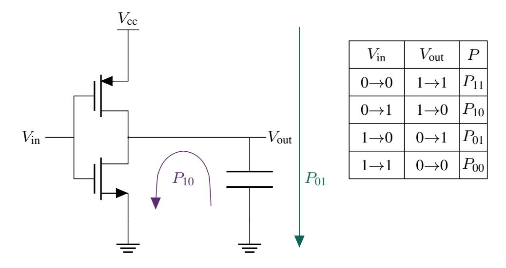

Figure 1. Example of a CMOS inverter circuit [3].

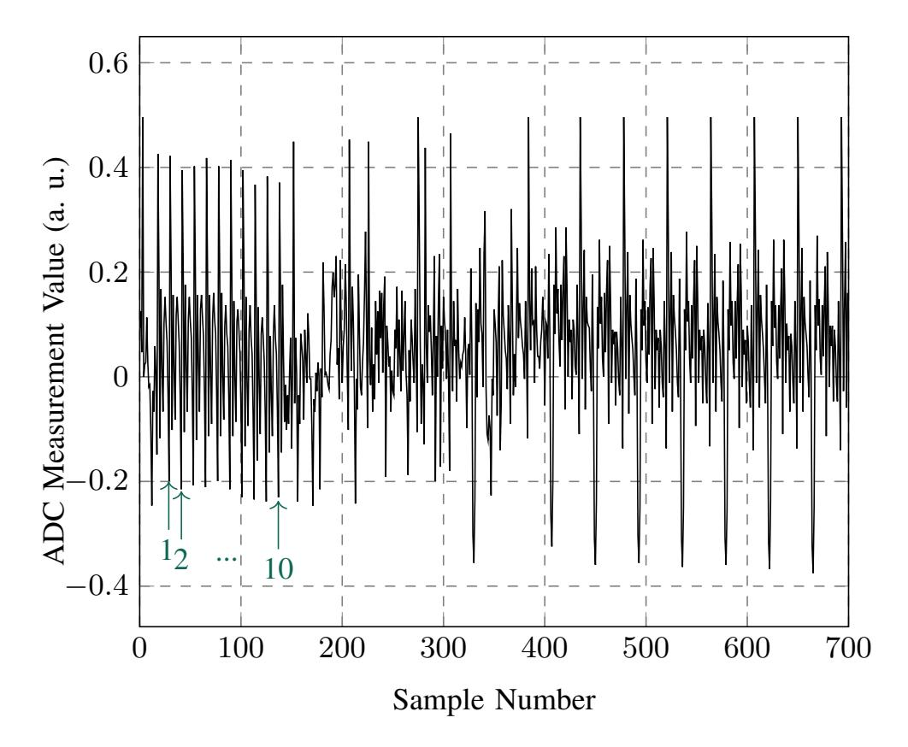

Figure 2. Power trace of an empty for-loop with 10 iterations followed by several iterations of an endless while-loop.

from the operations in a program can clearly be seen in power traces, an example is shown in Figure 2. Measurement values are reported in arbitrary unit (a. u.), as the CWN capture section does not report any unit for the measured power. The main components of the program from which this trace was taken were an empty for-loop with 10 iterations and an endless while-loop after it. The iterations of the for-loop at the beginning of the program are clearly visible and can even be counted, as shown by the green arrows. The right half of the image clearly shows the rhythmic spikes from the iterations of the while-loop.

As mentioned in the introduction, there are three main types of power analysis attacks — SPA, DPA, and CPA. An SPA attack is carried out by "directly interpreting power consumption measurements collected during cryptographic operations" [6]. A single power trace can reveal information about timing, device attributes, algorithm structure, or other properties of computation [7].

DPA and CPA attacks can be used to extract cryptographic keys. Beside the large power differences that are exploited in an SPA attack, there are effects correlated to the data values that are being manipulated. These are frequently overshadowed by measurement errors and other noise. However, it is still possible to extract the key or other sensitive information using statistical processing methods [6]. The DPA and CPA attacks both take advantage of these correlations but the methods that are used for statistical processing are different.

There is an additional subcategory of power analysis attacks called template attacks. They are categorized as a subcategory of DPA attacks by Kocher in [7] and a more advanced type of SPA attack by Tehranipoor in [3]. The attacker needs an exemplar of the target device to carry out the attack. A profile of the target device is created. This enables the attacker to extract the victim's secret key with only a few traces or even a single trace. The pre-processing margin for this type of attack is very large and may require tens of thousands of power traces [8].

The attacks are suited for different purposes. SPA can be used to deduce general information about an algorithm. It could, e.g., be used to surmise implementation details about a primitive in a cryptographic library that is not open-source. The DPA, CPA, and template attacks are used to retrieve sensitive information including cryptographic keys from the device. The template attack only needs very few or only a single trace, but attackers need an instance of the device they are attacking and an abundance of pre-processing is required. DPA and CPA attacks can be used to extract cryptographic keys from devices when there is an opportunity to gain many power traces during the attack.

## III. THE CHIPWHISPERER NANO

The CWN board is shown in Figure 3. It consists of a section that contains the target, shown in the red rectangle and a compartment that carries out the measurement for the traces, shown in the blue rectangle. The target is a STM32F030F4P6 microcontroller unit (MCU) referred to as MCUtar and pointed to by the magenta arrow. The red arrow in the target section is pointing to a shunt resistor which is needed to measure the current going into the target. The blue arrow is pointing to an operational amplifier which is part of an inverting amplifier circuit for the voltage measurement from the shunt resistor. The green arrow is pointing to an 8-bit analog to digital converter (ADC) [9]. The output of the operational amplifier is the input of the ADC. The orange arrow in the measurement section is pointing to another MCU referred to as MCUmeas. The processed values from the ADC are input to MCUmeas which is used as the USB interface and for sample memory storage [10]. The white arrow is pointing to a positive edge triggered flipflop. This is needed so that the user can configure the number of samples needed for a trace. The ADC starts sampling in the first clock cycle after the rising edge of the flip-flop output.

MCUmeas is supplied with a clock signal from a 12 MHz crystal oscillator. The teal arrow is pointing to a low fanout buffer which can be used to replicate a clock signal to supply other components with it. The fanout buffer has an internal 2-to-1 multiplexer. The inputs of the multiplexer are two potential clock signals. The clock signal to be used can be selected via the selection input of the multiplexer. The 12 MHz crystal oscillator clock is at one of the inputs, and the other input can potentially be used for an external clock signal. The fanout buffer can replicate the clock signal up to eight times, but only three of the outputs are used in this circuit. One of the outputs goes to MCUtar, the other goes to the ADC, and the third goes to a pin that is configured as the clock input for USART communication in MCUmeas. All the measurements 

{2}------------------------------------------------

taken in this paper were carried out with the 12 MHz MCUmeas clock. Considering the ADC and MCUtar have the same clock cycle, only one sample per clock cycle is needed.

The CWN uses a technique called synchronous sampling that only requires very few samples. The operations in a target device, during which the power is examined, occur relative to a clock cycle. When using a sample clock perfectly locked to the device clock, the alignment of time between the operations and sampling is perfect. This allows the necessary information to be gathered with less samples. When the clock cycles are not locked they are asynchronous. Asynchronous sampling requires more samples to be taken because there is a changing delay between the device clock and the next sample point [11]. When a power analysis attack is carried out with an oscilloscope, asynchronous sampling is used; the oscilloscope has an internal time-base, which defines when samples of the power trace are taken. The CWN was intentionally designed for the measurement ADC and the target device to share a clock signal. Some devices have a clock signal readily available and an attacker can easily tap into it to carry out the attack. If this is not the case, there are algorithms with which the clock cycle can be reconstructed as described by O'Flynn in [11].

Glitching is another type of SCA that involves disrupting the supply power to the target device. An example of a disruption could be the removal of power for a very short period of time. Among other purposes, this can be used to skip instructions, e.g., to bypass authentication or the initialization of security features [12]. The violet arrow in Figure 3 is pointing to a transistor that is part of a circuit that can be used for crowbar glitching with approximately 10 ns resolution on width and offset. Crowbar glitching "aggresively shorts the power supply to the device to generate faults" [13]. This causes a ringing that propagates into the on-chip power distribution [13]. This paper will not focus on glitching attacks and they will not be elaborated further. However, it is important to mention that these attacks can be carried out with the CWN to show its full potential and to emphasize how powerful it is at such a low price. The CWN can be acquired at the official European distributor Mouser for just under ¤ 50 [14].

Finally, it is important to mention that the CWN can also be connected to other external targets. This can be done by removing the target section of the CWN along the perforated line which is pointed to by the yellow arrow. Alternatively, another target can be attacked without damaging the CWN by carrying out certain configurations [15].

## IV. ADVANCED ENCRYPTION STANDARD

Rijndael is a symmetric block cipher developed by Vincent Rijmen and Joan Daemen. It was chosen as the successor of the Data Encryption Standard (DES) and named AES by the National Institute of Standards and Technology (NIST). AES is a subset of the Rijndael block cipher [16]. NIST selected three members of the Rijndael family each having a 128 bit block size but with an optional 128-bit, 192-bit, or 256 bit key size. AES-128 has a 128-bit key length. The steps involved in AES are shown in the flow chart in the left half of Figure 4. Internally, the AES operations are carried out on a two dimensional array of bytes called the state. The input to the algorithm is the plaintext, arranged into the 4x4 state matrix. The 128-bit key can also be arranged into a 4x4 matrix of bytes.

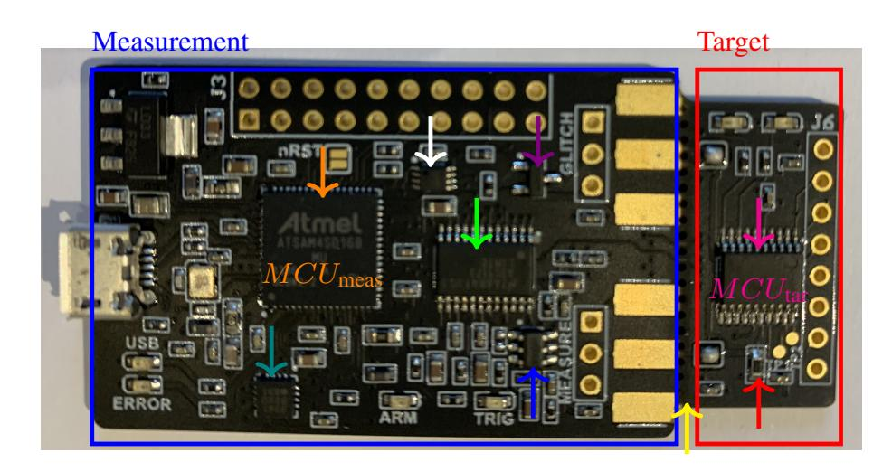

Figure 3. ChipWhisperer Nano board, adapted from [15].

Four different types of steps are involved in AES. During the AddRoundKey step the elements of the state matrix are combined with the elements of the round key using bitwise XOR. The round key is derived from the key using Rijndael key scheduling algorithm and is different for each round. The very first round key is simply the key. There are 9, 11, and 13 rounds corresponding to the 128-bit, 192-bit, and 256-bit key sizes respectively, adding up to 10, 12, or 14 rounds when adding the final round. During the SubBytes operation, the multiplicative inverse of a byte is calculated in the Galois Field GF(28 ). A byte that has the value 0 is simply mapped to 0. This step is followed by an affine transformation [17]. Computation time can be saved in the SubBytes step by precomputing all 256 possible values of the byte to create a substitution box (SBOX) and looking up the values each time they are needed. During the ShiftRows step, each row is shifted cyclically to the left by a specified offset as shown in Figure 5. The offsets are 0, 1, 2, and 3 for rows 0, 1, 2, and 3 respectively. The rows are shifted so that each column is composed of bytes of each row. MixColumns is a transformation that operates on each column of the state matrix. Equation (1) shows that the columns are considered polynomials over GF(8) and multiplied modulo x 4+1 with a polynomial [17]. Equation (2) shows that this can be rewritten as a matrix multiplication [17].

$$d(x) = k(x) \cdot c(x) \pmod{x^4 + 1}$$

$$k(x) = 3 \cdot x^3 + 1 \cdot x^2 + 1 \cdot x + 2$$
(1)

$$\begin{bmatrix} d_{0,0} \\ d_{1,0} \\ d_{2,0} \\ d_{3,0} \end{bmatrix} = \begin{bmatrix} 2 & 3 & 1 & 1 \\ 1 & 2 & 3 & 1 \\ 1 & 1 & 2 & 3 \\ 3 & 1 & 1 & 2 \end{bmatrix} \cdot \begin{bmatrix} c_{0,0} \\ c_{1,0} \\ c_{2,0} \\ c_{3,0} \end{bmatrix}$$
(2)

There are different modes of AES to combine blocks of data when the it is longer than 128 bits. The most wellknown modes of operation include the electronic codebook mode (ECB) and counter mode (CTR). In the ECB mode the plaintext is divided into blocks which are encrypted separately. The resulting ciphertexts are simply concatenated. This mode of operation does not hide patterns very well. In the CTR mode a nonce is generated that is incremented by one with the encryption of every block. The nonce is encrypted with AES and the XOR operator is used to combine the encrypted number with the block. All attacks that are described in this

{3}------------------------------------------------

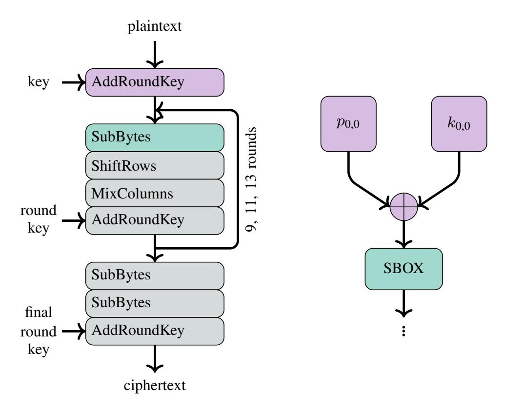

Figure 4. Flow chart of encryption in the AES algorithm, with emphasis on the steps needed for the DPA attack.

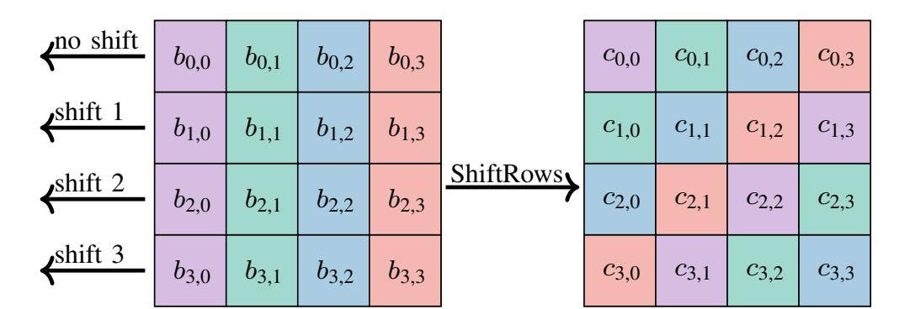

Figure 5. ShiftRows step in AES encryption.

paper will be carried out with plaintexts that are precisely 16 bytes long, so no mode of operation is necessary.

Varying implementations can be used to optimize the use of the resources of different architectures. During the design of AES, Rijmen and Daemen considered the performance of the primitive on an 8-bit processor, on which AES encryption can simply be programmed by implementing the different steps as described above. The different steps of the round transformation can be combined into lookup tables called Ttables. Equation (3) shows the combination of the individual steps into one equation. In the equation b is the output of the step SubBytes, c is the output of the step ShiftRows and d is the output of the step MixColumns. The variables i and j refer to the index of the rows and columns respectively. A table can be generated for each of the resulting parts of the equation T0 to T3 by precomputing the values for all possible input values 0 to 255. In total there will then be four T-tables that together occupy a total of 4 kB. The implementation is then reduced to 16 table lookups and 16 XOR operations. 12 XOR operations are needed to combine the lookup values, and 4 XOR operations are needed for the AddRoundKey step. This allows the full use of the resources offered by a 32-bit architecture and accelerates the computation [17].

$$b_{i,j} = SBOX[a_{i,j}]$$

$$\begin{bmatrix} c_{0,j} \\ c_{1,j} \\ c_{2,j} \\ c_{3,j} \end{bmatrix} = \begin{bmatrix} b_{0,j+0} \\ b_{1,j+1} \\ b_{2,j+2} \\ b_{3,j+3} \end{bmatrix}$$

$$\begin{bmatrix} d_{0,j} \\ d_{1,j} \\ d_{2,j} \\ d_{3,j} \end{bmatrix} = \begin{bmatrix} 2 & 3 & 1 & 1 \\ 1 & 2 & 3 & 1 \\ 1 & 1 & 2 & 3 \\ 3 & 1 & 1 & 2 \end{bmatrix} \cdot \begin{bmatrix} c_{0,j} \\ c_{1,j} \\ c_{2,j} \\ c_{3,j} \end{bmatrix}$$

$$T_0 = \begin{bmatrix} 2 \\ 1 \\ 1 \\ 3 \end{bmatrix} \cdot SBOX[a_{0,j+0}]$$

$$T_1 = \begin{bmatrix} 3 \\ 2 \\ 1 \\ 1 \end{bmatrix} \cdot SBOX[a_{1,j+1}]$$

$$T_2 = \begin{bmatrix} 1 \\ 3 \\ 2 \\ 1 \end{bmatrix} \cdot SBOX[a_{2,j+2}]$$

$$T_3 = \begin{bmatrix} 1 \\ 1 \\ 3 \\ 2 \end{bmatrix} \cdot SBOX[a_{3,j+3}]$$

$$\begin{bmatrix} d_{0,j} \\ d_{1,j} \\ d_{2,j} \\ d_{3,j} \end{bmatrix} = T_0 + T_1 + T_2 + T_3$$

$$\begin{bmatrix} d_{0,j} \\ d_{1,j} \\ d_{2,j} \\ d_{3,j} \end{bmatrix} = T_0 + T_1 + T_2 + T_3$$

# V. DPA ATTACKS ON AES 128

A tutorial for a DPA attack on an 8-bit implementation of AES is provided by NewAE technology [18]. The 8-bit implementation of AES that is used for the tutorial is called TinyAES [19].

A DPA attack requires an element of a cryptographic primitive to correlate with the power consumption. Attackers must be able to make a hypothesis about the sensitive information they want to extract, e.g., the secret key, based on that element. The element of AES that correlates to the power consumption is the Hamming weight of the output of the SBOX operation after the very first SubBytes step. The first two steps that are interesting for this are emphasized in lilac and green in Figure 4. In these steps, the individual bytes of the plaintext are combined with the bytes of the key using an XOR operation. The input is our plaintext, which is known, and the key is the sensitive information that is to be extracted.

The correlation of the Hamming weight of the SBOX output and the power consumption can be shown. The correlation will be present at the sample points at which operations are taking place for the specific bytes that are being processed. A group of k traces with n samples is collected by encrypting random plaintexts. The plaintexts and the key are both known during this investigation. The Hamming weight of the output of the SubBytes step is computed for each trace using the plaintext that was encrypted when generating the trace. Each trace is sorted into one of nine groups based on the resulting Hamming weight of the SBOX operation. The average of the samples between the traces within each group can be

{4}------------------------------------------------

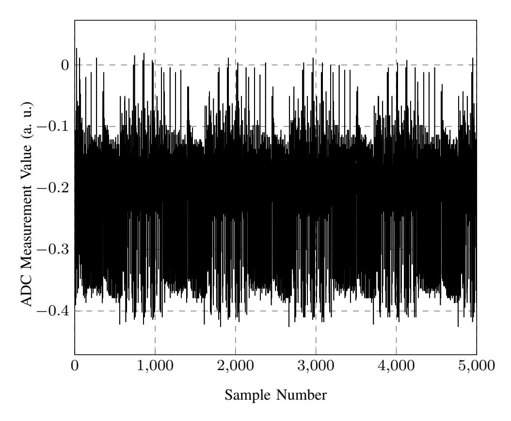

Figure 6. Example of a power trace of an encryption carried out with TinyAES.

calculated. Let b be the number of traces in one group and  $s_{i,j}$  be a sample where i is the trace number in a group  $i \in \{0,1,...,b-1\}$  and j is the sample number within a trace  $j \in \{0,1,...,n-1\}$ . In each group, the average trace  $A = \{a_0,...,a_{n-1}\}$  is calculated where each element can be calculated using Equation (4). Pearson's correlation coefficient is used to evaluate the linearity between the Hamming weight and the average power traces of each Hamming weight group. The correlation coefficient with the highest absolute value is the sample point which has the best linear relationship between the Hamming weight and the power consumption.

$$a_j = \frac{1}{b} \sum_{i=0}^{b-1} s_{i,j} \tag{4}$$

The investigation to find the correlation between the Hamming weight and power consumption was carried out with the CWN using 1,000 traces with 5,000 samples each. An example of a trace is shown in Figure 6. The best correlation was found at sample 373 with a near perfect positive correlation of 0.9976. Figure 7 shows all of the traces plotted between samples 350 and 400 in different shades of gray that correspond to different Hamming weights. The traces with the lowest Hamming weight of zero are shown in the darkest shade of gray and the shades become lighter as the Hamming weight increases. Figure 8 shows point 373 more closely. The correlation is clearly shown as the colors start at their lightest shades of gray at the top and get darker as the power decreases. Figure 9 shows a clear linear relationship between the mean of the samples at point 373 in each Hamming weight group and the Hamming weights [20].

The ingredients of this DPA attack will be the plaintexts and the power traces and the goal is to extract the key. A scenario in which the key and the varying plaintexts are known will be described first to show how the correct key can be identified during the attack. Random plaintexts are generated. If the first bit in byte 0 of the plaintext is 1, then the byte will be set to 0xFF and it will otherwise be set to 0x00. These plaintexts are encrypted and traces are recorded. The traces are

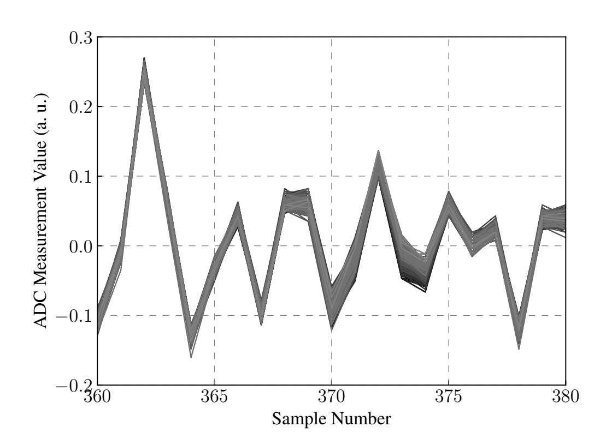

Figure 7. Power traces of TinyAES encryptions colored shades of black by their Hamming weight .

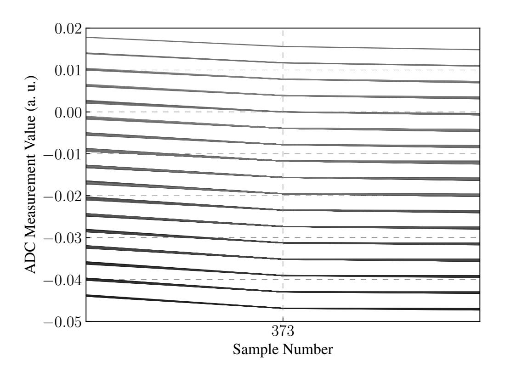

Figure 8. Power traces of TinyAES encryptions colored shades of black by their Hamming weight.

then sorted into two groups based on the value of byte 0 of the plaintext. The Hamming weight of the output of byte 0 of the SBOX operation will be different for the two groups but the same within each group. The mean of the individual points is calculated between the traces, in the same way as it was carried out to find the point of best correlation. This generates two average traces, one trace for each group. The individual sample points in the two average traces are subtracted from each other. There will be spikes where the Hamming weight correlates with byte 0. This experiment was carried out with the CWN and the resulting diagram is shown in Figure 10. The large spike is likely to be the very first SubBytes step in the AES algorithm as highlighted in Figure 4 for byte 0. The smaller spikes are other steps in the AES algorithm where

{5}------------------------------------------------

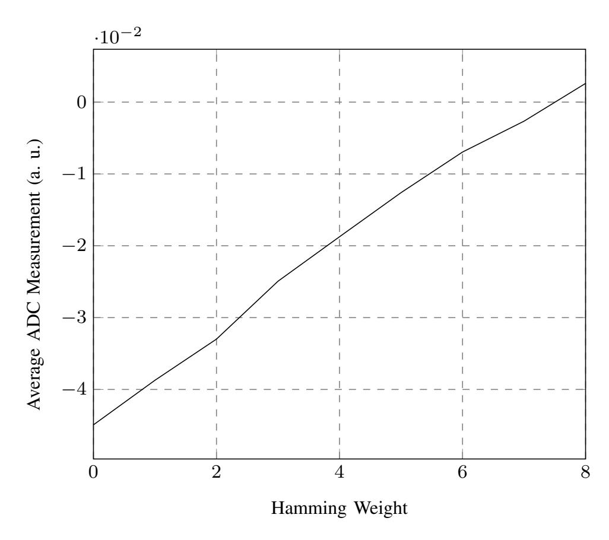

Figure 9. Hamming weight vs. average ADC measurement at point 373 of 1,000 power traces of encryptions with TinyAES.

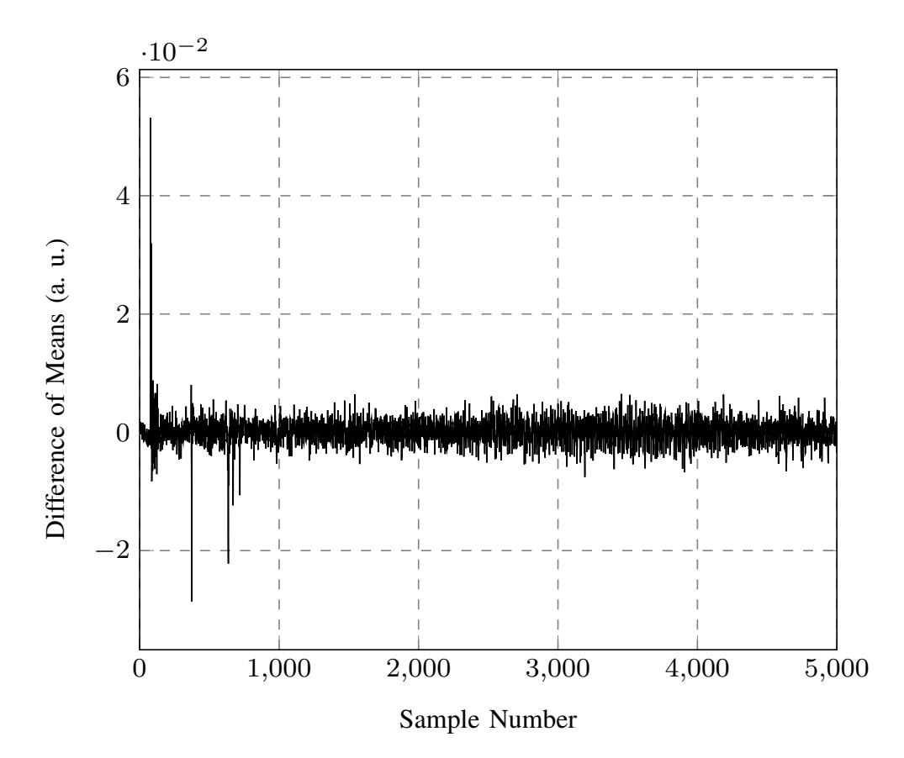

Figure 10. Difference of means of two average traces that were calculated from two groups of traces with different Hamming weights of byte 0.

the Hamming weight and the power consumption of byte 0 correlate such as later times the AddRoundKey and SubBytes steps are carried out on byte 0 [21].

The two groups do not need to be formed by the Hamming weight of a whole byte. A single bit of the SBOX output is sufficient for the sorting process. This can be understood best by considering the Hamming weights of all 4-bit numbers as shown in Table I. The numbers can be sorted into groups based on the value of a single bit, the most significant bit (MSB) is used in the table. Any bit can be used. If a bitwise rotation of each of the numbers is performed by the index of the bit that is to be used and the numbers are reordered, this would result in the original sequence. Therefore, the same groups would be formed. The table shows that the average Hamming weight for group 0 is lower than group 1. This principle can be scaled to the 8-bit numbers that result from the SBOX operation resulting from the step SubBytes. Considering the linear correlation between the power consumption and the Hamming weight, this means the average power consumption of the traces in group 0 is lower than group 1 if there is a positive correlation at a sample point. If there is a negative correlation, there is still a difference. However, the power of group 0 would be higher than group 1.

| number10 | number2 | Hamming weight | group           |
|----------|---------|-------------------|-----------------|
| 0        | 0000    | 0                 | 0               |
| 1        | 0001    | 1                 |                 |
| 2        | 0010    | 1                 |                 |
| 3        | 0011    | 2                 | average Hamming |
| 4        | 0100    | 1                 | weight = 1.5    |
| 5        | 0101    | 2                 |                 |
| 6        | 0110    | 2                 |                 |
| 7        | 0111    | 3                 |                 |
| 8        | 1000    | 1                 | 1               |
| 9        | 1001    | 2                 |                 |
| 10       | 1010    | 2                 |                 |
| 11       | 1011    | 3                 | average Hamming |
| 12       | 1100    | 2                 | weight = 2.5    |
| 13       | 1101    | 3                 |                 |
| 14       | 1110    | 3                 |                 |
| 15       | 1111    | 4                 |                 |

TABLE I. Explanation of differences in average Hamming weights when 4-bit values are sorted into two groups by the MSB.

The characteristic described above can be used to verify whether a hypothesized key byte is correct. A key can be guessed and combined with the known plaintext using the XOR operation and looking up the SBOX value as shown in green and lilac in Figure 4. The traces will then be sorted into two groups based on one chosen bit of the SBOX output, e.g., the MSB. If a key byte is guessed incorrectly, the traces will be categorized into the incorrect groups and the average power consumption will approximately be the same for both groups. Therefore, there will be no large differences when subtracting them. For each of the 16 bytes of the key there are 256 possible values. One key byte will be attacked at a time. All 256 possible values will be guessed for each key byte. The maximum value of each of the 256 differences will be recorded. The largest maximum difference value is the most probable value of the key byte. These steps are carried out for all bytes to evaluate the entire key. The attack was carried out successfully on the CWN for the TinyAES implementation using 2,500 traces with 5,000 samples each. Figure 11 shows the differences of the averages for the first three correct byte guesses of the key [22]. The method of subtracting the averages to verify a key guess is known as the difference of means method.

The tutorial was extended by a function to evaluate how many traces are necessary to carry out the attack successfully. 2,500 power traces were collected for the attack on TinyAES on the CWN. The attack was then carried out multiple times, starting with only 100 traces and increasing the number of traces in intervals of 100. The guessed key was saved for every attack. After all the attacks were carried out, the keys were compared to the correct key to see how many bytes were guessed correctly. The green line in Figure 12 shows the number of correct key bytes as a function of traces used

{6}------------------------------------------------

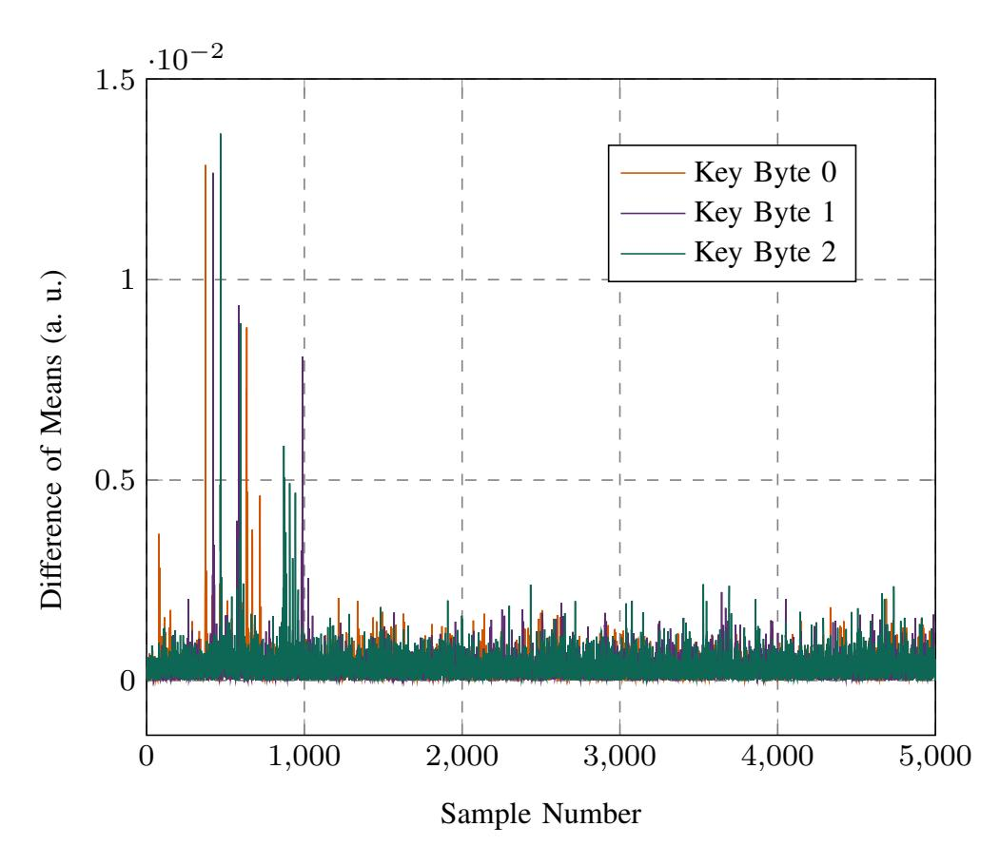

Figure 11. Difference of means for correct key bytes from the DPA attack on TinyAES.

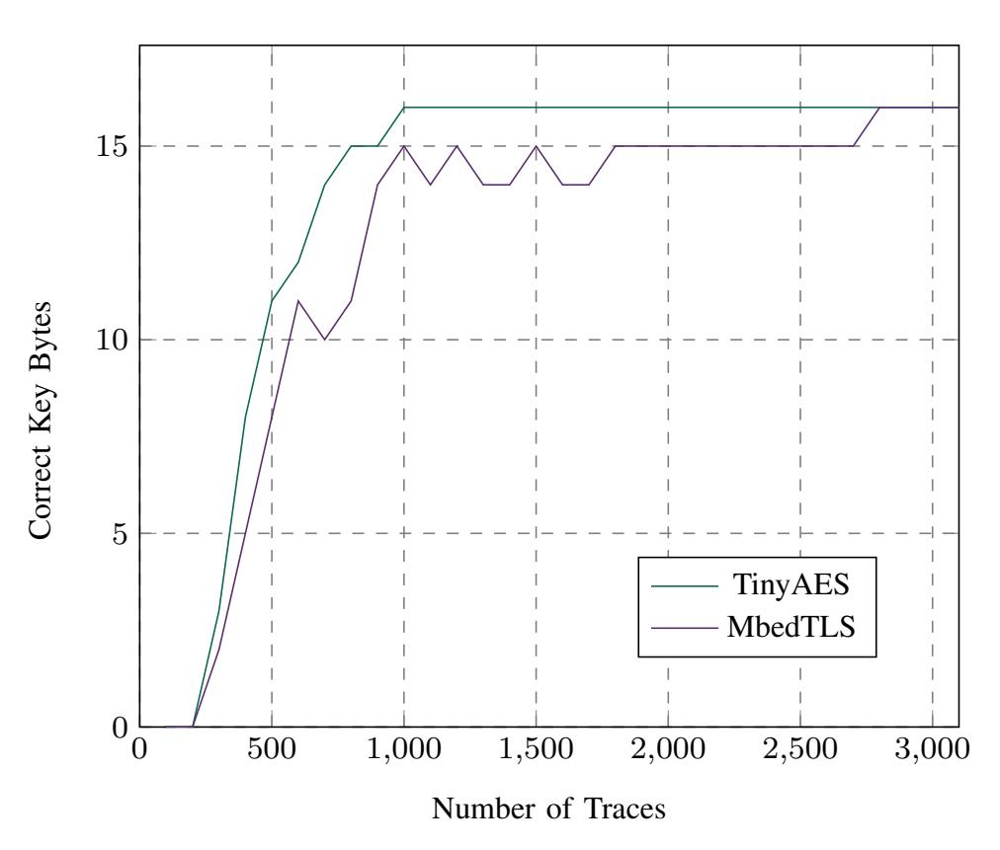

Figure 12. Number of traces vs. correctly guessed key bytes.

during the attacks for TinyAES. The diagram shows that all of the 16 bytes in the key were guessed correctly using 1,000 traces. Therefore, the CWN only needs approximately 1,000 traces for the attack.

In addition to the tutorial, a 32-bit implementation was also attacked. The AES implementation that is part of the MbedTLS library of cryptographic primitives was used for the 32-bit implementation. MbedTLS is a cryptographic library frequently used for embedded applications [23].

As described in Section IV, the resources are used more efficiently using T-tables resulting in an acceleration of the algorithm in comparison to the 8-bit implementation. This is reflected in the trace of an AES Encryption, shown in Figure 13. The trace shows 5,000 samples. However, it is clearly visible that the encryption is finished after only about 2,000 samples and then it runs into a while-loop and stays

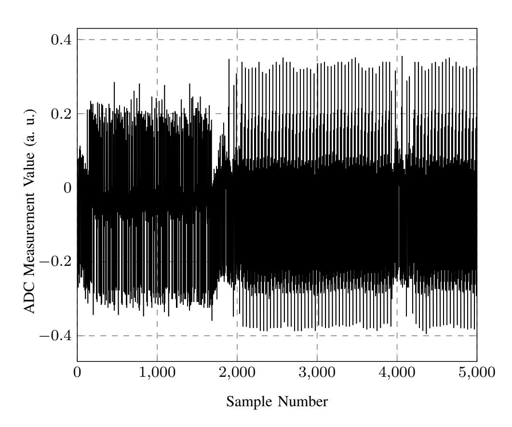

Figure 13. Example of a trace of an AES encryption using MbedTLS.

there waiting for the next plaintext. Therefore, all of the traces needed to understand the behavior of the power consumption of the implementation and carry out the attack were generated using only 2,000 samples.

The first step in analyzing the 32-bit implementation of AES was to check the correlation because this shows if the attack is even possible. The same number of traces was used for the evaluation of the correlation for TinyAES and AES in MbedTLS to achieve results that can be compared. As explained above only 2,000 samples per trace were used for the evaluation of AES from MbedTLS. The power consumption correlated with the Hamming weight best at point 180 with a correlation coefficient of -0.9748. The absolute value of this correlation coefficient is lower than that of TinyAES. In contrast to the attack on TinyAES, the correlation is negative. However, this does not affect the attack because the groups of traces will still have different average power consumption. At that sample point, the group with the lower average Hamming weight will have the higher average power consumption. Figure 14 depicts all of the traces sorted into groups and plotted into the same plot using a different shade of gray for each Hamming weight. The darkest and lightest shades of gray represent the lowest and highest Hamming weights respectively. The colors become lighter as the power decreases, showing a negative correlation. This has no impact on the attack. The change in colors is clearly visible. However, the differences between the darker colors and the lighter colors are not as distinct as in Figure 8. Figure 15 shows the means of the power consumption at point 180 of the power trace as a function of Hamming weight. It is clear that the line is not as linear as the line in Figure 9.

The attack was carried out successfully on the 32-bit implementation of AES, but more traces were needed than for the attack on TinyAES. The number of traces was increased to 5,000 traces after the attack was not completely successful with only 2,500 traces. The violet line in Figure 12 shows that more traces were needed to attack MbedTLS than TinyAES. The diagram shows that 2,800 traces were required before all of the key bytes were guessed correctly. It can also be

{7}------------------------------------------------

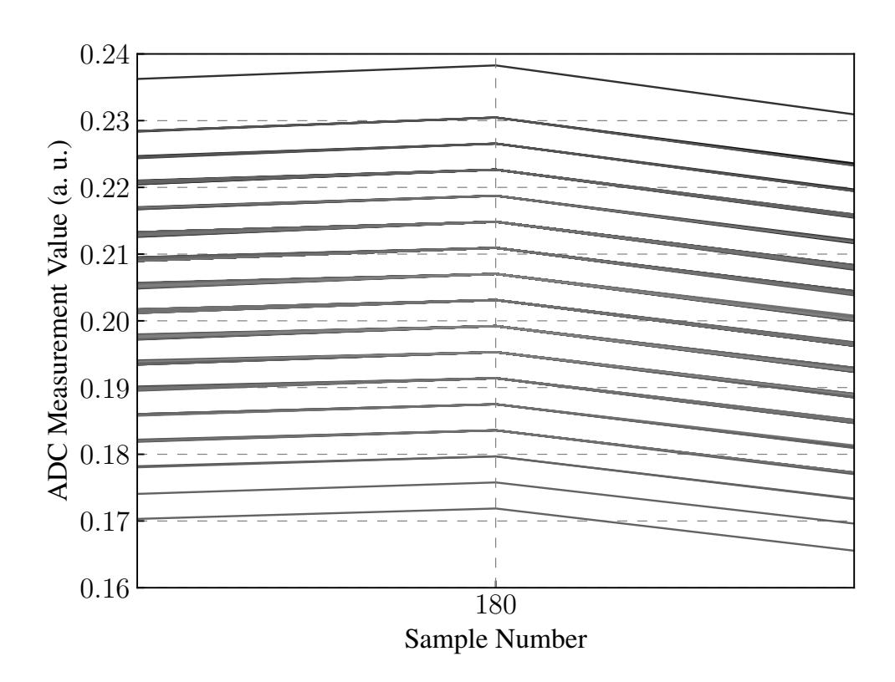

Figure 14. Power traces of MbedTLS AES encryptions colored in shades of black by their Hamming weight.

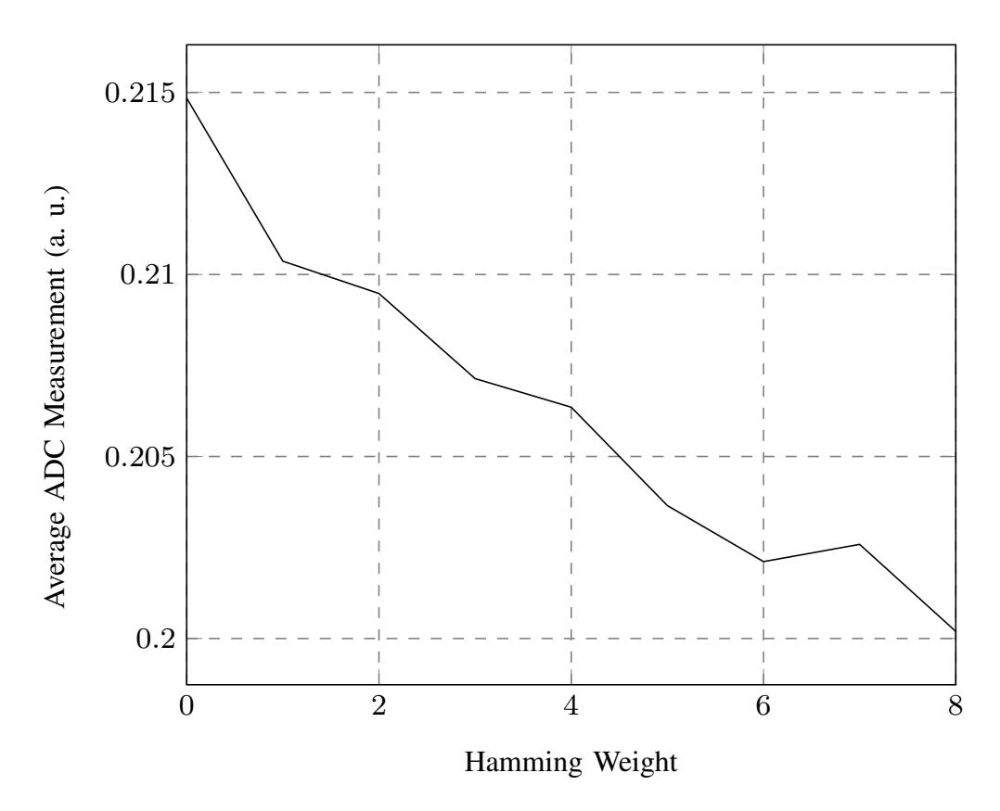

Figure 15. Hamming weight vs. average ADC measurement at sample point 180 of power traces of encryptions with MbedTLS AES.

observed that the number of guessed key bytes sometimes decreased after a greater number of bytes were guessed in the previous interval with less traces. The number of correctly guessed key bytes decreased from 11 when using 600 traces to 10 when using 700 traces. This behavior and the increased number of traces that were needed can be attributed to the poor correlation compared to TinyAES. Considering the poor correlation, the average power between the groups is not as distinct as a perfect correlation. Therefore, different power traces make different contributions to the average that causes disruption. The inferior correlation in comparison to TinyAES comes from the difference in the implementation. The bytes are not processed individually but instead are looked up in the T-tables along with other values.

#### VI. CONCLUSION AND FURTHER WORK

Hardware security is an increasing concern. The security of cryptographic primitives is limited by the hardware on which they are carried out. It is essential to identify hardware vulnerabilities and mitigate these accordingly to prevent an attacker from exploiting them. SCA attacks exploit physical information that leaks from hardware to gain information about cryptographic operations that are taking place inside of a device. The power consumption of the device is one source of information leakage. DPA attacks can be used to extract sensitive information, e.g., secret cryptographic keys. As shown in this paper, these can be carried out and studied at low cost using the CWN. DPA attacks can be carried out on both 8-bit and 32-bit implementations, but an attack on the latter requires more traces due to poor correlation.

There are many more attacks that can be studied. The investigation carried out in this paper on AES implementations can be extended by attempting the attack on more cryptographic libraries for example wolfSSL [24]. An attack on a cryptographic library that is not open source such as X-CUBE-CRYPTOLIB by STM would be even more interesting considering the information about the implementation is not provided to the public [25]. Information about the implementation could be gained by comparing the traces of the non-public implementation to that of an open-source library.

SHA-256 HMACs are widely used, e.g., for authentication purposes in cryptographic protocols. A DPA attack on SHA-256 HMACs is introduced by Belaïd et al. [26]. The cryptographic secret is extracted by using several partial DPA attacks and subsequentially gathering the information needed to extract the whole secret. It would be interesting to see how far this attack can be implemented and carried out on the CWN.

#### REFERENCES

- [1] "BIOS Security The Next Frontier for Endpoint Protection," 2019, URL: https://www.dellemc.com/ja-jp/collaterals/unauth/analyst-reports/solutions/dell-bios-security-the-next-frontier-for-endpoint-protection. pdf [accessed: 2020-07-27].
- [2] M. Jakubowski, P. Falcarin, C. Collberg, and M. Atallah, "Software protection," *IEEE Software*, vol. 28, pp. 24–27, 03 2011.
- [3] M. Tehranipoor and S. Bhunia, *Hardware Security A Hands-On Learning Approach*. Elsevier, 2019.
- [4] "About," newAE Website URL: https://www.newae.com/about [accessed: 2020-06-16].
- [5] "Cw1101: Chipwhisperer-nano product datasheet," URL: https://media. newae.com/datasheets/NAE-CW1101\_datasheet.pdf [accessed: 2020-06-16].
- [6] P. Kocher, J. Jaffe, and B. Jun, "Differential power analysis," in *Advances in Cryptology CRYPTO'* 99, ser. Lecture Notes in Computer Science. Springer, August 1999, pp. 388–397.
- [7] P. Kocher, J. Jaffe, B. Jun, and P. Rohatgi, "Introduction to differential power analysis," *J. Cryptographic Engineering*, vol. 1, pp. 5–27, 04 2011.
- [8] "Template attacks," URL: https://wiki.newae.com/Template\_Attacks [accessed: 2020-06-20].
- [9] "Adc1173 8-bit, 3-volt, 15msps, 33mw a/d converter," URL: https://www.ti.com/lit/ds/symlink/adc1173.pdf [accessed: 2020-06-20].
- [10] "Nae-cw1101-04\_cwnanosch," URL: https://github.com/newaetech/chipwhisperer/blob/master/hardware/capture/chipwhisperer-nano/NAE-CW1101-04\\_CWNANOSCH.pdf [accessed: 2020-06-20].
- [11] C. O'Flynn and Z. Chen, "Synchronous sampling and clock recovery of internal oscillators for side channel analysis and fault injection," *Journal of Cryptographic Engineering*, vol. 5, pp. 53–69, 2014.

{8}------------------------------------------------

- [12] T. Roth, "Trustzone-m(eh): Breaking armv8-m's security," December 2019, URL: https://media.ccc.de/v/36c3-10859-trustzone-m eh breaking armv8-m s security#t=0 [accessed: 2020-06-20].
- [13] C. O'Flynn, "Fault injection using crowbars on embedded systems," *IACR Cryptol. ePrint Arch.*, vol. 2016, p. 810, 2016.
- [14] "Nae-cwnano," URL: https://www.mouser.de/ProductDetail/NewAE/ NAE-CWNANO?qs=PzGy0jfpSMvY70QksxQLsA%3D%3D [accessed: 2020-07-03].
- [15] "Cw1101 chipwhisperer-nano," URL: https://wiki.newae.com/ CW1101 ChipWhisperer-Nano [accessed: 2020-06-16].
- [16] "Advanced encryption standard (aes)," November 2001, URL: https:// nvlpubs.nist.gov/nistpubs/FIPS/NIST.FIPS.197.pdf [accessed: 2020-06- 20].
- [17] J. Daemen and V. Rijmen, *The Design of Rijndael*, 2nd ed. Springer-Verlag Berlin Heidelberg, 2020.
- [18] "Differential power analysis," documentation of the DPA Attack Tutorials URL: https://chipwhisperer.readthedocs.io/en/latest/tutorials.html# differential-power-analysis [accessed: 2020-06-20].
- [19] "Tiny aes in c," URL: https://github.com/kokke/tiny-AES-c [accessed: 2020-06-20].

- [20] "Introduction to dpa & hw assumption," URL: https://chipwhisperer. readthedocs.io/en/latest/tutorials/pa dpa 1-openadc-cwlitearm.html# tutorial-pa-dpa-1-openadc-cwlitearm [accessed: 2020-06-20].
- [21] "Large hw swings," URL: https://chipwhisperer.readthedocs. io/en/latest/tutorials/pa dpa 2-cwnano-cwnano.html# tutorial-pa-dpa-2-cwnano-cwnano [accessed: 2020-06-20].
- [22] "Advanced encryption standard differential power analysis attack," URL: https://chipwhisperer.readthedocs.io/en/latest/tutorials/pa dpa 3-cwnano-cwnano.html#tutorial-pa-dpa-3-cwnano-cwnano [accessed: 2020-06-20].
- [23] "Mbed os reference book," URL: https://os.mbed.com/docs/mbed-os/ v5.15/reference/index.html [accessed: 2020-07-03].
- [24] "wolfssl," URL: https://www.wolfssl.com/ [accessed: 2020-07-03].
- [25] "Stm32 cryptographic firmware library software expansion for stm32cube," URL: https://www.st.com/en/embedded-software/ x-cube-cryptolib.html [accessed: 2020-07-03].
- [26] S. Bela¨ıd, L. Bettale, E. Dottax, L. Genelle, and F. Rondepierre, "Differential power analysis of hmac sha-2 in the hamming weight model," in *International Conference on E-Business and Telecommunications*, 07 2013.