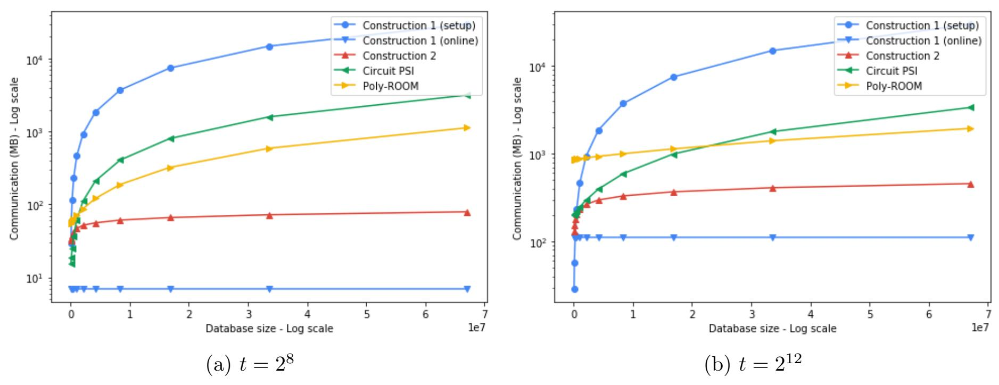
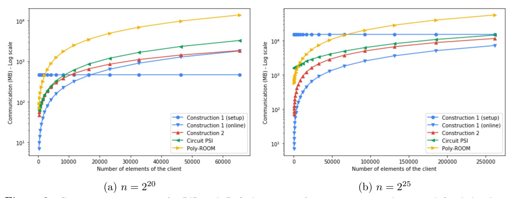

{0}------------------------------------------------

# Private Join and Compute from PIR with Default

Tancr`ede Lepoint\* Sarvar Patel Mariana Raykova Karn Seth Ni Trieu October 2, 2021

#### Abstract

The private join and compute (PJC) functionality enables secure computation over data distributed across different databases, and is applicable to a wide range of applications, many of which address settings where the input databases are of significantly different sizes.

We introduce the notion of private information retrieval (PIR) with default, which enables two-party PJC functionalities in a way that hides the size of the intersection of the two databases and incurs sublinear communication cost in the size of the bigger database. We provide two constructions for this functionality, one of which requires offline linear communication, which can be amortized across queries, and one that provides sublinear cost for each query but relies on more computationally expensive tools. We construct inner-product PJC, which has applications to ads conversion measurement and contact tracing, relying on an extension of PIR with default. We evaluate the efficiency of our constructions, which can enable 2 <sup>8</sup> PIR with default lookups on a database of size 2 <sup>25</sup> (or inner-product PJC on databases with such sizes) with the communication of 44MB, which costs less than 0.17c. for the client and 26.48c. for the server.

# 1 Introduction

Private set intersection (PSI) enables two parties who have private input sets to identify items that they have in common without learning any other information. While PSI has proven its broad applicability, there are settings which require more refined functionality that does not reveal the whole intersection but rather enables restricted computation on the data in the intersection. We refer to this functionality as private join and compute (PJC) [\[Goo19\]](#page-25-0).

An important difference in the privacy requirements relevant for the PJC and the PSI settings, is that while the intersection size is inherently revealed by the PSI output, in the PJC case this is an additional privacy leakage, which should be avoided in many scenarios. The cost of the "compute" part in a private join and compute protocol is determined by the size of the intersection, which is often much smaller than the size of the input sets, thus the dominant efficiency cost is the cost of the step computing the intersection. Similarly to the PSI setting, when the two input datasets are of the same size, the intersection computation is necessarily linear in the input size. However, when we have asymmetric inputs where one of the datasets is much larger than the other, the efficiency goal is to avoid linear dependence on the size of the larger input set. This raises the question whether it is possible, in the private join and compute setting, to address both the privacy requirement of hiding the intersection size and at the same time provide sublinear efficiency.

The PSI-Sum solution of Ion et al. [\[IKN](#page-25-1)+20], which was deployed in practice, does not provide either of the above properties, and they will be highly beneficial for that setting. First, that

<sup>\*</sup> Independent researcher, tancrede.lepoint@gmail.com

Google LLC, {sarvar,marianar,karn}@google.com

Arizona State University, nitrieu@asu.edu

{1}------------------------------------------------

solution scales poorly for the party with the smaller input set, which also often has much more constrained resources, but needs to incur cost proportional to the larger set. Second, it inherently reveals the intersection size, which can be significant leakage especially when one of the inputs is small – their protocol mitigates the issue by allowing the party with the small input to learn the intersection size first and decide to abort if it is too small. Our construction addresses both of these issues. Additionally, we also allow revealing the intersection cardinality in a differentially private manner. Further, we extend the functionality that can be computed over the intersection, including allowing both parties to contribute associated values. While we mainly focus on a specific functionality (described below), we also discuss how to extend our work to generic functionalities.

We specifically consider the problem of private join and compute (Inner Product PJC) which allows computing an inner product between attribute values associated with the intersection IDs in each of the two input datasets. In this setting the two input sets are of the form (X, W) = {(x1, w1), . . . ,(x<sup>t</sup> , wt)} and (Y, V ) = {(y1, v1), . . . ,(yn, vn)} and the computation evaluated by the PJC functionality is defined as follows: f((X, W),(Y, V )) = P i∈[t],j∈[n],xi=y<sup>j</sup> wiv<sup>j</sup> .

## 1.1 Our Motivation

We motivate the above functionality with two practical applications. The first application involves privacy-preserving computation for the effectiveness of advertising campaigns, which is a generalization of the functionality supported by Ion et al. [\[IKN](#page-25-1)+20]. A transaction data provider (TDP) has a database of transaction values tdp db which contains (id, spending). Here, the customer "id" has seen an ad, and then makes a purchase with an amount "spending". The Ad tech company has a database at db which contains (id, type). Here, the customer "id" has seen an ad with a "type" supplied by the ad tech company. The "type" can be the time spent watching ads. Typically the number of ad impressions over a particular time period is orders of magnitude higher (millions) than the corresponding number of transactions on a fixed date (thousands), thus the sets are highly asymmetric. The TDP may want to partition based on user attributes such as new/returning customer, whether the customer is a loyalty card member, or some demographic information, and may want to learn an inner-product for each partition. The following query on the join of these two databases computes the sum of the transaction values of users who saw ads weighted according to the type (or weight) supplied by the ad tech company.

```
SELECT sum(tdp db.spending ∗ at db.type)
FROM at db INNER JOIN tdp db
ON at db.id = tdp db.id
```

This problem can be seen as an instance of inner product PJC, where set sizes are asymmetric, and hiding the exact intersection size may be especially important, since the computation may be repeated with overlapping partitions from the TDP.

The inner product PJC functionality could also be used to enhance the privacy guarantees of exposure notification protocols in the existing decentralized contact tracing solutions [\[AGC20,](#page-24-0) [CGH](#page-24-1)+20, [TSS](#page-27-0)+20, [DP320\]](#page-25-2). In such solutions, user devices broadcast BLE packets that contain pseudorandom values generated from a daily secret key. Users who test positive for COVID-19 can report their secret keys for the periods when they were infectious to a central server. Each key is accompanied with a transmission risk score based on the diagnosis and user symptoms. Anyone who downloads the server database can therefore check whether the random values that her app has received were derived from any of the reported secrets. However, this approach also allows learning information about the values transmitted in individual BLE packets. We can view the above problem as an instance of inner product PJC where the server database contains the reported 

{2}------------------------------------------------

pseudorandom values with their risk scores, and where the user has the pseudorandom values she has observed, and possibly with corresponding weights determined by the time elapsed since the exposure incident, the exposure duration, and other parameters. The goal is for the user to obtain the weighted sum of the transmission risks of the pseudorandom values matching all her exposures. We note that this application also has a natural input size asymmetry: the client set is much smaller than the server database.

## <span id="page-2-0"></span>1.2 Our Contributions

With these two applications in mind, we present two different instantiations of our approach, tailored for two distinct settings. We assume that the participants are semi-honest, they follow the protocol but attempt to obtain extra information from the execution transcript. Our first construction is in the setting allowing offline precomputation and initialization. In this setting, the server's database is fixed beforehand and can be computed on in an "offline" phase. The goal is to minimize the cost of (possibly repeated) client queries in the "online" phase when the client data becomes available. Our first construction in this setting incurs a setup time that is linear in the size of the server's (larger) dataset. The subsequent client queries are highly efficient, and have computation and communication time linear in the client's dataset and essentially independent of the size of the server dataset. This is similar to approaches taken by [\[KLS](#page-25-3)+17, [RA18\]](#page-26-0), which send an encoded server database to the client in the offline phase, allowing highly efficient "online" intersections. Our work can be seen as extending the functionality achieved by these previous works by enabling computation over the intersection but keeping the intersection itself hidden, while preserving the desirable efficiency properties for the online phase. This construction is well-suited to applications where many small PJC executions are run against a single large databases. For example, in the conversion-measurement setting, the client's dataset may arrive in small batches, or the client may want to make multiple overlapping queries based on different demographic slices. Previous works incur the costs proportional to the larger database each PJC query.

The second construction is in the fully online setting (without precomputation). In this case, we instantiate our construction using techniques derived from Private Information Retrieval (PIR). The resulting construction allows the client to incur costs that are asymptotically linear in the size of its own dataset, and logarithmic in the server's dataset size. In practice, this makes it so the bulk of the costs of executing the protocol are shifted from the client to the server. In this way, our work improves on [\[PSTY19\]](#page-26-1) by making the costs incurred by each party more equitable in the asymmetric input size setting, This is especially beneficial when the client is a constrained device like a mobile phone, such as in the contact tracing application.

Both our constructions compose with differential privacy in a straightforward way, which allows repeated client queries on a single server database, using the differential-privacy noise to hide correlations between the outputs of the different queries. This allows our protocol to hide and/or apply differential privacy noise to the intersection size as well as the function computed over the intersection. This is an improvement over PJC [\[IKN](#page-25-1)+20] and related works such as [\[BKM](#page-24-2)+20], which require revealing the intersection size without noise.

PJC from PIR-with-Default The main building block for one of our PJC constructions provides another primitive of independent interest which we call private information retrieval (PIR) with default. This is a primitive which enables PIR queries over a sparse database where the client has an input index and receives either the data stored at that index, or a default value, if there is no item with this index in the database. The server does not learn anything about the query including whether the client received a database value or a default value. The client does not

{3}------------------------------------------------

<span id="page-3-0"></span>

|               |                 | Construction 1 Offline   Online |      | Construction 2       | Circuit-based PSI [PSTY19, SGRP19] | Labeled PSI [CHLR18]                   |  |
|---------------|-----------------|---------------------------------|------|----------------------|------------------------------------|----------------------------------------|--|
|               |                 |                                 |      |                      |                                    |                                        |  |
| Communication | Client          | -                               |      | $O(t\log(n/t))$      | O(t+n)                             | $O(t\log(n/t)) +  GC(t) $              |  |
|               | Server          | O(n)                            | O(t) | $\int (t \log(n/t))$ | O(t+n)                             |                                        |  |
| Computation   | Client - $O(t)$ |                                 | O(t) | $O(t\log(n/t))$      | $t\log(t)$                         | $O(t\log(n/t)) +  GC(t) $              |  |
|               | Server          | O(n)                            |      | O(n)                 | $n \log(n)^2$                      | $\frac{1}{2} O(i \log(n/i)) + \log(i)$ |  |

Table 1: Theoretical costs of PJC protocols. In Construction 2, the log factor comes from the asymptotic behavior of the underlying PIR scheme, and can be replaced with the efficiency of the specific PIR scheme. The computational complexity of [PSTY19] is slightly improved by mega-bin hashing. Poly-ROOM [SGRP19] achieves asymptotics similar to [PSTY19], thus, we group it in the circuit-based PSI. Label-PSI [CHLR18] achieves similar asymptotic efficiency as Construction-2, but has worse concrete performance (see [LPR $^+$ 20]) and requires extra cost due to using a generic MPC. We denote the extra cost as |GC(t)|.

learn any further information about the database or the default value apart from her output. In particular, if the database values and the default value are indistinguishable, then the client does not learn whether the query index was present in the database. We also present a multi-query PIR-with-Default construction.

PIR-with-Default on its own is sufficient to compute private set intersection-sum [IKN<sup>+</sup>20]. Another application of PIR-with-Default outside the PJC setting, is a way to distribute anonymous tokens [KLOR20] as follows: the users who belong to the database stored by the server receive one type of an authentication token (which is used as the associated value for all database entries in the PIR-with-Default execution), while every other user receives a second type of an authentication token which is used for the default value. The server does not learn which of the two groups the user belongs to, and if the two types of tokens are indistinguishable, the client does not learn which type it received.

We also introduce a small extension of the PIR-with-Default functionality, which we call Extended-PIR-with-Defau that enables both parties to contribute associated values. In this case, the parties will learn shares the product of the associated values, or the default value. If the parties sum the shares they receive from multiple queries, they will receive shares of the inner-product over the intersection, which then directly achieves the inner-product PJC functionality.

Table 1 shows the theoretical communication and computation complexity of our protocol compared with prior works. Note that [CHLR18] is secure against malicious adversaries, but only for the Labeled PSI functionality itself and not for PSI with computation. Table 1 lists the cost of semi-honest Labeled PSI [CHLR18].

Implementation Evaluation We evaluate the concrete communication, computation and monetary costs of our constructions and present them together with comparisons to existing works in Section 7. For our first PJC construction, only the offline communication and computation depends (linearly) on the size of the larger dataset. The online communications and computation is determined completely by the size of the smaller set and the cost of random memory access (for datasets of size  $2^8$  and  $2^{25}$ , the online computation is  $\sim 2.43ms$  and the communication is 7MB). Our second construction is more computationally expensive but outperforms any existing constructions in terms of total communication when the differences of the two dataset sizes are significant, especially when the difference of input sizes is greater than a factor of  $2^{10}$ . In terms of monetary cost, a PJC execution on sets of sizes  $2^8$  and  $2^{25}$  costs  $\sim 0.17$  c. for the client and  $\sim 26.48$  c. for the server. Compared to the previous works, our online constructions lead to a significant reduction in client monetary costs with a small corresponding rise in server costs. For example, for  $n = 2^{25}$  and  $t = 2^8$ , our client cost is  $36.5 \times$  lower than that of [PSTY19], while incurring a server cost that is only  $4 \times$  higher than theirs.

{4}------------------------------------------------

## 1.3 Improvement on Related Work

Our work is focused on privately computing a function over the intersection of two asymmetric-sized datasets, both in the setting with offline setup, and in the fully-online setting. We discuss the most important related works.

The field of private set intersection protocols is very rich, starting from the earliest PSI constructions that are based on the Diffie-Hellman assumption [\[Mea86\]](#page-26-3). Over the last few years, there has been a long list of works on efficient secure PSI [\[DCW13,](#page-24-4) [CHLR18,](#page-24-3) [PRTY19,](#page-26-4) [PRTY20\]](#page-26-5) with fast implementations, which can process millions of items in seconds. However, most of these works only allow to output the intersection itself. In our scenario we wish to compute some function of the intersection while hiding the individual elements in the intersection. There is much less related work on the more general private intersection join and compute.

In terms of works that support computing over the intersection while hiding the values, a prominent approach is Garbled-Circuit-based PSI. [\[HEK12\]](#page-25-5) proposes an efficient sort-compare-shuffle circuit construction to implement PJC. [\[PSTY19\]](#page-26-1) improves circuit-PSI using several hashing techniques. The main bottleneck in the existing circuit-based protocols is need for a large number of string comparisons, and the methods used for computing over associated values. These are done inside a generic MPC protocol, which increases the interaction round complexity, and incurs cost due to bitwise encryption of each party's dataset. Moreover, while these protocols are well-suited to symmetrically-sized input sets, they perform worse when inputs are asymmetric: both parties incur costs linear in the larger database size. Another approach in this space, which is currently used in practice by Google [\[Goo19\]](#page-25-0), is the approach combining Diffie–Hellman and homomorphic encryption techniques [\[IKN](#page-25-1)+20]. While this approach has reasonable communication cost and can be extended to the PJC functionality, it also performs poorly in the asymmetric inputs setting, since both parties incur costs proportional to the other party's dataset size. In terms of work that leverages offline precomputation where one of the parties' datasets is fixed beforehand, there are several prominent works with the application of private contact discovery. Recent works [\[KLS](#page-25-3)+17, [RA18\]](#page-26-0) achieve good performance in the offline setting with asymmetric inputs. However, these works cannot be straightforwardly extended to privately compute on the intersection.

The work that achieves the closest result to ours is the protocol of [\[CHLR18\]](#page-24-3), which uses homomorphic encryption to perform efficient PSI on sets of asymmetric sizes, with communication cost logarithmically related to the larger dataset. The authors show how to extend this construction to enable each party to retrieve labels associated to individual items in its input, with the property that the client receives "valid" labels only for the items in the intersection . They further describe how these labels can be additively masked and fed into a downstream generic MPC computation that allows privately computing a function over these labels (while hiding which specific labels were in common). This "PSI-with-Computation" extension is described mostly theoretically by [\[CHLR18\]](#page-24-3), and is not accompanied by detailed experiments.

We see our work as improving on the approach outlined in [\[CHLR18\]](#page-24-3) in several important ways. The first is that we use a highly tailored approach to test membership and retrieve additive shares of the labels, which greatly moderates the client cost compared to a generic approach. Secondly, the [\[CHLR18\]](#page-24-3) protocol effectively uses a novel batched Private Information Retrieval (PIR) protocol to achieve efficiency in the asymmetric input size setting. We make the relationship to PIR explicit in our construction, which allows us to leverage techniques from the PIR literature [\[GR05,](#page-25-6) [ACLS18,](#page-24-5) [ALP](#page-24-6)+19], especially recursion and oblivious query expansion. Thirdly, our approach can be efficiently applied in the offline precomputation setting such that the client's online cost is essentially independent of the server's database size. This can provide significant gains when many queries will be made against the same database.

{5}------------------------------------------------

## 2 Technical Overview

Next we overview the main techniques in our constructions. We first describe the construction of PIR-with-Default, which is the core of our contributions. In particular, we show two different instantiations of PIR-with-Default: one with offline setup and one with sublinear online executions, and we describe important batching optimizations. Next, we show how to modify our constructions to achieve an extended functionality, which we call Extended-PIR-with-Default. Finally, we will describe how to build inner-product PJC from Extended-PIR-with-Default.

PIR-with-Default: In the PIR-with-Default functionality, we assume the server holds the larger input set  $(Y, V) = \{(y_1, v_1), \dots, (y_m, v_n)\}$  while the client holds a single input x. We want the client to receive  $v_j$  if  $x = y_j$  for some j, and a server-chosen default value d otherwise. Neither party should learn anything extra, and in particular, the server should not learn which value was retrieved, and the client should not learn the other items in the server's database. The client should also not learn whether it received the default value (assuming the default value is chosen by the server to be indistinguishable from the  $w_j$  values.).

Our approach uses Bloom filters [Blo70], a data structure that allows efficient set membership tests over sparse sets. A Bloom filter (BF) is a binary vector that encodes a set. For each item x, one can check whether x is in the set or not by querying a constant number of locations in the BF. Specifically, Bloom filters have as public parameters a set of hash functions  $H_1, \ldots, H_k$  and testing membership of x requires accessing only locations  $H_1(x), \ldots, H_k(x)$  in the Bloom Filter and checking that they are all 1 (or alternatively, checking  $k = \sum_{i \in [k]} \mathsf{BF}[H_i(x)]$ ). In order to allow retrieving associated values, we leverage the closely related notion of garbled Bloom filters (GBF) [DCW13], which allows to store not only a set but also a set of associated values. For value x present in the database, computing  $\sum_{i \in [k]} \mathsf{GBF}[H_i(x)]$  will result in the associated value. However, if x is not present in the database,  $\sum_{i \in [k]} \mathsf{GBF}[H_i(x)]$  will return a garbage value that needs to be transformed to the default value. We use a GBF in conjunction with a BF as we discuss next.

The first step is that the server creates a BF that contains the indices in Y and a GBF that contains its database (Y, V). The client and the server then execute a query protocol where the client has as input an index x and the output of the query protocol will be secret-shares of the membership bit for x in the BF and secret-shares of the value retrieved from the GBF for x (which is either a secret-share of some  $w_j$ , or a secret share of some garbage value). Next the client and the server will execute a Value-Or-Default protocol in which the two parties input their shares of the BF and GBF query responses and additionally the server's default value for this execution, and the client obtains either the value from the GBF query, if the BF query response was a share of 1, or the default value, otherwise.

We first describe the BF query protocol with a linear offline setup phase with a fixed server database, and client query that is available only during the online phase. We will then describe a setup-free BF query with sublinear cost in the larger database. These will constitute the difference between our two different constructions of PIR-with-Default. After that, we will describe the Value-Or-Default protocol, which will be shared by both PIR-with-Default constructions.

BF/GBF Queries with Linear Offline Cost. In the offline phase the server sends an encryption of BF and GBF, where each entry is encrypted using an additively homomorphic encryption scheme. Now for each query x, the client can compute  $H_1(x), \ldots, H_k(x)$ , and can locally compute the encryption of  $\text{Enc}(\sum_{i \in [k]} \text{BF}[H_i(x)])$ . The client generates a random value  $r_{\mathcal{C}}$ , which it keeps as its share, and sends  $\text{Enc}(\sum_{i \in [k]} \text{BF}[H_i(x)] - r_{\mathcal{C}})$  to the server, which the server decrypts to obtain its share  $r_{\mathcal{S}}$ . The client and server then transform shares  $r_{\mathcal{C}}$  and  $r_{\mathcal{S}}$  of  $\sum_{i \in [k]} \text{BF}[H_i(x)]$  into shares

{6}------------------------------------------------

of the BF membership result using a single 1-out-of-(k + 1) oblivious transfer (OT) [\[Rab05\]](#page-26-6) as follows. The client chooses a bit b<sup>C</sup> and computes B = {b0, . . . , bk} where all b<sup>i</sup> are bC, except b(rC+k) mod (k+1) is the client's share which is equal to 1 ⊕ bC. The client and the server execute 1-out-of-(k + 1) OT where the client is the sender with input B and the server is the receiver with input rS. The server obtains output b<sup>S</sup> such that b<sup>C</sup> ⊕ b<sup>S</sup> = 1 if and only if r<sup>S</sup> + r<sup>C</sup> = k.

In order to obtain shares of the GBF value, the client similarly locally computes Enc( P <sup>i</sup>∈[k] GBF[Hi(x)]), and generates a random value vC, and sends the server Enc( P <sup>i</sup>∈[k] BF[Hi(x)] − vC). The server decrypts this value to obtain its share vS. After these steps, the server and client have shares of the BF membership bit, and the GBF evaluation, as desired.

BF/GBF Queries with Sublinear Cost. Our second construction for the BF and the GBF queries leverages constructions for symmetric private information retrieval (PIR) [\[GIKM00\]](#page-25-7) with sublinear communication based on homomorphic encryption (HE) [\[Gen09\]](#page-25-8). The general idea is that instead of transferring the entire encrypted BF and GBF to the client during a setup phase, the client instead makes PIR queries to retrieve the desired entries H<sup>i</sup> [x] of the BF and GBF. We make use of the fact that in many constructions of PIR, the client sends a homomorphic encryption of its desired index, which the server uses to obliviously compute an encryption of the query response under the same homomorphic encryption scheme, and the server can therefore sum several such responses before returning them. Specifically, our client sends PIR queries for locations H1(x), ..., Hk(x), and the server evaluates the queries to obtain Enc(BF[Hi(x)]) and Enc(GBF[Hi(x)]). The server then homomorphically sums these values, and subtracts randomly chosen masks r<sup>S</sup> and v<sup>S</sup> to obtain Enc( P <sup>i</sup>∈[k] BF[Hi(x)] − rS) and Enc( P <sup>i</sup>∈[k] GBF[Hi(x)] − vS), which it sends to the client. The client decrypts these values to get r<sup>C</sup> and v<sup>C</sup> respectively. The client and server engage in the 1-out-of-(k + 1) OT described earlier to get shares b<sup>C</sup> and b<sup>S</sup> of the BF membership bit. These, together with the v<sup>C</sup> and v<sup>S</sup> values, are the desired output of the BF/GBF Queries.

Our use of PIR is heavily amenable to different kinds of optimization, which we explore in detail in Section [5.3](#page-14-0) and Appendix. Specifically, PIR constructions achieve sublinear communication either by using packing techniques leveraging the slots in a HE ciphertext to encrypt the entire selection vector in a single ciphertext [\[ACLS18,](#page-24-5) [ALP](#page-24-6)+19], or using recursion where the selection vector is written as an outer product of several vectors of shorter length [\[GR05,](#page-25-6) [ALP](#page-24-6)+19]. These two techniques are not compatible with each other, i.e. packing the entire selection vector for a query in a single HE ciphertext requires increased computation at the server and higher multiplicative degree from the HE, and does not provide efficiency benefits. However, in our setting we need to execute multiple PIR queries and we use the HE slots to pack coordinates of the selection vectors from different queries. This HE-slotting technique is also compatible with multi-query PIR approaches which use Cuckoo hashing [\[PR01,](#page-26-7) [PSSZ15\]](#page-26-8) to reduce the communication cost per query. Such hashing techniques partition both parties' inputs in a way that guarantees that the client queries are distributed evenly across the smaller server partitions and can be executed only over the partition without revealing anything about the query indices. We also instantiated this approach using two-choice hashing [\[CRS03,](#page-24-8) [PRTY19\]](#page-26-4) and compare it to Cuckoo hashing for different parameters. In both of these multi-query instantiations we can pack coordinates from queries for different partitions in the same HE ciphertext while preserving the efficiency of the server computation.

Value-Or-Default protocol: As we discussed above, after the BF/GBF queries, the client and server have XOR shares b<sup>C</sup> and b<sup>S</sup> of a bit (the output of the BF query) and additive shares v<sup>C</sup> and v<sup>S</sup> of a value (the output of the GBF query). In addition the server has as input a default value d. The goal of the Value-Or-Default phase is to take these shares and produce output received by the 

{7}------------------------------------------------

client, namely v = v<sup>C</sup> + v<sup>S</sup> if b = b<sup>C</sup> ⊕ b<sup>S</sup> = 1, and d, otherwise. We execute this phase using only two 1-out-of-2 OT executions. The first OT enables the server to learn q = ∆<sup>C</sup> + b · v<sup>C</sup> where ∆<sup>C</sup> is a random value generated by the client. This is achieved by executing a OT where the client is the sender with messages m<sup>0</sup> = ∆<sup>C</sup> + b<sup>C</sup> · vC, m<sup>1</sup> = ∆<sup>C</sup> + (1 − bC)· v<sup>C</sup> and the server is the receiver with bit bS. The second OT enables the client to obtain ∆<sup>C</sup> + b · v<sup>C</sup> + b · v<sup>S</sup> + (1 − b) · d from which the client can subtract ∆<sup>C</sup> to recover v if b = 1, and d, if b = 0, as desired. In the second OT the server is the sender with messages m<sup>0</sup> = q +b<sup>S</sup> · v<sup>S</sup> + (1−bS)· d and m<sup>1</sup> = q + (1−bS).v<sup>S</sup> +bS.d which the client is the receiver with input bit bC. Combining the BF/GBF queries with the Value-Or-Default phase achieves the PIR-with-Default functionality.

Extended-PIR-with-Default from PIR-with-Default: Extended-PIR-with-Default has the additions: firstly, the client holds a weight w in addition to x. Secondly, the output learned by the client should be an additively masked version of the product w · v<sup>j</sup> − s if x = v<sup>j</sup> for some v<sup>j</sup> in the server's database, and the additively masked default value d − s, and the server should receive the additive mask s. This extension acts as a bridge between PIR-with-Default and inner-product PJC by incorporating values from both parties, and also to more easily hide from the client whether it retrieved a "real" value or the default.

We note that the mask w can be incorporated by having the party that creates the GBF sum homomorphically multiply the GBF sum by w before proceeding with the protocol. More specifically, in the PIR-with-Default protocol with offline setup, once the client homomorphically computes the GBF sum, it can homomorphically multiply the result with the scalar w before masking it. In the protocol with sublinear costs, the client additionally sends a homomorphic encryption of w to the server along with its PIR queries. The server, after computing the PIR queries and summing the results, can multiply the GBF sum with the encryption of w before masking it.

In order to additively mask the final result, the server simply replaces the values v<sup>S</sup> and d that it uses in the Value-Or-Default phase with the values v<sup>S</sup> − s and d − s respectively. This makes it so the final value retrieved by the client is either w · v<sup>j</sup> − s or d − s as desired.

Inner Product PJC from Extended-PIR-with-Default : In inner product PJC, the server holds larger input set (Y, V ) = {(y1, v1), . . . ,(ym, vn)} and the client holds the smaller input set (X, W) = {(x1, w1), . . . ,(x<sup>t</sup> , wt)}. In our protocol, the client and the server jointly execute t Extended-PIR-with-Default queries from the set X where the server has default value 0 for all the queries. As a result of this the client and the server have shares αC,i and αS,i such that αC,i + αS,i = w<sup>i</sup> · v<sup>j</sup> for all x<sup>i</sup> ∈ Y and αC,i + αS,i = 0 for all x<sup>i</sup> ∈/ Y . Therefore, by adding their local shares P <sup>i</sup>∈[t] αC,i and P <sup>i</sup>∈[t] αS,i P , the client and the server obtain shares of the desired output i∈[t],j∈[n],xi=y<sup>j</sup> wiv<sup>j</sup> .

# 3 Preliminaries

We briefly introduce notations and cryptographic primitives in this section, and refer to Section [A](#page-27-2) for complete definitions. We denote by κ and λ the computational and statistical security parameters respectively. For n ∈ N, we write [n] = {1, . . . , n}. We define a probabilistic polynomial time (PPT) algorithm to be a randomized algorithm that runs in polynomial time in the length of its first parameter.

Oblivious Transfer (OT) [\[Rab05\]](#page-26-6): 1-out-of-n OT is a two-party protocol, in which a sender with n inputs (m1, . . . , mn) interacts with a receiver who has an input choice b ∈ [n]. The result 

{8}------------------------------------------------

is that the receiver learns  $m_i$  without learning anything about others  $m_j, \forall j \in [n] \setminus \{i\}$ , while the sender learns nothing about the receiver's choice b.

Bloom Filter (BF) [Blo70] and Garbled Bloom Filter (GBF) [DCW13]: A BF is an array  $\{BF[i]\}_{i\in[n]}$  of bits where each keyword x is inserted to the BF by setting  $BF[h_i(x)] = 1$  for all  $h_i$  in a collection of hash functions  $H = \{h_1, \ldots, h_k \mid h_i : \{0,1\}^* \to [n]\}$ . A GBF is an array of integers in  $\mathbb{Z}_{\ell}$  that implements a key-value (x,v) store, where the value v associated with key x is  $v = \sum_{i=1}^k \mathsf{GBF}[h_i(x)]$ .

Cuckoo Hashing [PR01] and 2-Choice Hashing [CRS03]: Basic Cuckoo hashing consists of m bins  $B[1], \ldots, B[m]$ , a stash, and k random hash functions  $h_1, \ldots, h_k$  of range [m]. To insert an element x into a Cuckoo hash table, we place it in bin  $h_i(x)$ , if this bin is empty for any i. Otherwise, we choose a random  $i \in [k]$  and place x in bin  $h_i(x)$ , evict the item currently in that bin, and recursively insert the evicted item. 2-choice hashing uses k = 2 random hash functions  $h_1, h_2$  of range [m], and each item x will be placed in whichever of  $h_1(x), h_2(x)$  currently has fewest items.

**Homomorphic Encryption (HE):** HE is a form of encryption that allows to perform arbitrary computation on plaintext values while manipulating only ciphertexts. In this work, we use the BGV [BGV14] and FV [FV12] HE schemes.

Private Information Retrieval: Private information retrieval (PIR) is a cryptographic primitive that allows a client to query a database from one or multiple servers without revealing any information about the query to the database holder(s). A trivial solution suffering linear communication overhead consists in sending the whole database to the client. While the feasibility of a protocol with sublinear communication has been resolved for a long time [CKGS98], the search for concretely efficient constructions for practical applications has been an active area of research [GR05, ACLS18, ALP+19]. In this paper, we focus on the single-server setting and will use RLWE-based homomorphic encryption scheme as in [ACLS18, ALP+19].

## 4 Definitions

In this section, we provide the formal security definitions that we will use for our protocols. All our constructions will be proven in the semi-honest setting where the parties follow the prescribed steps in the construction.

We provide standard simulation security definitions [Gol04] for our constructions that use the following notation:  $\mathsf{View}^{\Pi}_{\mathcal{C}}(1^{\lambda},[X]_{\mathcal{C}},[Y]_{\mathcal{S}})$  is the view of party  $\mathcal{C}$  during the execution of protocol  $\Pi$  with security parameter  $\lambda$  between parties  $\mathcal{C}$  and  $\mathcal{S}$  which have inputs X and Y respectively;  $\mathsf{SIM}^{\Pi}_{\mathcal{C}}(1^{\lambda},O)$  is a ppt simulator algorithm, which generates the view of party  $\mathcal{C}$  in the execution of a protocol  $\Pi$  (i.e. the messages received from the other participants) given input the security parameter  $\lambda$  and the output O that  $\mathcal{C}$  receives at the end of  $\Pi$ .

#### 4.1 PIR with Default

We start by defining formally our new notion of PIR-with-Default. We first recall the different existing variants of private information retrieval and their security guarantees. The notion of PIR [CGKS95] enables a client to query a public database with a private index and to obtain the corresponding entry, while the party who holds the database learns nothing about the index

{9}------------------------------------------------

<span id="page-9-0"></span>PARAMETERS: Server/Sender S and Client/Receiver R, agree upon

- An upper bound n on the number of key-value pairs in Server S's input.
- A space  $\mathbb{Z}_{\ell}$  for the associated values and default values.
- A bound t on the number of Client C's queries.

INPUTS:

S: A set of key-value pairs  $\mathcal{P} = \{(y_1, v_1), \dots, (y_n, v_n)\}$  with distinct  $y_i$ , and default values  $\mathcal{D} = \{d_1, \dots, d_t\}$ .

 $\mathcal{R}$ : A set of t queries  $\{x_i\}_{i\in[t]}$ .

OUTPUTS:

S: No output.

 $\mathcal{R}$ : A set  $O = \{o_i\}_{i \in [t]}$  where

$$o_i = \begin{cases} v_j, & \text{if } x_i = y_j \text{ for some } j \in [n] \\ d_i, & \text{otherwise} \end{cases}$$

Figure 1: The PIR-with-Default Functionality.

PARAMETERS: Server/Sender S and Client/Receiver R, agree upon

- An upper bound n on the number of key-value pairs in Server S's input.
- A space  $\mathbb{Z}_{\ell}$  for the associated values and default values.
- A bound t on the number of Client C's queries.

INPUTS:

S: A set of key-value pairs  $\mathcal{P} = \{(y_1, v_1), \dots, (y_n, v_n)\}$  with distinct  $y_i$ , a set of default values  $\mathcal{D} = \{d_1, \dots, d_t\}$ , and a set of additive masks  $S = \{s_1, \dots, s_t\}$ . Each  $v_i$ ,  $d_i$  and  $s_i \in \mathbb{Z}_{\ell}$ .

 $\mathcal{R}$ : A set of t pairs  $\{(x_i, w_i)\}_{i \in [t]}$ . Each  $w_i \in \mathbb{Z}_{\ell}$ .

OUTPUTS:

 $\mathcal{S}$ : No output.

 $\mathcal{R}$ : A set  $O = \{o_i\}_{i \in [t]}$  where

$$o_i = \begin{cases} (w_i \cdot v_j) - s_i, & \text{if } x_i = y_j \text{ for some } j \in [n] \\ d_i - s_i, & \text{otherwise} \end{cases}$$

Figure 2: The Extended-PIR-with-Default Functionality. All arithmetic is in  $\mathbb{Z}_{\ell}$ .

during the execution of the query. Symmetric PIR [GIKM00] adds also a privacy guarantee for the database requiring that the client learns nothing but the queried database entry. Keyword PIR [CGN98] addressed the setting of sparse databases where the query index is over a keyword domain, and database is index with a subset of the same domain. The query party in keyword PIR either obtains the requested value if present in the database, or learns that the query is not present in the database.

PIR-with-Default extends the notion of keyword PIR providing stronger privacy against the client hiding whether the query is present in the database. This is achieved by modifying the functionality to return either the database entry if the query is in the database, or a default value provided by the database holder, otherwise. This privacy property is stronger than symmetric keyword PIR assuming that the database entries and the default values are indistinguishable. In many real-world applications, the default value is a cryptographic object with natural pseudorandomness. As standalone applications of PIR-with-Default, we envision use-cases where clients retrieve cryptographic tokens from a server to utilize elsewhere. In Section 1.2, we consider the specific case of anonymous tokens [KLOR20], but this could extend to retrieving coupons (with dummy codes for non-targeted users), or a token proving allowlist-membership or blocklist-non-membership.

The precise PIR-with-Default functionality is described in Figure 1. We note that the presentation in Figure 1 allows the client to submit multiple queries, where the server specifies different

{10}------------------------------------------------

default values for each client query. Single-query PIR-with-Default is equivalent to setting t = 1. Next we define the security properties for such a protocol.

**Definition 1** (Semi-Honest Security for PIR-with-Default). Let  $n(\lambda)$  be an upper bound on the size of server database of (index, value) pairs  $\mathcal{P}$ ,  $t(\lambda)$  be a bound on the number of queries client's set X, and  $Z_{\ell(\lambda)}$  be the domain for the database values and default values  $\mathcal{D}$ . Let O be a vector of length |X| that contains the outputs of the PIR with default functionality executed with queries from X on database  $\mathcal{P}$  and default values  $\mathcal{D}$ .

A PIR-with-Default protocol is  $(n(\lambda), \ell(\lambda), \ell(\lambda))$ -secure, if there exist ppt algorithms  $\mathsf{SIM}_{\mathcal{C}}$  and  $\mathsf{SIM}_{\mathcal{S}}$  such for any probabilistic polynomial-time adversary  $\mathcal{A}$ , there exists a negligible function  $\mathsf{negl}(\cdot)$  such that

$$\begin{split} & \left| \Pr[\mathcal{A}(1^{\lambda}, \mathsf{View}_{\mathcal{S}}^{\Pi}(1^{\lambda}, [X]_{\mathcal{C}}, [\mathcal{P}, \mathcal{D}]_{\mathcal{S}})) = 1] \right. \\ & \left. - \Pr[\mathcal{A}(1^{\lambda}, \mathsf{SIM}_{\mathcal{S}}(1^{\lambda}, n, \ell, O, [\mathcal{P}, \mathcal{D}]_{\mathcal{S}})) = 1] \right| < \mathsf{negl}(\lambda) \end{split}$$

and

$$\begin{split} \Big| \Pr[\mathcal{A}(1^{\lambda}, \mathsf{View}^{\Pi}_{\mathcal{C}}(1^{\lambda}, [X]_{\mathcal{C}}, [\mathcal{P}, \mathcal{D}]_{\mathcal{S}})) &= 1] \\ - \Pr[\mathcal{A}(1^{\lambda}, \mathsf{SIM}_{\mathcal{C}}(1^{\lambda}, [X]_{\mathcal{C}}, t)) &= 1] \Big| < \mathsf{negl}(\lambda) \end{split}$$

The above security definition formalizes the intuition that the client does not learn anything more than the output of its query (the actual value if the item is present, or the default value) and the database size, and the server does not learn anything from the executions except the number of queries.

We also define the notion that extends the computation of PIR-with-Default as follows:

- 1. Allowing the client to also specify associated values, such that the client will learn the product of the client and server's associated values if the client identifier is in the server database.
- 2. Allowing the server to specify an additive mask, such that the client will receive a *masked* associated-value or default. This enables the protocol to have additively secret-shared outputs.

Extended-PIR-with-Default is formally described in Figure 2. The security definition for this primitive is the same as PIR-with-Default except the output O is computed with the extended functionality. While PIR-with-Default is a special case of Extended-PIR-with-Default, where the client's associated values are all 1, and the server's additive masks are all 0, we will be constructing both primitives in a non-blackbox way from building block components to achieve better efficiency. Note that one can use Extended-PIR-with-Default to output additive shares of items in the intersection, which can serve as input to any MPC protocol described in Section 6.2.

# 5 PIR with Default Construction

## 5.1 Construction Outline

Both of our constructions share the following three high-level steps.

The first step is a secret-shared private membership test (SS-PMT). This enables the client and server to compute a secret-share of a membership bit, i.e. the two parties obtain XOR shares of 1 or 0 if the client's query is or is not in the database.

{11}------------------------------------------------

#### <span id="page-11-0"></span>PARAMETERS:

- Security parameter  $\lambda$ .
- Server  $\mathcal S$  input set size n, associated value space  $\mathbb Z_\ell$ , number of client  $\mathcal C$  queries t.
- A 1-out-of-k OT primitive.
- Bloom Filter parameters: Bloom filter size  $\eta$  sufficient to hold n items, a number of hash functions k, a hash function family  $\mathsf{HF}: \{0,1\}^\star \to [\eta]$ .
- An additively HE scheme (HGen, HEnc, HDec) with message space  $\mathbb{Z}_{\ell}$ .

#### INPUT:

- Server S: A set of key-value pairs  $P = \{(y_1, v_1), \dots, (y_n, v_n)\}$  with distinct  $y_i$ , and a set of default values  $D = \{d_1, \dots, d_t\}$ , where each  $v_i, d_i \in \mathbb{Z}_{\ell}$ . Additionally, a set of t masks  $\{s_1, \dots, s_t\}$  each  $\in \mathbb{Z}_{\ell}$ .
- Client C: A set of t queries  $\{x_1, ..., x_t\}$ . Additionally, a set of t associated values  $\{w_1, ..., w_t\}$ , each  $\in \mathbb{Z}_{\ell}$

#### PROTOCOL:

#### 1. Setup phase:

- S and C jointly select k hash functions  $\{h_1, ..., h_k\}$  at random from HF.
- $\mathcal{S}$  generates a HE key-pair  $(pk, sk) \leftarrow \mathsf{HGen}(\lambda)$  and sends pk to  $\mathcal{C}$ .
- S inserts a set of keys  $\{y_1, \ldots, y_n\}$  into a Bloom filter BF and the set of key-value pairs P into a Garbled Bloom filter GBF using hash functions  $h_i$ . S aborts if either insertion operation fails.
- Using pk, S encrypts BF and GBF as  $\mathsf{EBF}[i] = \mathsf{HEnc}(pk, \mathsf{BF}[i]), \forall i \in [\eta]$  and  $\mathsf{EGBF}[i] = \mathsf{HEnc}(pk, \mathsf{GBF}[i]), \forall i \in [\eta]$ .
- S sends EBF and EGBF to C.
- 2. Online phase: The following steps are executed in parallel for each  $x_j$  for  $j \in [t]$ .
  - (a) SS-PMT computation:
    - C chooses a random mask  $r \leftarrow \mathbb{Z}_{\ell}$ , homomorphically computes  $z = \mathsf{Refresh}(-\mathsf{HEnc}(pk, r) + \sum_{i=1}^k \mathsf{EBF}[h_i(x_j)])$ , and send the ciphertext z to S
    - $\mathcal{S}$  decrypts the received ciphertext z using secret key sk, and obtains r'.
    - Parties invoke an instance of 1-out-of-(k+1) OT:
      - $-\mathcal{S}$  chooses a bit  $b_{\mathcal{S}}$  at random.
      - S acts as OT's sender with input  $\{b_0, \ldots, b_k\}$  where each  $b_i$  is equal to  $b_S$ , except  $b_{(k-r') \mod (k+1)}$  which is equal to  $1 \oplus b_S$ .
      - $\mathcal{C}$  acts as OT's receiver with choice  $r \mod (k+1)$ .
      - $-\mathcal{C}$  obtains  $b_{\mathcal{C}}$  from the OT's functionality.

#### (b) SS-AV computation:

- $\mathcal{C}$  chooses a random mask  $v_{\mathcal{C}} \leftarrow \mathbb{Z}_{\ell}$ , homomorphically computes  $z' = \text{Refresh}(-\text{HEnc}(pk, v_{\mathcal{C}}) + \underbrace{w_{j} \cdot \sum_{i=1}^{k} \text{EGBF}[h_{i}(x)]})$ , and sends the ciphertext to  $\mathcal{S}$
- S decrypts the received ciphertext z' using its secret key sk, and obtains  $v_S$ .

#### (c) Value-Or-Default computation:

- $\mathcal{S}$  and  $\mathcal{C}$  engage in a Value-Or-Default protocol execution described in Figure 4.
- S uses inputs  $b_S$ ,  $v_S s_j$  and  $d_j s_j$ .
- $\mathcal{C}$  uses inputs  $b_{\mathcal{C}}$  and  $v_{\mathcal{C}}$ .
- Let  $o_i$  be the output received by  $\mathcal C$  from the Value-Or-Default protocol execution
- 3. Output: C outputs the set  $O = \{o_i\}_{i \in [t]}$ .

Figure 3: Construction 1: PIR-with-Default construction with Setup. The highlighted parts are only needed for Extended-PIR-with-Default construction.

{12}------------------------------------------------

The second step is computation of a secret-shared associated value (SS-AV). This enables the client and server to compute an additive secret share of the database value corresponding to the client's query. The outputs for the client and the server are additive shares of a value, which is the value that is in S's database if the query is in S's database. If the query is not in the database, there are no guarantees for the value underlying the secret shared output. In particular, it may be an arbitrary function of the server's database entries.

The third step is functionality called Value-Or-Default, which enables the server and the client to take their outputs from the first two steps as well as the default values on the server side, and translate them into the client's output, which is either the associated value or the default value depending on whether the output of SS-PMT was shares of 0 or of 1 .

In the following sections, we will give two constructions for PIR-with-Default. These constructions will have different implementations for SS-PMT and SS-AV, but will have the same implementation of Value-Or-Default.

## 5.2 Construction 1: PIR-with-Default with Offline Setup

Our first construction for PIR-with-Default involves an expensive setup phase that has communication linear in the server's database. However, the remainder of the protocol is independent of the number of entries in the server's dataset. Therefore this protocol is well suited to scenarios where the server's database is fixed and the setup phase can be performed offline, and requires an efficient online phase once the client's input is available. Moreover, the setup phase can be run once and reused for multiple protocol executions, and for different clients.

The construction presented in [Figure 3](#page-11-0) works as follows. The server inserts its database into a Bloom filter BF and a Garbled Bloom filter GBF. The server generates a public/private key pair (pk, sk) for additively homomorphic encryption, and encrypts the entries of both BF and GBF using the public key. It sends the encrypted results to the client in the setup phase. Whenever the client wants to run a PIR-with-Default query x, the client invokes the online phase of computation with the server to compute SS-PMT, SS-AV and Value-Or-Default. We describe each of these computations as follows:

## 5.2.1 SS-PMT Functionality

We instantiate SS-PMT as follows. The client first computes a sum of the encrypted entries b = P k i=1 EBF[hi(x)] using the homomorphic property of the encryption scheme. It is easy to see that b is an encryption of a value p which is smaller than k + 1. Moreover, if the query x is in the server dataset Y , p is exactly equal to k. The client now needs to turn this into secret shares of the membership bit. A straw man solution is to homomorphically convert b to an encryption of a bit (0/1) so that each party can have a secret share of the bit indicating whether x ∈ Y . The conversion can be done by homomorphically evaluating the equality circuit that has multiplicative depth ⌈log(k)⌉. However this approach is relatively inefficient.

Instead, we use a simple solution that relies on oblivious transfer. More precisely, the client randomly chooses a value r ← Z<sup>ℓ</sup> , which will be its output share, and masks b by computing c ← b − Enc(pk, r). The client sends the resulting value to the server, who decrypts it to obtain its output share r ′ = Dec(sk, c) = p − r. The parties use their output shares of p as inputs in the next OT functionality that translates these shares into shares of a single membership bit.

The client chooses a random bit b<sup>C</sup> and acts as OT's sender with (k + 1) OT messages B = {b0, . . . , bk} where all b<sup>i</sup> are bC, except b(k−<sup>r</sup> ′) mod (k+1) which is equal to 1 ⊕ bC. The server acts as 

{13}------------------------------------------------

OT's receiver with r mod (k + 1). The OT functionality gives the server b<sup>S</sup> such that b<sup>C</sup> ⊕ b<sup>S</sup> = 1 if r + r ′ = k (i.e. the client's keyword is in the server's database), otherwise b<sup>C</sup> ⊕ b<sup>S</sup> = 0. The described process exactly implements the SS-PMT functionality.

Instantiating 1-out-of-N OT A trivial implementation of the 1-out-of-(k + 1) OT used above is via log(k + 1) 1-out-of-2 OT instances. Recently, several works [\[KK13,](#page-25-11) [KKRT16,](#page-25-12) [PSZ18\]](#page-26-9) have proposed efficient protocols to generalize 1-out-of-2 OT extension to 1-out-of-N OT. Each protocol has a different underlying encoding function to support an upper-bound number of N messages in OT. Kolesnikov and Kumaresan [\[KK13\]](#page-25-11) employ 256-bit Walsh-Hadamard error-correcting code and achieve 1-out-of-N OT on random strings, for N up to approximately 256. For arbitrarily large N, the best 1-out-of-N OT protocol [\[KKRT16\]](#page-25-12) uses 424-448 bits codeword length, which requires 424-448 bits of communication per OT and N hash evaluations. For smaller N, the best protocols [\[PSZ18,](#page-26-9) [OOS17\]](#page-26-10) use linear BCH code, in which codeword length depends on N. Our instantiation for the BF parameters yields N = 2<sup>5</sup> to achieve a BF false-positive rate of 2−<sup>λ</sup> . In this case, the required codeword length and the best underlying encoding are 248 bits, which are chosen according to [\[min\]](#page-26-11) to achieve Hamming distance of two codewords at least κ security parameter.

## 5.2.2 SS-AV Functionality

The SS-AV protocol uses similar but simplified approach as the one in SS-PMT. The client first computes a sum of all encrypted EGBF[hi(x)], ∀i ∈ [k], using the additive HE property z = P k i=1 EBF[hi(x)]. Due to the GBF property, z is an encryption of the associated value v if (x, v) ∈ P, and some unrelated value otherwise. To output SS-AV, the client chooses a random v<sup>C</sup> and sends z − Enc(pk, vC) to the server who can decrypt it and obtain vS.

The work [\[DCW13\]](#page-24-4) observed that the GBF procedure aborts when processing item x if and only if x is a false positive for a BF containing the previous items. Therefore, to bound the probability by 2−<sup>λ</sup> , one can use a table with 58n entries to store n items. In that case, the optimal number of hash functions is k = 31.

In the setting of Extended-PIR-with-Default, the client homomorphically multiplies its value w<sup>i</sup> with the sum of the encrypted GBF values before masking and sending it to the server. Then if xi is in the server database, vS, the decryption of z, will be a share of (v<sup>j</sup> · wi) . Then the server can simply add (−si) to v<sup>S</sup> before proceeding to the next phase: now v<sup>C</sup> and v<sup>S</sup> − s<sup>i</sup> are additive shares of (v<sup>j</sup> · wi) − s<sup>i</sup> .

Finally, the server and client engage in a Value-Or-Default protocol to translate the outputs of the previous two steps into the associated value or the default value. We describe this subprotocol in the next section.

## 5.2.3 Value-Or-Default Functionality

We describe our Value-Or-Default protocol for the PIR-with-Default construction and note that the only change required for the Extended-PIR-with-Default construction is that the server has to modify its inputs to Value-Or-Default, but there are no changes to the Value-Or-Default protocol itself.

After SS-AV, parties hold secret shares of the associated value v if (x, v) ∈ P. To complete the PIR-with-Default functionality, the client has to either reconstruct v or obtain a default value d from the server. We translate the shares into the required output using 2 OT invocations (forward and backward) as follows.

{14}------------------------------------------------

#### <span id="page-14-1"></span>INPUT:

- Server S: A bit  $b_S$  and two strings  $v_S$  and d each  $\in Z_{\ell}$ .
- Client C: A bit  $b_C$  and a string  $v_C \in Z_\ell$ .

#### DESIRED OUTPUT:

- Server S: No output.
- Client  $\mathcal{C}$ :  $v = v_{\mathcal{S}} + v_{\mathcal{C}}$  if b = 1, or d if b = 0, where  $b = b_{\mathcal{S}} \oplus b_{\mathcal{C}}$

#### PROTOCOL:

- 1. C chooses  $\Delta_C \leftarrow Z_\ell$  at random.
- 2. Parties invoke an OT instance:
  - C acts as OT's sender with OT's messages  $m_0 = \Delta_C + b_C \cdot v_C$  and  $m_1 = \Delta_C + (1 b_C) \cdot v_C$ .
  - S acts as OT's receiver with a choice bit  $b_S$ , and obtains q. Note that  $q = \Delta_C + b \cdot v_C$  where  $b = b_S \oplus b_C$
- 3. Parties invoke another OT instance:
  - S acts as OT's sender with inputs  $m_0 = q + (b_S \cdot v_S) + ((1 b_S) \cdot d)$  and  $m_1 = q + ((1 b_S) \cdot v_S) + (b_S \cdot d)$ .
  - C acts as OT's receiver with a choice bit  $b_C$ , and receives q'. Note that  $q' = q + (b \cdot v_S) + ((1-b) \cdot d)$  where  $b = b_S \oplus b_C$
- 4. C outputs  $q' \Delta_C$ . Note that the output is exactly  $v_S + v_C$  if b = 1, or d if b = 0, where  $b = b_S \oplus b_C$

Figure 4: Our Value-Or-Default Construction. All arithmetic is implicitly in  $\mathbb{Z}_{\ell}$ .

In the "forward" OT, the client chooses a random value  $\Delta_{\mathcal{C}} \leftarrow \{0,1\}^{\ell}$ , and acts as OT's sender with OT's messages  $\{\Delta_{\mathcal{C}} + b_{\mathcal{C}} \cdot v_{\mathcal{C}}, \Delta_{\mathcal{C}} + (1 - b_{\mathcal{C}}) \cdot v_{\mathcal{C}}\}$ , while the server acts as OT's receiver with a choice bit  $b_{\mathcal{S}}$ , and obtains q. Clearly,  $q = \Delta_{\mathcal{C}} + (b_{\mathcal{C}} \oplus b_{\mathcal{S}}) \cdot v_{\mathcal{C}} = \Delta_{\mathcal{C}} + b \cdot v_{\mathcal{C}}$ .

In the "backward" OT, the server acts as OT's sender with input  $\{q + b_{\mathcal{S}} \cdot v + (1 - b_{\mathcal{S}}) \cdot d, q + (1 - b_{\mathcal{S}}) \cdot v + b_{\mathcal{S}} \cdot d\}$  while the client acts as OT's receiver with a choice bit  $b_{\mathcal{C}}$ , and receives q'. It is easy to see that  $q' = q + b \cdot v_{\mathcal{S}} + (1 - b) \cdot d$ .

Finally the client reconstructs it output  $o = q' - \Delta_{\mathcal{C}}$ .

#### <span id="page-14-0"></span>5.3 Construction 2: PIR-with-Default with Sublinear communication.

Our second construction aims to remove the expensive offline setup phase from our first construction, replacing it by (standard) Private Information Retrieval queries.

Recall that the offline Phase in Construction 1 consists of S sending encrypted BF and GBF to the client. For each query  $x_j$  C homomorphically sums the entries corresponding to  $h_i(x_j)$  for each of the k hash functions  $h_i$ , additively masks the encrypted result, and sends it to the server.

In Construction 2,  $\mathcal{C}$  will instead obliviously query the server at the locations  $h_i(x_j)$ , and will receive the masked sum of the corresponding values at those locations in BF and GBF. Note that if  $\mathcal{C}$  only needed to retrieve the entries at locations  $h_i(x_j)$  (without summing or masking), then  $\mathcal{C}$  could have used standard (symmetric) PIR. In order to execute the query results summed and masked, we have  $\mathcal{C}$  instead use a modified version of PIR, which we call Sum-PIR.

#### 5.3.1 Sum-PIR Functionality

The Sum-PIR primitive allows a receiver C, holding a set of indices  $p_1, \ldots, p_k$ , to interact with a server holding a database P and receive  $\sum_{i=1}^k P[p_i] - r$ , for some additive mask r held by the server. The server should not learn the entries queried by the client.

{15}------------------------------------------------

#### <span id="page-15-0"></span>INPUT:

- Server S: A database D of size  $\eta$  and an additive mask r
- Client C: a set of indices  $p_1, \ldots, p_k$ .

#### Desired Output:

- Server S: no output Client C:  $v = \sum_{i=1}^k D[p_i] r$

### Protocol:

- 1. C generates a public-secret key pair (pk, sk) with PIR.Gen, and sends pk to S
- 2.  $\mathcal{S}$  and  $\mathcal{C}$  invoke multi-query PIR. For each  $i \in [k]$ ,
  - (a) C uses PIR.Query $(pk, p_i)$  to generate a query  $q_i$  and sends it to S
  - (b) S uses PIR.Answer $(pk, q_i, D)$  to generate the answer  $d_i$ .
  - (c) S homomorphically computes  $c = \sum_{i=1}^{k} d_i$
  - (d) S homomorphically masks  $c^*$  with r as  $c^* \leftarrow c \mathsf{HEnc}(pk, r)$ .
  - (e)  $\mathcal{S}$  sends  $c^*$  to  $\mathcal{C}$ .
- 3. C outputs PIR.Extract $(sk, c^*)$

Figure 5: Our Sum-PIR Construction.

Our construction for Sum-PIR builds on standard constructions of PIR from additively homomorphic encryption, for example [ACLS18, ALP<sup>+</sup>19]. In the basic version of these constructions, the receiver  $\mathcal{C}$  sends  $\eta$  ciphertexts  $c_1, \ldots, c_{\eta}$  to the server, where  $\eta = |\mathcal{P}|$  is the number of items held by the server. These ciphertexts all encrypt 0, except the  $c_i$  (where i is the index  $\mathcal{C}$  wishes to retrieve), which encrypts 1. The server  $\mathcal{S}$  receives these ciphertexts and performs a homomorphic dot-product between these ciphertexts and its database  $\mathcal{P}$ . This results in a ciphertext  $c^* = \sum_{j=1}^{\eta} \mathcal{P}[j] \cdot c_j$ , which is an encryption of exactly  $\mathcal{P}[i]$ .  $\mathcal{S}$  then sends  $c^*$  to the client who decrypts to receive its desired value.

We observe that if the client wishes to instead receive the sum of k entries, then it can send k PIR queries simultaneously to the server, who executes the computation described above, and homomorphically sums the resulting ciphertexts before returning the result to the client. The result will then contain exactly the sum of the k queried items. If we additionally want the result to be masked, then the server can homomorphically add a chosen mask r to the result before returning it to the client.

While the basic construction described has high client communication costs, we can perform several optimizations to reduce the communication and computation costs, which we describe in Section 7. We also note that the description above only requires additively homomorphic encryption. However, some of our optimizations will additionally require homomorphic multiplications. Therefore, our construction will be from RLWE-based somewhat-HE |BGV14|.

We present our Sum-PIR functionality and its construction in Figure 5. The security of our Sum-PIR construction follows in a straightforward way from the security of its building block (e.g. PIR).

#### Building PIR-with-Default from Sum-PIR 5.3.2

Our second PIR-with-Default construction is presented in Figure 6 and works as follows. In the setup phase, the server inserts its database into a Bloom filter BF and a Garbled Bloom filter GBF. The online execution starts the SS-PMT phase, which now consists of a Sum-PIR execution. For

{16}------------------------------------------------

#### <span id="page-16-0"></span>PARAMETERS:

- Security parameter  $\lambda$ .
- Server S input set size n, associated value space  $\mathbb{Z}_{\ell}$ , number of client C queries t.
- A 1-out-of-k OT primitive and a Sum-PIR primitive.
- Bloom Filter parameters: Bloom filter size  $\eta$  sufficient to hold n items, a number of hash functions k, a hash function family  $\mathsf{HF}:\{0,1\}^\star \to [\eta]$ .

#### INPUT:

- Server S: A set of key-value pairs  $\mathcal{P} = \{(y_1, v_1), \dots, (y_n, v_n)\}$  with distinct  $y_i$ , and a set of default values  $D = \{d_1, \dots, d_t\}$ , where each  $v_i, d_i \in \mathbb{Z}_{\ell}$ . Additionally a set of t masks  $\{s_1, \dots, s_t\}$  each  $\in \mathbb{Z}_{\ell}$ .
- Client C: A set of t queries  $\{x_1, ..., x_t\}$ . Additionally a set of t associated values  $\{w_1, ..., w_t\}$ , each  $\in \mathbb{Z}_{\ell}$ .

#### PROTOCOL:

#### 1. Setup phase:

- $\mathcal{S}$  and  $\mathcal{C}$  jointly select k hash functions  $\{h_1, ..., h_k\}$  at random from HF.
- S inserts a set of keys  $\{y_1, \ldots, y_n\}$  into a Bloom filter BF and the set of key-value pairs P into a Garbled Bloom filter GBF using hash functions  $h_i$ . S aborts if either insertion operation fails.
- 2. Online phase: The following steps are executed in parallel for each  $x_j$  for  $j \in [t]$ .

## (a) SS-PMT computation:

- S selects a mask  $r \leftarrow \mathbb{Z}_{\ell}$ .
- $\mathcal{C}$  and  $\mathcal{S}$  execute a Sum-PIR query.  $\mathcal{C}$  uses inputs  $h_1x_j,...,h_k(x_j)$ .  $\mathcal{S}$  uses BF and r as input.
- C receives  $r' = -r + \sum_{i=1}^{k} \mathsf{BF}[h_i(x_j)]$  as output.
- Parties invoke an instance of 1-out-of-(k+1) OT:
  - S chooses a bit  $b_S$  at random.
  - S acts as OT's sender with input  $\{b_0, \ldots, b_k\}$  where each  $b_i$  is equal to  $b_S$ , except  $b_{(-r+k) \mod (k+1)}$  which is equal to  $1 \oplus b_S$ .
  - C acts as OT's receiver with choice  $r' \mod (k+1)$ .
  - $-\mathcal{C}$  obtains  $b_{\mathcal{C}}$  from the OT's functionality.

#### (b) SS-AV computation:

- $\mathcal{C}$  sends  $\mathsf{HEnc}(pk, w_j)$  to  $\mathcal{S}$ .
- S selects a mask  $v_S \leftarrow \mathbb{Z}_{\ell}$ .
- C and S execute a Sum-PIR query. C uses inputs  $h_1x_j,...,h_k(x_j)$ . S uses GBF and  $v_S$  as input.
- Prior to additively masking the Sum-PIR result c with  $v_{\mathcal{S}}$  to compute  $c^{\star}$ ,
  - S homomorphically multiplies c with  $\mathsf{HEnc}(pk, w_j)$
- S receives mask  $v_S$  as output. C receives  $v_C = -v_S + \frac{w_j}{w_j} \cdot \sum_{i=1}^k \mathsf{GBF}[h_i(x_j)]$  as output.

### (c) Value-Or-Default computation:

- $\mathcal{S}$  and  $\mathcal{C}$  engage in a Value-Or-Default protocol execution described in Figure 4.
- $\mathcal{S}$  uses inputs  $b_{\mathcal{S}}$ ,  $v_{\mathcal{S}} s_j$  and  $d_j s_j$ .
- $\mathcal{C}$  uses inputs  $b_{\mathcal{C}}$  and  $v_{\mathcal{C}}$ .
- Let  $o_i$  be the output received by  $\mathcal C$  from the Value-Or-Default protocol execution
- 3. Output: C outputs the set  $O = \{o_j\}_{j \in [t]}$ .

Figure 6: Construction 2: PIR-with-default construction with sublinear communication. Portions with changes highlighted are needed for achieving Extended-PIR-with-Default

{17}------------------------------------------------

each item xi∈[t] , the client inputs a set of indices {h1(xi), . . . , hk(xi)} while the server inputs BF and a random mask r. Similar to Construction 1, the parties obtain secret share of the value p which is smaller than k + 1. The parties then use their obtained values as inputs to the 1-out-of-(k + 1) OT that translates these shares into output of SS-PMT functionality.

For SS-AV computation, the parties also invoke Sum-PIR. We observe that the client can reuse the queries from the SS-PMT phase in the SS-AV phase, since it is querying the same indices (i.e, C does not need to send PIR.Query to the server in Step (2,a) of [Figure 5\)](#page-15-0) while the server inputs GBF and a random mask vS. Sum-PIR directly gives parties SS-AV's outputs as desired.

In the setting of Extended-PIR-with-Default , for each j ∈ [t], the client additionally sends encryption of w<sup>j</sup> to the server who homomorphically multiplies it with the PIR results in Step (2,c) of [Figure 5](#page-15-0) before masking the result with the additive mask v<sup>S</sup> in Step (2,d) of [Figure 5.](#page-15-0)

Finally, the server and client engage in the Value-Or-Default protocol as before to translate the outputs of the previous two steps into the associated value or the default value. This protocol is the same as in Construction 1.

## <span id="page-17-0"></span>5.3.3 Hashing Based Multi-Query PIR-with-Default Construction

Construction 2 based on Sum-PIR relies heavily on several PIR queries (see Step 2 of [Figure 5\)](#page-15-0), with one query for each client input, which is executed against the server's data at the same time. However, standard PIR techniques require the server to touch each item in its dataset for each client query, which quickly becomes expensive. In this section, we describe an optimization based on hashing to bins that enables large cost savings when executing multiple parallel PIR executions. Variants of this idea have appeared in previous work: [\[ACLS18,](#page-24-5) [ALP](#page-24-6)+19] proposed a new PIR construction for sparse databases based on Cuckoo hashing to amortize CPU cost when making multiple PIR queries. We also show how to leverage a hashing technique [\[KMP](#page-26-12)+17, [PRTY19\]](#page-26-4) to speed up the computational cost of Construction 2.

Our main idea is that the parties use hashing to partition its items into m bins. Each bin contains a smaller fraction of inputs, which allows the parties to evaluate PIR-with-Default or Extended-PIR-with-Default bin-by-bin. The amount of data the server has to touch per query is now only the items that were mapped to the same bin as the client query, which is much more efficient computationally.

Our hashing based PIR-with-Default construction is presented in Figure [9](#page-29-0) . In this construction, parties hash their items to bins using one of the hashing schemes described above, and execute PIR-with-Default bin-by-bin. We note that when we use this hashing technique, we are able to achieve a weakened version of PIR-with-Default. Specifically, the server cannot assign a particular default value specifically to the ith client query since it does not know which bin this query got assigned to. Rather, the server must assign defaults to the ith client query per-bin. That is, default values must be assigned bin-wise. The same holds true for masks in the case of Extended-PIR-with-Default . We observe that this does not impact any of our applications, since they have S choose all default values (and masks) the same way (as a random share of 0), independent of which specific client query is being responded to. Therefore these applications lose nothing from assigning default values and masks by bin.

An additional difference is that the hashing-based modification needs both the client and server to pad their inputs with dummy values so that each bin is of the same size. These dummy values need to be chosen carefully so that they are distinct for the client and server, and never occur in either party's input set. Our formulation [\[LPR](#page-26-2)+20] makes it so whenever C uses a dummy value, it always receives the default value. S therefore has to provide additional default values to allow for the increased number of client queries due to padding. We also note that in the case of 

{18}------------------------------------------------

PIR-with-Default, the client can just discard the values received for dummy items. However, for Extended-PIR-with-Default , the client must preserve these values, since the server has received a mask-share for them, and may use it in downstream computation. This implies another caveat for using hashing: the downstream computation for Extended-PIR-with-Default must also be able to smoothly handle additional default values corresponding to dummy client inputs. We observe that our applications are all able to smoothly do so, since their defaults and masks all correspond to random shares of 0, and computation that follows can accommodate additional shares of 0 while remaining correct.

We now discuss concrete hashing schemes and parameters. If there are m bins, each with maximum load γ items on the client's side, then the number of default values the server must provide is mγ. In the setting of Extended-PIR-with-Default, the number of additive masks the server must provide is also mγ.

Concretely, the client uses Cuckoo hashing or 2-choice hashing with k hash functions, and inserts her items into m bins. The server maps his points into m bins using the same set of k hash functions (i.e., each of the server's items appears k times across all over bins). Using a standard ball-and-bin analysis based on k, m, and the input size of client |X|, one can deduce an upper bound β such that no server bin contains more than β items with high probability (1 − 2 −λ ).

In our protocol, we use Cuckoo hashing, the client can place its set into a Cuckoo table of size m = 1.27t using k = 3 hash functions. There are only 3% dummy items [\[PSTY19\]](#page-26-1) required per bin on the server's side. Therefore, the client and server maximum bin size are γ = 1 and β = 1.03⌈3n/m⌉, respectively.

## 5.4 Correctness and Security Proofs

We observe that our constructions are correct by observation, except with the negligible probability of Bloom Filter failure. In particular, our constructions fail to be correct if the server is unable to hash its items into a BF or GBF, or if the Bloom filter returns a false positive on a client query. However, we note that we can set parameters so that the probability of such failures is negligible.

The security proof of the following theorem is given in [Appendix B.](#page-28-0)

<span id="page-18-0"></span>Theorem 1. The PIR-with-Default constructions 1 and 2 described in [Figure 3](#page-11-0) and [Figure 6](#page-16-0) securely implement the PIR-with-Default functionality defined in [Figure 1](#page-9-0) in the semi-honest setting, given the OT, HE, and Sum-PIR functionalities described in [Section 5.3.](#page-14-0)

Because the client's associated values w<sup>j</sup> are either masked with random or encrypted before sending to the server, the security of our Extended-PIR-with-Default constructions follows straightforwardly from the security of PIR-with-Default and the encryption scheme. Thus, we omit the proof of the following theorem.

Theorem 2. The Extended-PIR-with-Default constructions 1 and 2 described in [Figure 3](#page-11-0) and [Fig](#page-16-0)[ure 6](#page-16-0) securely implement the Extended-PIR-with-Default functionality defined in [Figure 2](#page-9-0) in the semi-honest setting, given the OT, HE, and Sum-PIR functionalities described in [Section 5.3.](#page-14-0)

# <span id="page-18-1"></span>6 Two Party PJC

## 6.1 Inner-Product Private Join and Compute

The functionality of Extended-PIR-with-Default provides directly a protocol for inner-product private join and compute. In particular, a client with input (X, W) = {(x1, w1), . . . ,(x<sup>t</sup> , wt)} and a server 

{19}------------------------------------------------

with input (Y, V ) = {(y1, v1), . . . ,(yn, vn)} execute the Extended-PIR-with-Default protocol where the server uses 0 as the default value for all queries. The two parties receives as outputs additive shares of w<sup>i</sup> · v<sup>i</sup> is x<sup>i</sup> ∈ Y , or shares of 0 otherwise. Now each of the parties sums locally all the shares they have obtained, and in doing so they obtain shares of the value P i∈[t],j∈[n],xi=y<sup>j</sup> wiv<sup>j</sup> , which is the desired output.

Private set intersection-SUM is a special case of inner-product PJC can also be obtained in the same way as above except that the client uses weight equal to 1 in the execution of the Extended-PIR-with-Default protocol. For a slightly more efficient implementation the parties can use a plain PIR-with-Default execution, where for the i-th client query, the server additively masks all values with the same mask s<sup>i</sup> , and sets s<sup>i</sup> to be the default value, and uses these values as input to the protocol. The client then receives effectively an additive share of the associated value or of 0, with the server's share being −s<sup>i</sup> . Parties can sum their shares locally to get additive shares of the intersection-sum.

If the server sets v<sup>i</sup> = 1 for all i ∈ [n], this protocol computes the cardinality of the intersection for the two input sets. Since the two parties obtain shares of the cardinality they can further execute a two-party protocol that checks whether the cardinality is above a threshold.

## <span id="page-19-0"></span>6.2 General PJC

The Extended-PIR-with-Default functionality enables the two parties to obtain shares of the associated values for the server's records included in the intersection, or shares of zero for the records with identifiers in Y \ X. We note we can obtain such shares for multiple attributes values associated with record.

We can also enable the two parties to obtain shares of the client's attribute values (or vectors of attribute values) for the intersection records (and shares of 0 for the records in Y \ X) as follows: The client executes PIR-with-Default with an input x<sup>i</sup> to receive a share of the server's associated attribute(s). The client and the server execute a 1-out-of-2 OT similar to Step 2 of the Value-Or-Default protocol, using the shares of membership bit b<sup>C</sup> and b<sup>S</sup> from the SS-PMT phase of the preceding PIR-with-Default, where the client uses inputs m<sup>0</sup> = r<sup>i</sup> +b<sup>C</sup> ·w<sup>i</sup> , m<sup>1</sup> = r<sup>i</sup> + (1−bC)·w<sup>i</sup> for a random mask r<sup>i</sup> , and the server uses b<sup>S</sup> as its choice bit. The result will be an additive sharing of either w<sup>i</sup> or 0.

At this point the two parties can run any general two-party computation protocol which takes as input the shares of the attribute values for the records in X ∩ Y and shares of 0 for records in Y \ X, and evaluates a function on these attribute values.

## 6.3 Supporting Differentially Private Outputs

The above approach to compute general functions on the inner-join data can also be extended easily to support differential privacy (DP) [\[DMNS06\]](#page-25-13) for the output by having the two parties compute jointly DP noise that will be added to the output. Since we are constructing semi-honest protocols each party can locally compute noise with the magnitude required for the resulting output. This means that the noise will be double the standard amount of noise, but this is needed in order to prevent either of the parties from subtracting its noise contribution from the output. The ability to add noise is important when the records in the input data sets are records of individuals and the PJC output is aggregate statistics over the users in the inner-join database, which should not reveal information about individuals.

{20}------------------------------------------------

<span id="page-20-1"></span>

| Parameters Construction |                           |                             | iction 1                       |                             | Construction 2                 |                                        | Circuit PS                                             | Circuit PSI [PSTY19]        |                                                                                         | Poly-ROOM [SGRP19]                     |                                | $PJC+RLWE$ [ $IKN^+20$ ]                           |                                                                                  |  |
|-------------------------|---------------------------|-----------------------------|--------------------------------|-----------------------------|--------------------------------|----------------------------------------|--------------------------------------------------------|-----------------------------|-----------------------------------------------------------------------------------------|----------------------------------------|--------------------------------|----------------------------------------------------|----------------------------------------------------------------------------------|--|
|                         |                           | Setup                       |                                | Online                      |                                | Or                                     | Online                                                 |                             | Online                                                                                  |                                        | Online                         |                                                    | Online                                                                           |  |
| n                       | t                         | $\frac{\text{Comm.}}{(MB)}$ | $\frac{\text{Time}}{(/query)}$ | $\frac{\text{Comm.}}{(MB)}$ | $\frac{\text{Time}}{(/query)}$ | $\frac{\overline{\text{Comm.}}}{(MB)}$ | $\begin{array}{c} \text{Time} \\ (/query) \end{array}$ | $\frac{\text{Comm.}}{(MB)}$ | $\frac{\text{Time}}{(/query)}$                                                          | $\frac{\overline{\text{Comm.}}}{(MB)}$ | $\frac{\text{Time}}{(/query)}$ | $\frac{\overline{\text{Comm.}}}{(MB)}$             | $\begin{array}{c} \text{Time} \\ (/query) \end{array}$                           |  |
| $2^{16}$                | $2^{8}$ $2^{12}$ $2^{16}$ | 29<br>29<br>29              | 35ms<br>2.19ms<br>0.14ms       | 7<br>112<br>1794            | 2.43ms<br>1.03ms<br>0.72ms     | 27<br>120<br>801                       | 673ms<br>34ms<br>2ms                                   | 5<br>30<br>472              | 11.79ms<br>0.93ms<br>0.13ms                                                             | 55<br>863<br>13788                     | 59ms*<br>3.5ms*<br>2.2ms*      | 3 <sup>†</sup><br>3 <sup>†</sup><br>6 <sup>†</sup> | $44.8 \text{ms}^{\dagger}$ $2.97 \text{ms}^{\dagger}$ $0.36 \text{ms}^{\dagger}$ |  |
| $2^{20}$                | $2^{8}$ $2^{12}$ $2^{16}$ | 465<br>465<br>465           | 539ms<br>34ms<br>2.11ms        | 7<br>112<br>1794            | 2.43ms<br>1.03ms<br>0.72ms     | 29<br>213<br>1821                      | 11821ms<br>521ms<br>34ms                               | 51<br>76<br>522             | 178ms<br>11.31ms<br>0.78ms                                                              | 71<br>878<br>13837                     | -<br>-<br>-                    | $40^{\dagger}$ $40^{\dagger}$ $44^{\dagger}$       | $713 \text{ms}^{\dagger}$ $44.7 \text{ms}^{\dagger}$ $2.97 \text{ms}^{\dagger}$  |  |
| $2^{25}$                | $2^{8}$ $2^{12}$ $2^{16}$ | 14885<br>14885<br>14885     | 17252ms<br>1078ms<br>67ms      | 7<br>112<br>1794            | 2.43ms<br>1.03ms<br>0.72ms     | 44<br>379<br>3704                      | 370s<br>15.8s<br>1.1s                                  | 1582<br>1607<br>2180        | $\begin{array}{c} 5668 \mathrm{ms} \\ 354 \mathrm{ms} \\ 22.22 \mathrm{ms} \end{array}$ | 591<br>1401<br>14391                   | -<br>-<br>-                    | $1272^{\dagger}$ $1272^{\dagger}$ $1276^{\dagger}$ | $22838 \text{ms}^{\dagger}$ $1427 \text{ms}^{\dagger}$ $89 \text{ms}^{\dagger}$  |  |

Machine: single core of Intel(R) Xeon(R) CPU E5-2696 v3 @ 2.30GHz. For all constructions and  $n = 2^{25}$ , times have been estimated from microbenchmarks of the core operations, and fixed cost for a random access was assumed.

Table 2: Communication and computation costs of PIR-with-Default with elements of 32 bits. Running time is amortized over the number of client queries.

# <span id="page-20-0"></span>7 Implementation

In Appendix D, we revisit the state of the art constructions and optimizations of single-server PIR based on RLWE-based homomorphic encryption: SealPIR [ACLS18] and MulPIR [ALP<sup>+</sup>19]. Then, we explain how to apply the optimizations of the latter works to the application setting of our new PIR-with-Default construction. In particular, note that we achieve sublinear communication using recursion and multiplicative homomorphism, and use oblivious expansion to compress the upload as in [ALP<sup>+</sup>19]. Finally, we explain how to embed weights in PIR queries for the Extended-PIR-with-Default construction. The communication cost of all protocols is calculated according to Section 7.2.

## 7.1 Communication and Computation

Asymptotically, Construction 2 (Figure 6) achieves sublinear communication per client query with respect to the server database size. In our benchmarking, we will make use of the hashing-based multi-query PIR-with-Default Construction described in 5.3.3 to reduce server costs. For both our constructions (and related work), we report the communication cost of t queries against a database of key-value pairs of size n with 32-bit values, for  $2^8 \le t \le 2^{16}$  and  $2^{16} \le n \le 2^{25}$ , and the computational cost amortized over the number of queries t, in Table 2.

For Construction 1 (Figure 3), we report the cost of encrypting a Bloom Filter and Garbled Bloom Filter of dimension 58n with an homomorphic encryption scheme. We use the Shell homomorphic encryption library [she20] with HE parameters d = 1024,  $\log_2(q) = 15$  for the encryption of the Bloom filter, and d = 2048,  $\log_2(q) = 46$  for the encryption of the Garbled Bloom filter, both ensuring more than 128 bits of security [APS15] and allowing k = 31 homomorphic additions. Each coefficient of the polynomials embeds a cell of the (Garbled) Bloom Filter, and rotations are performed by multiplications with  $x^i$ . As expected, the setup communication grows linearly with n and becomes larger than 15GB when  $n > 2^{25}$ . On the computation side, it is important to note that, assuming fixed cost for a random access, the online time only depends on t (and not on n).

For Construction 2 (Figure 6), we try different combinations of the optimizations and for each input size, we report the cost for the combination with smallest communication cost. In particular, we use Cuckoo hashing with three hash functions, as described in Section 5.3.3, and loop over 5 recursions levels (1 to 5 homomorphic multiplications). Concretely, for  $n = 2^{20}$  and  $t = 2^8 = 256$ , we obtain 326 buckets for the Cuckoo hashing, each of size 576, 461. We perform k = 31 queries over

<sup>\*</sup> The times for Poly-ROOM are taken from [SGRP19, Fig. 17], initially provided for a database n = 50,000 and a number of queries t = 5,000 and 50,000. Unknown machine.

<sup>&</sup>lt;sup>†</sup> Although PJC+RLWE does not achieve the PIR-with-Default functionality, we report it for comparison purpose. Timings are estimated from microbenchmarks of NIST-P256, and RLWE-encryption with degree 2048 and 62 bit modulus.

{21}------------------------------------------------

<span id="page-21-0"></span>

Figure 7: Communication cost of t PIR-with-Default queries, for increasing database sizes n and fixed number t.



Figure 8: Communication cost of t PIR-with-Default queries, for increasing number t and fixed database sizes n.

each bucket, and use 4 homomorphic multiplications for recursion. The total number of elements transmitted is therefore approximately 5 · B1/<sup>5</sup> · 31 · 326 = 717, 305, which fits in 88 ciphertexts using oblivious expansion [\[ACLS18,](#page-24-5) [ALP](#page-24-6)+19]. The HE parameters are d = 8192, log<sup>2</sup> (q) = 255, and each ciphertext is about 250kB. The key information is about 6MB, and the upload ciphertexts account for about 29MB of communication. Finally, the amortized time per query is 11.8s.

As illustrated in [Figure 7,](#page-21-0) for a fixed number t of elements, Construction 2 has the smallest communication footprint as the database size n increases. For database of moderate sizes n ≤ 2 25 and very few elements t, our solutions use less communication than alternatives. We note that Construction 2 becomes more communication efficient relative to other solutions as the gap between n and t grows larger, with the advantage appearing when the server size is a factor of 2<sup>10</sup> larger than the client dataset. Finally, we note that the computation cost is relatively higher for Construction 2 than related works, but the bulk of the cost is incurred by the server instead of shared between client and server.

{22}------------------------------------------------

## <span id="page-22-0"></span>7.2 Comparison to Previous Work

We compare the resulting communication of our protocols to those of the best Circuit PSI protocol [\[PSTY19\]](#page-26-1) and ROOM [\[SGRP19\]](#page-27-1). The run-time comparison of the protocols is illustrated in Table [2.](#page-20-1)

We first compute the communication complexity of [\[PSTY19\]](#page-26-1). The communication is composed of (a) the OPRF evaluations for each of the m bins which has an amortized communication of at most 450 bits; (b) the communication of 1.03kn coefficients of size τ + ℓ bits each where τ is approximately equal to λ + log(knt) − log(m); (c) the weighted sum garbled circuit which contains m comparison of two τ -bit elements, m multiplications of two ℓ-bit associated values, and m − 1 additions of two ℓ-bit associated values. Using circuit compiler [\[MGC](#page-26-13)+16], the weighted sum garbled circuit has m(τ +ℓ−1) + 993mℓ+ (m −1)(ℓ−1) AND gates in total. Note that each AND requires 256 bits. The communication cost of garbled circuit also requires m(τ + ℓ) OT instances, each requiring 256 bits of communication.

In ROOM [\[SGRP19\]](#page-27-1), the communication is composed of (a) the communication of n coefficients of size 128 bits each; (b) m garbled AES executions, each requiring 6400 AND gates; (c) and the same weighted sum garbled circuit as that of [\[PSTY19\]](#page-26-1), which has t(τ +ℓ−1)+993tℓ+ (t−1)(ℓ−1) AND gates and m(τ + ℓ) OT instances.

For PJC [\[IKN](#page-25-1)+20], we use the NIST-P256 elliptic curve, which requires 32B to represent an element. We also use RLWE-based encryption for the associated values, with degree d = 2048 and log<sup>2</sup> (q) = 62-bit modulus. We use their packing technique to pack 2048 associated values into a single RLWE ciphertext, together with homomorphic rotation and addition.

Note that the labeled PSI protocol proposed in [\[CHLR18\]](#page-24-3) can be extended to perform PJC. However, the extended protocol either reveals the intersection size, or incurs extra cost due to using a generic MPC. [\[CHLR18\]](#page-24-3) only provide experimental numbers for their implementation of a similar functionality of keyword PIR (e.g. retrieve the associated value of an intersection item) for the server's dataset of size n = 2<sup>20</sup> records and the 256 queries. Their protocol takes 340ms and 20.9ms per query in the offline and online phases, respectively. To extend their functionality to PIR-with-Default, the sender needs to mask labeled (associated) message with random value using HE, and send it to the receiver. When the receiver decrypts the ciphertext, parties hold a secret share of a correct associated value, or of a random value. These shares are forwarded to a secondary MPC protocol to perform the functionality of PIR-with-Default. Indeed, the last extended step is similar to the garbled circuit phase of [\[PSTY19\]](#page-26-1), which takes about 40% of [\[PSTY19\]](#page-26-1)'s total cost. Therefore, we estimate that [\[CHLR18\]](#page-24-3) requires an extra 71.2ms in the online phase to implement a PIR-with-Default query. In contrast, Construction 1 only takes 2.43ms online time to perform an instance of PIR-with-Default, a 37× improvement. However, Construction 1 is 1.5× slower than [\[CHLR18\]](#page-24-3) in the offline phase. In terms of communication/storage cost, [\[CHLR18\]](#page-24-3) requires at least 66.56MB transmitted without storage from the offline phase while ours needs only 7MB transmitted but 465MB storage from the offline phase. We present the performance comparison of ours and [\[CHLR18\]](#page-24-3) for n = 2<sup>20</sup> and t = 2<sup>8</sup> in Table [4.](#page-29-1)

## 7.3 Monetary Costs

We estimate the monetary costs of our protocol compared to other works [\[IKN](#page-25-1)+20, [PSTY19\]](#page-26-1) using the same cost model. The cost is charged by Google Platform for pre-emptible virtual machines (including CPU and RAM). More details of the estimation of the monetary costs are shown in Table [3.](#page-23-0)

We observe that Construction 2 enables much lower client monetary costs compared to other

{23}------------------------------------------------

<span id="page-23-0"></span>

|         | Parameters |        | Construction 1 |        | Construction 2 |        | Circuit PSI | PJC+RLWE |        |
|---------|------------|--------|----------------|--------|----------------|--------|-------------|----------|--------|
| n       | t          | Client | Server         | Client | Server         | Client | Server      | Client   | Server |
|         | 8<br>2     | 0.14   | 0.11           | 0.11   | 0.15           | 0.06   | 0.06        | 0.01     | 0.01   |
| 16<br>2 | 12<br>2    | 0.55   | 0.11           | 0.47   | 0.51           | 0.78   | 0.78        | 0.01     | 0.01   |
|         | 16<br>2    | 7.14   | 0.11           | 3.13   | 3.17           | 12.51  | 12.51       | 0.03     | 0.03   |
|         | 8<br>2     | 1.84   | 1.84           | 0.11   | 0.95           | 0.24   | 0.25        | 0.18     | 0.18   |
| 20<br>2 | 12<br>2    | 2.26   | 1.84           | 0.83   | 1.42           | 0.97   | 0.98        | 0.18     | 0.18   |
|         | 16<br>2    | 8.84   | 1.84           | 7.11   | 7.73           | 12.7   | 12.72       | 0.2      | 0.2    |
|         | 8<br>2     | 58.17  | 58.76          | 0.17   | 26.48          | 6.22   | 6.62        | 5.78     | 5.78   |
| 25<br>2 | 12<br>2    | 58.58  | 58.76          | 1.48   | 19.46          | 6.94   | 7.34        | 5.78     | 5.78   |
|         | 16<br>2    | 65.17  | 58.76          | 14.47  | 34.49          | 19.18  | 19.58       | 5.8      | 5.8    |

Table 3: Total monetary cost in USD cents of PIR-with-Default with elements of 32 bits, using GCP pricing for network and compute costs (see [Table 5\)](#page-31-0). Costs are totals across t queries including network cost (divided equally amongst client and server), and computation costs for both client and server including setup.

protocols. However, due to the expensive server computation, we notice that the server monetary cost is higher than that of alternative protocols. However, the relative changes in cost make the comparison attractive. For example for n = 2<sup>25</sup> and t = 2<sup>8</sup> , our client cost is 36.5× lower than that of [\[PSTY19\]](#page-26-1), while incurring a server cost that is only 4× higher than theirs.

# 8 Conclusion and Future Directions

Many applications for the private join and compute functionality (PJC) are settings where the two input sets have vastly different sizes. In these scenarios the intersection size, which could be quite small, can be undesirable leakage beyond the required output. We introduced PJC constructions that both hide the intersection size and achieve efficiency that is sublinear in the size of the larger set. The heart of our constructions is a protocol for PIR-with-Default, which is of independent interest. It implies directly PSI-Sum and a small modification of it gives inner-product PIR. Additionally, it could be easily composed with general two-party computation protocols to obtain any PJC computation and also to support differential privacy. We evaluate the efficiency of our constructions, which could enable 2<sup>8</sup> PIR-with-Default lookups on the database of size 2<sup>25</sup> (or innerproduct PJC on databases with such sizes) with communication of 44MB, which costs less than 0.17c. for the client and \$0.26 for the server.

In this work, PJC is not clearly-defined for more than 2-parties, e.g. whether the functionality should be computed on the n-way intersection, or also on items held by some parties but not others. Furthermore, we have focused on the asymmetric-input setting, and it is not clear whether the n-parties would have a mix of large and small inputs, or whether one party has large input and all others small. In the mixed setting, it is interesting whether one could design a protocol with communication cost linear in the "small" parties' and logarithmic in the "large" parties' inputs. We believe this in an intriguing question for future work.

PJC currently focuses on the single server setting. To enhance scalability, a multi-server noncolluding setting for PIR could be applied. Given the major differences in techniques and assumptions between these settings, we believe the multi-server PJC is an interesting research problem.

Acknowledgements. The last author is partially supported by NSF awards #2031799,

{24}------------------------------------------------

#2101052, and #2115075. Part of this work was done while the first and last authors worked at Google.

# References

- <span id="page-24-5"></span>[ACLS18] Sebastian Angel, Hao Chen, Kim Laine, and Srinath T. V. Setty. PIR with compressed queries and amortized query processing. In 2018 IEEE Symposium on Security and Privacy, 2018.
- <span id="page-24-0"></span>[AGC20] Privacy-preserving contact tracing, 2020.
- <span id="page-24-6"></span>[ALP+19] Asra Ali, Tancr`ede Lepoint, Sarvar Patel, Mariana Raykova, Phillipp Schoppmann, Karn Seth, and Kevin Yeo. Communication-computation trade-offs in PIR. IACR Cryptol. ePrint Arch., 2019:1483, 2019.
- <span id="page-24-13"></span>[APS15] Martin R. Albrecht, Rachel Player, and Sam Scott. On the concrete hardness of learning with errors. Cryptology ePrint Archive, Report 2015/046, 2015. [http://eprint.iacr.](http://eprint.iacr.org/2015/046) [org/2015/046](http://eprint.iacr.org/2015/046).
- <span id="page-24-9"></span>[BGV14] Zvika Brakerski, Craig Gentry, and Vinod Vaikuntanathan. (leveled) fully homomorphic encryption without bootstrapping. TOCT, 6(3):13:1–13:36, 2014.
- <span id="page-24-2"></span>[BKM+20] Prasad Buddhavarapu, Andrew Knox, Payman Mohassel, Shubho Sengupta, Erik Taubeneck, and Vlad Vlaskin. Private matching for compute. ePrint, 2020.
- <span id="page-24-7"></span>[Blo70] Burton H. Bloom. Space/time trade-offs in hash coding with allowable errors. Commun. ACM, 13(7):422–426, July 1970.
- <span id="page-24-1"></span>[CGH+20] Justin Chan, Shyam Gollakota, Eric Horvitz, Joseph Jaeger, Sham Kakade, Tadayoshi Kohno, John Langford, Jonathan Larson, Sudheesh Singanamalla, Jacob Sunshine, and Stefano Tessaro. Pact: Privacy sensitive protocols and mechanisms for mobile contact tracing, 2020.
- <span id="page-24-11"></span>[CGKS95] Benny Chor, Oded Goldreich, Eyal Kushilevitz, and Madhu Sudan. Private information retrieval. In 36th FOCS, pages 41–50. IEEE Computer Society Press, October 1995.
- <span id="page-24-12"></span>[CGN98] Benny Chor, Niv Gilboa, and Moni Naor. Private information retrieval by keywords. Cryptology ePrint Archive, Report 1998/003, 1998. [http://eprint.iacr.org/1998/](http://eprint.iacr.org/1998/003) [003](http://eprint.iacr.org/1998/003).
- <span id="page-24-3"></span>[CHLR18] Hao Chen, Zhicong Huang, Kim Laine, and Peter Rindal. Labeled PSI from fully homomorphic encryption with malicious security. In ACM CCS 2018, 2018.
- <span id="page-24-10"></span>[CKGS98] Benny Chor, Eyal Kushilevitz, Oded Goldreich, and Madhu Sudan. Private information retrieval. J. ACM, 45(6):965–981, 1998.
- <span id="page-24-8"></span>[CRS03] Artur Czumaj, Chris Riley, and Christian Scheideler. Perfectly balanced allocation. In Sanjeev Arora, Klaus Jansen, Jos´e D. P. Rolim, and Amit Sahai, editors, Approximation, Randomization, and Combinatorial Optimization., 2003.
- <span id="page-24-4"></span>[DCW13] Changyu Dong, Liqun Chen, and Zikai Wen. When private set intersection meets big data: an efficient and scalable protocol. In Ahmad-Reza Sadeghi, Virgil D. Gligor, and Moti Yung, editors, ACM CCS 2013, pages 789–800. ACM Press, November 2013.

{25}------------------------------------------------

- <span id="page-25-13"></span>[DMNS06] Cynthia Dwork, Frank McSherry, Kobbi Nissim, and Adam Smith. Calibrating noise to sensitivity in private data analysis. In TCC 2006, 2006.
- <span id="page-25-2"></span>[DP320] Decentralized privacy-preserving proximity tracing. <https://github.com/DP-3T>, 2020.
- <span id="page-25-14"></span>[DRRT18] Daniel Demmler, Peter Rindal, Mike Rosulek, and Ni Trieu. Pir-psi: Scaling private contact discovery. PoPETs, 2018:159–178, 2018.
- <span id="page-25-15"></span>[DS16] L´eo Ducas and Damien Stehl´e. Sanitization of FHE ciphertexts. In EUROCRYPT (1), volume 9665 of Lecture Notes in Computer Science, pages 294–310. Springer, 2016.
- <span id="page-25-9"></span>[FV12] Junfeng Fan and Frederik Vercauteren. Somewhat practical fully homomorphic encryption. IACR Cryptol. ePrint Arch., 2012:144, 2012.
- <span id="page-25-8"></span>[Gen09] Craig Gentry. A Fully Homomorphic Encryption Scheme. PhD thesis, Stanford, CA, USA, 2009.
- <span id="page-25-7"></span>[GIKM00] Yael Gertner, Yuval Ishai, Eyal Kushilevitz, and Tal Malkin. Protecting data privacy in private information retrieval schemes. J. Comput. Syst. Sci., 2000.
- <span id="page-25-10"></span>[Gol04] Oded Goldreich. The Foundations of Cryptography - Volume 2: Basic Applications. Cambridge University Press, 2004.
- <span id="page-25-0"></span>[Goo19] GoogleBlogPost, 2019. [https://security.googleblog.com/2019/06/](https://security.googleblog.com/2019/06/helping-organizations-do-more-without-collecting-more-data.html) [helping-organizations-do-more-without-collecting-more-data.html](https://security.googleblog.com/2019/06/helping-organizations-do-more-without-collecting-more-data.html).
- <span id="page-25-6"></span>[GR05] Craig Gentry and Zulfikar Ramzan. Single-database private information retrieval with constant communication rate. In Lu´ıs Caires, Giuseppe F. Italiano, Lu´ıs Monteiro, Catuscia Palamidessi, and Moti Yung, editors, ICALP 2005, volume 3580 of LNCS, pages 803–815. Springer, Heidelberg, July 2005.
- <span id="page-25-5"></span>[HEK12] Yan Huang, David Evans, and Jonathan Katz. Private set intersection: Are garbled circuits better than custom protocols? In NDSS 2012. The Internet Society, February 2012.
- <span id="page-25-1"></span>[IKN+20] Mihaela Ion, Ben Kreuter, Ahmet Erhan Nergiz, Sarvar Patel, Mariana Raykova, Shobhit Saxena, Karn Seth, David Shanahan, and Moti Yung. On deploying secure computing commercially: Private intersection-sum protocols and their business applications. In EuroSP, 2020.
- <span id="page-25-11"></span>[KK13] Vladimir Kolesnikov and Ranjit Kumaresan. Improved OT extension for transferring short secrets. In CRYPTO 2013, Part II, 2013.
- <span id="page-25-12"></span>[KKRT16] Vladimir Kolesnikov, Ranjit Kumaresan, Mike Rosulek, and Ni Trieu. Efficient batched oblivious PRF with applications to private set intersection. In ACM CCS 2016, 2016.
- <span id="page-25-4"></span>[KLOR20] Ben Kreuter, Tancrede Lepoint, Michele Orru, and Mariana Raykova. Efficient anonymous tokens with private metadata bit. Cryptology ePrint Archive, Report 2020/072, 2020.
- <span id="page-25-3"></span>[KLS+17] Agnes Kiss, Jian Liu, Thomas Schneider, N Asokan, and Benny Pinkas. Private set ´ intersection for unequal set sizes with mobile applications. PoPETs, 2017.

{26}------------------------------------------------

- <span id="page-26-12"></span>[KMP+17] Vladimir Kolesnikov, Naor Matania, Benny Pinkas, Mike Rosulek, and Ni Trieu. Practical multi-party private set intersection from symmetric-key techniques. In ACM CCS 2017, 2017.
- <span id="page-26-14"></span>[KO] Eyal Kushilevitz and Rafail Ostrovsky. Replication is NOT needed: SINGLE database, computationally-private information retrieval. In 38th FOCS.
- <span id="page-26-2"></span>[LPR+20] Tancr`ede Lepoint, Sarvar Patel, Mariana Raykova, Karn Seth, and Ni Trieu. Private join and compute from pir with default. Cryptology ePrint Archive, Report 2020/1011, 2020. <https://ia.cr/2020/1011>.
- <span id="page-26-3"></span>[Mea86] Catherine A. Meadows. A more efficient cryptographic matchmaking protocol for use in the absence of a continuously available third party. In IEEE Symposium on Security and Privacy, pages 134–137, 1986.
- <span id="page-26-13"></span>[MGC+16] Benjamin Mood, Debayan Gupta, Henry Carter, Kevin R. B. Butler, and Patrick Traynor. Frigate: A validated, extensible, and efficient compiler and interpreter for secure computation. In IEEE European Symposium on Security and Privacy, EuroS&P 2016, Saarbr¨ucken, Germany, March 21-24, 2016, pages 112–127. IEEE, 2016.
- <span id="page-26-11"></span>[min] http://mint.sbg.ac.at.
- <span id="page-26-10"></span>[OOS17] Michele Orru, Emmanuela Orsini, and Peter Schol. Actively secure 1-out-of-n ot extension with application to private set intersection. In CT-RSA, 2017.
- <span id="page-26-15"></span>[Pai99] Pascal Paillier. Public-key cryptosystems based on composite degree residuosity classes. In Jacques Stern, editor, EUROCRYPT'99, volume 1592 of LNCS, pages 223–238. Springer, Heidelberg, May 1999.
- <span id="page-26-7"></span>[PR01] Rasmus Pagh and Flemming Friche Rodler. Cuckoo hashing. In Friedhelm Meyer auf der Heide, editor, Algorithms — ESA 2001. Springer Berlin Heidelberg, 2001.
- <span id="page-26-4"></span>[PRTY19] Benny Pinkas, Mike Rosulek, Ni Trieu, and Avishay Yanai. SpOT-light: Lightweight private set intersection from sparse OT extension. In CRYPTO 2019, Part III, 2019.
- <span id="page-26-5"></span>[PRTY20] Benny Pinkas, Mike Rosulek, Ni Trieu, and Avishay Yanai. Psi from paxos: Fast, malicious private set intersection. Eurocrypt, 2020.
- <span id="page-26-8"></span>[PSSZ15] Benny Pinkas, Thomas Schneider, Gil Segev, and Michael Zohner. Phasing: Private set intersection using permutation-based hashing. In USENIX Security 2015, 2015.
- <span id="page-26-1"></span>[PSTY19] Benny Pinkas, Thomas Schneider, Oleksandr Tkachenko, and Avishay Yanai. Efficient circuit-based PSI with linear communication. In EUROCRYPT 2019, Part III, 2019.
- <span id="page-26-9"></span>[PSZ18] Benny Pinkas, Thomas Schneider, and Michael Zohner. Scalable private set intersection based on ot extension. In ACM TOPS, 2018.
- <span id="page-26-0"></span>[RA18] Amanda C Davi Resende and Diego F Aranha. Faster unbalanced private set intersection. In International Conference on Financial Cryptography and Data Security, 2018.
- <span id="page-26-6"></span>[Rab05] Michael O. Rabin. How to exchange secrets with oblivious transfer. ePrint 2005/187, 2005.

{27}------------------------------------------------

- <span id="page-27-1"></span>[SGRP19] Phillipp Schoppmann, Adrià Gascón, Mariana Raykova, and Benny Pinkas. Make some ROOM for the zeros: Data sparsity in secure distributed machine learning. In *ACM Conference on Computer and Communications Security*, pages 1335–1350. ACM, 2019.
- <span id="page-27-3"></span>[she20] Simple homomorphic encryption library with lattices, 2020. https://github.com/google/shell-encryption.
- <span id="page-27-4"></span>[Ste] Julien P. Stern. A new efficient all-or-nothing disclosure of secrets protocol. In ASI-ACRYPT'98.
- <span id="page-27-0"></span>[TSS<sup>+</sup>20] Ni Trieu, Kareem Shehata, Prateek Saxena, Reza Shokri, and Dawn Song. Epione: Lightweight contact tracing with strong privacy, arXiv 2020.

# <span id="page-27-2"></span>A Preliminaries

### A.0.1 Bloom Filter (BF) and Garbled Bloom Filter (GBF)

Given a collection of hash functions  $H = \{h_1, \ldots, h_k \mid h_i : \{0, 1\}^* \to [n]\}$ , a Bloom filter (BF) [Blo70] is the array BF[1...,n] of bits where each keyword x is inserted to the BF by setting BF[ $h_i(x)$ ] = 1 for all  $h_i \in H$ .

A variant of BF is Garbled Bloom filter [DCW13] which is the array  $\mathsf{GBF}[1\ldots,n]$  of strings. The GBF implements a key-value (x,v) store, where the value v associated with key x is  $v=\sum_{i=1}^k \mathsf{GBF}[h_i(x)]$ . Both BF and GBF work as follows.

BF and GBF are initialized with all entries equal to 0 and  $\bot$ , respectively. For each key-value pair (x, v), set BF $[h_j(x)] = 1, \forall j \in [k]$ , and let

$$T = \{h_j(y) \mid j \in [k], \mathsf{GBF}[h_j(x)] = \bot\}$$

be the relevant positions of GBF that have not yet been set. Abort if  $T = \emptyset$ . Otherwise, choose random values for GBF $[j], j \in T$ , subject to  $\sum_{i=1}^k \mathsf{GBF}[h_i(x)] = v$ .

For any remaining  $\mathsf{GBF}[j] = \bot$ ,  $\mathsf{GBF}[j]$  is replaced with a randomly chosen value.

#### A.0.2 Hashing Scheme

Cuckoo hashing In basic Cuckoo hashing [PR01], there are m bins denoted  $B[1], \ldots, B[m]$ , a stash, and k random hash functions  $h_1, \ldots, h_k$ , each with range [m]. To insert an element x into a Cuckoo hash table, we place it in bin  $h_i(x)$ , if this bin is empty for any i. Otherwise, we choose a random  $i \in [k]$  and place x in bin  $h_i(x)$ , evict the item currently in that bin, and recursively insert the evicted item. After a fixed number of evictions, give up and place the current item in the stash. Using the analysis from [DRRT18, PSTY19], the parameters m, k will be chosen so that, with high probability  $(1-2^{-\lambda})$ , every bin contains at most one item and no item has to place in the stash during the Cuckoo eviction (i.e., no stash is required).

**2-choice hashing** In 2-choice hashing [CRS03], there are k = 2 random hash functions  $h_1, h_2$  of range [m], and each item x can be placed in one of  $h_1(x), h_2(x)$ . While in Cuckoo hashing, each bin contains at most one item, 2-choice hashing does not restrict the number of items per bin: a 2-choice hashing algorithm assigns item x to whichever of  $h_1(x), h_2(x)$  currently has fewest items. However, using the analysis from [CRS03, PRTY19], the parameter m will be chosen so that, with high probability  $(1-2^{-\lambda})$ , every bin needs to pad with at most one dummy item to hide the actual bin size.

{28}------------------------------------------------

## A.0.3 Homomorphic Encryption Scheme

Homomorphic encryption (HE) is a form of encryption that allows to perform arbitrary computation on plaintext values while manipulating only ciphertexts, and consists of the following probabilistic polynomial-time algorithms.

- HGen(λ): takes a security parameter λ as input, and outputs a public-private key pair (pk, sk).
- HEnc(pk, m): takes the public key pk and a plaintext m as input, and outputs a ciphertext ct = HEnc(pk, m) as an encryption of m under public key pk.
- HDec(sk, ct): takes the secret key sk and a ciphertext ct = HEnc(pk, m) as input, and recovers the plaintext m.
- HSum(pk, {cti}): takes the public key pk and a set of ciphertexts {ct<sup>i</sup> = HEnc(pk, mi)} as input, and outputs a ciphertext encrypting the sum of the underlying messages over the plaintext space as HEnc(pk,P i mi).
- HMul(pk, {cti}): takes the public key pk and a set of ciphertexts {ct<sup>i</sup> = HEnc(pk, mi)} as input, and outputs a ciphertext encrypting the product of the underlying messages over the plaintext space as HEnc(pk, Q i mi).

In this work, we will use homomorphic encryption based on Ring Learning with Errors (RLWE) problem, and more precisely on the BGV [\[BGV14\]](#page-24-9) and FV [\[FV12\]](#page-25-9) homomorphic encryption schemes; we defer to [Section 7](#page-20-0) for details thereon. However, we will use of the property that one can hide the sequence of operations used to create a ciphertext by using a randomized procedure denoted as Refresh, where the distribution of the ciphertext does not depend on the circuit that led to it via homomorphic evaluation. In RLWE-based cryptosystems, we can achieve this functionality by noise flooding or sanitization [\[DS16\]](#page-25-15).

## A.0.4 Private Information Retrieval

In this paper, we focus on the single-server setting and will use RLWE-based homomorphic encryption scheme as in [\[ACLS18,](#page-24-5) [ALP](#page-24-6)+19]. The server holds a database DB of N strings, and the client wishes to read item DB[i] without revealing i. Single-server PIR consists of the following algorithms.

- PIR.Gen(λ): takes a security parameter λ and generates a public and secret key pair (pk, sk) from a homomorphic encryption scheme.
- PIR.Query(pk, i): a randomized algorithm that takes index i ∈ [N] and public key pk as input and outputs a query q.
- PIR.Answer(pk, q, DB): takes a query q, public key pk, and a database DB as input, returns an answer d, containing an encryption of D[i].
- PIR.Extract(sk, d): takes a secret key sk and answer d as input, returns DB[i].

In a basic construction, for server database size N, the PIR client computes (q) ← PIR.Gen(i) as a vector of N ciphertexts encrypting 0, except for the ith ciphertext which encrypts 1. The server homomorphically computes the following inner product: d def = P<sup>N</sup> <sup>j</sup>=1 q[j] · DB[j], which consists of a ciphertext encrypting DB[i]. The server then sends PIR.Answer's output to client, who can then reconstruct DB[i] by decrypting d.

# <span id="page-28-0"></span>B Security Proof of Theorem [1](#page-18-0)

Proof. We exhibit simulators for simulating corrupt client and server, respectively. We argue the indistinguishability of the produced transcript from the real execution.

{29}------------------------------------------------

#### <span id="page-29-0"></span>PARAMETERS:

- Server S input set size n, associated value space  $\mathbb{Z}_{\ell}$ , number of client C queries t.
- A PIR-with-Default and Extended-PIR-with-Default primitive.
- Hashing parameters: a number of bins m, maximum bin sizes  $\beta$  for server bins and  $\gamma$  for client bins, a number of hash functions k.
- A set of  $\beta + \gamma$  distinct dummy strings to use for padding bins by the server and client. These strings must not appear in either party's set of inputs.

#### INPUT:

- Server S: A set of key-value pairs  $\mathcal{P} = \{(y_1, v_1), \ldots, (y_n, v_n)\}$  with distinct  $y_i$ , and a set of default values  $\{d_{1,1}, \ldots, d_{m,\gamma}\}$ , where each  $v_i, d_{i,j} \in \mathbb{Z}_{\ell}$ . The set of values  $\{d_{i,1}, \ldots, d_{i,\gamma}\}$  will serve as default values for client queries in bin i. Additionally a set of masks  $\{s_{1,1}, \ldots, s_{m,\gamma}\}$  each  $\in \mathbb{Z}_{\ell}$ . The set of values  $\{s_{i,1}, \ldots, s_{i,\gamma}\}$  will serve as masks for client queries in bin i.
- Client  $\mathcal{C}$ : A set of t queries  $X = \{x_1, \dots, x_t\}$ . Additionally a set of t associated values  $W = \{w_1, \dots, w_t\}$  each  $\in \mathbb{Z}_{\ell}$ .

#### PROTOCOL:

- 1. C hashes items  $\{x_1, \ldots, x_t\}$  into m bins using the Cuckoo or 2-choice hashing scheme. Let  $B_C[b]$  denote the items in the client's bth bin.
- 2. S hashes items  $\{y_1, \ldots, y_n\}$  into m bins under k hash functions. Let  $B_S[b]$  denote the set of items in the server's bth bin.
- 3. For bin  $b \in [m]$ :
  - (a) S computes  $\mathcal{P}_b = \{(y_i, v_i) \mid (y_i, v_i) \in \mathcal{P} \text{ and } y_i \in B_{\mathcal{S}}[b]\}$ , then pads  $\mathcal{P}_b$  with dummy pairs to the maximum bin size  $\beta$
  - (b) Parties invoke an instance of PIR-with-Default or Extended-PIR-with-Default:
    - S uses a set of key-value  $\mathcal{P}_b$ , a set of  $\gamma$  default values  $\{d_{b,1},\ldots,d_{b,\gamma}\}$ , and a set of  $\gamma$  masks  $\{s_{b,1},\ldots,s_{b,\gamma}\}$ .
    - $\mathcal{C}$  use a set of  $\gamma$  queries  $\{v_i \mid v_i \in B_{\mathcal{C}}[b]\}$  padded with with dummy items to size  $\gamma$ , and a set of  $\gamma$  associated values  $\{w_i | v_i \in B_{\mathcal{C}}[b], w_i \in W\}$ , padded with dummy items till the bin has size  $\gamma$
    - C receives PIR-with-Default or Extended-PIR-with-Default output.
    - Since our parameters include distinct dummy strings that never occur in either party's input, a client query for a dummy item is guaranteed to return a default value.

Figure 9: Our hashing based PIR-with-Default construction with sublinear communication. Portions with changes highlighted are needed for achieving Extended-PIR-with-Default

<span id="page-29-1"></span>

| Para           | meters  | Construction 1 |                   |       |        | Construction 2 |         | Labeled PSI [CHLR18] |                   |       |                     |  |        |  |
|----------------|---------|----------------|-------------------|-------|--------|----------------|---------|----------------------|-------------------|-------|---------------------|--|--------|--|
| $\overline{n}$ | t       | Set            | up                | Onl   | line   | On             | Online  |                      | Online            |       | Setup               |  | Online |  |
|                |         | Comm.          | Time              | Comm. | Time   | Comm.          | Time    | Comm.                | Time              | Comm. | Time                |  |        |  |
| $2^{20}$       | $2^{8}$ | 465MB          | $539 \mathrm{ms}$ | 7MB   | 2.43ms | 29MB           | 11821ms | _                    | $340 \mathrm{ms}$ | 66.56 | $73.63 \mathrm{ms}$ |  |        |  |

Table 4: Comparison of communication (MB) and computation (ms) costs of PIR-with-Default with elements of 32 bits compared with Labeled PSI ([CHLR18]). The running time is amortized over the number of client queries.

Recall that our PIR-with-Default construction consists of three main building blocks: SS-PMT, SS-AV, and Value-Or-Default. The security of our PIR-with-Default constructions follows in a

{30}------------------------------------------------

straightforward way from the security of its building blocks. Thus, we prove each block is secure as follows.

We begin by observing that if we choose parameters appropriately, the server will fail to insert its entries in the Bloom Filter with negligible probability, and also that each client's query has a negligible probability of false positive when checking BF membership. In either failure case, we assume the simulator fails, and that this has a negligible effect on an adversary's distinguishing advantage. We will therefore assume in the following discussions that neither of these failures occurs.

Simulating the client's view. In Construction 1 as described in Figure 3 for PIR-with-Default with setup, the simulator must simulate the view of client  $\mathcal{C}$  for SS-PMT computation, which consists of encrypted EBF, encrypted EGBF, and transcripts from the OT ideal functionality. The EBF and EGBF are encrypted under the public key pk generated by the server. The corrupt client does not know the secret key sk. Because of the semantic security of the HE scheme property, we can replace EBF and EGBF with encryptions of random. The simulator proceeds the OT invocation as follows. The honest server acts as OT's sender and provides a set of OT messages  $\{b_1, \ldots, b_k\}$  as input. Note that  $b_i \in \{b_{\mathcal{S}}, 1 \oplus b_{\mathcal{S}}\}$  where  $b_{\mathcal{S}}$  is chosen by the server, and the client receives only output  $b_{\mathcal{C}}$  from OT. The cryptographic guarantees of the underlying OT protocol allow us to replace  $b_{\mathcal{C}}$  with a randomly chosen bit. The proof for SS-PMT of our second PIR-with-Default construction, using the abstraction of our Sum-PIR functionality, and can be proven directly from the fact that the mask from the server is chosen randomly.

The client  $\mathcal{C}$  receives no messages from the SS-AV computation in our Construction 1, therefore the simulator has no work here. For the second construction, the simulator sees Sum-PIR's randomness and output  $v_{\mathcal{C}}$  which is masked by a server's secret value  $v_{\mathcal{S}}$ . Thus, we can replace  $v_{\mathcal{C}}$  with random.

In the Value-Or-Default phase, the simulator simulates an execution of the protocol in which the client  $\mathcal{C}$  receives nothing from the OT ideal functionality in Step 2 of Figure 4 since  $\mathcal{C}$  acts as OT's sender. In Step 3 of Figure 4, the honest server's input is two OT messages  $m_0$  and  $m_1$  which are masked by his private value either  $v_{\mathcal{S}}$  or d. The simulator will instead simulate an OT execution with both messages being o, the output corresponding to the client's input which the simulator receives as input. Due to the simulation-privacy of OT, Value-Or-Default produces output indistinguishable from the real world.

Simulating the server's view. The server receives nothing from SS-PMT computation, except its chosen random output  $b_{\mathcal{S}}$ . In PIR-with-Default construction 1, the server also sees an encryption of r', where r' is masked by the random value r. Furthermore the ciphertext encrypting r' has been rerandomized using Refresh. Therefore the simulator can indistinguishably replace this ciphertext with a new encryption of a randomly chosen r'. In Construction 2, the server sees a PIR query from the client consisting of several homomorphic encryptions. The simulator can replace these encryptions with encryptions of 0.

In the SS-AV computation, In construction 1 the simulator sees a refreshed homomorphic encryption of  $v_{\mathcal{S}}$ , consisting of a share of the associated value desired by the client, masked by the random  $v_{\mathcal{C}}$  chosen by the client. Relying on the security of the Refresh procedure, the simulator can replace this ciphertext with a fresh encryption of a randomly chosen  $v_{\mathcal{S}}$ . In construction 2, the server sees only homomorphic ciphertexts corresponding to a PIR query, which the simulator can replace with encryptions of 0.

For both constructions, in the Value-Or-Default phase, the server participates in 2 OTs. In the first OT, the server acts as a receiver, while the client provides two input messages each masked by a random  $\delta_{\mathcal{C}}$ . Since these messages are statistically uniformly random, the simulator can replace both messages with random strings and use the simulator for the underlying OT. In the second OT,

{31}------------------------------------------------

<span id="page-31-0"></span>

|                             | CPU (\$/hr) | Network (\$/GB) |
|-----------------------------|-------------|-----------------|
| Google Cloud Platform (GCP) | \$0.01      | \$0.08          |
| Amazon Web Services (AWS)   | \$0.005     | \$0.08          |
| Microsoft Azure             | \$0.005     | \$0.083         |

Table 5: Computation and Network Costs charged by different cloud providers. Computational costs are for a single pre-ordered pre-emptible CPU and 2-4 GB of RAM. Network costs are the cost for the 10-50TB tier of Cloud-to-Internet egress traffic.

the server acts as a sender, and the simulator can rely on OT receiver privacy to indistinguishably simulate this step.

# C Monetary Costs

We estimate the monetary costs of our protocol compared to other works. Monetary cost gives a convenient measure to unify the cost of computation and network resources in a practically relevant way, and has been used in other works include [\[IKN](#page-25-1)+20, [PRTY19\]](#page-26-4). A key feature of monetary cost as a metric is that it gives a large weight to communication cost. A gigabyte of communication would add only minutes to end-to-end running time, but its monetary cost is equivalent to 8 hours of computation.

## C.0.1 Specific costs used

For our concrete monetary costs of resources, we use the model used by [\[IKN](#page-25-1)+20], who use the costs charged by Google Platform for pre-emptible virtual machines (including CPU and RAM), and the cheapest cost for "Internet Egress" network usage (representing data flowing to an external data center or cloud provider). This cost model was used to capture latency-insensitive executions in a business-to-business setting. As such, it is a good fit for the advertising measurement use case. However, we note that this model may underestimate true monetary costs in the exposure notification use case where the client is a mobile device, since computation and network may be much more constrained in that setting. We note that we expect our constructions to perform even better compared to other works in this a setting, since our communication costs are relatively low, and the vast majority of our computation cost is on the server where computation is presumably cheaper.

GCP costs are in a similar range to the bulk costs charged by the other cloud providers, as shown in [Table 5.](#page-31-0) The prices shown are for single-CPU machines with 2GB RAM in AWS and Azure, and 3.75 GB RAM in Google Cloud. The network bandwidth costs are for internet egress in the 10-50TB data transfer tier.

## C.0.2 Alternative cost models

This cost model assumes participants are hosted in different datacenters or homed in different cloud providers. Network costs become cheaper if the two participants use the same cloud provider and are colocated in the same cloud region, which is not the case for our deployment. For example, network transfer in the same region costs 0.01 per GB within GCP, which is 8× cheaper than the internet egress rates. In this setting protocols with different efficiency tradeoffs may have a better monetary cost.

{32}------------------------------------------------

# <span id="page-32-0"></span>D Optimizations for PIR-with-Default

This section revisits the state of the art constructions and optimizations of single-server PIR based on RLWE-based homomorphic encryption: SealPIR [ACLS18] and MulPIR [ALP+19], and apply them to the application settings of our new PIR-with-Default construction.

We recall that the ciphertexts of the RLWE-based HE schemes behind the latter PIR protocols live in a ring  $\mathbb{Z}_q[x]/(x^d+1)$ , for q a product of primes congruent to 1 modulo 2d and d a power of 2, and the plaintext space is  $\mathbb{Z}_t[x]/(x^d+1)$  for t < q.

Sublinear communication using recursion Recursion was proposed by Kushilevitz, Ostrovsky [KO], and later Stern [Ste], so as to obtain sublinear communication in single-server PIR based on homomorphic encryption. The key idea is, instead of representing the database as a vector of size n, to represent it as a r-dimensional hypercube of dimension  $n^{1/r}$  (r = 1 is a n-dimensional vector, r = 2 is a  $n^{1/2} \times n^{1/2}$  matrix) for  $1 \le r \le \log_2 N$ , so that the client has to send (the encryption of)  $r n^{1/r}$ -dimensional one-shot vectors indicating which position she is querying.

Originally described for additively homomorphic HE schemes, for the recursion to work with additive-only HE schemes (such as Paillier [Pai99]), the ciphertext after one level of recursion is "parsed" as a plaintext in the next layer. However, for our applications, we will need the ciphertext after recursion to encrypt exactly the value (and not a ciphertext of the value); hence, we will perform recursion using the multiplicative homomorphism of the RLWE-based HE schemes as proposed in MulPIR [ALP+19].

It follows that a PIR query for index  $j = \sum_{i=1}^{r} j_i \cdot n^{(i-1)/r}$ ,  $j_i \in [0, n^{1/r}]$  will therefore encrypt r one-shot binary vectors  $s_i$ 's such that  $s_i[i'] = 1 \iff i' = j_i$ . In the naive version, each bit is encrypted in its own ciphertext (e.g., as the constant coefficient of the polynomial). We will describe below optimizations to reduce the query size.

Oblivious expansion An optimization proposed in SealPIR [ACLS18] is called oblivious expansion, and as explained in [ALP<sup>+</sup>19], allows to encrypt the concatenation of the r one-shot vectors into  $\lceil rn^{1/r}/d \rceil$  ciphertexts, by placing each of the bit in a different coefficient of the polynomials. Now, given an additional key material (of the order of a few megabytes) in the public key, the server can first using a combination of additions (and substitutions) to obliviously recover  $rn^{1/r}$  ciphertexts encrypting each of the bits of the one-shot vectors.

**Reducing the amortized cost** Note that all applications listed in Section 6 inherently work in the setting where the client will perform many PIR-with-Default queries. Henceforth, we aim at reducing the amortized communication and computation costs.

The first method consists in using a hashing technique [KMP<sup>+</sup>17, PRTY19] and is already described in Section 5.3.3. The idea is that both the clients and the server hash their items into bins. Each client bin contains a small number of inputs (bounded by  $\gamma$ ), and the size of each bin on the server is significantly smaller than the size of the initial database (cf. Section 5.3.3 for concrete values). Each client will then evaluate  $\gamma$  times PIR-with-Default on each of the bins. We further note that this is essentially similar to the multi-query PIR technique described in [ACLS18, Sec. 5].

Additionally, remember that the plaintext space of the HE scheme is  $\mathbb{Z}_t[x]/(x^d+1)$ ; in particular, when t is a prime congruent to 1 modulo 2d, it follows that the HE scheme can operate over d polynomial "slots" in parallel. In particular, this means that it is possible to batch up to d queries in a single ciphertext (basically, recombining differently after doing the oblivious expansion), and process each query in parallel.

{33}------------------------------------------------

Weights embedded in PIR queries In the Extended-PIR-with-Default construction as described in Figure 6,  $\mathcal{C}$  sends the encryptions  $\mathsf{HEnc}(pk,w_j)$  to  $\mathcal{S}$ , which are then homomorphically multiplied to the results of the PIR queries by the server. In practice, this would require one more level of homomorphic multiplication (and hence larger parameters for the HE scheme). However, we note that the client already sends a 1-hot vector that encrypts the value 1 at the right position for the PIR query. An alternative could then be that the client sends a 1-hot vector that encrypts the value  $w_j$  at the right position for the GBF, but this would double the upload since the same PIR query could not be used both for the BF and the GBF. And this is indeed the case when no recursion is used. However, when recursion is used, remember that the client sends r one-shot binary vectors  $s_i$ 's such that  $s_i[i'] = 1$  if and only if  $i' = j_i$ . In that case, we propose to create a  $s_1^{\mathsf{GBF}}$  as  $s_1^{\mathsf{GBF}}[i'] = w_j$  and 0 otherwise, and send encryptions of  $s_1, \ldots, s_r, s_1^{\mathsf{GBF}}$  to the server. The server will then use  $s_1, \ldots, s_r$  to answer in the SS-PMT computation, and  $s_1^{\mathsf{GBF}}, s_2, \ldots, s_r$  in the SS-AV computation.