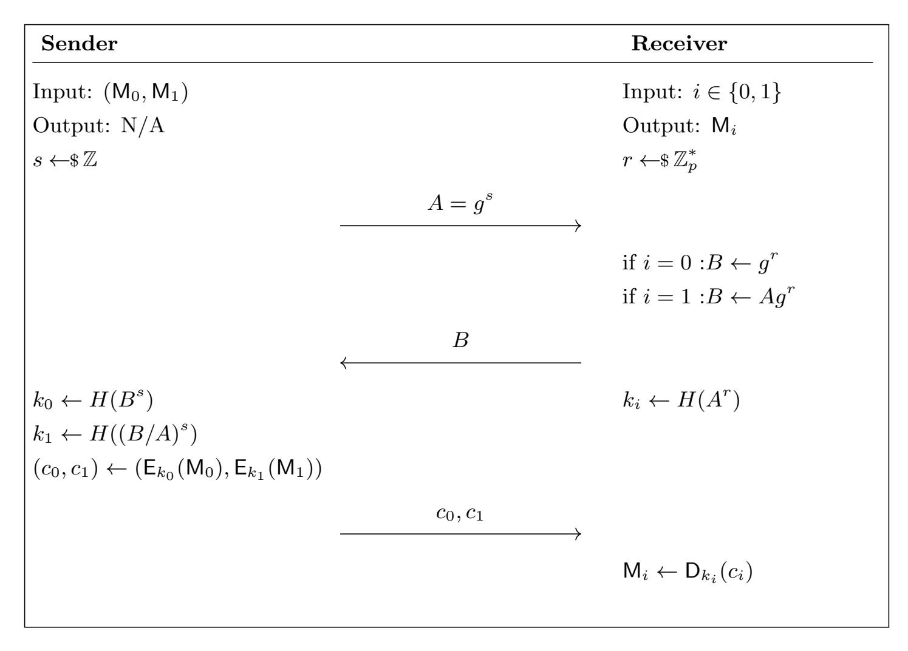
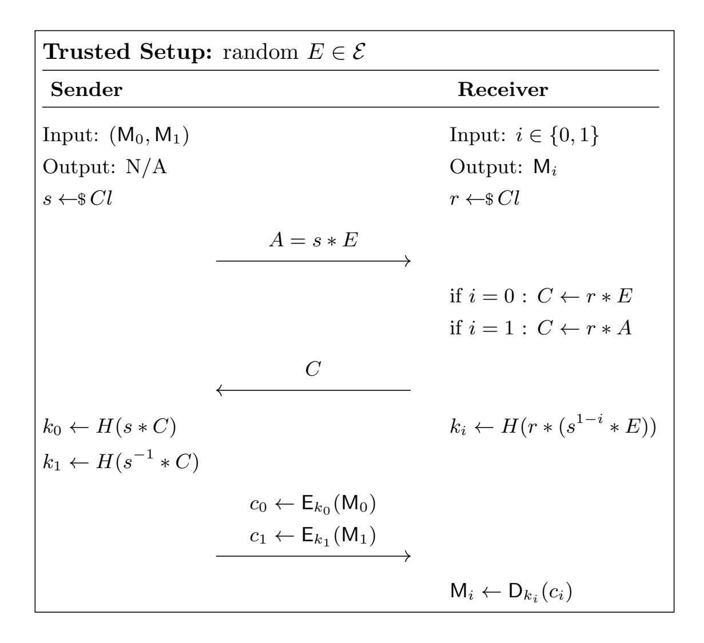

{0}------------------------------------------------

# Compact, Efficient and UC-Secure Isogeny-Based Oblivious Transfer

Yi-Fu Lai<sup>1</sup> , Steven D. Galbraith<sup>1</sup> , and Cyprien Delpech de Saint Guilhem2,3

<sup>1</sup>University of Auckland, New Zealand 2 imec-COSIC, KU Leuven, Belgium <sup>3</sup>Dept Computer Science, University of Bristol, United Kingdom [ylai276@aucklanduni.ac.nz](mailto:ylai276@aucklanduni.ac.nz), [s.galbraith@auckland.ac.nz](mailto:s.galbraith@auckland.ac.nz), [cyprien.delpechdesaintguilhem@kuleuven.be](mailto:s.galbraith@auckland.ac.nz)

#### Abstract

Oblivious transfer (OT) is an essential cryptographic tool that can serve as a building block for almost all secure multiparty functionalities. The strongest security notion against malicious adversaries is universal composability (UC-secure). An important goal is to have post-quantum OT protocols. One area of interest for post-quantum cryptography is isogenybased crypto. Isogeny-based cryptography has some similarities to Diffie-Hellman, but lacks some algebraic properties that are needed for discrete-log-based OT protocols. Hence it is not always possible to directly adapt existing protocols to the isogeny setting.

We propose the first practical isogeny-based UC-secure oblivious transfer protocol in the presence of malicious adversaries. Our scheme uses the CSIDH framework and does not have an analogue in the Diffie-Hellman setting. The scheme consists of a constant number of isogeny computations. The underlying computational assumption is a problem that we call the computational reciprocal CSIDH problem, and that we prove polynomial-time equivalent to the computational CSIDH problem.

Update: This is a corrected and extended version of the paper Yi-Fu Lai, Steven D. Galbraith, Cyprien Delpech de Saint Guilhem, Compact, Efficient and UC-Secure Isogeny-Based Oblivious Transfer, in Anne Canteaut and Fran¸cois-Xavier Standaert (eds.), EUROCRYPT 2021, Springer LNCS 12696 (2021) 213-241. See Remark [1.](#page-2-0)

## 1 Introduction

Oblivious transfer (OT) was first introduced by Rabin [\[Rab81\]](#page-25-0) in 1981 to establish an exchange of secrets protocol based on the factoring problem. Say the sender has two messages, oblivious transfer allows the receiver to know one of them and keeps the sender oblivious to which message has been received. The unchosen message remains unknown to the receiver.

It has been shown that oblivious transfer is an important building block as a cryptographic tool. Oblivious transfer can be used to construct other cryptographic primitives [\[GMW87,](#page-24-0) [CvdGT95,](#page-24-1) [Ode09\]](#page-25-1). Several oblivious transfer protocols based on Diffie-Hellman-related problems were proposed [\[BM89,](#page-23-0) [NP01,](#page-25-2) [PVW08,](#page-25-3) [CO15,](#page-24-2) [BDD](#page-23-1)<sup>+</sup>17].

Oblivious transfer protocols exist for various hardness assumptions. However, cryptographic protocols based on problems subordinate to either the discrete logarithm problem or the factoring problem will suffer a polynomial-time quantum attack from Shor's algorithm [\[Sho99\]](#page-25-4). Several postquantum oblivious transfer schemes have been proposed, including Peikert et al.'s lattice-based OT [\[PVW08\]](#page-25-3), and code-based OTs [\[DvdGMN08,](#page-24-3) [DNMQ12,](#page-24-4) [BDD](#page-23-1)<sup>+</sup>17]. Recently, some isogeny-based OTs have been proposed [\[BOBN18,](#page-23-2) [dSGOPS18,](#page-24-5) [Vit19\]](#page-25-5).

Concerning security of oblivious transfer, traditional security definitions aim at guaranteeing privacy for both parties, including one-sided simulation and the view-based definition for a twomessage protocol [\[NP01,](#page-25-2) [DvdGMN08,](#page-24-3) [HL10\]](#page-24-6). These notions ensure privacy for both parties in a standalone setting. However, in real world deployment, protocols are always composed into 

{1}------------------------------------------------

an enormous and complex construction. To ensure security of the full system the leading oblivious transfer proposals [Lin08, PVW08, DNMQ12, BDD<sup>+</sup>17] follow the real/ideal paradigm and universally-composable security (UC security) as defined by Canetti [Can01]. Impossibility results for some protocols have been given in [CKL03].

The first isogeny-based cryptosystem was proposed by Couveignes [Cou06], which included a key exchange scheme based on a hard homogeneous space. However, the paper was not published at that time. The approach was independently rediscovered by Rostovtsev and Stolbunov [RS06]. Then, Jao and De Feo proposed the Supersingular Isogeny Diffie Hellman (SIDH) [JDF11]. Later, SIDH was transformed into the Supersingular Isogeny Key Encapsulation (SIKE) [JAC+17] which includes a public key encryption scheme and a key encapsulation mechanism and is now one of the third-round alternate candidates in the post-quantum cryptography standardization competition led by NIST [NIS20]. Castryck et al. [CLM+18] devised an efficient implementation of the Couveignes/Rostovtsev-Stolbunov approach that they called commutative SIDH (CSIDH). CSIDH is conjectured to provide post-quantum security with smaller public keys than the candidates in the NIST competition [NIS20]. In this work, we exploit the structure of CSIDH to construct our schemes.

In comparison with Diffie-Hellman-based protocols, due to the reduced number of algebraic operations available, it is arguably more challenging to develop isogeny-based cryptosystems achieving the desired notion. For example, neither the randomizing procedure  $(g^s y^t, x^s z^t) \leftarrow RAND(g, x, y, z; s, t \leftarrow \mathbb{F}_p)$  used in [NP01, PVW08, Lin08], nor the fundamental one-trapdoor setup  $pk_0pk_1 = c$  where c is a public constant used in [NP01, BDD+17] can be realized in the isogeny-based setting with current techniques in an efficient way.

We review the aforementioned isogeny-based oblivious transfer proposals [BOBN18, dSGOPS18, Vit19]. Their schemes can be viewed as "tweaks of two Diffie-Hellman key exchange agreements" or variants of the Diffie-Hellman problem as stated in [CO15]. As stated in [CO15], these schemes, including their scheme, cannot achieve full-simulatability, even in the sense of the sequential composition (SC) theorem [Can00]. This is because a simulator cannot extract the input of the malicious adversary who delays the decryption.

To get a secure OT against malicious adversaries, an inefficient solution is embedding a zero-knowledge proof to force the adversary to follow the protocol specification, which is the idea of the GMW compiler [GMW87]. But then using isogenies the ZK proof may require a polynomial number of isogeny computations [FG19, BKV19]. Another solution is using the transformation provided by Döttling et al. [DGH+20]. The mechanism can transform a two-round semi-simulatable OT into one secure against malicious adversaries and keep the construction round-optimal (2-round). The cost is a polynomial number of executions of the original OT scheme. Chou and Orlandi [CO15] pointed out another potential solution that the receiver should show a "proof of timely decryption" while not leaking the secret input, which was realized by Barreto et al. in their framework in the updated version of [BDD+17].

On the aspect of security, the schemes [BOBN18, dSGOPS18, Vit19] are all only proved secure under either semi-honest models or a non-simulation-based definition. In other words, the schemes all ensure nothing when executed within a larger environment against malicious adversaries. Regarding the underlying computational assumption, a reduction to a well-known one is a preferred choice over a reduction to a weaker variant. For instance, the scheme in [Vit19], as stated in their work, relies on a non-standard computational assumption that does not hold in the CSIDH setting. In conclusion, before our work, a practical isogeny-based oblivious transfer protocol proved to be secure under an assumption equivalent to a well-known problem and with respect to a powerful security notion was missing from the literature.

#### 1.1 Contributions

We present the first practical construction of a UC-secure isogeny-based oblivious transfer protocol in the presence of malicious adversaries, hence resolving all the issues discussed above. To achieve this we introduce a variety of novel techniques. The construction is not only compact with a constant number of isogeny computations (see Table 1) but also a robust scheme without compromising the hardness. Our schemes use a feature that is available for isogenies (the quadratic twist) that does not have an analogue in the DLP setting, but some of our other techniques are not limited to isogeny-based cryptography, see Section 6.

Firstly, we design a novel 1-out-of-2 oblivious transfer protocol by a small change to the Diffie-

{2}------------------------------------------------

Hellman protocol to achieve a compact OT prototype with a trusted setup curve (or a public curve). Next, the 3-round protocol is transformed into a 2-round scheme through a new use of quadratic twists. The 2-round scheme is the most efficient isogeny-based OT scheme in the semi-honest model so far, see Section [5.](#page-21-1) Based on this modification, a secure mechanism can be established in which the receiver will demonstrate the "ability to decrypt" to the sender for one-sided simulation, which is based on a similar idea of [\[CO15](#page-24-2), [BDD](#page-23-1)+17] but with a different mechanism for group actions. Furthermore, we establish a trapdoor algorithm with a novel use of quadratic twists in the setup to accomplish the fully-simulatable construction. Finally, we introduce a new assumption, the reciprocal CSIDH problem, (Problem [5\)](#page-4-0) that looks non-standard, but we prove equivalence to the computational CSIDH problem with a quantum reduction using a tool we call "self-reconciling" (Proposition [2.2\)](#page-5-0).

As pointed out by Canetti et al. [\[CKL03\]](#page-24-7), it is impossible to achieve a UC-secure OT scheme without any trusted setup. Our construction is proposed in a hybrid model with two functionalities, see Table [2](#page-22-1) for comparison with the related works concerning the hybrid models.

Roadmap. This paper is organized as follows. Section [2](#page-3-0) briefly describes CSIDH, the related functionalities, our new assumptions, and recalls the simulation-based definition for two-party protocols. Section [3](#page-9-0) constructs our oblivious transfer protocol. Section [4](#page-13-0) gives security proofs against the semi-honest adversary and the malicious adversary. A comparison of our OT with the previous three isogeny-based OT protocols is given in Section [5.](#page-21-1) We conclude in Section [6.](#page-22-0) For comprehensibility, the content related to isogenies will frequently be accompanied or introduced by the counterparts in the Diffie-Hellman setting.

## 1.2 Related work

There are three aforementioned isogeny-based OT protocols. All the adversary models are either semi-honest or non-simulation, which are both quite weak notions. While the semi-honest model cannot reflect vicious attackers in the real world, the non-simulation-based model cannot enjoy the composition theorems [\[Can00,](#page-23-4) [Can01\]](#page-23-3), see Section [5.](#page-21-1)

The first protocol was proposed by Barreto et al. [\[BOBN18\]](#page-23-2) and used the common reference string (CRS) model along with the random oracle model. They revisited Chou and Orlandi's work [\[CO15\]](#page-24-2) and proposed an SIDH-based OT. They exploited the properties of SIDH to mask one party's public points by randomly (up to the receiver's choice) adding shared selective points derived from the common reference string. However, the claim of security is false. It may not ensure privacy even in the semi-honest model.

The second protocol was proposed by de Saint Guilhem et al. [\[dSGOPS18\]](#page-24-5). They derived their two constructions from the Shamir-3-Pass key transport scheme and [\[CO15\]](#page-24-2), respectively. Their framework is UC-secure against semi-honest adversaries based on a masking structure hard homogeneous space or on Fp<sup>2</sup> supersingular isogenies.

The third protocol was proposed by Vitse [\[Vit19\]](#page-25-5). It is derived from Wu, Zhang, and Wang's OT [\[WZW03\]](#page-25-11), based on a Diffie-Hellman-related problem. Their proposal naturally fits well in the general setting (including DH, SIDH, and CSIDH). They claimed UC-security in a semi-honest model and gave another game-based security definition (semantic security) for their OT protocol. They also proved the hardness of their special assumption in generic groups.

An independent and concurrent work of Alamati et al. [\[AFMP20\]](#page-23-6) is concerned with giving a general framework for developing cryptographic primitives based on group actions such as CSIDH. As an application, they briefly present some OT schemes. Their paper is concerned with theoretical aspects, not practical ones. Hence, the efficiency is asymptotical to the one using the GMW compiler [\[GMW87\]](#page-24-0), the transformation of [\[DGH](#page-24-11)<sup>+</sup>20] or simply a UC-secure zero-knowledge proof protocol.

<span id="page-2-0"></span>Remark 1. We noticed a bug in our old proof when we reviewed this paper. In the previous version, the sender sends the ability-to-decrypt challenge together with the ciphertexts to the receiver, which will cause failure in the extraction of the simulator against corrupted receiver. Concretely, in the previous version[1](#page-2-1) we falsely supposed the abort in Step 6 of the simulator on page 16 gives only negligible information to the environment machine. If the corrupted receiver

<span id="page-2-1"></span><sup>1</sup>https://eprint.iacr.org/2020/1012/20210302:033107

{3}------------------------------------------------

aborts after obtaining the ability-to-decrypt challenge and the ciphertexts, then the ciphertexts are encrypted messages in the real execution while in the ideal execution those are dummy ciphertexts produced by the "non-committing encryption." The environment machine will notice the difference if the environment machine knows the termination of the functionality. Nonetheless, as indicated in [BMM+22], the 3-round protocol securely computes random oblivious transfer with selective failure specified in [CSW20] (Definition 2), which tolerates extraction failure of this type. The security notion implies that we have an efficient UC-secure OT extension<sup>2</sup> by using the 3-round protocol based on the transform given in [KOS15, CSW20]. This can give the same effect in practice since OT-extensions amortizes the computational cost without compromising the effect of the multiple-execution of OTs. Therefore, we keep the 3-round construction in Appendix C.

Nonetheless, our goal is to solve the original research question, namely to have an efficient isogeny-based protocol UC realizing  $\mathcal{F}_{\mathsf{OT}}$ . To achieve this we modify the 3-round construction. We separate the ability-to-decrypt challenge and the encrypted messages by requiring the receiver to prove the ability to decrypt first to ensure the extraction prior to giving the real ciphertexts. Based on this change, the whole construction takes one more round but gives a more pragmatic OT construction. We are able to use IND-CPA symmetric encryption to transfer messages of polynomial-level length, which can be instantiated by AES-GCM for instance, instead of non-committing encryption.

### <span id="page-3-0"></span>2 Preliminaries

#### Notation

Let  $\{X(a,\lambda)\}=_c \{Y(a,\lambda)\}$  denote computationally indistinguishable probabilistic ensembles X,Y, which means for any PPT non-uniform algorithm D there exists a negligible function f such that for all  $a,\lambda\in\mathbb{N}$  we have  $|\Pr[D(X(a,\lambda))]-\Pr[D(Y(a,\lambda))]|\leq f(\lambda)$ . Let  $\{X(a,\lambda)\}=_s \{Y(a,\lambda)\}$  denote statistically indistinguishable probabilistic ensembles X,Y on the same set, which means the statistical distance between X and Y is negligible. The notation  $a\leftarrow S$  means a is uniformly generated from the set S. For simplicity, we often omit the security level parameter  $\lambda$  but it is implicit in the indistinguishability and the negligible function.

#### 2.1 CSIDH

For a given prime p and an elliptic curve E defined over  $\mathbb{F}_p$ ,  $End_p(E)$  is the subring of the endomorphism ring End(E) consisting the endomorphisms defined over  $\mathbb{F}_p$ .

Let  $\mathcal{O}$  be an order in an imaginary quadratic field and  $\pi \in \mathcal{O}$  an element of norm p. Define the set of isomorphism classes of elliptic curves  $\mathcal{E}\ell\ell_p(\mathcal{O},\pi)$  where E defined over  $\mathbb{F}_p$ ,  $End_p(E) \cong \mathcal{O}$ , and  $\pi$  is the  $\mathbb{F}_p$ -Frobenius map of E corresponding to  $\sqrt{-p} \in \mathcal{O}$ . For any ideal  $\mathfrak{a} \in \mathcal{O}$  and  $E \in \mathcal{E}\ell\ell_p(\mathcal{O},\pi)$ , an action can be defined by  $\mathfrak{a}*E = E'$  such that there exists an isogeny  $\phi: E \to E'$  with  $\ker(\phi) = \bigcap_{\alpha \in \mathfrak{a}} \{P \in E(\overline{\mathbb{F}}_p) \mid \alpha(P) = 0\}$ . The image curve of  $\mathfrak{a}*E$  is well-defined up to  $\mathbb{F}_p$ -isomorphism. Moreover, the ideal class group  $Cl(\mathcal{O})$  acts freely and transitively on  $\mathcal{E}\ell\ell_p(\mathcal{O},\pi)$ .

Castryck et al. specified the prime to be  $p=4\times\ell_1\times...\times\ell_n-1$  where  $\ell_i$  are small odd primes. In the case of  $p=3 \mod 8$ , for any supersingular elliptic curve E defined over  $\mathbb{F}_p$ , the restricted endomorphism ring  $End_p(E)=\mathbb{Z}\{\pi\}\cong\mathbb{Z}\{\sqrt{-p}\}$  if and only if E is  $\mathbb{F}_p$ -isomorphic to  $E_A: y^2=x^3+Ax^2+x$  for some unique  $A\in\mathbb{F}_p$ . The quadratic twist of a given elliptic curve  $E: y^2=f(x)$  is  $E^t: dy^2=f(x)$  where  $d\in\mathbb{F}_p$  has Legendre symbol -1. When  $p=3 \mod 4$  let  $E_0$  be such that  $j(E_0)=1728$ , then  $E_0$  and  $E_0^t$  are  $\mathbb{F}_p$ -isomorphic. The quadratic twist can be efficiently computed in the CSIDH setting [CLM+18]. Since the prime  $p=3 \mod 4$ ,  $E': -y^2=x^3+Ax^2+x$  is the quadratic twist of  $E_A: y^2=x^3+Ax^2+x$  and E' is  $\mathbb{F}_p$ -isomorphic to  $E_{-A}$  by  $(x,y)\mapsto (-x,y)$ . Further,  $(a*E_0)^t=a^{-1}*E_0$ . Therefore, for any curve  $E\in\mathcal{E}\ell\ell_p(\mathcal{O},\pi)$ , we have, by the transitivity of the action,

$$(a*E)^t = a^{-1}*E^t.$$

Throughout this paper, we concentrate on supersingular curves defined over  $\mathbb{F}_p$ . Denote the ideal class group  $Cl(End_p(E))$  by Cl and the set of elliptic curves  $\mathcal{E}\ell\ell_p(\mathcal{O},\pi)$  by  $\mathcal{E}$ .

<span id="page-3-1"></span><sup>&</sup>lt;sup>2</sup>In short, OT extension allows a party to transfer multiple message pairs with fewer number of execution of "base OTs" and other more efficient primitives. For instance, [CSW20] shows that we can UC-securely implement  $m = poly(\lambda)$  instances of  $\mathcal{F}_{OT}$  by using  $\lambda$  invocations of random oblivious transfer with selective failure protocol together with a secure pseudorandom generator and a tweakable correlation robust function.

{4}------------------------------------------------

#### 2.1.1 Uniform sampling of curves

In CSIDH, the method provided to sample elements of the class group Cl is heuristically assumed to be statistically close to uniform [CLM<sup>+</sup>18]. We derive the following lemma when  $p = 3 \mod 4$ .

<span id="page-4-4"></span>**Lemma 2.1.** Given a curve  $E \in \mathcal{E}$  and a distribution D on Cl, let D \* E be the distribution on  $\mathcal{E}$  of a \* E for  $a \leftarrow D$ , and let  $(D * E)^t$  be the distribution on  $\mathcal{E}$  of  $(a * E)^t$  for  $a \leftarrow D$ . If D is statistically indistinguishable from the uniform distribution on Cl, then D \* E and  $(D * E)^t$  are statistically indistinguishable from the uniform distribution on  $\mathcal{E}$ .

*Proof.* Let U be the uniform distribution on  $\mathcal{E}$ . Since Cl acts freely and transitively on  $\mathcal{E}$ , D\*E is statistically indistinguishable from U. Since taking quadratic twists is a transposition on  $\mathcal{E}$ , by taking a twist on both distributions, we have  $D*E=_sU=U^t=_s(D*E)^t$ .

CSIDH works by sampling ideal classes as  $\prod_{i=1}^{n} (\ell_i, \pi - 1)^{e_i}$  where  $e_i$  are sampled from  $[-B, B] \cap \mathbb{Z}$  for a suitably chosen value B. Heuristically, increasing B means that sampling becomes closer to the uniform distribution on Cl. Beullens et al. [BKV19] proposed an efficient instantiation of these sampling methods in CSI-FiSh which requires pre-processing to compute a lattice of relations in the class group. Hence, we may assume the sampling method over Cl is statistically indistinguishable from U or the existence of uniform sampling over Cl.

#### 2.1.2 Computational assumptions

The computational assumptions relevant to this work are defined as follows.

<span id="page-4-2"></span>**Problem 1.** (Computational CSIDH Problem) Given curves E, r \* E and s \* E in  $\mathcal{E}$  where  $r, s \in Cl$ , find  $E' \in \mathcal{E}$  such that E' = rs \* E.

<span id="page-4-1"></span>**Problem 2.** Given curves (E, s\*E, r\*E) in  $\mathcal{E}$  where  $r, s \in Cl$ , find  $E' \in \mathcal{E}$  such that  $E' = s^{-1}r*E$ .

The computational CSIDH problem is the main hardness assumption for [CLM<sup>+</sup>18]. Problem 2 is an equivalent problem. To see this, given an oracle O for Problem 1, one can obtain E' by taking  $E' \leftarrow O(s*E, E, r*E)$  such that  $E' = rs^{-1}*E$ . Conversely, given an oracle O for Problem 2, one can obtain E' by taking  $E' \leftarrow O(s*E, E, r*E)$  such that E' = rs\*E.

The following two problems are the main underlying problems against semi-honest adversaries.

<span id="page-4-5"></span>**Problem 3.** (Computational Square CSIDH Problem) Given curves E and s\*E in  $\mathcal{E}$  where  $s \in Cl$ , find  $E' \in \mathcal{E}$  such that  $E' = s^2 * E$ .

<span id="page-4-3"></span>**Problem 4.** (Computational Inverse CSIDH Problem) Given curves E and s\*E in  $\mathcal{E}$  where  $s \in Cl$ , find  $E' \in \mathcal{E}$  such that  $E' = s^{-1} * E$ .

The advantage of an adversary  $\mathcal{A}$  against the inverse CSIDH problem is defined as  $\mathsf{Adv}^{\mathsf{InvCSIDH}}(\mathcal{A}) = \mathsf{Pr}[\mathcal{A} \text{ wins}]$ . The equivalence between these two assumptions and a conditional reduction to the computational CSIDH problem were given in [Fel19]. The condition for the second reduction is that the group order is given and odd. Therefore, we can say that there is quantum reduction [Sho99, Hal05] to the computational CSIDH problem when  $p=3 \mod 4$ . In fact, there is also an efficient quantum reduction for the case of  $p=1 \mod 4$ , see Appendix A. Note that the quantum computation is only to compute the group structure of Cl, and so can be considered as a precomputation; the remainder of the reduction is classical.

As Castryck et al. pointed out [CLM<sup>+</sup>18] both problems contain exceptional cases when  $E_0$  takes part in the problems due to the symmetric structure. That is,  $(a * E_0)^t = a^{-1} * E_0$ , and so Problem 4 is easy in the special case  $E = E_0$ . The issue can be circumvented if the public curve is generated by a trusted third party.

Next, we will introduce the main underlying assumption for our UC-secure construction.

<span id="page-4-0"></span>**Problem 5.** (Reciprocal CSIDH Problem) Given E in  $\mathcal{E}$ . Firstly, the adversary chooses and commits to  $X \in \mathcal{E}$ , then receives the challenge s \* E where  $s \leftarrow Cl$  from the challenger. The adversary wins if it outputs the pair  $(s * X, s^{-1} * X)$  with respect to the committed X.

The advantage of  $\mathcal{A}$  against the reciprocal CSIDH problem is defined as  $\mathsf{Adv}^{\mathsf{ReCSIDH}}(\mathcal{A}) = \Pr[\mathcal{A} \text{ wins}]$  or, to be more specific,  $\mathsf{Adv}^{\mathsf{ReCSIDH}}(\mathcal{A}(E;X)) = \Pr[\mathcal{A} \text{ commits to } X \text{ with the public curve } E \text{ and wins}]$ . Intuitively, the reciprocal CSIDH problem is a relaxed version of the square CSIDH

{5}------------------------------------------------

problem or the inverse CSIDH problem. In particular, if one can solve the inverse CSIDH problem, then one can solve the reciprocal CSIDH problem by taking X = E with  $(s * X, s^{-1} * X) = (s * E, s^{-1} * E)$ . Conversely, if an attacker knows the isogeny between X and E, or  $E^t$ , then this can be used to solve the *inverse CSIDH problem*. That is, if X = r \* E, one can obtain  $s^{-1} * E$  by computing  $r^{-1} * (s^{-1} * X)$  with the given r. On the other hand, if  $X = r * E^t$ , one can obtain  $s^{-1} * E$  by computing  $r * (s * X)^t$  with the given r. However, note that the attacker is not required to know the isogeny between X and E or  $E^t$  in the problem.

The reciprocal CSIDH problem appears to be non-standard at first sight but, in fact, it is equivalent to the inverse CSIDH problem. Even though the problem provides additional freedom X for the attacker, yet notice that X is chosen prior to the challenge s\*E. We show in the following reduction that the freedom to choose X can be neutralized. We call the reduction strategy "self-reconciling".

<span id="page-5-0"></span>**Proposition 2.2.** The reciprocal CSIDH problem is equivalent to the computational inverse CSIDH problem.

*Proof.* We provides two different approaches to prove this proposition. Given a reciprocal CSIDH problem adversary  $\mathcal{A}$ , we can construct an inverse CSIDH adversary (reduction)  $\mathcal{B}$  as follows. Given a challenge (E, s\*E) for the inverse CSIDH problem. Invoke the adversary for the reciprocal CSIDH with E. After receiving X from  $\mathcal{A}$ , send the challenge  $t_1s*E$  to the adversary where  $t_1 \leftarrow Cl$ .

**Approach I.** After receiving  $(t_1s * X, (t_1s)^{-1} * X)$  from  $\mathcal{A}$ , the reduction  $\mathcal{B}$  rewinds  $\mathcal{A}$  to the time when it outputs X. By using  $t_1$ , the reduction  $\mathcal{B}$  sends  $t_2s * X$  as the challenge with respect to committed X where  $t_2 \leftarrow \$Cl$ . After receiving  $(X_0, X_1)$  from the adversary,  $\mathcal{B}$  outputs  $t_2 * X_1$ .

Claim  $t_2 * X_1 = s^{-1} * E$ . Write X = b \* E for some  $b \in Cl$  due to the transitive action, so  $t_2s * X = (t_2sb) * E$ . Then, since the second challenge is  $t_2s * X = (t_2sb) * E$ , we have  $t_2 * X_1 = (sb)^{-1} * X = s^{-1} * E$ .

**Approach II.** After receiving  $(t_1s * X, (t_1s)^{-1} * X)$  from  $\mathcal{A}$ , the reduction  $\mathcal{B}$  rewinds  $\mathcal{A}$  to the time when it outputs X. By using  $t_1$ , the reduction  $\mathcal{B}$  sends  $((t_2s)^{-1} * X)^t$  as the challenge with respect to committed X where  $t_2 \leftarrow Cl$ . After receiving  $(X_0, X_1)$  from the adversary,  $\mathcal{B}$  outputs  $t_2 * X_0^t$ .

Claim  $t_2*X_0^t=s^{-1}*E$ . Write X=b\*E and  $E=t*E_0$  for some  $b,t\in Cl$  thanks to the transitive action, so  $((t_2s)^{-1}*X)^t=t_2sb^{-1}t^{-2}*E$ . Then, we have  $X_0=t_2sb^{-1}t^{-2}*X=t_2st^{-1}*E_0=t_2s*E^t$ . Therefore,  $t_2*X_0^t=s^{-1}*E$ . Precisely, we have

$$(\mathsf{Adv}^{\mathsf{ReCSIDH}}(\mathcal{A}(E;X)))^2 \leq \mathsf{Adv}^{\mathsf{InvCSIDH}}(\mathcal{B}).$$

In each version of the proof of Proposition 2.2, for  $i \in \{0,1\}$  the reduction  $\mathcal{B}$  firstly extracts the *i*-th curve from the first solution, and rewinds the adversary with a new challenge with respect to the extracted curve. Then,  $\mathcal{B}$  extracts the (1-i)-th curve from the second solution, which will be the solution for the inverse CSIDH problem. Looking ahead, Problem 5 depicts one of the key ideas of our protocol. If the receiver commits to a curve X, then s \* X and  $s^{-1} * X$  are two decryption keys, and the receiver can get only one decryption key unless the receiver can solve a hard problem. Furthermore, after committing to X, the receiver can only get the *i*-th decryption for some  $i \in \{0,1\}$ . This captures the main idea of our "proof of ability to decrypt mechanism", which allows us to extract corrupted receiver's input by reading random oracle's queries.

<span id="page-5-1"></span>**Problem 6.** (Tweaked Reciprocal CSIDH Problem) Given E in  $\mathcal{E}$ . The adversary  $\mathcal{A}$  chooses and commits to a curve  $X \in \mathcal{E}$ .

- (i)  $\mathcal{A}$  receives the first challenge s \* E where  $s \leftarrow Cl$  from the challenger.  $\mathcal{A}$  outputs a curve C.
- (ii) The challenger sends s and another challenge s' \* E to  $\mathcal{A}$  where  $s' \leftarrow \$ Cl$ .
- (iii)  $\mathcal{A}$  outputs another curve C'.

Write  $(C_0, C_1) = (s * X, s^{-1} * X)$  and  $(C'_0, C'_1) = (s' * X, s'^{-1} * X)$ . We say  $\mathcal{A}$  wins if  $(C, C') = (C_i, C'_{1-i})$  for some  $i \in \{0, 1\}$ .

The advantage of an adversary  $\mathcal{A}$  against the tweaked reciprocal CSIDH problem is defined as  $\mathsf{Adv}^\mathsf{tReCSIDH}(\mathcal{A}) = \Pr[\mathcal{A} \text{ wins}]$  or, to be more specific,  $\mathsf{Adv}^\mathsf{tReCSIDH}(\mathcal{A}(E;X)) = \Pr[\mathcal{A} \text{ commits to } X]$ 

{6}------------------------------------------------

with the public curve E and wins]. By using the same approach above, one can show the tweaked reciprocal CSIDH problem is as hard as the inverse CSIDH problem. Due the similarity, we leave the proof in Appendix [B.](#page-27-0) We remark that the proof here also requires the rewinding approach.

Proposition 2.3. The tweaked reciprocal CSIDH problem is equivalent to the computational inverse CSIDH problem.

We end the subsection with the following relation for the CSIDH setting in [\[CLM](#page-24-9)+18] (p = 3 mod 4). (A full reduction is provided in Appendix [A.](#page-26-0))

```
Computational CSIDH =quantum Computational Inverse CSIDH
                      =classical Computational Square CSIDH
                      =classical (Computational) Reciprocal CSIDH
                      =classical Tweaked Reciprocal CSIDH
```

Remark 2. The above results can all be extended to general (free and transitive) group actions and hard homogeneous spaces [\[Cou06\]](#page-24-8) except for the parts where we use quadratic twist. We leave the details to the reader.

## 2.2 Public Key Encryption

A symmetric encryption scheme is a tuple of algorithms (Setup,KeyGen, E, D) with message space M, ciphertext space C and key space K. We assume |K| ≥ 2 λ to have large enough key space. We recall the standard IND-CPA security notion for a symmetric key encryption scheme.

Definition 2.1 ((IND-CPA Security)). A symmetric encryption scheme scheme (Setup,KeyGen, E, D) is IND-CPA secure if, for any λ ∈ N, any PPT adversary A has at most a negligible advantage in the following game played against a challenger.

- (i) The challenger runs pp ← Setup(1<sup>λ</sup> ), k ← KeyGen(pp) and samples a bit b ∈ {0, 1}. The challenger provides pp to A.
- (ii) A sends a pair of messages (M0, M1) ∈ M<sup>2</sup> to the challenger, and the challenger returns c<sup>b</sup> ← Ek(Mb) to A.
- (iv) A outputs a bit b <sup>∗</sup> ∈ {0, 1}. We say A wins if b <sup>∗</sup> = b.

The advantage of A is defined as AdvIND-CPA (E,D) (A) = |Pr[A wins] − 1/2|.

Let KeyGen draw a key uniformly at random from the key space. We abuse the notation (E, D) to represent a symmetric encryption scheme scheme for similicity.

### 2.3 Functionalities

In this subsection, we define the functionalities we need as well as the related security definitions.

### FRO-Functionality of Random Oracle

The functionality is a function with the domain D and the codomain R. It keeps a list L of pairs in D × R where the initial state is empty. It works as follows:

- 1. Upon receiving a query C ∈ D, check whether (C, k′ ) for some k ′ ∈ R. If so, set k = k ′ ; if not, generate k ←\$ R and store the pair (C, k) in the list L.
- 2. Output k.

The functionality of a random oracle FRO internally contains an initially empty list. Upon receiving the query from the domain, it will check whether it is a repetition. If so, return the value assigned before; otherwise, it randomly assigns a value from the codomain, stores the pair, and returns the value. Formally speaking, an input of a random oracle can be an arbitrary binary 

{7}------------------------------------------------

string. For simplicity, we restrict the domain to  $\mathcal{E}$ . This can be easily and compatibly extend to  $\{0,1\}^*$ , since supersingularity can be efficiently verified [CLM<sup>+</sup>18].

#### $\mathcal{F}_{\mathsf{TSC}}\text{-}\mathbf{Functionality}$ of a trusted setup curve

The functionality is to output an element of  $\mathcal{E}$ . It generates an ideal class  $t \leftarrow \$ Cl$  and outputs the curve  $t * E_0$ .

The functionality of trusted setup curves  $\mathcal{F}_{TSC}$  serves as a setup for generating a curve for the protocol. This setup hides the relation t between the public curve and the curve  $E_0$ . In practice, this can be replaced with a key exchange protocol [BF20]. That is, two parties do a key exchange first and obtain a curve such that the isogeny relation to  $E_0$  remains unknown if the two parties do not share their ideal classes or collude.

Here we define the functionality of the oblivious transfer in a simple and classic way. The two-party functionality of the oblivious transfer is characterized by  $\mathcal{F}_{\mathsf{OT}} = (f_1, f_2)$  where  $f_1 : \{0, 1\}^* \times \{0, 1\}^* \to \{\bot\}$  and  $f_2 : \{0, 1\} \to \{0, 1\}^*$ . The functionality  $\mathcal{F}_{\mathsf{OT}} : \{0, 1\}^* \times \{0, 1\}^* \times \{0, 1\}^* \times \{0, 1\}^* \times \{0, 1\}^*$  takes in a message pair  $x = (\mathsf{M}_0, \mathsf{M}_1)$  of equal length from one party and a bit  $y = \mathsf{i} \in \{0, 1\}$  from the other party, and returns  $\mathcal{F}_{\mathsf{OT}}(x, y) = (f_1(x, y), f_2(x, y)) = (\bot, \mathsf{M}_i)$  where  $\bot$  represents an empty string.

We briefly define the security of OT. We refer [HL10, Lin17] for more details. Intuitively, we say a protocol realizes the functionality securely in the simulation-based definition, if the protocol realizes the function and also whatever the adversary can learn from a real execution of the protocol can be indistinguishably generated by a simulator. Thus, we have to formalize the "view" of a corrupted party and compare the output of the protocol with the ideal functionality. Let  $\pi$  be a protocol computing  $\mathcal{F}_{\text{OT}}$ . We denote by  $view_i^{\pi}(x,y)$  the transcript that records whatever the  $i^{th}$  party sees during an execution of the protocol  $\pi$  taking input (x,y). Precisely,  $view_i^{\pi}(x,y)$  is the tuple  $(input, r^i, m_1^i, ..., m_n^i)$  where input is the input of the party,  $r^i$  is its internal random tape, and  $m_j^i$  is the  $j^{th}$  received message. We also write  $output_i^{\pi}(x,y)$  as the output received by the  $i^{th}$  party after the execution of the protocol  $\pi$  with the input (x,y), and write  $output^{\pi}(x,y) = (output_1^{\pi}(x,y), output_2^{\pi}(x,y))$ . In particular, if the protocol  $\pi$  completely realizes the functionality  $\mathcal{F}_{\text{OT}}$ , then  $output^{\pi}(x,y) = \mathcal{F}_{\text{OT}}(x,y)$ .

**Definition 2.2.** (OT security against semi-honest adversary) We say a protocol  $\pi$  securely (privately) computes  $\mathcal{F}_{\mathsf{OT}}$  in the presence of static semi-honest adversaries if there exist probabilistic polynomial-time algorithms  $S_1, S_2$  such that

$$output^{\pi}(x,y) = \mathcal{F}_{OT}(x,y)$$
  
 $\{S_1(x, f_1(x,y))\}_{x,y} = c\{view_1^{\pi}(x,y)\}_{x,y}$ 

and

$${S_2(y, f_2(x, y))}_{x,y} = {c\{view_2^{\pi}(x, y)\}_{x,y}}.$$

The notion implies that whatever the semi-honest adversary can learn from running the protocol, it could be generated by themself without the execution. In other words, the semi-honest adversary can learn nothing more than allowed. The idea of ideal execution is implicit here. Since anything apart from the output of the functionality can be self-generated in an indistinguishable manner, the real protocol ideally realizes the functionality as long as the two parties follow the protocol specification (see Section 7.2 of [Ode09] for more details).

However, the semi-honest adversary model is not sufficient. It is inevitable in the real world that malicious users depart from the protocol specification with arbitrary strategies. A relaxation for oblivious transfer protocols or single-output functionalities is one-sided simulation. One-sided simulation requires the indistinguishability for the sender and the simulation for the receiver. Since the sender has no outputs, the notion ensures privacy for both parties in the presence of malicious adversaries. It is also a plausible choice for an efficient construction in the stand-alone model. Here, we consider full-simulation in the presence of malicious adversaries.

Roughly speaking, the standard real/ideal paradigm demonstrates that for any adversary in the real world, there exists a corresponding simulator in the ideal world such that the outputs from the two worlds are indistinguishable. The notion provides an ultimate guarantee that whatever 

{8}------------------------------------------------

the adversary can do in the real execution is simulatable in the ideal world. Since the execution in the ideal world is secure, the real execution is secure as well. To see this, we need to clarify the definitions of the real and ideal executions.

Ideal Execution. The ideal execution captures a world where a trusted third party exists. The parties do not communicate with each other but instead hand their inputs to the trusted party. Then, the trusted party honestly returns the outcomes to each party, corresponding to the defined functionality. Nevertheless, the ideal execution in the presence of malicious adversaries is slightly different from the previous consideration of the semi-honest adversary. Due to losing the honest majority, fairness is not taken into consideration. Moreover, rational rebelling behaviors of the malicious adversaries, including refusing to participate, aborting the running sessions, or replacing the inputs, are taken into account. These strategies will be taken into account in the definition of the modified ideal functionality.

We define the modified ideal execution before going to the security definition. For more detailed exposition, also see [HL10, Lin17]. The ideal execution in consideration of a malicious adversary of a two-party functionality  $\mathcal{F} = (f_1, f_2)$  consists of six phases: initial inputs, inputs to the trusted party, early abortion, output to the adversary, instruction of continuing or halting, outputs. Let  $P_i$  denote the corrupted party controlled by  $\mathcal{S}$ ,  $P_j$  be the honest party where  $\{i, j\} = \{1, 2\}$ ,  $\mathcal{T}$  be for the trusted third party.

First of all, in the phase of initial inputs, like the ordinary setup,  $P_1$  has the input x,  $P_2$  has the input y and the adversary S has an auxiliary input z. Secondly, in the phase of inputs to the trusted party, honest  $P_j$  hands the initial input (x or y) to T. What corrupted  $P_i$  sends is controlled by S. The decision made by S including the early abortion option **abort**<sub>i</sub> is based on the initial input of  $P_i$  and the auxiliary input z. Let (x', y') be the inputs to F. Thirdly, early abortion is an intermediate phase, if **abort**<sub>i</sub> is sent within the second phase by S. Then the trusted party returns **abort**<sub>i</sub> to both parties, and the execution terminates; otherwise, the execution continues. Fourthly, in the phase of output to the adversary, T computes  $f_1(x', y')$  and  $f_2(x', y')$  and returns  $f_i(x', y')$  to the corrupted party  $P_i$  first. Next, in the fifth phase, the adversary replies **continue** or **abort**<sub>i</sub> to T. This instructs T to continue or terminate by returning  $f_j(x', y')$  or **abort**<sub>i</sub> to  $P_j$ , respectively. Last but not least, in the final phase outputs, the honest party outputs  $f_j(x', y')$ . The adversary S in place of  $P_i$  outputs something based on the knowledge of the initial input (x or y), auxiliary input z, and  $f_i(x', y')$ .

The output pair of the honest party and the adversary from the ideal execution of the functionality  $\mathcal{F}$  described above is denoted by IDEAL $_{\mathcal{F},\mathcal{S}(z),i}(x,y)$ . Note that even though in oblivious transfer the sender receives no outputs from the trusted party, the adversary can still output something in place of the sender if the sender is the corrupted party. For readability, we will write in the protocol description  $\mathbf{abort}_{\mathsf{S}}, \mathbf{abort}_{\mathsf{R}}$  representing aborts made by the receiver and the sender to replace  $\mathbf{abort}_{\mathsf{1}}, \mathbf{abort}_{\mathsf{2}}$ , respectively.

Real Execution. The real execution is the execution of a real protocol. Let the protocol  $\pi$  compute the functionality  $\mathcal{F}$  where  $P_i$  is the corrupted party controlled by the adversary  $\mathcal{A}$ . The initial inputs are x for  $P_1$ , y for  $P_2$  and the auxiliary input z for  $\mathcal{A}$ . During the execution of  $\pi$ ,  $\mathcal{A}$  will usurp  $P_i$ , interact with  $P_j$ , and finally output something. The messages and output provided by the adversary may deviate from the specification of  $\pi$  by a polynomial-time strategy. In contrast, the honest party  $P_j$  interacts with  $P_i$  and returns outputs as specified by the protocol. Let  $\text{REAL}_{\pi,\mathcal{A}(z),i}(x,y)$  denote the output pair by  $P_j$  and  $\mathcal{A}$ .

The aim of the standard real/ideal paradigm is to show that the ensemble produced by the simulator through the ideal execution is indistinguishable from the ensemble produced by the adversary via the real execution. This provides strong assurance of the security irrespective of the strategies the adversary adopts since any real adversary can be simulated in the ideal world. This also permits modular constructions for larger protocols by the composition theorems [Can00, Can01]. As a corollary, a relaxed but equivalent version of the security model is the simulation in the *hybrid model*.

**Hybrid Model.** The hybrid model contains real messages communicated between participants and oracle access to functionality  $\mathcal{G}$  (ideal messages). The two-party protocol  $\pi$  with input (x, y) in a hybrid model with the functionality  $\mathcal{G}$  is called the  $\mathcal{G}$ -hybrid model. In the presence of adversary  $\mathcal{A}$  who controls the  $i^{th}$  party with the auxiliary input z, we denote the output of all parties by

{9}------------------------------------------------

 $HYBRID_{\pi,\mathcal{A}(z),i}^{\mathcal{G}}(x,y).$ 

We remark that this model is a prerequisite for constructing UC-secure oblivious transfer due to the impossibility results given in [CKL03]. In the  $\mathcal{G}$ -hybrid model, the simulator in the simulation process is able to exert control over the functionality  $\mathcal{G}$ . For example, in the common reference string (CRS) hybrid model, two parties are given a shared string in the protocol execution, while in the simulation process, the simulator can invoke the adversary with a trapdoor string to cheat [PVW08].

To match the security definition presented in [Can01], assume there exists an environment machine  $\mathcal{Z}$  serving as an interactive distinguisher between the real execution and the ideal execution. When interacting with the machine, the environment  $\mathcal{Z}$  can decide all inputs of the parties and the auxiliary input for the adversary/simulator. After the execution,  $\mathcal{Z}$  outputs a single bit to judge whether it interacts with a real machine or an ideal machine. Also, the environment  $\mathcal{Z}$  can interact with the adversary/simulator with any queries at any time throughout the execution in order to distinguish. Here, we denote the ensemble consisting of the output of the ideal execution of the functionality  $\mathcal{F}$  involving the adversary  $\mathcal{S}$ , the environment  $\mathcal{Z}$  by  $IDEAL_{\mathcal{F},\mathcal{S},\mathcal{Z}}$  and the ensemble consisting of the outputs in the hybrid model involving the adversary  $\mathcal{A}$  and the environment  $\mathcal{Z}$  by  $HYBRID_{\pi,\mathcal{A},\mathcal{Z}}^{\mathcal{G}}$ .

**Definition 2.3.** (UC-realize) A protocol  $\pi$  is said to UC-realize an ideal functionality  $\mathcal{F}$  in the presence of malicious adversaries and static corruption in the hybrid model with functionality  $\mathcal{G}$  if for any adversary  $\mathcal{A}$  there exists a simulator  $\mathcal{S}$  such that for every interactive distinguisher environment  $\mathcal{Z}$  we have

$$IDEAL_{\mathcal{F},\mathcal{S},\mathcal{Z}} = {}_{c}HYBRID_{\pi,\mathcal{A},\mathcal{Z}}^{\mathcal{G}}.$$

The advantage of an environment machine  $\mathcal{Z}$  against is defined as  $Adv(\mathcal{Z}) = |Pr[\mathcal{Z} \ wins] - 1/2|$ .

## <span id="page-9-0"></span>3 Our Proposal

This section first presents the idea behind our tweaked key exchange by introducing the core of Chou and Orlandi's OT scheme [CO15]; we then derive a novel compact protocol as a prototype. Following this, we compress the three-round scheme to an optimal two rounds by using the quadratic twist technique. Finally, building on the round-optimal structure, we add a "proof of decryption" mechanism, which requires two extra rounds, in order to achieve security against malicious adversaries.

#### <span id="page-9-1"></span>3.1 Passively Secure Schemes

#### 3.1.1 Tweaked Key Exchange

Figure 1 presents the Chou-Orlandi OT scheme [CO15] which is based on Diffie-Hellman key exchange. In Diffie-Hellman, the sender and the receiver first share their public "keys",  $g^s$  and  $g^r$ , with each other, after which both of them can secretly obtain a shared secret  $g^{rs}$ . To adapt this for the purpose of OT, the receiver can use the second round to obfuscate his secret bit i. In the third round, the sender can communicate an encryption of the two OT messages by deriving two keys, one which cancels out the obfuscation, and one which does not. Because of this key derivation, the receiver can then only decrypt the message corresponding to his input bit.

We can view the isogeny-based oblivious transfer constructions of previous works in the same way. In Barreto et al.'s work [BOBN18], the shared secret between the sender and the receiver is the j-invariant of the isomorphic elliptic curves  $\phi_{B'}\phi_A(E)$  and  $\phi_{A'}\phi_B(E)$  [BOBN18]. Here, the receiver hides his input bit by masking his  $p_3^{e_3}$ -torsion subgroup public basis by a pair of special  $p_3^{e_3}$ -torsion points  $U, V \in \phi_B(E)$ ; the sender then requires the same pair of points U, V to remove the noise. A coin-flipping mechanism is then used to guarantee that both parties obtain the same points U, V.

Proposals by de Saint Guilhem et al. and Vitse rely on a similar idea to use a fixed key from the key exchange to decrypt the chosen ciphertext [dSGOPS18, Vit19]. In the first OT construction of [dSGOPS18], two public curves are required as a trusted setup, which serve the same role as two fixed keys from the perspective of key exchange. In [Vit19], one more  $p_2^{e_2}$ -torsion subgroup generated by the sender is required to obtain two fixed keys.

{10}------------------------------------------------

<span id="page-10-0"></span>

Figure 1: Chou and Orlandi's OT scheme in a nutshell [CO15]

#### 3.1.2 Our three-round Protocol

We present our three-round protocol in Figure 2 using the notation of the CSIDH setting. In this work we approach the change from key exchange to OT with a different strategy. The essence is that the sender and the receiver can exponentiate by both s and by  $s^{-1}$ , and by both r and  $r^{-1}$  respectively.

Upon receiving  $g^s$  from the sender, the receiver computes both  $g^r$  and  $g^{sr}$ , and sends one of them to the sender depending on its choice bit. The sender then exponentiates it by both s and by  $s^{-1}$  as the encryption keys, which is like doing the key exchange as Problem 1 and 2. One can verify that the "shared secret" in each case is  $g^{rs}$  and  $g^r$ , resp.

The other encryption keys are  $g^{rs^{-1}}$  and  $g^{rs^2}$ , resp. They are intractable to the honest-but-

The other encryption keys are  $g^{rs^{-1}}$  and  $g^{rs^2}$ , resp. They are intractable to the honest-butcurious receiver due to the hardness of the inverse and square CSIDH problems, respectively. Furthermore, the receiver's input bit remains unknown since the sender only knows either  $g^r$  or  $g^{sr}$ .

Note that in this isogeny-based setting, it is necessary that the relation between the shared public curve  $E \in \mathcal{E}$  and a fixed base curve  $E_0$  remains unknown. Should the receiver know that  $E = t * E_0$ , then he can always input i = 0 and compute the other key as  $t^2r^2 * (rs * E)^t = t^2r^2 * (trs * E_0)^t = trs^{-1} * E_0 = rs^{-1} * E$ .

#### 3.1.3 Our two-Round Protocol

To address the drawbacks of our three-round protocol, we observe that the quadratic twist provides additional flexibility for the curve computations.

To first break the dependency of C on A, we let the receiver compute  $C = (r * E)^t$  in the case i = 1, instead of r \* A. Lemma 2.1 guarantees that this still statistically hides i. Now that C is independent of A, the receiver can send his message first, reducing the protocol to only two rounds. Furthermore, this removes the hypothetical attack of a malicious receiver choosing C in response to A and enables a direct reduction to the computational CSIDH problem.

We then note that the sender's second encryption curve can be computed as  $(s * C^t)^t$ , instead of  $s^{-1} * C$ , in the three-round version. Here again we can simplify by letting the sender compute the second curve as  $s * C^t$ , without the additional twisting operation. This then results in a simplification for key computation too: for i = 0, the encryption curve is s \* (r \* E) = r \* A, and for i = 1 it is  $s * ((r * E)^t)^t = r * A$ ; thus we return to the idea of using a single Diffie-Hellman key by way of using the twist operation. The modified two-round protocol is described in Figure 3.

{11}------------------------------------------------

<span id="page-11-0"></span>

Figure 2: Our 3-round OT protocol.

We give a formal security proof in Section [4.1.](#page-14-0)

In this simplified variant the number of isogeny computations remains the same as in the threeround variant. We note that taking quadratic twists is an efficient operation via field negation.

### <span id="page-11-2"></span>3.2 The Full Construction Against Malicious Adversaries

The full protocol shown in Figure [4](#page-13-1) below is based on the following building blocks:

- CSIDH parameters (p, Cl, E) where Cl acts freely and transitively on the set of supersingular elliptic curves E defined over F<sup>p</sup> where p = 3 mod 4. There are an efficient algorithm to verify whether a given curve is in E and a sampling method over Cl that is indistinguishable to the uniform sampling. The group element in Cl can be encoded into {0, 1} τλ as a τλ-bit string for some τ ∈ R [3](#page-11-1) .
- Symmetric encryptions (E, D) and (E ′ , D ′ ) where (E, D) is IND-CPA and with key space K and (E ′ , D ′ ) is with message space and key space {0, 1} (τ+1)<sup>λ</sup> defined by E ′ k (m) := m ⊕k and D ′ k (c) := c ⊕ k.
- Hash functions HKey : E → K, HEnc : E → {0, 1} (τ+1)λ , which are modeled by a random oracle FRO as FRO(Key ∥ ·), FRO(Enc ∥ ·), resp. The former serves as the key derivation function from the domain E ′ to the key space K for (E, D). The latter serves as a PRNG to generate a masking string to encrypt for the encryption scheme (E ′ , D ′ ).

#### Protocol. (CSIDH-based OT)

- Trusted Setup: Let E = t ∗ E<sup>0</sup> where t ←\$ Cl is not given to anyone.
- Input: As input, the sender S takes two messages M0, M<sup>1</sup> of the same length; the receiver R takes a bit i ∈ {0, 1}.
- Procedure:
  - 1. S samples independent ideals s0, s<sup>1</sup> ←\$ Cl, a random string str ←\$ {0, 1} <sup>λ</sup> and computes A<sup>0</sup> = s<sup>0</sup> ∗ E, A<sup>1</sup> = s<sup>1</sup> ∗ E.

<span id="page-11-1"></span><sup>3</sup>The size of Cl is approximately <sup>√</sup><sup>p</sup> [\[CLM](#page-24-9)+18]. Take CSIDH-<sup>512</sup> from [\[CLM](#page-24-9)+18] or [\[BKV19\]](#page-23-5) for instance, one can take τλ = 256.

{12}------------------------------------------------

<span id="page-12-0"></span>

| Trusted Setup: $E \in \mathcal{E}$                                                                  |                              |                                       |
|-----------------------------------------------------------------------------------------------------|------------------------------|---------------------------------------|
| Sender                                                                                              |                              | Receiver                              |
| Input: $(M_0, M_1)$                                                                                 |                              | Input: $i \in \{0, 1\}$               |
| Output: \( \price \)                                                                                |                              | Output: $M_i$                         |
| $s \leftarrow \$Cl$                                                                                 |                              | $r \leftarrow \$Cl$                   |
| $A \leftarrow s * E$                                                                                |                              | if $i = 0$ : $C \leftarrow r * E$     |
|                                                                                                     |                              | if $i = 1$ : $C \leftarrow (r * E)^t$ |
|                                                                                                     | $\leftarrow \qquad \qquad C$ |                                       |
| $(k_0, k_1) \leftarrow (H(s * C), H(s * C^t))$ $(c_0, c_1) \leftarrow (E_{k_0}(M_0), E_{k_1}(M_1))$ |                              |                                       |
|                                                                                                     | $\xrightarrow{A, c_0, c_1}$  |                                       |
|                                                                                                     |                              | $k_i \leftarrow H(r * A)$             |
|                                                                                                     |                              | $M_i \leftarrow D_{k_i}(c_i)$         |

Figure 3: The core of our two-round OT scheme. No analogue exists in the Diffie-Hellman setting due to the use of the quadratic twist.

- 2.  $\mathcal{R}$  generates  $r \leftarrow \$Cl$  and computes C = r \* E; if i = 1, overwrites  $C = C^t$ ; and sends C to  $\mathcal{S}$ .
- 3. S checks whether  $C \in \mathcal{E}$ . If not, S aborts and outputs **abort**<sub>S</sub>. Otherwise, S computes masking keys  $k_{1,0} = H_{\mathsf{Enc}}(s_1 * C)$  and  $k_{1,1} = H_{\mathsf{Enc}}(s_1 * C^t)$ . Then, S computes two ciphertexts  $c_{1,j} \leftarrow \mathsf{E}'_{k_{1,j}}(s_1 \| \mathsf{str})$  for  $j \in \{0,1\}$ . S sends  $(A_1, c_{1,0}, c_{1,1})$  to  $\mathcal{R}$ .
- 4.  $\mathcal{R}$  runs the proof of ability to decrypt mechanism. Firstly,  $\mathcal{R}$  checks whether  $A_1 \in \mathcal{E}$ . If not,  $\mathcal{R}$  aborts and outputs **abort**<sub>R</sub>. Otherwise,  $\mathcal{R}$  computes  $k'_{1,i} = H_{\mathsf{E}}(r * A_1)$  and  $(s'_1 \parallel \mathsf{str}') \leftarrow \mathsf{D}'_{k'_{1,i}}(c_{1,i})$ . Verify whether  $s'_1 * (r * E) = r * A_1$ . If not, output **abort**<sub>R</sub>. Otherwise, continue.
- 5.  $\mathcal{R}$  computes  $k'_{1,1-i} = H_{\mathsf{Enc}}(s'_1 * (r * E)^t)$ . Verify whether  $\mathsf{D}'_{k'_{1,1-i}}(c_{1,1-i}) = (s'_1 \parallel \mathsf{str}')$ . If not, return  $\mathsf{abort}_{\mathsf{R}}$ . Otherwise, send  $\mathsf{str}'$  to  $\mathcal{S}$ .
- 6. S checks whether  $\mathsf{str} = \mathsf{str}'$ . If not, S aborts and outputs  $\mathsf{abort}_S$ . Otherwise, S computes keys  $k_{0,0} = H_{\mathsf{Key}}(s_0 * C)$  and  $k_{0,1} = H_{\mathsf{Key}}(s_0 * C^t)$ . Then, S computes ciphertexts  $c_{0,j} \leftarrow \mathsf{E}_{k_{0,j}}(\mathsf{M}_j)$  for  $j \in \{0,1\}$ . S sends  $(A_0, c_{0,0}, c_{0,1})$  to R and outputs  $\bot$ .
- 7.  $\mathcal{R}$  verifies  $A_0 \in \mathcal{E}$ . If not,  $\mathcal{R}$  aborts and outputs **abort**<sub>R</sub>. Otherwise,  $\mathcal{R}$  computes the decryption key  $k'_{0,i} = H_{\mathsf{Key}}(r * A_0)$  and outputs  $\mathsf{M}'_i \leftarrow \mathsf{D}_{k'_{0,i}}(c_{0,i})$ .

Intuitively, to simulate a sender controlled by an adversary, we have to show that the receiver's message's distribution with input i = 0 and that with input i = 1 are indistinguishable. Asides from that, the simulator needs to extract the real input of the message pair since the adversary can replace the original input. Lemma 2.1 assures the first requirement. We meet the second condition by setting up a trapdoor of the functionality  $\mathcal{F}_{\mathsf{TSC}}$ , which allow the simulator to decrypt two ciphertexts by using the trapdoor and extract the real input of the sender.

To simulate a receiver corrupted by an adversary, the simulator should extract the adversary's input by observing the hash queries. In order to extract the input, the receiver should demonstrate the ability to decrypt. The reason to do this is that the corrupted receiver who skips all hash queries makes the input intractable to the simulator and gives all information to the environment machine. The additional "proof of ability to decrypt" requires the corrupted receiver to show that he can decrypt at least one message to get a random string. The mechanism also ensure privacy for an honest receiver so that an corrupted sender cannot manipulate the mechanism to extract any useful information from an honest receiver.

{13}------------------------------------------------

<span id="page-13-1"></span>

| Trusted Setup: E ∈ E                                                        |                |                                                                     |
|-----------------------------------------------------------------------------|----------------|---------------------------------------------------------------------|
| Sender                                                                      |                | Receiver                                                            |
| Input: (M0, M1), Output:<br>⊥                                               |                | Input: i ∈ {0, 1}, Output: Mi                                       |
| s0, s1 ←\$ Cl                                                               |                | r ←\$ Cl                                                            |
| (A0, A1) ← (s0 ∗ E, s1 ∗ E)                                                 |                | If i = 0: C ← r ∗ E                                                 |
| λ<br>str ←\$ {0, 1}                                                         |                | t<br>If i = 1: C ← (r ∗ E)                                          |
|                                                                             | C              |                                                                     |
| If C /∈ E: abortS.                                                          |                |                                                                     |
| t<br>(k1,0, k1,1) ← (HEnc(s1 ∗ C), HEnc(s1 ∗ C<br>))                        |                |                                                                     |
| ′<br>′<br>(c1,0, c1,1) ← (E<br>(s1 ∥ str), E<br>(s1 ∥ str))<br>k1,0<br>k1,1 |                |                                                                     |
|                                                                             | A1, c1,0, c1,1 |                                                                     |
|                                                                             |                |                                                                     |
|                                                                             |                | If A1 ∈ E / : abortR.<br>′                                          |
|                                                                             |                | k<br>1,i ← HEnc(r ∗ A1)<br>′<br>1 ∥ str′<br>′                       |
|                                                                             |                | (s<br>) ← D<br>(c1,i)<br>′<br>k<br>1,i<br>′                         |
|                                                                             |                | If s<br>1 ∗ (r ∗ E) ̸= r ∗ A1: abortR.<br>′<br>′<br>t               |
|                                                                             |                | k<br>1,1−i ← HEnc(s<br>1 ∗ (r ∗ E)<br>)<br>′<br>′                   |
|                                                                             |                | 1 ∥ str′<br>(c1,1−i) ̸= (s<br>If D<br>): abortR.<br>′<br>k<br>1,1−i |
|                                                                             | str′           |                                                                     |
| If str ̸= str′<br>: abortS.                                                 |                |                                                                     |
| t<br>(k0,0, k0,1) ← (HKey(s0 ∗ C), HKey(s0 ∗ C<br>))                        |                |                                                                     |
| (c0,0, c0,1) ← (Ek0,0<br>(M0), Ek0,1<br>(M1))                               |                |                                                                     |
|                                                                             | A0, c0,0, c0,1 |                                                                     |
| Return: ⊥                                                                   |                | If A0 ∈ E / : abortR.                                               |
|                                                                             |                | ′<br>k<br>0,i ← HKey(r ∗ A0)                                        |
|                                                                             |                | ′<br>i ← Dk<br>Return: M<br>(c0,i)<br>′<br>0,i                      |
|                                                                             |                |                                                                     |

Figure 4: A CSIDH-based oblivious transfer protocol.

Here the sender will send another curve s<sup>1</sup> ∗ E distinct from s<sup>0</sup> ∗ E for transferring messages. The sender encrypts the group element s<sup>1</sup> and a concatenated random string str by using a key pair derived from s ′ ∗ E. The receiver decrypts one ciphertext with r, and the other ciphertext serves as a verification of the equality of encrypted messages to ensure his privacy. By assuming Problem [6,](#page-5-1) the mechanism enables the simulator to extract the correct input by observing the random oracle queries. The difference between the unchosen ciphertexts is not noticeable unless the environment machine knows the corresponding decryption key. In this case, the environment machine contains a pair of curves which is exactly the solution for the reciprocal CSIDH problem. See Section [4](#page-13-0) for more details.

## <span id="page-13-0"></span>4 Security Analysis

In this section, we prove the security of our two schemes from Sections [3.1](#page-9-1) and [3.2](#page-11-2) against semihonest and malicious adversaries respectively.

{14}------------------------------------------------

#### <span id="page-14-0"></span>4.1 Semi-honest security

**Eavesdropper.** An eavesdropper receives all the communications of parties and does not intervene in the execution. We assume that such an adversary knows the parties' inputs while the simulator tasked with simulating an indistinguishable transcript is given nothing. The reason for this assumption is to match the definition of UC-security [Can01] where the environment machine decides the inputs. In fact, security against such eavesdroppers corresponds exactly to the honest-honest case discussed in the proof below.

**Semi-Honest Adversary.** A static semi-honest adversary can choose to corrupt either, both or neither of the parties and will follow the protocol specification. We will prove that such adversary cannot obtain any information from the transcript of our two-round protocol (Figure 3) assuming that the computational inverse CSIDH problem is hard. The property remains the same for the four-round protocol (Figure 4) since the second and the third messages are simulatable and independent to the input.

<span id="page-14-1"></span>**Theorem 4.1.** The protocol  $\pi$  of Figure 3 securely computes  $\mathcal{F}_{\mathsf{OT}}$  in the presence of static semi-honest adversaries if the computational inverse CSIDH problem (Problem 4) is infeasible, assuming that  $H(\cdot)$  is a random oracle and the encryption scheme  $(\mathsf{E},\mathsf{D})$  is IND-CPA.

Proof. (Correctness) Let  $i \in \{0,1\}$  be the input of the receiver  $\mathcal{R}$ . Say the sender  $\mathcal{S}$  generates ideal  $s \in Cl$  and  $\mathcal{R}$  generates  $r \in Cl$ . If i = 0, then C = r \* E.  $\mathcal{S}$  computes the encryption key  $k_0$  as H(s \* C), and sends A = s \* E.  $\mathcal{R}$  computes  $k'_0 = H(r * A)$  as the decryption key; as we have r \* A = r \* (s \* E) = s \* (r \* E) = s \* C, we indeed have  $k'_0 = k_0$ . On the other hand, if i = 1, then  $C = (r * E)^t$ .  $\mathcal{S}$  computes  $k_1 = H(s * C^t)$  while  $\mathcal{R}$  computes  $k'_1 = H(r * A)$ . We have  $s * C^t = s * ((r * E)^t)^t = s \cdot r * E = r * A$  which implies  $k'_1 = k_1$  and shows the correctness of the protocol.

(Corrupt sender  $S^*$ ) The simulator  $S_1$  takes as input  $(M_0, M_1, \bot)$  and is required to simulate the view  $view_1^{\pi}(M_0, M_1, i) = (M_0, M_1, rp, C)$  where rp is a random tape. To generate this,  $S_1$  performs these steps:

- 1. Uniformly generate a random tape rp for  $S^*$ .
- 2. Generate  $r' \leftarrow \$Cl$  acting as an honest  $\mathcal{R}$  and using a private random tape.
- 3. Output  $(M_0, M_1, rp, C' = r' * E)$ .

In a real execution, the curve C sent by the honest receiver is either r \* E if i = 0, or  $(r * E)^t$  if i = 1. In the first case, the transcript output by  $S_1$  is identically distributed to that produced by a real execution. In the second case, Lemma 2.1 gives us that the distribution of C' produced by  $S_1$  is statistically close to that of C produced by the real receiver. Thus, any polynomial-time distinguisher that is given a tuple  $(M_0, M_1, i)$  is not able to distinguish  $\{S_1((M_0, M_1), \bot)\}_{(M_0, M_1, i)}$  from  $\{view_1^{\pi}(M_0, M_1, i)\}_{M_0, M_1, i}$ .

(Corrupt receiver  $\mathcal{R}^*$ ) The simulator  $S_2$  takes as input  $(i, M_i)$  and is required to simulate the view  $view_2^{\pi}(M_0, M_1, i) = (i, rp, A, c_0, c_1)$  where rp is a random tape. To generate this,  $S_2$  performs these steps:

- 1. Choose a uniform generated random tape rp for  $\mathcal{R}^*$ .
- 2. Generate  $s' \leftarrow Cl$  acting as an honest S and using a private random tape, and generate  $r' \leftarrow Cl$  using rp. Compute the curve C as r' \* E or  $(r' * E)^t$  depending on i.
- 3. Compute the decryption keys  $k'_i, k'_{1-i}$  honestly using s' and C. Replace  $k'_{1-i}$  with  $\widetilde{k'} \leftarrow \mathcal{K}$
- 4. Compute ciphertexts  $c_i = \mathsf{E}_{k_i'}(M_i)$  and  $c_{1-i} = \mathsf{E}_{\widetilde{k'}}(\widetilde{M})$  where  $\widetilde{M}$  is a string of the same length as  $M_i$  sampled at random from the message space  $\mathcal{M}$ .
- 5. Output  $(i, rp, s' * E, c_0, c_1)$ .

{15}------------------------------------------------

We claim that if there exists a successful PPT distinguisher between the simulated view and the real view, then reductions can be made to solve the computational problems (Problem 3 or the equivalent Problem 4) or to break the IND-CPA security of the encryption scheme.

To show this, we build a series of hybrid views. Let  $\mathcal{H}_0$  be the view of the real adversary, and  $\mathcal{H}_2$  be the view generated by  $S_2$  (i.e.,  $\{view_2^{\pi}(M_0, M_1, i)\}_{(M_0, M_1), i}$  and  $\{S_2((M_0, M_1), \bot)\}_{(M_0, M_1), i}$ , resp). Let the intermediate  $\mathcal{H}_1$  be the view produced by running a real execution and replacing the encryption key  $k_{1-i}$  with a random  $\widetilde{k} \leftarrow \mathcal{K}$ . The difference between  $\mathcal{H}_1$  and  $\mathcal{H}_2$  is then that the real message  $M_{1-i}$  is replaced with a random one  $\widetilde{M} \leftarrow \mathcal{K}$ .

Hybrid 1. We first claim  $\mathcal{H}_0 =_c \mathcal{H}_1$  if the computational inverse CSIDH problem (Problem 4) is hard. To offer an intuition: let  $E_{1-i}$  denote the curve from which the replaced key  $k_{1-i}$  is derived. When i = 0, we have  $E_{1-i} = s * C^t = s * (r * E)^t = r^{-1} * (s^{-1} * E)^t$ ; and when i = 1, we have  $E_{1-i} = s * C = s * (r * E)^t = r^{-1} * (s^{-1} * E)^t$  as well. In both cases we see that the hard-to-compute curve contains  $s^{-1} * E$  which we use to reduce a successful distinguisher to the computational inverse CSIDH problem (Problem 4).

Let  $\mathcal{Z}$  be an environment that can successfully distinguish between  $\mathcal{H}_0$  and  $\mathcal{H}_1$ , then a solver  $\mathcal{B}$  for Problem 4 with the assistance of  $\mathcal{Z}$  runs as follows:

- 1. Receive challenge (E', s' \* E') from Problem 4, where  $s' \in Cl$  is unknown.
- 2. Set E' to be the public curve used by the protocol  $\pi$  and set s' \* E' as the curve A sent to the receiver.
- 3. Randomly generate random tape rp for the receiver, use it to sample r, and compute C according to i.
- 4. While running, simulate the random oracle by assigning a random value from  $\mathcal{K}$  whenever a new query is made and recording a list of past queries during the execution.
- 5. When deriving the real encryption key  $k_i$ , compute it as r \* (s' \* E') (since s' from the challenge is unknown).
- 6. Replace the other encryption key  $k_{1-i}$  with  $\widetilde{k} \leftarrow \mathcal{K}$  to simulate the output of  $\mathcal{H}_1$ ; abort if  $\widetilde{k}$  already appears on the list of answers to random oracle queries.
- 7. Invoke the distinguisher  $\mathcal{Z}$  with the produced output of  $\mathcal{H}_1$ .
- 8. When  $\mathcal{Z}$  terminates, randomly select a curve  $\widetilde{E}$  in the list of past queries of the simulated random oracle and return  $(r * \widetilde{E})^t$  as the computational inverse CSIDH solution.

Note that, if  $\mathcal{B}$  does not abort, the only difference between  $\mathcal{H}_0$  and  $\mathcal{H}_1$  is the key for  $M_{i-1}$ , thus a distinguisher  $\mathcal{Z}$  which does not query this key must have a zero advantage.

Let **A** denote the event that  $\mathcal{B}$  aborts when sampling the replacement key. Denoting by  $q_H$  the maximum number of queries made to H during the reduction, we have that  $\Pr[\mathbf{A}] \leq \frac{q_H}{|\mathcal{K}|}$ . Also let **E** denote the event that the targeted curve  $E'_{1-i} = r^{-1} * (s^{-1} * E')^t$  is present on the query list. We see that the reduction  $\mathcal{B}$  wins with probability  $1/q_H$  when **E** happens, and we can then write:

$$\mathsf{Adv}^{\mathsf{InvCSIDH}}(\mathcal{B}) = \Pr[\mathcal{B} \text{ wins}] = \Pr[\mathcal{B} \text{ wins } | \neg \mathbf{A}] \cdot \Pr[\neg \mathbf{A}] + \Pr[\mathcal{B} \text{ wins } | \mathbf{A}] \cdot \Pr[\mathbf{A}]$$

$$\geq \Pr[\mathcal{B} \text{ wins } | \neg \mathbf{A}] \cdot (1 - \Pr[\mathbf{A}])$$

$$\geq \Pr[\mathcal{B} \text{ wins } | \neg \mathbf{A}] \cdot \left(1 - \frac{q_H}{|\mathcal{K}|}\right)$$

$$\Leftrightarrow \frac{1}{1 - \frac{q_H}{|\mathcal{K}|}} \cdot \Pr[\mathcal{B} \text{ wins}] \geq \Pr[\mathcal{B} \text{ wins } | \neg \mathbf{A}] = \frac{1}{q_H} \cdot \Pr[\mathbf{E}]$$

$$(1)$$

Looking an arbitrary distinguisher  $\mathcal{Z}$ , we then have

<span id="page-15-1"></span><span id="page-15-0"></span>
$$|\Pr[\mathcal{Z}(\mathcal{H}_{0}) = 1] - \Pr[\mathcal{Z}(\mathcal{H}_{1}) = 1]| = |\Pr[\mathcal{Z}(\mathcal{H}_{0}) = 1|\mathbf{E}] \cdot \Pr[\mathbf{E}]$$

$$- \Pr[\mathcal{Z}(\mathcal{H}_{1}) = 1|\mathbf{E}] \cdot \Pr[\mathbf{E}]$$

$$+ \Pr[\mathcal{Z}(\mathcal{H}_{0}) = 1|\neg \mathbf{E}] \cdot \Pr[\neg \mathbf{E}]$$

$$- \Pr[\mathcal{Z}(\mathcal{H}_{1}) = 1|\neg \mathbf{E}] \cdot \Pr[\neg \mathbf{E}]|$$

$$\leq \Pr[\mathbf{E}]$$
(2)

{16}------------------------------------------------

since  $|\Pr[\mathcal{Z}(\mathcal{H}_0) = 1| \neg \mathbf{E}] - \Pr[\mathcal{Z}(\mathcal{H}_1) = 1| \neg \mathbf{E}]| = 0$  and  $|\Pr[\mathcal{Z}(\mathcal{H}_0) = 1| \mathbf{E}] - \Pr[\mathcal{Z}(\mathcal{H}_1) = 1| \mathbf{E}]| \le 1$  by definition. By combining (1) and (2) we see that if  $\mathcal{Z}$  distinguishes the two views with non-negligible advantage  $\epsilon$ , then  $\mathcal{B}$  successfully solves Problem 4 with probability at least  $\epsilon \cdot (1 - \frac{q_H}{|\mathcal{K}|})/q_H$  which is non-negligible if  $q_H = \mathsf{poly}(\lambda)$  and  $1/|\mathcal{K}| = \mathsf{negl}(\lambda)$ . This contradicts the assumption that Problem 4 is intractable and therefore implies that  $\mathcal{H}_0$  and  $\mathcal{H}_1$  are computationally indistinguishable to any PPT environment  $\mathcal{Z}$ .

Hybrid 2. We now claim  $\mathcal{H}_1 =_c \mathcal{H}_2$  for any PPT distinguisher if the encryption scheme  $(\mathsf{E},\mathsf{D})$  is IND-CPA secure. The only difference is the encryption  $\mathsf{E}_{\widetilde{k}}(M_{1-i})$  in  $\mathcal{H}_1$  and the encryption  $\mathsf{E}_{\widetilde{k}}(\widetilde{M})$  in  $\mathcal{H}_2$ , where  $\widetilde{k}$  is uniformly sampled from  $\mathcal{K}$ . A successful distinguisher  $\mathcal{Z}$  between the two distributions can be reduced to an adversary against the IND-CPA security of  $(\mathsf{E},\mathsf{D})$  in a straightforward manner. As this reduction is common in the literature, we only include a sketch here.

The IND-CPA adversary  $\mathcal{B}$  has access to a left-right encryption oracle which uses a secret key randomly sampled from  $\mathcal{K}$  to encrypt either the left or the right input; this hidden key plays the role of k in the generation of the view given to  $\mathcal{Z}$ . After setting up and executing the protocol honestly,  $\mathcal{B}$  uses the left-right oracle to encrypt either  $M_{1-i}$  or a random  $\widetilde{M}$  as the ciphertext  $c_{1-i}$ ; depending on the hidden bit (left or right) of the oracle, the view  $view_{\mathcal{B}}$  generated by  $\mathcal{B}$  for  $\mathcal{Z}$  is distributed identically to either  $\mathcal{H}_1$  or  $\mathcal{H}_2$ . After the distinguisher terminates, the reduction returns its output as the guess of the oracle's hidden bit. Labelling the oracle's hidden bit as b, we then have

$$\begin{aligned} \mathsf{Adv}^{\mathsf{IND-CPA}}_{(\mathsf{E},\mathsf{D})}(\mathcal{B}) &= |\Pr[\mathcal{B} = 1 \mid \mathsf{b} = 0] - \Pr[\mathcal{B} = 1 \mid \mathsf{b} = 1]| \\ &= |\Pr[\mathcal{Z}(view_{\mathcal{B}}) = 1 \mid \mathsf{b} = 0] - \Pr[\mathcal{Z}(view_{\mathcal{B}}) = 1 \mid \mathsf{b} = 1]| \\ &= |\Pr[\mathcal{Z}(\mathcal{H}_1) = 1] - \Pr[\mathcal{Z}(\mathcal{H}_2) = 1]| \end{aligned}$$

which immediately shows that if  $\mathcal{Z}$  is successful with non-negligible advantage, then so is  $\mathcal{B}$  which contradicts the assumption that  $(\mathsf{E},\mathsf{D})$  is IND-CPA secure.

(Honest sender and honest receiver) We now claim that there exists a PPT simulator that can generate a transcript tuple, without knowledge of the parties' inputs, which is indistinguishable from the view of an eavesdropper  $\mathcal{Z}$  that knows the parties' inputs (but not their random tapes). This simulator is constructed from the following sequence:

- 1.  $S_0$  knows the real inputs  $(M_0, M_1)$  and i of the parties; by sampling random tapes and acting honestly, it produces a perfect simulation.
- 2.  $S_1$  always uses i = 0; by Lemma 2.1 and the argument made in the case of a corrupt sender, the output of  $S_1$  is either identically distributed or statistically indistinguishable from the output of  $S_0$ .
- 3.  $S_2$  replaces  $k_1$  with a randomly sampled key; as above, this is computationally indistinguishable from the output of  $S_1$  assuming that Problem 4 is intractable.
- 4.  $S_3$  replaces  $M_1$  with a randomly sampled message; as above, this is computationally indistinguishable from the output of  $S_2$  assuming that the encryption scheme is IND-CPA secure.
- 5.  $S_4$  always uses i = 1; as above, the output of  $S_4$  is statistically indistinguishable from the output of  $S_3$ .
- 6.  $S_5$  and  $S_6$  respectively first replace  $k_0$  and then  $M_0$  with random values; as above, these changes are computationally indistinguishable assuming the hardness of Problem 4 and the IND-CPA security of the encryption scheme.

Finally, we observe that the last simulator  $S_6$  does not use any of the real inputs to produce a random transcript. By the sequence above, this simulation is indistinguishable from the transcript of a real execution.

(Corrupt sender and corrupt receiver) In this case, the simulator knows the inputs of both corrupt parties; as for  $S_0$  in the previous case, it can generate a perfect simulation of the views of the parties.

The four cases considered above cover all possible corruption strategies; this thus completes the proof that the protocol  $\pi$  securely computes  $\mathcal{F}_{\mathsf{OT}}$ .

{17}------------------------------------------------

### 4.2 Malicious Adversary

Malicious Adversary. A malicious adversary with static corruptions can corrupt either, both or neither of the parties prior to the execution. The environment machine decides the initial inputs of all parties. The adversary will be in charge of the corrupted party or parties, and decide all messages to be sent. In particular, the adversary can replace the inputs of the participants from the environment machine and deviate from the protocol specification. We will prove that the construction in Figure [4](#page-13-1) UC-realizes the functionality FOT in the presence of malicious adversaries with static corruptions.

Theorem 4.2. The protocol π of Figure [4,](#page-13-1) where the encryption scheme (E, D) is IND-CPA, securely UC-realizes the functionality FOT in the hybrid model with the functionality FRO and a trusted setup FTSC in the presence of malicious adversaries and static corruption if the computational reciprocal CSIDH problem is infeasible.

Concretely, for any environment machine Z with the adversary A making at most Q queries of FRO, there exist an IND-CPA adversary B1, a tweaked reciprocal CSIDH problem adversary B2, and a reciprocal CSIDH problem adversary B<sup>3</sup> such that

$$\mathsf{Adv}(\mathcal{Z}) \leq \frac{1}{2^{\lambda}} + \mathsf{Adv}^{\mathsf{IND-CPA}}_{(\mathsf{E},\mathsf{D})}(\mathcal{B}_1) + (Q^2 - Q) \times \mathsf{Adv}^{\mathsf{tReCSIDH}}(\mathcal{B}_2) + \frac{Q^2 - Q}{2} \times \mathsf{Adv}^{\mathsf{ReCSIDH}}(\mathcal{B}_3).$$

Proof. (Honest Sender and Honest Receiver) We start with the honest sender and the honest receiver. The goal is to show that the execution of π is indistinguishable from the ideal functionality when the parties follow the specification.

By following the same process as the honest-sender-and-honest-receiver case in Theorem [4.1,](#page-14-1) we can construct the simulator that simulates the first and the fourth (final) messages. By continuing the process of S<sup>S</sup> or S<sup>4</sup> in Theorem [4.1,](#page-14-1) the simulator can simulate the second-half messages A1, c1,<sup>0</sup> and c1,<sup>1</sup> by generating s<sup>1</sup> and str. Since the second-half part requires no inputs from either the sender or the receiver, it produces a perfect simulation with respect to the second and the third messages. Therefore, the simulator outputs a transcript indistinguishable from the one of a real execution.

(Corrupted Sender and Corrupted Receiver) When two parties are corrupted, the simulator can invoke the adversary on auxiliary input z and the input (x = (M0, M1), y = i) given by the environment Z to run the whole execution. The simulator outputs whatever the adversary outputs for both parties to produce a perfect simulation.

(Honest Sender and Corrupted Receiver) Let A be the malicious adversary controlling the receiver. In order to emulate the adversary, the simulator needs to extract the input of the adversary, and sends it to the trusted party in the ideal execution. Say the environment Z generates input (x = (M0, M1), y = i, z) and gives y to the simulator/adversary on auxiliary input z. The simulator S<sup>R</sup> passes any query from Z to A and returns the output of A. The simulator S<sup>R</sup> on input (y, z) simulates the protocol execution of π with the adversary as follows:

- 1. Firstly, the simulator S<sup>R</sup> simulates a random oracle FRO in a straightline and on-the-fly manner. Recall that we have two prefixes FRO(Key∥·) and FRO(Enc∥·). For FRO(Key∥·), it keeps a list L, which is empty initially, over {Key}×E ×K that records each past query. Upon receiving an random oracle query of (Key, E′ ) ∈ {Key} × E, the simulator checks whether (Key, E′ , k′ ) ∈ L for some k ′ ∈ K. If not, generate k ′ ←\$ K and add (Key, E′ , k′ ) to L. Finally, S<sup>R</sup> returns k ′ to the random oracle query of (Key, E′ ). S<sup>R</sup> does the same process for FRO(Enc∥·) where the list is over {Enc} × E × {0, 1} τλ .
- 2. Generate the public curve E = t ∗ E<sup>0</sup> by sampling t ←\$ Cl to setup FTSC. Invoke the adversary A on auxiliary input z with the input y and E for the protocol π. S<sup>R</sup> simulates the communication with Z by forwarding the received message from Z to A and forwarding the response of A back to Z. If A aborts or halts, then S<sup>R</sup> does the same.
- 3. S<sup>R</sup> receives a curve C (probably malformed) from the adversary (receiver) in the execution of π. Check whether C ∈ E, if not, abort the session and output abort to the trusted party in the ideal execution and halt. Otherwise, continue.

{18}------------------------------------------------

- 4.  $S_R$  honestly generates  $s_1 \leftarrow Cl$ , computes  $A_1, k_{1,0}, k_{1,1}, c_{1,0}, c_{1,1}$  and sends  $A_1, c_{1,0}, c_{1,1}$  to the receiver.
- 5.  $S_R$  starts to monitor the random oracle queries to see which queries of  $s_1 * C, s_1 * C^t$  is made by the adversary first. Obtain  $M_i$  by sending  $\tilde{i} = 0$  to the trusted party in the ideal execution for the former case and  $\tilde{i} = 1$  for the latter case. If no such queries are made and the adversary sends the correct string str, then  $S_R$  aborts and halt.
- 6.  $S_R$  follows the protocol specification  $\pi$  except that it replaces the other message by a random  $\widetilde{M}_{1-i}$  of the same length and outputs whatever  $\mathcal{A}$  outputs to complete the rest of the simulation.

We claim that  $\{HYBRID_{\pi,\mathcal{A}(z),2}^{\mathcal{F}_{\mathsf{RO}},\mathcal{F}_{\mathsf{TSC}}}(x,y)\}_{x,y,z} =_c \{IDEAL_{\mathcal{F}_{\mathsf{OT}},\mathcal{S}_{\mathsf{R}}(z),2}(x,y)\}_{x,y,z}.$ 

To see this, we apply a hybrid argument to the UC-security experiment by introducing a series of  $\mathsf{Game}_0, \mathsf{Game}_1, \cdots, \mathsf{Game}_4$ . Let  $\mathsf{Adv}_i(\mathcal{Z})$  denote  $\Pr[\mathcal{Z}(\mathsf{Game}_i) \text{ wins}]$ . The two differences from the real execution of  $\pi$  are in the additional abort made in Step 5 and the replacement of one message made in Step 6. We will show in  $\mathsf{Game}_1$  the former difference is information-theoretically hard to distinguish. Also,  $\mathsf{Game}_2, \mathsf{Game}_3$  the latter difference implies the environment machine can solve either the IND-CPA problem for  $(\mathsf{E},\mathsf{D})$  or the tweaked reciprocal CSIDH problem.

- $\mathsf{Game}_0$  is the original experiment where the environment machine interacts with the protocol  $\pi$  and the adversary  $\mathcal A$  or the simulator  $\mathcal S_\mathsf{R}$  and  $\mathcal F_\mathsf{OT}$ . By definition,  $\mathsf{Adv}(\mathcal Z) = \mathsf{Adv}_0(\mathcal Z)$ .
- Game<sub>1</sub> is the same as Game<sub>0</sub> except that the winning condition is changed. Under the condition that the adversary sends correct string  $\operatorname{str}' = \operatorname{str}$ , we additionally require the adversary should make a random oracle query of one of  $s_1 * C$  or  $s_1 * C^t$ . The game results in a loss if the adversary is able to decrypt without knowing the decryption key, otherwise, the winning condition is not changed. Recall that ciphertexts  $c_{1,0} = (s_1 \parallel \operatorname{str}) \oplus k_{1,0}, c_{1,1} = (s_1 \parallel \operatorname{str}) \oplus k_{1,1}$  and keys  $k_{1,0}, k_{1,1}$  are drawn uniformly at random from  $\{0,1\}^{(\tau+1)\lambda}$ . The string  $\operatorname{str}$  is information-theoretically hidden from  $\mathcal Z$  without knowing  $k_{1,0}, k_{1,1}$ . The string  $\operatorname{str} \in \{0,1\}^{\lambda}$  has  $\lambda$ -bit min-entropy. Therefore, we have  $\operatorname{Adv}_0(\mathcal Z) \leq \operatorname{Adv}_1(\mathcal Z) + 1/2^{\lambda}$ .
- Game<sub>2</sub> is the same as Game<sub>1</sub> except that the winning condition is changed. We additionally require the adversary should make a random oracle query of  $s_0 * C$  or  $s_0 * C^t$  to obtain  $k_{0,1-i}$  (for the case extracted i=1 or 0, resp). The game results in a loss if the environment machine can notice whether the encrypted message of  $M_{1-i}$  is replaced without knowing the corresponding decryption key  $k_{0,1-i}$ . We can transform  $\mathcal{Z}$  to be an IND-CPA adversary. Concretely, we construct an IND-CPA adversary  $\mathcal{B}_1$  against (E, D) that simulates  $\mathcal{S}_R$  with access to  $\mathcal{A}$  for the environment machine. We assume  $\mathcal{B}_1$  can extract the input  $x=(M_0,M_1)$  of the sender which is decided by  $\mathcal{Z}^4$ . The adversary  $\mathcal{B}_1$  is identical to the one we defined in 4.1. Concretely,  $\mathcal{B}_1$  runs as the same as  $\mathcal{S}_R$  except that  $\mathcal{B}_1$  generates a random message  $\widetilde{M}$  and sends  $(M_{1-i},\widetilde{M})$  to the IND-CPA challenger and assigns the ciphertext to  $\widetilde{c_{1,1-i}}$ . Then,  $\mathcal{B}_1$  sends  $\widetilde{c_{1,1-i}}$ ,  $c_{1,i}$  to the receiver (replacing  $c_{1,1-i}$ ). If  $\mathcal{Z}$  returns a bit b, then  $\mathcal{B}_1$  returns b in the IND-CPA experiment.

When the secret bit of the IND-CPA challenger is b, the simulation of  $\mathcal{B}_1$  is identical to the real protocol  $\pi$  with  $\mathcal{A}$ . When the secret bit of the IND-CPA challenger is 1-b, the simulation of  $\mathcal{B}_1$  is identical to  $\mathcal{S}_R$  in the ideal process. Therefore, we have  $\mathsf{Adv}_1(\mathcal{Z}) \leq \mathsf{Adv}_2(\mathcal{Z}) + \mathsf{Adv}_{(\mathsf{E},\mathsf{D})}^{\mathsf{IND-CPA}}(\mathcal{B}_1)$ .

• Game<sub>3</sub> is the same as  $Game_2$  except that the winning condition is changed. We additionally require the adversary should make a random oracle query of  $s_0 * C, s_0 * C^t$  (up to i) to obtain  $k_{0,i}$ . The game results in a loss if the environment machine can notices the encrypted message of  $M_{1-i}$  is replaced without the decryption key  $k_{0,i}$ . We may assume further  $\mathcal{Z}$  does not know the corresponding curve. In other words, the extraction of the simulator  $\mathcal{S}_R$  is false (Step 5) since the environment machine can decrypt  $c_{1,\tilde{i}}$  first but only able to decrypt  $c_{0,1-\tilde{i}}$ . We construct a tweaked reciprocal CSIDH problem adversary  $\mathcal{B}_2$  that simulates for  $\mathcal{Z}$ .

Without loss of generality, we say i = 0 and the tweaked reciprocal CSIDH problem CSIDH

<span id="page-18-0"></span><sup>&</sup>lt;sup>4</sup>Note that the simulator  $S_R$  does not know  $x = (M_0, M_1)$  but the environment machine does since it decides the input for the sender. Therefore, we can argue that we can extract  $x = (M_0, M_1)$  from the machine.

{19}------------------------------------------------

challenge is  $(E, s_1 * E, s_0 * E)$ .  $\mathcal{B}_2$  will assign E as the trusted setup curve,  $s_1 * E$  to  $A_1$ , and  $s_0 * E$  to  $A_0$  and  $\mathcal{B}_2$  commits to C in the experiment which is given from the (corrupted) receiver. Note that  $\mathcal{B}_2$  does not have  $s_1$ , so it firstly produces dummy ciphertexts  $\widetilde{c_{0,0}}, \widetilde{c_{0,1}} \leftarrow \$ \{0,1\}^{(\tau+1)\lambda}$ . Next,  $\mathcal{B}_2$  guesses and extracts  $s_1 * C$  from the queries of  $\mathcal{F}_{\mathsf{RO}}(\mathsf{Enc} \parallel \cdot)$  and gives  $s_1 * C$  to the tweaked reciprocal CSIDH problem challenger to obtain  $s_1$ . By sampling  $\widetilde{\mathsf{str}} \leftarrow \$ \{0,1\}^{\lambda}$ ,  $\mathcal{B}_2$  assigns  $\widetilde{c_{0,0}} \oplus (s_1 \parallel \widetilde{\mathsf{str}}), \widetilde{c_{0,1}} \oplus (s_1 \parallel \widetilde{\mathsf{str}})$  to  $\mathcal{F}_{\mathsf{RO}}(\mathsf{Enc} \parallel s_1 * C), \mathcal{F}_{\mathsf{RO}}(\mathsf{Enc} \parallel s_1 * C)$ , resp.

Again,  $\mathcal{B}_2$  guesses and extracts  $s_0^{-1} * C^t$  (=  $(s_0 * C^t)^t$ ) from the queries for  $\mathcal{F}_{RO}(\mathsf{Key} \parallel \cdot)$  corresponding to  $k_{0,1}$ . Finally, two answers given by  $\mathcal{B}_2$  are  $s_1 * C, s_0^{-1} * C^t$ , resp. A loss of a factor  $2 \times \frac{Q^2 - Q}{2}$  follows due to guessing. Therefore, we have  $\mathsf{Adv}_2(\mathcal{Z}) \leq \mathsf{Adv}_3(\mathcal{Z}) + (Q^2 - Q) \times \mathsf{Adv}^{\mathsf{tReCSIDH}}(\mathcal{B}_2)$ .

• Game<sub>4</sub> is the same as Game<sub>3</sub> except that the winning condition is changed. We randomly pick two distinct numbers  $I_1, I_2$  from [Q] at the outset of the game. We additionally require that the game result in a win if the  $I_1, I_2$ -th random oracle queries corresponding to  $s_0 * C, s_0 * C^t$  obtain  $k_{0,0}, k_{0,1}$ , respectively. Since  $I_1, I_2$  are information theoretically hidden during the execution of the game. The guesses are correct with a chance  $2/(Q^2 - Q)$ . Therefore, we have  $Adv_3(\mathcal{Z}) = \frac{Q^2 - Q}{2} \times Adv_4(\mathcal{Z})$ .

We construct an adversary  $\mathcal{B}_3$  against the reciprocal CSIDH problem which simulates  $\mathsf{Game}_4$  for  $\mathcal{Z}$ . Say the reciprocal CSIDH public curve is E,  $\mathcal{B}_3$  runs as the same as  $\mathcal{S}_R$  except in Step 1, Step 2 and Step 6. In Step 1,  $\mathcal{B}_3$  runs as the same as  $\mathcal{S}_R$  except for two special cases with respect to the changes made in Step 6. In Step 2,  $\mathcal{B}_3$  uses E as the trusted setup curve. (For simplicity, we skip the randomization process here.) Upon receiving C from the corrupted receiver,  $\mathcal{B}_3$  commits to C in the reciprocal CSIDH experiment. Say the challenger returns  $s_0 * E$  as the challenge. In Step 6,  $\mathcal{B}_3$  assigns  $s_0 * E$  to  $A_0$ . Since  $\mathcal{B}_3$  does not know  $s_0 * C$  and  $s_0 * C^t$ , it produces two hash values  $k_{0,0}, k_{0,1}$  uniformly at random from  $\mathcal{K}$ . From the assumptions made in  $\mathsf{Game}_2$ ,  $\mathsf{Game}_3$ , the queries of  $s_0 * C$ ,  $s_0 * C^t$  for  $\mathcal{F}_{\mathsf{RO}}(\mathsf{Key} \| \cdot)$  will be made. From the assumption made in  $\mathsf{Game}_4$ ,  $\mathcal{B}_3$  can correctly assign  $k_{0,0}, k_{0,1}$  to  $\mathcal{F}_{\mathsf{RO}}(\mathsf{Key} \| s_0 * C)$ ,  $\mathcal{F}_{\mathsf{RO}}(\mathsf{Key} \| s_0 * C^t)$  later on respectively. The simulation is therefore indistinguishable. Finally,  $\mathcal{B}_3$  returns  $s_0 * C$  and  $s_0^{-1} * C = (s_0 * C^t)^t$  in the reciprocal CSIDH experiment. Therefore, we have  $\mathsf{Adv}_4(\mathcal{Z}) \leq \mathsf{Adv}^{\mathsf{ReCSIDH}}(\mathcal{B}_3)$ .

Hence, in this case we have

$$\mathsf{Adv}(\mathcal{Z}) \leq \frac{1}{2^{\lambda}} + \mathsf{Adv}^{\mathsf{IND-CPA}}(\mathcal{B}_1) + (Q^2 - Q) \times \mathsf{Adv}^{\mathsf{tReCSIDH}}(\mathcal{B}_2) + \frac{Q^2 - Q}{2} \times \mathsf{Adv}^{\mathsf{ReCSIDH}}(\mathcal{B}_3).$$

(Corrupted Sender and Honest Receiver) Let  $\mathcal{A}$  be a malicious adversary controlling the sender. In order to emulate the adversary, the simulator needs to extract the input of the adversary, and send it to the trusted party in the ideal execution. The input here is the message pair which the honest receiver will read. Say the environment machine  $\mathcal{Z}$  generates input  $(x = (M_0, M_1), y = i, z)$  and gives x to the simulator/adversary on auxiliary input z. The simulator  $\mathcal{S}_S$  with input (x, z) proceeds as follows:

- 1. The simulator  $S_S$  simulates a random oracle  $\mathcal{F}_{RO}$  in an on-the-fly manner. Recall that we have two prefixes  $\mathcal{F}_{RO}(\mathsf{Key}\|\cdot)$  and  $\mathcal{F}_{RO}(\mathsf{Enc}\|\cdot)$ . For  $\mathcal{F}_{RO}(\mathsf{Key}\|\cdot)$ , it keeps a list L, which is empty initially, over  $\{\mathsf{Key}\} \times \mathcal{E} \times \mathcal{K}$  that records each past query. Upon receiving an random oracle query of  $(\mathsf{Key}, E') \in \{\mathsf{Key}\} \times \mathcal{E}$ , the simulator checks whether  $(\mathsf{Key}, E', k') \in L$  for some  $k' \in \mathcal{K}$ . If not, generate  $k' \leftarrow \mathcal{K}$  and add  $(\mathsf{Key}, E', k')$  to L. Finally,  $\mathcal{S}_S$  returns k' to the random oracle query of  $(\mathsf{Key}, E')$ .  $\mathcal{S}_S$  does the same process for  $\mathcal{F}_{RO}(\mathsf{Enc}\|\cdot)$  where the list is over  $\{\mathsf{Enc}\} \times \mathcal{E} \times \{0,1\}^{(\tau+1)\lambda}$ .
- 2. Generate the public curve  $E = t * E_0$  by sampling  $t \leftarrow \$Cl$  to simulate  $\mathcal{F}_{TSC}$ . Invoke the adversary  $\mathcal{A}$  on auxiliary input z with the input x and E. Keep t as the trapdoor secret.  $\mathcal{S}_{S}$  simulates the communication with  $\mathcal{Z}$  by forwarding the received message from  $\mathcal{Z}$  to  $\mathcal{A}$  and forwarding the response of  $\mathcal{A}$  back to  $\mathcal{Z}$ . If  $\mathcal{A}$  aborts or halts, then  $\mathcal{S}_{S}$  does the same.
- 3. Generate  $r \leftarrow \$Cl$ , and compute C = r \* E. Send C to the adversary, and act as an honest receiver with the input i = 0 throughout the remaining execution. (Note that the simulator does not know the input of the receiver here.)

{20}------------------------------------------------

- 4. If the adversary aborts, then send **abort** to  $\mathcal{F}_{\mathsf{OT}}$  and finish the session. Otherwise, assume the execution is not aborted. Say it receives  $(A_0, c_{0,0}, c_{0,1})$  from the adversary. Compute  $k_0 = H(r * A_0), k_1 = H(r^{-1}t^{-2} * A_0)$ , and  $m_j = \mathsf{D}_{k_j}(c_{0,j})$  for  $j \in \{0,1\}$ .
- 5. Send  $(m_0, m_1)$  to the trusted third party in the ideal execution, output whatever the adversary outputs to complete the simulation. (Note that  $(M_0, M_1)$  and  $(m_0, m_1)$  are not necessarily the same since the adversary can change the original input.)

Claim  $\{HYBRID_{\pi,\mathcal{A}(z),1}^{\mathcal{F}_{RO},\mathcal{F}_{TSC}}(x,y)\}_{x,y,z} = \{IDEAL_{\mathcal{F}_{OT},\mathcal{S}(z),1}(x,y)\}_{x,y,z}$ . In contrast to the real execution of  $\pi$ , there are two differences here. Firstly, the simulator possesses the trapdoor t of the public curve. The process is identical to  $\mathcal{F}_{TSC}$ , and the simulator acts as an honest receiver throughout the process. Hence, this difference is unnoticeable to the adversary.

The other difference is the receiver the simulator plays always uses input i = 0. Concretely, we have to show that the distributions of outputs given by honest receivers are indistinguishable with respect to the secret input  $i \in \{0, 1\}$ .

The first message. Firstly, by Lemma 2.1, the distribution of the first message (C) in the protocol as i = 0 is indistinguishable to that generated as i = 1. By assuming the existence of the uniformly sampling over Cl, the distributions are identical.

The second message. Claim that the second message (str' or abort<sub>R</sub>) is independent with respect to i. Concretely, if an honest receiver with secret input i sends C to the receiver, a corrupted sender cannot produce  $(A_1, c_{1.0}, c_{1.1})$  such that the receiver's output differ with respect to i.

Firstly, we show that if an honest receiver does not output  $\mathbf{abort}_R$ , then the honest receiver with i=1 will not output  $\mathbf{abort}_R$  here as well. Assume the receiver with i=0 does not abort, then we have the following equations:

$$c_{1,0} = (x_0 || \mathsf{str}_0) \oplus H_{\mathsf{Enc}}(x_0 * C)$$
  
 $c_{1,1} = (x_0 || \mathsf{str}_0) \oplus H_{\mathsf{Enc}}(x_0 * C^t)$   
 $A_1 = x_0 * E$ ,

where  $x_0 \in Cl$  and distinct  $\mathsf{str}_0 \in \{0, 1\}^{\lambda}$ .

The receiver with i = 1 who sends the same C to the sender but using  $r_1 \in Cl$  such that  $C = (r_1 * E)^t$ . He computes  $H_{\mathsf{Enc}}(r_1 * A_1)$  to decrypt  $c_{1,1}$ . Since  $r_1 * A_1 = r_1 x_0 * E = x_0 * (r_1 * E) = x_0 * C^t$ , the receiver obtains the same message  $(x_0 || \mathsf{str}_0)$  after decryption.

Secondly, we show that if the receiver with i = 1 does not output  $\mathbf{abort}_R$ , then the receiver with i = 0 will not output  $\mathbf{abort}_R$  as well. Assume the receiver with i = 1 does not abort, then we have the following equations:

$$c_{1,0} = (x_1 \| \mathsf{str}_1) \oplus H_{\mathsf{Enc}}(x_1 * C)$$
  
 $c_{1,1} = (x_1 \| \mathsf{str}_1) \oplus H_{\mathsf{Enc}}(x_1 * C_1^t)$   
 $A_1 = x_1 * E,$ 

where  $x_1 \in Cl$  and distinct  $\mathsf{str}_1 \in \{0,1\}^{\lambda}$ .

The receiver with i = 0 who sends the same C to the sender but using  $r_0 \in Cl$  such that  $C = r_0 * E$ . He computes  $H_{\mathsf{Enc}}(r_0 * A_1)$  to decrypt  $c_{1,0}$ . Since  $r_0 * A_1 = r_0 x_1 * E = x_1 * (r_0 * E) = x_0 * C$ , the receiver obtains the same message  $(x_1 \| \mathsf{str}_1)$  after decryption.

Thirdly, We show that if both receivers do not output **abort**<sub>R</sub>, the string given to the sender will not vary with i. The impossibility result immediately follows from the proof right above. If the receiver with secret input i obtains the message  $(x_i||\mathbf{str}_i)$ , then the receiver with secret input 1 - i will obtain the same message  $(x_i||\mathbf{str}_i)$ .

The output of the receiver. It suffices to show the correctness of the extraction in Step 4. If an honest receiver sends C to the sender with the input i = 0, then the decryption key is  $k_0 = H_{\text{Key}}(r*A_0)$ . The message the receiver will obtain is  $D_{k_0}(c_{0,0}) = m_0$ . Besides, if an honest receiver sends C to the sender with the input i = 1, then the private ideal is equivalent to  $r^{-1}t^{-2}$  since

{21}------------------------------------------------

 $(r^{-1}t^{-2}*E)^t = (r^{-1}t^{-1}*E_0)^t = (r^{-1}*E^t)^t = (r*E) = C$ . Hence, the receiver will decrypt  $c_{0,1}$  with  $H_{\mathsf{Key}}(r^{-1}t^{-2}*A_0)$ . Due to  $k_1 = H_{\mathsf{Key}}((tr*(t^{-1}*A_0)^t)^t) = H_{\mathsf{Key}}((tr)^{-1}t^{-1}*A_0) = H_{\mathsf{Key}}(r^{-1}t^{-2}*A_0)$ , the receiver will therefore get the message  $m_1 = \mathsf{D}_{k_1}(c_{0,1})$ . That is, the simulator correctly extracts the input of the adversary. Hence, the real execution is perfectly indistinguishable from the ideal execution.

## <span id="page-21-1"></span>5 Comparison

## 5.1 Efficiency

Table 1 illustrates a comparison between our oblivious transfer protocols with [BOBN18, dSGOPS18, Vit19, AFMP20] in terms of efficiency, including the number of curves in the domain parameters or generated by a trusted party, the number of curves in the public keys for the sender and the receiver, the total number of isogeny computations for the sender and the receiver, and the number of rounds, respectively. Among the isogeny-based OTs, our 2-round OT proposal is the most efficient with respect to every criteria against semi-honest adversaries. It only takes an additional round and two isogeny computations for each participant to achieve UC-secure against static malicious adversaries.

<span id="page-21-0"></span>

| Proposal              | DP | $PK_S$     | $PK_R$ | $\# Iso_S$ | $\# Iso_R$    | # rounds | Others              |
|-----------------------|----|------------|--------|------------|---------------|----------|---------------------|
| [BOBN18]              | 1  | 1          | 1      | 3          | 2             | 3        | SIDH-based          |
| [dSGOPS18] I          | 2  | 1          | 1      | 3          | 2             | 2        |                     |
| [dSGOPS18] II         | 1  | 3          | 1      | 5          | 2             | 3        |                     |
| [Vit19]               | 1  | 2          | 1      | 4          | 2             | 3        | Insecure in CSIDH   |
| [AFMP20] I            | 4  | $2\lambda$ | 2      | $4\lambda$ | $\lambda + 2$ | 2        | Group-action-based  |
| [AFMP20] II           | 1  | $2\lambda$ | 5      | $4\lambda$ | $\lambda + 5$ | 2        | Single Bit Transfer |
| This paper (Figure 3) | 1  | 1          | 1      | 3          | 2             | 2        | CSIDH-based         |
| This paper (Figure 4) | 1  | 1          | 1      | 6          | 5             | 4 6      | CSIDH-based         |

Table 1: Comparison between isogeny-based OTs on efficiency where  $\lambda$  is the security parameter. We give the costs for both our 2-round protocol from Figure 3 and the full construction from Figure 4.

In [BOBN18], they used some properties of SIDH. The receiver randomly subtracts two selected points  $U, V \in E_B$  to the points  $(\phi_B(P_A), \phi_B(Q_A))$  to produce public points  $(\hat{G_A}, \hat{H_A})$  with respect to the secret bit i. The sender adds the same points jU, jV to the received points for  $j \in \{0, 1\}$  to produce two decryption keys. The additional mechanism allows the receiver and the sender to generate the same points U, V. As stated in their work, randomly generated  $U, V \in E_B$  may reveal the secret bit to an honest-but-curious sender by checking the equality of Weil pairings  $e(P_A, Q_A)^{l_A^{e_A}}$ ,  $e(\hat{G_A}, \hat{H_A})$ , and  $(\hat{G_A} + cU, \hat{H_A} + cV)$  for  $c \in \mathbb{Z}$ . On the other hand, it is also possible that the honest-but-curious receiver gets the isomorphic curves. In order to prevent these, the U, V are generated through a delicate process.

The two frameworks of [dSGOPS18] includes DH, SIDH, and CSIDH settings. The first construction is a two-message oblivious transfer and requires one more curve in the trusted setup phase.

The paper [Vit19] showed a construction based on exponentiation-only Diffie-Hellman. The construction can fit in the DH, SIDH, and CISDH settings. But, as stated in their work, it will be totally insecure in the CSIDH setting against a malicious receiver. Specifically, their two-inverse problem is given curves (E, a \* E, b \* E) to find some curve tuple  $(X, a^{-1} * X, b^{-1} * X)$  where X is isogenous to E. This can be done in the CSIDH setting by taking quadratic twists of (E, a \* E, b \* E).

In [AFMP20], both constructions are based on the decisional group action problem (the decisional CSIDH problem for instance). If the number of isogeny computations in the encryption (and decryption) algorithm is  $\ell = \omega(\log(\lambda))$ , then the statistical distance between a pair of ciphertexts

<span id="page-21-2"></span> $<sup>^{5}</sup>$ If the sampling method over Cl is statistically (computationally, resp) indistinguishable to the uniform sampling, then it's statistically (computationally, resp) indistinguishable here.

<span id="page-21-3"></span><sup>&</sup>lt;sup>6</sup>The number is changed due to the issue of separation of the proof of ability to decrypt mechanism mentioned Remark 1.

{22}------------------------------------------------

is ∆ = n <sup>−</sup>ω(1). In particular, the parameter ℓ here is taken to be λ so that the statistical distance is less than 2−<sup>λ</sup> .

### <span id="page-22-1"></span>5.2 Security

|                       | Adversary Model | Security Definition | Model   |
|-----------------------|-----------------|---------------------|---------|
| [BOBN18]              | ≤Semi-honest*   | Simulatable*        | ROM+CRS |
| [dSGOPS18] I          | Semi-honest     | UC-realize          | ROM+TSC |
| [dSGOPS18] II         | Semi-honest     | UC-realize          | ROM+TSC |
| [Vit19]               | Malicious       | Semantic            | Plain   |
| [AFMP20] I            | Malicious       | UC-realize          | CRS     |
| [AFMP20] II           | Malicious       | SSP                 | Plain   |
| This paper (Figure 3) | Semi-honest     | UC-realize          | ROM+TSC |
| This paper (Figure 4) | Malicious       | UC-realize          | ROM+TSC |

Table 2: Comparison between previous isogeny OTs and our constructions. The models include the random oracle model (ROM), the common reference string model (CRS) and trusted setup curves (TSC).

On the issue of security, a comparison is shown in Table [2.](#page-22-1) In [\[BOBN18\]](#page-23-2), the claim is incorrect. Firstly, the adapted definition is Definition 2.6.1 of [\[HL10\]](#page-24-6) that guarantees the privacy in the presence of malicious adversaries for a two-round oblivious transfer protocol while the scheme in [\[BOBN18\]](#page-23-2) is three-round. Except for the misuse of the definition, the view-based simulation proof is incomplete even against semi-honest adversaries. The evidence is the further algebraic analysis appended after the proof. The context manifests that the protocol might still leak information even both the sender and the receiver follow the protocol specification. In other words, the proof is incomplete even against semi-honest adversaries.

In [\[dSGOPS18\]](#page-24-5), the schemes are universally composable secure in the semi-honest model. In [\[Vit19\]](#page-25-5), they proposed a security definition called the semantic security of oblivious transfer, which guarantees indistinguishability for the sender within the distinct executions. The scheme is under a weak decisional problem which, in the SIDH setting, is easier than the decisional SIDH problem.

Section 4.2 and 4.3 of [\[AFMP20\]](#page-23-6) present two OT constructions. Through using group actions and developing new tools, the first one is derived from a dual-mode public key encryption based on the Diffie-Hellman setting of [\[PVW08\]](#page-25-3). The second construction is a plain model OT, which is statistically sender-private. The notion ensures computational indistinguishability privacy for the receiver and statistical indistinguishability privacy for the sender. The schemes' main drawback is efficiency since both of them are bit-transferring and require a poly(n) number of isogeny computations.

Remark 3. One can also show that the construction of Figure [3](#page-12-0) is a private oblivious transfer (Definition 2.6.1 in [\[HL10\]](#page-24-6)) ensuring privacy for both parties in the malicious model. Since the proof would sidetrack the goal of this work, we leave this to the reader.

## <span id="page-22-0"></span>6 Conclusion

In this paper, we present the first practical UC-secure isogeny-based oblivious transfer protocol in the presence of static corruptions and malicious adversaries. The construction is simple and compact, and the number of isogeny computations is constant. Moreover, the scheme shares the same hardness as the CSIDH key agreement scheme.

To achieve this outcome, we developed six techniques in this work. In the beginning, the communication bandwidth is reduced through mixing the key-exchange-type problem and an equivalent variant. Next, by utilizing a new use of quadratic twists, we not only compress the number of rounds of the protocol but also fortify the hardness of the underlying assumption (achieving the self-reconciling property). By combining the self-reconciling proposition and proof of ability to decrypt at the cost of one extra round, the simulator is able to extract the input of the receiver to achieve one-sided simulation. Furthermore, for the purpose of extracting the input of the sender, 

{23}------------------------------------------------

we set up trapdoors for the protocol via a new use of quadratic twists to get a fully-simulatable construction. Finally, we develop a new computational assumption as well as the inverse and square variants and prove equivalence to the standard CSIDH assumption with quantum reductions.

We remark that these techniques are not exclusive to isogeny-based cryptography except for the use of quadratic twists. We envisage that these techniques can serve as potential cryptographic tools in future work.

## Acknowledgments

We sincerely thank the anonymous reviewers of EUROCRYPT 2021 for their patience and valuable comments that helped to substantially improve the presentation of this work. We are also grateful to Wouter Castryck for sharing his knowledge of isogenies and Yehuda Lindell for sharing his knowledge of MPC. This research is supported by the Ministry for Business, Innvovation and Employment in New Zealand.

Cyprien Delpech de Saint Guilhem was supported in part by ERC Advanced Grant ERC-2015-AdG-IMPaCT and by CyberSecurity Research Flanders with reference number VR20192203. Any opinions, findings and conclusions or recommendations expressed in this material are those of the author(s) and do not necessarily reflect the views of the ERC or of Cyber Security Research Flanders.

## References

- <span id="page-23-6"></span>[AFMP20] Navid Alamati, Luca De Feo, Hart Montgomery, and Sikhar Patranabis. Cryptographic group actions and applications. In ASIACRYPT 2020, volume 12492 of Springer LNCS, pages 411–439, 2020.
- <span id="page-23-1"></span>[BDD+17] Paulo SLM Barreto, Bernardo David, Rafael Dowsley, Kirill Morozov, and Anderson CA Nascimento. A framework for efficient adaptively secure composable oblivious transfer in the ROM. arXiv preprint arXiv:1710.08256, 2017.
- <span id="page-23-8"></span>[BF20] Jeffrey Burdges and Luca De Feo. Delay encryption. Cryptology ePrint Archive, Report 2020/638, 2020. <https://eprint.iacr.org/2020/638>.
- <span id="page-23-9"></span>[BFJ16] Jean-Fran¸cois Biasse, Claus Fieker, and Michael J Jacobson. Fast heuristic algorithms for computing relations in the class group of a quadratic order, with applications to isogeny evaluation. LMS Journal of Computation and Mathematics, 19(A):371–390, 2016.
- <span id="page-23-5"></span>[BKV19] Ward Beullens, Thorsten Kleinjung, and Frederik Vercauteren. CSI-FiSh: efficient isogeny based signatures through class group computations. In ASIACRYPT 2019, volume 11921 of Springer LNCS, pages 227–247, 2019.
- <span id="page-23-0"></span>[BM89] Mihir Bellare and Silvio Micali. Non-interactive oblivious transfer and spplications. In CRYPTO '89, pages 547–557, 1989.
- <span id="page-23-7"></span>[BMM<sup>+</sup>22] Saikrishna Badrinarayanan, Daniel Masny, Pratyay Mukherjee, Sikhar Patranabis, Srinivasan Raghuraman, and Pratik Sarkar. Round-optimal oblivious transfer and mpc from computational csidh. Cryptology ePrint Archive, 2022.
- <span id="page-23-2"></span>[BOBN18] Paulo Barreto, Glaucio Oliveira, Waldyr Benits, and Anderson Nascimento. Supersingular isogeny oblivious transfer. Cryptology ePrint Archive, Report 2018/459, 2018. <https://eprint.iacr.org/2018/459>.
- <span id="page-23-4"></span>[Can00] Ran Canetti. Security and composition of multiparty cryptographic protocols. Journal of CRYPTOLOGY, 13(1):143–202, 2000.
- <span id="page-23-3"></span>[Can01] Ran Canetti. Universally composable security: A new paradigm for cryptographic protocols. In Proceedings 42nd IEEE Symposium on Foundations of Computer Science, pages 136–145. IEEE, 2001.

{24}------------------------------------------------

- <span id="page-24-7"></span>[CKL03] Ran Canetti, Eyal Kushilevitz, and Yehuda Lindell. On the limitations of universally composable two-party computation without set-up assumptions. In EUROCRYPT 2003, Springer LNCS, pages 68–86, 2003.
- <span id="page-24-9"></span>[CLM+18] Wouter Castryck, Tanja Lange, Chloe Martindale, Lorenz Panny, and Joost Renes. CSIDH: an efficient post-quantum commutative group action. In ASIACRYPT 2018, volume 11274 of Springer LNCS, pages 395–427, 2018.
- <span id="page-24-2"></span>[CO15] Tung Chou and Claudio Orlandi. The simplest protocol for oblivious transfer. In International Conference on Cryptology and Information Security in Latin America, volume 9230 of Springer LNCS, pages 40–58. Springer, 2015.
- <span id="page-24-8"></span>[Cou06] Jean Marc Couveignes. Hard homogeneous spaces., 1997. IACR Cryptology ePrint Archive, 2006:291, 2006.
- <span id="page-24-15"></span>[Cox11] David A Cox. Primes of the form x <sup>2</sup> + ny<sup>2</sup> : Fermat, class field theory, and complex multiplication. John Wiley & Sons, 2011.
- <span id="page-24-12"></span>[CSW20] Ran Canetti, Pratik Sarkar, and Xiao Wang. Blazing fast OT for three-round UC OT extension. In PKC 2020, Lecture Notes in Computer Science, pages 299–327. Springer, 2020.
- <span id="page-24-1"></span>[CvdGT95] Claude Cr´epeau, Jeroen van de Graaf, and Alain Tapp. Committed oblivious transfer and private multi-party computation. In CRYPTO '95, volume 963 of Springer LNCS, pages 110–123, 1995.
- <span id="page-24-11"></span>[DGH+20] Nico D¨ottling, Sanjam Garg, Mohammad Hajiabadi, Daniel Masny, and Daniel Wichs. Two-round oblivious transfer from CDH or LPN. In EUROCRYPT 2020, volume 12106 of Springer LNCS, pages 768–797, 2020.
- <span id="page-24-4"></span>[DNMQ12] Bernardo Machado David, Anderson CA Nascimento, and J¨orn M¨uller-Quade. Universally composable oblivious transfer from lossy encryption and the McEliece assumptions. In International Conference on Information Theoretic Security, pages 80–99. Springer, 2012.
- <span id="page-24-5"></span>[dSGOPS18] Cyprien de Saint Guilhem, Emmanuela Orsini, Christophe Petit, and Nigel P Smart. Secure oblivious transfer from semi-commutative masking. IACR Cryptology ePrint Archive, 2018:648, 2018.
- <span id="page-24-3"></span>[DvdGMN08] Rafael Dowsley, Jeroen van de Graaf, J¨orn M¨uller-Quade, and Anderson C. A. Nascimento. Oblivious transfer based on the McEliece assumptions. In ICITS 2008, volume 5155 of Springer LNCS, pages 107–117, 2008.
- <span id="page-24-13"></span>[Fel19] Jo¨el Felderhoff. Hard homogeneous spaces and commutative supersingular isogeny based diffie-hellman. Internship report, LIX, Ecole polytechnique ; ENS de Lyon, August 2019.
- <span id="page-24-10"></span>[FG19] Luca De Feo and Steven D. Galbraith. Seasign: Compact isogeny signatures from class group actions. In EUROCRYPT 2019, volume 11478 of Springer LNCS, pages 759–789, 2019.
- <span id="page-24-0"></span>[GMW87] Oded Goldreich, Silvio Micali, and Avi Wigderson. How to play any mental game. In Proceedings of the Nineteenth ACM Symp. on Theory of Computing, STOC, pages 218–229. ACM, 1987.
- <span id="page-24-14"></span>[Hal05] Sean Hallgren. Fast quantum algorithms for computing the unit group and class group of a number field. In Proceedings of the 37th Annual ACM Symposium on Theory of Computing, Baltimore, MD, USA, May 22-24, 2005, pages 468–474, 2005.
- <span id="page-24-6"></span>[HL10] Carmit Hazay and Yehuda Lindell. Efficient secure two-party protocols: Techniques and constructions. Springer Science & Business Media, 2010.

{25}------------------------------------------------

- <span id="page-25-9"></span>[JAC+17] David Jao, Reza Azarderakhsh, Matt Campagna, Craig Costello, Luca de Feo, Basil Hess, Aaron Hutchinson, Amir Jalili, Koray Karabina, Brian Koziel, Brian LaMacchia, Patrick Longa, Michael Naehrig, Geovandro Pereira, Joost Renes, Vladimir Soukharev, and David Urbanik. Sike: supersingular isogeny key encapsulation, 2017. <https://sike.org/>.
- <span id="page-25-8"></span>[JDF11] David Jao and Luca De Feo. Towards quantum-resistant cryptosystems from supersingular elliptic curve isogenies. In International Workshop on Post-Quantum Cryptography, volume 7071 of Springer LNCS, pages 19–34. Springer, 2011.
- <span id="page-25-12"></span>[KOS15] Marcel Keller, Emmanuela Orsini, and Peter Scholl. Actively secure OT extension with optimal overhead. In CRYPTO 2015, pages 724–741. Springer, 2015.
- <span id="page-25-6"></span>[Lin08] Andrew Y Lindell. Efficient fully-simulatable oblivious transfer. In Cryptographers' Track at the RSA Conference, volume 4964 of Springer LNCS, pages 52–70. Springer, 2008.
- <span id="page-25-13"></span>[Lin17] Yehuda Lindell. How to simulate it–a tutorial on the simulation proof technique. In Tutorials on the Foundations of Cryptography, pages 277–346. Springer, 2017.
- <span id="page-25-10"></span>[NIS20] NIST. National institute of standards and technology, 2020. [https://csrc.nist.](https://csrc.nist.gov/Projects/post-quantum-cryptography/round-3-submissions) [gov/Projects/post-quantum-cryptography/round-3-submissions](https://csrc.nist.gov/Projects/post-quantum-cryptography/round-3-submissions).
- <span id="page-25-2"></span>[NP01] Moni Naor and Benny Pinkas. Efficient oblivious transfer protocols. In Proceedings of the twelfth annual ACM-SIAM symposium on Discrete algorithms, pages 448–457. Society for Industrial and Applied Mathematics, 2001.
- <span id="page-25-1"></span>[Ode09] Goldreich Oded. Foundations of cryptography: Volume 2, basic applications. 2009.
- <span id="page-25-14"></span>[PH78] Stephen Pohlig and Martin Hellman. An improved algorithm for computing logarithms over GF(p) and its cryptographic significance. IEEE Transactions on information Theory, 24(1):106–110, 1978.
- <span id="page-25-3"></span>[PVW08] Chris Peikert, Vinod Vaikuntanathan, and Brent Waters. A framework for efficient and composable oblivious transfer. In CRYPTO 2008, volume 5157 of Springer LNCS, pages 554–571, 2008.
- <span id="page-25-0"></span>[Rab81] Michael O Rabin. How to exchange secrets with oblivious transfer. Technical Report TR-81, Aiken Computation Lab, Harvard University, page 187, 1981.
- <span id="page-25-7"></span>[RS06] Alexander Rostovtsev and Anton Stolbunov. Public-key cryptosystem based on isogenies. IACR Cryptology ePrint Archive, 2006:145, 2006.
- <span id="page-25-4"></span>[Sho99] Peter W. Shor. Polynomial-time algorithms for prime factorization and discrete logarithms on a quantum computer. SIAM review, 41(2):303–332, 1999.
- <span id="page-25-5"></span>[Vit19] Vanessa Vitse. Simple oblivious transfer protocols compatible with supersingular isogenies. In AFRICACRYPT 2019, volume 11627 of Springer LNCS, pages 56–78, 2019.
- <span id="page-25-11"></span>[WZW03] Qian-Hong Wu, Jian-Hong Zhang, and Yu-Min Wang. Practical t-out-n oblivious transfer and its applications. In International Conference on Information and Communications Security, pages 226–237. Springer, 2003.

{26}------------------------------------------------

## <span id="page-26-0"></span>A Equivalence of The Square/Inverse/Reciprocal CSIDH Problem and The Computational CSIDH Problem

We will show the computational CSIDH problem is equivalent to the square variant with a quantum reduction. The order of the ideal class group can be computed with a quantum algorithm [Sho99, Hal05]. This is the only part of the reduction that is quantum and it can be viewed as a precomputation; the rest of the reduction is classical. In Proposition A.1 above, we have shown equivalence for the case that the order of the class group of the endomorphism ring is odd which is the case when  $p = 3 \mod 4$ . The remaining case is that the class number is even which happens when  $p = 1 \mod 4$ . In this case, the discriminant is -4p.

<span id="page-26-1"></span>**Proposition A.1.** ([Fel19]) The square CSIDH problem is equivalent to the computational CSIDH problem if the order h of the group Cl is odd and given.

<span id="page-26-2"></span>**Lemma A.2.** Given (E, a \* E). Then for  $n \in \mathbb{N}$  one can compute  $a^n * E$  with given access to the oracle  $\mathcal{O}$  for the square CSIDH problem with  $\mathcal{O}(\log(n))$  queries.

*Proof.* The reduction is based on the double-and-add method. Firstly, generate  $a^{-1} * E = \mathcal{O}(a * E, E)$ . Given  $a^i * E$ , by quering  $\mathcal{O}(E, a^i E)$  and  $\mathcal{O}(a^{-1} * E, a^i * E)$ , one can compute  $a^{2i} * E$  and  $a^{2i+1} * E$ , resp. Therefore, we can compute  $a^n * E$  within  $\log(n) + 3$  oracle queries.

Note that the direct isogeny computation of  $a^e$  acting on E where a, E are given and  $e = \Theta(\log(\#Cl))$  is avoided in the following proof, since these types of isogeny computations may not be polynomial-time [CLM<sup>+</sup>18, BFJ16], which would make the reduction non-polynomial-time. Let  $(x)_y^{-1}$  denote the inverse of  $x \mod y$ .

**Proposition A.3.** The square CSIDH problem is equivalent to the computational CSIDH problem if the order h of the group Cl is given.

*Proof.* Let  $p=1 \mod 4$  so that the order h of the class group is even. Since the discriminant of the class group is -4p, by Proposition 3.11 of [Cox11], the 2-Sylow subgroup of the class group is of rank 1. Hence, the class group is isomorphic to  $\mathbb{Z}_{2^t} \times \mathbb{Z}_{h'}$  for some  $t, h' \in \mathbb{N}$  with h' being odd. Given the challenge (E, a \* E, b \* E) and access to the oracle  $\mathcal{O}$ , the goal is to find the curve ab \* E.

Define the mapping  $\chi: Cl \to Cl \times Cl$  where  $\chi_{2^t}(\mathfrak{a}) = \mathfrak{a}^{h'(h')_{2^t}^{-1}}$ ,  $\chi_{h'}(\mathfrak{a}) = \mathfrak{a}^{2^t(2^t)_{h'}^{-1}}$  and  $\chi(\mathfrak{a}) = (\chi_{2^t}(\mathfrak{a}), \chi_{h'}(\mathfrak{a}))$ . The image of  $\chi$  is isomorphic to  $\mathbb{Z}_{2^t} \times \mathbb{Z}_{h'}$ . The mapping  $\chi$  satisfies  $\chi_{2^t}(x)\chi_{h'}(x) = x$ . Given  $\mathfrak{a} * E$ , the pair  $(\chi_{2^t}(\mathfrak{a}) * E, \chi_{h'}(\mathfrak{a}) * E)$  can be efficiently computed by Lemma A.2 by using the oracle.

Run the following polynomial-time algorithm.

- 1. Compute a'' \* E and b'' \* E where  $a'' = \chi_{h'}(a)$  and  $b'' = \chi_{h'}(b)$  by Lemma A.2.
- 2. From Proposition A.1, given a'' \* E, b'' \* E, one can get a''b'' \* E since a'', b'' are of odd order.
- 3. Compute  $(a''b'')^{\frac{h'+1}{2}}*E$  using Lemma A.2. Denote  $q=(a''b'')^{\frac{h'+1}{2}}\in Cl$ . Note that  $q^2=a''b''$ .
- 4. Generate a curve g \* E where  $g \in Cl$  is of order  $2^t$ . (See details below.)
- 5. Compute a' \* E and b' \* E where  $a' = \chi_{2^t}(a)$  and  $b' = \chi_{2^t}(b)$ . Write  $a' = g^{\sum a'_i 2^i}$  and  $b' = g^{\sum b'_i 2^i}$  where  $a'_i, b'_i \in \{0, 1\}$ .
- 6. Obtain  $a'_0$  by computing  $a'^{2^{t'-1}} * E$  by Lemma A.2. If it is E, then  $a'_0 = 0$ . Otherwise,  $a'_0 = 1$ .
- 7. Iteratively, for j < t-1, assume  $a'_0, ..., a'_{j-1}$  are known, then obtain  $a'_j$  by computing  $a'^{2^{t-j-1}} * E$ . If, with Lemma A.2, the curve equals

$$g^{\sum_{0}^{j-1} 2^{i+t-j-1} a_i'} * E,$$

then  $a'_j = 0$ ; otherwise,  $a'_j = 1$ .

- 8. Repeat Step 6 and Step 7 for b' to obtain  $b'_i \in \{0, 1\}$ .
- 9. Compute  $g^{-\sum (a'_i+b'_i)2^i} *E$  using Lemma A.2. (Note that  $\chi_{2^t}((ab)^{-1})*E = g^{-\sum (a'_i+b'_i)2^i}*E$ .)

{27}------------------------------------------------

10. Compute  $\mathcal{O}(g^{-\sum (a'_i+b'_i)2^i}*E,q*E)$  to obtain ab\*E.

In Step 4, the curve can be generated by sampling a random element  $g_{pre} \in Cl$  and raising  $g_{pre}$  to the power of  $2^{t-1}h'$ . If it is the identity element in Cl, then restart. Otherwise, set g \* E to be  $g_{pre}^{h'} * E$  by Lemma A.2. If the sampling is random enough, then the success rate is 1/2 for each trial.

The relation between a' \* E and g \* E is computed in Step 6. Since g is of order  $2^t$ , then  $a'^{2^{t-1}} * E = g^{a'_0 2^{t-1}} * E$ . Hence,  $a'_0$  is 0 if and only if the outcome is E.

In Step 7, the idea of Step 6 is taken one step further to recover  $a'_j$  for j = 1, ..., t - 1 iteratively. This idea is known as the Pohlig-Hellman attack [PH78]. If  $a'_0, ..., a'_{j-1}$  are known, raising a' \* E to the power of t - j - 1 eliminates  $a_{j+1}, ..., a_{t-1}$  in the exponentiation of a' with the base g, since the order of g is  $2^t$ . We can thereby find out  $a'_j$  through comparing. To be more specific, due to

$$a'^{2^{t-j-1}} * E = g^{\sum_{i=0}^{j} a'_{i} 2^{i+t-j-1}} * E,$$

we have  $a'_j = 0$  if and only if

$$q^{\sum_{i=0}^{j-1} 2^{i+t-j-1} a_i'} * E = q^{\sum_{i=0}^{j} 2^{i+t-j-1} a_i'} * E.$$

The same reasoning holds for b. Hence, we can compute  $g^{-\sum (a'_i+b'_i)2^i}*E$ , which is  $\chi_{2^t}((ab)^{-1})*E$ . In step 10, we invoke the oracle of the square CSIDH problem and get

$$\mathcal{O}\left(g^{-\sum (a'_{i}+b'_{i})2^{i}}*E,q*E\right)$$

$$= \left(g^{\sum (a'_{i}+b'_{i})2^{i}}q^{2}\right)*E$$

$$= \left(\chi_{2^{t}}(ab)(a''b'')^{h'+1}\right)*E$$

$$= (\chi_{2^{t}}(ab)(a''b''))*E$$

$$= (\chi_{2^{t}}(ab)\chi_{h'}(ab))*E$$

$$= ab*E.$$

With the reduction in the context (Proposition 2.2), we have shown equivalence between square, inverse, reciprocal variants. Therefore, in a generic CSIDH setting, we have the following relation

Computational CSIDH = quantum Computational Inverse/Square CSIDH.

## <span id="page-27-0"></span>B The Hardness of Tweaked Reciprocal CSIDH Problem

Recall the definition of the tweaked reciprocal CSIDH prolem.

**Problem.** (Tweaked Reciprocal CSIDH Problem) Given E in  $\mathcal{E}$ . The adversary  $\mathcal{A}$  chooses and commits to a curve  $X \in \mathcal{E}$ .

- (i)  $\mathcal{A}$  receives the first challenge s \* E where  $s \leftarrow Cl$  from the challenger.  $\mathcal{A}$  outputs a curve C.
- (ii) The challenger sends s and another challenge s' \* E to  $\mathcal{A}$  where  $s' \leftarrow \$ Cl$ .
- (iii)  $\mathcal{A}$  outputs another curve C'.

Write  $(C_0, C_1) = (s * X, s^{-1} * X)$  and  $(C'_0, C'_1) = (s' * X, s'^{-1} * X)$ . We say  $\mathcal{A}$  wins if  $(C, C') = (C_i, C'_{1-i})$  for some  $i \in \{0, 1\}$ .

The advantage of an adversary  $\mathcal{A}$  against the tweaked reciprocal CSIDH problem is defined as  $\mathsf{Adv}^{\mathsf{tReCSIDH}}(\mathcal{A}) = \Pr[\mathcal{A} \text{ wins}]$  or, to be more specific,  $\mathsf{Adv}^{\mathsf{tReCSIDH}}(\mathcal{A}(E;X)) = \Pr[\mathcal{A} \text{ commits to } X \text{ with the public curve } E \text{ and wins}]$ . If  $\mathcal{A} \text{ wins, we say } \mathcal{A} \text{ solves for } i \text{ for some } i \in \{0,1\}.$ 

**Proposition B.1.** The tweaked reciprocal CSIDH problem is equivalent to the computational inverse CSIDH problem.

{28}------------------------------------------------

*Proof.* Given a computational inverse CSIDH problem oracle  $\mathcal{O}(\cdot, \cdot)$ , a reduction  $\mathcal{B}_1$  proceeds as follows. After obtaining E,  $\mathcal{B}_1$  commits to X = E and obtains the first challenge s \* E.  $\mathcal{B}_1$  returns E, ignore the given group element, and obtains the second challenge s' \* E.  $\mathcal{B}_1$  obtains  $s'^{-1} * E$  by invoking the oracle  $\mathcal{O}(E, s' * E)$ . Hence,  $\mathcal{B}_1$  wins the experiment.

Given a tweaked CSIDH problem adversary  $\mathcal{A}$ , we will construct two inverse CSIDH adversaries (reductions)  $\mathcal{B}_2$ ,  $\mathcal{B}_3$  dealing with distinct circumstances. Upon receiving an inverse CSIDH challenge (E, s \* E) to compute  $s^{-1} * E$ , both  $\mathcal{B}_2$ ,  $\mathcal{B}_3$  invoke  $\mathcal{A}$  with E. Both  $\mathcal{B}_2$ ,  $\mathcal{B}_3$  will rewind  $\mathcal{A}$  later on back to the time when it commits to X to extract  $s^{-1} * E$ . Say  $\mathcal{A}$  solves for i in the first experiment and then, after rewinding, solves for i'. We define an event  $\mathbf{E}$  that i = i' and thereby the event  $\neg \mathbf{E}$  implies i = 1 - i'. We have

$$(\mathsf{Adv}^{\mathsf{tReCSIDH}}(\mathcal{A}(E;X)))^2 = \Pr[\mathcal{A} \text{ commits to } X \text{ and wins } | \mathbf{E}] \Pr[\mathbf{E}] + \Pr[\mathcal{A} \text{ commits to } X \text{ and wins } | \neg \mathbf{E}] \Pr[\neg \mathbf{E}].$$

 $\mathcal{B}_2$  continues  $\mathcal{A}$  conditioned on  $\mathbf{E}$ . Firstly,  $\mathcal{B}_2$  sends the first challenge  $t_1s*E$  to the adversary where  $t_1 \leftarrow \$Cl$  for randomizing the challenge. After receiving  $C_i$  from the  $\mathcal{A}$ , we rewind  $\mathcal{A}$  to the time when it outputs X. Recall that we say i = 0 if  $C_i = t_1s*X$  and i = 1 if  $C_i = (t_1s)^{-1}*X$ .  $\mathcal{B}_2$  resends t\*E where  $t \leftarrow \$Cl$  as a new first challenge to  $\mathcal{A}$ . Say  $\mathcal{A}$  returns  $C'_{i'}$ . Recall that we say i' = 0 if  $C'_{i'} = t*X$  and i' = 1 if  $C'_{i'} = t^{-1}*X$ . If  $\mathcal{A}$  returns t\*X or  $t^{-1}*X$ , then  $\mathcal{B}_2$  sends t to  $\mathcal{A}$  and asserts the target of  $\mathcal{A}$  is i = i' = 0 or i = i' = 1, respectively.

If i = 0, then, by using  $t_1$ , the reduction  $\mathcal{B}_2$  sends  $t_2s * X$  as the challenge with respect to committed X where  $t_2 \leftarrow Cl$  for randomizing the challenge. After receiving  $C'_1$  from the adversary,  $\mathcal{B}_2$  outputs  $t_2 * C'_1$ .

Claim  $t_2 * X_1 = s^{-1} * E$ . Write X = b \* E for some  $b \in Cl$  due to the transitive action, so  $t_2s * X = (t_2sb) * E$ . Then, since the second challenge is  $t_2s * X = (t_2sb) * E$ , we have  $t_2 * X_1 = (sb)^{-1} * X = s^{-1} * E$ .

If i = 1, then, by using  $t_1$ , the reduction  $\mathcal{B}_2$  sends  $((t_2s)^{-1}*X)^t$  as the challenge with respect to committed X where  $t_2 \leftarrow \$Cl$  for randomizing the challenge. After receiving  $C'_0$  from the adversary,  $\mathcal{B}_2$  outputs  $t_2 * (C'_0)^t$ .

Claim  $t_2 * (C'_0)^t = s^{-1} * E$ . Write X = b \* E and  $E = t * E_0$  for some  $b, t \in Cl$  thanks to the transitive action, so  $((t_2s)^{-1} * X)^t = t_2sb^{-1}t^{-2} * E$ . Then, we have  $C'_0 = t_2sb^{-1}t^{-2} * X = t_2st^{-1} * E_0 = t_2s * E^t$ . Therefore,  $t_2 * (C'_0)^{=}s^{-1} * E$ .

 $\mathcal{B}_3$  continues  $\mathcal{A}$  conditioned on  $\neg \mathbf{E}$ . Firstly,  $\mathcal{B}_3$  guesses  $i \in \{0,1\}$ .  $\mathcal{B}_3$  and sets i = 1 - i'. If i = 0, then  $\mathcal{B}_3$  executes as the reduction in the first approach of the proof in Prop 2.2. If i = 1, then  $\mathcal{B}_3$  executes as the reduction in the second approach of the proof in Prop 2.2.

Therefore, we have

$$(\mathsf{Adv}^{\mathsf{tReCSIDH}}(\mathcal{A}(E;X)))^2 \leq \mathsf{Adv}_{\mathsf{InvCSIDH}}(\mathcal{B}_2) + 2\mathsf{Adv}_{\mathsf{InvCSIDH}}(\mathcal{B}_3).$$

## <span id="page-28-0"></span>C The Old 3-round Construction

We archive the old version in this section.

**Definition C.1.** (non-committing encryption) A symmetric encryption scheme (E, D) is said to be non-committing if there exists PPT algorithm  $B_1, B_2$  such that for any PPT distinguisher D, message  $m \in \mathcal{M}$ .

$$|\Pr[\mathcal{D}(c,k) = 1] - \Pr[\mathcal{D}(c',k') = 1]| = negl(n),$$

where  $k \leftarrow \$ \mathcal{K}, c = \mathsf{E}_k(m)$  and  $c' \leftarrow \$ B_1(1^n), k' \leftarrow \$ B_2(c', m)$ 

29

{29}------------------------------------------------

| Trusted Setup: E ∈ E                         |                        |                                                                    |
|----------------------------------------------|------------------------|--------------------------------------------------------------------|
| Sender                                       |                        | Receiver                                                           |
| Input: (M0, M1)                              |                        | Input: i ∈ {0, 1}                                                  |
| Output: ⊥                                    |                        | Output: Mi                                                         |
| s0, s1 ←\$ Cl                                |                        | r ←\$ Cl                                                           |
| A0 = s0 ∗ E                                  |                        | If i = 0: C = r ∗ E                                                |
| ⋆ A1 = s1 ∗ E                                |                        | t<br>If i = 1: C = (r ∗ E)                                         |
| n<br>⋆ str ←\$ {0, 1}                        |                        |                                                                    |
|                                              | C                      |                                                                    |
| If C /∈ E: abort; else continue.             |                        |                                                                    |
| ⋆ For j ∈ {0, 1}: kj,0 = H(sj ∗ C)           |                        |                                                                    |
| t<br>⋆ For j ∈ {0, 1}: kj,1 = H(sj ∗ C<br>)  |                        |                                                                    |
| For j ∈ {0, 1}: c0,j ← Ek0,j<br>(Mj )        |                        |                                                                    |
| ⋆ For j ∈ {0, 1}: c1,j ← Ek1,j<br>(s1 ∥ str) |                        |                                                                    |
|                                              | A0, A1,                |                                                                    |
|                                              | c0,0, c0,1, c1,0, c1,1 |                                                                    |
|                                              |                        | ⋆ If A1 ∈ E / : abort; else continue.                              |
|                                              |                        | ⋆ k′<br>1,i = H(r ∗ A1)                                            |
|                                              |                        | ′<br>1 ∥ str′<br>⋆ (s<br>) ← Dk<br>(c1,i)<br>′<br>1,i              |
|                                              |                        | ′<br>1 ∗ (r ∗ E) ̸= r ∗ A1: abort; else continue.<br>⋆ If s        |
|                                              |                        | ⋆ k′<br>′<br>t<br>1 ∗ (r ∗ E)<br>1,1−i = H(s<br>)                  |
|                                              |                        | ′<br>1 ∥ str′<br>⋆ If Dk<br≯= (s<br>): abort; else continue.<br>′ |
|                                              |                        | 1,1−i<br>If A0 ∈ E / : abort; else continue.                       |
|                                              |                        | ′<br>0,i = H(r ∗ A0)<br>k                                          |
|                                              |                        | Output: Mi ← Dk<br>(c0,i)<br>′<br>0,i                              |
|                                              | str′                   |                                                                    |
| ⋆ If str ̸= str′<br>: abort; else ouput: ⊥ . |                        |                                                                    |

Figure 5: The old three-round construction where the encryption is the non-committing encryption which can be instantiated by using OTP and over the random oracle model. For the sake of readability, we label the steps related to the process of "proof of ability to decrypt" with ⋆.