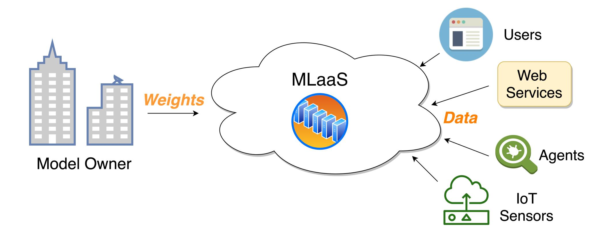
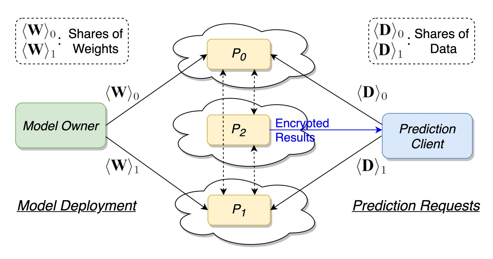
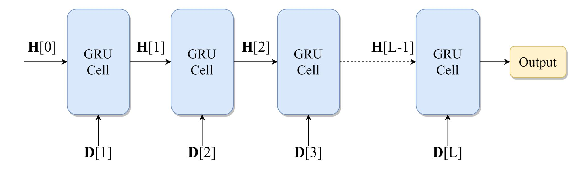
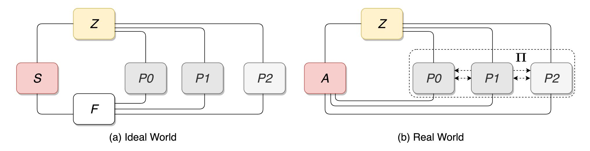
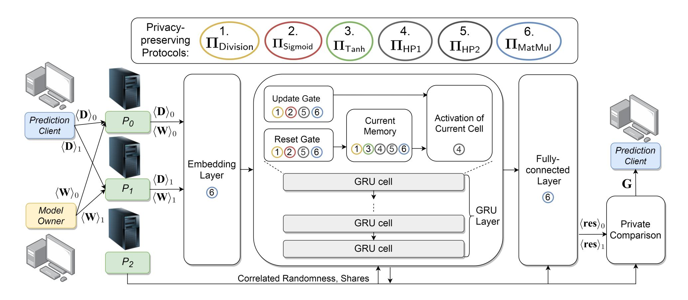
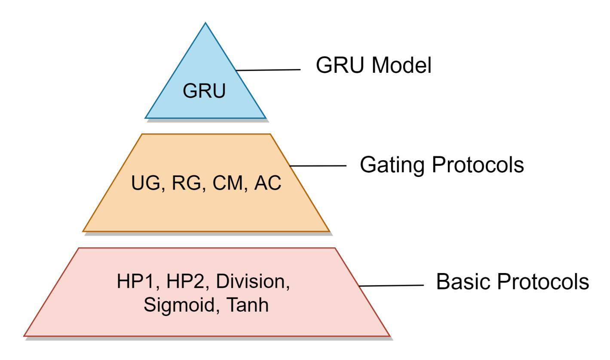
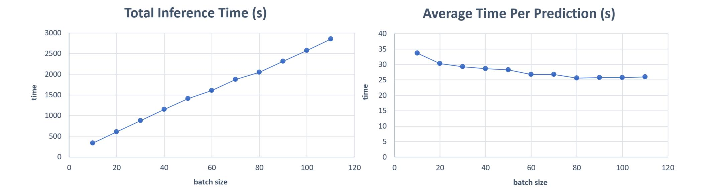

{0}------------------------------------------------

## A Study on Privacy-Preserving GRU Inference Framework\*

SHOU-CHING HSIAO jasmie8431@gmail.com

ZI-YUAN LIU zyliu@cs.nccu.edu.tw

RAYLIN TSO raylin@cs.nccu.edu.tw

*Department of Computer Science National Chengchi University Taipei, Taiwan*

<sup>\*</sup>The previous version of this work appears at Journal of Intelligent & Fuzzy System[\[26](#page-41-0)]. This is the extended work that aims to provide a more reliable construction, safety proof, and experimental results than previous version. Please note that the content of this version is the same with Hsiao's dissertation of National Chengchi University, Taiwan.

{1}------------------------------------------------

## **Abstract**

Gated Recurrent Unit (GRU) has broad application fields, such as sentiment analysis, speech recognition, malware analysis, and other sequential data processing. For low-cost deployment and efficient machine learning services, a growing number of model owners choose to deploy the trained GRU models through Machine-learning-as-a-service (MLaaS). However, privacy has become a significant concern for both model owners and prediction clients, including model weights privacy, input data privacy, and output results privacy. The privacy leakage may be caused by either external intrusion or insider attacks. To address the above issues, this research designs a framework for privacy-preserving GRU models, which aims for privacy scenarios such as predicting on textual data, network packets, heart rate data, and so on. In consideration of accuracy and efficiency, this research uses additive secret sharing to design the basic operations and gating mechanisms of GRU. The protocols can meet the security requirements of privacy and correctness under the Universal Composability framework with the semi-honest adversary. Additionally, the framework and protocols are realized with a proof-of-concept implementation. The experiment results are presented with respect to time consumption and inference accuracy.

**Keywords:** Privacy-preserving, Gated Recurrent Unit Model, Secret Sharing, Universal Composability Framework

{2}------------------------------------------------

## <span id="page-2-0"></span>**Contents**

|   | Abstract |                                            | 3  |
|---|----------|--------------------------------------------|----|
| 1 |          | Introduction                               | 4  |
|   | 1.1      | Motivations and Purposes<br>               | 4  |
|   | 1.2      | Contributions                              | 5  |
| 2 |          | Definitions and Preliminaries              | 7  |
|   | 2.1      | Additive Secret Sharing (ASS)              | 7  |
|   | 2.2      | Gated Recurrent Unit (GRU) Model<br>       | 8  |
|   | 2.3      | Universal Composability (UC) Framework<br> | 9  |
| 3 |          | Technical Literature                       | 11 |
|   | 3.1      | Privacy-preserving Techniques<br>          | 11 |
|   | 3.2      | Privacy-preserving Deep Neural Network     | 12 |
| 4 |          | Privacy-preserving GRU Inference Framework | 13 |
|   | 4.1      | Architecture                               | 13 |
|   | 4.2      | Security Model<br>                         | 13 |
|   |          | 4.2.1<br>Non-colluding Cloud Servers       | 14 |
|   |          | 4.2.2<br>Prediction Clients<br>            | 14 |
|   |          | 4.2.3<br>Outsiders<br>                     | 14 |
|   |          | 4.2.4<br>Network Transmission<br>          | 14 |
|   | 4.3      | Basic Protocols<br>                        | 15 |
|   |          | 4.3.1<br>Hadamard Product<br>              | 16 |
|   |          | 4.3.2<br>Division<br>                      | 17 |
|   |          | 4.3.3<br>Share Re-generation<br>           | 17 |
|   |          | 4.3.4<br>Sigmoid Activation Function       | 18 |
|   |          | 4.3.5<br>Tanh Activation Function<br>      | 19 |
|   | 4.4      | Gating Protocols<br>                       | 19 |
|   |          | 4.4.1<br>Update Gate and Reset Gate<br>    | 20 |
|   |          | 4.4.2<br>Current Memory                    | 20 |
|   |          | 4.4.3<br>Activation of Current Cell<br>    | 20 |
|   | 4.5      | Putting It All Together<br>                | 20 |
| 5 |          | Security Analysis                          | 23 |
|   | 5.1      | Security of Basic Protocols<br>            | 23 |
|   | 5.2      | Security of Gating Protocols<br>           | 28 |
|   | 5.3      | Security of GRU Inference<br>              | 30 |
| 6 |          | Experiments and Results                    | 33 |
|   | 6.1      | Dataset                                    | 33 |
|   | 6.2      | Implementation                             | 33 |
|   | 6.3      | Results                                    | 34 |

{3}------------------------------------------------

CONTENTS 3

| 7 |     | Discussions and Future Works        | 36 |
|---|-----|-------------------------------------|----|
|   | 7.1 | Discussions on Accuracy<br>         | 36 |
|   | 7.2 | Discussions on Time Consumption<br> | 36 |
|   | 7.3 | Potential Collusion Problems        | 37 |
|   | 7.4 | Extended Future Works               | 37 |
| 8 |     | Conclusion                          | 39 |
|   |     | Bibliography                        | 40 |

{4}------------------------------------------------

## <span id="page-4-0"></span>**Chapter 1**

## **Introduction**

Nowadays, many machine learning services are provided through cloud servers. In these scenarios, machine learning is outsourced as a service via cloud-based platforms, which is also known as Machinelearning-as-a-service (MLaaS) [\[43\]](#page-42-0). The model owners benefit from easily deploying the models with low cost and providing the efficient model services that can be accessed by individual users, agents, web services, IoT sensors, and so on. (Figure [1.1\)](#page-5-1). However, the main obstacle to adopting such a scheme lies in data privacy issues. In recent years, data privacy rights have been highly valued. The privacy concerns are raised not only by individuals but also by governments. In Taiwan, Personal Information Protection Act (PDPA)\* has been amended for more strict regulations on private data collection and usage. In 2016, the General Data Protection Regulation (GDPR)† has become an official regulation in Europe. Although there is often a non-disclosure agreement (NDA) to regulate the data disclosure in the outsourcing scenario, the unwilling data breach caused by malicious hackers or insiders is difficult to prevent. Therefore, addressing the above data privacy problem is the main point of this research.

This research focuses on GRU model to design the privacy-preserving protocols. GRU is one of the Recurrent Neural Network (RNN) that is suitable for processing sequential data [[13](#page-40-0)], which can improve the memory consumption and performance of long short-term memory (LSTM). GRU has been applied to many different fields, including sentiment analysis [[4\]](#page-40-1), spam detection [[41\]](#page-42-1), traffic flow prediction [[20\]](#page-41-1), and malware classification [[2\]](#page-40-2). Take sentiment analysis as an example: it has gained in popularity recently due to a wide range of applications, such as corporations collecting feedback from users, politicians analyzing political sentiment on social media, and online service providers rating of customer sentiment services. In these applications, deploying the predicting models on cloud servers is always the option because there are millions of tweets or reviews transmitted from different clients or agents.

### <span id="page-4-1"></span>**1.1 Motivations and Purposes**

MLaaS is a common choice to deploy trained models in recent years. However, privacy issues have become a dominance for individuals or corporations to decide whether to use MLaaS [[29\]](#page-41-2). There are several privacy concerns in such scenarios that we describe as follows. For the model owners, model weights are valuable intellectual property that remains private due to the business value and model security [\[19](#page-41-3)]. On the other hand, it is easy for client-side applications to access machine learning services, but uploading the user data may have privacy concerns. Specifically, if the data contains textual messages, comments, or posts, it always involves private information or position [\[15\]](#page-41-4).

The primary purpose of this research is to design a privacy-preserving GRU inference framework that can be adopted to preserve privacy in a MLaaS scheme. A fundamental solution is to make none of the cloud parties own the private data but still able to compute for prediction collaboratively. In short, the problem is modeled as follows: different cloud parties securely evaluate the GRU inference on shared weights and data such that the privacy of weights, data, and prediction results are kept secret from the point of any single cloud party view. Secret sharing splits a secret into shares to maintain the

<sup>\*</sup>https://law.moj.gov.tw/ENG/LawClass/LawAll.aspx?pcode=I0050021

<sup>†</sup>https://gdpr-info.eu/

{5}------------------------------------------------



<span id="page-5-1"></span>Figure 1.1: MLaaS Scheme.

privacy of the original secret in a distributed way. In consideration of the practicability in real-world implementation, we adopt additive secret sharing in a secure three-party computation setting, which has been empirically proved efficient than other cryptographic primitives while applying to convolutional neural networks [[51](#page-43-0)].

#### <span id="page-5-0"></span>**1.2 Contributions**

This research proposes a new framework for privacy-preserving GRU inference. A high-level architecture is shown in Figure [1.2](#page-6-0), where *P*0, *P*1, and *P*<sup>2</sup> conduct privacy-preserving three-party computation in cloud. In addition to presenting the architecture, we also design protocols for basic operations and gating mechanisms. Our protocols can replace the original operations of GRU inference straightforwardly in a modular way and do not require re-training the models. As the UC framework [\[6,](#page-40-3) [7](#page-40-4)] is adopted to prove the security of each protocol against the honest-but-curious adversary, the universal composition theorem can be applied to leave a flexible model structure for future implementation. That is, our protocols possess high practicability that can compose different privacy-preserving GRU models, and we can deduce the security of these models under the UC framework. Besides, we give a proof-ofconcept implementation to show the feasibility and correctness of our protocols. Finally, the discussions provide a deeper insight into the experiment results and extended future works. In summary, the main contributions of this research are listed below:

- Present a privacy-preserving GRU inference framework to protect model weights privacy, input data privacy, and output results privacy.
- Design basic and gating protocols for GRU inference based on additive secret sharing.
- Show our protocols satisfy UC-security under the honest-but-curious corruption model.
- Conduct a proof-of-concept implementation for a binary sentiment classification case. The accuracy loss is no more than 1.5% compared with the inference without applying the privacypreserving protocols.
- Discuss the experiment results and explain the strategies for potential collusion problems.

{6}------------------------------------------------



<span id="page-6-0"></span>Figure 1.2: High-level Architecture.

{7}------------------------------------------------

### <span id="page-7-0"></span>Chapter 2

### **Definitions and Preliminaries**

This chapter explains the preliminaries and definitions that are used in the following chapters. Our research adopts additive secret sharing as the primary privacy-preserving technique and focuses on the GRU model. Then, security is proved using the UC framework. As a result, we describe the concepts of additive secret sharing, GRU model, and UC framework respectively. For the sake of simplicity, the notations used in this research are presented in Table 2.1.

#### <span id="page-7-1"></span>2.1 Additive Secret Sharing (ASS)

Secret sharing is a notorious cryptographic technique with long history, and there are many existing real-world applications, such as digital rights management [37], bitcoin [52], and privacy-preserving machine learning [36, 39, 42, 51]. Compared with other cryptographic primitives like homomorphic encryption, secret sharing has higher computational performance due to relatively fewer cryptographic assumptions on hard problems. This advantage has attracted many practical implementations. Secret sharing was firstly presented by Adi Shamir [49] and George Blakley [5] respectively in 1979. They design a t-out-of-n threshold secret sharing scheme. The threshold t is the bound of share numbers that can successfully reconstruct secret using Lagrange polynomial interpolation. Another type of secret sharing method is called n-out-of-n secret sharing, where the secret is split into n pieces of shares and the reconstruction is achieved by adding up all the shares. When the shares are further computed for different neural network operations, it is more suitable to adopt n-out-of-n secret sharing method.

This research designs a three-party privacy-preserving GRU inference framework for cloud computing, where  $\mathscr{P}_0$  and  $\mathscr{P}_1$  are two main computing parties that hold the shares and the remaining party  $\mathscr{P}_2$  is responsible for supporting the computation. Accordingly, we adopt 2-out-of-2 secret sharing method in this research. Each main cloud party holds only the secret share, and no individual shareholder is able to recover the original secret. The share generation of secret is shown in the Eq. 2.1:

$$(\langle \mathbf{X} \rangle_0, \langle \mathbf{X} \rangle_1) \leftarrow \mathsf{Share}(\mathbf{X}) = (\mathbf{P} \odot \mathbf{X} + \mathbf{R}, (1 - \mathbf{P}) \odot \mathbf{X} - \mathbf{R}) \tag{2.1}$$

<span id="page-7-3"></span><span id="page-7-2"></span>where we assume the secret matrix is denoted as  $\mathbf{X} \in \mathbb{Q}^{m \times n}$ , and  $\mathbf{P} \stackrel{\$}{\leftarrow} \mathbb{Q}^{m \times n}$  is the random matrix for multiplicative perturbation,  $\mathbf{R} \stackrel{\$}{\leftarrow} \mathbb{Q}^{m \times n}$  is the random matrix for additive perturbation. These random matrices act as the blinding factors for the secret, which are re-generated every usage like the concept of one-time pad. The secret owner generates  $\mathbf{P}$  and  $\mathbf{R}$  locally and sets two secret shares  $\langle \mathbf{X} \rangle_0$  and  $\langle \mathbf{X} \rangle_1$  as " $\mathbf{P} \odot \mathbf{X} + \mathbf{R}$ " and " $(1 - \mathbf{P}) \odot \mathbf{X} - \mathbf{R}$ " respectively, where  $\langle \mathbf{X} \rangle_0$  is sent to  $\mathscr{P}_0$  and  $\langle \mathbf{X} \rangle_1$  is sent to  $\mathscr{P}_1$ . As the random matrix  $\mathbf{P}$  and  $\mathbf{R}$  are randomly chosen every time and only known to the secret owner, any one part of the share reveals no information about the secret from the view of  $\mathscr{P}_0$  or  $\mathscr{P}_1$ . Please note that additive secret sharing is information-theoretically secure, which is the highest level of security. The original secret can be reconstructed by Eq. 2.2. The secret can only be reconstructed when the two shares are known.

$$\mathbf{X} \leftarrow \mathsf{Reconstruct}(\langle \mathbf{X} \rangle_0, \langle \mathbf{X} \rangle_1) = \langle \mathbf{X} \rangle_0 + \langle \mathbf{X} \rangle_1 \tag{2.2}$$

{8}------------------------------------------------

| Symbols | Definitions                                                              |  |  |  |  |
|---------|--------------------------------------------------------------------------|--|--|--|--|
| 〈X〉i    | The share of X which is held by Pi                                       |  |  |  |  |
| ·       | Dot product (matrix multiplication)                                      |  |  |  |  |
| ⊙       | Hadamard product (element-wise matrix multiplication)                    |  |  |  |  |
| σ       | Sigmoid activation function                                              |  |  |  |  |
| tanh    | Tanh activation function                                                 |  |  |  |  |
| ΠY      | Protocol of Y<br>executed in real world for privacy-preserving purposes  |  |  |  |  |
| FY      | Ideal functionality of Y<br>in ideal world which is secure by definition |  |  |  |  |
| P0, P1  | Main computing cloud parties                                             |  |  |  |  |
| P2      | Supporting cloud party                                                   |  |  |  |  |
| M       | Model owner                                                              |  |  |  |  |
| C       | Prediction client                                                        |  |  |  |  |
| Z       | Interactive environment in the UC framework                              |  |  |  |  |
| A       | Real-world adversary                                                     |  |  |  |  |
| S       | Ideal-world simulator                                                    |  |  |  |  |

Table 2.1: Notations.

<span id="page-8-2"></span>In addition to generating shares and reconstructing secret, it is necessary for shareholders to conduct various computations on shares in a privacy-preserving machine learning scenario. To ensure the correctness of the computing results, we need to design protocols for different operations except for addition and subtraction, for additive secret sharing has additively homomorphic property.

#### <span id="page-8-0"></span>**2.2 Gated Recurrent Unit (GRU) Model**

Gated recurrent unit (GRU) model is proposed by Kyunghyun Cho et al. in 2014 [[13](#page-40-0)]. GRU is a newer version of the recurrent neural network (RNN) that is more computationally efficient than long shortterm memory (LSTM) due to its simpler gating mechanisms [\[14\]](#page-40-6). It can address the vanishing gradient problem of RNN and achieve similar results with lower computational overhead. GRU model contains the GRU layer that is composed of a series of GRU cells (Figure [2.1\)](#page-9-0). The input of the cell includes both user data **D**[*j*] and the state of the previous cell **H**[*j −*1]. Each cell contains four kinds of gates: update gate, reset gate, current memory, and activation of the current cell. The following formulas describe the gating computations within the *j*-th cell. The update gate denoted as **Z**[*j*] is shown as Eq. [2.3](#page-8-3).

$$\mathbf{Z}[j] = \sigma(\mathbf{D}[j] \cdot \mathbf{W}_z + \mathbf{H}[j-1] \cdot \mathbf{U}_z + \mathbf{b}_z)$$
(2.3)

<span id="page-8-3"></span>where **D**[*j*] is the input user data, and **H**[*j −*1] represents the state of the previous cell. **W***<sup>z</sup>* and **U***<sup>z</sup>* are the weights of update gate, while the former one is to multiply with user data and the latter one is multiplied by the previous state. In addition, **b***<sup>z</sup>* denotes the bias values. The linear computations are followed by *σ* to make each element in a matrix between 0 and 1. The calculation of reset gate is shown as Eq. [2.4](#page-8-4). The inputs of reset gate are the same as the update gate, but the trained weights differ.

$$\mathbf{R}[j] = \sigma(\mathbf{D}[j] \cdot \mathbf{W}_r + \mathbf{H}[j-1] \cdot \mathbf{U}_r + \mathbf{b}_r)$$
(2.4)

<span id="page-8-6"></span><span id="page-8-5"></span><span id="page-8-4"></span><span id="page-8-1"></span>The usage of update gate and reset gate is to determine how much the previous state is preserved and how much it is forgot. The reset gate is applied in computing the current memory **H**[*j*] *′* , while the update gate is applied in the activation of current cell **H**[*j*], which are shown as Eq. [2.5](#page-8-5) and Eq. [2.6](#page-8-6) respectively. The separation of update gate and reset gate can capture long-term and short-term dependencies in time series [[56](#page-43-2)].

$$\mathbf{H}[j]' = \tanh(\mathbf{D}[j] \cdot \mathbf{W} + (\mathbf{R}[j] \odot \mathbf{H}[j-1]) \cdot \mathbf{U} + \mathbf{b})$$
(2.5)

$$\mathbf{H}[j] = \mathbf{Z}[j] \odot \mathbf{H}[j-1] + (1 - \mathbf{Z}[j]) \odot \mathbf{H}[j]'$$
(2.6)

{9}------------------------------------------------



<span id="page-9-1"></span><span id="page-9-0"></span>Figure 2.1: GRU Layer.



Figure 2.2: Construction of UC Proof.

#### **2.3 Universal Composability (UC) Framework**

UC framework is presented by Canetti et al. [\[6](#page-40-3), [7\]](#page-40-4), which gives very strong definitions of security that can support the modularity of protocols. The main difference between the UC framework and other stand-alone security models, such as the simulation paradigm, is that the UC framework considers more of the threats coming from the execution environment, malicious requests from the adversary, and concurrent execution with other protocols. When a protocol is proved UC-secure, it can be composed with other UC-secure protocols in an arbitrary manner. UC framework is one of the simulation-based proofs that the security is evaluated through the construction of two models: an ideal world and a real world [\[24\]](#page-41-5).

All of the computing elements in the UC framework are in the forms of Interactive Turing Machines (ITMs) with special tapes as I/O and communicating data structures. The conceptual structures of the ideal world and the real world are shown in Figure [2.2](#page-9-1). In the real world, the dashed double-headed arrows between *P*0, *P*1, and *P*<sup>2</sup> represent the execution of our designed protocol **Π**. In correspondence to **Π** in the real world, an ideal functionality *F* carries out the same task of **Π** in an ideally-secure way upon activation with the input shares from dummy *P<sup>i</sup>* . Furthermore, two additional ITM instances (ITIs), environment *Z* and adversary, act as the external roles to represent different aspects of the rest of the system. The adversary in real world is denoted by *A* , while *S* denotes the simulator that gives a simulation of the real-world adversary in ideal world. *Z* handles the initial input to *P<sup>i</sup>* and adversary in the beginning, and receives the outputs from them at the end of the protocol. Besides, *Z* can interact with adversary at anytime during protocol execution, which implies that the adversary can send any potential distinguishable information to *Z* , including intermediate computing values, eavesdropped communication, and any artifacts written to the adversary backdoor tapes. According to the combined view produced by adversary and *P<sup>i</sup>* , *Z* determines which model it is interacting with and outputs a bit. To prove a protocol **Π** UC-realizes the corresponding ideal functionality *F*, one needs to first prove **Π** UC-emulates *F* (Definition [1](#page-10-0) [\[7\]](#page-40-4)). Therefore, an ideal world running *F* with the dummy parties and *S* needs to be simulated and conforms to Definition [2](#page-10-1) [[7](#page-40-4)].

{10}------------------------------------------------

<span id="page-10-0"></span>**Definition 1** (UC Security). Protocol  $\Pi$  UC-realizes ideal functionality  $\mathscr{F}$  if  $\Pi$  UC-emulates  $\mathscr{F}$ .

<span id="page-10-1"></span>**Definition 2** (UC Emulation). Let  $\Pi(\mathcal{P}_0, \mathcal{P}_1, \mathcal{P}_2)$  be a multi-party protocol that emulates the computation of ideal functionality  $\mathcal{F}(\mathcal{P}_0, \mathcal{P}_1, \mathcal{P}_2)$  which is secure by definition. If for every possible real-world adversary  $\mathcal{A}$  during the execution of  $\Pi(\mathcal{P}_0, \mathcal{P}_1, \mathcal{P}_2)$ , there exists an ideal-world simulator  $\mathcal{F}$  perfectly simulating  $\mathcal{A}$  and  $\mathcal{F}(\mathcal{P}_0, \mathcal{P}_1, \mathcal{P}_2)$  such that the combined view of environment  $\mathcal{F}$  between real world  $\mathcal{V}_{\mathcal{F},\mathcal{F},\mathcal{F}}$  is indistinguishable, then  $\Pi(\mathcal{P}_0, \mathcal{P}_1, \mathcal{P}_2)$  UC-emulates  $\mathcal{F}(\mathcal{P}_0, \mathcal{P}_1, \mathcal{P}_2)$ .

Protocols that UC-realize corresponding ideal functionalities can securely combine with other UC-secure protocols regardless of the executing environment or other concurrent processes. That is, for any real-world  $\mathscr{A}$ , there exists an ideal-world  $\mathscr{S}$  to perfectly conduct the simulation such that  $\mathscr{Z}$  cannot distinguish between combined protocols in the real world and combined ideal functionalities in the ideal world. The formal description of universal composition theorem is presented in Definition 3 [7]. Typically, the universal composition operation can be viewed as "subroutine substitution" [7]. If  $\Pi_{\mathscr{B}}$  calls  $\mathscr{F}_{\mathscr{A}}$  as its subroutine and  $\Pi_{\mathscr{A}}$  UC-realizes  $\mathscr{F}_{\mathscr{A}}$ , the parties executing  $\Pi_{\mathscr{B}}$  can substitute a call to an instance of  $\Pi_{\mathscr{A}}$  for an instance of  $\mathscr{F}_{\mathscr{A}}$  because they achieve the same security under arbitrary composition. Accordingly, consider a protocol  $\Pi$  invokes other designed privacy-preserving protocols  $(\Pi_{\mathscr{A}}, \Pi_{\mathscr{B}}, \cdots, \Pi_{\mathscr{N}})$  as subroutines,  $\Pi$  can be formalized as  $(\mathscr{F}_{A}, \mathscr{F}_{\mathscr{B}}, \cdots, \mathscr{F}_{\mathscr{N}})$ -hybrid model that securely invokes corresponding ideal functionalities using universal composition theorem [9].

<span id="page-10-2"></span>**Definition 3** (Universal Composition Theorem). Let  $\Pi_{\mathscr{A}}$  be a protocol that UC-realizes  $\mathscr{F}_{\mathscr{A}}$ , while  $\Pi_{\mathscr{B}}$  be a composed protocol that UC-realizes  $\mathscr{F}_{\mathscr{B}}$  with a call to  $\mathscr{F}_{\mathscr{A}}$  as its subroutine. If  $\Pi_{A}$  is identity-compatible with  $\mathscr{F}_{\mathscr{A}}$  and  $\mathscr{F}_{\mathscr{B}}$ , protocol  $\Pi_{\mathscr{B}}^{\mathscr{F}_{\mathscr{A}} \to \Pi_{\mathscr{A}}}$  UC-realizes  $\mathscr{F}_{\mathscr{B}}$ .

{11}------------------------------------------------

## <span id="page-11-0"></span>**Chapter 3**

## **Technical Literature**

With the development of machine learning applications, how to protect data privacy has become an important topic. Many privacy-preserving techniques exist nowadays, but choosing the required methods for machine learning is a multi-factor issue. As trained weights and users' input are the determinants for the accuracy of the machine-learning models, we should take into account the data utility while enforcing the privacy-preserving measures. Additionally, time consumption is also an crucial consideration for highly computational machine learning models, which largely depends on the essence of applied techniques. Since various machine learning models require different arithmetic and boolean operations, the scalability of each option is concerned with completing the task. To sum up, when it comes to applying privacy-preserving techniques, one needs to consider data utility, time consumption, system scalability, and the level of privacy. The following sections discuss the existing privacy-preserving techniques and focus on the previous works for privacy-preserving neural networks.

#### <span id="page-11-1"></span>**3.1 Privacy-preserving Techniques**

Privacy-preserving techniques mainly include two directions: perturbation methods and cryptographic protocols. Perturbation methods use the randomness to make data incomprehensible or to build noisy function. Differential privacy [[18](#page-41-6)] is one of the state-of-the-art perturbation standards for privacypreserving machine learning. According to the perturbation target, it can be further categorized as output perturbation and objective perturbation mechanisms [[30\]](#page-41-7). The former methods add noise to data before publishing, while the latter mechanisms utilize the noisy function as the machine learning model [[1](#page-40-8)]. Using *ϵ*-differential privacy should make a trade-off between utility and privacy protection level by privacy budget *ϵ*. Perturbation methods have minimal overheads on the efficiency, but they will affect the model accuracy according to the privacy-preserving level.

Cryptographic protocols design the protocols using cryptographic techniques that can preserve the original model accuracy. State-of-the-art research tends to mix different cryptographic primitives to support linear and non-linear computations. Commonly adopted techniques come in three folds: homomorphic encryption (HE) [\[45](#page-42-7)], garbled circuit (GC) [[53](#page-43-3)], and secret sharing (SS) [[5](#page-40-5), [49](#page-42-6)]. HE ensures the effective computation on ciphertext that is equal to computation on plaintext after decryption. To support the addition between ciphertexts, additively HE (AHE) is needed. If the system computes both addition and multiplication between ciphertexts, fully homomorphic encryption (FHE) or leveled homomorphic encryption (LHE) is required. LHE is limited to the number of homomorphic operations, while FHE adopts bootstrapping to reduce the noise [\[36\]](#page-42-3). In short, HE often needs high computation and is faced with noise increasing issues. Yao's GC protocols realize secure two-party computation by constructing functions as boolean circuits [[53\]](#page-43-3). Although garbled circuits can achieve secure function evaluation, the trade-off is heavy communication and thus leads to inefficiency [[39](#page-42-4), [51\]](#page-43-0). SS splits the privacy data into several parts and conducts computation on shares by different shareholders. Additive SS (ASS) is a fundamental solution to simply generate the shares from random numbers. Shamir's SS defines the shares as the point on specific polynomial, where the secret can be reconstructed only when the number of held shares is above the threshold *n*, which is also called (*t*,*n*)-threshold SS [\[49](#page-42-6)]. SS is efficient and intuitive for addition and multiplication but difficult for designing secure non-linear 

{12}------------------------------------------------

operations [[42](#page-42-5)]. To sum up, GC is largely applied to computing secure non-linear operations in machine learning algorithms [[31](#page-41-8), [36,](#page-42-3) [39,](#page-42-4) [42,](#page-42-5) [46](#page-42-8)], while HE [[21](#page-41-9), [31,](#page-41-8) [36,](#page-42-3) [50](#page-43-4)] and secret sharing [\[36,](#page-42-3) [39,](#page-42-4) [42](#page-42-5), [51](#page-43-0)] often realize secure linear operations.

#### <span id="page-12-0"></span>**3.2 Privacy-preserving Deep Neural Network**

As deep learning has become prominent in machine learning fields, more and more researches focus on developing privacy-preserving deep neural network (DNN). CryptoNets [\[21\]](#page-41-9) is presented by Microsoft Research in 2016, which applies neural networks to encrypted data based on LHE. DeepSecure [[46](#page-42-8)] is proposed by Rouhani et al. to mainly use GC as the privacy-preserving technique. To improve the performance, MiniONN [\[36\]](#page-42-3) separates the protocols into offline and online phases. It adopts AHE with optimized techniques like SIMD batch processing in offline phase, and utilizes GC and SS for lightweight computation in online phase. Chameleon [\[42\]](#page-42-5) further categorizes the computation as linear and nonlinear operations, where ASS is adopted to construct linear functions and GC and GMW are used for non-linear operations. In consideration of the massive communication overheads caused by GC, Gazelle [\[31](#page-41-8)] introduces the properties of packed AHE to gain improvement in performance. SecureNN [[51\]](#page-43-0) gives up the combination of privacy-preserving techniques and adopts only ASS. The authors show that SecureNN is the most efficient compared with the previously mentioned researches in the experiments. They also give a deeper insight into the results and show the reasons for the prevalence in performance. In contrast to previous works utilizing hybrid techniques, SecureNN uses only ASS to avoid the communication overheads of sharing conversion. In addition, most of the previous works adopt GC for secure non-linear operations, but SecureNN improves the efficiency of non-linear computations by replacing GC with ASS.

DNN has achieved promising results in various applications, which includes two main types: Convolutional Neural Network (CNN) and Recurrent Neural Network (RNN). Many state-of-the-art privacypreserving neural networks have implemented the operations of CNN, and experimented well on MNIST data for hand-written digit image recognition [[11,](#page-40-9) [36,](#page-42-3) [39,](#page-42-4) [42,](#page-42-5) [51\]](#page-43-0). However, for the scenario of learning on time-series data like nature language processing (NLP), RNN is often adopted. For example, in [[54](#page-43-5)], the authors conduct a systematic comparison of CNN and RNN on a wide range of NLP tasks and give the conclusion that the more critical the semantic of the sentence is, the more suitable it is to adopt RNN [[25,](#page-41-10) [48](#page-42-9)]. Besides, RNN algorithms are stated as the backend techniques of Apple Siri [\[10](#page-40-10)] and Google voice transcription [\[12\]](#page-40-11). In 2014, GRU, one of the improved versions of RNN, is introduced in [\[13\]](#page-40-0) to improve the memory consumption and efficiency of long short-term memory (LSTM). For the privacy-preserving issues, MiniONN [[36](#page-42-3)] is the first time language modeling research that designs specifically for LSTM. Ying et al. propose a privacy-preserving heart failure prediction system based on GRU [[55](#page-43-6)]; however, they do not provide rigorous security proofs for their protocols by UC framework. That means the GRU model structure cannot be arbitrarily constructed with security confirmation and may suffer from coordinated attacks under concurrent real-world scenarios [[23\]](#page-41-11). To the best of our knowledge, designing cryptographic protocols for a general privacy-preserving GRU framework under the UC framework is still an open problem.

Some related researches deal with privacy problems on time-series tasks, among which text representation learning is one of the popular fields. In [[15](#page-41-4)], the authors present a framework for privacypreserving detection of hate speech in text messages with secure multi-party computation. They mainly design the protocols for Logistic Regression (LR) or Adaboost model instead of GRU. In [[3](#page-40-12)], G Beigi et al. present a text representation learning framework, DPText, using differential privacy. In [[34](#page-42-10)], Y Li et al. adopt adversarial learning to obscure private information and learn the unbiased representations. Although it is common to adopt GRU for text representation learning tasks, there is seldom research discussing privacy-preserving GRU for text applications. Our research not only proposes a general privacy-preserving GRU inference framework in Chapter [4](#page-13-0) but also provides complete security proofs in Chapter [5](#page-23-0) and a proof-of-concept implementation on a binary sentiment classification task in Chapter [6.](#page-33-0)

{13}------------------------------------------------

## <span id="page-13-0"></span>**Chapter 4**

# **Privacy-preserving GRU Inference Framework**

In this chapter, we introduce the whole privacy-preserving GRU inference framework. The processes and roles are first discussed in the architecture, followed by the security model. Then, we define different basic and gating protocols that are executed by cloud servers. Finally, a privacy-preserving GRU inference system can be constructed by combining the defined protocols.

#### <span id="page-13-1"></span>**4.1 Architecture**

The roles in our framework are separated into the shareholders (cloud servers) and the dealers (model owner *M* and prediction client *C* ). The cloud servers are denoted as *P*0, *P*1, and *P*2, where *P*<sup>0</sup> and *P*<sup>1</sup> are the main computing servers, and *P*<sup>2</sup> acts as a supporting role to receive intermediate values and generate correlated randomness [[51\]](#page-43-0). To deploy the GRU model in cloud, *M* first generates shares of model weights locally using Eq. [2.1,](#page-7-2) and send the corresponding part of shares to *P*<sup>0</sup> and *P*<sup>1</sup> respectively. Similar to the processing of model weights, *C* generates the shares of prediction data before uploading to *P*<sup>0</sup> and *P*1. Please note that *M* only participates in the initial model deployment and the update of model weights. That means *M* only provides the shares of model weights and has neither the intermediate processing values nor information of prediction results. In comparison, every time *C* requests for model service, *C* will get the final prediction result so that our framework should resist the model weights privacy breach from the corruption of *C* . During the inference, *P*0, *P*1, and *P*<sup>2</sup> are responsible for privacy-preserving GRU computations, where any single server is unable to learn private data from one part of shares. The servers should follow the designed protocols to reach the final prediction, since all of the inputs and intermediate results are in the form of shares. At the end of the computing, *P*<sup>0</sup> and *P*<sup>1</sup> hold the result shares of the fully-connected layer. They finally invoke an instance of private comparison on shares. The masked results of comparison are then held by *P*<sup>2</sup> and sent back to *C* to remove the blinding factors so that the results of the inference are also kept secret from *P*2. We present a privacy-preserving GRU inference framework that contains required protocols and is flexible in the composed model structure. An example of the overall inference process with three-layer GRU model is shown in Figure [4.1.](#page-14-4)

#### <span id="page-13-2"></span>**4.2 Security Model**

Our framework adopts honest-but-curious model (semi-honest adversary) as corruption option under the UC security [[6,](#page-40-3) [7,](#page-40-4) [22](#page-41-12)]. The honest-but-curious model is commonly used in privacy-preserving neural networks because the correctness of prediction results are also concerned under privacy construction. That is, the adversary can corrupt one party in maximum and view all of the processing values and internal states held by that party; however, the adversary is not able to make the corrupted party malicious for breaking the protocols, which may destroy the predicting power of the original inference systems. As this research is to address the privacy issues for MLaaS, the attacks from outer environment and unsafe networks should be considered, which is simulated in the UC framework. To state

{14}------------------------------------------------



<span id="page-14-4"></span>Figure 4.1: Overall GRU Inference Process.

the feasibility of practical applications, this research ensures that all of the protocols are UC-secure so that our protocols remain secure in any real-world composition. Please note that the protected privacy targets include model weights privacy, input data privacy, and output results privacy. Thus, every party except for privacy holders should not learn the values of the privacy targets. The security analysis and proofs are presented in Chapter [5](#page-23-0), and the potential adversaries and network transmission settings are described as follows.

#### <span id="page-14-0"></span>**4.2.1 Non-colluding Cloud Servers**

We define *P*0, *P*1, and *P*<sup>2</sup> as honest-but-curious non-colluding cloud servers. They follow the instructions of designed protocols without colluding but try to learn any private values as much as possible. The information held by *P*<sup>0</sup> and *P*<sup>1</sup> includes the inputs, processing values, and final results, all of which are in the form of shares. On the other hand, the values held by *P*<sup>2</sup> are the generated randomness and some protocol intermediate values. No matter which cloud party *A* corrupts, all of the values accessible by *A* should be indistinguishable from simulated values output by *S* in the ideal world.

#### <span id="page-14-1"></span>**4.2.2 Prediction Clients**

Prediction client *C* owns the input data in our scheme and is one of the privacy owners on the one hand. On the other hand, *C* can get access to the model results and may try to launch model extraction attacks [\[27](#page-41-13)] to cause a privacy breach on the model owner *M*. Since the clients do not participate in the processes of inference, the privacy threats caused by *C* will mainly focus on the security analysis of the GRU inference outputs, which is discussed in Theorem [7.](#page-30-1)

#### <span id="page-14-2"></span>**4.2.3 Outsiders**

In addition to the insider attacks, privacy threats may also come from the outsiders. In our security model, the adversary can only corrupt at most one of the cloud servers and obtain the information that corrupted party holds. Accordingly, the simulation of outsider attacks is the same as the insider attacks among non-colluding servers and prediction clients.

#### <span id="page-14-3"></span>**4.2.4 Network Transmission**

UC framework gives the adversary the power of controlling the network transmission to view the sent values. As we adopt honest-but-curious adversary options, the network transmission holds the properties of integrity and authentication, which can be implemented by the hash function and public-key

{15}------------------------------------------------



<span id="page-15-3"></span>Figure 4.2: Protocol Hierarchy.

encryption system. However, the adversary is able to eavesdrop the network transmission values as the passive attacks. That means any confidential transmitted values should be protected by secure transmission mechanisms [\[7\]](#page-40-4). We use **Π**ST (Protocol [1\)](#page-15-2) to share the data securely. If *P<sup>a</sup>* is about to securely send a message *M* to *Pb*, they first create a shared key through a non-interactive mechanism such as a Diffie-Hellman key exchange (DHKE) protocol [[16](#page-41-14)]. Then, *P<sup>a</sup>* and *P<sup>b</sup>* can use secure symmetric encryption such as Advanced Encryption Standard (AES) [\[44\]](#page-42-11) with the pre-shared key *k* to conduct the encryption and decryption.

**Protocol 1** Secure Transmission **Π**ST(*Pa*,*Pb*)

<span id="page-15-2"></span>**Input:** *P<sup>a</sup>* inputs a message *M*.

**Output:** *P<sup>a</sup>* and *P<sup>b</sup>* share the message *M* securely.

- 1: **Setup**: *P<sup>a</sup>* and *P<sup>b</sup>* constructs a shared key *k* through a non-interactive key exchange protocol.
- 2: *P<sup>a</sup>* encrypts *M* with *k* and sets *C = Enck*(*M*).
- 3: *P<sup>a</sup>* sends *C* to *Pb*.
- 4: *P<sup>b</sup>* decrypts *C* with *k* and obtains *M* through *M = Deck*(*C*).

#### <span id="page-15-0"></span>**4.3 Basic Protocols**

<span id="page-15-1"></span>Basic protocols are in the bottom layer in the protocol hierarchy as shown in Figure [4.2](#page-15-3). These protocols not only support the gating protocols but also compose other layers of GRU model, such as the embedding layer and the fully-connected layer. As DNN is typical for mixing various linear and non-linear operations, our basic protocols define both linear and non-linear operations that are used in GRU model. Linear operations include addition, subtraction, multiplication and division functions. ASS is additively homomorphic so that the addition and subtraction of shares can be conducted directly by shareholders. Matrix multiplication includes dot product and hadamard product. For dot product, this paper adapts **Π**MatMul in SecureNN [\[51\]](#page-43-0) to the version against passive network attacks. Namely, we add the randomized protections on network transmission values, such as *〈***E***〉<sup>j</sup> +***R***<sup>E</sup>* and *〈***F***〉<sup>j</sup> +***R***F*, where **R***<sup>E</sup>* and **R***<sup>F</sup>* are pre-shared random matrices between *P*<sup>0</sup> and *P*1. Furthermore, hadamard product is defined by **Π**HP1 and **Π**HP2 in our protocols, and division on matrix elements is defined by **Π**Division. On the other hand, Sigmoid and Tanh activation function are the main non-linear operations defined by **Π**Sigmoid and **Π**Tanh respectively. Some of the basic protocols include a setup phase which is used to generate and distribute required randomness. Since the randomness generated in setup phase is independent of the following protocol computations, setup can be conducted offline to reduce the online communication amount.

{16}------------------------------------------------

#### 4.3.1 Hadamard Product

Hadamard product realizes the element-wise matrix multiplication.  $\Pi_{HP1}$  (Protocol 2) and  $\Pi_{HP2}$  (Protocol 3) both implement the computations of hadamard product. The difference between  $\Pi_{HP1}$  and  $\Pi_{HP2}$  is the input of the protocols. The inputs of  $\Pi_{HP1}$  are shares of matrix  $\mathbf{X}$  and  $\mathbf{Y}$ , where  $\mathscr{P}_0$  and  $\mathscr{P}_1$  only hold one part of the multiplicative operands ( $\mathscr{P}_0$  holds  $\langle \mathbf{X} \rangle_0$ ,  $\langle \mathbf{Y} \rangle_0$  and  $\mathscr{P}_1$  holds one of the complete multiplicative operands respectively ( $\mathscr{P}_0$  holds matrix  $\mathbf{X}$  and  $\mathscr{P}_1$  holds matrix  $\mathbf{Y}$ ). The reason why we separate the computation of hadamard product into two protocols is the consideration of efficiency. Indeed,  $\Pi_{HP1}$  can also complete the task of  $\Pi_{HP1}$  by setting one of the shares to zero matrix. However, the communication amount of using  $\Pi_{HP2}$  is lower than adopting  $\Pi_{HP1}$  while  $\mathscr{P}_0$  and  $\mathscr{P}_1$  hold the complete multiplicative operands. The comparison of  $\Pi_{HP1}$  and  $\Pi_{HP2}$  is shown in Table 4.1, where we assume the dimension of input matrix is  $m \times n$  and each element contains l bits.

At the beginning of the protocols,  $\mathscr{P}_0$ ,  $\mathscr{P}_1$ , and  $\mathscr{P}_2$  first run a protocol setup that generates the preshared randomness and correlated randomness. The pre-shared matrices  $\mathbf{R}_D$  and  $\mathbf{R}_E$  are randomly generated by  $\mathscr{P}_0$ , while  $\mathscr{P}_2$  is responsible for generating random multiplication triples  $\mathbf{A}$ ,  $\mathbf{B}$ , and  $\mathbf{C}$  [28]. The randomness is used as the blinding factor to mask the secret during the computing; therefore, the transmission in setup is conducted through the secure transmission channel  $\mathbf{\Pi}_{ST}$ . Our construction of  $\mathbf{\Pi}_{HP1}$  is inspired by  $\mathbf{\Pi}_{MatMul}$  in SecureNN [51], while  $\mathbf{\Pi}_{HP2}$  is inspired by A-SS Engine in Chameleon [42] using Du-Atallah protocol [17]. In the final output, the shares of results are added by shares of zero matrix  $\langle \mathbf{U} \rangle_0$  and  $\langle \mathbf{U} \rangle_1$ , which are the common randomness that aims for retaining the fresh shares for the following computations [51].

#### **Protocol 2** Hadamard Product 1 $\Pi_{HP1}(\mathscr{P}_0, \mathscr{P}_1, \mathscr{P}_2)$

<span id="page-16-1"></span>**Input:**  $\mathscr{P}_0$  holds  $\langle \mathbf{X} \rangle_0, \langle \mathbf{Y} \rangle_0 \in \mathbb{Q}^{m \times n}$  and  $\mathscr{P}_1$  holds  $\langle \mathbf{X} \rangle_1, \langle \mathbf{Y} \rangle_1 \in \mathbb{Q}^{m \times n}$ .

**Output:**  $\mathscr{P}_0$ ,  $\mathscr{P}_1$  obtain  $\langle \mathbf{X} \odot \mathbf{Y} \rangle_0$  and  $\langle \mathbf{X} \odot \mathbf{Y} \rangle_1$  respectively.

- 1: **Setup**:  $\mathscr{P}_0$  picks random matrices  $\mathbf{R}_D \stackrel{\$}{\leftarrow} \mathbb{Q}^{m \times n}$ ,  $\mathbf{R}_E \stackrel{\$}{\leftarrow} \mathbb{Q}^{m \times n}$ .  $\mathscr{P}_2$  picks a zero matrix  $\mathbf{U} \in \mathbb{Q}^{m \times n}$  and random matrices  $\mathbf{A} \stackrel{\$}{\leftarrow} \mathbb{Q}^{m \times n}$ ,  $\mathbf{B} \stackrel{\$}{\leftarrow} \mathbb{Q}^{m \times n}$ , where  $\mathbf{C} = \mathbf{A} \odot \mathbf{B}$ . Then,  $\mathscr{P}_2$  generates shares by calling Share( $\mathbf{U}$ ) =  $\langle \mathbf{U} \rangle_0$ ,  $\langle \mathbf{U} \rangle_1$ ; Share( $\mathbf{A}$ ) =  $\langle \mathbf{A} \rangle_0$ ,  $\langle \mathbf{A} \rangle_1$ ; Share( $\mathbf{B}$ ) =  $\langle \mathbf{B} \rangle_0$ ,  $\langle \mathbf{B} \rangle_0$ ,  $\langle \mathbf{B} \rangle_1$ ; Share( $\mathbf{C}$ ) =  $\langle \mathbf{C} \rangle_0$ ,  $\langle \mathbf{C} \rangle_1$ . Finally,  $\mathscr{P}_2$  and  $\mathscr{P}_0$  call  $\mathbf{\Pi}_{ST}(\mathscr{P}_2,\mathscr{P}_0)$  with  $\mathscr{P}_2$  having input ( $\langle \mathbf{A} \rangle_0$ ,  $\langle \mathbf{B} \rangle_0$ ,  $\langle \mathbf{C} \rangle_0$ ,  $\langle \mathbf{U} \rangle_0$ );  $\mathscr{P}_2$  and  $\mathscr{P}_1$  call  $\mathbf{\Pi}_{ST}(\mathscr{P}_2,\mathscr{P}_1)$  with  $\mathscr{P}_2$  having input ( $\langle \mathbf{A} \rangle_1$ ,  $\langle \mathbf{B} \rangle_1$ ,  $\langle \mathbf{C} \rangle_1$ ,  $\langle \mathbf{U} \rangle_1$ );  $\mathscr{P}_0$  and  $\mathscr{P}_1$  call  $\mathbf{\Pi}_{ST}(\mathscr{P}_0,\mathscr{P}_1)$  with  $\mathscr{P}_0$  having input ( $\mathbf{R}_D$ ,  $\mathbf{R}_E$ ).
- 2:  $\mathscr{P}_0$  sets  $\langle \mathbf{D} \rangle_0 = \langle \mathbf{X} \rangle_0 + \langle \mathbf{A} \rangle_0 + \mathbf{R}_D$ ,  $\langle \mathbf{E} \rangle_0 = \langle \mathbf{Y} \rangle_0 + \langle \mathbf{B} \rangle_0 + \mathbf{R}_E$  and  $\mathscr{P}_1$  sets  $\langle \mathbf{D} \rangle_1 = \langle \mathbf{X} \rangle_1 + \langle \mathbf{A} \rangle_1 + \mathbf{R}_D$ ,  $\langle \mathbf{E} \rangle_1 = \langle \mathbf{Y} \rangle_1 + \langle \mathbf{B} \rangle_1 + \mathbf{R}_E$ .
- 3:  $\mathscr{P}_0$  sends  $\langle \mathbf{D} \rangle_0$ ,  $\langle \mathbf{E} \rangle_0$  to  $\mathscr{P}_1$ , while  $\mathscr{P}_1$  sends  $\langle \mathbf{D} \rangle_1$ ,  $\langle \mathbf{E} \rangle_1$  to  $\mathscr{P}_0$ . Then,  $\mathscr{P}_0$  and  $\mathscr{P}_1$  can set  $\mathbf{D} = \mathsf{Reconstruct}(\langle \mathbf{D} \rangle_0, \langle \mathbf{D} \rangle_1) 2 \times \mathbf{R}_D$  and  $\mathbf{E} = \mathsf{Reconstruct}(\langle \mathbf{E} \rangle_0, \langle \mathbf{E} \rangle_1) 2 \times \mathbf{R}_E$ .
- 4:  $\mathscr{P}_0$  sets  $\langle \mathbf{X} \odot \mathbf{Y} \rangle_0 = -\mathbf{D} \odot \mathbf{E} + \langle \mathbf{X} \rangle_0 \odot \mathbf{E} + \mathbf{D} \odot \langle \mathbf{Y} \rangle_0 + \langle \mathbf{C} \rangle_0 + \langle \mathbf{U} \rangle_0$  and  $\mathscr{P}_1$  sets  $\langle \mathbf{X} \odot \mathbf{Y} \rangle_1 = \langle \mathbf{X} \rangle_1 \odot \mathbf{E} + \mathbf{D} \odot \langle \mathbf{Y} \rangle_1 + \langle \mathbf{C} \rangle_1 + \langle \mathbf{U} \rangle_1$ .

#### **Protocol 3** Hadamard Product 2 $\Pi_{HP2}(\mathscr{P}_0, \mathscr{P}_1, \mathscr{P}_2)$

<span id="page-16-2"></span>**Input:**  $\mathscr{P}_0$  holds  $\mathbf{X} \in \mathbb{Q}^{m \times n}$  and  $\mathscr{P}_1$  holds  $\mathbf{Y} \in \mathbb{Q}^{m \times n}$ .

**Output:**  $\mathscr{P}_0$ ,  $\mathscr{P}_1$  obtain  $\langle \mathbf{X} \odot \mathbf{Y} \rangle_0$  and  $\langle \mathbf{X} \odot \mathbf{Y} \rangle_1$  respectively.

- 1: **Setup**:  $\mathscr{P}_0$  picks random matrices  $\mathbf{R}_D \stackrel{\$}{\leftarrow} \mathbb{Q}^{m \times n}$ ,  $\mathbf{R}_E \stackrel{\$}{\leftarrow} \mathbb{Q}^{m \times n}$ .  $\mathscr{P}_2$  picks a zero matrix  $\mathbf{U} \in \mathbb{Q}^{m \times n}$  and random matrices  $\mathbf{A} \stackrel{\$}{\leftarrow} \mathbb{Q}^{m \times n}$ ,  $\mathbf{B} \stackrel{\$}{\leftarrow} \mathbb{Q}^{m \times n}$ , where  $\mathbf{C} = \mathbf{A} \odot \mathbf{B}$ . Then,  $\mathscr{P}_2$  generates shares by calling Share( $\mathbf{U}$ ) =  $\langle \mathbf{U} \rangle_0$ ,  $\langle \mathbf{U} \rangle_1$  and Share( $\mathbf{C}$ ) =  $\langle \mathbf{C} \rangle_0$ ,  $\langle \mathbf{C} \rangle_1$ . Finally,  $\mathscr{P}_2$  and  $\mathscr{P}_0$  call  $\mathbf{\Pi}_{ST}(\mathscr{P}_2, \mathscr{P}_0)$  with  $\mathscr{P}_2$  having input ( $\mathbf{A}$ ,  $\langle \mathbf{C} \rangle_0$ ,  $\langle \mathbf{U} \rangle_0$ );  $\mathscr{P}_2$  and  $\mathscr{P}_1$  call  $\mathbf{\Pi}_{ST}(\mathscr{P}_2, \mathscr{P}_1)$  with  $\mathscr{P}_2$  having input ( $\mathbf{B}$ ,  $\langle \mathbf{C} \rangle_1$ ,  $\langle \mathbf{U} \rangle_1$ );  $\mathscr{P}_0$  and  $\mathscr{P}_1$  call  $\mathbf{\Pi}_{ST}(\mathscr{P}_0, \mathscr{P}_1)$  with  $\mathscr{P}_0$  having input ( $\mathbf{R}_D, \mathbf{R}_E$ ).
- 2:  $\mathscr{P}_0$  sets  $\mathbf{D} = \mathbf{X} + \mathbf{A} + \mathbf{R}_D$  and sends  $\mathbf{D}$  to  $\mathscr{P}_1$ . Similarly,  $\mathscr{P}_1$  sets  $\mathbf{E} = \mathbf{Y} + \mathbf{B} + \mathbf{R}_E$  and sends  $\mathbf{E}$  to  $\mathscr{P}_0$ .
- <span id="page-16-0"></span>3:  $\mathscr{P}_0$  sets  $\langle \mathbf{X} \odot \mathbf{Y} \rangle_0 = -\mathbf{A} \odot (\mathbf{E} - \mathbf{R}_E) + \langle \mathbf{C} \rangle_0 + \langle \mathbf{U} \rangle_0$  and  $\mathscr{P}_1$  sets  $\langle \mathbf{X} \odot \mathbf{Y} \rangle_1 = \mathbf{Y} \odot (\mathbf{D} - \mathbf{R}_D) + \langle \mathbf{C} \rangle_1 + \langle \mathbf{U} \rangle_1$ .

{17}------------------------------------------------

| Protocol    | Usage                            | Rounds | Offline Communication | Online Communication |
|-------------|----------------------------------|--------|-----------------------|----------------------|
| $\Pi_{HP1}$ | $\Pi_{CM}$ and $\Pi_{AC}$        | 2.5    | 10mnl                 | 4mnl                 |
| $\Pi_{HP2}$ | $\Pi_{Sigmoid}$ and $\Pi_{Tanh}$ | 2.5    | 8mnl                  | 2mnl                 |

Table 4.1: Comparison of  $\Pi_{HP1}$  and  $\Pi_{HP2}$ .

#### <span id="page-17-2"></span>4.3.2 Division

 $\Pi_{\text{Division}}$  (Protocol 4) realizes the element-wise division between matrix shares. Inspired by  $\Pi_{\text{DIV}}$  in SecureNN [51],  $\Pi_{\text{Division}}$  implements bit-by-bit long division on each matrix element. To determine each bit of the quotient, the protocol needs a comparison function. In contrast to  $\Pi_{\text{DIV}}$  in SecureNN [51] invoking one call to  $\Pi_{DReLU}$ ,  $\Pi_{Division}$  calls  $\Pi_{PC}$  [51] directly that can reduce the communication amount.  $\Pi_{PC}$  is a private comparison protocol in SecureNN [51] that can compare the share with a known value to both  $\mathscr{P}_0$  and  $\mathscr{P}_1$ . However, one requirement is that the input share should be in the bit share format, which is difficult to convert from the common share format. To avoid the format conversion problem, we first generate a random matrix in different formats, where  $\langle (\mathbf{R})_2 \rangle_i$  denotes the share in the bit share format, and  $\langle \mathbf{R} \rangle_i$  denotes the share in the common share format. Then, the target share  $\langle a' \rangle_i$  (share to compare) is masked by the element of  $\langle \mathbf{R} \rangle_i$  so that the target share can be exchanged and reconstructed without privacy breach. This way, we can transform the comparison from "target share  $\langle a \rangle_i$  with zero" to "the random value with the addition of target share  $\langle a \rangle_i$  and random value". In  $\Pi_{\text{Division}}$ ,  $\mathbf{R}_a$  and  $\mathbf{R}_b$ are random matrices only shared between  $\mathscr{P}_0$  and  $\mathscr{P}_1$  to prevent the eavesdrop from corrupted  $\mathscr{P}_2$ .  $\mathbf{R}_a$ is added to  $\langle a \rangle_i$  and removed after network transmission, while  $\mathbf{R}_b$  is a random binary matrix used to mask the result of comparison and the result can be extracted by XORing with the element of  $\mathbf{R}_b$ . We expect the result to be 1 if the target value a is positive, so the returned value from  $\mathcal{P}_2$  is subtracted from 1.

 $\Pi_{\text{Division}}$  launches two for loops. The outer loop iterates through each matrix element, while the inner loop is to calculate the quotient bit-by-bit from the most significant bit (MSB). We set the quotient value x as  $l_Q$ -bit binary and thus the maximum value of x is  $2^{l_Q}-1$ . Then, we determine the j-th bit  $x_j$  using Eq. 4.1, where  $\omega$  represents the dividend and  $\mu$  denotes the divisor. To conduct the comparison, we utilize signed number representations to convert compared values to bit encoding, and the bit length is set to  $l_Q+2$ . The variable  $\langle u_l \rangle_i$  in  $\Pi_{\text{Division}}$  is used to memorize the product of the divisor and binary values of the quotient that have been calculated, which is exactly " $\mu \times \sum_{h=j+1}^{l_Q} 2^{h-1} \times x_h$ " in Eq. 4.1. Before conducting a comparison,  $\langle u_l \rangle_i$  is subtracted from the dividend. Please note that  $\Pi_{\text{Division}}$  securely computes the division and obtains the quotient in the truncated integer form. Therefore, we should decide the precision by multiplying a multiple of ten to shift the dividend before invoking an instance of  $\Pi_{\text{Division}}$ . The results of  $\Pi_{\text{Division}}$  are inversely shifted backwards after the end of  $\Pi_{\text{Division}}$ . A trivial issue is that the shift of dividends should not make the results exceed the upper bound of  $2^{l_Q}-1$ .

$$x_{j} = \begin{cases} 1, & \text{if } \omega - \mu \times \sum_{h=j+1}^{l_{Q}} 2^{h-1} \times x_{h} - \mu \times 2^{j-1} \ge 0; \\ 0, & \text{otherwise.} \end{cases}$$
 (4.1)

#### <span id="page-17-3"></span><span id="page-17-0"></span>4.3.3 Share Re-generation

<span id="page-17-1"></span>The main purpose of share re-generation is to prevent the overflowing problem. When  $\mathscr{P}_0$  and  $\mathscr{P}_1$  compute the protocols on shares after large dimensions of matrix operations like matrix multiplication, it is likely to generate great differences between shares. Such shares with large values will lead to overflowing especially for exponential calculation in  $\Pi_{\text{Sigmoid}}$  (Protocol 6) and  $\Pi_{\text{Tanh}}$  (Protocol 7). To address the overflowing problems, re-generating the shares between  $\mathscr{P}_0$  and  $\mathscr{P}_1$  is necessary.  $\mathscr{P}_0$  and  $\mathscr{P}_1$  cannot directly exchange the share because we require either of  $\mathscr{P}_i$  should not learn the reconstructed secrets. In  $\Pi_{\text{Regen}}$  (Protocol 5),  $\langle \mathbf{X} \rangle_0$  is masked by a random matrix  $\mathbf{R}$  to form the  $\mathbf{Mix} \in \mathbb{Q}^{m \times n}$  such that  $\mathscr{P}_1$  can not obtain the secret  $\mathbf{X}$  from  $\mathbf{Mix}$ . In addition, as  $\langle \mathbf{X}' \rangle_1$  is unknown to  $\mathscr{P}_0$ ,  $\mathbf{X}$  also remains a secret to  $\mathscr{P}_0$ .

{18}------------------------------------------------

#### **Protocol** 4 Division $\Pi_{\text{Division}}(\mathscr{P}_0, \mathscr{P}_1, \mathscr{P}_2)$

<span id="page-18-1"></span>**Input:**  $\mathscr{P}_0$  holds  $\langle \mathbf{X} \rangle_0, \langle \mathbf{Y} \rangle_0 \in \mathbb{Q}^{m \times n}$  and  $\mathscr{P}_1$  holds  $\langle \mathbf{X} \rangle_1, \langle \mathbf{Y} \rangle_1 \in \mathbb{Q}^{m \times n}$ .

**Output:**  $\mathscr{P}_0$ ,  $\mathscr{P}_1$  obtain  $\langle \mathbf{D} \rangle_0$  and  $\langle \mathbf{D} \rangle_1$  respectively.

- 1: **Setup**:  $\mathscr{P}_0$  picks  $l_Qmn$  random bits  $\mathbf{R}_b \in \{0,1\}^{mn \times l_Q}$  and a random matrix  $\mathbf{R}_a \stackrel{\$}{\leftarrow} \mathbb{Z}_{2^{l_Q}}^{mn \times l_Q}$ .  $\mathscr{P}_2$  picks a zero vector u[k] for  $k \in \mathbb{Z}_{mn}^+$ , a zero matrix  $\mathbf{U} \in \mathbb{Q}^{m \times n}$ , and three random matrices  $\mathbf{R} \stackrel{\$}{\leftarrow} \mathbb{Z}_{2^{l_Q}}^{mn \times l_Q}$ ,  $\mathbf{R}_{\alpha 0} \stackrel{\$}{\leftarrow} \mathbb{Z}_{2^{l_Q}}^{mn \times l_Q}$ . Then,  $\mathscr{P}_2$  generates shares by calling Share( $\mathbf{U}$ ) =  $\langle \mathbf{U} \rangle_0$ ,  $\langle \mathbf{U} \rangle_1$ ; Share( $\mathbf{R}$ ) =  $\langle \mathbf{R} \rangle_0$ ,  $\langle \mathbf{R} \rangle_1$ , Share( $\mathbf{R}$ ) =  $\langle (\mathbf{R})_2 \rangle_0$ ,  $\langle (\mathbf{R})_2 \rangle_1$ ; Share( $\mathbf{u}$ ) =  $\langle \mathbf{u} \rangle_0$ ,  $\langle \mathbf{u} \rangle_1$ . Finally,  $\mathscr{P}_0$  and  $\mathscr{P}_2$  call  $\mathbf{\Pi}_{ST}(\mathscr{P}_2,\mathscr{P}_0)$  with  $\mathscr{P}_2$  having input ( $\langle \mathbf{U} \rangle_0$ ,  $\langle \mathbf{u} \rangle_0$ ,  $\langle \mathbf{R} \rangle_0$ ,  $\langle (\mathbf{R})_2 \rangle_0$ ,  $\mathbf{R}_{\alpha 0}$ );  $\mathscr{P}_1$  and  $\mathscr{P}_2$  call  $\mathbf{\Pi}_{ST}(\mathscr{P}_2,\mathscr{P}_1)$  with  $\mathscr{P}_2$  having input ( $\langle \mathbf{U} \rangle_1$ ,  $\langle \mathbf{R} \rangle_1$ ,  $\langle (\mathbf{R})_2 \rangle_1$ ,  $\mathbf{R}_{\alpha 1}$ );  $\mathscr{P}_1$  and  $\mathscr{P}_0$  call  $\mathbf{\Pi}_{ST}(\mathscr{P}_0,\mathscr{P}_1)$  with  $\mathscr{P}_0$  having input ( $\mathbf{R}_b$ ,  $\mathbf{R}_a$ ).
- 2: **for**  $k = \{1, \dots, m \times n\}$  **do**
- 3: For  $i \in \{0,1\}$ ,  $\mathscr{P}_i$  sets  $\langle u_{l_Q} \rangle_i = \langle u[k] \rangle_i$
- 4: **for**  $l = \{l_Q, \dots, 1\}$  **do**
- 5: For  $i \in \{0, 1\}$ ,  $\mathscr{P}_i$  sets  $\langle a \rangle_i = \langle \mathbf{X}[k] \rangle_i \langle u_l \rangle_i 2^{l-1} \times \langle \mathbf{Y}[k] \rangle_i$ .
- 6: For  $i \in \{0, 1\}$ ,  $\mathscr{P}_i$  sets  $\langle a' \rangle_i = \langle a \rangle_i + \langle \mathbf{R}[k][l] \rangle_i + \mathbf{R}_a[k][l]$ .
- 7:  $\mathscr{P}_0$ ,  $\mathscr{P}_1$  exchange  $\langle a' \rangle_0$ ,  $\langle a' \rangle_1$  and reconstruct a'.
- 8:  $\mathscr{P}_0$ ,  $\mathscr{P}_1$ , and  $\mathscr{P}_2$  call  $\Pi_{PC}(\mathscr{P}_0, \mathscr{P}_1, \mathscr{P}_2)$  with  $\mathscr{P}_i$ ,  $i \in \{0, 1\}$  having input  $(\langle (\mathbf{R})_2[k][l] \rangle_i$ ,  $a' 2 \times \mathbf{R}_a[k][l]$ ,  $\mathbf{R}_b[k][l]$ ). Finally,  $\mathscr{P}_2$  learns a bit  $\delta$  and sets  $\alpha = 1 \delta$ .
- 9:  $\mathscr{P}_2$  generates shares by calling Share( $\alpha$ ) =  $\langle \alpha \rangle_0$ ,  $\langle \alpha \rangle_1$ . Then,  $\mathscr{P}_2$  sets  $\langle \alpha' \rangle_0 = \langle \alpha \rangle_0 + \mathbf{R}_{\alpha 0}[k][l]$  and  $\langle \alpha' \rangle_1 = \langle \alpha \rangle_1 + \mathbf{R}_{\alpha 1}[k][l]$ .
- 10:  $\mathscr{P}_2$  sends  $\langle \alpha' \rangle_0$  to  $\mathscr{P}_0$  and  $\langle \alpha' \rangle_1$  to  $\mathscr{P}_1$ , so  $\mathscr{P}_0$  and  $\mathscr{P}_1$  can recover  $\langle \alpha \rangle_0$  and  $\langle \alpha \rangle_1$  respectively.
- 11:  $\mathscr{P}_0 \text{ sets } \langle \gamma \rangle_0 = \langle \alpha \rangle_0 + \mathbf{R}_b[k][l] 2 \times \mathbf{R}_b[k][l] \times \langle \alpha \rangle_0 \text{ and } \mathscr{P}_1 \text{ sets } \langle \gamma \rangle_1 = \langle \alpha \rangle_1 2 \times \mathbf{R}_b[k][l] \times \langle \alpha \rangle_1.$
- 12:  $\mathscr{P}_0, \mathscr{P}_1, \text{ and } \mathscr{P}_2 \text{ call } \Pi_{\mathsf{HP}1}(\mathscr{P}_0, \mathscr{P}_1, \mathscr{P}_2) \text{ with } \mathscr{P}_i, i \in \{0,1\} \text{ having input } (\langle \gamma \rangle_i, \langle 2^{l-1} \times \mathbf{Y}[k] \rangle_i). \text{ Then,}$   $\mathscr{P}_0 \text{ learns } \langle v \rangle_0 \text{ and } \mathscr{P}_1 \text{ learns } \langle v \rangle_1.$
- 13: For  $i \in \{0,1\}$ ,  $\mathscr{P}_i$  sets  $\langle m_l \rangle_i = 2^{l-1} \times \langle \gamma \rangle_i$  and  $\langle u_{l-1} \rangle_i = \langle u_l \rangle_i + \langle v \rangle_i$ .
- 14: **end for**
- 15: For  $i \in \{0, 1\}$ ,  $\langle \mathbf{D}'[k] \rangle_i = \sum_{l=1}^{l_Q} \langle m_l \rangle_i$ .
- 16: **end for**
- 17: Finally,  $\mathscr{P}_0$  set  $\langle \mathbf{D} \rangle_0 = \langle \mathbf{D}' \rangle_0 + \langle \mathbf{U} \rangle_0$  and  $\mathscr{P}_1$  sets  $\langle \mathbf{D} \rangle_1 = \langle \mathbf{D}' \rangle_1 + \langle \mathbf{U} \rangle_1$ .

#### 4.3.4 Sigmoid Activation Function

Sigmoid activation function is a non-linear function that squashes the input value between 0 and 1. If the input is a negative value, the output will be lower than  $\frac{1}{2}$ . Contrarily, if the input is a positive value, the output will be greater than  $\frac{1}{2}$ . The equation of Sigmoid activation function is  $\frac{1}{1+e^{-x}}$ , so  $\Pi_{\text{Sigmoid}}$  requires  $\Pi_{\text{HP2}}$  to compute  $e^{-x}$  and requires  $\Pi_{\text{Division}}$  to complete  $\frac{1}{1+e^{-x}}$ .  $\mathscr{P}_0$  and  $\mathscr{P}_1$  input matrix shares to  $\Pi_{\text{Sigmoid}}$  (Protocol 6) and get the result matrix shares as noted above. At the beginning of the protocol, the input shares need to be re-generated by calling the subroutine  $\Pi_{\text{Regen}}$  so that in the following step, computing e to the power of the shares, will not suffer from overflowing. In addition,  $\Pi_{\text{Sigmoid}}$  invokes one call to  $\Pi_{\text{Division}}$ . According to the  $l_Q$  in  $\Pi_{\text{Division}}$ , the maximum of division result is  $2^{l_Q}-1$ . When  $\Pi_{\text{Sigmoid}}$  conducts the shift of dividends for the decimal point precision, it should not make the results overflow. Hence, we set the shift of dividends as  $\lfloor \log_{10}(2^{l_Q}-1) \rfloor$ , which is further proved in Theorem 5. Besides, as the inputs of  $\Pi_{\text{Sigmoid}}$  are matrix shares, the computations are conducted element-wise.

#### <span id="page-18-0"></span>**Protocol 5** Share Re-generation $\Pi_{\mathsf{Regen}}(\mathscr{P}_0, \mathscr{P}_1)$

<span id="page-18-2"></span>**Input:**  $\mathscr{P}_0$  holds  $\langle \mathbf{X} \rangle_0 \in \mathbb{Q}^{m \times n}$  and  $\mathscr{P}_1$  holds  $\langle \mathbf{X} \rangle_1 \in \mathbb{Q}^{m \times n}$ .

**Output:**  $\mathscr{P}_0$ ,  $\mathscr{P}_1$  obtain  $\langle \mathbf{X}' \rangle_0$  and  $\langle \mathbf{X}' \rangle_1$  respectively.

- 1:  $\mathscr{P}_0$  picks a random matrix  $\mathbf{R} \stackrel{\$}{\leftarrow} \mathbb{Q}^{m \times n}$
- 2:  $\mathscr{P}_0$  sets  $\mathbf{Mix} = \langle \mathbf{X} \rangle_0 + \mathbf{R}$  and sends  $\mathbf{Mix}$  to  $\mathscr{P}_1$ .
- 3: Finally,  $\mathscr{P}_0$  sets  $\langle \mathbf{X}' \rangle_0 = -\mathbf{R}$ , and  $\mathscr{P}_1$  sets  $\langle \mathbf{X}' \rangle_1 = \langle \mathbf{X} \rangle_1 + \mathbf{Mix}$ .

{19}------------------------------------------------

#### **Protocol 6** Sigmoid $\Pi_{\text{Sigmoid}}(\mathcal{P}_0, \mathcal{P}_1, \mathcal{P}_2)$

<span id="page-19-2"></span>**Input:**  $\mathscr{P}_0$ ,  $\mathscr{P}_1$  hold  $\langle \mathbf{X} \rangle_0$ ,  $\langle \mathbf{X} \rangle_1 \in \mathbb{Q}^{m \times n}$  respectively.

**Output:**  $\mathscr{P}_0$ ,  $\mathscr{P}_1$  get  $\langle \mathbf{R} \rangle_0$  and  $\langle \mathbf{R} \rangle_1$  respectively.

- 1:  $\mathscr{P}_0$  and  $\mathscr{P}_1$  call  $\Pi_{\mathsf{Regen}}(\mathscr{P}_0,\mathscr{P}_1)$  with  $\mathscr{P}_0$  and  $\mathscr{P}_1$  having input  $\langle \mathbf{X} \rangle_0$  and  $\langle \mathbf{X} \rangle_1$  respectively. Then,  $\mathscr{P}_0$  learns  $\langle \mathbf{X}' \rangle_0$  and  $\mathscr{P}_1$  learns  $\langle \mathbf{X}' \rangle_1$ .
- 2: **for**  $k = \{1, \dots, m \times n\}$  **do**
- 3:  $\mathscr{P}_0$  computes  $\alpha[k] = e^{-\langle \mathbf{X}'[k] \rangle_0}$  and  $\mathscr{P}_1$  computes  $\beta[k] = e^{-\langle \mathbf{X}'[k] \rangle_1}$ .
- 4: end for
- 5:  $\mathscr{P}_0$  and  $\mathscr{P}_1$  call  $\Pi_{HP2}(\mathscr{P}_0, \mathscr{P}_1, \mathscr{P}_2)$  with  $\mathscr{P}_0$  and  $\mathscr{P}_1$  having input  $\alpha$  and  $\beta$  respectively. Then,  $\mathscr{P}_0$  learns  $\langle \mathbf{Y} \rangle_0$  and  $\mathscr{P}_1$  learns  $\langle \mathbf{Y} \rangle_1$ .
- 6:  $\mathscr{P}_0$ ,  $\mathscr{P}_1$ , and  $\mathscr{P}_2$  call  $\Pi_{\mathsf{Division}}(\mathscr{P}_0, \mathscr{P}_1, \mathscr{P}_2)$  with  $P_i, i \in \{0, 1\}$  having input  $(\frac{1}{2} \times 10^{\lfloor \log_{10}(2^{l_Q} 1) \rfloor}, \langle \mathbf{Y} \rangle_i + \frac{1}{2})$  and output  $\langle \mathbf{R}' \rangle_0$  and  $\langle \mathbf{R}' \rangle_1$ .
- 7: For  $i \in \{0,1\}$ ,  $\mathscr{P}_i$  conducts  $\langle \mathbf{R} \rangle_i = \langle \mathbf{R}' \rangle_i \times 10^{-\lfloor \log_{10}(2^{l_Q} 1) \rfloor}$ .
- 8: Finally,  $\mathcal{P}_0$ ,  $\mathcal{P}_1$  get  $\langle \mathbf{R} \rangle_0$  and  $\langle \mathbf{R} \rangle_1$  respectively.

#### 4.3.5 Tanh Activation Function

Tanh activation function is another non-linear function other than the Sigmoid activation function. The difference is Tanh activation function transforms the input value into -1 and 1. That is, if the input is a positive value, the output will be in the interval of 0 and 1. Otherwise, the output will be in the interval of 0 and -1. The equation of Tanh activation function is  $\frac{2}{1+e^{-2x}}-1$ , so  $\Pi_{\text{HP2}}$  and  $\Pi_{\text{Division}}$  are both required for subroutines. The design of  $\Pi_{\text{Tanh}}$  (Protocol 7) is similar to that of  $\Pi_{\text{Sigmoid}}$ .  $\Pi_{\text{Tanh}}$  also needs to re-generate the input shares and conducts the computations in an element-wise manner. In addition,  $\Pi_{\text{Tanh}}$  invokes an instance of  $\Pi_{\text{Division}}$ , and the shift of dividends is set to  $\lfloor \log_{10}(\frac{2^{l_Q}-1}{2}) \rfloor$ , which is discussed in Theorem 5.

#### **Protocol 7** Tanh $\Pi_{\mathsf{Tanh}}(\mathscr{P}_0,\mathscr{P}_1,\mathscr{P}_2)$

<span id="page-19-3"></span>**Input:**  $\mathscr{P}_0$ ,  $\overline{\mathscr{P}_1}$  hold  $\langle \mathbf{X} \rangle_0$ ,  $\langle \mathbf{X} \rangle_1 \in \mathbb{Q}^{m \times n}$  respectively.

**Output:**  $\mathscr{P}_0$ ,  $\mathscr{P}_1$  get  $\langle \mathbf{R} \rangle_0$  and  $\langle \mathbf{R} \rangle_1$  respectively.

- 1:  $\mathscr{P}_0$  and  $\mathscr{P}_1$  call  $\Pi_{\mathsf{Regen}}(\mathscr{P}_0,\mathscr{P}_1)$  with  $\mathscr{P}_0$  and  $\mathscr{P}_1$  having input  $\langle \mathbf{X} \rangle_0$  and  $\langle \mathbf{X} \rangle_1$  respectively. Then,  $\mathscr{P}_0$  learns  $\langle \mathbf{X}' \rangle_0$  and  $\mathscr{P}_1$  learns  $\langle \mathbf{X}' \rangle_1$ .
- 2: **for**  $k = \{1, \dots, m \times n\}$  **do**
- 3:  $\mathscr{P}_0 \text{ sets } \alpha[k] = e^{-\langle \mathbf{X}'[k] \rangle_0 \times 2} \text{ and } \mathscr{P}_1 \text{ sets } \beta[k] = e^{-\langle \mathbf{X}'[k] \rangle_1 \times 2}$
- 4: end for
- 5:  $\mathscr{P}_0$  and  $\mathscr{P}_1$  call  $\Pi_{\mathsf{HP2}}(\mathscr{P}_0,\mathscr{P}_1,\mathscr{P}_2)$  with  $\mathscr{P}_0$  and  $\mathscr{P}_1$  having input  $\alpha$  and  $\beta$  respectively. Then,  $\mathscr{P}_0$  learns  $\langle \mathbf{Y} \rangle_0$  and  $\mathscr{P}_1$  learns  $\langle \mathbf{Y} \rangle_1$ .
- 6:  $\mathscr{P}_0$ ,  $\mathscr{P}_1$ , and  $\mathscr{P}_2$  call  $\Pi_{\mathsf{Division}}(\mathscr{P}_0, \mathscr{P}_1, \mathscr{P}_2)$  with  $P_i, i \in \{0, 1\}$  having input  $(10^{\lfloor \log_{10}(\frac{2^{l_Q}-1}{2}) \rfloor}, \langle \mathbf{Y} \rangle_i + \frac{1}{2})$  and output  $\langle \mathbf{R}' \rangle_0$  and  $\langle \mathbf{R}' \rangle_1$ .
- 7: For  $i \in \{0,1\}$ ,  $\mathscr{P}_i$  conducts  $\langle \mathbf{R} \rangle_i = \langle \mathbf{R}' \rangle_i \times 10^{-\lfloor \log_{10}(\frac{2^{l_{Q_{-1}}}}{2}) \rfloor} \frac{1}{2}$
- 8: Finally,  $\mathscr{P}_0$ ,  $\mathscr{P}_1$  get  $\langle \mathbf{R} \rangle_0$  and  $\langle \mathbf{R} \rangle_1$  respectively.

### <span id="page-19-0"></span>4.4 Gating Protocols

<span id="page-19-1"></span>Gating protocols define the gating mechanisms that appear within GRU cells. Each GRU cell includes four gates, and we define them by  $\Pi_{UG}$ ,  $\Pi_{RG}$ ,  $\Pi_{CM}$ , and  $\Pi_{AC}$ . To realize the operations in gating mechanisms, gating protocols make calls to different basic protocols. The security of the subroutines and composition are discussed in Chapter 5.

{20}------------------------------------------------

#### **4.4.1 Update Gate and Reset Gate**

The privacy preserving protocols of update gate and reset gate are demonstrated in Protocol [8](#page-20-3) and Protocol [9](#page-20-4) respectively. **Π**UG and **Π**RG follow the gating computations as defined by Eq. [2.1](#page-7-2) and Eq. [2.2](#page-7-3) and further design for shares. The input shares of data *〈***D***〉<sup>i</sup>* and previous hidden state *〈***H***〉<sup>i</sup>* are both the inputs of **Π**UG and **Π**RG. Each input matrix has specific dimensions, where *d* denotes the output dimension of embedding layer, *n* denotes the batch size, and *h* represents the number of hidden unit. On the other hand, **Π**UG and **Π**RG have different shares of weights and biases, which are denoted as *〈***Wz***〉<sup>i</sup>* , *〈***Uz***〉<sup>i</sup>* , *〈***bz***〉<sup>i</sup>* and *〈***Wr***〉<sup>i</sup>* , *〈***Ur***〉<sup>i</sup>* , *〈***br***〉<sup>i</sup>* respectively. Both Protocol [8](#page-20-3) and Protocol [9](#page-20-4) make two calls to **Π**MatMul [\[51\]](#page-43-0) and one call to **Π**Sigmoid.

#### **Protocol 8** Update Gate **Π**UG(*P*0,*P*1,*P*2)

<span id="page-20-3"></span>**Input:** *P<sup>i</sup>* holds *〈***D***〉<sup>i</sup> ∈* Q *n×d* ,*〈***H***〉<sup>i</sup> ∈* Q *n×h* ,*〈***Wz***〉<sup>i</sup> ∈* Q *d×h* ,*〈***Uz***〉<sup>i</sup> ∈* Q *h×h* ,*〈***bz***〉<sup>i</sup> ∈* Q 1*×h* , for *i ∈* {0,1}. **Output:** *P*0, *P*<sup>1</sup> get *〈***Z***〉*<sup>0</sup> and *〈***Z***〉*<sup>1</sup> respectively.

- 1: *P*0, *P*1, and *P*<sup>2</sup> call **Π**MatMul(*P*0,*P*1,*P*2) with *P<sup>i</sup>* having input *〈***D***〉<sup>i</sup>* and *〈***Wz***〉<sup>i</sup>* , for *i ∈* {0,1}. Then, *P*<sup>0</sup> and *P*<sup>1</sup> learn *〈***Z1***〉*<sup>0</sup> and *〈***Z1***〉*<sup>1</sup> *∈* Q *n×h* respectively.
- 2: *P*0, *P*1, and *P*<sup>2</sup> call **Π**MatMul(*P*0,*P*1,*P*2) with *P<sup>i</sup>* having input *〈***H***〉<sup>i</sup>* and *〈***Uz***〉<sup>i</sup>* , for *i ∈* {0,1}. Then, *P*<sup>0</sup> and *P*<sup>1</sup> learn *〈***Z2***〉*<sup>0</sup> and *〈***Z2***〉*<sup>1</sup> *∈* Q *n×h* respectively.
- 3: For *i ∈* {0,1}, *P<sup>i</sup>* sets *〈***Z3***〉<sup>i</sup> = 〈***Z1***〉<sup>i</sup> + 〈***Z2***〉<sup>i</sup> + 〈***bz***〉<sup>i</sup>* .
- 4: *P*0, *P*1, and *P*<sup>2</sup> call **Π**Sigmoid(*P*0,*P*1,*P*2) with *P*0, *P*<sup>1</sup> having input *〈***Z3***〉*0,*〈***Z3***〉*<sup>1</sup> respectively. Finally, *P*<sup>0</sup> learns *〈***Z***〉*<sup>0</sup> and *P*<sup>1</sup> learns *〈***Z***〉*1.

#### **Protocol 9** Reset Gate **Π**RG(*P*0,*P*1,*P*2)

<span id="page-20-4"></span>**Input:** *P<sup>i</sup>* holds *〈***D***〉<sup>i</sup> ∈* Q *n×d* ,*〈***H***〉<sup>i</sup> ∈* Q *n×h* ,*〈***Wr***〉<sup>i</sup> ∈* Q *d×h* ,*〈***Ur***〉<sup>i</sup> ∈* Q *h×h* ,*〈***br***〉<sup>i</sup> ∈* Q 1*×h* , for *i ∈* {0,1}. **Output:** *P*0, *P*<sup>1</sup> get *〈***R***〉*<sup>0</sup> and *〈***R***〉*<sup>1</sup> respectively.

- 1: *P*0, *P*1, and *P*<sup>2</sup> call **Π**MatMul(*P*0,*P*1,*P*2) with *P<sup>i</sup>* having input *〈***D***〉<sup>i</sup>* and *〈***Wr***〉<sup>i</sup>* , for *i ∈* {0,1}. Then, *P*<sup>0</sup> and *P*<sup>1</sup> learn *〈***R1***〉*<sup>0</sup> and *〈***R1***〉*<sup>1</sup> *∈* Q *n×h* respectively.
- 2: *P*0, *P*1, and *P*<sup>2</sup> call **Π**MatMul(*P*0,*P*1,*P*2) with *P<sup>i</sup>* having input *〈***H***〉<sup>i</sup>* and *〈***Ur***〉<sup>i</sup>* , for *i ∈* {0,1}. Then, *P*<sup>0</sup> and *P*<sup>1</sup> learn *〈***R2***〉*<sup>0</sup> and *〈***R2***〉*<sup>1</sup> *∈* Q *n×h* respectively.
- 3: For *i ∈* {0,1}, *P<sup>i</sup>* sets *〈***R3***〉<sup>i</sup> = 〈***R1***〉<sup>i</sup> + 〈***R2***〉<sup>i</sup> + 〈***br***〉<sup>i</sup>* .
- 4: *P*0, *P*1, and *P*<sup>2</sup> call **Π**Sigmoid(*P*0,*P*1,*P*2) with *P*0, *P*<sup>1</sup> having input *〈***R3***〉*0,*〈***R3***〉*<sup>1</sup> respectively. Finally *P*<sup>0</sup> learns *〈***R***〉*<sup>0</sup> and *P*<sup>1</sup> learns *〈***R***〉*1.

#### <span id="page-20-0"></span>**4.4.2 Current Memory**

The privacy-preserving computation of current memory is defined by **Π**CM (Protocol [10](#page-21-0)). **Π**CM makes calls to **Π**MatMul [[51\]](#page-43-0), **Π**HP1, and **Π**Tanh respectively. The input shares *〈***R***〉<sup>i</sup>* are the output results from **Π**RG, which are used to compute with previous hidden state *〈***H***〉<sup>i</sup>* . Besides, *〈***W***〉<sup>i</sup>* , *〈***U***〉<sup>i</sup>* and *〈***b***〉<sup>i</sup>* are the shares of current memory weights and biases, where *〈***W***〉<sup>i</sup>* is used to compute with *〈***D***〉<sup>i</sup>* , and *〈***U***〉<sup>i</sup>* is for the part of processed *〈***H***〉<sup>i</sup>* .

#### <span id="page-20-1"></span>**4.4.3 Activation of Current Cell**

**Π**AC (Protocol [11\)](#page-21-1) only contains linear computations that invoke **Π**HP1 as subroutines. The computations in **Π**AC determine the proportions of current memory *〈***H***′ 〉<sup>i</sup>* and previous hidden state *〈***H***〉<sup>i</sup>* to be passed on. Please note that the output of **Π**AC becomes one of the inputs of the next cell of GRU. That's the core of the GRU model to learn the context of data. The shared results of **Π**AC in the last GRU cell is then forwarded to the fully-connected layer.

#### <span id="page-20-2"></span>**4.5 Putting It All Together**

A typical GRU model includes embedding layer, GRU layer, and fully-connected layer. Protocol [12](#page-22-0) demonstrates a simple privacy-preserving GRU model that conducts complete inference on docu-

{21}------------------------------------------------

#### **Protocol 10** Current Memory **Π**CM(*P*0,*P*1,*P*2)

<span id="page-21-0"></span>**Input:** *P<sup>i</sup>* holds *〈***D***〉<sup>i</sup> ∈* Q *n×d* ,*〈***H***〉<sup>i</sup> ∈* Q *n×h* ,*〈***W***〉<sup>i</sup> ∈* Q *d×h* ,*〈***R***〉<sup>i</sup> ∈* Q *n×h* ,*〈***U***〉<sup>i</sup> ∈* Q *h×h* ,*〈***b***〉<sup>i</sup> ∈* Q 1*×h* , for *i ∈* {0,1}. **Output:** *P*0, *P*<sup>1</sup> get *〈***H***′ 〉*<sup>0</sup> and *〈***H***′ 〉*<sup>1</sup> respectively.

- 1: *P*0, *P*1, and *P*<sup>2</sup> call **Π**MatMul(*P*0,*P*1,*P*2) with *P<sup>i</sup>* having input *〈***D***〉<sup>i</sup>* and *〈***W***〉<sup>i</sup>* , for *i ∈* {0,1}. Then, *P*<sup>0</sup> and *P*<sup>1</sup> learn *〈***H1***′ 〉*<sup>0</sup> and *〈***H1***′ 〉*<sup>1</sup> *∈* Q *n×h* respectively.
- 2: *P*<sup>0</sup> and *P*<sup>1</sup> call **Π**HP1(*P*0,*P*1,*P*2) with *P<sup>i</sup>* having input *〈***R***〉<sup>i</sup>* and *〈***H***〉<sup>i</sup>* , for *i ∈* {0,1}. Then, *P*<sup>0</sup> and *P*<sup>1</sup> learn *〈***H2***′ 〉*<sup>0</sup> and *〈***H2***′ 〉*<sup>1</sup> *∈* Q *n×h* respectively.
- 3: *P*0, *P*1, and *P*<sup>2</sup> call **Π**MatMul(*P*0,*P*1,*P*2) with *P<sup>i</sup>* having input *〈***H2***′ 〉<sup>i</sup>* and *〈***U***〉<sup>i</sup>* , for *i ∈* {0,1}. Then, *P*<sup>0</sup> and *P*<sup>1</sup> learn *〈***H3***′ 〉*<sup>0</sup> and *〈***H3***′ 〉*<sup>1</sup> *∈* Q *n×h* respectively.
- 4: For *i ∈* {0,1}, *P<sup>i</sup>* sets *〈***H4***′ 〉*<sup>0</sup> *= 〈***H1***′ 〉<sup>i</sup> + 〈***H3***′ 〉<sup>i</sup> + 〈***b***〉<sup>i</sup>* .
- 5: *P*0, *P*1, and *P*<sup>2</sup> call **Π**Tanh(*P*0,*P*1,*P*2) with *P*0, *P*<sup>1</sup> having input *〈***H4***′ 〉*0,*〈***H4***′ 〉*<sup>1</sup> respectively. Finally *P*<sup>0</sup> learns *〈***H***′ 〉*<sup>0</sup> and *P*<sup>1</sup> learns *〈***H***′ 〉*1.

#### **Protocol 11** Activation of Cell **Π**AC(*P*0,*P*1)

<span id="page-21-1"></span>**Input:** *P<sup>i</sup>* holds *〈***Z***〉<sup>i</sup> ∈* Q *n×d* ,*〈***H***〉<sup>i</sup> ∈* Q *n×h* ,*〈***H***′ 〉<sup>i</sup> ∈* Q *n×h* , for *i ∈* {0,1}.

**Output:** *P*0, *P*<sup>1</sup> get *〈***S***〉*<sup>0</sup> and *〈***S***〉*<sup>1</sup> respectively.

- 1: *P*<sup>0</sup> and *P*<sup>1</sup> call **Π**HP1(*P*0,*P*1,*P*2) with *P<sup>i</sup>* having input *〈***Z***〉<sup>i</sup>* and *〈***H***〉<sup>i</sup>* , for *i ∈* {0,1}. Then, *P*<sup>0</sup> and *P*<sup>1</sup> learn *〈***S1***〉*<sup>0</sup> and *〈***S1***〉*<sup>1</sup> *∈* Q *n×h* respectively.
- 2: *P*<sup>0</sup> and *P*<sup>1</sup> call **Π**HP1(*P*0,*P*1,*P*2) with *P<sup>i</sup>* having input *〈***1***−***Z***〉<sup>i</sup>* and *〈***H***′ 〉i* , for *i ∈* {0,1}. Then, *P*<sup>0</sup> and *P*<sup>1</sup> learn *〈***S2***〉*<sup>0</sup> and *〈***S2***〉*<sup>1</sup> *∈* Q *n×h* respectively.
- 3: For *i ∈* {0,1}, *P<sup>i</sup>* sets *〈***S***〉<sup>i</sup> = 〈***S1***〉<sup>i</sup> + 〈***S2***〉<sup>i</sup>* .

ments/sentences for sentiment classification. The input *〈***Do***〉<sup>i</sup>* denotes the shares of one-hot encoded data received from *C* , where the dimension *l ′* and *d ′* represent the text length and vocabulary size, and *n* represents the batch size. During the model deployment, the input weights are initialized by *M*. *〈***We***〉<sup>i</sup>* is the shares of embedding layer weights, while *〈***Wd***〉<sup>i</sup>* and *〈***bd***〉<sup>i</sup>* represent the shares of fullyconnected layer weights and biases. In the first for loop, the cloud servers conduct the computation of embedding layer by invoking *n* instances of **Π**MatMul [[51\]](#page-43-0) to create dense representation of data. The second for loop computes the GRU layer by iterating through the GRU cells. From the step 5 to 8 in **Π**GRU, it forms a nested loop to construct input data *〈***D**[*t*]*〉<sup>i</sup>* for *t*-th GRU cell. Then, the step 9 to 12 in **Π**GRU invokes instances of different gating protocols, and these gating protocols further invoke required basic protocols. The security of such nested subroutines is guaranteed and stated in Chapter [5](#page-23-0). Finally, *P*<sup>0</sup> and *P*<sup>1</sup> get the result shares *〈***res***〉*<sup>0</sup> and *〈***res***〉*<sup>1</sup> respectively from the output of fully-connected layer. We invoke an instance of **Π**PC [\[51\]](#page-43-0) to compare each element in the result share vector with zero to obtain the prediction vectors **G** before outputting to *C* . Please note that we avoid sending the result values *〈***res***〉*<sup>0</sup> and *〈***res***〉*<sup>1</sup> directly to *C* to protect the model weights against privacy breach from corrupted *C* . The results of comparison only indicate the labels of the prediction instead of exact computing values so that corrupted *C* is unable to learn the model weights by tracing backward. After removing the masks, the result values **G***′* are exactly the *n*-batch binary prediction vectors. The security threats and analysis is discussed in Theorem [7](#page-30-1).

{22}------------------------------------------------

#### **Protocol 12** GRU **Π**GRU(*P*0,*P*1,*P*2)

<span id="page-22-0"></span>**Input:** *P<sup>i</sup>* holds *〈***Do***〉<sup>i</sup> ∈* Q *l ′×d ′* ,*〈***We***〉<sup>i</sup> ∈* Q *d ′×d* ,*〈***Wz***〉<sup>i</sup>* ,*〈***Wr***〉<sup>i</sup>* ,*〈***W***〉<sup>i</sup> ∈* Q *d×h* ,*〈***Wd***〉<sup>i</sup> ∈* Q *h×*1 ,*〈***Uz***〉<sup>i</sup>* ,*〈***Ur***〉<sup>i</sup>* ,*〈***U***〉<sup>i</sup> ∈* Q *h×h* ,*〈***bz***〉<sup>i</sup>* ,*〈***br***〉<sup>i</sup>* ,*〈***b***〉<sup>i</sup> ∈* Q 1*×h* ,*〈***bd***〉<sup>i</sup> ∈* Q 1*×*1 , for *i ∈* {0,1}.

**Output:** *C* gets **G***′* as prediction results.

- 1: **Setup**: *P*<sup>0</sup> picks *n* random bits **r** *∈* {0,1} *<sup>n</sup>* and a random matrix **M***<sup>a</sup>* \$*←* Z *n* 2 *lQ* . *P*<sup>2</sup> picks a random matrix **M** \$*←* Z *n* 2 *lQ* . Then, *P*<sup>2</sup> generates shares by calling Share(**M**) *= 〈***M***〉*0, *〈***M***〉*1, Share(**M**)<sup>2</sup> *= 〈*(**M**)2*〉*0, *〈*(**M**)2*〉*1. Finally, *P*<sup>2</sup> and *P*<sup>0</sup> call **Π**ST(*P*2,*P*0) with *P*<sup>2</sup> having input (*〈***M***〉*0, *〈*(**M**)2*〉*0); *P*<sup>2</sup> and *P*<sup>1</sup> call **Π**ST(*P*2,*P*1) with *P*<sup>2</sup> having input (*〈***M***〉*1, *〈*(**M**)2*〉*1); *P*<sup>0</sup> and *P*<sup>1</sup> call **Π**ST(*P*0,*P*1) with *P*<sup>0</sup> having input (**r**, **M***a*); *P*<sup>0</sup> and *C* call **Π**ST(*P*0,*C* ) with *P*<sup>0</sup> having input **r**.
- 2: **for** *k =* {1,2,*···* ,*n*} **do**
- 3: *P*0, *P*1, and *P*<sup>2</sup> call **Π**MatMul with *P<sup>i</sup>* ,*i ∈* {0,1} having input (*〈***Do**[*k*]*〉<sup>i</sup>* ,*〈***We***〉i*). Then, *P*<sup>0</sup> and *P*<sup>1</sup> learn *〈***De**[*k*]*〉*<sup>0</sup> and *〈***De**[*k*]*〉*<sup>1</sup> respectively.
- 4: **end for**
- 5: **for** *t =* {1,2,*···* ,*l ′* } **do**
- 6: **for** *k =* {1,2,*···* ,*n*} **do**
- 7: For *i ∈* {0,1}, *P<sup>i</sup>* sets row k of *〈***D**[*t*]*〉<sup>i</sup>* with row t of *〈***De**[*k*]*〉<sup>i</sup>* .
- 8: **end for**
- 9: *P*0, *P*1, and *P*<sup>2</sup> call **Π**UG(*P*0,*P*1,*P*2) with *P<sup>i</sup>* having input (*〈***D**[*t*]*〉<sup>i</sup>* ,*〈***H***〉<sup>i</sup>* ,*〈***Wz***〉<sup>i</sup>* ,*〈***Uz***〉<sup>i</sup>* , and *〈***bz***〉i*), for *i ∈* {0,1}. Then, *P*<sup>0</sup> and *P*<sup>1</sup> learn *〈***Z***〉*<sup>0</sup> and *〈***Z***〉*<sup>1</sup> respectively.
- 10: *P*0, *P*1, and *P*<sup>2</sup> call **Π**RG(*P*0,*P*1,*P*2) with *P<sup>i</sup>* having input (*〈***D**[*t*]*〉<sup>i</sup>* ,*〈***H***〉<sup>i</sup>* ,*〈***Wr***〉<sup>i</sup>* ,*〈***Ur***〉<sup>i</sup>* , and *〈***br***〉i*), for *i ∈* {0,1}. Then, *P*<sup>0</sup> and *P*<sup>1</sup> learn *〈***R***〉*<sup>0</sup> and *〈***R***〉*<sup>1</sup> respectively.
- 11: *P*0, *P*1, and *P*<sup>2</sup> call **Π**CM(*P*0,*P*1,*P*2) with *P<sup>i</sup>* having input (*〈***D**[*t*]*〉<sup>i</sup>* , *〈***H***〉<sup>i</sup>* , *〈***W***〉<sup>i</sup>* , *〈***R***〉<sup>i</sup>* , *〈***U***〉<sup>i</sup>* , and *〈***b***〉i*), for *i ∈* {0,1}. Then, *P*<sup>0</sup> and *P*<sup>1</sup> learn *〈***H***′ 〉*<sup>0</sup> and *〈***H***′ 〉*<sup>1</sup> respectively.
- 12: *P*<sup>0</sup> and *P*<sup>1</sup> call **Π**AC(*P*0,*P*1,*P*2) with *P<sup>i</sup>* having input (*〈***Z***〉<sup>i</sup>* , *〈***H***〉<sup>i</sup>* , and *〈***H***′ 〉i*), for *i ∈* {0,1}. Then, *P*<sup>0</sup> and *P*<sup>1</sup> learn *〈***S***〉*<sup>0</sup> and *〈***S***〉*<sup>1</sup> respectively.
- 13: For *i ∈* {0,1}, *P<sup>i</sup>* sets *〈***H***〉<sup>i</sup> = 〈***S***〉<sup>i</sup>* .
- 14: **end for**
- 15: *P*0, *P*1, and *P*<sup>2</sup> call **Π**MatMul(*P*0,*P*1,*P*2) with *P<sup>i</sup>* having input *〈***H***〉<sup>i</sup>* and *〈***Wd***〉<sup>i</sup>* , for *i ∈* {0,1}. Then, *P*<sup>0</sup> and *P*<sup>1</sup> learn *〈***FC***〉*<sup>0</sup> and *〈***FC***〉*<sup>1</sup> respectively.
- 16: *P<sup>i</sup>* sets *〈***res***〉<sup>i</sup> = 〈***FC***〉<sup>i</sup> + 〈***bd***〉<sup>i</sup>* , for *i ∈* {0,1}.
- 17: **for** *w =* {1,2,*···* ,*n*} **do**
- 18: For *i ∈* {0,1}, *P<sup>i</sup>* sets *〈a ′ 〉<sup>i</sup> = 〈***res**[*w*]*〉<sup>i</sup> + 〈***M**[*w*]*〉<sup>i</sup> +***M***a*[*w*].
- 19: *P*0, *P*<sup>1</sup> exchange *〈a ′ 〉*0, *〈a ′ 〉*<sup>1</sup> and reconstruct *a ′* .
- 20: *P*0, *P*1, and *P*<sup>2</sup> call **Π**PC(*P*0,*P*1,*P*2) with *P<sup>i</sup>* , *i ∈* {0,1} having input (*〈*(**M**)2[*w*]*〉<sup>i</sup>* , *a ′ −* 2 *×***M***a*[*w*], **r**[*w*]). Finally, *P*<sup>2</sup> learns a bit *δ* and sets *α* = 1*−δ*.
- 21: *P*<sup>2</sup> sets **G**[*w*] *= α*.
- 22: **end for**
- 23: *P*<sup>2</sup> and *C* call **Π**ST(*P*2,*C* ) with *P*<sup>2</sup> having input **G**.
- 24: *C* sets **G***′* = **G***⊕***r**.

{23}------------------------------------------------

### <span id="page-23-0"></span>**Chapter 5**

## **Security Analysis**

We adopt UC framework [[6](#page-40-3), [7\]](#page-40-4) to prove the security of privacy-preserving protocols, which is the strict simulation-based proof that allows any modular composition and concurrent execution. As our protocols may be composed for different structures of GRU models in real-world implementation, security of such flexibility should be carefully examined and confirmed. To prove the notion of UC security, we analyze each single protocol and check if the protocol conforms to Definition [1](#page-10-0). The security proof is conducted through an algorithmic reduction that simulates all of the information learnt by the real-world adversary in ideal world, and evaluates if the combined view of environment conforms to Definition [2.](#page-10-1) Then, with universal composition theorem in Definition [3,](#page-10-2) the privacy-preserving protocols that have been proved UC-secure can be arbitrarily composed and still remain secure. Therefore, we utilize *F*-hybrid model [[9](#page-40-7)] in protocols and prove the security in a divide-and-conquer manner. This research analyzes security for two requirements: correctness and privacy [[35\]](#page-42-12). The correctness is proved by equality between the protocol reconstructed result and the output of corresponding ideal functionality, while the privacy is confirmed by indistinguishability from the environment view between the real-world execution and the ideal-world simulation.

We have presented the basic and gating protocols for the real world in the previous chapter, and the ideal-world functionalities are defined in the following sections. In the ideal world, the simulator *S* executing the functionalities runs an internal copy of real-world adversary. With the UC framework, by corrupting one of the cloud parties, *A* can get access to the internal states of the corrupted party as well as all the messages transmitted in the network. In addition, *A* can interact with the environment *Z* at any time so that the view of *A* is the subset of the view of *Z* . To simulate the view in the ideal world, *S* generates the same numbers of simulated values and outputs them to *Z* . Please note that *S* can only obtain the setting information such as matrix sizes, message lengths, and the domain of random values. Implicitly, the security is confirmed only when the protocol values accessed by *A* are indistinguishable from the simulated values generated via random values. To sum up, *Z* is the interactive distinguisher between real world and ideal world through all of the messages from its point of view, including the view of adversary, the eavesdropped network transmission, and the input/output values.

#### <span id="page-23-1"></span>**5.1 Security of Basic Protocols**

Many basic protocols include a setup phase to securely transmit required randomness through **Π**ST. Thus, the security of **Π**ST should be firstly stated. Then, we discuss the security of each basic protocol in the following proofs.

**Functionality 1** *F*ST(*Pa*,*Pb*): *F*ST interacted with *Pa*,*Pb*, adversary *S* is parameterized by message length *l*.

**Input:** Upon receiving *M* from *Pa*, verify if the message length is *l*.

**Output:** Output *M* to *Pb*.

<span id="page-23-2"></span>**Theorem 1** (Security of **Π**ST)**. Π**ST *UC-realizes F*ST*.*

{24}------------------------------------------------

*Proof.* The ideal functionality  $\mathscr{F}_{ST}$  is defined by Functionality 1. In  $\Pi_{ST}$ , two notorious cryptographic building blocks are used: key exchange protocol and symmetric encryption. As the UC security of these two building blocks have already been discussed in the previous works [8, 32, 33], the details are omitted here. Other than the subroutines of building blocks, no additional computation is conducted. Therefore, by using Definition 3, the security of  $\Pi_{ST}$  is easily been stated.

**Functionality 2**  $\mathscr{F}_{HP1}(\mathscr{P}_0,\mathscr{P}_1,\mathscr{P}_2)$ :  $\mathscr{F}_{HP1}$  interacted with  $\mathscr{P}_0,\mathscr{P}_1,\mathscr{P}_2$ , adversary  $\mathscr{S}$  is parameterized by matrix size (m, n).

**Input:** Upon receiving  $(\langle \mathbf{X} \rangle_0, \langle \mathbf{Y} \rangle_0)$  from  $\mathscr{P}_0$  and  $(\langle \mathbf{X} \rangle_1, \langle \mathbf{Y} \rangle_1)$  from  $\mathscr{P}_1$  respectively, verify if all the matrix shares  $\in \mathbb{Q}^{m \times n}$ .

**Output:** Output  $\langle \mathbf{Z} \rangle_0$  to  $\mathscr{P}_0$  and  $\langle \mathbf{Z} \rangle_1$  to  $\mathscr{P}_1$ .

- 1:  $\mathbf{X} = \text{Reconstruct}(\langle \mathbf{X} \rangle_0, \langle \mathbf{X} \rangle_1)$
- 2:  $\mathbf{Y} = \text{Reconstruct}(\langle \mathbf{Y} \rangle_0, \langle \mathbf{Y} \rangle_1)$
- 3:  $\mathbf{Z} = \mathbf{X} \odot \mathbf{Y}$
- 4:  $(\langle \mathbf{Z} \rangle_0, \langle \mathbf{Z} \rangle_1) = \text{Share}(\mathbf{Z})$

**Functionality 3**  $\mathscr{F}_{HP2}(\mathscr{P}_0,\mathscr{P}_1,\mathscr{P}_2)$ :  $\mathscr{F}_{HP2}$  interacted with  $\mathscr{P}_0,\mathscr{P}_1,\mathscr{P}_2$ , adversary  $\mathscr{S}$  is parameterized by matrix size (m, n).

**Input:** Upon receiving **X** from  $\mathscr{P}_0$  and **Y** from  $\mathscr{P}_1$  respectively, verify if **X**, **Y**  $\in \mathbb{Q}^{m \times n}$ .

**Output:** Send  $\langle \mathbf{Z} \rangle_0$  to  $\mathscr{P}_0$  and  $\langle \mathbf{Z} \rangle_1$  to  $\mathscr{P}_1$ .

- 1:  $\mathbf{Z} = \mathbf{X} \odot \mathbf{Y}$
- 2:  $(\langle \mathbf{Z} \rangle_0, \langle \mathbf{Z} \rangle_1) = \text{Share}(\mathbf{Z})$

<span id="page-24-0"></span>**Theorem 2** (Security of  $\Pi_{HP1}$  and  $\Pi_{HP2}$ ).  $\Pi_{HP1}$  and  $\Pi_{HP2}$  UC-realize  $\mathscr{F}_{HP1}$  and  $\mathscr{F}_{HP2}$  respectively.

*Proof.* First, to show the correctness of  $\Pi_{HP1}$  and  $\Pi_{HP2}$ , the reconstruction of shared results should be equal to  $\mathbf{X} \odot \mathbf{Y}$ . In the final step of  $\Pi_{HP1}$ ,  $\mathscr{P}_0$  holds

$$\langle \mathbf{X} \odot \mathbf{Y} \rangle_0 = -\mathbf{D} \odot \mathbf{E} + \langle \mathbf{X} \rangle_0 \odot \mathbf{E} + \mathbf{D} \odot \langle \mathbf{Y} \rangle_0 + \langle \mathbf{C} \rangle_0 + \langle \mathbf{U} \rangle_0$$

, and  $\mathcal{P}_1$  holds

$$\langle \mathbf{X} \odot \mathbf{Y} \rangle_1 = \langle \mathbf{X} \rangle_1 \odot \mathbf{E} + \mathbf{D} \odot \langle \mathbf{Y} \rangle_1 + \langle \mathbf{C} \rangle_1 + \langle \mathbf{U} \rangle_1.$$

Accordingly, by expanding **D** and **E**, we can calculate

$$\begin{split} \langle \mathbf{X} \odot \mathbf{Y} \rangle_0 + \langle \mathbf{X} \odot \mathbf{Y} \rangle_1 \\ &= -\mathbf{X} \odot \mathbf{Y} - \mathbf{X} \odot \mathbf{B} - \mathbf{A} \odot \mathbf{Y} - \mathbf{A} \odot \mathbf{B} + \langle \mathbf{X} \rangle_0 \odot \mathbf{Y} + \langle \mathbf{X} \rangle_0 \odot \mathbf{B} + \mathbf{X} \odot \langle \mathbf{Y} \rangle_0 + \mathbf{A} \odot \langle \mathbf{Y} \rangle_0 \\ &+ \langle \mathbf{A} \odot \mathbf{B} \rangle_0 + \mathbf{U}_0 + \langle \mathbf{X} \rangle_1 \odot \mathbf{Y} + \langle \mathbf{X} \rangle_1 \odot \mathbf{B} + \mathbf{X} \odot \langle \mathbf{Y} \rangle_1 + \mathbf{A} \odot \langle \mathbf{Y} \rangle_1 + \langle \mathbf{A} \odot \mathbf{B} \rangle_1 + \mathbf{U}_1 \\ &= \mathbf{X} \odot \mathbf{Y}. \end{split}$$

In addition,  $\Pi_{HP2}$  can also be proved correct by reconstructing  $\langle \mathbf{X} \odot \mathbf{Y} \rangle_0$  and  $\langle \mathbf{X} \odot \mathbf{Y} \rangle_1$ . In the final step of  $\Pi_{HP2}$ ,  $\mathscr{P}_0$  holds

$$\langle \mathbf{X} \odot \mathbf{Y} \rangle_0 = -\mathbf{A} \odot (\mathbf{E} - \mathbf{R}_E) + \langle \mathbf{C} \rangle_0 + \langle \mathbf{U} \rangle_0$$

and  $\mathcal{P}_1$  holds

$$\langle \mathbf{X} \odot \mathbf{Y} \rangle_1 = \mathbf{Y} \odot (\mathbf{D} - \mathbf{R}_D) + \langle \mathbf{C} \rangle_1 + \langle \mathbf{U} \rangle_1.$$

By expanding  $\mathbf{D}$  and  $\mathbf{E}$ , we can calculate

$$\langle \mathbf{X} \odot \mathbf{Y} \rangle_0 + \langle \mathbf{X} \odot \mathbf{Y} \rangle_1$$

$$= -\mathbf{A} \odot \mathbf{Y} - \mathbf{A} \odot \mathbf{B} + \langle \mathbf{A} \odot \mathbf{B} \rangle_0 + \langle \mathbf{U} \rangle_0 + \mathbf{Y} \odot \mathbf{X} + \mathbf{Y} \odot \mathbf{A} + \langle \mathbf{A} \odot \mathbf{B} \rangle_1 + \mathbf{U}_1$$

$$= \mathbf{X} \odot \mathbf{Y}.$$

{25}------------------------------------------------

Second, the privacy of  $\Pi_{HP1}$  and  $\Pi_{HP2}$  can be proved through Definition 1, Definition 2 and Definition 3. The ideal functionality of  $\Pi_{HP1}$  and  $\Pi_{HP2}$  are defined by Functionality 2 and Functionality 3 respectively. We first discuss the simulation of  $\Pi_{HP1}$ . For the simulation of the setup phase,  $\Pi_{HP1}$  invokes calls to  $\Pi_{ST}$ . By Definition 3,  $\mathscr{F}_{ST}$  can directly substitute for  $\Pi_{ST}$  as the security is stated in Theorem 1. For the corruption model, if  $\mathscr{A}$  corrupts  $\mathscr{P}_0$ ,  $\mathscr{A}$  can obtain:  $\langle \mathbf{X} \rangle_0$ ,  $\langle \mathbf{Y} \rangle_0$ ,  $\langle \mathbf{A} \rangle_0$ ,  $\langle \mathbf{B} \rangle_0$ ,  $\langle \mathbf{C} \rangle_0$ ,  $\mathbf{R}_D$ ,  $\mathbf{R}_E$ , and output them to  $\mathscr{Z}$ . In the real world, the shares  $\langle \mathbf{A} \rangle_0$ ,  $\langle \mathbf{B} \rangle_0$  and  $\langle \mathbf{C} \rangle_0$  are generated randomly from random multiplication triples, while  $\mathbf{R}_D$  and  $\mathbf{R}_E$  are common randomness shared between  $\mathscr{P}_0$  and  $\mathscr{P}_1$ . In the ideal world,  $\mathscr{S}$  can easily generate random matrices to simulate " $\langle \mathbf{A} \rangle_0$ ,  $\langle \mathbf{B} \rangle_0$ ,  $\langle \mathbf{C} \rangle_0$ ,  $\mathbf{R}_D$ , and  $\mathbf{R}_E$ " and outputs them to  $\mathscr{Z}$  along with  $\langle \mathbf{X} \rangle_0$  and  $\langle \mathbf{Y} \rangle_0$ . From the above analysis, we show that  $\mathscr{Z}$  is unable to distinguish between real world and ideal world from the computation part of view.

From the control of network transmission,  $\mathscr{A}$  can get  $\langle \mathbf{D} \rangle_1$  and  $\langle \mathbf{E} \rangle_1$ . Additionally,  $\mathscr{A}$  will attempt to cause privacy breach by processing  $\langle \mathbf{D} \rangle_1$  and  $\langle \mathbf{E} \rangle_1$  as:  $\langle \mathbf{D} \rangle_1 - \mathbf{R}_D$  and  $\langle \mathbf{E} \rangle_1 - \mathbf{R}_E$ . Then,  $\mathscr{A}$  outputs all of the values to  $\mathcal{Z}$ , including  $\langle \mathbf{D} \rangle_1$ ,  $\langle \mathbf{E} \rangle_1$ ,  $\langle \mathbf{D} \rangle_1 - \mathbf{R}_D$ , and  $\langle \mathbf{E} \rangle_1 - \mathbf{R}_E$ . To simulate the view of network transmission,  $\mathscr{S}$  generates random matrices for  $\langle \mathbf{D} \rangle_1$  and  $\langle \mathbf{E} \rangle_1$ , and calculates  $\langle \mathbf{D} \rangle_1 - \mathbf{R}_D$ , and  $\langle \mathbf{E} \rangle_1 - \mathbf{R}_E$ before outputting to  $\mathcal{Z}$ . In  $\Pi_{\mathsf{HP1}}$ ,  $\langle \mathbf{D} \rangle_1 - \mathbf{R}_D = \langle \mathbf{X} \rangle_1 + \langle \mathbf{A} \rangle_1$ , and  $\langle \mathbf{E} \rangle_1 - \mathbf{R}_E = \langle \mathbf{Y} \rangle_1 + \langle \mathbf{B} \rangle_1$ . However, as the shares of multiplication triples  $\langle \mathbf{A} \rangle_1$  and  $\langle \mathbf{B} \rangle_1$  are generated randomly by  $\mathscr{P}_2$  and sent to  $\mathscr{P}_1$ ,  $\mathscr{Z}$ cannot get  $\langle \mathbf{A} \rangle_1$  and  $\langle \mathbf{B} \rangle_1$  while only corrupting  $\mathscr{P}_0$  in our setting. Please note that  $\langle \mathbf{A} \rangle_1$  and  $\langle \mathbf{B} \rangle_1$  are the fresh random matrices with the same dimension as  $\langle \mathbf{X} \rangle_1$  and  $\langle \mathbf{Y} \rangle_1$ . Besides, each element in the random matrix is independent from each other and acts as a good mask for each element in  $\langle \mathbf{X} \rangle_1$  and  $\langle \mathbf{Y} \rangle_1$ . Therefore,  $\langle \mathbf{A} \rangle_1$  and  $\langle \mathbf{B} \rangle_1$  are the blinding factors for  $\langle \mathbf{X} \rangle_1$  and  $\langle \mathbf{Y} \rangle_1$  to make  $\langle \mathbf{X} \rangle_1 + \langle \mathbf{A} \rangle_1$  and  $\langle \mathbf{Y} \rangle_1 + \langle \mathbf{B} \rangle_1$ random from the view of  $\mathcal{Z}$ . Such concept is similar to the cryptographic primitive of one-time pad. Accordingly,  $\mathcal{Z}$  cannot distinguish between the real world and the ideal world from the view of network transmission. The simulation of corrupting  $\mathscr{P}_1$  is similar to the case of corrupting  $\mathscr{P}_0$ , so we omit here. On the other hand, if  $\mathscr{A}$  corrupts  $\mathscr{P}_2$ ,  $\mathscr{A}$  can only obtain the multiplication triples, for  $\mathscr{P}_2$  merely participates in the setup of the protocol. This part of computation is simply simulated by generating the same length and number of random matrices. The eavesdropped network transmission values include  $\langle \mathbf{D} \rangle_0$ ,  $\langle \mathbf{D} \rangle_1$ ,  $\langle \mathbf{E} \rangle_0$ , and  $\langle \mathbf{E} \rangle_1$ .  $\mathscr{A}$  can reconstruct  $\mathbf{D}$  and  $\mathbf{E}$  and remove the mask of multiplication triples **A** and **B** by calculating:  $\mathbf{D} - \mathbf{A}$  and  $\mathbf{E} - \mathbf{B}$ . In the ideal world,  $\mathscr{S}$  generates six random matrices for  $\langle \mathbf{D} \rangle_0, \langle \mathbf{D} \rangle_1, \langle \mathbf{E} \rangle_0, \langle \mathbf{E} \rangle_1, \mathbf{A}$  and **B**. Then,  $\mathscr{S}$  calculates  $\mathbf{D} - \mathbf{A}$  and  $\mathbf{E} - \mathbf{B}$ , and outputs all of the following values to  $\mathcal{Z}$ :  $\langle \mathbf{D} \rangle_0$ ,  $\langle \mathbf{E} \rangle_0$ ,  $\langle \mathbf{E} \rangle_0$ ,  $\langle \mathbf{E} \rangle_1$ ,  $\mathbf{D} - \mathbf{A}$ , and  $\mathbf{E} - \mathbf{B}$ . In the real world of  $\Pi_{\mathsf{HP1}}$ ,  $\mathbf{D} - \mathbf{A} = \mathbf{X} + 2\mathbf{R}_D$ , and  $\mathbf{E} - \mathbf{B} = \mathbf{Y} + 2\mathbf{R}_E$ . Nevertheless, the common randomness  $\mathbf{R}_D$  and  $\mathbf{R}_E$  are only shared between  $\mathscr{P}_0$  and  $\mathscr{P}_1$ . Therefore,  $\mathscr{Z}$  is unable to know  $\mathbf{R}_D$  and  $\mathbf{R}_E$  while only corrupting  $\mathscr{P}_2$ .  $\mathbf{R}_D$  and  $\mathbf{R}_E$  act as blinding factors to mask the secrets **X** and **Y** so that  $\mathcal{Z}$  cannot distinguish between real world and ideal world from the view of network transmission.

Finally,  $\mathcal{Z}$  can obtain the final results from both  $\mathcal{P}_0$  and  $\mathcal{P}_1$  so that  $\mathcal{Z}$  can reconstruct the results of both real world and ideal world. Since the correctness of  $\Pi_{HP1}$  has been shown previously, the outputs indicate no clues for  $\mathcal{Z}$ . To sum up, no matter which party  $\mathcal{A}$  corrupts, we can construct an ideal world with  $\mathcal{S}$  to make  $\mathcal{Z}$  have negligible advantages to distinguish between the real world and the ideal world. As the combined view of  $\mathcal{Z}$  between the real world and the ideal world is indistinguishable,  $\Pi_{HP1}$  UC-emulates  $\mathcal{F}_{HP1}$  from Definition 2, and therefore  $\Pi_{HP1}$  UC-realizes  $\mathcal{F}_{HP1}$  from Definition 1. The proof of  $\Pi_{HP2}$  is similar to the case of  $\Pi_{HP1}$  and is omitted here.

**Functionality 4**  $\mathscr{F}_{\text{Division}}(\mathscr{P}_0,\mathscr{P}_1,\mathscr{P}_2)$ :  $\mathscr{F}_{\text{Division}}$  interacted with  $\mathscr{P}_0,\mathscr{P}_1,\mathscr{P}_2$ , adversary  $\mathscr{S}$  is parameterized by matrix size (m, n).

**Input:** Upon receiving  $(\langle \mathbf{X} \rangle_0, \langle \mathbf{Y} \rangle_0)$  from  $\mathscr{P}_0$  and  $(\langle \mathbf{X} \rangle_1, \langle \mathbf{Y} \rangle_1)$  from  $\mathscr{P}_1$  respectively, verify if all the matrix shares  $\in \mathbb{Q}^{m \times n}$ .

**Output:** Send  $\langle \mathbf{Z} \rangle_0$  to  $\mathscr{P}_0$  and  $\langle \mathbf{Z} \rangle_1$  to  $\mathscr{P}_1$ .

- 1:  $\mathbf{X} = \text{Reconstruct}(\langle \mathbf{X} \rangle_0, \langle \mathbf{X} \rangle_1)$
- 2:  $\mathbf{Y} = \text{Reconstruct}(\langle \mathbf{Y} \rangle_0, \langle \mathbf{Y} \rangle_1)$
- 3:  $\mathbf{Z} = \lfloor \frac{\mathbf{X}}{\mathbf{Y}} \rfloor$
- 4:  $(\langle \mathbf{Z} \rangle_0, \langle \mathbf{Z} \rangle_1) = \text{Share}(\mathbf{Z})$

{26}------------------------------------------------

**Theorem 3** (Security of **Π**Division)**. Π**Division *UC-realizes F*Division *in the (F*PC *[[51](#page-43-0)], F*HP1*)-hybrid model.*

*Proof.* The correctness of **Π**Division is easily shown by using repeated subtraction for division. We set the quotient as *lQ*-bit binary, so the division can be achieved by calculating each binary value using Eq. [4.1.](#page-17-3) Please note that any decimal value of one bit is larger than the sum of decimal values less than that bit; therefore, we can determine the binary values of quotient bit-by-bit within a loop starting from MSB.

The privacy of **Π**Division is discussed through the corruption of *P*0, *P*1, and *P*<sup>2</sup> respectively. We first define the ideal functionality of **Π**Division by Functionality [4.](#page-18-1) **Π**Division contains a setup phase to generate required randomness and transmit them through **Π**ST. Since **Π**ST has been proved UC-secure, it can be replaced with *F*ST using Definition [3](#page-10-2) so that these random values can be easily simulated by *S* in the ideal world. If *A* corrupts *P*0, *A* holds the input shares *〈***X***〉*<sup>0</sup> and *〈***Y***〉*0. All of the computations in **Π**Division utilize the inputs and random values, so *S* can simulate "*〈a〉*0, *〈a ′ 〉*0, *〈γ〉*0, *〈ml〉*0, *〈ul−*1*〉*0" by computing the inputs with randomness from the setup phase. Every time **Π**Division is invoked, different random values are generated such that these computed results are indistinguishable between the real world and the ideal world from the view of *Z* . Before invoking an instance of **Π**PC [[51](#page-43-0)], *A* can eavesdrop *〈a ′ 〉*<sup>1</sup> from network transmission. Please note that *〈a ′ 〉*<sup>1</sup> *= 〈a〉*1*+〈***R**[*k*][*l*]*〉*1*+***R***a*[*k*][*l*] in **Π**Division. If *Z* gets the intermediate value *〈a〉*1, *Z* can identify real-world protocol by obtaining the secret shares *〈***X***〉*<sup>1</sup> and *〈***Y***〉*<sup>1</sup> via solving equation. In the setup phase, *Z* can obtain **R***a*[*k*][*l*] from *A* , but *〈a〉*<sup>1</sup> and *〈***R**[*k*][*l*]*〉*<sup>1</sup> are still unknown without corrupting *P*<sup>1</sup> and *P*2. For *Z* , the random value *〈***R**[*k*][*l*]*〉*1, which is generated by *P*<sup>2</sup> and sent to *P*1, acts as the blinding factor to mask *〈a〉*1. Even if *A* outputs *〈a ′ 〉*<sup>1</sup> to *Z* , *S* can generate a random value to perfectly simulate *〈a ′ 〉*1. Another network transmission value is the result shares of **Π**PC [[51\]](#page-43-0), where *A* can eavesdrop *〈α ′ 〉*<sup>1</sup> and output it to *Z* . Comparatively, *S* does not know the computation of *〈α ′ 〉*<sup>1</sup> and generates a random value to simulate *〈α ′ 〉*1. If *Z* can deduce the value *〈α〉*<sup>1</sup> from *〈α ′ 〉*1, *Z* can identify real-world protocol by obtaining the results of the private comparison. However, *〈α〉*<sup>1</sup> is masked by the common randomness **R***α*1[*k*][*l*], which is shared only between *P*<sup>2</sup> and *P*1. Therefore, *Z* has no information about **R***α*1[*k*][*l*], which makes *〈α ′ 〉*<sup>1</sup> random from the view of *Z* . The other part of computations include several invokes of privacy-preserving protocols. Since **Π**PC and **Π**HP1 have been proved secure in [[51\]](#page-43-0) and Theorem [2](#page-24-0) respectively, they can be substituted for *F*PC and *F*HP1 securely through Definition [3.](#page-10-2) Accordingly, **Π**Division can be represented as a (*F*PC [\[51\]](#page-43-0), *F*HP1) hybrid model such that the parts of subroutines hold security. The situation of corrupting *P*<sup>1</sup> is similar to corrupting *P*<sup>0</sup> that has been discussed previously.

<span id="page-26-0"></span>On the other hand, if *A* corrupts *P*2, *A* controls most of the randomness in the setup phase, but has no information about the computations executed by *P*<sup>0</sup> and *P*<sup>1</sup> in the local part. From the eavesdropped transmission values, *A* obtains: *〈a ′ 〉*0, *〈a ′ 〉*1, and reconstructs them to get *a ′* . Then, *A* can output all of the held values to *Z* , including the generated randomness and eavesdropped network transmission. However, *Z* is still unable to distinguish the real values from **Π**Division in the real world and the random values from *S* in the ideal world, because *a* is masked by the blinding factor **R***a*[*k*][*l*] held between *P*<sup>0</sup> and *P*1. While *A* only corrupts *P*2, *Z* has no chance to obtain **R***a*[*k*][*l*]. At the end of *F*PC [\[51\]](#page-43-0), *A* can get the reconstructed results *δ*, for *P*<sup>0</sup> and *P*<sup>1</sup> send the shares of results to *P*2. In comparison, *S* does not know the result of comparison and will send a random bit to *Z* . Nevertheless, *Z* cannot distinguish between *δ* from *A* and the random bit from *S* because *δ* is not the exact result of private comparison. Instead, the exact result should be obtained by: *δ⊕***R***b*[*k*][*l*], where **R***<sup>b</sup>* is randomly generated by *P*<sup>0</sup> and sent to *P*<sup>1</sup> through *F*ST in the setup phase. Thus, while *A* only corrupts *P*2, *Z* has no opportunity to get **R***b*[*k*][*l*], so the result *δ* is indistinguishable from the random bit. To sum up, for *Z* , any real-world view is indistinguishable from the ideal-world view whoever *A* corrupts. In addition, the correctness of output has been shown so that this part also indicates no advantage for *Z* . That means for any real-world *A* , we can construct an ideal-world *S* to simulate perfectly.

{27}------------------------------------------------

**Functionality 5**  $\mathscr{F}_{Regen}(\mathscr{P}_0,\mathscr{P}_1)$ :  $\mathscr{F}_{Regen}$  interacted with  $\mathscr{P}_0,\mathscr{P}_1$ , adversary  $\mathscr{S}$  is parameterized by matrix size (m, n).

**Input:** Upon receiving  $(\langle \mathbf{X} \rangle_0, \langle \mathbf{Y} \rangle_0)$  from  $\mathscr{P}_0$  and  $(\langle \mathbf{X} \rangle_1, \langle \mathbf{Y} \rangle_1)$  from  $\mathscr{P}_1$  respectively, verify if all the matrix shares  $\in \mathbb{Q}^{m \times n}$ .

**Output:** Send  $\langle \mathbf{X}' \rangle_0$  to  $\mathscr{P}_0$  and  $\langle \mathbf{X}' \rangle_1$  to  $\mathscr{P}_1$ .

- 1:  $\mathbf{X}' = \text{Reconstruct}(\langle \mathbf{X} \rangle_0, \langle \mathbf{X} \rangle_1)$
- 2:  $(\langle \mathbf{X}' \rangle_0, \langle \mathbf{X}' \rangle_1) = \mathsf{Share}(\mathbf{X}')$

*Proof.* The correctness of  $\Pi_{\text{Regen}}$  is easily shown by reconstructing  $\langle \mathbf{X}' \rangle_0$  and  $\langle \mathbf{X}' \rangle_1$  as follows.

$$\begin{aligned} \langle \mathbf{X}' \rangle_0 + \langle \mathbf{X}' \rangle_1 \\ &= -\mathbf{R} + \langle \mathbf{X} \rangle_1 + \mathbf{Mix} = -\mathbf{R} + \langle \mathbf{X} \rangle_1 + \langle \mathbf{X} \rangle_0 + \mathbf{R} \\ &= \langle \mathbf{X} \rangle_0 + \langle \mathbf{X} \rangle_1. \end{aligned}$$

. To state the privacy, we concentrate on the one-sided network transmission from  $\mathscr{P}_0$  to  $\mathscr{P}_1$ . If  $\mathscr{A}$  corrupts  $\mathscr{P}_0$ ,  $\mathscr{A}$  obtains the  $\mathscr{P}_0$ -held input  $\langle \mathbf{X} \rangle_0$ , and gets the following computing values:  $\mathbf{R}$ ,  $\mathbf{Mix}$ , and  $\langle \mathbf{X}' \rangle_0$ . In  $\Pi_{\text{Regen}}$ ,  $\mathbf{R}$  is a random matrix generated by  $\mathscr{P}_0$  and  $\langle \mathbf{X}' \rangle_0$  is set to the negative of  $\mathbf{R}$ . The network transmission value  $\mathbf{Mix}$  is the addition of input  $\langle \mathbf{X} \rangle_0$  and  $\mathbf{R}$ . Therefore,  $\mathscr{S}$  can easily simulate them by generating a random matrix followed by the addition with input. On the other hand, if  $\mathscr{A}$  corrupts  $\mathscr{P}_1$ ,  $\mathscr{A}$  obtains  $\mathscr{P}_1$ -held input  $\langle \mathbf{X} \rangle_1$ ,  $\langle \mathbf{X}' \rangle_1$  as well as the network transmission value  $\mathbf{Mix}$ . As  $\langle \mathbf{X}' \rangle_1 = \langle \mathbf{X} \rangle_1 + \mathbf{Mix}$  in  $\Pi_{\text{Regen}}$ , we first discuss the part of  $\mathbf{Mix}$ .  $\mathscr{Z}$  can receive all of the views from  $\mathscr{A}$ , and now our setting is corrupting  $\mathscr{P}_1$ , which means  $\mathbf{R}$ , generated and only held by  $\mathscr{P}_0$ , is unknown to  $\mathscr{Z}$ . Hence,  $\mathscr{Z}$  is unable to find any privacy information of  $\langle \mathbf{X} \rangle_0$  from  $\mathbf{Mix}$  that is random from the view of  $\mathscr{Z}$ . Then,  $\mathscr{S}$  can simulate  $\mathbf{Mix}$  by easily generating a random matrix with the same dimension. Furthermore,  $\mathscr{S}$  can add  $\langle \mathbf{X} \rangle_1$  with the previously generated random matrix to simulate  $\langle \mathbf{X}' \rangle_1$  without difficulty. To conclude, for any  $\mathscr{A}$  in the real world, we can find a corresponding  $\mathscr{S}$  in the ideal world so that  $\Pi_{\text{Regen}}$  UC-realizes  $\mathscr{F}_{\text{Regen}}$  with Definition 1.

**Functionality 6**  $\mathscr{F}_{\text{Sigmoid}}(\mathscr{P}_0, \mathscr{P}_1, \mathscr{P}_2)$ :  $\mathscr{F}_{\text{Sigmoid}}$  interacted with  $\mathscr{P}_0, \mathscr{P}_1, \mathscr{P}_2$ , adversary  $\mathscr{S}$  is parameterized by matrix size (m, n) and precision  $l_Q$ .

**Input:** Upon receiving  $\langle \mathbf{X} \rangle_0$  from  $\mathscr{P}_0$  and  $\langle \mathbf{X} \rangle_1$  from  $\mathscr{P}_1$ , verify if the matrix shares  $\in \mathbb{Q}^{m \times n}$ .

**Output:** Send  $\langle \mathbf{R} \rangle_0$  to  $\mathscr{P}_0$  and  $\langle \mathbf{R} \rangle_1$  to  $\mathscr{P}_1$ .

- 1:  $\mathbf{X} = \text{Reconstruct}(\langle \mathbf{X} \rangle_0, \langle \mathbf{X} \rangle_1)$
- 2:  $\mathbf{R}[k] = \frac{1}{1 + \rho^{-\mathbf{X}[k]}} \left( \lfloor \log_{10}(2^{l_Q} 1) \rfloor \text{ decimal place accuracy} \right), \text{ for } k = \{1, \dots, m \times n\}$
- 3:  $(\langle \mathbf{R} \rangle_0, \langle \mathbf{R} \rangle_1) = \text{Share}(\mathbf{R})$

**Functionality 7**  $\mathscr{F}_{\mathsf{Tanh}}(\mathscr{P}_0,\mathscr{P}_1,\mathscr{P}_2)$ :  $\mathscr{F}_{\mathsf{Tanh}}$  interacted with  $\mathscr{P}_0,\mathscr{P}_1,\mathscr{P}_2$ , adversary  $\mathscr{S}$  is parameterized by matrix size (m,n) and precision  $l_Q$ .

**Input:** Upon receiving  $\langle \mathbf{X} \rangle_0$  from  $\mathscr{P}_0$  and  $\langle \mathbf{X} \rangle_1$  from  $\mathscr{P}_1$ , verify if the matrix shares  $\in \mathbb{Q}^{m \times n}$ .

**Output:** Send  $\langle \mathbf{R} \rangle_0$  to  $\mathscr{P}_0$  and  $\langle \mathbf{R} \rangle_1$  to  $\mathscr{P}_1$ .

- 1:  $\mathbf{X} = \text{Reconstruct}(\langle \mathbf{X} \rangle_0, \langle \mathbf{X} \rangle_1)$
- 2:  $\mathbf{R}[k] = \frac{2}{1 + e^{-\mathbf{X}[k] \times 2}} 1 \left( \lfloor \log_{10}(\frac{2^{l_Q} 1}{2}) \rfloor \text{ decimal place accuracy} \right), \text{ for } k = \{1, \dots, m \times n\}$
- 3:  $(\langle \mathbf{R} \rangle_0, \langle \mathbf{R} \rangle_1) = \text{Share}(\mathbf{R})$

<span id="page-27-0"></span>**Theorem 5** (Security of  $\Pi_{\text{Sigmoid}}$  and  $\Pi_{\text{Tanh}}$ ).  $\Pi_{\text{Sigmoid}}$  and  $\Pi_{\text{Tanh}}$  UC-realize  $\mathscr{F}_{\text{Sigmoid}}$  and  $\mathscr{F}_{\text{Tanh}}$  respectively in the ( $\mathscr{F}_{\text{Regen}}$ ,  $\mathscr{F}_{\text{HP2}}$ ,  $\mathscr{F}_{\text{Division}}$ )-hybrid model.

*Proof.* For the correctness of  $\Pi_{\text{Sigmoid}}$ , the reconstruction of final result needs to be equal to  $\frac{1}{1+e^{-x}}$ . In  $\Pi_{\text{Sigmoid}}$ ,  $\Pi_{\text{HP2}}$  is used to generate the shares of  $e^{-x}$ , and  $\Pi_{\text{Division}}$  is used to get the shares of

{28}------------------------------------------------

 $\frac{10^{\lfloor \log_{10}(2^{l_Q}-1)\rfloor}}{1+e^{-x}}$ . Before invoking an instance of  $\Pi_{\text{Division}}$ , the dividends are shifted by multiplying with  $10^{\lfloor \log_{10}(2^{l_Q}-1)\rfloor}$  and then the result shares are shifted backward by multiplying with  $10^{-\lfloor \log_{10}(2^{l_Q}-1)\rfloor}$ . We discuss the setting of shifting value n as follows. Please note that the scale of n should comply with:

$$10^n \times \frac{1}{1 + e^{-x}} \le 2^{l_Q} - 1$$

The maximum of  $\frac{1}{1+e^{-x}}$  holds while  $x \to \infty$ . Assume  $\frac{1}{1+e^{-x}}$  is set with the maximum value 1. Then, we get the bound of shift value that will not make the quotients suffer from overflowing.

$$10^n \le 2^{l_Q} - 1 \Rightarrow n \le \log_{10}(2^{l_Q} - 1)$$

As a result, we set n as  $\lfloor \log_{10}(2^{l_Q}-1) \rfloor$ . Finally, the reconstruction of final result is equal to  $\frac{1}{1+e^{-x}}$ . On the other hand, the equation of Tanh activation function is  $\frac{2}{1+e^{-2x}}-1$ , so the shift of dividends in  $\Pi_{\text{Division}}$  should satisfy the following bound.

$$10^n \times \frac{2}{1 + e^{-2x}} \le 2^{l_Q} - 1$$

In the same way,  $\frac{2}{1+e^{-2x}}$  has the maximum when  $x\to\infty$ , and we assume  $\frac{2}{1+e^{-2x}}$  is set with the maximum value 2. Thus, we get the shift of  $\Pi_{\text{Division}}$  as  $\lfloor \log_{10}(\frac{2^{l_Q}-1}{2}) \rfloor$ .

$$10^n \times 2 \le 2^{l_Q} - 1 \Rightarrow n \le \log_{10}(\frac{2^{l_Q} - 1}{2})$$

The overall computing process of  $\Pi_{\mathsf{Tanh}}$  is similar to  $\Pi_{\mathsf{Sigmoid}}$ . Therefore, the correctness of both  $\Pi_{\mathsf{Sigmoid}}$  and  $\Pi_{\mathsf{Tanh}}$  are easily presented because the subroutines  $\Pi_{\mathsf{HP2}}$ ,  $\Pi_{\mathsf{Division}}$ , and  $\Pi_{\mathsf{Regen}}$  are already shown correct from Theorem 2 to Theorem 4.

To state the privacy,  $\Pi_{\text{Sigmoid}}$  and  $\Pi_{\text{Tanh}}$  are defined in the  $(\mathscr{F}_{\text{Regen}}, \mathscr{F}_{\text{HP2}}, \mathscr{F}_{\text{Division}})$ -hybrid model. Since  $\Pi_{\text{Regen}}$ ,  $\Pi_{\text{HP2}}$  and  $\Pi_{\text{Division}}$  have been proved to UC-realize  $\mathscr{F}_{\text{Regen}}$ ,  $\mathscr{F}_{\text{HP2}}$  and  $\mathscr{F}_{\text{Division}}$  respectively,  $\Pi_{\text{Sigmoid}}$  and  $\Pi_{\text{Tanh}}$  can replace  $(\Pi_{\text{Regen}}, \Pi_{\text{HP2}}, \Pi_{\text{Division}})$  with  $(\mathscr{F}_{\text{Regen}}, \mathscr{F}_{\text{HP2}}, \mathscr{F}_{\text{Division}})$  in the arbitrary combination using Definition 3. Other than the subroutines, there is no additional transmitted values between  $\mathscr{P}_0$  and  $\mathscr{P}_1$ . The only computation is the local-side exponential calculation that  $\mathscr{P}_0$  computes  $\alpha[k] = e^{\langle \mathbf{X}'[k] \rangle_0}$ , and  $\mathscr{P}_1$  computes  $\beta[k] = e^{\langle \mathbf{X}'[k] \rangle_1}$  respectively. If  $\mathscr{A}$  corrupts  $\mathscr{P}_0$ ,  $\mathscr{A}$  holds  $\langle \mathbf{X}'[k] \rangle_0$  and obtains the intermediate value  $\alpha$ . In contrast, if  $\mathscr{A}$  corrupts  $\mathscr{P}_1$ ,  $\mathscr{A}$  holds  $\langle \mathbf{X}'[k] \rangle_1$  and gets the intermediate value  $\beta$ . No matter which party  $\mathscr{A}$  corrupts,  $\mathscr{P}$  can directly calculate  $e^{\langle \mathbf{X}'[k] \rangle_0}$  and  $e^{\langle \mathbf{X}'[k] \rangle_1}$  to simulate  $\alpha$  and  $\beta$  respectively in ideal world. The probability of  $\mathscr{Z}$  to distinguish between real world and ideal world is negligible. Thus with Definition 2, we can prove that  $\Pi_{\text{Sigmoid}}$  UC-emulates  $\mathscr{F}_{\text{Sigmoid}}$  and  $\Pi_{\text{Tanh}}$  UC-realize  $\mathscr{F}_{\text{Sigmoid}}$  and  $\mathscr{F}_{\text{Tanh}}$  respectively with Definition 1.

### <span id="page-28-0"></span>**5.2** Security of Gating Protocols

The security of gating protocols largely depends on the security of invoking subroutines. According to the Definition 3, substituting a call to  $\Pi$  for a call to its corresponding ideal functionality  $\mathscr F$  remains UC-secure if the  $\Pi_{\text{caller}}$  and  $\Pi_{\text{callee}}$  are both secure under UC framework. For the sake of simplicity in security proof, we use  $\mathscr F$  to substitute for real-world protocols of subroutines with the support of universal composition theorem [7]. The protocols with calls to ideal functionalities form a  $\mathscr F$ -hybrid model [9].

**Theorem 6** (Security of  $\Pi_{UG}$ ,  $\Pi_{RG}$ ,  $\Pi_{CM}$ , and  $\Pi_{AC}$ ).  $\Pi_{UG}$ ,  $\Pi_{RG}$ ,  $\Pi_{CM}$ , and  $\Pi_{AC}$  UC-realize  $\mathscr{F}_{UG}$ ,  $\mathscr{F}_{RG}$ ,  $\mathscr{F}_{CM}$ , and  $\mathscr{F}_{AC}$  respectively.

{29}------------------------------------------------

**Functionality 8**  $\mathscr{F}_{UG}(\mathscr{P}_0,\mathscr{P}_1,\mathscr{P}_2)$ :  $\mathscr{F}_{UG}$  interacted with  $\mathscr{P}_0,\mathscr{P}_1,\mathscr{P}_2$ , adversary  $\mathscr{S}$  is parameterized by matrix sizes (n,d),(n,h),(d,h),(h,h),(1,h).

Input: Upon receiving  $(\langle \mathbf{D} \rangle_0, \langle \mathbf{H} \rangle_0, \langle \mathbf{W}_{\mathbf{z}} \rangle_0, \langle \mathbf{U}_{\mathbf{z}} \rangle_0, \langle \mathbf{b}_{\mathbf{z}} \rangle_0)$  from  $\mathscr{P}_0$  and  $(\langle \mathbf{D} \rangle_1, \langle \mathbf{H} \rangle_1, \langle \mathbf{W}_{\mathbf{z}} \rangle_1, \langle \mathbf{U}_{\mathbf{z}} \rangle_1, \langle \mathbf{b}_{\mathbf{z}} \rangle_1)$  from  $\mathscr{P}_1$ , verify if all the shares are in the correct sizes.

**Output:** Send  $\langle \mathbf{Z} \rangle_0$  to  $\mathscr{P}_0$  and  $\langle \mathbf{Z} \rangle_1$  to  $\mathscr{P}_1$ .

- 1:  $\mathbf{D} = \text{Reconstruct}(\langle \mathbf{D} \rangle_0, \langle \mathbf{D} \rangle_1)$
- 2:  $\mathbf{H} = \text{Reconstruct}(\langle \mathbf{H} \rangle_0, \langle \mathbf{H} \rangle_1)$
- 3:  $\mathbf{W}_{\mathbf{z}} = \text{Reconstruct}(\langle \mathbf{W}_{\mathbf{z}} \rangle_0, \langle \mathbf{W}_{\mathbf{z}} \rangle_1)$
- 4:  $\mathbf{U}_{\mathbf{z}} = \text{Reconstruct}(\langle \mathbf{U}_{\mathbf{z}} \rangle_0, \langle \mathbf{U}_{\mathbf{z}} \rangle_1)$
- 5:  $\mathbf{b_z} = \text{Reconstruct}(\langle \mathbf{b_z} \rangle_0, \langle \mathbf{b_z} \rangle_1)$
- 6:  $\mathbf{Z} = \sigma(\mathbf{D} \cdot \mathbf{W}_z + \mathbf{H} \cdot \mathbf{U}_z + \mathbf{b}_z)$
- 7:  $(\langle \mathbf{Z} \rangle_0, \langle \mathbf{Z} \rangle_1) = \mathsf{Share}(\mathbf{Z})$

**Functionality 9**  $\mathscr{F}_{RG}(\mathscr{P}_0,\mathscr{P}_1,\mathscr{P}_2)$ :  $\mathscr{F}_{RG}$  interacted with  $\mathscr{P}_0,\mathscr{P}_1,\mathscr{P}_2$ , adversary  $\mathscr{S}$  is parameterized by matrix sizes (n,d),(n,h),(d,h),(h,h),(1,h).

Input: Upon receiving  $(\langle \mathbf{D} \rangle_0, \langle \mathbf{H} \rangle_0, \langle \mathbf{W_r} \rangle_0, \langle \mathbf{U_r} \rangle_0, \langle \mathbf{b_r} \rangle_0)$  from  $\mathscr{P}_0$  and  $(\langle \mathbf{D} \rangle_1, \langle \mathbf{H} \rangle_1, \langle \mathbf{W_r} \rangle_1, \langle \mathbf{U_r} \rangle_1, \langle \mathbf{b_r} \rangle_1)$  from  $\mathscr{P}_1$ , verify if all the shares are in the correct sizes.

**Output:** Send  $\langle \mathbf{R} \rangle_0$  to  $\mathscr{P}_0$  and  $\langle \mathbf{R} \rangle_1$  to  $\mathscr{P}_1$ .

- 1:  $\mathbf{D} = \text{Reconstruct}(\langle \mathbf{D} \rangle_0, \langle \mathbf{D} \rangle_1)$
- 2:  $\mathbf{H} = \text{Reconstruct}(\langle \mathbf{H} \rangle_0, \langle \mathbf{H} \rangle_1)$
- 3:  $\mathbf{W_r} = \text{Reconstruct}(\langle \mathbf{W_r} \rangle_0, \langle \mathbf{W_r} \rangle_1)$
- 4:  $\mathbf{U_r} = \text{Reconstruct}(\langle \mathbf{U_r} \rangle_0, \langle \mathbf{U_r} \rangle_1)$
- 5:  $\mathbf{b_r} = \text{Reconstruct}(\langle \mathbf{b_r} \rangle_0, \langle \mathbf{b_r} \rangle_1)$
- 6:  $\mathbf{R} = \sigma(\mathbf{D} \cdot \mathbf{W}_r + \mathbf{H} \cdot \mathbf{U}_r + \mathbf{b}_r)$
- 7:  $(\langle \mathbf{R} \rangle_0, \langle \mathbf{R} \rangle_1) = \text{Share}(\mathbf{R})$

*Proof.* Gating protocols invoke basic protocols as subroutines, which are already proved UC-secure from Theorem 2 to Theorem 5. In addition to the subroutines, the only computations are the addition of shares computed locally by  $\mathscr{P}_0$  and  $\mathscr{P}_1$ . Thus, the correctness of  $\Pi_{UG}$ ,  $\Pi_{RG}$ ,  $\Pi_{CM}$ , and  $\Pi_{AC}$  are easily demonstrated.

Consider the proof of privacy, the ideal functionalities of four gating protocols are defined from Functionality 8 to Functionality 11. The part of subroutines are perfectly simulated using Definition 3 and there is no other transmitted messages. If  $\mathscr{A}$  corrupts either  $\mathscr{P}_0$  or  $\mathscr{P}_1$ , all of the intermediate values are kept in shares. In addition, every time an instance of subroutine is invoked, the output remains a fresh share. Thus, we can construct an ideal world with  $\mathscr{S}$  for each gating protocol and make a perfect simulation individually. Since  $\mathscr{Z}$  cannot get any clue to distinguish between real-world execution and ideal-world execution, all of the gating protocols are proved to UC-realize corresponding ideal functionalities with Definition 1.

**Functionality 10**  $\mathscr{F}_{CM}(\mathscr{P}_0,\mathscr{P}_1,\mathscr{P}_2)$ :  $\mathscr{F}_{CM}$  interacted with  $\mathscr{P}_0,\mathscr{P}_1,\mathscr{P}_2$ , adversary  $\mathscr{S}$  is parameterized by matrix sizes (n,d),(n,h),(d,h),(n,h),(h,h),(1,h).

**Input:** Upon receiving  $(\langle \mathbf{D} \rangle_0, \langle \mathbf{H} \rangle_0, \langle \mathbf{W} \rangle_0, \langle \mathbf{R} \rangle_0, \langle \mathbf{U} \rangle_0, \langle \mathbf{b} \rangle_0)$  from  $\mathscr{P}_0$  and  $(\langle \mathbf{D} \rangle_1, \langle \mathbf{H} \rangle_1, \langle \mathbf{W} \rangle_1, \langle \mathbf{R} \rangle_0, \langle \mathbf{U} \rangle_1, \langle \mathbf{b} \rangle_1)$  from  $\mathscr{P}_1$ , verify if all the shares are in the correct sizes.

**Output:** Send  $\langle \mathbf{H}' \rangle_0$  to  $\mathscr{P}_0$  and  $\langle \mathbf{H}' \rangle_1$  to  $\mathscr{P}_1$ .

- 1:  $\mathbf{D} = \text{Reconstruct}(\langle \mathbf{D} \rangle_0, \langle \mathbf{D} \rangle_1)$
- 2:  $\mathbf{H} = \text{Reconstruct}(\langle \mathbf{H} \rangle_0, \langle \mathbf{H} \rangle_1)$
- 3: **W** = Reconstruct( $\langle \mathbf{W} \rangle_0$ ,  $\langle \mathbf{W} \rangle_1$ )
- 4:  $\mathbf{R} = \text{Reconstruct}(\langle \mathbf{R} \rangle_0, \langle \mathbf{R} \rangle_1)$
- 5:  $\mathbf{U} = \text{Reconstruct}(\langle \mathbf{U} \rangle_0, \langle \mathbf{U} \rangle_1)$
- 6:  $\mathbf{b} = \text{Reconstruct}(\langle \mathbf{b} \rangle_0, \langle \mathbf{b} \rangle_1)$
- 7:  $\mathbf{H}' = \tanh(\mathbf{D} \cdot \mathbf{W} + (\mathbf{R} \odot \mathbf{H}) \cdot \mathbf{U} + \mathbf{b})$
- 8:  $(\langle \mathbf{H}' \rangle_0, \langle \mathbf{H}' \rangle_1) = \text{Share}(\mathbf{H}')$

{30}------------------------------------------------

```
Functionality 11 \mathscr{F}_{AC}(\mathscr{P}_0,\mathscr{P}_1,\mathscr{P}_2): \mathscr{F}_{AC} interacted with \mathscr{P}_0,\mathscr{P}_1,\mathscr{P}_2, adversary \mathscr{S} is parameterized by matrix sizes (n,d),(n,h).
```

**Input:** Upon receiving  $(\langle \mathbf{Z} \rangle_0, \langle \mathbf{H} \rangle_0, \langle \mathbf{H}' \rangle_0)$  from  $\mathscr{P}_0$  and  $(\langle \mathbf{Z} \rangle_1, \langle \mathbf{H} \rangle_1, \langle \mathbf{H}' \rangle_1)$  from  $\mathscr{P}_1$ , verify if all the shares are in the correct sizes.

```
Output: Send \langle \mathbf{S} \rangle_0 to \mathscr{P}_0 and \langle \mathbf{S} \rangle_1 to \mathscr{P}_1.

1: \mathbf{Z} = \text{Reconstruct}(\langle \mathbf{Z} \rangle_0, \langle \mathbf{Z} \rangle_1)

2: \mathbf{H} = \text{Reconstruct}(\langle \mathbf{H} \rangle_0, \langle \mathbf{H} \rangle_1)

3: \mathbf{H}' = \text{Reconstruct}(\langle \mathbf{H}' \rangle_0, \langle \mathbf{H}' \rangle_1)

4: \mathbf{S} = \mathbf{Z} \odot \mathbf{H} + (1 - \mathbf{Z}) \odot \mathbf{H}'

5: (\langle \mathbf{S} \rangle_0, \langle \mathbf{S} \rangle_1) = \text{Share}(\mathbf{S})
```

#### <span id="page-30-0"></span>5.3 Security of GRU Inference

```
Functionality 12 \mathscr{F}_{GRU}(\mathscr{P}_0,\mathscr{P}_1,\mathscr{P}_2): \mathscr{F}_{GRU} interacted with \mathscr{C},\mathscr{P}_0,\mathscr{P}_1,\mathscr{P}_2, adversary \mathscr{S} is parameterized by matrix sizes (l',d'),(d',d),(d,h),(h,1),(h,h),(1,h),(1,1).
```

**Input:** Upon receiving  $(\langle \mathbf{D_o} \rangle_i, \langle \mathbf{W_e} \rangle_i, \langle \mathbf{W_z} \rangle_i, \langle \mathbf{W_r} \rangle_i, \langle \mathbf{W_d} \rangle_i, \langle \mathbf{W_d} \rangle_i, \langle \mathbf{U_z} \rangle_i, \langle \mathbf{U_r} \rangle_i, \langle \mathbf{U_b} \rangle_i, \langle \mathbf{b_z} \rangle_i, \langle \mathbf{b_r} \rangle_i, \langle \mathbf{b_b} \rangle_i, \langle \mathbf{b_d} \rangle_i)$  from  $\mathscr{P}_i$  for  $i \in \{0, 1\}$ , verify if all the shares are in the correct sizes.

**Output:** Send G' to  $\mathscr{C}$ .

16: **for**  $w = \{1, 2, \dots, n\}$  **do** 

17:

18: **end for** 

if res[w] > 0, set G'[w] = 1; else set G'[w] = 0.

```
1: \mathbf{D_o} = \text{Reconstruct}(\langle \mathbf{D_o} \rangle_0, \langle \mathbf{D_o} \rangle_1); \ \mathbf{W_e} = \text{Reconstruct}(\langle \mathbf{W_e} \rangle_0, \langle \mathbf{W_e} \rangle_1); \ \mathbf{W_z} = \text{Reconstruct}(\langle \mathbf{W_z} \rangle_0, \langle \mathbf{W_z} \rangle_1);
                     \mathbf{W_r} = \text{Reconstruct}(\langle \mathbf{W_r} \rangle_0, \langle \mathbf{W_r} \rangle_1); \ \mathbf{W} = \text{Reconstruct}(\langle \mathbf{W} \rangle_0, \langle \mathbf{W} \rangle_1); \ \mathbf{W_d} = \text{Reconstruct}(\langle \mathbf{W_d} \rangle_0, \langle \mathbf{W_d} \rangle_1);
                    \mathbf{U_z} = \text{Reconstruct}(\langle \mathbf{U_z} \rangle_0, \langle \mathbf{U_z} \rangle_1); \ \mathbf{U_r} = \text{Reconstruct}(\langle \mathbf{U_r} \rangle_0, \langle \mathbf{U_r} \rangle_1); \ \mathbf{U} = \text{Reconstruct}(\langle \mathbf{U} \rangle_0, \langle \mathbf{U} \rangle_1); \ \mathbf{b_z} = \mathbf{v}
                     Reconstruct(\langle \mathbf{b_z} \rangle_0, \langle \mathbf{b_z} \rangle_1); \mathbf{b_r} = Reconstruct(\langle \mathbf{b_r} \rangle_0, \langle \mathbf{b_r} \rangle_1); \mathbf{b} = Reconstruct(\langle \mathbf{b} \rangle_0, \langle \mathbf{b} \rangle_1); \mathbf{b_d} = Reconstruct(\langle \mathbf{b_r} \rangle_0); \mathbf{b_d} = Reconstruct(\langle \mathbf{b_r} \rangle_0); \mathbf{b_d} = Reconstruct(\langle \mathbf{b_r} \rangle_0); \mathbf{b_d} = Reconstruct(\langle \mathbf{b_r} \rangle_0); \mathbf{b_d} = Reconstruct(\langle \mathbf{b_r} \rangle_0); \mathbf{b_d} = Reconstruct(\langle \mathbf{b_r} \rangle_0); \mathbf{b_d} = Reconstruct(\langle \mathbf{b_r} \rangle_0); \mathbf{b_d} = Reconstruct(\langle \mathbf{b_r} \rangle_0); \mathbf{b_d} = Reconstruct(\langle \mathbf{b_r} \rangle_0); \mathbf{b_d} = Reconstruct(\langle \mathbf{b_r} \rangle_0); \mathbf{b_d} = Reconstruct(\langle \mathbf{b_r} \rangle_0); \mathbf{b_d} = Reconstruct(\langle \mathbf{b_r} \rangle_0); \mathbf{b_d} = Reconstruct(\langle \mathbf{b_r} \rangle_0); \mathbf{b_d} = Reconstruct(\langle \mathbf{b_r} \rangle_0); \mathbf{b_d} = Reconstruct(\langle \mathbf{b_r} \rangle_0); \mathbf{b_d} = Reconstruct(\langle \mathbf{b_r} \rangle_0); \mathbf{b_d} = Reconstruct(\langle \mathbf{b_r} \rangle_0); \mathbf{b_d} = Reconstruct(\langle \mathbf{b_r} \rangle_0); \mathbf{b_d} = Reconstruct(\langle \mathbf{b_r} \rangle_0); \mathbf{b_d} = Reconstruct(\langle \mathbf{b_r} \rangle_0); \mathbf{b_d} = Reconstruct(\langle \mathbf{b_r} \rangle_0); \mathbf{b_d} = Reconstruct(\langle \mathbf{b_r} \rangle_0); \mathbf{b_d} = Reconstruct(\langle \mathbf{b_r} \rangle_0); \mathbf{b_d} = Reconstruct(\langle \mathbf{b_r} \rangle_0); \mathbf{b_d} = Reconstruct(\langle \mathbf{b_r} \rangle_0); \mathbf{b_d} = Reconstruct(\langle \mathbf{b_r} \rangle_0); \mathbf{b_d} = Reconstruct(\langle \mathbf{b_r} \rangle_0); \mathbf{b_d} = Reconstruct(\langle \mathbf{b_r} \rangle_0); \mathbf{b_d} = Reconstruct(\langle \mathbf{b_r} \rangle_0); \mathbf{b_d} = Reconstruct(\langle \mathbf{b_r} \rangle_0); \mathbf{b_d} = Reconstruct(\langle \mathbf{b_r} \rangle_0); \mathbf{b_d} = Reconstruct(\langle \mathbf{b_r} \rangle_0); \mathbf{b_d} = Reconstruct(\langle \mathbf{b_r} \rangle_0); \mathbf{b_d} = Reconstruct(\langle \mathbf{b_r} \rangle_0); \mathbf{b_d} = Reconstruct(\langle \mathbf{b_r} \rangle_0); \mathbf{b_d} = Reconstruct(\langle \mathbf{b_r} \rangle_0); \mathbf{b_d} = Reconstruct(\langle \mathbf{b_r} \rangle_0); \mathbf{b_d} = Reconstruct(\langle \mathbf{b_r} \rangle_0); \mathbf{b_d} = Reconstruct(\langle \mathbf{b_r} \rangle_0); \mathbf{b_d} = Reconstruct(\langle \mathbf{b_r} \rangle_0); \mathbf{b_d} = Reconstruct(\langle \mathbf{b_r} \rangle_0); \mathbf{b_d}
                     \operatorname{struct}(\langle \mathbf{b_d} \rangle_0, \langle \mathbf{b_d} \rangle_1)
       2: for k = \{1, 2, \dots, n\} do
                                  \mathbf{D_e}[k] = \mathbf{D_o}[k] \cdot \mathbf{W_e}
       3:
       4: end for
      5: for t = \{1, 2, \dots, l'\} do
                                  for k = \{1, 2, \dots, n\} do
       6:
                                                  Set row k of \mathbf{D}[t] with row t of \mathbf{D_e}[k]
       7:
                                  end for
       8:
                                   \mathbf{Z} = \sigma(\mathbf{D}[t] \cdot \mathbf{W}_z + \mathbf{H} \cdot \mathbf{U}_z + \mathbf{b}_z)
      9:
                                  \mathbf{R} = \sigma(\mathbf{D}[t] \cdot \mathbf{W}_r + \mathbf{H} \cdot \mathbf{U}_r + \mathbf{b}_r)
10:
                                  \mathbf{H}' = \tanh(\mathbf{D}[t] \cdot \mathbf{W} + (\mathbf{R} \odot \mathbf{H}) \cdot \mathbf{U} + \mathbf{b})
11:
12:
                                   \mathbf{S} = \mathbf{Z} \odot \mathbf{H} + (1 - \mathbf{Z}) \odot \mathbf{H}'
                                  H = S
13:
 14: end for
15: \mathbf{res} = \mathbf{H} \cdot \mathbf{W_d} + \mathbf{b_d}
```

<span id="page-30-1"></span>**Theorem 7** (Security of  $\Pi_{GRU}$ ).  $\Pi_{GRU}$  UC-realizes  $\mathscr{F}_{GRU}$  to complete privacy-preserving GRU inference.

*Proof.* In  $\Pi_{GRU}$ , we construct the whole inference process. The correctness of  $\Pi_{GRU}$  relies on the correctness of each subroutine protocol. Since we have presented the correctness of basic protocols and gating protocols in the previous sections, the correctness of  $\Pi_{GRU}$  is straightforward. The ideal functionality of  $\Pi_{GRU}$  is defined by Functionality 12. To state the privacy of  $\Pi_{GRU}$ , we can sufficiently utilize the Definition 3. If all of the required subroutine protocols have been proved UC-secure, the composition of them is also UC-secure.

{31}------------------------------------------------

The previous proofs for basic and gating protocols are under the construction of corrupting one of the cloud parties *P*0, *P*1, or *P*2. However, on the whole, **Π**GRU needs to include one additional role *C* . In addition to corrupting one of the cloud parties, we need to take into consideration privacy breach from the prediction client *C* because *C* holds the input data **D<sup>o</sup>** and can get access to the final reconstructed result **G***′* . If *A* corrupts *C* , the target of privacy breach is the model weights privacy. Consider the embedding layer, the initial input is first computed by one call to **Π**MatMul [[51](#page-43-0)]. Please note that we have altered the original **Π**MatMul [[51](#page-43-0)] to compute the network transmission values as: *〈***E***〉<sup>j</sup> = 〈***X***〉<sup>j</sup> −〈***A***〉<sup>j</sup> +***R***<sup>E</sup>* and *〈***F***〉<sup>j</sup> = 〈***Y***〉<sup>j</sup> − 〈***B***〉<sup>j</sup> +* **R***F*, for *j ∈* {0,1}. The input shares "*〈***X***〉*0, *〈***X***〉*1" are generated from one-hot encoded data **Do**, and "*〈***Y***〉*0, *〈***Y***〉*1" are generated from model weights **We**. We first assume that *A* corrupts *P*<sup>0</sup> and colludes with *C* . *A* obtains *〈***X***〉*<sup>0</sup> from *P*<sup>0</sup> and **X** from *C* respectively. Then, *A* can get *〈***X***〉*<sup>1</sup> by calculating: *〈***X***〉*<sup>1</sup> *=* **X** *− 〈***X***〉*0. In the ideal world, *S* can also get *〈***X***〉*<sup>0</sup> and **X** and compute the value of *〈***X***〉*1. Thus, *Z* receives *〈***X***〉*0, *〈***X***〉*1, and **X** from both the real world and the ideal world without distinguishability. In the computation part, *A* obtains: *〈***A***〉*0, *〈***B***〉*0, *〈***C***〉*0, *〈***E***〉*0, *〈***F***〉*0, **R***E*, **R***F*, and outputs them to *Z* . For simulation, *S* generates five random matrices to simulate *〈***A***〉*0, *〈***B***〉*0, *〈***C***〉*0, **R***E*, **R***<sup>F</sup>* respectively, and sets: *〈***E***〉*<sup>0</sup> *= 〈***X***〉*<sup>0</sup> *− 〈***A***〉*<sup>0</sup> *+* **R***E*, and *〈***F***〉*<sup>0</sup> *= 〈***Y***〉*<sup>0</sup> *− 〈***B***〉*<sup>0</sup> *+* **R***F*. From the network transmission, *A* acquires *〈***E***〉*<sup>1</sup> and *〈***F***〉*1. With "*〈***X***〉*1, **R***<sup>E</sup>* and *〈***E***〉*1", *A* can obtain *〈***A***〉*<sup>1</sup> that is used to mask *〈***X***〉*<sup>1</sup> by calculating: *〈***A***〉*<sup>1</sup> *= 〈***X***〉*<sup>1</sup> *− 〈***E***〉*<sup>1</sup> *+* **R***E*. Then, *A* outputs all the obtained values to *Z* , including *〈***E***〉*1, *〈***F***〉*1, *〈***A***〉*1. In the ideal world, *S* generates two random matrices to simulate *〈***A***〉*<sup>1</sup> and *〈***F***〉*1, and then sets *〈***E***〉*<sup>1</sup> *= 〈***X***〉*<sup>1</sup> *− 〈***A***〉*<sup>1</sup> *+* **R***E*. Similarly, *S* outputs the simulated *〈***E***〉*1, *〈***F***〉*1, and *〈***A***〉*<sup>1</sup> to *Z* . From the view of *Z* , *〈***A***〉*<sup>1</sup> from the real world and the simulated *〈***A***〉*<sup>1</sup> from the ideal world are both randomly generated so that *Z* is unable to distinguish between *〈***A***〉*<sup>1</sup> and the simulated *〈***A***〉*1. Besides, both *〈***E***〉*<sup>1</sup> and the simulated *〈***E***〉*<sup>1</sup> are computed with known *〈***X***〉*<sup>1</sup> and two fresh random matrices *〈***A***〉*<sup>1</sup> and **R***E*. As a result, *Z* is also unable to distinguish between *〈***E***〉*<sup>1</sup> and the simulated *〈***E***〉*1. As for *〈***F***〉*1, it is composed by *〈***Y***〉*1, *〈***B***〉*1, and **R***F*. Under the corruption of *P*<sup>0</sup> and *C* , *Z* has no chance to access *〈***Y***〉*<sup>1</sup> and *〈***B***〉*<sup>1</sup> in the real world; therefore, *〈***F***〉*<sup>1</sup> is indistinguishable to a randomly generated matrix from the view of *Z* so that *S* can successfully simulate *〈***F***〉*<sup>1</sup> with a random matrix. In short, *Z* is unable to distinguish between all of the real-world values and the corresponding simulated values. The simulation of corrupting *P*<sup>1</sup> and *C* is similar to corrupting *P*<sup>0</sup> and *C* .

On the other hand, we assume *A* corrupts *P*<sup>2</sup> and colludes with *C* . *A* obtains **X** from *C* and controls all of the random multiplication triples and shares, including *〈***A***〉*0, *〈***A***〉*1, *〈***B***〉*0, *〈***B***〉*1, *〈***C***〉*0, *〈***C***〉*1. In the ideal world, *S* also gets **X** and generates random multiplication triples and shares. From the network transmission, *A* eavesdrops *〈***E***〉*0, *〈***E***〉*1, *〈***F***〉*0, and *〈***F***〉*1. To simulate *〈***E***〉*<sup>0</sup> and *〈***E***〉*1, *S* first generates a random matrix to simulate **R***<sup>E</sup>* and uses **X** and **A** to calculate: **E** *=* **X** *−* **A** *+* 2**R***E*. Then, *S* can call Share to generate *〈***E***〉*<sup>0</sup> and *〈***E***〉*1. For simulating *〈***F***〉*<sup>0</sup> and *〈***F***〉*1, *S* only needs to generate two random matrices and outputs them to *Z* . From the view of *Z* , it is indistinguishable between *〈***E***〉*<sup>0</sup> and *〈***E***〉*<sup>1</sup> from the real world and the ideal world, because the component **X** is known to both *A* and *S* . Besides, **A** and **R***<sup>E</sup>* are generated randomly. As for *〈***F***〉*0, it is composed by *〈***Y***〉*0, *〈***B***〉*0, and *〈***R***〉F*. Although *Z* can remove the mask *〈***B***〉*0, two unknown values *〈***Y***〉*<sup>0</sup> and *〈***R***〉<sup>F</sup>* still exist so that *〈***F***〉*<sup>0</sup> is indistinguishable to a simulated random matrix from the view of *Z* . The simulation of *〈***F***〉*<sup>1</sup> is similar to *〈***F***〉*<sup>0</sup> that *〈***Y***〉*<sup>1</sup> and *〈***R***〉<sup>F</sup>* are unknown to *Z* .

Consider the processing of the final result, where **Π**GRU invokes an instance to **Π**PC [\[51](#page-43-0)]. The proof of **Π**PC is presented in [\[51](#page-43-0)]. Here we directly substitute *F*PC for **Π**PC with Definition [3](#page-10-2). The result of comparison is sent to *C* via *P*2. First discuss the corruption of cloud servers. If *A* corrupts *P*<sup>0</sup> or *P*1, *A* does not receive any results. If *A* corrupts *P*2, *A* receives *δ* and outputs it to *Z* . In the ideal world, *S* simulates *δ* by generating a random binary vector. Please note that *δ* is not the real result of comparison, which is masked by a random binary vector **r** shared between *P*0, *P*1, and *C* . As our current setting is to corrupt *P*2, *Z* does not obtain **r**. Thus, *Z* cannot distinguish between *δ* and the simulated random binary vector. Furthermore, if *A* corrupts *P*<sup>0</sup> or *P*<sup>1</sup> and colludes with *C* , *A* can hold either *〈*(**M**)2[*w*]*〉*<sup>0</sup> or *〈*(**M**)2[*w*]*〉*<sup>1</sup> and obtain the final prediction results from *C* and output them to *Z* . However, following the setting of corruptions, ideal-world *S* can also get one share of input from *P*<sup>0</sup> or *P*<sup>1</sup> and the results from *C* and send to *Z* . That means it does not cause additional privacy problems while corrupting either *P*<sup>0</sup> or *P*<sup>1</sup> and colluding with *C* , since prediction result is supposed to be known by *C* originally in our setting. If *A* corrupts *P*<sup>2</sup> and colludes with *C* , *A* does not hold any input but 

{32}------------------------------------------------

only the results, which is easily simulated by *S* . Above all, we show that **Π**GRU is UC-secure and *A* cannot cause any privacy leakage even though *A* colludes with *C* .

{33}------------------------------------------------

## <span id="page-33-0"></span>**Chapter 6**

## **Experiments and Results**

In this chapter, we present a proof-of-concept implementation of our framework using Python. Many deep learning libraries nowadays like Keras \* are convenient to construct a machine learning model. However, our research designs protocols on shares to preserve privacy during GRU inference, so the normal computations need to be replaced with our protocols instead of directly calling the off-the-shelf modules. We conduct the experiments on a binary sentiment classification case and evaluate the results with respect to accuracy and time consumption.

#### <span id="page-33-1"></span>**6.1 Dataset**

GRU is known for processing sequential data such as comments or reviews. In real-world scenarios, these data often contain personal privacy that is suitable to apply our framework. In the experiments, we use the ACL Internet Movie Database (IMDb), which is a well-known dataset for binary sentiment classification created by A.L. Maas et al. [[38](#page-42-14)]. The IMDb dataset contains 5,0000 labeled movie reviews, where 2,5000 is for training and 2,5000 is for testing. The label of the dataset is in the binary form that the positive reviews are labeled 1, and the negative reviews are labeled 0.

#### <span id="page-33-2"></span>**6.2 Implementation**

The experiments were conducted on a desktop computer with Intel Core (TM) i7-8700HQ CPU @ 3.20GHz, 16GB of DDR3 RAM, and NVIDIA GeForce GTX 1060M 6GB DDR5 GPU. For data preprocessing, we fix the length of all reviews to 80 by padding 0 or abandoning the excessive part, and then transform them to one-hot encoded data. During the inference, the word vectors are computed through a GRU model that contains the embedding layer, GRU layer, and fully-connected layer. Table [6.1](#page-34-0) summarizes the model structure and hyper-parameters used in the experiment. In our scenario, the training part is conducted in plaintext at the local side of model owners, so we use Keras to train a GRU model and save the trained weights. The privacy-preserving inference part is implemented according to our protocols and the matrix computations are based on Numpy module [\[47](#page-42-15)]. The model weights are represented in floating points and mostly range in [*−*1, 1] due to the weights regularization, and the IMDb testing dataset [\[38](#page-42-14)] is transformed into one-hot encoded matrices. Accordingly, for generating the share, we implement Eq. [2.1](#page-7-2) and draw the random matrix **P** and **R** uniformly distributed over [0, 1) and [*−*1, 1) respectively in our experiments. In addition to the implementation of our protocols, we build two baseline methods for accuracy comparison. One is to call the inference module in Keras directly, and the other one is to use Numpy for inference without privacy-preserving protocols. Since the two baseline methods carry out the normal inference, the purpose is to observe the accuracy change after applying the privacy-preserving protocols.

<span id="page-33-3"></span><sup>\*</sup>https://keras.io/

{34}------------------------------------------------

| Layer     | Hyper-parameters | Description                                  | Value    |
|-----------|------------------|----------------------------------------------|----------|
| Embedding | max feature      | Number of features in the dataset            | 2,0000   |
|           | max length       | Length of each review                        | 80       |
|           | output dimension | Dimension of embedding output                | 128      |
| GRU       | units            | Number of units                              | 80       |
|           | batch size       | Number of data within one prediction request | 1 to 200 |
| Dense     | output dimension | Dimension of prediction output               | 1 to 200 |

Table 6.1: Model Structure and Hyper-parameters.

<span id="page-34-0"></span>

|                   | Testing data size (N) |       |      |        |      |
|-------------------|-----------------------|-------|------|--------|------|
| 200<br>400<br>600 |                       |       |      | 800    | 1000 |
| Keras             | 83.0                  | 81.0  | 82.5 | 82.125 | 82.1 |
| Numpy             | 84.5                  | 81.75 | 84.0 | 83.75  | 83.4 |
| Our work          | 83.0                  | 81.0  | 82.5 | 82.375 | 82.4 |

Table 6.2: Comparison of Accuracy Performance.

#### **6.3 Results**

The results are evaluated from two points of view: accuracy performance and time consumption. The GRU model conducts binary classification on the IMDb dataset [\[38](#page-42-14)], and the accuracy (acc) is calculated as Eq. [6.1,](#page-34-1) where *C* denotes the number of correct predictions, and *N* is the total number of testing data.

<span id="page-34-2"></span>
$$acc = 100 \times \frac{C}{N}$$
 (%)

<span id="page-34-1"></span>To compare the inference accuracy, we fix the testing data by filtering the top *N* pieces of IMDb testing sequences. The results of accuracy performance are summarized in Table [6.2](#page-34-2). It shows that the accuracy has at most 1.5% differences between our work and the baseline methods. Compared with inference using Numpy without privacy-preserving protocols, our work has a small loss in accuracy. Theoretically, ASS belongs to cryptographic methods that do not affect the accuracy during privacypreserving inference. However, we get loss of precision on the decimal shares because of *l<sup>Q</sup>* we set in **Π**Division and the conversion from decimals into binary floating points. The loss is amplified after large dimensions of matrix computation. The precision problems are further discussed with more details in Chapter [7.](#page-36-0) Fortunately, compared with inference using Keras, our work has almost the same accuracy.

We evaluate the time consumption in two folds: the whole inference process and the execution of atomic protocols. Firstly, the time consumption of the whole inference process is recorded for different batch sizes. The results are shown in Figure [6.1](#page-35-0), where the x-axis is the batch size in the interval of 10 and 110, and the y-axis is the time consumption in terms of the total inference time and the average inference time. Intuitively, the total inference time has a positive correlation with the batch size, which is confirmed by the left plot of Figure [6.1](#page-35-0). On the other hand, the average inference time is used to assess the time cost within one prediction. As shown in the right plot of Figure [6.1](#page-35-0), the average time has a negative correlation with the batch size, which is because Numpy is optimized for larger matrix dimensions. Since the matrix dimension is affected by the batch size, the average time can be shortened and benefit from a larger batch size. As the batch size increases, the average time will approach to 26 seconds. In addition, time consumption is also influenced by the size of the model structure. We set the GRU units as 80 shown in Table [6.1,](#page-34-0) which is a practical setting for real-world implementation. To sum up, running one prediction takes 26 to 34 seconds approximately while the batch size is in the interval of 10 and 110. We give more insights on time consumption in Chapter [7.](#page-36-0)

Secondly, to benchmark each protocol execution during the inference, the time consumption of individual basic and gating protocol is also evaluated. We record the execution time of each basic protocol

{35}------------------------------------------------



<span id="page-35-0"></span>Figure 6.1: Time Consumption for Different Batch Sizes.

at the initial call within the first GRU cell. For example, **Π**HP1 is first called in **Π**CM, and **Π**HP2 is first called in **Π**Sigmoid. In addition, we calculate the time consumption of each gating protocol by averaging the sum of execution time in every cell. The results are shown in Table [6.3](#page-35-1) and Table [6.4.](#page-35-2) From the results of basic protocols, we can find that the activation protocols **Π**Sigmoid and **Π**Tanh cost much more time than the multiplication protocols **Π**HP1 and **Π**HP2. We further investigate the processes of **Π**Sigmoid and **Π**Tanh and find that the most time-consuming part is the call to the subroutine **Π**Division. In **Π**Division, it iterates through the elements in the matrix shares to calculate the division and processes the values bit-by-bit in a nested for loop, which takes relatively much time. The time consumption of **Π**Sigmoid and **Π**Tanh in Table [6.3](#page-35-1) is the optimized results after implementing parallel processing for each element. In the gating protocols, the time consumption of **Π**AC is less than any other gating protocols due to the absence of activation function. Moreover, most of the basic protocols and gating protocols take more time while batch size increases.

|             | Basic Protocols |           |           |           |
|-------------|-----------------|-----------|-----------|-----------|
|             | ΠHP1            | ΠHP2      | ΠSigmoid  | ΠTanh     |
| batch = 1   | < 1e-9          | < 1e-9    | 0.3261286 | 0.3111683 |
| batch = 10  | < 1e-9          | < 1e-9    | 1.3583679 | 1.3464006 |
| batch = 50  | < 1e-9          | < 1e-9    | 5.5073051 | 5.1851663 |
| batch = 100 | 0.0010323       | < 1e-9    | 10.203750 | 10.799164 |
| batch = 200 | 0.0019943       | 0.0009974 | 18.741894 | 20.749527 |

<span id="page-35-1"></span>Table 6.3: Time Consumption of Basic Protocols (s).

|             | Gating Protocols |             |             |             |
|-------------|------------------|-------------|-------------|-------------|
|             | ΠUG<br>ΠRG       |             | ΠCM         | ΠAC         |
| batch = 1   | 0.320841845      | 0.319994473 | 0.320380994 | 0.000186988 |
| batch = 10  | 1.404619816      | 1.405903897 | 1.403148714 | 0.000211948 |
| batch = 50  | 5.878167242      | 5.862324658 | 5.872755495 | 0.001060020 |
| batch = 100 | 10.76596359      | 10.58045899 | 10.69874744 | 0.001957434 |
| batch = 200 | 20.39673255      | 20.48360203 | 20.42475094 | 0.003740885 |

<span id="page-35-2"></span>Table 6.4: Time Consumption of Gating Protocols (s).

{36}------------------------------------------------

## <span id="page-36-0"></span>**Chapter 7**

## **Discussions and Future Works**

The experiment results show that our protocols are practicable in terms of both accuracy and time consumption, and we further explore the issues from these points. Section [7.1](#page-36-1) discusses the precision part. Although the accuracy is affected by precision, most of the predictions are correct under the requirements of preserving privacy. In addition, Section [7.2](#page-36-2) analyzes the time consumption. We adopt ASS for both linear and non-linear functions. Since ASS is not based on the assumptions about the hardness of specific mathematical problems, GRU inference on secret sharing is efficient in computing time. To be more comprehensive, the communication amount is also evaluated in this section. Then, Section [7.3](#page-37-0) describes the potential collusion problems and strategies. Finally, Section [7.4](#page-37-1) presents the extended future works.

#### <span id="page-36-1"></span>**7.1 Discussions on Accuracy**

We further investigate the data that is prone to error predictions, and we find that the inference results of these data are closed to the boundary value. In the final step, the model will give the prediction as 0 or 1 by determining each output of the fully-connected layer as negative or positive. The reasons why the computing results with secret sharing are not completely equal to the original computing results (Table [6.2](#page-34-2)) lie in the precision problem. Firstly, please note that the computer hardware uses a binary form to represent the floating-point numbers. We use float64 in Numpy [\[47\]](#page-42-15) as the data type to handle floating-point arithmetic in our experiments, and thus we get loss of precision while the decimal values are being converted into binary floating point. For example, decimal values like 0.1 or 0.3, are repeating binary floating point, and the system will round them according to the data type we set. The loss of precision starts with generating the shares and amplifies along with the computations. Secondly, the precision of **Π**Division should also be considered. In **Π**Division, *l<sup>Q</sup>* represents the bit length of the quotient. If we need higher precision on the quotient, *l<sup>Q</sup>* should be set with a larger value. However, the time consumption will also increase while computing more bits. To strike a balance, we set *l<sup>Q</sup>* as 15 in our experiments. Since **Π**Division is called by **Π**Sigmoid and **Π**Tanh, the precision affects the results of activation functions. Although precision causes minuscule differences on values, it might amplify after repeatedly large dimensions of matrix operations while delivering among the series of GRU cells. Therefore, the precision loss leads to error for a few data points that locate near the boundary of binary classification. Fortunately, the experiment results show that the precision issues only affect the accuracy slightly on the dataset we use.

#### <span id="page-36-2"></span>**7.2 Discussions on Time Consumption**

The time consumption in the previous chapter is evaluated by the proof-of-concept implementation, which is executed within a lab computer environment. In fact, our architecture relies on two main computing parties and one supporting party. The computing time can be shortened by distributed computing on shares in the real outsourced scenario, and each party can still benefit from powerful cloud computing, for the party is not limited to one computer or server. Besides, communication time is not evaluated in our proof-of-concept experiment, so we compare the communication amount of basic

{37}------------------------------------------------

| Protocol  |        | Offline                                           | Online    |                                             |  |
|-----------|--------|---------------------------------------------------|-----------|---------------------------------------------|--|
|           | Rounds | Communication                                     | Rounds    | Communication                               |  |
| ΠHP1      | 1.5    | 10mnl                                             | 1         | 4mnl                                        |  |
| ΠHP2      | 1.5    | 8mnl                                              | 1         | 2mnl                                        |  |
| ΠDivision | 1.5    | 4lQmn(lQ<br>+2)⌈log2<br>p⌉+<br>lQmn(15l +1)+4mnl  | 4lQ       | 2lQmn(lQ<br>+2)⌈log2<br>p⌉+<br>8lQmnl       |  |
| ΠRegen    | 0.5    | mnl                                               | 0         | 0                                           |  |
| ΠSigmoid  | 1.5    | 4lQmn(lQ<br>+2)⌈log2<br>p⌉+<br>lQmn(15l +1)+13mnl | 4lQ<br>+1 | 2lQmn(lQ<br>+2)⌈log2<br>p⌉+<br>8lQmnl +2mnl |  |
| ΠTanh     | 1.5    | 4lQmn(lQ<br>+2)⌈log2<br>p⌉+<br>lQmn(15l +1)+13mnl | 4lQ<br>+1 | 2lQmn(lQ<br>+2)⌈log2<br>p⌉+<br>8lQmnl +2mnl |  |

Table 7.1: Comparison of Communication Amount.

<span id="page-37-2"></span>protocols in Table [7.1.](#page-37-2) We assume the inputs of our protocols are *m × n* matrices and each element in the matrix contains *l* bits. The bit length *l* is set with different values according to the protocols and implementation. The main data type is float64 in our experiments, so *l* is set to 64. On the other hand, **Π**Division invokes **Π**PC [[51](#page-43-0)] to conduct comparison on bit shares, where the bit shares are in Z*<sup>p</sup>* such that the length is directly set to *⌈*log<sup>2</sup> *p⌉* instead of *l*. We follow the setting of **Π**PC in [[51\]](#page-43-0) and set *p* as 67 in the experiments. The amount of communication in Table [7.1](#page-37-2) represents the sum of communication amount in all rounds. For example, **Π**Sigmoid and **Π**Tanh invoke each one call to **Π**Regen, **Π**HP2, and **Π**Division, so the value shown in Table [7.1](#page-37-2) is the sum of the communication amount in these subroutines. By separating the offline and online communication, we can minimize the online communication for the consideration of real-time efficiency. The offline communication holds randomness that should be distributed via a secure channel and thus will consume more time. Fortunately, we can adopt optimized techniques to reduce the amount of communication, such as pre-sharing a secure pseudorandom function (PRF) with the PRF key and utilize known inputs to generate the randomness [[51](#page-43-0)]. Finally, the communication amount of gating protocols can be easily calculated by adding up the communication amount of required basic protocols.

#### <span id="page-37-0"></span>**7.3 Potential Collusion Problems**

The security model of this research allows the adversary to corrupt either *P*0, *P*1, or *P*<sup>2</sup> in an honestbut-curious way. A lot of research toward privacy-preserving machine learning has adopted such a corruption option for the correctness of the prediction. Under this security model, it is not allowed for any collusion between the computing parties. However, collusion between cloud parties is indeed a potential problem that may occur in the unknown and complicated network. We explain the strategies toward this concern as follows. Firstly, many scenarios can hold the non-colluding condition, such as the cooperative model [[40\]](#page-42-16). If the computing parties are in a competitive relationship, it is intuitive that they will not collude with each other and thus suitable to adopt our framework. Secondly, another way to address the collusion problem is to adapt the system roles. We let *M* and *C* become the roles of *P*<sup>0</sup> and *P*1. Every time *C* launches a prediction request, *M* and *C* will exchange shares of model weights and prediction data. This way, *M* gets shares of prediction data, while *C* gets shares of model weights. Since *M* and *C* will definitely value their own privacy, they will not collude with each other.

#### <span id="page-37-1"></span>**7.4 Extended Future Works**

In this research, we mainly focus on privacy-preserving GRU inference. A complete machine learning process includes the training phase and the inference phase. We design protocols to protect model 

{38}------------------------------------------------

weights privacy, prediction data privacy, and output data privacy. However, training data privacy, another important privacy target, is not discussed in this research. Broadly speaking, the current protocols defined for inference are sufficient for privacy-preserving back-propagation, such as derivative of Sigmoid, derivative of Tanh, and so on. In addition, due to the UC security proof, the privacy-preserving training protocols can be easily designed with the support of basic protocols and gating protocols. A future direction of this work can be to add training protocols for the protection of training data privacy. On the other hand, our protocols are designed through three-party secure multi-party computation. Another future work can be to generalize our protocols to *N*-party computation, which is flexible for users to decide the number of involved cloud parties. Finally, this research uses ASS to make privacy values unknown to any single cloud party. However, it is difficult for these computing parties to confirm the correctness of predictions. In the future, we can add some checking mechanisms for the robustness of the results.

{39}------------------------------------------------

## <span id="page-39-0"></span>**Chapter 8**

## **Conclusion**

This research presents a framework for privacy-preserving GRU inference that can be deployed in cloud. Our framework includes basic protocols and gating protocols that define the basic and gating operations of GRU inference respectively. We provide the security analysis of our protocols in the strict UC framework. Each protocol has been proved secure and can be composed into any GRU model structure with universal composition theorem. This flexibility makes our research useful for many practical scenarios while nowadays people value their privacy increasingly. In addition, we implement our protocols and experiment on a binary sentiment classification case. The results show that the accuracy of predictions is only slightly reduced due to the precision issues while computing on secret shares. To conclude, our framework can build a privacy-preserving GRU inference system that is feasible to implement in a real-world scenario.

{40}------------------------------------------------

## **Bibliography**

- <span id="page-40-8"></span>[1] M. Abadi, A. Chu, I. Goodfellow, H. B. McMahan, I. Mironov, K. Talwar, and L. Zhang. Deep learning with differential privacy. In *Proceedings of the 2016 ACM SIGSAC Conference on Computer and Communications Security*, pages 308–318, 2016.
- <span id="page-40-2"></span>[2] A. F. Agarap and F. J. H. Pepito. Towards Building an Intelligent Anti-Malware System: A Deep Learning Approach using Support Vector Machine (SVM) for Malware Classification. *arXiv preprint arXiv:1801.00318*, 2017.
- <span id="page-40-12"></span>[3] G. Beigi, K. Shu, R. Guo, S. Wang, and H. Liu. Privacy Preserving Text Representation Learning. *Proceedings of the 30th on Hypertext and Social Media (HT'19). ACM*, 2019.
- <span id="page-40-1"></span>[4] S. Biswas, E. Chadda, and F. Ahmad. Sentiment Analysis with Gated Recurrent Units. *Department of Computer Engineering. Annual Report Jamia Millia Islamia New Delhi, India*, 2015.
- <span id="page-40-5"></span>[5] G. R. Blakley. Safeguarding cryptographic keys. In *1979 International Workshop on Managing Requirements Knowledge (MARK)*, pages 313–318. IEEE, 1979.
- <span id="page-40-3"></span>[6] R. Canetti. Security and Composition of Multiparty Cryptographic Protocols. *Journal of CRYP-TOLOGY*, 13(1):143–202, 2000.
- <span id="page-40-4"></span>[7] R. Canetti. Universally Composable Security: A New Paradigm for Cryptographic Protocols. In *Proceedings 42nd IEEE Symposium on Foundations of Computer Science*, pages 136–145. IEEE, 2001.
- <span id="page-40-13"></span>[8] R. Canetti. Security and composition of cryptographic protocols: a tutorial (part i). *ACM SIGACT News*, 37(3):67–92, 2006.
- <span id="page-40-7"></span>[9] R. Canetti, A. Cohen, and Y. Lindell. A Simpler Variant of Universally Composable Security for Standard Multiparty Computation. In *Annual Cryptology Conference*, pages 3–22. Springer, 2015.
- <span id="page-40-10"></span>[10] T. Capes, P. Coles, A. Conkie, L. Golipour, A. Hadjitarkhani, Q. Hu, N. Huddleston, M. Hunt, J. Li, M. Neeracher, et al. Siri On-Device Deep Learning-Guided Unit Selection Text-to-Speech System. In *INTERSPEECH*, pages 4011–4015, 2017.
- <span id="page-40-9"></span>[11] H. Chabanne, A. de Wargny, J. Milgram, C. Morel, and E. Prouff. Privacy-preserving Classification on Deep Neural Network. *IACR Cryptology ePrint Archive*, 2017:35, 2017.
- <span id="page-40-11"></span>[12] C.-C. Chiu, T. N. Sainath, Y. Wu, R. Prabhavalkar, P. Nguyen, Z. Chen, A. Kannan, R. J. Weiss, K. Rao, E. Gonina, et al. State-of-the-art Speech Recognition with Sequence-to-sequence Models. In *2018 IEEE International Conference on Acoustics, Speech and Signal Processing (ICASSP)*, pages 4774–4778. IEEE, 2018.
- <span id="page-40-0"></span>[13] K. Cho, B. Van Merriënboer, C. Gulcehre, D. Bahdanau, F. Bougares, H. Schwenk, and Y. Bengio. Learning Phrase Representations using RNN Encoder-decoder for Statistical Machine Translation. *arXiv preprint arXiv:1406.1078*, 2014.
- <span id="page-40-6"></span>[14] J. Chung, C. Gulcehre, K. Cho, and Y. Bengio. Empirical Evaluation of Gated Recurrent Neural Networks on Sequence Modeling. *arXiv preprint arXiv:1412.3555*, 2014.

{41}------------------------------------------------

BIBLIOGRAPHY 41

<span id="page-41-4"></span>[15] M. De Cock, R. Dowsley, A. C. Nascimento, D. Reich, and A. Todoki. Privacy-Preserving Classification of Personal Text Messages with Secure Multi-Party Computation: An Application to Hate-Speech Detection. *arXiv preprint arXiv:1906.02325*, 2019.

- <span id="page-41-14"></span>[16] W. Diffie and M. Hellman. New Directions in Cryptography. *IEEE transactions on Information Theory*, 22(6):644–654, 1976.
- <span id="page-41-16"></span>[17] W. Du and M. J. Atallah. Protocols for Secure Remote Database Access with Approximate Matching. In *E-Commerce Security and Privacy*, pages 87–111. Springer, 2001.
- <span id="page-41-6"></span>[18] C. Dwork. Differential Privacy. *Encyclopedia of Cryptography and Security*, pages 338–340, 2011.
- <span id="page-41-3"></span>[19] M. Fredrikson, E. Lantz, S. Jha, S. Lin, D. Page, and T. Ristenpart. Privacy in pharmacogenetics: An end-to-end case study of personalized warfarin dosing. In *23rd* {*USENIX*} *Security Symposium (*{*USENIX*} *Security 14)*, pages 17–32, 2014.
- <span id="page-41-1"></span>[20] R. Fu, Z. Zhang, and L. Li. Using LSTM and GRU Neural Network Methods for Traffic Flow Prediction. In *2016 31st Youth Academic Annual Conference of Chinese Association of Automation (YAC)*, pages 324–328. IEEE, 2016.
- <span id="page-41-9"></span>[21] R. Gilad-Bachrach, N. Dowlin, K. Laine, K. Lauter, M. Naehrig, and J. Wernsing. Cryptonets: Applying neural networks to encrypted data with high throughput and accuracy. In *International Conference on Machine Learning*, pages 201–210, 2016.
- <span id="page-41-12"></span>[22] O. Goldreich. *Foundations of Cryptography: volume 1, basic tools*. Cambridge university press, 2007.
- <span id="page-41-11"></span>[23] O. Goldreich. *Foundations of cryptography: volume 2, basic applications*. Cambridge university press, 2009.
- <span id="page-41-5"></span>[24] O. Goldreich, S. Micali, and A. Wigderson. How to Play Any Mental Game, or A Completeness Theorem for Protocols with Honest Majority. In *Providing Sound Foundations for Cryptography: On the Work of Shafi Goldwasser and Silvio Micali*, pages 307–328. 2019.
- <span id="page-41-10"></span>[25] Q. Gu, N. Lu, and L. Liu. A Novel Recurrent Neural Network Algorithm with Long Short-term Memory Model for Futures Trading. *Journal of Intelligent & Fuzzy Systems*, 37(4):1–8.
- <span id="page-41-0"></span>[26] S.-C. Hsiao, Z.-Y. Liu, R. Tso, D.-Y. Kao, and C.-M. Chen. PrivGRU: Privacy-preserving GRU Inference using Additive Secret Sharing. *Journal of Intelligent & Fuzzy Systems*, (Preprint):1–12, 2020.
- <span id="page-41-13"></span>[27] X. Hu, L. Liang, L. Deng, S. Li, X. Xie, Y. Ji, Y. Ding, C. Liu, T. Sherwood, and Y. Xie. Neural network model extraction attacks in edge devices by hearing architectural hints. *arXiv preprint arXiv:1903.03916*, 2019.
- <span id="page-41-15"></span>[28] Y. Huang. *Practical Secure Two-party Computation*. PhD thesis, Citeseer, 2012.
- <span id="page-41-2"></span>[29] T. Hunt, C. Song, R. Shokri, V. Shmatikov, and E. Witchel. Chiron: Privacy-preserving Machine Learning as a Service. *arXiv preprint arXiv:1803.05961*, 2018.
- <span id="page-41-7"></span>[30] Z. Ji, Z. C. Lipton, and C. Elkan. Differential Privacy and Machine Learning: A Survey and Review. *arXiv preprint arXiv:1412.7584*, 2014.
- <span id="page-41-8"></span>[31] C. Juvekar, V. Vaikuntanathan, and A. Chandrakasan. GAZELLE: A Low Latency Framework for Secure Neural Network Inference. In *27th USENIX Security Symposium (USENIX Security 18)*, pages 1651–1669, 2018.
- <span id="page-41-17"></span>[32] R. Küsters and D. Rausch. A framework for universally composable diffie-hellman key exchange. In *2017 IEEE Symposium on Security and Privacy (SP)*, pages 881–900. IEEE, 2017.

{42}------------------------------------------------

BIBLIOGRAPHY 42

<span id="page-42-13"></span>[33] R. Küsters and M. Tuengerthal. Universally composable symmetric encryption. In *2009 22nd IEEE Computer Security Foundations Symposium*, pages 293–307. IEEE, 2009.

- <span id="page-42-10"></span>[34] Y. Li, T. Baldwin, and T. Cohn. Towards Robust and Privacy-preserving Text Representations. *arXiv preprint arXiv:1805.06093*, 2018.
- <span id="page-42-12"></span>[35] Y. Lindell. How to Simulate It–A Tutorial on the Simulation Proof Technique. In *Tutorials on the Foundations of Cryptography*, pages 277–346. Springer, 2017.
- <span id="page-42-3"></span>[36] J. Liu, M. Juuti, Y. Lu, and N. Asokan. Oblivious Neural Network Predictions via Minionn Transformations. In *Proceedings of the 2017 ACM SIGSAC Conference on Computer and Communications Security*, pages 619–631. ACM, 2017.
- <span id="page-42-2"></span>[37] L. Ma, S. Liu, and Y. Wang. A DRM model based on Proactive Secret Sharing Scheme for P2P Networks. In *9th IEEE International Conference on Cognitive Informatics (ICCI'10)*, pages 859– 862. IEEE, 2010.
- <span id="page-42-14"></span>[38] A. L. Maas, R. E. Daly, P. T. Pham, D. Huang, A. Y. Ng, and C. Potts. Learning Word Vectors for Sentiment Analysis. In *Proceedings of the 49th annual meeting of the association for computational linguistics: Human language technologies*, volume 1, pages 142–150. Association for Computational Linguistics, 2011.
- <span id="page-42-4"></span>[39] P. Mohassel and Y. Zhang. Secureml: A System for Scalable Privacy-preserving Machine Learning. In *2017 IEEE Symposium on Security and Privacy (SP)*, pages 19–38. IEEE, 2017.
- <span id="page-42-16"></span>[40] T. B. Pedersen, Y. Saygın, and E. Sava¸s. Secret Sharing vs. Encryption-based Techniques for Privacy Preserving Data Mining. 2007.
- <span id="page-42-1"></span>[41] P. Poomka, W. Pongsena, N. Kerdprasop, and K. Kerdprasop. Sms spam detection based on long short-term memory and gated recurrent unit. *International Journal of Future Computer and Communication*, 8(1), 2019.
- <span id="page-42-5"></span>[42] M. S. Riazi, C. Weinert, O. Tkachenko, E. M. Songhori, T. Schneider, and F. Koushanfar. Chameleon: A Hybrid Secure Computation Framework for Machine Learning Applications. In *Proceedings of the 2018 on Asia Conference on Computer and Communications Security*, pages 707–721. ACM, 2018.
- <span id="page-42-0"></span>[43] M. Ribeiro, K. Grolinger, and M. A. Capretz. Mlaas: Machine learning as a service. In *2015 IEEE 14th International Conference on Machine Learning and Applications (ICMLA)*, pages 896–902. IEEE, 2015.
- <span id="page-42-11"></span>[44] V. Rijmen and J. Daemen. Advanced encryption standard. *Proceedings of Federal Information Processing Standards Publications, National Institute of Standards and Technology*, pages 19–22, 2001.
- <span id="page-42-7"></span>[45] R. L. Rivest, L. Adleman, M. L. Dertouzos, et al. On Data Banks and Privacy Homomorphisms. *Foundations of secure computation*, 4(11):169–180, 1978.
- <span id="page-42-8"></span>[46] B. D. Rouhani, M. S. Riazi, and F. Koushanfar. Deepsecure: Scalable Provably-secure Deep Learning. In *Proceedings of the 55th Annual Design Automation Conference*, page 2. ACM, 2018.
- <span id="page-42-15"></span>[47] S. van der Walt, S.C. Colbert, and G. Varoquaux. The NumPy Array: A Structure for Efficient Numerical Computation. *Computing in Science Engineering*, 13(2):22–30, March 2011.
- <span id="page-42-9"></span>[48] N. Saleem, M. Irfan Khattak, and A. B. Qazi. Supervised Speech Enhancement based on Deep Neural Network. *Journal of Intelligent & Fuzzy Systems*, 37(4):5187–5201, 2019.
- <span id="page-42-6"></span>[49] A. Shamir. How to Share a Secret. *Communications of the ACM*, 22(11):612–613, 1979.

{43}------------------------------------------------

BIBLIOGRAPHY 43

<span id="page-43-4"></span>[50] D. Takabi, R. Podschwadt, J. Druce, C. Wu, and K. Procopio. Privacy Preserving Neural Network Inference on Encrypted Data with GPUs. *arXiv preprint arXiv:1911.11377*, 2019.

- <span id="page-43-0"></span>[51] S. Wagh, D. Gupta, and N. Chandran. SecureNN: 3-Party Secure Computation for Neural Network Training. *Proceedings on Privacy Enhancing Technologies*, 1:24, 2019.
- <span id="page-43-1"></span>[52] L. Wang, X. Shen, J. Li, J. Shao, and Y. Yang. Cryptographic Primitives in Blockchains. *Journal of Network and Computer Applications*, 127:43–58, 2019.
- <span id="page-43-3"></span>[53] A. C.-C. Yao. How to Generate and Exchange Secrets. In *27th Annual Symposium on Foundations of Computer Science (SFCS 1986)*, pages 162–167. IEEE, 1986.
- <span id="page-43-5"></span>[54] W. Yin, K. Kann, M. Yu, and H. Schütze. Comparative Study of CNN and RNN for Natural Language Processing. *arXiv preprint arXiv:1702.01923*, 2017.
- <span id="page-43-6"></span>[55] Z. Ying, S. Cao, P. Zhou, S. Zhang, and X. Liu. Lightweight outsourced privacy-preserving heart failure prediction based on gru. In *International Conference on Algorithms and Architectures for Parallel Processing*, pages 521–536. Springer, 2019.
- <span id="page-43-2"></span>[56] A. Zhang, Z. C. Lipton, M. Li, and A. J. Smola. *Dive into Deep Learning*. 2020. <https://d2l.ai>.