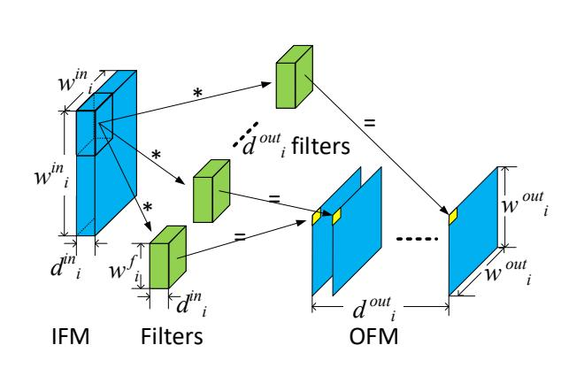
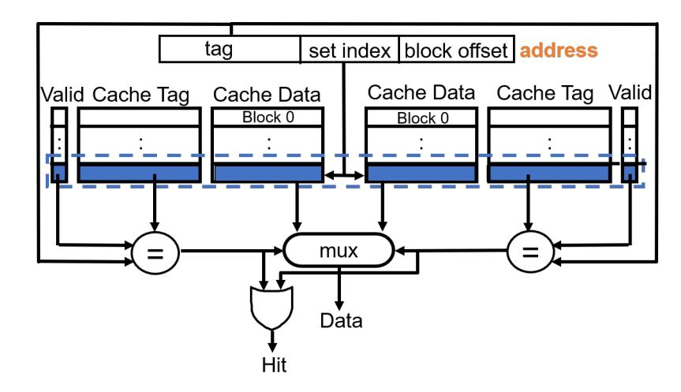
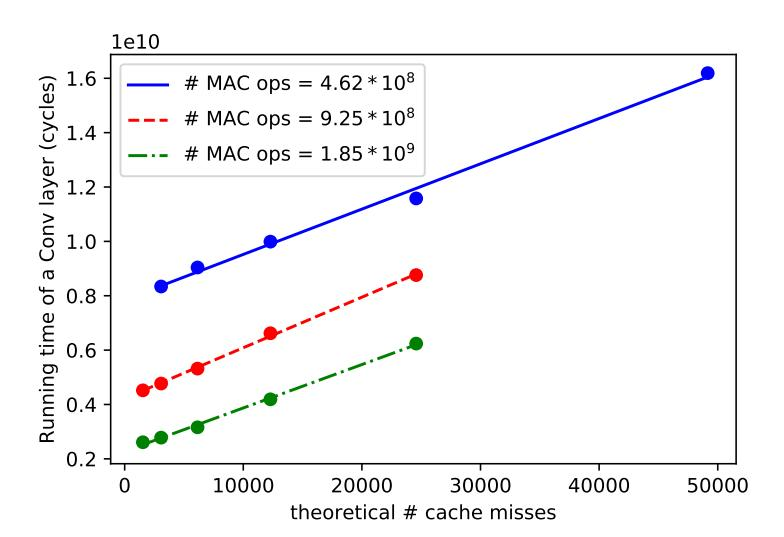
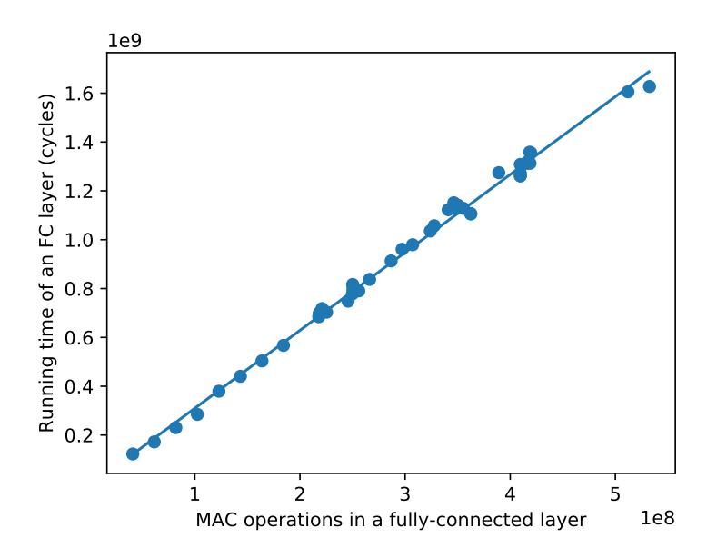
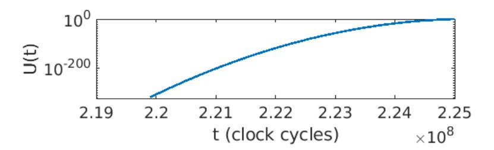
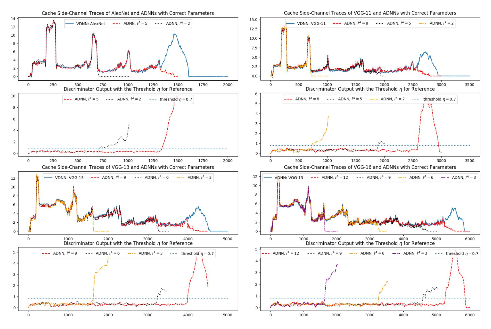
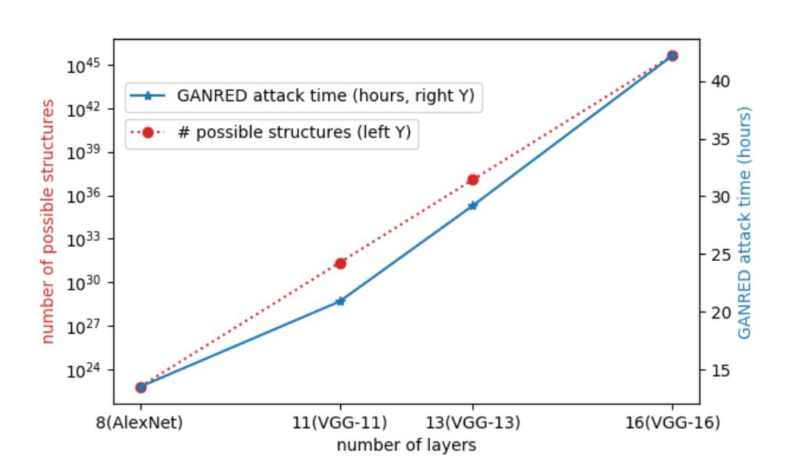

{0}------------------------------------------------

# GANRED: GAN-based Reverse Engineering of DNNs via Cache Side-Channel

Yuntao Liu and Ankur Srivastava University of Maryland, College Park {ytliu, ankurs}@umd.edu

#### **ABSTRACT**

In recent years, deep neural networks (DNN) have become an important type of intellectual property due to their high performance on various classification tasks. As a result, DNN stealing attacks have emerged. Many attack surfaces have been exploited, among which cache timing side-channel attacks are hugely problematic because they do not need physical probing or direct interaction with the victim to estimate the DNN model. However, existing cache-sidechannel-based DNN reverse engineering attacks rely on analyzing the binary code of the DNN library that must be shared between the attacker and the victim in the main memory. In reality, the DNN library code is often inaccessible because 1) the code is proprietary, or 2) memory sharing has been disabled by the operating system. In our work, we propose GANRED, an attack approach based on the generative adversarial nets (GAN) framework which utilizes cache timing side-channel information to accurately recover the structure of DNNs without memory sharing or code access. The benefit of GANRED is four-fold. 1) There is no need for DNN library code analysis. 2) No shared main memory segment between the victim and the attacker is needed. 3) Our attack locates the exact structure of the victim model, unlike existing attacks which only narrow down the structure search space. 4) Our attack efficiently scales to deeper DNNs, exhibiting only linear growth in the number of layers in the victim DNN.

#### **ACM Reference Format:**

Yuntao Liu and Ankur Srivastava. 2020. GANRED: GAN-based Reverse Engineering of DNNs via Cache Side-Channel. In *Proceedings of ACM Conference (Conference'17)*. ACM, New York, NY, USA, 12 pages. https://doi.org/10.1145/nnnnnnnnnnnnnnnnnnnnnnnnnnnnnnnnnnn

### 1 INTRODUCTION

Deep neural networks (DNN) have demonstrated exceptional performance in a multitude of applications such as image classification and speech recognition, making them a valuable and important form of intellectual property. In order to protect DNN models, owners often host them on remote servers, restricting users only to querying the model. Hence, users do not have the details of the model (*i.e.* architecture or weights). However, DNN model theft is still possible in this scenario. For example, an adversary can exploit

Permission to make digital or hard copies of all or part of this work for personal or classroom use is granted without fee provided that copies are not made or distributed for profit or commercial advantage and that copies bear this notice and the full citation on the first page. Copyrights for components of this work owned by others than ACM must be honored. Abstracting with credit is permitted. To copy otherwise, or republish, to post on servers or to redistribute to lists, requires prior specific permission and/or a fee. Request permissions from permissions@acm.org.

Conference'17, July 2017, Washington, DC, USA © 2020 Association for Computing Machinery. ACM ISBN 978-x-xxxx-xxxx-x/YY/MM...\$15.00 https://doi.org/10.1145/nnnnnnnnnnnnnnnnnnnnnnnnnnnnnnnnnnn

side-channel information in order to reverse engineer the DNN [1, 2, 7, 16, 17, 31, 34, 36]. Under the remote host setting, cache side-channel shows the most promise. Because the last level cache (LLC) is shared among each processor core in most modern computer architectures, the attacker can infer the victim's cache usage even without interacting with the victim directly.

Existing cache-based attack focus on reverse engineering the structure of DNNs. As shown by the variety of prior research aimed at reverse engineering the structure of DNNs, such as [16, 17, 36], even if these attacks do not decipher the weight information, knowing the structure of DNNs enables weight extraction attacks [31] and membership inference attacks [21, 28] and improves black-box adversarial example attacks [25]. Therefore, unlocking the underlying DNN structure is a formidable attack. Hong et al. proposed DeepRecon which monitored calls to selected TensorFlow library functions and observed the layer sequence of DNNs [16]. Yan et al. proposed Cache Telepathy which substantially narrowed down the dimension parameter search space of DNNs by obtaining the number of generalized matrix multiplication (GEMM) operations via cache timing side-channels [36]. They were able to identify 16 possible structures for the VGG-16 DNN [29]. Both of these attacks required that the attacker and the victim share the DNN's library code (e.g. TensorFlow or GEMM library) in main memory (i.e. the library code in the main memory is mapped to the virtual address spaces of both the attacker and the victim). However, memory sharing can be disabled by the server's operating system and the library code may be proprietary and inaccessible, thereby rendering these attacks infeasible. Moreover, neither of these attacks could give the DNN dimension parameters precisely. Instead, they return only the layer sequence or a set of possible parameter combinations. Since slight differences in DNN structure may result in a significant difference in accuracy under the same training effort [17], obtaining the exact structure of the victim DNN is crucial. Other existing DNN reverse engineering attacks require querying the victim DNN model [17, 31] or any physical side-channel probing [1, 2, 7, 17, 34]. These are not required by GANRED either. Therefore, GANRED can be carried out in a more realistic scenario.

#### 1.1 GANRED Attack Overview

In our work, we develop GANRED, a novel generative adversarial nets (<u>GAN</u>)-based [9] <u>Rereverse Engineering attack on DNNs which is capable of both fully recovering the dimension parameters of a DNN and does not require shared library access. For this attack, the victim DNN's cache side-channel information is measured by the attacker and acts as the **ground truth** of the GAN using a cache side-channel attack technique called *Prime+Probe* [13, 24, 26].</u>

{1}------------------------------------------------

This technique does not require any shared main memory segment between the attacker and the victim.

The attacker builds another DNN and updates the structure of this DNN repeatedly to make its structure equivalent to the victim DNN. In the rest of the paper, we refer to the victim's DNN as VDNN and the attacker's DNN as ADNN. In order to achieve his/her objective, the attacker needs to find the correct structure of each layer before moving on to the next layer. This is done as follows. The attacker initializes the ADNN as a one-layer network. For each feasible structure of this layer, the generator measures the cache side-channel of the ADNN in the same way as the VDNN is measured (*i.e.* using *Prime+Probe*).

The **discriminator** compares the cache side-channel information of the VDNN and the ADNN and indicates for how many clock cycles the two DNNs produce identical side-channel information. If the ADNN has the correct structure, *i.e.* the same structure as the first layer of the VDNN, then the ADNN's cache side-channel information should be identical to the VDNN's first layer, and the discriminator will indicate that the side-channel information of the two DNNs is identical throughout the period that the ADNN runs.

The **validator** compares the discriminator's output with a theoretical running time of the ADNN estimated using a linear regression analysis. This effectively rules out the ADNN structures that cause its cache side-channel to diverge from the VDNN's in the middle of the ADNN's execution. The attacker chooses the structure that produces accurate cache side-channel data for the longest time as the first ADNN layer.

In order to search for the structure of VDNN's second layer, similar operations are done. Each feasible structure of the second layer is appended to the (now known) first layer to compose a two-layer ADNN whose cache side-channel is measured by the generator. The discriminator compares the cache side-channel information of the two DNNs and the validator determines whether the *added* matching time agrees with the theoretical runinng time of the second layer. The structure of each successive layer is recovered in this way until an ADNN is recovered that produces identical cache side-channel for the entirety of each DNN's execution. The attack is considered successful if ADNN's final structure is the same as the VDNN's structure.

#### 1.2 Contributions

The contributions of this work are as follows:

- We propose the GANRED framework where DNNs are characterized by their accesses to a cache set over time. Our technique does not need any shared main memory segment between the victim and the attacker or analyze the DNN library codes on the server. Both resources were required by existing cache side-channel based DNN structure reverse engineering attacks [16, 36]. GANRED does not require querying the victim DNN model or any physical probing either, as required in other existing DNN reverse engineering attacks [1, 2, 7, 17, 31, 34]. Hence, GANRED can be carried out in a more realistic scenario where these privileges are not granted.
- We prove the following theoretical basis for GANRED. If the ADNN has the same structure as the first *l* layers of

- the VDNN, then both DNNs should produce identical cache side-channel information throughout these l layers.
- We show that our attack produces the exact structure of each VDNN model. This has not been achieved by existing DNN reverse engineering attacks based on cache side-channels [16, 36].
- We prove that the runtime of GANRED scales linearly in the number of DNN layers. This makes our attack scalable to much deeper DNNs.

#### 2 BACKGROUND

#### 2.1 Deep Neural Networks

Deep neural networks (DNN) are a supervised classification technique that consists of a sizable number of cascaded layers. Let i and l denote the layer number and the total number of layers, respectively, hence  $i \in [l]$ . In each layer, the **input feature map** (**IFM**) (a.k.a. the set of input neurons) is transferred into the **output feature map** (**OFM**) (a.k.a. the set of output neurons) via an operation which involves a set of *filters*. The IFM and OFM sizes (*i.e.* number of contained neurons) of layer i are denoted by  $z_i^{in}$  and  $z_i^{out}$ , respectively. Note that the OFM of the previous layer is the IFM of the next layer.

Most DNNs consist of two types of layers: **fully connected (FC)** layers and **convolutional (Conv)** layers. The IFM and OFM of FC layers are (1-dimensional) vectors whose lengths are  $z_i^{in}$  and  $z_i^{out}$ , respectively. The weights consist of a matrix of dimension  $z_i^{in} \times z_i^{out}$ . The structure of a Conv layer is illustrated in Fig. 1. The IFM and OFM of a Conv layer are both 3-dimensional arrays. The width and height of a feature map are usually equal. There are a set of filters in the Conv layer and each of them is also a 3-dimensional array. Each filter is convolved with the IFM to obtain a *channel* in the OFM. A Conv layer can be characterized by a set of dimension parameters as listed in Table 1. Note that a Conv layer can be followed by an optional pooling layer and, if so, we consider pooling as a part of the Conv layer. We define the parameter  $P_i$  as the indicator of whether there is a pooling layer after layer i.

<span id="page-1-0"></span>

Figure 1: Illustration of a Conv layer. "\*" indicates inner product, each computing an output neuron.

#### 2.2 Cache Architecture Fundamentals

Cache is a type of on-chip storage for processors which temporarily stores a subset of the main memory's content in order to reduce memory access latency and improve the processor's efficiency. The basic component of cache is a cache block (also called a cache line).

{2}------------------------------------------------

<span id="page-2-0"></span>Table 1: List of dimension parameters of a layer

| Type of layer | Parameter                    | Definition (subscript $i$ indicates layer $i$ ) |
|---------------|------------------------------|-------------------------------------------------|
| Conv layer    | $w_i^{in}, w_i^{out}$        | IFM/OFM width                                   |
|               | $d_i^{in}, d_i^{out}$        | IFM/OFM depth (number of channels)              |
|               | $w_i^f, \delta_i$            | convolution filter width and stride             |
|               | $P_i$                        | indicator of pooling layer existence            |
| FC layer      | $z_i^{in}, z_i^{out}, z_i^f$ | IFM/OFM/filter size                             |

Most modern processors have a set associative cache where the cache is divided into multiple *ways*, each having the same number of blocks. For example, Fig. 2 illustrates a two-way set associative cache. The cache blocks in the same position of each way constitute a *set*. The organization of address bits is given in Fig. 2. When a block is to be moved into the cache, the cache controller will extract the set index bits from the block's address and put the block into an available slot in the according cache set. If no slot is available in the set, the controller will select a block within the set to be replaced with the new block according to the *replacement policy*. The most commonly used replacement policy is to replace the *least recently used (LRU)* block.

<span id="page-2-1"></span>

Figure 2: A two-way set associative cache example

In modern multi-core processors, the cache has a hierarchy of multiple levels. We specifically focus on the *last level cache (LLC)* since it is shared among all the processor cores. Hence, the LLC is used by every program running on the processor, no matter which core the program runs on.

#### 2.3 Cache Timing Side-Channel Attacks

In a cache timing side-channel attack, the attacker and the victim are two processes running on the same processor. The attacker seeks information leakage about the victim process by exploiting a fundamental property of cache: a cache hit is fast and a cache miss is slow. Although a lot of attack techniques have been proposed, most of them can be described as a three-step process [6]:

- (1) The attacker initializes the state of a cache location.
- (2) The victim program executes, which may modify the state of the attacker-initialized cache location.
- (3) The attacker accesses the same cache location again and observes the access latency. By doing so, he/she can infer whether the victim has accessed the initialized cache location.

These attacks can be categorized by whether data is shared between the attacker and victim processes.

- 2.3.1 Attacks based on Data Sharing. Flush+Reload is the major type of attack in this category [12, 37, 38]. These attacks require shared data between the attacker and the victim which can be achieved when the operating system allows multiple processes to map their individual virtual addresses to the same physical address for commonly required resources (e.g. library files) [14]. This sharing enables the attacker to obtain the victim's library usage information via cache timing side-channel. The 3 steps of Flush+Reload are as follows:
  - (1) *Flush:* The attacker targets an address within shared memory and calls clflush (an X86 instruction) to flush the cache line (*i.e.* block) that contains this address if such a cache line exists. Otherwise clflush has no effect.
  - (2) The victim process runs. The content of the targeted address will be brought back to the same cache location if accessed by the victim.
  - (3) *Reload:* The attacker accesses the targeted address and infers whether a cache hit or a cache miss occurs based on the access latency. If the victim has accessed the flushed address, a cache hit will occur. Otherwise, a cache miss occurs.
- 2.3.2 Attacks without Data Sharing. Many cache timing side-channel attacks work without shared main memory. Because there is a many-to-one mapping from main memory to cache, the attacker's and the victim's physical addresses can map to the same last level cache (LLC) location. In this way, the attacker can still detect the changes in cache state made by the victim. Examples of such attacks are Prime+Probe [13, 24, 26], Evict+Time [24], and cache collision-based attacks [3]. Among these attacks, Prime+Probe is the best known and most widely used. Its mechanism is as follows:
  - (1) *Prime*: the attacker fills the cache sets of interest with his/her own data.
  - (2) The victim program runs which may or may not overwrite the primed cache sets.
  - (3) *Probe*: The attacker accesses the primed cache sets and observes timing. A cache miss indicates that the victim has accessed that cache set.

Note that *probing automatically primes the cache again* which enables the attacker to monitor the cache for a long period.

## 2.4 Existing DNN Reverse Engineering Attacks and Defenses

Reverse engineering of neural models has become a real threat which has attracted several researchers' attention. Among this body of work, a variety of distinct attack approaches have been explored to reverse engineering neural models. Yan *et al.* and Hong *et al.* independently proposed neural network reverse engineering techniques based on cache side-channels [16, 36]. In their attacks, the attacker needs to analyze the neural model's library code, extract the control flow, and select code lines to measure cache timing. These lines represent certain functions that are called when the neural network is running. By monitoring these function calls, information about the victim DNN's structure can be extracted.

{3}------------------------------------------------

DeepRecon by Hong *et al.* inserted probes into the TensorFlow library code and was able to tell the number of layers and the type of each layer in DNNs [16]. In Yan *et al.* 's Cache Telepathy attack, the generalized matrix multiply (GEMM) backend libraries were monitored and they were able to reduce the DNN structure search space significantly [36]. For example, only 16 possible structures of the VGG-16 DNN [29] are still feasible after their attack. DeepRecon uses Flush+Reload which requires the attacker and victim to share the main memory segment that contains TensorFlow library files. Cache Telepathy can be done using either Flush+Reload or Prime+Probe. However, even the Prime+Probe version requires a shared main memory segment for the GEMM library files. This might not be a realistic attack scenario: the operating system can disable memory sharing between different users or processes, and the attacker may not have access to the server's DNN library code.

In addition to cache side-channel, power/electromagnetic side-channels [1, 2, 34] and timing side-channel [7] have also been exploited to reverse engineer neural models. However, these attacks require physically probing the hardware and are feasible only when such probing is possible. Tramèr *et al.* proposed a technique to steal neural models from remote servers through prediction APIs provided by the server [31]. A countermeasure proposed by Juuti *et al.* detects such model extraction attacks with a statistical technique [18]. Hua *et al.* found out that the neural network can be reverse engineered from its memory access pattern [17]. Provably secure memory access protocol [20] and secure neural accelerator designs [33] can defend against this attack.

Many DNN protection techniques have been developed. Homomorphic encryption (HE) [4, 5, 8, 35] and secure multi-party computation (MPC) [22, 23, 27] have been employed to ensure the privacy of both the neural model and the input data. However, even the state-of-the-art HE and MPC algorithms are still too complex to use in practice. Additionally, several works have proposed the use of secure enclaves for DNN operations (such as Intel SGX) [11, 30]. However, DNNs running in these enclaves are vulnerable to cache side-channel attacks as well [10, 32]. In summary, there has not been an effective countermeasure against cache-based DNN reverse engineering.

#### <span id="page-3-1"></span>3 ATTACK MODEL

In our attack model, the VDNN runs on a server alongside the attacker which is another process on the same server. **The attacker's goal is to reverse engineer the structure of the victim DNN model.** We consider a realistic threat model under which the attacker process does not have the privileges assumed by many prior works such as code access, memory sharing, or physical probing [1, 2, 7, 16, 17, 31, 34, 36]. The resources available to the attacker are as follows:

- **Shared last-level cache (LLC)** with the victim. This is the case for most state-of-the-art computer architectures. *Shared LLC enables the attacker to obtain cache side-channel information of another process, e.g. the victim DNN, using Prime+Probe.*
- **High-level APIs** of the machine learning framework. This is available to the attacker when he/she acts as a regular user on the server. *This enables the attacker to construct a DNN model.*

With these two resources, the attacker can obtain the cache side-channel information of both VDNN and that of ADNN using Prime+Probe. Note that these are only a small subset of the attackers' resources in prior attack models [1, 2, 7, 16, 17, 31, 34, 36]. We assume that the attacker does not have any of the following privileges:

- Querying VDNN. The attacker may not have the privilege to query the VDNN and GANRED does not require this either. Instead, the Prime+Probe process constantly eavesdrops on the cache side-channel and records the cache side-channel signature of the VDNN when it is queried by other users. Note that [17, 31] both require querying VDNN.
- **The library code** of the machine learning framework (*e.g.* TensorFlow), since the library may contain intellectual property of the server and users only need high level APIs to build their neural model. Lacking code access renders the attacks in [16, 36] infeasible since they need to find specific functions in the code to insert probe.
- Shared main memory segment that stores the machine learning library code for both the attacker and the victim. This is also needed by [16, 36] in order to map the shared library to the attacker's own virtual memory space and implement Flush+Reload. However, this sharing can be disabled by the operating system.
- **Physical access to the processor**. This access is not available when the server is not controlled by the attacker. This makes any side-channel other than cache side-channel impossible to measure and renders the attacks in [1, 2, 7, 17, 34] infeasible.

In summary, we assume a scenario where the resources available to an attacker are very constrained. None of the existing reverse engineering attacks [1, 2, 7, 16, 17, 31, 34, 36] are possible in this setting. However, in this work, we show that even under such constraints, there is still substantial information leakage about the DNN model through the cache timing side-channel. GANRED reverse engineers the DNN structure by utilizing this information. A server's security measures, such as restricting queries to the victim, and eliminating memory sharing or library code access, will disable existing attacks but not hide the side-channel information that is sufficient for GANRED.

#### 4 ATTACK METHODOLOGY

In this section, we introduce the GANRED framework details. In Sec. 4.1, we present how to characterize a DNN using Prime+Probe results. Sec 4.2 describes how each component of the GANRED framework works. Sec. 4.3 introduces the overall algorithm of GANRED. Sec. 4.4 details how the validator utilizes a linear regression analysis to estimate the running time of a layer based on its structure. Sec. 4.5 proves the premise of GANRED that, if the ADNN has *l* layers and its structure is the same as the first *l* layers of the VDNN, then the ADNN should produce identical cache side-channel information as the VDNN's until the ADNN's execution ends.

#### <span id="page-3-0"></span>4.1 Obtaining DNN's Cache Side-Channel Trace

Before we talk about the details of GANRED, we describe what sidechannel information about a DNN can be obtained from Prime+Probe. 

{4}------------------------------------------------

The discussion of this subsection holds for both the VDNN and the ADNN.

**During Prime+Probe, the attacker selects an arbitrary LLC set and focuses only on this set** since we find that each DNN that we study leaves almost the same access pattern on each LLC set. This may be because that, for large DNNs, the intermediate computation results are usually many times larger than the LLC, which cause each LLC set to be used roughly uniformly. In the rest of this paper, unless otherwise noted, our discussion is focused on this targeted LLC set. Suppose that the DNN makes s memory accesses to this LLC set during its entire execution. Let us use  $t_j$  to denote the time at which the j-th access occurs, where j is the index of the access  $(1 \le j \le s)$ . Note that time is measured using CPU clock cycles throughout this paper. Also, note that  $t_j$ 's are not deterministic. This is because the DNN's execution is scheduled by the computer's operating system and the scheduling can be affected by other programs running on the same computer.

Let us define  $X_j$  as the time between the DNN's (j-1)-th and the j-th memory accesses to the targeted LLC set:

$$X_j = t_j - t_{j-1} \tag{1}$$

For the sake of consistency, we define  $t_0 = 0$  to be the clock cycle at which the DNN execution starts. Due to the randomness in  $t_j$ 's,  $X_j$ 's are also random variables.

Let M(t) be the total number of times that the DNN accesses the targeted LLC set up to cycle t, a.k.a.

<span id="page-4-1"></span>
$$M(t) = \operatorname{argmax}_{j} \{ t_{j} \le t \} \tag{2}$$

and its expected value be

$$m(t) = E[M(t)] \tag{3}$$

Since the above-introduced random variables can characterize the DNN's access pattern to the targeted LLC set and the pattern is dependent on the DNN's structure, it is desirable for the attacker to obtain information about the value of these variables. This can be done using Prime+Probe on the targeted LLC set. Specifically, let us suppose that **the attacker probes the targeted LLC set every** *c* **clock cycles for a total of** *p* **probes**. In each probe, every block in the targeted set is accessed. Assuming a least-recently-used (LRU) replacement policy, ideally, if the attacker accesses each block simultaneously, the LLC set will be filled entirely with the attacker's data after each probe. The attacker measures the access latency of each block of the set. Since a cache hit would be a much lower access latency than a miss, the access latency will indicate whether the access was a cache hit or miss and the two are very unlikely to be confused.

Let  $y_k$  be the number of LLC misses the attacker observes in the k-th probe ( $1 \le k \le p$ ). Although these LLC misses can be caused by any process other than the Prime+Probe process running on the same machine, we assume that these are overwhelmingly caused by the DNN for the following reasons. (1) Prime+Probe intervals are very short. Hence, within any interval, normal background processes are unlikely to access the targeted LLC set. (2) Most cache side-channel attack papers assumed that the cache was primarily used by the victim, including Cache Telepathy [36] and Deep Recon [16]. In this way, the number of missed blocks in the targeted LLC set indicates how many times the DNN has accessed this LLC

set between time of the last probe, (k-1)c, and the time of the current probe, kc. Recall from Equation 2 that the DNN makes M((k-1)c) - M(kc) accesses to the targeted LLC set in this period. Suppose the LLC is  $\gamma$ -way associative (*i.e.* there are  $\gamma$  blocks in the targeted LLC set). Hence,  $y_k$  is capped by  $\gamma$  and can be expressed by

<span id="page-4-2"></span>
$$y_k = \min\{\gamma, M(kc) - M((k-1)c)\} \tag{4}$$

Let us call  $Y = (y_1, y_2, \dots, y_p)$  the **cache side-channel trace** of a DNN. Y is the cache side-channel information that can be directly observed from Prime+Probe. Due to the randomness involved in the time of each access of the DNN, repeated measurements of the cache side-channel are made so that the average of the traces will be close to the expected value. Let  $\mathcal{Y}$  be the set of traces obtained by repeated Prime+Probe measurements.  $\mathcal{Y}$  characterizes the memory access pattern, and hence the structure, of the DNN.

The above description holds for both the VDNN and the ADNN. In the rest of this paper, we use superscripts " $^{A}$ " and " $^{V}$ " to denote variables of the ADNN and the VDNN, respectively, and use " $^{A/V}$ " when an expression applies to both DNNs.

#### <span id="page-4-0"></span>4.2 GANRED Components

The notation of some important components of GANRED framework are explained as follows.

 $\mathcal{Y}^V$ : the set of the VDNN's cache side-channel traces. This serves as the ground truth of the GANRED framework. The purpose of GANRED is to find a structure of the ADNN that makes the ADNN produce identical cache side-channel traces to  $\mathcal{Y}^V$ .

 $\Theta$ : the set of estimated dimension parameters of the ADNN. Recall that the list of such parameters are listed in Table 1.

 $G(\Theta)$ : the generator that builds the ADNN with  $\Theta$  and generates its cache side-channel traces as follows. (1) The ADNN is constructed with dimension parameters  $\Theta$  and randomly-generated weights. Note that the ADNN needs not be trained, since its cache side-channel is only dependent on its structure, not weights. (2) The ADNN is executed with randomly-generated input and its cache side-channel trace is measured using Prime+Probe (*i.e.* in the same way that the VDNN is sampled). (3) Step (2) is repeated multiple times in order to get a set of cache side-channel traces. Hence, the output of  $G(\Theta)$  is a set of cache side-channel traces of the the ADNN, *i.e.*  $\mathcal{Y}^A$ .

 $D(\mathcal{Y}^V,\mathcal{Y}^A)$ : the discriminator that compares the VDNN's traces,  $\mathcal{Y}^V$ , with the ADNN's,  $\mathcal{Y}^A$ . Recall that the length of each trace in  $\mathcal{Y}^{A/V}$  is p. For each k such that  $1 \leq k \leq p$ , let  $\bar{y}_k^{A/V}$  be the average number of cache misses in the k-th probe of ADNN/VDNN's cache side-channel traces. The discriminator's output, R, is also a p-element vector,  $i.e.\ R = (r_1, r_2, \dots, r_p)$ . We call R the **discriminator trace**.  $r_k$  is an indicator of how well the two traces match at the k-th probe. For this purpose, we could define  $r_k$  the difference between the two average cache misses,  $i.e.\ |\bar{y}_k^A - \bar{y}_k^V|$ . However, experiment data can be noisy and make the discriminator trace R noisy. So instead, we take the two trace segments that are around the k-th probe of ADNN's average trace and VDNN's average trace and define  $r_k$  as the root-mean-square difference of the two trace segments. This will serve the discriminator's purpose better.

The validator is another important component of GANRED. Details of the validator are introduced in Sec. 4.4.

{5}------------------------------------------------

#### <span id="page-5-0"></span>4.3 **GANRED Framework**

As a prerequisite of GANRED, the attacker repeatedly measures VDNN's cache side-channel using Prime+Probe and obtains a set of traces  $\mathcal{Y}^V$ . As mentioned in Section 3, the Prime+Probe process does not need to guery the VDNN but rather waits for it to be executed by some other user.  $\mathcal{Y}^V$  is then given to the GANRED framework, which takes the steps in Algorithm 1 to recover the victim DNN structure. In essence, GANRED determines the structure of the first layer before working on the second layer, determines the second before the third, and so on, until the two DNN's traces match entirely. We explain the procedure to determine the structure of each layer of the ADNN in detail as follows.

```
Algorithm 1: GANRED Implementation
 input :\mathcal{Y}^V;
                         // VDNN's cache side-channel trace
 output:\Theta;
                      // ADNN's final dimension parameters
```

```
1 Initialization: l \leftarrow 1, \Theta \leftarrow \emptyset, k_l \leftarrow 0;
  // l: estimated # layers in VDNN;
```

```
// k: the probe at which the traces start to diverge
<sup>2</sup> while k_l < p do
        l \leftarrow l + 1;
 3
        \theta_{I}^{*} \leftarrow \emptyset ;                                 
 4
                                       // k_l according to the current \theta^*
        k_l^* \leftarrow k_{l-1};
 5
        foreach \theta_l \in \mathcal{S}_l do
 6
             // S_l: the set of all feasible parameter combinations
                 of the l-th layer
             \hat{\Theta} \leftarrow \Theta \cup \theta_I;
 7
             // Append enumerated parameters \theta_l to existing
                parameters \Theta
             R = (r_1, r_2, \dots, r_p) \leftarrow D(\mathcal{Y}^V, G(\hat{\Theta}));
 8
             // Call the discriminator to compare traces of VDNN
                 and ADNN
              k_l' \leftarrow \operatorname{argmax}_h r_1, r_2, \dots, r_h < \eta;
 9
             // Given a threshold \eta, find how long the two sets of
                traces match from beginning
             if k_I' > k_I^* then
10
                  if validate(\theta_l, k_{l-1}, k'_l) == TRUE then
11
                       // TRUE indicates a successful validation.
                           Explained in Sec. 4.4
                        k_1^* \leftarrow k_1';
12
                        \theta_l^* \leftarrow \theta_l;
13
                  end
14
              end
15
         end
16
```

Recall that the set of parameters that need to be found for each layer is listed in Table 1. Notice that GANRED will work as long as the structure search space of each layer is finite. In this work, without loss of generality, we define the structure search space by

 $\Theta \leftarrow \Theta \cup \theta_I^*$ ;

 $k_l \leftarrow k_l^*$ ;

17

18

<span id="page-5-1"></span>19 **end** 

the properties that state-of-the-art DNNs (e.g. AlexNet [19], the VGG family [29], and ResNet [15]) have in common. Note that this is the same structure search space as considered by existing attacks [16, 36] and GANRED will still be applicable even if the attacker changes these constraints.

- (1) If the *l*-th layer is a convolutional layer, then the filter width  $1 \le w_l^f \le 11$ , the output depth  $d_l^{out} = 64 \times n$  where *n* is an integer and  $1 \le n \le 32$ , and the stride of convolution  $\delta_l$  is 1 or 2.;
- (2) If the *l*-th layer is a fully connected layer, then the number of output neurons  $z_1^{out} = 2^n$  where n is an integer and  $8 \le n \le 13$ .
- (3) The input and output dimensions of the VDNN will always be made available to the attacker. However, the attacker does not know the type (convolutional or fully connected) of each layer or the number of layers in the VDNN.

Suppose that GANRED is looking for the structure of the *l*-th layer, which means the first l-1 layers' structures have been determined. In this case,  $\Theta$  contains the ADNN's parameters of the first l-1 layers. Let us use  $S_l$  to denote the structure search space of layer *l*. The attacker enumerates through this space. For each structure within the search space, denoted as  $\theta_l$ , an ADNN is constructed by appending a layer with dimension parameters given in  $\theta_l$  to the already-determined l-1 layers (with parameters in  $\Theta$ ).

The generator then measures this ADNN with Prime+Probe repeatedly to obtain a set of cache side-channel traces,  $\mathcal{Y}^A$ . The discriminator then compares  $\mathcal{Y}^A$  with  $\mathcal{Y}^V$  and obtains the discriminator trace. Details of the generator and the discriminator have been described in Sec. 4.2. Each element of the discriminator trace is compared to a given threshold value  $\eta$ .

We say that the two traces *match* at probe k if  $r_k < \eta$ . Let  $k'_1$ be the last probe before the discriminator trace rises beyond  $\eta$  or ends. In other words, for any integer i within  $1 \le i \le k'_i$ ,  $r_i < \eta$ . Recall that the attacker probes the targeted LLC set every *c* clock cycles. Hence, the matching period stands for a time duration of  $k'_{l}c$ . We use  $k_{l-1}$  to denote the # of probes that the cache traces of the VDNN match the trace of the ADNN without the l-th layer (*i.e.* the first l-1 layers of the ADNN with parameters in  $\Theta$ ).

If  $\theta_l$  is the structure of the *l*-th layer that makes the two traces match for the longest period so far, it has the potential to be the correct structure of layer *l*. There is one caveat to be noticed. Due to the sequential nature of DNNs, the memory accesses of one layer must all finish before the next layer's accesses start. Therefore, if  $\theta_l$  has the correct parameters of the VDNN's l-th layer, the added matching period due to the *l*-th layer, *i.e.*  $k'_{l}c - k_{l-1}c$ , should be approximately the running time of the *l*-th layer of both the VDNN and the ADNN. However, the attacker does not know which segment in the VDNN's trace corresponds to the *l*-th layer. The attacker can, though, verify whether the added matching period is close enough to the theoretical running time of a layer with parameters in  $\theta_l$ . This technique can rule out  $\theta_l$  if  $\theta_l$  causes the ADNN's traces to diverge from the VDNN's traces in the middle of ADNN's execution. This is done by the validator. The details of how the validator calculates the theoretical running time of a layer is introduced in Sec. 4.4.

{6}------------------------------------------------

The successfully validated structure of the l-th layer that makes the two DNN's traces match for the longest time is chosen as the final structure of the l-th layer. If the two DNN's traces still do not match for the entire p probes, the attacker uses the same process to find the (l+1)-th layer. If the p probes have all matched, the ADNN's dimension parameters  $\Theta$  is considered as the result of the attack.

## <span id="page-6-0"></span>**4.4 Validating Reverse Engineered Parameter Combinations**

During the reverse engineering of the l-th layer, if a structure denoted by  $\theta_l$  makes the ADNN's traces and VDNN's traces match for the longest, the validator need to be invoked in order to verify whether  $\theta_l$  is a "false positive" solution. Specifically, the validator will find whether the ADNN's traces deviate from the VDNN's in the middle of ADNN's execution, which should not be the case for the correct parameters of layer l. If the ADNN's traces match the VDNN's for  $k_{l-1}$  probes without layer l and  $k_l'$  probes with layer l, then layer l (with parameters  $\theta_l$ ) makes the matched period increase by  $(k_l' - k_{l-1})c$  clock cycles. This suggests that, if  $\theta_l$  contains the correct dimension parameters of the l-th layer, the running time of the l-th layer is approximately  $(k_l' - k_{l-1})c$  clock cycles.

The validator estimates the *theoretical* running time of a layer with parameters  $\theta_l$  based on the following observation: the execution time of a layer is linear in both its number of multiply-and-accumulate (MAC) operations and the number of cache misses. <sup>1</sup> Hence, the validator uses a linear regression analysis to estimate the running time of a layer with parameters  $\theta_l$ . Let  $\hat{t}$  be the estimated running time.  $\hat{t}$  is then compared to the increase in the length of matched period of the two DNNs' traces,  $(k'_l - k_{l-1})c$ . If the difference is below a certain threshold, then  $\theta_l$  is accepted. Otherwise,  $\theta_l$  is deemed a "false positive" and rejected. The validator proves to be an essential component of GANRED without which the correct structure of the VDNNs cannot be found.

In the rest of this subsection, we present the details of the linear regression process to estimate a layer's running time.

4.4.1 Convolutional (Conv) Layers. The operation of a Conv layer is illustrated in Fig. 1. When a filter is convolved with the input feature map (IFM), with each step that the filter moves, a new output neuron is computed. We assume that only the new input neurons (i.e. that were not used in the last inner product) will result in cache misses. The number of such new input neurons is  $f_l \cdot d_l^{in} \cdot \delta_l$ , where  $f_l$  is the filter width,  $d_i n$  is the IFM depth, and  $\delta_l$  is the convolution stride (see Table 1). We calculate the theoretical number of cache misses of the Conv layer, denoted as  $u^{conv}(\theta)$ , as the sum of two components: (a) the total number of "new input neurons" as described above for evaluating the entire OFM, and (b) the cache misses when each input neuron and weight is used for the first time.

$$u^{conv}(\theta_l) = (((P_l + 1)^2 w_l^{out,2} - 1) f_l d_l^{in} \delta_l + (f_l^2 + w_l^{in,2}) d_l^{in}) d_l^{out}$$
(5)

<span id="page-6-2"></span>

Figure 3: The linear relationship between Conv layer running time and theoretical cache misses

<span id="page-6-3"></span>

Figure 4: Linear regression on # MAC operations and trace length of an FC layer

Since a cache miss results in significantly longer latency than a cache hit, the number of cache misses will impact the Conv layer's running time.

Let us use  $v^{conv}(\theta_l)$  to denote the # of MAC operations of a Conv layer, which can be given by

$$v^{conv}(\theta_l) = 2(P_l + 1)^2 w_l^{out, 2} f_l^2 d_l^{in} d_l^{out}$$
 (6)

In order to show that the running time of a Conv layer's running time is linear in both the # of cache misses and the # of MAC operations, we conduct the following experiment. We take a population of Conv layers that is within our structure search space and measured the running time of these layers. A linear regression analysis is then conducted to verify the linearity. The regression shows that the linear scores of both # of cache misses and # of MAC operations to the running time are greater than 0.99 (1.0 is perfectly linear). In Fig. 3, we plot the layers with equal # of MAC operations on the same line and show that a Conv layer's running time linearly increases in the theoretical # of cache misses. Let  $\hat{t} = \hat{A}^{conv} u^{conv}(\theta_l) + \hat{B}^{conv} v^{conv}(\theta_l) + \hat{C}^{conv}$  be the regression result equation.

4.4.2 Fully Connected (FC) Layers. In an FC layer, since there is no reuse of weights in the computation of different output neurons,

<span id="page-6-1"></span><sup>&</sup>lt;sup>1</sup>In Sec. 4.4, the notion of "cache misses" refers to the entire cache, not just the LLC set selected by the Prime+Probe attack. We also do not distinguish different cache levels because L1 and L2 caches are much smaller than the LLC and the latency between different cache levels are much smaller than the latency gap between LLC and main memory. Code access is roughly proportional to data access and hence not calculated.

{7}------------------------------------------------

the number of MAC operations is proportional to the theoretical number of cache misses. Therefore, we only look for the linear relationship between an FC layer's running time and the MAC operations. The # of MAC operations can be given by

$$v^{FC}(\theta_l) = 2z_l^{in} z_l^{out} \tag{7}$$

Similar to the analysis for Conv layers, we select a population of FC layers from the feasible structures and measure their running time. Then, a linear regression is conducted on the # of MAC operations to the running time. A clear linear relationship can be observed from Fig. 4 and we use  $\hat{t} = \hat{A}^{FC} v^{FC} (\theta_l) + \hat{B}^{FC}$  to denote the regression result.

#### <span id="page-7-0"></span>4.5 Mathematical Justification of GANRED

As we have described in Sec. 4.3, GANRED reverse engineers the DNN in a layer-by-layer manner. It must find the correct structure of the current layer before moving on to the next layer. To this end, we intuitively assumed that when the ADNN (with  $l^A$  layers) has the same structure as the first  $l^A$  layers of the VDNN (which has  $l^V$  layers in total,  $l^V \ge l^A$ ), then the ADNN's cache side-channel traces  $\mathcal{Y}^A$  should match with the VDNN's traces  $\mathcal{Y}^V$  before the end of ADNN's execution. We justify this premise in this subsection. The following is assumed about a DNN's memory access:

- (1) The DNN layers are executed sequentially and hence the memory accesses of a layer must be completed before the next layer's memory accesses begin.
- (2) Each  $X_j^{A/V}$ , *i.e.* the time between the ADNN/VDNN's (j-1)-th and j-th access to the targeted LLC set, is subject to a Gaussian distribution. For the VDNN,  $X_j^V \sim \mathcal{N}(\mu_j, \sigma_j^2)$  where  $1 \leq j \leq s^V$ . If ADNN has the same structure as VDNN's first  $l^A$  layers, we also have  $X_j^A \sim \mathcal{N}(\mu_j, \sigma_j^2)$  where  $1 \leq j \leq s^A$ .
- (3) Each  $X_j^{A/V}$  is independent, *i.e.* for any  $1 \le j_1 \ne j_2 \le s^{A/V}$ ,  $X_{j_1}^{A/V}$  and  $X_{j_2}^{A/V}$  are independent.

If ADNN has the same structure as the first  $l^A$  layers of VDNN, the expected time at which ADNN's last access to the targeted LLC set would occur can be expressed as  $\sum_{j=1}^{s^A} \mu_j$ . Our objective is then to prove that, in this case, the difference between the cache side-channel traces of ADNN and VDNN before time  $\sum_{j=1}^{s^A} \mu_j$  can be upper bounded by a small value. In order to prove this, we first bound the difference between the two DNNs' expected # of memory accesses up to time  $\sum_{j=1}^{s^A} \mu_j$ , i.e.  $|m^V(t) - m^A(t)|$ , as follows.

Theorem 1. If  $t < \sum_{j=1}^{s^A} \mu_j$ , then  $|m^V(t) - m^A(t)|$  can be upper bounded by

<span id="page-7-2"></span>
$$U(t) = \sum_{k=s^{A}+1}^{s^{V}} \left( \sqrt{\frac{\sum_{j=1}^{k} \sigma_{j}^{2}}{2\pi}} \cdot e^{-\left(\frac{-t + \sum_{j=1}^{k} \mu_{j}}{\sqrt{2\sum_{j=1}^{k} \sigma_{j}^{2}}}\right)^{2}} \right)$$
(8)

The proof is given in the Appendix A.

In order to illustrate that U(t) is an extremely small value in a straightforward manner, we estimate the parameters from a VDNN (AlexNet) and the ADNN with the same structure as the first 2 layers of the VDNN. These parameters include  $s^A$ ,  $s^V$ , and  $\mu_j$ .  $\sigma_j$  is assumed to be 20% of  $\mu_j$ . Based on these parameters, U(t) is plotted for the period close to the end of ADNN's execution as shown in Fig. 5. We could only plot this period because U(t) monotonically increases in t as  $t < \sum_{j=1}^{s^A} \mu_j$  and its value is so small before the plotted period that it is smaller than the smallest positive number that a floating point number can represent.

<span id="page-7-1"></span>

Figure 5: U(t) vs. t given typical parameters in Equation 8.

Recall that  $y_k$  is the number of observed LLC misses in the k-th probe and was defined in Equation 4.  $y_k$  stands for the cache side-channel information that GANRED uses. The k-th probe will occur before the ADNN's last access to the targeted LLC set if  $k < \sum_{j=1}^{s^A} \mu_j/c$ . The following theorem indicates that, if the ADNN has the same structure as the first  $l^A$  layers of the VDNN, then the two DNNs should have very close cache side-channel traces as the probe index  $k < \sum_{j=1}^{s^A} \mu_j/c$ .

<span id="page-7-3"></span>Theorem 2. If  $k < \sum_{j=1}^{s^A} \mu_j/c$ , then  $|E[y_k^V] - E[y_k^A]|$  is upper bounded by U(kc).

The proof is given in the Appendix B.

From Fig. 5, we know that U(kc) is a small value. The average number of cache misses in each probe will converge to the expected number given a sufficient number of repeated cache side-channel measurements. Therefore, if the ADNN has the same structure as the first  $l^A$  layers of the VDNN, the two DNNs will have very close average cache side-channel traces before ADNN's execution ends. This means that comparing cache side-channel traces is a good way of determining whether the ADNN has correct parameters. Although it is still theoretically possible that two DNNs with different structures have indistinguishable cache traces, the sensitivity of cache traces to the structure makes this event rather unlikely.

#### 5 EXPERIMENTS

To evaluate the efficacy of the proposed GANRED framework, we have applied it to reverse engineer several state-of-the-art DNN structures on a real server. In our experiments, the VDNN is hosted on a Linux server which uses TensorFlow as the machine learning framework. The attacker logs into the server without sudo privilege. The APIs available to the attacker are those to construct the ADNN with convolutional, fully connect, and pooling layers. The server has an Intel i7-7700 CPU which has an 8MB, 16-way associative last-level cache (LLC). Each cache block contains 64 bytes (*i.e.* 6 bits block-offset). Hence, there are 8192 associative sets and the set index has 13 bits. The following practical challenges have been

{8}------------------------------------------------

addressed in our experiments.

- (1) Having to probe each block in the targeted LLC set significantly limits the frequency at which our attacker can probe the cache compared to a Flush+Reload attacker [16, 36]. Nonetheless, we achieve more accurate reverse engineering results than these attacks.
- (2) The cache hit/miss result data has to be stored real-time but allocating another array for data storage will result in cache interference. Hence, we store the hit/miss result of each probe on the probed lines directly.

In our experiments, we use GANRED to reverse engineer state-of-the-art DNNs, including AlexNet [19] and VGGNets [29]. 50 cache side-channel traces are collected for each VDNN and ADNN. Fig. 6 shows the average cache side-channel traces of each VDNN and some traces of ADNNs that GANRED determines as having the correct structure in the progress. We also show the discriminator's output trace when comparing these ADNNs with the VDNN. As we can observe, these ADNNs' traces match well with the VDNNs' until the former are about to end. This agrees with what we derived in Sec. 4.5. The discriminator is able to capture the deviation as its output increases beyond the threshold  $\eta$ .

For each VDNN, GANRED is able to recover the precise **structure.** In Figure 7, we show (1) left Y axis: how many possible DNN structures has been contained in the search space of GANRED when the correct structure is found, and (2) right Y axis: the time consumed to recover the correct structure of each DNN benchmark. This shows that the attack time increases linearly with the exponentially growing possible structure space. Hence, our attack is very scalable. The reason for the linear increase in attack time is as follows. When reverse engineering any layer, the layer's IFM dimensions are always known, since the IFM is either the DNN's input (public knowledge) or the OFM of last layer (determined in the last layer). Since the same structure constraints apply to any layer, the number of ADNNs that need to be constructed and measured is the same. Hence, the time spent on reverse engineering each layer is roughly the same. Recall that GANRED also eliminates the need for code access and shared main memory segments between the attacker and the victim. These are substantial improvements over existing attacks.

#### 6 CONCLUSION

In this work, we develop GANRED, a GAN-based DNN structure reverse engineering framework which utilizes cache timing sidechannel information. Unlike prior reverse engineering approaches which required shared library code in the main memory and other resources that may be unrealistic, our attack uses Prime+Probe and thus only requires minimal resources. GANRED compares the VDNN's cache side-channel trace with that of ADNN with estimated structure and converges when the two traces become identical. Experiments show that the precise structure of each VDNN benchmark has been found and the attack complexity scales linearly with the number of layers in VDNN. Therefore, we conclude that our attack is successful and scalable. The fundamental reason that GANRED produces more accurate results than existing attacks [16, 36] may be that the cache side-channel information used by GANRED inherently contains more information. Those existing attacks monitors certain library function calls, which only accounts

for a tiny portion of DNN's memory access. In contrast, the cache side-channel traces measured by GANRED contains information about the DNN's overall memory pattern. Such attacks must be considered when the intellectual property of a DNN is concerned.

#### **REFERENCES**

- <span id="page-8-0"></span>[1] Lejla Batina, Shivam Bhasin, Dirmanto Jap, and Stjepan Picek. 2018. Csi neural network: Using side-channels to recover your artificial neural network information. *arXiv preprint arXiv:1810.09076* (2018).
- <span id="page-8-1"></span>[2] Lejla Batina, Shivam Bhasin, Dirmanto Jap, and Stjepan Picek. 2019. {CSI}{NN}: Reverse Engineering of Neural Network Architectures Through Electromagnetic Side Channel. In 28th {USENIX} Security Symposium ({USENIX} Security 19). 515–532.
- <span id="page-8-11"></span>[3] Joseph Bonneau and Ilya Mironov. 2006. Cache-collision timing attacks against AES. In *International Workshop on Cryptographic Hardware and Embedded Systems*. Springer, 201–215.
- <span id="page-8-14"></span>[4] Florian Bourse, Michele Minelli, Matthias Minihold, and Pascal Paillier. 2018. Fast homomorphic evaluation of deep discretized neural networks. In *Annual International Cryptology Conference*. Springer, 483–512.
- <span id="page-8-15"></span>[5] Hervé Chabanne, Amaury de Wargny, Jonathan Milgram, Constance Morel, and Emmanuel Prouff. 2017. Privacy-preserving classification on deep neural network. *IACR Cryptology ePrint Archive* 2017 (2017), 35.
- <span id="page-8-8"></span>[6] Shuwen Deng, Wenjie Xiong, and Jakub Szefer. 2019. Analysis of Secure Caches and Timing-Based Side-Channel Attacks. *IACR Cryptology ePrint Archive* 2019 (2019), 167.
- <span id="page-8-2"></span>[7] Vasisht Duddu, Debasis Samanta, D Vijay Rao, and Valentina E Balas. 2018. Stealing Neural Networks via Timing Side Channels. *arXiv preprint arXiv:1812.11720* (2018).
- <span id="page-8-16"></span>[8] Ran Gilad-Bachrach, Nathan Dowlin, Kim Laine, Kristin Lauter, Michael Naehrig, and John Wernsing. 2016. Cryptonets: Applying neural networks to encrypted data with high throughput and accuracy. In *International Conference on Machine Learning*. 201–210.
- <span id="page-8-6"></span>[9] Ian Goodfellow, Jean Pouget-Abadie, Mehdi Mirza, Bing Xu, David Warde-Farley, Sherjil Ozair, Aaron Courville, and Yoshua Bengio. 2014. Generative adversarial nets. In *Advances in neural information processing systems*. 2672–2680.
- <span id="page-8-19"></span>[10] Johannes Götzfried, Moritz Eckert, Sebastian Schinzel, and Tilo Müller. 2017. Cache attacks on Intel SGX. In *Proceedings of the 10th European Workshop on Systems Security*. ACM, 2.
- <span id="page-8-18"></span>[11] Karan Grover, Shruti Tople, Shweta Shinde, Ranjita Bhagwan, and Ramachandran Ramjee. 2018. Privado: Practical and Secure DNN Inference with Enclaves. *arXiv* preprint arXiv:1810.00602 (2018).
- <span id="page-8-9"></span>[12] Daniel Gruss, Raphael Spreitzer, and Stefan Mangard. 2015. Cache template attacks: Automating attacks on inclusive last-level caches. In *24th* {*USENIX*} *Security Symposium* ({*USENIX*} *Security 15*). 897–912.
- <span id="page-8-7"></span>[13] Roberto Guanciale, Hamed Nemati, Christoph Baumann, and Mads Dam. 2016. Cache storage channels: Alias-driven attacks and verified countermeasures. In 2016 IEEE Symposium on Security and Privacy (SP). IEEE, 38–55.
- <span id="page-8-10"></span>[14] David Gullasch, Endre Bangerter, and Stephan Krenn. 2011. Cache games—Bringing access-based cache attacks on AES to practice. In 2011 IEEE Symposium on Security and Privacy. IEEE, 490–505.
- <span id="page-8-21"></span>[15] Kaiming He, Xiangyu Zhang, Shaoqing Ren, and Jian Sun. 2016. Deep residual learning for image recognition. In *Proceedings of the IEEE conference on computer vision and pattern recognition*. 770–778.
- <span id="page-8-3"></span>[16] Sanghyun Hong, Michael Davinroy, Yiğitcan Kaya, Stuart Nevans Locke, Ian Rackow, Kevin Kulda, Dana Dachman-Soled, and Tudor Dumitraş. 2018. Security Analysis of Deep Neural Networks Operating in the Presence of Cache Side-Channel Attacks. arXiv preprint arXiv:1810.03487 (2018).
- <span id="page-8-4"></span>[17] Weizhe Hua, Zhiru Zhang, and G Edward Suh. 2018. Reverse engineering convolutional neural networks through side-channel information leaks. In *Proceedings of the 55th Annual Design Automation Conference*. ACM, 4.
- <span id="page-8-12"></span>[18] Mika Juuti, Sebastian Szyller, Alexey Dmitrenko, Samuel Marchal, and N Asokan. 2018. PRADA: Protecting against DNN Model Stealing Attacks. *arXiv preprint arXiv:1805.02628* (2018).
- <span id="page-8-20"></span>[19] Alex Krizhevsky, Ilya Sutskever, and Geoffrey E Hinton. 2012. Imagenet classification with deep convolutional neural networks. In *Advances in neural information processing systems*. 1097–1105.
- <span id="page-8-13"></span>[20] Yuntao Liu, Dana Dachman-Soled, and Ankur Srivastava. 2019. Mitigating Reverse Engineering Attacks on Deep Neural Networks. In *2019 IEEE Computer Society Annual Symposium on VLSI (ISVLSI)*. IEEE, 657–662.
- <span id="page-8-5"></span>[21] Yunhui Long, Vincent Bindschaedler, Lei Wang, Diyue Bu, Xiaofeng Wang, Haixu Tang, Carl A Gunter, and Kai Chen. 2018. Understanding membership inferences on well-generalized learning models. *arXiv preprint arXiv:1802.04889* (2018).
- <span id="page-8-17"></span>[22] Payman Mohassel and Yupeng Zhang. 2017. Secureml: A system for scalable privacy-preserving machine learning. In 2017 IEEE Symposium on Security and Privacy (SP). IEEE, 19–38.

{9}------------------------------------------------

<span id="page-9-12"></span>

Figure 6: Upper images: the cache side-channel traces of AlexNet and VGG Nets and some ADNNs with correct parameters in the progress of GANRED. Lower images: the discriminator's outputs corresponding to the ADNNs. X-axis: number of probes.

<span id="page-9-13"></span>

Figure 7: GANRED attack time and number of possible structures explored by GANRED

- <span id="page-9-8"></span>[23] Olga Ohrimenko, Felix Schuster, Cédric Fournet, Aastha Mehta, Sebastian Nowozin, Kapil Vaswani, and Manuel Costa. 2016. Oblivious multi-party machine learning on trusted processors. In 25th {USENIX} Security Symposium ({USENIX} Security 16). 619–636.
- <span id="page-9-5"></span>[24] Dag Arne Osvik, Adi Shamir, and Eran Tromer. 2006. Cache attacks and countermeasures: the case of AES. In *Cryptographers' track at the RSA conference*.

- Springer, 1–20.
- <span id="page-9-3"></span>[25] Nicolas Papernot, Patrick McDaniel, Ian Goodfellow, Somesh Jha, Z Berkay Celik, and Ananthram Swami. 2017. Practical black-box attacks against machine learning. In *Proceedings of the 2017 ACM on Asia conference on computer and communications security.* 506–519.
- <span id="page-9-6"></span>[26] Colin Percival. 2005. Cache missing for fun and profit.
- <span id="page-9-9"></span>[27] Bita Darvish Rouhani, M Sadegh Riazi, and Farinaz Koushanfar. 2018. Deepsecure:
   Scalable provably-secure deep learning. In *Proceedings of the 55th Annual Design Automation Conference*. ACM, 2.
- <span id="page-9-2"></span>[28] Reza Shokri, Marco Stronati, Congzheng Song, and Vitaly Shmatikov. 2017. Membership inference attacks against machine learning models. In *2017 IEEE Symposium on Security and Privacy (SP)*. IEEE, 3–18.
- <span id="page-9-4"></span>[29] Karen Simonyan and Andrew Zisserman. 2014. Very deep convolutional networks for large-scale image recognition. *arXiv preprint arXiv:1409.1556* (2014).
- <span id="page-9-10"></span>[30] Florian Tramer and Dan Boneh. 2018. Slalom: Fast, verifiable and private execution of neural networks in trusted hardware. *arXiv preprint arXiv:1806.03287* (2018).
- <span id="page-9-0"></span>[31] Florian Tramèr, Fan Zhang, Ari Juels, Michael K Reiter, and Thomas Ristenpart. 2016. Stealing machine learning models via prediction apis. In *25th* {*USENIX*} *Security Symposium* ({*USENIX*} *Security 16*). 601–618.
- <span id="page-9-11"></span>[32] Wenhao Wang, Guoxing Chen, Xiaorui Pan, Yinqian Zhang, XiaoFeng Wang, Vincent Bindschaedler, Haixu Tang, and Carl A Gunter. 2017. Leaky cauldron on the dark land: Understanding memory side-channel hazards in SGX. In *Proceedings of the 2017 ACM SIGSAC Conference on Computer and Communications Security*. ACM, 2421–2434.
- <span id="page-9-7"></span>[33] Xingbin Wang, Rui Hou, Yifan Zhu, Jun Zhang, and Dan Meng. 2019. NPUFort: a secure architecture of DNN accelerator against model inversion attack. In *Proceedings of the 16th ACM International Conference on Computing Frontiers*. ACM, 190–196.
- <span id="page-9-1"></span>[34] Lingxiao Wei, Bo Luo, Yu Li, Yannan Liu, and Qiang Xu. 2018. I know what you see: Power side-channel attack on convolutional neural network accelerators. In *Proceedings of the 34th Annual Computer Security Applications Conference*. ACM,

{10}------------------------------------------------

393-406.

- <span id="page-10-3"></span>[35] Pengtao Xie, Misha Bilenko, Tom Finley, Ran Gilad-Bachrach, Kristin Lauter, and Michael Naehrig. 2014. Crypto-nets: Neural networks over encrypted data. *arXiv* preprint arXiv:1412.6181 (2014).
- <span id="page-10-0"></span>[36] Mengjia Yan, Christopher Fletcher, and Josep Torrellas. 2020. Cache Telepathy: Leveraging Shared Resource Attacks to Learn DNN Architectures. In *29th USENIX Security Symposium (USENIX Security 20)*. USENIX Association, Boston, MA. https://www.usenix.org/conference/usenixsecurity20/presentation/yan
- <span id="page-10-1"></span>[37] Fan Yao, Milos Doroslovacki, and Guru Venkataramani. 2018. Are coherence protocol states vulnerable to information leakage? In *2018 IEEE International Symposium on High Performance Computer Architecture (HPCA)*. IEEE, 168–179.
- <span id="page-10-2"></span>[38] Yuval Yarom and Katrina Falkner. 2014. FLUSH+ RELOAD: a high resolution, low noise, L3 cache side-channel attack. In 23rd {USENIX} Security Symposium ({USENIX} Security 14). 719–732.

#### <span id="page-10-4"></span>A PROOF OF THEOREM 1

PROOF OF THEOREM 1. We first find the expression of  $m^V(t) - m^A(t)$  in terms of the CDF of between-access time.

$$m^{A/V}(t) = E[M^{A/V}(t)] = \sum_{j=1}^{s^{A/V}} j \cdot \operatorname{Prob}[M(t) = j]$$

$$= \sum_{j=1}^{s^{A/V}} j \cdot (\operatorname{Prob}[M(t) \le j] - \operatorname{Prob}[M(t) \le j - 1])$$

$$= \sum_{j=1}^{s^{A/V}} \operatorname{Prob}[M(t) \le j]$$

 $M^{A/V}(t) \leq j$  indicates that the *j*-th memory access occurs no later than time t, *i.e.*  $t_j^{A/V} = \sum_{i=1}^j X_i^{A/V} \leq t$ . Because all X's are subject to independent Gaussian distributions as described above, we have

$$t_j^{A/V} \sim \mathcal{N}(\sum_{i=1}^j \mu_i, \sum_{i=1}^j \sigma_i^2)$$

Therefore, the probability of  $M^{A/V}(t) \leq j$  can be calculated via the CDF of the above Gaussian distribution:

$$Prob[M^{A/V}(t) \le j] = \frac{1}{\sqrt{2\pi \sum_{i=1}^{j} \sigma_i^2}} \int_{-\infty}^{t} e^{-\left(\frac{x - \sum_{i=1}^{j} \mu_i}{\sqrt{2\sum_{i=1}^{j} \sigma_i^2}}\right)^2} dx$$

And hence

<span id="page-10-6"></span>
$$m^{V}(t) - m^{A}(t)$$

$$= \sum_{j=s^{A}+1}^{s^{V}} \operatorname{Prob}[M(t) \leq j]$$

$$= \sum_{j=s^{A}+1}^{s^{V}} \frac{1}{\sqrt{2\pi \sum_{i=1}^{j} \sigma_{i}^{2}}} \int_{-\infty}^{t} e^{-\left(\frac{x-\sum_{i=1}^{j} \mu_{i}}{\sqrt{2\sum_{i=1}^{j} \sigma_{i}^{2}}}\right)^{2}} dx$$

$$(9)$$

Since each integral is positive, we only need to prove  $m^V(t) - m^A(t) < U(t)$ . In Theorem 1, we specify that  $t < \sum_{j=1}^{s^A} \mu_j$  and. Let  $h_j = \sum_{i=1}^{j} \mu_i - t$ . Due to the symmetry of the probability density of

Gaussian distributions, we can rewrite the above expression as

$$m^{V}(t) - m^{A}(t)$$

$$= \sum_{j=s^{A}+1}^{s^{V}} \frac{1}{\sqrt{2\pi \sum_{i=1}^{j} \sigma_{i}^{2}}} \int_{-\infty}^{\sum_{i=1}^{j} \mu_{i} - h_{j}} e^{-\left(\frac{x - \sum_{i=1}^{j} \mu_{i}}{\sqrt{2\sum_{i=1}^{j} \sigma_{i}^{2}}}\right)^{2}} dx$$

$$= \sum_{j=s^{A}+1}^{s^{V}} \frac{1}{\sqrt{2\pi \sum_{i=1}^{j} \sigma_{i}^{2}}} \int_{\sum_{i=1}^{j} \mu_{i} + h_{j}}^{\infty} e^{-\left(\frac{x - \sum_{i=1}^{j} \mu_{i}}{\sqrt{2\sum_{i=1}^{j} \sigma_{i}^{2}}}\right)^{2}} dx$$

In each integral, since  $x > \sum_{i=1}^{j} \mu_i + h_j$  and  $h_j > 0$ , we have  $\frac{x - \sum_{i=1}^{j} \mu_i}{h_j} > 1$ . Therefore, each integral can be upper bounded by

$$\int_{\sum_{i=1}^{j} \mu_{i} + h_{j}}^{\infty} e^{-\left(\frac{x - \sum_{i=1}^{j} \mu_{i}}{\sqrt{2} \sum_{i=1}^{j} \sigma_{i}^{2}}\right)^{2}} dx$$

$$< \int_{\sum_{i=1}^{j} \mu_{i} + h_{j}}^{\infty} \frac{x - \sum_{i=1}^{j} \mu_{i}}{h_{j}} e^{-\left(\frac{x - \sum_{i=1}^{j} \mu_{i}}{\sqrt{2} \sum_{i=1}^{j} \sigma_{i}^{2}}\right)^{2}} dx$$

$$= \sum_{i=1}^{j} \sigma_{i}^{2} \cdot e^{-\left(\frac{\sum_{i=1}^{j} \mu_{i} - t}{\sqrt{2} \sum_{i=1}^{j} \sigma_{i}^{2}}\right)^{2}}$$

Therefore, we can upper bound  $m^{V}(t) - m^{A}(t)$  by

$$m^{V}(t) - m^{A}(t) < \sum_{i=s^{A}+1}^{s^{V}} \sqrt{\frac{\sum_{i=1}^{j} \sigma_{i}^{2}}{2\pi}} e^{-\left(\frac{\sum_{i=1}^{j} \mu_{i} - t}{\sqrt{2} \sum_{i=1}^{j} \sigma_{i}^{2}}\right)^{2}} = U(t)$$

Hence proved.

#### <span id="page-10-5"></span>**B PROOF OF THEOREM 2**

PROOF OF THEOREM 2. By Theorem 1, we know that  $m^V(kc) - m^A(kc) < U(kc)$ . Note that  $m^V(kc) - m^A(kc)$  can be expanded in the following way (note that  $m^A(0) = m^V(0) = 0$ ):

$$\begin{split} &U(kc) > m^V(kc) - m^A(kc) \\ &= \sum_{i=1}^k (m^V(ic) - m^V((i-1)c)) - \sum_{i=1}^k (m^A(ic) - m^A((i-1)c)) \\ &= \sum_{i=1}^k \left( (m^V(ic) - m^V((i-1)c)) - (m^A(ic) - m^A((i-1)c)) \right) \end{split}$$

Let us first define  $q_k^{A/V}=m^{A/V}(kc)-m^{A/V}((k-1)c)$ . We can continue the above equation by

<span id="page-10-7"></span>
$$m^{V}(kc) - m^{A}(kc) = \sum_{i=1}^{k} (q_{i}^{V} - q_{i}^{A}) < U(kc)$$
 (10)

Note that  $q_k^V - q_k^A > 0$  given any k. This is because  $q_k^V - q_k^A = [m^V(kc) - m^A(kc)] - [m^V((k-1)c) - m^A((k-1)c)]$  and, from Equation 9, it is clear that  $m^V(t) - m^A(t)$  monotonically increases in t. Therefore, Equation 10 suggests that for any k that satisfies  $1 \le k < \sum_{j=1}^{s^A} \mu_j/c$ , we have  $q_k^V - q_k^A < U(kc)$ , which is a necessary condition that their summation is smaller than U(kc).

{11}------------------------------------------------

<span id="page-11-0"></span>
$$\begin{split} y_k^{A/V} &= \min\{\gamma, q_k^{A/V}\}. \text{ Since } q_k^V > q_k^A, y_k^V \geq y_k^A. \text{ Hence we only} \\ &\text{need to prove } E[y_k^V] - E[y_k^A] < U(kc). \\ &E[y_k^V] - E[y_k^A] = E[y_k^V - y_k^A] \\ &= (\gamma - \gamma) \text{Prob}[y_k^V \geq \gamma, \ y_k^A \geq \gamma] + \\ &(\gamma - y_k^A) \text{Prob}[y_k^V \geq \gamma, \ y_k^A < \gamma] + \\ &(y_k^V - y_k^A) \text{Prob}[y_k^V < \gamma, \ y_k^A < \gamma] \end{split}$$

 $<0 + U(kc) \text{Prob}[y_k^A < \gamma]$ < U(kc)