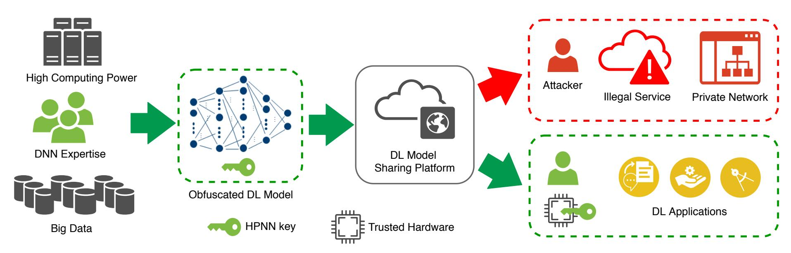
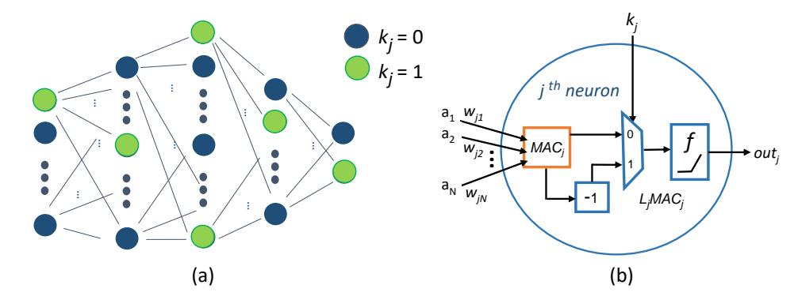
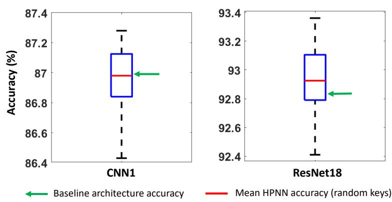
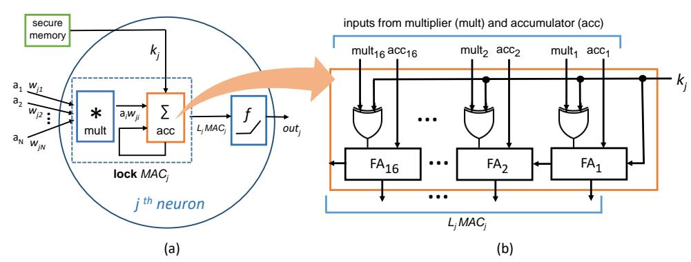
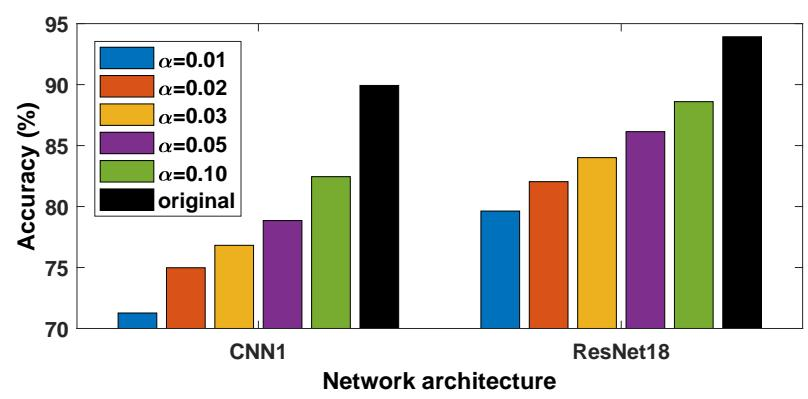
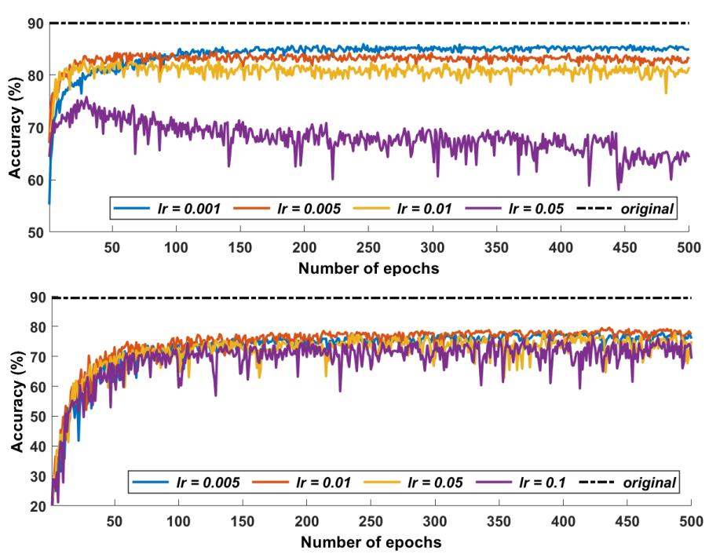
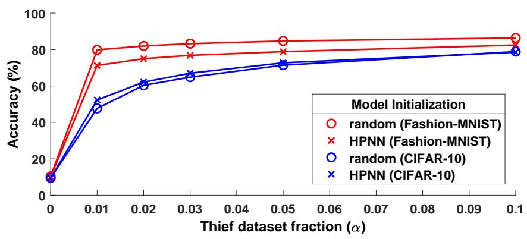

{0}------------------------------------------------

# Hardware-Assisted Intellectual Property Protection of Deep Learning Models

Abhishek Chakraborty, Ankit Mondal, and Ankur Srivastava Department of Electrical and Computer Engineering, University of Maryland, College Park {abhi1990, amondal2, ankurs}@umd.edu

*Abstract*—The protection of intellectual property (IP) rights of welltrained deep learning (DL) models has become a matter of major concern, especially with the growing trend of deployment of Machine Learning as a Service (MLaaS). In this work, we demonstrate the utilization of a hardware root-of-trust to safeguard the IPs of such DL models which potential attackers have access to. We propose an obfuscation framework called Hardware Protected Neural Network (HPNN) in which a deep neural network is trained as a function of a secret key and then, the obfuscated DL model is hosted on a public model sharing platform. This framework ensures that only an authorized end-user who possesses a trustworthy hardware device (with the secret key embedded on-chip) is able to run intended DL applications using the published model. Extensive experimental evaluations show that any unauthorized usage of such obfuscated DL models result in significant accuracy drops ranging from 73.22 to 80.17% across different neural network architectures and benchmark datasets. In addition, we also demonstrate the robustness of proposed HPNN framework against a model fine-tuning type of attack.

## I. INTRODUCTION

Deep learning (DL) algorithms are extensively used for analyzing big data in several domains including image classification, natural language processing, autonomous transportation, smart health, financial management, social networks, etc. [10], [15]. The key factors attributed to the unprecedented success of these algorithms are (i) availability of a *massive* and mostly labeled training dataset (ii) allocation of powerful computing resources as well as vast amounts of network training time and also (iii) substantial domain expertise of DL model developers to obtain highly accurate models. Therefore, welltrained DL models are considered to be intellectual property (IP) of the owner as *significant* cost is incurred behind their training process to gain a competitive edge in business [8], [19], [24]. In a *white-box* setting [23], the neural network architecture as well as the trained DL model parameters are made publicly available (e.g., Caffe's Model Zoo and Amazon's Alexa Skills) by a DL model owner [7], [19]. As the popularity of using such pre-trained models increases (especially with the deployment of MLaaS), IP protection as well as Digital Rights Management (DRM) of these distributed DL models are of major practical concerns [19]. The prevention of *model piracy* is a key challenge in this field as there exists techniques (such as *scaling, noising, fine-tuning*, etc.) to cleverly modify model parameters without affecting the functionality or accuracy of the network and thus, helping attackers to claim false DL model ownership [22].

There has been a lot of research to address the privacy concerns of user data which are used to train Deep Neural Networks (DNNs) [6], [21], [27]. However, on the other hand, there is only a limited number of works which primarily focus on developing techniques to protect the IP of well-trained DL models rather than securing sensitive user data. Watermarking strategies for DL models have been proposed in recent literature [7], [11], [13], [17], [19] which help to claim the ownership of stolen models by embedding identification information into them. But such leaked DL models can be reused *privately* by the adversary, thus bypassing ownership inspection by the aforementioned watermarking techniques [26]. In order to further strengthen the IP security of DL models, an obfuscation technique for DNNs has been proposed in [24] which *structurally* obfuscates the network architecture. However, commonly raised DL model theft concerns are related to the stealing of well-trained weight parameters (or learned network functionality) and not due to the theft of DNN topology. This is because industrial applications typically use previously published DNN architectures which have demonstrated high modeling capabilities [22]. This strongly motivates us to develop a robust and efficient DNN obfuscation infrastructure which locks a DL model's weight parameters. Such an obfuscated DL model should exhibit high prediction performance *only* if an end-user has legitimate access to it, whereas any unauthorized usage of the locked model should result in significant degradation of its prediction accuracy.

The above goal of IP protection of DL models can be achieved using provably-secure cryptographic schemes to encrypt the weight parameters. However, application of encryption/decryption on millions of model parameters (as present in modern DNNs) will incur *large* time/implementation overheads and thus, conflict with the strict response-time deadlines of DNN inference applications. In this work, we propose an obfuscation framework called Hardware Protected Neural Network (HPNN) as a *lightweight* alternative to achieve the desired IP security of DL models in a white-box setting. The security offered by this framework relies on the availability of a hardware *root-of-trust* which embeds a *secret* key (called HPNN key) within an on-chip memory [5], [25]. Such a trusted hardware serves as the license to utilize the services provided by a DL model owner. To ensure IP protection of a DL model using HPNN framework, the model owner first utilizes a novel *key-dependent* backpropagation algorithm to train a DNN architecture which obfuscates the model's learned weight space and then hosts the DL model in a public model sharing platform. An authorized end-user downloads the locked DL model and runs DNN inference on a trusted hardware which applies the HPNN key (embedded on-chip) to retrieve the intended model functionality. This framework ensures that proprietary DL models perform inference with high accuracy (as expected from training) *only* on such trusted hardware devices. In addition, we also provide theoretical justification and experimental results to demonstrate that the proposed *key-dependent* DNN training doesn't compromise a model's prediction accuracy at the cost of gaining security benefits.

In order to further evaluate the IP security of DL models obfuscated using HPNN framework, we consider *model fine-tuning* attack [18], [24] where the objective of an adversary is to re-train a locked DL model using a *thief* dataset (which is a small fraction of the original dataset) and adapt it for usage in intended applications. As evident from our experimental findings across different DNN architectures and benchmark datasets, the success of such an attack is limited by the size of *thief* dataset available. This highlights the fact that an obfuscated DL model cannot be sufficiently fine-tuned to achieve high prediction accuracy without the possession of *secret* HPNN key. In summary, the contributions of this paper are as follows:

• Proposing an obfuscation framework called HPNN to protect the IPs of DL models in a white-box setting. To the best of our knowledge, this is the first work which leverages hardware as a *root-of-trust* to achieve IP security of DL models.

{1}------------------------------------------------

Fig. 1: Proposed HPNN framework for IP security of DL models.

- Providing a theoretical construct of a *key-dependent* backpropagation algorithm for training a neural network which doesn't sacrifice a model's prediction accuracy to gain security benefits.
- Extensive experimental evaluations across different DNN architectures and benchmark datasets to assess the robustness of obfuscated DL models against model fine-tuning attacks.

## II. MOTIVATION

The development of a production-level DL model is not a trivial task as it requires a massive amount of training data along with high power computing resources. State-of-the-art DL models take several weeks of training over GPU clusters. In addition, designing a welltrained model requires significant machine learning expertise as well as long working hours to execute numerous trial runs to properly optimize the associated network hyper-parameters [19], [24]. The growing trend of deployment of well-trained DL models in public cloud infrastructure (MLaaS settings) opens the door for attackers to steal models and establish plagiarized machine learning services. Such IP theft of DL models poses a major threat of substantial revenue loss in market share to its owners [7], [19]. Also, stolen DL models used in mission-critical operations (which may involve national security) can be sold to Darknet markets [26]. Therefore, there is a strong need to ensure the security of well-trained DL models from illegal usage.

Attacker's Goal. In this work, we assume that an attacker has access to a DL model's weight parameters either through public cloud platform or from an information breach via malicious malware infection or an insider source [26]. Also, we assume that the attacker has knowledge of the DNN architecture (or topology) used to train the model. This is reasonable assumption as industrial applications typically use published DNN architectures which have demonstrated high modeling capabilities [22]. The objective of the attacker is to either utilize the stolen DL model to provide a plagiarized cloud based service to end-users or to deploy it in a private network for running intended DL applications (as shown in Fig. 1). Though, in the former scenario, the DL model owner may still use watermarking techniques [7], [11], [19] to claim digital rights (if somehow she has obtained access privileges to the illegal cloud service), but in the latter attack scenario, the model owner won't have any provision to remotely query the DL model to extract watermarked contents [26]. This strongly motivates the development of a much more effective IP security solution for DL models which can thwart any sort of unauthorized usage scenarios.

A robust IP protection of DL models can be achieved using provably-secure cryptographic schemes where the DL model owner encrypts the model parameters before uploading them in a public cloud service. Only a legitimate end-user will be able to decrypt (using a *secret* key) the encrypted parameters to retrieve the trained DL model. However, this solution will be highly inefficient in practice as industrial DL models have millions of weight parameters [14] and applying cryptographic algorithms on such large-scale DNNs will incur huge time/implementation overheads. Instead, we propose HPNN framework as a *lightweight* alternative to secure IPs of DL models by obfuscating their weight parameters. Such obfuscated DL models can be openly distributed using public cloud infrastructure without any IP theft concerns.

# III. PROPOSED HPNN FRAMEWORK

# *A. Overall Flow*

The global flow of HPNN framework is presented in Fig. 1. A DL model owner spends long working hours to train a network using a large annotated training dataset and high-performance computing platforms. The crux of IP protection guarantees provided by the HPNN framework relies on training a DNN using a *key-dependent* backpropagation algorithm (more details in section III-C) which obfuscates the learned weight space of the model. Such a *key-dependent* training approach doesn't compromise the prediction accuracy of the obtained model to gain security benefits. Then, the obfuscated DL model is hosted on a public model sharing platform (such as a cloud interface in MLaaS settings) to provide services to *only* authorized customers who have acquired the requisite licenses for model usage. In our proposed HPNN framework, licenses are distributed in the form of trustworthy hardware devices which securely embed the *secret* HPNN key on-chip [5], [25]. This scheme aims to guarantee state-of-the-art inference phase performance of a locked DL model only on such trusted hardware devices, while significantly degrading its prediction accuracy for any illegal usage. Note that a model owner can train several DNNs using the same HPNN key to obtain obfuscated DL models targeting different applications. Later in section IV-B, we also experimentally demonstrate the effectiveness of HPNN framework to thwart model fine-tuning type attack where an attacker tries to leverage the knowledge of the DNN architecture (white-box setting) and an available *thief* dataset to steal a well-trained DL model.

Hardware root-of-trust. Our proposed HPNN framework relies on the utilization of a hardware root-of-trust (with *secret* HPNN key embedded on-chip) to provide services to authorized end-users. The rationale behind the assumption of availability of such trusted hardware devices are as follows: (i) Domain-specific hardware chips (e.g., Google's Tensor Processing Unit [14], Intel's Neural Compute Stick [3], etc.) are being deployed in industrial settings for accelerating the inference phase in DNN applications. In our proposed HPNN framework also, the trusted hardware devices are utilized by authorized end-users for running only the DNN inference phase. Note that during the DNN training phase, the DL model owner just requires the knowledge of HPNN key value (no need for any trusted hardware 

{2}------------------------------------------------

device) to obfuscate the learned weight space of the model. (ii) Also, in order to counter emerging threats to IoT edge devices, applications are increasingly designed to rely on secure key storage facility provided by a hardware root-of-trust such as Trusted Platform Module (TPM) [5]. In addition to providing *stronger* security guarantees than their software counterparts, hardware-assisted protection mechanisms also incur significantly lower performance overhead [9], [20].

## B. Neural Network Obfuscation

In this work, we assume that an attacker has knowledge of the details of a DNN architecture, i.e., the number and types of layers in the network as well as the connectivity graphs between the layers (white-box setting). Henceforth, we refer to such information as knowledge of the *baseline* DNN architecture. The goal of our proposed HPNN framework is to train a DNN in such a way that the learned weight space of the model is obfuscated as a function of *secret* HPNN key. To realize this objective, we *lock* any  $j^{th}$  neuron belonging to a nonlinear layer of the network by associating a HPNN key bit  $k_j$  as illustrated in Fig. 2(a). Such a neuron basically performs (i) multiply and accumulate (MAC) operation to compute a weighted sum of its inputs  $(a_1, a_2, ..., a_N)$ , i.e.,  $\text{MAC}_j = \sum_{i=1}^N a_i w_{ji} = \mathbf{a^T w_j}$  and (ii) then, passes  $\text{MAC}_j$  through a nonlinear activation function f to produce the neuron's output response, i.e.,  $out_j = f(\text{MAC}_j)$ . Now, in order to lock the functionality of  $j^{th}$  neuron, we make  $out_j$  dependent on HPNN key bit  $k_j$  as follows:

$$out_j = f(L_j MAC_j) = f(L_j \mathbf{a}^T \mathbf{w_j})$$
 (1)

where, 
$$L_i = (-1)^{k_j}$$
 (2)

The variable  $L_j$  is called the *lock factor* of  $j^{th}$  neuron, which governs the sign of  $MAC_j$  based on  $k_j$  value as shown in Fig. 2(b). If  $k_j = 0$ , then  $MAC_j$  remains the same, whereas (ii) if  $k_j = 1$ , then sign of  $MAC_j$  is flipped. Next, we study the implication of such key based obfuscation of neurons on the network training process.

#### C. Key-dependent Backpropagation

In order to train a neural network in the HPNN framework, we propose a *key-dependent* backpropagation algorithm which creates a model whose weight space is highly optimized as a function of the HPNN key. Such an obfuscated model strongly resists any attempts to illegally utilize it by concealing the learned decision boundaries. Next, we describe how the notion of HPNN key can be augmented to a *conventional* backpropagation based training approach.

Neural networks are typically trained using iterative, gradient-based optimizers with the objective of driving a desired cost function to a very low value. We consider the training of a network using delta rule which utilizes backpropagation algorithm to update network parameters such that the given cost function is minimized [10]. Let  $E^p$  denote the cost function which measures the discrepancy between the expected (or correct) output response and the output response produced by a network for the  $p^{th}$  training vector. Then, the learning rule for the  $i^{th}$  incoming weight of  $j^{th}$  neuron  $(w_{ji})$  can be expressed as follows:

as follows:  $\Delta w_{ji} = -\eta \frac{\partial E^p}{\partial w_{ji}} \tag{3}$  where,  $\eta$  is the learning rate. In HPNN framework, if we consider a

where,  $\eta$  is the learning rate. In HPNN framework, if we consider a mean squared error (MSE) cost function, i.e.,  $E^p = \frac{1}{2} \sum_j (t_j - out_j)^2$  with  $t_j$  being the correct output label, the above weight learning rule will be a function of *lock factor*  $L_j$  as shown below:

$$\Delta \mathbf{w}_j = \eta \delta_j \mathbf{a} \tag{4}$$

where,

$$\delta_{j} = \begin{cases} (t_{j} - out_{j})f^{'}(L_{j}\text{MAC}_{j})L_{j} & \text{if } j^{th} \text{ neuron } \in \text{ output layer} \\ \left(\sum\limits_{k \in O} w_{kj}\delta_{k}\right)f^{'}(L_{j}\text{MAC}_{j})L_{j} & \text{if } j^{th} \text{ neuron } \in \text{ hidden layer} \end{cases}$$

Fig. 2: Obfuscation of a neuron in HPNN framework.

with f' being the derivative of the activation function f, a denotes the input vector to the neuron, and O denotes the neuron's adjacent layer. The above backpropagation based learning rule can now be used to update the incoming weight vectors of all locked neurons in the proposed obfuscation framework. This will lead the entire network to learn an optimized weight space as a function of not only the training dataset but also the  $L_j$  values (which are derived from the *secret* HPNN key, see Eq. 2). As demonstrated later by experimental results outlined in section IV, such a locked model performs accurately during the inference phase *only* when the HPNN key is used to retrieve the correct functionalities of the locked neurons.

**Model capacity.** The capacity of a model describes the *complexity* of relationship it can map between the input patterns and output labels for a given dataset. The capacity of a DL model obtained by training a DNN using our proposed HPNN framework is *independent of any key value used*. To demonstrate this property let us first consider the case of a single layer fully-connected network, before we consider more complex DNN architectures. Note that two models (obfuscated using two different HPNN keys) have equivalent capacities if *there exists* equivalent weight assignments which lead to the *same* output predictions for any given input to the models. We show the existence of such equivalent weight assignments for a single layer fully connected network by establishing a relationship between the incoming weight vectors of any  $j^{th}$  neuron (locked with different HPNN key bit values) which leads to the same neuron response  $out_j$  and hence, the same overall network's prediction for an input vector.

Definition 1: For any  $j^{th}$  neuron (with lock factor  $L_j$  and output response  $out_j$ ), let  $\mathbf{w}_j^{init}$  denote its initial incoming weight vectors (before training) and let  $\mathbf{w}_{j,L_j}^N$  denote its incoming weight vectors after N training epochs.

Theorem 1: For a single layer fully-connected network initialized with all zero weight parameters (i.e.,  $\mathbf{w}_{j}^{init}$ =0), we get  $\mathbf{w}_{j,-1}^{N}$ =- $\mathbf{w}_{j,1}^{N}$ .

*Proof:* We prove this theorem using principle of mathematical induction. (i)  $Base\ case$ : Before any training epoch, we have  $\mathbf{w}_{j,-1}^0 = \mathbf{w}_j^{init} = \mathbf{0} = -\mathbf{w}_{j,1}^0$  (ii)  $Induction\ step$ : Let us assume that  $\mathbf{w}_{j,-1}^K = -\mathbf{w}_{j,1}^K$  after K training epochs. We now need to show  $\mathbf{w}_{j,-1}^{K+1} = -\mathbf{w}_{j,1}^{K+1}$  in order to prove the lemma. In the  $(K+1)^{th}$  training epoch with  $L_j = 1$  and using Eqs. (1) and (4) we get,

$$\Delta \mathbf{w}_{j,1} = \eta(t_j - f(\mathbf{a}^T \mathbf{w}_{j,1}^K)) f'(\mathbf{a}^T \mathbf{w}_{j,1}^K) \mathbf{a}$$

$$\mathbf{w}_{j,1}^{K+1} = \mathbf{w}_{j,1}^K + \Delta \mathbf{w}_{j,1}$$
(5)

Similarly, with  $L_j = -1$  we get,

$$\Delta \mathbf{w}_{j,-1} = -\eta (t_j - f(-\mathbf{a}^T \mathbf{w}_{j,-1}^K)) f'(-\mathbf{a}^T \mathbf{w}_{j,-1}^K) \mathbf{a}$$

$$= -\eta (t_j - f(\mathbf{a}^T \mathbf{w}_{j,1}^K)) f'(\mathbf{a}^T \mathbf{w}_{j,1}^K) \mathbf{a}$$

$$= -\Delta \mathbf{w}_{\mathbf{j},\mathbf{1}}$$
(6)

Therefore,  $\mathbf{w}_{j,-1}^{K+1} = \mathbf{w}_{j,-1}^{K} + \Delta \mathbf{w}_{j,-1}$ =  $-(\mathbf{w}_{j,1}^{K} + \Delta \mathbf{w}_{j,1}) = -\mathbf{w}_{j,1}^{K+1}$  (7)

Hence, by the principle of induction the theorem holds true.

{3}------------------------------------------------

Fig. 3: Performance of DL models locked using different HPNN keys.

It is non-trivial to derive similar relationships for modern DNN architectures which consist of multiple hidden layers. Also, a network is typically initialized with small random non-zero weight parameters for effective training [10]. But the following lemma still guarantees that the DL model capacity is unaffected by the choice of HPNN key used to train the DNN in our proposed obfuscation framework.

Lemma 1: DL models obfuscated using different HPNN keys have equivalent model capacities.

*Proof:* For a given DNN architecture, the manner in which a  $j^{th}$  neuron is locked in HPNN framework ensures that the same neural activation response  $out_j$  will be produced if we have incoming weight vectors of  $\mathbf{w}_j$  for  $k_j = 0$  and  $-\mathbf{w}_j$  for  $k_j = 1$ , as evident from Eq. (1). This implies that *there exists* equivalent weight assignments for different HPNN keys which will lead to the *same* network prediction outcomes, which in turn implies that all such obfuscated DL models have equivalent capacities.

However, in practice, such key-dependent backpropagation based DNN training is likely to yield different incoming weight vector magnitudes of neurons for different HPNN keys due to network nonlinearity as well as random weight initialization. To ascertain the equivalence in capacities of DL models obtained by training the same DNN topology but locked using different HPNN keys, we performed the following experiment: First, we randomly generated 20 different HPNN keys, and then used these keys to train a given DNN architecture with the same training dataset (Fashion-MNIST [2]) and hyperparameters combination. We considered the prediction accuracy of a DL model as the indicator of its modeling capacity. The experimental results are presented in Fig. 3 for two different DNN architectures, CNN1 (see Table I for network details) and ResNet18 [12]. Each of the box plots shows the distribution of prediction accuracy of 20 different DL models on the same test dataset. Such model accuracy distributions highlight the fact that DL models obtained using different HPNN keys perform on an equivalent scale. Also, the mean prediction accuracy (shown using red lines) for CNN1 and ResNet18 networks are 86.95\% and 92.93\% respectively, which are very close to the corresponding accuracy (shown using green arrows) of 86.99% and 92.83% of the baseline DL models (i.e., the models obtained using conventional backpropagation based training of *baseline* DNN architectures).

#### D. Role of hardware root-of-trust

In the proposed HPNN framework, an authorized end-user utilizes a trusted hardware device (which embeds the *secret* HPNN key) to run the DNN inference phase. In a modern DNN architecture, there are typically thousands of neurons belonging to nonlinear network layers and hence, associating a key bit with each such neuron (as presented in Sec. III-B) will lead to an impractically large HPNN key length. The hardware root-of-trust not only accelerates the DNN inference phase but also *facilitates the use of a practical size HPNN key*. This can be achieved by a simple modification in the MAC unit design of the trusted hardware device. For illustration purposes, let us consider a Google TPU-like chip [14] which will be deployed as a hardware root-of-trust in our proposed DL model obfuscation framework.

Fig. 4: Hardware realization of neuron locking mechanism.

Google TPU design. The main computational component of a Google TPU chip is called matrix multiply unit (MMU) which performs MAC operations in a pipelined manner. MMU consists of 256X256 MACs which compute 8-bit multiply-and-adds on signed or unsigned integers. The resulting 16-bit products are first collected in 256 accumulator units and then passed on to an on-chip activation module which implements standard nonlinear operations (such as ReLU, sigmoid, etc.). For more details on TPU architecture, please refer to [14]. Next, we outline how the MAC design of such a chip can be modified to facilitate the use of a practical size HPNN key.

1) Key-dependent accumulator: We propose a low overhead design modification to make the MAC computation key-dependent as shown in Fig. 4(a). As specific design details of TPU are not publicly available, we make the following assumptions for the sake of illustration: (i) the design of an accumulator unit is based on a fulladder (FA) chain as shown in Fig. 4(b). (ii) all numbers are stored and operated on in their two's complement representation. Now, in order to lock the MAC computation of  $j^{th}$  neuron as a function of  $k_j$ , we introduce 16 additional XOR gates per accumulator unit as shown in Fig. 4(b). Each such gate takes as input - (i) a bit from the multiplier unit's 16-bit result and (ii) an HPNN key bit  $k_j$  which is supplied from a secure on-chip memory. The magnitude of  $k_j$ determines the functionality of the accumulation operation: If  $k_j = 0$ , then  $MAC_j = \sum_{i=1}^N a_i w_{ji}$  is computed by performing a sequence of addition in the accumulator unit. On the other hand if  $k_j = 1$ , then  $MAC_j$  is converted to its two's complement by performing a sequence of subtraction, i.e.,  $\sum_{i=1}^{N} -a_i w_{ji} = -\text{MAC}_j$ . This simple modification in the accumulator design makes the response of  $j^{th}$ neuron dependent on its lock factor  $L_j$ , i.e.,  $out_j = f(L_j MAC_j)$ , as expected in Eq. (1).

2) HPNN key: As there are only 256 such accumulator units in a Google TPU-like architecture, the size of HPNN key will be 256 bits (a practical key length) and the total number of additional XOR gates required will be 256X16 = 4096. When a large-scale DNN inference is run on such an accelerator chip, multiple locked neurons will be mapped to a single accumulator unit by using a hardware-specific scheduling algorithm. This implies that a single HPNN key bit will be associated with several locked neurons in the HPNN framework. During the training phase, a DL model owner needs to utilize the information from this hardware-specific scheduling algorithm to derive the key bits corresponding to all the locked neurons of a DNN from the 256-bit HPNN key. Note that the details of such scheduling used in the hardware root-of-trust will also be kept private to further enhance the security of HPNN framework.

3) Implementation overhead: The additional cost incurred to provide MLaaS using HPNN framework are as follows: (i) In the training phase, a DL model owner needs to perform a one-time preprocessing using the notion of hardware-specific scheduling algorithm to map subsets of DNN neurons to their corresponding HPNN key bits. (ii) In the inference phase, which is carried out using the trusted hardware, **small area overhead** will be incurred due to introduction of additional XOR gates (4096 gates in case of Google TPU-like architecture) for modifying the accumulator design. If we consider a

{4}------------------------------------------------

Fig. 5: Accuracy vs. size of *thief* dataset (Fashion-MNIST)

MMU implementation [16] which consists of gates in the order of  $10^6$ , then the gate overhead due to our proposed design modification will be less than 0.5%. Also, there will be **no clock cycle overhead** (only combinational delay for calculating two's complement) due to the introduction of additional XOR gates. Hence, our proposed HPNN framework offers a *lightweight* IP security solution for DL models.

#### IV. EVALUATIONS

We evaluate the security benefits offered by the HPNN framework across 3 different benchmark datasets (Fashion-MNIST [2], CIFAR-10 [1], and SVHN [4]) and Convolution Neural Network (CNN) architectures (details in Table I). We used Pytorch 3.1 to run simulations on a system consisting of an Intel Xeon CPU and a Nvidia Maxwell GPU with 32 GB and 2 GB memories respectively.

#### A. Performance of locked DL models

A DL model obtained using the key-based backpropagation algorithm (see Sec. III-C) should demonstrate high prediction accuracy only when it runs inference on a trusted hardware device. Such a hardware root-of-trust deobfuscates the locked neurons of a DNN to retrieve the network functionality using the secret HPNN key1. The proposed HPNN framework aims to thwart any attempts by the attacker to run DNN inference with satisfactory prediction accuracy by loading the baseline DNN architecture with a stolen DL model. We performed experiments across different benchmark datasets to asses the robustness of HPNN framework in such an attack scenario. In columns 4 and 5 of Table I, we report the accuracy obtained when running locked DL models on a hardware-root-of-trust (simulated by providing the *secret* HPNN key to retrieve the DNN functionality) and on the baseline DNN architecture (no key). In the latter case, we observe substantial accuracy drops of 79.88%, 80.17%, and 73.22% for Fashion-MNIST, CIFAR-10, and SVHN datasets respectively compared to the *original accuracy* as obtained by running the locked DL models on trusted hardware. Next, we evaluate the security offered by HPNN framework to protect the IP of a well-trained DL model in a stronger model fine-tuning attack scenario.

# B. Model fine-tuning attack

Model fine-tuning is a type of *transformation attack* strategy [18], [19] which drives the underlying neural network to converge to some other local minimum (different from the original model) and results in comparative performance in practical applications. To evaluate the effectiveness of our proposed HPNN framework against a model fine-tuning attack we consider the following threat model.

**Attacker's Capabilities.** In addition to having the knowledge of the *baseline* DNN architecture, the attacker has the following privileges:

- Availability of a *thief* dataset (annotated) which constitutes a small fraction  $\alpha$  (say 10%) of the original training dataset.
- Significant DNN expertise as well as powerful computational resources to train large network architectures.

Fig. 6: Effect of learning rate (lr) on fine-tuning **(top)** dataset: Fashion-MNIST, network: CNN1 **(bottom)** dataset: CIFAR-10, network: CNN2

**Attacker's Limitation.** The attacker doesn't possess a large amount of annotated training data as well as optimized model hyperparameters (which are responsible for its highly accurate performance). This is a reasonable assumption as DL model owners keep such information private to maintain a competitive edge in business [19], [22].

Attack Methodology and results. To perform a model fine-tuning attack, the attacker first loads the stolen DL model parameters to initialize the *baseline* DNN architecture and then utilizes the *thief* dataset to retrain the model. The attack is deemed successful only if such a retrained DL model performs equivalently, i.e., shows similar high levels of accuracy in its predictions as the owner's DL model running on a hardware root-of-trust (which embeds the HPNN key).

1) Impact of thief dataset size and network architecture: To analyze the impact of the size of the thief dataset on the success rate of a model fine-tuning attack, we assume the availability of different thief dataset fractions ( $\alpha=1\%, 2\%, 3\%, 5\%$ , and 10%) to the attacker. In Fig.5, we present the experimental results of model fine-tuning attack across 2 different DNN architectures (CNN1 and ResNet18, see Table I for network topology) using the Fashion-MNIST dataset. It can be observed from the accuracy trends that as the size of the thief dataset increases, so does the success rate of a model finetuning attack. However, even with  $\alpha=10\%$ , the attacker reaches a finetuning accuracy of only 82.45% and 88.60% for CNN1 and ResNet18 whereas the corresponding accuracy obtained originally by DL model owner are 89.93% and 93.92% respectively. These results highlight the effectiveness of our proposed HPNN framework to safeguard the IPs of DL models across different network architectures. Note that in the above set of experiments, we used the same hyperparameter configuration for performing model fine-tuning as used by the DL model owner to train the network.

2) Impact of hyperparameter: We varied both the learning rate (lr) and the number of training epochs to observe the best accuracy that can be attained using model fine-tuning attack. In Fig. 6, we present the results of such experiments using a thief dataset fraction  $\alpha$ =10% across different datasets. The best accuracy achieved by such hyperparameter tuning on Fashion-MNIST and CIFAR-10 datasets are 85.91% and 79.61% respectively, which are significantly lower than their counterparts of 89.93% and 89.54% as obtained by the DL model owner. Also, we observed that increasing lr too much (for example setting lr = 0.05 on Fashion-MNIST dataset, see Fig. 6(top)) leads to poor generalization performance on the test dataset.

#### C. Information leakage from obfuscated DL model

A major challenge for HPNN framework is to ensure that a locked DL model doesn't leak any significant information related

&lt;sup>1In our experiments, we randomly assigned key bit values to neurons belonging to nonlinear layers of a DNN. However, in practice, the DL model owner needs to derive the key bits to be associated with such neurons from the HPNN key using hardware-specific scheduling information (see Sec. III-D2).

{5}------------------------------------------------

| Dataset       | Network Architecture (number and types of layers) | No. of neurons in nonlinear (ReLU) layers | Original accuracy | HPNN locked |       | Random fine-tuning |       | HPNN fine-tuning |        |
|---------------|------------------------------------------------------|-------------------------------------------|-------------------|-------------|-------|--------------------|-------|------------------|--------|
|               |                                                      |                                           |                   | accuracy    | %drop | accuracy           | %drop | accuracy         | % drop |
| Fashion-MNIST | CNN1 (2 C, 2 MP, 2 ReLU, 1 FC)                       | 4352                                      | 89.93             | 10.05       | 79.88 | 86.35              | 3.58  | 82.45            | 7.48   |
| CIFAR10       | CNN2 (6 C, 3 MP, 8 ReLU, 3 FC)                       | 198144                                    | 89.54             | 9.37        | 80.17 | 78.87              | 10.67 | 78.53            | 11.01  |
| SVHN          | CNN3 (3 C, 3 MP, 4 ReLU, 2 FC)                       | 29696                                     | 89.06             | 15.84       | 73.22 | 80.97              | 8.09  | 82.89            | 6.17   |

TABLE I: Effectiveness of HPNN framework against model fine-tuning attack (C: convolutional, MP: max-pooling, FC: fully-connected layers)

Fig. 7: Impact of thief dataset size on fine-tuning attack.

to the input-output mapping of the owner's DL model, beyond what can be exploited by the attacker using the *thief* dataset. In order to experimentally quantify the information leakage from an obfuscated DL model we performed two types of fine-tuning attacks under the same hyperparameter settings (i) Random fine-tuning approach where we initialized the baseline DNN architecture with random small weight parameters and (ii) **HPNN** fine-tuning approach where we initialized the baseline DNN with the obfuscated DL model's weight parameters. The intuition behind such an experiment being that if the accuracy achieved by random fine-tuning and HPNN finetuning attacks are *similar*, then the obfuscated DL model doesn't leak any significant information related to the owner's DL model. The experimental outcomes for such fine-tuning attacks across different benchmark datasets (using a thief dataset fraction  $\alpha=10\%$ ) are presented in the last four subcolumns of Table I. We observe that both types of fine-tuning attacks could achieve accuracy levels which are significantly lower than the original accuracy obtained by the DL model owner. Also, both the attacks perform quite *similarly* in terms of the final accuracy achieved across different datasets. This indicates that initializing the network using weight parameters of an obfuscated DL model (which is trained on the entire annotated training dataset) doesn't provide any advantage compared to random weight initialization for performing fine-tuning attack.

We further investigated the effect of available *thief* dataset size on these two types of fine-tuning attacks. As we can observe from the experimental results reported in Fig. 7, both random and HPNN fine-tuning attacks perform very closely across different  $\alpha$  values on the datasets considered. Note that  $\alpha$ =0% corresponds to the scenario where the attacker doesn't possess any *thief* dataset to perform model fine-tuning. The accuracy trends signify that the success of attacker is limited by the size of the available *thief* dataset, irrespective of the weight initialization used. Therefore, our proposed HPNN framework successfully thwarts IP theft attempts of DL models even under a strong threat model which considers model fine-tuning attacks.

#### V. CONCLUSION

In this paper, we propose a lightweight obfuscation framework called HPNN for IP protection of DL models. In this framework, a DL model owner utilizes a novel *key-dependent* backpropagation algorithm to train a network such than only an authorized end-user who possesses a trusted hardware (with the *secret* HPNN key embedded on-chip) will be able to effectively run the DNN inference phase. The experimental outcomes across different benchmark datasets and DNN architectures highlight the fact that any unauthorized usage of such locked DL models will lead to a substantial degradation of the

model prediction accuracy. In addition, we also performed extensive evaluations to demonstrate the robustness of obfuscated DL models (trained using HPNN framework) against model fine-tuning attacks.

#### REFERENCES

- [1] CIFAR-10 dataset. https://www.cs.toronto.edu/ kriz/cifar.html.
- [2] Fashion-MNIST. https://github.com/zalandoresearch/fashion-mnist.
- [3] Intel NCS. https://software.intel.com/en-us/neural-compute-stick.
- [4] SVHN dataset. http://ufldl.stanford.edu/housenumbers/.
- [5] TPM. https://trustedcomputinggroup.org/.
- [6] M. Abadi et al. Deep learning with differential privacy. In *Proceedings* of the 2016 ACM SIGSAC Conference on Computer and Communications Security, pages 308–318. ACM, 2016.
- [7] Y. Adi et al. Turning your weakness into a strength: Watermarking deep neural networks by backdooring. In *USENIX*, pages 1615–1631, 2018.
- [8] H. Chen et al. Deepmarks: A digital fingerprinting framework for deep neural networks. *arXiv preprint arXiv:1804.03648*, 2018.
- [9] J. Dwoskin et al. Hardware-rooted trust for secure key management and transient trust. In *Proceedings of the 14th ACM conference on Computer and communications security*, pages 389–400. ACM, 2007.
- [10] I. Goodfellow et al. Deep Learning. MIT press, 2016.
- [11] J. Guo et al. Watermarking deep neural networks for embedded systems. In 2018 IEEE/ACM International Conference on Computer-Aided Design (ICCAD), pages 1–8. IEEE, 2018.
- [12] K. He et al. Deep residual learning for image recognition. In *Conference on computer vision & pattern recognition*, pages 770–778. IEEE, 2016.
- [13] D. Hitaj et al. Have you stolen my model? evasion attacks against deep neural network watermarking techniques. *arXiv:1809.00615*, 2018.
- [14] N. P. Jouppi et al. In-datacenter performance analysis of a tensor processing unit. In *Computer Architecture (ISCA)*, 2017 ACM/IEEE 44th Annual International Symposium on, pages 1–12. IEEE, 2017.
- [15] Y. LeCun et al. Deep learning. Nature, 521(7553):436, 2015.
- [16] Y. Lin et al. Data and hardware efficient design for convolutional neural network. *IEEE Trans. on Circuits and Systems*, pages 1642–1651, 2017.
- [17] E. Merrer et al. Adversarial frontier stitching for remote neural network watermarking. *arXiv preprint arXiv:1711.01894*, 2017.
- [18] N. Papernot et al. Practical black-box attacks against machine learning. In *Proceedings of the 2017 ACM on Asia CCS*, pages 506–519, 2017.
- [19] B. D. Rouhani et al. Deepsigns: An end-to-end watermarking framework for ownership protection of deep neural networks. In *Proceedings of International Conference on ASPLOS*, pages 485–497. ACM, 2019.
- [20] A.-R. Sadeghi et al. Security and privacy challenges in industrial internet of things. In 52nd Design Automation Conference (DAC), 2015.
- [21] R. Shokri et al. Privacy-preserving deep learning. In *Proceedings of the 22nd ACM SIGSAC conference on computer and communications security*, pages 1310–1321. ACM, 2015.
- [22] K. Szentannai et al. Mimosanet: An unrobust neural network preventing model stealing. *arXiv:1907.01650*, 2019.
- [23] Y. Uchida et al. Embedding watermarks into deep neural networks. In *Proceedings of the 2017 ACM on International Conference on Multimedia Retrieval*, pages 269–277. ACM, 2017.
- [24] H. Xu et al. Deepobfuscation: Securing the structure of convolutional neural networks via knowledge distillation. *arXiv:1806.10313*, 2018.
- [25] M. Yasin et al. On improving the security of logic locking. *CAD of Integrated Circuits & Systems, IEEE Transactions on*, 2015.
- [26] J. Zhang et al. Protecting intellectual property of deep neural networks with watermarking. In *Proceedings of the 2018 on Asia Conference on Computer and Communications Security*, pages 159–172. ACM, 2018.
- [27] Q. Zhang et al. Privacy preserving deep computation model on cloud for big data feature learning. *IEEE Transactions on Computers*, 2015.