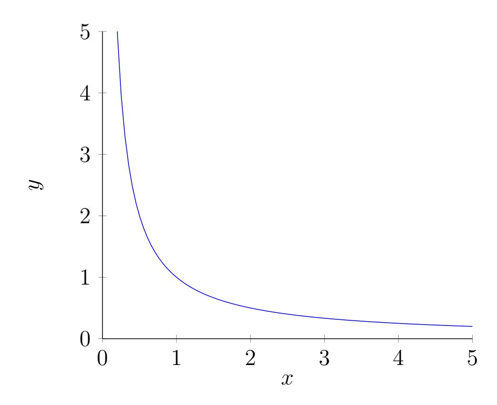
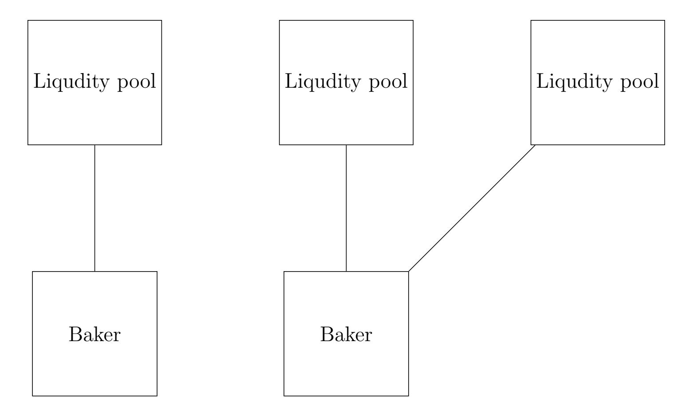
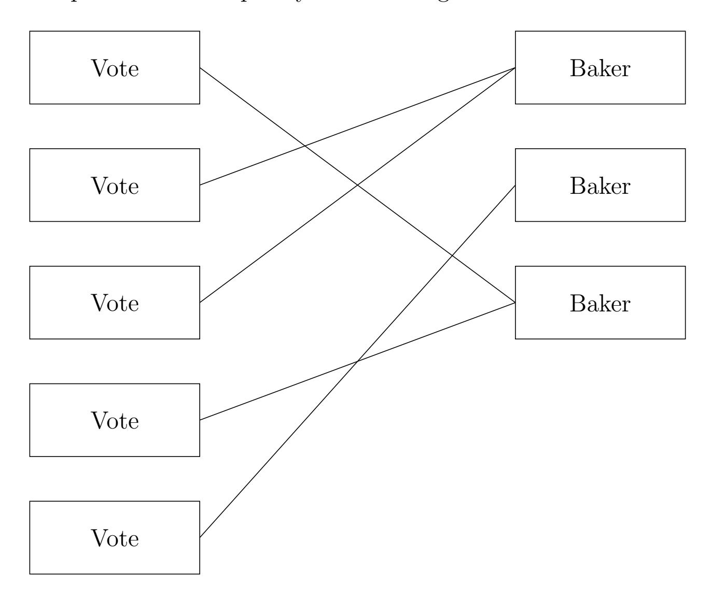
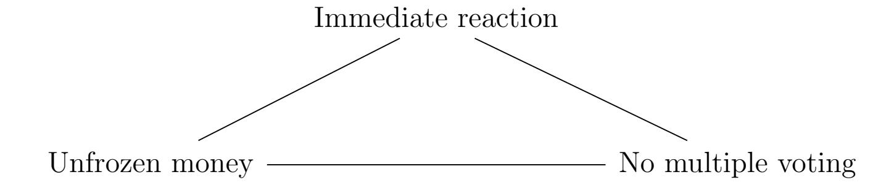

{0}------------------------------------------------

# Governance framework for Quipuswap automated decentralized exchange

Andrey Sobol Anastasiia Kondaurova

#### Abstract

This paper contains an analysis of decentralized exchange governance as an effective framework for voting, profit sharing baking and partially updating the system with a possibility to create new pairs for decentralized exchange with automatic market-making. It will also review 2 alternative baker election and rotation mechanisms such as "Simple first-place voting protocol" and "First-place with veto protocol" and will provide a more in-depth look on these mechanisms. It will examine a proposed architectural software solution for monitoring the decentralized network to mediate deviant baker behavior - the watchtower.

{1}------------------------------------------------

# Contents

| 1                  |                          | Introduction                                          | 3  |  |  |  |  |
|--------------------|--------------------------|-------------------------------------------------------|----|--|--|--|--|
|                    | 1.1                      | Delegation                                            | 3  |  |  |  |  |
|                    | 1.2                      | Voting protocols                                   | 4  |  |  |  |  |
|                    | 1.3                      | Alternatives                                          | 4  |  |  |  |  |
|                    | 1.4                      | Distribution of payoffs                            | 4  |  |  |  |  |
| 2                  |                          | Principles of Quipuswap voting protocols design 5  |    |  |  |  |  |
|                    | 2.1                      | Internal or external governance                    | 5  |  |  |  |  |
|                    | 2.2                      | One share of liqudity - one vote                      | 5  |  |  |  |  |
|                    | 2.3                      | One baker - several pools                          | 6  |  |  |  |  |
| 3                  |                          | Simple first-place voting protocol 7               |    |  |  |  |  |
|                    | 3.1                      | Setup                                              | 7  |  |  |  |  |
|                    | 3.2                      | Reaction to baker's cheating                          | 8  |  |  |  |  |
| 4                  |                          | First-place with veto protocol                        | 11 |  |  |  |  |
|                    | 4.1                      | Setup                                              | 11 |  |  |  |  |
|                    | 4.2                      | Reaction to baker's cheating                          | 11 |  |  |  |  |
|                    | 4.3                      | Comparison                                            | 12 |  |  |  |  |
| 5                  | Incentive analysis 13 |                                                       |    |  |  |  |  |
|                    | 5.1                      | Two conflicting incentives                         | 13 |  |  |  |  |
|                    | 5.2                      | Scenarios and probabilities                           | 13 |  |  |  |  |
|                    | 5.3                      | Simple first-place voting protocol                 | 13 |  |  |  |  |
|                    | 5.4                      | First-place with veto protocol                        | 14 |  |  |  |  |
| 6                  |                          | Watchtowers 15                                     |    |  |  |  |  |
|                    | 6.1                      | Watchtowers configuration                             | 15 |  |  |  |  |
|                    | 6.2                      | Additional condition                               | 15 |  |  |  |  |
|                    | 6.3                      | Smart contracts and access rights for watchtowers  | 15 |  |  |  |  |
| 7                  | Payoffs                  |                                                       | 16 |  |  |  |  |
| 8                  |                          | Constants and time                                    | 17 |  |  |  |  |
|                    | 8.1                      | Constants                                          | 17 |  |  |  |  |
|                    | 8.2                      | Trilemma                                           | 17 |  |  |  |  |
| 9                  |                          | Conclusions 19                                     |    |  |  |  |  |
| 10 Acknowledgments |                          |                                                       |    |  |  |  |  |

{2}------------------------------------------------

# 1 Introduction

Quipuswap [\[1\]](#page-19-0) it's a uniswap-like protocol [\[2\]](#page-19-1) that works as an automated decentralized exchange meaning that in accordance with this protocol the prices are determined automatically. Its primary purpose and function are to serve as a market maker mechanism using constant products which manages reserves in relative equilibrium [\[3\]](#page-19-2):

$$x \cdot y = k$$

where constant k = 1

Quipuswap Core consists of a set of smart contracts, written in LIGO [\[4\]](#page-19-3) that will be deployed to Tezos [\[5\]](#page-19-4).

### 1.1 Delegation

Tezos allows the token holders to delegate their funds to the baker without transferring the actual token ownership. Thus the main difference between Tezos and other Delegated Proof of Stake (DPOS) or Proof Of Stake protocols is in the absence of any regulation of the financial relations between the baker and the user. That means that the user risks losing the baking reward.

{3}------------------------------------------------

If Quipuswap protocol wants to provide services for delegating Tezos from the Quipuswap liquidity pool, there should be a protocol to guide the baker election/re-election and baker monitoring process.

### 1.2 Voting protocols

One of the main goals apart from finding the available space of designs is to find the most simple, self-consistent design for the voting framework to allow participants of the Quipuswap protocol collectively elect the baker (or a set of bakers) and re-elect a baker in any moment.

### 1.3 Alternatives

This paper deals with 2 Quipuswap specific voting protocols [\[6\]](#page-19-5):

- Simple first-place voting protocol
- First-place with veto protocol [\[7\]](#page-19-6)

The advantages and disadvantages of both protocols are considered below.

### 1.4 Distribution of payoffs

In this paper, the proposed scheme for distributing the payoffs between the liquidity pool owners is mainly focused on the minimization of manipulation.

{4}------------------------------------------------

# 2 Principles of Quipuswap voting protocols design

#### 2.1 Internal or external governance

There are only two ways for creating governance for multi-agent systems internal or external.

The external management requires the presence of authorities, the motivation of which is entirely incomprehensible. This endangers the system and makes it extremely vulnerable as the presence of authority is its single point of failure.

However, self-government by the protocol can be proven effective as the motivation in this case clearly lies in obtaining a reward. Thus it is necessary to design a system in which the financial motivation would not be distorted or jeopardized.

#### 2.2 One share of liqudity - one vote

Another way is "One share of liquidity per one vote" which is believed to be the easiest way to separate protocol users from non-users using tokens.

Liquidity providers receive a non-transferable pool shares in return for their tokens and XTZ that can be burned during divestment and represent their government power. These shares can be used as an accounting unit in the voting system.

To avoid any manipulation attempts by creating additional fake identity (known as Sybil Attack [\[8\]](#page-19-7)), creating an additional identity should not provide the identity owner with an additional vote privilege.

$$VP(sharestokens) = sharestokens$$

V P a function which represents the voting power

tokens the number of Quipuswap tokens controlled by a particular user

Any other way to provide voting power like quadratic voting [\[9\]](#page-19-8) where V P(sharestokens) = √ sharestokens will incentivize the creation of new identities or will gather the funds into a major voting pool if V P(sharestokens) = sharestokens2 .

{5}------------------------------------------------

#### 2.3 One baker - several pools

The reason why one liquidity pool cannot be divided among several bakers is that it will affect the main functionality of QuipuSwap. Currently, the liquidity of every exchange pair is located in a separate contract. And Tezos contract has the ability to delegate liquidity only to one baker.

{6}------------------------------------------------

# 3 Simple first-place voting protocol

In the simple first-place voting protocol every liquidity pool participant can vote for 1 baker. The baker with the biggest number of votes estimated in shares of liquidity becomes the leader and gets a delegation of power from the liquidity pool. The votes can be altered and/or recalled. If the voting leader is replaced — the liquidity will be delegated to a new leader.

### 3.1 Setup

P all participants of the protocol that are entitled to vote

ps number of the participants

$$P = (p_0, p_1...p_{ps-1})$$

{7}------------------------------------------------

V P(pi) voting power of the participants is estimated in liquidity shares

vbr vote to elect a particular baker br

brs all bakers count

VΦ all possible votes in the simple first-place voting protocol

$$V_{\Phi} = (v_0, v_1 ... v_{brs-i})$$

svbr voting power for particular baker is calculated by the following formula:

$$sv_{br} = \sum VP(p_i) \text{ if } v_{p_i} = v_{br}$$

$$leader_{\Phi} = max\{sv_{br}\}$$

The baker with the biggest amount of votes max{svbr} will become a leader.

### 3.2 Reaction to baker's cheating

Let's consider a scenario where the current leader leaderΦ is a cheater. This leader stops paying rewards in accordance with the protocol and participants start losing money.

The first step would be splitting all participants into 4 groups:

Pdormant dormant agents. The agents that are not able to change their vote for technical or other reasons

Pmalicious malicious agents. The agents that have a financial or another incentive to continue voting for leaderΦ that was detected as a cheater

Phonest honest agents. The agents that are willing to cooperate in order to elect a baker who will behave honestly

Prandom unpredictable agents. The agents whose behavior is random. We may block this group altogether assuming that the size of such a group is insignificant

{8}------------------------------------------------

- $V'_{\Phi}$  set of possible user vote outcomes before the leader becomes a cheater. The set ordered by sv all voting power for a particular baker before the leader becomes a cheater
- $V''_{\Phi}$  set of possible user vote outcomes after the leader becomes a cheater. Set ordered by sv all voting power for a particular baker before the leader becomes a cheater

$$V'_{\Phi} = (v'_0, v'_1 ... v'_{brs-1})$$
 where  $sv'_i \geq sv'_{i+1}$ 

$$V_{\Phi}'' = [v_0'', v_1'' ... v_{brs-1}'']$$
 where  $v_i'' = v_i'$ 

S all possible reactive strategies are a cartesian product  $V'_{\Phi} \times V''_{\Phi}$ 

$$S_{\Phi} = V_{\Phi}' \times V_{\Phi}'' = \begin{bmatrix} v_0', v_0'' & v_0', v_1'' & \dots & v_0', v_{brs-1}'' \\ v_1', v_0'' & v_1', v_1'' & \dots & v_1', v_{brs-1}'' \\ \dots & \dots & \dots & \dots \\ v_{brs-1}', v_0'' & v_{brs-1}', v_1'' & \dots & v_{brs-1}', v_{brs-1}'' \end{bmatrix}$$

 $S_{malicious}^{\Phi}$  malicious strategy for  $P_{malicious}$ .  $S_{malicious}^{\Phi} = v'_0, v''_0$ :

$$\begin{bmatrix} v'_0, v''_0 & v'_0, v''_1 & \dots & v'_0, v''_{brs-1} \\ v'_1, v''_0 & v'_1, v''_1 & \dots & v'_1, v''_{brs-1} \\ \dots & \dots & \dots & \dots \\ v'_{brs-1}, v''_0 & v'_{brs-1}, v''_1 & \dots & v'_{brs-1}, v''_{brs-1} \end{bmatrix}$$

 $S_{dormant}^{\Phi}$  dormant strategy for  $P_{dormant}$ .  $S_{dormant}^{\Phi} = [v_0', v_0''; v_1', v_1''...v_{brs-1}', v_{brs-1}'']$ :

$$\begin{bmatrix} v'_0, v''_0 & v'_0, v''_1 & \dots & v'_0, v''_{brs-1} \\ v'_1, v''_0 & v'_1, v''_1 & \dots & v'_1, v''_{brs-1} \\ \dots & \dots & \dots & \dots \\ v'_{brs-1}, v''_0 & v'_{brs-1}, v''_1 & \dots & v'_{brs-1} \end{bmatrix}$$

{9}------------------------------------------------

 $S_{i,honest}^{\Phi}$  cooperative strategy for  $P_{honest}^{\Phi}$ .  $S_{i,honest} = [v'_0, v''_i; v'_1, v''_i ... v'_{brs-1}, v''_i]$ :

$$\begin{bmatrix} v'_0, v''_0 & v'_0, v''_1 & \dots & v'_0, v''_{brs-1} \\ v'_1, v''_0 & v'_1, v''_1 & \dots & v'_1, v''_{brs-1} \\ \dots & \dots & \dots & \dots \\ v'_{brs-1}, v''_0 & v'_{brs-1}, v''_1 & \dots & v'_{brs-1}, v''_{brs-1} \end{bmatrix}$$

Success function which shows success or failure of a particular  $P_{honest}$  strategy

$$Success(S^{\Phi}_{i,honest}) = VP(P_{honest}) + VP(P_{dormant,v_i',v_i''}) > VP(P_{malicious}) + VP(P_{dormant,v_0',v_0''}) > VP(P_{malicious}) + VP(P_{dormant,v_0',v_0''}) > VP(P_{malicious}) + VP(P_{dormant,v_0',v_0''}) > VP(P_{malicious}) + VP(P_{dormant,v_0',v_0''}) > VP(P_{malicious}) + VP(P_{dormant,v_0',v_0''}) > VP(P_{malicious}) + VP(P_{dormant,v_0',v_0''}) > VP(P_{malicious}) + VP(P_{dormant,v_0',v_0''}) > VP(P_{malicious}) + VP(P_{dormant,v_0',v_0''}) > VP(P_{malicious}) + VP(P_{dormant,v_0',v_0''}) > VP(P_{malicious}) + VP(P_{dormant,v_0',v_0''}) > VP(P_{malicious}) + VP(P_{dormant,v_0',v_0''}) > VP(P_{malicious}) + VP(P_{dormant,v_0',v_0''}) > VP(P_{malicious}) + VP(P_{dormant,v_0',v_0''}) > VP(P_{malicious}) + VP(P_{dormant,v_0',v_0''}) > VP(P_{malicious}) + VP(P_{dormant,v_0',v_0''}) > VP(P_{malicious}) + VP(P_{dormant,v_0',v_0''}) > VP(P_{malicious}) + VP(P_{dormant,v_0',v_0''}) > VP(P_{malicious}) + VP(P_{dormant,v_0',v_0''}) > VP(P_{malicious}) + VP(P_{dormant,v_0',v_0''}) > VP(P_{malicious}) + VP(P_{dormant,v_0',v_0''}) > VP(P_{malicious}) + VP(P_{dormant,v_0',v_0''}) > VP(P_{malicious}) + VP(P_{dormant,v_0',v_0''}) > VP(P_{malicious}) + VP(P_{malicious}) + VP(P_{malicious}) + VP(P_{malicious}) + VP(P_{malicious}) + VP(P_{malicious}) + VP(P_{malicious}) + VP(P_{malicious}) + VP(P_{malicious}) + VP(P_{malicious}) + VP(P_{malicious}) + VP(P_{malicious}) + VP(P_{malicious}) + VP(P_{malicious}) + VP(P_{malicious}) + VP(P_{malicious}) + VP(P_{malicious}) + VP(P_{malicious}) + VP(P_{malicious}) + VP(P_{malicious}) + VP(P_{malicious}) + VP(P_{malicious}) + VP(P_{malicious}) + VP(P_{malicious}) + VP(P_{malicious}) + VP(P_{malicious}) + VP(P_{malicious}) + VP(P_{malicious}) + VP(P_{malicious}) + VP(P_{malicious}) + VP(P_{malicious}) + VP(P_{malicious}) + VP(P_{malicious}) + VP(P_{malicious}) + VP(P_{malicious}) + VP(P_{malicious}) + VP(P_{malicious}) + VP(P_{malicious}) + VP(P_{malicious}) + VP(P_{malicious}) + VP(P_{malicious}) + VP(P_{malicious}) + VP(P_{malicious}) + VP(P_{malicious}) + VP(P_{malici$$

If we assume the uniform distribution  $P_{dormant}$  and we know that  $sv'_i \ge sv'_{i+1}$  we know the probability of  $\rho$ :

$$\rho(VP(P_{dormant,v'_{i},v''_{i}}) > VP(P_{dormant,v'_{i+1},v''_{i+1}})) \ge 0.5$$

And then:

$$\rho(Success(S_{i,honest}^{\Phi}) = True) \ge \rho(Success(S_{i+1,honest}^{\Phi}) = True)$$

This implies:

$$Success(S_{best}^{\Phi}) = VP(P_{honest}) + VP(P_{dormant,v_1',v_1''}) > VP(P_{malicious}) + VP(P_{dormant,v_0,v_0'}) > VP(P_{malicious}) + VP(P_{dormant,v_0,v_0'}) > VP(P_{malicious}) + VP(P_{dormant,v_0,v_0'}) > VP(P_{malicious}) + VP(P_{dormant,v_0,v_0'}) > VP(P_{malicious}) + VP(P_{dormant,v_0,v_0'}) > VP(P_{malicious}) + VP(P_{dormant,v_0,v_0'}) > VP(P_{malicious}) + VP(P_{dormant,v_0,v_0'}) > VP(P_{malicious}) + VP(P_{dormant,v_0,v_0'}) > VP(P_{malicious}) + VP(P_{dormant,v_0,v_0'}) > VP(P_{malicious}) + VP(P_{dormant,v_0,v_0'}) > VP(P_{malicious}) + VP(P_{dormant,v_0,v_0'}) > VP(P_{malicious}) + VP(P_{dormant,v_0,v_0'}) > VP(P_{malicious}) + VP(P_{dormant,v_0,v_0'}) > VP(P_{malicious}) + VP(P_{dormant,v_0,v_0'}) > VP(P_{malicious}) + VP(P_{dormant,v_0,v_0'}) > VP(P_{malicious}) + VP(P_{dormant,v_0,v_0'}) > VP(P_{malicious}) + VP(P_{dormant,v_0,v_0'}) > VP(P_{malicious}) + VP(P_{dormant,v_0,v_0'}) > VP(P_{malicious}) + VP(P_{dormant,v_0,v_0'}) > VP(P_{malicious}) + VP(P_{dormant,v_0,v_0'}) > VP(P_{malicious}) + VP(P_{dormant,v_0,v_0'}) > VP(P_{malicious}) + VP(P_{dormant,v_0,v_0'}) > VP(P_{malicious}) + VP(P_{malicious}) + VP(P_{malicious}) + VP(P_{malicious}) + VP(P_{malicious}) + VP(P_{malicious}) + VP(P_{malicious}) + VP(P_{malicious}) + VP(P_{malicious}) + VP(P_{malicious}) + VP(P_{malicious}) + VP(P_{malicious}) + VP(P_{malicious}) + VP(P_{malicious}) + VP(P_{malicious}) + VP(P_{malicious}) + VP(P_{malicious}) + VP(P_{malicious}) + VP(P_{malicious}) + VP(P_{malicious}) + VP(P_{malicious}) + VP(P_{malicious}) + VP(P_{malicious}) + VP(P_{malicious}) + VP(P_{malicious}) + VP(P_{malicious}) + VP(P_{malicious}) + VP(P_{malicious}) + VP(P_{malicious}) + VP(P_{malicious}) + VP(P_{malicious}) + VP(P_{malicious}) + VP(P_{malicious}) + VP(P_{malicious}) + VP(P_{malicious}) + VP(P_{malicious}) + VP(P_{malicious}) + VP(P_{malicious}) + VP(P_{malicious}) + VP(P_{malicious}) + VP(P_{malicious}) + VP(P_{malicious}) + VP(P_{malicious}) + VP(P_{malicious}) + VP(P_{malicious}) + VP(P_{malicious}) + VP(P_{malicious}) +$$

Where  $S_{best}^{\Phi}$  is best strategy and  $S_{best}^{\Phi} = S_{1,honest}^{\Phi}$  and:

$$Success(S_{1,honest}^{\Phi}) = Success(S_{best}^{\Phi})$$

$$\begin{bmatrix} v'_0, v''_0 & v''_1 & \dots & v'_0, v''_{brs-1} \\ v'_1, v''_0 & v'_1, v''_1 & \dots & v'_1, v''_{brs-1} \\ \dots & \dots & \dots & \dots \\ v'_{brs-1}, v''_0 & v'_{brs-1}, v''_1 & \dots & v'_{brs-1}, v''_{brs-1} \end{bmatrix}$$

{10}------------------------------------------------

# 4 First-place with veto protocol

Suppose a protocol is upgraded by granting the veto power to block the leader baker. Every voter can have the veto authority. If 50% + 1 of liquidity tokens (calculated from the voted liquidity tokens) exercise the veto: all the votes assigned to the current leader are to be recalled and the second-best baker is to get the delegation and will become the new leader.

#### 4.1 Setup

$$leader_{\chi} = max\{sv_{\omega}\}$$
 where  $\omega = br \backslash VetoSet$ 

Meaning that any block producer will be excluded if it's in VetoSet

$$VetoSet = \bigvee_{i=0}^{brs-1} br_i \text{ if } (\sum_{j=0}^{ps-1} VP(veto_i^j) > 0.5 \cdot VP(P))$$

 $veto_{br}^{ps}$  veto vote of every participant to the current  $leader_{\chi}$  which can be veto or  $\neg veto$ 

### 4.2 Reaction to baker's cheating

 $V'_{\chi}$  veto vote before the leader becomes a cheater

 $V_{\chi}^{"}$  veto vote after the leader becomes a cheater

$$V_{\chi}' = (veto', \neg veto')$$

$$V_{\chi}^{"} = (veto^{"}, \neg veto^{"})$$

 $S_{\chi}$  all possible reactive strategies are a cartesian product  $V_{\chi}' \times V_{\chi}''$ 

$$S_{\chi} = V_{\chi}' \times V_{\chi}'' = \begin{bmatrix} veto', veto'' & veto', \neg veto'' \\ \neg veto', veto'' & \neg veto', \neg veto'' \end{bmatrix}$$

{11}------------------------------------------------

 $S_{honest}^{\chi}$  cooperative strategy for  $P_{honest}$ 

$$S_{honest}^{\chi} = S_{best}^{\chi} = \neg veto', veto''$$

$$Success(S_{best}^{\chi}) = VP(P_{honest}) > 0.5 \cdot VP(P)$$

Because:

$$VetoSet = \bigvee_{i=0}^{brs-1} br_i \text{ if } (\sum_{j=0}^{ps-1} VP(veto_i^j) > 0.5 \cdot VP(P))$$

#### 4.3 Comparison

Success function for every  $S_{best}$  ( $S_{best}^{\chi}$ ,  $S_{best}^{\Phi}$ ) strategy:

$$Success(S_{best}^{\chi}) = VP(P_{honest}) > 0.5 \cdot VP(P)$$

$$Success(S_{best}^{\Phi}) = VP(P_{honest}) + VP(P_{dormant,v_1',v_1''}) > VP(P_{malicious}) + VP(P_{dormant,v_0,v_0'}) > VP(P_{malicious}) + VP(P_{dormant,v_0,v_0'}) > VP(P_{malicious}) + VP(P_{dormant,v_0,v_0'}) > VP(P_{malicious}) + VP(P_{dormant,v_0,v_0'}) > VP(P_{malicious}) + VP(P_{dormant,v_0,v_0'}) > VP(P_{malicious}) + VP(P_{dormant,v_0,v_0'}) > VP(P_{malicious}) + VP(P_{dormant,v_0,v_0'}) > VP(P_{malicious}) + VP(P_{dormant,v_0,v_0'}) > VP(P_{malicious}) + VP(P_{dormant,v_0,v_0'}) > VP(P_{malicious}) + VP(P_{dormant,v_0,v_0'}) > VP(P_{malicious}) + VP(P_{dormant,v_0,v_0'}) > VP(P_{malicious}) + VP(P_{dormant,v_0,v_0'}) > VP(P_{malicious}) + VP(P_{dormant,v_0,v_0'}) > VP(P_{malicious}) + VP(P_{dormant,v_0,v_0'}) > VP(P_{malicious}) + VP(P_{dormant,v_0,v_0'}) > VP(P_{malicious}) + VP(P_{dormant,v_0,v_0'}) > VP(P_{malicious}) + VP(P_{dormant,v_0,v_0'}) > VP(P_{malicious}) + VP(P_{dormant,v_0,v_0'}) > VP(P_{malicious}) + VP(P_{dormant,v_0,v_0'}) > VP(P_{malicious}) + VP(P_{dormant,v_0,v_0'}) > VP(P_{malicious}) + VP(P_{dormant,v_0,v_0'}) > VP(P_{malicious}) + VP(P_{dormant,v_0,v_0'}) > VP(P_{malicious}) + VP(P_{malicious}) + VP(P_{malicious}) + VP(P_{malicious}) + VP(P_{malicious}) + VP(P_{malicious}) + VP(P_{malicious}) + VP(P_{malicious}) + VP(P_{malicious}) + VP(P_{malicious}) + VP(P_{malicious}) + VP(P_{malicious}) + VP(P_{malicious}) + VP(P_{malicious}) + VP(P_{malicious}) + VP(P_{malicious}) + VP(P_{malicious}) + VP(P_{malicious}) + VP(P_{malicious}) + VP(P_{malicious}) + VP(P_{malicious}) + VP(P_{malicious}) + VP(P_{malicious}) + VP(P_{malicious}) + VP(P_{malicious}) + VP(P_{malicious}) + VP(P_{malicious}) + VP(P_{malicious}) + VP(P_{malicious}) + VP(P_{malicious}) + VP(P_{malicious}) + VP(P_{malicious}) + VP(P_{malicious}) + VP(P_{malicious}) + VP(P_{malicious}) + VP(P_{malicious}) + VP(P_{malicious}) + VP(P_{malicious}) + VP(P_{malicious}) + VP(P_{malicious}) + VP(P_{malicious}) + VP(P_{malicious}) + VP(P_{malicious}) + VP(P_{malicious}) + VP(P_{malicious}) + VP(P_{malicious}) + VP(P_{malicious}) +$$

 $S^{\chi}_{best}$  better than  $S^{\Phi}_{best}$  if we assume that:

$$VP(P_{dormant,v_1',v_1''}) + 0.5 \cdot VP(P) < VP(P_{malicious}) + VP(P_{dormant,v_0,v_0'})$$

 $S_{best}^{\chi}$  better than  $S_{best}^{\Phi}$  if we assume:

$$VP(P_{dormant,v_1',v_1''}) + 0.5 \cdot VP(P) > VP(P_{malicious}) + VP(P_{dormant,v_0,v_0'})$$

{12}------------------------------------------------

# 5 Incentive analysis

### 5.1 Two conflicting incentives

Let's assume that participants from Phonest set have more than one incentive:

Rcollective a reward that participants get if the leader does not cheat

Raf f iliation a reward (material or not material) that participants get from a baker without an affiliation with this particular leader. This baker receives the votes from honest participants if other things being equal

#### 5.2 Scenarios and probabilities

ρ¬c this is a situation where the participant vote is not decisive since the majority of participants are considered to be malicious agents

ρgs this is a situation where the participant vote is the golden share the malicious baker-leader will be removed from the position or will remain in power in accordance with the protocol

ρc this is a situation where the participant vote is not decisive since the majority of participants will remove a malicious baker-leader anyway

Every participant can consider the probability ρ¬c, ρgs and ρc by any external signs before the participant sees the result of a new vote in the scenario where baker starts cheating.

### 5.3 Simple first-place voting protocol

This is a table of rewards that depends on the participants' behavior in ρ¬c, ρgs and ρc:

|         | ρ¬c            | ρgs            | ρc                                 |
|---------|----------------|----------------|------------------------------------|
| change  | ∅              | Rcollective    | Rcollective                        |
| ¬change | Raf f iliation | Raf f iliation | Raf f iliation + Rcollective |

{13}------------------------------------------------

change if a participant changes the vote from the affiliated baker to v 0 1 ¬change if a participant doesn't change the vote from the affiliated baker to v 0 1

$$R_{affiliation} > \emptyset$$

$$R_{affiliation} + R_{collective} > R_{collective}$$

In the scenario ρ¬c and ρc represents the Free Rider Problem [\[10\]](#page-19-9). Since the participants get a bigger reward without cooperative behavior. The Free Rider Problem may be present as well in ρgs if:

$$R_{affiliation} > R_{collective}$$

#### 5.4 First-place with veto protocol

This is a table of rewards that depends on the participants' behavior in ρ¬c, ρgs and ρc:

|        | ρ¬c            | ρgs                                | ρc                                 |
|--------|----------------|------------------------------------|------------------------------------|
| veto0  | Raf f iliation | Raf f iliation + Rcollective | Raf f iliation + Rcollective |
| ¬veto0 | Raf f iliation | Raf f iliation                     | Raf f iliation + Rcollective |

Here we have no conflict of interest. The participants will choose veto0 in all cases: ρ¬c, ρgs and ρc.

This is a key advantage of the first-place with veto protocol. This is the main reason this protocol is recommended for voting in QuipuSwap.

{14}------------------------------------------------

# 6 Watchtowers

To prevent the baker's malicious behavior one assumes that the voter should set up the watchtowers [\[11\]](#page-19-10) software — the software for monitoring the baker's behavior with the punishment (veto) mechanism.

### 6.1 Watchtowers configuration

sfee acceptable fee configurable by watchtower

br reward for the baker in accordance with the protocol's consensus mechanism

sr reward sent by the baker. ∅ in case there is no transaction being processed

$$AutomaticVeto(sr) = \begin{cases} \text{true} & sr = \emptyset \\ sr \ge br(1 - sfee) & sr \ne \emptyset \end{cases}$$

So if AutomaticV eto(sr) = T rue watchtower sends a veto transaction to the network.

#### 6.2 Additional condition

Maybe some watchtowers will add an additional condition - free space checks to prevent overdelegation [\[12\]](#page-20-0). But any additional condition implied by the watchtower should be explicitly reported to the user.

### 6.3 Smart contracts and access rights for watchtowers

A watchtower can be provided as a service. Inside QuipuSwap smart contracts the liquidity holder can grant access rights to exercise veto using other addresses.

The same functionality can be provided to regular votings, not only for veto and watchtowers.

{15}------------------------------------------------

### 7 Payoffs

 $t_c$  circle size calculated in blocks

 $t_b$  minimal time - 1 block

pie reward received under the protocol from a baker  $t_c$ 

 $pie_u$  participant's reward

 $\lambda$  amount of stakes into which a pie is divided and distributed among the participants

 $\lambda_u$  stake of a specific participant

 $shares_i$  all token shares controlled by all participant

 $share_i^u$  all token share controlled by each participant

 $\lambda_u$  and  $\lambda$  should depend on the time and the token share. For this, we will calculate the coefficients as the sum of the products of the tezos/token shares for the time they are held. I.e:

$$\lambda_u = t_{b0} \cdot share_0^u + t_{b1} \cdot share_1^u \dots t_{b(c-1)} \cdot share_{c-1}^u$$

$$\lambda = t_{b0} \cdot shares_0 + t_{b1} \cdot shares_1...t_{b(c-1)} \cdot shares_{c-1}$$

$$t_c = t_{b0} + t_{b1}...t_{b(c-1)}$$

$$\lambda = \sum \lambda_u$$

 $\lambda_u$  is updated if a participant invests or withdraws funds from an exchanger protocol (add product  $\Delta t_c share_u$ ).  $\lambda$  is updated if one participant invests or withdraws funds because of the number of his shares as their amount changes in the system, accordingly.

So when the system calculates the pie every user gets:

$$pie_u = pie * \frac{\lambda_u}{\lambda}$$

{16}------------------------------------------------

# 8 Constants and time

### 8.1 Constants

bptc Blocks Per Tezos Cycle [\[13\]](#page-20-1). bpc = 4096 bloks

trc Tezos Reserved Cycles [\[14\]](#page-20-2). bpc = 5

c Internal QuipuSwap cycle size. Payoffs λ will be made every c.

$$c = (bpc + 1) \cdot trc = (5 + 1) \cdot 4096 \ blocks = 24576 \ blocks$$

Every c bloks protocol will recalculate leaderboard and change leader. But veto can be applied immediately.

bantime time (in blocks) when baker can not be reelected

$$bantime = 5 \cdot c = 5 \cdot 24576 \ blocks = 122880 \ blocks$$

#### 8.2 Trilemma

When we design principles of accountability for voting we can choose only 2 of 3 in this trilemma :

{17}------------------------------------------------

• If we choose (Immediate reaction)+ (Unfrozen money) this statment is correct:

If the leader is a cheater, the user can execute their veto right as soon as possible, and no minimum liquidity providing period set up for him, but at the same time the malicious actor can use the same liquidity for executing his veto right in another trading pair.

• If we choose (Immediate reaction) + (No multiple voting) this statment is correct:

If the leader is a cheater, the user can execute their veto right as soon as possible and the malicious actor can not use the same liquidity for for performing his veto right in another trading pair because there is a minimum liquidity providing period for the user.

• If we choose (Unfrozen money) + (No multiple voting) this statment is correct:

The user has no minimum liquidity providing period and the malicious actor can not use the same liquidity performing his veto right in another trading pair but the protocol can apply the veto at the end of the cycle.

We knowingly took a risk and chose the following combination:

(Immediate reaction) + (Unfrozen money)

{18}------------------------------------------------

# 9 Conclusions

In this paper two possible scenarios for baker election were examined: "Simple first-place voting protocol" and "First-place with veto protocol". As we may conclude, the benefits of the "First-place with veto protocol" lie mainly within its ability to minimize the Free Rider Problem. While the "Simple first-place voting protocol" it's the second best solution.

|            | Simple first-place voting                                                                                   | First-place with veto       |
|------------|-------------------------------------------------------------------------------------------------------------|-----------------------------|
| Free rider | ( ρgs Raf f iliation > Rcollective ρ¬c ∪ ρc ∪ ∅ Raf f iliation ≤ Rcollective     | ∅                           |
| Success    | V P(Phonest) + V P(Pdormant,v0 ) > ,v00 1 1 > V P(Pmalicious) + V P(Pdormant,v0,v0 ) 0 | V P(Phonest) > 0.5 · V P(P) |

After the proposed methods are deployed into the mainchain and the empirical data is collected, we will be able to verify and demonstrate that the methods described in this paper, indeed, behave as expected. We will be able to empirically price that the collective management of the protocol performs effectively and impairs the attempts to breach the protocol.

The watchtower mechanism for automatization of baker changing as proposed in the paper represents a viable solution to the baker supervision process. This construct is necessary in order to separate share ownership and protocol participation. Cheating protection should also be highlighted as a separate service for security strengthening.

In general, in blockchain there's a constant trade-off between the simple and highly effective use of the capital. The aforementioned ideas and constructs were elaborated aiming at the most simple option among the functional ones. As we may see in the best blockchain practices the simplest mechanism wins over the complicated multi-level one.

# 10 Acknowledgments

We thank Matvii Sivoraksha, Kornii Vasylchenko, Charlie Wiser, Tezos Foundation and Madfish.Solutions for ideas and valuable feedback. This work has been supported by Tezos Foundation.

{19}------------------------------------------------

# References

- [1] Quipuswap Source Code <https://github.com/madfish-solutions/quipuswap-core>
- [2] Hayden Adams. Uniswap Whitepaper <https://hackmd.io/@HaydenAdams/HJ9jLsfTz>
- [3] Yi Zhang, Xiaohong Chen, and Daejun Park Formal Specification of Constant Product (x × y = k) Market Maker Model and Implementation Commit: c40c98d6ae35148b76742aaaa29e6eaa405b2f93 <https://github.com/runtimeverification/verified-smart-contracts/blob/uniswap/uniswap/x-y-k.pdf>
- [4] LIGO Docs <https://ligolang.org/docs/intro/introduction>
- [5] L.M Goodman. Tezos — a self-amending crypto-ledger [https://tezos.com/static/white\\_paper-2dc8c02267a8fb86bd67a108199441bf.pdf](https://tezos.com/static/white_paper-2dc8c02267a8fb86bd67a108199441bf.pdf)
- [6] Andrey Sobol. Possible governance for QuipuSwap <https://medium.com/madfish-solutions/possible-governance-for-quipuswap-cadb576c80d>
- [7] Carlos Herv´es-Beloso E. Moreno Grac´ıa. The Veto Mechanism Revisited. Approximation, Optimization and Mathematical Economics, Marc Lasonde Editor, Phisica-Verlag, Heidelberg (2001) pp.147-157.
- [8] Douceur, John R "The Sybil Attack". Peer-to-Peer Systems. Lecture Notes in Computer Science. ISBN 978-3-540-44179-3. <https://archive.org/details/peertopeersystem0000iptp/page/251/mode/2up>
- [9] Lalley, Steven; Weyl, E. Glen. "Quadratic Voting: How Mechanism Design Can Radicalize Democracy". Rochester, NY. SSRN 2003531.
- [10] Baumol, William (1952). Welfare Economics and the Theory of the State. Cambridge, Massachusetts: Harvard University Press.
- [11] Private Altruist Watchtowers <https://github.com/lightningnetwork/lnd/blob/master/docs/watchtower.md>

{20}------------------------------------------------

- [12] Tezos Staking: Baker Metrics Overview <https://baking-bad.org/docs/metrics>
- [13] Tezos Staking: Delegation for Beginners <https://baking-bad.org/docs/tezos-staking-for-beginners/>
- [14] Proof-of-stake in Tezos [https://tezos.gitlab.io/whitedoc/proof\\_of\\_stake.html](https://tezos.gitlab.io/whitedoc/proof_of_stake.html)