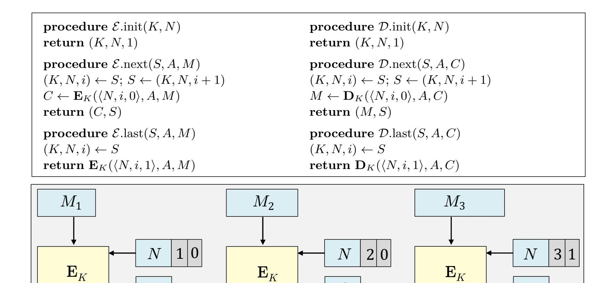
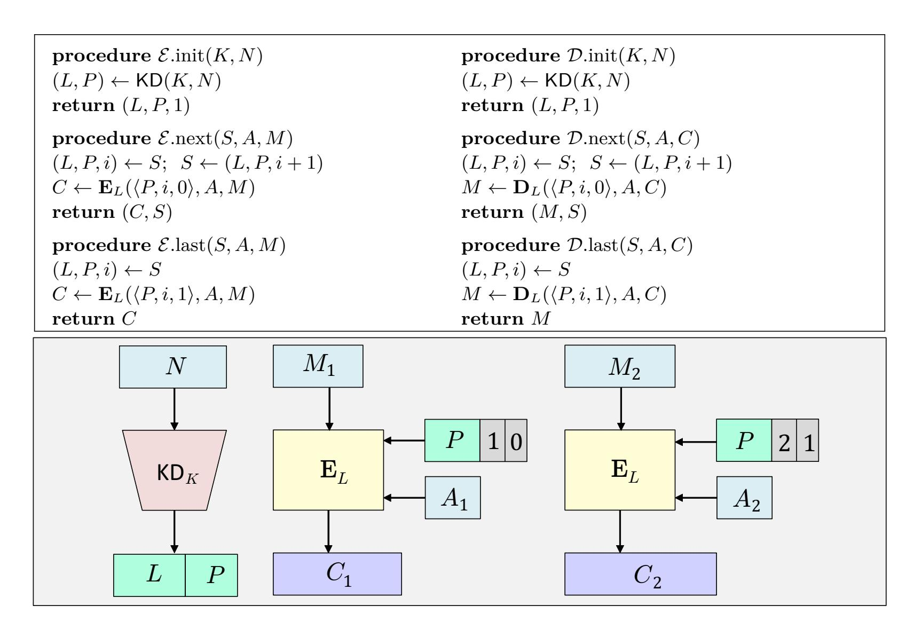

{0}------------------------------------------------

# Security of Streaming Encryption in Google's Tink Library

Viet Tung Hoang<sup>1</sup> and Yaobin Shen<sup>2</sup>

Dept. of Computer Science, Florida State University
 Dept. of Computer Science & Engineering, Shanghai Jiao Tong University, China

August 23, 2020

Abstract. We analyze the multi-user security of the streaming encryption in Google's Tink library via an extended version of the framework of nonce-based online authenticated encryption of Hoang et al. (CRYPTO'15) to support random-access decryption. We show that Tink's design choice of using random nonces and a nonce-based key-derivation function indeed improves the concrete security bound. We then give two better alternatives that are more robust against randomness failure. In addition, we show how to efficiently instantiate the key-derivation function via AES, instead of relying on HMAC-SHA256 like the current design in Tink. To accomplish this we give a multi-user analysis of the XOR-of-permutation construction of Bellare, Krovetz, and Rogaway (EUROCRYPT'98).

### 1 Introduction

This paper reconsiders the problem of building nonce-based online authenticated encryption (nOAE) schemes [15]. Under this problem, one needs to encrypt potentially huge messages as soon as they arrive using constant-sized states. This kind of situation arises when Netflix sends its movie streams to users. This is what troubles memory-constrained devices when they have to deal with data that they cannnot load entirely. This also happens when interactive applications, such as SSH, need to send immediately each character they receive from the keyboard.

Specifically, we need to encrypt a message M that is represented as a tuple  $(M_1, \ldots, M_m)$  of segments, with an associated data (AD)  $A = (A_1, \ldots, A_m)$ . Each time one is given a pair  $(M_i, A_i)$  to encrypt, and can only keep a small state at the end. The size of each segment can range from a character (for SSH) to a few MB (for Netflix), or even bigger. Directly encrypting each  $(M_i, A_i)$  via a conventional AE scheme such as OCB [21,29] or GCM [24] is problematic, because an adversary can drop some of the ciphertext segments or reorder the ciphertext segments without being detected.

A GAP BETWEEN THEORY AND PRACTICE. The nOAE problem already receives a formal treatment by Hoang et al. [15], with a practical construction **STREAM** that is built on top of the OCB authenticated-encryption scheme [21,29]. The idea is simple. Assume that at the beginning we are given a nonce N for each message M. Assume further that we have a conventional AE scheme  $\Pi = (\mathbf{K}, \mathbf{E}, \mathbf{D})$ , for example one can instantiate  $\Pi$  as OCB. To encrypt  $(M_i, A_i)$  under key K and the base nonce N, we run  $\mathbf{E}_K(N^*, A_i, M_i)$ , where the derived nonce  $N^*$  is an encoding of (N, i, a), and the flag a indicates whether  $M_i$  is the last segment, meaning that a = 1 if i = m, and a = 0otherwise. See Fig. 6 for the code and an illustration of **STREAM**.

At the first glance, the problem seems solved. However, underneath the elegant design of **STREAM** lies a troubling usability issue, which comes to light when Google developers try to include a streaming encryption scheme in the Tink library [12]. Under their design,  $\Pi$  is instantiated via GCM [24], the most popular conventional AE scheme. For a triple (N, i, a) that will be encoded

{1}------------------------------------------------

as a 12-byte GCM nonce, Tink uses four bytes to encode , and one byte to encode . This means that nonces of **STREAM**[GCM] will be only 7-byte long, and thus the only viable option is to implement them as counters. Yet there are situations when random nonces are desirable:

- **–** Routers are booted frequently, and its counters will therefore be reset often. Implementing nonces as counters in this environment will result in lots of nonce repetition.
- **–** Synchronizing counters among busy distributed servers might be impractical.

Google developers therefore deviate from the **STREAM** design. Tink's streaming encryption does not take nonces from users. Instead, it picks a 16-byte random salt and a 7-byte random nonce prefix , and derive a subkey ← KD(*,* ), where KD is a key-derivation function that will be instantiated via HMAC-SHA256. It then runs **STREAM**[GCM] with key and "nonce" . Such short nonces will repeat, but under different subkeys, and thus will cause no harm to security.

Given that Tink's streaming encryption deviates from the original **STREAM** design, it does not benefit from the security proof in [\[15\]](#page-22-0). On the other hand, Tink's choice of random nonces and a nonce-based key-derivation may actually *increase* security, as in the case of the AES-GCM-SIV scheme [\[6,](#page-21-1) [13\]](#page-21-2). The goal of our paper is to analyze the security of Tink's streaming encryption, and find ways to improve its security and efficiency, subject to the constraints that (i) is still instantiated via GCM, and (ii) the scheme should support flexible choices of nonce generation, including random nonces.

Security of Tink's streaming encryption. One can view Tink's streaming encryption as an online AE scheme **SE1**[KD*,* ] where a nonce is a pair (*,* ), and Tink chooses to pick nonces at random. See Fig. [8](#page-12-0) for the code and an illustration of **SE1**.

We analyze security of **SE1** under a *strengthened* notion of nOAE, where an adversary can attack en masse instead of targeting a specific victim. In other words, security is now in the *multi-user* setting. There is a growing recognition that cryptographic primitives should be analyzed in the multiuser setting [\[4,](#page-21-3) [16\]](#page-22-4), and it is therefore natural to put nOAE under the multi-user lens. Moreover, our notion allows *random-access decryption*, whereas the treatment of Hoang et al. assumes that decryption is in order. Random-access decryption is needed for situations where one encrypts a huge file and later want to read just a portion of the file.

Our work confirms that **SE1** is indeed secure, provided that is a good conventional AE scheme and KD is a good PRF. This is true for any proper choice of nonce generation. When is instantiated as GCM, using the recent GCM analysis of Hoang, Tessaro, and Thiruvengadam [\[18\]](#page-22-5), picking nonces at random does indeed improve the concrete security bound. However, this is not the only good way of generating nonces for **SE1**. One can, for example, implement the salt as a counter, but the nonce prefix should still be picked at random.

Still, the story here is not entirely satisfactory. First, **SE1** is not robust against randomness failure, which happens frequently [\[11,](#page-21-4)[14,](#page-22-6)[22\]](#page-22-7). In particular, its security would degrade if is still random, but is a constant string. In this work, we identify two alternative constructions **SE2** and **SE3** that offer the same concrete security bound as **SE1**, but are robust to randomness failure, meaning that they only need nonces to be unique. Next, Tink's streaming encryption uses AES for GCM, and HMAC-SHA256 for KD. It is desirable to find an AES-based instantiation of KD (for both AES-128 and AES-256) to reduce the code complexity, and improve the speed of KD.

{2}------------------------------------------------

An AES-based KD. Let : {0*,* 1} × {0*,* 1} → {0*,* 1} be a blockcipher with ∈ {*,* 2} (which we would instantiate directly via AES). Our goal is to give a construction of KD on top of that offers -bit *multi-user* PRF security. To achieve this concrete security bound, KD should have 2 bit key length to resist attacks like Biham's key-collision attack on DES [\[5\]](#page-21-5). We now elaborate on how to build KD, step by step.

**Step 1:** Our first step is to build a blockcipher : {0*,* 1} <sup>2</sup> × {0*,* 1} → {0*,* 1} . If = 2 then we can directly use as our . If = then we extend the key length of . In particular, for a key = ‖ , with || = || = , let

$$G_K(X) = E_J(X \oplus L) \oplus L$$
.

This is a variant of Rivest's classic DESX construction. The design of DESX uses different keys in pre-whitening and post-whitening , whereas the variant above, which we call DESX1, uses the same key. This is now folklore knowledge that DESX1 offers -bit multi-user PRP security. However, to the best of our knowledge, there is no explicit proof in the literature. In fact, Kilian and Rogaway [\[20\]](#page-22-8) are the first to study the security of DESX and DESX1, but they only consider the single-user setting. Hoang and Tessaro [\[16\]](#page-22-4) investigate the security of the *xor-cascade* construction, a multi-round generalization of DESX. They give a tight multi-user security bound for the xorcascade, and claim that their technique can be recast to work for the multi-round generalization of DESX1, but there is no explicitly proof in their paper. Bellare and Tackmann [\[4\]](#page-21-3) directly consider the multi-user security of DESX1, but they can only show that DESX1 has 2*/*3-bit security.

For the sake of completeness, in this work, we give a proof in the ideal-cipher model to confirm that DESX1 indeed has -bit multi-user PRP security.

**Step 2:** Our next step is to build a PRF : × {0*,* 1} −<sup>1</sup> → {0*,* 1} . In particular,

$$F_K(X) = G_K(X \parallel 0) \oplus G_K(X \parallel 1) .$$

This is the XOR-or-permutation construction of Bellare, Krovetz, and Rogaway [\[2\]](#page-21-6), which has a long line of work for just the *single-user* security. Lucks [\[23\]](#page-22-9) proves that it can withstand to nearly = 22*/*<sup>3</sup> queries. Bellare and Impagliazzo [\[1\]](#page-21-7) give an asymptotic bound ()·*/*2 , but they provide only a proof sketch. Patarin [\[28\]](#page-22-10) claims the optimal bound */*2 via an approach that he refers to as "mirror theory", but his proof is extremely complex with several unverifiable gaps [\[10,](#page-21-8) [19\]](#page-22-11). Dai, Hoang, and Tessaro [\[10\]](#page-21-8) finally find a relatively simple proof for a bound */*2 + 3 <sup>1</sup>*.*5*/*2 <sup>1</sup>*.*5 via their Chi-Squared method.

In the multi-user setting, a recent paper by Cogliati [\[9\]](#page-21-9) claims the optimal bound */*2 , but his proof relies on Patarin's (unverifiable) mirror theory. Here we use the Chi-Squared method and Azuma's inequality for a bound 8 √ · */*2 . It is a theoretically interesting open question to improve our bound to */*2 (with a simple, verifiable proof).

**Step 3:** Our KD only takes 15-byte inputs, namely the salt length of Tink's streaming encryption has to be shortened a bit, but this does not affect its concrete security bound. For a string , let ‖ 0 \* denote the string obtained by padding 0's to until the total bit length is − 1. If KD needs to output an -bit key then

$$\mathsf{KD}(K,X) = F_K(X \parallel 0^*) .$$

If KD needs to output a 2-bit key then

$$\mathsf{KD}(K,X) = F_K(X \parallel 0 \parallel 0^*) \parallel F_K(X \parallel 1 \parallel 0^*) .$$

{3}------------------------------------------------

Thus our instantiation for KD needs 2–4 parallelizable AES calls, which is much faster than HMAC-SHA256.

A better nOAE scheme: **SE2**. To resist randomness failure in nonce generation, the most natural approach is to feed the entire nonce to KD to generate a subkey and a nonce prefix . Note that here is a part of KD's output, instead of a part of the nonce. See Fig. [11](#page-18-0) for the code and an illustration of **SE2**. We show that **SE2** with any proper nonce-generation mechanism has the same security as **SE1** with random nonces.

For applications that can tolerate 15-byte nonces, one can instantiate KD via the XOR construction. Depending on the subkey size, it will need 2 or 3 calls to the XOR construction, meaning 4–6 parallelizable AES calls. This is on par with the key-derivation function of AES-GCM-SIV [\[13\]](#page-21-2).

For applications that demand long nonces, it is unclear how to find a good AES-based instantiation of KD, which we leave as an open problem. We instead propose another nOAE scheme **SE3** that has the best of both worlds: (i) its nOAE security is as good as **SE2**, and (ii) it supports long nonces, say 22 bytes, and (iii) its key-derivation can be built via the XOR construction.

An even better nOAE scheme: **SE3**. In **SE3**, we treat a nonce as a pair (*,* ) as in **SE1**. We then run KD(*,* ) to derive a subkey and a mask to whiten , obtaining an effective nonce prefix \* ← ⊕ . Nonces for GCM are based on \* instead.

We show that **SE3** enjoys the same security as **SE2**. Moreover, it is possible to instantiate KD via the XOR construction, provided that the salt length is 15 bytes, and the nonce prefix length is still 7 bytes. Depending on the subkey size, KD will need 2 or 3 calls to the XOR construction, getting the same speed as the key-derivation function of AES-GCM-SIV.

Recommendations. Based on the analysis above, we recommend Tink developers to use **SE3** with 256-bit key length and instantiate KD via the XOR construction. Note that using 256-bit key still allows one to use AES-128 for both KD (via the DESX1 paradigm) and GCM (by deriving a 128-bit subkey ).

# <span id="page-3-0"></span>**2 Preliminaries**

Notation. For a finite set , we let ←\$ denote the uniform sampling from and assigning the value to . Let || denote the length of the string , and for 1 ≤  *<*  ≤ ||, let [ : ] denote the substring from the th bit to the th bit (inclusive) of . For a vector of strings, we let || denote the number of components, and [] be the -th component. Indexing starts from 1, and thus = (︀ [1]*, . . . ,* [] )︀ , where = ||. If is a probabilistic algorithm, we let ←\$ (1*, . . .*) denote running on inputs 1*, . . .* with truly random coins and assigning the output to . For a domain Dom and a range Rng, we let Func(Dom*,* Rng) denote the set of all functions : Dom → Rng. Let Perm() denote the set of all permutations on {0*,* 1} .

Games. We use the game-playing framework of [\[3\]](#page-21-10). (See Fig. [1](#page-4-0) for an example.) A game begins with a procedure Initialize, ends with a procedure Finalize, and has named oracles. When the adversary terminates with an output, we will feed this output to Finalize. We write () ⇒ to denote the event of running game with an adversary that results in by Finalize. We also write () to abbreviate () ⇒ true.

{4}------------------------------------------------

```
procedure Initialize
1, 2, . . . , ←$ ;  ←$ {0, 1}
1, 2, . . . , ←$ Func(ℳ, {0, 1}

                           )
procedure Finalize(
                    ′
                     )
return (
        ′ = )
                                     procedure Eval(, )
                                     1 ← (, ); 0 ← ()
                                     return
```

Fig. 1: Game **G** prf defining multi-user prf security of a function .

```
procedure Initialize
1, 2, . . . ←$ ;  ←$ {0, 1}
1, 2, . . . ←$ Perm()
procedure Finalize(
                    ′
                    )
return (
        ′ = )
                                   procedure Eval(, )
                                   1 ← (, ); 0 ← ()
                                   return
```

Fig. 2: Game **G** prp defining multi-user prp security of a blockcipher .

Systems and Transcripts. Following the notation from [\[16\]](#page-22-4), it is convenient to consider interactions of a distinguisher with an abstract system **S** which answers 's queries. The resulting interaction then generates a transcript = ((1*,* 1)*, . . . ,*(*,* )) of query-answer pairs. It is known that **S** is entirely described by the probabilities p**S**( ) that correspond to the system **S** responding with answers as indicated by when the queries in are made.

We will generally describe systems informally, or more formally in terms of a set of oracles they provide, and only use the fact that they define corresponding probabilities p**S**( ) without explicitly giving these probabilities.

Multi-user PRF. Let : × ℳ → {0*,* 1} be a function. For an adversary , let

$$\mathsf{Adv}_F^{\mathrm{prf}}(\mathcal{A}) = 2\Pr[\mathbf{G}_F^{\mathrm{prf}}(\mathcal{A})] - 1$$
,

be the advantage of the adversary against the multi-user PRF security of , where game **G** prf is defined in Fig. [1.](#page-4-0)

For any function of key length , by adapting Biham's key-collision attack on DES [\[5\]](#page-21-5), one can obtain PRF advantage */*2 +2 using () queries and () calls to . See Appendix [B](#page-23-0) for a description and a rigorous analysis of this attack.

Multi-user PRP. Let : × {0*,* 1} → {0*,* 1} be a blockcipher. For an adversary , let

$$\mathsf{Adv}_E^{\mathsf{prp}}(\mathcal{A}) = 2\Pr[\mathbf{G}_E^{\mathsf{prp}}(\mathcal{A})] - 1 \ ,$$

be the advantage of the adversary against the multi-user PRP security of , where game **G** prp is defined in Fig. [2.](#page-4-1) This game is written as a standard-model notion; in the ideal-cipher model, the adversary will be given oracle access to and its inverse as well.

# **3 Nonce-based Online AE**

In this section, we will recall the syntax and security notion for (nonce-based) online AE of Hoang et al. [\[15\]](#page-22-0). We however present a single, unified security notion nOAE instead of giving separate

{5}------------------------------------------------

```
\begin{array}{ll} \textbf{procedure Initialize} & \textbf{procedure } \text{Dec}(i,N,A,C) \\ K_1,K_2,\cdots \leftarrow \$ \ \mathcal{K} & \textbf{if } b=0 \textbf{ then return false} \\ b \leftarrow \$ \left\{0,1\right\} & M \leftarrow \mathbf{D}(K_i,N,A,C) \\ \textbf{return } (M \neq \bot) & \textbf{return } (M \neq \bot) \\ \\ \textbf{procedure } \text{Enc}(i,N,A,M) & \textbf{procedure } \text{Finalize}(b) \\ C_1 \leftarrow \mathbf{E}(K_i,N,A,M); \ C_0 \leftarrow \$ \left\{0,1\right\}^{|C_1|} & \textbf{return } (b'=b) \\ \textbf{return } C_b & \end{array}
```

Fig. 3: Game  $\mathbf{G}_{\Pi}^{\mathrm{ae}}(\mathcal{A})$  that defines the (multi-user) security of a conventional AE scheme  $\Pi = (\mathbf{K}, \mathbf{E}, \mathbf{D})$ .

privacy and authenticity definitions. In addition, compared to the notion of Hoang et al., ours is stronger, as (i) the adversary can target multiple users, and (ii) for each user, it is allowed to make multiple forgery attempts.

The treatment in [15] however assumes that a receiver will perform decryption in an in-order fashion, but there are applications that demand random-access decryption. We identify a class of online AE schemes that can support random-access decryption, formalize a corresponding (multi-user) notion nOAE2, and explore the relationship between nOAE and nOAE2.

As a warm-up, we will begin with the multi-user version of the classical security notion of conventional AE schemes.

Conventional AE aconventional AE scheme  $\Pi$  is a triple of algorithms ( $\mathbf{K}, \mathbf{E}, \mathbf{D}$ ); the last two are deterministic. The key-generation algorithm  $\mathbf{K}$  samples a key K at random. The encryption algorithm  $\mathbf{E}$  takes as input a key K, a message M, a nonce N, and an associated data (AD) A to produce a ciphertext C. Given a key K, a nonce N, an AD A, and a ciphertext C, the decryption algorithm  $\mathbf{D}$  either produces a message M, or outputs a symbol  $\perp$  indicating invalidity. For correctness, we require that decryption reverses encryption, meaning that if  $C \leftarrow \mathbf{E}(K, N, A, M)$  then  $M \leftarrow \mathbf{D}(K, N, A, C)$ . In this paper, we assume that there is a constant  $\tau$  that a ciphertext is always  $\tau$ -bit longer than its plaintext. For example, in  $\mathsf{GCM}$ ,  $\tau = 128$ .

Given an adversary  $\mathcal{A}$ , define

$$\mathsf{Adv}_{\Pi}^{\mathrm{ae}}(\mathcal{A}) = 2\Pr[\mathbf{G}_{\Pi}^{\mathrm{ae}}(\mathcal{A})] - 1$$

as the advantage of the adversary against the (multi-user) nonce-based security of a conventional AE scheme  $\Pi$ , where game  $\mathbf{G}_{\Pi}^{\mathrm{ae}}$  is defined in Fig. 3. The adversary is given an encryption oracle and a decryption one. For encryption queries  $\mathrm{Enc}(i,N,A,M)$ , we require that the adversary be nonce-respecting, meaning that each pair (i,N) must never repeat. The adversary may repeat nonces in decryption queries, but to avoid trivial wins, if the adversary queries  $\mathrm{Enc}(i,N,A,M)$  to receive C, subsequently it is prohibited from querying  $\mathrm{DEc}(i,N,A,C)$ . We note that the decryption oracle only tells the adversary whether a query succeeds, but does not return the decrypted message.

For any conventional AE scheme of key length k, by adapting Biham's key-collision attack on DES [5], one can obtain advantage  $pq/2^{k+2}$  by making O(q) encryption queries and O(p) calls to the encryption scheme. See Appendix B for a description and a rigorous analysis of this attack. Still, this attack requires that some particular nonce is used for all users, which is a realistic scenario if one implements nonces via a counter. However, if there is some variation in choosing nonces among users—for example, if one picks nonces at random—then this attack can be mitigated.

{6}------------------------------------------------

Following Bose, Hoang, and Tessaro [6], we say that an adversary is *d*-repeating if among its encryption queries, each nonce is used for at most d users. Note that we levy no restriction on nonces of decryption queries. If we restrict to d-repeating adversaries then the key-collision attack only achieves advantage  $dq/2^{k+2}$ .

Online AE. An online AE scheme  $\Pi$  is a triple  $(K, \mathcal{E}, \mathcal{D})$ . The key-generation algorithm K, as usual, samples a key K at random. Messages, AD, and ciphertexts are vectors of strings. We speak of segmented messages, segmented AD, and segmented ciphertexts to refer to those vectors, and message segments, AD segments, and ciphertext segments when we refer to their components. Nonces however are still short strings.

The encryption scheme  $\mathcal{E}$  consists of three deterministic algorithms ( $\mathcal{E}$ .init,  $\mathcal{E}$ .next,  $\mathcal{E}$ .last).

- Algorithm  $\mathcal{E}$ .init takes as input a key K and a nonce N to produce a state S. This is used to initiate the encryption of a segmented message with a segmented AD.
- Algorithm  $\mathcal{E}$ .next takes as input a state S, an AD segment A, and a message segment M, to produce a ciphertext segment C and an updated state  $S^*$ .
- Algorithm  $\mathcal{E}$ .last takes as input a state, an AD segment, and a message segment, to produce a ciphertext segment. This is used for the last AD segment and message segment, closing the encryption.

In particular, to encrypt a segmented message  $M = (M_1, ..., M_m)$  and a segmented AD  $A = (A_1, ..., A_m)$  under a nonce N and a key K, one runs the following code, resulting in a segmented ciphertext  $C = (C_1, ..., C_m)$ .

$$S_0 \leftarrow \mathcal{E}.mit(K, N)$$
  
for  $i \leftarrow 1$  to  $m - 1$  do  $(C_i, S_i) \leftarrow \mathcal{E}.mext(S_{i-1}, A_i, M_i)$   
 $C_m \leftarrow \mathcal{E}.last(S_{m-1}, A_m, M_m)$   
return  $(C_1, \ldots, C_m)$ 

The decryption scheme  $\mathcal{D}$  likewise consists of three deterministic algorithms ( $\mathcal{D}$ .init,  $\mathcal{D}$ .next,  $\mathcal{D}$ .last). To decrypt a segmented ciphertext  $\mathbf{C} = (C_1, \ldots, C_m)$  and a segmented AD  $\mathbf{A} = (A_1, \ldots, A_m)$  under a nonce N and a key K, one runs the following code, resulting in a (possibly partial) segmented message.

$$S_0 \leftarrow \mathcal{D}.\mathrm{init}(K,N)$$
  
for  $i \leftarrow 1$  to  $m-1$  do  
 $(M_i,S_i) \leftarrow \mathcal{D}.\mathrm{next}(S_{i-1},A_i,C_i)$   
\nif  $M_i = \bot$  then return  $(M_1,\ldots,M_{i-1})$   
 $M_m \leftarrow \mathcal{D}.\mathrm{last}(S_{m-1},A_m,C_m)$   
\nif  $M_m = \bot$  then return  $(M_1,\ldots,M_{m-1})$   
return  $(M_1,\ldots,M_m)$ 

Note that in the code above, if some  $(A_i, C_i)$  is invalid and consequently  $M_i = \bot$ , then we immediately terminate the decryption process, returning the partial segmented message  $(M_1, \ldots, M_{i-1})$ . For correctness, we require that decryption reverses encryption.

THE NOAE NOTION. Given an adversary A, define

$$\mathsf{Adv}_{II}^{\mathrm{noae}}(\mathcal{A}) = 2\Pr[\mathbf{G}_{II}^{\mathrm{noae}}(\mathcal{A})] - 1$$

{7}------------------------------------------------

```
procedure Initialize
1, 2, · · · ←$ ; 1, 2, · · · ← 0;  ←$ {0, 1}
procedure Enc.init(, )
 ←  + 1;  ← ; , ← ℰ.init(, ); return 
procedure Enc.next(, , , )
if , = ⊥ then return ⊥
(1, , ) ← ℰ.next(, , , ); 0 ←$ {0, 1}
                                      |1|
return 
procedure Enc.last(, , , )
if , = ⊥ then return ⊥
1 ← ℰ.last(, , , ); 0 ←$ {0, 1}
                                |1|
                                   ; , ← ⊥
return 
                                                  procedure Dec(, , , , )
                                                  if  = 0 or || ̸= || then return false
                                                   ← .init(, );  ← ||
                                                  for  ← 1 to  −  do
                                                    (, ) ← .next(, [], [])
                                                    if  =⊥ then return false
                                                  return ( = 0 or .last(, [], []) ̸= ⊥)
                                                  procedure Finalize(
                                                                      ′
                                                                      )
                                                  return (
                                                          ′ = )
```

Fig. 4: **Game defining the (multi-user) nOAE security of an online AE scheme** = (*,* ℰ*,* )**.**

as the advantage of the adversary against the (multi-user) nonce-based security of an online AE scheme , where game **G**noae is defined in Fig. [4.](#page-7-0) In this game, the adversary is given access to four oracles Enc*.*init*,*Enc*.*next*,*Enc*.*last, and Dec.

In Enc*.*init(*,* ), the adversary indicates that it wants to encrypt a new segmented message for user under nonce , and receives an index of the segmented message. Again we require that the adversary be *nonce-respecting*, meaning that each pair (*,* ) never repeats. Each user may encrypt concurrently multiple segmented messages; when the adversary calls Enc*.*next or Enc*.*last, it has to specify the indices of the user and segmented message that it wants to attack. Once the adversary terminates the encryption of a segmented message via Enc*.*last, subsequent queries of Enc*.*next or Enc*.*last on that particular index will be rejected.

To use the decryption oracle, the adversary needs to provide a (possibly partial) segmented AD and a segmented ciphertext of the same length, and a bit to indicate whether those are full. If the challenge bit is 1 then the oracle indicates whether the entire (*,* ) is successfully decrypted (but does not return the decrypted partial segmented message), otherwise it will always return false. To prevent a trivial win, the adversary is prohibited from the following behaviors:

- **–** Calling ← Enc*.*init(*,* ), and ← Enc*.*next(*, , ,* ) for = 1*, . . . ,* , and then querying Dec(*, , , ,* 0), where = (1*, . . . ,* ) and = (1*, . . . ,* ).
- **–** Calling ← Enc*.*init(*,* ), and ← Enc*.*next(*, , ,* ) for = 1*, . . . ,*  − 1, and ← Enc*.*last(*, , ,* ), and then querying Dec(*, , , ,* 1), where = (1*, . . . ,* ) and = (1*, . . . ,* ).

Random-Access Decryption. The treatment above of online AE assumes that a receiver will perform decryption in an in-order fashion. However, there are applications that demand *randomaccess* decryption. For example, suppose that one encrypts a huge file, where each segment is a few MB. Later, when one needs to read some portion of a file, it would be very time-consuming if one has to decrypt from the beginning to the needed location. It is therefore desirable to decrypt just the ciphertext segments containing the part of the file one wants to read.

We now identify a class of online AE scheme that can be used for random-access decryption. Specifically, we say that an online AE scheme = (*,* ℰ*,* ) is *canonical* if (i) when we call 

{8}------------------------------------------------

 $\mathcal{D}.\mathrm{init}(K,N)$ , we get back a state of the form  $(1,\sigma)$ , and (ii) for each call  $\mathcal{D}.\mathrm{next}(S,A,C)$  with  $S=(i,\sigma)$ , the updated state  $S^*$  is  $(i+1,\sigma)$ . Thus a receiver can first run  $\mathcal{D}.\mathrm{init}(K,N)$  to store the sub-state  $\sigma$ . Subsequently, each time when she needs to decrypt the i-th ciphertext segment C and its corresponding AD segment A, she will call  $\mathcal{D}.\mathrm{next}(S,A,C)$ , where  $S \leftarrow (i,\sigma)$ .

The NOAE2 notion. By adapting the nOAE notion, we can define an nOAE2 notion for canonical online AE schemes such that decryption queries can have random access. In particular, let  $\Pi = (\mathcal{K}, \mathcal{E}, \mathcal{D})$  be a canonical online AE scheme. For an adversary  $\mathcal{A}$ , define

$$\mathsf{Adv}_{II}^{\mathrm{noae2}}(\mathcal{A}) = 2\Pr[\mathbf{G}_{II}^{\mathrm{noae2}}(\mathcal{A})] - 1$$
,

where game  $\mathbf{G}_{II}^{\text{noae2}}$  is defined in Fig. 5. This game is essentially the same as game  $\mathbf{G}_{II}^{\text{noae}}(\mathcal{A})$ , except that for each decryption query, the adversary has to provide a list  $\mathcal{I}$  of indices of the segments in  $\mathbf{C}$  and  $\mathbf{A}$ , and the oracle only attempts to decrypt those segments. Again the adversary is required to be nonce-respecting. To prevent a trivial win, the adversary is prohibited from the following behaviors:

- Calling  $j \leftarrow \text{Enc.init}(i, N)$ , and  $C_k \leftarrow \text{Enc.next}(i, j, A_k, M_k)$  for k = 1, ..., m, and then querying  $\text{Dec}(i, N, \boldsymbol{A}, \boldsymbol{C}, \mathcal{I}, 0)$  such that  $\boldsymbol{A}[j] = A_j$  and  $\boldsymbol{C}[j] = C_j$  for every  $j \in \mathcal{I}$ .
- Calling  $j \leftarrow \text{Enc.init}(i, N)$ , and  $C_k \leftarrow \text{Enc.next}(i, j, A_k, M_k)$  for k = 1, ..., m, and then querying  $\text{Dec}(i, N, \boldsymbol{A}, \boldsymbol{C}, \mathcal{I}, 1)$  such that  $|\boldsymbol{C}| \notin \mathcal{I}$  and  $\boldsymbol{A}[j] = A_j$  and  $\boldsymbol{C}[j] = C_j$  for every  $j \in \mathcal{I}$ .
- Calling  $j \leftarrow \text{Enc.init}(i, N)$ , and  $C_k \leftarrow \text{Enc.next}(i, j, A_k, M_k)$  for k = 1, ..., m 1, and  $C_m \leftarrow \text{Enc.last}(i, j, A_m, M_m)$ , and then querying  $\text{Dec}(i, N, \boldsymbol{A}, \boldsymbol{C}, \mathcal{I}, 1)$  such that  $\boldsymbol{A}[j] = A_j$  and  $\boldsymbol{C}[j] = C_j$  for every  $j \in \mathcal{I}$ .

We can view nOAE2 as a way to generalize nOAE by using an adversarial list  $\mathcal{I}$  to allow random-access decryption instead of fixing  $\mathcal{I} = (1, \dots, |C|)$  for sequential decryption. In Appendix A, we show a contrived canonical online AE scheme that is nOAE-secure, but trivially broken under the nOAE2 notion. Thus for canonical online AE schemes, nOAE2 is strictly stronger than nOAE. Since all online AE schemes in this paper are canonical, we will focus on the nOAE2 notion.

#### 4 Tink's Streaming Encryption

In this section we describe the streaming encryption in Google's Tink library, and analyze its security. We begin by recalling the **STREAM** paradigm of Hoang et al. [15] that Tink's streaming encryption loosely follows.

### 4.1 The STREAM Construction

THE SCHEME. Hoang et al. [15] give a construction **STREAM** that turns a conventional AE scheme to an nOAE-secure canonical online AE one. In particular, let  $\Pi = (\mathbf{K}, \mathbf{E}, \mathbf{D})$  be a conventional AE scheme. The construction **STREAM** $[\Pi] = (\mathcal{K}, \mathcal{E}, \mathcal{D})$  has the same key-generation algorithm as  $\Pi$ , meaning that  $\mathcal{K} = \mathbf{K}$ . Its specification is given in Fig. 6.

<span id="page-8-0"></span>SECURITY OF THE STREAM CONSTRUCTION. Hoang et al. [15] only provide a single-user analysis of the nOAE security of **STREAM**. Below, we will give a multi-user nOAE2 bound.

{9}------------------------------------------------

```
procedure Initialize
                                                                                            procedure Dec(i, N, A, C, \mathcal{I}, a)
                                                                                            if b = 0 or |A| \neq |C| then return false
K_1, K_2, \cdots \leftarrow \mathcal{K}; J_1, J_2, \cdots \leftarrow 0; b \leftarrow \mathcal{K}
                                                                                            (1, \sigma) \leftarrow \mathcal{D}.init(K_i, N); m \leftarrow |\mathcal{C}|
procedure Enc.init(i, N)
                                                                                            |for r \leftarrow 1 to |\mathcal{I}| do
J_i \leftarrow J_i + 1; \ j \leftarrow J_i; \ S_{i,j} \leftarrow \mathcal{E}.init(K_i, N); \ \mathbf{return} \ J_i
                                                                                                if \mathcal{I}[r] > m or \mathcal{I}[r] < 1 then return false
procedure Enc.next(i, j, A, M)
                                                                                                if (a = 0 \text{ or } \mathcal{I}[r] < m) then
if S_{i,j} = \bot then return \bot
                                                                                                    j \leftarrow \mathcal{I}[r]; S \leftarrow (j, \sigma)
(C_1, S_{i,j}) \leftarrow \mathcal{E}.\text{next}(S_{i,j}, A, M); \ C_0 \leftarrow \{0, 1\}^{|C_1|}
                                                                                                    (M,S) \leftarrow \mathcal{D}.\text{next}(S, \mathbf{A}[j], \mathbf{C}[j])
return C_b
                                                                                                else S \leftarrow (m, \sigma); (M, S) \leftarrow \mathcal{D}.last(S, A[m], C[m])
                                                                                                if M = \bot then return false
procedure Enc.last(i, j, A, M)
                                                                                            return true
if S_{i,j} = \bot then return \bot
C_1 \leftarrow \mathcal{E}.\operatorname{last}(S_{i,j}, A, M); \ C_0 \leftarrow \{0, 1\}^{|C_1|}; \ S_{i,j} \leftarrow \bot
                                                                                            \mathbf{procedure} Finalize(b')
return C_b
                                                                                            |\mathbf{return}| (b' = b)
```

Fig. 5: Game defining the (multi-user) nOAE2 security of a canonical online AE scheme  $\Pi = (\mathcal{K}, \mathcal{E}, \mathcal{D})$ .

<span id="page-9-0"></span>

Fig. 6: The **STREAM** construction **STREAM** $[\Pi] = (\mathcal{K}, \mathcal{E}, \mathcal{D})$ , built on top of a conventional AE scheme  $\Pi = (\mathbf{K}, \mathbf{E}, \mathbf{D})$ . Here  $\langle \cdot \rangle$  is a string encoding of a triple (N, i, a), where N is a nonce, i is a counter, and a is a bit.

 $C_2$ 

 $A_1$ 

 $C_1$ 

 $A_2$ 

 $A_3$ 

 $C_3$ 

**Proposition 1.** Let  $\Pi$  be a conventional AE scheme. For any adversary A attacking **STREAM** $[\Pi]$ , we can construct another adversary  $\mathcal{B}$  such that

$$\mathsf{Adv}^{\mathrm{noae2}}_{\mathbf{STREAM}[\Pi]}(\mathcal{A}) = \mathsf{Adv}^{\mathrm{ae}}_\Pi(\mathcal{B}) \ .$$

{10}------------------------------------------------

```
|\mathbf{procedure}| \mathrm{Dec}(i, N, \boldsymbol{A}, \boldsymbol{C}, \mathcal{I}, a)
procedure Enc.init(i, N)
                                                                             if |A| \neq |C| then return false
if J_i = \bot then J_i \leftarrow 0
J_i \leftarrow J_i + 1; \ j \leftarrow J_i; \ S_{i,j} \leftarrow (N,1); \ \mathbf{return} \ J_i
                                                                             for r \leftarrow 1 to |\mathcal{I}| do
                                                                                m \leftarrow |C|; \ j \leftarrow \mathcal{I}[r]
procedure Enc.next(i, j, A, M)
                                                                                if j > m or j < 1 then return false
if S_{i,j} = \bot then return \bot
                                                                                if (a = 0 \text{ or } j < m) then
(N,\ell) \leftarrow S_{i,j}; \ S_{i,j} \leftarrow (N,\ell+1); \ N^* \leftarrow \langle N,\ell,0 \rangle
                                                                                    if LOOK(i, \langle N, j, 0 \rangle, A[j], C[j]) = false then return false
C \leftarrow \text{Enc}(i, N^*, A, M); \ \mathsf{Tab}[i, N^*, A, C] \leftarrow \mathsf{true}
                                                                                elsif Look(i, \langle N, m, 1 \rangle, A[m], C[m]) = false then
return C
                                                                                    return false
procedure Enc.last(i, j, A, M)
                                                                             return true
if S_{i,j} = \bot then return \bot
                                                                             private procedure Look(i, N^*, A, C)
(N,\ell) \leftarrow S_{i,j}; \ S_{i,j} \leftarrow \perp; \ N^* \leftarrow \langle N,\ell,1 \rangle
                                                                             if Tab[i, N^*, A, C] \neq \bot then return true
C \leftarrow \operatorname{Enc}(i, N^*, A, M); \ \operatorname{\mathsf{Tab}}[i, N^*, A, C] \leftarrow \mathsf{true}
                                                                             return Dec(i, N^*, A, C)
return C
```

Fig. 7: Constructed adversary  $\mathcal{B}$  in the proof of Proposition 1. It is given two oracles Enc and Dec, and maintains an internal procedure Look.

Adversary  $\mathcal{B}$  uses about the same running time and makes as many encryption queries as  $\mathcal{A}$ . It also makes at most as many decryption queries as the total number of ciphertext segments in  $\mathcal{A}$ 's decryption queries.

Proof. Given an adversary  $\mathcal{A}$  attacking  $\mathbf{STREAM}[\Pi]$ , we construct an adversary  $\mathcal{B}$  attacking  $\Pi$  as follows. Adversary  $\mathcal{B}$  runs  $\mathcal{A}$  and simulates game  $\mathsf{Adv}^{\mathsf{noae2}}_{\mathbf{STREAM}[\Pi]}(\mathcal{A})$  with challenge bit b=1, but the oracles are implemented as shown in Fig. 7. Informally, for each call  $\mathbf{E}_K(i, N^*, A, M)$ , adversary  $\mathcal{B}$  will make the corresponding query  $(i, N^*, A, M)$  to its oracle  $\mathsf{ENC}$  to get the answer C, and stores the tuple  $(i, N^*, A, C)$ . For each call  $\mathbf{D}_K(i, N^*, A, C)$ , if there is no prior tuple  $(i, N^*, A, C)$  then the adversary will query  $\mathsf{DEC}(i, N^*, A, C)$ . However, if there is already such a tuple then querying  $\mathsf{DEC}$  is prohibited; in that case the adversary returns true instead. Since  $\mathcal{A}$  is nonce-respecting and since we include a counter in creating the nonces of  $\mathsf{STREAM}$ , adversary  $\mathcal{B}$  is also nonce-respecting. When  $\mathcal{A}$  finishes and outputs a bit b', adversary  $\mathcal{B}$  outputs the same bit.

Due to the restriction on the behavior of  $\mathcal{A}$ , any call to the Dec oracle of  $\mathcal{A}$  must eventually end up with a call to the oracle DEC of  $\mathcal{B}$  instead of looking up prior tuples from the encryption queries. As a result, if the challenge bit of game  $\mathbf{G}_{\Pi}^{\mathrm{ae}}(\mathcal{B})$  is 0 then the Dec oracle will always return false. Hence  $\mathcal{B}$  perfectly simulates game  $\mathsf{Adv}_{\mathbf{STREAM}[\Pi]}^{\mathrm{noae2}}(\mathcal{A})$ , and thus

$$\mathsf{Adv}^{\mathrm{ae}}_{\varPi}(\mathcal{B}) = \mathsf{Adv}^{\mathrm{noae2}}_{\mathbf{STREAM}[\varPi]}(\mathcal{A})$$

as claimed.

DISCUSSION. In **STREAM**[ $\Pi$ ], a nonce in the conventional AE scheme  $\Pi$  is formed from a base nonce N of **STREAM**[ $\Pi$ ], a counter i (to indicate the position of the message segment within the segmented message), and a bit a (to indicate whether the segment is the last one). Because the range of the counter i limits the size of segmented messages, a practical encoding choice would be to use 4 bytes for i and one byte for a, as in Tink's implementation. This approach is fine if (i) the scheme  $\Pi$  supports somewhat long nonces—for example OCB [21] allows nonces to be up to 15 bytes, and (ii) one implements nonces as counters. However, the most popular conventional

{11}------------------------------------------------

AE scheme, GCM [24], dictates that its nonces must be exactly 12-byte long, leaving only 7-byte space for nonces of **STREAM**[GCM]. In addition, there are situations when it is desirable to use random nonces:

- Routers are booted frequently, and its counters will therefore be reset often. Implementing nonces as counters in this environment will result in lots of nonce repetition.
- Synchronizing counters among busy distributed servers might be impractical.

Thus the **STREAM** construction, while simple and elegant, may be unusable in some settings. In fact, the implementation in Tink library does not closely follow the **STREAM** paradigm.

### <span id="page-11-1"></span>4.2 Online AE in Tink Library

THE SCHEME. Tink's streaming encryption deviates from the syntax of online AE in several ways:

- First, under Tink's streaming encryption, there is no segmented AD. A user instead needs to provide a (possibly empty)  $header\ H$  when she initiates encryption/decryption. This header serves the same role as AD.
- Next, the API does not let users provide nonces. Instead, the encryption scheme will pick up a 7-byte nonce prefix P and a 16-byte salt  $S^*$  at random. It then uses HMAC-SHA256 to derive an internal subkey L from  $R \leftarrow S^* \parallel H$ , and runs **STREAM**[GCM] (without segmented AD) under the key L and nonce P. The string  $S^* \parallel P$  is added to the first ciphertext segment.

At the first glance, there are several issues in Tink's streaming encryption.

- First, as it does not even follow the syntax of an online AE scheme, it is unclear what kind of security Tink's streaming encryption offers.
- Next, relying on true randomness (instead of uniqueness of nonces) is a step backward in robustness towards randomness failure, which is quite common [11, 14, 22].
- Finally, requiring users to provide the entire associated data at the beginning in a header H reduces the usability of the scheme.

To understand the security of Tink's streaming encryption, we consider a generalized canonical scheme **SE1** that supports segmented AD—Tink's streaming encryption corresponds to the special case in which the adversary only pick AD segments as the empty string. To cast **SE1** into the framework of online AE, we view the pair (R, P), with  $R = S^* \parallel H$ , as a nonce. Under this viewpoint, Tink's streaming encryption ensures the uniqueness of nonces by incorporating some contextualization information H, and at the same time also authenticates H. By only requiring a mild condition that (R, P) is unique, **SE1** is robust to randomness failure. The code of **SE1** is shown in Fig. 8. This scheme makes use of a generic key-derivation function KD and a conventional AE scheme that Tink instantiates via HMAC-SHA256 and GCM respectively.

ANALYSIS OF **SE1**. The following result shows that **SE1**[KD,  $\Pi$ ] meets the nOAE2 notion, provided that KD is a good PRF and  $\Pi$  is a good conventional AE scheme. The proof is in Section 4.3.

<span id="page-11-0"></span>**Theorem 1.** Let  $\Pi = (\mathbf{K}, \mathbf{E}, \mathbf{D})$  be a conventional AE scheme, and let  $\mathsf{KD} : \mathcal{K} \times \{0,1\}^* \to \mathcal{K}$  be a key-derivation function of the same key space. For any adversary  $\mathcal{A}$  attacking  $\mathbf{SE1}[\mathsf{KD}, \Pi]$ , we can construct adversaries  $\mathcal{B}$  and  $\mathcal{B}'$  of about the same efficiency as  $\mathcal{A}$  such that

$$\mathsf{Adv}^{\mathrm{noae2}}_{\mathbf{SE1}[\mathsf{KD},\Pi]}(\mathcal{A}) \leq \mathsf{Adv}^{\mathrm{ae}}_{\Pi}(\mathcal{B}) + \mathsf{Adv}^{\mathrm{prf}}_{\mathsf{KD}}(\mathcal{B}') \ .$$

{12}------------------------------------------------

```
procedure ℰ.init(, )
(, ) ← ;  ← KD(, )
return (, , 1)
procedure ℰ.next(, , )
(, , ) ← ; (, ) ← 
 ← E(⟨, , 0⟩, , )
 ← (, ,  + 1)
return (, )
procedure ℰ.last(, , )
(, , ) ← ; (, ) ← 
 ← E(⟨, , 1⟩, , )
return 
                             procedure .init(, )
                             (, ) ← ;  ← KD(, )
                             return (, , 1)
                             procedure .next(, , )
                             (, , ) ← ; (, ) ← 
                              ← D(⟨, , 0⟩, , )
                             if  = ⊥ then return (⊥, ⊥)
                              ← (, ,  + 1); return (, )
                             procedure .last(, , )
                             (, , ) ← ; (, ) ← 
                              ← D(⟨, , 1⟩, , )
                             return 
       -
        R
         K
        L
                            P  -
                                   P  
                           A A-
                 M M-
                   C C-
                   EL EL
```

Fig. 8: **The canonical online AE scheme SE1**[KD*,* ] = (*,* ℰ*,* )**, where** = (**K***,* **E***,* **D**) **is a conventional AE scheme of the same key-generation algorithm, and** KD : ×{0*,* 1} \* → **is a key-derivation function.**

*Adversary* ℬ *makes the same number of encryption queries as , and at most as many decryption queries as the total number of ciphertext segments in 's decryption queries. Adversary* ℬ ′ *makes the same number of queries as the number of (partial) streams that encrypts or decrypts.*

Effect of nonce randomization. Suppose that in **SE1**[KD*,* ], we instantiate via GCM. In modeling the nOAE2 notion, we assume that nonces are adversarially generated. However, in practice, nonces in encryption queries are generated by legitimate users, although decryption queries might be generated by an adversary. In that case, we can analyze the term Advae GCM(ℬ) further based on the implementation choice of the nonces. Assume that nonces for encryption queries of each user are still distinct, which happens with probability at least 1 − <sup>2</sup>*/*2 <sup>185</sup>, where is the number of 's streams.

For the constructed adversary ℬ in Theorem [1,](#page-11-0) if among the nonces = (*,* ) of the encryption queries of the given adversary , each component is used for at most users then ℬ is -repeating. (Here can still repeat as many times as it likes for each of the users.) Additionally, if among the nonces = (*,* ) of the encryption queries for the same user of , each value repeats at most times, then ℬ encrypts at most *ℓ* bits per user, where *ℓ* is maximum length of each (partial) stream that encrypts.

Suppose that GCM is built on top of a blockcipher : {0*,* 1} ×{0*,* 1} → {0*,* 1} that we model as an ideal cipher. From a result of Hoang, Tessaro, and Thiruvengadam [\[18,](#page-22-5) Theorem 3.1], Advae GCM[] (ℬ) 

{13}------------------------------------------------

is in the order of  $\frac{(d+n)(p+q)+n\sigma}{2^k} + \frac{\sigma c\ell}{2^n}$ , where (i) p is the number of ideal-cipher queries of  $\mathcal{B}$ , (ii) q is the number of Enc and Dec queries of  $\mathcal{B}$ , which is also the number of queries of  $\mathcal{A}$ , and (iii)  $\sigma$  is the total length of the Enc/Dec queries of  $\mathcal{B}$ , which is also the total length of the (partial) streams that  $\mathcal{A}$  encrypts and decrypts.

For Tink's streaming encryption, recall that a nonce N = (R, P) is generated as follows: (i) the 128-bit prefix of R is picked uniformly at random, and (ii) the string P is a 56-bit uniformly random string. To bound the parameter c, we will use the following balls-into-bins result of Bose, Hoang, and Tessaro [7].

<span id="page-13-0"></span>**Lemma 1.** [7, Lemma 10] Fix  $0 < \epsilon < 1$ . Suppose that we throw q balls uniformly at random to  $2^m$  bins, with  $q \le 2^{(1-\epsilon)m-1}$ . Then the chance that there is some bin of at least  $\lceil 1.5/\epsilon \rceil$  balls is at most  $2^{-m/2}$ .

If  $\mathcal{A}$  makes at most  $q \leq 2^{95}$  queries, using Lemma 1 with m = 128 and  $\epsilon = 1/4$ , with probability at least  $1 - 2^{-64}$ , we have

$$c \le \lceil 1.5/\epsilon \rceil - 1 = 5 .$$

Note that randomization is not the only way to make c small. For example, if one implements R as a counter then c = 1. To bound the parameter d, we will use the following balls-into-bins result of Hoang and Tessaro [17].

<span id="page-13-1"></span>**Lemma 2.** [17, Lemma 15] Suppose that we throw q balls uniformly at random to  $2^m$  bins. With probability at most  $2^{-m}$ , there is some bin of at least  $\max\{4m, 4q/2^m\}$  balls.

Using Lemma 2 with m = 56, with probability at least  $1 - 2^{-56}$ , we have  $d \leq \max\{224, 4q/2^{56}\}$ . Thus Tink's implementation choice of nonce generation yields a very good bound for  $Adv_{\mathsf{GCM}[E]}^{\mathrm{ae}}(\mathcal{B})$ .

DISCUSSION. While incorporating a header H into a nonce may provide some additional hedge against randomness failure, it is unclear how much it helps. On the other hand, it is much faster to authenticate H via an AD segment. Specifically, in Tink's streaming encryption, H is digested via HMAC-SHA256, whereas under our proposed alternative, H will be processed by GHASH, the underlying universal hash function of GCM. In most platforms, GHASH is several times faster than HMAC-SHA256.

On the other hand, the bound in Theorem 1 contains the term  $\mathsf{Adv}^{\mathsf{prf}}_{\mathsf{KD}}(\mathcal{B}')$ . If the key length is short then the latter term only admits an adequate bound at best, due to a key-collision attack as mentioned in Section 2. Using random nonces does not improve the PRF bound, because  $\mathsf{KD}$  is also used for adversarial nonces in decryption queries. This issue seems to be an artifact of a standard-model analysis instead of a real attack. Nevertheless, it can be easily fixed if one uses a 256-bit key for  $\mathsf{KD}$ ; the derived subkeys can still be of 128-bit length if one wants to use AES-128 for  $\mathsf{GCM}$ .

Next, recall that in Tink's streaming encrytion, the conventional AE scheme  $\Pi$  is GCM, and the latter is built on top of AES. It's desirable to find an AES-based instantiation of KD (for both AES-128 and AES-256) to reduce the code complexity, and improve the speed of KD. In Section 5, we show how to build such a construction via the XOR construction of Bellare, Krovetz, and Rogaway [2].

Finally, from the analysis above, the **SE1** construction is not optimally designed to resist randomness failure. Security degrades if, for example, R is uniformly random, but P is a constant string,

{14}------------------------------------------------

```
procedure Initialize//Games G_1, G_2
                                                                                 |\mathbf{procedure}| \operatorname{Dec}(i, N, \boldsymbol{A}, \boldsymbol{C}, \mathcal{I}, a)
                                                                                 |\text{if} \ |\boldsymbol{A}| \neq |\boldsymbol{C}| \ \text{then return false} |
K_1, K_2, \cdots \leftarrow \mathcal{K}; J_1, J_2, \cdots \leftarrow 0
                                                                                 (R,P) \leftarrow N; \ m \leftarrow |C|
f_1, f_2, \cdots \leftarrow \operatorname{s} \operatorname{Func}(\{0,1\}^*, \mathcal{K})
                                                                                 |L \leftarrow \mathsf{KD}(K_i, R)| / \mathsf{For game } G_1 \text{ only }
procedure Enc.init(i, N)
                                                                                 |L \leftarrow f_i(R)| //For game G_2 only
(R,P) \leftarrow N; J_i \leftarrow J_i + 1; j \leftarrow J_i
                                                                                 for r \leftarrow 1 to |\mathcal{I}| do
L \leftarrow \mathsf{KD}(K_i, R) \ /\!\!/ \text{For game } G_1 \text{ only }
                                                                                     j \leftarrow \mathcal{I}[r]; if j > m or j < 1 then return false
L \leftarrow f_i(R) //For game G_2 only
                                                                                     if (a = 0 \text{ or } j < m) then
S_{i,j} \leftarrow (L,N,1); return J_i
                                                                                         if \mathbf{D}_L(\langle P, j, 0 \rangle, \mathbf{A}[j], \mathbf{C}[j]) = \bot then return false
procedure Enc.next(i, j, A, M)
                                                                                     elsif \mathbf{D}_L(\langle P, m, 1 \rangle, \mathbf{A}[m], \mathbf{C}[m]) = \bot then return false
if S_{i,j} = \bot then return \bot
                                                                                 return true
(L, N, r) \leftarrow S_{i,j}; \ (R, P) \leftarrow N
                                                                                 |\mathbf{procedure}| Finalize(b')
C \leftarrow \mathbf{E}_L(\langle P, r, 0 \rangle, A, M)
                                                                                 |\mathbf{return}| (b' = 1)
S_{i,j} \leftarrow (L, N, r+1); \text{ return } C
procedure Enc.last(i, j, A, M)
if S_{i,j} = \bot then return \bot
(L, N, r) \leftarrow S_{i,j}; \ (R, P) \leftarrow N
C \leftarrow \mathbf{E}_L(\langle P, r, 1 \rangle, A, M); \ S_{i,j} \leftarrow \bot
return C
```

Fig. 9: Games  $G_1$  and  $G_2$  in the proof of Theorem 1. Each game maintains an internal procedure LOOK.

since d now can be as big as q. In Section 6, we give better canonical online AE designs that are robust against such randomness failure.

#### <span id="page-14-0"></span>4.3 Proof of Theorem 1

Consider games  $G_1$ – $G_4$  in Fig. 9 and Fig. 10. Game  $G_1$  corresponds to game  $\mathbf{G}_{\mathbf{SE1}[\mathsf{KD},\Pi]}^{\mathrm{noae2}}(\mathcal{A})$  with challenge bit b=1. In game  $G_1$ , each user i has a corresponding key  $K_i$ , but in game  $G_2$ , we sample a uniformly random function  $f_i: \{0,1\}^* \to \mathcal{K}$ , and for each call to  $\mathsf{KD}(K_i,\cdot)$ , we make a corresponding call to  $f_i(\cdot)$  instead.

Game  $G_3$  is similar to game  $G_2$ , but in each encryption query for user i and nonce N = (R, P) that results in a call  $C \leftarrow \mathbf{E}_L(N^*, A, M)$ , we store the tuple  $(i, R, N^*, A, C)$  in a table. On the other hand, each time we are supposed to check if  $\mathbf{D}_L(N^*, A, C) \neq \bot$  for a user i under nonce N = (R, P), if there is already a prior tuple  $(i, R, N^*, A, C)$  then we simply return true. Otherwise we will indeed call  $\mathbf{D}_L(N^*, A, C)$ .

Game  $G_4$  is similar to game  $G_3$ , but for each call  $C \leftarrow \mathbf{E}_L(N^*, A, M)$ , we instead pick a truly random C of the same length. Moreover, for each call  $\mathbf{D}_L(N^*, A, C)$ , we instead use  $\bot$  as the answer. Thanks to the restriction on the behavior of the adversary, any call to the Dec oracle must eventually end up with a call to  $\mathbf{D}$  instead of looking up prior tuples from encryption queries. As a result, any Dec query will result in a false-answer. Hence game  $G_4$  coincides with game  $\mathbf{G}_{\mathbf{SE1}[\mathsf{KD},\Pi]}^{\mathrm{noae2}}(\mathcal{A})$  of challenge bit b=0, and thus

$$\mathsf{Adv}^{\mathrm{noae2}}_{\mathbf{SE1}[\mathsf{KD},\Pi]}(\mathcal{A}) = \Pr[G_1(\mathcal{A})] - \Pr[G_4(\mathcal{A})]$$
.

We now bound the gap between each pair of consecutive games. Consider the following adversary  $\mathcal{B}'$  attacking the (muti-user) PRF security of KD. It runs  $\mathcal{A}$  and simulates game  $G_1$ , but for each

{15}------------------------------------------------

```
procedure Initialize//Games G_3, G_4
                                                                    |\mathbf{procedure}| \mathrm{Dec}(i, N, \boldsymbol{A}, \boldsymbol{C}, \mathcal{I}, a)
                                                                     |\text{if}\,\,|A| \neq |C| \text{ then return false}
J_1, J_2, \dots \leftarrow 0
f_1, f_2, \cdots \leftarrow \operatorname{s} \operatorname{Func}(\{0,1\}^*, \mathcal{K})
                                                                     |(R,P) \leftarrow N; \ m \leftarrow |C|
                                                                     |for r \leftarrow 1 to |\mathcal{I}| do
procedure Enc.init(i, N)
                                                                         j \leftarrow \mathcal{I}[r]; if j > m or j < 1 then return false
(R,P) \leftarrow N; J_i \leftarrow J_i + 1
                                                                         if (a = 0 \text{ or } j < m) then
j \leftarrow J_i; \ L \leftarrow f_i(R)
                                                                             if LOOK(i, R, \langle P, j, 0 \rangle, A[j], C[j]) = false then return false
S_{i,j} \leftarrow (L, N, 1); \text{ return } J_i
                                                                         elsif LOOK(i, R, \langle P, m, 1 \rangle, A[m], C[m]) = false then return false
procedure Enc.next(i, j, A, M)
                                                                     return true
if S_{i,j} = \bot then return \bot
                                                                     private procedure Look(i, R, N^*, A, C)
(L, N, r) \leftarrow S_{i,j}; (R, P) \leftarrow N
                                                                     [\mathbf{if} \; \mathsf{Tab}[i,R,N^*,A,C] \neq \bot \; \mathbf{then} \; \mathbf{return} \; \mathsf{true}
N^* \leftarrow \langle P, r, 0 \rangle; \ C \leftarrow \mathbf{E}_L(N^*, A, M)
                                                                     L \leftarrow f_i(R); M \leftarrow \mathbf{D}_L(N^*, A, C)
C \leftarrow \$ \{0,1\}^{|C|} /\!\!/ \text{For game } G_4 \text{ only }
                                                                     |M \leftarrow \bot |//For game G_4 only
\mathsf{Tab}[i, R, N^*, A, C] \leftarrow \mathsf{true}
                                                                     |\mathbf{return}| (M \neq \bot)
S_{i,j} \leftarrow (L, N, r+1); \text{ return } C
                                                                     procedure Finalize(b')
procedure Enc.last(i, j, A, M)
                                                                     |\mathbf{return}| (b' = 1)
if S_{i,j} = \bot then return \bot
(L, N, r) \leftarrow S_{i,j}; (R, P) \leftarrow N
N^* \leftarrow \langle P, r, 1 \rangle; \ C \leftarrow \mathbf{E}_L(N^*, A, M)
C \leftarrow \$ \{0,1\}^{|C|} /\!\!/ \text{For game } G_4 \text{ only }
\mathsf{Tab}[i, R, N^*, A, C] \leftarrow \mathsf{true}; \ S_{i,j} \leftarrow \bot
return C
```

Fig. 10: Games  $G_3$  and  $G_4$  in the proof of Theorem 1. Each game maintains an internal procedure LOOK.

call to  $KD(K_i, \cdot)$ , it instead uses its oracle  $EVAL(i, \cdot)$ . Thus

$$\Pr[G_1(\mathcal{A})] - \Pr[G_2(\mathcal{A})] = \mathsf{Adv}^{\mathrm{prf}}_{\mathsf{KD}}(\mathcal{B}')$$
.

Next, in game  $G_3$ , for each table look-up LOOK $(i, R, N^*, A, C)$  with  $N^* = \langle P, j, a \rangle$ , the triple  $(i, R, N^*)$  uniquely determines the user i, nonce N = (R, P), and counter j. Since  $\mathcal{A}$  is noncerespecting, the table look-ups do not return false positives. Thanks to the correctness of the conventional AE scheme  $\Pi$ ,

$$\Pr[G_2(\mathcal{A})] = \Pr[G_3(\mathcal{A})]$$
.

Finally, consider the following adversary  $\mathcal{B}$  attacking  $\Pi$ . It runs  $\mathcal{A}$  and simulates game  $G_3$ , but with the following differences. First, instead of eagerly sampling a function  $f_i$  for each user i, adversary  $\mathcal{B}$  lazily implements  $f_i$ . That is, each time it has to evaluate  $f_i(R)$ , if this is the first time it has to do this evaluation, it picks  $L \leftarrow \mathcal{K}$ , stores the pair  $(\langle i, R \rangle, L)$ , and returns L as the answer, where  $\langle i, R \rangle$  is a unique encoding of (i, R) as an integer. Otherwise, if there is already some pair  $(\langle i, R \rangle, L)$  then it simply returns L as the answer. Next, for each call  $\mathbf{E}_L(N^*, A, M)$  for a user i under nonce N = (R, P), it instead calls  $\mathrm{Enc}(\langle i, R \rangle, N^*, A, M)$ . Likewise, for each call  $\mathbf{D}_L(N^*, A, C)$  for a user i under nonce N = (R, P), it calls  $\mathrm{DEC}(\langle i, R \rangle, N^*, A, C)$ .

Thanks to the table look-ups in game  $G_3$ , adversary  $\mathcal{B}$  does not make prohibited queries to the decryption oracle. Moreover, for each encryption query  $\text{Enc}(\langle i, R \rangle, N^*, A, M)$  with  $N^* = \langle P, j, a \rangle$ , the pair  $(\langle i, R \rangle, N^*)$  uniquely determines the user i, nonce N = (R, P), and counter j. Since  $\mathcal{A}$  is nonce-respecting,  $\mathcal{B}$  is nonce-respecting. Moreover,

$$\Pr[G_3(\mathcal{A})] - \Pr[G_4(\mathcal{A})] = \mathsf{Adv}_{II}^{\mathrm{ae}}(\mathcal{B})$$
.

{16}------------------------------------------------

Summing up

$$\begin{split} \mathsf{Adv}^{\mathrm{noae2}}_{\mathbf{SE1}[\mathsf{KD},\Pi]}(\mathcal{A}) &= \Pr[G_1(\mathcal{A})] - \Pr[G_4(\mathcal{A})] \\ &= \sum_{i=1}^{3} \Pr[G_i(\mathcal{A})] - \Pr[G_{i+1}(\mathcal{A})] = \mathsf{Adv}^{\mathrm{prf}}_{\mathsf{KD}}(\mathcal{B}') + \mathsf{Adv}^{\mathrm{ae}}_{\Pi}(\mathcal{B}) \enspace . \end{split}$$

# <span id="page-16-0"></span>**5 A Better Key-Derivation Function**

In this section we show a better construction for the key-derivation KD of **SE1**. Our construction is based on a blockcipher : {0*,* 1} × {0*,* 1} → {0*,* 1} with ∈ {*,* 2}. In practice one would instantiate via AES, and thus = 128. Moreover, KD only needs to digest inputs of a fixed length , as the header will be processed as an AD segment. For our construction, we require that ≤ − 2; in practice one can let = 120. This is a bit shorter than the current salt length (128 bits) in Tink, but from the analysis in Section [4.2,](#page-11-1) this does not affect the security bound of **SE1**.

Key length extension. From the discussion in Section [4.2,](#page-11-1) we want KD to take a 2-bit key to avoid key-collision attacks. As a result, our construction of KD requires a blockcipher of 2 bit keys. If = 2 then we can directly use . Mouha and Luykx [\[26\]](#page-22-14) show that if we model : {0*,* 1} × {0*,* 1} → {0*,* 1} as an ideal cipher then for any adversary making at most ideal-cipher queries and evaluation queries, Advprp () ≤ <sup>2</sup>+2 2 +1 .

If = then the key length of is too short for our purpose. In that case, we construct from a blockcipher : {0*,* 1} + × {0*,* 1} → {0*,* 1} via a variant of the classic DESX paradigm of Rivest. In particular, on a key = ‖ , with || = and || = , let

$$G_K(X) = E_J(X \oplus L) \oplus L$$
.

The design of DESX uses different keys in pre-whitening and post-whitening , whereas the variant above, which we call DESX1, uses the same key. It is now folklore knowledge that DESX1 offers ( + )*/*2 bits of multi-user PRP security, but to the best of our knowledge, there is no explicit proof for this claim. For completeness, in Lemma [3](#page-16-1) below, we give a proof in the ideal-cipher model. The proof, which is in Appendix [C,](#page-25-0) is a canonical application of the H-coefficient technique [\[8,](#page-21-12)[27\]](#page-22-15).

<span id="page-16-1"></span>**Lemma 3.** *Let* : {0*,* 1} × {0*,* 1} → {0*,* 1} *be a blockcipher that we model as an ideal cipher, and let be* DESX1[]*. Then for any adversary that makes at most ideal-cipher queries and evaluation queries,*

$$\mathsf{Adv}_G^{\mathsf{prp}}(\mathcal{A}) \leq \frac{2pq + q^2}{2^{k+n}}$$
.

The XOR construction. Our main building block is the XOR-of-permutation construction of Bellare, Krovetz, and Rogaway [\[2\]](#page-21-6). Let : × {0*,* 1} → {0*,* 1} be a blockcipher. Then XOR[] : × {0*,* 1} −<sup>1</sup> → {0*,* 1} is constructed via

$$\mathsf{XOR}[G](K,X) = G_K(X \parallel 0) \oplus G_K(X \parallel 1) \ .$$

<span id="page-16-2"></span>If is DESX1[] then under the XOR construction, the two post-whitenings will cancel each other out. Thus one can drop the post-whitening of in this setting, saving two xor's. Theorem [2](#page-16-2) below shows that the XOR construction has excellent PRF security; the proof is in Appendix [D.](#page-27-0)

{17}------------------------------------------------

**Theorem 2.** Let  $n \geq 8$  be an integer. Let  $G: \mathcal{K} \times \{0,1\}^n \to \{0,1\}^n$  be a blockcipher. Then for any adversary  $\mathcal{A}$  that makes  $q \leq 2^n/128$  evaluation queries, we can construct an adversary  $\mathcal{B}$  of about the same efficiency as  $\mathcal{A}$  and at most 2q queries such that

$$\mathsf{Adv}^{\mathrm{prf}}_{\mathsf{XOR}[G]}(\mathcal{A}) \leq \mathsf{Adv}^{\mathrm{prp}}_G(\mathcal{B}) + \frac{8\sqrt{n} \cdot q}{2^n}$$
.

BUILDING KD. Assume that we have a good PRF construction  $F: \mathcal{K} \times \{0,1\}^{n-1} \to \{0,1\}^n$  which we can achieve via the XOR construction. We now show how to build  $\mathsf{KD}: \mathcal{K} \times \{0,1\}^m \to \{0,1\}^k$ , with  $k \in \{n,2n\}$ . For a string X with |X| < n-1, let  $X \parallel 0^*$  denote  $X \parallel 0^{n-1-|X|}$ . If k = n then

$$\mathsf{KD}(K,X) = F_K(X \parallel 0^*) ,$$

and if k = 2n then

$$KD(K, X) = F_K(X \parallel 0 \parallel 0^*) \parallel F_K(X \parallel 1 \parallel 0^*)$$
.

From the fact that F is a good PRF and thanks to the use of the domain separation, KD is also a good PRF.

### <span id="page-17-0"></span>6 Better Online AE Schemes

In this section, we give two alternative canonical online AE schemes that are better than **SE1**.

#### 6.1 Scheme SE2

The scheme. Let  $\Pi = (\mathbf{K}, \mathbf{E}, \mathbf{D})$  be a conventional AE scheme of k-bit key length. We associate to it an encoding mechanism  $\langle \cdot \rangle$  that turns a triple (P, i, a) of a nonce prefix P, a counter i, and a flag a into a nonce of  $\Pi$ . Assume that under this encoding, a nonce prefix must have bit length  $\ell$ . For example, if we instantiate  $\Pi$  via GCM and use four bytes to encode a counter and one byte for the flag as in Tink, then  $\ell = 56$ . Let  $\mathsf{KD} : \mathcal{K} \times \mathcal{N} \to \{0,1\}^k \times \{0,1\}^\ell$  be a key-derivation function. The scheme  $\mathbf{SE2}[\mathsf{KD},\Pi] = (\mathcal{K},\mathcal{E},\mathcal{D})$  of the same key space as  $\mathsf{KD}$  is specified in Fig. 11; it uses the message space  $\mathcal{N}$  of  $\mathsf{KD}$  as its nonce space.

Informally, **SE2** is similar to **SE1**, but we use KD to digest the entire nonce. Moreover, each nonce prefix P is a part of KD's output, instead of a part of the nonce N.

ANALYSIS OF **SE2**. The following result shows that **SE2**[KD,  $\Pi$ ] meets the nOAE2 notion, provided that KD is a good PRF and  $\Pi$  is a good conventional AE scheme. The proof, which is in Appendix E, is similar to the proof of Theorem 1.

<span id="page-17-1"></span>**Theorem 3.** Let  $\Pi = (\mathbf{K}, \mathbf{E}, \mathbf{D})$  be a conventional AE scheme, and let  $\mathsf{KD} : \mathcal{K} \times \mathcal{N} \to \{0,1\}^k \times \{0,1\}^\ell$  be a key-derivation function. For any adversary  $\mathcal{A}$  attacking  $\mathbf{SE2}[\mathsf{KD}, \Pi]$  that makes at most q queries, we can construct adversaries  $\mathcal{B}$  and  $\mathcal{B}'$  of about the same efficiency as  $\mathcal{A}$  such that

$$\mathsf{Adv}^{\mathrm{noae2}}_{\mathbf{SE2}[\mathsf{KD},\Pi]}(\mathcal{A}) \leq \mathsf{Adv}^{\mathrm{ae}}_{\Pi}(\mathcal{B}) + \mathsf{Adv}^{\mathrm{prf}}_{\mathsf{KD}}(\mathcal{B}') \ .$$

Adversary  $\mathcal{B}$  makes the same number of encryption queries as  $\mathcal{A}$ , and at most as many decryption queries as the total number of ciphertext segments in  $\mathcal{A}$ 's decryption queries. Adversary  $\mathcal{B}'$  makes the same number of queries as the number of (partial) streams that  $\mathcal{A}$  encrypts or decrypts. Moreover, with probability at least  $1-2^{-\ell}$ , adversary  $\mathcal{B}$  is  $\max\{4\ell, 4q/2^{\ell}\}$ -repeating.

{18}------------------------------------------------

<span id="page-18-0"></span>

Fig. 11: The canonical online AE scheme  $\mathbf{SE2}[\mathsf{KD}, \Pi] = (\mathcal{K}, \mathcal{E}, \mathcal{D})$  that is built on top on a conventional AE scheme  $\Pi = (\mathbf{K}, \mathbf{E}, \mathbf{D})$  and a key-derivation function KD.

DISCUSSION. Note that in Theorem 3, the constructed adversary  $\mathcal{B}$  is  $\max\{4\ell, 4q/2^\ell\}$ -repeating, provided that nonces for each user are unique. This makes **SE2** more robust to randomness failure than **SE1**. However, this claim is under an implicit assumption (lying beneath the term  $\mathsf{Adv}^{\mathsf{prf}}_{\mathsf{KD}}(\mathcal{B}')$ ) that the master key is 256-bit long, Note that derived subkeys L can still be of 128-bit if one wants to use AES-128 for  $\mathsf{GCM}$ .

As Tink aims to support both AES-GCM-128 and AES-GCM-256, KD may have to produce 39 bytes. The simplest way is to instantiate KD via HMAC-SHA384. (If one wants to instantiate KD via HMAC-SHA256 then it may require two hash calls.)

For applications that can tolerate 15-byte nonces then one can instantiate KD via the XOR construction in Section 5. Specifically, suppose that we are given a PRF  $F: \mathcal{K} \times \{0,1\}^{127} \to \{0,1\}^{128}$  which we can directly instantiate via the XOR construction. For a string X with |X| < 127, let  $X \parallel 0^*$  denote  $X \parallel 0^{127-|X|}$ . If k = 128 and  $\ell = 56$  then

<span id="page-18-1"></span>
$$\mathsf{KD}(K, X) \leftarrow F_K(X \parallel 0 \parallel 0^*) \parallel F_K(X \parallel 1 \parallel 0^*)[1:56]$$
 (1)

If k = 256 and  $\ell = 56$  then we let KD(K, X) to be

<span id="page-18-2"></span>
$$F_K(X \parallel 00 \parallel 0^*) \parallel F_K(X \parallel 01 \parallel 0^*) \parallel F_K(X \parallel 10 \parallel 0^*) [1:56]$$
 (2)

Hence we would need 2 or 3 calls to the XOR construction, which amounts to 4 or 6 (fully paralellizable) AES calls. Thus KD has the same speed as the key-derivation of AES-GCM-SIV [13].

{19}------------------------------------------------

```
procedure \mathcal{E}.init(K, N)
                                                                         procedure \mathcal{D}.init(K, N)
(R,P) \leftarrow N; \ (L,X) \leftarrow \mathsf{KD}(K,R)
                                                                         (R,P) \leftarrow N; \ (L,X) \leftarrow \mathsf{KD}(K,R)
P^* \leftarrow X \oplus P
                                                                         P^* \leftarrow X \oplus P
return (L, N, P^*, 1)
                                                                         return (L, N, P^*, 1)
procedure \mathcal{E}.\text{next}(S, A, M)
                                                                         procedure \mathcal{D}.\text{next}(S, A, C)
(L, N, P^*, i) \leftarrow S
                                                                         (L, N, P^*, i) \leftarrow S
                                                                         S \leftarrow (L, N, P^*, i+1)
S \leftarrow (L, N, P^*, i+1)
                                                                         M \leftarrow \mathbf{D}_L(\langle P^*, i, 0 \rangle, A, C)
C \leftarrow \mathbf{E}_L(\langle P^*, i, 0 \rangle, A, M)
return (C, S)
                                                                         return (M, S)
procedure \mathcal{E}.last(S, A, M)
                                                                         procedure \mathcal{D}.last(S, A, C)
(L, N, P^*, i) \leftarrow S
                                                                         (L, N, P^*, i) \leftarrow S
C \leftarrow \mathbf{E}_L(\langle P^*, i, 1 \rangle, A, M)
                                                                         M \leftarrow \mathbf{D}_L(\langle P^*, i, 1 \rangle, A, C)
return C
                                                                         return M
                                                        M_1
                                       P
        R
                            0
                                                                                                            M_2
                                                                                                                                  P^*
                                                                                P^*
                                                                                                                                           2
                                                                                         1|0
                                                                                                                                               1
                                                                                                            \mathbf{E}_L
      \mathsf{KD}_K
                                                           \mathbf{E}_L
                                                                                A_1
                                                                                                                                  A_2
                                                            C_1
              P^*
     L
                                                                                                                 C_2
```

Fig. 12: The canonical online AE scheme  $\mathbf{SE3}[\mathsf{KD}, \Pi] = (\mathcal{K}, \mathcal{E}, \mathcal{D})$  that is built on top of a conventional AE scheme  $\Pi = (\mathbf{K}, \mathbf{E}, \mathbf{D})$  and a key-derivation function KD.

For applications that need longer nonces, it is unclear how to build a beyond-birthday-bound KD efficiently via AES; we leave it as an open problem. In Section 6.2, we give an alternative canonical online AE scheme **SE3** that has the best of both worlds: (i) its nOAE2 security is as good as **SE2**, and (ii) it supports long nonces, say 22 bytes, and (iii) its key-derivation can be built as indicated in Eq. (1) and Eq. (2).

#### <span id="page-19-0"></span>6.2 Scheme SE3

THE SCHEME. Let  $\Pi = (\mathbf{K}, \mathbf{E}, \mathbf{D})$  be a conventional AE scheme of k-bit key length. We associate to it an encoding mechanism  $\langle \cdot \rangle$  that turns a triple (P, i, a) of a nonce prefix P, a counter i, and a flag a into a nonce of  $\Pi$ . Assume that under this encoding, a nonce prefix must have bit length  $\ell$ . For example, if we instantiate  $\Pi$  via GCM and use four bytes to encode a counter and one byte for the flag as in Tink, then  $\ell = 56$ . Let  $\mathsf{KD} : \mathcal{K} \times \{0,1\}^s \to \{0,1\}^k \times \{0,1\}^\ell$  be a key-derivation function. The scheme  $\mathsf{SE3}[\mathsf{KD},\Pi] = (\mathcal{K},\mathcal{E},\mathcal{D})$  of the same key space as  $\mathsf{KD}$  is specified in Fig. 12; its nonce space is  $\{0,1\}^s \times \{0,1\}^\ell$ .

Informally, a nonce N in **SE3** is still a pair (R, P) and we feed only R to KD, as in **SE1**. However, in addition to a subkey L, we also derive a secret mask X, and use that to whiten the nonce prefix P, obtaining an effective nonce prefix  $P^* \leftarrow P \oplus X$ . Nonces for the conventional AE scheme  $\Pi$  are based on  $P^*$  instead.

{20}------------------------------------------------

In instantiating KD, one can let s = 120 and  $\ell = 56$ , meaning that nonces of **SE3** are 22-byte long. One then can instantiate KD as indicated in Eq. (1) and Eq. (2). Again, we recommend using a 256-bit key for KD to resist key-collision attacks.

Analysis of **SE3**. Theorem 4 below confirms that **SE3** is as good as **SE2**. Below, we sketch some proof ideas; the full proof is in Appendix E.

<span id="page-20-0"></span>**Theorem 4.** Let  $\Pi = (\mathbf{K}, \mathbf{E}, \mathbf{D})$  be a conventional AE scheme, and let  $\mathsf{KD} : \mathcal{K} \times \{0,1\}^s \to \{0,1\}^k \times \{0,1\}^\ell$  be a key-derivation function. For any adversary  $\mathcal{A}$  attacking  $\mathbf{SE3}[\mathsf{KD}, \Pi]$  that makes at most q queries, we can construct adversaries  $\mathcal{B}$  and  $\mathcal{B}'$  of about the same efficiency as  $\mathcal{A}$  such that

$$\mathsf{Adv}^{\mathrm{noae2}}_{\mathbf{SE3[KD},\Pi]}(\mathcal{A}) \leq \mathsf{Adv}^{\mathrm{ae}}_{\Pi}(\mathcal{B}) + \mathsf{Adv}^{\mathrm{prf}}_{\mathsf{KD}}(\mathcal{B}') + 2^{-\ell}$$
.

Adversary  $\mathcal{B}$  makes the same number of encryption queries as  $\mathcal{A}$ , and at most as many decryption queries as the total number of ciphertext segments in  $\mathcal{A}$ 's decryption queries. Adversary  $\mathcal{B}'$  makes the same number of queries as the number of (partial) streams that  $\mathcal{A}$  encrypts or decrypts. Moreover, adversary  $\mathcal{B}$  is  $\max\{4\ell, 4q/2^\ell\}$ -repeating.

Proof ideas. It is tricky to prove that the constructed adversary  $\mathcal{B}$  is d-repeating, where  $d = \max\{4\ell, 4q/2^\ell\}$ .

First, one can only use balls-into-bins analysis here if  $\mathcal{A}$  non-adaptively picks its queries. If the adversary somehow can adaptively learn the effective nonce prefixes via its queries then it can make  $\mathcal{B}$ 's nonces repeat among as many users as it likes. To deal with this issue, we employ a trick in [18] for constructing  $\mathcal{B}$ . Specifically,  $\mathcal{B}$  keeps track of the max load of its bin, and terminates prematurely with output 1 when some bin contains d balls. In the real world,  $\mathcal{B}$  is supposed to output 1, and thus the premature termination only increases the chance that its guess is correct. In the ideal world of  $\mathcal{B}$ , whatever  $\mathcal{A}$  receives are independent of the effective nonce prefixes, and thus its queries are non-adaptive. We will then use a balls-into-bins argument to bound the probability of premature termination in the ideal world.

Next, we cannot immediately use Lemma 2 because in our situation, the throws are dependent. For example, for two encryption queries of the same user with nonces  $N_1 = (R, P_1)$  and  $N_2 = (R, P_2)$  such that  $P_1 \neq P_2$ , their effective nonce prefixes  $P_1^*$  and  $P_2^*$  must be different, meaning that the corresponding two balls must go to different bins. To resolve this issue, we observe that in this setting, for any d balls, the chance that they all go to the same bin is at most  $2^{(1-d)\ell}$ . This is actually the only hypothesis that the proof of Lemma 2 in [17] needs, although its statement is given for uniformly thrown balls.

#### 7 Conclusions

We give a multi-user analysis of the streaming encryption in Google's Tink library, by viewing it as a canonical online AE scheme **SE1**. We show that **SE1** is secure for any proper way to generate nonces, but Tink's choice of random nonces, coupled with a nonce-based key-derivation function KD, indeed improves the concrete security bound. Motivated by the fact that **SE1**'s design is not robust against randomness failure, we propose better designs **SE2** and **SE3**. In addition, instead of relying on HMAC-SHA256, we show how to efficiently instantiate KD from AES via the XOR construction. Our instantiation of KD is as fast as the key-derivation function of AES-GCM-SIV.

{21}------------------------------------------------

Based on our analysis, we recommend that Tink's streaming encryption follows **SE3** instead of **SE1** to resist randomness failure. Moreover, if one has a header to authenticate, one should treat it as a segmented AD, instead of feeding it to the key-derivation function KD. This also allows one to instantiate KD via AES, and thus improve both code complexity and efficiency. Finally, one should use a 256-bit master key to avoid key-collision attacks, but internally, one can still use AES-128 for both KD (via the DESX1 paradigm) and GCM (by deriving a 128-bit subkey).

# **Acknowledgement**

We thank CCS reviewers for useful feedback, especially for the information that a major application of Tink's streaming encryption is to encrypt large files, which requires random-access decryption. Viet Tung Hoang was supported in part by NSF grants CICI-1738912 and CRII-1755539. Yaobin Shen was supported in part by National Key Research and Development Program of China (No. 2019YFB2101601) and China Scholarship Council (No. 201806230107). Part of this work was done while Yaobin Shen was visiting Florida State University.

## **References**

- <span id="page-21-7"></span>1. M. Bellare and R. Impagliazzo. A tool for obtaining tighter security analyses of pseudorandom function based constructions, with applications to PRP to PRF conversion. Cryptology ePrint Archive, Report 1999/024, 1999. <http://eprint.iacr.org/1999/024>.
- <span id="page-21-6"></span>2. M. Bellare, T. Krovetz, and P. Rogaway. Luby-Rackoff backwards: Increasing security by making block ciphers non-invertible. In K. Nyberg, editor, *EUROCRYPT'98*, volume 1403 of *LNCS*, pages 266–280. Springer, Heidelberg, May / June 1998.
- <span id="page-21-10"></span>3. M. Bellare and P. Rogaway. The security of triple encryption and a framework for code-based game-playing proofs. In S. Vaudenay, editor, *EUROCRYPT 2006*, volume 4004 of *LNCS*, pages 409–426. Springer, Heidelberg, May / June 2006.
- <span id="page-21-3"></span>4. M. Bellare and B. Tackmann. The multi-user security of authenticated encryption: AES-GCM in TLS 1.3. In M. Robshaw and J. Katz, editors, *CRYPTO 2016, Part I*, volume 9814 of *LNCS*, pages 247–276. Springer, Heidelberg, Aug. 2016.
- <span id="page-21-5"></span>5. E. Biham. How to decrypt or even substitute DES-encrypted messages in 2 <sup>28</sup> steps. *Information Processing Letters*, 84(3):117–124, 2002.
- <span id="page-21-1"></span>6. P. Bose, V. T. Hoang, and S. Tessaro. Revisiting AES-GCM-SIV: Multi-user security, faster key derivation, and better bounds. In *EUROCRYPT 2018*, 2018.
- <span id="page-21-11"></span>7. P. Bose, V. T. Hoang, and S. Tessaro. Revisiting AES-GCM-SIV: Multi-user security, faster key derivation, and better bounds. In J. B. Nielsen and V. Rijmen, editors, *EUROCRYPT 2018, Part I*, volume 10820 of *LNCS*, pages 468–499. Springer, Heidelberg, Apr. / May 2018.
- <span id="page-21-12"></span>8. S. Chen and J. P. Steinberger. Tight security bounds for key-alternating ciphers. In P. Q. Nguyen and E. Oswald, editors, *EUROCRYPT 2014*, volume 8441 of *LNCS*, pages 327–350. Springer, Heidelberg, May 2014.
- <span id="page-21-9"></span>9. B. Cogliati. Tweaking a block cipher: multi-user beyond-birthday-bound security in the standard model. *Designs, Codes and Cryptography*, 86(12):2747–2763, 2018.
- <span id="page-21-8"></span>10. W. Dai, V. T. Hoang, and S. Tessaro. Information-theoretic indistinguishability via the Chi-Squared method. In *CRYPTO 2017*, 2017.
- <span id="page-21-4"></span>11. L. Dorrendorf, Z. Gutterman, and B. Pinkas. Cryptanalysis of the windows random number generator. In P. Ning, S. De Capitani di Vimercati, and P. F. Syverson, editors, *ACM CCS 2007*, pages 476–485. ACM Press, Oct. 2007.
- <span id="page-21-0"></span>12. Google. Tink library, 2020. <https://github.com/google/tink>.
- <span id="page-21-2"></span>13. S. Gueron and Y. Lindell. Better bounds for block cipher modes of operation via nonce-based key derivation. In B. M. Thuraisingham, D. Evans, T. Malkin, and D. Xu, editors, *ACM CCS 2017*, pages 1019–1036. ACM Press, Oct. / Nov. 2017.

{22}------------------------------------------------

- <span id="page-22-6"></span>14. N. Heninger, Z. Durumeric, E. Wustrow, and J. A. Halderman. Mining your ps and qs: Detection of widespread weak keys in network devices. In T. Kohno, editor, *USENIX Security 2012*, pages 205–220. USENIX Association, Aug. 2012.
- <span id="page-22-0"></span>15. V. T. Hoang, R. Reyhanitabar, P. Rogaway, and D. Vizár. Online authenticated-encryption and its nonce-reuse misuse-resistance. In R. Gennaro and M. J. B. Robshaw, editors, *CRYPTO 2015, Part I*, volume 9215 of *LNCS*, pages 493–517. Springer, Heidelberg, Aug. 2015.
- <span id="page-22-4"></span>16. V. T. Hoang and S. Tessaro. Key-alternating ciphers and key-length extension: Exact bounds and multi-user security. In M. Robshaw and J. Katz, editors, *CRYPTO 2016, Part I*, volume 9814 of *LNCS*, pages 3–32. Springer, Heidelberg, Aug. 2016.
- <span id="page-22-13"></span>17. V. T. Hoang and S. Tessaro. The multi-user security of double encryption. In J. Coron and J. B. Nielsen, editors, *EUROCRYPT 2017, Part II*, volume 10211 of *LNCS*, pages 381–411. Springer, Heidelberg, Apr. / May 2017.
- <span id="page-22-5"></span>18. V. T. Hoang, S. Tessaro, and A. Thiruvengadam. The multi-user security of GCM, revisited: Tight bounds for nonce randomization. In *CCS 2018*, 2018.
- <span id="page-22-11"></span>19. A. Jha and M. Nandi. Tight security of cascaded lrw2. *Journal of Cryptology*, pages 1–46, 2020.
- <span id="page-22-8"></span>20. J. Kilian and P. Rogaway. How to protect DES against exhaustive key search. In N. Koblitz, editor, *CRYPTO'96*, volume 1109 of *LNCS*, pages 252–267. Springer, Heidelberg, Aug. 1996.
- <span id="page-22-1"></span>21. T. Krovetz and P. Rogaway. The software performance of authenticated-encryption modes. In A. Joux, editor, *FSE 2011*, volume 6733 of *LNCS*, pages 306–327. Springer, Heidelberg, Feb. 2011.
- <span id="page-22-7"></span>22. A. K. Lenstra, J. P. Hughes, M. Augier, J. W. Bos, T. Kleinjung, and C. Wachter. Public keys. In R. Safavi-Naini and R. Canetti, editors, *CRYPTO 2012*, volume 7417 of *LNCS*, pages 626–642. Springer, Heidelberg, Aug. 2012.
- <span id="page-22-9"></span>23. S. Lucks. The sum of PRPs is a secure PRF. In B. Preneel, editor, *EUROCRYPT 2000*, volume 1807 of *LNCS*, pages 470–484. Springer, Heidelberg, May 2000.
- <span id="page-22-3"></span>24. D. A. McGrew and J. Viega. The security and performance of the Galois/counter mode (GCM) of operation. In A. Canteaut and K. Viswanathan, editors, *INDOCRYPT 2004*, volume 3348 of *LNCS*, pages 343–355. Springer, Heidelberg, Dec. 2004.
- <span id="page-22-16"></span>25. R. Motwani and P. Raghavan. *Randomized algorithms*. Cambridge University Press, 1995.
- <span id="page-22-14"></span>26. N. Mouha and A. Luykx. Multi-key security: The Even-Mansour construction revisited. In R. Gennaro and M. J. B. Robshaw, editors, *CRYPTO 2015, Part I*, volume 9215 of *LNCS*, pages 209–223. Springer, Heidelberg, Aug. 2015.
- <span id="page-22-15"></span>27. J. Patarin. The "coefficients H" technique (invited talk). In R. M. Avanzi, L. Keliher, and F. Sica, editors, *SAC 2008*, volume 5381 of *LNCS*, pages 328–345. Springer, Heidelberg, Aug. 2009.
- <span id="page-22-10"></span>28. J. Patarin. Introduction to mirror theory: Analysis of systems of linear equalities and linear non equalities for cryptography. Cryptology ePrint Archive, Report 2010/287, 2010. <http://eprint.iacr.org/2010/287>.
- <span id="page-22-2"></span>29. P. Rogaway, M. Bellare, J. Black, and T. Krovetz. OCB: A block-cipher mode of operation for efficient authenticated encryption. In M. K. Reiter and P. Samarati, editors, *ACM CCS 2001*, pages 196–205. ACM Press, Nov. 2001.

# <span id="page-22-12"></span>**A nOAE Does Not Imply nOAE2**

In this section, we will show a canonical online AE scheme \* that is nOAE-secure, but trivially broken under the nOAE2 notion. In particular, is a variant of the **STREAM** construction; its procedures ℰ.last and .last are modified to preserve the nOAE security, but damage the nOAE2 security. The code is given in Fig. [13.](#page-23-1) The change here is that in ℰ.last, in addition to the ciphertext segment <sup>0</sup> ← **E**(⟨*, ,* 1⟩*, ,* ), we will release an additional ciphertext segment <sup>1</sup> ← **E**(⟨*,*  + 1*,* 0⟩*, ,* ). Procedure .last will attempt to decrypt both <sup>0</sup> and 1, and if both ciphertexts are valid then it returns the decrypted message of 0.

Releasing <sup>1</sup> does no harm to nOAE security. Indeed, as <sup>1</sup> can only be decrypted properly under nonce ⟨*,*  + 1*,* 0⟩, the adversary can only use it in a decryption query Dec(*, , , ,* ) with [+ 1] = 1, where is the user of the corresponding encryption query. But since decryption is in order, the adversary will never pass the decryption of [], as it does not know any valid ciphertext segment under nonce ⟨*, ,* 0⟩ for user .

{23}------------------------------------------------

```
procedure \mathcal{E}.init(K, N)
                                                                          procedure \mathcal{D}.init(K, N)
return (K, N, 1)
                                                                          return (K, N, 1)
procedure \mathcal{E}.\text{next}(S, A, M)
                                                                          procedure \mathcal{D}.\text{next}(S, A, C)
(K, N, i) \leftarrow S; S \leftarrow (K, N, i + 1)
                                                                          (K, N, i) \leftarrow S; S \leftarrow (K, N, i + 1)
C \leftarrow \mathbf{E}_K(\langle N, i, 0 \rangle, A, M)
                                                                          M \leftarrow \mathbf{D}_K(\langle N, i, 0 \rangle, A, C)
                                                                          return (M,S)
return (C, S)
procedure \mathcal{E}.last(S, A, M)
                                                                          procedure \mathcal{D}.last(S, A, C)
(K, N, i) \leftarrow S
                                                                          (K, N, i) \leftarrow S; (C_0, C_1) \leftarrow C
C_0 \leftarrow \mathbf{E}_K(\langle N, i, 1 \rangle, A, M)
                                                                          M \leftarrow \mathbf{D}_K(\langle N, i+1, 0 \rangle, A, C_1)
C_1 \leftarrow \mathbf{E}_K(\langle N, i+1, 0 \rangle, A, M)
                                                                          if M = \bot then return \bot
return (C_0, C_1)
                                                                          else return \mathbf{D}_K(\langle N, i, 1 \rangle, A, C_0)
```

Fig. 13: A variant  $\Pi^*$  of the **STREAM** construction that is nOAE-secure, but trivially broken under nOAE2. It is built on top of a conventional AE scheme  $\Pi = (\mathbf{K}, \mathbf{E}, \mathbf{D})$ .

In contrast, it is trivial to break the nOAE2 security of  $\Pi^*$ . The adversary first calls  $\mathcal{E}.\operatorname{init}(1,N)$ , for an arbitrary nonce N, to get an index j. It then calls  $\mathcal{E}.\operatorname{last}(1,j,A,M)$  for an arbitrary AD A and message M to get a ciphertext segment  $(C_0,C_1)$ . Finally, it makes a decryption query  $\operatorname{Dec}(1,N,A,C,\mathcal{I},0)$ , with A=(A,A) and  $C=(C_1,C_1)$ , and  $\mathcal{I}=(2)$ , meaning that it only asks for a decryption of the second ciphertext segment. The adversary then outputs 1 if the decryption oracle returns true, and outputs 0 otherwise. Note that in the real world, the first segment of C is invalid but it never gets checked, and the second segment of C is decrypted properly. Hence the adversary wins with advantage 1.

### <span id="page-23-0"></span>B Key-Collision Attacks

In this section we show how to use Biham's key-collision attack on DES [5] to break the (multi-user) PRF and AE security.

#### B.1 PRF Attack

Let  $F: \{0,1\}^k \times \mathcal{M} \to \{0,1\}^n$  be a keyed function. Let r be an arbitrary integer such that  $r \geq \lceil (k+2)/n \rceil$ . Let  $p, q \geq 1$  be integers such that  $pq \leq 2^k$ .

THE ATTACK. Adversary  $\mathcal{A}$  first picks arbitrary distinct messages  $M_1, \ldots, M_r \in \mathcal{M}$  and then queries  $C_{i,1} \leftarrow \text{EVAL}(i, M_1), \ldots, C_{i,r} \leftarrow \text{EVAL}(i, M_r)$  for every  $i = 1, \ldots, q$ . It then picks arbitrary distinct keys  $K_1, \ldots, K_p \in \{0, 1\}^k$ , and computes  $C_{j,1}^* \leftarrow F(K_j, M_1), \ldots, C_{j,r}^* \leftarrow F(K_j, M_r)$  for every  $j = 1, \ldots, p$ . If there are  $i \leq q$  and  $j \leq p$  such that  $C_{i,\ell} = C_{j,\ell}^*$  for every  $\ell = 1, \ldots, r$  then the adversary outputs 1, otherwise the adversary outputs 0.

Real world's analysis. In the real world, if there is an adversarial key  $K_j$  that coincides with the key of user i then the adversary will output 1. Since the user keys are chosen uniformly at random, this happens with probability

$$1 - \left(1 - \frac{p}{2^k}\right)^q.$$

<span id="page-23-2"></span>To simplify this bound, we need the following technical result from [17].

{24}------------------------------------------------

**Lemma 4.** [17] Let  $q \ge 1$  be an integer and  $0 < a \le 1/q$ . Then

$$(1-a)^q \le 1 - qa/2 .$$

Using Lemma 4 with  $a=p/2^k$  indicates that in the real world, the chance that the adversary outputs 1 is at least  $\frac{pq}{2^{k+1}}$ .

IDEAL WORLD'S ANALYSIS. Assume that there are no two keys  $K_i$  and  $K_j$  such that  $(C_{i,1}^*, \ldots, C_{i,r}^*) = (C_{j,1}^*, \ldots, C_{j,r}^*)$ . For real PRF constructions, this assumption is very likely to hold for an appropriately large r. In the ideal world, the oracle answers are independent, truly random strings, and thus the chance that the adversary outputs 1 is at most

$$1 - \left(1 - \frac{p}{2^{nr}}\right)^q \le 1 - \left(1 - \frac{p}{2^{k+2}}\right)^q \le \frac{pq}{2^{k+2}} ,$$

where the first inequality is due to the fact that  $nr \geq k + 2$ , and the second inequality is due to Bernoulli's inequality.

Wrapping up, the adversary's advantage is at least

$$\frac{pq}{2^{k+1}} - \frac{pq}{2^{k+2}} = \frac{pq}{2^{k+2}} .$$

#### B.2 AE Attack

Let  $\Pi = (\mathbf{K}, \mathbf{E}, \mathbf{D})$  be a conventional AE scheme of k-bit key length and s-bit nonce length. Let  $p, q \ge 1$  be integers such that  $pq \le 2^k$ .

THE ATTACK. Let A be the empty-string AD. The adversary  $\mathcal{A}$  first picks an arbitrary message M such that  $|M| \geq k+2$ , and an arbitrary nonce N. It then queries  $C_i \leftarrow \text{ENC}(i, N, A, M)$  for every  $i = 1, \ldots, q$ . It then picks arbitrary distinct keys  $K_1, \ldots, K_p \in \{0, 1\}^k$ , and computes  $C_j^* \leftarrow \mathbf{E}(K_j, N, A, M)$  for every  $j = 1, \ldots, p$ . If there are  $i \leq q$  and  $j \leq p$  such that  $C_i = C_j^*$  then the adversary outputs 1, otherwise the adversary outputs 0.

Real world's analysis. In the real world, if there is an adversarial key  $K_j$  that coincides with the key of user i then the adversary will output 1. Since the user keys are chosen uniformly at random, this happens with probability

$$1 - \left(1 - \frac{p}{2^k}\right)^q \ge \frac{pq}{2^{k+1}} .$$

where the last inequality is due to Lemma 4. Hence in the real world, the adversary outputs 1 with probability at least  $pq/2^{k+1}$ .

IDEAL WORLD'S ANALYSIS. Assume that there are no two keys  $K_i$  and  $K_j$  such that  $C_i^* = C_j^*$ . For real AE schemes, this assumption is very likely to hold if M is long enough. In the ideal world, the oracle answers are independent, truly random strings, and thus the chance that the adversary outputs 1 is at most

$$1 - \left(1 - \frac{p}{2^{k+2}}\right)^q \le \frac{pq}{2^{k+2}} ,$$

{25}------------------------------------------------

```
procedure Initialize
1, 2, . . . ←$ ;  ←$ {0, 1}
1, 2, . . . ←$ Perm()
procedure Finalize(
                   ′
                    )
return (
        ′ = )
                                        procedure Enc(, )
                                        1 ← (, ); 0 ← ()
                                        return 
                                        procedure Dec(,  )
                                        1 ← 
                                               −1
                                                 (,  ); 0 ← 
                                                                −1

                                                                  ( )
                                        return
```

Fig. 14: Game **G** ±prp defining multi-user prp security of a blockcipher .

where the inequality is due to Bernoulli's inequality.

Wrapping up. Summing up, the adversary's advantage is at least

$$\frac{pq}{2^{k+1}} - \frac{pq}{2^{k+2}} = \frac{pq}{2^{k+2}} .$$

# <span id="page-25-0"></span>**C Proof of Lemma [3](#page-16-1)**

Our proof is based on the H-coefficient technique of Patarin [\[8,](#page-21-12) [27\]](#page-22-15) that we briefly review below.

The H-coefficient technique. The H-coefficient technique considers a deterministic distinguisher that tries to distinguish a "real" system **S**<sup>1</sup> from an "ideal" system **S**0. The adversary's interactions with those systems define transcripts <sup>1</sup> and 0, respectivel. The following Lemma [5](#page-25-1) bounds the statistical distance SD(1*,* 0) between <sup>1</sup> and 0, namely the best distinguishing advantage of between **S**<sup>1</sup> and **S**0.

<span id="page-25-1"></span>**Lemma 5.** *[\[8,](#page-21-12) [27\]](#page-22-15) Suppose we can partition the set of valid transcripts for the ideal system into good and bad ones. Further, suppose that there exists* ≥ 0 *such that* 1 − p**S**<sup>1</sup> () p**S**<sup>0</sup> () ≤ *for every good transcript . Then,*

$$SD(\mathcal{T}_1, \mathcal{T}_0) \le \epsilon + \Pr[\mathcal{T}_0 \text{ is bad}]$$
.

Strong multi-user PRP. We will prove a better result that DESX1 is a (multi-user) *strong PRP*. We now define the notion. Let : × {0*,* 1} → {0*,* 1} be a blockcipher. Let Perm() be the set of all permutations on {0*,* 1} . For an adversary , let

$$\mathsf{Adv}_E^{\pm \mathrm{prp}}(\mathcal{A}) = 2 \Pr[\mathbf{G}_E^{\pm \mathrm{prp}}(\mathcal{A})] - 1 ,$$

be the advantage of the adversary against the multi-user strong PRP security of , where game **G** ±prp is defined in Fig. [14.](#page-25-2) This game is written as a standard-model notion; in the ideal-cipher model, the adversary will be given oracle access to and its inverse as well. The (ordinary) PRP notion is simply a special case of the strong PRP notion where adversaries are not allowed to make Dec queries.

<span id="page-25-3"></span>Results. The following Proposition [2](#page-25-3) shows that DESX1 is a good strong PRP, which implies Lemma [3.](#page-16-1)

{26}------------------------------------------------

**Proposition 2.** Let  $E: \{0,1\}^k \times \{0,1\}^n \to \{0,1\}^n$  be a blockcipher that we model as an ideal cipher, and let  $G \leftarrow \text{DESX1}[E]$ . Then for any adversary  $\mathcal{A}$  that makes at most p ideal-cipher queries and q ENC/DEC queries,

$$\mathsf{Adv}_G^{\pm \mathrm{prp}}(\mathcal{A}) \leq \frac{2pq + q^2}{2^{k+n}}$$
.

Proof. Our proof is based on the H-coefficient technique. We will consider even a computationally unbounded adversary, and thus we can assume that the adversary is deterministic and never repeats a prior query. Assume further that the adversary never makes a redundant query: (i) if it queries  $Y \leftarrow \text{Enc}(i,X)$  then it won't query Dec(i,Y) and vice versa, and (ii) if it queries  $Y \leftarrow E(J,X)$  then it won't query  $E^{-1}(J,Y)$  and vice versa. The real system corresponds to game  $\mathbf{G}_G^{\pm \text{prp}}$  with challenge bit b=1, and the ideal system corresponds to game  $\mathbf{G}_G^{\pm \text{prp}}$  with challenge bit b=0.

SETUP. In the real world, after the adversary finishes querying, we will give it the keys  $K_i = (J_i, L_i)$  of all users i that the adversary queries. In the ideal world, we instead give the adversary truly random strings  $K_i \leftarrow \{0,1\}^{k+n}$ , independent of the transcript. This key revealing only helps the adversary. Thus a transcript consists of the revealed keys and the following information:

- **Ideal-cipher queries:** For each query  $Y \leftarrow E(J,X)$  or  $X \leftarrow E^{-1}(J,Y)$ , we associate it with an entry (prim, J,X,Y).
- Evaluation queries: For each query  $Y \leftarrow \text{Enc}(i, X)$  or  $X \leftarrow \text{Dec}(i, Y)$ , we associate it with an entry (eval, i, X, Y).

Defining bad transcripts. We say that a transcript is bad if one of the following happens

- There are entries (prim, J, X, Y) and (eval,  $i, X^*, Y^*$ ) such that (i)  $J = J_i$  and (ii) either  $X^* = X \oplus L_i$  or  $Y^* = Y \oplus L_i$ , where  $K_i = J_i \parallel L_i$  is the key of user i as indicated by the transcript. In the real world these entries must be consistent, but it is unlikely in the ideal world.
- There are entries (eval, i, X, Y) and (eval,  $j, X^*, Y^*$ ), with  $i \neq j$ , such that (i)  $J_i = J_j$  and (ii) either  $X \oplus L_i = X^* \oplus L_j$  or  $Y \oplus L_i = Y^* \oplus L_j$ , where  $K_i = J_i \parallel L_i$  and  $K_j = J_j \parallel L_j$  are the keys of users i and j respectively as indicated by the transcript. In the real world these entries must be consistent, but it is unlikely in the ideal world.

If a transcript is not bad then we say that it's *good*.

PROBABILITY OF BAD TRANSCRIPTS. Let  $\mathcal{T}_0$  be the random variable for the transcript in the ideal system. We now bound the probability that  $\mathcal{T}_0$  is bad. For each  $i \in \{1, 2\}$ , let  $\mathsf{Bad}_i$  be the set of transcripts that violates the *i*-th constraint of badness.

We first bound the probability that  $\mathcal{T}_0 \in \mathsf{Bad}_1$ . Consider a pair of entries ( $\mathsf{prim}, J, X, Y$ ) and ( $\mathsf{eval}, i, X^*, Y^*$ ). Recall that in the ideal world,  $J_i$  and  $L_i$  are uniformly random, independent of those entries. Thus the chance that  $J = J_i$  and either  $X^* = X \oplus L_i$  or  $Y^* = Y \oplus L_i$  is at most  $2/2^{k+n}$ . Summing that over pq pairs of such entries,

$$\Pr[\mathcal{T}_0 \in \mathsf{Bad}_1] \le \frac{2pq}{2^{k+n}}$$
 .

{27}------------------------------------------------

We next bound the probability that  $\mathcal{T}_0 \in \mathsf{Bad}_2$ . Consider a pair of entries (eval, i, X, Y) and (eval,  $j, X^*, Y^*$ ), with  $i \neq j$ . Recall that in the ideal world,  $J_i, J_j, L_i, L_j$  are uniformly random, independent of those entries. Thus the chance that  $J_i = J_j$  and either  $X \oplus L_i = X^* \oplus L_j$  or  $Y \oplus L_i = Y^* \oplus L_j$  is at most  $2/2^{k+n}$ . Summing that over  $\binom{q}{2} \leq \frac{q^2}{2}$  pairs of such entries,

$$\Pr[\mathcal{T}_0 \in \mathsf{Bad}_2] \leq \frac{q^2}{2^{k+n}}$$
 .

Summing up,

<span id="page-27-1"></span>
$$\Pr[\mathcal{T}_0 \text{ is bad}] \le \Pr[\mathcal{T}_0 \in \mathsf{Bad}_1] + \Pr[\mathcal{T}_0 \in \mathsf{Bad}_2] \le \frac{2pq + q^2}{2^{k+n}} . \tag{3}$$

TRANSCRIPT RATIO. Fix a good transcript  $\tau$ . For a key  $J \in \{0,1\}^k$ , let V(J) be the number of entries (prim, J, X, Y), and let U(J) be the number of entries (eval, i, X, Y) such that  $J_i = J$ . Suppose that the transcript  $\tau$  contains exactly u users. Then in the ideal world,

$$\Pr[\mathcal{T}_0 = \tau] \le 2^{-u(k+n)} \prod_{J \in \{0,1\}^k} \prod_{i=0}^{V(J)-1} \frac{1}{2^n - i} \prod_{j=0}^{U(J)-1} \frac{1}{2^n - j} .$$

In the real world, since  $\tau$  is good,

$$\Pr[\mathcal{T}_1 = \tau] = 2^{-u(k+n)} \prod_{J \in \{0,1\}^k} \prod_{i=0}^{V(J)-1} \frac{1}{2^n - i} \prod_{j=0}^{U(J)-1} \frac{1}{2^n - V(J) - j} .$$

Hence

<span id="page-27-2"></span>
$$\frac{\Pr[\mathcal{T}_1 = \tau]}{\Pr[\mathcal{T}_0 = \tau]} \ge 1 . \tag{4}$$

Wrapping up. From Lemma 5 with  $\epsilon = 0$ , Eq. (3), and Eq. (4),

$$\mathsf{Adv}_G^{\pm \mathrm{prp}}(\mathcal{A}) \leq \frac{2pq + q^2}{2^{k+n}}$$
.

as claimed.

### <span id="page-27-0"></span>D Proof of Theorem 2

Our proof relies on the Chi-Squared method of Dai, Hoang, and Tessaro [10], and the well-known Azuma's inequality, which we will review below.

The Chi-squared method. Suppose that we want to bound the advantage of a computationally unbounded adversary  $\mathcal{A}$  in distinguishing a "real" system  $\mathbf{S}_1$  from an "ideal" system  $\mathbf{S}_0$ . Without loss of generality, assume that  $\mathcal{A}$  is deterministic and makes exactly q queries. Since the adversary is deterministic, for any  $i \leq q-1$ , the answers for the first i queries completely determine the first i+1 queries. For a system  $\mathbf{S} \in \{\mathbf{S}_1,\mathbf{S}_0\}$  and strings  $z_1,\ldots,z_i$ , let  $p_{\mathbf{S},\mathcal{A}}(z_1,\ldots,z_i)$  denote the probability that the answers for the first i queries that  $\mathcal{A}$  receives when interacting with  $\mathbf{S}$  are  $z_1,\ldots,z_i$ . If  $p_{\mathbf{S},\mathcal{A}}(z_1,\ldots,z_i)>0$ , let  $p_{\mathbf{S},\mathcal{A}}(z_{i+1}\mid z_1,\ldots,z_i)$  denote the conditional probability that

{28}------------------------------------------------

the answer for the (i+1)-th query when  $\mathcal{A}$  interacts with system  $\mathbf{S}$  is  $z_{i+1}$ , given that the answers for the first i queries are  $z_1, \ldots, z_i$  respectively.

For each  $\mathbf{Z} = (z_1, \dots, z_q)$ , let  $\mathbf{Z}_i = (z_1, \dots, z_i)$  and let  $\mathbf{Z}_0$  be the empty string. We write  $\mathbf{p}_{\mathbf{S},A}(\cdot \mid \mathbf{Z}_i)$  and  $\mathbf{p}_{\mathbf{S},A}(\cdot \mid \mathbf{Z}_0)$  to refer to probabilities  $\mathbf{p}_{\mathbf{S},A}(\cdot \mid z_1, \dots, z_i)$  and  $\mathbf{p}_{\mathbf{S},A}(\cdot)$  respectively. We require that if  $\mathbf{p}_{\mathbf{S}_1,A}(\mathbf{Z}_i) > 0$  then so is  $\mathbf{p}_{\mathbf{S}_0,A}(\mathbf{Z}_i)$ . For each  $i \leq q$  and each vector  $\mathbf{Z}_{i-1} = (z_1, \dots, z_{i-1})$ , define

$$\chi^{2}(\boldsymbol{Z}_{i-1}) = \sum_{z_{i}} \frac{\left(\mathsf{p}_{\mathbf{S}_{1},\mathcal{A}}(z_{i} \mid \boldsymbol{Z}_{i-1}) - \mathsf{p}_{\mathbf{S}_{0},\mathcal{A}}(z_{i} \mid \boldsymbol{Z}_{i-1})\right)^{2}}{\mathsf{p}_{\mathbf{S}_{0},\mathcal{A}}(z_{i} \mid \boldsymbol{Z}_{i-1})} ,$$

where the sum is taken over all  $z_i$  such that  $p_{\mathbf{S}_0,\mathcal{A}}(z_i \mid \mathbf{Z}_{i-1}) > 0$ . Lemma 6 below bounds the statistical distance  $\mathsf{SD}(p_{\mathbf{S}_0,A}(\cdot),p_{\mathbf{S}_1,A}(\cdot))$  between  $p_{\mathbf{S}_0,A}(\cdot)$  and  $p_{\mathbf{S}_1,A}(\cdot)$ , namely the best possible distinguishing advantage of  $\mathcal{A}$  between  $\mathbf{S}_1$  and  $\mathbf{S}_0$ .

<span id="page-28-0"></span>Lemma 6 (The Chi-Squared Lemma). [10, Lemma 3] Suppose whenever  $p_{S_1,A}(Z_i) > 0$  then  $p_{S_0,A}(Z_i) > 0$ . Then

$$\mathsf{SD}\big(\mathsf{p}_{\mathbf{S}_0,A}(\cdot),\mathsf{p}_{\mathbf{S}_1,A}(\cdot)\big) \leq \Big(\frac{1}{2}\sum_{i=1}^q \mathbf{E}[\chi^2(\boldsymbol{X}_{i-1})]\Big)^{1/2} \ ,$$

where the expectation is taken over vectors  $X_{i-1}$  of the i-1 first answers sampled according to the interaction with  $S_1$ .

AZUMA'S INEQUALITY. We now briefly recall the Azuma's inequality; a more detailed exposition can be found in a standard textbook of probability theory, for example, [25, Chapter 4.4].

Let  $T_0, T_1, \ldots, T_m$  be a sequence of random variables. We say that  $(T_0, \ldots, T_m)$  is a martingale if  $\mathbf{E}[|T_i|] < \infty$  and  $\mathbf{E}[T_i \mid T_1, \ldots, T_{i-1}] = T_{i-1}$  for every  $i \in \{1, \ldots, m\}$ . The following result is the well-known Azuma's inequality.

**Lemma 7 (Azuma's inequality).** Let  $T_0, \ldots, T_m$  be a martingale. Suppose that there is a constant c that  $|T_i - T_{i-1}| \le c$  for every  $i \in \{1, \ldots, m\}$ . Then for any  $\lambda > 0$ ,

$$\Pr[|T_m - T_0| \ge c\lambda\sqrt{m}] \le e^{-\lambda^2/2}$$

THE PROOF. Consider games  $P_1$ – $P_4$  in Fig. 15. Game  $P_1$  corresponds to game  $\mathbf{G}_{\mathsf{XOR}[E]}^{\mathsf{prf}}$  with challenge bit b=1, and game  $P_4$  corresponds to game  $\mathbf{G}_{\mathsf{XOR}[E]}^{\mathsf{prf}}$  with challenge bit b=0. Game  $P_2$  is similar to game  $P_1$ , but it samples a truly random permutation  $\pi_i$  for each user i, and for each call to  $E(K_i,\cdot)$ , it calls  $\pi_i(\cdot)$  instead. Game  $P_3$  is similar to game  $P_4$ , but instead of picking a truly random function  $f_i$  for each user i, it imposes a constraint that  $f_i(X) \neq 0^n$  for every  $x \in \{0,1\}^{n-1}$ .

To bound the gap between games  $P_1$  and  $P_2$ , we construct an adversary  $\mathcal{B}$  attacking the PRP security of G as follows. Adversary  $\mathcal{B}$  runs  $\mathcal{A}$  and simulates game  $P_1$ . However, for each call to  $G(K_i,\cdot)$ , it instead makes a corresponding query to its oracle  $\text{EVAL}(i,\cdot)$ . Thus

$$\Pr[P_1(\mathcal{A})] - \Pr[P_2(\mathcal{A})] = \mathsf{Adv}_G^{\operatorname{prp}}(\mathcal{B})$$
.

{29}------------------------------------------------

```
procedure Initialize//Game 1
1, 2, . . . ←$ 
procedure Eval(, )
 ← (,  ‖ 0) ⊕ (,  ‖ 1)
return 
                                       procedure Initialize//Game 2
                                       1, 2, . . . ←$ Perm()
                                       procedure Eval(, )
                                        ← ( ‖ 0) ⊕ ( ‖ 1)
                                       return
```

```
procedure Initialize//Games 3
Dom ← {0, 1}
            −1
Rng ← {0, 1}

            ∖{0

                }
1, 2, · · · ←$ Func(Dom, Rng)
procedure Eval(, )
 ← (); return 
                                         procedure Initialize//Games 4
                                         Dom ← {0, 1}
                                                      −1
                                         Rng ← {0, 1}

                                         1, 2, · · · ←$ Func(Dom, Rng)
                                         procedure Eval(, )
                                          ← (); return
```

<span id="page-29-1"></span>Fig. 15: Games 1–<sup>4</sup> in the proof of Theorem [2.](#page-16-2) The games share a common Finalize( ′ ) that returns ( ′ = 1).

procedure EVAL
$$(i,M)$$
 //Games  $P_3$ ,  $P_4$ 

$$Y \leftarrow \$ \{0,1\}^n$$
\nif  $Y = 0^n$  then bad  $\leftarrow \$$  true;  $Y \leftarrow \$ \{0,1\}^n \setminus \{0^n\}$ 
return  $Y$ 

Fig. 16: Rewritten games <sup>3</sup> and <sup>4</sup> in the proof of Theorem [2.](#page-16-2) Procedure Initialize is empty and thus omitted. Game <sup>3</sup> contains the boxed statement but game <sup>4</sup> does not.

For games 2–4, we will consider even a computationally unbounded adversary , and thus we can assume that is deterministic and never repeats a prior query. We claim that

$$\Pr[P_2(\mathcal{A})] - \Pr[P_3(\mathcal{A})] \le \frac{\sqrt{50n} \cdot q}{2^n}$$
;

the proof is postponed until further below. For games <sup>3</sup> and 4, due to the assumption that does not repeat a prior query, instead of sampling functions eagerly, we can sample them lazily, and thus the two games can be rewritten as shown in Fig. [16.](#page-29-1) In particular, in game 4, each query will receive a truly random answer, and in game 3, each query will receive a random, non-zero answer. The two games are identical until the flag bad is set, and thus from the Fundamental Lemma of Game Playing [\[3\]](#page-21-10),

$$\Pr[P_3(\mathcal{A})] - \Pr[P_4(\mathcal{A})] \le \Pr[P_4 \text{ sets bad}]$$
.

If makes queries then the chance that one of the truly random answers becomes 0 is at most */*2 . Hence

$$\Pr[P_3(\mathcal{A})] - \Pr[P_4(\mathcal{A})] \le \frac{q}{2^n}$$
.

Summing up,

$$\begin{aligned} \mathsf{Adv}^{\mathrm{prf}}_{\mathsf{XOR}[G]}(\mathcal{A}) &= \Pr[P_1(\mathcal{A})] - \Pr[P_4(\mathcal{A})] \\ &= \sum_{i=1}^3 \Pr[P_i(\mathcal{A})] - \Pr[P_{i+1}(\mathcal{A})] \leq \mathsf{Adv}^{\mathrm{prp}}_G(\mathcal{B}) + \frac{8\sqrt{n} \cdot q}{2^n} \ . \end{aligned}$$

{30}------------------------------------------------

We now bound the gap between  $P_2$  and  $P_3$  via the Chi-Squared method. Let  $\mathbf{S}_1$  be the system that implements game  $P_3$ . Without loss of generality, suppose that  $\mathcal{A}$  makes exactly q queries. Let  $\mathbf{X} = (X_1, \ldots, X_q)$  be the random variable for the q answers in  $\mathbf{S}_1$ , and let  $\mathbf{X}_i = (X_1, \ldots, X_i)$  for every  $i \leq q$ . Fix  $i \leq q$  and fix  $x \in \{0, 1\}^n \setminus \{0^n\}$ . Let  $Y_{i,x}$  be the following random variable. If  $\mathbf{X}_{i-1}$  takes values  $(z_1, \ldots, z_{i-1})$  then  $Y_{i,x}$  takes the value  $p_{\mathbf{S}_1,A}(x \mid z_1, \ldots, z_{i-1})$ . Recall that

<span id="page-30-0"></span>
$$\chi^{2}(\boldsymbol{X}_{i-1}) = \sum_{x \in \{0,1\}^{n} \setminus \{0^{n}\}} \frac{(Y_{i,x} - 1/(2^{n} - 1))^{2}}{1/(2^{n} - 1)} \le \sum_{x \in \{0,1\}^{n} \setminus \{0^{n}\}} 2^{n} \cdot (Y_{i,x} - 1/(2^{n} - 1))^{2} .$$
 (5)

We claim that

<span id="page-30-1"></span>
$$\mathbf{E}\Big[\Big(Y_{i,x} - \frac{1}{(2^n - 1)}\Big)^2\Big] \le \frac{100in}{2^{4n}} . \tag{6}$$

This claim will be justified later. From Eq. (5) and Eq. (6),

$$\mathbf{E}[\chi^{2}(\boldsymbol{X}_{i-1})] \leq \sum_{x \in \{0,1\}^{n} \setminus \{0^{n}\}} 2^{n} \cdot \mathbf{E}[(Y_{i,x} - 1/(2^{n} - 1))^{2}] \leq \frac{100in}{2^{2n}}.$$

By the Chi-Squared Lemma,

$$(\Pr[P_2(\mathcal{A})] - \Pr[P_3(\mathcal{A})])^2 \le \mathsf{SD}(\mathsf{p}_{\mathbf{S}_0,A}(\cdot),\mathsf{p}_{\mathbf{S}_1,A}(\cdot))^2$$

$$\le \frac{1}{2} \sum_{i=1}^q \mathbf{E}[\chi^2(X_{i-1})] \le \frac{1}{2} \sum_{i=1}^q \frac{100in}{2^{2n}} \le \frac{50nq^2}{2^{2n}} .$$

We now will justify Eq. (6) above. In the real system  $S_1$ , the first i-1 queries lead to 2(i-1) random-permutation calls, and let  $\mathbf{V} = (V_1, \dots, V_{2i-2})$  be the list of the outputs of those calls. For  $v \in (\{0,1\}^n)^{2i-2}$ , we write  $\mathsf{p}_{S_1,A}(x \mid \mathbf{V} = v)$  to denote the conditional probability that the *i*-th answer is x, given that  $\mathbf{V} = v$ . Let W be the random variable that if  $\mathbf{V}$  takes value v then v takes value  $\mathsf{p}_{S_1,A}(x \mid \mathbf{V} = v)$ . Since  $\mathbf{V}$  uniquely determines  $\mathbf{X}_{i-1}$ ,

$$Y_{i,x} = \mathbf{E}[W \mid \boldsymbol{X}_{i-1}] .$$

From the fact that the function  $\rho(x) = (x - 1/(2^n - 1))^2$  is convex, using Jensen's inequality for conditional expectation,

$$\left(Y_{i,x} - \frac{1}{(2^n - 1)}\right)^2 = \rho\left(\mathbf{E}[W \mid \boldsymbol{X}_{i-1}]\right)$$

$$\leq \mathbf{E}[\rho(W) \mid \boldsymbol{X}_{i-1}] = \mathbf{E}\left[\left(W - \frac{1}{(2^n - 1)}\right)^2 \mid \boldsymbol{X}_{i-1}\right].$$

Taking expectation of both sides gives us

$$\mathbf{E}\Big[\Big(Y_{i,x} - \frac{1}{2^n - 1}\Big)^2\Big] \le \mathbf{E}\Big[\Big(W - \frac{1}{(2^n - 1)}\Big)^2\Big] .$$

What remains is to prove that

$$\mathbf{E}\Big[\Big(W - \frac{1}{2^n - 1}\Big)^2\Big] \le \frac{100in}{2^{4n}} .$$

{31}------------------------------------------------

Since  $(W-1/(2^n-1))^2 \le 1$ , it suffices to prove that

<span id="page-31-3"></span>
$$\Pr\left[\left(W - \frac{1}{2^n - 1}\right)^2 \ge \frac{99in}{2^{4n}}\right] \le \frac{in}{2^{4n}} \ . \tag{7}$$

The single-user case. It is instructive to first consider the case that the adversary  $\mathcal{A}$  targets only a single user. In this case, we actually can give a much stronger concentration bound on W. In particular, we will show that

<span id="page-31-1"></span>
$$\Pr\left[\left(W - \frac{1}{2^n - 1}\right)^2 \ge \frac{99in}{2^{4n}}\right] \le 2^{-5n} . \tag{8}$$

Note that in this single-user setting,  $V_1, \ldots, V_{2i-2}$  are sampled uniformly without replacement from  $\{0,1\}^n$ . For each  $j \leq 2i-2$ , let  $B_j$  be the Bernoulli random variable such that  $B_j = 1$  if and only if  $V_j \in \{V_1 \oplus x, \ldots, V_{j-1} \oplus x\}$ . Let  $D = 2(B_1 + \cdots + B_{2i-2})$ . We will use the following result that is implicit in the work of Dai, Hoang, and Tessaro [10].

<span id="page-31-0"></span>**Lemma 8.** [10] Define  $B_1, \ldots, B_i$ , and W and D as above. Then

$$\left(W - \frac{1}{2^n - 1}\right)^2 \le \frac{3\left(D - 4(i - 1)^2/2^n\right)^2 + 12(i - 1)^2/2^{2n}}{2^{4n}}.$$

Moreover,

$$\mathbf{E}[B_i \mid B_1, \dots, B_{i-1}] = \frac{i - 1 - 2(B_1 + \dots + B_{i-1})}{2^n - (i-1)} .$$

We now prove that for every  $j \leq 2i - 2$ , with probability at least  $1 - j/e^{4.5n} \geq 1 - 2^{-5n}$ ,

$$|B_1 + \dots + B_j - j^2/2^{n+1}| \le 4\sqrt{jn}$$
.

Combining this for j = 2i - 2 and Lemma 8 leads to Eq. (8). We prove this claim by induction on j. The base case j = 1 obviously holds, since  $B_1 = 0$ . Now, suppose that the claim holds for j - 1, we shall prove that it holds for j as well. Let  $T_0 = 0$  and  $T_r = T_{r-1} + B_r - \mathbf{E}[B_r \mid B_1, \dots, B_{r-1}]$  for every  $1 \le r \le j$ . Since  $B_1, \dots, B_{r-1}$  completely determine  $T_1, \dots, T_{r-1}$ ,

$$\mathbf{E}[T_r \mid T_1, \dots, T_{r-1}] = \mathbf{E}[T_{r-1} + B_r - \mathbf{E}[B_r \mid B_1, \dots, B_{r-1}] \mid T_1, \dots, T_{r-1}]$$

$$= T_{r-1} + \mathbf{E}[B_r \mid T_1, \dots, T_{r-1}] - \mathbf{E}[B_r \mid T_1, \dots, T_{r-1}] = T_{r-1}.$$

Moreover, for every  $r \leq j$ ,

$$|T_r - T_{r-1}| = |B_r - \mathbf{E}[B_r \mid B_1, \dots, B_{r-1}]| \le \max\{B_r, \mathbf{E}[B_r \mid B_1, \dots, B_{r-1}]\} \le 1$$
,

where the first inequality is due to the fact that  $B_r \geq 0$ , and the second inequality is due to the fact that  $B_r \leq 1$ . Thus  $|T_r| \leq r$ , and therefore  $\mathbf{E}[|T_r|] < \infty$ . Hence  $(T_0, \ldots, T_j)$  is a martingale. Using Azuma's inequality with  $c = 1, \lambda = 3\sqrt{n}$ , and m = j,

<span id="page-31-2"></span>
$$\Pr[|T_j - T_0| \ge 3\sqrt{nj}] \le e^{-4.5n} . \tag{9}$$

{32}------------------------------------------------

Now suppose that  $|T_j - T_0| \le 3\sqrt{nj}$  and for every  $r \le j - 1$ ,

$$|B_1 + \dots + B_r - r^2/2^{n+1}| \le 4\sqrt{rn}$$
 (10)

From Eq. (9) and the induction hypothesis, this happens with probability at least  $1 - j/e^{4.5n}$ . We now show that

$$|B_1 + \dots + B_j - j^2/2^{n+1}| \le 4\sqrt{jn}$$

with (conditional) probability 1, justifying the inductive case. From Lemma 8, for every  $r \leq j$ ,

<span id="page-32-0"></span>
$$\mathbf{E}[B_r \mid B_1, \dots, B_{r-1}] = \frac{r - 1 - 2(B_1 + \dots + B_{r-1})}{2^n - (r-1)} . \tag{11}$$

Thus, from Eq. (11), for every  $r \leq j$ ,

$$\left| \mathbf{E}[B_r \mid B_1, \dots, B_{r-1}] - (r-1)/2^n \right| = \left| \frac{r - 1 - 2(B_1 + \dots + B_{r-1})}{2^n - (r-1)} - (r-1)/2^n \right|$$

$$= \left| \frac{-2(B_1 + \dots + B_{r-1} - (r-1)^2/2^{n+1})}{2^n - (r-1)} \right|$$

$$\leq \frac{8\sqrt{(r-1)n}}{2^n - (r-1)} \leq \frac{8\sqrt{(r-1)n}}{2^n - j} ,$$

where the second last inequality is due to the induction hypothesis. Since

$$T_j - T_0 = \sum_{r=1}^j B_r - \mathbf{E}[B_r \mid B_1, \dots, B_{r-1}],$$

we have

<span id="page-32-1"></span>
$$\left| B_1 + \dots + B_j - j(j-1)/2^{n+1} \right| = \left| \sum_{r=1}^j B_r - (r-1)/2^n \right| 
= \left| T_j - T_0 + \sum_{r=1}^j \left( \mathbf{E}[B_r \mid B_1, \dots, B_{r-1}] - (r-1)/2^n \right) \right| 
\leq \left| T_j - T_0 \right| + \sum_{r=1}^j \left| \mathbf{E}[B_r \mid B_1, \dots, B_{r-1}] - (r-1)/2^n \right| \leq 3\sqrt{jn} + \sum_{r=1}^j \frac{8\sqrt{(r-1)n}}{2^n - j} .$$
(12)

On the other hand,

<span id="page-32-2"></span>
$$\sum_{r=1}^{j} \frac{8\sqrt{(r-1)n}}{2^{n}-j} = \frac{8j\sqrt{jn}}{2^{n}-j} \cdot \frac{1}{j} \sum_{r=1}^{j} \sqrt{(r-1)/j}$$

$$\leq \frac{8j\sqrt{jn}}{2^{n}-j} \cdot \int_{0}^{1} \sqrt{x} dx = \frac{16j\sqrt{jn}}{3 \cdot (2^{n}-j)} \leq \sqrt{jn} - \frac{j}{2^{n+1}}, \tag{13}$$

where the last inequality is due to the fact that  $n \ge 8$  and  $j \le \frac{2^n}{128}$ . From Eq. (12) and Eq. (13),

$$\left| B_1 + \dots + B_j - j^2 / 2^{n+1} \right| \le \left| B_1 + \dots + B_j - j(j-1) / 2^{n+1} \right| + \frac{j}{2^n} \\
\le 3\sqrt{jn} + \sqrt{jn} - \frac{j}{2^n} + \frac{j}{2^n} = 4\sqrt{jn} .$$

{33}------------------------------------------------

```
procedure Initialize//Games G_1, G_2
                                                                                  procedure Dec(i, N, A, C, a)
                                                                                  \text{if } |A| \neq |C| \text{ then return false}
K_1, K_2, \cdots \leftarrow \mathcal{K}; J_1, J_2, \cdots \leftarrow 0
                                                                                  m \leftarrow |C|
f_1, f_2, \cdots \leftarrow \operatorname{s} \operatorname{Func}(\mathcal{N}, \{0, 1\}^k \times \{0, 1\}^\ell)
                                                                                  (L,P) \leftarrow \mathsf{KD}(K_i,N) \ /\!\!/ \text{For game } G_1 \text{ only}
procedure Enc.init(i, N)
                                                                                  (L,P) \leftarrow f_i(N) //For game G_2 only
J_i \leftarrow J_i + 1; \ j \leftarrow J_i
                                                                                  for r \leftarrow 1 to |\mathcal{I}| do
(L,P) \leftarrow \mathsf{KD}(K_i,N) \ /\!\!/ \text{For game } G_1 \text{ only }
                                                                                      j \leftarrow \mathcal{I}[r]; if j > m or j < 1 then return false
(L,P) \leftarrow f_i(N) //For game G_2 only
                                                                                      if (a = 0 \text{ or } j < m) then
S_{i,j} \leftarrow (L, P, N, 1); return J_i
                                                                                          if \mathbf{D}_L(\langle P, j, 0 \rangle, \mathbf{A}[j], \mathbf{C}[j]) = \bot then return false
procedure Enc.next(i, j, A, M)
                                                                                      elsif \mathbf{D}_L(\langle P, m, 1 \rangle, \mathbf{A}[m], \mathbf{C}[m]) = \bot then return false
if S_{i,j} = \bot then return \bot
                                                                                  return true
(L, P, N, r) \leftarrow S_{i,j}; \ C \leftarrow \mathbf{E}_L(\langle P, r, 0 \rangle, A, M)
                                                                                  procedure Finalize(b')
S_{i,j} \leftarrow (L, P, N, r+1); \text{ return } C
                                                                                  return (b'=1)
procedure Enc.last(i, j, A, M)
if S_{i,j} = \bot then return \bot
(L, P, N, r) \leftarrow S_{i,j}
C \leftarrow \mathbf{E}_L(\langle P, r, 1 \rangle, A, M); \ S_{i,j} \leftarrow \bot
return C
```

Fig. 17: Games  $G_1$  and  $G_2$  in the proof of Theorem 3. Each game maintains an internal procedure Look.

The Multi-user case. We now prove Eq. (7) for the general multi-user setting. Let Bad be the event that  $(W-1/(2^n-1))^2 \geq 99in/2^{4n}$ . One can think of the adversary as playing a (multi-user) game; it wins if Bad happens. Here the adversary has the adaptivity to pick the user U for the i-th query, and also the number  $Q \in \{0, \ldots, i-1\}$  of queries, among the first i-1 queries, for this user. By reindexing the user, we can assume that  $U \in \{1, \ldots, i\}$ . Note that Bad only depends the queries and answers of user U. Hence each fixed choice of (U, Q) corresponds to a single-user game in which Bad happens with probability at most  $2^{-5n}$ , thanks to Eq. (8). The adaptivity at best lets the adversary play  $i^2$  single-user games simultaneously; if the adversary wins some of those games, it wins its multi-user game. From the Union Bound, with probability at most  $i^2/2^{5n} \leq i/2^{4n}$ , the adversary can win the multi-user game.

### <span id="page-33-0"></span>E Proof of Theorem 3

Consider games  $G_1$ – $G_4$  in Fig. 17 and Fig. 18. Game  $G_1$  corresponds to game  $\mathbf{G}_{\mathbf{SE2}[\mathsf{KD},\Pi]}^{\mathrm{noae2}}(\mathcal{A})$  with challenge bit b=1. In game  $G_1$ , each user i has a corresponding key  $K_i$ , but in game  $G_2$ , we sample a uniformly random function  $f_i: \mathcal{N} \to \{0,1\}^k \times \{0,1\}^\ell$ , and for each call to  $\mathsf{KD}(K_i,\cdot)$ , we make a corresponding call to  $f_i(\cdot)$  instead.

Game  $G_3$  is similar to game  $G_2$ , but in each encryption query for user i and nonce N that results in a call  $C \leftarrow \mathbf{E}_L(N^*, A, M)$ , we store the tuple  $(i, N, N^*, A, C)$  in a table. On the other hand, each time we are supposed to check if  $\mathbf{D}_L(N^*, A, C) \neq \bot$  for a user i under nonce N, if there is already a prior tuple  $(i, N, N^*, A, C)$  then we simply return true. Otherwise we will indeed call  $\mathbf{D}_L(N^*, A, C)$ .

Game  $G_4$  is similar to game  $G_3$ , but for each call  $C \leftarrow \mathbf{E}_L(N^*, A, M)$ , we instead pick a truly random C of the same length. Moreover, for each call  $\mathbf{D}_L(N^*, A, C)$ , we instead use  $\bot$  as the answer. Thanks to the restriction on the behavior of the adversary, any call to the Dec oracle must eventually end up with a call to  $\mathbf{D}$  instead of looking up prior tuples from encryption queries.

{34}------------------------------------------------

```
procedure Initialize//Games G_3, G_4
                                                                   |\mathbf{procedure}| \operatorname{Dec}(i, N, \boldsymbol{A}, \boldsymbol{C}, a)
                                                                   |{\rm if}\,\,|A|\neq|C| then {\rm return}\,\,false
J_1, J_2, \dots \leftarrow 0
f_1, f_2, \cdots \leftarrow \operatorname{sFunc}(\mathcal{N}, \{0, 1\}^k \times \{0, 1\}^\ell)
                                                                   |m \leftarrow |C|; (L, P) \leftarrow f_i(N)
                                                                   for r \leftarrow 1 to |\mathcal{I}| do
procedure Enc.init(i, N)
                                                                       j \leftarrow \mathcal{I}[r]; if j > m or j < 1 then return false
J_i \leftarrow J_i + 1; \ j \leftarrow J_i
                                                                       if (a = 0 \text{ or } j < m) then
(L,P) \leftarrow f_i(R); S_{i,j} \leftarrow (L,P,N,1)
                                                                           if LOOK(i, N, \langle P, j, 0 \rangle, A[j], C[j]) = false then return false
return J_i
                                                                       elsif LOOK(i, N, \langle P, m, 1 \rangle, A[m], C[m]) = false then return false
procedure Enc.next(i, j, A, M)
                                                                   return true
if S_{i,j} = \bot then return \bot
                                                                   private procedure Look(i, N, N^*, A, C)
(L, P, N, r) \leftarrow S_{i,j}; N^* \leftarrow \langle P, r, 0 \rangle
                                                                   if Tab[i, N, N^*, A, C] \neq \bot then return true
C \leftarrow \mathbf{E}_L(N^*, A, M)
                                                                   (L,P) \leftarrow f_i(N); M \leftarrow \mathbf{D}_L(N^*,A,C)
C \leftarrow \$ \{0,1\}^{|C|} /\!\!/ \text{For game } G_4 \text{ only }
                                                                   M \leftarrow \bot \text{ // For game } G_4 \text{ only }
\mathsf{Tab}[i, R, N^*, A, C] \leftarrow \mathsf{true}
                                                                   return (M \neq \bot)
S_{i,j} \leftarrow (L, P, N, r+1); \text{ return } C
                                                                   procedure Finalize(b')
procedure Enc.last(i, j, A, M)
                                                                   |\mathbf{return}| (b' = 1)
if S_{i,j} = \bot then return \bot
(L, P, N, r) \leftarrow S_{i,j}; N^* \leftarrow \langle P, r, 1 \rangle
C \leftarrow \mathbf{E}_L(N^*, A, M)
C \leftarrow \$ \{0,1\}^{|C|} /\!\!/ \text{For game } G_4 \text{ only }
\mathsf{Tab}[i, R, N^*, A, C] \leftarrow \mathsf{true}; \ S_{i,j} \leftarrow \bot
return C
```

Fig. 18: Games  $G_3$  and  $G_4$  in the proof of Theorem 3. Each game maintains an internal procedure LOOK.

As a result, any Dec query will result in a false-answer. Hence game  $G_4$  coincides with game  $\mathbf{G}_{\mathbf{SE2}[\mathsf{KD},\Pi]}^{\mathrm{noae2}}(\mathcal{A})$  of challenge bit b=0, and thus

$$\mathsf{Adv}^{\mathrm{noae2}}_{\mathbf{SE2}[\mathsf{KD},\Pi]}(\mathcal{A}) = \Pr[G_1(\mathcal{A})] - \Pr[G_4(\mathcal{A})]$$
.

We now bound the gap between each pair of consecutive games. Consider the following adversary  $\mathcal{B}'$  attacking the (muti-user) PRF security of KD. It runs  $\mathcal{A}$  and simulates game  $G_1$ , but for each call to  $\mathsf{KD}(K_i,\cdot)$ , it instead uses its oracle  $\mathsf{EVAL}(i,\cdot)$ . Thus

$$\Pr[G_1(\mathcal{A})] - \Pr[G_2(\mathcal{A})] = \mathsf{Adv}^{\mathrm{prf}}_{\mathsf{KD}}(\mathcal{B}')$$
.

Next, in game  $G_3$ , for each table look-up LOOK $(i, N, N^*, A, M)$  with  $N^* = \langle P, j, a \rangle$ , the triple  $(i, N, N^*)$  uniquely determines the user i, nonce N, and counter j. Thus the table look-ups do not return false positives. Thanks to the correctness of the conventional AE scheme  $\Pi$ ,

$$\Pr[G_2(\mathcal{A})] = \Pr[G_3(\mathcal{A})]$$
.

Finally, consider the following adversary  $\mathcal{B}$  attacking  $\Pi$ . It runs  $\mathcal{A}$  and simulates game  $G_3$ , but with the following differences. First, instead of eagerly sampling a function  $f_i$  for each user i, adversary  $\mathcal{B}$  lazily implements  $f_i$ . That is, each time it has to evaluate  $f_i(N)$ , if this is the first time it has to do this evaluation, it picks  $L \leftarrow \{0,1\}^k$  and  $P \leftarrow \{0,1\}^\ell$ , stores the triple  $(\langle i,N\rangle,L,P)$ , and returns (L,P) as the answer, where  $\langle i,N\rangle$  is a unique encoding of (i,N) as an integer. Otherwise, if there is already some pair  $(\langle i,N\rangle,L,P)$  then it simply returns (L,P) as the answer. Next, for each call

{35}------------------------------------------------

 $\mathbf{E}_L(N^*, A, M)$  for a user i under nonce N, it instead calls  $\mathrm{Enc}(\langle i, N \rangle, N^*, A, M)$ . Likewise, for each call  $\mathbf{D}_L(N^*, A, C)$  for a user i under nonce N, it calls  $\mathrm{Dec}(\langle i, N \rangle, N^*, A, C)$ .

Thanks to the table look-ups in game  $G_3$ , adversary  $\mathcal{B}$  does not make prohibited queries to the decryption oracle. Moreover, for each encryption query  $\text{Enc}(\langle i, N \rangle, N^*, A, M)$  with  $N^* = \langle P, j, a \rangle$ , the pair  $(\langle i, N \rangle, N^*)$  uniquely determines the user i, nonce N, and counter j. Hence  $\mathcal{B}$  is noncerespecting, as long as  $\mathcal{A}$  is nonce-respecting. Next, view each encryption of a (partial) stream as throwing a ball into bin P, where P is the corresponding nonce prefix. The throws are uniformly random. From Lemma 2,  $\mathcal{B}$  is  $\max\{4\ell, 4q/2^\ell\}$ -repeating with probability at least  $1 - 2^{-\ell}$ . On the other hand,

$$\Pr[G_3(\mathcal{A})] - \Pr[G_4(\mathcal{A})] = \mathsf{Adv}_{II}^{\mathrm{ae}}(\mathcal{B})$$
.

Summing up

$$\begin{aligned} \mathsf{Adv}^{\mathrm{noae2}}_{\mathbf{SE2}[\mathsf{KD},\Pi]}(\mathcal{A}) &= \Pr[G_1(\mathcal{A})] - \Pr[G_4(\mathcal{A})] \\ &= \sum_{i=1}^{3} \Pr[G_i(\mathcal{A})] - \Pr[G_{i+1}(\mathcal{A})] = \mathsf{Adv}^{\mathrm{prf}}_{\mathsf{KD}}(\mathcal{B}') + \mathsf{Adv}^{\mathrm{ae}}_{\Pi}(\mathcal{B}) \enspace . \end{aligned}$$

### F Proof of Theorem 4

Consider games  $G_1$ – $G_4$  in Fig. 19 and Fig. 20. Game  $G_1$  corresponds to game  $\mathbf{G}^{\text{noae2}}_{\mathbf{SE3}[\mathsf{KD},\Pi]}(\mathcal{A})$  with challenge bit b=1. In game  $G_1$ , each user i has a corresponding key  $K_i$ , but in game  $G_2$ , we sample a uniformly random function  $f_i: \{0,1\}^s \to \{0,1\}^k \times \{0,1\}^\ell$ , and for each call to  $\mathsf{KD}(K_i,\cdot)$ , we make a corresponding call to  $f_i(\cdot)$  instead.

Game  $G_3$  is similar to game  $G_2$ , but in each encryption query for user i and nonce N = (R, P) that results in a call  $C \leftarrow \mathbf{E}_L(N^*, A, M)$ , we store the tuple  $(i, R, N^*, A, C)$  in a table. On the other hand, each time we are supposed to check if  $\mathbf{D}_L(N^*, A, C) \neq \bot$  for a user i under nonce N = (R, P), if there is already a prior tuple  $(i, R, N^*, A, C)$  then we simply return true. Otherwise we will indeed call  $\mathbf{D}_L(N^*, A, C)$ .

Game  $G_4$  is similar to game  $G_3$ , but for each call  $C \leftarrow \mathbf{E}_L(N^*, A, M)$ , we instead pick a truly random C of the same length. Moreover, for each call  $\mathbf{D}_L(N^*, A, C)$ , we instead use  $\bot$  as the answer. Thanks to the restriction on the behavior of the adversary, any call to the Dec oracle must eventually end up with a call to  $\mathbf{D}$  instead of looking up prior tuples from encryption queries. As a result, any Dec query will result in a false-answer. Hence game  $G_4$  coincides with game  $\mathbf{G}_{\mathbf{SE3}[\mathsf{KD},\Pi]}^{\mathrm{noae2}}(\mathcal{A})$  of challenge bit b=0, and thus

$$\mathsf{Adv}^{\mathrm{noae2}}_{\mathbf{SE3}[\mathsf{KD},\Pi]}(\mathcal{A}) = \Pr[G_1(\mathcal{A})] - \Pr[G_4(\mathcal{A})]$$
.

We now bound the gap between each pair of consecutive games. Consider the following adversary  $\mathcal{B}'$  attacking the (muti-user) PRF security of KD. It runs  $\mathcal{A}$  and simulates game  $G_1$ , but for each call to  $\mathsf{KD}(K_i,\cdot)$ , it instead uses its oracle  $\mathsf{EVAL}(i,\cdot)$ . Thus

$$\Pr[G_1(\mathcal{A})] - \Pr[G_2(\mathcal{A})] = \mathsf{Adv}^{\mathrm{prf}}_{\mathsf{KD}}(\mathcal{B}')$$
.

{36}------------------------------------------------

```
procedure Initialize//Games 1, 2
1, 2, · · · ←$ ; 1, 2, · · · ← 0
1, 2, · · · ←$ Func({0, 1}

                      , {0, 1}
                            × {0, 1}
                                    ℓ
                                    )
procedure Enc.init(, )
(, ) ← ;  ←  + 1;  ← 
(, ) ← KD(, ) //For game 1 only
(, ) ← () //For game 2 only

 * ←  ⊕ ; , ← (, , *
                           , 1); return 
procedure Enc.next(, , , )
if , = ⊥ then return ⊥
(, , *
       , ) ← , ;  ← E(⟨
                            *
                             , , 0⟩, , )
, ← (, , *
              ,  + 1); return 
procedure Enc.last(, , , )
if , = ⊥ then return ⊥
(, , *
       , ) ← , ;  ← E(⟨
                            *
                             , , 1⟩, , )
, ← ⊥; return 
                                           procedure Dec(, , , , ℐ, )
                                           if || ̸= || then return false
                                           (, ) ← ;  ← ||
                                           (, ) ← KD(, ) //For game 1 only
                                           (, ) ← () //For game 2 only

                                            * ←  ⊕ 
                                           for  ← 1 to |ℐ| do
                                              ← ℐ[]; if  >  or  < 1 then return false
                                             if ( = 0 or  < ) then
                                               if (︀
                                                  D(⟨
                                                        *
                                                         , , 0⟩, [], []) = ⊥
                                                                            )︀
                                                                             then return false
                                             elsif D(⟨
                                                        *
                                                         , , 1⟩, [], []) = ⊥ then return false
                                           return true
                                           procedure Finalize(
                                                               ′
                                                               )
                                           return (
                                                   ′ = 1)
```

Fig. 19: **Games** <sup>1</sup> **and** <sup>2</sup> **in the proof of Theorem [4.](#page-20-0)** Each game maintains an internal procedure Look.

```
procedure Initialize//Games 3, 4
1, 2, · · · ← 0
1, 2, · · · ←$ Func({0, 1}

                      , {0, 1}
                            × {0, 1}
                                    ℓ
                                    )
procedure Enc.init(, )
(, ) ← ;  ←  + 1;  ← 
(, ) ← (); 
                * ←  ⊕ 
, ← (, , *
              , 1); return 
procedure Enc.next(, , , )
if , = ⊥ then return ⊥
(, , *
       , ) ← , ; (, ) ← 

 * ← ⟨
        *
        , , 0⟩;  ← E(
                         *
                         , , )
 ←$ {0, 1}
         ||
            //For game 4 only
Tab[, , *
          , , ] ← true
, ← (, , *
              ,  + 1); return 
procedure Enc.last(, , , )
if , = ⊥ then return ⊥
(, , ) ← , ; (, ) ← 

 * ← ⟨, , 1⟩;  ← E(
                       *
                        , , )
 ←$ {0, 1}
         ||
            //For game 4 only
Tab[, , *
          , , ] ← true; , ← ⊥
return 
                                       procedure Dec(, , , , )
                                       if || ̸= || then return false
                                       (, ) ← ;  ← ||
                                       for  ← 1 to |ℐ| do
                                          ← ℐ[]; if  >  or  < 1 then return false
                                         if ( = 0 or  < ) then
                                           if Look(, ,⟨, , 0⟩, [], []) = false then
                                             return false
                                         elsif Look(, ,⟨, , 1⟩, [], []) = false then
                                           return false
                                       return true
                                       private procedure Look(, , *
                                                                     , , )
                                       if Tab[, , *
                                                   , , ] ̸= ⊥ then return true
                                       (, ) ← ();  ← D(
                                                                 *
                                                                  , , )
                                        ← ⊥ //For game 4 only
                                       return ( ̸= ⊥)
                                       procedure Finalize(
                                                           ′
                                                            )
                                       return (
                                               ′ = 1)
```

Fig. 20: **Games** <sup>3</sup> **and** <sup>4</sup> **in the proof of Theorem [4.](#page-20-0)** Each game maintains an internal procedure Look.

Next, in game 3, for each table look-up Look(*, ,* \* *, ,* ) with \* = ⟨*, ,* ⟩, the triple (*, ,* \* ) uniquely determines the user , nonce = (*,* ), and counter . Since is noncerespecting, the table look-ups do not return false positives. Thanks to the correctness of the con

{37}------------------------------------------------

ventional AE scheme  $\Pi$ ,

$$\Pr[G_2(\mathcal{A})] = \Pr[G_3(\mathcal{A})]$$
.

Finally, consider the following adversary  $\mathcal{B}$  attacking  $\Pi$ . It runs  $\mathcal{A}$  and simulates game  $G_3$ , but with the following differences.

- First, instead of eagerly sampling a function  $f_i$  for each user i, adversary  $\mathcal{B}$  lazily implements  $f_i$ . That is, each time it has to evaluate  $f_i(R)$ , if this is the first time it has to do this evaluation, it picks  $L \leftarrow \$ \{0,1\}^k$  and  $X \leftarrow \$ \{0,1\}^\ell$ , stores the pair  $(\langle i,R\rangle,L,X)$ , and returns (L,X) as the answer, where  $\langle i,R\rangle$  is a unique encoding of (i,R) as an integer. Otherwise, if there is already some pair  $(\langle i,R\rangle,L,X)$  then it simply returns (L,X) as the answer.
- Next, for each call  $\mathbf{E}_L(N^*, A, M)$  for a user i under nonce N = (R, P), it instead calls  $\mathrm{Enc}(\langle i, R \rangle, N^*, A, M)$ . Likewise, for each call  $\mathbf{D}_L(N^*, A, C)$  for a user i under nonce N = (R, P), it calls  $\mathrm{Dec}(\langle i, R \rangle, N^*, A, C)$ .
- Finally,  $\mathcal{B}$  keeps track of how many times an effective nonce prefix  $P^*$  appears among (partial) encrypted streams. If there is some  $P^*$  that appears for  $d = \max\{4\ell, 4q/2^\ell\}$  streams then it terminates immediately, outputting 1. This step can be implemented in linear time via a hash function. This termination ensures that  $\mathcal{B}$  is d-repeating.

Thanks to the table look-ups in game  $G_3$ , adversary  $\mathcal{B}$  does not make prohibited queries to the decryption oracle. We claim that for each encryption query  $\text{ENC}(\langle i,R\rangle,N^*,A,M)$  with  $N^*=\langle P^*,j,a\rangle$ , the pair  $(\langle i,R\rangle,N^*)$  uniquely determines the user i and nonce N=(R,P) and counter j. This implies  $\mathcal{B}$  is nonce-respecting, as long as  $\mathcal{A}$  is nonce-respecting. To justify this claim, assume to the contrary that there are two encryption queries that end up with the same pair  $(\langle i,R\rangle,N^*)$ , with  $N^*=\langle P^*,j,a\rangle$ . Let  $(L,X)\leftarrow f_i(R)$ , and let  $P\leftarrow P^*\oplus X$ . These two queries belong to the same user i, have the same nonce N=(R,P), and use the same counter j, which leads to a contradiction if  $\mathcal{A}$  is nonce-respecting.

Let c be the challenge bit of game  $\mathbf{G}_{II}^{\mathrm{ae}}(\mathcal{B})$ . Suppose that c=1. If  $\mathcal{B}$  does not terminate prematurely then it perfectly simulates game  $G_3(\mathcal{A})$ . Otherwise, it will always output 1, which is the correct answer. Hence

$$\Pr[\mathbf{G}_{\Pi}^{\mathrm{ae}}(\mathcal{B}) \Rightarrow \mathsf{true} \mid c=1] \ge \Pr[G_3(\mathcal{A})]$$
.

We claim that

<span id="page-37-0"></span>
$$\Pr[\mathbf{G}_{\Pi}^{\mathrm{ae}}(\mathcal{B}) \Rightarrow \mathsf{false} \mid c = 0] \le \Pr[G_4(\mathcal{A})] + 2^{-\ell}$$
 (14)

Subtracting, we get

$$\mathsf{Adv}^{\mathrm{ae}}_{\Pi}(\mathcal{B}) \ge \Pr[G_3(\mathcal{A})] - \Pr[G_4(\mathcal{A})] - 2^{-\ell}$$
.

Summing up,

$$\begin{split} \mathsf{Adv}^{\mathrm{noae2}}_{\mathbf{SE3}[\mathsf{KD},\Pi]}(\mathcal{A}) &= \Pr[G_1(\mathcal{A})] - \Pr[G_4(\mathcal{A})] \\ &= \sum_{i=1}^{3} \Pr[G_i(\mathcal{A})] - \Pr[G_{i+1}(\mathcal{A})] \leq \mathsf{Adv}^{\mathrm{prf}}_{\mathsf{KD}}(\mathcal{B}') + \mathsf{Adv}^{\mathrm{ae}}_{\Pi}(\mathcal{B}) + 2^{-\ell} \enspace . \end{split}$$

To justify Eq. (14), assume that the challenge bit c of game  $\mathbf{G}_{II}^{\mathrm{ae}}(\mathcal{B})$  is 0. If  $\mathcal{B}$  does not terminate prematurely then it perfectly simulates game  $G_4(\mathcal{A})$ . Thus the gap between the probabilities  $\Pr[\mathbf{G}_{II}^{\mathrm{ae}}(\mathcal{B}) \Rightarrow \mathsf{false} \mid c = 0]$  and  $\Pr[G_4(\mathcal{A})]$  is at most the probability that  $\mathcal{B}$  terminates prematurely, assuming that c = 0. View  $\mathcal{B}$  as playing a balls-into-bins game. For each (partial) encrypted stream, we view it as throwing a ball to bin  $P^*$ , where  $P^*$  is the effective nonce prefix. Let

{38}------------------------------------------------

 = max{4*ℓ,* 4*/*2}. Our goal is to prove that the chance that some bin contains at least balls is at most 2 −*ℓ* .

Note that ℬ's queries are generated by , and the latter only receives truly random strings or ⊥ that are independent of the effective nonce prefixes. In other words, ℬ's queries are *non-adaptively* generated. For balls that ℬ throws, if there are two of them that belong to the same (*,* ) then they can't go to the same bin. If none of them belongs to the same (*,* ) then the corresponding nonce prefixes are independent, uniformly random strings, and thus the chance that those balls go to the same bin is 2 (1−)*ℓ* . While Lemma [2](#page-13-1) is stated for uniformly thrown balls, its proof only needs the hypothesis that for any balls, the chance that they go to the same bin is at most 2 (1−)*ℓ* . Thus our goal above is a direct result of the extended Lemma [2.](#page-13-1)