# **New Related-Tweakey Boomerang and Rectangle Attacks on Deoxys-BC Including BDT Effect**

Boxin Zhao<sup>1</sup>*,*<sup>2</sup> , Xiaoyang Dong<sup>3</sup><sup>∗</sup> and Keting Jia<sup>4</sup><sup>∗</sup>

<sup>1</sup> Key Laboratory of Cryptologic Technology and Information Security (Shandong University), Ministry of Education, P.R. China

<sup>2</sup> School of Cyber Science and Technology, Shandong University, P.R. China,

[boxinzhao@mail.sdu.edu.cn](mailto:boxinzhao@mail.sdu.edu.cn)

3 Institute for Advanced Study, Tsinghua University, P.R. China,

[xiaoyangdong@tsinghua.edu.cn](mailto:xiaoyangdong@tsinghua.edu.cn)

<sup>4</sup> Department of Computer Science and Technology, Tsinghua University, P.R. China, [ktjia@tsinghua.edu.cn](mailto:ktjia@tsinghua.edu.cn)

#### **Abstract.**

In the CAESAR competition, Deoxys-I and Deoxys-II are two important authenticated encryption schemes submitted by Jean *et al.* Recently, Deoxys-II together with Ascon, ACORN, AEGIS-128, OCB and COLM have been selected as the final CAESAR portfolio. Notably, Deoxys-II is also the primary choice for the use case "Defense in depth". However, Deoxys-I remains to be one of the third-round candidates of the CAESAR competition. Both Deoxys-I and Deoxys-II adopt Deoxys-BC-256 and Deoxys-BC-384 as their internal tweakable block ciphers.

In this paper, we investigate the security of round-reduced Deoxys-BC-256/-384 and Deoxys-I against the related-tweakey boomerang and rectangle attacks with some new boomerang distinguishers. For Deoxys-BC-256, we present 10-round related-tweakey boomerang and rectangle attacks for the popular setting (|*tweak*|*,* |*key*|) = (128*,* 128), which reach one more round than the previous attacks in this setting. Moreover, an 11-round related-tweakey rectangle attack on Deoxys-BC-256 is given for the first time. We also put forward a 13-round related-tweakey boomerang attack in the popular setting (|*tweak*|*,* |*key*|) = (128*,* 256) for Deoxys-BC-384, while the previous attacks in this setting only work for 12 rounds at most. In addition, the first 14-round relatedtweakey rectangle attack on Deoxys-BC-384 is given when (|*tweak*| *<* 98*,* |*key*| *>* 286), that attacks one more round than before. Besides, we give the first 10-round rectangle attack on the authenticated encryption mode Deoxys-I-128-128 with one more round than before, and we also reduce the complexity of the related-tweakey rectangle attack on 12-round Deoxys-I-256-128 by a factor of 2 <sup>28</sup>. Our attacks can not be applied to (round-reduced) Deoxys-II.

**Keywords:** CAESAR, Deoxys-BC, Boomerang Attack, Rectangle Attack, TWEAKEY

### **1 Introduction**

Authenticated encryption (AE) is a form of encryption algorithm providing confidentiality, integrity and authenticity assurances on messages. The most widely used AE algorithm is AES-GCM [\[Nat01\]](#page-22-0). However, GCM is usually seen as a not robust enough standard [\[NIS\]](#page-22-1). Therefore, to satisfy the growing demand for AE algorithms, a new competition named

<sup>∗</sup>Corresponding authors.

CAESAR was launched in 2014 [Com14]. In total, 57 candidates have been submitted to CAESAR in the first round of the competition. After three rounds of assessments from world-wide cryptographers and engineers, only six authenticated encryption algorithms survived as the final CAESAR portfolio.

Deoxys family [JNPS16] was submitted to CAESAR by Jérémy Jean et al., and is composed of two AE schemes, i.e. Deoxys-I and Deoxys-II. Deoxys-I is one of the 3rd round candidates. Deoxys-II together with Ascon [DEMS15], ACORN [Wu16], AEGIS-128 [WP13], OCB [KR16] and COLM [ABD+16] have been selected as the final CAESAR portfolio, and Deoxys-II is the primary choice for the use case "Defense in depth". Both Deoxys-I and Deoxys-II adopt an AES-based tweakable block cipher (TBC), i.e. Deoxys-BC, as the underlying primitive. Deoxys-BC is designed based on the TWEAKEY framework [JNP14] and is composed of two versions, i.e. Deoxys-BC-256 and Deoxys-BC-384.

The design of tweakable block ciphers (TBC) was first proposed by Moses Liskov et al. [LRW02] in 2002. In addition to the secret key and a plaintext, the tweakable block cipher employs another public input named tweak. Different from the traditional block ciphers, under the same plaintext and same secret key over TBC, different ciphertexts can be obtained because of the different tweaks. Compared with usual tweakable block cipher constructions which take a known permutation as a black box and use the tweak as an independent input, Deoxys-BC follows the TWEAKEY framework [JNP14] which uses a unified view of the key and tweak, denoted by tweakey. Namely, Deoxys-BC can be a block cipher with arbitrary tweak and key size. With a (k+t)-bit tweakey, composed of a k-bit key and a t-bit tweak, and a dedicated tweakey schedule, the n-bit subtweakeys are generated for each round. For Deoxys-BC, the length of the subtweakey is 128 bits, and the length of the tweak and of the key can vary within the tweakey length as long as the key size is longer than or equal to the block size.

Cid et al. [CHP<sup>+</sup>17] introduced the first third-party analysis of Deoxys-BC at ToSC 2017. They proposed a new method to search for related-key boomerang trails with Mixed Integer Linear Programming (MILP) by incorporating linear incompatibility, and presented a 8-round and a 9-round related-tweakey boomerang distinguisher of Deoxys-BC-256 with probability  $2^{-72}$  and  $2^{-122}$ , and a 10-round and an 11-round related-tweakey boomerang distinguishers of Deoxys-BC-384 with probability  $2^{-84}$  and  $2^{-120}$ , respectively. They gave related-key rectangle attacks against 9-round and 10-round Deoxys-BC-256, 12-round and 13-round Deoxys-BC-384. Later, based on the related-key boomerang paths proposed in [CHP<sup>+</sup>17], Sasaki introduced improved boomerang attacks on reduced-round Deoxys-BC-256 and Deoxys-BC-384 with lower complexities in [Sas18]. At EUROCRYPT 2018, Cid et al. [CHP+18] proposed a new technique named Boomerang Connectivity Table (BCT), and increased the probability of the 10-round distinguisher of Deoxys-BC-384 by a factor of 2<sup>0.6</sup>. At ToSC 2019, Wang and Peyrin [WP19] and Song et al. [SQH19] revisited the BCT and proposed a generalized framework which can be applied in multiple rounds of boomerang switch. Wang and Peyrin [WP19] introduced a tool named Boomerang Difference Table (BDT), which is an improvement of the BCT and allows a systematic evaluation of the boomerang switch through multiple rounds, and hence increases the probability of the 9-round related-tweakey boomerang distinguisher of Deoxys-BC-256 by a factor of 2<sup>1.6</sup>. In addition, Mehrdad et al. [MMS18] and Zong et al. [ZDW18] evaluated the security of Deoxys-BC-256 against impossible differential attacks.

Our Contributions. By slightly modifying the MILP model introduced in [CHP $^+$ 17] in the search of boomerang distinguisher and increasing further the probability of the distinguisher with the BDT technique, we find a new 9-round boomerang distinguisher with probability  $2^{-120.4}$  for Deoxys-BC-256, and an 11-round boomerang distinguisher with probability  $2^{-122}$  for Deoxys-BC-384. Based on the new distinguishers, we give improved boomerang and rectangle attacks on reduced-round Deoxys-BC-256 and Deoxys-BC-384.

For Deoxys-BC-256, utilizing the 9-round boomerang distinguisher, we give a 10-round related-tweakey boomerang attack with a data complexity of  $2^{98.4}$  adaptive chosen plaintexts and ciphertexts and a time complexity of  $2^{109.1}$  encryptions. Besides, we propose a related-tweakey rectangle attack on 10-round Deoxys-BC-256, which needs  $2^{114.2}$  chosen plaintexts and  $2^{114.2}$  queries. It is obvious that our two attacks on 10-round Deoxys-BC-256 work for the popular setting with (|tweak|, |key|) = (128, 128) of Deoxys-BC-256. We successfully apply the 10-round rectangle attack on Deoxys-BC-256 to the AE mode Deoxys-I-128-128 for the first time. Besides, we introduce a related-tweakey rectangle attack on 11-round Deoxys-BC-256 that covers one more round than before.

For Deoxys-BC-384, although the new 11-round boomerang distinguisher (probability  $2^{-122}$ ) has a lower probability than the one in [CHP<sup>+</sup>17], it works more effectively in our boomerang and rectangle attacks. We present improved related-tweakey boomerang attacks on 12-round and 13-round Deoxys-BC-384. The 13-round attack needs  $2^{125}$  adaptive chosen plaintexts and ciphertexts and  $2^{191.3}$  encryptions, which works in the popular setting (|tweak|, |key|) = (128, 256) of Deoxys-BC-384. Furthermore, the related-tweakey rectangle attack on 12-round Deoxys-BC-384 is introduced with  $2^{115}$  chosen plaintexts, which can be applied to the AE mode Deoxys-I-256-128 as well. What's more, we propose the first related-tweakey rectangle attacks on 14-round Deoxys-BC-384 with  $2^{127}$  chosen plaintexts and  $2^{286.2}$  encryptions. The cryptanalysis results on Deoxys-BC-256, Deoxys-BC-384 and Deoxys-I AE schemes are listed in Table 1. The tweak size and master key size satisfy |tweak| + |key| = 256 for Deoxys-BC-256 and |tweak| + |key| = 384 for Deoxys-BC-384.

<span id="page-2-0"></span>Table 1: Summary of analysis results of Deoxys, where RK denotes related-tweakey. All of the analyses are key recovery attacks.

| Deoxys-BC           |        |              |             |              |              |              |                       |
|---------------------|--------|--------------|-------------|--------------|--------------|--------------|-----------------------|
|                     | Rounds | Approach     | Time        | Data         | Memory       | Size set up  | Ref.                  |
|                     |        | RK rectangle | $2^{118}$   | $2^{117}$    | $2^{117}$    | k = 128      | [CHP+17]              |
|                     | 9/14   | RK Imp. dif. | 2118        | $2^{118}$    | $2^{102}$    | k = 128      | [MMS18]               |
|                     | ,      | RK boomerang | $2^{112}$   | $2^{98}$     | $2^{17}$     | k = 128      | [Sas18]               |
|                     |        | RK rectangle | 2204        | $2^{127.58}$ | $2^{127.58}$ | k > 204      | [CHP+17]              |
| D                   |        | RK Imp. dif. | $2^{173}$   | $2^{135}$    | _            | k > 173      | [ZDW18]               |
| Deoxys-BC-256       | 10/14  | RK boomerang | $2^{170}$   | $2^{170}$    | $2^{17}$     | k > 170      | [Sas18]               |
|                     |        | RK boomerang | $2^{170}$   | $2^{98}$     | $2^{98}$     | k > 170      | [Sas18]               |
|                     |        | RK boomerang | $2^{109.1}$ | $2^{98.4}$   | 288          | k = 128      | Sect. 5.1             |
|                     |        | RK rectangle | $2^{114.2}$ | $2^{114.2}$  | 2112.2       | k = 128      | Sect. 6.1             |
|                     | 11/14  | RK rectangle | $2^{249.9}$ | $2^{122.1}$  | 2128.2       | k > 252      | Sect. 6.2             |
|                     |        |              |             |              |              |              |                       |
|                     | 12/16  | RK rectangle | $2^{127}$   | $2^{127}$    | $2^{125}$    | k = 256      | [CHP+17]              |
|                     |        | RK boomerang | $2^{148}$   | $2^{148}$    | $2^{17}$     | k = 256      | [Sas18]               |
|                     |        | RK boomerang | $2^{148}$   | $2^{100}$    | 2100         | k = 256      | [Sas18]               |
|                     |        | RK boomerang | $2^{98}$    | $2^{98}$     | $2^{64}$     | k = 128      | Sect. A.1             |
| Deoxys-BC-384       |        | RK rectangle | $2^{114}$   | $2^{114}$    | 2112         | k = 128      | Sect. 6.3             |
|                     |        | RK rectangle | $2^{208}$   | $2^{115}$    | 2113         | k = 256      | Sect. 6.3             |
|                     | 13/16  | RK rectangle | $2^{270}$   | $2^{127}$    | $2^{144}$    | k > 270      | [CHP+17]              |
|                     | 13/10  | RK boomerang | $2^{191.3}$ | $2^{125}$    | $2^{136}$    | k = 256      | Sect. A.2             |
|                     | 14/16  | RK rectangle | $2^{286.2}$ | $2^{127}$    | $2^{136}$    | k > 286      | Sect. 6.4             |
| Deoxys-I AE schemes |        |              |             |              |              |              |                       |
|                     | Rounds | Key size     | Time        | Data         | Memory       | Approach     | Ref.                  |
| Deoxys-I            | 9/14   | 128          | $2^{118}$   | $2^{117}$    | $2^{117}$    | RK rectangle | [CHP+17]              |
| -128-128            | 10/14  | 128          | $2^{114.2}$ | $2^{114.2}$  | 2112.2       | RK rectangle | Sect. 7               |
| Deoxys-I            | 12/16  | 256          | $2^{236}$   | $2^{126}$    | $2^{124}$    | RK rectangle | [CHP <sup>+</sup> 17] |
| -256-128            | 12/16  | 256          | $2^{208}$   | $2^{115}$    | $2^{113}$    | RK rectangle | Sect. 7               |

Comparison with Sasaki's attacks on Deoxys-BC at Africacrypt 2018. In [Sas18], Sasaki improved the related-tweakey boomerang attacks on Deoxys-BC utilizing the differential trails proposed in [CHP<sup>+</sup>17]. As described in [Sas18], by changing differential

trail to truncated differential trail in one of the two pairs of the boomerang quartet, the probability of the partial differential through the Sbox in one side of the boomerang distinguisher in the first round can be saved, which increases the probability of the distinguisher. Both Sasaki's attack and ours use structures to collect plaintexts or ciphertexts, and we list some differences between our attack and Sasaki's attack [Sas18] as follows:

- 1. Both Sasaki's attack and ours use shortened boomerang distinguisher. For example, Sasaki [Sas18] gave a 10-round related-tweakey boomerang attack on Deoxys-BC-256 under the 9-round distinguisher, and treated the active bytes in the first round in one side as truncated differential, which increases the probability of the distinguisher. In contrast, we analyze 10-round Deoxys-BC-256 with an 8-round distinguisher, whose probability will be higher than Sasaki's.
- 2. Our attacks utilize more effective related-tweakey boomerang trails as described in Section 4. There will be fewer active bytes when appending one or two rounds at the end of the distinguisher than for the one introduced by [CHP<sup>+</sup>17], which leads to fewer subtweakey bytes to be guessed and more wrong quartets to be filtered in advance.
- 3. In the key recovery process, instead of guessing all of the subtweakey at once, we determine whether a candidate quartet is useful by guessing only a small fraction of the unknown related subtweakey bytes.

All the three advantages help us to attack Deoxys-BC in less time complexity.

#### 2 Preliminaries

#### 2.1 Description of Deoxys and Deoxys-BC

Deoxys-BC is an ad-hoc tweakable block cipher of the Deoxys authenticated encryption scheme, conforming to the TWEAKEY framework [JNP14]. Therefore, it takes a tweak T as the third input in addition to the two standard inputs, a plaintext P and a key K of a block cipher. Both Deoxys-BC-256 and Deoxys-BC-384 compose the internal primitive of Deoxys authenticated encryption scheme. Both versions of the cipher have 128-bit state and variable size key and tweak, and are defined in a standard way, i.e.  $E_K(T, P) = C$  and  $D_K(T, C) = P$ . According to the TWEAKEY framework, we can use a tweakey to provide a unified view of the tweak and of the key. The length of the tweakey is the cumulative size of the key and of the tweak. The tweakey size for Deoxys-BC-n (n = 256, 384) is n. In Deoxys, the key size and tweak size can vary according to the users as long as the size of the key is higher than 128 bits. For more details, we refer to [JNPS16].

Deoxys-BC is an AES-like design, *i.e.*, it is an iterative substitution-permutation network (SPN) that transforms the initial plaintext through series of AES round functions to a ciphertext. The number r of rounds is 14 and 16 for Deoxys-BC-256 and Deoxys-BC-384, respectively. As Deoxys uses the AES round function, the index of the  $4 \times 4$  matrix of bytes is represented as

$$\begin{bmatrix} 0 & 4 & 8 & 12 \\ 1 & 5 & 9 & 13 \\ 2 & 6 & 10 & 14 \\ 3 & 7 & 11 & 15 \end{bmatrix}$$

Similarly to AES, every round consists of the following specified transformations, for example in round i,  $0 \le i \le r - 1$ :

• AddRoundKey (AK) - XOR the 128-bit round subtweakey (i.e.  $STK_i$  defined further) to the internal state.

- SubBytes (SB) Apply the 8-bit AES [DR02] Sbox S to the 16 bytes of the internal state separately.
- ShiftRows (SR) Rotate the 4 bytes of the j-th row left by  $\rho[j]$  positions, where  $\rho=(0,1,2,3)$ .
- MixColumns (MC) Multiply the internal state by the  $4 \times 4$  constant MDS matrix **M** whose coefficients lie in a finite field  $GF(2^8)$ , and the multiplication is performed modulo the irreducible polynomial  $x^8 + x^4 + x^3 + x + 1$ .

After the last round, a final AddRoundKey operation, that XORs subtweakey  $STK_r$  to the state, is performed to produce the ciphertext.

**Definition of the Subtweakeys.** The key schedule of Deoxys-BC is a linear transformation, which is different from AES. Similarly to [JNPS16], we denote the concatenation of the key K and the tweak T as KT, i.e.  $KT = K \parallel T$ . Then the tweakey state is divided into 128-bit words. The size of KT is 256 bits for Deoxys-BC-256, and we denote the first (most significant) 128-bit word by  $TK^1$  and the second word by  $TK^2$ . The size of KT for Deoxys-BC-384 is 384 bits, with the first (most significant), the second and the third 128-bit word being denoted  $TK^1$ ,  $TK^2$ ,  $TK^3$  respectively. Finally, a 128-bit subtweakey  $STK_i$  is produced in round i ( $i \geq 0$ ) and is added to the state during the AddRoundKey process. The subtweakey  $STK_i$  is defined as

$$STK_i = TK_i^1 \oplus TK_i^2 \oplus RC_i$$

for Deoxys-BC-256, and defined as

$$STK_i = TK_i^1 \oplus TK_i^2 \oplus TK_i^3 \oplus RC_i$$

for Deoxys-BC-384.

The 128-bit  $TK_i^1, TK_i^2, TK_i^3$  are outputs produced by a special tweakey schedule algorithm, initialized with  $TK_0^1 = TK^1$ ,  $TK_0^2 = TK^2$  for Deoxys-BC-256, while an extra  $TK_0^3 = TK^3$  is initialised for Deoxys-BC-384. Then the tweakey schedule algorithm is defined as follows:

$$TK_{i+1}^{1} = h(TK_{i}^{1}),$$
  

$$TK_{i+1}^{2} = h(LFSR_{2}(TK_{i}^{2})),$$
  

$$TK_{i+1}^{3} = h(LFSR_{3}(TK_{i}^{1})),$$

where h is a linear byte permutation defined by:

$$h = \left(\begin{array}{cccccccccccccccccccccccccccccccccccc$$

The  $LFSR_2$  and  $LFSR_3$  functions are simply the applications of a linear feedback shift register to each of the 16 bytes of a 128-bit tweakey word. The two linear functions are defined in Table 2.

Table 2: The two LFSRs used in Deoxys-BC tweakey schedule

<span id="page-4-0"></span>

|          |                                              | ·                                 | V                                      |    |
|----------|----------------------------------------------|-----------------------------------|----------------------------------------|----|
| $LFSR_2$ | $(x_7  x_6  x_5  x_4  x_3  x_2  x_1  x_0) =$ | $\rightarrow (x_6  x_5  x_4 )$    | $  x_3  x_2  x_1  x_0  x_7 \oplus x_5$ | 5) |
| $LFSR_3$ | $(x_7  x_6  x_5  x_4  x_3  x_2  x_1  x_0) =$ | $(x_0 \oplus x_6) _{\mathcal{S}}$ | $ x_7  x_6  x_5  x_4  x_3  x_2  x_5 $  | 1) |

Besides,  $RC_i$  denotes the round constant used in the tweakey schedule. For more clarity, the tweakey schedule and encryption process are illustrated in Figure 1.

<span id="page-5-0"></span>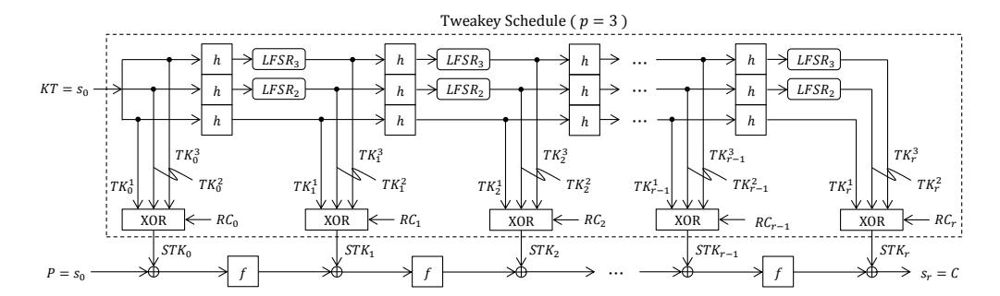

Figure 1: Tweakey schedule and encryption process of Deoxys-BC-384 [CHP+17]

**Deoxys AEAD operating modes.** Deoxys adopts the tweakable block cipher Deoxys-BC as its internal primitive and provides two AEAD modes including Deoxys-I and Deoxys-II. Both modes are nonce-based AEAD, but Deoxys-I is for attackers that are assumed to be nonce-respecting while Deoxys-II allows users to reuse the same nonce under the same key.

The two schemes Deoxys-I-128-128 and Deoxys-II-128-128 are based on Deoxys-BC-256 which lead to a 128-bit key version, and Deoxys-I-256-128 and Deoxys-II-256-128 are based on Deoxys-BC-384 which lead to a 256-bit key version. As described in [JNPS16], Deoxys uses the 4-bit prefixes for the tweak input, thus the data that attackers obtain can not exceed 2<sup>124</sup> blocks under the same key. For more details, we refer to [JNPS16].

#### 2.2 Notations and Definitions

The following notations are followed throughout the rest of the paper.

 $X_i$ : state before AddRoundKey operation in round  $i, 0 \le i \le r-1$  $Y_i$ : state after AddRoundKey operation in round  $i, 0 \le i \le r-1$ 

 $Z_i$ : state after ShiftRows  $\circ$  SubBytes operation in round  $i, 0 \le i \le r-1$  thus the internal states of i-th round  $(0 \le i \le r-1)$  are as follows:

$$X_i \xrightarrow{\text{AK}} Y_i \xrightarrow{\text{SB, SR}} Z_i \xrightarrow{\text{MC}} X_{i+1}. \tag{1}$$

 $\Delta X$  : difference of the state X

 $X_i[j\cdots k]$  :  $j^{th}$  byte,  $\cdots$ ,  $k^{th}$  byte of  $X_i$ , where  $0 \le j, k \le 15$   $Y_i[j\cdots k]$  :  $j^{th}$  byte,  $\cdots$ ,  $k^{th}$  byte of  $Y_i$ , where  $0 \le j, k \le 15$   $Z_i[j\cdots k]$  :  $j^{th}$  byte,  $\cdots$ ,  $k^{th}$  byte of  $Z_i$ , where  $0 \le j, k \le 15$ 

 $IK_i[j]$ : involved (equivalent) key byte in round i with the same index to  $Y_i[j]$ 

#### 2.3 The Boomerang and Rectangle Attacks

The boomerang attack is a differential attack that was proposed by Wagner [Wag99]. It attempts to generate a quartet structure at an intermediate value halfway through the cipher.

The boomerang attack allows an attacker to concatenate two shorter differential paths when long differentials with probability higher than for a random permutation can not be found. That is, the adversary will split the encryption process  $E(\cdot)$  into two shorter sub-processes  $E=E_1\circ E_0$ , where  $E_0$  represents the first half of the cipher while  $E_1$  represents the last half. For the sub-cipher  $E_0$ , there is a differential characteristic  $\alpha \to \beta$  with probability p, and a differential characteristic  $\gamma \to \delta$  for  $E_1$  with probability q.

If the plaintexts and ciphertexts can pass the boomerang distinguisher, a right quartet  $(m, m', \bar{m}, \bar{m}')$  can be obtained. The adversary gets a correct quartet with a probability

<span id="page-6-0"></span>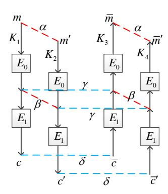

Figure 2: Boomerang attack framework

 $p^2q^2$ . However, when  $m \oplus m' = \alpha$ , a pair  $(\bar{m}, \bar{m}')$  satisfies  $\bar{m} \oplus \bar{m}' = \alpha$  with an average probability of  $2^{-n}$  for a random permutation. Therefore, for the existing differentials, the probability of the corresponding boomerang distinguisher has to satisfy  $pq > 2^{-n/2}$ .

The boomerang attack was further developed into a chosen-plaintext attack by Kelsey et al. [KKS00] called amplified boomerang attack, which was independently introduced as rectangle attack by Biham et al. in [BDK01]. The rectangle attack is a chosen-plaintext attack, which gets a right quartet with a probability  $2^{-n}p^2q^2$ . As it was pointed out, if one only fixed the values  $\alpha$  and  $\delta$  and allowed any values of  $\beta$  and  $\gamma$  as long as  $\beta \neq \gamma$ , the probability of obtaining a correct quartet would be increased to  $2^{-n}\hat{p}^2\hat{q}^2$ , where

$$\hat{p} = \sqrt{\sum_{\beta_i} Pr^2(\alpha \to \beta_i)} \quad and \quad \hat{q} = \sqrt{\sum_{\gamma_j} Pr^2(\gamma_j \to \delta)}.$$

Related-tweakey boomerang and rectangle attacks were proposed by Biham et~al. in [BDK05]. Assume one has a related-tweakey differential  $\alpha \to \beta$  over  $E_0$  under a key difference  $\Delta K$  with a probability p and another related-tweakey differential  $\gamma \to \delta$  over  $E_1$  under a key difference  $\nabla K$  with probability q. As shown in Figure 2, if  $K_1$  is known, the other three keys are all determined, where  $K_2 = K_1 \oplus \Delta K, K_3 = K_1 \oplus \nabla K, K_4 = K_1 \oplus \Delta K \oplus \nabla K$ . Then a right quartet over a related-tweakey boomerang distinguisher can be obtained with the following steps:

- 1. Randomly choose a plaintext pair (m, m') with difference  $m \oplus m' = \alpha$ , and encrypt it over E to get the ciphertext pair (c, c') with two chosen-plaintext queries, where  $c = E_{K_1}(m), c' = E_{K_2}(m')$ .
- 2. Generate another ciphertext pair  $(\bar{c}, \bar{c}')$  by  $\bar{c} = c \oplus \delta$  and  $\bar{c}' = c' \oplus \delta$ , then decrypt  $(\bar{c}, \bar{c}')$  to obtain their plaintexts  $(\bar{m}, \bar{m}')$  with two adaptive chosen-ciphertext queries under key  $K_3, K_4$  respectively.
- 3. Check whether the difference of  $(\bar{m}, \bar{m}')$  is equal to  $\alpha$  or not.

#### 2.4 General Strategy of Key-recovery Attacks using Structures

In this section, we briefly describe the key-recovery models of the related-tweakey boomerang attack and rectangle attack on block ciphers with linear key schedule, which are mainly based on the previous works [BDK01, BDK05, BK09], etc.

#### <span id="page-7-0"></span>2.4.1 Related-tweakey Rectangle Attack

We follow the symbolic style of Liu et al. [LGS17] and denote the whole cipher E as  $E = E_f \circ E' \circ E_b$ , where E' is the rectangle distinguisher and  $E_b$  and  $E_f$  are the rounds added at the start and at the end of the distinguisher, respectively. Denote the block size as n, the number of active bytes of the input difference of  $E_b$  as  $r_b/8$ , the number of subtweakey bits needed to be guessed in  $E_b$  as  $m_b$ . Similarly, we define  $r_f$  and  $m_f$  for  $E_f$ . When  $r_b/8 \le 15$ , i.e., by appending  $E_b$  to the rectangle distinguisher E', there are still inactive Sboxes in the input of  $E_b$  (for instance, the attacks shown in Subsection 6.4). Let k denote the master key size, we give the following general model:

- 1. Construct  $y = \sqrt{s} \cdot 2^{n/2-r_b}/\hat{p}\hat{q}$  structures of  $2^{r_b}$  plaintexts each, where s is the expected number of right quartets, each structure takes all the possible values of the  $r_b/8$  active bytes with the other  $16 r_b/8$  bytes as some constant.
- 2. For each structure, query the  $2^{r_b}$  plaintexts by the encryption oracle under  $K_1$ ,  $K_2$ ,  $K_3$  and  $K_4$  and obtain four plaintext-ciphertext sets denoted by  $L_1$ ,  $L_2$ ,  $L_3$  and  $L_4$ , where  $K_1$  is the secret key and  $K_2 = K_1 \oplus \Delta K$ ,  $K_3 = K_1 \oplus \nabla K$  and  $K_4 = K_1 \oplus \Delta K \oplus \nabla K$ . Insert  $L_2$  and  $L_4$  into hash tables  $H_1$  and  $H_2$  indexed by the  $r_b$  bits of plaintexts.
- 3. Guess the  $m_b$  subtweakey bits involved in  $E_b$ :
  - (a) Initialize a list of  $2^{m_f}$  counters, each of which corresponds to a  $m_f$ -bit subtweakey guess.
  - (b) For each structure, partially encrypt plaintext  $m \in L_1$  to the position of  $\alpha$  by the guessed subtweakeys, and partially decrypt it to the plaintext m' after xoring the known difference  $\alpha$ . Then we look up  $H_1$  to find the plaintext-ciphertext indexed by the  $r_b$  bits. Do the same operation with  $\bar{m}$  and  $\bar{m}'$ . We get two sets

$$S_1 = \{ (m, c, m', c') : (m, c) \in L_1, (m', c') \in L_2, E_{b_{K_1}}(m) \oplus E_{b_{K_2}}(m') = \alpha \},$$

$$S_2 = \{ (\bar{m}, \bar{c}, \bar{m}', \bar{c}') : (\bar{m}, \bar{c}) \in L_3, (\bar{m}', \bar{c}') \in L_4, E_{b_{K_2}}(\bar{m}) \oplus E_{b_{K_4}}(\bar{m}') = \alpha \}.$$

- (c) y structures make the size of  $S_1$  and  $S_2$  be  $y \cdot 2^{r_b}$ . Insert  $S_1$  into a hash table  $H_3$  indexed by the  $n-r_f$  bits of c and  $n-r_f$  bits of c' that set to 0 in the output difference through  $E_f$  from  $\delta$ . Then for each element of  $S_2$ , we find the corresponding (m, c, m', c') satisfying  $c \oplus \bar{c} = 0$  and  $c' \oplus \bar{c}' = 0$  in the  $r_f$  bits. In total we obtain  $y^2 \cdot 2^{2r_b-2(n-r_f)}$  quartets.
- (d) We use all the quartets obtained in step (c) to recover the subtweakeys involved in  $E_f$ . This phase is just a guess and filter procedure. For details, we refer to the key-recovery phase of Subsection 5.1. We denote the time complexity in this step as  $\varepsilon$ .
- (e) Select the top  $2^{m_f-h}$  hits in the counter to be the candidates, which delivers a h-bit or higher advantage.
- 4. Exhaustively search the remaining  $k m_b m_f$  unknown key bits cooperating the key schedule algorithm.

The data complexity is  $4y \cdot 2^{r_b}$  chosen plaintexts, and do  $2^{m_b}(2y \cdot 2^{r_b} + y \cdot 2^{r_b})$  table lookups to prepare quartets. We need  $2^{m_b} \cdot (y^2 \cdot 2^{2r_b-2(n-r_f)}) \cdot \varepsilon$  encryptions in the key recovery process. The total time complexity, including data collection, key recovery and exhaustively searching the remaining unknown key bits, is  $4y \cdot 2^{r_b} + 2^{m_b} \cdot (y^2 \cdot 2^{2r_b-2(n-r_f)}) \cdot \varepsilon + 2^{k-h}$ . The memory complexity is  $4y \cdot 2^{r_f} + y \cdot 2^{r_b} + 2^{m_f}$ .

**Success Probability.** For both boomerang and rectangle attacks, with the same method as in [Sel08], the success probability is evaluated to:

<span id="page-8-2"></span>
$$P_s = \Phi(\frac{\sqrt{sS_N} - \Phi^{-1}(1 - 2^{-h})}{\sqrt{S_N + 1}}),\tag{2}$$

where  $S_N$  is the signal-to-noise ratio and  $S_N = \hat{p}^2 \hat{q}^2 / 2^{-n}$ .

Note that, in Subsection 6.2, all the bytes of the input of the 11-round rectangle attack on Deoxys-BC-256 are active, i.e.  $r_b/8 = 16$ . In this situation, we have to tweak the data collection phase to avoid using the full codebook. As the method is dedicated to the attack on Deoxys-BC-256, we refer the readers to Subsection 6.2 to find the details.

#### <span id="page-8-1"></span>2.4.2 Related-tweakey Boomerang Attack

We first explain how to append one or two rounds at the end of the boomerang distinguisher  $E_f$ . We express the cipher by  $E=E_f\circ E'$ . The symbols are the same as in Subsubsection 2.4.1. The process of related-tweakey boomerang attack for Deoxys-BC can be summarized as:

- 1. Choose  $y = s/(2^{r_f} \cdot \hat{p}^2 \hat{q}^2)$  structures of  $2^{r_f}$  ciphertexts each, where s is the expected number of right quartets. Each structure takes all the possible values for the  $r_f/8$  active bytes while the other  $16 r_f/8$  bytes are fixed to some constant.
- 2. For each structure, we can obtain the plaintext m for each ciphertext c by calling the decryption oracle under  $K_1$ , computing m' by  $m' = m \oplus \alpha$ , and obtaining the ciphertext c' by  $E_{K_2}(m')$ . Here we can obtain a set

$$L_1 = \{(m, c, m', c'), m = E_{K_1}^{-1}(c), m' = m \oplus \alpha, c' = E_{K_2}(m')\}.$$

Then we compute the set  $L_2$  under  $K_3$  and  $K_4$  in a similar way:

$$L_2 = \{(\bar{m}, \bar{c}, \bar{m}', \bar{c}'), \bar{m} = E_{K_2}^{-1}(\bar{c}), \bar{m}' = \bar{m} \oplus \alpha, \bar{c}' = E_{K_4}(\bar{m}')\}.$$

- 3. Insert  $L_1$  into a hash table  $H_1$  indexed by the  $n-r_f$  bits of c'. Then for each element of  $L_2$ , we find the corresponding (m, c, m', c') colliding in the  $n-r_f$  bits. We obtain a total of  $y \cdot 2^{2r_f (n-r_f)} = y \cdot 2^{3r_f n}$  quartets.
- 4. The process that recovers the subtweakeys involved in  $E_f$  is the same as the one in the previous related-tweakey rectangle attack, the complexity of this step is denoted as  $\varepsilon$ .

The attack needs  $4y \cdot 2^{r_f}$  adapted chosen ciphertexts and plaintexts, and  $y \cdot 2^{r_f}$  lookups to construct quartets. The time complexity is  $y \cdot 2^{3r_f - n} \cdot \varepsilon$  encryptions in the key recovery process. The memory complexity is  $2^{r_f} + 2^{m_f}$ .

# 3 Searching Distinguishers of Deoxys-BC

# <span id="page-8-0"></span>3.1 Searching Truncated Differentials and Corresponding Characteristics

As described in [CHP<sup>+</sup>17], if we want to find a boomerang distinguisher over  $R_1 + R_2$  rounds, an MILP model including  $R_1 + 1$  rounds for the upper part and  $R_2 + 1$  rounds for the lower part is needed. However, when using the distinguisher to launch the key-recovery attack, the trail with fewer active Sboxes when appending certain rounds is preferred.

Therefore, we add such conditions for two extra rounds behind the  $(R_1 + R_2)$ -round boomerang distinguisher to Cid et al.'s model [CHP<sup>+</sup>17] and keep other constraints in Cid et al.'s model unchanged.

Note that, given a  $(R_1 + R_2)$ -round boomerang distinguisher of Deoxys-BC, when appending the first extra round behind, the first operation is the AddRoundKey, where the output difference of the  $(R_1 + R_2)$ -round distinguisher may be canceled by the difference of the AddRoundKey. However, when appending the second extra round behind, all the differences of the internal state are in truncated form, hence, the difference of the AddRoundKey will not cancel the difference of the internal state. We list the detailed constraints below:

#### 1. For the first extra round.

This is the first round that is extended from the distinguisher, we denote the state in AddRoundKey as  $(x_i, stk_i, y_i)$ , i.e.  $x_i \oplus stk_i = y_i$ , for the *i*-th byte. The constraints for the AddRoundKey operation in this round are identical to those in [CHP<sup>+</sup>17], that need to exclude  $(x_i, stk_i, y_i) \in \{(0, 0, 1), (0, 1, 0), (1, 0, 0)\}$  as

<span id="page-9-0"></span>
$$x_i + stk_i - y_i \ge 0, \quad x_i - stk_i + y_i \ge 0, \quad -x_i + stk_i + y_i \ge 0.$$
 (3)

The differences of the active bytes of the internal state are indeterminate after the SubBytes operation. Therefore, the constraints for the MixColumns operation are different from those in [CHP+17] which only makes the branch number to be 5. All of the 4 bytes in one column will be active after the MC function if any byte in this column is active before the MC function. Let the Boolean variables  $(x_i, x_{i+1}, x_{i+2}, x_{i+3})$  denote the activeness of the input 4-byte of MC function and  $(y_i, y_{i+1}, y_{i+2}, y_{i+3})$  denote the output 4-byte, then the constraints are as follows:

$$d_k - x_i \ge 0, \ d_k - x_{i+1} \ge 0, \ d_k - x_{i+2} \ge 0, \ d_k - x_{i+3} \ge 0, \ x_i + x_{i+1} + x_{i+2} + x_{i+3} - d_k \ge 0,$$

$$y_i - d_k = 0$$
,  $y_{i+1} - d_k = 0$ ,  $y_{i+2} - d_k = 0$ ,  $y_{i+3} - d_k = 0$ ,

where  $d_k$  is a dummy variable that equals zero only when  $x_i, x_{i+1}, x_{i+2}, x_{i+3}$  are all zero.

#### 2. For the second extra round.

The state differences at the start of the second round are all in truncated form, therefore cancelation can not occur in the AddRoundKey operation. For  $(x_i, stk_i, y_i)$  with  $x_i \oplus stk_i = y_i$ ,  $y_i$  must be active if  $x_i$  or  $stk_i$  is active. The constraints are different from Equation 3 and are expressed as

$$y_i - x_i \ge 0$$
,  $y_i - stk_i \ge 0$ ,  $x_i + stk_i - y_i \ge 0$ .

Since we do not consider the last MixColumns operation in the key recovery attacks, there are no constraints for it.

At the end of the MILP model, we add an extra constraint to restrict the number of active bytes in the difference of the ciphertext. If  $y_i$  ( $0 \le i \le 15$ ), denote the differences of the 16 bytes of ciphertext, we can add  $\sum_{i=0}^{15} y_i \le l$ , where l can be tested from 0 to 15.

By running the MILP model, we find a 9-round truncated boomerang differential with 9 active Sboxes and 9 active bytes in the difference of the ciphertext when extending one round for Deoxys-BC-256, as well as a 11-round truncated boomerang differential with 9 active Sboxes and 12 active bytes in the difference of the ciphertext when extending two rounds for Deoxys-BC-384.

**Deduce all the master tweakey difference.** With the truncated boomerang differential, we can easily deduce the space of the master tweakey difference, and leave out the difference that is not compatible with the difference distribution table of the Sbox, the method is the same as the one in [CHP<sup>+</sup>17] but we maintain all the right trails. Then check whether the probability of these trails can be increased by the BDT technique [WP19].

#### 3.2 Increase the Probability Further

At ToSC 2019, Wang and Peyrin [WP19] and Song et al. [SQH19] considered the BCT effect in multiple rounds of boomerang switch. Wang and Peyrin [WP19] introduced a general tool named Boomerang Difference Table (BDT) to evaluate the boomerang switch through multiple rounds. We first briefly recall the BDT technique.

**Definition 1.** (Boomerang Difference Table (BDT))[WP19]. Let S be an invertible function from  $F_2^n$  to  $F_2^n$ , and  $(\Delta_0, \Delta_1, \nabla_0) \in \mathbb{F}_2^n$ . The boomerang difference table (BDT) of S is a three-dimensional table, in which the entry for  $(\Delta_0, \Delta_1, \nabla_0)$  is computed by:

<span id="page-10-0"></span>
$$BDT(\Delta_0, \Delta_1, \nabla_0) = \#\{x \in \{(0,1)\}^n | S^{-1}(S(x) \oplus \nabla_0) \oplus S^{-1}(S(x \oplus \Delta_0) \oplus \nabla_0) = \Delta_0, S(x) \oplus S(x \oplus \Delta_0) = \Delta_1\}.$$

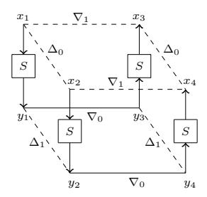

Figure 3: Generation of a right quartet at the S level[WP19].

The process of generating a right quartet in the S level is visualized in Figure 3. The BDT reveals the probability of generating a boomerang quartet with a certain differential trail at the Sbox level. When the boomerang comes back,  $\nabla_1$  determines the differential characteristic in the backward rounds. So similarly to BDT, there is a definition for BDT'.

**Definition 2.** (BDT')[WP19]. BDT' takes into account  $(\nabla_0, \nabla_1, \Delta_0)$ , and is defined as

$$BDT'(\nabla_0, \nabla_1, \Delta_0) = \#\{x \in \{(0,1)\}^n | S(S^{-1}(x) \oplus \Delta_0) \oplus S(S^{-1}(x \oplus \nabla_0) \oplus \Delta_0) = \nabla_0, S^{-1}(x) \oplus S^{-1}(x \oplus \nabla_0) = \nabla_1\}.$$

**Increase the probability by BDT and BDT'.** For each differential trail obtained in Subsection 3.1, we check whether the BDT and BDT' can be applied to increase its probability. We take the 9-round distinguisher of Deoxys-BC-256 listed in Table 4 as an example to describe the process. In the two-round boomerang switch, BDT is used in the first Sbox layer and BDT' is applied in the second Sbox layer.

For the known master tweakey difference, the values of  $\Delta Y_6$  and  $\nabla Z_6$  can be deduced. Therefore,  $\Delta_0$  used in BDT and  $\nabla_0$  used in BDT' are known, *i.e.*  $\Delta_0 = \Delta Y_5[9] = 0x80$  and  $\nabla_0 = \nabla Z_6[1] = 0x32$ . We follow the steps below to determine the exact probability of the trail

1. With the fixed value of  $\Delta_0 = \Delta Y_5[9] = 0x80$  in BDT, we take all the  $2^8$  values of  $\nabla_0$  and output all the combinations of  $(0x80, \Delta_1, \nabla_0)$  whose entry in the BDT is greater than 0, where  $\Delta_1 = \Delta Z_5[5]$  and  $\nabla_0 = \nabla Z_5[5]$ .

- 2. For each 3-tuple obtained in step 1, since  $\Delta Z_5[5] = \Delta_1$  is known, the value of  $\Delta Y_6[5]$ , which will be used to be  $\Delta_0$  in the BDT', can be computed with the MC function, and we can construct the BDT' with the fixed  $\Delta_0 = \Delta Y_6[5]$ .
- 3. Output all the 3-tuple  $(0x32, \nabla_1, \Delta_0)$  whose entry in the BDT' is greater than 0,  $\nabla Y_6[5]$  is determined by  $\nabla_1$ .

With the above process, we find a total of two differential characteristics for the two-round switch, which are listed in Table 4 and Table 5. In Table 4, the entry of (0x80,0xae,0x00) is 4 in the BDT and (0x32,0x47,0x47) is 2 in the BDT' which contribute a probability of  $2^{-6}$  and  $2^{-7}$  respectively, and the probability of the two-round switch is  $2^{-13}$ . In Table 5, the entry of (0x80,0x96,0x96) is 2 in the BDT and (0x32,0x37,0x37) is 2 in the BDT' which makes the probability of the two-round switch be  $2^{-14}$ . Therefore, the probability of the two-round switch is  $2^{-13} + 2^{-14} = 2^{-12.4}$  and the 9-round related-tweakey boomerang distinguisher for Deoxys-BC-256 is  $2^{-120.4}$ . For the other trails in the truncated differential, there are no trails with a probability greater than  $2^{-120.4}$ .

For the 11-round distinguisher of Deoxys-BC-384, we do not find trails with a probability greater than  $2^{-122}$  with the help of the BDT technique.

**Experimental Verification.** Similar to [WP19], we use  $2^{20}$  randomly chosen plaintexts and tweakeys for the 2-round boomerang switch and iterate it for 1000 times. The results show that the average probability of getting a right quartet for Deoxys-BC-256 is  $2^{-12.4}$  and for Deoxys-BC-384 is  $2^{14}$ , which verifies the correctness of our characteristics.

### <span id="page-11-0"></span>4 Advantages of the New Distinguishers

We construct two more effective related-tweakey boomerang distinguishers including a 9-round distinguisher of Deoxys-BC-256 and an 11-round distinguisher of Deoxys-BC-384, respectively. For all the distinguishers of Deoxys-BC-256 and Deoxys-BC-384, we only modify the lower part of the trails compared with those in [CHP<sup>+</sup>17].

#### New 9-round Related-tweakey Boomerang Distinguishers of Deoxys-BC-256.

We present a new 9-round related-tweakey boomerang distinguisher in Table 4 and Table 5, the probability of which is  $\hat{p}^2 \cdot \hat{q}^2 = 2^{-120.4}$ , where the upper differentials of  $E_0$  are under the related key  $\Delta K = \{\Delta T K_0^1, \Delta T K_0^2\}$ , and the lower differentials of  $E_1$  are under the related key  $\nabla K = \{\nabla T K_0^1, \nabla T K_0^2\}$ . Here,  $\alpha = (00\ b0\ 00\ 00\ 00\ 00\ 00\ 00\ 00\ 00\$ 

It is obvious that the 9-round related-tweakey boomerang distinguisher can be transformed into a **9-round related-tweakey rectangle distinguisher**, whose probability is  $\hat{p}^2 \cdot \hat{q}^2 \cdot 2^{-128} = 2^{-248.4}$ .

#### New 11-round Related-tweakey Boomerang Distinguisher of Deoxys-BC-384.

We search an 11-round related-tweakey boomerang distinguisher of Deoxys-BC-384 illustrated in Table 7. The probability of the 11-round boomerang distinguisher is  $\hat{p}^2 \cdot \hat{q}^2 = 2^{-122}$ .

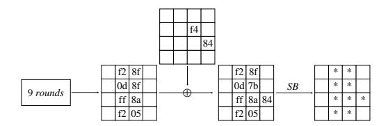

<span id="page-12-0"></span>Figure 4: Appending one round to our 9-round boomerang distinguisher of Deoxys-BC-256.

<span id="page-12-1"></span>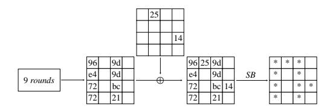

Figure 5: Appending one round to Cid et al.'s 9-round boomerang distinguisher of Deoxys-BC-256.

<span id="page-12-2"></span>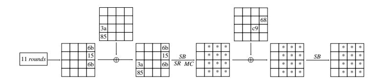

Figure 6: Appending two rounds for our 11-round boomerang distinguisher of Deoxys-BC-384.

<span id="page-12-3"></span>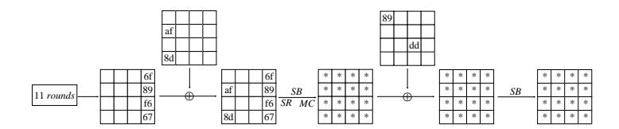

Figure 7: Appending two rounds for Cid et al.'s 11-round boomerang distinguisher of Deoxys-BC-384.

<span id="page-13-1"></span>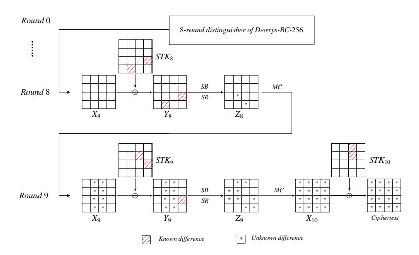

Figure 8: Key-recovery attack against 10-round Deoxys-BC-256

Note that the last column in the last round at the end of the boomerang trail is (d9,00,00,38), which leads to (91,e1,91,00) after MixColumns operation. If we extend the trails of  $E_1$  forward for two rounds, there are only 12 active bytes after SubBytes operation in the last round shown in Figure 6, while there will be 16 active bytes using Cid et al.'s distinguisher [CHP+17] which is listed in Table 6 shown in Figure 7. Making use of the new distinguisher, we can attack reduced-round Deoxys-BC-384 for one more round than before, though the probability of the boomerang distinguisher is a little lower than the one in [CHP+17].

It is obvious that we can also construct an 11-round related-tweakey rectangle distinguisher of Deoxys-BC-384 in use of the 11-round related-tweakey boomerang distinguisher, whose probability is  $\hat{p}^2 \cdot \hat{q}^2 \cdot 2^{-128} = 2^{-250}$ .

# 5 New Related-tweakey Boomerang Attacks on Round-Reduced Deoxys-BC

Deoxys-BC includes MixColumns operation in the last round, but it is well known that the last MixColumns is a linear operation which does not impact the differential cryptanalysis. Indeed, attackers can analyze  $MC^{-1}(\Delta c)$  instead of  $(\Delta c)$ , where c is the ciphertext. To simplify the discussion, we omit the last MixColumns operation and the effect of the key difference, and denote  $MC^{-1}(c)$  (i.e. state Z) by c in the last round.

#### <span id="page-13-0"></span>5.1 Related-tweakey Boomerang Attack on 10-Round Deoxys-BC-256

We apply the first 8-round path of the 9-round related-tweakey boomerang distinguisher in Table 4, and append 2 rounds to the end of the 8-round related-tweakey boomerang trail to attack 10-round Deoxys-BC-256, which is illustrated in Figure 8. The probability of the 8-round boomerang distinguisher is  $\hat{p}^2 \cdot \hat{q}^2 = 2^{-96.4}$ , where  $\alpha = (00\ b0\ 00\ 00\ 00\ 00\ 00\ 00\ 00\ 00\$ 

In Round 9, there are nine active bytes in  $\Delta Z_9$  ( $\Delta Z_9[j]$ , j = 1, 2, 4, 5, 6, 8, 11, 14, 15), where '\*' denotes active bytes throughout the rest of the paper.

The attack process includes data collection phase and key recovery phase, and following the general process in Subsubsection 2.4.2  $r_f = 72$  and  $m_f = 88$ .

**Data Collection.** This boomerang attack is an adaptive chosen plaintexts and ciphertexts attack. We construct structures of ciphertexts, which traverse all the possible values of the 9 active bytes  $Z_9[j]$ , j = 1, 2, 4, 5, 6, 8, 11, 14, 15, while the other 7 bytes are fixed to a constant. For each structure S, we query the corresponding sets  $L_1$ ,  $L_2$  under the two related keys  $K_1$  and  $K_3$ , i.e.

$$\begin{array}{rcl} L_1 & = & \{(m,c), m = E_{K_1}^{-1}(c), c \in S\}, \\ L_2 & = & \{(\bar{m},\bar{c}), \bar{m} = E_{K_3}^{-1}(\bar{c}), \bar{c} \in S\}. \end{array}$$

Then we compute  $m' = m \oplus \alpha, \forall m \in L_1$  and query the new ciphertexts c' under the key  $K_2$  and update

$$L_1 = \{(m, c, m', c'), m = E_{K_1}^{-1}(c), m' = m \oplus \alpha, c' = E_{K_2}(m'), c \in S\}.$$

Then compute  $\bar{m}' = \bar{m} \oplus \alpha, \forall \bar{m} \in L_2$  and query the new ciphertexts  $\bar{c}'$  under the key  $K_4$  and update

$$L_2 = \{ (\bar{m}, \bar{c}, \bar{m}', \bar{c}'), \bar{m} = E_{K_3}^{-1}(\bar{c}), \bar{m}' = \bar{m} \oplus \alpha, \bar{c}' = E_{K_4}(\bar{m}'), \bar{c} \in S \}.$$

Insert the elements of  $L_1$  into a hash table  $H_1$  indexed by 7 bytes c'[j] (j = 0, 3, 7, 9, 10, 12, 13) of  $L_1$  (note that ciphertexts c, c' here are equivalent to  $Z_9$  for simplicity). Then for elements of  $L_2$ , we check  $H_1$  to find the elements of  $L_1$ , where  $c' \oplus \bar{c}' \in \eta$ . Each structure provides  $2^{72}$  ciphertext pairs (c, c') and  $(\bar{c}, \bar{c}')$ , there are  $2^{72} \cdot 2^{72} \cdot 2^{-56} = 2^{88}$  quartets whose differences satisfy  $c \oplus \bar{c} \in \eta$  and  $c' \oplus \bar{c}' \in \eta$ . There are  $2^{88} \cdot 2^t = 2^{t+88}$  quartets remaining for  $2^t$  structures.

**Key Recovery.** As illustrated in Figure 8, 9 bytes of equivalent subtweakeys of  $STK_{10}$  and 2 bytes of equivalent subtweakeys of  $STK_9$  are involved in the partial decryption process from ciphertexts to  $\Delta Y_8$ . For the sake of clearness, we denote the equivalent subtweakeys  $IK_i = SR^{-1} \circ MC^{-1}(STK_{i+1})$  in round i.

Take the example of  $IK_9[4]$  in round 9 in Figure 8. To get the value of  $Y_9[4]$ , we need the value of  $Z_9[4]$ , which equals (note that c[i] is the *i*-th byte of ciphertext):

$$0e \cdot (c[4] \oplus STK_{10}[4]) \oplus 0b \cdot (c[5] \oplus STK_{10}[5]) \oplus 0d \cdot (c[6] \oplus STK_{10}[6]) \oplus 09 \cdot (c[7] \oplus STK_{10}[7]),$$

so we denote

$$IK_{9}[4] = 0e \cdot STK_{10}[4] \oplus 0b \cdot STK_{10}[5] \oplus 0d \cdot STK_{10}[6] \oplus 09 \cdot STK_{10}[7]$$

as a byte of the equivalent subtweakey.

We optimize the complexity of the key recovery phase by guessing some equivalent key bytes separately. We initialize a list of  $2^{88}$  counters, each of which corresponds to a 88-bit subtweakey guess. For the  $2^{t+88}$  remaining quartets  $(c, c', \bar{c}, \bar{c}')$ , we use the following attack process to recover the key.

- 1. The input difference of Sboxes  $\Delta Y_9[14]$  is known and the corresponding output difference is obtained from ciphertext pairs, therefore we get a 8-bit subtweakey from the ciphertexts pair  $(c, \bar{c})$  on average. Then decrypt  $(c', \bar{c}')$  to  $Y_9[14]$  using the corresponding 8-bit subtweakey. If the difference is not equal to the known difference, we eliminate the quartet. Otherwise, we keep the quartet and the 8-bit subtweakey. There are about  $2^{t+80}$  remaining quartets.
- 2. Then, we guess one byte of involved subtweakeys  $IK_9[4]$  and the values and difference of  $Y_9[4]$  is deduced. There are three zero-difference bytes in the second column of

 $\Delta Z_8$ , so the differences  $\Delta Y_9[5,6,7]$  are deduced utilizing the MixColumns operation<sup>1</sup>. Then we get the corresponding subtweakeys  $IK_9[5,6,7]$  because the input and output differences of Sboxes are known. Then partially decrypt  $(c',\bar{c}')$  to get the second column of  $\Delta Z_8$ . If  $\Delta Z_8[4,5,7]=0$ , we keep the quartet and corresponding 32-bit subtweakey. Otherwise, we eliminate the quartet. There are about  $2^{t+64}$  remaining quartets.

- 3. Partially decrypt the pair  $(c, \bar{c})$  to get  $\Delta Z_8[6]$ , and deduce the corresponding subtweakey  $IK_8[14]$ . Then we use the subtweakey to partially decrypt  $(c', \bar{c}')$  to get the difference of  $\Delta Y_8[14]$ . If it does not equal the known difference, we remove the quartet. There are about  $2^{t+56}$  remaining quartets.
- 4. Conduct similar process to Step 2 and 3 to obtain  $IK_9[8,9,10,11]$  and  $IK_8[7]$ . We count the 88-bit corresponding subtweakey. There are about  $2^{t+32}$  remaining quartets with the corresponding 88-bit subtweakeys.

Complexity Computation. The complexity of data collection is  $4 \cdot 2^{t+72}$  queries. The complexity of key recovery is about  $2^{t+88}$  one round encryptions, which is equivalent to about  $2^{t+88}/10 = 2^{t+84.7}$  encryptions. Because the probability of the difference  $\eta$  propagating to  $\delta = 0$  is  $2^{-72}$  and the probability of boomerang distinguisher is  $2^{-96.4}$ , there are  $2^t \cdot 2^{144} \cdot 2^{-72} \cdot 2^{-96.4} = 2^{t-24.4}$  right quartets in data collection in total. Once a right quartet is obtained, the right key is counted. The expected counter of the right key is  $2^{t-24.4}$ , and the expected counter of the wrong key is  $2^{t+32-88} = 2^{t-56}$ . When t = 24.4 and h = 28, the total complexity is  $2^{98.4}$  queries and  $2^{109.1} + 2^{128-28} \approx 2^{109.1}$  encryptions, the memory complexity is bounded by the size of the key-counter, which is  $2^{88}$ , and the success probability is 72.02% according to Equation 2. When t = 27 and h = 27, the total complexity is  $2^{99.4}$  queries and  $2^{110.1} + 2^{128-27} \approx 2^{110.1}$  encryptions, and the success probability is 84.26%.

The related-tweakey boomerang attacks for other versions of Deoxys-BC are listed in Appendix A.

# 6 New Related-tweakey Rectangle Attacks on Reduced Deoxys-BC

#### <span id="page-15-0"></span>6.1 Related-tweakey Rectangle Attack on 10-round Deoxys-BC-256

We extract the first 8-round trail in Table 4 to construct a 8-round related-tweakey rectangle distinguisher with probability  $\hat{p}^2 \cdot \hat{q}^2 \cdot 2^{-128} = 2^{-224.4}$ . The figure of the attack is the same as Figure 8. In round 9, there are 7 inactive bytes in  $\Delta Z_9$  ( $Z_9[j]$ , j = 0, 3, 7, 9, 10, 12, 13).

**Data Collection.** Choose  $2^t$  plaintexts m, compute  $m' = m \oplus \alpha$ , where  $\alpha = (00 \ b0 \ 00 \ 00 \ 00 \ 00 \ 00 \ 00$ 

$$L_1 = \{(m, c, m', c'), c = E_{K_1}(m), m' = m \oplus \alpha, c' = E_{K_2}(m')\}.$$

Since there are 7 zero-difference bytes in  $\Delta Z_9$  (j=0,3,7,9,10,12,13), we insert the elements of  $L_1$  into a hash table  $H_1$  indexed by c[0,3,7,9,10,12,13] and c'[0,3,7,9,10,12,13] (Note that c is equivalent to  $Z_9$  for simplicity). Then for each of the  $2^t$  plaintext pairs  $(\bar{m}, \bar{m}') = (m, m')$ , query their new ciphertexts  $(\bar{c}, \bar{c}')$  under  $K_3$  and  $K_4$ , and lookup  $H_1$  to obtain quartets whose 14 bytes (used for index) of c||c' and  $\bar{c}||\bar{c}'$  have the same value. Totally, there are  $2^{2t} \cdot (2^{-56})^2 = 2^{2t-112}$  quartets remaining.

<span id="page-15-1"></span><sup>&</sup>lt;sup>1</sup>Note that if 4 out of 8 input-output bytes of MixColumns are known, all other bytes can be deduced.

<span id="page-16-1"></span>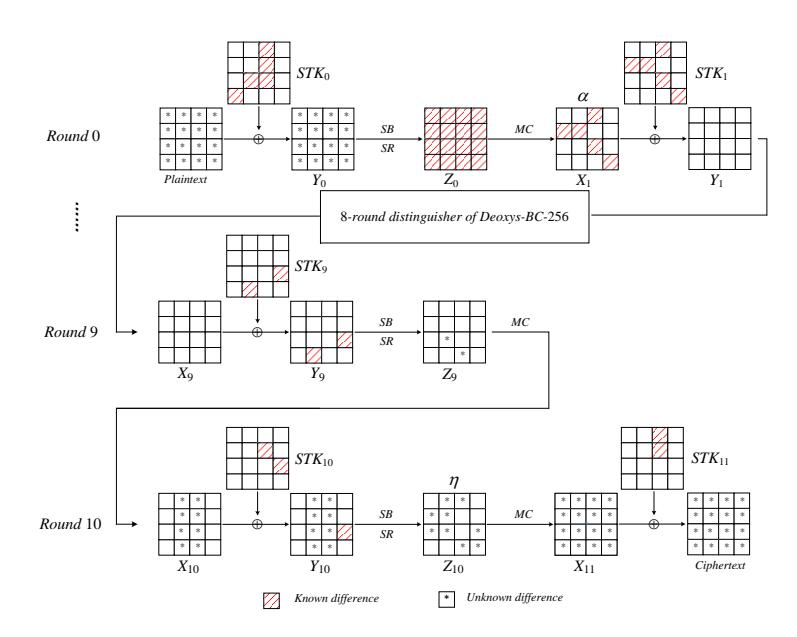

Figure 9: Key recovery attack against 11-round Deoxys-BC-256.

**Key Recovery.** The process of key recovery is identical to the boomerang attack on 10-round Deoxys-BC-256 in Subsection 5.1.

Complexity Computation. In the process above,  $r_f = 72$  and  $m_f = 88$ . The complexity of data collection is  $4 \cdot 2^t$  queries. The complexity of key recovery is about  $2^{2t-112}$  one round encryptions, which is equivalent to about  $2^{2t-112}/10 = 2^{2t-115.3}$  encryptions. Since the probability of the 8-round related-tweakey rectangle distinguisher is  $\hat{p}^2\hat{q}^2 \cdot 2^{-128} = 2^{-224.4}$ , there are  $2^{2t} \cdot 2^{-224.4} = 2^{2t-224.4}$  right quartets in data collection in total. When t = 112.2 and h = 19, the total complexity is  $2^{114.2}$  queries and  $2^{109.1} + 2^{128-19} \approx 2^{110.05}$  encryptions, the memory complexity is bounded by the data volume in hash table  $H_1$ , which is  $2^{112.2}$ , and the success probability is 74.75%.

#### <span id="page-16-0"></span>6.2 Rectangle Attack on 11-Round Deoxys-BC-256

We mount an 11-round rectangle attack on Deoxys-BC-256 by prefixing a round at the beginning and appending two rounds at the end of the 8-round rectangle distinguisher used in Subsection 6.1, which is illustrated in Figure 9. It is obviously that  $\alpha$  propagates 16 active bytes in  $\Delta Y_0$  of the first round, which leads to the fact that 16 bytes of subtweakeys  $STK_0$  are involved.

Choose  $2^{112+t}$  plaintexts by traversing the first 14 bytes of plaintext and choosing  $2^t$  values of the 14-th and 15-th bytes at random, and query their corresponding ciphertexts under key  $K_1$ ,  $K_2$ ,  $K_3$  and  $K_4$ , respectively. We denote the 4 plaintext-ciphertext sets as  $L_1$ ,  $L_2$ ,  $L_3$  and  $L_4$ . Obviously, the size of  $L_i$  (i = 1, 2, 3, 4) is  $2^{112+t}$ . We insert  $L_2$  and  $L_4$  in the hash tables  $H_1$  and  $H_2$  indexed by bytes of plaintexts, i.e., m[j] ( $j = 0, \dots, 13$ ), respectively. So under each index in  $H_1$  or  $H_2$ , there are  $2^t$  elements. Then, carry out the following process to recover key.

1. First, we guess the 112-bit subtweakey  $STK_0[j]$   $(j = 0, \dots, 13)$ .  $\forall m \in L_1$ , we partially encrypt to get  $Z_0[j]$   $(j \in \{0, ..., 15\}$  and  $j \neq 3$  or 6), compute  $Z'_0[j] = Z_0[j] \oplus MC^{-1}(\alpha)[j]$   $(j \in \{0, ..., 15\}$  and  $j \neq 3$  or 6), and then calculate the corresponding

plaintexts  $m'[0, \dots, 13]$  under guessed  $STK_0[0, \dots, 13]$  by partial decryption. At last, we look up  $H_1$  to find the plaintexts and ciphertexts indexed by  $m'[0, \dots, 13]$ . Therefore, we construct a set

```
S_{1} = \{(m, c, m', c') : (m, c) \in L_{1}, (m', c') \in L_{2}, 
SB(m[j] \oplus STK_{0}[j]) \oplus SB(m'[j] \oplus STK_{0}[j] \oplus \Delta K[j]) = SR^{-1} \circ MC^{-1}(\alpha)[j], 
j = 0, \dots, 13\}.
```

There are about  $2^{112+2t}$  elements in  $S_1$ . In a similar way, we get another set  $S_2$  with size of  $2^{112+2t}$  as

```
S_{2} = \{(\bar{m}, \bar{c}, \bar{m}', \bar{c}') : (\bar{m}, \bar{c}) \in L_{3}, (\bar{m}', \bar{c}') \in L_{4}, SB(\bar{m}[j] \oplus STK_{0}[j] \oplus \nabla K[j]) \oplus SB(\bar{m}'[j] \oplus STK_{0}[j] \oplus \nabla K[j] \oplus \Delta K[j]) = SR^{-1} \circ MC^{-1}(\alpha)[j], j = 0, \dots, 13\}.
```

We insert  $S_1$  in a hash table  $H_3$  indexed by the 14 bytes c[j] (j=0,3,7,9,10,12,13) and c'[j] (j=0,3,7,9,10,12,13) (note here that c is equivalent to  $Z_{10}$  for simplicity). For each element  $(\bar{m}, \bar{c}, \bar{m}', \bar{c}')$  of  $S_2$ , we find the corresponding (m, c, m', c') by  $\bar{c}$  and  $\bar{c}'$  that satisfy  $c \oplus \bar{c} \in \eta$  and  $c' \oplus \bar{c}' \in \eta$ . Then we obtain a quartet  $(c, c', \bar{c}, \bar{c}')$ . There are about  $2^{4t+112}$  quartets  $(c, c', \bar{c}, \bar{c}')$  satisfying  $c \oplus \bar{c} \in \eta$  and  $c' \oplus \bar{c}' \in \eta$ .

- 2. For each of the  $2^{4t+112}$  quartets, we compute the subtweakey  $STK_0[14]$  and  $STK_0[15]$  as a result of input and output differences of Sboxes in the first round for (m, m') and verify the subtweakey  $STK_0[14]$  and  $STK_0[15]$  with the corresponding  $(\bar{m}, \bar{m}')$ . There are about  $2^{4t+96}$  remaining quartets.
- 3. Recover 11 bytes of equivalent subtweakeys with a method similar to the one in the rectangle attack on 10-round Deoxys-BC-256, and exhaustively search the unknown remaining subtweakeys under the guessing  $STK_0$  and verify the key by two plaintexts and ciphertexts pairs. If the key is wrong, we start another guess of  $STK_0[j]$   $(j = 0, \dots, 13)$ .

Complexity Computation. The complexity of data collection is  $4 \cdot 2^{112+t}$  queries. In key recovery phase, the complexity of step 1 is about  $2^{112} \cdot (2 \cdot 2^{112+t} + 2^{112+2t}) = 2^{224}(2^{2t} + 2^{t+1})$  table lookups, we need  $2^{112} \cdot 2^{4t+112} \cdot 2/16$  one round encryptions and  $2^{112} \cdot 2^{4t+96}$  one round encryptions in step 2 and step 3, respectively, which is equivalent to about  $2^{4t+221}/11 = 2^{4t+217.5}$  encryptions. There are  $2^{112+2t} \cdot 2^{112+2t} \cdot 2^{-32} \cdot 2^{-96.4} \cdot 2^{-128} = 2^{4t-32.4}$  right quartets. The expected counter of the right key is  $2^{4t-32.4}$ , and the expected counter of the wrong key is  $2^{4t-62.4}$  for each guessed  $STK_0[0,\cdots,13]$ . When t=8.1 and h=19, the data complexity is  $2^{122.1}$  chosen plaintexts, the total complexity is  $2^{122.1}$  queries,  $2^{249.9} + 2^{256-19} \approx 2^{249.9}$  encryptions and  $2^{240.2}$  table lookups, the memory complexity is  $2^{128.2}$  which corresponds to the size of the set  $S_1$ , and the success probability is 74.75%.

#### <span id="page-17-0"></span>6.3 Related-tweakey Rectangle Attack on 12-round Deoxys-BC-384

We extract the first 10 rounds of the trail in Table 7 to construct a 10-round related-tweakey rectangle distinguisher with probability of  $\hat{p}^2 \cdot \hat{q}^2 \cdot 2^{-128} = 2^{-224}$ . We append two rounds at the end of the 10-round trail to mount a 12-round related-tweakey rectangle attack on Deoxys-BC-384, the differences propagation is shown in Figure 12 in Appendix A. The data collection process is similar to that in Subsection 6.1, so we omit it here. Note that there are 10 zero-difference bytes in  $\Delta Z_{11}$ , therefore, we obtain  $2^{2t} \cdot (2^{-80})^2 = 2^{2t-160}$  quartets remaining.

For the  $2^{2t-160}$  remaining quartets, we recover equivalent subtweakeys  $IK_{11}[2,3,12,13,14,15]$  and  $IK_{10}[11,12]$ . Firstly, we deduce the  $IK_{11}[2,3]$  by the known difference values of  $\Delta Y_{11}[2,3]$  and ciphertext pairs  $(c,\bar{c})$ , and then verify the obtained 16-bit subtweakey by decrypting  $(c',\bar{c}')$  to get  $\Delta Y_{11}[2,3]$ . There are about  $2^{2t-176}$  remaining quartets. Secondly,

<span id="page-18-1"></span>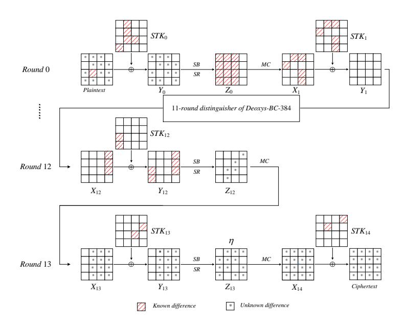

Figure 10: Key-recovery attack against 14-round Deoxys-BC-384.

similarly to the second and third step of key recovery in Subsection 5.1, we guess the  $2^{16}$  values of  $IK_{11}[12,13]$  and deduce the subtweakeys  $IK_{11}[14,15]$  and  $IK_{10}[11,12]$  for the remaining quartets. There are about  $2^{2t-192}$  remaining quartets with 8 bytes of subtweakeys. we count the 64-bit corresponding subtweakey.

In summary,  $2^{t+2}$  queries are made and the complexity of key recovery is  $2^{2t-160}$  one round encryptions, which is about  $2^{2t-160}/12 = 2^{2t-163.6}$  encryptions. Because the probability of the 10-round related-tweakey rectangle distinguisher is  $2^{-224}$ , there are  $2^{2t} \cdot 2^{-224} = 2^{2t-224}$  right quartets in data collection in total. When the key size is k=128, we choose t=112 and h=20, we need  $2^{114}$  queries and  $2^{60.4}+2^{128-20}\approx 2^{108}$  encryptions in key recovery process, the memory complexity is  $2^{112}$ , and the success probability is 65.60%. When the key size is k=256, we choose t=113, the total complexity is  $2^{115}$  queries, the memory complexity is  $2^{113}$ , and the success probability is 84.60%, where h=48, the time complexity is bounded by the  $2^{k-h}=2^{208}$  encryptions.

#### <span id="page-18-0"></span>6.4 Related-tweakey Rectangle Attack on 14-round Deoxys-BC-384

Making use of the 11-round trails in Table 7, we construct a 11-round related-tweakey rectangle distinguisher with probability of  $\hat{p}^2 \cdot \hat{q}^2 \cdot 2^{-128} = 2^{-250}$ . We prefix one round at the beginning of the 11-round related-tweakey rectangle distinguisher and append two rounds at the end to attack 14-round of Deoxys-BC-384, which is illustrated in Figure 10. Note that 12 active bytes will appear in  $\Delta Y_0$  in the first round, leading to the fact that 12 bytes of  $STK_0$  are involved.

Construct  $2^t$  structures of plaintexts, each taking all the possible values on the 12 bytes m[0,2,3,4,5,7,8,9,10,13,14,15] with the other 4 bytes being fixed to some constant. For each plaintext in the structure, query the corresponding ciphertexts under  $K_1$ ,  $K_2$ ,  $K_3$  and  $K_4$ . Similarly, we denote the four plaintext and ciphertext sets as  $L_1$ ,  $L_2$ ,  $L_3$  and  $L_4$ , and insert  $L_2$  and  $L_4$  in a hash table  $H_1$  and  $H_2$  indexed by m[0,2,3,4,5,7,8,9,10,13,14,15], respectively.

Guess the  $2^{96}$  possible values of  $STK_0[0, 2, 3, 4, 5, 7, 8, 9, 10, 13, 14, 15]$ , and for all  $m \in L_1$  and all  $\bar{m} \in L_3$ , we compute the corresponding 12 bytes of m' and  $\bar{m}'$  by the same

operations as the one used in Subsection 6.2. Then we get two sets as

```
S_{1} = \{(m, c, m', c') : (m, c) \in L_{1}, (m', c') \in L_{2}, m[i] = m'[i] \oplus \Delta K[i], i = 1, 6, 11, 12, SB(m[j] \oplus STK_{0}[j]) \oplus SB(m'[j] \oplus STK_{0}[j] \oplus \Delta K[j]) = SR^{-1} \circ MC^{-1}(\alpha)[j], j = 0, 2, 3, 4, 5, 7, 8, 9, 10, 13, 14, 15\}.
```

```
S_2 = \{(\bar{m}, \bar{c}, \bar{m}', \bar{c}') : (\bar{m}, \bar{c}) \in L_3, (\bar{m}', \bar{c}') \in L_4, \bar{m}[i] = \bar{m}'[i] \oplus \Delta K[i], i = 1, 6, 11, 12 \\ SB(\bar{m}[j] \oplus STK_0[j] \oplus \nabla K[j]) \oplus SB(\bar{m}'[j] \oplus STK_0[j] \oplus \nabla K[j]) \oplus \Delta K[j]) \\ = SR^{-1} \circ MC^{-1}(\alpha)[j], \ j = 0, 2, 3, 4, 5, 7, 8, 9, 10, 13, 14, 15\}.
```

As a result,  $2^t$  structures make the size of  $S_1$  and  $S_2$  be  $2^{96+t}$ . Then we insert  $S_1$  in a hash table  $H_3$  indexed by 8 bytes c[j] (j=0,7,10,13) and c'[j] (j=0,7,10,13). For each element  $(\bar{m},\bar{c},\bar{m}',\bar{c}')$  of  $S_2$ , we find the corresponding (m,c,m',c') by  $\bar{c}$  and  $\bar{c}'$  satisfying  $c \oplus \bar{c} \in \eta$  and  $c' \oplus \bar{c}' \in \eta$ . Totally, there are about  $2^{2t+128}$  quartets  $(c,c',\bar{c},\bar{c}')$  satisfying  $c \oplus \bar{c} \in \eta$  and  $c' \oplus \bar{c}' \in \eta$ .

For each guess, we make use of  $2^{2t+128}$  quartets obtained above to recover the 17-byte involved equivalent subtweakeys with a procedure similar to the one in Subsection 6.3, exhaustively search the unknown remaining subtweakeys and verify the key by encrypting two plaintexts and ciphertexts pairs. If the key is wrong, we start another guess of  $STK_0[0, 2, 3, 4, 5, 7, 8, 9, 10, 13, 14, 15]$ .

Here,  $r_b = 96$ ,  $m_b = 96$ ,  $r_f = 96$  and  $m_f = 136$ . We need  $4 \cdot 2^{96+t}$  queries to construct 4 sets  $L_1$ ,  $L_2$ ,  $L_3$ ,  $L_4$  and  $2^{96} \cdot (2 \cdot 2^{96+t} + 2^{96+t}) = 3 \cdot 2^{192+t}$  table lookups to prepare some quartets. Finally,  $2^{96} \cdot 2^{2t+128} \cdot 2^8/14 = 2^{2t+228\cdot 2}$  encryptions are costed. There are about  $2^{96+t} \cdot 2^{96+t} \cdot 2^{-250} = 2^{2t-58}$  right quartets. The expected counter of the right key is  $2^{2t-58}$ , and the expected counter of the wrong key is  $2^{2t-64}$  for each guessed  $STK_0[0,2,3,4,5,7,8,9,10,13,14,15]$ . When t=29, the data complexity is  $2^{127}$  chosen plaintexts, the total complexity is  $2^{127}$  queries,  $2^{286\cdot 2}$  encryptions and  $2^{222\cdot 6}$  table lookups, the memory complexity is  $2^{136}$  which is bounded by the size of the key-counter, and the success probability is 51.08%, where h=48.

## <span id="page-19-0"></span>7 Impact on Deoxys Authenticated Encryption

We have presented related-tweakey boomerang and rectangle attacks on Deoxys-BC in previous sections, where there is no restriction for tweak and key differences and we can make queries to both encryption and decryption oracles. However, the AE model Deoxys-I employing Deoxys-BC as its internal primitive has more restrictions to the input parameters. Therefore, we make some extra analyses for Deoxys-I.

<span id="page-19-1"></span>An AE scheme will return a null character and no decryption process proceeds when a tag is invalid. Therefore, the boomerang attack on the internal primitive can not be applied to the corresponding AE scheme since the chosen ciphertexts process is not permitted. However, this restriction is not problematic for the rectangle attack, where only chosen plaintexts are required.

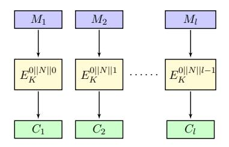

Figure 11: Encryption part of Deoxys-I.

For Deoxys-I, there is a 4-bit prefix in the tweak input to separate the various types, hence, the differential characteristic used to analyze Deoxys-I can not contain any difference in these 4 bits, and we have checked that there is no difference on the 4 bits in our related-tweakey rectangle attacks that are applied to Deoxys-I. The other 124-bit tweak input is composed of a nonce N and a block counter l. The ciphertexts are generated by the process as illustrated in Figure 11, where E is Deoxys-BC.

When using the recommended parameters, the maximum of encryption blocks has to be no more than  $2^{124}$  under the same key when the length of tweak is 128 bits [JNPS16]. Since the nonce N and the block counter l can be controlled, attackers can make queries in advance and do rectangle attack on the internal TBC. Therefore, the rectangle attack with the maximal data complexity  $\leq 2^{124}$  under the same key and time complexity  $\leq 2^{128}$  for Deoxys-BC-256 and  $\leq 2^{256}$  for Deoxys-BC-384 can be applied to the Deoxys-I.

The rectangle attack on 10-round Deoxys-BC-256 has a data complexity of  $2^{114.2}$  chosen plaintexts and time complexity of  $2^{114.2}$  queries, which is applicable for cryptanalysis of Deoxys-I-128-128. For Deoxys-BC-384, the 12-round rectangle attack with a data complexity  $2^{115}$  chosen plaintexts and  $2^{115}$  queries is available to analyse Deoxys-I-256-128 as well.

#### 8 Conclusion

In this paper, we find new related-tweakey boomerang and rectangle distinguishers to attack reduced-round Deoxys-BC-256 and Deoxys-BC-384, and improve the related-tweakey boomerang and rectangle attacks on 10-round Deoxys-BC-256 and 12/13-round Deoxys-BC-384 with lower time complexity. Especially, we give related-tweakey rectangle attacks on 11-round Deoxys-BC-256 and 14-round Deoxys-BC-384 for the first time. Our cryptanalysis results show that not only the probability of the boomerang distinguisher plays an important role in the key recovery, but also the differential propagation of the distinguisher.

Some cryptanalysis results not only apply to the block cipher Deoxys-BC, but also are compliant with the Deoxys authenticated encryption scheme. The related-tweakey rectangle attacks against 10-round Deoxys-BC-256 are available to Deoxys-I-128-128, and we also analyze Deoxys-I-256-128 by the 12-round rectangle attack on Deoxys-BC-384.

## 9 Acknowledgments

We would like to thank the shepherd Virginie Lallemand for her hard work to improve this paper. We would like to thank the reviewers for their significant comments. This work is supported by the National Key Research and Development Program of China (No. 2017YFA0303903), the National Natural Science Foundation of China (No. 61902207), the National Cryptography Development Fund (No. MMJJ20180101, MMJJ20170121), Zhejiang Province Key R&D Project (No. 2017C01062).

#### References

- <span id="page-20-0"></span>[ABD<sup>+</sup>16] Elena Andreeva, Andrey Bogdanov, Nilanjan Datta, Atul Luykx, Bart Mennink, Mridul Nandi, Elmar Tischhauser, and Kan Yasuda. COLM v1. Submission to the CAESAR Competition, 2016.
- <span id="page-20-1"></span>[BDK01] Eli Biham, Orr Dunkelman, and Nathan Keller. The rectangle attack - rectangling the serpent. In Advances in Cryptology - EUROCRYPT 2001, International Conference on the Theory and Application of Cryptographic Techniques, Innsbruck, Austria, May 6-10, 2001, Proceeding, pages 340–357, 2001.

- <span id="page-21-9"></span>[BDK05] Eli Biham, Orr Dunkelman, and Nathan Keller. Related-key boomerang and rectangle attacks. In *Advances in Cryptology - EUROCRYPT 2005, 24th Annual International Conference on the Theory and Applications of Cryptographic Techniques, Aarhus, Denmark, May 22-26, 2005, Proceedings*, pages 507–525, 2005.
- <span id="page-21-10"></span>[BK09] Alex Biryukov and Dmitry Khovratovich. Related-key cryptanalysis of the full AES-192 and AES-256. In *Advances in Cryptology - ASIACRYPT 2009, 15th International Conference on the Theory and Application of Cryptology and Information Security, Tokyo, Japan, December 6-10, 2009. Proceedings*, pages 1–18, 2009.
- <span id="page-21-5"></span>[CHP<sup>+</sup>17] Carlos Cid, Tao Huang, Thomas Peyrin, Yu Sasaki, and Ling Song. A security analysis of Deoxys and its internal tweakable block ciphers. *IACR Trans. Symmetric Cryptol.*, 2017(3):73–107, 2017.
- <span id="page-21-6"></span>[CHP<sup>+</sup>18] Carlos Cid, Tao Huang, Thomas Peyrin, Yu Sasaki, and Ling Song. Boomerang connectivity table: A new cryptanalysis tool. In *Advances in Cryptology - EUROCRYPT 2018 - 37th Annual International Conference on the Theory and Applications of Cryptographic Techniques, Tel Aviv, Israel, April 29 - May 3, 2018 Proceedings, Part II*, pages 683–714, 2018.
- <span id="page-21-0"></span>[Com14] The CAESAR Committee. CAESAR: Competition for authenticated encryption: Security, applicability, and robustness, 2014. [http://competitions.cr.yp.](http://competitions.cr.yp.to/caesar.html) [to/caesar.html](http://competitions.cr.yp.to/caesar.html).
- <span id="page-21-2"></span>[DEMS15] Christoph Dobraunig, Maria Eichlseder, Florian Mendel, and Martin Schläffer. Ascon v1.1. submission to the CAESAR competition, 2015. [http:](http://competitions.cr.yp.to/round2/asconv11.pdf) [//competitions.cr.yp.to/round2/asconv11.pdf](http://competitions.cr.yp.to/round2/asconv11.pdf).
- <span id="page-21-7"></span>[DR02] Joan Daemen and Vincent Rijmen. *The Design of Rijndael: AES - The Advanced Encryption Standard*. Information Security and Cryptography. Springer, 2002.
- <span id="page-21-4"></span>[JNP14] Jérémy Jean, Ivica Nikolic, and Thomas Peyrin. Tweaks and keys for block ciphers: The TWEAKEY framework. In *Advances in Cryptology - ASIACRYPT 2014 - 20th International Conference on the Theory and Application of Cryptology and Information Security, Kaoshiung, Taiwan, R.O.C., December 7-11, 2014, Proceedings, Part II*, pages 274–288, 2014.
- <span id="page-21-1"></span>[JNPS16] Jérémy Jean, Ivica Nikolić, Thomas Peyrin, and Yannick Seurin. Submission to caesar : Deoxys v1.41, October 2016. [http://competitions.cr.yp.to/](http://competitions.cr.yp.to/round3/deoxysv141.pdf) [round3/deoxysv141.pdf](http://competitions.cr.yp.to/round3/deoxysv141.pdf).
- <span id="page-21-8"></span>[KKS00] John Kelsey, Tadayoshi Kohno, and Bruce Schneier. Amplified boomerang attacks against reduced-round MARS and serpent. In *Fast Software Encryption, 7th International Workshop, FSE 2000, New York, NY, USA, April 10-12, 2000, Proceedings*, pages 75–93, 2000.
- <span id="page-21-3"></span>[KR16] Ted Krovetz and Phillip Rogaway. OCB (v1. 1). *Submission to the CAESAR competition: https://competitions. cr. yp. to/round3/ocbv11. pdf*, 2016.
- <span id="page-21-11"></span>[LGS17] Guozhen Liu, Mohona Ghosh, and Ling Song. Security analysis of SKINNY under related-tweakey settings (long paper). *IACR Trans. Symmetric Cryptol.*, 2017(3):37–72, 2017.

- <span id="page-22-4"></span>[LRW02] Moses Liskov, Ronald L. Rivest, and David A. Wagner. Tweakable block ciphers. In *Advances in Cryptology - CRYPTO 2002, 22nd Annual International Cryptology Conference, Santa Barbara, California, USA, August 18-22, 2002, Proceedings*, pages 31–46, 2002.
- <span id="page-22-8"></span>[MMS18] Alireza Mehrdad, Farokhlagha Moazami, and Hadi Soleimany. Impossible differential cryptanalysis on Deoxys-BC-256. Cryptology ePrint Archive, Report 2018/048, 2018. <https://eprint.iacr.org/2018/048>.
- <span id="page-22-0"></span>[Nat01] National Institute of Standards and Technology. ADVANCED ENCRYPTION STANDARD. In *FIPS PUB 197, Federal Information Processing Standards Publication*, 2001.
- <span id="page-22-1"></span>[NIS] NIST VCAT: NIST cryptographic standards and guidelines development process: report and recommendations of the visiting committee on advanced technology of the national institute of standards and technology (2014).
- <span id="page-22-5"></span>[Sas18] Yu Sasaki. Improved related-tweakey boomerang attacks on Deoxys-BC. In *Progress in Cryptology - AFRICACRYPT 2018 - 10th International Conference on Cryptology in Africa, Marrakesh, Morocco, May 7-9, 2018, Proceedings*, pages 87–106, 2018.
- <span id="page-22-12"></span>[Sel08] Ali Aydin Selçuk. On probability of success in linear and differential cryptanalysis. *J. Cryptology*, 21(1):131–147, 2008.
- <span id="page-22-7"></span>[SQH19] Ling Song, Xianrui Qin, and Lei Hu. Boomerang connectivity table revisited. application to SKINNY and AES. *IACR Trans. Symmetric Cryptol.*, 2019(1):118–141, 2019.
- <span id="page-22-11"></span>[Wag99] David A. Wagner. The boomerang attack. In *Fast Software Encryption, 6th International Workshop, FSE '99, Rome, Italy, March 24-26, 1999, Proceedings*, pages 156–170, 1999.
- <span id="page-22-3"></span>[WP13] Hongjun Wu and Bart Preneel. AEGIS: A fast authenticated encryption algorithm. In *Selected Areas in Cryptography - SAC 2013 - 20th International Conference, Burnaby, BC, Canada, August 14-16, 2013, Revised Selected Papers*, pages 185–201, 2013.
- <span id="page-22-6"></span>[WP19] Haoyang Wang and Thomas Peyrin. Boomerang switch in multiple rounds. application to AES variants and Deoxys. *IACR Trans. Symmetric Cryptol.*, 2019(1):142–169, 2019.
- <span id="page-22-2"></span>[Wu16] Hongjun Wu. ACORN: a lightweight authenticated cipher (v3). *Candidate for the CAESAR Competition. See also https://competitions. cr. yp. to/round3/acornv3. pdf*, 2016.
- <span id="page-22-9"></span>[ZDW18] Rui Zong, Xiaoyang Dong, and Xiaoyun Wang. Related-tweakey impossible differential attack on reduced-round Deoxys-BC-256. Cryptology ePrint Archive, Report 2018/680, 2018. <https://eprint.iacr.org/2018/680>.

# <span id="page-22-13"></span>**A Some Other Related-tweakey Boomerang Attacks on Round-Reduced Deoxys-BC**

#### <span id="page-22-10"></span>**A.1 Related-tweakey Boomerang Attack on 12-Round Deoxys-BC-384**

Given the 11-round boomerang distinguisher in [Table 7,](#page-30-0) we extract the first 10-round boomerang trail of the distinguisher to attack 12-round Deoxys-BC-384. We append 2 rounds to the end of the 10-round trail to launch the attack, which is illustrated in Figure 12. The probability of 10-round boomerang distinguisher is  $\hat{p}^2 \cdot \hat{q}^2 = 2^{-96}$ .

<span id="page-23-0"></span>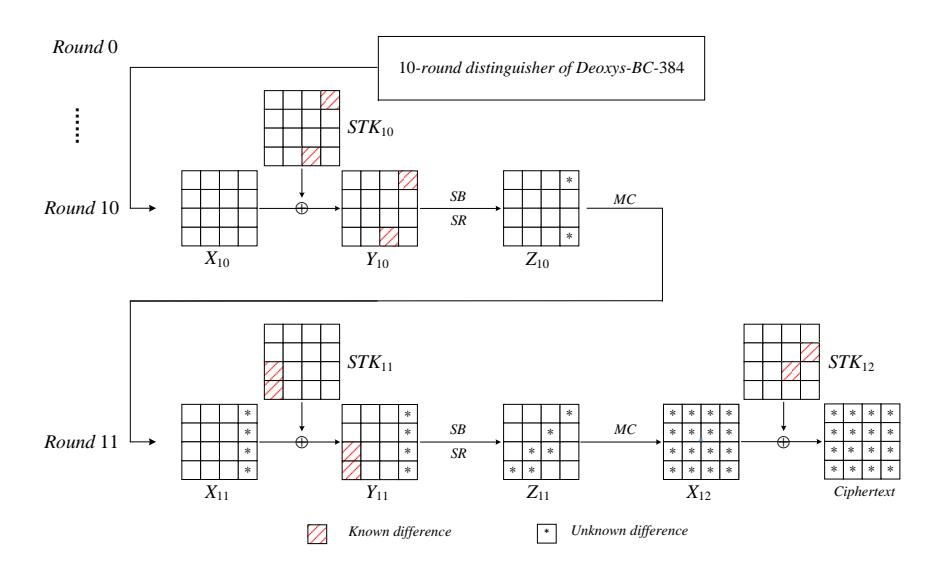

Figure 12: Key-recovery attack against 12-round Deoxys-BC-384

The attack process includes data collection phase and key recovery phase.

1. There are 6 active bytes in  $\Delta Z_{11}$  in *Round 11*, so we choose structures of ciphertexts taking all possible values of the 6 active bytes with the other bytes as constants. We apply a method similar to the one in Subsection 5.1 to collect the quartets, and get  $2^{96-80} \cdot 2^t = 2^{t+16}$  quartets  $(c, c', \bar{c}, \bar{c}')$  satisfying  $c \oplus \bar{c} \in \eta$  and  $c' \oplus \bar{c}' \in \eta$ , where

$$\eta = (00\ 00\ 00\ *\ 00\ 00\ *\ *\ 00\ *\ *\ 00\ *\ 00\ 00$$

2. For the  $2^{t+16}$  remaining quartets, we recover equivalent subtweakeys  $IK_{11}[2, 3, 12, 13, 14, 15]$  and  $IK_{10}[11, 12]$ . Firstly, we deduce the  $IK_{11}[2, 3]$  by the known difference values of  $\Delta Y_{11}[2, 3]$  and ciphertext pairs  $(c, \bar{c})$ , and then verify the obtained 16-bit subtweakey by decrypting  $(c', \bar{c}')$  to get  $\Delta Y_{11}[2, 3]$ . There are about  $2^t$  remaining quartets. Secondly, similarly to the second and third step of key recovery in Subsection 5.1, we guess the  $2^{16}$  values of  $IK_{11}[12, 13]$  and deduce the subtweakeys  $IK_{11}[14, 15]$  and  $IK_{10}[11, 12]$  for the remaining quartets. There are about  $2^{t-16}$  remaining quartets with 8 bytes of subtweakeys. We count the 64-bit corresponding subtweakey.

Complexity Computation: In the process above,  $r_f = 48$  and  $m_f = 64$ . The complexity of data collection is  $4 \cdot 2^{t+48}$  queries. The complexity of key recovery is about  $2^{t+16}$  one round encryptions, which is equivalent to about  $2^{t+16}/12 = 2^{t+12.4}$  encryptions. Because the probability of the difference  $\eta$  propagating to  $\delta$  is  $2^{-48}$  and the probability of boomerang distinguisher is  $2^{-96}$ , there are  $2^t \cdot 2^{96} \cdot 2^{-48} \cdot 2^{-96} = 2^{t-48}$  right quartets in data collection in total. Once a right quartet is obtained, the right key is counted. The expected counter of the right key is  $2^{t-48}$ , and the expected counter of the wrong key is  $2^{t-16-64} = 2^{t-80}$ . When the master key size is k = 128 and t = 48, the total complexity is  $2^{98}$  queries and  $2^{60.4} + 2^{128-32} \approx 2^{96}$  encryptions, the memory complexity is bounded by the size of the key-counter, which is  $2^{64}$ , and the success probability is 58.68%, where h = 32. When t = 49, the total complexity is  $2^{99}$  queries and  $2^{61.4} + 2^{128-32} \approx 2^{96}$  encryptions, and the success probability is 73.58%, where h = 32.

<span id="page-24-1"></span>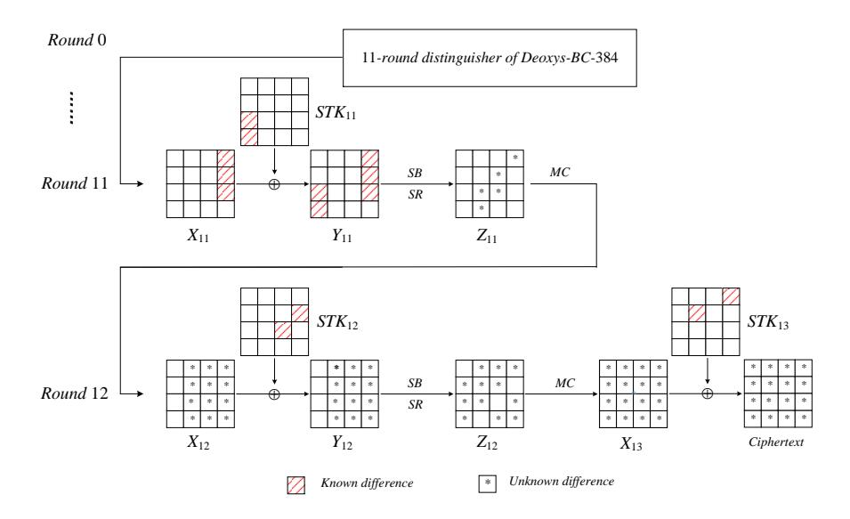

Figure 13: Key-recovery attack against 13-round Deoxys-BC-384

#### <span id="page-24-0"></span>A.2 Related-tweakey Boomerang Attack on 13-round Deoxys-BC-384

Based on the 11-round boomerang distinguisher in Table 7, we mount a 13-round keyrecovery attack by appending 2 rounds at the end of the distinguisher illustrated in Figure 13. Note that there are 12 active bytes in  $\Delta Z_{12}$  in the last round, here we redefine the difference that form  $\eta$  by

$$\eta = (00 * * * * * * * * 00 * * 00 * * 00 * *).$$

Here,  $r_f = 96$  and  $m_f = 136$ . The 13-round key recovery attack process is as follows.

#### Data Collection.

Choose structures of ciphertexts taking all the possible values of the 12 active bytes in  $\eta$ , and all of the remaining bytes are fixed to some arbitrary values. We apply a method similar to the one in Subsection 5.1 to collect the quartets satisfying  $c \oplus \bar{c} \in \eta$  and  $c' \oplus \bar{c}' \in \eta$ . Note that there are 4 zero-differences in  $\Delta Z_{12}$ , so there are about  $2^{96 \cdot 2} \times 2^{-32} = 2^{160}$  quartets for each structure. There are  $2^{160} \cdot 2^t = 2^{t+160}$  quartets remaining for  $2^t$  structures.

#### Key Recovery.

There are 12 bytes of equivalent subtweakeys of  $STK_{13}$  and 5 bytes of equivalent subtweakeys of  $STK_{12}$  involved in the partial decryption process from ciphertext to  $\Delta Y_{11}$ . Use similar process as the attack on 12-round on Deoxys-BC-384, we give a simple description of the key-recovery process. For each of the  $2^{t+160}$  remaining quartets  $(c, c', \bar{c}, \bar{c}')$ , we do the following steps.

1. We guess the subtweakey byte  $IK_{12}[12]$  and deduce the value and difference of  $Y_{12}[12]$ . There are three zero-difference bytes in the last column of  $\Delta Z_{11}$ , so the differences  $\Delta Y_{12}[13,14,15]$  are deduced utilizing the MixColumns operation. Then we get the corresponding subtweakeys  $IK_{12}[13,14,15]$  because the input and output differences of the Sboxes are known. Then partially decrypt  $(c',\bar{c}')$  to get the last column of  $\Delta Z_{11}$ . If  $\Delta Z_{11}[13,14,15] = 0$ , we keep the quartets and corresponding 32-bit subtweakey. Otherwise, we eliminate the quartets. There are about  $2^{t+144}$  remaining quartets. Then we compute  $\Delta Z_{11}[12]$ , deduce the corresponding subtweakey  $IK_{11}[12]$ 

- for pairs  $(c, \bar{c})$  and verify the subtweakey using the corresponding pair  $(c', \bar{c'})$ . There are about  $2^{t+136}$  remaining quartets with 5 bytes subtweakeys.
- 2. Similar to above step, we guess the  $2^{16}$  values of  $IK_{12}[8,9]$  and deduce the subtweakeys  $IK_{12}[10,11]$  and  $IK_{11}[2,13]$  for the remaining quartets. There are about  $2^{t+136-16} = 2^{t+120}$  remaining quartets with 11 bytes subtweakeys.
- 3. We also apply the same methods to compute the subtweakeys  $IK_{12}[6,7]$  and  $IK_{11}[3,14]$  by guessing  $IK_{12}[4,5]$  for the remaining quartets. There are about  $2^{t+104}$  remaining quartets with the corresponding 136-bit subtweakeys. We count the 136-bit corresponding subtweakey.

Complexity Computation: The complexity of data collection is  $4 \cdot 2^{t+96}$  queries. The complexity of key recovery is about  $2^{t+160+8}$  one round encryptions, which is equivalent to about  $2^{t+160} \cdot 2^8/13 = 2^{t+164.3}$  encryptions. Because the probability of the difference  $\eta$  propagating to  $\delta$  is  $2^{-96}$  and the probability of boomerang distinguisher is  $2^{-122}$ , there are  $2^t \cdot 2^{192} \cdot 2^{-96} \cdot 2^{-122} = 2^{t-26}$  right quartets in data collection in total. Once a right quartet is obtained, the right key is counting. The expected counter of the right key is  $2^{t-26}$ , and the expected counter of the wrong key is  $2^{t+104-136} = 2^{t-32}$ . The memory complexity is bounded to the size of the key-counter, which is  $2^{136}$ . When t=27 and t=70, the total complexity is  $t=2^{125}$  queries and  $t=2^{191.3} + 2^{256-70} \approx 2^{191.3}$  encryptions, the memory complexity is bounded by the size of the key-counter, which is  $t=2^{136}$ , and the success probability is about  $t=2^{126}$ .

# B Related-tweakey Boomerang Distinguishers of Deoxys-BC

<span id="page-26-0"></span>Table 3: 9-round distinguisher of Deoxys-BC-256 in [CHP+17]  $\Delta TK_0^1$ : 00 7f 00 00 00 ff 00 00 0b 00 f1 00 00 00 00 7c  $\Delta TK_0^2$ : 00 cf 00 00 00 3f 00 00 70 00 5e 00 00 00 00 be  $\nabla TK_0^1$ : 00 00 00 00 00 00 4 00 00 00 00 00 00 0

|               | $R_0$ . 00 00 0 |                            | 00 40 00 00 |             | 70 00 00  |
|---------------|-----------------|----------------------------|-------------|-------------|-----------|
| R             | $\Delta X$      | $\Delta K$                 | $\Delta Y$  | $\Delta Z$  | pr        |
|               | 00 00 7b 00     | 00 00 7b 00                | 00 00 00 00 | 00 00 00 00 |           |
|               | b0 c0 00 00     | b0 c0 00 00                | 00 00 00 00 | 00 00 00 00 |           |
| 1             | 00 00 af 00     | 00 00 af 00                | 00 00 00 00 | 00 00 00 00 | 1         |
|               | 00 00 00 c2     | 00 00 00 c2                | 00 00 00 00 | 00 00 00 00 |           |
| -             | 00 00 00 00     | e0 80 00 00<br>e0 80 00 00 | e0 80 00 00 | b4 c9 00 00 |           |
|               | 00 00 00 00     | 00 4d 00 00                | 00 4d 00 00 | 21 00 00 00 |           |
| 2             |                 |                            |             |             | $2^{-28}$ |
|               | 00 00 00 00     | 00 00 00 00                | 00 00 00 00 | 00 00 00 00 |           |
|               | 00 00 00 00     | 00 00 00 ea                | 00 00 00 ea | 73 00 00 00 |           |
|               | 63 89 00 00     | 00 89 00 00                | 63 00 00 00 | 8d 00 00 00 |           |
| 3             | 85 c9 00 00     | 85 00 00 00                | 00 c9 00 00 | 8c 00 00 00 | $2^{-14}$ |
|               | 00 c9 00 00     | 00 c9 00 00                | 00 00 00 00 | 00 00 00 00 | 2         |
|               | 00 40 00 00     | 00 40 00 00                | 00 00 00 00 | 00 00 00 00 |           |
|               | 8e 00 00 00     | 8e 00 00 00                | 00 00 00 00 | 00 00 00 00 |           |
| 4             | 8e 00 00 00     | 8e 00 00 00                | 00 00 00 00 | 00 00 00 00 | 1         |
| $\mid 4 \mid$ | 01 00 00 00     | 01 00 00 00                | 00 00 00 00 | 00 00 00 00 | 1         |
|               | 00 00 00 00     | 00 00 00 00                | 00 00 00 00 | 00 00 00 00 |           |
|               | 00 00 00 00     | 00 00 00 00                | 00 00 00    | 00 00 00    |           |
|               | 00 00 00 00     | 00 00 80 03                | 00 00       | 00 00       |           |
| 5             | 00 00 00 00     | 13 00 00 00                | 00 00 00    | 00 00 00    | 1         |
|               | 00 00 00 00     | 00 98 00 00                | 00 00 00    | 00 00 00    |           |
|               | 00 00 00        | 00 98 00 00                | 00 00 00    | 00 00 00    |           |
|               |                 |                            |             |             |           |
| 6             |                 | 00 35                      | 00          | 00          | 1         |
|               | 00 00           | 00 b4                      | 00          | 00          |           |
|               | 00 00           | 00 00                      | 00 00       | 00 00       |           |
|               |                 |                            | 00          | 00          |           |
| 5             |                 |                            | 00 00       | 00 00       | 1         |
|               |                 |                            | 00          | 00          | 1         |
|               |                 |                            | 00          | 00          |           |
|               | 00 00           | 00 00                      | 00 00 00    | 00 00 00    |           |
| C             | 32 00           | 00 00                      | 32 00 00    | 2f 00 00    | $2^{-7}$  |
| 6             | 05 00           | 05 00                      | 00 00 00    | 00 00 00    | 2 .       |
|               | 00 00           | 00 00                      | 00 00       | 00 00       |           |
|               | 00 00 00 00     | 00 00 00 00                | 00 00 00 00 | 00 00 00 00 |           |
|               | 06 00 00 00     | 06 00 00 00                | 00 00 00 00 | 00 00 00 00 |           |
| 7             | 00 00 00 00     | 00 00 00 00                | 00 00 00 00 | 00 00 00 00 | 1         |
|               | 71 00 00 00     | 71 00 00 00                | 00 00 00 00 | 00 00 00 00 |           |
|               | 00 00 00 00     | 00 00 00 00                | 00 00 00 00 | 00 00 00 00 |           |
|               | 00 00 00 00     | 00 00 00 00                | 00 00 00 00 | 00 00 00 00 |           |
| 8             | 00 00 00 00     | 00 00 00 00                | 00 00 00 00 | 00 00 00 00 | 1         |
|               |                 |                            |             |             |           |
|               | 00 00 00 00     | 00 00 00 00                | 00 00 00 00 | 00 00 00 00 |           |
|               | 00 00 00 00     | 00 00 00 00                | 00 00 00 00 | 00 00 00 00 |           |
| 9             | 00 00 00 00     | 00 e3 00 00                | 00 e3 00 00 | 72 00 00 00 | $2^{-12}$ |
| 9             | 00 00 00 00     | 00 00 00 00                | 00 00 00 00 | 00 00 00 00 |           |
|               | 00 00 00 00     | 00 0c 00 00                | 00 0c 00 00 | 00 00 9d 00 |           |

<span id="page-27-0"></span>Table 4: 9-round distinguisher of Deoxys-BC-256. The probabilities marked with  $\dagger$  are only counted once

 $\begin{array}{cccccccccccccccccccccccccccccccccccc$ 

|          | 0                                   |             |             |                 |            |
|----------|-------------------------------------|-------------|-------------|-----------------|------------|
| R        | $\Delta X$                          | $\Delta K$  | $\Delta Y$  | $\Delta Z$      | pr         |
|          | 00 00 7b 00                         | 00 00 7b 00 | 00 00 00 00 | 00 00 00 00     |            |
| 1        | b0 c0 00 00                         | b0 c0 00 00 | 00 00 00 00 | 00 00 00 00     | 1          |
| 1        | 00 00 af 00                         | 00 00 af 00 | 00 00 00 00 | 00 00 00 00     | 1          |
|          | 00 00 00 c2                         | 00 00 00 c2 | 00 00 00 00 | 00 00 00 00     |            |
|          | 00 00 00 00                         | e0 80 00 00 | e0 80 00 00 | b4 c9 00 00     |            |
|          | 00 00 00 00                         | 00 4d 00 00 | 00 4d 00 00 | 21 00 00 00     | 20         |
| 2        | 00 00 00 00                         | 00 00 00 00 | 00 00 00 00 | 00 00 00 00     | $2^{-28}$  |
|          | 00 00 00 00                         | 00 00 00 ea | 00 00 00 ea | 73 00 00 00     |            |
|          | 63 89 00 00                         | 00 89 00 00 | 63 00 00 00 | 8d 00 00 00     |            |
|          | 85 c9 00 00                         | 85 00 00 00 | 00 c9 00 00 | 8c 00 00 00     |            |
| 3        |                                     |             | 00 00 00 00 | 00 00 00 00     | $2^{-14}$  |
|          | 00 c9 00 00                         | 00 c9 00 00 |             |                 |            |
|          | 00 40 00 00                         | 00 40 00 00 | 00 00 00 00 | 00 00 00 00     |            |
|          | 8e 00 00 00                         | 8e 00 00 00 | 00 00 00 00 | 00 00 00 00     |            |
| $ $ $_4$ | 8e 00 00 00                         | 8e 00 00 00 | 00 00 00 00 | 00 00 00 00     | 1          |
| -        | 01 00 00 00                         | 01 00 00 00 | 00 00 00 00 | 00 00 00 00     | -          |
|          | 00 00 00 00                         | 00 00 00 00 | 00 00 00 00 | 00 00 00 00     |            |
|          | 00 00 00 00                         | 00 00 00 00 | 00 00 00    | 00 00 00        |            |
| 5        | 00 00 00 00                         | 00 00 80 03 | 00 00 80    | 00 <b>ae</b> 00 | 2-6 †      |
| 0        | 00 00 00 00                         | 13 00 00 00 | 00 00 00    | 00 00 00        | Z ·        |
|          | 00 00 00 00                         | 00 98 00 00 | 00 00 00    | 00 00 00        |            |
|          | 00 00                               | 00 07       | 00          | 00              |            |
|          | 00 00                               | 00 35       | 00 47       | 00              | 4          |
| 6        | 00 00                               | 00 b4       | 00          | 00              | 1          |
|          | 00 00                               | 00 00       | 00 00       | 00 00           |            |
| $\vdash$ |                                     |             | 00          | 00              |            |
|          |                                     |             | 00 00       | 00 00           |            |
| 5        |                                     |             | 00          | 00              | 1          |
|          |                                     |             | 00          | 00              |            |
| _        | 00 00                               | 00 00       | 00 00 00    | 00 00 00        |            |
|          | 47 00                               | 00 00       | 47 00 00    | 32 00 00        | _ ,        |
| 6        | a1 00                               | a1 00       | 00 00 00    | 00 00 00        | $2^{-7}$ † |
|          | 00 00                               | 00 00       | 00 00       | 00 00           |            |
|          | 56 00 00 00                         | 56 00 00 00 | 00 00 00 00 | 00 00 00 00     |            |
|          | c1 00 00 00                         | c1 00 00 00 | 00 00 00 00 | 00 00 00 00     |            |
| 7        | 00 00 00 00                         | 00 00 00 00 | 00 00 00 00 | 00 00 00 00     | 1          |
|          | 00 00 00 00                         | 00 00 00 00 | 00 00 00 00 | 00 00 00 00     |            |
|          |                                     |             |             |                 |            |
|          | 00 00 00 00 00 00 00 00 00 00 00 00 | 00 00 00 00 | 00 00 00 00 | 00 00 00 00     |            |
| 8        |                                     | 00 00 00 00 | 00 00 00 00 | 00 00 00 00     | 1          |
|          | 00 00 00 00                         | 00 00 00 00 | 00 00 00 00 | 00 00 00 00     |            |
|          | 00 00 00 00                         | 00 00 00 00 | 00 00 00 00 | 00 00 00 00     |            |
|          | 00 00 00 00                         | 00 00 00 00 | 00 00 00 00 | 00 00 00 00     |            |
| 9        | 00 00 00 00                         | 00 00 00 00 | 00 00 00 00 | 00 00 00 00     | $2^{-12}$  |
|          | 00 00 00 00                         | 00 00 00 ac | 00 00 00 ac | 00 f2 00 00     | _          |
|          | 00 00 00 00                         | 00 83 00 00 | 00 83 00 00 | 00 00 8f 00     |            |

<span id="page-28-0"></span>Table 5: Another 2-round boomerang switch for Deoxys-BC-256. The probabilities marked with † are only counted once

| R | ∆X          | ∆K          | ∆Y          | ∆Z          | pr   |
|---|-------------|-------------|-------------|-------------|------|
|   | 00 00 00 00 | 00 00 00 00 | 00 00<br>00 | 00 00<br>00 | −7 † |
|   | 00 00 00 00 | 00 00 80 03 | 00 00 80    | 00 96<br>00 |      |
| 5 | 00 00 00 00 | 13 00 00 00 | 00 00 00    | 00 00<br>00 | 2    |
|   | 00 00 00 00 | 00 98 00 00 | 00<br>00 00 | 00 00<br>00 |      |
|   | 00<br>00    | 00<br>07    | 00          | 00          |      |
|   | 00<br>00    | 00<br>35    | 00 37       | 00          |      |
| 6 | 00<br>00    | 00<br>b4    | 00          | 00          | 1    |
|   | 00<br>00    | 00<br>00    | 00<br>00    | 00 00       |      |
|   |             |             | 00          | 00          |      |
|   |             |             | 00 00       | 96 00       |      |
| 5 |             |             | 00          | 00          | 1    |
|   |             |             | 00          | 00          |      |
|   | 00 00       | 00 00       | 00 00 00    | 00 00 00    |      |
| 6 | 47 00       | 00 00       | 37 00 00    | 32 00 00    | −7 † |
|   | a1 00       | a1 00       | 00 00 00    | 00 00<br>00 | 2    |
|   | 00 00       | 00 00       | 00 00       | 00 00       |      |

<span id="page-29-0"></span>Table 6: 11-round distinguisher of Deoxys-BC-384 in [CHP+17]  $\Delta T K_0^1 : 00 \text{ 8b } 00 \text{ 00} \quad \text{c4 } 00 \text{ 00 } 00 \quad \text{7a } 00 \text{ c5 a6} \quad \text{00 } 00 \text{ 00 } 00 \quad \text{00} \\ \Delta T K_0^2 : 00 \text{ ad } 00 \text{ 00} \quad \text{c4 } 00 \text{ 00 } 00 \quad \text{73 } 00 \text{ 21 d8} \quad \text{00 } 00 \text{ 00 } 00 \quad \text{00} \\ \Delta T K_0^3 : 00 \text{ a3 } 00 \text{ 00} \quad \text{9a } 00 \text{ 00 } 00 \quad \text{3b } 00 \text{ 0d } 2e \quad \text{00 } 00 \text{ 00 } 00 \quad \text{00} \\ \nabla T K_0^1 : 00 \text{ 00 } 02 \text{ 00 } 00 \text{ 00 } 00 \quad \text{00 } 00 \quad \text{00 } 00 \quad \text{00 } 00 \quad \text{00} \quad \text{00} \\ \nabla T K_0^2 : 00 \text{ 00 } 99 \text{ 00 } 00 \text{ 00 } 00 \quad \text{00 } 00 \quad \text{00 } 00 \quad \text{00 } 00 \quad \text{00 } 00 \quad \text{00} \quad \text{00} \quad \text{00} \quad \text{00} \quad \text{00} \quad \text{00} \quad \text{00} \quad \text{00} \quad \text{00} \quad \text{00} \quad \text{00} \quad \text{00} \quad \text{00} \quad \text{00} \quad \text{00} \quad \text{00} \quad \text{00} \quad \text{00} \quad \text{00} \quad \text{00} \quad \text{00} \quad \text{00} \quad \text{00} \quad \text{00} \quad \text{00} \quad \text{00} \quad \text{00} \quad \text{00} \quad \text{00} \quad \text{00} \quad \text{00} \quad \text{00} \quad \text{00} \quad \text{00} \quad \text{00} \quad \text{00} \quad \text{00} \quad \text{00} \quad \text{00} \quad \text{00} \quad \text{00} \quad \text{00} \quad \text{00} \quad \text{00} \quad \text{00} \quad \text{00} \quad \text{00} \quad \text{00} \quad \text{00} \quad \text{00} \quad \text{00} \quad \text{00} \quad \text{00} \quad \text{00} \quad \text{00} \quad \text{00} \quad \text{00} \quad \text{00} \quad \text{00} \quad \text{00} \quad \text{00} \quad \text{00} \quad \text{00} \quad \text{00} \quad \text{00} \quad \text{00} \quad \text{00} \quad \text{00} \quad \text{00} \quad \text{00} \quad \text{00} \quad \text{00} \quad \text{00} \quad \text{00} \quad \text{00} \quad \text{00} \quad \text{00} \quad \text{00} \quad \text{00} \quad \text{00} \quad \text{00} \quad \text{00} \quad \text{00} \quad \text{00} \quad \text{00} \quad \text{00} \quad \text{00} \quad \text{00} \quad \text{00} \quad \text{00} \quad \text{00} \quad \text{00} \quad \text{00} \quad \text{00} \quad \text{00} \quad \text{00} \quad \text{00} \quad \text{00} \quad \text{00} \quad \text{00} \quad \text{00} \quad \text{00} \quad \text{00} \quad \text{00} \quad \text{00} \quad \text{00} \quad \text{00} \quad \text{00} \quad \text{00} \quad \text{00} \quad \text{00} \quad \text{00} \quad \text{00} \quad \text{00} \quad \text{00} \quad \text{00} \quad \text{00} \quad \text{00} \quad \text{00} \quad \text{00} \quad \text{00} \quad \text{00} \quad \text{00} \quad \text{00} \quad \text{00} \quad \text{00} \quad \text{00} \quad \text{00} \quad \text{00} \quad \text{00} \quad \text{00} \quad \text{00} \quad \text{00} \quad \text{00} \quad \text{00} \quad \text{00} \quad \text{00} \quad \text{00} \quad \text{00} \quad \text{00} \quad \text{00} \quad \text{00} \quad \text{00} \quad \text{00} \quad \text{00} \quad \text{00} \quad \text{00} \quad \text{00} \quad \text{00} \quad \text{00} \quad \text{00} \quad \text{00} \quad \text{00} \quad \text{00} \quad \text{00} \quad \text{00} \quad \text{00} \quad \text{00} \quad \text{00} \quad \text{00} \quad \text{00} \quad \text{00} \quad \text{00} \quad \text{00} \quad \text{00} \quad \text{00} \quad \text{00} \quad \text{00} \quad \text{00} \quad \text{00} \quad \text{00} \quad \text{00} \quad \text{00} \quad \text{00} \quad \text{00} \quad \text{00} \quad \text{00} \quad \text{00} \quad \text{00} \quad \text{00} \quad \text{00} \quad$ 

|          | $m_0$ . 00 00 0  |             | 0 00 11 00 0 |             | 0 00      |
|----------|------------------|-------------|--------------|-------------|-----------|
| R        | $\Delta X$       | $\Delta K$  | $\Delta Y$   | $\Delta Z$  | pr        |
|          | 00 9a 32 00      | 00 9a 32 00 | 00 00 00 00  | 00 00 00 00 |           |
| _        | 85 00 00 00      | 85 00 00 00 | 00 00 00 00  | 00 00 00 00 | _         |
| 1        | 00 00 e9 00      | 00 00 e9 00 | 00 00 00 00  | 00 00 00 00 | 1         |
|          | 00 00 50 00      | 00 00 50 00 | 00 00 00 00  | 00 00 00 00 |           |
| _        | 00 00 00 00      | 00 00 00 00 | 00 00 00 00  | 00 00 00 00 |           |
|          | 00 00 00 00      |             | 00 00 00 00  | 00 00 00 00 |           |
| 2        |                  | 00 00 00 00 |              |             | 1         |
|          | 00 00 00 00      | 00 00 00 00 | 00 00 00 00  | 00 00 00 00 |           |
|          | 00 00 00 00      | 00 00 00 00 | 00 00 00 00  | 00 00 00 00 |           |
|          | 00 00 00 00      | 00 00 00 00 | 00 00 00 00  | 00 00 00 00 |           |
| 3        | 00 00 00 00      | 00 00 00 4f | 00 00 00 4f  | 00 00 2a 00 | $2^{-28}$ |
| '        | 00 00 00 00      | f1 7a 00 00 | f1 7a 00 00  | 00 00 15 a6 | _         |
|          | 00 00 00 00      | 00 57 00 00 | 00 57 00 00  | 00 00 6b 00 |           |
|          | 00 00 00 a6      | 00 00 00 a6 | 00 00 00 00  | 00 00 00 00 |           |
| ١.       | 00 00 00 f1      | 00 00 00 f1 | 00 00 00 00  | 00 00 00 00 | - 19      |
| 4        | 00 00 bd 57      | 00 00 00 57 | 00 00 bd 00  | 19 00 00 00 | $2^{-13}$ |
|          | 00 00 e9 a6      | 00 00 e9 00 | 00 00 00 a6  | 2b 00 00 00 |           |
|          | 32 00 00 00      | 32 00 00 00 | 00 00 00 00  | 00 00 00 00 |           |
|          | 00 00 00 00      | 00 00 00 00 | 00 00 00 00  | 00 00 00 00 |           |
| 5        |                  |             |              |             | 1         |
|          | 4f 00 00 00      | 4f 00 00 00 | 00 00 00 00  | 00 00 00 00 |           |
|          | 4f 00 00 00      | 4f 00 00 00 | 00 00 00 00  | 00 00 00 00 |           |
|          | 00 00 00 00      | 00 00 85 00 | 00 00 00     | 00 00 00    |           |
| 6        | 00 00 00 00      | 00 00 00 b9 | 00 00 00     | 00 00 00    | 1         |
|          | 00 00 00 00      | 00 00 00 00 | 00 00 00     | 00 00 00    | 1         |
|          | 00 00 00 00      | 9a 34 00 00 | 00 00        | 00 00       |           |
|          | 00 00            | 00 08       | 00           | 00          |           |
| _        | 00 00            | 00 00       | 00 00        | 00 00       |           |
| 7        | 00 00            | 00 09       | 00           | 00          | 1         |
|          | 00 00            | 00 1b       | 00           | 00          |           |
| _        |                  |             | 00           | cb 00       |           |
|          |                  |             | 00           | ff 00       |           |
| 6        |                  |             |              |             | 1         |
|          |                  |             | 00           | 1a 00       |           |
|          | - 1              | - 1         | 00 00        | 00 00       |           |
|          | 8d 00            | 8d 00       | 00 00 00     | 00 00 00    |           |
| 7        | 00 00            | 00 00       | 00 00        | 00 00       | $2^{-7}$  |
| '        | 00 00            | 00 00       | 00 00 00     | 00 00 00    | -         |
|          | a3 00            | 00 00       | a3 00 00     | 00 b5 00    |           |
|          | 00 00 00 00      | 00 00 00 00 | 00 00 00 00  | 00 00 00 00 |           |
|          | $00\ 00\ c4\ 00$ | 00 00 c4 00 | 00 00 00 00  | 00 00 00 00 | ,         |
| 8        | 00 00 00 00      | 00 00 00 00 | 00 00 00 00  | 00 00 00 00 | 1         |
|          | 00 00 05 00      | 00 00 05 00 | 00 00 00 00  | 00 00 00 00 |           |
|          | 00 00 00 00      | 00 00 00 00 | 00 00 00 00  | 00 00 00 00 |           |
|          | 00 00 00 00      | 00 00 00 00 | 00 00 00 00  | 00 00 00 00 |           |
| 9        | 00 00 00 00      | 00 00 00 00 | 00 00 00 00  | 00 00 00 00 | 1         |
|          | 00 00 00 00      | 00 00 00 00 | 00 00 00 00  | 00 00 00 00 |           |
| <u> </u> |                  |             |              |             |           |
|          | 00 00 00 00      | 00 00 00 00 | 00 00 00 00  | 00 00 00 00 |           |
| 10       | 00 00 00 00      | 00 00 00 00 | 00 00 00 00  | 00 00 00 00 | 1         |
|          | 00 00 00 00      | 00 00 00 00 | 00 00 00 00  | 00 00 00 00 |           |
|          | 00 00 00 00      | 00 00 00 00 | 00 00 00 00  | 00 00 00 00 |           |
|          | 00 00 00 00      | 00 00 00 05 | 00 00 00 05  | 00 00 00 08 |           |
| 11       | 00 00 00 00      | 00 00 00 00 | 00 00 00 00  | 00 00 00 00 | $2^{-12}$ |
| 111      | 00 00 00 00      | 00 c4 00 00 | 00 c4 00 00  | 00 00 00 7f |           |
|          | 00 00 00 00      | 00 00 00 00 | 00 00 00 00  | 00 00 00 00 |           |
|          |                  |             |              |             |           |

<span id="page-30-0"></span>Table 7: 11-round distinguisher of Deoxys-BC-384  $\Delta TK_0^1: 00\ 8b\ 00\ 00\ c4\ 00\ 00\ 00\ 7a\ 00\ c5\ a6\ 00\ 00\ 00\ 00$   $\Delta TK_0^2: 00\ ad\ 00\ 00\ c4\ 00\ 00\ 00\ 73\ 00\ 21\ d8\ 00\ 00\ 00\ 00$   $\Delta TK_0^3: 00\ a3\ 00\ 00\ 9a\ 00\ 00\ 00\ 3b\ 00\ 0d\ 2e\ 00\ 00\ 00\ 00$   $\nabla TK_0^1: 00\ 00\ 8f\ 00\ 00\ 43\ 00\ 00\ 00\ 00\ 00\ 00\ 00\ 00\ 00\ 0$ 

| R        | $\Delta X$                 | $\Delta K$                 | $\Delta Y$       | $\Delta Z$  | pr        |
|----------|----------------------------|----------------------------|------------------|-------------|-----------|
|          | 00 9a 32 00                | 00 9a 32 00                | 00 00 00 00      | 00 00 00 00 |           |
| ١,       | 85 00 00 00                | 85 00 00 00                | 00 00 00 00      | 00 00 00 00 | ,         |
| 1        | 00 00 e9 00                | 00 00 e9 00                | 00 00 00 00      | 00 00 00 00 | 1         |
|          | 00 00 50 00                | 00 00 50 00                | 00 00 00 00      | 00 00 00 00 |           |
| -        | 00 00 00 00                | 00 00 00 00                | 00 00 00 00      | 00 00 00 00 |           |
|          | 00 00 00 00                | 00 00 00 00                | 00 00 00 00      | 00 00 00 00 |           |
| 2        |                            |                            |                  |             | 1         |
|          | 00 00 00 00                | 00 00 00 00                | 00 00 00 00      | 00 00 00 00 |           |
|          | 00 00 00 00                | 00 00 00 00                | 00 00 00 00      | 00 00 00 00 |           |
|          | 00 00 00 00                | 00 00 00 00                | 00 00 00 00      | 00 00 00 00 |           |
| 3        | 00 00 00 00                | 00 00 00 4f                | 00 00 00 4f      | 00 00 2a 00 | $2^{-28}$ |
| "        | 00 00 00 00                | f1 7a 00 00                | f1 7a 00 00      | 00 00 15 a6 | 2         |
|          | 00 00 00 00                | 00 57 00 00                | 00 57 00 00      | 00 00 6b 00 |           |
|          | 00 00 00 a6                | 00 00 00 a6                | 00 00 00 00      | 00 00 00 00 |           |
| ١.       | 00 00 00 f1                | 00 00 00 f1                | 00 00 00 00      | 00 00 00 00 | - 19      |
| 4        | 00 00 bd 57                | 00 00 00 57                | 00 00 bd 00      | 19 00 00 00 | $2^{-13}$ |
|          | 00 00 e9 a6                | 00 00 e9 00                | 00 00 00 a6      | 2b 00 00 00 |           |
| -        | 32 00 00 00                | 32 00 00 00                | 00 00 00 00      | 00 00 00 00 |           |
|          |                            |                            |                  |             |           |
| 5        | 00 00 00 00                | 00 00 00 00                | 00 00 00 00      | 00 00 00 00 | 1         |
|          | 4f 00 00 00                | 4f 00 00 00                | 00 00 00 00      | 00 00 00 00 |           |
|          | 4f 00 00 00                | 4f 00 00 00                | 00 00 00 00      | 00 00 00 00 |           |
|          | 00 00 00 00                | 00 00 85 00                | 00 00 00         | 00 00 00    |           |
| 6        | 00 00 00 00                | 00 00 00 b9                | 00 00 00         | 00 00 00    | 1         |
| 0        | 00 00 00 00                | 00 00 00 00                | 00 00 00         | 00 00 00    | 1         |
|          | 00 00 00 00                | 9a 34 00 00                | 00 00            | 00 00       |           |
|          | 00 00                      | 00 08                      | 00               | 00          |           |
|          | 00 00                      | 00 00                      | 00 00            | 00 00       |           |
| 7        | 00 00                      | 00 09                      | 00               | 00          | 1         |
|          | 00 00                      | 00 1b                      | 00               | 00          |           |
|          | 00 00                      | 00 10                      |                  |             |           |
|          |                            |                            | 00               | cf 00       |           |
| 6        |                            |                            | 00               | 96 00       | 1         |
|          |                            |                            | 00               | a1 00       | 1         |
|          |                            |                            | 00 00            | 00 00       |           |
|          | 85 00                      | 85 00                      | 00 00 00         | 00 00 00    |           |
| _        | 00 00                      | 00 00                      | 00 00            | 00 00       | 0-7       |
| 7        | 00 00                      | 00 00                      | 00 00 00         | 00 00 00    | $2^{-7}$  |
|          | $7d \ 00$                  | 00 00                      | $7d\ 00\ 00$     | 00 94 00    |           |
|          | 00 00 00 00                | 00 00 00 00                | 00 00 00 00      | 00 00 00 00 |           |
|          | 00 00 00 00                | 00 00 00 00                | 00 00 00 00      | 00 00 00 00 |           |
| 8        | 00 00 00 00<br>00 00 a7 00 | 00 00 00 00<br>00 00 a7 00 | 00 00 00 00      | 00 00 00 00 | 1         |
|          |                            |                            | 00 00 00 00      |             |           |
| <u> </u> | 00 00 d8 00                | 00 00 d8 00                |                  | 00 00 00 00 |           |
|          | 00 00 00 00                | 00 00 00 00                | 00 00 00 00      | 00 00 00 00 |           |
| 9        | 00 00 00 00                | 00 00 00 00                | 00 00 00 00      | 00 00 00 00 | 1         |
| "        | 00 00 00 00                | 00 00 00 00                | 00 00 00 00      | 00 00 00 00 | -         |
|          | 00 00 00 00                | 00 00 00 00                | 00 00 00 00      | 00 00 00 00 |           |
|          | 00 00 00 00                | 00 00 00 00                | 00 00 00 00      | 00 00 00 00 |           |
| 10       | 00 00 00 00                | 00 00 00 00                | 00 00 00 00      | 00 00 00 00 | 1         |
| 10       | 00 00 00 00                | 00 00 00 00                | 00 00 00 00      | 00 00 00 00 | 1         |
|          | 00 00 00 00                | 00 00 00 00                | 00 00 00 00      | 00 00 00 00 |           |
|          | 00 00 00 00                | 00 00 00 d8                | 00 00 00 d8      | 00 00 00 2a |           |
|          | 00 00 00 00                | 00 00 00 00                | 00 00 00 00      | 00 00 00 24 |           |
| 11       | 00 00 00 00                |                            |                  |             | $2^{-13}$ |
|          |                            | 00 00 00 00                | 00 00 00 00      | 00 00 00 00 |           |
|          | 00 00 00 00                | $00\ 00\ a7\ 00$           | $00\ 00\ a7\ 00$ | 00 00 00 3f |           |