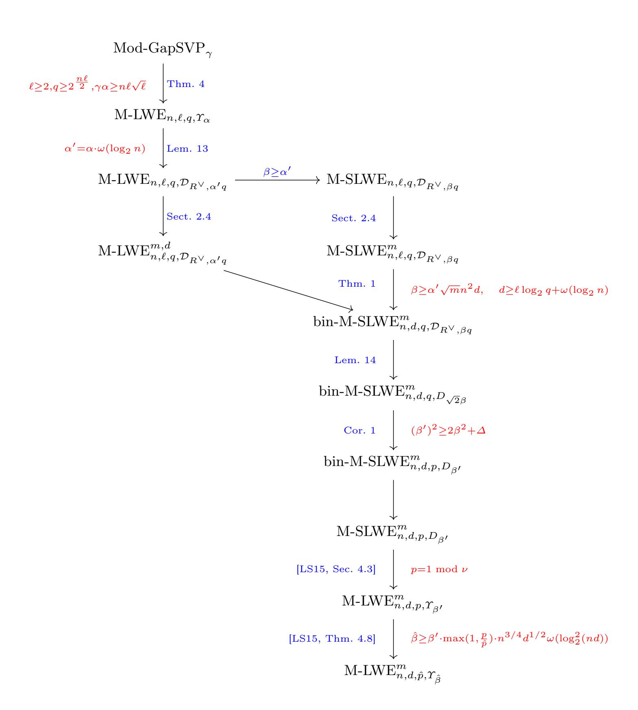

{0}------------------------------------------------

# Towards Classical Hardness of Module-LWE: The Linear Rank Case

Katharina Boudgoust, Corentin Jeudy, Adeline Roux-Langlois, and Weiqiang Wen

katharina.boudgoust@irisa.fr, corentin.jeudy@irisa.fr, adeline.roux-langlois@irisa.fr, weiqiang.wen@inria.fr

Univ Rennes, CNRS, IRISA

Abstract. We prove that the module learning with errors (M-LWE) problem with arbitrary polynomial-sized modulus p is classically at least as hard as standard worst-case lattice problems, as long as the module rank d is not smaller than the number field degree n. Previous publications only showed the hardness under quantum reductions. We achieve this result in an analogous manner as in the case of the learning with errors (LWE) problem. First, we show the classical hardness of M-LWE with an exponential-sized modulus. In a second step, we prove the hardness of M-LWE using a binary secret. And finally, we provide a modulus reduction technique. The complete result applies to the class of power-of-two cyclotomic fields. However, several tools hold for more general classes of number fields and may be of independent interest.

**Keywords:** Lattice-based cryptography · module learning with errors · classical hardness · binary secret.

### 1 Introduction

The learning with errors (LWE) problem, introduced by Regev [Reg05], is used as a core computational problem in lattice-based cryptography. Given positive integers n (the dimension) and q (the modulus), and a secret vector  $\mathbf{s} \in \mathbb{Z}_q^n$ , an LWE $n,q,\psi$  sample is defined as  $(\mathbf{a},b=\frac{1}{q}\langle\mathbf{a},\mathbf{s}\rangle+e)$ , where  $\mathbf{a}$  is sampled from the uniform distribution on  $\mathbb{Z}_q^n$  and e (the error), is sampled from a probability distribution  $\psi$  on the torus  $\mathbb{T}=\mathbb{R}/\mathbb{Z}$ . In many cases, the error distribution is given by a Gaussian distribution  $D_\alpha$  of width  $\alpha$ , for a positive real  $\alpha$ . The search version of LWE asks to recover the secret  $\mathbf{s}$ , given arbitrarily many samples of the LWE distribution. Its decision variant asks to distinguish between LWE samples and samples drawn from the uniform distribution on  $\mathbb{Z}_q^n \times \mathbb{T}$ .

The LWE problem is fundamental in lattice-based cryptography as it allows to construct a wide range of cryptographic primitives, from the basic ones, as public-key encryption (e.g. [Reg05,MP12]), to the most advanced ones, as fully

©IACR 2020. This article is a minor revision of the version published by Springer-Verlag available at https://doi.org/10.1007/978-3-030-64834-3\_10.

{1}------------------------------------------------

homomorphic encryption (e.g. |BGV12,BV14,DM15|) or non-interactive zeroknowledge proof systems (e.g. [PS19]). A very appealing aspect of LWE is its connection to well-studied lattice problems. Lattices are discrete additive subgroups of  $\mathbb{R}^n$  and arise in many different areas of mathematics, such as number theory, geometry and group theory. There are several lattice problems that are conjectured to be computationally hard to solve, for instance, the problem of finding a set of shortest independent vectors (SIVP) or the decisional variant of finding a shortest vector (GapSVP). A standard relaxation of those two problems consists in solving them only up to a factor  $\gamma$ , denoted by SIVP $_{\gamma}$  and GapSVP $_{\gamma}$ , respectively. In the seminal work of Regev [Reg05,Reg09], a worst-case to averagecase quantum reduction from  $\operatorname{GapSVP}_{\gamma}$  or  $\operatorname{SIVP}_{\gamma}$  to LWE was established. In other words, if there exists an efficient algorithm that solves LWE, then there also exists an efficient quantum algorithm that solves  $GapSVP_{\gamma}$  and  $SIVP_{\gamma}$  in the worst-case. Later, Peikert [Pei09] showed a classical reduction from GapSVP $_{\gamma}$ to LWE, but requiring the resulting modulus q to be exponentially large in the dimension n. With the help of a modulus reduction, Brakerski et al.  $[BLP^+13]$ proved the hardness of LWE via a classical reduction from  $GapSVP_{\gamma}$ , for any polynomial-sized modulus q.

Structured variants. Cryptographic protocols, whose security proofs rely on the hardness of LWE, inherently suffer from large public keys, usually consisting of m elements of  $\mathbb{Z}_q^n$ , where  $m \in O(n \log_2 n)$ . To improve their efficiency, structured variants of LWE have been proposed, e.g., [SSTX09,LPR10,LS15]. Within this paper, we focus on the module learning with errors (M-LWE) problem, first defined by Brakerski et al. [BGV12] and thoroughly studied by Langlois and Stehlé [LS15]. Instead of working over integers, it uses a more algebraic setting. Let K be a number field of degree n and n its ring of integers with dual n0. Further, let n1 and n2 be positive integers. Let n3 be a distribution on the torus n4 n5 Further, let n6 and n6 be positive integers. Let n9 be a secret vector. An M-LWEn9, where n9 sample is given by (n9, n9 and let n9, where n9 width n9 and n9 width n9 and n9 of width n9. We refer to the special case of n9 as the ring learning with errors (R-LWE) problem.

Similar to its unstructured counterpart, M-LWE also enjoys worst-case to average-case connections from lattice problems such as SIVP $_{\gamma}$  [LS15]. Whereas the hardness results for LWE start from the lattice problem in the class of general lattices, the set has to be restricted to module lattices in the case of M-LWE. These module lattices correspond to modules in the ring R and we refer to the related lattice problem as Mod-SIVP $_{\gamma}$  and Mod-GapSVP $_{\gamma}$ , respectively. Whereas both problems are conjectured to be hard to solve for  $\gamma$  polynomial in the lattice dimension, the problem Mod-GapSVP $_{\gamma}$  becomes easy in the special case of module lattices of rank 1 as their minimum can also be bounded below [PR07].

Since its introduction, the M-LWE problem has enjoyed more and more popularity as it offers a fine-grained trade-off between concrete security and efficiency. Within the NIST standardization process1, several third round candidates rely

https://csrc.nist.gov/Projects/Post-Quantum-Cryptography

{2}------------------------------------------------

on the hardness of M-LWE, e.g., the signature scheme Dilithium [DKL+18] and the key encapsulation mechanism Kyber [BDK+18] from the CRYSTALS suite.

Binary secret. Several variants of LWE have been introduced during the last 15 years. One very interesting and widely-used version is the binary secret learning with errors (bin-LWE) problem, where the secret vector s is chosen from  $\{0,1\}^n$ . Besides gaining in efficiency, this variant also plays an important role in some applications like fully homomorphic encryption schemes, e.g., [DM15]. A first study of this problem was provided by Goldwasser et al. [GKPV10] in the context of leakage-resilient cryptography. Whereas their proof structure has the advantage of being easy to follow, their result suffers from a large error increase. Informally, they showed a reduction from  $LWE_{\ell,q,D_{\alpha}}$  to bin- $LWE_{n,q,D_{\beta}}$ , where  $\frac{\alpha}{\beta} = negl(n)$ and  $n \ge \ell \log_2 q + \omega(\log_2 n)$ . Later, Brakerski et al. [BLP+13] improved the state of the art in order to show the classical hardness of LWE with a polynomial-sized modulus. Micciancio [Mic18] published another reduction from LWE to its binary version. Whereas the two reduction techniques differ, both paper achieved similar results. The dimension is still increased roughly by a factor  $\log_2 q$ , but the error only by a factor of  $\sqrt{n}$ , where n is the resulting LWE dimension. More concretely, in [BLP+13] a reduction from LWE $\ell,q,D_{\alpha}$  to bin-LWE $n,q,D_{\beta}$  is shown, where  $\frac{\alpha}{\beta} \leq \frac{1}{\sqrt{10n}}$  and  $n \geq (\ell+1)\log_2 q + \omega(\log_2 n)$ . The increase in dimension from  $\ell$  to roughly  $\ell \log_2 q$  is reasonable, as it essentially preserves the number of possible secrets. As stated by Micciancio [Mic18], an important open problem is whether similar results carry over to the structured variants, in particular to M-LWE, which seems to be an interesting problem to use in practice.

Our contributions. Our first main contribution is a reduction from M-LWE to its binary secret version, bin-M-LWE, if the module rank d is at least of size  $\log_2 q + \omega(\log_2 n)$ , where n denotes the degree of the underlying number field and q the modulus. To the best of our knowledge, this is the first result on the hardness of a structured variant of LWE with binary secret. We then use this new result to show our second main contribution, the classical hardness of M-LWE for any polynomial-sized modulus p and module rank d at least  $2n + \omega(\log_2 n)$ , assuming the hardness of Mod-GapSVP $_{\gamma}$  with module rank at least 2. This was stated as an open problem by Langlois and Stehlé [LS15], as only quantum hardness of M-LWE for any polynomial-sized modulus p was known.

**Technical overview.** At a high level, we follow the structure of the classical hardness proof of LWE from Brakerski et al. [BLP+13]. Overall, we need three ingredients: First, the classical hardness of M-LWE with an exponential-sized modulus. As a second component, we need the hardness of M-LWE using a binary secret, and finally, a modulus reduction technique.

We begin with the hardness of bin-M-LWE in Section 3. We follow the original proof structure of Goldwasser et al. [GKPV10], while achieving much better parameters by using the Rényi divergence instead of the statistical distance. The improvement on the noise rate compared to [GKPV10] stems from the fact that the Rényi divergence only needs to be constant for the reduction to work, compared to negligibly close to 0 for the statistical distance. Using the Rényi divergence as a tool for distance measurement requires to move to the

{3}------------------------------------------------

#### K. Boudgoust et al.

4

search variants of M-LWE and its binary version, respectively. Additionally, it asks to fix the number of samples m a priori, which we denote by a suffix m, i.e., M-LWE $_{n,d,q,\psi}^m$ . Throughout the paper, we assume that m is polynomial in the security parameter. At the core of the hardness proof of bin-M-LWE lies a lossy argument, where the public matrix  $\mathbf{A}$  is replaced by a lossy matrix  $\mathbf{B} \cdot \mathbf{C} + \mathbf{Z}$ , which corresponds to the second part of some multiple-secrets M-LWE sample. To argue that an adversary cannot distinguish between the two cases, we need the hardness of the decisional M-LWE problem as well. However, prior to our work, the hardness of decisional M-LWE was only proven for polynomial-sized modulus, see [LS15]. For our purpose, we need the hardness of decisional M-LWE with an exponential-sized modulus. We solve this problem by adapting the main result of Peikert et al. [PRS17] to the module setting (Lemma 12).

This leads us to the first ingredient, the classical hardness of M-LWE with an exponential-sized modulus. In their introduction, Langlois and Stehlé [LS15] claimed that Peikert's dequantization [Pei09] carries over to the module case. In this paper, we prove this claim in Theorem 4. The proof idea is the same as the one from Peikert, but with two novelties. First, we look at the structured variants of the corresponding problems, i.e., GapSVP over module lattices and M-LWE, where the underlying ring R is the ring of integers of a number field K. Second, we replace the main component, a reduction from the bounded distance decoding (BDD) problem to the search version of LWE, by the reduction from the gaussian decoding problem (GDP) over modules to the decisional version of M-LWE (Lemma 12, adapted from [PRS17]). Thus, we also generalize the hardness of the decisional variant of M-LWE to all number fields K, not only cyclotomic fields as in [LS15].

Finally, we provide a modulus reduction technique, the last required ingredient, where the rank of the underlying module is preserved. This corresponds to the modulus reduction for LWE shown by Brakerski et al. [BLP+13, Cor. 3.2]. Prior to this paper, Albrecht and Deo AD17a adapted the more general result from [BLP+13, Thm. 3.1], from which the necessary Corollary 3.2 is deduced. Thus, in Section 4.1, we first recall their general result [AD17a, Thm. 1] and then derive Corollary 1, that we need, from it. The quality of the latter depends on the underlying ring structure and how the binary secret distribution behaves. For the case of power-of-two cyclotomics, we provide concrete bounds. This involves the computation of upper bounds of the singular values of the rotation matrix. Note that Langlois and Stehlé [LS15] proved a modulus switching result from modulus q to modulus p, but the error increases at least by a multiplicative factor  $\frac{q}{p}$ , which is exponential if q is exponential-sized and p only polynomial-sized. Further note that the reason why we need to go through the binary variant of M-LWE is because we want to keep the noise amplification during the modulus switching part as small as possible.

**Putting the ingredients together.** We now explain how to complete the proof of our second main contribution, the classical hardness of M-LWE for any polynomial-sized modulus p and module rank d at least  $2n + \omega(\log_2 n)$ , as stated in Theorem 2. See Figure 1 for an overview of the full proof.

{4}------------------------------------------------

**Fig. 1.** Overview of the complete classical hardness proof of M-LWE for linear rank d and arbitrary polynomially large modulus  $\hat{p}$ , as stated in Theorem 2 for K the  $\nu$ -th cyclotomic number field of degree n. The parameter  $\Delta$  is determined by the underlying ring R and is poly(n) for the case of power-of-two cyclotomics.

{5}------------------------------------------------

Step 1: Classical worst-case to average-case reduction. Our result holds for any number field K of degree n with ring of integers R. Let  $\ell \geq 2$  denote the rank of the R-module. Informally, Theorem 4 shows a reduction from Mod-GapSVP $_{\gamma}$  to M-LWE $_{n,\ell,q,\Upsilon_{\alpha}}$ , where  $\alpha \in (0,1)$ ,  $\gamma\alpha \geq n\ell\sqrt{\ell}$  and the modulus  $q \geq 2^{\frac{n\ell}{2}}$ . Here,  $\Upsilon_{\alpha}$  defines a distribution on some special elliptical Gaussian distributions in the canonical embedding, which we define properly later.

Step 2: Hardness of the binary secret variant. Theorem 1 shows a reduction from M-LWE $_{n,\ell,q,\mathcal{D}_{R^\vee,\alpha'q}}^{m,d}$  and M-SLWE $_{n,\ell,q,\mathcal{D}_{R^\vee,\beta q}}^{m}$  to bin-M-SLWE $_{n,d,q,\mathcal{D}_{R^\vee,\beta q}}^{m}$ , where the underlying number field  $K=\mathbb{Q}(\zeta)$  is a cyclotomic field,  $d\geq \ell\cdot \log_2 q + \omega(\log_2 n)$  and  $\beta \geq \alpha' \cdot \sqrt{m}n^2d$ . Further, the modulus q has to be prime and is preserved by the reduction. The starting error distribution is given by a discrete Gaussian  $\mathcal{D}_{R^\vee,\alpha'q}$ , where  $\alpha'=\alpha\cdot\omega(\log_2 n)$ . We explain in Lemma 13 how to move from  $\Upsilon_\alpha$  to  $\mathcal{D}_{R^\vee,\alpha'q}$ . Again, the Gaussian distribution is defined with regard to the canonical embedding, but the binary secret is taken with regard to the coefficient embedding as we argue below.

Step 3: Modulus reduction. Using Corollary 1, we show a reduction from the problem bin-M-SLWE $_{n,d,q,D_{\sqrt{2}\beta}}^m$  to bin-M-SLWE $_{n,d,p,D_{\beta'}}^m$ , where  $q \geq p \geq 1$  and  $(\beta')^2 \geq (\sqrt{2}\beta)^2 + \Delta$ . Note that we show in Lemma 14 how to move from  $\mathcal{D}_{R^{\vee},\beta q}$  to  $D_{\sqrt{2}\beta}$ . In the case of power-of-two cyclotomics (Corollary 2) the additional error factor is  $\Delta = 2dr^2$ , with r polynomial in n.

Step 4: Search to decision. To conclude the classical hardness result of decisional M-LWE with polynomial-sized modulus p, we use the search to decision reduction from [LS15, Section 4.3], which is restricted to any  $\nu$ -th cyclotomic field such that p is prime and satisfies  $p=1 \mod \nu$ . Adding a modulus switching step [LS15, Thm. 4.8], we can then reduce to any polynomial-sized modulus  $\hat{p}$  close to p by increasing the noise from  $\beta'$  to  $\hat{\beta} \geq \beta' \cdot \max(1, \frac{p}{\hat{p}}) \cdot n^{3/4} d^{1/2} \omega(\log_2^2(nd))$ .

Canonical versus coefficient embedding. In previous publications about structured variants of LWE, many authors argued in praise of the canonical embedding  $\sigma \colon K \to H$  for the sake of achieving tighter reductions, e.g. [LPR10]. That is also the reason why most of the former results that we use within our proofs are formulated in the canonical embedding. However, it should be questioned again for M-LWE with a binary secret. In practice, a small secret means that its coefficients, when seen as a polynomial, are small. In particular, the coefficients of a binary secret are chosen from the set  $\{0,1\}$ . For instance, for the security level 3, the signature scheme Dilithium |DKL+18| samples the coefficients of the secret vector of polynomials from the set  $\{-3,\ldots,3\}$ . One big disadvantage of using the canonical embedding  $\sigma$  is that the preimage of the set  $\{0,1\}^n \cap H$  under  $\sigma$  does not necessarily lie in R. More concretely, for the case of power-of-two cyclotomics, one can show that the only elements in R that have binary coefficients under the canonical embedding are the elements 0 and 1. For more details we refer to Section 3.1 of the related paper by Boudgoust et al. |BJRW21|. Going from the coefficient to the canonical representation can be 

{6}------------------------------------------------

done by the linear transformation defined by the Vandermonde matrix. Thus, the distortion between the two embeddings depends on the norm of the Vandermonde matrix. Even though there are nice classes where the perturbation is relatively small, see [RSW18], in general, the problem of a binary secret with regard to the canonical embedding does not translate to a binary secret in the coefficient embedding. That is why we keep the definition of the binary secret in Theorem 1 with regard to the coefficient embedding. In order to keep the parameters as small as possible, this implies that the whole classical hardness proof then needs to be restricted to the class of power-of-two cyclotomics, where both embeddings are nearly isometric. Furthermore, the leftover hash lemma over rings (Lemma 7) asks for the coefficient embedding. Note that elements sampled from a Gaussian distribution are still sampled with respect to the canonical embedding.

Classical hardness of R-LWE. The first result about the classical hardness of R-LWE with exponential-sized modulus has been informally mentioned in [BLP+13]. It can be achieved in two steps. First, by a dimension-modulus switching as in [BLP+13], LWE in dimension d and modulus q can be reduced to LWE in dimension 1 and modulus  $q^d$  with a slightly increased error rate. Then, by a ring switching technique as in [GHPS12], the latter one can be reduced to R-LWE over a ring of any degree n and modulus  $q^d$ , while keeping the same error rate. For more details on the second step, we refer to [AD17a, App. B].

On the other hand, as a direct application of our classical hardness result of M-LWE, we can provide an alternative solution for the classical hardness result of R-LWE with exponential-sized modulus. The idea is that, using a rank-modulus switching as in [WW19], we can instead reduce from M-LWE over d-rank modules of n-degree ring and modulus q, to R-LWE with n-degree ring and modulus  $q^d$ , with a slightly increased error rate. However, we remark that the underlying worst-case lattice problems are different for these two results. Suppose that we consider the classical hardness of R-LWE over n-degree ring and  $q^d$  modulus where  $d = \mathcal{O}(n)$ . Then, the underlying problem is the standard GapSVP over general lattices of dimension  $\mathcal{O}(\sqrt{n})$  for the first result, while it is Mod-GapSVP over rank-2 modules of  $\mathcal{O}(n)$ -degree ring for the second one.

Related work. We now compare the results of Theorem 1 with the former results on LWE. The LWE problem can be seen as a special case of M-LWE, where the ring is  $\mathbb{Z}$  and the degree n equals 1. In this case, the rank  $\ell$  of the module corresponds to the dimension of the LWE problem and should be polynomial in the security parameter. Hence, the error-ratio is given by  $\beta \geq \alpha \sqrt{m} \cdot d$  and  $d \geq \ell \log_2 q + \omega(\log_2 \ell)$ . Asymptotically, we lose a factor of  $\sqrt{d}$  in the error-ratio in our reduction compared to the former results for LWE [BLP+13,Mic18]. However, our proof is as direct and short as the original one in [GKPV10]. We don't need to define intermediate problems such as First-is-errorless LWE and Extended-LWE as in [BLP+13] and no gadget matrix construction as in [Mic18]. Note that adapting the proof of [Mic18] asks to define a corresponding gadget matrix, which does not seem to work in an obvious way and that adapting the

{7}------------------------------------------------

proof of [BLP+13] asks to define a corresponding notion of (a constant) quality for binary secrets, which is not straightforward. By replacing the statistical distance by the Rényi divergence and switching to the search variants we obtain a much better result than in the original paper from Goldwasser et al. [GKPV10].

Open problems. In the course of this paper, we incurred several restrictions on the class of number fields we look at. Lemma 10 restricts the hardness proof of bin-M-SLWE (Theorem 1) to cyclotomic fields, in order to bound the norm of the Vandermonde matrix. The hardness of bin-M-SLWE for a rank which is smaller than  $\log_2 q + \omega(\log_2 n)$ , in particular for binary R-LWE, is still an open problem. In practice, we usually chose a small constant rank (<10), as for instance in the submission to the NIST standardization process Kyber [BDK+18]. Furthermore, adapting the techniques of Brakerski et al. [BLP+13] and Micciancio [Mic18] to the module setting may help to further improve the error-ratio by a factor of  $\sqrt{nd}$ . Further, quantifying the error increase in the modulus reduction from Section 4.1 for other number fields than power-of-two cyclotomics may be interesting. The current bounds heavily depend on the singular values of the secret's rotation matrix, which further depend on the underlying number field.

### 2 Preliminaries

Let q be a positive integer, then  $\mathbb{Z}_q$  denotes the ring of integers modulo q. For any  $n \in \mathbb{N}$ , we represent the set  $\{1,\ldots,n\}$  by [n]. Vectors are denoted in bold lowercase and matrices in bold capital letters. By  $\mathbf{a}^T$  (resp.  $\mathbf{a}^{\dagger}$ ) and  $\mathbf{A}^T$  (resp.  $\mathbf{A}^{\dagger}$ ) we denote the transpose (resp. conjugate transpose) of the vector  $\mathbf{a}$  and the matrix  $\mathbf{A}$ . The standard basis of  $\mathbb{C}^n$  is identified by  $\{\mathbf{e}_i\}_{i\in[n]}$ . For  $\mathbf{a}\in\mathbb{C}^n$ , we define  $\mathrm{diag}(\mathbf{a})=(a_i\delta_{ij})_{i,j\in[n]}$  to be the diagonal matrix whose diagonal entries are the entries of  $\mathbf{a}$ , where  $\delta_{ij}$  denotes the Kronecker delta. The identity matrix of order n is denoted by  $\mathbf{I}_n$ . For any  $\mathbf{a}\in\mathbb{R}^n$ , we set  $\|\mathbf{a}\|_{\infty}$  and  $\|\mathbf{a}\|_2$  as the infinity and the Euclidean norm, respectively. For any matrix  $\mathbf{A}=(a_{ij})_{i\in[m],j\in[n]}$ , we define the norm  $\|\mathbf{A}\|=\max_{j\in[n]}\|\mathbf{a}_j\|_2$ , where  $\mathbf{a}_j$  is the j-th column vector of  $\mathbf{A}$  for  $j\in[n]$ . Further, we denote by  $\|\mathbf{A}\|_F$  the Frobenius norm given by  $\|\mathbf{A}\|_F^2=\sum_{i\in[m]}\sum_{j\in[n]}a_{ij}^2$  and, by  $\mathrm{GS}(\mathbf{A})=(\mathrm{GS}(\mathbf{a}_j))_{j\in[n]}$  the Gram–Schmidt orthogonalization of  $\mathbf{A}$  from left to right.

### 2.1 Algebraic number theory

A number field  $K = \mathbb{Q}(\zeta)$  of degree n is a finite extension of the rational number field  $\mathbb{Q}$  obtained by adjoining an algebraic number  $\zeta$ . We define the tensor field  $K_{\mathbb{R}} = K \otimes_{\mathbb{Q}} \mathbb{R}$  which can be seen as the finite field extension of the reals by adjoining  $\zeta$ . The set of all algebraic integers of K defines a ring, called the ring of integers which we denote R. It is always true that  $\mathbb{Z}[\zeta] \subseteq R$ , where this inclusion can be strict. Lemma 7 is restricted to the class of number fields where the equality  $R = \mathbb{Z}[\zeta]$  holds. This is the case for some quadratic extensions (i.e., when  $\zeta = \sqrt{d}$  with d square-free and  $d \neq 1 \mod 4$ ), cyclotomic fields (i.e., when  $\zeta$ 

{8}------------------------------------------------

is a primitive root of the unity) and number fields with a defining polynomial f of square-free discriminant  $\Delta_f$ .

A subset  $M \subseteq K^d$  is an R-module of rank d if it is closed under addition by elements of M and under multiplication by elements of R. It is a finitely generated module if there exists a finite family  $\{b_k\}_k$  of vectors in  $K^d$  such that  $M = \sum_k R \cdot b_k$ .

**Space** H. We introduce the space  $H \subseteq \mathbb{R}^{t_1} \times \mathbb{C}^{2t_2}$ , where  $n = t_1 + 2t_2$ , as

$$H = \{ \mathbf{x} = (x_1, \dots, x_n)^T \in \mathbb{R}^{t_1} \times \mathbb{C}^{2t_2} : x_{t_1 + t_2 + j} = \overline{x_{t_1 + j}}, \forall j \in [t_2] \}.$$

For  $j \in [t_1]$ , we set  $\mathbf{h}_j = \mathbf{e}_j$ , and for  $j \in \{t_1+1, \ldots, t_1+t_2\}$ , we set  $\mathbf{h}_j = \frac{1}{\sqrt{2}}(\mathbf{e}_j + \mathbf{e}_{j+t_2})$  and  $\mathbf{h}_{j+t_2} = \frac{i}{\sqrt{2}}(\mathbf{e}_j - \mathbf{e}_{j+t_2})$ . The set  $\{\mathbf{h}_j\}_{j\in[n]}$  forms an orthonormal basis of H as a real vector space, showing that H is isomorphic to  $\mathbb{R}^n$ . The change of basis is given by the unitary matrix

$$\mathbf{U}_{H} = \begin{bmatrix} \mathbf{I}_{t_{1}} & 0 & 0 \\ 0 & \frac{1}{\sqrt{2}} \mathbf{I}_{t_{2}} & \frac{i}{\sqrt{2}} \mathbf{I}_{t_{2}} \\ 0 & \frac{1}{\sqrt{2}} \mathbf{I}_{t_{2}} & \frac{-i}{\sqrt{2}} \mathbf{I}_{t_{2}} \end{bmatrix}.$$

Canonical embedding. Any number field  $K = \mathbb{Q}(\zeta)$  of degree n has exactly n field homomorphisms  $\sigma_i \colon K \to \mathbb{C}$  fixing each element of  $\mathbb{Q}$ , where  $i \in [n]$ . Let  $\sigma_1, \ldots, \sigma_{t_1}$  be the real embeddings and  $\sigma_{t_1+1}, \ldots, \sigma_{t_1+2t_2}$  the complex embeddings. The complex ones come in conjugate pairs, thus  $\sigma_i = \overline{\sigma_{i+t_2}}$  for  $i \in$  $\{t_1+1,\ldots,t_1+t_2\}$ . In the particular case of cyclotomic fields, all n embeddings are complex. The canonical embedding  $\sigma$  is defined as the map  $\sigma \colon K \to H$ , where  $\sigma(x) = (\sigma_i(x))_{i \in [n]}$ . It describes a field homomorphism, where multiplication and addition in H are component-wise. By abuse of notation, for an  $\mathbf{x} \in K^d$ , we also write  $\sigma(\mathbf{x})$  to denote the vector  $(\sigma(x_i))_{i\in[d]}\in\mathbb{C}^{nd}$ . We can represent  $\sigma(x)$  via the real vector  $\sigma_H(x) \in \mathbb{R}^n$  through the change of basis described above, i.e.,  $\sigma_H(x) = (\mathbf{U}_H)^{\dagger} \cdot \sigma(x)$ . Note that multiplication is not componentwise for  $\sigma_H$ . More concretely, in the basis  $\{\mathbf{e}_i\}_{i\in[n]}$ , multiplication by  $x\in K$ can be described as the left multiplication by the matrix  $\mathbf{X} = (x_{ij})_{i,j \in [n]}$ , where  $x_{ij} = \sigma_i(x) \cdot \delta_{ij}$ . Hence, changing to the basis  $\{\mathbf{h}_i\}_{i \in [n]}$  leads to the corresponding matrix of multiplication  $\mathbf{X}_H = (\mathbf{U}_H)^{\dagger} \mathbf{X} \mathbf{U}_H$ , having the same singular values as **X**, given by  $|\sigma_i(x)|$  for  $i \in [n]$ .

The trace  $\operatorname{Tr}\colon K\to\mathbb{Q}$  is defined as the sum of the embeddings, i.e., for any  $x\in K$ , we have  $\operatorname{Tr}(x)=\sum_{i\in[n]}\sigma_i(x)$ . For any fractional ideal  $\mathcal{I}\subset K$ , we define the dual  $\mathcal{I}^\vee$  of  $\mathcal{I}$  as  $\mathcal{I}^\vee=\{x\in K\colon \operatorname{Tr}(x\mathcal{I})\subseteq\mathbb{Z}\}$ . In the case of  $R=\mathbb{Z}[\zeta]$ , it yields  $R^\vee=\frac{1}{f'(\zeta)}R$ , where f is the defining polynomial of K. In particular, for  $K\cong\mathbb{Q}[x]/\langle x^n+1\rangle$  the  $\nu$ -th cyclotomic field, where  $\nu$  is a power of two and  $n=\nu/2$ , it holds  $R^\vee=\frac{1}{n}R$ .

{9}------------------------------------------------

Coefficient embedding. Every number field  $K = \mathbb{Q}(\zeta)$  of degree n defines an n-dimensional vector space over  $\mathbb{Q}$  with basis  $\{1, \zeta, \ldots, \zeta^{n-1}\}$ . Thus, every element  $x \in K$  can be written as  $x = \sum_{i=0}^{n-1} x_i \zeta^i$ , where  $x_i \in \mathbb{Q}$ . The coefficient embedding  $\tau \colon K \to \mathbb{R}^n$  is the map that sends every element  $x \in K$  to its coefficient vector  $\tau(x) = (x_0, \ldots, x_{n-1})^T$ . Multiplication by x in the coefficient embedding can be represented by a matrix multiplication, where we denote the corresponding matrix by  $\text{Rot}(x) \in \mathbb{R}^{n \times n}$ . Note that the matrix Rot(x) is invertible in K for every  $x \neq 0$  and that its concrete form depends on the field K. Again, looking at the example, where  $K = \mathbb{Q}(\zeta)$  is the  $\nu$ -th cyclotomic field, with  $\nu$  a power of two and thus  $K \cong \mathbb{Q}[x]/\langle x^n + 1 \rangle$  with  $n = \nu/2$ , it yields

$$Rot(x) = \begin{bmatrix} x_0 & -x_{n-1} - & -x_1 \\ x_1 & x_0 & \setminus & | \\ | & | & \setminus -x_{n-1} \\ x_{n-1} & x_{n-2} & - & x_0 \end{bmatrix}.$$

As both embeddings play an important role in this paper, we recall how to go from one to the other. For any  $x \in K$ , the embeddings  $\sigma(x)$  and  $\tau(x)$  are linked through the Vandermonde matrix  $\mathbf{V}$  of the roots of the defining polynomial f. For  $i \in [n]$ , we let  $\alpha_i = \sigma_i(\zeta)$  be the i-th root of f. Then,  $\sigma(x) = \mathbf{V} \cdot \tau(x)$ , where

$$\mathbf{V} = \begin{bmatrix} 1 & \alpha_1 - \alpha_1^{n-1} \\ 1 & \alpha_2 - \alpha_2^{n-1} \\ | & | & | \\ 1 & \alpha_n - \alpha_n^{n-1} \end{bmatrix}.$$

### 2.2 Lattices

An n-dimensional lattice  $\Lambda \subseteq \mathbb{R}^n$  is a discrete additive subgroup of  $\mathbb{R}^n$ . Within this work, we assume  $\Lambda$  to be of full rank n, i.e.,  $\operatorname{span}_{\mathbb{Q}}(\Lambda) = \mathbb{R}^n$ . It can be seen as the set of all linear integer combinations of some n linearly independent vectors  $\mathbf{B} = \{\mathbf{b}_i\}_{i \in [n]} \subseteq \mathbb{R}^n$ , thus  $\Lambda = \left\{\sum_{i \in [n]} z_i \mathbf{b}_i \colon z_i \in \mathbb{Z}\right\}$ . We call  $\mathbf{B}$  a basis of  $\Lambda$ . The minimum  $\lambda_1(\Lambda)$  of a lattice  $\Lambda$  is the Euclidean norm of any of its shortest nonzero vectors. The dual lattice  $\Lambda^*$  is defined by  $\Lambda^* = \{\mathbf{x} \in \mathbb{R}^n \colon \langle \mathbf{x}, \mathbf{y} \rangle \in \mathbb{Z}, \forall \mathbf{y} \in \Lambda\}$ . If  $\mathbf{B}$  is basis of  $\Lambda$ , then  $\mathbf{B}^* = (\mathbf{B}^T)^{-1}$  is a basis of  $\Lambda^*$ . The fundamental parallelepiped  $\mathcal{P}(\mathbf{B})$  of the lattice  $\Lambda$  generated by the basis  $\mathbf{B} = \{\mathbf{b}_i\}_{i \in [n]}$  is defined as  $\mathcal{P}(\mathbf{B}) = \left\{\sum_{i \in [n]} z_i \mathbf{b}_i \colon z_i \in \left[-\frac{1}{2}, \frac{1}{2}\right), \forall i \in [n]\right\}$ . For any  $\mathbf{w} \in \mathbb{R}^n$ , we write  $\mathbf{x} = \mathbf{w} \mod \mathbf{B}$  to denote the unique point  $\mathbf{x} \in \mathcal{P}(\mathbf{B})$  such that  $\mathbf{w} - \mathbf{x} \in \Lambda$ . One of the most studied lattice problems is the shortest vector problem (SVP). It exists in both search and decisional versions, but within this paper we are only using the approximation variant of the latter.

**Definition 1 (Shortest vector problem).** Let  $\gamma = \gamma(n) \geq 1$  be a function in the dimension n. An input to the shortest vector problem  $\operatorname{GapSVP}_{\gamma}$  is a pair  $(\mathbf{B}, \delta)$ , where  $\mathbf{B}$  is a basis of an n-dimensional lattice  $\Lambda$  and  $\delta > 0$  is a real number. It is a YES instance if  $\lambda_1(\Lambda) \leq \delta$ , and it is a NO instance

{10}------------------------------------------------

if  $\lambda_1(\Lambda) > \gamma \cdot \delta$ . The problem asks to distinguish whether a given instance is a YES or a NO instance. If  $\lambda_1(\Lambda)$  falls in  $(\delta, \gamma \cdot \delta]$ , we can return anything.

Let R be of degree n. Any rank d module  $M \subseteq K^d$  of R is mapped by the canonical embedding  $(\sigma_H, \ldots, \sigma_H) \colon K^d \to \mathbb{R}^{nd}$  to a lattice in  $\mathbb{R}^{nd}$ . By abuse of notation, we simply write  $\sigma_H$ . Such lattices are called *module lattices*. The GapSVP $_{\gamma}$  restricted to module lattices is denoted by Mod-GapSVP $_{\gamma}$ . For any  $\mathbf{x} \in K^d$ , we define three different norms  $\|\mathbf{x}\|_2 = \|(\sigma_H(x_k))_{k \in [d]}\|_2$ ,  $\|\mathbf{x}\|_{\infty} = \|(\sigma_H(x_k))_{k \in [d]}\|_{\infty}$  and  $\|\mathbf{x}\|_{2,\infty} = \max_{i \in [n]} (\sum_{k \in [d]} |\sigma_i(x_k)|^2)^{1/2}$ . Within this paper, we further need two intermediate lattice problems, presented in the setting of module lattices.

**Definition 2** (Bounded distance decoding). Let K be a number field with R its ring of integers of degree n and  $M \subseteq K^d$  be a module of R of rank d. Further, let  $\delta$  be a positive real number. An input to the bounded distance decoding problem  $BDD_{M,\delta}$  is a point  $\mathbf{y} \in K^d$  of the form  $\mathbf{y} = \mathbf{x} + \mathbf{e}$ , where  $\mathbf{x} \in M$  and  $\|\mathbf{e}\|_{2,\infty} \leq \delta$ . The problem asks to find  $\mathbf{x}$ .

By  $D_g$  we denote the continuous Gaussian distribution of width g on  $K_{\mathbb{R}}^d$ , which we define properly in the next subsection.

**Definition 3 (Gaussian decoding problem).** Let K be a number field with R its ring of integers of degree n and  $M \subseteq K^d$  be a module of R of rank d. Further, let g > 0 be a Gaussian parameter. An input to the gaussian decoding problem  $GDP_{M,g}$  is a coset  $\mathbf{y} + M$ , where  $\mathbf{y} \leftarrow D_g$ . The goal is to find  $\mathbf{y}$ .

Every GDPM,g instance defines a BDDM, $\delta$  one with  $\delta = g \cdot \sqrt{d} \cdot \omega(\sqrt{\log_2 n})$ . Note that GapSVP, BDD and GDP can also be defined with regard to other norms.

**Lemma 1 ([LLL82],[Bab85]).** There exists a polynomial-time algorithm that solves  $BDD_{M,\delta}$  for  $\delta = 2^{-\frac{N}{2}} \cdot \lambda_1(M)$ , where N = nd.

### 2.3 Probabilities

For a set S and a distribution  $\chi$  on S, we denote by  $x \leftarrow \chi$  the process of sampling  $x \in S$  according to  $\chi$ . By U(S) we denote the uniform distribution on S. For s > 0 and a vector  $\mathbf{c} \in \mathbb{R}^n$ , the Gaussian function  $\rho_{s,\mathbf{c}}$  is defined by  $\rho_{s,\mathbf{c}}(\mathbf{x}) = \exp\left(-\frac{\pi \|\mathbf{x} - \mathbf{c}\|_2^2}{s^2}\right)$ . By normalizing the Gaussian function, we obtain the density function of the n-dimensional continuous Gaussian distribution  $D_{s,\mathbf{c}}$  of width s and center  $\mathbf{c}$ . If the center is the zero vector  $\mathbf{0}$ , we simply omit the index  $\mathbf{c}$  and write  $D_s$ . For an n-dimensional lattice  $\Lambda \subseteq \mathbb{R}^n$ , the discrete Gaussian distribution  $\mathcal{D}_{\Lambda,s,\mathbf{c}}$  of width s and center  $\mathbf{c}$  for  $\Lambda$  is defined by its density function  $\mathcal{D}_{\Lambda,s,\mathbf{c}}(\mathbf{x}) = \frac{D_{s,\mathbf{c}}(\mathbf{x})}{D_{s,\mathbf{c}}(\Lambda)}$ , where  $D_{s,\mathbf{c}}(\Lambda) = \sum_{\mathbf{y} \in \Lambda} D_{s,\mathbf{c}}(\mathbf{y})$ . Again, if the center is  $\mathbf{0}$ , we simply omit the index  $\mathbf{c}$  and write  $\mathcal{D}_{\Lambda,s}$ .

Using the identification of H as  $\mathbb{R}^n$ , we can extend the definition of the continuous Gaussian distribution to an elliptical Gaussian distribution in the basis  $\{\mathbf{h}_i\}_{i\in[n]}$  as follows. Let  $\mathbf{r}=(r_1,\ldots,r_n)^T\in\mathbb{R}^n$  be a vector such that  $r_i>0$ 

{11}------------------------------------------------

for all  $i \in [n]$  and  $r_{t_1+j} = r_{t_1+t_2+j}$  for all  $j \in [t_2]$ , where  $n = t_1 + 2t_2$ . A sample from  $D_{\mathbf{r}}$  on H is given by  $\sum_{i \in [n]} x_i \mathbf{h}_i$ , where  $x_i \leftarrow D_{r_i}$  over  $\mathbb{R}$  for  $i \in [n]$ . By applying the inverse of the canonical embedding  $\sigma$ , this provides Gaussian distributions on  $K^d_{\mathbb{R}}$  for any d. For  $0 \le \alpha < \alpha'$ , we define  $\Psi_{[\alpha,\alpha']}$  to be the set of Gaussian distributions  $D_{\mathbf{r}}$  with  $\alpha < r_i \le \alpha'$  for all  $i \in [n]$ . If  $\alpha = 0$ , we simply write  $\Psi_{\le \alpha'}$ . Further, for any positive real  $\alpha$ , we define the distribution  $\Upsilon_{\alpha}$  on distributions on H as done by Peikert et al. [PRS17]. Fix an arbitrary  $f(n) = \omega(\sqrt{\log_2 n})$ . A distribution sampled from  $\Upsilon_{\alpha}$  is an elliptical Gaussian  $D_{\mathbf{r}}$ , where  $\mathbf{r}$  is sampled as follows: For  $i \in [t_1]$ , sample  $x_i \leftarrow D_1$  and set  $r_i^2 = \alpha^2(x_i^2 + f^2(n))/2$ . For  $i \in \{t_1 + 1, \ldots, t_1 + t_2\}$ , sample  $x_i, y_i \leftarrow D_{1/\sqrt{2}}$  and set  $r_i^2 = r_{i+t_2}^2 = \alpha^2(x_i^2 + y_i^2 + f^2(n))/2$ . Additionally, we define the smoothing parameter  $\eta_{\varepsilon}(\Lambda)$  of a lattice  $\Lambda$  which was first introduced by Micciancio and Regev [MR07]. Informally, this gives a threshold above which many properties of the continuous Gaussian distribution also hold for its discrete counterpart.

**Definition 4 (Smoothing parameter).** Let  $\Lambda$  be an n-dimensional lattice and  $\varepsilon$  be a positive real number, the smoothing parameter  $\eta_{\varepsilon}(\Lambda)$  is defined as the smallest positive real s such that  $\rho_{1/s}(\Lambda^* \setminus \{\mathbf{0}\}) \leq \varepsilon$ .

In particular, we need the following bounds on the smoothing parameter.

Lemma 2 (Lem. 1.5 [Ban93] and Claim 2.13 [Reg05]). Let  $\Lambda$  be an n-dimensional lattice and  $\varepsilon = \exp(-n)$ , it holds  $\frac{\sqrt{n}}{\sqrt{\pi}\lambda_1(\Lambda^*)} \leq \eta_{\varepsilon}(\Lambda) \leq \frac{\sqrt{n}}{\lambda_1(\Lambda^*)}$ .

The statistical distance is a widely used measure of distribution closeness.

**Definition 5 (Statistical distance).** Let P and Q be two discrete probability distributions on a discrete domain E. The statistical distance is defined as  $\Delta(P,Q) = \frac{1}{2} \sum_{x \in E} |P(x) - Q(x)|$ .

The statistical distance fulfills the probability preservation property.

**Lemma 3.** Let P, Q be two probability distributions with  $\operatorname{Supp}(P) \subseteq \operatorname{Supp}(Q)$  and  $E \subseteq \operatorname{Supp}(Q)$  be an arbitrary event. Then,  $P(E) \leq \Delta(P,Q) + Q(E)$ .

Within the paper, we need the following two results about the statistical distance of two Gaussian distributions.

**Lemma 4 (Thm. 1.2 [DMR18]).** Let  $D_g$  denote the continuous Gaussian distribution on  $K_{\mathbb{R}}$  and let  $z \in K$ . The statistical distance between  $D_g$  and  $D_{g,z}$  is bounded above by  $\frac{\sqrt{2\pi}\|z\|_2}{q}$ .

**Lemma 5 (Claim 2.2 [Reg05]).** Let  $\alpha$  and  $\beta$  be positive reals such that  $\alpha < \beta$ . The statistical distance between  $D_{\alpha}$  and  $D_{\beta}$  is bounded above by  $10 \cdot \left(\frac{\beta}{\alpha} - 1\right)$ .

The following lemma describes the behavior of the sum of a continuous Gaussian and a discrete one.

{12}------------------------------------------------

**Lemma 6 (Claim. 3.9 [Reg09]).** Let  $\Lambda$  be an n-dimensional lattice, s > 0, r > 0 and  $t = \sqrt{r^2 + s^2}$ . Assume that  $\frac{rs}{t} \geq \eta_{\varepsilon}(\Lambda)$  for some  $\varepsilon \in (0, \frac{1}{2})$ . Consider the distribution Y on  $\mathbb{R}^n$  obtained by sampling from  $\mathcal{D}_{\Lambda,r}$  and then adding a vector taken from  $D_s$ . Then, it yields  $\Delta(Y, D_t) \leq 2\varepsilon$ .

Further, we need a ring version of the leftover hash lemma, where the secret vector contains binary polynomials. For this purpose, we adapt a result from Micciancio [Mic07]. For the sake of completeness, we adjoin a proof in Appendix A.

**Lemma 7.** Let n, m, d, q be positive integers, with q prime. Further, let f be the defining polynomial of degree n of the number field  $K \cong \mathbb{Q}[x]/\langle f \rangle$  such that its ring of integers is  $R = \mathbb{Z}[x]/\langle f \rangle$ . We set  $R_q = R/qR$  and  $R_2 = R/2R$ . Then,

$$\Delta\left((\mathbf{A}, \mathbf{A}\mathbf{x}), (\mathbf{A}, \mathbf{v})\right) \le \frac{1}{2}\sqrt{\left(1 + \frac{q^d}{2^m}\right)^n - 1},$$

where  $\mathbf{A} \leftarrow U((R_q)^{d \times m})$ ,  $\mathbf{x} \leftarrow U((R_2)^m)$  and  $\mathbf{v} \leftarrow U((R_q)^d)$ .

In order to guarantee a statistical distance negligibly small in n for a fixed rank d, we require  $m \ge d \log_2 q + \omega(\log_2 n)$ . Note that the requirement  $\Omega(\log_2 n)$  is not strong enough as  $\lim_{n\to\infty} \left(1 + \frac{1}{c \cdot n}\right)^n = e^{\frac{1}{c}}$ , for any positive constant c.

The Rényi divergence [Rố1,vEH14] defines another measure of distribution closeness and was thoroughly studied for its use in cryptography as a powerful alternative for the statistical distance measure by Bai et al. [BLL+15]. In this paper, it suffices to use the Rényi divergence of order 2.

**Definition 6 (Rényi divergence of order 2).** Let P and Q be two discrete probability distributions such that  $\operatorname{Supp}(P) \subseteq \operatorname{Supp}(Q)$ . The Rényi divergence of order 2 is defined as  $\operatorname{RD}_2(P||Q) = \sum_{x \in \operatorname{Supp}(P)} \frac{P(x)^2}{Q(x)}$ .

The Rényi divergence is multiplicative and fulfills the probability preservation property, as proved by van Erven and Harremoës [vEH14].

**Lemma 8.** Let P,Q be two discrete probability distributions with  $\operatorname{Supp}(P) \subseteq \operatorname{Supp}(Q)$  and  $E \subseteq \operatorname{Supp}(Q)$  be an arbitrary event. Further, let  $(P_n)_{n \in \mathbb{N}}, (Q_n)_{n \in \mathbb{N}}$  be two families of independent discrete probability distributions with  $\operatorname{Supp}(P_n) \subseteq \operatorname{Supp}(Q_n)$  for all  $n \in \mathbb{N}$ . Then, the following properties are fulfilled:

$$RD_2\left(\prod_{n\in\mathbb{N}}P_n\|\prod_{n\in\mathbb{N}}Q_n\right)=\prod_{n\in\mathbb{N}}RD_2(P_n\|Q_n),\ and\ Q(E)\cdot RD_2(P\|Q)\geq P(E)^2.$$

In Section 3, we need the Rényi divergence of two shifted discrete Gaussians.

**Lemma 9 (Adapted from Lem. 4.2 [LSS14]).** Let s and  $\varepsilon$  be positive real numbers with  $\varepsilon \in (0,1)$ ,  $\mathbf{c}$  be a vector of  $\mathbb{R}^n$  and  $\Lambda$  be a full-rank lattice in  $\mathbb{R}^n$ . We assume that  $s \geq \eta_{\varepsilon}(\Lambda)$ . Then,

$$RD_2(\mathcal{D}_{\Lambda,s,\boldsymbol{c}}\|\mathcal{D}_{\Lambda,s}) \leq \left(\frac{1+\varepsilon}{1-\varepsilon}\right)^2 \cdot \exp\left(\frac{2\pi\|\mathbf{c}\|^2}{s^2}\right).$$

{13}------------------------------------------------

### 2.4 The module learning with errors problem

The module variant of LWE was first defined by Brakerski et al. [BGV12] and thoroughly studied by Langlois and Stehlé [LS15]. It describes the following problem. Let K be a number field of degree n and R its ring of integers with dual  $R^{\vee}$ . Further, let d denote the rank and let  $\psi$  be a distribution on  $K_{\mathbb{R}}$  and  $\mathbf{s} \in (R_q^{\vee})^d$  be a vector. We let  $A_{\mathbf{s},\psi}^{(R^d)}$  denote the distribution on  $(R_q)^d \times \mathbb{T}_{R^{\vee}}$  obtained by choosing a vector  $\mathbf{a} \leftarrow U((R_q)^d)$ , an element  $e \leftarrow \psi$  and returning  $(\mathbf{a}, \frac{1}{q}\langle \mathbf{a}, \mathbf{s}\rangle + e \mod R^{\vee})$ .

**Definition 7.** Let q, d be positive integers with  $q \geq 2$ . Let  $\Psi$  be a family of distributions on  $K_{\mathbb{R}}$ . The search version M-SLWE $n,d,q,\Psi$  of the module learning with errors problem is as follows: Let  $\mathbf{s} \in (R_q^{\vee})^d$  be secret and  $\psi \in \Psi$ . Given arbitrarily many samples from  $A_{\mathbf{s},\psi}^{(R^d)}$ , the goal is to find  $\mathbf{s}$ . Let  $\Upsilon$  be a distribution on a family of distributions on  $K_{\mathbb{R}}$ . Its decision version M-LWE $n,d,q,\Upsilon$  is as follows: Choose  $\mathbf{s} \leftarrow U((R_q^{\vee})^d)$  and  $\psi \leftarrow \Upsilon$ . The goal is to distinguish between arbitrarily many independent samples from  $A_{\mathbf{s},\psi}^{(R^d)}$  and the same number of independent samples from  $U((R_q)^d \times \mathbb{T}_{R^{\vee}})$ .

Fixed number of samples. When using the Rényi divergence as a tool to measure the distance of two given probability distributions, we need to fix the number of requested samples a priori. Let m be the number of requested M-LWE samples  $(\mathbf{a}_i,\frac{1}{q}\langle\mathbf{a}_i,\mathbf{s}\rangle+e_i)$  for  $i\in[m]$ , then we consider the matrix  $\mathbf{A}\in R_q^{m\times d}$  whose rows are the  $\mathbf{a}_i$ 's and we set  $\mathbf{e}=(e_1,\ldots,e_m)^T$ . We obtain the representation  $(\mathbf{A},\frac{1}{q}\mathbf{A}\cdot\mathbf{s}+\mathbf{e})$ , where  $\mathbf{s}\in(R_q^\vee)^d$ . We denote this problem by M-LWE $_{n,d,q,\Upsilon}^m$ . Multiple secrets. Let k,m be natural numbers, where m denotes the number of requested samples of  $A_{\mathbf{s},\psi}^{(R^d)}$ . In the multiple secrets version, the secret vector  $\mathbf{s}\in(R_q^\vee)^d$  is replaced by a secret matrix  $\mathbf{S}\in(R_q^\vee)^{d\times k}$  and the error vector  $\mathbf{e}\leftarrow\psi^m$  by an error matrix  $\mathbf{E}\leftarrow\psi^{m\times k}$ . There is a simple polynomial-time reduction from M-LWE using a secret vector to M-LWE using a secret matrix for any k polynomially large in d via a hybrid argument, as given for instance in [Mic18, Lem. 2.9]. We denote the corresponding problem by M-LWE $_{n,d,q,\Upsilon}^{m,k}$ .

**Binary secret.** Another possibility is to choose a *small* secret. We are interested in the case where the secret vector  $\mathbf{s}$  is a binary vector, thus chosen from the set  $(R_2^{\vee})^d$ . We denote the corresponding problem by bin-M-LWEn,d,q,\gamma. Note that  $R_2^{\vee}$  is defined with regard to the coefficient embedding  $\tau$ , see Section 2.1.

**Discrete version.** As pointed out by Lyubashevsky et al. [LPR10], sometimes it can be more convenient to work with a discrete variant, where the second component b of each sample  $(\mathbf{a}, b)$  is taken from a finite set, and not from the continuous domain  $\mathbb{T}_{R^{\vee}}$ . Indeed, for the case of M-LWE, if the rounding function  $\lfloor \cdot \rceil : K_{\mathbb{R}} \to R^{\vee}$  is chosen in a suitable way, see Lyubashevsky et al. [LPR13, Sec. 2.6] for more details, then every sample  $(\mathbf{a}, b = \frac{1}{q} \langle \mathbf{a}, \mathbf{s} \rangle + e) \in (R_q)^d \times \mathbb{T}_{R^{\vee}}$  of the distribution  $A_{\mathbf{s},\psi}^{(R^d)}$  can be transformed to  $(\mathbf{a}, \lfloor q \cdot b \rceil) = (\mathbf{a}, \langle \mathbf{a}, \mathbf{s} \rangle + \lfloor q \cdot e \rceil \mod qR^{\vee}) \in (R_q)^d \times R_q^{\vee}$ . For technical reasons, we use the latter representation in Section 3.

{14}------------------------------------------------

### 3 Hardness of binary M-LWE

In the following, we show a reduction from M-LWE to its binary secret version, if the module rank d is at least of size  $\log_2 q + \omega(\log_2 n)$ , where q is the modulus and n is the degree of the underlying number field.

Our proof follows the proof structure of Goldwasser et al. [GKPV10], but achieves better parameters by using the Rényi divergence, while being as direct and short as the original proof. The improvement on the noise rate  $\frac{\alpha}{\beta}$  compared to [GKPV10] stems from the fact that the Rényi divergence only needs to be constant for the reduction to work and not necessarily negligibly close to 1 (compared to negligibly close to 0 for the statistical distance). However, using the Rényi divergence as a tool for distance measurement requires to move to the search variants of M-LWE and its binary version, respectively.

Within the proof of Theorem 1 we need to apply the leftover hash lemma over rings (Lemma 7), and thus need to require that the modulus q is prime. Further, we need Lemma 10, which only holds for cyclotomic number fields  $K = \mathbb{Q}(\zeta)$ , where  $\zeta$  is a primitive root of unity. As stated in Section 2.1, in this case it holds  $R_q^{\vee} = \frac{1}{f'(\zeta)} R_q$  for all  $q \in \mathbb{Z}$ . In order to ease notation, we set  $\lambda = f'(\zeta)$  and write  $x = \frac{1}{\lambda} \cdot \tilde{x}$  for every  $x \in R_q^{\vee}$ , where  $\tilde{x} \in R_q$ .

In the following, we study the M-LWE problem in its discrete version, as introduced in Section 2.4. This is convenient as we replace in the course of the proof the public matrix  $\mathbf{A} \in (R_q)^{m \times d}$  by the second part of some multiple-secret M-LWE sample. Thus, we need to ensure that the second part is also an element of  $(R_q)^{m \times d}$ . Hence, we represent m samples by  $(\mathbf{A}, \mathbf{A} \cdot \mathbf{s} + \mathbf{e} \mod qR^{\vee}) \in (R_q)^{m \times d} \times (R_q^{\vee})^m$ , with  $\mathbf{s} \in (R_2^{\vee})^d$  and  $\mathbf{e} \leftarrow \psi$ , where  $\psi$  is a distribution on  $R^{\vee}$ . The theorem uses the discrete Gaussian distribution  $\psi = \mathcal{D}_{R^{\vee}, \alpha q}$ , for some positive real  $\alpha$ .

Theorem 1. Let K be a cyclotomic number field of degree n with R its ring of integers. Let  $\ell, d, m$  and q be positive integers with q prime and m polynomial in n. Further, let  $\alpha$  and  $\beta$  be positive real numbers such that  $\frac{\alpha}{\beta} \leq \frac{1}{\sqrt{m} \cdot n^2 d}$ . Let  $\varepsilon$  be a positive real number with  $\varepsilon \in [0,1)$  such that  $\beta q \geq \eta_{\varepsilon}(R^{\vee})$ . and  $\varepsilon = O(\frac{1}{m})$ . Then, for any  $d \geq \ell \cdot \log_2 q + \omega(\log_2 n)$ , there is a probabilistic polynomial-time reduction from M-SLWE $_{n,\ell,q,\mathcal{D}_{R^{\vee},\beta q}}^m$  and M-LWE $_{n,\ell,q,\mathcal{D}_{R^{\vee},\alpha q}}^m$  to bin-M-SLWE $_{n,d,q,\mathcal{D}_{R^{\vee},\beta q}}^m$ .

The degree n of the number field K and the number of samples m are preserved. The reduction increases the rank of the module from  $\ell$  to  $\ell \cdot \log_2 q + \omega(\log_2 n)$  and the Gaussian width from  $\alpha q$  to  $\alpha q \cdot \sqrt{m} \cdot n^2 d$ . Further, M-LWE $_{n,\ell,q,\mathcal{D}_{R^\vee,\alpha q}}^m$  trivially reduces to M-SLWE $_{n,\ell,q,\mathcal{D}_{R^\vee,\beta q}}^m$ , as  $\beta \geq \alpha$ .

*Proof.* Fix any  $n, \ell, d, m, q, \alpha, \beta$  and  $\varepsilon$  as in the statement of the theorem. Given a bin-M-SLWE $_{n,d,q,\mathcal{D}_{R^\vee,\beta q}}^m$  sample  $(\mathbf{A}, \mathbf{A} \cdot \mathbf{s} + \mathbf{e}) \in (R_q)^{m \times d} \times (R_q^\vee)^m$ , with  $\mathbf{s} \in (R_2^\vee)^d$  and  $\mathbf{e} \leftarrow (\mathcal{D}_{R^\vee,\beta q})^m$ , the search problem asks to find  $\mathbf{s}$  and  $\mathbf{e}$ . In order to prove the statement, we define different hybrid distributions:

{15}------------------------------------------------

- $H_0: (\mathbf{A}, \mathbf{A} \cdot \mathbf{s} + \mathbf{e})$ , as in bin-M-SLWE $_{n,d,q,\mathcal{D}_{R^{\vee},\beta_q}}^m$ ,
- $H_1: (\mathbf{A}' = \lambda(\mathbf{BC} + \mathbf{Z}), \mathbf{A}' \cdot \mathbf{s} + \mathbf{e})$ , where  $\mathbf{B} \leftarrow U((R_q)^{m \times \ell}), \mathbf{C} \leftarrow U((R_q^{\vee})^{\ell \times d})$ , and  $\mathbf{Z} \leftarrow (\mathcal{D}_{R^{\vee}, \alpha q})^{m \times d}$  and  $\mathbf{s}, \mathbf{e}$  as in  $H_0$ ,
- $H_2: (\mathbf{B}, \mathbf{C}, \mathbf{Z}, \mathbf{B}(\lambda \mathbf{C}\mathbf{s}) + \mathbf{Z}(\lambda \mathbf{s}) + \mathbf{e})$ , where  $\mathbf{B}, \mathbf{C}, \mathbf{Z}, \mathbf{s}, \mathbf{e}$  as in  $H_1$ ,
- $H_3: (\mathbf{B}, \mathbf{C}, \mathbf{Z}, \mathbf{B}(\lambda \mathbf{C}\mathbf{s}) + \mathbf{e}')$ , where  $\mathbf{e}' \leftarrow (\mathcal{D}_{R^{\vee},\beta q})^m$  and  $\mathbf{B}, \mathbf{C}, \mathbf{Z}, \mathbf{s}$  as in  $H_2$ ,
- $H_4: (\mathbf{B}, \mathbf{C}, \mathbf{Z}, \mathbf{B}\mathbf{s}' + \mathbf{e}')$ , where  $\mathbf{s}' \leftarrow U((R_q^{\vee})^{\ell})$  and  $\mathbf{B}, \mathbf{C}, \mathbf{Z}, \mathbf{e}'$  as in  $H_3$ .

For  $i \in \{0, ..., 4\}$ , we denote by  $P_i$  the problem of finding the secret  $\mathbf{s}$  (resp.  $\mathbf{s}'$  in  $H_4$ ), given a sample of the distribution  $H_i$ . We say that problem  $P_i$  is hard if for any probabilistic polynomial-time attacker  $\mathcal{A}$  the advantage of solving  $P_i$  is negligible, thus  $\operatorname{Adv}_{P_i}[\mathcal{A}(H_i) = \mathbf{s}] \leq n^{-\omega(1)}$ , where n is the degree of K. The overall idea is to show that if  $P_4$  is hard, then  $P_0$  is hard as well.

Problem  $P_4$  is hard: By the hardness assumption of M-SLWE $_{n,\ell,q,\mathcal{D}_{R^\vee,\beta_q}}^m$ , it yields

$$\operatorname{Adv}_{P_4}[\mathcal{A}(H_4) = \mathbf{s}'] \le n^{-\omega(1)}.$$

From  $P_4$  to  $P_3$ : By the probability preservation property of the statistical distance (Lemma 3), we have

$$Adv_{P_3}[\mathcal{A}(H_3) = \mathbf{s}] \le Adv_{P_4}[\mathcal{A}(H_4) = \mathbf{s}'] + \Delta(H_3, H_4).$$

The only difference between the distributions  $H_3$  and  $H_4$  is that the element  $\lambda \mathbf{C}\mathbf{s}$  in  $H_3$  is replaced by  $\mathbf{s}'$  in  $H_4$ . Our aim is to show that  $\lambda \mathbf{C}\mathbf{s}$  is statistically close to the uniform distribution on  $(R_q^{\vee})^{\ell}$ . We set  $\tilde{\mathbf{C}} = \lambda \mathbf{C} \in (R_q)^{\ell \times d}$  and  $\mathbf{s} = \frac{1}{\lambda}\tilde{\mathbf{s}}$ , where  $\tilde{\mathbf{s}} \in (R_2)^d$ . By the leftover hash lemma (Lemma 7) it yields that the distribution  $(\tilde{\mathbf{C}}, \tilde{\mathbf{C}}\tilde{\mathbf{s}})$  is statistically close to the distribution  $(\tilde{\mathbf{C}}, \tilde{\mathbf{s}}')$ , where  $\tilde{\mathbf{s}}' \leftarrow U((R_q)^{\ell})$ , as  $d \geq \ell \log_2 q + \omega(\log_2 n)$ . Dividing the first and the second part of both distributions by  $\lambda$  preserves the statistical distance and yields that the distribution  $(\mathbf{C}, \lambda \mathbf{C}\mathbf{s})$  is statistically close to the distribution  $(\mathbf{C}, \mathbf{s}')$ , where  $\mathbf{s}' \leftarrow U((R_q^{\vee})^{\ell})$ . Overall, it yields  $\Delta(H_3, H_4) \leq \frac{1}{2}\sqrt{(1+q^{\ell}/2^d)^n-1}$ . As we require  $d \geq \ell \log_2 q + \omega(\log_2 n)$ , we obtain  $\Delta(H_3, H_4) \leq n^{-\omega(1)}$ .

From  $P_3$  to  $P_2$ : By the probability preservation property of the Rényi divergence (Lemma 8), we have

$$\operatorname{Adv}_{P_2}[\mathcal{A}(H_2) = \mathbf{s}]^2 \le \operatorname{Adv}_{P_3}[\mathcal{A}(H_3) = \mathbf{s}] \cdot \operatorname{RD}(H_2 || H_3).$$

In order to compute the Rényi divergence of  $H_2$  and  $H_3$ , we need to compute the Rényi divergence of  $\mathbf{Z}(\lambda \mathbf{s}) + \mathbf{e}$  and  $\mathbf{e}'$ . We claim that each of the m coefficients of  $\mathbf{Z}(\lambda \mathbf{s})$  is bounded above by  $\alpha q d n^2$  with probability  $1 - 2^{-\Omega(n)}$ , and provide a detailed proof below in Lemma 10. Thus, it suffices to compute the Rényi divergence of  $(D_{R^{\vee},\beta q,c})^m$  and  $(D_{R^{\vee},\beta q})^m$ , where  $c \in R^{\vee}$  with norm bounded above by  $\alpha q d n^2$ . Using that  $\beta q \geq \eta_{\varepsilon}(R^{\vee})$ , the multiplicativity of the Rényi divergence (Lemma 8) and the result of Lemma 9 about the Rényi divergence of

{16}------------------------------------------------

shifted discrete Gaussians, we deduce

$$RD_{2}\left((D_{R^{\vee},\beta q,c})^{m}\|(D_{R^{\vee},\beta q})^{m}\right) = RD_{2}\left(D_{R^{\vee},\beta q,c}\|D_{R^{\vee},\beta q}\right)^{m}$$

$$\leq \left(\frac{1+\varepsilon}{1-\varepsilon}\right)^{2m} \cdot \exp\left(\frac{2\pi\|c\|^{2}}{(\beta q)^{2}}\right)^{m}$$

$$\approx \left(\frac{1+\varepsilon}{1-\varepsilon}\right)^{2m} \cdot \left(1+\frac{2\pi\|c\|^{2}}{(\beta q)^{2}}\right)^{m}.$$

The last approximation comes from considering the function  $f(x) = \exp(x)$ , developing its first-order Taylor expansion at the point 0, i.e.  $f(x) \approx 1 + x$ , and evaluating the function f at the small point  $\frac{2\pi \|c\|^2}{(\beta q)^2}$ . By setting  $\frac{2\pi \|c\|^2}{(\beta q)^2} \leq \frac{2\pi}{m}$ , which leads to  $\frac{\alpha}{\beta} \leq \frac{1}{\sqrt{m} \cdot n^2 d}$ , we get  $\exp\left(\frac{2\pi \|c\|^2}{(\beta q)^2}\right)^m \approx e^{2\pi}$ .

For the Rényi divergence to be bounded by a constant, we also need  $\varepsilon = O(\frac{1}{m})$ . Indeed, we have  $\left(\frac{1+\varepsilon}{1-\varepsilon}\right)^2 = \left(1+\frac{4\varepsilon/1-\varepsilon}{2}\right)^2 < \exp\left(\frac{4\varepsilon}{1-\varepsilon}\right)$  as  $\left(1+\frac{x}{y}\right)^y < \exp(x)$  for any x,y>0. Without loss of generality, assume  $\varepsilon<\frac{1}{2}$ , then  $\frac{1}{1-\varepsilon}<2$  and thus, we get  $\left(\frac{1+\varepsilon}{1-\varepsilon}\right)^{2m}<\exp(8m\varepsilon)$  and therefore  $\varepsilon=O(\frac{1}{m})$  suffices.

From  $P_2$  to  $P_1$ : Since more information is given in distribution  $H_2$  than in distribution  $H_1$ , the problem  $P_1$  is harder than  $P_2$  and hence

$$\operatorname{Adv}_{P_1}[\mathcal{A}(H_1) = \mathbf{s}] \leq \operatorname{Adv}_{P_2}[\mathcal{A}(H_2) = \mathbf{s}]$$

From  $P_1$  to  $P_0$ : By the hardness assumption of M-LWE $_{n,\ell,q,\mathcal{D}_{R^\vee,\alpha q}}^{m,d}$ , the distributions  $H_0$  and  $H_1$  are computationally indistinguishable. More concretely,

$$\operatorname{Adv}_{P_0}[\mathcal{A}(H_0) = \mathbf{s}] \leq \operatorname{Adv}_{P_1}[\mathcal{A}(H_1) = \mathbf{s}] + d \cdot \operatorname{Adv}_{M\text{-LWE}}$$
$$\leq \operatorname{Adv}_{P_1}[\mathcal{A}(H_1) = \mathbf{s}] + d \cdot n^{-\omega(1)}$$

where d is the number of secret vectors, represented as the columns of the matrix  $\mathbf{C}$ . Putting all equations from above together, we obtain

$$\operatorname{Adv}_{P_0}[\mathcal{A}(H_0) = \mathbf{s}] \leq \operatorname{Adv}_{P_1}[\mathcal{A}(H_1) = \mathbf{s}] + d \cdot \operatorname{Adv}_{M\text{-LWE}}$$

$$\leq \operatorname{Adv}_{P_2}[\mathcal{A}(H_2) = \mathbf{s}] + d \cdot \operatorname{Adv}_{M\text{-LWE}}$$

$$\leq \sqrt{\operatorname{Adv}_{P_3}[\mathcal{A}(H_3) = \mathbf{s}] \cdot \operatorname{RD}_2(H_2 || H_3)} + d \cdot \operatorname{Adv}_{M\text{-LWE}}$$

$$\leq \sqrt{(\operatorname{Adv}_{P_4}[\mathcal{A}(H_4) = \mathbf{s}'] + \Delta(H_3, H_4)) \cdot \operatorname{RD}_2(H_2 || H_3)}$$

$$+ d \cdot \operatorname{Adv}_{M\text{-LWE}}$$

$$\leq n^{-\omega(1)}.$$

To complete the proof above, we now show the following bound on the norm of the product of some discrete Gaussian matrix (in the canonical embedding) and a binary vector in the dual ring (in the coefficient embedding).

{17}------------------------------------------------

**Lemma 10.** Let K be a cyclotomic number field with R its ring of integers of degree n. Let  $\mathbf{Z} \leftarrow (\mathcal{D}_{R^{\vee},\alpha q})^{m\times d}$  and  $\mathbf{s} \leftarrow U((R_2^{\vee})^d)$ , where  $R_2^{\vee} = \lambda R_2$  as in the statement of Theorem 1 above. We set  $\tilde{\mathbf{s}} = \lambda \mathbf{s}$ . Then, with overwhelming probability  $\|\mathbf{Z}\tilde{\mathbf{s}}\|_2 \leq \alpha q n^2 d\sqrt{m}$ . In particular, the Euclidean norm of each coefficient  $(\mathbf{Z}\tilde{\mathbf{s}})_i$  for  $i \in [m]$  is bounded above by  $\alpha q n^2 d$ .

*Proof.* We want to bound the norm  $\|\mathbf{Z}\tilde{\mathbf{s}}\|_2 = \|\sigma_H(\mathbf{Z}\tilde{\mathbf{s}})\|_2$ , where the latter norm is taken in  $\mathbb{R}^{nm}$ . Since  $\sigma$  and  $\sigma_H$  only differ by a unitary transformation, we can consider  $\sigma$  instead of  $\sigma_H$ . For all  $i \in [m]$  it yields

$$\sigma((\mathbf{Z}\tilde{\mathbf{s}})_i) = \sigma\left(\sum_{j \in [d]} z_{ij} \cdot \tilde{s}_j\right) = \sum_{j \in [d]} \operatorname{diag}(\sigma(z_{ij})) \cdot \sigma(\tilde{s}_j).$$

Let  $\theta$  denote the ring homomorphism from  $K^{m \times d} \to \mathbb{C}^{nm \times nd}$ , where

$$\theta(\mathbf{Z}) = \begin{bmatrix} \mathbf{Z}_{11} - \mathbf{Z}_{1d} \\ | \setminus | \\ \mathbf{Z}_{m1} - \mathbf{Z}_{md} \end{bmatrix}, \text{ with } \mathbf{Z}_{ij} = \operatorname{diag}(\sigma(z_{ij})) \in \mathbb{C}^{n \times n}.$$

Then,  $\sigma(\mathbf{Z}\tilde{\mathbf{s}}) = \theta(\mathbf{Z})\sigma(\tilde{\mathbf{s}})$  and thus  $\|\sigma(\mathbf{Z}\tilde{\mathbf{s}})\|_2 \leq \|\theta(\mathbf{Z})\|_2 \cdot \|\sigma(\tilde{\mathbf{s}})\|_2$ . Using the Vandermonde matrix  $\mathbf{V}$  to switch from the coefficient embedding  $\tau$  to the canonical embedding  $\sigma$ , we can bound  $\|\sigma(\tilde{\mathbf{s}})\|_2 \leq \|\mathbf{V}\|_2 \cdot \|\tau(\tilde{\mathbf{s}})\|_2 \leq n \cdot \sqrt{nd}$ , where we use that for cyclotomic number fields it yields  $\|\mathbf{V}\|_2 \leq \|\mathbf{V}\|_F = \left(\sum_{i,j\in[n]} |\alpha_i^{j-1}|^2\right)^{1/2} \leq n$  (as  $\alpha$  is a unit) and that  $\tau(\tilde{\mathbf{s}})$  is a binary vector of dimension nd. Further, for each  $i \in [m]$  and  $j \in [d]$  it holds  $\|\sigma(z_{ij})\|_2 \leq \alpha q \sqrt{n}$  with probability  $1 - 2^{-\Omega(n)}$ . Hence,

$$\|\theta(\mathbf{Z})\|_{2} \leq \|\theta(\mathbf{Z})\|_{F} = \sqrt{\sum_{i \in [m]} \sum_{j \in [d]} \sum_{k \in [n]} |\sigma_{k}(z_{ij})|^{2}}$$
$$= \sqrt{\sum_{i \in [m]} \sum_{j \in [d]} \|\sigma(z_{ij})\|_{2}^{2}} \leq \alpha q \sqrt{nd} \sqrt{m}.$$

Combining both bounds proves the claim.

# 4 Classical Hardness for Linear Rank Modules

In the following, we use the result from Section 3 to prove a classical reduction from Mod-GapSVP to M-LWE for any polynomial-sized modulus  $\hat{p}$  and module rank d at least  $2n + \omega(\log_2 n)$ , for the case of power-of-two cyclotomics.

**Theorem 2.** Let  $\nu$  be a power of 2, defining the  $\nu$ -th cyclotomic number field with R its ring of integers of degree  $n = \nu/2$ . Let  $d, \hat{p}, m$  be positive integers and  $\hat{\beta}$  and  $\gamma$  be positive reals. Fix  $\varepsilon \in (0, \frac{1}{2})$  such that  $\hat{\beta} \geq \sqrt{2} \cdot 2^{-n} \cdot \eta_{\varepsilon}(R^{\vee})$ 

{18}------------------------------------------------

and  $\varepsilon = O\left(\frac{1}{m}\right)$ . There is a classical probabilistic polynomial-time reduction from Mod-GapSVP $\gamma$  to M-LWEm $n,d,\hat{p},\Upsilon_{\hat{e}}$ , where  $d \geq 2n + \omega(\log_2 n)$  and

$$\hat{\beta} = \tilde{\Theta}\left(\frac{\sqrt{m} \cdot n^{\frac{21}{4}}}{\gamma}\right).$$

We quickly recall the proof structure for Theorem 2 as pictured in Figure 1 in the introduction:

- 1. A reduction from Mod-GapSVP to M-LWE with an exponential-sized modulus q in Theorem 4, Section 4.2,
- 2. A reduction from M-LWE and M-SLWE to bin-M-SLWE in Theorem 1, Section 3, still with an exponential-sized modulus q,
- 3. A modulus reduction from bin-M-SLWE with exponential-sized modulus q to bin-M-SLWE with polynomial-sized modulus p in Corollary 1, Section 4.1 (Corollary 2 for the power-of-two cyclotomic case),
- 4. A trivial reduction from bin-M-SLWE to M-SLWE,
- 5. A reduction from M-SLWE to M-LWE with polynomial-sized prime modulus p, satisfying  $p = 1 \mod \nu$ , using [LS15, Sec. 4.3],
- 6. A reduction from M-LWE with prime modulus p satisfying  $p = 1 \mod \nu$  to M-LWE with arbitrary polynomially large modulus  $\hat{p}$ .

We first provide a modulus reduction in Section 4.1, using the results of Albrecht and Deo [AD17a]. Finally, we adapt in Section 4.2 the classical reduction from Peikert [Pei09] to the module setting. In Section 4.3, we explain how to switch between different error distributions.

#### 4.1 Modulus switching

In order to prove the classical hardness of M-LWE, we provide a modulus reduction, where the rank of the underlying module is preserved. This corresponds to the modulus reduction for LWE shown by Brakerski et al. [BLP+13, Cor. 3.2]. Note that Langlois and Stehlé [LS15] proved a modulus switching result from M-LWE $n,d,q,\Upsilon_{\beta}$  to M-LWE $n,d,p,\Upsilon_{\beta'}$ , but the error increases at least by a multiplicative factor  $\frac{q}{p}$ , which is exponential if q is exponential-sized and p only polynomial-sized.

Prior to this paper, Albrecht and Deo [AD17a] adapted the more general result from [BLP+13, Thm. 3.1], from which Corollary 3.2 is deduced. Thus, we first recall their general result [AD17a, Thm. 1] and then derive the corollary we need from it. We use their more recent and simplified version as updated on the IACR eprint server [AD17b, Thm. 1].

**Theorem 3 (Thm. 1 [AD17b]).** Let K be a number field and let R be its ring of integers. Let d, d', q, p be positive integers,  $\varepsilon \in (0, \frac{1}{2})$  and  $\mathbf{G} \in R^{d' \times d}$ . Fix a vector  $\mathbf{s} = (s_1, \dots, s_d)^T \in (R_q^{\vee})^d$ . Further, let  $\Lambda$  be the lattice given by  $\Lambda = (s_1, \dots, s_d)^T \in (R_q^{\vee})^d$ .

{19}------------------------------------------------

 $\frac{1}{p}\mathbf{G}_{H}^{T}R^{d'}+R^{d}$  with known basis  $\mathbf{B}_{A}$  in the canonical embedding, let  $\mathbf{B}_{R}$  be some known basis of R in H and let r be a real number such that

$$r \ge \max\left(\|\tilde{\mathbf{B}}_A, \frac{1}{q}\|\tilde{\mathbf{B}}_R\|\right) \cdot \sqrt{2\ln(2nd(1+1/\varepsilon))/\pi}.$$

There exists an efficient mapping  $\mathcal{F}: (R_q)^d \times \mathbb{T}_{R^{\vee}} \to (R_p)^{d'} \times \mathbb{T}_{R^{\vee}}$  such that:

- 1. The output distribution  $\mathcal{F}(U((R_q)^d \times \mathbb{T}_{R^{\vee}}))$  given uniform input is within statistical distance  $4\varepsilon$  of the uniform distribution on  $(R_p)^{d'} \times \mathbb{T}_{R^{\vee}}$ .
- 2. Set  $B = \max_{i \in [n], j \in [d]} |\sigma_i(s_j)|$ . The output distribution  $\mathcal{F}(A_{q, \mathbf{s}, D_\beta}^{(R^d)})$  is within statistical distance  $(2d+6)\varepsilon$  of  $A_{p, \mathbf{G}\mathbf{s}, D_{\beta'}}^{(R^{d'})}$ , where

$$(\beta_i')^2 = \beta^2 + r^2(\gamma^2 + \sum_{j \in [d]} |\sigma_i(s_j)|^2),$$

for  $i \in [n]$  and  $\gamma$  satisfying  $\gamma^2 \geq B^2 d$ .

**4.1.1 General case.** Whereas Albrecht and Deo [AD17a] proved a rank-modulus trade-off, defining a map from M-LWE in module rank d to d/k and from modulus q to  $q^k$  for any divisor k of d, we are interested in another particular instance of Theorem 3 where the rank of the module is preserved. The following corollary specializes the general result to the case of  $\mathbf{G} = \mathbf{I}_d \in \mathbb{R}^{d \times d}$  and its proof is essentially the same as in [AD17a]. Overall, we obtain a modulus reduction, where the rank d is preserved.

**Corollary 1.** Let d, q, p be positive integers with  $q \geq p$ ,  $\varepsilon$  and  $\beta$  be real numbers with  $\varepsilon \in (0, \frac{1}{2})$  and  $\beta > 0$  and  $\mathbf{G} = \mathbf{I}_d \in R^{d \times d}$ . Let  $\chi$  be a distribution on  $R_q^{\vee}$  satisfying

$$\Pr_{s \leftarrow \chi} \left[ \max_{i \in [n]} |\sigma_i(s)| > B \right] \le \delta$$

for some non-negative real numbers B and  $\delta$ . By  $\chi^d$  we denote the distribution on  $(R_q^{\vee})^d$ , where every coefficient is sampled from  $\chi$  independently. Let further be r a real number such that

$$r \ge \frac{1}{p} \|\tilde{\mathbf{B}}_R\| \cdot \sqrt{2\ln(2nd(1+1/\varepsilon))/\pi}.$$

Then, there is a polynomial-time reduction from M-SLWE $_{n,d,q,D_{\beta}}^{m}(\chi^{d})$  to the problem M-SLWE $_{n,d,p,D_{\beta'}}^{m}(\chi^{d})$  for  $(\beta')^{2} \geq \beta^{2} + 2r^{2}B^{2}d$ . This reduction reduces the advantage by at most  $1 - (1 - \delta)^{d} + (2d + 6)\varepsilon m$ .

*Proof.* We use the transformation from Theorem 3 by taking  $\gamma^2 = B^2 d$  and replacing  $\sum_{j \in [d]} |\sigma_i(s_j)|$  for every  $i \in [n]$  by  $B^2 d$ . We can write  $\mathbf{G}$  in the coefficient embedding as  $\hat{\mathbf{G}} = \mathbf{I}_d \otimes \mathbf{I}_n = \mathbf{I}_{dn}$ , defining the corresponding lattice  $\hat{\Lambda} = \frac{1}{p} \hat{\mathbf{G}}^T \mathbb{Z}^{dn} + \mathbb{Z}^{dn}$  with basis  $\mathbf{B}_{\hat{\Lambda}} = \frac{1}{p} \mathbf{I}_{dn}$ . To move from the coefficient

{20}------------------------------------------------

embedding to the canonical embedding, we can simply multiply the basis by the matrix  $\mathbf{B}_{R^d} = \mathbf{I}_d \otimes \mathbf{B}_R$ . The basis for  $\Lambda = \frac{1}{p} \mathbf{G}_H^T R^d + R^d$  given in the canonical embedding is thus given by

$$\mathbf{B}_{\Lambda} = (\frac{1}{p}\mathbf{I}_{d} \otimes \mathbf{I}_{n}) \cdot (\mathbf{I}_{d} \otimes \mathbf{B}_{R}) = \frac{1}{p}\mathbf{I}_{d} \otimes \mathbf{B}_{R},$$

using the mixed product property of the Kronecker product. Orthogonalizing from left to right gives  $\|\tilde{\mathbf{B}}_A\| = \frac{1}{p} \|\tilde{\mathbf{B}}_R\|$ . As  $q \geq p$ , we have  $\frac{1}{q} \|\tilde{\mathbf{B}}_R\| \leq \frac{1}{p} \|\tilde{\mathbf{B}}_R\| = \|\tilde{\mathbf{B}}_A\|$  and thus r satisfies the condition of Theorem 3. The loss in advantage is the result of a simple probability calculus. The event that  $\max_{i \in [n]} |\sigma_i(s)| \leq B$  happens with probability greater than  $1 - \delta$ . As the secret vector  $\mathbf{s} = (s_1, \dots, s_d)^T \in (R_q^\vee)^d$  is chosen by drawing d times independently from  $\chi$ , we have to add the advantage loss of  $1 - (1 - \delta)^d$  to the one coming from Theorem 3.

**4.1.2** Power-of-two cyclotomic rings. The quality of Corollary 1 depends on the factor  $\Delta = 2r^2B^2d$ , that we have to add to the error  $\beta^2$ . This factor is determined by the rank d, the first bound B on the secret distribution  $\chi$  and the number r, the field degree n, the starting modulus q, the reduced modulus p and the norm  $\|\tilde{\mathbf{B}}_R\|$ . In the following, we give a concrete calculation example for those parameters in the case of power-of-two cyclotomic rings and where  $\chi^d$  is the uniform distribution on  $(R_2^{\vee})^d$ , denoted by  $U((R_2^{\vee})^d)$ . Let  $\nu$  be a power of two, defining the ring of integers of the  $\nu$ -th cyclotomic field, given by  $R = \mathbb{Z}[\zeta] \cong \mathbb{Z}[x]/\langle f \rangle$ , where  $f(x) = x^n + 1$  and  $n = \nu/2$ .

**Corollary 2.** Let R be the ring of integers of degree n, where n is a power of 2. Let d, q, p be positive integers with  $q \geq p$ ,  $\varepsilon$  and  $\beta$  be real numbers with  $\varepsilon \in (0, \frac{1}{2})$  and  $\beta > 0$  and  $\mathbf{G} = \mathbf{I}_d \in R^{d \times d}$ . Let further be r a real number such that

$$r \ge \frac{1}{p} \sqrt{n} \cdot \sqrt{2 \ln(2nd(1+1/\varepsilon))/\pi}.$$

For  $(\beta')^2 \geq \beta^2 + 2dr^2$ , there is a probabilistic polynomial-time reduction from the problem  $\mathrm{M\text{-}SLWE}_{n,d,q,D_\beta}^m(U((R_2^\vee)^d))$  to  $\mathrm{M\text{-}SLWE}_{n,d,p,D_{\beta'}}^m(U((R_2^\vee)^d))$ . This reduction reduces the advantage by at most  $(2d+6)\varepsilon m$ .

In order to guarantee a negligible loss in advantage, we require m and d to be polynomial in the security parameter and  $\varepsilon$  negligibly small. For p polynomial in n and fulfilling  $p \geq \frac{\sqrt{2dn} \cdot \sqrt{2\ln(2nd(1+1/\varepsilon))/\pi}}{\beta}$ , we make sure that  $r = \frac{\beta}{\sqrt{2d}}$  is a valid choice, implying that  $\beta' \geq \sqrt{2}\beta$ . Hence, the noise is only increased by a constant multiplicative factor.

*Proof.* Let R be the ring of integers of degree n, where n is a power of 2. Its dual  $R^{\vee} = \frac{1}{n}R$  is just a scaling of the ring R itself. Further, the map that takes the vector of an element in R defined by its canonical embedding to the vector corresponding to the coefficient embedding is a scaled isometry with scaling factor  $\frac{1}{\sqrt{n}}$ . A basis  $\mathbf{B}_R$  for R in H is given by  $\sqrt{n} \cdot \mathbf{U}$ , where  $\mathbf{U}$  is unitary.

{21}------------------------------------------------

For any element  $s \in R$ , let  $\mathbf{S}_H$  be the matrix of multiplication by s in the canonical embedding written in the basis  $\{\mathbf{h}_i\}_{i\in[n]}$  of H. Let  $\mathrm{Rot}(s)$  be the matrix of multiplication by s in the coefficient embedding. As mentioned above, going from the coefficient embedding to the canonical embedding is a scaled isometry of scaling factor  $\sqrt{n}$ . Thus,

$$\mathbf{S}_H = (\mathbf{B}_R)^{-1} \cdot \operatorname{Rot}(s) \cdot \mathbf{B}_R = \frac{1}{\sqrt{n}} \cdot \mathbf{U}^{\dagger} \cdot \operatorname{Rot}(s) \cdot \sqrt{n} \cdot \mathbf{U} = \mathbf{U}^{\dagger} \cdot \operatorname{Rot}(s) \cdot \mathbf{U},$$

where **U** is unitary. As explained in the preliminaries, the singular values of  $\mathbf{S}_H$  are given by  $|\sigma_i(s)|$  for  $i \in [n]$ . It yields

$$(\mathbf{S}_H)^{\dagger} \mathbf{S}_H = (\mathbf{U}^{\dagger} \cdot \operatorname{Rot}(s) \cdot \mathbf{U})^{\dagger} (\mathbf{U}^{\dagger} \cdot \operatorname{Rot}(s) \cdot \mathbf{U})$$
$$= \mathbf{U}^{-1} \cdot \operatorname{Rot}(s)^T \cdot \operatorname{Rot}(s) \cdot \mathbf{U}.$$

As a conclusion, the singular values of Rot(s) are exactly the values given by  $|\sigma_i(s)|$  for  $i \in [n]$ . The largest singular value of Rot(s) thus determines the maximum of the set  $\{|\sigma_i(s)|\}_{i\in[n]}$ . We use this observation to compute the bound B of Corollary 1 for the case where  $\chi$  equals  $U((R_2^{\vee})^d)$ . Note that we provide new bounds, as the ones calculated by Albrecht and Deo [AD17a] hold for a Gaussian, and not a binary secret distribution.

Using the identity  $R_2^{\vee} = \frac{1}{n}R_2$ , we know that  $\operatorname{Rot}(s) = \frac{1}{n}\operatorname{Rot}(\tilde{s})$ , where  $\tilde{s} \in R_2$  and  $\operatorname{Rot}(\tilde{s})$  only has entries from the set  $\{0,1\}$ . Let  $\operatorname{Rot}(\tilde{s}) = \mathbf{U} \cdot \mathbf{\Sigma} \cdot \mathbf{V}^{\dagger}$  be the singular value decomposition of  $\operatorname{Rot}(\tilde{s})$ , where  $\mathbf{U}$  and  $\mathbf{V}$  are unitary matrices over  $\mathbb{R}$  and  $\mathbf{\Sigma}$  is a diagonal matrix with the singular values of  $\operatorname{Rot}(\tilde{s})$  on its diagonal. The singular value decomposition of  $\operatorname{Rot}(s)$  is thus given by  $\operatorname{Rot}(s) = \mathbf{U} \cdot \frac{1}{n}\mathbf{\Sigma} \cdot \mathbf{V}^{\dagger}$  and we can deduce that the singular values of  $\operatorname{Rot}(s)$  are just the singular values of  $\operatorname{Rot}(\tilde{s})$ , shrank by a factor of  $\frac{1}{n}$ .

The largest singular value  $\mathfrak{s}_1(\operatorname{Rot}(\tilde{s}))$  of  $\operatorname{Rot}(\tilde{s})$  is bounded above by its Frobenius norm  $\|\operatorname{Rot}(\tilde{s})\|_F$  and hence

$$\mathfrak{s}_1(\operatorname{Rot}(\tilde{s})) \le \|\operatorname{Rot}(\tilde{s})\|_F = \left(\sum_{i,j\in[n]} |\operatorname{Rot}(\tilde{s})_{ij}|^2\right)^{1/2} \le n.$$

It follows  $\mathfrak{s}_1(\mathrm{Rot}(s)) \leq 1$ . We can thus set B = 1 with  $\delta = 0$ .

### 4.2 Classical reduction for M-LWE

In this section, we adapt the classical hardness reduction of LWE from Peikert [Pei09, Thm. 3.1] to the module setting. In their introduction, Langlois and Stehlé [LS15] claimed that Peikert's dequantization [Pei09] carries over to the module case. We prove this claim in the following. By using the more recent results of Peikert et al. [PRS17], our reduction directly reduces Mod-GapSVP to the decisional variant M-LWE and holds for any number field K.

Throughout this section, let K be a number field of degree n with R its ring of integers. Any module  $M \subseteq K^{\ell}$  of R of rank  $\ell \geq 2$  can be identified

{22}------------------------------------------------

with a module lattice Λ of dimension N = n`. First, we recall the following results about sampling discrete Gaussians over lattices and about reducing the decisional variant of M-LWE from the GDP problem over modules.

Lemma 11 (Thm. 4.1 [\[GPV08\]](#page-26-11) and Lem. 2.3 [\[BLP](#page-26-2)+13]). There exists a probabilistic polynomial-time algorithm D that, given a basis B of a lattice Λ of dimension N, r ≥ kGS(B)k · p ln(2N + 4)/π and a center c ∈ R N , outputs a sample whose distribution is DΛ,r,c.

Let n = t1+2t2. As in [\[PRS17\]](#page-27-6), for any r > 0, ζ > 0, and T ≥ 1, we define the set of non-spherical parameter vectors Wr,ζ,T as the set of cardinality (t1+t2)·(T+1), containing for each i ∈ [t1 + t2] and j ∈ {0, . . . , T} the vector ri,j which is equal to r in all coordinates except in the i-th (and the (i + t2)-th if i > t1), where it is equal to r · (1 + ζ) j .

Lemma 12 (Adapted from Lem. 6.6 [\[PRS17\]](#page-27-6)). There exists a probabilistic polynomial-time algorithm that, given an oracle that solves M-LWEq,Υα , a real α ∈ (0, 1) and an integer q ≥ 2 together with its factorization, a rank ` module M ⊆ K` , a parameter r ≥ √ 2q · ηε(M) for ε = exp(−`n), and polynomially many samples from the discrete Gaussian distribution DM,r for each r ∈ Wr,ζ,T (for some ζ = 1/poly(n) and T = poly(n)), solves GDPM∨,g, for g = αq/( √ 2`r).

For the sake of completeness, we include a proof for Lemma [12](#page-22-0) in Appendix [B.](#page-32-0) Using these results, we are able to adapt the classical hardness result of LWE from Peikert [\[Pei09,](#page-27-2) Thm. 3.1] to modules.

Theorem 4. Let α, γ be positive real numbers such that α ∈ (0, 1). Let n, ` and q be positive integers and set N = n`. Further, assume that ` ≥ 2, q ≥ 2 N 2 and γ ≥ N √ ` α . Let M ⊆ K` be a rank-` module. There exists a probabilistic polynomial-time reduction from solving Mod-GapSVPγ in the worst-case to solving the problem M-LWEn,`,q,Υα , using poly(N) samples.

The proof idea is the same as the one from Peikert, but with two novelties. First, we look at the structured variants of the corresponding problems, i.e., GapSVP over module lattices (of rank ≥ 2) and M-LWE, where the underlying ring R is the ring of integers of a number field K. Second, we replace the main component, a reduction from the BDD problem to the search version of LWE ([\[Pei09,](#page-27-2) Prop. 3.4], originally from [\[Reg05,](#page-28-0) Lem. 3.4]), by the reduction from the GDP problem over modules to the decisional version of M-LWE (Lemma [12\)](#page-22-0).

Proof. Let M ⊆ K` be a rank-` module over R, such that the corresponding module lattice of dimension N has basis B = (bi)i∈[N] . Further, let δ be a positive real. The Mod-GapSVPγ problem asks to decide whether λ1(M) ≤ δ (YES instance) or λ1(M) > γδ (NO instance). Without loss of generality, we assume that the basis B is LLL-reduced (Lemma [1\)](#page-10-0) and appropriately scaled, thus the following three conditions hold:

{23}------------------------------------------------

C1)  $\lambda_1(M) \leq 2^{\frac{N}{2}}$ ,

24

- C2)  $\min_{i \in [N]} \|GS(\mathbf{b}_i)\|_2 \ge 1$ ,
- C3)  $1 \le \gamma \delta \le 2^{\frac{N}{2}}$ .

Note for C3, that Mod-GapSVP $_{\gamma}$  becomes trivial if  $\delta$  lies outside this range. The reduction executes the following procedure poly(N) many times:

- Choose  $\mathbf{w} \leftarrow D_{g'}$  with  $g' = \frac{\delta}{2} \cdot \sqrt{N}$ ,
- Compute  $\mathbf{w} + \tilde{M}$ ,
- Run the GDPg oracle from Lemma 12 with  $\mathbf{w} + M$ ,  $r = \frac{q\sqrt{2N}}{\gamma\delta}$ ,  $g = \frac{\alpha q}{\sqrt{2\ell}r}$ , and using the Gaussian sampler from Lemma 11,
- Compare the output of the oracle with  $\mathbf{w}$ .

If the oracle's answer is always correct, output NO, otherwise YES.

First, we show that the Gaussian sampler from Lemma 11 always succeeds to provide polynomially many samples from the discrete Gaussian distribution  $\mathcal{D}_{M^\vee,\mathbf{r}}$  for each  $\mathbf{r} \in W_{r,\zeta,T}$  (for some  $\zeta = 1/\mathsf{poly}(n)$  and  $T = \mathsf{poly}(n)$ ), needed in Lemma 12. Note that for every  $\mathbf{r} = (r_i)_{i \in [n]} \in W_{r,\zeta,T}$  it yields  $r_i \geq r$  for every  $i \in [n]$ . Thus, it suffices to show that the Gaussian sampler succeeds for r. Let  $\mathbf{D} = (\mathbf{B}^{-1})^T$  denote the basis of the dual  $M^\vee$ , where we denote by  $\mathbf{d}_i$  its column vectors for  $i \in [N]$ . It yields for the  $\ell_2$ -norm that  $\|\mathrm{GS}(\mathbf{D})\|_2 = \|\mathrm{GS}(\mathbf{B})\|_2^{-1}$ . As we require in condition C2 that  $\min_{i \in [N]} \|\mathrm{GS}(\mathbf{b}_i)\|_2 \geq 1$ , it follows  $\max_{i \in [N]} \|\mathrm{GS}(\mathbf{d}_i)\|_2 \leq 1$ . Using the condition C3 and that  $q \geq 2^{\frac{N}{2}}$ , it yields

$$r = \frac{q\sqrt{2N}}{\gamma\delta} \ge \sqrt{2N} \ge 1 \cdot \sqrt{\ln(2N+4)/\pi},$$

and thus the Gaussian sampler always succeeds.

Now, we assume that the reduction is given a NO instance, i.e.,  $\lambda_1(M) > \gamma \delta$ . We claim that in this case, all requirements from Lemma 12 are fulfilled and thus the oracle always outputs the correct answer. Using Lemma 2 it yields  $\eta_{\varepsilon}(M^{\vee}) \leq \sqrt{N}/\lambda_1(M)$  for  $\varepsilon = \exp(-N)$ . Thus,

$$r = \frac{q\sqrt{2N}}{\gamma\delta} > \frac{q\sqrt{2N}}{\lambda_1(M)} \ge \sqrt{2}q \cdot \eta_{\varepsilon}(M^{\vee}).$$

Further, **w** is sampled from  $D_{g'}$  with

$$g' = \frac{\delta}{2} \cdot \sqrt{N} \le \frac{\alpha \gamma \delta}{2\sqrt{n}\ell} = \frac{\alpha q}{\sqrt{2\ell}r} = g.$$

Additionally, w is the unique solution to this problem as with high probability

$$2 \cdot \|\mathbf{w}\|_{2} \leq 2 \cdot g' \sqrt{n\ell} = 2 \cdot \frac{\delta}{2} \cdot \sqrt{N} \cdot \sqrt{n\ell} \leq \frac{\alpha \gamma \delta}{\sqrt{\ell}} < \gamma \delta < \lambda_{1}(M).$$

If, on the other hand, the reduction is given a YES instance, i.e.,  $\lambda_1(M) \leq \delta$ , we can consider the following alternate experiment. Let **z** be a shortest vector

{24}------------------------------------------------

in M with  $\|\mathbf{z}\|_2 = \lambda_1(M) \leq \delta$ . Now, we replace  $\mathbf{w}$  by  $\mathbf{w}' = \mathbf{w} + \mathbf{z}$  in the second step of the reduction and thus hand in  $\mathbf{w}' + M$  to the GDP oracle. Using the statistical distance of  $\mathbf{w}$  and  $\mathbf{w}'$ , it yields

$$\Pr[\mathcal{R}(\mathbf{w} + M) = \mathbf{w}] \le \Delta(\mathbf{w}, \mathbf{w}') + \Pr[\mathcal{R}(\mathbf{w}' + M) = \mathbf{w}']$$
  
$$\le \Delta(\mathbf{w}, \mathbf{w}') + 1 - \Pr[\mathcal{R}(\mathbf{w}' + M) = \mathbf{w}],$$

where  $\mathcal{R}$  denotes the GDP oracle. Note that  $\mathbf{w}' + M = \mathbf{w} + M$ , so in the real experiment we have  $\Pr[\mathcal{R}(\mathbf{w}' + M) = \mathbf{w}] = \Pr[\mathcal{R}(\mathbf{w} + M) = \mathbf{w}]$  and thus

$$\Pr[\mathcal{R}(\mathbf{w} + M) = \mathbf{w}] \le \frac{1 + \Delta(\mathbf{w}, \mathbf{w}')}{2}.$$

Using the statistical distance of two Gaussian distributions with the same width but different means, Lemma 4, we obtain

$$\Delta(\mathbf{w}, \mathbf{w}') \le \frac{\sqrt{2\pi} \|\mathbf{z}\|_2}{g'} \le 2\frac{\sqrt{2\pi}}{\sqrt{N}},$$

and thus  $\Pr[\mathcal{R}(\mathbf{w} + M) = \mathbf{w}] \leq \frac{1}{2} + \frac{\sqrt{2\pi}}{\sqrt{N}}$ . For sufficiently many iterations, the oracle gives a wrong answer in at least one iteration and the reduction outputs YES.

### 4.3 Adapting the error distribution

In order to complete our classical hardness result for M-LWE, Theorem 2, we need to adapt twice the error distribution.

First, we have to move from the distribution  $\Upsilon_{\alpha}$  on elliptical Gaussian distributions, as used within Section 4.2, to a discrete Gaussian distribution  $\mathcal{D}_{R^{\vee},\alpha'q}$ , as used in Section 3. To achieve this, we use the techniques of [LS15, Sec. 4.4].

**Lemma 13.** Let  $n, \ell, q$  be positive integers and  $\alpha$  be a positive real. There exists a probabilistic polynomial-time reduction from M-LWE $n,\ell,q,\gamma_{\alpha}$  to M-LWE $n,\ell,q,\phi$ , where  $\phi = \mathcal{D}_{R^{\vee},\alpha'q}$  with  $\alpha' = \alpha \cdot \omega(\log_2 n)$ .

Proof. First, we reduce M-LWE $n,\ell,q,\Upsilon_{\alpha}$  to M-LWE $n,\ell,q,\Psi_{\leq\alpha'}$ , where  $\alpha'$  is given by  $\alpha \cdot \omega(\log_2 n)$ . Recall, that  $\Upsilon_{\alpha}$  is a distribution on elliptical Gaussian distributions  $D_{\mathbf{r}}$ , where  $r_i^2$  is distributed as a shifted chi-squared distribution for the real embeddings  $(i \in [t_1])$  and as a shifted chi-squared distribution with two degrees of freedom for complex embeddings  $(i \in \{t_1 + 1, \ldots, t_1 + t_2\})$ . Using properties about chi-squared distributions (see for instance [LM00, Lem. 1]), it yields that  $r_i \leq \frac{\alpha}{\sqrt{2}} \cdot \omega(\log_2 n) \leq \alpha \cdot \omega(\log_2 n) = \alpha'$  with probability negligible close to 1. Thus, M-LWE $n,\ell,q,\Psi_{\leq\alpha'}$  is not easier than M-LWE $n,\ell,q,\Upsilon_{\alpha'}$ . Second, we use the error re-randomization from Peikert [Pei10] to reduce the continuous version M-LWE $n,\ell,q,\Psi_{\leq\alpha'}$  to the discrete version M-LWE $n,\ell,q,\phi$ , where  $\phi = \mathcal{D}_{R^{\vee},\alpha'q}$ . Let  $D_{\mathbf{r}}$  be arbitrarily chosen from  $\Psi_{\leq\alpha'}$ , thus  $\mathbf{r} = (r_i)_{i\in[n]}$  with  $r_i \leq \alpha'$  for all  $i \in [n]$ . For any  $e \leftarrow D_{\mathbf{r}}$ , we sample  $e' \leftarrow e + \mathcal{D}_{\frac{1}{q}R^{\vee}-e,\mathbf{r}'}$ , where  $\mathbf{r}' = (r'_i)_{i\in[n]}$  with  $r'_i = \sqrt{(\alpha')^2 - (r_i)^2}$ . Following Theorem 1 of [Pei10], the new error e' is statistically close to  $\mathcal{D}_{\frac{1}{q}R^{\vee},\alpha'}$ . Multiplying by q completes the claim.

{25}------------------------------------------------

Second, we need to move from the discrete Gaussian  $\mathcal{D}_{R^{\vee},\beta q}$ , as used in Section 3, back to the continuous Gaussian  $D_{\sqrt{2}\beta}$ , as used in Section 4.1. To achieve this, we add a continuous noise of the same width and use Lemma 6.

**Lemma 14.** Let n,d,q be positive integers and  $\beta$  be a positive real such that  $\beta \geq \sqrt{2} \cdot \eta_{\varepsilon}(\frac{1}{q}R^{\vee})$  for some  $\varepsilon \in (0,\frac{1}{2})$ . There is a probabilistic polynomial-time reduction from M-SLWE $n,\ell,q,\phi$  to M-SLWE $n,\ell,q,D,\sqrt{2}\beta$ , where  $\phi = \mathcal{D}_{R^{\vee},\beta q}$ .

*Proof.* Given a sample of M-SLWE $n,\ell,q,\phi$  with  $\phi = \mathcal{D}_{R^{\vee},\beta q}$ , we first divide the second part of the instance by q, thus the noise is distributed as a vector drawn from  $\mathcal{D}_{\frac{1}{q}R^{\vee},\beta}$ . Then, we add to the second part of the instance a vector drawn from  $D_{\beta}$ . Now, we apply Lemma 6 with  $\sigma = r = \beta$  to obtain that this new sample is statistically close to a sample of M-SLWE $n,\ell,q,D_{\sqrt{2}\beta}$ .

# Acknowledgments

This work was supported by the European Union PROMETHEUS project (Horizon 2020 Research and Innovation Program, grant 780701). It has also received a French government support managed by the National Research Agency in the "Investing for the Future" program, under the national project RISQ P141580-2660001 / DOS0044216. Katharina Boudgoust is funded by the Direction Générale de l'Armement (Pôle de Recherche CYBER). We thank our anonymous referees for their helpful and constructive feedback. We also thank Amit Deo for making us aware of a more recent and simplified version of their main theorem.

# References

- AD17a. M. R. Albrecht and A. Deo. Large modulus ring-lwe ≥ module-lwe. In Advances in Cryptology - ASIACRYPT 2017 - 23rd International Conference on the Theory and Applications of Cryptology and Information Security, Hong Kong, China, December 3-7, 2017, Proceedings, Part I, pages 267–296, 2017.
- AD17b. M. R. Albrecht and A. Deo. Large modulus ring-lwe  $\geq$  module-lwe. IACR Cryptol.  $ePrint\ Arch.$ , 2017:612, 2017.
- Bab85. L. Babai. On Lovász' lattice reduction and the nearest lattice point problem. In STACS 85 (Saarbrücken, 1985), volume 182 of Lecture Notes in Comput. Sci., pages 13–20. Springer, Berlin, 1985.
- Ban93. W. Banaszczyk. New bounds in some transference theorems in the geometry of numbers.  $Math.\ Ann.,\ 296(4):625-635,\ 1993.$
- BDK+18. J. W. Bos, L. Ducas, E. Kiltz, T. Lepoint, V. Lyubashevsky, J. M. Schanck, P. Schwabe, G. Seiler, and D. Stehlé. CRYSTALS - kyber: A cca-secure module-lattice-based KEM. In 2018 IEEE European Symposium on Security and Privacy, EuroS&P 2018, London, United Kingdom, April 24-26, 2018, pages 353–367, 2018.
- BGV12. Z. Brakerski, C. Gentry, and V. Vaikuntanathan. (leveled) fully homomorphic encryption without bootstrapping. In *Innovations in Theoretical Computer Science 2012, Cambridge, MA, USA, January 8-10, 2012*, pages 309–325, 2012.

{26}------------------------------------------------

- BJRW21. K. Boudgoust, C. Jeudy, A. Roux-Langlois, and W. Wen. On the hardness of module-lwe with binary secrets. IACR Cryptol. ePrint Arch., 2021:265, 2021.
- BLL+15. S. Bai, A. Langlois, T. Lepoint, D. Stehlé, and R. Steinfeld. Improved security proofs in lattice-based cryptography: Using the rényi divergence rather than the statistical distance. In Advances in Cryptology - ASIACRYPT 2015 - 21st International Conference on the Theory and Application of Cryptology and Information Security, Auckland, New Zealand, November 29 - December 3, 2015, Proceedings, Part I, pages 3–24, 2015.
- BLP+13. Z. Brakerski, A. Langlois, C. Peikert, O. Regev, and D. Stehlé. Classical hardness of learning with errors. In Symposium on Theory of Computing Conference, STOC'13, Palo Alto, CA, USA, June 1-4, 2013, pages 575–584, 2013.
- BV14. Z. Brakerski and V. Vaikuntanathan. Efficient fully homomorphic encryption from (standard) LWE. SIAM J. Comput., 43(2):831–871, 2014.
- DKL+18. L. Ducas, E. Kiltz, T. Lepoint, V. Lyubashevsky, P. Schwabe, G. Seiler, and D. Stehlé. Crystals-dilithium: A lattice-based digital signature scheme. IACR Trans. Cryptogr. Hardw. Embed. Syst., 2018(1):238–268, 2018.
- DM15. L. Ducas and D. Micciancio. FHEW: bootstrapping homomorphic encryption in less than a second. In Advances in Cryptology - EUROCRYPT 2015 - 34th Annual International Conference on the Theory and Applications of Cryptographic Techniques, Sofia, Bulgaria, April 26-30, 2015, Proceedings, Part I, pages 617–640, 2015.
- DMR18. L. Devroye, A. Mehrabian, and T. Reddad. The total variation distance between high-dimensional gaussians, 2018.
- GHPS12. C. Gentry, S. Halevi, C. Peikert, and N. P. Smart. Ring switching in bgvstyle homomorphic encryption. In Security and Cryptography for Networks - 8th International Conference, SCN 2012, Amalfi, Italy, September 5-7, 2012. Proceedings, volume 7485 of Lecture Notes in Computer Science, pages 19– 37. Springer, 2012.
- GKPV10. S. Goldwasser, Y. T. Kalai, C. Peikert, and V. Vaikuntanathan. Robustness of the learning with errors assumption. In Innovations in Computer Science - ICS 2010, Tsinghua University, Beijing, China, January 5-7, 2010. Proceedings, pages 230–240. Tsinghua University Press, 2010.
- GPV08. C. Gentry, C. Peikert, and V. Vaikuntanathan. Trapdoors for hard lattices and new cryptographic constructions. In Proceedings of the 40th Annual ACM Symposium on Theory of Computing, Victoria, British Columbia, Canada, May 17-20, 2008, pages 197–206. ACM, 2008.
- IZ89. R. Impagliazzo and D. Zuckerman. How to recycle random bits. In 30th Annual Symposium on Foundations of Computer Science, Research Triangle Park, North Carolina, USA, 30 October - 1 November 1989, pages 248–253, 1989.
- LLL82. A. K. Lenstra, H. W. Lenstra, Jr., and L. Lovász. Factoring polynomials with rational coefficients. Math. Ann., 261(4):515–534, 1982.
- LM00. B. Laurent and P. Massart. Adaptive estimation of a quadratic functional by model selection. Ann. Statist., 28(5):1302–1338, 2000.
- LPR10. V. Lyubashevsky, C. Peikert, and O. Regev. On ideal lattices and learning with errors over rings. In Advances in Cryptology - EUROCRYPT 2010, 29th Annual International Conference on the Theory and Applications of Cryptographic Techniques, Monaco / French Riviera, May 30 - June 3, 2010. Proceedings, pages 1–23, 2010.

{27}------------------------------------------------

- LPR13. V. Lyubashevsky, C. Peikert, and O. Regev. On ideal lattices and learning with errors over rings. J. ACM, 60(6):43:1–43:35, 2013.
- LS15. A. Langlois and D. Stehlé. Worst-case to average-case reductions for module lattices. Des. Codes Cryptogr., 75(3):565–599, 2015.
- LSS14. A. Langlois, D. Stehlé, and R. Steinfeld. Gghlite: More efficient multilinear maps from ideal lattices. In Advances in Cryptology - EUROCRYPT 2014 - 33rd Annual International Conference on the Theory and Applications of Cryptographic Techniques, Copenhagen, Denmark, May 11-15, 2014. Proceedings, volume 8441 of Lecture Notes in Computer Science, pages 239–256. Springer, 2014.
- LW20. F.-H. Liu and Z. Wang. Rounding in the rings. In Advances in Cryptology - CRYPTO 2020 - 40th Annual International Cryptology Conference, CRYPTO 2020, Santa Barbara, CA, USA, August 17-21, 2020, Proceedings, Part II, volume 12171 of Lecture Notes in Computer Science, pages 296–326. Springer, 2020.
- Mic07. D. Micciancio. Generalized compact knapsacks, cyclic lattices, and efficient one-way functions. Comput. Complex., 16(4):365–411, 2007.
- Mic18. D. Micciancio. On the hardness of learning with errors with binary secrets. Theory of Computing, 14(1):1–17, 2018.
- MP12. D. Micciancio and C. Peikert. Trapdoors for lattices: Simpler, tighter, faster, smaller. In Advances in Cryptology - EUROCRYPT 2012 - 31st Annual International Conference on the Theory and Applications of Cryptographic Techniques, Cambridge, UK, April 15-19, 2012. Proceedings, pages 700–718, 2012.
- MR07. D. Micciancio and O. Regev. Worst-case to average-case reductions based on gaussian measures. SIAM J. Comput., 37(1):267–302, 2007.
- Pei09. C. Peikert. Public-key cryptosystems from the worst-case shortest vector problem: extended abstract. In Proceedings of the 41st Annual ACM Symposium on Theory of Computing, STOC 2009, Bethesda, MD, USA, May 31 - June 2, 2009, pages 333–342, 2009.
- Pei10. C. Peikert. An efficient and parallel gaussian sampler for lattices. In Advances in Cryptology - CRYPTO 2010, 30th Annual Cryptology Conference, Santa Barbara, CA, USA, August 15-19, 2010. Proceedings, pages 80–97, 2010.
- PR07. C. Peikert and A. Rosen. Lattices that admit logarithmic worst-case to average-case connection factors. In Proceedings of the 39th Annual ACM Symposium on Theory of Computing, San Diego, California, USA, June 11-13, 2007, pages 478–487, 2007.
- PRS17. C. Peikert, O. Regev, and N. Stephens-Davidowitz. Pseudorandomness of ring-lwe for any ring and modulus. In Proceedings of the 49th Annual ACM SIGACT Symposium on Theory of Computing, STOC 2017, Montreal, QC, Canada, June 19-23, 2017, pages 461–473, 2017.
- PS19. C. Peikert and S. Shiehian. Noninteractive zero knowledge for NP from (plain) learning with errors. In Advances in Cryptology - CRYPTO 2019 - 39th Annual International Cryptology Conference, Santa Barbara, CA, USA, August 18-22, 2019, Proceedings, Part I, volume 11692 of Lecture Notes in Computer Science, pages 89–114. Springer, 2019.
- R´61. A. Rényi. On measures of entropy and information. In Proc. 4th Berkeley Sympos. Math. Statist. and Prob., Vol. I, pages 547–561. Univ. California Press, Berkeley, Calif., 1961.

{28}------------------------------------------------

Reg05. O. Regev. On lattices, learning with errors, random linear codes, and cryptography. In *Proceedings of the 37th Annual ACM Symposium on Theory of Computing*, Baltimore, MD, USA, May 22-24, 2005, pages 84-93, 2005.

Reg09. O. Regev. On lattices, learning with errors, random linear codes, and cryptography. J. ACM, 56(6):34:1–34:40, 2009.

RSW18. M. Roşca, D. Stehlé, and A. Wallet. On the ring-lwe and polynomial-lwe problems. In Advances in Cryptology - EUROCRYPT 2018 - 37th Annual International Conference on the Theory and Applications of Cryptographic Techniques, Tel Aviv, Israel, April 29 - May 3, 2018 Proceedings, Part I, pages 146–173, 2018.

SSTX09. D. Stehlé, R. Steinfeld, K. Tanaka, and K. Xagawa. Efficient public key encryption based on ideal lattices. In Advances in Cryptology - ASIACRYPT 2009, 15th International Conference on the Theory and Application of Cryptology and Information Security, Tokyo, Japan, December 6-10, 2009. Proceedings, pages 617–635, 2009.

vEH14. T. van Erven and P. Harremoës. Rényi divergence and kullback-leibler divergence. *IEEE Trans. Information Theory*, 60(7):3797–3820, 2014.

WW19. Y. Wang and M. Wang. Module-lwe versus ring-lwe, revisited. *IACR Cryptology ePrint Archive*, 2019:930, 2019.

# Appendix A Leftover hash lemma over rings

In the following, we prove Theorem 5 from which we can easily deduce Lemma 7. As the result is a straight forward generalization of [Mic07, Thm. 4.2], we use the same terminology. Let S be a ring,  $S' \subseteq S$  be a subset and m be a natural number. The generalized knapsack function family is given as  $\mathcal{H}(S, S', m) = \{f_{\mathbf{a}} : (S')^m \to S\}_{\mathbf{a} \in S^m}$ , where  $f_{\mathbf{a}}(\mathbf{x}) = \sum_{i \in [m]} x_i \cdot a_i = \langle \mathbf{a}, \mathbf{x} \rangle$ . Let q be prime and n be a natural number. Micciancio [Mic07, Thm. 4.2] showed that the hash function family

$$\mathcal{H}\left(S = \mathbb{Z}_q[x]/\langle x^n - 1\rangle, S' = \mathbb{Z}_2[x]/\langle x^n - 1\rangle, m\right)$$

is  $\varepsilon$ -regular for  $\varepsilon = \frac{1}{2}\sqrt{(1+\frac{q}{2^m})^n-1}$ , i.e., that the statistical distance between  $(\mathbf{a}, f_{\mathbf{a}}(\mathbf{x}))$  and  $U(S^m \times S)$  for  $\mathbf{a} \leftarrow U(S^m)$  and  $\mathbf{x} \leftarrow U((S')^m)$  is at most  $\varepsilon$ .

In the following, we are interested in the case where S equals  $R_q = \mathbb{Z}_q[x]/\langle f \rangle$  being the finite quotient ring of the ring of integers  $R = \mathbb{Z}[x]/\langle f \rangle$  of the number field  $K = \mathbb{Q}[x]/\langle f \rangle$  with f the defining polynomial of degree n and where S' equals  $R_2 = \mathbb{Z}_2[x]/\langle f \rangle$  being the subset of all binary polynomials in  $R_q$ .

Let d and m be any positive integers. In this section, we show the  $\varepsilon$ -regularity of the following, slightly different, hash function family

$$\mathcal{H}'(R_q, R_2, m, d) = \left\{ f_{\mathbf{A}} \colon (R_2)^m \to (R_q)^d \right\}_{\mathbf{A} \in (R_q)^{d \times m}},$$

with 
$$f_{\mathbf{A}}(\mathbf{x}) = \left(\sum_{j \in [m]} a_{ij} \cdot x_j\right)_{i \in [d]} = \mathbf{A}\mathbf{x}$$
 for  $\mathbf{A} = (a_{ij})_{i \in [d], j \in [m]} \in (R_q)^{d \times m}$ .

Note that Stehlé et al. [SSTX09] used the  $\varepsilon$ -regularity in the special case of m=1. In a recent result Liu and Wang [LW20] provided a more general

{29}------------------------------------------------

leftover hash lemma over rings, which can be seen as a generalization of the one from Micciancio and Stehlé et al. over more general number fields and more general secret distributions (here the secret distribution is the uniform distribution over S').

In order to show the  $\varepsilon$ -regularity, we have to show that the statistical distance between the uniform distribution on  $(R_q)^{d\times m} \times (R_q)^d$  and the distribution  $(\mathbf{A}, f_{\mathbf{A}}(\mathbf{x}))$ , where  $\mathbf{A} \leftarrow U((R_q)^{d\times m})$  and  $\mathbf{x} \leftarrow U((R_2)^m)$ , is at most  $\varepsilon$ . The difference of the two hash function families  $\mathcal{H}$  and  $\mathcal{H}'$  is that in the first case we look at one single inner product  $\langle \mathbf{a}, \mathbf{x} \rangle$  of the vectors of ring elements  $\mathbf{x}$  and  $\mathbf{a}$  and in the second case we are considering the inner products  $\langle \mathbf{a}_1, \mathbf{x} \rangle, \ldots, \langle \mathbf{a}_d, \mathbf{x} \rangle$  of one fixed vector  $\mathbf{x}$  with several other vectors  $\mathbf{a}_1, \ldots, \mathbf{a}_d$ , represented as the rows of the matrix  $\mathbf{A}$ . In the first step, we need to adapt Lemma 4.4 of [Mic07].

**Lemma 15.** Let S be a finite ring and m,d be positive integers. Further, take arbitrary ring elements  $z_1, \ldots, z_m \in S$ . If  $\mathbf{A} = (a_{ij})_{i \in [d], j \in [m]} \leftarrow U(S^{d \times m})$ , then  $\left(\sum_{j \in [m]} a_{ij} \cdot z_j\right)_{i \in [d]}$  is uniformly distributed over the ideal  $\langle z_1, \ldots, z_m \rangle^d$ . In particular, for any  $z_1, \ldots, z_m \in S$  and randomly chosen  $\mathbf{A} = (a_{ij})_{ij} \in S^{d \times m}$ , the probability that  $\left(\sum_{j \in [m]} a_{ij} \cdot z_j\right)_{i \in [d]} = \mathbf{0}$  is exactly  $\frac{1}{|\langle z_1, \ldots, z_d \rangle|^d}$ .

*Proof.* Let  $z_1, \ldots, z_m \in S$  be a sequence of arbitrary ring elements. For  $\mathbf{b} \in S^d$  we define  $T_{\mathbf{b}} = \left\{ \mathbf{A} = (a_{ij})_{ij} \in S^{d \times m} \colon \sum_{j \in [m]} a_{ij} z_j = b_i, \forall i \in [d] \right\}$ . Notice that the probability that  $\left( \sum_{j \in [m]} a_{ij} z_j \right)_{i \in [d]} = \mathbf{b}$  over the uniform random choice of  $\mathbf{A}$  is exactly  $\frac{|T_{\mathbf{b}}|}{|S|^{d \cdot m}}$ . If  $\mathbf{b} \notin \langle z_1, \ldots, z_m \rangle^d$ , then  $T_{\mathbf{b}} = \emptyset$  and hence

$$\Pr_{\mathbf{A} \leftarrow U(S^{d \times m})} \left[ \left( \sum_{j \in [m]} a_{ij} z_j \right)_{i \in [d]} = \mathbf{b} \right] = 0.$$

Thus, we assume that **b** is an element of  $\langle z_1, \ldots, z_m \rangle^d$  and can be represented as  $\left(\sum_{j \in [m]} a_{ij} z_j\right)_{i \in [d]} = \mathbf{b}$  with  $\mathbf{A} = (a_{ij})_{ij}$ . For any fixed matrix **A** it follows that  $\mathbf{A}' \in T_{\mathbf{b}}$  if and only if  $\mathbf{A}' - \mathbf{A} \in T_{\mathbf{0}}$ . Further, the mapping  $\mathbf{A}' \mapsto \mathbf{A}' - \mathbf{A}$  is a bijection between  $T_{\mathbf{b}}$  and  $T_{\mathbf{0}}$ , which implies that  $|T_{\mathbf{b}}| = |T_{\mathbf{0}}|$ . This shows that all **b** have the same probability  $\frac{|T_{\mathbf{b}}|}{|S|^{d \cdot m}} = \frac{|T_{\mathbf{0}}|}{|S|^{d \cdot m}}$ .

We also need the following Lemma, proved in [Mic07] and attributed to Rackoff by Impagliazzo and Zuckerman in [IZ89].

**Lemma 16 (Claim 2 [IZ89]).** Let V, V' be independent and identically distributed random variables taking values in a finite set S. If V, V' have collision probability  $\Pr[V = V'] \leq \frac{1+4\varepsilon^2}{|S|}$ , then the statistical distance between V and the uniform distribution on S is at most  $\varepsilon$ .

We now prove the following variant of the leftover hash lemma over rings. The proof structure is based on that of Micciancio. However, we extend the result to

{30}------------------------------------------------

general rings of the form  $\mathbb{Z}[x]/\langle f \rangle$ , whereas the original proof uses the special ring  $\mathbb{Z}[x]/\langle x^n-1 \rangle$ . Further, we show the leftover hash lemma for a matrix-vector product instead of a vector-vector product.

**Theorem 5.** Let q be prime and n, m and d be positive integers. Further, let f be the defining polynomial of degree n of the number field  $K = \mathbb{Q}[x]/\langle f \rangle$  such that its ring of integers is given by  $R = \mathbb{Z}[x]/\langle f \rangle$ . We set  $R_q = R/qR$  and  $R_2 = R/2R$ . Then, the hash function family  $\mathcal{H}'(R_q, R_2, m, d)$  is  $\varepsilon$ -regular for

$$\varepsilon = \frac{1}{2} \sqrt{\left(1 + \frac{q^d}{2^m}\right)^n - 1}.$$

Note that Lemma 7 follows immediately.

*Proof.* In order to show that the statistical distance between the uniform distribution over  $(R_q)^{d \times m} \times (R_q)^d$  and the distribution  $(\mathbf{A}, f_{\mathbf{A}}(\mathbf{x}))$ , where  $\mathbf{A} \leftarrow U((R_q)^{d \times m})$  and  $\mathbf{x} \leftarrow U((R_2)^m)$ , is at most  $\varepsilon$ , we bound the collision probability of the latter and apply Lemma 16. Let

$$(\mathbf{A} = (a_{ij})_{i,j}, (\sum_{j \in [m]} x_j \cdot a_{ij})_{i \in [d]}) \text{ and } (\mathbf{A}' = (a'_{ij})_{i,j}, (\sum_{j \in [m]} x'_j \cdot a'_{ij})_{i \in [d]})$$

be two independent samples of the distribution arising from the hash function family  $\mathcal{H}'$ , where  $a_{ij}, a'_{ij} \leftarrow U(R_q)$  and  $x_j, x'_j \leftarrow U(R_2)$  for all  $i \in [d]$  and  $j \in [m]$ . The collision probability is given by

$$\Pr\left[a_{ij} = a'_{ij}, \forall i \in [d], j \in [m] \land \sum_{j \in [m]} x_j \cdot a_{ij} = \sum_{j \in [m]} x'_j \cdot a'_{ij}, \forall i \in [d]\right]$$

$$= \Pr\left[a_{ij} = a'_{ij}, \forall i, j\right] \cdot \Pr\left[\sum_{j \in [m]} x_j \cdot a_{ij} = \sum_{j \in [m]} x'_j \cdot a'_{ij}, \forall i \mid a_{ij} = a'_{ij}, \forall i, j\right]$$

$$= \frac{1}{|R_q|^{d \cdot m}} \cdot \Pr\left[\left(\sum_{j \in [m]} (x_j - x'_j) \cdot a_{ij}\right)_{i \in [d]} = \mathbf{0}\right].$$

{31}------------------------------------------------

By Lemma 15 over the random choice of **A** and the size of  $R_q$ , we can further transform this equation to

$$\frac{1}{(q^n)^{d \cdot m}} \cdot \Pr \left[ \left( \sum_{j \in [m]} (x_j - x'_j) \cdot a_{ij} \right)_{i \in [d]} = \mathbf{0} \right]$$

$$= \frac{1}{q^{n \cdot d \cdot m}} \cdot \sum_{I \in \mathcal{I}} \frac{\Pr \left[ \langle x_1 - x'_1, \dots, x_m - x'_m \rangle^d = I^d \right]}{|I|^d}$$

$$\leq \frac{1}{q^{n \cdot d \cdot m}} \cdot \sum_{I \in \mathcal{I}} \frac{\Pr \left[ \langle x_1 - x'_1, \dots, x_m - x'_m \rangle^d \subseteq I^d \right]}{|I|^d}$$

$$= \frac{1}{q^{(n \cdot d) \cdot (m+1)}} \cdot \sum_{I \in \mathcal{I}} \frac{q^{n \cdot d}}{|I|^d} \cdot \prod_{j \in [m]} \Pr \left[ (x_j - x'_j) \in I \right],$$

where  $\mathcal{I}$  denotes the set of all ideals in  $R_q$ .

Let  $f = \prod_{i \in [r]} f_i$  be the factorization of f in irreducible polynomials in  $\mathbb{Z}_q[x]$ . As  $\mathbb{Z}_q$  is a field,  $\mathbb{Z}_q[x]$  is a principal ideal domain. The ideal correspondence theorem in commutative algebra states that every ideal in  $R_q$  corresponds to an ideal in  $\mathbb{Z}_q[x]$  containing  $\langle f \rangle$ . As each ideal in  $\mathbb{Z}_q[x]$  itself is principal, thus of the form  $\langle g \rangle$  for a polynomial  $g \in \mathbb{Z}[x]$ , this is equivalent to g dividing f. Hence, we know that the ideals of  $R_q$  are given by  $\mathcal{I} = \{\langle f_G \rangle \colon G \subseteq \{1, \ldots, r\}\}$ , where we define  $f_G = \prod_{i \in G} f_i$ . By convention, we say that the empty set  $\emptyset$  defines the constant polynomial  $f_\emptyset = 1$ . Using the facts that  $|\langle f_G \rangle| = q^{n-\deg(f_G)}$  and

$$\Pr\left[ (x_j - x_j') \in \langle f_G \rangle \right] = \Pr\left[ x_j = x_j' \mod f_G \right]$$

$$\leq \max_{\tilde{x}} \Pr\left[ x_j = \tilde{x} \mod f_G \right] \leq \frac{1}{2^{\deg(f_G)}},$$

where the maximum is taken over  $\tilde{x} \in R_2$  with  $\deg(\tilde{x}) < \deg(f_G)$ , we get

$$\frac{q^{n \cdot d}}{\left|\langle f_G \rangle\right|^d} \prod_{j \in [m]} \Pr\left[ (x_j - x_j') \in \langle f_G \rangle \right] \le \frac{q^{n \cdot d}}{\left(q^{n - \deg(f_G)}\right)^d} \left( \frac{1}{2^{\deg(f_G)}} \right)^m = \left( \frac{q^d}{2^m} \right)^{\deg(f_G)}.$$

Adding up over all ideals we can deduce

$$\sum_{\langle f_G \rangle \in \mathcal{I}} \frac{q^{n \cdot d}}{|\langle f_G \rangle|^d} \cdot \prod_{j \in [m]} \Pr\left[ (x_j - x_j') \in \langle f_G \rangle \right] \le \sum_{G \subseteq \{1, \dots, r\}} \left( \frac{q^d}{2^m} \right)^{\deg(f_G)}$$

$$= \prod_{k \in [r]} \left( 1 + \left( \frac{q^d}{2^m} \right)^{\deg(f_k)} \right) \le \prod_{k \in [r]} \left( 1 + \frac{q^d}{2^m} \right)^{\deg(f_k)} = \left( 1 + \frac{q^d}{2^m} \right)^n.$$

Thus, the collision probability is at most  $\left(1 + \frac{q^d}{2^m}\right)^n q^{-nd(m+1)}$ . Using the fact that the hash function takes values in the set  $(R_q)^{d \times m} \times (R_q)^d$ , having size  $q^{nd(m+1)}$ ,

{32}------------------------------------------------

and Lemma 16, it yields that the statistical distance between  $(\mathbf{A}, f_{\mathbf{A}}(\mathbf{x}))$  and the uniform distribution on  $(R_q)^{d \times m} \times (R_q)^d$  is at most  $\varepsilon = \frac{1}{2} \sqrt{\left(1 + \frac{q^d}{2^m}\right)^n - 1}$ .

Taking a polynomial f of degree n which totally splits in n irreducible linear factors in  $\mathbb{Z}_q[x]$ , i.e., r = n, makes the upper bound on  $\varepsilon$  tighter.

# Appendix B Proof of Lemma 12

In the following, we prove Lemma 12, which is an adaption of [PRS17, Lem. 6.6] to modules. The proof of [PRS17, Lem. 6.6] heavily uses a transformation from a BDD instance to samples of R-LWE. Fortunately, there is already in [LS15] an adaption of it to modules which transforms an instance of BDD over  $M^{\vee}$  to samples of M-LWE using some Gaussians over M.

Lemma 17 (Adapted from Lem. 4.14 [LS15]). There exists a probabilistic polynomial-time algorithm that takes as input an integer  $q \geq 2$  with known factorization, a module  $M \subseteq K^{\ell}$ , a coset  $\mathbf{e} + M^{\vee}$  and bound  $\delta \geq \|\mathbf{e}\|_{2,\infty} = \max_{i \in [n]} (\sum_{k \in [\ell]} |\sigma_i(e_k)|^2)^{1/2}$ , a parameter  $r \geq \sqrt{2}q \cdot \eta_{\varepsilon}(M)$ , and Gaussian samples from  $\mathcal{D}_{M,\mathbf{r},\ldots,\mathbf{r}}$  for some  $\mathbf{r} \geq r$ . It outputs samples that are within negligible statistical distance of the M-LWE distribution  $A_{\mathbf{s},\mathbf{r}'}^{(R^{\ell})}$ , for a uniformly random  $\mathbf{s} \in (R_q^{\vee})^{\ell}$ , where the coefficients of  $\mathbf{r}'$  are given for every  $i \in [n]$  by

$$(r_i')^2 = \left(\frac{r\delta}{q}\right)^2 + \frac{r_i^2 \sum_{k \in [\ell]} |\sigma_i(e_k)|^2}{q^2}.$$

Note that if we sample a coset  $\mathbf{e} + M^{\vee}$  as in  $GDP_{M^{\vee},g}$  with  $g = \alpha q/\sqrt{2\ell}r$  its  $(2,\infty)$ -norm is bounded above by  $\delta = \sqrt{\ell} \cdot g \cdot f(n) = \alpha q f(n)/\sqrt{2}r$ , for some fixed  $f(n) = \omega(\sqrt{\log_2 n})$ . If we then apply the lemma above with  $\delta$  and  $r_i = r$ , the distribution of the resulting error rate  $\mathbf{r}'$  is exactly  $\Upsilon_{\alpha}$ .

The second component which is important in the proof of [PRS17, Lem. 6.6] is the *Oracle Hidden Center Problem* (OHCP) together with an efficient solver. This tool is independent of the underlying lattice and thus can still be used in the case of module lattices.

Overall, it suffices to carefully adapt the definition of the BDD instances to get M-LWE instances. Then we can use the oracle for M-LWE to simulate some oracles  $\mathcal{O}_i$  such that  $\mathcal{O}_i$  has hidden center  $\sigma_i(\mathbf{e})$  for every  $i \in [n]$ . An approximation of  $\sigma_i(\mathbf{e})$  can then be used with Babai's algorithm to reconstruct  $\mathbf{e}$ .

Proof (Lem. 12). Fix  $q, \alpha, \ell, r, g$  as in the statement of the lemma. By f(n) we denote a function in  $\omega(\sqrt{\log_2 n})$ . Recall that any R-module  $M \subseteq K^{\ell}$  of rank  $\ell$  corresponds to a module lattice of dimension  $N = n\ell$ . Assume  $\alpha \leq \exp(-N)$ . Using Lemma 2 with  $\varepsilon = \exp(-n)$ , it yields with high probability

$$\|\sigma(\mathbf{e})\|_2 \le \sqrt{N}g \le \frac{\alpha q\sqrt{N}}{\sqrt{2\ell}r} \le \frac{\alpha}{2\sqrt{\ell}} \cdot \frac{\sqrt{N}}{\eta_{\varepsilon}(M)} \le \frac{\alpha\sqrt{\pi}}{2\sqrt{\ell}} \cdot \lambda_1(M^{\vee}) \le 2^{-N}\lambda_1(M^{\vee}).$$

{33}------------------------------------------------

Thus, the LLL algorithm (Lemma 1) would solve the GDP instance efficiently and without loss of generality we may assume in the following that  $\alpha > \exp(-N)$ . Define  $\kappa = \text{poly}(N)$  with  $\kappa \geq 100N^2m$ , such that the advantage of the oracle for M-LWEq,\gamma\_\alpha is at least  $2/\kappa$ , when it receives m input samples. Let  $\mathbf{e} + M^{\vee}$  denote the input to the GDPM\sum,g problem, where  $\mathbf{e} = (e_1, \ldots, e_\ell)$  with  $e_k \leftarrow D_g$  for every  $k \in [\ell]$ . The goal is to recover  $\mathbf{e}$ .

The reduction uses the M-LWE oracle to simulate  $t_1 + t_2$  different oracles  $\mathcal{O}_i$ , such that the acceptance probability of  $\mathcal{O}_i$  on input  $(\mathbf{z}, t)$  only depends on  $\exp(t) \cdot \|\mathbf{z} - \sigma_i(\mathbf{e})\|_2$ . In other words,  $\mathcal{O}_i$  has a hidden center  $\sigma_i(\mathbf{e})$ . More concretely, we define for the  $t_1$  real embeddings the oracles  $\mathcal{O}_i \colon \mathbb{R}^\ell \times \mathbb{R}^+ \to \{0, 1\}$  (for  $1 \le i \le t_1$ ) and for the  $t_2$  complex embeddings the oracles  $\mathcal{O}_i \colon \mathbb{C}^\ell \times \mathbb{R}^+ \to \{0, 1\}$  (for  $t_1 + 1 \le i \le t_1 + t_2$ ). The reduction can thus use the efficient solver of [PRS17, Prop. 4.4] to find a good approximation of  $\sigma_i(\mathbf{e})$  for every  $i \in [t_1 + t_2]$ . Note that  $\sigma_{t_1+t_2+i}(\mathbf{e})$  is the complex conjugate of  $\sigma_{t_1+i}(\mathbf{e})$ , so it suffices to have  $t_2$  oracles for the complex embeddings.

In order to define the oracle  $\mathcal{O}_i$  we define the following functions. For the real embeddings with  $1 \leq i \leq t_1$ , we set  $k_i : \mathbb{R}^{\ell} \to (K_{\mathbb{R}})^{\ell}$  with  $k_i(\mathbf{z}) = \sigma^{-1}(z_1 \cdot$  $\mathbf{e}_i, \dots, z_\ell \cdot \mathbf{e}_i)^T$ . For the complex embeddings with  $t_1 + 1 \leq i \leq t_1 + t_2$ , we set  $k_i : \mathbb{C}^{\ell} \to (K_{\mathbb{R}})^{\ell}$  with  $k_i(\mathbf{z}) = \sigma^{-1}(z_1 \cdot \mathbf{e}_i + \overline{z_1} \cdot \mathbf{e}_{i+t_2}, \dots, z_{\ell} \cdot \mathbf{e}_i + \overline{z_{\ell}} \cdot \mathbf{e}_{i+t_2})^T$ . On input  $(\mathbf{z},t)$ , the oracle  $\mathcal{O}_i$  chooses samples from  $\mathcal{D}_{M,\mathbf{r}_{ij},\dots,\mathbf{r}_{ij}}$ , where the index j is defined by t as  $(1+\zeta)^j = \exp(t)$ . It then runs the transformation from Lemma 17 on these Gaussian samples, the coset  $\mathbf{e} - k_i(\mathbf{z}) + M^{\vee}$ , parameter r and distribution bound  $\delta = \frac{\alpha q f(n)}{\sqrt{2}r} = \sqrt{\ell} \cdot g \cdot f(n)$ . Note that  $\|\mathbf{e} - k_i(\mathbf{z})\|_{2,\infty} \leq$  $\|\mathbf{e}\|_{2,\infty} + \|\mathbf{z}\|_2 \leq \delta + \|\mathbf{z}\|_2$  and that we mostly only care about the behavior of the oracle when  $\mathbf{z} = 0$ . Let  $A_{i,\mathbf{z},t}^{(R^{\ell})}$  be the resulting M-LWE samples. The oracle  $\mathcal{O}_i$  then calls the oracle for M-LWE on these samples and finally outputs 1 if the latter one accepts. In a next step, the reduction uses the efficient solver with confidence parameter  $\kappa$ , distance bound  $\delta$  and receives some approximation  $\mathbf{z}_i$  to the oracle's hidden center  $\sigma_i(\mathbf{e})$ . Finally, it runs the LLL algorithm on the coset  $\mathbf{e} - \sigma^{-1}(\mathbf{z}_1, \dots, \mathbf{z}_n)^T + M^{\vee}$ , receives as output  $\hat{\mathbf{e}}$  and returns  $\hat{\mathbf{e}} + \sigma^{-1}(\mathbf{z}_1, \dots, \mathbf{z}_n)^T$  as solution to the GDP instance.

We now prove that this reduction works as claimed. First, we assume that the  $\mathbf{z}_i$  are valid solutions to the  $(\exp(-\kappa), \exp(-\kappa))$ -OHCP with hidden center  $\sigma_i(\mathbf{e})$  for every  $i \in [t_1 + t_2]$  and show that the reduction outputs the correct answer. Since  $\sigma_i(\mathbf{e})$  is a valid solution, by definition and Lemma 2 we have

$$\|\sigma_i(\mathbf{e}) - \mathbf{z}_i\|_2 \le \exp(-\kappa)\delta = \exp(-\kappa)\frac{\alpha q f(n)}{\sqrt{2}r} \le \exp(-\kappa)\frac{f(n)}{\eta_{\varepsilon}(M)} \le 2^{-N}\frac{\lambda_1(M^{\vee})}{\sqrt{N}}.$$

Having  $\sigma_i(\mathbf{e})$  for all  $i \in [t_1 + t_2]$ , we construct the full vector  $\sigma(\mathbf{e})$  and compute  $\|\sigma(\mathbf{e}) - (\mathbf{z}_1, \dots, \mathbf{z}_n)^T\|_2 \leq (\sum_{i \in [n]} \|\sigma_i(\mathbf{e}) - \mathbf{z}_i\|_2^2)^{1/2} \leq 2^{-N} \lambda_1(M^{\vee})$ , and finally  $\|\mathbf{e} - \sigma^{-1}(\mathbf{z}_1, \dots, \mathbf{z}_n)^T\|_2 \leq 2^{-N} \lambda_1(M^{\vee})$ . Thus, the LLL algorithm (Lemma 1) succeeds and outputs the correct element  $\hat{\mathbf{e}} = \mathbf{e} - \sigma^{-1}(\mathbf{z}_1, \dots, \mathbf{z}_n)^T$  and thus  $\hat{\mathbf{e}} + \sigma^{-1}(\mathbf{z}_1, \dots, \mathbf{z}_n)^T$  is a correct solution to the GDP instance. Second, we show that for every  $i \in [t_1 + t_2]$  the oracle  $\mathcal{O}_i$  represents a valid instance of  $(\exp(-\kappa), \exp(-\kappa))$ -OHCP with hidden center  $\sigma_i(\mathbf{e})$ . Lemma 17 with  $r_i =$ 

{34}------------------------------------------------

 $r \exp(t)$  implies that the distribution of  $A_{i,\mathbf{z},t}^{(R^{\ell})}$  only depends on  $\exp(t) \cdot ||\mathbf{z} - \sigma(\mathbf{e})||_2$ . As  $\kappa = \text{poly}(N)$  and every coefficient  $e_k$  of **e** is sampled from  $D_g$ , it yields for  $\delta = \sqrt{\ell} \cdot g \cdot f(n)$  that  $\exp(-\kappa)\delta \leq \|\sigma_i(\mathbf{e})\|_2 \leq \delta$ , for every  $i \in [t_1 + t_2]$  except with negligible probability. Thus,  $\mathcal{O}_i, \kappa$  and  $\delta$  correspond indeed to a valid instance of OHCP. To conclude the proof, we show that for every  $i \in [t_1 + t_2]$ the oracle  $\mathcal{O}_i$  satisfies the requirements to apply [PRS17, Prop. 4.4]. Let  $p_i(\mathbf{z},t)$ denote the probability that  $\mathcal{O}_i$  outputs 1 on input  $(\mathbf{z},t)$  and  $p(\infty)$  the probability that the M-LWE oracle outputs 1 on uniformly random input. Further, it yields  $p_i(\mathbf{0},0) = p_j(\mathbf{0},0)$  for all  $i,j \in [t_1 + t_2]$ . Also note that  $p_i(\mathbf{0},0) - p(\infty)$ corresponds to the advantage of the M-LWE oracle, where the error rate that we obtain from Lemma 17 on input  $\mathbf{e} + M^{\vee}$  is exactly  $\Upsilon_{\alpha}$  (as  $k_i(\mathbf{z}) = \mathbf{0}$ and  $\exp(t) = 1$ ). As we assume that this advantage is bounded below by  $2/\kappa$ , it yields  $\mathbb{E}_{\mathbf{e}\leftarrow D_q}[p_i(\mathbf{0},0)-p(\infty)] \geq 2/\kappa$ . For the first item of [PRS17, Prop. 4.4], we have to show that  $p_i(\mathbf{0}, t^*) - p(\infty) \ge 1/\kappa$  for some  $t^* \in \mathbb{R}^+$ . Setting  $t^* = 0$  and using a Markov argument, we get that  $\Pr_{\mathbf{e} \leftarrow D_q}[p_i(\mathbf{0},0) - p(\infty) \ge 1/\kappa] \ge 1/(\kappa - 1)$ , which is non-negligible For the second item of [PRS17, Prop. 4.4], we have to show that  $|p_i(\mathbf{0},t)-p(\infty)| \leq 2\exp(-t/\kappa)$  for any  $t \in \mathbb{R}^+$ . It suffices to show that the distribution of  $A_{i,\mathbf{0},t}$  is within statistical distance  $2\exp(-t/\kappa)$  of the uniform distribution for any  $t \in \mathbb{R}^+$ . Let  $t \geq \ln(2)\kappa$ . Using [PRS17, Lem. 6.9], the statistical distance for m samples is bounded above by

$$m \cdot \varepsilon = m \cdot \exp(-c^{2}n) = m \cdot \exp(-n \prod_{j \in [n]} (r'_{j})^{2/n})$$

$$\leq m \cdot \exp(-n/q^{2} \prod_{j \in [n]} (r_{j})^{2/n} \prod_{j \in [n]} (\|\sigma_{j}(\mathbf{e})\|_{2})^{2/n})$$

$$= m \cdot \exp(-n/q^{2} \exp(2t/n)r^{2} \prod_{j \in [n]} (\|\sigma_{j}(\mathbf{e})\|_{2})^{2/n}).$$

Here, we use that  $(r'_j)^2 \ge ((r_j)^2 \|\sigma_j(\mathbf{e})\|_2^2)/q^2$  for all  $j \in [n]$  and  $r_j = r$  for all  $j \ne i$  and  $r_i = r \exp(t)$ . We deduce for every  $j \in [n]$  that

$$\|\sigma_j(\mathbf{e})\|_2 \ge \exp(-N) \cdot \delta = \exp(-N) \cdot \frac{\alpha q f(n)}{\sqrt{2}r} > \exp(-2N - 1)q/r.$$

We plug this equation into the one above to obtain

$$m \cdot \varepsilon \le m \cdot \exp(-n/q^2 \exp(2t/n)r^2 \prod_{j \in [n]} (\|\sigma_j(\mathbf{e})\|_2)^{2/n})$$

$$\le m \cdot \exp(-n \exp(2t/n - 4N - 2))$$

$$< m \cdot \exp((-n(t/\kappa n + \log_2(m/2)/n))) = 2 \exp(-t/\kappa),$$

where we used in the third step the loose equation  $\exp(2t/n - 4N - 2) > \exp(t/n) > t/\kappa n + \log_2(m/2)/n$ , as we required  $t \ge \ln(2)\kappa \ge \kappa/10 \ge 10N^2m$ .

And finally, for the last item of [PRS17, Prop. 4.4], we have to show the Lipschitz property, i.e., that  $|p_i(\mathbf{z}, t_1) - p_i(\mathbf{z}, t_2)| \le \kappa |t_1 - t_2|$  for any  $t_1, t_2 \in \mathbb{R}^+$ .

{35}------------------------------------------------

As mentioned before, the distribution of Ai,z,t only depends on exp(t)kz − σi(e)k2. Thus, by Lemma [5,](#page-11-4) the distributions of Ai,z,t1 and Ai,z,t2 are within statistical distance min{1, 10m(exp(|t1 − t2|) − 1)} ≤ κ|t1 − t2|, Here, we use that if |t1 − t2| > 1/κ, then the bound κ|t1 − t2| is trivial. On the other hand, if |t1 −t2| ≤ 1/κ 1/100, then exp(|t1 −t2|)−1 10|t1 −t2|, so 10m(exp(|t1 − t2|) − 1) ≤ κ|t1 − t2|, which completes the proof. ut