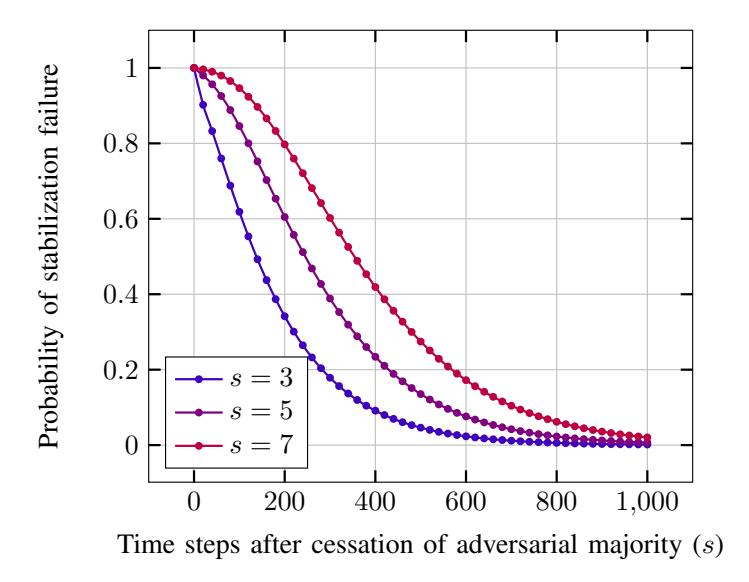
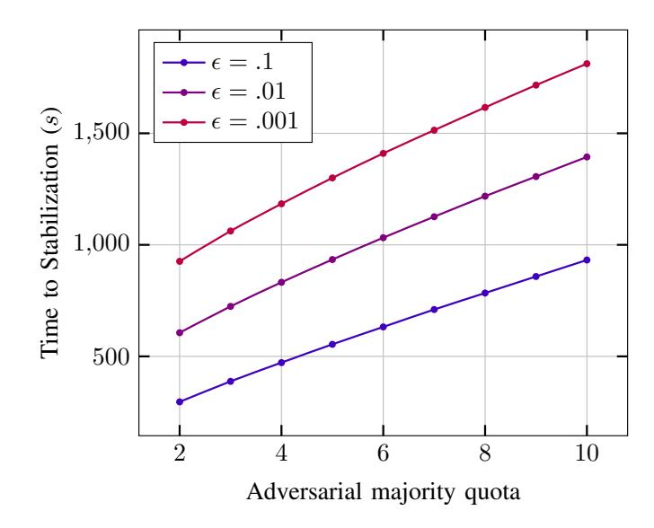
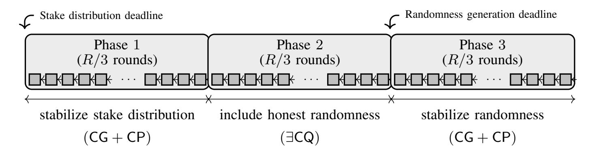
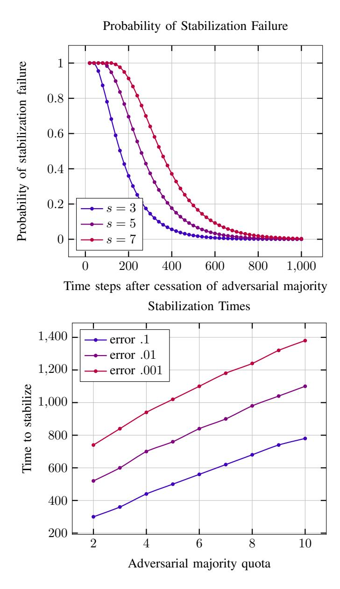

{0}------------------------------------------------

# Consensus Redux: Distributed Ledgers in the Face of Adversarial Supremacy

Christian Badertscher *Input Output* Zurich, Switzerland christian.badertscher@iohk.io

Peter Gaziˇ *Input Output* Bratislava, Slovakia peter.gazi@iohk.io

Aggelos Kiayias *University of Edinburgh & Input Output* Edinburgh, United Kingdom akiayias@inf.ed.ac.uk

Alexander Russell *University of Connecticut & Input Output* Storrs, USA acr@cse.uconn.edu

Vassilis Zikas *Purdue University* West Lafayette, USA vzikas@cs.purdue.edu

*Abstract*—Permissionless distributed ledgers, such as those arising from blockchain protocols, have been touted as the centerpiece of an upcoming security-critical information technology infrastructure. Their basic properties—consistency and liveness—can be guaranteed under specific constraints on the resources available to an adversary relative to the resources of the participants that follow the protocol. Given their permissionless participation convention and their intended long-livedness, a critical open security question is their behavior—and potential resilience—to temporary spikes in adversarial resources.

In this work we give the first thorough treatment of the selfhealing properties of Nakamoto ledgers, addressing both proofof-work (PoW) and proof-of-stake (PoS) protocols. First, we present a unified model that allows us to define self-healing for both of these protocol classes. Then we provide a formal analysis establishing self-healing with respect to both consistency and liveness in both classes, quantifying the resulting vulnerability period as a function of the magnitude of the spike. Finally, we provide numerical simulations giving explicit quantitative bounds relevant for practice.

## I. INTRODUCTION

Nakamoto-style consensus is impossible in the presence of an adversary controlling a majority of the relevant resources such as computing or staking power—among the active participants [\[1\]](#page-15-0), [\[2\]](#page-15-1). This is a fundamental feature of the underlying consensus guarantees and suggests the optimality of such distributed ledger protocols which come close to the 50% security threshold. It is worth emphasizing that even reaching this threshold requires bounded network delays; otherwise, things are even worse: the adversary must be restricted to below 1/3 [\[3\]](#page-15-2). The Bitcoin blockchain protocol [\[1\]](#page-15-0) essentially achieves this 50% bound assuming bounded delays; furthermore, it can securely operate in a particularly adverse "permissionless" setting where participants may fluctuate over time [\[4\]](#page-15-3), [\[5\]](#page-15-4), [\[6\]](#page-15-5), [\[7\]](#page-15-6), [\[8\]](#page-15-7), joining and leaving the system without anyone's permission or announcing their departure.

Obviously, these mathematical impossibility results do nothing to rule out the possibility of dishonest majority attacks against real world consensus protocols. So what can a dishonest majority attacker do? In a permissionless distributed ledger, the aim is to maintain a transaction log by an ever-evolving population of maintainers that continuously collect transactions and incorporate them in a certain admissible way to the log. In contrast to "single-shot" consensus protocols—for which no guarantees are possible for majority adversaries distributed ledger protocols are long-lived distributed computations with the express purpose of establishing common transaction histories. This suggests the possibility of resilience and recovery against temporary majority adversaries that could not even be formulated in the single shot setting. In particular, one might hope that "old enough" portions of the ledger cannot be rewritten by temporary adversarial spikes and, additionally, transaction processing resumes at some point after the conclusion of such a spike. Importantly, such recovery should be a native feature of the protocol and not something that requires "manual" intervention or coordination outside the protocol. The Nakamoto-style consensus paradigm—focusing as it does on the naturally coalescing longest-chain rule—appears to be a natural candidate for such a desirable guarantee.

In more detail, distributed ledgers possess two fundamental properties, *consistency* and *liveness*, and both can be susceptible to a dishonest majority attack. In the special case of a ledger carrying a cryptocurrency, a consistency violation can permit an attacker to mount a "double spending" attack; a liveness violation, on the other hand, can permit an attacker to censor specific transactions. Do such attacks pose a real threat against distributed ledgers? While liveness attacks are, by nature, difficult to detect, consistency violations have been extensively documented against various cryptocurrencies that are based on blockchain protocols. Some examples include Horizen (formerly known as ZenCash) [\[9\]](#page-15-8), Vertcoin [\[10\]](#page-15-9), Bitcoin Gold [\[11\]](#page-15-10), and Ethereum Classic [\[12\]](#page-15-11); the reader is referred to [\[13\]](#page-15-12) for further discussion.

While a dishonest majority attack can be contemplated for any consensus scheme, permissionless distributed ledgers can be particularly susceptible, especially in light of fluctuating participation levels. Such fluctuations in honest participation can yield situations where their combined resources fall below 

{1}------------------------------------------------

the security threshold and hence provide an opportunity for adversarial attack. Likewise, in the concrete context of proofof-work (PoW) (e.g., Nakamoto's Bitcoin protocol [\[1\]](#page-15-0) and a vast majority of its early variations) or proof-of-stake (PoS) (e.g., Ouroboros [\[14\]](#page-15-13) or Algorand [\[15\]](#page-15-14)), blockchain protocols are threatened by the sudden adversarial coordination of significant computational power or the sudden acquisition of substantial stake that can be harnessed for an attack. In fact, in some cases users can anticipate a dishonest majority attack: For instance, in the attack on Ethereum Classic mentioned above, the cryptocurrency experienced a significant drop (by about 50%[1](#page-1-0) ) in its PoW difficulty some few months before the attack was mounted, thus making it an "easy" target. A different example is the case of Bitcoin Cash and Bitcoin SV, which entered a into a "hash war" [\[16\]](#page-15-15) due to differences in the core Bitcoin implementation.

The above highlights fundamental unresolved questions about the security of permissionless distributed ledgers. What is the exact impact of dishonest majority attacks? Can a distributed ledger return to normalcy *without* the need for any outof-band coordination between nodes or external mechanisms that advise about the onset and completion of the adversarial "spike"? How long will this take and what are the precautions that users may need to take if they anticipate such an attack? We address these questions in this work.

#### *A. Our Results*

We present the first complete treatment of permissionless distributed ledger security in the presence of adversarial spikes involving a majority of corrupt resources. Our treatment encompasses both PoW and PoS protocols, quantifying their susceptibility to dishonest majority attacks as well as their ability to recover, which is known under the term *self-healing*. Self-healing distributed ledgers. We first present a common abstraction of both PoW and PoS Nakamoto-style blockchains that allows us to define the security and self-healing properties through a single lens. We generalize the formalism of [\[17\]](#page-15-16) to model any attack against the fundamental properties of the ledger as a "settlement game", a security game between an adversary (or environment) and a challenger. In a nutshell, in each round of the game the adversary can determine the aggregate participation of honest and corrupted parties, after which the challenger draws the outcome for the lottery (for that round) according to a distribution that reflects the underlying PoW or PoS mechanism of the protocol. With this outcome, the attacker can essentially steer the advancement of the protocol execution by providing *valid* extensions of the actual blocktree of the Nakamoto-style blockchain that respect the lottery outcome (and restrictions derived from the basic rules of Nakamoto consensus). The adversary wins the game if it manages to construct such a valid blocktree that witnesses a violation of consistency (or liveness) among honest parties, which are the standard notions in this setting (cf. Section [II\)](#page-2-0). With this abstraction in place, we can formally define dishonest-majority attacks and self-healing for distributed ledgers. To the best of our knowledge, our model is the first formal treatment that supports formulation and analysis of liveness and consistency violations in Nakamotostyle blockchains—providing both asymptotic and concrete bounds—as a function of the adversarial "attacking budget" B (a measure to describe the adversarial strength by which it violates the standard "honest-majority" assumption) and the duration of such an attack. Note that B measures units of resource, e.g., hash queries in the case of PoW, that the adversary is granted with in excess. We additionally remark that our model permits adversaries that may *adaptively deploy their attack budget*, varying their investment of attack resources on a round-by-round basis.

Analysis of Nakamoto's blockchain protocol. We show that the Nakamoto PoW blockchain in the static-difficulty setting achieves self-healing. First, we provide an asymptotic treatment: we show that, roughly speaking, if the protocol is under an adversarial-majority attack with some excess-budget B executed within a time interval [ta, tb], then standard honestmajority persistence and liveness guarantees (as established by previous works) still hold outside of the interval [ta − O(B), tb+O(B)]. In other words, our main theorem states that a self-healing period of length linear in the adversarial attack budget is sufficient for the protocol guarantees to return to normalcy; and moreover, the honest-majority persistence and liveness guarantees are maintained also sufficiently prior to the spike. To give this theoretical analysis practical relevance, we also give concrete instantiations of our asymptotic bounds and present exact recovery times for several illustrative settings.

Towards establishing this main theorem, we first instantiate the concepts defining the settlement game described in the previous paragraph. We define the structure of the PoW blocktree that is maintained by the blockchain protocol and define the distribution of the corresponding lottery that assigns the successes of honest and adversarial parties per time-step.

A crucial step in our analysis is the derivation of the random walk that is characteristic for PoW blockchain protocols in the static-difficulty setting. In more detail, the lottery outcomes can be interpreted as steps in a discrete random walk which captures an attacker's ability to equivocate blocks at selected depth in the blocktree, where the negative integers roughly indicate the attacker's inability to do so. A technical nuance thereby is to account for the impact of the network delay parameter ∆ which we handle via a known modular reduction. We then develop new statistical tools and tail bounds to analyze the two emerging types of random walks, a barrier walk and a free walk, respectively, which enable us to bound the ability of the optimal attacking strategy and to conclude that the protocol returns to normalcy (as a function of the attacker's budget).

Analysis of Nakamoto-style PoS. We analyze Nakamotostyle PoS protocols, and choose Ouroboros Genesis [\[18\]](#page-15-17) as a representative of this class. It is important to clarify that the temporary spikes of adversarial majority here always come

1See [https://bitinfocharts.com/comparison/difficulty-etc.html.](https://bitinfocharts.com/comparison/difficulty-etc.html)

{2}------------------------------------------------

from fluctuating participation: roughly speaking, in such spikes the majority of the relevant resource is still held by honest parties, nonetheless many of those parties are passive and the adversary gains a temporary majority among *active* parties. This is particularly important to keep in mind because a corruption of a majority of the full stake supply *necessarily* leads to a permanent compromise of the system. In this view, we formally prove that Ouroboros Genesis without stake-shift achieves self-healing with the same asymptotic rate as for the PoW case above, and again give concrete instantiations of our asymptotic bounds and present exact recovery times for different settings.

At a high level, the approach we take to prove the main theorem for the PoS case is very similar. We first instantiate the elements for the settlement game, derive the random walk that captures the ability of an attacker towards breaking consistency (again dealing with network delays in a modular way), and develop the associated statistical tail bounds for the random walk. The concrete technical toolkit however differs substantially from the PoW analysis for a few reasons. First, block creation in PoS is governed by winning a lottery per round and not by extending a particular chain like in PoW. This dynamic implies that if the attacker is winning a lottery, it can generate multiple blocks for that slot for free as opposed to PoW, where each chain extension requires solving an independent PoW puzzle. Second, measuring the ability of an attacker is more complicated than in the PoW case. Intuitively, while in the (lockstep-synchronous) PoW case, the ability of an attacker always immediately decreases with honest lottery successes, this no longer holds true for PoS, even under lockstep synchrony. In PoS, due to the above feature that block creation opportunities are tied to rounds and not chains, we, roughly speaking, have to take into account the attacker's potential in keeping two equally longest chains viable for a while by extending some long chain that honest parties do not extend. His ability to break consistency only becomes really ineffective if this potential is used up. This makes the random walk two-dimensional. And third, while the attacker's budget in the PoW case can be modeled as equipping the attacker with more hashing power, such a simple treatment is not possible for the PoS case. Since temporary spikes are the result of lowered honest participation, the attacker's budget is essentially quantified as a temporary statistical bias favoring adversarial "slot leaders" over honest "slot leaders." For this situation we develop new statistical tools to generalize the martingale notions to handle adaptive deviations in its conditions, where those deviations have an upper bound. Intuitively, we face this type of deviations in the PoS lottery when under attack (deviating from the typical honest-majority condition), where the upper bound is established by the attacker's total budget. With those tools, we again establish tail bounds for the involved random walks which enable us to bound the ability of an attacker and conclude that the protocol returns to normalcy.

There is nonetheless one aspect in which our result for Nakamoto-style PoS is weaker than the corresponding result for PoW: When Nakamoto-style PoS execution is divided into epochs in order to accommodate shifts in stake between participants, adversarial spikes' maximum length is linearly dependent and bounded by the length of the epoch.

## *B. Related Work*

Abstracting the execution of a blockchain protocol as a probability distribution over a family of directed graphs is an approach that has been frequently adopted by previous work, notably in the analysis of selfish-mining [\[19\]](#page-15-18), [\[20\]](#page-15-19) and mining games [\[21\]](#page-15-20) in the PoW setting and the Ouroboros protocols in the PoS setting [\[14\]](#page-15-13), [\[22\]](#page-15-21). A key benefit of the approach is that high-level protocol properties (e.g., the consistency of the ledger or the fairness of rewards) can be directly expressed as events in the support of such distributions. However, none of these previous works offer such a stochastic model of execution graphs—or an alternative analytic framework—that captures the relevant consensus properties in a threat model permitting adversarial majority.

Several past works studied self-healing algorithms, e.g., [\[23\]](#page-15-22), [\[24\]](#page-15-23), but settings with Byzantine faults have received less attention; see e.g., [\[25\]](#page-16-0). To the best of our knowledge, the only previous works that investigate security of blockchain protocols under temporary adversarial majority is by Avarikioti *et al.* [\[26\]](#page-16-1) and Bentov *et al.* [\[27\]](#page-16-2). The former work focuses on Bitcoin and hence on the proof-of-work case. Their model is significantly more restricted in the sense that (i) rather than the adversary adaptively determining participation, as in our settlement game, it issues sleeping instructions that are adhered to with a certain probability of success based on independent coin flips; and (ii) the impact of the spike is not quantified in the time-domain with respect to self-healing. In contrast, our results establish when the protocol's behavior will return to normalcy as a function of the spike. The latter work cited above considers self-healing for Spacemesh [\[27\]](#page-16-2), an important example of a DAG-based consensus protocol based on Proofof-SpaceTime. Since their work considers a different type of consensus algorithm, there are some inherent technical differences to the results we obtain for Nakamoto-style consensus. For example, their self-healing guarantee relies crucially on the existence of a period of honest participation above a certain threshold and a temporary adversarial minority controlling ≪ 1/3 of the spacetime resources during this period to recover consistency and liveness after an adverse situation.

# *C. Notational conventions*

Throughout the paper, let N = {0, 1, 2, . . .} denote the set of natural numbers (including zero). For n ∈ N, [n] denotes the set {1, . . . , n} (hence [0] = ∅). For a word w over some alphabet Σ, i.e, w = w1 . . . wn ∈ Σ n, we denote by wi:j its subword wiwi+1 . . . wj , and by #a(w) we denote the number of occurrences of the symbol a ∈ Σ in w.

## II. ABSTRACTING NAKAMOTO-STYLE LEDGERS

In order to arrive at a unified notion of self-healing for Nakamoto-consensus for both PoW and PoS, we first present 

{3}------------------------------------------------

an abstraction of distribute ledger protocols (and an accompanying definitional framework) that incorporates the features appearing in the PoW models of [4], [5] and the PoS models of [18], [17], [14].

Mainstream approaches for building decentralized ledgers rely on the following high-level idea: The protocol implements a lottery, weighted according to a particular resource, to define for each round a collection of distinguished parties (or rather addresses/identifiers). For example, in the case of Bitcoin the underlying resource is the hashing power enabling Proofs of Work (PoW); in the case of Ouroboros, it is the virtual resource stake, enabling Proofs of Stake (PoS). While the exact mechanism that realizes this implicit lottery is slightly different, the essential properties necessary for proving security of the protocol's consensus layer are very similar, motivating a common abstraction.

Nakamoto-style Proof-of-Work (PoW): In the first class of protocols, which includes Bitcoin, this implicit lottery is realized by the parties repeatedly hashing randomly selected potential solutions until a correct solution to a "hashing puzzle" is discovered. Looking for a solution can be modeled as Bernoulli trials with winning probability that depends on the difficulty of the puzzle. As a result, depending on the participation in the protocol, this process might result in zero, one, or more parties, often called "miners" in this context, winning each round's lottery. And since both the honest parties and the adversarially controlled parties might be mining, either (or both) of them might win in a particular round.

Nakamoto-style Proof-of-Stake (PoS): In the second class of protocols, which includes the Ouroboros family, the situation is similar to the above, with the main difference being that, by design, parties win the implicit lottery with probability proportional to their existing stake, i.e., the total fraction of the coins that the party owns.

#### A. The Nakamoto-Ledger Abstraction

In the following, we distill the common structure of the Nakamoto-style blockchain protocols and introduce the notion of an *abstraction* of such protocol. Looking ahead, the abstraction provides us the language for introducing a *settlement game* (Fig. 1) which will be used to define different security properties, in particular related to self-healing. The concrete instantiations of this abstraction follow in Section IV and Section V where we analyze PoW- and PoS-based Nakamoto-style blockchains, respectively.

The fundamental data structure maintained by the protocol is a *blockchain*: an ordered sequence of structured blocks—beginning with a publicly established "genesis block"—each of which contains a cryptographic hash of the previous block in the sequence. In this way, any given block effectively commits to a unique history of prior blocks. The protocol calls for players to maintain a single blockchain as their internal state, replacing it any time they observe a longer chain. Finally, as discussed above, the protocol implements a leader-election mechanism which provides certain players the right to add a block to their currently held chain, which is then broadcasted

to the other players. The model below captures these basic features, along with the possibility of networking delays, while leaving unspecified certain protocol features that vary among the PoW and PoS settings.

A *Nakamoto-ledger abstraction* is a tuple  $(\mathbb{P}, \Sigma, \mathcal{W}, \mathcal{D}, \mathcal{G}, \overset{\cdot}{\rightarrow})$  specified as follows:

- $\bullet$  is a set which represents the universe of possible party identities.
- $\Sigma$  is an alphabet that specifies a *participation indicator* at any given round. In any execution of the ledger protocol, a symbol  $\sigma \in \Sigma$  is associated to each round that reflects participation data for that round.
- The set W is the support of the distribution induced by the lottery corresponding to the Nakamoto blockchain protocol. We call a sequence of samples  $w_1, \ldots, w_m \in W^m$ ,  $m \in \mathbb{N}$ , a *characteristic string*.
- $\mathcal{D}$  is a randomized algorithm that reflects the protocol lottery: in each round, given a participation indicator  $\sigma \in \Sigma$ ,  $\mathcal{D}(\sigma)$  samples the output of the protocol lottery  $w \in \mathcal{W}$ .
- $\mathcal{G}$  is a set of (annotated) execution graphs. Informally, an execution graph  $G_r \in \mathcal{G}$  associated to a given protocol round r is a snapshot of the existing blocktree, which contains a vertex representing each block (honest or adversarial) that has been generated by protocol parties. The graph is annotated to indicate the current chains held by each honest player. Edges in  $G_r$  reflect blockchain predecessor relations (i.e., given by block hashes references) so that paths indicate protocol blockchains; this gives  $G_r$  the structure of a rooted tree, the genesis block playing the role of the root vertex. We treat edges as directed so that the edge (u, v) indicates that the block v declares v to be its predecessor (by holding a hash of v). Beyond the blocktree, the execution graph carries three additional labeling functions:
  - 1) l# that attributes to each block the round number in which the respective block was created—naturally, this implies that the sequence of l#-labels along any directed path is non-decreasing;
  - 2) ltype with range {h, a} indicating that the respective block is considered honest or adversarial, respectively;
  - 3) a subset  $\mathbb{H} \subseteq \mathbb{P}$  of player identifiers and a function  $\operatorname{ch}(\cdot)$  defined on  $\mathbb{H}$  which attributes to each party  $P \in \mathbb{H}$  a vertex in  $G_i$ . Here  $\mathbb{H}$  should be interpreted as the set of honest players to which we want to provide security guarantees, and  $\operatorname{ch}(P)$  the tip of the chain currently held by P. When no confusion can arise, we overload the notation and use  $\operatorname{ch}(P)$  to refer to this full path.
- The relation  $\to$  captures the evolution of the execution graph during the execution of the protocol. Namely, for a given lottery outcome  $w \in \mathcal{W}$  in a particular round r, the relation  $\overset{w}{\to}$  over  $\mathcal{G}$  defines what transitions  $G_{r-1} \overset{w}{\to} G_r$  from the round-(r-1) execution graph  $G_{r-1}$  to the round-r execution graph  $G_r$  are *valid*, i.e., consistent with that lottery outcome. For any ledger protocol, we mandate the minimal requirements that whenever  $G_{r-1} \overset{w}{\to} G_r$ , then  $G_{r-1}$  is the subgraph of  $G_r(V_{< r})$  induced by vertices

{4}------------------------------------------------

 $V_{\leq r} := \{v \in G_r : I_\#(v) < r\}$ . Furthermore, the labels  $I_\#(v)$  and  $I_{\mathsf{type}}(v)$  assigned in  $G_r$  to each block  $v \in V_{\leq r}$  are identical to the labels of v in  $G_{r-1}$ .

The  $\Delta$ -synchrony property. Throughout the article we focus on the  $\Delta$ -synchronous networking model (for some constant  $\Delta$ ), assuming that honest parties' messages are eventually delivered to all honest parties within  $\Delta$  rounds and the adversary is allowed to steer the exact delivery within this bound. The special case of  $\Delta=1$  is called *lockstep-synchronous*; whenever we for brevity talk about the *synchronous* model, we mean the lockstep-synchronous case.

In combination with the longest-chain rule, the  $\Delta$ -synchrony assumption ensures the following property on execution graphs: the length of the path  $\operatorname{ch}(P)$  held by any honest player is at least the depth of any honest vertex v (so that  $|_{\operatorname{type}}(v) = h$ ) for which  $|_{\#}(v) \leq r - \Delta$ .

To illustrate the above abstraction, let us consider a PoWbased Nakamoto-style blockchain as an example. Here, the alphabet  $\Sigma$  will encode the numbers of hash queries performed by both the honest parties and the corrupted parties in that round, while a lottery outcome  $w \in \mathcal{W}$  will contain the actual numbers of honest and adversarial successes in solving the hash puzzle in the current round. The PoW lottery sampler  $\mathcal{D}$ samples from the binomial distribution that is parameterized by the provided numbers of hashing queries encoded in the participation indicator  $\sigma \in \Sigma$ . Note that since the distribution of honest vs. adversarial hashing queries, as well as the set of honest parties  $\mathbb{H}$  can change from one round to the next, this captures not only fluctuating participation, but also adaptive corruptions. A full description of the instantiations of the above abstraction for PoW- and PoS-based Nakamoto-style blockchains (in particular the evolution of the blocktree) is given in Sections IV and V-A, respectively.

We can now use the above abstraction to represent the two classical security properties of a distributed ledger: consistency and liveness. Definition 1 below describes two predicates,  $ConsFail(r_1, r_2)$  and LiveFail(r) that are defined on the sequence of execution graphs produced by a particular ledger protocol execution. Later in Figure 1 we define an experiment called the *settlement game* for an abstract ledger protocol, originally introduced in [17], which models the relevant execution dynamics and influence of the adversary in a session of a ledger protocol, i.e., the adversary's influence on the relevant sequence of execution graphs. Having such a random experiment, these predicates define the corresponding security violations based on the produced set of execution graphs.

Toward the following definition, we put down some notation: for a directed path p and  $k \in \mathbb{N}$ , let  $p|_k$  be the path obtained by removing from p its last k vertices (if  $k \ge |p|$  then  $p|_k$  will refer to the initial vertex of p). We then define  $p' \le p$  iff  $p' = p|_k$  for some  $k \ge 0$ ; in this case we say that p' is a *prefix* of p. We say that a vertex v, on a path p of length at least k+1, is covered by k blocks if v is contained in  $p|_k$ .

**Definition 1.** Let  $\Pi$  be a Nakamoto ledger protocol and let  $(\Sigma, \mathcal{W}, \mathcal{D}, \mathcal{G}, \overset{\cdot}{\rightarrow})$  be the associated abstraction of  $\Pi$ . Let

 $w_1, \ldots, w_L \in \mathcal{W}^L$  be a characteristic string for rounds  $1, \ldots, L$ ; let  $G_0, G_1, \ldots, G_L$  be a sequence of execution graphs with honest player sets  $\mathbb{H}_0, \mathbb{H}_1, \ldots, \mathbb{H}_L$  respectively, such that (i.)  $G_0$  consists of only the root r, and (ii.) the sequence is valid with respect to  $w_1, \ldots, w_L \in \mathcal{W}^L$  (i.e.,  $G_{i-1} \stackrel{w_i}{\to} G_i$  for each  $i \in \{1, \ldots, L\}$ ). We define the following properties of this sequence:

k-Consistency. For all pairs of rounds  $1 \le r_1 \le r_2 \le L$  and all honest parties  $P_1 \in \mathbb{H}_{r_1}$  and  $P_2 \in \mathbb{H}_{r_2}$  we have  $\operatorname{ch}^{r_1}(P_1)|_k \le \operatorname{ch}^{r_2}(P_2)$ , where  $\operatorname{ch}^i(\cdot)$  denotes the map  $\operatorname{ch}(\cdot)$  in  $G_i$ . The event that this consistency guarantee fails for the pair of rounds  $r_1$  and  $r_2$  (and some pair of parties) is denoted  $\operatorname{ConsFail}_k(r_1, r_2)$ .

*u-Liveness.* For a given parameter k, for every  $r \leq L-u$  and every honest party  $P \in \mathbb{H}_{r+u}$  (where u is allowed to depend on k) the set of vertices  $(\mathsf{ch}^{r+u}(P)|_k) \setminus (\mathsf{ch}^r(P)|_k)$  contains at least one vertex v with  $\mathsf{l}_{\mathsf{type}}(v) = \mathsf{h}$ . The event that this property fails for a round r (and some party) is denoted LiveFail $_u(r)$ .

Intuitively, a consistency failure (for parameter k) means that there is a blockchain held by an honest party at round  $r_2$  that does not extend the prefix of the blockchain, consisting of all but the most recent k blocks, that was held by a (potentially different) honest party at some previous round  $r_1$ . Here k plays the role of an analytical quantity. Note that typically, the ledger protocol based on Nakamoto consensus must be parameterized by a certain cut-off parameter that defines when the protocol declares something as being part of the ledger. Since in typical settings we are interested in proving consistency for the actual protocol parameter, we do not distinguish between the two in our notation.

A liveness failure, on the other hand, occurs if the stable part of the blockchain of some honest party did not grow by at least a single honest block over some period of u rounds. Typically, u is lower bounded by a function in the cut-off parameter of the protocol due to the confirmation time (i.e., the time it takes for a block to become deep enough to be reported by the protocol as being part of the ledger).

#### B. Security Experiment

We now define security for a ledger protocol in a straightforward way via the settlement game given in Figure 1 that captures settings where protocol participation and the amount of resources owned by honest and corrupted participants, respectively, is scheduled by a single adversarial entity that we call the adversary in the sequel. (Recall from Appendix A that without loss of generality, this single entity corresponds to the combination of environment and attacker.) The game allows the adversary to define in each round i the participation level  $\sigma_i$ . This then in turn defines the distribution of the symbol  $w_i$  of the characteristic string for this round—i.e., of the lottery outcome. The outcome is sampled by the challenger and revealed to the adversary who then locally emulates his attack conditioned on that lottery outcome, and computes the execution graph  $G_i$  induced by this attack so far. The adversary

{5}------------------------------------------------

# Experiment $\mathbb{E}_{L,\Pi}(\mathcal{A})$ .

The game is played by an adversary  $\mathcal{A}^a$  and is parametrized by a duration  $L \in \mathbb{N}$ .

- 1: Let  $G_0$  be the trivial execution graph containing only root.
- 2: for i = 1 to L do
- 3:  $\mathcal{A}$  outputs a participation indicator  $\sigma_i$  for round i.
- 4: Sample a lottery outcome  $w_i \stackrel{\$}{\leftarrow} \mathcal{D}(\sigma_i)$  for round i
- 5: Provide  $w_i$  as input to  $\mathcal{A}$ .
- 6:  $\mathcal{A}$  outputs an execution graph  $G_i$  such that  $G_{i-1} \xrightarrow{w_i} G_i$
- 7: end for
- 8: Evaluate whether ConsFail $_k(r_1, r_2)$  or LiveFail $_u(r)$  occurred in  $G_1, \ldots, G_L$  for some  $r_1, r_2, r$  (with respect to consistency and liveness parameters k and u).

aWe use A for the combination of the adversary and environment.

Fig. 1. The structure of the settlement game  $\mathbb{E}_{L,\Pi}(A)$  to evaluate the conditions of Definition 1 for protocol  $\Pi$  in an execution with A.

wins if his attack induces a sequence of execution graphs which indicate a consistency or liveness violation (w.r.t. the parameters k and u).

Assumptions underlying security. Independently of the protocol, it is impossible to expect that we can prevent consistency or liveness violations unless we restrict how the adversary influences the execution. A well-known result for Bitcoin for example is that it is secure only if the majority of the hashing power invested (i.e., participating) in any given round is honest (i.e., is invested by parties following the protocol). How can we capture such conditions, and more importantly, the violation thereof, which is needed for defining spikes in the above experiment?

The natural answer is that we will impose a restriction on the participation symbols selected by A in line 3 of the experiment. For simplicity, we first discuss this restriction in what is often referred to as the *flat model* [4], [5], where each party is equated with one unit of resource (e.g., work or stake) that it can use per round by participating in a lottery (see Appendix B for a discussion of the non-flat and fractional model). Taking advantage of this, we can simplify  $\Sigma$  to contain pairs of the form  $(n_h, n_a)$ . For any round j, we will denote by  $n_h^j$  (resp.  $n_a^j$ ) the number of activated honest (resp. adversarial) units (such as hash queries) in round j (for  $n_h^j$ , we only take into account the hash queries of honest parties that are sufficiently synchronized with the protocol state to contribute to its security, these are sometimes called *alert*, cf. [28], [18]). We capture the desired generalization of the "honest (super-) majority of resources" assumption, which underlies the security of all ledger consensus protocols, as follows: for constants  $\epsilon, \theta \in (0, 1]$ , we say that an adversary  $\mathcal{A}$  respects the honest majority assumption with parameters  $\theta$  and  $\epsilon$  in rounds  $i, \ldots, j$  if for each round  $r \in \{i, \ldots, j\}$ ,

$$n_{\mathsf{a}}^r \le (1 - \epsilon) \cdot \theta \cdot n_{\mathsf{h}}^r \tag{1}$$

is satisfied. Typically, one considers an arbitrary constant  $\epsilon > 0$ , combined with some suitable (threshold) parameter  $\theta \leq 1$  that describes the required level of (super-)majority.

In a similar fashion, we can also impose a minimum participation constraint by requiring that  $n_h^j + n_a^j > n_0$  where  $n_0$  is a lower bound on the actively invested units at any given time (e.g., lower bound on number of hash-queries or minimal active stake).

Using the above terminology, existing security claims about ledger protocols, as for example in [4], [5], [14], can be restated as requiring that the probability of a consistency or liveness failure is negligible (as functions of the relevant parameters for consistency and liveness) for any adversary which is subject to the above honest majority and participation constraints.

#### III. ADVERSARIAL SPIKES AND SELF-HEALING

The above formulation of the honest majority assumption can be directly extended to define periods of temporary adversarial majority. Since in the above experiment, it is the adversary that chooses  $n_a^j$  vs.  $n_h^j$ , we can capture the adversary having full flexibility on how to choose which periods/rounds yield such a majority of corrupted parties (and how large such a majority is) by means of the following mechanism: We give the adversary a budget  $\mathcal{B} \in \mathbb{Z}$  of total excess in resource power which he can allocate at will to different rounds. Every time a part of the budget is used, it is removed from  $\mathcal{B}$ ; then, while choosing  $n_{\mathsf{a}}^{j}$  and  $n_{\mathsf{h}}^{j}$ , the adversary is allowed to violate the honest majority condition (1) by a total of at most  $\mathcal{B}$ : i.e., he can propose a pair  $(n_h^j, n_a^j)$ , such that  $n_{\mathsf{a}}^j = \lfloor (1 - \epsilon) \cdot \theta \cdot n_{\mathsf{h}}^j \rfloor + \operatorname{surp}_j$ , as long as the surplus  $\operatorname{surp}_j$  is less than the current value of  $\mathcal{B}$ . We refer to an adversary that respects this budget restriction, never drops the total participation below some  $n_0$ , and never exceeds participation above some n as a  $(\theta, \epsilon, n_0, n, \mathcal{B})$ -adversary.

**Definition 2**  $((\theta, \epsilon, n_0, n, \mathcal{B}))$ -adversary). Let  $\theta, \epsilon \in (0, 1]$  and  $\mathcal{B}, n, n_0 \in \mathbb{N}$ . A  $(\theta, \epsilon, n_0, n, \mathcal{B})$ -adversary is an adversary in the settlement game of Figure 1 that satisfies the following properties: Let  $\mathcal{B}_0 := \mathcal{B}$ . In each iteration i of the for-loop, the adversary might output a pair  $(n_h^i, n_a^i)$  satisfying  $n_0 \le n_a^i + n_h^i \le n$  such that  $n_a^i \le (1 - \epsilon) \cdot \theta \cdot n_h^i + \text{surp}_i$ , where  $0 \le \text{surp}_i \le \mathcal{B}_{i-1}$ ; furthermore, at the end of the i-th iteration, we set  $\mathcal{B}_i := \mathcal{B}_{i-1} - \text{surp}_i$  to be the residual budget that the adversary has to use after round i.

For  $\mathcal{B} > 0$ , we say that a  $(\theta, \epsilon, n_0, n, \mathcal{B})$ -adversary  $\mathcal{A}$  performs his attack between rounds a < b, if the following conditions hold: (1)  $\mathcal{B}_i = \mathcal{B}$  for all rounds i < a; (2)  $\mathcal{B}_a < \mathcal{B}$ ; (3)  $\mathcal{B}_b > 0$ , and (4)  $\mathcal{B}_{b+1} = 0$ . We refer to round a as the first attack round, to round b as the last attack round, and to round b+1 as the first healing (period) round.

Given the above definition we next define the self-healing properties of a ledger protocol with respect to consistency and liveness.

**Definition 3.** (Self-Healing Ledger Protocol) Let  $\Pi$  be a Nakamoto ledger protocol and  $(\mathbb{P}, \Sigma, \mathcal{D}, \mathbb{G}, \overset{\cdot}{\rightarrow})$  be the associated abstraction. We say that  $\Pi$  is self-healing with vulnerability period defined by the pair  $\tau_1$  and  $\tau_h$  w.r.t. k-consistency

{6}------------------------------------------------

(resp. u-liveness) against a  $(\theta, \epsilon, n_0, n, \mathcal{B})$ -adversary who performs his attack between rounds a < b, if  $\mathsf{ConsFail}_k(r_1, r_2)$  (resp.  $\mathsf{LiveFail}_u(r)$ ) in the experiment of Figure 1 occurs with at most negligible probability (in k and u, respectively), when restricting the evaluation step in line 8 of Figure 1 to rounds  $r_1, r \in [L] \setminus \{a - \tau_1, \ldots, b + \tau_h\}$  and  $r_2 \in [L]$ .

The vulnerability period is typically a function of the budget  $\mathcal{B}$ , the duration of the spike itself, and other parameters including the nominal stake distribution. The self-healing definition is a direct relaxation of the security definition of a ledger protocol, which typically requires k-consistency and u-liveness to hold throughout the execution except with negligible probability in k resp. u [4], [14]. Our definition allows the events ConsFailk $(r_1, r_2)$  (resp. LiveFailu(r)) to happen at some point of the execution which is related to the adversarial majority attack. Importantly,  $\tau_l$  and  $\tau_h$  yield intuitive bounds on how much history the considered potential adversarial spike can overwrite—where history corresponds to rounds before the spike starts—and how much time the protocol needs before its desired consistency and liveness properties are properly restored after a spike(s)-inducing attack ends. We remark that the above definitions apply to multiple spikes: after a healing period, another spike can be analyzed as if it was the first one, since the definition of  $\tau_h$  demands a full "return to normalcy" of the protocol execution. In the other case, when two spikes are "too close", one enlarges the attack window to encompass both of them and sums the respective budgets.

#### IV. PROOF-OF-WORK NAKAMOTO LEDGERS

We now analyze the consistency guarantees provided by Nakamoto-style proof-of-work ledger protocols in the face of temporary spikes of adversarial majority.

We first instantiate the ledger abstraction for Nakamotostyle proof-of-work blockchains: the set  $\mathbb{P}_{pow}$  is an arbitrary name-space to distinguish honest parties holding different chains. The participation indicators are from the set  $\Sigma_{pow} = \mathbb{N} \times \mathbb{N}$  and each  $\sigma = (n_h, n_a) \in \Sigma_{pow}$  specifies the numbers of honest  $(n_h)$  and adversarial  $(n_a)$  hash queries in the respective round.  $\mathcal{W}_{pow} = \mathbb{N} \times \mathbb{N}$  and each  $w = (h, a) \in \mathcal{W}_{pow}$  denotes the numbers of honest (h) and adversarial (a) PoW successes in the respective round. Hence,  $\mathcal{D}_{pow}$  samples (h, a) as the number of Bernoulli successes with probability p in  $(n_h, n_a)$  trials respectively. Formally, we define  $\mathcal{D}_{pow}(n_h, n_a)$ , also denoted  $\mathcal{D}_p(n_h, n_a)$  to emphasize the parameter p, as

$$\Pr_{\mathcal{D}_p(n_h, n_a)}[(h, a)] \triangleq \binom{n_h}{h} \binom{n_a}{a} p^{h+a} (1-p)^{n_h+n_a-h-a} . (2)$$

Therefore, the *characteristic string* w of an L-round execution is drawn from the set  $(\mathcal{W}_{pow})^L$  and we can write  $w = (w_1, \ldots, w_L) = ((h_1, a_1), \ldots, (h_L, a_L))$  so that the t-th symbol of w is  $(h_t, a_t)$  and indicates a round during which there were  $h_t$  honest PoW successes and  $a_t$  adversarial PoW successes.

The execution graph in this concrete instantiation takes the form of a simple combinatorial object that we call a *fork*.

The graph represents all created blocks by vertices, these are connected by edges in the opposite direction of the included hash pointers. The vertices are annotated by labeling functions, identifying the round in which the block was mined  $(I_{\#})$  and whether it was created by an honest or adversarial party ( $I_{type}$ ). The relation  $\stackrel{w_i}{\rightarrow}_{pow}$  subjects the transition from one fork to the next by restricting the number of newly created blocks (honest and adversarial) depending on  $w_i$ . The longest-chain rule combined with the  $\Delta$ -delay network further leads to the condition that the depth of an honest block is at least that of any honest block appearing  $\Delta$  rounds prior. In addition, the party-labeling ch(P), which assigns an honest party P the chain she is holding, must respect the  $\Delta$ -synchrony definition. A simplification is obtained by observing that if we focus at any given time only on so-called dominant paths of the blocktree which roughly speaking are all those paths that end in an honest node labeled h  $\Delta$  rounds ago, we can ignore the concrete labeling ch(P) (and consider the dominant paths at each step to be assigned to arbitrary honest parties).

This leads us to the concrete definition of a *PoW fork* that follows. It is a generalization of the "fork" concept (first considered for the proof-of-stake case in [14], [22], [18]) and has turned out to be a powerful concept in the analysis of PoW blockchains [8], [29].

**Definition 4** (PoW  $\Delta$ -fork). Let  $\Delta$  be a positive integer and  $L \in \mathbb{N}$ . A PoW  $\Delta$ -fork for the string  $w \in \mathcal{W}_{pow}^L$  is a directed, rooted tree F = (V, E) with a pair of functions

$$I_{\#}: V \to \mathbb{N}$$
 and  $I_{\mathsf{type}}: V \to \{\mathsf{h}, \mathsf{a}\}$ 

satisfying the axioms below. Edges are directed "away from" the root so that there is a unique directed path from the root to any vertex. The value  $I_{\#}(v)$  is referred to as the label of v. The value  $I_{type}(v)$  is referred to as the type of the vertex: when  $I_{type}(v) = h$ , we say that the vertex is honest; otherwise it is adversarial.

- (i) the root  $r \in V$  is honest and has label  $I_{\#}(r) = 0$ ;
- (ii) the sequence of labels  $I_{\#}()$  along any directed path is non-decreasing;
- (iii) if  $w_i = (h_i, a_i)$ , there are exactly  $h_i$  honest vertices with the label i and no more than  $a_i$  adversarial vertices of F with the label i;
- (iv) for any pair of honest vertices v, w for which  $I_{\#}(v) + \Delta \leq I_{\#}(w)$ , len(v) < len(w), where len() denotes the depth of the vertex.

We note that the notion is very close to the notion of PoS-forks which we recall and use in Section V. When no confusion can arise, we will refer to both of these objects simply as "forks" (treating also the parameter  $\Delta$  implicitly). We now recall several definitions that apply to both PoW and PoS forks.

Fork notation, closure. We write  $F \vdash_{\Delta} w$  to indicate that F is a  $\Delta$ -fork for the string w. When  $\Delta = 1$ , corresponding to the synchronous case, we may just write  $F \vdash w$ . If  $F' \vdash_{\Delta} w'$  for a prefix w' of w, we say that F' is a *subfork* of F, denoted  $F' \sqsubseteq F$ , if F contains F' as a consistently-labeled subgraph. A

{7}------------------------------------------------

fork F ⊢∆ w is *closed* if all leaves are honest. By convention the trivial fork, consisting solely of a root vertex, is closed. The *closure* of a fork F, denoted F, is the maximal closed subfork of F.

Tines. A path in a fork F originating at the root is called a *tine* (note that tines do not necessarily terminate at a leaf). For a vertex v in F, F(v) denotes the tine in F terminating in v. Given this one-to-one correspondence between vertices and tines of a fork, we routinely overload notation so that it applies to both tines and vertices. For example, we let len(T) denote the *length* of the tine T, equal to the number of edges on the path; recall that len(v) also indicates the depth of the vertex v. To emphasize the fork from which v is drawn, we sometimes write lenF (v). We further overload len() to apply to forks: len(F) denotes the length of the longest tine in a fork F. A tine is called *honest* if it terminates in some vertex v with ltype(v) = h.

For two tines T, T′ of a fork F, we write T ∼ℓ T ′ if the two tines share a vertex with a label greater or equal to ℓ. Intuitively, T ∼ℓ T ′ guarantees that the respective blockchains agree on the state of the ledger up to time ℓ. Looking ahead, the adversary can only make two honest parties disagree on the state of the ledger up to time ℓ if she makes them hold two chains corresponding to tines for which T ̸∼ℓ T ′ .

Fork trimming; dominance. For a characteristic string w = w1 . . . wn ∈ Wn pow and a positive integer k, we let w⌈k = w1 . . . wn−k+1 denote the string obtained by removing the last k − 1 symbols. For a fork F ⊢∆ w1 . . . wn we let F⌈k ⊢∆ w⌈k denote the fork obtained by retaining only those vertices labeled from the set {1, . . . , n − k + 1}. Observe that honest tines appearing in F⌈∆ are those that are necessarily visible to honest players at a round just beyond the last one described by the characteristic string. We say that a tine T in F is ∆ *dominant* if len(T) ≥ len(F⌈∆) and simply call it *dominant* if ∆ is clear from the context.

#### *A. Main Theorems for PoW Self-Healing*

Armed with the above instantiation and definitions, we are ready to state and prove our main theorems on self-healing with respect to consistency and liveness.

Theorem 1 (PoW, Consistency Self-Healing). *Consider the Nakamoto-style PoW blockchain protocol executed over a network with maximum delay* ∆ *and PoW success probability* p*. The protocol is self-healing w.r.t.* k*-consistency against any* (θpow, ϵ, n0, n, B)*-adversary according to Definition [3](#page-5-3) (where the threshold* θpow *is defined in equation* [\(6\)](#page-9-0) *below, and* ϵ, n0, n > 0 *are arbitrary constants), with a vulnerability period defined by the pair* τl = O(B) *and* τh = O(B)+O(k)*.*

Theorem 2 (PoW, Liveness Self-Healing). *Consider the Nakamoto-style PoW blockchain protocol in the setting as above in Theorem [1,](#page-7-0) where* k *denotes the cut-off parameter. The protocol is self-healing w.r.t.* u*-liveness, for* u ∈ Θ(k)*, against a* (θpow, ϵ, n0, n, B)*-adversary (as in Theorem [1\)](#page-7-0) with a vulnerability period defined by the pair* τl = u *and* τh = O(B) + O(u)*.*

We point out that the requirement u ∈ Θ(k) is just for convenience so that liveness and consistency are both negligible in the same security parameter. The proof of the liveness theorem, which is deferred to Appendix [G,](#page-26-0) shows the failure probabilities as functions of u.

## *B. Proof of Theorem [1](#page-7-0)*

We first provide an informal outline of the full argument, which proceeds in the following steps 1. to 7. We then expand on each of these steps.

- 1) Define margin. We recall a quantity called margin (denoted βℓ) that has been introduced in prior work [\[14\]](#page-15-13), [\[8\]](#page-15-7) and turned out to be a powerful abstraction to quantitatively capture the "dominance" of the adversary over the honest parties after some (partial) execution of the protocol: non-negative margin implies a possible consistency violation, while negative margin excludes it. We formally prove this connection in Lemma [1.](#page-8-0)
- 2) Synchronous, serialized analysis. We provide an exact analysis of the behavior of margin in the simplified setting with a lock-step synchronous network and a single PoW success in each slot. This intermediate step is important because we will be able to reduce the general case to this case eventually.
- 3) Understanding random walks. In Step [2](#page-7-1) we find margin to behave according to a particular class of biased random walks (with or without a barrier). In anticipation of the forthcoming statistical analysis, we prove new tail bounds for these walks (which can be of independent interest), as well as formulate a useful "exchange principle" that, informally speaking, states that in a barrier walk (i.e., one where descending below a particular barrier is not allowed), shifting steps in the positive direction to later in the walk can only increase the final position after the walk is over. This step is crucial on our road toward quantifying the influence of an adversary that has an excess budget attacking the protocol.
- 4) From general to synchronous serialized setting. We upper-bound the margin obtained after some (partial) execution of the protocol in the *general,* ∆*-synchronous* setting by some margin that would be observed in a derived execution that is *lockstep-synchronous and serialized*, hence amenable to analysis using our insights from Step [2.](#page-7-1)
- 5) Characteristic-string distribution. In this step, we enter the probabilistic analysis. We first derive stochastic properties of the characteristic string describing the full experiment under sufficient honest majority. Furthermore, we establish several useful properties of the "reduced" characteristic string obtained from the full string via the reduction from Step [4.](#page-7-2) We show that we obtain a random walk amenable to analysis using the tools from Step [3,](#page-7-3) and provide a lower bound of the length of the reduced string as this is crucial for the next step.
- 6) Return to normalcy. We employ all of the above tools to show Lemma [7,](#page-10-0) which can be seen as the centerpiece of

{8}------------------------------------------------

our self-healing analysis: we prove that D steps after the end of an adversarial spike, the probability that the margin has not yet reached 0 (and hence returned to normalcy) can be bounded by a function that is negligible in D. The intuition is as follows: an execution's characteristic string W can be related to a string W capturing this execution without the effect of the adversarial spike. This can in turn be reduced to a related synchronous, serialized string X via the reduction from Step 4. Step 2 tells us that  $\beta_{\ell}$ on X performs a random walk, according to Step 5 it is negatively biased, hence its probability of not returning to 0 can be controlled using tail bounds from Step 3. Finally, the spike leads to additional adversarial successes, which can be postponed to the end of the spike via the exchange principle of Step 3, and then accounted for using the same biased-walk tail bounds.

7) **Conclude.** In the final step, we use the above central lemma to obtain the main result, which establishes the precise self-healing guarantees as defined in Section III.

We now proceed to a more formal treatment of each step, where the conclusion of every step is stated as a lemma to formulate the intermediate result precisely in order to be used in the formal proofs of subsequent steps.

Step 1: Advantage and margin. We develop some tools for reasoning about the settlement game. For a  $\Delta$ -fork  $F \vdash_{\Delta} w$ , we define the  $\Delta$ -advantage of a tine  $T \in F$  as  $\alpha_F^{\Delta}(T) = \text{len}(T) - \text{len}(\overline{F_{\lceil \Delta}})$ . Observe that  $\alpha_F^{\Delta}(T) \geq 0$  if and only if T is  $\Delta$ -dominant in F. For  $\ell \geq 1$ , we define the quantity of interest

$$\beta_{\ell}^{\Delta}(F) = \max_{\substack{T \not\sim_{\ell} T^* \\ T^* \text{ is } \Delta\text{-dominant}}} \alpha_F^{\Delta}(T) ,$$

this maximum extended over all pairs of tines  $(T,T^*)$  where  $T^*$  is  $\Delta$ -dominant and  $T\not\sim_\ell T^*$ . Note that there might exist multiple such pairs in F, but under the condition  $\ell\geq 1$  there will always exist at least one such pair, as the trivial tine  $T_0$  containing only the root vertex satisfies  $T_0\not\sim_\ell T$  for any T and  $\ell\geq 1$ , in particular  $T_0\not\sim_\ell T_0$ . For this reason, we will always consider  $\beta_\ell^\Delta$  only for  $\ell\geq 1$ . We overload the notation and let

$$\beta_{\ell}^{\Delta}(w) = \max_{F \vdash_{\Delta} w} \beta_{\ell}^{\Delta}(F) .$$

Intuitively,  $\alpha_F^{\Delta}(T)$  captures the length advantage (or deficit) of the tine T against the longest honest tine created at least  $\Delta$  slots before the upcoming slot, and hence now known to all honest parties. Consequently,  $\beta_\ell^{\Delta}(F)$  records the maximal advantage of any tine  $T_a$  in F that potentially disagrees with some  $\Delta$ -dominant tine  $T_h$  about the chain state up to slot  $\ell$ . The crucial property motivating these definitions is that  $\beta_\ell^{\Delta}()$  provides explicit control over consistency failure events. This is reflected in the lemma below which we prove in Appendix D-B.

**Lemma 1.** Fix a parameter k, and consider the sequence of forks  $F_1 \vdash w_1, F_2 \vdash w_1w_2, \ldots$  associated with each step of a settlement game for characteristic string  $w = w_1w_2 \ldots$ 

Consider a tine T held by an honest party in round  $r_1$ , which is hence  $\Delta$ -dominant in  $F_{r_1}$ ; let  $\ell$  be a round associated with a vertex (block) B that is covered by k vertices (blocks) in T. If  $\beta_{\ell}(w_1 \ldots w_r) < 0$  for all  $r_1 \leq r \leq r_2$ , then any  $\Delta$ -dominant tine T' of  $F_{r_2}$  contains the vertex B. In particular ConsFail $_k(r_1, r_2)$  does not occur.

Thus, in order to rule out consistency violations it suf-

fices to establish that  $\beta_{\ell}^{\Delta}(w) < 0$  for appropriate  $\ell$  and  $w_1 \dots w_{\ell+t}$  (note that this bounds above  $\beta_{\ell}^{\Delta}(F)$  for any relevant fork). Similar connections were originally established for PoS forks [14] and more recently also for PoW forks [8]. Looking ahead, this connection between  $\beta_{\ell}^{\Delta}(w)$  and our predicate ConsFail is employed in the final step of this proof. Step 2: An exact analysis in the serialized, synchronous **setting.** We begin with an analysis of the quantity  $\beta_{\ell}^{\Delta}(w)$  in a simple synchronous setting, corresponding to the case when  $\Delta = 1$  and block creation is strictly serialized. Specifically, we work with a reduced alphabet  $\mathcal{W}'_{pow} = \{(1,0),(0,1)\}$  for characteristic strings, and use the abbreviations h = (1,0)and a = (0,1); thus we treat characteristic strings over the alphabet {h,a}. The definition of fork is unchanged. In this synchronous case we abbreviate  $\alpha_F^1$  by  $\alpha_F$  (), and note that  $\alpha_F(T) = \operatorname{len}(T) - \operatorname{len}(\overline{F})$ . We similarly abbreviate  $\beta_\ell^1$  by  $\beta_{\ell}()$ .

The main statement in this step is the following Lemma which is proven in Appendix D-C.

**Lemma 2.** Fix  $\ell \geq 1$ . We consider characteristic strings  $w \in \{h, a\}^*$ . By definition  $\beta_{\ell}(\varepsilon) = 0$ . In general,

$$\beta_{\ell}(w\mathsf{a}) = \beta_{\ell}(w) + 1, and$$

$$\beta_{\ell}(w\mathsf{h}) = \begin{cases} \beta_{\ell}(w), & \text{if } \beta_{\ell}(w) = 0 \text{ and } |w\mathsf{h}| < \ell, \\ \beta_{\ell}(w) - 1, & \text{otherwise.} \end{cases}$$
(3)

**Step 3: Free and Barrier Walks.** Lemma 2 shows that prior to round  $\ell$ ,  $\beta_{\ell}$  performs a biased *barrier walk* with a barrier at 0, as formally defined next. In contrast, *after* round  $\ell$ , it just behaves like a conventional biased random walk.

**Definition 5** (The barrier walk). Let  $(x_1, \ldots, x_n) \in \mathbb{Z}^n$ . We define the values  $(w_0, w_1, \ldots, w_n) \in \mathbb{N}^{n+1}$  by the rule  $w_0 = 0$ , and, for t > 0,  $w_t = \max(w_{t-1} + x_t, 0)$ . Note that these values are given by the height of the natural random walk on the integers given by the values  $x_i$  with a barrier at 0. For convenience we write  $(w_0, \ldots, w_n) = W(x_1, \ldots, x_n)$ . We extend this notation to act in the obvious way to an infinite sequence  $x_1, \ldots$ 

The following lemma expresses the useful fact that "shifting mass to the right" can only increase the final height of a barrier walk. More formally:

**Lemma 3** (The exchange principle for barrier walks). Let  $(x_1, \ldots, x_n) \in \mathbb{Z}^n$  and let  $(w_0, \ldots, w_n) = W(x_1, \ldots, x_n)$ . Let  $t \in \{1, \ldots, n-1\}$  and define  $e_1, \ldots, e_n \in \mathbb{Z}$  so that  $e_t = -1$ ,  $e_{t+1} = 1$ , and  $e_i = 0$  for  $i \notin \{t, t+1\}$ . Let  $x_i' = x_i + e_i$  and let  $(w_1', \ldots, w_n') = W(x_1', \ldots, x_n')$ . Then for every t > i,  $w_t' \ge w_t$ .

{9}------------------------------------------------

Additionally, our stochastic analysis crucially relies on the following tail bounds for random walks, which we prove in Appendix D-D using moment-generating functions.

**Lemma 4.** Let  $R \in \mathbb{N}$ ,  $\alpha \in (0,1)$ ,  $C \geq 1$ , and  $\gamma > 0$ . Consider a sequence of integer-valued random variables  $Z_1, P_1, Z_2, P_2, \ldots$  satisfying (i.) for each  $k, -R \leq Z_k \leq 0$  and  $0 \leq P_k$ , and (ii.) for each k, for any conditioning on  $\{Z_i, P_i \mid i < k\}$ ,  $\mathbb{E}[Z_k + P_k] \leq -\gamma$  and  $\Pr[Z_k + P_k = t] \leq C \cdot \alpha^t$ . We prove two tail bounds involving such variables:

- (1) (The barrier tail.) Let  $(0, \tilde{W}_1, W_1, \tilde{W}_2, W_2, ...) = W(Z_1, P_1, Z_2, P_2, ...)$ . Then there are constants  $\alpha_b, C_b > 0$  so that for all  $n \geq 0$ ,  $\forall T$ ,  $\Pr[W_n \geq T] \leq C_b e^{-\alpha_b T}$ .
- (2) (The free tail.) Let  $S_n = \sum_{i=1}^n Z_i + P_i$ . Then there is a constant  $\alpha_f > 0$  so that  $\forall T \geq -\gamma n/2$ ,  $\Pr[S_n \geq T] \leq e^{-\alpha_f(T+\gamma n/2)}$ .

Step 4: The serialization and reduction mapping. We relate  $\beta_\ell()$  to  $\beta_\ell^\Delta()$  via a reduction and serialization relation, a technique developed in David et al. [22]. This permits an analysis of the  $\Delta$ -synchronous setting via a reduction to the (lockstep-)synchronous setting. Consider a characteristic string  $w=((h_1,a_1),\ldots,(h_L,a_L))\in(\mathcal{W}_{pow})^L$ : an index i is isolated if there is no more than one honest PoW success among rounds j for which  $|i-j|\leq \Delta$ , where both 0 and L+1 are interpreted as rounds with honest PoW successes; formally, i>0 is isolated if  $\Delta\leq i\leq L-\Delta+1$  and  $\sum_{j,|i-j|\leq\Delta}h_j\leq 1$ , where  $h_0$  and  $h_{L+1}$  are treated as 1 for the purposes of the sum. Otherwise the index is said to be crowded.

For a fixed value of  $\Delta$ , we introduce a relation  $\sim$  over  $\mathcal{W}_{pow}^*$  and  $\{h,a\}^*$  given by the following rule. Let  $w \in \mathcal{W}_{pow}^L$ ; for a symbol  $w_i = (h_i,a_i)$  of w, define the subset  $\mathcal{X}_i \subseteq \{h,a\}^*$  so that

$$\mathcal{X}_i = \begin{cases} \{x \in \{\mathsf{h}, \mathsf{a}\}^{a_i+1} \mid \#_{\mathsf{h}}(x) = 1\} & \text{if } i \text{ isolated, } h_i = 1; \\ \{\mathsf{a}^{a_i}\} & \text{otherwise.} \end{cases}$$

$$\tag{4}$$

Then we define  $w \sim x$  if and only if  $x \in \mathcal{X}_1 \circ \cdots \circ \mathcal{X}_L$ , where  $\circ$  denotes concatenation of languages. It is notationally more convenient to treat  $\sim$  as a function: we write  $\rho^{\Delta}(w) = \{x \mid w \sim x\} \subseteq \{\mathsf{a},\mathsf{h}\}^*$ . As a fixed round  $\ell$  plays a distinguished role in our analysis, we slightly adapt this relation to separate the portions of the reduced characteristic string that arise from  $w_1 \dots w_\ell$  and  $w_{\ell+1} \dots$  Specifically, we define

$$\rho_{\ell}^{\Delta}(w) = \left\{ (x, y) \middle| \begin{array}{l} x \in \mathcal{X}_1 \circ \cdots \circ \mathcal{X}_{\ell}; \\ y \in \mathcal{X}_{\ell+1} \circ \cdots \circ \mathcal{X}_L \end{array} \right\}.$$

We also define the  $\Delta$ -residue of a characteristic string w, equal to the number of honest PoW successes in the last  $\Delta-1$  rounds:  $\operatorname{res}_{\Delta}(w) = \sum_{i>|w|-\Delta} h_i$ .

With this, we can state the following lemma whose proof is provided in Appendix D-E.

**Lemma 5.** Let 
$$w = ((h_1, a_1), \dots, (h_L, a_L)) \in \mathcal{W}_{pow}^L$$
. Then 
$$\beta_{\ell}^{\Delta}(w) \leq \max_{(x,y) \in \rho_{\ell}^{\Delta}(w)} \beta_{|x|}(xy) + \operatorname{res}_{\Delta}(w).$$

Step 5: Distribution of the characteristic string. In the PoW setting, during an adversarial spike we will encounter characteristic strings where each position is a random variable  $W_i$  distributed according to some distribution  $\mathcal{D}_p(N_h^{(i)}, N_a^{(i)})$  from the family given in equation (2) with some p < 1/2. The parameters  $N_h^{(i)}$  and  $N_a^{(i)}$  are random variables chosen by the  $(\theta_{\mathsf{pow}}, \epsilon, n_0, n, \mathcal{B})$ -adversary and by definition satisfy  $N_a^{(i)} \leq (1 - \epsilon) \cdot \theta_{\mathsf{pow}} \cdot N_h^{(i)} + G_i$  for constant  $\varepsilon > 0$  and some threshold  $\theta_{\mathsf{pow}}$  determined below, where random variables  $G_i \in \mathbb{N}$  must obey  $\sum_{i=1}^{\ell} G_i \leq \mathcal{B}$  with probability 1, and in each round i,

$$n_0 \le N_h^{(i)} + \widehat{N}_q^{(i)} \le n$$
 (5)

must hold with probability 1.

Our intermediate goal is to understand the distribution of  $\beta_\ell^\Delta(W)$ , where  $W=W_1,\ldots W_\ell\in \mathcal{W}_{\mathsf{pow}}^\ell$  is the random variable described above. In the following analysis, we will first study the value  $\beta_\ell^\Delta(\widehat{W})$  for  $\widehat{W}=\widehat{W}_1\ldots\widehat{W}_\ell$  with each  $\widehat{W}_i$  distributed according to  $\mathcal{D}_p(N_h^{(i)},\widehat{N}_a^{(i)})$ , where  $\widehat{N}_a^{(i)}\triangleq \max\{0,N_a^{(i)}-G_i\}$ . Hence, these parameters satisfy  $\widehat{N}_a^{(i)}\leq (1-\epsilon)\cdot\theta_{\mathsf{pow}}\cdot N_h^{(i)}$  and, intuitively, represent the behavior of  $\beta_\ell^\Delta()$  under sufficient honest majority, without the effect of the adversarial spike. Afterwards, we extend the analysis to also take into account the spike represented by the additional  $G_i$  adversarial hashing attempts in each round i.

The PoW threshold  $\theta_{\text{pow}}$  needed above follows, roughly speaking, from the requirement that, without the adversarial spikes, the expected number of isolated uniquely honest rounds should dominate the expected number of adversarial mining successes (recall that a round i is uniquely honest if  $\widehat{W}_i = (1, \cdot)$ ). A simple threshold can be obtained by defining

$$\theta_{\mathsf{pow}} = \theta_{n,p,\Delta} \triangleq (1-p)^{(2\Delta+1)n}$$
 (6)

Note that similar conditions were assumed also in previous analyses [30], [31], [5], [7], where often the linear approximation by Bernoulli's inequality is used to obtain  $\theta_{n,p,\Delta} \geq 1 - 2(\Delta + 1)np$ . A more detailed justification of (6) is given in Appendix D-A.

We now derive some properties of any  $\widehat{X} \in \rho_{\Delta}(\widehat{W})$  given the above distribution on  $\widehat{W}$  that justifies that the random walk resulting from the reduced string  $\widehat{X}$  can be controlled using the tail bounds of Lemma 4. We write  $\widehat{X} = \widehat{X}_1 \dots \widehat{X}_{\ell}$ , where each  $\widehat{X}_i \in \{\mathsf{h},\mathsf{a}\}^*$  comes from  $\mathcal{X}_i$  as defined in (4) with respect to  $\widehat{W}$ . To be able to invoke Lemma 4, our analysis will look at longer sequences of symbols within  $\widehat{W}$ , and consequently  $\widehat{X}$ . To this end, fix some

$$m \triangleq c_m \cdot \Delta \quad \text{for} \quad c_m \in \mathbb{N}, \ c_m \ge 2 \ ;$$
 (7)

and assume for simplicity that  $m|\ell$ . Now for  $i \in \{1, \dots, \ell/m\}$  define

$$Z_{i} \triangleq -\#_{\mathsf{h}}(\widehat{X}_{(i-1)m+\Delta+1} \dots \widehat{X}_{im}) \text{ and}$$

$$P_{i} \triangleq \#_{\mathsf{a}}(\widehat{X}_{(i-1)m+1} \dots \widehat{X}_{im}).$$
(8)

In order to invoke Lemma 4 with random variables defined in equation (8), we must prove that they satisfy the Lemma's precondition. 

{10}------------------------------------------------

**Lemma 6.** Let  $\widehat{W} = \widehat{W}_1, \ldots, \widehat{W}_\ell$  be as above, with parameters satisfying equations (6) and (5). Let  $\widehat{X} = \widehat{X}_1 \ldots \widehat{X}_\ell \in \rho_\Delta(\widehat{W})$  be as above. Then the random variables  $(Z_i, P_i)$  of equation (8) with  $c_m = \lceil 1 + 2/\xi \rceil$  satisfy the preconditions of Lemma 4 with

$$\gamma = (\Delta/(2+2\xi))n_0 p (1-p)^{(2\Delta+1)n} ,$$

$$C = \exp((p+p^2) \cdot n),$$

$$\alpha = e^{-1/2} .$$
(9)

The proof is deferred to Appendix D-F.A further important property is that the length of the reduced characteristic string can be lower bounded by a direct application of the Chernoff bound and observing that the string must be at least as long as the number of doubly-isolated uniquely honest rounds of the execution, that is,  $|\rho_{\Delta}(\widehat{W})| \geq (1-\delta)\tilde{e}_h\ell$  except with probability  $\exp(-\Omega(\delta^2\ell))$ , where  $\tilde{e}_h := \frac{1}{2}n_0 \cdot p \cdot \theta_{\text{pow}}$ .

Step 6: Putting things together, return to normalcy. We now study the situation where, informally speaking, in an execution of a Nakamoto-style PoW blockchain, an adversarial spike bounded by a budget  $\mathcal B$  occurs before (and up to) some round  $\ell$ . We upper-bound the probability that after round  $\ell$ , after a further waiting period D has passed, the quantity  $\beta_\ell^\Delta$  has not yet reached back 0.

**Lemma 7.** Fix some  $p \in (0,1/2)$ , integers  $\ell, D > 0$  and denote  $L = \ell + D$ . Let  $W = W_1 \dots, W_L \in \mathcal{W}_{pow}^L$  be a family of random variables, each  $W_i$  sampled according to  $\mathcal{D}_p(N_h^{(i)}, N_a^{(i)})$  with parameters satisfying (6) and (5). Moreover, assume that  $\sum_{i=1}^{\ell} G_i = \mathcal{B}$  and  $G_i = 0$  for each  $i > \ell$  with probability 1. Then there exists some  $D_0 = O(p\mathcal{B})$  such that if  $D > D_0$  then we have

$$p_{\mathsf{bad}} \triangleq \Pr \left[ \begin{array}{c} \forall i \in \{\ell+1, \dots, L\} : \\ \beta_{\ell}^{\Delta}(W_{1:i}) > 0 \end{array} \right] \leq \exp(-\Omega(D)) .$$

Note that in the above statement  $O(p\mathcal{B}) = O(\mathcal{B})$  as p is a constant; we keep it as a part of the presentation to emphasize that the relevant quantity here is the number of adversarial successes which is  $p\mathcal{B}$  on expectation. On a high level, the proof of Lemma 7 proceeds by first invoking Lemma 5 to simplify our asymptotic treatment by observing that the  $\Delta$ -residue of the random walk is constant. We then shift the attention to the remaining walk, which, by Lemma 2 consists of an initial barrier walk followed by a free walk. To analyze the barrier walk, we invoke the respective tail bound of Lemma 4 in the way formalized by Lemma 6. We accommodate the attacker's budget  $\mathcal{B}$  beyond majority by making use of a coupling argument and shift its contributed mass, which we can statistically bound by standard arguments, as an additive term to the end of the random walk by Lemma 3. Having bounded the first part of the random walk by a function of  $\mathcal{B}$ , the free tail of the random walk, with a bias towards negative steps, is shown to end with overwhelming probability in the negative region in O(pB) steps, where we use the respective tail bound of Lemma 4 in the way formalized by Lemma 6. The full proof is given in Appendix D-G.

Step 7: Concluding the consistency proof. Consider finally the event ConsFail $(r_1,r_2)$  defined w.r.t. settlement game and for the sake of analysis, let  $\ell$  denote the round in which the k-deep block in the chain held by  $P_1$  in round  $r_1$  was mined, we will naturally be interested in the quantity  $\beta_{\ell}^{\Delta}$ , in particular to establish that  $\beta_{\ell}^{\Delta} < 0$  holds when the system is outside the claimed vulnerability period. By Lemma 1 k-consistency follows. Recall further that a and b denote the first and respectively last round in which the adversary performs the attack. According to Definition 3, we need to consider two cases:  $r_1 \geq b + \tau_h$  and  $r_1 \leq a - \tau_l$ .

To be able to argue about the case  $r_1 \ge b + \tau_h$ , we choose  $\tau_h$ so that (i)  $\ell \geq b$ , this requirement can be met with a  $\tau_h$  satisfying  $\tau_h = O(k)$  thanks to the well-known linear chain growth property exhibited by this class of protocols (see Appendix E for a survey)and (ii)  $\tau_h \geq D_0 = O(\mathcal{B})$  from Lemma 7. The statement then follows from Lemma 7 which establishes that after  $\tau_h$  rounds since the end of an adversarial spike have passed, the quantity  $\beta_{\ell}^{\Delta}$  hits 0 with overwhelming probability, returning the probabilities of a consistency violation to being identical to a spike-free execution. Note that while Lemma 7 directly analyzes the case  $\ell = b$  where immediately after the spike ends, the biased random walk performed by  $\beta_\ell^\Delta$  changes from barrier to free, the results also apply to the case  $\ell > b$ as the barrier and free random walks behave identically on positive values until the walk hits the barrier 0 for the first time.

For  $r_1 \leq a - \tau_l$ , the situation is somewhat simpler. The quantity  $\beta_\ell^\Delta$  performs a negatively-biased barrier walk up to round  $\ell$ , and a negatively-biased free random walk after  $\ell$ . The effect of the spike (which occurs at least  $\tau_l$  rounds after  $\ell$ ) can be accounted for by requiring that  $\beta_\ell^\Delta$  drops below  $\mathcal{B}$  instead of 0. For a proper choice of  $\tau_l = O(\mathcal{B})$ , this occurs up to round  $\ell + \tau_l$  with overwhelming probability by an argument similar to Lemma 7. Therefore, when the adversarial spike occurs, the value  $\beta_\ell^\Delta$  will be sufficiently negative to ensure that the assumed spike cannot make it reach non-negative values again.

#### C. Explicit Bounds on Recovery from Adversarial Majority

In this section we provide explicit bounds on recovery from adversarial majority, based on numerical simulations of the stochastic process arising from our asymptotic analysis. For illustrative purposes, we focus on a setting with a 10% adversary,  $\Delta_{\text{net}}=6$  second network delays, and, in expectation, an honest hashing rate of 1/14 successes per second (i.e., on average, one success in 14 seconds). These networking and hardness parameters approximate the behavior of the formerly deployed PoW-based Ethereum, as well as the present Ethereum Classic blockchain.

Interpreting the adversarial spike budget. The adversarial spike budget is denoted by s and can be understood as the expected number of "extra" adversarial PoW hash successes available to the adversary during the spike. More concretely, s=1 corresponds to any spike where the extra hashing power given to the adversary is enough to produce (in expectation)

{11}------------------------------------------------

| Quota (s) | Equivalent spike (slight majority) |                | Equivalent spike (significant majority) |                |
|-----------|------------------------------------|----------------|-----------------------------------------|----------------|
|           | Power                              | Duration (sec) | Power                                   | Duration (sec) |
| 3         | 56.1%                              | 36             | 70.1%                                   | 18             |
| 5         | 56.1%                              | 60             | 70.1%                                   | 30             |
| 7         | 56.1%                              | 84             | 70.1%                                   | 42             |

Fig. 2. Example relationships of the quota to the power and duration of an adversary attacking the blockchain with a majority of computing power.

one additional hashing success. For the setting above (where the adversary has in expectation one success in  $14 \times 9 = 126$  seconds), a spike budget of s=3 can be understood, for example, as quadrupling the adversarial hashing power for 126 seconds or a sevenfold increase in adversarial hashing power for 63 seconds. One can equally well parameterize the adversarial budget in terms of the temporarily increased fraction of total hashing power held by the adversary and the duration of the spike. In general, continuing to adopt an honest hash rate of  $r_h = 1/14$  and an adversarial hash rate of  $r_a = 1/(9 \times 14)$ , an additional adversarial hash rate of  $r_s$  over a duration t corresponds to a  $(r_a + r_s)/(r_a + r_s + r_h)$  fraction of all hashing power ("Power" in the table below) and a spike budget of  $s = t \cdot r_s$ . We collect some examples of these relationships in Table 2.

Markov chain simulation details; slot length. Our exact numerical calculations reflect a setting with a large number of participants and (comparably) small PoW success probability. Specifically, for large N we assign  $n_h = .9 * N$  and  $n_a =$ .1\*N. Adopting 2 second rounds, we set  $\Delta_{\mathrm{round}}=3$  (which yields the desired 6-second network delay) and  $p = 1/(7n_h)$ . Observe that the expected number of honest successes in a single round is 1/7 and the expected number of successes over  $7 = 2\Delta_{\text{round}} + 1$  rounds is 1. The exact probability of a uniquely honest, doubly-isolated round depends on  $n_h$ ; however, when N is large, the distribution of honest successes in a single slot is tightly approximated by the Poisson distribution with parameter 1/7 for which the probability of a uniquely honest doubly isolated round is  $(1/7)e^{-1/7} \cdot (e^{-1/7})^6 = (1/7)e^{-1} =$ 0.0525547.... We use the Poisson distribution of successes for both honest and adversarial participants—in the numerical simulations. In contrast, the expected number of adversarial successes in a single round is 1/(7\*9) = 0.015873... The recovery bounds are graphically illustrated in Figure 3.

#### V. PROOF-OF-STAKE NAKAMOTO LEDGERS

In PoS we consider the virtual resource stake that steers the probability of being able to create a block in a certain round. For concreteness, we choose the Ouroboros Genesis protocol [18] as an instantiation of a Nakamoto-style PoS protocol (in the  $\Delta$ -synchronous model) for which we express our results. In line with [18], [22], [17] our analysis focuses first on a simplified, static-stake execution of Ouroboros, later we provide a high-level discussion of the effects of the

inductive lifting to multiple epochs (allowing for stake shift) and the rule for newly joining parties.

#### A. Overview of Ouroboros Genesis

The protocol operates in a round-based fashion. In each round, each of the parties determines whether she qualifies as a so-called *leader* for this round. This is done by locally evaluating a verifiable random function (VRF) using the secret key associated with their stake; the VRF is provided, as inputs, both the round index and the so-called *epoch randomness*, a common random value established for precisely this purpose (we will discuss shortly the source of this randomness). If the VRF output is below a certain threshold—proportional to the party's stake as detailed below—then the party is an eligible leader and creates a block for that round extending the chain she currently holds; the block is then signed and broadcasted. The threshold  $T_i^j$  for a party  $P_i$  is defined as  $T_i^j \triangleq 2^{\ell_{VRF}} \phi_f(\alpha_i^j)$ where  $\alpha_i^j \in [0,1]$  is the relative stake of stakeholder  $P_i$  in the stake distribution  $\mathbb{S}_j$ ,  $\ell_{\mathsf{VRF}}$  denotes the output length of the VRF,  $f \in (0, 1/2]$  is the so-called active rounds coefficient a protocol parameter, and  $\phi_f$  is the mapping

$$\phi_f(\alpha) \triangleq 1 - (1 - f)^{\alpha} . \tag{10}$$

Note that the event that a particular party is a leader is independent for two different parties (even for the same round), leading to some rounds with no, or several, leaders. Parties participating in the protocol continuously collect valid blocks and update their current state to reflect the longest chain they have observed so far. The protocol kicks off with a genesis block that includes an initial random value (seeding the lottery) together with the initial stake distribution.

Multiple rounds are combined into *epochs*, each of which contains  $R \in \mathbb{N}$  rounds. The epochs are indexed by  $j \in \mathbb{N}$ . During epoch j, leader election is based on the stake distribution  $\mathbb{S}_j$  recorded in the blockchain up to g rounds before the beginning of this epoch (in [18], [22] the value g = R is chosen). The *epoch randomness* for epoch j is derived as a hash of the additional VRF-values that were included into blocks up to k rounds before the beginning of this epoch (in [18], [22] the value k = R/3 is chosen).

The protocol implements a secure procedure for parties to join the execution later only knowing the correct genesis block using the so-called *Genesis rule*: Joining parties determine their state by listening to the broadcast chains for sufficiently long and applying a specific rule to choose the one they adopt as their state. Namely, for any pair of two competing chains, if they branch in very recent past the longer one is preferred; but if they branch in more distant past, a joining party gives preference to a chain that is more dense (i.e., contains more blocks) in a fixed period of gw rounds after the branching point of these two chains (where gw is a protocol parameter). **The PoS Instantiation.** Recall that the ledger abstraction

The PoS Instantiation. Recall that the ledger abstraction is a tuple  $(\mathbb{P}_{pos}, \Sigma_{pos}, \mathcal{W}_{pos}, \mathcal{D}_{pos}, \mathcal{G}_{pos}, \dot{\rightarrow}_{pos})$  which for the Nakamoto-style PoS protocol can be obtained in a similarly straightforward manner as for the PoW case in Section IV, we defer the details to Appendix F-C.In a nutshell, a  $\sigma \in \Sigma_{pos}$ 

{12}------------------------------------------------

Fig. 3. Spike stabilization with a 10% adversary, 6 second network delays, and a success probability p chosen so that the expected number of honest successes over 14 seconds is 1. (**left**) Graph of the probability that a PoW blockchain fails to stabilize after a period of adversarial majority with quotas 3, 5, and 7. (**right**) Graph of the time necessary for a PoW blockchain to stabilize (with prescribed error) with various spike quotas. Target errors of 1/10, 1/100, and 1/1000 are shown.

captures the distribution of the stake to parties active in the respective round, and a  $w \in \mathcal{W}_{pos}$  describes the outcome of the leader election that is simulated by  $\mathcal{D}_{pos}$ . For the execution graphs, it turns out that the right formalism for this purpose is exactly the notion of a PoS fork defined in [14], [22]. These are defined for characteristic strings over a simplified alphabet  $\mathcal{W}_{pos} \triangleq \{0, h, a\}$ , with the following intuitive meaning: 0 represents a round with no eligible leaders; h indicates that the respective round has a unique, honest leader; and a denotes all other cases (at least one adversarial or multiple honest leaders).

**Definition 6** (PoS  $\Delta$ -fork [14], [22]). Let  $\Delta$  and L be positive integers, let  $w \in (\mathcal{W}_{pos})^L$  be a word over  $\mathcal{W}_{pos}$ . Let  $A(w) = \{i \in [L] \mid w_i \neq 0\}$  and  $H(w) = \{i \in [L] \mid w_i = h\} \subseteq A(w)$ . A PoS  $\Delta$ -fork for the string w is a directed, rooted tree F = (V, E) with a labeling  $I_\# : V \to \{0\} \cup A(w)$  satisfying the axioms below. Edges are directed "away from" the root so that there is a unique directed path from the root to any vertex. The value  $I_\#(v)$  is referred to as the label of v; if  $I_\#(v) \in H(w)$  then v is called honest, otherwise it is called adversarial.

- (i) the root  $r \in V$  is given the label  $I_{\#}(r) = 0$ ;
- (ii) the sequence of labels along any (directed) path is increasing;
- (iii) each index  $i \in H(w)$  is the label of exactly one vertex of F;
- (iv) for any pair of honest vertices v, w for which  $I_{\#}(v) + \Delta \leq I_{\#}(w)$ , len(v) < len(w), where len() denotes the depth of the vertex.

The terminology on fork notation, tines and dominance introduced below Definition 4 applies equally to PoS forks. Note that in the PoS case we don't explicitly mention the labeling function  $\mathsf{l}_{\mathsf{type}}$  as it can be derived from  $\mathsf{l}_\#$ : implicitly  $(\mathsf{l}_{\mathsf{type}}(v) = \mathsf{h}) :\Leftrightarrow (\mathsf{l}_\#(v) \in H(w))$ . This represents a slight shift in semantics, for the convenience of analysis and for compatibility with previous work: we only label a vertex v by  $\mathsf{l}_{\mathsf{type}}(v) = \mathsf{h}$  and consequently call it honest if it was created by a *unique* honest leader in that round.

#### B. Main Theorems for PoS Self-Healing

We focus on the static-stake setting first and treat the full protocol afterwards. Note that this first step is already immediately applicable to a deployment of a Nakamoto-style PoS protocol in permissioned settings with fixed stake distributions.

**Theorem 3** (PoS, Consistency Self-healing). Consider the Nakamoto-style PoS blockchain protocol in the static-stake setting, executed over a network with maximum delay  $\Delta$ , and active rounds coefficient f. The protocol is self-healing w.r.t. k-consistency against any  $(\theta_{pos}, \epsilon, \beta, 1, \mathcal{B})$ -adversary, where  $\theta_{pos} = (1-f)^{\Delta+1}$  and  $\epsilon, \beta > 0$  are arbitrary constants, with a vulnerability period defined by the pair  $\tau_l = O(\mathcal{B})$  and  $\tau_h = O(\mathcal{B}) + O(k)$ .

**Theorem 4** (PoS, Liveness Self-Healing). Consider the Nakamoto-style PoS blockchain protocol in the setting as above in Theorem 3, where k denotes the cut-off parameter. The protocol is self-healing w.r.t. u-liveness, for  $u \in \Theta(k)$ , against a  $(\theta_{pos}, \epsilon, \beta, 1, \mathcal{B})$ -adversary (for the values as in Theorem 3), with a vulnerability period defined by the pair  $\tau_l = u$  and  $\tau_h = O(\mathcal{B}) + O(u)$ .

We give an outline of the proof of Theorem 3 and defer the technical material to Appendix ??. Theorem 4 is similar to the PoW case and proven in Appendix ?? For the explicit bounds on recovery from adversarial majority, based on numerical simulations of the random walks involved in our analysis, we refer to Appendix F-J.

# C. Proof Overview of Theorem 3

**Reach and margin.** We first recall the notions of reach and margin defined in [14] and generalized in [22], [17].

Let  $F \vdash_{\Delta} w$  be a closed fork and let  $\widehat{T}$  denote any tine of maximal length in F. The gap of a tine T, denoted gap(T), is the difference in length between  $\widehat{T}$  and T; thus  $gap(T) \triangleq len(\widehat{T}) - len(T)$ . The *reserve* of a tine T in F is the number of adversarial indices appearing in w after the last index in T; specifically, if T is given by the path  $(r, v_1, \ldots, v_k)$ , where r is the root of F, we define

{13}------------------------------------------------

 $\operatorname{reserve}_F(T) \triangleq |\{i \mid w_i = \mathsf{a} \text{ and } i > \mathsf{I}_\#(v_k)\}|.$  We then define  $\operatorname{reach}_F(T) \triangleq \operatorname{reserve}_F(T) - \operatorname{gap}_F(T),$ 

$$\rho(F) \triangleq \max_{T \text{ in } F} \operatorname{reach}_F(T) \quad \text{ and } \quad \rho(w) \triangleq \max_{F \vdash w} \rho(F) \;.$$

Note that  $\rho(w)$  only considers synchronous forks F as that will be our case of interest. For a closed  $\Delta$ -fork  $F \vdash_{\Delta} w$  let the *relative margin* of F, denoted  $\mu_{\ell}(F)$ , be the "penultimate" reach taken over tines  $T_1, T_2$  of F such that  $T_1 \not\sim_{\ell} T_2$ :

$$\mu_{\ell}(F) \triangleq \max_{T_1 \nsim_{\ell} T_2} \left( \min\{ \operatorname{reach}_F(T_1), \operatorname{reach}_F(T_2) \} \right).$$

We overload the notation and let  $\mu_\ell^\Delta(w) \triangleq \max_{\substack{F \vdash_\Delta w \\ F \text{ closed}}} \mu_\ell(F)$ , and write  $\mu_\ell(w)$  to denote the synchronous case  $\mu_\ell^1(w)$ .

Similarly to  $\beta_\ell^\Delta$  in the PoW case, the above quantity was shown in [22] to have a direct connection to consistency failure: roughly speaking, if w is a characteristic string capturing the execution up to some current time t, and  $\mu_\ell^\Delta(w) < 0$  for some  $\ell < t$ , then it is guaranteed that the fork  $F \vdash_\Delta w$  that resulted from the execution does not allow the adversary to make any honest party at time t adopt a blockchain that differs from its currently held one before (or up to) the index  $\ell$ .

The synchronous case. For the synchronous quantities  $\rho(\cdot), \mu_{\ell}(\cdot)$ , we employ a recursive description given in [14], [17]. In particular, the quantities  $\rho$  and  $\mu_{\ell}$  before position  $\ell$  obey a *barrier* random walk with a barrier at 0 just like  $\beta_{\ell}$  does before  $\ell$  in the PoW case of Lemma 2. After  $\ell$ ,  $\mu_{\ell}$  follows a simple biased random walk as long as it has a positive value. This implies that given a string  $w \in \{h, a\}^L$  with  $L \geq \ell$ , the event of  $\mu_{\ell}(w_1 \dots w_i)$  never hitting 0 in rounds  $i \in \{\ell+1, \dots, L\}$  is equivalent to the event that an *absorbing* random walk starting at value  $\rho(w_1 \dots w_{\ell})$  and determined by the string  $w_{\ell+1} \dots w_L$  ends with a positive value.

The reduction mapping. We make use of the reduction mapping  $\rho_{\Delta}$  introduced in [22]. Similarly to the PoW case, this mapping allow us to upper-bound the  $\Delta$ -synchronous margin of a characteristic string by the *synchronous* margin of the synchronous characteristic string obtained by applying this reduction mapping.

Gauged random variables. As a tool for our discussion of the characteristic strings that arise in the PoS case, we define the notion of *gauges* and give a tail bound for variables that satisfy gauging conditions. In a sense, a gauge is a way to generalize the standard notion of martingale: they are used to bound the expected value (for a given history of values taken by the random variables) of an associated random variable. In particular, below we use gauges to bound the effect of the adversarial spike to ensure it does not exceed its total budget.

More formally, in the context of a sequence of random variables, a gauge is a function which determines a value in the range [0,1] for any particular prefix of values taken by the random variables. Namely, for a sequence of random variables  $\mathcal{A}=(A_1,\ldots,A_n)$ , each taking values in a set V, an  $\mathcal{A}$ -gauge is a function  $G:V^{< n} \to [0,1] \subset \mathbb{R}$ , where  $V^{< n}=\{(v_1,\ldots,v_k)\mid v_i\in V, 1\leq k< n\}\cup\{\epsilon\}$ ; we use  $\epsilon$  here to denote the empty sequence of variables. A gauge has  $limit\ L$  if  $\forall (v_1,\ldots,v_n)\in V^n,\ \sum_{k=0}^{n-1}G(v_1\ldots v_k)\leq L$ .

**Distribution of the characteristic string.** We now derive the distribution of the characteristic strings  $W_1 \dots W_n$  that we are facing in our scenario with temporary adversarial spikes.

We will be expressing the stake controlled by parties in a relative manner (i.e., as a fraction of the fixed total amount of stake). In a nutshell, our adversary is allowed to choose in each round k a pair of parameters  $(H_k, A_k) \in [0, 1]^2$  that determine that in this round,  $H_k$  fraction of stake will be alert (that is, honest, active and synchronized with the protocol, contributing to its security) and  $A_k$  fraction of stake will be adversarial (we also count uncorrupted, but desynchronized parties as adversarial), subject to some restrictions. We denote by  $B_k \triangleq H_k + A_k \in [0,1]$  the active relative stake in this round. If the choice does not represent a "safe" alert stake ratio  $H_k/B_k \geq \alpha$  for some threshold  $\alpha$  detailed below, the adversary "pays" for his choice (from his total budget C, accounted in "relative stake" units) the amount  $G_k \triangleq H'_k - H_k$ by which  $H_k$  would have to be increased to achieve a safe alert stake ratio  $H'_k/B_k = \alpha$ . The amount of stake  $G_k$  is bounded by a W-gauge G with limit C. The adversary is also bound to obey a lower bound on active relative stake, which we denote  $\beta$  in this section, i.e., we assume  $B_k \geq \beta \in (0, 1]$ . For any fixed  $w = w_1 \dots w_n$ , let  $E_{w_{1:k-1}}$  denote the event  $W_{1:k-1} = w_{1:k-1}$ , and let  $z_{w_{1:k-1}} \triangleq \Pr[W_k \neq 0 \mid E_{w_{1:k-1}}]$ .

As in the PoW case, we define a specific threshold  $\theta_{pos}$  to bound the ratio of stake of adversarial parties with respect to honest parties. Our analysis is based on the assumption that  $\alpha$  satisfies  $\alpha(1-f)^{\Delta+1}=(1+\varepsilon)/2$  for some  $\varepsilon>0$ , here f is the active rounds coefficient (cf. (10)), which states that the discounted ratio of honest stake dominates the adversarial stake ratio and where  $\epsilon$  is the gap between the two. Again, the threshold takes the role of this discount factor and we define  $\theta_{pos}=\theta_{f,\Delta}\triangleq (1-f)^{\Delta+1}$ .

One can show that this setup leads to a distribution of  $W_k$  governed by the following conditions, where  $\gamma \triangleq (1-f)^2 \alpha$ ,

$$\begin{split} \Pr[W_k &= 0 \,|\, E_{w_{1:k-1}}] \geq (1-f) \\ \Pr[W_k &= \mathsf{h} \,|\, E_{w_{1:k-1}}, W_k \neq 0] \geq \gamma - G(w_{1:k-1})/z_{w_{1:k-1}} \\ \Pr[W_k &= \mathsf{a} \,|\, E_{w_{1:k-1}}, W_k \neq 0] \leq 1 - \gamma + G(w_{1:k-1})/z_{w_{1:k-1}} \end{split} \tag{11}$$

for some W-gauge  $G(\cdot)$  with limit C; and additionally also

$$\Pr[W_i = 0 \,|\, E_{w_{1:k-1}}] \le 1 - f\beta \,. \tag{12}$$

Existing work [18], [17] allows us to understand the distribution over (synchronous) characteristic strings  $X = \rho_{\Delta}(W)$  induced by  $\rho_{\Delta}$  applied to  $\Delta$ -characteristic strings W satisfying (11) in the case of honest majority (i.e., C=0), as well as gives us a distribution stochastically dominating the resulting reach  $\rho(X)$ . This is the core for proving Lemma 8 below.

**Putting things together.** The above preparations allow us to study the situation where in an execution of Ouroboros Genesis, an adversarial spike bounded by a limit C occurs before and up to some round  $\ell$ . We upper-bound the probability that after a waiting period D after round  $\ell$  has passed, the quantity  $\mu_{\ell}^{\Delta}$  has not yet reached back 0. We give the proof

{14}------------------------------------------------

in Appendix F-I. The following lemma is an analogue of Lemma 7 in the PoW setting.

**Lemma 8.** Fix some  $\alpha, \beta \in (0,1)$ , integers  $\ell, D > 0$  and denote  $L = \ell + D$ . Let  $W = W_1 \dots, W_L$  be a family of random variables satisfying both (11) and (12) where

- (i)  $\xi \triangleq \gamma (1-f)^{\Delta-1} = \alpha (1-f)^{\Delta+1} = (1+\varepsilon)/2$  for some  $\varepsilon > 0$ ;
- (ii) G is a W-gauge with limit C and with  $G(w_{1:k-1}) = 0$  for any  $k > \ell$  and  $w_{1:k-1} \in \mathcal{W}^{k-1}_{\mathsf{pos}}$ .

Then there exists some  $D_0 = O(fC)$  such that if  $D > D_0$  then we have

$$\Pr\left[\begin{array}{c} \forall i \in \{\ell+1, \dots, L\}: \\ \mu_{\ell}^{\Delta}(W_{1:i}) > 0 \end{array}\right] \le \exp(-\Omega(D)).$$

Concluding the consistency proof. The final reasoning to obtain Theorem 3 is analogous to the proof of Theorem 1, focusing on the quantity  $\mu_{\ell}^{\Delta}$  instead of  $\beta_{\ell}^{\Delta}$  and invoking Lemma 8 instead of Lemma 7 wherein the budget  $\mathcal{B}$  translates directly to the gauge limit C. It has to address a few additional aspects of the PoS case which we detail in the full version.  $\square$ 

#### D. Multiple Epochs and the Genesis Rule

Lifting the security argument to the full protocol requires additional reasoning to account for the inductive epoch structure and the use of the Genesis rule. For ease of exposition, we first consider the case (g,h) = (R,R/3) discussed in Section V-A. As depicted in Figure 4, each epoch then consists of three *phases*: Phase 1 must ensure stabilization of the stake distribution for the next epoch, which is taken from the last block before this first phase starts—this block must be stable before the phase ends. This property is argued via a combination of the standard chain-growth (CG) and common-prefix (CP) blockchain properties. Phase 2 guarantees the inclusion of an honest block within this phase in any surviving chain, and relies on the existential chain quality ( $\exists CQ$ ) guarantee. Finally, the role of Phase 3 is to stabilize all the randomnessdetermining blocks (those belonging to the rounds of Phase 2) via the same combination of CG and CP arguments as the first phase. We refer an interested reader to [18, Theorem 7, full version] for details of this argument.

The logic of the argument remains unchanged in the general case: if  $B_{< t-g}$  and  $B_{< t-h}$  denote, respectively, the last blocks affecting the stake distribution and randomness to be used in some epoch e, then the following two conditions are required by the inductive argument: (C1)  $B_{< t-g}$  must become stable sufficiently early to allow for a guaranteed honest contribution to the randomness for e after that; and (C2)  $B_{< t-h}$  must become stable by the beginning of the epoch e.

Finally, the use of the Genesis rule with a window of size gw for newly joining parties adds one more condition on the protocol parametrization: informally speaking, it is necessary that (C3) a chain adopted by an honest party exhibits in any window of length gw more growth than any chain that could be forged by the adversary. This property can be formally reduced to a combination of requirements on CG, CP, and  $\exists$ CQ; see [18, Theorem 2].

To translate the above arguments into a setting with spikes of adversarial majority, we need to ensure that the exact same conditions (C1)–(C3) are maintained even in the presence of spikes. Given an anticipated spike budget  $\mathcal{B}$  and spike duration  $\mathcal{D}$ , this can be achieved by a proper choice of the protocol parameters R, g, h, gw based on  $\mathcal{B}$  and  $\mathcal{D}$  to guarantee preservation of the above conditions, and hence we obtain:

**Corollary 1.** Consider an execution of the full Ouroboros Genesis protocol over multiple epochs, executed over a network with maximum delay  $\Delta$ , active rounds coefficient f and cut-off parameter k. Let  $\mathcal{A}$  be a  $(\theta_{pos}, \epsilon, \beta, 1, \mathcal{B})$ -adversary performing his attack over a period of  $\mathcal{D} \triangleq b-a$  rounds. For a proper choice of protocol parameters  $R, g, h, gw \in O(\mathcal{B}) + O(\mathcal{D}) + O(k)$  the protocol satisfies the consistency and liveness self-healing properties against  $\mathcal{A}$  with the vulnerability periods from Theorem 3 and Theorem 4, respectively.

The lower bound on gw in terms of  $\mathcal{B}$  is asymptotically tight for Ouroboros Genesis: Given the structure of the joining procedure, one can easily observe that any interval of adversarial majority of length gw rounds leads to a gw-round interval I such that the adversary can at any later point forge a chain that forks right before the beginning of I, and is more dense on I than the honestly created chain, hence dominating the honest chain according to the Genesis rule. This can be exploited in a straightforward way to violate persistence. Note that if it is acceptable to assume a trusted "checkpointing service" that serves to every late joiner a valid up-to-date state of the blockchain, as is assumed by protocols preceding Genesis such as [14], [32], [22], then there is no need for the Genesis rule and this restriction does not arise.

#### VI. LIMITATIONS AND DIRECTIONS FOR FUTURE WORK

A limitation of our PoW analysis is that it is conducted in the static difficulty setting, that is, in a setting where the PoW success probability p remains constant and is suitably chosen with respect to an assumed upper bound on the participation (cf. Definition 2), as opposed to periodically adjusted by the protocol based on estimated participation. This is in line with prior works of analyzing the Bitcoin blockchain in the honest majority setting (i.e., without spikes) [4], [5] which were similarly limited to the static difficulty setting and motivated subsequent work that analyzed the (significantly more technically involved) variable difficulty setting [6], [33], [34]. It is an interesting open question to investigate in what sense the full Bitcoin protocol—with its difficulty-adjustment mechanism is self-healing, by extending these results. Interestingly, from our static-difficulty analysis one can already infer some robustness guarantees for this setting, however only for very specific situations where the approximation of constant difficulty is acceptable. A specific such situation are spikes that happen at a safe distance from epoch boundaries, i.e., they are not powerful enough to revert back the ledger state beyond an epoch boundary and their healing period concludes well before the next epoch switch.

{15}------------------------------------------------

Fig. 4. Illustration of the three phases of an epoch for the inductive argument underlying Ouroboros Genesis in the case (g, h) = (R, R/3).

On the PoS side, a limitation of Corollary [1](#page-14-3) is that it asks for a protocol parametrization that anticipates the maximal adversarial spike budget to be tolerated. While this is unavoidable for Ouroboros Genesis, we see as an interesting open question whether it is possible to design a Nakamoto-style PoS protocol that can eventually recover from arbitrary spikes.

Finally, while our theoretical analysis for PoS focuses on the consensus algorithms, there might be intricacies of a concrete deployment that require a careful considerations to what extent our results apply. For example, if parties need to register via on-chain transactions to participate, this might have an impact on the real-world security and on the recovery period.

Acknowledgments. This work has been supported in part by EU Project No. 780477, PRIVILEDGE and in part by the National Science Foundation under Grant No. 1717432. Work partly done while CB was at the University of Edinburgh, UK.

### REFERENCES

- [1] S. Nakamoto, "Bitcoin: A peer-to-peer electronic cash system," 2008, [http://bitcoin.org/bitcoin.pdf.](http://bitcoin.org/bitcoin.pdf)
- [2] J. A. Garay and A. Kiayias, "Sok: A consensus taxonomy in the blockchain era," in *Topics in Cryptology - CT-RSA 2020 - The Cryptographers' Track at the RSA Conference 2020, San Francisco, CA, USA, February 24-28, 2020, Proceedings*, ser. Lecture Notes in Computer Science, S. Jarecki, Ed., vol. 12006. Springer, 2020, pp. 284– 318. [Online]. Available: [https://doi.org/10.1007/978-3-030-40186-3](https://doi.org/10.1007/978-3-030-40186-3_13) 13
- [3] C. Dwork, N. A. Lynch, and L. J. Stockmeyer, "Consensus in the presence of partial synchrony (preliminary version)," in *3rd ACM PODC*, R. L. Probert, N. A. Lynch, and N. Santoro, Eds. ACM, Aug. 1984, pp. 103–118.
- [4] J. A. Garay, A. Kiayias, and N. Leonardos, "The bitcoin backbone protocol: Analysis and applications," in *EUROCRYPT 2015, Part II*, ser. LNCS, E. Oswald and M. Fischlin, Eds., vol. 9057. Springer, Heidelberg, Apr. 2015, pp. 281–310.
- [5] R. Pass, L. Seeman, and a. shelat, "Analysis of the blockchain protocol in asynchronous networks," in *EUROCRYPT 2017, Part II*, ser. LNCS, J.-S. Coron and J. B. Nielsen, Eds., vol. 10211. Springer, Heidelberg, Apr. / May 2017, pp. 643–673.
- [6] J. A. Garay, A. Kiayias, and N. Leonardos, "The bitcoin backbone protocol with chains of variable difficulty," in *CRYPTO 2017, Part I*, ser. LNCS, J. Katz and H. Shacham, Eds., vol. 10401. Springer, Heidelberg, Aug. 2017, pp. 291–323.
- [7] C. Badertscher, U. Maurer, D. Tschudi, and V. Zikas, "Bitcoin as a transaction ledger: A composable treatment," in *CRYPTO 2017, Part I*, ser. LNCS, J. Katz and H. Shacham, Eds., vol. 10401. Springer, Heidelberg, Aug. 2017, pp. 324–356.
- [8] P. Gazi, A. Kiayias, and A. Russell, "Tight consistency bounds for bitcoin," in *ACM CCS 2020*, J. Ligatti, X. Ou, J. Katz, and G. Vigna, Eds. ACM Press, Nov. 2020, pp. 819–838.
- [9] ZenCash, "Zencash statement on double spend attack," 2018, [https://](https://blog.zencash.com/zencash-statement-on-double-spend-attack/) [blog.zencash.com/zencash-statement-on-double-spend-attack/.](https://blog.zencash.com/zencash-statement-on-double-spend-attack/)

- [10] J. Redman, "Vertcoin network suffers 300-block reorg following 51% attacks," 2018, [https://news.bitcoin.com/](https://news.bitcoin.com/vertcoin-network-51-attacked-and-suffers-from-a-reorg-300-blocks-deep/) [vertcoin-network-51-attacked-and-suffers-from-a-reorg-300-blocks-deep/.](https://news.bitcoin.com/vertcoin-network-51-attacked-and-suffers-from-a-reorg-300-blocks-deep/)
- [11] C. E. Kelso, "Bitcoin gold hacked for \$18 million," 2018, [https://news.](https://news.bitcoin.com/bitcoin-gold-hacked-for-18-million/) [bitcoin.com/bitcoin-gold-hacked-for-18-million/.](https://news.bitcoin.com/bitcoin-gold-hacked-for-18-million/)
- [12] M. Nesbitt, "Deep chain reorganization detected on ethereum classic (etc)," 2019, [https://blog.coinbase.com/](https://blog.coinbase.com/ethereum-classic-etc-is-currently-being-51-attacked-33be13ce32de) [ethereum-classic-etc-is-currently-being-51-attacked-33be13ce32de.](https://blog.coinbase.com/ethereum-classic-etc-is-currently-being-51-attacked-33be13ce32de)
- [13] J. Bonneau, "Hostile blockchain takeovers (short paper)," in *Financial Cryptography and Data Security - FC 2018 International Workshops, BITCOIN, VOTING, and WTSC, Nieuwpoort, Curac¸ao, March 2, 2018, Revised Selected Papers*, ser. Lecture Notes in Computer Science, A. Zohar, I. Eyal, V. Teague, J. Clark, A. Bracciali, F. Pintore, and M. Sala, Eds., vol. 10958. Springer, 2018, pp. 92–100. [Online]. Available: [https://doi.org/10.1007/978-3-662-58820-8](https://doi.org/10.1007/978-3-662-58820-8_7) 7
- [14] A. Kiayias, A. Russell, B. David, and R. Oliynykov, "Ouroboros: A provably secure proof-of-stake blockchain protocol," in *CRYPTO 2017, Part I*, ser. LNCS, J. Katz and H. Shacham, Eds., vol. 10401. Springer, Heidelberg, Aug. 2017, pp. 357–388.
- [15] J. Chen and S. Micali, "Algorand: A secure and efficient distributed ledger," *Theor. Comput. Sci.*, vol. 777, pp. 155–183, 2019. [Online]. Available:<https://doi.org/10.1016/j.tcs.2019.02.001>
- [16] S. O'Neal, "Bitcoin cash hard fork battle: Who is winning the hash war," 2018, [https://cointelegraph.com/news/](https://cointelegraph.com/news/bitcoin-cash-hard-fork-battle-who-is-winning-the-hash-war) [bitcoin-cash-hard-fork-battle-who-is-winning-the-hash-war.](https://cointelegraph.com/news/bitcoin-cash-hard-fork-battle-who-is-winning-the-hash-war)
- [17] E. Blum, A. Kiayias, C. Moore, S. Quader, and A. Russell, "The combinatorics of the longest-chain rule: Linear consistency for proofof-stake blockchains," in *31st SODA*, S. Chawla, Ed. ACM-SIAM, Jan. 2020, pp. 1135–1154.
- [18] C. Badertscher, P. Gazi, A. Kiayias, A. Russell, and V. Zikas, "Ouroboros genesis: Composable proof-of-stake blockchains with dynamic availability," in *ACM CCS 2018*, D. Lie, M. Mannan, M. Backes, and X. Wang, Eds. ACM Press, Oct. 2018, pp. 913–930.
- [19] I. Eyal and E. G. Sirer, "Majority is not enough: Bitcoin mining is vulnerable," in *International conference on financial cryptography and data security*. Springer, 2014, pp. 436–454.
- [20] A. Sapirshtein, Y. Sompolinsky, and A. Zohar, "Optimal selfish mining strategies in bitcoin," in *International Conference on Financial Cryptography and Data Security*. Springer, 2016, pp. 515–532.
- [21] A. Kiayias, E. Koutsoupias, M. Kyropoulou, and Y. Tselekounis, "Blockchain mining games," in *Proceedings of the 2016 ACM Conference on Economics and Computation, EC '16, Maastricht, The Netherlands, July 24-28, 2016*, V. Conitzer, D. Bergemann, and Y. Chen, Eds. ACM, 2016, pp. 365–382. [Online]. Available: <https://doi.org/10.1145/2940716.2940773>
- [22] B. David, P. Gazi, A. Kiayias, and A. Russell, "Ouroboros praos: An adaptively-secure, semi-synchronous proof-of-stake blockchain," in *EUROCRYPT 2018, Part II*, ser. LNCS, J. B. Nielsen and V. Rijmen, Eds., vol. 10821. Springer, Heidelberg, Apr. / May 2018, pp. 66–98.
- [23] J. Saia and A. Trehan, "Picking up the pieces: Self-healing in reconfigurable networks," in *22nd IEEE International Symposium on Parallel and Distributed Processing, IPDPS 2008, Miami, Florida USA, April 14-18, 2008*. IEEE, 2008, pp. 1–12. [Online]. Available: <https://doi.org/10.1109/IPDPS.2008.4536326>
- [24] G. Pandurangan and A. Trehan, "Xheal: localized self-healing using expanders," in *Proceedings of the 30th Annual ACM Symposium on Principles of Distributed Computing, PODC 2011, San Jose, CA, USA, June 6-8, 2011*, C. Gavoille and P. Fraigniaud, Eds. ACM, 2011, pp. 301–310. [Online]. Available:<https://doi.org/10.1145/1993806.1993865>

{16}------------------------------------------------

- [25] J. Knockel, G. Saad, and J. Saia, "Self-healing of byzantine faults," in *Stabilization, Safety, and Security of Distributed Systems - 15th International Symposium, SSS 2013, Osaka, Japan, November 13-16, 2013. Proceedings*, ser. Lecture Notes in Computer Science, T. Higashino, Y. Katayama, T. Masuzawa, M. Potop-Butucaru, and M. Yamashita, Eds., vol. 8255. Springer, 2013, pp. 98–112. [Online]. Available: https://doi.org/10.1007/978-3-319-03089-0\_8
- [26] G. Avarikioti, L. Käppeli, Y. Wang, and R. Wattenhofer, "Bitcoin security under temporary dishonest majority," in *FC 2019*, ser. LNCS, I. Goldberg and T. Moore, Eds., vol. 11598. Springer, Heidelberg, Feb. 2019, pp. 466–483.
- [27] I. Bentov, J. Loss, T. Moran, and B. Shani, "The spacemesh protocol: Tortoise and hare consensus in space," Whitepaper, V 1.0.2, 2019, https://spacemesh.io/.
- [28] R. Pass and E. Shi, "The sleepy model of consensus," in *ASI-ACRYPT 2017, Part II*, ser. LNCS, T. Takagi and T. Peyrin, Eds., vol. 10625. Springer, Heidelberg, Dec. 2017, pp. 380–409.
- [29] P. Gazi, L. Ren, and A. Russell, "Practical settlement bounds for proof-of-work blockchains," in ACM CCS 2022, H. Yin, A. Stavrou, C. Cremers, and E. Shi, Eds. ACM Press, Nov. 2022, pp. 1217–1230.
- [30] L. Kiffer, R. Rajaraman, and a. shelat, "A better method to analyze blockchain consistency," in *ACM CCS 2018*, D. Lie, M. Mannan, M. Backes, and X. Wang, Eds. ACM Press, Oct. 2018, pp. 729–744.
- [31] L. Ren, "Analysis of Nakamoto consensus," Cryptology ePrint Archive, Report 2019/943, 2019, https://eprint.iacr.org/2019/943.
- [32] P. Daian, R. Pass, and E. Shi, "Snow white: Robustly reconfigurable consensus and applications to provably secure proof of stake," in *Financial Cryptography and Data Security - 23rd International Conference, FC 2019, Frigate Bay, St. Kitts and Nevis, February 18-22, 2019, Revised Selected Papers*, 2019, pp. 23–41.
- [33] J. A. Garay, A. Kiayias, and N. Leonardos, "How does nakamoto set his clock? full analysis of nakamoto consensus in bounded-delay networks," Cryptology ePrint Archive, Paper 2020/277, 2020, https://eprint.iacr. org/2020/277. [Online]. Available: https://eprint.iacr.org/2020/277
- [34] T.-H. H. Chan, N. Ephraim, A. Marcedone, A. Morgan, R. Pass, and E. Shi, "Blockchain with varying number of players," Cryptology ePrint Archive, Paper 2020/677, 2020. [Online]. Available: https://eprint.iacr.org/2020/677
- [35] R. Canetti, "Universally composable security: A new paradigm for cryptographic protocols," in *42nd FOCS*. IEEE Computer Society Press, Oct. 2001, pp. 136–145.
- [36] A. Klenke and L. Mattner, "Stochastic ordering of classical discrete distributions," *Advances in Applied Probability*, vol. 42, no. 2, pp. 392–410, 2010. [Online]. Available: http://www.jstor.org/stable/25683826
- [37] D. Pollard, "Miniempirical," 2015, http://www.stat.yale.edu/~pollard/Books/Mini/.
- [38] M. Mitzenmacher and E. Upfal, *Probability and Computing: Randomized Algorithms and Probabilistic Analysis*. Cambridge University Press, 2005.

# APPENDIX A EXECUTION MODEL BASICS

The execution environment of Nakamoto-style consensus differs from traditional distributed computing environments in several respects: first, the system allows parties to arbitrarily join and leave the protocol; specifically, the protocol does not require knowledge of which—or even how many—parties are participating. Likewise, the system supports temporary unavailability of parties, e.g., due to network shortage or even a conscious decision to neglect their "protocol-duties." Such temporary lack of availability was first captured as "sleepiness" in [28] and then extended to a more granular setting in the dynamic availability framework from [18] building on the more coarse-grained treatment in [7]. Parties are classified in at least two categories in all prior work: honest and corrupted. Honest parties are guaranteed to execute the protocol specification, whereas corrupted parties are assumed to be controlled by an active adversary. While availability of parties is under full

control of the environment, corruptions are at the discretion of an adversary. While formally two different entities, this setting can be simplified without loss of generality by invoking the concept of a dummy adversary [35] that is under full control of the environment. Conceptually speaking, this results in a combined entity that is in charge of both participation and corruption. Consistent with prior work performing cryptographic analysis of PoW and PoS blockchains [4], [5], [7], [18], [32] we adopt a discretized view of protocol time. Concretely, we assume that the protocol advances in rounds, where every party is aware of the current round index (e.g., captured as a clock functionality [7], [18]). We further assume that the messages are circulated by means of a reliable network that guarantees that honest parties' messages are eventually delivered to all honest parties within  $\Delta$  rounds and the adversary is allowed to steer the exact delivery within this bound (this could be captured by a particular network functionality as for example in [7], [18]). We refer to this as the  $\Delta$ -synchronous model. The special case of  $\Delta = 1$  is called *lockstep-synchronous*, whenever we for brevity talk about the synchronous model, we mean the lockstep-synchronous case.

#### APPENDIX B

#### DEFINITION OF NON-FLAT MODELS IN OUR ABSTRACTION

A non-flat model of resources can be captured by having participation symbols drawn from  $\Sigma \subseteq [0,1]^{\mathbb{P}} \times [0,1]^{\mathbb{P}}$ . In such case, we interpret  $\sigma \in \Sigma$  as a pair of mappings attributing a fraction of activated resources to every honest, resp. adversarial party (per round). Honest (super-)majority assumptions stated above apply verbatim to this case as well with the following interpretation for  $n_h, n_a$ : given  $(\sigma_h, \sigma_a) \in \Sigma$ , we set  $n_h = \sum_{P \in \mathbb{P}} \sigma_h(P)$  and  $n_a = \sum_{P \in \mathbb{P}} \sigma_a(P)$ . We note that in this case,  $n_h$  (resp.  $n_a$ ) captures the fraction of resources controlled by the honest parties collectively (resp. the adversary).

# APPENDIX C PROBABILISTIC TOOLS

In this appendix we provide an overview of several probabilistic tools used in our analysis.

#### A. Stochastic Dominance

**Definition 7.** Let  $\Omega$  be a partial order under the relation  $\leq$ . A subset  $S \subset \Omega$  is monotone if, for all  $x, y \in \Omega$ ,  $x \in S \land x \leq y \Rightarrow y \in S$ . Let X and Y be two random variables taking values in  $\Omega$ . We say that Y stochastically dominates X, written  $X \prec Y$ , if  $\Pr[Y \in S] \geq \Pr[X \in S]$  for all monotone sets S.

In our setting, the primary use of stochastic dominance is to prove tail bounds—of the form  $\Pr[X \ge k]$  where X takes real values—by studying a simpler random variable Y and using the fact that  $\Pr[X \ge k] \le \Pr[Y \ge k]$ . We formulate this so generally because there are circumstances where we need dominance for random variables defined over other partial orders.

{17}------------------------------------------------

**Definition 8.** Let  $n \in \mathbb{N}$  and  $p \in [0,1]$ . A random variable  $X \in \{0,\ldots,n\}$  has the binomial distribution  $\mathcal{B}_{n,p}$  if  $\Pr[X=k]=\binom{n}{k}p^k(1-p)^{n-k}$ . We remark that  $\mathbb{E}[X]=np$ .

A random variable  $Y \in \{0, \ldots\}$  has the Poisson distribution  $\mathcal{P}_{\lambda}$  if  $\Pr[Y = k] = \exp(-\lambda)\lambda^k/k!$ . We remark that  $\mathbb{E}[Y] = \lambda$ . Finally, a random variable  $Z \in \{1, \ldots\}$  has the geometric distribution  $\mathcal{G}_p$  if  $\Pr[Z = k] = p(1-p)^{k-1}$ .

Random variables that are "sub-Bernoulli" are a basic analytic element in the theory of blockchains. We define two important species below.

**Definition 9** (The martingale condition [18]). Consider a family of random variables  $X_1, \ldots, X_n$  taking values in  $\{0, 1\}$ . We say that they satisfy the  $\gamma$ -martingale condition if, for each  $k \geq 1$ ,  $\Pr[X_k = 1 \mid X_1, \ldots, X_{k-1}] \leq 1 - \gamma$ .

The following statement summarizes some classical results in discrete probability theory.

**Fact 1.** Let  $X_1, \ldots, X_n$  satisfy the (1-p)-martingale condition. Let B have the distribution  $\mathcal{B}_{n,p}$ . Let  $\exp(-\lambda) \leq (1-p)^n$  and let P have the Poisson distribution  $\mathcal{P}_{\lambda}$ . Then

- 1)  $\sum_i X_i \prec B$ ;
- 2)  $\overline{B}$   $\prec$  P;
- 3) for  $b \ge \lambda$ ,  $\Pr[P \ge b] \le \exp(-(b-\lambda)^2/(2b))$ , and
- 4) for  $b \ge \lambda$ ,  $\Pr[P \ge b] \le \exp(-\lambda)(e\lambda/b)^b$ .

The first of these tail bounds is looser, but more convenient for one of our settings. Finally, the condition  $\exp(-\lambda) \leq (1-p)^n$  is achieved by  $\lambda = -n \ln(1-p) = n(p+p^2/2+\cdots) \leq n(p+p^2)$  (under the mild assumption that p < 1/2).

*Proof.* These are classical results in discrete probability theory. See [17] for a proof of the first, [36] for a proof of the second, and [37], [38] for proofs of the tail bounds.

We recall the fact that if  $P_1$  and  $P_2$  are independent, Poisson distributed random variables with parameters  $\lambda_i$  then  $P_1 + P_2$  is also Poisson distributed, with parameter  $\lambda_1 + \lambda_2$ .

#### APPENDIX D

NAKAMOTO-STYLE POW: ADDITIONAL MATERIAL

#### A. On the Honest-Majority Threshold

The PoW threshold required follows roughly speaking from the requirement that, without the adversarial spikes, the expected number of isolated uniquely honest rounds should dominate the expected number of adversarial mining successes (recall that a round i is uniquely honest if  $\widehat{W}_i = (1, \cdot)$ ). Round i is isolated uniquely honest with probability

$$N_h^{(i)} p (1-p)^{N_h^{(i)}-1} \cdot \prod_{|i-j| \in [\Delta]} (1-p)^{N_h^{(j)}}$$
$$= N_h^{(i)} \cdot \frac{p}{1-p} \cdot \prod_{|i-j| \le \Delta} (1-p)^{N_h^{(j)}}.$$

A simple threshold can be obtained by defining

$$\theta_{\mathsf{pow}} = \theta_{n,p,\Delta} \triangleq (1-p)^{(2\Delta+1)n}$$
 (13)

and observing that this implies for our settlement game that  $(N_h^{(i)}, N_a^{(i)})$  are therefore (adaptively) chosen by the adversary so that for  $\xi > 0$  and all  $i \in [\ell]$  it follows that

$$N_h^{(i)} \cdot \frac{p}{1-p} \cdot \prod_{|i-j| \le \Delta} (1-p)^{N_h^{(j)}} > \theta_{n,p,\Delta} \cdot N_h^{(i)} \cdot p$$

$$\ge (1+\xi) \cdot (N_a^{(i)} - G_i) \cdot p \quad (14)$$

with probability 1. Note that the right-hand side clearly upper-bounds the expected number of adversarial successes in round i without the effect of the spike, while the threshold on the left takes the role of a discount factor of the honest mining power (seen as the honest hashing units times probability of success). Note that similar conditions were assumed also in previous analyses [30], [31], [5], [7], where often the linear approximation by Bernoulli's inequality is taken, i.e.,  $\theta_{n,p,\Delta} \geq 1 - 2(\Delta + 1)np$  would be applied in equation (14).

## B. Proof of Lemma 1

*Proof.* The proof follows that of Lemma 1 in [8]; we give a brief sketch here for convenience. Considering that  $\beta_{\ell}(w_1 \dots w_r) < 0$  for each  $r_1 \leq r \leq r_2$ , all  $\Delta$ -dominant tines appearing in  $F_r$  share a block after slot  $\ell$ ; in particular, either they all include the block B or none do. The proof proceeds by induction on r (over the range  $r_1 \leq r \leq r_2$ ), showing that all  $\Delta$ -dominant tines in  $F_r$  contain B. This is true for  $r_1$  by assumption. The transition from r to r+1 separately handles two cases: In the first case,  $len(F_r) = len(F_{r+1})$  in which case any  $\Delta$ -dominant tine in  $F_r$  remains  $\Delta$ -dominant in  $F_{r+1}$ and the statement follows from agreement of dominant tines in  $F_{r+1}$ . Otherwise,  $len(\overline{F_r}) < len(\overline{F_{r+1}})$ , in which case it is not possible for a maximal, but non- $\Delta$ -dominant, tine in  $F_r$  to extend to a  $\Delta$ -dominant tine in  $F_{r+1}$  since it can grow by at most one new vertex in  $F_{r+1}$  while the length of the closure has also increased. Thus any  $\Delta$ -dominant tine in  $F_{r+1}$  restricts to a  $\Delta$ -dominant tine in  $F_r$ , and evidently contains B. 

## C. Proof of Lemma 2

*Proof.* We proceed by induction on the length of w. The base case is immediate, as the trivial fork has no nontrivial tines.

We begin by establishing the lower bounds for the quantities  $\beta_{\ell}(w_a)$  and  $\beta_{\ell}(w_b)$  corresponding to each of the equations (3) above. These implicitly yield an optimal (on-line) adversary for maximizing  $\beta_{\ell}()$ : specifically, for a characteristic string  $w_1, \ldots, w_n$ , this yields a sequence of forks  $F_1 \sqsubseteq \cdots \sqsubseteq F_n$  so that  $F_t \vdash w_1 \ldots w_t$  and each  $F_t$  is only determined by the string  $w_1, \ldots, w_t$ . We then turn to the corresponding upper bounds, which establish equality in each of the cases above.

Bounding from below; the optimal adversary. Let w be a characteristic string and  $F \vdash w$  a fork achieving  $\beta_{\ell}(F) = \beta_{\ell}(w)$ ; let T and  $T^*$  be two tines of F which witness  $\beta$  so that  $T^*$  is dominant and  $\alpha_F(T) = \beta_{\ell}(F)$ . Then:

- 1) Consider the fork  $F' \vdash w$  obtained by extending the tine T with a new adversarial vertex labeled with the last symbol. This new fork achieves  $\beta_{\ell}(F') \geq \beta_{\ell}(w) + 1$ .
- 2) If  $\beta_{\ell}(w) \neq 0$ , consider the fork  $F' \vdash wh$  obtained by adding an honest vertex to the unique vertex on  $T^*$  of

{18}------------------------------------------------

- depth len( $\overline{F}$ ). This new fork achieves  $\beta_{\ell}(F') \geq \beta_{\ell}(w) 1$ . (A pair of tines that witness this in F' are T and the dominant tine terminating in the new vertex.)
- 3) If  $\beta_{\ell}(w) = 0$  and  $|wh| < \ell$ , consider an arbitrary fork  $F' \vdash wh$  for which  $F \sqsubseteq F'$ . As  $|wh| < \ell$  any dominant tine in F' can serve as both  $T^*$  and T in the definition of  $\beta_{\ell}$ . This achieves  $\beta_{\ell}(F') \geq 0$ .
- 4) If  $\beta_{\ell}(w) = 0$  and  $|wh| \ge \ell$ , this proceeds as in case (2) above.

Bounding from above. To complete the proof, we establish the opposite inequalities in each of these cases.

The cases for wh. Let  $F' \vdash wh$  be a fork for which  $\beta_{\ell}(F') = \beta_{\ell}(wh)$ ; let T and  $T^*$  be tines that witness this value of  $\beta$ , where  $T^*$  is dominant and  $\alpha_{F'}(T) = \beta_{\ell}(F')$ . Let  $F \vdash w$  be the fork obtained by removing the honest vertex v of F' associated with the final h symbol. Observe that  $\operatorname{len}(\overline{F}) \leq \operatorname{len}(\overline{F'}) - 1$ .

If v does not appear on T, this tine remains in F and  $\alpha_F(T) \geq \beta_\ell(w\mathsf{h}) + 1$ . The tine  $T^*$  might not appear in F (if v appears on  $T^*$ ). In any case, however, the restriction of  $T^*$  to the fork F always has length at least  $\mathsf{len}(\overline{F})$  and hence is dominant. We conclude that  $\beta_\ell(w) \geq \beta_\ell(w\mathsf{h}) + 1$ .

Otherwise v appears on T, in which case T is an honest tine and  $\beta_\ell(w\mathsf{h}) = \alpha_{F'}(T) = 0$ . If the tines T and  $T^*$  are distinct, we may switch their roles (as both are dominant) and apply the argument above to conclude that  $\beta_\ell(w) \geq \beta(w\mathsf{h}) + 1$ . Otherwise  $T = T^*$  and we conclude that  $|w\mathsf{h}| < \ell$ . In this case, removing the last vertex from these tines results in a tine  $\check{T}$  for which  $\alpha_F(\check{T}) = 0$ , establishing  $\beta_\ell(w) \geq 0$ . Hence, considering separately the cases  $\beta_\ell(w) > 0$  and  $\beta_\ell(w) = 0$ , in each of them the desired inequality holds.

The case wa. Let  $F' \vdash wa$  realize  $\beta_{\ell}(F') = \beta_{\ell}(wa)$  and let T and  $T^*$  be two tines of F' that witness  $\beta_{\ell}(F')$ , as above.

We begin with an argument showing that the fork F' can be restructured to yield a fork  $\widehat{F} \vdash w$  for which  $\beta_{\ell}(\widehat{F}) = \beta_{\ell}(F')$  and there is a pair of tines  $\widehat{T}$  and  $\widehat{T}^*$  witnessing this value of  $\beta_{\ell}(\widehat{F})$  with the property that  $\widehat{T}$  terminates with the adversarial vertex v associated with the last symbol a,  $\alpha_{\widehat{F}}(\widehat{T}) = \beta_{\ell}(w$ a), and  $\widehat{T}^*$  is dominant.

Restructuring F'. If T contains the vertex v, F' already has the desired property. Otherwise the vertex v must, in fact, appear on  $T^*$ : if it appeared on neither T nor  $T^*$ , removing the vertex from the end of the tine on which it appears (if it exists) and adding it to the end of the tine T would result in a larger  $\beta_{\ell}()$ . To construct the fork  $\widehat{F}$ , let  $v_h$  denote the honest vertex of maximum depth among those vertices on either T or  $T^*$ . Let  $T_h \in \{T, T^*\}$  be a tine containing  $v_h$ , and  $T_a$  denote the other tine.  $\widehat{F}$  is constructed from F' as follows: (I.) All adversarial vertices on  $T_h$  appearing after  $v_h$  are removed from  $T_h$  and inserted into the tine  $T_a$ , producing a new tine  $\hat{T}$ ; this is possible because  $T_a$  has no honest vertex with label larger than  $I_{\#}(v_h)$ . Observe that the tine  $\widehat{T}$  constructed in this way contains the final adversarial vertex v. (II.) Starting with the vertex  $v_h$ , construct a tine  $\widehat{T}^*$  by appending to the path all honest vertices appearing after  $v_h$ , in order. Any other (necessarily adversarial) vertices orphaned by this process can be attached to the fork arbitrarily. This constructs a new fork  $\widehat{F} \vdash w$ a.

As  $T \not\sim_{\ell} T^*$ , it is clear that the tines  $\widehat{T}$  and  $\widehat{T}^*$  constructed above inherit this property. Note, also, that  $\widehat{T}^*$  is clearly dominant in  $\widehat{F}$ , as it terminates with the deepest honest vertex of  $\widehat{F}$ . It remains to ensure that  $\alpha_{\widehat{F}}(\widehat{T}) \geq \beta_{\ell}(F')$ . Recall that  $T_a \in \{T, T^*\}$ . If  $T_a = T$ , it is clear that  $\alpha_{\widehat{F}}(\widehat{T}) \geq \alpha_{F'}(T)$  because  $\operatorname{len}(\widehat{F}) \leq \operatorname{len}(\overline{F'})$  and  $\operatorname{len}(\widehat{T}) \geq \operatorname{len}(T)$  by construction. In the other case  $T_a = T^*$ , any adversarial vertices were inserted into the tine  $T^*$  (to yield  $\widehat{T}$ ). Recall that  $T^*$  was dominant in F'; if  $\beta_{\ell}(w_a) \leq 0$ , this immediately yields  $\alpha_{\widehat{F}}(T^*) \geq \beta_{\ell}(w_a)$ , as desired. Otherwise, observe that the number of adversarial vertices inserted in  $T^*$  is at least  $\alpha_{F'}(T) = \beta_{\ell}(w_a)$ , in which case it is clear that  $\alpha_{\widehat{F}}(\widehat{T}) \geq \beta_{\ell}(F')$ , as desired. This completes the construction and its analysis.

To complete the argument, assume that the fork F' possesses the property guaranteed above (that the final adversarial vertex appears on the tine T). Let  $F \sqsubseteq F'$  denote the fork  $F \vdash w$  obtained by removing the adversarial vertex v associated with the final symbol a. Then the restriction of T to F and the tine  $T^*$  together witness the fact that  $\beta_{\ell}(w) \geq \beta_{\ell}(F) \geq \beta_{\ell}(F') - 1 = \beta_{\ell}(wa) - 1$ , as desired.  $\square$ 

#### D. Proof of Lemma 4

Recall that for a real-valued random variable X, the moment-generating function  $m_X$  is defined by the rule  $z \mapsto \mathbb{E}[e^{zX}]$  (when this expectation exists). Before we proceed to the proof of Lemma 4, we first state and proof the following:

**Lemma 9.** Let  $R \in \mathbb{N}$ ; let  $\alpha \in (0,1)$  and  $C \geq 1$ . Let A be a random variable on  $\{-R, -R+1, \ldots\}$  satisfying  $\mathbb{E}[A] < 0$  and  $\Pr[A = k] \leq C\alpha^k$ . Then

$$m_A(\lambda) \le 1 + \mathbb{E}[A]\lambda/2$$

so long as  $\lambda \leq 1/e$  further satisfies

$$\lambda \ln^2(\lambda^{-1}) \le -\frac{|\mathbb{E}[A]|}{8} \left(\frac{\ln(1/\alpha)}{6}\right)^2, \tag{15}$$

$$\lambda \ln(\lambda^{-1}) \le \frac{1 - \sqrt{\alpha}}{12C}, \quad and$$
 (16)

$$\lambda \le \sqrt{C}\alpha^{R/4} \,. \tag{17}$$

*Proof.* We decompose  $m_A(\lambda)$  into two sums:

$$m_A(\lambda) = \sum_{-R \le k < S} e^{\lambda k} \Pr[A = k] + \sum_{S \le k} e^{\lambda k} \Pr[A = k],$$

$$(\dagger)$$

where  $S=2\cdot\ln(\lambda^2(1-\sqrt{\alpha})/C)/\ln(\alpha)$  is a threshold chosen to balance error terms determined below. Anticipating the bounds below, we record the fact that under constraint (16) (and  $\ln(\lambda^{-1}) \geq 1$ ) we have the simpler upper bound

$$S \le 6\ln(\lambda)/\ln(\alpha) \tag{18}$$

Considering the sum (†), we note that  $R \leq S$  follows from constraint (17). Likewise, as  $(1 - \sqrt{\alpha}) \leq \ln(1/\alpha)$ 

{19}------------------------------------------------

for all  $\alpha \in (0,1)$ , we have  $S \leq 1/(2\lambda)$  as a result of (18) and constraint (16). We remark that for  $|\delta| < 1$ ,  $|\exp(\delta) - (1+\delta)| \le \frac{\delta^2}{[2(1-|\delta|)]}$  and hence

$$\sum_{-R \le k < S} e^{\lambda k} \Pr[A = k]$$

$$\le \sum_{-R \le k < S} \left( 1 + \lambda k + \frac{\lambda^2 k^2}{1 - |\lambda k|} \right) \Pr[A = k]$$

$$\le 1 + \lambda \mathbb{E}[A] + \frac{\lambda^2 S^2}{2(1 - \lambda S)}$$

$$\le 1 + \lambda \mathbb{E}[A] + \lambda^2 S^2.$$
(19)

As for the sum (‡), we note that in light of the constraint (16) we have  $\lambda < (1 - \sqrt{\alpha})/2 \le \ln(1/\alpha)/2$  so that  $\alpha e^{\lambda} < \sqrt{\alpha}$ . Then we find that

$$\sum_{S \le k} e^{\lambda k} \Pr[A = k] \le \sum_{S \le k} e^{\lambda k} C \alpha^k = \frac{C(\alpha e^{\lambda})^S}{1 - \alpha e^{\lambda}} \le \frac{C\sqrt{\alpha}^S}{1 - \sqrt{\alpha}} \le \lambda^2.$$

We conclude that

$$m_A(\lambda) \le 1 + \lambda \mathbb{E}[A] + \lambda^2 S^2 + \lambda^2 \le 1 + \lambda \mathbb{E}[A] + 2\lambda^2 \left(\frac{6\Omega}{\ln n}\right)$$

To ensure that  $m_A(\lambda) < 1 + \mathbb{E}[A]\lambda/2$ , then, the additional constraint (15) is sufficient. 

We proceed to the proof of Lemma 4 that we restate here for convenience. Let  $R \in \mathbb{N}$ ,  $\alpha \in (0,1)$ ,  $C \geq 1$ , and  $\gamma > 0$ . Consider a sequence of integer-valued random variables  $Z_1, P_1, Z_2, P_2, \ldots$  satisfying (i.) for each  $k, -R \leq Z_k \leq 0$ and  $0 \le P_k$ , and (ii.) for each k, for any conditioning on  $\{Z_i, P_i \mid i < k\},\$ 

$$\mathbb{E}[Z_k + P_k] \le -\gamma$$
 and  $\Pr[Z_k + P_k = t] \le C \cdot \alpha^t$ . (21)

We prove two tail bounds involving such variables:

(1) (The barrier tail.) Let  $(0, W_1, W_1, W_2, W_2, ...)$ =  $W(Z_1, P_1, Z_2, P_2, ...)$ . Then there are constants  $\alpha_b, C_b >$ 0 so that for all  $n \ge 0$ ,

$$\forall T, \quad \Pr[W_n \ge T] \le C_b e^{-\alpha_b T} \,. \tag{22}$$

(2) (The free tail.) Let  $S_n = \sum_{i=1}^n Z_i + P_i$ . Then there is a constant  $\alpha_f > 0$  so that

$$\forall T > -\gamma n/2, \quad \Pr[S_n > T] < e^{-\alpha_f(T + \gamma n/2)}. \quad (23)$$

*Proof of Lemma 4.* We begin with the barrier tail (22) above. We will establish, by induction on n, that for some constants  $C_b, \alpha_b > 0$ , the moment generating functions  $m_n(z) =$  $\mathbb{E}[\exp(zW_n)]$  satisfy  $m_n(\alpha_b) \leq C_b$ . In that case,

$$\Pr[W_n \ge T] = \Pr[e^{\alpha_b W_n} \ge e^{\alpha_b T}] \le \frac{\mathbb{E}[e^{\alpha_b W_n}]}{e^{\alpha_b T}} \le C_b e^{-\alpha_b T}.$$

We return to the task of bounding above the moment generating functions  $m_n(z)$  as described above. Let  $\lambda^* > 0$ be the minimum value of the three constraints (15)–(17) demanded by Lemma 9 for R,  $\alpha$ , C, and (expectation)  $-\gamma$ . Then any random variable D satisfying the conditions (21) above has a moment-generating function for which  $m_D(\lambda^*) \leq$  $1 - \gamma \lambda^*/2$ . To complete the proof, we establish by induction that  $m_n(\lambda^*) \leq (2/(\lambda^*\gamma)-1)e^{\lambda^*R}$ ; as this value is independent of n, this completes the proof. The base case, n = 0, follows as  $2/(\lambda^*\gamma) - 1 > 1$  (because  $\mathbb{E}[D] \geq -R$  and, in the proof of Lemma 9 we take  $\lambda \leq 1/(2S) \leq 1/(2R)$ ) and the moment generating function of  $W_0$  is everywhere 1. For the inductive case, we expand

$$m_{n}(\lambda^{*}) = \Pr[W_{n-1} \geq R] \cdot \mathbb{E}[e^{\lambda^{*}W_{n}} \mid W_{n-1} \geq R]$$

$$+ \Pr[W_{n-1} < R] \cdot \mathbb{E}[e^{\lambda^{*}W_{n}} \mid W_{n-1} < R]$$

$$\leq \mathbb{E}[e^{\lambda^{*}(W_{n-1} + Z_{n} + P_{n})}] + \mathbb{E}[e^{\lambda^{*}W_{n}} \mid W_{n-1} < R]$$

$$\leq \mathbb{E}[e^{\lambda^{*}W_{n-1}} \mathbb{E}[e^{\lambda^{*}(Z_{n} + P_{n})} \mid W_{n-1}]]$$

$$+ \mathbb{E}[e^{\lambda^{*}(R + Z_{n} + P_{n})} \mid W_{n-1} < R]$$

$$\leq (1 - \lambda^{*}\gamma/2) \mathbb{E}[e^{\lambda^{*}W_{n-1}}]$$

$$+ e^{\lambda^{*}R} \mathbb{E}[e^{\lambda^{*}(Z_{n} + P_{n})} \mid W_{n-1} < R]$$

$$\leq (1 - \lambda^{*}\gamma/2)(e^{\lambda^{*}R} + m_{n-1}(\lambda^{*})).$$

$$(26)$$

In the expansion above, we critically use the fact that when  $m_A(\lambda) \leq 1 + \lambda \operatorname{\mathbb{E}}[A] + \lambda^2 S^2 + \lambda^2 \leq 1 + \lambda \operatorname{\mathbb{E}}[A] + 2\lambda^2 \left(\frac{6\ln(1/W_n)}{\ln(1/\mathbb{Q})}\right)_1^2 \geq R \text{ the value } W_n \text{ is simply the sum } W_{n-1} + Z_n + P_n.$ with (26) results in the identical upper bound for  $m_n(\lambda^*)$ , as desired.

> Finally, we address the free tail (23). Let  $D_k = Z_k + P_k$ ; then, as above,  $m_{D_k}(\lambda^*) \leq 1 - \lambda^* \gamma/2 \leq \exp(-\lambda^* \gamma/2)$ . Expanding the moment generating function of  $\sum D_i$  with the observation that

$$\mathbb{E}[e^{\lambda^* \sum_{i=1}^{k} D_i}] = \mathbb{E}[e^{\lambda^* \sum_{i=1}^{k-1} D_i} \mathbb{E}[e^{\lambda^* Z_k} \mid D_1, \dots, D_{k-1}]]$$

$$\leq \mathbb{E}[e^{\lambda^* \sum_{i=1}^{k-1} D_i}] m_{D_k}(\lambda^*)$$

yields the bound  $m_{\sum D_i}(\lambda) \leq \exp(-\lambda^* \gamma n/2)$ . As discussed in the opening section of this proof, this yields the bound  $\Pr[\sum_{i} D_{i} \geq T] \leq e^{\lambda^{*}(T + \gamma n/2)}$ , as desired. 

#### E. Proof of Lemma 5

*Proof.* Let  $F \vdash_{\Delta} w$ ; the first step of the proof constructs a related (synchronous) fork  $F' \vdash_1 w'$  for a related string w'obtained from w by removing honest vertices with crowded labels, with the guarantee that  $\beta_{\ell}^{\Delta}(F) \leq \beta_{\ell}(F') + \operatorname{res}_{\Delta}(w)$ . The second step of the proof constructs from F' a fork  $F'' \vdash_1$ w'' that is fully serialized in the sense that  $w'' \in \{h, a\}^*$ .

Step I: The reduction to synchrony. Let

$$D = \{ \mathsf{len}(v) \mid v \text{ honest, } \mathsf{l}_{\#}(v) \text{ is crowded} \},$$

denote the set of depths of those honest vertices appearing at crowded rounds. Let F' denote the graph obtained from Fby contracting all edges terminating at vertices with depths in the set D. Recall that contracting the directed edge (u,v)replaces the two vertices u and v with a single vertex u' which inherits all edges incident upon u or v. (The edge (u, v) is removed.) Globally, this has the effect of removing all vertices, along with their incident edges, appearing at depths in the set D, and appropriately introducing edges corresponding to all paths that were thus removed. As the root vertex is never 

{20}------------------------------------------------

considered crowded, it is easy to see that the resulting graph has the structure of a directed tree. The effect of this process on relative depths will be relevant for the remainder of the argument, so we briefly record a few immediate properties: If u and v are vertices of F that survive in F',

- 1)  $|\mathsf{len}_{F'}(u) \mathsf{len}_{F'}(v)| \le |\mathsf{len}_{F}(u) \mathsf{len}_{F}(v)|,$
- 2)  $\operatorname{len}_F(u) = \operatorname{len}_F(v) \Rightarrow \operatorname{len}_{F'}(u) = \operatorname{len}_{F'}(v)$ , and
- 3)  $\operatorname{len}_F(u) > \operatorname{len}_F(v) \Rightarrow \operatorname{len}_{F'}(u) > \operatorname{len}_{F'}(v)$ .

The resulting fork F' is not, in general, a legal  $\Delta$ -fork for the string w; however, it is a synchronous fork (that is, a 1-fork) for the related string  $w' = ((h'_1, a'_1), \ldots, (h'_L, h'_L))$  defined so that

$$a'_i = a_i$$
 and  $h'_i = \begin{cases} h_i & \text{if } i \text{ is isolated,} \\ 0 & \text{if } i \text{ is crowded.} \end{cases}$ 

Here F' directly inherits the labelings from F. It remains to check that honest vertices in F' satisfy the synchronous monotonicity condition. Note, however, that any surviving honest vertex v was isolated in F and hence has depth exceeding that of any prior honest vertex. It follows that  $F' \vdash w'$  (with  $\Delta = 1$ ).

To evaluate the effect this transformation has on  $\beta_{\ell}()$ , consider two tines T and  $T^*$  that witness  $\beta_{\ell}^{\Delta}(F)$ ; as usual, we assume  $T^*$  is  $\Delta$ -dominant and  $\alpha_F^{\Delta}(T) = \beta_{\ell}^{\Delta}(F)$ . These two tines have direct analogues, T' and  $T'^*$  in F', obtained by "jumping over" all vertices in F with depths in D.

Observe that  $T'^*$  is 1-dominant in F'; here we critically use the fact that any honest vertex associated with the last  $\Delta-1$  rounds of w will necessarily have been treated as crowded and so removed from F. Thus,  $\operatorname{len}_F(T^*) \geq \operatorname{len}_F(v)$  for any isolated honest vertex v of F; it follows that  $\operatorname{len}_{F'}(T'^*) \geq \operatorname{len}_{F'}(v)$ . Note, furthermore, that  $T'^* \not\sim_\ell T'$  so that  $\alpha_{F'}(T') \leq \beta_\ell(F')$ .

It remains to control  $\alpha_{F'}(T')$ . In case  $\operatorname{len}_F(T) \leq \operatorname{len}_F(T^*)$  we find that  $\beta_\ell^\Delta(F) \leq \beta_\ell(F')$ , as desired. Otherwise,  $\operatorname{len}_F(T) > \operatorname{len}_F(T^*)$  and we may incur a penalty in the relative lengths equal to the number of depths appearing in T beyond  $\operatorname{len}_F(T^*)$  that appear in D. As  $T^*$  was  $\Delta$ -dominant in F, this can be no more than  $\operatorname{res}_\Delta(w)$ . We conclude that  $\beta_\ell(F') \geq \beta_\ell^\Delta(F) - \operatorname{res}_\Delta(w)$ .

Step II: Serialization. We reconsider the synchronous fork

$$F' \vdash_1 w' = ((h'_1, a'_1), \dots, (h'_L, a'_L))$$

defined above. To complete the proof, we may naturally treat F' as a fork for a related characteristic string  $w'' \in \{(1,0),(0,1)\}^* = \{\mathsf{h},\mathsf{a}\}^*$  by appropriately serializing the vertices associated with each symbol  $(h_i',a_i')$  of w'.

More precisely, define  $M_k = \sum_{i=1}^k h_i' + a_i'$  and  $M = M_L$ . Let  $I_\#$  denote the labeling function of F' = (V, E), we construct an alternate labeling  $I_\#^S: V \to \{1, \ldots, M\} = [M]$  for F' that effectively serializes the fork in the sense that (i.) the labeling is injective: each  $i \in [M]$  labels no more than one vertex, and (ii.)  $I_\#^S$  is strictly increasing along tines in F'. The serializing labeling also maintains the invariant that any vertices for which  $I_\#(v) = k$  are assigned (injectively) to

the  $(I_\#^S)$  labels in the set  $\{M_{k-1}+1,\ldots,M_k\}$ . The existence of such a labeling follows directly by induction: Note that F' induces a partial order on V by the rule  $u \leq v \Leftrightarrow \exists$  a directed path from u to v; the desired labeling is given by refining the partial order induced by F' on vertices for which  $I_\#(v) = k$  to a total order. (Note that there may be circumstances where F' has fewer than  $h'_i + a'_i$  vertices associated with  $I_\#(v) = i$ ). We denote by F'' the fork F' with the labeling  $I_\#$  replaced by  $I_\#^S$ . We then construct the characteristic string  $w'' = (w_1'', \ldots, w_M'')$  so that

$$w_i'' = \begin{cases} \mathsf{h} & \text{if } \mathsf{I}_\#^S(v) = i \text{ for an honest } v, \\ \mathsf{a} & \text{otherwise.} \end{cases}$$

(Recall that if there is a vertex v for which  $I_\#^S(v) = i$ , then there is a unique such vertex.) Clearly  $F'' \vdash w''$ . Recalling the definition of the sets  $\mathcal{X}_i$  as given in (4) above, we see that  $w'' \in \mathcal{X}_1 \circ \cdots \circ \mathcal{X}_L$ . By separating the portion of the string w'' that is derived based on  $w_1 \ldots, w_\ell$  (as done above) from the suffix, and denoting the resulting split as w'' = xy, we obtain  $(x,y) \in \rho_\ell^\Delta(w)$ . As the graph structure of the fork F'' is identical to F', we have  $\beta_\ell(F') \leq \beta_{|x|}(xy)$ , concluding the proof of the lemma.

#### F. Proof of Lemma 6

Proof. Clearly  $P_k > 0$  and  $-R \le Z_k \le 0$  for R being an upper bound on the number of hash queries issued in rounds  $(k-1)m+1,\ldots,km$  (recall that the number of parties is upper-bounded in our model). Fix any  $k \in [\ell]$  and any conditioning on  $\{Z_i, P_i \mid i < k\}$  for the rest of the proof, it remains to show that: (a)  $\mathbb{E}[Z_k + P_k] \le -\gamma$ ; (b)  $\Pr[Z_k + P_k = t] \le C \cdot \alpha^t$ .

Observe that by definition of  $\rho_{\Delta}$ ,  $\#_h(\widehat{X}_k) = 1$  if and only if k is an isolated, uniquely honest index in  $\widehat{W}$ ; otherwise  $\#_h(\widehat{X}_k) = 0$ . Moreover, if we write  $\widehat{W}_i = (\widehat{H}_i, \widehat{A}_i) \in \mathcal{W}_{pow}$ , then we have  $\#_a(\widehat{X}_k) = \widehat{A}_k$  as the set  $\mathcal{X}_k$  from (4) only contains strings with exactly  $\widehat{A}_i$  occurrences of the symbol a.

Towards proving (a), note that thanks to omitting the variables  $\widehat{X}_{(i-1)m+1}, \ldots, \widehat{X}_{(i-1)m+\Delta}$  in the definition of  $Z_i$  in (8), for any  $\widehat{X}_j$  affecting  $Z_k$  (i.e., such that  $j \in \{(k-1)m+\Delta+1,\ldots,km\}$ ) we have that, even conditioned on  $\{Z_i,P_i \mid i < k\}$ ,

$$e_h \triangleq \mathbb{E}\left[\#_{\mathsf{h}}(\widehat{X}_j)\right] = N_h^{(j)} \cdot \frac{p}{1-p} \cdot \prod_{|j'-j| \leq \Delta} (1-p)^{N_h^{(j')}} \tag{27}$$

and

$$e_a \triangleq \mathbb{E}\left[\#_{\mathsf{a}}(\widehat{X}_j)\right] = p \cdot \widehat{N}_a^{(j)}$$
.

Assumption (14) implies  $e_h > (1 + \xi)e_a$  and hence for our choice of  $c_m = \lceil 1 + 2/\xi \rceil$  we get

$$\mathbb{E}\left[Z_k + P_k\right] = me_a - (m - \Delta)e_h$$

$$= \Delta e_a - \Delta(c_m - 1)(e_a - e_h)$$

$$< e_h \Delta \left(\frac{1}{1 + \xi} - (c_m - 1) \cdot \frac{\xi}{1 + \xi}\right)$$

$$\leq -(\Delta/(1 + \xi)) \cdot e_h.$$

{21}------------------------------------------------

Assumption (5) together with (14) implies  $n_0/2 \le N_h^{(j)} \le n$ , hence (27) gives us

$$e_h \ge \tilde{e}_h \triangleq (1/2)n_0 p(1-p)^{(2\Delta+1)n}$$
, (28)

establishing statement (a) with  $\gamma$  as in (9).

Statement (b) follows from  $\Pr[Z_k + P_k = t] \leq \Pr[P_k \geq t]$  and from Fact 1, as the distribution of each  $\widehat{A}_k$  is stochastically dominated by a Poisson distribution  $\mathcal{P}_{\lambda_k}$  with  $\lambda_k = (p+p^2) \cdot \widehat{N}_a^{(k)}$ .

#### G. Proof of Lemma 7

*Proof.* Let (X,Y) be the element of  $\rho_{\ell}^{\Delta}(W)$  maximizing  $\beta_{|X|}(XY)$ , let  $\ell' \triangleq |X|$  and  $L' \triangleq |XY|$  (note that these are all random variables determined by W). We will investigate  $\beta_{\ell'}(XY_{1:i})$ , as Lemma 5 gives us

$$p_{\mathsf{bad}} \le \Pr_{W} \left[ \begin{array}{c} \forall i \in \{1, \dots, L' - \ell'\} \\ \beta_{\ell'}(XY_{1:i}) + \mathsf{mres} > 0 \end{array} \right]$$

where  $\operatorname{mres} \triangleq \max_{i \in [D]} \operatorname{res}_{\Delta}(W_{1:\ell+i})$ . As mres is constant in both  $\mathcal{B}$  and D, we ignore its effect in the discussion below for the sake of simpler notation, accounting for it would be straightforward.

We consider a sequence of random variables  $\widehat{W} = \widehat{W}_1 \dots, \widehat{W}_L$  distributed according to  $\mathcal{D}_p(N_h^{(i)}, \widehat{N}_a^{(i)})$  as defined above and naturally coupled with W. Let  $(\widehat{X}, \widehat{Y}) \in \rho_\ell^\Delta(\widehat{W})$  corresponding to (X,Y), let  $\widehat{\ell'} \triangleq |\widehat{X}|$ , and decompose  $\widehat{X}$  as  $\widehat{X} = \widehat{X}_1 \dots \widehat{X}_\ell$ , where each  $\widehat{X}_i \in \{\mathsf{h},\mathsf{a}\}^*$  comes from  $\mathcal{X}_i$  as defined in (4).

To first understand  $\beta_{\widehat{\ell'}}(\widehat{X})$ , note that  $\beta_{\widehat{\ell'}}(\widehat{X})$  performs a barrier walk based on  $\widehat{X}$  as established in Lemma 2. From this, we obtain the random variables as in equation 8. By Lemma 6 we can now invoke the tail bounds of Lemma 4, in this case its statement (1) to conclude that for any t,

$$\Pr[\beta_{\widehat{\ell}'}(\widehat{X}) \ge t] = \exp(-\Omega(t))$$
.

Now we move to  $\beta_{\ell'}(X)$ , i.e., we account for the effect of the adversarial spike. For the parameters  $\widehat{N}_a^{(i)}$  and  $N_a^{(i)}$  defining the distributions of  $\widehat{W}_i$  and  $W_i$  respectively, we have  $N_a^{(i)} - \widehat{N}_a^{(i)} \leq G_i$  and hence the sampling of  $W_i$  differs by at most  $G_i$  additional adversarial "PoW attempts." The number of successes  $S_i$  coming from these attempts will be binomially distributed for each i, hence by a standard probability-theoretic Fact 1 (see Appendix C) the distribution of  $S \triangleq \sum_{i \in [\ell]} S_i$  will be stochastically dominated by  $\mathcal{P}_\lambda$  for  $\lambda = \mathcal{B} \cdot (p+p^2)$  and will satisfy  $P[S \geq \lambda + t] \leq \exp(\lambda/2 - \Omega(t))$ . By definition of  $\rho_\Delta$ , this will result in S additional "a"-symbols in X compared to  $\widehat{X}$ , and by the exchange principle formulated in Lemma 3 these can be moved to the end of the string to quantify the effect on  $\beta_{\ell'}$ , i.e., on this barrier walk (recall Lemma 2 with  $\ell' = |X|$ ). Put together, we obtain

$$\Pr[\beta_{\ell'}(X) \ge 2p\mathcal{B} + t] \le \exp(p\mathcal{B} - \Omega(t)). \tag{29}$$

Finally we study  $\beta_{\ell'}(XY_{1:i})$  for  $i \geq 1$ . This value follows a simple negatively-biased random walk by Lemma 2 (except for the short  $\Delta$ -suffix of Y that affects the outcome of the

walk by at most  $\Delta$ ), hence the probability that it remains positive for all  $i \in [|Y|]$  is upper-bounded by the probability that  $\beta_{\ell'}(XY) > 0$ . To bound this probability, we again obtain the random variables as in equation 8 derived from the string Y. Since this is the free tail of the random walk, we apply Lemma 4, statement (2) and obtain

$$\Pr\left[\beta_{\ell'}(X) - \beta_{\ell'}(XY) \le \gamma D/(3m)\right] \le \exp(-\Omega(D)) \quad (30)$$

for the constants  $\gamma$  and m chosen in Lemma 6, and where we make use of the established lower bound on |Y| as described earlier. Finally, combining equations (29) and (30) yields the lemma.

# APPENDIX E ON THE CHAIN-GROWTH ARGUMENT FOR NAKAMOTO-STYLE BLOCKCHAINS

We review here the chain-growth arguments for the proofof-work protocols (e.g., Bitcoin) which are well-studied in the literature and put it into our context (as invoked in Theorem 1):  $(S, \alpha)$ -chain growth is a property of an execution of a blockchain protocol asserting that any chain held by an observer of the protocol as a result of applying the longest-chain rule contains at least  $\alpha S$  blocks generated during any past time interval of length S. Unlike consistency, chain growth can be inferred in a straightforward manner from classical tail bounds for i.i.d. random variables. In our setting  $(S, \alpha)$ -chain growth is guaranteed with probability  $1 - \exp(-\Omega(S))L^2$ , so long as  $\alpha$  is a small enough constant (which depends on an assumed lower bound such as  $n_0$  in our model); here L refers to the lifetime of the protocol and the constant hidden by the asymptotic notation is determined by  $\Delta$  and the hashing power of the adversarial and honest participants.

To survey the proof, with any chain C violating this condition—by exhibiting too few blocks in an interval  $\mathcal{I}$  of length S—we may associate a "witness region"  $\mathcal{R}$  determined by the last honest block prior to  $\mathcal{I}$  and first honest block after  $\mathcal{I}$  (with the understanding that the region is terminated by the last block of C if there is no such following honest block). The total number of blocks in the interior of this witness region (that is, excluding the first and last blocks) is certainly no more than  $\alpha S + A_{\mathcal{R}}$ , where the first term accounts for the blocks in  $\mathcal{I}$  and the second accounts for the total number of (adversarial) blocks in  $\mathcal{R}$ . On the other hand, beginning with the block B and considering the pattern of slots in  $\mathcal{R}$  with honest hashing successes, one can obtain an immediate (lower) bound on the length of the chain broadcast by the last honest player with a hashing success  $\Delta$  slots prior to the end of  $\mathcal{R}$  (and hence in time to be seen by the observer). The length of this chain cannot exceed that of C, by assumption.

To complete the argument, one shows that for any fixed witness region  $\mathcal{R}$  it is very unlikely for  $\alpha S + A_{\mathcal{R}}$  to exceed the additional length that the honest players alone in  $\mathcal{R}$  must have added to any honestly broadcast chain prior to  $\mathcal{R}$ ; by the discussion above, this rules out the possibility of a chain growth violation spanning  $\mathcal{R}$ . The quantity  $A_{\mathcal{R}}$  is stochastically dominated by a simple sum of i.i.d. random variables

{22}------------------------------------------------

(corresponding to the adversary's maximal hashing power) and thus can be bounded by a standard Chernoff bound. As for the length of the longest honestly broadcast chain available to the observer, one notes that any slot containing an honest hashing success must necessarily increase by at least 1 the length of the longest chain thus far broadcast by honest participants when compared against those chains broadcast  $\Delta$  slots prior. This lower bound can likewise be analyzed by standard tail bounds (e.g., the McDiarmid or Azuma inequality), yielding the error terms discussed above or alternatively again by a sum of i.i.d. random variables of a worst-case reference experiment. Note that the  $L^2$  term arises from a union bound taken over all initial and final positions of the interval R. For details of these approaches, using the McDiarmid inequality or a lower bound based on simple reference experiment, we refer to [8], [7], [5].

# APPENDIX F NAKAMOTO-STYLE POS: ADDITIONAL MATERIAL

#### A. Details on Ouroboros Genesis

For the sake of self-containment, we provide here a highlevel description of Ouroboros Genesis. The protocol operates in a round-based fashion. In each round, each of the parties determines whether she qualifies as a so-called *leader* for this round. This is done by locally evaluating a verifiable random function (VRF) using the secret key associated with their stake; the VRF is provided, as inputs, both the round index and the so-called *epoch randomness*, a common random value established for precisely this purpose (we will discuss shortly the source of this randomness). If the VRF output is below a certain threshold—proportional to the party's stake as detailed below—then the party is an eligible leader and creates a block for that round extending the chain she currently holds; the block is then signed and broadcasted. The block contains transactions that move stake among stakeholders, the above VRF output (and its associated proof) to certify leader eligibility, and finally another, independent VRF value with a proof to be used for determining the next epoch randomness. Note that the event that a particular party is a leader is independent for two different rounds and two different parties, leading to some rounds with no, or several, leaders.

Parties participating in the protocol continuously collect such valid blocks and update their current state to reflect the longest chain they have observed so far that does not fork from their previous state by too many blocks into the past. This safety depth is a parameter of the protocol.

ITERATIVE EPOCH STRUCTURE. Multiple rounds are combined into *epochs*, each of which contains  $R \in \mathbb{N}$  rounds. The epochs are indexed by  $j \in \mathbb{N}$ . During epoch j, leader election is based on the stake distribution  $\mathbb{S}_j$  recorded in the blockchain up to g rounds before the beginning of this epoch (in [18], [22] the value g = R is chosen). The *epoch randomness* for epoch j is derived as a hash of the additional VRF-values that were included into blocks up to k rounds before the beginning of this epoch (in [18], [22] the value k = R/3 is chosen).

NEWLY JOINING PARTIES. What distinguishes Genesis from its predecessor Ouroboros Praos [22] is a secure procedure for parties to trustlessly join the execution later, called the *Genesis rule*: Joining parties determine their state by listening to the broadcast chains for sufficiently long and applying a specific rule to choose the one they adopt as their state. Namely, for any pair of two competing chains, if they branch in very recent past the longer one is preferred; but if they branch in more distant past, a joining party gives preference to a chain that is more dense (i.e., contains more blocks) in a fixed period of gw rounds after the branching point of these two chains (where gw is a protocol parameter).

LEADER ELECTION. The threshold  $T_i^j$  for a party  $P_i$  is defined as  $T_i^j \triangleq 2^{\ell_{\text{VRF}}} \phi_f(\alpha_i^j)$  where  $\alpha_i^j \in [0,1]$  is the relative stake of stakeholder  $P_i$  in the stake distribution  $\mathbb{S}_j$ ,  $\ell_{\text{VRF}}$  denotes the output length of the VRF,  $f \in (0,1/2]$  is the so-called *active rounds coefficient*—a protocol parameter, and  $\phi_f$  is the mapping

$$\phi_f(\alpha) \triangleq 1 - (1 - f)^{\alpha}$$
.

We explain the rationale behind this function in Appendix F-B. Recall that  $P_i$  becomes a leader in a round r of epoch j if her VRF output of that round falls below that threshold.

KEY-EVOLVING SIGNATURES. Finally, the protocol uses *key-evolving signatures* (KES) for block signing, and in each round the honest parties update their private key, contributing to their resilience to adaptive corruptions.

#### B. Properties of Leader Election in Ouroboros Genesis

The function  $\phi_f(.)$  that determines the leadership lottery has some useful properties; it is sub-additive and has the independent aggregation property [18], [22] which are crucial to analyze the leadership process. We mention two of the core consequences here.

- The probability p that there is no leader in a round satisfies  $1 f \le p \le 1 \beta f$ , where  $\beta$  denotes the fraction of stake that is active in this round.
- The probability that exactly one participant is elected as leader and that this participant is honest can be lower bounded by  $\phi_f(\alpha_H)(1-f) \geq \alpha_H f(1-f)$ , where  $\alpha_H$  denotes the fraction of stake active in this round. This lower bound is independent of how the coins are allocated among active honest parties.

#### C. Ledger Abstraction for Nakamoto-Style PoS

We now describe the ledger abstraction  $(\mathbb{P}_{pos}, \Sigma_{pos}, \mathcal{W}_{pos}, \mathcal{D}_{pos}, \mathcal{G}_{pos}, \dot{\rightarrow}_{pos})$  of a Nakamoto-style PoS protocol.

The set  $\mathbb{P}_{pos}$  is again an arbitrary name space to distinguish protocol participants, and  $\Sigma_{pos} \subseteq ([0,1] \times \{h,a\})^{\mathbb{P}_{pos}}$  where an element of  $\Sigma_{pos}$  is a mapping determining for each active party what is her relative stake and whether she is honest and adversarial, respecting that the sum of all attributed relative stakes is less than or equal to one. In other words, the mapping fully captures the stake distribution among honest and adversarial active parties. (It simply attributes 0 stake to

{23}------------------------------------------------

all other parties.) Note that we will not use the flat model in this section as the leader election in Ouroboros Genesis is not linear (cf. Section V-A), we rather adopt the non-flat model of Remark B.

Furthermore, in general we could have  $W_{pos} = \mathbb{N} \times \mathbb{N}$  where  $w \in \mathcal{W}_{pos}$  determines the number of slot leaders for honest and adversarial entities in a given round.  $\mathcal{D}_{pos}$  would then be the distribution as induced by the slot-leader election procedure defined in Section V-A. However, some simplifications are possible due to the following considerations: First, the "good event" we are after is that we have exactly one honest slot leader in a round. Second, the actual number of adversarial slot leaders is not relevant for Nakamoto-style PoS: once a slot leader, the adversary can create any number of blocks in a given round that are valid in the view of distinct honest parties. Hence, in the PoS setting we can in fact simplify the alphabet for our characteristic strings to be  $\mathcal{W}_{pos} \triangleq \{0, h, a\}$ . Following [22], the symbols have the following intuitive meaning: 0 represents a round with no eligible leaders; h indicates that the respective round has a unique, honest leader; and finally a denotes all other cases (i.e., either at least one adversarial leader or multiple honest ones).

This leads to an even simpler representation of the execution graph, namely the notion of a PoS fork given in Section V-A. Note that as in the PoW case, the definition of a fork and its assignment to a characteristic string also implicitly defines the transition relation  $\rightarrow_{pos}$ .

A reader familiar with the treatment of  $\Delta$ -forks in [22], [18] will observe that our PoS  $\Delta$ -forks are identical to these objects, with our symbols 0, h, and a in  $\mathcal{W}_{pos}$  exactly matching the meaning of symbols  $\bot$ , 0, and 1 in the characteristic strings considered there, respectively. We opt for different symbols to highlight the relationship to the proof-of-work case treated in this paper.

D. A Recursive Description of Synchronous Reach and Margin

A recursive description of the synchronous quantities  $\rho(\cdot)$ ,  $\mu_{\ell}(\cdot)$  was given in [14], [17].

**Lemma 10** ([14], [17]). *For any*  $w \in \{h, a\}^*$  *we have*  $\rho(\varepsilon) = 0$ ,  $\rho(wa) = \rho(w) + 1$ , and

$$\rho(w\mathsf{h}) = \begin{cases} 0 & \textit{if } \rho(w) = 0, \\ \rho(w) - 1 & \textit{otherwise}. \end{cases}$$

Moreover, if  $|w| = \ell$  then  $\mu_{\ell}(w) = \rho(w)$ , and for any w' with  $w' \ge \ell$  we have  $\mu_{\ell}(w'\mathsf{a}) = \mu_{\ell}(w') + 1$  and

$$\mu_{\ell}(w'\mathsf{h}) = \begin{cases} 0 & \textit{if } \rho(w') > \mu_{\ell}(w') = 0, \\ \mu_{\ell}(w') - 1 & \textit{otherwise}. \end{cases}$$

#### E. The PoS Reduction Mapping

We make use of the reduction mapping  $\rho_{\Delta}$  introduced in [22] that inspired also the more involved reduction relation for the PoW case introduced in Section IV-B. Note that while keeping notational compatibility with previous work, in  $\rho_{\Delta}$  we never drop the subscript  $\Delta$ , to avoid confusion with the reach mapping  $\rho$ .

**Definition 10** (Reduction mapping [22]). For a positive integer  $\Delta$  we define the function  $\rho_{\Delta} \colon \{0,\mathsf{h},\mathsf{a}\}^* \to \{\mathsf{h},\mathsf{a}\}^*$  inductively as follows:  $\rho_{\Delta}(\epsilon) = \epsilon$ ,  $\rho_{\Delta}(0 \parallel w) = \rho_{\Delta}(w)$ ,  $\rho_{\Delta}(\mathsf{a} \parallel w) = \mathsf{a} \parallel \rho_{\Delta}(w)$ , and

$$\rho_{\Delta}(\mathsf{h} \parallel w) = \begin{cases} \mathsf{h} \parallel \rho_{\Delta}(w) & \textit{if } w \in 0^{\Delta} \circ \{0, \mathsf{h}, \mathsf{a}\}^*, \\ \mathsf{a} \parallel \rho_{\Delta}(w) & \textit{otherwise}. \end{cases}$$

We call  $\rho_{\Delta}$  the reduction mapping for delay  $\Delta$ .

Note that the above reduction mapping, introduced in [22], translates any honest rounds that are not sufficiently isolated from other honest rounds into adversarial rounds, to keep the accounting on the safe side. It would be possible to adopt a tighter treatment exemplified in the PoW part of our analysis, where such rounds are dropped without incurring a security penalty, however we refrain from that optimization for the sake of compatibility with the analysis in [22].

Again, we also consider a slightly modified version of the reduction mapping, denoted  $\rho_{\ell}^{\Delta}$ , that takes into account a special position  $\ell$ . It outputs a pair  $\rho_{\ell}^{\Delta}(w)=(x,y)$ , where, intuitively,  $\rho_{\Delta}(w)=xy$  and x is the part of  $\rho_{\Delta}(w)$  that results from processing the first  $\ell$  symbols of w. Formally,  $x=\rho_{\Delta}(w')$  where w' is the longest prefix of w from  $(\mathcal{W}_{\mathsf{pos}})^{\ell} \circ \{0\}^*$  and y is the unique string such that  $\rho_{\Delta}(w)=xy$ .

Intuitively, a fork  $F \vdash_{\Delta} w$  can be naturally interpreted as a (synchronous) 1-fork of the reduced string  $\rho_{\Delta}(w)$  by suitably adjusting vertex labels. This is formalized in the following definition and made formal in Lemma 11, which are implicit in [22].

**Definition 11** (Reduction of forks [22]). Let  $w \in (W_{pos})^L$ ,  $w' = \rho_{\Delta}(w)$ , and let  $F \vdash_{\Delta} w$ . Define F' to be the labeled graph with the same set of vertices and directed edges as F; the labeling function  $I'_{\#}(\cdot)$  of F' is as follows. Note that  $|\rho_{\Delta}(w)| = |A(w)|$ ; each non-0 symbol of w corresponds to a unique symbol in w'. Let  $\pi : A(w) \to \{1, \ldots, |A(w)|\}$  be the (bijective, increasing) function which records the position in w' corresponding to a particular index  $i \in A(w)$ . Then the labeling  $I'_{\#}(\cdot)$  for F' is given by the rule  $I'_{\#}(v) = \pi(I_{\#}(v))$ ;  $I'_{\#}(r) = 0$  for the root vertex r. For convenience, we overload the notation  $\rho_{\Delta}$  by defining  $\rho_{\Delta}(F) = F'$ .

**Lemma 11** ([22]). For  $w \in \mathcal{W}^L_{pos}$  and  $F \vdash w$ ,  $\rho_{\Delta}(F) \vdash \rho_{\Delta}(w)$ .

This has a direct implication for our quantities of interest.

**Lemma 12.** Let  $w \in \mathcal{W}_{pos}^L$  and let  $\rho_{\ell}^{\Delta}(w) = (x, y)$ . Then  $\mu_{\ell}^{\Delta}(w) \leq \mu_{|x|}(xy)$ .

Proof. Given  $w \in \mathcal{W}^L_{pos}$ , consider a closed fork  $F \vdash_{\Delta} w$  and tines  $T_1 \not\sim_{\ell} T_2$  in F such that they witness  $\mu_{\ell}^{\Delta}(w)$ ; i.e.,  $\mu_{\ell}^{\Delta}(w) = \min(\operatorname{reach}_F(T_1), \operatorname{reach}_F(T_2))$ . Let  $T_1', T_2'$  denote the tines corresponding to  $T_1, T_2$  in  $\rho_{\Delta}(F)$ , respectively. Observe that for all  $i \in \{1, 2\}$ ,  $\operatorname{gap}_F(T_i) \geq \operatorname{gap}_{\rho_{\Delta}(F)}(T_i')$  as the lengths of all tines are preserved by  $\rho_{\Delta}$  and vertices have only changed from honest to adversarial; and similarly  $\operatorname{reserve}_F(T_i) \leq \operatorname{reserve}_{\rho_{\Delta}(F)}(T_i')$ . Hence  $\operatorname{reach}_F(T_i) \leq$ 

{24}------------------------------------------------

 $\operatorname{reach}_{\rho_{\Delta}(F)}(T_i)$  for both  $i \in \{1, 2\}$  and the statement follows by Lemma 11.

#### F. Gauges and Gauge-Limited Variables

As a tool for our discussion of the characteristic strings that arise in the PoS case, we define the notion of gauges and give a tail bound for variables that satisfy gauging conditions. In the context of a sequence of random variables, a gauge is a function which determines a value in the range [0,1] for any particular prefix of values taken by the random variables. We use this for essentially one purpose: to bound the expected value (for a given history of values taken by the random variables) of an associated random variable. In this sense, a gauge is a way to generalize the standard notion of martingale.

Let  $\mathcal{A}=(A_1,\ldots,A_n)$  be a sequence of random variables, each taking values in a set V. An  $\mathcal{A}$ -gauge is a function  $G:V^{< n} \to [0,1] \subset \mathbb{R}$ , where  $V^{< n}=\{(v_1,\ldots,v_k)\mid v_i\in V, 1\leq k< n\}\cup\{\epsilon\}$ ; we use  $\epsilon$  here to denote the empty sequence of variables. A gauge has  $limit\ L$  if  $\forall (v_1,\ldots,v_n)\in V^n$ ,

$$\sum_{k=0}^{n-1} G(v_1 \dots v_k) \le L$$

where  $(v_1 \dots v_0)$  denotes  $\epsilon$ , the empty string.

Let  $\mathcal{X} = (X_1, \ldots, X_n)$  be a sequence of random variables taking values in  $\{0,1\}$  so that each  $X_k$  is determined by  $(A_1, \ldots, A_k)$ . We say that  $\mathcal{X}$  is  $(\mathcal{A}, G, L)$ -gauge limited if G is an  $\mathcal{A}$ -gauge with limit L and for any  $1 \leq t \leq n$ ,  $\mathbb{E}[X_t \mid A_1, \ldots, A_{t-1}] \leq G$  (note that both of these are functions on  $V^{t-1}$ ): concretely, for any  $1 \leq t \leq n$  and any sequence of values  $v_1, \ldots, v_{t-1} \in V$ ,

$$\mathbb{E}[X_t \mid A_1 = v_1, \dots, A_{t-1} = v_{t-1}] \le G(v_1, \dots, v_{t-1}).$$

When  $n \to \infty$  and L is fixed, or slowly growing, gauge limited variables satisfy tail bounds akin to those for Poisson random variables.

**Lemma 13.** Let  $X_1, \ldots, X_n$  be (A, G, L)-gauge limited random variables. Then for any  $b \ge L$ ,

$$\Pr\left[\sum_{i} X_{i} \ge b\right] \le \begin{cases} \exp\left(\frac{-(b-L)^{2}}{2b}\right), \\ e^{-L}\left(\frac{eL}{b}\right)^{b}. \end{cases}$$
(31)

If, furthermore, the gauge satisfies  $G(*) \leq f < 1$  with certainty (in which case the random variables satisfy  $\mathbb{E}[X_i] \leq f$  for any setting of  $A_1, \ldots, A_{i-1}$ ), then  $\sum_i X_i \prec P_{\lambda}$  for parameter  $\lambda = L(-\ln(1-f)/f) = L(1+f/2+f^2/3+\cdots)$ .

Proof sketch. A proof by induction establishes that the moment generating function  $\mathsf{m}(t)$  of the random variable  $\sum_i X_i$  satisfies  $\mathsf{m}(t) = \mathbb{E}[e^{t\sum X_i}] \leq e^{L(e^t-1)}$ . Recognizing  $e^{L(e^t-1)}$  as the moment generating function for the Poisson distribution with parameter L, it follows that any tail bound relying only on the moment generating function for the Poisson distribution (such as those of Fact 1) also applies to gauged random variables. We omit the details.

As for the concluding statement in the setting when  $G(*) \le f < 1$  with certainty, we explicitly construct a coupling

between  $P_{\lambda}$  (a Poisson random variable with parameter  $\lambda = L[-\ln(1-f)/f]$ ) and  $\sum X_i$ . For convenience, define the "expectation gauge"  $G_{\mathbb{E}}(x_1,\ldots,x_{t-1})=\mathbb{E}[X_t\mid \forall i< t, X_i=x_i]$ ; it is easy to check that  $\mathcal{X}$  is  $(\mathcal{X},G_{\mathbb{E}},L)$ -gauge limited and that  $G_{\mathbb{E}}(*)$  is never more than f. For  $p\in[0,1]$ , let  $\Lambda(p)$  satisfy  $1-p=\exp(-\Lambda(p))$ ; note that if X is a  $\{0,1\}$  random variable with  $\mathbb{E}[X]=p$ , then  $\Pr[X=1]=\Pr[P\geq 1]$  if  $P\sim \mathcal{P}_{\Lambda(p)}$ . To construct the coupling, consider a Poisson process on the real interval  $[0,L(-\ln(1-f)/f)]$  (with the defining property that the number of "arrivals" in any interval of length  $\lambda$  has distribution  $\mathcal{P}_{\lambda}$ ). Then consider the random variables  $Y_i\in\{0,1\}$  given by the following rule:  $Y_1$  is the indicator r.v. for the event that at least one arrival appeared in the interval  $[0,\Lambda(G_{\mathbb{E}}(\epsilon))]$ . Each subsequent variable  $Y_t$  is determined by examining the fresh subinterval

$$\left[ \sum_{0 \leq i < t-1} \Lambda(G_{\mathbb{E}}(Y_1, \dots, Y_i)), \sum_{0 \leq i < t} \Lambda(G_{\mathbb{E}}(Y_1, \dots, Y_i)) \right].$$

As with  $Y_1$ , the variable  $Y_t$  indicates an arrival in this new interval. By definition, these have precisely the distribution of the  $X_i$ . Noting that  $\Lambda(p) = -\ln(1-p)$ , we have

$$\Lambda(p) \le p + p^2/2 + p^3/3 + \dots \le p(1 + f/2 + f^2/3 + \dots)$$
  
=  $p(-\ln(1 - f)/f)$ 

and, in light of the gauge limit L, the process requires length no more than  $L(-\ln(1-f)/f)$ , as desired. It follows that  $\sum_i X_i \prec P_{\lambda}$  for  $\lambda = L(-\ln(1-f)/f)$ .

#### G. Distribution of the Characteristic String

In round k, conditioned on  $E_{w_{1:k-1}}$  we have

$$H_k/B_k \ge (H'_k - G_k)/B_k \ge \alpha - G(w_{1:k-1})/B_k$$
  
  $\ge \alpha - G(w_{1:k-1})/z_{w_{1:k-1}}$ ,

as [18] established  $z_{w_{1:k-1}} \leq B_k(-\ln(1-f)) \leq B_k$  for  $f \leq 1/2$ . It was also shown in [18] that this results in

$$\Pr[W_k = \mathsf{h} \,|\, E_{w_{1:k-1}}, W_k \neq 0]$$

$$\geq (1 - f)^2 \cdot (\alpha - G(w_{1:k-1})/z_{w_{1:k-1}})$$

$$\geq (1 - f)^2 \alpha - G(w_{1:k-1})/z_{w_{1:k-1}};$$

and more broadly, leads to a distribution of  $W_k$  governed by the conditions, where  $\gamma \triangleq (1-f)^2 \alpha$ ,

$$\begin{split} \Pr[W_k &= 0 \,|\, E_{w_{1:k-1}}] \geq (1-f) \\ \Pr[W_k &= \mathsf{h} \,|\, E_{w_{1:k-1}}, W_k \neq 0] \geq \gamma - G(w_{1:k-1})/z_{w_{1:k-1}} \\ \Pr[W_k &= \mathsf{a} \,|\, E_{w_{1:k-1}}, W_k \neq 0] \leq 1 - \gamma + G(w_{1:k-1})/z_{w_{1:k-1}} \end{split}$$

for some W-gauge  $G(\cdot)$  with limit C; and additionally also

$$\Pr[W_i = 0 \mid E_{w_{1:k-1}}] \le 1 - f\beta$$
.

We remark that the special case of (11) with  $G(\cdot)$  having a limit C=0 was called an  $(f,\gamma)$ -characteristic condition in [18].

{25}------------------------------------------------

#### H. Properties of the Reduced Characteristic String

It is now essential to understand the distribution over (synchronous) characteristic strings induced by  $\rho_{\Delta}$  applied to  $\Delta$ -characteristic strings satisfying (11). In the case of honest majority (i.e., C=0), this was already done in Lemma 14 taken from [18].

**Lemma 14** (Structure of the induced distribution [18]). Let  $W = W_1 \cdots W_n$  be a sequence of random variables, each taking values in  $\{0, h, a\}$ , which satisfy (11) with C = 0, and let  $X = X_1 \cdots X_m = \rho_{\Delta}(W_1 \cdots W_n)$ . Then there is a sequence of random variables  $Z_1, Z_2, \ldots$ , each taking values in {h,a}, so that

- (i) the random variables  $Z_1, \ldots,$  satisfy the  $\gamma(1-f)^{\Delta-1}$ martingale conditions of Def. 9;2
- (ii)  $X_1, \ldots, X_{m-\Delta} = \rho_{\Delta}(W)^{\lceil \Delta \rceil}$  is a prefix of  $Z_1 Z_2 \cdots$ .
- (iii) if (12) holds then for any  $\delta > 0$  we have  $\Pr[m < (1 |\delta| |\delta| |\delta| |\delta| |\delta| |\delta| |\delta| |\delta| |\delta| |\delta|$

Hence,  $X = \rho_{\Delta}(W)$  for W according to (11) with C = 0roughly satisfies the martingale condition of Def. 9, and we can make use of the following fact shown in [17].

**Lemma 15** ([17]). Let  $X = X_1, ..., X_n \in \{h, a\}^n$  be a family of random variables satisfying the  $\xi$ -martingale condition. Then  $\rho(X)$  is stochastically dominated by a random variable  $R_{\xi}$  with distribution  $\mathcal{R}_{\xi}$  defined, for  $k \in \{0, 1, 2, \ldots\}$ , as

$$\mathcal{R}_{\xi}(k) = \Pr\left[R_{\xi} = k\right] \triangleq \left(\frac{2\xi - 1}{\xi}\right) \cdot \left(\frac{1 - \xi}{\xi}\right)^{k} . \tag{32}$$

To account for the effect of the gauge  $G(\cdot)$  with a limit C >0 in (11), we apply a direct consequence of Definition 10, stated formally below as Lemma 16, in the proof of Lemma 8.

**Lemma 16.** Let  $w \in \{0, h, a\}^n$  and  $x = \rho_{\Delta}(w)$ . Let  $\bar{w} \in$  $\{0, h, a\}^n$  be a string obtained from w by changing arbitrary d of its "h"-symbols to "a". Then  $\bar{x} \triangleq \rho_{\Delta}(\bar{w})$  satisfies  $|x| = |\bar{x}|$ , and  $\bar{x}$  can be obtained from x by d changes of "h" to "a".

#### I. Proof of Lemma 8

*Proof sketch.* Let  $\rho_{\ell}^{\Delta}(W) = (X,Y), \ \ell' \triangleq |X|$  and  $L' \triangleq$ |XY|. We will investigate  $\mu_{\ell'}(XY_{1:i})$ , as Lemma 12 gives us

$$\Pr\left[\begin{array}{c} \forall i \in \{\ell+1,\ldots,L\} \\ \mu_{\ell}^{\Delta}(W_{1:i}) > 0 \end{array}\right] \leq \Pr\left[\begin{array}{c} \forall i \in \{1,\ldots,L'-\ell'\} \\ \mu_{\ell'}(XY_{1:i}) > 0 \end{array}\right].$$

We consider a sequence of random variables  $\widehat{W}$  $W_1 \dots W_L$  coupled with W, such that  $W_i \in \{0,h\}$  implies  $\widehat{W}_i = W_i$ , and for every  $w_1 \dots w_n \in \mathcal{W}_{pos}^n$  and  $k \in [L]$ ,

$$\Pr[\widehat{W}_k = \mathsf{h} \,|\, E_{w_{1:k-1}}, W_k = \mathsf{a}] = \min\left\{\frac{G(w_{1:k-1})}{\Pr[W_k = \mathsf{a} \,|\, E_{w_{1:k-1}}]}, (33)\right\}$$

and  $\widehat{W}_k = \text{a otherwise. Denote } (\widehat{X}, \widehat{Y}) = \rho_\ell^{\Delta}(\widehat{W}).$ 

Note that  $\widehat{W}$  satisfies (11) with C=0 and by Lemma 14, the distribution of the random variable  $\hat{X}\hat{Y}$  satisfies the  $\gamma(1-f)^{\Delta-1}$ -martingale condition (except for the constantlength  $\Delta$ -suffix). Therefore, by Lemma 15,  $\mu_{\ell'}(\widehat{X}) = \rho(\widehat{X})$ is stochastically dominated by  $R_{\xi}$  for  $\xi = \gamma (1-f)^{\Delta-1}$  and hence for any t,

$$\Pr[\mu_{\ell'}(\widehat{X}) \ge t] = \exp(-\Omega(t))$$
.

Moving to  $\mu_{\ell'}(X)$ , one can easily verify from (11) and (33) that the sequence of indicator random variables  $\{W_k \neq 0\}$  $\widehat{W}_k\}_{k=1}^L$  is (W, G', C')-gauge limited. For  $G'(\bar{w}) \triangleq \widehat{f} \cdot G(\bar{w})$  for each  $\bar{w} \in \mathcal{W}_{pos}^{< L}$ , and  $C' \triangleq f \cdot C$ . Hence by Lemma 13 for any  $t \geq 0$ ,

$$\Pr\left[\left|\left\{i\colon W_i \neq \widehat{W}_i\right\}\right| \geq fC + t\right] \leq \exp\left(fC - \Omega(t)\right) .$$
 (34)

By Lemma 16, equation (34) also bounds the number of positions in which X and  $\hat{X}$  differ. Thanks to the exchange principle of Lemma 3, we can shift the effect of these additional "a"-symbols to the end of X without decreasing  $\rho(X) = \mu_{\ell'}(X)$ , which performs a barrier walk by Lemma 10. Again by Lemma 10, each such "a"-symbol at the end simply increases the quantity  $\mu_{\ell'}(\cdot)$  by 1. We can hence conclude that for any t > 0,

$$\Pr\left[\mu_{\ell'}(X) > fC + t\right] \le \exp(fC - \Omega(t)) \ . \tag{35}$$

For  $i \geq 1$ , the value  $\mu_{\ell'}(XY_{1:i})$ , while positive, follows a simple negatively-biased random walk by Lemmas 10 and 14 (except for the short  $\Delta$ -suffix that affects the outcome of the walk by at most  $\Delta$ ). Hence the probability that it remains positive for all  $i \in ||Y||$  is upper-bounded by the probability that  $\mu_{\ell'}(XY) > 0$ . By Lemma 14(iii), the length of this walk |Y|is at least  $f\beta D/2$  except with error at most  $\exp(-f^2\beta^2 D/8)$ and hence

$$\Pr\left[\mu_{\ell'}(X) - \mu_{\ell'}(XY) < \frac{\gamma(1-f)^{\Delta}f\beta D}{4}\right] \le \exp(-\Omega(D))$$
(36)

via the standard Azuma inequality for martingales. Combining equations (35) and (36) again concludes the proof. 

#### J. Explicit Bounds on Recovery from Adversarial Majority

For our experimental results, we employ the same sequence of reasoning as was used for proving Lemma 8. However, instead of an asymptotic treatment, we plug in concrete bounds for all involved distributions. More concretely, we numerically simulate a particular negatively biased random walk with an absorption barrier at 0, parametrized as follows. The initial value of the random walk is sampled from a distribution that is  $\Pr[\widehat{W}_k = \mathsf{h} \mid E_{w_{1:k-1}}, W_k = \mathsf{a}] = \min \left\{ \frac{G(w_{1:k-1})}{\Pr[W_k = \mathsf{a} \mid E_{w_{1:k-1}}]}, 1 \right\}$  convolution of the distribution  $\mathbb{R}_{\xi}$  from (32) upper-bounding from above the effect of a spike as in (31). In this concrete setting, we use the stronger spike as in (31). In this concrete setting, we use the stronger tail bounds of Lemma 13 and the observation that if X is a random variable on  $\{0,1,\ldots\}$  satisfying a tail bound T(k)(which is to say that  $\Pr[X \ge k] \le T(k)$ ), then X is stochastically dominated by the distribution  $k \mapsto T(k) - T(k+1)$ .

&lt;sup>2This assumes that the symbols (h, a) are interpreted as (0, 1) respectively, to match Definition 9. We adopt this interpretation throughout the exposition for simplicity.

{26}------------------------------------------------

Fig. 5. Both figures consider a 10% adversary,  $\Delta = 3$ , and f = 1/20. (left) Graphs of the probability that a PoS blockchain fails to stabilize after a period of adversarial majority with adversarial quotas of s = 3, 5, and 7. (right) Graphs of the time required to stabilize with error no more than 1/10, 1/100, and 1/1000.

This gives a concrete, stochastically dominant distribution for the simulations.

We select f=1/20,  $\Delta=3$ , and  $\gamma=.9$  (the lower bound on the stake ratio of alert to active parties). Then  $\gamma(1-f)^{\Delta}=.7716$  is the effective bias of the resulting walk after reduction. As the random walks correspond to the random variables *after* reduction, we scale the time axis by 1/f=20 for a fair comparison against actual protocol time. As argued right after Lemma 10, we can simulate an absorbing random walk since the probability that this walk remains positive in fact upperbounds the probability that the simple random walk performed by  $\mu_{\ell'}$  between rounds  $\ell'$  and  $\ell'$  never hits zero. Our results are summarized in Figure 5.

The spike quota can again be seen as the expected number of "extra" successes by the adversary in the slot-leadership process. More precisely, s directly corresponds to the gauge limit established in the proof of Lemma 8 to bound the "extra" successes of the adversary (cf. equation (34)). The distribution of those extra successes is by Lemma 13 dominated by a Poisson distribution with parameter  $\lambda = s(-\ln(1-f)/f)$  which yields a nice interpretation of the role of the quota s acting in the role of the gauge limit s in Lemma 13.

# APPENDIX G PROOF OF THE LIVENESS THEOREMS

In this section we analyze the liveness guarantees. Due to the similarity of the PoW and PoS formalizations, we are able to provide a unified treatment of liveness in face of temporary spikes of adversarial majority.

#### A. Overview

Consider a characteristic string  $w \in \mathcal{W}^L_{pow}$ ; we write  $w = ((h_1, a_1), \ldots, (h_L, a_L))$ . To study liveness, we define some simple quantities derived from w. For each round r we define  $I_r \in \{0, 1\}$  so that  $I_r = 1$  if r is uniquely honest and left  $\Delta$ -isolated. (That is  $I_r = 1$  if and only if  $1 = h_r = \sum_{i=r-\Delta}^r h_i$ , where we define  $h_i = 0$  for all  $i \leq 0$  for this purpose.) Then, for each round r and  $d \geq 0$ , we define

$$C_{r,d} = \begin{cases} 1 & \text{if } \sum_{i=1}^{d-\Delta} I_{r+i} > \sum_{i=0}^{d} a_{r+i}, \\ 0 & \text{otherwise.} \end{cases}$$

When  $C_{r,d} = 1$ , we say that round r is d-covered. Then define

$$\exists \mathsf{CQ}_{\ell}^{(s)}(w) = \bigwedge_{r \leq s-\ell} C_{r,s-r}.$$

(Of course,  $I_r$  and  $C_{r,s}$  are functions of w, as is  $\exists CQ_{\ell}^{(s)}$ , but we suppress this in the notation.) Our principal analytic tool for establishing liveness is the following, which gives an immediate interpretation for  $\exists CQ$  and applies to both the PoW and PoS settings.

**Lemma 17.** Consider an execution, in either the PoW or PoS settings, associated with characteristic string w. If  $\exists \mathsf{CQ}_{\ell}^{(s)}(w) = 1$  then the chain held by any honest player in round s necessarily contains an honest block produced during the previous  $\ell$  rounds.

*Proof.* Any blockchain broadcast during a PoW or PoS protocol contains a "last honest block" (as we treat the genesis block as honest). Consider then the view of a participant in such a protocol at round s and a particular, prior round r. Observe that if there have been more uniquely-honest, left  $\Delta$ isolated rounds than total adversarial blocks between rounds rand s, then no honest block generated in round r can possibly be the last block on any longest chain observed in round s, for the simple reason that the longest chain must have grown by at least the number of left-isolated rounds (and there are insufficient adversarial blocks to build a competing extension). Some care is required in this argument to ensure that the leftisolated rounds in question are at least  $\Delta$  rounds prior to s (to ensure that the chain will have been delivered to any observer in round s). To summarize: an honest block generated in round r can be the last honest block on a longest chain observed in round s only if  $C_{r,s-r} = 0$ . To ensure  $\exists CQ$  (at round s) that is, that any longest chain observed in round s contains an honest block among the previous  $\ell$  rounds—it thus suffices for  $\exists \mathsf{CQ}_{\ell}^{(s)}(w) = 1$ . 

{27}------------------------------------------------

Building on this, and using the same variables defined above, define

$$\mathsf{HCG}_{\mathsf{k},\ell}^{(\mathsf{s})}(\mathsf{w}) = \begin{cases} 1 & \text{if } \sum_{i=\Delta}^{\ell-1} I_{s-i} \ge k, \\ 0 & \text{otherwise.} \end{cases}$$

HCG, a version of chain growth, has an immediate interpretation along the lines of the proof discussed above, which we record in the following lemma.

**Lemma 18.** Consider an execution, in either the PoW or PoS settings, associated with the characteristic string w. If  $HCG_{k,\ell}^{(s)}(w) = 1$  then any chain held by an honest player in round s that contains an honest block B associated with a round at least  $\ell$  rounds earlier than s necessarily has k blocks appearing after B.

*Proof.* This is immediate from the definition of HCG: After the honest block appearing in round  $s-\ell$  (or earlier), at least k rounds have occurred that are (i.) left-isolated honest and (ii.) at least  $\Delta$  rounds prior to s. In this case it is clear that the chain must contain at least k blocks after the block associated with round  $s-\ell$ .

Finally, we combine these two notions to reason about liveness.

**Lemma 19.** Consider an execution, in the PoW or PoS settings, associated with characteristic string w. Assume that  $HCG_{k,\ell_{CG}}^{(r)}$  holds for all r (with  $\ell_{CG} \leq r \leq L$ ). Now consider a specific round s and assume that  $\exists CQ_{\ell_{CQ}}^{(r)}$  holds for all  $s - \ell_{CG} \leq r \leq s$ . Then u-liveness is guaranteed at round s, where  $u = \ell_{CG} + \ell_{CQ}$ .

*Proof.* Consider the chain held by an honest party in round s. We will show that there is an honest block B appearing in this chain associated with a round r for which  $s-u \le r < s - \ell_{CG}$ . As  $\mathsf{HCG}^\mathsf{s}_{\mathsf{k},\ell_{\mathsf{CG}}}$  holds, it follows that there are k blocks on the chain after B, and hence that this honest block realizes the guarantees of u-liveness for round s (note that the block B cannot appear on any chain constructed only from blocks associated with slots prior to s-u and hence lies in the k-trimmed chain held at s and not in the k-trimmed earlier chain).

To see that such a block B exists, recall that  $\exists \mathsf{CQ}_{\ell_{\mathsf{CQ}}}^{(\mathsf{s})}$  holds and hence the chain must contain an honest block  $B_1$  associated with a round  $r_1$  after  $s - \ell_{CQ}$ . Now define B to be the earliest honest block on the chain associated with a round after s - u. By the comment above, this is well defined in the sense that at least one such honest block exists. Now it is easy to confirm the B must be associated with a round r in the range  $s - u \le r < s - \ell_{CG}$ . Otherwise,  $r \ge s - \ell_{CG}$  and  $\exists \mathsf{CQ}_{\ell_{\mathsf{CQ}}}^{(\mathsf{r})}$  holds. As B was generated by an honest party, there must be a preceding honest block B' appearing in a round r' for which  $r' \ge r - \ell_{CQ} \ge s - u$ —this would contradict the minimality of B.

Liveness in the presence of spikes. To assess the effect of adversarial spikes on liveness, first recall that our notion of

liveness captures the property of honest blocks being included into the ledger state as we make progress over time. If the onset of a spike is round a, then any liveness guarantee, say with parameter e, established by the protocol in a setting without spikes, holds for all rounds up to and including round r < a - u. Furthermore, as we know from Theorem 1 and Theorem 3, given the adversary's spike profile some part of the history is guaranteed to stay unaffected. Therefore, it remains to prove that the protocol will return to normalcy after the spike, i.e., that there is a point in time after which the ledger state is guaranteed to be extended by honest blocks with the same guarantee as in a spike-free setting.

We remark that the random variables determining "honest chain growth" (in the sense of  $HCG_{k,\ell_{CG}}^{(*)}$ ) are unaffected by spikes, as these events depend only on the distribution of the random variables  $I_r$  determined by the honest successes. (Recall here that spikes are modeled as a temporary surplus of adversarial parties, rather than a decrease in honest parties). Thus the event

$$\mathsf{HCG}_{\mathsf{k},\ell_{\mathsf{CG}}} = \forall \mathsf{r}\,\mathsf{HCG}_{\mathsf{k},\ell_{\mathsf{CG}}}^{(\mathsf{r})}$$

can be treated as in the spike-free setting and can be neglected from the spike-specific analysis. In light of this, the liveness analysis hinges on the events  $\exists \mathsf{CQ}_\ell^{(r)}$ . To be precise, for parameters  $\ell_{CG}$  and  $\ell_{CQ}$  (for which we continue to take  $u = \ell_{CG} + \ell_{CQ}$ ), define

$$\mathsf{L}^{(s)} = \mathsf{L}_{\ell_{CG},\ell_{CQ}}^{(s)} = \bigwedge_{s-\ell_{CG} \le r} \exists \mathsf{CQ}_{\ell_{CQ}}^{(r)}.$$

(where we leave off the subscripts when they can be inferred from context). Now, we observe that if a characteristic string satisfies  $HCG_{k,\ell_{CG}}$  and  $L^{(s)}$ , then it satisfies u-liveness for all rounds  $\geq s$ .

Thus we focus on rounds after the conclusion of a spike and consider the event  $E(\theta, \epsilon, n_0, \mathcal{B}, b; s, u)$  that  $\exists \mathsf{CQ}_{\ell_{CQ}}^{(s)} = 0$  with a  $(\theta, \epsilon, n_0, \mathcal{B})$ -adversary with spike terminating prior to round b. Writing D = s - b, observe that

$$\exists \mathsf{CQ}_{\ell_{CQ}}^{(s)} = \underbrace{\left(\bigwedge_{s-D \le r \le s-\ell_{CQ}} C_{r,s-r}\right)}_{(\dagger)} \land \underbrace{\left(\bigwedge_{r \le s-D} C_{r,s-r}\right)}_{(\ddagger)}.$$

As the adversarial spike cannot affect rounds after s-D, we note that the event " $(\dagger)=0$ " can be bounded above by the probability of a liveness failure in a protocol with no spike. In particular, we note:

$$\Pr[E(\theta, \epsilon, \mathcal{B}, b; s, u)] \le \Pr[E(\theta, \epsilon, 0, 0; s, u)] + \Pr[(\ddagger) = 0],$$

where the first term is the probability of such a liveness violation in the "spike-free" setting, and the second probability is taken with respect to a  $(\theta, \epsilon, n_0, \mathcal{B})$ -adversary. Thus it suffices to bound above  $\Pr[(\ddagger) = 0]$ . Our goal is to show

{28}------------------------------------------------

that for rounds sufficiently far ahead of b, we have returned to normalcy. Thus, we write

$$\Pr[(\ddagger) = 0] \le \max_{s \ge b + D_0} \Pr\left[ \bigvee_{r \le b} \overline{C_{r,s-r}} \right] \triangleq \mathsf{LF}_{D_0},$$

now using  $D_0$  to reflect a lower bound on the gap between s and b; the probability is taken with respect to a  $(\theta, \epsilon, n_0, n, \mathcal{B})$ -adversary (where in the PoS case,  $n_0 = \beta$  and n = 1 to be consistent with prior notation). Collecting together these conclusions (and assuming  $\mathsf{HCG}_{\mathsf{k},\ell_{\mathsf{CG}}}$ ), the spike introduces a penalty in the failure of u-liveness after  $b + D_0$  of no more than  $\mathsf{LF}_{D_0} + \mathsf{LF}_{D_0+1} + \cdots$ .

# B. Liveness Self-Healing for Nakamoto-style Blockchain Protocols

The following theorem encompasses establishes the PoW and PoS liveness self-healing properties.

**Theorem 5.** The Nakamoto-style PoW (respectively PoS) blockchain protocol defined in the respective setting of Theorem 1 (resp. Theorem 3), and where u denotes the liveness parameter, is self-healing w.r.t. liveness against a  $(\theta_{pow}, \epsilon, n_0, n, \mathcal{B})$ -adversary (respectively against a  $(\theta_{pos}, \epsilon, \beta, 1, \mathcal{B})$ -adversary), where  $\epsilon, n_0, n > 0$ ,  $\beta > 0$ , with the vulnerability period defined by the pair  $\tau_l = u$  and  $\tau_h = O(\mathcal{B}) + O(u)$ .

*Proof.* We are somewhat more brief, as the conclusions follow directly from the techniques developed in Sections IV and V above. The liveness guarantees discussed above require a decomposition of u as  $\ell_{CG} + \ell_{CQ}$ ; for simplicity, we set  $\ell_{CG} = \ell_{CQ} = u/2$  (though one achieves better control of the final constants by choosing  $\ell_{CG} \gg \ell_{CQ}$ ). In any case, the event  $HCG_{k,\ell_{CG}}$  fails with negligible probability in  $\ell_{CG}$ and hence negligible probability in u—this follows directly from [22], [18] which derive concrete quantitative bounds on the failure of these chain growth events.) Thus, as in the development above, we focus our attention on  $\exists CQ_{\ell_{CQ}}^{(*)}$ . The event LiveFail $_{u}(r)$  is unaffected by the adversarial spike if r+u < a, which determines the value of  $\tau_l$  in the statement of the theorem. As for LiveFail $_u(r)$  when r > b, by the discussion above it suffices to appropriately select  $\tau_h$  to ensure that  $\mathsf{LF}_{D_0}$ is negligible (in u) for all  $D_0 \ge u + \tau_h$ . Consider an arbitrary event  $C_{r,s-r}$  for which s-r=D—in general, the region between r and s may intersect (or follow) the region defining the spike. In the PoW case, we follow the proof of Lemma 7 which controls precisely this event: combining Equation (29), which bounds the number of "a" symbols arising from the adversarial spike, and Equation (30), which bounds the gap between "a" symbols (unrelated to the spike) and (doubly) isolated "h" symbols, we find that there is a  $D_0 = O(\mathcal{B})$  so that for any  $D \geq D_0$ ,  $\Pr[\overline{C_{r,s-r}}] \leq \exp(-\Omega(D))$ . Then, we find that

$$\mathsf{LI}_{D_0} \le \sum_{D \ge D_0} \exp(-\Omega(D)) = \exp(-\Omega(D_0)).$$

Thus, we may select  $\tau_h = O(\mathcal{B} + u)$  so that  $\mathsf{LI}_{D_0} \le \exp(-\Omega(u))$  for all  $D_0 \ge \tau_h + u$ , as desired. The PoS case is similar, borrowing the analogous tail bounds from Lemma 8.