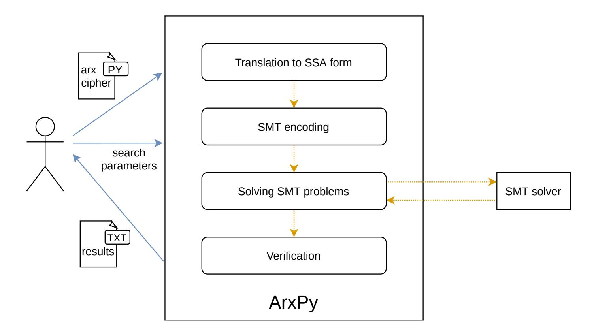

{0}------------------------------------------------

# A Bit-Vector Differential Model for the Modular Addition by a Constant

Seyyed Arash Azimi1? , Adri´an Ranea2? , Mahmoud Salmasizadeh<sup>3</sup> , Javad Mohajeri<sup>3</sup> , Mohammad Reza Aref<sup>1</sup> , and Vincent Rijmen2,<sup>4</sup>

<sup>1</sup> Department of Electrical Engineering, Sharif University of Technology, Tehran, Iran arash azimi@ee.sharif.edu, aref@sharif.edu

2 imec-COSIC, KU Leuven, Belgium

{adrian.ranea,vincent.rijmen}@esat.kuleuven.be

<sup>3</sup> Electronic Research Institute, Sharif University of Technology, Tehran, Iran {salmasi,mohajer}@sharif.edu

<sup>4</sup> Department of Informatics, UiB, Norway

Abstract. ARX algorithms are a class of symmetric-key algorithms constructed by Addition, Rotation, and XOR, which achieve the best software performances in low-end microcontrollers. To evaluate the resistance of an ARX cipher against differential cryptanalysis and its variants, the recent automated methods employ constraint satisfaction solvers, such as SMT solvers, to search for optimal characteristics. The main difficulty to formulate this search as a constraint satisfaction problem is obtaining the differential models of the non-linear operations, that is, the constraints describing the differential probability of each non-linear operation of the cipher. While an efficient bit-vector differential model was obtained for the modular addition with two variable inputs, no differential model for the modular addition by a constant has been proposed so far, preventing ARX ciphers including this operation from being evaluated with automated methods.

In this paper, we present the first bit-vector differential model for the nbit modular addition by a constant input. Our model contains O(log<sup>2</sup> (n)) basic bit-vector constraints and describes the binary logarithm of the differential probability. We also represent an SMT-based automated method to look for differential characteristics of ARX, including constant additions, and we provide an open-source tool ArxPy to find ARX differential characteristics in a fully automated way. To provide some examples, we have searched for related-key differential characteristics of TEA, XTEA, HIGHT, and LEA, obtaining better results than previous works. Our differential model and our automated tool allow cipher designers to select the best constant inputs for modular additions and cryptanalysts to evaluate the resistance of ARX ciphers against differential attacks.

Keywords: modular addition by a constant, differential probability, ARX, SMT, automated search, bit-vector theory

<sup>?</sup> These authors contributed equally to this work.

<sup>©</sup>IACR 2020. This article is the final version submitted by the author(s) to the IACR and to Springer-Verlag on 2020. The version published by Springer-Verlag is available at [https://doi.org/10.1007/978-3-030-64837-4\\_13](https://doi.org/10.1007/978-3-030-64837-4_13).

{1}------------------------------------------------

# 1 Introduction

Low-end devices such as RFID tags, sensor networks, and the Internet of Things (IoT) are becoming ubiquitous. In 2018, Gartner, Inc. forecasted that there will be more than 25 billion connected devices forming the IoT by 2021 [\[1\]](#page-26-0). Traditional cryptographic algorithms are not suitable for these resource-constrained devices, and several lightweight cryptographic algorithms have been recently proposed to meet this growing demand. In this regard, the National Institute of Standards and Technology (NIST) has started a process to evaluate and standardize lightweight cryptographic algorithms [\[2\]](#page-26-1).

ARX primitives, composed exclusively of modular Additions, cyclic Rotations, and XORs, are a promising class of lightweight cryptographic algorithms with the most efficient software implementations on low-end microcontrollers [\[3\]](#page-26-2). There are many noteworthy ARX algorithms, such as the hash function BLAKE [\[4\]](#page-26-3), the stream cipher Salsa20 [\[5\]](#page-26-4), the MAC algorithm Chaskey [\[6\]](#page-26-5) and notable block ciphers like HIGHT [\[7\]](#page-26-6), LEA [\[8\]](#page-26-7), SPECK [\[9\]](#page-27-0) or SPARX [\[10\]](#page-27-1). Usually, ciphers that are exclusively composed of ARX operations and other common bit-vector operations (e.g., modular multiplication or logical shifts) are also considered in the class of ARX ciphers, such as IDEA [\[11\]](#page-27-2), TEA [\[12\]](#page-27-3), or XTEA [\[13\]](#page-27-4).

The security of ARX ciphers is evaluated by analysing their robustness against various attacks. Some of the most successful attacks applied to ARX algorithms are differential cryptanalysis and their variants, such as boomerang or related-key differential attacks [\[8,](#page-26-7) [14\]](#page-27-5). These attacks exploit differences in the inputs that propagate through the cipher with high probability. The standard approach to show an ARX cipher is secure against differential attacks is by finding the optimal characteristics (i.e., trails of differences with the highest probabilities) that cover most of the rounds of the cipher and checking that their probabilities are negligible [\[7,](#page-26-6) [8\]](#page-26-7). When the best attack in the design stage is a differential attack, the number of rounds of the cipher is determined by the number of rounds that optimal characteristics can cover with non-negligible probability. Thus, searching for optimal characteristics is a crucial step in the design and security analysis of a cipher.

Two main techniques have been applied to search for optimal characteristics of ARX algorithms: branch-and-bound algorithms [\[15,](#page-27-6) [16\]](#page-27-7) based on Matsui's algorithm [\[17\]](#page-27-8), and the recent automated methods based on constraint satisfaction problems, such as SMT (Satisfiability Modulo Theories) or MILP (Mixed Integer Linear Programming) problems [\[18,](#page-27-9) [19\]](#page-27-10). Automated methods formulate the characteristic search problem as a constraint satisfaction problem and delegate the solving task to one of the powerful off-the-shelf constraint satisfaction solvers available nowadays [\[20,](#page-27-11) [21\]](#page-27-12). The main difficulty to formulate the search problem lies in the differential models of the non-linear operations, that is, the constraints describing the differential probability of the non-linear operations of the cipher.

ARX ciphers can be efficiently described using the bit-vector theory of SMT, and several bit-vector differential models have been proposed so far [\[22–](#page-27-13)[24\]](#page-27-14). For the modular addition with two n-bit operands, the foremost non-linear operation in ARX primitives, Lipmaa and Moriai found a bit-vector algorithm for computing

{2}------------------------------------------------

the differential probability with complexity O(log<sup>2</sup> n) [\[22\]](#page-27-13). This algorithm can be straightforwardly translated to a bit-vector differential model, and it has been used in several SMT-based methods to search for characteristics of ARX ciphers [\[18,](#page-27-9) [24,](#page-27-14) [25\]](#page-27-15).

However, no bit-vector differential model has been proposed for the modular addition with a constant input, preventing from searching for characteristics of ARX ciphers that contain constant additions. Lipmaa's algorithm is restricted to the modular addition with two operands, and it cannot be applied when one of the inputs is fixed to a constant as we will discuss later. Machado proposed an algorithm to compute the differential probability of the constant addition [\[26\]](#page-27-16), but it cannot be translated to an efficient bit-vector differential model due to its recursive nature and the use of floating-point arithmetic.

Contributions. We propose an efficient bit-vector differential model for the modular addition by an n-bit constant. Our model contains O(log<sup>2</sup> n) basic bit-vector constraints and it is composed of a bit-vector formula that determines whether a differential over the constant addition has non-zero probability and a bit-vector function that computes the binary logarithm of the differential probability. Our bit-vector model exploits the properties of the carry chain of the modular addition and relies on efficient well-known bit-vector functions, such as the hamming weight or the bit-reversal, and new bit-vector functions that we have developed for the binary logarithm.

Furthermore, we describe an SMT-based automated method to search for characteristics of ARX ciphers including constant additions. Our method is composed of an iterated search of optimal characteristics of round-reduced versions of the cipher and an automated encoding technique which formulates the SMT problems from the Single Static Assignment (SSA) form of the cipher. We have implemented our method in an open-source tool ArxPy[5](#page-2-0) , which fully automated the search of ARX characteristics. ArxPy offers a simple interface to represent any ARX cipher, different types of characteristics to search, and a complete documentation. To provide some examples, we have applied our characteristic search method to several ARX ciphers containing constant additions. In particular, we have searched for different types of related-key characteristics of TEA, XTEA, HIGHT and LEA. With our automated approach, we have revisited results previously found with manual and ad-hoc techniques, and we have obtained better characteristics in terms of probability and number of rounds.

With our bit-vector model for the constant addition, the SMT-based automated method, and our open-source tool ArxPy, we provide cipher designers with the resources to design ARX ciphers including constant additions that are secure against differential attacks. Thus, cipher designers can choose the best constants for the modular additions and optimize the number of rounds to strike a balance between security and efficiency.

Outline. The notation and preliminaries are introduced in Section [2,](#page-3-0) and the bit-vector model for the modular addition by a constant is described in Section [3.](#page-8-0)

<span id="page-2-0"></span><sup>5</sup> <https://github.com/ranea/ArxPy>

{3}------------------------------------------------

Section 4 illustrates the formulation of the characteristic search as a sequence of SMT problems, SMT-based search method, and the encoding of bit-vector SMT problems for ARX characteristics. Section 5 presents the characteristics found for TEA, XTEA, HIGHT, and LEA using our automated approach and finally Section 6 concludes the paper and addresses future works.

# <span id="page-3-0"></span>2 Preliminaries

#### 2.1 Notations

Let x be an integer such that its n-bit vector representation when  $0 \le x < 2^n$  is  $x = (x[n-1], \dots, x[0])$ , where x[0] and x[n-1] denote respectively the least and the most significant bit. For ease of notation, we define x[i] = 0 when i < 0 and the symbol \* stands for an undetermined bit. The usual integer operations are denoted by  $(+, -, \times, /)$  and the basic bit-vector operations are gathered in Table 1.

A mathematical expression only involving bit-vector variables and basic bit-vector operations is called a bit-vector expression. A bit-vector formula is a bit-vector expression returning True or False, such as Equals, whereas an *n*-bit vector function is a bit-vector expression returning an *n*-bit vector. In order to measure the complexity of the bit-vector differential model that we propose in this paper, we define the *bit-vector complexity* of a bit-vector expression as the number of basic bit-vector operations that the expression is composed of.

<span id="page-3-1"></span>**Table 1.** Basic bit-vector operations for n-bit vectors.

| x[i,j]          | the bit-vector $(x[i], \ldots, x[j]), n > i \ge j \ge 0$<br>bit-wise NOT of $x$ |
|-----------------|---------------------------------------------------------------------------------|
| $\neg x$        | on-wise NOT of $x$                                                              |
| $x \parallel y$ | concatenation of $x$ and $y$                                                    |
| $x \wedge y$    | bit-wise AND of $x$ and $y$                                                     |
| $x \vee y$      | bit-wise OR of $x$ and $y$                                                      |
| $x \oplus y$    | bit-wise XOR of $x$ and $y$                                                     |
| $x \ll i$       | (logical) left shift of $x$ by $i$ bits                                         |
| $x \gg i$       | right shift of $x$ by $i$ bits                                                  |
| $x \ll i$       | left cyclic rotation of $x$ by $i$ bits                                         |
| $x \gg i$       | right cyclic rotation of $x$ by $i$ bits                                        |
| $x \boxplus y$  | modular addition of $x$ and $y$                                                 |
| $x \boxminus y$ | modular subtraction of $x$ and $y$                                              |
| Equals(x,y)     | bit-vector equality of $x$ and $y$ , returning True                             |
|                 | if $x$ and $y$ are the same, otherwise False                                    |

In the literature of the bit-vector theory, the set of basic bit-vector operations usually includes the operations gathered in Table 1 and few additional operations,

{4}------------------------------------------------

such as modular multiplication or modular division [27]. However, modular multiplication and modular division are much more costly than the other operations in practice, and we have excluded them from our set of basic bit-vector operations, which resembles the unit-cost RAM model used in [22].

Apart from the basic bit-vector operations listed in Table 1, we will also employ the following well-known bit-vector functions: Carry, Rev, RevCarry, HW and LZ. The carry function  $c = \mathsf{Carry}(x,y)$  returns the n-bit carry chain of the n-bit modular addition  $x \boxplus y$ . It is defined iteratively as c[0] = 0 and  $c[i+1] = (x[i] \land y[i]) \oplus (x[i] \land c[i]) \oplus (y[i] \land c[i])$ . Note that the carry has bit-vector complexity O(1), since  $\mathsf{Carry}(x,y) = x \oplus y \oplus (x \boxplus y)$ .

The bit-reversal function  $\operatorname{Rev}(x)$  reverses the order of bits of x, i.e.,  $\operatorname{Rev}(x) = (x[0], x[1], \ldots, x[n-1])$ . We will use this function to define the reverse carry,  $\operatorname{RevCarry}(x,y) = \operatorname{Rev}(\operatorname{Carry}(\operatorname{Rev}(x),\operatorname{Rev}(y)))$ . The hamming weight  $\operatorname{HW}(x)$  returns an n-bit vector denoting the number of non-zero bits of the n-bit input x. Lastly, the leading zeros function  $\operatorname{LZ}(x)$  marks the leading zeros of an n-bit input x, that is, for  $0 \le i < n$  we have  $\operatorname{LZ}(x)[i] = 1 \iff x[n-1,i] = 0$ . Note that the functions  $\operatorname{Rev}$ ,  $\operatorname{RevCarry}$ ,  $\operatorname{HW}$  and  $\operatorname{LZ}$  can be computed using a divide and conquer approach with bit-vector complexity  $O(\log_2 n)$  [28].

## 2.2 Differential Cryptanalysis

A block cipher is a family of permutations parameterized by a  $\kappa$ -bit key k, mapping n-bit plaintexts p to n-bit ciphertexts c. Most block ciphers consist of a key scheduling algorithm KS, which derives round keys  $k_1, \ldots, k_r$  from the master key k, and an encryption algorithm  $E_k$ , which processes the plaintext by iterating a round function f and injecting a round key at each round, i.e.,  $E_k = f_{k_r} \circ \cdots \circ f_{k_1}$ .

Block ciphers are shown to be secure by analysing their resistance against all known attacks. One of the most powerful attacks, specially to ARX primitives, is differential cryptanalysis [29]. Basically, it exploits non-random propagation of differences in the input to recover the secret key.

Let F be an n-bit to n-bit function and  $(\Delta_p, \Delta_c)$  be the XOR of a pair of inputs (p, p') and their corresponding outputs (c, c'), i.e.,  $\Delta_p = p \oplus p'$  and  $\Delta_c = c \oplus c'$ . The pair  $(\Delta_p, \Delta_c)$  is called a differential and its probability is defined as

$$\Pr[\Delta_p \xrightarrow{F} \Delta_c] = \frac{\#\{p: F(p) \oplus F(p \oplus \Delta_p) = \Delta_c\}}{2^n}.$$

A differential is valid if it has non-zero probability. In this case, its weight is defined as

$$\operatorname{weight}_F(\Delta_p, \Delta_c) = -\log_2(\Pr[\Delta_p \xrightarrow{F} \Delta_c]).$$

The differential  $0 \xrightarrow{F} 0$  has probability 1 for any function F, and a differential with non-zero input difference over a random n-bit permutation has probability  $2^{-n}$ . Differential cryptanalysis [29] exploits a differential over the n-bit block cipher with probability  $p > 2^{-n}$  to recover the secret key with roughly  $O(p^{-1})$  encryption calls.

{5}------------------------------------------------

Related-key differential cryptanalysis [30] extends differential cryptanalysis by considering key differences. A related-key differential is given by a pair of differentials over the key schedule and the encryption function respectively,

$$(\Delta_k \xrightarrow{\mathsf{KS}} (\Delta_{k_1}, \dots, \Delta_{k_r})), \quad (\Delta_p \xrightarrow{E} \Delta_c),$$

where the ciphertext difference is computed using the related round-key pairs,

$$\Delta_c = (f_{k_r} \circ \cdots \circ f_{k_1})(p) \oplus (f_{k_r \oplus \Delta_{k_r}} \circ \cdots \circ f_{k_1 \oplus \Delta_{k_1}})(p \oplus \Delta_p).$$

The probability of a related-key differential is the product of the probability of key schedule differential  $p_{KS}$  and the probability of encryption differential  $p_E$ .

A related-key attack exploits a related-key differential with  $p_{\mathsf{KS}} > 2^{-\kappa}$  and  $p_E > 2^{-n}$  to recover the secret key with complexity  $O((p_{\mathsf{KS}} \times p_E)^{-1})$ . The attacker takes about  $p_{\mathsf{KS}}^{-1}$  key pairs to find one key, on average, that satisfies the key schedule differential. Next and for each key pair, the attacker runs a differential attack over the encryption using  $O(p_E^{-1})$  encryption calls.

Related-key differential cryptanalysis requires a very powerful attacker that can query the encryption function  $E_{k\oplus\Delta_k}$  for many keys  $k\oplus\Delta_k$ . In fact, if an adversary can query  $E_{k\oplus\Delta_k}$  for  $2^m$  key differences  $\Delta_k$ , any block cipher is vulnerable to a related-key attack with complexity  $O(2^m+2^{n-m})$  [31]. Thus, we distinguish between weak related-key differentials (i.e.,  $p_{\text{KS}} < 1$ ) and strong related-key differentials (i.e.,  $p_{\text{KS}} = 1$ ), which can be exploited in practice with a single related-key pair. Furthermore, we call equivalent keys as pairs of related keys  $(k, k\oplus\Delta_k)$  such that  $\forall p, E_k(p) = E_{k\oplus\Delta_k}(p\oplus\Delta_p) \oplus \Delta_c$ , for some  $(\Delta_p, \Delta_c)$ . Note that a related-key differential with  $p_E = 1$  leads to  $2^{\kappa}p_{\text{KS}}$  pairs of equivalent keys.

**Searching for differentials.** The most difficult step to launch a differential attack is finding a differential with high probability. The main approach is to analyse how differences propagate through the round function and search for a characteristic, that is, a trail of differences

$$\Omega = (\Delta_p = \Delta_{x_0} \xrightarrow{f_{k_1}} \Delta_{x_1} \to \cdots \to \Delta_{x_{r-1}} \xrightarrow{f_{k_r}} \Delta_{x_r} = \Delta_c).$$

Similar to differentials, a characteristic  $\Omega$  is valid if it has non-zero probability and its weight is defined as  $-\log_2(\Pr[\Omega])$ . Furthermore, we denote a relatedkey characteristic by a pair of characteristics  $(\Omega_{KS}, \Omega_E)$ , where  $\Omega_{KS}$  is the key schedule characteristic containing the trail of differences from the master key to the round keys and  $\Omega_E$  is the encryption characteristic containing the trail of differences through the encryption.

Obtaining the exact probability of a characteristic is computationally infeasible. Thus, two assumptions are commonly made. First, it is assumed that the differential probabilities over each round are independent, which allows to compute the weight of a characteristic by summing the round weights, i.e.,

$$\operatorname{weight}(\varOmega) = \sum_{i=0}^r \operatorname{weight}(\varDelta_{x_i} \to \varDelta_{x_{i+1}})\,.$$

{6}------------------------------------------------

Second, it is assumed that the probability of a characteristic does not strongly depend on the choice of the secret key, also known as the hypothesis of stochastic equivalence [\[32\]](#page-28-5), which allows to compute the weight of a characteristic by averaging over all keys.

On top of that, designers also assume that the probability of a differential (∆p, ∆c) is close to the probability of the best characteristic (∆<sup>p</sup> → · · · → ∆c), and they prove a cipher is secure against differential cryptanalysis by showing that characteristics with high probability cannot cover most rounds of the cipher. While these assumptions do not always hold, currently this is the best systematic approach to argue security against differential cryptanalysis, and this heuristic approach is widely used for ARX ciphers in practice [\[18,](#page-27-9) [19,](#page-27-10) [23,](#page-27-17) [25,](#page-27-15) [33,](#page-28-6) [34\]](#page-28-7).

SMT solvers. A recent approach to search for characteristics of ARX ciphers is by formulating the search problem as an SMT problem in the bit-vector theory [\[18,](#page-27-9) [23](#page-27-17)[–25,](#page-27-15) [35\]](#page-28-8). Satisfiability Modulo Theories (SMT) refers to the problem of determining whether a first order formula is satisfiable with respect to some logical theory. SMT problems are a generalization of SAT problems; while the latter problems are expressed in propositional logic, SMT formulas can be expressed in richer logics, such as the theory of bit-vectors or the theory of integers.

SMT has grown in recent years into a very active research field and several off-the-shelf SMT solvers are available nowadays [\[20\]](#page-27-11). Most SMT solvers can not only determine the satisfiability of a problem but also obtain an assignment of the variables that satisfies the problem. This feature allows SMT solvers to be applied in search problems.

An SMT problem in the bit-vector theory is given by a set of bit-vector variables and a set of bit-vector formulas or constraints. The constraints can be defined with the usual logical operations (e.g., Equals, NotEquals, Implies, etc.) and with the usual bit-vector operations (e.g., ⊕, ,≪, etc.).

### 2.3 Differential Models

To represent a characteristic in a constraint satisfaction problem, it is necessary to find a differential model of the round function f. For an SMT problem in the bit-vector theory, a differential model of a function y = f(x) is given by a bit-vector formula valid<sup>f</sup> (∆x, ∆y) and a bit-vector function weight<sup>f</sup> (∆x, ∆y). The formula valid<sup>f</sup> (∆x, ∆y) is True if and only if the differential (∆<sup>x</sup> → ∆y) over f is valid, and the function weight<sup>f</sup> (∆x, ∆y) returns the weight of a valid differential (∆<sup>x</sup> → ∆y).

Characteristics over ARX ciphers are usually defined by considering the difference after each ARX operation. The differential models of the XOR and the cyclic rotations are very simple since these operations propagate differences deterministically, that is,

$$\Delta_{x_1}, \Delta_{x_2} \xrightarrow{f(x_1, x_2) = x_1 \oplus x_2} \Delta_{x_1} \oplus \Delta_{x_2}, \qquad \Delta_x \xrightarrow{f_a(x) = x \oplus a} \Delta_x,$$

$$\Delta_x \xrightarrow{f_a(x) = x \ll a} \Delta_x \ll a, \qquad \Delta_x \xrightarrow{f_a(x) = x \gg a} \Delta_x \gg a.$$

{7}------------------------------------------------

For the modular addition with two *n*-bit inputs,  $y = f(x_1, x_2) = x_1 \boxplus x_2$ , the algorithm by Lipmaa et al. [22] can be translated into the following differential model with bit-vector complexity  $O(\log_2 n)$ .

<span id="page-7-2"></span>**Theorem 1.** Let  $((\Delta_{x_1}, \Delta_{x_2}), \Delta_y)$  be a differential over the modular addition  $y = x_1 \boxplus x_2$  and denote  $\overleftarrow{x} = x \ll 1$  and  $\operatorname{eq}(a, b, c) = (\neg a \oplus b) \land (\neg a \oplus c)$ . Then, the differential is valid if and only if the bit-vector formula

$$\mathsf{valid}_{\boxplus}((\Delta_{x_1}, \Delta_{x_2}), \Delta_y) = \mathsf{Equals}(0, \mathsf{eq}(\overleftarrow{\Delta_{x_1}}, \overleftarrow{\Delta_{x_2}}, \overleftarrow{\Delta_y}) \land (\Delta_{x_1} \oplus \Delta_{x_2} \oplus \Delta_y \oplus \overleftarrow{\Delta_{x_2}}))$$

is True. In this case, the differential weight is given by the bit-vector function

$$\mathsf{weight}_{\boxplus}((\Delta_{x_1}, \Delta_{x_2}), \Delta_y) = \mathsf{HW}(\neg \mathsf{eq}(\Delta_{x_1}, \Delta_{x_2}, \Delta_y) \ll 1)$$
.

For the modular addition with a constant input  $\boxplus_a(x) = x \boxplus a$ , Machado obtained the following algorithm to compute the differential probability [26].

<span id="page-7-0"></span>**Theorem 2.** Let (u,v) be a differential over the n-bit constant addition  $\coprod_a$ . Then, the differential probability is given by

$$\Pr[u \xrightarrow{\boxplus_a} v] = \varphi_0 \times \cdots \times \varphi_{n-1},$$

where  $\varphi_i$  depends on the  $\delta_{i-1}$  and  $S_i$ , each one defined for  $0 \le i < n$  by

$$S_{i} = (u[i-1], v[i-1], u[i] \oplus v[i]),$$

$$\delta_{i} = \begin{cases} (a[i-1] + \delta_{i-1})/2, & S_{i} = 000 \\ 0, & S_{i} = 001 \end{cases}$$

$$\delta_{i} = \begin{cases} a[i-1], & S_{i} \in \{010, 100, 110\} \\ \delta_{i-1}, & S_{i} \in \{011, 101\} \\ 1/2, & S_{i} = 111 \end{cases}$$

$$\varphi_{i} = \begin{cases} 1, & S_{i} = 000 \\ 0, & S_{i} = 001 \\ 0, & S_{i} = 001 \\ 1/2, & S_{i} \in \{010, 011, 100, 101\} \end{cases}$$

$$1 - (a[i-1] + \delta_{i-1} - 2a[i-1]\delta_{i-1}), & S_{i} = 110 \\ (a[i-1] + \delta_{i-1} - 2a[i-1]\delta_{i-1}), & S_{i} = 111, \end{cases}$$

For i = -1,  $S_i$  and  $\delta_i$  are defined by  $S_{-1} = \bot$  and  $\delta_{-1} = 0$ .

Unfortunately, the algorithm illustrated in Theorem 2 is not suitable for constraint satisfaction problems due to its recursive nature and the use of floating-point arithmetic.

<span id="page-7-1"></span>Some authors [36, Corollary 2] [37] have adapted the differential model of the 2-input addition (i.e., the modular addition with two independent inputs) for the constant addition by setting the difference of the second operand to zero, that is,

$$\operatorname{valid}_{\boxplus_{a}}(\Delta_{x}, \Delta_{y}) \leftarrow \operatorname{valid}_{\boxplus}((\Delta_{x}, 0), \Delta_{y}),$$

$$\operatorname{weight}_{\boxplus_{a}}(\Delta_{x}, \Delta_{y}) \leftarrow \operatorname{weight}_{\boxplus}((\Delta_{x}, 0), \Delta_{y}).$$
(1)

{8}------------------------------------------------

The approximation given by Equation (1) models the differential  $(\Delta_x \xrightarrow{\boxtimes_a} \Delta_y)$  by averaging over all a. While this approach can be used to model the constant addition by a round key, since the characteristic probability is also computed by averaging over all keys, for a fixed constant this approach is rather inaccurate.

Surprisingly, the differential properties of the 2-input addition and the constant addition are very different. The 2-input addition was shown to be CCZ-equivalent to a quadratic function [38], that is, the differential properties of the 2-input addition are the same of some quadratic function. In particular, the set of inputs  $(x_1, x_2)$  satisfying a differential  $((\Delta_{x_1}, \Delta_{x_2}) \to \Delta_y)$  over the 2-input addition forms a subspace of  $\mathbb{F}_2^n$ , which allows to describe its differential model using few basic operations.

On the other hand, the constant addition is not CCZ-equivalent to a quadratic function, since the set of inputs  $(x_1, x_2)$  satisfying a differential  $(\Delta_x, \Delta_y)$  over  $\boxplus_a$  does not form a subspace for many a. In other words, the probability of a differential over the constant addition is not necessarily of the form  $2^{-\alpha}$  for a positive integer  $\alpha$ , and finding a differential model for the constant input addition is a much harder problem.

We checked experimentally how accurate was the approximation given by Equation (1) for 8-bit constants a. For most values of a, validity formulas differ roughly in  $2^{13}$  out of all  $2^{16}$  differentials, and for those differentials where they did not differ, the difference between their weights was significantly high in average.

Consequently, no differential model of the constant addition suitable for constraint satisfaction problems has been proposed so far. In the next section we present the first differential model of the constant addition for SMT problems in the bit-vector theory.

### <span id="page-8-0"></span>3 Bit-Vector Differential Model of the Constant Addition

We present a bit-vector differential model of the constant addition, composed of a bit-vector formula to determine whether a given differential is valid and a bit-vector function that computes the weight of the valid differential. Our model takes benefit from Theorem 2 [26]; however, we avoid bit iterations, floating-point arithmetic, multiplications and look-up tables, in order to obtain efficient bit-vector constraints to be used in bit-vector SMT problems.

Before we illustrate our model, we remark an essential property of Theorem 2. When the state  $S_i$  is not 110 or 111, the probability of the step i,  $\varphi_i$ , depends exclusively on  $S_i$ ; otherwise,  $\varphi_i$  depends on  $S_i$  and  $\delta_{i-1}$ . When  $S_i = 11*$ ,  $S_{i-1} \in \{010, 100, 110, 000\}$  and for the first three cases,  $\delta_{i-1}$  is equal to a[i-2]. However, considering the forth case, i.e.,  $S_{i-1} = 000$ ,  $\delta_{i-1}$  depends on  $\delta_{i-2}$  and this dependency will proceed until we obtain a state  $S_{i-\ell_i} \neq 000$  for some positive integer  $\ell_i$ . Thus,  $\delta_{i-1}$  has the following expression when  $S_i = 11*$ ,

<span id="page-8-1"></span>
$$\delta_{i-1} = \frac{a[i-\ell_i-1]}{2^{\ell_i-1}} + \sum_{j=2}^{\ell_i} \frac{a[i-j]}{2^{j-1}}.$$
 (2)

{9}------------------------------------------------

Therefore, when S<sup>i</sup> = 11\*, ϕ<sup>i</sup> also depends on the previous states Si−<sup>1</sup> · · · , Si−`<sup>i</sup> , which motivates the following definition.

<span id="page-9-2"></span>Definition 1. Let S<sup>i</sup> = 11\*. The chain Γ<sup>i</sup> is defined as the smallest set of previous states {Si−1, Si−2, · · · , Si−`<sup>i</sup> } that completely determine ϕi, and the positive integer `<sup>i</sup> is called the length of Γi.

Given a chain Γ<sup>i</sup> = {Si−1, Si−2, · · · , Si−`<sup>i</sup> }, note that Si−`<sup>i</sup> =6 000 and the remaining states in the chain (if any) are all equal to 000.

## 3.1 Validity

Let (u, v) be a differential over a, the modular addition by n-bit constant a. According to Theorem [2,](#page-7-0) the differential probability of (u, v) can be expressed as ϕ<sup>0</sup> × · · · × ϕn−1. Thus, (u, v) is a valid differential, i.e., with non-zero probability, if and only if all ϕ<sup>i</sup> are non-zero. If ϕ<sup>i</sup> = 0, note that S<sup>i</sup> must be 001, 110 or 111. While S<sup>i</sup> = 001 always implies ϕ<sup>i</sup> = 0, the other two cases require an extra condition to result in ϕ<sup>i</sup> = 0, as shown in the next lemma.

<span id="page-9-0"></span>Lemma 1. Let the state S<sup>i</sup> be 11b, for b ∈ {0, 1}. Then, ϕ<sup>i</sup> is equal to 0 if and only if ¬b ⊕ a[i − 1] = a[i − 2] = · · · = a[i − `<sup>i</sup> − 1] .

Proof. Having S<sup>i</sup> = 11b, ϕ<sup>i</sup> = 0 if and only if ¬b = δi−<sup>1</sup> ⊕ a[i − 1]. Let `<sup>i</sup> be the chain length of S<sup>i</sup> . The case for `<sup>i</sup> = 1 is trivial, since δi−<sup>1</sup> = a[i − 2]. To achieve δi−<sup>1</sup> = a[i − 1] ⊕ ¬b when `<sup>i</sup> > 1, the non-negative rational number δi−<sup>1</sup> must be equal to 0 or 1. Since δi−<sup>1</sup> is a monotonically increasing function of (a[i − 2], . . . , a[i − `<sup>i</sup> − 1]) regarding Equation [\(2\)](#page-8-1), δi−<sup>1</sup> reaches its extrema in (0, . . . , 0) and (1, . . . , 1), that is,

$$\delta_{i-1} = c \iff a[i-2] = a[i-3] = \dots = a[i-\ell_i-1] = c, \quad \forall c \in \{0,1\},$$
Thus,  $\delta_{i-1} = a[i-1] \oplus \neg b \iff \delta_{i-1} = a[i-2] = \dots = a[i-\ell_i].$ 

The next lemma provides a bit-vector expression to check Lemma [1](#page-9-0) by exploiting the fact that the carry chain allows a bit to affect the bits to its left.

<span id="page-9-1"></span>Lemma 2. Consider the following n-bit values,

$$\begin{split} s_{\textit{00*}} &= \neg (u \ll 1) \land \neg (v \ll 1), \quad s_{\textit{**1}} = u \oplus v, \quad a' = (a \oplus (a \ll 1)) \ll 1, \\ c &= \mathsf{Carry} \left( s_{\textit{00*}} \land \neg a', \neg (s_{\textit{00*}} \ll 1) \right), \quad g = (s_{\textit{**1}} \oplus a') \land (c \lor \neg (s_{\textit{00*}} \ll 1)). \end{split}$$

Then, for all states S<sup>i</sup> = 11\*, we have ϕ<sup>i</sup> = 0 if and only if g[i] = 1.

Proof. Let S<sup>i</sup> = 11b with chain length `<sup>i</sup> . Note that a 0 [i] = a[i − 1] ⊕ a[i − 2] and that s00\*[i] = 1 (resp. s\*\*1[i] = 1) if and only if S<sup>i</sup> = 00\* (resp. S<sup>i</sup> = \*\*1).

The first operand of g[i], i.e., (s\*\*1 ⊕ a 0 )[i], is equal to one if and only if b = ¬(a[i − 1] ⊕ a[i − 2]). For `<sup>i</sup> = 1 it is easy to see that Si−<sup>1</sup> 6= 00\*; therefore, the second operand of g[i] is 1, and by Lemma [1](#page-9-0) g[i] = 1 if and only if ϕ<sup>i</sup> = 0.

{10}------------------------------------------------

When  $\ell_i > 1$ ,  $S_{i-1} = 000$  and the second major operand of g[i] reduces to c. In particular, the two major operands of the Carry function of c are given by

$$(s_{00*} \wedge \neg a')[i, i - \ell_i] = (\neg(a[i-1] \oplus a[i-2]), \dots, \neg(a[i-\ell_i] \oplus a[i-\ell_i-1]), 0),$$
  
 $\neg(s_{00*} \ll 1)[i, i - \ell_i] = (0, \dots, 0, 1, *).$ 

Thus,  $c[i] = c[i-1] \land \neg a'[i-1]$  and  $c[i-\ell_i+1] = c[i-\ell_i] \land \neg s_{00*}[i-\ell_i-1] = 0$ ; otherwise, for  $0 \le j \le i-\ell_i-1$  we will obtain  $s_{00*}[j] = 0$  which does not conform to  $S_0 = 00*$ . By unrolling the recursive definition of c[i], we see that  $c[i] = \neg a'[i-1] \land \cdots \land \neg a'[i-\ell_i+1]$ . In other words, c[i] = 1 if and only if  $a[i-2] = \cdots = a[i-\ell_i-1]$ . Together with the condition for  $(s_{**1} \oplus a')[i] = 1$ , we have that g[i] = 1 exactly when  $\varphi_i = 0$ , regarding Lemma 1.

Lemma 2 provides a bit-vector variable g that detects the states  $S_i = 11*$  leading to invalidity. The next theorem presents the final bit-vector formula for the validity by taking into account the states  $S_i = 001$  as well.

<span id="page-10-1"></span>**Theorem 3.** Let (u,v) be a differential over the n-bit constant addition  $\coprod_a$ . Consider the n-bit value g defined in Lemma 2 and the following n-bit values

$$s_{001} = \neg(u \ll 1) \land \neg(v \ll 1) \land (u \oplus v), \qquad s_{11*} = (u \ll 1) \land (v \ll 1).$$

Then, the bit-vector formula  $\mathsf{valid}_{\boxplus_a}(u,v) = \mathsf{Equals}(s_{001} \lor (s_{11*} \land g), 0)$  is **True** if and only if the differential (u,v) is valid.

Proof. By the definition of  $s_{001}$  and  $s_{11*}$ ,  $s_{001}[i] = 1$  (respectively  $s_{11*}[i] = 1$ ) if and only if  $S_i = 001$  (respectively  $S_i = 11*$ ). Moreover,  $\varphi_i = 0$  exactly when  $S_i = 001$ , or when  $S_i = 11*$  and g[i] = 1 (Lemma 2). Thus,  $\varphi_i = 0$  if and only if  $s_{001} \vee (s_{11*} \wedge g)[i] = 1$ .

Since the number of basic bit-vector operations of our bit-vector validity formula is independent of the bit-size of the inputs, the bit-vector complexity of  $\mathsf{valid}_{\boxplus_a}$  is O(1).

#### 3.2 Weight of a Valid Differential

In this section, we propose a bit-vector function that computes the weight of a valid differential over the constant addition. Working with differential weights has the advantage that multiple differential weights can be combined by adding them up, while probabilities need to be multiplied, a very costly operation in a bit-vector SMT problem.

The weight of a valid differential over the constant addition is an irrational value in general, and it cannot be represented as a fixed-sized bit-vector. Thus, our bit-vector function computes a close approximation of the weight, and we provide almost tight bounds for the approximation error.

Through the rest of the section, let (u, v) be a valid differential over the *n*-bit constant addition  $\coprod_a$ . According to Theorem 2, the weight can be obtained by

<span id="page-10-0"></span>
$$\operatorname{weight}_{\boxplus_a}(u, v) = -\log_2\left(\prod_{i=0}^{n-1} \varphi_i\right) = -\sum_{i=0}^{n-1} \log_2(\varphi_i). \tag{3}$$

{11}------------------------------------------------

Let  $\mathcal{I}$  denote the set of indices corresponding to the states 11\* with chain length bigger than one, i.e.,  $\mathcal{I} = \{1 \leq i \leq n-1 \mid S_i = 11*, \ \ell_i > 1\}$ . For  $i \notin \mathcal{I}$ , the probability  $\varphi_i$  only depends on the current state  $S_i$  and  $\varphi_i$  is either 1 or 1/2. Since  $\varphi_i = 1/2$  when  $S_i \in \{01*, 10*\}$ , it is easy to see that

<span id="page-11-0"></span>
$$-\sum_{i \notin \mathcal{I}} \log_2(\varphi_i) = \mathsf{HW}((u \oplus v) \ll 1). \tag{4}$$

Equation (4) describes the sum of  $\log_2(\varphi_i)$  when  $i \notin \mathcal{I}$  as a bit-vector expression with complexity  $O(\log_2 n)$ . To describe the logarithmic summation when  $i \in \mathcal{I}$  as a bit-vector, we will first show how to split  $\varphi_i$  as the quotient of two integers.

<span id="page-11-1"></span>**Lemma 3.** Let  $i \in \mathcal{I}$  and let  $p_i$  be the positive integer defined by

$$p_i = \begin{cases} a[i-2, i-\ell_i] + a[i-\ell_i-1], & u[i] \oplus v[i] \oplus a[i-1] = 1\\ 2^{\ell_i-1} - (a[i-2, i-\ell_i] + a[i-\ell_i-1]), & u[i] \oplus v[i] \oplus a[i-1] = 0 \end{cases}$$

where  $\ell_i > 1$  is the chain length of the state  $S_i = 11*$ . Then,  $\varphi_i = \frac{p_i}{2^{\ell_i - 1}}$ .

*Proof.* Considering the definition of  $\varphi_i$  when  $S_i = 11*$ ,

$$\varphi_i = \begin{cases} \delta_{i-1}, & u[i] \oplus v[i] \oplus a[i-1] = 1\\ 1 - \delta_{i-1}, & u[i] \oplus v[i] \oplus a[i-1] = 0 \end{cases}$$

and following the definition of  $\delta_{i-1}$  given by Equation (2),

$$2^{\ell_i - 1} \delta_i = \sum_{i=0}^{\ell_i - 2} 2^j a[i - \ell_i + j] + a[i - \ell_i - 1] = a[i - 2, i - \ell_i] + a[i - \ell_i - 1],$$

we obtain that  $\varphi_i = p_i/2^{\ell_i-1}$ . Moreover, having  $0 < \varphi_i \le 1$  and  $\ell_i > 1$  results in  $0 < p_i \le 2^{\ell_i-1}$ . Thus,  $p_i$  is always a positive integer.

Due to Lemma 3, we can decompose the logarithmic summation over  $\mathcal{I}$  as

$$\sum_{i \in \mathcal{I}} \log_2(\varphi_i) = \sum_{i \in \mathcal{I}} \log_2(p_i) - \sum_{i \in \mathcal{I}} (\ell_i - 1).$$

The next lemma shows how to describe the summation involving the chain lengths with basic bit-vector operations.

<span id="page-11-2"></span>**Lemma 4.** Consider the n-bit vector  $s_{000} = \neg(u \ll 1) \land \neg(v \ll 1)$ . Then,

$$\sum_{i \in \mathcal{I}} (\ell_i - 1) = \mathsf{HW} \left( s_{000} \land \neg \mathsf{LZ}(\neg s_{000}) \right).$$

*Proof.* Recall that there are exactly  $(\ell_i - 1)$  states in each chain  $\Gamma_i$  such that

$$S_{i-1} = S_{i-2} = \dots = S_{i-(\ell_i-1)} = 000.$$

{12}------------------------------------------------

Therefore, we have  $\sum_{i\in\mathcal{I}}(\ell_i-1)=\#\{S_j|S_j=000\text{ and }\exists i\in\mathcal{I}\text{ s.t. }S_j\in\Gamma_i\}$ . When  $S_j=000$ , the next state  $S_{j+1}$  will be a member of the set  $\{000,11*\}$ . As a result, it is easy to see that for an arbitrary j, if  $S_j$  is equal to 000, then either  $S_j$  is included in some chain  $\Gamma_i, i\in\mathcal{I}$ , or  $S_j$  belongs to the set  $\Gamma'$  defined by

$$\Gamma' = \{S_{n-1} = 000, \cdots, S_{n-k} = 000\},\$$

for some k > 0, where  $S_{n-k-1} \neq 000$ . Concerning Definition 1, one can observe that  $\Gamma'$  is not a chain. Therefore,  $\sum_{i \in \mathcal{I}} (\ell_i - 1) = \#\{S_j | S_j = 000 \text{ and } S_j \notin \Gamma'\}$ .

Since we are assuming that the differential is valid, there are no states  $S_j = 001$ , and  $s_{000}[j] = 1$  if and only if  $S_j = 000$ . On the other hand, the function LZ can be used to detect the states from the set  $\Gamma'$ . In particular,  $LZ(\neg s_{000})[i]$  is equal to 1 if and only if  $S_i \in \Gamma'$ . Therefore, we obtain

$$\sum_{i \in \mathcal{T}} (\ell_i - 1) = \mathsf{HW} \left( s_{000} \wedge (\neg \mathsf{LZ}(\neg s_{000})) \right). \quad \Box$$

Representing the sum of  $\log_2(p_i)$  by a bit-vector expression is the most complex and challenging part of our differential model. Thus, we will proceed in several steps. First, we will show how to obtain a bit-vector w that contains all the  $p_i$  as some sub-vectors.

<span id="page-12-0"></span>**Lemma 5.** Consider the following n-bit values,

$$\begin{split} s_{000} &= \neg (u \ll 1) \wedge \neg (v \ll 1) \,, & s'_{000} &= s_{000} \wedge \neg \operatorname{LZ}(\neg s_{000}) \,, \\ t &= \neg s'_{000} \wedge (s'_{000} \gg 1) \,, & t' &= s'_{000} \wedge (\neg (s'_{000} \gg 1)) \,, \\ s &= ((a \ll 1) \wedge t) \boxplus (a \wedge (s'_{000} \gg 1)) \,, & q &= \left( (\neg ((a \ll 1) \oplus u \oplus v)) \gg 1 \right) \wedge t' \,, \\ d &= \operatorname{RevCarry}(s'_{000}, q) \vee q \,, & w &= (q \boxminus (s \wedge d)) \vee (s \wedge \neg d) \,. \end{split}$$

Then, for all states  $S_i = 11*$  with  $i \in \mathcal{I}$ ,  $w[i-1, i-\ell_i] = p_i$ .

Proof. For each  $i \in \mathcal{I}$  and  $0 \leq j < n$ , note that  $s'_{000}[j] = 1$  exactly when  $S_j = 000$  and  $S_j \in \Gamma_i$ , and t[j] = 1 (resp. t'[j] = 1) if and only if  $S_j = S_{i-\ell_i}$  (resp.  $S_j = S_{i-1}$ ). Denoting  $s = s_1 \boxplus s_2$ , where  $s_1 = (a \ll 1) \land t$  and  $s_2 = a \land (s'_{000} \gg 1)$ , when  $i \in \mathcal{I}$  the sub-vectors

$$s_1[i-1, i-\ell_i-1] = (0, 0, \dots, 0, a[i-\ell_i-1], 0),$$
  
 $s_2[i-1, i-\ell_i-1] = (0, a[i-2], \dots, a[i-\ell_i+1], a[i-\ell_i], 0),$ 

result in  $s[i-1, i-\ell_i] = a[i-2, i-\ell_i] + a[i-\ell_i-1]$ . In particular,  $s[i-1, i-\ell_i] \le 2^{\ell_i-1}$  and the equality holds when  $s[i-1, i-\ell_i] = 10...0$ .

It is easy to see that  $q[i-1] = \neg(a[i-2] \oplus u[i-1] \oplus v[i-1])$  when  $i \in \mathcal{I}$  and q is zero elsewhere. Then, the sub-vectors  $d[i-1,i-\ell_i]$  are composed of repeated copies of q[i-1] when  $i \in \mathcal{I}$ , as shown by the following sub-vectors

$$\begin{split} s'_{000}[i,i-\ell_i-1] &= (0,\,1,\qquad 1,\qquad \dots,\,1,\qquad 0,\qquad *)\,,\\ q[i,i-\ell_i-1] &= (0,\,q[i-1],\,0,\qquad \dots,\,0,\qquad 0,\qquad *)\,,\\ \mathsf{RevCarry}(s'_{000},q)[i,i-\ell_i-1] &= (*,\,0,\qquad q[i-1],\dots,\,q[i-1],\,q[i-1],\,0)\,,\\ d[i,i-\ell_i-1] &= (*,\,q[i-1],\,q[i-1],\dots,\,q[i-1],\,q[i-1],\,*)\,. \end{split}$$

{13}------------------------------------------------

The only exception for the above equations is when i − `<sup>i</sup> = −1, where the two least significant bits of the above sub-vectors will be equal to zero.

Let w = w<sup>1</sup> ∧ w2, where w<sup>1</sup> = q  (s ∧ d) and w<sup>2</sup> = s ∧ ¬d. Regarding the acquired patterns for q and d, we prove the following inequalities for i ∈ I

$$(s \wedge d)[i-1, i-\ell_i] \leq q[i-1, i-\ell_i],$$
  
 $(s \wedge d)[i-\ell_i-1, 0] \leq q[i-\ell_i-1, 0],$ 

which imply the identity w1[i − 1, i − `<sup>i</sup> ] = q[i − 1, i − `<sup>i</sup> ]  (s ∧ d)[i − 1, i − `<sup>i</sup> ].

The first inequality can be derived from the fact that s[i − 1, i − `<sup>i</sup> ] ≤ 10...0. For the second inequality, consider the index set J = {j|∀i ∈ I, S<sup>j</sup> ∈/ Γi}. Then, the second inequality holds since for j ∈ J and c ∈ {0, 1} we can see that

$$s'_{000}[j+1-c] = 0 \implies s_1[j-c] = s_2[j-c] = 0.$$

We are now ready to evaluate w[i − 1, i − `<sup>i</sup> ] when i ∈ I. If q[i − 1] = 0, then d[i − 1, i − `<sup>i</sup> ] = (0, . . . , 0), w1[i − 1, i − `<sup>i</sup> ] reduces to 0, and

$$w[i-1,i-\ell_i] = w_2[i-1,i-\ell_i] = a[i-2,i-\ell_i] + a[i-\ell_i-1].$$

If q[i − 1] = 1, then d[i − 1, i − `<sup>i</sup> ] = (1, . . . , 1), w2[i − 1, i − `<sup>i</sup> ] reduces to 0, and

$$w[i-1, i-\ell_i] = w_1[i-1, i-\ell_i] = (1, 0, \dots, 0) \boxminus s[i-1, i-\ell_i]$$
$$= 2^{\ell_i - 1} - (a[i-2, i-\ell_i] + a[i-\ell_i - 1]).$$

Hence, for q[i−1] = ¬(a[i−1]⊕u[i]⊕v[i]) and regarding Lemma [3,](#page-11-1) we obtain that w[i − 1, i − `<sup>i</sup> ] = p<sup>i</sup> . ut

Recall that both LZ and RevCarry have bit-vector complexity O(log<sup>2</sup> n). Therefore, w can be described with O(log<sup>2</sup> n) basic bit-vector operations.

Since p<sup>i</sup> is not always a power of two, log<sup>2</sup> (pi) cannot be represented by a fixed-sized bit-vector. Thus, we will use the following approximation for the binary logarithm of a positive integer x,

<span id="page-13-0"></span>
$$\operatorname{apxlog}_2(x) \triangleq m + \frac{\operatorname{Truncate}(x[m-1,0])}{2^4}, \tag{5}$$

where m = blog<sup>2</sup> (x)c and Truncate(z) for an m-bit vector z is defined by

$$\mathsf{Truncate}(z) = \begin{cases} z[m-1,m-4], & m \geq 4 \\ \\ z[m-1,0] \parallel (0,\dots,0), & m < 4 \end{cases}$$

In other words, apxlog<sup>2</sup> includes the integer part of the logarithm and takes the four bits right after the most significant one as the "fraction" bits. While Truncate can be generalized to consider more fraction bits, we will show later that four fraction bits are enough to minimize the bounds of our approximation error.

{14}------------------------------------------------

To describe P <sup>i</sup>∈I apxlog<sup>2</sup> (pi) with basic bit-vector operations, we will introduce in the next proposition two new bit-vector functions ParallelLog and ParallelTrunc. Given a bit-vector x with sub-vectors delimited by a bit-vector y, ParallelLog(x, y) computes the sum of the integer part of the logarithm of the delimited sub-vectors, whereas ParallelTrunc(x, y) calculates the sum of the four most significant bits of the delimited sub-vectors.

<span id="page-14-0"></span>Proposition 1. Let x and y be n-bit vectors such that y has r sub-vectors

$$y[i_t, j_t] = (1, 1, \dots, 1, 0), \quad t = 1, \dots, r$$

where i<sup>1</sup> > j<sup>1</sup> > i<sup>2</sup> > j<sup>2</sup> > · · · > i<sup>r</sup> > j<sup>r</sup> ≥ 0, and y is equal to zero elsewhere. We define the bit-vector functions ParallelLog and ParallelTrunc by

ParallelLog(x, y) = HW(RevCarry(x ∧ y, y)) ParallelTrunc(x, y) = (HW(z0) 3) (HW(z1) 2) (HW(z2) 1) HW(z3)

where z<sup>λ</sup> = x ∧ (y 0) ∧ · · · ∧ (y λ) ∧ ¬(y (λ + 1)).

a) If x[it, jt] > 0 for t = 1, . . . , r, then

$$\sum_{t=1}^{r} \lfloor \log_2(x[i_t, j_t]) \rfloor = \mathsf{ParallelLog}(x, y) \,.$$

b) If at least blog<sup>2</sup> (n)c + 4 bits are dedicated to ParallelTrunc(x, y), then

$$\sum_{t=1}^{r} \mathsf{Truncate}(x[i_t,j_t+1]) = \mathsf{ParallelTrunc}(x,y) \,.$$

Proof. Case a) Let m = blog<sup>2</sup> (x[i1, j1])c and c = RevCarry(x ∧ y, y). Note that c[n − 1, i1] = 0, since y[n − 1, i<sup>1</sup> + 1] = 0. For m ≥ 1, we obtain the sub-vectors

$$i_1, \ldots, j_1 + m + 1, j_1 + m, j_1 + m - 1, \ldots, j_1 + 1, j_1, j_1 - 1$$

$$y[i_1, j_1 - 1] = (1, \ldots, 1, 1, 1, \ldots, 1, 0, *),$$

$$(x \land y)[i_1, j_1 - 1] = (0, \ldots, 0, 1, *, \ldots, *, 0, *),$$

$$c[i_1, j_1 - 1] = (0, \ldots, 0, 0, 1, \ldots, 1, 1, 0).$$

In particular, c[i1, j1] has m bits set to one. If m = 0, x[i1, j<sup>1</sup> + 1] = 0 and y[j1] = 0, which implies that there is no carry chain, i.e., c[i1, j1] = 0. Therefore, in both cases HW(c)[i1, j1]) = m = blog<sup>2</sup> (x[i1, j1])c.

Note that the reversed carry chain stops at j1, and c[j<sup>1</sup> − 1, i2] = 0 · · · 0. Therefore, the same argument can be applied for t = 2, . . . , r, obtaining

$$\mathsf{HW}(c[i_t, j_t]) = \lfloor \log_2(x[i_t, j_t]) \rfloor, \quad c[j_t - 1, i_{t+1}] = 0.$$

Finally, it is easy to see that c[j<sup>r</sup> − 1, 0] = 0, concluding the proof for this case.

{15}------------------------------------------------

Case b) First note that for  $\lambda = 0, \ldots, 3$  and  $t = 1, \ldots, r$ , the variable  $z_{\lambda}$  is

$$z_{\lambda}[i] = \begin{cases} x[i], & \text{if } i = i_t - \lambda > j_t \\ 0, & \text{otherwise} \end{cases}$$

Therefore, the hamming weight of  $z_{\lambda}$  computes the following summation:

$$HW(z_{\lambda}) = \sum_{\substack{i_t - \lambda > j_t}} x[i_t - \lambda].$$

While we define HW as a bit vector function returning an n-bit output given an n-bit input,  $\lfloor \log_2(n) \rfloor + 1$  bits are sufficient to represent the output of HW. Therefore, by representing each  $\mathsf{HW}(z_\lambda) \ll (3-\lambda)$  in a  $(\lfloor \log_2(n) \rfloor + 4)$ -bit variable  $h_\lambda$ , the bit-vector expression  $h_0 \boxplus h_1 \boxplus h_2 \boxplus h_3$  does not overflow, and we obtain

$$\sum_{t=1}^r \mathsf{Truncate}(x[i_t,j_t+1]) = \sum_{t=1}^r \sum_{\substack{\lambda=0\\i_t-\lambda>j_t}}^3 x[i_t-\lambda] \times 2^{3-\lambda} = h_0 \boxplus h_1 \boxplus h_2 \boxplus h_3 \,,$$

which concludes the proof.

Since both HW and Rev have  $O(\log_2 n)$  bit-vector complexities, so do the functions ParallelLog and ParallelTrunc. The next lemma applies ParallelLog and ParallelTrunc to provide a bit-vector expression of the sum of  $\mathsf{apxlog}_2(p_i)$ .

<span id="page-15-0"></span>**Lemma 6.** Let r and f be the bit-vectors given by

$$\begin{split} r &= \mathsf{ParallelLog}((w \wedge s'_{\textit{000}}) \ll 1, s'_{\textit{000}} \ll 1)\,, \\ f &= \mathsf{ParallelTrunc}(w \ll 1, \mathsf{RevCarry}((w \wedge s'_{\textit{000}}) \ll 1, s'_{\textit{000}} \ll 1))\,. \end{split}$$

If at least  $\lfloor \log_2(n) \rfloor + 5$  bits are dedicated to r and f, then

$$2^4 \sum_{i \in \mathcal{I}} \mathsf{apxlog}_2(p_i) = (r \ll 4) \boxplus f$$
 .

*Proof.* Regarding Lemma 5,  $w[i-1, i-\ell_i]$  represents the  $\ell_i$ -bit vector of  $p_i$  and  $s'_{000}[i-1, i-\ell_i]$  conforms to the pattern  $(1, \dots, 1, 0)$  for any  $i \in \mathcal{I}$ . Therefore,

$$\sum_{i \in \mathcal{I}} \lfloor \log_2(p_i) \rfloor = \mathsf{HW} \big( \mathsf{RevCarry}((w \land s'_{000}) \ll 1, s'_{000} \ll 1) \big) \,,$$

following Proposition 1. For the second case, let c be the n-bit vector given by  $c = \text{RevCarry}((w \land s'_{000}) \ll 1, s'_{000} \ll 1)$ . Denoting by  $j = i - l_i$  and  $m = \lfloor \log_2(p_i) \rfloor$  for a given  $i \in \mathcal{I}$ , note that  $p_i[m]$  is the most significant active bit of  $p_i$  and

$$i+1, \ldots, j+m+2, j+m+1, \quad j+m, \ldots, j+2, j+1, \quad j = (w \ll 1)[i+1, j] = (0, \ldots, 0 \quad p_i[m], \quad p_i[m-1], \ldots, p_i[1], \quad p_i[0] \quad 0), \\ c[i+1, j] = (0, \ldots, 0 \quad 0, \quad 1, \ldots, 1, \quad 1 \quad 0).$$

{16}------------------------------------------------

Thus c[j+m,j] conforms to the pattern  $(1,\cdots,1,0)$  and Proposition 1 leads to

$$\sum_{\substack{i\in\mathcal{I}\\m=|\log_2(p_i)|}}\mathsf{Truncate}(p_i[m-1,0])=\mathsf{ParallelTrunc}(w\ll 1,c)\,.$$

For any *n*-bit variables x and y, it is easy to see that  $\mathsf{ParallelLog}(x,y) < n$ . Thus,  $\lfloor \log_2(n) \rfloor + 4$  bits are sufficient to represent  $(r \ll 4)$ , and f can also be represented with the same number of bits following Proposition 1. Therefore, by representing  $(r \ll 4)$  and f in  $(\lfloor \log_2(n) \rfloor + 5)$ -bit variables, the bit-vector expression  $(r \ll 4) \boxplus f$  does not overflow.

Recall that the differential weight of constant addition can be decomposed as

$$\mathsf{weight}_{\boxplus_a}(u,v) = -\sum_{i \notin \mathcal{I}} \log_2(\varphi_i) - \sum_{i \in \mathcal{I}} \log_2\left(\frac{1}{2^{\ell_i - 1}}\right) - \sum_{i \in \mathcal{I}} \log_2(p_i) \,.$$

If the binary logarithm of  $p_i$  is replaced by our approximation of the binary logarithm  $apxlog_2(p_i)$ , we obtain the following approximation of the weight,

<span id="page-16-1"></span>
$$\operatorname{apxweight}_{\boxplus_a}(u, v) \triangleq -\sum_{i \notin \mathcal{I}} \log_2(\varphi_i) - \sum_{i \in \mathcal{I}} \log_2\left(\frac{1}{2^{\ell_i - 1}}\right) - \sum_{i \in \mathcal{I}} \operatorname{apxlog}_2(p_i) \,. \quad (6)$$

Our weight approximation can be computed with the bit-vector function BvWeight described in Algorithm 1, as shown in the lemma.

#### <span id="page-16-0"></span>**Algorithm 1** Bit-vector function BvWeight(u, v, a).

```
Input: (u, v, a)
Output: BvWeight(u, v, a)
s_{000} \leftarrow \neg(u \ll 1) \land \neg(v \ll 1)
s'_{000} \leftarrow s_{000} \land \neg \mathsf{LZ}(\neg s_{000})
t \leftarrow \neg s'_{000} \land (s'_{000} \gg 1)
t' \leftarrow s'_{000} \land (\neg(s'_{000} \gg 1))
s \leftarrow ((a \ll 1) \land t) \boxplus (a \land (s'_{000} \gg 1))
q \leftarrow ((\neg((a \ll 1) \oplus u \oplus v)) \gg 1) \land t'
d \leftarrow \mathsf{RevCarry}(s'_{000}, q) \lor q
w \leftarrow (q \boxminus (s \land d)) \lor (s \land \neg d)
int \leftarrow \mathsf{HW}((u \oplus v) \ll 1) \boxminus \mathsf{HW}(s'_{000}) \boxminus \mathsf{ParallelLog}((w \land s'_{000}) \ll 1, s'_{000} \ll 1)
frac \leftarrow \mathsf{ParallelTrunc}(w \ll 1, \mathsf{RevCarry}((w \land s'_{000}) \ll 1, s'_{000} \ll 1))
\mathsf{return} \quad (int \ll 4) \boxminus frac
```

**Lemma 7.** If at least  $\lfloor \log_2(n) \rfloor + 5$  bits are dedicated to  $\mathsf{BvWeight}(u,v,a)$ , then  $2^4 \, \mathsf{apxweight}_{\boxplus_a}(u,v) = \mathsf{BvWeight}(u,v,a) \, .$ 

{17}------------------------------------------------

*Proof.* Regarding Equation (4) and Lemmas 4 and 6 we respectively obtain

$$\begin{split} &-\sum_{i\notin\mathcal{I}}\log_2(\varphi_i)=\mathsf{HW}((u\oplus v)\ll 1)\,,\quad -\sum_{i\in\mathcal{I}}\log_2\left(\frac{1}{2^{\ell_i-1}}\right)=\mathsf{HW}(s_{000}')\,,\\ &2^4\sum_{i\in\mathcal{I}}\mathsf{apxlog}_2(p_i)=(\mathsf{ParallelLog}((w\wedge s_{000}')\ll 1,s_{000}'\ll 1)\ll 4)\boxplus frac\,. \end{split}$$

All in all, we get the following identities,

$$2^4$$
 apxweight <sub>$\square$</sub>   $(u,v) = 2^4 ((int \ll 4) \boxminus frac) = BvWeight(u,v,a)$ .

Note that the four least significant bits of  $\mathsf{BvWeight}(u,v,a)$  correspond to the fraction bits of the approximate weight. In other words, the output of  $\mathsf{BvWeight}(u,v,a)$  represents the rational value

<span id="page-17-0"></span>
$$\sum_{i=0}^{\lfloor \log_2(n)\rfloor + 4} 2^{i-4} \operatorname{BvWeight}(u,v,a)[i]\,.$$

The bit-vector complexity of BvWeight is dominated by the complexity of LZ, Rev, HW, ParallelLog and ParallelTrunc. Since these operations can be computed with  $O(\log_2 n)$  basic bit-vector operations, so does BvWeight.

Theorem 4 shows that BvWeight leads to a close approximation of the differential weight and provides explicit bounds for the approximation error.

**Theorem 4.** Let (u, v) be a valid differential over the n-bit constant addition  $\coprod_a$ , let weight $\coprod_a (u, v)$  be the differential weight of (u, v), and let BvWeight be the bit-vector function defined by Algorithm 1. Then, the approximation error,

$$E = \mathsf{weight}_{\boxplus_a}(u,v) - \mathsf{apxweight}_{\boxplus_a}(u,v) = \mathsf{weight}_{\boxplus_a}(u,v) - 2^{-4} \, \mathsf{BvWeight}(u,v,a)$$
 
$$is \ bounded \ by \ -0.029 \cdot n \leq E \leq 0 \, .$$

The next subsection is devoted to the proof of Theorem 4, where we will also analyse the error caused by our approximated binary logarithm.

#### 3.3 Error Analysis - Proof of Theorem 4

In this subsection, we will prove Theorem 4 by gradually analysing the error produced by our approximation of the binary logarithm. As we can see from Equations (3) and (6), the gap between  $\mathsf{weight}_{\boxplus_a}(u,v)$  and  $\mathsf{apxweight}_{\boxplus_a}(u,v)$  is

$$\mathsf{weight}_{\boxplus_a}(u,v) - \mathsf{apxweight}_{\boxplus_a}(u,v) = -\sum_{i \in \mathcal{I}} \left(\log_2(p_i) - \mathsf{apxlog}_2(p_i)\right).$$

Note that the integer part of  $\mathsf{apxlog}_2$  is equal to the integer part of  $\log_2$  and the error is caused by the fraction part of the logarithm. While  $\mathsf{apxlog}_2(x)$  considers four bits of the input x for the fraction part, we generalize the definition

{18}------------------------------------------------

of  $\mathsf{apxlog}_2(x)$  to include variable number of bits of x. Given a positive integer x and the corresponding  $m = \lfloor \log_2(x) \rfloor$ , we define  $\mathsf{apxlog}_2^{\kappa}$  as

$$\operatorname{apxlog}_2^\kappa(x) = \begin{cases} m + x[m-1,0]/2^m, & m \leq \kappa \\ m + x[m-1,x-\kappa]/2^\kappa, & m > \kappa \end{cases}$$

The non-negative integer  $\kappa$  is called the precision of the fraction part, and for  $\kappa = 4$  we have  $\mathsf{apxlog}_2^4(x) = \mathsf{apxlog}_2(x)$ , which is defined in Equation (5).

The following lemma bounds the approximation error of  $\mathsf{apxlog}_2$  when  $\kappa \ge \lfloor \log_2(x) \rfloor$ , with a similar proof as [39] for the sake of completeness. The main idea is that after extracting integer part of the logarithm in base 2, one can estimate  $\log_2(1+\gamma)$  by  $\gamma$  when  $0 \le \gamma < 1$ .

<span id="page-18-0"></span>**Lemma 8.** Consider a positive integer x and the binary logarithm approximation  $\log_2(x) \approx m + x[m-1,0]/2^m$ , where  $m = \lfloor \log_2(x) \rfloor$ . Then, the approximation error  $e = \log_2(x) - (m + x[m-1,0]/2^m)$  is bounded by  $0 \le e \le B$ , where  $B = 1 - (1 + \ln(\ln(2)))/\ln(2) \approx 0.086$ .

*Proof.* Let  $x = 2^m + b$ , where b is a non-negative integer such that  $0 \le b < 2^m$ . Therefore,  $x[m-1,0] = x - 2^m = b$  and the error is given by

$$e = \log_2(x) - (m + \frac{x[m-1,0]}{2^m}) = \log_2(2^m + b) - (m + \frac{b}{2^m}) = \log_2(1 + \frac{b}{2^m}) - \frac{b}{2^m}.$$

For  $\gamma = b/2^m$ , we obtain  $0 \le \gamma < 1$  and  $e = \log_2(1+\gamma) - \gamma$ . Note that e is a concave function of  $\gamma$  where  $e \ge 0$  if and only if  $0 \le \gamma \le 1$ . By deriving  $e = e(\gamma)$ , one can see that  $\max(e) = B = 1 - (1 + \ln(\ln(2))) / \ln(2) \approx 0.086$  is reached when  $\gamma = 1/\ln(2) - 1 \approx 0.44$ .

The bound B is an almost tight bound, e.g., when x=3, the obtained error is  $\log_2(3)-(1+\frac{1}{2})\approxeq 0.085$ . Similar to  $\mathsf{apxlog}_2^\kappa$ , we generalize  $\mathsf{apxweight}_{\boxplus_a}$  as

$$\mathsf{apxweight}^\kappa_{\boxplus_a}(u,v) = -\Big(\sum_{i\in\mathcal{I}}\mathsf{apxlog}_2^\kappa(p_i) + \sum_{i\in\mathcal{I}}\log_2(\frac{1}{2^{\ell_i-1}}) + \sum_{i\notin\mathcal{I}}\log_2(\varphi_i)\Big)\,,$$

where  $\mathsf{apxweight}_{\boxplus_a}^4(u,v) = \mathsf{apxweight}_{\boxplus_a}(u,v)$  is defined by Equation (6).

Finally, we prove Theorem 4 by generalizing the definition of approximated weight error  $E_{\kappa} = \mathsf{weight}_{\boxplus_a}(u,v) - \mathsf{apxweight}_{\boxplus_a}^{\kappa}(u,v)$  and showing that if we dedicate at least 4 bits to the fraction precision  $\kappa$ , the approximation error is always bounded by  $-0.086 \cdot (n/3) \leq E_{\kappa} \leq 0$ .

Proof (Theorem 4). First, we mention that  $\log_2(\varphi_i)$  is an integer number when  $S_i \neq 11*$  or for  $S_i = 11*$  we see  $\ell_i < 3$ . For these cases,  $\log_2(\varphi_i) = \lfloor \log_2(\varphi_i) \rfloor$  and the approximation error is equal to zero.

Next, for each  $i \in \mathcal{I}$  when  $\ell_i \geq 3$ , let  $p_i = 2^{m_i} + b_i$  such that  $m_i$  and  $b_i$  are two non-negative integers,  $m_i \leq \ell_i - 2$  and  $0 \leq b_i < 2^{m_i}$ . If  $\ell_i \leq \kappa + 2$ , we obtain  $m_i \leq \kappa$  and  $\mathsf{apxlog}_2^{\kappa}(p_i) = m_i + b_i \cdot 2^{-m_i}$ . Thus, the resulting error

$$e_i = \log_2(p_i) - \mathsf{apxlog}_2^{\kappa}(p_i) = \log_2(p_i) - (m_i + b_i \cdot 2^{-m_i})$$

{19}------------------------------------------------

is exactly the same as the error defined in Lemma 8, and  $0 \le e_i \le B \approx 0.086$ .

On the other hand, for  $m_i > \kappa$ , i.e.,  $\ell_i \ge \kappa + 3$ , let  $p_i = 2^{m_i} + t_i \cdot 2^{m_i - \kappa} + \zeta_i$ , where  $t_i$  and  $\zeta_i$  are two non-negative integers such that  $0 \le t_i < 2^{\kappa}$  as well as  $0 \le \zeta_i < 2^{m_i - \kappa}$ . In this case, the approximated binary logarithm is  $\operatorname{\mathsf{apxlog}}_2^{\kappa}(p_i) = m_i + t_i \cdot 2^{-\kappa}$ . We now define a new error  $e_i'$  as

$$e'_i = \log_2(p_i) - \mathsf{apxlog}_2^{\kappa}(p_i) = \log_2(1 + t_i \cdot 2^{-\kappa} + \zeta_i \cdot 2^{-m_i}) - t_i \cdot 2^{-\kappa}$$
.

Due to the fact that  $\zeta_i \geq 0$ , we can see that

$$e'_i = \log_2(p_i) - (m_i + t_i \cdot 2^{-\kappa}) \ge \log_2(p_i) - (m_i + t_i \cdot 2^{-\kappa} + \zeta_i \cdot 2^{-m_i}) = e_i \ge 0.$$

Since  $\zeta_i < 2^{m_i - \kappa}$  and by reforming the error, we obtain the upper bound of  $e_i'$ 

$$e_i' \le \log_2(1 + t_i \cdot 2^{-\kappa} + 2^{-\kappa}) - t_i \cdot 2^{-\kappa} = (\log_2(1 + \gamma_i') - \gamma_i') + 2^{-\kappa},$$

where  $\gamma_i' = (t_i + 1) \cdot 2^{-\kappa}$  and  $2^{-\kappa} \leq \gamma_i' < 1$ . Regarding Lemma 8, the new error  $e_i'$  is bounded by  $0 \leq e_i' \leq B + 2^{-\kappa}$ . Finally, by defining the conditional index set  $\mathcal{I}_{\alpha}^{\beta} = \{i \in \mathcal{I} \mid \alpha \leq \ell_i \leq \beta\}$  we obtain

$$\begin{split} E_{\kappa} &= \mathsf{weight}_{\boxplus_a}(u,v) - \mathsf{apxweight}_{\boxplus_a}^{\kappa}(u,v) \\ &= -\sum_{i \in \mathcal{I}} (\log_2(p_i) - \mathsf{apxlog}_2^{\kappa}(p_i)) = - \big(\sum_{i \in \mathcal{I}_3^{\kappa+2}} e_i + \sum_{i \in \mathcal{I}_{\kappa+3}^n} e_i' \; \big) \\ &\geq - \big(B \sum_{i \in \mathcal{I}_3^{\kappa+2}} 1 \; + \; (B+2^{-\kappa}) \sum_{i \in \mathcal{I}_{\kappa+3}^n} 1 \; \big) \geq - \big(\frac{B}{3} \sum_{i \in \mathcal{I}_3^{\kappa+2}} \ell_i \; + \; (\frac{B+2^{-\kappa}}{\kappa+3}) \sum_{i \in \mathcal{I}_{\kappa+3}^n} \ell_i \; \big) \; . \end{split}$$

For  $\kappa \geq 4$ , we can see that  $\frac{B+2^{-\kappa}}{\kappa+3} \leq \frac{B}{3}$ , resulting in

$$0 \ge E_{\kappa} \ge -\left(\frac{B}{3} \sum_{i \in \mathcal{I}_3^n} \ell_i\right) \ge -\left(\frac{B}{3}n\right) \approx -0.029n$$
.

Since for  $\kappa = 4$ , we have  $E_4 = E = \mathsf{weight}_{\boxplus_a}(u, v) - \mathsf{apxweight}_{\boxplus_a}(u, v)$ , the above inequalities hold for the approximation error E as well.

While dedicating  $\kappa=4$  bits as the fraction precision is enough to obtain the same error bounds as  $\kappa>4$ , considering  $\kappa<4$  creates a trade-off between the lower bound of the error and the complexity of Algorithm 1. As an example, choosing  $\kappa=3$  removes one HW call in Algorithm 1. However, by following the proof of Theorem 4 for  $\kappa=3$ , the error will be lower bounded by -0.035n, which potentially is an acceptable trade-off.

The differential model of the constant addition as well as the approximation error will be used in the automated method that we will present in the next section to search for characteristics of ARX ciphers.

{20}------------------------------------------------

# <span id="page-20-0"></span>4 SMT-based Search of Characteristics

In this section, we describe how to formulate the search of an optimal characteristic as a sequence of SMT problems, which can be solved by an off-the-shelf SMT solver such as Boolector [\[40\]](#page-28-13) or STP [\[41\]](#page-28-14). This approach was originally used by Mouha and Preneel to search for single-key characteristics of Salsa20 [\[18\]](#page-27-9).

To search for characteristics up to probability 2<sup>−</sup><sup>n</sup>, the probability space is decomposed into n intervals I<sup>w</sup> = 2 −w−1 , 2 −w , where w = 0, 1, . . . , n − 1, and for each interval, the decision problem of whether there exists a characteristic with probability p ∈ I<sup>w</sup> is encoded as an SMT problem. Note that a characteristic Ω has probability p ∈ I<sup>w</sup> if and only if its integer weight bweight(Ω)c is equal to w. Section [4.1](#page-21-0) describes the encoding process for an ARX cipher.

The SMT problems are provided to the SMT solver, which checks their satisfiability in increasing weight order. When the SMT solver finds the first satisfiable problem, an assignment of the variables that makes the problem satisfiable is obtained, and the search finishes. The assignment contains a characteristic with integer weight wˆ, and it is optimal in the sense that there are no characteristics with integer weight strictly smaller than wˆ. If the n SMT problems are found to be unsatisfiable, then it is proved there are no characteristics with probability higher than 2<sup>−</sup>n.

To speed up the search, we perform the search iteratively on round-reduced versions of the cipher. First, we search for an optimal characteristic for a small number of rounds r; let wˆ denote its integer weight. Then, we search for an optimal (r + 1)-round characteristic, but skipping the SMT problems with weight strictly less than wˆ. Since these SMT problems were found to be unsatisfiable for r rounds, they will also be unsatisfiable for r + 1 rounds. This procedure is repeated until the total number of rounds is reached. Our strategy prioritises SMT problems with low weight and small number of rounds, which are faster to solve. In addition, our search also finds optimal characteristics of round-reduced versions, which can be used in other differential-based attacks, such as the rectangle or rebound attacks [\[42,](#page-28-15) [43\]](#page-28-16).

This automated method can be used to search for either single-key or relatedkey characteristics. Furthermore, additional SMT constraints can be added to the SMT problems in order to search for different types of characteristics. For relatedkey characteristics, this method search by default characteristics minimizing the total weight weight(Ω) = weight(ΩKS) + weight(ΩE). Strong related-key characteristics can be searched by adding the constraint weight(ΩKS) = 0 in the SMT problems. Similarly, equivalent keys can be found by adding the constraint weight(ΩE) = 0.

In some cases, the integer weight computed by the SMT solver is not the exact integer weight of the characteristic, but a bound of the error is known. For example, for an ARX cipher with constant additions, the weight of the constant additions is computed in the SMT problems using Theorem [4,](#page-17-0) which introduces an error that can be bounded (Theorem [4\)](#page-17-0). Nonetheless, this method can find the optimal characteristic in this case by finding all the characteristics with 

{21}------------------------------------------------

integer weights  $\{\hat{w}, \hat{w} + 1, \dots, \hat{w} + \lfloor \epsilon \rfloor \}$ , where  $\hat{w}$  is the integer weight of the first characteristic found by the SMT solver.

This method only ensures optimality if the differential probabilities over each round are independent and the characteristic probability does not strongly depend on the choice of the secret key. When these assumptions do not hold for a cipher, we empirically compute the weight of each characteristic found by sampling many input pairs satisfying the input difference and counting those satisfying the difference trail. In this case, this method provides a practical heuristic to find characteristics with high probability, and it is one of the best systematic approaches for some families of ciphers, such as ARX.

### <span id="page-21-0"></span>4.1 Encoding the SMT problems

In this section, we explain how to formulate the decision problem of determining whether there exists a characteristic  $\Omega$  with integer weight W of an ARX cipher as an SMT problem in the bit-vector theory.

First, the ARX cipher is represented in Static Single Assignment (SSA) form, that is, as an ordered list of instructions  $y \leftarrow f(x)$  such that each variable is assigned exactly once and each instruction is a modular addition, a rotation or an XOR.

For each variable x in the SSA representation, a bit-vector variable  $\Delta_x$  denoting the difference of x is defined in the SMT problem. Then, for every instruction  $y \leftarrow f(x)$ , the weight and the differential model of f are added to the SMT problem as a bit-vector variable w and bit-vector constraints  $\mathsf{valid}_{f_i}(\Delta_x, \Delta_y)$  and  $\mathsf{Equals}(w, \mathsf{weight}_{f_i}(\Delta_x, \Delta_y))$ , following Table 2.

| $y = f_a(x)$                    | Validity                                             | Weight    |
|---------------------------------|------------------------------------------------------|-----------|
| $\overline{y = x_1 \oplus x_2}$ | $Equals(\Delta_y, \Delta_{x_1} \oplus \Delta_{x_2})$ | 0         |
| $y = x \oplus a$                | $Equals(\varDelta_y, \varDelta_x)$                   | 0         |
| $y = x \ll a$                   | Equals $(\Delta_y, \Delta_x \lll a)$                 | 0         |
| $y = x \ggg a$                  | $Equals(\Delta_y, \Delta_x \ggg a)$                  | 0         |
| $y = x_1 \boxplus x_2$          | Theorem 1                                            | Theorem 1 |
| $y = x \boxplus a$              | Theorem 3                                            | Theorem 4 |

<span id="page-21-1"></span>Table 2. Bit-vector differential models of ARX operations.

Finally, the following bit-vector constraints are added to the SMT problem,

NotEquals
$$(\Delta_p, 0)$$
, Equals $(W, w_1 \boxplus \cdots \boxplus w_r)$ ,

where  $\Delta_p$  denotes the input difference and  $(w_1, \ldots, w_r)$  denote the weight of each operation. The first constraint excludes the trivial characteristic with zero input difference, while the second constraint fixes the weight of the characteristic to the target weight. Note that the bit-size of the weights might need to be increased to prevent an overflow in the modular addition of the last constraint.

{22}------------------------------------------------

### 4.2 Implementation

We have developed an open-source[6](#page-22-0) tool to find characteristics of ARX ciphers implementing the method described in the previous sections. ArxPy provides high-level functions that automate the search of optimal characteristics, a simple interface to represent ARX ciphers, and a complete documentation in HTML format, among other features.

ArxPy workflow is represented in Figure [1.](#page-22-1) The user first defines the ARX cipher using the interface provided by ArxPy and chooses the parameters of the search (e.g., the type of the characteristic to search, the SMT solver to use, etc.). Then, ArxPy automatically translates the python implementation of the ARX cipher into SSA form, encodes the SMT problems associated to the type of search selected by the user, and solves the SMT problems by querying the SMT solver. For each satisfiable SMT problem found, ArxPy reconstructs the characteristic from the assignment of the variables that satisfies the problem and empirically verifies the weight of the characteristic. Finally, ArxPy returns the results of the search to the user.



<span id="page-22-1"></span>Fig. 1. Workflow of ArxPy

Internally, ArxPy is implemented in Python 3 and uses the libraries SymPy [\[44\]](#page-28-17) to obtain the SSA representation through symbolic execution and PySMT [\[45\]](#page-29-0) for the communication with the SMT solvers. Thus, all the SMT solvers supported by PySMT can be directly used for ArxPy.

<span id="page-22-0"></span><sup>6</sup> <https://github.com/ranea/ArxPy>

{23}------------------------------------------------

# <span id="page-23-0"></span>5 Experiments

We have applied our method for finding characteristics to some ARX ciphers that include constant additions. In particular, we have searched for related-key characteristics of TEA, XTEA, HIGHT and LEA.

Due to the difficulty of searching for characteristics of ciphers with constant additions this far, cipher designers have avoided constant additions in the encryption functions so that they can search for single-key characteristics, the most threatening ones. Only a few ciphers include constant additions in the encryption function, and their ad-hoc structures makes them more suitable to be analysed with other types of differences, such as additive differences in the case of TEA [15]. As a result, we have focused on searching related-key characteristics of some well-known ciphers.

However, the usual assumptions (i.e., round independence and the hypothesis of stochastic equivalence) do not always hold for related-key characteristics, as in this case. Thus, we empirically verify each characteristic and stopped each round-reduced search after the first valid characteristic is found.

To verify a related-key characteristic  $\Omega$ , we split  $\Omega$  in smaller characteristics  $\Omega_i = (\Delta_{x_i} \to \cdots \to \Delta_{y_i})$  with weight  $w_i$  lower than 20, and empirically compute the probability of each differential  $(\Delta_{x_i}, \Delta_{y_i})$  by sampling a small multiple of  $2^{w_i}$  input pairs for  $2^{10}$  related-key pairs. After combining the probability of each differential, we obtain  $2^{10}$  characteristic probabilities, one for each related-key pair. If the characteristic probability is non-zero for several key pairs, we consider the characteristic valid and we define its empirical probability (resp. weight) as the arithmetic mean of the  $2^{10}$  characteristic probabilities (resp. weights), but excluding those key pairs with zero probability.

Thus, for each characteristic that we have found, we provide: (1) the theoretical key schedule and encryption integer weights  $(w_{KS}, w_E)$ , computed by summing the weight of each ARX operation; (2) the empirical key schedule and encryption integer weights  $(\overline{w_{KS}}, \overline{w_E})$ , computed by sampling input pairs as explained before; and (3) the percentage of key pairs that lead to non-zero probability in the weight verification. In the extended version, we provide the round weights and round differences for the characteristics covering the most rounds.

For the experiments, we have used ArxPy equipped with the SMT solver Boolector [40], winner of the SMT competition SMT-COMP 2019 in the bit-vector track [46]. We run the search for one week on a single core of an Intel Xeon 6244 at 3.60GHz. Table 3 lists the characteristics we have found and compares them with the previous longest-known characteristics. Note that better characteristics could be found if the round-reduced searches are not stopped after the first valid characteristic or if more time is employed.

TEA. Designed by Wheeler and Needham, TEA [12] is a block cipher with 64-bit block size and 128-bit key size. It iterates 64 times an ARX round function including constant additions and logical shifts. Since the logical shifts propagate XOR differences deterministically, the encoding method presented in Section 4.1 can be easily extended to include these operations.

{24}------------------------------------------------

<span id="page-24-0"></span>Table 3. Best related-key characteristics of XTEA, HIGHT and LEA.

| Cipher | Ch. Type    |    |         |          | Rounds (wKS, wKS) (wE, wE) % valid keys Reference |            |
|--------|-------------|----|---------|----------|---------------------------------------------------|------------|
|        | Strong      | 16 | 0       | 32       | -                                                 | [47]       |
|        |             | 16 | (0,0)   | (37, 32) | 46%                                               | This paper |
| XTEA   | related-key | 18 | (0,0)   | (57, 49) | 48%                                               | This paper |
|        | Weak        | 18 | 17      | 19       | -                                                 | [47, 48]   |
|        |             | 18 | (4, 3)  | (16, 14) | 100%                                              | This paper |
|        | related-key | 27 | (6, 5)  | (40, 39) | 7%                                                | This paper |
|        |             | 10 | 0       | 12       | -                                                 | [49]       |
|        | Strong      | 10 | (0, 0)  | (12, 9)  | 34%                                               | This paper |
| HIGHT  | related-key | 15 | (0, 0)  | (45, 42) | 8%                                                | This paper |
|        |             | 12 | 2       | 19       | -                                                 | [50]       |
|        | Weak        | 12 | (2, 3)  | (19, 17) | 40%                                               | This paper |
|        | related-key | 14 | (13, 9) | (14, 11) | 17%                                               | This paper |
|        |             | 11 | -       | -        | -                                                 | [8]        |
| LEA    | Weak        | 6  | (1, 1)  | (24, 22) | 100%                                              | This paper |
|        | related-key | 7  | (2, 4)  | (36, 34) | 100%                                              | This paper |

The best related-key characteristics were obtained by Kelsey, Schneier, and Wagner in [\[51\]](#page-29-6). They found a 2-round iterative strong related-key characteristic Ω with weight (wk, we) = (0, 1), which they extended to a 60-round characteristic with weight (0, 30). They also discovered in [\[30\]](#page-28-3) that each TEA key has 3 other equivalent keys.

Using ArxPy, we revisited the results by Kelsey et al., but in a fully automated way. We found three related-key characteristic with weight zero over the full cipher, confirming that each key is equivalent to exactly three other keys. Excluding these three characteristics, we also obtained a 60-round strong related-key characteristic with weight (0, 30), and all the 60-round SMT problems with smaller weights were found to be unsatisfiable. Since a 60-round related-key characteristic is sufficient to mount the related-key differential cryptanalysis on full-round TEA [\[51\]](#page-29-6), there is no need to search for characteristics containing more rounds of TEA and we stop at 60 rounds.

XTEA. To fix the weakness of TEA against related-key attacks, the same designers propose XTEA [\[13\]](#page-27-4). This block cipher has a 64-bit block size and a 128-bit key size. The ARX round function includes logical shifts, but the key schedule is composed exclusively of constant additions.

The longest related-key characteristics found so far are the 16-round strong related-key differential with weight 32, manually found by Lu in [\[47\]](#page-29-2), and the 18-round weak related-key characteristic with weights (wKS, wE) = (19, 19), manually found by Lee et al. [\[48\]](#page-29-3) but later improved to (17, 19) by Lu [\[47\]](#page-29-2).

{25}------------------------------------------------

The results of our automated search are listed in Table [3.](#page-24-0) In the strong relatedkey search we found an 18-round characteristic with weight 57; all the SMT problems for 19 rounds were found to be unsatisfiable. In the weak related-key search, we found characteristics up to 27 rounds, where the 27-round characteristic has total weight 6 + 40 = 46. No equivalent keys were found for XTEA.

HIGHT. Adopted as an international standard by ISO/IEC [\[52\]](#page-29-7), HIGHT [\[7\]](#page-26-6) is a lightweight cipher with block size of 64 bits and a key size of 128 bits. The encryption function performs an initial and final key-whitening transformations, and iterates 32 times a round function including XORs, 2-input additions and rotations; the constant additions are performed in the key schedule.

The longest related-key characteristics found for HIGHT are a 10-round strong characteristic with weight 12 found by Lu [\[49\]](#page-29-4), and a 12-round weak characteristic with weights (wKS, wE) = (2, 19) found by Koo et al. [\[50\]](#page-29-5).

In our automated search, we found related-key characteristic up to 15 rounds, listed in Table [3.](#page-24-0) The longest strong related-key characteristic we found covered 15 rounds with weights (0, 45), whereas the longest weak related-key characteristic covered 14 rounds with total weight 13 + 14 = 27.

LEA. Among the family of ARX ciphers LEA [\[8\]](#page-26-7), we have analysed LEA-128, the version with 128-bit block size, 24 rounds and 128-bit key size. The encryption round function of LEA performs 2-input additions, rotations and XORs, whereas the key schedule contains constant additions and rotations.

The designers of LEA found related-key characteristics up to 11 rounds, but only specifying that the 11-round characteristics are valid for a small part of the key space and without providing the weights of such characteristics. [\[8\]](#page-26-7). Excluding these characteristics, there are no others examples of related-key characteristics of LEA. In our automated search, we found weak related-key characteristic up to 7 rounds valid for the full key space, listed in Table [3.](#page-24-0) Strong characteristics with weight smaller than 128 were found up to 4 rounds, and all the strong related-key SMT problems for 5 rounds were found unsatisfiable. No equivalent keys were found for LEA.

# <span id="page-25-0"></span>6 Conclusion

In this paper we proposed the first bit-vector differential model of the n-bit modular addition with a constant. We described a bit-vector formula, with bitvector complexity O(1), that determines whether a differential is valid and a bitvector function, with complexity O(log<sup>2</sup> n), that provides a close approximation of the differential weight. In this regard, we carefully studied our approximation error and obtained almost tight bounds.

Moreover, we described an SMT-based automated method to search for characteristics of ARX ciphers including constant additions. Our method formulates the search problem as a sequence of SMT problems in the bit-vector theory, which are encoded from the SSA representation of the cipher and the bit-vector

{26}------------------------------------------------

differential models of each operation. We have implemented our method in ArxPy, an open-source tool to find characteristic of ARX ciphers in a fully automated way. To show some examples, we have applied our automated method to search for equivalent keys and related-key characteristics of TEA, XTEA, HIGHT, and LEA. For TEA, we revisited previous results obtained in a manual approach, whereas for XTEA, HIGHT and LEA we improved the previous best-known related-key characteristics in both the strong-key and weak-key settings.

Our differential model relies on a bit-vector friendly approximation on the binary logarithm. Thus, future works could explore other approximations improving the bit-vector complexity or the approximation error, which could also be applied to other SMT problems involving the binary logarithm. While we have focused on the modular addition by a constant, there are other simple operations for which no differential model have been proposed so far, such as the modular multiplication. Obtaining differential models for more operations will allow designing ciphers with more flexibility, leading to new designs that potentially are more efficient.

Acknowledgements. Adri´an Ranea is supported by a PhD Fellowship from the Research Foundation – Flanders (FWO). The authors would like to thank the anonymous reviewers for their comments and suggestions.

# References

- <span id="page-26-0"></span>1. Omale, G.: Gartner Identifies Top 10 Strategic IoT Technologies and Trends, (2018). [https://www.gartner.com/en/newsroom/press-releases/2018-11-07](https://www.gartner.com/en/newsroom/press-releases/2018-11-07-gartner-identifies-top-10-strategic-iot-technologies-and-trends) [gartner-identifies-top-10-strategic-iot-technologies-and-trends](https://www.gartner.com/en/newsroom/press-releases/2018-11-07-gartner-identifies-top-10-strategic-iot-technologies-and-trends)
- <span id="page-26-1"></span>2. National Institute of Standards and Technology: Lightweight Cryptography Project, <https://csrc.nist.gov/Projects/Lightweight-Cryptography>
- <span id="page-26-2"></span>3. Dinu, D., Corre, Y.L., Khovratovich, D., Perrin, L., Großsch¨adl, J., and Biryukov, A.: Triathlon of lightweight block ciphers for the Internet of things. J. Cryptographic Engineering 9(3), 283–302 (2019)
- <span id="page-26-3"></span>4. Aumasson, J.-P., Henzen, L., Meier, W., and Phan, R.C.-W.: SHA-3 proposal BLAKE. Submission to NIST (round 3) 92 (2008)
- <span id="page-26-4"></span>5. Bernstein, D.J.: The Salsa20 family of stream ciphers. In: New stream cipher designs, pp. 84–97. Springer(2008)
- <span id="page-26-5"></span>6. Mouha, N., Mennink, B., Van Herrewege, A., Watanabe, D., Preneel, B., and Verbauwhede, I.: Chaskey: an efficient MAC algorithm for 32-bit microcontrollers. In: International Conference on Selected Areas in Cryptography, pp. 306–323 (2014)
- <span id="page-26-6"></span>7. Hong, D., Sung, J., Hong, S., Lim, J., Lee, S., Koo, B., Lee, C., Chang, D., Lee, J., Jeong, K., Kim, H., Kim, J., and Chee, S.: HIGHT: A New Block Cipher Suitable for Low-Resource Device. In: Cryptographic Hardware and Embedded Systems - CHES 2006, 8th International Workshop, Yokohama, Japan, October 10-13, 2006, Proceedings, pp. 46–59 (2006)
- <span id="page-26-7"></span>8. Hong, D., Lee, J., Kim, D., Kwon, D., Ryu, K.H., and Lee, D.: LEA: A 128-Bit Block Cipher for Fast Encryption on Common Processors. In: Information Security Applications - 14th International Workshop, WISA 2013, Jeju Island, Korea, August 19-21, 2013, Revised Selected Papers, pp. 3–27 (2013)

{27}------------------------------------------------

- <span id="page-27-0"></span>9. Beaulieu, R., Shors, D., Smith, J., Treatman-Clark, S., Weeks, B., and Wingers, L.: The SIMON and SPECK Families of Lightweight Block Ciphers. IACR Cryptology ePrint Archive 2013, 404 (2013)
- <span id="page-27-1"></span>10. Dinu, D., Perrin, L., Udovenko, A., Velichkov, V., Großsch¨adl, J., and Biryukov, A.: Design Strategies for ARX with Provable Bounds: Sparx and LAX. In: ASIACRYPT (1). LNCS, vol. 10031, pp. 484–513. Springer, Heidelberg (2016)
- <span id="page-27-2"></span>11. Lai, X., and Massey, J.L.: A Proposal for a New Block Encryption Standard. In: EUROCRYPT. LNCS, vol. 473, pp. 389–404. Springer, Heidelberg (1990)
- <span id="page-27-3"></span>12. Wheeler, D.J., and Needham, R.M.: TEA, a Tiny Encryption Algorithm. In: FSE. LNCS, vol. 1008, pp. 363–366. Springer, Heidelberg (1994)
- <span id="page-27-4"></span>13. Needham, R., and Wheeler, D.: Tea extensions. Tech. rep., Computer Laboratory, University of Cambridge (1997)
- <span id="page-27-5"></span>14. Koo, B., Roh, D., Kim, H., Jung, Y., Lee, D., and Kwon, D.: CHAM: A Family of Lightweight Block Ciphers for Resource-Constrained Devices. In: Information Security and Cryptology - ICISC 2017 - 20th International Conference, Seoul, South Korea, November 29 - December 1, 2017, Revised Selected Papers, pp. 3–25 (2017)
- <span id="page-27-6"></span>15. Biryukov, A., and Velichkov, V.: Automatic search for differential trails in ARX ciphers. In: Cryptographers' Track at the RSA Conference, pp. 227–250 (2014)
- <span id="page-27-7"></span>16. Biryukov, A., Velichkov, V., and Le Corre, Y.: Automatic search for the best trails in ARX: application to block cipher speck. In: International Conference on Fast Software Encryption, pp. 289–310 (2016)
- <span id="page-27-8"></span>17. Matsui, M.: On correlation between the order of S-boxes and the strength of DES. In: Workshop on the Theory and Application of of Cryptographic Techniques, pp. 366–375 (1994)
- <span id="page-27-9"></span>18. Mouha, N., and Preneel, B.: Towards Finding Optimal Differential Characteristics for ARX: Application to Salsa20. IACR Cryptology ePrint Archive 2013, 328 (2013)
- <span id="page-27-10"></span>19. Fu, K., Wang, M., Guo, Y., Sun, S., and Hu, L.: MILP-Based Automatic Search Algorithms for Differential and Linear Trails for Speck. In: Fast Software Encryption - 23rd International Conference, FSE 2016, Bochum, Germany, March 20-23, 2016, Revised Selected Papers, pp. 268–288 (2016)
- <span id="page-27-11"></span>20. Barrett, C., and Tinelli, C.: Satisfiability Modulo Theories. In: Handbook of Model Checking. Pp. 305–343. (2018)
- <span id="page-27-12"></span>21. Lodi, A.: Mixed Integer Programming Computation. In: 50 Years of Integer Programming, pp. 619–645. Springer(2010)
- <span id="page-27-13"></span>22. Lipmaa, H., and Moriai, S.: Efficient Algorithms for Computing Differential Properties of Addition. In: Fast Software Encryption, 8th International Workshop, FSE 2001 Yokohama, Japan, April 2-4, 2001, Revised Papers, pp. 336–350 (2001)
- <span id="page-27-17"></span>23. K¨olbl, S., Leander, G., and Tiessen, T.: Observations on the SIMON Block Cipher Family. In: Advances in Cryptology - CRYPTO 2015 - 35th Annual Cryptology Conference, Santa Barbara, CA, USA, August 16-20, 2015, Proceedings, Part I, pp. 161–185 (2015)
- <span id="page-27-14"></span>24. Liu, Y., Witte, G.D., Ranea, A., and Ashur, T.: Rotational-XOR Cryptanalysis of Reduced-round SPECK. IACR Trans. Symmetric Cryptol. 2017(3), 24–36 (2017)
- <span id="page-27-15"></span>25. Song, L., Huang, Z., and Yang, Q.: Automatic Differential Analysis of ARX Block Ciphers with Application to SPECK and LEA. In: Information Security and Privacy - 21st Australasian Conference, ACISP 2016, Melbourne, VIC, Australia, July 4-6, 2016, Proceedings, Part II, pp. 379–394 (2016)
- <span id="page-27-16"></span>26. Machado, A.W.: Differential Probability of Modular Addition with a Constant Operand. IACR Cryptology ePrint Archive 2001, 52 (2001)

{28}------------------------------------------------

- <span id="page-28-0"></span>27. Kov´asznai, G., Fr¨ohlich, A., and Biere, A.: Complexity of Fixed-Size Bit-Vector Logics. Theory Comput. Syst. 59(2), 323–376 (2016)
- <span id="page-28-1"></span>28. Henry S. Warren, J.: Hacker's delight. Addison-Wesley (2003)
- <span id="page-28-2"></span>29. Biham, E., and Shamir, A.: Differential Cryptanalysis of DES-like Cryptosystems. J. Cryptology 4(1), 3–72 (1991)
- <span id="page-28-3"></span>30. Kelsey, J., Schneier, B., and Wagner, D.A.: Key-Schedule Cryptanalysis of IDEA, G-DES, GOST, SAFER, and Triple-DES. In: CRYPTO. LNCS, vol. 1109, pp. 237– 251. Springer, Heidelberg (1996)
- <span id="page-28-4"></span>31. Winternitz, R.S., and Hellman, M.E.: Chosen-Key Attacks on a Block Cipher. Cryptologia 11(1), 16–20 (1987)
- <span id="page-28-5"></span>32. Lai, X., Massey, J.L., and Murphy, S.: Markov Ciphers and Differential Cryptanalysis. In: EUROCRYPT. LNCS, vol. 547, pp. 17–38. Springer, Heidelberg (1991)
- <span id="page-28-6"></span>33. Sun, S., Hu, L., Wang, P., Qiao, K., Ma, X., and Song, L.: Automatic Security Evaluation and (Related-key) Differential Characteristic Search: Application to SIMON, PRESENT, LBlock, DES(L) and Other Bit-Oriented Block Ciphers. In: Advances in Cryptology - ASIACRYPT 2014 - 20th International Conference on the Theory and Application of Cryptology and Information Security, Kaoshiung, Taiwan, R.O.C., December 7-11, 2014. Proceedings, Part I, pp. 158–178 (2014)
- <span id="page-28-7"></span>34. Sun, S., Gerault, D., Lafourcade, P., Yang, Q., Todo, Y., Qiao, K., and Hu, L.: Analysis of AES, SKINNY, and Others with Constraint Programming. IACR Trans. Symmetric Cryptol. 2017(1), 281–306 (2017)
- <span id="page-28-8"></span>35. Aumasson, J., Jovanovic, P., and Neves, S.: Analysis of NORX: Investigating Differential and Rotational Properties. In: Progress in Cryptology - LATINCRYPT 2014 - Third International Conference on Cryptology and Information Security in Latin America, Florian´opolis, Brazil, September 17-19, 2014, Revised Selected Papers, pp. 306–324 (2014)
- <span id="page-28-9"></span>36. Lipmaa, H.: On Differential Properties of Pseudo-Hadamard Transform and Related Mappings. In: Menezes, A., and Sarkar, P. (eds.) Progress in Cryptology - INDOCRYPT 2002, Third International Conference on Cryptology in India, Hyderabad, India, December 16-18, 2002. LNCS, vol. 2551, pp. 48–61. Springer, Heidelberg (2002)
- <span id="page-28-10"></span>37. Bagherzadeh, E., and Ahmadian, Z.: MILP-Based Automatic Differential Searches for LEA and HIGHT. IACR Cryptology ePrint Archive 2018, 948 (2018)
- <span id="page-28-11"></span>38. Schulte-Geers, E.: On CCZ-equivalence of addition mod 2<sup>n</sup> . Des. Codes Cryptogr. 66(1-3), 111–127 (2013)
- <span id="page-28-12"></span>39. Mitchell, J.N.: Computer multiplication and division using binary logarithms. IRE Transactions on Electronic Computers (1962)
- <span id="page-28-13"></span>40. Niemetz, A., Preiner, M., and Biere, A.: Boolector 2.0 system description. Journal on Satisfiability, Boolean Modeling and Computation 9, 53–58 (2015)
- <span id="page-28-14"></span>41. Ganesh, V., and Dill, D.L.: A Decision Procedure for Bit-Vectors and Arrays. In: CAV. LNCS, vol. 4590, pp. 519–531. Springer, Heidelberg (2007)
- <span id="page-28-15"></span>42. Wagner, D.A.: The Boomerang Attack. In: Fast Software Encryption, 6th International Workshop, FSE '99, Rome, Italy, March 24-26, 1999, Proceedings, pp. 156– 170 (1999)
- <span id="page-28-16"></span>43. Biham, E., Dunkelman, O., and Keller, N.: The Rectangle Attack - Rectangling the Serpent. In: Advances in Cryptology - EUROCRYPT 2001, International Conference on the Theory and Application of Cryptographic Techniques, Innsbruck, Austria, May 6-10, 2001, Proceeding, pp. 340–357 (2001)
- <span id="page-28-17"></span>44. Meurer, A., Smith, C.P., Paprocki, M., Cert´ık, O., Kirpichev, S.B., Rocklin, M., ˇ Kumar, A., Ivanov, S., Moore, J.K., Singh, S., Rathnayake, T., Vig, S., Granger,

{29}------------------------------------------------

- B.E., Muller, R.P., Bonazzi, F., Gupta, H., Vats, S., Johansson, F., Pedregosa, F., Curry, M.J., Terrel, A.R., Rouˇcka, S., Saboo, A., Fernando, I., Kulal, S., Cimrman, ˇ R., and Scopatz, A.: SymPy: symbolic computing in Python. PeerJ Computer Science 3, e103 (2017)
- <span id="page-29-0"></span>45. Gario, M., and Micheli, A.: PySMT: a solver-agnostic library for fast prototyping of SMT-based algorithms. In: SMT Workshop 2015 (2015)
- <span id="page-29-1"></span>46. Hadarean, L., Hyvarinen, A., Niemetz, A., and Reger, G.: 14th International Satisfiability Modulo Theories Competition (SMT-COMP 2019): Rules and Procedures. (2019)
- <span id="page-29-2"></span>47. Lu, J.: Related-key rectangle attack on 36 rounds of the XTEA block cipher. Int. J. Inf. Sec. 8(1), 1–11 (2009)
- <span id="page-29-3"></span>48. Lee, E., Hong, D., Chang, D., Hong, S., and Lim, J.: A Weak Key Class of XTEA for a Related-Key Rectangle Attack. In: VIETCRYPT. LNCS, vol. 4341, pp. 286–297. Springer, Heidelberg (2006)
- <span id="page-29-4"></span>49. Lu, J.: Cryptanalysis of Reduced Versions of the HIGHT Block Cipher from CHES 2006. In: Information Security and Cryptology - ICISC 2007, 10th International Conference, Seoul, Korea, November 29-30, 2007, Proceedings, pp. 11–26 (2007)
- <span id="page-29-5"></span>50. Koo, B., Hong, D., and Kwon, D.: Related-Key Attack on the Full HIGHT. In: Information Security and Cryptology - ICISC 2010 - 13th International Conference, Seoul, Korea, December 1-3, 2010, Revised Selected Papers, pp. 49–67 (2010)
- <span id="page-29-6"></span>51. Kelsey, J., Schneier, B., and Wagner, D.A.: Related-key cryptanalysis of 3-WAY, Biham-DES, CAST, DES-X, NewDES, RC2, and TEA. In: ICICS. LNCS, vol. 1334, pp. 233–246. Springer, Heidelberg (1997)
- <span id="page-29-7"></span>52. Information technology – Security techniques – Encryption algorithms – Part 3: Block ciphers. Standard, International Organization for Standardization (2010)

{30}------------------------------------------------

# A Characteristics

We describe the characteristics covering most rounds that we have obtained in Section 5. For each characteristic, we provide the difference of the master key words  $\Delta_{mk}$ , the difference of the plaintext words  $\Delta_p$  and the difference of the ciphertext words  $\Delta_c$ . For each round  $i = 1, 2, \ldots$  of the cipher, we provide the difference of the *i*-th round key words, the output difference of the *i*-th round function  $\Delta_{x_i}$ , the (cumulative) weight of the operations that compute the *i*-th round key words  $w_{k_i}$  and the weight of the *i*-th round function  $w_{x_i}$ . Differences are given in hexadecimal values.

**Table 4.** The three full-round related-key characteristics with total weight 0 of TEA.

| $\Delta_{mk}$                                                                                                                                                                                                                                       | $\varDelta_p$                                      | $\Delta_c$                 |
|-----------------------------------------------------------------------------------------------------------------------------------------------------------------------------------------------------------------------------------------------------|----------------------------------------------------|----------------------------|
| (0x80000000, 0x80000000, 0x80000000, 0x                                                                                                                                                                                                             | x8000000) (0x0000000, 0x00000000                   | ) (0x00000000, 0x00000000) |
| (0x00000000, 0x00000000, 0x80000000, 0x80000000, 0x80000000, 0x80000000, 0x80000000, 0x80000000, 0x800000000, 0x800000000, 0x800000000, 0x800000000, 0x800000000, 0x800000000, 0x800000000, 0x8000000000, 0x8000000000, 0x8000000000, 0x80000000000 | (20000000) (200000000, 200000000000000000000000000 | ) (0x00000000, 0x00000000) |
| (0x80000000, 0x80000000, 0x000000000, 0x00000000)                                                                                                                                                                                                   | (00000000) (0x00000000, 0x000000000000000000000000 | ) (0x00000000, 0x00000000) |

{31}------------------------------------------------

**Table 5.** The 60-round strong related-key characteristic of TEA.

| th round       | $\varDelta_{x_i}$                                      | $w_{x_i}$  |
|----------------|--------------------------------------------------------|------------|
| 1              | (0x00000000, 0x80000000                                | 0)         |
| 2              | (0x80000000, 0x00000000                                | ,          |
| 3              | (0x0000000, 0x80000000                                 | 0          |
| 4              | (0x80000000, 0x00000000                                | ,          |
| 5              | (0x0000000, 0x80000000                                 | 0          |
| 6              | (0x80000000, 0x00000000                                | )          |
| 7              | (0x0000000, 0x80000000                                 | 0          |
| 8              | (0x8000000, 0x00000000                                 | ) 1        |
| 9              | (0x0000000, 0x80000000                                 | 0          |
| 10             | (0x8000000, 0x00000000                                 | ) 1        |
| 11             | (0x0000000, 0x80000000                                 | 0          |
| 12             | (0x8000000, 0x00000000                                 |            |
| 13             | (0x0000000, 0x80000000                                 | 0          |
| 14             | (0x8000000, 0x00000000                                 | ) 1        |
| 15             | (0x0000000, 0x80000000                                 | 0          |
| 16             | (0x8000000, 0x00000000                                 | ) 1        |
| 17             | (0x0000000, 0x80000000                                 | o) 0       |
| 18             | (0x80000000, 0x00000000                                | ,          |
| 19             | (0x0000000, 0x80000000                                 | ,          |
| 20             | (0x80000000, 0x00000000                                |            |
| $\frac{1}{21}$ | (0x00000000, 0x80000000                                | ,          |
| 22             | (0x80000000, 0x00000000                                | ,          |
| 23             | (0x0000000, 0x80000000                                 | /          |
| $\frac{2}{24}$ | (0x80000000, 0x00000000                                | ·          |
| 25             | (0x0000000, 0x80000000                                 | ,          |
| 26             | (0x80000000, 0x00000000                                | ,          |
| $\frac{1}{27}$ | (0x00000000, 0x80000000                                | ,          |
| 28             | (0x80000000, 0x00000000                                | ,          |
| 29             | (0x00000000, 0x80000000                                | ,          |
| 30             | (0x80000000, 0x00000000                                | ,          |
| 31             | (0x00000000, 0x80000000                                |            |
| 32             | (0x80000000, 0x00000000                                |            |
| 33             | (0x00000000, 0x80000000                                | ,          |
| 34             | (0x80000000, 0x00000000                                | ,          |
| 35             | (0x00000000, 0x80000000                                | ,          |
| 36             | (0x80000000, 0x00000000                                | ,          |
| 37             | (0x00000000, 0x80000000                                |            |
| 38             | (0x80000000, 0x00000000                                |            |
| 39             | (0x00000000, 0x80000000                                | ,          |
| 40             | (0x80000000, 0x000000000                               | ,          |
| 41             | (0x0000000, 0x80000000                                 | ·          |
| 42             | (0x80000000, 0x00000000                                | ,          |
| 43             | (0x00000000, 0x80000000                                |            |
| 44             | (0x80000000, 0x00000000                                |            |
| 45             | (0x00000000, 0x80000000                                |            |
| 46             | (0x80000000, 0x00000000                                |            |
| 47             | (0x00000000, 0x80000000                                | ,          |
| 48             | (0x80000000, 0x00000000                                | ,          |
| 49             | (0x00000000, 0x80000000                                | ,          |
| 50             | (0x80000000, 0x00000000                                | ,          |
| 51             | (0x00000000, 0x800000000                               | ,          |
| 52             | (0x80000000, 0x00000000                                | ,          |
| 53             | (0x00000000, 0x800000000                               | ,          |
| 54             | (0x80000000, 0x00000000                                | ,          |
| 55             | (0x00000000, 0x80000000                                | ,          |
| 56             | (0x80000000, 0x00000000                                | /          |
| 57             | (0x00000000, 0x80000000                                | ,          |
| 58             | (0x80000000, 0x80000000000000000000000000              | ,          |
| 59             | (0x0000000, 0x00000000000000000000000000               | /          |
| 60             | (0x80000000, 0x80000000                                | ,          |
| Total          | (-1111111111111111111111111111111111111                | 30         |
| $\Delta_p$     | (0x80000000, 0x000000000                               |            |
|                | (0x80000000, 0x00000000                                | ,          |
| $\Delta_c$     | $(0\lambda000000000, 0\lambda000000000000000000000000$ | <b>'</b> ) |

{32}------------------------------------------------

Table 6. The 18-round strong related-key characteristic of XTEA.

| <i>i</i> -th round | ${\it \Delta}_{k_i}$ | $w_{k_i}$ | $\varDelta_{x_i}$           | $w_{x_i}$ |
|--------------------|----------------------|-----------|-----------------------------|-----------|
| 1                  | 0x0000000            | 0         | (0x00010000, 0x44200000)    | 9         |
| 2                  | 0x0000000            | 0         | (0x44200000, 0x04000000)    | 6         |
| 3                  | 0x0000000            | 0         | (0x04000000, 0x80000000)    | 6         |
| 4                  | 0x80000000           | 0         | (0x80000000, 0x00000000)    | 2         |
| 5                  | 0x80000000           | 0         | (0x00000000, 0x00000000)    | 0         |
| 6                  | 0x0000000            | 0         | (0x00000000, 0x00000000)    | 0         |
| 7                  | 0x0000000            | 0         | (0x00000000, 0x00000000)    | 0         |
| 8                  | 0x00000000           | 0         | (0x00000000, 0x00000000)    | 0         |
| 9                  | 0x0000000            | 0         | (0x00000000, 0x00000000)    | 0         |
| 10                 | 0x00000000           | 0         | (0x00000000, 0x00000000)    | 0         |
| 11                 | 0x00000000           | 0         | (0x00000000, 0x00000000)    | 0         |
| 12                 | 0x00000000           | 0         | (0x00000000, 0x00000000)    | 0         |
| 13                 | 0x80000000           | 0         | (0x00000000, 0x80000000)    | 0         |
| 14                 | 00000008x0           | 0         | (0x80000000, 0x04000000)    | 2         |
| 15                 | 0x00000000           | 0         | (0x04000000, 0x44200000)    | 6         |
| 16                 | 0x00000000           | 0         | (0x44200000, 0x00010000)    | 6         |
| 17                 | 0x00000000           | 0         | (0x00010000, 0xc4310800)    | 9         |
| 18                 | 0x00000000           | 0         | (0xc4310800, 0x01010040)    | 11        |
| Total              |                      | 0         |                             | 57        |
| $\Delta_p$         | (0xc4310800          | 0, 02     | (00010000)                  |           |
| $\varDelta_c$      | (0xc4310800          | 0, 02     | (01010040)                  |           |
| $\Delta_{mk}$      | (0x000000x0)         | 0, 02     | x00000000, 0x80000000, 0x00 | 000000)   |

**Table 7.** The 27-round weak related-key characteristic of XTEA.

| <i>i</i> -th round | $\Delta_{k_i}$ | $w_{k_i}$ | $\Delta_{x_i}$             | $w_{x_i}$ |
|--------------------|----------------|-----------|----------------------------|-----------|
| 1                  | 0x0000000      | 0         | (0x00000000, 0x00000000)   | 0         |
| 2                  | 0x80000000     | 0         | (0x00000000, 0x80000000)   | 0         |
| 3                  | 0x80000000     | 0         | (0x80000000, 0x04000000)   | 2         |
| 4                  | 0x40200000     | 1.179     | (0x04000000, 0x04000000)   | 4         |
| 5                  | 0x40200000     | 0         | (0x04000000, 0x80000000)   | 4         |
| 6                  | 0x80000000     | 0         | (0x80000000, 0x00000000)   | 2         |
| 7                  | 0x80000000     | 0         | (0x00000000, 0x00000000)   | 0         |
| 8                  | 0x0000000      | 0         | (0x00000000, 0x00000000)   | 0         |
| 9                  | 0x0000000      | 0         | (0x00000000, 0x00000000)   | 0         |
| 10                 | 0x0000000      | 0         | (0x00000000, 0x00000000)   | 0         |
| 11                 | 0x80000000     | 0         | (0x00000000, 0x80000000)   | 0         |
| 12                 | 0x80000000     | 0         | (0x80000000, 0x04000000)   | 2         |
| 13                 | 0x40200000     | 1.006     | (0x04000000, 0x04000000)   | 4         |
| 14                 | 0x40200000     | 0.734     | (0x04000000, 0x80000000)   | 4         |
| 15                 | 0x80000000     | 0         | (0x80000000, 0x00000000)   | 2         |
| 16                 | 0x80000000     | 0         | (0x00000000, 0x00000000)   | 0         |
| 17                 | 0x0000000      | 0         | (0x00000000, 0x00000000)   | 0         |
| 18                 | 0x0000000      | 0         | (0x00000000, 0x00000000)   | 0         |
| 19                 | 0x80000000     | 0         | (0x00000000, 0x80000000)   | 0         |
| 20                 | 0x0000000      | 0         | (0x80000000, 0x84000000)   | 2         |
| 21                 | 0x40600000     | 2.067     | (0x84000000, 0x80000000)   | 4         |
| 22                 | 0x80000000     | 0         | (0x80000000, 0x80000000)   | 2         |
| 23                 | 0x80000000     | 0         | (0x80000000, 0x84000000)   | 2         |
| 24                 | 0xc0600000     | 1.907     | (0x84000000, 0x80000000)   | 4         |
| 25                 | 0x0000000      | 0         | (0x80000000, 0x00000000)   | 2         |
| 26                 | 0x80000000     | 0         | (0x00000000, 0x00000000)   | 0         |
| 27                 | 0x80000000     | 0         | (0x00000000, 0x80000000)   | 0         |
| Total              |                | 6.893     |                            | 40        |
| $\Delta_p$         | (0x000000x0)   | ), 0x0    | 000000)                    |           |
| $\vec{\Delta_c}$   | (0x80000000    | ), 0x0    | 0000000)                   |           |
| $\Delta_{mk}$      | (0x000000x0)   | ), 0x8    | 0000000, 0xc0200000, 0x800 | (00000    |

{33}------------------------------------------------

**Table 8.** The 15-round strong related-key characteristic of HIGHT. The round 0 corresponds to the initial key whitening.

| <i>i</i> -th round | $\varDelta_{k_i}$        | $w_{k_i}$ | $\varDelta_{x_i}$                                 | $w_{x_i}$        |
|--------------------|--------------------------|-----------|---------------------------------------------------|------------------|
| 0                  | (0x00, 0x00, 0x00, 0x00) | ) 0 (0x   | 00, 0x00, 0x09, 0x20, 0xb8, 0xe9, 0x80, 0x00)     | 1                |
| 1                  | (0x00, 0x00, 0x80, 0x00) | 0 (0x     | 00, 0x00, 0x20, 0xb8, 0xe9, 0x80, 0x00, 0x00)     | 3                |
| 2                  | (0x00, 0x00, 0x00, 0x00) | ) 0 (0x   | 00, 0x00, 0xb8, 0x2c, 0x80, 0x00, 0x00, 0x00)     | 6                |
| 3                  | (0x00, 0x00, 0x00, 0x00) | ) 0 (0x   | :00, 0x00, 0x2c, 0x80, 0x00, 0x00, 0x00, 0x00)    | 3                |
| 4                  | (0x00, 0x00, 0x00, 0x00) | ) 0 (0x   | (00, 0x00, 0x80, 0x00, 0x00, 0x00, 0x00, 0x00)    | 3                |
| 5                  | (0x00, 0x80, 0x00, 0x00) | ) 0 (0x   | (00, 0x00, 0x00, 0x00, 0x00, 0x00, 0x00, 0x00)    | 0                |
| 6                  | (0x00, 0x00, 0x00, 0x00) | ) 0 (0x   | (00, 0x00, 0x00, 0x00, 0x00, 0x00, 0x00, 0x00)    | 0                |
| 7                  | (0x00, 0x00, 0x00, 0x00) | ) 0 (0x   | (00, 0x00, 0x00, 0x00, 0x00, 0x00, 0x00, 0x00)    | 0                |
| 8                  | (0x00, 0x00, 0x00, 0x00) | ) 0 (0x   | (00, 0x00, 0x00, 0x00, 0x00, 0x00, 0x00, 0x00)    | 0                |
| 9                  | (0x80, 0x00, 0x00, 0x00) | ) 0 (0x   | (00, 0x00, 0x00, 0x00, 0x00, 0x00, 0x00, 0x80)    | 0                |
| 10                 | (0x00, 0x00, 0x00, 0x00) | ) 0 (0x   | (00, 0x00, 0x00, 0x00, 0x00, 0xd4, 0x80, 0x00)    | 5                |
| 11                 | (0x00, 0x00, 0x00, 0x00) | ) 0 (0x   | (00, 0x00, 0x00, 0x90, 0xd4, 0x80, 0x00, 0x00)    | 1                |
| 12                 | (0x00, 0x00, 0x00, 0x00) | ) 0 (0x   | :00, 0xe9, 0x90, 0x95, 0x80, 0x00, 0x00, 0x00)    | 7                |
| 13                 | (0x00, 0x00, 0x00, 0x00) | ) 0 (0x   | e9, 0x00, 0x95, 0x80, 0x00, 0x00, 0x00, 0x80)     | 1                |
| 14                 | (0x00, 0x00, 0x00, 0x80) | ) 0 (0x   | :00, 0xe9, 0x80, 0x00, 0x00, 0xa4, 0x80, 0xe9)    | 9                |
| 15                 | (0x00, 0x00, 0x00, 0x00) | ) 0 (0x   | 80, 0xe9, 0x80, 0x00, 0x89, 0xa4, 0x2b, 0xe9)     | 6                |
| Total              |                          | 0         |                                                   | 45               |
| $\Delta_p$         | (0x00, 0x00, 0x09, 0x20  | , 0xb8, 0 | xe9, 0x80, 0x00)                                  |                  |
| $\vec{\Delta_c}$   | (0x80, 0xe9, 0x80, 0x00  | , 0x89, 0 | xa4, 0x2b, 0xe9)                                  |                  |
| $\Delta_{mk}$      | (0x00, 0x00, 0x00, 0x00) | , 0x00, 0 | x00, 0x00, 0x00, 0x00, 0x00, 0x00, 0x00, 0x00, 0x | x00, 0x80, 0x00) |

**Table 9.** The 14-round weak related-key characteristic of HIGHT. The round 0 corresponds to the initial key whitening.

| <i>i</i> -th round | $\varDelta_{k_i}$     | $w_{k_i}$    | $\varDelta_{x_i}$                                                                                                   | $w_{x_i}$     |
|--------------------|-----------------------|--------------|---------------------------------------------------------------------------------------------------------------------|---------------|
| 0                  | (0x00, 0x00, 0x00, 0x | x40) 0       | (0x62, 0xc0, 0x00, 0x00, 0x00, 0x00, 0x00, 0x00)                                                                    | 1             |
| 1                  | (0x40, 0x00, 0x00, 0x | (0.791)      | (0xc0, 0x00, 0x00, 0x00, 0x00, 0x00, 0x00, 0x00)                                                                    | 2             |
| 2                  | (0x00, 0x00, 0x00, 0x | x00) 0       | (0x00, 0x00, 0x00, 0x00, 0x00, 0x00, 0x00, 0xc0)                                                                    | 0             |
| 3                  | (0x00, 0x00, 0x00, 0x | x3a) 1.0     | (0x00, 0x00, 0x00, 0x00, 0x00, 0x00, 0xc0, 0x00)                                                                    | 0             |
| 4                  | (0x00, 0x00, 0x00, 0x | (x40) 0.752  | (0x00, 0x00, 0x00, 0x00, 0x00, 0x00, 0x00, 0x00)                                                                    | 1             |
| 5                  | (0x00, 0x00, 0x00, 0x | x00) 0       | (0x00, 0x00, 0x00, 0x00, 0x00, 0x00, 0x00, 0x00)                                                                    | 0             |
| 6                  | (0x00, 0x00, 0x00, 0x | (x40) 0.791  | (0x00, 0x00, 0x00, 0x00, 0x00, 0xc0, 0x00, 0x00)                                                                    | 1             |
| 7                  | (0x00, 0x00, 0x2e, 0x | (x00) 4.0    | (0x00, 0x00, 0x00, 0x00, 0xc0, 0x00, 0x00, 0x00)                                                                    | 5             |
| 8                  | (0x00, 0x00, 0x40, 0x | x00) 1.093   | (0x00, 0x00, 0x00, 0x00, 0x00, 0x00, 0x00, 0x00)                                                                    | 1             |
| 9                  | (0x00, 0x00, 0x00, 0x | x00) 0       | (0x00, 0x00, 0x00, 0x00, 0x00, 0x00, 0x00, 0x00)                                                                    | 0             |
| 10                 | (0x00, 0x00, 0xc0, 0x | x00) 0.046   | (0x00, 0x00, 0x00, 0x40, 0x00, 0x00, 0x00, 0x00)                                                                    | 1             |
| 11                 | (0x00, 0x16, 0x00, 0x | (x00) 4.0    | (0x00, 0x00, 0x40, 0x00, 0x00, 0x00, 0x00, 0x00)                                                                    | 0             |
| 12                 | (0x00, 0x40, 0x00, 0x | x00) 0.142   | (0x00, 0x00, 0x00, 0x00, 0x00, 0x00, 0x00, 0x00)                                                                    | 1             |
| 13                 | (0x00, 0x00, 0x00, 0x | x00) 0       | (0x00, 0x00, 0x00, 0x00, 0x00, 0x00, 0x00, 0x00)                                                                    | 0             |
| 14                 | (0x00, 0x00, 0xc0, 0x | (0.476)      | $(0\mathtt{x}00,0\mathtt{x}00,0\mathtt{x}40,0\mathtt{x}00,0\mathtt{x}00,0\mathtt{x}00,0\mathtt{x}00,0\mathtt{x}00)$ | 1             |
| Total              |                       | 13.091       |                                                                                                                     | 14            |
| $\Delta_p$         | (0x62, 0xc0, 0x00, 0x | x00, 0x00, 0 | 0x00, 0x00, 0x40)                                                                                                   |               |
| $\vec{\Delta_c}$   | (0x00, 0x00, 0x40, 0x | x00, 0x00, 0 | 0x00, 0x00, 0x00                                                                                                    |               |
| $\Delta_{mk}$      | (0x00, 0x00, 0x00, 0x | x40, 0x00, 0 | 0x00, 0x00, 0x7a, 0x00, 0x00, 0x00, 0x00, 0x40, 0x00                                                                | , 0x00, 0x00) |

{34}------------------------------------------------

**Table 10.** The 7-round weak related-key characteristic of LEA.

| <i>i</i> -th round | $\varDelta_{k_i}$                          | $w_{k_i}$                     | $\varDelta_{x_i}$                   | $w_{x_i}$ |
|--------------------|--------------------------------------------|-------------------------------|-------------------------------------|-----------|
| 0                  | (0x20000000, 0x00000000, 0x000000000, 0x   | x0000000) 0.408 (0x80000000,  | 0x4000000, 0xc0000010, 0x4000000c)  | 14        |
| 1                  | (0x40000000, 0x000000000, 0x000000000, 0x0 | (00000000) 0.462 (0x00000000, | 0x80000000, 0x80000000, 0x80000000) | 7         |
| 2                  | (0x80000000, 0x00000000, 0x000000000, 0x   | 00000000) 0.695 (0x00000000,  | 0x00000000, 0x00000000, 0x00000000) | 0         |
| 3                  | (0x00000001, 0x00000000, 0x000000000, 0x   | 00000000) 0 (0x00000200,      | 0x00000000, 0x00000000, 0x00000000) | 1         |
| 4                  | (0x00000002, 0x00000000, 0x000000000, 0x0  | 00000000) 0 (0x00040400,      | 0x00000000, 0x00000000, 0x00000200) | 2         |
| 5                  | (0x00000004, 0x00000000, 0x00000000, 0x    | (0x08080800) 0 (0x08080800)   | 0x00000000, 0x00000040, 0x00040400) | 4         |
| 6                  | (0x00000008, 0x00000000, 0x000000000, 0x   | 00000000) 1.0 (0x10101010,    | 0x00000002, 0x00008088, 0x08080800) | 8         |
| Total              |                                            | 2.565                         |                                     | 36        |
| $\Delta_p$         | (0x400000c, 0x204000c, 0x20400004, 0x      | 20400082)                     |                                     |           |
| $\vec{\Delta_c}$   | (0x10101010, 0x00000002, 0x00008088, 0x    | 08080800)                     |                                     |           |
| $\Delta_{mk}$      | (0x10000000, 0x00000000, 0x000000000, 0x   | 0000000)                      |                                     |           |