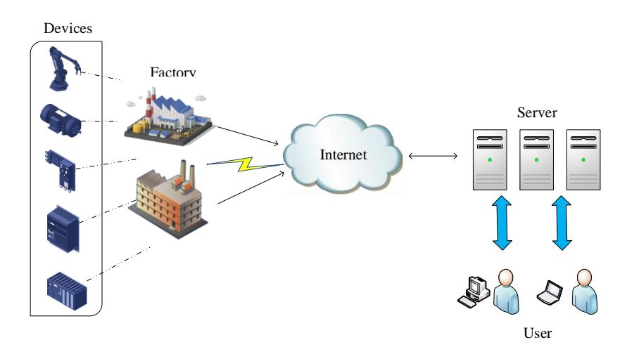
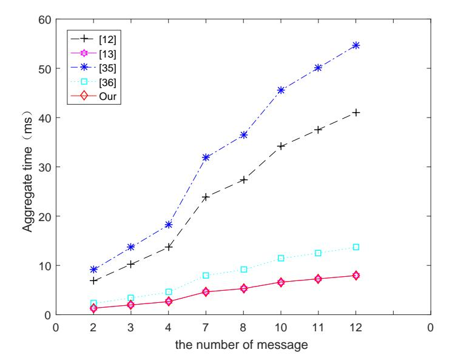
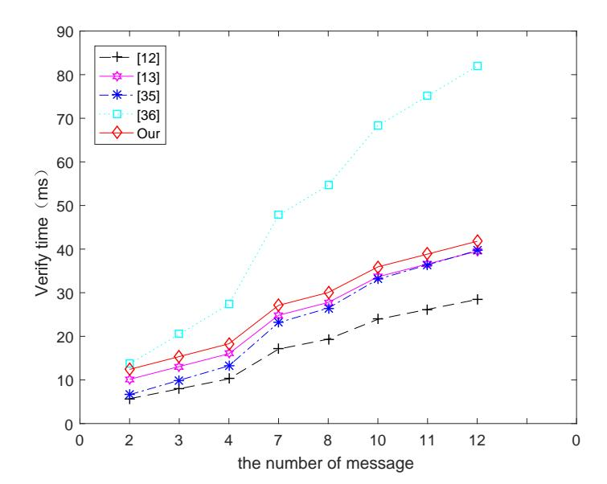
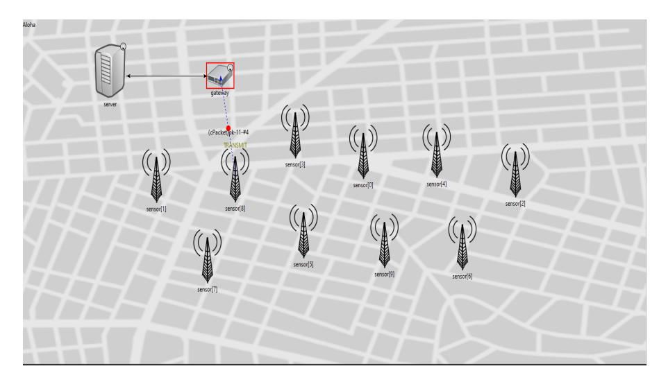

{0}------------------------------------------------

1

# Certificate-Based Parallel Key-Insulated Aggregate Signature Against Fully Chosen-Key Attacks for Industrial Internet of Things

Hu Xiong, Yingzhe Hou, Xin Huang, and Saru Kumari

*Abstract*—With the emergence of the Industrial Internet of Things (IIoT), numerous operations based on smart devices contribute to producing the convenience and comfortable applications for individuals and organizations. Considering the untrusted feature of the communication channels in IIoT, it is essential to ensure the authentication and incontestableness of the messages transmitted in the IIoT. In this paper, we firstly proposed a certificate-based parallel key-insulated aggregate signature (CB-PKIAS), which can resist the fully chosen-key attacks. Concretely, the adversary who can obtain the private keys of all signers in the system is able to forge a valid aggregate signature by using the invalid single signature. Furthermore, our scheme inherits the merits of certificate-based and key-insulated to avoid the certificate management problem, key escrow problems as well as the key exposures simultaneously. In addition, the rigorous analysis and the concrete simulation experiment demonstrated that our proposed scheme is secure under the random oracle and more suitable for the IIoT environment.

*Index Terms*—IIoT, Certificate-based, Aggregate Signature, Key-Insulated, Fully Chosen-Key Attacks.

## I. INTRODUCTION

I N recent years, the increase of digitalization has greatly facilitated the prosperity of the emerging field named Industrial Internet of Things (IIoT)[1], which dedicates to fabricate a more intelligent management system with less human intervention. By the ubiquitous smart devices such as machinery, actuators, and sensors, it is possible for industrial companies to manage the valuable information and the interaction with each other more intelligently and efficiently [2]. As the Fig 1 shown, considering the dominance of the connected sensors during the industrial platform, IIoT attracts more attention since the traditional IoT from the engineering and academic community.

Despite numerous benefits are brought by IIoT, the authenticity of data is still the critical problem that needs an appropriate solution. To address the former challenge, how to preserve the authenticity of data transmitted between the smart devices and the third party is a breakthrough. The digital signature [3] seems to be a promising approach to protect data from forging and tampering during the transmission process. In this manner, data will be signed by the signer's private key before being delivered to other devices. Afterwards, this

H. Xiong, Y. Hou, X. Huang are with the School of Information and Software Engineering, University of Electronic Science and Technology of China, Chengdu 610054, China. S. Kumari is with the Department of Mathematics, Chaudhary Charan Singh University, Meerut, India. E-mail: xionghu.uestc@gmail.com. saryusiirohi@gmail.com.

primitive enables the receiver to verify the signature to guarantee the authenticity of data reasonably. Subsequently, a series of signature protocols based on identity-based cryptosystem (IBC) or public key infrastructure (PKI) are gradually put forward [4], [5], [6].

With respect to the PKI cryptosystem [7], [8], there exists a trusted organization that can generate the certificate corresponding to the user's identity. Nevertheless, the certificate management problem cannot be ignored, which greatly reduces the applicability of the PKI-based schemes. For addressing this obstacle, the signature scheme from the IBC system is proposed (IBS)[3]. In this construction, the user's private key and public key are generated by the private key generator (PKG)[9] and the user's identity respectively. Although the certificate management problem can be solved by replacing the certificate with the user's identity, this mechanism results in an equally important key escrow problem since the private key can be calculated by PKG easily.

For tackling the key escrow problem above-mentioned, the certificate-based signature (CBS)[10] is proposed, which both eliminates the inherent defects of schemes from PKI and IBC mechanisms. When n signatures are corresponding to n different messages of n users in the system, the aggregate signature can aggregate them into a single short signature and require to be verified only once, which allows bandwidth and computing savings. Therefore, it is essential to introduce the notion of aggregate signature and this primitive makes it suitable for environments with resource-constrained conditions. Inspired by this perspective, various types of schemes based on certificate-based aggregate signature (CBAS) are designed at a rapid speed [11], [12].

In a traditional aggregate signature protocol, the involved adversary always obtains (n − 1) private keys, where the number of system users is n. Nonetheless, as one of the special attack patterns, a fully chosen-key attacker can hold all the private key and the purpose of it is to break the aggregate signature scheme's security. For example, a single signature forged by this fully chosen-key attacker is invalid, but the aggregate signature generated by the aforementioned single signature is valid. Wu *et al.* [13] proposed a certificateless aggregate signature scheme, which describes an approach to resist the fully chosen-key attacks.

What makes things worse, the key disclosure problem is also inevitable since the signature primitive often deployed in the insecure channel. Dodis *et al.* [14] first presented the concept of key-insulated, which offered a new solution to

{1}------------------------------------------------



Fig. 1: The intuition of IIoT

ease this challenge. In their proposed scheme, the private key is divided into the private key of user and the helper key. To be specific, the user's private key remains changing to provide the signature functionality during the period, while the helper key generated by the physical device is responsible for updating the previous key. In addition, the user's public key is a constant value. Another problem encountered in [14] is that only a helper is supported, which leads to an increase in frequency of key updates, thereby increasing the probability of key exposure. Thus, the concept of key-insulated with the functionality of parallel is proposed by Hanaoka *et al.* [15]. In this way, the decryption key is updated by two independent helper keys. This improvement not only allows us to update the decryption keys frequently, but also avoids the helper key's exposure.

Recently, Verma *et al.* [12] presented an efficient certificatebased signature scheme with compact aggregation (CB-CAS). They alleged that their CB-CAS scheme is proved to be secure under the random oracle model. Conversely, after carefully observing their scheme, we show that the scheme in [12] fails to achieve the claimed security features and still suffers from the public key replacement attack, the malicious KGC attack, the fully-chosen attack and even an outsider attack. Besides, the fundamental reasons why their scheme is insecure as well as the guideline for resisting these attacks during the design of certificate-based signature are also presented. In summary, in order to resist the previous attacks and achieve the parallel key-insulated property, we proposed a certificate-based parallel key-insulated aggregate signature against fully chosenkey attacks for IIoT (CB-PKIAS). The concrete contributions of the proposed scheme are demonstrated as follows.

- 1) Firstly, this paper introduces the different types of forgery attacks involved in scheme [12]. Afterwards, we analyze the basic reasons for the insecurity of the CB-CAS scheme.
- 2) Secondly, this paper provides a new CB-PKIAS scheme, which can resist the existential unforgeability against adaptive chosen messages attack (EUF-CMA) and the fully chosen-key attacks. Besides, the key exposure prob-

- lem has also been addressed by offering the key-insulated property.
- 3) Finally, the specific experiment simulation and performance comparison are executed to reveal the practicality of our proposed scheme.

The organization is described as follows. In section II, the related works are given. In section III, we demonstrate the corresponding preliminaries. In section IV, we review the Verma *et al.*'s scheme. In section V, we provide the concrete construction of CB-PKIAS. In section VI, we show the security analysis of CB-PKIAS. In section VII, we describe the performance comparison with the existing works. Finally, several significant conclusions are shown in section VIII.

## II. RELATED WORK

After the concept of public key cryptography was introduced by Diffie and Hellman [16] in 1976, many attempts have been made to put forward a practical public key system. Among them, many digital signature schemes based on PKI [17], [18], [19] are served to ensure the integrity, authenticity and nonreplacement of digital documents. However, the public key of the PKI-based signature system corresponds to a specific certificate, resulting in a huge overhead caused by certificate management. To eliminate the huge overhead of certificate management, Shamir [20] proposed the identity (ID)-based digital signature scheme for the first time. The ID-based signature employs the public unique identifying information of the user as the public key, thereby eliminating the certificate management overhead. On the other hand, PKG is responsible for generating the user's private key. Afterward, a series of identity-based signcryption schemes were proposed [21], [22], [23], [24]. In order to reduce signature computation cost, a scheme of short ID-based signature was proposed by Du and Wen [25]. Liu [26] has proposed a novel IBS scheme. This scheme can use offline storage multiple times in polynomial time, so it is suitable for wireless sensor networks. Unfortunately, the schemes based on IBS also have shortcomings. All users' private keys are produced by a PKG, so any entity's signature can be easily forged by PKG, leading to the key escrow problem in IBS [27].

For solving above problems, Gentry [28] introduced the notion of certificate-based cryptography (CBC) to combine the advantages of PKI and IBC. In this primitive, the user himself generates a key pair (private/public), and obtains the certificate corresponding to the public key from the trusted authority (TA). The certificate in CBC serves as a part of the user's private key, so it can only perform operations such as signing or decryption by using the user's certificate and private key at the same time. Since CBC has an implicit certificate function, the need for third-party queries of traditional PKI is eliminated, thereby simplifying complex certificate management. In addition, the private key in CBC is generated and retained by the user, so there is no problem of key escrow. Afterwards, Kang *et al.* [10] designed the first CBS which constructs an ID-based signature for document signing and a short signature for certification. Subsequently, a series of CBS schemes were proposed [29], [30], [31]. Zhou and Cui 

{2}------------------------------------------------

introduced a CBS [32] scheme which can resist the maliciousbut-passive certifier attack.

Unfortunately, the previous schemes' security is based on an assumption: the private key of user is completely secured. In fact, the operations of signature are usually performed in insecure devices or environments, so the issue of signing key exposure seems inevitable. Therefore, Du et al. [33] introduced the mechanism of key-insulated signature (KIS) into the certificate-based signcryption scheme, and then proposed the concept of certificate-based signature (CB-KIS) and the first CB-KIS scheme. In the KIS mechanism, the life cycle of the user's private key is divided into different time slices, and is updated in different time slices through the physical security device. In this way, the impact of key exposure is mitigated. Afterward, Xiong et al. [34] put forward a novel CB-KIS scheme which is pairing-free. Li et al. [35] proposed a CB-KIS scheme which simplifies the certificate management through the function of key insulation. Xiong et al. [36] introduced an efficient and provably secure certificateless parallel keyinsulated signature (CL-PKIS).

In addition to solving the above problems, for reducing the overhead of data transmission, a digital signature aggregation mechanism was introduced. This mechanism was first proposed by Boneh et al. [37]. In this concept, n signatures of n messages are compressed to form a short signature. The corresponding messages of n signers can be confirmed by verifying the short signature, thereby reducing the total bandwidth required for transmission and the total calculation cost of the verification process. Subsequently, Liu et al. [11] provided the first certificate-based aggregate signature (CBAS) scheme. It uses sequential aggregation, where the signer creates an aggregated signature (AS) based on the previous AS. Therefore, the aggregation is performed by each signer. Ma et al. [38] proposed a novel CB-CAS scheme, but their scheme aggregates different signatures on the same document from different signers. Verma et al. [39] presented a CB-CAS scheme for electronic medical monitoring. The size of the aggregate signature determined by the number of signers. Recently, the first pairing free certificate-based compact aggregate signature was proposed by Verma et al. [12] . In this scheme, compact aggregation is used to create a fixed-length AS, so the final AS length will not be affected by the increase in the number of signatures. In summary, the CB-PKIAS scheme has not been presented.

## III. PRELIMINARIES

In this section, we demonstrate some relevant preliminaries for a better understanding as below.

## A. Bilinear Map

Define two groups  $G_1$  and  $G_2$ , which regarded q as its prime order. Besides, set the bilinear map  $e: G \times G \to G_T$  with the following properties.

- Bilinearity: For  $\forall a, b \in \mathbb{Z}_q^*$ ,  $e(aP, bP) = e(P, P)^{ab}$ .
- Non-degeneracy:  $e(P, P) \neq 1$ .
- Computability:  $\exists P,Q \in G$  that can calculate e(P,Q).

#### B. Complexity Assumption

Computational Diffie-Hellman Problem (CDHP): After receiving the input  $< P, aP, bP > \in G$ , in which  $a, b \in Z_q^*, P \in G$ , the object of CDHP is to compute abP.

Computational Diffie-Hellman Assumption (CDHI)[40]: If there is no probabilistic polynomial-time (PPT) adversary  $\mathcal{A}$  with a non-negligible advantage that can calculate CDHP, it represents that CDHI is established.

#### C. Outline of the CB-PKIAS

The proposed scheme consists of nine algorithms and the details are shown as follows.

- **Setup**: When inputting a security parameter k, a trusted authority (TA) generates the master secret key s and the system public parameters par.
- CerExtract: When inputting par and  $ID_i$ , the TA produces the certificate  $Cert_i$  and returns it to the corresponding user.
- UserKeyExtract: When inputting par,  $ID_i$  and the time period t, a user generates  $US_{ID,0}$  and  $UY_{ID}$  as its initial secret key and public key respectively. Besides, it also produces the private key  $(HS_0, HS_1)$  and public key  $(HY_0, HY_1)$  of two helpers.
- **Update\***: When inputting par, t and the *i*th helper's private key  $HS_i$ , where  $i \equiv t \mod 2$ , the helper generates  $UD_{ID,t}$  as the update key.
- Update: When inputting par, t,  $US_{ID,0}$  and  $UD_{ID,t}$ , a user produces the temporary signing key  $US_{ID,t}$ .
- Sign: When inputting par,  $Cert_i$ ,  $US_{ID,t}$  and a message  $m_i \in \{0,1\}^*$ , a signer generates the signature  $\sigma_i$ .
- **Verify**: When inputting par,  $ID_i$ ,  $m_i$  and  $\sigma_i$ , any verifier can validate the signature by producing "true" or "false".
- Aggregate: When inputting par,  $ID_i$ ,  $m_i$ ,  $\sigma_i$  and the public verification key  $Y_{ver}$ , the aggregator generates the aggregate signature  $\Sigma$ .
- **AggVer**: When inputting par,  $ID_i$ ,  $UY_{ID,t}$ ,  $m_i$ ,  $\Sigma$  and the secret verification key  $\tau$ , the intend verifier outputs "true" or "false".

#### D. Security Model of the CB-PKIAS

In this section, we demonstrate the CB-PKIAS's security model, which takes three kinds of adversaries with different abilities into consideration.

Game 1. Assume that a Type-I adversary  $A_1$  and a challenger C execute the following interactions.

- 1) Setup: This operation runs the algorithm of **Setup** to generate the master secret key s and the system public key par.
- 2) Query: In this section,  $A_1$  executes the following queries:
  - Public Key Query: When receiving this query, C will deliver the public key  $UY_{ID}$  to  $A_1$ .
  - Public Key Replace Query: When receiving this query,  $\mathcal{C}$  will replace  $UY_{ID}$  by  $UY'_{ID}$  and return  $UY'_{ID}$  to  $\mathcal{A}_1$ .

{3}------------------------------------------------

- Certificate Query: When receiving this query, C will return the certificate  $Cert_i$  to  $A_1$ .
- Signing key Query: When receiving this query, C will return the temporary secret key  $US_{ID,t}$  to  $A_1$ .
- Sign Query: When receiving this query, C will produce the valid signature  $\sigma$ .
- 3) Forgery: When accomplishing the above queries,  $A_1$  will generate the forged signature  $\sigma^*$  and satisfy the conditions as follows:
  - $A_1$  cannot execute the Certificate Query on the challenge identity  $ID^*$ ;
  - $A_1$  cannot execute the Signing key Query on the challenge identity  $ID^*$ ;
  - $A_1$  cannot execute the Sign Query with  $(ID^*, m^*, t^*)$ ;
  - $A_1$  can generate the forged valid signature by inputting  $(par, ID^*, UY_{ID}^*, HY_i^*, HY_{i'}^*, m^*, \sigma_i^*, t^*);$

Definition 1. If there does not exist  $A_1$  belonging to PPT adversary that wins the above game, we say that the proposed scheme is EUF-CMA against Type-I adversary.

Game 2. Assume that a Type-II adversary  $A_2$  and C execute the following interactions.

- 1) Setup: This operation runs the algorithm of **Setup** to generate s and par.
- 2) Query: In this section,  $A_2$  executes the following queries:
  - Public Key Query: When receiving this query, C will return the public key  $UY_{ID}$  to  $A_2$ .
  - Helper key Query: When receiving this query, C will return the helper's private/public key  $(HS_0, HS_1, HY_0, HY_1)$  to  $A_2$ .
  - Sign Query: When receiving this query, C will produce the valid signature  $\sigma$  to  $A_2$ .
- 3) Forgery: When accomplishing the above queries,  $A_2$  will generate the forged signature  $\sigma^*$  and satisfy the conditions as follows:
  - $A_2$  cannot execute the Signing key Query with the challenge identity  $ID^*$ ;
  - $A_2$  cannot execute the Sign Query with  $(ID^*, m^*, t^*)$ ;
  - $A_2$  can generate the forged valid signature by inputting  $(par, ID^*, UY_{ID}^*, HY_i^*, HY_{i'}^*, m^*, \sigma_i^*, t^*);$

Definition 2. If there does not exist  $A_2$  belonging to the PPT adversary that wins the above game, we say that the proposed scheme is EUF-CMA against Type-II adversary.

Game 3. Assume that a fully-chosen attacker  $A_3$  and C execute the following interactions.

- 1) Setup: This operation runs the algorithm of **Setup** to generate s and par.
- 2) Query: In this section,  $A_3$  executes the following queries:
  - Signing key Query: When receiving this query, C will return the temporary secret key  $US_{ID,t}$  to  $A_3$ .
  - Aggver Query: When receiving this query, C executes the algorithm of **AggVer** and returns the verification result to  $A_3$ .
- 3) Forgery: When accomplishing the above queries,  $A_3$  will generate the forged aggregate signature  $\Sigma$  and satisfy the conditions as follows:

- All single signatures are aggregated into the aggregate signatures  $\Sigma$ .
- The aforementioned  $\Sigma$  is valid.
- At least one signature  $\sigma'_i$  cannot hold the verification equation.

Definition 3. If there does not exist  $A_3$  belonging to the PPT adversary that wins the above game, we say that the proposed scheme can resist the fully chosen-key attack.

#### IV. REVIEW OF VERMA et al.'S CB-CAS SCHEME

#### A. Overview of the Verma et al.'s CB-CAS scheme

We first give an overview of Verma et al.'s scheme as follows.

- 1) **Setup** (k): Given a security parameter  $\lambda$ , a trusted authority (TA) executes this algorithm to output the system parameters  $par = (q, H_0, H_1, G_T, P, P_{pub}, \Delta)$  and a master secret key s. The details are shown as follows:
  - TA first chooses a cyclic additive group  $G_T$  of order q with generator P. It also picks  $H_0: \{0,1\}^* \times G_T \to Z_q^*$  and  $H_1: \{0,1\}^* \times G_T \times \{0,1\}^* \times \{0,1\} \to Z_q^*$  as two hash functions.
  - Furthermore, TA randomly picks  $s \in \mathbb{Z}_q^*$ . Then calculates it's public key  $P_{pub} = sP$ .
  - Finally, TA picks  $\Delta \in \{0,1\}^*$  as the state information and publishes:  $par = (q, H_0, H_1, G_T, P, P_{pub}, \Delta)$ .
- 2) UserKeyExtract (par): Given par, the user with identity  $ID_i$  performs this algorithm. Concretely, it picks  $x_i \in Z_q^*$  as the private key and calculates  $Y_i = x_i P$  as the public key.
- 3) CerExtract  $(par, Y_i, ID_i)$ : Given  $par, Y_i$  and  $ID_i$ , this algorithm is executed by TA to generate the certificate  $Cert_i$ . Specifically, TA does the following operations:
  - Pick  $w_i \in Z_q^*$  and compute  $W_i = w_i P$ .
  - Compute  $c_i = w_i + sH_0(ID_i||Y_i)$ .
  - Return  $Cert_i = (W_i, c_i)$  to the requesting signer.
- 4) **Sign**  $(par, Cert_i, x_i, m_i)$ : Given par,  $Cert_i$ ,  $x_i$  and a message  $m_i \in \{0, 1\}^*$ , the signer with identity  $ID_i$  runs this algorithm to output the signature  $\sigma$ . To be specific, the signer does the following operations:
  - Check the certificate authenticity through  $c_i P \stackrel{?}{=} U_i + H_0(ID_i||Y_i)P_{pub}$ . If the equation holds,  $Cert_i$  is valid for further operation.
  - Pick  $k_i \in \mathbb{Z}_q^*$  and calculate  $U_i = W_i + k_i P$ .
  - Calculate  $v_i = k_i + c_i + x_i H_1(m_i||Y_i||ID_i||\Delta)$  and send  $\sigma_i = (U_i, v_i)$  back to the aggregator.
- 5) **Verify**  $(par, ID_i, \sigma_i)$ : Given par,  $Cert_i$ ,  $ID_i$  and  $\sigma_i$ , this algorithm is executed by a receiver. If  $v_iP = U_i + H_0(ID_i||Y_i)P_{pub} + H_1(m_i||Y_i||ID_i||\Delta)Y_i$  holds, the algorithm will generate "true". If not, generate "false".
- 6) **Aggregate**: This algorithm is ran by an aggregator to generate an aggregation signature on  $(m_1, m_2, m_3 \cdots m_n)$ . The aggregator first checks whether  $v_i P = U_i + H_0(ID_i||Y_i)P_{pub} + H_1(m_i||Y_i||ID_i||\Delta)Y_i$  holds or not. If this verification holds, the aggregator computes  $U = \sum_{i=1}^n U_i$  and  $v = \sum_{i=1}^n v_i$ . Finally, this algorithm generates (R, z) as the aggregation signature.

{4}------------------------------------------------

7) **AggVer**: The validity of aggregation signature is checked by a receiver. If  $vP = U + (\sum_{i=1}^{n} H_0(ID_i||Y_i))P_{pub} + \sum_{i=1}^{n} H_1(m_i||Y_i||ID_i||\Delta)Y_i$  holds, this algorithm outputs "true"; otherwise, it outputs "false".

#### B. Weakness of Verma et al.'s scheme

In this section, four types of forgery attacks are given to demonstrate the weaknesses of Verma *et al.*'s scheme. Concretely, Attack I is launched by the Type I adversary who executes the public key replacement attack. Attack II is mounted by the Type II adversary which refers to a malicious KGC. Attack III is launched by any outside attacker without replacing the public key of user and accessing the master secret key. Attack IV is executed by a fully-chosen attacker. Furthermore, if an attacker has the ability to forge a single signature, it can forge an aggregation signature simultaneously.

- 1) Attack I: Attack From Type I adversary: Assume that a Type I adversary  $A_1$  intends to forge a valid signature  $\sigma^*$  on any message  $m_i$  representing the user with identity  $ID_i$  and public key  $Y_i$ ,  $A_1$  is allowed to produce the forged signature by replacing the current public key  $Y_i$  as follows.
  - Randomly choose  $x_i^* \in Z_q^*$  and set  $Y_i^* = x_i^* P$ .
  - Pick  $U_i \in Z_q^*$  and set  $U_i^* = U_i P H_0(ID_i||Y_i^*) P_{pub}$ .
  - Set  $v_i^* = U_i + x_i^* H_1(m_i || Y_i^* || ID_i || \Delta)$ .
  - Generate  $\sigma^* = (U_i^*, v_i^*)$  as the forged signature on  $m_i$ .

It's easy to observe that the forged signature  $\sigma^*$  is valid under the condition of replacing  $Y_i$  with  $Y_i^*$ . The correctness of  $\sigma^*$  is shown below.

$$U_{i}^{*} + H_{0}(ID_{i}||Y_{i}^{*})P_{pub} + H_{1}(m_{i}||Y_{i}^{*}||ID_{i}||\Delta)Y_{i}^{*}$$

$$=U_{i}P - H_{0}(ID_{i}||Y_{i}^{*})P_{pub} + H_{0}(ID_{i}||Y_{i}^{*})P_{pub}$$

$$+H_{1}(m_{i}||Y_{i}^{*}||ID_{i}||\Delta)Y_{i}^{*}$$

$$=U_{i}P + H_{1}(m_{i}||Y_{i}^{*}||ID_{i}||\Delta)Y_{i}^{*}$$

$$=U_{i}P + x_{i}^{*}H_{1}(m_{i}||Y_{i}^{*}||ID_{i}||\Delta)P$$

$$=v_{i}^{*}P$$

The essential reason about this attack is due to the fact that  $U_i$  and  $H_0(ID_i||Y_i)P_{pub}$  involved in the verification are independent of each other. In this scheme,  $U_i$  can be deliberately calculated to cancel  $H_0(ID_i||Y_i)P_{pub}$  and thus the signature could be produced without accessing the master secret key by the Type I adversary.

- 2) Attack II: Attack From Type II adversary: Suppose that a Type II adversary  $A_2$  attempts to forge a valid signature  $\sigma^*$  on any message  $m_i$  for the user with identity  $ID_i$  and public key  $Y_i$ ,  $A_2$  has the ability to produce a forged signature without knowing the secret key of user as follows.
  - Randomly select  $U_i \in Z_q^*$  and set  $U_i^* = U_i P H_1(m_i||Y_i||ID_i||\Delta)Y_i$ .
  - Set  $v_i^* = U_i + sH_0(ID_i||Y_i)$ .
  - Generate  $\sigma^* = (U_i^*, v_i^*)$  as the forged signature on  $m_i$ .

Obviously, the forged signature  $\sigma^*$  is a valid signature on  $m_i$ . We demonstrate the concrete steps of correctness as follows.

$$U_{i}^{*} + H_{0}(ID_{i}||Y_{i})P_{pub} + H_{1}(m_{i}||Y_{i}||ID_{i}||\Delta)Y_{i}$$

$$=U_{i}P - H_{1}(m_{i}||Y_{i}||ID_{i}||\Delta)Y_{i} + H_{0}(ID_{i}||Y_{i})P_{pub}$$

$$+H_{1}(m_{i}||Y_{i}||ID_{i}||\Delta)Y_{i}$$

$$=U_{i}P + H_{0}(ID_{i}||Y_{i})P_{pub}$$

$$=U_{i}P + sH_{0}(ID_{i}||Y_{i})P$$

$$=v_{i}^{*}P$$

Similar to the previous attack, the reason why our attack works depends on the fact that the  $U_i$  and  $H_1(m_i||Y_i||ID_i||\Delta)Y_i$  in the verification are independent of each other. Thus,  $U_i$  is able to be calculated to cancel  $H_1(m_i||Y_i||ID_i||\Delta)Y_i$  and the signature can be forged successfully by the Type II adversary without the knowledge of the user's secret key.

- 3) Attack III: Attack From Anyone: Different from the above-mentioned two attacks, any outside attacker who neither replaces the public key nor accesses the master secret key could be considered as a legitimate user to forge a valid signature  $\sigma^*$ . Specifically, this attacker is able to generate a valid signature on any message  $m_i$  under the identity  $ID_i$  and public key  $Y_i$  as follows.
  - Randomly select  $U_i \in Z_q^*$  and set  $U_i^* = U_iP H_0(ID_i||Y_i)P_{pub} H_1(m_i||Y_i||ID_i||\Delta)Y_i$ .
  - Set  $v_i^* = U_i$ .
  - Generate  $\sigma^* = (U_i^*, v_i^*)$  as the forged signature.

We can observe that the forged signature  $\sigma^*$  is a valid signature on  $m_i$ . The consistency of the forged signature is easy to check as we have:

$$U_{i}^{*} + H_{0}(ID_{i}||Y_{i})P_{pub} + H_{1}(m_{i}||Y_{i}||ID_{i}||\Delta)Y_{i}$$

$$=U_{i}P - H_{0}(ID_{i}||Y_{i})P_{pub} - H_{1}(m_{i}||Y_{i}||ID_{i}||\Delta)Y_{i}$$

$$+H_{0}(ID_{i}||Y_{i})P_{pub} + H_{1}(m_{i}||Y_{i}||ID_{i}||\Delta)Y_{i}$$

$$=U_{i}P = v_{i}^{*}P$$

In this case, the inherent reason about this security flaw is that  $U_i$  is independent of both  $H_0(ID_i||Y_i)P_{pub}$  and  $H_1(m_i||Y_i||ID_i||\Delta)Y_i$  in the verification. This attacker can set a mendacious value  $U_i^*$  to offset  $H_0(ID_i||Y_i)P_{pub}$  and  $H_1(m_i||Y_i||ID_i||\Delta)Y_i$  simultaneously. Therefore, anyone can generate the signature without replacing the public key and accessing the master secret key.

- 4) Attack IV: Fully Chosen-Key Attack: Assume that a fully chosen-key attacker intends to forge a valid aggregate signature  $\Sigma^*$  on  $m_1, m_2$ . the following operations are executed in the sign algorithm:
  - Randomly pick  $k_1, k_2 \in Z_q^*$  and calculate  $U_1 = W_1 + k_1 P$ ,  $U_2 = W_2 + k_2 P$ .
  - Randomly pick  $e \in Z_q^*$ , calculate

$$v_1 = k_1 + c_1 + x_1 H_1(m_1||Y_1||ID_1||\Delta) + e$$

{5}------------------------------------------------

$$v_2 = k_2 + c_2 + x_2 H_1(m_2||Y_2||ID_2||\Delta) - e$$

- Calculate  $v = v_1 + v_2$ .
- Generate  $\sigma_1 = (U_1, v_1)$ ,  $\sigma_2 = (U_2, v_2)$  as the forged signature on  $m_1$  and  $m_1$ . Generate  $\Sigma^* = (U_1, U_1, v)$  as the aggregate signature.

We can observe that the forged signature  $\Sigma^*$  is valid, while the single signature  $\sigma_1$  and  $\sigma_1$  is invalid. The correctness of  $\Sigma^*$  is shown below.

$$U_{1} + H_{0}(ID_{1}||Y_{1})P_{pub} + H_{1}(m_{1}||Y_{1}||ID_{1}||\Delta)Y_{1}$$

$$+U_{2} + H_{0}(ID_{2}||Y_{2})P_{pub} + H_{1}(m_{2}||Y_{2}||ID_{2}||\Delta)Y_{2}$$

$$= \sum_{i=1}^{2} U_{i} + (\sum_{i=1}^{2} H_{0}(ID_{i}||Y_{i}))P_{pub} + \sum_{i=1}^{2} H_{1}(m_{i}||Y_{i}||ID_{i}||\Delta)Y_{i}$$

$$= (v_{1} + v_{2}) \cdot P$$

$$= v \cdot P$$

The essential reason about this attack is that there is no intended verifier can verify the single signature in time. In this scheme,  $v_i$  can be deliberately calculated by the fully chosen-key attacker.

#### V. THE PROPOSED CB-PKIAS SCHEME

#### A. Construction

The proposed CB-PKIAS includes nine different algorithms, which are described below.

- 1) **Setup** (k): Randomly pick  $\tau \in Z_q^*$  as the secret verification key of intended verifier, then compute the corresponding public verification key as  $Y_{ver} = \tau P$ . Given a security parameter  $\lambda$ , TA runs the following operations for generating the system parameters par and the master secret key s. The details are shown as follows:
  - Choose two cyclic additive group  $G, G_T$  of order q. Pick  $H_0: \{0,1\}^* \to G$ ,  $H_1: \{0,1\}^* \times G \to G$ ,  $H_2: \{0,1\}^{*3} \times G^4 \to Z_q^*$ ,  $H_3: G_T^n \to \{0,1\}^*$  and  $H_4: \{0,1\}^* \times G \times Z_q^* \to Z_q^*$  as five hash functions. Then, it randomly picks two bit strings  $d_1, d_2$  of length l and calculates  $P = H_0(d_1), Q = H_0(d_2)$ .
  - Pick  $s \in \mathbb{Z}_q^*$  and calculate it's public key  $T_{pub} = sP$ .
  - Pick  $\Delta \in \{0, 1\}^*$  as the state information and publishes:  $par = (l, d_1, d_2, H_0, H_1, H_2, H_3, H_4, G, G_T, P, Q, \Delta, T_{pub}).$
- 2) CerExtract  $(par, ID_i)$ : Given par and  $ID_i$ , this algorithm is executed by TA for generating the certificate  $Cert_i$ . Specifically, TA does the following steps:
  - Pick  $w_i \in Z_q^*$  and compute  $W_i = w_i P$ .
  - Compute  $\Psi_i = H_1(ID_i||W_i)$ .
  - Compute  $\Lambda_i = w_i Q + s \Psi_i$ .
  - Return  $Cert_i = (W_i, \Lambda_i)$  to the requesting signer.
- 3) UserKeyExtract (par, t): Given par and the time period t, a user will perform this algorithm to calculate  $US_{ID,0}$  and  $UY_{ID}$  as its initial secret key and public key. Besides, the corresponding private key  $(HS_0, HS_1)$  and public key  $(HY_0, HY_1)$  of two helpers also be calculated.

- Select the secret value  $x_{ID} \in Z_q^*$  and calculate  $UY_{ID} = x_{ID} \cdot P$
- Choose  $c_0, c_1 \in Z_q^*$ , set  $HS_0 = c_0, HS_1 = c_1$  and calculate  $HY_0 = c_0 \cdot P, HY_1 = c_1 \cdot P$ . Afterwards, the user delivers the  $(HS_0, HS_1)$  to the helper and removes them from user.
- Calculate  $f_{ID,-2} = H_4(ID_i, UY_{ID}, -2), f_{ID,-1} = H_4(ID_i, UY_{ID}, -1)$ . Finally, calculate the initial secret key  $US_{ID,0} = f_{ID,-2} \cdot c_0 + f_{ID,-1} \cdot (c_1 + x_{ID})$ .
- 4) **Update\***( $par, t, c_i$ ): Given par, t and the private key  $c_i$  of the ith helper, where  $i' \equiv (t-1) \mod 2$ . Finally, the helper computes the update key  $UD_{ID,t} = c'_i \cdot (f_{ID,t-1} f_{ID,t-3})$ ,
- 5) **Update** $(par, t, US_{ID,0}, UD_{ID,t})$ : Given  $par, t, US_{ID,0}$  and  $UD_{ID,t}$ , the user with identity  $ID_i$  can calculate the temporary signing key  $US_{ID,t} = US_{ID,t-1} + UD_{ID,t} + x_{ID} \cdot (f_{ID,t-1} f_{ID,t-2})$ , where  $i \equiv t \mod 2$  and  $i' \equiv (t-1) \mod 2$ . Therefore, we can calculate  $US_{ID,t} = f_{ID,t-2} \cdot c_i + f_{ID,t-1} \cdot (c_{i'} + x_{ID})$ .
- 6) **Sign**  $(par, Cert_i, US_{ID,t}, m_i)$ : Given par,  $Cert_i$ ,  $US_{ID,t}$  and a message  $m_i \in \{0,1\}^*$ , the signer with identity  $ID_i$  runs this algorithm to output the signature  $\sigma_i$ . To be specific, the signer does the following steps:
  - Pick  $k_i \in Z_q^*$  and calculate  $K_i = k_i P$ .
  - Calculate  $\xi_i = H_2(ID_i||m_i||\Delta||UY_{ID}||T_{pub}||W_i||K_i)$ .
  - Calculate  $R_i = \Lambda_i + \xi_i \cdot k_i \cdot T_{pub} + \xi_i \cdot US_{ID,t} \cdot Q$  and send  $\sigma_i = (W_i, K_i, R_i)$  back to the aggregator.
- 7) **Verify**(par,  $ID_i$ ,  $UY_{ID}$ ,  $HY_i$ ,  $HY_{i'}$ ,  $m_i$ ,  $\sigma_i$ ): Given par,  $ID_i$ ,  $UY_{ID}$ ,  $HY_i$ ,  $HY_{i'}$ ,  $m_i$  and  $\sigma_i$ , this algorithm can be executed by any user via the following steps:
  - Compute  $\Psi_i = H_1(ID_i||W_i), \ \xi_i = H_2(ID_i||m_i||\Delta ||UY_{ID}||T_{pub}||W_i||K_i).$
  - Check whether the equation holds or not:

$$e(R_i, P) = e(\Psi_i + \xi_i \cdot K_i, T_{pub}) \cdot e(W_i + \xi_i \cdot [f_{ID, t-2} H Y_i + f_{ID, t-1} (H Y_{i'} + U Y_{ID})], Q)$$

- 8) **Aggregate**(par,  $(ID_i, UY_{ID}, m_i, \sigma_i)|i=1, \cdots, n, Y_{ver}$ ): Given par,  $ID_i$ ,  $UY_{ID}$ ,  $m_i$ ,  $\sigma_i$  and the public verification key  $Y_{ver} = \tau P$ , an aggregator can execute the following operations:
  - Compute  $R = \sum_{i=1}^{n} R_i$ .
  - Compute  $\gamma = H_3(e(R_1, Y_{ver})||\cdots||e(R_n, Y_{ver})|)$ .
  - Generate the aggregate signature  $\Sigma = (W_1, \dots, W_n, K_1, \dots, K_n, R, \gamma)$ .
- 9) **AggVer** $(par, (ID_i, UY_{ID}, HY_i, HY_{i'}, m_i)|i = 1, \dots, n, \Sigma, \tau)$ : Given  $par, ID_i, UY_{ID}, HY_i, HY_{i'}, m_i, \Sigma$  and the secret verification key  $\tau$ , the intend verifier executes the following algorithms:
  - Compute  $\Psi_i = H_1(ID_i||W_i), \ \xi_i = H_2(ID_i||m_i||\Delta|| \ UY_{ID}||T_{pub}||W_i||K_i) \ \text{for} \ i=1,\cdots,n.$
  - Compute  $\Theta_i = f_{ID,t-2}HY_i + f_{ID,t-1}(HY_{i'} + UY_{ID}).$
  - Check whether the equations hold or not:

$$e(R, P) = e(\sum_{i=1}^{n} (\Psi_i + \xi_i \cdot K_i), T_{pub}) \cdot e(\sum_{i=1}^{n} (W_i + \xi_i \cdot \Theta_i), Q)$$

{6}------------------------------------------------

 $\gamma = H_3 \left( \frac{e(\Psi_1 + \xi_1 \cdot K_1, \tau \cdot T_{pub}) \cdot e(W_1 + \xi_1 \cdot \Theta_1, \tau \cdot Q)|| \cdots}{||e(\Psi_n + \xi_n \cdot K_n, \tau \cdot T_{pub}) \cdot e(W_n + \xi_n \cdot \Theta_n, \tau \cdot Q)||} \right)$  If the equations mentioned-above hold, this algorithm generates "true"; otherwise, it generates "false".

## B. Design philosophy

Considering the above reasons why the CB-CAS scheme in [12] is insecure, we provide the guideline to resist these attacks in the construction of certificate-based signature. The effective solution is to change the input of hash functions and the following steps are given to demonstrate the feasibility.

The fatal reason about Attack I is that the master private key s is not embedded in the suitable position so that the adversary  $A_1$  can forge a valid signature by canceling  $H_0(ID_i||Y_i)P_{pub}$  directly. According to this reason, the simple way to resist this attack is adding  $U_i$  into  $H_0(ID_i||Y_i)$ , where  $U_i = U_i P, U_i \in \mathbb{Z}_q^*$ . Because  $U_i$  is randomly selected, the value of  $U_i$  and  $H_0(ID_i||Y_i||U_i)$  also changed accordingly. Therefore,  $A_1$  cannot forge a signature without knowing the accurate value of  $H_0(ID_i||Y_i||U_i)$ . Similar to the previous analysis,  $U_i$  is added into  $H_1(m_i||Y_i||ID_i||\Delta)$  to resist the adversary from Attack II. Besides, in order to resist the Attack III, we add  $U_i$  into  $H_0(ID_i||Y_i)$  and  $H_1(m_i||Y_i||ID_i||\Delta)$ simultaneously. Finally, the intender verifier also be given to resist the Attack IV. Through the methods of analysis, it is desirable to construct a secure scheme to resist the aforementioned four kinds of attacks.

### VI. SECURITY PROOF

Theorem 1: The introduced CB-PKIAS is EUF-CMA under the attack, which launched by the Type I adversary.

Proof: Given (P, aP, bP) as the input of CDHP, the target of  $\mathcal{C}$  is to compute abP. This process is completed by the interaction between  $\mathcal{A}_1$  and  $\mathcal{C}$  as follows.

- 1) Setup:  $\mathcal{C}$  first picks two random bit strings  $d_1$ ,  $d_2$  of length l, then it selects  $t \in Z_q^*$  and calculates Q = tP. Besides,  $\mathcal{C}$  sets  $T_{pub} = aP$ . Finally, this algorithm generates the master public key  $par = (l, d_1, d_2, H_0, H_1, H_2, H_3, H_4, G, G_T, P, Q, \Delta, T_{pub})$ .  $\mathcal{C}$  maintains the lists  $L_0, L_1, L_2, L_3, L_4, L_{pk}, L_t$ .
- 2) Query: In this section,  $A_1$  does the following steps.
  - $H_0$  Query: When receiving this query on  $d \in (d_1, d_2)$ ,  $\mathcal{C}$  first checks if  $L_0$  includes d. If it exists,  $\mathcal{C}$  returns the stored outcome to  $\mathcal{A}_1$ . Otherwise,  $\mathcal{C}$  picks  $D_d \in G$ , then it adds  $(d, D_d)$  into  $L_0$  and returns  $D_d$  to  $\mathcal{A}_1$ .
  - $H_1$  Query: When receiving this query on  $(ID_i, W_i)$ ,  $\mathcal{C}$  first checks if  $L_1$  includes  $(ID_i, W_i)$ . If it exists,  $\mathcal{C}$  returns the stored outcome to  $\mathcal{A}_1$ . Otherwise,  $\mathcal{C}$  does the following steps:
    - If  $ID_i \neq ID^*$ , C picks  $v \in Z_q^*$  and calculates  $\Psi_i = vP$ , then it adds  $(ID_i, W_i, \Psi_i)$  into  $L_1$  and returns  $\Psi_i$  to  $A_1$ .
    - If  $ID_i = ID^*$ , C sets  $\Psi_i = bP$ , then it adds  $(ID_i, W_i, v, \Psi_i)$  into  $L_1$  and returns  $\Psi_i$  to  $A_1$ .
  - $H_2$  Query: When receiving this query on  $(ID_i, m_i, \Delta, UY_{ID}, T_{pub}, W_i, K_i)$ , C first checks if  $L_2$  includes

- them. If yes,  $\mathcal{C}$  returns the stored outcome to  $\mathcal{A}_1$ . Otherwise,  $\mathcal{C}$  picks  $\xi_i \in Z_q^*$ , then it adds  $(ID_i, m_i, \Delta, UY_{ID}, T_{pub}, W_i, K_i, \xi_i)$  into  $L_2$  and returns  $\xi_i$  to  $\mathcal{A}_1$ .
- $H_3$  Query: When receiving this query on  $(R_i, Y_{ver})$ ,  $\mathcal{C}$  first checks if  $L_3$  includes them. If yes,  $\mathcal{C}$  returns the stored outcome to  $\mathcal{A}_1$ . Otherwise,  $\mathcal{C}$  picks  $j_i \in \mathbb{Z}_q^*$ , then it adds  $(R_i, Y_{ver}, j_i)$  into  $L_3$  and returns  $j_i$  to  $\mathcal{A}_1$ .
- $H_4$  Query: When receiving this query on  $(ID_i, UY_{ID}, -2)$  or  $(ID_i, UY_{ID}, -1)$ ,  $\mathcal{C}$  first checks if  $L_4$  includes them. If yes,  $\mathcal{C}$  returns the stored outcome to  $\mathcal{A}_1$ . Otherwise,  $\mathcal{C}$  picks  $f \in \mathbb{Z}_q^*$  and adds it into  $L_4$ . Finally,  $\mathcal{C}$  returns f to  $\mathcal{A}_1$ .
- Public Key Query: Define  $L_{pk}$  stores the tuple structure  $(ID_i, x_{ID}, UY_{ID}, x'_{ID}, UY'_{ID})$ . When receiving this query on  $ID_i$ , C does the following steps:
  - If this tuple does not exist, C executes the algorithm of **UserKeyExtract** to output  $UY_{ID} = x_{ID}P$ . Finally, C inserts  $(ID_i, x_{ID}, UY_{ID}, -, -)$  into  $L_{pk}$  and sends  $UY_{ID}$  to  $A_1$ .
  - If this tuple does exist, C sends  $UY_{ID}$  to  $A_1$ .
  - If this tuple does exist and the public key  $UY_{ID}$  has been replaced with  $UY'_{ID}$ .  $\mathcal{C}$  sends  $UY'_{ID}$  to  $\mathcal{A}_1$ .
- Public Key Replace Query: When receiving this query on  $ID_i$ , C does the following steps:
  - If this tuple does not exist in  $L_{pk}$ , C executes the algorithm of **UserKeyExtract** to output  $UY_{ID} = x_{ID}P$ . Finally, C inserts  $(ID_i, x_{ID}, UY_{ID}, x'_{ID}, UY'_{ID})$  into  $L_{pk}$ .
  - If this tuple does exist, C replaces  $UY_{ID}$  with  $UY'_{ID}$  and sets  $x_{ID} = \perp$ . Finally, C updates the tuple with  $(\perp, UY'_{ID})$ .
- Certificate Query: When receiving this query on  $ID_i$ , C does the following steps:
  - If  $ID_i \neq ID^*$ , C picks  $w_i, v \in Z_q^*$  and calculates  $W_i = w_i P$ ,  $\Lambda_i = w_i Q + v T_{pub}$ . Finally, C returns  $Cert_i = (W_i, \Lambda_i)$  to  $A_1$ .
  - If  $ID_i = ID^*$ , C aborts.
- Signing key Query: When receiving this query on  $(ID_i,t)$ ,  $\mathcal{C}$  maintains the list  $L_t = \{ID_i, HS_0, HS_1, HY_0, HY_1\}$ . Afterwards,  $\mathcal{C}$  checks if  $ID_i$  exists in  $L_t$ . If it does not exist,  $\mathcal{C}$  randomly picks  $tc_0, tc_1 \in Z_q^*$ , then calculates  $HS_0 = tc_0, HS_1 = tc_1, HY_0 = tc_0 \cdot P, HY_1 = tc_1 \cdot P$ . Besides,  $\mathcal{C}$  executes the mentioned-above hash function queries. Moreover,  $\mathcal{C}$  calculates  $US_{ID,t} = f_{-2} \cdot tc_0 + f_{-1} \cdot (tc_1 + x_{ID})$  mod p, where  $t \equiv 1 \mod 2$ . Else,  $\mathcal{C}$  calculates  $US_{ID,t} = f_{-2} \cdot tc_1 + f_{-1} \cdot (tc_0 + x_{ID}) \mod p$ , where  $t \equiv 0 \mod 2$ . Finally,  $\mathcal{C}$  returns  $US_{ID,t}$  to  $\mathcal{A}_1$ .
- Sign Query: When receiving this query on  $ID_i$ ,  $\mathcal{C}$  first searches the tuple  $(ID_i, x_{ID}, UY_{ID}, x'_{ID}, UY'_{ID})$  from  $L_{pk}$  and does the following steps:
  - If  $ID_i \neq ID^*$ , C makes the works as follows:
    - a) If this tuple does not exist, C executes the algorithm of **UserKeyExtract** to generate  $UY_{ID}$

{7}------------------------------------------------

and then inserts  $(ID_i, x_{ID}, UY_{ID}, -, -)$  into  $L_{pk}$ .

- b) If this tuple does exist, C delivers  $x_{ID}$  to  $A_1$ .
- c) If this tuple does exist and the public key  $UY_{ID}$  has been replaced with  $UY'_{ID}$ ,  $\mathcal{C}$  sets  $x'_{ID}$  as the private key.

Finally, C executes the **Sign** algorithm with  $(Cert_i, US_{ID,t})$  as the input to produce  $\sigma_i$  as well as sends it to  $A_1$ .

- If  $ID_i = ID^*$ ,  $\mathcal{C}$  first searches  $(ID_i, W_i, \Psi_i)$  from  $L_1$  and  $(ID_i, m_i, \Delta, UY_{ID}, T_{pub}, W_i, K_i, \xi_i)$  from  $L_2$ . Then  $\mathcal{C}$  randomly picks  $w_i, k_i \in Z_q^*$  and sets  $K_i = k_i P \xi_i^{-1} \Psi_i$ ,  $W_i = w_i P \xi_i^{-1} \Psi_i$ ,  $R_i = \xi_i \cdot k_i \cdot T_{pub} + \xi_i \cdot US_{ID,t} \cdot Q + w_i Q \xi_i^{-1} tbP$ . Finally,  $\mathcal{C}$  returns  $(W_i, K_i, R_i)$  to  $\mathcal{A}_1$ .
- 3) Forgery: If  $ID_i \neq ID^*$ , this algorithm aborts; otherwise, according to the forgery theorem,  $A_1$  can forgery two signatures  $\sigma_1 = (W_i, K_i, R_i)$  and  $\sigma_2 = (W_i, K_i, R_i')$  and returns them to C. Finally, C can obtain the following equations:

$$e(R_i, P) = e(\Psi_i + \xi_i \cdot K_i, T_{pub}) \cdot e(W_i + \xi_i \cdot \Theta_i, Q)(1)$$
  
$$e(R'_i, P) = e(\Psi_i + \xi'_i \cdot K_i, T_{pub}) \cdot e(W_i + \xi'_i \cdot \Theta_i, Q)(2)$$

Then  $\mathcal{C}$  can obtain the solution of CDHP by calculating  $\frac{\xi_i \cdot R_i' - \xi_i' \cdot R_i - (\xi_i - \xi_i')t \cdot W_i}{\xi_i - \xi_i'}.$ 

Theorem 2: The introduced CB-PKIAS is EUF-CMA under the attack, which launched by a Type II adversary.

Proof: Given (P, aP, bP) as the input of CDHP, the target of  $\mathcal{C}$  is to compute abP. This process is completed by the interaction between  $\mathcal{A}_2$  and  $\mathcal{C}$  as follows.

- 1) Setup:  $\mathcal{C}$  first picks two random bit strings  $d_1$ ,  $d_2$  of length l, then it sets Q=aP. Finally, this algorithm generates the master public key  $par=(l,d_1,d_2,H_0,H_1,H_2,H_3,H_4,G,G_T,P,Q,\Delta,T_{pub})$ .  $\mathcal{C}$  maintains the lists  $L_0,L_1,L_2,L_3,L_4,L_{pk},L_t$ .
- 2) Query: In this section,  $A_2$  does the following steps.
  - $H_0$  Query: When receiving this query on  $d \in (d_1, d_2)$ ,  $\mathcal{C}$  first checks if  $L_0$  includes d. If it exists,  $\mathcal{C}$  returns the stored outcome to  $\mathcal{A}_1$ . Otherwise,  $\mathcal{C}$  picks  $D_d \in G$ , then it adds  $(d, D_d)$  into  $L_0$  and returns  $D_d$  to  $\mathcal{A}_2$ .
  - $H_1$  Query: When receiving this query on  $(ID_i, W_i)$ ,  $\mathcal{C}$  first checks if  $L_1$  includes  $(ID_i, W_i)$ . If it exists,  $\mathcal{C}$  returns the stored outcome to  $\mathcal{A}_2$ . Otherwise,  $\mathcal{C}$  picks  $v \in Z_q^*$  and calculates  $\Psi_i = vP$ , then it adds  $(ID_i, W_i, \Psi_i)$  into  $L_1$  and returns  $\Psi_i$  to  $\mathcal{A}_2$ .
  - $H_2$  Query: When receiving this query on  $(ID_i, m_i, \Delta, UY_{ID}, T_{pub}, W_i, K_i)$ ,  $\mathcal{C}$  first checks if  $L_2$  includes them. If it exists,  $\mathcal{C}$  returns the stored outcome to  $\mathcal{A}_2$ . Otherwise,  $\mathcal{C}$  picks  $\xi_i \in Z_q^*$ , then it adds  $(ID_i, m_i, \Delta, UY_{ID}, T_{pub}, W_i, K_i, \xi_i)$  into  $L_2$  and returns  $\xi_i$  to  $\mathcal{A}_2$ .
  - $H_3$  Query: When receiving this query on  $(R_i, Y_{ver})$ , C first checks if  $L_3$  includes them. If it exists, C returns the stored outcome to  $A_2$ . Otherwise, C picks  $j_i \in Z_q^*$ , then it adds  $(R_i, Y_{ver}, j_i)$  into  $L_3$  and returns  $j_i$  to  $A_2$ .

- $H_4$  Query: When receiving this query on  $(ID_i, UY_{ID}, -2)$  or  $(ID_i, UY_{ID}, -1)$ ,  $\mathcal{C}$  first checks if  $L_4$  includes them. If it exists,  $\mathcal{C}$  returns the stored outcome to  $\mathcal{A}_2$ . Otherwise,  $\mathcal{C}$  picks  $f \in \mathbb{Z}_q^*$  and adds it into  $L_4$ . Finally,  $\mathcal{C}$  returns f to  $\mathcal{A}_2$ .
- Public Key Query: Suppose that  $L_{pk}$  stores the tuple structure  $(ID_i, x_{ID}, UY_{ID}, x'_{ID}, UY'_{ID})$ . When receiving this query on  $ID_i$ , C does the following steps:
  - If this tuple does not exist and  $ID_i = ID^*$ ,  $\mathcal{C}$  sets  $UY_{ID} = bP$ . Finally,  $\mathcal{C}$  inserts  $(ID_i, -, UY_{ID}, -, -)$  into  $L_{pk}$  and sends  $UY_{ID}$  to  $\mathcal{A}_2$ . Else,  $\mathcal{C}$  picks  $x_{ID} \in Z_q^*$  and returns  $UY_{ID} = x_{ID}P$  to  $\mathcal{A}_2$ .
  - If this tuple does exist, C returns  $UY_{ID}$  to  $A_2$ .
- Helper key Query: When receiving this query on  $(ID_i,t)$ ,  $\mathcal C$  maintains the list  $L_t=\{ID_i,HS_0,HS_1,HY_0,HY_1\}$ . Afterwards,  $\mathcal C$  checks if  $ID_i$  exists in  $L_t$ . If it does not exist,  $\mathcal C$  randomly picks  $tc_0,tc_1\in Z_q^*$ , then calculates  $HS_0=tc_0,HS_1=tc_1,HY_0=tc_0\cdot P,HY_1=tc_1\cdot P$ . Besides,  $\mathcal C$  executes the mentioned-above hash function queries. Finally,  $\mathcal C$  returns  $HS_0,HS_1,HY_0,HY_1$  to  $\mathcal A_2$ .
- Sign Query: When receiving this query on  $ID_i$ , C first searches the tuple  $(ID_i, x_{ID}, UY_{ID}, -, -)$  for  $x_{ID}$  from  $L_{pk}$  and does the following steps:
  - If  $x_{ID} \neq \perp$ , that is to say, C can run the **Sign** algorithm with  $US_{ID,t}$  and  $Cert_i$ .
  - If  $x_{ID} = \perp$ ,  $\mathcal{C}$  first searches  $(ID_i, W_i, \Psi_i)$  from  $L_1$  and  $(ID_i, m_i, \Delta, UY_{ID}, T_{pub}, W_i, K_i, \xi_i)$  from  $L_2$ . Then  $\mathcal{C}$  randomly picks  $k_i, t \in \mathbb{Z}_q^*$ . Then  $\mathcal{C}$  calculates  $K_i = k_i P, W_i = tT_{pub} \xi_i \Theta_i$ ,  $R_i = s\Psi_i + \xi_i \cdot s \cdot K_i + t \cdot s \cdot Q$  and returns  $(W_i, K_i, R_i)$  to  $\mathcal{A}_2$ .
- 3) Forgery: If  $ID_i \neq ID^*$ , this algorithm aborts; otherwise, according to the forgery theorem,  $A_2$  can forgery two signatures  $\sigma_1 = (W_i, K_i, R_i)$  and  $\sigma_2 = (W_i, K_i, R_i')$  and returns them to C. Finally, C can obtain the following equations:

$$e(R_i, P) = e(\Psi_i + \xi_i \cdot K_i, T_{pub}) \cdot e(W_i + \xi_i \cdot \Theta_i, Q)(3)$$

$$e(R_i', P) = e(\Psi_i + \xi_i' \cdot K_i, T_{pub}) \cdot e(W_i + \xi_i' \cdot \Theta_i, Q)(4)$$

Then  $\mathcal{C}$  can obtain the solution of CDHP by calculating  $\frac{\xi_i \cdot R_i' - \xi_i' \cdot R_i - (\xi_i - \xi_i')t \cdot W_i}{\xi_i - \xi_i'}.$ 

Theorem 3: The proposed CB-PKIAS scheme can resist the fully chosen-key attacks, which launched by a fully chosen-key attacker  $A_3$ .

Proof: If a fully chosen-key attacker  $A_3$  with the advantage of  $\epsilon$  can break the validation, that is to say, there is a challenger  $\mathcal{C}$  that has the ability to break the collision resistance property of hash function  $H_3$ . The concrete interactions are demonstrated as follows.

1) Setup: C first executes the algorithm of **Setup** to generate s and  $par = (l, d_1, d_2, H_0, H_1, H_2, H_3, H_4, G, G_T, P, Q, <math>\Delta, T_{pub}$ ). Besides, it randomly picks  $\tau$  and calculates

{8}------------------------------------------------

TABLE I: Notations

| $T_p$ | The pairing operation                 |
|-------|---------------------------------------|
| $T_a$ | The point additive operation in $G$   |
| $T_e$ | The exponentiation operation in $G_T$ |
| $T_h$ | The operation of hash function        |

 $Y_{ver} = \tau P$  as the corresponding private verification key and public verification key respectively.

- 2) Query:  $A_3$  mainly makes the following steps:
  - Signing key Query: When receiving this query on  $ID_i$ ,  $\mathcal{C}$  executes the algorithm **UserKeyExtract**, **Update\***, **Update**. Finally,  $\mathcal{C}$  transfers the  $US_{ID,t}$  to  $\mathcal{A}_3$ .
  - AggVer Query: When receiving this query, C executes the algorithm **AggVer** and returns the verification result to  $A_3$ .
- 3) Forgery: In this section,  $A_3$  can forge the aggregate signature  $\{(ID_i, UY_{ID}, m_i, \sigma_i)|i=1, \cdots, n\}$ . Moreover, it can resist the fully chosen-key attacks by satisfying the conditions as follows.
  - All single signatures are aggregated into the aggregate signatures  $\Sigma$ . In this condition,  $\gamma = H_3(e(R_1, Y_{ver})||\cdots||e(R_n, Y_{ver})|)$ .
  - The aforementioned  $\Sigma$  is valid. In this condition,  $\gamma = H_3 \begin{pmatrix} e(\Psi_1 + \xi_1 \cdot K_1, \tau \cdot T_{pub}) \cdot e(W_1 + \xi_1 \cdot \Theta_1, \tau \cdot Q) || \cdots \\ ||e(\Psi_n + \xi_n \cdot K_n, \tau \cdot T_{pub}) \cdot e(W_n + \xi_n \cdot \Theta_n, \tau \cdot Q) \end{pmatrix}$
  - At least one signature  $\sigma_i'$  cannot hold the verification. In particular,  $e(R_i',P) \neq e(\Psi_i' + \xi_i' \cdot K_i', T_{pub}) \cdot e(W_i' + \xi_i' \cdot \Theta_i', Q)$  Thus, we can obtain  $e(R_i', \tau P) \neq e(\Psi_i' + \xi_i' \cdot K_i', \tau T_{pub}) \cdot e(W_i' + \xi_i' \cdot \Theta_i', \tau Q)$ . It is evident that the  $\gamma$  value from  $\gamma = H_3(e(R_1, Y_{ver})|| \cdots || e(R_n, Y_{ver}))$  is the same as  $\gamma = H_3\left(\frac{e(\Psi_1 + \xi_1 \cdot K_1, \tau \cdot T_{pub}) \cdot e(W_1 + \xi_1 \cdot \Theta_1, \tau \cdot Q)|| \cdots || e(\Psi_n + \xi_n \cdot K_n, \tau \cdot T_{pub}) \cdot e(W_n + \xi_n \cdot \Theta_n, \tau \cdot Q)|| \right)$ , which is a contradictory to the fact that a single signature cannot pass the verification.

## VII. COMPARISON

In this section, we demonstrated the performance of our proposed scheme with the competitive works in [12],[13],[35],[36]. As the Table III shown, we give the concrete comparison in terms of the key-insulated, the aggregation, the security level, the security assumption and whether resist the fully chosen-key attacks. Besides, it is important to note that the symbol " $\times$ " refers to that the corresponding scheme cannot achieve this property and the symbol " $\checkmark$ " represents that the corresponding scheme has this ability. Obviously, our scheme can achieve all the properties.

TABLE II: The execution times of cryptographic operations

| Operation | $T_p$  | $T_a$  | $T_e$  |
|-----------|--------|--------|--------|
| Time(ms)  | 0.6617 | 1.1382 | 0.0878 |

For describing the computation efficiency accurately, we employ a computer equipped with the Intel Core i5-8400 CPU @ 2.80 GHz and 16.00 GB to execute the simulation experiment. Then, we integrated the PBC library into the



Fig. 3: Aggregation consumption



Fig. 4: Verification consumption

VMware Workstation Pro 14. Besides, in order to achieve the 1024-bit RSA, we set a supersingular curve  $y^2 = x^3 + x$ , where 2 is defined as the embedding degree,  $q = 2^{159} + 2^{17} + 1$  is considered as a 160-bit Solinas prime and p = 12qr - 1 refers to the 512-bit prime. Therefore, after the repeated simulation experiments, the concrete running time is demonstrated in Table II. In addition, we can acquire  $|Z_q^*| = 20$  bytes and  $|G| = |G_T| = 128$  bytes. Furthermore, Table I is shown to explain the meanings corresponding to the specific symbol.

Furthermore, we use the OMNeT++ event simulator to simulate the signature transmission of our scheme [41]. The simulation is based on the aloha protocol. Then, the link communication rate, transmission delay and the network scale



Fig. 5: The concrete network topology

{9}------------------------------------------------

```
** Event #1 T=1.10209697334 Aloha.sensor[8] (Sensor, id=11), on selfmsg `send/endTx' (cMessage, id=9)
generating packet pk-11-#0

** Event #2 T=1.10683297334 Aloha.sensor[8] (Sensor, id=11), on selfmsg `send/endTx' (cMessage, id=9)

** Event #3 T=1.11209697334 Aloha.gateway (Gateway, id=13), on `pk-11-#0' (cPacket, id=12)
started receiving

** Event #4 T=1.11683297334 Aloha.gateway (Gateway, id=13), on selfmsg `send-reception' (cMessage, id=11)
signature reception
```

(a) Signature overhead of [12] in transmission process.

```
* Event #1 T=1.10209697334 Aloha.sensor[8] (Sensor, id=11), on selfmsg 'send/endTx' (cMessage, id=9)
** Event #1 T=1.10209697334 Aloha.sensor[8] (Sensor, id=11), on selfmsg `send/endTx' (cMessage, id=9)
                                                                                                            generating packet pk-11-#0
generating packet pk-11-#0
                                                                                                             Event #2 T=1.11209697334 Aloha.gateway (Gateway, id=13), on `pk-11-#0' (cPacket, id=12)
 * Event #2 T=1.11209697334 Aloha.gateway (Gateway, id=13), on `pk-11-#0' (cPacket, id=12)
                                                                                                            started receiving
started receiving
                                                                                                            ** Event #3 T=1.18401697334 Aloha.sensor[8] (Sensor, id=11), on selfmsg `send/endTx' (cMessage, id=9)
 ** Event #3 T=1.12731297334 Aloha.sensor[8] (Sensor, id=11), on selfmsg `send/endTx' (cMessage, id=9)
                                                                                                             * Event #4 T=1.19401697334 Aloha.gateway (Gateway, id=13), on selfmsg `end-reception' (cMessage, id=11)
** Event #4 T=1.13731297334 Aloha.gateway (Gateway, id=13), on selfmsg `end-reception' (cMessage, id=11)
signature reception
                                                                                                            signature reception
                                                                                                                       (c) Signature overhead of [35] in transmission process.
           (b) Signature overhead of [13] in transmission process.
                                                                                                             * Event #1 T=1.10209697334 Aloha.sensor[8] (Sensor, id=11), on selfmsg `send/endTx' (cMessage, id=9)
** Event #1 T=1.10209697334 Aloha.sensor[8] (Sensor, id=11), on selfmsg `send/endTx' (cMessage, id=9)
                                                                                                            generating packet pk-11-#0
generating packet pk-11-#0
                                                                                                              Event #2 T=1.11209697334 Aloha.gateway (Gateway, id=13), on `pk-11-#0' (cPacket, id=12)
 * Event #2 T=1.11209697334 Aloha.gateway (Gateway, id=13), on `pk-11-#0' (cPacket, id=12)
                                                                                                            started receiving
started receiving
                                                                                                              * Event #3 T=1.14715297334 Aloha.sensor[8] (Sensor, id=11), on selfmsg `send/endTx' (cMessage, id=9)
** Event #3 T=1.18721697334 Aloha.sensor[8] (Sensor, id=11), on selfmsg `send/endTx' (cMessage, id=9)
                                                                                                              Event #4 T=1.15715297334 Aloha.gateway (Gateway, id=13), on selfmsg `end-reception' (cMessage, id=11)
** Event #4 T=1.19721697334 Aloha.gateway (Gateway, id=13), on selfmsg `end-reception' (cMessage, id=11)
```

(d) Signature overhead of [36] in transmission process.

signature reception

(e) Signature overhead of our scheme in transmission process.

11.00

...

. . . . . . . . . . . . . . . . . . . .

....

Fig. 2: Signature transmission overhead simulation compared with related schemes

signature reception

TABLE III: Comparison the performances of different schemes

| Scheme | Security against $\mathcal{A}_1$ | Security against $\mathcal{A}_2$ | Resist FCA   | Key-insulated | Aggregation  | Security assumption |
|--------|----------------------------------|----------------------------------|--------------|---------------|--------------|---------------------|
| [12]   | ×                                | ×                                | ×            | ×             | ✓            | ECDLP               |
| [13]   | $\checkmark$                     | $\checkmark$                     | $\checkmark$ | ×             | $\checkmark$ | CDHP                |
| [35]   | $\checkmark$                     | $\checkmark$                     | ×            | $\checkmark$  | ×            | Many-DHP & NGBDHP   |
| [36]   | $\checkmark$                     | $\checkmark$                     | ×            | $\checkmark$  | ×            | DLP                 |
| Our    | $\checkmark$                     | $\checkmark$                     | $\checkmark$ | ✓             | $\checkmark$ | CDHP                |

<sup>\*</sup> Legends: FCA: fully chosen-key attacks, ECDLP: elliptic curve discrete log problem, Many-DHP: many diffie-hellman problem, NGBDHP: non pairing-based generalized bilinear DH problem, DLP: discrete logarithm problem, CDHP: computational Diffie-Hellman problem.

TABLE IV: Comparison the overheads of communication and computation

| Scheme        |                  | [12]                                                          | [13]                                                                                          | [35]                                                     | [36]                                                                                                                           | Our                                                                                  |
|---------------|------------------|---------------------------------------------------------------|-----------------------------------------------------------------------------------------------|----------------------------------------------------------|--------------------------------------------------------------------------------------------------------------------------------|--------------------------------------------------------------------------------------|
| Compution     | Aggregate Verify | $\begin{array}{c c} 3nT_a \\ (2n+1)T_a \end{array}$           | $ \begin{array}{c c}  & nT_p \\  & (n+3)T_p + (2n+2)T_a \end{array} $                         | $4nT_a$ $5nT_p$                                          | n $T_a$ 6n $T_a$                                                                                                               | $ \begin{array}{ c c c c c c c c c c c c c c c c c c c$                              |
| Communication | SK<br>PK<br>AS   | $\begin{vmatrix}  Z_q^*  \\  G  \\  G + Z_q^*  \end{vmatrix}$ | $\begin{array}{c c}  G +\left Z_q^*\right  \\  G  \\ (n+1) G +\left Z_q^*\right  \end{array}$ | $ \begin{array}{c c} 3 G  \\ 2 G  \\ 4n G  \end{array} $ | $\begin{array}{c} \left Z_q^*\right \ \left G\right \ 4 \mathrm{n} \left G\right  + \mathrm{n} \left Z_q^*\right  \end{array}$ | $ \begin{array}{c} \left Z_q^*\right  \\ \left G\right  \\ (2n{+}1) G  \end{array} $ |

<sup>\*</sup> Legends: |G|: a point's size in G,  $|Z_q^*|$ : a bit length in  $Z_q^*$ , SK: the secret key's bit length, PK: the public key's bit length, AS: the aggregate signature's bit length, where the number of signature is n.

were set to 250kbps, 10ms, 3,000-15,000, respectively. It is worth mentioning that 250kbps is the default data rate of ZigBee, which is a common setting for IIoT devices. In addition, Fig 5 shows our simulation experiment's network topology. Among them, the network is composed of three parts: nodes, gateways and servers. The node is the sensor node, which is responsible for collecting data in IIoT and sending the data to the gateway through the wireless network; After the gateway receives the data, the gateway converts the data to a standard transmission protocol and then forwards it to the server. Subsequently, the data will be stored and processed on the server.

The communication overheads of different schemes are presented in Table IV and Fig 2. Obviously, the proposed CB-PKIAS has a shorter private/public key than [13],[35]. The size of aggregate signature in competitive schemes [12] [36] is smaller than our scheme, which is normal since the CB-PKIAS adds the functionality of the fully-chosen attacks

on this basis. Furthermore, we also simulate the overhead of signature transmission, which is consistent with the above analysis results. Therefore, our proposed scheme is secure and more suitable for the IIoT environment.

To evaluate the efficiency of our scheme and existing works, Table IV, Fig 3 and Fig 4 are demonstrated, which calculate the concrete value of the computational overhead. It is clear that the aggregation consumption in our scheme is much lower than the schemes in [12],[35],[36] and the same as the scheme in [13]. Besides, the overhead of verification assumption in CB-PKIAS is slightly expensive than [12],[13],[35], which is tolerant since the proposed scheme extends the functions of key-insulated and secure against the fully-chosen attacks that the comparative scheme does not have.

## VIII. CONCLUSION

This paper analyzes the security of Verma *et al.*'s protocol in the IIoT environment and illustrates that the attacker from a

{10}------------------------------------------------

malicious KGC, the public key replacement, the fully-chosen as well as the outsider all can generate a forged signature without being detected. Therefore, we demonstrate that the scheme in [12] fails to achieve the claimed security features. Afterward, the corresponding guideline is given to guarantee the certificate-based signature's security. Finally, we suggest a certificate-based parallel key-insulated aggregate signature against fully chosen-key attacks for IIoT, which not only preserves the unforgeability of transmitted messages, but also resists the fully-chosen attack and avoids the key exposure. The rigorous simulation and careful analysis demonstrate that the introduced scheme is more suitable for the IIoT environment.

## REFERENCES

- [1] Maede Zolanvari, Marcio A Teixeira, Lav Gupta, Khaled M Khan, and Raj Jain. Machine learning-based network vulnerability analysis of industrial Internet of Things. *IEEE Internet of Things Journal*, 6(4):6822–6834, 2019.
- [2] Fadi Al-Turjman and Sinem Alturjman. Context-Sensitive Access in Industrial Internet of Things (IIoT) Healthcare Applications. *IEEE Transactions on Industrial Informatics*, 14(6):2736–2744, 2018.
- [3] Adi Shamir. Identity-based cryptosystems and signature schemes. In *Workshop on the theory and application of cryptographic techniques*, pages 47–53. Springer, 1984.
- [4] Florian Hess. Efficient identity based signature schemes based on pairings. In *International Workshop on Selected Areas in Cryptography*, pages 310–324. Springer, 2002.
- [5] Jae Cha Choon and Jung Hee Cheon. An identity-based signature from gap Diffie-Hellman groups. In *International workshop on public key cryptography*, pages 18–30. Springer, 2003.
- [6] Xun Yi. An identity-based signature scheme from the weil pairing. *IEEE communications letters*, 7(2):76–78, 2003.
- [7] Addison M Fischer. Public key/signature cryptosystem with enhanced digital signature certification, April 2 1991. US Patent 5,005,200.
- [8] Ikram Ali, Mwitende Gervais, Emmanuel Ahene, and Fagen Li. A blockchain-based certificateless public key signature scheme for vehicleto-infrastructure communication in VANETs. *Journal of Systems Architecture*, 99:101636, 2019.
- [9] Congge Xie, Jian Weng, Jiasi Weng, and Lin Hou. Scalable revocable identity-based signature over lattices in the standard model. *Information Sciences*, 518:29–38, 2020.
- [10] Bo Gyeong Kang, Je Hong Park, and Sang Geun Hahn. A certificatebased signature scheme. volume 2964, pages 99–111. Springer, 2004.
- [11] Joseph K. Liu, Joonsang Baek, and Jianying Zhou. Certificate-based sequential aggregate signature. pages 21–28. ACM, 2009.
- [12] Girraj Kumar Verma, BB Singh, Neeraj Kumar, and Vinay Chamola. CB-CAS: Certificate-based efficient signature scheme with compact aggregation for industrial Internet of Things environment. *IEEE Internet of Things Journal*, 7(4):2563–2572, 2019.
- [13] Ge Wu, Futai Zhang, Limin Shen, Fuchun Guo, and Willy Susilo. Certificateless aggregate signature scheme secure against fully chosenkey attacks. *Information Sciences*, 514:288–301, 2020.
- [14] Yevgeniy Dodis, Jonathan Katz, Shouhuai Xu, and Moti Yung. Keyinsulated public key cryptosystems. In *International Conference on the Theory and Applications of Cryptographic Techniques*, pages 65–82. Springer, 2002.
- [15] Goichiro Hanaoka, Yumiko Hanaoka, and Hideki Imai. Parallel keyinsulated public key encryption. In *International Workshop on Public Key Cryptography*, pages 105–122. Springer, 2006.
- [16] Whitfield Diffie and Martin E. Hellman. New directions in cryptography. *IEEE Trans. Inf. Theory*, 22(6):644–654, 1976.
- [17] Ronald L Rivest, Adi Shamir, and Leonard Adleman. A method for obtaining digital signatures and public-key cryptosystems. *Communications of the ACM*, 21(2):120–126, 1978.
- [18] Taher El Gamal. A public key cryptosystem and a signature scheme based on discrete logarithms. *IEEE Trans. Inf. Theory*, 31(4):469–472, 1985.
- [19] Victor S Miller. Use of elliptic curves in cryptography. In *Conference on the theory and application of cryptographic techniques*, pages 417–426. Springer, 1985.

- [20] Adi Shamir. Identity-based cryptosystems and signature schemes. volume 196, pages 47–53. Springer, 1984.
- [21] Ritika Yaduvanshi and Shivendu Mishra. An efficient and secure pairing free short id-based signature scheme over elliptic curve. *Ssrn Electronic Journal*, 2019.
- [22] Boneh Dan and Matthew Franklin. Identity-based encryption from the weil pairing. *IEEE Trans Wireless Commun*, 32(3):213–229.
- [23] Harendra Singh and Girraj Kumar Verma. Id-based proxy signature scheme with message recovery. *Journal of Systems & Software*, 85(1):209–214, 2012.
- [24] Raylin Tso, Chunxiang Gu, Takeshi Okamoto, and Eiji Okamoto. Efficient id-based digital signatures with message recovery. volume 4856, pages 47–59. Springer, 2007.
- [25] Hongzhen Du and Qiaoyan Wen. An efficient identity-based short signature scheme from bilinear pairings. pages 725–729. IEEE Computer Society, 2007.
- [26] Joseph K. Liu, Joonsang Baek, Jianying Zhou, Yanjiang Yang, and Jun Wen Wong. Efficient online/offline identity-based signature for wireless sensor network. *International Journal of Information Security*, 9(4):287–296, 2010.
- [27] Ikram Ali, Tandoh Lawrence, and Fagen Li. An efficient identity-based signature scheme without bilinear pairing for vehicle-to-vehicle communication in VANETs. *Journal of Systems Architecture*, 103:101692, 2020.
- [28] Craig Gentry. Certificate-based encryption and the certificate revocation problem. volume 2656, pages 272–293. Springer, 2003.
- [29] Jiguo Li, Xinyi Huang, Yi Mu, Willy Susilo, and Qianhong Wu. Certificate-based signature: Security model and efficient construction. volume 4582, pages 110–125. Springer, 2007.
- [30] Jiguo Li, Xinyi Huang, Yichen Zhang, and Lizhong Xu. An efficient short certificate-based signature scheme. *Journal of Systems & Software*, 85(2):314–322, 2012.
- [31] Jiguo Li, Zhiwei Wang, and Yichen Zhang. Provably secure certificatebased signature scheme without pairings. *Information Sciences*, 233(Complete):313–320, 2013.
- [32] Caixue Zhou and Zongmin Cui. Certificate-based signature scheme in the standard model. *Iet Information Security*, 11(5):256–260, 2017.
- [33] Haiting Du, Jiguo Li, Yichen Zhang, Li Tao, and Yuexin Zhang. Certificate-based key-insulated signature.
- [34] Hu Xiong, Shikun Wu, Ji Geng, Emmanuel Ahene, Songyang Wu, and Zhiguang Qin. A pairing-free key-insulated certificate-based signature scheme with provable security. *KSII Trans. Internet Inf. Syst.*, 9(3):1246– 1259, 2015.
- [35] Jiguo Li, Haiting Du, and Yichen Zhang. Certificate-based key-insulated signature in the standard model. *The Computer Journal*, 59(7):1028– 1039, 2016.
- [36] Hu Xiong, Qian Mei, and Yanan Zhao. Efficient and provably secure certificateless parallel key-insulated signature without pairing for IIoT environments. *IEEE Systems Journal*, 14(1):310–320, 2019.
- [37] Dan Boneh, Craig Gentry, Ben Lynn, and Hovav Shacham. Aggregate and verifiably encrypted signatures from bilinear maps. volume 2656, pages 416–432. Springer, 2003.
- [38] Xinxin Ma, Jun Shao, Cong Zuo, and Ru Meng. Efficient certificatebased signature and its aggregation. volume 10701, pages 391–408. Springer, 2017.
- [39] Girraj Kumar Verma, B. B. Singh, Neeraj Kumar, Omprakash Kaiwartya, and Mohammad S. Obaidat. PFCBAS: pairing free and provable certificate-based aggregate signature scheme for the e-healthcare monitoring system. *IEEE Systems Journal*, 14(2):1704–1715, 2020.
- [40] Qian Mei, Hu Xiong, Jinhao Chen, Minghao Yang, Saru Kumari, and Muhammad Khurram Khan. Efficient certificateless aggregate signature with conditional privacy preservation in IoV. *IEEE Systems Journal*, DOI: 10.1109/JSYST.2020.2966526.
- [41] Hu Xiong, Yanan Zhao, Yingzhe Hou, Xin Huang, Chuanjie Jin, Lili Wang, and Saru Kumari. Heterogeneous Signcryption with Equality Test for IIoT environment. *IEEE Internet of Things Journal*, DOI: 10.1109/JIOT.2020.3008955.