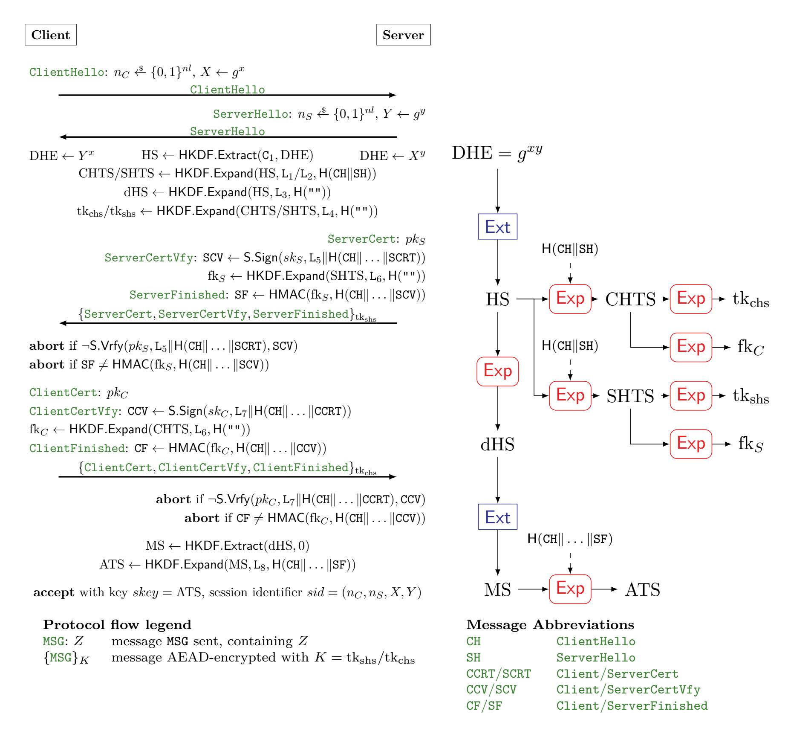
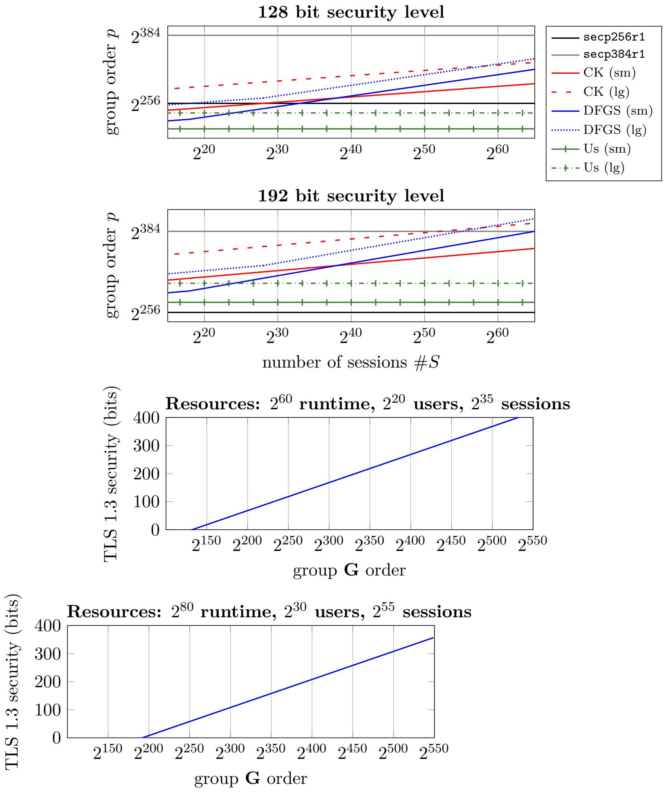

{0}------------------------------------------------

A preliminary version of this paper appears in the proceedings of the *19th International Conference on Applied Cryptography and Network Security (ACNS 2021)*, DOI: [10.1007/978-3-030-78375-4\\_18](http://dx.doi.org/10.1007/978-3-030-78375-4_18). This is the full version.

## **Tighter Proofs for the SIGMA and TLS 1.3 Key Exchange Protocols**

Hannah Davis<sup>∗</sup> Felix Günther†

November 8, 2022

#### **Abstract**

We give new, fully-quantitative and concrete bounds that justify the SIGMA and TLS 1.3 key exchange protocols not just in principle, but in practice. By this we mean that, for standardized elliptic curve group sizes, the overall protocol actually achieves the intended security level.

Prior work gave reductions of both protocols' security to the underlying building blocks that were loose (in the number of users and/or sessions), so loose that they gave no guarantees for practical parameters. Adapting techniques by Cohn-Gordon et al. (Crypto 2019), we give reductions for SIGMA and TLS 1.3 to the strong Diffie–Hellman problem which are tight. Leveraging our tighter bounds, we meet the protocols' targeted security levels when instantiated with standardized curves and improve over prior bounds by up to over 90 bits of security across a range of real-world parameters.

<sup>∗</sup> Department of Computer Science & Engineering, University of California San Diego, 9500 Gilman Drive, La Jolla, California 92093, USA. Email: h3davis@eng.ucsd.edu. URL: <https://cseweb.ucsd.edu/~h3davis/>. Supported in part by NSF grant CNS-1717640.

<sup>†</sup> Department of Computer Science, ETH Zürich, Zürich, Switzerland. Email: mail@felixguenther.info. URL: <https://www.felixguenther.info>. Supported in part by Research Fellowship grant GU 1859/1-1 of the German Research Foundation (DFG) and National Science Foundation (NSF) grant CNS-1717640.

{1}------------------------------------------------

### **Contents**

| 1 | Introduction                                                                          | 3  |
|---|---------------------------------------------------------------------------------------|----|
|   | 1.1<br>Qualitative and Quantitative Bounds<br>                                        | 3  |
|   | 1.2<br>Contributions<br>                                                              | 5  |
|   | 1.3<br>Optimizations, Limitations, and Possible Extensions<br>                        | 6  |
|   | 1.4<br>Concurrent Work<br>                                                            | 7  |
| 2 | AKE Security Model                                                                    | 7  |
|   | 2.1<br>Key Exchange Protocols<br>                                                     | 8  |
|   | 2.2<br>Key Exchange Security<br>                                                      | 9  |
|   | 2.3<br>Security Properties<br>                                                        | 11 |
| 3 | Assumptions, Building Blocks, and Multi-User Security                                 | 11 |
|   | 3.1<br>Decisional and Strong Diffie–Hellman<br>                                       | 11 |
|   | 3.2<br>Multi-User PRF Security<br>                                                    | 12 |
|   | 3.3<br>Multi-User Unforgeability with Adaptive Corruptions of Signatures and MACs<br> | 13 |
|   | 3.4<br>Hash Function Collision Resistance<br>                                         | 15 |
| 4 | The SIGMA Protocol                                                                    | 15 |
| 5 | Tighter Security Proof for SIGMA-I                                                    | 18 |
| 6 | The TLS 1.3 Handshake Protocol                                                        | 28 |
|   | 6.1<br>Protocol Description<br>                                                       | 29 |
|   | 6.2<br>Handling the TLS 1.3 Key Schedule<br>                                          | 30 |
| 7 | Tighter Security Proof for the TLS 1.3 Handshake                                      | 31 |
| 8 | Evaluation                                                                            | 39 |
| A | Evaluation Details                                                                    | 46 |
|   | A.1<br>Fully-quantitative CK SIGMA Bound<br>                                          | 46 |
|   | A.2<br>Fully-quantitative DFGS TLS 1.3 Bound<br>                                      | 46 |
| B | Proof of the Strong Diffie–Hellman GGM Bound (Theorem<br>3.3)                         | 47 |

{2}------------------------------------------------

### <span id="page-2-4"></span><span id="page-2-0"></span>1 Introduction

The Transport Layer Security (TLS) protocol [45] is responsible for securing billions of Internet connections every day. Usage statistics for Google Chrome<sup>1</sup> and Mozilla Firefox<sup>2</sup> report that 76–98% of all web page accesses are encrypted. At the heart of TLS is an authenticated key exchange (AKE) protocol, the so-called handshake protocol, responsible for providing the parties (client and server) with a shared, symmetric key that is fresh, private and authenticated. The ensuing record layer secures data using this key. The AKE protocol of TLS is based on the SIGMA ("SIGn-and-MAc") design of Krawczyk [35] for the Internet Key Exchange (IKE) protocol [30] of IPsec [34], which generically augments an unauthenticated, ephemeral Diffie–Hellman (DH) key exchange with authenticating signatures and MACs.

Naturally, the SIGMA AKE protocol and its incarnation in TLS have been the recipients of proofs of security. We contend that these largely justify the AKE protocols in principle, but not in practice, meaning not for the parameters in actual use and at the desired or expected level of security. Our work takes steps towards filling this gap.

#### <span id="page-2-1"></span>1.1 Qualitative and Quantitative Bounds

Let us expand on this. The protocols KE we consider are built from a cyclic group  $\mathbb{G}$  in which some DH problem P is assumed to be hard, a pseudorandom function PRF and unforgeable signature and MAC schemes S and M. The target for KE is session-key security with explicit authentication as originating from [12, 10, 17]. A proof of security has both a qualitative and quantitative dimension. Qualitatively, a proof of security for the AKE protocol KE says that KE meets its target definition assuming the building blocks meet theirs, where, in either case, meeting the definition means any poly-time adversary has negligible advantage in violating it.

The quantitative dimension associates to each adversary in the security game of KE a set of resources r, representing its runtime and attack surface (e.g., the number of users and executed protocol sessions the adversary has access to). It then relates the maximum advantage of any r-resource adversary in breaking KE's security to likewise advantage functions for the building blocks through an equation of the (simplified) form

$$\mathsf{Adv}_{\mathsf{KE}}(r) \leq f_{\mathbb{G}} \cdot \mathsf{Adv}_{\mathbb{G}}^{\mathsf{P}}(r_{\mathbb{G}}) + f_{\mathsf{S}} \cdot \mathsf{Adv}_{\mathsf{S}}^{\mathsf{EUF-CMA}}(r_{\mathsf{S}}) + \ldots,$$

deriving quantitative factors  $f_X$  and resources  $r_X$  for the advantage of each building block X.

Speaking asymptotically again, when  $f_X$  and  $r_X$  are polynomial functions in r, then  $Adv_{KE}(r)$  is negligible whenever all building blocks' advantages are. Due to the complexity of key exchange models and the challenging task of combining the right components in a secure manner, key exchange analyses (including prior work on SIGMA [18] and TLS 1.3 [24, 38, 25, 27, 23]) indeed often remain abstract and consider only qualitative, asymptotic security bounds.

Standardized protocols like TLS in contrast have to define concrete choices for each cryptographic building block. This involves considering reasonable estimates for adversarial resources (like runtime t and number of key-exchange model queries q) and specific instances and parameters for the underlying components X. One would hope that key exchange proofs can provide guidance in making sound choices that result in the desired overall security level. Unfortunately, AKE security bounds regularly are highly non-tight, meaning that  $f_X$  and/or  $r_X$  for some components X are so large that reasonable stand-alone parameters for X yield vacuous key exchange advantages for

<span id="page-2-2"></span><sup>1</sup>https://transparencyreport.google.com/https/

<span id="page-2-3"></span><sup>&</sup>lt;sup>2</sup>https://telemetry.mozilla.org/

{3}------------------------------------------------

<span id="page-3-3"></span>

| Adv. resources          |                   |                   |                        |                                                   | S                                   | SIGMA                                                                         | TLS 1.3                               |                                       |  |
|-------------------------|-------------------|-------------------|------------------------|---------------------------------------------------|-------------------------------------|-------------------------------------------------------------------------------|---------------------------------------|---------------------------------------|--|
| t                       | #U                | #S                | Curve                  | Target                                            | CK [18]                             | Us (Thm. 5.1)                                                                 | DFGS [23]                             | Us (Thm. 7.1)                         |  |
| $2^{60}$ $2^{60}$       | $2^{20}$ $2^{30}$ | $2^{35}$ $2^{55}$ |                        | $2^{-68}$ $2^{-68}$                               | $\approx 2^{-61}$ $\approx 2^{-21}$ | $\approx 2^{-116}$ $\approx 2^{-106}$                                         | $\approx 2^{-64}$ $\approx 2^{-24}$   | $\approx 2^{-116}$ $\approx 2^{-106}$ |  |
| $\frac{2^{60}}{2^{60}}$ | $2^{20}_{230}$    | $2^{35}_{2^{55}}$ | x25519<br>x25519       | $2^{-68}$ $2^{-68}$                               | $\approx 2^{-57} \approx 2^{-17}$   | $\approx 2^{-112} \approx 2^{-102}$                                           | $\approx 2^{-60} \approx 2^{-20}$     | $\approx 2^{-112} \approx 2^{-102}$   |  |
| $2^{80}$ $2^{80}$       | $2^{20}$ $2^{30}$ | $2^{35}$ $2^{55}$ | secp256r1<br>secp256r1 | $\begin{array}{c} 2^{-48} \\ 2^{-48} \end{array}$ | $\approx 2^{-21}$                   | $\approx 2^{-76}$ $\approx 2^{-66}$                                           | $\approx 2^{-24}$                     | $\approx 2^{-76}$ $\approx 2^{-66}$   |  |
| $\frac{2^{80}}{2^{80}}$ | $2^{20}_{30}$     | $2^{35}_{255}$    | x25519<br>x25519       | $2^{-48}$ $2^{-48}$                               | $\approx 2^{-17}$                   | $\stackrel{\approx}{\approx} \stackrel{2^{-72}}{\stackrel{2^{-62}}{\approx}}$ | $\approx 2^{-20}$                     | $\approx 2^{-72} \approx 2^{-62}$     |  |
| $\frac{2^{80}}{2^{80}}$ | $2^{20}$ $2^{30}$ | $2^{35}$ $2^{55}$ |                        | $2^{-112} \\ 2^{-112}$                            |                                     | $\approx 2^{-204}$ $\approx 2^{-194}$                                         | $\approx 2^{-152}$ $\approx 2^{-112}$ | $\approx 2^{-204}$ $\approx 2^{-194}$ |  |

<span id="page-3-0"></span>Table 1: Exemplary concrete advantages of a key exchange adversary with given resources t (running time), #U (number of users), #S (number of sessions), in breaking the security of the SIGMA and TLS 1.3 protocols when instantiated with curve secp256r1, secp384r1, or x25519, based on the prior bounds by Canetti-Krawczyk [18] resp. Dowling et al. [23], and the bounds we establish (Theorem 5.1 and 7.1). Target indicates the maximal advantage  $t/2^b$  tolerable when aiming for the respective curve's security level (b=128 resp. 192 bits); entries in red-shaded cells miss that target. See Section 8 for full details and curves secp521r1 and x448.

practical parameters. While the asymptotic bound tells us that scaling up the parameters for X (say, the DDH problem [15]) will at some point result in a secure overall advantage, this causes efficiency concerns (e.g., doubling elliptic curve DH security parameters means quadrupling the cost for group operations) and hence does not happen in practice.

We illustrate in Table 1 the effects of the non-tight bounds for SIGMA and TLS 1.3 when instantiating the protocols with NIST curves secp256r1, secp384r1 [43], or curve x25519 [40] and idealizing the protocols' other components (see Section 8 for full details). Following the curves' security, we aim at a security level of 128 bits, resp. 192 bits, meaning the ratio of an adversary's runtime to its advantage should be bounded by  $2^{-128}$ , resp.  $2^{-192}$ . When considering the advantage of key exchange adversaries running in time t, interacting in the security game with #U users and #S sessions, we can see that previous security bounds fail to meet the targeted security level for real-world–scale parameters (#U ranging in  $2^{20}-2^{30}$  based on  $2^{27}$  active certificates on the Internet<sup>3</sup>, #S ranging in  $2^{35}-2^{55}$  based on  $2^{32}$  Internet users and  $2^{33}$  daily Google searches<sup>4</sup>). In the security analysis by Canetti and Krawczyk [18] (CK) for SIGMA, the factor associated to the decisional Diffie–Hellman problem is  $f_{\text{DDH}}(t, \#U, \#S) = \#U \cdot \#S$ , where #U and #S again are the number of users, resp. sessions, accessible by the adversary. The analysis by Dowling et al. [23] (DFGS) for TLS 1.3 reduces to the strong Diffie–Hellman problem [1]—via the PRF-ODH assumption [32, 16]—with factor  $f_{\text{stDH}}(t, \#U, \#S) = (\#S)^2$ . In contrast, we reduce to the strong Diffie–Hellman problem with a constant factor for both SIGMA and TLS 1.3.

Let us discuss three data points from Table 1:

1. Already with medium-sized resources, investing time  $t=2^{60}$  and interacting with a million users (# $U=2^{20}$ ) and a few billion sessions (# $S=2^{35}$ ), the CK [18] and DFGS [23] advantage bounds for SIGMA and TLS 1.3 with curves secp256r1 and x25519 fall 6–11 bits below the target of  $2^{-68}$  for 128-bit security.

<span id="page-3-1"></span><sup>3</sup>https://letsencrypt.org/stats/

<span id="page-3-2"></span><sup>4</sup>https://www.internetlivestats.com/

{4}------------------------------------------------

- <span id="page-4-1"></span>2. When considering a more powerful, global-scale adversary (*t* = 2<sup>80</sup> , #*U* = 2<sup>30</sup> , #*S* = 255), both CK and DFGS bounds for secp256r1/x25519 become fully vacuous; the upper bound on the probability of the adversary breaking the protocol is 1. We stress that secp256r1 is the mandatory-to-implement curve for TLS 1.3; secp256r1 and x25519 together make up for 90% of the TLS 1.3 ECDHE handshakes reported through Firefox Telemetry.
- 3. Finally, and notably, even switching to the higher-security curve secp384r1 helps only marginally in the latter case: the resulting advantage against SIGMA falls 3 bits short of the 192-bit security target of 2 <sup>−</sup>112, and the TLS advantage bound only barely meets that target.

For all curves and choices of parameters, our bounds do better.

### <span id="page-4-0"></span>**1.2 Contributions**

Most prior results in tightly secure key exchange (e.g., [\[4,](#page-41-1) [28\]](#page-43-6)) apply only to bespoke protocols, carefully designed to allow for tighter proof techniques, at the cost of requiring more complex primitives which, in the end, eat up the gained practical efficiency. Recently, Cohn-Gordon et al. [\[19,](#page-42-6) [20\]](#page-42-7) established a proof strategy for a simple and efficient DH key exchange with reasonable tightness loss (only linear in the number of users #*U*), achieving implicit authentication through static DH keys through careful key derivation via a random oracle [\[11\]](#page-42-8) with an optional explicitauthentication step.

Our work in contrast establishes tight security for standardized AKE protocols. We give tight reductions for the security of SIGMA and TLS 1.3 to the strong Diffie–Hellman problem [\[1\]](#page-41-0) [\[46,](#page-44-6) [41\]](#page-44-7) and give fully quantified bounds for the latter in the generic group model (GGM) [\[46,](#page-44-6) [41\]](#page-44-7). Instantiating our bounds shows that, with standardized real-world parameters, we achieve the intended security levels even when considering powerful, globally-scaled attackers.

**Code-based security model and proofs.** For our proofs, we provide detailed proof steps and reductions using the code-based game-playing framework of Bellare and Rogaway [\[13\]](#page-42-9). Our security model is similar to the one applied by Cohn-Gordon et al. [\[19\]](#page-42-6), but formalized also as a code-based game (in Section [2\)](#page-6-1) and stronger in that it captures explicit authentication and regular ("perfect") forward secrecy (instead of only weak forward secrecy in [\[19\]](#page-42-6)).

**Tighter security proof of SIGMA(-I).** We establish fully quantitative security bounds for SIGMA and its identity-protecting variant SIGMA-I [\[35\]](#page-44-1) in Sections [4](#page-14-1) and [5.](#page-17-0) Our result is for BRlike [\[12\]](#page-42-0) key exchange security and gives a tight reduction to the strong Diffie–Hellman problem [\[1\]](#page-41-0) in the used DH group, and to the multi-user (mu) security of the employed pseudorandom function (PRF), signature scheme, and MAC scheme, adapting the techniques by Cohn-Gordon et al. [\[19\]](#page-42-6) in the random oracle model [\[11\]](#page-42-8). The latter mu-security bounds are essentially equivalent to the corresponding bounds by CK [\[18\]](#page-42-3). Our improvement comes from shaving off a factor of #*U* · #*S* (number of users times number of sessions) on the DH problem advantage compared to CK. While we move to the interactive strong Diffie–Hellman problem (compared to the decisional DH (DDH) problem [\[15\]](#page-42-4) used in [\[18\]](#page-42-3)), we re-prove (in Appendix [B\)](#page-46-0) that the strong DH problem, like DDH, is as hard as solving discrete logarithms in the generic group model (GGM) [\[46,](#page-44-6) [41\]](#page-44-7), reflecting the (only generic) algorithms known for solving discrete logarithms in elliptic curve groups. A similar proof of the generic hardness of strong DH already appears in [\[1\]](#page-41-0) where the problem is introduced; our version gives a fully quantified bound.

{5}------------------------------------------------

<span id="page-5-1"></span>**Tighter security proof for the TLS 1.3 DH handshake.** We likewise establish fully quantitative security bounds for the key exchange of the recently standardized newest version of the Transport Layer Security protocol, TLS 1.3 [\[45\]](#page-44-0), in Sections [6](#page-27-0) and [7.](#page-30-0) The main quantitative improvement in our reduction is again a tight reduction to the strong DH problem, whereas prior bounds by DFGS [\[23\]](#page-43-4) incurred a quadratic loss to the PRF-ODH assumption [\[32,](#page-43-5) [16\]](#page-42-5), a loss which translates directly to strong DH [\[16\]](#page-42-5). While TLS 1.3 roughly follows the SIGMA-I design, its cascading key schedule impedes the precise technique of Cohn-Gordon et al. [\[19\]](#page-42-6) and a direct application of our results on SIGMA-I, as no single function (to be modeled as a random oracle) binds the Diffie–Hellman values to the session context. We therefore have to carefully adapt the proof to accommodate the more complex key schedule and other core variations in TLS 1.3's key exchange, achieving conceptually similar tightness results as for SIGMA-I.

**Evaluation.** In Section [8,](#page-38-0) we evaluate the concrete security implications of our improved bounds for SIGMA and TLS 1.3 for a wide range of real-world resource parameters and all five elliptic curves (secp256r1, secp384r1, secp521r1, x25519, x448) standardized for use in TLS 1.3 [\[45\]](#page-44-0), a summary of which is displayed in Table [1.](#page-3-0) Leveraging our fully-quantified GGM bound for the strong Diffie–Hellman problem, we focus on the hardness of solving discrete logarithms in the respective elliptic curve groups, instantiating signatures based on ECDSA [\[43\]](#page-44-4) resp. EdDSA [\[14\]](#page-42-10). We idealized the symmetric PRF, MAC, and hash function primitives (in two variants, with key and output sizes twice as large as the curve's security level, or fixed at 256 bits corresponding to the choice in most TLS 1.3 cipher suites).

We report that our tighter proofs indeed materialize for a wide range of real-world resource parameters (adversary runtime *t* ∈ {2 40 *,* 2 60 *,* 2 <sup>80</sup>}, number of users #*U* ∈ {2 20 *,* 2 <sup>30</sup>}, and number of sessions #*S* ∈ {2 35 *,* 2 45 *,* 2 <sup>55</sup>}). The resulting attacker advantages meet the targeted security levels of all five curves. In comparison to the prior CK [\[18\]](#page-42-3) SIGMA and DFGS [\[23\]](#page-43-4) TLS 1.3 bounds, our results improve the obtained security across these real-world parameters by up to 85 bits for SIGMA and 92 bits for TLS 1.3, respectively.

### <span id="page-5-0"></span>**1.3 Optimizations, Limitations, and Possible Extensions**

SIGMA being a generic AKE design, the signature, PRF, and MAC schemes may be instantiated with primitives optimized for multi-user security. While we focus on standardized and deployed schemes in our evaluation without assuming tight mu-security, our SIGMA bound allows to directly leverage such optimization. For PRFs and MACs, efficient candidates exist (e.g., AMAC [\[6\]](#page-41-2)). For signatures, tight mu-security is more challenging [\[5\]](#page-41-3) and often involves computationally much more expensive constructions [\[4\]](#page-41-1).

Like Cohn-Gordon et al. [\[19\]](#page-42-6), our key exchange security model considers exposure of long-term secrets and session keys, but does not allow revealing internal session state or randomness (as in the (e)CK model [\[17,](#page-42-2) [39\]](#page-44-8)). This is appropriate for protocols like TLS 1.3 not aiming to protect against such threats. The original SIGMA proof [\[18\]](#page-42-3) did establish security in the CK model [\[17\]](#page-42-2) allowing exposure of session state; in that sense our results are qualitatively weaker. In recent work, Jager et al. [\[31\]](#page-43-7) give a tightly secure protocol which uses symmetric state encryption to protect against ephemeral state reveals. Establishing a tight security reduction for a SIGMA-style DH-based AKE protocol which can handle adaptive compromises of session state (including DH exponents) remains a challenging open problem.

In our proofs, we crucially rely on the ability to observe and program a random oracle used for key derivation in the AKE protocol, borrowing from [\[19\]](#page-42-6). Notably, the approach of Cohn-Gordon et al. is tailored to an AKE protocol achieving authenticity implicitly through mixing long-term 

{6}------------------------------------------------

<span id="page-6-2"></span>DH keys into the key derivation. Our proofs can hence be seen as translating and adapting their technique to the setting of SIGMA and TLS 1.3, where an unauthenticated ephemeral DH exchange is explicitly authenticated through signatures and MACs, confirming that the generic SIGMA design as well as the standardized TLS 1.3 protocol bind enough context to their DH shares for this proof technique to work. Leveraging the random oracle model [\[11\]](#page-42-8) is another qualitative difference compared to the original SIGMA proof [\[18\]](#page-42-3) in the standard model. Interestingly, this distinction vanishes in comparison to the provable security results for the TLS 1.3 handshake protocol [\[24,](#page-43-1) [25,](#page-43-2) [27,](#page-43-3) [23\]](#page-43-4) which employ the PRF-ODH assumption [\[32,](#page-43-5) [16\]](#page-42-5), an interactive assumption which plausibly can only be instantiated in the random oracle model (from the strong DH assumption).

### <span id="page-6-0"></span>**1.4 Concurrent Work**

In concurrent and independent work, Diemert and Jager (DJ) [\[22\]](#page-43-8) studied the tight security of the main TLS 1.3 handshake. Their work also tightly reduces the security of TLS 1.3 to the strong Diffie–Hellman problem by extending the technique of Cohn-Gordon et al. [\[19\]](#page-42-6), and their bounds and ours are similarly tight. When instantiated with real-world parameters, both bounds are dominated by the same terms, as we will demonstrate in Section [8.](#page-38-0) Our proof differs from theirs in two key ways: We use an incomparable security model that is weaker in some ways and stronger in others, and we approximate the TLS 1.3 key schedule with fewer random oracles. We also contextualize our results quite differently than the DJ work, with a detailed numerical analysis that is enabled by our fully parameterized, concrete bounds. Uniquely to this work, we treat the more generic SIGMA-I protocol and justify our use of the strong DH problem with new bounds in the generic group model. Diemert and Jager [\[22\]](#page-43-8) in turn study tight composition with the TLS record protocol.

The DJ analysis is carried out in the multi-stage key exchange model [\[26\]](#page-43-9), proving security not only of the final session key, but also of intermediate handshake encryption keys and further secrets. While our proof does show security of these intermediate keys, we do not treat them as first-class keys accessible to the adversary through dedicated queries in the security model. Unlike either the DJ or Cohn-Gordon et al. works, our model addresses explicit authentication, which we prove via HMAC's unforgeability.

To tackle the challenge that TLS 1.3's key schedule does not bind DH values and session context in one function, DJ model the full cascading derivation of each intermediate key monolithically as an independent, programmable random oracle (cf. [\[22,](#page-43-8) Theorem 6]). We instead model the key schedule's inner HKDF [\[37\]](#page-44-9) extraction and expansion functions as two individual random oracles, carefully connected via efficient look-up tables, yielding a slightly less extensive use of random oracles and compensating for the existence of shared computations in the derivation of multiple keys. This approach produces more compact bounds and allows our analysis to stay closer to the use of HKDF in TLS 1.3, where the output of one extraction call is used to derive multiple keys.

### <span id="page-6-1"></span>**2 AKE Security Model**

We provide our results in a game-based key exchange model formalized in Figure [1,](#page-9-0) at its core following the seminal work by Bellare and Rogaway [\[12\]](#page-42-0) considering an active network adversary that controls all communication (initiating sessions and determining their next inputs through Send queries) and is able to corrupt long-term secrets (RevLongTermKey) as well as session keys (RevSessionKey). The adversary's goal is then to (a) distinguish the established shared *session key* in a "fresh" (not trivially compromised, captured through a Fresh predicate) session 

{7}------------------------------------------------

<span id="page-7-1"></span>from a uniformly random key obtained through Test queries (breaking key secrecy), or (b) make a session accept without matching communication partner (breaking explicit authentication).

Following Cohn-Gordon et al. [19], we formalize our model in a real-or-random version (following Abdalla, Fouque, and Pointcheval [3] with added forward secrecy [2]) with many Test queries which all answer with a real or uniformly random session key based on the same random bit b. We focus on the security of the main session key established. While our proofs (for both SIGMA and TLS 1.3) establish security of the intermediate encryption and MAC keys, too, we do not treat them as first-class keys available to the adversary through Test and RevSessionKey queries. We expect that our results extend to a multi-stage key exchange (MSKE [26]) treatment and refer to the concurrent work by Diemert and Jager [22] for tight results for TLS 1.3 in a MSKE model.

In contrast to the work by Cohn-Gordon et al. [19] and Diemert and Jager [22], our model additionally captures explicit authentication through the ExplicitAuth predicate in Figure 1, ensuring sessions with non-corrupted peer accept with an honest partner session. We and [22] further treat protocols where the communication partner's identity of a session may be unknown at the outset and only learned during the protocol execution; this setting of "post-specified peers" [18] particularly applies to the SIGMA protocol family [35] as well as TLS 1.3 [45].

#### <span id="page-7-0"></span>2.1 Key Exchange Protocols

We begin by formalizing the syntax of key exchange protocols. A key exchange protocol KE consists of three algorithms (KGen, Activate, Run) and an associated key space KE.KS (where most commonly  $\mathsf{KE}.\mathsf{KS} = \{0,1\}^n \text{ for some } n \in \mathbb{N}\}$ . The key generation algorithm  $\mathsf{KGen}() \xrightarrow{\$} (pk,sk)$  generates new long-term public/secret key pairs. In the security model, we will associate key pairs to distinct users (or parties) with some identity  $u \in \mathbb{N}$  running the protocol, and log the public long-term keys associated with each user identity in a list peerpk. (The adversary will be in control of initializing new users, identified by an increasing counter, and we assume it only references existing user identities.) The activation algorithm  $\mathsf{Activate}(id, sk, peerid, peerpk, role) \xrightarrow{\$} (st', m')$  initiates a new session for a given user identity id (and associated long-term secret key sk) acting in a given role  $role \in \{initiator, responder\}$  and aiming to communicate with some peer user identity peerid. Activate also takes as input the list peerpk of all users' public keys; protocols may use this list to look up their own and their peers' public keys. We provide the entire list instead of just the user's and peers' public keys to accommodate protocols with post-specified peer. These protocols may leave peerid unspecified at the time of session activation; when the peer identity is set at some later point, the list can be used to find the corresponding long-term key. Activation outputs a session state and (if role = initiator) first protocol message m', and will be invoked in the security model to create a new session  $\pi_u^i$  at a user u (where the label i distinguishes different sessions of the same user). Finally,  $Run(id, sk, st, peerpk, m) \xrightarrow{\$} (st', m')$  delivers the next incoming key exchange message m to the session of user id with secret key sk and state st, resulting in an updated state st'and a response message m'. Like Activate, it relies on the list peerpk to look up its own and its peer's long-term keys.

The state of each session in a key exchange protocol contains at least the following variables, beyond possibly further, protocol-specific information:

 $peerid \in \mathbb{N}$ . Reflects the (intended) partner identity of the session; in protocols with post-specified peers this is learned and set (once) by the session during the protocol execution.

 $role \in \{initiator, responder\}$ . The session's role, determined upon activation.

 $status \in \{\text{running}, \text{accepted}, \text{rejected}\}$ . The session's status; initially status = running, a session accepts when it switches to status = accepted (once).

{8}------------------------------------------------

<span id="page-8-1"></span> $skey \in \mathsf{KE}.\mathsf{KS}$ . The derived session key (in the protocol-specific key space  $\mathsf{KE}.\mathsf{KS}$ ), set upon acceptance.

sid. The session identifier used to define partnered session in the security model; initially unset, sid is determined (once) during protocol execution.

### <span id="page-8-0"></span>2.2 Key Exchange Security

We formalize our key exchange security game  $G_{\text{KE},\mathcal{A}}^{\text{KE-SEC}}$  in Figure 1, based on the concepts introduced above in Figure 1 and following the framework for code-based game playing by Bellare and Rogaway [13]. After initializing the game, the adversary  $\mathcal{A}$  is given access to queries NewUser (generating a new user's public/secret key pair), Send (controlling activation and message processing of sessions), RevSessionKey (revealing session keys), RevLongTermKey (corrupting user's long-term secrets), and Test (providing challenge real-or-random session keys), as well as a Finalize query to which it will submit its guess b' for the challenge bit b, ending the game.

The game  $G_{\mathsf{KE},\mathcal{A}}^{\mathsf{KE-SEC}}$  then (in Finalize) determines whether  $\mathcal{A}$  was successful through the following three predicates, formalized in pseudocode in Figure 1:

Sound. The soundness predicate Sound checks that (a) no three session identifiers collide (hence the session identifier properly serves to identify two partnered sessions). Furthermore, it ensures that (b) accepted sessions with the same session identifier, agreeing partner identities, and distinct roles derive the same session key. The adversary breaks soundness if it violates either of these properties.

ExplicitAuth. The predicate ExplicitAuth captures explicit authentication in that it requires that for any session of some user id that accepted while its partner peerid was not corrupted (captured through logging relative acceptance time  $t_{acc}$  and long-term reveal time  $revltk_{peerid}$ ) has (a) a partnered session run by the intended peer identity and in an opposite role, and (b) if that partnered session accepts, it will do so with peer identity id. The adversary breaks explicit authentication if this predicate evaluates to false.

Fresh. Finally, to capture key secrecy, we have to restrict the adversary to testing only so-called fresh sessions in order to exclude trivial attacks, which the freshness predicate Fresh ensures. A tested session is non-fresh, if (a) its session key has been revealed (in which case  $\mathcal{A}$  knows the real key), (b) its partnered session (through sid) has been revealed or tested (in which case  $\mathcal{A}$  knows the real key or may see two different random keys), or (c) its intended peer identity was compromised prior to accepting (in which case  $\mathcal{A}$  may fully control the communication partner). If the adversary violates freshness, we invalidate its guess by overwriting  $b' \leftarrow 0$ .

We call two distinct sessions  $\pi_u^i$  and  $\pi_v^j$  partnered if  $\pi_u^i.sid = \pi_v^j.sid$ . We refer to sessions generated by Activate (i.e., controlled by the game) as honest sessions to reflect that their behavior is determined honestly by the game and not the adversary. The long-term key of an honest session may still be corrupted, or its session key may be revealed without affecting this notion of "honesty".

<span id="page-8-2"></span>**Definition 2.1** (Key exchange security). Let KE be a key exchange protocol and  $G_{KE,A}^{KE-SEC}$  be the key exchange security game defined in Figure 1. We define

$$\mathsf{Adv}_{\mathsf{KE}}^{\mathsf{KE-SEC}}(t,q_{\mathrm{N}},q_{\mathrm{S}},q_{\mathrm{RL}},q_{\mathrm{T}}) := 2 \cdot \max_{\mathcal{A}} \Pr\left[\mathbf{G}_{\mathsf{KE},\mathcal{A}}^{\mathsf{KE-SEC}} \Rightarrow 1\right] - 1,$$

where the maximum is taken over all adversaries, denoted  $(t, q_N, q_S, q_{RS}, q_{RL}, q_T)$ -KE-SEC-adversaries, running in time at most t and making at most  $q_N$ ,  $q_S$ ,  $q_{RS}$ ,  $q_{RL}$ , resp.  $q_T$  queries to their oracles NewUser, Send, RevSessionKey, RevLongTermKey, resp. Test.

{9}------------------------------------------------

```
G_{\mathrm{KE},\mathcal{A}}^{\mathrm{KE-SEC}}
                                                                                          FINALIZE(b'):
INITIALIZE:
                                                                                          32 if \negSound then
 1 time \leftarrow 0; users \leftarrow 0
                                                                                                  return 1
                                                                                          33
 b \stackrel{\$}{\leftarrow} \{0,1\}
                                                                                          34 if ¬ExplicitAuth then
                                                                                                  return 1
NEWUSER:
                                                                                          35
                                                                                          36 if ¬Fresh then
 \text{3 users} \leftarrow \text{users} + 1
                                                                                                  b' \leftarrow 0
                                                                                          37
 4 (pk_{\mathsf{users}}, sk_{\mathsf{users}}) \overset{\$}{\leftarrow} \mathsf{KGen}()
                                                                                          38 return [[b = b']]
 5 revltk<sub>users</sub> \leftarrow \infty
 6 peerpk[users] \leftarrow pk_{users}
                                                                                          Sound:
 7 return pk_{users}
                                                                                           1 if \exists distinct \pi_u^i, \pi_v^j, \pi_w^k with \pi_u^i.sid = \pi_v^j.sid = \pi_w^k.sid
                                                                                               then // no triple sid match
SEND(u, i, m):
                                                                                                  return false
                                                                                           2
 8 if \pi_u^i = \bot then
                                                                                           3 if \exists \pi_u^i, \pi_v^j with
        (peerid, role) \leftarrow m
                                                                                                  \pi_u^i.status = \pi_v^j.status = accepted
        (\pi_u^i, m') \stackrel{\$}{\leftarrow} \mathsf{Activate}(u, sk_u, peerid, peerpk, role)
10
                                                                                                  and \pi_u^i.sid = \pi_v^j.sid
                                                                                                  and \pi_u^i.peerid = v and \pi_v^j.peerid = u
        \pi_u^i.\mathsf{t}_{\mathsf{acc}} \leftarrow 0
11
                                                                                                  and \pi_u^i.role \neq \pi_v^j.role, but \pi_u^i.skey \neq \pi_v^j.skey then
12 else
                                                                                               # partnering implies same key
        (\pi_u^i, m') \stackrel{\$}{\leftarrow} \operatorname{Run}(u, sk_u, \pi_u^i, peerpk, m)
13
                                                                                                  return false
                                                                                           4
14 if \pi_u^i.status = accepted then
                                                                                           5 return true
        time \leftarrow time + 1
15
        \pi_u^i.\mathsf{t}_{\mathsf{acc}} \leftarrow \mathsf{time}
16
                                                                                          ExplicitAuth:
17 return m'
                                                                                           1 return
                                                                                                  \forall \pi_u^i : \pi_u^i.status = accepted
REVSESSIONKEY(u, i):
                                                                                                            and \pi_u^i.\mathsf{t}_{\mathsf{acc}} < \mathsf{revltk}_{\pi_u^i.peerid}
18 if \pi_u^i = \bot or \pi_u^i.status \neq accepted then
                                                                                               /\!\!/ all sessions accepting with a non-corrupted peer . . .
                                                                                                       \implies \exists \pi_v^j : \pi_u^i.peerid = v
        return \perp
19
                                                                                                              and \pi_u^i.sid = \pi_v^j.sid
20 \pi_u^i.revealed \leftarrow true
                                                                                                              and \pi_u^i.role \neq \pi_v^j.role
21 return \pi_u^i.skey
                                                                                               #... have a partnered session ...
                                                                                                          and (\pi_v^j.status = \mathsf{accepted} \implies \pi_v^j.peerid = u)
REVLONGTERMKEY(u):
                                                                                               #... agreeing on the peerid (upon acceptance)
22 time \leftarrow time + 1
                                                                                          Fresh:
23 revltk_u \leftarrow \mathsf{time}
                                                                                           1 for each \pi_u^i \in T
24 return sk_u
                                                                                                  if \pi_u^i revealed then
                                                                                           2
Test(u,i):
                                                                                                      return false # tested session may not be revealed
                                                                                           3
                                                                                                 if \exists \pi_v^j \neq \pi_u^i : \pi_v^j . sid = \pi_u^i . sid
25 if \pi_u^i = \bot or \pi_u^i.status \neq accepted or <math>\pi_u^i.tested then
                                                                                           4
                                                                                                      and (\pi_v^j.\mathsf{tested} \text{ or } \pi_v^j.\mathsf{revealed}) then
        return ⊥
26
                                                                                                      return false # tested session's partnered session may
27 \pi_u^i.tested \leftarrow true
                                                                                           5
                                                                                               not be tested or revealed
28 T \leftarrow T \cup \{\pi_u^i\}
                                                                                                  if \operatorname{revltk}_{\pi_u^i.peerid} < \pi_u^i.\mathsf{t}_{acc} then
                                                                                           6
29 k_0 \leftarrow \pi_u^i.skey
                                                                                                      return false #tested session's peer may not be cor-
                                                                                           7
30 k_1 \stackrel{\$}{\leftarrow} \mathsf{KE.KS}
                                                                                               rupted prior to acceptance
31 return k_b
                                                                                           8 return true
```

<span id="page-9-0"></span>Figure 1: Key exchange security game.

{10}------------------------------------------------

#### <span id="page-10-3"></span><span id="page-10-0"></span>2.3 Security Properties

Let us briefly revisit some core security properties captured in our key exchange security model.

First, we capture regular key secrecy of the main session key through TEST queries, incorporating forward secrecy (sometimes called "perfect" forward secrecy) by allowing the adversary to corrupt any user as long as all tested sessions accept prior to corrupting their respective intended peer. This strengthens our model compared to that of Cohn-Gordon et al. [19] which only captures weak forward secrecy where the adversary has to be passive in sessions where it corrupts long-term secrets. Diemert and Jager [22] additionally treat the security of intermediate keys and further secrets beyond the main session key in a multi-stage approach [26], but without capturing explicit authentication.

Our model encodes *explicit authentication* (via ExplicitAuth), a strengthening compared to the implicit-authentication model in [19].

Like [19, 22], our model captures key-compromise impersonation attacks by allowing the session owner's secret key of tested sessions to be corrupted at any point in time. Similarly, we do not capture session-state or randomness reveals [17, 39] or post-compromise security [21].

### <span id="page-10-1"></span>3 Assumptions, Building Blocks, and Multi-User Security

Before we continue to our main technical results, let us briefly introduce notation and discuss the multi-user security of the involved building blocks: strong Diffie-Hellman (including the GGM bound we prove), PRFs, digital signatures, MAC schemes, and hash functions.

### <span id="page-10-2"></span>3.1 Decisional and Strong Diffie-Hellman

The classical decisional Diffie-Hellman assumption [15] states that, when only observing the two Diffie-Hellman shares  $g^x$ ,  $g^y$ , the resulting secret  $g^{xy}$  is indistinguishable from a random group element.

**Definition 3.1** (Decisional Diffie-Hellman (DDH) assumption). Let  $\mathbb{G} = \langle g \rangle$  be a cyclic group of prime order p. We define

$$\mathsf{Adv}^{\mathsf{DDH}}_{\mathbb{G}}(t) := \max_{\mathcal{A}} \Big| \Pr \left[ \mathcal{A}(\mathbb{G}, g, g^x, g^y, g^{xy}) \Rightarrow 1 \mid x, y \overset{\$}{\leftarrow} \mathbb{Z}_p \right] - \\ \Pr \left[ \mathcal{A}(\mathbb{G}, g, g^x, g^y, g^z) \Rightarrow 1 \mid x, y, z \overset{\$}{\leftarrow} \mathbb{Z}_p \right] \Big|,$$

where the maximum is taken over all adversaries, denoted (t)-DDH-adversaries running in time at most t.

The strong Diffie–Hellman assumption [1], a weakening of the gap Diffie–Hellman assumption [44], states that solving the computational Diffie–Hellman problem given a restricted decisional Diffie–Hellman oracle is hard.

**Definition 3.2** (Strong Diffie–Hellman assumption [1]). Let  $\mathbb{G} = \langle g \rangle$  be a cyclic group of prime order p. Let  $\mathsf{DDH}(X,Y,Z) := [[X^{\log_g(Y)} = Z]]$  be a decisional Diffie–Hellman oracle. We define

$$\mathsf{Adv}^{\mathsf{stDH}}_{\mathbb{G}}(t,q_{\mathrm{SDH}}) := \max_{\mathcal{A}} \Pr\left[\mathcal{A}^{\mathsf{DDH}(g^x,\cdot,\cdot)}(\mathbb{G},g,g^x,g^y) = g^{xy} \mid x,y \overset{\$}{\leftarrow} \mathbb{Z}_p\right],$$

where the maximum is taken over all adversaries, denoted  $(t, q_{\rm SDH})$ -stDH-adversaries running in time at most t and making at most  $q_{\rm SDH}$  queries to their DDH oracle.

{11}------------------------------------------------

<span id="page-11-3"></span>The strong (or gap) Diffie–Hellman assumption has been deployed in numerous works to analyze practical key exchange designs, directly or through the PRF-ODH assumption [32, 16] it supports, including [32, 26, 24, 38, 25, 27, 23] as well as in the closely related works on practical tightness by Cohn-Gordon et al. [19] and Diemert and Jager [22]. To argue that it is reasonable to rely on the strong Diffie–Hellman assumption, we turn to the generic group model [46, 41]. Although some known algorithms for solving discrete logarithms in finite fields like index calculus fall outside the generic group model, the best known algorithms for elliptic curve groups are generic. Shoup [46] proved that, in the generic group model, any adversary computing at most t group operations in a group of prime order p has advantage at most  $\mathcal{O}(t^2/p)$  in solving the discrete logarithm problem or the computational or decisional Diffie–Hellman problem in that group. Abdalla et al. [1], when introding the strong Diffie–Hellman problem, showed that any adversary in the generic group model making at most t group operations and DDH oracle queries, also has advantage at most  $\mathcal{O}(t^2/p)$  in solving the problem. We revisit this result in Appendix B to establish the following, fully-quantified bound.

<span id="page-11-1"></span>**Theorem 3.3.** Let  $\mathbb{G}$  be a group with prime order p. In the generic group model,  $\mathsf{Adv}^{\mathsf{stDH}}_{\mathbb{G}}(t,q) \leq 4t^2/p$ .

### <span id="page-11-0"></span>3.2 Multi-User PRF Security

Let us recap the multi-user security notion for pseudorandom functions (PRFs) [7].

**Definition 3.4** (Multi-user PRF security). Let PRF:  $\{0,1\}^k \times \{0,1\}^m \to \{0,1\}^n$  be a function (for  $k, n \in \mathbb{N}$  and  $m \in \mathbb{N} \cup \{*\}$ ) and  $G_{\mathsf{PRF},\mathcal{A}}^{\mathsf{mu-PRF}}$  be the multi-user PRF security game defined as in Figure 2. We define

$$\mathsf{Adv}_{\mathsf{PRF}}^{\mathsf{mu-PRF}}(t,q_{\mathsf{NW}},q_{\mathsf{FN}},q_{\mathsf{FN}/\mathsf{U}}) := 2 \cdot \max_{\mathcal{A}} \Pr\left[\mathsf{G}_{\mathsf{PRF},\mathcal{A}}^{\mathsf{mu-PRF}} \Rightarrow 1\right] - 1,$$

where the maximum is taken over all adversaries, denoted  $(t, q_{\mathrm{NW}}, q_{\mathrm{FN}}, q_{\mathrm{FN/U}})$ -mu-PRF-adversaries, running in time at most t and making at most  $q_{\mathrm{NW}}$  queries to their New oracle, at most  $q_{\mathrm{FN}}$  total queries to their FN oracle, and at most  $q_{\mathrm{FN/U}}$  queries  $\mathrm{FN}(i,\cdot)$  for any user i.

Generically, the multi-user security of PRFs reduces to single-user security (formally,  $G_{PRF,\mathcal{A}}^{\text{mu-PRF}}$  with  $\mathcal{A}$  restricted to  $q_{NW} = 1$  queries to NEW) with a factor in the number of users via a hybrid argument [7], i.e.,

$$\mathsf{Adv}_{\mathsf{PRF}}^{\mathsf{mu-PRF}}(t,q_{\mathsf{Nw}},q_{\mathsf{Fn}},q_{\mathsf{Fn}/\mathsf{U}}) \leq q_{\mathsf{Nw}} \cdot \mathsf{Adv}_{\mathsf{PRF}}^{\mathsf{mu-PRF}}(t',1,q_{\mathsf{Fn}/\mathsf{U}},q_{\mathsf{Fn}/\mathsf{U}}),$$

where  $t \approx t'$ . (Note that the total number  $q_{\rm FN}$  of queries to the FN oracle across all users does not affect the reduction.) There exist simple and efficient constructions, like AMAC [6], that however achieve multi-user security tightly.

If we use a random oracle RO as a PRF with key length kl, then

$$\mathsf{Adv}^{\mathsf{mu-PRF}}_{\mathsf{RO}}(t,q_{\mathsf{NW}},q_{\mathsf{FN}},q_{\mathsf{FN}/\mathsf{U}},q_{\mathsf{RO}}) \leq \frac{q_{\mathsf{NW}} \cdot q_{\mathsf{RO}}}{2^{kl}}.$$

<span id="page-11-2"></span>In earlier versions of this work, the attribution of the  $\mathcal{O}(t^2/p)$  to Abdalla et al. [1] was missing. The authors of this work wish to retract any claimed novelty in that bound.

{12}------------------------------------------------

<span id="page-12-2"></span>

| $G^{mu\text{-}PRF}_{PRF,\mathcal{A}}$                                                             | <u>New:</u>                                                                           | $\underline{\mathrm{Fn}(i,x)}$ :                           |
|---------------------------------------------------------------------------------------------------|---------------------------------------------------------------------------------------|------------------------------------------------------------|
| INITIALIZE:                                                                                       | $u \leftarrow u + 1$                                                                  | 9 return $f_i(x)$                                          |
| $\begin{array}{ccc} 1 & b & \stackrel{\$}{\leftarrow} \{0, 1\} \\ 2 & u \leftarrow 0 \end{array}$ | 4 if $b=1$ then 5 $K_u \stackrel{\$}{\leftarrow} \{0,1\}^k$ 6 $f_u := PRF(K_u,\cdot)$ | $\frac{\text{Finalize}(b^*):}{\text{10 return }[[b=b^*]]}$ |
|                                                                                                   | 7 else                                                                                |                                                            |
|                                                                                                   | 8 $f_u \stackrel{\$}{\leftarrow} FUNC$                                                |                                                            |

<span id="page-12-1"></span>Figure 2: Multi-user PRF security of a pseudorandom function PRF:  $\{0,1\}^k \times \{0,1\}^m \to \{0,1\}^n$ . FUNC is the space of all functions  $\{0,1\}^m \to \{0,1\}^n$ .

# <span id="page-12-0"></span>3.3 Multi-User Unforgeability with Adaptive Corruptions of Signatures and MACs

We recap the definition of digital signature schemes and message authentication codes (MACs) as well as the natural extension of classical existential unforgeability under chosen-message attacks [29] to the multi-user setting with adaptive corruptions. For signatures, this notion was considered by Bader et al. [4] and, without corruptions, by Menezes and Smart [42].

**Definition 3.5** (Signature scheme). A signature scheme S = (KGen, Sign, Vrfy) consists of three efficient algorithms defined as follows.

- KGen()  $\stackrel{\$}{\to}$  (pk, sk). This probabilistic algorithm generates a public verification key pk and a secret signing key sk.
- Sign $(sk, m) \stackrel{\$}{\to} \sigma$ . On input a signing key sk and a message m, this (possibly) probabilistic algorithm outputs a signature  $\sigma$ .
- Vrfy $(vk, m, \sigma) \rightarrow d$ . On input a verification key pk, a message m, and a signature  $\sigma$ , this deterministic algorithm outputs a decision bit  $d \in \{0, 1\}$  (where d = 1 indicates validity of the signature).

**Definition 3.6** (Signature mu-EUF-CMA security). Let S be a signature scheme and  $G_{S,A}^{\text{mu-EUF-CMA}}$  be the game for signature multi-user existential unforgeability under chosen-message attacks with adaptive corruptions defined as in Figure 3. We define

$$\mathsf{Adv}_{\mathsf{S}}^{\mathsf{mu-EUF-CMA}}(t,q_{\mathsf{Nw}},q_{\mathsf{SG}},q_{\mathsf{SG/U}},q_{\mathsf{C}}) := \max_{\mathit{A}} \Pr \left[ \mathsf{G}_{\mathsf{S},\mathcal{A}}^{\mathsf{mu-EUF-CMA}} \Rightarrow 1 \right],$$

where the maximum is taken over all adversaries, denoted  $(t, q_{\rm NW}, q_{\rm SG}, q_{\rm SG/U}, q_{\rm C})$ -mu-EUF-CMA-adversaries, running in time at most t and making at most  $q_{\rm NW}, q_{\rm SG}$ , resp.  $q_{\rm C}$  total queries to their New, Sign, resp. Corrupt oracle, and making at most  $q_{\rm SG/U}$  queries  ${\rm Sign}(i,\cdot)$  for any user i.

Multi-user EUF-CMA security of signature schemes (with adaptive corruptions) can be reduced to classical, single-user EUF-CMA security (formally,  $G_{S,A}^{\text{mu-EUF-CMA}}$  with A restricted to  $q_{\text{Nw}} = 1$  queries to NEW) by a standard hybrid argument, losing a factor of number of users. Formally, this yields

$$\mathsf{Adv}_\mathsf{S}^{\mathsf{mu-EUF-CMA}}(t,q_{\mathrm{Nw}},q_{\mathrm{SG}},q_{\mathrm{SG/U}},q_{\mathrm{C}}) \leq q_{\mathrm{Nw}} \cdot \mathsf{Adv}_\mathsf{S}^{\mathsf{mu-EUF-CMA}}(t',1,q_{\mathrm{SG/U}},q_{\mathrm{SG/U}},0),$$

where  $t \approx t'$ . (Note that the reduction is not affected by the total number of signature queries  $q_{SG}$  across all users.) In many cases, such loss is indeed unavoidable [5].

{13}------------------------------------------------

```
G_{\mathsf{S},\mathcal{A}}^{\mathsf{mu-EUF-CMA}}
                                                                                                                  FINALIZE(i^*, m^*, \sigma^*):
                                             NEW:
INITIALIZE:
                                                                                                                 12 d^* \leftarrow \mathsf{Vrfy}(pk_{i^*}, m^*, \sigma^*)
                                               6 u \leftarrow u + 1
 1 Q \leftarrow \emptyset
                                              7 (pk_u, sk_u) \stackrel{\$}{\leftarrow} \mathsf{KGen}()
                                                                                                                 13 return [[d^* = 1 \wedge i^* \notin \mathcal{C} \wedge (i^*, m^*) \notin Q]]
 2 \quad \mathcal{C} \leftarrow \emptyset
                                               8 return pk_u
 u \leftarrow 0
                                             SIGN(i, m):
CORRUPT(i):
                                              9 \sigma \stackrel{\$}{\leftarrow} \mathsf{Sign}(sk_i, m)
 4 \mathcal{C} \leftarrow \mathcal{C} \cup \{i\}
                                             10 Q \leftarrow Q \cup \{(i, m)\}
 5 return sk_i
                                             11 return \sigma
G^{\mathsf{mu-EUF-CMA}}_{\mathsf{M},\mathcal{A}}
                                             NEW:
                                                                                                                  VRFY(i, m, \tau):
INITIALIZE:
                                               6 u \leftarrow u + 1
                                                                                                                 11 d \leftarrow \mathsf{Vrfy}(K_i, m, \tau)
 1 Q \leftarrow \emptyset
                                              7 K_u \stackrel{\$}{\leftarrow} \mathsf{KGen}()
                                                                                                                 12 return d
 2 \quad \mathcal{C} \leftarrow \emptyset
 u \leftarrow 0
                                             TAG(i, m):
                                                                                                                  FINALIZE(i^*, m^*, \tau^*):
CORRUPT(i):
4 \mathcal{C} \leftarrow \mathcal{C} \cup \{i\}
                                              \tau \leftarrow \operatorname{Tag}(K_i, m)
                                                                                                                 13 d^* \leftarrow \mathsf{Vrfy}(K_{i^*}, m^*, \tau^*)
                                               9 Q \leftarrow Q \cup \{(i, m)\}
                                                                                                                 14 return [d^* = 1 \wedge i^* \notin \mathcal{C} \wedge (i^*, m^*) \notin Q]
 5 return K_i
                                             10 return \tau
```

<span id="page-13-0"></span>Figure 3: Multi-user existential unforgeability (mu-EUF-CMA) of signature schemes (top) and MAC schemes (bottom).

**Definition 3.7** (MAC scheme). A MAC scheme M = (KGen, Tag, Vrfy) consists of three efficient algorithms defined as follows.

- $\mathsf{KGen}() \xrightarrow{\$} K$ . This probabilistic algorithm generates a key K.
- Tag $(K, m) \stackrel{\$}{\to} \tau$ . On input a key K and a message m, this (possibly) probabilistic algorithm outputs a message authentication code (MAC)  $\tau$ .
- Vrfy $(K, m, \tau) \to d$ . On input a key K, a message m, and a MAC  $\tau$ , this deterministic algorithm outputs a decision bit  $d \in \{0, 1\}$  (where d = 1 indicates validity of the MAC).

**Definition 3.8** (MAC mu-EUF-CMA security). Let M be a MAC scheme and  $G_{M,A}^{\text{mu-EUF-CMA}}$  be the game for MAC multi-user existential unforgeability under chosen-message attacks with adaptive corruptions defined as in Figure 3. We define

$$\mathsf{Adv}^{\mathsf{mu-EUF-CMA}}_{\mathsf{M}}(t,q_{\mathrm{Nw}},q_{\mathrm{TG}},q_{\mathrm{TG/U}},q_{\mathrm{VF}},q_{\mathrm{VF/U}},q_{\mathrm{C}}) := \max_{\mathcal{A}} \Pr\left[\mathbf{G}^{\mathsf{mu-EUF-CMA}}_{\mathsf{M},\mathcal{A}} \Rightarrow 1\right],$$

where the maximum is taken over all adversaries, denoted  $(t, q_{\text{NW}}, q_{\text{TG}}, q_{\text{TG/U}}, q_{\text{VF}}, q_{\text{VF/U}}, q_{\text{C}})$ mu-EUF-CMA-adversaries, running in time at most t and making at most  $q_{\text{NW}}$ ,  $q_{\text{TG}}$ ,  $q_{\text{VF}}$ , resp.  $q_{\text{C}}$  queries to their New, Tag, Vrfy, resp. Corrupt oracle, and making at most  $q_{\text{TG/U}}$  queries  $q_{\text{C}}$  queries  $q_{\text{VF/U}}$  queries  $q_{\text{VF/U}}$  queries  $q_{\text{C}}$  queries  $q_{\text{C}}$  queries  $q_{\text{C}}$  queries  $q_{\text{C}}$  queries  $q_{\text{C}}$  queries  $q_{\text{C}}$  queries  $q_{\text{C}}$  queries  $q_{\text{C}}$  queries  $q_{\text{C}}$  queries  $q_{\text{C}}$  queries  $q_{\text{C}}$  queries  $q_{\text{C}}$  queries  $q_{\text{C}}$  queries  $q_{\text{C}}$  queries  $q_{\text{C}}$  queries  $q_{\text{C}}$  queries  $q_{\text{C}}$  queries  $q_{\text{C}}$  queries  $q_{\text{C}}$  queries  $q_{\text{C}}$  queries  $q_{\text{C}}$  queries  $q_{\text{C}}$  queries  $q_{\text{C}}$  queries  $q_{\text{C}}$  queries  $q_{\text{C}}$  queries  $q_{\text{C}}$  queries  $q_{\text{C}}$  queries  $q_{\text{C}}$  queries  $q_{\text{C}}$  queries  $q_{\text{C}}$  queries  $q_{\text{C}}$  queries  $q_{\text{C}}$  queries  $q_{\text{C}}$  queries  $q_{\text{C}}$  queries  $q_{\text{C}}$  queries  $q_{\text{C}}$  queries  $q_{\text{C}}$  queries  $q_{\text{C}}$  queries  $q_{\text{C}}$  queries  $q_{\text{C}}$  queries  $q_{\text{C}}$  queries  $q_{\text{C}}$  queries  $q_{\text{C}}$  queries  $q_{\text{C}}$  queries  $q_{\text{C}}$  queries  $q_{\text{C}}$  queries  $q_{\text{C}}$  queries  $q_{\text{C}}$  queries  $q_{\text{C}}$  queries  $q_{\text{C}}$  queries  $q_{\text{C}}$  queries  $q_{\text{C}}$  queries  $q_{\text{C}}$  queries  $q_{\text{C}}$  queries  $q_{\text{C}}$  queries  $q_{\text{C}}$  queries  $q_{\text{C}}$  queries  $q_{\text{C}}$  queries  $q_{\text{C}}$  queries  $q_{\text{C}}$  queries  $q_{\text{C}}$  queries  $q_{\text{C}}$  queries  $q_{\text{C}}$  queries  $q_{\text{C}}$  queries  $q_{\text{C}}$  queries  $q_{\text{C}}$  queries  $q_{\text{C}}$  queries  $q_{\text{C}}$  queries  $q_{\text{C}}$  queries  $q_{\text{C}}$  queries  $q_{\text{C}}$  queries  $q_{\text{C}}$  queries  $q_{\text{C}}$  queries  $q_{\text{C}}$  queries  $q_{\text{C}}$  queries  $q_{\text{C}}$  queries  $q_{\text{C}}$  queries  $q_{\text{C}}$  queries  $q_{\text{C}}$  queries  $q_{\text{C}}$  queries  $q_{\text{C}}$  queries  $q_{\text{C}}$  queries  $q_{\text{C}}$  queries  $q_{\text{C}}$  queries  $q_{\text{C}}$  queries  $q_{\text{C}}$ 

As for signature schemes, multi-user EUF-CMA security of MACs reduces to the single-user case  $(q_{\text{Nw}} = 1)$  by a standard hybrid argument:

$$\begin{split} &\mathsf{Adv}_{\mathsf{M}}^{\mathsf{mu-EUF-CMA}}(t,q_{\mathsf{Nw}},q_{\mathsf{TG}},q_{\mathsf{TG}/\mathsf{U}},q_{\mathsf{VF}},q_{\mathsf{VF}/\mathsf{U}},q_{\mathsf{C}}) \\ &\leq q_{\mathsf{Nw}} \cdot \mathsf{Adv}_{\mathsf{M}}^{\mathsf{mu-EUF-CMA}}(t,1,q_{\mathsf{TG}/\mathsf{U}},q_{\mathsf{TG}/\mathsf{U}},q_{\mathsf{VF}/\mathsf{U}},q_{\mathsf{VF}/\mathsf{U}},0), \end{split}$$

{14}------------------------------------------------

<span id="page-14-2"></span>where  $t \approx t'$ . (Note that the reduction is not affected by the total number of tagging and verification queries  $q_{\text{TG}}$  resp.  $q_{\text{VF}}$  across all users.)

Our multi-user definition of MACs provides a verification oracle, which is non-standard (and in general not equivalent to a definition with a single forgery attempts, as Bellare, Goldreich and Mityiagin [9] showed). For PRF-based MACs (which in particular includes HMAC used in TLS 1.3), it however is equivalent and the reduction from multi-query to single-query verification is tight [9].

In our key exchange reductions, we actually do not need to corrupt MAC keys, i.e., we achieve  $q_{\rm C}=0$ . This in particular allows specific constructions like AMAC [6] achieving tight multi-user security (without corruptions).

If we use a random oracle RO as PRF-like MAC with key length kl and output length ol, then

$$\mathsf{Adv}^{\mathsf{mu-EUF-CMA}}_{\mathsf{RO}}(t,q_{\mathsf{Nw}},q_{\mathsf{TG}},q_{\mathsf{TG}/\mathsf{U}},q_{\mathsf{VF}},q_{\mathsf{VF}/\mathsf{U}},q_{\mathsf{C}},q_{\mathsf{RO}}) \leq \frac{q_{\mathsf{VF}}}{2^{ol}} + \frac{(q_{\mathsf{Nw}} - q_{\mathsf{C}}) \cdot q_{\mathsf{RO}}}{2^{kl}}.$$

### <span id="page-14-0"></span>3.4 Hash Function Collision Resistance

Finally, let us define collision resistance of hash functions.

**Definition 3.9** (Hash function collision resistance). Let  $H: \{0,1\}^* \to \{0,1\}^{ol}$  for  $ol \in \mathbb{N}$  be a function. For a given adversary A running in time at most t, we can consider

$$\mathsf{Adv}^{\mathsf{CR}}_\mathsf{H}(t) := \Pr\left[ (m, m') \overset{\$}{\leftarrow} \mathcal{A} : m \neq m' \ and \ \mathsf{H}(m) = \mathsf{H}(m') \right].$$

If we use a random oracle RO as hash function, then by the birthday bound

$$\mathsf{Adv}^{\mathsf{CR}}_{\mathsf{RO}}(t, q_{\mathsf{RO}}) \leq \frac{q_{\mathsf{RO}}^2}{2^{ol+1}} + \frac{1}{2^{ol}}.$$

### <span id="page-14-1"></span>4 The SIGMA Protocol

The SIGMA family of key exchange protocols introduced by Krawczyk [35, 36] describes several variants for building authenticated Diffie–Hellman key exchange using the "SIGn-and-MAc" approach. Its design has been adopted in several Internet security protocols, including, e.g., the Internet Key Exchange protocol [30, 33] as part of the IPsec Internet security protocol [34] and the newest version 1.3 of the Transport Layer Security (TLS) protocol [45].

Beyond the basic SIGMA design, we are particularly interested in the SIGMA-I variant which forms the basis of the TLS 1.3 key exchange and aims at hiding the protocol participants' identities as additional feature. We here present an augmented version of the basic SIGMA/SIGMA-I protocols which includes explicit exchange of session-identifying random numbers (nonces) to be closer to SIGMA(-like) protocols in practice, somewhat following the "full-fledged" SIGMA variant [36, Appendix B]. We illustrate these protocol flows in Figure 4. and Figure 5 formalizes both as key exchange protocols according to the syntax of Section 2.1.

The SIGMA and SIGMA-I protocols make use of a signature scheme S = (KGen, Sign, Vrfy), a MAC scheme M = (KGen, Tag, Vrfy), a pseudorandom function PRF, and a function RO which we model as a random oracle. The parties' long-term secret keys consist of one signing key, i.e., KE.KGen = S.KGen. The protocols consists of three messages exchanged and accordingly two steps performed by both initiator and responder, which we describe in more detail now.

**Initiator Step 1.** The initiator picks a Diffie-Hellman exponent  $x \stackrel{\$}{\leftarrow} \mathbb{Z}_p$  and a random nonce  $n_I$  of length nl and sends  $n_I$  and  $g^x$ .

{15}------------------------------------------------

```
cyclic group \mathbb{G} = \langle g \rangle of prime order p
                                                                                                                                               Responder R
 Initiator I
                                                                                          \mathsf{RunResp1}(R, sk_R, st, peerpk, m = (n_I, X))
\mathsf{RunInit1}(I,sk_I,st)
x \stackrel{\$}{\leftarrow} \mathbb{Z}_p, X \leftarrow g^x
                                                                                                                                            y \stackrel{\$}{\leftarrow} \mathbb{Z}_p, Y \leftarrow g^y
                                                                                                                                                 n_R \stackrel{\$}{\leftarrow} \{0,1\}^{nl}
n_I \stackrel{\$}{\leftarrow} \{0,1\}^{nl}
                                                                                 n_I, X
                                                                                                                                     sid \leftarrow (n_I, n_R, X, Y)
                                                                                                                      mk \leftarrow \mathsf{RO}(n_I, n_R, X, Y, X^y)
st.state \leftarrow (n, X, x)
                                                                                                                   k_s/k_t/\overline{|k_e|} \leftarrow \mathsf{PRF}(mk, 0/1/2)
                                                                                                         \sigma \leftarrow \mathsf{S.Sign}(sk_R, \mathsf{L}_{rs} || n_I || n_R || X || Y)
                                                                \frac{n_R, Y, c))}{n_R, Y, c} \qquad \tau \leftarrow \mathsf{M}.\mathsf{Tag}(k_t, \mathsf{L}_{rm} || n_I || n_R || R)}{c \leftarrow (R, \sigma, \tau)}
RunInit2(I, sk_I, st, peerpk, m = (n_R, Y, c))
sid \leftarrow (n_I, n_B, X, Y)
mk \leftarrow \mathsf{RO}(n_I, n_B, X, Y, Y^x)
k_s/k_t/k_e \leftarrow \mathsf{PRF}(mk, 0/1/2)
(R, \sigma, \tau) \leftarrow c \ (R, \sigma, \tau) \leftarrow \mathsf{Dec}_{k_e}(c)
abort if \neg S. \overline{Vrfy(peerpk[R], L_{rs}||n_I||n_R||X||Y, \sigma)}
                                                                                                          st.state \leftarrow (n, n', X, Y, k_s, k_t, k_e)
abort if \neg \mathsf{M.Vrfy}(k_t, \mathsf{L}_{rm} || n_I || n_R || R, \tau)
status \leftarrow \mathsf{accepted}; \ peerid \leftarrow R
\sigma' \leftarrow \mathsf{S.Sign}(sk_I, \mathsf{L}_{is} || n_I || n_R || X || Y)
\tau' \leftarrow \mathsf{M.Tag}(k_t, \mathsf{L}_{im} || n_I || n_R || I)c' \leftarrow (I, \sigma', \tau') \boxed{c' \leftarrow \mathsf{Enc}_{k_e}(I, \sigma', \tau')}
                                                                                               abort if \neg S.Vrfy(peerpk[\overline{I}], L_{is}||n_I||n_R||X||Y, \sigma')
                                                                                                  abort if \neg \mathsf{M.Vrfy}(k_t, \mathsf{L}_{im} || n_I || n_R || I, \tau')
                                                                                                                status \leftarrow \mathsf{accepted}; peerid \leftarrow I
```

<span id="page-15-0"></span>**accept** with key  $skey = k_s$  and session identifier  $sid = (n_I, n_R, X, Y)$ 

Figure 4: The SIGMA/SIGMA-I protocol flow diagram. Boxed code is only performed in the SIGMA-I variant. Values  $L_x$  indicate label strings (distinct per x).

**Responder Step 1.** The responder also picks a random DH exponent y and a random nonce  $n_R$ . It then derives a master key as  $mk \leftarrow \mathsf{RO}(n_I, n_R, X, Y, X^y)$  from nonces, DH shares, and the joint DH secret  $g^{xy} = (g^x)^y$ . From mk, keys are derived via PRF with distinct labels: the session key  $k_s$ , the MAC key  $k_t$ , and (only in SIGMA-I) the encryption key  $k_e$ .

The responder computes a signature  $\sigma$  with  $sk_R$  over nonces and DH shares (and a unique label  $L_{rs}$ ) and a MAC value  $\tau$  under key  $k_t$  over the nonces and its identity R (and unique label  $L_{rm}$ ). It sends  $n_I$ ,  $g^y$ , as well as R,  $\sigma$ , and  $\tau$  to the initiator. In SIGMA-I the last three elements are encrypted using  $k_e$  to conceal the responder's identity against passive adversaries.

Initiator Step 2. The initiator also computes mk and keys  $k_s$ ,  $k_t$ , and (in SIGMA-I, used to decrypt the second message part)  $k_e$ . It ensures both the received signature  $\sigma$  and MAC  $\tau$  verify, and aborts otherwise.

It computes its own signature  $\sigma'$  under  $sk_I$  on nonces and DH shares (with a different label  $L_{is}$ )

{16}------------------------------------------------

```
Activate(id, sk, peerid, peerpk, role):
                                                                                            RunInit2(id, sk, st, peerpk, m):
                                                                                             1 (n_R, Y, peerid, \sigma, \tau) \leftarrow m
 1 st'.role \leftarrow role
                                                                                                 |(n_R, Y, c) \leftarrow m|
 2 st'.status \leftarrow running
                                                                                             (n_I, X, x) \leftarrow st.state
 3 if role = initiator then
                                                                                             st'.sid \leftarrow (n_I, n_R, X, Y)
         (st', m') \leftarrow \mathsf{RunInit1}(id, sk, st')
 4
                                                                                             4 mk \leftarrow \mathsf{RO}(n_I || n_R || X || Y || Y^x)
 5 else m' \leftarrow \bot
                                                                                             5 k_s \leftarrow \mathsf{PRF}(mk, 0)
 6 return (st', m')
                                                                                             6 k_t \leftarrow \mathsf{PRF}(mk, 1)
Run(id, sk, st, peerpk, m):
                                                                                              _{7} k_{e} \leftarrow \mathsf{PRF}(mk,2)
 1 if st.status \neq running then
                                                                                              (peerid, \sigma, \tau) \leftarrow \mathsf{Dec}(k_e, c)
 2 return ⊥
                                                                                             9 st'.peerid \leftarrow peerid
 3 if st.role = initiator then
                                                                                            10 if S.Vrfy(peerpk[peerid], L_{rs}||n_I||n_R||X||Y, \sigma)
         (st', m') \leftarrow \mathsf{RunInit2}(id, sk, st, peerpk, m)
 4
                                                                                                 and M.Vrfy(k_t, L_{rm} || n_I || n_R || peerid, \tau) then
 5 else if st.sid = \bot
                                                                                                     st'.status \leftarrow \mathsf{accepted}
                                                                                           11
         (st', m') \leftarrow \mathsf{RunResp1}(id, sk, st, peerpk, m)
                                                                                                    st'.skey \leftarrow k_s
 6
                                                                                           12
 7 else
                                                                                                    \sigma' \leftarrow \mathsf{S.Sign}(sk, \mathsf{L}_{is} || n_I || n_R || X || Y)
                                                                                           13
         (st', m') \leftarrow \mathsf{RunResp2}(id, sk, st, peerpk, m)
                                                                                                    \tau' \leftarrow \mathsf{M}.\mathsf{Tag}(k_t, \mathtt{L}_{im} \| n_I \| n_R \| id)
 8
                                                                                           14
 9 return (st', m')
                                                                                                    m' \leftarrow (id, \sigma', \tau')
                                                                                           15
                                                                                                    m' \leftarrow \mathsf{Enc}(k_e, (id, \sigma', \tau'))
RunInit1(id, sk, st):
                                                                                           16 else
 1 n_I \stackrel{\$}{\leftarrow} \{0,1\}^{nl}
                                                                                                    m' \leftarrow \bot
                                                                                           17
 2 x \stackrel{\$}{\leftarrow} \mathbb{Z}_p
                                                                                                     st'.status \leftarrow \mathsf{rejected}
                                                                                            18
 з X \leftarrow g^x
                                                                                            19 return (st', m')
 4 st'.state \leftarrow (n_I, X, x)
                                                                                            RunResp2(id, sk, st, peerpk, m):
 5 m' \leftarrow (n_I, X)
                                                                                             1 (n_I, n_R, X, Y, k_s, k_t) \leftarrow st.state
 6 return (st', m')
                                                                                                 (n_I, n_R, X, Y, k_s, k_t, k_e) \leftarrow st.state
RunResp1(id, sk, st, peerpk, m):
                                                                                             2 (peerid, \sigma', \tau') \leftarrow m
                                                                                                 (peerid, \sigma', \tau') \leftarrow \mathsf{Dec}(k_e, m)
 1 (n_I, X) \leftarrow m
 n_R \stackrel{\$}{\leftarrow} \{0,1\}^{nl}
                                                                                             st'.peerid \leftarrow peerid
 з y \stackrel{\$}{\leftarrow} \mathbb{Z}_p
                                                                                             4 if S.Vrfy(peerpk[peerid], L_{is}||n_I||n_R||X||Y, \sigma')
 4 Y \leftarrow q^y
                                                                                                 and M.Vrfy(k_t, L_{im} || n_I || n_R || peerid, \tau') then
                                                                                                    st'.status \leftarrow \mathsf{accepted}
 5 st'.sid \leftarrow (n_I, n_R, X, Y)
                                                                                             5
                                                                                                    st'.skey \leftarrow k_s
 6 \sigma \leftarrow \mathsf{S.Sign}(sk, \mathsf{L}_{rs} || n_I || n_R || X || Y)
                                                                                              6
                                                                                             7 else st'.status \leftarrow rejected
 7 mk \leftarrow \mathsf{RO}(n_I || n_R || X || Y || X^y)
                                                                                             8 m' \leftarrow \varepsilon
 8 k_s \leftarrow \mathsf{PRF}(mk, 0)
                                                                                             9 return (st', m')
 9 k_t \leftarrow \mathsf{PRF}(mk, 1)
k_e \leftarrow \mathsf{PRF}(mk, 2)
11 \tau \leftarrow \mathsf{M.Tag}(k_t, \mathsf{L}_{rm} || n_I || n_R || id)
12 st'.state \leftarrow (n_I, n_R, X, Y, k_s, k_t)
     |st'.state \leftarrow (n_I, n_R, X, Y, k_s, k_t, k_e)|
13 m' \leftarrow (n_R, Y, id, \sigma, \tau)
     m' \leftarrow (n_R, Y, \mathsf{Enc}(k_e, (id, \sigma, \tau)))
14 return (st', m')
```

<span id="page-16-0"></span>Figure 5: The formalized SIGMA/SIGMA-I key exchange protocols (cf. Section 2.1). Boxed code is only performed in the SIGMA-I variant.

{17}------------------------------------------------

<span id="page-17-5"></span>and a MAC *τ* <sup>0</sup> under *k<sup>t</sup>* over the nonces and its identity *I* (with yet another label L*im*). It sends *I*, *σ* 0 , and *τ* 0 to the responder (in SIGMA-I encrypted under *ke*) and accepts with session key *k<sup>s</sup>* using the nonces and DH shares (*n<sup>I</sup> , nR, X, Y* ) as session identifier.

**Responder Step 2.** The responder finally checks the initiator's signature *σ* <sup>0</sup> and MAC *τ* 0 (aborting if either fails) and then accepts with session key *skey* = *k<sup>s</sup>* and session identifier *sid* = (*n<sup>I</sup> , nR, X, Y* ).

### <span id="page-17-0"></span>**5 Tighter Security Proof for SIGMA-I**

We now come to our first main result, a tighter security proof for the SIGMA-I protocol. Note that by omitting message encryption our proof similarly applies to the basic SIGMA protocol.

<span id="page-17-1"></span>**Theorem 5.1.** *Let the SIGMA-I protocol be as specified in Figure [5](#page-16-0) based on a group* G *of prime order p, a PRF* PRF*, a signature scheme* S*, and a MAC* M*, and let* RO *in the protocol be modeled as a random oracle. For any* (*t, q*N*, q*S*, q*RS*, q*RL*, q*T)*-*KE-SEC*-adversary against SIGMA-I making at most q*RO *queries to* RO*, we give algorithms* B1*,* B2*,* B3*, and* B<sup>4</sup> *in the proof, with running times t*B<sup>1</sup> ≈ *t* + 2*q*RO log<sup>2</sup> *p and t*B*<sup>i</sup>* ≈ *t (for i* = 2*, . . . ,* 4*) close to that of* A*, such that*

$$\begin{split} &\mathsf{Adv}_{\mathsf{SIGMA-I}}^{\mathsf{KE-SEC}}(t,q_{\mathsf{N}},q_{\mathsf{S}},q_{\mathsf{RL}},q_{\mathsf{T}}) \\ &\leq \frac{3q_{\mathsf{S}}^2}{2^{nl+1} \cdot p} + \mathsf{Adv}_{\mathbb{G}}^{\mathsf{stDH}}(t_{\mathcal{B}_1},q_{\mathsf{RO}}) + \mathsf{Adv}_{\mathsf{PRF}}^{\mathsf{mu-PRF}}(t_{\mathcal{B}_2},q_{\mathsf{S}},3q_{\mathsf{S}},3) \\ &+ \mathsf{Adv}_{\mathsf{S}}^{\mathsf{mu-EUF-CMA}}(t_{\mathcal{B}_3},q_{\mathsf{N}},q_{\mathsf{S}},q_{\mathsf{S}},q_{\mathsf{RL}}) + \mathsf{Adv}_{\mathsf{M}}^{\mathsf{mu-EUF-CMA}}(t_{\mathcal{B}_4},q_{\mathsf{S}},q_{\mathsf{S}},1,q_{\mathsf{S}},1,0). \end{split}$$

*Here, nl is the nonce length in SIGMA-I and* G *is the used Diffie–Hellman group of prime order p.*

In terms of multi-user security for the employed primitives, multi-user PRF and MAC security can be obtained tightly, e.g., via the efficient AMAC construction [\[6\]](#page-41-2), and multi-user signature security can be generically reduced to single-user security of any signature scheme with a loss in the number of users, here parties (not sessions) in the key exchange game.

*Proof.* Our proof of key exchange security for SIGMA-I proceeds via a sequence of code-based games [\[13\]](#page-42-9). For the first half, the proof conceptually follows the strategy put forward by Cohn-Gordon et al. [\[19\]](#page-42-6).

<span id="page-17-2"></span>**Game 0.** The initial game, G[0](#page-17-2), is the key exchange security game played by A (cf. Figure [1\)](#page-9-0), using the KGen, Activate, and Run routines of SIGMA-I defined in Figure [5.](#page-16-0) Therefore,

$$\Pr[G_0 \Rightarrow 1] = \Pr[G_{\mathsf{KE},\mathcal{A}}^{\mathsf{KE-SEC}} \Rightarrow 1].$$

<span id="page-17-4"></span><span id="page-17-3"></span>**Game 1.** Between G[0](#page-17-2) and G[1](#page-17-3) (Figure [6\)](#page-18-0), we make internal changes to the record-keeping of the game, namely we track the nonces and group elements chosen and received by honest sessions. Whenever two honest sessions pick the same nonce or group element, we set a flag bad*C*. Whenever an honest responder session picks a nonce and group element that has already been received by an initiator session, we set a flag bad*O*. This change is unobservable by the adversary, hence

$$\Pr[G_0 \Rightarrow 1] = \Pr[G_1 \Rightarrow 1].$$

{18}------------------------------------------------

```
G_1, \overline{G_2}
                                                                                             RunResp1(id, sk, st, peerpk, m):
RunInit1(id, sk, st):
                                                                                            13 (n_I, X) \leftarrow m
 1 \quad n_I \stackrel{\$}{\leftarrow} \{0,1\}^{nl}
                                                                                            14 n_R \stackrel{\$}{\leftarrow} \{0,1\}^{nl}
 2 x \stackrel{\$}{\leftarrow} \mathbb{Z}_p
                                                                                            15 y \stackrel{\$}{\leftarrow} \mathbb{Z}_p
 X \leftarrow g^x
                                                                                            16 Y \leftarrow g^x
 4 if (n_I, X) \in N then \mathsf{bad}_C \leftarrow \mathsf{true}; abort
                                                                                            if (n_R, Y) \in Recv then bad_O \leftarrow true : abort
 N \leftarrow N \cup \{(n_I, X)\}
                                                                                            18 if (n_R, Y) \in N then \mathsf{bad}_C \leftarrow \mathsf{true}; \ abort
 6 st'.state \leftarrow (n_I, X, x)
                                                                                            19 N \leftarrow N \cup \{(n_R, Y)\}
 7 m' \leftarrow (n_I, X)
                                                                                            20 st'.sid \leftarrow (n_I, n_R, X, Y)
 8 return (st', m')
                                                                                            21 ...
RunInit2(id, sk, st, peerpk, m):
                                                                                             \mathsf{RO}(m):
 9 (n_R, Y, c) \leftarrow m
                                                                                           101 if H[m] = \bot then H[m] \stackrel{\$}{\leftarrow} \{0, 1\}^{kl}
10 Recv \leftarrow Recv \cup \{(n_R, Y)\}
                                                                                           102 return H[m]
11 (n_I, X, x) \leftarrow st.state
12 ...
```

<span id="page-18-0"></span>Figure 6: Games  $G_1$  (changes highlighted in gray) and  $G_2$  (changes highlighted in frames) of the SIGMA-I proof; with the explicit (lazy-sampled) random oracle RO.

**Game 2.** In Game  $G_2$  (Figure 6), we abort whenever nonces and group elements collide among honest sessions (i.e., the  $\mathsf{bad}_C$  flag is set), or whenever an honest responder session chooses a nonce and group element already submitted by the adversary to an initiator (i.e., the  $\mathsf{bad}_O$  flag is set). By the identical-until-bad lemma [13],

$$\Pr[G_1 \Rightarrow 1] - \Pr[G_2 \Rightarrow 1] \leq \Pr[\mathsf{bad}_C \text{ or } \mathsf{bad}_O \leftarrow \mathsf{true} \text{ in } G_1].$$

In all of the calls to RunInit1 and RunResp1, up to  $q_S$  pairs of nonces and group elements are chosen uniformly at random. By the birthday bound, the probability of a collision between two of these pairs setting the  $\mathsf{bad}_C$  flag is at most  $\frac{q_S^2}{2^{nl+1} \cdot p}$  (where nl is the nonce length and p the order of the Diffie-Hellman group). There are at most  $q_S$  pairs received by initiator sessions, so the probability that a responder session randomly chooses one of these pairs is at most  $\frac{q_S}{2^{nl} \cdot p}$ ; then by the union bound we have that  $\Pr[\mathsf{bad}_O \leftarrow \mathsf{true} \text{ in } G_1] \leq \frac{q_S^2}{2^{nl} \cdot p}$ . Since each of RunInit1 and RunResp1 is called at most once per SEND query, if an adversary makes  $q_S$  queries to its SEND oracle, then

$$\Pr[G_1 \Rightarrow 1] - \Pr[G_2 \Rightarrow 1] \le \frac{3q_S^2}{2^{nl+1} \cdot p}.$$

In all subsequent games, we are now sure that each honest session chooses a unique nonce and group element. Since the session identifier  $sid = (n_I, n_R, X, Y)$  contains exactly one initiator and one responder nonce, this furthermore implies that when two honest sessions are partnered, they must have different roles.

<span id="page-18-1"></span>**Game 3.** In Game  $G_3$  (Figure 7), we remove the now superfluous collision flags  $bad_C$  and  $bad_O$  and add additional bookkeeping. All honest initiator sessions now log their outgoing messages in an internal table Sent. Honest responder sessions use this table to check if the message they received was sent by an honest initiator session. If so, they log their keys  $k_t$ ,  $k_e$ , and  $k_s$  in a second internal table, S, indexed by their session identifier. These changes are unobservable by the adversary, so

$$\Pr[G_2 \Rightarrow 1] = \Pr[G_3 \Rightarrow 1].$$

{19}------------------------------------------------

```
G_3, \overline{G_4}
```

```
RunInit1(id, sk, st):
 1 \ n_I \xleftarrow{\$} \{0,1\}^{nl}
 2 x \stackrel{\$}{\leftarrow} \mathbb{Z}_p
 з X \leftarrow g^x
 4 if (n_I, X) \in N then abort
 5 N \leftarrow N \cup \{(n_I, X)\}
 6 st'.state \leftarrow (n_I, X, x)
 7 m' \leftarrow (n_I, X)
 8 Sent \leftarrow Sent \cup m'
 9 return (st', m')
RunInit2(id, sk, st, peerpk, m):
10 (n_R, Y, c) \leftarrow m
11 Recv \leftarrow Recv \cup \{(n_R, Y)\}
12 (n_I, X, x) \leftarrow st.state
13 st'.sid \leftarrow (n_I, n_R, X, Y)
14 if S[st'.sid] \neq \bot then
        mk \leftarrow \mathsf{RO}(n_I || n_R || X || Y || Y^x)
15
        k_s \leftarrow \mathsf{PRF}(mk, 0)
16
         k_t \leftarrow \mathsf{PRF}(mk, 1)
17
         k_e \leftarrow \mathsf{PRF}(mk,2)
18
        k_s, k_t, k_e \leftarrow \mathsf{S}[st'.sid]
19
20 else
        mk \leftarrow \mathsf{RO}(n_I || n_R || X || Y || Y^x)
21
        k_s \leftarrow \mathsf{PRF}(mk,0)
22
        k_t \leftarrow \mathsf{PRF}(mk, 1)
23
        k_e \leftarrow \mathsf{PRF}(mk, 2)
24
25 (peerid, \sigma, \tau) \leftarrow Dec(k_e, c)
26 st'.peerid \leftarrow peerid
27 ...
```

```
\frac{\mathsf{RunResp1}(id,sk,st,peerpk,m)\text{:}}{}
```

```
28 (n_I, X) \leftarrow m
29 n_R \stackrel{\$}{\leftarrow} \{0,1\}^{nl}
30 y \stackrel{\$}{\leftarrow} \mathbb{Z}_p
31 Y \leftarrow g^x
32 if (n_R, Y) \in Recv then abort
33 if (n_R, Y) \in N then abort
34 N \leftarrow N \cup \{(n_R, Y)\}
35 st'.sid \leftarrow (n_I, n_R, X, Y)
36 \sigma \leftarrow \mathsf{S.Sign}(sk, \mathsf{L}_{rs} || n_I || n_R || X || Y)
37 mk \leftarrow \mathsf{RO}(n_I || n_R || X || Y || X^y)
38 k_s \leftarrow \mathsf{PRF}(mk,0)
39 k_t \leftarrow \mathsf{PRF}(mk, 1)
40 k_e \leftarrow \mathsf{PRF}(mk, 2)
41 if m \in \mathsf{Sent} then
          \mathsf{S}[st'.sid] \leftarrow (k_s, k_t, k_e)
42
43 \tau \leftarrow \mathsf{M.Tag}(k_t, \mathsf{L}_{rm} || n_I || n_R || id)
44 st'.state \leftarrow (n_I, n_R, X, Y, k_s, k_t)
45 m' \leftarrow (n_R, Y, \mathsf{Enc}(k_e, (id, \sigma, \tau)))
46 return (st', m')
```

<span id="page-19-0"></span>Figure 7: Games  $G_3$  (changes highlighted in gray) and  $G_4$  (changes highlighted in frames) of the SIGMA-I proof.

<span id="page-19-1"></span>**Game 4.** In Game G<sub>4</sub> (Figure 7), we require that initiator sessions whose key material has already been computed by an honest partner session simply copy their partners' key material. When an honest initiator session  $\pi_u^i$  with nonce n and group element X receives a message  $m \leftarrow (n_R, Y, c)$ , it sets its session identifier  $sid \leftarrow (n_I, n_R, X, Y)$ . It then checks if  $S[sid] \neq \bot$  (which is only the case if  $\pi_u^i$  has an honest partner), and if so uses the stored key material  $k_s, k_t, k_e \leftarrow S[st'.sid]$ .

<span id="page-19-2"></span>Recall that both partnered sessions agree on the DH shares X and Y as components of sid. They hence also agree on the shared DH secret  $Z = g^{xy}$  and thus on the master key derived as  $RO(n_I||n_R||X||Y||Z)$  as well as the derived key  $k_s$ ,  $k_t$ , and  $k_e$ . For the adversary  $\mathcal{A}$  it is hence unobservable if initiators with honest partner actually compute their keys themselves or copy their partners' key material in Game  $G_4$ , so

$$\Pr[G_3 \Rightarrow 1] = \Pr[G_4 \Rightarrow 1].$$

{20}------------------------------------------------

**Game 5.** In Game G<sub>5</sub> (Figure 8), all honest sessions sample their master keys uniformly at random (as long as the random oracle has not been been queried on the corresponding input) and program the random oracle to that value (through RO's internal table  $H[n_I||n_R||X||Y||Y^x] \leftarrow mk$ ). This is equivalent to RO performing the same checks and uniform sampling, and hence undetectable for A:

$$\Pr[G_4 \Rightarrow 1] = \Pr[G_5 \Rightarrow 1].$$

<span id="page-20-0"></span>**Game 6.** In Game G<sub>6</sub> (Figure 8), responder sessions whose first message came from an honest initiator stop programming the random oracle on their uniformly chosen master key mk. This is undetectable for adversary  $\mathcal{A}$  unless it makes a query  $\mathsf{RO}(n_I \| n_R \| X \| Y \| Z)$ , where  $sid = (n_I, n_R, X, Y)$  is the session identifier shared by two honest partnered sessions, and Z is the Diffie–Hellman secret corresponding to the pair (X, Y). We call this event F, and bound the probability of F by giving a reduction  $\mathcal{B}_1$  (specified in Figure 9) to the strong Diffie–Hellman assumption in the DH group  $\mathbb{G}$ . The reduction makes at most as many queries to its stDH oracle as  $\mathcal{A}$  makes to its RO oracle, as follows.

Given its strong DH challenge  $(A = g^a, B = g^b)$  and having access to an oracle  $\mathsf{stDH}_a(U, V)$  which outputs 1 if  $U^a = V$  and 0 otherwise,  $\mathcal{B}_1$  simulates  $G_6$  for an adversary  $\mathcal{A}$  as follows. In all honest initiator sessions,  $\mathcal{B}_1$  embeds its challenge into the sent DH value as  $X \leftarrow A \cdot g^r$ , where  $r \in \mathbb{Z}_p$  is sampled uniformly at random for each session. Furthermore, in all responder sessions receiving their first message from an honest initiator,  $\mathcal{B}_1$  embeds its challenge as  $Y \leftarrow B \cdot g^{r'}$ , where  $r' \in \mathbb{Z}_p$  is sampled uniformly at random for each session.

Let us first observe that if event F occurs, then the value Z in the random oracle query  $\mathsf{RO}(n_I \| n_R \| X \| Y \| Z)$  will equal  $g^{(a+r)(b+r')}$  for some  $r, r' \in \mathbb{Z}_p$  chosen by  $\mathcal{B}_1$ , and consequently

$$Z \cdot Y^{-r} = g^{(a+r)(b+r')-(b+r')\cdot r} = g^{a(b+r')} = Y^a.$$

This equality can be tested for by  $\mathcal{B}_1$  by calling its  $\mathsf{stDH}_a$  oracle on the pair  $(Y, Z \cdot Y^{-r})$ . We let  $\mathcal{B}_1$  do so whenever  $\mathcal{A}$  queries RO on some value  $(n_I || n_R || X || Y || Z)$  where  $(n_I, X = A \cdot g^r)$  was output by an honest initiator session and  $(n_R, Y = g^{(b+r')})$  was output by a responder session with an honest initiator; the responder stores  $(n_I, n_R, X, Y)$  in a look-up table Q so this can be checked efficiently. If  $\mathsf{stDH}_a(Y, Z \cdot Y^{-r}) = 1$  on such occasion, i.e., event F occurs,  $\mathcal{B}_1$  stops with output  $Z \cdot Y^{-r} \cdot A^{-r'} = g^{(a+r)(b+r')} \cdot g^{-(b+r')\cdot r} \cdot g^{-ar'} = g^{ab}$  and wins. Therefore,

$$\Pr[F] \leq \mathsf{Adv}^{\mathsf{stDH}}_{\mathbb{G},\mathcal{B}_1}.$$

One subtlety in this step is ensuring that  $\mathcal{B}_1$  can correctly simulate answers to RevSessionKey queries to any initiator or responder session. We do so by accordingly programming the random oracle on the sampled master key, where needed. First of all observe that responder sessions without honest initiator keep picking their own Y share and compute mk regularly. Initiator and responder sessions with honest partner have the challenge embedded and sample an independent master key which is not programmed to the random oracle. However,  $\mathcal{B}_1$  stops and wins (as described above) if  $\mathcal{A}$  ever queries the random oracle on the correct DH secret; i.e.,  $\mathcal{A}$  never sees the (inconsistent) random oracle output for these master keys. The interesting case is when an initiator session (which always embeds the challenge in its DH share as  $X = A \cdot g^r$ ) obtains a message  $(n_R, Y, c)$  not originating from an honest responder: Here, Y may well have been picked by the adversary who could furthermore have corrupted the initiator's peer and hence make the initiator accept—with a master key it cannot compute itself.

We therefore let  $\mathcal{B}_1$  attempt to copy the adversary's master key, if it has been computed. The RO oracle logs all queries it receives by their putative session id  $(n_I, n_R, X, Y)$  in a look-up table H',

{21}------------------------------------------------

### G[5](#page-19-2), G[6](#page-20-0)

```
RunInit2(id, sk, st, peerpk, m):
 1 (nR, Y, c) ← m
 2 Recv ← Recv ∪ {(nR, Y )}
 3 (nI , X, x) ← st.state
 4 st0
      .sid ← (nI , nR, X, Y )
 5 if S[st0
          .sid] 6= ⊥ then
 6 ks, kt, ke ← S[st0
                      .sid]
 7 else
 8 mk ←− { $
             0, 1}
                  kl
 9 if H[nI knRkXkY kY
                          x
                           ] 6= ⊥
10 mk ← H[nI knRkXkY kY
                                 x
                                  ]
11 H[nI knRkXkY kY
                        x
                         ] ← mk
12 ks ← PRF(mk, 0)
13 kt ← PRF(mk, 1)
14 ke ← PRF(mk, 2)
15 (peerid, σ, τ ) ← Dec(ke, c)
16 st0
      .peerid ← peerid
17 if S.Vrfy(peerpk[peerid], LrsknI knRkXkY, σ)
   and M.Vrfy(kt, LrmknI knRkpeerid) then
18 st0
        .status ← accepted
19 st0
        .skey ← ks
20 σ
       0 ← S.Sign(sk, LisknI knRkXkY )
21 τ
       0 ← M.Tag(kt, LimknI knRkid)
22 m0 ← Enc(ke,(id, σ0
                         , τ 0
                            ))
23 else
24 m0 ← ⊥ ; st0
                  .status ← rejected
25 return (st0
             , m0
                 )
                                                          RunResp1(id, sk, st, peerpk, m):
                                                          26 (nI , X) ← m
                                                          27 nR ←− { $
                                                                     0, 1}
                                                                         nl
                                                          28 y ←−$ Zp
                                                          29 Y ← g
                                                                    x
                                                          30 if (nR, Y ) ∈ Recv then abort
                                                          31 if (nR, Y ) ∈ N then abort
                                                          32 N ← N ∪ {(nR, Y )}
                                                          33 st0
                                                                .sid ← (nI , nR, X, Y )
                                                          34 σ ← S.Sign(sk, LrsknI knRkXkY )
                                                          35 mk ←− { $
                                                                     0, 1}
                                                                         kl
                                                          36 if m 6∈ Sent then
                                                          37 if H[nI knRkXkY kX
                                                                                    y
                                                                                     ] 6= ⊥
                                                          38 mk ← H[nI knRkXkY kX
                                                                                           y
                                                                                            ]
                                                          39 H[nI knRkXkY kX
                                                                                  y
                                                                                   ] ← mk
                                                          40 ks ← PRF(mk, 0)
                                                          41 kt ← PRF(mk, 1)
                                                          42 ke ← PRF(mk, 2)
                                                          43 if m ∈ Sent then
                                                          44 S[st0
                                                                    .sid] ← (ks, kt, ke)
                                                          45 τ ← M.Tag(kt, LrmknI knRkid)
                                                          46 st0
                                                                .state ← (nI , nR, X, Y, ks, kt)
                                                          47 m0 ← (nR, Y, id, σ, τ )
                                                          48 return (st0
                                                                       , m0
                                                                           )
```

<span id="page-21-0"></span>Figure 8: Games G[5](#page-19-2) (changes highlighted in gray) and G[6](#page-20-0) (changes highlighted in frames) of the SIGMA-I proof.

so B<sup>1</sup> can efficiently access all *Z* such that (*n<sup>I</sup> , nR, X, Y, Z*) has been queried to RO. Since the DH secret corresponding to the pair (*X, Y* ) equals *Y a*+*r* , if *Z* is this DH secret, then

$$Z \cdot Y^{-r} = Y^{(a+r)-r} = Y^a.$$

The reduction can check this equality using its stDH*<sup>a</sup>* oracle and in that case use the response to RO(*n<sup>I</sup> , nR, X, Y, Z*) as *mk*. Otherwise, B<sup>1</sup> samples *mk* at random and stores it in the table Q (Line [48](#page-22-1) of Figure [9\)](#page-22-0), indicating it should be programmed in the random oracle later if queried on a matching *Z* value (Line [75\)](#page-22-2). This ensures all responses to RevSessionKey queries are consistent with A's queries to the random oracle RO.

Observe that, in all this, B<sup>1</sup> calls its stDH oracle at most once for each entry *H*[*nI*k*nR*k*X*k*Y* k*Z*] = *mk* in the RO table *H*. In RO, stDH is called (once) only for entries that were not present when Q[(*n<sup>I</sup> , nR, X, Y* )] was set, then *H*<sup>0</sup> is set. In RunInit2 and RunResp1, stDH is called only for matching *H*0 entries established prior to setting Q. Therefore, if stDH is called in RO for an entry, it was not called in either RunInit2 or RunResp1. If stDH is called on an entry in RunResp1, then the responder session is partnered, so its partner will copy its keys in RunInit2 and not call stDH. Furthermore, due to uniqueness of nonces and DH shares (by Game G[2](#page-17-4)), no RunInit2 or RunResp1 call makes

{22}------------------------------------------------

```
\mathcal{B}_1(A,B)^{\mathsf{stDH}_a(\cdot,\cdot)}
                                                                                             RunResp1(id, sk, st, peerpk, m):
                                                                                             37 (n_I, X) \leftarrow m
RunInit1(id, sk, st):
                                                                                             38 n_R \stackrel{\$}{\leftarrow} \{0,1\}^{nl}
 1 n_I \stackrel{\$}{\leftarrow} \{0,1\}^{nl}
                                                                                             39 r' \stackrel{\$}{\leftarrow} \mathbb{Z}_p
 r \stackrel{\$}{\leftarrow} \mathbb{Z}_p
                                                                                             40 mk \stackrel{\$}{\leftarrow} \{0,1\}^{kl}
 X \leftarrow A \cdot g^r
                                                                                             41 if m \in \mathsf{Sent} then
 4 if (n_I, X) \in N then abort
                                                                                                     r \leftarrow \mathsf{Sent}[m]
                                                                                             42
 5 N \leftarrow N \cup \{(n_I, X)\}
                                                                                                      Y \leftarrow B \cdot q^{r'}
                                                                                             43
 6 st'.state \leftarrow (n_I, X, r)
                                                                                                      st'.sid \leftarrow (n_I, n_R, X, Y)
                                                                                             44
 7 m' \leftarrow (n_I, X)
                                                                                                      for each Z \in H'[n_I || n_R || X || Y]
                                                                                             45
 8 Sent[m'] \leftarrow x
                                                                                                         if stDH_a(Y, Z \cdot Y^{-r}) = 1 then
                                                                                            46
 9 return (st', m')
                                                                                                             FINALIZE(Z \cdot Y^{-r} \cdot A^{-r'})
                                                                                             47
RunInit2(id, sk, st, peerpk, m):
                                                                                                      Q[st'.sid] \leftarrow (r, r', mk)
                                                                                             48
10 (n_R, Y, c) \leftarrow m
                                                                                             49 else
11 Recv \leftarrow Recv \cup \{(n_R, Y)\}
                                                                                                     Y \leftarrow q^{r'}
                                                                                             50
                                                                                                     st'.sid \leftarrow (n_I, n_R, X, Y)
12 (n_I, X, r) \leftarrow st.state
                                                                                            51
13 st'.sid \leftarrow (n_I, n_R, X, Y)
                                                                                                     if H[n_I||n_R||X||Y||X^y] \neq \bot
                                                                                            52
14 if S[st'.sid] \neq \bot then
                                                                                                         mk \leftarrow H[n_I || n_R || X || Y || X^{r'}]
                                                                                             53
         k_s, k_t, k_e \leftarrow \mathsf{S}[st'.sid]
15
                                                                                                     H[n_I||n_R||X||Y||X^y] \leftarrow mk
                                                                                             54
16 else
                                                                                             55 if (n_R, Y) \in Recv then abort
         mk \stackrel{\$}{\leftarrow} \{0,1\}^{kl}
17
                                                                                             56 if (n_R, Y) \in N then abort
         for each Z \in H'[n_I || n_R || X || Y]
18
                                                                                             57 N \leftarrow N \cup \{(n_R, Y)\}
            if \mathsf{stDH}_a(Y, Z \cdot Y^{-r}) = 1 then
19
                                                                                             58 \sigma \leftarrow \mathsf{S.Sign}(sk, \mathsf{L}_{rs} || n_I || n_R || X || Y)
                mk \leftarrow H[n_I || n_R || X || Y || Z]
20
                                                                                            59 k_s \leftarrow \mathsf{PRF}(mk, 0)
21
         Q[st'.sid] \leftarrow (r, \perp, mk)
                                                                                             60 k_t \leftarrow \mathsf{PRF}(mk, 1)
         k_s \leftarrow \mathsf{PRF}(mk,0)
22
                                                                                             61 k_e \leftarrow \mathsf{PRF}(mk, 2)
         k_t \leftarrow \mathsf{PRF}(mk, 1)
23
                                                                                             62 if m \in \mathsf{Sent} then
         k_e \leftarrow \mathsf{PRF}(mk, 2)
24
                                                                                                     S[st'.sid] \leftarrow (k_s, k_t, k_e)
                                                                                             63
25 (peerid, \sigma, \tau) \leftarrow \mathsf{Dec}(k_e, c)
                                                                                             64 \tau \leftarrow \mathsf{M.Tag}(k_t, \mathsf{L}_{rm} || n_I || n_R || id)
26 st'.peerid \leftarrow peerid
                                                                                             65 st'.state \leftarrow (n_I, n_R, X, Y, k_s, k_t, k_e)
27 if S.Vrfy(L_{rs}||n_I||n_R||X||Y, \sigma, pk_{peerid})
                                                                                             66 m' \leftarrow (n_R, Y, \mathsf{Enc}(k_e, (id, \sigma, \tau)))
     and M.Vrfy(k_t, L_{rm} || n_I || n_R || peerid) then
                                                                                             67 return (st', m')
         st'.status \leftarrow \mathsf{accepted}
28
                                                                                             RO(m):
        st'.skey \leftarrow k_s
29
         \sigma' \leftarrow \mathsf{S.Sign}(sk, \mathsf{L}_{is} || n_I || n_R || R || W)
                                                                                             68 if H[m] = \bot then
30
                                                                                                      H[m] \xleftarrow{\$} \{0,1\}^{kl}
         \tau' \leftarrow \mathsf{M}.\mathsf{Tag}(k_t, \mathsf{L}_{im} || n_I || n_R || id)
                                                                                             69
31
         m' \leftarrow \mathsf{Enc}(k_e, (id, \sigma', \tau'))
                                                                                                     parse n_I ||n_R|| X ||Y|| Z \leftarrow m
                                                                                            70
32
                                                                                                      H'[n_I || n_R || X || Y] \leftarrow H'[n_I || n_R || X || Y] \cup \{Z\}
33 else
                                                                                            71
         m' \leftarrow \bot
                                                                                                     if Q[(n_I, n_R, X, Y)] \neq \bot then
34
                                                                                            72
                                                                                                         (r, r', mk) \leftarrow \mathsf{Q}[n_I, n_R, X, Y]
         st'.status \leftarrow \mathsf{rejected}
                                                                                             73
35
36 return (st', m')
                                                                                             74
                                                                                                         if stDH_a(Y, Z \cdot Y^{-r}) = 1 then
                                                                                                             if r' = \bot then H[m] \leftarrow mk
                                                                                            75
                                                                                                             else Finalize(Z \cdot Y^{-r} \cdot A^{-r'})
                                                                                             76
                                                                                             77 return H[m]
```

<span id="page-22-2"></span><span id="page-22-0"></span>Figure 9: Reduction  $\mathcal{B}_1$  to the strong Diffie-Hellman assumption of the SIGMA-I proof. Sections highlighted in gray have been significantly altered compared to Game  $G_6$ .

{23}------------------------------------------------

<span id="page-23-3"></span>stDH be invoked twice for the same *H*<sup>0</sup> entry.

Since the total time to iterate through the for loops over all Run and RO queries is at most *O*(*q*RO), the running time of B<sup>1</sup> is roughly that of A, plus the time needed to compute the arguments of the stDH queries. Each of these arguments requires one group operation and one exponentiation. (All other operations performed by B<sup>1</sup> add only a small constant amount of time per Send query, which is dominated by the runtime of A.) The exponentiation can be computed using 2 log<sup>2</sup> *p* group operations using the square-and-multiply (or double-and-add) algorithm, so *t*B<sup>1</sup> ≈ *t* + 2*q*RO log<sup>2</sup> *p*. The runtime *t* of A already includes the computation of 2*q*<sup>S</sup> log<sup>2</sup> *p* group operations, so this is a significant but not prohibitive increase in runtime.

Having B<sup>1</sup> perfectly simulate Game G[5](#page-19-2) for A up to the point when *F* happens, and G[6](#page-20-0) and G[5](#page-19-2) differing only when *F* happens, we have

$$\Pr[G_5 \Rightarrow 1] = \Pr[G_6 \Rightarrow 1] + \Pr[F] \le \Pr[G_6 \Rightarrow 1] + \mathsf{Adv}_{\mathbb{G}_+}^{\mathsf{stDH}}(t_{\mathcal{B}_1}, q_{\mathrm{RO}}),$$

<span id="page-23-0"></span>and *t*B<sup>1</sup> ≈ *t* + 2*q*RO log<sup>2</sup> *p*.

**Game 7.** In Game G[7](#page-23-0) (Figure [10\)](#page-24-0), responder oracles responding to honest messages samples session, MAC, and encryption keys *ks*, *k<sup>t</sup>* , and *k<sup>e</sup>* randomly instead of computing them through a PRF. (Initiator oracles partnered with an honest responder will continue to copy those, now randomly sampled keys.)

Since the PRF key *mk* in this case is sampled independently of the random oracle and the rest of the game, this reduces straightforwardly to the multi-user security of the PRF via the reduction B<sup>2</sup> we give in Figure [10.](#page-24-0) The adversary B<sup>2</sup> makes one New and two FUNC queries for each RunResp1 query, or three FUNC queries in SIGMA-I. Notably, it makes at most three FUNC queries per user, and no Corrupt queries because *mk* is never revealed to the adversary. Outside of the oracle calls, its running time exactly equals that of A in Game G[6](#page-20-0), as their pseudocode is identical, so *t*B<sup>2</sup> ≈ *t*. Using its Fn oracle of the PRF game, B<sup>2</sup> perfectly simulates G[6](#page-20-0) if the oracle gives real-PRF answers and G[7](#page-23-0) if it returns uniformly random values. Therefore,

$$\Pr[G_6 \Rightarrow 1] \leq \Pr[G_7 \Rightarrow 1] + \mathsf{Adv}^{\mathsf{mu-PRF}}_{\mathsf{PRF},}(t_{\mathcal{B}_2}, q_S, 3q_S, 3, 0).$$

Observe that from now on, session and MAC keys of responder oracles that received honest initiator's messages are chosen independently at random, and that initiator oracles with matching *sid* will copy those keys. Notably, this is the case even for sessions whose (own or peer's) long-term secret have been revealed to the adversary. We will use these properties in the following to argue authentication of sessions as well as forward security of the session keys.

Our final game hops are concerned with the explicit authentication performed through signatures and MACs in the SIGMA-I protocol, and as such extend those proof steps for implicit authentication of the main protocols in [\[19\]](#page-42-6).

<span id="page-23-1"></span>**Game 8.** In Game G[8](#page-23-1) (Figure [11\)](#page-25-0), we log all messages for which signatures are generated by an honest session, and set a bad flag bad*<sup>S</sup>* if the adversary submits a valid signature under an uncorrupted signing key for a message which was not produced by an honest session. This internal bookkeeping does not affect the adversary's advantage, so

$$\Pr[G_7 \Rightarrow 1] = \Pr[G_8 \Rightarrow 1].$$

<span id="page-23-2"></span>**Game 9.** In Game G[9](#page-23-2) (Figure [11\)](#page-25-0), we abort if the bad*<sup>S</sup>* flag is set. By the identical-untilbad lemma, the difference in advantage between G[8](#page-23-1) and G[9](#page-23-2) is bounded by the probability that

{24}------------------------------------------------

```
G7
RunResp1(id, sk, st, peerpk, m):
 1 (nI , X) ← m
 2 nR ←− { $
           0, 1}
               nl
 3 y ←−$ Zp
 4 Y ← g
          y
 5 if (nR, Y ) ∈ Recv then abort
 6 if (nR, Y ) ∈ N then abort
 7 N ← N ∪ {(nR, Y )}
 8 st0
      .sid ← (nI , nR, X, Y )
 9 σ ← S.Sign(sk, LrsknI knRkXkY )
10 mk ←− { $
           0, 1}
                kl
11 if m 6∈ Sent then
12 if H[Y
            x
             knI knRkXkY ] 6= ⊥
13 mk ← H[Y
                   x
                     knI knRkXkY ]
14 ks ← PRF(mk, 0)
15 kt ← PRF(mk, 1)
16 ke ← PRF(mk, 2)
17 if m ∈ Sent
18 ks ←− { $
            0, 1}
                 kl
19 kt ←− { $
            0, 1}
                 kl
20 ke ←− { $
            0, 1}
                 kl
21 S[st0
          .sid] ← (ks, kt, ke)
22 τ ← M.Tag(kt, LrmknI knRkid)
23 st0
      .state ← (nI , nR, X, Y, ks, kt)
24 m0 ← (nR, Y, Enc(ke,(id, σ, τ ))
25 return (st0
              , m0
                  )
                                                           B
                                                             Fn(·,·)
                                                             2
                                                           RunResp1(id, sk, st, peerpk, m):
                                                            1 (nI , X) ← m
                                                            2 nR ←− { $
                                                                      0, 1}
                                                                           nl
                                                            3 y ←−$ Zp
                                                            4 Y ← g
                                                                     y
                                                            5 if (nR, Y ) ∈ Recv then abort
                                                            6 if (nR, Y ) ∈ N then abort
                                                            7 N ← N ∪ {(nR, Y )}
                                                            8 st0
                                                                 .sid ← (nI , nR, X, Y )
                                                            9 σ ← S.Sign(sk, LrsknI knRkXkY )
                                                           10 mk ←− { $
                                                                      0, 1}
                                                                           kl
                                                           11 if m 6∈ Sent then
                                                           12 if H[nI knRkXkY kX
                                                                                      y
                                                                                       ] 6= ⊥
                                                           13 mk ← H[nI knRkXkY kX
                                                                                             y
                                                                                              ]
                                                           14 ks ← PRF(mk, 0)
                                                           15 kt ← PRF(mk, 1)
                                                           16 ke ← PRF(mk, 2).
                                                           17 if m ∈ Sent
                                                           18 New(); i + +
                                                           19 ks ← Fn(i, 0)
                                                           20 kt ← Fn(i, 1)
                                                           21 ke ← Fn(i, 2)
                                                           22 S[st0
                                                                     .sid] ← (ks, kt, ke)
                                                           23 τ ← M.Tag(kt, LrmknI knRkid)
                                                           24 st0
                                                                 .state ← (nI , nR, X, Y, ks, kt)
                                                           25 m0 ← (nR, Y, Enc(ke,(id, σ, τ ))
                                                           26 return (st0
                                                                         , m0
                                                                             )
```

<span id="page-24-0"></span>Figure 10: Game G[7](#page-23-0) and reduction B<sup>2</sup> to PRF security of the SIGMA-I proof. Changes from G[6](#page-20-0) resp. compared to G[7](#page-23-0) highlighted in gray.

this event occurs, which we reduce via an algorithm B<sup>3</sup> to the multi-user security of the digital signature scheme S.

In the reduction, B<sup>3</sup> obtains all long-term public keys from the multi-user signature game and uses its signing oracles for any honest signature to be produced. It therefore makes *q*N queries to New and one Sign query for each call to RunResp1 or RunInit2, for at most *q*<sup>S</sup> such queries. It relays RevLongTermKey queries as corruptions in its multi-user game, making *q*RL corruption queries in total. When bad*<sup>S</sup>* is triggered, B<sup>3</sup> submits the triggering message and signature under the targeted (uncorrupted) public key as its forgery. As the triggering message was not signed before under the corresponding secret key (and hence not queried to the signing oracle by B3), the forgery is valid and B<sup>3</sup> wins if bad*<sup>S</sup>* is set. It follows that

$$\Pr[G_8 \Rightarrow 1] \leq \Pr[G_9 \Rightarrow 1] + \mathsf{Adv}^{\mathsf{mu-EUF-CMA}}_{\mathsf{S},\mathcal{B}_3}(t_{\mathcal{B}_3},q_N,q_S,q_S,q_{\mathrm{RL}}).$$

Except for the replacement of key generation, signatures, corruptions with oracle queries, the pseudocode of B<sup>3</sup> is identical to that of A in game G8, so *t*B<sup>3</sup> ≈ *t*.

<span id="page-24-1"></span>**Game 10.** In Game G[10](#page-24-1) (Figure [11\)](#page-25-0), we remove the now redundant bad*<sup>S</sup>* flag again, and log all

{25}------------------------------------------------

```
G8, G9
RunInit2(id, sk, st, peerpk, m):
 1 . . .
 2 if S.Vrfy(peerpk[peerid], LrsknI knRkXkY, σ)
   and M.Vrfy(kt, LrmknI knRkpeerid, τ ) then
 3 if revltkpeerid = ∞ and
        (peerid, LrsknI knRkXkY ) ∈/ QS then
 4 badS ← true ; abort
 7 st0
        .status ← accepted
 8 st0
        .skey ← ks
 9 σ
       0 ← S.Sign(sk, LisknI knRkXkY )
10 QS ← QS ∪ {(id, LisknI knRkXkY )}
11 τ
       0 ← M.Tag(kt, LimknI knRkid)
14 . . .
RunResp1(id, sk, st, peerpk, m):
15 . . .
16 σ ← S.Sign(sk, LrsknI knRkXkY )
17 QS ← QS ∪ {(id, LrsknI knRkXkY )}
18 . . .
19 τ ← M.Tag(kt, LrmknI knRkid)
21 . . .
RunResp2(id, sk, st, peerpk, m):
22 . . .
23 if S.Vrfy(peerpk[peerid], LisknI knRkXkY, σ0
                                               )
   and M.Vrfy(kt, LimknI knRkpeerid, τ 0
                                        ) then
24 if revltkpeerid = ∞ and
        (peerid, LrsknI knRkXkY ) ∈/ QS then
25 badS ← true ; abort
28 st0
        .status ← accepted
29 st0
        .skey ← ks
30 else st0
          .status ← rejected
31 return (st0
             , m0
                 )
                                                          G10, G11
                                                          RunInit2(id, sk, st, peerpk, m):
                                                          1 . . .
                                                          2 if S.Vrfy(peerpk[peerid], LrsknI knRkXkY, σ)
                                                             and M.Vrfy(kt, LrmknI knRkpeerid) then
                                                          3 if revltkpeerid = ∞ and
                                                                 (peerid, LrsknI knRkXkY ) ∈/ QS then
                                                          4 abort
                                                          5 if S[st0
                                                                      .sid] 6= ⊥ and
                                                                 (st0
                                                                     .sid, LrmknI knRkpeerid) ∈/ QM then
                                                          6 badM ← true ; abort
                                                          7 st0
                                                                  .status ← accepted
                                                          8 st0
                                                                  .skey ← ks
                                                          9 σ
                                                                0 ← S.Sign(sk, LisknI knRkXkY )
                                                         10 QS ← QS ∪ {(id, LisknI knRkXkY )}
                                                         11 τ
                                                                0 ← M.Tag(kt, LimknI knRkid)
                                                         12 if S[st0
                                                                      .sid] 6= ⊥ then
                                                         13 QM ← QM ∪ {(st0
                                                                                   .sid, LimknI knRkid)}
                                                         14 . . .
                                                          RunResp1(id, sk, st, peerpk, m):
                                                         15 . . .
                                                         16 σ ← S.Sign(sk, LrsknI knRkXkY )
                                                         17 QS ← QS ∪ {(id, LrsknI knRkXkY )}
                                                         18 . . .
                                                         19 τ ← M.Tag(kt, LrmknI knRkid)
                                                         20 if S[st0
                                                                   .sid] 6= ⊥ then
                                                         21 QM ← QM ∪ {(st0
                                                                                 .sid, LrmknI knRkid)}
                                                         22 . . .
                                                          RunResp2(id, sk, st, peerpk, m):
                                                         23 . . .
                                                         24 if S.Vrfy(peerpk[peerid], LisknI knRkXkY, σ0
                                                                                                        )
                                                             and M.Vrfy(kt, LimknI knRkpeerid, τ 0
                                                                                                 ) then
                                                         25 if revltkpeerid = ∞ and
                                                                    (peerid, LisknI knRkXkY ) ∈/ QS then
                                                         26 abort
                                                         27 if S[st0
                                                                      .sid] 6= ⊥ and
                                                                 (st0
                                                                     .sid,(peerid, LimknI knRkpeerid) ∈/ QM then
                                                         28 badM ← true ; abort
                                                         29 st0
                                                                  .status ← accepted
                                                         30 st0
                                                                  .skey ← ks
                                                         31 else st0
                                                                    .status ← rejected
                                                         32 return (st0
                                                                       , m0
                                                                           )
```

<span id="page-25-0"></span>Figure 11: Games G[8](#page-23-1), G[9](#page-23-2), G[10](#page-24-1), and G[11](#page-26-0) of the SIGMA-I proof. Changes in G[8](#page-23-1) and G[10](#page-24-1) are highlighted in gray, changes in G[9](#page-23-2) and G[11](#page-26-0) are highlighted in frames.

{26}------------------------------------------------

MAC tags generated by honest sessions with honest partners in a list  $Q_M$  (using, as before, the table S to determine whether a session has an honest partner). We set a flag  $\mathsf{bad}_M$  if a session with an honest partner receives a valid MAC tag which was not computed by any honest oracle. This bookkeeping is similar to the changes from  $G_7$  to  $G_8$ , but noting MAC tags instead of signatures. As before, the bookkeeping itself does not affect the adversary's advantage:

$$\Pr[G_9 \Rightarrow 1] = \Pr[G_{10} \Rightarrow 1].$$

<span id="page-26-0"></span>**Game 11.** In Game  $G_{11}$  (Figure 11), we abort if the  $\mathsf{bad}_M$  flag is set to true. Again applying the identical-until-bad lemma, we need to bound the probability of  $\mathsf{bad}_M$  being set in  $G_{10}$ , which we do via the following reduction  $\mathcal{B}_4$  to the multi-user EUF-CMA security of the MAC scheme M.

The reduction  $\mathcal{B}_4$  simulates  $G_{10}$  truthfully, except that for any session with honest origin partner (i.e., session with state st where  $\mathsf{S}[st.sid] \neq \bot$ ),  $\mathcal{B}_4$  does not compute  $k_t$  itself, but instead assigns an incremented user identifier i to this session's sid and computes any calls to Tag or Vrfy using its corresponding oracles for user i. There is at most one query to NewUser, and one each to Tag and Vrfy for each of  $\mathcal{A}$ 's queries to Send. Hence  $\mathcal{B}_4$  makes at most  $q_{\rm S}$  queries to each of these three oracles, and at most one query to Tag and Vrfy per user in the mu-EUF-CMA game. When  $\mathsf{bad}_M$  is triggered,  $\mathcal{B}_4$  submits the triggering message and MAC tag under user identifier i as its forgery. In the simulation, sessions will share a user identifier i if and only if they are partnered and would share keys in Game  $G_{10}$ . These keys are furthermore unique to one initiator and one responder session only, so consistency is maintained. Furthermore,  $k_t$  cannot be exposed (by RevLongTermKey or RevSessionKey) to adversary  $\mathcal{A}$ , hence implicitly replacing it with the MAC game's oracles is sound, and  $\mathcal{B}_4$  makes no Corrupt queries. Except for oracle replacements, the pseudocode of  $\mathcal{B}_4$  is identical to that of  $\mathcal{A}$  in  $G_{10}$ , so  $t_{\mathcal{B}_4} \approx t$ .

If  $\mathsf{bad}_M$  is triggered, then  $S[st'.sid] \neq \bot$ , so st'.sid corresponds to some user identifier i in the multi-user EUF-CMA game. Additionally, a tag  $\tau$  for message m was verified under identity i, and (st'.sid, m) was not logged in  $\mathsf{Q}_M$ . Since  $\mathcal{B}_4$  logs (st'.sid, m) every time it calls its Tag oracle on the pair (i, m), this call cannot have occurred. Then  $\tau$  is a valid forgery on m, which  $\mathcal{B}_4$  will output for user i to win the EUF-CMA game. Thus,

$$\Pr[G_{10} \Rightarrow 1] \leq \Pr[G_{11} \Rightarrow 1] + \mathsf{Adv^{\mathsf{mu-EUF-CMA}}_{\mathsf{M},}}(t_{\mathcal{B}_4}, q_S, q_S, 1, q_S, 1, 0).$$

We can now consider the final advantage of an adversary playing Game  $G_{11}$ . Adversary  $\mathcal{A}$  has a non-zero advantage if in the final oracle query Finalize(b')

- 1. Sound is false,
- 2. ExplicitAuth is false, or
- 3. Fresh is true and b' = b.

**Soundness.** The flag **Sound** is set if (1) three honest sessions hold the same session identifier, or if (2) two partnered sessions hold different session keys.

- For (1): No three honest sessions can share the same session identifiers, as this would require a collision in either the contained initiator or responder nonce, which is excluded by Game  $G_2$ .
- For (2): The session identifier includes both nonces n and  $n_R$  and DH shares X and Y, which together determine the derived master key  $mk = \mathsf{RO}(n_I ||n_R||X||Y||Z)$  (where Z is the DH secret

<span id="page-26-1"></span><sup>&</sup>lt;sup>6</sup>If Fresh is false, b = b' = 0 happens with probability  $\frac{1}{2}$ , so  $\mathcal{A}$ 's advantage is 0.

{27}------------------------------------------------

<span id="page-27-2"></span>from X and Y) and thus the session key. Agreement on the session identifier hence implies deriving the same session key.

Hence, in Game  $G_{11}$ , Sound is always true.

**Explicit authentication.** The predicate ExplicitAuth requires that for any session  $\pi_u^i$  accepting with a non-compromised peer v, there exists a partnered session  $\pi_v^j$  of user v with opposite role which, if it accepts, has u set as its peer.

The session  $\pi_u^i$ , prior to accepting, obtained a valid signature on  $\pi_u^i.sid$  and a label corresponding to a role  $r \neq \pi_u^i.role$ . Due to Game G<sub>9</sub>, this signature must have been issued by an honest session  $\pi_v^j$  (since v was not compromised at this point). All honest sessions sign their own sid and a label corresponding to their own role, so  $\pi_u^i.sid = \pi_v^j.sid$  and  $\pi_u^i.role = r \neq \pi_v^j.role$  are satisfied.

Furthermore, when  $\pi_v^j$  accepts, it must have received a valid MAC tag  $\tau$  on a label identifying an opposite-role session and that session's user identity, as well as their shared nonces. Due to Game  $G_{11}$ , this MAC value must have been computed by an honest session holding the same nonces, as  $\pi_v^j$  has an honest partner session and therefore  $S[\pi_v^j.sid] \neq \bot$ . Furthermore, by Game  $G_2$ , nonces do not collide and hence that session must have been  $\pi_u^i$ , thus computing the MAC on user identity u, which  $\pi_v^j$  accordingly sets as peer identity.

Therefore ExplicitAuth is always true in  $G_{11}$ . Note that we did not require that the long-term key of user u was uncorrupted, and we allow the adversary to continue interacting with sessions after compromise; hence covering key compromise impersonation attacks.

**Guessing the challenge bit.** Finally, we have to consider  $\mathcal{A}$ 's chance of guessing the challenge bit b, which it may only learn through Test queries such that all tested sessions are fresh (i.e., Fresh is true).

The Fresh predicate being true ensures that all tested sessions (those in T) accepted prior to their respective partner being corrupt. Then, as ExplicitAuth is true, we have that for each tested session there exists an honest session with the same sid and different roles. This session, by Fresh, was not tested or revealed. Being partnered, the first message  $(n_I, X)$  between these two honest sessions was not tampered with, so in the responder session, whether it was the tested session or its partner, the master and session keys are sampled uniformly at random (due to Games  $G_6$  and  $G_7$ ). Since the initiator session holds the same sid, it copied the responder's random session key (due to Game  $G_4$ ). This random session key was not revealed in either of the two sessions (by Fresh), and hence from  $\mathcal{A}$ 's perspective is a uniformly random and independent value. In all Test oracle responses,  $k_0$  and  $k_1$  are hence identically distributed and so  $G_{11}$  is fully independent of b. It follows that the adversary  $\mathcal{A}$  has no better than a  $\frac{1}{2}$  probability of choosing b' equal to b, so

$$\Pr[G_{11} \Rightarrow 1] = \frac{1}{2},$$

which concludes the proof.

### <span id="page-27-0"></span>6 The TLS 1.3 Handshake Protocol

The Transport Layer Security (TLS) protocol in version 1.3 [45] bases its key exchange design (the so-called handshake protocol) on a variant of SIGMA-I. Following the core SIGMA design, the TLS 1.3 main handshake is an ephemeral Diffie-Hellman key exchange, authenticated through a combination of signing and MAC-ing the (full, hashed) communication transcript.<sup>7</sup> Additionally,

<span id="page-27-1"></span><sup>&</sup>lt;sup>7</sup>TLS 1.3 also specifies an abbreviated resumption-style handshake based on pre-shared keys; we focus on the main DH-based handshake in this work.

{28}------------------------------------------------

<span id="page-28-4"></span>and similar to SIGMA-I, beyond establishing the main (application traffic) session key, handshake traffic keys are derived and used to encrypt part of the handshake.

Beyond additional protocol features like negotiating the cryptographic algorithms to be used, communicating further information in extensions, etc.—which we do not capture here—, TLS 1.3 however deviates in two core cryptographic aspects from the more simplistic and abstract SIGMA(- I) design: it hashes the communication transcript when deriving keys and computing signatures and MACs, and it uses a significantly more complicated key schedule. In this section we revisit the TLS 1.3 handshake and discuss the careful technical changes and additional assumptions needed to translate our tight security results for SIGMA-I to TLS 1.3's main key exchange mode.

### <span id="page-28-0"></span>**6.1 Protocol Description**

We focus on a slightly simplified version of the handshake encompassing all essential cryptographic aspects for our tightness results. In particular, we only consider mutual authentication and security of the main application traffic keys (see [\[24,](#page-43-1) [25,](#page-43-2) [27,](#page-43-3) [23\]](#page-43-4) for full computational, multi-stage key exchange analyses of the different modes with varying authentication) and accordingly leave out some computations and additional messages. To ease linking back to the underlying SIGMA-I structure, we describe the protocol in the following referencing back to the latter (cf. Section [4\)](#page-14-1). We illustrate the handshake protocol and its accompanying key schedule in Figure [12,](#page-29-1) the latter deriving keys in the extract-then-expand paradigm of the HKDF key derivation function [\[37\]](#page-44-9).[8](#page-28-1)

In the TLS 1.3 handshake, the client acts as initiator and the server as responder. Within Hello messages, both send nonce values *n<sup>C</sup>* resp. *n<sup>S</sup>* together with ephemeral Diffie–Hellman shares *g x* resp. *g y* . Based on these values, both parties extract a handshake secret HS from the shared DH value DHE = *g xy* using HKDF*.*Extract with a constant salt input.[9](#page-28-2) In a second step, client and server derive their respective handshake traffic keys tkchs, tkshs and MAC keys fk*C*, fk*<sup>S</sup>* through two levels of HKDF*.*Expand steps from the handshake secret HS, including in the first level distinct labels and the hashed communication transcript H(CHkSH) so far as context information.

The handshake traffic keys are then used to encrypt the remaining handshake messages. First the server, then the client send their certificate (carrying their identity and public key), a signature over the hashed transcript up to including their certificate (H(CHk *. . .* kSCRT), resp. H(CHk *. . .* kCCRT)), as well as a MAC over the (hashed) transcript up to incl. their signatures (H(CHk *. . .* kSCV), resp. H(CHk *. . .* kCCV)). Note the similarity to SIGMA-I here: each party signs both nonces and DH values (within CHkSH, modulo transcript hashing) together with a unique label, and then MACs both nonces and their own identity (the latter being part of their certificate).[10](#page-28-3) The application traffic secret ATS—which we treat as the session key *skey*, unifying secrets of both client and server—is then derived from the master secret MS through HKDF*.*Expand with handshake context up to the ServerFinished message. The master secret in turn is derived through (context-less) Expand and Extract from the handshake secret HS.

<span id="page-28-1"></span><sup>8</sup>We follow the standard HKDF syntax: HKDF*.*Extract(*XTS, SKM*) on input salt *XTS* and source key material *SKM* outputs a pseudorandom key *PRK*. HKDF*.*Expand(*PRK, CTXinfo*) on input a pseudorandom key *PRK* and context information *CTXinfo* outputs pseudorandom key material *KM*.

<span id="page-28-2"></span><sup>9</sup>This salt input becomes relevant for pre-shared key handshakes, but in the full handshake takes the constant value C<sup>1</sup> = Expand(Extract(0*,* 0)*,* "derived"*,* H("")).

<span id="page-28-3"></span><sup>10</sup>Instead of using distinct labels for the client and server MAC computations, TLS 1.3 employs distinct MAC keys for client and server, achieving separation between the two MAC values this way.

{29}------------------------------------------------

<span id="page-29-2"></span>

<span id="page-29-1"></span>Figure 12: The simplified TLS 1.3 main Diffie-Hellman handshake protocol (left) and key schedule (right). Values  $L_i$  and  $C_i$  indicate bitstring labels, resp. constant values, (distinct per i). Boxes Ext and Exp denote HKDF extraction resp. expansion, dashed inputs to Exp indicating context information (see protocol figure for detailed computations).

### <span id="page-29-0"></span>6.2 Handling the TLS 1.3 Key Schedule

As mentioned before, the message flow of the TLS 1.3 handshake relatively closely follows the SIGMA-I design [35, 36] (cf. Figure 4): after exchanging nonces and DH shares (in Hello) from both sides, the remaining (encrypted) messages carry identities (Certificate), signatures over the nonces and DH shares (CertificateVerify), and MACs over the nonces and identities (Finished).

What crucially differentiates the TLS 1.3 handshake from the basic SIGMA-I design (beyond putting more under the respective signatures and MACs, which does not negatively affect the key exchange security we are after) is the way keys are derived. While SIGMA-I immediately derives a master key through a random oracle with input both the shared DH secret and the session identifying nonces and DH shares, TLS 1.3 separates them in its HKDF-based extract-then-expand key schedule: The core secrets—handshake secret (HS) and master secret (MS)—are derived

{30}------------------------------------------------

<span id="page-30-2"></span>without further context purely from the shared DH secret DHE =  $g^{xy}$  (beyond other constant inputs). Only when deriving the specific-purpose secrets—handshake traffic keys ( $tk_{chs}$ ,  $tk_{shs}$ ), MAC keys ( $tk_{chs}$ ,  $tk_{shs}$ ), and session key (ATS)—is context added to the key derivation, including in particular the nonces and DH shares identifying the session. To complicate matters even further, this context is hashed before entering key derivation (or signature and MAC computation), and the final session key ATS depends on more messages than just the session-identifying ones. Since our tighter security proof for the SIGMA(-I) protocol (cf. Section 5) heavily makes use of (exactly) the session identifiers being input together with DH secrets to a random oracle when programming the latter, the question arises how to treat the TLS 1.3 key schedule when aiming at a similar proof strategy.

In their concurrent work, Diemert and Jager [22] satisfy this requirement by modeling the full derivation of each stage key in their multi-stage treatment as a separate random oracle. This directly connects inputs to keys, but results in a monolithic random oracle treatment of the key schedule which loses the independence of the intermediate HKDF.Extract and HKDF.Expand steps in translation.

We overcome the technical obstacle of this linking while staying closer to the structure of TLS 1.3's key schedule. First of all, we directly model both HKDF.Extract and HKDF.Expand as individual (programmable) random oracles, which leads to a slightly less excessive use of the random oracle technique. We then have to carefully orchestrate the programming of intermediate secrets and session keys in a two-level approach, connecting them through constant-time look-ups, and taking into account that inputs to deriving the session keys depend on values established through the intermediate secrets (namely, the server's Finished MAC). Along the way, we separately ensure that we recognize any hashed inputs of interest that the adversary might query to the random oracle, without modeling the hash function H as a random oracle itself. By tracking intermediate programming points (especially HS and MS) in the random oracles, we recover the needed capability of linking sessions and their session identifiers and DH shares exchanged to the corresponding session keys. This finally allows us to again (efficiently) determine when and on what input to query the strong Diffie–Hellman oracle when programming challenge DH shares into the TLS 1.3 key exchange execution during the proof.

### <span id="page-30-0"></span>7 Tighter Security Proof for the TLS 1.3 Handshake

We now give our second main result, the tighter-security bound for the TLS 1.3 handshake protocol.

<span id="page-30-1"></span>**Theorem 7.1.** Let  $\mathcal{A}$  be a key exchange security adversary against the TLS 1.3 handshake protocol as specified in Figure 12 based on a hash function H, a signature scheme S, and a group  $\mathbb{G}$  of prime order p, and let the HKDF functions Extract and Expand in the protocol be modeled as (independent) random oracles RO<sub>1</sub>, resp. RO<sub>2</sub>. For any  $(t, q_{\rm N}, q_{\rm S}, q_{\rm RL}, q_{\rm T})$ -KE-SEC-adversary against SIGMA-I making at most  $q_{\rm RO}$  queries to the random oracle, we give algorithms  $\mathcal{B}_1$ ,  $\mathcal{B}_2$ ,  $\mathcal{B}_3$ , and  $\mathcal{B}_4$  in the proof, with running times  $t_{\mathcal{B}_i} \approx t$  (for i = 1, 3, 4) and  $t_{\mathcal{B}_2} \approx t + 2q_{\rm RO} \log_2 p$  close to that of  $\mathcal{A}$ , such that

$$\begin{split} \mathsf{Adv}_{\mathsf{TLS}\,1.3}^{\mathsf{KE-SEC}}(t,q_{\mathsf{N}},q_{\mathsf{S}},q_{\mathsf{RL}},q_{\mathsf{T}}) &\leq \frac{3q_{\mathsf{S}}^2}{2^{nl+1}\cdot p} + \mathsf{Adv}_{\mathsf{H}}^{\mathsf{CR}}(t_{\mathcal{B}_1}) \\ &+ 2\cdot \mathsf{Adv}_{\mathbb{G}}^{\mathsf{stDH}}(t_{\mathcal{B}_2},q_{\mathsf{RO}}) + \frac{q_{\mathsf{RO}}\cdot q_{\mathsf{S}}}{2^{kl-1}} + \mathsf{Adv}_{\mathsf{S}}^{\mathsf{mu-EUF-CMA}}(t_{\mathcal{B}_3},q_{\mathsf{N}},q_{\mathsf{S}},q_{\mathsf{S}},q_{\mathsf{RL}}) \\ &+ \mathsf{Adv}_{\mathsf{HMAC}}^{\mathsf{mu-EUF-CMA}}(t_{\mathcal{B}_4},q_{\mathsf{S}},q_{\mathsf{S}},1,q_{\mathsf{S}},1,0). \end{split}$$

{31}------------------------------------------------

Here, nl=256 is the nonce length in TLS 1.3, kl is the output length of  $RO_2=HKDF$ . Expand,  $\mathbb{G}$  is the used Diffie-Hellman group of prime order p, and  $q_S \cdot q_{RO} \leq 2^{kl-3}$ . 11

*Proof.* We prove our bound by making an incremental series of changes to the key exchange security game and limiting the amount that each change affects the success probability of A.

<span id="page-31-1"></span>**Game 0.** The initial game, Game  $G_0$ , is the key exchange security game for TLS played by  $\mathcal{A}$ , using the implicit KGen, Activate, and Run routines defined by the TLS protocol specification on the left side of Figure 12. (In this game, HKDF.Extract and HKDF.Expand are modeled by random oracles  $RO_1$  and  $RO_2$  respectively.) By definition,

$$\Pr[G_0 \Rightarrow 1] = \Pr[G_{\mathsf{TLS},A}^{\mathsf{KE-SEC}} \Rightarrow 1].$$

<span id="page-31-2"></span>**Game 1.** In game  $G_0$ , we start logging the nonces and group elements chosen by honest sessions. Whenever two honest sessions choose the same nonces or group elements, we set a flag  $bad_C$ . Whenever an honest responder session chooses a nonce and group element that have already been received by another session, we set a flag  $bad_C$ . We also make both random oracles  $RO_1$  and  $RO_2$  lazily sampled using internal tables  $H_1$  and  $H_2$ . These changes only affect the values of the game's internal state, and the view of the adversary remains the same as in  $G_0$ , so

$$\Pr[G_1 \Rightarrow 1] = \Pr[G_0 \Rightarrow 1].$$

<span id="page-31-3"></span>**Game 2.** Starting with  $G_2$ , we abort whenever two honest sessions sample the same nonce or group element and whenever an honest responder samples a nonce and group element that are already in use. Since this happens only after one of the flags  $\mathsf{bad}_C$  and  $\mathsf{bad}_O$  is set, by the identical-until-bad lemma,

$$\Pr[G_1 \Rightarrow 1] - \Pr[G_2 \Rightarrow 1] \leq \Pr[\mathsf{bad}_C \leftarrow \mathsf{true} \ \mathsf{or} \ \mathsf{bad}_O \leftarrow \mathsf{true} \ \mathsf{in} \ G_1].$$

One nonce and one group element is chosen in each RunInit1 call and each RunResp1 call, so at most one nonce and one group element is chosen for each of the  $q_{\rm S}$  queries the adversary makes to its SEND oracle. We use the birthday bound to limit the probability of a collision (flag bad<sub>C</sub>) in either the set of honest sessions' nonces or the set of honest sessions' DH shares to  $\frac{q_{\rm S}^2}{2^{nl+1} \cdot p}$ . Every time a responder session chooses a nonce and group element, there are at most  $q_{\rm S}$  values have already been chosen, so by the union bound bad<sub>O</sub> is set with probability at most  $\frac{q_{\rm S}^2}{2^{nl} \cdot p}$ . Therefore

$$\Pr[G_1 \Rightarrow 1] - \Pr[G_2 \Rightarrow 1] \le \frac{3q_S^2}{2^{nl+1} \cdot p}.$$

<span id="page-31-4"></span>**Game 3.** Next, we must ensure that partial transcripts between honest sessions do not collide under the hash function H. This is a step unique to the TLS proof, which hashes all of its context with a collision-resistant hash function before it is input into key-derivation. In  $G_3$ , honest sessions will log all of their hash outputs in a look-up table T: whenever an honest session computes d = H(s) for some string s, it sets  $T[d] \leftarrow s$  if T[d] has not already been defined. If T[d] is not empty, then

<span id="page-31-0"></span>The simplify the factor on  $\mathsf{Adv}^{\mathsf{stDH}}_{\mathbb{G}}$  to 2 by assuming  $q_{\mathsf{S}} \cdot q_{\mathsf{RO}} \leq 2^{kl-3}$ , which is true for any reasonable real-world parameters. See the proof for the exact bound.

{32}------------------------------------------------

some prior honest session has computed d = H(s') for some string s'. The session will set a flag bad<sub>H</sub> if  $s' \neq s$ , noting that a collision has occurred. We also remove the now superfluous bad<sub>C</sub> flag. These administrative changes do not affect the view of the adversary, so

$$\Pr[G_3 \Rightarrow 1] = \Pr[G_2 \Rightarrow 1].$$

<span id="page-32-0"></span>**Game 4.** In Game  $G_4$ , we abort whenever hashes computed by honest sessions collide (i.e. the bad<sub>H</sub> flag is set). By the identical-until-bad lemma,

$$\Pr[G_3 \Rightarrow 1] - \Pr[G_4 \Rightarrow 1] \leq \Pr[\mathsf{bad}_\mathsf{H} \leftarrow \mathsf{true} \ \mathrm{in} \ G_3].$$

We bound the probability that  $\mathsf{bad}_{\mathsf{H}}$  is set via a reduction  $\mathcal{B}_1$  to the collision-resistance security of  $\mathsf{H}$ . The reduction simulates  $\mathsf{G}_3$  honestly for the adversary  $\mathcal{A}$ . If the flag  $\mathsf{bad}_{\mathsf{H}}$  is set, then the reduction has obtained strings s, s', and d such that  $s' \neq s$ , and  $\mathsf{H}(s) = \mathsf{H}(s') = d$ . Then  $\mathcal{B}_1$  outputs (s, s') and wins the collision-resistance game, so  $\mathsf{Adv}_{\mathsf{H},\mathcal{B}_1}^{\mathsf{cr}} \geq \Pr[\mathsf{bad}_{\mathsf{H}} \leftarrow \mathsf{true} \text{ in } \mathsf{G}_3]$ . The runtime  $t_{\mathcal{B}_1}$  of  $\mathcal{B}_1$  approximately equals the runtime of  $\mathcal{A}$  in  $\mathsf{G}_3$ . It follows that

$$\Pr[G_3 \Rightarrow 1] - \Pr[G_4 \Rightarrow 1] \leq \mathsf{Adv}_{\mathsf{H}}^{\mathsf{CR}}(t_{\mathcal{B}_1}).$$

<span id="page-32-1"></span>Game 5. In Game  $G_5$ , we remove the superfluous bad<sub>H</sub> flag and make additional internal changes to the behavior of honest sessions. As in the SIGMA-I proof, all honest initatior sessions now log the first message they send in a set Sent, and honest responder sessions use this set to check whether their first received message came from an honest session without tampering. If so, we say the responder session has an "honest origin partner." In the SIGMA-I protocol, partnering between honest sessions was sufficient to ensure agreement on the derived master key and all subsequently computed keys, since partners are guaranteed to hold the same nonces and group elements. In TLS 1.3, partnering also ensures agreement on the handshake traffic secrets SHTS and CHTS, but it does not ensure agreement on the session key ATS. Therefore the responder only logs the handshake traffic keys  $fk_S$ ,  $fk_C$ ,  $tk_{shs}$ , and  $tk_{chs}$  in a look-up table S under its session identifier. In addition to the session identifier, the application traffic secret ATS depends on the server's identity SCRT, signature SCV, and MAC tag SF. These values are not necessarily shared by partner sessions in Game  $G_5$ , so two partnered sessions may derive different values of ATS. The responder session therefore logs its session key ATS in a second look-up table S' indexed by all of the dependencies of the session key: sid, SCRT, SCV, and SF. All of this is just bookkeeping, so

$$\Pr[G_5 \Rightarrow 1] = \Pr[G_4 \Rightarrow 1].$$

<span id="page-32-2"></span>Game 6. Going forward from Game  $G_6$ , honest initiators copy their key material from tables S and S' if it is consistent for them to do so. In the case where the adversary has tampered with the values of SCRT, SCV, or SF, the partner's session key depends on the untampered values and should not be copied. Therefore honest initiators always copy encryption and MAC keys from the table S if they have an honest partner session, but they only copy ATS when the SCRT, SCV, and SF messages they received match the ones sent by their partner. The initiator session can check whether tampering occurred using the table S', which will contain a session key ATS at index  $sid\parallel SCRT\parallel SCV\parallel SF$  if and only if the honest partner session computed and sent SCRT, SCV, and SF.

We argue that all copied keys are consistent with the keys that would be derived in  $G_5$ . Recall that partnered sessions agree on the nonces and the DH shares X and Y as components of sid,

{33}------------------------------------------------

so they also agree on the shared DH secret *Z* associated with the pair (*X, Y* ). Partnered sessions therefore agree on the handshake secret HS, which is derived from *Z* without context, and on the handshake traffic secrets, which are derived with the session identifier as context. Thus partnered sessions agree on the values of the handshake traffic keys fk*S,* fk*C,*tkshs, and tkchs which are derived from the handshake traffic secrets. For the adversary it is hence unobservable if honest sessions compute the handshake traffic keys themselves, or copy the keys from their partners. By agreeing on the handshake secret HS, partnered sessions will also agree on the master secret MS, which is derived from HS without context. The if SCRT, SCV, and SF are left untampered, both sessions will derive the session key as RO2(MS*,* L8*,* H(*sid*kSCRTkSCVkSF)]). Hence it is again unobservable whether an honest initiator derives ATS itself or copies ATS from an honest partner which agrees on the values of SCRT, SCV*,* SF; consequently

$$\Pr[G_6 \Rightarrow 1] = \Pr[G_5 \Rightarrow 1].$$

<span id="page-33-0"></span>**Game 7.** In Game G[7](#page-33-0), all responders sample ATS, SHTS and CHTS randomly (unless their values have already been fixed by queries to random oracle RO<sup>2</sup> on the corresponding input), then retroactively programs random oracle RO<sup>2</sup> by setting its internal table *H*<sup>2</sup> on the appropriate input. Partnered initiator sessions which have not copied ATS (i.e., those who received tampered SCRT, SCV, and SF) also sample ATS randomly and program RO<sup>2</sup> when necessary. We choose to program ATS, SHTS, and CHTS, as opposed to only *mk* in the SIGMA-I proof, because these three keys are derived with context. Most importantly, the DH shares *X* and *Y* indirectly enter the key derivation for these keys, which will be critical for the reduction in the next step. This simply moves the lazy sampling process from RO<sup>2</sup> to RunResp1 and RunInit2 for certain queries, which is unobservable to the adversary; therefore

$$\Pr[G_7 \Rightarrow 1] = \Pr[G_6 \Rightarrow 1].$$

<span id="page-33-1"></span>**Game 8.** The step between G[7](#page-33-0) and G[8](#page-33-1) is most technically involved step of this proof, and it is also the most significantly altered from the corresponding step in the proof of SIGMA-I. In G[8](#page-33-1), partnered initiators and responder sessions with honest origin partners will stop maintaining the consistency of their keys ATS, SHTS, and CHTS with the random oracle RO2. Specifically, responders with honest origin partners sample ATS, SHTS, and CHTS uniformly at random even if RO<sup>2</sup> has already been queried on the string HS*,* L*, d* for the appropriate label and hash, and they do not retroactively program RO2. Partnered initiator sessions which have not copied ATS from their partner also sample ATS uniformly without checking or programming RO2. These keys are therefore completely random, and they will be inconsistent with any random oracle queries made before or after the keys are sampled.

In order to detect this inconsistency, the adversary must make a query to RO<sup>2</sup> that would, in G[7](#page-33-0), return one of the unprogrammed keys. Which queries are these? They are the queries that an honest responder session with honest origin partner would use to derive SHTS, CHTS, and ATS, and the queries that an honest partnered initiator which received a tampered message would use to derive ATS. Formally, let *sid* = (*n, n*<sup>0</sup> *, X, Y* ) be the session ID held by some honest responder session with honest origin partner, and let SCRT, SCV, SF be the identity, signature, and MAC tag sent by this session. Let DHE be the DH secret corresponding to the pair (*X, Y* ). Then the adversary A can detect an inconsistency (in derviations of honest responders) in game G[8](#page-33-1) if at any point during the game A queries RO<sup>2</sup> on one of the tuples

$$(\mathsf{RO}_1(\mathsf{C}_1, \mathsf{DHE}), \mathsf{L}, \mathsf{H}(sid))$$
 or  $(\mathsf{MS}, \mathsf{L}_8, \mathsf{H}(sid \| \mathsf{SCRT} \| \mathsf{SCV} \| \mathsf{SF})),$ 

{34}------------------------------------------------

where  $L \in \{L_1, L_2\}$  and where for some HS, dHS, we have that HS =  $RO_1(C_1, DHE)$ , that dHS =  $RO_2(HS, L_3, H(""))$ , and that MS =  $RO_1(dHS, 0)$ . Otherwise (for derivations of honest initiators), let sid be the session ID held by an honest partnered initiator session, and let SCRT, SCV, and SF be the identity, signature, and MAC tag received by that session. For initiator sessions that do not copy ATS, at least one of these values was not sent by the honest partner. Then the adversary  $\mathcal{A}$  can detect an inconsistency in game  $G_8$  if at any point it queries  $RO_2$  on the tuple

$$(MS, L_8, H(sid||SCRT||SCV||SF)),$$

where for some HS, dHS, we have that  $HS = RO_1(C_1, DHE)$ , that  $dHS = RO_2(HS, L_3, H(""))$ , and that  $MS = RO_1(dHS, 0)$ . Let event F denote the event that the adversary A makes at least one of the above queries. If event F does not occur, then ATS, SHTS, and CHTS are chosen uniformly at random in both  $G_7$  and  $G_8$ , hence

$$\Pr[G_7 \Rightarrow 1] - \Pr[G_8] \Rightarrow 1] \leq \Pr[F \text{ occurs in } G_7].$$

We bound the probability of event F via a reduction  $\mathcal{B}_2$  to the strong Diffie-Hellman assumption in group  $\mathbb{G}$ . The reduction will make no more queries to its stDH oracle than  $\mathcal{A}$  makes to its RO<sub>2</sub> oracles.

Given its strong DH challenge  $(A = g^a, B = g^b)$  and having access to the strong Diffie-Hellman oracle stDH<sub>a</sub>,  $\mathcal{B}_2$  simulates G<sub>7</sub> for an adversary  $\mathcal{A}$  in the following manner: In all honest initiator sessions,  $\mathcal{B}_2$  samples r uniformly at random from  $\mathbb{Z}_p$  and sets the session's DH share  $X \leftarrow A \cdot g^r$ . In all honest responder sessions with honest origin partner,  $\mathcal{B}_2$  samples r' uniformly from  $\mathbb{Z}_p$  and sets the session's DH share  $Y \leftarrow B \cdot g^{r'}$ . Both of these DH shares are still distributed uniformly over  $\mathbb{Z}_p$  as long as p is prime and A and B are not the identity. To extract  $g^{ab}$  when event F occurs, the reduction  $\mathcal{B}_2$  will follow the same general strategy as the reduction  $\mathcal{B}_1$  in the proof of SIGMA-I, with four major points of divergence. We address these points first, before giving a full description of  $\mathcal{B}_2$ .

- 1. Since  $\mathcal{B}_2$  no longer knows x or y such that  $X = g^x$  or  $Y = g^y$ , it cannot compute the Diffie-Hellman secret DHE or the derived handshake secret HS, so it samples HS randomly for honest responder sessions with honest origin partners and for honest partnered initiator sessions. The adversary can only tell that HS was not correctly computed if it notices that SHTS, CHTS, or dHS are derived from an incorrect value of HS. The former two cases require the adversary to make a query that triggers event F. In the latter case, dHS is not revealed to the adversary through any oracle, so the adversary must notice that ATS, which is derived indirectly from dHS via the master secret, is derived from an incorrect value of HS. This also requires  $\mathcal{A}$  to make a query that triggers event F. Therefore, until event F occurs, this change is unobservable to the adversary.
- 2. In the TLS protocol, the context string, including the Diffie-Hellman shares X and Y, is hashed with H before it enters key derivation, so  $\mathcal{B}_2$  cannot directly associate a query to  $\mathsf{RO}_2$  with the honest session(s) whose session ID is being used. The reduction addresses this by having each honest responder with honest origin partner and each honest partnered initiator, log the hash of its context in a reverse look-up table R. (The context does not include the handshake or master secrets.) Then in the  $\mathsf{RO}_2$  oracle,  $\mathcal{B}_2$  can use R to efficiently check whether the hash d of a query is used to derive a handshake or application traffic key.
- 3. Due to TLS's complex key schedule, no one random oracle query contains both a pair of Diffie–Hellman shares and the DH secret associated with that pair. Instead,  $\mathcal{B}_2$  will augment the  $\mathsf{RO}_1$

{35}------------------------------------------------

and  $RO_2$  oracles to log in a reverse look-up table T the DH secret associated with each of the intermediate values HS, dHS, and MS. The DH secret for dHS =  $RO_2(HS, L_3, H(""))$  simply be copied from T[HS], and the DH secret for MS =  $RO_1(dHS, 0)$  will be copied from T[dHS]. For each query to  $RO_2$  with secret s, the reduction can efficiently check using T whether s was derived from some DH secret via  $RO_1$ .

4. The TLS key schedule uses multiple random oracle queries (if we model HKDF.Extract and HKDF.Expand as random oracles) whereas the SIGMA-I protocol uses only one. If  $\mathcal{A}$  can guess the intermediate value HS = RO<sub>1</sub>(C<sub>1</sub>, DHE), where DHE is the DH secret associated to some pair of embedded shares (X,Y) chosen by honest sessions, then it can trigger event F without ever submitting DHE to an oracle. In this case,  $\mathcal{A}$  can trigger event F, but  $\mathcal{B}_2$  cannot win the strong DH game. However, if RO<sub>1</sub>(C<sub>1</sub>, DHE) is never queried, then it is uniformly random, and the probability that  $\mathcal{A}$  guesses correctly is bounded by  $\frac{q_{\text{RO}} \cdot q_{\text{S}}}{2^{kl}}$  by the birthday bound.

To compute the correct handshake and application traffic keys,  $\mathcal{B}_2$  needs to be able to correctly program CHTS, SHTS, and ATS. When these keys are chosen by an honest responder with honest origin partner or a partnered initiator,  $\mathcal{B}_2$  uses its strong DH oracle to check whether  $\mathsf{RO}_2$  has already received the query that the adversary needs to make to generate these keys. If the query has already been made,  $\mathcal{B}_2$  can look up the DH secret using T and win the game. Otherwise,  $\mathcal{B}_2$  hashes the session's context and logs it in R, so that future  $\mathsf{RO}_2$  queries can identify this session for retroactive programming. It also logs the session's randomness in a look-up table  $\mathsf{Q}$ , to be used if event F is triggered relative to this session by a future  $\mathsf{RO}_2$  query.

Like in the SIGMA-I proof,  $\mathcal{B}_2$  must be able to correctly compute handshake and application traffic keys for unpartnered initiator sessions. Because all initiator sessions have embedded DH shares,  $\mathcal{B}_2$  cannot compute the DH secret DHE for these sessions. However, it can use its strong DH oracle to check whether the adversary has queried such a secret and copy the expected keys to preserve consistency in this case. If no query has been made, the keys are selected randomly and the initiator session stores its context, randomness, and keys in R. In future queries to the RO<sub>2</sub> oracle,  $\mathcal{B}_2$  will use R to efficiently check whether a query should output one of the initiator session's keys. If so, it retroactively programs the oracle using the keys from R.

Therefore, if event F occurs, reduction  $\mathcal{B}_2$  wins the strong Diffie–Hellman game except with probability  $\frac{q_{\mathrm{RO}} \cdot q_{\mathrm{S}}}{2^{kl}}$ , resulting in  $\mathsf{Adv}^{\mathsf{stDH}}_{\mathbb{G}}(t_{\mathcal{B}_2}, q_{\mathrm{RO}}) \geq (1 - \frac{q_{\mathrm{RO}} \cdot q_{\mathrm{S}}}{2^{kl}}) \cdot \Pr[F]$ . Then  $\Pr[F] \leq \frac{2^{kl}}{2^{kl} - q_{\mathrm{RO}} \cdot q_{\mathrm{S}}}$ .  $\mathsf{Adv}^{\mathsf{stDH}}_{\mathbb{G}}(t_{\mathcal{B}_2}, q_{\mathrm{RO}})$ . Otherwise, the reduction simulates  $G_7$  perfectly except with probability  $\frac{q_{\mathrm{RO}} \cdot q_{\mathrm{S}}}{2^{kl}}$ .

$$\begin{split} \Pr[G_7 \Rightarrow 1] &= \Pr[G_8 \Rightarrow 1] + \Pr[F] + (1 - \Pr[F]) \cdot \frac{q_{\mathrm{RO}} \cdot q_{\mathrm{S}}}{2^{kl}} \\ &\leq \Pr[G_8 \Rightarrow 1] + \frac{2^{kl} + q_{\mathrm{RO}} \cdot q_{\mathrm{S}}}{2^{kl} - q_{\mathrm{RO}} \cdot q_{\mathrm{S}}} \cdot \mathsf{Adv}_{\mathbb{G}}^{\mathsf{stDH}}(t_{\mathcal{B}_2}, q_{\mathrm{RO}}) + \frac{q_{\mathrm{RO}} \cdot q_{\mathrm{S}}}{2^{kl}} \\ &\leq \Pr[G_8 \Rightarrow 1] + 2 \cdot \mathsf{Adv}_{\mathbb{G}}^{\mathsf{stDH}}(t_{\mathcal{B}_2}, q_{\mathrm{RO}}) + \frac{q_{\mathrm{RO}} \cdot q_{\mathrm{S}}}{2^{kl}}, \end{split}$$

where the last simplification step assumes that  $q_{\rm S} \cdot q_{\rm RO} \leq 2^{kl-2}$ , which is true for any reasonable real-world parameters.

<span id="page-35-0"></span>**Game 9.** In Game  $G_9$ , honest responders with honest origin partners sample  $fk_S$ ,  $fk_C$ ,  $tk_{chs}$  and  $tk_{shs}$  uniformly at random, so these keys are no longer consistent with  $RO_2$ . The adversary can distinguish this change if and only if it queries  $RO_2$  on a string SHTS, L, H(""), or CHTS, L, H(""), where  $L \in \{L_4, L_6\}$ , and SHTS and CHTS are chosen by an honest responder sessions with honest origin partner. Call this event E. In these sessions, SHTS and CHTS are chosen uniformly at

{36}------------------------------------------------

random by  $G_8$ , and they are never revealed by any oracle. Therefore the probability of event E is at most  $\frac{q_{RO} \cdot q_S}{2^{kl}}$  by the birthday bound, hence

$$\Pr[G_8] \le \Pr[G_9] + \frac{q_{RO} \cdot q_S}{2^{kl}}.$$

Note that this step in the SIGMA-I proof introduced a multi-user PRF security bound due to final keys being derived through a PRF, not the random oracle. Modeling HKDF.Expand as random oracle RO<sub>2</sub>, we here instead incur a birthday bound under the random oracle instead of a multi-user PRF security bound for HKDF.Expand.

The remaining game hops are identical to those in the proof of SIGMA-I, so we discuss them only briefly.

<span id="page-36-0"></span>**Game 10.** In Game  $G_{10}$ , we log all messages signed by an honest session in a look-up table  $Q_S$ , and we set a flag  $\mathsf{bad}_S$  whenever a partnered session verifies a signature with an uncorrupted public key on a message that was not in  $Q_S$ . This is just administrative, so

$$\Pr[G_{10} \Rightarrow 1] = \Pr[G_9 \Rightarrow 1].$$

<span id="page-36-1"></span>**Game 11.** In Game  $G_{11}$ , we abort if the flag bad<sub>S</sub> is set. In this case, an honest partnered session received a signature which was not computed by an honest session, and which was verified by an uncorrupted public key. We can give a straightforward reduction  $\mathcal{B}_3$  to the multi-user EUF-CMA security of the signature scheme that wins whenever bad<sub>S</sub> is set and has runtime approximately equal to that of  $\mathcal{A}$  in  $G_{10}$ . By the identical-until-bad lemma,

$$Pr[G_{10} \Rightarrow 1] - Pr[G_{11} \Rightarrow 1] \le \mathsf{Adv}^{\mathsf{mu-EUF-CMA}}_{\mathsf{S}}(t_{\mathcal{B}_3}, q_{\mathrm{N}}, q_{\mathrm{S}}, q_{\mathrm{N}}, q_{\mathrm{S}}, q_{\mathrm{RL}}).$$

Interestingly and in contrast to the SIGMA-I proof, soundness is still not guaranteed after this game hop, because we do not require the signature scheme to be strongly unforgeable. Therefore the adversary may be able to produce a new signature on a message that had been signed by an honest session, allowing it to tamper with SCV without setting the  $\mathsf{bad}_S$  flag.

<span id="page-36-2"></span>**Game 12.** In Game  $G_{12}$  we log all messages for which an honest session computed a MAC tag in a look-up table  $Q_M$ . We remove the  $\mathsf{bad}_S$  flag and instead set a flag  $\mathsf{bad}_M$  if an honest partnered session verifies a MAC on a message that is not in  $Q_M$ . Again, this is only bookkeeping and does not impact the view of  $\mathcal{A}$ , hence

$$\Pr[G_{12} \Rightarrow 1] = \Pr[G_{11} \Rightarrow 1].$$

<span id="page-36-3"></span>Game 13. Finally, in Game  $G_{13}$ , we abort if an honest session with an honest partner verifies a MAC tag on a message which was not tagged by any honest session; i.e if the  $\mathsf{bad}_M$  flag is set. We can give a simple reduction  $\mathcal{B}_4$  to multi-user MAC security. The reduction  $\mathcal{B}_4$  assigns a pair of indices i, i+1 to each session identifier held by an honest session with honest origin partner. When an honest session with honest origin partner needs to compute a server MAC tag,  $\mathcal{B}_4$  finds the pair (i, i+1) using the session identifier and calls its Tag oracle with user identity i. When the session needs a client MAC tag  $\mathcal{B}_4$  calls Tag with user identity i+1. The reduction calls its Tag oracle no more than twice for every query  $\mathcal{A}$  makes to SEND (once to generate a tag, and once to verify a tag). Since by Game  $G_9$  all honest sessions with honest origin partners sample their MAC

{37}------------------------------------------------

keys fk<sub>S</sub> and fk<sub>C</sub> uniformly at random, the keys implicitly generated by the MAC security game are consistent with the expected operation of Game G<sub>13</sub>. When the flag bad<sub>M</sub> is set, a partnered session has received a valid tag on a message which was never logged in Q<sub>M</sub>. The reduction can look up the pair (i, i + 1) using the session identifier of whichever session set bad<sub>M</sub>. Since  $\mathcal{B}_4$  logs every message for which it calls its Tag oracle, this is a valid forgery for either identity i or identity i + 1, and  $\mathcal{B}_4$  will win. Then

$$\Pr[G_{12} \Rightarrow 1] - \Pr[G_{13} \Rightarrow 1] \leq \mathsf{Adv}^{\mathsf{mu-EUF-CMA}}_{\mathsf{M}}(t_{\mathcal{B}_4}, q_S, q_S, 1, q_S, 1, 0).$$

The runtime of  $\mathcal{B}_4$  is about that of  $\mathcal{A}$  in  $G_{12}$ .

We can now finally argue that the advantage of  $\mathcal{A}$  in  $G_{13}$  is zero. The adversary  $\mathcal{A}$  would win game  $G_{13}$  with probability better than  $\frac{1}{2}$  in one of three ways:

- 1. Sound is false,
- 2. ExplicitAuth is false, or
- 3. Fresh is true and b' = b.

**Soundness.** The flag Sound is set if (1) three honest sessions hold the same session identifier, or if (2) two partnered sessions accept with different session keys. By Game G<sub>2</sub>, each session identifier is held by at most one session of each role. There are only two roles so case (1) never occurs. If two partnered sessions  $\pi_1$  and  $\pi_2$  accept, the initiator session  $\pi_1$  verified a MAC tag  $\tau$  on the message  $m = n \|n'\|X\|Y\|$ SCRT $\|$ SCV. Because  $\tau$  was verified by an honsest partnered session, by Game G<sub>13</sub>, this message was tagged by an honest session. Honest sessions only tag strings including their own nonce, and by Game G<sub>2</sub>, the only honest session with nonce n' is  $\pi_2$ . Then  $\pi_2$  must have tagged the message m, so  $\pi_1$  and  $\pi_2$  agree on both  $\tau$  and m. Since the DH shares X and Y are components of m,  $\pi_1$  and  $\pi_2$  also agree on the DH secret DHE associated with the pair (X,Y). Consequently,  $\pi_1$  and  $\pi_2$  will agree on any value derived deterministically from m,  $\tau$ , and DHE, including the session key ATS. Then the flag Sound is always true in G<sub>13</sub>.

**Explicit authentication.** The flag ExplicitAuth is set if there exists a session  $\pi_u^i$  that accepts with uncorrupted peer identity v, and either (1) no honest session  $\pi_v^j$  is partnered with  $\pi_u^i$ , or (2) a session  $\pi_v^j$  is partnered with  $\pi_u^i$  but accepts with peer identity  $w \neq u$ . To have accepted with peer identity v, the session  $\pi_u^i$  must have received and verified a signature  $\sigma$  using the public key of identity v on a message m containing the session identifier of  $\pi_u^i$ . As v was uncorrupted at the time that  $\pi_u^i$  accepted, by Game G<sub>11</sub>, the message m must have been signed by some honest session  $\pi_v^j$ . As honest sessions only sign messages containing their own session identifiers,  $\pi_v^j \cdot sid = \pi_u^i \cdot sid$ , so  $\pi_v^j$  and  $\pi_u^i$  are partnered. If case (2) occurs,  $\pi_v^j$  must have accepted a MAC tag  $\tau$  on message m'containing its session ID and the identity w of its peer. We know that  $\pi_v^{\jmath}$  is a partnered session, so by  $G_{13}$ , m' was tagged by some honest session. Honest sessions tag only messages containing their own session identifiers, so by  $G_2$ , the message m' must have been tagged by either  $\pi_u^i$  or  $\pi_v^j$ . In SIGMA-I, the messages tagged by these two sessions are differentiated by there labels. Here, they are differentiated by their length: one role signs a message including values SF, CCRT, and CCV, while the other signs a message which does not contain these values. For this reason  $\pi_v^j$  will not verify the tag on a message it signed itself. Therefore m' must have been tagged by  $\pi_u^i$ , so m'contains the identity u. This contradicts the assumption that  $w \neq u$ , so case (2) never occurs, and the flag ExplicitAuth is always false in  $G_{13}$ .

{38}------------------------------------------------

**Guessing the challenge bit.** Now the adversary can only win with advantage better than zero is by guessing the correct value of *b* when the Fresh flag is set to true. This requirement ensures that all tested sessions accepted with uncorrupted peer identities. Since ExplicitAuth is true, each tested session must therefore have an honest session with which it is partnered, and by Sound, this session holds the same session key. Then by G[6](#page-32-2), each tested initiator session copies the session key of its partner. By G[8](#page-33-1) each tested responder session, and each responder session partnered with a tested initiator session chooses its session key uniformly at random. By Fresh, the partners of tested sessions were not tested or revealed. Then the session keys of all tested sessions are sampled uniformly and never revealed to the adversary by any oracle. Therefore the key returned by each Test query is uniformly random and independent of the bit *b*. The adversary's view is independent of the bit *b*, so it will win G[13](#page-36-3) with probability <sup>1</sup> 2 , and consequently its advantage is 0.

Collecting the bounds across all game hops gives the theorem statement.

### <span id="page-38-0"></span>**8 Evaluation**

Tighter security results in terms of loss factors are practically meaningful only if they materialize in better concrete advantage bounds when taking the underlying assumptions into account. In our case, this amounts to the question: How does the overall concrete security of the SIGMA/SIGMA-I and the TLS 1.3 key exchange protocols improve based on our tighter security proofs?

**Parameter selection.** In order to evaluate our and prior bounds pratically, we need to make concrete choices for each of the parameters entering the bounds. Let us explain the choices we made in our evaluation:

**Runtime** *t* ∈ {2 40 *,* 2 60 *,* 2 <sup>80</sup>}**.** We parameterize the adversary's runtime between well within computational reach (2 <sup>40</sup>) and large-scale attackers (2 <sup>80</sup>).

**Number of users** #*U* = *q*N ∈ {2 20 *,* 2 <sup>30</sup>}**.** We consider the number of users a global-scale adversary may interact with to be in the order of active public-key certificates on the Internet, reported at 130–150 million[12](#page-38-1) (≈ 2 <sup>27</sup>).

**Number of sessions** #*S* ≈ *q*S ∈ {2 35 *,* 2 45 *,* 2 <sup>55</sup>}**.** Chrome[13](#page-38-2) and Firefox[14](#page-38-3) report that 76–98% of all web page accesses through these browsers are encrypted, with an active daily base of about 2 billion (≈ 2 <sup>30</sup>) users. We consider adversaries may easily see 2 <sup>35</sup> sessions and a global-scale attacker may have access to 2 <sup>55</sup> sessions over an extended timespan. Note that the number of send queries essentially corresponds to the number of sessions.

**Number of RO queries** #*RO* = *q*RO = *t* 2 <sup>10</sup> **.** We fix this bound at a 2 <sup>10</sup>-fraction of the overall runtime accounting for all adversarial steps.

**Diffie–Hellman groups and group order** *p***.** We consider all five elliptic curves standardized for use with TLS 1.3 (bit-security level *b* and group order *p* in parentheses): secp256r1 (*b* = 128, *p* ≈ 2 <sup>256</sup>), secp384r1 (*b* = 192, *p* ≈ 2 <sup>384</sup>), secp521r1 (*b* = 256, *p* ≈ 2 <sup>521</sup>), x25519 (*b* = 128, *p* ≈ 2 <sup>252</sup>), and x448 (*b* = 224, *p* ≈ 2 <sup>446</sup>). We focus on elliptic curve groups only, as they provide high efficiency and the best known algorithms for solving discrete-log and DH

<span id="page-38-1"></span><sup>12</sup><https://letsencrypt.org/stats/>, <https://trends.builtwith.com/ssl/traffic/Entire-Internet>

<span id="page-38-2"></span><sup>13</sup><https://transparencyreport.google.com/https/>

<span id="page-38-3"></span><sup>14</sup><https://telemetry.mozilla.org/>

{39}------------------------------------------------

<span id="page-39-0"></span>problems are generic, allowing us to apply GGM bounds for the involved DDH and strong DH assumptions.

**Signature schemes.** In order to unify the underlying hardness assumptions, we consider the ECDSA/EdDSA signature schemes standardized for use with TLS 1.3, based on the five elliptic curves above, treating their single-user unforgeability as equally hard as the corresponding discrete logarithm problem.

**Symmetric schemes and key/output/nonce lengths** *kl, ol, nl***.** Since our focus is mostly on evaluating ECDH parameters, we idealize the symmetric primitives (PRF, MAC, and hash function) in the random oracle model. Applying lengths standardized for TLS 1.3, we set the key and output length to *kl* = *ol* = 256 bits for 128-bit security curves and 384 bits for higher-security curves, corresponding to ciphersuites using SHA-256 or SHA-384. The nonce length is fixed to *nl* = 256 bits, again as in TLS 1.3.

**Reveal and Test queries** *q*RS**,** *q*RL**,** *q*T**.** Using a generic reduction to single-user signature unforgeability, the number of RevLongTermKey, RevSessionKey, and Test queries do not affect the bounds; we hence do not place any constraints on them.

**Fully-quantitative CK/DFGS bounds for SIGMA/TLS 1.3.** For our evaluation, we need to reconstruct fully-quantitative security bounds from the more abstract prior security proofs for SIGMA by Canetti-Krawczyk [\[18\]](#page-42-3) and for TLS 1.3 by Dowling et al. [\[23\]](#page-43-4). We report them in Appendix [A](#page-45-0) for reference. In terms of their reduction to underlying DH problems, the CK SIGMA bound reduces to the DDH problem with a loss of #*U* · #*S*, whereas the DFGS TLS 1.3 bound reduces to the strong DH problem with a loss of (#*S*) 2 .

**Numerical advantage bounds for CK, DFGS, and ours.** We report the numerical advantage bounds for SIGMA and TLS 1.3 based on prior (CK [\[18\]](#page-42-3), DFGS [\[23\]](#page-43-4)) and our bounds when ranging over the full parameter space detailed above in Table [2.](#page-40-0) Table [1](#page-3-0) summarizes the key data points for 128-bit and 192-bit security levels.

Throughout Table [2,](#page-40-0) we assume that an adversary with running time *t* makes no more than *t* · 2 <sup>−</sup><sup>10</sup> queries to its random oracles. We target the bit-security of whatever curve we use; this means that for *b* bits of security we want an advantage of *t/*2 *b* . If a bound does not achieve this goal, we color it red. We consider runtimes between 2 <sup>40</sup> and 2 <sup>80</sup>, a total number of users between to vary between 2 <sup>20</sup> and 2 <sup>30</sup>, and a total number of sessions between 2 <sup>35</sup> and 2 <sup>55</sup> (see above for the discussion of these parameter choices). We evaluate these parameters in relation to all of the elliptic curve groups standardized for use with TLS 1.3. We idealize symmetric primitives, assuming the use of 256-bit keys in conjunction with 128-bit security curves and 384-bit keys in conjunction with higher-security curves, this corresponds to the available SHA-256 and SHA-384 functions in TLS 1.3. The nonce length is fixed to 256 bits (as in TLS 1.3).

Our bounds do better than the CK [\[18\]](#page-42-3) and DFGS [\[23\]](#page-43-4) bounds across all considered parameters and always meet the security targets, which these prior bounds fail to meet for secp256r1 and x25519 for almost all parameters, but notably also for the 192-bit security level of curve secp384r1 for large-scale parameters. We improve over prior bounds by at least 20 and up to 85 bits of security for SIGMA, and by at least 35 and up to 92 bits of security for TLS 1.3.

In comparison, the TLS 1.3 bounds from the concurrent work by Diemert and Jager [\[22\]](#page-43-8) yield bit security levels similar to ours for TLS 1.3: While some sub-terms in their bound are slightly worse (esp. for strong DH), the dominating sub-terms are the same.

{40}------------------------------------------------

<span id="page-40-1"></span>

|                                                                                | Adv. resources                                        |                                                  | es                                                                                                                              |                                                                                                                                                                                                                                                                                                                                                                                                             |                                                                                                                   |                                                                                                                                                                                       | SIGMA                                                                                                                                                                                 | TLS 1.3                                                                                                                                                                               |                                                                                                                                                                         |
|--------------------------------------------------------------------------------|-------------------------------------------------------|--------------------------------------------------|---------------------------------------------------------------------------------------------------------------------------------|-------------------------------------------------------------------------------------------------------------------------------------------------------------------------------------------------------------------------------------------------------------------------------------------------------------------------------------------------------------------------------------------------------------|-------------------------------------------------------------------------------------------------------------------|---------------------------------------------------------------------------------------------------------------------------------------------------------------------------------------|---------------------------------------------------------------------------------------------------------------------------------------------------------------------------------------|---------------------------------------------------------------------------------------------------------------------------------------------------------------------------------------|-------------------------------------------------------------------------------------------------------------------------------------------------------------------------|
| t                                                                              | #U                                                    | #8                                               | #RO                                                                                                                             | Curve (bit security $b$ , group order $p$ )                                                                                                                                                                                                                                                                                                                                                                 | Target $t/2^b$                                                                                                    | CK [18]                                                                                                                                                                               | Us (Thm. 5.1)                                                                                                                                                                         | DFGS [23]                                                                                                                                                                             | Us (Thm. 7.1)                                                                                                                                                           |
| $2^{40} \\ 2^{40} \\ 2^{40} \\ 2^{40} \\ 2^{40} \\ 2^{40} \\ 2^{40} \\ 2^{40}$ | $2^{20}$ $2^{20}$ $2^{20}$ $2^{30}$ $2^{30}$ $2^{30}$ | $2^{45} \\ 2^{45} \\ 2^{55} \\ 2^{35} \\ 2^{45}$ | $2^{30}$ $2^{30}$ $2^{30}$ $2^{30}$ $2^{30}$ $2^{30}$ $2^{30}$ $2^{30}$ $2^{30}$                                                | secp256r1 $(b=128, p\approx 2^{256})$<br>secp256r1 $(b=128, p\approx 2^{256})$<br>secp256r1 $(b=128, p\approx 2^{256})$<br>secp256r1 $(b=128, p\approx 2^{256})$<br>secp256r1 $(b=128, p\approx 2^{256})$<br>secp256r1 $(b=128, p\approx 2^{256})$<br>secp256r1 $(b=128, p\approx 2^{256})$                                                                                                                 | 2-88<br>2-88<br>2-88<br>2-88<br>2-88<br>2-88                                                                      | $\begin{array}{c} \approx 2^{-101} \\ \approx 2^{-91} \\ \approx 2^{-81} \\ \approx 2^{-81} \\ \approx 2^{-71} \\ \approx 2^{-61} \end{array}$                                        | $\begin{array}{c} \approx 2^{-156} \\ \approx 2^{-156} \\ \approx 2^{-156} \\ \approx 2^{-156} \\ \approx 2^{-146} \\ \approx 2^{-146} \\ \approx 2^{-146} \end{array}$               | $\begin{array}{l} \approx 2^{-104} \\ \approx 2^{-84} \\ \approx 2^{-64} \\ \approx 2^{-104} \\ \approx 2^{-84} \\ \approx 2^{-64} \end{array}$                                       | $\begin{array}{c} \approx 2^{-156} \\ \approx 2^{-156} \\ \approx 2^{-156} \\ \approx 2^{-156} \\ \approx 2^{-146} \\ \approx 2^{-146} \\ \approx 2^{-146} \end{array}$ |
| $2^{40} \\ 2^{40} \\ 2^{40} \\ 2^{40} \\ 2^{40} \\ 2^{40} \\ 2^{40} $          | $2^{20}$ $2^{20}$ $2^{20}$ $2^{30}$ $2^{30}$ $2^{30}$ | $2^{55}$ $2^{35}$ $2^{45}$                       | 2 <sup>30</sup> 2 <sup>30</sup> 2 <sup>30</sup> 2 <sup>30</sup> 2 <sup>30</sup> 2 <sup>30</sup> 2 <sup>30</sup> 2 <sup>30</sup> | secp384r1 ( $b=192, p\approx 2^{384}$ )<br>secp384r1 ( $b=192, p\approx 2^{384}$ )<br>secp384r1 ( $b=192, p\approx 2^{384}$ )<br>secp384r1 ( $b=192, p\approx 2^{384}$ )<br>secp384r1 ( $b=192, p\approx 2^{384}$ )<br>secp384r1 ( $b=192, p\approx 2^{384}$ )<br>secp384r1 ( $b=192, p\approx 2^{384}$ )                                                                                                   | $2^{-152}$ $2^{-152}$ $2^{-152}$ $2^{-152}$ $2^{-152}$ $2^{-152}$ $2^{-152}$                                      | $\begin{array}{c} \approx 2^{-229} \\ \approx 2^{-219} \\ \approx 2^{-209} \\ \approx 2^{-209} \\ \approx 2^{-199} \\ \approx 2^{-189} \\ \approx 2^{-189} \end{array}$               | $\begin{array}{l} \approx 2^{-284} \\ \approx 2^{-284} \\ \approx 2^{-284} \\ \approx 2^{-284} \\ \approx 2^{-274} \\ \approx 2^{-274} \\ \approx 2^{-274} \end{array}$               | $\begin{array}{l} \approx \ 2^{-232} \\ \approx \ 2^{-212} \\ \approx \ 2^{-192} \\ \approx \ 2^{-232} \\ \approx \ 2^{-232} \\ \approx \ 2^{-212} \\ \approx \ 2^{-192} \end{array}$ | $\begin{array}{l} \approx 2^{-284} \\ \approx 2^{-284} \\ \approx 2^{-284} \\ \approx 2^{-274} \\ \approx 2^{-274} \\ \approx 2^{-274} \end{array}$                     |
| $2^{40}$ $2^{40}$ $2^{40}$ $2^{40}$ $2^{40}$ $2^{40}$ $2^{40}$ $2^{40}$        | $2^{20}$ $2^{20}$ $2^{20}$ $2^{30}$ $2^{30}$ $2^{30}$ | $2^{45}$ $2^{55}$ $2^{35}$ $2^{45}$              | $2^{30}$ $2^{30}$ $2^{30}$ $2^{30}$ $2^{30}$ $2^{30}$ $2^{30}$ $2^{30}$                                                         | $\begin{array}{l} {\rm secp521r1}\ (b=256,p\approx2^{521})\\ {\rm secp521r1}\ (b=256,p\approx2^{521})\\ {\rm secp521r1}\ (b=256,p\approx2^{521})\\ {\rm secp521r1}\ (b=256,p\approx2^{521})\\ {\rm secp521r1}\ (b=256,p\approx2^{521})\\ {\rm secp521r1}\ (b=256,p\approx2^{521})\\ {\rm secp521r1}\ (b=256,p\approx2^{521})\\ {\rm secp521r1}\ (b=256,p\approx2^{521})\\ \end{array}$                      | $\begin{array}{c} 2^{-216} \\ 2^{-216} \\ 2^{-216} \\ 2^{-216} \\ 2^{-216} \\ 2^{-216} \\ 2^{-216} \end{array}$   | $\begin{array}{l} \approx \ 2^{-298} \\ \approx \ 2^{-288} \\ \approx \ 2^{-278} \\ \approx \ 2^{-278} \\ \approx \ 2^{-288} \\ \approx \ 2^{-278} \\ \approx \ 2^{-268} \end{array}$ | $\begin{array}{l} \approx \ 2^{-318} \\ \approx \ 2^{-308} \\ \approx \ 2^{-298} \\ \approx \ 2^{-318} \\ \approx \ 2^{-308} \\ \approx \ 2^{-298} \end{array}$                       | $\approx 2^{-282} \ \approx 2^{-262} \ \approx 2^{-242} \ \approx 2^{-282} \ \approx 2^{-262} \ \approx 2^{-262} \ \approx 2^{-242}$                                                  | $\approx 2^{-317}$ $\approx 2^{-307}$ $\approx 2^{-297}$ $\approx 2^{-317}$ $\approx 2^{-317}$ $\approx 2^{-307}$ $\approx 2^{-297}$                                    |
| $2^{40}$ $2^{40}$ $2^{40}$ $2^{40}$ $2^{40}$ $2^{40}$ $2^{40}$                 | $2^{20}$ $2^{20}$ $2^{20}$ $2^{30}$ $2^{30}$ $2^{30}$ | $2^{45} \ 2^{55} \ 2^{35}$                       | $2^{30}$ $2^{30}$ $2^{30}$ $2^{30}$ $2^{30}$ $2^{30}$ $2^{30}$ $2^{30}$                                                         | x25519 $(b = 128, p \approx 2^{252})$<br>x25519 $(b = 128, p \approx 2^{252})$<br>x25519 $(b = 128, p \approx 2^{252})$<br>x25519 $(b = 128, p \approx 2^{252})$<br>x25519 $(b = 128, p \approx 2^{252})$<br>x25519 $(b = 128, p \approx 2^{252})$<br>x25519 $(b = 128, p \approx 2^{252})$                                                                                                                 | 2-88<br>2-88<br>2-88<br>2-88<br>2-88<br>2-88                                                                      | $\approx 2^{-97}$ $\approx 2^{-87}$ $\approx 2^{-77}$ $\approx 2^{-77}$ $\approx 2^{-67}$ $\approx 2^{-57}$                                                                           | $\begin{array}{l} \approx 2^{-152} \\ \approx 2^{-152} \\ \approx 2^{-152} \\ \approx 2^{-152} \\ \approx 2^{-142} \\ \approx 2^{-142} \\ \approx 2^{-142} \end{array}$               | $\approx 2^{-100}$ $\approx 2^{-80}$ $\approx 2^{-60}$ $\approx 2^{-100}$ $\approx 2^{-80}$ $\approx 2^{-60}$                                                                         | $\begin{array}{l} \approx 2^{-152} \\ \approx 2^{-152} \\ \approx 2^{-152} \\ \approx 2^{-152} \\ \approx 2^{-142} \\ \approx 2^{-142} \\ \approx 2^{-142} \end{array}$ |
| $2^{40} \\ 2^{40} \\ 2^{40} \\ 2^{40} \\ 2^{40} \\ 2^{40} \\ 2^{40}$           | $2^{20}$ $2^{20}$ $2^{20}$ $2^{30}$ $2^{30}$ $2^{30}$ | $2^{55}$ $2^{35}$ $2^{45}$                       | $2^{30}$ $2^{30}$ $2^{30}$ $2^{30}$ $2^{30}$ $2^{30}$ $2^{30}$ $2^{30}$                                                         | $\begin{array}{l} \text{x448} \; (b=224,p\approx 2^{446}) \\ \text{x448} \; (b=224,p\approx 2^{446}) \\ \text{x448} \; (b=224,p\approx 2^{446}) \\ \text{x448} \; (b=224,p\approx 2^{446}) \\ \text{x448} \; (b=224,p\approx 2^{446}) \\ \text{x448} \; (b=224,p\approx 2^{446}) \\ \text{x448} \; (b=224,p\approx 2^{446}) \end{array}$                                                                    | $2^{-184}$ $2^{-184}$ $2^{-184}$ $2^{-184}$ $2^{-184}$ $2^{-184}$ $2^{-184}$                                      | $\begin{array}{l} \approx \ 2^{-291} \\ \approx \ 2^{-281} \\ \approx \ 2^{-271} \\ \approx \ 2^{-271} \\ \approx \ 2^{-261} \\ \approx \ 2^{-251} \end{array}$                       | $\begin{array}{l} \approx \ 2^{-318} \\ \approx \ 2^{-308} \\ \approx \ 2^{-298} \\ \approx \ 2^{-318} \\ \approx \ 2^{-308} \\ \approx \ 2^{-298} \end{array}$                       | $\approx 2^{-282} \ \approx 2^{-262} \ \approx 2^{-242} \ \approx 2^{-282} \ \approx 2^{-262} \ \approx 2^{-262} \ \approx 2^{-242}$                                                  | $\approx 2^{-317}$<br>$\approx 2^{-307}$<br>$\approx 2^{-297}$<br>$\approx 2^{-317}$<br>$\approx 2^{-307}$<br>$\approx 2^{-297}$                                        |
| $2^{60}$ $2^{60}$ $2^{60}$ $2^{60}$ $2^{60}$ $2^{60}$ $2^{60}$                 | $2^{20}$ $2^{20}$ $2^{20}$ $2^{30}$ $2^{30}$ $2^{30}$ | $2^{45}$ $2^{55}$ $2^{35}$ $2^{45}$              | $\begin{array}{c} 2^{50} \\ 2^{50} \\ 2^{50} \\ 2^{50} \\ 2^{50} \\ 2^{50} \\ 2^{50} \end{array}$                               | $\begin{array}{l} \sec p256r1 \;\; (b=128, p\approx 2^{256})\\ \sec p256r1 \;\; (b=128, p\approx 2^{256})\\ \sec p256r1 \;\; (b=128, p\approx 2^{256})\\ \sec p256r1 \;\; (b=128, p\approx 2^{256})\\ \sec p256r1 \;\; (b=128, p\approx 2^{256})\\ \sec p256r1 \;\; (b=128, p\approx 2^{256})\\ \sec p256r1 \;\; (b=128, p\approx 2^{256})\\ \end{array}$                                                   | 2-68<br>2-68<br>2-68<br>2-68<br>2-68<br>2-68                                                                      | $\begin{array}{l} \approx 2^{-61} \\ \approx 2^{-51} \\ \approx 2^{-41} \\ \approx 2^{-41} \\ \approx 2^{-31} \\ \approx 2^{-21} \end{array}$                                         | $\begin{array}{l} \approx 2^{-116} \\ \approx 2^{-116} \\ \approx 2^{-116} \\ \approx 2^{-116} \\ \approx 2^{-106} \\ \approx 2^{-106} \\ \approx 2^{-106} \end{array}$               | $\approx 2^{-64} \ \approx 2^{-44} \ \approx 2^{-24} \ \approx 2^{-64} \ \approx 2^{-44} \ \approx 2^{-24}$                                                                           | $\begin{array}{l} \approx 2^{-116} \\ \approx 2^{-116} \\ \approx 2^{-116} \\ \approx 2^{-106} \\ \approx 2^{-106} \\ \approx 2^{-106} \\ \approx 2^{-106} \end{array}$ |
| $2^{60}$ $2^{60}$ $2^{60}$ $2^{60}$ $2^{60}$ $2^{60}$ $2^{60}$                 | $2^{20}$ $2^{20}$ $2^{20}$ $2^{30}$ $2^{30}$ $2^{30}$ | $2^{45}$ $2^{55}$ $2^{35}$ $2^{45}$              | $2^{50}$ $2^{50}$ $2^{50}$ $2^{50}$ $2^{50}$ $2^{50}$ $2^{50}$ $2^{50}$                                                         | secp384r1 ( $b=192, p\approx 2^{384}$ )<br>secp384r1 ( $b=192, p\approx 2^{384}$ )<br>secp384r1 ( $b=192, p\approx 2^{384}$ )<br>secp384r1 ( $b=192, p\approx 2^{384}$ )<br>secp384r1 ( $b=192, p\approx 2^{384}$ )<br>secp384r1 ( $b=192, p\approx 2^{384}$ )<br>secp384r1 ( $b=192, p\approx 2^{384}$ )                                                                                                   | $ \begin{array}{c} 2^{-132} \\ 2^{-132} \\ 2^{-132} \\ 2^{-132} \\ 2^{-132} \\ 2^{-132} \\ 2^{-132} \end{array} $ | $\begin{array}{c} \approx 2^{-189} \\ \approx 2^{-179} \\ \approx 2^{-169} \\ \approx 2^{-169} \\ \approx 2^{-159} \\ \approx 2^{-149} \end{array}$                                   | $\begin{array}{l} \approx 2^{-244} \\ \approx 2^{-244} \\ \approx 2^{-244} \\ \approx 2^{-244} \\ \approx 2^{-234} \\ \approx 2^{-234} \\ \approx 2^{-234} \end{array}$               | $\begin{array}{l} \approx \ 2^{-192} \\ \approx \ 2^{-172} \\ \approx \ 2^{-152} \\ \approx \ 2^{-192} \\ \approx \ 2^{-192} \\ \approx \ 2^{-172} \\ \approx \ 2^{-152} \end{array}$ | $\begin{array}{l} \approx 2^{-244} \\ \approx 2^{-244} \\ \approx 2^{-244} \\ \approx 2^{-234} \\ \approx 2^{-234} \\ \approx 2^{-234} \\ \approx 2^{-234} \end{array}$ |
| $2^{60}$ $2^{60}$ $2^{60}$ $2^{60}$ $2^{60}$ $2^{60}$ $2^{60}$                 | $2^{20}$ $2^{20}$ $2^{20}$ $2^{30}$ $2^{30}$ $2^{30}$ | $2^{45}$ $2^{55}$ $2^{35}$ $2^{45}$              | $2^{50}$ $2^{50}$ $2^{50}$ $2^{50}$ $2^{50}$ $2^{50}$ $2^{50}$ $2^{50}$                                                         | secp521r1 $(b = 256, p \approx 2^{521})$<br>secp521r1 $(b = 256, p \approx 2^{521})$<br>secp521r1 $(b = 256, p \approx 2^{521})$<br>secp521r1 $(b = 256, p \approx 2^{521})$<br>secp521r1 $(b = 256, p \approx 2^{521})$<br>secp521r1 $(b = 256, p \approx 2^{521})$<br>secp521r1 $(b = 256, p \approx 2^{521})$                                                                                            | $2^{-196}$ $2^{-196}$ $2^{-196}$ $2^{-196}$ $2^{-196}$ $2^{-196}$ $2^{-196}$                                      | $\begin{array}{l} \approx \ 2^{-278} \\ \approx \ 2^{-268} \\ \approx \ 2^{-258} \\ \approx \ 2^{-268} \\ \approx \ 2^{-258} \\ \approx \ 2^{-248} \\ \approx \ 2^{-248} \end{array}$ | $\begin{array}{l} \approx \ 2^{-298} \\ \approx \ 2^{-288} \\ \approx \ 2^{-278} \\ \approx \ 2^{-298} \\ \approx \ 2^{-288} \\ \approx \ 2^{-278} \end{array}$                       | $\begin{array}{l} \approx \ 2^{-250} \\ \approx \ 2^{-240} \\ \approx \ 2^{-222} \\ \approx \ 2^{-250} \\ \approx \ 2^{-240} \\ \approx \ 2^{-222} \end{array}$                       | $\approx 2^{-285} \ \approx 2^{-285} \ \approx 2^{-277} \ \approx 2^{-285} \ \approx 2^{-285} \ \approx 2^{-277}$                                                       |
| $2^{60}$ $2^{60}$ $2^{60}$ $2^{60}$ $2^{60}$ $2^{60}$ $2^{60}$                 | $2^{20}$ $2^{20}$ $2^{20}$ $2^{30}$ $2^{30}$ $2^{30}$ | $2^{45} \\ 2^{55} \\ 2^{35} \\ 2^{45}$           | $2^{50}$ $2^{50}$ $2^{50}$ $2^{50}$ $2^{50}$ $2^{50}$ $2^{50}$                                                                  | x25519 $(b = 128, p \approx 2^{252})$<br>x25519 $(b = 128, p \approx 2^{252})$<br>x25519 $(b = 128, p \approx 2^{252})$<br>x25519 $(b = 128, p \approx 2^{252})$<br>x25519 $(b = 128, p \approx 2^{252})$<br>x25519 $(b = 128, p \approx 2^{252})$<br>x25519 $(b = 128, p \approx 2^{252})$                                                                                                                 | 2-68<br>2-68<br>2-68<br>2-68<br>2-68<br>2-68                                                                      | $\begin{array}{l} \approx 2^{-57} \\ \approx 2^{-47} \\ \approx 2^{-37} \\ \approx 2^{-37} \\ \approx 2^{-27} \\ \approx 2^{-17} \end{array}$                                         | $\begin{array}{l} \approx 2^{-112} \\ \approx 2^{-112} \\ \approx 2^{-112} \\ \approx 2^{-112} \\ \approx 2^{-102} \\ \approx 2^{-102} \\ \approx 2^{-102} \end{array}$               | $\approx 2^{-60}$ $\approx 2^{-40}$ $\approx 2^{-20}$ $\approx 2^{-60}$ $\approx 2^{-40}$ $\approx 2^{-20}$                                                                           | $\begin{array}{l} \approx 2^{-112} \\ \approx 2^{-112} \\ \approx 2^{-112} \\ \approx 2^{-102} \\ \approx 2^{-102} \\ \approx 2^{-102} \\ \approx 2^{-102} \end{array}$ |
| $2^{60}$ $2^{60}$ $2^{60}$ $2^{60}$ $2^{60}$ $2^{60}$                          | $2^{20}$ $2^{20}$ $2^{20}$ $2^{30}$ $2^{30}$ $2^{30}$ | $2^{45}$ $2^{55}$ $2^{35}$ $2^{45}$              | $2^{50}$ $2^{50}$ $2^{50}$ $2^{50}$ $2^{50}$ $2^{50}$ $2^{50}$ $2^{50}$                                                         | $\begin{array}{l} \text{x448} \; (b=224,p\approx 2^{446}) \\ \text{x448} \; (b=224,p\approx 2^{446}) \\ \text{x448} \; (b=224,p\approx 2^{446}) \\ \text{x448} \; (b=224,p\approx 2^{446}) \\ \text{x448} \; (b=224,p\approx 2^{446}) \\ \text{x448} \; (b=224,p\approx 2^{446}) \\ \text{x448} \; (b=224,p\approx 2^{446}) \end{array}$                                                                    | $ 2^{-164}  2^{-164}  2^{-164}  2^{-164}  2^{-164}  2^{-164} $                                                    | $\begin{array}{l} \approx 2^{-251} \\ \approx 2^{-241} \\ \approx 2^{-231} \\ \approx 2^{-231} \\ \approx 2^{-221} \\ \approx 2^{-211} \end{array}$                                   | $\begin{array}{l} \approx \ 2^{-298} \\ \approx \ 2^{-288} \\ \approx \ 2^{-278} \\ \approx \ 2^{-296} \\ \approx \ 2^{-288} \\ \approx \ 2^{-278} \end{array}$                       | $\begin{array}{l} \approx \ 2^{-250} \\ \approx \ 2^{-234} \\ \approx \ 2^{-214} \\ \approx \ 2^{-250} \\ \approx \ 2^{-234} \\ \approx \ 2^{-214} \end{array}$                       | $\approx 2^{-285} \ \approx 2^{-285} \ \approx 2^{-285} \ \approx 2^{-277} \ \approx 2^{-285} \ \approx 2^{-277} \ \approx 2^{-277}$                                    |
| $2^{80}$ $2^{80}$ $2^{80}$ $2^{80}$ $2^{80}$ $2^{80}$ $2^{80}$                 | $2^{20}$ $2^{20}$ $2^{20}$ $2^{30}$ $2^{30}$ $2^{30}$ | $2^{45}$ $2^{55}$ $2^{35}$ $2^{45}$              | $2^{70}$ $2^{70}$ $2^{70}$ $2^{70}$ $2^{70}$ $2^{70}$ $2^{70}$                                                                  | secp256r1 $(b=128, p\approx 2^{256})$<br>secp256r1 $(b=128, p\approx 2^{256})$<br>secp256r1 $(b=128, p\approx 2^{256})$<br>secp256r1 $(b=128, p\approx 2^{256})$<br>secp256r1 $(b=128, p\approx 2^{256})$<br>secp256r1 $(b=128, p\approx 2^{256})$<br>secp256r1 $(b=128, p\approx 2^{256})$                                                                                                                 | 2-48<br>2-48<br>2-48<br>2-48<br>2-48<br>2-48<br>2-48                                                              | $\begin{array}{l} \approx 2^{-21} \\ \approx 2^{-11} \\ \approx 2^{-1} \\ \approx 2^{-1} \\ \approx 2^{-1} \end{array}$                                                               | $\begin{array}{l} \approx 2^{-76} \\ \approx 2^{-76} \\ \approx 2^{-76} \\ \approx 2^{-76} \\ \approx 2^{-66} \\ \approx 2^{-66} \\ \approx 2^{-66} \end{array}$                      | $\begin{array}{l} \approx 2^{-24} \\ \approx 2^{-4} \\ 1 \\ \approx 2^{-24} \\ \approx 2^{-24} \\ 1 \end{array}$                                                                      | $\begin{array}{c} \approx 2^{-76} \\ \approx 2^{-76} \\ \approx 2^{-76} \\ \approx 2^{-76} \\ \approx 2^{-66} \\ \approx 2^{-66} \\ \approx 2^{-66} \end{array}$        |
| $2^{80}$ $2^{80}$ $2^{80}$ $2^{80}$ $2^{80}$ $2^{80}$ $2^{80}$                 | $2^{20}$ $2^{20}$ $2^{20}$ $2^{30}$ $2^{30}$ $2^{30}$ | $2^{45} \\ 2^{55} \\ 2^{35} \\ 2^{45}$           | $2^{70}$ $2^{70}$ $2^{70}$ $2^{70}$ $2^{70}$ $2^{70}$ $2^{70}$                                                                  | secp384r1 $(b=192, p\approx 2^{384})$<br>secp384r1 $(b=192, p\approx 2^{384})$<br>secp384r1 $(b=192, p\approx 2^{384})$<br>secp384r1 $(b=192, p\approx 2^{384})$<br>secp384r1 $(b=192, p\approx 2^{384})$<br>secp384r1 $(b=192, p\approx 2^{384})$<br>secp384r1 $(b=192, p\approx 2^{384})$                                                                                                                 | $\begin{array}{c} 2^{-112} \\ 2^{-112} \\ 2^{-112} \\ 2^{-112} \\ 2^{-112} \\ 2^{-112} \\ 2^{-112} \end{array}$   | $\begin{array}{c} \approx \ 2^{-149} \\ \approx \ 2^{-139} \\ \approx \ 2^{-129} \\ \approx \ 2^{-129} \\ \approx \ 2^{-119} \\ \approx \ 2^{-109} \end{array}$                       | $\begin{array}{l} \approx 2^{-204} \\ \approx 2^{-204} \\ \approx 2^{-204} \\ \approx 2^{-194} \\ \approx 2^{-194} \\ \approx 2^{-194} \\ \approx 2^{-194} \end{array}$               | $\begin{array}{l} \approx 2^{-152} \\ \approx 2^{-132} \\ \approx 2^{-112} \\ \approx 2^{-112} \\ \approx 2^{-152} \\ \approx 2^{-132} \\ \approx 2^{-112} \end{array}$               | $\begin{array}{l} \approx 2^{-204} \\ \approx 2^{-204} \\ \approx 2^{-204} \\ \approx 2^{-194} \\ \approx 2^{-194} \\ \approx 2^{-194} \\ \approx 2^{-194} \end{array}$ |
| $2^{80}$ $2^{80}$ $2^{80}$ $2^{80}$ $2^{80}$ $2^{80}$ $2^{80}$                 | $2^{20}$ $2^{20}$ $2^{20}$ $2^{30}$ $2^{30}$ $2^{30}$ | $2^{45}$ $2^{55}$ $2^{35}$ $2^{45}$              | $2^{70}$ $2^{70}$ $2^{70}$ $2^{70}$ $2^{70}$ $2^{70}$ $2^{70}$                                                                  | $\begin{array}{l} {\rm secp521r1} \ (b=256,p\approx 2^{521}) \\ {\rm secp521r1} \ (b=256,p\approx 2^{521}) \\ {\rm secp521r1} \ (b=256,p\approx 2^{521}) \\ {\rm secp521r1} \ (b=256,p\approx 2^{521}) \\ {\rm secp521r1} \ (b=256,p\approx 2^{521}) \\ {\rm secp521r1} \ (b=256,p\approx 2^{521}) \\ {\rm secp521r1} \ (b=256,p\approx 2^{521}) \\ {\rm secp521r1} \ (b=256,p\approx 2^{521}) \end{array}$ | $2^{-176}$ $2^{-176}$ $2^{-176}$ $2^{-176}$ $2^{-176}$ $2^{-176}$ $2^{-176}$                                      | $\begin{array}{l} \approx \ 2^{-258} \\ \approx \ 2^{-248} \\ \approx \ 2^{-238} \\ \approx \ 2^{-248} \\ \approx \ 2^{-238} \\ \approx \ 2^{-228} \\ \approx \ 2^{-228} \end{array}$ | $\begin{array}{l} \approx \ 2^{-278} \\ \approx \ 2^{-268} \\ \approx \ 2^{-258} \\ \approx \ 2^{-278} \\ \approx \ 2^{-268} \\ \approx \ 2^{-258} \end{array}$                       | $\approx 2^{-210} \ \approx 2^{-200} \ \approx 2^{-190} \ \approx 2^{-210} \ \approx 2^{-210} \ \approx 2^{-200} \ \approx 2^{-190}$                                                  | $\begin{array}{l} \approx 2^{-245} \\ \approx 2^{-245} \\ \approx 2^{-245} \\ \approx 2^{-245} \\ \approx 2^{-245} \\ \approx 2^{-245} \\ \approx 2^{-245} \end{array}$ |
| $2^{80}$ $2^{80}$ $2^{80}$ $2^{80}$ $2^{80}$ $2^{80}$ $2^{80}$                 | $2^{20}$ $2^{20}$ $2^{20}$ $2^{30}$ $2^{30}$ $2^{30}$ | $2^{45}$ $2^{55}$ $2^{35}$ $2^{45}$ $2^{55}$     | $2^{70}$ $2^{70}$ $2^{70}$ $2^{70}$ $2^{70}$ $2^{70}$ $2^{70}$                                                                  | x25519 $(b = 128, p \approx 2^{252})$<br>x25519 $(b = 128, p \approx 2^{252})$<br>x25519 $(b = 128, p \approx 2^{252})$<br>x25519 $(b = 128, p \approx 2^{252})$<br>x25519 $(b = 128, p \approx 2^{252})$<br>x25519 $(b = 128, p \approx 2^{252})$<br>x25519 $(b = 128, p \approx 2^{252})$                                                                                                                 | 2-48<br>2-48<br>2-48<br>2-48<br>2-48<br>2-48                                                                      | $\begin{array}{c} \approx 2^{-17} \\ \approx 2^{-7} \\ 1 \\ 1 \\ 1 \\ 1 \end{array}$                                                                                                  | $\approx 2^{-72}$ $\approx 2^{-72}$ $\approx 2^{-72}$ $\approx 2^{-62}$ $\approx 2^{-62}$ $\approx 2^{-62}$                                                                           | $\approx 2^{-20}$ 1 1 $\approx 2^{-20}$ 1 1 1                                                                                                                                         | $\begin{array}{l} \approx 2^{-72} \\ \approx 2^{-72} \\ \approx 2^{-72} \\ \approx 2^{-72} \\ \approx 2^{-62} \\ \approx 2^{-62} \\ \approx 2^{-62} \end{array}$        |
| $2^{80}$ $2^{80}$ $2^{80}$ $2^{80}$ $2^{80}$ $2^{80}$ $2^{80}$                 | $2^{20}$ $2^{20}$ $2^{20}$ $2^{30}$ $2^{30}$ $2^{30}$ | $2^{55}$                                         | $2^{70}$ $2^{70}$ $2^{70}$ $2^{70}$ $2^{70}$ $2^{70}$ $2^{70}$                                                                  | $\begin{array}{l} \text{x448} \; (b=224,p\approx 2^{446}) \\ \text{x448} \; (b=224,p\approx 2^{446}) \\ \text{x448} \; (b=224,p\approx 2^{446}) \\ \text{x448} \; (b=224,p\approx 2^{446}) \\ \text{x448} \; (b=224,p\approx 2^{446}) \\ \text{x448} \; (b=224,p\approx 2^{446}) \\ \text{x448} \; (b=224,p\approx 2^{446}) \end{array}$                                                                    | $2^{-144}$ $2^{-144}$ $2^{-144}$ $2^{-144}$ $2^{-144}$ $2^{-144}$                                                 | $\begin{array}{l} \approx \ 2^{-211} \\ \approx \ 2^{-201} \\ \approx \ 2^{-191} \\ \approx \ 2^{-191} \\ \approx \ 2^{-181} \\ \approx \ 2^{-171} \end{array}$                       | $\begin{array}{l} \approx \ 2^{-266} \\ \approx \ 2^{-266} \\ \approx \ 2^{-258} \\ \approx \ 2^{-256} \\ \approx \ 2^{-256} \\ \approx \ 2^{-256} \\ \approx \ 2^{-256} \end{array}$ | $\begin{array}{l} \approx 2^{-210} \\ \approx 2^{-194} \\ \approx 2^{-174} \\ \approx 2^{-174} \\ \approx 2^{-210} \\ \approx 2^{-194} \\ \approx 2^{-174} \end{array}$               | $\begin{array}{l} \approx 2^{-245} \\ \approx 2^{-245} \\ \approx 2^{-245} \\ \approx 2^{-245} \\ \approx 2^{-245} \\ \approx 2^{-245} \\ \approx 2^{-245} \end{array}$ |

<span id="page-40-0"></span>Table 2: Advantages of a key exchange adversary with given resources t (running time), #U (number of users), #S (number of sessions), and #RO (number of random oracle queries), in breaking the security of the SIGMA and TLS 1.3 protocols when instantiated with the given curves (bit security b and group order p in parentheses), based on the prior bounds by Canetti-Krawczyk [18] resp. Dowling et al. [23], and the bounds we establish (Theorem 5.1 and 7.1). Target indicates the maximal advantage  $t/2^b$  tolerable when aiming for the respective curve's security level b; entries in red-shaded cells miss that target. See Section 8 for further details.

{41}------------------------------------------------

**Group size requirements based on CK, DFGS, and our bound.** Finally, let us take a slightly different perspective on what the prior and our bounds tell us: Figure [13](#page-49-0) illustrates the group size required to achieve 128-bit resp. 192-bit AKE security for SIGMA and TLS 1.3 based on the different bounds, dependent on a varying number of sessions #*S*. The CK SIGMA and our SIGMA and TLS 1.3 bounds are dominated by the signature scheme advantage (with a #*S* ·(#*U*) 2 loss for CK and a #*U* loss for our bound); the DFGS TLS 1.3 bound instead is mostly dominated by the (#*S*) <sup>2</sup>–loss reduction to strong DH. The CK and DFGS bounds require the use of larger, less efficient curves to achieve 128-bit security even for 2 <sup>35</sup> sessions. For large-scale attackers, they similarly require a larger curve than secp384r1 above about 2 <sup>55</sup> sessions. We highlight that, in contrast, with our bounds a curve with 128-bit, resp. 192-bit, security is sufficient to guarantee the same security level for SIGMA and TLS 1.3, for both small- and large-scale adversaries and for very conservative bounds on the number of sessions.

### **Acknowledgments**

We thank Mihir Bellare for insightful discussions and helpful comments, and Denis Diemert and Tibor Jager for their kind handling of our concurrent work. We thank the anonymous reviewers for valuable comments. Both authors were supported in part by National Science Foundation (NSF) grant CNS-1717640. Felix Günther has been supported in part by Research Fellowship grant GU 1859/1-1 of the German Research Foundation (DFG).

### **References**

- <span id="page-41-0"></span>[1] M. Abdalla, M. Bellare, and P. Rogaway. The oracle Diffie-Hellman assumptions and an analysis of DHIES. In D. Naccache, editor, *CT-RSA 2001*, volume 2020 of *LNCS*, pages 143–158. Springer, Heidelberg, Apr. 2001. [4,](#page-3-3) [5,](#page-4-1) [11,](#page-10-3) [12](#page-11-3)
- <span id="page-41-5"></span>[2] M. Abdalla, F. Benhamouda, and P. MacKenzie. Security of the J-PAKE passwordauthenticated key exchange protocol. In *2015 IEEE Symposium on Security and Privacy*, pages 571–587. IEEE Computer Society Press, May 2015. [8](#page-7-1)
- <span id="page-41-4"></span>[3] M. Abdalla, P.-A. Fouque, and D. Pointcheval. Password-based authenticated key exchange in the three-party setting. In S. Vaudenay, editor, *PKC 2005*, volume 3386 of *LNCS*, pages 65–84. Springer, Heidelberg, Jan. 2005. [8](#page-7-1)
- <span id="page-41-1"></span>[4] C. Bader, D. Hofheinz, T. Jager, E. Kiltz, and Y. Li. Tightly-secure authenticated key exchange. In Y. Dodis and J. B. Nielsen, editors, *TCC 2015, Part I*, volume 9014 of *LNCS*, pages 629–658. Springer, Heidelberg, Mar. 2015. [5,](#page-4-1) [6,](#page-5-1) [13](#page-12-2)
- <span id="page-41-3"></span>[5] C. Bader, T. Jager, Y. Li, and S. Schäge. On the impossibility of tight cryptographic reductions. In M. Fischlin and J.-S. Coron, editors, *EUROCRYPT 2016, Part II*, volume 9666 of *LNCS*, pages 273–304. Springer, Heidelberg, May 2016. [6,](#page-5-1) [13](#page-12-2)
- <span id="page-41-2"></span>[6] M. Bellare, D. J. Bernstein, and S. Tessaro. Hash-function based PRFs: AMAC and its multiuser security. In M. Fischlin and J.-S. Coron, editors, *EUROCRYPT 2016, Part I*, volume 9665 of *LNCS*, pages 566–595. Springer, Heidelberg, May 2016. [6,](#page-5-1) [12,](#page-11-3) [15,](#page-14-2) [18](#page-17-5)
- <span id="page-41-6"></span>[7] M. Bellare, R. Canetti, and H. Krawczyk. Pseudorandom functions revisited: The cascade construction and its concrete security. In *37th FOCS*, pages 514–523. IEEE Computer Society Press, Oct. 1996. [12](#page-11-3)

{42}------------------------------------------------

- <span id="page-42-12"></span>[8] M. Bellare and W. Dai. The multi-base discrete logarithm problem: Tight reductions and non-rewinding proofs for Schnorr identification and signatures. In K. Bhargavan, E. Oswald, and M. Prabhakaran, editors, *INDOCRYPT 2020*, volume 12578 of *LNCS*, pages 529–552. Springer, Heidelberg, Dec. 2020. [47](#page-46-1)
- <span id="page-42-11"></span>[9] M. Bellare, O. Goldreich, and A. Mityagin. The power of verification queries in message authentication and authenticated encryption. Cryptology ePrint Archive, Report 2004/309, 2004. <http://eprint.iacr.org/2004/309>. [15](#page-14-2)
- <span id="page-42-1"></span>[10] M. Bellare, D. Pointcheval, and P. Rogaway. Authenticated key exchange secure against dictionary attacks. In B. Preneel, editor, *EUROCRYPT 2000*, volume 1807 of *LNCS*, pages 139–155. Springer, Heidelberg, May 2000. [3](#page-2-4)
- <span id="page-42-8"></span>[11] M. Bellare and P. Rogaway. Random oracles are practical: A paradigm for designing efficient protocols. In D. E. Denning, R. Pyle, R. Ganesan, R. S. Sandhu, and V. Ashby, editors, *ACM CCS 93*, pages 62–73. ACM Press, Nov. 1993. [5,](#page-4-1) [7](#page-6-2)
- <span id="page-42-0"></span>[12] M. Bellare and P. Rogaway. Entity authentication and key distribution. In D. R. Stinson, editor, *CRYPTO'93*, volume 773 of *LNCS*, pages 232–249. Springer, Heidelberg, Aug. 1994. [3,](#page-2-4) [5,](#page-4-1) [7](#page-6-2)
- <span id="page-42-9"></span>[13] M. Bellare and P. Rogaway. The security of triple encryption and a framework for code-based game-playing proofs. In S. Vaudenay, editor, *EUROCRYPT 2006*, volume 4004 of *LNCS*, pages 409–426. Springer, Heidelberg, May / June 2006. [5,](#page-4-1) [9,](#page-8-1) [18,](#page-17-5) [19](#page-18-2)
- <span id="page-42-10"></span>[14] D. J. Bernstein, N. Duif, T. Lange, P. Schwabe, and B.-Y. Yang. High-speed high-security signatures. In B. Preneel and T. Takagi, editors, *CHES 2011*, volume 6917 of *LNCS*, pages 124–142. Springer, Heidelberg, Sept. / Oct. 2011. [6](#page-5-1)
- <span id="page-42-4"></span>[15] D. Boneh. The decision Diffie-Hellman problem. In *Third Algorithmic Number Theory Symposium (ANTS)*, volume 1423 of *LNCS*. Springer, Heidelberg, 1998. Invited paper. [4,](#page-3-3) [5,](#page-4-1) [11](#page-10-3)
- <span id="page-42-5"></span>[16] J. Brendel, M. Fischlin, F. Günther, and C. Janson. PRF-ODH: Relations, instantiations, and impossibility results. In J. Katz and H. Shacham, editors, *CRYPTO 2017, Part III*, volume 10403 of *LNCS*, pages 651–681. Springer, Heidelberg, Aug. 2017. [4,](#page-3-3) [6,](#page-5-1) [7,](#page-6-2) [12,](#page-11-3) [47](#page-46-1)
- <span id="page-42-2"></span>[17] R. Canetti and H. Krawczyk. Analysis of key-exchange protocols and their use for building secure channels. In B. Pfitzmann, editor, *EUROCRYPT 2001*, volume 2045 of *LNCS*, pages 453–474. Springer, Heidelberg, May 2001. [3,](#page-2-4) [6,](#page-5-1) [11,](#page-10-3) [46](#page-45-3)
- <span id="page-42-3"></span>[18] R. Canetti and H. Krawczyk. Security analysis of IKE's signature-based key-exchange protocol. In M. Yung, editor, *CRYPTO 2002*, volume 2442 of *LNCS*, pages 143–161. Springer, Heidelberg, Aug. 2002. <http://eprint.iacr.org/2002/120/>. [3,](#page-2-4) [4,](#page-3-3) [5,](#page-4-1) [6,](#page-5-1) [7,](#page-6-2) [8,](#page-7-1) [40,](#page-39-0) [41,](#page-40-1) [46,](#page-45-3) [50](#page-49-1)
- <span id="page-42-6"></span>[19] K. Cohn-Gordon, C. Cremers, K. Gjøsteen, H. Jacobsen, and T. Jager. Highly efficient key exchange protocols with optimal tightness. In A. Boldyreva and D. Micciancio, editors, *CRYPTO 2019, Part III*, volume 11694 of *LNCS*, pages 767–797. Springer, Heidelberg, Aug. 2019. [5,](#page-4-1) [6,](#page-5-1) [7,](#page-6-2) [8,](#page-7-1) [11,](#page-10-3) [12,](#page-11-3) [18,](#page-17-5) [24](#page-23-3)
- <span id="page-42-7"></span>[20] K. Cohn-Gordon, C. Cremers, K. Gjøsteen, H. Jacobsen, and T. Jager. Highly efficient key exchange protocols with optimal tightness – enabling real-world deployments with theoretically

{43}------------------------------------------------

- sound parameters. Cryptology ePrint Archive, Report 2019/737, 2019. [https://eprint.](https://eprint.iacr.org/2019/737) [iacr.org/2019/737](https://eprint.iacr.org/2019/737). [5](#page-4-1)
- <span id="page-43-10"></span>[21] K. Cohn-Gordon, C. J. F. Cremers, and L. Garratt. On post-compromise security. In M. Hicks and B. Köpf, editors, *CSF 2016Computer Security Foundations Symposium*, pages 164–178. IEEE Computer Society Press, 2016. [11](#page-10-3)
- <span id="page-43-8"></span>[22] D. Diemert and T. Jager. On the tight security of TLS 1.3: Theoretically-sound cryptographic parameters for real-world deployments. *Journal of Cryptology*, 2020. To appear. Available as Cryptology ePrint Archive, Report 2020/726. <https://eprint.iacr.org/2020/726>. [7,](#page-6-2) [8,](#page-7-1) [11,](#page-10-3) [12,](#page-11-3) [31,](#page-30-2) [40](#page-39-0)
- <span id="page-43-4"></span>[23] B. Dowling, M. Fischlin, F. Günther, and D. Stebila. A cryptographic analysis of the TLS 1.3 handshake protocol. *Journal of Cryptology*, 2021. To appear. Available as Cryptology ePrint Archive, Report 2020/1044. <https://eprint.iacr.org/2020/1044>. [3,](#page-2-4) [4,](#page-3-3) [6,](#page-5-1) [7,](#page-6-2) [12,](#page-11-3) [29,](#page-28-4) [40,](#page-39-0) [41,](#page-40-1) [47,](#page-46-1) [50](#page-49-1)
- <span id="page-43-1"></span>[24] B. Dowling, M. Fischlin, F. Günther, and D. Stebila. A cryptographic analysis of the TLS 1.3 handshake protocol candidates. In I. Ray, N. Li, and C. Kruegel, editors, *ACM CCS 2015*, pages 1197–1210. ACM Press, Oct. 2015. [3,](#page-2-4) [7,](#page-6-2) [12,](#page-11-3) [29](#page-28-4)
- <span id="page-43-2"></span>[25] B. Dowling, M. Fischlin, F. Günther, and D. Stebila. A cryptographic analysis of the TLS 1.3 draft-10 full and pre-shared key handshake protocol. Cryptology ePrint Archive, Report 2016/081, 2016. <http://eprint.iacr.org/2016/081>. [3,](#page-2-4) [7,](#page-6-2) [12,](#page-11-3) [29](#page-28-4)
- <span id="page-43-9"></span>[26] M. Fischlin and F. Günther. Multi-stage key exchange and the case of Google's QUIC protocol. In G.-J. Ahn, M. Yung, and N. Li, editors, *ACM CCS 2014*, pages 1193–1204. ACM Press, Nov. 2014. [7,](#page-6-2) [8,](#page-7-1) [11,](#page-10-3) [12,](#page-11-3) [47](#page-46-1)
- <span id="page-43-3"></span>[27] M. Fischlin and F. Günther. Replay attacks on zero round-trip time: The case of the TLS 1.3 handshake candidates. In *2017 IEEE European Symposium on Security and Privacy, EuroS&P 2017*, pages 60–75. IEEE, Apr. 2017. [3,](#page-2-4) [7,](#page-6-2) [12,](#page-11-3) [29](#page-28-4)
- <span id="page-43-6"></span>[28] K. Gjøsteen and T. Jager. Practical and tightly-secure digital signatures and authenticated key exchange. In H. Shacham and A. Boldyreva, editors, *CRYPTO 2018, Part II*, volume 10992 of *LNCS*, pages 95–125. Springer, Heidelberg, Aug. 2018. [5](#page-4-1)
- <span id="page-43-11"></span>[29] S. Goldwasser, S. Micali, and R. L. Rivest. A digital signature scheme secure against adaptive chosen-message attacks. *SIAM Journal on Computing*, 17(2):281–308, Apr. 1988. [13](#page-12-2)
- <span id="page-43-0"></span>[30] D. Harkins and D. Carrel. The Internet Key Exchange (IKE). IETF RFC 2409 (Proposed Standard), 1998. [3,](#page-2-4) [15](#page-14-2)
- <span id="page-43-7"></span>[31] T. Jager, E. Kiltz, D. Riepel, and S. Schäge. Tightly-secure authenticated key exchange, revisited. In *EUROCRYPT 2021*, 2021. To appear. Available as Cryptology ePrint Archive, Report 2020/1279. <https://eprint.iacr.org/2020/1279>. [6](#page-5-1)
- <span id="page-43-5"></span>[32] T. Jager, F. Kohlar, S. Schäge, and J. Schwenk. On the security of TLS-DHE in the standard model. In R. Safavi-Naini and R. Canetti, editors, *CRYPTO 2012*, volume 7417 of *LNCS*, pages 273–293. Springer, Heidelberg, Aug. 2012. [4,](#page-3-3) [6,](#page-5-1) [7,](#page-6-2) [12](#page-11-3)
- <span id="page-43-12"></span>[33] C. Kaufman (Ed.). Internet Key Exchange (IKEv2) Protocol. RFC 4306 (Proposed Standard), Dec. 2005. Obsoleted by RFC 5996, updated by RFC 5282. [15](#page-14-2)

{44}------------------------------------------------

- <span id="page-44-2"></span>[34] S. Kent and R. Atkinson. Security Architecture for the Internet Protocol. RFC 2401 (Proposed Standard), Nov. 1998. Obsoleted by RFC 4301, updated by RFC 3168. [3,](#page-2-4) [15](#page-14-2)
- <span id="page-44-1"></span>[35] H. Krawczyk. SIGMA: The "SIGn-and-MAc" approach to authenticated Diffie-Hellman and its use in the IKE protocols. In D. Boneh, editor, *CRYPTO 2003*, volume 2729 of *LNCS*, pages 400–425. Springer, Heidelberg, Aug. 2003. [3,](#page-2-4) [5,](#page-4-1) [8,](#page-7-1) [15,](#page-14-2) [30](#page-29-2)
- <span id="page-44-12"></span>[36] H. Krawczyk. SIGMA: the 'SIGn-and-MAc' approach to authenticated Diffie-Hellman and its use in the IKE protocols, 2003. Full version. [https://webee.technion.ac.il/~hugo/](https://webee.technion.ac.il/~hugo/sigma-pdf.pdf) [sigma-pdf.pdf](https://webee.technion.ac.il/~hugo/sigma-pdf.pdf). [15,](#page-14-2) [30](#page-29-2)
- <span id="page-44-9"></span>[37] H. Krawczyk. Cryptographic extraction and key derivation: The HKDF scheme. In T. Rabin, editor, *CRYPTO 2010*, volume 6223 of *LNCS*, pages 631–648. Springer, Heidelberg, Aug. 2010. [7,](#page-6-2) [29](#page-28-4)
- <span id="page-44-3"></span>[38] H. Krawczyk and H. Wee. The OPTLS protocol and TLS 1.3. In *2016 IEEE European Symposium on Security and Privacy*, pages 81–96. IEEE, Mar. 2016. [3,](#page-2-4) [12](#page-11-3)
- <span id="page-44-8"></span>[39] B. A. LaMacchia, K. Lauter, and A. Mityagin. Stronger security of authenticated key exchange. In W. Susilo, J. K. Liu, and Y. Mu, editors, *ProvSec 2007*, volume 4784 of *LNCS*, pages 1–16. Springer, Heidelberg, Nov. 2007. [6,](#page-5-1) [11](#page-10-3)
- <span id="page-44-5"></span>[40] A. Langley, M. Hamburg, and S. Turner. Elliptic Curves for Security. RFC 7748 (Informational), Jan. 2016. [4](#page-3-3)
- <span id="page-44-7"></span>[41] U. M. Maurer. Abstract models of computation in cryptography (invited paper). In N. P. Smart, editor, *10th IMA International Conference on Cryptography and Coding*, volume 3796 of *LNCS*, pages 1–12. Springer, Heidelberg, Dec. 2005. [5,](#page-4-1) [12](#page-11-3)
- <span id="page-44-11"></span>[42] A. Menezes and N. Smart. Security of signature schemes in a multi-user setting. *Designs, Codes and Cryptography*, 33(3):261–274, Nov. 2004. [13](#page-12-2)
- <span id="page-44-4"></span>[43] National Institute of Standards and Technology. FIPS PUB 186-4: Digital Signature Standard (DSS), 2013. [4,](#page-3-3) [6](#page-5-1)
- <span id="page-44-10"></span>[44] T. Okamoto and D. Pointcheval. The gap-problems: A new class of problems for the security of cryptographic schemes. In K. Kim, editor, *PKC 2001*, volume 1992 of *LNCS*, pages 104–118. Springer, Heidelberg, Feb. 2001. [11](#page-10-3)
- <span id="page-44-0"></span>[45] E. Rescorla. The Transport Layer Security (TLS) Protocol Version 1.3. RFC 8446 (Proposed Standard), Aug. 2018. [3,](#page-2-4) [6,](#page-5-1) [8,](#page-7-1) [15,](#page-14-2) [28](#page-27-2)
- <span id="page-44-6"></span>[46] V. Shoup. Lower bounds for discrete logarithms and related problems. In W. Fumy, editor, *EUROCRYPT'97*, volume 1233 of *LNCS*, pages 256–266. Springer, Heidelberg, May 1997. [5,](#page-4-1) [12,](#page-11-3) [49](#page-48-0)

{45}------------------------------------------------

### <span id="page-45-3"></span><span id="page-45-0"></span>A Evaluation Details

### <span id="page-45-1"></span>A.1 Fully-quantitative CK SIGMA Bound

Recall our security bound for SIGMA/SIGMA-I from Theorem 5.1:

$$\begin{split} \mathsf{Adv}_{\mathrm{SIGMA-I}}^{\mathsf{KE-SEC}}(t,q_{\mathrm{N}},q_{\mathrm{S}},q_{\mathrm{RL}},q_{\mathrm{T}}) \\ &\leq \frac{3q_{\mathrm{S}}^2}{2^{nl+1}\cdot p} + \mathsf{Adv}_{\mathbb{G}}^{\mathsf{stDH}}(t_{\mathcal{B}_{1}},q_{\mathrm{RO}}) + \mathsf{Adv}_{\mathsf{PRF}}^{\mathsf{mu-PRF}}(t_{\mathcal{B}_{2}},q_{\mathrm{S}},3q_{\mathrm{S}},3) \\ &+ \mathsf{Adv}_{\mathsf{S}}^{\mathsf{mu-EUF-CMA}}(t_{\mathcal{B}_{3}},q_{\mathrm{N}},q_{\mathrm{S}},q_{\mathrm{S}},q_{\mathrm{RL}}) + \mathsf{Adv}_{\mathsf{M}}^{\mathsf{mu-EUF-CMA}}(t_{\mathcal{B}_{4}},q_{\mathrm{S}},q_{\mathrm{S}},1,q_{\mathrm{S}},1,0). \end{split}$$

Comparing this bound to the original security proof for SIGMA by Canetti and Krawczyk [18] (CK) faces two complications. First, we must reconstruct a concrete security bound from the CK proof, which merely refers to the decisional Diffie–Hellman and "standard security notions" for digital signatures, MACs, and PRFs (i.e., single-user EUF-CMA and PRF security). Second, the CK result is given in a stronger security model for key exchange [17] which allows state-reveal attacks. Further, the CK proof assumes out-of-band unique session identifiers, whereas protocols in practice have to establish those from, e.g., nonces (introducing a corresponding collision bound as in our analysis). We are therefore inherently constrained to compare qualitatively different security properties here.

Let us informally consider a game-based definition of the CK model [17] in the same style as our AKE model (cf. Definition 2.1), capturing the same oracles plus an additional state-reveal oracle, with  $q_{\rm RST}$  denoting the number of queries to this oracle, and session identifiers that, like ours, consist of the session and peers' nonces and DH shares. Translating the SIGMA-I security proof from [18, Theorem 6 in the full version], we obtained the following concrete security bound:

$$\begin{split} \mathsf{Adv}^{\mathrm{CK}}_{\mathrm{SIGMA-I}}(t,q_{\mathrm{N}},q_{\mathrm{S}},q_{\mathrm{RL}},q_{\mathrm{RST}},q_{\mathrm{T}}) \\ &\leq \frac{2q_{\mathrm{S}}^2}{2^{nl} \cdot p} + \mathsf{Adv}^{\mathsf{mu-EUF-CMA}}_{\mathsf{S}}(t_{\mathcal{B}_1},q_{\mathrm{N}},q_{\mathrm{S}},q_{\mathrm{S}},q_{\mathrm{RL}}) \qquad \text{$/\!\!\!/} \text{ sid collision \& property P1} \\ &+ q_{\mathrm{N}} \cdot q_{\mathrm{S}} \cdot \left(\mathsf{Adv}^{\mathsf{DDH}}_{\mathbb{G}}(t_{\mathcal{B}_2}) + \mathsf{Adv}^{\mathsf{mu-PRF}}_{\mathsf{PRF}}(t_{\mathcal{B}_5},1,3) \right) \qquad \text{$/\!\!\!/} \text{ property P2} \dots \\ &+ (q_{\mathrm{N}}+1) \cdot \mathsf{Adv}^{\mathsf{mu-EUF-CMA}}_{\mathsf{S}}(t_{\mathcal{B}_3},1,q_{\mathrm{S}},q_{\mathrm{S}},0) + \mathsf{Adv}^{\mathsf{mu-EUF-CMA}}_{\mathsf{M}}(t_{\mathcal{B}_4},1,2,2,2,2,0) \right), \end{split}$$

where nl is the nonce length,  $\mathbb{G}$  the used Diffie–Hellman group of prime order p, the number of test queries is restricted to  $q_{\rm T}=1$ , and  $\mathcal{B}_i$  (for  $i=1,\ldots,5$ ) are the described reductions for property P1 and P2 in [18, Theorem 6 in the full version] all running in time  $t_{\mathcal{B}_i} \approx t$ . For simplicity, we present the above bound in terms of "multi-user" PRF, signature, and MAC advantages for a single user  $q_{\rm Nw}=1$ , which are equivalent to the corresponding single-user advantages (cf. Section 3).

#### <span id="page-45-2"></span>A.2 Fully-quantitative DFGS TLS 1.3 Bound

Recall our security bound for TLS 1.3 from Theorem 7.1:

$$\begin{split} \mathsf{Adv}_{\mathsf{TLS}\,1.3}^{\mathsf{KE-SEC}}(t,q_{\mathsf{N}},q_{\mathsf{S}},q_{\mathsf{RL}},q_{\mathsf{T}}) &\leq \frac{3q_{\mathsf{S}}^2}{2^{nl+1}\cdot p} + \mathsf{Adv}_{\mathsf{H}}^{\mathsf{CR}}(t_{\mathcal{B}_1}) \\ &+ 2\cdot \mathsf{Adv}_{\mathbb{G}}^{\mathsf{stDH}}(t_{\mathcal{B}_2},q_{\mathsf{RO}}) + \frac{q_{\mathsf{RO}}\cdot q_{\mathsf{S}}}{2^{kl-1}} + \mathsf{Adv}_{\mathsf{S}}^{\mathsf{mu-EUF-CMA}}(t_{\mathcal{B}_3},q_{\mathsf{N}},q_{\mathsf{S}},q_{\mathsf{S}},q_{\mathsf{RL}}) \\ &+ \mathsf{Adv}_{\mathsf{HMAC}}^{\mathsf{mu-EUF-CMA}}(t_{\mathcal{B}_4},q_{\mathsf{S}},q_{\mathsf{S}},1,q_{\mathsf{S}},1,0). \end{split}$$

{46}------------------------------------------------

<span id="page-46-1"></span>We compare this bound with the bound of Dowling et al. [23] (DFGS). Note that this bound is established in a multi-stage key exchange model [26], here we focus only on the main application key derivation, as in our proof. The DFGS bound needs instantiation through the random oracle only in one step (the PRF-ODH assumption on HKDF.Extract) while other PRF steps remain in the standard model. Our proof instead models both HKDF.Extract and HKDF.Expand as random oracles. Translating the bound from [23, Theorems 5.1, 5.2] yields:

$$\begin{split} &\mathsf{Adv}_{\mathsf{TLS}\,1.3}^{\mathsf{DFGS}}(t,q_{\mathsf{N}},q_{\mathsf{S}},q_{\mathsf{RL}},q_{\mathsf{T}}) \\ &\leq \frac{q_{\mathsf{S}}^2}{2^{nl} \cdot p} + q_{\mathsf{S}} \cdot \bigg( \mathsf{Adv}_{\mathsf{H}}^{\mathsf{CR}}(t_{\mathcal{B}_1}) + q_{\mathsf{N}} \cdot \mathsf{Adv}_{\mathsf{S}}^{\mathsf{mu-EUF-CMA}}(t_{\mathcal{B}_2},1,q_{\mathsf{S}},q_{\mathsf{S}},0) \\ &+ q_{\mathsf{S}} \cdot \bigg( \mathsf{Adv}_{\mathsf{HKDF.Extract},\mathbb{G}}^{\mathsf{dual-snPRF-ODH}}(t_{\mathcal{B}_3}) + \mathsf{Adv}_{\mathsf{HKDF.Expand}}^{\mathsf{mu-PRF}}(t_{\mathcal{B}_4},1,3,3,0) \\ &+ 2 \cdot \mathsf{Adv}_{\mathsf{HKDF.Expand}}^{\mathsf{mu-PRF}}(t_{\mathcal{B}_5},1,2,2,0) + \mathsf{Adv}_{\mathsf{HKDF.Extract}}^{\mathsf{mu-PRF}}(t_{\mathcal{B}_6},1,1,1,0) \\ &+ \mathsf{Adv}_{\mathsf{HKDF.Expand}}^{\mathsf{mu-PRF}}(t_{\mathcal{B}_7},1,1,1,0) \bigg) \bigg). \end{split}$$

Let us further unpack the PRF-ODH term. Following Brendel et al. [16], it can be reduced to the strong Diffie–Hellman assumption modeling HKDF.Extract as a random oracle.<sup>15</sup> In this reduction, the single DH oracle query is checked against each random oracle query via the strong-DH oracle, hence establishing the following bound:

$$\mathsf{Adv}^{\mathsf{dual-snPRF-ODH}}_{\mathsf{RO},\mathbb{G}}(t_{\mathcal{B}_3},q_{\mathrm{RO}}) \leq \mathsf{Adv}^{\mathsf{stDH}}_{\mathbb{G}}(t_{\mathcal{B}_3},q_{\mathrm{RO}}).$$

### <span id="page-46-0"></span>B Proof of the Strong Diffie-Hellman GGM Bound (Theorem 3.3)

We begin by giving a code-based game for the strong Diffie-Hellman problem in the generic group model. First, we establish some preliminaries, using the setting and notation of Bellare and Dai [8]. Let  $\mathbb{G}$  be an arbitrary set of strings with prime order p, and let  $E: \mathbb{Z}_p \to \mathbb{G}$  be a bijection, called the encoding function. For any two strings  $A, B \in \mathbb{G}$ , we define the operation  $A \operatorname{OP}_E B = E(E^{-1}(A) + E^{-1}(B) \mod p)$ . The set  $\mathbb{G}$  is a group with respect to this operation, and it is isomorphic to  $\mathbb{Z}_p$ . Therefore,  $\mathbb{G}$  has the identity E(0), and it is generated by E(1).

In the generic group model, we wish for the adversary to compute group operations only through an oracle OP. We accomplish this by picking the encoding function E at random and keeping it secret; then providing oracle access to  $OP_E$  through OP. In this model, we can give a sequence of games bounding the advantage of any adversary A that makes t queries to the OP oracle and q queries to the stDH oracle.

<span id="page-46-3"></span>**Game 0.** This first game formalizes the strong Diffie-Hellman problem in the generic group model. Note that for any  $a \in \mathbb{Z}_p$ , a is the discrete logarithm of the group element E(a).

<span id="page-46-4"></span>It follows that

$$\mathsf{Adv}^{\mathsf{stDH}}_{\mathbb{G}}(t, q_{\mathrm{SDH}}) = \Pr[G_0 \Rightarrow 1].$$

**Game 1.** In Game  $G_1$ , we change the internal notation of the game. First, for clarity and without loss of generality, we assume the adversary queries its OP and stDH oracles only on valid

<span id="page-46-2"></span>The same paper suggests that a standard-model instantiation of the PRF-ODH assumption via an algebraic black-box reduction to common cryptographic problems is implausible.

{47}------------------------------------------------

inputs (meaning their inputs are valid group elements in GL). Instead of representing each element of  $\mathbb{C}$  with an element of  $\mathbb{Z}_p$ , we use a vector over  $\mathbb{Z}_p^3$ . We define the basis vectors  $\vec{e_1} := (1,0,0)$ ,  $\vec{e_2} := (0,1,0)$ , and  $\vec{e_3} := (0,0,1)$ . We map  $\mathbb{Z}_p^3$  to  $\mathbb{Z}_p$  by taking the inner product with the vector (1,x,y). (Effectively, we are representing each element of  $\mathbb{Z}_p$  as a linear combination modulo p of 1, x, and y.) We cache the map from  $\mathbb{Z}_p^3$  to  $\mathbb{G}$  induced by this transformation in a table TV and its inverse map in a table TI.

Although one element of  $\mathbb{G}$  may now have multiple representations, the bilinearity of the inner product ensures that the view of the adversary is not changed, and  $\Pr[G_1] = \Pr[G_0]$ .

<span id="page-47-0"></span>Game 2. Next, we replace the random encoding function E with a lazily sampled encoding represented by table TV for the forward direction and TI for the backward direction. Because we want our encoding to be one-to-one, we sample from the set  $\mathbb{G} \setminus GL$ . This assigns a unique element of  $\mathbb{G}$  to each vector  $\vec{t}$ . However, as we've noted, each integer in  $\mathbb{Z}_p$  has multiple representations in  $\mathbb{Z}_p^3$ . If two representations of the same integer are submitted to the encoding algorithm VE, we set a bad flag and program the encoding table to maintain consistency.

We also change the format of the check in the stDH oracle. Since  $VE(x\vec{a}) = B = VE(\vec{b})$  if and only if  $\langle x\vec{a}, \vec{x} \rangle = \langle \vec{b}, \vec{x} \rangle$ , we return true if the latter condition holds and false otherwise. These two conditions are equivalent, so  $Pr[G_2] = Pr[G_1]$ .

<span id="page-47-1"></span>**Game 3.** In this game, we stop programming the encoding table after the bad flag is set. Let  $F_1$  denote the event that  $G_3$  sets the bad flag at any point. By the fundamental lemma of game playing,  $\Pr[G_2] \leq \Pr[G_3 \text{ and } \overline{F_1} + \Pr[F_1].$ 

<span id="page-47-2"></span>**Game 4.** We remove the now-redundant bad flag, but the Finalize oracle now returns true if at any point in game  $G_3$  the bad flag would have been set (i.e. if event  $F_1$  occurs). Otherwise, all oracles behave exactly as they did in  $G_3$ . It follows that  $Pr[G_3 \text{ and } \overline{F_1}] + Pr[F_1] \leq Pr[G_4]$ .

Additionally, in the stDH oracle, we separate out checking for trivial queries: if the adversary computed  $A = g^a$  and  $B = X^a$  for an integer a of their choosing. If this is so, then  $\vec{a} = a\vec{e_1}$  and  $\vec{b} = a\vec{e_2}$ , so  $\langle x\vec{a}, \vec{x} \rangle = xa = \langle \vec{b}, \vec{x} \rangle$ , so may return true. If the query is nontrivial but should still return true according to our previous condition, we set a  $\mathsf{bad}_2$  flag. This does not change the oracle's response to any query, so the above bound still holds.

<span id="page-47-3"></span>**Game 5.** In Game  $G_5$ , we no longer return true in the stDH oracle after the bad<sub>2</sub> flag is set. This makes the second check redundant and has the effect that the stDH oracle's behavior is no longer dependent on the value of either x or  $\vec{x}$ . Let event  $F_2$  denote the event that  $G_5$  sets the bad<sub>2</sub> flag. By the fundamental lemma of game playing,  $\Pr[G_4] \leq \Pr[G_5 \text{ and } \overline{F_2}] + \Pr[F_2]$ .

<span id="page-47-4"></span>**Game 6.** In Game  $G_6$ , we remove the redundant check and bad flag from the stDH oracle, and in the Finalize oracle we return true whenever the bad<sub>2</sub> flag would have been set in  $G_5$ . Otherwise all oracles behave precisely as they did in  $G_5$ . It follows that  $\Pr[G_5 \text{ and } \overline{F_2}] + \Pr[F_2] \leq \Pr[G_6]$ . We also move the initialization of variables x, y, and  $\vec{x}$  from Initialize to Finalize. Since these variables are not used by any oracle but Finalize, this does not change the view of the adversary.

At this point, we can collect the bounds from each gamehop to see that

$$\mathsf{Adv}^{\mathsf{stDH}}_{\mathbb{G}}(t, q_{\mathrm{SDH}}) \leq \Pr[G_6].$$

Therefore we analyze the advantage of an adversary in game  $G_6$ .

We can separately analyze each condition of FINALIZE. We know that x and y are sampled independently of the t+4 entries of TV. For each index  $i \in [1...t+4]$ , let  $F_i$  be the bivariate

{48}------------------------------------------------

<span id="page-48-0"></span>linear polynomial over  $\mathbb{Z}_p$  whose coefficients are given by the vector  $\vec{t_i}$ . Then for any pair of vectors  $(\vec{t_i}, \vec{t_j})$ , the condition  $\langle \vec{t_i} - \vec{t_j} \rangle = 0$  holds only if (1, x, y) is a root of  $F_i - F_j$ . Using Lemma 1 of [46] and a union bound over all pairs, the probability of this event is at most  $(t+4)^2/p$ .

For the second condition; we see that for any  $(\vec{t_i}, \vec{t_j})$ , it is true that  $\langle x\vec{t_i} - \vec{t_j} \rangle = 0$  only if (1, x, y) is a root of  $XF_i - F_j$ , which is a bivariate quadratic polynomial over  $\mathbb{Z}_p$ . Again Using Lemma 1 and a union bound, this occurs with probability at most  $2(t+4)^2/p$ .

If neither event occurs, then the adversary wins only if  $[VE(x\vec{e_3}) = Z]$ . Because the second condition failed, we know that  $(x\vec{e_3})$  is not an entry in table TV. Therefore the response to  $VE(x\vec{e_3})$  will be sampled uniformly at random, and it will equal Z with probability 1/p. Then by the union bound,  $Pr[G_6] \leq (3(t+4)^2+1)/p$ . Collecting the bounds gives the theorem statement for all t > 25.

{49}------------------------------------------------

<span id="page-49-1"></span>

<span id="page-49-0"></span>Figure 13: Elliptic curve group order (y axis) required to achieve 128-bit (top) and 192-bit (bottom) AKE security for SIGMA and TLS 1.3 based on the CK [\[18\]](#page-42-3) SIGMA, DFGS [\[23\]](#page-43-4) TLS 1.3, and our bounds (ours giving the same result for SIGMA and TLS 1.3), for a varying number of sessions #*S* (x axis). Both axes are in log-scale.

For each security and bound, we plot a smaller-resource "(sm)" setting with runtime *t* = 2<sup>60</sup> , number of users #*U* = 220, and number of random oracle queries #*RO* = 2<sup>50</sup> and a larger-resource "(lg)" setting with *t* = 2<sup>80</sup> , #*U* = 230, and #*RO* = 270. We let symmetric key/output lengths be 256 bits for 128-bit security and 384-bits for 192-bit security; nonce length is 256 bits. The group orders of NIST elliptic curves secp256r1 (*p* ≈ 2 ) and secp384r1 (*p* ≈ 2 ) are shown as horizontal lines for context.

{50}------------------------------------------------

```
G0
Initialize():
1 p ← |G|; E ←−$ Bijections(Zp, G)
2 1 ← E(0); g ← E(1)
3 x, y ←−$ Z
           ∗
           p; X ← E(x); Y ← E(y)
4 GL ← {1, g, x, y}
5 return (1, g, x, y)
OP(A, B, sgn ):
6 if A 6∈ GL or B 6∈ GL then return ⊥
7 c ← E
         −1
           (A) sgn E
                     −1
                        (B) mod p
8 C ← E(c); GL ← GL ∪ {C}
9 return C
                                                         stDH(A, B):
                                                        10 if A 6∈ GL or B 6∈ GL then return ⊥
                                                        11 z ← x · E
                                                                     −1
                                                                        (A) mod p
                                                        12 Z ← E(z)
                                                        13 return [[Z = B]]
                                                         Finalize(Z):
                                                        14 if Z 6∈ GL then return false
                                                        15 z ← x · y mod p; return [[Z = E(z)]]
```

Figure 14: Game G[0](#page-46-3) of the stDH proof.

```
G1
Initialize():
1 p ← |G|; E ←−$ Bijections(Zp, G)
2 k ← 0; 1 ← VE(~0); g ← VE( ~e1)
3 x, y ←−$ Z
            ∗
            p; ~x ← 1, x, y
4 X ← VE( ~e2); Y ← VE( ~e3)
5 return (1, g, x, y)
OP(A, B, sgn ):
6 ~c ← VE−1
              (A) sgn VE−1
                            (B) mod p
7 C ← VE(~c); return C
VE(~t):
1 if T V [~t] 6= ⊥ then return T V [~t]
2 k ← k + 1; t~k ← ~t
3 v ← h~t, ~xi; C ← E(v); GL ← GL ∪ {C}
4 T V [~t] ← C; T I[C] ← ~t
5 return T V [~t]
                                                            stDH(A, B):
                                                            8 ~a ← VE−1
                                                                          (A);
                                                                               ~b ← VE−1
                                                                                          (B)
                                                            9 return [[VE(x~a) = B]]
                                                            Finalize(Z):
                                                           10 return [[VE(x ~e3) = Z]]
                                                            VE−1
                                                                  (C):
                                                            1 return T I[C]
```

Figure 15: Game G[1](#page-46-4) of the stDH proof.

{51}------------------------------------------------

### G[2](#page-47-0), G[3](#page-47-1)

#### stDH(*A, B*):

- 1 *~a* ← VE<sup>−</sup><sup>1</sup> (*A*); *~b* ← VE<sup>−</sup><sup>1</sup> (*B*)
- 2 if h*x~a, ~x*i = h *~b, ~x*i then return true
- 3 return false

#### VE(*~t*):

- 1 if *T V* [*~t*] 6= ⊥ then return *T V* [*~t*]
- 2 *C* ← G \ *GL*
- 3 if (∃*~s* : *T V* [*~s*] 6= ⊥ and h*~t, ~x*i = h*~s, ~x*i)
- <sup>4</sup> then bad ← true; *C* ← *T V* [*~s*]
- 5 *k* ← *k* + 1; *t~<sup>k</sup>* ← *~t*
- 6 *GL* ← *GL* ∪ {*C*}
- 7 *T V* [*~t*] ← *C*; *T I*[*C*] ← *~t*
- 8 return *T V* [*~t*]

### G[6](#page-47-4)

#### Initialize():

- 1 *p* ← |G|;
- 2 *k* ← 0;1 ← VE(*~*0); *g* ← VE( *~e*1)
- 3 *X* ← VE( *~e*2); *Y* ← VE( *~e*3)
- 4 return (1*, g, x, y*)

#### Finalize(*Z*):

- 5 *x, y* ←−\$ Z ∗ *<sup>p</sup>*; *~x* ← (1*, x, y*)
- 6 if ∃*i, j* : 1 ≤ *i < j* ≤ *k* and h*t~<sup>i</sup>* − *t~<sup>j</sup> , ~x*i = 0)
- 7 then return true
- 8 if ∃*i, j* : 1 ≤ *i < j* ≤ *k*
  - and h*xt~<sup>i</sup>* − *t~<sup>j</sup> , ~x*i = 0 or h*xt~<sup>j</sup>* − *t~i, ~x*i0
- 9 then return true
- 10 return [[VE(*x ~e*3) = *Z*]]

### G[4](#page-47-2), G[5](#page-47-3)

#### stDH(*A, B*):

- 1 *~a* ← VE<sup>−</sup><sup>1</sup> (*A*); *~b* ← VE<sup>−</sup><sup>1</sup> (*B*); *a* ← *~a*[1]
- <sup>2</sup> if *~a* = *a ~e*<sup>1</sup> and *~b* = *a ~e*<sup>2</sup> then return true
- 3 if h*x~a, ~x*i = h *~b, ~x*i then bad<sup>2</sup> ← true; return true
- 4 return false

#### VE(*~t*):

- 1 if *T V* [*~t*] 6= ⊥ then return *T V* [*~t*]
- 2 *C* ← G \ *GL*
- 3 *k* ← *k* + 1; *t~<sup>k</sup>* ← *~t*
- 4 *GL* ← *GL* ∪ {*C*}
- 5 *T V* [*~t*] ← *C*; *T I*[*C*] ← *~t*
- 6 return *T V* [*~t*]

#### Finalize(*Z*):

- 5 if ∃*i, j* : 1 ≤ *i < j* ≤ *k* and h*t~<sup>i</sup>* − *t~<sup>j</sup> , ~x*i = 0
- 6 then return true
- 7 return [[VE(*x ~e*3) = *Z*]]

#### stDH(*A, B*):

- 11 *~a* ← VE<sup>−</sup><sup>1</sup> (*A*); *~b* ← VE<sup>−</sup><sup>1</sup> (*B*);*a* ← *~a*[1]
- <sup>12</sup> if (*~a* = *a ~e*<sup>1</sup> and *~b* = *a ~e*2) then return true
- 13 return 0

Figure 16: Top left: Games G[2](#page-47-0) (changes highlighted in gray) and G[3](#page-47-1) (changes highlighted in frames) of the strong Diffie–Hellman proof. Top right: Games G[4](#page-47-2) and G[5](#page-47-3). Bottom: Game G[6](#page-47-4) (changes highlighted in gray) of the strong Diffie–Hellman proof.