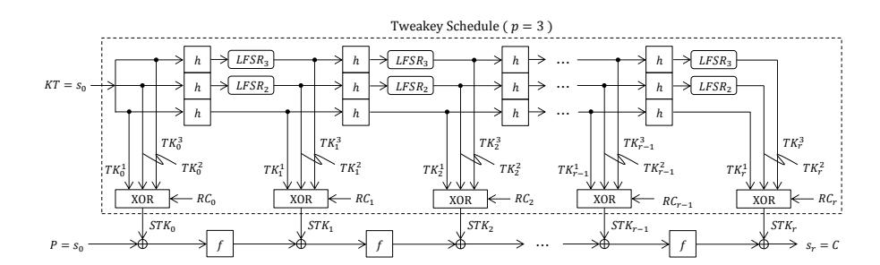
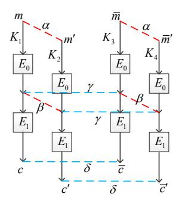
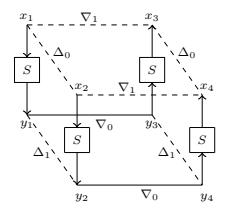
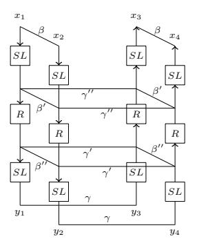
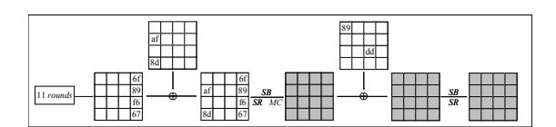
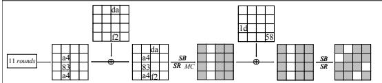
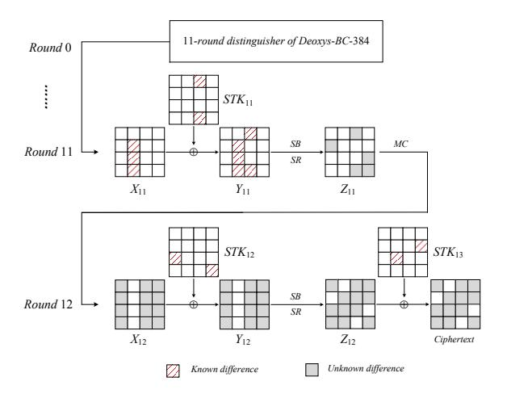
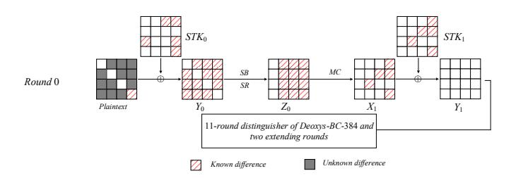

# Improved Related-Tweakey Rectangle Attacks on Reduced-round Deoxys-BC-384 and Deoxys-I-256-128

Boxin Zhao1,2 , Xiaoyang Dong3 , Keting Jia4? , and Willi Meier5

- 1 Key Laboratory of Cryptologic Technology and Information Security (Shandong University), Ministry of Education, P.R. China
  - 2 School of Cyber Science and Technology, Shandong University, P.R. China, boxinzhao@mail.sdu.edu.cn
    - 3 Institute for Advanced Study, Tsinghua University, P.R. China, xiaoyangdong@mail.tsinghua.edu.cn
  - 4 Department of Computer Science and Technology, Tsinghua University, P.R. China, ktjia@mail.tsinghua.edu.cn
- 5 FHNW, Institute ISE, Windisch, Aargau Switzerland, willimeier48@gmail.com

Abstract. Deoxys-BC is the core internal tweakable block cipher of the authenticated encryption schemes Deoxys-I and Deoxys-II. Deoxys-II is one of the six schemes in the final portfolio of the CAESAR competition, while Deoxys-I is a 3rd round candidate. By well studying the new method proposed by Cid et al. at ToSC 2017 and BDT technique proposed by Wang and Peyrin at ToSC 2019, we find a new 11-round related-tweakey boomerang distinguisher of Deoxys-BC-384 with probability of 2−118.4 , and give a related-tweakey rectangle attack on 13-round Deoxys-BC-384 with a data complexity of 2125.2 and time complexity of 2 186.7 , and then apply it to analyze 13-round Deoxys-I-256-128 in this paper. This is the first time that an attack on 13-round Deoxys-I-256-128 is given, while the previous attack on this version only reaches 12 rounds.

Keywords: CAESAR, Authenticated Encryption, Deoxys-BC, Rectangle Attack

## 1 Introduction

During recent years, Authenticated encryption (AE) schemes have attracted increasing attention of cryptanalysts all around the world. In addition to assuring the confidentiality and authenticity for messages simultaneously, authenticated encryption also provides security resisting the chosen ciphertext attack. In order to meet the increasing demand for AE schemes, and with the aim to receive new AE algorithms that can offer advantages over the most widely used AE scheme AES-GCM [1], the CAESAR [2] competition organised by the international cryptologic research community was launched in 2014. In February 2019,

? Corresponding author

the final portfolio for different use cases was announced, only six AE schemes out of the 57 candidates survived.

Deoxys-II [3], which was submitted to CAESAR by J´er´emy Jean et al., is one of the six AE schemes listed in the final portfolio. The designers proposed two AE modes as a Deoxys family, i.e., Deoxys-I and Deoxys-II. Deoxys-I is one of the third round candidates and Deoxys-II is in the finalists. Both modes are based on two tweakable block ciphers (TBC) Deoxys-BC-256 or Deoxys-BC-384, which are AES-based designs.

The concept of tweakable block cipher was first invented by Liskov, Rivest and Wagner [4] at CRYPTO 2002. It not only adopts the two standard inputs, the secret key and the plaintext, but also takes a third public element called tweak. Most tweakable block ciphers take an existing block cipher as a black box and employ a tweak to change the input/output of the cipher. At ASIACRYPT 2014, Jean, Nikolic and Peyrin [5] introduced a new TWEAKEY framework to construct tweakable block ciphers. They use a unified view of the key and tweak, denoted as tweakey, and generate subtweakeys for each round by a key schedule. Deoxys-BC follows the TWEAKEY framework.

Related Work. Since the birth of the Deoxys AE family, there have been many public security evaluation results on both internal tweakable block ciphers Deoxys-BC and the Deoxys AE schemes. At ToSC 2017, Cid et al. [6] introduced a related-tweakey rectangle attack on Deoxys-BC, which was the first third-party analysis for it. They gave a new lower bound on the number of active Sboxes of the differential characteristic, and developed a new method to search related-tweakey boomerang differentials utilizing a Mixed Integer Linear Programming (MILP) model, and launched attacks on Deoxys-BC-256 up to 10 rounds and Deoxys-BC-384 for 13 rounds. In addition, key-recovery attacks on 9-round Deoxys-I-128-128 and 12-round Deoxys-I-256-128 were given. Then, Sasaki [7] improved the boomerang attack with lower complexity by a structural technique. Later, Mehrdad et al. [8] and Zong et al. [9] evaluated Deoxys-BC-256 against impossible differential attacks. Li and Jin [10] gave meet-in-themiddle attacks on Deoxys-BC. At EUROCRYPT 2018, a new technique called Boomerang Connectivity Table (BCT) proposed by Cid et al. [11] was used to increase the probability of the 10-round related-tweakey boomerang distinguisher on Deoxys-BC-384 by a factor of 20.6 . Later, at ToSC 2019, Wang and Peyrin [12] studied the boomerang switch in multiple rounds and introduced a new technique named Boomerang Difference Table (BDT), and finally they improved the 9-round distinguisher of Deoxys-BC-256 by a factor of 21.6 .

Our Contribution. In this paper, we focus on the versions of Deoxys-BC-384 and its AE mode Deoxys-I-256-128 against the related-tweakey rectangle attacks. Based on the method proposed in [6], we add some more constraints to the MILP model and obtain a new 11-round related-tweakey boomerang distinguisher of Deoxys-BC-384 with probability 2−120, which has fewer active Sboxes when extending two forward rounds. With the help of the BDT technique, we increase the probability of the distinguisher by a factor of 21.6 , resulting in a probability of 2118.4 . With the new and more efficient distinguisher, we can append two rounds to the end of the differential trail without activating all the output bytes. Besides, we can guess part of the key bytes involved in the extending two rounds step by step. Finally, we gain an improved related-tweakey rectangle attack on 13-round Deoxys-BC-384 with 2125.2 chosen plaintexts and 2 186.7 encryptions. Note that the time complexity is reduced by a factor of 283.3 when comparing with the best previous work by Cid et al. [6]. Therefore, we could break one more round on a Deoxys AE scheme, Deoxys-I-256-128, to 13 rounds, while the best previous attack could only reach to 12 rounds. We summarize the results of Deoxys-BC-384 and the AE scheme Deoxys-I-256-128 in Table 1.

Table 1. Summary of analysis results of Deoxys-BC-384.

Deoxys-BC-384, "KR" represents key recovery attack.

|       | Rounds Approach Goal |    |            |            |          | Time Data Memory Size set up | Ref. |  |  |  |  |
|-------|----------------------|----|------------|------------|----------|------------------------------|------|--|--|--|--|
| 12/16 | rectangle            |    | 127 2   | 127 2   | 125 2 | t = 128, k = 256 [6]         |      |  |  |  |  |
|       | boomerang            | KR | 148 2   | 148 2   | 17 2  | t = 128, k = 256 [7]         |      |  |  |  |  |
|       | boomerang            |    | 148 2   | 100 2   | 100 2 | t = 128, k = 256 [7]         |      |  |  |  |  |
| 13/16 | rectangle            |    | 270 2   | 127 2   | 144 2 | t < 114, k > 270 [6]         |      |  |  |  |  |
|       | boomerang            | KR | 191.3 2 | 125 2   | 136 2 | t = 128, k = 256 [13]        |      |  |  |  |  |
|       | rectangle            |    | 186.7 2 | 125.2 2 | 136 2 | t = 128, k = 256 Sect. 6.1   |      |  |  |  |  |
| 14/16 | rectangle            | KR | 286.2 2 | 127 2   | 136 2 | t < 98, k > 286              | [13] |  |  |  |  |
|       | rectangle            |    | 282.7 2 | 125.2 2 | 136 2 | t < 102, k > 282 Sect. 6.2   |      |  |  |  |  |

| Deoxys-I-256-128 |  |
|------------------|--|
|------------------|--|

| Rounds Goal |    |     |            |            |          | Key size Time Data Memory Approach | Ref.    |
|-------------|----|-----|------------|------------|----------|------------------------------------|---------|
| 12/16       | KR | 256 | 236 2   | 126 2   | 124 2 | rectangle                          | [6]     |
| 12/16       | KR | 256 | 208 2   | 115 2   | 113 2 | rectangle                          | [13]    |
| 13/16       | KR | 256 | 186.7 2 | 125.2 2 | 136 2 | rectangle                          | Sect. 7 |

Notations. In follows, Xi , Yi denote the internal states before and after the AddRoundTweakey operation in Round i (0 ≤ i ≤ r−1) of the r-round cipher; Zi is the state after the ShiftRows ◦ SubBytes operation in Round i; ∆X means the difference of the state X; ∇X is the difference of the state X in the lower part of the boomerang distinguisher; Xi [j · · · k] is the j th byte, · · · , k th byte of Xi . IKi [j] is the equivalent key byte in Round i with the same index as Yi [j].

## 2 Specifications of Deoxys and Deoxys-BC

Deoxys-BC, including Deoxys-BC-256 and Deoxys-BC-384, is a tweakable block cipher [3]. Both versions of the authenticated encryption scheme Deoxys have Deoxys-BC as its internal primitive. Deoxys-BC conforms the TWEAKEY framework [5], so besides a plaintext P (or a ciphertext C) and a secret key K, it will take another variable named tweak T as its standard inputs. According to the TWEAKEY framework, the concatenation of the tweak and key can be named a

tweakey to provide a unified view. For Deoxys-BC-n (n=256,384), the length of tweakey is n which is the sum of the size of tweak and key. Both Deoxys-BC-256 and Deoxys-BC-384 have a 128-bit block size, and the size of tweak and key can vary according to users as long as the key size is greater or equal to the block size, i.e. 128 bits. In the following part of this section, we specify the details of the block cipher Deoxys-BC and the authenticated encryption operating modes Deoxys.

Deoxys-BC is an iterative substitution-permutation network (SPN) and adopts an AES-like design. It transforms the initial plaintext through a series of AES [14] round functions to a ciphertext. Different from AES, Deoxys-BC generates the round subkeys by linear operations and doesn't omit the MixColumns operation (defined below) in the last round. Besides, the state of Deoxys-BC is also seen as a  $4 \times 4$  matrix of bytes, but the index of the 16 bytes is defined as

$$\begin{bmatrix} 0 & 4 & 8 & 12 \\ 1 & 5 & 9 & 13 \\ 2 & 6 & 10 & 14 \\ 3 & 7 & 11 & 15 \end{bmatrix}.$$

The round number r is 14 for Deoxys-BC-256 and 16 for Deoxys-BC-384, respectively. The same to AES, Deoxys-BC transforms the internal state in each round by the following four ordered transformations:

- AddRoundTweakey (AK) Obtain a new internal state by XOR of the former internal state with the 128-bit round subtweakey, i.e.  $STK_i$  in round i ( $0 \le i \le r-1$ ) defined further below.
- SubBytes (SB) Apply the 8-bit Sbox S of AES to the each byte of the internal state separately.
- ShiftRows (SR) Rotate the 4 bytes of the j-th  $(j \in \{1, 2, 3, 4\})$  row left by j-1 positions.
- MixColumns (MC) Multiply an invertible 4×4 MDS matrix left to the state.

At the end of the last round, there is an additional AddRoundTweakey operation to obtain the ciphertext.

**Definition of the Subtweakeys.** The round function is the same as in AES, but different from AES, the key production process of Deoxys-BC is simply composed of linear operations. With the same representation as [3], denote the concatenation of key K and tweak T as KT, i.e. the master tweakey  $KT = K \parallel T$ . For Deoxys-BC-256, the 256-bit tweakey KT is divided into two 128-bit words denoted by  $TK^1$  (most significant) and  $TK^2$ . And for Deoxys-BC-384, the 384-bit tweakey is divided into three 128-bit words denoted by  $TK^1$ ,  $TK^2$  and  $TK^3$ . Then a series of 128-bit subtweakeys  $STK_i$  will be produced in Round i ( $i \geq 0$ ) used in the AddRoundTweakey operation by  $STK_i = TK_i^1 \oplus TK_i^2 \oplus RC_i$  for Deoxys-BC-256, whereas defined as  $STK_i = TK_i^1 \oplus TK_i^2 \oplus TK_i^3 \oplus RC_i$  for Deoxys-BC-384. The 128-bit  $TK_i^1$ ,  $TK_i^2$ ,  $TK_i^3$  are produced by several fixed linear algorithms or permutations in the tweakey schedule, initialized with  $TK_0^1 = TK^1$ ,  $TK_0^2 = TK^2$  for Deoxys-BC-256, while  $TK_0^1 = TK^1$ ,  $TK_0^2 = TK^2$ 

and  $TK_0^3 = TK^3$  for Deoxys-BC-384. The tweakey schedule algorithm operates as:  $TK_{i+1}^1 = h(TK_i^1), TK_{i+1}^2 = LFSR_2(h(TK_i^2)), TK_{i+1}^3 = LFSR_3(h(TK_i^1)),$  where h is a linear byte permutation defined by:

$$h = \begin{pmatrix} 0 \ 1 \ 2 \ 3 \ 4 \ 5 \ 6 \ 7 \ 8 \ 9 \ 10 \ 11 \ 12 \ 13 \ 14 \ 15 \\ 1 \ 6 \ 11 \ 12 \ 5 \ 10 \ 15 \ 0 \ 9 \ 14 \ 3 \ 4 \ 13 \ 2 \ 7 \ 8 \end{pmatrix}.$$

The  $LFSR_2$  and  $LFSR_3$  are two linear feedback shift registers applied to each byte of the internal state. More precisely, the definitions of  $LFSR_2$  and  $LFSR_3$  are listed in Table 2:

Table 2. The two LFSRs used in Deoxys-BC tweakey schedule.

| $LFSR_2 (x_7  x_6  x_5  x_4  x_3  x_2  x_1  x_0) \to (x_6  x_5  x_4  x_3  x_2  x_1  x_0  x_1  x_0  x_1  x_1  x_0  x_1  x_1$      | $\overline{ x_7 \oplus x_5)}$ |
|----------------------------------------------------------------------------------------------------------------------------------|-------------------------------|
| $LFSR_3(x_7  x_6  x_5  x_4  x_3  x_2  x_1  x_0) \to (x_0 \oplus x_6  x_7  x_6  x_5  x_4  x_5  x_6  x_5  x_6  x_6  x_5  x_6  x_6$ | ${3  x_2  x_1)}$              |

Finally,  $RC_i$  are the round constants used in the tweakey schedule. For more clarity, we give an instantiation of the framework of Deoxys-BC-384 in Figure 1.

Fig. 1. Tweakey schedule and encryption process of Deoxys-BC-384 [6].

The Authenticated Encryption Deoxys. Utilizing the tweakable block cipher Deoxys-BC as its internal primitive, Deoxys provides two AE modes named Deoxys-I and Deoxys-II. The two modes are both nonce-based AEAD, but Deoxys-I is assumed to be nonce-respecting for the adversary, meaning that the same nonce N can not be used twice for the same key in encryption. This variant is similar to TAE [15]. While Deoxys-II adopts a nonce-misuse setting that allows users to reuse the same N under the same key.

When employing Deoxys-BC-256 as their internal primitive, the two AE modes, Deoxys-I-128-128 and Deoxys-II-128-128, lead to a 128-bit key version. While when based on Deoxys-BC-384, Deoxys-I-256-128 and Deoxys-II-256-128 are two 256-key variants. With the parameters given in [3], there is a 4-bit prefix for the tweak input to represent the different types of encryption/authentication

blocks. Therefore, the adversary can not get more than  $2^{124}$  plaintext-ciphertext pairs with the same key.

## 3 The Boomerang Attack and Rectangle Attack

The boomerang attack, proposed by Wagner [16] in 1999, is an adaptive chosenplaintext or chosen-ciphertext differential attack that allows adversary to connect two short differential paths to get a longer distinguisher. After an adaptive chosen plaintext and ciphertext process, adversary can get a quartet structure by exploiting the two shorter differentials.

The attacker treats the whole encryption process  $E(\cdot)$  as a decomposition of two sub-ciphers  $E=E_1\circ E_0$ , where  $E_0$  represents the upper part and  $E_1$  denotes the lower half of the cipher. For the sub-cipher  $E_0$ , there exists a short differential characteristic  $\alpha \to \beta$  with probability p, and there exists a differential characteristic  $\gamma \to \delta$  over  $E_1$  with probability q. With the assumption that the two differentials are independent, the adversary can get a boomerang distinguisher with property:

$$Pr[E^{-1}(E(m) \oplus \delta) \oplus E^{-1}(E(m \oplus \alpha) \oplus \delta) = \alpha] = p^2 q^2.$$
 (1)

Thus, a correct plaintext quartet  $(m, m', \bar{m}, \bar{m}')$  with the corresponding ciphertext  $(c, c', \bar{c}, \bar{c}')$  can be generated with a probability of  $p^2q^2$  that meets the conditions  $m \oplus m' = \alpha$ ,  $c \oplus \bar{c} = \delta$ ,  $c' \oplus \bar{c}' = \delta$ ,  $\bar{m} \oplus \bar{m}' = \alpha$ . If  $p^2q^2 > 2^{-n}$ , we can distinguish E from an ideal cipher.

A variant of boomerang attack called amplified boomerang attack [17] or rectangle attack [18] only needs chosen plaintexts. In the amplified boomerang attack, one could find a right quartet with probability of  $2^{-n}p^2q^2$  while for an ideal cipher the probability is  $2^{-2n}$ . At EUROCRYPT 2001, Biham et al. [18] proposed the rectangle attack, where only the differences  $\alpha$  and  $\delta$  are fixed, and any of the possible values of  $\beta$  and  $\gamma$  except  $\beta \neq \gamma$  are considered. The probability of obtaining a correct quartet can be increased to  $2^{-n}\hat{p}^2\hat{q}^2$ , where n is the size of state, and

$$\hat{p} = \sqrt{\sum_{\beta_i} Pr^2(\alpha \to \beta_i)} \quad and \quad \hat{q} = \sqrt{\sum_{\gamma_j} Pr^2(\gamma_j \to \delta)}.$$

At EUROCRYPT 2005, Biham et al. [19] proposed the related-key boomerang and rectangle attack. Different from the single-key attack, each plaintext in a quartet  $(m, m', \bar{m}, \bar{m}')$  will be encrypted under different keys. Denote them by  $K_1, K_2, K_3$  and  $K_4$  respectively. Assume there exists a related-key differential  $\alpha \to \beta$  over  $E_0$  under a key difference  $\Delta K$  with probability p and a related-key differential  $\gamma \to \delta$  over  $E_1$  under a key difference  $\nabla K$  with probability q. With the related-key rectangle distinguisher, one finds a right quartet  $(m, m', \bar{m}, \bar{m}')$  as follows shown in Figure 2:

- 1. Randomly choose a plaintext m and compute another plaintext m' by  $m' = m \oplus \alpha$ , then make queries to the encryption oracle to get the corresponding ciphertexts c and c' under  $K_1$  and  $K_2$  respectively, i.e.  $c = E_{K_1}(m), c' = E_{K_2}(m')$ .
- 2. Randomly choose another plaintext  $\bar{m}$  and get the plaintext  $\bar{m}'$  by  $\bar{m}' = \bar{m} \oplus \alpha$ , then make queries to the encryption oracle to get the corresponding ciphertexts  $\bar{c}$  and  $\bar{c}'$  under  $K_3$  and  $K_4$  respectively, i.e.  $\bar{c} = E_{K_3}(\bar{m}), \bar{c}' = E_{K_4}(\bar{m}')$ .
- 3. Check whether both the constraints  $c \oplus \bar{c} = \delta$  and  $c' \oplus \bar{c}' = \delta$  are satisfied. If yes, a correct quartet  $(m, m', \bar{m}, \bar{m}')$  is obtained, otherwise go to step 1 for other plaintexts.

Note that if any one of the  $K_i$  (i=1,2,3,4) such as  $K_1$  is known, all other keys can be computed by  $K_2 = K_1 \oplus \Delta K$ ,  $K_3 = K_1 \oplus \nabla K$ ,  $K_4 = K_1 \oplus \Delta K \oplus \nabla K$ .

Fig. 2. Related-key rectangle attack framework.

## 4 The Boomerang Difference Table (BDT)

At EUROCRYPT 2018, a new technique called Boomerang Connectivity Table (BCT) proposed by Cid *et al.* [11] was used to increase the probability of the 10-round related-tweakey boomerang distinguisher on Deoxys-BC-384 by a factor of 20.6. Later, at ToSC 2019, Wang and Peyrin [12] studied the boomerang switch in multiple rounds and introduced a new technique named Boomerang Difference Table (BDT), and finally they improved the 9-round distinguisher of Deoxys-BC-256 by a factor of 21.6. Since our paper is highly related to the BDT technique, we briefly recall it in this section.

**Definition 1.** Boomerang Difference Table (BDT) [12]. Let S be an invertible function which is from  $\mathbb{F}_2^n$  to  $\mathbb{F}_2^n$ , and a 3-tuple  $(\Delta_0, \Delta_1, \nabla_0) \in \mathbb{F}_2^n$ . The

boomerang difference table (BDT) of S is a three-dimensional table, in which each 3-tuple entry  $(\Delta_0, \Delta_1, \nabla_0)$  can be computed by

$$BDT(\Delta_0, \Delta_1, \nabla_0) = \#\{x \in \{(0, 1)\}^n | S^{-1}(S(x) \oplus \nabla_0) \oplus S^{-1}(S(x \oplus \Delta_0) \oplus \nabla_0) \\ = \Delta_0, S(x) \oplus S(x \oplus \Delta_0) = \Delta_1\}.$$
(2)

To make the description more clear, the generation of boomerang difference table (BDT) can be visualized in Figure 3.

Fig. 3. Generation of a right quartet at the Sbox level [12].

**Definition 2.** BDT' [12]. When the boomerang returns back, decryption operation will be considered first. The difference  $\nabla_1$  of the Sbox determines the differential characteristic in the backward rounds. Therefore, a variants of BDT called BDT' that takes into account a 3-tuple  $(\nabla_0, \nabla_1, \Delta_0)$  can be obtained by

$$BDT'(\nabla_0, \nabla_1, \Delta_0) = \#\{x \in \{(0,1)\}^n | S(S^{-1}(x) \oplus \Delta_0) \oplus S(S^{-1}(x \oplus \nabla_0) \oplus \Delta_0) \\ = \nabla_0, S^{-1}(x) \oplus S^{-1}(x \oplus \nabla_0) = \nabla_1\}.$$
(3)

Application in Two-round Boomerang Switch. In the two-round boomerang switch, we can only consider the two Sbox layers (SL) and the linear layer (R)in between, which is illustrated in Figure 4.

When analyzing the two-round boomerang switch, the BDT will be applied to the first Sbox layer and the BDT' will be applied to the second one. Denote the probability of the two Sbox layers by  $p_1$  and  $p_2$ , respectively. They can be computed by

$$p_1 = \prod_{(\Delta_0, \Delta_1, \nabla_0) \in L_1} BDT(\Delta_0, \Delta_1, \nabla_0)/2^n, \tag{4}$$

$$p_{1} = \prod_{(\Delta_{0}, \Delta_{1}, \nabla_{0}) \in L_{1}} BDT(\Delta_{0}, \Delta_{1}, \nabla_{0})/2^{n},$$

$$p_{2} = \prod_{(\nabla_{0}, \nabla_{1}, \Delta_{0}) \in L_{2}} BDT'(\nabla_{0}, \nabla_{1}, \Delta_{0})/2^{n},$$

$$(5)$$

where  $L_1$  and  $L_2$  contain the 3-tuple difference of the Sbox in  $(\beta, \beta', \gamma'')$  and  $(\gamma, \gamma', \beta'')$ , respectively.

Given the truncated differential pattern, there might exist three cases for the 2-round boomerang switch as follows:

Fig. 4. A 2-round switch which only considers two Sbox layers and one linear layer [12].

- There is no active Sbox at the same position in both Sbox layers: the probability can be computed only by DDT.
- There are active Sboxes at the same position in only one of the two Sbox layers: we can use BDT to compute the probability for this Sbox layer.
- There are active Sboxes at the same position in both of the two Sbox layers.
   BDT will be applied to both of them but we must check the compatibility.

In [12], they specify the processes how to compute the probability for the 2-round boomerang switch. For more details, we refer to [12].

## 5 New Related Tweakey Distinguisher of Deoxys-BC-384

#### 5.1 Searching truncated differentials by MILP model

In this subsection, we simply describe the method proposed by Cid *et al.* [6] to search truncated differentials by MILP model. For simplicity, we omit the numerous inequality constraints. Let  $x_i$ ,  $stk_i$ ,  $y_i$  denote the activeness of a state byte before the AddRoundTweakey operation, the subtweakey byte, and the state byte after the AddRoundTweakey operation, respectively.

In the AddRoundTweakey operation, we only need to exclude all the solutions of  $x_i + stk_i + y_i = 1$ , and record the number of cancellations between  $x_i$  and  $stk_i$  in each column which can be denoted by c. For the MixColumns operation, we only need to guarantee that the branch number is at least 5. Cid et al. also introduced d to denote the degrees of freedom in the MILP model. If a, b are the number of active bytes before the MixColumns operation and inactive bytes after the MixColumns operation in each column, then this column will consume -(a-b-c) degrees only when (a-b-c)<0. If  $stk_i=0$  but  $stk_{16+h(i)}>0$  or  $stk_{-16+h^{-1}(i)}>0$ , another degree consumption occurs. Suppose the number of active bytes in subtweakey of i-th round is  $d_i(i=1,2,3\cdots)$ , then the total degrees that could be consumed are  $d=3\cdot\max\{d_1,d_2,d_3,...\}$  in Deoxys-BC-384. Taking all the former constraints into account, when the sum of the degree

consumption is smaller than the total degrees d, a truncated related-tweakey differential is obtained by the MILP model. By generating the MILP model for the upper part and lower part, respectively, and adding some connection constraints between them, a truncated related-tweakey boomerang differential can be obtained. For more details, we refer to [6].

Inspired by the MILP method proposed in [20], we add two more rounds of constraints to the MILP model. Here, we will specify the details of the extra constraints.

– For the first extra round. When processing a related-key boomerang or rectangle attack under a specific characteristic, the differences at the end of the characteristic are known. Therefore, the differences before the SubBytes operation can be deduced, and the cancellation may occur in the AddRoundKey operation. Thus when we treat them as truncated differences, the constraints on the AddRoundKey operation are the same as those in [6]. However, the differences after the SubBytes operation will be unknown, the branches of the MixColumns operation will be not 5, all the four output bytes of a column under the MixColumns operation will be active if any input byte of the column is active. Let Boolean variables (yi , yi+1, yi+2, yi+3) denote the activeness of the input 4-byte of MixColumns operation and (xi , xi+1, xi+2, xi+3) denote the activeness of the output 4-byte, then the constraints are as follows:

$$d_k - y_i \ge 0, \ d_k - y_{i+1} \ge 0, \ d_k - y_{i+2} \ge 0, \ d_k - y_{i+3} \ge 0,$$
$$y_i + y_{i+1} + y_{i+2} + y_{i+3} - d_k \ge 0,$$
$$x_i - d_k = 0, \ x_{i+1} - d_k = 0, \ x_{i+2} - d_k = 0, \ x_{i+3} - d_k = 0,$$

where dk is a dummy variable so that dk = 0 only when yi , yi+1, yi+2, yi+3 are all zero.

– For the second extra round. When processing the specific attack, the differences at the start of the second extended round are unknown, and cancellation can not occur in the AddRoundKey operation, i.e. for the Boolean variables (xi , stki , yi) that xi ⊕ stki = yi , yi must be active if xi or stki are active. The constraints are different from those in [6] and expressed as

$$y_i - x_i \ge 0$$
,  $y_i - stk_i \ge 0$ ,  $x_i + stk_i - y_i \ge 0$ .

Since we omit the last MixColumns operation in the key recovery attacks, there are no constraints for it.

At the end of the MILP model, we add a group of extra constraints to constrain the number of active columns. Let Boolean variables (xi , xi+1, · · · , xi+15) denote the activeness of the 16 bytes after the SubBytes operation, we will constrain the number of the active columns being not bigger than 3 as:

$$d_k - y_{4k+i} \ge 0$$
,  $d_k - y_{4k+i+1} \ge 0$ ,  $d_k - y_{4k+i+2} \ge 0$ ,  $d_k - y_{4k+i+3} \ge 0$ ,

$$y_{4k+i} + y_{4k+i+1} + y_{4k+i+2} + y_{4k+i+3} - d_k \ge 0,$$

for  $k \in \{0, 1, 2, 3\}$  and

$$d_0 + d_1 + d_2 + d_3 \le 3.$$

## 5.2 The method of deriving paths given the truncated differential

Given the truncated differential of Deoxys-BC, we can search the detailed differential paths in two steps:

- 1. Deduce all the master tweakey differences that satisfy the truncated differential;
- 2. For each master tweakey difference, check the compatibility by the MixColumns operation and the difference distribution table (DDT) of Sbox.

We specify the process to get the path listed in Table 4.

#### Deduce the Tweakey Difference.

We first deduce the master tweakey difference from the truncated differential shown in Table 4, where we just ignore the concrete values of the bytes and only care for the activeness or inactiveness of the bytes.

We first consider the upper part of Table 4, and note that we convert all the constraints in the differential into the constraints of the 3 tweakeys  $\Delta T K_1^1$ ,  $\Delta T K_1^2$  and  $\Delta T K_1^3$  in the 1st round. According to Table 4 and the definition of degree of freedom in Cid *et al.* [6], we get the knowledge that there are totally 15 active bytes in the 3 tweakeys  $\Delta T K_1^1$ ,  $\Delta T K_1^2$  and  $\Delta T K_1^3$ . We find that the indices of the five active bytes in  $\Delta S T K_1$  are  $\{6, 9, 12, 13, 15\}$ . According to the h permutation of the tweakey schedule, the active bytes will shift to  $\Delta S T K_2[1, 8, 3, 12, 6]$ , respectively. However, all the active bytes are canceled in  $\Delta S T K_2$ . Similarly, we could get the indices in Table 3, which the active bytes in  $\Delta S T K_1$  will shift to in the following 7 rounds. Note that, the indices in red mean inactive bytes, where the differences are canceled.

Table 3. The index of subtweakey difference.

| Round |    | Index |    |           |    |  |  |  |  |  |  |  |
|-------|----|-------|----|-----------|----|--|--|--|--|--|--|--|
| 1     | 6  | 9     | 12 | 13        | 15 |  |  |  |  |  |  |  |
| 2     | 1  | 8     | 3  | <b>12</b> | 6  |  |  |  |  |  |  |  |
| 3     | 0  | 15    | 10 | 3         | 1  |  |  |  |  |  |  |  |
| 4     | 7  | 6     | 5  | 10        | 0  |  |  |  |  |  |  |  |
| 5     | 14 | 1     | 4  | 5         | 7  |  |  |  |  |  |  |  |
| 6     | 9  | 0     | 11 | 4         | 14 |  |  |  |  |  |  |  |
| 7     | 8  | 7     | 2  | 11        | 9  |  |  |  |  |  |  |  |

In Table 3, the active byte  $\Delta STK_1[6]$  will be canceled in  $\Delta STK_2[1]$  in the 2nd round and  $\Delta STK_5[14]$  in the 5-th round. According to the tweakey schedule,

we deduce the following equations for  $\Delta T K_1^1$ ,  $\Delta T K_1^2$  and  $\Delta T K_1^3$ :

$$\Delta T K_1^1[6] \oplus LFSR_2^1(\Delta T K_1^2[6]) \oplus LFSR_3^1(\Delta T K_1^3[6]) = 0,$$
  
$$\Delta T K_1^1[6] \oplus LFSR_2^4(\Delta T K_1^2[6]) \oplus LFSR_3^4(\Delta T K_1^3[6]) = 0,$$

where  $\Delta TK_j^i[k]$  means the k-th byte of  $\Delta TK_j^i$ ,  $i \in \{0,1,2\}$  in j-th round, and  $LFSR_i^j$ ,  $i \in \{2,3\}$  means executing the linear operation  $LFSR_i$  for j times successively. Similarly, we can also write two equations for each of the other four indices as:

$$\begin{split} \Delta T K_1^1[9] \oplus LFSR_2^1(\Delta T K_1^2[9]) \oplus LFSR_3^1(\Delta T K_1^3[9]) &= 0, \\ \Delta T K_1^1[9] \oplus LFSR_2^4(\Delta T K_1^2[9]) \oplus LFSR_3^4(\Delta T K_1^3[9]) &= 0, \\ \Delta T K_1^1[12] \oplus LFSR_2^1(\Delta T K_1^2[12]) \oplus LFSR_3^1(\Delta T K_1^3[12]) &= 0, \\ \Delta T K_1^1[12] \oplus LFSR_2^5(\Delta T K_1^2[12]) \oplus LFSR_3^5(\Delta T K_1^3[12]) &= 0, \\ \Delta T K_1^1[13] \oplus LFSR_2^1(\Delta T K_1^2[13]) \oplus LFSR_3^1(\Delta T K_1^3[13]) &= 0, \\ \Delta T K_1^1[13] \oplus LFSR_2^1(\Delta T K_1^2[13]) \oplus LFSR_3^1(\Delta T K_1^3[13]) &= 0, \\ \Delta T K_1^1[15] \oplus LFSR_2^1(\Delta T K_1^2[15]) \oplus LFSR_3^1(\Delta T K_1^3[15]) &= 0, \\ \Delta T K_1^1[15] \oplus LFSR_2^2(\Delta T K_1^2[15]) \oplus LFSR_3^1(\Delta T K_1^3[15]) &= 0, \\ \Delta T K_1^1[15] \oplus LFSR_2^2(\Delta T K_1^2[15]) \oplus LFSR_3^2(\Delta T K_1^3[15]) &= 0. \end{split}$$

Totally, we can get ten equations for  $\Delta T K_1^1$ ,  $\Delta T K_1^2$  and  $\Delta T K_1^3$  by the cancellations of the differences in the subtweakeys.

Besides, we can also get some equations by the cancellations between the differences in the internal state and subtweakey. For example, as shown in Figure 4, at the end of the 4-th round and the start of the 5-th round, the second column of the internal state is transformed in truncated form as:

$$(1,0,0,1) \xrightarrow{\mathtt{MC}} (1,1,0,1) \xrightarrow{\mathtt{AK}} (0,0,0,0),$$

which means, the second column of  $\Delta STK_5$  is equal to the second column of  $\Delta X_5$  in 5-th round. By looking up in Table 3, the three bytes of  $\Delta STK_5$  are corresponding to byte 12, 13, 15 of  $\Delta STK_1$ . By utilizing the  $MC^{-1}$  operation, we can get the following equations:

$$09 \cdot \Delta STK_5[4] \oplus 0e \cdot \Delta STK_5[5] \oplus 0d \cdot \Delta STK_5[7] = 0,$$
  
$$0d \cdot \Delta STK_5[4] \oplus 09 \cdot \Delta STK_5[5] \oplus 0b \cdot \Delta STK_5[7] = 0,$$

where

$$\Delta STK_{5}[4] = \Delta TK_{1}^{1}[12] \oplus LFSR_{2}^{4}(\Delta TK_{1}^{2}[12]) \oplus LFSR_{3}^{4}(\Delta TK_{1}^{3}[12]),$$
  

$$\Delta STK_{5}[5] = \Delta TK_{1}^{1}[13] \oplus LFSR_{2}^{4}(\Delta TK_{1}^{2}[13]) \oplus LFSR_{3}^{4}(\Delta TK_{1}^{3}[13]),$$
  

$$\Delta STK_{5}[7] = \Delta TK_{1}^{1}[15] \oplus LFSR_{2}^{4}(\Delta TK_{1}^{2}[15]) \oplus LFSR_{3}^{4}(\Delta TK_{1}^{3}[15]).$$

Similarly, we can obtain another two equations by the second column in 4-th round as:

$$03 \cdot \Delta STK_4[5] \oplus \Delta STK_4[6] = 0,$$
  
$$02 \cdot \Delta STK_4[6] = 0 \oplus \Delta STK_4[7] = 0,$$

where

$$\Delta STK_{4}[5] = \Delta TK_{1}^{1}[12] \oplus LFSR_{2}^{3}(\Delta TK_{1}^{2}[12]) \oplus LFSR_{3}^{3}(\Delta TK_{1}^{3}[12]),$$
  

$$\Delta STK_{4}[6] = \Delta TK_{1}^{1}[9] \oplus LFSR_{2}^{3}(\Delta TK_{1}^{2}[9]) \oplus LFSR_{3}^{3}(\Delta TK_{1}^{3}[9]),$$
  

$$\Delta STK_{4}[7] = \Delta TK_{1}^{1}[6] \oplus LFSR_{2}^{3}(\Delta TK_{1}^{2}[6]) \oplus LFSR_{3}^{3}(\Delta TK_{1}^{3}[6]).$$

With the above 14 equations for  $\Delta T K_1^1$ ,  $\Delta T K_1^2$  and  $\Delta T K_1^3$ , since there are only 15 active bytes in  $\Delta T K_1^1$ ,  $\Delta T K_1^2$  and  $\Delta T K_1^3$ , we can deduce 256 concrete values for  $\Delta T K_1^1$ ,  $\Delta T K_1^2$  and  $\Delta T K_1^3$ .

#### Search for the Differential Path with the Highest Probability.

For each value of  $\Delta T K_1^1$ ,  $\Delta T K_1^2$  and  $\Delta T K_1^3$ , the subtweakey differences in any round can be computed since the key schedule is linear. Then the difference of every byte of the internal states is determined by combining the truncated differential: when the cancellation occurs between state bytes and subtweakey difference, the state difference is equal to the subtweakey difference; the other bytes can be computed by  $\mathbf{MC}$  and  $\mathbf{MC}^{-1}$  operation.

Since the input and output differences of the SubBytes operation in each round are all known, it will be easy to verify the compatibility of the differential path by the difference distribution table (DDT) of Sbox. Note that there exist 6 active Sboxes in the upper part, and each input-output difference pair could pass the DDT of a Sbox with probability about  $2^{-1}$  (the entry of the DDT is not zero). So only 4 values out of the 256 values for  $\Delta T K_1^1$ ,  $\Delta T K_1^2$  and  $\Delta T K_1^3$  are expected to survive from the verification. Finally, we find three 7-round differential paths having the probability  $2^{-42}$ , and the other one is of probability  $2^{-41}$ . The differential paths of the lower part can be deduced in similar process, and we omit it.

# 5.3 Computing the accurate probability of the distinguisher by BDT

As shown in Table 4,  $\Delta Y_6[0] = 0x9a$  in the upper part and  $\nabla Z_7[0] = 0x1f$  in the lower part of the boomerang distinguisher are known. Therefore,  $\Delta_0 = \Delta Y_6[0] = 0x9a$  used in BDT and  $\nabla_0 = \nabla Z_7[0] = 0x1f$  used in BDT' are know. So we can get the differential characteristic in the 2 switch rounds by the following step:

- Step 1. As shown in Figure 3, in BDT, we fix  $\Delta_0 = \Delta Y_6[0] = 0x9a$  in BDT, traverse all the values of  $\nabla_0 = \nabla Z_6[0]$  and obtain all the 3-tuples  $(0x9a, \Delta_1, \nabla_0)$  whose corresponding entry in BDT is greater than 0, where  $\Delta_1 = \Delta Z_6[0]$ .

- Step 2. For each tuple we obtained,  $\Delta_1 = \Delta Z_6[0]$  and  $\nabla_0 = \nabla Z_6[0]$  are known, therefore  $\Delta Y_7[0]$  can be deduced. Hence, the value of  $\Delta_0 = \Delta Y_7[0]$  used in BDT' is known, so we can construct BDT' with the fixed  $\Delta_0$ .
- Step 3. In the BDT', extract all the 3-tuples  $(0x1f, \nabla_1, \Delta_0)$  whose entry in BDT' obtained in step 2 is greater than 0, and  $\nabla_1 = \nabla Y_7[0]$  in lower part will be determined.

In total, we get two differential characteristics in the 2-round switch, which are listed in Tables 4 and 5. In Table 4, the entry for (0x9a, 0xdb, 0x23) in the BDT is 4 which gives probability  $2^{-6}$ , and the entry for (0x1f, 0xad, 0xad) in the BDT' is 2 which results in the probability  $2^{-7}$ . Therefore, probability of the switch is  $2^{-13}$ . For the other differential characteristic listed in Table 5, the entries for (0x9a, 0xbf, 0xbf) in the BDT and the entries for (0x1f, 0x65, 0x65) in the BDT' are all 2, which has probability  $2^{-14}$ . So the switching probability in round 6 and 7 is  $2^{-13}+2^{-14}=2^{-12.4}$ , and the total probability of the boomerang distinguisher is  $2^{118.4}$ .

**Experimental Verification.** We used  $2^{20}$  data and iterated it for 1000 times for randomly chosen plaintexts and keys for the 2-round switch. And the result shows that the average probability of obtaining a right quartet is  $2^{12.4}$ .

#### 5.4 The advantage of our new distinguisher

We have well studied the paper of Cid et al. [6], and since the difference  $\delta$  in the 11-round distinguisher is  $\delta = (00\ 00\ 00\ 00\ 00\ 00\ 00\ 00\ 00\ 00$ 

Fig. 5. Appending two rounds for Cid et al.'s 11-round distinguisher of Deoxys-BC-384.

Based on the method proposed in [6] and BDT technique in [12], we find a new 11-round boomerang distinguisher of Deoxys-BC-384 with the probability of  $2^{-118.4}$ , which holds with higher probability than that in [6]. More impressively, it is more effective to recover the key, since the only active column at the end of the path is (9e, 1d, 00, 00), and it will become (00, a4, 83, a4) after the MixColumns operation. If we append two rounds to the end of the trail, there are only 12 active bytes after the SubBytes operation in the last round as illustrated in Figure 6. This helps us mount a 13-round related-tweakey rectangle attack on Deoxys-BC-384 with  $\leq 2^{124}$  queries under the same key and time complexity  $\leq 2^{256}$ . Hence, it leads to the first 13-round attack on the corresponding AE scheme Deoxys-I-256-128, which are given in the following section.

 $\textbf{Table 4.} \ \text{New 11-round distinguisher of } \textbf{Deoxys-BC-384}. \ \text{The probabilities marked with } \\ \dagger \ \text{are only spent once}.$ 

| $\Delta 7$    | $\Gamma K_0$         | 1 : | 00  | 00  | 00  | 00 | 00  | 0 0 | 0 8 | ъο  | 0  | 00 | c4  | 00 | 00         | a6  | 7a | 00  | с5 |
|---------------|----------------------|-----|-----|-----|-----|----|-----|-----|-----|-----|----|----|-----|----|------------|-----|----|-----|----|
| $\Delta I$    | K                    | 5 : |     | 00  |     |    | 00  | 0 0 | 0 a | d 0 | 0  | 00 | c4  | 00 | 00         | d8  | 73 | 00  | 21 |
|               |                      |     |     | 00  |     | 00 | 00  | 0 0 | 0 a | 3 0 | 0  | 00 | 9a  | 00 | 00         | 2e  | 3b | 00  | 0d |
| $\nabla$      | $\Gamma T Z$         | Ι.  |     | 00  |     |    |     | 0 0 |     | 0 5 |    | 00 | 00  | ea | 00         |     | 00 |     |    |
| VI            | $!'K_{\mathfrak{l}}$ | 5 : |     | 00  |     | 00 | 00  | 0 0 | 0 0 | 0 f | 0  | 00 | 00  | 74 | 00         | 00  | 00 | 00  | 00 |
| $\nabla T$    | $\Gamma K_0$         | o : |     | 00  | 00  |    |     | 0 0 | 0 0 |     |    | 00 | 00  |    |            | 00  | 00 | 00  | 00 |
| R             |                      | Δ   | X   |     |     |    | K   |     |     |     | Y  |    |     |    | $\Delta Z$ |     |    | pr  |    |
|               |                      | 00  |     |     |     |    | 00  |     |     |     |    | 00 |     |    | 00         |     |    |     |    |
| 1             |                      | 00  |     |     |     |    | 9a  |     |     |     |    | 00 |     |    | 00         |     |    | 1   |    |
| -             |                      | 85  |     |     |     |    | 00  |     |     |     |    | 00 |     |    | 00         |     |    | -   |    |
|               |                      | 00  |     |     |     |    | 00  |     |     |     |    | 00 |     |    | 00         |     |    |     |    |
|               |                      | 00  |     |     |     |    | 00  |     | 1   |     |    | 00 |     |    | 00         | - 1 |    |     |    |
| 2             |                      | 00  |     |     |     |    | 00  |     | 1   |     |    | 00 | 1   |    | 00         |     |    | 1   |    |
|               |                      | 00  |     |     |     |    | 00  |     | 1   | 00  |    |    |     |    | 00         | - 1 |    |     |    |
| $\vdash$      |                      | 00  |     |     |     |    | 00  |     |     |     |    | 00 |     |    | 00         |     |    |     |    |
|               |                      | 00  |     |     |     |    | 00  |     |     |     |    | 00 |     |    | 00         |     |    |     |    |
| 3             |                      | 00  |     |     |     |    | 4f  |     |     | 00  |    |    |     |    | 00         |     | 2  | -28 | ,  |
|               |                      | 00  |     |     |     |    | 00  |     |     | 00  |    |    |     |    | 00         |     |    |     |    |
| Н             |                      | a6  |     |     |     |    | 00  |     |     |     |    | 00 |     |    | 00         |     |    |     |    |
| ١. ا          |                      | a6  |     |     |     |    | 00  |     |     |     |    | 00 | 1   |    | 00         |     |    | _19 | 2  |
| 4             |                      | f1  |     |     |     |    | 00  |     | 1   |     |    | 00 |     |    | 00         |     | 2  | -13 |    |
|               |                      |     |     | 00  |     |    | 00  |     | 1   |     |    | 00 |     |    | 00         |     |    |     |    |
| П             |                      | 4f  |     |     |     |    | 00  |     |     |     |    | 00 |     |    | 00         |     |    |     |    |
|               | 00                   | 32  | 00  | 00  | 00  | 32 | 00  | 00  | 00  | 00  | 00 | 00 |     |    | 00         | - 1 |    | 1   |    |
| 5             | 00                   | 00  | 00  | 00  | 00  | 00 | 00  | 00  | 00  | 00  | 00 | 00 | 00  | 00 | 00         | 00  |    | 1   |    |
|               | 00                   | 4f  | 00  | 00  |     |    | 00  |     | 00  | 00  | 00 | 00 | 00  | 00 | 00         | 00  |    |     |    |
|               | 00                   | 00  | 00  | 00  | 9a  | 34 | 00  | 00  | 9a  | 34  | 00 | 00 | db  | ,  | 00         | 00  |    |     |    |
| 6             |                      | 00  |     |     |     |    | 85  |     |     |     |    | 00 | 00  |    | 00         |     | 9  | -6  | †  |
| 0             |                      | 00  |     |     |     |    | 00  |     | 1   |     |    | b9 | 00  |    | 00         | - 1 | 2  |     |    |
| Ш             |                      | 00  |     |     |     |    | 00  |     | _   |     | 00 | 00 | 00  |    | 00         |     |    |     |    |
|               | ad                   |     |     | 00  |     |    | 1b  |     | ad  |     |    | 00 |     |    |            | 00  |    |     |    |
| 7             | db                   |     |     | 00  |     |    | 08  |     |     |     |    | 00 |     |    | 00         |     |    | 1   |    |
|               | db                   |     |     | 00  |     |    | 00  |     |     |     | 00 | 00 |     | 00 |            |     |    | -   |    |
| $\sqsubseteq$ | 76                   |     | 00  | 00  | 00  | 13 | 09  | 00  | _   |     |    | 00 | 00  |    |            |     |    |     | _  |
|               |                      |     |     |     |     |    |     |     |     | 00  |    |    |     | 00 |            |     |    |     |    |
| 6             |                      |     |     |     |     |    |     |     |     |     | 00 |    |     | 00 |            |     |    | 1   |    |
| "             |                      |     |     |     |     |    |     |     |     |     |    | 00 |     | 00 |            |     |    | 1   |    |
| Ш             |                      |     |     |     |     |    |     |     | 00  |     |    |    |     | 00 |            |     |    |     |    |
|               |                      | 00  |     |     |     | 00 |     |     |     | 00  |    |    |     | 00 |            |     |    |     |    |
| 7             | da                   |     |     |     |     | 00 |     |     |     | 00  | 00 |    | 00  | 00 |            | 00  | 2  | -7  | †  |
|               | 00                   |     |     |     |     | 00 |     |     |     | 00  | 00 |    |     | 00 | 00         |     | _  |     |    |
| Ш             | 00                   |     | 0.0 | 0.0 |     | 00 | 0.0 | 00  |     | 00  |    |    | 100 |    | 00         |     |    |     |    |
|               |                      | 00  |     |     |     |    | 00  |     |     |     |    | 00 | 1   |    | 00         |     |    |     |    |
| 8             |                      | 00  |     |     |     |    | 00  |     | 1   |     |    | 00 |     |    | 00         | - 1 |    | 1   |    |
|               |                      | 00  |     |     |     |    | 00  |     | 1   |     |    | 00 |     |    | 00         | - 1 |    |     |    |
| H             |                      | 00  |     |     |     |    | 00  |     |     | 00  |    |    | _   |    | 00         |     |    |     |    |
|               |                      | 00  |     |     |     |    | 00  |     | 1   |     |    | 00 |     |    | 00         | - 1 |    |     |    |
| 9             |                      | 00  |     |     |     |    | 00  |     |     |     |    | 00 |     |    | 00         | - 1 |    | 1   |    |
|               |                      | 00  |     |     |     |    | 00  |     | 1   |     |    | 00 |     |    | 00         | - 1 |    |     |    |
| Н             |                      | 00  |     |     |     |    | 00  |     |     |     |    | 00 |     |    | 00         |     |    |     |    |
|               |                      | 00  |     |     |     |    | 00  |     | 1   |     |    | 00 |     |    | 00         | - 1 |    |     |    |
| 10            |                      | 00  |     |     |     |    | 00  |     |     |     |    | 00 | 1   |    | 00         |     |    | 1   |    |
|               |                      | 00  |     |     |     |    | 00  |     | 1   |     |    | 00 |     |    | 00         | - 1 |    |     |    |
| $\vdash$      |                      | 00  |     |     |     |    | 00  |     |     |     |    | 00 |     |    | 00         |     |    |     |    |
|               |                      | 00  |     |     |     |    | 8a  |     |     |     |    | 00 |     |    | . 00       | - 1 |    | _10 | ,  |
| 11            |                      |     |     | 00  |     |    | 00  |     | 1   |     |    | 00 |     |    | 00         | - 1 | 2  | -12 |    |
|               |                      | 00  |     |     |     |    | 00  |     | 1   |     |    |    |     |    | 00         | - 1 |    |     |    |
| ш             | -55                  | 55  |     |     | 100 |    |     |     | 100 |     |    |    | 100 |    |            | 50  |    |     |    |

**Table 5.** Another 2-round switch for round 6 to 7. The probabilities marked with † are only spent once.

| R   | $\Delta X$ | $\Delta K$ |                  |    |    | $\Delta Y$ |                 |    |    | $\Delta Z$ |    |    |    | pr |       |  |
|-----|------------|------------|------------------|----|----|------------|-----------------|----|----|------------|----|----|----|----|-------|--|
| 6   | 00 00 00   |            |                  |    |    |            |                 |    |    |            |    |    | 00 |    | 2-7 † |  |
|     | 00 00 00   |            |                  |    |    |            |                 |    |    |            |    |    | 00 |    |       |  |
|     | 00 00 00   |            |                  |    |    |            |                 |    |    |            |    |    | 00 |    |       |  |
|     | 00 00 00   | 00         | 00               | 00 | 00 | 00         | 00              | 00 | 00 | 00         | 00 |    | 00 | 00 |       |  |
| _   |            | 00         |                  |    |    |            | $6\overline{5}$ |    |    | 00         |    |    |    | 00 |       |  |
| 7   |            | 00         | 00               |    |    |            |                 |    |    | 00         |    |    | 00 |    | 1     |  |
| '   |            | 00         |                  |    |    |            |                 |    | 00 | 00         | 00 | 00 |    |    | 1     |  |
|     | da 00      | 00         | 00               | 13 | 09 | 00         |                 |    |    | 00         | 00 |    |    |    |       |  |
| 6   |            |            |                  |    |    |            |                 | 00 |    |            | bf | 00 |    |    |       |  |
|     |            |            |                  |    |    |            |                 |    | 00 |            | 00 | 00 |    |    | _     |  |
|     |            |            |                  |    |    |            |                 |    |    | 00         | bf | 00 |    |    | 1     |  |
|     |            |            |                  |    |    |            | 00              |    |    |            | bf | 00 |    |    |       |  |
|     | 65 00      |            | 00               | 00 |    |            | 65              | 00 | 00 |            | 1f | 00 | 00 |    |       |  |
| -   | da 00      |            | $_{\mathrm{da}}$ | 00 |    |            | 00              | 00 | 00 |            | 00 | 00 |    | 00 | 9-7 † |  |
| '   | 00 00      |            | 00               | 00 |    |            | 00              | 00 |    |            |    |    | 00 | 00 | - '   |  |
|     | 00 00      |            | 00               | 00 |    |            | 00              | 00 | 00 |            |    | 00 | 00 | 00 |       |  |
|     |            |            |                  |    |    |            |                 |    |    |            |    |    |    |    |       |  |
|     |            |            |                  |    |    |            |                 |    |    |            |    |    |    |    |       |  |
| HHH |            |            |                  |    |    |            |                 | ld |    |            |    |    |    |    |       |  |

Fig. 6. Appending two rounds for our 11-round distinguisher of Deoxys-BC-384.

## 6 Rectangle Attack on Round-reduced Deoxys-BC-384

## 6.1 Attack on 13-round Deoxys-BC-384

Different from AES, Deoxys-BC does not omit the MixColumns operation in the last round. However, as MixColumns is a linear operation, the attacker can get the same differential cryptanalysis result by deleting it in the last round. For the sake of simplicity, we omit the MixColumns operation in the last round.

Based on the new distinguisher listed in Tables 4 and 5, we construct a 13-round related-tweakey rectangle attack on Deoxys-BC by extending two rounds at the end of the 11-round trail, which is illustrated in Figure 7. The upper part of the trail through  $E_0$  is under the related key  $\Delta K = \{\Delta T K_0^1, \Delta T K_0^2, \Delta T K_0^3\}$ , and the lower part through  $E_1$  is under the related key  $\nabla K = \{\nabla T K_0^1, \nabla T K_0^2, \nabla T K_0^3\}$ .

As we can see from Tables 4 and 5 and Figure 7, the initial difference of the rectangle distinguisher is  $\alpha = (00\ 00\ 00\ 00\ 00\ 00\ 00\ 00\ 9a\ 00\ 00\ 00\ 00\ 00\ 00\ 00\ 00\ 00\ 0$ 

$$\eta = (*\ 00\ *\ *\ 00\ *\ *\ *\ *\ *\ 00\ *\ *\ 00\ *)$$

where '\*' means active but unknown bytes, and note that there are four inactive bytes in difference  $\eta$ . We follow the generalized related-key rectangle attacks on block ciphers with linear key schedule that was proposed in [21], the detailed

Fig. 7. Key-recovery attack against 13-round Deoxys-BC-384.

attack process is as follows:

#### Data Collection.

Randomly choose  $2^t$  plaintext pairs (m, m') such that they all satisfy  $m \oplus m' = \alpha$ , where  $\alpha = (00\ 00\ 00\ 00\ 00\ 00\ 00\ 00\ 9a\ 00\ 00\ 50\ 32\ 00\ e9)$ . For all the  $2^t$  plaintext pairs, we make queries to the encryption oracle under  $K_1$  and  $K_2$  respectively, so that we can receive the corresponding ciphertext pairs (c, c'), *i.e.* every plaintext-ciphertext pair (m, m', c, c') is computed by  $c = E_{K_1}(m), c' = E_{K_2}(m')$ .

Figure 7 shows that there are four zero-difference bytes in the ciphertext pair  $(\Delta c[1,4,11,14]=0)$ , and since the goal of Data Collection is to collect quartets  $(c,c',\bar{c},\bar{c}')$  following the same form as  $\eta$ , *i.e.* the bytes 1,4,11,14 of  $c\oplus\bar{c}$  and  $c'\oplus\bar{c}'$  are all zeros. So we can insert all the elements formed by (m,m',c,c') into a hash table H indexed from 0 to  $2^{64}-1$  by 8 bytes (c[1,4,11,14],c'[1,4,11,14]).

Then for each of the  $2^t$  plaintext pairs, denoted by  $(\bar{m}, \bar{m}')$ , we make queries to the encryption oracle under  $K_3$  and  $K_4$  respectively to get the corresponding ciphertext pair  $(\bar{c}, \bar{c}')$ . The required quartets are obtained, where the 8-byte difference of  $\bar{c} || \bar{c}'$  and c || c' have the same value, by looking up the hash table. As a result of  $2^{64}$  indices, there will remain  $2^t \cdot (2^t \cdot 2^{-64}) = 2^{2t-64}$  quartets.

### Key Recovery.

As we can see from the Figure 7, in the partial computation from ciphertext to  $Y_{11}$ , there are totally 17 bytes of subkeys being involved including 12 bytes of  $STK_{13}$  and 5 bytes of equivalent keys of  $STK_{12}$ . Guessing all the possible values of the 17 bytes of subkeys simultaneously will cost much time complexity. Therefore, we guess partial involved keys step by step.

Firstly, we should initialize a list of  $2^{136}$  counters, where each index means a corresponding guessed 136-bit value. Then for each of the  $2^{2t-64}$  remaining quartets  $(c, c', \bar{c}, \bar{c}')$ , the detailed key recovery proceeds as follows.

1. Note that there are three zero-difference bytes in the first column of  $\Delta Z_{11}$ , so guessing the involved keys from ciphertext to the first column of  $Y_{12}$  may be a wise choice.

For each of the guessed  $2^8$  values of  $STK_{13}[0]$ , both the value and difference of  $Y_{12}[10]$  can be deduced by  $(c, \bar{c})$ . Since there are three known zero-difference bytes in the first column of  $\Delta Z_{11}$ ,  $\Delta Y_{12}[1,2,3]$  can be computed utilizing the property of the MixColumns operation6. Besides, the difference values of  $\Delta Z_{12}[7,10,13]$  that are equal to the difference of ciphertext pair  $(c, \bar{c})$  are known. With the input and output differences of the SBoxes being known, we can get the corresponding value of  $STK_{13}[7,10,13]$ . Then partially decrypt  $(c', \bar{c}')$  to compute  $\Delta Y_{12}[0,1,2,3]$ , and verify whether  $\Delta Z_{11}[0,2,3] = 0$  or not. If so, we keep the 32-bit subkeys and the quartet. Otherwise, jump to Step 1 for a next quartet. Note that, about  $2^{2t-64-16} = 2^{2t-80}$  quartets can enter Step 2.

- 2. Utilize the value of  $\Delta Y_{12}[0,1,2,3]$  computed in Step 1 to get the value of  $\Delta Z_{11}[1]$  corresponding to  $(c,\bar{c})$ . With the known difference  $\Delta Y_{11}[5]$ , 8-bit equivalent subkeys can be deduced, and verify it using the corresponding pair  $(c',\bar{c}')$ . If the 8-bit equivalent subkeys pass the verification, we keep them and the quartet, otherwise go to Step 1. About  $2^{2t-88}$  quartets remain with 40-bit subkeys.
- 3. Similarly, guess the value of  $STK_{13}[5,8]$ , and we can compute both the value and difference of  $Y_{12}[8,9]$  with corresponding ciphertext pair  $(c,\bar{c})$ . Utilizing the two zero-difference bytes in the third column of  $\Delta Z_{11}$ ,  $\Delta Y_{12}[10,11]$  can be computed, and we can deduce the value of  $STK_{13}[2,15]$  by studying the input and output differences of the SBoxes in a similar way as in Step 1. Partially decrypt  $(c',\bar{c}')$  and compute the third column of  $\Delta Z_{11}$ . If  $\Delta Z_{11}[9,10]=0$ , keep the quartet and 72-bit subkeys. About  $2^{2t-88}$  quartets remain.
- 4. With the deduced 32-bit subkeys of  $STK_{13}$  in Step 3, we can get the value of  $\Delta Z_{11}[8,11]$  corresponding to  $(c,\bar{c})$ . Figure 7 shows that  $\Delta Y_{11}[7,8]$  are known, and 16-bit equivalent subkeys of  $STK_{12}$  related to  $Z_{11}[8,11]$  will be deduced, and the subkey is verified using  $(c',\bar{c}')$ . It can pass the verification with a probability of  $2^{-16}$ . Keep the quartet and the 88-bit subkeys if they can pass the check. Up to now, there are about  $2^{2t-104}$  quartets that can enter next step.
- 5. Using a similar method as in Step 3 and 4, by guessing the  $2^{16}$  values of  $STK_{13}[9,12]$ , we can deduce the 16-bit subkeys  $STK_{13}[3,6]$  and verify them by partially decrypting  $(c',\bar{c}')$ . Then partially decrypt  $(c,\bar{c})$  to deduce the 16-bit equivalent subkeys of  $STK_{12}$  and verify them by  $(c',\bar{c}')$ . Totally, about  $2^{2t-120}$  quartets remain with the corresponding 136-bit subkeys.

 $^6$  Note that if 4 out of 8 input-output bytes of  ${\tt MixColumns}$  are known, all other bytes could be deduced.

6. We count the 136-bit subkeys and choose the higher count values as the candidate subkeys.

## Complexity.

Since each plaintext pair is queried under (K1, K2) and (K3, K4) successively, the data complexity is 2 · 2 · 2 t = 2t+2 queries. In the key recovery process, the attacker processes about 22t−64 · 2 8 = 22t−56 one-round encryptions, which are equivalent to 224−56/13 ≈ 2 2t−59.7 encryptions.

Since the probability of the 11-round related-tweakey rectangle distinguisher is ˆp 2 · qˆ 2 · 2 −128 = 2−246.4 , 2t plaintext pairs can provide about 22t−246.4 right quartets. The right subkey will be counted once a right quartet occurs. Finally, there are 22t−120 quartets to count the 136-bit subkeys, and the expected value of the right subkey counter is 22t−246.4 , and the expected counter of wrong guess is 22t−256 .

In conclusion, we choose t = 123.2. Then the data complexity is 2125.2 queries and the time complexity is bounded by the key recovery process which is 2186.7 . The memory complexity equals to the size of the subkey counter which is 2136 . Under the right key, the expected number of the counter is 1, while under the wrong key, the expected number of the counter is 2−9.6 . The success probability is about 68% using Poisson distribution.

#### 6.2 Attack on 14-round Deoxys-BC-384

By prefixing one more round to the start of the related-tweakey boomerang distinguisher than the 13-round attack in sec. 6.1, a 14-round related-tweakey rectangle attack can be proceeded, which is illustrated in Figure 8.

There are 96 bits of subtweakey involved in the first round and 136 bits of subtweakey involved in the last two rounds. According to the generalized attack model described in [13] and [21], the time complexity is 2282.7 encryptions, the data complexity is 2125.2 chosen plaintexts and the time complexity is 2136 .

Fig. 8. Key-recovery attack against 14-round Deoxys-BC-384. The last 13 rounds are the same to the 13-round attack.

## 7 Impact on Deoxys Authenticated Encryption

As mentioned in [3], both versions of Deoxys adopts a 4-bit prefix for the tweak input to properly separate the different phases of authentication/encryptiong blocks. So differential paths that can be used to analyze Deoxys can not contain a difference in the 4 bits. Fortunately, the new related-tweakey rectangle distinguisher satisfies this constraint that no difference occurs in these 4 bits.

Besides, the designers of Deoxys recommend that the maximum length of a message can not exceed 260 128-bit blocks, and the maximum number of messages that can be encrypted under the same key is 264. So the adversary can not make more than 2124 queries under the same key.

For the version Deoxys-I, the concatenation of the nonce and the block counter is used as tweak input for Deoxys-BC. The adversary can make queries easily with the controllable tweak. So the related-tweakey rectangle attack with a data complexity of ≤ 2 126 (≤ 2 124 per key) and a time complexity ≤ 2 128 for Deoxys-BC-256 or ≤ 2 256 for Deoxys-BC-384 can be applied to analyze the AE mode Deoxys-I.

Deoxys-BC-384 is the internal primitive of Deoxys-I-256-128. We present a related-tweakey rectangle attack on 13-round Deoxys-BC-384 in the previous section, and our attack has no difference in these 4 bits mentioned before. So the attack with a data complexity of 2125.2 (≤ 2 124 per key) and a time complexity of 2186.7 (≤ 2 256) can be applied to analyze to 13-round AE mode Deoxys-I-256- 128.

However, Deoxys-II generates a tag utilizing the message, nonce and key. Then the tag is used as a part of tweak input to obtain the ciphertexts, which implies that the tweak input of Deoxys-BC can not be controlled. So the previous attack can not impact the security of Deoxys-II.

## 8 Conclusion

The 11-round related-tweakey distinguisher given in [6] has the lowest number of active Sboxes, but it can only extend one round forward when analyze Deoxys-BC-384. Motivated by the method of searching differential paths, we successfully find a 11-round distinguisher with comparable probability to that in [6], but with fewer active Sboxes when appending two rounds. Therefore, we can attack Deoxys-BC-384 with lower complexity and analyze Deoxys-I-256-128 for one more round. Our attack can not be applied to Deoxys-II.

## Acknowledgments

We would like to thank the anonymous reviewers for their insightful comments. This work is supported by the National Key Research and Development Program of China (No.2017YFA0303903), the National Natural Science Foundation of China (No. 61902207), the National Cryptography Development Fund (No. MMJJ20180101, MMJJ20170121), Zhejiang Province Key R&D Project (No. 2017C01062).

## References

- 1. National Institute of Standards and Technology. ADVANCED ENCRYPTION STANDARD. In FIPS PUB 197, Federal Information Processing Standards Publication, 2001.
- 2. The CAESAR committee. CAESAR: Competition for authenticated encryption: Security, applicability, and robustness, 2014. http://competitions.cr.yp.to/caesar.html.
- 3. J´er´emy Jean, Ivica Nikoli´c, Thomas Peyrin, and Yannick Seurin. Submission to caesar : Deoxys v1.41, October 2016. http://competitions.cr.yp.to/round3/deoxysv141.pdf.
- 4. Moses Liskov, Ronald L. Rivest, and David A. Wagner. Tweakable block ciphers. In Advances in Cryptology - CRYPTO 2002, 22nd Annual International Cryptology Conference, Santa Barbara, California, USA, August 18-22, 2002, Proceedings, pages 31–46, 2002.
- 5. J´er´emy Jean, Ivica Nikoli´c, and Thomas Peyrin. Tweaks and keys for block ciphers: The TWEAKEY framework. In Advances in Cryptology - ASIACRYPT 2014 - 20th International Conference on the Theory and Application of Cryptology and Information Security, Kaoshiung, Taiwan, R.O.C., December 7-11, 2014, Proceedings, Part II, pages 274–288, 2014.
- 6. Carlos Cid, Tao Huang, Thomas Peyrin, Yu Sasaki, and Ling Song. A security analysis of deoxys and its internal tweakable block ciphers. IACR Trans. Symmetric Cryptol., 2017(3):73–107, 2017.
- 7. Yu Sasaki. Improved related-tweakey boomerang attacks on deoxys-bc. In Progress in Cryptology - AFRICACRYPT 2018 - 10th International Conference on Cryptology in Africa, Marrakesh, Morocco, May 7-9, 2018, Proceedings, pages 87–106, 2018.
- 8. Alireza Mehrdad, Farokhlagha Moazami, and Hadi Soleimany. Impossible differential cryptanalysis on deoxys-bc-256. Cryptology ePrint Archive, Report 2018/048, 2018. https://eprint.iacr.org/2018/048.
- 9. Rui Zong, Xiaoyang Dong, and Xiaoyun Wang. Related-tweakey impossible differential attack on reduced-round deoxys-bc-256. Cryptology ePrint Archive, Report 2018/680, 2018. https://eprint.iacr.org/2018/680.
- 10. Rongjia Li and Chenhui Jin. Meet-in-the-middle attacks on round-reduced tweakable block cipher deoxys-bc. IET Information Security, 13(1):70–75, 2019.
- 11. Carlos Cid, Tao Huang, Thomas Peyrin, Yu Sasaki, and Ling Song. Boomerang connectivity table: A new cryptanalysis tool. In Advances in Cryptology - EU-ROCRYPT 2018 - 37th Annual International Conference on the Theory and Applications of Cryptographic Techniques, Tel Aviv, Israel, April 29 - May 3, 2018 Proceedings, Part II, pages 683–714, 2018.
- 12. Haoyang Wang and Thomas Peyrin. Boomerang switch in multiple rounds. application to AES variants and deoxys. IACR Trans. Symmetric Cryptol., 2019(1):142– 169, 2019.
- 13. Boxin Zhao, Xiaoyang Dong, and Keting Jia. New related-tweakey boomerang and rectangle attacks on Deoxys-BC including BDT effect. IACR Trans. Symmetric Cryptol., 2019(3):121–151, 2019.
- 14. Joan Daemen and Vincent Rijmen. The Design of Rijndael: AES The Advanced Encryption Standard. Information Security and Cryptography. Springer, 2002.
- 15. Moses Liskov, Ronald L. Rivest, and David A. Wagner. Tweakable block ciphers. J. Cryptology, 24(3):588–613, 2011.

- 16. David A. Wagner. The boomerang attack. In Fast Software Encryption, 6th International Workshop, FSE '99, Rome, Italy, March 24-26, 1999, Proceedings, pages 156–170, 1999.
- 17. John Kelsey, Tadayoshi Kohno, and Bruce Schneier. Amplified boomerang attacks against reduced-round MARS and serpent. In Fast Software Encryption, 7th International Workshop, FSE 2000, New York, NY, USA, April 10-12, 2000, Proceedings, pages 75–93, 2000.
- 18. Eli Biham, Orr Dunkelman, and Nathan Keller. The rectangle attack rectangling the serpent. In Advances in Cryptology - EUROCRYPT 2001, International Conference on the Theory and Application of Cryptographic Techniques, Innsbruck, Austria, May 6-10, 2001, Proceeding, pages 340–357, 2001.
- 19. Eli Biham, Orr Dunkelman, and Nathan Keller. Related-key boomerang and rectangle attacks. In Advances in Cryptology - EUROCRYPT 2005, 24th Annual International Conference on the Theory and Applications of Cryptographic Techniques, Aarhus, Denmark, May 22-26, 2005, Proceedings, pages 507–525, 2005.
- 20. Siwei Sun, Lei Hu, Peng Wang, Kexin Qiao, Xiaoshuang Ma, and Ling Song. Automatic security evaluation and (related-key) differential characteristic search: Application to SIMON, PRESENT, LBlock, DES(L) and other bit-oriented block ciphers. In Advances in Cryptology - ASIACRYPT 2014 - 20th International Conference on the Theory and Application of Cryptology and Information Security, Kaoshiung, Taiwan, R.O.C., December 7-11, 2014. Proceedings, Part I, pages 158–178, 2014.
- 21. Boxin Zhao, Xiaoyang Dong, Willi Meier, Keting Jia, and Gaoli Wang. Generalized related-key rectangle attacks on block ciphers with linear key schedule: Applications to SKINNY and GIFT. Designs, Codes and Cryptography, 2020. https://eprint.iacr.org/2019/714.