{0}------------------------------------------------

# Quantum Collision Attacks on AES-like Hashing with Low Quantum Random Access Memories

Xiaoyang Dong<sup>1</sup> , Siwei Sun2,3? , Danping Shi2,<sup>3</sup> , Fei Gao<sup>4</sup> Xiaoyun Wang1,<sup>5</sup> , and Lei Hu2,<sup>3</sup>

- 1 Institute for Advanced Study, Beijing National Research Center for Information Science and Technology, Tsinghua University, Beijing, China, {xiaoyangdong, xiaoyunwang}@tsinghua.edu.cn
  - <sup>2</sup> State Key Laboratory of Information Security, Institute of Information Engineering, Chinese Academy of Sciences, Beijing, China,
- <sup>3</sup> School of Cyber Security, University of Chinese Academy of Sciences, Beijing, China, siweisun.isaac@gmail.com, {shidanping,hulei}@iie.ac.cn
- <sup>4</sup> State Key Laboratory of Networking and Switching Technology, Beijing University of Posts and Telecommunications, Beijing, China, gaof@bupt.edu.cn
- <sup>5</sup> Key Laboratory of Cryptologic Technology and Information Security, Ministry of Education, Shandong University, China

Abstract. At EUROCRYPT 2020, Hosoyamada and Sasaki proposed the first dedicated quantum attack on hash functions — a quantum version of the rebound attack exploiting differentials whose probabilities are too low to be useful in the classical setting. This work opens up a new perspective toward the security of hash functions against quantum attacks. In particular, it tells us that the search for differentials should not stop at the classical birthday bound. Despite these interesting and promising implications, the concrete attacks described by Hosoyamada and Sasaki make use of large quantum random access memories (qRAMs), a resource whose availability in the foreseeable future is controversial even in the quantum computation community. Without large qRAMs, these attacks incur significant increases in time complexities. In this work, we reduce or even avoid the use of qRAMs by performing a quantum rebound attack based on differentials with non-full-active super S-boxes. Along the way, an MILP-based method is proposed to systematically explore the search space of useful truncated differentials with respect to rebound attacks. As a result, we obtain improved attacks on AES-MMO, AES-MP, and the first classical collision attacks on 4- and 5-round Grøstl-512. Interestingly, the use of non-full-active super S-box differentials in the analysis of AES-MMO gives rise to new difficulties in collecting enough starting points. To overcome this issue, we consider attacks involving two message blocks to gain more degrees of freedom, and we successfully compress the qRAM demand of the collision attacks on AES-MMO and AES-MP (EUROCRYPT 2020) from 2<sup>48</sup> to a range from 2<sup>16</sup> to 0, while still maintaining a comparable time complexity. To the best of our knowledge, these are the first dedicated quantum attacks on hash functions that slightly outperform Chailloux, Naya-Plasencia, and Schrottenloher's generic quantum

<sup>?</sup> Corresponding author.

{1}------------------------------------------------

collision attack (ASIACRYPT 2017) in a model where large qRAMs are not available. This work demonstrates again how a clever combination of classical cryptanalytic technique and quantum computation leads to improved attacks, and shows that the direction pointed out by Hosoyamada and Sasaki deserves further investigation.

Keywords: Quantum computation · qRAM · Collision attacks · Rebound attacks · AES-like hashing · MILP

### 1 Introduction

Shor's seminal work [\[44\]](#page-30-0) showed that a sufficiently large quantum computer allows to factor numbers and compute discrete logarithms in polynomial time, which can be devastating to many public-key schemes in use today. To prepare for the future, the public-key cryptography community and standardization bodies have put substantial effort in the research of post-quantum public-key cryptography. In particular, NIST has initiated a process to solicit, evaluate, and standardize one or more quantum-resistant public-key cryptographic algorithms [\[41\]](#page-29-0). In contrast, the research on how quantum computation would change the landscape of the security of symmetric-key cryptography seems to be less active. For almost twenty years, it was generally believed that the quadratic speedup in an exhaustive search attack due to Grover's algorithm [\[16\]](#page-28-0) is the only advantage an attacker equipped with a quantum computer would have when attacking symmetric-key ciphers, and thus doubling the key length addresses the concern.

This naive view started to change with the initial work of Kuwakado and Morii, who showed that the classically provable secure Even-Mansour cipher and the three-round Feistel network can be broken in polynomial time with the help of a quantum computer [\[28,](#page-29-1)[29\]](#page-29-2). Several years later, more generic constructions were broken [\[25](#page-29-3)[,32\]](#page-29-4). Almost all these attacks enjoying exponential speedups rely on Simon's algorithm [\[45\]](#page-30-1) to find a key-dependent hidden period, where accesses to the quantum superposition oracle of the keyed primitives are necessary. This is a quite strong requirement, and sometimes its practical relevance is questioned. Therefore, attacks with higher complexities are still meaningful if they do not need to make online queries to superposition oracles of keyed primitives [\[2,](#page-27-0)[18\]](#page-28-1).

When we apply quantum algorithms to keyless primitives, online queries are not needed since all computations are public and can be done offline. Classical algorithms find collisions of an n-bit ideal hash function with time complexity O(2n/<sup>2</sup> ). In the quantum setting, BHT algorithm [\[6\]](#page-27-1) finds collisions with a query complexity of O(2n/<sup>3</sup> ) if an O(2n/<sup>3</sup> )-qubit quantum random access memory (qRAM) is available [\[6\]](#page-27-1). However, it is generally admitted that the difficulty of fabricating large qRAMs is enormous [\[14,](#page-28-2)[13\]](#page-28-3), and thus quantum algorithms (even with relatively higher time complexities) using less or no qRAMs are preferable. Chailloux, Naya-Plasencia, and Schrottenloher first overcome the O(2n/<sup>2</sup> ) classical bound without using large qRAMS [\[7\]](#page-28-4). This algorithm has a time complexity of O(2<sup>2</sup>n/<sup>5</sup> ), with quantum memory of O(n) and a classical memory of O(2n/<sup>5</sup> ). Also, quantum algorithms for the generalized birthday problem (or 

{2}------------------------------------------------

the k-XOR problem) in settings with or without large qRAMs can be found in [\[15,](#page-28-5)[39\]](#page-29-5).

The above mentioned attacks on hash functions are generic in the sense that they do not exploit any internal characteristics of the targets. In fact, before year 2020, no dedicated quantum attack is seen in the open literature, in stark contrast to the line of cryptanalytic research targeting keyed primitives in the quantum setting, where attempts to escalate dedicated attacks are plentiful (e.g., differential and linear attacks [\[26\]](#page-29-6), impossible differential attacks [\[47\]](#page-30-2), meet-inthe-middle attacks [\[19,](#page-28-6)[4\]](#page-27-2), slide attacks [\[3,](#page-27-3)[10\]](#page-28-7), etc.). The first dedicated quantum attack on hash functions was presented at EUROCRYPT 2020 by Hosoyamada and Sasaki [\[20\]](#page-28-8), showing that differentials whose probability is too low to be useful in the classical setting may be exploited in quantum attacks. They applied a quantum version of the rebound attack on AES-MMO and Whirlpool, and gave the first quantum collision attack on AES-MMO.

Our Contribution. Motivated by the fact that the availability of large qRAMs is controversial [\[13,](#page-28-3)[14,](#page-28-2)[1\]](#page-27-4), we try to lower the qRAM requirements of Hosoyamada and Sasaki's attacks [\[20\]](#page-28-8). With the application of non-full-active super S-box techniques [\[42\]](#page-30-3), we can significantly reduce (or even avoid) the use of qRAMs. Along the way, we propose an MILP-based method to systematically explore the search space of useful differential trails with respect to rebound attacks, which is of independent interest. With the help of this method, we find differentials leading to improved attacks in both the classical and quantum settings. For example, we present the first classical collision attacks on 4-round and 5-round Grøstl-512, where the complexity of the 4-round attack is significantly better than previously known best attacks on 3-round Grøstl-512. Also, we obtain improved semi-free-start collision attacks on Grøstl-256.

In the analysis of AES-MMO and AES-MP, the differentials we find leading to nonfull-active super S-boxes for the inbound phase cannot generate enough starting points to produce a collision due to the probabilistic nature of the outbound phase of the attack. To overcome this difficulty, we consider two blocks of messages, execute rebound attacks on the second message block, and borrow degrees of freedom from the first one. As a result, we successfully compress the qRAM demand from 2<sup>48</sup> to a range from 2<sup>16</sup> to 0, while still maintaining a comparable time complexity. Hosoyamada and Sasaki's work [\[20\]](#page-28-8) tells us that certain worthless truncated differential trails in the classical setting are exploitable in the quantum setting. Our work further enlarges the space of quantumly exploitable truncated differential trails by considering collisions produced by two-block messages, where trails unable to generate enough starting points during the inbound phase of a single-block rebound collision attack are included. We believe this observation will inspire new attacks on hash functions in the quantum setting. Moreover, in a model without large qRAMs, Hosoyamada and Sasaki's attacks are inferior to the generic attack by Chailloux, Naya-Plasencia, and Schrottenloher [\[7\]](#page-28-4):

{3}------------------------------------------------

"However, in the setting that a small quantum computer of polynomial size and exponential large classical memory is available, our rebound attack is lower than the best attack by Chailloux et al. (see [\[20,](#page-28-8) Sect. 1.1, Page 6])"

To the best of our knowledge, our work is the first dedicated quantum attack on hash functions that slightly surpasses the generic quantum collision attack [\[7\]](#page-28-4) in a model where large qRAMs are not available. In the quantum time-space scenario, our attacks also gain improvements. For example, the attack without qRAM on 7-round AES-MMO needs a time complexity of 245.<sup>8</sup> . If we have S quantum computers in parallel, we will find the collision with time 245.8/ √ S. In the same setting, Hosoyamada and Sasaki [\[20\]](#page-28-8)'s attack needs about 259.5/ √ S time complexity. A summary of our attacks on AES-MMO, AES-MP, and Grøstl is given in Table [1.](#page-4-0)

Organization. Section [2](#page-3-0) gives a brief introduction of AES-like hashing, quantum computation, and qRAMs. We describe the classical technique for collision attacks on hash functions with the rebound technique, and show how to search for useful truncated differential trails with non-full-active super S-boxes by MILP with multiple objectives in Section [3.](#page-7-0) This is followed by Section [4,](#page-12-0) to Section [7,](#page-24-0) which present our improved attacks on AES-MMO, AES-MP, and Grøstl. Section [8](#page-27-5) concludes the paper.

### <span id="page-3-0"></span>2 Preliminaries

In this section, we give a brief introduction of AES-like hashing and quantum computation, and familiarize the readers with the functionalities of quantum random access memories (qRAMs).

#### 2.1 AES-like Hashing

To be concrete, we first recall the round function of AES-128 [\[8\]](#page-28-9). It operates on a 16-byte state arranged into a rectangular shape and contains four major transformations as illustrated in Figure [1:](#page-5-0) SubBytes (SB), ShiftRows (SR), MixColumns (MC), and AddRoundKey (AK). The parameters like the numbers of rows and columns, the sizes of the cells, the order of the transformations, and the roles played by the rows and columns can be altered by making compatible changes to the operations involved to produce new designs, which are loosely called as AES-like round functions. In this paper, we assume the MixColumns is to multiply an MDS matrix to each column of the state.

By using (keyed) permutations with AES-like round functions in certain hashing modes, compression functions (denoted as CF) can be constructed. For example, the MD, MMO, and MP hashing modes [\[35,](#page-29-7) Section 9.4] are illustrated in Figure [2.](#page-5-1) Plugging such compression functions into the Merkle-Damg˚ard construction [\[36](#page-29-8)[,9\]](#page-28-10), one arrives at AES-like hashings. Concrete designs include AES-MMO, AES-MP, and Grøstl [\[11\]](#page-28-11), which are the main targets of this work.

{4}------------------------------------------------

<span id="page-4-0"></span>Table 1: Classical and quantum collision attacks on AES-MMO, AES-MP, Grøstl. Q-Model I and II are quantum settings with qRAM and without qRAM, respectively.

| Collision attacks on AES-MMO and AES-MP         |           |        |             |             |             |           |
|-------------------------------------------------|-----------|--------|-------------|-------------|-------------|-----------|
| Settings                                        | Attack    | Rounds | Time        | c-Memory    | qRAM        | Source    |
| Classic                                         | Dedicated | 5      | $2^{56}$    | $2^4$       | 0           | [33]      |
|                                                 | Dedicated | 6      | $2^{56}$    | $2^{32}$    | 0           | [12,30]   |
| Q-Model I                                       | Dedicated | 7      | $2^{42.50}$ | 0           | $2^{48}$    | [20]      |
|                                                 | Dedicated | 7      | $2^{45.4}$  | 0           | $2^{16}$    | Section 4 |
|                                                 | Generic   | all    | $2^{56}$    | 0           | $2^{16}$    | [6]       |
|                                                 | Generic   | all    | $2^{42.66}$ | 0           | $2^{42.66}$ | [6]       |
| Q-Model II                                      | Dedicated | 7      | $2^{59.5}$  | 0           | 0           | [20]      |
|                                                 | Dedicated | 7      | $2^{45.8}$  | 0           | 0           | Section 5 |
|                                                 | Generic   | all    | $2^{51.2}$  | $2^{25.6}$  | 0           | [7]       |
| Collision attacks on Grøstl-512                 |           |        |             |             |             |           |
| Classic                                         | Dedicated | 3      | $2^{192}$   | $2^{64}$    | 0           | [43]      |
|                                                 | Dedicated | 4      | $2^{128}$   | $2^{64}$    | 0           | Section 6 |
|                                                 | Dedicated | 5      | $2^{240}$   | $2^{64}$    | 0           | Section 6 |
| Q-Model I                                       | Dedicated | 4      | $2^{88.4}$  | 0           | $2^{16}$    | Section 6 |
|                                                 | Dedicated | 5      | $2^{200.4}$ | 0           | $2^{16}$    | Section 6 |
|                                                 | Generic   | all    | $2^{248}$   | 0           | $2^{16}$    | [6]       |
|                                                 | Generic   | all    | $2^{170.7}$ | 0           | $2^{170.7}$ | [6]       |
| Q-Model II                                      | Dedicated | 4      | $2^{89.3}$  | 0           | 0           | Section 6 |
|                                                 | Dedicated | 5      | $2^{201.3}$ | 0           | 0           | Section 6 |
|                                                 | Generic   | all    | $2^{205}$   | $2^{102.4}$ | 0           | [7]       |
| Semi-free-start collision attacks on Grøstl-256 |           |        |             |             |             |           |
| Classic                                         | Dedicated | 6      | $2^{120}$   | $2^{64}$    | 0           | [43]      |
|                                                 | Dedicated | 6      | $2^{112}$   | $2^{64}$    | 0           | Section 6 |
| Q-Model II                                      | Dedicated | 6      | $2^{92.8}$  | 0           | 0           | Section 7 |
|                                                 | Generic   | 6      | $2^{102.4}$ | $2^{51.2}$  | 0           | [7]       |

{5}------------------------------------------------

<span id="page-5-0"></span>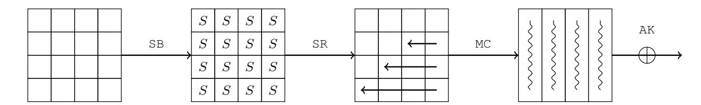

Fig. 1: The round function of AES

<span id="page-5-1"></span>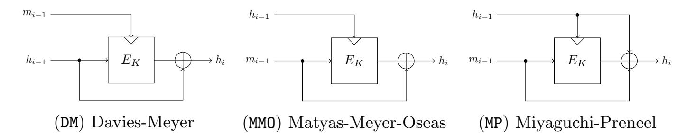

Fig. 2: Common Hashing Modes

#### 2.2 Quantum Computation and Quantum RAM

The states of an n-qubit quantum system can be described as unit vectors in  $\mathbb{C}^{2^n}$  under the orthonormal basis  $\{|0\cdots 00\rangle, |0\cdots 01\rangle, \cdots, |1\cdots 11\rangle\}$ , alternatively written as  $\{|i\rangle: 0 \leq i < 2^n\}$ . Quantum algorithms are typically realized by manipulating the state of an n-qubit system through a series of unitary transformations and measurements, where all unitary transformations can be implemented as a sequence of single-qubit and two-qubit transformations, which are called quantum gates in the standard quantum circuit model [40]. The efficiency of a quantum algorithm is quantified in terms of the amount of quantum gates used.

Superposition Oracles for Classical Circuit. Given a Boolean function f:  $\mathbb{F}_2^n \to \mathbb{F}_2$ . The superposition oracle of f is the unitary transformation  $\mathcal{U}_f$  acting on an (n+1)-qubit system sending a standard basis vector  $|x,y\rangle$  to  $|x,y\oplus f(x)\rangle$ , where  $x\in\mathbb{F}_2^n$  and  $y\in\mathbb{F}_2$ . As a linear operator,  $\mathcal{U}_f$  acts on superposition states as

$$\mathcal{U}_f\left(\sum_{x\in\mathbb{F}_2^n} a_i |x\rangle |0\rangle\right) = \sum_{x\in\mathbb{F}_2^n} a_i |x\rangle |f(x)\rangle. \tag{1}$$

Note that  $\mathcal{U}_f$  can be implemented efficiently in the quantum circuit model as long as there is an efficient classical circuit that computes f. To build the quantum circuit of  $\mathcal{U}_f$ , we first construct an efficient reversible circuit of f and substitute quantum gates for each of the reversible gates involved.

**Grover's Algorithm.** Given a search space of  $2^n$  elements, say  $\{x : x \in \mathbb{F}_2^n\}$ , and a Boolean function or predicate  $f : \mathbb{F}_2^n \to \mathbb{F}_2$ , the best classical algorithm with a black-box access to f requires about  $2^n$  evaluations of the black-box oracle to identify x such that f(x) = 1 with probability one (For the sake of simplicity,

{6}------------------------------------------------

we assume that there is only one such x). In the quantum setting, Grover's algorithm solves the same problem with about  $O(\sqrt{2^n})$  calls to a quantum oracle  $\mathcal{U}_f$  that outputs  $\sum_x a_x |x\rangle |y \oplus f(x)\rangle$  upon input of  $\sum_x a_x |x\rangle |y\rangle$ . Starting with a uniform superposition

$$|\psi\rangle = \frac{1}{\sqrt{2^n}} \sum_{x \in \mathbb{F}_2^n} |x\rangle,$$

by applying the Hadamard transformation  $H^{\otimes n}$  to  $|0\rangle^{\otimes n}$ . Then Grover's algorithm iteratively apply the unitary transformation  $(2|\psi\rangle\langle\psi|-I)\mathcal{U}_f$  to  $|\psi\rangle$  such that the amplitudes of those values x with f(x) = 1 are amplified. Then a final measurement gives a value x of interest with an overwhelming probability [16].

One caveat here: complexity can be hidden in the complexity of constructing the oracle circuit employed by Grover's algorithm. The speedup of the search would be illusory unless the oracle circuit can be implemented efficiently. Therefore, it is important to have a clear view on what resources it takes to implement the oracle. For example, a large qRAM is necessary if it requires a large qRAM to implement the oracle efficiently.

Quantum Amplitude Amplification. Let  $\mathcal{P} = |j_0\rangle \langle j_0| + \cdots + |j_{s-1}\rangle \langle j_{s-1}|$  be a projector with  $\{|j_0\rangle, \cdots, |j_{s-1}\rangle\} \subseteq \{|0\rangle, \cdots, |2^n - 1\rangle\}$ , and  $\mathcal{A}$  be a unitary operator such that  $\mathcal{A}|0\rangle = \alpha |\phi_P\rangle + \beta |\phi_P^{\perp}\rangle$ , where  $\mathcal{P}|\phi_{\mathcal{P}}\rangle = |\phi_{\mathcal{P}}\rangle$  and  $\mathcal{P}|\phi_{\mathcal{P}}^{\perp}\rangle = 0$ . Then there exists a quantum algorithm that requires exclusively  $\lfloor \frac{\pi}{4\theta} - \frac{1}{2} \rfloor$  calls to  $\mathcal{U}_{\mathcal{P}}$ ,  $\mathcal{U}_{P}^{\dagger}$ ,  $\mathcal{A}$ , and  $\mathcal{A}^{\dagger}$ , after a final measurement, to produce a quantum state close to  $|\psi_{\mathcal{P}}\rangle$ , where  $\sin(\theta) = |\alpha|$ , and the effect of the unitary operator  $\mathcal{U}_{\mathcal{P}}$  on base vectors satisfying  $\mathcal{U}_{\mathcal{P}}|x\rangle|y\rangle = |x\rangle|y\oplus 1\rangle$  if  $|x\rangle \in \{|j_0\rangle, \cdots, |j_{s-1}\rangle\}$  and  $\mathcal{U}_{\mathcal{P}}|x\rangle|y\rangle = |x\rangle|y\rangle$  otherwise [5].

The quantum amplitude amplification can be regarded as a generalization of Grover's algorithm in which  $\mathcal{A}$  is restricted to produce an equal superposition of all basis vectors. Similarly, when analyzing the complexity of the quantum amplitude amplification, we should take into account the complexities for implementing  $\mathcal{U}_{\mathcal{P}}$  and  $\mathcal{A}$ .

Quantum Random Access Memories (qRAM). A quantum random access memory (qRAM) is a quantum analogue of a classical random access memory (RAM), which uses n-qubit to address any quantum superposition of  $2^n$  memory cells. Given a list of classical data  $L = \{x_0, \dots, x_{2^n-1}\}$  with  $x_i \in \mathbb{F}_2^m$ , the qRAM for L is modeled as an unitary transformation  $\mathcal{U}_{\mathsf{qRAM}}^L$  such that

$$\mathcal{U}_{\mathsf{qRAM}}^{L}: |i\rangle_{\mathsf{Addr}} \otimes |y\rangle_{\mathsf{Out}} \mapsto |i\rangle_{\mathsf{Addr}} \otimes |y \oplus x_{i}\rangle_{\mathsf{Out}}, \tag{2}$$

where  $i \in \mathbb{F}_2^n$ ,  $y \in \mathbb{F}_2^m$ , and  $|\cdot\rangle_{\mathsf{Addr}}$  and  $|\cdot\rangle_{\mathsf{Out}}$  may be regarded as the address and output registers respectively. Therefore, we can access any quantum superposition of the data cells by using the corresponding superposition of addresses:

$$\mathcal{U}_{\mathsf{qRAM}}^{L} \left( \sum_{i} a_{i} | i \rangle \otimes | y \rangle \right) = \sum_{i} a_{i} | i \rangle \otimes | y \oplus x_{i} \rangle. \tag{3}$$

{7}------------------------------------------------

For the time being, it is unknown how a working qRAM (at least for large qRAMs) can be built. Nevertheless, this disappointing fact does not stop researchers from working in a model where large qRAMs are available, in the same spirit that people started to work on classical and quantum algorithms long before a classical or quantum computer had been built. From another perspective, the absence of large qRAMs and the fact that a qRAM of size O(n) can be simulated with a quantum circuit of size O(n) makes it quite meaningful to conduct research in an attempt to reduce or even avoid the use of qRAM in quantum algorithms.

### <span id="page-7-0"></span>3 MILP Models for the Rebound Attack

For the sake of concreteness, we restrict our discussion to collision attacks on AES-MMO, which is standardized by Zigbee and used by many multi-party computation protocols [17,27] due to its efficiency. Assume that there is a differential trail for  $E_K$  with probability p whose input and output differences share a common value  $\Delta$ . Given around 1/p pairs of input messages with difference  $\Delta$ , we expect one pair  $(m, m \oplus \Delta)$  follows this differential trail:  $E_K(m) \oplus E_K(m \oplus \Delta) = \Delta$ . If this is the case, the differences of the outputs of the MMO construction is

<span id="page-7-1"></span>
$$(m \oplus E_K(m)) \oplus (m \oplus \Delta \oplus E_K(m \oplus \Delta)) = \Delta \oplus \Delta = 0, \tag{4}$$

that is, a collision. Since K is known in hash functions, it is possible to generate many data pairs which confirm to one particular segment (typically the most difficult part) of the desired trail. Then these pairs are tested to find one fulfilling the remaining part of the trail. This is the basic strategy employed by the so-called rebound attack proposed by Mendel, Rechberger, Schläffer and Thomsen [33,31].

In a rebound attack, the target primitive and thus the differential trail covering it is split into three parts. An inbound part is placed at the middle surrounded by two outbound parts. By utilizing the degrees of freedom of the inbound part, many data pairs conforming to the differential of the inbound part (named as inbound differential) can be constructed deterministically or with a very high probability. Then these data pairs, named as *starting points*, are propagated through the outbound parts to find pairs respecting the outbound differential by chance. Among many improvements and extensions of the rebound attacks [22,38,23,24], the super S-box technique [12,30] and the non-full-active super S-box technique [42] are most relevant to our work.

#### <span id="page-7-2"></span>3.1 The Full-Active and Non-Full-Active Super S-box Techniques

In the context of rebound attacks on AES-MMO, the super S-box technique enlarges the inbound part by one more round than previous analysis by identifying four non-interfering  $\mathbb{F}_2^{32} \to \mathbb{F}_2^{32}$  permutations across two consecutive AES rounds and regarding them as four super S-boxes. Initially, when using the super S-box

{8}------------------------------------------------

technique for the inbound phase, researchers only considered differentials activating all cells of the super S-boxes, and we refer the reader to Figure 3 for an example, where one of the four super S-boxes involved in the inbound phase (surround by the dashed line) is highlighted. To generate starting points under this configuration (full-active super S-box) with complexity one on average, one has to store a table  $\mathbb{L}_{\Delta_{in}}$  whose entry  $\mathbb{L}_{\Delta_{in}}[\Delta_{out}]$  at index  $\Delta_{out}$  contains the pairs respecting the differential  $(\Delta_{in}, \Delta_{out})$  of the super S-box [12,30]. Since the memory of  $\mathbb{L}_{\Delta_{in}}$  is released after the analysis for one particular input difference  $\Delta_{in}$  is done, we only need the memory to store one copy of  $\mathbb{L}_{\Delta_{in}}$ .

<span id="page-8-0"></span>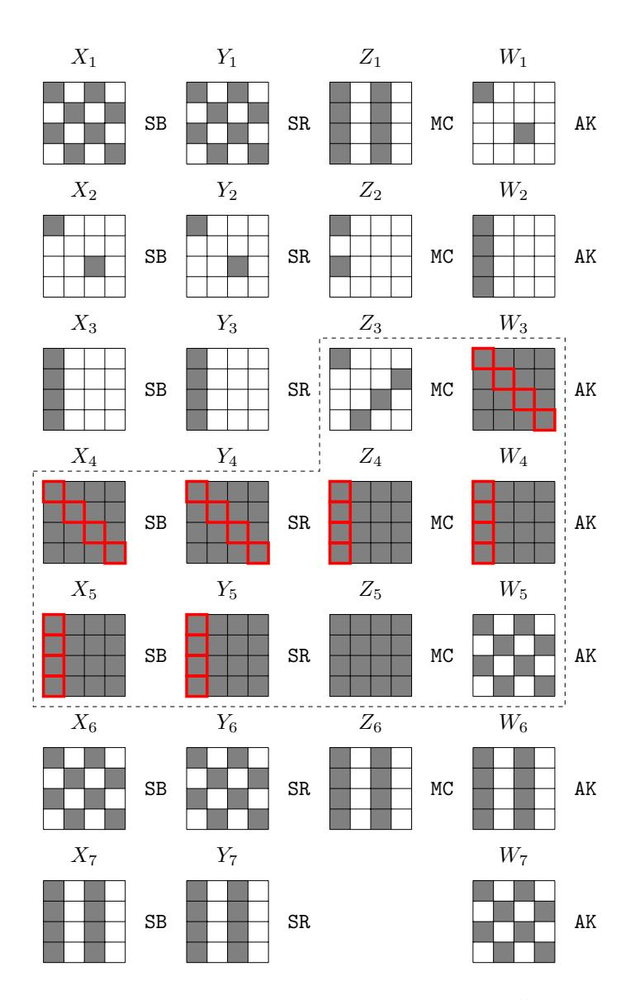

Fig. 3: The differential trail used in Hosoyamada and Sasaki's quantum collision attack on 7-round AES-MMO [20] with its inbound part and one of the super S-boxes highlighted

In [42], Sasaki, Wang, Sakiyama, and Ohta found that by using differentials with non-full active super S-boxes, the memory complexity of the inbound phase can be significantly reduced. This is because typically data pairs compatible with a given differential with a non-full-active super S-box can be built up progressively by working on 8-bit values. We refer the reader to [42] for more details. In what follows, we describe how to generate data pairs respecting a given dif-

{9}------------------------------------------------

<span id="page-9-0"></span>ferential with a non-full-active super S-box through a concrete example shown in Figure 4. This is also a differential we actually used in our improved attacks on AES-MMO.

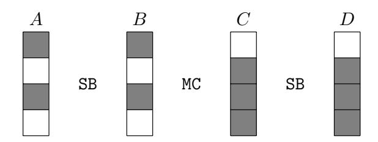

<span id="page-9-1"></span>Fig. 4: A differential with non-full-active super S-box

First, we precompute the differential distribution table DDT of the small S-box in table  $\mathbb{T}$  using Algorithm 1 and load it into random access memories. As shown in Figure 4, given the truncated differential of the super S-box SSB = SB  $\circ$  MC  $\circ$  SB, we can generate data pairs conforming to a given differential  $(\Delta A, \Delta D)$  for SSB by enumerating  $(A[0], \beta) \in \mathbb{F}_2^{11}$  with Algorithm 2. We remember an easy property for MC when understanding Algorithm 2.

Property 1.  $MC \cdot (X[0], X[1], X[2], X[3])^T = (Y[0], Y[1], Y[2], Y[3])^T$  can be used to fully determine the remaining unknowns if any four of  $X[0], \dots, X[3], Y[0], \dots, Y[3]$  are known.

Note that in Algorithm 2, there are 3 DDT accesses to determine a combination of (A[2], C[1], C[2]), hence, we have  $2 \times 2 \times 2 = 8$  choices. Following the strategy of Hosoyamada and Sasaki's attack [20], we introduce an auxiliary 3-bit variable  $\beta$  to specify which combination to choose among the 8 choices. The complexity of Algorithm 2 includes 2+2=4 small S-boxes evaluations (Step 1 and Step 19) and 3 DDT accesses (Step 6-8). Suppose the differential distribution of the S-box is similar to that of the S-box of AES, i.e., 4-uniform. Therefore, it returns a pair when accessing  $\mathbb T$  with  $(\delta_{in}, \delta_{out}) \in \mathbb F_2^8 \times \mathbb F_2^8$  with probability of about  $\frac{1}{2}$ , and returns empty also with probability of about  $\frac{1}{2}$ . Hence, Step 6-8 of Algorithm 2 act as a filter of  $2^{-3}$ . In addition, we have a filter of  $2^{-8}$  in Step 19. Therefore, by traversing the 11-bit  $(A[0], \beta)$ , it is expected to return  $(2^8 \times 2^3 \times 2^{-3} \times 2^{-8} =)$  1 pair which conforms the given input-output differences  $(\Delta A, \Delta D)$  of SSB. The total complexity is  $2^{11} \cdot 4$  S-box evaluations and  $2^{11} \cdot 3$  DDT accesses.

We consider a more general scenario: a column state A with d c-bit cells is mapped to  $D = \mathtt{SB} \circ \mathtt{MC} \circ \mathtt{SB}(A)$ , where  $\mathtt{SB}$  is a parallel application of d  $c \times c$  small S-boxes and  $\mathtt{MC} : \mathbb{F}_{2^c}^d \to \mathbb{F}_{2^c}^d$  is a linear transformation with branch number d+1. Assume that a differential of the super S-box  $\mathtt{SSB} = \mathtt{SB} \circ \mathtt{MC} \circ \mathtt{SB}$  leads to s non-active  $c \times c$  S-boxes, and thus we have 2d-s small active S-boxes. To generate a pair respecting a given differential  $(\Delta A, \Delta D)$  for the  $\mathtt{SSB}$ , we perform the following steps:

1. Guess d-s cells of (A, D) (the guessed positions must be selected within the active cells of (A, D)).

{10}------------------------------------------------

#### **Algorithm 1:** The differential distribution table of S with data pairs

```
1 Let \mathbb{T} be an empty dictionary
2 for \delta_{\mathbb{IN}} \in \mathbb{F}_2^8 do
3 | for x \in \mathbb{F}_2^8 do
4 | x' \leftarrow x \oplus \delta_{in}, y \leftarrow S(x), y' \leftarrow S(x'), \delta_{out} \leftarrow y \oplus y'
5 | if x \leq x' then
6 | Insert (x, x', y, y') into \mathbb{T}[(\delta_{in}, \delta_{out})]
7 | end
8 | end
9 end
10 return \mathbb{T}
```

- 2. Compute the values of d-s cells of (B,C) from the guessed d-s cells of (A,D). Compute the differences of d-s active cells of  $(\Delta B, \Delta C)$ .
- 3. Combining with the s non-active cells of  $(\Delta B, \Delta C)$ , we get (d-s) + s = d cells with known differences among the input-output differences of MC. By Property 1, we know all the differences in the truncated differential.
- 4. Since d-s cells of (B,C) have been determined, we need an additional s cells to determine all other cells of (B,C) through MC. Therefore, we compute another s cells through s DDT accesses. Here, similar to Algorithm 2, an s-bit auxiliary variable  $\beta$  is needed to specify which combination to choose among the  $2^s$  choices. In Algorithm 2, (s=)3-bit  $\beta$  is needed.
- 5. Combining with the d-s cells of (B,C) in Step 2 and s cells by accessing DDT, we know d cells of (B,C). By Property 1, we derive the remaining d cells.
- 6. Now, there are

$$\underbrace{(2d-s)}_{\text{All active S-boxes}} - \underbrace{(d-s)}_{\text{Guessed}} - \underbrace{s}_{\text{Fixed by DDT}} = d-s$$

unused active Sboxes, which are used as a  $2^{-(d-s)c}$ -bit filter. In Algorithm 2, it is a filter of  $2^{-(d-s)c} = 2^{-(4-3)\times 8} = 2^{-8}$ . Once it passes the filter, we obtain the full (A, D) and (A', D') conform to the differential of the SSB.

The complexity of the whole procedure is s DDT accesses and 4(d-s) S-boxes evaluations (2(d-s)) in step 2 and 2(d-s) in step 6). We have to repeat for  $2^{(d-s)c} \times 2^s$  times to traverse the initial guesses and s-bit auxiliary variable  $\beta$  to find one pair on average, which need about  $2^{(d-s)c+s} \cdot s$  DDT accesses and  $2^{(d-s)c+s} \cdot 4(d-s)$  small S-box evaluations. Suppose one DDT access is equivalent to one S-box evaluation, hence the total time complexity is in classical setting:

<span id="page-10-1"></span>
$$2^{(d-s)c+s} \cdot (s+4(d-s))$$
 S-box evaluations. (5)

In quantum setting, we use Grover's algorithm to accelerate the procedures with time complexity (including uncomputing):

<span id="page-10-2"></span>
$$2 \cdot \frac{\pi}{4} \cdot \sqrt{2^{(d-s)c+s}} \cdot (s + 4(d-s)) \quad \text{S-box evaluations}, \tag{6}$$

{11}------------------------------------------------

Algorithm 2: Generating data pairs for non-full-active super S-box

```
Input: The differential (∆A, ∆D), A[0], and a 3-bit index β = (β0, β1, β2)
   Output: Data A such that SSB(A) ⊕ SSB(A ⊕ ∆A) = ∆D
1 B[0] = S(A[0]), B
                  0
                   [0] = S(A[0] ⊕ ∆A[0]), ∆B[0] = B[0] ⊕ B
                                                      0
                                                       [0]
2 /* Together with 3 non-active bytes in (∆B, ∆C), 4 bytes of
      differences are known in total. */
3 According to Property 1, we get ∆B[2] and ∆C[1, 2, 3]
4 /* Determine the pairs through accessing DDT */
5 /* We obtain values with probability of 2
                                            −3
                                                                     */
6 (A[2], A0
          [2], B[2], B0
                    [2]) ← T[(∆A[2], ∆B[2])]
7 (C[1], C0
          [1], D[1], D0
                    [1]) ← T[(∆C[1], ∆D[1])]
8 (C[2], C0
          [2], D[2], D0
                    [2]) ← T[(∆C[2], ∆D[2])]
9 /* Pick combinations of (A[2], C[1], C[2]) by β: β0 · ∆A[2] = 0 if β0 = 0
      and β0 · ∆A[2] = ∆A[2] if β0 = 1 */
10 A[2] = A[2] ⊕ β0 · ∆A[2], A
                          0
                           [2] = A[2] ⊕ ∆A[2];
11 B[2] = B[2] ⊕ β0 · ∆B[2], B
                           0
                           [2] = B[2] ⊕ ∆B[2];
12 C[1] = C[1] ⊕ β1 · ∆C[1], C
                          0
                           [1] = C[1] ⊕ ∆C[1];
13 D[1] = D[1] ⊕ β1 · ∆D[1], D
                           0
                           [1] = D[1] ⊕ ∆D[1];
14 C[2] = C[2] ⊕ β2 · ∆C[2], C
                          0
                           [2] = C[2] ⊕ ∆C[2];
15 D[2] = D[2] ⊕ β2 · ∆D[2], D
                           0
                           [2] = D[2] ⊕ ∆D[2].
16 /* B[0], B[2], C[1], and C[2] are known */
17 With Property 1, all the values of B and C are known
18 /* Among the 5 active S-boxes, only the S-box with (∆C[3], ∆D[3]) is
      not considered, which acts as a filter. */
19 if S(C[3]) ⊕ S(C[3] ⊕ ∆C[3]) = ∆D[3] /* probability of 2
                                                               −8
                                                                     */
20 then
21 return A ← SB−1
                      (B) together with A ⊕ ∆A
22 end
```

with 2<sup>16</sup> qRAM to store the DDT. We refer the readers to Section [4](#page-12-0) and [5](#page-18-0) to find the detailed definitions and implementations of quantum oracles for the application of Grover's algorithm. From the Eq. [\(5\)](#page-10-1) and [\(6\)](#page-10-2), we see that the dominating part is 2(d−s)<sup>c</sup> (in this paper, c = 8), hence, we will maximize s by our MILP model in order to reduce the complexity to compute the non-full-active super S-box.

### 3.2 Searching for Exploitable Differentials in Classical and Quantum Attacks with MILP

Following recent MILP based approach for automatic cryptanalysis [\[37,](#page-29-16)[46\]](#page-30-5), we propose an MILP model with multiple optimization objectives whose solution space captures the set of exploitable differentials with respect to rebound attacks in both the classical and quantum settings. Let us now clarify the variables, constraints, and objective functions.

{12}------------------------------------------------

Variables and Constraints. For an R-round primitive, we first introduce an integral variable l, which determines the inbound part from round l+ 1 to round l + 2, and the outbound part with a backward chunk from round l to round 0 and a forward chunk from round l + 3 to round R − 1.

Then, we introduce a set of 0-1 variables x<sup>j</sup> for all cells of the states involved, where x<sup>j</sup> = 1 if and only if the corresponding cell is differentially active. These variables model the truncated differential trails of the target, and the constraints imposed on them are the same as [\[37\]](#page-29-16).

To capture the probability of the trails, we also introduce a set of 0-1 variables ω<sup>j</sup> for each cell of the states right before (in the backward chunk) or after (in the forward chunk) the MC operations. Concretely, in the backward chunk, given MC with differentially active input-output cells, ω<sup>j</sup> = 1 if and only if the corresponding input cell of the MC is differentially inactive. Similarly, in the forward chunk, given MC with differentially active input-output cells, ω<sup>j</sup> = 1 if and only if the corresponding output cell of the MC is differentially inactive. Therefore, the probability of the truncated differential trail for the outbound phase can be calculated as 2−c· Pω<sup>j</sup> , where c is the cell size in bits and the sum of ω<sup>j</sup> is taken over the scope of the outbound part.

The Objective Functions. To minimize the time complexity of the outbound phase (including the cancellation introduced by Eq. [\(4\)](#page-7-1)), our first priority objective function is to minimize

$$\sum_{\text{Outbound}} w_j + \sum_{\text{Round 0}} x_j.$$

According to the discussion of Section [3.1,](#page-7-2) the complexity for analyzing one super S-box is minimized when the number of inactive small S-boxes is maximized. Assuming we have h super S-boxes, let s<sup>i</sup> (0 ≤ i < h) denote the number of inactive small S-boxes in the corresponding super S-box. We set our second priority objective function to maximize the minimal of {s0, s1, ..., s<sup>h</sup>−<sup>1</sup>}, i.e., the objective function is

maximize: 
$$\min \{s_0, s_1, ..., s_{h-1}\}.$$

Note that this type of objective can be realized in MILP by maximizing λ with the constraints λ ≤ s<sup>j</sup> for 0 ≤ j < h − 1.

Remark. Since in all of our attacks we have enough degrees of freedom potentially borrowed from other message blocks, we do not care about the degrees of freedom provided by the inbound differential.

## <span id="page-12-0"></span>4 Quantum Collision Attacks on 7-Round AES-MMO and AES-MP with Low qRAM

Before we dive into the details of the attack with low qRAM, we would like to give some high-level remarks on the difference between our attack and Hosoyamada and Sasaki's attack [\[20\]](#page-28-8). The differentials used in [\[20\]](#page-28-8) and our attack are 

{13}------------------------------------------------

presented in Figure [3](#page-8-0) and Figure [5,](#page-13-0) respectively. We can see that both differentials cover seven rounds of AES, and the probabilities of the segments of the differentials covering the outbound phases are both 2−<sup>80</sup> [6](#page-13-1) . The main difference appears in the inbound phases: The differential employed by Hosoyamada and Sasaki (see Figure [3\)](#page-8-0) activates all cells of the super S-boxes involved in the inbound phase while the differential we used gives rise to non-full-active super S-boxes. This discrepancy is the core reason for the reduction of the qRAM usage and brings some technical difficulties preventing us from applying Hosoyamada and Sasaki's attack directly.

<span id="page-13-0"></span>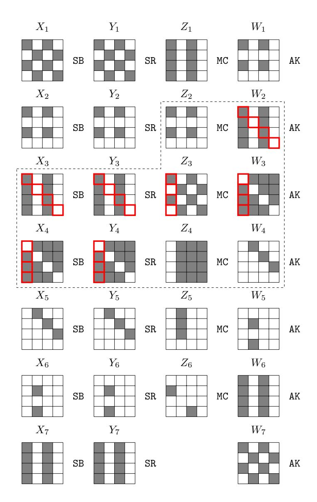

Fig. 5: The differential trail used in our quantum collision attack on 7-round AES-MMO

Since the differential probability of the outbound phase is 2−<sup>80</sup>, we have to generate about 2<sup>80</sup> starting points to find a collision. If we follow Hosoyamada and Sasaki's strategy and try to produce a collision for h = CF(m, IV ) with one

<span id="page-13-1"></span><sup>6</sup> In Figure [5,](#page-13-0) the differential transition from Z<sup>5</sup> to W<sup>5</sup> needs a two-byte condition, whose probability is about 2<sup>−</sup><sup>16</sup>. Eight-byte differences in ∆X<sup>1</sup> and ∆W<sup>7</sup> have to be equal, which holds with probability 2<sup>−</sup><sup>64</sup> .

{14}------------------------------------------------

<span id="page-14-0"></span>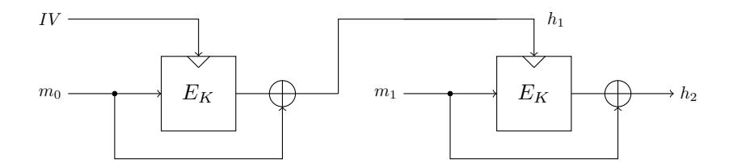

Fig. 6: The framework of the collision attacks with two message blocks

message block by a rebound attack based on the differential given in Figure 5, we are doomed to fail due to an inherent shortage of enough starting points. Let us look at the differential trail (see Figure 5) for the inbound part. There are  $2^{8\times4}$  possibilities for  $\Delta Z_2$  and  $2^{8\times3}$  possibilities for  $\Delta W_4$ . Therefore, we expect to have totally  $2^{8\times4}\times2^{8\times3}=2^{56}<2^{80}$  starting points when the subkeys are fixed by the IV. In contrast, Hosoyamada and Sasaki's trail (see Figure 3) can create as many as  $2^{8\times8}\times2^{8\times3}=2^{88}>2^{80}$  starting points that conforming with the inbound differential.

To address this issue, we consider collisions produced by a pair of two-block messages  $(m_0, m_1)$  and  $(m_0, m_1')$  whose hash values are computed according to Figure 6. The rebound attack happens at the second message block, and the degrees of freedom for generating starting points is replenished by varying the first message block  $m_0$ . To be more specific, we can generate about  $2^{24} \times 2^{56} = 2^{80}$  starting points after go through  $2^{24}$  different  $m_0$ 's, among which we expect to find one starting point fulfilling the outbound differential and thus leading to a collision.

#### 4.1 A Low-qRAM Quantum Collision Attack on 7-round AES-MMO

Similar to [20], at the core of our attack is the application of Grover's algorithm to a search space where the interested elements are marked by an efficiently computable Boolean function F. Now, let us proceed to define our F.

For the convenience of discussion, we call the instantiated input-output difference pair  $(\Delta_{in}, \Delta_{out}) \in \mathbb{F}_2^{32} \times \mathbb{F}_2^{24}$  for  $(\Delta X_3, \Delta Y_4)$  with regard to Figure 5 the inbound differential. The goal of the inbound phase of a rebound attack is to generate data pairs respecting the inbound differential. We define

$$F: \mathbb{F}_2^{24} \times \mathbb{F}_2^{32} \times \mathbb{F}_2^{24} \times \mathbb{F}_2^3 \to \mathbb{F}_2 \tag{7}$$

in a way such that  $F(m_0, \Delta_{in}, \Delta_{out}, \alpha) = 1$  if and only if the starting point computed with  $(m_0, \Delta_{in}, \Delta_{out})$  and indexed by  $\alpha = (\alpha_0, \alpha_1, \alpha_2) \in \mathbb{F}_2^3$  fulfills the outbound differential. Note that we can set the search space of  $m_0$  to be the most significant 24 bits, with its remaining bits set to 0. Therefore, if

<span id="page-14-1"></span>Note that given  $(m_0, \Delta_{in}, \Delta_{out})$ , we can derive the input-output differences for the four SSB. If there exists one input-output pair for each SSB, there will be  $(2\cdot 2\cdot 2\cdot 2)/2 = 8$  choices for starting points. Therefore, Hosoyamada and Sasaki [20] introduced a 3-bit  $\alpha$  to specify which starting point to choose. We also adopt this strategy in our definition of F.

{15}------------------------------------------------

 $F(m_0, \Delta_{in}, \Delta_{out}, \alpha) = 1$ , we can produce two messages  $m_1$  and  $m'_1$  with the help of Algorithm 2 such that

$$CF(m_1, CF(m_0, IV)) = CF(m'_1, CF(m_0, IV)),$$

where  $m_1$  and  $m'_1$  are obtained from the starting point indexed by  $\alpha$ . Given  $(m_0, \Delta_{in}, \Delta_{out}, \alpha)$ ,  $F(m_0, \Delta_{in}, \Delta_{out}, \alpha)$  can be computed in the classical world by the following approach:

- 1. Compute  $h_1 = CF(m_0, IV)$ , which is treated as the master key for the second block encryption.
- 2. Compute the differential  $(\Delta X_3^{(i)}, \Delta Y_4^{(i)})$  for each super S-box  $SSB^{(i)}$   $(0 \le i < 4)$  from the inbound differential  $(\Delta_{in}, \Delta_{out})$ . Note that the differential trail for  $SSB^{(0)}$  with input difference  $\Delta X_3^{(0)}$  and output difference  $\Delta Y_4^{(0)}$  is highlighted in Figure 5.
- 3. Solve the non-full active super S-box  $SSB^{(0)}$  to obtain  $X_3^{(0)}$  such that

$$SSB^{(0)}(X_3^{(0)} \oplus \Delta X_3^{(0)}) \oplus SSB^{(0)}(X_3^{(0)}) = \Delta Y_4^{(0)}.$$

If  $\alpha_0=0$ , pick  $\min\{X_3^{(0)},X_3^{(0)}\oplus \Delta X_3^{(0)}\}$  as the new value for  $X_3^{(0)}$ . Else, pick  $\max\{X_3^{(0)},X_3^{(0)}\oplus \Delta X_3^{(0)}\}$  as the new value for  $X_3^{(0)}$ . Similarly, we obtain  $X_3^{(1)}$ ,  $X_3^{(2)}$ . For the pair  $(X_3^{(3)},X_3^{(3)}\oplus \Delta X_3^{(3)})$ , we always pick the bigger one as  $X_3^{(3)}$ . We can build the starting point

$$X_3 = (X_3^{(0)}, X_3^{(1)}, X_3^{(2)}, X_3^{(3)})$$

according to the index  $\alpha$ .

4. If the starting point  $(X_3, X_3 \oplus \Delta X_3)$  obtained in step 3 respects the outbound differential,  $F(m_0, \Delta_{in}, \Delta_{out}, \alpha)$  returns 1, otherwise it returns 0.

Therefore, by applying Grover's search with the quantum oracle  $\mathcal{U}_F$  which maps  $|m_0, \Delta_{in}, \Delta_{out}, \alpha\rangle |y\rangle$  to  $|m_0, \Delta_{in}, \Delta_{out}, \alpha\rangle |y \oplus F(m_0, \Delta_{in}, \Delta_{out}, \alpha)\rangle$ , we can find a collision with around  $\frac{\pi}{4} \cdot \sqrt{2^{83}}$  queries. To estimate the overall complexity, we need to be clear on the complexity incurred by  $\mathcal{U}_F$ .

#### <span id="page-15-0"></span>4.2 Implementation of the Quantum Oracle $\mathcal{U}_F$

Similar to [20], we need some additional functions to implement  $\mathcal{U}_F$ . First, we define  $G^{(i)}$ , which marks the values of one byte of  $X_3^{(i)}$  and a 3-bit index  $\beta$  leading to solutions (compatible data pairs) for the given differential  $(\Delta X_3^{(i)}, \Delta Y_4^{(i)})$  of the super S-box SSB<sup>(i)</sup> and an initial message block  $m_0$  when Algorithm 2 or its variants are applied. For example,  $G^{(0)}(m_0, \Delta X_3^{(0)}, \Delta Y_4^{(0)}, X_3^{(0)}[0], \beta) = 1$  if and only if we pass the check in Step 19 of Algorithm 2 upon input of  $(m_0, \Delta X_3^{(0)}, \Delta Y_4^{(0)}, X_3^{(0)}[0], \beta)$ . Note that, since  $G^{(0)}$  is just to mark the correct 11-bit  $(X_3^{(i)}[0], \beta)$  for a given  $(m_0, \Delta X_3^{(0)}, \Delta Y_4^{(0)})$ , we can return  $G^{(0)} = 1$  once it passes the check in Step 19 of Algorithm 2.

{16}------------------------------------------------

Since the computation of  $G^{(i)}$  in the classical setting uses the table  $\mathbb{T}$  computed by Algorithm 1, implementing a quantum oracle of  $G^{(i)}$  requires qRAMs. The implementation of the quantum oracle  $\mathcal{U}_{G^{(0)}}$  of  $G^{(0)}$  is presented in Algorithm 3.

### **Algorithm 3:** Implementation of $\mathcal{U}_{G^{(0)}}$

```
Input: |m_0, \Delta X_3^{(0)}, \Delta Y_4^{(0)}; X_3^{(0)}[0], \beta\rangle |y\rangle with \beta = (\beta_0, \beta_1, \beta_2) \in \mathbb{F}_2^3

Output: |m_0, \Delta X_3^{(0)}, \Delta Y_4^{(0)}; X_3^{(0)}[0], \beta\rangle |y \oplus G^{(0)}(m_0, \Delta X_3^{(0)}, \Delta Y_4^{(0)}; X_3^{(0)}[0], \beta)\rangle

1 Compute h_1 = \text{CF}(m_0, IV)

2 Apply the quantum circuit of Step 1-19 Algorithm 2 with input; /* Requires 2^{16} qRAMSs */

3 if It passes the check in Step 19 of Algorithm 2 then

4 | return |m_0, \Delta X_3^{(0)}, \Delta Y_4^{(0)}; X_3^{(0)}[0], \beta\rangle |y \oplus 1\rangle

5 else

6 | return |m_0, \Delta X_3^{(0)}, \Delta Y_4^{(0)}; X_3^{(0)}[0], \beta\rangle |y\rangle

7 end
```

For  $0 \le i < 3$ , we use the function  $D^{(i)}$  to compute the actual input-output data pair respecting the differential of the super S-box  $\mathrm{SSB}^{(i)}$  with the knowledge of one byte of  $X_3^{(i)}[0]$  and  $\beta$  obtained by executing Grover search on  $G^{(i)}$ .  $D^{(i)}$  is just to replay a full version of Algorithm 2 and outputs  $\min\{X_3^{(i)}, X_3^{(i)} \oplus \Delta X_3^{(i)}\}$  upon input

$$(m_0, \Delta X_3^{(i)}, \Delta Y_4^{(i)}, X_3^{(i)}[0], \beta; \alpha_i = 0),$$

and outputs  $\max\{X_3^{(i)}, X_3^{(i)} \oplus \Delta X_3^{(i)}\}$  upon input

$$(m_0, \Delta X_3^{(i)}, \Delta Y_4^{(i)}, X_3^{(i)}[0], \beta; \alpha_i = 1),$$

such that  $SSB^{(i)}(X_3^{(i)}) \oplus SSB^{(i)}(X_3^{(i)} \oplus \Delta X_3^{(i)}) = \Delta Y_4^{(i)}$ . In addition,  $D^{(3)}$  is defined differently. It always returns the smaller one of  $X_3^{(3)}$  and  $X_3^{(3)} \oplus \Delta X_3^{(3)}$  upon the input  $(m_0, \Delta X_3^{(i)}, \Delta Y_4^{(i)}, X_3^{(i)}[0], \beta)$ , such that

$$\mathrm{SSB}^{(3)}(X_3^{(3)}) \oplus \mathrm{SSB}^{(3)}(X_3^{(3)} \oplus \varDelta X_3^{(3)}) = \varDelta Y_4^{(3)}.$$

Finally, the oracle  $\mathcal{U}_F$  can be constructed by using  $\mathcal{U}_{G^{(i)}}$  and the quantum circuits of  $D^{(i)}$  which is presented in Algorithm 4.

**Complexity Analysis.** To produce fair and comparable results, the assumptions made by Hosoyamada and Sasaki [20] are inherited in our complexity analysis:

• The complexity of the computation of 7-round AES is approximated by  $16 \times 7 + 4 \times 7 = 140$  S-box computations.

{17}------------------------------------------------

#### **Algorithm 4:** Implementation of $\mathcal{U}_F$ .

```
Input: |m_0, \Delta_{in}, \Delta_{out}; \alpha\rangle |y\rangle, with \alpha = (\alpha_0, \alpha_1, \alpha_2) \in \mathbb{F}_2^3
      Output: |m_0, \Delta_{in}, \Delta_{out}; \alpha\rangle | y \oplus F(m_0, \Delta_{in}, \Delta_{out}; \alpha)\rangle
  1 Compute h_1 = CF(m_0, IV).
  2 for i \in \{0, 1, 2\} do
             Compute the corresponding differential \Delta X_3^{(i)} \to \Delta Y_4^{(i)} for SSB<sup>(i)</sup> from
  3
                (\Delta_{in}, \Delta_{out}).
             Run Grover search on the function G^{(i)}(m_0, \Delta X_3^{(i)}, \Delta Y_4^{(i)}; \cdot) : \mathbb{F}_2^{11} \to \mathbb{F}_2.
  4
             Let X_3^{(i)}[0] \in \mathbb{F}_2^8 and \beta^{(i)} \in \mathbb{F}_2^3 be the output.
Run D^{(i)}(m_0, \Delta X_3^{(i)}, \Delta Y_4^{(i)}, X_3^{(i)}[0], \beta^{(i)}, \alpha_i). Let X_3^{(i)} be the output.
  \mathbf{5}
  6 end
  7 Compute the corresponding differential \Delta X_3^{(3)} \to \Delta Y_4^{(3)} for SSB<sup>(3)</sup> from
         (\Delta_{in},\Delta_{out})
  8 Run Grover search on the function G^{(3)}(m_0, \Delta X_3^{(0)}, \Delta Y_4^{(3)}; \cdot) : \mathbb{F}_2^{11} \to \mathbb{F}_2. Let
 X_3^{(3)}[0] \in \mathbb{F}_2^8 and \beta^{(3)} \in \mathbb{F}_2^3 be the output.

9 Run D^{(3)}(m_0, \Delta X_3^{(3)}, \Delta Y_4^{(3)}, X_3^{(3)}[0], \beta^{(3)}). Let X_3^{(3)} be the output.
10 /* Create starting points derived from (m_0, \Delta_{in}, \Delta_{out}; \alpha)
                                                                                                                                                    */
11 X \leftarrow (X_3^{(0)}, \cdots X_3^{(3)})
12 X' \leftarrow (X_3^{(0)} \oplus \Delta X_3^{(0)}, \cdots, X_3^{(3)} \oplus \Delta X_3^{(3)})
13 if (X, X') fulfills the outbound differential then
             return |m_0, \Delta_{in}, \Delta_{out}, \alpha\rangle |y \oplus 1\rangle
14
15 else
             return |m_0, \Delta_{in}, \Delta_{out}, \alpha\rangle |y\rangle
16
17 end
```

- The complexity of one access to the qRAM storing a table is equivalent to one S-box computation.
- The complexity of the resolution of the linear equation involving MC with four knowns and four unknowns is equivalent to one MC operation and is ignored.
- One inverse Sbox is about two Sboxes [21].
- Uncomputing is taken into account.

First of all, in our attack, the differential distribution table with  $2^{16}$  classical data for the S-box is precomputed (see Algorithm 1) and loaded into a qRAM in advance, which is accessed by the quantum circuits for  $G^{(i)}$  and  $D^{(i)}$ .

Complexity of the Grover search on  $G^{(i)}$ . Applying Grover algorithm to  $G^{(i)}$  given  $(m_0, \Delta X_3^{(i)}, \Delta Y_4^{(i)})$  to find a 11-bit value  $(X_3^{(i)}[0], \beta^{(i)})$  requires  $\frac{\pi}{4}\sqrt{2^{8+3}} \approx 2^{5.15}$  queries to the oracle  $\mathcal{U}_{G^{(i)}}$ <sup>8</sup>. According to the analysis of Algorithm 2, one

<span id="page-17-1"></span><sup>&</sup>lt;sup>8</sup> Supplementary Material C discusses the Grover search on small space.

{18}------------------------------------------------

query to  $\mathcal{U}_{G^{(i)}}$  takes about s=3 qRAM accesses and 4(d-s)=4(4-3)=4 S-box evaluations, the overall complexity can be estimated as  $2\times 2^{5.15}\times (3+4)\times \frac{1}{140}\approx 2^{1.83}$  7-round AES computations.

Complexity of  $D^{(i)}$ .  $D^{(i)}$  is just to replay a full version of Algorithm 2. In Step 1-19 of Algorithm 2, it needs s+4(d-s)=3+4(4-3)=7 S-boxes evaluations. In Step 21, since all the 5 active bytes are known before, we just compute the last 3 inactive Sboxes (see Figure 4) to determine a conforming pair for the SSB<sup>(i)</sup>. Hence, totally 7+3=10 Sboxes evaluations are needed, which is about  $2 \times \frac{10}{140} \approx 2^{-2.8}$  7-round AES computations.

Complexity of  $\mathcal{U}_F$ . In Algorithm 4, Step 1 needs one 7-round AES computation; Step 2-9 need  $4 \times (2^{1.83} + 2^{-2.8}) \approx 2^{3.88}$  7-round AES computations. In Step 13, according to Figure 5, we need to compute backward for 2 rounds and forward for 3 rounds from the starting point (X, X'). Therefore,  $2 \times 2 \times 16 = 64$  inverse Sboxes and  $2 \times 3 \times 16 = 96$  Sboxes are needed, which are equal to  $2 \times \frac{64 \times 2 + 96}{140} = 3.2$  7-round AES computations. Totally, the complexity of  $\mathcal{U}_F$  is  $1 + 2^{3.88} + 3.2 \approx 2^{4.24}$  7-round AES computations. Supplementary Material D discusses the success probability of  $\mathcal{U}_F$ .

Complexity to find a collision. To identify an 83-bit value  $(m_0, \Delta_{in}, \Delta_{out}, \alpha) \in \mathbb{F}_2^{24} \times \mathbb{F}_2^{32} \times \mathbb{F}_2^{24} \times \mathbb{F}_2^{3}$  with Grover search such that  $F(m_0, \Delta_{in}, \Delta_{out}, \alpha) = 1$  requires about  $\frac{\pi}{4} \times \sqrt{2^{83}}$  queries to  $\mathcal{U}_F$ . Therefore, the complexity to find a collision is  $\frac{\pi}{4} \times \sqrt{2^{83}} \times 2^{4.24} = 2^{45.4}$  7-round AES computations.

### <span id="page-18-0"></span>5 Quantum Attacks on 7-Round AES-MMO without qRAM

The qRAM dependence of the previous attack comes from the qRAM dependence of  $\mathcal{U}_{G^{(i)}}$  and  $D^{(i)}$ . To get rid of the qRAMs, we re-implement  $\mathcal{U}_{G^{(i)}}$  and  $D^{(i)}$  without using the DDT stored in qRAMs, while keep their functional behavior unchanged. In this section, we introduce two method to reduced qRAMs to zero.

#### 5.1 Method 1

The idea is simple: given a differential of an  $8 \times 8$  S-box, data pairs are generated by on-line search instead of table lookups. Since the methods for re-implementing  $\mathcal{U}_{G^{(i)}}$  and  $D^{(i)}$  are similar, we only give the details of the implementation of  $\mathcal{U}_{G^{(0)}}$  in Algorithm 5. The complexity analysis of this new attack is given in the following.

Complexity of the Grover search on  $G^{(i)}$ . Applying Grover's algorithm to  $G^{(i)}$  given  $(m_0, \Delta X_3^{(i)}, \Delta Y_4^{(i)})$  to find a 11-bit value  $(X_3^{(i)}[0], \beta^{(i)})$  requires  $\frac{\pi}{4}\sqrt{2^{8+3}} \approx 2^{5.15}$  queries to the oracle  $\mathcal{U}_{G^{(i)}}$ . According to Algorithm 5, the complexity of one query to  $U_{G^{(i)}}$  is dominated by Step 6-8, which is about  $3 \cdot \frac{\pi}{4} \cdot \sqrt{2^8} \cdot (\frac{1}{140}) = 2^{-1.89}$  7-round AES. Hence, the total complexity of the Grover search on  $G^{(i)}$  is about  $2 \times 2^{5.15} \times 2^{-1.89} = 2^{4.27}$  7-round AES.

{19}------------------------------------------------

Complexity of  $D^{(i)}$ . With  $(X_3^{(i)}[0], \beta^{(i)})$ ,  $D^{(i)}$  outputs the pair respecting the differential of the super S-box on-line. The implementation of  $D^{(i)}$  is similar to  $G^{(i)}$ , with Step 12-14 of Algorithm 5 replaced by outputting  $X_3^i$  according to  $\alpha_i$  (please refer the definitions of  $D^{(i)}$  in Section 4.2 for details). The complexity of  $D^{(i)}$  is also bounded by Step 6-8 of Algorithm 5. The complexity is about  $2 \times 2^{-1.89} = 2^{0.89}$  7-round AES.

Complexity of  $\mathcal{U}_F$ . The implementation of  $\mathcal{U}_F$  without qRAM is obtained by replacing  $G^{(i)}$  and  $D^{(i)}$ 's with their no-qRAM versions (Algorithm 4). The complexity of one query to  $\mathcal{U}_F$  is about  $4 \times (2^{4.27} + 2^{-0.89}) + 1 + 3.2 \approx 2^{6.384}$  7-round AES computations.

Complexity to find a collision. To identify an 83-bit value  $(m_0, \Delta_{in}, \Delta_{out}, \alpha) \in \mathbb{F}_2^{24} \times \mathbb{F}_2^{32} \times \mathbb{F}_2^{24} \times \mathbb{F}_2^{3}$  with Grover search such that  $F(m_0, \Delta_{in}, \Delta_{out}, \alpha) = 1$  requires about  $\frac{\pi}{4} \times \sqrt{2^{83}}$  queries to  $\mathcal{U}_F$ . Therefore, the complexity to find a collision is  $\frac{\pi}{4} \times \sqrt{2^{83}} \times 2^{6.384} = 2^{47.584}$  7-round AES computations.

#### 5.2 Method 2

At FSE 2020, Bonnetain, Naya-Plasencia and Schrottenloher [4] introduced a quantum circuit that fulfilled the functionality of DDT. The cost is equivalent to 2 Sboxes computations and 22 ancilla qubits. In this section, we use this idea to implement  $\mathcal{U}_F$  without qRAMs. The complexity is quit similar to Algorithm 4, since when one DDT access is needed, we just replace it by 2 Sbox evaluations. The updated complexity of  $G^{(i)}$  is 2s + 4(d-s) = 6 + 4 = 10 Sbox evaluations. Therefore, applying Grover's algorithm to  $G^{(i)}$  costs  $2 \times 2^{5.15} \times 10 \times \frac{1}{140} \approx 2^{2.34}$  7-round AES. The complexity of  $D^{(i)}$  is about  $2 \times \frac{13}{140} \approx 2^{-2.43}$  7-round AES. Hence, the complexity of  $\mathcal{U}_F$  becomes  $1 + 4 \times (2^{2.34} + 2^{-2.43}) + 3.2 \approx 2^{4.66}$  7-round AES. Totally, we need  $\frac{\pi}{4} \times \sqrt{83} \times 2^{4.66} \approx 2^{45.8}$  7-round AES computations with 22 ancilla qubits.

#### <span id="page-19-0"></span>6 Collision Attacks on Grøst1-512

Grøstl is a SHA3 finalist hash function. It comes with two versions: Grøstl-256 and Grøstl-512, with the trailing digits signifying the sizes of the outputs in bits. The structure of Grøstl- $\frac{n}{2}$  with two message blocks is depicted in Figure 7, where P and Q are two n-bit AES-like permutations. Before it outputs the hash value, an output transformation based on P and a truncation  $\Omega: \mathbb{F}_2^n \to \mathbb{F}_2^{n/2}$  are applied to  $h_2$ . We refer the reader to [11] for more details of the design.

The best known collision attack on Grøstl-512 reaches 3 rounds [43]. Based on differentials found by MILP technique, we present the first classical and dedicated quantum collision attacks on 4-round and 5-round Grøstl-512. To facilitate our discussion, we use the alternative but equivalent description of Grøstl

{20}------------------------------------------------

### **Algorithm 5:** Implementation of $\mathcal{U}_{G^{(0)}}$ without using qRAMs

```
Input: |m_0, \Delta X_3^{(0)}, \Delta Y_4^{(0)}; X_3^{(0)}[0], \beta\rangle |y\rangle with \beta = (\beta_0, \beta_1, \beta_2) \in \mathbb{F}_2^3
Output: |m_0, \Delta X_3^{(0)}, \Delta Y_4^{(i)}; X_3^{(0)}[0], \beta\rangle |y \oplus G^{(0)}(m_0, \Delta X_3^{(0)}, \Delta Y_4^{(i)}; X_8^{(0)}[0], \beta)\rangle
1 /* Please look back to Figure 5
                                                                                                                                                   */
2 Z_3^{(0)}[0] \leftarrow S(X_3^{(0)}[0])
3 \Delta Z_3^{(0)}[0] \leftarrow S(X_3^{(0)}[0] \oplus \Delta X_3^{(0)}[0]) \oplus S(X_3^{(0)}[0])
4 Solving the system of equations \mathtt{MC}(\Delta Z_3^{(0)}) = \Delta W_3^{(0)} with the knowledge of
       \Delta Z_3^{(0)}[0] and \Delta Z_3^{(0)}[1] = \Delta Z_3^{(0)}[3] = \Delta W_3^{(0)}[0] = 0
5 Let g_j: \mathbb{F}_2^8 \times \mathbb{F}_2^8 \times \mathbb{F}_2 \times \mathbb{F}_2^8 \to \mathbb{F}_2 be a Boolean function such that
      g_j(\delta_{in}, \delta_{out}, \beta_j = 0, x) = 1 if and only if S(x) \oplus S(x \oplus \delta_{in}) = \delta_{out} and
       x \leq x \oplus \delta_{in}, and g_j(\delta_{in}, \delta_{out}, \beta_j = 1, x) = 1 if and only if
       S(x) \oplus S(x \oplus \delta_{in}) = \delta_{out}, and x > x \oplus \delta_{in}.
6 Run the Grover search on the function g_0(\Delta X_3^{(0)}[2], \Delta Y_3^{(0)}[2], \beta_0; \cdot) : \mathbb{F}_2^8 \to \mathbb{F}_2.
      Let X_3^{(0)}[2] be the output.
7 Run the Grover search on the function g_1(\Delta X_4^{(0)}[1], \Delta Y_4^{(0)}[1], \beta_1; \cdot) : \mathbb{F}_2^8 \to \mathbb{F}_2.
      Let X_4^{(0)}[1] be the output.
8 Run the Grover search on the function g_2(\Delta X_4^{(0)}[2], \Delta Y_4^{(0)}[2], \beta_2; \cdot) : \mathbb{F}_2^8 \to \mathbb{F}_2.
```

- **9** Compute  $Z_3^{(0)}[2]$ ,  $W_3^{(0)}[2]$  and  $W_3^{(0)}[3]$ ; /\*  $Z_3^{(0)}[0]$  is known \*/
- 10 Solve the equation  $MC(Z_3^{(0)}) = W_3^{(0)}$  for  $W_3^{(0)}[3]$  and compute  $X_4^{(0)}[3]$
- 11 if  $S(X_4^{(0)}[3] \oplus \Delta W_3^{(0)}[3]) \oplus S(X_4^{(0)}[3]) = \Delta Y_4^{(0)}[3]$  then return  $|m_0, \Delta_{in}, \Delta_{out}, \alpha\rangle |y \oplus 1\rangle$ **12** 13 else return  $|m_0, \Delta_{in}, \Delta_{out}, \alpha\rangle |y\rangle$ **14** 15 end

Let  $X_4^{(0)}[2]$  be the output.

introduced by [34], which is illustrated in Figure 8. Let  $P^-$  and  $Q^-$  be the AESlike permutations with their last MB operations removed. We have the following equivalent description of Grøstl. For  $1 \leq i \leq t$ , we set

$$v_0 = MB^{-1}(IV),$$
  
 $v_i = P^-(MB(v_{i-1}) \oplus m_{i-1}) \oplus Q^-(m_{i-1}) \oplus v_{i-1},$   
 $h = \Omega(MB(v_t)).$ 

#### Exploitable Differential Trails of Grøst1-512 6.1

The differential trails we used in our collision attacks on Grøstl-512 are inspired by Mendel, Rijmen and Schläffer's collision attack on 4-round Grøstl-256 [34]. In [34], a random difference is injected through  $m_0$  to create a fully differentially

{21}------------------------------------------------

<span id="page-21-0"></span>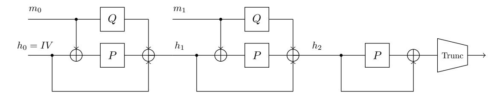

Fig. 7: Grøstln <sup>2</sup> with two message blocks

<span id="page-21-1"></span>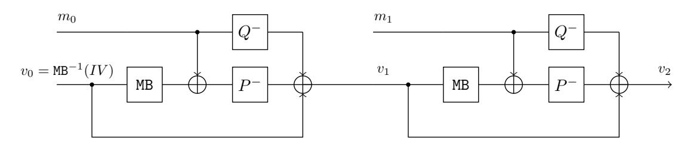

Fig. 8: An alternative description of Grøstln <sup>2</sup> with two message blocks

active chaining value v1. Then a sequence of local rebound attacks is performed to cancel the differences in the chaining values "column" by "column", which eventually leads to a full collision. The differential trails employed to trigger such cancellations are shown in Figure [11](#page-31-0) in Supplementary Material [A.](#page-31-1)

However, if we adopt a series of similar differential trails in the attack on 4-round Grøstl-512, we end up with impossible differentials (see Figure [12](#page-32-0) in Supplementary Material [A](#page-31-1) for examples) such that the cancellation of the last "column" never happens. To overcome this difficulty, we have to cancel multiple "columns" at once during the rebound attack over the final message block, which increases the time complexity significantly. To minimize the complexity penalty due to the multiple-column cancellation, we apply the MILP model to the last two steps to find two truncated differential trails to cancel the differences in the last two chaining values before the collision. The identified trails are depicted in Figure [13,](#page-33-0) where in the last step we attempt to cancel 16 active bytes at once, and the numbers of inactive S-boxes for the 16 super S-boxes SSB of the inbound phase (see Figure [9\)](#page-22-0) are given as

$$(s_0, s_1, \dots, s_{15}) = (7, 7, 6, 7, 7, 7, 5, 3, 4, 4, 4, 4, 4, 4, 5, 7).$$

### <span id="page-21-2"></span>6.2 Classical and Quantum Collision Attacks on 4-round Grøstl-512

Based on the differential trails given in Figure [13](#page-33-0) in Supplementary Material [A,](#page-31-1) a classical collision attack on 4-round Grøstl-512 can be constructed. The strategy of the attack generally follows the strategy of [\[34\]](#page-29-17) with a critical difference at the initial difference injection. The attack of [\[34\]](#page-29-17) starts with an arbitrary fully active chaining value v1. In our attack, we impose additional conditions on the fully active chaining value v1. We now clarify these conditions.

From Figure [13](#page-33-0) we can see that for a fixed initial pair of message blocks (m0, m<sup>0</sup> 0 ), the difference of the cells of the chaining states v<sup>i</sup> keeps unchanged throughout the entire attack unless they are canceled. Therefore, to force the chaining values following the specified differential trails for the last two-column 

{22}------------------------------------------------

cancellation, we can pretest some cells of  $\Delta v_1$ , which are marked by blue cells in Figure 13, and the required differential transformation is depicted in Figure 9.

<span id="page-22-0"></span>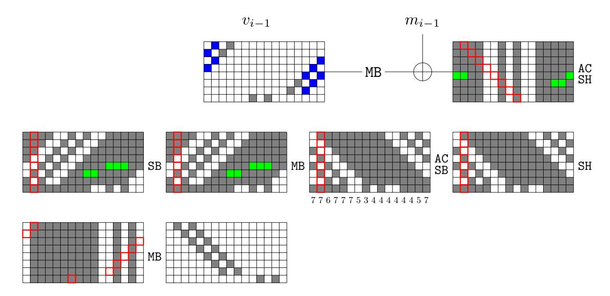

Fig. 9: The inbound phase of the last step of the collision attack on Grøstl-512. The gray and blue bytes are active, but there are conditions on blue bytes. The green bytes are inactive due to the conditions imposed on the blue cells.

Specifically, we introduce some conditions on some active bytes (marked by blue) within some columns in the chaining values. For example, in  $v_{i-1}$  of Figure 13, there are 10 blue bytes. In the first column of  $v_{i-1}$ , the two active blue bytes have to meet the condition for the differential propagation:

$$(0, *, 0, *, 0, 0, 0, 0, 0)^T \xrightarrow{\text{MB}} (*, *, *, *, 0, *, *, *)^T.$$

Similar conditions for other blue bytes in the other 4 columns are also needed. For randomly selected pair  $(m_0, m'_0)$ , the output difference  $\Delta v_1$  meets the conditions in the blue bytes with probability  $2^{-8\times5} = 2^{-40}$ . Hence, with  $2^{40}$   $(m_0, m'_0)$  pairs, we are expected to find one correct pair.

In summary, this attack starts with a fully differentially active  $v_1$  fulfilling the required conditions by injecting a random difference at  $m_0$ , repeats local rebound-like attacks over the subsequent message blocks to cancel the differences column by column until there are only two differentially active columns, and a final rebound attack is employed to cancel the last two active columns as a whole. The colliding pair is of the form:  $M = (m_0, m_1, \dots, m_t)$  and  $M' = (m'_0, m_1, \dots, m_t)$ , that is, only the starting message block  $m_0$  has a difference. The procedure of the attack is outlined in the following.

1. Choose arbitrary  $2^{40}$  message blocks  $m_0$ ,  $m'_0$  and compute the difference  $\Delta v_1 = v_1 \oplus v'_1$  with conditions on five columns satisfied in the blue bytes. Since the probability is  $2^{-40}$  for a random pair  $(m_0, m'_0)$ , we are expected to find one right pair.

{23}------------------------------------------------

- 2. Perform rebound attacks over the message block  $m_1$ . Note that the input difference  $\Delta_{in}$  of the inbound phase is fixed due to  $\Delta v_1$ , and the output difference  $\Delta_{out}$  of the inbound phase has 8 active cells as shown in Figure 13. Using the full-active-super S-box technique  $^9$ , we can generate  $2^0 \times 2^{64} = 2^{64}$  messages  $m_1$  (starting points) such that the pair  $(m_1 \oplus \text{MB}(v_1), m_1 \oplus \text{MB}(v_1'))$  respect the given inbound differential. With regards to the outbound differential, the truncated differential  $(8 \to 8 \to 8)$  given in Figure 13 holds with probability 1, and the 8-bytes cancellation due to the feed-forward exclusive-or happens with probability  $2^{-64}$ . Therefore, we expect one of  $2^{64}$  starting points to fulfill the one-column local collision, and the time complexity of this step is about  $2^{64}$ .
- 3. Repeat step 2 with the corresponding differential trails to inactivate the differences of the chaining values column by column until only two active columns remain.
- 4. Eliminate the last two active columns with the same strategy of step 2. Since there are 16 active bytes in the output difference of the inbound differential, we can obtain  $2^{16\times8}=2^{128}$  starting points with time complexity  $2^{128}$  by using the super S-box technique. With regard to the outbound differential, the truncated differential  $16 \to 16 \to 16$  holds with probability 1, and the two-column cancellation happens with probability  $2^{-128}$ . Therefore, we can obtain the desired collision with  $2^{128}$  starting points.

The time complexity of the attack is dominated by Step 4 of the above procedure, which is about  $2^{128}$ . The storage of the super-Sbox leads to a memory complexity of  $2^{64}$ . Finally, we find a collision for the 4-round Grøstl-512 with about 16 message blocks. A quantum version of the same attack on 4-round Grøstl-512 with or without qRAMs can be constructed based on the same method given in Section 4 and Section 5, and we refer the reader to Supplementary Material B for the details.

#### 6.3 Classical and Quantum Collision attacks on 5-Round Grøst1-512

The 4-round collision attack can be extended to a 5-round collision attack shown in Figure 14 in Supplementary Material A, where the probabilities of the outbound phases of the rebound attacks are  $2^{-56}$  and  $2^{-112}$  (the last step). When a local rebound attack fails to produce the local collision on a column, we will perform the same attack on the next message block until the desire difference cancellations occur. Therefore, how many message blocks are used in the attack is unknown before we reach a full collision. We briefly summarize the attack on 5-round Grøst1-512 below:

<span id="page-23-0"></span><sup>&</sup>lt;sup>9</sup> There are at least one full-active super S-box among the 16 ones, which bounds the memory complexity in this step in classical setting. Hence, we do not need the non-full-active super S-box technique here. The non-full-active super S-box technique is only used in the quantum attack versions.

{24}------------------------------------------------

- 1. Choose arbitrary message blocks  $m_0$ ,  $m'_0$  and compute the difference  $\Delta v_1 = v_1 \oplus v'_1$  until the required conditions on the blue cells are satisfied. We are expected to find one correct pair after  $2^{40}$  repetitions.
- 2. Perform rebound attacks over the message block  $m_1$ . Note that the input difference  $\Delta_{in}$  of the inbound phase is fixed due to  $\Delta v_1$ , and the output difference  $\Delta_{out}$  of the inbound phase has 8 active cells. Using the full-active super S-box technique, we can generate  $2^0 \times 2^{64} = 2^{64}$  messages  $m_1$  (starting points). With regards to the outbound differential, the truncated differential  $(128 \to 64 \to 8 \to 1 \to 8 \to 8)$  holds with probability  $2^{-56}$ , and the 8-bytes cancellation due to the feed-forward exclusive-or happens with probability  $2^{-64}$ . Therefore, we can obtain the desired difference for the chaining value with probability  $2^{64} \times 2^{-56} \times 2^{-64} = 2^{-56}$  with  $2^{64}$  time complexity. If we are failed to get the desired difference, we perform the same attack over the next message block with the chaining values produced previously. We will succeed in canceling the 8-byte difference after about  $2^{56}$  additional message blocks are processed.
- 3. Repeat step 2 with the corresponding differential trails to inactivate the differences of the chaining values column by column until only two active columns remain.
- 4. Eliminate the last two active columns with the same strategy of step 2. The success probability of the local rebound attack performed in this step is different from others. Since there are 16 active bytes in the output difference of the inbound differential, we can obtain 2<sup>16×8</sup> = 2<sup>128</sup> starting points with time complexity 2<sup>128</sup> by using the super S-box technique. With regard to the outbound differential, the truncated differential trail 88 → 96 → 16 → 2 → 16 → 16 holds with probability 2<sup>-112</sup>, and the two-column cancellation happens with probability 2<sup>-128</sup>. Therefore, we can obtain the desired collision with probability 2<sup>128</sup> × 2<sup>-112</sup> × 2<sup>-128</sup> = 2<sup>-112</sup> with 2<sup>128</sup> time complexity (within this step). If we fail to get the collision, repeating Step 4 with about 2<sup>112</sup> additional message blocks will achieve the collision.

The time complexity of the attack is dominated by step 4, which can be estimated as  $2^{112} \times 2^{128} = 2^{240}$ . The storage of the super S-box leads to a memory complexity of  $2^{64}$ . Finally, we find a collision with about  $2^{112}$  message blocks. A quantum version of the same attack can be constructed, which is quite similar to the attack given in Supplementary Material B. We repeat a quantum version of Step 4 for  $2^{112}$  times to find a collision. The time complexity of the quantum attack with  $2^{16}$  qRAMs is  $2^{88.37} \times 2^{112} = 2^{200.4}$ , and the time complexity of the quantum attack without qRAMs is  $2^{89.3} \times 2^{112} = 2^{201.3}$ .

### <span id="page-24-0"></span>7 Semi-Free-Start Collision Attacks on Grøst1-256

So far, the best collision attack on 6-round Grøstl-256 is a semi-free-start collision attack with time complexity  $2^{120}$  and memory complexity  $2^{64}$ . Based on the truncated differential trail covering 6-round Grøstl-256 found by the MILP

{25}------------------------------------------------

technique, which is depicted in Figure 10, we can improve this attack in both the classical and quantum settings.

<span id="page-25-0"></span>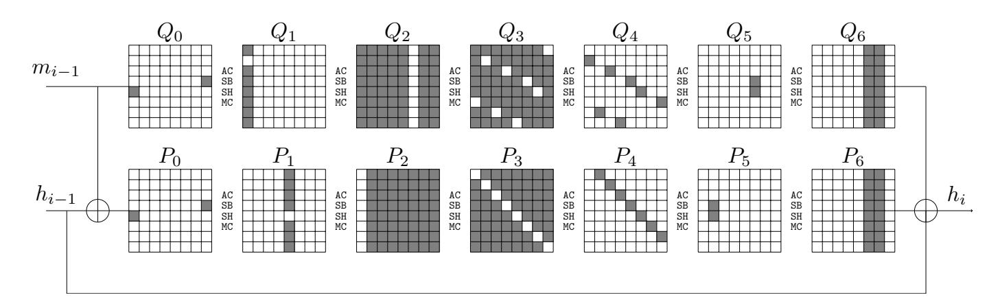

Fig. 10: Differential trail of the compression function of 6-round Grøstl-256

The Classical Attack. Two rebound attacks are applied to P and Q separately. The inbound phase of the rebound attack on P begins at  $P_2$  and ends at  $P_4$ . There are  $2^{56} \times 2^{56} = 2^{112}$  input-output differences in total, and we expect to find  $2^{112}$  starting points with  $2^{112}$  time complexity based on the super S-box technique. In the outbound phase, the probability for fulfilling the outbound truncated differential trail is  $2^{-48} \times 2^{-48} = 2^{-96}$ . Therefore, we can produce  $2^{112} \times 2^{-96} = 2^{16}$  pairs respecting the 6-round truncated differential covering P with time complexity  $2^{112}$ . Similarly, performing a rebound attack with time complexity  $2^{112}$  over Q generates  $2^{16}$  pairs respecting the truncated differential trail covering Q. Combining the results of the two rebound attacks, we obtain  $2^{16} \times 2^{16} = 2^{32}$  quartets  $((P_0, P'_0), (Q_0, Q'_0))$ , among which we expect to identify  $2^{32} \times 2^{-16} \times 2^{-16} = 1$  quartet such that  $\Delta Q_0 = \Delta P_0$  and  $\Delta P_6 = \Delta Q_6$ . This leads to a semi-free-start collision with  $m_{i-1} = Q_0$ ,  $m'_{i-1} = Q'_0$ , and  $h_{i-1} = Q_0 \oplus P_0 = Q'_0 \oplus P'_0$ . The time complexity of the attack about  $2^{112}$ , and we need  $2^{64}$  memory to apply the super S-box technique.

The Quantum Attack without qRAMs. The quantum attack is also based on the differential trails shown in Figure 10. Given an inbound differential  $(\Delta_{in}^P, \Delta_{out}^P) \in \mathbb{F}_2^{56} \times \mathbb{F}_2^{56}$  for the permutation P. If there is a starting point respecting the given inbound differential, then one can generate  $2^7$  different starting points, which are indexed by  $\alpha_P \in \mathbb{F}_2^7$ . We define  $F_P : \mathbb{F}_2^{56} \times \mathbb{F}_2^{56} \times \mathbb{F}_2^7 \to \mathbb{F}_2$  such that  $F_P(\Delta_{in}^P, \Delta_{out}^P, \alpha_P) = 1$  if and only if there is a starting point respecting the inbound differential  $(\Delta_{in}^P, \Delta_{out}^P)$  and the particular starting point indexed by  $\alpha_P$  also conforming with the outbound differential of P. The probability of the outbound phase is  $2^{-48-48} = 2^{-96}$ . Therefore, given  $(\Delta_{in}^P, \Delta_{out}^P, \alpha_P)$ ,  $F_P(\cdot)$  return 1 with probability of  $2^{-96-7} = 2^{-103}$ .

Applying Grover algorithm with certainty to the quantum oracle  $\mathcal{U}_{F_P}$  which is constructed without qRAM with similar techniques shown in previous sections,

{26}------------------------------------------------

we can obtain a superposition

<span id="page-26-1"></span>
$$|\rho\rangle = \frac{1}{\sqrt{\{x \in \mathbb{F}_2^{119} : F_P(x) = 1\}}} \sum_{F_P(x)=1} |x\rangle,$$
 (8)

where 
$$\sqrt{\{x \in \mathbb{F}_2^{119} : F_P(x) = 1\}} \approx \sqrt{2^{56} \times 2^{56} \times 2^7 \times 2^{-103}} \approx \sqrt{2^{16}}$$
.

As shown in the generalized version of Algorithm 2, given parameters (d = 8, c = 8, s), where s is the sum of the non-active bytes of the input-output differential of the non-full-active super S-box, we have to traverse  $2^{(d-s)c+s}$  to find the conforming pair of super S-box (an s-bit auxiliary variable to specify which value to choose within the pair obtained by accessing s DDT). To find a conforming pair for the super S-box, we also define a similar  $G^{(i)}$  as defined in Algorithm 5. According to the Eq. (6), the time complexity to implement  $G^{(i)}$  is about 4(d-s)+s, with s DDT accesses and 4(d-s) small Sbox evaluations. Here, we only considering the attack without storing DDT in qRAM. Hence, s DDT accesses become s implementations of Grover algorithm to find a conforming pair for the s S-boxes. Hence, the time complexity to search on  $U_{G^{(i)}}$  using Grover algorithm is about

<span id="page-26-0"></span>
$$2 \cdot \frac{\pi}{4} \cdot \sqrt{2^{(d-s)c+s}} \cdot (4(d-s) + s \cdot (\frac{\pi}{4} \cdot \sqrt{2^c})), \text{ S-box evaluations.}$$
 (9)

Considering the non-full-active super S-boxes in Figure 10, the sum of non-active Sboxes in each SSB is s=2. Hence, to find a conforming pair with given input and output differences of SSB, the time complexity is about  $2^{31.27}$  S-box evaluations according to Eq. (9), which is about  $2^{31.27}/768 = 2^{21.68}$  6-round Grøst1-256 without qRAM.

When applying Grover algorithm to setup  $F_P$ , we need about  $\frac{\pi}{4} \cdot \sqrt{2^{96+7} \cdot 8} \cdot 2^{21.68} \approx 2^{75.8}$  6-round Grøstl-256 without qRAM to get the desired superposition in Eq. (8).

Similarly, applying Grover search to  $F_Q$ , where  $F_P(\Delta_{in}^Q, \Delta_{out}^Q, \alpha_Q) = 1$  if and only if there is a starting point respecting the inbound differential  $(\Delta_{in}^Q, \Delta_{out}^Q)$  and the particular starting point indexed by  $\alpha_Q$  also conforming with the outbound differential of Q. With the same complexity of the first Grover search, we obtain a superposition

$$|\varrho\rangle = \frac{1}{\sqrt{\{x \in \mathbb{F}_2^{119} : F_Q(x) = 1\}}} \sum_{F_Q(x)=1} |x\rangle,$$
 (10)

where  $\sqrt{\{x \in \mathbb{F}_2^{119} : F_Q(x) = 1\}} \approx \sqrt{2^{56} \times 2^{56} \times 2^7 \times 2^{-103}} \approx \sqrt{2^{16}}$ .

Now, we are ready to perform the amplitude amplification with  $\mathcal{A}$  being the unitary operator sending  $|0\rangle$  to  $|\rho\rangle\otimes|\varrho\rangle$  and projector  $\sum_{x\in\mathbb{C}}|x\rangle\langle x|$ , where  $\mathbb{C}$  is the set of all  $(\Delta_{in}^Q,\Delta_{out}^Q,\alpha_Q;\Delta_{in}^P,\Delta_{out}^P,\alpha_P)\in\mathbb{F}_2^{238}$  such that the starting points due to  $(\Delta_{in}^Q,\Delta_{out}^Q,\alpha_Q)$  and  $(\Delta_{in}^P,\Delta_{out}^P,\alpha_P)$  produce a semi-free-start collision. As shown in Figure 10, the probability that  $\Delta Q_0=\Delta P_0$  and  $\Delta Q_6=\Delta P_6$ , which lead a collision, is about  $2^{-16}\times 2^{-16}=2^{-32}$ . The complexity to find a collision without qRAM is  $\sqrt{2^{32}}\cdot 2\cdot 2^{75.8}\approx 2^{92.8}$  6-round Grøst1-256.

{27}------------------------------------------------

### <span id="page-27-5"></span>8 Conclusion

In this work, we show that the amount of qRAMs required by the quantum attacks on AES-MMO and AES-MP proposed by Hosoyamada and Sasaki can be significantly reduced with only a slight increase in the time complexity. This is achieved by performing a quantum version of the rebound attack based on the non-full-active super S-box technique. Along the way, we find that the non-fullactive super S-box analysis can be partially automated with the MILP approach, which is of independent interest, leading to improved attacks on Grøstl in both the classical and quantum settings. To the best our knowledge, our attacks are the first dedicated quantum collision attack on hash functions that slightly outperform Chailloux, Naya-Plasencia, and Schrottenloher's generic attack (ASI-ACRYPT 2017) in a model where large qRAMs are not available.

Acknowledgments. We thank the anonymous reviewers for their helpful and detailed comments. This work is supported by the National Key Research and Development Program of China (Grant No. 2018YFA0704701, 2018YFA0704704), the Major Program of Guangdong Basic and Applied Research (Grant No. 2019B030302008), the National Key Research and Development Program of China (Grant No. 2017YFA0303903), Major Scientific and Techological Innovation Project of Shandong Province, China (Grant No. 2019JZZY010133), the Chinese Major Program of National Cryptography Development Foundation (No.MMJJ20180101, MMJJ20180102), and the National Natural Science Foundation of China (No. 61902207, 61772519, 61802400).

### References

- <span id="page-27-4"></span>1. Srinivasan Arunachalam, Vlad Gheorghiu, Tomas Jochym-O'Connor, Michele Mosca, and Priyaa Varshinee Srinivasan. On the robustness of bucket brigade quantum RAM. In TQC 2015, May 20-22, 2015, Brussels, Belgium, pages 226– 244, 2015.
- <span id="page-27-0"></span>2. Xavier Bonnetain, Akinori Hosoyamada, Mar´ıa Naya-Plasencia, Yu Sasaki, and Andr´e Schrottenloher. Quantum attacks without superposition queries: The offline Simon's algorithm. In ASIACRYPT 2019, Kobe, Japan, December 8-12, 2019, Proceedings, Part I, pages 552–583, 2019.
- <span id="page-27-3"></span>3. Xavier Bonnetain, Mar´ıa Naya-Plasencia, and Andr´e Schrottenloher. On quantum slide attacks. In SAC 2019, Waterloo, ON, Canada, August 12-16, 2019, pages 492–519, 2019.
- <span id="page-27-2"></span>4. Xavier Bonnetain, Mar´ıa Naya-Plasencia, and Andr´e Schrottenloher. Quantum security analysis of AES. IACR Trans. Symmetric Cryptol., 2019(2):55–93, 2019.
- <span id="page-27-6"></span>5. Gilles Brassard, Peter Hoyer, Michele Mosca, and Alain Tapp. Quantum amplitude amplification and estimation. Contemporary Mathematics, 305:53–74, 2002.
- <span id="page-27-1"></span>6. Gilles Brassard, Peter Høyer, and Alain Tapp. Quantum cryptanalysis of hash and claw-free functions. In LATIN '98, Campinas, Brazil, April, 20-24, 1998, Proceedings, pages 163–169, 1998.

{28}------------------------------------------------

- <span id="page-28-4"></span>7. Andr´e Chailloux, Mar´ıa Naya-Plasencia, and Andr´e Schrottenloher. An efficient quantum collision search algorithm and implications on symmetric cryptography. In ASIACRYPT 2017, Hong Kong, China, December 3-7, 2017, Proceedings, Part II, pages 211–240, 2017.
- <span id="page-28-9"></span>8. Joan Daemen and Vincent Rijmen. The Design of Rijndael: AES - The Advanced Encryption Standard. Information Security and Cryptography. Springer, 2002.
- <span id="page-28-10"></span>9. Ivan Damg˚ard. A design principle for hash functions. In CRYPTO '89, Santa Barbara, California, USA, August 20-24, 1989, Proceedings, pages 416–427, 1989.
- <span id="page-28-7"></span>10. Xiaoyang Dong, Bingyou Dong, and Xiaoyun Wang. Quantum attacks on some Feistel block ciphers. Des. Codes Cryptogr., 88(6):1179–1203, 2020.
- <span id="page-28-11"></span>11. Praveen Gauravaram, Lars R. Knudsen, Krystian Matusiewicz, Florian Mendel, Christian Rechberger, Martin Schl¨affer, and Søren S. Thomsen. Grøstl - a SHA-3 candidate. In Symmetric Cryptography, 11.01. - 16.01.2009, 2009.
- <span id="page-28-12"></span>12. Henri Gilbert and Thomas Peyrin. Super-sbox cryptanalysis: Improved attacks for aes-like permutations. In FSE 2010, Seoul, Korea, February 7-10, 2010, pages 365–383, 2010.
- <span id="page-28-3"></span>13. Vittorio Giovannetti, Seth Lloyd, and Lorenzo Maccone. Architectures for a quantum random access memory. Physical Review A, 78(5):052310, 2008.
- <span id="page-28-2"></span>14. Vittorio Giovannetti, Seth Lloyd, and Lorenzo Maccone. Quantum random access memory. Physical review letters, 100(16):160501, 2008.
- <span id="page-28-5"></span>15. Lorenzo Grassi, Mar´ıa Naya-Plasencia, and Andr´e Schrottenloher. Quantum algorithms for the k -xor problem. In ASIACRYPT 2018, Brisbane, QLD, Australia, December 2-6, 2018, Proceedings, Part I, pages 527–559, 2018.
- <span id="page-28-0"></span>16. Lov K. Grover. A fast quantum mechanical algorithm for database search. In Proceedings of the Twenty-Eighth Annual ACM Symposium on the Theory of Computing, Philadelphia, Pennsylvania, USA, May 22-24, 1996, pages 212–219, 1996.
- <span id="page-28-13"></span>17. Chun Guo, Jonathan Katz, Xiao Wang, and Yu Yu. Efficient and secure multiparty computation from fixed-key block ciphers. IACR Cryptol. ePrint Arch., 2019:74, 2019.
- <span id="page-28-1"></span>18. Akinori Hosoyamada and Yu Sasaki. Cryptanalysis against symmetric-key schemes with online classical queries and offline quantum computations. In CT-RSA 2018, San Francisco, CA, USA, April 16-20, 2018, Proceedings, pages 198–218, 2018.
- <span id="page-28-6"></span>19. Akinori Hosoyamada and Yu Sasaki. Quantum demiric-sel¸cuk meet-in-the-middle attacks: Applications to 6-round generic feistel constructions. In SCN 2018, Amalfi, Italy, September 5-7, 2018, pages 386–403, 2018.
- <span id="page-28-8"></span>20. Akinori Hosoyamada and Yu Sasaki. Finding hash collisions with quantum computers by using differential trails with smaller probability than birthday bound. In Advances in Cryptology - EUROCRYPT 2020 - 39th Annual International Conference on the Theory and Applications of Cryptographic Techniques, Zagreb, Croatia, May 10-14, 2020, Proceedings, Part II, pages 249–279, 2020.
- <span id="page-28-16"></span>21. Samuel Jaques, Michael Naehrig, Martin Roetteler, and Fernando Virdia. Implementing grover oracles for quantum key search on AES and LowMC. In EU-ROCRYPT 2020, Zagreb, Croatia, May 10-14, 2020, Proceedings, Part II, pages 280–310, 2020.
- <span id="page-28-14"></span>22. J´er´emy Jean, Mar´ıa Naya-Plasencia, and Thomas Peyrin. Improved rebound attack on the finalist grøstl. In FSE 2012, Washington, DC, USA, March 19-21, 2012, pages 110–126, 2012.
- <span id="page-28-15"></span>23. J´er´emy Jean, Mar´ıa Naya-Plasencia, and Thomas Peyrin. Multiple limitedbirthday distinguishers and applications. In SAC 2013, Burnaby, BC, Canada, August 14-16, 2013, pages 533–550, 2013.

{29}------------------------------------------------

- <span id="page-29-15"></span>24. J´er´emy Jean, Mar´ıa Naya-Plasencia, and Martin Schl¨affer. Improved analysis of ECHO-256. In SAC 2011, Toronto, ON, Canada, August 11-12, 2011, pages 19–36, 2011.
- <span id="page-29-3"></span>25. Marc Kaplan, Ga¨etan Leurent, Anthony Leverrier, and Mar´ıa Naya-Plasencia. Breaking symmetric cryptosystems using quantum period finding. In CRYPTO 2016, Santa Barbara, CA, USA, August 14-18, 2016, Proceedings, Part II, pages 207–237, 2016.
- <span id="page-29-6"></span>26. Marc Kaplan, Ga¨etan Leurent, Anthony Leverrier, and Mar´ıa Naya-Plasencia. Quantum differential and linear cryptanalysis. IACR Trans. Symmetric Cryptol., 2016(1):71–94, 2016.
- <span id="page-29-12"></span>27. Marcel Keller, Emmanuela Orsini, and Peter Scholl. MASCOT: faster malicious arithmetic secure computation with oblivious transfer. In Proceedings of the 2016 ACM SIGSAC Conference on Computer and Communications Security, Vienna, Austria, October 24-28, 2016, pages 830–842, 2016.
- <span id="page-29-1"></span>28. Hidenori Kuwakado and Masakatu Morii. Quantum distinguisher between the 3 round feistel cipher and the random permutation. In ISIT 2010, June 13-18, 2010, Austin, Texas, USA, Proceedings, pages 2682–2685, 2010.
- <span id="page-29-2"></span>29. Hidenori Kuwakado and Masakatu Morii. Security on the quantum-type evenmansour cipher. In ISITA 2012, Honolulu, HI, USA, October 28-31, 2012, pages 312–316, 2012.
- <span id="page-29-10"></span>30. Mario Lamberger, Florian Mendel, Christian Rechberger, Vincent Rijmen, and Martin Schl¨affer. Rebound distinguishers: Results on the full whirlpool compression function. In ASIACRYPT 2009, Tokyo, Japan, December 6-10, 2009. Proceedings, pages 126–143, 2009.
- <span id="page-29-13"></span>31. Mario Lamberger, Florian Mendel, Martin Schl¨affer, Christian Rechberger, and Vincent Rijmen. The rebound attack and subspace distinguishers: Application to whirlpool. J. Cryptology, 28(2):257–296, 2015.
- <span id="page-29-4"></span>32. Gregor Leander and Alexander May. Grover meets simon - quantumly attacking the FX-construction. In ASIACRYPT 2017, Hong Kong, China, December 3-7, 2017, Proceedings, Part II, pages 161–178, 2017.
- <span id="page-29-9"></span>33. Florian Mendel, Christian Rechberger, Martin Schl¨affer, and Søren S. Thomsen. The rebound attack: Cryptanalysis of reduced whirlpool and grøstl. In FSE 2009, Leuven, Belgium, February 22-25, 2009, pages 260–276, 2009.
- <span id="page-29-17"></span>34. Florian Mendel, Vincent Rijmen, and Martin Schl¨affer. Collision attack on 5 rounds of grøstl. In FSE 2014, London, UK, March 3-5, 2014, pages 509–521, 2014.
- <span id="page-29-7"></span>35. Alfred Menezes, Paul C. van Oorschot, and Scott A. Vanstone. Handbook of Applied Cryptography. CRC Press, 1996.
- <span id="page-29-8"></span>36. Ralph C. Merkle. A certified digital signature. In CRYPTO '89, Santa Barbara, California, USA, August 20-24, 1989, Proceedings, pages 218–238, 1989.
- <span id="page-29-16"></span>37. Nicky Mouha, Qingju Wang, Dawu Gu, and Bart Preneel. Differential and linear cryptanalysis using mixed-integer linear programming. In Inscrypt 2011, Beijing, China, November 30 - December 3, 2011, pages 57–76, 2011.
- <span id="page-29-14"></span>38. Mar´ıa Naya-Plasencia. How to improve rebound attacks. In CRYPTO 2011, Santa Barbara, CA, USA, August 14-18, 2011. Proceedings, pages 188–205, 2011.
- <span id="page-29-5"></span>39. Mar´ıa Naya-Plasencia and Andr´e Schrottenloher. Optimal merging in quantum k-xor and k-sum algorithms. IACR Cryptology ePrint Archive, 2019:501, 2019.
- <span id="page-29-11"></span>40. Michael A. Nielsen and Isaac L. Chuang. Quantum Computation and Quantum Information (10th Anniversary edition). Cambridge University Press, 2016.
- <span id="page-29-0"></span>41. NIST. The post quantum project. [https://csrc.nist.gov/projects/](https://csrc.nist.gov/projects/post-quantum-cryptography) [post-quantum-cryptography](https://csrc.nist.gov/projects/post-quantum-cryptography).

{30}------------------------------------------------

- <span id="page-30-3"></span>42. Yu Sasaki, Yang Li, Lei Wang, Kazuo Sakiyama, and Kazuo Ohta. Non-full-active super-sbox analysis: Applications to ECHO and grøstl. In ASIACRYPT 2010, Singapore, December 5-9, 2010. Proceedings, pages 38–55, 2010.
- <span id="page-30-4"></span>43. Martin Schl¨affer. Updated differential analysis of grøstl. Grøstl website (January 2011), 2011.
- <span id="page-30-0"></span>44. Peter W. Shor. Algorithms for quantum computation: Discrete logarithms and factoring. In 35th Annual Symposium on Foundations of Computer Science, Santa Fe, New Mexico, USA, 20-22 November 1994, pages 124–134, 1994.
- <span id="page-30-1"></span>45. Daniel R. Simon. On the power of quantum computation. SIAM journal on computing, 26(5):1474–1483, 1997.
- <span id="page-30-5"></span>46. Siwei Sun, Lei Hu, Peng Wang, Kexin Qiao, Xiaoshuang Ma, and Ling Song. Automatic security evaluation and (related-key) differential characteristic search: Application to SIMON, PRESENT, LBlock, DES(L) and other bit-oriented block ciphers. In ASIACRYPT 2014, Kaoshiung, Taiwan, R.O.C., December 7-11, 2014. Proceedings, Part I, pages 158–178, 2014.
- <span id="page-30-2"></span>47. Huiqin Xie and Li Yang. Quantum impossible differential and truncated differential cryptanalysis. CoRR, abs/1712.06997, 2017.

{31}------------------------------------------------

## **Supplementary Material**

## <span id="page-31-1"></span>A Differential trails of Grøstl

<span id="page-31-0"></span>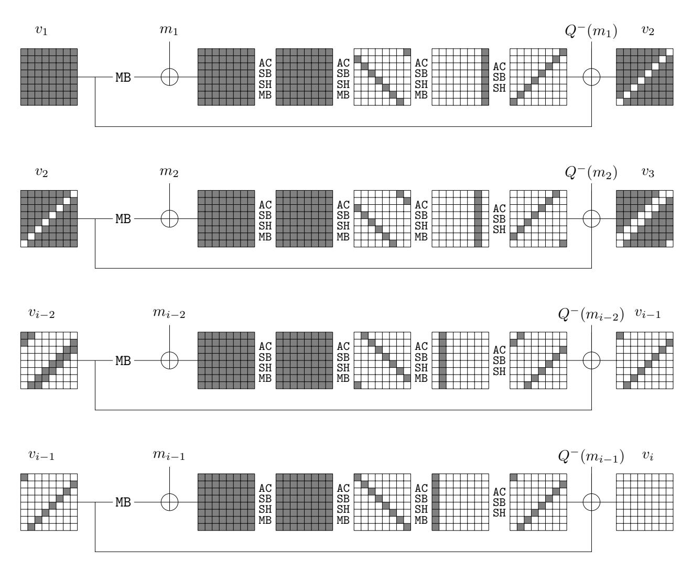

Fig. 11: Mendel et al.'s collision attack on 5-round Grøstl-256 [34]

{32}------------------------------------------------

<span id="page-32-0"></span>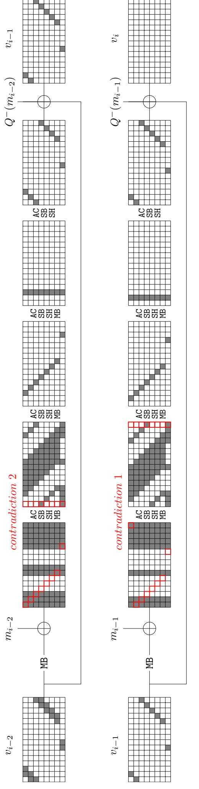

Fig. 12: Contradiction 1 and 2 in the truncated trail of Grøstl-512

{33}------------------------------------------------

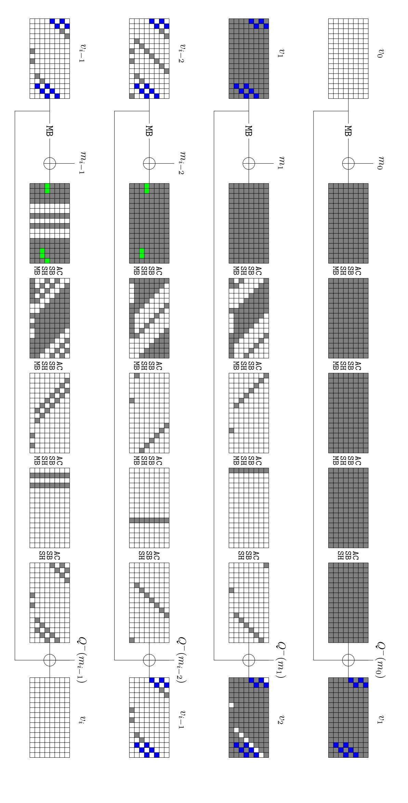

<span id="page-33-0"></span>Fig. 13: The collision attack on 4-round Grøstl512. The gray and blue bytes are active, but there are conditions on blue bytes. The green bytes are inactive due to the conditions imposed on the blue cells.

{34}------------------------------------------------

<span id="page-34-0"></span>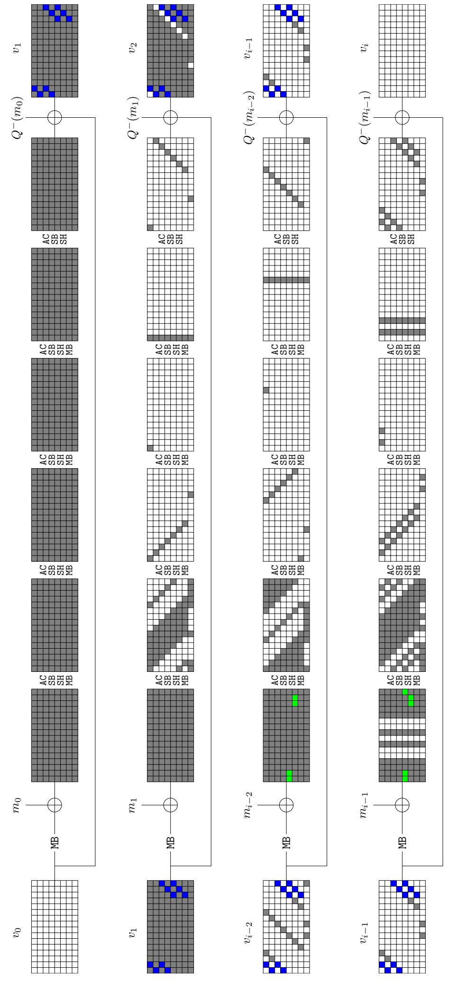

Fig. 14: Collision attacks on 5-round <code>Grøstl-512</code>, where the green cells are inactive due to the conditions imposed on the blue cells.

{35}------------------------------------------------

#### <span id="page-35-0"></span>B Quantum collision attacks on 4-round Grøst1-512

We can covert the classical attack on 4-round Grøst1-512 into a quantum one (see Figure 13). We can refer the classical 4-round attack on Section 6.2 to better understand the following quantum one.

- 1. We use Grover search to find the right pair with complexity about  $2^{20}$ , that satisfying the conditions in the blue bytes.
- 2. We use Grover algorithm to search the  $2^{64}$  possible  $(\Delta_{in}, \Delta_{out})$  to check whether it cancel the 8 active bytes in the chaining value. We define similar F function as the attack on AES-MMO,

$$F: \mathbb{F}_2^{64} \times \mathbb{F}_2^{15} \to \mathbb{F}_2 \tag{11}$$

in a way such that  $F(\Delta_{in}; \Delta_{out}, \alpha)$ , where  $\Delta_{out} \in \mathbb{F}_2^{64}$  and  $\alpha = \alpha_0 \|\alpha_1\| ... \|\alpha_{14} \in \mathbb{F}_2^{15}$ .  $\alpha$  is a 15-bit auxiliary variable and  $\alpha_i \in \mathbb{F}_2^1$  is to specify which value to choose within the pair obtained by the  $SSB_i$ .  $F(\Delta_{in}; \Delta_{out}, \alpha) = 1$  if we traverse  $2^{64+15}$  possible  $(\Delta_{out}, \alpha)$  and obtain an 8-byte cancellation in the chaining value, otherwise F = 0.

Given  $(\Delta_{in}, \Delta_{out})$ , we obtain the input-output differences  $(\Delta_{in}^{(i)}, \Delta_{out}^{(i)})$  for each SSB<sub>i</sub>  $(0 \le i \le 15)$ . We use the method given by Hosoyamada and Sasaki [20] to search the conforming pair for each SSB<sub>i</sub>, which costs about  $\sqrt{2^{64}} = 2^{32}$ . Hence, the total complexity to search  $U_F$  using Grover is about  $\sqrt{2^{64+15}} \times 2^{32} = 2^{71.5}$ .

3. To cancel the last two columns, we define  $F(\Delta_{in}; \Delta_{out}, \alpha)$ , where  $\Delta_{out} \in \mathbb{F}_2^{128}$  and  $\alpha \in \mathbb{F}_2^{15}$ .  $F(\Delta_{in}; \Delta_{out}, \alpha) = 1$  if we traverse  $2^{128+15}$  possible  $(\Delta_{out}, \alpha)$  and obtain an 16-byte cancellation in the chaining value, otherwise F = 0. Since this step dominates the whole collision attack, we analyze the complexity in details.

As shown in Fig. 9, in the inbound phase, given  $(\Delta_{in}, \Delta_{out})$ , we obtain the input-output differences  $(\Delta_{in}^{(i)}, \Delta_{out}^{(i)})$  for each  $SSB_i$   $(0 \le i \le 15)$ . Here we apply the non-full-active Super S-box technique to find the conforming pair of each  $SSB_i$ , which is a similar function  $G^{(i)}$  used in the attack on AES-MMO. A similar Algorithm 3 is defined to implement a similar  $U_{G^{(i)}}$  that computes the conforming pair.

As shown in Section 2, given parameters (d=8,c=8,s), where s is the sum of the non-active bytes of the input-output differential of the non-full-active SSB, we have to traverse  $2^{(d-s)c+s}$  to find the conforming pair of SSB (an s-bit auxiliary variable to specify which value to choose within the pair obtained by accessing s DDT). Hence, the time complexity to implement  $G^{(i)}$  with DDT stored in qRAM is about 4(d-s)+s (s DDT accesses and 4(d-s) small S-box evaluations). Hence, according to Eq. (6), we see that the complexity is dominated by s, the number of non-active S-boxes of the input-output differential of SSB. s is smaller, the time complexity is larger. Note that in Fig. 9, among the 16 SSB, the smallest s is 3, which dominates the complexity of the 16 non-full-active SSB evaluations. Hence, the time complexity is about

{36}------------------------------------------------

 $2 \cdot \frac{\pi}{4} \cdot \sqrt{2^{(8-3)8+3}} \cdot (4(8-3)+3) = 2^{26.67}$  S-boxes evaluations, which is equivalent to  $2^{26.67}/1024 = 2^{16.67}$  4-round Grøstl-512 evaluations <sup>10</sup>. Similarly, for s=4, the time complexity is about  $2^{12.97}$  4-round Grøstl-512 evaluations. There are 6 SSB with s=4. The time complexities for other SSB can be ignored.

Hence, the time complexity to search  $F(\Delta_{in}; \Delta_{out}, \alpha)$  with Grover is  $\frac{\pi}{4} \cdot \sqrt{2^{128+15}} \cdot (2^{16.67} + 6 \cdot 2^{12.97}) = 2^{88.37}$  4-round Grøstl-512. We also need  $2^{16}$  qRAM to store DDT.

Quatum attack without storing DDT in qRAM. We can also do not store DDT like the attack on 7-round AES-MMO. When implementing  $G^{(i)}$  without DDT similarly to Alg. 5. We have to use Grover search on s active S-boxes which bounds the time complexity of implementing  $G^{(i)}$ , which need about  $2 \cdot \frac{\pi}{4} \cdot \sqrt{2^8} \cdot s$  S-boxes evaluations. Hence, using Grover search on  $G^{(i)}$ , the time complexity is  $\frac{\pi}{4} \cdot \sqrt{2^{(d-s)c+s}} \cdot 2 \cdot \frac{\pi}{4} \cdot \sqrt{2^8} \cdot s$  S-box evaluations. When (d=8,c=8,s=3), it is about  $2^{27.39}$  S-box evaluations, which is equivalent to  $2^{27.39}/1024 = 2^{17.39}$  4-round Grøst1-512. When (d=8,c=8,s=4), it is about  $2^{24.3}$  S-box evaluations, which is equivalent to  $2^{14.3}$  4-round Grøst1-512.

Hence, the time complexity to search  $F(\Delta_{in}; \Delta_{out}, \alpha)$  with Grover is  $\frac{\pi}{4}$  ·  $\sqrt{2^{128+15}} \cdot (2^{17.39} + 6 \cdot 2^{14.3}) = 2^{89.3}$  4-round Grøstl-512. We do not need qRAM to store DDT here.

### <span id="page-36-0"></span>C On the Grover search in small space from Algorithm 4

Suppose we are performing Grover search on a space with size N, where T elements are good. According to Grover's algorithm, we need to perform  $k = \lceil \frac{\pi}{4\theta} \rceil$  Grover iterations, where  $\theta$  is defined via  $sin^2(\theta) = \frac{T}{N}$ . Hence,  $k = \lceil \frac{\pi}{4arcsin(\sqrt{T/n})} \rceil$  When  $\frac{T}{N}$  is sufficiently small,  $\theta = arcsin(\sqrt{\frac{T}{N}}) \approx \sqrt{\frac{T}{N}}$ , therefore, we approximate  $\theta$  by  $\sqrt{\frac{T}{N}}$ . Hence,  $k \approx \frac{\pi}{4} \cdot \sqrt{\frac{N}{T}}$ . In Algorithm 4, the Grover search is performed on the space with size  $N = 2^{11}$ , where the number of good elements is expected to be T = 1. We get  $1/arcsin(\sqrt{\frac{T}{N}}) = 45.254$  and  $1/\sqrt{\frac{T}{N}} = 45.251$ . The gap is very small, hence, in Algorithm 4 we can approximate  $\theta$  by  $\sqrt{\frac{T}{N}}$ .

### <span id="page-36-1"></span>D On the success probability of $\mathcal{U}_F$

Given nonzero input-output differences for S-box of AES, the probability that it has solutions is 127/255.

We take the first non-full-active SSB as example, corresponding to  $G^{(0)}$ . Please look at Figure 4, given input-output differences of SSB, we guess A[0], then  $\Delta B[0]$  is known. Then, all the other differences are determined due to

<span id="page-36-2"></span>There are  $4 \times 2 \times 128 = 1024$  S-boxes evaluations in a 4-round Grøstl-512

{37}------------------------------------------------

MixColumn. Now there are 4 active S-boxes whose input-output differences have to match through DDT of S-boxes, the probability is about  $(127/255)^4$ .

- 1) If there is no solution by traversing  $2^{11}$  for  $G^{(0)}$ . That means for each guessing of A[0], we do not have a valid matching for the 4 active S-boxes. The probability is  $p = (1-(127/255)^4)^{2^8} = 8.7 \times 10^{-8}$ . In this case, run Grover search on  $\mathcal{U}_G$ , it will definitely output an invalid starting point. Since there are 4 nonfull SSB, we get an invalid starting point with  $Pr = 1 (1-p)^4 = 3.48 \times 10^{-7}$ , which is almost 0.
- 2) If there are solutions by traversing  $2^{11}$  for  $G^{(0)}$ . The probability is  $1-8.7\times 10^{-8}$  for a random given input of  $G^{(0)}$ . After about  $1/arcsin(2^{-11/2})\approx 2^{11/2}\approx 45.25$  Grover iterations, we get the superposition with good states with probability of about  $1-2^{-11}$  due to the Grover's algorithm. We just consider the worst case that there is only one solution.

Since there are 4 SSB, for a given input of  $U_F$ , we get a valid starting point with probability  $(1 - 8.7 \times 10^{-8})^4 \times (1 - 2^{-11})^4 = 0.998$ . Therefore, we get a collision pair with probability  $Pr_s = 0.998 \times 2^{-83}$ . Then we run about  $\frac{\pi}{4} \cdot \sqrt{1/Pr_s}$  Grover iterations to get a collision.