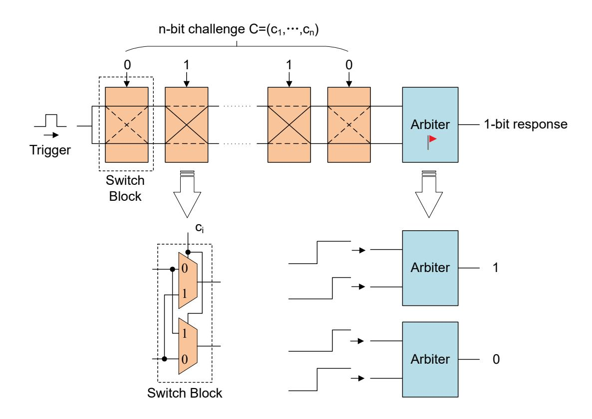
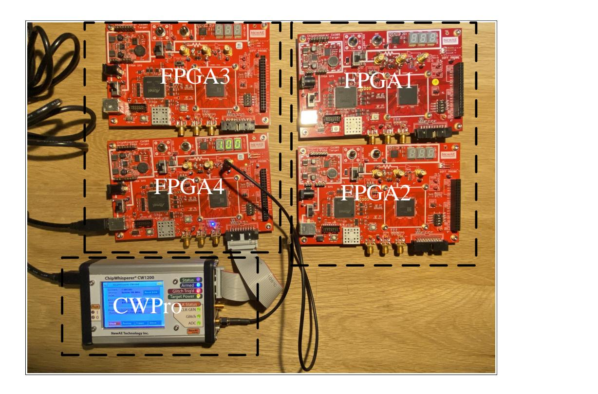
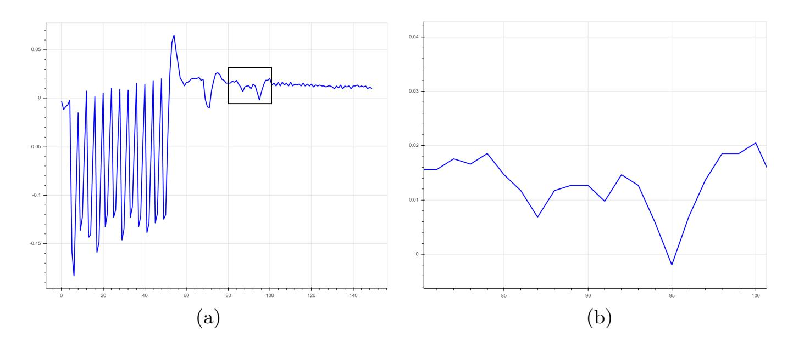

{0}------------------------------------------------

# Profiled Deep Learning Side-Channel Attack on a Protected Arbiter PUF Combined with Bitstream Modification

Yang Yu, Michail Moraitis, and Elena Dubrova

KTH Royal Institute of Technology, Electrum 229, Kista, Sweden {yang11, micmor, dubrova}@kth.se

**Abstract.** In this paper we show that deep learning can be used to identify the shape of power traces corresponding to the responses of a protected arbiter PUF implemented in FPGAs. To achieve that, we combine power analysis with bitstream modification. We train a CNN classifier on two 28nm XC7 FPGAs implementing 128-stage arbiter PUFs and then classify the responses of PUFs from two other FPGAs. We demonstrate that it is possible to reduce the number of traces required for a successful attack to a single trace by modifying the bitstream to replicate PUF responses.

**Keywords:** Profiled attack · deep learning · side-channel analysis · bit-stream modification · arbiter PUF.

### 1 Introduction

Physical Unclonable Functions (PUFs) utilize variations in the characteristics of transistors and interconnects which naturally occur when integrated circuits (ICs) are fabricated to create responses that are unique to individual ICs [26,43]. Since the process variation cannot be controlled during the IC fabrication, a hardware clone of a PUF cannot be created. Due to these properties, PUFs are often used as device "fingerprints" [9,59]. Furthermore, a PUF generates its responses only upon request. Thus, the responses can only be captured by an attacker during a short time interval when the PUF is challenged. It has also been shown that physical attacks on powered-on devices are more difficult than the attacks on power-off devices [52]. These features make PUFs an appealing tamper-resistant cryptographic primitive.

Ideally, it should not be possible to predict the response of a PUF to a new challenge with a probability higher than 50% regardless of how many Challenge-Response Pairs (CRPs) have been observed. However, many PUFs, including the ring oscillator PUFs and the Arbiter PUFs (APUFs), are vulnerable to machine learning-based modelling attacks [2,49]. After observing a large number of CRPs, it is possible to create a PUF model which simulates the PUF's the response to any challenge with high accuracy. To strengthen a PUF's resistance to modelling attacks, different modifications have been proposed, including XOR PUFs [25],

{1}------------------------------------------------

lightweight PUFs [31], feed-forward PUFs [26], and interpose PUFs [42]. It has also been proposed to encrypt/hash the challenges and/or the responses [12, 14].

Our Contribution. In this paper, we show that a deep-learning side-channel attack can overcome cryptographic protection and "learn" the shape of power traces corresponding to the "0" and "1" responses of an FPGA implementation of an APUF if power analysis is complemented with bitstream modification. We train a Convolutional Neural Network (CNN) classifier on one or two Xilinx Artix-7 28nm Field Programmable Gate Arrays (FPGAs) implementing 128 stage APUFs and then classify responses of APUFs from two other FPGAs. We demonstrate that it is possible to reduce the number of traces required for a successful attack to a single trace by modifying its bitstream to replicate the synchronous flip-flop holding the PUF's response. Those redundant flip-flops change the signal-to-noise ratio in favour of the attacker.

One of our interesting findings is that, it is possible to attack APUF implementations with a larger number of additional flip-flops using the classifier trained on APUF implementations with a smaller number of additional flip-flops, although more traces are required from the victim APUF in this case.

While the idea to combine side-channel attacks and fault injection attacks is not new [24, 44], we have not seen any work combining side-channel analysis with bitstream modification.

Previous Work. The modelling attacks on strong PUFs can be classified into two major groups: the machine learning-based and the side-channel-based [41]. In the former, the adversary uses CRPs from a victim PUF to learn a PUF's software model with some machine-learning algorithm, e.g. Support-Vector Machine (SVM) [25], Logistic Regression (LR) [2, 49, 58], or deep learning [20].

In the latter, information about some secret intermediate value, for example k individual APUF responses of an k-XOR APUF, is first extracted by power [3, 10, 29, 50], EM [32] or timing analysis [10, 50]. This information is then used to construct a software model of the PUF using some machine-learning algorithm.

The attack presented in this paper belongs to the latter class. However, unlike previous side-channel attacks on PUFs, it is done in a profiling setting: we first train a deep-learning classifier on one set of PUF instances and then attack another set of PUF instances. While profiled side-channel attacks are known to work well on ASIC and FPGA implementations of cryptographic algorithms [23,60], to the best of our knowledge, the only profiled attack on PUFs is the template attack presented in [16]. In this attack, one 128-stage k-XOR APUF instance is used to build k + 1 templates (one per each possible Hamming weight of the k-bit vector of the individual APUFs) at the profiling stage, for k = 8 and 16. At the attack stage, these templates are used to classify responses of a different 128-stage k-XOR APUF instance with up to 80% accuracy. The FPGAs used are Virtex 5 and Spartan 6 devices from Xilinx.

We believe that our work is the first profiled side-channel attack on strong PUFs based on deep-learning. By combining side-channel analysis with bitstream 

{2}------------------------------------------------

modification, we are capable to classify responses of a victim PUF instance based on a single power trace with very high accuracy.

Note that, even if the victim PUF is reconfigured after each session and the same PUF instance is never used for generating the response more than once (an equivalent of never using the same session key more than once), the presented attack can still recover the expected response with a high probability, even if the challenges and responses are encrypted/hashed. Previously, only photonic side-channel analysis [30, 38] could achieve that. However, it requires expensive equipment.

Obviously, if challenges are not encrypted and the PUF is not reconfigured after each session, we can collect CRPs and construct a software model of the PUF using some machine-learning algorithm, as in machine learning-based modelling attacks. In this paper we focus on the side-channel analysis phase.

Paper Organization. The rest of the paper is organized as follows. Section 2 provides background information on PUFs. Section 3 presents deep-learning sidechannel attacks. Section 4 describes our experimental setup. Section 5 explains how our classifiers were trained with a CNN model. Section 6 summarizes the experimental results. Section 7 concludes this paper and discusses open problems.

# 2 Physical Unclonable Functions

This section provides background information on PUFs.

### 2.1 Classification of PUFs

PUFs are classified according to the number of challenges they accept into weak and strong ones. A weak PUF can accept only one or a few challenges per PUF instance. Examples of weak PUFs are coating PUFs [59] and Static Random Access Memory (SRAM) based PUFs [9]. A strong PUF can accept many challenges, in some cases up to 2n, where n is the challenge size. Ring oscillator PUFs [53] and APUFs [26] are examples of strong PUFs.

### 2.2 Arbiter PUF

An APUF generates a response by measuring the propagation delay of a signal across all switch blocks. The conventional n-stage APUF with 2×2 switch blocks, shown in Figure 1, generates a 1-bit response to an n-bit challenge by letting two symmetrically designed paths to compete. Each switch block i has two inputs, two outputs, and one control input ci ∈ {0, 1}. If ci = 0, straight connections are selected. Otherwise, crossed connections are selected. Each n-bit challenge C = (c1, . . . , cn) thus makes a unique selection of two out of 2n possible paths. A pulse is applied at the input and it propagates in parallel through n switch blocks before arriving at the arbiter block. The arbiter outputs either 0 or 1 depending

{3}------------------------------------------------

#### 4 Y. Yu, et al.

Fig. 1. A block diagram of an n-stage APUF.

on which path, upper or lower, the pulse arrives first. In this way, a "random" Boolean function of n arguments c1, . . . , cn is induced:

$$f(C) = \operatorname{sgn}(\Delta(C)), \tag{1}$$

where ∆(C) is the delay difference of the upper and lower paths for the challenge C and sgn is defined as sgn(x) = 1 if x ≥ 0 otherwise sgn(x) = 0.

The function f is "random" in the sense that we do not know its output values before the PUF is fabricated. Once the PUF is fabricated, the function becomes deterministic (in the error-free case). Small differences in delays caused by manufacturing process variation result in different functions in the individual PUF instances. Extensions of APUF based on 4 × 4 switch blocks has also been proposed [11].

### 2.3 Model of Arbiter PUF

Apart from physical cloning, predicting a PUF's responses should be infeasible as well. However, for any n-input APUF, a linear additive delay model of size n + 1 exists with the form:

$$\Delta(C) = \sum_{i=1}^{n+1} w_i \Phi_i(C) = \langle w, \Phi(C) \rangle$$
 (2)

{4}------------------------------------------------

where w and  $\Phi$  are the *delay vector* and the *parity* (or *feature*) *vector*, respectively, defined by

$$w_1 = \delta_{0,1} - \delta_{1,1},$$
  

$$w_i = \delta_{0,i-1} + \delta_{1,i-1} + \delta_{0,i} - \delta_{1,i}, \text{ for } 2 \le i \le n$$
  

$$w_{n+1} = \delta_{0,n} + \delta_{1,n}.$$

where  $\delta_{0,i}$  is the delay difference of straight connections of the switch block  $i, \delta_{1,i}$  is the delay difference of crossed connections of switch block i, for  $i \in \{1, \ldots, n\}$ , and

$$\Phi_i(C) = \sum_{j=i}^n (1 - 2c_j), \text{ for } 1 \le i \le n, 
\Phi_{n+1} = 1,$$
(3)

where challenge bit  $c_j \in \{1, -1\}$ .

### 3 Deep Learning Side-Channel Analysis

This section describes how deep learning is used in the context of side-channel analysis.

#### 3.1 Side-Channel Analysis

Usually the goal of side-channel analysis is to recover the key of some cryptographic algorithm. To recover an n-bit  $k \in \mathcal{K}$  key, where  $\mathcal{K}$  is the set of all possible keys, the attacker uses of a set of known input data  $\mathcal{X}$  (e.g. the plaintext) and a set of the physical measurements  $\mathcal{L}$  (e.g. power consumption). Typically a divide-and-conquer strategy is applied in which the key k is divided into m-bit parts  $k_i$ , called subkeys, and the subkeys  $k_i$  are recovered independently, for  $i \in \{1, 2, \ldots, \frac{n}{m}\}$ .

After the attack, the attacker gets  $\frac{n}{m}$  vectors of probabilities  $p_i = (p_{i,1}, p_{i,2}, \ldots, p_{i,2^m})$ , where  $p_{i,j}$  is the probability that the subkey  $k_i = j$  is the right subkey, for  $j \in \{1, 2, \ldots, 2^m\}$ . The estimation metrics defined below are used to guide the selection of the right candidate.

#### 3.2 Deep Learning-Based Analysis

Deep learning can be used in side-channel analysis in two settings: profiled and unprofiled. *Profiled* attacks [4,6,21,28,45–47,51] first learn a leakage profile of the cryptographic algorithm under attack, and then attack. *Unprofiled* attacks [57] attack directly, as the traditional Differential Power Analysis [22] or Correlation Power Analysis (CPA) [5]. In this paper we focus on profiled attacks.

Profiled deep-learning side-channel attacks assume that:

- 1. The attacker has a device, called the *profiling* device, which is similar to the device under attack.
- 2. The attacker has full control over the profiling device.

{5}------------------------------------------------

Fig. 2. Equipment for power analysis.

3. The attacker has physical access to the victim device for a limited time.

At the profiling stage, a deep-learning classifier is trained to learn a leakage profile of the device for all possible values of the sensitive variable. The training is typically done using a large number of traces captured from the profiling device which are labelled according to the selected leakage model.

At the attack stage, the trained classifier is used to classify the traces captured from the victim device.

## 4 Experimental Setup

The section describes our experimental setup.

#### 4.1 Equipment for Power Analysis

The equipment we use for power analysis is shown in Figure 2. It consists of one CW1200 ChipWhisperer-Pro and four CW305 Artix FPGA boards of two types: XC7A100T-2FTG256 and XC7A35T-2FTG256.

The ChipWhisperer is a hardware security evaluation toolkit based on a combination of open-source hardware and supporting tools [39]. The ChipWhisperer-Pro is a capture hardware with the maximum sampling rate of 10 Msamples/sec. It is used to measure power consumption over the shunt resistor placed between power supply and FPGA chip of the target device and communicate between target device and computers.

Each of the CW305 Artix FPGA boards contains a Xilinx Artix-7 FPGA chip, a custom USB interface for connecting to the FPGA, an external phase-locked

{6}------------------------------------------------

loop for synchronizing frequency with the ChipWhisperer-Pro, a 20-pin serial communication port to the ChipWhisperer-Pro, and other features useful for power analysis and fault injection attacks.

The FPGAs were running at 10MHz and sampled at 40MHz (i.e. 4 data points per cycle). In the sequel, we refer to them as F1, F2 (XC7A100T-2FTG256) and F3, F4 (XC7A35T-2FTG256).

#### 4.2 Power Trace Acquisition

To collect training data, p power traces Ti are captured from each profiling device during the execution of the APUF for randomly selected challenges Ci . The corresponding single-bit responses of the APUF, ri = f(Ci), where f is APUF's function (1), are recorded as labels, for all i ∈ {1, 2, . . . , p}.

To collect testing data, power traces are captured from each victim device during the execution of the APUF for n randomly selected challenges. Each challenge Ci is repeated m times to collect traces T j i , for j ∈ {1, 2, . . . , m} and i ∈ {1, 2, . . . , n}, So, in total n × m traces are collected from each victim device.

### 4.3 Locating a PUF's Response in a Trace

Fig. 3(a) shows a power trace representing the computation of a single-bit response by a 128-stage APUF (with 100 extra FFs, see Section 6.5) for the case when challenges are encrypted by AES-128. One can clearly see the distinct shape of the 10 rounds of AES-128 followed by the APUF evaluation. So, an attacker can easily identify the segment of the trace corresponding to the PUF evaluation (shown in Fig. 3(b)) and focus the deep-learning training on this segment.

For the case when responses are encrypted or hashed, the segment of the trace corresponding to the PUF evaluation can be identified similarly.

## 5 Training of Classifiers

In this section we describe how classifiers are trained using a deep-learning model.

#### 5.1 Choice of Neural Network Type

Previous work investigated which type of deep neural networks is suitable for various side-channel analysis scenarios. For example, Convolutional Neural Networks (CNNs) can overcome trace misalignment and jitter-based countermeasure [7, 15, 45]. If traces are synchronized and there is no need to handle noise, Multilayer Perceptron (MLP) networks are typically chosen.

In our case, traces are perfectly aligned because we use ChipWhisperer for trace acquisition. However, noise is an issue. Artix-7 FPGAs which are used in our experiments are fabricated with TSMC 28nm high-k metal gate, High Performance, Low power (HPL) process technology [33]. Due to a number of static and dynamic power saving features, the total power consumption of Artix-7

{7}------------------------------------------------

**Fig. 3.** A power trace from a 128-stage APUF FPGA implementation (with 100 extra FFs) in which challenges are encrypted with AES-128. (b) Zoomed-in segment representing the APUF evaluation.

FPGAs is up to 50% lower compared to 45nm generation devices [18]. Typically low-power circuits are highly sensitive to noise. For this reason, we opted for CNNs.

#### 5.2 Training Process

Given a set of power traces  $\{T_1, \ldots, T_p\}$  for challenges  $\{C_1, \ldots, C_p\}$  the objective is to classify each trace  $T_i$  according to its response  $r_i = f(C_i)$ , where f is APUF's function  $\{1\}$ , for  $i \in \{1, \ldots, p\}$ .

A neural network can be viewed as a function  $M: \mathbb{R}^d \to \mathbb{I}^2$  which maps a trace  $T_i \in \mathbb{R}^d$  into a *score* vector  $S_i = M(T_i) \in \mathbb{I}^2$  whose elements  $s_{i,j}$  represent the probability of the response  $r_i$  to have the value  $j \in \{0,1\}$ , where d is the number of data points in  $T_i$  and  $\mathbb{I} := \{x \in \mathbb{R} \mid 0 \le x \le 1\}$ .

We use *categorical cross-entropy loss* to quantify the classification error of the network. To minimize the loss, the gradient of the loss with respect to the score is computed and back-propagated through the network to tune its internal parameters according to the *RMSprop* optimizer, which is one of the advanced adaptations of the Stochastic Gradient Decent (SGD) algorithm [48]. This is repeated for a chosen number of iterations called *epochs*.

Once the network is trained, to classify a trace  $T_i$  whose response  $r_i$  is unknown, we determine the most likely response  $\tilde{r}$  among the two candidates as

$$\tilde{r} = \underset{i \in \{0,1\}}{\operatorname{arg max}} S_i. \tag{4}$$

If  $\tilde{r} = r_i$ , the classification is successful.

#### 5.3 Choice of Neural Network Architecture

The architecture of CNN used in our experiments is shown in Table 1. The network contains an input layer, one convolution layer, one pooling layer, one

{8}------------------------------------------------

flatten layer, three dense layers and an output layer. The input size (150, 1) corresponds to the total number of data samples in the trace, d = 150. The output size 2 corresponds to the number of labels, i.e. possible different responses.

| Layer Type     | Output Shape # Parameters |       |
|----------------|---------------------------|-------|
| Input          | (None, 150, 1)            | 0     |
| Conv1D         | (None, 150, 11)           | 55    |
| AveragePooling | (None, 75, 11)            | 0     |
| Flatten        | (None, 825)               | 0     |
| Dense 1        | (None, 32)                | 26432 |
| Dense 2        | (None, 32)                | 1056  |
| Dense 3        | (None, 32)                | 1056  |
| Output (Dense) | (None, 2)                 | 66    |

Total Parameters: 28,665

# 6 Experimental Results

This section presents experimental results. All experiments are performed on 128-stage APUFs implemented in several different ways.

For the training of CNN classifiers, for each implementation, p = 500K traces in total were captured for randomly selected challenges from our profiling FPGAs. Among them, 100K traces were randomly selected for validation during training.

For testing the CNN classifiers, for each implementation, n = 100 groups of traces were captured for 100 randomly selected challenges from all of the FPGAs. In each group, the same challenge was repeated m times to collect traces. The number of repetitions m within each group varied from 500 to 10K based on our expectations for the outcome, which is much more than needed so that the extra randomness gives consistency to the results.

Given m test traces Ti , i ∈ {1, . . . , m}, are captured for the same challenge Ci , to determine the APUF response ri to Ci using the CNN classifier M, we first combine the score vectors Si = M(Ti) by element-wise majority voting and then apply arg max to the result as in equation (4).

### 6.1 Attacking a Conventional APUF

We trained CNN classifiers on 500K traces captured from our implementation of a 128-stage APUF on FPGA F1 using the process described in Section 5.2. We tried many different options for learning rate, learning rate decay, number of epochs, and number of dense and convolutional layers. However, in all cases the validation accuracy remained 0.58, which is the expected fraction of "1"s in our slightly biased APUF implementation. We concluded that, for our APUF

{9}------------------------------------------------

implementation, it is very difficult to classify "0" and "1" responses with a high accuracy.

We would like to stress that this conclusion may not apply to other APUF implementations. The complexity of power analysis varies a lot for different implementation types. For example, implementations which route the output of all APUF instances to the output pins, as the interpose PUF implementation analyzed in [1], are typically easier to handle since output pins have high load capacitance and thus contribute more to dynamic power consumption. As another example, Becker and Kumar [3] have shown in that power analysis is easier for the case when the single-bit APUF responses are accumulated in a shift register (which is necessary if the response vector is encrypted by a block cipher).

In our APUF implementations, the output of APUF is not routed directly to an output pin and APUF responses are not accumulated in a shift register.

#### 6.2 Modifying the Bitstream to Replicate the APUF Response

The attacker may be able to strengthen the APUF response signal by modifying the bitstream implementing the APUF. The bitstream can be extracted from the victim FPGA, for example, by reading the bitstream with a probe when it is transferred from the Flash memory to the FPGA during configuration. Several successful bitstream modification attacks on FPGA implementations of encryption algorithms have been demonstrated recently, including AES [54], SNOW 3G [36], and Trivium [40]. Countermeasures currently available in commercial FPGA devices against bitstream modification do not provide sufficient protection. Bitstream encryption can be defeated by extracting the encryption key stored on-chip by side-channel analysis [34, 35], optical probing [56], thermal laser stimulation [27], or by exploiting the Starbleed vulnerability [13] which allows the attacker to use the FPGA as a decryption oracle. Secret proprietary bitstream obfuscation algorithms are typically broken a few years after the introduction of each new FPGA family. For example the X-Ray project provides a bitstream documentation database for Xilinx XC7 devices [55]. Recently proposed opaque predicates obfuscation technique [17] is very promising, but not yet available in commercial FPGAs.

In our experiments, we consider two different attack scenarios:

Scenario 1: The victim APUF has a constant placement and the attacker has zero knowledge about the design.

Scenario 2: APUF is frequently reconfigured and the attacker has zero knowledge about the design.

In both cases, the attack steps are:

- 1. Retrieve the bitstream from the victim FPGA.
- 2. Add the extra FFs through bitstream modification.
- 3. Load the modified bitstream on the the profiling FPGA and train the classifier.
- 4. Load the modified bitstream on the victim FPGA and perform the attack.

{10}------------------------------------------------

In both scenarios, the attacker does not need to take care of the pre- or postprocessing modules since they do not affect the attack. If far field electromagnetic emissions [8] are used instead of the power consumption as a side channel, then the attacker can potentially extract the key on a distance from the target device. Note that it is also potentially possible to get a remote access to the FPGA's JTAG or SelectMAP configuration interface and the bitstream of the device under attack. For example, if the FPGA is configured using a microcontroller connected to the FPGA's SelectMAP or JTAG interface and the microcontroller is connected to a network, then the attacker can access to the microcontroller via the remote channel by installing a rootkit, as in the Thrangrycat attack on Cisco routers [19]. The bitstream of the device under attack can be extracted from the firmware of the microcontroller [13].

### 6.3 Proof of concept

To prove that bitstream modification attacks are applicable to APUFs, we manually routed in 50 redundant flip flops (FF's) into a bitstream implementing the 128-stage APUF on FPGA F4. The redundant FFs were added directly after the FF implementing the arbiter. Each redundant FF takes the arbiter FF's output as its input. The outputs of redundant FFs are not connected to any load. To add the FFs, we used the interconnect-oriented bitstream modification approach presented in [37].

The bitstream modification process consists of two steps. The first is finding the target in the bitstream. In our case, the target is the FF implementing the arbiter which holds the response of the APUF. To find it, we start from the output pin and backtrack by examining which Programmable Interconnects (PIPs) are activated and which FPGA elements are enabled. Every time we find a FF in the path, we check its clock input CLK. If it is a regular clock, we continue. Otherwise, its the FF implementing the arbiter which is clocked with the signal from one of the competing paths.

The second step is to create the redundant FFs and route them. The arbiter FF's output Q is directly fed to the D input of another FF with a synchronous clock. This is the flip-flop that we want to replicate. To do this, we search for unused FDRE1 elements and corresponding unused routing paths that lead from the arbiter FF to their D input. Every time we find an unused FDRE-routing pair, we route it by activating the necessary PIPs. It is important to do that rather than first finding all the flip-flops and then routing because some of the routing paths may be overlapping. Once the routing is placed, we enable the FFs and route their clock CLK, clock enable CE and synchronous reset SR inputs to the same sources as the flip-flop we are replicating by following the same process (finding valid routing paths and enabling their corresponding PIPs one at a time).

Since the redundant FFs are added after the arbiter response, the propagation delays of paths determining the APUF's functionality are not affected. So, when

1 FDRE is the name of D flip-flops with clock enable CE and synchronous reset SR in Xilinx XC7 FPGAs [61].

{11}------------------------------------------------

Table 2. Average number of traces required to recover the APUF response from the implementation with N = 50 manually added extra FFs (for 100 tests).

F4 is used for profiling

| N  | Victim FPGA |       |
|----|-------------|-------|
|    | F3          | F4    |
| 50 | 30.44       | 32.02 |

the modified bitstream is loaded back into the FPGA, it implements the same APUF instance as the original bitstream. However, the APUF response signal is considerably strengthened 50 times.

Table 2 shows the results from the attacks on the FPGAs F3 and F4 running the modified bitstream with 50 manually added redundant FFs using the CNN classifier trained on the FPGA F4 running the bitstream generated by Vivado from the APUF HDL code with 50 redundant flip-flops. As we can see, the redundant FFs enable the recovery of the APUF response from the FPGAs F3 and F4 using 30.44 and 32.02 traces on average, respectively.

To further investigate how the number of extra FFs affects the expected number of traces, we carried additional experiments with different degrees of redundancy. However, since manual addition of FFs to the bitstream is a tedious process, in the rest of the experiments, the bitstreams are generated from Vivado with the redundant FFs added on the design's HDL description.

#### 6.4 Adding Redundant Flip-Flops in Different Ways

We analyzed two cases of redundant FF addition.

In the first case, case 1, the redundant FFs take the arbiter FF's output as their input and do not connect their output to any load (as in the case of manually routed bitstream discussed in the previous subsection).

In the second case, case 2, the redundant FFs' outputs are (indirectly) connected to an output pin by a path through a wrapper implementing Chip-Whisperer's communication protocol.

Tables 3 and 4 show the results for three different profiling settings: (a) F1 is used for profiling, (b) F4 is used for profiling, and (c) F1 and F4 are used for profiling. Recall from Section 4.3 that the boards for F1 and F2 are mounted with a XC7A100T-2FTG256 FPGA, while the boards for F3 and F4 are mounted with a XC7A35T-2FTG256 FPGA.

We can see that in case 2 the number of traces required for a successful attack is considerably lower compared to the one in Table 3. This is because, in case 2, there is a path connecting each redundant FF to the output pin. As we discussed in Section 6.1, power analysis of such an APUF implementation is easier.

{12}------------------------------------------------

Table 3. Average number of traces required to recover the APUF response from the implementation with N extra FFs for the case 1 (for 100 tests).

(a) F1 is used for profiling

| N   | Victim FPGA |         |
|-----|-------------|---------|
|     | F1          | F2      |
| 350 | 1.64        | 2.15    |
| 200 | 3.62        | 6.27    |
| 150 | 7.2         | 15.06   |
| 100 | 11.99       | 26.58   |
| 50  | * -      | 1422.77 |

(b) F4 is used for profiling

| N   | Victim FPGA |       |
|-----|-------------|-------|
|     | F3          | F4    |
| 350 | 1.06        | 1.09  |
| 200 | 2.2         | 1.88  |
| 150 | 3.94        | 3.59  |
| 100 | 10.67       | 10.18 |
| 50  | 38.67       | 61.73 |

(c) F1 and F4 are used for profiling

| N   | Victim FPGA |        |       |        |
|-----|-------------|--------|-------|--------|
|     | F1          | F2     | F3    | F4     |
| 350 | 1.67        | 2.2    | 1.2   | 1.32   |
| 200 | 4.06        | 4.67   | 2.64  | 2.38   |
| 150 | 6.99        | 9.26   | 4.64  | 4.47   |
| 100 | 12.04       | 22.58  | 11.2  | 10.97  |
| 50  | * -      | * - | 68.87 | 241.31 |

\* The accuracy of recovering correct response within 1000 traces is below 60%

#### 6.5 Attacking a Protected APUF

To justify the claim we made in Section 4.3, we also attacked an APUF implementation in which challenges are encrypted using AES-128. The redundant FFs were added as in case 1.

Tables 5 shows the results from the case of 100 extra FFs with F4 used for profiling. We can see that there is no significant difference between the average numbers of traces required to recover the APUF response from F3 and F4 (17.57 and 8.39) and the corresponding numbers in Table 3(b)(10.67 and 10.18).

### 6.6 Profiling and Attacking APUFs with Different Number of Redundant Flip-Flops

We also investigated if it is possible to use implementations with a different number of redundant FFs for the profiling and the attack stages. Table 6 shows the results of attacks on an APUF implementation with N extra FFs using classifiers trained on APUF implementations with 50 extra FFs, for N = 100, 150, 200, 350. The redundant FFs were added as in case 1.

We can see that it is indeed possible to attack APUF implementations with a larger number of extra flip-flops even if the profiling was done on implementations with a smaller number of extra flip-flops. However, more traces are required from the victim APUF in this case.

{13}------------------------------------------------

Table 4. Average number of traces required to recover the APUF response from the implementation with N extra FFs for the case 2 (for 100 tests).

(a) F1 is used for profiling

|     | Victim FPGA |        |  |
|-----|-------------|--------|--|
| N   | F1          | F2     |  |
| 100 | 1.18        | 1.17   |  |
| 50  | 2.52        | 2.84   |  |
| 25  | 17.38       | 16.54  |  |
| 12  | * -      | 122.35 |  |

(b) F4 is used for profiling

| N   | Victim FPGA |        |  |
|-----|-------------|--------|--|
|     | F3          | F4     |  |
| 100 | 1.0         | 1.0    |  |
| 50  | 1.39        | 1.55   |  |
| 25  | 6.15        | 5.8    |  |
| 12  | 122.24      | 111.44 |  |

(c) F1 and F4 are used for profiling

| N   | Victim FPGA |       |       |       |
|-----|-------------|-------|-------|-------|
|     | F1          | F2    | F3    | F4    |
| 100 | 1.4         | 1.34  | 1.0   | 1.01  |
| 50  | 2.12        | 2.81  | 1.38  | 1.53  |
| 25  | 14.41       | 13.86 | 6.57  | 5.53  |
| 12  | 78.06       | 59.09 | 33.28 | 32.66 |

\* The accuracy of recovering correct response within 1000 traces is below 60%

Table 5. Average number of traces required to recover the APUF response from the implementation with 100 extra FFs for the case when challenges are encrypted with AES (for 100 tests).

F4 is used for profiling

| N   | Victim FPGA |      |
|-----|-------------|------|
|     | F3          | F4   |
| 100 | 17.57       | 8.39 |

Table 6. Average number of traces required to recover the response from the APUF implementation with N extra FFs for the case when profiling is done on the implementation with 50 extra FFs (for 100 tests).

F4 is used for profiling

| N   | Victim FPGA |       |
|-----|-------------|-------|
|     | F3          | F4    |
| 350 | 18.65       | 35.65 |
| 200 | 15.35       | 16.06 |
| 150 | 16.95       | 23.41 |
| 100 | 10.83       | 10.55 |

#### 6.7 Profiling and Attacking APUFs with Different Placement

We created two APUF instances with different manual placements to investigate if we can recover the response from one APUF using the classifier trained on another APUF. We refer to the two APUF instances as APUF1 and APUF2. Table 7 shows 

{14}------------------------------------------------

the results of attacks on APUF1 and APUF2 with N extra FFs using classifiers trained on APUF1 implementations with N extra FFs, for N = 200, 300, 350. The redundant FFs were added as in case 1.

We can see that it is indeed possible to use APUFs with different placements for profiling and attack stages. With enough extra FFs added, the average number of trace required for a successful attack is similar to one in case 1. However, a large number of extra FFs are required to recover the response.

Table 7. Average number of traces required to recover the response from APUF1 and APUF2 implementations with N extra FFs for the case when profiling is done on APUF1 implementation with N extra FFs on F4 (for 100 tests).

| (a) APUF1 response recovery |
|--------------------------------|
|--------------------------------|

| N   | Victim FPGA |      |
|-----|-------------|------|
|     | F3          | F4   |
| 350 | 1.06        | 1.09 |
| 300 | 1.3         | 1.17 |
| 200 | 2.2         | 1.88 |

(b) APUF2 response recovery

| N   | Victim FPGA |      |
|-----|-------------|------|
|     | F3          | F4   |
| 350 | 1.8         | 1.84 |
| 300 | 3.97        | 4.48 |
| 200 | 8.81        | 8.95 |

## 7 Conclusion

We demonstrated that profiled deep-learning side-channel attacks combined with bitstream modification can successfully classify "0" and "1" responses of an arbiter PUF implemented in 28nm FPGAs. By adding redundant flip-flops to the bitstream implementing an APUF, it is possible to reduce the number of traces required for a successful attack to a single one. Implementations with a different number of redundant FFs can be used for profiling and attack stages, although more traces are required from the victim APUF in this case.

Our results suggest that it might be possible to attack true random number generators in a similar way, which is very alarming. Furthermore, they indicate that the number of traces from a victim device required in profiled side-channel attacks on FPGA implementations of cryptographic algorithms, e.g. AES [60], can be potentially reduced by combining them with bitstream modification. This paper is hoped to attract more attention to this problem in order to intensify research efforts on designing suitable countermeasures.

# References

1. Aghaie, A., Moradi, A.: TI-PUF: Toward side-channel resistant physical unclonable functions. IEEE Transactions on Information Forensics and Security 15, 3470–3481 (2020). https://doi.org/10.1109/TIFS.2020.2986887

{15}------------------------------------------------

- 2. Becker, G.T.: The gap between promise and reality: On the insecurity of XOR arbiter PUFs. In: G¨uneysu, T., Handschuh, H. (eds.) Cryptographic Hardware and Embedded Systems – CHES 2015. pp. 535–555. Springer Berlin Heidelberg, Berlin, Heidelberg (2015)
- 3. Becker, G.T., Kumar, R.: Active and passive side-channel attacks on delay based PUF designs. IACR Cryptology ePrint Archive 2014, 287 (2014)
- 4. Bhasin, S., Chattopadhyay, A., Heuser, A., Jap, D., Picek, S., Shrivastwa, R.R.: Mind the portability: A warriors guide through realistic profiled side-channel analysis. In: Network and Distributed System Security Symposium (01 2020)
- 5. Brier, E., Clavier, C., Olivier, F.: Correlation power analysis with a leakage model. In: Joye, M., Quisquater, J.J. (eds.) Cryptographic Hardware and Embedded Systems - CHES 2004. pp. 16–29. Springer Berlin Heidelberg, Berlin, Heidelberg (2004)
- 6. Cagli, E., Dumas, C., Prouff, E.: Convolutional neural networks with data augmentation against jitter-based countermeasures. In: Fischer, W., Homma, N. (eds.) Cryptographic Hardware and Embedded Systems – CHES 2017. pp. 45–68. Springer International Publishing, Cham (2017)
- 7. Cagli, E., Dumas, C., Prouff, E.: Convolutional neural networks with data augmentation against jitter-based countermeasures. In: Fischer, W., Homma, N. (eds.) Cryptographic Hardware and Embedded Systems – CHES 2017. pp. 45–68. Springer International Publishing, Cham (2017)
- 8. Camurati, G., Francillon, A., Standaert, F.X.: Understanding screaming channels: From a detailed analysis to improved attacks. IACR Transactions on Cryptographic Hardware and Embedded Systems 2020(3), 358–401 (Jun 2020)
- 9. Chellappa, S., Clark, L.T.: SRAM-based unique chip identifier techniques. IEEE Transactions on Very Large Scale Integration (VLSI) Systems 24(4), 1213–1222 (April 2016). https://doi.org/10.1109/TVLSI.2015.2445751
- 10. Delvaux, J., Verbauwhede, I.: Side channel modeling attacks on 65nm arbiter PUFs exploiting CMOS device noise. In: 2013 IEEE International Symposium on Hardware-Oriented Security and Trust (HOST). pp. 137–142 (June 2013). https://doi.org/10.1109/HST.2013.6581579
- 11. Dubrova, E.: A reconfigurable arbiter PUF with 4 x 4 switch blocks. In: 2018 IEEE 48th International Symposium on Multiple-Valued Logic (ISMVL'2018). pp. 31–37 (May 2018). https://doi.org/10.1109/ISMVL.2018.00014
- 12. Dubrova, E., N¨aslund, O., Degen, B., Gawell, A., Yu, Y.: CRC-PUF: A machine learning attack resistant lightweight PUF construction. In: 2019 IEEE European Symposium on Security and Privacy Workshops (EuroS PW). pp. 264–271 (June 2019). https://doi.org/10.1109/EuroSPW.2019.00036
- 13. Ender, M., Moradi, A., Paar, C.: The unpatchable silicon: A full break of the bitstream encryption of Xilinx 7-series FPGAs. In: 29th USENIX Security Symposium (USENIX Security 20). USENIX Association (Aug 2020)
- 14. Gassend, B., Dijk, M.V., Clarke, D., Torlak, E., Devadas, S., Tuyls, P.: Controlled physical random functions and applications. ACM Trans. Inf. Syst. Secur. 10(4), 3:1–3:22 (Jan 2008). https://doi.org/10.1145/1284680.1284683
- 15. Gilmore, R., Hanley, N., O'Neill, M.: Neural network based attack on a masked implementation of AES. In: 2015 IEEE International Symposium on Hardware Oriented Security and Trust (HOST). pp. 106–111 (May 2015)
- 16. Hoffman, C., Gebotys, C., Aranha, D.F., Cortes, M., Ara´ujo, G.: Circumventing uniqueness of XOR arbiter PUFs. In: 2019 22nd Euromicro Conference on Digital System Design (DSD). pp. 222–229 (Aug 2019)

{16}------------------------------------------------

- 17. Hoffmann, M., Paar, C.: Stealthy opaque predicates in hardware Obfuscating constant expressions at negligible overhead. IACR Transactions on Cryptographic Hardware and Embedded Systems 2018(2), 277–297 (May 2018)
- 18. Hussein, J., Klein, M., Hart, M.: Lowering power at 28 nm with Xilinx 7 series devices (v1.3) (2015), white Paper: 7 Series FPGAs
- 19. Kataria, J., Housley, R., Pantoga, J., Cui, A.: Defeating Cisco trust anchor: A case-study of recent advancements in direct FPGA bitstream manipulation. In: 13th USENIX Workshop on Offensive Technologies (WOOT 19). USENIX Association, Santa Clara, CA (Aug 2019)
- 20. Khalafalla, M., Gebotys, C.: PUFs deep attacks: Enhanced modeling attacks using deep learning techniques to break the security of double arbiter PUFs. In: 2019 Design, Automation Test in Europe Conference Exhibition (DATE). pp. 204–209 (2019)
- 21. Kim, J., Picek, S., Heuser, A., Bhasin, S., Hanjalic, A.: Make some noise. Unleashing the power of convolutional neural networks for profiled side-channel analysis. IACR Transactions on Cryptographic Hardware and Embedded Systems 2019(3), 148–179 (May 2019)
- 22. Kocher, P., Jaffe, J., Jun, B.: Differential power analysis. In: Wiener, M. (ed.) Advances in Cryptology — CRYPTO' 99. pp. 388–397. Springer Berlin Heidelberg, Berlin, Heidelberg (1999)
- 23. Kubota, T., Yoshida, K., Shiozaki, M., Fujino, T.: Deep learning side-channel attack against hardware implementations of AES. In: 2019 22nd Euromicro Conference on Digital System Design (DSD). pp. 261–268 (Aug 2019)
- 24. Kumar, R., Burleson, W.: Side-channel assisted modeling attacks on feed-forward arbiter PUFs using silicon data. In: Mangard, S., Schaumont, P. (eds.) Radio Frequency Identification. pp. 53–67. Springer International Publishing, Cham (2015)
- 25. Lim, D.: Extracting secret keys from integrated circuits. Master's thesis, Massachusetts Institute of Technology (2004)
- 26. Lim, D., Lee, J.W., Gassend, B., Suh, G.E., van Dijk, M., Devadas, S.: Extracting secret keys from integrated circuits. IEEE Trans. on VLSI Systems 13(10), 1200– 1205 (Oct 2005). https://doi.org/10.1109/TVLSI.2005.859470
- 27. Lohrke, H., Tajik, S., Krachenfels, T., Boit, C., Seifert, J.P.: Key extraction using thermal laser stimulation. IACR Transactions on Cryptographic Hardware and Embedded Systems pp. 573–595 (2018)
- 28. Maghrebi, H., Portigliatti, T., Prouff, E.: Breaking cryptographic implementations using deep learning techniques. In: Carlet, C., Hasan, M.A., Saraswat, V. (eds.) Security, Privacy, and Applied Cryptography Engineering. pp. 3–26. Springer International Publishing, Cham (2016)
- 29. Mahmoud, A., R¨uhrmair, U., Majzoobi, M., Koushanfar, F.: Combined modeling and side channel attacks on strong PUFs. IACR Cryptol. ePrint Arch. 2013, 632 (2013)
- 30. Majzoobi, M., Koushanfar, F., Devadas, S.: FPGA PUF using programmable delay lines. In: 2010 IEEE International Workshop on Information Forensics and Security. pp. 1–6 (2010)
- 31. Majzoobi, M., Koushanfar, F., Potkonjak, M.: Testing techniques for hardware security. In: 2008 IEEE International Test Conference(ITC). pp. 1–10 (Oct 2008)
- 32. Merli, D., Heyszl, J., Heinz, B., Schuster, D., Stumpf, F., Sigl, G.: Localized electromagnetic analysis of RO PUFs. In: 2013 IEEE International Symposium on Hardware-Oriented Security and Trust (HOST). pp. 19–24 (June 2013). https://doi.org/10.1109/HST.2013.6581559

{17}------------------------------------------------

- 33. Mohsen, E.: Artix-7 FPGAs: Performance and bandwidth in a cost-optimized device (v2.5.1) (2018), white Paper: Artix-7 FPGAs
- 34. Moradi, A., Oswald, D., Paar, C., Swierczynski, P.: Side-channel attacks on the bitstream encryption mechanism of Altera Stratix II: Facilitating black-box analysis using software reverse-engineering. In: Proceedings of the ACM/SIGDA International Symposium on Field Programmable Gate Arrays. p. 91–100. FPGA '13, Association for Computing Machinery, New York, NY, USA (2013)
- 35. Moradi, A., Schneider, T.: Improved side-channel analysis attacks on Xilinx bitstream encryption of 5, 6, and 7 series. In: Int. Workshop on Constructive Side-Channel Analysis and Secure Design. pp. 71–87. Springer (2016)
- 36. Moraitis, M., Dubrova, E.: Bitstream modification attack on SNOW 3G. In: Proceedings of the 2020 Design, Automation & Test in Europe Conf. & Exhibition (DATE'20) (2020)
- 37. Moraitis, M., Dubrova, E.: Interconnect-aware bitstream modification. Cryptology ePrint Archive, Report 2020/821 (2020), https://eprint.iacr.org/2020/821
- 38. Morozov, S., Maiti, A., Schaumont, P.: An analysis of delay based PUF implementations on FPGA. In: Sirisuk, P., Morgan, F., El-Ghazawi, T., Amano, H. (eds.) Reconfigurable Computing: Architectures, Tools and Applications. pp. 382–387. Springer Berlin Heidelberg, Berlin, Heidelberg (2010)
- 39. NewAE Technology Inc.: Chipwhisperer, https://newae.com/tools/ chipwhisperer
- 40. Ngo, K., Dubrova, E., Moraitis, M.: Bitstream modification of Trivium. Cryptology ePrint Archive, Report 2020/597 (2020), https://eprint.iacr.org/2020/597
- 41. Nguyen, P.H., Sahoo, D.P.: Lightweight and secure PUFs: A survey (invited paper). In: Chakraborty, R.S., Matyas, V., Schaumont, P. (eds.) Security, Privacy, and Applied Cryptography Engineering. pp. 1–13. Springer International Publishing, Cham (2014)
- 42. Nguyen, P.H., Sahoo, D.P., Jin, C., Mahmood, K., R¨uhrmair, U., van Dijk, M.: The interpose PUF: Secure PUF design against state-of-the-art machine learning attacks. IACR Transactions on Cryptographic Hardware and Embedded Systems 2019(4), 243–290 (Aug 2019)
- 43. Pappu, R., Recht, B., Taylor, J., Gershenfeld, N.: Physical one-way functions. Science 297(5589), 2026–2030 (2002). https://doi.org/10.1126/science.1074376
- 44. Patranabis, S., Breier, J., Mukhopadhyay, D., Bhasin, S.: One plus one is more than two: A practical combination of power and fault analysis attacks on PRESENT and PRESENT-like block ciphers. In: 2017 Workshop on Fault Diagnosis and Tolerance in Cryptography (FDTC). pp. 25–32 (Sep 2017)
- 45. Perin, G., Ege, B., van Woudenberg, J.: Lowering the bar: Deep learning for side-channel analysis (white paper) (August 2018), BlackHat'2018
- 46. Pfeifer, C., Haddad, P.: Spread: a new layer for profiled deep-learning side-channel attacks. Cryptology ePrint Archive, Report 2018/880 (2018)
- 47. Prouff, E., Strullu, R., Benadjila, R., Cagli, E., Canovas, C.: Study of deep learning techniques for side-channel analysis and introduction to ASCAD database. IACR Cryptology ePrint Archive, 2018:053 (2018)
- 48. Robbins, H., Monro, S.: A stochastic approximation method. Ann. Math. Statist. 22(3), 400–407 (09 1951)
- 49. R¨uhrmair, U., Sehnke, F., S¨olter, J., Dror, G., Devadas, S., Schmidhuber, J.: Modeling attacks on physical unclonable functions. In: Proc. of the 17th ACM Conference on Computer and Communications Security. pp. 237–249. CCS'10, ACM, New York, NY, USA (2010)

{18}------------------------------------------------

- 50. R¨uhrmair, U., Xu, X., S¨olter, J., Mahmoud, A., Majzoobi, M., Koushanfar, F., Burleson, W.: Efficient power and timing side channels for physical unclonable functions. In: Batina, L., Robshaw, M. (eds.) Cryptographic Hardware and Embedded Systems – CHES 2014. pp. 476–492. Springer Berlin Heidelberg, Berlin, Heidelberg (2014)
- 51. Samiotis, I.P.: Side-channel attacks using convolutional neural networks. Master's thesis, TU Delft (2018)
- 52. Skorobogatov, S.: Physical Attacks and Tamper Resistance, pp. 143–173. Springer New York, New York, NY (2012)
- 53. Suh, G.E., Devadas, S.: Physical unclonable functions for device authentication and secret key generation. In: Proc. of the 44th Annual Design Automation Conference. pp. 9–14. New York, NY, USA (2007). https://doi.org/10.1145/1278480.1278484
- 54. Swierczynski, P., Fyrbiak, M., Koppe, P., Paar, C.: FPGA trojans through detecting and weakening of cryptographic primitives. IEEE Trans. on Computer-Aided Design of Integrated Circuits and Systems 34(8), 1236–1249 (Aug 2015)
- 55. SymbiFlow Team: Project X-Ray. https://prjxray.readthedocs.io/en/latest/
- 56. Tajik, S., Lohrke, H., Seifert, J.P., Boit, C.: On the power of optical contactless probing: Attacking bitstream encryption of FPGAs. In: Proceedings of the 2017 ACM SIGSAC Conference on Computer and Communications Security. p. 1661–1674. CCS '17, Association for Computing Machinery, New York, NY, USA (2017)
- 57. Timon, B.: Non-profiled deep learning-based side-channel attacks. Cryptology ePrint Archive, Report 2018/196 (2018)
- 58. Tobisch, J., Becker, G.T.: On the Scaling of Machine Learning Attacks on PUFs with Application to Noise Bifurcation, pp. 17–31. Springer International Publishing, Cham (2015)
- 59. Tuyls, P., Schrijen, G.J., Skori´c, B., van Geloven, J., Verhaegh, N., Wolters, R.: ˇ Read-Proof Hardware from Protective Coatings, pp. 369–383. Springer Berlin Heidelberg, Berlin, Heidelberg (2006)
- 60. Wang, H., Dubrova, E.: Tandem deep learning side-channel attack against FPGA implementation of AES. Cryptology ePrint Archive, Report 2020/373 (2020), https: //eprint.iacr.org/2020/373
- 61. Xilinx: 7 series FPGAs Configurable Logic Block User Guide (v1.8) (2016)