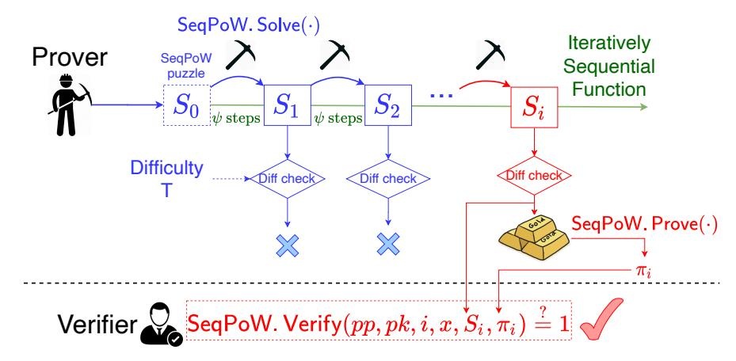
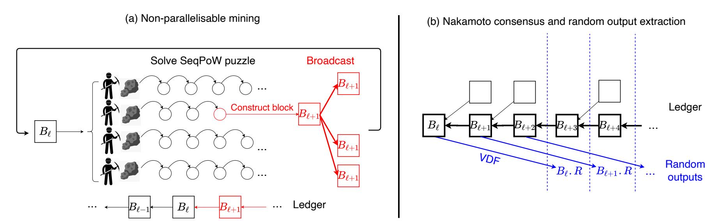
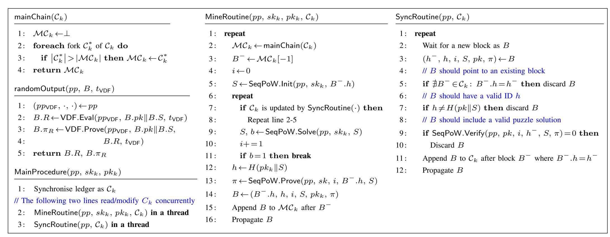
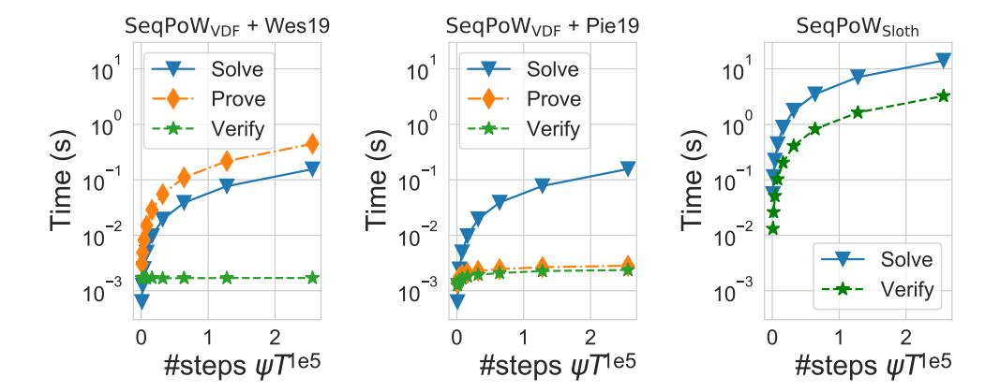
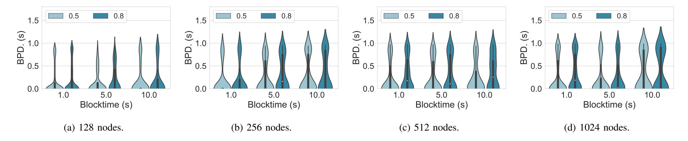
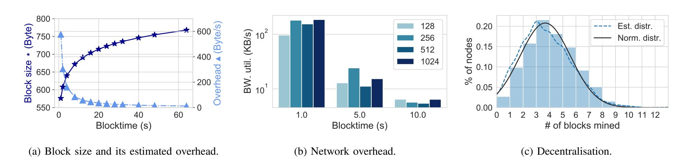

{0}------------------------------------------------

# RANDCHAIN: A Scalable and Fair Decentralised Randomness Beacon

Runchao Han Monash University & CSIRO-Data61 runchao.han@monash.edu

Haoyu Lin FluiDEX & ZenGo X chris.haoyul@gmail.com

Jiangshan Yu Monash University jiangshan.yu@monash.edu

*Abstract*—We propose RANDCHAIN, a Decentralised Randomness Beacon (DRB) that is the first to achieve both *scalability* (i.e., a large number of participants can join) and *fairness* (i.e., each participant controls comparable power on deciding random outputs). Unlike existing DRBs where participants are *collaborative*, i.e., aggregating their local entropy into a single output, participants in RANDCHAIN are *competitive*, i.e., competing with each other to generate the next output. The competitive design reduces the communication complexity from at least O(n 2 ) to O(n) without trusted party, breaking the scalability limit in existing DRBs.

To build RANDCHAIN, we introduce *Sequential Proof-of-Work (SeqPoW)*, a cryptographic puzzle that takes a random and unpredictable number of sequential steps to solve. We implement RANDCHAIN and evaluate its performance on up to 1024 nodes, demonstrating its superiority (1.3 seconds per output with a constant bandwidth of 200KB/s per node) compared to stateof-the-art DRBs RandHerd (S&P'18) and HydRand (S&P'20).

# I. INTRODUCTION

<span id="page-0-0"></span>Randomness is a key building block for various protocols and applications. Decentralised Randomness Beacon (DRB) allows a set of participants to jointly generates random outputs periodically. It has been a promising approach to provide secure randomness. To support security-critical protocols and applications with high financial stake such as public blockchains [\[1\]](#page-11-0)–[\[4\]](#page-11-1) and voting protocols [\[5\]](#page-11-2)–[\[7\]](#page-11-3), DRBs have to be 1) *scalable*: even with a large number of participants, the DRB produces random outputs with an expected rate, and 2) *fair*: each participant controls comparable power on deciding random outputs. Without scalability, the DRB can be maintained only by a small set of participants. Without fairness, the DRB can be dominated by a small subset of powerful participants out of the entire set. When the DRB is dominated by a small set of participants, they can collude and manipulate the randomness in order to take advantage in protocols and applications supported by the DRB. However, designing a DRB that is both scalable and fair remains an open challenge.

Existing DRBs do not scale. Most DRB protocols are built from periodically executing a Distributed Randomness Generation (DRG) protocol, where participants contribute their local entropy and aggregate them into a single random output. Commonly used DRG protocols are based on threshold cryptosystems [\[3\]](#page-11-4), [\[8\]](#page-11-5), [\[9\]](#page-11-6), Verifiable Random Functions (VRFs) [\[2\]](#page-11-7), [\[10\]](#page-11-8), [\[11\]](#page-11-9), and/or Publicly Verifiable Secret Sharing (PVSS) [\[1\]](#page-11-0), [\[12\]](#page-11-10)–[\[16\]](#page-12-0).

While DRG-based DRBs are fair given their "one-manone-vote" design, they are not scalable, as they suffer from at least O(n 2 ) communication complexity. DRG-based DRBs usually involve all-to-all broadcast primitives, leading to at least O(n 2 ) communication complexity. To overcome the communication complexity bound, DRG-based DRBs have to employ a central point that relays messages. The central point is either a dealer [\[8\]](#page-11-5), [\[9\]](#page-11-6), [\[11\]](#page-11-9), [\[13\]](#page-11-11), [\[15\]](#page-11-12) or a leader elected by a leader election protocol [\[1\]](#page-11-0)–[\[3\]](#page-11-4), [\[10\]](#page-11-8), [\[12\]](#page-11-10). A dealer is either implemented as a trusted party or in a distributed manner which introduces extra communication overhead [\[17\]](#page-12-1). If the elected leader is corrupted, then it can bias random outputs by withholding messages and can compromise the liveness by sending messages to and advancing rounds for only a subset of participants [\[18\]](#page-12-2), [\[19\]](#page-12-3). To tolerate corrupted leaders, the DRB has to employ an extra round synchronisation protocol [\[19\]](#page-12-3), which allows participants to re-synchronise and replace the corrupted leader with a new leader to start a new round. However, round synchronisation protocols introduce extra communication complexity [\[18\]](#page-12-2), [\[19\]](#page-12-3) and/or increase latency [\[20\]](#page-12-4).

The scalability crux: participants are collaborative. We attribute these limitations to the design that participants are *collaborative*: participants contribute their local inputs and aggregate them into a single output. The collaborative process ensures that no participant can fully control random outputs, making them hard to bias or predict. However, in order to collaborate, participants should continuously broadcast messages to and synchronise with each other. The former incurs at least O(n 2 ) communication complexity, and the latter requires round synchronisation. All extra designs incorporated with DRG – e.g., using dealers [\[8\]](#page-11-5), [\[9\]](#page-11-6), [\[13\]](#page-11-11), [\[15\]](#page-11-12), leader election [\[1\]](#page-11-0)–[\[3\]](#page-11-4), [\[10\]](#page-11-8)–[\[12\]](#page-11-10), sharding [\[3\]](#page-11-4), [\[12\]](#page-11-10), cryptographic sortition [\[10\]](#page-11-8), Byzantine consensus [\[10\]](#page-11-8), [\[14\]](#page-11-13), and erasure coding [\[13\]](#page-11-11), [\[15\]](#page-11-12) – aim at reducing the impact of the above two limitations. However, since all of them are in the collaborative design, they inherently suffer from the two limitations and cannot address them completely.

Competitive DRBs: a new design space. To address the inherent limitations in the collaborative design, we consider a new design space for DRBs called *competitive DRBs*. Unlike existing DRBs where participants are collaborative, participants in competitive DRBs compete to solve cryptographic puzzles, whose solutions are unpredictable. The participant who first solves the puzzle becomes the leader, and broadcasts the puzzle solution to other participants. Upon a new puzzle solution, participants execute Nakamoto consensus [\[21\]](#page-12-5) to agree on and append it to the sequence of puzzle solutions, ensuring consistency and liveness. A random output is extracted from each puzzle solution by using a Verifiable Delay Function (VDF) [\[22\]](#page-12-6) which takes longer time than the puzzle solution becoming irreversible in the sequence. The 

{1}------------------------------------------------

time delay prevents the adversary from withholding its puzzle solution and biasing the random output to its own advantage.

RANDCHAIN: the first scalable and fair DRB. We propose RANDCHAIN, the first competitive DRB. RANDCHAIN works in permissioned settings identical to all existing DRBs, and is the first to achieve both scalability and fairness: it allows an unbounded number of participants to participate and restricts their voting power to be comparable. To achieve scalability, RANDCHAIN employs Nakamoto consensus [21] with linear communication complexity. To achieve fairness, RANDCHAIN realises non-parallelisable mining [23], where more processors do not give any advantage in solving a puzzle. As no existing primitive can provide *non-parallelisable mining*, we introduce Sequential Proof-of-Work (SeqPoW), a cryptographic puzzle that takes a random and unpredictable number of sequential steps to solve. SeqPoW is also of independent interest in other protocols such as leader election and Proof-of-Stake (PoS)based consensus. Our contributions are summarised as follows.

- We identity and formalise a new design space for DRBs, namely *competitive DRBs*, which break the scalability limit in existing DRB designs.
- As existing primitives lack the properties desired by the competitive DRBs (given the analysis in §III), we introduce and formalise the concept of SeqPoW that satisfies these properties. We provide two constructions based on VDFs [24], [25] and Sloth [26], and analyse their security and efficiency. We also discuss applications of SeqPoW in leader election and Proof-of-Stake (PoS)-based consensus (§IV).
- We provide RANDCHAIN as a concrete instantiation of competitive DRBs, and provide an analysis on its security and performance (§V).
- We provide an implementation of SeqPoW and RANDCHAIN and evaluate their performance (§VI). The implementation adds/changes about 4500 Rust lines of code (LoCs) on top of parity-bitcoin [27]. The evaluation results show that RANDCHAIN is indeed scalable and fair: with 1024 nodes, RANDCHAIN can produce a random output every 1.3 seconds (2.3x faster than RandHerd [12], 6.6x faster than HydRand [14] with 128 nodes); utilise constant bandwidth of about 200 KB/s per node (comparable with RandHerd with 1024 nodes and HydRand with 128 nodes); and provide nodes with comparable chance of producing random outputs.
- We establish a unified evaluation framework of DRBs, and compare RANDCHAIN with existing DRBs under this framework (§VII). Our comparison shows that RANDCHAIN is the only DRB that is secure, scalable and fair, without relying on any trusted third party.

We conclude the paper in §VIII, and provide additional details in the appendix. Appendix A provides preliminary definitions on VDFs. Appendix B provides formal definitions of SeqPoW and security proofs of SeqPoW. Appendix C provides formal security proofs for our SeqPoW constructions. Appendix D provides formal security proofs for RANDCHAIN. Appendix E provides the details of existing DRBs. Appendix F discusses three limitations and the corresponding resolutions of RANDCHAIN, namely the energy efficiency, churn tolerance and finality.

## II. MODEL OF DRBS

<span id="page-1-0"></span>In this section, we define the model for DRBs, including the system model, correctness properties and performance metrics.

# <span id="page-1-1"></span>A. System model

**System setting.** We consider the system setting common in most DRBs [1]–[3], [8]–[16]. In particular, a DRB contains a set of n participants  $\mathcal{P} = \{p_1, ..., p_n\}$ . Each participant  $p_k \in \mathcal{P}$  has a pair of secret key  $sk_k$  and public key  $pk_k$ , and is uniquely identified by  $pk_k$ . Each participant is only directly connected to a subset of peers in the system. Participants jointly maintain a unique sequence of random outputs. Participants continuously execute the DRB protocol to agree on new random outputs and append them to the sequence.

**Network model.** Network model concerns the timing guarantee of messages delivery between participants. We consider a synchronous network where messages are delivered within a known finite time bound  $\Delta$ .

Adversary model. The adversary controls  $\alpha n$  processors, and can corrupt at most  $\alpha n$  participants in the system, where  $\alpha < \frac{1}{2}$ . The adversary is adaptive in the sense that it can corrupt any set of  $\leq \alpha n$  participants at any time. The adversary can coordinate corrupted participants without delay; and can arbitrarily delay, drop, forge and modify messages from its corrupted participants.

# <span id="page-1-2"></span>B. Correctness properties

Consistency and liveness. Similar to consensus, DRBs should satisfy *consistency* and *liveness*. Consistency ensures that participants agree on a unique sequence of random outputs, and liveness ensures that participants produce new random outputs at an admissible rate. We adapt the *common-prefix* and *chaingrowth* definitions from Nakamoto consensus protocols [28]–[31] rather than the *agreement* and *termination* definitions from BFT-style consensus protocols [32], as we consider a streamlined execution rather than a single-shot execution.

For consistency, we adapt the common-prefix definition in Nakamoto-style consensus where correct participants can only have different views on a certain number of last blocks. In DRBs, the consistency ensures that correct participants can only have different views on a certain number of last random outputs. Some randomness-based applications require RB to have *finality* [33], i.e., at any time, correct participants do not have conflicted views on the random output, which is equivalent to 0-consistency or *agreement* in Byzantine consensus [34].

**Definition 1** ( $\Upsilon$ -Consistency). For any two correct participants at any time, their sequences can differ only in the last  $\Upsilon \in \mathbb{N}$  random outputs.

For liveness, we adapt the chain-growth definition in Nakamoto-style consensus where correct participants produce blocks at a certain rate. In DRBs, the liveness ensures that correct participants produce random outputs at a certain rate. If the speed does not reach the lowest speed, then the DRB cannot satisfy the requirement of real-world applications. Papers formalising a single-shot execution of DRBs refer

{2}------------------------------------------------

liveness as termination [8], [10], [16] or Guaranteed Output Delivery (G.O.D.) [9], [13], [15], [35] where, for every round, a new random output will be produced.

**Definition 2**  $((t,\tau)$ -Liveness). For any time period of length t, every correct participant learns at least  $t \cdot \tau$  new random outputs, where  $t,\tau \in \mathbb{R}^+$ .

**Uniform distribution.** Uniform distribution ensures that every random output in the DRB is statistically close to a uniformly random string.

**Definition 3** (Uniform distribution). Every random output is indistinguishable from a random string of the same length, except for negligible probability.

**Unpredictability.** Unpredictability ensures that the adversary cannot predict random outputs that have not been produced yet. Otherwise, if the adversary can predict future random outputs, then it can take advantage in randomness-based applications.

**Definition 4** (Unpredictability). Any adversary can only obtain negligible advantage on the following game. Assuming participants in the DRB agree on an  $\ell$ -long sequence of random outputs. Before the  $(\ell+1)$ -th random output  $R_{\ell+1}$  is produced, the adversary makes a guess  $R'_{\ell+1}$  on  $R_{\ell+1}$ . The adversary's advantage is quantified as  $\Pr\left[R'_{\ell+1} = R_{\ell+1}\right]$ .

Unbiasibility. Unbiasibility ensures that the adversary cannot influence the produced random output to another value to its own advantage [9], [12], [14], [35]. Otherwise, if the adversary can bias random outputs, then it can take advantage in randomness-based applications. Unbiasibility can be achieved by the *output-independent-abort* property [36]: the adversary has to decide to proceed or abort the protocol before learning the protocol's outcome. In the context of an  $\Upsilon$ -consistent DRB, output-independent-abort ensures that, participants learn a random output only after it becomes  $\Upsilon$ -deep in a correct participant's view.

**Definition 5** (Unbiasibility). Assuming a DRB satisfies  $\Upsilon$ -consistency, and participants in the DRB agree on an  $\ell$ -long sequence of random outputs. The adversary learns the  $(\ell+1)$ -th random output  $R_{\ell+1}$  only after  $(\ell+\Upsilon+1)$  consecutive random outputs are recorded in the sequence of at least one correct participant, except for negligible probability.

# C. Performance metrics

Communication complexity. Communication complexity is the total amount of communication required to complete a protocol [37]. In the context of DRBs, the communication complexity is quantified as the amount of communication (in bits) all participants take to generate a random output. For example, for a DRB that includes n participants and achieves O(n) (aka linear) communication complexity, each participant handles a constant amount of communication for generating a random output, leading to the total amount of communication proportional to n. A protocol may have different communication complexity in the best-case and worst-case executions.

**Latency.** Latency is the time required to complete a protocol. In the context of DRBs, the latency is quantified as the time

participants take to generate a random output. Similarly, a protocol may have different latencies in the best-case and worst-case executions. If the protocol's latency only depends on the actual network delay  $\delta$  but not the delay upper bound  $\Delta$ , then the protocol is *responsive* [38].

## III. DESIGN GOALS AND STRAWMAN DESIGNS

<span id="page-2-0"></span>In this section, we describe our two design goals, namely *scalability* and *fairness*, and analyse two strawman designs towards them. The analysis reveals the need for a cryptographic puzzle with two properties, namely *sequentiality* and *hardness*. As no existing puzzle achieves these two properties simultaneously, we are motivated to propose a new primitive named *Sequential Proof-of-Work* (*SeqPoW*, §*IV*) that satisfies both properties, allowing us to construct RANDCHAIN (§V).

# A. Design goals: scalability and fairness

Our goal is to design a DRB that can serve security-critical protocols and applications with high financial stake, such as public blockchains and voting protocols. To ensure that the DRB can be trusted by such protocols and applications, we demand two additional requirements on the DRB atop the model in §II, namely *scalability* and *fairness*.

**Scalability.** Scalability specifies that the DRB can produce random outputs regularly even in the presence of a large set of n participants. Having a large set of participants reduces the trust needed on each participant, making the DRB more resilient to malicious parties. Otherwise, if the DRB is maintained by a small set of participants, then they can collude to bias and/or predict random outputs and thus take advantage in the randomness-based applications.

To produce random outputs regularly when n is large, the DRB has to minimise the communication complexity and latency. For communication complexity, O(n) is considered scalable as each participant handles a constant amount of communication independent with n, while  $O(n^2)$  is not as each node handles overwhelming communication overhead when n is large. For latency, demand it to be as small as possible.

**Fairness.** Fairness specifies that each participant controls comparable voting power on deciding random outputs, regardless of their financial stake or hardware resource. The voting power of a node is quantified as the amount of its contributed entropy in collaborative DRBs, and as its chance of producing the next block in competitive DRBs. Without fairness, few powerful participants among all participants will control the randomness generation process of the DRB. This is not desirable as the powerful participants can collude to compromise the DRB, similar to the scalability case.

Unlike DRG-based DRBs that satisfy fairness immediately given the "one-man-one-vote" nature, participants in competitive DRBs may have different voting power, leading to weak fairness. We define fairness as the maximum voting power difference among participants in the DRB. In the context of competitive DRBs, fairness is the maximum difference of nodes' chances of producing the next block.

**Definition 6** ( $\mu$ -Fairness). Assuming all messages are delivered instantly and participants in a DRB agree on an  $\ell$ -long sequence of random outputs. Let  $X(p_k)$  be the event that

{3}------------------------------------------------

participant  $p_k$  produces the  $(\ell+1)$ -th random output earlier than other participants. For any two participants  $p_i$  and  $p_j$ ,

$$\mu = \min_{\forall i, j \in [n]} \frac{\Pr[X(p_i)]}{\Pr[X(p_j)]}$$

When  $\mu=1$ , the DRB achieves ideal fairness and the network is fully decentralised, and vice versa when  $\mu \to 0$ . As a design goal, we demand  $\mu$  to be as close to 1 as possible.

# B. Strawman designs

We analyse two strawman designs towards the two goals. The analysis reveals the need for a cryptographic puzzle satisfying two properties, namely *sequentiality* and *hardness*. No existing puzzle satisfies both of them simultaneously.

**Strawman#1: Nakamoto-style DRBs.** The scalability goal requires the DRB to achieve O(n) communication complexity. We have shown in §I that no existing DRB achieves it without a trusted third party, motivating us to propose the competitive DRB approach. A natural choice is building upon the Nakamoto-style consensus, where each participant solves a PoW puzzle to become the leader, and a random output is extracted from the PoW solution deterministically.

Such design satisfies *scalability* but not *fairness*, as participants with more mining hardware have more chance of mining blocks than others. To achieve fairness, the DRB has to prevent participants from investing more mining resource to take advantage in mining. A possible solution is the *non-parallelisable mining* [23], where a participant can only use a single processor for mining and cannot speed up mining by using multiple parallel processors. To realise non-parallelisable mining, the puzzle has to be *sequential*: it cannot be solved faster by using multiple parallel processors.

Strawman#2: Applying time-sensitive cryptography. Sequentiality has been formalised and achieved in time-sensitive cryptographic primitives. For example, Verifiable Delay Functions (VDFs) [22] enforce a parameterisable time delay on generating outputs and allow to verify outputs fast. Recent proposals [39], [40] apply VDFs to construct Nakamoto-style consensus: each participant derives a random output y from the latest system state, maps y to a random time parameter t in a designated interval, and solves a VDF with time parameter t. The first participant solving the VDF derives the next random output from its VDF output.

However, Nakamoto-style consensus with existing time-sensitive primitives achieves weaker fairness and consistency guarantee. All existing time-sensitive primitives have a fixed time delay. Nakamoto-style consensus with such puzzles is locally predictable [41]: given the input x, each participant can learn the time parameter t immediately, and thus can predict when it will propose the next random output. The adversary can apply such prediction to amplify its advantage in selfish mining [42] and double-spending [21], weakening the system's fairness and consistency guarantee, respectively [41].

To make the mining process unpredictable, the puzzle has to take a random and unpredictable number of attempts to solve. PoW satisfies such requirement by providing the *hardness* property [43]: upon each attempt on solving the

puzzle, the solver has probability  $\frac{1}{T}$  to solve the puzzle, where T is a hardness parameter. However, none of existing primitives satisfies both *sequentiality* and *hardness*.

# IV. SEQUENTIAL PROOF-OF-WORK

<span id="page-3-0"></span>In this section, we introduce *Sequential Proof-of-Work* (*SeqPoW*), a PoW variant that satisfies both *sequentiality* and *hardness*. We formalise SeqPoW, provide two constructions, and analyse their security and efficiency.

# <span id="page-3-1"></span>A. Preliminaries on VDFs

Verifiable Delay Function (VDF) [22], [24], [25] allows a prover to evaluate an input, and produce a unique output deterministically with a succinct proof attesting the output's correctness. The evaluation process takes non-negligible and parameterisable time to execute, even with parallelism. Appendix A provides its formal definition. A VDF is a tuple of four algorithms VDF = (Setup, Eval, Prove, Verify):

Setup $(\lambda) \rightarrow pp$ : On input security parameter  $\lambda$ , outputs public parameter pp.

Eval $(pp,x,t) \rightarrow y$ : On input pp, input x and time parameter  $t \in \mathbb{N}^+$ , produces output y.

Prove $(pp,x,y,t) \to \pi$ : On input pp, x, y and t, outputs proof  $\pi$ . Verify $(pp,x,y,\pi,t) \to \{0,1\}$ : On input  $pp, x, y, \pi$  and t, outputs 1 if y is a correct evaluation, otherwise 0.

VDF satisfies three properties, namely *completeness* that all outputs from honest evaluations can pass the verification, *soundness* that all outputs from malicious evaluations cannot pass the verification, and  $\sigma$ -sequentiality that  $\operatorname{Eval}(\cdot,\cdot,t)$  cannot be evaluated in less than time  $\sigma(t)$  even with an unbounded amount of parallel processors. Sequentiality also implies *unpredictability*: before finishing  $\operatorname{Eval}(\cdot)$ , the probability of making a correct guess on its output is negligible.

VDFs are usually constructed from an iteratively sequential function (ISF) and a succinct proof attesting the ISF's execution results [24], [25]. ISF  $f(t,x) = g^t(x)$  is a function that composes a sequential function g(x) for t times. The fastest way of computing ISF f(t,x) is to iterate g(x) for t times, as  $g(\cdot)$  is sequential. Squaring and squaring root over cyclic groups are two sequential functions with proven sequentiality [26], [44], [45]. Their repeated versions – repeated squaring [24], [25] and repeated squaring root [26] over cyclic groups – are two widely used ISFs.

ISF  $f(\cdot)$  usually provides the *self-composability* property: for any x and  $(t_1,t_2)$ , let  $y \leftarrow f(x,t_1)$ , we have  $f(x,t_1+t_2)=f(y,t_2)$ . VDFs usually inherit the *self-composability* from ISFs, i.e., for all  $\lambda,t_1,t_2$ , let  $pp \leftarrow \mathsf{Setup}(\lambda)$  and  $y \leftarrow \mathsf{Eval}(pp,x,t_1)$ , it holds that  $\mathsf{Eval}(pp,x,t_1+t_2) = \mathsf{Eval}(pp,y,t_2)$ . Such VDFs are known as *self-composable VDFs* [46].

#### B. Basic idea of SeqPoW

SeqPoW is a cryptographic puzzle that takes a random and unpredictable number of sequential steps to solve. As shown in Figure 1, given an initial SeqPoW puzzle  $S_0$ , the prover keeps solving it by incrementing an ISF. Each iteration takes the last output  $S_{i-1}$  as input and produces a new output  $S_i$ . For each output  $S_i$ , the prover checks whether it satisfies a difficulty

{4}------------------------------------------------

<span id="page-4-0"></span>

Figure 1: Sequential Proof-of-Work.

parameter T. If yes, then  $S_i$  is a valid solution, and the prover can generate a proof  $\pi_i$  on it. Given  $S_i$  and  $\pi_i$ , the verifier can check  $S_i$ 's correctness without solving the puzzle again.

Comparisons with relevant primitives (Table I). SeqPoW is the first primitive that satisfies both sequentiality and hardness, and therefore can be used for constructing RANDCHAIN. SeqPoW differs from VDFs and other time-sensitive cryptographic primitives, e.g., Timelock Puzzle (TLP) [47] and Proofs of Sequential Work (PoSW) [48], [49] in that, the SeqPoW prover iterates an ISF for a *randomised* (rather than given) number of times. In addition, compared to TLP, SeqPoW provides publicly verifiable outputs. Compared to PoSW, SeqPoW allows outputs to be unique. SeqPoW differs from PoW in that SeqPoW is sequential. SeqPoW differs from *memory-hard functions* (MHFs) [50]–[52] in that, SeqPoW is bottlenecked by the processor's frequency, whereas MHF is bottlenecked by the memory bandwidth.

Two concurrent works [39], [53] propose ways to randomise the number of iterations in VDFs, without formal treatment. We are the first to formally study such primitives, including formal definitions, concrete constructions with security proofs, implementation and evaluation. We also provide SeqPoW with uniqueness that both of them cannot achieve.

**Applications.** Given the unpredictability and hardness properties, SeqPoW is of independent interest for other protocols. First, SeqPoW can improve the fairness of leader election protocols. Mining in PoW-based consensus can be seen as a way of electing leaders: given a set of participants, the first participant proposing a valid PoW solution becomes the leader and proposes a block. SeqPoW can be a drop-in replacement of PoW for the leader election purpose. In §V-C, we show that compared to parallelisable PoW, SeqPoW-based leader election achieves better fairness.

Second, SeqPoW can improve the fault tolerance capacity of Proof-of-Stake (PoS)-based consensus. In Proof-of-Stake (PoS)-based consensus [54], each participant's chance of mining a block is in proportion to its *stake*, e.g, the participant's balance. Most PoS-based consensus protocols [1], [2], [55]–[57] select block proposers in a *predictable* [41], [58] way, thus are vulnerable to various prediction-based attacks and tolerate less Byzantine mining power [41], [58] than PoW-based consensus, as analysed in §III. To make PoS-based consensus unpredictable, one can randomise the process of selecting block proposers. SeqPoW can provide such functionality: each participant solves a SeqPoW with its identity, the last block, and the difficulty parameter inversely proportional to its stake as input, and the first participant solving its SeqPoW becomes

Table I: SeqPoW v.s. relevant primitives.

<span id="page-4-1"></span>

| Primitive          |                                                               |            | Execut                  | Output                                    |             |               |
|--------------------|---------------------------------------------------------------|------------|-------------------------|-------------------------------------------|-------------|---------------|
|                    |                                                               | Sequentia  | * Steds                 | Bottleneck                                | Vinia       | ge Verifiable |
| Time-<br>sensitive | TLP<br>PoSW<br>VDF                                            | <i>J J</i> | Fixed<br>Fixed<br>Fixed | Proc. freq.<br>Proc. freq.<br>Proc. freq. | ✓<br>×<br>✓ | ×<br>✓        |
| Resource-          | MHF                                                           | ✓or X      | Fixed                   | Mem. bandw.                               | 1           | <b>√</b>      |
| consuming          | PoW                                                           | ×          | Random                  | Proc. freq. + # of procs.                 | ×           | ✓             |
| Our work           | $\begin{array}{c} SeqPoW_{VDF} \\ SeqPoW_{Sloth} \end{array}$ | 1          | Random<br>Random        | Proc. freq.<br>Proc. freq.                | ×           | <b>√</b> ✓    |

the block proposer. A concurrent and independent work [53] provides a concrete protocol following the similar idea.

# C. Definition

We provide formal definitions of SeqPoW in Appendix B. The syntax of SeqPoW is as follows.

Setup $(\lambda, \psi, T) \to pp$ : On input security parameter  $\lambda$ , step  $\psi \in \mathbb{N}^+$  and difficulty  $T \in [1, \infty)$ , outputs public parameter pp. Gen $(pp) \to (sk, pk)$ : A probabilistic function, which on input pp, produces a secret key sk and a public key pk.

Init $(pp,sk,x) \to (S_0,\pi_0)$ : On input  $pp,\,sk$  and input x, outputs initial solution  $S_0$  and proof  $\pi_0$ . Some constructions may use pk rather than sk. This also applies to  $Solve(\cdot)$  and  $Prove(\cdot)$ .

Solve $(pp,sk,S_i) \rightarrow (S_{i+1},b_{i+1})$ : On input pp, sk and i-th solution  $S_i$ , outputs (i+1)-th solution  $S_{i+1}$  and result  $b_{i+1} \in \{0,1\}$ .

Prove $(pp,sk,i,x,S_i) \rightarrow \pi_i$ : On input pp, sk, i, x and  $S_i$ , outputs proof  $\pi_i$ .

Verify $(pp,pk,i,x,S_i,\pi_i) \rightarrow \{0,1\}$ : On input  $pp, pk, i, x, S_i$  and  $\pi_i$ , outputs 1 if  $S_i$  is a valid solution, otherwise 0.

A tuple  $(pp,sk,i,x,S_i,\pi_i)$  is honest if  $(S_i,\pi_i)$  is generated from evaluating Solve(p,  $sk, S_{i-1}$ ) and Prove( $pp, sk, i, x, S_i$ ) honestly, and is valid if it is honest and  $b_i$  associated to  $S_i$ is 1. SeqPoW satisfies *completeness*, *soundness*, *hardness* and sequentiality. Completeness ensures that for every honest tuple  $(pp, sk, i, x, S_i, \pi_i)$ , Verify $(pp, pk, i, x, S_i, \pi_i) = 1$ . Soundness ensures that for every non-honest tuple  $(pp, sk, i, x, S_i, \pi_i)$ , Verify $(pp,pk,i,x,S_i,\pi_i)=0$ . Hardness ensures that given difficulty parameter T, each Solve( $\cdot$ ) attempt has the success rate of  $\frac{1}{T}$ , implying that the number of sequential steps towards solving the puzzle is uniformly random with a mathematical expection of T. Sequentiality ensures that even with parallel processors, the fastest way of computing  $S_i$  is incrementing Solve(·) for i times, which takes time  $\sigma(i \cdot \psi)$ . Similar to VDFs [22], sequentiality in SeqPoW also implies unpredictability: without i sequential  $Solve(\cdot)$  invocations towards  $S_i$ , the probability of making a correct guess on  $S_i$  is negligible.

SeqPoW also has an optional property *uniqueness*, by which each SeqPoW puzzle only has a single valid solution  $S_i$ . Before finding a valid solution  $S_i$  each Solve(·) attempt follows the *hardness* definition, but after finding  $S_i$  no further Solve(·) attempt returns a valid solution.

## D. Constructions

Let  $H: \{0,1\}^* \to \{0,1\}^{\kappa}$  be a cryptographic hash function; G be a cyclic group;  $H_G: \{0,1\}^* \to G$  be a function mapping

{5}------------------------------------------------

```
\mathsf{Setup}(\lambda, \, \psi, \, T)
                                                           Solve(pp, pk, S_i)
 1: pp_{VDF} = (G, g) \leftarrow VDF.Setup(\lambda)
                                                             1: (pp_{VDF}, \psi, T) \leftarrow pp
                                                             2: S_{i+1} \leftarrow \mathsf{VDF}.\mathsf{Eval}(pp_{\mathsf{VDF}},\,S_i,\,\psi)
 2: pp \leftarrow (pp_{VDF}, \psi, T)
                                                            3: b_{i+1} \leftarrow H(pk||S_{i+1}) \le \frac{2^{\kappa}}{T}? 1:0
 3:
       return pp
Gen(pp)
                                                             4: return (S_{i+1}, b_{i+1})
       (G, g, \psi, T) \leftarrow pp
 1:
      Sample random sk \in \mathbb{N}
 2:
                                                           \mathsf{Prove}(pp,\,pk,\,i,\,x,\,S_i)
     pk \leftarrow q^{sk} \in G
 3:
                                                                   (pp_{VDF}, \psi, T) \leftarrow pp
                                                             1:
 4: return (sk, pk)
                                                             2:
                                                                   (G, g) \leftarrow pp_{VDF}
Init(pp, pk, x)
                                                             3: S_0 \leftarrow H_G(pk||x)
 1: (G, g, \psi, T) \leftarrow pp
                                                                   \pi_{VDF} \leftarrow VDF.Prove(pp_{VDF}, S_0, S_i, i \cdot \psi)
                                                             4:
 2: S_0 \leftarrow H_G(pk||x)
                                                                  return \pi_{\mathsf{VDF}}
                                                             5:
 3:
      return S_0
               \mathsf{Verify}(pp,\,pk,\,i,\,x,\,S_i,\,\pi_i)
                1: (pp_{VDF}, \psi, T) \leftarrow pp
                2: (G, g) \leftarrow pp_{VDF}
                3: S_0 \leftarrow H_G(pk||x)
                      if VDF. Verify (pp_{\text{VDF}}, S_0, S_i, \pi_i, i \cdot \psi) = 0 then return 0
                5: if H(pk||S_i) > \frac{2^{\kappa}}{T} then return 0
                6: return 1
```

```
\mathsf{Setup}(\lambda, \, \psi, \, T)
                                          \mathsf{Solve}(pp,\,pk,\,S_i)
                                           1: (G, g, \psi, T) \leftarrow pp
 1: pp \leftarrow (G, g, \psi, T)
 2: return pp
                                           2: \quad S_{i+1} \leftarrow S_i^{\frac{1}{2\psi}}
\mathsf{Gen}(pp)
                                           3: b_{i+1} \leftarrow H(pk||S_{i+1}) \le \frac{2^{\kappa}}{T}? 1:0
      (G, g, \psi, T) \leftarrow pp
 1:
 2: Sample random sk \in \mathbb{N} 4: return (S_{i+1}, b_{i+1})
 3: pk \leftarrow g^{sk} \in G
                                          \mathsf{Prove}(pp,\,pk,\,i,\,x,\,S_i)
 4: return (sk, pk)
                                           1: return ⊥
Init(pp, pk, x)
 1: (G, g, \psi, T) \leftarrow pp
 2: S_0 \leftarrow H_G(pk||x)
 3: return S_0
                  Verify(pp, pk, i, x, S_i, \pi_i)
                   1: (G, g, \psi, T) \leftarrow pp
                   2: y \leftarrow S_i
                   3: if H(pk||y) > \frac{2^{\kappa}}{T} then return 0
                   4: repeat i times
                            y \leftarrow y^{2^{\psi}}
                   5:
                           if H(pk||y) \le \frac{2^{\kappa}}{T} then return 0
                   7: if H_G(pk||x) \neq y then return 0
                   8: return 1
```

(b) SeqPoW<sub>Sloth</sub>

(a)  $SeqPoW_{VDF}$ .

Figure 2: Construction of SeqPoW.

an arbitrary string to an element on G; g be a generator of G; sk be the secret key; and  $pk = g^{sk}$  be the public key.

**SeqPoW from VDFs (Figure 2a).** Let  $\psi$  be a step parameter, x be the input, and T be the difficulty parameter. The prover runs  $\operatorname{Init}(\cdot)$ , which generates the initial solution  $S_0 = H_G(pk\|x)$ . Then, the prover keeps running  $\operatorname{Solve}(\cdot)$ , which calculates an intermediate output  $S_i = \operatorname{VDF.Eval}(pp, S_{i-1}, \psi)$  and checks whether  $H(pk\|S_i) \leq \frac{2^{\kappa}}{T}$ . If true, then  $S_i$  is a valid solution, and the prover runs  $\operatorname{Prove}(\cdot)$ , which outputs  $\operatorname{proof}(\tau_i)$  attesting  $S_i = \operatorname{VDF.Eval}^i(pp, S_0, \psi)$ . Note that  $S_i = \operatorname{VDF.Eval}(pp, S_{i-1}, \psi) = \operatorname{VDF.Eval}^i(pp, S_0, \psi) = \operatorname{VDF.Eval}(pp, S_0, i \cdot \psi)$  when  $\operatorname{VDF}(\tau_i)$  is  $\operatorname{self-composable}(\tau_i)$ . The verifier runs  $\operatorname{Verify}(\cdot)$ , which checks 1) whether  $S_i = \operatorname{Eval}^i(pp, S_0, \psi)$  by running  $\operatorname{VDF.Verify}(pp_{\operatorname{VDF}}, pk, i \cdot \psi, x, S_i, \pi_i)$ , and 2) whether  $S_i$  satisfies the difficulty T.

Unique SeqPoW from Sloth (Figure 2b). SeqPoW<sub>VDF</sub> does not provide uniqueness: the prover can keep incrementing the ISF to find as many valid solutions as possible. We construct SeqPoW<sub>Sloth</sub> with *uniqueness* from Sloth [26], a *slow-timed* hash function. In Sloth, the prover calculates the square root (on a cyclic group G) over the input for t times to get the output. The verifier calculates the square over the output for t times to recover the input and checks if the input is same as the one from the prover. Although the verification is linear (and thus do not meet the VDF definition [22]), verification is faster than computing: on cyclic group G, squaring is  $O(\log |G|)$  times faster than square rooting. Similar to SeqPoW<sub>VDF</sub>, SeqPoW<sub>Sloth</sub> takes each of  $S_i = f(i \cdot \psi, S_0)$ as an intermediate output and checks if  $H(pk||S_i) \leq \frac{2^{\kappa}}{T}$ . To make the solution unique, SeqPoW<sub>Sloth</sub> only treats the first solution satisfying the difficulty as valid. When verifying  $S_i$ , if the verifier finds an intermediate output  $S_i$  (j < i) satisfying the difficulty, then  $S_i$  is considered invalid.

## E. Security and efficiency analysis

**Security.** Appendix C provides full security proofs of the SeqPoW constructions. The completeness and soundness are immediate from Sloth and VDFs' completeness, soundness and self-composability. By *pseudorandomness* of  $H_G(\cdot)$  and *sequentiality* of Sloth and VDFs, Solve( $\cdot$ ) outputs unpredictable solutions. As  $H(\cdot)$  is modelled as a random oracle and Solve( $\cdot$ ) produces an unpredictable solution, the probability that the solution satisfies the difficulty is  $\frac{1}{T}$ , leading to *hardness*. The sequentiality and self-composability of Sloth and VDFs guarantee the sequentiality of the SeqPoW constructions.

VDFs can be instantiated with any cyclic group, including the RSA group that requires a trusted setup and the class group without such requirement. The trusted setup is usually conducted by a trusted party or a multi-party protocol [59], [60].

Efficiency (Table II). SeqPoW<sub>VDF</sub> and SeqPoW<sub>Sloth</sub> employ repeated squaring on an RSA group and repeated square rooting on a prime-order group as ISFs, respectively. Let s be the size (in Bytes) of a group element, and  $\psi$  be the step parameter. Each Solve(·) executes  $\psi$  steps of the ISF, and the prover attempts Solve(·) for T times on average to find a valid solution. Prove(·) and Verify(·) generate and verify proofs of  $\psi T$  consecutive modular squaring operations, respectively.

We analyse SeqPoW<sub>VDF</sub> with both Wesolowski's VDF (Wes19) [25] and Pietrzak's VDF (Pie19) [24] without optimisation/parallelisation techniques [24], [25], [61]. According to the existing analysis [62], the proving complexity, verification complexity and proof size of Wes19 are  $O(\psi T)$ ,  $O(\log \psi T)$  and s Bytes, respectively; and those of Pie19 are  $O(\sqrt{\psi T} \log \psi T)$ ,  $O(\log \psi T)$  and  $s \log_2 \psi T$ , respectively. When  $\psi T = 2^{40}$  and s = 32 Bytes, the proof sizes of SeqPoW<sub>VDF</sub> with Wes19 [25] and with Pie19 [24] are 32 and 1280 Bytes,

{6}------------------------------------------------

Table II: Efficiency of two SeqPoW constructions.

<span id="page-6-2"></span>

|                               | $Solve(\cdot)$ | $Prove(\cdot)$                | $Verify(\cdot)$  | Proof<br>size (Bytes) |
|-------------------------------|----------------|-------------------------------|------------------|-----------------------|
| SeqPoW <sub>VDF</sub> + Wes19 | $O(\psi)$      | $O(\psi T)$                   | $O(\log \psi T)$ | s                     |
| SeqPoW <sub>VDF</sub> + Pie19 | $O(\psi)$      | $O(\sqrt{\psi T}\log \psi T)$ | $O(\log \psi T)$ | $s{\log _2}\psi T$    |
| $\overline{SeqPoW_{Sloth}}$   | $O(\psi)$      | 0                             | $O(\psi T)$      | 0                     |

respectively. SeqPoW<sub>Sloth</sub> has the verification complexity of  $O(\psi T)$  and uses the solution itself to represent the proof.

# V. RANDCHAIN: DRB FROM SEQPOW

<span id="page-6-0"></span>In this section, we build the RANDCHAIN protocol. Figure 3 and 4 provides the intuition and full specification of RANDCHAIN, respectively. In RANDCHAIN, participants jointly maintain a sequence of random outputs as a blockchain, where each random output is derived from a block ( $\S V-A$ ). Specifically, participants agree on a unique blockchain by executing the Nakamoto consensus, which ensures consistency, liveness, and scalability in synchronous networks (§V-B). RANDCHAIN composes Nakamoto consensus with our proposed SeqPoW puzzle to achieve non-parallelisable mining, guaranteeing the fairness (§V-C). Each random output is extracted from a block by using a Verifiable Delay Function (VDF) so that the random output is learned only after the block becomes irreversible in the blockchain, guaranteeing the uniform distribution, unpredictability and unbiasibility (§V-D). Appendix D provides the proofs of all correctness properties for RANDCHAIN.

# <span id="page-6-3"></span>A. DRB structure

Each participant  $p_k$  locally maintains a ledger  $\mathcal{C}_k$  formed as a directed acyclic graph (DAG) of blocks. Following Nakamoto consensus mainChain(·),  $p_k$  selects the longest fork in  $\mathcal{C}_k$  as the main chain  $\mathcal{MC}_k$ . If there are multiple longest forks at the same length,  $p_k$  chooses the one it receives first.  $\mathcal{MC}_k$  is formed as a blockchain, i.e., a totally ordered sequence of blocks. We denote  $|\mathcal{MC}_k|$  as the length of  $\mathcal{MC}_k$ .

Each block B is of the format  $B = (h^-, h, i, S, pk, \pi)$ , where  $h^-$  is the previous block ID, h is the current block ID, h is the SeqPoW solution index, h is the SeqPoW solution, h is the public key of this block's creator, and h is the proof that h is a valid SeqPoW solution on input h. Each block h is identified by its ID h is ID h is identified by its ID h is ID h is identified by setting h is identified by setting h is identified by setting h is identified by its ID h is identified by its ID h is identified by its ID h is identified by its ID h is identified by its ID h is identified by its ID h is identified by its ID h is identified by its ID h is identified by its ID h is identified by its ID h is identified by its ID h is identified by its ID h is identified by its ID h is identified by its ID h is identified by its ID h is identified by its ID h is identified by its ID h is identified by its ID h is identified by its ID h is identified by its ID h is identified by its ID h is identified by its ID h is identified by its ID h is identified by its ID h is identified by its ID h is identified by its ID h is identified by its ID h is identified by its ID h is identified by its ID h is identified by its ID h is identified by its ID h is identified by its ID h is identified by its ID h is identified by its ID h is identified by its ID h is identified by its ID h is identified by its ID h is identified by its ID h is identified by its ID h is identified by its ID h is identified by its ID h is identified by its ID h is identified by its ID h is identified by its ID h is identified by its ID h is identified by its ID h is identified by its ID h is identified by its ID h is identified by its ID h is identified by its ID h is identified by its ID h is identified by its ID h is identified by its ID h is identified by its ID h is identified by its ID h is identified by it

#### <span id="page-6-4"></span>B. Synchronising and agreeing on blocks

Each participant  $p_k$  keeps running SyncRoutine( $\cdot$ ) to synchronise its local ledger  $\mathcal{C}_k$  with other participants. Specifically, participant  $p_k$  keeps receiving blocks from other participants, verifying them, and adding valid blocks to its local ledger  $\mathcal{C}_k$ . Participant  $p_k$  keeps tracking the main chain  $\mathcal{MC}_k$  following Nakamoto consensus mainChain( $\cdot$ ), and executes the mining routine MineRoutine( $\cdot$ ) on  $\mathcal{MC}_k$ .

Same as PoW-based Nakamoto consensus, RANDCHAIN achieves consistency and liveness in synchronous networks, and can tolerate an adversary with mining power  $\alpha < \frac{1}{2}$ . As Nakamoto consensus is probabilistic, RANDCHAIN does not

achieve 0-consistency (aka *finality*). One can deploy existing finality layer mechanisms [63]–[65] into RANDCHAIN. In Appendix F3 we analyse two approaches of adding *finality* to RANDCHAIN.

RANDCHAIN inherits communication complexity and latency guarantees from Nakamoto consensus. The communication complexity is O(n) as the only communication is the leader broadcasting blocks. The latency is  $t_{\rm block} + \delta$ , where  $t_{\rm block}$  is the parameterised block interval and  $\delta$  is the actual network delay. Thus, RANDCHAIN achieves scalability.

# <span id="page-6-1"></span>C. Non-parallelisable mining

RANDCHAIN employs the SeqPoW puzzle for the mining routine MineRoutine( $\cdot$ ). Specifically, participant  $p_k$  keeps solving the latest SeqPoW puzzle S derived from SeqPoW.Init $(pp,sk_k,B^-.h)$ , where pp is the public parameter,  $sk_k$  is its secret key, and  $B^-.h$  is the hash of  $\mathcal{MC}_k$ 's last block. To solve puzzle S, participant  $p_k$  keeps executing SeqPoW.Solve( $\cdot$ ) until finding a valid solution. With a valid solution, participant  $p_k$  constructs a block B, and appends B to  $\mathcal{MC}_k$ .

RANDCHAIN achieves non-parallelisable mining, leading to  $\mu$ -fairness with  $\mu > \frac{1}{5}$  in practice where every node at least preserves a commodity processor with  $2\sim 3$  GHz frequency. Each participant has a unique input deriving a unique SeqPoW puzzle, so can only use a single processor for mining. By SeqPoW's sequentiality, to accelerate solving SeqPoW puzzles, one can only increase the processor's frequency. While commodity processors usually achieve  $2\sim 3$  GHz frequency, the most advanced processor achieves the frequency of 8.723 GHz [66], which is hard to improve further due to the voltage limit [67]. Hence, the fastest processor can mine at most five times faster than normal processors, leading to  $\mu > \frac{1}{5}$ . The limited speedup is evidenced by the recent VDF Alliance FPGA Contest [68]–[70], where optimised VDF implementations are about four times faster than the baseline implementation.

The adversary can weaken  $\mu$  to  $\geq \frac{\mu}{2}$  by *selfish mining*, i.e., withholding and publishing blocks adaptively w.r.t. blocks from honest miners [42]. To defend against selfish mining attacks, one can deploy existing countermeasures [71]–[73].

## <span id="page-6-5"></span>D. Extracting a random output from a block

Given block B, randomOutput $(\cdot)$  extracts the random output B.R via VDF.Eval $(pp,B.pk \| B.S,t_{\text{VDF}})$  and computes proof  $B.\pi_R$  via VDF.Prove $(pp_{\text{VDF}},B.pk \| B.S,B.R,t_{\text{VDF}})$ , where  $pp_{\text{VDF}}$  and  $t_{\text{VDF}}$  are VDF's public parameter and time parameter known to all participants, respectively. The time parameter  $t_{\text{VDF}}$  is chosen so that finishing Eval $(\cdot)$  takes longer than participants extending  $(\Upsilon+1)$  blocks for a  $\Upsilon$ -consistent RANDCHAIN.

The time delay in randomOutput( $\cdot$ ) ensures the unbiasibility of RANDCHAIN. If the random output is extracted from a block instantly, then the adversary can withhold its block if it does not like the extracted random output, compromising the unbiasibility. With the time delay of extending  $(\Upsilon+1)$  blocks, the adversary has to decide whether to broadcast or withhold its mined block before learning the random output. After learning the random output, the block either becomes

{7}------------------------------------------------

<span id="page-7-1"></span>

Figure 3: The RANDCHAIN protocol. (a) Upon block  $B_{\ell}$ , each participant keeps solving its own SeqPoW puzzle. The participant who first solves its SeqPoW puzzle (the red one) proposes the next block  $B_{\ell+1}$  (in red).  $B_{\ell+1}$  piggybacks  $B_{\ell}$  by including  $B_{\ell}$ 's ID, i.e.,  $B_{\ell+1}.h^- = B_{\ell}.h$ . (b) Each participant maintains a local ledger formed as a DAG of blocks. It considers the longest fork of the DAG as the main chain and mines over it. For each block  $B_{\ell}$ , the random output  $B_{\ell}.R$  is extracted by a VDF that takes longer than nodes extending  $(\Upsilon+1)$  blocks (in this case  $\Upsilon=1$ ) so that  $B_{\ell}.R$  is learned only after  $B_{\ell}$  becomes irreversible.

<span id="page-7-2"></span>

Figure 4: Full specification of RANDCHAIN.

irreversible (if the adversary broadcasts the block) or cannot be accepted anymore (if the adversary withholds the block).

RANDCHAIN satisfies uniform distribution: a  $\lambda$ -bit random string can be extracted from a block, where  $\lambda$  is SeqPoW and VDF's security parameter. RANDCHAIN satisfies unpredictability, as the sequentiality of SeqPoW and VDF implies their outputs are unpredictable as analysed in §IV-A.

# VI. IMPLEMENTATION AND EVALUATION

<span id="page-7-0"></span>We implement SeqPoW and RANDCHAIN, and evaluate their performance. The evaluation shows that all SeqPoW constructions are practical and RANDCHAIN is indeed scalable and fair. Specifically, on a cluster of 1024 nodes (each as a participant), RANDCHAIN can produce a random output every 1.3 seconds (2.3x faster than RandHerd [12] with 1024 nodes, 6.6x faster than HydRand [14] with 128 nodes); utilise constant bandwidth of about 200 KB/s per node (comparable with RandHerd with 1024 nodes and HydRand with 128 nodes); and provide nodes with comparable chance of producing

<span id="page-7-3"></span>

Figure 5: Evaluation of SeqPoW constructions.

random outputs. We will make all code and experimental data publicly accessible after the paper is published.

# <span id="page-7-4"></span>A. SeqPoW: benchmarks

**Implementation.** We implement the SeqPoW constructions in Rust. We use rug [74] for big integer arithmetic, and implement the RSA group with 1024-bit keys and the group of prime order based on rug. We implement the

{8}------------------------------------------------

Table III: Experimental settings and results.

<span id="page-8-2"></span>

|               |        | Experim   | Experimental results |           |         |               |
|---------------|--------|-----------|----------------------|-----------|---------|---------------|
|               | #nodes | #machines | Deployment           | Network   | Latency | Net. overhead |
| RandHerd [12] | 1024   | 32        | Datacenter           | Simulated | 3 sec   | 200 KB/s      |
| HydRand [14]  | 128    | 128       | Worldwide            | Real      | 8.6 sec | 180~310 KB/s  |
| RANDCHAIN     | 1024   | 128       | Worldwide            | Real      | 1.3 sec | 200 KB/s      |

two SeqPoW<sub>VDF</sub> constructions based on the RSA group, and SeqPoW<sub>Sloth</sub> based on the group of prime order. Our implementations strictly follow their original papers [24]–[26].

Experimental setting. For each function, we test  $\psi T$  up to 256000, where  $\psi$  is the step parameter and T is the difficulty. The code for benchmarking is based on the cargo-bench [75] and criterion [76] benchmarking suites. We specify O3-level optimisation for compilation, and sample ten executions for each benchmarked function with a unique set of parameters. All experiments were conducted on a machine with a 2.2 GHz 6-Core Intel Core i7 Processor and a 16 GB 2400 MHz DDR4 RAM.

**Performance (Figure 5).** For all SeqPoW constructions, the running time of Solve(·) increases linearly with  $\psi T$ . This is as expected as Solve(·) is dominated by the ISF. For SeqPoW<sub>VDF</sub> with Wes19, Prove(·) takes more time than Solve(·), making it less suitable for instantiating RANDCHAIN. For SeqPoW<sub>VDF</sub> with Pie19, Prove(·) and Verify(·) take negligible time compared to Solve(·). For SeqPoW<sub>Sloth</sub>, Solve(·) is about five times slower than Verify(·). Although this is far from the theoretically optimal value, i.e.,  $\log_2 |G| = 1024$  in our setting [77], the verification overhead is acceptable for the use case where random outputs are not generated frequently.

# B. RANDCHAIN: end-to-end evaluation

We implement RANDCHAIN and evaluate it on computer clusters regarding the following metrics:

- **Block propagation delay (BPD)** is the time taken for the majority of nodes to receive a block (§VI-B2).
- **Block size** is the size of a block. It varies w.r.t. *blocktime* (i.e., the average time interval between two blocks) as the VDF proof size increases with the time parameter. We also estimate the network overhead of propagating blocks amortised by time (§VI-B3).
- **Network overhead** is the average bandwidth utilisation, i.e., the average amount of data transferred in a time unit, of a node (§VI-B4).
- **Decentralisation** is the evenness of nodes' chance of producing blocks. It is quantified by the distribution of nodes in terms of the number of blocks they produce on the main chain (§VI-B5).

Among the metrics, the former three are the empirical results of scalability (where BPD infers latency and the rest two infer network overhead); and decentralisation is the empirical result of fairness. We also compare RANDCHAIN with state-of-the-art DRBs that have experimental results, including Rand-Herd [12] and HydRand [14]. Table III summarises the evaluation results and comparison with RandHerd and HydRand.

1) Implementation and experimental settings: We implement RANDCHAIN based on Parity-bitcoin [27], a Bitcoin implementation in Rust. Each node plays as a participant of RANDCHAIN. It uses RocksDB [78] for

storage, and Bitcoin's Wire protocol [79] for the P2P protocol stack. We adapt the ledger structure, SeqPoW and relevant message types to RANDCHAIN's setting specified in §V. Given the evaluation result in §VI-A, we use Pie19 for instantiating SeqPoW and extracting random outputs from blocks. The entire project takes approximately 23000 lines of code (LoC), where the RANDCHAIN implementation adds/changes approximately 4500 LoC over Parity-bitcoin. We use dstat [80] for monitoring system resource utilisation.

We specify O3-level optimisation for compilation, and deploy the project to clusters with {128, 256, 512, 1024} nodes on Amazon's EC2 instances. Specifically, we deploy  $\{16,32,64,128\}$  t2.micro EC2 instances (1 GB RAM, one CPU core and 60-80 Mbit/s network bandwidth) in 13 regions around the globe<sup>1</sup>, and each instance runs 8 RANDCHAIN nodes. Each node maintains up to 8 outbound connections and 125 inbound connections, which is same as Bitcoin's setting [79]. When a node starts, it randomly connects to 8 peers, accepts connections from other peers, and starts gossiping messages with them. As mining is not allowed in cloud computing platforms, we simulate  $SeqPoW.Solve(\cdot)$  rather than actually executing it. For our SeqPoW implementation, the t2.micro EC2 instance can do squaring operations in SeqPoW.Solve( $\cdot$ ) for 233868 times per second on average. We test blocktime of  $\{1,5,10\}$  seconds by adjusting the SeqPoW difficulty. For each group of the experiments, we sample 30 minutes of the execution, collect logs from all nodes, parse the logs and calculate the metrics. The total size of logs is 1.74 GB.

<span id="page-8-0"></span>2) Block propagation delay (BPD): Figure 6 shows the distribution of BPD for different sizes of clusters. First, with the increasing number of nodes (from 128 to 1024), the BPD never exceeds 1.3 seconds. In other words, the system can produce a random output every 1.3 seconds, which is 2.3x faster than RandHerd ( $\sim$ 3 seconds on a 1024-node cluster) and 6.6x faster than HydRand ( $\sim$ 8.6 seconds on a 128-node cluster). This is expected given the linear communication complexity.

Second, BPD is usually either less than 0.4 second or more than 0.6 second, but is hardly in-between values. This implies that a block can reach most nodes within 2 hops: the two peaks around the saddle of  $0.4\sim0.6$ s indicate the average delays for 1-hop and 2-hop block propagation, respectively.

Third, the average BPD increases slowly with more nodes. This is consistent with other linear protocols [81]. In linear protocols, the average BPD is proportional to the average number of intermediate nodes of two random nodes. In Bitcoin's setting where each node connects to k random peers, the network is structured as an Erdos-Renyi random graph [82], in which two random nodes have  $O(\frac{\log n}{\log k})$  intermediate nodes on average.

Last, BPD increases when blocks are produced more frequently. This is because a t2.micro instance only has a single processor and limited network capacity, making the overhead of verifying and propagating blocks non-negligible.

<span id="page-8-1"></span>3) **Block size:** The major part of a block is the SeqPoW proof that takes  $s \cdot \log_2(\psi T)$  Bytes, where  $\psi T$  depends on the

<span id="page-8-3"></span><sup>&</sup>lt;sup>1</sup>The regions include North Virginia, North California, Oregon, Ohio, Canada, Mumbai, Seoul, Sydney, Tokyo, Singapore, Ireland, Sao Paulo, London, and Frankfurt.

{9}------------------------------------------------

<span id="page-9-3"></span>

Figure 6: Distribution of block propagation delay (BPD), represented as *violin plots*. The light blue and dark blue parts indicate the distribution of BPD when blocks are propagated to 50% and 80% of nodes, respectively.

<span id="page-9-4"></span>

Figure 7: Block size, network overhead and decentralisation. (a) Block size and estimated network overhead between two nodes amortised by time v.s. blocktime. The dark blue increasing line is on the block size and the light blue decreasing line is on the overhead. (b) Network overhead, quantified as the bandwidth utilisation of each node with different blocktimes. (c) Decentralisation level, visualised as the number of blocks produced by distinct nodes. The blue and black lines are the kernel density estimation and the closest normal distribution, respectively.

time taken to find a solution and the number of iterations executed in a time unit. Recall that the computer can do squaring operations for 233868 times per second. Given blocktime t, the SeqPoW proof size is  $s \cdot \log_2(233868 \cdot t) \approx s \cdot (18 + \log_2 t)$ , and the network overhead between two nodes amortised by time is  $\frac{s \cdot (18 + \log_2 t)}{t}$ . Figure 7a shows the relationship between blocktime, block size and network overhead. When blocktime is  $\{1,5,10\}$  seconds and s=32 Bytes, the block size is about  $\{576,1336,1912\}$  Bytes, and the amortised network overhead is about  $\{576,267,191\}$  Bytes/s. When blocktime is 60 seconds (the setting of Drand [83] and the NIST randomness beacon [84]), the block size is about 3402 Bytes, and the amortised network overhead is about 57 Bytes/s.

<span id="page-9-1"></span>4) Network overhead: Figure 7b shows the bandwidth utilisation result. It shows that RANDCHAIN utilises less bandwidth compared to RandHerd and HydRand: even with blocktime of 1 second, each node utilises ~200KB/s bandwidth per second, which is comparable with RandHerd (~200KB/s on a 1024-node cluster) and HydRand (180~310KB/s on a 128-node cluster). The bandwidth utilisation remains stable with more nodes, as RANDCHAIN is linear. These two results are as expected since RANDCHAIN is linear. The inbound and outbound bandwidths are identical, as the input (i.e., the last block) and the output (i.e., the new block) are identical in terms of size, leading to identical bandwidth utilisation. With longer blocktime, the node requires less bandwidth, as nodes send and receive blocks less frequently.

<span id="page-9-2"></span>5) **Decentralisation:** Figure 7c shows the distribution of nodes w.r.t. the number of blocks they produce on the main

chain, in the experiment with 1024 nodes and the blocktime of 1 second. The kernel estimated distribution is close to the normal distribution, meaning that nodes have comparable chance of producing blocks, similar to RandHerd and HydRand that are "one-man-one-vote". The result is consistent with our experimental setting where nodes use the same processors.

# VII. COMPARISON WITH EXISTING DRBS

<span id="page-9-0"></span>In this section, we develop a unified evaluation framework for DRBs, and compare RANDCHAIN with existing DRBs. Our evaluation shows that RANDCHAIN is the only protocol that is secure, scalable and fair simultaneously, without relying on any trusted party.

## A. Overview of existing DRBs

**DRG-based DRBs.** Participants execute the single-shot Distributed Randomness Generation (DRG) protocol periodically. DRG can be constructed from various cryptographic primitives, such as threshold cryptosystems [3], [8], [9], Verifiable Random Functions (VRFs) [2], [10], [11], and Publicly Verifiable Secret Sharing (PVSS) [1], [12]–[16]. To relax the network model assumptions, reduce the communication complexity and/or improve the fault tolerance capacity, these DRBs usually rely on a centralised dealer [8], [9], [13], [15] and/or combine techniques such as leader election [1]–[3], [10]-[12], sharding [3], [12], cryptographic sortition [10], Byzantine consensus [10], [14] and erasure coding [13], [15].

Other types. In Smart contract (SC)-based DRBs [85], [86], [91], participants submit their inputs to an external smart

{10}------------------------------------------------

Table IV: Comparison of RANDCHAIN with existing DRBs.

<span id="page-10-0"></span>

|                      | Protocol            |                            | System model             |                         |                      | Correctness |                 |                           |      |            |                | Performance    |                            |                                 |
|----------------------|---------------------|----------------------------|--------------------------|-------------------------|----------------------|-------------|-----------------|---------------------------|------|------------|----------------|----------------|----------------------------|---------------------------------|
|                      | <del>K</del> arre   | Primitives                 | Net. Hodel               | Trust                   | Fault tol. cap.      | රත්         | nsistens<br>Liv | ey<br>Yeness<br>Yeness    | Util | orn die    | s. Unbi        | rid, ver.      | Conntr. control.           | Laterics                        |
|                      | Cachin et al. [8]   | Thr. Sig.                  | Async.                   | Dealer <sup>‡</sup>     | 1/3                  | 1           | ✓               | 1                         | ✓    | 1          | ✓              | ✓              | $O(n^3)$                   | $O(\delta)$                     |
|                      | HERB [9]            | Homo. Thr. Enc.            | Part. sync.              | Dealer <sup>‡</sup>     | 1/3                  | 1           | 1               | 1                         | 1    | 1          | 1              | ✓              | O(n)                       | $O(\delta)$                     |
|                      | Dfinity [3]         | VRF + Thr. Sig.            | Sync.                    | -                       | 1/3                  | 1           | 1               | 1                         | 1    | 1          | χ <sup>†</sup> | ✓              | $O(cn)^{\diamond \P}$      | $O(\Delta) \sim \infty^{\P}$    |
|                      | Ouro. Praos [2]     | VRF                        | Part. sync.              | -                       | 1/2                  | 1           | 1               | 1                         | 1    | 1          | χ <sup>†</sup> | ✓              | $O(n)^{\P}$                | $O(\Delta) \sim \infty^{\P}$    |
|                      | GLOW [11]           | VRF                        | Sync.                    | -                       | 1/3                  | 1           | 1               | 1                         | 1    | 1          | χ <sup>†</sup> | ✓              | $O(n)^{\P}$                | $O(\delta) \sim \infty^{\P}$    |
| DRG-based DRBs       | Algorand [10]       | VRF                        | Sync.                    | -                       | 1/3                  | 1           | 1               | 1                         | 1    | 1          | χ <sup>†</sup> | ✓              | $O(cn)^{\diamond \P}$      | $O(\Delta) \sim \infty^{\P}$    |
| DRG-based DRBs       | Ouroboros [1]       | PVSS                       | Sync.                    | -                       | 1/2                  | 1           | 1               | 1                         | 1    | ✓          | ✓              | ✓              | $O(n^3)$                   | $O(\Delta)$                     |
|                      | SCRAPE [13]         | PVSS                       | Part. sync.              | Dealer <sup>‡</sup>     | 1/2                  | 1           | 1               | 1                         | 1    | ✓          | ✓              | ✓              | $O(n^3)$                   | $O(\delta)$                     |
|                      | RandShare [12]      | PVSS                       | Async.                   | -                       | 1/3                  | 1           | 1               | 1                         | 1    | ✓          | ✓              | ✓              | $O(n^3)$                   | $O(\delta)$                     |
|                      | RandHound [12]      | PVSS                       | Sync.                    | -                       | 1/3                  | 1           | 1               | 1                         | 1    | 1          | χ <sup>†</sup> | ✓              | $O(c^2n)^{\diamond \P}$    | $O(\Delta) \sim \infty^{\P}$    |
|                      | RandHerd [12]       | PVSS                       | Sync.                    | Dealer <sup>‡</sup>     | 1/3                  | 1           | 1               | 1                         | 1    | ✓          | ✓              | ✓              | $O(c^2 \log n)^{\diamond}$ | $O(\delta)$                     |
|                      | HydRand [14]        | PVSS                       | Sync.                    | -                       | 1/3                  | 1           | 1               | 1                         | 1    | ✓          | ✓              | ✓              | $O(n^2)$                   | $O(\Delta)$                     |
|                      | Albatross [15]      | PVSS                       | Part. sync.              | Dealer <sup>‡</sup>     | 1/2                  | 1           | 1               | 1                         | 1    | ✓          | ✓              | ✓              | O(n)                       | $O(\delta)$                     |
|                      | Kogias et al. [16]  | HAVSS                      | Async.                   | -                       | 1/3                  | 1           | ✓               | 1                         | ✓    | ✓          | ✓              | ✓              | $O(n^4)$                   | $O(\delta)$                     |
| SC-based DRBs        | RanDAO [85]         | VDF                        | Part. sync. <sup>x</sup> | Blockchain <sup>x</sup> | $1/2^{x}$            | 1           | 1               | 1                         | ✓    | ✓          | ✓              | ✓              | O(n)                       | $t_{\mathrm{block}} + \delta$   |
|                      | Yakira et al. [86]  | Escrow-DKG                 | Part. sync. <sup>x</sup> | Blockchain <sup>x</sup> | 1/3 <sup>x</sup>     | 1           | <b>√</b>        | 1                         | ✓    | ✓          | ✓              | ✓              | O(n)                       | $t_{\mathrm{block}} + \delta$   |
|                      | Unicorn [26]        | Sloth                      | Async.                   | Setup                   | (n-1)/n              | 1           | 1               | $\rightarrow 0^{\otimes}$ | ✓    | ✓          | ✓              | ✓              | O(n)                       | Any $+\delta$                   |
| ISF-based DRBs       | Ephraim et al. [87] | Continuous VDF             | Async.                   | Setup                   | (n-1)/n              | 1           | <b>√</b>        | $\rightarrow$ 0 $\otimes$ | 1    | <b>√</b>   | ✓              | ✓              | O(n)                       | Any $+\delta$                   |
|                      | RandRunner [35]     | Trapdoor VDF               | Async.                   | Setup                   | 1/2                  | <b>√</b>    | ✓               | 1                         | ✓    | <b>X</b> * | ✓              | <b>√</b>       | $O(n) \sim O(n^2)$         | Any $+\delta$                   |
|                      | Clark et al. [88]   | Rand. extractors           | Async.                   | Data src.               | (n-1)/n              | 1           | 1               | -                         | 1    | 1          | ✓              | ΧΠ             | O(n)                       | Any $+\delta$                   |
| DRBs from ext. entr. | Bonneau et al. [89] | Rand. extractors           | Async. <sup>x</sup>      | Blockchain <sup>x</sup> | $(n-1)/n^x$          | 1           | 1               | $\rightarrow 0^{\otimes}$ | 1    | 1          | ✓              | χ <sub>Π</sub> | O(n)                       | $t_{\mathrm{block}}\!+\!\delta$ |
|                      | Bünz et al. [90]    | Proof-of-Delay             | Async. <sup>x</sup>      | Blockchain <sup>x</sup> | (n-1)/n <sup>x</sup> | 1           | 1               | $\rightarrow$ 0 $\otimes$ | 1    | <b>√</b>   | <b>√</b>       | XΠ             | O(n)                       | $t_{\mathrm{block}} + \delta$   |
| This work            | RANDCHAIN           | SeqPoW +<br>Nak. consensus | Sync.                    | -                       | 1/2                  | 1           | 1               | $>\frac{1}{5}$            | 1    | 1          | 1              | <b>✓</b>       | O(n)                       | $t_{\rm block} + \delta$        |

- ‡ The analysis assumes the dealer is a trusted third party. While the dealer can be implemented in a distributed manner [17], it introduces extra communication overhead.
- † The corrupted leader can withhold the random output and enforce participants to start a new round, as analysed in [14], [15].
- $\diamond$  We use c to denote the size of shards in Dfinity [3], RandHound and RandHerd [12], and the size of the committee in Algorand [10].
- ¶ The corrupted leader can send the random output and advance the round for a subset of participants, so that participants are executing different rounds. The DRB requires an extra round synchronisation protocol that suffers from either exponential latency [20] or worst-case communication complexity of  $\geq O(n^2)$  [18], [19].
- \* The adversary can always corrupt leaders and produce random outputs efficiently via the trapdoor.
- II Entropy generated by the external source is not verifiable.
- $\otimes$  In Unicorn and Ephraim et al., the participant with the fastest processor can always propose random outputs earlier than other participants. In DRBs with PoW-based blockchains as external entropy, mining can be accelerated by using parallelism. Both cases weaken the fairness degree to near zero.
- x These DRBs are usually built upon public blockchains. When considering the public blockchain as a part of the DRB, the system model will also respect that of the public blockchain. For example, the DRB may be built upon Ethereum, which requires synchronous networks and fault tolerance capacity  $\alpha < \frac{1}{2}$ .

contract, which combines them to a single random output. In DRBs from external entropy, participants periodically extract randomness from real-world entropy, e.g., real-time financial data [88] and public blockchains [89], [90], [92]. In Iteratively sequential function (ISF)-based DRBs [26], [35], [87], participants use intermediate outputs of an ISF as random outputs, and use succinct proofs for the ISF to make outputs verifiable.

## B. Evaluation framework for DRBs

We extend our model in  $\S II$  to build an evaluation framework for DRBs. Apart from synchronous networks in  $\S II$ -A, the framework additionally considers *partially synchrony* [93] where messages are delivered within a known finite time-bound  $\Delta$  after an unknown Global Stabilisation Time (GST) and *asynchrony* where messages are delivered without a known time bound. Apart from system model aspects in  $\S II$ -A, the framework also concerns trust assumptions that some proposals assume in order to guarantee correctness properties. Apart from the correctness properties in  $\S II$ -B, the framework also concerns *fairness* and *public verifiability*: whether a random output is publicly verifiable.

# C. Evaluation

Table IV summarises the evaluation results. Let  $\Delta$  be the network latency bound in the synchrony period,  $\delta$  be the actual network delay, and GST be the global stabilisation time.

**System model.** Most DRG-based DRBs employ synchronous leader election protocols, except for the following proposals.

Cachin et al., RandShare and Kogias et al. employ randomised common coin techniques to achieve asynchrony. Ouroboros Praos allows "empty slots" (where participants produce no block) when no leader is elected before GST, and guarantees an elected leader after GST, leading to partial synchrony. HERB, SCRAPE, and Albatross employ a dealer who relays all messages and proceeds the protocol whenever receiving enough shares, which is guaranteed after GST, leading to partial synchrony. These DRBs have to trust the dealer, otherwise a corrupted dealer can selectively multicast messages to allow a subset of nodes to predict random outputs, or withhold messages to bias random outputs. While the dealer can be implemented in a distributed manner [17], it introduces extra communication overhead. SC-based DRBs rely on a permissionless blockchain to achieve partial synchrony. The blockchain is assumed to be trusted, otherwise a corrupted blockchain can censor transactions to bias random outputs, which is known as the Miner Extractable Value (MEV) issue [94]. ISF-based DRBs and DRBs from external entropy proceed as long as a single participant is honestly executing the ISF or sampling the entropy, except for RandRunner which requires a reliable broadcast with fault tolerance degree  $\alpha < \frac{1}{2}$ . ISFs require a trusted setup, otherwise the adversary who previously knows the seed can learn random outputs earlier than other participants. The entropy source has to be trusted, otherwise the adversary can manipulate the entropy and bias random outputs. In DRBs based on permissionless blockchains, the blockchains usually employ Nakamoto-style consensus and thus assume synchronous networks. If the blockchain-based 

{11}------------------------------------------------

DRBs allow nodes to run a blockchain protocol on their own, then it incurs more communication overhead.

All DRG-based DRBs achieve Correctness properties. consistency and liveness. Note that DRG-based DRBs define liveness as termination (where correct participants eventually learn the random output at the end of each round), and our evaluation of DRG-based DRBs follows such definition. All DRBs achieve the ideal fairness, i.e.,  $\mu = 1$ , except for DRBs from PoW-based blockchains [89], [90], Unicorn [26], Ephraim et al. [87] and RANDCHAIN. DRBs from PoW-based blockchains allow accelerating mining by parallelism. For Unicorn and Ephraim et al., the participant with the fastest processor can always propose random outputs earlier than other participants. Both cases weaken the fairness degree to near zero. RANDCHAIN achieves  $\mu > \frac{1}{5}$  by making the mining process unpredictable [41], [58] and non-parallelisable, as analysed in §V-B-V-C. All DRBs satisfy uniform distribution and unpredictability, except for RandRunner [35] where the adversary can keep corrupting leaders and computing random outputs efficiently via the trapdoor, breaking unpredictability. In Dfinity, Ouroboros Praos, GLOW, Algorand and RandHound, the corrupted leader can withhold the random output and enforce participants to start a new round, breaking the *unbiasibility*, as analysed in [14], [15]. DRBs from external entropy do not satisfy public verifiability, as the external entropy is not publicly verifiable.

**Performance metrics.** In all dealer-less DRG-based DRBs, either the leader election, view change or PVSS protocol requires the all-to-all broadcast operations, leading to at least  $O(n^2)$  communication complexity. To reduce communication complexity, HERB, RandHerd and Albatross employ a dealer to relay messages; GLOW allows participants to determine a unique leader locally given the last random output; Dfinity, RandHound and RandHerd apply sharding techniques to divide participants into different shards; Algorand samples a subset of participants to execute the protocol; and SC-based DRBs rely on a smart contract that relays all messages. RandRunner is linear in the best case, but requires reliable broadcasts with  $O(n^2)$  communication complexity in the worst case. The other two ISF-based DRBs and DRBs from external entropy achieve O(n) communication complexity.

Asynchronous DRG-based DRBs terminate within  $O(\delta)$ , as asynchronous networks do not have  $\Delta$ . In HERB, SCRAPE, RandHerd and Albatross, the random output is produced once the dealer receives enough shares, leading to the latency of  $O(\delta)$ . In Ouroboros and HydRand, the leader election terminates in  $O(\Delta)$ . In GLOW, when the leader is correct, the latency is  $O(\delta)$ . When the leader is corrupted, then it can deliver random outputs and advance the round for a subset of participants, so that participants will execute different rounds. To re-synchronise the round, nodes have to execute an extra round synchronisation protocol with either exponential latency (by using the time doubling mechanisms [20]) or at least  $O(n^2)$  worst-case communication complexity (by using the broadcast-based mechanisms [18], [19]). In Dfinity, Ouroboros Praos, Algorand, and RandHound, the leader election terminates within  $O(\Delta)$ , and a corrupted leader can cause the round synchronisation issue similar in GLOW. SC-based DRBs and DRBs from blockchain entropy achieve the latency of the parameterised block interval  $t_{\rm block}$  plus  $\delta$ . ISF-based DRBs and DRBs from other entropy can achieve any latency plus  $\delta$ , according to the frequency of sampling intermediate outputs and entropy, respectively.

# VIII. CONCLUSION

<span id="page-11-14"></span>In this paper, we identified a new design space of Decentralised Randomness Beacon (DRB) protocols where participants are competitive, and constructed the first DRB protocol RANDCHAIN that belongs to this class. RANDCHAIN overcomes the scalability limit in the existing DRB design where participants are collaborative. The theoretical analysis and experimental evaluation show that RANDCHAIN is secure, scalable and fair without any trusted party.

#### ACKNOWLEDGEMENT

We thank Jieyi Long for discussions on the "winner-takesall" problem, Jianyu Niu and Sreeram Kannan for referring us to the latest results [53], [58], [95] on analysing Nakamoto consensus, and Omer Shlomovtis for insightful comments.

## REFERENCES

- <span id="page-11-0"></span>[1] A. Kiayias, A. Russell, B. David, and R. Oliynykov, "Ouroboros: A provably secure proof-of-stake blockchain protocol", in *Annual International Cryptology Conference*, Springer, 2017, pp. 357–388.
- <span id="page-11-7"></span>[2] B. David, P. Gaži, A. Kiayias, and A. Russell, "Ouroboros praos: An adaptively-secure, semi-synchronous proof-of-stake blockchain", in *Annual International Conference on the Theory and Applications of Cryptographic Techniques*, Springer, 2018, pp. 66–98.
- <span id="page-11-4"></span>[3] T. Hanke, M. Movahedi, and D. Williams, "Dfinity technology overview series, consensus system", *arXiv preprint arXiv:1805.04548*, 2018.
- <span id="page-11-1"></span>[4] J. Benet and N. Greco, "Filecoin: A decentralized storage network", *Protocol Labs*, pp. 1–36, 2018.
- <span id="page-11-2"></span>[5] E. Rescorla, "On the security of election audits with low entropy randomness.", *EVT/WOTE*, vol. 89, no. 92, p. 114, 2009.
- [6] B. Adida, "Helios: Web-based open-audit voting.", in *USENIX secu*rity symposium, vol. 17, 2008, pp. 335–348.
- <span id="page-11-3"></span>[7] B. Adida, O. de Marneffe, O. Pereira, and J.-J. Quisquater, "Election a university president using open-audit voting", in *3rd Int. Workshop on Security and Electronic Voting. Grenoble, France*, 2009.
- <span id="page-11-5"></span>[8] C. Cachin, K. Kursawe, and V. Shoup, "Random oracles in Constantinople: Practical asynchronous Byzantine agreement using cryptography", *Journal of Cryptology*, vol. 18, no. 3, pp. 219–246, 2005.
- <span id="page-11-6"></span>[9] A. Cherniaeva, I. Shirobokov, and O. Shlomovits, "Homomorphic Encryption Random Beacon.", *IACR Cryptol. ePrint Arch.*, vol. 2019, p. 1320, 2019.
- <span id="page-11-8"></span>[10] Y. Gilad, R. Hemo, S. Micali, G. Vlachos, and N. Zeldovich, "Algorand: Scaling byzantine agreements for cryptocurrencies", in *Proceedings of the 26th Symposium on Operating Systems Principles*, 2017, pp. 51–68.
- <span id="page-11-9"></span>[11] D. Galindo, J. Liu, M. Ordean, and J.-M. Wong, "Fully distributed verifiable random functions and their application to decentralised random beacons", in *European Symposium on Security and Privacy*, 2021.
- <span id="page-11-10"></span>[12] E. Syta, P. Jovanovic, E. K. Kogias, N. Gailly, L. Gasser, I. Khoffi, M. J. Fischer, and B. Ford, "Scalable bias-resistant distributed randomness", in 2017 IEEE Symposium on Security and Privacy (SP), Ieee, 2017, pp. 444–460.
- <span id="page-11-11"></span>[13] I. Cascudo and B. David, "SCRAPE: Scalable randomness attested by public entities", in *International Conference on Applied Cryptography and Network Security*, Springer, 2017, pp. 537–556.
- <span id="page-11-13"></span>[14] P. Schindler, A. Judmayer, N. Stifter, and E. Weippl, "HydRand: Efficient Continuous Distributed Randomness", in 2020 IEEE Symposium on Security and Privacy (SP), pp. 32–48.
- <span id="page-11-12"></span>[15] I. Cascudo and B. David, "ALBATROSS: publicly AttestabLe BATched Randomness based On Secret Sharing", in *International Conference on the Theory and Application of Cryptology and Information Security*, Springer, 2020, pp. 311–341.

{12}------------------------------------------------

- <span id="page-12-0"></span>[16] E. Kokoris Kogias, D. Malkhi, and A. Spiegelman, "Asynchronous Distributed Key Generation for Computationally-Secure Randomness, Consensus, and Threshold Signatures", in *Proceedings of the 2020 ACM SIGSAC Conference on Computer and Communications Security*, 2020, pp. 1751–1767.
- <span id="page-12-1"></span>[17] R. Gennaro, S. Jarecki, H. Krawczyk, and T. Rabin, "Secure distributed key generation for discrete-log based cryptosystems", in *International Conference on the Theory and Applications of Cryptographic Techniques*, Springer, 1999, pp. 295–310.
- <span id="page-12-2"></span>[18] O. Naor, M. Baudet, D. Malkhi, and A. Spiegelman, "Cogsworth: Byzantine View Synchronization", *arXiv preprint arXiv:1909.05204*, 2019.
- <span id="page-12-3"></span>[19] O. Naor and I. Keidar, "Expected Linear Round Synchronization: The Missing Link for Linear Byzantine SMR", in *34th International Symposium on Distributed Computing, DISC 2020, October 12-16, 2020, Virtual Conference*, ser. LIPIcs, vol. 179, Schloss Dagstuhl - Leibniz-Zentrum fur Informatik, 2020, 26:1–26:17. ¨
- <span id="page-12-4"></span>[20] M. Yin, D. Malkhi, M. K. Reiter, G. G. Gueta, and I. Abraham, "Hotstuff: Bft consensus with linearity and responsiveness", in *Proceedings of the 2019 ACM Symposium on Principles of Distributed Computing*, 2019, pp. 347–356.
- <span id="page-12-5"></span>[21] S. Nakamoto *et al.*, "Bitcoin: A peer-to-peer electronic cash system", 2008.
- <span id="page-12-6"></span>[22] D. Boneh, J. Bonneau, B. Bunz, and B. Fisch, "Verifiable delay ¨ functions", in *Annual international cryptology conference*, Springer, 2018, pp. 757–788.
- <span id="page-12-7"></span>[23] "[ANSWERED] Why is bitcoin proof of work parallelizable ?", [https:](https://bitcointalk.org/index.php?topic=46739.0) [//bitcointalk.org/index.php?topic=46739.0.](https://bitcointalk.org/index.php?topic=46739.0)
- <span id="page-12-8"></span>[24] K. Pietrzak, "Simple verifiable delay functions", in *10th innovations in theoretical computer science conference (itcs 2019)*, Schloss Dagstuhl-Leibniz-Zentrum fuer Informatik, 2018.
- <span id="page-12-9"></span>[25] B. Wesolowski, "Efficient verifiable delay functions", in *Annual International Conference on the Theory and Applications of Cryptographic Techniques*, Springer, 2019, pp. 379–407.
- <span id="page-12-10"></span>[26] A. K. Lenstra and B. Wesolowski, "A random zoo: sloth, unicorn, and trx.", *IACR Cryptol. ePrint Arch.*, vol. 2015, p. 366, 2015.
- <span id="page-12-11"></span>[27] "paritytech/parity-bitcoin: The Parity Bitcoin client", [https://github.](https://github.com/paritytech/parity-bitcoin) [com/paritytech/parity-bitcoin.](https://github.com/paritytech/parity-bitcoin)
- <span id="page-12-12"></span>[28] R. Pass, L. Seeman, and A. Shelat, "Analysis of the blockchain protocol in asynchronous networks", in *Annual International Conference on the Theory and Applications of Cryptographic Techniques*, Springer, 2017, pp. 643–673.
- [29] J. A. Garay, A. Kiayias, and N. Leonardos, "Full Analysis of Nakamoto Consensus in Bounded-Delay Networks.", *IACR Cryptol. ePrint Arch.*, vol. 2020, p. 277, 2020.
- [30] L. Ren, "Analysis of Nakamoto Consensus.", *IACR Cryptol. ePrint Arch.*, vol. 2019, p. 943, 2019.
- <span id="page-12-13"></span>[31] B. Y. Chan and E. Shi, "Streamlet: Textbook Streamlined Blockchains.", in *AFT '20: 2nd ACM Conference on Advances in Financial Technologies, New York, NY, USA, October 21-23, 2020*, ACM, 2020, pp. 1–11.
- <span id="page-12-14"></span>[32] M. Castro, B. Liskov, *et al.*, "Practical Byzantine fault tolerance", in *OSDI*, vol. 99, 1999, pp. 173–186.
- <span id="page-12-15"></span>[33] M. Vukolic, "The quest for scalable blockchain fabric: Proof-of-work ´ vs. BFT replication", in *International workshop on open problems in network security*, Springer, 2015, pp. 112–125.
- <span id="page-12-16"></span>[34] C. Cachin, R. Guerraoui, and L. Rodrigues, *Introduction to reliable and secure distributed programming*. Springer Science & Business Media, 2011.
- <span id="page-12-17"></span>[35] P. Schindler, A. Judmayer, M. Hittmeir, N. Stifter, and E. Weippl, "RandRunner: Distributed Randomness from Trapdoor VDFs with Strong Uniqueness", in *28th Annual Network and Distributed System Security Symposium, NDSS 2021, virtually, February 21-25, 2021*, The Internet Society, 2021.
- <span id="page-12-18"></span>[36] C. Baum, B. David, R. Dowsley, J. B. Nielsen, and S. Oechsner, "Craft: Composable randomness beacons and output-independent abort mpc from time", 2020.
- <span id="page-12-19"></span>[37] A. C.-C. Yao, "Some complexity questions related to distributive computing (preliminary report)", in *Proceedings of the eleventh annual ACM symposium on Theory of computing*, 1979, pp. 209–213.
- <span id="page-12-20"></span>[38] R. Pass and E. Shi, "Hybrid consensus: Efficient consensus in the permissionless model", in *31st International Symposium on Distributed Computing (DISC 2017)*, Schloss Dagstuhl-Leibniz-Zentrum fuer Informatik, 2017.
- <span id="page-12-21"></span>[39] J. Long and R. Wei, "Nakamoto Consensus with Verifiable Delay

- Puzzle", *arXiv preprint arXiv:1908.06394*, 2019.
- <span id="page-12-22"></span>[40] B. Cohen and K. Pietrzak, *The chia network blockchain*, 2019.
- <span id="page-12-23"></span>[41] J. Brown-Cohen, A. Narayanan, A. Psomas, and S. M. Weinberg, "Formal barriers to longest-chain proof-of-stake protocols", in *Proceedings of the 2019 ACM Conference on Economics and Computation*, 2019, pp. 459–473.
- <span id="page-12-24"></span>[42] I. Eyal and E. G. Sirer, "Majority is not enough: Bitcoin mining is vulnerable", in *International conference on financial cryptography and data security*, Springer, 2014, pp. 436–454.
- <span id="page-12-25"></span>[43] M. Ball, A. Rosen, M. Sabin, and P. N. Vasudevan, "Proofs of work from worst-case assumptions", in *Annual International Cryptology Conference*, Springer, 2018, pp. 789–819.
- <span id="page-12-26"></span>[44] B. Wesolowski and R. Williams, "Lower bounds for the depth of modular squaring", 2020.
- <span id="page-12-27"></span>[45] J. Katz, J. Loss, and J. Xu, "On the security of time-lock puzzles and timed commitments", in *Theory of Cryptography Conference*, Springer, 2020, pp. 390–413.
- <span id="page-12-28"></span>[46] N. Dottling, S. Garg, G. Malavolta, and P. N. Vasudevan, "Tight ¨ verifiable delay functions", in *International Conference on Security and Cryptography for Networks*, Springer, 2020, pp. 65–84.
- <span id="page-12-29"></span>[47] R. L. Rivest, A. Shamir, and D. A. Wagner, "Time-lock puzzles and timed-release crypto", 1996.
- <span id="page-12-30"></span>[48] M. Mahmoody, T. Moran, and S. Vadhan, "Publicly verifiable proofs of sequential work", in *Proceedings of the 4th conference on Innovations in Theoretical Computer Science*, 2013, pp. 373–388.
- <span id="page-12-31"></span>[49] B. Cohen and K. Pietrzak, "Simple proofs of sequential work", in *Annual International Conference on the Theory and Applications of Cryptographic Techniques*, Springer, 2018, pp. 451–467.
- <span id="page-12-32"></span>[50] C. Percival, *Stronger key derivation via sequential memory-hard functions*, 2009.
- [51] A. Biryukov, D. Dinu, and D. Khovratovich, "Argon2: new generation of memory-hard functions for password hashing and other applications", in *2016 IEEE European Symposium on Security and Privacy (EuroS&P)*, IEEE, 2016, pp. 292–302.
- <span id="page-12-33"></span>[52] J. Alwen, B. Chen, K. Pietrzak, L. Reyzin, and S. Tessaro, "Scrypt is maximally memory-hard", in *Annual International Conference on the Theory and Applications of Cryptographic Techniques*, Springer, 2017, pp. 33–62.
- <span id="page-12-34"></span>[53] S. Deb, S. Kannan, and D. Tse, *PoSAT: Proof-of-Work Availability and Unpredictability, without the Work*, 2020. arXiv: [2010 . 08154](https://arxiv.org/abs/2010.08154) [\[cs.CR\]](https://arxiv.org/abs/2010.08154).
- <span id="page-12-35"></span>[54] S. King and S. Nadal, "Ppcoin: Peer-to-peer crypto-currency with proof-of-stake", *self-published paper, August*, vol. 19, p. 1, 2012.
- <span id="page-12-36"></span>[55] C. Badertscher, P. Gazi, A. Kiayias, A. Russell, and V. Zikas, ˇ "Ouroboros genesis: Composable proof-of-stake blockchains with dynamic availability", in *Proceedings of the 2018 ACM SIGSAC Conference on Computer and Communications Security*, 2018, pp. 913–930.
- [56] P. Daian, R. Pass, and E. Shi, "Snow white: Robustly reconfigurable consensus and applications to provably secure proof of stake", in *International Conference on Financial Cryptography and Data Security*, Springer, 2019, pp. 23–41.
- <span id="page-12-37"></span>[57] L. Fan and H.-S. Zhou, "A scalable proof-of-stake blockchain in the open setting (or, how to mimic nakamoto's design via proofof-stake)", Cryptology ePrint Archive, Report 2017/656, Tech. Rep., 2017.
- <span id="page-12-38"></span>[58] V. Bagaria, A. Dembo, S. Kannan, S. Oh, D. Tse, P. Viswanath, X. Wang, and O. Zeitouni, "Proof-of-Stake Longest Chain Protocols: Security vs Predictability", *arXiv preprint arXiv:1910.02218*, 2019.
- <span id="page-12-39"></span>[59] M. Chen, C. Hazay, Y. Ishai, Y. Kashnikov, D. Micciancio, T. Riviere, A. Shelat, M. Venkitasubramaniam, and R. Wang, "Diogenes: Lightweight scalable rsa modulus generation with a dishonest majority", in *2021 IEEE Symposium on Security and Privacy (SP)*, IEEE, 2021, pp. 590–607.
- <span id="page-12-40"></span>[60] M. Chen, R. Cohen, J. Doerner, Y. Kondi, E. Lee, S. Rosefield, and A. Shelat, "Multiparty Generation of an RSA Modulus", in *Advances in Cryptology - CRYPTO 2020 - 40th Annual International Cryptology Conference, CRYPTO 2020, Santa Barbara, CA, USA, August 17-21, 2020, Proceedings, Part III*, ser. Lecture Notes in Computer Science, vol. 12172, Springer, 2020, pp. 64–93.
- <span id="page-12-41"></span>[61] V. Attias, L. Vigneri, and V. Dimitrov, "Implementation study of two verifiable delay functions", in *2nd International Conference on Blockchain Economics, Security and Protocols (Tokenomics 2020)*, Schloss Dagstuhl-Leibniz-Zentrum fur Informatik, 2021. ¨
- <span id="page-12-42"></span>[62] D. Boneh, B. Bunz, and B. Fisch, "A Survey of Two Verifiable Delay ¨ Functions.", *IACR Cryptol. ePrint Arch.*, vol. 2018, p. 712, 2018.

{13}------------------------------------------------

- <span id="page-13-1"></span>[63] V. Buterin and V. Griffith, "Casper the friendly finality gadget", *arXiv* preprint arXiv:1710.09437, 2017.
- <span id="page-13-34"></span>[64] T. Rocket, M. Yin, K. Sekniqi, R. van Renesse, and E. G. Sirer, "Scalable and probabilistic leaderless bft consensus through metastability", *arXiv preprint arXiv:1906.08936*, 2019.
- <span id="page-13-2"></span>[65] T. Dinsdale-Young, B. Magri, C. Matt, J. B. Nielsen, and D. Tschudi, "Afgjort: A partially synchronous finality layer for blockchains", in *International Conference on Security and Cryptography for Networks*, Springer, 2020, pp. 24–44.
- <span id="page-13-3"></span>[66] AMD Breaks 8GHz Overclock with Upcoming FX Processor, Sets World Record, http://hothardware.com/News/AMD-Breaks-Frequency-Record-with-Upcoming-FX-Processor/.
- <span id="page-13-4"></span>[67] "Why has CPU frequency ceased to grow?", https://software.intel.com/content/www/us/en/develop/blogs/why-has-cpu-frequency-ceased-to-grow.html.
- <span id="page-13-5"></span>[68] "supranational/vdf-fpga-round1-results", https://github.com/supranational/vdf-fpga-round1-results.
- [69] "supranational/vdf-fpga-round2-results", https://github.com/supranational/vdf-fpga-round2-results.
- <span id="page-13-6"></span>[70] "supranational/vdf-fpga-round3-results", https://github.com/supranational/vdf-fpga-round3-results.
- <span id="page-13-7"></span>[71] K. A. Negy, P. R. Rizun, and E. G. Sirer, "Selfish mining reexamined", in *International Conference on Financial Cryptography and Data Security*, Springer, 2020, pp. 61–78.
- [72] E. Heilman, "One weird trick to stop selfish miners: Fresh bitcoins, a solution for the honest miner", in *International Conference on Financial Cryptography and Data Security*, Springer, 2014, pp. 161–162.
- <span id="page-13-8"></span>[73] R. Zhang and B. Preneel, "Publish or perish: A backward-compatible defense against selfish mining in bitcoin", in *Cryptographers' Track at the RSA Conference*, Springer, 2017, pp. 277–292.
- <span id="page-13-9"></span>[74] "crates/rug", https://crates.io/crates/rug.
- <span id="page-13-10"></span>[75] "cargo-bench", https://doc.rust-lang.org/cargo/commands/cargo-bench.html.
- <span id="page-13-11"></span>[76] "criterion.rs", https://github.com/bheisler/criterion.rs.
- <span id="page-13-12"></span>[77] H. Abusalah, C. Kamath, K. Klein, K. Pietrzak, and M. Walter, "Reversible proofs of sequential work", in *Annual International Conference on the Theory and Applications of Cryptographic Techniques*, Springer, 2019, pp. 277–291.
- <span id="page-13-13"></span>[78] "facebook/rocksdb: A library that provides an embeddable, persistent key-value store for fast storage.", https://github.com/facebook/rocksdb.
- <span id="page-13-14"></span>[79] *Protocol documentation - Bitcoin Wiki*, https://en.bitcoin.it/wiki/ Protocol\_documentation, 2015.
- <span id="page-13-15"></span>[80] "dstat-real/dstat: Versatile resource statistics tool", https://github.com/dstat-real/dstat.
- <span id="page-13-16"></span>[81] H. Yu, I. Nikolić, R. Hou, and P. Saxena, "Ohie: Blockchain scaling made simple", in 2020 IEEE Symposium on Security and Privacy (SP), IEEE, 2020, pp. 90–105.
- <span id="page-13-17"></span>[82] P. Erdős and A. Rényi, "On the evolution of random graphs", *Publ. Math. Inst. Hung. Acad. Sci*, vol. 5, no. 1, pp. 17–60, 1960.
- <span id="page-13-18"></span>[83] "Drand - Distributed Randomness Beacon.", https://drand.love/.
- <span id="page-13-19"></span>[84] J. Kelsey, L. T. Brandão, R. Peralta, and H. Booth, "A reference for randomness beacons: Format and protocol version 2", National Institute of Standards and Technology, Tech. Rep., 2019.
- <span id="page-13-20"></span>[85] RANDAO: A DAO working as RNG of Ethereum, https://github.com/randao/randao.
- <span id="page-13-21"></span>[86] D. Yakira, A. Asayag, I. Grayevsky, and I. Keidar, "Economically Viable Randomness", *arXiv preprint arXiv:2007.03531*, 2020.
- <span id="page-13-23"></span>[87] N. Ephraim, C. Freitag, I. Komargodski, and R. Pass, "Continuous verifiable delay functions", in *Annual International Conference on the Theory and Applications of Cryptographic Techniques*, Springer, 2020, pp. 125–154.
- <span id="page-13-24"></span>[88] J. Clark and U. Hengartner, "On the Use of Financial Data as a Random Beacon.", *EVT/WOTE*, vol. 89, 2010.
- <span id="page-13-25"></span>[89] J. Bonneau, J. Clark, and S. Goldfeder, "On Bitcoin as a public randomness source.", *IACR Cryptol. ePrint Arch.*, vol. 2015, p. 1015, 2015.
- <span id="page-13-26"></span>[90] B. Bünz, S. Goldfeder, and J. Bonneau, "Proofs-of-delay and randomness beacons in ethereum", *IEEE Security and Privacy on the blockchain (IEEE S&B)*, 2017.
- <span id="page-13-22"></span>[91] D. Yakira, I. Grayevsky, and A. Asayag, "Rational Threshold Cryptosystems", *arXiv preprint arXiv:1901.01148*, 2019.
- <span id="page-13-27"></span>[92] M. Andrychowicz and S. Dziembowski, "Distributed Cryptography Based on the Proofs of Work.", *IACR Cryptol. ePrint Arch.*, vol. 2014, p. 796, 2014.

- <span id="page-13-28"></span>[93] C. Dwork, N. Lynch, and L. Stockmeyer, "Consensus in the presence of partial synchrony", *Journal of the ACM (JACM)*, vol. 35, no. 2, pp. 288–323, 1988.
- <span id="page-13-29"></span>[94] P. Daian, S. Goldfeder, T. Kell, Y. Li, X. Zhao, I. Bentov, L. Breidenbach, and A. Juels, "Flash Boys 2.0: Frontrunning in Decentralized Exchanges, Miner Extractable Value, and Consensus Instability", in 2020 IEEE Symposium on Security and Privacy (SP), 2020, pp. 566–583.
- <span id="page-13-30"></span>[95] A. Dembo, S. Kannan, E. N. Tas, D. Tse, P. Viswanath, X. Wang, and O. Zeitouni, "Everything is a Race and Nakamoto Always Wins", in *CCS* '20: 2020 ACM SIGSAC Conference on Computer and Communications Security, Virtual Event, USA, November 9-13, 2020, ACM, 2020, pp. 859–878.
- <span id="page-13-31"></span>[96] J. Großschädl, A. Szekely, and S. Tillich, "The energy cost of cryptographic key establishment in wireless sensor networks", in *Proceedings of the 2nd ACM symposium on Information, computer and communications security*, 2007, pp. 380–382.
- <span id="page-13-32"></span>[97] D. Stutzbach and R. Rejaie, "Understanding churn in peer-to-peer networks", in *Proceedings of the 6th ACM SIGCOMM conference on Internet measurement*, ACM, 2006, pp. 189–202.
- <span id="page-13-33"></span>[98] D. Malkhi and M. Reiter, "Byzantine quorum systems", *Distributed computing*, vol. 11, no. 4, pp. 203–213, 1998.
- <span id="page-13-35"></span>[99] T.-H. H. Chan, R. Pass, and E. Shi, "Consensus through herding", in *Annual International Conference on the Theory and Applications of Cryptographic Techniques*, Springer, 2019, pp. 720–749.
- <span id="page-13-36"></span>[100] "BCH Avalanche Transactions Show Finality Speeds 10x Faster Than Ethereum", https://news.bitcoin.com/bch-avalanche-transactions-show-finality-speeds-10x-faster-than-ethereum/.

#### **APPENDIX**

# <span id="page-13-0"></span>A. Definition of VDF

We present the formal definition of Verifiable Delay Functions (VDFs) [22], [24], [25].

**Definition 7** (Verifiable Delay Function). A Verifiable Delay Function VDF is a tuple of four algorithms

Setup( $\lambda$ )  $\to pp$ : On input security parameter  $\lambda$ , outputs public parameter pp. Public parameter pp specifies an input domain  $\mathcal{X}$  and an output domain  $\mathcal{Y}$ . We assume  $\mathcal{X}$  is efficiently sampleable.

Eval $(pp,x,t) \rightarrow y$ : On input public parameter pp, input  $x \in \mathcal{X}$ , and time parameter  $t \in \mathbb{N}^+$ , produces output  $y \in \mathcal{Y}$ .

Prove $(pp,x,y,t) \rightarrow \pi$ : On input public parameter pp, input x, output y, and time parameter t, outputs proof  $\pi$ .

Verify $(pp,x,y,\pi,t) \rightarrow \{0,1\}$ : On input  $pp, x, y, \pi$  and t, outputs 1 if y is a correct evaluation, otherwise 0.

VDF satisfies the following properties

• Completeness: For all  $\lambda$ , x and t,

$$\Pr\left[\begin{array}{c|c} \mathsf{Verify}(pp,x,y, & pp \leftarrow \mathsf{Setup}(\lambda) \\ \pi,t) = 1 & y \leftarrow \mathsf{Eval}(pp,x,t) \\ \pi \leftarrow \mathsf{Prove}(pp,x,y,t) \end{array}\right] = 1$$

• Soundness: For all  $\lambda$  and adversary  $\mathcal{A}$ ,

$$\Pr\left[\begin{array}{c|c} \mathsf{Verify}(pp, x, y, \pi, t) = 1 & pp \leftarrow \mathsf{Setup}(\lambda) \\ \land \mathsf{Eval}(pp, x, t) \neq y & (x, y, \pi, t) \leftarrow \mathcal{A}(pp) \end{array}\right] \\ < \mathsf{negl}(\lambda)$$

{14}------------------------------------------------

•  $\sigma$ -Sequentiality: For any  $\lambda$ , x, t,  $A_0$  which runs in time  $O(\operatorname{poly}(\lambda, t))$  and  $A_1$  which controls any polynomial amount of processors and runs in less than time  $\sigma(t)$ ,

$$\Pr\left[\begin{array}{c|c} \operatorname{Eval}(x,y,t) = y & pp \leftarrow \operatorname{Setup}(\lambda) \\ \mathcal{A}_1 \leftarrow \mathcal{A}_0(\lambda,t,pp) \\ y \leftarrow \mathcal{A}_1(x) \end{array}\right] \\ \leq \operatorname{negl}(\lambda)$$

We formally define self-composability for VDFs as follows.

**Definition** 8 (Self-Composability). A VDF (Setup, Eval, Prove, Verify) satisfies self-composability if for all  $\lambda$ , x,  $(t_1,t_2)$ ,

$$\Pr \left[ \begin{array}{c|c} \mathsf{Eval}(pp, x, t_1 + t_2) & pp \leftarrow \mathsf{Setup}(\lambda) \\ = \mathsf{Eval}(pp, y, t_2) & y \leftarrow \mathsf{Eval}(pp, x, t_1) \end{array} \right] = 1$$

<span id="page-14-2"></span>**Lemma 1.** If a VDF (Setup, Eval, Prove, Verify) satisfies self-composability, then for all  $\lambda$ , x,  $(t_1,t_2)$ ,

$$\Pr\left[\begin{array}{c|c} \mathsf{Verify}(pp,x,y', & pp \leftarrow \mathsf{Setup}(\lambda) \\ \forall \mathsf{verify}(pp,x,y', & y \leftarrow \mathsf{Eval}(pp,x,t_1) \\ \pi,t_1+t_2) = 1 & y' \leftarrow \mathsf{Eval}(pp,y,t_2) \\ \pi \leftarrow \mathsf{Prove}(pp,x,y',t_1+t_2) \end{array}\right] = 1$$

# <span id="page-14-0"></span>B. Definition of SeqPoW

We present the formal definition of Sequential Proof-of-Work (SeqPoW).

**Definition 9** (Sequential Proof-of-Work (SeqPoW)). A Sequential Proof-of-Work SeqPoW is a tuple of algorithms

Setup $(\lambda, \psi, T) \to pp$ : On input security parameter  $\lambda$ , step  $\psi \in \mathbb{N}^+$  and difficulty  $T \in [1, \infty)$ , outputs public parameter pp. Public parameter pp specifies an input domain  $\mathcal{X}$ , an output domain  $\mathcal{Y}$ , and a cryptographically secure hash function  $H: \mathcal{Y} \to \mathcal{X}$ , where  $\mathcal{X}$  is efficiently sampleable.

Gen $(pp) \rightarrow (sk,pk)$ : A probabilistic function, which on input public parameter pp, produces a secret key  $sk \in \mathcal{X}$  and a public key  $pk \in \mathcal{X}$ .

Init $(pp,sk,x) \to (S_0,\pi_0)$ : On input public parameter pp, secret key sk, and input  $x \in \mathcal{X}$ , outputs initial solution  $S_0 \in \mathcal{Y}$  and proof  $\pi_0$ . Some constructions may use public key pk as input rather than sk. This also applies to  $\mathsf{Solve}(\cdot)$  and  $\mathsf{Prove}(\cdot)$ .

Solve $(pp,sk,S_i) \rightarrow (S_{i+1},b_{i+1})$ : On input public parameter pp, secret key sk, and i-th solution  $S_i \in \mathcal{Y}$ , outputs (i+1)-th solution  $S_{i+1} \in \mathcal{Y}$  and result  $b_{i+1} \in \{0,1\}$ .

Prove $(pp,sk,i,x,S_i) \rightarrow \pi_i$ : On input public parameter pp, secret key sk, i, input x, and i-th solution  $S_i$ , outputs proof  $\pi_i$ .

Verify $(pp,pk,i,x,S_i,\pi_i) \rightarrow \{0,1\}$ : On input  $pp, pk, i, x, S_i$ , and  $\pi_i$ , outputs 1 if  $S_i$  is a valid solution, otherwise 0.

We define honest tuples and valid tuples as follows.

**Definition 10** (Honest tuple). A tuple  $(pp, sk, i, x, S_i, \pi_i)$  is  $(\lambda, \psi, T)$ -honest if and only if for all  $pp \leftarrow \mathsf{Setup}(\lambda, \psi, T)$ , the following holds:

- i=0 and  $(S_0,\pi_0) \leftarrow \operatorname{Init}(pp,sk,x)$ , and
- $\forall i \in \mathbb{N}^+$ ,  $(S_i, b_i) \leftarrow \mathsf{Solve}(pp, sk, S_{i-1})$  and  $\pi_i \leftarrow \mathsf{Prove}(pp, sk, i, x, S_i)$ , where  $(pp, sk, i-1, x, S_{i-1}, \pi_{i-1})$  is  $(\lambda, \psi, T)$ -honest.

**Definition 11** (Valid tuple). For all  $\lambda$ ,  $\psi$ , T, and  $pp \leftarrow \mathsf{Setup}(\lambda, \psi, T)$ , a tuple  $(pp, sk, i, x, S_i, \pi_i)$  is  $(\lambda, \psi, T)$ -valid if

- $(pp,sk,i,x,S_i,\pi_i)$  is  $(\lambda,\psi,T)$ -honest, and
- Solve $(pp,sk,S_{i-1}) = (\cdot,1)$

SeqPoW should satisfy *completeness*, *soundness*, *hardness* and *sequentiality*, plus an optional property *uniqueness*.

**Definition 12** (Completeness). A SeqPoW scheme satisfies completeness if for all  $\lambda, \psi, T$ ,

$$\Pr\left[\begin{array}{c|c} \mathsf{Verify}(pp,pk,i, & pp \leftarrow \mathsf{Setup}(\lambda,\psi,T) \\ x,S_i,\pi_i) = 1 & (sk,pk) \leftarrow \mathsf{Gen}(pp) \\ (pp,pk,i,x,S_i,\pi_i) \\ \text{is } (\lambda,\psi,T)\text{-valid} \end{array}\right] = 1$$

**Definition 13** (Soundness). A SeqPoW scheme satisfies soundness if for all  $\lambda, \psi, T$ ,

$$\Pr\left[\begin{array}{c|c} \operatorname{Verify}(pp,pk,i, & pp \leftarrow \operatorname{Setup}(\lambda,\psi,T) \\ x,S_i,\pi_i) = 1 & (sk,pk) \leftarrow \operatorname{Gen}(pp) \\ x,S_i,\pi_i) = 1 & (pp,pk,i,x,S_i,\pi_i) \\ \text{is not } (\lambda,\psi,T)\text{-valid} \end{array}\right] \leq \operatorname{negl}(\lambda)$$

**Definition 14** (Hardness). A SeqPoW scheme satisfies hardness if for all  $(\lambda, \psi, T)$ -honest tuple  $(pp, sk, i, x, S_i, \pi_i)$ ,

$$\left| \Pr \left[ b_{i+1} = 1 \middle| \begin{array}{c} (S_{i+1}, b_{i+1}) \leftarrow \\ \mathsf{Solve}(pp, sk, S_i, \pi_i) \end{array} \right] - \frac{1}{T} \middle| \leq \mathsf{negl}(\lambda) \right|$$

**Definition 15** ( $\sigma$ -Sequentiality). A SeqPoW scheme satisfies  $\sigma$ -sequentiality if for all  $\lambda$ ,  $\psi$ , T, i, x,  $A_0$  which runs in less than time  $O(\operatorname{poly}(\lambda, \psi, i))$  and  $A_1$  which runs in less than time  $\sigma(i \cdot \psi)$  with at most  $\operatorname{poly}(\lambda)$  processors,

$$\Pr\left[\begin{array}{c} (pp,sk,i,x,S_i,\pi_i) \\ \text{is } (\lambda,\psi,T)\text{-honest} \end{array} \middle| \begin{array}{c} pp \leftarrow \mathsf{Setup}(\lambda,\psi,T) \\ (sk,pk) \leftarrow \mathsf{Gen}(pp) \\ \mathcal{A}_1 \leftarrow \mathcal{A}_0(pp,sk) \\ S_i \leftarrow \mathcal{A}_1(i,x) \\ \pi_i \leftarrow \mathsf{Prove}(pp,sk,i,x,S_i) \end{array} \right] \\ \leq \mathsf{negl}(\lambda)$$

**Definition 16** (Uniqueness (optional)). A SeqPoW scheme satisfies uniqueness if for any two  $(\lambda, \psi, T)$ -valid tuples  $(pp,sk,i,x,S_i,\pi_i)$  and  $(pp,sk,i,x,S_i,\pi_i)$ , i=j holds.

# <span id="page-14-1"></span>C. Security proofs for SeqPoW

We formally prove the security guarantee of two SeqPoW constructions.

**Lemma 2.** SeqPoW<sub>VDF</sub> satisfies completeness.

*Proof:* Assuming a  $(\lambda, \psi, T)$ -valid tuple  $(pp, sk, i, x, S_i, \pi_i)$ , by *completeness* and Lemma 1, VDF.Verify $(\cdot)$  will pass. As hash functions are deterministic, difficulty check will pass. Therefore,

SeqPoW<sub>VDE</sub>.Verify
$$(pp,pk,i,x,S_i,\pi_i)=1$$

{15}------------------------------------------------

**Lemma 3.** SeqPoW<sub>VDF</sub> satisfies soundness.

*Proof:* We prove this by contradiction. Assuming a tuple  $(pp,sk,i,x,S_i,\pi_i)$  that is not  $(\lambda,\psi,T)$ -valid and

SeqPoW<sub>VDF</sub>.Verify
$$(pp,pk,i,x,S_i,\pi_i) = 1$$

By *soundness* and Lemma 1, if  $(y, y^+, \pi^+, \psi)$  is generated by  $\mathcal{A}$ , VDF.Verify(·) will return 0. As hash functions are deterministic, if  $S_i > \frac{2^{\kappa}}{T}$ , difficulty check will return 0. Thus, if  $(pp, sk, i, x, S_i, \pi_i)$  is not  $(\lambda, \psi, T)$ -valid, then the adversary can break *soundness*. Thus, this assumption contradicts *soundness*.

**Lemma 4.** SeqPoW<sub>VDF</sub> satisfies hardness.

*Proof:* We prove this by contradiction. Assuming

$$\left| \Pr \left[ b_{i+1} \! = \! 1 \middle| \begin{array}{c} S_{i+1}, b_{i+1} \! \leftarrow \\ \mathsf{Solve}(pp, sk, T, S_i) \end{array} \right] \! - \! \frac{1}{T} \middle| \! > \! \mathsf{negl}(\lambda) \right|$$

By sequentiality, the value of  $S_{i+1}$  is unpredictable before finishing Solve(·). By pseudorandomness of hash functions,  $H(pk||S_{i+1})$  is uniformly distributed, and the probability that  $H(pk||S_{i+1}) \leq \frac{2^{\kappa}}{T}$  is  $\frac{1}{T}$  with negligible probability. This contradicts the assumption.

**Lemma 5.** SeqPoW<sub>VDF</sub> *does not satisfy uniqueness.* 

*Proof:* By *hardness*, each of  $S_i$  has the probability  $\frac{1}{T}$  to be a valid solution. As i can be infinite, with  $(1 - \epsilon)$  probability where  $\epsilon$  is negligible, there exists more than one honest tuple  $(pp, sk, i, x, S_i, \pi_i)$  such that  $H(pk||S_i) \leq \frac{2^{\kappa}}{T}$ .

**Lemma 6.** If the underlying VDF satisfies  $\sigma$ -sequentiality, then SeqPoW<sub>VDF</sub> satisfies  $\sigma$ -sequentiality.

*Proof:* We prove this by contradiction. Assuming there exists  $A_1$  which runs in less than time  $\sigma(i\cdot\psi)$  such that

$$\Pr\left[\begin{array}{c|c} pp,sk,i,x,S_i,\pi_i \\ \in \mathcal{H} \end{array} \middle| \begin{array}{c} pp \leftarrow \mathsf{Setup}(\lambda,\psi,T) \\ (sk,pk) \overset{R}{\leftarrow} \mathsf{Gen}(pp) \\ \mathcal{A}_1 \leftarrow \mathcal{A}_0(\lambda,pp,sk) \\ S_i \leftarrow \mathcal{A}_1(i,x) \\ \pi_i \leftarrow \mathsf{Prove}(pp,sk,i,x,S_i) \end{array}\right]$$

By  $\sigma$ -sequentiality,  $\mathcal{A}_1$  cannot solve VDF.Eval $(pp_{\text{VDF}}, y, \psi)$  within  $\sigma(\psi)$ . By Lemma 1,  $S_i$  can and only can be computed by composing VDF.Eval $(pp_{\text{VDF}}, y, \psi)$  for i times, which cannot be solved within  $\sigma(i \cdot \psi)$ . This contradicts the assumption.

The completeness, soundness, hardness and sequentiality proofs of  $SeqPoW_{Sloth}$  are identical to  $SeqPoW_{VDF}$ 's. We prove  $SeqPoW_{Sloth}$  satisfies uniqueness below.

**Lemma 7.** SeqPoW<sub>Sloth</sub> satisfies uniqueness.

*Proof:* We prove this by contradiction. Assuming there exists two  $(\lambda, \psi, T)$ -valid tuples  $(pp, sk, i, x, S_i, \pi_i)$  and  $(pp, sk, i, x, S_i, \pi_i)$  where j < i. According to SeqPoW<sub>Sloth</sub>.Solve(·), we have  $H(pk||S_i) \leq \frac{2^{\kappa}}{T}$  and  $H(pk||S_j) \leq \frac{2^{\kappa}}{T}$ , and initial difficulty check in SeqPoW<sub>Sloth</sub>.Verify(·) will pass. However, in the for loop of SeqPoW<sub>Sloth</sub>.Verify(·), if  $S_i$  is valid, then verification of  $S_j$  will fail. Then, SeqPoW<sub>Sloth</sub>.Verify(·) returns 0, which contradicts the assumption.

# <span id="page-15-0"></span>D. Security proofs for RANDCHAIN

We prove RANDCHAIN (denoted as  $\Pi_{RandChain}$  throughout the analysis) achieves all correctness properties defined in  $\S II$  when the network is synchronous and the adversary can corrupt  $\alpha < \frac{1}{2}$  of participants. Let  $\beta = 1 - \alpha$ .

Consistency and liveness.  $\Pi_{RandChain}$  satisfies consistency and liveness when the network is synchronous and the adversary can corrupt  $\alpha < \frac{1}{2}$  participants in the system. The analysis is identical to PoW-based Nakamoto consensus, where the adversary with mining rate  $\alpha$  is competing with correct nodes with mining rate  $\beta = 1 - \alpha$ .

**Uniform distribution.** We prove that each block derives a  $\lambda$ -bit uniformly distributed random string, where  $\lambda$  is the security parameter of SeqPoW and VDF.

**Lemma 8.**  $\Pi_{RandChain}$  satisfies uniform distribution.

*Proof:* Each random output B.R of  $\Pi_{RandChain}$  is extracted from a block B via the VDF. By VDF's sequentiality, each VDF output contains non-negligible entropy that is unpredictable. A hash function can be applied to the VDF output to extract a  $\lambda$ -bit uniform random string [22].

Unpredictability. In the prediction game, the  $(\ell+1)$ -th block is either produced by correct participants or the adversary's participants. If the adversary's advantage is negligible for both cases, then  $\Pi_{RandChain}$  satisfies unpredictability. When the  $(\ell+1)$ -th block is produced by correct participants, the adversary's best strategy is guessing, leading to negligible advantage. When the  $(\ell+1)$ -th block is produced by the adversary's participants, the adversary's best strategy is to produce as many blocks as possible before receiving a new block from the correct participants. First, consider  $\Pi_{RandChain}$  using SeqPoW without uniqueness.

**Lemma 9.** Assuming all messages are delivered instantly and participants agree on a blockchain of length  $\ell$ . If the  $(\ell+1)$ -th block is produced by a correct participant, then the adversary's advantage on the prediction game is  $\frac{1}{2^{\kappa}}$ .

If the next output is produced by the adversary's participants, the adversary's best strategy is to produce as many blocks as possible before receiving a new block from the correct participants. First, consider  $\Pi_{RandChain}$  using SeqPoW without *uniqueness*.

<span id="page-15-1"></span>**Lemma 10.** Consider  $\Pi_{RandChain}$  using SeqPoW without uniqueness. Assuming all messages are delivered instantly and participants agree on a blockchain of length  $\ell$ . If the  $(\ell+1)$ -th block is produced by the adversary, then the adversary's advantage on the prediction game is  $\frac{k}{2^{\kappa}}$  with probability  $\alpha^k \cdot \beta$ .

*Proof:* The probability that the adversary and correct participants mine the next block are  $\alpha$  and  $\beta$ , respectively. Note that  $\alpha \leq \frac{1}{2}$  for satisfying consistency, and  $\alpha + \beta = 1$ .

Let  $V_k$  be the event that "the adversary mines k blocks at height  $(\ell+1)$  before correct participants mine a block at height  $(\ell+1)$ ". When SeqPoW is not unique, a participant can mine unlimited number of blocks after a single block. Thus, we have

$$\Pr\left[V_k\right] = \alpha^k \cdot \beta$$

{16}------------------------------------------------

When  $V_k$  happens, the adversary's advantage is  $\frac{k}{2^{\kappa}}$ .

Therefore, with probability  $\alpha^k \cdot \beta$ , the adversary mines k blocks before correct participants mine a block, leading to the advantage of  $\frac{k}{2^{\kappa}}$ .

Then, we analyse  $\Pi_{RandChain}$  using SeqPoW with uniqueness. Without the loss of generality, we assume all participants share the same mining rate.

**Lemma 11.** Consider  $\Pi_{RandChain}$  using SeqPoW with uniqueness. Assuming all participants share the same mining rate, all messages are delivered instantly and participants agree on a blockchain of length  $\ell$ . If the  $(\ell+1)$ -th block is produced by the adversary, then the adversary's advantage on the prediction game is  $\frac{k}{2^{\kappa}}$  with probability  $\Pr[V'_k]$ , where

$$\Pr\left[V_k'\right] = \prod_{i=0}^{k-1} \frac{(\alpha n - i)}{(\alpha n - i) + \beta n} \cdot \beta$$

*Proof:* Similar to Lemma 10, the adversary and the correct participants control mining rate  $\alpha$  and  $\beta$ , respectively. When all participants share the same mining rate, the adversary and the correct participants control  $\alpha n$  and  $\beta n$  participants, respectively. Let  $V'_k$  be the event that "the adversary mines k blocks at height  $(\ell+1)$  before correct participants mine a block at height  $(\ell+1)$ ", where  $k \leq \alpha n$ . By uniqueness, each participant can only mine a single block at height  $(\ell+1)$ , and the adversary can mine at most  $\alpha n$  blocks at height  $(\ell+1)$ . Then, we have

$$\Pr\left[V_0'\right] = \beta \tag{1}$$

$$\Pr\left[V_1'\right] = \alpha \cdot \beta \tag{2}$$

$$\Pr\left[V_1'\right] = \alpha \cdot \beta \tag{2}$$

$$\Pr\left[V_2'\right] = \frac{\frac{\alpha n - 1}{\alpha n} \alpha}{\frac{\alpha n - 1}{\alpha n} \alpha + \beta} \cdot \alpha \cdot \beta \tag{3}$$

$$\Pr\left[V_k'\right] = \prod_{i=0}^{k-1} \frac{\frac{\alpha n - i}{\alpha n} \alpha}{\frac{\alpha n - i}{\alpha n} \alpha + \beta} \cdot \beta \tag{5}$$

$$= \prod_{i=0}^{k-1} \frac{(\alpha n - i)}{(\alpha n - i) + \beta n} \cdot \beta \tag{6}$$

When  $V_k'$  happens, the adversary's advantage is  $\frac{k}{2^{\kappa}}$ . Therefore, with probability  $\Pr\left[V_k'\right] = \prod_{i=0}^{k-1} \frac{(\alpha n-i)}{(\alpha n-i)+\beta n} \cdot \beta$ , the adversary mines k blocks before correct participants mine a block, leading to the advantage of  $\frac{k}{2^{\kappa}}$  (where  $k \leq \alpha n$ ). 

**Remark 1.** The adversary's advantage in  $\Pi_{RandChain}$  with unique SeqPoW is always smaller than in  $\Pi_{RandChain}$  with non-unique SeqPoW. That is, for every k,  $\Pr[V'_k] < \Pr[V_k]$ . Given k, we have

$$\frac{\Pr\left[V_{k}'\right]}{\Pr\left[V_{k}\right]} = \frac{\prod_{i=0}^{k-1} \frac{(\alpha n - i)}{(\alpha n - i) + \beta n} \cdot \beta}{\alpha^{k} \cdot \beta} \tag{7}$$

$$=\frac{\prod_{i=0}^{k-1} \frac{(\alpha n-i)}{(\alpha n-i)+\beta n}}{\alpha^k}$$
 (8)

As  $0 \le i < \alpha n$ , it holds that  $\frac{\Pr[V_k']}{\Pr[V_k]} < 1$  for all k.

**Unbiasibility.**  $\Pi_{RandChain}$  achieves unbiasibility by realising the *output-independent-abort* notion [36]. With a VDF with time parameter long than a new block becoming irreversible, the adversary has to decide whether to broadcast or withhold a block before learning the random output.

**Lemma 12.**  $\Pi_{RandChain}$  satisfies unbiasibility.

*Proof:* The proof is by contradiction. Assuming participants agree on an  $\ell$ -long blockchain, and the adversary learns the random output  $B_{\ell+1}.R$  in the  $(\ell+1)$ -th block  $B_{\ell+1}$ when every correct participant's main chain contains less than  $(\ell + \Upsilon + 1)$  blocks, where  $\Upsilon$  is the consistency degree. Recall that extracting  $B_{\ell+1}.R$  from  $B_{\ell+1}$  is by evaluating a VDF with a time parameter longer than participants extending  $(\Upsilon + 1)$  blocks on the blockchain. By VDF's sequentiality, to learn  $B_{\ell+1}.R$ , the adversary has to learn  $B_{\ell+1}$  first. By SeqPoW's sequentiality, the adversary can learn  $B_{\ell+1}$  only after learning its previous block  $B_{\ell}$ , which is already agreed by participants. Thus, the adversary extracts  $B_{\ell+1}.R$  from  $B_{\ell+1}$  only after a correct participant grows its main chain from  $\ell$  blocks to  $(\ell+\Upsilon+1)$  blocks if the adversary withholds  $B_{\ell+1}$ , and to  $(\ell+\Upsilon+2)$  blocks if the adversary publishes  $B_{\ell+1}$ , leading to a contradiction to the assumption. Therefore,  $\Pi_{RandChain}$  achieves unbiasibility. 

# <span id="page-16-0"></span>E. Details of existing DRBs

We categorise existing DRBs into four types, namely Distributed Randomness Generation (DRG)-based DRBs, Smart contract (SC)-based DRBs, DRBs from external entropy, and Iteratively sequential function (ISF)-based DRBs.

**DRG-based DRBs.** Participants execute the single-shot DRG protocol periodically. DRG can be constructed from various cryptographic primitives, such as threshold cryptosystems [3], [8], [9], Verifiable Random Functions (VRFs) [2], [10], [11], and Publicly Verifiable Secret Sharing (PVSS) [1], [12]–[16].

Cachin et al. [8], Dfinity [3] are constructed from threshold signatures, and HERB [9] is constructed from homomorphic threshold encryption. Cachin et al. and HERB assume a trusted dealer who relays all messages, and Dfinity allows participants to decide a leader locally according to the last random output. To work in asynchronous networks, Cachin et al. employs common coin techniques where participants share a unique input (e.g., the round number). To reduce communication complexity, Dfinity divides participants into different shards and avoids all-to-all broadcast operations.

Ouroboros Praos [2], Algorand [10] and GLOW [11] are constructed from VRFs. In these designs, participants first execute a leader election protocol to determine a leader. In Ouroboros Praos and Algorand, the leader executes VRF over the current blockchain state to produce the random output solely. In GLOW, participants jointly execute the Distributed VRF (DVRF) over the last random output to produce the current random output, and all messages are relayed by the leader.

In PVSS-based DRG protocols (Ouroboros [1], Rand-Hound/RandHerd [12], SCRAPE [12], HydRand [14], Albatross [15], Kogias et al. [16]), each participant chooses a local random input and uses PVSS to share it to other participants, aggregates all received shares on different random inputs into 

{17}------------------------------------------------

a single one, broadcasts aggregated shares, and aggregating received shares again to recover the final random output. To tolerate corrupted participants, HydRand, RandHound and RandHerd enforce participants to execute consensus to agree on a subset of shares; and SCRAPE and Albatross use erasure codes to encode shares. To reduce communication complexity, RandHound and RandHerd apply sharding techniques similar to Dfinity; and SCRAPE and Albatross employ a trusted dealer relaying messages. To tolerate network asynchrony, Kogias et al. employs an asynchronous PVSS variant.

SC-based DRBs. Participants employ a smart contract as the bulletin board. RANDAO [\[85\]](#page-13-20) allows anyone to submit their random inputs to the smart contract, and the smart contract combines submitted inputs to a single random output. Yakira et al. [\[86\]](#page-13-21) construct SC-based DRBs from Escrow Distributed Key Generation (DKG) [\[91\]](#page-13-22), a DKG variant with game-theoretical security against rational adversaries.

DRBs from external entropy. Participants periodically extract randomness from real-world entropy, e.g., real-time financial data [\[88\]](#page-13-24) and public blockchains [\[89\]](#page-13-25), [\[90\]](#page-13-26), [\[92\]](#page-13-27).

ISF-based DRBs. Participants use intermediate outputs of an ISF as random outputs, and succinct proofs for the ISF to make outputs verifiable. Such ISFs include Sloth [\[26\]](#page-12-10) and Ephraim et al. [\[87\]](#page-13-23). RandRunner [\[35\]](#page-12-17) extends this paradigm by allowing participants to execute the ISF in turn.

# <span id="page-17-0"></span>*F. Limitations and resolutions*

We discuss three limitations and the corresponding resolutions for RANDCHAIN, including the energy-efficiency, churn tolerance and finality support. We consider the concrete resolutions and analysis as future work.

*1)* Energy efficiency: As RANDCHAIN requires all nodes to solve SeqPoW puzzles to produce a random output, RANDCHAIN seems to be less energy-efficient than existing DRG-based DRBs. In fact, whether RANDCHAIN is less energy-efficient than existing DRG-based DRBs remains arguable. In terms of communication, RANDCHAIN costs strictly less energy than DRG-based DRBs, which require at least O(n 2 ) communication complexity. The energy cost of communication is not always less than that of computation, as shown by existing literature [\[96\]](#page-13-31). In terms of computation, it remains arguable whether computing a random output through threshold cryptographic primitives (which can involve computationally intensive operations such as pairing, Lagrange interpolation, and Zero Knowledge Proofs) is more energyefficient than non-parallelisable mining, where every node executes a single SeqPoW instance. In addition, with shorter block intervals, the energy cost by computing a random output in RANDCHAIN reduces linearly, while that in collaborative DRBs remains constant. We consider the energy efficiency analysis and improvement of RANDCHAIN as future work.

*2)* Churn tolerance: Similar to existing DRBs, RAND-CHAIN does not tolerate churn, i.e., nodes joining and leaving. However, with little modifictaions, RANDCHAIN can tolerate churn like PoW-based consensus protocols. To tolerate churn [\[97\]](#page-13-32), PoW-based blockchains adjust difficulty parameters adaptively to the rate of new blocks. In RANDCHAIN, the difficulty adjustment mechanism can use the number i of iterations running SeqPoW.Solve(·) to infer the historical block rate. If historical values of i are large, then this means that mining is too hard and the difficulty should be reduced, and vice versa. We consider a concrete construction and analysis on the difficulty adjustment mechanism as future work.

<span id="page-17-1"></span>*3)* Finality: Due to the probabilistic Nakamoto consensus, RANDCHAIN does not achieve finality, and an appended block may be reverted later. A block being reverted does not lead to financial loss, as the random output is revealed only after the block becomes stable, guaranteed by the unbiasibility property. However, when a block is reverted, some randomness-based applications may abort the execution. We consider two approaches to achieve finality, namely the quorum mechanism and herding-based consensus, and consider concrete constructions and analysis as future work.

Quorum mechanism. Quorum [\[98\]](#page-13-33) is the minimum number of votes that a proposal has to obtain for being agreed by nodes. A vote is usually a digital signature with some metadata, and a quorum of votes is called a *quorum certificate*. The quorum size is n−f, where n and f be the number of nodes and faulty nodes in the system, respectively. Achieving agreement in synchronous networks and partially synchronous networks require n≥2f +1 and n≥3f +1, respectively [\[93\]](#page-13-28), [\[98\]](#page-13-33).

RANDCHAIN can employ the quorum mechanism as follows. A node signs a block to vote it. A node's view is represented as the latest block hash. Nodes proactively propagate their votes, i.e., signatures on blocks. A node finalises a block if collecting a quorum certificate, i.e., ≥ 2f + 1 votes, on this block. The fault tolerance assumption changes to n≥3f +1. RANDCHAIN still keeps Nakamoto consensus as a fallback solution. If there are multiple forks without quorum certificates, nodes mine on the longest fork. A block can be considered finalised with a sufficiently long sequence of succeeding blocks, even without a quorum certificate.

Herding-based consensus. *Herding* is a social phenomenon where people make choices according to the choices of other people. Herding-based consensus allows nodes to decide proposals according to neighbour nodes' votes only, rather than a quorum of votes. Existing research [\[64\]](#page-13-34), [\[99\]](#page-13-35) shows that, herding-based consensus can achieve agreement with overwhelming probability in a short time period.

RANDCHAIN can employ herding-based consensus as follows. Upon a new block, nodes execute a herding-based consensus on it. If a block is the only block in a long time period, then nodes will agree on this block directly. If there are multiple blocks within a short time period, then nodes will agree on the most popular block among them with overwhelming probability. This approach has also been discussed in Bitcoin Cash community, who seeks to employ Avalanche [\[64\]](#page-13-34) as a finality layer for Bitcoin Cash [\[100\]](#page-13-36).