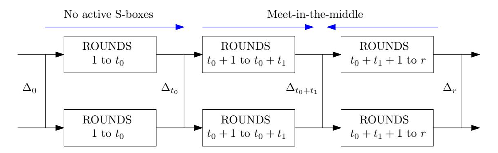
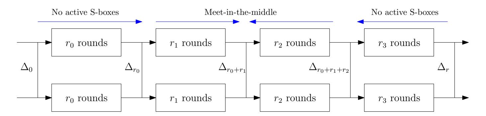
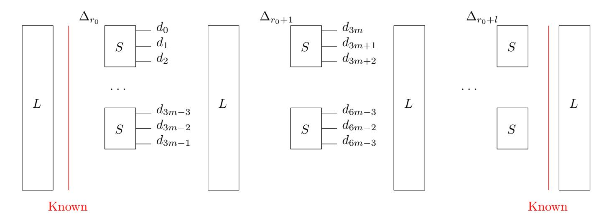
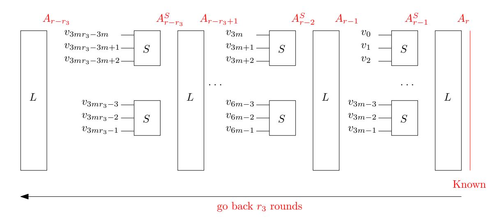
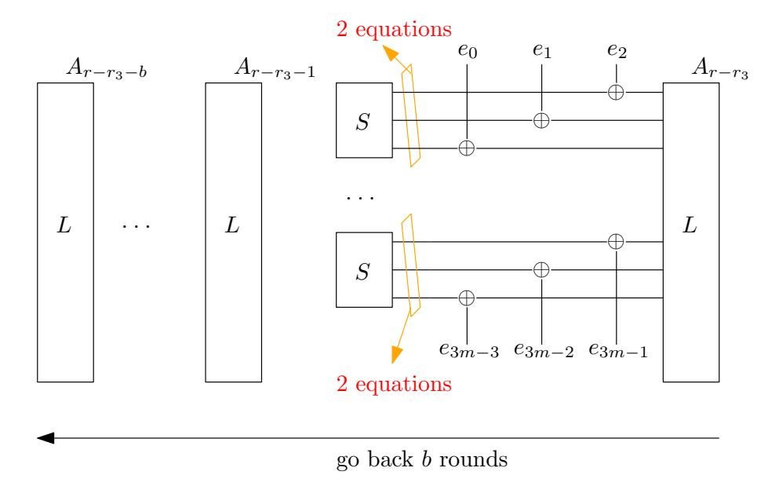
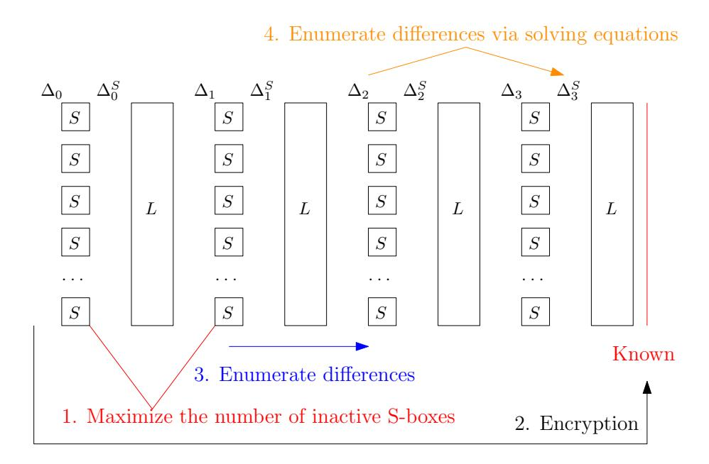

{0}------------------------------------------------

## Cryptanalysis of Full LowMC and LowMC-M with Algebraic Techniques

Fukang Liu1,<sup>2</sup> , Takanori Isobe2,3,<sup>4</sup> , Willi Meier<sup>5</sup>

 East China Normal University, Shanghai, China liufukangs@163.com University of Hyogo, Hyogo, Japan National Institute of Information and Communications Technology, Tokyo, Japan PRESTO, Japan Science and Technology Agency, Tokyo, Japan takanori.isobe@ai.u-hyogo.ac.jp FHNW, Windisch, Switzerland willimeier48@gmail.com

Abstract. In this paper, we revisit the difference enumeration technique for LowMC and develop new algebraic techniques to achieve efficient keyrecovery attacks. In the original difference enumeration attack framework, an inevitable step is to precompute and store a set of intermediate state differences for efficient checking via the binary search. Our first observation is that Bar-On et al.'s general algebraic technique developed for SPNs with partial nonlinear layers can be utilized to fulfill the same task, which can make the memory complexity negligible as there is no need to store a huge set of state differences any more. Benefiting from this technique, we could significantly improve the attacks on LowMC when the block size is much larger than the key size and even break LowMC with such a kind of parameter. On the other hand, with our new key-recovery technique, we could significantly improve the time to retrieve the full key if given only a single pair of input and output messages together with the difference trail that they take, which was stated as an interesting question by Rechberger et al. at ToSC 2018. Combining both techniques, with only 2 chosen plaintexts, we could break 4 rounds of LowMC adopting a full S-Box layer with block size of 129, 192 and 255 bits, respectively, which are the 3 recommended parameters for Picnic3, an alternative third-round candidate in NIST's Post-Quantum Cryptography competition. We have to emphasize that our attacks do not indicate that Picnic3 is broken as the Picnic use-case is very different and an attacker cannot even freely choose 2 plaintexts to encrypt for a concrete LowMC instance. However, such parameters are deemed as secure in the latest LowMC. Moreover, much more rounds of seven instances of the backdoor cipher LowMC-M as proposed by Peyrin and Wang in CRYPTO 2020 can be broken without finding the backdoor by making full use of the allowed 2<sup>64</sup> data. The above mentioned attacks are all achieved with negligible memory.

Keywords: LowMC, LowMC-M, linearization, key recovery, negligible memory

{1}------------------------------------------------

## 1 Introduction

LowMC [\[5\]](#page-28-0), a family of flexible Substitution-Permutation-Network (SPN) block ciphers aiming at achieving low multiplicative complexity, is a relatively new design in the literature and has been utilized as the underlying block cipher of the post-quantum signature scheme Picnic [\[3\]](#page-28-1), which is an alternative thirdround candidate in NIST's Post-Quantum Cryptography competition [\[1\]](#page-28-2). The feature of LowMC is that users can independently choose the parameters to instantiate it, from the number of S-boxes in each round to the linear layer, key schedule function and round constants.

To achieve a low multiplicative complexity, the construction adopting a partial S-box layer (only partial state bits will pass through the S-boxes and an identity mapping is applied for the remaining state bits) together with a random dense linear layer is most used. As such a construction is relatively new, novel cryptanalysis techniques are required. Soon after its publication, the higher-order differential attack and interpolation attack on LowMC were proposed [\[16,](#page-29-0)[14\]](#page-29-1), both of which required many chosen plaintexts. To resist these attacks, LowMC v2 was proposed, i.e. new formulas were used to determine the secure number of rounds. To analyse one of the most useful settings, namely a few S-boxes in each round with low allowable data complexities, the so-called difference enumeration technique [\[29\]](#page-30-0), which we call difference enumeration attack, was proposed, which directly made LowMC v2 move to LowMC v3. The difference enumeration attack is a chosen-plaintext attack. The basic idea is to encrypt a pair (or more) of chosen plaintexts and then recover the difference evolutions between the plaintexts through each component in each round, i.e. to recover the differential trail. Finally, the secret key is derived from the recovered differential trail. As a result, the number of the required plaintexts can be as small as 4. For simplicity, LowMC represents LowMC v3 in the remaining part of this paper.

Recently, Picnic3 [\[21\]](#page-30-1) has been proposed and alternative parameters have been chosen for LowMC. Specifically, different from Picnic2 where a partial S-box layer is adopted when instantiating LowMC, a full S-box layer is used when generating the three instances of LowMC in Picnic3. By choosing the number of rounds as 4, the designers found that the cost of signing time and verifying time can be reduced while the signature size is almost kept the same with that of Picnic2 [\[3\]](#page-28-1). By increasing the number of rounds to 5 for a larger security margin, the cost is still lower than that of Picnic2. Consequently, 4-round LowMC is recommended and 5-round LowMC is treated as an alternative choice.

As can be found in the latest source code [\[2\]](#page-28-3) to determine the secure number of rounds, the 3 instances of 4-round LowMC used in Picnic3 are deemed as secure. However, there is no thorough study for the constructions adopting a full S-box layer and low allowable data complexities (as low as 2 plaintexts[6](#page-1-0) ).

<span id="page-1-0"></span><sup>6</sup> In the security proof of Picnic, 2 plaintexts are required, which can be found at footnote 11 in Page 10 in [\[10\]](#page-29-2). This is also our motivation to analyze such instances with only 2 allowed plaintexts. In the security proof, the parameters with 2 allowed plaintexts are treated as secure.

{2}------------------------------------------------

Therefore, it is meaningful to make an investigation in this direction. It should be mentioned that a recent guess-and-determine attack with 1 plaintext can only reach 2 rounds for the constructions with a full S-box layer [\[7\]](#page-28-4). Moreover, a parallel work [\[12\]](#page-29-3) also shows that 2 out of 3 instances of the 4-round LowMC in the Picnic3 setting can be broken, though it requires a huge amount of memory.

Moreover, a family of tweakable block ciphers called LowMC-M [\[27\]](#page-30-2) was proposed in CRYPTO 2020, which is built on LowMC and allows to embed a backdoor in the instantiation. It is natural to ask whether the additional available degrees of freedom of the tweak can give more power to an attacker. Based on the current cryptanalysis [\[16,](#page-29-0)[14,](#page-29-1)[29\]](#page-30-0), the designers claim that all the parameters of LowMC-M are secure even if the tweak is exploitable by an attacker.

Related Techniques. For the SPNs with partial nonlinear layers, Bar-On et al. have described an efficient algebraic approach [\[8\]](#page-28-5) to search for differential trails covering a large number of rounds, given that the predefined number of active S-boxes is not too large. First, the attacker introduces intermediate variables to represent the state difference after the first round. Then, traverse all possible differential patterns where the number of active S-boxes is below a predefined value. For each pattern, in the following consecutive rounds, introduce again intermediate variables to represent the output differences of all active S-boxes, whose positions have already been fixed. Finally, set up equations in terms of these variables according to the positions of the inactive S-boxes as their input and output differences must be 0 and all of them can be written as linear expressions in these variables. Such a strategy has been successfully applied to full Zorro [\[17\]](#page-29-4).

For algebraic techniques, they seem to be prominent tools to analyze designs using low-degree S-boxes. The recent progress made in the cryptanalysis of Keccak is essentially based on algebraic techniques, including the preimage attacks [\[19,](#page-29-5)[22,](#page-30-3)[25\]](#page-30-4), collision attacks [\[13,](#page-29-6)[28,](#page-30-5)[30,](#page-30-6)[18\]](#page-29-7) and cube attacks [\[15,](#page-29-8)[20,](#page-29-9)[23\]](#page-30-7).

A pure algebraic attack is to construct a multivariate equation system to describe the target problem and then to solve this equation system efficiently. When the equation system is linear, the well-known gaussian elimination can be directly applied. However, when the equation system is nonlinear, solving such an equation system is NP-hard even if it is quadratic. For the design of block ciphers, there may exist undesirable algebraic properties inside the design which can simplify the equation system and can be further exploitable to accelerate the solving of equations. Such an example can be found in the recent cryptanalysis of the initial version of MARVELLOUS [\[6\]](#page-28-6) using Gr¨obner basis attacks [\[4\]](#page-28-7). Indeed, there was once a trend to analyze the security of AES against algebraic attacks [\[11](#page-29-10)[,26\]](#page-30-8). In the literature, the simple linearization and guess-and-determine methods are also common techniques to solve a nonlinear multivariate equation system.

Recently at CRYPTO 2020, a method is proposed to automatically verify a specified differential trail [\[24\]](#page-30-9). The core technique is to accurately capture the relations between the difference transitions and value transitions. We are inspired from such an idea and will further demonstrate that when the relations 

{3}------------------------------------------------

between the two transitions are special and when the difference transitions are special, under the difference enumeration attack framework [\[29\]](#page-30-0), it is possible to utilize algebraic techniques to efficiently recover the differential trail for a single pair of (plaintext, ciphertext) and then to efficiently retrieve the full key from the recovered differential trail.

Our Contributions. This work is based on the difference enumeration attack framework and we developed several non-trivial techniques to significantly improve the cryptanalysis of LowMC. Our results are detailed as follows:

- 1. Based on Bar-On et al.'s general algebraic technique [\[8\]](#page-28-5), it is feasible to efficiently check the compatibility of differential trails in the difference enumeration attack [\[29\]](#page-30-0) by solving a linear equation system, which directly leads to negligible memory complexity. Moreover, it can be found that this technique will be more effective for LowMC due to a special property of the 3-bit S-box, especially when the partial nonlinear layer is close to a full nonlinear layer.
- 2. By studying the S-box of LowMC, we develop an efficient algebraic technique to retrieve the full key if given only a single pair of (plaintext, ciphertext) along with the corresponding differential trail that they take, which was stated as an interesting question by Rechberger et al. at ToSC 2018.
- 3. We further develop a new difference enumeration attack framework to analyze the constructions adopting a full S-box layer and low allowable data complexities.
- 4. Combining our techniques, we could break the 3 recommended parameters of 4-round LowMC used in Picnic3, which are treated as secure against the existing cryptanalysis techniques, though it cannot lead to an attack on Picnic3. In addition, much more rounds of 7 instances of LowMC-M can be broken without finding the backdoor, thus violating the security claim of the designers.

All our key-recovery attacks on LowMC only require 2 chosen plaintexts and negligible memory. For the attacks on LowMC-M, we will make full use of the allowed data to achieve more rounds. More details are displayed in [Table 1,](#page-18-0) [Table 2](#page-19-0) and [Table 3.](#page-26-0) To advance the understanding of the secure number of rounds for both LowMC and LowMC-M, we focus on the attacks reaching the largest number of rounds with the complexity below the exhaustive search.

Organization. A brief introduction of LowMC and LowMC-M is given in Section [2.](#page-4-0) We then revisit the difference enumeration attack framework in Section [3.](#page-5-0) In Section [4,](#page-7-0) we make a study on the S-box of LowMC. The techniques to reduce the memory complexity and to reduce the cost to retrieve the secret key from a differential trail are detailed in Section [5](#page-10-0) and Section [6,](#page-12-0) respectively. The application of the two techniques to LowMC with a partial S-box layer and LowMC-M can be referred to Section [7.](#page-17-0) The attack on LowMC with a full S-box layer is explained in Section [8.](#page-19-1) The experimental results are reported in Section [9.](#page-26-1) Finally, we conclude the paper in Section [10.](#page-27-0)

{4}------------------------------------------------

## <span id="page-4-0"></span>2 Preliminaries

#### 2.1 Notation

As there are many parameters for both LowMC [5] and LowMC-M [27], we use n, k, m and R to represent the block size in bits, the key size in bits, the number of S-boxes in each round and the total number of rounds, respectively. Besides, the number of allowed data under each key is denoted by  $2^{D}$ . In addition, the following notations will also be used:

- 1.  $Pr[\omega]$  represents the probability that the event  $\omega$  happens.
- 2.  $Pr[\omega|\chi]$  represents the conditional probability, i.e. the probability that  $\omega$  happens under the condition that  $\chi$  happens.
- 3. x >> y represents that x is much larger than y.

#### 2.2 Description of LowMC

LowMC [5] is a family of SPN block ciphers proposed by Albrecht et al. in Eurocrypt 2015. Different from conventional block ciphers, the instantiation of LowMC is not fixed and each user can independently choose parameters to instantiate LowMC.

LowMC follows a common encryption procedure as most block ciphers. Specifically, it starts with a key whitening (**WK**) and then iterates a round function R times. The round function at the (i+1)-th  $(0 \le i \le R-1)$  round can be described as follows:

- 1. SBoxLayer (**SB**): A 3-bit S-box  $S(x_0, x_1, x_2) = (x_0 \oplus x_1 x_2, x_0 \oplus x_1 \oplus x_0 x_2, x_0 \oplus x_1 \oplus x_2 \oplus x_0 x_1)$  will be applied to the first 3m bits of the state in parallel, while an identity mapping is applied to the remaining n-3m bits.
- 2. MatrixMul (**L**): A regular matrix  $L_i \in \mathbb{F}_2^{n \times n}$  is randomly generated and the n-bit state is multiplied with  $L_i$ .
- 3. ConstantAddition (**AC**): An *n*-bit constant  $C_i \in \mathbb{F}_2^n$  is randomly generated and is XORed to the *n*-bit state.
- 4. KeyAddition (**AK**): A full-rank  $n \times k$  binary matrix  $M_{i+1}$  is randomly generated. The *n*-bit round key  $K_{i+1}$  is obtained by multiplying the *k*-bit master key with  $M_{i+1}$ . Then, the *n*-bit state is XORed with  $K_{i+1}$ .

The whitening key is denoted by  $K_0$  and it is also calculated by multiplying the master key with a random  $n \times k$  binary matrix  $M_0$ .

It has been studied that there is an equivalent representation of LowMC by placing (**AK**) between (**SB**) and (**L**). In this way, the size of the round key  $K_i$  (i > 0) becomes 3m, which is still linear in the k-bit master key and can be viewed as multiplying the master key with a  $3m \times k$  random binary matrix. Notice that  $K_0$  is still an n-bit value. We will use this equivalent representation throughout this paper for simplicity.

Moreover, for convenience, we denote the plaintext by p and the ciphertext by c. The state after **WK** is denoted by  $A_0$ . In the (i + 1)-th round, the input

{5}------------------------------------------------

state of **SB** is denoted by  $A_i$  and the output state of **SB** is denoted by  $A_i^S$ , as shown below:

$$p \xrightarrow{\mathbf{WK}} A_0 \xrightarrow{\mathbf{SB}} A_0^S \xrightarrow{\mathbf{AK}} \xrightarrow{\mathbf{L}} \xrightarrow{\mathbf{AC}} A_1 \to \cdots \to A_{R-1} \xrightarrow{\mathbf{SB}} A_{R-1}^S \xrightarrow{\mathbf{AK}} \xrightarrow{\mathbf{L}} \xrightarrow{\mathbf{AC}} A_R.$$

In addition, we also introduce the notations to represent the xor difference transitions, as specified below:

$$\Delta_p \xrightarrow{\mathbf{WK}} \Delta_0 \xrightarrow{\mathbf{SB}} \Delta_0^S \xrightarrow{\mathbf{AK}} \xrightarrow{\mathbf{L}} \xrightarrow{\mathbf{AC}} \Delta_1 \to \cdots \to \Delta_{R-1} \xrightarrow{\mathbf{SB}} \Delta_{R-1}^S \xrightarrow{\mathbf{AK}} \xrightarrow{\mathbf{L}} \xrightarrow{\mathbf{AC}} \Delta_R.$$

Specifically, in the (i + 1)-th round, the difference of the input state of **SB** is denoted by  $\Delta_i$  and the difference of the output state of **SB** is denoted by  $\Delta_i^S$ . The difference of plaintexts is denoted by  $\Delta_p$ , i.e.  $\Delta_p = \Delta_0$ .

**Definition 1.** A differential trail  $\Delta_0 \to \Delta_1 \to \cdots \to \Delta_r$  is called a r-round **compact differential trail** when all  $(\Delta_j, \Delta_j^S)$   $(0 \le j \le r-1)$  and  $\Delta_r$  are known.

LowMC-M [27] is a family of tweakable block ciphers built on LowMC, which was introduced by Peyrin and Wang at CRYPTO 2020. The feature of LowMC-M is that backdoors can be inserted in the instantiation. The only difference between LowMC and LowMC-M is that there is an addition operation AddSubTweak (AT) after AK and WK where the sub-tweaks are the output of an extendable-output-function (XOF) function by setting the tweak as the input. A detailed description can be referred to the full version of this paper on eprint.

#### <span id="page-5-0"></span>3 The Difference Enumeration Techniques

In this section, we briefly revisit the difference enumeration techniques in [29]. The overall procedure can be divided into three phases, as depicted in Fig. 1.

- Phase 1: Determine an input difference  $\Delta_0$  such that it will not activate any S-boxes in the first  $t_0$  rounds, i.e.  $Pr[\Delta_0 \to \Delta_{t_0}] = 1$ .
- Phase 2: Compute the corresponding  $\Delta_{t_0}$  from  $\Delta_0$  obtained at Phase 1. Then, enumerate the differences forwards for  $t_1$  consecutive rounds and collect all reachable values for  $\Delta_{t_0+t_1}$ . Store all possible values of  $\Delta_{t_0+t_1}$  in a table denoted by  $D_f$ .
- Phase 3: Encrypt a pair of plaintexts whose difference equals  $\Delta_0$  and compute the difference  $\Delta_r$  of the corresponding two ciphertexts. Enumerate all reachable differences of  $\Delta_{t_0+t_1}$  backwards for  $t_2=r-t_0-t_1$  rounds staring from  $\Delta_r$  and check whether it is in  $D_f$ .

For convenience, suppose the reachable differences of  $\Delta_{t_0+t_1}$  obtained by computing backwards are stored in a table denoted by  $D_b$ , though there is no need to store them. To construct a distinguisher, one should expect that  $|D_f| \times |D_b| < 2^n$ . In this way, one could only expect at most one solution that

{6}------------------------------------------------

<span id="page-6-0"></span>

Fig. 1: The framework of the difference enumeration techniques

can connect the difference transitions in both directions. Since there must be a solution, the solution found with the above difference enumeration techniques is the actual solution. After the compact differential trail is determined, i.e. the difference transitions in each round are fully recovered, the attacker launches the key-recovery phase.

To increase the number of rounds that can be attacked, the authors exploited the concept of d-difference<sup>7</sup> [31], which can increase the upper bound for  $|D_f| \times |D_b|$ , i.e.  $|D_f| \times |D_b| < 2^{nd}$  and  $max(|D_f|, |D_b|) < 2^k$ . The constraint  $|D_f| \times |D_b| < 2^{nd}$  can ensure there is only one valid d-differential trail left since there are in total  $2^{nd}$  possible values for the n-bit d-difference. The remaining two constraints are used to ensure the time complexity to enumerate d-differences cannot exceed that of the brute-force attack. It should be noted that  $|D_f| = \lambda_d^{mt_1}$  and  $|D_b| = \lambda_d^{mt_2}$ , where  $\lambda_d$  denotes the average number of reachable output d-differences over the S-box for a uniformly randomly chosen input d-difference. For the 3-bit S-box used in LowMC,  $\lambda_1 \approx 3.62 \approx 2^{1.86}$  and  $\lambda_2 \approx 6.58 \approx 2^{2.719}$ . Therefore, a larger number of rounds can be covered with d-differences (d > 1) when  $k \ge n$ . As for n > k, it is thus more effective to use the standard difference (d = 1) rather than the d-difference (d > 1). This paper is irrelevant to the concept of d-difference [31] and hence we omit the corresponding explanation.

It is claimed in [29] that to efficiently recover the secret key based on the recovered compact differential trail, a few pairs of plaintexts are required to identify the unique secret key. As our key-recovery technique is quite different, we refer the interested readers to [29] for details.

#### 3.1 The Extended Framework

It is stated in [29] that the above framework can be extended to more rounds if the allowed data are increased. Specifically, as depicted in Fig. 2, when the allowed data complexity is  $2^D$ , after choosing a good starting input d-difference in the plaintexts, the attacker could construct  $\lfloor \frac{2^D}{d+1} \rfloor$  different tuples of plaintexts satisfying the chosen input d-difference. For each tuple of plaintexts, the attacker can obtain the corresponding d-difference in the ciphertexts and check whether it will activate the S-boxes in the last  $r_3$  rounds.

<span id="page-6-1"></span>For a tuple of (d+1) values  $(u_0, u_1, \ldots, u_d)$ , its d-difference is defined as  $(\delta_0, \delta_1, \ldots, \delta_{d-1}) = (u_0 \oplus u_1, u_0 \oplus u_2, \ldots, u_0 \oplus u_d)$ .

{7}------------------------------------------------

<span id="page-7-1"></span>

Fig. 2: The extended framework of the difference enumeration techniques

From now on, as shown in Fig. 2, it is assumed that there is a probability-1 differential trail covering the first  $r_0$  rounds, and that the difference enumeration in the forward and backward directions will cover  $r_1$  and  $r_2$  rounds, respectively.

A simple extension of the original difference enumeration attack [29] is to consider larger  $r_1$  and  $r_2$ . In this case, there will be much more candidates for compact differential trails, i.e. the number of which is  $\lambda_1^{r_1+r_2} \times 2^{-n}$  for the standard xor difference. Then, it is essential to efficiently retrieve the full key from each compact differential trail, which is indeed an interesting question raised in [29].

Based on the method mentioned in [29], when only 2 plaintexts are allowed, the cost to retrieve the full key from each compact differential trail is lower bounded by  $2^{k/3}$  as each non-zero difference transition through the 3-bit S-box will suggest two solutions and the master key is a k-bit value. The reason why it is a lower bound is that there may exist inactive S-boxes in the differential trails and the attacker has to try all the 8 values. Thus, an efficient method to retrieve the full key will allow us to enlarge  $\lambda_1^{m(r_1+r_2)} \times 2^{-n}$ , thus increasing the number of rounds that can be attacked.

Apart from the high cost of key recovery, in the original difference enumeration attack, it seems to be inevitable that the attacker needs to store a huge set of  $\Delta_{r_0+r_1}$ , whose size is about  $\lambda_1^{mr_1}$  for the standard xor difference. We believe that attacks with negligible memory are more effective and meaningful if compared with a pure exhaustive key search.

### <span id="page-7-0"></span>4 Observations on the S-box

Before introducing our linearization-based techniques for LowMC, it is necessary to describe our observations on the 3-bit S-box used in LowMC. Denote the 3-bit input and output of the S-box by  $(x_0, x_1, x_2)$  and  $(z_0, z_1, z_2)$ , respectively. Based on the definition of the S-box, the following relations hold:

$$z_0 = x_0 \oplus x_1 x_2, \ z_1 = x_0 \oplus x_1 \oplus x_0 x_2, \ z_2 = x_0 \oplus x_1 \oplus x_2 \oplus x_0 x_1.$$

Therefore, for the inverse of the S-box, there will exist

$$x_0 = z_0 \oplus z_1 \oplus z_1 z_2, \ x_1 = z_1 \oplus z_0 z_2, \ x_2 = z_0 \oplus z_1 \oplus z_2 \oplus z_0 z_1.$$

{8}------------------------------------------------

<span id="page-8-0"></span>According to the specification of the 3-bit S-box, we observed the following useful properties of the S-box.

Observation 1 For each valid non-zero difference transition (∆x0, ∆x1, ∆x2) → (∆z0, ∆z1, ∆z2), the inputs conforming to such a difference transition will form an affine space of dimension 1. In addition, (z0, z1, z2) becomes linear in (x0, x1, x2), i.e. the S-box is freely linearized for a valid non-zero difference transition. A similar property also applies to the inverse of the S-box.

<span id="page-8-2"></span>Observation 2 For each non-zero input difference (∆x0, ∆x1, ∆x2), its valid output differences form an affine space of dimension 2. A similar property also applies to the inverse of the S-box.

<span id="page-8-1"></span>Observation 3 For an inactive S-box, the input becomes linear in the output after guessing two output bits. If guessing two input bits, the output also becomes linear in the input. The same property holds for its inverse.

Example. The last observation is trivial and let us make a short explanation for the remaining observations. For example, when (∆x0, ∆x1, ∆x2) = (0, 0, 1) and (∆z0, ∆z1, ∆z2) = (0, 0, 1), it can be derived that x<sup>0</sup> = 0 and x<sup>1</sup> = 0. Therefore, the expressions of (z0, z1, z2) become z<sup>0</sup> = 0, z<sup>1</sup> = 0 and z<sup>2</sup> = x2. When the input difference is (0, 1, 1), the corresponding valid output differences satisfy ∆z<sup>1</sup> ⊕∆z<sup>2</sup> = 1. When the output difference is (0, 1, 1), the corresponding valid input differences satisfy ∆x<sup>1</sup> ⊕ ∆x<sup>2</sup> = 1.

Generalization. It is easy to identify [Observation 1](#page-8-0) since it is a 2-differentially uniform 3-bit S-box. However, it is surprising that such a property has never been exploited in the cryptanalysis of LowMC. To generalise our results, we prove that the above 3 observations hold for all 3-bit almost perfect nonlinear (APN) S-boxes. [Observation 3](#page-8-1) is trivial and we only focus on the remaining 2 observations, especially on [Observation 2.](#page-8-2)

To save space, we simply explain what a 3-bit APN S-box is. For simplicity, we still denote the input and output of the S-box by (x0, x1, x2) and (z0, z1, z2) = S ′ (x0, x1, x2), respectively. Formally, for a 3-bit APN S-box, for any valid nonzero difference transition (∆x0, ∆x1, ∆x2) → (∆z0, ∆z1, ∆z2), there are only 2 solutions of (x0, x1, x2) to the following equation:

$$S'(x_0 \oplus \Delta x_0, x_1 \oplus \Delta x_1, x_2 \oplus \Delta x_2) \oplus S'(x_0, x_1, x_2) = (\Delta z_0, \Delta z_1, \Delta z_2).$$

For a 3-bit APN S-box, its algebraic degree must be 2. Hence, the S-box can be defined in the following way:

$$z_0 = \varphi_0(x_0, x_1, x_2) \oplus \kappa_0 x_0 x_1 \oplus \kappa_1 x_0 x_2 \oplus \kappa_2 x_1 x_2 \oplus \epsilon_0,$$
  

$$z_1 = \varphi_1(x_0, x_1, x_2) \oplus \kappa_3 x_0 x_1 \oplus \kappa_4 x_0 x_2 \oplus \kappa_5 x_1 x_2 \oplus \epsilon_1,$$
  

$$z_2 = \varphi_2(x_0, x_1, x_2) \oplus \kappa_6 x_0 x_1 \oplus \kappa_7 x_0 x_2 \oplus \kappa_8 x_1 x_2 \oplus \epsilon_2,$$

{9}------------------------------------------------

where φi(x0, x1, x2) (0 ≤ i ≤ 2) are linear boolean functions and κ<sup>j</sup> ∈ F<sup>2</sup> (0 ≤ j ≤ 8), ϵ<sup>i</sup> ∈ F<sup>2</sup> (0 ≤ i ≤ 2). For a specific 3-bit APN S-box, all φi(x0, x1, x2), κ<sup>j</sup> and ϵ<sup>i</sup> will be fixed.

First, consider the case when (∆x0, ∆x1, ∆x2) = (0, 0, 1). It can be found that there are four assignments to (x0, x1) that will influence the output difference, as shown below, where ∆φ<sup>i</sup> (0 ≤ i ≤ 2) represents the xor difference of the outputs of the linear function φi(x0, x1, x2).

$$(x_{0}, x_{1}) \rightarrow (\Delta z_{0}, \Delta z_{1}, \Delta z_{2})$$

$$(0, 0) \rightarrow (\Delta \varphi_{0}, \Delta \varphi_{1}, \Delta \varphi_{2}),$$

$$(0, 1) \rightarrow (\Delta \varphi_{0} \oplus \kappa_{2}, \Delta \varphi_{1} \oplus \kappa_{5}, \Delta \varphi_{2} \oplus \kappa_{8}),$$

$$(1, 0) \rightarrow (\Delta \varphi_{0} \oplus \kappa_{1}, \Delta \varphi_{1} \oplus \kappa_{4}, \Delta \varphi_{2} \oplus \kappa_{7}),$$

$$(1, 1) \rightarrow (\Delta \varphi_{0} \oplus \kappa_{1} \oplus \kappa_{2}, \Delta \varphi_{1} \oplus \kappa_{4} \oplus \kappa_{5}, \Delta \varphi_{2} \oplus \kappa_{7} \oplus \kappa_{8}).$$

As the S-box is APN, the above four possible values of the output difference (∆z0, ∆z1, ∆z2) are the actual 4 distinct output differences for the input difference (∆x0, ∆x1, ∆x2) = (0, 0, 1). As the set

$$\{(0,0,0),(\kappa_2,\kappa_5,\kappa_8),(\kappa_1,\kappa_4,\kappa_7),(\kappa_1\oplus\kappa_2,\kappa_4\oplus\kappa_5,\kappa_7\oplus\kappa_8)\}$$

forms a linear subspace of dimension 2 over F 3 2 , the 4 possible output differences for the input difference (0, 0, 1) form an affine subspace of dimension 2. For each of the 4 valid difference transitions, there will be 2 linear conditions on the input bits and hence the S-box is always freely linearized, i.e. each output bit can be written as a linear expression in the input bits. Due to the symmetry of the expressions, the same holds for the input differences (1, 0, 0) and (0, 1, 0).

When (∆x0, ∆x1, ∆x2) = (0, 1, 1), we can write the accurate 4 distinct output differences in a similar way, as listed below:

```
(x0, x1 ⊕ x2) → (∆z0, ∆z1, ∆z2)
       (0, 0) → (∆φ0 ⊕ κ2, ∆φ1 ⊕ κ5, ∆φ2 ⊕ κ8),
       (0, 1) → (∆φ0, ∆φ1, ∆φ2),
       (1, 0) → (∆φ0 ⊕ κ0 ⊕ κ1 ⊕ κ2, ∆φ1 ⊕ κ3 ⊕ κ4 ⊕ κ5, ∆φ2 ⊕ κ6 ⊕ κ7 ⊕ κ8),
       (1, 1) → (∆φ0 ⊕ κ0 ⊕ κ1, ∆φ1 ⊕ κ3 ⊕ κ4, ∆φ2 ⊕ κ6 ⊕ κ7).
```

Therefore, for each valid difference transition, there are 2 linear conditions on the input bits and the S-box is freely linearized. In addition, it can be found that the set

$$\{(0,0,0),(\kappa_2,\kappa_5,\kappa_8),\\ (\kappa_0 \oplus \kappa_1,\kappa_3 \oplus \kappa_4,\kappa_6 \oplus \kappa_7),(\kappa_0 \oplus \kappa_1 \oplus \kappa_2,\kappa_3 \oplus \kappa_4 \oplus \kappa_5,\kappa_6 \oplus \kappa_7 \oplus \kappa_8)\}$$

forms a linear subspace of dimension 2 over F 3 2 , thus resulting in the fact that the 4 output differences form an affine subspace of dimension 2. Due to the symmetry, the same conclusion also holds for the input differences (1, 1, 0) and (1, 0, 1).

{10}------------------------------------------------

When (∆x0, ∆x1, ∆x2) = (1, 1, 1), the 4 distinct output differences can be written as follows:

```
(x0 ⊕ x1, x1 ⊕ x2) → (∆z0, ∆z1, ∆z2)
             (0, 0) → (φ0 ⊕ κ0 ⊕ κ1 ⊕ κ2, φ1 ⊕ κ3 ⊕ κ4 ⊕ κ5, φ2 ⊕ κ6 ⊕ κ7 ⊕ κ8),
             (0, 1) → (φ0 ⊕ κ0, φ1 ⊕ κ3, φ2 ⊕ κ6),
             (1, 0) → (φ0 ⊕ κ2, φ1 ⊕ κ5, φ2 ⊕ κ8),
             (1, 1) → (φ0 ⊕ κ1, φ1 ⊕ κ4, φ2 ⊕ κ7).
```

Therefore, for each valid difference transition, there are 2 linear conditions on the input bits and the S-box is freely linearized. Moreover, since the set

```
{(0, 0, 0),(κ1 ⊕ κ2, κ4 ⊕ κ5, κ7 ⊕ κ8),
(κ0 ⊕ κ1, κ3 ⊕ κ4, κ6 ⊕ κ7),(κ0 ⊕ κ2, κ3 ⊕ κ5, κ6 ⊕ κ8)}
```

forms a linear subspace of dimension 2 over F 3 2 , the 4 distinct output differences must also form an affine subspace of dimension 2.

As the inverse of an APN S-box is also APN, [Observation 1](#page-8-0) and [Observation 2](#page-8-2) hold for all 3-bit APN S-boxes, thus completing the proof.

## <span id="page-10-0"></span>5 Reducing the Memory Complexity

As mentioned in the previous section, it seems to be inevitable to use a sufficiently large amount of memory to store some reachable differences to achieve efficient checking for the reachable differences computed backwards. It is commonly believed that attacks requiring too much memory indeed cannot compete with a pure exhaustive key search. Therefore, our first aim is to significantly reduce the memory complexity in both the original and extended frameworks.

The main underlying strategy in Bar-On et al.'s algorithm [\[8\]](#page-28-5) is to introduce intermediate variables to represent the output differences of S-boxes. Then, each intermediate state difference can be written as linear expressions in terms of these variables. It is obvious that such a strategy can be used to efficiently check whether the reachable differences computed backwards can be matched. Specifically, for each reachable difference computed in the backward direction, we can construct an equation system whose solutions can correspond to the difference transitions in the forward direction.

As illustrated in Fig. [3,](#page-11-0) after we determine the differential trail in the first r<sup>0</sup> rounds, ∆<sup>r</sup><sup>0</sup> is known and there should be at least one active S-box when taking two inputs with ∆<sup>r</sup><sup>0</sup> as difference to the (r<sup>0</sup> + 1)-th round, otherwise we could extend the deterministic differential trail for one more round.

As in [\[8\]](#page-28-5), we can introduce at most 3m variables (d0, · · ·, d3m−1) to denote the output difference of the m S-boxes for the input difference ∆<sup>r</sup><sup>0</sup> . However, by exploiting [Observation 2,](#page-8-2) it is sufficient to introduce at most 2m variables. Specifically, for an inactive S-box, the output difference is (0, 0, 0), i.e. three

{11}------------------------------------------------

<span id="page-11-0"></span>

Fig. 3: Constructing the affine subspace of reachable differences

linear relations can be derived for these variables. When there is an active S-box, the valid output differences form an affine space of dimension 2 according to Observation 2, i.e. 1 linear relation can be obtained. In other words, we only need to introduce at most 3m-m=2m variables to denote the output differences for  $\Delta_{r_0}$ . For the next l-1 rounds, since the input difference of the S-box is uncertain due to the diffusion of a random linear layer, we directly introduce 3m(l-1) variables  $(d_{3m}, \dots, d_{3ml-1})$  to represent the output differences for each S-box. In this way,  $\Delta_{r_0+l}$  is obviously linear in the introduced 3m(l-1)+2m=3ml-m=m(3l-1) variables. In other words,  $\Delta_{r_0+l}$  can be written as linear expressions in terms of the introduced m(3l-1) variables.

Then, for the difference enumeration in the backward direction, after we obtain the output difference of the S-box for  $\Delta_{r_0+l}$ , we start to construct the equation system to connect the output difference. If we directly use the idea in [8], at least n-3m linear equations can be constructed as there are m S-boxes in the nonlinear layer. However, according to Observation 2, once the output difference of the m S-boxes becomes known, it will leak at least m linear relations for the input difference. Specifically, when the S-box is inactive, the input difference is 0, i.e. three linear relations. When the S-box is active, according to Observation 2, one linear relation inside the input difference can be derived. In other words, we could collect at least m + (n-3m) = n - 2m linear equations in terms of the introduced m(3l-1) variables. When

<span id="page-11-1"></span>
$$m(3l-1) \le n-2m \to n \ge m(3l+1),$$
 (1)

we can expect at most one solution of the equation system.

Once a solution is found, all output differences of the S-box in the middle l rounds become known and we can easily check whether the difference transitions are valid by computing forwards. If the transitions are valid, a connection between the difference transitions in both directions are constructed. Otherwise, we need to consider another enumerated output difference of the S-box for  $\Delta_{r_0+l}$  in the backward direction. We have to stress that when enumerating the differences backwards for  $r_2$  rounds, there are indeed  $l+1+r_2$  rounds in the middle, i.e.  $r_1 = l+1$  if following the extended framework as shown in Fig. 2.

{12}------------------------------------------------

However, in some cases where m is large, there is no need to make such a strong constraint as in [Equation 1.](#page-11-1) Even with n < m(3l + 1), at the cost of enumerating all the solutions of the constructed linear equation system, more rounds can be covered. In this way, the time complexity to enumerate differences becomes 21.86mr2+m(3l+1)−n. Thus, the constraint becomes

$$1.86mr_2 + m(3l+1) - n < k. (2)$$

As l = r<sup>1</sup> − 1, it can be derived that

<span id="page-12-4"></span>
$$m(1.86r_2 + 3r_1 - 2) < n + k \tag{3}$$

In addition, the following constraint on r<sup>2</sup> should hold as well.

<span id="page-12-3"></span>
$$1.86mr_2 < k \tag{4}$$

Therefore, when r<sup>1</sup> +r<sup>2</sup> is to be maximized, the above two inequalities should be taken into account. In this way, the time complexity of difference enumeration becomes

<span id="page-12-2"></span>
$$max(2^{1.86mr_2}, 2^{m(1.86r_2+3r_1-2)-n}).$$
 (5)

Comparison. Due to [Observation 2,](#page-8-2) we can introduce fewer variables and construct more equations to efficiently compute the compact differential trails if comparing our algorithm with the general algorithm in [\[8\]](#page-28-5). The advantage of such an optimized algorithm may be not evident when m is much smaller than n. However, as the nonlinear layer is closer to a full nonlinear layer, our algorithm will become more and more effective and may allow us to break one more round, which is essential to break the 4-round LowMC with a full S-box layer discussed in Section [8.](#page-19-1)

## <span id="page-12-0"></span>6 Efficient Algebraic Techniques for Key Recovery

In this section, we describe how to retrieve the full key from a compact differential trail with an algebraic method. Following the extended framework, we assume that there is no active S-box in the last r<sup>3</sup> rounds. As illustrated in Fig. [4,](#page-13-0) we could introduce 3mr<sup>3</sup> variables to represent all the input bits of the S-boxes in the last r<sup>3</sup> rounds. Although A<sup>r</sup> is the known ciphertext, the round key used in AK is unknown in the r-th round. Therefore, the input of the S-box is unknown in the r-th round and is quadratic in terms of the unknown secret key. By introducing variables (v0, · · ·, v3m−1) to represent the expressions of the inputs of the S-box when reversing the S-box, we could write Ar−<sup>1</sup> as linear expressions in terms of these variables[8](#page-12-1) . Similarly, it can be derived that Ar−r<sup>3</sup> can be written as linear expressions in terms of all the introduced 3mr<sup>3</sup> variables (v0, · · ·, v3mr3−1).

<span id="page-12-1"></span><sup>8</sup> If we use the equivalent representation of LowMC, such a statement is correct. If we do not use it, Ar−<sup>1</sup> can be written as linear expressions in terms of (v0, · · ·, v3m−1) and the key bits, which will not affect our attack as our final goal is to construct a linear equation system in terms of the 3mr<sup>3</sup> variables and the key bits. For simplicity, we consider the equivalent representation.

{13}------------------------------------------------

<span id="page-13-0"></span>

Fig. 4: Linearizing the last  $r_3$  rounds

#### 6.1 Exploiting the Leaked Linear Relations

Since all the S-boxes in the last  $r_3$  rounds are inactive, we have to introduce  $3mr_3$  variables to achieve linearization. However, we have not yet obtained any linear equations in terms of these variables. Therefore, we will focus on how to construct a sufficiently large number of linear equations such that there will be a unique solution of these introduced variables.

It should be noticed that the difference enumeration starts from  $\Delta_{r-r_3}$  in the backward direction. For a valid  $r_2$ -round differential propagation ( $\Delta_{r-r_3} \to \Delta_{r-r_3-1} \to \cdots \to \Delta_{r-r_3-r_2}$ ) enumerated in the backward direction, there should be one valid  $r_1$ -round differential propagation ( $\Delta_{r_0} \to \Delta_{r_0+1} \to \cdots \to \Delta_{r_0+r_1}$ ) enumerated in the forward direction such that  $\Delta_{r_0+r_1} = \Delta_{r-r_3-r_2}$ . Once such a sequence is identified, i.e. ( $\Delta_{r_0} \to \cdots \to \Delta_{r-r_3}$ ) is fully known, we start extracting linear equations from the difference transitions inside the S-boxes in the middle  $r_1 + r_2$  rounds.

Specifically, for each active S-box, there will be two linear equations inside the 3-bit output according to Observation 1. In addition, the 3-bit S-box is freely linearized once it is active according to Observation 1, i.e. the 3-bit input can be written as linear expressions in terms of the 3-bit output. Note that  $A_{r-r_3}$  is linear in  $(v_0, \dots, v_{3mr_3-1})$ .

As depicted in Fig. 5, denote the equivalent round key bits used in the  $(r-r_3)$ -th round by  $(e_0, \dots, e_{3m-1})$ . For simplicity, assume that all the S-boxes are active when going back b rounds starting from  $A_{r-r_3}$ . The case when there are inactive S-boxes will be discussed later. Under such an assumption, we could derive 2m linear equations in terms of  $(v_0, \dots, v_{3mr_3-1}, e_0, \dots, e_{3m-1})$  based on Observation 1. In addition, since the input becomes linear in the output for each active S-box,  $A_{r-r_3-1}$  becomes linear in  $(v_0, \dots, v_{3mr_3-1}, e_0, \dots, e_{3m-1})$ . Similarly, denote the equivalent round key bits used in the  $(r-r_3-i)$ -th round by  $(e_{3mi}, \dots, e_{3mi+3m-1})$   $(0 \le i \le b-1)$ . Then, one could derive 2m linear equations in terms of  $(v_0, \dots, v_{3mr_3-1}, e_0, \dots, e_{3mi+3m-1})$  in the  $(r-r_3-i)$ -th round and  $A_{r-r_3-i-1}$  will be linear in  $(v_0, \dots, v_{3mr_3-1}, e_0, \dots, e_{3mi+3m-1})$ . Repeating such a procedure for b rounds backwards, we could collect in total 2mb linear equations

{14}------------------------------------------------

<span id="page-14-0"></span>

Fig. 5: Extract linear equations from the inactive S-boxes

in terms of  $3mr_3 + 3mb$  variables  $(v_0, \dots, v_{3mr_3-1}, e_0, \dots, e_{3mb-1})$ . Since each equivalent round key bit is linear in the k-bit master key according to the linear key schedule function, we indeed succeed in constructing 2mb linear equations in terms of  $(v_0, \dots, v_{3mr_3-1})$  and the k-bit master key. To ensure that there is a unique solution to the equation system, the following constraint should hold:

<span id="page-14-1"></span>
$$2mb \ge k + 3mr_3. \tag{6}$$

As 2m linear equations will be leaked when going back 1 round, there may exist redundant linear equations, i.e.  $2mb > k + 3mr_3$ . Indeed, only

$$h = \lceil \frac{(k+3mr_3) - 2m(b-1)}{2} \rceil \tag{7}$$

active S-boxes are needed in the  $(r-r_3-b)$ -th round. In this way, we only need in total

$$H = h + m(b-1) \tag{8}$$

S-boxes to ensure that there exists a unique solution of the constructed equation system.

#### 6.2 Linearizing the Inactive S-boxes

After discussing the case when all the S-boxes are active when going back b rounds starting from  $A_{r-r_3}$ , consider the case when there are q inactive S-boxes among the required H S-boxes in these b rounds ( $0 \le q \le H$ ). Specifically, we aim to compute the time complexity to recover the full key for such a case.

While 2 linear equations can be freely derived from the output of an active S-box and the input becomes freely linear in the output for an active S-box as explained previously, linearizing the inactive S-box will require additional cost

{15}------------------------------------------------

when going backwards. For an inactive S-box, it can be linearized by guessing two bits of its input or output according to Observation 3. In other words, even for an inactive S-box, we could guess 2 linear equations for its output and then the input still becomes linear in the output. Therefore, the number of equations remain the same as in the case when all the S-boxes are active. The only cost is that we need to iterate  $2^{2q}$  times of guessing. If Equation 6 holds, for each time of guessing, one could only expect 1 unique solution of the k-bit master key.

Assuming there are N valid compact differential trails left in the extended framework, we can expect there are  $N \times \sum_{q=0}^{H} (\frac{7}{8})^{H-q} \times (\frac{1}{8})^q \times {H \choose q}$  differential trails where there are q inactive S-boxes in the key-recovery rounds. Recovering the full key from each of these trails will require time complexity  $2^{2q}$ . After the full key is recovered, we need to further verify it via the plaintext-ciphertext pair. Hence, the expected time to recover the full key from one random compact differential trail can be evaluated as follows:

$$T_0 = \sum_{q=0}^{H} (\frac{7}{8})^{H-q} \times (\frac{1}{8})^q \times \binom{H}{q} \times 2^{2q} = \sum_{q=0}^{H} (\frac{7}{8})^{H-q} \times (\frac{1}{2})^q \times \binom{H}{q} = 1.375^H.$$

Therefore, the total time complexity to recover the correct master key is

$$T_1 = N \times 1.375^H = N \times 2^{0.46H}. (9)$$

Similar to the above method, we could also give a formula to compute the expected time to recover the correct key if following the simple method as discussed in [29]. It should be noted that there is no extra strategy used in the key-recovery phase in [29] if with only 2 plaintexts. Specifically, when the S-box is active, the attacker needs to try the two possible values. When the S-box is inactive, the attacker needs to try all the 8 possible values. However, since the attacker could always derive 3-bit information of the master key from one S-box in this way, he only needs to go back  $b' = \lceil \frac{k-mr_3}{3m} \rceil$  rounds and the number of required S-boxes is  $H' = \lceil \frac{k}{3} \rceil - mr_3$  in these b' rounds. Thus, the expected time  $T_2$  can be formalized as follows:

$$T_{2} = N \times 8^{mr_{3}} \times \sum_{q=0}^{H'} (\frac{7}{8})^{H'-q} \times (\frac{1}{8})^{q} \times \binom{H'}{q} \times 8^{q} \times 2^{H'-q}$$

$$= N \times 2^{3mr_{3}} \times \sum_{q=0}^{H'} (\frac{7}{8} \times 2)^{H'-q} \times (\frac{1}{8} \times 8)^{q} \times \binom{H'}{q}$$

$$= N \times 2^{3mr_{3}} \times (\frac{7}{4} + 1)^{H'}.$$

To explain the significant improvement achieved by our linearization techniques to recover the master key, we make a comparison between  $T_1$  and  $T_2$  as shown below:

$$\frac{T_2}{T_1} = \frac{2^{3mr_3}(\frac{7}{4}+1)^{H'}}{1.375^H}.$$

{16}------------------------------------------------

Since 
$$H = \lceil \frac{k+3mr_3}{2} \rceil$$
 and  $H' = \lceil \frac{k}{3} \rceil - mr_3$ , we have 
$$\frac{T_2}{T_1} = \frac{2^{3mr_3} (\frac{7}{4} + 1)^{H'}}{1.375^H} \approx \frac{2^{3mr_3 + 1.46(\frac{k}{3} - mr_3)}}{2^{0.46(0.5k + 1.5mr_3)}} \approx 2^{0.256k + 0.85mr_3}.$$

Obviously, our new key-recovery technique is much faster if compared with the method in [\[29\]](#page-30-0).

#### 6.3 Further Improvement

Indeed, one could further reduce the cost to retrieve the full key from a compact differential trail. Specifically, we first lower bound b as in [Equation 6.](#page-14-1) Then, when going back r<sup>3</sup> + b − 1 rounds from the ciphertext, there will be 2m(b − 1) leaked equations and the last r<sup>3</sup> + b − 1 rounds are fully linearized. Since only k + 3mr<sup>3</sup> equations are needed and each active S-box will leak 2 equations, we only need to use

$$h = \lceil \frac{(k+3mr_3) - 2m(b-1)}{2} \rceil$$

active S-boxes in the (r − r<sup>3</sup> − b)-th round.

Therefore, in the (r − r<sup>3</sup> − b)-th round, when there are more than h active S-boxes, there is no need to guess extra equations but we still need to construct the equation system. However, when there are i (i < h) active S-boxes, it is necessary to guess 2h − 2i extra equations. Therefore, the expected time complexity can be refined as:

$$T_{3} = N \times T_{4} \times \sum_{i=0}^{h} {m \choose i} \times (\frac{7}{8})^{i} \times (\frac{1}{8})^{m-i} \times 2^{2h-2i}$$

$$+ N \times T_{4} \times \sum_{i=h+1}^{m} {m \choose i} \times (\frac{7}{8})^{i} \times (\frac{1}{8})^{m-i}$$

$$\approx N \times T_{4} \times 2^{2h} \times \sum_{i=0}^{h} {m \choose i} \times (\frac{7}{32})^{i} \times (\frac{1}{8})^{m-i}$$

$$+ N \times T_{4} \times (1 - \sum_{i=0}^{h} {m \choose i} \times (\frac{7}{8})^{i} \times (\frac{1}{8})^{m-i})$$

$$< N \times T_{4} \times (1 + 2^{2h} \times \sum_{i=0}^{h} {m \choose i} \times (\frac{7}{32})^{i} \times (\frac{1}{8})^{m-i})$$

where

$$T_4 = \sum_{q=0}^{m(b-1)} \left(\frac{7}{8}\right)^{m(b-1)-q} \times \left(\frac{1}{8}\right)^q \times \binom{m(b-1)}{q} \times 2^{2q} = 2^{0.46m(b-1)}.$$

{17}------------------------------------------------

There is no simple approximation for  $T_3$  and we therefore provide a loose upper bound which can be easily calculated, as specified below:

$$T_3 < N \times T_4 \times (1 + 2^{2h} \times \sum_{i=0}^m {m \choose i} \times (\frac{7}{32})^i \times (\frac{1}{8})^{m-i}) = N \times T_4 \times (1 + 2^{2h-1.54m}).$$

Hence, in general, we can use the following formula Equation 10 to calculate the time complexity to retrieve the full key from N compact differential trails.

<span id="page-17-1"></span>
$$T_3 \approx N \times 2^{0.46m(b-1)} \times (1 + 2^{2h-1.54m}).$$
 (10)

It is not surprising that one could go back more than  $b+r_3$  rounds to obtain more leaked linear equations if  $b \leq r_1 + r_2$ . However, the cost of linearization cannot be neglected, i.e. it is necessary to introduce more variables to represent the 3 input bits of an inactive S-box. In other words, although more linear equations can be derived, more variables are involved into the equation system. Note that we need to introduce 3 extra variables to linearize an inactive S-box and only 2 linear equations can be derived from an active S-box. For such a case, it is difficult to give a simple formula describing the expected time complexity to retrieve the full key. Thus, the formula Equation 10 can be viewed as an upper bound.

## <span id="page-17-0"></span>7 Applications

The above two algebraic techniques can be utilized to further understand the security of LowMC as well as LowMC-M. LowMC is the underlying block cipher used in Picnic, which is an alternative third-round candidate in NIST's post-quantum cryptography competition. For LowMC-M, it is a family of block ciphers based on LowMC which allows to insert a backdoor.

#### 7.1 Applications to LowMC with a Partial S-Box Layer

In this section, we describe how to apply our techniques to instantiations with a partial S-box layer. The results are summarized in Table 1. All these attacks only require 2 chosen plaintexts and negligible memory. For better understanding, we take the attack on the parameter (n, k, m, D, R) = (128, 128, 10, 1, 20) for instance.

When (n, k, m, D) = (128, 128, 10, 1), as explained in the extended framework,  $r_3 = 0$  as there are only two allowed plaintexts for each instantiation and  $r_0 = \lfloor \frac{128}{30} \rfloor = 4$ . According to Equation 6, b = 7. Therefore, the time complexity to retrieve the master key becomes  $T_3 \approx 2^{1.86m(r_1+r_2)-128} \times 2^{0.46m(b-1)} = 2^{18.6(r_1+r_2)-81.8} < 2^{128}$  based on Equation 10. The time complexity to enumerate differences is  $max(1.86mr_2, m(1.86r_2 + 3r_1 - 2) - n) = max(18.6r_2, 18.6r_2 + 30r_1 - 148) < 2^{128}$  based on Equation 5 while  $18.6r_2 < 128$  (Equation 4) and  $18.6r_2 + 30r_1 < 276$  (Equation 3) should hold. Therefore, we have  $r_1 + r_2 \le 11$ ,

{18}------------------------------------------------

 $r_2 \leq 6$ ,  $18.6r_2 + 30r_1 \leq 276$ . To maximize  $r_1 + r_2$  and minimize the total time complexity, we can choose  $r_1 = 5$  and  $r_2 = 6$ . In this way, the time complexity to recover the master key is  $2^{122.8}$  while the time complexity to enumerate differences is  $max(2^{111.6}, 2^{111.8}) = 2^{111.8}$ . Therefore, we could break 15 (out of 20) rounds of LowMC taking the parameter (n, k, m, D) = (128, 128, 10, 1) with time complexity  $2^{122.8}$  and only 2 chosen plaintexts.

Remark. It is not surprising to further extend  $r_1$  by using a huge amount of memory when n = k for some parameters. However, such attacks are indeed less effective compared with a pure exhaustive search. Therefore, we omit the simple extension of how to attack more rounds using huge memory.

On the other hand, when n >> k, we could significantly improve  $r_1$  as the constraint becomes  $3r_1 < n$  when using our efficient technique to reduce the memory complexity, while the constraint is  $\lambda_1^{r_1} < \min(2^{nd}, 2^k)$  in the extended framework. For example, when attacking (n, k, m, D) = (1024, 128, 1, 1),  $r_1$  cannot reach 342 without our technique to reduce the memory complexity since  $2^{1.86r_1} < 2^{128}$  has to be satisfied if simply enumerating the reachable differences.

<span id="page-18-0"></span>

| Table 1: The results for Lowin with a partial 5-box layer |     |    |   |     |       |       |       |       |     |   |              |            |              |
|-----------------------------------------------------------|-----|----|---|-----|-------|-------|-------|-------|-----|---|--------------|------------|--------------|
| n                                                         | k   | m  | D | R   | $r_0$ | $r_1$ | $r_2$ | $r_3$ | r   |   |              |            | Success Pro. |
| 128                                                       | 128 | 1  | 1 | 182 | 42    | 43    | 67    | 0     | 152 | 2 | $2^{124.62}$ | negligible | 1            |
| 128                                                       | 128 | 10 | 1 | 20  | 4     | 5     | 6     | 0     | 15  |   | $2^{122.8}$  |            | 1            |
| 192                                                       | 192 | 1  | 1 | 273 | 64    | 64    | 101   | 0     | 229 | 2 | $2^{187.86}$ | negligible | 1            |
| 192                                                       | 192 | 10 | 1 | 30  | 6     | 7     | 10    | 0     | 23  | 2 | $2^{186}$    | negligible |              |
| 256                                                       | 256 | 1  | 1 | 363 | 85    | 86    | 137   | 0     | 306 | 2 | $2^{254.82}$ | negligible | 1            |
| 256                                                       | 256 | 10 | 1 | 38  | 8     | 9     | 13    | 0     | 30  | 2 | $2^{241.8}$  | negligible | 1            |
| 1024                                                      | 128 | 1  | 1 | 776 | 341   | 342   | 66    | 0     | 749 | 2 | $2^{122.76}$ | negligible | 1            |
| 1024                                                      | 256 | 1  | 1 | 819 | 341   | 342   | 136   | 0     | 819 | 2 | $2^{253}$    | negligible | 1            |

Table 1: The results for LowMC with a partial S-box layer

#### 7.2 Applications to LowMC-M

The only difference between LowMC and LowMC-M is that there is an additional operation after the key addition, i.e. the sub-tweak addition. Since the sub-tweaks are generated with an XOF function, the attacker loses the capability to directly control the difference of the sub-tweaks. However, the additional degree of freedom provided by the tweak can still be utilized to further extend  $r_0$ .

Maximizing  $r_0$  based on [9]. A very recent work [9] shows how to compute the maximal value of  $r_0$  with a birthday search method. In a word, one could construct a probability-1 differential trail for the first  $r_0$  rounds with time complexity  $2^{\frac{3mr_0-n}{2}}$  and negligible memory in an offline phase. Therefore,  $r_0$  should satisfy the following constraint:

$$\frac{3mr_0 - n}{2} < k. \tag{11}$$

{19}------------------------------------------------

We will use this method to maximize r<sup>0</sup> in our attacks.

Since the allowed data complexity is 2<sup>64</sup> for all instances of LowMC-M, we can also construct a differential trail in the last r<sup>3</sup> rounds where no active S-boxes exist with 23mr3+1 attempts, i.e. 3mr<sup>3</sup> ≤ 63. Similar to the cryptanalysis of LowMC, we could compute (r0, r1, r2, r3) and the corresponding total time complexity, as summarized in [Table 2.](#page-19-0) It should be mentioned that LowMC-M has moved to LowMC-M v2 by taking our attacks into account.

Table 2: The results for LowMC-M

<span id="page-19-0"></span>

| n | k                | m D | R                                  | r0 | r1 | r2              | r3 | r     |         | Data Time |                   | Memory Success Pro. |
|---|------------------|-----|------------------------------------|----|----|-----------------|----|-------|---------|-----------|-------------------|---------------------|
|   |                  |     | 128 128 1 64 208 122 43 64 21 250  |    |    |                 |    |       | 64<br>2 | 120<br>2  | negligible        | 1                   |
|   | 128 128 2 64 104 |     |                                    |    |    | 61 22 32 10 125 |    |       | 61<br>2 | 120<br>2  | negligible        | 1                   |
|   | 128 128 3 64 70  |     |                                    |    |    | 40 15 21        | 7  | 83    | 64<br>2 | 2         | 118.18 negligible | 1                   |
|   | 128 128 10 64 23 |     |                                    | 12 | 5  | 6               | 2  | 25    | 61<br>2 | 118<br>2  | negligible        | 1                   |
|   |                  |     | 256 256 1 64 384 253 86 136 21 496 |    |    |                 |    |       | 64<br>2 | 2         | 252.96 negligible | 1                   |
|   | 256 256 3 64 129 |     |                                    |    |    | 83 29 45        |    | 7 164 | 64<br>2 | 2         | 250.1 negligible  | 1                   |
|   | 256 256 20 64 21 |     |                                    | 12 | 5  | 6               | 1  | 24    | 61<br>2 | 232<br>2  | negligible        | 1                   |

Comparison. Compared with the differential-linear attacks [\[9\]](#page-28-8) on LowMC-M, our attacks are always better. As we utilized the idea in [\[9\]](#page-28-8) to find a weak tweak pair, with the same time complexity to find a weak tweak pair, r<sup>0</sup> is always the same in their attacks and our attacks. Then, r<sup>1</sup> is also almost the same in their attacks and our attacks, though sometimes we will have a slightly larger r<sup>1</sup> according to [Equation 5.](#page-12-2) The most evident advantage of our attacks exists in r<sup>2</sup> and r3. With the same data, there are extra r<sup>3</sup> rounds in our attacks while r<sup>3</sup> is always zero in differential-linear attacks [\[9\]](#page-28-8). For r2, it is bounded by 1.86mr<sup>2</sup> < n in our attacks while it is bounded by 3mr<sup>2</sup> < n in [\[9\]](#page-28-8) as 3m key bits are all guessed to reverse one round. Consequently, with the same data and the same time to find a weak tweak pair, our attacks are always better than the differential-linear attacks in [\[9\]](#page-28-8), i.e. a larger number of rounds can be attacked.

## <span id="page-19-1"></span>8 A Refined Attack Framework for the Full S-Box Layer

The above two techniques are quite general and therefore they can be applied to arbitrary instances of LowMC. However, when it comes to a full S-Box layer, we need to make extra efforts to improve the extended attack framework developed by the designers of LowMC. Specifically, it is impossible to construct a probability-1 differential trail anymore in the first few rounds. On the other hand, the cost of difference enumeration becomes rather high as a full S-box layer is applied.

To overcome the obstacle that there is no probability-1 differential trail, we turn to consider how to choose a desirable input difference such that it 

{20}------------------------------------------------

will activate a small number of S-boxes as possible in the first two rounds. However, since the linear layer is randomly generated, it is difficult to provide an accurate answer. Thus, similar to the method to calculate the time complexity to retrieve the full key, the general case is taken into account and we calculate the expectation of the number of inactive S-boxes in the first two rounds and verify it via experiments.

To reduce the cost of the difference enumeration, we will demonstrate that it is possible to reduce the problem of enumerating differences to the problem of enumerating the solutions of a linear equation system by exploiting our observations on the S-box.

#### 8.1 Maximizing the Number of Inactive S-boxes

To maximize the number of inactive S-boxes in the first two rounds, we consider the case when there is only one active S-box in the first round, which can obviously reduce the total number of reachable differences after two rounds.

First, consider a simple related problem. Suppose there are two boolean vectors  $\mu = (\mu_0, \mu_1, \mu_2) \in \mathbb{F}_2^3$  and  $\gamma = (\gamma_0, \gamma_1, \gamma_2) \in \mathbb{F}_2^3$ . For a random binary matrix M of size  $3 \times 3$  satisfying

$$\gamma = M \times \mu$$

it can be calculated that

$$Pr[(\gamma_0, \gamma_1, \gamma_2) = (0, 0, 0) | (\mu_0, \mu_1, \mu_2) \neq (0, 0, 0)] = 2^{-3}.$$

Note that  $\Delta_1 = L_0 \times \Delta_0^S$ , where  $\Delta_1$  and  $\Delta_0^S$  are two Boolean vectors of size n and  $L_0$  is a  $n \times n$  invertible binary matrix. When there is only one active S-box in the first round, we can know that there is only one non-zero triple  $(\Delta_0^S[3i], \Delta_0^S[3i+1], \Delta_0^S[3i+2])$   $(0 \le i < \frac{n}{3})$ .

Consider a randomly generated  $L_0$  and a fixed value of  $\Delta_0^S$  with only one non-zero triple  $(\Delta_0^S[3i], \Delta_0^S[3i+1], \Delta_0^S[3i+2])$ . Denote the event by  $\alpha$  that  $(\Delta_0^S[3i], \Delta_0^S[3i+1], \Delta_0^S[3i+2]) \neq (0,0,0)$ . Denote by IA the number of inactive S-boxes in the second round. In this way, we could calculate the conditional probability that there are q inactive S-boxes under  $\alpha$  happens, as specified below:

$$Pr[IA = q | \alpha] = {n \choose 3 \choose q} \times 2^{-3q} \times (\frac{7}{8})^{\frac{n}{3} - q},$$

Since that there are 7 assignments for a non-zero triple  $(\Delta_0^S[3i], \Delta_0^S[3i+1], \Delta_0^S[3i+2])$  and there are  $\frac{n}{3}$  such triples, there are in total  $7 \times \frac{n}{3}$  assignments for  $\Delta_0^S$  satisfying that there is only one active S-box in the first round. Hence, we can expect to find

<span id="page-20-0"></span>
$$V(n,q) = \frac{n}{3} \times 7 \times Pr[IA = q|\alpha]. \tag{12}$$

required assignments for  $\Delta_0^S$  which can ensure q inactive S-boxes in the second round. In other words, when V(n,q) > 1, it is expected to find more than 1 assignments for  $\Delta_0^S$  such that there are q inactive S-boxes in the second round.

{21}------------------------------------------------

#### 8.2 Enumerating Differences Via Solving Equations

Assuming  $\Delta_i$  and  $\Delta_{i+1}^S$  are fixed and known, our aim is to enumerate all the solutions for  $\Delta_i^S$  such that they can reach  $\Delta_{i+1}^S$ .

First, consider the case where all the S-boxes in the (i+1)-th and (i+2)-th rounds are active. In this case, there are  $4^{\frac{n}{3}}$  possible reachable differences for  $\Delta_{i+1}$  and each reachable difference of  $\Delta_{i+1}$  can reach  $\Delta_{i+1}^S$  with probability  $2^{-\frac{n}{3}}$  as each output difference can correspond to 4 different input differences through the 3-bit S-box of LowMC. Thus, it is expected to find the valid  $2^{\frac{n}{3}}$  solutions of  $\Delta_{i+1}$  in  $4^{\frac{n}{3}}$  time using the simple difference enumeration.

However, similar to our technique to reduce the memory complexity, based on Observation 2, we could introduce  $2 \times \frac{n}{3}$  variables to represent the possible values of  $\Delta_i^S$ . In this way,  $\Delta_{i+1}$  will be linear in these variables. Furthermore, based on Observation 2, there will be  $\frac{n}{3}$  linear constraints on  $\Delta_{i+1}$ . Therefore, an equation system of size  $\frac{n}{3}$  in terms of  $2 \times \frac{n}{3}$  variables is constructed and each solution of the equation system will correspond to a valid connection between  $\Delta_i$  and  $\Delta_{i+1}^S$ . Thus, we could find the valid  $2^{\frac{n}{3}}$  solutions in only  $2^{\frac{n}{3}}$  time.

After discussing the case where all the S-boxes are active, we consider the general case. Specifically, assume there are w random pairs  $(\Delta_i, \Delta_{i+1}^S)$ . The expected time complexity to enumerate all the valid difference transitions  $\Delta_i \to \Delta_{i+1}^S$  for these w random pairs using our techniques can be formalized as follows.

$$T_{5} = \left(\sum_{t=0}^{\lfloor 0.5m \rfloor} \binom{m}{t} \times (\frac{1}{8})^{t} \times (\frac{7}{8})^{m-t} \times \sum_{j=0}^{\lfloor 0.5m \rfloor - t} \binom{m}{j} \times (\frac{1}{8})^{j} \times (\frac{7}{8})^{m-j} \times 2^{m-2j-2t}\right) w$$

$$+ \left(1 - \sum_{t=0}^{\lfloor 0.5m \rfloor} \binom{m}{t} \times (\frac{1}{8})^{t} \times (\frac{7}{8})^{m-t} \times \sum_{j=0}^{\lfloor 0.5m \rfloor - t} \binom{m}{j} \times (\frac{1}{8})^{j} \times (\frac{7}{8})^{m-j}\right) w$$

$$\approx \left(\sum_{t=0}^{\lfloor 0.5m \rfloor} \binom{m}{t} \times (\frac{1}{8})^{t} \times (\frac{7}{8})^{m-t} \times \sum_{j=0}^{\lfloor 0.5m \rfloor - t} \binom{m}{j} \times (\frac{1}{8})^{j} \times (\frac{7}{8})^{m-j} \times 2^{m-2j-2t}\right) w + w.$$

Specifically, when there are t and j inactive S-boxes in the (i+2)-th round and (i+1)-th round, respectively, the equation system is of size 3t+(m-t)=m+2t and in terms of 2(m-j) variables. Thus, for the case  $2(m-j)-(m+2t)=m-2j-2t<0\to 2j+2t>m$ , there is no need to enumerate the solutions and we only need to construct the equation system with time 1. However, for the case  $2j+2t\le m$ , we need to construct the equation system as well as enumerate the  $2^{m-2j-2t}$  solutions.

As m > 1, a loose upper bound for  $T_5$  can be as follows:

$$T_5 < w + w \times 2^m \times (\frac{29}{32})^m \times (\frac{29}{32})^m \approx w \times 2^{0.716m}$$
 (13)

**A fixed random**  $\Delta_{i+1}^S$ . We also feel interested in that  $\Delta_{i+1}^S$  takes a fixed random value while  $\Delta_i$  takes w random values, which is exactly the case in our attack on 4-round LowMC with a full S-box layer.

{22}------------------------------------------------

When there are t ≤ ⌊0.5m⌋ inactive S-boxes in the (i+ 2)-th round, the time complexity T<sup>5</sup> to enumerate all the valid difference transitions can be refined as below:

$$T_{5} = \left(\sum_{j=0}^{\lfloor 0.5m \rfloor - t} {m \choose j} \times (\frac{1}{8})^{j} \times (\frac{7}{8})^{m-j} \times 2^{m-2j-2t}\right) w$$

$$+ \left(1 - \sum_{j=0}^{\lfloor 0.5m \rfloor - t} {m \choose j} \times (\frac{1}{8})^{j} \times (\frac{7}{8})^{m-j}\right) w$$

$$= \left(\sum_{j=0}^{\lfloor 0.5m \rfloor - t} {m \choose j} \times (\frac{1}{8})^{j} \times (\frac{7}{8})^{m-j} \times 2^{m-2j-2t}\right) w + w.$$

Similarly, a bound for T<sup>5</sup> can be as follows:

<span id="page-22-0"></span>
$$T_5 < w + w \times 2^{m-2t} \times (\frac{29}{32})^m \approx w + w \times 2^{0.858m-2t}.$$
 (14)

When there are t > ⌊0.5m⌋ inactive S-boxes in the (i+ 2)-th round, the time complexity T<sup>5</sup> to enumerate all the valid difference transitions can be refined as below:

<span id="page-22-1"></span>
$$T_5 = \left(\sum_{j=0}^m \binom{m}{j} \times (\frac{1}{8})^j \times (\frac{7}{8})^{m-j}\right) w = w \tag{15}$$

Combining [Equation 14](#page-22-0) and [Equation 15,](#page-22-1) we can know that whatever value t takes, the following bound for T<sup>5</sup> holds

<span id="page-22-2"></span>
$$T_5 < w + w \times 2^{0.858m - 2t}. (16)$$

#### 8.3 Applications to 4-Round LowMC with a Full S-box Layer

As can be found in the latest released Picnic3 document, three recommended parameters (n, k, m, D) ∈ {(129, 129, 43, 1),(192, 192, 64, 1),(255, 255, 85, 1)} with R = 4 are adopted to achieve the required security. By increasing the number of rounds by 1, i.e. R = 5, the designers claim that Picnic3 will provide stronger security. Anyway, 4-round LowMC with a full S-box layer is the recommended instance and such three parameters are deemed as secure against the existing attacks [\[2\]](#page-28-3). In the following, we explain how to break such 3 parameters with our linearization techniques under the difference enumeration attack framework.

As depicted in Fig. [6,](#page-23-0) our attack procedure consists of 4 steps:

Step 1: According to [Equation 12,](#page-20-0) we find a suitable assignment for ∆<sup>S</sup> 0 such that the number of inactive S-boxes in the 2nd round can be maximized and there is only one active S-box in the first round. Denote the number of inactive S-boxes in the 2nd round by q.

{23}------------------------------------------------

<span id="page-23-0"></span>

Fig. 6: The attack framework for 4-round LowMC with a full S-box layer

- Step 2: Choose a value for  $\Delta_0$  such that it can reach  $\Delta_0^S$  and encrypt two arbitrary plaintexts whose difference equals  $\Delta_0$ . Collect the corresponding ciphertexts and compute  $\Delta_3^S$ .
- Step 3: Enumerate  $4^{m-q}$  possible difference transitions from  $\Delta_1$  to  $\Delta_2$ . For each possible difference transition, move to Step 4.
- Step 4: For each obtained  $\Delta_2$ , we enumerate the possible difference transitions from  $\Delta_2$  to  $\Delta_3^S$  via solving a linear equation system, as detailed above. For each solution of the equation system, a compact differential trail is obtained and we retrieve the full key from it using our linearization techniques.

Although the formula to calculate the time complexity to retrieve the full key has been given, we should refine it for the attack on 4-round LowMC with a full S-box layer. As can be observed in our attack procedure, once guessing  $\Delta_0^S$  from its 4 possible values, we already collect two linear equations in terms of the master key and the plaintexts which can ensure that  $\Delta_0 \to \Delta_0^S$  is deterministic based on Observation 1.

On the other hand, due to a sufficiently large number of S-boxes in each round, for the last round, we can introduce extra variables to represent the output bits of the inactive S-boxes. In this way, it is required to extract more than k-2 linear equations when a compact differential trail is confirmed. Specifically, assuming that there are t inactive S-boxes in the 4th round, the required number of equations becomes 3t+k-2. Therefore, we try to extract linear equations from the active S-boxes in the 3rd round and 2nd round, which requires that all the S-boxes in the 3rd are linearized. Therefore, the following formula can be used to estimate the expected time complexity to retrieve the full key from all compatible differential trails:

$$T_6 = 4^{m-q} \times \left(\sum_{t=0}^{\lfloor \frac{6m-k+2-2q}{5} \rfloor} {m \choose t} \times (\frac{1}{8})^t \times (\frac{7}{8})^{m-t} \right)$$

{24}------------------------------------------------

$$\times \sum_{j=0}^{m} {m \choose j} \times (\frac{1}{8})^{j} \times (\frac{7}{8})^{m-j} \times 2^{2j} \times 2^{m-2j-2t}$$

$$+ \sum_{t=\lfloor \frac{6m-k+2-2q}{5} \rfloor+1}^{m} {m \choose t} \times (\frac{1}{8})^{t} \times (\frac{7}{8})^{m-t}$$

$$\times \sum_{j=0}^{m} {m \choose j} \times (\frac{1}{8})^{j} \times (\frac{7}{8})^{m-j} \times 2^{2j}$$

$$\times 2^{(3t+k-2)-(2(m-t)+2m+2(m-q))} \times 2^{m-2j-2t}$$

Specifically, when there are t and j inactive S-boxes in the 4th and 3rd round, respectively, the equation system used to retrieve the master key will be of size 2+2(m-t)+2m+2(m-q) and in terms of 3t+k variables. More specifically, from the assumed difference transition  $\Delta_0 \to \Delta_0^S$ , two linear equations in terms of the master key and the plaintext can be obtained. From the 4th round, as there are (m-t) active S-boxes, 2(m-t) equations are obtained. For the 3rd round, we linearize all the j inactive S-boxes by guessing two extra equations based on Observation 3, i.e. guessing two output bits of each inactive S-box. In this way, there will always be 2m equations derived from the 3rd round. For the 2nd round, as the 4th round and 3rd round are fully linearized and there are (m-q) active S-boxes, we can obtain 2(m-q) linear equations in the 2nd round. Thus, if  $3t+k-(2+2(m-t)+2m+2(m-q))<0 \to 5t<6m-k+2-2q$ , the cost is to establish the equation system. When  $5t \ge 6m-k+2-2q$ , it is necessary to enumerate all the  $2^{(3t+k-2)-(2(m-t)+2m+2(m-q))}$  solutions and check them via the plaintext-ciphertext pair.

 $\Delta_3^S$  is a random value. In our attack using only two chosen plaintexts,  $\Delta_3^S$  is a random fixed value while  $\Delta_2^S$  behaves randomly. Similar to computing the upper bound for the time complexity to enumerate differences for this case, i.e. Equation 14 and Equation 15, we also try to deal with the time complexity  $T_6$  to retrieve the master key for this case. Similarly, we assume that there are t inactive S-boxes in the 4th round.

When  $t \leq \lfloor \frac{6m-k+2-2q}{5} \rfloor$ , we have

<span id="page-24-0"></span>
$$T_6 = 4^{m-q} \times \sum_{j=0}^{m} {m \choose j} \times (\frac{1}{8})^j \times (\frac{7}{8})^{m-j} \times 2^{2j} \times 2^{m-2j-2t} = 2^{3m-2q-2t} (17)$$

When  $t > \lfloor \frac{6m-k+2-2q}{5} \rfloor$ , we have

$$T_6 = 4^{m-q} \times \sum_{j=0}^{m} {m \choose j} \times (\frac{1}{8})^j \times (\frac{7}{8})^{m-j} \times 2^{2j}$$
$$\times 2^{-6m+k-2+2q+5t} \times 2^{m-2j-2t} = 2^{-3m+3t+k-2}$$

As k = 3m for the construction using a full s-box layer, when  $t > \lfloor \frac{6m-k+2-2q}{5} \rfloor$ , we indeed have

<span id="page-24-1"></span>
$$T_6 = 2^{3t-2}. (18)$$

{25}------------------------------------------------

Remark. Indeed, when  $t \leq \lfloor \frac{6m-k+2-2q}{5} \rfloor$ , Equation 17 is an overestimation of the time complexity to retrieve the key. Specifically, when there are a sufficient number of active S-boxes in the 3rd round, there is no need to linearize the nonactive S-boxes in the 3rd round. Formally, assuming that there are j inactive S-boxes in the 3rd round, when  $2 \times (m - j + m - t) + 2 \geq k + 3 \times t$ , i.e.  $5t \leq 4m - k + 2 - 2j < 6m - 2q - k + 2$ , the time complexity to retrieve the key is 1 rather than  $2^{2j}$ . Therefore, Equation 17 is an overestimation of the time complexity in order to achieve a simple approximation of the time complexity.

Attacks on (129, 129, 43, 1, 4). For (n, k, m, D, R) = (129, 129, 43, 1, 4), we have V(129, 11) > 1 based on Equation 12, i.e. we can expect to find an assignment to  $\Delta_0^S$  such that there will be  $q = 11^9$  inactive S-boxes in the 2nd round. After such a  $\Delta_0^S$  is chosen, we randomly choose  $\Delta_0$  such that  $\Delta_0 \to \Delta_0^S$  is valid. There are 4 different values of  $\Delta_0^S$  for such a  $\Delta_0$  and one of  $\Delta_0^S$  is expected to inactivate 11 S-boxes in the second round.

The time complexity to retrieve the master key from all valid 4-round compact differential trails is related to the value of (t,q). As  $t \sim \mathcal{B}(m,\frac{1}{8})$  where  $\mathcal{B}$  represents the binomial distribution, we can expect t=5. In this way, we have 5t=25 < 6m-k+2-2q=131-2q whatever value q  $(0 \le q \le m)$  takes. In other words, for the expected case q=11, the time complexity to retrieve the master key is  $2^{3m-2q-2t}=2^{97}$  based on Equation 17. By taking the remaining 3 different possible values of  $\Delta_0^S$  into account, even for the worst case (q=0), the total time complexity to retrieve the master key for all 4 possible values of  $\Delta_0^S$  will not exceed  $3 \times 2^{3m-2t} = 2^{120.6}$ , i.e. less than exhaustive key search.

For the time complexity to enumerate the difference, for the expected case q = 11, we have  $T_5 < 2^{2m-2q} \times (1+2^{0.858m-2t}) = 2^{2.858m-2q-2t} + 2^{2m-2q} = 2^{90.9}$  based on Equation 16. For the worst case q = 0, we have  $T_5 < 2^{2.858m-2t} = 2^{112.9}$ . Therefore, the total time complexity to enumerate the difference will not exceed  $3 \times 2^{112.9} \approx 2^{114.5}$ . i.e. less than exhaustive key search.

As t increases,  $T_5$  will become smaller. However, when  $5t \ge 6m - k + 2 - 2q = 132 - 2q$ , we need to use another formula to calculate the time complexity to retrieve the master key, i.e.  $T_6 = 2^{3t-2}$  as shown in Equation 18. As 3t < 3m = k must holds, it means that the time complexity  $T_6$  is always smaller than that of the exhaustive search.

As  $Pr[t \geq 4] \approx 0.62$  and  $Pr[42 \leq t \leq 43] \approx 0$ , we conclude that with success probability 0.62, the total time complexity to retrieve the master key will be  $max(3 \times 2^{3m-2t}, 4 \times 2^{3\times 41-2}) = 2^{122.6}$  and the total time complexity to enumerate differences will not exceed  $3 \times 2^{2.858m-2t} < 2^{117.5}$ . Thus, we can break the parameter (n, k, m, D, R) = (129, 129, 43, 1, 4) with time complexity less than  $2^{122.6}$  and success probability 0.62.

As  $Pr[t \geq 2] \approx 0.97$  and  $Pr[36 \leq t \leq 43] \approx 0$ , if further reducing the success probability to  $0.97 \times 0.25 = 0.24$ , i.e.  $\Delta_0 \to \Delta_0^S$  is assumed to be deterministic and we expect q = 11, the time complexity to enumerate the difference will not

<span id="page-25-0"></span><sup>&</sup>lt;sup>9</sup> Experiments show that it is better to choose q = 11, though V(129, 12) > 1.

{26}------------------------------------------------

exceed 22m−2<sup>q</sup> + 22.858m−2q−2<sup>t</sup> ≈ 2 <sup>96</sup>.<sup>9</sup> and the time complexity to retrieve the master key be max(23m−2q−2<sup>t</sup> , 2 3t−2 ) < 2 104 .

A similar detailed description of our attacks on another two parameters can be referred to the full version. All the results are summarized in [Table 3.](#page-26-0) We remark that for the construction with a full S-box layer, if more data is allowed, our technique may not be competitive with the higher-order differential attack. Indeed, as the number of allowed data increases, such a construction will have much more rounds [\[2\]](#page-28-3).

<span id="page-26-0"></span>Table 3: The results for 4-round LowMC with a full S-box layer

| n | k              |  |   |          |                  | m D R Data Time Memory Success Pro. |
|---|----------------|--|---|----------|------------------|-------------------------------------|
|   | 129 129 43 1 4 |  | 2 | 2        | 122.6 negligible | 0.62                                |
|   | 129 129 43 1 4 |  | 2 | 104<br>2 | negligible       | 0.24                                |
|   | 192 192 64 1 4 |  | 2 | 2        | 187.6 negligible | 0.99                                |
|   | 192 192 64 1 4 |  | 2 | 180<br>2 | negligible       | 0.82                                |
|   | 192 192 64 1 4 |  | 2 | 156<br>2 | negligible       | 0.247                               |
|   | 255 255 85 1 4 |  | 2 | 2        | 246.6 negligible | 0.986                               |
|   | 255 255 85 1 4 |  | 2 | 2        | 236.6 negligible | 0.848                               |
|   | 255 255 85 1 4 |  | 2 | 208<br>2 | negligible       | 0.2465                              |

## <span id="page-26-1"></span>9 Experiments

To confirm the correctness of our methods, we performed experiments[10](#page-26-2) on two toy LowMC instances with parameters (n, k, m, D, R) = (20, 20, 1, 1, 23) and (n, k, m, D, R) = (21, 21, 7, 1, 4), respectively.

For the first parameter, R = 23 is the largest number of rounds that can be attacked, i.e. r<sup>0</sup> = 6, r<sup>1</sup> = 7 and r<sup>2</sup> = 10. The expected number of iterations to enumerate the differences is estimated as 21.86r<sup>2</sup> ≈ 397336. The expected number of valid compact differential trails is 21.86(r1+r2)−<sup>n</sup> ≈ 3147. Experimental results indeed match well with the estimated values[11](#page-26-3). As the guessing times to recover the key is affected by the number of inactive S-boxes, for each valid compact differential trail obtained in the experiments, we counted the number of inactive S-boxes in the last 10 rounds, which will dominate the time to recover the key as each S-box will give us 2 equations and there are 10 S-boxes in the last 10 rounds. The distribution of the number of inactive S-boxes is somewhat better than expected, thus resulting that the guessing times to recover the key is better than the estimated guessing times 3147 × 2 <sup>0</sup>.46×<sup>10</sup> ≈ 76319. Anyway, the total time complexity is dominated by the backward difference enumeration.

<span id="page-26-2"></span><sup>10</sup> See [https://github.com/LFKOKAMI/LowMC\\_Diff\\_Enu.git](https://github.com/LFKOKAMI/LowMC_Diff_Enu.git) for the code.

<span id="page-26-3"></span><sup>11</sup> In several experiments with 1000 random tests each, the average number of iterations to enumerate differences is 392500±12500 and the average number of valid compact differential trails is 3425 ± 125.

{27}------------------------------------------------

For the parameter (n, k, m, D, R) = (21, 21, 7, 1, 4), we constrained that the difference transition in the first round follows our expectation by checking ∆<sup>s</sup> 0 when encrypting two plaintexts, i.e. the number of inactive S-boxes in the second round will be maximized. Based on the generated matrix L0, there will be 3 inactive S-boxes in the second round. Then, the output difference of the first round is fixed and we enumerate the output differences of the second round and compute all possible compact differential trails by solving an equation system. In several experiments with 10000 tests each, the number of iterations to enumerate all compact differential trails is smaller than the upper bound computed based on [Equation 16](#page-22-2) with probability higher than 0.99 and they are almost the same in the remaining tests. Then, the guessing times to recover the key is computed based on the number of active S-boxes in the last 3 rounds for each valid compact differential trail by summing the costs of guesses[12](#page-27-1) or enumerating solutions. It is found that the obtained value is almost the same with the theoretical value computed based on [Equation 17](#page-24-0) or [Equation 18.](#page-24-1)

## <span id="page-27-0"></span>10 Conclusion

Benefiting from the low-degree S-box and the linear key schedule function of LowMC, we developed an efficient algebraic technique to solve a general problem of how to retrieve the key if given a single pair of (plaintext, ciphertext) along with its compact differential trail. Such a technique is quite meaningful as much more differential trail candidates are allowed to exist under the difference enumeration attack framework. As a result, we could significantly extend the number of attacked rounds even with only 2 chosen plaintexts.

On the other hand, based on Bar-On et al.'s algorithm and our observation on the property of the 3-bit S-box in LowMC, the difference enumeration in the original difference enumeration attack is optimized and can be achieved with negligible memory. The new strategy to enumerate differences performs quite well for the cases when the block size is much larger and when a full S-box layer is adopted. Especially for the latter case, much more invalid difference transitions can be filtered out in advance as all valid difference transitions are constrained by a linear equation system.

Combining all our techniques, we violate the security claim for some instances of LowMC. Especially, the 3 recommended parameters of LowMC used in Picnic3 are shown to be insecure against our attacks. As the backdoor cipher LowMC-M is built on LowMC, making progress in the cryptanalysis of LowMC directly threatens the security claim for 7 instances of LowMC-M even without finding the backdoor.

Acknowledgement. We thank the reviewers of EUROCRYPT 2021 and CRYPTO 2021 for their insightful comments. Especially, we thank one reviewer for suggesting that we generalize our observations to an arbitrary 3-bit APN S-box. We also thank Itai Dinur for his advice to significantly improve this paper.

<span id="page-27-1"></span><sup>12</sup> The S-boxes in the 3rd round will be fully linearized, though it is an overestimation.

{28}------------------------------------------------

Moreover, we thank Gaoli Wang for pointing out some typos. Fukang Liu is supported by the National Key Research and Development Program of China (Grant No. 2020YFA0712300), the National Natural Science Foundation of China (Grant No.61632012, No. 62072181), the Peng Cheng Laboratory Project of Guangdong Province (Grant No. PCL2018KP004), the International Science and Technology Cooperation Projects (No. 61961146004) and the Invitation Programs for Foreigner-based Researchers of NICT. Takanori Isobe is supported by JST, PRESTO Grant Number JPMJPR2031, Grant-in-Aid for Scientific Research (B)(KAKENHI 19H02141) for Japan Society for the Promotion of Science, and Support Center for Advanced Telecommunications Technology Research (SCAT).

## References

- <span id="page-28-2"></span>1. <https://csrc.nist.gov/projects/post-quantum-cryptography>.
- <span id="page-28-3"></span>2. Reference Code, 2017. [https://github.com/LowMC/lowmc/blob/master/](https://github.com/LowMC/lowmc/blob/master/determine_rounds.py) [determine\\_rounds.py](https://github.com/LowMC/lowmc/blob/master/determine_rounds.py).
- <span id="page-28-1"></span>3. The Picnic signature algorithm specification, 2019. Available at [https://](https://microsoft.github.io/Picnic/) [microsoft.github.io/Picnic/](https://microsoft.github.io/Picnic/),.
- <span id="page-28-7"></span>4. M. R. Albrecht, C. Cid, L. Grassi, D. Khovratovich, R. L¨uftenegger, C. Rechberger, and M. Schofnegger. Algebraic Cryptanalysis of STARK-Friendly Designs: Application to MARVELlous and MiMC. In S. D. Galbraith and S. Moriai, editors, Advances in Cryptology - ASIACRYPT 2019 - 25th International Conference on the Theory and Application of Cryptology and Information Security, Kobe, Japan, December 8-12, 2019, Proceedings, Part III, volume 11923 of Lecture Notes in Computer Science, pages 371–397. Springer, 2019.
- <span id="page-28-0"></span>5. M. R. Albrecht, C. Rechberger, T. Schneider, T. Tiessen, and M. Zohner. Ciphers for MPC and FHE. In E. Oswald and M. Fischlin, editors, Advances in Cryptology - EUROCRYPT 2015 - 34th Annual International Conference on the Theory and Applications of Cryptographic Techniques, Sofia, Bulgaria, April 26-30, 2015, Proceedings, Part I, volume 9056 of Lecture Notes in Computer Science, pages 430–454. Springer, 2015.
- <span id="page-28-6"></span>6. A. Aly, T. Ashur, E. Ben-Sasson, S. Dhooghe, and A. Szepieniec. Design of Symmetric-Key Primitives for Advanced Cryptographic Protocols. Cryptology ePrint Archive, Report 2019/426, 2019. [https://eprint.iacr.org/2019/](https://eprint.iacr.org/2019/426) [426](https://eprint.iacr.org/2019/426).
- <span id="page-28-4"></span>7. S. Banik, K. Barooti, F. B. Durak, and S. Vaudenay. Cryptanalysis of LowMC instances using single plaintext/ciphertext pair. IACR Trans. Symmetric Cryptol., 2020(4):130–146, 2020.
- <span id="page-28-5"></span>8. A. Bar-On, I. Dinur, O. Dunkelman, V. Lallemand, N. Keller, and B. Tsaban. Cryptanalysis of SP Networks with Partial Non-Linear Layers. In E. Oswald and M. Fischlin, editors, Advances in Cryptology - EUROCRYPT 2015 - 34th Annual International Conference on the Theory and Applications of Cryptographic Techniques, Sofia, Bulgaria, April 26-30, 2015, Proceedings, Part I, volume 9056 of Lecture Notes in Computer Science, pages 315–342. Springer, 2015.
- <span id="page-28-8"></span>9. T. Beyne and C. Li. Cryptanalysis of the MALICIOUS Framework. Cryptology ePrint Archive, Report 2020/1032, 2020. [https://eprint.iacr.org/2020/](https://eprint.iacr.org/2020/1032) [1032](https://eprint.iacr.org/2020/1032).

{29}------------------------------------------------

- <span id="page-29-2"></span>10. M. Chase, D. Derler, S. Goldfeder, C. Orlandi, S. Ramacher, C. Rechberger, D. Slamanig, and G. Zaverucha. Post-Quantum Zero-Knowledge and Signatures from Symmetric-Key Primitives. Cryptology ePrint Archive, Report 2017/279, 2017. <https://eprint.iacr.org/2017/279>.
- <span id="page-29-10"></span>11. N. T. Courtois and J. Pieprzyk. Cryptanalysis of Block Ciphers with Overdefined Systems of Equations. In Y. Zheng, editor, Advances in Cryptology - ASIACRYPT 2002, 8th International Conference on the Theory and Application of Cryptology and Information Security, Queenstown, New Zealand, December 1-5, 2002, Proceedings, volume 2501 of Lecture Notes in Computer Science, pages 267–287. Springer, 2002.
- <span id="page-29-3"></span>12. I. Dinur. Cryptanalytic Applications of the Polynomial Method for Solving Multivariate Equation Systems over GF(2). Cryptology ePrint Archive, Report 2021/578, 2021. To appear at EUROCRYPT 2021, [https://eprint.iacr.](https://eprint.iacr.org/2021/578) [org/2021/578](https://eprint.iacr.org/2021/578).
- <span id="page-29-6"></span>13. I. Dinur, O. Dunkelman, and A. Shamir. New Attacks on Keccak-224 and Keccak-256. In Fast Software Encryption - 19th International Workshop, FSE 2012, Washington, DC, USA, March 19-21, 2012. Revised Selected Papers, pages 442– 461, 2012.
- <span id="page-29-1"></span>14. I. Dinur, Y. Liu, W. Meier, and Q. Wang. Optimized Interpolation Attacks on LowMC. In T. Iwata and J. H. Cheon, editors, Advances in Cryptology - ASIACRYPT 2015 - 21st International Conference on the Theory and Application of Cryptology and Information Security, Auckland, New Zealand, November 29 - December 3, 2015, Proceedings, Part II, volume 9453 of Lecture Notes in Computer Science, pages 535–560. Springer, 2015.
- <span id="page-29-8"></span>15. I. Dinur, P. Morawiecki, J. Pieprzyk, M. Srebrny, and M. Straus. Cube Attacks and Cube-Attack-Like Cryptanalysis on the Round-Reduced Keccak Sponge Function. In Advances in Cryptology - EUROCRYPT 2015 - 34th Annual International Conference on the Theory and Applications of Cryptographic Techniques, Sofia, Bulgaria, April 26-30, 2015, Proceedings, Part I, pages 733–761, 2015.
- <span id="page-29-0"></span>16. C. Dobraunig, M. Eichlseder, and F. Mendel. Higher-Order Cryptanalysis of LowMC. In S. Kwon and A. Yun, editors, Information Security and Cryptology - ICISC 2015 - 18th International Conference, Seoul, South Korea, November 25-27, 2015, Revised Selected Papers, volume 9558 of Lecture Notes in Computer Science, pages 87–101. Springer, 2015.
- <span id="page-29-4"></span>17. B. G´erard, V. Grosso, M. Naya-Plasencia, and F. Standaert. Block Ciphers That Are Easier to Mask: How Far Can We Go? In G. Bertoni and J. Coron, editors, Cryptographic Hardware and Embedded Systems - CHES 2013 - 15th International Workshop, Santa Barbara, CA, USA, August 20-23, 2013. Proceedings, volume 8086 of Lecture Notes in Computer Science, pages 383–399. Springer, 2013.
- <span id="page-29-7"></span>18. J. Guo, G. Liao, G. Liu, M. Liu, K. Qiao, and L. Song. Practical Collision Attacks against Round-Reduced SHA-3. IACR Cryptology ePrint Archive, 2019:147, 2019.
- <span id="page-29-5"></span>19. J. Guo, M. Liu, and L. Song. Linear Structures: Applications to Cryptanalysis of Round-Reduced Keccak. In Advances in Cryptology - ASIACRYPT 2016 - 22nd International Conference on the Theory and Application of Cryptology and Information Security, Hanoi, Vietnam, December 4-8, 2016, Proceedings, Part I, pages 249–274, 2016.
- <span id="page-29-9"></span>20. S. Huang, X. Wang, G. Xu, M. Wang, and J. Zhao. Conditional Cube Attack on Reduced-Round Keccak Sponge Function. In Advances in Cryptology - EUROCRYPT 2017 - 36th Annual International Conference on the Theory and

{30}------------------------------------------------

- Applications of Cryptographic Techniques, Paris, France, April 30 May 4, 2017, Proceedings, Part II, pages 259–288, 2017.
- <span id="page-30-1"></span>21. D. Kales and G. Zaverucha. Improving the Performance of the Picnic Signature Scheme. IACR Trans. Cryptogr. Hardw. Embed. Syst., 2020(4):154–188, 2020.
- <span id="page-30-3"></span>22. T. Li and Y. Sun. Preimage Attacks on Round-Reduced Keccak-224/256 via an Allocating Approach. In Advances in Cryptology - EUROCRYPT 2019 - 38th Annual International Conference on the Theory and Applications of Cryptographic Techniques, Darmstadt, Germany, May 19-23, 2019, Proceedings, Part III, pages 556–584, 2019.
- <span id="page-30-7"></span>23. Z. Li, X. Dong, W. Bi, K. Jia, X. Wang, and W. Meier. New Conditional Cube Attack on Keccak Keyed Modes. IACR Trans. Symmetric Cryptol., 2019(2):94– 124, 2019.
- <span id="page-30-9"></span>24. F. Liu, T. Isobe, and W. Meier. Automatic Verification of Differential Characteristics: Application to Reduced Gimli. In D. Micciancio and T. Ristenpart, editors, Advances in Cryptology - CRYPTO 2020 - 40th Annual International Cryptology Conference, CRYPTO 2020, Santa Barbara, CA, USA, August 17-21, 2020, Proceedings, Part III, volume 12172 of Lecture Notes in Computer Science, pages 219–248. Springer, 2020.
- <span id="page-30-4"></span>25. F. Liu, T. Isobe, W. Meier, and Z. Yang. Algebraic Attacks on Round-Reduced Keccak/Xoodoo. Cryptology ePrint Archive, Report 2020/346, 2020. To appear at ACISP 2021, <https://eprint.iacr.org/2020/346>.
- <span id="page-30-8"></span>26. S. Murphy and M. J. B. Robshaw. Essential Algebraic Structure within the AES. In M. Yung, editor, Advances in Cryptology - CRYPTO 2002, 22nd Annual International Cryptology Conference, Santa Barbara, California, USA, August 18- 22, 2002, Proceedings, volume 2442 of Lecture Notes in Computer Science, pages 1–16. Springer, 2002.
- <span id="page-30-2"></span>27. T. Peyrin and H. Wang. The MALICIOUS Framework: Embedding Backdoors into Tweakable Block Ciphers. In D. Micciancio and T. Ristenpart, editors, Advances in Cryptology - CRYPTO 2020 - 40th Annual International Cryptology Conference, CRYPTO 2020, Santa Barbara, CA, USA, August 17-21, 2020, Proceedings, Part III, volume 12172 of Lecture Notes in Computer Science, pages 249–278. Springer, 2020.
- <span id="page-30-5"></span>28. K. Qiao, L. Song, M. Liu, and J. Guo. New Collision Attacks on Round-Reduced Keccak. In Advances in Cryptology - EUROCRYPT 2017 - 36th Annual International Conference on the Theory and Applications of Cryptographic Techniques, Paris, France, April 30 - May 4, 2017, Proceedings, Part III, pages 216–243, 2017.
- <span id="page-30-0"></span>29. C. Rechberger, H. Soleimany, and T. Tiessen. Cryptanalysis of Low-Data Instances of Full LowMC v2. IACR Trans. Symmetric Cryptol., 2018(3):163–181, 2018.
- <span id="page-30-6"></span>30. L. Song, G. Liao, and J. Guo. Non-full Sbox Linearization: Applications to Collision Attacks on Round-Reduced Keccak. In Advances in Cryptology - CRYPTO 2017 - 37th Annual International Cryptology Conference, Santa Barbara, CA, USA, August 20-24, 2017, Proceedings, Part II, pages 428–451, 2017.
- <span id="page-30-10"></span>31. T. Tiessen. Polytopic Cryptanalysis. In M. Fischlin and J. Coron, editors, Advances in Cryptology - EUROCRYPT 2016 - 35th Annual International Conference on the Theory and Applications of Cryptographic Techniques, Vienna, Austria, May 8-12, 2016, Proceedings, Part I, volume 9665 of Lecture Notes in Computer Science, pages 214–239. Springer, 2016.
- <span id="page-30-11"></span>32. P. C. van Oorschot and M. J. Wiener. Parallel Collision Search with Cryptanalytic Applications. J. Cryptology, 12(1):1–28, 1999.

{31}------------------------------------------------

## A Description of LowMC-M

LowMC-M [27] is a family of tweakable block ciphers built on LowMC, which is introduced by Peyrin and Wang at CRYPTO 2020. The feature of LowMC-M is that backdoors can be inserted in the instantiation. The only difference between LowMC and LowMC-M is that there is an addition operation AddSubTweak (AT) after AK and WK. In other words, the round function in the (i + 1)-round  $(0 \le i \le R - 1)$  can be described as follows:

- 1. SBoxLayer (**SB**): Same with LowMC.
- 2. LinearLayer (L): Same with LowMC.
- 3. ConstantAddition (AC): Same with LowMC.
- 4. KeyAddition (**AK**): Same with LowMC.
- 5. AddSubTweak (AT): Add an *n*-bit sub-tweak  $TW_{i+1}$  to the *n*-bit state.

For the state after **WK**, it will also be XORed with an *n*-bit sub-tweak  $TW_0$ .

To strengthen the security of the backdoors,  $TW_i$   $(0 \le i \le R)$  are generated via an extendable-output-function (XOF) function. SHAKE-128 and SHAKE-256 are used as the XOF functions in LowMC-M for 128-bit and 256-bit security respectively. Specifically, the tweak TW is the input of the XOF function and the corresponding n(R+1)-bit output will be split into (R+1) sub-tweaks  $TW_i$ , i.e.  $(TW_0, TW_1, \dots, TW_R) \leftarrow \text{XOF}(TW)$ .

## B Exploiting the Tweak to Maximize $r_0$ for LowMC-M

In brief, when there is no active S-box in the first  $r_0$  rounds, an attacker can construct a linear equation system of size  $3mr_0$  and in terms of  $\Delta_0$  as well as the difference of the sub-tweaks  $(\Delta TW_0, \dots, \Delta TW_{r_0-1})$ . When the sub-tweaks are fixed, the equation system is thus only in terms of  $\Delta_0$ , i.e. n variables. Therefore, when  $3mr_0 > n$ , the equation system is consistent with probability  $2^{n-3mr_0}$ . Thus, the attacker needs to find an assignment for  $(\Delta TW_0, \dots, \Delta TW_{r_0-1})$  such that the constructed equation system is consistent.

To achieve this goal, the equation system will be first re-organized by placing  $(\Delta TW_0, \dots, \Delta TW_{r_0-1})$  on the right-hand of the equation system and placing  $\Delta_0$  on the left-hand of the equation system. In other words, the equation system becomes

$$A \cdot \Delta_0 = B \cdot (\Delta TW_0, \cdots, \Delta TW_{r_0-1}),$$

where A is a binary matrix of size  $3mr_0 \times n$  and B is a binary matrix of size  $3mr_0 \times nr_0$ . To ensure that there is a solution to  $\Delta_0$ , one can derive an equation system of size  $3mr_0 - n$  and only in terms of  $(\Delta TW_0, \dots, \Delta TW_{r_0-1})$ . Specifically, apply a transform  $A'_{3mr_0 \times 3mr_0}$  to both A and B such that the first n rows of  $A' \cdot A$  is an identity matrix and the remaining  $(3mr_0 - n)$  rows of  $A' \cdot A$  are all zero. In this way, we only need to focus on the last  $(3mr_0 - n)$  rows of  $A' \cdot B$ , i.e. a linear equation system of size  $3mr_0 - n$  and in terms of  $(\Delta TW_0, \dots, \Delta TW_{r_0-1})$  can

{32}------------------------------------------------

be derived to ensure that there is always a solution to  $\Delta_0$ . Thus, with a parallel collision search [32], it is expected to find  $(\Delta TW_0, \cdot \cdot \cdot, \Delta TW_{r_0-1})$  with time complexity  $2^{\frac{3mr_0-n}{2}}$  and negligible memory satisfying such an equation system. Therefore, the constraint for  $r_0$  becomes

$$\frac{3mr_0 - n}{2} < k. \tag{19}$$

In this way, one could find the desirable pair of tweaks as well as the plaintext difference  $\Delta_0$  with time complexity  $2^{\frac{3mr_0-n}{2}}$ . This is the method given in [9] to maximize  $r_0$ .

# C Explanation of the Attacks on LowMC with a Full S-box Layer

**Attacks on** (192, 192, 64, 1, 4). Similar to the above analysis, we first confirm q. As V(192, 15) > 1 based on Equation 12, we can expect to always find an assignment to  $\Delta_0^S$  such that there will be  $q = 15^{13}$  inactive S-boxes in the 2nd round.

As  $Pr[t \geq 3] \approx 0.99$  and  $Pr[62 \leq t \leq 64] \approx 0$ , based on Equation 17 and Equation 18, the time complexity to retrieve the master key will be  $max(3 \times 2^{3m-2t}, 4 \times 2^{3t-2}) < 2^{187.6}$ . Based on Equation 16, the time complexity to enumerate the difference is less than  $3 \times (2^{2m} + 2^{2m-2t+0.858m}) = 3 \times (2^{2m} + 2^{2.858m-2t}) < 2^{178.5}$ . Therefore, we could break (n, k, m, D, R) = (192, 192, 64, 1, 4) with time complexity less than  $2^{187.6}$  and success probability 0.99.

As  $Pr[t \geq 6] = 0.82$  and  $Pr[61 \leq t \leq 64] \approx 0$ , the time complexity to retrieve the master key will be  $max(3 \times 2^{3m-2t}, 4 \times 2^{3t-2}) = 2^{180}$ , while the time complexity to enumerate the differences will not exceed  $3 \times (2^{2m} + 2^{2.858m-2t}) < 2^{170.9}$ . Therefore, we could break (n, k, m, D, R) = (192, 192, 64, 1, 4) with time complexity less than  $2^{180}$  and success probability 0.82.

To further reduce the success probability, we focus on the expected case q=15 and  $3 \le t \le 52$ . As  $Pr[t \ge 3] \approx 0.99$  and  $Pr[53 \le t \le 64] \approx 0$ , we have  $Pr[3 \le t \le 52] \approx 0.99$ . The time complexity to retrieve the master key becomes  $max(2^{3m-2t-2q}, 2^{3t-2}) < 2^{156}$ . The time complexity to enumerate the difference is less than  $2^{2m-2q} + 2^{2.858m-2t-2q} < 2^{146.9}$ . Therefore, we could break (n, k, m, D, R) = (192, 192, 64, 1, 4) with time complexity less than  $2^{156}$  and success probability  $0.99 \times 0.25 = 0.247$ .

**Attacks on** (255, 256, 85, 1, 4). For (n, k, m, D, R) = (255, 255, 85, 1, 4), we have V(255, 19) > 1 based on Equation 12, i.e. we can expect to always find an assignment to  $\Delta_0^S$  such that there will be  $q = 19^{14}$  inactive S-boxes in the 2nd round.

<span id="page-32-0"></span>It can be found that V(192, 16) is only slightly greater than 1. Experiments show that it is better to choose q = 15.

<span id="page-32-1"></span><sup>&</sup>lt;sup>14</sup> It can be found that V(255, 20) is only slightly greater than 1. Experiments show that it is better to choose q = 19.

{33}------------------------------------------------

As P r[t ≥ 5] ≈ 0.986 and P r[79 ≤ t ≤ 85] ≈ 0, based on [Equation 17](#page-24-0) and [Equation 18,](#page-24-1) the time complexity to retrieve the master key will be max(3×2 3m−2t , 4×2 3t−2 ) < 2 246.6 . Based on [Equation 16,](#page-22-2) the time complexity to enumerate the difference is less than 3 × (22<sup>m</sup> + 22m−2t+0.858m) = 3 × (22<sup>m</sup> + 22.858m−2<sup>t</sup> ) < 2 <sup>234</sup>.53. Therefore, we could break (n, k, m, D, R) = (255, 255, 85, 1, 4) with time complexity less than 2246.<sup>6</sup> and success probability 0.986.

As P r[t ≥ 8] = 0.848 and P r[79 ≤ t ≤ 85] ≈ 0, the time complexity to retrieve the master key will be max(3×2 3m−2t , 4×2 3t−2 ) < 2 240.6 , while the time complexity to enumerate the differences will not exceed 3×(22<sup>m</sup> + 22.858m−2<sup>t</sup> ) < 2 <sup>228</sup>.53. Therefore, we could break (n, k, m, D, R) = (255, 255, 85, 1, 4) with time complexity less than 2240.<sup>6</sup> and success probability 0.848.

To further reduce the success probability, we focus on the expected case q = 19 and 5 ≤ t ≤ 85. As P r[t ≥ 5] ≈ 0.986 and P r[70 ≤ t ≤ 85] ≈ 0, we have P r[5 ≤ t ≤ 69] ≈ 0.986. The time complexity to retrieve the master key becomes max(23m−2t−2<sup>q</sup> , 2 3t−2 ) < 2 <sup>208</sup>. The time complexity to enumerate the difference is less than 22m−2<sup>q</sup> + 22.858m−2t−2<sup>q</sup> < 2 <sup>194</sup>.93. Therefore, we could break (n, k, m, D, R) = (255, 255, 85, 1, 4) with time complexity less than 2<sup>208</sup> and success probability 0.986 × 0.25 = 0.2465.

{34}------------------------------------------------

## D A Table

Table 4: The full list for all valid non-zero difference transitions

| (∆x0, ∆x1, ∆x2) (∆z0, ∆z1, ∆z2)<br>(0,0,1)<br>x0<br>= 0, x1<br>= 0<br>0<br>0<br>x2<br>(0,1,1)<br>x0<br>= 1, x1<br>= 0<br>1<br>1 ⊕ x2<br>1 ⊕ x2<br>(0,0,1)<br>(1,0,1)<br>x0<br>= 0, x1<br>= 1<br>x2<br>1<br>1 ⊕ x2<br>(1,1,1)<br>x0<br>= 1, x1<br>= 1<br>1 ⊕ x2<br>x2<br>1 ⊕ x2<br>(0,1,0)<br>x0<br>= 1, x2<br>= 0<br>1<br>x1<br>+ 1<br>1<br>(0,1,1)<br>x0<br>= 0, x2<br>= 0<br>0<br>x1<br>x1<br>(0,1,0)<br>(1,1,0)<br>x0<br>= 1, x2<br>= 1<br>1 ⊕ x1<br>x1<br>0<br>1 ⊕ x1<br>(1,1,1)<br>x0<br>= 0, x2<br>= 1<br>x1<br>x1<br>1 ⊕ x0<br>(1,0,0)<br>x1<br>= 1, x2<br>= 1<br>1<br>0<br>1 ⊕ x0<br>(1,0,1)<br>x1<br>= 0, x2<br>= 1<br>x0<br>0<br>(1,0,0)<br>1 ⊕ x0<br>(1,1,0)<br>x1<br>= 1, x2<br>= 0<br>x0<br>1<br>(1,1,1)<br>x1<br>= 0, x2<br>= 0<br>x0<br>x0<br>x0<br>⊕ 1, x0<br>(0,0,1)<br>x1<br>= x2<br>= 1<br>1<br>0<br>x1<br>⊕ 1, x0<br>(0,1,0)<br>x1<br>= x2<br>= 0<br>0<br>x1<br>1<br>(0,1,1)<br>1 ⊕ x1<br>1 ⊕ x1<br>(1,0,1)<br>x1<br>= x2, x0<br>= 1<br>1<br>(1,1,0)<br>x1<br>= x2, x0<br>= 0<br>x1<br>x1<br>0<br>(0,1,0)<br>x0<br>= x1<br>⊕ 1, x2<br>= 1<br>1<br>x1<br>0<br>(0,1,1)<br>x0<br>= x1, x2<br>= 1<br>0<br>x1<br>1 ⊕ x1<br>(1,1,0)<br>(1,0,0)<br>x0<br>= x1<br>⊕ 1, x2<br>= 0<br>x1<br>⊕ 1<br>1<br>1<br>(1,0,1)<br>x0<br>= x1, x2<br>= 0<br>x1<br>0<br>x1<br>(0,0,1)<br>x1<br>= 1, x0<br>= x2<br>0<br>1<br>1 ⊕ x2<br>(1,0,0)<br>x1<br>= 0, x0<br>= x2<br>x2<br>0<br>0<br>(1,0,1)<br>(0,1,1)<br>x1<br>= 1, x0<br>= x2<br>⊕ 1<br>1<br>x2<br>1 ⊕ x2<br>(1,1,0)<br>x1<br>= 0, x0<br>= x2<br>⊕ 1<br>1 ⊕ x2<br>1 ⊕ x2<br>1<br>(0,0,1)<br>x1<br>= x2, x0<br>= x2<br>⊕ 1<br>1<br>1<br>x0<br>(0,1,0)<br>x1<br>= x2, x0<br>= x2<br>0<br>x0<br>0<br>(1,1,1)<br>(1,0,0)<br>x1<br>= x2<br>⊕ 1, x0<br>= x2<br>⊕ 1<br>x0<br>0<br>1 |         |                               |    |        |        |
|------------------------------------------------------------------------------------------------------------------------------------------------------------------------------------------------------------------------------------------------------------------------------------------------------------------------------------------------------------------------------------------------------------------------------------------------------------------------------------------------------------------------------------------------------------------------------------------------------------------------------------------------------------------------------------------------------------------------------------------------------------------------------------------------------------------------------------------------------------------------------------------------------------------------------------------------------------------------------------------------------------------------------------------------------------------------------------------------------------------------------------------------------------------------------------------------------------------------------------------------------------------------------------------------------------------------------------------------------------------------------------------------------------------------------------------------------------------------------------------------------------------------------------------------------------------------------------------------------------------------------------------------------------------------------------------------------------------------------------|---------|-------------------------------|----|--------|--------|
|                                                                                                                                                                                                                                                                                                                                                                                                                                                                                                                                                                                                                                                                                                                                                                                                                                                                                                                                                                                                                                                                                                                                                                                                                                                                                                                                                                                                                                                                                                                                                                                                                                                                                                                                    |         | Conditions                    | z0 | z1     | z2     |
|                                                                                                                                                                                                                                                                                                                                                                                                                                                                                                                                                                                                                                                                                                                                                                                                                                                                                                                                                                                                                                                                                                                                                                                                                                                                                                                                                                                                                                                                                                                                                                                                                                                                                                                                    |         |                               |    |        |        |
|                                                                                                                                                                                                                                                                                                                                                                                                                                                                                                                                                                                                                                                                                                                                                                                                                                                                                                                                                                                                                                                                                                                                                                                                                                                                                                                                                                                                                                                                                                                                                                                                                                                                                                                                    |         |                               |    |        |        |
|                                                                                                                                                                                                                                                                                                                                                                                                                                                                                                                                                                                                                                                                                                                                                                                                                                                                                                                                                                                                                                                                                                                                                                                                                                                                                                                                                                                                                                                                                                                                                                                                                                                                                                                                    |         |                               |    |        |        |
|                                                                                                                                                                                                                                                                                                                                                                                                                                                                                                                                                                                                                                                                                                                                                                                                                                                                                                                                                                                                                                                                                                                                                                                                                                                                                                                                                                                                                                                                                                                                                                                                                                                                                                                                    |         |                               |    |        |        |
|                                                                                                                                                                                                                                                                                                                                                                                                                                                                                                                                                                                                                                                                                                                                                                                                                                                                                                                                                                                                                                                                                                                                                                                                                                                                                                                                                                                                                                                                                                                                                                                                                                                                                                                                    |         |                               |    |        |        |
|                                                                                                                                                                                                                                                                                                                                                                                                                                                                                                                                                                                                                                                                                                                                                                                                                                                                                                                                                                                                                                                                                                                                                                                                                                                                                                                                                                                                                                                                                                                                                                                                                                                                                                                                    |         |                               |    |        |        |
|                                                                                                                                                                                                                                                                                                                                                                                                                                                                                                                                                                                                                                                                                                                                                                                                                                                                                                                                                                                                                                                                                                                                                                                                                                                                                                                                                                                                                                                                                                                                                                                                                                                                                                                                    |         |                               |    |        |        |
|                                                                                                                                                                                                                                                                                                                                                                                                                                                                                                                                                                                                                                                                                                                                                                                                                                                                                                                                                                                                                                                                                                                                                                                                                                                                                                                                                                                                                                                                                                                                                                                                                                                                                                                                    |         |                               |    |        |        |
|                                                                                                                                                                                                                                                                                                                                                                                                                                                                                                                                                                                                                                                                                                                                                                                                                                                                                                                                                                                                                                                                                                                                                                                                                                                                                                                                                                                                                                                                                                                                                                                                                                                                                                                                    |         |                               |    |        |        |
|                                                                                                                                                                                                                                                                                                                                                                                                                                                                                                                                                                                                                                                                                                                                                                                                                                                                                                                                                                                                                                                                                                                                                                                                                                                                                                                                                                                                                                                                                                                                                                                                                                                                                                                                    |         |                               |    |        |        |
|                                                                                                                                                                                                                                                                                                                                                                                                                                                                                                                                                                                                                                                                                                                                                                                                                                                                                                                                                                                                                                                                                                                                                                                                                                                                                                                                                                                                                                                                                                                                                                                                                                                                                                                                    |         |                               |    |        |        |
|                                                                                                                                                                                                                                                                                                                                                                                                                                                                                                                                                                                                                                                                                                                                                                                                                                                                                                                                                                                                                                                                                                                                                                                                                                                                                                                                                                                                                                                                                                                                                                                                                                                                                                                                    |         |                               |    |        |        |
|                                                                                                                                                                                                                                                                                                                                                                                                                                                                                                                                                                                                                                                                                                                                                                                                                                                                                                                                                                                                                                                                                                                                                                                                                                                                                                                                                                                                                                                                                                                                                                                                                                                                                                                                    |         |                               |    |        |        |
|                                                                                                                                                                                                                                                                                                                                                                                                                                                                                                                                                                                                                                                                                                                                                                                                                                                                                                                                                                                                                                                                                                                                                                                                                                                                                                                                                                                                                                                                                                                                                                                                                                                                                                                                    |         |                               |    |        |        |
|                                                                                                                                                                                                                                                                                                                                                                                                                                                                                                                                                                                                                                                                                                                                                                                                                                                                                                                                                                                                                                                                                                                                                                                                                                                                                                                                                                                                                                                                                                                                                                                                                                                                                                                                    |         |                               |    |        |        |
|                                                                                                                                                                                                                                                                                                                                                                                                                                                                                                                                                                                                                                                                                                                                                                                                                                                                                                                                                                                                                                                                                                                                                                                                                                                                                                                                                                                                                                                                                                                                                                                                                                                                                                                                    |         |                               |    |        |        |
|                                                                                                                                                                                                                                                                                                                                                                                                                                                                                                                                                                                                                                                                                                                                                                                                                                                                                                                                                                                                                                                                                                                                                                                                                                                                                                                                                                                                                                                                                                                                                                                                                                                                                                                                    |         |                               |    |        |        |
|                                                                                                                                                                                                                                                                                                                                                                                                                                                                                                                                                                                                                                                                                                                                                                                                                                                                                                                                                                                                                                                                                                                                                                                                                                                                                                                                                                                                                                                                                                                                                                                                                                                                                                                                    |         |                               |    |        |        |
|                                                                                                                                                                                                                                                                                                                                                                                                                                                                                                                                                                                                                                                                                                                                                                                                                                                                                                                                                                                                                                                                                                                                                                                                                                                                                                                                                                                                                                                                                                                                                                                                                                                                                                                                    |         |                               |    |        |        |
|                                                                                                                                                                                                                                                                                                                                                                                                                                                                                                                                                                                                                                                                                                                                                                                                                                                                                                                                                                                                                                                                                                                                                                                                                                                                                                                                                                                                                                                                                                                                                                                                                                                                                                                                    |         |                               |    |        |        |
|                                                                                                                                                                                                                                                                                                                                                                                                                                                                                                                                                                                                                                                                                                                                                                                                                                                                                                                                                                                                                                                                                                                                                                                                                                                                                                                                                                                                                                                                                                                                                                                                                                                                                                                                    |         |                               |    |        |        |
|                                                                                                                                                                                                                                                                                                                                                                                                                                                                                                                                                                                                                                                                                                                                                                                                                                                                                                                                                                                                                                                                                                                                                                                                                                                                                                                                                                                                                                                                                                                                                                                                                                                                                                                                    |         |                               |    |        |        |
|                                                                                                                                                                                                                                                                                                                                                                                                                                                                                                                                                                                                                                                                                                                                                                                                                                                                                                                                                                                                                                                                                                                                                                                                                                                                                                                                                                                                                                                                                                                                                                                                                                                                                                                                    |         |                               |    |        |        |
|                                                                                                                                                                                                                                                                                                                                                                                                                                                                                                                                                                                                                                                                                                                                                                                                                                                                                                                                                                                                                                                                                                                                                                                                                                                                                                                                                                                                                                                                                                                                                                                                                                                                                                                                    |         |                               |    |        |        |
|                                                                                                                                                                                                                                                                                                                                                                                                                                                                                                                                                                                                                                                                                                                                                                                                                                                                                                                                                                                                                                                                                                                                                                                                                                                                                                                                                                                                                                                                                                                                                                                                                                                                                                                                    |         |                               |    |        |        |
|                                                                                                                                                                                                                                                                                                                                                                                                                                                                                                                                                                                                                                                                                                                                                                                                                                                                                                                                                                                                                                                                                                                                                                                                                                                                                                                                                                                                                                                                                                                                                                                                                                                                                                                                    |         |                               |    |        |        |
|                                                                                                                                                                                                                                                                                                                                                                                                                                                                                                                                                                                                                                                                                                                                                                                                                                                                                                                                                                                                                                                                                                                                                                                                                                                                                                                                                                                                                                                                                                                                                                                                                                                                                                                                    |         |                               |    |        |        |
|                                                                                                                                                                                                                                                                                                                                                                                                                                                                                                                                                                                                                                                                                                                                                                                                                                                                                                                                                                                                                                                                                                                                                                                                                                                                                                                                                                                                                                                                                                                                                                                                                                                                                                                                    | (1,1,1) | ⊕ 1, x0<br>x1<br>= x2<br>= x2 | x0 | 1 ⊕ x0 | 1 ⊕ x0 |