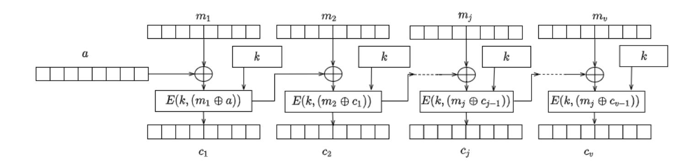
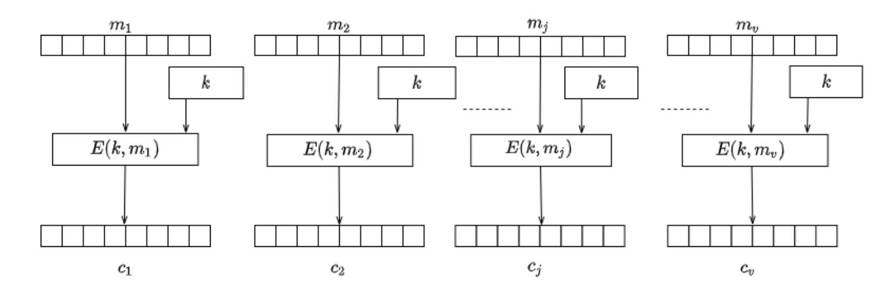
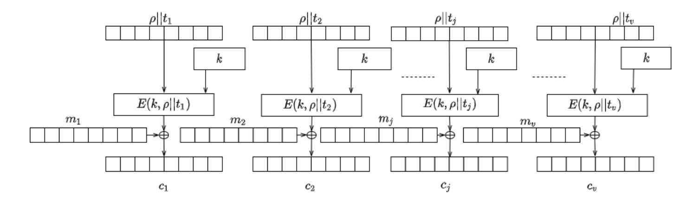
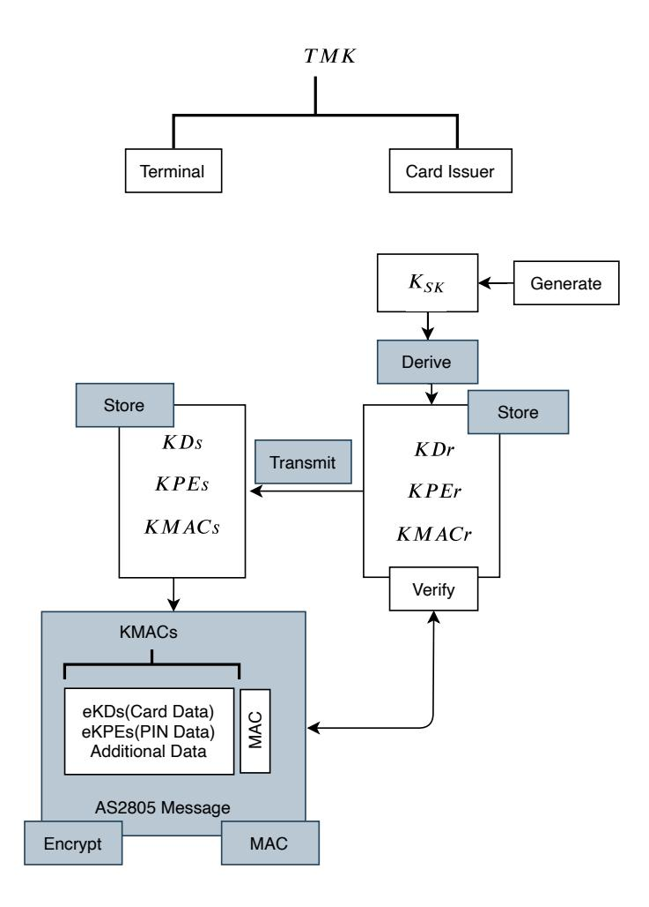
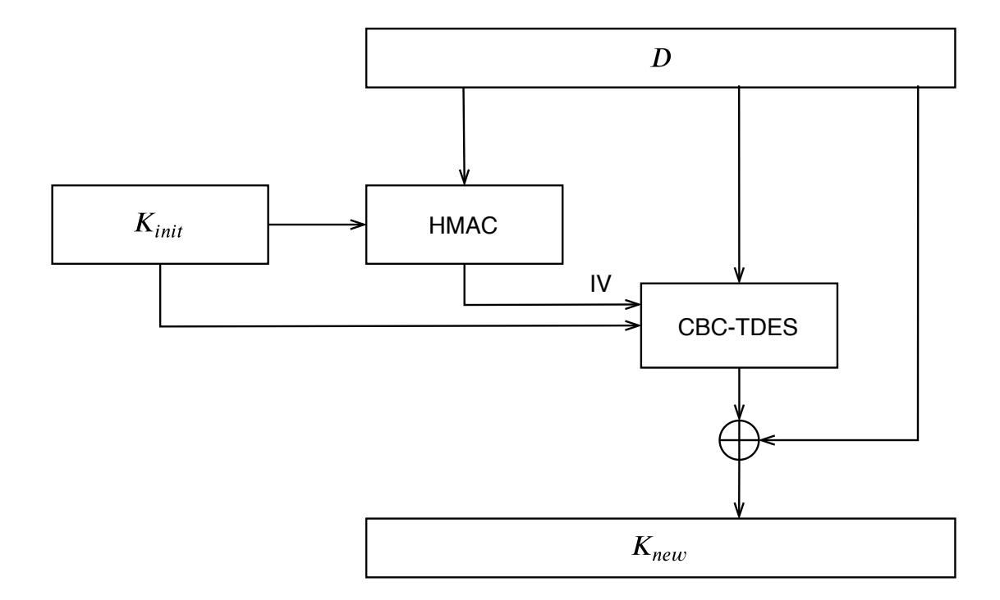
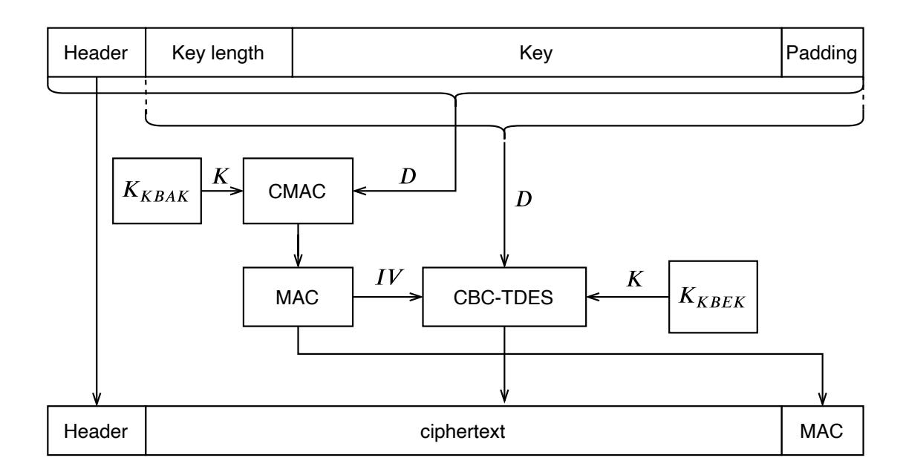
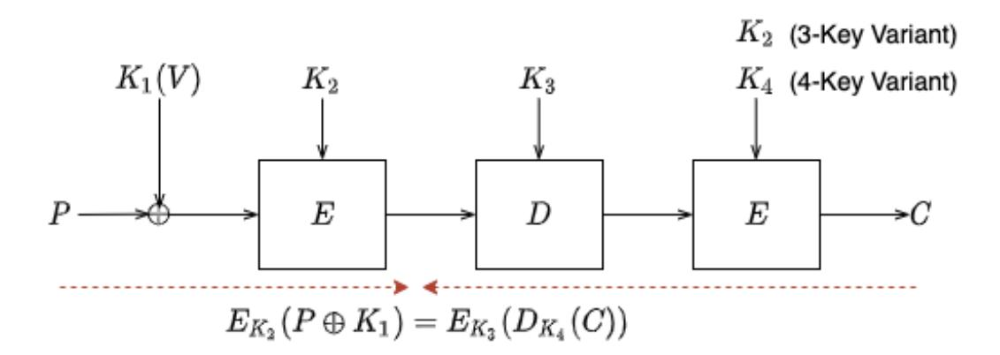
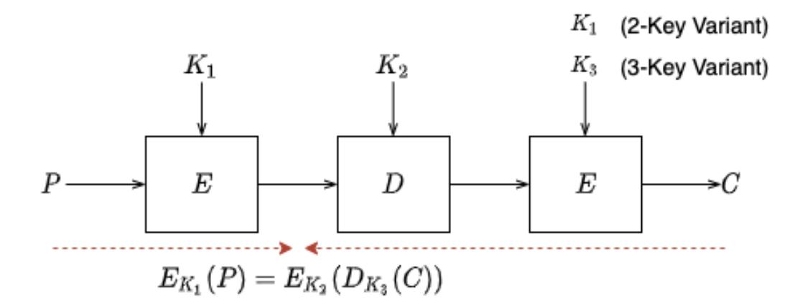

{0}------------------------------------------------

# **Security in banking** *<sup>⋆</sup>*

Arthur Van Der Merwe, David Paul, Jelena Schmalz, and Timothy M. Schaerf School of Science and Technology, University of New England, Armidale NSW, 2351, Australia

**Abstract.** We examine the security of the Australian card payment system by analysing existing cryptographic protocols. In this analysis, we examine TDES and DES-V key derivation and the use of secure cryptographic devices, then contrast this with alternative mechanisms to enable secure card payments. We compare current Australian cryptographic methods with their international counterparts, such as the ANSI methods, and then motivate alternative methods for authenticated encryption in card payment systems.

**Keywords:** AS 2805 · authenticated encryption · financial · encryption · TR-31

## **1 Introduction**

The protection of the financial system in every country is the primary directive of payment system regulators. Vulnerable architectures in the financial system, more specifically, card payment systems might cause uncertainty in the operational effectiveness of economic activities. Historically, each country relied on a combination of international and local standards to maintain the effectiveness and security of payment systems. In recent years, card manufacturing organisations started a commercial company with the view to standardise security practices across the globe. The established commercial company, named Payment Card Industry Security Standards Council (PCI-SSC), headed by US-based card companies (Visa, MasterCard, American Express), imposes security requirements and specifications developed by their working groups. The PCI-SSC is not a standards organisation. However, they produce industry specifications adopted widely in several regions [[MR08\]](#page-38-0). The industry standards by PCI-SSC provide a set of security and test requirements, and the use of a set of approved laboratories to test if participants meet the desired specifications based on their function in the payments landscape. Recently, PCI-SSC required the management of all cryptographic keys in structures called "Key Blocks". Key blocks are defined in the ANS X9 TR-31 Technical Report (TR-31) [[Ins18\]](#page-37-0), which was in response to the ANSI X9 24.1 Standard [\[Ins17](#page-37-1)]. The goal of ANSI's X9.24-1-2017 is to specify some minimum requirements for the management of symmetric cryptographic keys used for financial transactions; typically these requirements apply

*<sup>⋆</sup>* This research is supported by an Australian Government Research Training Program (RTP) Scholarship.

{1}------------------------------------------------

to POS and ATM transactions, in addition to banking messages. In this paper we focus on the notion of key blocks defined in the TR-31 technical report.

## **2 Our Contribution**

Since the development of the Australian Key Scheme series in the Australian National Standards (the AS 2805 series of standards) there remains an open problem to define security bounds and a definition of security. TR-31 has the same open question, though TR-31 resembles an authenticated encryption scheme. We evaluate the TR-31 and AS 2805 schemes and draw a formal comparison. The goal is to investigate the differences and advantages between the two systems. We analyse key generation, key derivation, and key separation, then motivate changes to the AS 2805 standards for enhancement.

## **3 Preliminaries**

This section provides key definitions. Some aspects are standard, but others (particularly tidiness, AEAD schemes recognizing their domains, and identifying encryption schemes by their encryption algorithms) are not. We abstract the use of any specific encryption scheme and focus on general constructions. We start by reviewing the necessary tools and definitions that are required for our results. We begin by establishing the notation for block ciphers, data encryption and cipher block chaining (CBC) to secure the encryption of multiple blocks of a block cipher. We look at message authentication (MAC) to provide integrity followed by authenticated encryption to enable both data security and integrity. Lastly, we define authenticated encryption with associated data (AEAD).

### **3.1 Notation**

We use [*n*] to denote the set *{*1*, ..., n}* and ∅ to denote the empty set. A binary string of size *n* is represented as *{*0*,* 1*} <sup>n</sup>* and *{*0*,* 1*} ∗* represents a set of all strings of finite length. For any two binary strings *s*<sup>1</sup> and *s*2, we denote the size of *s*<sup>1</sup> as *|s*1*|* and the concatenation of the string *s*<sup>1</sup> immediately followed by *s*<sup>2</sup> as *s*1*||s*2. For any non-negative integer *k ≤ |s*1*|*, we use *⌊s*1*⌋<sup>k</sup>* to represent the string obtained by the truncation of *s*<sup>1</sup> to the leftmost *k* bits. The process of uniformly sampling a value from a finite set *S* and assigning the result to *x ∈ S* is written as *x* \$*← S*. We use the *⊕* symbol to denote the binary addition modulo two or exclusive OR (XOR) operator and *⊥* indicating an error.

We model security using the code-based game-playing framework by Bellare et.al. [\[BR06](#page-36-0)] where the interaction between the adversary with the game is implicit. Throughout the following text, we refer to a single-use arbitrary number used in cryptographic algorithms as a *nonce*. In practice a nonce is often a random or pseudo-random number to prevent replay attacks, which introduces randomness into an algorithm.

{2}------------------------------------------------

#### 3.2 Negligible, super-poly, and poly-bounded functions

We begin by defining the notions of negligible, super-poly, and poly-bounded functions. A negligible function f is one that not only tends to zero as  $n \to \infty$ , but does so faster than the inverse of any reciprocal.

**Definition 1.** f is called negligible if for all  $c \in \mathbb{Z} > 0$  there exists  $n_0 \in \mathbb{Z}_{\geq 1}$  such that for all integers  $n \geq n_0$ , we have  $|f(n)| < 1/n^c$ .

 $\mathbb{Z}_{\geq 1} \to \mathbb{R}$  is negligible if and only if for all c > 0, we have

$$\lim_{n \to \infty} f(n)n^c = 0.$$

The definition of a *negligible function* leads to the definition of a *super-poly* function:

**Definition 2.** A function f is called super-poly if 1/f is negligible.

A poly-bounded function f is one that is bounded in absolute value by some polynomial. Formally:

**Definition 3.** A function f is called poly-bounded, if there exists  $c, d \in \mathbb{Z}_{>0}$  such that for all integers  $n \geq 0$ , we have  $|f(n)| \leq n^c + d$ .

Intuitively, we refer to a *negligible* value as a value so small as to be "zero for all practical purposes", for example  $2^{-100}$ . We also use the following terms:

- A function f(n) is polynomial time computable if there exists a Turing machine M and a polynomial p(n), such that M computes the function f(n) such that M runs in time  $\leq p(n)$  for all inputs of length n.
- If a function f(n) is polynomial time computable, then f(n) is poly-bounded.
- An efficient adversary is one that runs in polynomial-time. The Bachmann–Landau  $\mathcal{O}$  notation [Bac94] [Lan09] captures the notion of an adversary that cannot find any polynomial-time algorithm to determine the key from a given algorithm. Consider the task of finding the correct k-bit key among all  $2^k$  possibilities, using brute-force. Without additional information provided by cryptanalysis, the best way is to check every key. The brute-force task takes  $\mathcal{O}(2^k)$  computations which is not polynomial-time but exponential time. The calculation is therefore asymptotically out of reach for a polynomial-time adversary.
- A value N is called super-poly if 1/N is negligible.
- A poly-bounded value is a "reasonably" sized number. In particular, an *ef-ficient adversary* is one whose running time is *poly-bounded*.

**Random Experiments.** We refer to a protocol game played by a group of interactive probabilistic algorithms as random experiments. These games are expressed as a list of actions by players, where the result of the actions is an event with a discrete probability, denoted as:

<span id="page-2-0"></span>
$$Pr[action_1; action_2; ...; action_n : event]$$
 (1)

The outcome of the game in (1) is the probability of event after executing  $action_1; ...; action_n$  in sequential order. event is taken over a probability space, of all random variables involved in the actions.

{3}------------------------------------------------

#### 3.3 Block Ciphers

A block cipher is a deterministic cipher  $\mathcal{E} = (E, D)$  with an encrypt (E) and decrypt (D) function defined over a message space  $\mathcal{M}$  and ciphertext space  $\mathcal{C}$ . The message space  $\mathcal{M} \in \mathcal{X}$  and ciphertext space  $\mathcal{C} \in \mathcal{X}$  are the same finite set, where  $\mathcal{X} = \{0,1\}^n$  and  $|\mathcal{X}| = 2^n$ . The key space  $\mathcal{K} \in \{0,1\}^n$ , and we say that  $\mathcal{E}$  is a block cipher defined over  $(\mathcal{K}, \mathcal{X})$ . We call an element  $x \in \mathcal{X}$  a data block, and refer to  $\mathcal{X}$  as the data block space of  $\mathcal{E}$ .

For every fixed key  $k \in \mathcal{K}$ , we can define the function  $f_k := E(k, \cdot)$ ; that is,  $f_k : \mathcal{X} \to \mathcal{X}$  sends  $x \in \mathcal{X}$  to  $E(k, x) \in \mathcal{X}$ . The usual correctness requirement for any cipher implies that, for every fixed key k, the function  $f_k$  is one-to-one and, as  $\mathcal{X}$  is finite,  $f_k$  must be onto as well. Thus,  $f_k$  is a permutation on  $\mathcal{X}$ , and  $D(k, \cdot)$  is the inverse permutation  $f_k^{-1}$ .

**Definition 4.** A block cipher  $\mathcal{E}$  is secure if, for all efficient adversaries  $\mathcal{A}$ ,  $\mathcal{A}$  has a negligible probability in determining the key. We denote this probability as  $\operatorname{Adv}[\mathcal{A}, \mathcal{E}] \leq \epsilon$ , where epsilon is a negligible value.

#### 3.4 Block cipher mode of operations

If there are multiple data blocks in the message space of a block cipher,  $|\mathcal{X}| > 1$ , then a method is needed to combine several blocks of encryption together.

<span id="page-3-0"></span>**CBC** mode of operation One such method is to use a block cipher in cipher block chaining (CBC) mode. CBC mode chains ciphertext blocks together where the current block is dependent on the previous encrypted block. Let the key generation algorithm return a random key for the block cipher, and the IV be the initial a also chosen at random,  $a \stackrel{\$}{\leftarrow} \mathcal{X}$ . We denote the size of each block by n, and break the message  $m \leftarrow [m_1, m_2, \ldots, m_j, \ldots, m_v]$  into blocks equal to the block size n. The result of the algorithm is the combination of each ciphertext block  $c \leftarrow [c_1, c_2, \ldots, c_j, \ldots, c_v]$  and the initial value, abbreviated as IV we call a. If the message is not multiples of the block size,  $|m| \mod n \neq 0$ , then we pad the message with the function  $m \leftarrow p(m)$  such that  $|m| \mod n = 0$ . We can then define  $\langle c, a \rangle \leftarrow E(k, m)$ , where c is computed according to the following algorithm:

```
c \leftarrow E(k, m)
If (|m| \mod n \neq 0) then m \leftarrow p(m):
Break m into n-bit blocks m \leftarrow [m_1, m_2, \dots, m_j, \dots, m_v]
c_0 \leftarrow a \stackrel{\$}{\leftarrow} \mathcal{X}
for j \leftarrow 1 to v do
c_j \leftarrow E(k, \ (c_{j-1} \oplus m_j))
c \leftarrow c_1||c_2||\dots||c_j||\dots||c_v
output \langle c, a \rangle;
```

{4}------------------------------------------------

For *k ∈ K* and *c ∈ X* , with *v ← |c|*, we define *m ← D*(*k, c*), where *m* is computed according to the following algorithm:

```
⟨D(k, c), a⟩
       If (|c| mod n ̸= 0) then return ⊥:
       Break c into n-bit blocks c ← [c1, c2, . . . , cj , . . . , cv]
              c0 ← IV ← a
              for j ← 1 to v do
                     mj ← D(k, (cj−1 ⊕ cj ))
              m ← [m1||m2|| . . . , mj || . . . ||mv]
              output m;
```



<span id="page-4-0"></span>**Fig. 3.1.** The CBC mode of encryption

**ECB mode of operation** Similarly to CBC mode, we can define Electronic Code Book (ECB) mode of operation (in Figure [3.2\)](#page-5-0) where each block of data is encrypted independently of the previous encrypted block, using the block cipher. After which each encrypted block is concatenated together to form the ciphertext.

For *k ∈ K* and *m ∈ X* , with *v* = *|m|*, we define *c ← E*(*k, m*), where *c* is computed according to the following algorithm:

```
c ← E(k, m)
       If (|m| mod n ̸= 0) then m ← p(m):
       Break m into n-bit blocks m ← [m1, m2, . . . , mj , . . . , mv]
              for j ← 1 to v do
                     cj ← E(k,(mj )
              c ← c1||c2|| . . . ||cj || . . . ||cv
              output c
```

{5}------------------------------------------------



<span id="page-5-0"></span>**Fig. 3.2.** The ECB mode of operation

**CTR mode of operation** Counter mode of operation uses a mechanism similar to ECB mode, but includes a counter and a nonce for each block. For *k ∈ K* and *m ∈ X* , with *v* = *|m|*. Let *ρ* be a unique nonce for the duration of the algorithm, and *t<sup>j</sup>* be a counter value, increasing with every encrypted block. We define *c ← E*(*k, m*), where *c* is computed according to the following algorithm:

```
c ← E(k, m)
       If (|m| mod n ̸= 0) then m ← p(m):
       Break m into n-bit blocks m ← [m1, m2, . . . , mj , . . . , mv]
              for j ← 1 to v do
                     aj ← E(k, ρ||tj )
                     cj ← aj ⊕ m)j
              c ← c1||c2|| . . . ||cj || . . . ||cv
       output c
```



**Fig. 3.3.** The CTR mode of encryption

{6}------------------------------------------------

#### <span id="page-6-0"></span>**3.5 Message Authentication Code (MAC)**

A message integrity system that is based on a shared secret key between the sender and receiver is called a Message Authentication Code or MAC for short.

**Definition 5.** *A MAC system I* = (*T , V*) *is a pair of efficient algorithms, T and V, where T is called a signing algorithm and V is called a verification algorithm. Algorithm T is used to generate tags and algorithm V is used to verify tags.*

- **–** *T* is a probabilistic algorithm that is invoked as *τ* \$*← T* (*k, m*), where *k* is a key, *m* is a message, and the output *τ* is called a tag.
- **–** *V* is a deterministic algorithm that is invoked as *r ← V*(*k, m, τ* ) ,where *k* is a key, *m* is a message, *τ* is a tag, and the output *r* is either "accept" or "reject".
- **–** We require that tags generated by *T* are always accepted by *V*; that is, the MAC must satisfy a correctness property, such that for every valid key *k* and message pair, we have *V*(*k, m, T* (*k, m*)) = accept

*I* = (*T , V*) is defined over (*K, M, T* ). Whenever algorithm *V* outputs "accept" for some message-tag pair (*m, τ* ) , we say that *τ* is a valid tag for *m* under key *k*, or that (*m, τ* ) is a valid pair under *k*. The simplest type of system is one in which the signing algorithm *T* is deterministic, and the verification algorithm is defined as

$$\mathcal{V}(k, \ m, \ \tau) = \begin{cases} \text{accept if } \mathcal{T}(k, \ m) = \tau, \\ \text{reject otherwise.} \end{cases}$$
 (2)

We call such a MAC system a deterministic MAC system. Where a deterministic MAC system has unique tags: for a given key *k*, and a given message *m*, there is a unique valid tag for *m* under *k*.

#### **3.6 Authenticated encryption with associated data (AEAD)**

An *authenticated encryption scheme with associated data* AEAD is a pair of *efficient* algorithms (*E, D*), with an optional header in plaintext (associated data) that will not be encrypted such that:

- **–** The deterministic encryption algorithm *E* : *K × N × P ×M → {*0*,* 1*} ∗* takes as input a secret key *K*, a nonce *N*, associated data *P*, and a message *M* to return a ciphertext *C.*
- **–** The deterministic decryption algorithm *D* : *K ×N ×P × {*0*,* 1*} <sup>∗</sup> → M∪ {⊥}* takes as input a secret key *K*, a nonce *N*, associated data *P*, and a ciphertext *C* to return either a message in *M* or *⊥*.

Sets *K, N ,P*, and *M* denote respectively the key space, the nonce space, the associated data space, and the message space associated with the scheme. We assume throughout that *E* and *D* are never queried on inputs outside of these sets. An authenticated encryption scheme is required to be *correct* and *tidy*. Correctness requires that for all *K, N, P, M* if *E*(*K, N, P, M*) = *C* then *D*(*K, N, P, C*) = *M*. 

{7}------------------------------------------------

Analogously, tidiness requires that for all *K, N, P, C* if *D*(*K, N, P, C*) = *M ̸*=*⊥* then *E*(*K, N, P, M*) = *C.* Furthermore we demand that encryption be length regular, i.e for all *K, N, P, M* it should hold that *|E*(*K, N, P, M*)*|* is entirely determined by *|N|, |P|*, and *|M|.*

#### **3.7 Payments terminology**

We define the terminology used in payment systems in terms of the directionality. Given a key *k ←− K* apply a function *k<sup>v</sup> ←− f*(*v*) to derive a variant key *k<sup>v</sup>* where the value *v* is public. We restrict ourselves to the the following *k<sup>v</sup>* variants and their usages where *r* denotes a receive and *s* a send key. General data is denoted as *m<sup>α</sup>* and PIN data as *mβ*:

```
– KMACs: used in a MAC algorithm T : τ
                                       $← T (KMACs, m).
– KMACr: used in a MAC algorithm V : r ← V(KMACr, m, τ ).
```

- **–** KDs: given a block cipher, cardholder data *E*: *c* \$ *← E*(KDs*, mα*)
- **–** KDr: given a block cipher, cardholder data *D*: *m<sup>α</sup> ←− D*(KDr*, c*)
- **–** KPEs: given a block cipher, PIN data *E*: *c* \$ *← E*(KPEs*, mβ*)
- **–** KPEr: given a block cipher, PIN data *D*: *m<sup>β</sup> ←− D*(KPEr*, c*)

In addition to the above we define a key which encrypts other keys as: a key encryption key (KEK), a terminal master key (TMK), a zone master key (ZMK) or a key wrapping key. The key wrapping keys are used to transport variant keys and protect them in storage. We note that the function to derive a variant key *k<sup>v</sup> ←− f*(*v*) includes the *⊕* operation.

## **4 Current payment system models**

The card payment system in Australia consists of several components used to initiate payments, transport sensitive data, translate data between systems and verify card and PIN information. We detail the parts and actors here for clarity. A payment terminal accepts card information from either the magnetic stripe on the card or from the smartcard through near field communication (NFC) using protocols defined by the EMVCo specifications [[EMV04\]](#page-37-2) [[EMV11](#page-37-3)] [\[EMV09\]](#page-37-4). The terminal itself is loaded with keys from a processor, which we call an *acquirer*. The acquirer follows a set of rules and guidelines to initialise the payment terminal with TMKs. The encryption of session keys with a TMK aims to protect them in transport. The keys exchanged with the acquirer are stored in the secure memory of the terminal. After every 256 transactions, the terminal requests new session keys from the acquirer, whereby the acquirer sends the terminal a set of keys for data encryption (KDs), PIN encryption (PKEs) and message authentication (KMACs). When the terminal initiates a transaction from an end user, the terminal encrypts the cardholder data with the session keys as follows:

1. The cardholder data is encrypted with the KDs.

{8}------------------------------------------------

- 2. PIN is formatted under the appropriate ISO pin block rules defined in [[fS17](#page-37-5)].
- 3. The PIN is then encrypted with the PKEs.
- 4. The system generates a MAC on the entire payment message using the KMACs.

The acquirer, having exchanged keys with a third party or the card issuer:

- 1. Verifies the MAC on the message with the local KMACr.
- 2. Unpacks the payment message.
- 3. Decrypts the cardholder data with KDr.
- 4. Decrypts the PIN using KPr.
- 5. Encrypts the data with the issuer or third party keys.
- 6. Sends data to issuer or third party.

In this process, all key operations are conducted in the confines of a secure cryptographical device, also known as a Payment Hardware Security Module (HSM). The method of generating keys by the acquirer includes a key separation process, whereby the Payment HSM applies variants to the session keys. Variants aim to enforce the acquirer to only use a key for a single purpose, either to encrypt or decrypt, or generate or verify. We denote this separation by the key directionality, KDs for "send" and encryption and KDr for "receive" and decryption. The variants are constant bits that are XORed with the key. The constant bits are publicly defined in [[Sta13b\]](#page-39-0). The Payments HSM in the acquirer environment generates a single (session) key, then applies the KD, KMAC and PKE variants respectively. The acquirer transports keys to the terminal encrypted under the TMK, using Triple DES encryption (TDES) [\[Bar17](#page-36-2)] in CBC mode. Data and PIN encryption also use TDES with CBC, and message authentication uses a TDES cipher, also known as a retail CBC-MAC [\[fS16\]](#page-37-6). When the issuer receives the financial request, then a MAC verification algorithm verifies the integrity of the message, after which the issuer verifies the PIN and checks if there are available funds, then sends the transaction response to the acquirer who forwards the message to the terminal.

The model described above is a simplified and abstracted overview of the methods used in AS 2805. In addition to above, the AS 2805 suite of standards prescribes, in detail, the interactions, message formats and security mechanisms allowed between all participants of the payments ecosystem. Other payment systems, like those in the USA, do not prescribe any particular method of initialising terminals with a TMK, although the American National Standards Institute detail mechanisms in their standards [[Ins17\]](#page-37-1). Several regions do not have any standards for the terminal to acquirer interactions, acquirer to third-parties or issuers interactions.

Instead of rigid prescriptive standards, card networks rely on the PCI-SSC to develop industry standards to secure card payments, based on a combination of standards from NIST, ANSI and ISO. These industry standards are the defacto mechanisms used in several countries. The participation in the PCI-SSC is restricted to card network members only, and participation from other members is on a "pay to contribute" model [[PCI](#page-38-2)].

{9}------------------------------------------------

In this paper, we examine the current AS 2805 Standards and contrast the scheme to the industry standards of PCI-SSC. Where there is no industry standard, we evaluate the security bounds of the mechanisms imposed by AS 2805 and suggest additional mechanisms to improve the bounds and align closer to industry standards. We start with a brief overview of key generation, then follow with key derivation and then key separation. We investigate current attacks on TDES in CBC mode of operation and discuss mechanisms for authenticated encryption with associated data (TR-31). We then discuss the future state of payments cryptography while defining open problems.

## **5 Key generation, derivation and separation**

Under the presumption that secure ciphers such as Advanced Encryption Standard (AES) [[RD01\]](#page-38-3) and Triple DES (TDES) [[Bar17](#page-36-2)], exist, we first turn our deliberation to the use of keys within a payments system, namely: random numbers, generating keys, deriving session keys and the separation of keys for distinct operations. We start with a discussion on the mechanisms of key generation.

#### **5.1 Key generation**

*Random, true-random, and psuedo-random numbers* There are two types of random number generators in computer systems:

- 1. A true random number generator (TRNG) which measures physical random features to generate bits; these are bits of entropy. True randomness is entropy, satisfying statistical randomness and conditions to eliminate bias.
- 2. A deterministic random algorithm that produces a stream of apparently random bits, based on some random input. We denote the random input as a seed. We call this algorithm a pseudo-random number generator (PRNG).

Generally, key generation starts with a seed and the use of a pseudorandom number generator (PRNG) to expand the seed to form a distribution of bits. The theory behind a TRNG is to amplify the noise in resistors then sample the signal data and apply von Neumann correctors [\[FGM](#page-37-7)<sup>+</sup>18]. The output of a TRNG is often used as a seed for a PRNG. A PRNG is a poor source of randomness, as a PRNG uses a deterministic algorithm to produce a seemingly random output. With knowledge of the seed, an adversary can reproduce the "random" stream of the PRNG. In the past, methods to create a PRNG included Prime Modulus Multiplicative Linear Congruential Generators [\[FM86\]](#page-37-8) (PMMLGC) and shift registers with feedback [\[Rog89\]](#page-39-1). However, these generators perform poorly under statistical tests, suffering from initialization sensitivity and partitioning problems [\[Lia05](#page-38-4)]. Modern methods use an accumulator [\[GDPSM11](#page-37-9)], where multiple PRNGs are combined. Combining several PRNG with distinct seed sources produces cryptographically secure pseudo-random number generators (CSPRNG) [\[VV84](#page-39-2)]. In financial systems today, a set of CSPRNGs satisfying a range of statistical tests are used and have been validated by NIST [\[NIS10\]](#page-38-5).

{10}------------------------------------------------

*Random numbers* Generating random numbers is an essential part of generating keys for cryptographic systems. Block ciphers like AES are ideally instantiated with a unique key for each encryption and random numbers are required when generating public/private key pairs in asymmetric systems. In the informationtheoretical sense, a secure key is one that an adversary cannot generate or derive. In practice, this is achieved by using the entropy of a system to create a seed and then expanding the seed using a PRNG. In almost all cases, an adversary can recover the key by recovering the seed, then running the expansion function. We denote the seed as the information space. This process of key recovery is often achieved by trial and error when the information space is small enough. The ability of the adversary to run this attack must be acceptably low, depending on the system. The size of the space the adversary must search is dependent on the size of the information space in an information-theoretical sense [\[KSWH98](#page-38-6)]. The study of random numbers with respect to information theory, dates back to the work of Shannon [\[Sha48](#page-39-3)]. [\[Sha48](#page-39-3)] studied this problem with respect to entropy in terms of the number of different secret values possible and the probability of each:

entropy = 
$$-\sum_{i=1}^{n} p_i \log_2(p_i)$$
, (3)

where *n* is the number of possible secret values, indexed by *i*, and *p<sup>i</sup>* is the probability of observing the *i*th secret value. While the analysis by Shannon [[Sha48\]](#page-39-3) gives the correct average probability of recovering the information space, Shannon does not account for the information-theoretic work factor of the adversary. If we assume that we have a PRNG generating 128-bit keys, where half of the key bits are 0's and the other 2 <sup>128</sup>*−*<sup>64</sup> are random then, from the Shannon equation, there are 64-bits of information in one key value. An adversary can try the value zero and break half of the key, ignoring the random parts. It is, therefore, reasonable to look at other measures such as min-entropy:

$$min-entropy = -\log_2(maximum(p_i))$$
 (4)

where *i* indexes the possible secret values, like above. Here we have 1-bit of min-entropy as opposed to 64-bits of Shannon entropy. The Renyi entropy is a continuous spectrum of entropies, specified by a parameter *r*. Here *r* = 1 is Shanon entropy and *r* = *∞* is min-entropy. If *r* = 0, Shanon entropy is *log*2(*n*) where *n* is the number of non-zero probabilities. Since the Renyi entropy is a non-increasing function of *r*, we determine that min-entropy is the most conservative measurement of entropy and the best method to use in cryptographical evaluations.

Sources of entropy are dependent on the implementation. In contrast, once a system has collected enough entropy, the system can be used as the seed to produce the required amount of cryptographically strong pseudo-randomness. One might think that there is hope for truly strong portable randomness, but to achieve this, one needs hardware as a physical source of unpredictability since software systems can be subjected to manipulation.

{11}------------------------------------------------

The requirements to generate cryptographic keys and withstand statistical and entropy poisoning attacks is a long research discussion. Current payments specifications rely on the validation of random number systems against requirements produced by the American National Institute of Standards and Technology (NIST). NIST is an arm of the U.S. Department of Commerce, and their mission is: " to promote U.S. innovation and industrial competitiveness by advancing measurement science, standards, and technology in ways that enhance economic security and improve our (the U.S.) quality of life." Although this might sound like an organisation looking after the U.S. interests, they have developed several algorithms widely used by financial systems, such as TDES and AES. Both the Australian AS 2805 and PCI-SSC Standards refer to the NIST specification NIST SP 800-90A [\[BKS12\]](#page-36-3) as an approved mechanism to generate deterministic bits, for use as cryptographical keys. Currently, there are three (allegedly) cryptographically secure pseudorandom number generators (CSPRNG) for use in payments cryptography, Hash\_DRBG (based on hash functions), HMAC\_DRBG (based on HMAC), and CTR\_DRBG (based on block ciphers in counter mode). Regulators validate HSMs and payment systems against the requirements for random number generation and only permit systems that satisfy these requirements. In 2015, the first publication of the NIST SP 800-90A Standard had a fourth generator for elliptic curve cryptography, Dual\_ECD\_RBG, which was found to contain a cryptographic backdoor inserted by the United States National Security Agency (NSA). The backdoor was proven in the work of Dan Shumow and Niels Ferguson in 2007 [[SF07\]](#page-39-4), but Dual\_EC\_DRBG was continually in use by RSA until 2017 [\[Upa16](#page-39-5)].

*Statistical randomness* We can informally define a numeric sequence as statistically random when there is no recognisable pattern or irregularity. Examples of this are the results of an ideal dice roll, or the digits of *π*. Statistical randomness does not imply true randomness but only pseudorandomness, using statistical methods to ascertain recognisable patterns or irregularities. There is a significant distinction between local and global randomness. Most of the theoretical randomness is thought of as global randomness; if a system samples a distribution (local randomness) from global randomness, there is no guarantee that the sampled data is random. In a truly random distribution, there is a strong probability of repeating sequences. Although the global distribution might be random, a sample comprising of repeating sequences will not be. Local randomness implies that there is a minimum sequence length in which random distributions are approximate. We note that, according to the principles of Ramsey [\[GRS90](#page-37-10)], complete disorder is impossible, and a sufficiently large object must contain a given substructure. The use of statistical tests assesses some degree of randomness, which is sufficient for most applications. Several legislators impose specific standards of statistical test, like gambling [[GWP](#page-37-11)<sup>+</sup>17] and financial cryptography [[SC15\]](#page-39-6).

M.G. Kendall and Bernard Babington Smith published the first tests for random numbers in the Journal of the Royal Statistical Society in 1939 [\[Ken39\]](#page-37-12) using statistical tools, such as Pearson's chi-squared tests. The chi-squared tests 

{12}------------------------------------------------

distinguished if experimental phenomena matched theoretical probabilities. The tests by Kendall et al.[[Ken76\]](#page-38-7) initially proved that random dice experiments did not exhibit random behaviour. The tests took the original idea that each number in a random sequence had an equal chance of occurring, and other patterns of data should be distributed equiprobably. These tests included a:

- **–** Frequency test: checking that there are roughly the same number of digits
- **–** Serial test: a frequency test for multiple digits. Comparing their observed frequencies with their hypothetical predictions.
- **–** Poker test: testing for sequences of five numbers, based on poker hands.
- **–** Gap test: looking at the distances between zeros in the sequence.

Kendall et al. [\[Ken76\]](#page-38-7) defined a locally random distribution as one that passed all the tests with a given degree of significance. We note that a global distribution might pass the Kendall et al. [\[Ken76\]](#page-38-7) tests, but a local distribution sampled from the global randomness might not. After the seminal work of Kendall et al. [[Ken76\]](#page-38-7), several other tests were developed with increasingly complex testing mechanisms such as Diehard tests [\[Mar](#page-38-8)], Maurer's Universal Statistical Test [[Mau92](#page-38-9)], and the Wald–Wolfowitz runs test [[AG91\]](#page-36-4). Current industry statistical tests for random numbers rely on NIST standards, which takes sets of tests from academia. These tests are not without fault, with the work of Yongge Wang [\[Wan14](#page-40-0)] showing that the NIST SP800-22 [[NIS10](#page-38-5)] testing standard is insufficient, proposing additional statistically distance-based randomness tests. Both the AS 2805 and PCI-SSC rely on the SP800-22 testing standard to produce statistical randomness as a seeding mechanisms to generate encryption keys.

*Key generation* A Deterministic Random Bit Generator (DRBG) generates keys within payment systems. The NIST SP 800-90A and the ANSI X9.82 series specify algorithms satisfying the requirements of ISO 11568 and ANSI X9.24. In the initial process of a DRBG, the DRBG is instantiated with a seed. After that, the DRBG is reseeded with another seed in the reseeding function. The seed in the reseed function is XORed with the initial seed. After the seeding initialisation, the generate function outputs the requested number of bits. The instantiation and generation functions operate within a secure cryptographic module. Several papers in the literature have surfaced over the past few years proving that the DRBG is pseudorandom [\[YGS](#page-40-1)<sup>+</sup>17] [\[Hir08](#page-37-13)], given that the source of the seed and entropy is not under the control or influence of an adversary.

{13}------------------------------------------------

#### **5.2 Master Keys**

The purpose of master keys (TMKs) in payment terminals and hosts (acquirers) is to encrypt the session keys (KDs, KPEs, KMACs). To achieve this, the terminal and the host must share a TMK. The initial objective of initialising a terminal is to transfer the master key into the terminal in a secure manner; we denote this process as the key injection process. This key injection process is achievable using several standards and processes [\[Ins17](#page-37-1)] [[Sta17](#page-39-7)]. For this paper, we assume the loading mechanisms for the master key is secure, and all keys in a terminal are within a secure cryptographic boundary and meet the requirements of a secure cryptographic device [[oS17b\]](#page-38-10).

For the next few sections, we illustrate the flow of information between parties before starting an informal analysis. We note the simplified components of a card payment system in Figure ([5.1](#page-13-0)). Several components of a traditional payments system are omitted from the diagram, as we only focus our security analysis on the methods of key derivation, separation and storage. We discuss the components of Figure [\(5.1](#page-13-0)) in Section ([6.1](#page-14-0)).



<span id="page-13-0"></span>**Fig. 5.1.** A reduced high-level view of AS 2805 keys in a payment system.

{14}------------------------------------------------

#### 6 Key derivation

In a system that implements the AS 2805 Standards, the XOR operation of individual purpose bits separates keys for different purposes. In the ISO [oS17a] and AS 2805 [Sta13b] standards, this process is called key calculations, variant keys or 'key purpose variants'. Given a master key K, we take a purpose bit sequence  $V_{KTK}$  and create a variant key as:  $K_{KTK} \longleftarrow V_{KTK} \oplus K$  where  $|V_{KTK}| = |K|$ . These methods of creating variant keys are in use throughout the financial industry, with the sole purpose of separating different keys for different purposes. Each region, country and vendor have defined their own variant bits to enable this separation, which creates an interoperability problem, where systems from various regions cannot re-use the variant bits. To combat this interoperability problem, ANSI X9 created a new method of key derivation and separation and published a technical report TR-31 [Ins18]. The technical report outlines an implementation to achieve key separation, interoperability, key derivation and integrity. In this section, we review the AS 2805 and TR-31 methodologies, and make an informal comparison.

#### <span id="page-14-0"></span>6.1 AS 2805 key derivation and separation

Of the AS 2805 standards, the AS 2805.6.x series covers key management which is implemented on point of interaction (POI) devices specifically, there are two standards for symmetric key management systems which are used in the vast majority of point of interaction (POI) devices deployed in Australia:

- AS 2805.6.2 Terminal to Host Key Management using Transaction Keys
- AS 2805.6.4 Terminal to Host Key Management using Session Keys

Key management in AS 2805 shows how a system may derive a new TMK for payment terminals from an existing key with private data, in addition to the separation keys for different purposes. Given an existing key  $K_{\text{init}}$  a new key is obtained by using the private data and a keyed hash function (HMAC)  $H(K_{\text{init}}, \text{data})$ , to produce random output, which is used as an initialization vector IV (nonce) for a TDES encryption under CBC mode, denoted by the function,  $E_{K_{\text{init}}}^{\text{CBC}}(\text{IV}, \text{data})$  using  $K_{\text{init}}$  as the key and the output of the keyed hash function as the data. The resultant encryption is then XORed with the private data, to produce the new key. We illustrate the process in the function in (5) and Figure (6.1):

<span id="page-14-1"></span>
$$K_{new} \longleftarrow E_{K_{\text{init}}}^{\text{CBC}}(H(K_{\text{init}}, \text{data})) \oplus \text{data}$$
 (5)

The function in (5) is noted to be a one-way function (OWF) as specified in AS 2805.5.4 [Sta13a]. This function ensures that an adversary, even with knowledge of the resultant key  $K_{new}$  and data, cannot invert the function.

We can illustrate the adversary's capability in the following informal security

{15}------------------------------------------------



**Fig. 6.1.** Terminal master key derivation.

game. Given an adversary interacting with the OWF described in [\[Sta13a\]](#page-39-8) as *P* and an random function *F*, where the random function produces a random value, the adversary, given the output of the OWF, should not be able to distinguish between the output of the random value or the OWF. The adversary would only have the ability to recover the TDES encryption by applying *Knew ⊕ data* with prior knowledge of the data, but assuming that CBC-TDES is probabilistic, CBC-TDES would be indistinguishable from random. The only realistic attacks on the method for key derivation would imply that the adversary can reveal a vulnerability in the underlying CBC-TDES encryption and already have knowledge of the data.

The use of key calculations in payment systems is discouraged by various industry bodies, such as PCI-SSC , where some of the calculation functions are invertible. Knowledge of a single key would enable an adversary to recover all future and previous keys. Methods of calculating variants of keys are evident in AS 2805.6.3 [\[Sta13b](#page-39-0)]. The keys in AS 2805.6.3 [\[Sta13b](#page-39-0)] are session keys, whereby the generation of a single key enables the calculation of several session keys by applying an XOR operation with known public constants. The public constants used in AS 2805.6.3 [[Sta13b\]](#page-39-0) are presented in Table [\(6.1\)](#page-16-0):

{16}------------------------------------------------

| MAC send key (KMACs)                      |                | x'24C0' VKMACs |
|-------------------------------------------|----------------|----------------|
| MAC receive key (KMACr)                   |                | x'48C0' VKMACr |
| PIN encipher key (KPEs)                   | x'28C0' VKP Es |                |
| Data encryption key (KDs)                 | x'22C0' VKDs   |                |
| Data decryption key (KDr)                 | x'44C0' VKDr   |                |
| Random number (RN)                        | x'8282' VRN    |                |
| Inverted random number (∼RN) x'8484' V∼RN |                |                |

<span id="page-16-0"></span>**Table 6.1.** AS 2805 session key variants

A system generates a terminal master key, then the same key is used to derive additional keys for various purposes by XOR'ing the variant constants. Given: *k* \$ *← K*, we expand the variant *V* such that *|V |* = *|k|*. The variant values in Table [\(6.1\)](#page-16-0) is used to calculate the following session keys:

- *• KP Es ←−* (*k ⊕ VKP Es*)
- *• KP Er ←−* (*k ⊕ VKP Er*)
- *• KMACs ←−* (*k ⊕ VKMACs*)
- *• KMACr ←−* (*k ⊕ VKMACr*)
- *• KDs ←−* (*k ⊕ VKDs*)
- *• KDr ←−* (*k ⊕ VKDr*)
- *• RN ←−* (*k ⊕ VRN* )
- *•* ∽ *RN ←−* (*k ⊕ V*∽*RN* )

Since payment systems rely on the separation of keys for different purposes, the variant constant method of key derivation has trivial attacks assuming an attacker can recover any of the keys variants of the master key. Given a *KP Es*, an adversary can change the key purpose by re-applying *k ←− KP Es ⊕ VKP Es* then applying another variant, such as *KDr ← k ⊕ VKDr*. This enables an attacker to create a data decryption key from a PIN encryption key, and recover the user PIN. The practicality of the attack is more complex, as transmitted keys are encrypted by a TMK during transport, and the extracted keys are stored in a secure cryptographic device (SCD), satisfying tamper resistance and tamper responsive mechanisms as defined by ISO [[oS17b\]](#page-38-10). An open question is to formally define resistance of the CBC-TDES encryption of the key in transport given the public variant bits. Also, given the CBC-TDES encryption of a key, can one calculate the related (variant) keys? We do however discuss, in Section ([7\)](#page-18-0), meet-in-the-middle attacks and the DES-V scheme and show that variants have an additional 2 <sup>64</sup> computational complexity in meet-in-the-middle attacks as compared to traditional TDES.

#### **6.2 ANSI X9 TR-31 key blocks**

TR-31 [\[Ins18](#page-37-0)], published initially in 2001, defines a mechanism outlined in the ANSI X9.24.1 Standard [\[Ins17](#page-37-1)] to store key information with the key. We remark

{17}------------------------------------------------



**Fig. 6.2.** TR-31 Key block protection.

that this mechanism corresponds with the security of an AEAD scheme, where header information possesses data on key usage, and a derived encryption key encrypts the data. A MAC is then generated on the message, including the header information. We can describe the TR-31 system informally as follows: A system produces a key block, protection key (KBPK), which is a TMK. The key derivation process (in [\[Ins18](#page-37-0)]) derives a key block encryption key (KBEK) and a key block authentication key (KBAK). If a system generates a key for transport or storage, then we apply the mechanisms in Figure ([6.1\)](#page-16-0), with the derived KBEK and KBAK to secure the key. In Section [\(7](#page-18-0)) we discuss open questions for this construction, but for now, we note that the header information is a nonce (or a counter) with additional key usage information. In a practical sense, the TR-31 method of key wrapping provides an interoperable way to exchange keys and bind key usage information to the key itself. The key usage cannot be altered, as in the AS 2805 variant method. In a practical sense, the security of this scheme depends on the collision resistance of the hash function as well as the adversaries' capability to perform an attack on the encryption method. If the method of encryption is CBC, then the scheme is not malleable as the integrity check will fail. Similarly in ECB mode, where encrypted blocks are interchangeable with other encrypted blocks, again, the integrity check would fail, making the attack infeasible. While the TR-31 method has integrity on the key, AS 2805 ensures integrity on financial messages, including the keying material. We discuss similarities in Section [\(8](#page-23-0)).

#### **6.3 Payments HSMs**

Key operations in financial systems occur within the confines of a Payment Hardware Security Module (HSM). We note that separate implementations of HSMs exist, called general-purpose HSMs. We limit our discussion to Payments HSMs as general-purpose HSMs can output clear keys and are not used in card payment 

{18}------------------------------------------------

systems. Integrated into the design of HSMs is the capability to withstand a diversity of side-channel attacks [\[ZF05\]](#page-40-2), where all cryptographic operations occur within the secure module resisting these classical side channel attacks. Traditional payments processing systems also demand strict controls around access to HSMs, assuring split knowledge and dual control at all times, which is in line with key management methodologies [\[FL93](#page-37-14)] and industry standards [\[Cou16](#page-36-5)]. Separate regions and regulatory bodies administer regular audits in these HSM environments to ensure that payment processors abide by the strict controls. Additionally, Payments HSMs are obligated to satisfy testing requirements by numerous industry bodies [\[Cou16\]](#page-36-5). Some test side-channel resistance, while others, like Australia, extend these testing requirements to the firmware and software running on the HSM [[SC15](#page-39-6)].

Generally speaking, a Payment HSM produces a secret symmetric key stored in the secure hardware that encrypts any key exported from the HSM using AES or TDES. The payment HSM restricts the export of any clear text keys. We call this primary key a master file key (MFK) or a local master key (LMK). Environments interacting with a Payments HSM form a key set, the HSM outputs one set of keys, encrypted with a TMK, and another encrypted with the MFK. The encrypted TMK key set is transmitted to either a terminal or a partner, while the system stores the MFK key set in a database. The system performs subsequent translation and data decryption operations by commanding a function on the HSM with the corresponding MFK encrypted key. In terms of the TR-31 scheme, keys stored in the system database have a MAC over the cleartext parts and ciphertext which prevent key manipulation, while the AS 2805 schemes do not. Keys transported by the system, encrypted under the TMK, have whole message integrity under the AS 2805 scheme, while TR-31 provides integrity for each key. Taking into consideration that keys are always encrypted and never present in the clear, what is the impact when cryptographical operations occur outside of the boundaries of a Payments HSM and clear keys exist in a system? We consider these issues in Section [\(8](#page-23-0)).

## <span id="page-18-0"></span>**7 Attacks on two-key and three-key triple DES and CBC variants**

In this section we investigate various attacks possible on TDES in various key modes, as well as the AS 2805 variant mode we call TDES-V. We draw inspiration from the research on DES-X [\[Rog96](#page-39-9)] [[KR01\]](#page-38-12) and DES-EXE [\[Pha04\]](#page-38-13) [[CKS](#page-36-6)<sup>+</sup>05] variants and evaluate the security of the AS 2805 scheme in terms of practical attacks such as Meet-in-the-middle and malleability. We investigate attribute modification attacks on the AS 2805 scheme, where modifications include::

- **–** Changing or replacing any bit(s) in the encrypted data
- **–** Interchanging any bits of the encrypted data with bits from another part of the encrypted data

TDES is a standard secure encryption cipher and widely used in financial services. The TDES cipher is the combination of three independent DES operations, 

{19}------------------------------------------------

with either two or three distinct keys. We define the 3 key TDES encryption (*EK*) and decryption (*DK*) operations, using keys *K*1, *K*<sup>2</sup> and *K*<sup>3</sup> and plaintext *P* as follows:

$$C \longleftarrow E_{K_3}(D_{K_2}(E_{K_1}(P)))$$
$$P \longleftarrow D_{K_1}(E_{K_2}(D_{K_3}(C)))$$

In two key TDES we have:

$$C \longleftarrow E_{K_1}(D_{K_2}(E_{K_1}(P)))$$

$$P \longleftarrow D_{K_1}(E_{K_2}(D_{K_1}(C)))$$

The DES-V scheme used in the analysis is a variant of the TDES scheme, which we can define as 4 key encryption (*EK*) and decryption (*DK*) operations, using keys *K*1, *K*2, *K*<sup>3</sup> and *K*<sup>4</sup> and plaintext *P*, where *K*<sup>1</sup> is a variant:

$$C \longleftarrow E_{K_4}(D_{K_3}(E_{K_2}(P \oplus K_1)))$$

In three key DES-V we have:

$$C \longleftarrow E_{K_2}(D_{K_3}(E_{K_2}(P \oplus K_1)))$$

We note that the DES-V *K*<sup>1</sup> is a constant variant *V* , as illustrated in Table [\(6.1\)](#page-16-0).



<span id="page-19-0"></span>**Fig. 7.1.** The TDES-V Meet-in-the-middle attack

#### **7.1 Meet-in-the-Middle attacks**

We investigate the AS 2805 DES-V encryption scheme where the variant is a primary 64-bit key which is XORed with the plaintext before encryption. We present meet-in-the-middle attacks (MITM) and examine the potential effectiveness of these attacks on the DES-V scheme. The results from traditional TDES MITM attacks are taken from from the work of [\[IYKP13](#page-37-15)], while we assume the

{20}------------------------------------------------



Fig. 7.2. The TDES Meet-in-the-middle attack

additional complexity of the DES-V scheme based on the results of [IYKP13]. The traditional MITM attack is described in Figure (7). In a traditional 3-key TDES encryption scheme, we obtain a pair of plaintext, and ciphertext (P, C) and consider  $K_1$  seperate from  $(K_2, K_3)$ , computing  $E_{K_1}(P) = E_{K_2}(D_{K_3}(C))$  for all possible keys. We accept values for  $(K_1, K_2, K_3)$  such that the encryption is true for three plaintext-ciphertext pairs ( $\approx \log_{2^{64}} 2^{168}$ ). This attack requires a time complexity in the order of  $2^{113}$  encryptions and memory complexity of  $(64 + 56)2^{56} \approx 2^{63}$  bits.

A similar search can be carried out in the DES-V scheme for

$$E_{K_2}(P \oplus K_1) = E_{K_3}(D_{K_4}(C)).$$

where we accept values for  $(K_1, K_2, K_3, K_4)$  for consistent results over  $\log_{2^{64}} 2^{212}$  for 4 plaintext ciphertext pairs with a time complexity in the order of  $2^{117}$  and a memory complexity of  $2^{63}$ . If we look at 2-key TDES, then we can apply similar logic where we expect that  $\log_{2^{64}} 2^{112}$  or two plaintext ciphertext pairs to confirm the correct values for  $K_1$  and  $K_2$  with time complexity of  $2^{112}$  with negligible memory. However, with the DES-V scheme in three-key mode, we accept values in  $\log_{2^{64}} 2^{176}$  or three plaintext ciphertext values with time complexity of  $2^{117}$  with negligible memory complexity. We see that the additional 64-bit key that is XORed with the plaintext before encryption increases the time complexity of the basic MITM attack by  $2^{64}$ .

Merkle-Hellman MITM Attack Merkle and Hellman developed a chosen-plaintext alternative to the MITM attack in 1981 [MH81], which we will illustrate over 2-key TDES. First, we decrypt a 64-bit ciphertext A for all possible  $2^{64}$  values of  $K_1$ . For every value of A, we then make a chosen-plaintext query (Q) to get the corresponding ciphertext and then decrypt each A value based on the  $K_1$  value we guessed. These values are stored, then we exhaustively search all  $K_2$  values such that:

$$D_{K_1}(Q(D_{K_1}(A))) = D_{K_2}(A).$$

We stop the attack when we have  $\log_{2^{64}} 2^{112}$  or two plaintext ciphertext pairs consistent with the keys  $(K_1, K_2)$ . The Merkle-Hellman attack has a time complexity of  $3(2^{56}) \approx 2^{57.6}$  encryptions, with a memory complexity of  $2^{63}$ . In the

{21}------------------------------------------------

DES-V construction, we should consider a 3-key variant of *K*<sup>1</sup> and *K*<sup>2</sup> separate from *K*3, where we search:

$$D_{K_1}(Q(D_{K_2}(A \oplus K_1))) = D_{K_3}(A).$$

We collect the values of (*K*1*, K*2*, K*3) when we have log<sup>2</sup> <sup>64</sup> 2 <sup>176</sup> or three plaintext ciphertext pairs consistent with the keys, with a memory complexity of 2 <sup>63</sup> and time 2 121*.*6 . This attack provides no advantage over the original MITM attack. Thus similar to the original attack, the DES-V scheme increases the chosen plaintext MITM attack complexity by a factor of 2 64 .

*Van Oorshot - Wiener MITM Attack* A known-plaintext extension of the Merkle-Hellman chosen-plaintext attack is the Van Oorshot-Wiener MITM Attack [\[vOW91](#page-39-10)]. This attack is applicable in the case of 2-key TDES, where we have seen that the Merkle-Hellman attack significantly reduces the complexity of the initial attack by Oorschot and Wiener. If we select 2 <sup>32</sup> values of plaintext for each *P*, we should calculate all 2 <sup>56</sup> permutations of *DK*<sup>1</sup> (*P*) and compare each against the 2 <sup>32</sup> plaintext-ciphertext pairs. If there is a match, then we calculate *B* as *B* = *DK*<sup>1</sup> (*C*) and store the pair *B, K*<sup>1</sup> for which there should be 2 <sup>56</sup> memory entries. On each of the memory entries, we then do an exhaustive search for *K*<sup>2</sup> and test the candidate pairs *K*1*, K*<sup>2</sup> with extra plaintext-ciphertext pairs. We reproduce the process with several values for *P* until we come across the correct key. The attack has a time complexity of 2 <sup>89</sup> encryptions with 2 <sup>32</sup> known-plaintext ciphertext pairs and memory complexity of 2 <sup>63</sup>. We can implement this attack over our DES-V scheme, starting with 2 <sup>32</sup> plaintext-ciphertext pairs and acquire a value for (*K*1*, K*2*, K*3) if log<sup>2</sup> <sup>64</sup> 2 <sup>176</sup> or three plaintext-ciphertext pairs are consistent. We expect this attack to have a memory complexity of 2 <sup>64</sup> and a time complexity of 2 <sup>153</sup>. We have thus shown in the instance of 2-key TDES that the DES-V scheme has an increased time complexity of 2 63 .

*Other MITM Attacks* Although there are other MITM attacks published by several researchers [[Luc98\]](#page-38-15), we only focus on the three methods above, since they are practically possible. Methods by Lucks et al. [\[Luc98\]](#page-38-15) have increased effort in memory and computational complexity. One question that comes to mind is, what if the *K*<sup>1</sup> is a public constant, like in AS 2805, can the attacker have an advantage with a MITM attack? Based on the discussion above, we ascertain that there should be no increase in the computational and memory complexity in this case. In the case of a public *K*1, we can assume the DES-V scheme would have the same adversarial advantage as the TDES scheme in either 2 or 3-key mode.

#### <span id="page-21-0"></span>**7.2 CBC malleability**

An encryption algorithm is malleable if it is possible to transform a ciphertext into another ciphertext which decrypts to a related plaintext. Malleability is an undesirable property of a cryptosystem, as this property allows an adversary 

{22}------------------------------------------------

to modify the underlying encrypted plaintext by modifying the ciphertext. The properties of malleability do not mean that an attacker has any significant advantage to recover the plaintext, even after the ciphertext transformation. The attacker may not know what the related plaintext is unless he has prior knowledge of some parts of the plaintext.

Nevertheless, malleability would have a non-negligible advantage in an adaptive chosen ciphertext attack model. Vaudenay presented the first public padding oracle attack in Eurocrypt 2002 [Vau02], and since then, research in the area has expanded [PY04a] [RD10a] [BFK $^+$ 12]. The padding oracle attack assumes that an adversary can intercept messages encrypted in CBC mode, and has access to a padding oracle. The padding oracle  $\mathcal{O}$  must return some indication to the attacker if the padding on the encrypted message is valid using the following game:

- Adversary submits a CBC encrypted ciphertext C to an oracle  $\mathcal{O}$
- The oracle decrypts the ciphertext under a fixed key K, and checks if the padding is correct.
- The oracle outputs VALID or INVALID according to the correctness of the padding.

The adversary can use the padding oracle attack to determine the message length. An attacker could then extend the attack above to recover the last message block using the commutative properties of the XOR operations. Current literature details several examples of padding attacks [BU02] [YPM05] [PY04b] [RD10b]. We capture this notion of padding attacks based on the CBC algorithm. We can see from the algorithm in Section (3.4) that the CBC decryption is the XOR of each plaintext block with the ciphertext block as:

$$m_j = D(k, c_j) \oplus c_{j-1},$$
  
 $c_0 = IV.$ 

Therefore a single byte change in  $c_1$  will correspond to a change in  $m_2$ . When an adversary has two ciphertext blocks  $c_1$  and  $c_2$  and wants to decrypt  $c_2$  to get  $m_2$ , the adversary can adjust  $c'_1 \leftarrow c_1$ , and send  $c'_1||c_2$  and IV to the server. The server then returns showing that the padding on the last block  $m'_2$  is either correct (equal to 0x01) or not. If the padding is correct, the adversary identifies the last byte  $0x01 \leftarrow D(k, c_2) \oplus c'_1$ , therefore  $D(k, c_2) = c'_1 \oplus 0x01$ . If the padding oracle indicates the padding is incorrect, then the adversary can replace the last byte of  $c'_1$  with the next value. To guess every potential value for each byte, the adversary would need to make at least 256 queries to the oracle. The adversary can use the same procedure to find the second last byte of  $m_2$ . Given TDES has a 64-bit block, an attacker would need to make  $256 \cdot (64/8) = 2048$  queries to recover the final block, which is significantly less than a brute force attack. The main reason that CBC, as detailed in figure (3.1), has this vulnerability

The main reason that CBC, as detailed in figure (3.1), has this vulnerability is due to the lack of integrity on the ciphertext. Several padding methods on ISO and financial standards are shown to be vulnerable to this attack [PY04a]. The main protection mechanism in financial systems to subdue this attack is to

{23}------------------------------------------------

decrypt ciphertext within a certified HSM. Stringent software tests on Payments HSMs ensure the functions do not provide an oracle that enables an attacker to execute this attack. General purpose HSMs are, however, vulnerable [[PY04a\]](#page-38-16). Several cryptosystems are malleable [\[SMK19\]](#page-39-14), most notably stream ciphers, RSA, El Gamal [[TY98](#page-39-15)] [[Wik02](#page-40-4)] and Pallier [[DDN03](#page-36-9)]. A stream cipher produces ciphertext by combining the plaintext and a pseudorandom stream based on a secret key *k* with the XOR operation *Ek*(*m*) = *m ⊕ S*(*k*). An adversary can construct the encryption of the message *m* and some malicious value *t* as: *Ek*(*m ⊕ t*) = *m ⊕ t ⊕ S*(*k*). The RSA cryptosystem has a public key (*e, n*) where the encryption of the plaintext *m* is *E*(*m*) = *m<sup>e</sup>* mod *n*. Given a ciphertext, *c* an adversary can construct a ciphertext of *mt* as: *E*(*m*) = *t <sup>e</sup>* mod *n* = (*mt*) *e* mod *n* = *E*(*mt*). However padding mechanisms such as RSA-OAEP and PKCS1 have mechanisms which aim to prevent this attack. Unfortunately, the recent attack against PKCSv1 v1.5 [[BFK](#page-36-7)<sup>+</sup>12] shows that RSA-OAEP might not be as strong as was previously thought. In the Paillier, ElGamal, and RSA cryptosystems, it is also possible to combine several ciphertexts in such a way to produce a related ciphertext. In systems like Paillier, an adversary needs the public key and the encryption of two plaintexts, *m*<sup>1</sup> and *m*<sup>2</sup> to compute a valid sum of their encryptions *m*<sup>1</sup> + *m*2. In RSA and El Gamal, in contrast, one can combine encryptions of *m*<sup>1</sup> and *m*<sup>2</sup> to produce valid encryptions of their products.

Changing or replacing any bit(s) in encrypted data is possible in various cryptosystems, not only when encrypting data in CBC mode. However, to have valid ciphertext that decrypts to a related plaintext, the adversary requires access to a padding oracle to exploit the malleability of CBC. Other cryptosystems are partly homomorphic by design. However, CBC-MAC does not have this property as the protocol only retains the tag of the last block.

Interchanging any bits of the encrypted data with bits from another part of the encrypted data would imply that the mode of operation is ECB. This structure of ECB has the advantage of supporting parallel processing. Because the encryption of each block does not depend on any other, an adversary can replace any block with a previously intercepted block without being detected. In mechanisms like CBC, each encrypted block depends on the previous block of data. New diffusion mechanisms proposed recently [[EAAER09\]](#page-36-10) attempt to solve this issue.

## <span id="page-23-0"></span>**8 Future state of payments cryptography**

Most payment systems today use TDES as the primary cipher for encryption, although NIST and other industry bodies have marked TDES for depreciation as soon as 2023 [[BR18](#page-36-11)]. AES and ciphers with longer block length do produce higher security bounds, but lack ciphertext integrity. One method to ensure high confidence in any payment system is to move to a set of standards that have secure encryption, integrity and misuse resistance. We explore the generic composition schemes in Section ([9\)](#page-24-0) by looking at the work of [\[BN08\]](#page-36-12). Realistically, using a cryptosystem like TR-31 is an excellent fit to achieve these requirements, 

{24}------------------------------------------------

and the TR-31 scheme matches the A4 model in [[NRS14\]](#page-38-18). The A4 model uses the output of the MAC as the IV of the encryption scheme. Another method is to use an alternative key wrapping mechanism [\[RS07\]](#page-39-16) called SIV (synthetic IV). We can see that the SIV mode operation also matches the A4 model [\[NRS14](#page-38-18)], and the security proofs for them are identical to those in [\[RS06](#page-39-17)]. Both TR-31 and SIV mode are deterministic authenticated-encryption (DAE) schemes satisfying the notions of a misuse-resistant authenticated encryption scheme from [\[RS06](#page-39-17)]. In addition to satisfying misuse resistance, and the encrypt-then-MAC paradigm, payment systems should use secure underlying algorithms, and move away from TDES where, in recent years, several attacks have surfaced due to the smaller 64-bit block size [\[BL16\]](#page-36-13). In the above, we do not draw a formal comparison between the methods used in AS 2805 and TR-31. We do note that both these schemes protect the same assets (private data and keys), and have the same security goals.

## <span id="page-24-0"></span>**9 Formal differences between AS 2805 and TR-31**

We start by our formal analysis by comparing AS 2805 and TR-31 in a series of well-known security games, establishing ciphertext and plaintext security in addition to strong integrity.

#### **9.1 Attack analysis**

To demonstrate the differences in security between AS 2805 and TR-31, we use adversarial games to demonstrate the insecurity of CBC with the use of a zero initialization vector. We then look at indistinguishable chosen-ciphertext security (IND-CCA), then extend the security games to indistinguishable chosen plaintext security (IND-CPA). We then look at the composition paradigm, where we discuss the composition of privacy and integrity. The strategy of the security games is to illustrate the differences in the security bounds between the AS2805 financial messages and TR-31 Key Blocks. We start by defining financial message operations as a pair of *efficient* algorithms (*E, D*), with a header, additional data and a nonce that will not be encrypted such that:

- **–** The deterministic encryption algorithm *E* : *K × N × P × M → C × T × P* takes as input a secret key *K ← K*, associated data *P ← P*, and a message *M ← M* to return a ciphertext *C ← C* a tag *T ← T* and the cleartext associated data *P ← P*
- **–** The deterministic decryption algorithm *D* : *K×N ×P × C → M∪ {⊥}* takes as input a secret key *K*, a nonce *N*, associated data *P*, and a ciphertext *C* to return either a message in *M* or *⊥* indicating that the ciphertext is invalid.

The two algorithms above should have both privacy and integrity on the plaintext and ciphertext. However, the security of the construction relies on the composition of the operations. The literature [[BN08](#page-36-12)] explores several compositional paradigms for authenticated encryption constructions ranging from methods 

{25}------------------------------------------------

that use unique nonces and initial values and methods where weak message authentication is used. We start with the use of CBC mode with a fixed IV and define two separate worlds, left and right denoted as LR. The adversary is given the result of either the left or right world. If the adversary can identify where the result comes from, the scheme is considered insecure. The adversary must have at most a 0.5 probability of guessing the world he operates in. The adversary queries the LR world in a black box manner with no visibility of the inner workings, only observing the input and output. We use the notion of an oracle, which computes and encryption and decryption operations external to the adversary. The LR is either an encryption or decryption operation with a bit b, indicating left or right. We denote the oracle as  $E_k(LR(\cdot,\cdot,b))$  and an adversary  $\mathcal{A}$  accessing the oracle as  $\mathcal{A}^{E_k(LR(\cdot,\cdot,b))}$ .

Our definition of security associates a symmetric encryption scheme S with an adversary A in a security game, capturing each of the worlds above. The adversary's advantage and its success in breaking the scheme is the difference in probabilities of the two experiments returning the bit one.

**Definition 6.** Let  $S = (K, \mathcal{E}, \mathcal{D})$  be a symmetric encryption scheme and the adversary A be an algorithm that has access to an oracle.

We consider the following two experiments in the LR world, where we regard  $\operatorname{Exp}_{\mathcal{S}}^1$  as the left world and  $\operatorname{Exp}_{\mathcal{S}}^0$  as the right world:

$$\begin{array}{c|c} \text{Adversary: } \mathcal{A}^{E_k(LR(\cdot,\cdot,b))} & \text{Adversary: } \mathcal{A}^{E_k(LR(\cdot,\cdot,b))} \\ \text{Experiment 1: Exp}_{\mathcal{S}}^1(\mathcal{A}) & \text{Experiment 2: Exp}_{\mathcal{S}}^0(\mathcal{A}) \\ K \leftarrow \mathcal{K} & K \leftarrow \mathcal{K} \\ d \leftarrow \mathcal{A}^{E_k(LR(\cdot,\cdot,1))} & d \leftarrow \mathcal{A}^{E_k(LR(\cdot,\cdot,0))} \\ \text{return } d & \text{return } d \end{array}$$

We denote the advantage of A in distinguishing between the two worlds as:

$$\operatorname{Adv}_{\mathcal{S}}(\mathcal{A}^{E_k(LR(\cdot,\cdot,b))}) = \Pr[\operatorname{Exp}_{\mathcal{S}}^1(\mathcal{A}^{E_k(LR(\cdot,\cdot,b))}) = 1] - \Pr[\operatorname{Exp}_{\mathcal{S}}^0(\mathcal{A}^{E_k(LR(\cdot,\cdot,b))}) = 1].$$

In the game above, before the adversary interacts with the oracle, either the left or right world is decided to respond to the oracle requests. We denote the left world as world 1 and right world as world 0. In world 0, all the requests from the adversary are answered from world 0, similarly in world 1. The requests do not change oracles dynamically. If  $Adv_{\mathcal{S}}(\mathcal{A})$  is negligible, and the adversary cannot tell which world he is operating in, then the scheme is secure. If  $Adv_{\mathcal{S}}(\mathcal{A})$  is close to 1, then the adversary is doing well, and the scheme  $\mathcal{S}$  is not secure. Informally, for a symmetric scheme to be secure against a chosen-plaintext attack, the advantage of the adversary must be small regardless of what strategy the adversary tries. However, we have to be realistic, as the adversary invests more

{26}------------------------------------------------

effort in his attack, this advantage may grow. We have to consider the adversary's resources and restrict the resources to a reasonable amount. With this, we consider a scheme to be secure against a chosen-plaintext attack if the adversary is *efficient* and cannot obtain a *non-negligible advantage*. We denote this game left-or-right indistinguishably under chosen-plaintext attack or IND-CPA.

#### <span id="page-26-0"></span>9.2 Attack on AS 2805 (ECB and CBC with a fixed and counter IV)

In the ECB mode of operation, we show that an adversary has a high IND-CPA advantage, using a small number of resources. We slightly adjust our notation and allow the adversary to input the choice of which world he operates in the form of a bit b. The block size of the ECB scheme is denoted as n, where the adversary submits two messages to the oracle, each message being two blocks. One message consists of all zeros,  $0^{2n}$  and one consists of a zero block concatenated with ones,  $0^n||1^n$ . The goal of  $\mathcal{A}$  is to determine the value of b.

```
Adversary: \mathcal{A}^{E_k(LR(\cdot,\cdot,b))}

Experiment: \exp^b_{ECB}

M_1 \leftarrow 0^{2n}; M_0 \leftarrow 0^n || 1^n

C[1], C[2] \leftarrow E_k(LR(M_1, M_0, b))

If C[1] = C[2], then return 1 else return 0;
```

In the above C[1] and C[2] encryptions are the output blocks of ECB mode decided by the input bit b; we claim that  $\mathcal{A}$  has a significant IND-CPA advantage, with only one oracle query, such that:

$$\Pr[\operatorname{Exp}^1_{\operatorname{ECB}}(\mathcal{A}^{E_k(LR(\cdot,\cdot,b))}) = 1] = 1$$

and

$$\Pr[\operatorname{Exp}_{\operatorname{ECB}}^{0}(\mathcal{A}^{E_k(LR(\cdot,\cdot,b))})=1]=0.$$

In world 1, (where b = 1) the oracle returns  $C[1], C[2] \leftarrow E_k(0^n) || E_k(0^n)$ , therefore C[1] = C[2] and  $\mathcal{A}$  can return 1. In world 0, (where b = 0), the oracle returns  $C[1], C[2] \leftarrow E_k(0^n) || E_k(1^n)$ . Since  $E_k$  is a permutation,  $C[1] \neq C[2]$  so  $\mathcal{A}$  can confidently return 0. This means that the ECB mode of operation is insecure, even if the underlying block cipher is secure.

Similarly, CBC mode is insecure when executed with a fixed IV. Given the oracle is queried twice, and the  $E_k(LR(M_1, M_0, b))$  is implemented with the encryption algorithm or a random permutation, we can devise another game:

In the first game, the oracle submits two messages  $M_0 \leftarrow 0^n$  and an  $IV_0 \leftarrow 0^n$ . Together with  $M_1 \leftarrow 1^n$  and an  $IV_1 \leftarrow 1^n$ . We denote the security of this scheme in the following two games:

Adversary:  $\mathcal{A}^{E_k(LR(\cdot,\cdot,b))}$ Game:  $\operatorname{Exp}_{\operatorname{CBC}}^{b_1}$  $M_0 \leftarrow 0^n$ ;  $IV_0 \leftarrow 0^n$  $M_1 \leftarrow 1^n$ ;  $IV_1 \leftarrow 1^n$ 

{27}------------------------------------------------

$$C[1], C[2] \leftarrow E_k(LR(M_1, M_0, b))$$

We see that regardless of which bit the oracle chooses, C[1] = C[2] and the adversary does not have an advantage to distinguish between the possible worlds. This property is due to the fact that CBC mode produces  $M \oplus IV$  prior to encryption of the first block. This results in either  $0^n \oplus 0^n = 0^n$  or  $1^n \oplus 1^n = 0^n$ . Given two messages  $M_0 \leftarrow 0^n$  and an  $IV_0 \leftarrow 0^n$  together with a message  $M_2 \leftarrow 0^n$  and an  $IV_0 \leftarrow 0^n$  where the message  $M_2$  is a random distribution and  $|M_2| = |M_1|$ , we can devise  $\operatorname{Exp}_{\operatorname{CBC}}^{b_2}$  which follows  $\operatorname{Exp}_{\operatorname{CBC}}^{b_1}$  in the following game:

```
Adversary: \mathcal{A}^{E_k(LR(\cdot,\cdot,b))}

Game: \operatorname{Exp}_{\operatorname{CBC}}^{b_2}

M_0 \leftarrow 0^n; IV_0 \leftarrow 0^n

M_2 \stackrel{\$}{\leftarrow} \mathcal{S}; IV_0 \leftarrow 1^n

C[3], C[4] \leftarrow E_k(LR(M_2, M_0, b))

If C[3] = C[1], then return 1 else return 0;
```

We claim that  $\mathcal{A}$  in CBC mode with a fixed IV has a non-negligible IND-CPA advantage, with two oracle queries, such that:

$$\Pr[\operatorname{Exp}_{\operatorname{CBC}}^{b_1}(\mathcal{A}^{E_k(LR(\cdot,\cdot,b))}) + \operatorname{Exp}_{\operatorname{CBC}}^{b_2}(\mathcal{A}^{E_k(LR(\cdot,\cdot,b))})] = 1$$

Similarly, when the IV is a counter, the adversary can distinguish between the counter values. Given two games where the IV is either  $0^n$  or  $0^{n-1}||1$  we have the following game:

```
Adversary: \mathcal{A}^{E_k(LR(\cdot,\cdot,b))}

Game: \exp_{CBC}^b

M_{0,1} \leftarrow 0^n; M_{1,1} \leftarrow 0^n

M_{0,2} \leftarrow 0^n; M_{1,2} \leftarrow 0^{n-1}||1

IV_1, C_1 \leftarrow E_k(LR(M_{0,1}, M_{1,1}, b))

IV_2, C_2 \leftarrow E_k(LR(M_{0,2}, M_{1,2}, b))

If C_1 = C_2, then return 1 else return 0;

We claim that:
```

$$\Pr[\operatorname{Exp}^1_{\operatorname{CBC}}(\mathcal{A}^{E_k(LR(\cdot,\cdot,b))}) = 1] = 1,$$

and

$$\Pr[\exp^{0}_{CBC}(\mathcal{A}^{E_{k}(LR(\cdot,\cdot,b))}) = 1] = 0.$$

We prove this by considering world 0, where b = 0 meaning  $IV_0 = 0$  and  $IV_1 = 1$ . In this case we have  $C_1 = E_k(0)$  and  $C_2 = E_k(1)$  such that  $C_1 \neq C_2$  and the experiment returns 0. When b = 1 and we are in world 1, then  $IV_1 = 0$  and  $IV_2 = 1$ . In this case we have  $C_1 = E_k(0)$  and  $C_2 = E_k(0)$  and the experiment returns 1.

With the reasoning above, we can see that the AS 2805 scheme is insecure. An adversary has a significant advantage in distinguishing between ciphertexts. Next, we consider the scheme with the use of a random IV, while assuming

{28}------------------------------------------------

the block cipher is a secure PRP or PRF. We call this randomised CBC mode, denoted as CBC\$. Taken from the work of [GB96]:

**Theorem 1.** The security of CBC\$. Given a block cipher  $S = (K, \mathcal{E}, \mathcal{D})$ , and a CBC\$ encryption scheme  $E : K \times \{0,1\}^n \to \{0,1\}^n$ . Let A be an adversary attacking the IND-CPA security of S, running at most time t and using at most q queries, totalling at most  $\sigma$  n-bit blocks. Then there is an adversary  $\mathcal{B}$  attacking the PRF security of S, such that:

<span id="page-28-0"></span>
$$Adv_{CBC}^{ind-cpa}(\mathcal{A}) \leq Adv_{\mathcal{S}}^{prf}(\mathcal{B}) + \frac{\sigma^2}{2^{n+1}}$$

In Theorem 1, (taken from [GB96])  $\mathcal{B}$  runs in time at most  $t' = t + \mathcal{O}(q + n\sigma)$  and asks  $q' = \sigma$  oracle queries. Bellare et al. [BN08] describe the proof of Theorem 1 elegantly, showing that the bounds are tight, falling off by an amount that is at most quadratic in the number of blocks  $\sigma$ , asked by the adversary.

In the IND-CPA paradigm, traditional block ciphers are not secure as they are deterministic and will never win the IND-CPA game. In the case of TR-31, the MAC is used as input to the block cipher which makes the scheme a probabilistic composition. We conclude that AS 2805 is not IND-CPA secure, while TR-31 is IND-CPA secure and probabilistic in nature. We leave the TR-31 IND-CPA insecurity proof as an open problem.

#### 9.3 IND-CCA Security

If a block cipher is indistinguishable from a random distribution with an adversary having access to a decryption oracle, then the mode provides indistinguishably based on chosen ciphertext attacks. We denote this as IND-CCA. As before, we observe interactions with an adversary and an oracle. The adversary is given black box access to the encryption  $c = E_k(m)$  and decryption  $m = D_k(c)$  oracle, where the adversary cannot send a previous ciphertext obtained by  $c = E_k(m)$  to the decryption oracle  $m = D_k(c)$ . The adversary computes two ciphertexts,  $c_0 = E_k(m_0)$  and  $c_1 = E_k(m_1)$ . The oracle computes  $c' = E_k(m', b)$  for  $b' \stackrel{\$}{\leftarrow} \{0, 1\}$ , which is given to the adversary. The adversary interacts with the oracles, and must output the bit b, indicating in which world he is operating. We capture this notion in the following security game:

```
Adversary:\mathcal{A}^{D_k(LR(\cdot,\cdot,b))}

Game: \operatorname{Exp}^b_{\operatorname{IND-CCA}}

Adversary interacts with the oracle: c_0 \leftarrow E_k(LR(m_0))

c_1 \leftarrow E_k(LR(m_1))

The oracle computes: b' \stackrel{\$}{\leftarrow} \{0,1\}

m \leftarrow D_k(LR(c_2,c_3,b))
```

{29}------------------------------------------------

Adversary interacts with the oracle: *m ← Dk*(*c ′* ) for any *c ′* except *c*<sup>0</sup> or *c*<sup>1</sup> Adversary outputs a bit *b ′* , if *b ′* = *b* then the adversary wins the game. We claim, for a randomised encryption scheme, the advantage is *negligible*:

$$\Pr[\operatorname{Exp}_{\operatorname{IND-CCA}}^{1}(\mathcal{A}^{D_k(LR(\cdot,\cdot,b))}) = 1] - \Pr[\operatorname{Exp}_{\operatorname{IND-CCA}}^{0}(\mathcal{A}^{D_k(LR(\cdot,\cdot,b))}) = 1]$$
$$= |\Pr[b' = b] - 1/2| = \epsilon.$$

We note that the probability above only holds for a randomised scheme, and some modes of operations like ECB, and CBC are not IND-CCA secure. The malleability of both ECB and CBC were described in Section [7.2,](#page-21-0) and we use the following Theorem and proof for clarity:

<span id="page-29-0"></span>**Theorem 2.** *ECB, CTR and CBC are not IND-CCA secure.*

To prove Theorem [2](#page-29-0), we construct an adversary *A* with two messages *m*<sup>0</sup> *←* 0 *p* and *m*<sup>1</sup> *←* 1 *p* for *p >* 1, where *p* is the block size of the symmetric encryption scheme. The adversary then interacts with the oracle to obtain *c*<sup>0</sup> *← Ek*(*LR*(*m*0)) and *c*<sup>1</sup> *← Ek*(*LR*(*m*1)). Let *y*<sup>1</sup> = *⌊c*1*⌋<sup>p</sup>* and *y*<sup>2</sup> = *⌊c*2*⌋p*. The adversary interacts with the decryption oracle, *Dk*(*y*1*, y*2*, b*), and obtains valid plaintext of either *m*<sup>0</sup> or *m*1. The adversary wins the game, as he can distinguish in which world he operates in, based on which plaintext is correctly received. The rule that the CCA adversary cannot submit previously generated ciphertext is not valid in this game, as the length is manipulated and we can view this as a different message. In order to construct a secure IND-CCA scheme, for a given ciphertext *y* and a message *m*, the adversary should not be able to construct a ciphertext *z*, for a related or truncated message. This implies that only nonmalleable schemes can be secure in the IND-CCA game. AS 2805 is malleable, it is not IND-CCA secure, but the TR-31 scheme uses the output of a MAC as the IV input to the CBC encryption. The IV MAC input provides randomisation to the CBC encryption, so the addition of a MAC to the ciphertext protects the scheme against malleability.

*NM-CCA Security* A non-malleable chosen ciphertext adversary, denoted by NM-CCA has an advantage, as we described in Section [9.2](#page-26-0), and given the TR-31 scheme is not malleable we conclude that TR-31 is secure under NM-CCA, while AS 2805 is not. Traditionally the notion on NM-CPA Security is captured using an asymmetric scheme, we adapt the current notions to the symmetric setting.

<span id="page-29-1"></span>A cipher is NM-CCA secure if, after interacting with a CPA adversary, the adversary interacts with another oracle and cannot find a non-trivial relation between a plaintext and ciphertext.

**Theorem 3.** *ECB, CTR and CBC are not NM-CCA secure.*

To prove theorem ([3\)](#page-29-1) we first construct an CCA adversary in the following security game:

{30}------------------------------------------------

Adversary:  $\mathcal{A}^{D_k(\cdot),E_k(\cdot)}$ 

Game:  $\operatorname{Exp}_{\operatorname{NM-CCA}}^f$ 

Adversary interacts with the encryption oracle:

 $c \leftarrow E_k(m)$ 

Adversary modifies the ciphertext with a function f:

 $c' \leftarrow f(c)$ 

Adversary interacts with the oracle:

$$\{m', \bot\} \leftarrow D_k(c')$$

If the oracle returns an invalid plaintext  $(\bot)$ , the adversary modifies the ciphertext and interacts with the decryption oracle again, until:

$$m' \leftarrow D_k(c')$$

The adversary  $\mathcal{A}$  wins the game above if he is able to find a m' that has a relation to the original plaintext m. The adversary  $\mathcal{A}$  for NM-CCA only has c with no knowledge of m, and submissions to the decryption oracle must be modified variations of c, that is c'. The adversary  $\mathcal{A}$  in the NM-CCA case deviates his function  $f(\cdot)$  until a relation is found. If the adversary can find the  $f(\cdot)$  function, then he wins the game.

In the case of CTR it is trivial to find that an adversary can flip bits  $\delta$  in the ciphertext that decrypts to a related plaintext, such that  $c'=c\oplus \delta$  with  $m'\leftarrow m\oplus \delta$  since:

$$c' \leftarrow c \oplus \delta \leftarrow E_k(m) \leftarrow E_k(m \oplus \delta) \leftarrow E_k(m')$$

We used similar reasoning in Section (7.2) to show plaintext relations can be obtained with CBC and ECB. We claim that for an adversary  $\mathcal{A}$  we have the following advantage in the NM-CCA game for ECB, CTR and CBC:

$$\operatorname{Adv}_{\operatorname{CBC}}^{\operatorname{NM-CCA}}(\mathcal{A}^{D_k(\cdot),E_k(\cdot)})) = \Pr[\operatorname{Exp}_{\operatorname{NM-CCA}}^f(\mathcal{A}^{D_k(\cdot),E_k(\cdot)})] = 1$$

$$\operatorname{Adv}_{\operatorname{CTR}}^{\operatorname{NM-CCA}}(\mathcal{A}^{D_k(\cdot),E_k(\cdot)})) = \Pr[\operatorname{Exp}_{\operatorname{NM-CCA}}^f(\mathcal{A}^{D_k(\cdot),E_k(\cdot)})] = 1$$

$$\operatorname{Adv}_{\operatorname{ECB}}^{\operatorname{NM-CCA}}(\mathcal{A}^{D_k(\cdot),E_k(\cdot)})) = \Pr[\operatorname{Exp}_{\operatorname{NM-CCA}}^f(\mathcal{A}^{D_k(\cdot),E_k(\cdot)})] = 1$$

#### 9.4 Plaintext (INT-PTXT) and ciphertext (INT-CTXT) integrity

In our consideration of the integrity for these systems, we look at two notions of integrity. The integrity of plaintext (INT-PTXT) and the integrity of ciphertext (NT-CTXT). If a scheme is NT-PTXT secure, then it is computationally infeasible to produce a ciphertext, which decrypts to a plaintext that the oracle never encrypted. In a INT-CTXT secure scheme it is infeasible to produce a ciphertext not produced by the oracle. In both cases we allow the adversary to perform a chosen message attack, and a secure scheme should be secure under a unforgeable chosen-message attack (UF-CMA). The notions of authenticity are by themselves quite disjoint from the notions of privacy, as a system might send unencrypted plaintext with a MAC, achieving INT-CTXT, but no privacy.

{31}------------------------------------------------

In the comparison between AS 2805 and TR-31 we have to consider the combination of both privacy and integrity. In the AS 2805 scheme, the MAC is computed over the entire payment message, which contains unique information for each payment message, and varies in length. AS 2805 encrypted keys are stored in databases without the MAC. We first only look at the INT-PTXT and INT-CTXT security of financial messages in databases. The TR-31 scheme computes a MAC over the plaintext header and encrypted data of the key block; the plaintext and encrypted data is fixed in size. Therefore we consider the TR-31 scheme INT-PTXT and INT-CTXT secure only if the MAC is unforgeable in the UF-CMA sense. We capture the INT-PTXT and INT-CTXT games as follows:

$$\operatorname{Exp}_{\mathcal{S}}^{\operatorname{INT-PTXT}}(\mathcal{A}) \qquad | \operatorname{Exp}_{\mathcal{S}}^{\operatorname{INT-CTXT}}(\mathcal{A})$$

$$\operatorname{Initialize}$$

$$k \overset{\$}{\leftarrow} \mathcal{K}; S \leftarrow \emptyset \qquad | k \overset{\$}{\leftarrow} \mathcal{K}; S \leftarrow \emptyset$$

$$\operatorname{Encrypt}(m)$$

$$c \overset{\$}{\leftarrow} E_k(m); S \leftarrow S \cup \{m\} \qquad | c \overset{\$}{\leftarrow} E_k(k, m); S \leftarrow S \cup \{c\}$$

$$\operatorname{return} c \qquad | \operatorname{return} c$$

$$\operatorname{Verify}(c) \qquad | m \leftarrow D_k(c)$$

$$\operatorname{If} m \neq \bot \text{ and } m \notin S \text{ then win } \leftarrow \operatorname{true} \text{ if } m \neq \bot \text{ and } c \neq S \text{ then win } \leftarrow \operatorname{true} \text{ return } m \neq \bot$$

$$\operatorname{Finalize} \leftarrow \operatorname{win}$$

The two games above an adversary  $\mathcal{A}$  wins the INT-PTXT security game, if he submits to verification phase a ciphertext whose decryption is a message  $m \neq \perp$ , which was not previously sent to  $\operatorname{Encrypt}(m)$ . An adversary  $\mathcal{A}$  wins the INT-CTXT game if he submits a ciphertext to  $\operatorname{Verify}(c)$ , not previously returned by  $\operatorname{Encrypt}(m)$ . For any adversary  $\mathcal{A}$ . The AS 2805 schemes have no ability to produce authenticity as part of the encryption process, because of this we claim:

$$\begin{aligned} &\operatorname{Adv_{AS}}^{\operatorname{INT-PTXT}}_{\operatorname{AS}}(\mathcal{A}) = \Pr[\operatorname{Exp_{AS}}^{\operatorname{INT-PTXT}}_{\operatorname{AS}}(\mathcal{A})] = 1. \\ &\operatorname{Adv_{AS}}^{\operatorname{INT-CTXT}}_{\operatorname{AS}}(\mathcal{A}) = \Pr[\operatorname{Exp_{AS}}^{\operatorname{INT-CTXT}}_{\operatorname{AS}}(\mathcal{A})] = 1. \end{aligned}$$

This is trivially proven as part of the malleability of the CBC encryption in Section (7.2). Since the scheme is malleable, an adversary can find a related plaintext from modifying the ciphertext without detection. TR-31 uses a CMAC, where modification to both the plaintext and ciphertext is detectable, we claim:

$$Adv_{TR-31}^{INT-PTXT}(\mathcal{A}) = Pr[Exp_{TR-31}^{INT-PTXT}(\mathcal{A})] > \epsilon.$$

$$Adv_{TR-31}^{INT-CTXT}(\mathcal{A}) = Pr[Exp_{TR-31}^{INT-CTXT}(\mathcal{A})] > \epsilon.$$

In the claim above, we assume that the CMAC is strongly unforgeable, which we will explore by extending the definition of message authentication (as in 

{32}------------------------------------------------

Definition 5). We do this by creating two security games, specifying two different notions, one for weakly unforgeable message authentication (WUF-CMA) and another for strongly unforgeable message authentication (SUF-CMA):

$$\begin{array}{c|c} \operatorname{Exp}_{\mathcal{S}}^{\operatorname{WUF-CMA}}(\mathcal{A}) & \operatorname{Exp}_{\mathcal{S}}^{\operatorname{SUF-CMA}}(\mathcal{A}) \\ & \operatorname{Initialize} \\ k \overset{\$}{\leftarrow} \mathcal{K}; \, S \leftarrow \emptyset & k \overset{\$}{\leftarrow} \mathcal{K}; \, S \leftarrow \emptyset \\ & \operatorname{Tag}(m) \\ \tau \overset{\$}{\leftarrow} \mathcal{T}(k,m); \, S \leftarrow S \cup \{M\} & \tau \overset{\$}{\leftarrow} \mathcal{T}(k,m); \, S \leftarrow S \cup \{(M,\tau)\} \\ & \operatorname{return} \tau & \operatorname{Verify}(m,\tau) \\ b \leftarrow \mathcal{V}(k,m,\tau) & b \leftarrow \mathcal{V}(k,m,\tau) \\ \operatorname{If} b = 1 \text{ and } m \notin S \text{ then win} \leftarrow \operatorname{true} & \operatorname{ff} b = 1 \text{ and } (m,\tau) \notin S \text{ then win} \leftarrow \operatorname{true} \\ & \operatorname{return} b & \operatorname{return} b \\ & \operatorname{Finalize} \leftarrow \operatorname{win} \\ \end{array}$$

In the two security games above, the left hand side WUF-CMA game captures the notion of unforgeability under chosen-message attacks. An adversary is successful if he can forge a message that was not submitted to the Tag(m) procedure. The SUF-CMA game captures a stronger notion whereby the message tag submitted to the  $Verify(m,\tau)$  oracle needs to be new. We denote the advantage of the adversary in each game as follows:

$$Adv_{\mathcal{S}}^{WUF\text{-}CMA}(\mathcal{A}) = \Pr[Exp_{\mathcal{S}}^{WUF\text{-}CMA}(\mathcal{A})].$$
$$Adv_{\mathcal{S}}^{SUF\text{-}CMA}(\mathcal{A}) = \Pr[Exp_{\mathcal{S}}^{SUF\text{-}CMA}(\mathcal{A})].$$

From the games we can easily distinguish that SUF-CMA implies WUF-CMA, that is, if a scheme is SUF-CMA secure then it is also WUF-CMA secure. The CMAC algorithm used in TR-31 is assumed to be SUF-CMA secure, therefore secure in both SUF-CMA and WUF-CMA while the AS 2805 scheme has no integrity and is not secure. We summarise our results in Table (9.1), taking motivation from the work by [BN08].

| Composition Method | Privacy  |          | Integrity |          |          |
|--------------------|----------|----------|-----------|----------|----------|
|                    | IND-CPA  | IND-CCA  | NM-CPA    | INT-PTXT | INT-CTXT |
| I/DD 01            |          |          | l         |          | secure   |
| AS 2805            | insecure | insecure | insecure  | insecure | insecure |

<span id="page-32-0"></span>Table 9.1. Financial encryption composition security

{33}------------------------------------------------

The security notions investigated in this section were discussed individually. We now explore the relationships between these notions in a financial security sense highlighting key differences in the work of [[BN08](#page-36-12)].

#### **9.5 Relations among notions**

We now state the implications of satisfying the notions above, and how this may imply other security notions. We do not provide full proofs of theorems, as they are captured in [[BN08](#page-36-12)]. We use the results of the composition for our overall analysis when comparing TR-31 and AS 2805.

**Theorem 4.** (*INT-PTXT → INT-CTXT*) *If a symmetric scheme is NT-CTXT secure, then it is also INT-CTXT secure. We denote the advantage of an chosen plaintext adversary as:*

$$Adv_{\mathcal{S}}^{INT\text{-}PTXT}(\mathcal{A}) \le Adv_{\mathcal{S}}^{INT\text{-}CTXT}(\mathcal{A})$$

**Theorem 5.** (*INT-PTXT ∧ IND-CPA → IND-CCA*)*Any scheme that is both INT-PTXT and IND-CPA secure, is also IND-CCA secure. Another way to express this, is that weak privacy combined with strong integrity implies strong privacy. If we let A be an IND-CCA adversary against S, then we can construct an INT-CTXT adversary and an IND-CPA adversary such that:*

$$\operatorname{Adv}_{\mathcal{S}}^{\operatorname{IND-CCA}}(\mathcal{A}) \leq 2 \cdot \operatorname{Adv}_{\mathcal{S}}^{\operatorname{INT-CTXT}}(\mathcal{A}) + \operatorname{Adv}_{\mathcal{S}}^{\operatorname{IND-CPA}}(\mathcal{A})$$

#### **9.6 Secure composition**

We turn our attention to the composition of privacy and integrity detailed in [[BN08](#page-36-12)], where we note that the TR-31 scheme conforms to the MAC-then-Encrypt (MtE) as opposed to AS 2805 which conforms to Encrypt-then-MAC (EtM). The work of [[BN08](#page-36-12)] states that EtM works well and is alone secure, when the underlying primitives are sound. That is, when a IND-CCA secure scheme is combined with a SUF-CMA secure MAC, we could have a secure composition. We extend our analysis of AS 2805 to messages in transit, where there is a CBC MAC calculated on the payment message.

*AS 2805 (EtM) analysis* AS 2805 Encrypt-then-MAC (EtM) scheme combines a symmetric encryption scheme *S* = (*ke, E<sup>k</sup><sup>e</sup>* (*m*)*, D<sup>k</sup><sup>e</sup>* (*c*)) and a message authentication algorithm *M* = (*km, T<sup>k</sup>m*(*m*)*, V<sup>k</sup>m*(*m, τ* )) and additional plaintext *P*, that is not encrypted with the following algorithm:

{34}------------------------------------------------

Algorithm: 
$$\mathcal{K}$$
 | Algorithm  $E(k_e, k_m, m, P)$  | Algorithm  $D(k_e||k_m, c)$  |  $c' \stackrel{\$}{\leftarrow} \mathcal{K}$  |  $c' \stackrel{\$}{\leftarrow} E_{k_e}(m, IV)$  |  $c', \tau \leftarrow c$  |  $c', \tau \leftarrow c$  |  $c', \tau \leftarrow c$  |  $c', \tau \leftarrow c$  |  $c', \tau \leftarrow c$  |  $c', \tau \leftarrow c$  |  $c', \tau \leftarrow c$  |  $c', \tau \leftarrow c$  |  $c', \tau \leftarrow c$  |  $c', \tau \leftarrow c$  |  $c', \tau \leftarrow c$  |  $c', \tau \leftarrow c$  |  $c', \tau \leftarrow c$  |  $c', \tau \leftarrow c$  |  $c', \tau \leftarrow c$  |  $c', \tau \leftarrow c$  |  $c', \tau \leftarrow c$  |  $c', \tau \leftarrow c$  |  $c', \tau \leftarrow c$  |  $c', \tau \leftarrow c$  |  $c', \tau \leftarrow c$  |  $c', \tau \leftarrow c$  |  $c', \tau \leftarrow c$  |  $c', \tau \leftarrow c$  |  $c', \tau \leftarrow c$  |  $c', \tau \leftarrow c$  |  $c', \tau \leftarrow c$  |  $c', \tau \leftarrow c$  |  $c', \tau \leftarrow c$  |  $c', \tau \leftarrow c$  |  $c', \tau \leftarrow c$  |  $c', \tau \leftarrow c$  |  $c', \tau \leftarrow c$  |  $c', \tau \leftarrow c$  |  $c', \tau \leftarrow c$  |  $c', \tau \leftarrow c$  |  $c', \tau \leftarrow c$  |  $c', \tau \leftarrow c$  |  $c', \tau \leftarrow c$  |  $c', \tau \leftarrow c$  |  $c', \tau \leftarrow c$  |  $c', \tau \leftarrow c$  |  $c', \tau \leftarrow c$  |  $c', \tau \leftarrow c$  |  $c', \tau \leftarrow c$  |  $c', \tau \leftarrow c$  |  $c', \tau \leftarrow c$  |  $c', \tau \leftarrow c$  |  $c', \tau \leftarrow c$  |  $c', \tau \leftarrow c$  |  $c', \tau \leftarrow c$  |  $c', \tau \leftarrow c$  |  $c', \tau \leftarrow c$  |  $c', \tau \leftarrow c$  |  $c', \tau \leftarrow c$  |  $c', \tau \leftarrow c$  |  $c', \tau \leftarrow c$  |  $c', \tau \leftarrow c$  |  $c', \tau \leftarrow c$  |  $c', \tau \leftarrow c$  |  $c', \tau \leftarrow c$  |  $c', \tau \leftarrow c$  |  $c', \tau \leftarrow c$  |  $c', \tau \leftarrow c$  |  $c', \tau \leftarrow c$  |  $c', \tau \leftarrow c$  |  $c', \tau \leftarrow c$  |  $c', \tau \leftarrow c$  |  $c', \tau \leftarrow c$  |  $c', \tau \leftarrow c$  |  $c', \tau \leftarrow c$  |  $c', \tau \leftarrow c$  |  $c', \tau \leftarrow c$  |  $c', \tau \leftarrow c$  |  $c', \tau \leftarrow c$  |  $c', \tau \leftarrow c$  |  $c', \tau \leftarrow c$  |  $c', \tau \leftarrow c$  |  $c', \tau \leftarrow c$  |  $c', \tau \leftarrow c$  |  $c', \tau \leftarrow c$  |  $c', \tau \leftarrow c$  |  $c', \tau \leftarrow c$  |  $c', \tau \leftarrow c$  |  $c', \tau \leftarrow c$  |  $c', \tau \leftarrow c$  |  $c', \tau \leftarrow c$  |  $c', \tau \leftarrow c$  |  $c', \tau \leftarrow c$  |  $c', \tau \leftarrow c$  |  $c', \tau \leftarrow c$  |  $c', \tau \leftarrow c$  |  $c', \tau \leftarrow c$  |  $c', \tau \leftarrow c$  |  $c', \tau \leftarrow c$  |  $c', \tau \leftarrow c$  |  $c', \tau \leftarrow c$  |  $c', \tau \leftarrow c$  |  $c', \tau \leftarrow c$  |  $c', \tau \leftarrow c$  |  $c', \tau \leftarrow c$  |  $c', \tau \leftarrow c$  |  $c', \tau \leftarrow c$  |  $c', \tau \leftarrow c$  |  $c', \tau \leftarrow c$  |  $c', \tau \leftarrow c$  |  $c', \tau \leftarrow c$  |  $c', \tau \leftarrow c$  |  $c', \tau \leftarrow c$  |  $c', \tau \leftarrow c$  |  $c', \tau \leftarrow c$  |  $c', \tau \leftarrow c$  |  $c', \tau \leftarrow c$  |  $c', \tau \leftarrow c$  |  $c', \tau \leftarrow c$  |  $c', \tau \leftarrow c$  |  $c', \tau \leftarrow c$  |  $c', \tau \leftarrow c$  |  $c', \tau \leftarrow c$  |  $c', \tau \leftarrow c$  |  $c', \tau \leftarrow c$  |  $c', \tau \leftarrow c$  |  $c', \tau \leftarrow c$  |  $c', \tau \leftarrow c$  |  $c', \tau \leftarrow c$  |  $c', \tau \leftarrow c$  |  $c', \tau \leftarrow c$  |  $c', \tau \leftarrow c$  |  $c', \tau \leftarrow c$  |  $c', \tau \leftarrow c$  |  $c', \tau \leftarrow c$  |  $c', \tau \leftarrow c$  |  $c', \tau \leftarrow c$  |  $c', \tau \leftarrow c$  |  $c', \tau \leftarrow c$  |  $c', \tau \leftarrow c$  |  $c', \tau \leftarrow c$ 

AS 2805 uses a fixed IV in CBC encryption, making the encryption scheme deterministic. With our analysis, we can see that AS 2805 is not IND-CPA, IND-CCA or NM-CPA secure. The malleability of CBC mode in the deterministic setting leads us to determine that an adversary is able to find a corresponding ciphertext with a binary relation to the plaintext, violating privacy. According to [BN08] CBC MAC is only secure if you restrict the MAC to strings in the domain  $\{0,1\}^{mn}$  for some constant m. If a CBC MAC is applied to a string varying in length, then an adversary can distinguish the object from a random function. This attack is possible when given a tag on a message  $\tau \leftarrow \mathcal{T}_k(m_1)$ , one can XOR the tag  $\tau$  with a second message  $m_2' \leftarrow m_2 \oplus \tau$  and compute the tag on  $\tau' \leftarrow \mathcal{T}_k(m_2')$ . It turns out that  $\tau'$  is a valid tag for both  $m_1$  and  $m_2$ . We capture this advantage in the following LR security game:

```
Adversary: \mathcal{A}^{\mathcal{T}_k(\cdot,b)}

Game: \operatorname{Exp}_{\operatorname{CBC-MAC}}^b

m_1 \leftarrow 1^n; m_2 \stackrel{\$}{\leftarrow} \mathcal{R}

\tau_1, m_1 \leftarrow \mathcal{T}_k(m_1, b))

\tau_2, m_2 \leftarrow \mathcal{T}_k(m_2, b))

\tau_3 \leftarrow m_2 \oplus \tau_1

m_3 \leftarrow m_1 ||\tau_3||m_2

\tau_3, m_3 \leftarrow \mathcal{T}_k(m_3, b))

If \tau_3 = \tau_2, then return 1 else return 0;

Then we have:
```

$$\mathrm{Adv}_{\mathcal{S}}^{\mathrm{CBC\text{-}MAC}}(\mathcal{A}^{\mathcal{T}_k(\cdot,b)}) = \Pr[\mathrm{Exp}_{\mathrm{CBC\text{-}MAC}}^b(\mathcal{A}^{\mathcal{T}_k(\cdot,b)})] = 1$$

This problem cannot be solved by adding a message-size block. We recommend the use of CMAC (like in TR-31) for variable length message, to mitigate against this attack.

For a PRF adversary attacking a fixed length CBC MAC in the domain  $\{0,1\}^{mn}$  for some constant m, we can define the following theorem and security bound (taken from [BPR05]):

**Theorem 6.** For a fixed  $n \leq 1$ ,  $m \leq 1$ , and  $q \leq 2$ . Let A be an adversary, asking at most q queries. Each query is of nm bits, then we have:

$$\operatorname{Adv}^{\operatorname{prf}}_{\operatorname{CBC\ MAC}}(\mathcal{A}) \leq \frac{mq^2}{2^n}$$

{35}------------------------------------------------

TR-31 Mac-then-Encrypt (MtE) analysis The TR-31 Mac-then-Encrypt (MtE) scheme combines a symmetric encryption scheme  $\mathcal{S} = (k_e, E_{k_e}(m), D_{k_e}(c))$  and a message authentication algorithm  $\mathcal{M} = (k_m, \mathcal{T}_{k_m}(m), \mathcal{V}_{k_m}(m, \tau))$ , where output of the MAC is the IV of the symmetric scheme and the MAC is computed over additional plaintext P, that is not encrypted with the following algorithm:

Algorithm: 
$$\mathcal{K}$$
 | Algorithm  $E(k_e||k_m, m, P)$  | Algorithm  $D(k_e||k_m, c)$   
 $k_e \overset{\$}{\leftarrow} \mathcal{K}$  |  $\tau \overset{\$}{\leftarrow} \mathcal{T}_{k_m}(P||m)$  |  $c', \tau, P \leftarrow c$   
 $k_m \overset{\$}{\leftarrow} \mathcal{K}$  |  $c' \overset{\$}{\leftarrow} E_{k_e}(m, \tau)$  |  $m \leftarrow D_{k_e}(c', \tau)$   
return  $c$  |  $c \leftarrow P||c'||\tau$  |  $c \leftarrow \mathcal{V}_{k_m}(P||m, \tau)$ ) | If  $v = 1$  then return  $m$  else return  $\perp$ 

The tag  $\tau$  of the MAC is computed on a fixed size message, outputting randomised data as the IV of the CBC encryption. The CBC\$ encryption is probabilistic in nature, and secure under IND-CPA, IND-CCA, NM-CPA. The relations among the notions hold for TR-31, and the MtE construction is shown to be more secure than the implementation of EtM AS2805 scheme. An adversary attacking the TR-31 CBC\$ encryption scheme is upper bounded by  $\frac{\sigma^2}{2^{n+1}}$  and the integrity by  $\frac{mq^2}{2^n}$ . With the combination of both schemes we can establish

$$Adv_{TR-31}^{prf}(\mathcal{A}) \le \frac{mq^2}{2^n} + \frac{\sigma^2}{2^{n+1}}$$

While in the case of AS 2808 the bounds are non-negligible.

$$\mathrm{Adv}^{\mathrm{prf}}_{\mathrm{AS}\ 2805}(\mathcal{A}) > \epsilon$$

### 10 Conclusion

We present the TR-31 encryption mode and draw a formal comparison to the AS 2805 methods. We investigated a new encryption scheme called DES-V based on AS 2805 variants and illustrate higher computational and memory resistance against MITM attacks, compared with traditional TDES. We then discussed some open problems and formed a formal analysis concerning payment system models. In the study of CBC and ECB, we showed that fixed and counter IVs is not secure in the IND-CCA and IND-CPA attack models, and we discussed the non-malleable security of CBC MAC. The CBC mode was compared with CBC\$, showing a clear adversary advantage. Lastly, we showed that the AS 2805 Encrypt-then-MAC scheme is not a secure composition method, while the TR-31 MAC-then-encrypt scheme does not present the same disadvantages in the attack models.

{36}------------------------------------------------

## **References**

- <span id="page-36-4"></span>AG91. Ian Abramson and Larry Goldstein. Efficient nonparametric testing by functional estimation. *Journal of Theoretical Probability*, 4(1):137–159, 1991.
- <span id="page-36-1"></span>Bac94. P Bachmann. Die analytische zahlentheorie. zahlentheorie, pt. 2, 1894.
- <span id="page-36-2"></span>Bar17. Elaine Barker. Sp 800-67 rev. 2, recommendation for triple data encryption algorithm (tdea) block cipher. *NIST special publication*, 800:67, 2017.
- <span id="page-36-7"></span>BFK<sup>+</sup>12. Romain Bardou, Riccardo Focardi, Yusuke Kawamoto, Lorenzo Simionato, Graham Steel, and Joe-Kai Tsay. Efficient padding oracle attacks on cryptographic hardware. In *Annual Cryptology Conference*, pages 608–625. Springer, 2012.
- <span id="page-36-3"></span>BKS12. Elaine Barker, John Kelsey, and John Bryson Secretary. Nist special publication 800-90a recommendation for random number generation using deterministic random bit generators, 2012.
- <span id="page-36-13"></span>BL16. Karthikeyan Bhargavan and Gaëtan Leurent. On the practical (in-) security of 64-bit block ciphers: Collision attacks on http over tls and openvpn. In *Proceedings of the 2016 ACM SIGSAC Conference on Computer and Communications Security*, pages 456–467, 2016.
- <span id="page-36-12"></span>BN08. Mihir Bellare and Chanathip Namprempre. Authenticated encryption: Relations among notions and analysis of the generic composition paradigm. *Journal of Cryptology*, 21(4):469–491, 2008.
- <span id="page-36-14"></span>BPR05. Mihir Bellare, Krzysztof Pietrzak, and Phillip Rogaway. Improved security analyses for cbc macs. In *Annual International Cryptology Conference*, pages 527–545. Springer, 2005.
- <span id="page-36-0"></span>BR06. Mihir Bellare and Phillip Rogaway. The security of triple encryption and a framework for code-based game-playing proofs. In *Annual International Conference on the Theory and Applications of Cryptographic Techniques*, pages 409–426. Springer, 2006.
- <span id="page-36-11"></span>BR18. Elaine Barker and Allen Roginsky. Transitioning the use of cryptographic algorithms and key lengths. Technical report, National Institute of Standards and Technology, 2018.
- <span id="page-36-8"></span>BU02. John Black and Hector Urtubia. Side-channel attacks on symmetric encryption schemes: The case for authenticated encryption. In *USENIX Security Symposium*, pages 327–338, 2002.
- <span id="page-36-6"></span>CKS<sup>+</sup>05. Jaemin Choi, Jongsung Kim, Jaechul Sung, Sangjin Lee, and Jongin Lim. Related-key and meet-in-the-middle attacks on triple-des and des-exe. In *International Conference on Computational Science and Its Applications*, pages 567–576. Springer, 2005.
- <span id="page-36-5"></span>Cou16. Payment Card Industry Security Standards Council. *PIN Transaction Security (PTS) Hardware Security Module (HSM) Modular Security Requirements Version 3.0*. Payment Card Industry Security Standards Council, June 2016.
- <span id="page-36-9"></span>DDN03. Danny Dolev, Cynthia Dwork, and Moni Naor. Nonmalleable cryptography. *SIAM review*, 45(4):727–784, 2003.
- <span id="page-36-10"></span>EAAER09. Ibrahim F Elashry, Osama S Farag Allah, Alaa M Abbas, and S El-Rabaie. A new diffusion mechanism for data encryption in the ecb mode. In *2009 International Conference on Computer Engineering & Systems*, pages 288– 293. IEEE, 2009.

{37}------------------------------------------------

- <span id="page-37-2"></span>EMV04. EMV EMVCo. Integrated circuit card specifications for payment systemsffbook1 application independent icc to terminal interface requirements, version 4.1, 2004.
- <span id="page-37-4"></span>EMV09. EMV EMVCo. Contactless specifications for payment systems. *EMVCo, July*, 2009.
- <span id="page-37-3"></span>EMV11. LLC EMVCo. Emv integrated circuit card specifications for payment systems book 2 security and key management version 4.3, 2011.
- <span id="page-37-7"></span>FGM<sup>+</sup>18. Houda Ferradi, Rémi Géraud, Diana Maimuţ, David Naccache, and Amaury de Wargny. Regulating the pace of von neumann correctors. *Journal of Cryptographic Engineering*, 8(1):85–91, 2018.
- <span id="page-37-14"></span>FL93. Walter Fumy and Peter Landrock. Principles of key management. *IEEE Journal on selected areas in communications*, 11(5):785–793, 1993.
- <span id="page-37-8"></span>FM86. George S Fishman and Louis R Moore, III. An exhaustive analysis of multiplicative congruential random number generators with modulus 2^31-1. *SIAM Journal on Scientific and Statistical Computing*, 7(1):24–45, 1986.
- <span id="page-37-6"></span>fS16. International Organization for Standardization. *ISO/IEC 9797-1:2011 Information technology — Security techniques — Message Authentication Codes (MACs) — Part 1: Mechanisms using a block cipher*. International Organization for Standardization, 2016.
- <span id="page-37-5"></span>fS17. International Organization for Standardization. *ISO 9564-1:2017: Financial services — Personal Identification Number (PIN) management and security — Part 1: Basic principles and requirements for PINs in cardbased systems*. International Organization for Standardization, 2017.
- <span id="page-37-16"></span>GB96. Shafi Goldwasser and Mihir Bellare. Lecture notes on cryptography. *Summer course "Cryptography and computer security" at MIT*, 1999:1999, 1996.
- <span id="page-37-9"></span>GDPSM11. Victor R Gonzalez-Diaz, Fabio Pareschi, Gianluca Setti, and Franco Maloberti. A pseudorandom number generator based on time-variant recursion of accumulators. *IEEE Transactions on Circuits and Systems II: Express Briefs*, 58(9):580–584, 2011.
- <span id="page-37-10"></span>GRS90. Ronald L Graham, Bruce L Rothschild, and Joel H Spencer. *Ramsey theory*, volume 20. John Wiley & Sons, 1990.
- <span id="page-37-11"></span>GWP<sup>+</sup>17. Meredith K Ginley, James P Whelan, Rory A Pfund, Samuel C Peter, and Andrew W Meyers. Warning messages for electronic gambling machines: Evidence for regulatory policies. *Addiction Research & Theory*, 25(6):495– 504, 2017.
- <span id="page-37-13"></span>Hir08. Shoichi Hirose. Security analysis of drbg using hmac in nist sp 800-90. In *International Workshop on Information Security Applications*, pages 278–291. Springer, 2008.
- <span id="page-37-1"></span>Ins17. American National Standards Institute. *ANSI X9.24-1-2017: Retail Financial Services Symmetric Key Management Part 1: Using Symmetric Techniques*. ANSI, 2017.
- <span id="page-37-0"></span>Ins18. American National Standards Institute. *ASC X9 TR 31-2018: Interoperable Secure Key Exchange Key Block Specification*. ANSI, 2018.
- <span id="page-37-15"></span>IYKP13. Ruth Ng Ii-Yung, Khoongming Khoo, and Raphael C-W Phan. On the security of the xor sandwiching paradigm for multiple keyed block ciphers. In *2013 International Conference on Security and Cryptography (SECRYPT)*, pages 1–8. IEEE, 2013.
- <span id="page-37-12"></span>Ken39. Maurice G Kendall. The geographical distribution of crop productivity in england. *Journal of the Royal Statistical Society*, 102(1):21–62, 1939.

{38}------------------------------------------------

<span id="page-38-7"></span>Ken76. MG Kendall. Rank auto correlation methods, 4th edn., griffin, 1976.

<span id="page-38-12"></span>KR01. Joe Kilian and Phillip Rogaway. How to protect des against exhaustive key search (an analysis of desx). *Journal of Cryptology*, 14(1):17–35, 2001.

<span id="page-38-6"></span>KSWH98. John Kelsey, Bruce Schneier, David Wagner, and Chris Hall. Cryptanalytic attacks on pseudorandom number generators. In *International Workshop on Fast Software Encryption*, pages 168–188. Springer, 1998.

<span id="page-38-1"></span>Lan09. Edmund Landau. *Handbuch der Lehre von der Verteilung der Primzahlen: Zweiter Band*. BG Teubner, 1909.

<span id="page-38-4"></span>Lia05. Guinan Lian. Testing primitive polynomials for generalized feedback shift register random number generators. 2005.

<span id="page-38-15"></span>Luc98. Stefan Lucks. Attacking triple encryption. In *Proceedings of the 5th International Workshop on Fast Software Encryption*, FSE '98, page 239–253, Berlin, Heidelberg, 1998. Springer-Verlag.

<span id="page-38-8"></span>Mar. G Marsaglia. Diehard statistical tests.[electronic resource]. *Access mode: http://stat. fsu. edu/~ geo/diehard. html*.

<span id="page-38-9"></span>Mau92. Ueli M Maurer. A universal statistical test for random bit generators. *Journal of cryptology*, 5(2):89–105, 1992.

<span id="page-38-14"></span>MH81. Ralph C Merkle and Martin E Hellman. On the security of multiple encryption. *Communications of the ACM*, 24(7):465–467, 1981.

<span id="page-38-0"></span>MR08. Edward A Morse and Vasant Raval. Pci dss: Payment card industry data security standards in context. *Computer Law & Security Review*, 24(6):540–554, 2008.

<span id="page-38-5"></span>NIS10. NIST. *A Statistical Test Suite for Random and Pseudorandom Number Generators for Cryptographic Applications*. National Institute of Standards and Technology, 2010.

<span id="page-38-18"></span>NRS14. Chanathip Namprempre, Phillip Rogaway, and Thomas Shrimpton. Reconsidering generic composition. In *Annual International Conference on the Theory and Applications of Cryptographic Techniques*, pages 257–274. Springer, 2014.

<span id="page-38-11"></span>oS17a. International Organization of Standardization. *ISO 11568-2:2012 Financial services — Key management (retail) — Part 2: Symmetric ciphers, their key management and life cycle*. International Organization of Standardization, 2017.

<span id="page-38-10"></span>oS17b. International Organization of Standardization. *ISO 13491-1:2007 Banking — Secure cryptographic devices (retail) — Part 1: Concepts, requirements and evaluation methods*. International Organization of Standardization, 2017.

<span id="page-38-2"></span>PCI. Official pci security standards council site - verify pci compliance, download data security and credit card security standards.

<span id="page-38-13"></span>Pha04. Raphael C-W Phan. Related-key attacks on triple-des and desx variants. In *Cryptographers' Track at the RSA Conference*, pages 15–24. Springer, 2004.

<span id="page-38-16"></span>PY04a. Kenneth G Paterson and Arnold Yau. Padding oracle attacks on the iso cbc mode encryption standard. In *Cryptographers' Track at the RSA Conference*, pages 305–323. Springer, 2004.

<span id="page-38-17"></span>PY04b. Kenneth G Paterson and Arnold Yau. Padding oracle attacks on the iso cbc mode encryption standard. In *Cryptographers' Track at the RSA Conference*, pages 305–323. Springer, 2004.

<span id="page-38-3"></span>RD01. Vincent Rijmen and Joan Daemen. Advanced encryption standard. *Proceedings of Federal Information Processing Standards Publications, National Institute of Standards and Technology*, pages 19–22, 2001.

{39}------------------------------------------------

- <span id="page-39-12"></span>RD10a. Juliano Rizzo and Thai Duong. Practical padding oracle attacks. In *WOOT*, 2010.
- <span id="page-39-13"></span>RD10b. Juliano Rizzo and Thai Duong. Practical padding oracle attacks. In *WOOT*, 2010.
- <span id="page-39-1"></span>Rog89. Yves Roggeman. Varying feedback shift registers. In *Workshop on the Theory and Application of of Cryptographic Techniques*, pages 670–679. Springer, 1989.
- <span id="page-39-9"></span>Rog96. Phillip Rogaway. The security of desx. *RSA Laboratories Cryptobytes*, 2(2), 1996.
- <span id="page-39-17"></span>RS06. Phillip Rogaway and Thomas Shrimpton. A provable-security treatment of the key-wrap problem. In *Annual International Conference on the Theory and Applications of Cryptographic Techniques*, pages 373–390. Springer, 2006.
- <span id="page-39-16"></span>RS07. Phillip Rogaway and Thomas Shrimpton. The siv mode of operation for deterministic authenticated-encryption (key wrap) and misuse-resistant nonce-based authenticated-encryption. *UC Davis*, 20:3, 2007.
- <span id="page-39-6"></span>SC15. Code Set and Acquirers Code. Australian payments clearing association limited. 2015.
- <span id="page-39-4"></span>SF07. Dan Shumow and Niels Ferguson. On the possibility of a back door in the nist sp800-90 dual ec prng. In *Proceedings of Crypto 2007*, volume 7, 2007.
- <span id="page-39-3"></span>Sha48. Claude E Shannon. A mathematical theory of communication. *Bell system technical journal*, 27(3):379–423, 1948.
- <span id="page-39-14"></span>SMK19. Rashmi R Salavi, Mallikarjun M Math, and UP Kulkarni. A survey of various cryptographic techniques: From traditional cryptography to fully homomorphic. *Innovations in Computer Science and Engineering: Proceedings of the Sixth ICICSE 2018*, 74:295, 2019.
- <span id="page-39-8"></span>Sta13a. Australian Standards. *Electronic funds transfer - Requirements for interfaces ciphers - Data encipherment algorithm 3 (DEA 3) and related techiniques*. Australian Standards, 2013.
- <span id="page-39-0"></span>Sta13b. Australian Standards. *Electronic funds transfer - Requirements for interfaces, Part 6.3: Key management—Sessionkeys—Nodeto node*. Australian Standards, 2013.
- <span id="page-39-7"></span>Sta17. Australian Standards. *Electronic funds transfer - Requirements for interfaces, Part 6.5.3: Key management - TCU initialization - Asymmetric*. Australian Standards, 2017.
- <span id="page-39-15"></span>TY98. Yiannis Tsiounis and Moti Yung. On the security of elgamal based encryption. In *International Workshop on Public Key Cryptography*, pages 117–134. Springer, 1998.
- <span id="page-39-5"></span>Upa16. Bancha Upanan. Research on cryptographic backdoors. 2016.
- <span id="page-39-11"></span>Vau02. Serge Vaudenay. Security flaws induced by cbc padding—applications to ssl, ipsec, wtls... In *International Conference on the Theory and Applications of Cryptographic Techniques*, pages 534–545. Springer, 2002.
- <span id="page-39-10"></span>vOW91. C. van Oorschot and Michael J. Wiener. A known-plaintext attack on two-key triple encryption. In *Proceedings of the Workshop on the Theory and Application of Cryptographic Techniques on Advances in Cryptology*, page 318–325, Berlin, Heidelberg, 1991. Springer-Verlag.
- <span id="page-39-2"></span>VV84. Umesh V Vazirani and Vijay V Vazirani. Efficient and secure pseudorandom number generation. In *Workshop on the Theory and Application of Cryptographic Techniques*, pages 193–202. Springer, 1984.

{40}------------------------------------------------

- <span id="page-40-0"></span>Wan14. Yongge Wang. On the design of lil tests for (pseudo) random generators and some experimental results. *Citeseer*, 2014.
- <span id="page-40-4"></span>Wik02. Douglas Wikström. A note on the malleability of the el gamal cryptosystem. In *International Conference on Cryptology in India*, pages 176–184. Springer, 2002.
- <span id="page-40-1"></span>YGS<sup>+</sup>17. Katherine Q Ye, Matthew Green, Naphat Sanguansin, Lennart Beringer, Adam Petcher, and Andrew W Appel. Verified correctness and security of mbedtls hmac-drbg. In *Proceedings of the 2017 ACM SIGSAC Conference on Computer and Communications Security*, pages 2007–2020, 2017.
- <span id="page-40-3"></span>YPM05. Arnold KL Yau, Kenneth G Paterson, and Chris J Mitchell. Padding oracle attacks on cbc-mode encryption with secret and random ivs. In *International Workshop on Fast Software Encryption*, pages 299–319. Springer, 2005.
- <span id="page-40-2"></span>ZF05. YongBin Zhou and DengGuo Feng. Side-channel attacks: Ten years after its publication and the impacts on cryptographic module security testing. *IACR Cryptology ePrint Archive*, 2005(388), 2005.