{0}------------------------------------------------

# LWRpro: An Energy-∃fficient Configurable Crypto-Processor for Module-LWR

Yihong Zhu, Min Zhu, Bohan Yang, Wenping Zhu, Chenchen Deng, Chen Chen, Shaojun Wei, Leibo Liu.

*Abstract*—Saber, the only module-learning with roundingbased algorithm in NIST's third round of post-quantum cryptography (PQC) standardization process, is characterized by simplicity and flexibility. However, energy-efficient implementation of Saber is still under investigation since the commonly used number theoretic transform can not be utilized directly. In this manuscript, an energy-efficient configurable crypto-processor supporting multi-security-level key encapsulation mechanism of Saber, is proposed. First, an 8-level hierarchical Karatsuba framework is utilized to reduce degree-256 polynomial multiplication to the coefficient-wise multiplication. Second, a hardwareefficient Karatsuba scheduling strategy and an optimized pre- /post-processing structure is designed to reduce the area overheads of scheduling strategy. Third, a task-rescheduling-based pipeline strategy and truncated multipliers are proposed to enable fine-grained processing. Moreover, multiple parameter sets are supported in LWRpro to enable configurability among various security scenarios. Enabled by these optimizations, LWRpro requires 1066, 1456 and 1701 clock cycles for key generation, encapsulation, and decapsulation of Saber768. The post-layout version of LWRpro is implemented with TSMC 40 nm CMOS process within 0.38 mm<sup>2</sup> . The throughput for Saber768 is up to 275k encapsulation operations per second and the energy efficiency is 0.15 uJ/encapsulation while operating at 400 MHz, achieving nearly 50× improvement and 31× improvement, respectively compared with current PQC hardware solutions.

*Index Terms*—Module-LWR, Saber, crypto-processor, energyefficient, Karatsuba, hierarchical calculation framework.

# I. INTRODUCTION

S ABER, a lattice-based public key cryptography scheme, is one of the finalists in the third round competition of National Institute of Standards and Technology (NIST). The main computational bottleneck of Saber is polynomial multiplication, which can not be accelerated by number theoretic transform (NTT) fast multiplication algorithm. Saber is also characterized by its direct error introducing technique of rounding without specific modular operations. For hardware implementation, how to efficiently implement polynomial multiplication without using NTT-style calculation is an important topic.

As the only module-learning with rounding (LWR)-based candidate, Saber has been optimized on the Intel Xeon processors [1], [2], ARM Cortex-series [3] and FPGA platforms [4]–[6]. For software implementations, a hybrid method combining Toom-Cook and Karatsuba algorithm is utilized for efficient implementations of polynomial multiplications [1]– [3]. For hardware implementations, the simple but efficient

This work was supported in part by the National Natural Science Foundation of China under Grant 61672317 and Grant 61804088. (*Corresponding author: Leibo Liu.*)

schoolbook multiplication is utilized in [4], [5]. A 4-way Toom-Cook method is utilized to reduce 43% of the number of multiplication operations [6]. However, the efficiency of hardware implementation of fast multiplication algorithm of Saber can be further optimized.

An energy-efficient configurable crypto-processor, LWRpro, is proposed based on the algorithm-hardware co-design of module-LWR with multiple security levels of key encapsulatiom mechanism (KEM). The main computation block of LWRpro is an 8-level recursive split hierarchical Karatsuba framework, which reduces the degree-256 polynomial multiplication to the coefficient-wise multiplication. Several optimization strategies, including optimized pre-/post-processing structure, the task-rescheduling-based pipeline and truncated multiplier, are developed to further improve the energy efficiency of LWRpro. In order to make a comprehensive assessment of the proposed methods, LWRpro has been implemented on Xilinx Virtex UltraScale+ FPGA platform for PKE version and post-layout ASIC implementation on TSMC 40nm process for KEM version. Compared with the state-of-the-art FPGA implementation of Saber [5], nearly 3.6× reduction in cycles of polynomial multiplications is achieved. The post-layout implementation results show that the speed of LWRpro is 51× and 50× faster than the state-of-the-art implementation of Newhope1024 and Kyber1024 [7]. The energy efficiency of LWRpro is 29× and 33× higher and area efficiency (estimated by the reciprocal of equivalent gates-time product) is 112× and 109× higher, respectively. The key contributions of this work are summarized as follows:

- 1) Hierarchical Karatsuba framework is utilized to accelerate the degree-256 polynomial multiplication in Saber.
- 2) Sequential hardware-efficient Karatsuba scheduling for post-processing and compact input pre-processing are proposed for the hierarchical Karatsuba framework.
- 3) Task-rescheduling based pipelining strategy and truncated multipliers empower LWRpro to achieve lower latency with a small area.
- 4) Multi-parameter components and core modules reusage enable LWRpro configurability among three security levels to meet different security scenarios.

Compared with the schoolbook multiplication, more than 90% of multiplication operations are saved through 8-level hierarchical Karatsuba framework. Optimization strategies of hierarchical Karatsuba framework, including post-processing and pre-processing circuits, reduce 90.5% of registers and 96.0% of adders compared with the existing partial-reusage solutions. From an implementation aspect, pipelining strat

{1}------------------------------------------------

egy and truncated multipliers empower LWRpro to achieve a speed-up of nearly  $50 \times$  with 45.6% less resource usage compared with [7].

The remaining part of this paper is organized as follows. Section II introduces the background of Saber and the motivations to design LWRpro. Section III proposes the optimized hierarchical Karatsuba framework with optimized pre-processing and post-processing structure. In Section IV, the hardware architectures of LWRpro and details of the customized circuits are presented. Section V presents the performance of LWRpro and comparisons with other hardware implementations. Finally, this paper is concluded in Section VI.

#### II. BACKGROUND AND MOTIVATION

## A. Module-LWR and Saber

The LWR scheme, first described in [8], is regarded as a derandomized version of the learning with errors (LWE) scheme. The unique property of LWR scheme lies in that the coefficients of polynomials belong to  $\mathbb{Z}_{2^n}$  and it introduces randomness through rounding operation. From an implementation aspect, rounding in LWR implies that modular operations are realized by a simple shifting operation with negligible costs. NTT can not be used in LWR scheme because coefficients of polynomials belong to  $\mathbb{Z}_{2^n}$  rather than a prime field.

The three stages of public key encryption (PKE) scheme of Saber [1] are shown in Algo. 1, 2 and 3, where l=2/3/4 and  $\epsilon_t=3/4/6$  are for LightSaber, Saber768 and FireSaber, respectively. The Saber-suite offers three security levels: LightSaber, Saber and FireSaber. To avoid confusion, the general term for Saber-suite is referred as Saber in this paper, and Saber768 denotes the intermediate security level. Function U denotes the uniform distribution and the function  $\beta_\mu$  denotes the binomial sampling operation with the corresponding standard deviation  $\sigma = \sqrt{\mu/2}$ . The function  $bits(v, \epsilon_1, \epsilon_2)$  denotes the bits truncation function in which the bits of v from  $\epsilon_1 - \epsilon_2 + 1$ )-th bit to  $\epsilon_1$ -th bit are remained.

# Algorithm 1 Saber Key Generation

$$seed_A \leftarrow U(\{0,1\}^{256})$$

$$\mathbf{A} \leftarrow \text{gen}(seed_A) \in R_q^{l \times l}$$

$$\mathbf{s} \leftarrow \beta_{\mu} (R_q^{l \times 1})$$

$$\mathbf{b} = \text{bits}(A^T s, \epsilon_q, \epsilon_p) \in R_p^{l \times 1}$$

$$\mathbf{return} (\text{pk} = (\mathbf{b}, seed_A), \text{sk} = \mathbf{s})$$

## **Algorithm 2** Saber Encryption

```
Input: seed_A, m
A \leftarrow gen(seed_A) \in R_q^{l \times l}
s' \leftarrow \beta_{\mu} (R_q^{l \times 1})
b' = bits(As', \epsilon_q, \epsilon_p) \in R_p^{l \times 1}
v' = b^T bits(s', \epsilon_p, \epsilon_p) + h_1 \in R_p
c_m = bits(v' + 2^{\epsilon_p - 1}m, \epsilon_p, \epsilon_t + 1) \in R_{2t}
return c = (c_m, b')
```

#### **Algorithm 3** Saber Decryption

```
Input: s, b' c_m
v = {b'}^T \text{bits}(s, \epsilon_p, \epsilon_p) + h_1 \in R_p
m' = \text{bits}(v - 2^{\epsilon_p - \epsilon_t - 1}c_m + h_2, \epsilon_p, 1) \in R_2
return m'
```

Pesudo-random numbers in public matrix of polynomials A are generated from the Keccak. Secret vector of polynomials s is generated from binomial sampling. The main computational tasks among all stages are matrix-vector polynomial multiplications and vector-vector polynomial multiplications in  $Z_q[X]/(x^n+1)$ . Matrix-vector polynomial multiplications are categorized in two kinds according to the generation order of public matrix: column-major order during key generation and row-major order during encryption. Some parameters are different among three security levels: the number of polynomial multiplications, the number of effective bits of secret key and number of output bits in encryption.

Two additional hash functions, namely, SHA3-256 and SHA3-512, are needed to support KEM based on PKE scheme. Keccak is the core module of these hash operations. Besides, there is an additional verification operation during decapsulation to check whether the ciphertext is qualified or not.

## B. Karatsuba Algorithm

The unique property of Saber makes NTT inappropriate for efficient computations. General options, such as Toom-Cook and Karatsuba algorithms, seem to be suitable for efficient polynomial multiplication in Saber. However, the high-speed implementation of Toom-Cook incurs additional overheads resulting from multiple instantiations of evaluation and interpolation components [9]. Therefore, Karatsuba algorithm is adopted in LWRpro benefiting from its good scalability in hardware. The Karatsuba algorithm, firstly proposed in [10], reduces the computational complexity from  $O(n^2)$  to  $O(n^{\log_2 3})$ . Taking the calculation  $P = M \times N$  as an example, M and N are both n-bit wide, and  $M_L/M_H$  and  $N_L/N_H$ denote the lower/higher halves of M and N, respectively. As shown in Eq. (1), Karatsuba algorithm can reduce n-bit multiplication to three n/2-bit multiplication operations and four n-bit addition operations, where  $\theta$ ,  $\tau$  and  $\gamma$  denote three immediate multiplication results. Eq. (1) only illustrates 1level Karatsuba algorithm and multi-level Karatsuba algorithm is feasible when  $M_L/M_H$  and  $N_L/N_H$  are split recursively following the same rule.

$$\theta = M_L \times N_L,$$

$$\tau = M_H \times N_H,$$

$$\gamma = (M_L + M_H) \times (N_L + N_H),$$

$$P = M \times N = \theta + (\gamma - \theta - \tau) \times 2^{\frac{n}{2}} + \tau \times 2^n.$$
(1)

The number of addition operations is further reduced in [11]. The idea is to avoid the accumulation of overlapping parts, and thus, only seven n/2-bit addition operations are required. This is also adopted in the design of LWRpro.

{2}------------------------------------------------

#### C. Related works and Motivation

There are a few works on LWE and ring-LWE schemes on FPGAs [6], [12]–[15] and ASIC platforms [4], [16]–[22]. These implementations are based on NTT-style calculation mechanisms and these works are not applicable to Saber.

Existing implementations in [4], [5] utilized the straight-forward schoolbook method without reducing the number of multiplication operations. The work [6] utilizing 4-way Toom-Cook algorithm is slower than those based on schoolbook methods. Moreover, only [5] implemented unified Saber of multi-security levels and other works only focused one version of Saber. How to maximize the advantages brought by efficient multiplication algorithms, such as Karatsuba or Toom-Cook algorithm, for Saber in hardware and how to support configurable design for module-LWR still requires further discussion. Hierarchical Karatsuba framework is firstly utilized in this paper to accelerate polynomial multiplication. Correspondingly, the overhead and hardware are discussed.

Karatsuba-based systolic multipliers are usually used to accelerate large-number multiplication in hardware implementations of ECC and RSA algorithms [23]–[26]. Unfortunately, utilizing Karatsuba-based systolic multipliers for Saber results in large area cost, which means that the traditional method cannot be directly applied to Saber. A hierarchical Karatsuba implementation is proposed in [27] by employing the 64-bit conventional Karatsuba multiplier as the kernel hardware to implement RSA-type algorithm. Therefore, a 256bit multiplication is accomplished by executing this kernel 9 times through Karatsuba scheduling strategy. Although the computational tasks are fully covered by reusing the relatively small Karatsuba multipliers, numerous registers and adders in the scheduling layer are required to keep all the intermediate data. This overhead also becomes high if the computational tasks are large. Several optimized strategies are proposed in the design of LWRpro to reduce this overhead of implementing Saber. Modules in pre-processing circuits are reused and all output registers affected by each multiplication are updated simultaneously to reduce the overhead in this paper. Besides, the work [27] did not demonstrate the timing details of implementation and the cycle count. The timing flow has a crucial influence on the execution efficiency of Saber. How to design the fine execution flow is analyzed in this paper and the strategies of scheduling circuits to work with the kernel hardware in parallel all the time are presented.

Besides, even though there are several hardware implementations of schemes based on module-lattice [22], [28], these works did not make full use of the unique properties of module-lattice. The just-in-time strategy was proposed in [3] as a memory-efficient approach to optimize the software implementation of module-LWR. Only one public polynomial and one secret polynomial need to be stored to support the multiplications. LWRpro borrowed this idea but with several issues reconsidered for hardware implementation. Keccak is assigned to one task exclusively over a period of time to avoid additional overheads resulted from task switching.

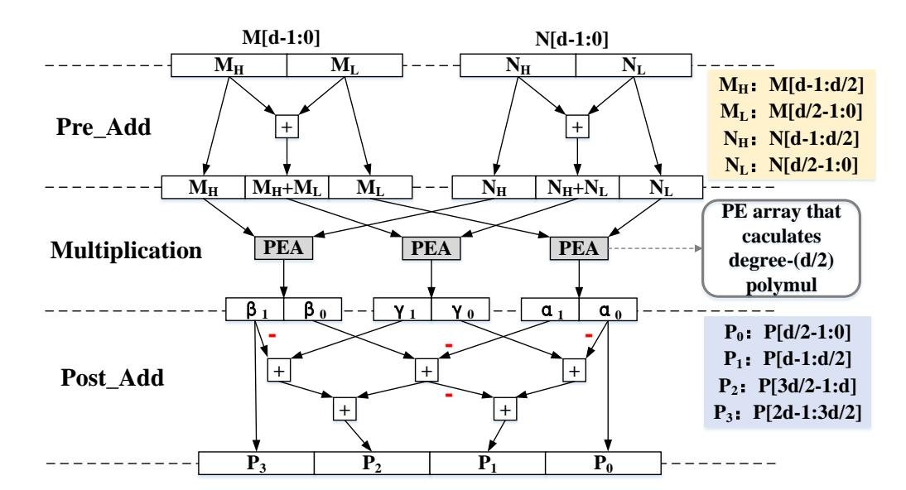

Fig. 1. Karatsuba multipliers array executing degree-d polynomial multiplication:  $P = M \times N$ .

#### III. KARATSUBA-BASED POLYNOMIAL MULTIPLICATION

LWRpro optimizes the hierarchical Karatsuba framework proposed in [27] to enable degree-256 polynomial multiplication in 81 cycles without considering pipeline startup time. Moreover, a hardware-efficient Karatsuba scheduling strategy, incorporating compact pre-processing circuits and several necessary modules, are developed to achieve high-performance computations with substantial overhead reduction.

#### A. Hierarchical Karatsuba Framework

Various types of Karatsuba systolic multipliers were extensively used in the implementations of ECC and RSA [23]–[26]. Fig. 1 shows a fully parallel Karatsuba array corresponding to 1-level Karatsuba algorithm, following the optimization method proposed in [11]. The architecture is able to execute degree-d polynomial multiplication each time, which consists of three relatively small processing element arrays (PEAs) executing degree-d/2 polynomial multiplication simultaneously. The Karatsuba algorithm consists of three phases: Pre-Add, multiplication and Post-Add. Pre-Add and Post-Add denote all addition or subtraction operations performed before and after multiplication in Karatsuba algorithm, respectively. One level split of Karatsuba algorithm is able to reduce four multiplication operations to three, achieving a 25% reduction. This structure can be adopted recursively to save more multiplication operations.

However, these architectures are not perfectly suitable for problem of polynomial multiplication in Saber, because the calculation scale of polynomial multiplication in Saber is much larger than that of ECC or RSA. Applying Karatsuba algorithm in multiple dimensions is an efficient method to reuse a relatively small Karatsuba multipliers array. A hierarchical Karatsuba framework is used in [27] to accelerate the large-number multiplication, including the kernel hardware and the scheduling strategy. Fig. 2 depicts a fully-unfolded hierarchical Karatsuba framework, which illustrates an example of executing degree-2d polynomial multiplication  $(M \times N)$  using a kernel hardware and one level of scheduling strategy. It is assumed that each coefficient is w-bit width. The kernel hardware was a Karatsuba multiplier array similar to Fig. 1, which is able to execute degree-d polynomial

{3}------------------------------------------------

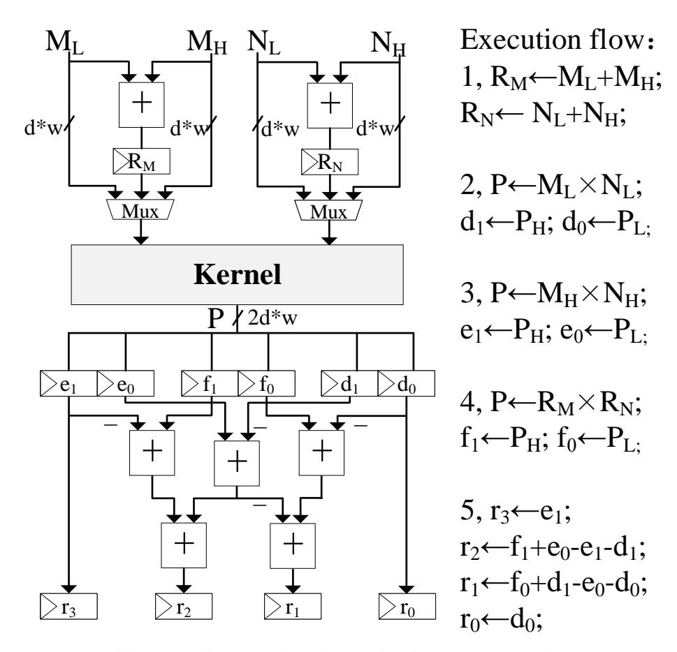

(P: degree-2d intermediate result polynomial from the kernel;  $P = P_L + P_H \times 2^d$ ;  $r = r_0 + r_1 \times 2^d + r_2 \times 2^{2d} + r_3 \times 2^{3d}$ ;  $r = r_0 + r_1 \times 2^d + r_2 \times 2^{2d} + r_3 \times 2^{3d}$ ;  $r = r_0 + r_1 \times 2^d + r_2 \times 2^{2d} + r_3 \times 2^{3d}$ ;  $r = r_0 + r_1 \times 2^d + r_2 \times 2^{2d} + r_3 \times 2^{3d}$ ;  $r = r_0 + r_1 \times 2^d + r_2 \times 2^{2d} + r_3 \times 2^{3d}$ ;  $r = r_0 + r_1 \times 2^d + r_2 \times 2^{2d} + r_3 \times 2^{3d}$ ;  $r = r_0 + r_1 \times 2^d + r_2 \times 2^{2d} + r_3 \times 2^{3d}$ ;  $r = r_0 + r_1 \times 2^d + r_2 \times 2^{2d} + r_3 \times 2^{3d}$ ;  $r = r_0 + r_1 \times 2^d + r_2 \times 2^{2d} + r_3 \times 2^{3d}$ ;  $r = r_0 + r_1 \times 2^d + r_2 \times 2^{2d} + r_3 \times 2^{3d}$ ;  $r = r_0 + r_1 \times 2^d + r_2 \times 2^{2d} + r_3 \times 2^{3d}$ ;  $r = r_0 + r_1 \times 2^d + r_2 \times 2^{2d} + r_3 \times 2^{3d}$ ;  $r = r_0 + r_1 \times 2^d + r_2 \times 2^{2d} + r_3 \times 2^{3d}$ ;  $r = r_0 + r_1 \times 2^d + r_2 \times 2^{2d} + r_3 \times 2^{3d}$ ;  $r = r_0 + r_1 \times 2^d + r_2 \times 2^{2d} + r_3 \times 2^{3d}$ ;  $r = r_0 + r_1 \times 2^d + r_2 \times 2^{2d} + r_3 \times 2^{3d}$ ;  $r = r_0 + r_1 \times 2^d + r_2 \times 2^{2d} + r_3 \times 2^{3d}$ ;  $r = r_0 + r_1 \times 2^d + r_2 \times 2^{3d} + r_3 \times 2^{3d}$ ;  $r = r_0 + r_1 \times 2^d + r_2 \times 2^d + r_3 \times 2^d + r_3 \times 2^d + r_3 \times 2^d + r_3 \times 2^d + r_3 \times 2^d + r_3 \times 2^d + r_3 \times 2^d + r_3 \times 2^d + r_3 \times 2^d + r_3 \times 2^d + r_3 \times 2^d + r_3 \times 2^d + r_3 \times 2^d + r_3 \times 2^d + r_3 \times 2^d + r_3 \times 2^d + r_3 \times 2^d + r_3 \times 2^d + r_3 \times 2^d + r_3 \times 2^d + r_3 \times 2^d + r_3 \times 2^d + r_3 \times 2^d + r_3 \times 2^d + r_3 \times 2^d + r_3 \times 2^d + r_3 \times 2^d + r_3 \times 2^d + r_3 \times 2^d + r_3 \times 2^d + r_3 \times 2^d + r_3 \times 2^d + r_3 \times 2^d + r_3 \times 2^d + r_3 \times 2^d + r_3 \times 2^d + r_3 \times 2^d + r_3 \times 2^d + r_3 \times 2^d + r_3 \times 2^d + r_3 \times 2^d + r_3 \times 2^d + r_3 \times 2^d + r_3 \times 2^d + r_3 \times 2^d + r_3 \times 2^d + r_3 \times 2^d + r_3 \times 2^d + r_3 \times 2^d + r_3 \times 2^d + r_3 \times 2^d + r_3 \times 2^d + r_3 \times 2^d + r_3 \times 2^d + r_3 \times 2^d + r_3 \times 2^d + r_3 \times 2^d + r_3 \times 2^d + r_3 \times 2^d + r_3 \times 2^d + r_3 \times 2^d + r_3 \times 2^d + r_3 \times 2^d + r_3 \times 2^d + r_3 \times 2^d + r_3 \times 2^d + r_3 \times 2^d + r_3 \times 2^d + r_3 \times 2^d + r_3 \times 2^d + r_3 \times 2^d + r_3 \times 2^d + r_3 \times 2^d + r_3 \times 2^d + r_3 \times 2^d + r_3 \times 2^d + r_3 \times 2^d + r_3 \times 2^d + r_3 \times 2^d + r_3 \times 2^d + r_3 \times 2^d +$ 

Fig. 2. Hierarchical Karatsuba hardware circuits calculating  $r = M \times N$ .

multiplication at one call. The scheduling structure included pre-processing and post-processing circuits, before and after the kernel, corresponding to the Pre-Add and Post-Add phases in the scheduling layer, respectively. The scheduling strategy is a specific algorithm that follows a finite-state machine to schedule the kernel hardware as the pseudo codes in Fig. 2. The selection signals of multiplexers and update enable signals of registers are controlled by this finite-state machine. And the inverters to support subtraction operations are omitted in Fig. 2, which is the same as Fig. 4 and Fig. 5. The final multiplication results are stored in register groups  $r_3, r_2, r_1$  and  $r_0$  and each can store d/2 coefficients. The pseudo codes in this figure obeys to one level of Karatsuba algorithm and the scheduling strategy can be extended to obey to the Karatsuba algorithm with multiple levels.

The work in [27] utilized a 2-level hierarchical Karatsuba framework similar to a fully-unfolded structure. Similarly, this work did not consider the module reusage of adders and registers in the input side. Differently, there is one layer of registers reusage implemented in the output.

Hierarchical Karatsuba calculating framework is divided into two layers: kernel layer and scheduling layer. How to balance the weights of two layers is an important topic for the implementation of Saber. Although Karatsuba algorithms in two layers can both reduce the number of multiplication operations to the same degree, kernel layer arranges multiplication operations in a spatial parallel way and scheduling layer arranges multiplication operations in a time sequential way. When more levels of Karatsuba algorithm are arranged in kernel layer, the number of multipliers increases. Correspondingly the latency decreases with the area and required bandwidth increase.

The main computational task in Saber is degree-256 polynomial multiplications. The design of kernel hardware in LWRpro is shown in Fig. 3, which is a 4-level recursive version of Fig. 1. Three phases of calculation are separated by 2 rows of registers:  $R_{KA}/R_{KB}$  and  $R_{KC}$ . Kernel Pre-Add and Kernel Post-Add circuits are strings of adders to form the 4-level recursive adoption of the corresponding circuits in Fig. 1. Kernel layer, consisting of 81 multipliers and additional adders, is able to process degree-16 polynomial multiplication at one call. Scheduling layer in LWRpro needs to transform from the original task in Saber, namely degree-256 polynomial multiplications, to the processing ability of the kernel hardware, namely degree-16 polynomial multiplications, in Karatsuba way. The algorithm of the whole hierarchical Karatsuba framework is illustrated in Algo. 4. The 16-coefficient vector input is transformed into Karatsuba input through preprocessing circuits, in the meantime pre-processing registers are updated. Kernel hardware processes the multiplication of Karatsuba input and degree-64 sub-polynomial multiplication results are mapped onto 128-coefficient intermediate registers t through one part of the post-processing circuits. Then each intermediate register is mapped on final results one by one through another part of post-processing circuits. The design details of pre-processing and post-processing structures in scheduling layer are demonstrated in the next two subsections.

**Algorithm 4** Hierarchical Karatsuba framework for degree-256 polynomial multiplication in LWRpro

```
Input: A, B:degree-256 polynomial.
Output: Res = A \times B \mod x^{256} + 1.
for (i=1;i\le 81;i++) do
                                                          ▶ Pre-process:
     (\operatorname{PreRegA}, \alpha_i') \leftarrow \operatorname{Preprocess}(\operatorname{PreRegA}, \operatorname{InAi});
     (PreRegB, \beta_i') \leftarrow Preprocess(PreRegB, InBi);
                                                  ▶ Kernel calculation:
    (P_H, P_L) \leftarrow \text{Kernel\_degree16mul}(a_i', b_i');
                                                         ▶ Post-process:
     (t_7, t_6,..., t_0) \leftarrow \text{Map2level}(P_H, P_L);
     if a degree-64 sub-polymul has done and j \le 7 then
         i = 0;
         Res \leftarrow Res + Map2level_serial(t_i);
         j = j + 1;
     end if
end for
return Res
```

In hierarchical framework, 4 levels of Karatsuba algorithm are arranged in kernel layer and another 4 levels are arranged in scheduling layer to achieve a better trade-off between latency and area. The overall 8 levels of Karatsuba algorithm are able to convert the degree-256 polynomial multiplication to the coefficient-wise multiplication. Each level of Karatsuba algorithm reduce 25% of multiplications and 8 levels in LWR-pro saves up to 90% of multiplication operations, reducing the coefficient-wise multiplication number in a degree-256 polynomial multiplication from 65536 to 6521. When more levels of Karatsuba algorithms are involved in the kernel hardware, 243 or more multipliers are needed, which is beyond the

{4}------------------------------------------------

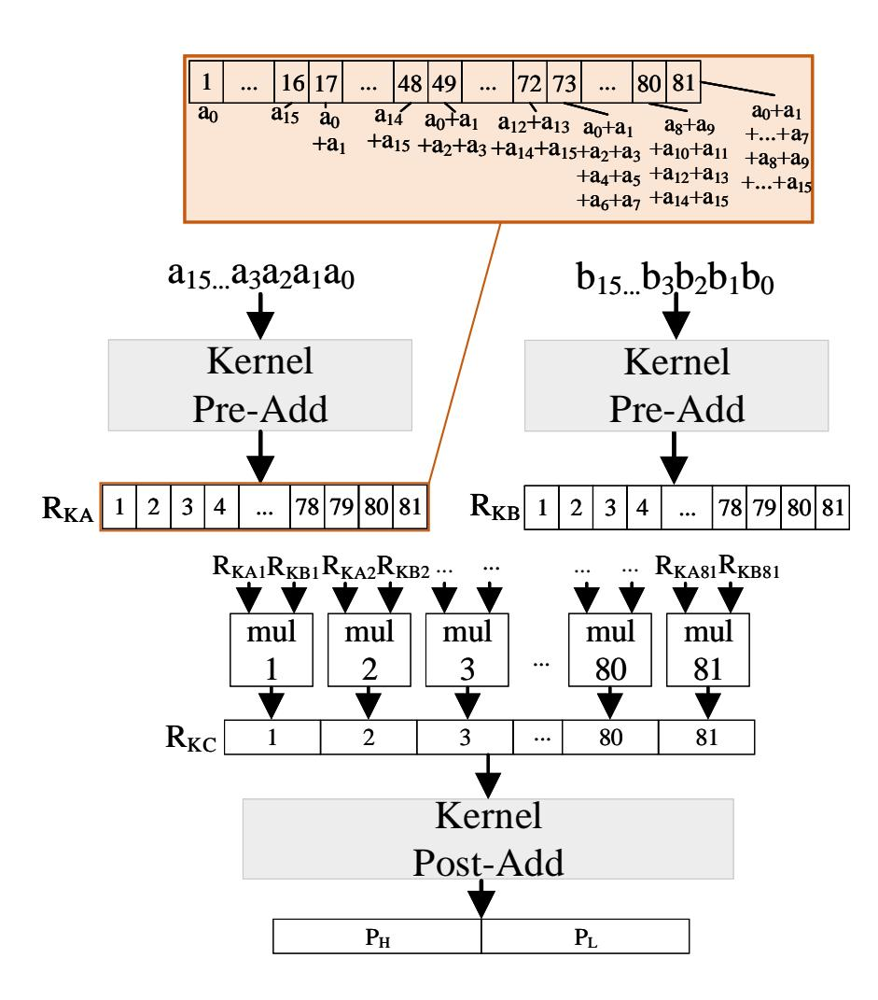

Fig. 3. Kernel hardware of LWRpro based on 4-level Karatsuba algorithm.  $a_i/b_i$ : i-th coefficients in the sub-polynomial.  $P_H/P_L$ : degree-16 sub-polynomial.  $P_H \times x^{16} + P_L = \sum_{i=0}^{15} \sum_{j=0}^{i} a_j b_{i-j}$ .  $R_{KA}$ ,  $R_{KB}$  or  $R_{KC}$ : Registers for operand A, B or multiplication results.

reasonable area and correspondingly the bandwidth of memory is too large. When more levels of Karatsuba algorithms are involved in scheduling layer, more complex pre-processing and post-processing structures are needed and the latency is higher than the current design. This is the reason why such a trade off is chosen in LWRpro. Compared with the design only equipped with the kernel hardware, 4 levels in scheduling layer reduces the cycle count from 256 to 81 to calculate a degree-256 polynomial multiplication in LWRpro, achieving a  $3.16 \times$  speed-up.

The structure of Karatsuba multipliers are relatively mature, so the overheads of the kernel hardware are relatively fixed. However, there is much space to discuss the structure and the cost of scheduling layer. For the convenience of comparison, the costs of fully-unfolded structure are assessed and the costs of partial-reusage structure in [27] are estimated naturally through deleting the corresponding layer of registers in output side. And it is assumed that there is p-level Karatsuba algorithm in scheduling layer and the kernel hardware is able to process degree-d polynomial multiplication at one call. In the input side, there are  $3^p$  d-coefficient intermediate terms generated from p-level Karatsuba algorithm of scheduling layer and  $2^p$  terms are already in input memory for each polynomial. Besides, each register is equipped with a separate adder. So the area of pre-processing registers (INreg) is estimated through the number of 1-coefficient registers and the area of preprocessing adders (*INadd*) is estimated through the number of 1-coefficient input-width adders:

$$INreg \propto 2 \times (3^p - 2^p) \times d;$$
 (2)

$$INadd \propto 2 \times (3^p - 2^p) \times d.$$
 (3)

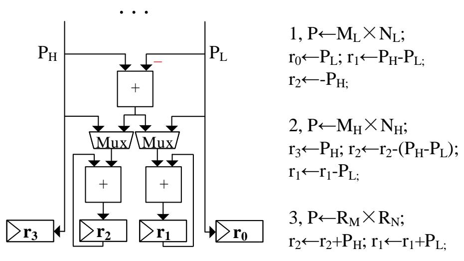

(P: degree-2d result polynomial from the kernel,  $P = P_L + P_H \times 2^d$ )

Fig. 4. Post-processing in scheduling layer with 1-level SHEKS.

In the output side of 1-level scheduling structure as (shown in Fig. 2, p = 1), there are 3 sets of registers and each set consists of  $2^p$  d-coefficient registers. There are  $5 \times 2^{p-1} \times d$  1-coefficient input-width adders to generate the final results. When the scale of computational task increases and one more level of Karatsuba algorithm is added in scheduling layer, triple more sets of registers and half of register groups in each set are needed in the new level. It is the same for the adders. According to the same estimation method, the numbers of post-processing registers (*OUTreg*) and post-processing adders (*OUTadd*) are estimated as:

$$OUTreg \propto \sum_{i=1}^{p} 3^{i} \times 2^{p-i+1} \times d; \tag{4}$$

$$OUTadd \propto \sum_{i=1}^{p} 5 \times 3^{i-1} \times 2^{p-i} \times d.$$
 (5)

When  $p \ge 2$ , for example p = 4 in this paper, the overheads of scheduling layer becomes much larger. So more efficient preprocessing and post-processing structures are necessary, which are presented in Section III-B and Section III-C.

#### B. Sequential Hardware-Efficient Karatsuba Scheduling

In the hierarchical Karatsuba framework, post-processing structure is used to temporarily store the multiplication results to support Post-Add stage in the scheduling layer. Sequential hardware-efficient Karatsuba scheduling (SHEKS) strategy is proposed to optimize this overhead.

The main goal of SHEKS is to allow each multiplication in the Karatsuba algorithm to completely affects the final results without additional registers. In Fig. 2, the final values in  $r_1$ ,  $r_2$  are influenced by all three multiplications. This is due to the effect of Post-Add stage of Karatsuba algorithm in scheduling layer. If all the addresses in the results of each multiplication are already preassigned and allow each multiplication result to spread to all affected locations, then additional registers are no longer needed. The SHEKS version of Fig. 2 is shown in Fig. 4. The results of each multiplication pass through different paths and influence the corresponding result registers.

Compared with Fig. 2, Fig. 4 saves all six 16-coefficient register groups, d e f, and two adder groups with a width of

{5}------------------------------------------------

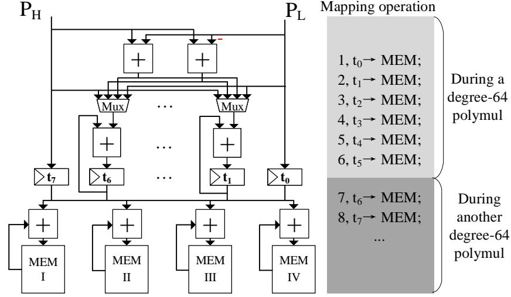

(t: temporal registers set storing the degree-128 polynomial results of degree-64 polymul.  $t_i$ : degree-16 subpolynomial;  $t = t_0 + t_1 \times 2^d + t_2 \times 2^{2d} + ... + t_7 \times 2^{7d}$ )

Fig. 5. The output side of scheduling layer in LWRpro with 4-level Karatsuba algorithm.

16-coefficient. The additional overhead is some multiplexers. The idea of SHEKS can be extended to more levels of Karatsuba algorithm in scheduling layer and the overheads can be estimated. All result register groups except for the leftmost and rightmost ones need a corresponding accumulation adder group. Besides, 2 adder groups computing intermediate values,  $P_H$ - $P_L$  and  $P_H$ + $P_L$ , are needed when  $p \geq 2$ . So the overheads are:

$$OUTreq \propto 0;$$
 (6)

$$OUTadd \propto 2^{p+1} \times d.$$
 (7)

For the implementation of Saber, p=4 and the number of adders in a direct application of SHEKS is a little higher. Moreover, a subtraction polynomial operation on the final results is needed because there is a modular polynomial  $x^n + 1$ , more adders are needed. So a new layer of registers is inserted in LWRpro to temporarily store the degree-64 sub-polynomial multiplication results and the values are then mapped to the final memory one by one. Table I lists the mapping rules of the SHEKS structure with 2-level Karatsuba algorithm to calculate degree-64 polynomial multiplication, namely Map2level function in Algo. 4. And the structure is shown in Fig. 5.

When one degree-64 polynomial multiplication is executed, the temporary results are stored in the register group array t. During this period of time, the values of one register group are mapped to final memory in each cycle following the SHEKS rules, too. Differently, the mapping mechanism is serial, which is different from the parallel way in Fig. 4. And the mapping rules vary among different degree-64 polynomials in a degree-256 polynomial following a serial version of Table I, namely Map2level\_serial function in Algo. 4. The mapping time of 8 cycles is completely hidden by the degree-64 multiplication time of 9 cycles. Moreover, The polynomial subtraction operation of the final results are added to the mapping rule and it is executed during the mapping operation.

To fulfill pipelining and eliminate the bubbles for waiting, 2 additional register groups are needed, which is not shown in Fig. 5. It has been considered in the overhead estimation in the end of Section III-C. The post-processing timetable and

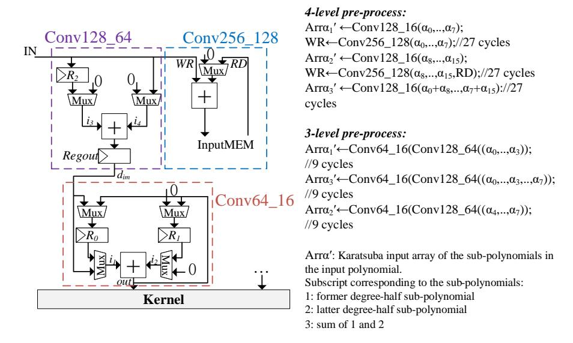

Fig. 6. Optimized pre-processing design of Saber with 4-level Karatsuba algorithm.

mapping timetable are determined based upon the rules as discussed above and the input order discussed in Section III-C.

#### C. Compact Input Pre-Processing

A compact input pre-processing technique is utilized in LWRpro to reduce the number of registers and adders required in pre-processing of scheduling layer. Registers in preprocessing circuits are needed to store two types of data: the input from input memory and the intermediate results generated from the pre-processing. The optimization made in this paper is to reuse the registers and adders. Based on our observations, storing some inputs is enough to reduce the memory accesses and eliminate additional latency of the reading operations. Moreover, the execution order of the multiplications is reorganized to maximize the reusability of data stored in the input registers. We take 2-level Karatsuba algorithm in the scheduling layer as an example, and the compact pre-processing structure is shown as Conv64\_16 in Fig. 6, which is part of the whole pre-processing circuits of our design. This module converts the input from a degree-64 polynomial to nine degree-16 polynomials in Karatsuba way.

The pre-processing for the two polynomial multiplication operands is identical. For simplicity, only the pre-processing of operand A is discussed in this section, as it is also applicable to the other operand B. Table II provides the operation details of Fig. 6 in cycles, where  $a_i$  is the i-th degree-16 polynomial in A and  $A = \sum_{i=0}^{3} \alpha_i \times x^{16i}$ . Nine cycles are needed to calculate a degree-64 sub-polynomial multiplication. Pre-processing register groups  $R_0$  and  $R_1$  are used to cache some inputs or outputs to support future addition operations calculating Karatsuba intermediate values. These registers eliminate the additional bubble cycles of waiting for reading the second operand values of addition operation and store some intermediate values. The input order from input memory is re-organized to maximize the reusability. Only 1 adder group and 2 register groups with 16 1-coefficient width are needed in module Conv64\_16. Compared with the fullyunfolded structure, 4 adder groups and 3 register groups are saved, while extra multiplexers are required.

For the implementation of Saber, the task of the preprocessing structure is to convert the multiplication operations with degree-256 polynomials to the operations with degree-16

{6}------------------------------------------------

 $t_5$  $t_6$  $t_7$  $t_0$  $t_1$  $t_2$  $t_3$  $t_4$  $\overline{-P_H+P_L}$  $+P_L$  $+P_H-P_L$  $-P_H-P_L$  $+P_H$  $\alpha_0 \times \beta_0$  $+P_L$  $+P_H$  $-P_L$  $-P_H$  $(\alpha_0+\alpha_1)\times(\beta_0+\beta_1)$  $\overline{-P_H+P_L}$  $\overline{+P_H-P_L}$  $-P_H$  $-P_L$  $+P_H+P_L$  $\alpha_1 \times \beta_1$  $-P_H+P_L$  $+P_H+P_L$  $+P_H-P_L$  $\alpha_2 \times \beta_2$  $-P_H$  $-P_L$  $(\alpha_2+\alpha_3)\times(\beta_2+\beta_3)$  $-P_L$  $-P_H$  $+P_L$  $+P_H$  $\overline{-P_H+P_L}$  $+P_L$  $+P_H$ - $P_L$  $-P_H-P_L$  $+P_H$  $\alpha_3 \times \beta_3$  $+P_H-P_L$  $-P_H$  $(\alpha_0+\alpha_2)\times(\beta_0+\beta_2)$  $+P_L$  $+P_L$  $+P_H$  $(\alpha_0+\alpha_1+\alpha_2+\alpha_3)\times(\beta_0+\beta_1+\beta_2+\beta_3)$ 

TABLE I
POST-PROCESSING MAPPING TABLE OF 2-LEVEL KARATSUBA ALGORITHM.

 $\alpha_i$ ,  $\beta_i$  denote the *i*-th degree-16 sub-polynomial in a degree-256 polynomial of operand A and B, respectively.

 $-P_L$ 

TABLE II
THE PRE-PROCESSING CYCLES TIMETABLE OF CONV64\_16 IN Fig. 6.

 $(\alpha_1+\alpha_3)\times(\beta_1+\beta_3)$ 

|   | $d_{im}$   | $i_1$                 | $i_2$                 | out                                         | $R_0$                 | $R_1$                   |
|---|------------|-----------------------|-----------------------|---------------------------------------------|-----------------------|-------------------------|
| 1 | $\alpha_0$ | $\alpha_0$            | 0                     | $\alpha_0$                                  | X                     | X                       |
| 2 | $\alpha_1$ | $\alpha_1$            | 0                     | $\alpha_1$                                  | $\alpha_0$            | X                       |
| 3 | $\alpha_1$ | $\alpha_1$            | $\alpha_0$            | $\alpha_0$ + $\alpha_1$                     | $\alpha_0$            | X                       |
| 4 | $\alpha_2$ | $\alpha_2$            | 0                     | $\alpha_2$                                  | $\alpha_0$            | X                       |
| 5 | $\alpha_2$ | $\alpha_2$            | $\alpha_0$            | $\alpha_0$ + $\alpha_2$                     | $\alpha_0$            | X                       |
| 6 | $\alpha_3$ | $\alpha_3$            | 0                     | $\alpha_3$                                  | $\alpha_2$            | $\alpha_0$ + $\alpha_2$ |
| 7 | $\alpha_3$ | $\alpha_3$            | $\alpha_2$            | $\alpha_3$ + $\alpha_2$                     | $\alpha_2$            | $\alpha_0$ + $\alpha_2$ |
| 8 | $\alpha_1$ | $\alpha_1$            | $\alpha_3$            | $\alpha_3$ + $\alpha_1$                     | $\alpha_3$            | $\alpha_0$ + $\alpha_2$ |
| 9 | X          | $\alpha_0 + \alpha_2$ | $\alpha_1 + \alpha_3$ | $\alpha_0 + \alpha_1 + \alpha_2 + \alpha_3$ | $\alpha_1 + \alpha_3$ | $\alpha_0 + \alpha_2$   |

 $\alpha_i$  denotes the *i*-th degree-16 sub-polynomial in a degree-256 polynomial of operand A and B, respectively.

polynomials that the kernel hardware is able to process. The corresponding pre-processing circuit is shown in Fig. 6 and how the 4-level pre-processing is constructed is depicted in the pseudo-algorithm of this figure.

It requires 81 cycles with several additional pipeline initialization cycles to 4-level pre-processing. The first 27 cycles are needed to calculate the former degree-128 sub-polynomial multiplication, the second 27 cycles are needed to calculate the latter degree-128 sub-polynomial multiplication, the last 27 cycles are needed to calculate the sum polynomial of the former and the latter degree-128 sub-polynomial multiplication. In Fig. 6, Part Conv256\_128 executes the corresponding polynomial addition operations. During the first 27 cycles, the corresponding read values are written into an additional input memory. During the second 27 cycles, the polynomial sum operation is executed and the sum results are written back to the additional input memory to support sum polynomial multiplication during last 27 cycles. The second 27 cycles and last 27 cycles' timetables are the same as the first 27 cycles' timetable except for RD and WR values. Among each 27 cycles, the first 9 cycles are needed to calculate the former degree-64 sub-polynomial multiplication as the same order of Table II, the second 9 cycles are needed to calculate the sum polynomial multiplication, and the last 9 cycles are needed to calculate the latter degree-64 sub-polynomial

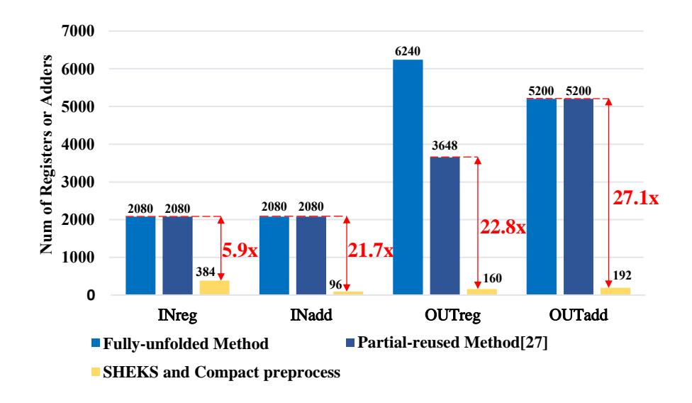

 $+P_H$ 

 $\overline{-P_H+P_L}$ 

Fig. 7. Resource usage comparison

multiplication. In Fig. 6, Part Conv128\_64 executes the corresponding conversion job from a degree-128 polynomial to three degree-64 polynomials in Karatsuba way. Table III show a timetable example of Part Conv128\_64 for pre-processing to obtain sum sub-polynomial during first 27 cycles with the help of  $R_2$  and Regout. The output is organized in the order required by Part Conv64\_16. The complete 27-cycle timetable is easy to obtain because first 9 cycles and last 9 cycles' pre-processing are simpler without sum operation of degree-64 polynomials. Register  $R_2$  stores some values to support the polynomial addition operation. Register Regout not only plays the role of pipeline register, but also helps to latch values for the next cycle. Part Conv64\_16 converts from the degree-64 polynomial into degree-16 polynomials in Karatsuba way, as described above.

To sum up, as shown in Fig. 7, compared with the straightforward implementation without reusage and partial-reusage method in [27], this proposed architecture has more compact pre-processing and post-processing architectures in terms of registers and adders utilization. This improvement is achieved via utilizing two proposed techniques: SHEKS and compact input structure. The area consumption is evaluated by the number of 1-coefficient registers and 1-coefficient input-width adders. The overheads of straightforward fully-unfolded method are calculated by Eq. 2, Eq. 3, Eq. 4 and Eq. 5. The overhead of [27] is estimated through deleting one layer of post-processing registers. Fig. 5 and Fig. 6 depict the overheads of LWRpro. Besides, the additional input memory

{7}------------------------------------------------

| Cycle | in | R2 | i3 | i4 | dim   | Regout | out                     | WR | RD |
|-------|----|----|----|----|-------|--------|-------------------------|----|----|
| 9     | α4 | α0 | α0 | α4 | α0+α4 | -      | -                       | α4 |    |
| 10    | α1 | α0 | 0  | 0  | 0     | α0+α4  | -                       |    |    |
| 11    | α5 | α1 | α1 | α5 | α1+α5 | α0+α4  | -                       | α5 |    |
| 12    | α2 | α1 | 0  | 0  | 0     | α1+α5  | α0+α4                   |    |    |
| 13    | α6 | α2 | α2 | α6 | α2+α6 | α1+α5  | α1+α5                   | α6 |    |
| 14    | α3 | α2 | 0  | 0  | 0     | α2+α6  | α0+α1+α4+α5             |    |    |
| 15    | α7 | α3 | α3 | α7 | α3+α7 | α2+α6  | α6                      | α7 |    |
| 16    | α1 | α3 | 0  | 0  | 0     | α3+α7  | α0+α2+α4+α6             |    |    |
| 17    | α5 | α1 | α1 | α5 | α1+α5 | α3+α7  | α7                      |    |    |
| 18    | -  | α5 | 0  | 0  | 0     | α1+α5  | α3+α2+α6+α7             |    |    |
| 19    | α4 | α5 | 0  | α4 | α4    | α1+α5  | α3+α1+α7+α4             |    |    |
| 20    | -  | α5 | α5 | 0  | α5    | α4     | α0+α1+α2+α3+α4+α5+α6+α7 |    |    |

TABLE III INPUT STREAM TIMETABLE OF PRE-PROCESSING STRUCTURE.

and 2 group of output pipeline registers are also considered. Fig. 7 shows the overhead comparisons of pre-processing registers, pre-processing adders, post-processing registers and post-processing adders. Up to 90.5% of the registers are no longer required with the adoption of the proposed methods, while 96.0% of the reductions are achieved regarding the adders, which is benefited from the higher reusgae and parallelism. Most of the costs in the scheduling layer are compressed and these techniques improve the usability of the hierarchical calculating framework of Karatsuba algorithm.

# IV. HARDWARE ARCHITECTURE

# *A. System Architecture and Configurable Design*

Fig. 8 shows the system architecture of LWRpro. Memory KEMkey and KEMcipher marked in green stores key-related data and ciphertext-related data as input and output of SHA-3 functions to support KEM scheme, respectively. Memory KEMkey and KEMcipher are organized as two single-port RAMs and there is a wrapper on these two RAMs for unified address space. Plaintext, ciphertext and key data pass through between memory KEMkey/KEMcipher and the PKE module. Data are organized in memory KEMkey/KEMcipher for Keccak module marked in blue to execute SHA-3 functions. During decapsulation, ciphertext are imported into KEMcipher and compared in verify module marked in purple with another ciphertext from re-encryption operation in PKE module. The comparison operation is parallel with PKE executions, which hides the latency overheads. The verification results only affect the input address of memory KEMkey/KEMcipher for the following SHA-3 operations. In PKE part, public matrix is generated from Keccak module and imported into memory marked in green after alignment. Secret vector is generated from sampler marked in orange and imported into input memory. Polynomial multiplications are executed in multiplication part marked in yellow and the results are exported to output memory marked in green. Before output, the results needs addition operations in adder array and bits truncation operations in Trunc part.

PreA and PreB represent the input pre-processing circuits of operand A and operand B in scheduling layer, and Post denotes the post-processing components. MEMpk and MEMsk denote memory storing data of public key and data of secret key, respectively. MEMtmp denotes memory storing the intermediate results and final results of polynomial multiplication. MEMsk and MEMtmp are divided into four banks to store four polynomials of the secret key and the intermediate values for all three versions of Saber. MEMpk is divided into two banks to serve as an input ping-pong buffer to enable pipelining. All PKE memories are organized as register files and memories are double-port to support write and read simultaneously. The align part is used to handle the data alignment. According to the specification for Saber, the binomial sampler is implemented in a straightforward manner. High-speed Keccak module comprises two Keccak-f parallel hardware and supports two Keccak-f[1600] computations per cycle. Each copy of Keccak-f hardware is implemented in a straightforward way [29]. Therefore each round of Keccak is executed every 12 clock cycles.

The multiplier array is reused to support both vector-vector and matrix-vector multiplication. The Keccak module is shared to generate both public and secret key pairs. The adder array following MEMtmp in Fig. 8 is shared by encryption and decryption. It consists of four adders to facilitate addition operations for all three versions of Saber, which processes four terms of the polynomial at each output. The array is shown in the upper right corner of Fig. 8.

To achieve a configurable design among all the security levels and stages of Saber, some configurable design ideas are adopted. Some modules can be reused, such as multiplication hardware and Keccak hardware, but parameter choices need to be redundant for all variants of Saber, such as bank number of MEMsk and sk-input width of multipliers. The adder array before truncation, which is illustrated in the upper right corner of Fig. 8, also adopts the configurable design among different stages and security levels with the help of multiplexers. However, this idea does not work in some components. These components, including data alignment modules and output truncation modules, adopt the idea of multi-parameter design. The data alignment modules are illustrated in the lower right corner of Fig. 8. The four data aligning modules execute

{8}------------------------------------------------

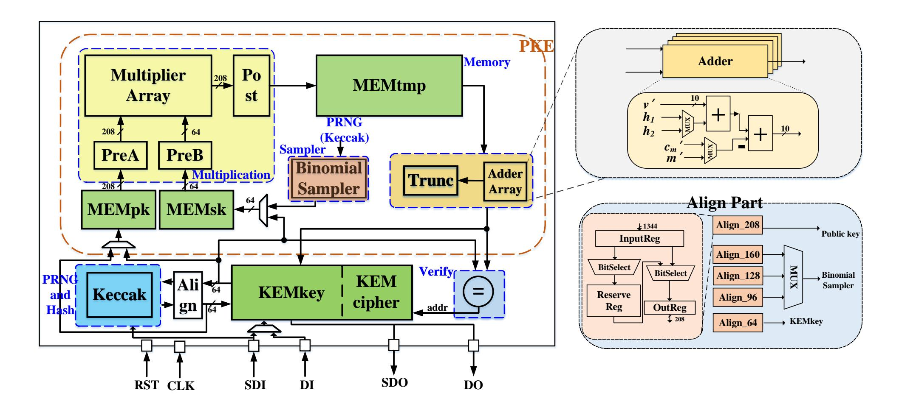

Fig. 8. The system architecture of LWRpro crypto-processor.

different types of data aligning jobs. For example, Align\_208 module arranges a 1344-bit input and achieves a 208-bit output. At each cycle, BitSelect chooses the corresponding bits from InputReg and ReserveReg part to write to ReserveReg and OutReg. The truncation modules adopt the same idea. Multiple truncation modules execute different truncation jobs of output with different bit numbers and packing jobs.

## B. Task-rescheduling-based Pipeline Design

The computational operations involved in Saber are finely scheduled to enable high-performance processing from the hardware designer's perspective. Moreover, some pipeline tricks are added to reduce the time overheads of data importing before polynomial multiplication and data exporting after polynomial multiplication as much as possible.

In hardware implementation, the Keccak is utilized to generate polynomials of the public key and the secret key. To ensure that the Keccak is able to focus on one job over a period of time, the execution order in the software [3] should be reconsidered. Saber768 is taken as an example, and Fig. 9 shows the circuit design and execution flow of LWRpro. The number after MEM in Fig. 9 denotes the bank index of the MEM. MEMtmp is also divided in another way according to memory address into 4 pieces: MEMtmp1, MEMtmp2, MEMtmp3 and MEMtmp4, which are abbreviated as Tmp1, Tmp2, Tmp3 and Tmp4.

For matrix-vector multiplication in Saber, all polynomials of the secret key, such as  $B_1$ ,  $B_2$  and  $B_3$ , are generated in advance. Polynomials of public key, such as  $A_1$ ,  $A_2$  and  $A_3$ , are generated in pipeline and the generation is parallel with the multiplication hardware to reduce the whole latency overheads and memory size storing public polynomials. The multiplication operations  $A_1 \times B_1$ ,  $A_2 \times B_2$  and  $A_3 \times B_3$  ... are carried out once the corresponding public polynomials are

ready. For vector-vector multiplication, the polynomials of the public key and the secret key are generated in parallel. This is because public polynomials are imported from the interface.

Martix-vector and vector-vector polynomial multiplications are both involved in encryption stage. Vector-vector multiplication is scheduled before matrix-vector multiplication in LWRpro to avoid the additional timing overhead of loading the vector of the secret key.

While one polynomial of the public key is used in polynomial multiplication, the next polynomial is imported to another bank of MEMpk. This reduces the data importing time of multiple polynomials and the multiplication hardware keeps running once activated as shown at the bottom of Fig. 9. The same holds for the reduction in data exporting time, because MEMtmp has more than one bank. For matrix-vector polynomial multiplication during encryption, the first piece Tmp1 and the second piece Tmp2 serves as an output pingpong buffer, which allows data exporting from MEMtmp is able to execute in parallel with the multiplication.

As shown at the right corner of Fig. 9, the multiplication  $A_1 \times B_1$  during vector-vector polynomial multiplication is started as long as parts of the operands  $A_1$  and  $B_1$  have been loaded into the MEM. By implementing this trick, 40 cycles are reduced in the vector-vector multiplication process, which improves the efficiency of decryption. For key generation, public matrix is generated in column-major order and it is inconsistent with the matrix-vector multiplication order. So all four result polynomials of FireSaber need to be stored in MEMtmp temporarily during matrix-vector multiplication in key generation.

To sum up, MEMpk and MEMtmp are used as pingpong buffers in the task-level pipeline. Besides, the multibank design also plays other roles. Four banks of MEMtmp are needed to store multiple result polynomials during key

{9}------------------------------------------------

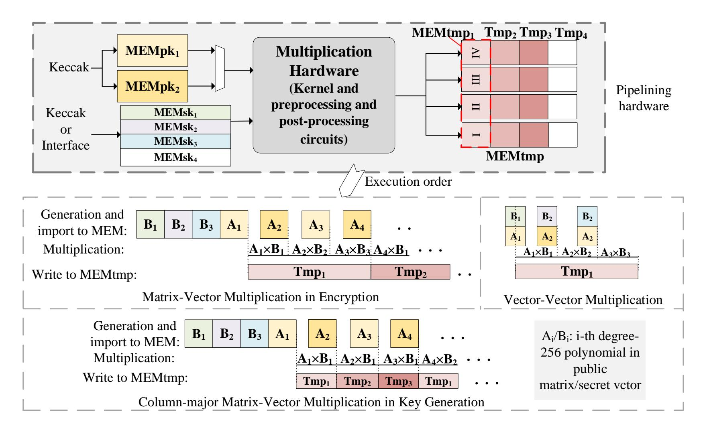

Fig. 9. Task-rescheduling pipeline hardware and execution flow of Saber768.

generation. Hardware reusage can reduce the overheads of task-level pipeline.

#### C. Truncated Multiplier

The work in [5] utilized addition operations and look-up table to perform multiplication operations for Saber. However, this method is only suitable for the schoolbook multiplication. For Karatsuba multiplications, truncated multipliers for Saber are adopted in LWRpro utilizing the properties of binomial sampling and LWR algorithms.

For a random number sequence generated by the Keccak module, the binomial sampler divides the input sequence into subsequences with consecutive  $\mu$  bits. The Hamming weights of the higher half and lower half of the *i*-th subsequence are calculated and stored alternatively into registers denoted as  $a_i$  and  $b_i$ . Then, secret key  $s_i$  is obtained by:

$$s_i = (a_i - b_i) \bmod q. \tag{8}$$

For Saber768,  $\mu=8$  means that  $a_i$  and  $b_i$  have a value range of [0,4]; in other words, the difference of these two operands has a value range of [-4,4]. For previous software implementations,  $s_i$  is extended to 13 bits through sign extensions. However, not all 13 bits are needed to calculate the final result. Let  $s_i'=a_i-b_i$  without modular operation; if  $s_i'\geq 0$ , then  $s_i'=s_i$ ; if  $s_i'<0$ , then  $s_i\times r \mod q=(s_i'+q)\times r \mod q=(s_i'+r) \mod q$  where r denotes an arbitrary integer. Thus, multiplications with 13-bit unsigned  $s_i$  can be replaced by signed operations with 4-bit signed  $s_i'$ . It is noticed that only 4 bits out of all 13 bits are useful in the calculation, which means that the width of one operand for the multiplier can be reduced to 4 bits. The storage and transmission of private keys are also benefited from the reduction in effective bits.

Instead of the modular operation of LWE, the round operation of LWR allows us to trim unnecessary operations.

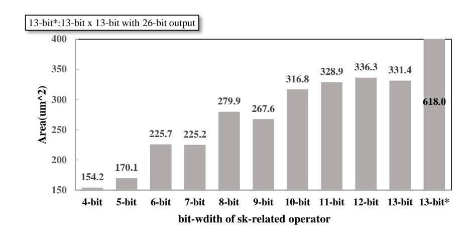

Fig. 10. Area consumption comparisons among different input bit-widths.

Considering that the parameter q of Saber is 8192, i.e., only the lowest 13 bits in the result are kept, all multiplication operations unrelated to generating the lowest 13 bits in the result can be avoided. The adoption of truncated multipliers does not affect the correctness of results and still conforms to the specification of Saber. Fig. 10 shows the area of multipliers whose widths of the secret key-related operand vary. All data are collected under TSMC 40nm process, which is the same as the process of LWRpro. 13-bit\* denotes the full-size multiplier with all 26-bit output. As Fig. 10 shows, truncated multipliers only occupy 25% - 50% area of the full-size multiplier.

However, the effectiveness of this technique is limited by the Pre-Add phase in the kernel hardware and the scheduling layer. Because the addition operations in the Pre-Add phase expand the number of effective bits of the operand. This limitation is acceptable because at least 90% multiplication operations are saved through 8-level Karatsuba algorithm.

{10}------------------------------------------------

Frequency Latency LUTs / Flip-flops Platform DSPs / BRAMs Enc(Polymul)<sup>a</sup>/ Dec(Polymul)<sup>a</sup> (MHz) 49<sup>b</sup>/48<sup>b</sup> Saber768 [4] 322 256/3.5 UltraScale+ 12566/11619 Saber768 [19]<sup>c</sup> 3550/5472 234171/40824 -/-Artix-7 66.7 Saber768 [6] Artix-7 125 4147/3844 7400/7331 28/2 23.6k/9.8k Saber768 [5] 250 26.5(3592)/32.1(4484) UltraScale+ -/2 LightSaber 26.9/33.6 Saber768 [5] 44.1(3592)/53.6(4484) UltraScale+ 150 24950/10720 -/2 FireSaber 68.4/82.0  $7.2^{d}(978)/2.6^{d}(1227)$ 160 Saber768(our) UltraScale+ 28169/9504 85/6  $5.2^{d}(492)/6.7^{d}(660^{e})$ LightSaber  $11.6^{d}(978)/4.1^{d}(1227^{e})$ Saber768(our) UltraScale+ 100 34886/9858 85/6  $21.0^{d}(1626)/4.9^{d}(1956^{e})$ FireSaber

TABLE IV PERFORMANCE COMPARISONS ON FPGA.

- <sup>a</sup> Time of encryption/encapsulation and decryption/decapsulation are listed in *us*. Latency of polynomial multiplication involved in two stages are listed in cycle counts.
- <sup>b</sup> Only the latency of hardware components is listed.
- <sup>c</sup> Only the costs of multiplication hardware and data RAM implemented on FPGA are listed.
- <sup>d</sup> Latency of encryption and decryption are listed.
- <sup>e</sup> The number denotes the polynomial multiplication clock cycles sum during the encryption and decryption.

#### V. IMPLEMENTATION AND COMPARISON

#### A. FPGA Implementation

The proposed LWRpro crypto-processor of PKE version is firstly implemented on Xilinx Virtex UltraScale+ FPGA, with its operating frequency of 100 MHz. Cycle counts of Saber PKE scheme on FPGA are listed in Table V.

In terms of resource consumption, 85 DSPs, 34886 LUTs, 9858 Flip-Flops and 6 36-kb-BRAMs are utilized. Among them, the components calculating the degree-256 polynomial multiplication only includes 85 DSPs, 13735 LUTs and 4486 Flip-Flops. When only Saber768 is implemented, the operating frequency is improved to 160 MHz. LUTs and Flip-flops utilizations are reduced to 28169 and 9504. Among 85 DSPs, 81 DSPs are utilized for multipliers and another 4 DSPs are utilized for adders corresponding to 4 banks of MEM storing final results in Fig. 5. Among 6 BRAMs, 3 BRAMs are arranged for  $MEMpk_1$  and another 3 BRAMs for  $MEMpk_2$  because of the high word widths.

It is noted that FPGA version of LWRpro only supports PKE scheme of Saber. The speed comparison is only able to show the approximate range. And only LWRpro and [5] supports all three versions and other FPGA implementation works only support Saber768. The comparisons of the resource consumption are listed in Table IV.

The task of polynomial multiplication during encapsulation of Saber equals to that during encryption, and polynomial multiplications during decapsulation equals to the sum of those during encryption and decryption. When cycle counts are chosen as comparison object, LWRpro achieves  $3.67 \times 10^{-5}$  and  $3.65 \times 10^{-5}$  reductions in cycles of polynomial multiplications during encapsulation and decapsulation, respectively. When encryption performance of [5] is calculated through encapsulation latency subtracting SHA-3 latency, LWRpro on FPGA is  $3.4 \times 10^{-5}$  faster than unified Saber version [5] at the encryption stage of Saber 768, while  $1.39 \times 10^{-5}$  LUTs,  $0.92 \times 10^{-5}$  Flip-Flops and  $3 \times 10^{-5}$ 

TABLE V
CYCLE COUNTS OF PKE STAGES IN LIGHTSABER, SABER768 AND
FIRESABER.

|                | Keygen | Encryption | Decryption |
|----------------|--------|------------|------------|
| Light Saber    | 519    | 664        | 326        |
| Saber<br>768   | 943    | 1156       | 408        |
| Light<br>Saber | 1531   | 1811       | 490        |

BRAMS are needed in our design. In terms of area efficiency, 2.4x (LUTs), 3.7x (Flip-Flops) and 1.1x (BRAMs) higher area efficiencies are achieved. However, LWRpro utilizes 85 DSPs, while [5] did not. The works [4], [6] are software-hardware codesign implementations and only the hardware part is included in the comparisons. Compared with the results presented in [4], LWRpro of Saber768 version consumes around 20% of the latency when ignoring the effect of additional SHA-3 operations compared with PKE scheme. However, the utilization of LUTs and BRAMs are more than those of [4], [5]. This occurs because LWRpro is mainly designed for the ASIC and there is still room for optimization on FPGA resource consumption. Compared with the results in [6] and [19], hundreds of times speed-ups are achieved in LWRpro.

#### B. Post-layout ASIC Implementation

The post-layout implementation of LWRpro is achieved based on TSMC 40nm CLN40G process in the worst process corner. The processor occupies  $0.38~mm^2$  after placing and routing. The area breakdown is shown in Fig. 11(a) and the power breakdown of Saber768 is shown in Fig. 11(b). Preprocessing and post-processing structures consume 18.5% of area, which supports  $3.16\times$  speed-up for degree-256 poly-

{11}------------------------------------------------

TABLE VI
PERFORMANCE OF KEM STAGES IN LIGHTSABER, SABER768 AND
FIRESABER.

|                | Ke   | ygen  | Encap | sulation | Decapsulation |       |  |
|----------------|------|-------|-------|----------|---------------|-------|--|
|                | Cyc- | Power | Cyc-  | Power    | Cyc-          | Power |  |
|                | les  | (mW)  | les   | (mW)     | les           | (mW)  |  |
| Light<br>Saber | 603  | 35.7  | 859   | 37.2     | 1075          | 33.8  |  |
| Saber<br>768   | 1066 | 39.2  | 1456  | 41.3     | 1701          | 35.3  |  |
| Fire<br>Saber  | 1716 | 44.8  | 2185  | 44.0     | 2478          | 42.1  |  |

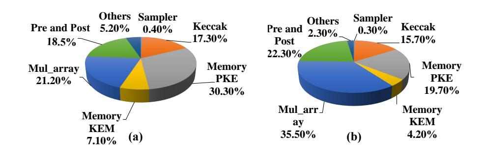

Fig. 11. Area breakdown(a) and power breakdown during encryption of Saber768(b).

nomial multiplication. The number of equivalent gates of LWRpro is 446.8k, which includes the hardware components executing logic operations and memory. The maximum operating frequency is up to 400 MHz with an average power consumption of 39 mW. Power is simulated through PTPx based on real netlist simulation waveforms. The detailed implementation results are listed in Table VI.

In Fig. 12, the results are compared with the works implemented on a mainstream desktop Intel CPU with the optimization of AVX2 and an embedding CPU. It is observed that LWRpro is  $11 - 14 \times$  faster than the implementation on Intel Core i7 in [1]. Moreover, LWRpro is approximately 2100 -  $2500 \times$  faster than the work on Cortex-M4 CPU in [3].

Table VII shows the comparison between LWRpro and the state-of-the-art ASIC implementations of other PQC algorithms. The results show that hardware implementation performs better with respect to both speed and energy efficiency. When encapsulation of LWRpro is compared with the stateof-the-art results [7] of algorithms with less post-quantum bits, FireSaber outperforms Newhope 1024 and Kyber 1024, by  $51 \times$ and  $50\times$  speed,  $29\times$  and  $33\times$  in energy efficiency and  $112\times$ and 109× higher gates efficiency in LWRpro. For equivalent gates, the work [7] consumes 979kGE logic gates and 12 kB SRAM, while LWRpro only consumes 446.8kGE. 45.6% equivalent gates are needed in LWRpro when area of SRAM in [7] is not in the scope of comparison. LWRpro's encapsulation is compared with encryption of algorithms [28], such as FireSaber vs. Newhope1024 and Saber768 vs. Kyber768. LWRpro achieves  $271\times$ ,  $360\times$  speed and  $50\times$ ,  $69\times$  energy efficiency improvement with a reasonable area cost. Besides, the average power of LWRpro is similar as [7] considering the process factor and  $4\times$  larger than [28]. This is acceptable because the energy consumption of one encapsulation

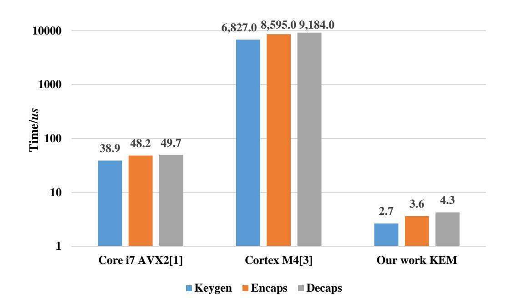

Fig. 12. Comparisons with other software implementations of Saber768.

operation is still at least one order of magnitude less than that in other works. The energy efficiency of encapsulation in LWRpro's Saber768 is around 9.0× greater than the NTT hardware in [16], which is only one building block of other encryption algorithms. Compared with pre-quantum elliptic curve cryptography hardware [17], the implementation of Saber768 in this paper is around three orders of magnitude advantage faster than the signature operation and meanwhile consumes only 1.0% energy without considering the process technology.

## C. Discussions

Although NTT is not suitable for the implementation of Saber, LWRpro reveals that high performance and low energy can be achieved in the hardware implementation of module-LWR, which are even better than ring-LWE and module-LWE. Some reasons are explored as follows. First, the 8level Karatsuba calculation framework saves more than 90% of multiplication operations, which is closed to the level of NTT. Second, the truncating properties of technique is used in hardware implementation of Saber. The multiplier is much smaller than the full-bit multiplier in the NTT hardware. This means that, under a similar area consumption, the design proposed can afford a larger-scale multiplication array. Therefore, the area ratio of the multiplication module in LWRpro is much higher. The high speed partly benefits from the larger size of the multiplier array. Third, distinctions of data-path in hardware implementations of module-LWR caused by the chosen parameters are less significant, and it is easy to configurable among different versions of Saber. The same polynomial-multiplication component is reused to save the area cost. Fourth, the pipeline technique is used to improve the hardware implementation of multiple polynomial multiplication operations.

## VI. CONCLUSIONS

In this paper, an energy-efficient configurable module-LWR crypto-processor, which supports multi-security-level of Saber, is proposed. The optimized hierarchical Karatsuba framework is also suitable for other LWR-based schemes, and the extension details needs future discussion. When the scale of

{12}------------------------------------------------

| Algorithm                  | Function             | Process (nm) | Frequency (MHz) | Area                 | Cycles | Energy efficiency (uJ/op) | Post-Quantum<br>Security(bits) |
|----------------------------|----------------------|--------------|-----------------|----------------------|--------|---------------------------|--------------------------------|
| Newhope1024 [28]           | encryption           | 40           | 72              | $0.28 \ mm^2$        | 106611 | 12                        | 235                            |
| Kyber768 [28]              | encryption           | 40           | 72              | $0.28 \ mm^2$        | 94440  | 10.31                     | 161                            |
| Newhope1024 [7]            | encapsulation        | 28           | 300             | 979k GE <sup>a</sup> | 85871  | 7.02                      | 235                            |
| Kyber1024 [7]              | encapsulation        | 28           | 300             | 979k GE <sup>a</sup> | 81569  | 7.94                      | 218                            |
| NTT-512 [16] <sup>b</sup>  | NTT<br>+DG(Binomial) | 40           | 300             | $2.05 \ mm^2$        | 4196   | 1.346                     | -                              |
| NTT-1024 [20] <sup>c</sup> | NTT                  | 65           | 25              | $0.33 \ mm^2$        | -      | -                         | -                              |
| NIST-P256-ECDSA<br>[17]    | sign                 | 65           | 20              | $2 mm^2$             | 180000 | 14.58                     | -                              |
| LWRpro LightSaber          | encapsulation        | 40           | 400             | $0.38 \ mm^2$        | 859    | 0.080                     | 115                            |
| LWRpro Saber768            | encapsulation        | 40           | 400             | $0.38 \ mm^2$        | 1456   | 0.150                     | 180                            |
| LWRpro FireSaber           | encapsulation        | 40           | 400             | $0.38 \ mm^2$        | 2185   | 0.240                     | 245                            |

TABLE VII
COMPARISONS WITH THE HARDWARE IMPLEMENTATIONS OF OTHER ALGORITHMS.

multiplier array is reduced, the optimized strategies can be extended to resource-constrained platforms, which needs a new trade-off between area and latency. Considering performance of hardware implementation is gaining more attention in third round standardization process, unified design with support of more algorithms is under developing. Besides, it is believed that constant-time design is already achieved in LWRpro and side-channel resistance is considered as the future work.

#### REFERENCES

- [1] J.-P. D'Anvers, A. Karmakar, S. Sinha Roy, and F. Vercauteren, "Saber: Module-LWR Based Key Exchange, CPA-Secure Encryption and CCA-Secure KEM," in *Progress in Cryptology AFRICACRYPT 2018*, A. Joux, A. Nitaj, and T. Rachidi, Eds. Cham: Springer International Publishing, 2018, pp. 282–305.
- [2] S. Roy, "Saberx4: High-throughput software implementation of saber key encapsulation mechanism," in *International Conference on Computer Design.*, 11 2019, pp. 321–324.
- [3] A. Karmakar, J. M. Bermudo Mera, S. Sinha Roy, and I. Verbauwhede, "Saber on ARM," *IACR Transactions on Cryptographic Hardware and Embedded Systems*, vol. 2018, no. 3, pp. 243–266, Aug. 2018. [Online]. Available: https://tches.iacr.org/index.php/TCHES/article/view/7275
- [4] V. B. Dang, F. Farahmand, M. Andrzejczak, K. Mohajerani, D. T. Nguyen, and K. Gaj, "Implementation and benchmarking of round 2 candidates in the nist post-quantum cryptography standardization process using hardware and software/hardware co-design approaches," 2020 NIST second post-quantumn standardization conference, 2020, https://eprint.iacr.org/2020/795.
- [5] S. S. Roy and A. Basso, "High-speed instruction-set coprocessor for lattice-based key encapsulation mechanism: Saber in hardware," *IACR Transactions on Cryptographic Hardware and Embedded Systems*, vol. 2020, Issue 4, pp. 443–466, 2020. [Online]. Available: https://tches.iacr. org/index.php/TCHES/article/view/8690
- [6] J. Maria Bermudo Mera, F. Turan, A. Karmakar, S. Sinha Roy, and I. Verbauwhede, "Compact domain-specific co-processor for accelerating module lattice-based kem," in 2020 57th ACM/IEEE Design Automation Conference (DAC), 2020, pp. 1–6.
- [7] G. Xin, J. Han, T. Yin, Y. Zhou, J. Yang, X. Cheng, and X. Zeng, "Vpqc: A domain-specific vector processor for post-quantum cryptography based on risc-v architecture," *IEEE Transactions on Circuits and Systems I: Regular Papers*, pp. 1–13, 2020.

- [8] A. Banerjee, C. Peikert, and A. Rosen, "Pseudorandom functions and lattices," in *Advances in Cryptology EUROCRYPT 2012*, D. Pointcheval and T. Johansson, Eds. Berlin, Heidelberg: Springer Berlin Heidelberg, 2012, pp. 719–737.
- [9] C. Rafferty, M. O'Neill, and N. Hanley, "Evaluation of large integer multiplication methods on hardware," *IEEE Transactions on Computers*, vol. 66, no. 8, pp. 1369–1382, 2017.
- [10] A. Karatsuba, "Multiplication of multidigit numbers on automata," in *Soviet physics doklady*, vol. 7, 1963, pp. 595–596.
- [11] R. E. Maeder, "Storage allocation for the karatsuba integer multiplication algorithm," in *Design and Implementation of Symbolic Computation Systems*, A. Miola, Ed. Berlin, Heidelberg: Springer Berlin Heidelberg, 1993, pp. 59–65.
- [12] S. S. Roy, F. Vercauteren, N. Mentens, D. D. Chen, and I. Verbauwhede, "Compact ring-lwe cryptoprocessor," in *Cryptographic Hardware and Embedded Systems CHES 2014*, L. Batina and M. Robshaw, Eds. Berlin, Heidelberg: Springer Berlin Heidelberg, 2014, pp. 371–391.
- [13] J. Howe, T. Oder, M. Krausz, and T. Güneysu, "Standard lattice-based key encapsulation on embedded devices," *IACR Trans. Cryptogr. Hardw. Embed. Syst.*, vol. 2018, Issue 3, pp. 372–393, 2018. [Online]. Available: https://tches.iacr.org/index.php/TCHES/article/view/7279
- [14] C. Du and G. Bai, "Towards efficient polynomial multiplication for lattice-based cryptography," in *IEEE International Symposium on Circuits and Systems*, 2016.
- [15] T. Fritzmann, U. Sharif, D. Müller-Gritschneder, C. Reinbrecht, U. Schlichtmann, and J. Sepulveda, "Towards reliable and secure post-quantum co-processors based on RISC-V," in 2019 Design, Automation Test in Europe Conference Exhibition (DATE), March 2019, pp. 1148–1153.
- [16] S. Song, W. Tang, T. Chen, and Z. Zhang, "Leia: A 2.05 mm 2 140mw lattice encryption instruction accelerator in 40nm cmos," in 2018 IEEE Custom Integrated Circuits Conference (CICC). IEEE, 2018, pp. 1–4.
- [17] U. Banerjee, C. Juvekar, A. Wright, A. P. Chandrakasan *et al.*, "An energy-efficient reconfigurable dtls cryptographic engine for end-to-end security in iot applications," in *2018 IEEE International Solid-State Circuits Conference-(ISSCC)*. IEEE, 2018, pp. 42–44.
- [18] M. Hutter, J. Schilling, P. Schwabe, and W. Wieser, "Nacl's crypto box in hardware," 2016, https://eprint.iacr.org/2016/330.
- [19] K. Basu, D. Soni, M. Nabeel, and R. Karri, "Nist post-quantum cryptography-a hardware evaluation study." *IACR Cryptology ePrint Archive*, vol. 2019, p. 47, 2019.
- [20] T. Fritzmann and J. Sepúlveda, "Efficient and flexible low-power ntt for lattice-based cryptography," in 2019 IEEE International Symposium on Hardware Oriented Security and Trust (HOST), 2019.
- [21] H. Nejatollahi, N. D. Dutt, I. Banerjee, and R. Cammarota, "Domain-

<sup>&</sup>lt;sup>a</sup> The area also includes 12kB SRAM.

<sup>&</sup>lt;sup>b</sup> The ring-LWE scheme is implemented in hardware but only cycles of NTT and data generation are shown.

<sup>&</sup>lt;sup>c</sup> Only hardware of NTT is implemented and no additional components are included in area.

{13}------------------------------------------------

- specific accelerators for ideal lattice-based public key protocols," *IACR Cryptology ePrint Archive*, vol. 2018, p. 608, 2018.
- [22] U. Banerjee, T. S. Ukyab, and A. P. Chandrakasan, "Sapphire: A configurable crypto-processor for post-quantum lattice-based protocols," *IACR Transactions on Cryptographic Hardware and Embedded Systems* , vol. 2019, pp. 17–61, Aug. 2019. [Online]. Available: https://tches.iacr. org/index.php/TCHES/article/view/8344
- [23] C.-Y. Lee, J.-S. Horng, I.-C. Jou, and E.-H. Lu, "Low-complexity bitparallel systolic montgomery multipliers for special classes of GF(2m)," *IEEE Transactions on Computers*, vol. 54, no. 9, pp. 1061–1070, 2005.
- [24] P. K. Meher, "Systolic and super-systolic multipliers for finite field GF(2 m ) based on irreducible trinomials," *IEEE Transactions on Circuits and Systems I: Regular Papers*, vol. 55, no. 4, pp. 1031–1040, 2008.
- [25] J. Xie, J. Jun He, and P. K. Meher, "Low latency systolic montgomery multiplier for finite field GF(2 m ) based on pentanomials," *IEEE Transactions on Very Large Scale Integration (VLSI) Systems*, vol. 21, no. 2, pp. 385–389, 2012.
- [26] J. Xie, P. K. Meher, and Z.-H. Mao, "Low-latency high-throughput systolic multipliers over GF(2m) for NIST recommended pentanomials," *IEEE Transactions on Circuits and Systems I: Regular Papers*, vol. 62, no. 3, pp. 881–890, 2015.
- [27] Y. Wu, G. Bai, and X. Wu, "A karatsuba algorithm based accelerator for pairing computation," in *2019 IEEE International Conference on Electron Devices and Solid-State Circuits (EDSSC)*, June 2019, pp. 1– 3.
- [28] U. Banerjee, A. Pathak, and A. P. Chandrakasan, "2.3 an energyefficient configurable lattice cryptography processor for the quantumsecure internet of things," in *2019 IEEE International Solid- State Circuits Conference - (ISSCC)*, Feb 2019, pp. 46–48.
- [29] M. J. Dworkin, "Sha-3 standard: Permutation-based hash and extendable-output functions," Nat. Inst. Standards Technol, Tech. Rep., 2015.