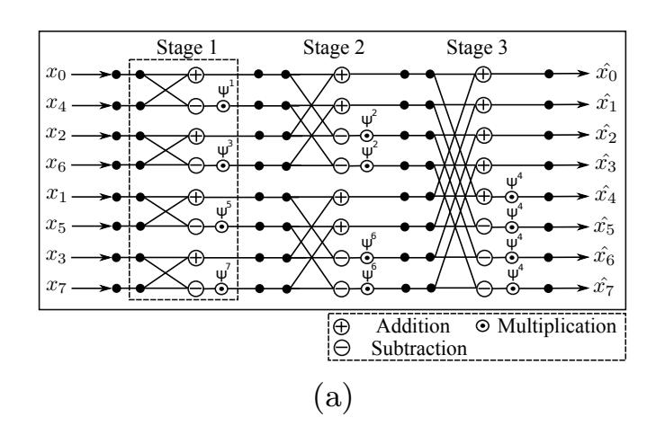
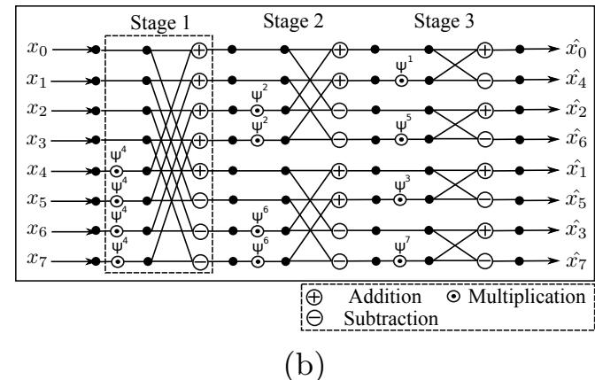
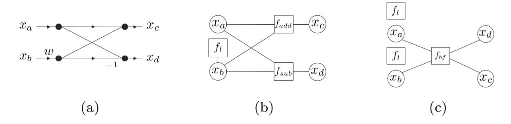
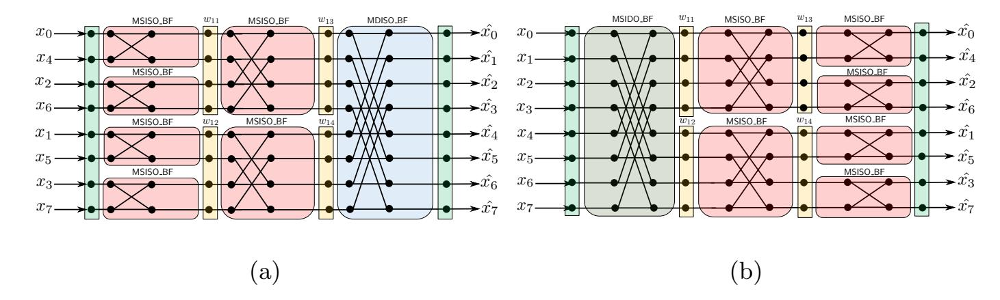

{0}------------------------------------------------

# On Configurable SCA Countermeasures Against Single Trace Attacks for the NTT

# A Performance Evaluation Study over Kyber and Dilithium on the ARM Cortex-M4

Prasanna Ravi1,<sup>2</sup> , Romain Poussier<sup>1</sup> , Shivam Bhasin<sup>1</sup> , and Anupam Chattopadhyay1,<sup>2</sup>

<sup>1</sup> Temasek Laboratories, Nanyang Technological University, Singapore <sup>2</sup> School of Computer Science and Engineering Nanyang Technological University, Singapore

prasanna.ravi@ntu.edu.sg rpoussier@ntu.edu.sg sbhasin@ntu.edu.sg anupam@ntu.edu.sg

Abstract. The Number Theoretic Transform (NTT) is a critical subblock used in several structured lattice-based schemes, including Kyber and Dilithium, which are finalist candidates in the NIST's standardization process for post-quantum cryptography. The NTT was shown to be susceptible to single trace side-channel attacks by Primas et al. in CHES 2017 and Pessl et al. in Latincrypt 2019 who demonstrated full key recovery from single traces on the ARM Cortex-M4 microcontroller. However, the cost of deploying suitable countermeasures to protect the NTT from these attacks on the same target platform has not yet been studied. In this work, we propose novel shuffling and masking countermeasures to protect the NTT from such single trace attacks. Firstly, we exploit arithmetic properties of twiddle constants used within the NTT computation to propose efficient and generic masking strategies for the NTT with configurable SCA resistance. Secondly, we also propose new variants of the shuffling countermeasure with varying granularity for the NTT. We perform a detailed comparative evaluation of the runtime performances for our proposed countermeasures within open source implementations of Kyber and Dilithium from the pqm4 library on the ARM Cortex-M4 microcontroller. Our proposed countermeasures yield a reasonable runtime overhead in the range of 7%-78% across all procedures of Kyber, while the runtime overheads are much more pronounced for Dilithium, ranging from 12%-197% for the key generation procedure and 32%-490% for the signing procedure.

# 1 Introduction

The NIST standardization process for post-quantum cryptography is currently in its third and final round with seven finalist candidates and eight alternate candidates [\[2\]](#page-18-0) for Public Key Encryption (PKE), Key Establishment Mechanisms 

{1}------------------------------------------------

(KEM) and Digital Signature (DS) schemes. While criteria such as theoretical postquantum (PQ) security guarantees, implementation cost and performance were key selection criterion for the first two rounds, resistance against implementation attacks such as side-channel attacks is also being increasingly considered as an important criteria for the final round. In fact, NIST also explicitly states that it "hopes to collect more information about the costs of implementing these algorithms in a way that provides resistance to such attacks" [\[2\]](#page-18-0).

Five out of the seven finalist candidates derive their hardness from hard problems over structured lattices. Side-channel Analysis (SCA) and Fault Injection Analysis (FIA) of structured lattice-based schemes has received considerable attention with several works on practical attacks [\[28](#page-19-0)[,27,](#page-19-1)[25\]](#page-19-2) as well as protected implementations [\[23,](#page-19-3)[31](#page-19-4)[,33\]](#page-19-5). While most reported works on protected implementations focus on Differential Power Analysis (DPA) style attacks [\[23](#page-19-3)[,31\]](#page-19-4) that operate over multiple traces, they offer very little or no protection against the more powerful single trace attacks [\[27](#page-19-1)[,25\]](#page-19-2). Of particular interest is the attack of Primas et al. [\[27\]](#page-19-1) in CHES 2017, which is the first single trace attack on lattice-based schemes targeting the Number Theoretic Transform (NTT), a critical sub-block used for polyomial multiplication in several lattice-based schemes including finalist candidates such as Kyber KEM [\[3\]](#page-18-1) and Dilithium DS [\[8\]](#page-18-2). This attack required about 1 million templates, but Pessl et al. [\[25\]](#page-19-2) reduced the requirement to just 213 templates for full key recovery using a single trace on the ARM Cortex-M4 microcontroller. They propose shuffling the order of operations as the only concrete countermeasure against this attack. However, the runtime overhead due to the shuffling countermeasure on the ARM Cortex-M4 is not known while the possibility of employing randomization-based countermeasures has not yet been studied.

We in this work, propose novel shuffling and masking countermeasures to protect the NTT against the aforementioned single trace attacks and evaluate their runtime performance on the ARM Cortex-M4 microcontroller. As a first contribution, we utilize the efficient arithmetic properties of the special twiddle constants used within the NTT to mask the atomic operations of the NTT and subsequently build upon the same to construct a generic masked NTT with configurable SCA resistance. As a second contribution, we also propose several novel variants of the shuffling countermeasure with varying granularity for the NTT. As a third contribution, we practically evaluate the runtime performance of our shuffling and masking countermeasures when integrated within open source implementations of Kyber and Dilithium scheme available in the public pqm4 library on the ARM Cortex-M4 microcontroller [\[15\]](#page-18-3). While our countermeasures yield a reasonable overhead in the range of 7%-78% across all procedures of Kyber, the performance impact is much more pronounced for Dilithium with overheads in the range of 12%-197% over its key generation procedure and 32%-490% over the signing procedure.

Availability of software All softwares utilized for this work is placed into public domain. They are available at [https://github.com/PRASANNA-RAVI/](https://github.com/PRASANNA-RAVI/Configurable_SCA_Countermeasures_for_NTT) [Configurable\\_SCA\\_Countermeasures\\_for\\_NTT](https://github.com/PRASANNA-RAVI/Configurable_SCA_Countermeasures_for_NTT).

{2}------------------------------------------------

### 2 Preliminaries

**Notation:** For a prime number q, we denote by  $\mathbb{Z}_q$  the field of integers modulo q. The polynomial ring  $\mathbb{Z}_q[x]/\phi(x)$  is denoted as  $R_q$  where  $\phi(x) = x^n + 1$  is a cyclotomic polynomial with n being a power of 2. Multiplication of two polynomials  $\mathbf{a}, \mathbf{b} \in R_q$  is denoted as  $\mathbf{a} \cdot \mathbf{b} \in R_q$ . Matrices and vectors of polynomials in  $R_q$  are referred to as modules and are denoted using bold letters viz.  $\mathbf{a} \in R_q^{k \times l}, \mathbf{b} \in R_q^l$ . Point-wise multiplication of two polynomials  $\mathbf{a}$  and  $\mathbf{b} \in R_q$  is denoted as  $\mathbf{c} = \mathbf{a} \cdot \mathbf{b}$ . while scalar multiplication of two integers a and  $b \in \mathbb{Z}_q$  is denoted as  $c = a \cdot b$ .

Lattice-based Cryptography: Most of the efficient lattice-based cryptographic schemes derive their hardness from two average-case hard problems, known as the Ring Learning With Errors problem (RLWE) and the Ring Short Integer Solutions problem (RSIS) [20]. Both the problems reduce to provably worst-case hard problems over structured ideal lattices. Given a public key  $(\mathbf{a}, \mathbf{t}) \in (R_q, R_q)$ , an RLWE attacker is asked to find two small polynomials  $\mathbf{s}_1, \mathbf{s}_2 \in R_q$  with  $\mathbf{s}_1, \mathbf{s}_2 \in S_\eta$  such that  $\mathbf{t} = \mathbf{a} \cdot \mathbf{s}_1 + \mathbf{s}_2$ . Given m uniformly random elements  $\mathbf{a}_i \in R_q$ , an RSIS attacker is asked to find out a non-zero vector  $\mathbf{z}$  with a small norm  $\mathbf{z} \in S_\eta^m$  such that  $\sum_i \mathbf{a}_i \cdot \mathbf{z}_i = 0 \in R_q$ . The more generalized versions of these problems known as Module-LWE (MLWE) and Module-SIS (MSIS) respectively deal with computations over the space  $R_q^{k \times \ell} = \mathbb{Z}_q^{k \times \ell}[X]/(X^n + 1)$  for k, l > 1 (as opposed to  $R_q$  for their ring variants) and also provide better security guarantees compared to their corresponding ring variants [17]. Any change in the security of a scheme (based on either MLWE or MSIS) can be obtained by simply changing the module dimensions  $(k, \ell)$  without any change to the underlying implementation, thus warranting very minimal changes from a implementer's perspective.

#### 2.1 Number Theoretic Transform:

The polynomial multiplication operation in the ring  $R_q$  is considered to be one of the most computationally expensive operations in structured lattice-based schemes. Hence, there have been several reported works devoted to increasing the efficiency and performance of polynomial multiplication in structured lattice-based schemes [5,26]. Among the many known techniques for polynomial multiplication such as the schoolbook multiplier, Toom-Cook [6] and Karatsuba [16], the Number Theoretic Transform (NTT) based polynomial multiplication is one of the most widely adopted techniques in several lattice-based schemes [7], owing to its quasilinear run-time complexity  $(\mathcal{O}(nlog(n))$  time) in the degree of the polynomial and a compact design. The NTT is nothing but a bijective mapping from one polynomial to another in the same operating ring. Considering an (n-1) degree polynomial  $\mathbf{p}$  in  $R_q$ , the polynomial  $\mathbf{p}$  in the normal domain is mapped to its alternate representtion  $\hat{\mathbf{p}}$  in the NTT domain through the NTT as follows:

$$\hat{\mathbf{p}}_j = \sum_{i=0}^{n-1} \mathbf{p}_i \cdot \omega^{i \cdot j}$$

where  $j \in [0, n-1]$  and  $\omega$  is the  $n^{\text{th}}$  root of unity in the operating ring  $\mathbb{Z}_q$ . There is also a corresponding inverse operation named Inverse NTT (denoted as

{3}------------------------------------------------

INTT) that maps  $\hat{\mathbf{p}}$  in the NTT domain back to  $\mathbf{p}$  in the normal domain. The use of NTT requires to choose an NTT-friendly polynomial ring  $R_q$  such that the integer ring  $\mathbb{Z}_q$  consists of either the  $2n^{\text{th}}$  or  $n^{\text{th}}$  root of unity which we denote as  $\omega$  and  $\psi$  respectively with  $\psi^2 = \omega$ . Schemes such as Kyber, Dilithium and NewHope operate in the NTT friendly anti-cyclic polynomial ring  $R_q = \mathbb{Z}_q[x]/(x^n + 1)$ . Powers of  $\psi$  and  $\omega$  (i.e)  $t = \psi^i$  for  $i \in [0, 2n-1]$  or  $t = \omega^i$  for  $i \in [0, n-1]$  denoted as twiddle constants are used in the NTT computation. The multiplication of  $\mathbf{z} = \mathbf{x} \times \mathbf{y} \in R_q$  can be efficiently done using the NTT as:

<span id="page-3-1"></span>
$$z = INTT(NTT(x) \circ NTT(y)).$$

The NTT of an n-1 degree polynomial with n coefficients can be recursively broken down into p smaller NTTs, which can be further broken down into atomic operations called *butterfly* operations which themselves are NTTs of size r with r=2 being the most common choice.

<span id="page-3-0"></span>
$$c = a + b \cdot w$$

$$c = a + b$$

$$d = a - b \cdot w,$$

$$(1)$$

$$c = a + b$$

$$d = (a - b) \cdot w,$$

$$(2)$$

Each butterfly operation takes two inputs  $(a,b) \in \mathbb{Z}_q^2$  and a known twiddle constant w (either a power of  $\psi$  or  $\omega$ ) and produces two outputs  $(c,d) \in \mathbb{Z}_q^2$ There are two types of butterfly operations: (1) Cooley-Tukey (CT) butterfly [7] (Eqn.1) and (2) Gentleman-Sande (GS) butterfly [10] (Eqn.2). Both the butterfly structures can be interchangeably used to perform both the NTT and INTT operation. The NTT/INTT of size n is typically computed in stages  $\log(n)$  stages with each stage consisting of n/2 butterfly operations. Refer Fig.1(a)-(b) for the data-flow graphs of two widely used NTT configurations for an input sequence with length n=8. The (n/2) butterflies in each stage can be divided into non overlapping butterfly groups and every butterfly in a given group uses the same twiddle constant w. For example, the data flow graph of the NTT in Fig.1(b) consists of a single butterfly group in stage 1 with the number of groups increasing in power of two with every stage. Based on the progression of the number of groups with every stage - we classify the NTT configurations into two types: (1) Shrinking NTT (Fig.1(a)) and (2) Expanding NTT (Fig.1(b)) named based on the appearances of the respective data flow graphs. We refer the reader to [26] for more details on optimized embedded software implementations of the NTT.

#### 2.2 CRYSTALS Package

The "Cryptographic Suite for Algebraic Lattices" (CRYSTALS) consists of two schemes - Kyber [3] and Dilithium [19] both of which are finalist candidates in the NIST's standardization process.

**Kyber:** Kyber is a chosen-ciphertext secure (CCA-secure) KEM based on the MLWE problem and is considered to be a promising candidate for standardization owing to its strong theoretical security guarantees and implementation performance [2]. Computations are performed over modules in dimension  $(k \times k)$  (i.e)  $R_q^{k \times k}$  and Kyber provides three security levels with Kyber-512 (NIST Security Level 1), Kyber-768 (Level 3) and Kyber-1024 (Level 5) with k = 2, 3 and 4

{4}------------------------------------------------

<span id="page-4-0"></span>



Fig. 1: Data flow graphs of two most commonly used configurations of the NTT (a) Expanding NTT (b) Shrinking NTT

respectively. Kyber operates over the anti-cyclic ring  $R_q$  with an NTT-friendly prime modulus q=3329 and degree n=256 such that the base ring  $\mathbb{Z}_q$  contains  $\omega$  but not  $\psi$ . The CCA-secure Kyber contains in its core, a CPA-secure Kyber encryption scheme called Kyber.CPA which is converted to a CCA-secure KEM using the Fujisaki-Okamoto transformation [9]. Please refer to Alg.1 in appendix for the description of its key-generation, encryption and decryption procedures.

**Dilithium:** Dilithium is also one of the leading candidates among digital signature schemes for standardization owing to its balanced security and efficiency guarantees. Dilithium is built upon the well known *Fiat-Shamir with Aborts* framework [18] and its security is based on the combination of the MLWE and MSIS problems. Dilithium involves computations over modules  $R_q^{k\times \ell}$  with  $k,\ell>1$  and provides three different security levels with Dilithium2 (Level 1):  $(k,\ell)=(4,3)$ , Dilithium3 (Level 3):  $(k,\ell)=(5,4)$  and Dilithium4 (Level 5):  $(k,\ell)=(6,5)$ . Dilithium also operates in a similarly structured base polynomial ring as Kyber with the same n=256 albeit with a different modulus  $q=2^{23}-2^{13}-1$ , such that the base ring  $\mathbb{Z}_q$  contains both  $\psi$  and  $\omega$ . Please refer to Alg.2 in appendix for the key-generation and signing procedures of the Dilithium signature scheme.

#### 2.3 Related Works

Side-channel attacks can be broadly classified into two categories: (1) Multi trace attacks and (2) Single trace attacks. Most reported works on protected implementations of lattice-based schemes have focussed on protection against Differential Power Analysis (DPA) style attacks that work over multiple traces. There exists a large body of work on masking countermeasures for lattice-based schemes [23,29] (i.e) a secret polynomial  $\mathbf{s} \in R_q$  is split into two shares  $\mathbf{r}$  and  $\mathbf{s} - \mathbf{r}$  and each share is computed upon in an independent manner. This type of additive sharing is convenient as most operations within lattice-based schemes are linear. There have also been proposals for alternate countermeasures against multi trace attacks such as blinding and shifting [31]. Blinding involves multiplying a secret polynomial  $\mathbf{s} \in R_q$  with a scalar  $a \in \mathbb{Z}_q$  (i.e)  $a \cdot \mathbf{s} \in R_q$  while shifting involves multiplying the secret polynomial  $\mathbf{s}$  with  $x^i$  for  $i \in [0, n-1]$  which rotates the coefficient vector of  $\mathbf{s}$  by i positions to the left. All the aforementioned

{5}------------------------------------------------

<span id="page-5-0"></span>

Fig. 2: Factor Graphs of the CT butterfly shown in (a) used by the attacks of (b) Primas et al. [\[27\]](#page-19-1) and (b) Pessl et al. [\[25\]](#page-19-2)

countermeasures ensure randomization of computations across multiple executions. On the other hand, single trace attacks such as horizontal DPA [\[4\]](#page-18-10) and algebraic attacks [\[27\]](#page-19-1) work by collating information from SCA leakage of different operations within a single execution. Thus, defeating such single trace attacks requires to randomize computations within a single execution. In that respect, shuffling or randomizing the order of operations is a concrete countermeasure against single trace attacks, including the attack on the NTT [\[27](#page-19-1)[,25\]](#page-19-2) which remains the focus of our work. While Ziljstra et al. [\[33\]](#page-19-5) investigated the cost of the shuffling countermeasure for the NTT on the Artix-7 FPGA, there exists no prior work on investigation or evaluation of countermeasures to protect the NTT on an embedded software platform, given that prior attacks were conducted on software implementations on the ARM Cortex-M4 microcontroller. In this work, we propose several novel shuffling and masking countermeasures for the NTT and conduct a detailed performance assessment of the proposed countermeasures when implemented within Kyber and Dilithium on the ARM Cortex-M4 microcontroller.

#### 2.4 Side-Channel Attacks on NTT

Primas et al. [\[27\]](#page-19-1) proposed the first SCA of NTT through a single trace template style attack using Soft-Analytical Side-Channel Attack (SASCA) based techniques [\[32\]](#page-19-12). They targeted the INTT instance used within the decryption procedure to recover the long term secret key (line 4 in CPA.Decrypt procedure of Alg[.1\)](#page-21-0). Their attack works in two steps. Firstly, a side-channel template attack is performed on certain targeted intermediates within the NTT computation to yield the corresponding probabilities conditioned upon the observed side-channel leakage. Secondly, the obtained probabilities are incorporated into a bipartite factor graph modelled based on the NTT/INTT and the Belief Propagation (BP) algorithm [\[24\]](#page-19-13) is executed over the factor graph. The BP algorithm effectively combines the information from the various conditional probabilities to retrieve the marginal probabilities for the targeted inputs and intermediates within the NTT/INTT. A factor graph consists of two types of nodes - variable nodes and factor nodes. The variable nodes x<sup>i</sup> for i = {0, . . . , N − 1} represent the targeted intermediates, which are the inputs and outputs of every stage of the NTT/INTT. The factor nodes f<sup>i</sup> for i = {0, . . . , M − 1} model the relationship between the different variable nodes. Refer Fig[.2\(](#page-5-0)b) for a simple factor graph of a single CT butterfly operation (Fig[.2\(](#page-5-0)a)) utilized by the attack of Primas et al. [\[27\]](#page-19-1). It has four variable nodes for inputs (xa, xb) and outputs (xc, xd) depicted using circles

{6}------------------------------------------------

and three factor nodes fADD, fSUB and f` depicted using squares. Factor nodes can be of two types - (1) probabalistic or (2) deterministic based on the relation between the connected variable node/s. Here, f` is a probabilistic factor node which models the leakage from multiplication b · w (i.e) f`(i) = P r(b = i/l), while fADD and fSUB are deterministic nodes with fADD given as follows (similarly for fSUB):

$$f_{ADD}(x_a, x_b, x_c) = \begin{cases} 1 & \text{if } x_a + x_b \cdot \omega = x_c \mod q \\ 0 & \text{otherwise} \end{cases}$$

Any relation between the variable nodes can be modelled and integrated as additional factor nodes into the factor graph thus making this approach very flexible. Primas et al. [\[27\]](#page-19-1) also utilized the timing information from variable time modular reduction used in their targeted implementation. Templating the multiplication required roughly 1 million (q · n/2) templates using 100 million traces (100 traces for each template) and they subsequently demonstrated full key recovery using a single trace on the ARM Cortex-M4 microcontroller [\[27\]](#page-19-1). Subsequently, Pessl et al. [\[25\]](#page-19-2) used a number of optimization techniques to mainly improve trace complexity of the profiling phase. Firstly, they switched to using hamming weight templates and targeted the loads and stores of the inputs and outputs of the butterfly instead of templating the multiplication operation resulting in a factor graph shown in Fig[.2\(](#page-5-0)c). The factor nodes f<sup>A</sup> and f<sup>B</sup> model the leakage from loading of the inputs, while fBF is the deterministic node modelled as follows:

$$f_{BF}(x_a, x_b, x_c, x_d) = \begin{cases} 1 & \text{if } x_a + x_b \cdot \omega = x_c \mod q \text{ and } x_a - x_b \cdot \omega = x_d \mod q \\ 0 & \text{otherwise} \end{cases}$$

Furthermore, they targeted the NTT over the ephemeral secret in the encryption procedure (Line 5 in CPA.Encrypt procedure in Alg[.1\)](#page-21-0) to exploit the very narrow support of its inputs (i.e) ([−2, 2]), to successfully recover the key in just a single trace for Kyber on the ARM Cortex-M4 only using 213 templates. This to date, is the most efficient single trace attack on the NTT, also potentially applicable to NTT instances used in Dilithium for key recovery. This attack was also shown to be applicable to masking countermeasures, albeit in the presence of a high SNR. Thus, the aforementioned single trace attacks against NTT heavily motivate the need for evaluation of concrete countermeasures to protect the NTT/INTT operation against SCA on the ARM Cortex-M4 microcontroller.

# 3 Masking Countermeasures for the NTT

Several previous works on practical SASCA over block ciphers such as AES [\[11](#page-18-11)[,12\]](#page-18-12) have shown significant degradation of the attack success rate in an unknown plaintext scenario compared to a known plaintext scenario (Figure 2 of [\[11\]](#page-18-11) and Figure 9-10 of [\[12\]](#page-18-12)). That is, the leakage from SBOX (p ⊕ k) provides significantly more information with known p compared to unknown p. In case of the NTT, the twiddle constants (powers of ω or ψ) are the only known values used within the NTT computation with both the inputs and outputs unknown. This 

{7}------------------------------------------------

knowledge about the twiddle constants is incorporated into construction of the factor graph thus potentially aiding the attack. This motivates us to investigate randomizing the twiddle constants as a potential mitigation technique against SASCA style attacks on the NTT.

Though the SASCA on AES involves different computations than the one in NTT/INTT, we expect a similar decrease in terms of extracted information. An attacker can indeed construct an alternative factor graph with twiddle constants as variable nodes, however we believe that the degradation in information will significantly affect the performance of the BP algorithm. In this section, we propose an efficient multiplicative masking strategy using twiddle constants as masks to randomize the twiddle constants used in the NTT. We adopt a bottom-up approach to propose generic masking strategies for the atomic butterfly operation and subsequently use the same to construct a generic masked NTT. For generality, we use n to denote the length of the input to the NTT and N for the number of stages within the NTT.

#### 3.1 Generic Masked Butterfly Construction:

Let us consider the CT butterfly as in Eqn.1 computed with inputs (a, b) and the twiddle constant  $w_x = \psi^x$  for  $x \in [0, n-1]$  to output (c, d). We introduce a random twiddle constant mask  $w_y = \psi^y$  and compute a modified butterfly as shown in Eqn.3. The resulting butterfly utilizes randomized twiddle constants  $w_y$  and  $w_{(x+y)}$  with its outputs multiplicatively masked with the twiddle constant  $w_y$ . This masked butterfly only requires one additional multiplication  $(a \cdot w_y)$  compared to an unmasked butterfly.

<span id="page-7-0"></span>
$$c' = c \cdot w_{y}$$

$$= (a + b \cdot w_{x}) \cdot w_{y}$$

$$= a \cdot w_{y} + b \cdot w_{x} \cdot w_{y}$$

$$= a \cdot w_{y} + b \cdot w_{(x+y)} \quad (\because w_{(x+y)} = \psi^{x} \cdot \psi^{y} = \psi^{(x+y)})$$

$$d' = d \cdot w_{y}$$

$$= (a - b \cdot w_{x}) \cdot w_{y}$$

$$= a \cdot w_{y} - b \cdot w_{(x+y)} \quad (\because w_{(x+y)} = \psi^{x} \cdot \psi^{y} = \psi^{(x+y)})$$
(3)

An unmasked butterfly with a known twiddle constant  $w_x$  is a bijection from (a,b) to (c,d) in  $\mathbb{Z}_q^2$ . Thus, the inputs and outputs share a strong link potentially aiding the performance of the BP algorithm. However, the modified butterfly as in Eqn.3 is a many-to-one function with inputs  $(a,b,w_y)\in\mathbb{Z}_q^3$  mapping to outputs  $(c',d')\in\mathbb{Z}_q^2$  where the input space size is  $(q^2\cdot 2n)$  and the output space size is  $(q^2)$ . Thus, breaking the inherent bijection in the butterfly weakens the link between the inputs and outputs similar to breaking the bijection between the input and output of the SBOX [12], which hinders the performance of the loopy BP algorithm. We only provide intuition for SCA resistance of our masking approach, while the main focus of our work is on its runtime performance. We thus leave concrete security analysis of our masking approach (e.g.) using LRPM [12] for future work. Our choice of using twiddle constants as masks

{8}------------------------------------------------

instead of random integers in  $\mathbb{Z}_q$  comes several advantages. Firstly, sampling a twiddle constant only requires to sample the position y of the twiddle constant  $w_y$  within the twiddle constant array (8-9 bits for typical parameters), as opposed to using costly approaches such as rejection sampling to sample in  $\mathbb{Z}_q$ . Secondly, multiplication of two twiddle constants can be done by simply summing their indices since the product of two twiddle constants is another twiddle constant (i.e)  $w_x \cdot w_y = w_{(x+y)}$ , saving one multiplication operation per butterfly. We extend this approach to two cases where the inputs are masked with (1) same mask  $w_i$  (i.e)  $(a',b') = (a \cdot w_i, b \cdot w_i)$  and (2) different masks  $(w_i, w_j)$  (i.e)  $(a',b') = (a \cdot w_i, b \cdot w_j)$ . For inputs with same masks, the masked butterfly is computed as (computation of d' follows similarly as c'):

$$c' = (a' + b' \cdot w_x) \cdot w_y$$

$$= a \cdot w_i \cdot w_y + b \cdot w_i \cdot w_x \cdot w_y$$

$$= a \cdot w_{(i+y)} + b \cdot w_{(i+x+y)}$$

$$= c \cdot w_{(i+y)}$$

$$d' = a \cdot w_{(i+y)} - b \cdot w_{(i+x+y)}$$
(4)

The random twiddle constants used are  $w_{(i+y)}$  and  $w_{(i+x+y)}$  and the outputs are masked with  $w_{(i+y)}$ . We denote this butterfly as MSISO\_BF where SISO denotes same masks for input (SI) and same masks for output (SO). We see that the masked outputs are computed without explicitly un-masking the inputs. However, when the inputs have different masks, the same approach cannot be used. Here, we exploit another property of the twiddle constants (i.e)  $\psi^{2n} = 1$ , to efficiently bypass the unmasking process and integrate the same into the butterfly operation. For example, an integer  $a' = a \cdot w_i$  can be re-masked with a different twiddle constant  $w_k$  using a single multiplication as follows:

<span id="page-8-0"></span>
$$a'' = a' \cdot w_{(2n-i+k)}$$

$$= a \cdot w_i \cdot w_{(2n-i+k)}$$

$$= a \cdot w_k$$
(5)

We thus utilize the same strategy to compute the masked butterfly as shown in Eqn.6. We denote this masked butterfly as MDISO\_BF where DISO denotes different masks for input (DI) and same masks for output (SO).

$$c' = (a' \cdot w_{(2n-i)} + b' \cdot w_{(2n-j)} \cdot w_x) \cdot w_y$$

$$= a' \cdot w_{(2n-i+y)} + b' \cdot w_{(2n-j+y+x)}$$

$$= a \cdot w_i \cdot w_{(2n-i+y)} + b \cdot w_j \cdot w_{(2n-j+y+x)}$$

$$= c \cdot w_y$$

$$d' = a' \cdot w_{(2n-i+y)} - b' \cdot w_{(2n-j+y+x)}$$
(6)

While both MSISO\_BF and MDISO\_BF butterflies mask the outputs with the same twiddle constant, we can use similar techniques to generate different output masks. We consider the most generic case where both inputs and outputs masked with different masks (i.e) inputs  $(a', b') = (a \cdot w_i, b \cdot w_j)$  and outputs  $(c', d') = (c \cdot w_k, d \cdot w_\ell)$  and such a masked butterfly can be computed as follows:

{9}------------------------------------------------

$$c' = a' \cdot w_{(2n-i+k)} + b' \cdot w_x \cdot w_{(2n-j+k)}$$

$$= a \cdot w_i \cdot w_{(2n-i+k)} + b \cdot w_j \cdot w_{(2n-j+k+x)}$$

$$= a \cdot w_k + b \cdot w_{(k+x)}$$

$$= c \cdot w_k$$

$$d' = a' \cdot w_{(2n-i+\ell)} - b' \cdot w_x \cdot w_{(2n-j+\ell)}$$

$$= a \cdot w_\ell - b \cdot w_{(\ell+x)}$$

$$= d \cdot w_\ell$$
(7)

We denote this masked butterfly as MDIDO\_BF since both inputs and outputs are masked with different twiddle constants. The MSIDO\_BF (same input masks, different output masks) can also be computed in a very similar manner. Both MDIDO\_BF and MSIDO\_BF are inherently costlier than MSISO\_BF and MDISO\_BF as they require 4 multiplication operations, as opposed to only 2 multiplication operations in the case of the MSISO\_BF and MDISO\_BF butterflies. All the aforementioned masking strategies can also be applied similarly to the GS butterfly as well as using powers of  $\omega$  if  $\psi$  is not present in the ring (using  $\omega^n = 1$ ). The presence of  $\psi \in \mathbb{Z}_q$  ensures 2n possibilities, while its absence only ensures n possibilities for the twiddle constant masks. While Dilithium contains  $\psi$  in its operating ring, Kyber only contains  $\omega$  in its operating ring. In the following discussion, we propose a generic and configurable masked NTT/INTT implemented using a combination of the aforementioned masked butterfly operations.

#### 3.2 Configurable Masked NTT Construction

Usage of the aforementioned masked butterflies ensures that all intermediates within the NTT remain masked with random twiddle constants. The number of random masks and their allotment within each stage decides the type of masked butterflies used within the NTT.

**Coarse-Masked NTT**: We consider the simplest case of using a sin-3.2.1gle mask for every stage and the resulting NTT can be computed only using MSISO\_BF butterflies in the following manner. Let  $W = \{w_{x_i}\}$  for  $i \in \{0, N-1\}$ be a twiddle mask set with random masks for every stage of the NTT. Upon employing the MSISO\_BF butterfly, the intermediate output at the end of stage  $\ell$ is multiplicatively masked with the twiddle factor  $\prod_{i=0}^{i=\ell-1} w_{x_i}$ . Thus, final masked NTT output would typically require a post-scaling step. However, we bypass the post-scaling by exploiting the property that  $w_{k\cdot 2n} = \psi^{k\cdot 2n} = 1$  for  $k \geq 0$ . If the sum of randomly chosen indices of the twiddle constants is a multiple of 2n (i.e)  $\sum_{i=1}^{N-1} (x_i) = k \cdot 2n$ , then the output is automatically unmasked. The mask space for the Coarse-Masked NTT is  $(2n)^{(N-1)}$  (when using  $\psi$ ) and  $(n)^{(N-1)}$  (when using  $\omega$ ). For Kyber, this amounts to about  $2^{(8\times6)}=2^{48}$  (256 masks in each stage and independent masks in 6 out of the 7 stages) and  $2^{63}$  for Dilithium. An adversary with a huge computational power could potentially brute-force SASCA over the complete mask space to perform key recovery. Secondly, reuse of same twiddle

{10}------------------------------------------------

<span id="page-10-0"></span>

Fig. 3: Illustration of the masked NTT with u=2 twiddle constant masks in each stage (a) Shrinking NTT (b) Expanding NTT

masks across different butterflies in a stage also creates additional links which could potentially be used as additional factor nodes in the factor graph.

- **3.2.2 Fine-Masked NTT**: To alleviate the issues of Coarse-Masked NTT, one can employ more masks in every stage. We consider the other extreme case of using n twiddle masks for every stage (one mask each for every point), which we denote as the Fine-Masked NTT. This masked NTT can be constructed only using MDIDO\_BF butterflies by choosing a set of n masks  $W_t = \{w_i\}$  for  $i \in \{0, n-1\}$  for every stage t such that the outputs of stage t are masked with  $W_t$ . The mask space for the Fine-Masked NTT is  $2n^{(n \times N)}$  (when using  $\psi$ ) and  $n^{(n \times N)}$  (when using  $\omega$ ). For Kyber, this amounts to  $2^{2048}$  just for a single stage  $(2^{4196}$  for Dilithium). Morover, every butterfly utilizes independent masks and thus additional links cannot be created between the masks used in different butterflies, thus intuitively providing improved SCA resistance compared to the Coarse-Masked NTT.
- **3.2.3** Generic-Masked NTT : One can also straddle between the two extremes of Coarse-Masked and Fine-Masked NTT, by choosing a random "u" number of masks per stage with 1 < u < n. We illustrate the idea with u = 2 (2 masks per stage) using an 8-point NTT. We consider two cases here: (1) Shrinking NTT (Fig.3(a)) and (2) Expanding NTT (Fig.3(b)). In case of the Shrinking NTT, MSISO\_BF butterflies are used in all but the last stage and MDISO\_BF butterflies are used in the last stage since the inputs have different masks  $(w_{(13)}, w_{(14)})$ . In the case of the Expanding NTT, the first stage utilizes the MSIDO\_BF butterfly since the outputs need to be masked with different twiddle constants  $(w_{(11)}, w_{(12)})$ while all the other stages can utilize the MSISO\_BF butterfly. The number of masks per stage (u) can actually be randomly chosen at run-time for each masked NTT instance. In this work, we design a generic masked NTT denoted as Generic-u-Masked NTT (u: number of masks per stage) which uses a randomly generated u at run-time for each NTT instance. We limit our choices for u to powers of 2 (i.e)  $u = 2^i$  for  $i \in [0, \log(n)]$  since n being a power of 2 ensures even distribution of masks to all the coefficients in each stage which simplifies the control logic. This results in  $\log(n)$  possible configurations for the masked NTT (8 for typical parameters of Kyber and Dilithium). However, we note that

{11}------------------------------------------------

it is possible to design for any value of u between 1 and n at the cost of a more convoluted control logic. While the Generic-u-Masked NTT maintains same number of masks u for every stage of a given NTT instance (Fig[.3\(](#page-10-0)a)-(b)), one can also increase the granularity by choosing a different u for each NTT stage. A generic control logic can be designed that tracks the input and output masks for each butterfly and uses the appropriate masked butterfly for computation. If u is limited to powers of 2, this in itself brings about about log(n) <sup>N</sup> possible configurations for the NTT. For parameters of Kyber and Dilithium, it amounts to 2<sup>56</sup> and 2<sup>64</sup> possibilities respectively. The resulting NTT runs in variable time (secret independent) and has sufficient entropy to randomize the sequence of computations within the NTT. It has been shown that single trace template style attacks require precise knowledge of the underlying computations within the NTT [\[25,](#page-19-2)[27\]](#page-19-1). Thus, randomizing the computations makes it significantly harder from a practical side-channel perspective, though not impossible to identify the underlying targeted operations within the NTT and utilize the leakage from the same for attack.

# 4 Shuffling Countermeasures for the NTT

Shuffling the order of operations is a well known countermeasure against SASCA [\[32\]](#page-19-12) and is also the only known concrete countermeasure against similar attacks on the NTT [\[25,](#page-19-2)[27\]](#page-19-1). Shuffling ensures that leakages cannot be trivially assigned to the corresponding nodes in the factor graph, provided there is sufficient entropy which is beyond realistic brute-force. Ziljstra et al. [\[33\]](#page-19-5) utilized LFSR based on irreducible polynomials and a novel permutation network to implement the shuffling countermeasure for the NTT on Artix-7 FPGAs, but there exists no prior work of the same for an embedded software implementation, which was the target of reported attacks [\[25,](#page-19-2)[27\]](#page-19-1). We propose three novel variants of the shuffling countermeasure with varying granularity for the NTT. They are (1) Coarse-Full-Shuffle, (2) Coarse-In-Group-Shuffle and (3) Fine-Shuffle.

#### 4.1 Coarse-Full-Shuffled NTT

It is known that all butterflies within any stage of the NTT can be computed independent of one another. This allows us to randomly shuffle the order of execution of the (n/2) butterfly operations within any stage of the NTT. While there are several algorithms to generate a random permutation, we in this work utilize the well known Knuth-Yates shuffling algorithm [\[30\]](#page-19-14), which has also been used by several previous works for SCA protection of cryptographic schemes [\[30](#page-19-14)[,13\]](#page-18-13). Generating a full shuffling order for n/2 butterflies using the Knuth-Yates shuffle requires about (n/2 − 1) · log(n) random bits and provides an entropy of (n/2)!, which is beyond realistic brute-force for typical parameter sets. One can also use LFSRs based on irreducible polynomials for generating permutations as done by Ziljstra et al. [\[33\]](#page-19-5), but they offer a much limited permutation space (i.e) For n = 256, it amounts to about 2<sup>55</sup> which can be considered to within the realm of brute-force for large organizations with very high computational power.

{12}------------------------------------------------

```
1 m = −1∗rand ( ) ; // rand ( ) = 0 o r 1 and m = 0 x0000 o r 0xFFFF
2
3 op1 = p [ j+ r ∗ l e n ] ;
4 op2 = p [ j+ (1− r ) ∗ l e n ] ;
5
6 temp = ( op1 ˆ op2 ) ;
7 temp = temp & m;
8 op1 = op1 ˆ temp ;
9 op2 = op2 ˆ temp ;
```

Fig. 4: C code snippet for randomized loading using arithmetic cswap operation

### 4.2 Coarse-In-Group-Shuffled NTT

Instead of performing a full n/2 length shuffle for every stage, one can limit to generating a unique shuffle within each butterfly group. In that stage of the NTT where every butterfly forms a unique group, we propose to do a full n/2 length shuffle. This shuffle provides an entropy of ((n/2m)!)<sup>m</sup> for any stage with m butterfly groups and n/2m butterflies in every group for m < n/2. This is much less than the (n/2)! offered by the full length n/2 shuffle, but still beyond reach by realistic brute-force for any combination of (n, m) used in Kyber and Dilithium. While both Coarse-In-Group-Shuffle and Coarse-Full-Shuffle incur the same cost to generate the shuffle. However, all butterflies within a single group utilize the same twiddle factor and hence a single twiddle factor load per group will suffice, whereas a full n/2 length shuffle requires to twiddle factor load from memory for every butterfly. However, as shown in Sec[.5,](#page-13-0) the peformance advantage compared to the Coarse-Full-Shuffle countermeasure is only minimal.

### 4.3 Fine-Shuffled NTT

The attack of Pessl et al. [\[25\]](#page-19-2) targeted SCA leakage from the loading of inputs of every butterfly. So, a direct way to counter their attack is to simply randomize the order of the input loads and output stores of each butterfly. Since we only shuffle the loads and stores, the modular multiplication can still be targeted similar to the first attack of Primas et al. [\[27\]](#page-19-1). But, constructing (q · n/2) templates for the multiplication operation and assuming 100 traces per template (similar to [\[27\]](#page-19-1)) would amount to 42 million traces for Kyber and 214 billion for Dilithium which makes it highly difficult if not impossible to measure. Thus, this can be considered as a weaker mitigation technique compared to the Coarse-Shuffle countermeasures, nevertheless could be used to significantly increase the attacker's effort or could be used in conjunction with other countermeasures for the NTT.

We utilize an arithmetic conditional swap technique (arithmetic cswap) previously used in embedded implementations of elliptic curve cryptography [\[14\]](#page-18-14) to shuffle the order of loads and stores. This technique neither uses lookups from secret addresses nor secret branch conditions and its code snippet randomizing the loading of p[j] and p[j+len] is shown in Fig[.4.](#page-12-0) Firstly, a random bit r is generated to create a mask m = -r (m = 0x0000 or 0xFFFF assuming operands are 16-bits long as in Kyber). The random bit decides the order of loading of p[j] and p[j+len] into op1 and op2. Subsequently, a conditional swap is executed using bitwise operations in lines 7-10 of Fig[.4.](#page-12-0) If m = 0xFFFF, op1 and op2 are swapped, while if m = 0x0000, op1 and op2 retain their values.

{13}------------------------------------------------

The arithmetic cswap operation has been the target of side-channel attacks in embedded ECC implementations [\[21,](#page-19-15)[22\]](#page-19-16) which work by building templates for the AND operation with the mask (line 8) and the leakage is mainly due to the difference in hamming weight of m = 0x0000 (0) and m = 0xFFFF (16). While the reported attacks used leakage from 16 such AND operations per mask, we only have a single AND operation and thus the leakage is significantly suppressed. Nevertheless, we propose a technique to further reduce the SNR by replacing the single 16-bit AND operation with 16 single bit iterative AND operations. Distinguishing between 0 and 1 is significantly harder than distinguishing between (0x0000 and 0xFFFF). Though we do not claim full protection against their attack, we significantly reduce the leakage. We refer to the original technique as Full-Fine-Shuffle and our modified approach as the Bitwise-Fine-Shuffle technique. In terms of the randomness requirement, every butterfly needs two bits (one each for load and store) thus amounting to about n · N bits for the complete NTT. Since there are n/2 butterflies in each stage, the total entropy is about 4(n/2) = 2<sup>n</sup> possibilities for a single stage which is well beyond practical brute-force for typical parameters (2<sup>256</sup> for Kyber and Dilithium).

# <span id="page-13-0"></span>5 Experimental Results

We perform a practical performance evaluation of all the proposed countermeasures when integrated into open source implementations of Kyber and Dilithium available in the public pqm4 library [\[15\]](#page-18-3), a benchmarking framework for PQC schemes on the ARM Cortex-M4 microcontroller.

#### 5.1 Target Platform and Implementation Details

All implementations were compiled with the arm-none-eabi-gcc-9.2.1 compiler using compiler flags -O3 -mthumb -mcpu=cortex-m4 -mfloat-abi=hard -mfpu=fpv4 sp-d16. Our target platform is the STM32F4DISCOVERY board (DUT) housing the STM32F407, ARM Cortex-M4 microcontroller and the clock frequency is 24 MHz. The unprotected NTT within Kyber and Dilithium is implemented in pure assembly, however we report results for countermeasures implemented over the C-based NTT/INTT implementations for Kyber and Dilithium. For randomness generation, we utilize the hardware TRNG running at 48 MHz that consumes about 215 cycles (including overheads) to generate 32 bits. We utilize true randomness from the TRNG for all our proposed countermeasures, however one could also use NIST approved PRNGs such as eXtendable Output Functions based on SHA3 or AES in counter mode, seeded with true randomness from the TRNG. This could speed up the sampling process especially on devices such as the STM32L4 MCUs with support for hardware accelerators for AES [\[1\]](#page-18-15).

Both Kyber and Dilithium utilize the same configuration for their respective NTTs and INTTs [\[3,](#page-18-1)[8\]](#page-18-2). The NTT is implemented using the CT butterfly with inputs in standard order and outputs in bit-reversed order. The INTT is implemented using the GS butterfly with inputs in bit-reversed order and outputs in standard order. Kyber operates in a ring with the modulus q = 3329 (12 bit) and only contains ω while Dilithium operates with a modulus q = 2<sup>23</sup> − 2 <sup>17</sup> − 1 (23 bit) which contains both ψ and ω. The NTT/INTT used in Kyber is considerably

{14}------------------------------------------------

<span id="page-14-0"></span>Table 1: Performance evaluation of masking countermeasures for NTT and INTT in Kyber KEM and Dilithium DS on the ARM Cortex-M4 MCU. The cycle counts are reported in units of thousand (10<sup>3</sup> ) clock cycles.

|                  |       |                 | KCycles (×103 | )     |                 |              |  |
|------------------|-------|-----------------|---------------|-------|-----------------|--------------|--|
| Countermeasures  |       | NTT             |               |       | INTT            |              |  |
|                  | Count | Overhead<br>(%) | Rand.         | Count | Overhead<br>(%) | Rand.        |  |
|                  |       |                 | Kyber         |       |                 |              |  |
| Unprotected      | 31.0  | -               | -             | 50.6  | -               | -            |  |
| Coarse-Masked    | 44.6  | 43.7            | 0.2 (0.4%)    | 63.9  | 26.3            | 0.2 (0.3%)   |  |
| Generic-2-Masked | 66.5  | 114.5           | 0.5 (0.7%)    | 83.7  | 65.3            | 0.5 (0.6%)   |  |
| Generic-4-Masked | 72.1  | 132.7           | 1.0 (1.4%)    | 87.2  | 72.3            | 1.0 (1.3%)   |  |
| Fine-Masked      | 171.1 | 451.7           | 65.7 (38.4%)  | 177.6 | 250.9           | 65.7 (36.9%) |  |
| Dilithium        |       |                 |               |       |                 |              |  |
| Unprotected      | 55.2  | -               | -             | 66.2  | -               | -            |  |
| Coarse-Masked    | 91.3  | 65.4            | 0.4 (0.4%)    | 103.2 | 55.8            | 0.2 (0.2%)   |  |
| Generic-2-Masked | 125.5 | 127.3           | 0.5 (0.4%)    | 142.6 | 115.3           | 0.5 (0.4%)   |  |
| Generic-4-Masked | 139.0 | 151.7           | 0.9 (0.6%)    | 154.9 | 133.7           | 1.1 (0.7%)   |  |
| Fine-Masked      | 297.3 | 438.2           | 70.2 (23.6%)  | 303.7 | 358.4           | 70.3 (23.1%) |  |

faster than that in Dilithium, since Dilithium operates over larger integers (32-bit unsigned integers) compared to Kyber (16-bit signed integers). (Refer Tab[.1-](#page-14-0)[2\)](#page-15-0). Due to the presence of the ψ in Dilithium, Dilithium can use up to 512 twiddle constant masks as compared to 256 in the case of Kyber. Both schemes perform the NTT and INTT computations in the Montgomery domain.

### 5.2 Performance Evaluation of Protected NTT/INTTs

Please refer Tab[.1](#page-14-0) and [2](#page-15-0) for the performance impact of our proposed masking and shuffling countermeasures respectively, on the NTT/INTTs of Kyber and Dilithium. For the shuffled NTTs, the overheads come from the shuffling operation as well as sampling randomness required to generate the shuffling order. For the masked NTTs, the overheads come from the additional multiplications as well sampling randomness for mask generation. We also report cycle counts separately for shuffling (denoted as Shuffle) and randomness generation (Rand.) as well their contribution to the NTT/INTT runtime in % (Tab[.1-](#page-14-0)[2\)](#page-15-0). For the masked NTTs, we report numbers for the Coarse-Masked (1 mask per stage), Fine-Masked (256 masks), Generic-2-Masked (2 masks) and Generic-4-Masked (4 masks) NTTs.

When comparing the masking countermeasures (Tab[.1\)](#page-14-0), we observe that the overhead increases with the number of masks used in each stage since more MSIDO and MDIDO butterflies are used within the NTT. We thus see a clear trade-off between security and performance for the masked NTTs. We also observe that the overheads due to randomness generation significantly increases with increasing number of masks. While less than 1% of the runtime is occupied by randomness generation in Coarse-Masked NTT/INTTs, it increases to about 36-38% for Kyber and to about 23% for Dilithium for the Fine-Masked NTT/INTTs.

Among the shuffling countermeasures (Tab[.2\)](#page-15-0), the Basic-Fine-Shuffle countermeasure incurs the least performance overhead followed by the Coarse-In-Group-Shuffle, Coarse-Full-Shuffle and the Bitwise-Fine-Shuffle NTT. The Coarse-In-Group-

{15}------------------------------------------------

<span id="page-15-0"></span>Table 2: Performance evaluation of the shuffling countermeasures for the NTT and INTT of Kyber and Dilithium on the ARM Cortex-M4 MCU. The cycle counts are reported in units of thousand (10<sup>3</sup> ) clock cycles.

|                          |               |               | KCycles (×103<br>) |               |              |  |  |  |
|--------------------------|---------------|---------------|--------------------|---------------|--------------|--|--|--|
| Countermeasures          | Shuffle Algo. | Count         | Overhead<br>(%)    | Shuffle       | Rand.        |  |  |  |
| Kyber NTT                |               |               |                    |               |              |  |  |  |
| Unprotected              | NA            | 31.0          | -                  | -             | -            |  |  |  |
| Coarse-Full-Shuffled     |               | 87.2          | 181.1              | 16.6 (19%)    | 38.4 (44.1%) |  |  |  |
| Coarse-In-Group-Shuffle  | Knuth-Yates   | 84.4          | 172.2              | 17.1 (20.3%)  | 32.4 (38.4%) |  |  |  |
| Basic-Fine-Shuffled      | Arith. cswap  | 76.7          | 147.4              | 35.1 (45.7%)  | 9.5 (12.4%)  |  |  |  |
| Bitwise-Fine-Shuffle     |               | 142.6         | 356                | 100.1 (70.2%) | 9.5 (6.7%)   |  |  |  |
| Kyber INTT               |               |               |                    |               |              |  |  |  |
| Unprotected              | NA            | 50.6          | -                  | -             | -            |  |  |  |
| Coarse-Full-Shuffled     |               | 113.3         | 123.8              | 16.6 (14.6%)  | 38.4 (33.9%) |  |  |  |
| Coarse-In-Group-Shuffled | Knuth-Yates   | 101.2         | 99.9               | 16 (15.8%)    | 33 (32.6%)   |  |  |  |
| Basic-Fine-Shuffled      |               | 101.8         | 101.1              | 40.9 (40.1%)  | 9.5 (9.4%)   |  |  |  |
| Bitwise-Fine-Shuffled    | Arith. cswap  | 172.4         | 240.8              | 102.2 (59.3%) | 9.6 (5.5%)   |  |  |  |
|                          |               | Dilithium NTT |                    |               |              |  |  |  |
| Unprotected              | NA            | 55.2          | -                  | -             | -            |  |  |  |
| Coarse-Full-Shuffled     |               | 120.2         | 117.5              | 18.9 (15.7%)  | 43.9 (36.6%) |  |  |  |
| Coarse-In-Group-Shuffled | Knuth-Yates   | 114.6         | 107.5              | 19 (16.6%)    | 37.8 (33%)   |  |  |  |
| Basic-Fine-Shuffled      |               | 109.7         | 98.7               | 42.2 (38.5%)  | 10.9 (10%)   |  |  |  |
| Bitwise-Fine-Shuffled    | Arith. cswap  | 630.9         | 1042.1             | 554.7 (87.9%) | 10.9 (1.7%)  |  |  |  |
| Dilithium INTT           |               |               |                    |               |              |  |  |  |
| Unprotected              | NA            | 66.2          | -                  | -             | -            |  |  |  |
| Coarse-Full-Shuffled     |               | 130.4         | 96.9               | 18.9 (14.5%)  | 43.9 (33.7%) |  |  |  |
| Coarse-In-Group-Shuffled | Knuth-Yates   | 125.3         | 89.1               | 18.4 (14.7%)  | 37.8 (30.1%) |  |  |  |
| Basic-Fine-Shuffled      |               | 117.6         | 77.7               | 41.2 (35%)    | 10.9 (9.3%)  |  |  |  |
| Bitwise-Fine-Shuffled    | Arith. cswap  | 640.9         | 867.5              | 560.5 (87.4%) | 10.9 (1.7%)  |  |  |  |

Shuffled NTT only performs marginally better than the Coarse-Full-Shuffled NTT thus showing that the advantage due to reduced loading of twiddle factors is minimal. Notably, we also see that the Bitwise-Fine-Shuffled NTT has the largest runtime and the overhead mainly arises from multiple single bit AND operations. This is evident from the results which show that 70% and 88% of the NTTs' runtime in Kyber and Dilithium respectively is occupied by the arithmetic swap operation. We also observe that the Bitwise-Fine-Shuffled NTT in Dilithium incurs a much higher overhead than in Kyber due to the higher number of iterations (32) of the bitwise AND operations as compared to Kyber (16). When comparing the overheads separately due to shuffling operation and sampling randomness, sampling randomness consumes a significant portion of run-time in the Coarse-Masking countermeasures (32-44% in Kyber and 30-36% in Dilithium) while the arithmetic swap operations form the main bottleneck in the Fine-Shuffled NTTs.

### 5.3 Performance Evaluation of Protected Kyber and Dilithium

We now discuss the runtime overheads due to our countermeasures on procedures in Kyber and Dilithium. We report numbers for key generation, encapsulation and decapsulation procedures for kyber, while we limit to the key generation

{16}------------------------------------------------

<span id="page-16-0"></span>Table 3: Performance evaluation of all our proposed countermeasures across various procedures of Kyber768 on the ARM Cortex-M4 MCU. The results are reported in units of **million** ( $10^6$ ) **clock cycles**.

| Countermeasures          | $MCycles (\times 10^6)$ |             |        |          |        |                     |  |
|--------------------------|-------------------------|-------------|--------|----------|--------|---------------------|--|
| Countermeasures          | KeyGen                  | Overhead    | Encaps | Overhead | Decaps | Overhead            |  |
|                          |                         | (%)         |        | (%)      |        | (%)                 |  |
| No Protection            |                         |             |        |          |        |                     |  |
| Unprotected              | 1.178                   | -           | 1.301  | -        | 1.358  | -                   |  |
| Masking                  |                         |             |        |          |        |                     |  |
| Coarse-Masked            | 1.259                   | 6.9         | 1.395  | 7.2      | 1.466  | 7.9                 |  |
| Generic-2-Masked         | 1.383                   | 17.5        | 1.54   | 18.3     | 1.63   | <b>20</b>           |  |
| Generic-4-Masked         | 1.411                   | 19.8        | 1.571  | 20.7     | 1.665  | $\boldsymbol{22.5}$ |  |
| Generic-Random-Masked    | 1.507                   | 27.9        | 1.676  | 28.8     | 1.764  | 29.8                |  |
| Fine-Masked              | 1.979                   | 68          | 2.229  | 71.3     | 2.413  | 77.6                |  |
| Shuffling                |                         |             |        |          |        |                     |  |
| Coarse-Full-Shuffled     | 1.534                   | 30.2        | 1.72   | 32.2     | 1.841  | 35.4                |  |
| Coarse-In-Group-Shuffled | 1.49                    | <b>26.5</b> | 1.664  | 27.9     | 1.772  | 30.4                |  |
| Basic-Fine-Shuffled      | 1.468                   | <b>24.7</b> | 1.643  | 26.3     | 1.752  | 28.9                |  |
| Bitwise-Fine-Shuffled    | 1.878                   | <b>59.4</b> | 2.123  | 63.2     | 2.303  | $\boldsymbol{69.5}$ |  |

and signing procedures for Dilithium as verification only operates upon public information. Moreover, we only incorporate countermeasures for those NTT instances that operate over sensitive intermediate variables. Please refer Alg.1-2 where the SCA protected NTT and INTT instances are highlighted in blue.

Firstly, we observe that all our proposed countermeasures have no impact on the dynamic memory consumption in both Kyber and Dilithium (refer Tab.5). Refer Tab.3-4 for the performance impact of our countermeasures on individual procedures of Kyber and Dilithium. For brevity, we only report results for the recommended parameters (NIST security level 3) of Kyber (Kyber768) and Dilithium (Dilithium3) while similar trends are observed over all security levels. We report averaged cycle counts over 100 executions for Kyber, and 1000 executions for Dilithium since its signing procedure inherently runs in secret independent variable time. We observe much reduced overheads due to our countermeasures since the NTT/INTT only make up part of the computation within each of these procedures. We also notice that Dilithium's signing procedure incurs the highest overheads since a significant portion of its runtime is dominated by the NTT/INTTs, while the overheads for Kyber are much lesser since the majority of runtime (about 54-69%) is dominated by the PRNG using Keccak permutations [5].

Among the masking countermeasures, we observe that the performance overhead increases with increasing number of masks used per stage, starting from the Coarse-Masked NTTs with the best performance and the Fine-Masked NTTs incurring the largest overheads. The Generic-Random-Masked NTTs where u is chosen randomly at runtime with  $u=2^i$  for  $i \in [1, \log(n)]$  incurs a reasonable overhead of about 27-29% in Kyber and 36% for Dilithium's key generation and 77% for Dilithium's signing procedure. Overall, the masking countermeasures

{17}------------------------------------------------

<span id="page-17-0"></span>Table 4: Performance evaluation of all our proposed countermeasures across various procedures of Dilithium3 on the ARM Cortex-M4 MCU. The results are reported in units of **million** ( $10^6$ ) **clock cycles**.

| Countermeasures          | MCycles ( $\times 10^6$ ) |            |        |                     |  |  |  |
|--------------------------|---------------------------|------------|--------|---------------------|--|--|--|
| Countermeasures          | KeyGen                    | Overhead   | Sign   | Overhead            |  |  |  |
|                          |                           | (%)        |        | (%)                 |  |  |  |
| 1                        | No Protection             |            |        |                     |  |  |  |
| Unprotected              | 2.626                     | -          | 15.144 | -                   |  |  |  |
| Masking                  |                           |            |        |                     |  |  |  |
| Coarse-Masked            | 2.955                     | 12.5       | 17.253 | 32.9                |  |  |  |
| Generic-2-Masked         | 3.289                     | $\bf 25.2$ | 21.585 | $\boldsymbol{66.3}$ |  |  |  |
| Generic-4-Masked         | 3.404                     | 29.6       | 22.765 | 75.3                |  |  |  |
| Generic-Random-Masked    | 3.594                     | 36.8       | 23.082 | 77.8                |  |  |  |
| Fine-Masked              | 4.781                     | 82.1       | 39.752 | 206.2               |  |  |  |
| Shuffling                |                           |            |        |                     |  |  |  |
| Coarse-Full-Shuffled     | 3.206                     | 22.1       | 20.581 | 58.5                |  |  |  |
| Coarse-In-Group-Shuffled | 3.159                     | 20.3       | 20.257 | <b>56</b>           |  |  |  |
| Basic-Fine-Shuffled      | 3.101                     | 18.1       | 20.865 | 60.7                |  |  |  |
| Bitwise-Fine-Shuffled    | 7.802                     | 197.1      | 76.614 | 490.2               |  |  |  |

incur a performance overhead in the range of 6-77% for Kyber, while the key generation and signing procedure have much more pronounced overheads in the range of 12-82% and 32-206% respectively. The impact of all the shuffling countermeasures on Kyber is also reasonable with a 24-69% overhead over all procedures. Excepting the Bitwise-Fine-Shuffled NTTs, the other shuffling countermeasures incur an overhead in the range of 18-22% for Dilithium's KeyGen and 58-60% for Dilithium's Sign procedure. However, the overheads due to the Bitwise-Fine-Shuffle countermeasure is more pronounced with 197% for Dilithium's KeyGen and 490.2% for Dilithium's Sign procedure respectively.

### 6 Conclusion

We thus propose novel shuffling and masking countermeasures for the NTT against single trace attacks. Our masking strategy centers around the utilization of twiddle constants as masks to construct a generic masked NTT. We also propose three variants of the shuffling countermeasure with varying granularity. Finally, we analyze the performance impact of our countermeasures within pqm4 implementations of Kyber and Dilithium on the ARM Cortex-M4 microcontroller. While our countermeasures yield a reasonable overhead in the range of 7-78% across all procedures of Kyber, the overhead on Dilithium's key generation and signing procedure are on the higher side in the range of 12-197% and 32-490% respectively. We leave the practical side-channel security analysis of our proposed countermeasures for future work.

{18}------------------------------------------------

# Acknowledgment

The authors acknowledge the support from the Singapore National Research Foundation ("SOCure" grant NRF2018NCR-NCR002-0001 – www.green-ic.org/socure).

# References

- <span id="page-18-15"></span>1. Reference Manual for STM32L47xxx, STM32L48xxx, STM32L49xxx and STM32L4Axxx advanced Arm-based 32-bit MCUs (2020)
- <span id="page-18-0"></span>2. Alagic, G., Alperin-Sheriff, J., Apon, D., Cooper, D., Dang, Q., Kelsey, J., Liu, Y.K., Miller, C., Moody, D., Peralta, R., et al.: Status report on the second round of the nist pqc standardization process. NIST, Tech. Rep., July (2020)
- <span id="page-18-1"></span>3. Avanzi, R., Bos, J., Ducas, L., Kiltz, E., Lepoint, T., Lyubashevsky, V., Schanck, J., Schwabe, P., Seiler, G., Stehl´e, D.: CRYSTALS-Kyber (version 2.0) - Algorithm Specifications And Supporting Documentation (April 1, 2019). Submission to the NIST post-quantum project (2019)
- <span id="page-18-10"></span>4. Aysu, A., Tobah, Y., Tiwari, M., Gerstlauer, A., Orshansky, M.: Horizontal sidechannel vulnerabilities of post-quantum key exchange protocols. In: 2018 IEEE International Symposium on Hardware Oriented Security and Trust (HOST). pp. 81–88. IEEE (2018)
- <span id="page-18-4"></span>5. Botros, L., Kannwischer, M.J., Schwabe, P.: Memory-efficient high-speed implementation of kyber on cortex-m4. In: International Conference on Cryptology in Africa. pp. 209–228. Springer (2019)
- <span id="page-18-5"></span>6. Cook, S.: On the minimum computation time for multiplication. Doctoral diss., Harvard U., Cambridge, Mass 1 (1966)
- <span id="page-18-7"></span>7. Cooley, J.W., Lewis, P.A., Welch, P.D.: Historical notes on the fast fourier transform. Proceedings of the IEEE 55(10), 1675–1677 (1967)
- <span id="page-18-2"></span>8. Ducas, L., Kiltz, E., Lepoint, T., Lyubashevsky, V., Schwabe, P., Seiler, G., Stehl´e, D.: CRYSTALS-Dilithium: Algorithm Specifications and Supporting Documentation. Submission to the NIST post-quantum project (2020)
- <span id="page-18-9"></span>9. Fujisaki, E., Okamoto, T.: Secure integration of asymmetric and symmetric encryption schemes. In: Annual International Cryptology Conference. pp. 537–554. Springer (1999)
- <span id="page-18-8"></span>10. Gentleman, W.M., Sande, G.: Fast fourier transforms: for fun and profit. In: Proceedings of the November 7-10, 1966, fall joint computer conference. pp. 563– 578. ACM (1966)
- <span id="page-18-11"></span>11. Grosso, V., Standaert, F.X.: ASCA, SASCA and DPA with enumeration: Which one beats the other and when? In: International Conference on the Theory and Application of Cryptology and Information Security. pp. 291–312. Springer (2015)
- <span id="page-18-12"></span>12. Guo, Q., Grosso, V., Standaert, F.X., Bronchain, O.: Modeling soft analytical side-channel attacks from a coding theory viewpoint. IACR Transactions on Cryptographic Hardware and Embedded Systems (2020)
- <span id="page-18-13"></span>13. Howe, J., Khalid, A., Rafferty, C., Regazzoni, F., O'Neill, M.: On Practical Discrete Gaussian Samplers For Lattice-Based Cryptography. IEEE Transactions on Computers (2016)
- <span id="page-18-14"></span>14. Hutter, M., Schwabe, P.: Nacl on 8-bit avr microcontrollers. In: International Conference on Cryptology in Africa. pp. 156–172. Springer (2013)
- <span id="page-18-3"></span>15. Kannwischer, M.J., Rijneveld, J., Schwabe, P., Stoffelen, K.: PQM4: Post-quantum crypto library for the ARM Cortex-M4, <https://github.com/mupq/pqm4>
- <span id="page-18-6"></span>16. Karatsuba, A.: Multiplication of multidigit numbers on automata. In: Soviet physics doklady. vol. 7, pp. 595–596 (1963)

{19}------------------------------------------------

- <span id="page-19-7"></span>17. Langlois, A., Stehl´e, D.: Worst-case to average-case reductions for module lattices. Designs, Codes and Cryptography 75(3), 565–599 (2015)
- <span id="page-19-10"></span>18. Lyubashevsky, V.: Fiat-Shamir with aborts: Applications to lattice and factoringbased signatures. In: International Conference on the Theory and Application of Cryptology and Information Security. pp. 598–616. Springer (2009)
- <span id="page-19-9"></span>19. Lyubashevsky, V., Ducas, L., Kiltz, E., Lepoint, T., Schwabe, P., Seiler, G., Stehle, D.: CRYSTALS-Dilithium. Tech. rep., National Institute of Standards and Technology (2017), available at [https://csrc.nist.gov/projects/](https://csrc.nist.gov/projects/post-quantum-cryptography/round-1-submissions) [post-quantum-cryptography/round-1-submissions](https://csrc.nist.gov/projects/post-quantum-cryptography/round-1-submissions)
- <span id="page-19-6"></span>20. Lyubashevsky, V., Peikert, C., Regev, O.: On ideal lattices and learning with errors over rings. J. ACM 60(6), 43 (2013)
- <span id="page-19-15"></span>21. Nascimento, E., Chmielewski, L.: Applying horizontal clustering side-channel attacks on embedded ecc implementations. In: International Conference on Smart Card Research and Advanced Applications. pp. 213–231. Springer (2017)
- <span id="page-19-16"></span>22. Nascimento, E., Chmielewski, L., Oswald, D., Schwabe, P.: Attacking embedded ecc implementations through cmov side channels. In: International Conference on Selected Areas in Cryptography. pp. 99–119. Springer (2016)
- <span id="page-19-3"></span>23. Oder, T., Schneider, T., P¨oppelmann, T., G¨uneysu, T.: Practical CCA2-secure and masked ring-LWE implementation. IACR Transactions on Cryptographic Hardware and Embedded Systems 2018(1), 142–174 (2018)
- <span id="page-19-13"></span>24. Pearl, J.: Fusion, propagation, and structuring in belief networks. Artificial intelligence 29(3), 241–288 (1986)
- <span id="page-19-2"></span>25. Pessl, P., Primas, R.: More practical single-trace attacks on the number theoretic transform. In: International Conference on Cryptology and Information Security in Latin America. pp. 130–149. Springer (2019)
- <span id="page-19-8"></span>26. P¨oppelmann, T., Oder, T., G¨uneysu, T.: High-Performance Ideal Lattice-Based Cryptography on 8-Bit ATxmega Microcontrollers. In: Progress in Cryptology - LATINCRYPT 2015 - 4th International Conference on Cryptology and Information Security in Latin America, Guadalajara, Mexico, August 23-26, 2015, Proceedings. pp. 346–365 (2015)
- <span id="page-19-1"></span>27. Primas, R., Pessl, P., Mangard, S.: Single-trace side-channel attacks on masked lattice-based encryption. In: International Conference on Cryptographic Hardware and Embedded Systems. pp. 513–533. Springer (2017)
- <span id="page-19-0"></span>28. Ravi, P., Roy, S.S., Chattopadhyay, A., Bhasin, S.: Generic side-channel attacks on cca-secure lattice-based pke and kems. IACR Transactions on Cryptographic Hardware and Embedded Systems pp. 307–335 (2020)
- <span id="page-19-11"></span>29. Reparaz, O., Roy, S.S., Vercauteren, F., Verbauwhede, I.: A masked ring-LWE implementation. In: International Workshop on Cryptographic Hardware and Embedded Systems. pp. 683–702. Springer (2015)
- <span id="page-19-14"></span>30. Roy, S.S., Reparaz, O., Vercauteren, F., Verbauwhede, I.: Compact and Side Channel Secure Discrete Gaussian Sampling. IACR ePrint Archive p. 591 (2014)
- <span id="page-19-4"></span>31. Saarinen, M.J.O.: Arithmetic Coding and Blinding Countermeasures for Ring-LWE. IACR Cryptology ePrint Archive 2016, 276 (2016)
- <span id="page-19-12"></span>32. Veyrat-Charvillon, N., G´erard, B., Standaert, F.X.: Soft analytical side-channel attacks. In: International Conference on the Theory and Application of Cryptology and Information Security. pp. 282–296. Springer (2014)
- <span id="page-19-5"></span>33. Zijlstra, T., Bigou, K., Tisserand, A.: FPGA Implementation and Comparison of Protections against SCAs for RLWE. In: International Conference on Cryptology in India. pp. 535–555. Springer (2019)

{20}------------------------------------------------

# A Stack Memory Consumption of Protected and Unprotected Implementations of Kyber and Dilithium

<span id="page-20-0"></span>Table 5: Stack memory Consumption of our protected and unprotected implementations of Kyber and Dilithium across all parameter sets.

| Stack Usage (Bytes) |        |        |        |  |  |  |
|---------------------|--------|--------|--------|--|--|--|
| Kyber               | KeyGen | Encaps | Decaps |  |  |  |
| Kyber512            | 2432   | 2496   | 2520   |  |  |  |
| Kyber768            | 3296   | 2992   | 3024   |  |  |  |
| Kyber1024           | 3808   | 3504   | 3536   |  |  |  |
| Dilithium           | KeyGen | Sign   | Verify |  |  |  |
| Dilithium2          | 32328  | 54184  | 31464  |  |  |  |
| Dilithium3          | 45640  | 72616  | 43760  |  |  |  |
| Dilithium4          | 61008  | 93096  | 58096  |  |  |  |

{21}------------------------------------------------

# B Algorithmic Description of Kyber Encryption scheme and Dilithium Signature Scheme

**Algorithm 1:** CPA-Kyber Encryption scheme Kyber.CPA (v2). The sensitive NTTs and INTTs within the individual procedures which are protected with countermeasures are highlighted in blue.

```
1 Procedure CPA.KeyGen()
                \rho, \sigma \leftarrow \{0, 1\}^{256} \times \{0, 1\}^{256}
  \mathbf{2}
                \hat{\mathbf{a}} \in R_q^{k \times k} \leftarrow \mathsf{SampleUniform}(\rho)
  3
                \mathbf{s}, \mathbf{e} \in R_q^k \leftarrow \mathsf{SampleCBD}(\sigma)
  4
                \hat{\mathbf{s}} \leftarrow \mathsf{NTT}(\mathbf{s})
  5
                \mathbf{t} \leftarrow \mathsf{INTT}(\hat{\mathbf{a}}) \cdot \hat{\mathbf{s}}) + \mathbf{e}
  6
                \hat{\mathbf{t}} = \mathsf{NTT}(\mathbf{t}) \ \mathbf{return} \ pk = (\rho, \hat{\mathbf{t}}), sk = \hat{\mathbf{s}}
  7
  8
  1 Procedure CPA.Encrypt(pk = (\rho, \hat{\mathbf{t}}), m \in \{0, 1\}^{256}, \mu \in \{0, 1\}^{256})
                \hat{\mathbf{a}} \in R_q^{k \times k} \leftarrow \mathsf{SampleUniform}(\rho)
  \mathbf{2}
                \mathbf{r}, \mathbf{e}_1 \in R_q^k \leftarrow \mathsf{SampleCBD}(\mu)
  3
                \mathbf{e}_2 \in R_q \leftarrow \mathsf{SampleCBD}(\mu)
  4
                \hat{\mathbf{r}} \leftarrow \mathsf{NTT}(\mathbf{r})
  5
                \mathbf{u} \leftarrow \mathsf{INTT}(\hat{\mathbf{a}}^T \circ \hat{\mathbf{r}}) + \mathbf{e}_1
  6
                \mathbf{m} \in R_q = \mathsf{Encode}(m)
  7
                \mathbf{v} \leftarrow \mathsf{INTT}(\hat{\mathbf{t}}^T \circ \hat{\mathbf{r}}) + \mathbf{e}_2 + \mathbf{m}
  8
                \mathbf{return} \ \mathbf{u}' = \mathsf{Compress}(\mathbf{u}), \mathbf{v}' = \mathsf{Compress}(\mathbf{v})
  9
10
  1 Procedure CPA.Decrypt(sk, \mathbf{u}', \mathbf{v}')
                \mathbf{u} = \mathsf{Decompress}(\mathbf{u}')
  \mathbf{2}
                \mathbf{v} = \mathsf{Decompress}(\mathbf{v}')
  3
                \mathbf{m}' \leftarrow \mathbf{v} - \mathsf{INTT}(\hat{\mathbf{s}}^T \circ \mathsf{NTT}(\mathbf{u}))
  4
                m \in \{0,1\}^{256} = \mathsf{Decode}(\mathbf{m}')
  \mathbf{5}
                return m
  6
```

{22}------------------------------------------------

Algorithm 2: Dilithium Signature scheme. The sensitive NTTs and INTTs within the individual procedures which are protected with countermeasures are highlighted in blue.

```
1 Procedure KeyGen()
2 ρ, ρ0 ← {0, 1}
                256
3 K ← {0, 1}
              256
4 N = 0
5 for i from 0 to ` − 1 do
 6 s1[i] = Sample(PRF(ρ
                          0
                          , N))
 7 N := N + 1
8 end
9 for i from 0 to k − 1 do
10 s2[i] = Sample(PRF(ρ
                          0
                          , N))
11 N := N + 1
12 end
13 sˆ1 = NTT(s1)
14 aˆ ∼ R
          k×`
          q = ExpandA(ρ)
15 t = INTT(a ◦ s1) + s2
16 t1 = Power2Roundq(t, d)
17 tr ∈ {0, 1}
              384 = CRH(ρ||t1)
18 return pk = (ρ, t1), sk = (ρ, K, tr, s1, s2, t0)
19
1 Procedure Sign(sk = (ρ, K, tr, s1, s2, t0), M ∈ {0, 1}∗)
2 aˆ ∈ R
          k×`
          q := ExpandA(ρ)
3 µ = CRH(trkM)
4 κ = 0,(z, h) = ⊥
5 ρ
      0 ∈ {0, 1}
              384 := CRH(Kkµ)(or ρ
                                0 ← {0, 1}
                                        384 for randomized signing)
6 sˆ1 = NTT(s1), sˆ2 = NTT(s2), tˆ0 = NTT(t0)
7 while (z, h) = ⊥ do
 8 y ∈ S
             `
             γ1−1 := ExpandMask(ρ
                               0
                                kκ)
 9 yˆ = NTT(y)
10 w = INTT(aˆ ◦ yˆ)
11 (w1, w0) = Dq(w, 2γ2)
12 c ∈ B60 = H(µkw1)
13 cˆ = NTT(c)
14 z = y + INTT(cˆ ◦ sˆ1)
15 r = INTT(cˆ ◦ sˆ2)
16 (r1, r0) := Dq(w − r, 2γ2)
17 if kzk∞ ≥ γ1 − β or kr0k∞ ≥ γ2 − β or r1 6= w1 then
18 (z, h) = ⊥
19 else
20 g = INTT(cˆ ◦ tˆ0)
21 h = MHq(−g, w − r + g, 2γ2)
22 if krk∞ ≥ γ2 or wt(h) > ω then
23 (z, h) = ⊥
24 end
25 κ = κ + 1
26 end
27 return σ = (z, h, c)
```