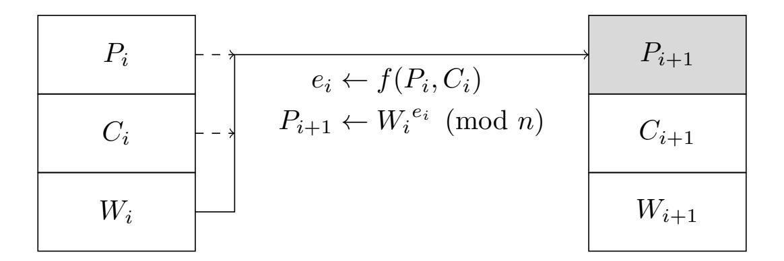
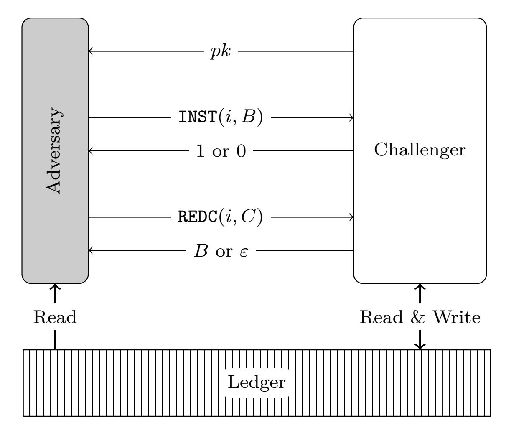

{0}------------------------------------------------

# **Moderated Redactable Blockchains: A Definitional Framework with an Efficient Construct**

Mohammad Sadeq Dousti1 and Alptekin Küpçü2

1 Johannes Gutenberg University of Mainz, Mainz, Germany modousti@uni-mainz.de 2 Koç University, ˙Istanbul, Turkey akupcu@ku.edu.tr

**Abstract.** Blockchain is a multiparty protocol to reach agreement on the order of events, and to record them consistently and immutably without centralized trust. In some cases, however, the blockchain can benefit from some *controlled* mutability. Examples include removing private information or unlawful content, and correcting protocol vulnerabilities which would otherwise require a *hard fork*. Two approaches to control the mutability are: *moderation*, where one or more designated administrators can use their private keys to approve a redaction, and *voting*, where miners can vote to endorse a suggested redaction. In this paper, we first present several attacks against existing redactable blockchain solutions. Next, we provide a definitional framework for moderated redactable blockchains. Finally, we propose a provable and efficient construct, which applies a single digital signature per redaction, achieving a much simpler and secure result compared to the prior art in the moderated setting.

**Keywords:** Blockchain · Bitcoin · Moderated Redactable Blockchain · Formal Threat Model · Signature Scheme

## **1 Introduction**

The concept of blockchain was pioneered by Bitcoin [\[16\]](#page-18-0). It is a distributed protocol that allows all honest parties to keep a ledger of event logs in a consistent manner and without any trust assumption. There are various incarnations of blockchains, which may relax or strengthen some of the conditions. The original blockchain is *permissionless*, meaning any party can participate in the protocol. *Permissioned* blockchains operate in an authenticated environment, where joining the network is subject to an administrative decision. A *private* blockchain is a specific type of permissioned blockchain, where every participant can view the ledger, but only an authorized set of entities can append. For further discussion, see [\[13\]](#page-18-1).

{1}------------------------------------------------

One of the most important properties of blockchain is the *immutability* of the ledger. After all, cryptocurrencies require that once a transaction is recorded, it cannot be undone. However, this desirable property has its downsides. Criminals have occasionally appended arbitrary contents to the ledger that is forbidden by national or international laws—such as child abuse [\[11,](#page-18-2)[12\]](#page-18-3) and malware [\[18\]](#page-18-4). Another use case is where some information about a user is stored in the ledger, and later the user requests them to be removed [\[15\]](#page-18-5), exercising the "right to be forgotten" under privacy laws such as the General Data Protection Regulation (GDPR) [\[4\]](#page-18-6). A third case is when a massive fraud has been made possible due to a flaw in the blockchain protocol. In immutable blockchains, the only way to invalidate such fraudulent transactions is by updating the protocol and the software—a process known as a *hard fork*. The DAO Attack [\[3\]](#page-18-7) is an example, which resulted in a hard fork in Ethereum [\[20\]](#page-18-8) back in 2016. For further discussion, see [\[1\]](#page-17-0).

To overcome the limitations associated with immutability, several researchers proposed solutions for *controlled* mutability. The literature has two approaches for controlling the mutability: *Moderated* [\[1,](#page-17-0)[5,](#page-18-9)[10\]](#page-18-10), where redactions can only be applied by a designated set of users (known as the administrators), and *unmoderated* (or voting-based) [\[19,](#page-18-11)[7\]](#page-18-12) where suggested redactions are voted on, and applied only if they receive a quorum of votes within a specific period. Notice that the terms permissioned and moderated are orthogonal: In permissioned blockchains, users need administrative permission to join the network. In moderated blockchains, administrators must approve redactions (changes to the blocks in the ledger). Even in a blockchain that is both moderated and permissioned, the administrators in charge of admitting users can be different from the administrators in charge of approving redactions.

In this paper, four novel attacks are presented against existing redactable blockchains: Two attacks against moderated constructs, and two against the unmoderated ones. Learning from the attacks, we suggest the goals for a definitional framework for redactable blockchains, and put forward an adversarial model and a security definition satisfying those goals. Finally, two constructs of redactable blockchains are presented: The former serves as an instrumental example, and is proven incorrect and insecure. The latter resolves the issues, and we prove it both correct and secure in our definitional framework.

{2}------------------------------------------------

## **2 Previous Work**

**Moderated Redactable Blockchains.** In their seminal work, Ateniese et al. [\[1\]](#page-17-0) constructed the first redactable blockchain. They proposed a special primitive called an *enhanced chameleon hash function*. A chameleon hash function is a collision-resistant hash function, such that finding collisions is easy given a private (trapdoor) key. The *enhanced* version satisfies the additional property that finding collisions (without the private key) is hard, even if the adversary can get collisions for inputs of her choice from an oracle. The primitive is rather complex and involved: In the standard model, it requires a witness whose size is 18 group elements under the SXDH assumption, or 39 group elements under the DLIN assumption [\[1\]](#page-17-0). Derler et al. [\[6\]](#page-18-13) extended the above idea above to attributebased chameleon hashes. Instead of applying redactions freely at the block level, the administrators are bound by a fine-grained policy on what attributes they can change. They employ *ciphertext-policy attribute-based encryptions* and *chameleon hashes with ephemeral trapdoors*. Recently, Grigoriev and Shpilrain [\[10\]](#page-18-10) proposed a simple construct based on textbook RSA. However, [Section 4](#page-5-0) shows that it is insecure.

Interestingly, none of the work listed above provides a security model/definition tailored specifically for redactable blockchains, and therefore their constructs have no security proofs: While [\[1](#page-17-0)[,6\]](#page-18-13) focus on proving the security of the underlying cryptographic primitives (e.g., the enhanced chameleon hash function), [\[10\]](#page-18-10) has no rigorous proof of security. We also show that all constructs succumb to reversion attacks.

**Unmoderated (Voting-based) Redactable Blockchains.** Puddu et al. [\[19\]](#page-18-11) defined an idea called *µ*chain for enabling mutability for proof-of-work blockchains. The mutability is controlled by fiat, imposed by consensus, and is publicly verifiable. It can be used in both moderated and unmoderated settings: In the moderated setting, the sender can create multiple mutations of a transaction, and encrypt all but one (the active transaction). The decryption key is distributed between miners using a secret-sharing scheme. The sender also proposes a policy as to how other mutations can be activated, and by whom. If a mutation request is approved by this policy, miners decrypt the intended mutation by a multi-party decryption protocol. In the unmoderated setting, the mutation to be activated is voted on. Deuber et al. [\[7\]](#page-18-12) discuss various issues with *µ*chain. They also propose a distributed consensus protocol for redaction. Their protocol does not require heavy cryptographic operations or trusting a set of administrators. It starts when a participant proposes a redaction. If the 

{3}------------------------------------------------

proposed block satisfies the verification algorithm, it enters a voting phase. If enough miners vote for it within a certain period of time, the change is applied to the ledger.

In Section 4, we show that care must be taken when dealing with votes. In particular, if not properly designed and implemented, it is possible to redact a block containing a vote for some previous block, which may render the corresponding redactions invalid. Furthermore, we explore possible ways where a minority group can prevent a policy to be applied, or even go against the policy.

## 3 Preliminaries

**Assignment Notation.** Assignments are denoted as  $x \leftarrow 2$ . To say something holds by definition, we use  $x \stackrel{\text{def}}{=} y$ . The symbol x = y is used for checking or asserting equality.

**List Manipulation.** Let  $\mathcal{L} \stackrel{\text{def}}{=} [B_0, \dots, B_\ell]$  be a list. The elements of the list can be addressed by their index:  $B_i \stackrel{\text{def}}{=} \mathcal{L}[i]$  for  $0 \le i \le \ell$ . We use the following notation to address sublists: For integers i, j with  $0 \le i \le j \le \text{len}(\mathcal{L})$ , define  $\mathcal{L}[i:j] \stackrel{\text{def}}{=} [B_i, \dots, B_j]$ . If j < i, the sublist is empty. If  $\mathcal{L}_1$  and  $\mathcal{L}_2$  are two list, their concatenation is denoted by  $\mathcal{L}_1 + \mathcal{L}_2$ .

**Blocks.** A block B is denoted by a tuple, such as (P, C, V, W), containing various components. Each component can be set to a default value, such as the empty string  $\varepsilon$ . Blockchains may add other or remove components of their choice to the block structure. Here is the description of the most common components: P is the prefix of the block. It is often a function of previous blocks in the ledger. C is the content of the block (in cryptocurrency nomenclature, it is the set of transactions). V is the version of the block. W is the witness of the block. It is used in redactions. We assume the existence of efficient algorithms Prefix(B), Content(B), Version(B), and Version(B), which efficiently extract the relevant component from block E. If we are interested in a block except one of its components, we denote it by striking through that component: E0 is block E1 except its E1 component.

**sUF-CMA Secure Signatures.** The main primitive used in our construct is a signature schemes *strongly* unforgeable under adaptive chosen-message attack (sUF-CMA). Let us define the syntax and security for this primitive.

{4}------------------------------------------------

- 1. GenSig( $1^{\lambda}$ ) is run to obtain pk and sk.
- 2. The adversary  $\mathcal{A}$  is given pk and access to the signing oracle  $\mathsf{Sign}_{sk}(\cdot)$ , and she returns a pair  $(m,\sigma)$ . Let t be the number of queries  $\mathcal{A}$  asks its oracle, and  $Q \stackrel{\mathsf{def}}{=} \{(m_i,\sigma_i)\}_{i=1}^t$  be the set of query-response pairs. That is,  $m_i$  is the  $i^{\mathsf{th}}$  query, and  $\sigma_i$  is the corresponding response from the oracle.
- 3. The adversary is said to win if  $\operatorname{VerifySig}(pk, m, \sigma) = 1$  and  $(m, \sigma) \neq Q$ . In this case, the experiment outputs 1. Otherwise, it outputs 0.

**Experiment 1.** The strong signature forgery experiment SSig-forge $_{\mathcal{A},\Pi}^{\mathsf{cma}}(\lambda)$ , where the adversary can mount a chosen-message attack.

**Definition 1** (Syntax of Signature Schemes). A signature scheme consists of three efficient algorithms  $\Pi \stackrel{\text{def}}{=}$  (GenSig, Sign, VerifySig), satisfying the following:

- On input the security parameter  $1^{\lambda}$ , the key generation algorithm GenSig creates a pair of keys (pk,sk). We assume that  $|pk|,|sk| \geq \lambda$ , and  $\lambda$  can be inferred from each key.
- On input any message m in the message space, the signing algorithm generates a signature:  $\sigma \leftarrow \mathsf{Sign}(sk, m)$ .
- On input any message m in the message space, and any signature  $\sigma$  created on m by the signing algorithm, the (deterministic) verification algorithm must return 1: VerifySig(pk, m,Sign(sk,m)) = 1.

The strong security of signature schemes is defined as follows:

**Definition 2** (Strong Unforgeability of Signature Schemes). A signature scheme  $\Pi \stackrel{\text{def}}{=}$  (GenSig, Sign, VerifySig) is strongly unforgeable under adaptive chosen-message attack (sUF-CMA) if for every efficient adversary A taking part in Experiment 1, there exists a negligible function negl, such that

$$\Pr[\mathsf{SSig\text{-}forge}^{\mathsf{cma}}_{\mathcal{A},\Pi}(\lambda) = 1] \leq \mathsf{negl}(\lambda).$$

The main assumption of this section is the existence of sUF-CMA secure signature schemes. There are efficient transformations that convert any UF-CMA secure signature to an sUF-CMA secure one [14]. Boneh et al. [2, p. 230] provide a list of many constructions of efficient sUF-CMA signatures in the literature, both in the standard and the random oracle models.

{5}------------------------------------------------

**Fig. 1.** The relationship between two consecutive blocks in the GS Construct.  $C_i$  is the content.  $W_i$  is the witness, which is picked uniformly from  $\mathbb{Z}_n$  such that it does not to have order 2. The prefix  $P_{i+1}$  depends on all parts of block  $B_i$  via the relation  $P_{i+1} \leftarrow W_i^{f(P_i,C_i)}$  (mod n), where n is an RSA modulus and f is an efficient integer-valued function.

## 4 Novel Attacks on Previous Constructs

In this section, we explain several attacks against certain previous constructs, which carry over their desired security properties from immutable blockchain models [9,17], to the redactable setting. We stress that most attacks can be easily prevented by small modifications in the corresponding construct. However, the mere existence of the attacks in the face of security proofs shows that one should consider an adversarial model tailored for the redactable blockchains. Due to a lack of space, we only provide an overview of the attacks. The interested reader may refer to the full version of this paper [8] for further details.

**Moderator Circumvention Attack:** The attack is specific to the GS Construct [10], whose block relationship is depicted in Fig. 1. The attacker can craft two blocks B and B', append B to the ledger, and at any point in time replace it with B'. It works without administrator involvement, since the witness verification simply holds for both blocks. It works as follows:

- 1. Pick Z from  $\mathbb{Z}_n$  uniformly at random. Retry this step if Z has order 2.
- 2. Let  $e \leftarrow f(P,C)$  and  $e' \leftarrow f(P,C')$ .
- 3. Let  $W \leftarrow Z^{e'} \pmod{n}$  and  $W' \leftarrow Z^e \pmod{n}$ .
- 4. Output  $B \leftarrow (P, C, W)$  and  $B' \leftarrow (P, C', W')$ .

It can be verified that  $P_{\text{next}} = W^e = W'^{e'} = Z^{e \cdot e'} \pmod{n}$ . Thus, replacing B with B' does not affect the prefix of the next block.

**Reversion Attack:** The attack can be applied to both the GS [10] and the AMVA [1] constructs, both of which are in the moderated settings. Consider a block B, which was later redacted to B' with the help of the administrators. An adversary can simply revert a

{6}------------------------------------------------

redacted block *B* 0 to its previous state *B*: Since no versioning scheme is in place, all versions of a block are valid.

**Vote Erasure Attack:** The vote erasure is a special kind of attack where a series of valid actions on the ledger puts it in an *inconsistent* state, meaning that at least one block is no longer valid. Erasing votes already collected for a redaction is only applicable to the voting (unmoderated) settings, like the DMTS Construct [\[7\]](#page-18-12). In this construct, a redaction *B* ∗ *i* is suggested by a participant. After validating this block, a voting period starts. It comprises the next *t* blocks appended to the ledger. If at least a *ρ* fraction of these *t* blocks endorse this redaction, it is considered approved, and every (honest) participant applies the redaction. Miners who want to endorse this redaction must include the hash *H*(*B* ∗ *i* ) in the content of blocks they mine. The authors use *t* = 4 and *ρ* = 3/4. This means that in the next four mined blocks, at least three must include *H*(*B* ∗ *i* ), as illustrated below:

$$\cdots \rightarrow \underbrace{B_{i}}_{\text{redact to }B_{i}^{*}} \rightarrow \cdots \rightarrow \underbrace{B_{\ell}}_{\text{last block}} \rightarrow \underbrace{B_{\ell+1} \rightarrow B_{\ell+2} \rightarrow B_{\ell+3} \rightarrow B_{\ell+4}}_{\text{voting period}} \rightarrow \cdots$$

When the redaction *B* ∗ *i* is suggested, the last block was *B`*. In the voting period, four blocks *B`*+1,...,*B`*+4 are mined. If at least three of them include the hash *H*(*B* ∗ *i* ) in their content, then the redaction is approved, and every honest participant updates its local ledger to include *B* ∗ *i* instead of *Bi* .

For concreteness, assume that except for *B`*+4, all other blocks in the voting period endorsed this redaction. An adversary can now propose a redaction *B* ∗ *`*+1 , which is identical to *B`*+1, but does not include the hash *H*(*B* ∗ *i* ). This suggestion goes through the voting period, and since nothing in the DMTS Construct forbids redacting "ballot blocks" it might be approved. However, removing the vote results in the ledger being in an inconsistent state: On the one hand, the ledger of honest participants includes *B* ∗ *i* . On the other hand, the ledger now has only two votes for it, which means the redaction is not approved. Any joining party who receives a copy of the ledger and verifies it can observe this discrepancy.

It is easy to prevent this attack by designating the blocks including votes as special "ballot blocks." It must be required that ballot blocks are not redactable, or at least their redaction cannot remove the vote from the block.

**Miner Corruption Attack:** The attack is applicable to the DMTS Construct [\[7\]](#page-18-12). Let the approval quorum be *ρ* def = 3 4 , as suggested by the paper: When a redaction is proposed, at least 

{7}------------------------------------------------

three out of the next four mined blocks should carry a vote approving the redaction. Consider an adversary who controls 49% of the miners, all of whom *abstain* from endorsing any redactions. A simple combinatorial analysis shows that even if all honest miners vote in favor of all redactions, only ¡ 4 3 ¢ (0.51)3 (0.49) + (0.51)4 ≈ 33% of them are approved. Furthermore, for an adversarially suggested redaction, even if all honest miners refrain from voting, there is a ¡ 4 3 ¢ (0.49)3 (0.51) + (0.49)4 ≈ 30% chance of approval. Increasing *ρ* decreases the chance of honest redactions, while decreasing it increases the chance of adversarial redactions.

# **5 Defining Moderated Redactable Blockchain**

#### **5.1 Design Goals**

[Section 4](#page-5-0) demonstrates that adapting existing models and definitions of immutable blockchains to the redactable setting is challenging, as mutability opens a variety of ways for an adversary to attack the blockchain. We propose decoupling the two notions: A challenger is introduced, who enforces most of the restrictions imposed by an immutable blockchain. On the other hand, we allow the adversary to control the participants in the network, receive an arbitrary number of redactions, and install an arbitrary number of blocks in the ledger. In designing our definitional framework, we pursued the following goals:

- **– Bitcoin independence:** The framework should *not* impose Bitcoin protocol or data structures. For instance, the blockchain designer might opt not to include the hash of the previous block in the current block.
- **– Consensus independence:** The framework should *not* impose a specific consensus mechanism, such as the proof of work (PoW) or the proof of stake (PoS). Rather, it should depend on an abstraction that provides consensus.
- **– General content:** The framework should *not* assume that the content of each block includes a set of transactions. Rather, the content must be treated as an arbitrary bit string.
- **– Simplicity:** The framework should be as simple as possible. With this aim, we abstract out the distributed nature of the network by a centralizing challenger.
- **– Moderation:** The framework should support the moderated setting. This is by choice rather than merit, meaning a framework for the unmoderated setting is equally important, but is left as future work.

{8}------------------------------------------------

**Fig. 2.** The proposed adversarial model. The challenger creates a key pair and the ledger. It gives the public key *pk* to the adversary, and provides her with read-only access to the ledger. All write operations (installations) should go through the challenger's INST interface, by specifying the location *i* pointing to a valid block index in the ledger, and the block *B* to be installed. The challenger returns 1 if the installation is successful, and 0 otherwise. The adversary can also request redactions via the challenger's REDC interface. She provides the redaction location *i*, as well as the new block's content *C*. If the operation is successful, the challenger returns a redacted block *B*, which can then be installed using its INST interface. Otherwise, the challenger returns an empty block *ε*. The adversary is deemed successful if she installs a redacted block which is not obtained via the REDC interface.

- **– Operation segregation:** The framework should *not* combine operations which are semantically different. For instance, consider redaction and installation: When an administrator is asked for a redaction, he should merely return a redacted block, rather than installing the block in the ledger. The installation must be performed separately.
- **– Allowing adversarial transformation:** The framework should allow the adversary to append any valid block at the end of the ledger. Also, she must be able to receive the redaction of as many blocks as she wants. Finally, she must be able to install any valid redaction.
- **– Ledger consistency:** The ledger must remain consistent at all times. That is, there should not be a valid transformation that invalidates one or more blocks already installed in the ledger (cf. [Section 4\)](#page-5-0).

{9}------------------------------------------------

#### **5.2 Informal Model**

[Fig. 2](#page-8-0) illustrates our definitional framework informally. Notice that it resembles a game between a challenger and a single adversary. It is as if she has total control over the participants in the blockchain: As long as she plays by the rules, she can append any valid block to the ledger, request any block content to be redacted to an arbitrary yet valid value, and install any valid redacted block. Furthermore, no modification is made to the chain without the adversary saying so. In fact, the challenger is an abstraction of an ideal consensus protocol. The goal of the adversary is to create a redacted block which is not provided by the administrators controlled by the challenger, and install it in the ledger.

Observe the similarity with the way signature schemes are modeled: Obtaining redactions for arbitrary content are akin to acquiring a signature on arbitrary messages (the adaptive chosen message attack). Furthermore, the security definition is similar: Any new redaction constitutes an attack, which is akin to existential forgery in signature schemes. In fact, as shown in [Section 6,](#page-12-0) a strongly unforgeable signature scheme can be used to construct a secure redactable blockchain in our model.

In what follows, we abstract out a redactable blockchain as a tuple of efficient algorithms. The abstraction pertains to a centralized setting, where there is a challenger with a private key, playing against an adversary with the public key and read-only access to the ledger. The adversary can install blocks by asking the challenger, who accepts the request as long as the adversary abides by the rules. The verification algorithm distinguishes valid blocks from invalid ones. Contrary to previous work such as [\[1](#page-17-0)[,7\]](#page-18-12), which explicitly use the proof-of-work verification in their model, we let each construct decide on its own verification algorithm. For instance, a construct may use separate verification algorithms for normal and redacted blocks. This simplifies and generalizes the scheme. The adversary can also ask the challenger to redact block contents, in hope that she learns how to redact a block without the challenger's help. The adversary is deemed successful if she can generate a new redaction.

We realize that block versioning is useful, and therefore incorporate it into our formalization below. If a solution does not employ versioning, those parts in the definition may be ignored.

{10}------------------------------------------------

#### 5.3 Definition

The blockchain storage (the ledger) is modeled as a list of blocks  $\mathcal{L} \stackrel{\text{def}}{=} [B_0, B_1, \dots, B_\ell]$ . The list starts at index 0, and the block at  $\mathcal{L}[0]$  is called the *genesis* block. This block is generated initially, and it helps in simplifying the presentation. We assume that the variable  $\ell$  always keeps the number of real (non-genesis) blocks:  $\ell \stackrel{\text{def}}{=} \text{len}(\mathcal{L}) - 1$ . Initially,  $\ell \leftarrow 0$ , as there is only one block in the ledger (the genesis block) Upon appending each new block,  $\ell$  is incremented. The value  $\ell$  is *not* an upper bound:  $\mathcal{L}$  can grow to include any polynomial number of blocks. The ledger is published as a *read-only* list. The only way an adversary can modify  $\mathcal{L}$  is via a call to the challenger's INST interface, as depicted by Fig. 2.

Definition 3 defines five efficient algorithms that constitute a moderated redactable blockchain scheme. We then express two syntactical requirements: Every block created correctly must be verifiable, and so is every block redacted correctly. Throughout, the following transformation is used: It expresses the effect of installing a block B at position i of ledger  $\mathcal{L}$ , where  $1 \le i \le \ell + 1$ :

Transform
$$(\mathcal{L}, i, B) \stackrel{\text{def}}{=} \mathcal{L}[0:i-1] + [B] + \mathcal{L}[i+1:\ell].$$
 (1)

Notice that Transform returns a new ledger, rather than changing  $\mathcal{L}$ . By list manipulation rules defined in Section 3, if  $i+1>\ell$ , the rightmost sublist  $\mathcal{L}[i+1:\ell]$  is empty. The resulting ledger has the same length as  $\mathcal{L}$  if  $1 \le i \le \ell$ , and is longer than  $\mathcal{L}$  by one block if  $i=\ell+1$ .

**Definition 3.** A moderated redactable blockchain scheme is a tuple of probabilistic polynomial-time algorithms  $\mathcal{RBC} \stackrel{\text{def}}{=}$  (Gen, Create, Verify, Redact, Install) satisfying the following:

- 1. The **key-generation algorithm** Gen(1 $^{\lambda}$ ): Takes as input a unary security parameter 1 $^{\lambda}$  and outputs  $(pk, sk, \mathcal{L})$ , where pk is the public key, sk is the private key, and  $\mathcal{L}$  is the ledger. We assume that |pk|, |sk| are polynomial in  $\lambda$ , and  $\lambda$  can be inferred from pk or sk.
- 2. The **block-creator algorithm** Create(pk,  $\mathcal{L}$ , C): Takes as input the public key pk, the ledger  $\mathcal{L}$ , and a content C. It generates and returns a block B containing C, to be appended at the end of  $\mathcal{L}$ .
- 3. The **block-verifier algorithm** Verify $(pk, \mathcal{L}, i, B)$ : Takes as input the public key pk, the ledger  $\mathcal{L}$ , a positive integer  $i \leq \ell + 1$ , and a block B. It performs two verifications, denoted

{11}------------------------------------------------

 $\Phi$  and  $\Psi$ , which are specified as part of Verify description by the blockchain designer. Let:

$$V \leftarrow \mathsf{Version}(B),$$
 (2)

$$\vec{V} \leftarrow [\text{Version}(\mathcal{L}[0]), \dots, \text{Version}(\mathcal{L}[\ell])],$$
 (3)

$$\mathcal{L}^* \leftarrow \mathsf{Transform}(\mathcal{L}, i, B).$$
 (4)

Verify returns 1 if and only if both  $\Phi(\vec{V}, i, V)$  and  $\Psi(pk, \mathcal{L}^*)$  return 1. Algorithm  $\Phi$  prevents reversion attacks by comparing the version of B with (possibly all) existing block versions. Algorithm  $\Psi$  checks the the consistency of the ledger for  $\mathcal{L}^*$  that results from installing B at position i of  $\mathcal{L}$ .

- 4. The **redaction algorithm** Redact( $sk, \mathcal{L}, i, C$ ): Takes as input the private key sk, the ledger  $\mathcal{L}$ , a positive integer  $i \leq \ell$ , and a content C. It returns a block B containing C, to replace  $\mathcal{L}[i]$ .
- 5. The **block-installer algorithm** Install( $pk, \mathcal{L}, i, B$ ): Takes as input the public key pk, the ledger  $\mathcal{L}$ , a positive integer  $i \leq \ell + 1$ , and a block B. If  $Verify(pk, \mathcal{L}, i, B)$  is 0, it returns 0. Otherwise, it installs B at index i of  $\mathcal{L}$  (replacing an existing block in case  $i \leq \ell$ ), and returns 1. Formally, a successful installation of B at index i is denoted by  $\mathcal{L} \leftarrow Transform(\mathcal{L}, i, B)$ , as defined by Equation (1).

For any moderated redactable blockchain scheme  $\mathcal{RBC}$ , the following correctness requirements must be satisfied.

**Definition 4 (Correctness).** It is required that for every  $\lambda$ , every  $(pk, sk, \mathcal{L})$  output by  $\text{Gen}(1^{\lambda})$ , and any valid content C:

(a) Anyone can create a valid block to be appended to the ledger: Let  $B \leftarrow \text{Create}(pk, \mathcal{L}, C)$ . Then

Content(
$$B$$
) =  $C$   $\land$  Verify( $pk, \mathcal{L}, \ell + 1, B$ ) = 1.

(b) The administrator can change any block of the ledger to contain any valid content: For any positive integer  $i < \ell$ , let  $B \leftarrow \text{Redact}(sk, \mathcal{L}, i, C)$ . Then

Content(
$$B$$
) =  $C$   $\land$  Verify( $pk, \mathcal{L}, i, B$ ) = 1.

Let  $\mathcal{RBC}$  be a moderated redactable blockchain scheme per Definition 3, and consider Experiment 2 for an adversary  $\mathcal{A}$  and security parameter  $\lambda$ .

{12}------------------------------------------------

- 1. Gen(1 $^{\lambda}$ ) is run to obtain  $(pk, sk, \mathcal{L})$ . The set Hist  $\leftarrow \emptyset$  is set to empty.
- 2. Adversary  $\mathcal{A}$  is given pk, a read-only view of  $\mathcal{L}$ , and access to oracles  $\text{REDC}_{sk,\mathcal{L}}(\cdot,\cdot)$  and  $\text{INST}_{pk,\mathcal{L}}(\cdot,\cdot)$ .
  - The REDC oracle responds to queries of the form (i, C) by returning a redacted block  $B \leftarrow \text{Redact}(sk, \mathcal{L}, i, C)$ . It also adds (i, B) to the set Hist, i.e., Hist ← Hist ∪{(i, B)}.
  - The INST oracle responds to queries of the form (i,B) by returning a bit  $b \leftarrow \operatorname{Install}(pk,\mathcal{L},i,B)$ .
- 3. Finally, A outputs  $(i^*, B^*)$ . She succeeds, and the experiment returns 1, if and only if all of the following conditions hold:

(a) 
$$0 < i^* < \ell$$
, (b)  $Verify(pk, \mathcal{L}, i^*, B^*) = 1$ , (c)  $(i^*, B^*) \notin Hist$ .

**Experiment 2.** The redaction experiment  $\operatorname{Redact}_{\mathcal{A},\mathcal{RBC}}(\lambda)$ . The success conditions can be explained as: (a) The index i points to an *internal* block of the ledger (as otherwise it is not an attack), (b) The block  $B^*$  is valid for position  $i^*$ , and (c) The pair  $(i^*, B^*)$  is new, meaning that  $B^*$  is not received from the redaction oracle in response to a query for index  $i^*$ . A particular observation is that the adversary wins if  $B^*$  is received from REDC, but for another location  $i' \neq i^*$ .

**Definition 5.** A redactable blockchain scheme  $\mathcal{RBC}$  is existentially unredactable under chosen-redaction attacks, or just secure, if for all probabilistic polynomial-time adversaries  $\mathcal{A}$  taking part in Experiment 2, there is a negligible function negl such that  $\Pr\left[\operatorname{Redact}_{\mathcal{A},\mathcal{RBC}}(\lambda)=1\right] \leq \operatorname{negl}(\lambda)$ .

# 6 A Construct Based on Signature Schemes

In this section, we present Construct 1 which, based on a simpled assumption explained below, is proven secure under Definition 5. The interested reader may read Appendix A beforehand, which contains a simple construct which is proven both incorrect and insecure. It is not a prerequisite to the rest of this paper, but serves an illustrative purpose in explaining the inner working of the adversarial model.

The adversarial model completely delegates the blockchain functionality to the challenger of Fig. 2: Any write operation must go through the challenger. We are therefore not worried about keeping an immutable total ordering of the blocks. It is similar in nature to the ideal functionality in a hybrid multi-party setting, except that our model is game-based rather than simulation-based.

This construct uses the block structure  $B \stackrel{\text{def}}{=} (C, V, W)$ , where each block contains content C, version V, and witness W. The blocks do not have a prefix whatsoever, in which the hash of the previous block is included. This is because, as explained above, our adversarial model

{13}------------------------------------------------

idealizes the total ordering of blocks in the ledger by preventing direct write access from the adversary.

The block content C is arbitrary, but the version V and witness W must follow some rules that might not seem obvious at first. Appendix A shows that a careless choice of protocol for determining these fields can lead to correctness and security issues.

Each block must have a unique version number: The  $j^{\text{th}}$  block to be installed (be it appended or redacted) should carry version j. This guarantees the uniqueness of each block in the ledger.

The witness W is the empty string  $\varepsilon$  when the block is being appended. However, when the block is being redacted, the administrator uses the private key of the blockchain (which is also the private key of an sUF-CMA secure signature scheme) to sign the concatenation of three fields: The content of this block, the version of this block, and the version of the next block in the ledger.

If the next block is redacted later, its version number will change, effectively rendering any signature in the current block invalid. To prevent correctness issues, the signature is verified only when its block is newer than the next block. This check is easily conducted due to the unique versioning that we introduced: For any two consecutive blocks  $B \stackrel{\text{def}}{=} (C, V, W)$  and  $B' \stackrel{\text{def}}{=} (C', V', W')$  in the ledger, define:

$$\psi(pk,B,B') \stackrel{\text{def}}{=} \begin{cases} 1 & \text{if } V' > V, \\ \text{VerifySig}(pk,C || V || V',W) & \text{if } V' < V. \end{cases}$$
 (5)

As we will see, the algorithm  $\Psi$  calls  $\psi$  for each pair of blocks in the ledger, and returns the logical AND of their results.

**Construction 1** (Secure). The redactable blockchain  $\mathcal{RBC}_{good}$  is defined as follows. The block structure is  $B \stackrel{\text{def}}{=} (C, V, W)$ , where each block contains content C, version V, and witness W.

- Gen(1 $^{\lambda}$ ) simply calls the generator for the underlying signature scheme to obtain the public and private keys:  $(pk, sk) \leftarrow \text{GenSig}(1^{\lambda})$ . It sets  $\mathcal{L} \leftarrow [B_0]$ , where  $B_0 \leftarrow (\varepsilon, 1, \varepsilon)$ .
- Create $(pk, \mathcal{L}, C)$  returns  $B \leftarrow (C, V, \varepsilon)$ , where V is larger than any version in the ledger (and is thus unique). Symbolically,  $V \leftarrow \mathsf{MaxV}(\vec{V})$ , where  $\vec{V}$  is defined as in Equation (3),

{14}------------------------------------------------

and

$$\mathsf{MaxV}(\vec{V}) \stackrel{\mathrm{def}}{=} 1 + \max_{0 \le i \le \ell} \vec{V}[i]. \tag{6}$$

- $Verify(pk, \mathcal{L}, i, B)$  returns 1 if and only if all conditions below are satisfied:
  - *B* has correct structure, and  $0 < i \le \ell + 1$ .
  - $\Phi(\vec{V}, i, V)$  returns 1: This happens if and only if  $V = \text{MaxV}(\vec{V})$ .
  - $\Psi(pk,\mathcal{L}^*)$  returns 1: This happens if and only if for every pair (B,B') of subsequent blocks in  $\mathcal{L}^*$ , it holds that  $\psi(pk,B,B')=1$ , as per Equation (5).
- Redact( $sk, \mathcal{L}, i, C$ ): If i points to an internal block (i.e.,  $0 < i < \ell$ ), it creates a block  $B \leftarrow (C, V, W)$  using content C, where  $V \leftarrow \mathsf{MaxV}(\vec{V})$  and

$$W \leftarrow \mathsf{Sign}(sk, C || V || \mathsf{Version}(\mathcal{L}[i+1])).$$

- Install $(pk, \mathcal{L}, i, B)$ : Works exactly as specified in **Definition 3**.

Notice that for redacting the block at  $i = \ell$ , the private key is not required. For any C, replacing the existing block  $\mathcal{L}[\ell]$  with  $B \leftarrow (C, \mathsf{MaxV}(\vec{V}), \varepsilon)$  is valid. This is because there is no next block B' for which  $\psi(pk, B, B') = 1$  must hold. However, the ability to redact the last block without the private key does not constitute an attack. In our model (Experiment 2), the adversary succeeds only if she redacts a block inside the ledger (i.e.,  $0 < i < \ell$ ).

**Theorem 1.**  $\mathcal{RBC}_{good}$  is correct per Definition 4.

*Proof.* There are two conditions to check.

**Condition** (a): Create( $pk, \mathcal{L}, C$ ) returns  $B \leftarrow (C, \mathsf{MaxV}(\vec{V}), \varepsilon)$ . Clearly, the content of this block is C. Furthermore, if  $\mathcal{L}$  is already a valid chain, so is  $\mathcal{L}^* \leftarrow \mathcal{L} + [B]$ . This is because the version of B is correctly computed as required by  $\Phi$ . Moreover,  $\psi$  returns 1 on all pairs of blocks in  $\mathcal{L}^*$  prior to the last pair (due to the validity of  $\mathcal{L}$ ). Finally, for the last pair ( $\mathcal{L}[\ell], B$ ), since  $\mathsf{Version}(\mathcal{L}[\ell]) < \mathsf{Version}(B)$ , the return value of  $\psi$  is trivially 1. As a result, all block pairs verify, and  $\Psi$  returns 1 as well.

**Condition (b):** Redact( $sk, \mathcal{L}, i, C$ ) returns  $B \leftarrow (C, \mathsf{MaxV}(\vec{V}), W)$ . Clearly, the content of this block is C. Furthermore, if  $\mathcal{L}$  is already a valid chain, so is  $\mathcal{L}^* \leftarrow \mathsf{Transform}(\mathcal{L}, i, B)$ . This is because the version of B is correctly computed as required by  $\Phi$ . Moreover,  $\psi$  returns 1 on all pairs of blocks in  $\mathcal{L}^*$ , except perhaps the two special pairs involving B (the validity of other pairs is due to the validity of  $\mathcal{L}$ ). We show that  $\psi$  also returns 1 on those special pairs, which involve B:

{15}------------------------------------------------

- The first special pair is  $(\mathcal{L}[i-1], B)$ . Since  $Version(\mathcal{L}[i-1]) < Version(B)$ , the return value of  $\psi$  is trivially 1.
- The second special pair is  $(B, \mathcal{L}[i+1])$ . Since  $Version(\mathcal{L}[i+1]) < Version(B)$ , algorithm  $\psi$  requires the block B to hold a proper witness. This holds due to the correctness of the underlying signature scheme.

As a result, all block pairs verify, and  $\Psi$  returns 1 as well.

**Theorem 2.** If the signature scheme (GenSig,Sign,VerifySig) is strongly unforgeable under chosen-message attack (sUF-CMA), then  $\mathcal{RBC}_{good}$  is secure per Definition 5.

*Proof.* Let  $\mathcal{A}$  be an adversary who, for infinitely many  $\lambda$  values, succeeds in the experiment  $\mathsf{Redact}_{\mathcal{A},\mathcal{RBC}_{\mathsf{good}}}(\lambda)$  with probability at least  $\epsilon \stackrel{\mathsf{def}}{=} \epsilon(\lambda)$ . We construct a forger algorithm  $\mathcal{F}$  which, for infinitely many  $\lambda$  values, forges a signature with probability  $\epsilon$ .

The forger  $\mathcal{F}$  receives as input the public key pk of the signature scheme, as well as oracle access to the signing oracle  $\mathsf{Sign}_{sk}(\cdot)$ . It sets  $\mathsf{Hist} \leftarrow \emptyset$ , generates  $\mathcal{L} \leftarrow [B_0]$  as in Construct 1, runs  $\mathcal{A}(pk,\mathcal{L})$ , and answers its queries as follows:

- **Installation queries** INST(i,B): The forger  $\mathcal{F}$  simply calls  $b \leftarrow \text{Install}(pk,\mathcal{L},i,B)$ , and returns b.
- **Redaction queries** REDC(i, C): If  $i \le 0$  or  $i \ge \ell$ , the forger  $\mathcal{F}$  returns  $\varepsilon$ . Otherwise,  $\mathcal{F}$  creates block  $B \leftarrow (C, V, W)$ , where  $V \leftarrow \mathsf{MaxV}(\vec{V})$ , and W is computed by querying the signature oracle on  $(C \mid\mid V \mid\mid \mathsf{Version}(\mathcal{L}[i+1]))$ . It then adds (i, B) to Hist, and returns B.

If the adversary stops but does not succeed in outputting (i,B) as required in Experiment 2, the forger  $\mathcal{F}$  outputs  $\bot$  and halts. Otherwise, parse  $B \stackrel{\text{def}}{=} (C,V,W)$ . Since B is verified, W is a valid signature on  $m \leftarrow (C ||V|| V_{i+1})$ , where  $V_{i+1} \stackrel{\text{def}}{=} \text{Version}(\mathcal{L}[i+1])$ . Subsequently,  $\mathcal{F}$  outputs (m,W) as a forgery.

To show that the forgery is new, we must prove that W was never returned by the signing oracle in response to query m. Since  $(i,B) \notin Hist$ , we consider the two remaining possibilities:

-  $(i',B) \in$  Hist for some  $i' \neq i$ : Impossible because Version( $\mathcal{L}[i+1]$ ), which constitutes a part of m, is unique due to the uniqueness of version numbers in our solution. Therefore, no other position i' may correspond to the same m.

{16}------------------------------------------------

**–** (*i*,*B* 0 ) ∈ Hist for some *B* 0 6= *B*, where *B* can be efficiently computed from *B* 0 def = (*C* 0 ,*V* 0 , *W*0 ), and *W*0 is valid on *m*: For this to happen, it must be the case that *B* and *B* 0 are identical except in their witnesses. Then, both *W* and *W*0 are valid signatures on *m*. This constitutes a strong forgery on the signature scheme, and F can output (*m*,*W*) as a valid forgery.

We conclude that the success probability of F in producing a valid forgery is the same as the success probability of A in producing a valid redaction. ut

# **7 Conclusion and Future Work**

In this paper, we discussed two settings for redactable blockchains: The moderated setting, where redactions are handled by administrators, and the unmoderated setting, where redactions are voted on. Four novel attacks were discussed against previous constructs in both settings. We argued the attacks are the result of the lack of a definitional framework for redactable blockchains. We suggested the first attempt at such a framework, and explained our design decisions. A simple constructs based on signature schemes was proposed, and proven to be correct and secure.

The simple definitional framework of [Section 5](#page-7-0) can be extended in many ways, some of which are explored below.

**Privacy.** A desirable property is to make it impossible to show that a block was once in the ledger. For instance, consider [Construct 1,](#page-13-0) where a redacted block *B* contains a signature on itself and the next block. Assume *B* is redacted to *B* 0 . While *B* no longer belongs to the ledger, anyone can verify its witness and conclude that it once belonged to the ledger, potentially violating users' privacy.

**Distributed Administration.** Currently, the model supports a single administrator. As in [\[1\]](#page-17-0), one can conceive of a model where the key pair of the blockchain is jointly generated by several administrators, where each administrator receives a share of the private key. Redactions are applied by running a multiparty computation between the administrators. For instance, in our construct, a *threshold signature* can be used. An idea (novel in the context of redactable blockchains) is to allow the set of administrators to grow or shrink 

{17}------------------------------------------------

over time. The policies governing joining and leaving an administrator, as well as the redistribution of private key shares, are of particular interest.

**Accountability.** It might be beneficial to hold administrators accountable for redactions. That is, when a block is last redacted, how many times has it been redacted, and which subset of administrators approved the redaction (in the case of distributed administration).

**Supporting Block Removals and Insertions.** Currently, our model only supports block modifications. Ateniese et al. [\[1\]](#page-17-0) show how block removals can be supported, by modifying the block before the one being removed. Removing blocks is beneficial in that it can shrink the ledger. It is also possible to add support block insertions. We extended our definitional framework to support both operations, and constructed a blockchain satisfying the corresponding security requirements. It will appear in the full version of this paper.

**Multiparty Setting.** In our model, a single adversary plays a game against a challenger. We think the model is elegant in its simplicity, which allowed us to find various attacks against [\[1,](#page-17-0)[7](#page-18-12)[,10\]](#page-18-10) (as well as [Construct 2](#page-19-0) presented in [Appendix A\)](#page-18-19). It also idealizes modifications to the ledger by regulating writes through the challenger, effectively separating redactability from other properties of a blockchain. Furthermore, the model does not care about the underlying consensus mechanism, while prior models (for the immutable blockchains) are bound to the specific consensus protocol such as proof-of-work [\[9](#page-18-16)[,17\]](#page-18-17). We stipulate that our model is good for quickly *proofread* a particular moderated redactable blockchain, but it is only a first step. Since there is no composition theorem for the game-based security proofs, one cannot simply replace the ideal functionality in the hybrid model with a real one, and hope the proof carries over to the real model. Furthermore, the simplified model might be unable to capture some attacks in the real world. For these reasons, we propose extending the ideas in this paper to the multiparty setting, where various parties are joining and leaving the network (as well as an adversary who can corrupt a minority of them).

**Acknowledgment.** The second author acknowledges support from TÜB˙ITAK, the Scientific and Technological Research Council of Turkey, under project number 119E088.

## **References**

1. Ateniese, G., Magri, B., Venturi, D., Andrade, E.: Redactable Blockchain–or–Rewriting History in Bitcoin and Friends. In: EuroS&P. IEEE (2017)

{18}------------------------------------------------

- 2. Boneh, D., Shen, E., Waters, B.: Strongly Unforgeable Signatures Based on Computational Diffie-Hellman. In: PKC. Springer (2006)
- 3. CoinDesk: Understanding The DAO Attack (2016), <https://tinyurl.com/dao-attack>
- 4. Council of European Union: Regulation (EU) 2016/679: General Data Protection Regulation (GDPR) (2016), [https:](https://gdpr-info.eu) [//gdpr-info.eu](https://gdpr-info.eu)
- 5. Derler, D., Ramacher, S., Slamanig, D., Striecks, C.: I Want to Forget: Fine-Grained Encryption with Full Forward Secrecy in the Distributed Setting. IACR Cryptology ePrint Archive (2019)
- 6. Derler, D., Samelin, K., Slamanig, D., Striecks, C.: Fine-Grained and Controlled Rewriting in Blockchains: Chameleon-Hashing Gone Attribute-Based. IACR Cryptology ePrint Archive (2019)
- 7. Deuber, D., Magri, B., Thyagarajan, S.A.K.: Redactable Blockchain in the Permissionless Setting. In: Symposium on Security and Privacy. IEEE (2019)
- 8. Dousti, M.S., Küpçü, A.: Moderated Redactable Blockchains: A Definitional Framework with an Efficient Construct. IACR Cryptology ePrint Archive (2020)
- 9. Garay, J., Kiayias, A., Leonardos, N.: The Bitcoin Backbone Protocol: Analysis and Applications. In: EUROCRYPT. Springer (2015)
- 10. Grigoriev, D., Shpilrain, V.: RSA and Redactable Blockchains (2020), arXiv report 2001.10783
- 11. Hargreaves, S., Cowley, S.: How Porn Links and Ben Bernanke Snuck Into Bitcoin's Code (2013), [https://tinyurl.](https://tinyurl.com/bitcoin-snuck) [com/bitcoin-snuck](https://tinyurl.com/bitcoin-snuck)
- 12. Hopkins, C.: If You Own Bitcoin, You Also Own Links to Child Porn (2020), <https://tinyurl.com/bitcoin-child>
- 13. Kolb, J., AbdelBaky, M., Katz, R.H., Culler, D.E.: Core Concepts, Challenges, and Future Directions in Blockchain: A Centralized Tutorial. ACM Computing Surveys **53**(1), 1–39 (2020)
- 14. Liu, J.K., Au, M.H., Susilo, W., Zhou, J.: Short Generic Transformation to Strongly Unforgeable Signature in the Standard Model. In: ESORICS. Springer (2010)
- 15. Lumb, R.: Downside of Bitcoin: A Ledger That Can't Be Corrected (2016), <https://tinyurl.com/btc-immutable>
- 16. Nakamoto, S.: Bitcoin: A Peer-to-Peer Electronic Cash System (2009), available from [http://www.bitcoin.org/](http://www.bitcoin.org/bitcoin.pdf) [bitcoin.pdf](http://www.bitcoin.org/bitcoin.pdf)
- 17. Pass, R., Shi, E.: FruitChains: A Fair Blockchain. In: Symposium on Principles of Distributed Computing (2017)
- 18. Pearson, J.: The Bitcoin Blockchain Could Be Used to Spread Malware, INTERPOL Says (2015), [https://tinyurl.](https://tinyurl.com/bitcoin-malware) [com/bitcoin-malware](https://tinyurl.com/bitcoin-malware)
- 19. Puddu, I., Dmitrienko, A., Capkun, S.: *µ*chain: How to Forget Without Hard Forks. IACR Cryptology ePrint Archive (2017)
- 20. Wood, G.: Ethereum: A Secure Decentralised Generalised Transaction Ledger (2014), Ethereum Project yellow paper

# **A An Incorrect and Insecure Construct**

In this appendix, we present a construct that is both incorrect and insecure, but helps in understanding the way our definitional framework works. Normal blocks do not include any information about each other (such as the hash of the previous block). Such information, necessary for the secure operation of an ordinary blockchain, is abstracted via the ideal functionality in the model: The adversary is not allowed to make any direct writes to the ledger, and therefore the challenger can keep the ledger blocks in their total order. The redactability is achieved with a signature scheme *strongly* unforgeable under adaptive chosen-message 

{19}------------------------------------------------

attack (sUF-CMA), denoted (GenSig, Sign, VerifySig): The challenger installs a redacted block only if its witness holds the signature of itself and the next block. The reversion attack (Section 4) is prevented by introducing version numbers in the block structure: Initially, each block carries version 1. Upon each redaction, the version number is incremented. The verification function of the blockchain checks whether the version of a redacted block is strictly greater than the version of the block being replaced. This way, the adversary cannot reinstall a previously valid block again.

**Construction 2** (Insecure and Incorrect). The redactable blockchain  $\mathcal{RBC}_{bad}$  is defined as follows. The block structure is  $B \stackrel{\text{def}}{=} (C, V, W)$ , where each block contains content C, version V, and witness W.

- Gen(1 $^{\lambda}$ ) simply calls the generator for the underlying signature scheme to obtain the public and private keys:  $(pk, sk) \leftarrow \text{GenSig}(1^{\lambda})$ . It sets  $\mathcal{L} \leftarrow [B_0]$ , where  $B_0 \leftarrow (\varepsilon, 1, \varepsilon)$ .
- Create(pk,  $\mathcal{L}$ , C) returns  $B \leftarrow (C, 1, \varepsilon)$ .
- Verify $(pk, \mathcal{L}, i, B)$  returns 1 if and only if all of the following conditions hold:
  - B has correct structure, and  $i \le \ell + 1$  is a positive integer.
  - $\Phi(\vec{V}, i, V)$  returns 1: This happens if and only if  $(i = \ell + 1) \land (V = 1)$  (the block is being appended and has version 1), or  $(i \le \ell) \land (\vec{V}[i] < V)$  (an existing block is being redacted, and the new version is greater than the existing one to foil reversion attacks).
  - $\Psi(pk,\mathcal{L}^*)$  returns 1: This happens if and only if for every pair (B,B') of subsequent blocks in  $\mathcal{L}^*$ , if Version(B) > 1 (i.e., if B is redacted), then

$$VerifySig(pk, B^{\Psi} || B', W) = 1, \tag{7}$$

where  $W \stackrel{\text{def}}{=} \text{Witness}(B)$ , and  $B^{\stackrel{\text{def}}{=}}(C,V)$  (i.e., block B except W). Put simply, this means that W is a valid signature on  $C \mid\mid V \mid\mid C' \mid\mid V' \mid\mid W'$ .

- Redact( $sk, \mathcal{L}, i, C$ ): Creates  $B \leftarrow (C, V, W)$  using content C, where  $V \leftarrow \text{Version}(\mathcal{L}[i]) + 1$  and W is a signature on the current block except W itself (denoted  $B^{W}$ ), as well as the next block  $\mathcal{L}[i+1]$ :

$$W \leftarrow \mathsf{Sign}(sk, B^{\Psi} || \mathcal{L}[i+1]).$$

Notice that incrementing the version number, as well as the computation of witness by signing the current and next blocks, are consistent with the requirements of Verify.

- Install $(pk, \mathcal{L}, i, B)$ : Works exactly as specified in **Definition 3**.

{20}------------------------------------------------

**Correctness Issues.** A series of valid actions can put the ledger in a state that block creation for appending is no longer possible, violating the first requirement of [Definition 4.](#page-11-2) For instance, let *C*1, *C* 0 1 and *C*2 be any valid contents, and consider the following actions, following (*pk*, *sk*,L) ← Gen(1*λ* ):

$$\begin{split} B_1 &\leftarrow \mathsf{Create}(pk, \mathcal{L}, C_1), & \mathsf{Install}(pk, \mathcal{L}, 1, B_1) \\ B_1' &\leftarrow \mathsf{Redact}(sk, \mathcal{L}, 1, C_1'), & \mathsf{Install}(pk, \mathcal{L}, 1, B_1') \\ B_2 &\leftarrow \mathsf{Create}(pk, \mathcal{L}, C_2), & \mathsf{Install}(pk, \mathcal{L}, 2, B_2) \end{split}$$

The first line creates and appends a block, the second line redacts it, and the third line tries to append a new block. The last Install fails as it calls Verify, which in turn calls Ψ: Since the version of *B* 0 1 is greater than 1, Ψ requires it to hold a signature containing information about the next block, as per [Equation \(7\),](#page-19-1) which is not the case.

The underlying reason is that, in this particular construct, it is meaningless for the last block of the ledger to be redacted, as there is no next block to sign. It is possible *not* to increase version number for redacting the last block, or disallow such redaction by requiring *i* 6= *`* in designing Redact.

One can violate the second requirement of [Definition 4](#page-11-2) as well, by following a series of valid actions that put the ledger in a state where redaction of some blocks are impossible. Let L ← [*B*0,*B*1,*B*2,*B*3] be a ledger constructed by appending three blocks, and *C* 0 1 and *C* 0 2 be valid contents. Consider the following actions:

$$\begin{split} B_1' \leftarrow \mathsf{Redact}(sk, \mathcal{L}, 1, C_1'), & \mathsf{Install}(pk, \mathcal{L}, 1, B_1') \\ B_2' \leftarrow \mathsf{Redact}(sk, \mathcal{L}, 1, C_2'), & \mathsf{Install}(pk, \mathcal{L}, 1, B_2') \end{split}$$

Again, the last install fails: For the pair (*B* 0 1 ,*B* 0 2 ), algorithm Ψ requires *B* 0 1 to hold a signature on *B* 0*W* 1 ||*B* 0 2 (see [Equation \(7\)\)](#page-19-1). However, *B* 0 1 is redacted prior to *B* 0 2 : As a result, *B* 0 1 holds a signature on *B W* 1 ||*B*2, which becomes invalid after *B*2 is redacted. Consequently, the second requirement of [Definition 4](#page-11-2) is violated.

The underlying reason is the indifference in the verification algorithms as to which block is newer. The next section shows how using unique versions can resolve this issue.

{21}------------------------------------------------

**Security Issues.** On the surface, it seems that the adversary cannot succeed in Experiment 2. An informal (and false) argument is as follows: We use an adversary who succeeds in the game as a subroutine, to forge a valid signature on an arbitrary message. The forger simulates the challenger. It gives the public key of the signature scheme to the adversary, and answers all redaction queries by using the *signing oracle*. When the adversary outputs a successful redaction (i,B), the witness W is a valid signature on the message  $m \leftarrow B^{W} \mid \mathcal{L}[i+1]$ . The forger outputs (m,W) as a valid message-signature pair.

The fallacy in the above argument is that the forger must output a *new* pair (m, W), as required by sUF-CMA signature forgery. However, the informal proof does not show that this pair is new. In fact, as is explained below, it is easy for an adversary to succeed in the game without forging any signature.

Adversary  $\mathcal{A}$  proceeds as follows: It creates a block  $B \leftarrow$  ("original",  $1, \varepsilon$ ), and appends it three times by calling the INST interface of the challenger on queries (1,B), (2,B) and (3,B), respectively. At this point,  $\mathcal{L} = [B_0,B,B,B]$ .

Next,  $\mathcal{A}$  queries the REDC interface of the challenger on (1, "modified"), and receives  $B' \leftarrow$  ("modified", 2, W), where W is a signature on  $m \leftarrow B'^{W} || B$ , where  $B'^{W}$  is "modified" || 2.

While the redaction was requested for position 1, the adversary uses position 2: She outputs (2, B'), and halts.

At this point, Hist =  $\{(1,B')\}$ , and therefore (2,B') is new. Furthermore, B' is a valid redaction for position 2, since  $\mathcal{L}[3] = \mathcal{L}[2] = B$ . We conclude that the adversary breaks the security by outputting a successful reduction, without forging a new signature. The underlying reason for this attack is duplicate blocks in the ledger. Construct 1 in Section 6 resolved this issue by incorporating unique versioning.