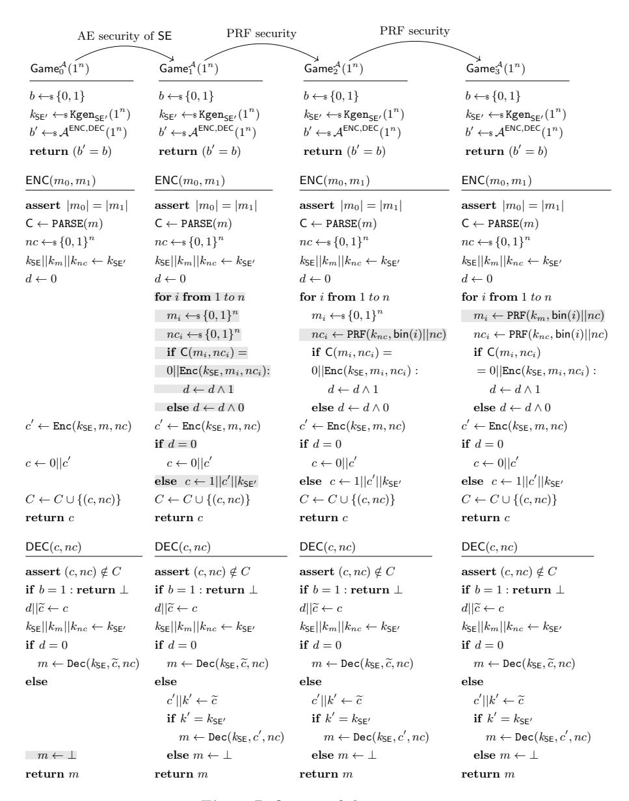

# On the Security Goals of White-Box Cryptography

Estuardo Alpirez Bock<sup>1</sup> , Alessandro Amadori<sup>2</sup> , Chris Brzuska<sup>1</sup> , and Wil Michiels2,<sup>3</sup>

<sup>1</sup> Aalto University, Finland, estuardo.alpirezbock,chris.brzuska@aalto.fi <sup>2</sup> Technische Universiteit Eindhoven, Netherlands, A.Amadori@tue.nl <sup>3</sup> NXP Semiconductors, Netherlands, wil.michiels@nxp.com

Abstract. We discuss existing and new security notions for white-box cryptography and comment on their suitability for Digital Rights Management and Mobile Payment Applications, the two prevalent use-cases of white-box cryptography. In particular, we put forward indistinguishability for white-box cryptography with hardware-binding (IND-WHW) as a new security notion that we deem central. We also discuss the security property of application-binding and explain the issues faced when defining it as a formal security notion. Based on our proposed notion for hardware-binding, we describe a possible white-box competition setup which assesses white-box implementations w.r.t. hardware-binding. Our proposed competition setup allows us to capture hardware-binding in a practically meaningful way.

While some symmetric encryption schemes have been proven to admit plain white-box implementations, we show that not all secure symmetric encryption schemes are white-boxeable in the plain white-box attack scenario, i.e., without hardware-binding. Thus, even strong assumptions such as indistinguishability obfuscation cannot be used to provide secure white-box implementations for arbitrary ciphers. Perhaps surprisingly, our impossibility result does not carry over to the hardwarebound scenario. In particular, Alpirez Bock, Brzuska, Fischlin, Janson and Michiels (ePrint 2019/1014) proved a rather general feasibility result in the hardware-bound model. Equally important, the apparent theoretical distinction between the plain white-box model and the hardwarebound white-box model also translates into practically reduced attack capabilities as we explain in this paper.

Keywords: White-box cryptography · Hardware-binding · Application-binding · Security Notions · Feasibility · AES

This paper will appear in the proceedings of TCHES Volume 2020, Issue 2. Both versions of the paper are essentially identical and differ only in their formatting.

## 1 Introduction

The white-box attack model was introduced in 2002 by Chow, Eisen, Johnson, and van Oorschot (CEJO [\[14,](#page-27-0)[13\]](#page-27-1)). In this model, we consider an adversary which is in complete control of the execution environment of a cryptographic program and which obtains the implementation code of the cryptographic program with an embedded secret key. The goal of a white-box implementation is to remain secure even in the presence of such a powerful adversary.

Since the introduction of white-box cryptography, constructing white-box cryptographic implementations that achieve security against key extraction w.r.t. a white-box attacker has been a central research topic. A prominent demonstration of these efforts are the WhibOx Competitions of 2017 and 2019 [\[18,](#page-27-2)[16\]](#page-27-3), where designers were invited to submit white-box AES implementations with embedded secret keys. However within a few days up to several weeks, attackers succeeded to extract keys from all candidates that were submitted.[1](#page-1-0)

Since achieving security against key extraction for standard ciphers seems tremendously challenging and, in a way, a minimal goal, studies on further security goals for white-box cryptography have received less attention. To some extent, it seems natural to associate white-box cryptography with a special-purpose obfuscation technique for hiding embedded secret keys in ciphers. However, it is folklore —and we elaborate more later in this paper— that a white-box program which achieves only security against key extraction does not provide any meaningful security in most use cases. To clarify this, we now reflect on Digital Rights Management and Mobile payment applications as the most popular use cases of white-box cryptography. We study the considerations that lead to the deployment of white-box cryptography and explicate the expected security properties, in each of the application scenarios. As it turns out, even Virtual Black-Box obfuscation [\[5\]](#page-26-0) alone does not suffice to prevent misuse of the cryptographic programs in the use-cases that we discuss, since the security goals of white-box cryptography and Virtual Black-Box obfuscation are incomparable.

Digital Rights Management (DRM). The purpose of DRM applications is to perform access control on a user's device, typically allowing the user to access content they have paid for and limit access to content beyond. Usually, content is encrypted under a symmetric key, and the DRM applications contain an embedded secret key to decrypt and thereby retrieve the content. Whitebox cryptography here shall prevent the user from extracting the secret key and sharing it with other users. However, instead of extracting the key, a user could simply copy the entire decryption program with the embedded secret key and share this copy with other users. Therefore, effective white-box decryption programs for DRM applications need to implement countermeasures against such code-lifting attacks.

<span id="page-1-0"></span><sup>1</sup> Three design candidates of the 2019 edition resisted attacks during the competition phase and were broken a few weeks after the end of the competition (see [https:](https://www.cryptolux.org/index.php/Whitebox_cryptography) [//www.cryptolux.org/index.php/Whitebox\\_cryptography](https://www.cryptolux.org/index.php/Whitebox_cryptography)).

Motivated by the DRM application scenario, Delerabl´ee, Lepoint, Paillier, and Rivain (DLPR [\[17\]](#page-27-4)) formulate several security notions. In addition to (basic) security against key extraction, DLPR suggest the notion of one-wayness, which captures that an encryption program should not allow to decrypt. In general, one-wayness is known not to be a suitable formalization of confidentiality as one-wayness does not prevent the leakage of a few bits of information about the encrypted message, unlike standard confidentiality notions such as indistinguishability under chosen-message attacks (IND-CPA). However, in the DRM setting, one can argue that strong confidentiality is less essential and that illegal re-distribution is thwarted already if significant parts of the content cannot be recovered by the adversary.

In order to address the threat of code-lifting attacks and illegal re-distribution of decryption software, DLPR propose the notions incompressibility and traceability. A white-box implementation of a cryptographic primitive is called incompressible if it is of very large size and only remains functional in its complete form. If the program is compressed or if fragments of the program are removed, the program loses its functionality. The underlying motivation is that if a program is incompressible and of a very large size, then it should be difficult for an adversary to re-distribute it online. See [\[17,](#page-27-4)[10,](#page-27-5)[11,](#page-27-6)[9,](#page-27-7)[20,](#page-27-8)[1\]](#page-26-1) for constructions that achieve incompressibility. Traceability, on the other hand, consists of watermarking a decryption program such that, if used for unintended purposes and re-distributed illegally, it is possible to determine the user who corresponds to that program. DLPR define a white-box tracing scheme based on the fully collusion resistant traitor tracing scheme defined by Boneh, Sahai and Waters in [\[12\]](#page-27-9).

Mobile Payment. White-box cryptography for mobile payment applications should serve a somewhat different purpose than previously described for DRM applications. For the description of the application scenario, we now follow the presentation of Alpirez Bock, Brzuska, Fischlin, Janson and Michiels [\[3\]](#page-26-2). A mobile payment application stores sensitive data (e.g. transaction credentials) in encrypted form. When the owner of the application wishes to make a payment, a credential is decrypted and used to generate a valid transaction request. Note that in this case, the adversary and the owner of the application are distinct entities. I.e., the adversary is a third party whose ultimate goal is to recover the value of a transaction credential in order to use it for their own purposes against the interest of the owner of the application. Therefore, we need to prevent the adversary from reading out the content of the transaction credentials contained in the ciphertexts stored within the application. I.e., we (should) aim for the confidentiality of the transaction credentials. Analogously, we need to prevent an adversary from modifying the values of the ciphertexts in such way that the ciphertexts decrypt into new, maliciously modified transaction credentials. That is, we (should) aim for ciphertext integrity. Moreover, we also need to protect the secret key used to decrypt those ciphertexts. Additionally, it is desirable to achieve confidentiality and integrity also for the requests that are generated using the decrypted transaction credential.

An adversary located in the user's phone (e.g. in the form of malware) might attempt to extract the decryption key and use it for recovering the transaction credentials. In addition, the adversary might attempt to simply copy the entire application and run it on a phone of their choice, communicating with a payment terminal of their choice. That is, mobile payment applications also need protection against code-lifting attacks.

The observations for both use cases discussed above show that indeed, a white-box program needs to achieve more than only security against key extraction and, in particular, that mitigating code-lifting attacks is central to the application of white-box cryptography. The relevance of code-lifting attacks is an attack vector that is usually not considered for obfuscation, which is one of the distinguishing features of the two tools. As the attack threats on a DRM application differ from the attack threats on a mobile payment application, we now discuss why the DRM-specific security notions might not be suitable for payment and that further security notions are needed.

## <span id="page-3-0"></span>1.1 Security notions for white-box cryptography beyond DRM

As explained above for mobile payment applications, we wish to achieve properties such as confidentiality, integrity, security against key extraction and security against code-lifting attacks. Neither confidentiality nor integrity properties are inherited from incompressibility, traceability or security against key extraction, and one-wayness only ensures hiding of part of a ciphertext. Moreover, the concepts of incompressibility and traceability do not seem to fit the use case of white-box cryptography for mobile payment. The concept of implementing cryptographic programs of a very large size seems to stand in contrast with desired design properties of applications used by mobile devices and in the internet of things (see Section [5](#page-14-0) for an extended discussion). As for traceability, it seems unlikely that the owner of the payment application might want to illegally redistribute their application for unintended purposes. In this paper, we thus focus on the properties of hardware- and application-binding for protecting white-box programs in mobile payment applications.

Hardware-Binding. The property of hardware (device) binding captures that white-box cryptography shall only be executable on the intended device. That is, a white-box program can be evaluated when having access to a specific device, but becomes useless when not having access to the device. Hardware-binding has been remarked as a desirable goal for white-box cryptography in the literature [\[15,](#page-27-10)[31,](#page-28-0)[4\]](#page-26-3). In fact, commercial implementations offer hardware-binding as an additional security feature [\[25\]](#page-28-1), while evaluation boards provide security assessments of white-box implementations with respect to software protection methods such as device binding [\[28\]](#page-28-2). Moreover in a recent work by Alpirez Bock, Brzuska, Fischlin, Janson and Michiels (ABFJM [\[3\]](#page-26-2)), the authors present a feasibility result for white-box cryptography with hardware-binding, based on the assumption of indistinguishability obfuscation and a puncturable pseudo-random function as a secure hardware component. The authors construct a white-box key derivation function (KDF) with hardware-binding and use it as a building block for a payment application. As the authors point out, their proposed application achieves properties which align with security guidelines proposed by Mastercard [\[24\]](#page-28-3).

In this paper we abstract and generalize the security notion for hardwarebinding for white-box encryption. We define the notion of hardware-binding such that an adversary is unable to generate a valid ciphertext, in the case that the encryption program does not have access to the hardware device it is bound to. We explain how we can construct a secure white-box encryption program based on the approach presented by ABFJM.

Application-Binding. In order to increase the security of a cryptographic program running on a mobile device, one can bind it to another application implementing authentication or filtering functions. For instance, before performing any cryptographic operation, an application might require its user to provide a valid password.

Similarly, the application might first verify the validity of the input message the user wishes to encrypt, and only in case that it is a valid message, the encryption will take place. For these countermeasures to be effective in the white-box attack model, we need to have an encryption program which can only be executed within a designated application and cannot be separated from it. We refer to this technique as application-binding. The goal of application-binding is to prevent an adversary from circumventing computations that shall be performed by an application before encrypting a message.

Having a white-box program which achieves the property of applicationbinding only, and does not implement any hardware-binding functions, has one particular advantage. Namely, the owner of the program can freely choose on which hardware device they want to use their program. For the case that the application implements authentication operations, only the owner of the program should be able to authenticate themselves and thus, an adversary who code lifts the program is not able to use it. Combining the notions of applicationand hardware-binding achieves even stronger security properties than hardwarebinding alone, as was observed by Cooijmans, de Ruiter and Poll (CRP) [\[15\]](#page-27-10) in the context of secure storage solutions. The authors consider hardware- and application-binding as properties jointly, i.e., they deem application-binding as more useful when combined with hardware-binding.

In this paper, we discuss application-binding as a useful security design concept in the white-box attack model. We point out several issues that arise when trying to formalize the intuitively desired security guarantees provided by application-binding as a formal security notion. A central difficulty is to abstract and/or generalize the different functionalities that an (a priori) unknown application can perform together with its associated desired security properties. A useful special case is binding a white-box program to an application that performs authentication operations, i.e., the white-box program can only be executed in case that a valid input (such as a password) is provided. Even in this special case, defining security is non-trivial: Recall that in the white-box attack model, we consider an adversary in control of the execution environment of the program. Thus, it is fair to assume that the adversary might intercept the valid authentication input and then use it for running a copy of the encryption program. One might exclude this particular attack interface, but this appeared a rather arbitrary restriction to us, inconsistent with the general white-box attack scenario rationale. We thus refrained from formalizing such a notion.

#### 1.2 On the Feasibility of White-Box Cryptography

Based on our security notions, we put forward suggestions for alternative whitebox competitions. Here, we consider white-box programs that are bound to a (hardware) functionality. That is, the white-box program can only be executed in the presence of a specific hardware module (emulated by the competition server). We speculate that such a competition not only reflects the application of white-box cryptography in real life applications more closely, but, in addition, is also more likely to yield more robust implementations. Our speculation is fueled by several results from the foundations of cryptography, but also from the competition framework as we explain later. When a white-box encryption program is not bound to a functionality, then its desired functionality is strikingly close to that of public-key cryptography and/or trapdoor functions. By the seminal result of Impaglizzo and Rudich [\[22\]](#page-28-4), turning symmetric-key cryptography into public-key cryptography via a generic transformation seems unlikely. Similarly, the foundational impossibility result for Virtual Black-Box Obfuscation by Barak, Goldreich, Impagliazzo, Rudich, Sahai, Vadhan and Yang [\[5\]](#page-26-0) points into the same direction. However, since the breakthrough of indistinguishability obfuscation (iO), it is well-known that iO can turn any one-way function into a public-key encryption scheme. In addition, ABFJM transform arbitrary symmetric encryption schemes into hardware-bound white-box encryption schemes. Does the same approach apply to the non-hardware-bound setting?

The answer to this question is not known, and iO-inspired candidates have been broken in prior competitions [\[21\]](#page-28-5). However, one might argue that the approach seems conceptually promising, and the failure in a practical competition is merely due to the tremendous inefficiency of current iO candidates for concrete parameters. However, we argue that generic transformations that works for arbitrary secure symmetric encryption schemes seems indeed hard to get by. Namely, we show that a generic transformation from symmetric-key to publickey cryptography while maintaining the input-output-behavior of the encryption (as required in the white-box scenario) seems unlikely. Inspired by [\[5\]](#page-26-0), we give a contrived, yet black-box secure symmetric encryption scheme that is not whiteboxeable in the plain white-box model. Here, we can give a very efficient attacker that is able to extract the key from any white-box version of the symmetric encryption scheme. Perhaps surprisingly, the same symmetric encryption scheme can be securely used in the hardware-bound setting, thus demonstrating a conceptual separation between the two settings.

Based on our impossibility result and the (theoretic) ABFJM feasibility result, we speculate that in general, white-box programs which implement hardwarebinding are more likely to achieve the desired security. As we also argue, whitebox programs implementing such binding properties align better to the use case of white-box cryptography in real-life, and reduce the attacker capabilities. Thus, there are good reasons to believe that the suggested new white-box competitions reflect the need of practical applications more accurately and reflect security goals that are easier to achieve than those in current competitions.

Summary of Contributions and Outline of the Paper. In Sections [3](#page-8-0) and [4,](#page-12-0) we discuss existing security notions for white-box cryptography and limits of their usefulness in the context of payment applications. In Section [5,](#page-14-0) we define indistinguishability of white-box encryption with hardware-binding (IND-WHW). In contrast to ABFJM, our IND-WHW security notion is general and not tailored to a specific setup of payment applications. From IND-WHW security, we derive a new white-box competition setup that captures the desired property in Section [6.](#page-19-0) We then turn to studying a conceptual separation between the plain white-box model and the hardware-bound white-box model. Namely, in Section [7,](#page-21-0) we show that generic compilers for white-box cryptography cannot exist in the plain model. The result is technically inspired by the impossibility result for Virtual Black-Box obfuscation [\[5\]](#page-26-0). In Section [8,](#page-23-0) we discuss and reflect on the ABFJM construction for white-box cryptography with hardware-binding in the payment setting. In Section [9,](#page-25-0) we summarize the conceptual separation between the plain white-box model and the hardware-bound white-box model and reflect on the practical differences between them. We conclude with speculations that a competition for hardware-bound white-box cryptography not only reflects use-cases of white-box cryptography in a more suitable way, but might also put designers in an advantageous position where it becomes feasible to submit designs that resist attacks for more than 8 weeks.

## 2 Preliminaries and Notation

1 <sup>n</sup> denotes the security parameter in unary notation. Given a bit string x, we denote by x[j : i] the bits j to i of the bit string x. We denote by binn(i) the integer i, encoded as an n-bit string. For the concatenation of two bit strings a and b, we write a||b. For a program P, we denote by |P| its bit-size. We leave the choice of encoding of the program implicit in this work.

By ←, we denote the execution of a deterministic algorithm while ←\$ denotes the execution of a randomized algorithm. We denote by := the process of initializing a set, e.g. S := ∅, while ←\$ denotes the process of randomly sampling an element from a given set, e.g. x ←\$ {0, 1} <sup>n</sup>. When sampling x according to the probability distribution X, we denote the probability that the event F(x) = 1 happens by Pr<sup>x</sup> <sup>←</sup>\$ <sup>X</sup> [F(x)]. We write oracles as superscript to the adversary A<sup>O</sup>. Sometimes, when we have many oracles, we additionally use the subscript of the adversary, e.g.,  $\mathcal{A}_{O_4,O_5,O_6}^{O_1,O_2,O_3}$ . All algorithms receive the security parameter  $1^n$  as input. For ease of notation, we omit the security parameter for the rest of the article.

**Definition 1.** A nonce-based symmetric encryption scheme SE is a tuple of three algorithms (Kgense, Enc, Dec) such that Kgense is a probabilistic polynomial-time algorithm (PPT), and Enc and Dec are deterministic polynomial-time algorithms. The algorithms have the following syntax:  $k_{SE} \leftarrow *Kgense(1^n)$ ,  $c \leftarrow Enc(k_{SE}, m, nc)$ , and  $m/\bot \leftarrow Dec(k_{SE}, c, nc)$ . The encryption scheme SE satisfies correctness, i.e., for all messages  $m \in \{0, 1\}^*$  and all nonce values  $nc \in \{0, 1\}^*$ ,

$$\Pr[\mathsf{Dec}(k_{\mathsf{SE}},\mathsf{Enc}(k_{\mathsf{SE}},m,nc),nc)=m]=1$$

where the probability is over the randomness of  $k_{SE} \leftarrow_s Kgen_{SE}(1^n)$ .

Remark. Throughout this paper, we use the term cipher for a deterministic algorithm that is a building block for an encryption scheme, but is not an encryption scheme itself. That is, we call AES a cipher, not an encryption scheme, while, e.g., we call AES-CBC or AES-GCM symmetric encryption schemes. Our security notions are specified for encryption schemes rather than only for their building blocks, as security for ciphers does not necessarily translate to the security of the scheme that uses the cipher. While for security against key extraction, such a transformation should (almost trivially) hold, transformations for advanced properties such as integrity and confidentiality are more difficult to achieve, see Fischlin and Haag [19].

Below, we specify the security of an authenticated encryption scheme [8,29] via the security game shown in Figure 1. Here, the adversary is provided with a left-or-right encryption oracle and a decryption oracle where it can submit arbitrary ciphertexts except for the ciphertexts obtained from the encryption oracle. If b=0, the decryption oracle returns a decryption of the submitted ciphertext. If b=1, the decryption oracle returns  $\bot$ . As the adversary can distinguish the two games whenever the adversary is able to forge a fresh, valid ciphertext, this distinguishing game models not only confidentiality, but also integrity. In the security game, we use **assert** as a shorthand to say that if the **assert** condition is violated, then the oracle returns an error symbol  $\bot$ . Note that we consider only deterministic authenticated encryption schemes, and therefore, the adversary is not allowed to re-use a previous queries (m, nc), or else it could trivially determine b from two queries  $(m_0, m_1, nc)$  and  $(m_0, m_1', nc)$  with  $m_1 \neq m_1'$ . For simplicity, we ensure this condition by generating the nonce at random for each query.

**Definition 2 (AE-security).** A nonce-based symmetric encryption scheme  $SE = (Kgen_{SE}, Enc, Dec)$  is called an authenticated encryption scheme or AE-secure if all PPT adversaries  $\mathcal{A}$ , the advantage

$$\textit{AdV}_{\mathsf{SE},\mathcal{A}}^{\mathsf{AE}}(n) := \left| \Pr \left[ \mathsf{Exp}_{\mathsf{SE},\mathcal{A}}^{\mathsf{AE}}(1^n) = 1 \right] - \tfrac{1}{2} \right|$$

is negligible. See Figure 1 for the description of experiment  $\mathsf{Exp}_{\mathsf{SE},\mathcal{A}}^{\mathsf{AE}}(1^n)$ .

| $Exp_{SE,\mathcal{A}}^{AE}(1^n)$                 | $ENC(m_0,m_1)$                                                 | DEC(nc,c)                                                                      |
|--------------------------------------------------|----------------------------------------------------------------|--------------------------------------------------------------------------------|
| $b \leftarrow \$ \left\{ 0,1 \right\}$           | $\mathbf{assert} \  m_0  =  m_1 $                              | assert $c \notin C$                                                            |
| $k_{SE} \leftarrow_{\$} \mathtt{Kgen}_{SE}(1^n)$ |                                                                | if $b = 1$ then                                                                |
| $b' \leftarrow \mathcal{A}^{ENC,DEC}(1^n)$       | $c \leftarrow \texttt{Enc}(\textit{k}_{\texttt{SE}}, m_b, nc)$ | $\mathbf{return} \perp$                                                        |
| $\mathbf{return}\ (b'=b)$                        | $C:=C\cup\{c\}$                                                | else                                                                           |
|                                                  | $\mathbf{return}\ (nc,c)$                                      | $\textbf{return} \ m \leftarrow \texttt{Dec}(\textit{k}_{\texttt{SE}}, c, nc)$ |

<span id="page-8-1"></span>**Fig. 1.** The  $\mathsf{Exp}_{\mathsf{SE},\mathcal{A}}^{\mathsf{AE}}(1^n)$  security game

White-Box Cryptography. In the following, we provide a definition for white-box cryptography compilers. That is, we define a randomized compiler which, based on a symmetric encryption scheme, generates a white-box encryption program with an embedded secret key. Here, the generated white-box encryption program is functionally equivalent to the encryption program of the symmetric encryption scheme. Note that in this definition, the generated white-box program is in the plain white-box model and does not implement any binding functionalities. This general definition serves as a starting point for discussions on feasibility and infeasibility as well as the definitions of white-box compilers we present and discuss later in this paper, which generate white-box programs with hardware- and input-binding. We also note that in our notation, the subscript of the compiler denotes which type of white-box program is generated by the compiler, in this case, an encryption program in the plain white-box model.

**Definition 3 (White-Box Encryption Compiler).** A white-box encryption compiler  $\mathsf{Comp}_{\mathtt{en}}$  for a symmetric encryption scheme  $\mathsf{SE}$  is a randomized algorithm that takes as input the symmetric key  $k_{\mathsf{SE}}$  and generates a white-box encryption algorithm

$$\mathtt{Enc_{WB}} \leftarrow_{\$} \mathtt{Comp_{en}}(k_{\mathsf{SE}}).$$

For all key values  $k_{SE} \in \{0,1\}^n$ , all messages  $m \in \{0,1\}^*$  and all nonce values  $nc \in \{0,1\}^n$ , we have  $\Pr[\operatorname{Enc}(k_{SE},m,nc) = \operatorname{Enc}_{WB}(m,nc)] = 1$ , where the probability is taken over the randomness of  $k_{SE} \leftarrow \operatorname{s} \operatorname{Kgen}_{SE}(1^n)$  and  $\operatorname{Enc}_{WB} \leftarrow \operatorname{s} \operatorname{Comp}_{en}(k_{SE})$ .

For completeness, we include the definitions of (length-doubling) pseudorandom generators (PRGs) and pseudorandom functions (PRFs) in Appendix A.

## <span id="page-8-0"></span>3 Basic Security Properties for White-Box Cryptography

In this section we first discuss the popular notions of security against key extraction and one-wayness for white-box cryptography. Achieving security against key extraction has been a central focus of researchers and designers in the white-box crypto community. For this reason, we believe it useful to clarify the usefulness and limits of this security goal. As we explain via folklore-inspired counterexamples, achieving security against key extraction alone does not provide any useful

security. For one-wayness, we explain that in many cases it might not suffice either. However we discuss some possible, more useful variations of the onewayness notion and possible use-cases. We conclude this section by explaining that aiming for notions such as confidentiality and integrity might be more useful for white-box cryptography. Note however that as expressed throughout this paper, we also wish to achieve security against code-lifting attacks and therefore, confidentiality and integrity are only basic goals that should be achieved in combination with security anchors against code-lifting attacks.

#### 3.1 On Security against Key Extraction and One-wayness

Security against Key Extraction. The concept of the security notion for security against key extraction captures that it should be impossible for an adversary to extract the value of the secret key embedded in a white-box implementation. Key extraction attacks are indeed the most popular practical attack strategies against white-box implementations, and achieving security against key extraction is a necessary condition for all meaningful, stronger properties. DLPR capture security against key extraction via a suitable formal definition, which the authors call Unbreakability (see Definition 1 in [\[17\]](#page-27-4)). Additionally, Bogdanov and Isobe [\[10\]](#page-27-5) also discuss security against key extraction as a security goal for whitebox cryptography. DLPR observe that achieving security against key extraction is not very useful on its own. One can think of, e.g., artificial counterexamples whose symmetric key is hardcoded in a way which is difficult to extract, but which only returns the identity function of the plaintext. Such an implementation is indeed not useful and does, in particular, not satisfy confidentiality and integrity, as is usually desired for an encryption scheme.

DLPR also remark that an adversary usually has the goal of recovering plaintexts rather than extracting the secret key of an implementation. In this context, an adversary could attempt to use a white-box encryption program in order to decrypt ciphertexts which the adversary is not meant to be able to do. For this reason, DLPR propose the notion of one-wayness as a stronger alternative to security against key extraction.

<span id="page-9-0"></span>On One-Wayness. One-wayness captures the property that an adversary, even when given a white-box encryption algorithm, should not be able to use that algorithm to decrypt. A similar property is called asymmetry property in [\[9\]](#page-27-7), which captures that a decryption program should not enable encryption.

The following folklore-inspired example illustrates a difference between onewayness and confidentiality. Consider a symmetric encryption program with two symmetric keys harcoded into it such that the first key is difficult to extract whereas the second key is stored in plain. On an input message, the encryption scheme splits the message into two, and encrypts the right half of the message using the first key and the left half of the message using the second key. As the white-box adversary can read the second key off the program, the adversary can recover the second half of the message. Yet, the white-box encryption scheme remains one-way since the adversary cannot recover the entire message. In Appendix B we provide more details of this illustrating example for completeness.

One approach to strengthen the security of one-wayness to better capture confidentiality is to, e.g., consider the adversary as winning, if the adversary is able to recover, say, half of the bits of the message or some other substantial fraction. Unlike in distinguishing attacks such as IND-CPA security, for one-wayness to be meaningful, recovery of a single bit is not enough - unless one demands that the bit be not guessable with probability significantly greater than  $\frac{1}{2}$ , but then, one recovers indistinguishability under random message attacks, a weak variant of IND-CPA security. As messages are usual structured and not random, standard black-box security notions for symmetric encryption have converged to IND-CPA and IND-CCA security, and Saxena, Wyseur and Preneel [32] suggest to follow this approach also for white-box cryptography, essentially recovering security guarantees of public-key cryptography.

Possible use cases for one-wayness and asymmetry. One can argue that a standard notion of one-wayness can still be useful in a scenario in which, for instance, recovering half of a message is not really useful for an adversary and full confidentiality properties are not needed. E.g., in the use case of white-box cryptography for streaming services, legitimate users have a white-box decryption program for recovering encrypted content, which usually consists of visual and audio data. Here, it would be an unsatisfactory attack to recover only, say, interrupted intervals of the content (assuming that collusion for reconstruction is not possible). Moreover, the use of encryption here only serves access control and not confidentiality, since it is often public information which content is being streamed (e.g., in the case of a live sports event).

<span id="page-10-0"></span>Signature schemes from white-box ciphers. Joye [23] suggests the possibility to build a signature scheme from a white-box program. Namely, the standard encryption program is considered as the secret signing key and the white-box decryption program is used as the public verification key. Security of a signature scheme requires that an adversary is not able to generate a valid signature when given only the white-box decryption program. Thus, the white-boxed decryption program needs to achieve asymmetry. Note that the confidentiality of the ciphertexts, i.e. of the signatures, is not fundamental since the white-box decryption programs are public and anybody can recover the plaintexts. However, full integrity is desired for a signature scheme and, as we see shortly, is far from trivial when only assuming asymmetry.

Following the Joye's conceptual suggestion, Fischlin and Haag (FH) [19] rely on a white-box implementation of a symmetric cipher such as AES for constructing a signature scheme. Namely, they derive a signature scheme from a MAC scheme based on white-box cryptography. As they show, a signature scheme based on AES in CBC mode for input messages of length  $128 \times \ell$  does not yield security against selective forgeries under chosen message attack (see the attack in Proposition 1 in [19]). They point out however, that if the signature

is generated with only one execution of AES, i.e., if the input message is of length 128, we do obtain security against selective forgeries for random messages. That is, given a randomly chosen input message m and a white-box AES decryption program, an adversary is unable to generate a valid ciphertext σ, such that AES(k, m) = σ. Assuming the asymmetry property of the white-box implementation of AES, the adversary cannot use the white-box decryption program for generating the corresponding σ value on input m. Note that FH call this asymmetry property unpredictability. FH define a second security property named correlation intractability, where the adversary is tasked with finding the corresponding signature values for a set of strings with a non-trivial correlation. Note that security with respect to existential forgeries is not possible, because for every given signature value, the adversary can easily come up with a matching valid message by running its white-box program on the signature value.

Using white-box cryptography as a symmetric-key to public-key transformation indeed allows to make use of white-box cryptography without hardwarebinding. White-box based public-key algorithms might have some features that can be useful, e.g., in this case, signature generation is very efficient while only verification is expensive. However, these features can also be achieved by different means, e.g., delegated computation [\[26\]](#page-28-10), although using AES has the practical advantage that special-purpose computation infrastructure can be re-used. In any case, such symmetric-to-asymmetric transformations in the absence of hardware-binding are not the main application of white-box cryptography in current applications. In the following subsection we provide a discussion on the security properties of these transformations.

#### 3.2 Confidentiality and Integrity

In the previous subsection, we discussed very specific application scenarios in which one-wayness and/or asymmetry might suffice, but in general, we consider it beneficial to focus on confidentiality for white-box encryption instead of onewayness. Similarly, for white-box decryption, we suggest to focus on integrity. We give a brief overview over definitions of these properties.

Confidentiality for white-box encryption. In the paper Towards Security Notions for White-Box Cryptography Saxena, Wyseur and Preneel (SWP [\[32\]](#page-28-8)) suggest to adapt the standard public-key security notions indistinguishability under chosen plaintext attacks (IND-CPA) and indistinguishability under chosen ciphertext attacks (IND-CCA) to define confidentiality for plain white-box encryption programs. I.e., one can define the IND-CCA game for white-box encryption simply by using the public-key cryptography variant of IND-CCA security and replacing the public key with a white-box encryption program. Following DLPR, one can additionally provide the adversary with a recompilation oracle that returns to the adversary several versions of a white-box program compiled for the same key. The standard implications that IND-CCA/IND-CPA implies one-wayness also hold for white-box cryptography.

Integrity for white-box decryption. For white-box decryption, integrity captures that a white-box decryption program should not help to generate fresh ciphertexts or ciphertexts for fresh messages. As common for symmetric encryption (see, e.g., Paterson, Ristenpart and Shrimpton [\[27\]](#page-28-11)), integrity comes in two flavours, plaintext integrity (INT-PTXT) and the stronger ciphertext integrity (INT-CTXT). Note that similarly to the discussion provided by Fischlin and Haagh (see Appendix [3.1\)](#page-10-0), in the plain white-box model, these notions can only be achieved if the challenge message is not chosen by the adversary but rather, e.g., at random. Following DLPR, one can augment both security notions with a recompilation oracle.

## <span id="page-12-0"></span>4 Usefulness and Limits of Incompressibility & Traceability

In this section we discuss the popular security notions of incompressibility and traceability for white-box cryptography. In some application scenarios, these properties might mitigate code-lifting attacks. However, we do not consider either of the two properties a suitable choice to provide security against code-lifting attacks in the context of mobile payment applications, and thus suggest to define alternative different properties.

Possible use cases of incompressibility. Incompressibility captures that the implementation of a cryptographic primitive is large and only remains functional in its complete form. For DRM application, the hope is that the size of the program makes online redistribution harder. More precisely, incompressibility can be useful in a context where hardware (with large sized memory) is delivered to a client, such as common for some traditional cable-streaming services, while online redistribution of the same programs might be harder.

In addition, Bogdanov and Isobe [\[10\]](#page-27-5) discuss that incompressibility might help thwart mass surveillance. Namely, an increase of a reasonably large factor in terms of storage might be permissible for a local user in their own device, as it only implies small additional costs for the local user. However, if sufficiently many users make use of incompressible cryptographic programs with large sized keys, it might not be feasible for a broad-scale surveillance project to store the large keys of all users. This scenario is similar to the bounded retrieval model (BRM), where we assume that the adversary can only learn a limited amount of information with respect to the secret keys in a cryptographic implementation.

Recent works by Bellare, Kane and Rogaway (BKR) [\[7\]](#page-27-13) and Bellare and Dai [\[6\]](#page-27-14) put forward the use of big-key symmetric encryption as a practical method for achieving security in the BRM. The authors propose the use of large symmetric keys within a symmetric encryption scheme. Thereby, the large symmetric keys are used to derive subkeys of smaller length via a key encapsulation algorithm. The subkeys have a conventional length and they are used for performing the actual encryption operations within the scheme. In this case, incompressible schemes which only remain functional in their complete form might be a good basis for constructing big-key symmetric encryption. Similarly, Alpirez Bock, Amadori, Bos, Brzuska and Michiels [\[1\]](#page-26-1) construct an incompressible PRF which uses a key K of very large size. The incompressible PRF is functionally equivalent to a smaller PRF which uses a key k of conventional size. I.e. key K is incompressible and equivalent to k. One could construct an encryption scheme which uses the incompressible PRF for deriving subkeys of conventional length and use those subkeys for encryption. Then, on the decryption side, one could use the small-sized, functionally equivalent PRF for deriving the corresponding decryption keys.

Limits of incompressibility. Incompressibility does not seem to provide appropriate guarantees for white-box programs to protect mobile payment applications. Firstly, the definition of incompressibility does not capture any further security properties such as confidentiality and authenticity, which as discussed earlier, are two desirable security goals for white-box crypto in the setting of mobile payment. As an example we consider the work presented in [\[1\]](#page-26-1), where the authors present incompressible white-box encryption and decryption schemes based on the assumption of one-way permutations. The encryption construction uses a message authentication code (MAC) which is generated with an incompressible key K of a very large size, and an authenticated encryption scheme which makes use of a different key k <sup>00</sup> of smaller size. k <sup>00</sup> is thereby used to encrypt plaintexts together with the MAC. The construction achieves incompressibility as an adversary is only able to generate a valid MAC by using the complete large key K. Via the authenticated encryption scheme, the plain construction also achieves confidentiality. However an adversary with white-box access to the scheme is able to break the confidentiality property. Namely, if no additional white-box countermeasures are applied to that construction, the symmetric key k <sup>00</sup> can be read out of the implementation.

Additionally, while incompressibility is suggested as a mitigation technique against code-lifting attacks, it does not seem suitable for protecting applications running on mobile devices and the internet of things. Namely, the general concept of incompressibility seems to stand in contrast with the ongoing goal of achieving small sized and efficient cryptographic designs suitable for small sized devices. Moreover, large-size programs also harm their own legal distribution. That is, when the legal distribution of an application needs to take place in a fast and efficient way, and on a regular basis, then their cryptographic algorithms shall not to be too large.

Traceability. The notion of traceability as defined by DLPR consists of watermarking a cryptographic program such that if illegally re-distributed, the owner of the original program can be identified. Such a property also finds its use case in DRM applications, as the owner of a decryption program might make copies of it and re-distribute them online. If a copy is found, the traceability property can help identify the owner of the original program. For mobile payment applications however, this notion of traceability does not seem to be useful. Namely as stated before, we want to achieve protection against external adversaries trying to misuse the payment application, and not owners re-distributing their own applications.

## <span id="page-14-0"></span>5 Hardware- and Application-Binding

In this section we define security of white-box cryptography w.r.t. hardwarebinding and discuss the difficulty of formalizing application-binding.

## 5.1 Hardware-Binding

Hardware-binding captures that a white-box cryptographic program shall only be executable on one intended hardware device. That is, the white-box algorithm can be evaluated when having access to a specific device, but becomes useless when not having access to the device. For defining hardware-binding, we consider a white-box compiler which returns a white-box encryption algorithm based on a symmetric key and a hardware-related subkey. The idea is that the symmetric key is used for encrypting messages, while the hardware subkey is used to verify that the algorithm is running on the determined hardware. Both keys are hard coded in the program. For completeness, we define our compiler based on a hardware module HW, as defined in [\[3\]](#page-26-2) (see Appendix [C\)](#page-33-0). The hardware module specifies how the binding functionalities are implemented with regard to one particular hardware device, as we explain below. Note however that for understanding the hardware-binding definition, it is enough to think about a white-box program compiled based on the two keys as described above.

In the hardware module, we consider a randomly generated hardware key, located in the device to which we wish to bind our white-box program. We refer to the hardware key as a master hardware key kHWms. From this master key, we will derive hardware sub-keys kHWsl which we will use for the compilation of the encryption program. To derive a hardware subkey, we run a subkey generation algorithm on the hardware master key and a label value, which identifies the white-box program. Using the subkey value for the compilation of the white-box program instead of the master key value has one particular advantage. Namely, if the subkey value gets compromised, a new subkey value can be generated for recompiling a new version of the white-box program.

Before the white-box program performs an encryption, it first submits a query value q to the hardware. The hardware runs a deterministic response algorithm on the query value q, the Label identifying the program and the hardware master key kHWms and returns a value σ to the white-box program. The white-box program verifies the correctness of the value σ, e.g., by re-calculating it, via a deterministic checking algorithm run on the subkey kHWsl, the query value q and the response value σ. If verification goes through, the white-box program gained assurance that it is running on the intended device. Note that if the white-box encryption program is run on the correct hardware, the white-box program is functionally equivalent to the encryption program of the symmetric encryption scheme.

Querying Algorithm. Implementing hardware-binding as described above provides us with the desired functionality that the white-box program can only be run on a single device, namely the one that generates valid response values. However, we also need to consider the possibility that a white-box adversary might intercept a valid response value. In this case, the adversary could copy the white-box encryption program and simply provide the intercepted response value when running the program. In a way, this attack cannot be avoided. However, its usefulness can be limited by ensuring that, using a single intercepted hardware value, the adversary can also only run the program on a single program input. Namely, the query value q as well as the response σ should depend somehow on the message we wish to encrypt. That way, for each message we encrypt, a different response value is needed and intercepting a response value only lets the adversary encrypt a single message. Therefore, our syntax includes a querying algorithm which is used in combination with the white-box program. A straight forward approach is to generate the querying values directly based on the message we wish to encrypt. Note that since an adversary might still be able to intercept the generated querying value, the confidentiality of the message needs to be protected and it should not be possible for an adversary to derive the message from the querying value. That is, the querying algorithm needs to be one-way.

Attack scenario. Below we define the syntax for hardware-binding, followed by its corresponding security notion. We here summarize the attack scenario we wish to capture via this security notion. We consider an adversary (e.g. in the form of malware) which finds itself in a user's device (i.e. in the mobile phone used to perform payment transactions). The adversary has thus access to the program code of the white-box implementation. The adversary is also able to execute the implementation itself, since it is able to run it directly on the phone. Note however that, even if the adversary can execute the payment application, we do not assume that an adversary is able to redirect the outputs of the payment application to a terminal of their choice (i.e. performing a relay attack). This is because for payment applications, we usually implement other countermeasures against relay attacks, independently of white-box cryptography. Therefore, we consider the case where an adversary wants to gain independence of the user's device, either by code-lifting the application or extracting its secret key. Our security notion captures that once the white-box program is removed from the specific device, an adversary is unable to use that program to generate a valid ciphertext. In other words, the encryption program should satisfy a notion of integrity. Additionally, our security notion captures that an adversary should not be able to distinguish between two ciphertexts encrypted with the given encryption program, i.e. the program should satisfy a notion of confidentiality.

**Definition 4 (HW-white-box encryption compiler).** A HW-white-box encryption compiler  $Comp_{HW}$  for a symmetric encryption scheme SE and a hardware module HW is a randomized algorithm that takes as input a symmetric key  $k_{SE}$  and a hardware-related sub-key  $k_{HWs1}$  and generates a white-box encryption algorithm with hardware-binding together with a querying algorithm

Query<sub>HW</sub>, Enc<sub>HW</sub> 
$$\leftarrow$$
s Comp<sub>HW</sub> $(k_{SE}, k_{HWsl})$ .

For all genuine  $k_{\text{HWms}}$ , for all  $k_{\text{SE}}$ , for all m, for all nc, for all  $k_{\text{HWs}1} = \text{SubKgen}(k_{\text{HWms}}, Label)$  and  $\sigma = \text{Resp}(k_{\text{HWms}}, Label, q)$ , we have

$$\Pr[\operatorname{Enc}(k_{SE}, m, nc) = \operatorname{Enc}_{HW}(m, nc, \sigma)] = 1,$$

where the probability is taken over compiling  $Query_{HW}$ ,  $Enc_{HW} \leftarrow sComp_{HW}(k_{SE}, k_{HWs1})$ .

Fig. 2 presents the  $\mathsf{Exp}^{\mathsf{IND-WHW}}_{\mathsf{Comphw},\mathcal{A}}(1^n)$  security game, capturing the desired security properties described above. In this game, the adversary is able to choose the label he wants to use for the program. Based on this label, the hardware subkey  $k_{\mathsf{HWs1}}$  will be generated. The adversary gets as input the white-box program, the querying algorithm and a state value corresponding to the previous phase where he determined the label value. The adversary can run the white-box program by querying a response oracle Resp and obtaining valid response values. This lets him analyze the program and collect some input-output pairs. The adversary can also obtain (and see) different subkey values from a subkey generation oracle SUBK. This represents the fact that an adversary might extract the hardware subkeys of some (previous) versions of the white-box programs. The adversary then plays a distinguishing game with the encryption and decryption oracles.

**Definition 5 (IND-WHW).** We say that a HW-white-box encryption compiler  $Comp_{HW}$  is IND-WHW-secure if for all PPT adversaries  $\mathcal{A}$ , the advantage

$$\textit{Adv}_{\texttt{Comp}_{\texttt{HW}},\mathcal{A}}^{\texttt{IND-WHW}}(1^n) := \left| \Pr \left[ \mathsf{Exp}_{\texttt{Comp}_{\texttt{HW}},\mathcal{A}}^{\texttt{IND-WHW}}(1^n) = 1 \right] - \tfrac{1}{2} \right|$$

is negligible, where the experiment  $\mathsf{Exp}^{\mathsf{IND-WHW}}_{\mathsf{Comp}_{\mathsf{HV}},\mathcal{A}}$  is defined in Figure 2.

```
ENC(m_0, m_1)
                                                                                                                             DEC(c, nc)
 b \leftarrow s \{0,1\}^n
                                                                            assert |m_0| = |m_1|
                                                                                                                            assert (c, nc) \notin C
                                                                            nc \leftarrow s \{0,1\}^n
 k_{\mathsf{SE}} \leftarrow_{\$} \mathsf{Kgen}(1^n)
                                                                                                                             m \leftarrow \text{Dec}(k_{\text{SE}}, c, nc)
 k_{\mathtt{HWms}} \leftarrow_{\mathtt{\$}} \mathtt{Kgen}_{\mathtt{HW}}(1^n)
                                                                            c \leftarrow \text{Enc}(k_{\text{SE}}, m_b, nc)
                                                                                                                            q \leftarrow \mathtt{Query}_{\mathtt{HW}}(m, nc)
 state, Label \leftarrow \mathcal{A}(1^n)
                                                                            if m_0 \neq m_1
                                                                                                                            assert q \notin Q
 k_{\texttt{HWsl}} \leftarrow \texttt{SubKgen}(k_{\texttt{HWms}}, Label)
                                                                                q_0 \leftarrow \mathtt{Query}_{\mathtt{HW}}(m_0, nc)
                                                                                                                            if b=1
 Query_{HW}, Enc_{HW} \leftarrow s Comp_{HW}(k_{SE}, k_{HWs1})
                                                                                q_1 \leftarrow \mathtt{Query}_{\mathtt{HW}}(m_1, nc)
                                                                                                                                 return \perp
 b^* \leftarrow_{\$} \mathcal{A}_{\mathsf{SUBK},\mathsf{DEC}}^{\mathsf{Resp},\mathsf{ENC}}(\mathsf{Query}_{\mathsf{HW}},\mathsf{Enc}_{\mathsf{HW}},\mathsf{state})
                                                                                assert q_0, q_1 \notin Q
                                                                                                                            else
                                                                                Q := Q \cup \{q_0, q_1\}
 return (b = b^*)
                                                                                                                                 return m
                                                                                C := C \cup \{(c,nc)\}
Resp(q)
                                                                            return c, nc
assert q \notin Q
                                                                                                                           SUBK(Label')
Q := Q \cup \{q\}
                                                                                                                           assert Label \neq Label'
\sigma \leftarrow \mathtt{Resp}(k_{\mathtt{HWms}}, Label, q)
                                                                                                                           k'_{\text{HWsl}} \leftarrow \text{SubKgen}(k_{\text{HWms}}, Label')
return \sigma
                                                                                                                           return k'_{HWs1}
```

<span id="page-17-0"></span>**Fig. 2.** The  $\mathsf{Exp}^{\mathsf{IND-WHW}}_{\mathsf{Comphy},\mathcal{A}}(1^n)$  security game

#### 5.2 On Application-Binding

We now study the security property of (software) application-binding for white-box cryptographic programs. Application-binding shall ensure that an encryption program can only be used within a particular application and that, in particular, an adversary should not be able to separate the encryption program from the application. We deem application-binding a useful property for white-box programs and would like to postulate as an open question to find a suitable definition for application-binding for white-box cryptography. For such a definition to be meaningful, it needs to bypass a number of conceptual and technical issues that we now discuss.

On a general security notion. A general security notion for application-binding should be suitable for arbitrary applications. Yet, in that case, also the security properties of the application will be application-specific, and need to be carefully analyzed in each individual case, including the set of relevant attack vectors. One possible approach would be to define a simpler notion, where a program is considered secure as long as the adversary is not able to isolate the encryption process from the application. However, such a security notion seems to be significantly too weak. An adversary might be able to, e.g., alter the messages that are encrypted within the application, violating the main security goals of the application. Although the adversary breaks the security provided by the application, such a white-box implementation might still be considered secure in this simpler notion as long as a full separation of encryption program and application is not achieved.

Authentication-binding. A useful restriction on the class of applications are those performing authentication, defining thus authentication-binding (cf. Section [1.1\)](#page-3-0). Here, we would consider an encryption program which is only functional in case that a particular auxiliary input is provided, such as a password or fingerprint. This in fact adds a useful layer of security to our white-box programs, since an adversary can only run a copy of the program if they know the value of an auxiliary input. Note however that in the white-box attack model, we usually consider an adversary that is able to intercept the inputs that are provided to the programs. Thus, we can only define security for such programs if we modify (and weaken) our attack model so that we assume that the adversary cannot intercept the auxiliary input. We discuss the consequences of such a weakening next.

Weaker attack model. Consider that we define security of authenticationbinding in a weaker model where we assume that the adversary cannot intercept auxiliary inputs. I.e., the adversary has obtained a copy of the program, but it cannot observe the program while it is running on the user's device. To capture the notion that an adversary cannot run the encryption program without knowing a valid auxiliary input, the model needs to rely on sufficiently long inputs, e.g., 128 in the concrete setting or n in the asymptotic security scenario. Else, a brute-force attack over all input values allows the adversary to run the program even without intercepting an auxiliary value. Such long secrets can be implemented via smartcards, biometrics or long passwords (e.g. a string consisting of ca. 19 ASCII characters). However, then the white-box implementation could be entirely keyless or contain no information about the key, e.g, if we mask the key k by auxiliary input aux and store k 0 := k ⊕ aux = k <sup>0</sup> within the application. Such a security definition seems rather unrelated to white-box cryptography.

Combining hardware- and authentication-binding. One possible avenue towards useful definitions of application-binding could be the combination of hardware- and authentication-binding, similar to the suggestion [\[15\]](#page-27-10). Here, the hardware-binding might ensure that only a limited number of auxiliary inputs can be tested by the user, allowing to deploy short passwords and PINs, as is common in banking. This assumes that the hardware implements a counter to ensure an upper bound on the number of hardware queries or that the hardware itself checks the user input. This requires the hardware to maintain a secure state, moving towards more advanced hardware features and thus, potentially, a platform where white-box cryptography might not be used, as the device has strong hardware security features at its disposal already.

## <span id="page-19-0"></span>6 Advanced White-box Competitions

In this section we suggest a new variant of the white-box competition to capture hardware-binding, based on the IND-WHW security notion introduced in the previous section. The CHES 2017 Capture the Flag Challenge [\[18\]](#page-27-2) focused on key extraction. The participants submitted candidate white-box programs and attackers would try to extract the embedded secret key from the candidate programs. More recently, the second edition of the white-box competition, the CHES 2019 Capture the Flag Challenge [\[16\]](#page-27-3) additionally introduced message recovery attacks so that white-box implementations are assessed with respect to key extraction attacks and one-wayness. As before, participants are invited to submit a candidate white-box encryption program. Security against key extraction is assessed as before, while one-wayness is assessed by asking the attackers to find a pre-image for a certain target ciphertext.

It is fundamental for the progress of white-box cryptography that we achieve programs which remain secure against key extraction attacks. However, as discussed in Section [3,](#page-8-0) a white-box implementation which is only secure against key extraction attacks might not provide meaningful security in many use cases – especially due to code-lifting attacks (see Sections [3](#page-8-0) and [5\)](#page-14-0). As we have identified hardware-binding as a central security goal of white-box cryptography, we now describe how to derive a white-box competition setup from our IND-WHW security game.

In the IND-WHW security game, the adversary obtains a white-box encryption program and plays an indistinguishability game with an encryption oracle. Considering the adversarial capabilities, we see that the adversary might attempt to distinguish in one of the following ways.

- 1. First the adversary can attempt to extract the encryption key from the white-box program it receives as input. If the adversary succeeds, it can simply use the key to decrypt the ciphertexts obtained from the encryption oracle and then distinguish.
- 2. If key extraction is not possible, the adversary can attempt to isolate the encryption program from the rest of the white-box implementation, i.e. from the part of the implementation which performs the binding functionality. If it succeeds, the adversary would have a standard (possibly still obfuscated) encryption program which is not bounded to any further functionality. In that case, the adversary can simply encrypt one of the challenge messages using the corresponding nonce received from the encryption oracle. The adversary compares the generated ciphertext with the challenge ciphertext and distinguishes this way.
- 3. Finally, the adversary can attempt to forge a valid (fresh) querying value and use it for running the encryption for distinguishing as explained for the previous point. The adversary can attempt to do this by de-obfuscating the binding function of the white-box program and thereby try to learn a valid hardware value for running the white-box program.

From the description above, we understand that a white-box implementation with hardware binding at least needs to achieve that an adversary is unable to (1) extract its secret key, (2) separate the encryption functionality of the program form the functionality implementing the binding operations, and (3) extract information for forging a valid input value for running the white-box program. Thus, all three properties of candidate white-box implementations with hardware-binding are assessed by the white-box competition that we suggest in the following.

For the competition, we consider a competition server which simulates a hardware module (see Appendix C) for each candidate implementation. That is, for one candidate white-box implementation, the server generates a master "hardware" key, from which it derives a subkey. That subkey should be used for compiling the candidate white-box implementation. When the program is submitted to the competition server, the server can generate valid input values for running the candidate program. In this way, the organizers can also test the functionality of the submitted implementation. Moreover, participants attempting to break an implementation can obatin a limited number of valid input values for running the program, simulating the hardware module interface (corresponding to Resp oracle in the IND-WHW game). Below we summarize the further competition setup. We refer as designers to the participants submitting white-box implementations and attackers to the participants trying to break candidate implementations.

- Designers are invited to submit candidate white-box implementations of a symmetric encryption algorithm, which is bound to a hardware functionality. A designer receives a secret subkey value  $k_{\text{HWs1}}$  from the competition server (which needs to be securely transmitted). The participant generates a white-box program based on a secret encryption key  $k_{\text{SE}}$  and  $k_{\text{HWs1}}$  and sends the compiled program and the key  $k_{\text{SE}}$  to the server (key  $k_{\text{SE}}$  needs to be securely transmitted). The functionality requirement on the submission is that the encryption program works in case that a valid input (related to  $k_{\text{HWs1}}$ ) is provided. As the server knows  $k_{\text{HWs1}}$ , the server can then test the functionality of the program by generating valid input values for running the white-box program.
- Attackers select a candidate implementation they wish to attack. Upon selection, an attacker downloads the candidate implementation and obtains n valid  $\sigma$  values to run the candidate implementation on inputs of their choice. The attacker now plays an indistinguishability game with the server in the following way. The attacker sends 100 pairs of selected plaintexts  $\{(m_0, m_1)^1, (m_0, m_1)^2, ..., (m_0, m_1)^{100}\}$ . For each pair  $(m_0, m_1)^i$ , the server draws a bit  $b_i \leftarrow_{\$} \{0, 1\}$  at random and encrypts  $m_{b_i}^i$ , i.e., the attacker receives back 100 ciphertexts  $\{c_{b_1}, c_{b_2}, ..., c_{b_{100}}\}$ . The attacker is tasked with submitting a bitstring  $b^*$ . The server compares the hamming distance between  $b^*$  and  $b_1, ..., b_{100}$ . The attacker is considered successful if it submits the correct bit for some threshold, say, 80%. Additionally, the server checks that there were no trivial attacks, i.e., the hardware values given to the

adversary should not allow the adversary to encrypt any of the messages  $(m_0, m_1)^i$  that the adversary submitted with the same nonces as used by the server, and for each message pair,  $m_0^i$  needs to have the same length as  $m_1^i$ .

The number of  $\sigma$  values, the number of message pairs and the passing threshold for being a successful distinguisher can all be adapted to reflect different security levels. Additionally, attackers might repeat the game—obviously, the threshold and the number of allowed repetitions need to be chosen in such a way that it is unlikely that an attacker submits a suitable bit vector merely by guessing and repeated trying.

Gamification. The gamification of a competition shall reflect the current state-of-the-art and promote to push the boundaries of what is possible/known. In the past competitions, most candidates were vulnerable to key extraction attacks. Therefore, it is meaningful to continue to award competition points (known in previous competitions as strawberry points) for key extraction attacks in future competitions. Once the state-of-the-art in white-box design advances and security against key recovery attacks has become achievable for AES, we suggest to remove strawberry points for key recovery to encourage participants to focus on advanced properties rather than break the weakest candidates.

In the remainder of the paper, we give reasons, theoretically and practically, conceptually and formally, why it might be feasible to build robust hardwarebound white-box implementations. In fact, there are reasons to believe that IND-WHW might be possible to achieve even when plain security against key extraction is not. In Section 7, we start by showing that in the plain white-box model, there are (contrived) black-box secure symmetric encryption schemes that do not admit a secure functionality-preserving white-box implementation. Thus, indistinguishability obfuscation and not even Virtual Black-Box Obfuscation [5] suffice to build a generic white-box compiler in the plain white-box model. In turn, as we discuss in Section 5, Alpirez Bock, Brzuska, Fischlin, Janson and Michiels show that in the hardware-bound white-box model, arbitrary (blackbox) secure symmetric encryption schemes can be white-boxed. In Section 9, we inspect the practical attack capabilities in the hardware-bound model more closely and find that, although a designer needs to achieve more properties, the attacker's ability to, e.g., collect traces has been reduced in the hardware-bound white-box attack scenario.

## <span id="page-21-0"></span>7 On Generic Compilers in the Plain White-Box Model

In this section, we show that there is no generic compiler that transforms any black-box secure symmetric encryption scheme into an implementation that is secure in the plain white-box model. Concretely, Construction 1 provides a (contrived) symmetric encryption scheme  $SE' = (Kgen_{SE}', Enc', Dec')$  that is (a) black-box secure and (b) not white-boxeable by a compiler that preserves

input-output behaviour. The conceptual idea for SE' is to start with a black-box secure symmetric encryption scheme SE and modify it as follows: The encryption algorithm Enc' inspects its input message, and if the input message is a functional encryption scheme, then SE' returns its key, and else, it returns the same ciphertext as SE would have returned. This idea is loosely inspired by the impossibility result for Virtual Black-Box Obfuscation [5], where an obfuscated point function program is fed as an input to an obfuscated program that tests the point function and returns a secret, if the point function passes the test. The idea in our construction is that when the white-box program takes its own encoding as input, then it returns the secret key, while in a black-box setting, such a program is not available (and is hard to construct) and thus, the modified symmetric encryption scheme remains secure in a black-box setting.

<span id="page-22-0"></span>Construction 1. Let  $SE = (Kgen_{SE}, Enc, Dec)$  be a symmetric encryption scheme and let PRF be a pseudorandom function. We define  $SE' = (Kgen_{SE}', Enc', Dec')$  as follows

| $\operatorname{Kgen}'(1^n)$                      | $\mathtt{Enc}'(k_{SE'}, m, nc)$                                       | $\underline{\mathrm{Dec}'(k_{\mathrm{SE}'},c,nc)}$                       |
|--------------------------------------------------|-----------------------------------------------------------------------|--------------------------------------------------------------------------|
| $k_{SE} \leftarrow_{\$} \mathtt{Kgen}_{SE}(1^n)$ | $C \leftarrow \mathtt{PARSE}(m)$                                      | $d  \widetilde{c} \leftarrow c$                                          |
| $k_m \leftarrow s \{0,1\}^n$                     | $k_{SE}  k_m  k_{nc} \leftarrow k_{SE'}$                              | $k_{\text{SE}}  k_m  k_{nc} \leftarrow k_{\text{SE'}}$                   |
| $k_{nc} \leftarrow s \left\{0,1\right\}^n$       | $d \leftarrow 1$                                                      | if $d=0$                                                                 |
| $k_{SE'} \leftarrow k_{SE}   k_m   k_{nc}$       | for $i$ from 1 to $n$                                                 | $m \leftarrow \mathtt{Dec}(\mathit{k}_{\mathtt{SE}}, \widetilde{c}, nc)$ |
| $\mathbf{return}\ k_{SE'}$                       | $m_i \leftarrow \texttt{PRF}(k_m, \textit{bin}_n(i)    nc)$           | else                                                                     |
|                                                  | $nc_i \leftarrow \mathtt{PRF}(k_{nc}, \pmb{\mathit{bin}}_n(i)    nc)$ | $c'  k' \leftarrow \widetilde{c}$                                        |
|                                                  | $\mathbf{if} \ C(m_i, nc_i) = 0    Enc(k_{SE}, m_i, nc_i)$            | if $k' = k_{SE'}$                                                        |
|                                                  | $d \leftarrow d \land 1$                                              | $m \leftarrow \mathtt{Dec}(\mathit{k}_{\mathtt{SE}}, c', nc)$            |
|                                                  | else $d \leftarrow d \wedge 0$                                        | else $m \leftarrow \bot$                                                 |
|                                                  | $c' \leftarrow \texttt{Enc}(k_{\texttt{SE}}, m, nc)$                  | ${\bf return}\ m$                                                        |
|                                                  | if $d=0$                                                              |                                                                          |
|                                                  | $c \leftarrow 0    c'$                                                |                                                                          |
|                                                  | else $c \leftarrow 1  c'  k_{SE'}$                                    |                                                                          |
|                                                  | $\mathbf{return}\ c$                                                  |                                                                          |

To implement this idea formally, we need to ensure that SE' satisfies correctness. Thus, in the case that Enc' returns its key, it will also output the input message (in plain). Additionally, it distinguishes normal ciphertexts from ciphertexts with embedded keys by prepending the former with a 0 and the latter with a 1. Another technicality is that program equivalence testing cannot be done efficiently and thus, Enc' tests program equivalence approximately by observing and comparing the inputs on several random message-nonce pairs. To avoid that Enc' uses too much randomness, the message-nonce pairs for testing are derived via two pseudorandom functions. We provide SE' in Construction 1.

In Appendix D, we prove (1) that SE' is AE-secure in the black-box setting (assuming AE security of SE) and (2) that SE' is not secure against key extraction attacks.

<span id="page-23-1"></span>Claim 1. If SE is AE-secure and if PRF is a secure pseudorandom function, then SE' is AE-secure.

<span id="page-23-2"></span>Claim 2. There exists a PPT adversary  $\mathcal{A}$ , such that for all white-box compilers  $\mathsf{Comp}_{\mathtt{en}}$  for  $\mathsf{SE}'$ , it holds that  $\Pr[k_{\mathsf{SE}} \leftarrow_{\mathtt{s}} \mathcal{A}(\mathsf{Enc}_{\mathtt{WB}})] = 1 - \mathsf{negl}(n)$ , where the probability is over  $k_{\mathsf{SE}'} \leftarrow_{\mathtt{s}} \mathsf{Kgen}_{\mathsf{SE}'}$  and  $\mathsf{Enc}_{\mathtt{WB}} \leftarrow_{\mathtt{s}} \mathsf{Comp}_{\mathtt{en}}(k_{\mathsf{SE}'})$ .

## <span id="page-23-0"></span>8 Constructions from indistinguishability obfuscation

Given the success of indistinguishability obfuscation (iO), we now explore the usefulness of iO for white-boxing symmetric encryption schemes. Indeed, simply using the iO technique by Sahai and Waters [30] yields a straightforward security argument for white-boxing certain stream-ciphers (known in the theory community as pseudorandom functions (PRF)). Namely, Sahai and Waters suggest to obfuscate puncturable PRFs that allow to puncture the key k of the PRF at a point z such that the punctured key  $k_z$  allows to compute the PRF on all points except for z. The Sahai-Waters argument implies that applying iO to a puncturable PRF with a hardcoded key k yields a program from which k cannot be extracted. ABFJM use a variation of this argument for constructing a white-box key derivation function, which additionally implements the property of hardware binding. For completeness, we now review the security argument of using iO with punctured PRFs. Afterwards, we review how a variation of this approach is adapted by ABFJM and we explain how we can use it to construct a hardware-bound white-box encryption program.

#### 8.1 A White-Box Perspective on Sahai-Waters

Security of iO captures that the obfuscations of two functionally equivalent programs cannot be efficiently distinguished. Thus, we start with a program  $P_0[k](.)$  with hard-coded key k that evaluates the PRF on key k and an input, i.e., for all x, it holds that  $P_0[k](x)$  is equal to PRF(k, x). By the security of iO, it suffices to find a program  $P_1$  that is functionally equivalent to  $P_0[k](.)$ 

$$\begin{array}{c} P_0[k](x) & P_1[z,k_z,y](x) \\ & \textbf{if } x=z \\ & c \leftarrow y \\ & \textbf{else} \\ c \leftarrow \texttt{PRF}(k,x) & c \leftarrow \texttt{PPRF}(k_z,x) \\ \textbf{return } c & \textbf{return } c \end{array}$$

but that does not leak the key k. Program  $P_1[z,k_z,y]$  has as hard-coded parameters a point z, a punctured key  $k_z$  punctured at z and the value  $y=\operatorname{PRF}(k,x)$ . Program  $P_1[z,k_z,y](x)$  first checks whether x=z and if so, returns y. Else, it uses its punctured key  $k_z$  to return  $\operatorname{PPRF}(k_z,x)$  which is equal to  $\operatorname{PRF}(k,x)$ . Thus, for all x, the two values  $P_0[k](x)$  and  $P_1[z,k_z,y](x)$  are both equal to  $\operatorname{PRF}(k,x)$  and hence, the two programs are functionally equivalent.

Finally, due to the security of puncturable PRFs, from z, k<sup>z</sup> and y, the key k cannot be efficiently extracted and thus P1[z, kz, y] does not leak k, and neither does an obfuscation of P1[z, kz, y](x) (since obfuscating cannot add information). By iO security, the obfuscations of P0[k](x) and P1[z, kz, y](x) cannot be distinguished and thus, the obfuscation of P0[k](x) does not leak k either, which concludes the argument.

The above simple example shows that obfuscating a puncturable PRF via indistinguishability obfuscation allows to hide the key of the puncturable PRF. Let us take a step back and contemplate the above argument. Reconsidering the argument, one might argue that actually, puncturable PRFs can also be white-boxed without iO. Namely, a white-box compiler could simply return P1[z, kz, y] as a white-boxed version of P0[k]. Indeed, by puncturable PRF security, P1[kz, y, z] does not allow to recover k. While Sahai and Waters [\[30\]](#page-28-12) use iO for a more elaborate confidentiality argument, security against key extraction seems to be achievable by puncturable PRFs alone (albeit by a slightly non-intuitive argument since the punctured key can still be considered substantial leakage).

By the above observation, we see that the key of a puncturable PRF can be hidden in two ways: Either, one runs an indistinguishability obfuscator on P0[k], or one punctures the key k. In the security argument, however, the security of the puncturable PRF appears in both cases. Thus, it is not straightforward how to apply the iO argument to AES. However, due to the tremendous success of iO as a general-purpose obfuscator, one could be tempted to hope that any secure symmetric encryption scheme, when obfuscated with iO, yields a secure white-box version of the same symmetric encryption scheme. However, as we have seen in Section [7,](#page-21-0) this is not the case. Thus, in the plain white-box model, a symmetric encryption scheme has to satisfy certain additional properties to be white-boxeable.

#### <span id="page-24-0"></span>8.2 A hardware-bound white-box payment application

The aforementioned work by ABFJW [\[3\]](#page-26-2) presents a hardware-bound whitebox payment application. Surprisingly, ABFJW are able to compile arbitrary AE-secure symmetric encryption schemes. The way in which they achieve this property is tokenization and the use of a puncturable key derivation primitive. Namely, each message is encrypted under a fresh key that was derived via a key derivation function. This key derivation function, in turn, is (a) hardware-bound and (b) puncturable. This way, simply using indistinguishability obfuscation to bind the key derivation function and the symmetric encryption scheme together suffices to obtain a secure payment application. The proof techniques are a variation of the Sahai-Waters argument. Our more general security notion can be achieved in the same way. I.e., if we vary the encryption key, then every AEsecure symmetric encryption scheme can be white-boxed in the hardware-bound model and achieves full AE-security. Interestingly, when porting the approach of using a key-derivation function together with a symmetric encryption scheme in the plain white-box model, the security argument does not seem to carry through. Namely, it does not seem straightforward to argue that one can hide the derived key that is used for symmetric encryption while performing the encryption. In the hardware-bound model, the argument that the key for the symmetric encryption scheme can be hidden/removed follows from the Sahai-Waters trick of using a pseudorandom generator (PRG) on a random input. Namely, it is first checked whether a PRG, applied to some input, yields a certain value and only then, the branch containing the encryption scheme is executed. As long as the random input is not known, the PRG value can be replaced by a uniformly random string which, with high probability does not have a pre-image, and then, the branch performing encryptions under the key of concern, can be removed. However, this approach only works in the hardware-bound model, because the hardware and the white-box program share additional secrets, and the adversary learns only limited information computed based on these secrets.

## <span id="page-25-0"></span>9 Concluding Reflections

We started by justifying our prioritization of integrity and confidentiality properties for white-box cryptography. We then addressed code-lifting attacks on white-box applications and generalized the notion of ABFJW to formulate IND-WHW-security. We then derived a new competition setup to assess white-box designs w.r.t. the hardware-binding property. The remainder of the paper focused on comparing the plain white-box model and the hardware-bound whitebox model conceptually in terms of the positive results to be expected in either model. We now review this conceptual discussion and then provide additional practical considerations.

In Section [7,](#page-21-0) we established an impossibility result in the plain white-box model showing that there is a secure (but contrived) symmetric encryption scheme which is not securely white-boxeable, since, regardless of the compiler, the key can be extracted from the white-box implementation of the symmetric encryption scheme. Recall that the idea was that if the encryption scheme is fed a functional implementation of itself, then it returns its secret key. This impossibility result does not carry over to the hardware-bound model, since the hardware-bound white-box program is, by itself, not a functional implementation of the encryption scheme. Thus, we have an impossibility result in the plain white-box model that does not seem to carry over to the hardware-bound model.

In Section [8.2,](#page-24-0) we discuss a hardware-bound white-box construction by ABFJW that relies on a puncturable key derivation primitive and, thereby, allows to derive a distinct key for each application of the symmetric encryption scheme. Thanks to this, ABFJW can white-box arbitrary AE-secure symmetric encryption schemes in the hardware-bound white-box model. The same approach does not seem to carry over to the plain white-box model, roughly, again, because in the plain white-box model, the white-box program always needs to be fully functional on all possible inputs and thus, there is no argument to remove or hide the key that can be used for a specific encryption operation. In conclusion, we have a feasibility result in the hardware-bound model that does not seem to carry over to the plain white-box model.

While the results do not fully allow to conclude that generic feasibility is more tangible in the hardware-bound white-box model than in the plain whitebox model (since the positive and negative results are not complementary), we speculate that indeed, a white-box competition on hardware-bound white-box programs might be more likely to yield designs that cannot be attacked for a long time. In fact, in our competition scenario discussed in Section [6,](#page-19-0) the attacker has indeed less capabilities than in the first editions of the white-box competitions. Most importantly, the attackers are only able to run the white-box implementation a limited number of times. This reduces the attackers' capability to collect input-output pairs, execution traces and perform cryptanalysis and automated attacks on the implementations [\[2\]](#page-26-4). Recall that this is not an artificial weakening of the adversary but rather an adaptation motivated by the practical use case of white-box cryptography in mobile payment applications, where an adversary is not the owner of the application (unlike in the DRM scenario). Conveniently, the hardware-bound setup also allows for benchmarking of whitebox implementations, e.g., by specifying the number of hardware values and thus software-traces that the adversary can obtain.

Acknowledgments. We would like to thank Heye Everts for helpful discussions in the early stages of this work. Part of this work was done while Estuardo Alpirez Bock and Chris Brzuska were working at TU Hamburg. They are greatful to NXP Semiconductors for the support of their chair for IT Security during that time. This work was supported by COST Action IC1306 Cryptography for Secure Digital Interaction.

## References

- <span id="page-26-1"></span>1. E. Alpirez Bock, A. Amadori, J. W. Bos, C. Brzuska, and W. Michiels. Doubly half-injective prgs for incompressible white-box cryptography. In M. Matsui, editor, Topics in Cryptology - CT-RSA 2019 - The Cryptographers' Track at the RSA Conference 2019, San Francisco, CA, USA, March 4-8, 2019, Proceedings, volume 11405 of Lecture Notes in Computer Science, pages 189–209. Springer, 2019.
- <span id="page-26-4"></span>2. E. Alpirez Bock, J. W. Bos, C. Brzuska, C. Hubain, W. Michiels, C. Mune, E. Sanfelix Gonzalez, P. Teuwen, and A. Treff. White-box cryptography: Don't forget about grey-box attacks. Journal of Cryptology, 32(4):1095–1143, Oct 2019.
- <span id="page-26-2"></span>3. E. Alpirez Bock, C. Brzuska, M. Fischlin, C. Janson, and W. Michiels. Security reductions for white-box key-storage in mobile payments. Cryptology ePrint Archive, Report 2019/1014, 2019. <https://eprint.iacr.org/2019/1014>.
- <span id="page-26-3"></span>4. S. Banik, A. Bogdanov, T. Isobe, and M. B. Jepsen. Analysis of software countermeasures for whitebox encryption. Cryptology ePrint Archive, Report 2017/183, 2017. <http://eprint.iacr.org/2017/183>.
- <span id="page-26-0"></span>5. B. Barak, O. Goldreich, R. Impagliazzo, S. Rudich, A. Sahai, S. P. Vadhan, and K. Yang. On the (im)possibility of obfuscating programs. In J. Kilian, editor, CRYPTO 2001, volume 2139 of LNCS, pages 1–18. Springer, Heidelberg, Aug. 2001.

- <span id="page-27-14"></span>6. M. Bellare and W. Dai. Defending against key exfiltration: Efficiency improvements for big-key cryptography via large-alphabet subkey prediction. In Proceedings of the 2017 ACM SIGSAC Conference on Computer and Communications Security, CCS '17, pages 923–940, New York, NY, USA, 2017. ACM.
- <span id="page-27-13"></span>7. M. Bellare, D. Kane, and P. Rogaway. Big-key symmetric encryption: Resisting key exfiltration. In M. Robshaw and J. Katz, editors, Advances in Cryptology – CRYPTO 2016, pages 373–402, Berlin, Heidelberg, 2016. Springer Berlin Heidelberg.
- <span id="page-27-12"></span>8. M. Bellare and C. Namprempre. Authenticated encryption: Relations among notions and analysis of the generic composition paradigm. In T. Okamoto, editor, ASIACRYPT 2000, volume 1976 of LNCS, pages 531–545. Springer, Heidelberg, Dec. 2000.
- <span id="page-27-7"></span>9. A. Biryukov, C. Bouillaguet, and D. Khovratovich. Cryptographic schemes based on the ASASA structure: Black-box, white-box, and public-key (extended abstract). In P. Sarkar and T. Iwata, editors, ASIACRYPT 2014, Part I, volume 8873 of LNCS, pages 63–84. Springer, Heidelberg, Dec. 2014.
- <span id="page-27-5"></span>10. A. Bogdanov and T. Isobe. White-box cryptography revisited: Space-hard ciphers. In I. Ray, N. Li, and C. Kruegel, editors, ACM CCS 2015, pages 1058–1069. ACM Press, Oct. 2015.
- <span id="page-27-6"></span>11. A. Bogdanov, T. Isobe, and E. Tischhauser. Towards practical whitebox cryptography: Optimizing efficiency and space hardness. In J. H. Cheon and T. Takagi, editors, ASIACRYPT 2016, Part I, volume 10031 of LNCS, pages 126–158. Springer, Heidelberg, Dec. 2016.
- <span id="page-27-9"></span>12. D. Boneh, A. Sahai, and B. Waters. Fully collusion resistant traitor tracing with short ciphertexts and private keys. In S. Vaudenay, editor, EUROCRYPT 2006, volume 4004 of LNCS, pages 573–592. Springer, Heidelberg, May / June 2006.
- <span id="page-27-1"></span>13. S. Chow, P. A. Eisen, H. Johnson, and P. C. van Oorschot. White-box cryptography and an AES implementation. In K. Nyberg and H. M. Heys, editors, SAC 2002, volume 2595 of LNCS, pages 250–270. Springer, Heidelberg, Aug. 2003.
- <span id="page-27-0"></span>14. S. Chow, P. A. Eisen, H. Johnson, and P. C. van Oorschot. A white-box DES implementation for DRM applications. In J. Feigenbaum, editor, Security and Privacy in Digital Rights Management, ACM CCS-9 Workshop, DRM 2002, volume 2696 of LNCS, pages 1–15. Springer, 2003.
- <span id="page-27-10"></span>15. T. Cooijmans, J. de Ruiter, and E. Poll. Analysis of secure key storage solutions on android. In Proceedings of the 4th ACM Workshop on Security and Privacy in Smartphones & Mobile Devices, SPSM '14, pages 11–20. ACM, 2014.
- <span id="page-27-3"></span>16. cybercrypt. Ches 2019 capture the flag challenge - the whibox contest - edition 2, 2019. <https://www.cyber-crypt.com/whibox-contest/>.
- <span id="page-27-4"></span>17. C. Delerabl´ee, T. Lepoint, P. Paillier, and M. Rivain. White-box security notions for symmetric encryption schemes. In T. Lange, K. Lauter, and P. Lisonek, editors, SAC 2013, volume 8282 of LNCS, pages 247–264. Springer, Heidelberg, Aug. 2014.
- <span id="page-27-2"></span>18. ECRYPT. Ches 2017 capture the flag challenge - the whibox contest, 2017. [https:](https://whibox.cr.yp.to/) [//whibox.cr.yp.to/](https://whibox.cr.yp.to/).
- <span id="page-27-11"></span>19. M. Fischlin and H. Haagh. How to sign with white-boxed aes. In P. Schwabe and N. Th´eriault, editors, Progress in Cryptology – LATINCRYPT 2019, pages 259–279, Cham, 2019. Springer International Publishing.
- <span id="page-27-8"></span>20. P.-A. Fouque, P. Karpman, P. Kirchner, and B. Minaud. Efficient and provable white-box primitives. In J. H. Cheon and T. Takagi, editors, ASIACRYPT 2016, Part I, volume 10031 of LNCS, pages 159–188. Springer, Heidelberg, Dec. 2016.

- <span id="page-28-5"></span>21. L. Goubin, P. Paillier, M. Rivain, and J. Wang. How to reveal the secrets of an obscure white-box implementation. Cryptology ePrint Archive, Report 2018/098, 2018. <https://eprint.iacr.org/2018/098>.
- <span id="page-28-4"></span>22. R. Impagliazzo and S. Rudich. Limits on the provable consequences of one-way permutations. In S. Goldwasser, editor, CRYPTO'88, volume 403 of LNCS, pages 8–26. Springer, Heidelberg, Aug. 1990.
- <span id="page-28-9"></span>23. M. Joye. On white-box cryptography. In Security of Information and Networks, pages 7–12. Trafford Publishing, Bloomington, 2008.
- <span id="page-28-3"></span>24. Mastercard. Mastercard mobile payment sdk, 2017. [https://developer.](https://developer.mastercard.com/media/32/b3/b6a8b4134e50bfe53590c128085e/mastercard-mobile-payment-sdk-security-guide-v2.0.pdf) [mastercard.com/media/32/b3/b6a8b4134e50bfe53590c128085e/mastercard](https://developer.mastercard.com/media/32/b3/b6a8b4134e50bfe53590c128085e/mastercard-mobile-payment-sdk-security-guide-v2.0.pdf)[mobile-payment-sdk-security-guide-v2.0.pdf](https://developer.mastercard.com/media/32/b3/b6a8b4134e50bfe53590c128085e/mastercard-mobile-payment-sdk-security-guide-v2.0.pdf).
- <span id="page-28-1"></span>25. Microsemi. Whiteboxcrypto cryptographic key hiding with tunable security and performance. [https://www.microsemi.com/document-portal/doc\\_view/135631](https://www.microsemi.com/document-portal/doc_view/135631-whiteboxcrypto-product-overview-rev4) [whiteboxcrypto-product-overview-rev4](https://www.microsemi.com/document-portal/doc_view/135631-whiteboxcrypto-product-overview-rev4).
- <span id="page-28-10"></span>26. B. Parno, M. Raykova, and V. Vaikuntanathan. How to delegate and verify in public: Verifiable computation from attribute-based encryption. In R. Cramer, editor, TCC 2012, volume 7194 of LNCS, pages 422–439. Springer, Heidelberg, Mar. 2012.
- <span id="page-28-11"></span>27. K. G. Paterson, T. Ristenpart, and T. Shrimpton. Tag size does matter: Attacks and proofs for the TLS record protocol. In D. H. Lee and X. Wang, editors, ASIACRYPT 2011, volume 7073 of LNCS, pages 372–389. Springer, Heidelberg, Dec. 2011.
- <span id="page-28-2"></span>28. Riscure. White box cryptography - wbc security services tailored to the needs of manufacturers and integrators. [https://www.riscure.com/service/white-box](https://www.riscure.com/service/white-box-cryptography-evaluations/)[cryptography-evaluations/](https://www.riscure.com/service/white-box-cryptography-evaluations/).
- <span id="page-28-6"></span>29. P. Rogaway. Authenticated-encryption with associated-data. In V. Atluri, editor, ACM CCS 2002, pages 98–107. ACM Press, Nov. 2002.
- <span id="page-28-12"></span>30. A. Sahai and B. Waters. How to use indistinguishability obfuscation: deniable encryption, and more. In D. B. Shmoys, editor, 46th ACM STOC, pages 475–484. ACM Press, May / June 2014.
- <span id="page-28-0"></span>31. E. Sanfelix, J. de Haas, and C. Mune. Unboxing the white-box: Practical attacks against obfuscated ciphers. Presentation at BlackHat Europe 2015, 2015. [https:](https://www.blackhat.com/eu-15/briefings.html) [//www.blackhat.com/eu-15/briefings.html](https://www.blackhat.com/eu-15/briefings.html).
- <span id="page-28-8"></span>32. A. Saxena, B. Wyseur, and B. Preneel. Towards security notions for white-box cryptography. In P. Samarati, M. Yung, F. Martinelli, and C. A. Ardagna, editors, ISC 2009, volume 5735 of LNCS, pages 49–58. Springer, Heidelberg, Sept. 2009.

## <span id="page-28-7"></span>A Cryptographic Assumptions

This appendix covers cryptographic assumptions that are relevant for the construction of white-box cryptography by ABFJW and for the counterexample presented in Appendix [B.](#page-29-0)

Definition 6 (Pseudorandom Generator). A length-doubling pseudorandom generator (PRG) is a deterministic, polynomial-time computable function PRG : {0, 1} <sup>∗</sup> → {0, 1} ∗ satisfying the following:

Length-doubling For all x ∈ {0, 1} ∗ , |PRG(x)| = 2 |x|. Pseudorandomness PRG(Un) is computationally indistinguishable from U2n, where  $U_n$  denotes the uniform distribution over strings of length n and  $U_{2n}$ denotes the uniform distribution over strings of length 2n.

We define pseudorandom functions, where input length, output length and key length are all equal.

**Definition 7 (Pseudorandom Function).** A deterministic, polynomial-time computable function PRF, such that PRF:  $\{0,1\}^n \times \{0,1\}^n \to \{0,1\}^n$  for all  $n \in \mathbb{N}$ , is a pseudorandom function if for all PPT  $\mathcal{A}$ ,  $Adv_{\mathcal{A},PRF}(n) :=$ 

$$\left|\operatorname{Pr}_{k \, \leftarrow \! \$ \, \{0,1\}^n} \left[ \mathcal{A}^{\operatorname{PRF}(k,\cdot)}(1^n) = 1 \right] - \operatorname{Pr}_{F \, \leftarrow \! \$ \, \{G: \{0,1\}^n \rightarrow \{0,1\}^n\}} \left[ \mathcal{A}^{F(\cdot)}(1^n) = 1 \right] \right|$$

is negligible in n.

We now define public-key encryption.

**Definition 8.** A public-key encryption scheme PKE is a tuple of three algorithms  $(Kgen_{nke}, Enc_{pke}, Dec_{pke})$  such that

 $\mathsf{Kgen}_{pke}$  and  $\mathsf{Enc}_{pke}$  are PPT algorithms with syntax

 $(\mathsf{pk}, \mathsf{sk}) \leftarrow_{\$} \mathsf{Kgen}_{pke}(1^n) \ and$ 

| $\overline{\operatorname{Exp}_{PKE,\mathcal{A}}^{IND-CPA}(1^n)}$ | $\overline{ENC(m_0,m_1)}$                            |
|------------------------------------------------------------------|------------------------------------------------------|
| $b \leftarrow \$ \{0,1\}$                                        | $\mathbf{assert} \  m_0  =  m_1 $                    |
| $(pk,sk) \leftarrow_{\$} Kgen_{\mathrm{pke}}(1^n)$               | $c \leftarrow \mathtt{sEnc}_{\mathrm{pke}}(pk, m_b)$ |
| $b' \leftarrow_{\$} \mathcal{A}^{ENC}(1^n)$                      | $\mathbf{return}\ c$                                 |
| $\mathbf{return}\ (b'=b)$                                        |                                                      |

 $c \leftarrow_{s} \texttt{Enc}_{pke}(\mathsf{pk}, m)$ , and  $\texttt{Dec}_{pke}$  is a deterministic polynomial-time algorithm with  $syntax \ m/\bot \leftarrow \mathtt{Dec}_{pke}(\mathsf{sk},c). \ The \ public-key \ encryption \ scheme \ \mathsf{PKE} \ satisfies$ correctness, i.e., for all messages  $m \in \{0, 1\}^*$ ,

$$\Pr[\mathtt{Dec}_{pke}(\mathsf{sk},\mathtt{Enc}_{pke}(\mathsf{pk},m))=m]=1$$

where the probability is over the randomness of  $(pk, sk) \leftarrow sKgen_{nke}(1^n)$  and the randomness of Enc<sub>pke</sub>. A public-key encryption scheme pk is called IND-CPAsecure if for all PPT adversaries A, the distinguishing advantage

$$\textit{AdV}_{\mathsf{PKE},\mathcal{A}}^{\mathsf{IND-CPA}}(n) := \left| \Pr \left[ \mathsf{Exp}_{\mathsf{PKE},\mathcal{A}}^{\mathsf{IND-CPA}}(1^n) = 1 \right] - \tfrac{1}{2} \right|$$

is negligible in n.

#### <span id="page-29-0"></span> $\mathbf{B}$ Separating example for one-wayness and confidentiality

In Section 3.1, we discuss a folklore-inspired example for illustrating the difference between one-wayness and confidentiality. For reference, we here explicate and formalize the example. For concreteness, we choose the model of onewayness, as discussed in [17]. Note, however, that the statements made about our example encryption scheme equally apply to the asymmetry notion discussed in [9].

| Kgen(1n<br>)                | Enc((k, pk,sk), m)                   | Dec((k, pk,sk), c)        |
|-----------------------------|--------------------------------------|---------------------------|
| (pk,sk) ←\$ Kgenpke(1n<br>) | n<br>m`<br>:= m[1 : b<br>c]<br>2     | Parse c as (c`, cr, nc)   |
| k ←\$ Kgenbase(1n<br>)      | n<br>:= m[b<br>c + 1 : n]<br>mr<br>2 | if parsing fails return ⊥ |
| return (k, pk,sk)           | c`<br>←\$ Encpke(pk, m`)             | m`<br>← Decpke(sk, c`)    |
|                             | n<br>nc ←\$ {0, 1}                   | mr<br>← Decbase(k, cr)    |
|                             | cr<br>← Encbase(k, mr, nc)           | m := m`  mr               |
|                             | c := (c`, cr, nc)                    | return m                  |
|                             | return c                             |                           |

<span id="page-30-0"></span>Fig. 3. The symmetric encryption scheme SE: The plaintext m is split in two halves. The first half is encrypted using the public-key encryption algorithm PKE. The second half is encrypted using the symmetric key encryption algorithm SEbase. Then both resulting ciphertexts are as the ciphertext of SE. The decryption behaves analogously.

Construction. Let SEbase = (Kgenbase, Encbase, Decbase) be an AE-secure symmetric encryption scheme, and let PKE = (Kgenpke, Encpke, Decpke) be an asymmetric IND-CPA secure encryption scheme. We define SE = (Kgen, Enc, Dec) in Figure [3.](#page-30-0) If PKE is IND-CPA-secure and SEbase is AE-secure, then SE is IND-CPA-secure, i.e., it provides confidentiality in a black-box way. We omit the proof of this black-box property and now focus on white-box implementations of SE. Namely, on the left, we provide a white-box compiler Compen for SE. Note that (k, pk) are considered to be hardcoded into Enck,pk in plain, so that one can retrieve them easily from the encoding.

$$\begin{split} & \underline{\operatorname{Comp}_{\operatorname{en}}(k_{\operatorname{SE}})(k,\operatorname{pk},\operatorname{sk})} \\ & \mathbf{return} \ \operatorname{Enc}_{k,\operatorname{pk}}(m) \\ & \underline{m_\ell := m[1 : \lfloor \frac{n}{2} \rfloor]} \\ & m_r := m[\lfloor \frac{n}{2} \rfloor + 1 : n] \\ & c_\ell \leftarrow \operatorname{sEnc}_{\operatorname{pke}}(pk,m_\ell) \\ & nc \leftarrow \operatorname{s} \{0,1\}^n \\ & c_r \leftarrow \operatorname{Enc}_{\operatorname{base}}(k,m_r,nc) \\ & c := (c_\ell,c_r,nc) \\ & \mathbf{return} \ c \end{split}$$

Correctness. The white-box program Enck,pk inherits its correctness from the correctness of the public-key encryption scheme PKE and of the symmetric encryption scheme SEbase.

Attack against Confidentiality. While SE provides confidentiality in a blackbox way, Enck,pk does not provide confidentiality in the white-box attack scenario: Namely, the adversary can retrieve k from program Enck,pk and can use k to decrypt the second part of the ciphertext (cr, nc).

**Proof of One-Wayness.** In turn,  $Enc_{k,pk}$  still provides one-wayness, because, given the ciphertext, the adversary is unable to learn the left part of the message, since it was encrypted using an IND-CPA secure public-key encryption algorithm. To prove this via a formal reduction, we use a formal security model from DLPR [17]. The authors provide one-wayness in several flavors. We here use one-wayness with an encryption oracle and a recompilation oracle. Note that DLPR also define a flavor of one-wayness with an additional decryption oracle, but  $Enc_{k,pk}$  breaks in the presence of a decryption oracle (because halves from encryptions of two different messages can be arbitrarily combined, allowing the creation of fresh ciphertexts), and the current example is nice and simple. We thus restrict ourselves to showing that Compen for SE achieves one-wayness security w.r.t. the experiment  $\mathsf{Exp^{OW-CPA+RCA}_{SE,\mathsf{Comp}_{en}}},\mathcal{A}$ , defined on the right. Note that, for convenience, we have already inlined SE into the definition.

$$\begin{split} & \underbrace{\mathsf{Exp}_{\mathsf{SE},\mathsf{Comp}_{\mathsf{en}},A}^{\mathsf{OW-CPA}+\mathsf{RCA}}(1^n)}_{k \leftarrow \mathsf{s} \, \mathsf{Kgen}_{\mathsf{base}}(1^n)} \\ & (\mathsf{pk},\mathsf{sk}) \leftarrow \mathsf{s} \, \mathsf{Kgen}_{\mathsf{pke}}(1^n) \\ & (\mathsf{pk},\mathsf{sk}) \leftarrow \mathsf{s} \, \mathsf{Kgen}_{\mathsf{pke}}(1^n) \\ & \mathsf{Enc}_{k,pk} \leftarrow \mathsf{Comp}_{\mathsf{en}}(k,\mathsf{pk}) \\ & m \leftarrow \mathsf{s} \, \{0,1\}^n \\ & c \leftarrow \mathsf{s} \, \mathsf{Enc}_{k,pk}(m) \\ & m^* \leftarrow \mathsf{s} \, \mathcal{A}^{\mathsf{ENC},\mathsf{RCA}}(\mathsf{Enc}_{k,pk},c) \\ & \mathsf{if} \, \, m^* = m \\ & \mathsf{then} \, \mathsf{return} \, \, 1 \\ & \mathsf{else} \, \mathsf{return} \, \, 0 \\ & \underbrace{\mathsf{RCA}()}_{\mathsf{Enc}_{k,pk}} \leftarrow \mathsf{Comp}_{\mathsf{en}}(k,\mathsf{pk}) \\ & \mathsf{return} \, \, \mathsf{ENC}(m') \\ & c' \leftarrow \mathsf{s} \, \mathsf{Enc}_{k,pk}(m') \\ & \mathsf{return} \, \, c' \end{split}$$

<span id="page-31-0"></span>**Definition 9 (One-wayness from [17]).** A compiler  $Comp_{en}$  for a symmetric encryption scheme SE = (Kgen, Enc, Dec) is OW-CPA+RCA-secure if for all PPT adversaries A, the following success probability is negligible:

$$\mathit{Adv}_{\mathsf{SE},\mathsf{Comp}_{en},\mathcal{A}}^{\mathsf{OW-CPA}+\mathsf{RCA}}(n) := \Pr \left[ \mathsf{Exp}_{\mathsf{SE},\mathsf{Comp}_{en},\mathcal{A}}^{\mathsf{OW-CPA}+\mathsf{RCA}}(1^n) = 1 \right]$$

We now prove that  $\mathtt{Comp_{en}}$  for SE is OW-CPA+RCA-secure, i.e., one-way with respect to full message recovery attacks in the white-box attack scenario.

Claim. If PKE is IND-CPA-secure, then Comp<sub>en</sub> for SE is OW-CPA+RCA-secure.

Assume towards contradiction that there is a PPT adversary  $\mathcal{A}$  such that the advantage  $\mathsf{Adv}^{\mathsf{OW-CPA+RCA}}_{\mathsf{SE},\mathsf{Comp}_{\mathtt{en}},\mathcal{A}}(n)$  is non-negligible. We need to show that there exists a PPT adversary  $\mathcal{B}_{\mathcal{A}}$  such that the advantage  $\mathsf{Adv}^{\mathsf{IND-CPA}}_{\mathsf{PKE},\mathcal{B}_{\mathcal{A}}}(n)$  is non-negligible, too. We construct a PPT adversary  $\mathcal{B}_{\mathcal{A}}$  such that

$$\mathsf{Adv}^{\mathsf{IND-CPA}}_{\mathsf{PKE},\mathcal{B}_{\mathcal{A}}}(n) \geq \tfrac{1}{2} \mathsf{Adv}^{\mathsf{OW-CPA}+\mathsf{RCA}}_{\mathsf{SE},\mathsf{Comp}_{\mathsf{pn}},\mathcal{A}}(n) - \tfrac{1}{2} 2^{-\tfrac{n}{2}},$$

which is non-negligible if  $\mathsf{Adv}^{\mathsf{OW-CPA+RCA}}_{\mathsf{SE},\mathsf{Comp}_{\mathtt{en}},\mathcal{A}}(n)$  is non-negligible. We give the code of  $\mathcal{B}_{\mathcal{A}}$  on the right. Note that the oracle descriptions at the bottom describe how  $\mathcal{B}_{\mathcal{A}}$  emulates the oracles for  $\mathcal{A}$ , whereas the oracle ENC in  $\mathcal{B}_{\mathcal{A}}$ 's own code refers to  $\mathcal{B}_{\mathcal{A}}$ 's own oracle access to the IND-CPA game. We first observe that if the secret bit b in the  $\mathsf{Exp}^{\mathsf{IND-CPA}}_{\mathsf{PKE},\mathcal{B}_{\mathcal{A}}}(1^n)$  is 0, then  $\mathcal{B}_{\mathcal{A}}$  emulates the experiment  $\mathsf{Exp}^{\mathsf{OW-CPA+RCA}}_{\mathsf{SE},\mathsf{Comp}_{\mathtt{en}},\mathcal{A}}(1^n)$  perfectly and thus  $\mathcal{B}_{\mathcal{A}}$  returns 0 with the same probability as the probability that  $\mathcal{A}$  returns a correct pre-image, i.e.,

<span id="page-32-0"></span>
$$\begin{split} &\Pr\left[\mathsf{Exp}^{\mathsf{IND-CPA}}_{\mathsf{PKE},\mathcal{B}_{\mathcal{A}}}(1^n) = 1 \; \middle| \; b = 0 \; \right] \\ &= &\Pr\left[\mathsf{Exp}^{\mathsf{OW-CPA}+\mathsf{RCA}}_{\mathsf{SE},\mathsf{Comp}_{\mathtt{en}},\mathcal{A}}(1^n) = 1 \; \right]. \end{split} \tag{1}$$

$$\begin{split} & \mathcal{B}^{\mathsf{ENC}}_{\mathcal{A}}(\mathsf{pk}) \\ & k \leftarrow_{\mathsf{s}} \mathsf{Kgen}_{\mathsf{base}}(1^n) \\ & (\mathsf{pk}, \mathsf{sk}) \leftarrow_{\mathsf{s}} \mathsf{Kgen}_{\mathsf{pke}}(1^n) \\ & \mathsf{Enc}_{k,pk} \leftarrow_{\mathsf{Comp}_{\mathsf{en}}}(k, \mathsf{pk}) \\ & m_\ell^0 \leftarrow_{\mathsf{s}} \left\{0, 1\right\}^{\frac{n}{2}} \\ & m_\ell^1 \leftarrow_{\mathsf{s}} \left\{0, 1\right\}^{\frac{n}{2}} \\ & c \leftarrow_{\mathsf{ENC}}(m_\ell^0, m_\ell^1) \\ & m_r \leftarrow_{\mathsf{s}} \left\{0, 1\right\}^{\frac{n}{2}} \\ & nc \leftarrow_{\mathsf{s}} \left\{0, 1\right\}^{n} \\ & (c_r, nc) \leftarrow_{\mathsf{Enc}_{\mathsf{base}}}(k, m_r, nc) \\ & c \leftarrow_{\mathsf{c}}(c_\ell, c_r, nc) \\ & m^* \leftarrow_{\mathsf{s}} \mathcal{A}^{\mathsf{ENC}, \mathsf{RCA}}(\mathsf{Enc}_{k,pk}, c) \\ & \text{if } m^* = m_\ell^0 || m_r \\ & \text{then return } 0 \\ & \text{else return } 1 \\ & \frac{\mathsf{RCA}()}{\mathsf{return}} \, \underbrace{\mathsf{ENC}(m')}_{c' \leftarrow_{\mathsf{s}} \, \mathsf{Enc}_{k,pk}}(m') \\ & \mathsf{return} \, c' \end{split}$$

Note here, that  $\mathsf{Exp}^{\mathsf{IND-CPA}}_{\mathsf{PKE},\mathcal{B}_{\mathcal{A}}}(1^n)$  returns 1 whenever  $\mathcal{B}_{\mathcal{A}}$  returns b'=b=0. In turn, when b=1, then information-theoretically,  $\mathcal{A}$  has no information about  $m_\ell^0$  and thus, the probability of  $\mathcal{A}$  returning a message  $m^*$  whose first half is equal to  $m_\ell^0$  is upper bounded by  $2^{-\frac{n}{2}}$  and thus, in all other cases,  $\mathcal{B}_{\mathcal{A}}$  returns  $b^*=1$  which is equal to b=1, and thus  $\mathsf{Exp}^{\mathsf{IND-CPA}}_{\mathsf{PKE},\mathcal{B}_{\mathcal{A}}}(1^n)$  returns 1, i.e.,

<span id="page-32-1"></span>
$$\Pr\left[\mathsf{Exp}_{\mathsf{PKE},\mathcal{B}_{\mathcal{A}}}^{\mathsf{IND-CPA}}(1^n) = 1 \;\middle|\; b = 1\;\right] \geq 1 - 2^{-\frac{n}{2}}. \tag{2}$$

Putting the two together, we obtain that

$$\begin{split} &\Pr\left[\mathsf{Exp}_{\mathsf{PKE},\mathcal{B}_{\mathcal{A}}}^{\mathsf{IND-CPA}}(1^n) = 1\right] \\ &= \Pr\left[\mathsf{Exp}_{\mathsf{PKE},\mathcal{B}_{\mathcal{A}}}^{\mathsf{IND-CPA}}(1^n) = 1 \ \middle| \ b = 0 \ \right] \cdot \Pr[b = 0] \\ &+ \Pr\left[\mathsf{Exp}_{\mathsf{PKE},\mathcal{B}_{\mathcal{A}}}^{\mathsf{IND-CPA}}(1^n) = 1 \ \middle| \ b = 1 \ \right] \cdot \Pr[b = 1] \\ &= \Pr\left[\mathsf{Exp}_{\mathsf{PKE},\mathcal{B}_{\mathcal{A}}}^{\mathsf{IND-CPA}}(1^n) = 1 \ \middle| \ b = 0 \ \right] \cdot \frac{1}{2} \\ &+ \Pr\left[\mathsf{Exp}_{\mathsf{PKE},\mathcal{B}_{\mathcal{A}}}^{\mathsf{IND-CPA}}(1^n) = 1 \ \middle| \ b = 1 \ \right] \cdot \frac{1}{2} \\ &\geq \Pr\left[\mathsf{Exp}_{\mathsf{SE},\mathsf{Comp}_{\mathsf{en}},\mathcal{A}}^{\mathsf{OW-CPA+RCA}}(1^n) = 1 \ \middle| \ \cdot \frac{1}{2} \right] \\ &+ (1 - 2^{-\frac{n}{2}}) \cdot \frac{1}{2} \\ &= \frac{1}{2} + \frac{1}{2} \Pr\left[\mathsf{Exp}_{\mathsf{SE},\mathsf{Comp}_{\mathsf{en}},\mathcal{A}}^{\mathsf{OW-CPA+RCA}}(1^n) = 1 \ \middle| \ - \frac{1}{2} 2^{-\frac{n}{2}}, \end{split}$$

where the first equality is by definition of conditional probabilities. The second equality is by observing that the probability of a uniformly random bit being 0 is  $\frac{1}{2}$ . The third step is by plugging in Equation 1 and Inequality 2, and the last inequality follows by basic arithmetics. We observe that, by definition,

$$\begin{split} \mathsf{Adv}^{\mathsf{IND-CPA}}_{\mathsf{PKE},\mathcal{B}_{\mathcal{A}}}(1^n) &= \left| \Pr \left[ \mathsf{Exp}^{\mathsf{IND-CPA}}_{\mathsf{PKE},\mathcal{B}_{\mathcal{A}}}(1^n) = 1 \right] - \frac{1}{2} \right| \\ &\geq \Pr \left[ \mathsf{Exp}^{\mathsf{OW-CPA}+\mathsf{RCA}}_{\mathsf{SE},\mathsf{Comp}_{\mathsf{en}},\mathcal{A}}(1^n) = 1 \right] - \frac{1}{2} 2^{-\frac{n}{2}}, \end{split}$$

which is non-negligible as  $\Pr\left[\mathsf{Exp}^{\mathsf{OW-CPA}+\mathsf{RCA}}_{\mathsf{SE},\mathsf{Comp}_{\mathsf{en}},\mathcal{A}}(1^n)=1\right]$  is non-negligible by assumption, and only the negligible amount  $\frac{1}{2}2^{-\frac{n}{2}}$  is subtracted. This contradicts the assumption that PKE is IND-CPA-secure and thus, such a successful attacker  $\mathcal A$  against the one-wayness of (SE, Comp\_{en}) cannot exist which concludes the proof of Claim B.

# <span id="page-33-0"></span>C Hardware Module from [3]

**Definition 10 (Hardware Module).** A hardware module HW consists of four algorithms (Kgen<sub>HW</sub>, SubKgen<sub>HW</sub>, Resp<sub>HW</sub>, Check<sub>SW</sub>), where Kgen<sub>HW</sub> is a PPT algorithm, and the algorithms SubKgen<sub>HW</sub>, Resp<sub>HW</sub> and Check<sub>SW</sub> are deterministic polynomial-time algorithms with the following syntax:

$$\begin{aligned} k_{\texttt{HWms}} &\leftarrow \texttt{s} \, \texttt{Kgen}_{\texttt{HW}}(1^n), & \sigma \leftarrow \texttt{Resp}_{\texttt{HW}}(k_{\texttt{HWms}}, Label, x), \\ k_{\texttt{HWs1}} &\leftarrow \texttt{SubKgen}_{\texttt{HW}}(k_{\texttt{HWms}}, Label) & \{0, 1\} \leftarrow \texttt{Check}_{\texttt{SW}}(k_{\texttt{HWs1}}, x, \sigma) \end{aligned}$$

Correctness requires that for all security parameters  $n \in \mathbb{N}$ ,

$$\Pr[\mathsf{Check}_{\mathsf{SW}}(\mathsf{SubKgen}_{\mathsf{HW}}(k_{\mathsf{HWms}}, Label), x, \mathsf{Resp}_{\mathsf{HW}}(k_{\mathsf{HWms}}, Label, x)) = 1] = 1,$$

where the probability is over the randomness for generating  $k_{\text{HWms}} \leftarrow s \text{Kgen}_{\text{HW}}(1^n)$ .

## <span id="page-34-0"></span>D Proof of the Impossibility Result

For convenience, we re-state Claim 1.

**Claim.** If SE is AE-secure and if PRF is a secure pseudorandom function, then SE' is AE-secure.

*Proof.* To prove Claim 1, we proceed via game-hops. We start with  $\mathsf{Game}_0^{\mathcal{A}}$  (see Figure 4 for the definition) where we show that, assuming that  $\mathsf{SE}$  is  $\mathsf{AE}$ -secure, any PPT adversary  $\mathcal{A}$  has negligible advantage  $\mathsf{Adv}_{\mathcal{A}}^{\mathsf{Game}_0}(n)$ , where we denote

$$\mathsf{Adv}^{\mathsf{Game}_i}_{\mathcal{A}}(n) := \left| \Pr \left[ \mathsf{Game}^{\mathcal{A}}_i(1^n) = 1 \right] - \frac{1}{2} \right|.$$

We then upper bound the differences between each subsequent pair of games by a negligible function, assuming PRF security and AE-security of SE as well as making a statistical argument.  $\mathsf{Game}_3$  then corresponds to the AE-security game for SE', and we conclude that any PPT adversary  $\mathcal A$  must have negligible advantage  $\mathsf{Adv}^{\mathsf{Game}_3}_{\mathcal A}(n)$  as well.

Reduction from  $\mathsf{Game}_0^{\mathcal{A}}$  to  $\mathsf{AE}\text{-security}$  game for  $\mathsf{SE}$ . Given a PPT adversary  $\mathcal{A}$  with advantage  $\mathsf{Adv}_{\mathcal{A}}^{\mathsf{Game}_0}(n)$ , we construct a PPT adversary  $\mathcal{B}_{\mathcal{A}}$  with the same advantage in  $\mathsf{Exp}_{\mathsf{SE},\mathcal{B}_{\mathcal{A}}}^{\mathsf{AE}}(1^n)$ . The adversary  $\mathcal{B}_{\mathcal{A}}$  executes  $\mathcal{A}$  and emulates ENC and DEC for  $\mathcal{A}$  as follows. Whenever  $\mathcal{A}$  makes a query  $(m_0, m_1)$  to its ENC oracle, then  $\mathcal{B}_{\mathcal{A}}$  forwards this pair of messages to its own ENC oracle which returns a ciphertext  $c_b$  and a nonce nc.  $\mathcal{B}_{\mathcal{A}}$  assigns  $c_b' \leftarrow 0 || c_b$  and returns  $(nc, c_b')$  to  $\mathcal{A}$ . Whenever  $\mathcal{A}$  makes a query (nc', c') to DEC, then adversary  $\mathcal{B}_{\mathcal{A}}$  checks the first bit of c'. If c'[1] = 1 then,  $\mathcal{B}_{\mathcal{A}}$  returns an error message to  $\mathcal{A}$  otherwise,  $\mathcal{B}_{\mathcal{A}}$  submits (nc', c'[2:n]) to DEC. Upon receiving a response from DEC,  $\mathcal{B}_{\mathcal{A}}$  forwards this response to  $\mathcal{A}$ . When  $\mathcal{A}$  outputs a bit guess  $b^*$ ,  $\mathcal{B}_{\mathcal{A}}$  outputs the same  $b^*$ . Note that  $\mathcal{B}_{\mathcal{A}}$ 's simulation of  $\mathsf{Game}_0^{\mathcal{A}}$  is perfect and thus,  $\mathsf{Adv}_{\mathsf{SE},\mathcal{B}_{\mathcal{A}}}^{\mathsf{AE}}(n)$  is equal to  $\mathsf{Adv}_{\mathcal{A}}^{\mathsf{Game}_0}(n)$ , which is negligible, by assumption on  $\mathsf{SE}$ .

We now turn to the game hops between each subsequent pair of games.

 $\mathsf{Game}_0^{\mathcal{A}}$  to  $\mathsf{Game}_1^{\mathcal{A}}$ . The differences between  $\mathsf{Game}_0^{\mathcal{A}}$  and  $\mathsf{Game}_1^{\mathcal{A}}$  is that in  $\mathsf{Game}_1^{\mathcal{A}}$  the encryption oracle  $\mathsf{ENC}$  checks whether the input string m parses into a circuit  $\mathsf{C}(\cdot,\cdot)$  which is functionally equivalent to  $0||\mathsf{Enc}(k_{\mathsf{SE}},\cdot,\cdot)$  for n randomly sampled inputs. If so, then d will be set to 1 and thus,  $\mathsf{ENC}$  will return  $1||c'||k_{\mathsf{SE}'}$ . We thus need to argue that the probability that m parses into a circuit  $\mathsf{C}(\cdot,\cdot)$  which is functionally equivalent to  $0||\mathsf{Enc}(k_{\mathsf{SE}},\cdot,\cdot)$  for n randomly sampled inputs is negligible. We argue this based on the AE-security of  $\mathsf{SE}$ . I.e., we show that the distinguishing advantage of an adversary  $\mathcal{A}$  between  $\mathsf{Game}_0^{\mathcal{A}}$  and  $\mathsf{Game}_1^{\mathcal{A}}$  is upper bounded by the distinguishing advantage of an adversary  $\mathcal{C}_{\mathcal{A}}$  against the AE-security of  $\mathsf{SE}$ , given in Figure 5. The oracles on the right (denoted by  $\mathsf{ENC}'$  and  $\mathsf{DEC}'$ ) describe how  $\mathcal{C}_{\mathcal{A}}$  emulates the oracles for  $\mathcal{A}$  whereas the oracles in



<span id="page-35-0"></span> ${\bf Fig.\,4.}$  Definition of the games

| $\mathcal{C}_{\mathcal{A}}^{ENC,DEC}(1^n)$                                                                                                                                                                          | $ENC'(m_0,m_1)$                                                                                                                                                                                                                                      | DEC'(c,n)                                                                                                                                                                                                                                                                                                                                                                         |
|---------------------------------------------------------------------------------------------------------------------------------------------------------------------------------------------------------------------|------------------------------------------------------------------------------------------------------------------------------------------------------------------------------------------------------------------------------------------------------|-----------------------------------------------------------------------------------------------------------------------------------------------------------------------------------------------------------------------------------------------------------------------------------------------------------------------------------------------------------------------------------|
| $k_m \leftarrow s \left\{0,1\right\}^n$                                                                                                                                                                             | for $b *^{\in} \{0,1\}$ :                                                                                                                                                                                                                            | $d  \widetilde{c} \leftarrow c$                                                                                                                                                                                                                                                                                                                                                   |
| $k_{nc} \leftarrow s \{0,1\}^n$                                                                                                                                                                                     | $C_{b^*} \leftarrow \mathtt{PARSE}(m_{b^*})$                                                                                                                                                                                                         | $k_{SE}  k_m  k_{nc} \leftarrow k_{SE'}$                                                                                                                                                                                                                                                                                                                                          |
| $\mathcal{A}^{ENC',DEC'}k \leftarrow_{\!\!\!\!\!\!\!s} Kgen_{\mathrm{base}}(1^n)$                                                                                                                                   | $\mathbf{if} \ 1 = Test^{ENC}(C_{b^*})$                                                                                                                                                                                                              | if $d = 0$                                                                                                                                                                                                                                                                                                                                                                        |
| $(pk,sk) \leftarrow_{\$} Kgen_{pke}(1^n)$                                                                                                                                                                           | abort $\mathcal{A}$                                                                                                                                                                                                                                  | $m \leftarrow DEC(\widetilde{c}, nc)$                                                                                                                                                                                                                                                                                                                                             |
| $\mathtt{Enc}_{k,pk} \leftarrow \mathtt{Comp}_{\mathtt{en}}(k,pk)$                                                                                                                                                  | $\mathbf{return}\ d^* \leftarrow Win^{ENC}(C_{b^*})$                                                                                                                                                                                                 | else                                                                                                                                                                                                                                                                                                                                                                              |
| $m_{\ell}^0 \stackrel{\$}{\leftarrow} \{0,1\}^{\frac{n}{2}}$                                                                                                                                                        | $(c',nc) \leftarrow ENC(m_0,m_1)$                                                                                                                                                                                                                    | $c'  k' \leftarrow \widetilde{c}$                                                                                                                                                                                                                                                                                                                                                 |
| $m_{\ell}^{1} \stackrel{\$}{\leftarrow} \{0,1\}^{\frac{n}{2}}$                                                                                                                                                      | $c \leftarrow 0    c'$                                                                                                                                                                                                                               | $\mathbf{if} \ 1 = Test^{ENC}(\mathtt{Enc}(k',.,.))$                                                                                                                                                                                                                                                                                                                              |
| $c \leftarrow ENC(m_\ell^0, m_\ell^1)$                                                                                                                                                                              | ${\bf return}\ c$                                                                                                                                                                                                                                    | abort $\mathcal{A}$                                                                                                                                                                                                                                                                                                                                                               |
| $c \leftarrow ENC(m_\ell, m_\ell)$ $m_r \overset{\$}{\leftarrow} \{0, 1\}^{\frac{n}{2}}$ $nc \leftarrow \$\{0, 1\}^n$                                                                                               | $\frac{Test^{ENC}(C)}{d \leftarrow 0}$                                                                                                                                                                                                               | $ \begin{array}{c} \mathbf{return} \ d^* \leftarrow Win^{ENC}(C_{b^*}) \\ \mathbf{return} \ m \end{array} $                                                                                                                                                                                                                                                                       |
| $(c_r, nc) \leftarrow \texttt{Enc}_{\texttt{base}}(k, m_r, nc)$                                                                                                                                                     | for $i$ from 1 to $n$                                                                                                                                                                                                                                | Win <sup>ENC</sup> (C)                                                                                                                                                                                                                                                                                                                                                            |
| $\begin{split} c &\leftarrow (c_{\ell}, c_r, nc) \\ m^* &\leftarrow s  \mathcal{A}^{ENC,RCA}(Enc_{k,pk}, c) \\ \text{if } m^* &= m_{\ell}^0    m_r \\ & \text{then return } 0 \\ \text{else return } 1 \end{split}$ | $\begin{aligned} m_i &\leftarrow \$ \left\{ 0, 1 \right\}^n \\ (c_i, nc_i) &\leftarrow ENC(m_i, m_i) \\ \text{if } C_{b^*}(m_i, nc_i) = 0    c_i \\ d &\leftarrow d \lor 1 \\ \text{else } d &\leftarrow d \lor 0 \\ \text{return } d \end{aligned}$ | $\begin{split} &m_0^* \leftarrow \$ \left\{ 0,1 \right\}^n, m_1^* \leftarrow \$ \left\{ 0,1 \right\}^n \\ &(c^*,nc^*) \leftarrow ENC(m_0^*,m_1^*) \\ &\text{if } C_{b^*}(m_0^*,nc^*) = 0    c^* \\ &\text{return } 0 \\ &\text{if } C_{b^*}(m_1^*,nc^*) = 0    c^* \\ &\text{return } 1 \\ &\text{else } d^* \leftarrow \$ \left\{ 0,1 \right\}, \text{ return } d^* \end{split}$ |

<span id="page-36-0"></span>**Fig. 5.** Description of adversary  $\mathcal{C}_{\mathcal{A}}$ .

the code of  $\mathcal{C}_{\mathcal{A}}$  (denoted by ENC and DEC) refer to its own oracles. The helper procedure Test checks whether a given circuit is equivalent to the encryption program Enc, keyed with the symmetric used in the oracle ENC of  $\mathcal{C}_{\mathcal{A}}$ . Test simply proceeds by sampling n messages at random, sending them to the encryption oracle and checking, whether a given circuit behaves functionally equivalent to the oracle on these messages. If no circuit (in the  $\mathsf{ENC}'$  oracle) or key (in the  $\mathsf{DEC}'$  oracle) ever passes the  $\mathsf{Test}$ , then  $\mathsf{Game}_0^\mathcal{A}$  and  $\mathsf{Game}_1^\mathcal{A}$  are equal. However, if at some point, a circuit or key passes the Test, then  $\mathcal{C}_{\mathcal{A}}$  uses this event to break the AE-security of SE as described in the procedure Win. If the probability of Test returning 1 is non-negligible, then  $\mathcal{C}_{\mathcal{A}}$  has non-negligible advantage in AE, namely, as we show now, if Test returns 1, then  $\mathcal{C}_{\mathcal{A}}$  returns the correct bit except with negligible probability: Firstly, using a Chernoff bound, one can show that the else -branch is only used with negligible probability. I.e., if a circuit is functionally equivalent to the oracle on n uniformly random inputs, then the Chernoff bound states that the probability of the circuit behaving not functionally equivalent on another random input is exponentially small. Moreover, the probability that Win returns the wrong bit is also exponentially small, since the message that was not encrypted is information-theoretically hidden from the encryption program. We thus obtain that

$$\begin{split} & \left| \Pr \left[ \mathsf{Game}_{\mathsf{0}}^{\mathcal{A}} = 1 \right] - \Pr \left[ \mathsf{Game}_{\mathsf{1}}^{\mathcal{A}} = 1 \right] \right| \\ \leq & (1 + \nu(n)) \mathsf{Adv}_{\mathsf{SE},\mathcal{C}_{\mathcal{A}}}^{\mathsf{SE}} \end{split}$$

where  $\nu$  is an exponentially small function in n.

 $\mathsf{Game}_1^{\mathcal{A}}$  to  $\mathsf{Game}_2^{\mathcal{A}}$ . The difference between  $\mathsf{Game}_1^{\mathcal{A}}$  and  $\mathsf{Game}_2^{\mathcal{A}}$  is that in  $\mathsf{Game}_2^{\mathcal{A}}$  the nonces  $nc_i$  are generated via a keyed-pseudorandom function instead of a uniformly random sample. We now show that an adversary  $\mathcal{A}$  is not able to distinguish  $\mathsf{Game}_1^{\mathcal{A}}$  from  $\mathsf{Game}_2^{\mathcal{A}}$  with non-negligible advantage by reducing the difference between the two games to the PRF security of the deployed pseudorandom function. The reduction  $\mathcal{D}_{\mathcal{A}}$  essentially emulates the entire game  $\mathsf{Game}_2^{\mathcal{A}}$ , except that when the PRF for generating the random nonce is invoked, then  $\mathcal{D}_{\mathcal{A}}$  makes a call to its PRF oracle instead. This way, if the PRF oracle contains a PRF, then  $\mathcal{D}_{\mathcal{A}}$  emulates  $\mathsf{Game}_2^{\mathcal{A}}$ , whereas if the oracle contains a uniformly random function, then  $\mathcal{D}_{\mathcal{A}}$  emulates  $\mathsf{Game}_2^{\mathcal{A}}$ . It follows that

$$\left|\Pr\left[\mathsf{Game}_1^{\mathcal{A}} = 1\right] - \Pr\left[\mathsf{Game}_2^{\mathcal{A}}\right]\right| \leq \mathsf{Adv}_{\mathtt{PRF},\mathcal{D}_{\mathcal{A}}}(n).$$

 $\mathsf{Game}_2^{\mathcal{A}}$  to  $\mathsf{Game}_3^{\mathcal{A}}$ . Analogously to the previous game-hop, we can build a reduction  $\mathcal{E}_{\mathcal{A}}$  such that

$$\left|\Pr\left[\mathsf{Game}_2^{\mathcal{A}} = 1\right] - \Pr\left[\mathsf{Game}_3^{\mathcal{A}}\right]\right| \leq \mathsf{Adv}_{\mathtt{PRF},\mathcal{E}_{\mathcal{A}}}(n).$$

Using a telescopic sum to add up the differences between each pair of subsequent games, we obtain that SE is AE-secure, and PRF is a secure pseudorandom function, then SE' is AE-secure.

For convenience, we now re-state Claim 2.

Claim. There exists a PPT adversary  $\mathcal{A}$ , such that for all white-box compiler  $\mathsf{Comp}_{\mathtt{en}}$  for  $\mathsf{SE}'$ , it holds that  $\Pr[k_{\mathsf{SE}} \leftarrow_{\mathtt{s}} \mathcal{A}(\mathsf{Enc}_{\mathtt{WB}})] = 1 - \mathsf{negl}(n)$ , where the probability is over  $k_{\mathsf{SE}'} \leftarrow_{\mathtt{s}} \mathsf{Kgen}_{\mathsf{SE}'}$  and  $\mathsf{Enc}_{\mathtt{WB}} \leftarrow_{\mathtt{s}} \mathsf{Comp}_{\mathtt{en}}(k_{\mathsf{SE}'})$ .

*Proof.* We consider a white-box compiler Comp<sub>en</sub> for SE', which generates the white-box encryption algorithm  $Enc_{WB}$ , i.e.  $Enc_{WB} \leftarrow sComp_{en}(k_{SE'})$ . We need to show a strategy that can be adopted by the PPT adversary  $\mathcal A$  that lets it extract the secret key from Enc<sub>WB</sub> with overwhelming probability. The strategy works as follows. The adversary gets as input the white-box encryption algorithm  $Enc_{WB}$  with hard-coded encryption key  $k_{SE'}$ . The adversary then chooses as input the algorithm  $Enc_{WB}$  and a random nonce nc to feed into  $Enc_{WB}$  itself. The function PARSE evaluated in  $Enc_{WB}$  will output an executable circuit functionally equivalent to Enc<sub>WB</sub>. Later, line 7 of the algorithm checks whether for all  $m_i$ and  $nc_i$ ,  $\text{Enc}_{WB}(m_i, nc_i) = 0 || \text{Enc}(k_{SE}, m_i, nc_i)$ . By definition of  $\text{Enc}_{WB}$ , we have that  $Enc_{WB}(\cdot,\cdot)$  is functionally equivalent to  $Enc'(k_{SE'},\cdot,\cdot)$ . As we have shown in the proof of Claim 1, thanks to the PRF-security of PRF,  $\operatorname{Enc}'(k_{SE'},\cdot,\cdot)$  and  $0||\operatorname{Enc}(k_{SE},\cdot,\cdot)|$  are functionally equivalent with overwhelming probability. Therefore, after the for-loop, the value of d will almost certainly never be set to 0. So,  $\operatorname{Enc}_{\mathtt{WB}}(\operatorname{Enc}_{\mathtt{WB}}, nc)$  outputs  $c = 1 || \operatorname{Enc}_{\mathtt{WB}}(\operatorname{Enc}_{\mathtt{WB}}, nc) || k_{\mathtt{SE'}}$ , and for the attacker, it is sufficient to consider  $c[|\text{Enc}_{WB}| + 2 : |\text{Enc}_{WB}| + 2 + n]$  to obtain  $k_{SE}$ .