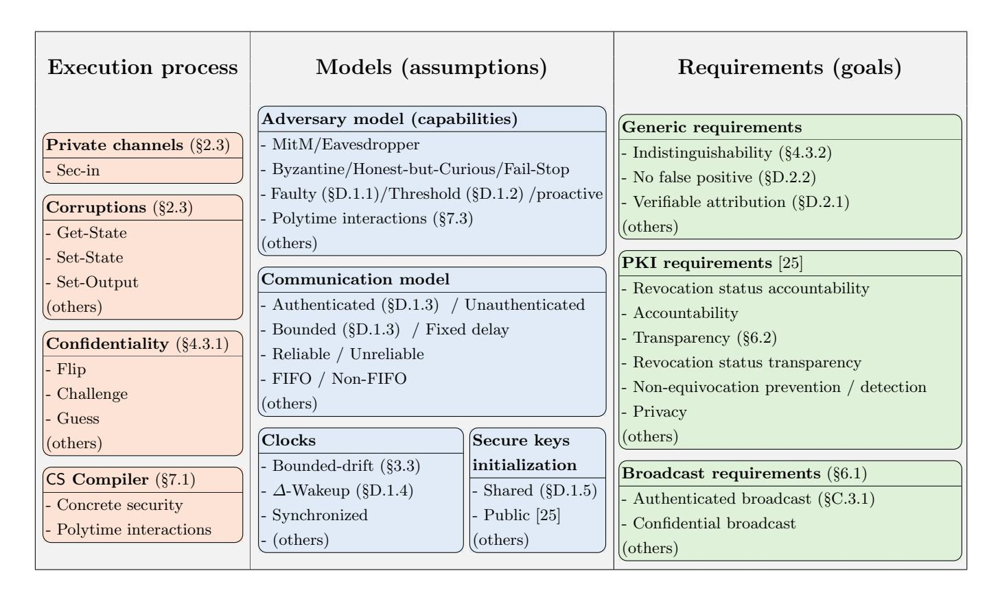
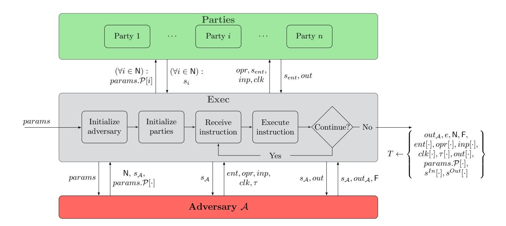
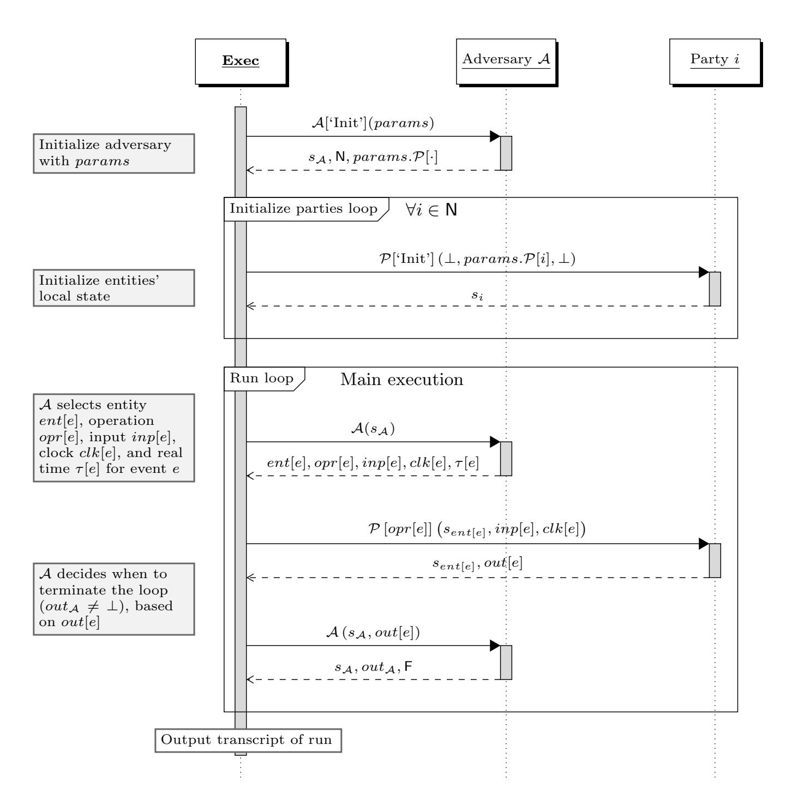

{0}------------------------------------------------

## MoSS: Modular Security Specifications Framework

Amir Herzberg<sup>1</sup> , Hemi Leibowitz<sup>2</sup> , Ewa Syta<sup>3</sup> , and Sara Wr´otniak<sup>1</sup>

<sup>1</sup> Dept. of Computer Science and Engineering, University of Connecticut, Storrs, CT <sup>2</sup> Dept. of Computer Science, Bar-Ilan University, Ramat Gan, Israel <sup>3</sup> Dept. of Computer Science, Trinity College, Hartford, CT

Abstract. Applied cryptographic protocols have to meet a rich set of security requirements under diverse environments and against diverse adversaries. However, currently used security specifications, based on either simulation [\[11,](#page-29-0)[28\]](#page-30-0) (e.g., 'ideal functionality' in UC) or games [\[8,](#page-29-1)[30\]](#page-30-1), are monolithic, combining together different aspects of protocol requirements, environment and assumptions. Such security specifications are complex, error-prone, and foil reusability, modular analysis and incremental design.

We present the Modular Security Specifications (MoSS) framework, which cleanly separates the security requirements (goals) which a protocol should achieve, from the models (assumptions) under which each requirement should be ensured. This modularity allows us to reuse individual models and requirements across different protocols and tasks, and to compare protocols for the same task, either under different assumptions or satisfying different sets of requirements. MoSS is flexible and extendable, e.g., it can support both asymptotic and concrete definitions for security. So far, we confirmed the applicability of MoSS to two applications: secure broadcast protocols and PKI schemes.

### 1 Introduction

Precise and correct models, requirements and proofs are the best way to ensure security. Unfortunately, it is hard to write them, and easy-to-make subtle errors often result in vulnerabilities and exploits; this happens even to the best cryptographers, with the notable exception of the reader. Furthermore, 'the devil is in the details'; minor details of the models and requirements can be very significant, and any inaccuracies or small changes may invalidate proofs.

This article is based on an earlier article: Herzberg A., Leibowitz H., Syta E., Wr´otniak S. (2021) MoSS: Modular Security Specifications Framework. In: Malkin T., Peikert C. (eds) Advances in Cryptology – CRYPTO 2021. CRYPTO 2021. Lecture Notes in Computer Science, vol 12827. Springer, Cham., ©IACR 2021 [https://doi.org/10.1007/978-3-030-84252-9\\_2](https://doi.org/10.1007/978-3-030-84252-9_2).

{1}------------------------------------------------

Provable security has its roots in the seminal works rigorously proving security for constructions of cryptographic primitives, such as signature schemes [\[18\]](#page-30-2), encryption schemes [\[17\]](#page-30-3) and pseudorandom functions [\[16\]](#page-30-4). Provable security under well-defined assumptions is expected from any work presenting a new design or a new cryptographic primitive. With time, the expectation of a provablysecure design has also extended to applied cryptographic protocols, with seminal works such as [\[4,](#page-29-2) [7\]](#page-29-3). After repeated discoveries of serious vulnerabilities in 'intuitively designed' protocols [\[15\]](#page-29-4), proofs of security are expected, necessary and appreciated by practitioners. However, provable security is notoriously challenging and error-prone for applied cryptographic protocols, which often aim to achieve complex goals under diverse assumptions intended to reflect real-world deployment scenarios. In response, we present the MoSS framework.

MoSS: Modular Security Specifications. In MoSS, a security specification includes a set of models (assumptions) and specific requirements (goals); models and requirements are defined using predicates and probability functions. By defining each model and requirement separately, we allow modularity, standardization and reuse. This modularity is particularly beneficial for applied protocols, due to their high number of requirements and models; see [Figure 1.](#page-1-0)

<span id="page-1-0"></span>

Fig. 1: The MoSS framework allows security to be specified modularly, i.e., '`a la carte', with respect to a set of individually-defined models (assumptions), requirements (properties/goals) and even operations of the execution process. Models, requirements and operations defined in this paper or in [\[19,](#page-30-6) [25\]](#page-30-5) are marked accordingly. Many models, and some ('generic') requirements, are applicable to different types of protocols.

MoSS also includes a well-defined execution process [\(Figure 2](#page-6-0) and [Algo](#page-7-0)[rithm 1\)](#page-7-0), as necessary for provable security. For simplicity, the 'core' execution 

{2}------------------------------------------------

process is simple, and supports modular extensions, allowing support for some specific features which are not always needed. Let us now discuss each of these three components of MoSS in more detail.

Models are used to reflect different assumptions made for a protocol, such as the adversary capabilities, communication (e.g., delays and reliability), synchronization, initialization and more. For each 'category' of assumptions, there are multiple options available: e.g., MitM or eavesdropper for the adversary model; threshold for the corruption model; asynchronous, synchronous, or bounded delay for the communication delays model; or asynchronous, synchronous, syntonized, or bounded drift for the clock synchronization model. Often, a model can be reused in many works, since, in MoSS, each model is defined independently of other models and of requirements, as one or more pairs of a small predicate ('program') and a probability function. This approach facilitates the reuse of models and also makes it easier to write, read and compare different works. For example, many protocols, for different tasks, use the same clock and communication models, e.g., synchronous communication and clocks. At the same time, protocols for the same task may use different models, e.g., bounded delay communication and bounded drift clocks.

Requirements refer to properties or goals which a protocol aims for. Protocols for the same problem may achieve different requirements, which may be comparable (e.g., equivocation detection vs. equivocation prevention) or not (e.g., accountability vs. transparency). While many requirements are task specific, some generic requirements are applicable across different tasks; e.g., a no false positive requirement to ensure that an honest entity should never be considered 'malicious' by another honest entity.

Execution process. MoSS has a well-defined execution process (see [Figure 2](#page-6-0) and [Algorithm 1\)](#page-7-0) which takes as input a protocol to execute, an adversary, parameters and a set of execution operations. The execution operations allow customized extensions of the execution process, i.e., they enhance the basic execution process with operations which may not always be required. We use these additional operations to define specifications such as indistinguishability, sharedkey initialization and entity corruptions.

Related work. A significant amount of work in applied cryptography is informally specified, with specifications presented as a textual list of assumptions (models) and goals (requirements). Obviously, this informal approach does not facilitate provable security. For provable security, there are two main approaches for defining security specifications: simulation-based and game-based.

The simulation-based approach, most notably Universal Composability (UC) [\[11,](#page-29-0) [12\]](#page-29-5), typically defines security as indistinguishability between executions of the given protocol with the adversary, and executions of an 'ideal functionality', which blends together the model and requirements, with a simulator. There are multiple extensions and alternatives to UC, such as iUC, GNUC, IITM and simplified-UC [\[10,](#page-29-6) [21,](#page-30-7) [23,](#page-30-8) [31\]](#page-30-9), and other simulation-based frameworks such as constructive cryptography (CC) [\[27,](#page-30-10) [28\]](#page-30-0) and reactive systems [\[1\]](#page-29-7). Each of these variants defines a specific, fixed execution model. An important reason for the

{3}------------------------------------------------

<span id="page-3-0"></span>

| Approach         | Specifications                         |        |                                            | Multiple       | Provsecure  |
|------------------|----------------------------------------|--------|--------------------------------------------|----------------|-------------|
|                  | Exec Process                           | Models | Requirements                               | specifications | composition |
| Informal         | -                                      | List   | List                                       | Yes            | No          |
| Game-based       | Game per goal; models are part of game |        |                                            | Yes            | No          |
| Simulation-based | Fixed                                  |        | Indistinguishable from Ideal Functionality | No             | Yes         |
| MoSS             | Extensible                             | List   | List                                       | Yes            | No          |

Table 1: A comparison of different approaches to security specifications. An execution process defines executions (runs). A protocol aims to satisfy certain requirements assuming certain models. Simulation-based specifications, such as UC [\[12\]](#page-29-5), ensure provably-secure composition of protocols but do not allow one protocol to meet multiple separately-defined specifications. Some tasks, e.g. zero-knowledge, may only have simulation-based specifications.

popularity of the simulation-based approach is its support for secure composition of protocols; another reason is the fact that some important tasks, e.g., zero-knowledge (ZK), seem to require simulation-based definitions. However, for many tasks, especially applied tasks, game-based definitions are more natural and easier to work with.

The game-based approach [\[8,](#page-29-1) [20,](#page-30-11) [30\]](#page-30-1) is also widely adopted, especially among practitioners, due to its simpler, more intuitive definitions and proofs of security. In this approach, each requirement is defined as a game between the adversary and the protocol. The game incorporates the models, the execution process, and the specific requirement (e.g., indistinguishability). However, the game-based approach does have limitations, most notably, there is no composition theorem for game-based specifications and it may be inapplicable to tasks such as zeroknowledge proofs and multi-party computation.

Both 'game-based' and 'simulation-based' security specifications are monolithic: an ideal functionality or a game, combining security requirements with different aspects of the model and the execution process. Even though different requirements and models are individually presented in their informal descriptions, the designers and readers have to validate directly that the formal, monolithic specifications correctly reflect the informal descriptions.

Such monolithic specifications are not a good fit for analysis of applied protocols, which have complex requirements and models, and it stands in sharp contrast to the standard engineering approach, where specifications are gradually developed and carefully verified at each step, often using automated tools. While there exist powerful tools to validate security of cryptographic protocols [\[2\]](#page-29-8), there are no such tools to validate the specifications.

We began this work after trying to write simulation-based as well as gamebased specifications for PKI schemes, which turned out to be impractical given the complexity of realistic modeling aspects; this motivated us to develop modular security specifications, i.e., MoSS.

In [Table 1,](#page-3-0) we compare MoSS to game-based and simulation-based security specifications. The advantage of MoSS is its modularity; a security specification 

{4}------------------------------------------------

consists of one or more models, one or more requirements and, optionally, some execution process operations. Each model and requirement is defined independently, as one or more pairs of a small predicate (which is, typically, a simple program) and a probability function. Models are often applicable to different tasks, and some requirements are generic and apply to multiple tasks. This modular approach allows to reuse models and requirements, which makes it easier to write, understand and compare specifications. For example, in Appendix [C,](#page-39-0) we present a simplified instance of an authenticated-broadcast protocol assuming (welldefined) bounded delay and bounded clock drift models.Appendix [Di](#page-59-1)ncludes more models and requirements. The same models are used for PKI schemes in [\[25\]](#page-30-5).

The use of separate, focused models and requirements also allows a gradual protocol development and analysis. To illustrate, we first analyze the authenticatedbroadcast protocol assuming only a secure shared-key initialization model, which suffices to ensure authenticity but not freshness. We then show that the protocol also achieves freshness when we also assume bounded clock drift. Lastly, we show that by additionally assuming bounded-delay communication, we can ensure a bounded delay for the broadcast protocol. This gradual approach makes the analysis easier to perform and understand (and to identify any design flaws early on), especially when compared to proving such properties using monolithic security specifications (all at once). Using MoSS is a bit like playing Lego with models and requirements!

Concrete security [\[5\]](#page-29-9) is especially important for protocols used in practice as it allows to more precisely define security of a given protocol and to properly select security parameters, in contrast to asymptotic security. Due to its modularity, MoSS also supports concrete security in a way we consider simple and even elegant; see Section [7.2.](#page-25-0)

Ensuring polytime interactions. As pointed out in [\[11,](#page-29-0) [22\]](#page-30-12), the 'classical' notion of PPT algorithms is not sufficient for analysis of interactive systems, where the same protocol (and adversary) can be invoked many times. This issue is addressed by later versions of UC and in some other recent frameworks, e.g., GNUC [\[21\]](#page-30-7). The extendability of MoSS allows it to handle these aspects relatively simply; (see Section [7.3](#page-27-0) and Appendix [B\)](#page-32-0).

Modularity lemmas. In Section [5,](#page-19-0) we present several asymptotic security modularity lemmas, which allow combining 'simple' models and requirements into composite models and requirements, taking advantage of MoSS's modularity. We provide proofs and corresponding concrete security modularity lemmas in Appendices [E](#page-69-0) and [F.](#page-71-0)

Limitations of MoSS. Currently, MoSS has two significant limitations: the lack of computer-aided tools, available for both game-based and simulationbased approaches [\[2,](#page-29-8)[3,](#page-29-10)[9,](#page-29-11)[29\]](#page-30-13), and the lack of composability, an important property proven for most simulation-based frameworks, most notably UC [\[11\]](#page-29-0).

We believe that MoSS is amenable to computer-aided tools. For example, a tool may transform the modular MoSS security specifications into a monolithic game or an ideal functionality, allowing to use the existing computer-aided tools. 

{5}------------------------------------------------

However, development of such tools is clearly a challenge yet to be met. Another open challenge is to prove a composability property directly for MoSS security specifications, or to provide (MoSS-like) modular specifications for UC and other simulation-based frameworks.

It is our hope that MoSS may help to bridge the gap between the theory and practice in cryptography, and to facilitate meaningful, provable security for practical cryptographic protocols and systems.

Real-world application of MoSS: PKI. Public Key Infrastructure (PKI) schemes, a critical component of applied cryptography, amply illustrate the challenges of applying provable security in practice and serve as a good example of how MoSS might benefit practical protocols. Current PKI systems are mostly based on the X.509 standard [\[14\]](#page-29-12), but there are many other proposals, most notably, Certificate Transparency (CT) [\[24\]](#page-30-14), which add significant goals and cryptographic mechanisms. Realistic PKI systems have non-trivial requirements; in particular, synchronization is highly relevant and needed to deal with even such basic aspects as revocation.

Recently, we presented the first rigorous study [\[25\]](#page-30-5) of practical[4](#page-5-0) PKI schemes by using MoSS. Specifically, we defined model and requirement predicates for practical PKI schemes and proved security of the X.509 PKI scheme. The analysis uses the bounded-delay and bounded-drift model predicates; similarly, followup work is expected to reuse these models and requirement predicates to prove security for additional PKI schemes, e.g., Certificate Transparency.

Organization. Section [2](#page-5-1) introduces Exec, the adversary-driven execution process. Section [3](#page-12-0) and Section [4](#page-15-0) present models and requirements, respectively, and App. [D](#page-59-1) describes several additional examples of useful models and requirements. Section [5](#page-19-0) presents modularity lemmas. Section [6](#page-21-1) shows how to apply MoSS to two different applications, a simplified authenticated broadcast protocol, further described in App. [C,](#page-39-0) and PKI schemes. Section [7](#page-23-1) describes extensions of the framework to achieve concrete security and to ensure polytime interactions, with additional details in App. [B.](#page-32-0) We conclude and discuss future work in Section [8.](#page-28-0)

### <span id="page-5-1"></span>2 Execution Process

A key aspect of MoSS is the separation of the execution process from the model M under which a protocol P is analyzed, and the requirements R that define P's goals. This separation allows different model assumptions using the same execution process, simplifying the analysis and allowing reusability of definitions and results. In this section, we present MoSS's execution process, which defines the execution of a given protocol P 'controlled' by a given adversary A. We say that it is 'adversary-driven' since the adversary controls all inputs and invocations of the entities running the protocol.

<span id="page-5-0"></span><sup>4</sup> Grossly-simplified PKI ideal functionalities were studied, e.g., in [\[21\]](#page-30-7), but without considering even basic aspects such as revocation and expiration.

{6}------------------------------------------------

### <span id="page-6-1"></span>2.1 Exec<sub>A,P</sub>: An Adversary-Driven Execution Process

The execution process  $\mathbf{Exec}_{\mathcal{A},\mathcal{P}}(params)$ , as defined by the pseudo-code in Algorithm 1 and illustrated in Fig. 2 (see also a more elaborate illustration in Fig. 3 in App. A), specifies the details of running a given protocol  $\mathcal{P}$  with a given adversary  $\mathcal{A}$ , both modeled as efficient (PPT) functions, given parameters params. Note that the model  $\mathcal{M}$  is not an input to the execution process; it is only applied to the transcript T of the protocol run produced by  $\mathbf{Exec}_{\mathcal{A},\mathcal{P}}$ , to decide if the adversary adhered to the model, in effect restricting the adversary's capabilities.  $\mathbf{Exec}_{\mathcal{A},\mathcal{P}}$  allows the adversary to have an  $extensive \ control$  over the execution; the adversary decides, at any point, which entity is invoked next, with what operation and with what inputs.

<span id="page-6-0"></span>

Fig. 2: A high level overview of MoSS's execution process showing the interactions between the parties to the protocol and the adversary in  $\mathbf{Exec}_{\mathcal{A},\mathcal{P}}$ . (Note: e, in the final execution transcript T, is the total number of iterations of the loop.)

**Notation.** To allow the execution process to apply to protocols with multiple functions and operations, we define the entire protocol  $\mathcal{P}$  as a single PPT algorithm and use parameters to specify the exact operations and their inputs. Specifically, to invoke an operation defined by  $\mathcal{P}$  over some entity i, we use the following notation:  $\mathcal{P}[opr](s,inp,clk)$ , where opr identifies the specific 'operation' or 'function' to be invoked, s is the local state of entity i, inp is the set of inputs to opr, and clk is the value of the local clock of entity i. The output of such execution is a tuple (s',out), where s' is the state of entity i after the operation is executed and out is the output of the executed operation, which is made available to the adversary. We refer to  $\mathcal{P}$  as an 'algorithm' (in PPT) although we do not consider the operation as part of the input, i.e., formally,  $\mathcal{P}$  maps from the operations (given as strings) to algorithms; this can be inter-

{7}------------------------------------------------

preted as P accepting the 'label' as additional input and calling the appropriate 'subroutine', making it essentially a single PPT algorithm.

[Algorithm 1](#page-7-0) uses the standard index notation to refer to cells of arrays. For example, out[e] refers to the value of the e th entry of the array out. Specifically, e represents the index (counter) of execution events. Note that e is never given to the protocol; every individual entity has a separate state, and may count the events that it is involved in, but if there is more than one entity, an entity cannot know the current value of e - it is not a clock. Even the adversary does not control e, although, the adversary can keep track of it in its state, since it is invoked (twice) in every round. Clocks and time are handled differently, as we now explain.

In every invocation of the protocol, one of the inputs set by the adversary is referred to as the local clock and denoted clk. In addition, in every event, the adversary defines a value τ which we refer to as the real time clock. Thus, to refer to the local clock value and the real time clock value of event e, the execution process uses clk[e] and τ [e], respectively. Both clk and τ are included in the transcript T; this allows a model predicate to enforce different synchronization models/assumptions - or not to enforce any, which implies a completely asynchronous model.

```
Algorithm 1 Adversary-Driven Execution Process ExecA,P (params)
1: (sA, N, params.P[·]) ← A['Init'](params) . Initialize A with params
2: ∀i ∈ N : si ← P['Init'] (⊥, params.P[i], ⊥) . Initialize entities' local states
3: e ← 0 . Initialize loop's counter
4: repeat
5: e ← e + 1 . Advance the loop counter
6: (ent[e], opr[e], inp[e], clk[e], τ[e]) ← A(sA) .
                                                A selects entity ent[e], opera-
                                                tion opr[e], input inp[e], clock
                                                clk[e], and real time τ[e] for
                                                event e
7: s
      In[e] ← sent[e] . Save input state
8: 
      sent[e]
          , out[e]
                ← P [opr[e]] 
                          sent[e]
                               , inp[e], clk[e]

9: s
      Out[e] ← sent[e] . Save output state
10: (sA, outA, F) ← A (sA, out[e]) .
                                                A decides when to terminate
                                                the loop (outA 6= ⊥), based on
                                                out[e]
11: until outA 6= ⊥
12: T ←

        outA, e, N, F, ent[·], opr[·], inp[·], clk[·], τ[·], out[·], params.P[·], sIn[·], sOut[·]

13: Return T . Output transcript of run
```

Construction. The execution process [\(Algorithm 1\)](#page-7-0) consists of three main components: the initialization, main execution loop and termination.

{8}------------------------------------------------

Initialization (lines 1-3). In line 1, we allow the adversary to set their state  $s_A$ , to choose the set of entities N, and to choose parameters params.  $\mathcal{P}[i]$  for protocol initialization for each entity  $i \in \mathbb{N}$ . Note that each params. $\mathcal{P}[i]$  can include all of the parameters params given to the execution process, some of the parameters from params, or entirely different parameters, chosen by the adversary; however, the allowed values of  $params.\mathcal{P}[\cdot]$  (including their relation to params) can be restricted using models (see Sec. 3), since the values set by the adversary are returned in the transcript T (lines 12-13). In line 2, we set the initial state  $s_i$  for each entity i by invoking the protocol-specific 'Init' operation with input  $params.\mathcal{P}[i]$ ; note that this implies a convention where protocols are initialized by this operation - all other operations are up to the specific protocol. The reasoning behind such convention is that initialization is an extremely common operation in many protocols; that said, protocols without initialization can use an empty 'Init' operation and protocols with a complex initialization process can use other operations defined in  $\mathcal{P}$  in the main execution loop (lines 4-11), to implement an initialization process which cannot be performed via a single 'Init' call. In line 3, we initialize e, which we use to index the events of the execution, i.e., e is incremented by one (line 5) each time we complete one 'execution loop' (lines 4-11).

Main execution loop (lines 4-11). The execution process affords the adversary  $\mathcal{A}$  extensive control over the execution. Specifically, in each event e,  $\mathcal{A}$  determines (line 6) an operation opr[e], along with its inputs, to be invoked by an entity  $ent[e] \in \mathbb{N}$ . The adversary also selects  $\tau[e]$ , the global, real time clock value. Afterwards, the event is executed (line 8). The entity's input and output states are saved in  $s^{In}[e]$  and  $s^{Out}[e]$ , respectively (lines 7 and 9), which allows models to place restrictions on the states of entities.

In line 10, the adversary processes the output out[e] of the operation opr[e]. The adversary may modify its state  $s_{\mathcal{A}}$ , and outputs a value  $out_{\mathcal{A}}$ ; when  $out_{\mathcal{A}} \neq \bot$ , the execution moves to the termination phase; otherwise the loop continues.

Termination (lines 12-13). Upon termination, the process returns the execution transcript T (line 13), containing the relevant values from the execution. Namely, T contains the adversary's output  $out_{\mathcal{A}}$ , the index of the last event e, the set of entities  $\mathbb{N}$ , and the set of faulty entities  $\mathbb{F}$  (produced in line 10), the values of  $ent[\cdot]$ ,  $opr[\cdot]$ ,  $inp[\cdot]$ ,  $clk[\cdot]$ ,  $\tau[\cdot]$  and  $out[\cdot]$  for all invoked events, the protocol initialization parameters  $params.\mathcal{P}[\cdot]$  for all entities in  $\mathbb{N}$ , and the entity's input state  $s^{In}[\cdot]$  and output state  $s^{Out}[\cdot]$  for each event. We allow  $\mathcal{A}$  to output  $\mathbb{F}$  to accommodate different fault modes, i.e., an adversary model can specify which entities are included in  $\mathbb{F}$  (considered 'faulty') which then can be validated using an appropriate model.

### 2.2 The Extendable Execution Process

In Section 2.1, we described the design of the generic  $\mathbf{Exec}_{\mathcal{A},\mathcal{P}}$  execution process, which imposes only some basic limitations. We now describe the *extendable* execution process  $\mathbf{Exec}_{\mathcal{A},\mathcal{P}}^{\mathcal{X}}$ , an extension of  $\mathbf{Exec}_{\mathcal{A},\mathcal{P}}$ , which provides additional

{9}------------------------------------------------

flexibility with only few changes to ExecA,<sup>P</sup> . The extendable execution process Exec<sup>X</sup> <sup>A</sup>,<sup>P</sup> allows MoSS to (1) handle different kinds of entity-corruptions (described next) and (2) define certain other models/requirements, e.g., indistinguishability requirements (Section [4.3\)](#page-16-1); other applications may be found.

The Exec<sup>X</sup> <sup>A</sup>,<sup>P</sup> execution process, as defined by the pseudo-code in Algorithm [2,](#page-10-0) specifies the details of running a given protocol P with a given adversary A, both modeled as efficient (PPT) functions, given a specific set of execution operations X and parameters params. The set[5](#page-9-0) X is a specific set of extra operations through which the execution process provides built-in yet flexible support for various adversarial capabilities. For example, the set X can contain functions which allow the adversary to perform specific functionality on an entity, functionality which the adversary cannot achieve via the execution of P. We detail and provide concrete examples of such functionalities in Section [2.3.](#page-11-0)

Changes to the Exec<sup>A</sup>,<sup>P</sup> execution process. In addition to the extensive control the adversary had over the execution, the adversary now can decide not only which entity is invoked next, but also whether the operation is from the set X of execution operations, or from the set of operations supported by P; while we did not explicitly write it, some default values are returned if the adversary specifies an operation which does not exist in the corresponding set.

To invoke an operation defined by P over some entity i, we use the same notation as before, but the output of such execution contains an additional output value sec-out, where sec-out[e][·] is a 'secure output' - namely, it contains values that are shared only with the execution process itself, and not shared with the adversary; e.g., such values may be used, if there is an appropriate operation in X , to establish a 'secure channel' between parties, which is not visible to A. In sec-out, the first parameter denotes the specific event e in which the secure output was set; the second one is optional, e.g., may specify the 'destination' of the secure output. Similarly, X is also defined as a single PPT algorithm and we use a similar notation to invoke its operations: X [opr](s<sup>X</sup> , s, inp, clk, ent), where opr, s, inp, clk are as before, and s<sup>X</sup> is the execution process's state and ent is an entity identifier.

Construction. The extended execution process [\(Algorithm 2\)](#page-10-0) consists of the following modifications. The initialization phase (lines [1-4\)](#page-10-0) has one additional line (line [3\)](#page-10-0), where we initialize the 'execution operations state' s<sup>X</sup> ; this state is used by execution operations (in X ), allowing them to be defined as (stateless) functions. Note that any set of execution operations X is assumed to contain an 'Init' operation, and we may omit the 'Init' operation from the notation when specifying X ; if it is omitted, the 'default' 'Init' operation is assumed, which simply outputs (params, params.P[·]). The rest of the initialization lines are the same.

The main execution loop (lines [5-16\)](#page-10-0) is as before, but with one difference, where the adversary A determines in line [7](#page-10-0) the type of operation type[e] to be invoked by an entity ent[e] ∈ N. The operation type type[e] ∈ {'X ', 'P'}

<span id="page-9-0"></span><sup>5</sup> We use the term 'set', but note that X is defined as a single PPT algorithm, similarly to how P is defined.

{10}------------------------------------------------

```
Algorithm 2 Extendible Adversary-Driven Execution Process ExecX
                                                                A,P (params)
1: (sA, N, params.P[·]) ← A['Init'](params) . Initialize A with params
2: ∀i ∈ N : si ← P['Init'] (⊥, params.P[i], ⊥) . Initialize entities' local states
3: sX ← X['Init'](params, params.P[·]) . Initial exec state
4: e ← 0 . Initialize loop's counter
5: repeat
6: e ← e + 1 . Advance the loop counter
7: (ent[e], opr[e], type[e], inp[e], clk[e], τ[e]) ← A(sA) .
                                                 A selects entity ent[e], opera-
                                                 tion opr[e], input inp[e], clock
                                                 clk[e], and real time τ[e] for
                                                 event e
8: s
      In[e] ← sent[e] . Save input state
9: if type[e] = 'X' then .
                                                 If A chose to invoke an oper-
                                                 ation from X .
10: 
         sX , sent[e], out[e], sec-out[e][·]
                                  ← X [opr[e]] 
                                              sX , sent[e], inp[e], clk[e], ent[e]

11: else .
                                                 A chose to invoke an opera-
                                                 tion from P.
12: 
         sent[e]
              , out[e], sec-out[e][·]
                             ← P [opr[e]] 
                                        sent[e]
                                            , inp[e], clk[e]

13: end if
14: s
      Out[e] ← sent[e] . Save output state
15: (sA, outA, F) ← A (sA, out[e]) .
                                                 A decides when to terminate
                                                 the loop (outA 6= ⊥), based on
                                                 out[e]
16: until outA 6= ⊥
17: T ←

        outA, e, N, F, ent[·], opr[·], type[·], inp[·], clk[·], τ[·], out[·], params.P[·], sIn[·], sOut[·], sec-out[·][·]
```

indicates if the operation opr[e] is protocol-specific (defined in P) or is it one of the execution process operations (defined in X ). (If type[e] ∈ { / 'X ', 'P'}, then the execution process assumes that the operation is protocol-specific.) Afterwards, the event is executed (lines [9-12\)](#page-10-0) through the appropriate algorithm, based on the operation type, either X , if type[e] = 'X ', or P otherwise.

18: Return T . Output transcript of run

The termination phase (lines [17-18\)](#page-10-0) is the same as before, but also includes in the transcript the type[·] values and the sec-out[·][·] for all invoked events. Private values, such as entities' private keys, are not part of the execution transcript unless they were explicitly included in the output due to an invocation of an operation from X that would allow it.

Note: We assume that X operations are always defined such that whenever X is invoked, it does not run A and only runs P at most once (per invocation of X ). Also, in lines [7](#page-10-0) and [15,](#page-10-0) the operation to A is not explicitly written in the pseudo-code. We assume that in fact nothing is given to A for the operation 

{11}------------------------------------------------

(length 0) - this implies that A will not be re-initialized during the execution process.

### <span id="page-11-0"></span>2.3 Using X to Define Specification and Entity-Faults Operations

The 'default' execution process is defined by an empty X set. This provides the adversary A with Man-in-the-Middle (MitM) capabilities, and even beyond: A receives all outputs, including messages sent, and controls all inputs, including messages received; furthermore, A controls the values of the local clocks. A non-empty set X can be used to define specification operations and entity-fault operations; let us discuss each of these two types of execution process operations.

Specification operations. Some model and requirement specifications require a special execution process operation, possibly involving some information which must be kept private from the adversary. One example are indistinguishability requirements, which are defined in Sec. [4.3.1](#page-16-0) using three operations in X : 'Flip', 'Challenge' and 'Guess', whose meaning most readers can guess (and confirm the guess in Sec. [4.3.1\)](#page-16-0).

The 'Sec-in' X -operation. As a simple example of a useful specification operation, we now define the 'Sec-in' operation, which allows the execution process to provide a secure input from one entity to another, bypassing the adversary's MitM capabilities. This operation can be used for different purposes, such as to assume secure shared-key initialization - for example, see App. [C.2.](#page-40-0) We define the 'Sec-in' operation in [Equation 1.](#page-11-1)[6](#page-11-2)

<span id="page-11-1"></span>
$$\mathcal{X}[\text{`Sec-in'}](s_{\mathcal{X}}, s, e', clk, ent) \equiv [s_{\mathcal{X}}||\mathcal{P}[\text{`Sec-in'}](s, sec-out[e'][ent], clk)]$$
 (1)

As can be seen, invocation of the 'Sec-in' operation returns the state s<sup>X</sup> unchanged (and unused); the other outputs are simply defined by invoking the 'Sec-in' operation of the protocol P, with input sec-out[e 0 ][ent] - the sec-out output of the event e 0 intended for entity ent.

Note, that although 'Sec-in' facilitates delivery of data from some entity to another while ensuring that the adversary is unable to access this data, it does not provide authentication, namely, the receiving entity cannot rely on the authenticity of the inputted data.

Entity-fault operations. It is quite easy to define X -operations that facilitate different types of entity-fault models, such as honest-but-curious, byzantine (malicious), adaptive, proactive, self-stabilizing, fail-stop and others. Let us give informal examples of three fault operations:

'Get-state': provides A with the entire state of the entity. Assuming no other entity-fault operation, this is the 'honest-but-curious' adversary; note that the adversary may invoke 'Get-state' after each time it invokes the entity, to know its state all the time.

'Set-output': allows A to force the entity to output specific values. A 'Byzantine' adversary would use this operation whenever it wants the entity to produce specific output.

<span id="page-11-2"></span><sup>6</sup> We use ≡ to mean 'is defined as'.

{12}------------------------------------------------

'Set-state': allows A to set any state to an entity. For example, the 'selfstabilization' model amounts to an adversary that may perform a 'Set-state' for every entity (once, at the beginning of the execution).

See discussion in App. [D.1.2,](#page-60-0) and an example: use of these 'fault operations' to define the threshold security model M<sup>|</sup>F|≤<sup>f</sup> , assumed by many protocols.

Comments. Defining these aspects of the execution in X , rather than having a particular choice enforced as part of the execution process, provides significant flexibility and makes for a simpler execution process.

Note that even when the set X is non-empty, i.e., contains some non-default operations, the adversary's use of these operations may yet be restricted for the adversary to satisfy a relevant model. We present model specifications in Sec. [3.](#page-12-0)

The operations in X are defined as (stateless) functions. However, the execution process provides state s<sup>X</sup> that these operations may use to store values across invocations; the same state variable may be used by different operations. For example, the 'Flip', 'Challenge' and 'Guess' X -operations, used to define indistinguishability requirements in Sec. [4.3.1,](#page-16-0) use s<sup>X</sup> to share the value of the bit flipped (by the 'Flip' operation).

### <span id="page-12-0"></span>3 Models

The execution process, described in Sec. [2,](#page-5-1) specifies the details of running a protocol P against an adversary A which has an extensive control over the execution. In this section, we present two important concepts of MoSS: a model M, used to define assumptions about the adversary and the execution, and specifications (π, β). We use specifications[7](#page-12-1) to define both models (in this section) and requirements (in Sec. [4\)](#page-15-0).

A MoSS (model/requirement) specification is a pair of functions (π, β), where π(T, params) is called the predicate (and returns > or ⊥) and β(params) is the base (probability) function (and evaluates to values from 0 to 1). The predicate π is applied to the execution-transcript T and defines whether the adversary 'won' or 'lost'. The base function β is the 'inherent' probability of the adversary 'winning'; it is often simply zero (β(x) = 0), e.g., for forgery in a signature scheme, but sometimes a constant such as half (for indistinguishability specifications) or a function such as 2<sup>−</sup><sup>l</sup> (e.g., for l-bit MAC) of the parameters params.

A MoSS model is defined as a set of (one or more) specifications, i.e., M = {(π1, β1), . . .}. When the model contains only one specification, we may abuse notation and write M = (π, β) for convenience.

For example, consider a model M = (π, 0). Intuitively, adversary A satisfies model (π, 0), if for (almost) all execution-transcripts T of A, predicate π holds, i.e.: π(T, params) = >, where params are the parameters used in the execution process (Sec. [3.1\)](#page-13-0). One may say that the model ensures that the (great) power that the adversary holds over the execution is used 'with great responsibility'.

<span id="page-12-1"></span><sup>7</sup> We use the term 'specification' to refer to a component of a model (or of a requirement - see Sec. [4\)](#page-15-0). This is not to be confused with 'security specification', which we use to mean a model, requirement, and specific execution process.

{13}------------------------------------------------

The separation between the execution process and the model allows to use the same - relatively simple - execution process for the analysis of many different protocols, under different models (of the environment and adversary capabilities). Furthermore, it allows to define multiple simple models, each focusing on a different assumption or restriction, and require that the adversary satisfy all of them.

As depicted in Figure 1, the model captures all of the assumptions regarding the environment and the capabilities of the adversary, including aspects typically covered by the (often informal) communication model, synchronization model and adversary model:

**Adversary model:** The adversary capabilities such as MitM vs. eavesdropper, entity corruption capabilities (e.g., threshold or proactive security), computational capabilities and more.

**Communication model:** The properties of the underlying communication mechanism, such as reliable or unreliable communication, FIFO or non-FIFO, authenticated or not, bounded delay, fixed delay or asynchronous, and so on.

**Synchronization model:** The availability and properties of per-entity clocks. Common models include purely asynchronous clocks (no synchronization), bounded-drift clocks, and synchronized or syntonized clocks.

The definitions of models and their predicates are often simple to write and understand - and yet, reusable across works.

In Sec. 3.1, we define the concept of a specification. In Sec. 3.2, we define the notion of a *model-satisfying adversary*. Finally, in Sec. 3.3, we give an example of a model. Additional examples of models are given later in this paper, mainly in D.1.

#### <span id="page-13-0"></span>3.1 Specifications

We next define the *specification*, used to define both *models* and *requirements*.

A specification is a pair  $(\pi, \beta)$ , where  $\pi$  is the specification predicate and  $\beta$  is the base function. A specification predicate is a predicate whose inputs are execution transcript T and parameters params. When  $\pi(T, params) = \top$ , we say that execution satisfies the predicate  $\pi$  for the given value of params. The base function gives the 'base' probability of success for an adversary. For integrity specifications, e.g. forgery, the base function is often either zero or  $2^{-l}$ , where l is the output block size; and for indistinguishability-based specifications (see Sec. 4.3), the base function is often  $\frac{1}{2}$ .

We next define the  $advantage^8$  of adversary  $\mathcal{A}$  against protocol  $\mathcal{P}$  for specification predicate  $\pi$  using execution operations  $\mathcal{X}$ , as a function of the parameters params. This is the probability that  $\pi(T, params) = \bot$ , for the transcript T of a random execution:  $T \leftarrow \mathbf{Exec}_{\mathcal{A},\mathcal{P}}^{\mathcal{X}}(params)$ .

<span id="page-13-2"></span><span id="page-13-1"></span><sup>&</sup>lt;sup>8</sup> Note that the advantage of  $\mathcal{A}$  is the *total* probability of  $\mathcal{A}$  winning, i.e., it does not depend on a base function.

{14}------------------------------------------------

Definition 1 (Advantage of adversary  $\mathcal{A}$  against protocol  $\mathcal{P}$  for specification predicate  $\pi$  using execution operations  $\mathcal{X}$ ). Let  $\mathcal{A}, \mathcal{P}, \mathcal{X}$  be algorithms and let  $\pi$  be a specification predicate. The advantage of adversary  $\mathcal{A}$  against protocol  $\mathcal{P}$  for specification predicate  $\pi$  using execution operations  $\mathcal{X}$  is defined as:

$$\epsilon_{\mathcal{A},\mathcal{P},\mathcal{X}}^{\pi}(params) \stackrel{def}{=} \Pr \left[ \begin{array}{c} \pi\left(T,params\right) = \bot, \ where \\ T \leftarrow \mathbf{Exec}_{\mathcal{A},\mathcal{P}}^{\mathcal{X}}(params) \end{array} \right]$$
 (2)

### <span id="page-14-1"></span>3.2 Model-Satisfying Adversary

Models are sets of specifications, used to restrict the capabilities of the adversary and the events in the execution process. This includes limiting of the possible faults, defining initialization assumptions, and defining the communication and synchronization models. We check whether a given adversary  $\mathcal{A}$  followed the restrictions of a given model  $\mathcal{M}$  in a given execution by examining whether a random transcript T of the execution satisfies each of the model's specification predicates. Next, we define what it means for adversary  $\mathcal{A}$  to poly-satisfy model  $\mathcal{M}$  using execution operations  $\mathcal{X}$ .

<span id="page-14-2"></span>Definition 2 (Adversary  $\mathcal{A}$  poly-satisfies model  $\mathcal{M}$  using execution operations  $\mathcal{X}$ ). Let  $\mathcal{A}, \mathcal{X} \in PPT$ , and let  $\mathcal{M}$  be a set of specifications, i.e.,  $\mathcal{M} = \{(\pi_1, \beta_1), \ldots\}$ . We say that adversary  $\mathcal{A}$  poly-satisfies model  $\mathcal{M}$  using execution operations  $\mathcal{X}$ , denoted  $\mathcal{A} \models^{\mathcal{X}}_{poly} \mathcal{M}$ , if for every protocol  $\mathcal{P} \in PPT$ , params  $\in \{0,1\}^*$ , and specification  $(\pi,\beta) \in \mathcal{M}$ , the advantage of  $\mathcal{A}$  against  $\mathcal{P}$  for  $\pi$  using  $\mathcal{X}$  is at most negligibly greater than  $\beta$ (params), i.e.:

$$\mathcal{A} \models^{\mathcal{X}}_{poly} \mathcal{M} \stackrel{def}{=} \begin{bmatrix} (\forall \mathcal{P} \in PPT, params \in \{0, 1\}^*, (\pi, \beta) \in \mathcal{M}) : \\ \epsilon^{\pi}_{\mathcal{A}, \mathcal{P}, \mathcal{X}}(params) \leq \beta(params) + Negl(|params|) \end{bmatrix}$$
(3)

### <span id="page-14-0"></span>3.3 Example: the Bounded-Clock-Drift Model $\mathcal{M}_{\Delta_{clk}}^{\text{Drift}}$

To demonstrate a definition of a model, we present the  $\mathcal{M}_{\Delta_{clk}}^{\text{Drift}}$  model, defined as  $\mathcal{M}_{\Delta_{clk}}^{\text{Drift}} = (\pi_{\Delta_{clk}}^{\text{Drift}}, 0)$ . The predicate  $\pi_{\Delta_{clk}}^{\text{Drift}}$  bounds the clock drift, by enforcing two restrictions on the execution: (1) each local-clock value  $(clk[\hat{e}])$  must be within  $\Delta_{clk}$  drift from the real time  $\tau[\hat{e}]$ , and (2) the real time values should be monotonically increasing. As a special case, when  $\Delta_{clk} = 0$ , this predicate corresponds to a model where the local clocks are fully synchronized, i.e., there is no difference between entities' clocks. See Algorithm 3.

{15}------------------------------------------------

```
Algorithm 3 The \pi_{\Delta_{clk}}^{\text{Drift}} (T, params) predicate, used by the \mathcal{M}_{\Delta_{clk}}^{\text{Drift}} \equiv (\pi_{\Delta_{clk}}^{\text{Drift}}, 0) model
```

```
1: return (
2: \forall \hat{e} \in \{1, ..., T.e\}: \Rightarrow For each event
3: |T.clk[\hat{e}] - T.\tau[\hat{e}]| \leq \Delta_{clk} \Rightarrow Local clock is within \Delta_{clk} drift from real time
4: and if \hat{e} \geq 2 then T.\tau[\hat{e}] \geq T.\tau[\hat{e}-1] \Rightarrow real time difference is monotonically increasing
```

### <span id="page-15-0"></span>4 Requirements

In this section we define and discuss requirements. Like a model, a requirement is a set of specifications  $\mathcal{R} = \{(\pi_1, \beta_1), \ldots\}$ . When the requirement contains only one specification, we may abuse notation and write  $\mathcal{R} = (\pi, \beta)$  for convenience. Each requirement specification  $(\pi, \beta) \in \mathcal{R}$  includes a predicate  $(\pi)$  and a base function  $(\beta)$ . A requirement defines one or more properties that a protocol aims to achieve, e.g., security, correctness or liveness requirements. By separating between models and requirements, MoSS obtains modularity and reuse; different protocols may satisfy the same requirements but use different models, and the same models can be reused for different protocols, designed to satisfy different requirements.

The separation between the definition of the model and of the requirements also allows definition of generic requirement predicates., which are applicable to protocols designed for different tasks, which share some basic goals. We identify several generic requirement predicates that appear relevant to many security protocols. These requirement predicates focus on attributes of messages, i.e., non-repudiation, and on detection of misbehaving entities (see Appendix D.2).

### 4.1 Model-Secure Requirements

We next define what it means for a protocol to satisfy a requirement under some model. First, consider a requirement  $\mathcal{R} = (\pi, \beta)$ , which contains just one specification, and let b be the outcome of  $\pi$  applied to (T, params), where T is a transcript of the execution process  $(T = \mathbf{Exec}_{\mathcal{A},\mathcal{P}}^{\mathcal{X}}(params))$  and params are the parameters, i.e.,  $b \leftarrow \pi(T, params)$ ; if  $b = \bot$  then we say that requirement predicate  $\pi$  was not satisfied in the execution of  $\mathcal{P}$ , or that the adversary won in this execution. If  $b = \top$ , then we say that requirement predicate  $\pi$  was satisfied in this execution, or that the adversary lost.

We now define what it means for  $\mathcal{P}$  to poly-satisfy  $\mathcal{R}$  under model  $\mathcal{M}$  using execution operations  $\mathcal{X}$ .

<span id="page-15-2"></span>Definition 3 (Protocol  $\mathcal{P}$  poly-satisfies requirement  $\mathcal{R}$  under model  $\mathcal{M}$  using execution operations  $\mathcal{X}$ ). Let  $\mathcal{P}, \mathcal{X} \in PPT$ , and let  $\mathcal{R}$  be a set of specifications, i.e.,  $\mathcal{R} = \{(\pi_1, \beta_1), \ldots\}$ . We say that protocol  $\mathcal{P}$  poly-satisfies requirement  $\mathcal{R}$  under model  $\mathcal{M}$  using execution operations  $\mathcal{X}$ , denoted  $\mathcal{P} \models_{poly}^{\mathcal{M}, \mathcal{X}} \mathcal{R}$ , if for

{16}------------------------------------------------

every PPT adversary  $\mathcal{A}$  that poly-satisfies  $\mathcal{M}$  using execution operations  $\mathcal{X}$ , every parameters params  $\in \{0,1\}^*$ , and every specification  $(\pi,\beta) \in \mathcal{R}$ , the advantage of  $\mathcal{A}$  against  $\mathcal{P}$  for  $\pi$  using  $\mathcal{X}$  is at most negligibly greater than  $\beta(params)$ , i.e.:

$$\mathcal{P} \models^{\mathcal{M}, \mathcal{X}}_{poly} \mathcal{R} \stackrel{def}{=} \begin{bmatrix} (\forall \mathcal{A} \in PPT \ s.t. \ \mathcal{A} \models^{\mathcal{X}}_{poly} \mathcal{M}, \ params \in \{0, 1\}^*, \ (\pi, \beta) \in \mathcal{R}) : \\ \epsilon^{\pi}_{\mathcal{A}, \mathcal{P}, \mathcal{X}}(params) \leq \beta(params) + Negl(|params|) \end{bmatrix}$$

$$(4)$$

### 4.2 Example: the No False Accusations Requirement $\mathcal{R}_{\mathsf{NFA}}$

Intuitively, the No False Accusations (NFA) requirement  $\mathcal{R}_{\mathsf{NFA}}$  states that a nonfaulty entity  $a \not\in \mathsf{F}$  would never (falsely) accuse of a fault another non-faulty entity,  $b \not\in \mathsf{F}$ . It is defined as  $\mathcal{R}_{\mathsf{NFA}} = (\pi_{\mathsf{NFA}}, 0)$ . To properly define the  $\pi_{\mathsf{NFA}}$  requirement predicate, we first define a convention for one party, say  $a \in \mathsf{N}$ , to output an Indicator of Accusation, i.e., 'accuse' another party, say  $i_{\mathsf{M}} \in \mathsf{N}$ , of a fault. Specifically, we say that at event  $\hat{e}_A$  of the the execution, entity  $ent[\hat{e}_A]$  accuses entity  $i_{\mathsf{M}}$ , if  $out[\hat{e}_A]$  is a triplet of the form  $(\mathsf{IA}, i_{\mathsf{M}}, x)$ . The last value in this triplet, x, should contain the clock value at the first time that  $ent[\hat{e}_A]$  accused  $i_{\mathsf{M}}$ ; we discuss this in App. D as the value x is not relevant for the requirement predicate, and is just used as a convenient convention for some protocols.

The No False Accusations (NFA) predicate  $\pi_{\mathsf{NFA}}$  checks whether the adversary was able to cause one honest entity, say Alice, to accuse another honest entity, say Bob (i.e., both Alice and Bob are in  $\mathsf{N}-\mathsf{F}$ ). Namely,  $\pi_{\mathsf{NFA}}(T,params)$  returns  $\bot$  only if  $T.out[e] = (\mathsf{IA},j,x)$ , for some  $j \in T.\mathsf{N}$ , and both j and T.ent[e] are honest (i.e.,  $j, T.ent[e] \in T.\mathsf{N} - T.\mathsf{F}$ ).

#### **Algorithm 4** No False Accusations Predicate $\pi_{NFA}(T, params)$

```
1: return \neg(
2: T.ent[T.e] \in T.N - T.F \rightharpoonup T.ent[T.e] is an honest entity
3: and \exists j \in T.N - T.F, x s.t. (IA, j, x) \in T.out[T.e] \rightharpoonup T.ent[T.e] accused an honest entity
)
```

### <span id="page-16-1"></span>4.3 Supporting Confidentiality and Indistinguishability

The MoSS framework supports specifications for diverse goals and scenarios. We demonstrate this by showing how to define 'indistinguishability game'-based definitions, i.e., confidentiality-related specifications.

#### <span id="page-16-0"></span>4.3.1 Defining Confidentiality-Related Operations

To support confidentiality, we define the set  $\mathcal{X}$  to include the following three operations: 'Flip', 'Challenge', 'Guess'.

{17}------------------------------------------------

- 'Flip': selects a uniformly random bit  $s_{\mathcal{X}}.b$  via coin flip, i.e.,  $s_{\mathcal{X}}.b \stackrel{\mathbf{R}}{\leftarrow} \{0,1\}$ .
- 'Challenge': executes a desired operation with one out of two possible inputs, according to the value of  $s_{\mathcal{X}}.b$ . Namely, when  $\mathcal{A}$  outputs opr[e] = 'Challenge', the execution process invokes:

$$\mathcal{P}[inp[e].opr] \left(s_{ent[e]}, inp[e].inp[s_{\mathcal{X}}.b], clk[e]\right)$$

where  $inp[e].opr \in \mathcal{P}$  (one of the operations in  $\mathcal{P}$ ) and inp[e].inp is an 'array' with two possible inputs, of which only one is randomly chosen via  $s_{\mathcal{X}}.b$ , hence, the  $inp[e].inp[s_{\mathcal{X}}.b]$  notation.

- 'Guess': checks if a 'guess bit', which is provided by the adversary as input, is equal to  $s_{\mathcal{X}}.b$ , and returns the result in sec-out[e]. The result is put in sec-out to prevent the adversary from accessing it.

These three operations are used as follows. The 'Flip' operation provides **Exec** with access to a random bit  $s_{\mathcal{X}}.b$  that is not controlled or visible to  $\mathcal{A}$ . Once the 'Flip' operation is invoked, the adversary can choose the 'Challenge' operation, i.e.,  $type[e] = \mathcal{X}$  and opr[e] = 'Challenge', and can specify any operation of  $\mathcal{P}$  it wants to invoke (inp[e].opr) and any two inputs it desires (inp[e].inp). However, **Exec** will invoke  $\mathcal{P}[inp[e].opr]$  with only one of the inputs, according to the value of the random bit  $s_{\mathcal{X}}.b$ , i.e.,  $inp[e].inp[s_{\mathcal{X}}.b]$ ; again, since  $\mathcal{A}$  has no access to  $s_{\mathcal{X}}.b$ ,  $\mathcal{A}$  neither has any knowledge about which input is selected nor can influence this selection. (As usual, further assumptions about the inputs can be specified using a model.) Then,  $\mathcal{A}$  can choose the 'Guess' operation and provide its guess of the value of  $s_{\mathcal{X}}.b$  (0 or 1) as input.

# <span id="page-17-0"></span>4.3.2 The Generic Indistinguishability Requirement $\mathcal{R}_{\text{IND}}^{\pi}$ and the Message Confidentiality Requirement $\mathcal{R}_{\text{IND}}^{\pi_{\text{MsgConf}}}$

To illustrate how the aforementioned operations can be used in practice, we define the indistinguishability requirement  $\mathcal{R}_{\text{IND}}^{\pi}$  as  $\mathcal{R}_{\text{IND}}^{\pi} = (\text{IND}^{\pi}, \frac{1}{2})$ , where the IND<sup> $\pi$ </sup> predicate is shown in Algorithm 5. IND<sup> $\pi$ </sup> checks that the adversary invoked the 'Guess' operation during the last event of the execution and examines whether the 'Guess' operation outputted  $\top$  in its secure output and whether the  $\pi$  model was satisfied. The adversary 'wins' against this predicate when it guesses correctly during the 'Guess' event. Since an output of  $\bot$  by a predicate corresponds to the adversary 'winning' (see, e.g., Def. 1), the IND<sup> $\pi$ </sup> predicate returns the negation of whether the adversary guessed correctly during the last event of the execution. The base function of the  $\mathcal{R}_{\text{IND}}^{\pi}$  requirement is  $\frac{1}{2}$ , because the probability that the adversary guesses correctly should not be significantly more than  $\frac{1}{2}$ .

{18}------------------------------------------------

#### <span id="page-18-0"></span>**Algorithm 5** IND $^{\pi}(T, params)$ Predicate

```
1: return \neg(
2: T.type[T.e] = `\mathcal{X}'
3: and T.opr[T.e] = `Guess' and T.sec-out[T.e] = \top \triangleright The last event is a `Guess' event and \mathcal{A} guessed correctly

4: and \pi(T, params) \triangleright The model predicate \pi was met
```

We can use  $\text{IND}^{\pi}$  to define more specific requirements; for example, we use the  $\pi_{\mathsf{MsgConf}}$  predicate (Algorithm 6) to define  $\mathcal{R}^{\pi_{\mathsf{MsgConf}}}_{\mathsf{IND}} = (\mathsf{IND}^{\pi_{\mathsf{MsgConf}}}, \frac{1}{2})$ , which defines message confidentiality for an encrypted communication protocol. Namely, assume  $\mathcal{P}$  is an encrypted communication protocol, which includes the following two operations: (1) a 'Send' operation which takes as input a message m and entity  $i_R$  and outputs an encryption of m for  $i_R$ , and (2) a 'Receive' operation, which takes as input an encrypted message and decrypts it.

The  $\pi_{\mathsf{MsgConf}}$  specification predicate (Algorithm 6) ensures that:

- $-\mathcal{A}$  only asks for 'Send' challenges (since we are only concerned with whether or not  $\mathcal{A}$  can distinguish outputs of 'Send').
- During each 'Send' challenge,  $\mathcal{A}$  specifies two messages of equal length and the same recipient in the two possible inputs. This ensures that  $\mathcal{A}$  does not distinguish the messages based on their lengths.
- $-\mathcal{A}$  does not use the 'Receive' operation at the challenge receiver receiving from the challenge sender to decrypt any output of a 'Send' challenge.

### <span id="page-18-1"></span>Algorithm 6 $\pi_{MsgConf}$ (T, params) Predicate

```
1: return (
        \forall \hat{e} \in \{1, \dots, T.e\} \text{ s.t. } T.type[\hat{e}] = \mathcal{X}' \text{ and } T.opr[\hat{e}] = \mathcal{C}hallenge':
2:
                                                                                                 \triangleright \begin{array}{l} Every \ `Challenge' \ event \ is \ for \\ `Send' \ operation \end{array}
3:
               T.inp[\hat{e}].opr = 'Send'
4:
                and |T.inp[\hat{e}].inp[0].m| = |T.inp[\hat{e}].inp[1].m|
                                                                                                 ▶ Messages have equal length
                                                                                                 There is one specific sender i_S
5:
                and \exists i_S, i_R \in T.N \text{ s.t.}
                                                                                                    and one specific receiver i_R
                                                                                                 \triangleright i_R is the recipient for both mes-
6:
                     T.inp[\hat{e}].inp[0].i_{R} = T.inp[\hat{e}].inp[1].i_{R} = i_{R}
                                                                                                    sages
7:
                     and T.ent[\hat{e}] = i_{\rm S}
                                                                                                 \triangleright i_S is the sender
8:
                     and \nexists \hat{e}' s.t. T.opr[\hat{e}'] =  'Receive'
                                                                                                 \triangleright There is no 'Receive' event \hat{e}'
                      and T.inp[\hat{e}'].c = T.out[\hat{e}].c
                                                                                                    Where A uses decrypts the output of the challenge
9:
                      and T.ent[\hat{e}'] = i_R
                      and T.inp[\hat{e}'].i_S = i_S
```

{19}------------------------------------------------

### <span id="page-19-0"></span>5 Modularity Lemmas

MoSS models and requirements are defined as sets of specifications, so they can easily be combined by simply taking the union of sets. There are some intuitive properties one expects to hold for such modular combinations of models or requirements. In this section we present the model and requirement *modularity* lemmas, which essentially formalize these intuitive properties. The lemmas can be used in analysis of applied protocols, e.g., to allow a proof of a requirement under a weak model to be used as part of a proof of a more complex requirement which holds only under a stronger model. We believe that they may be helpful when applying formal methods, e.g., for automated verification and generation of proofs.

In this section, we present the asymptotic security lemmas; the (straightforward) proofs of the asymptotic security lemmas are in App. E. The concrete security lemmas and their proofs are in App. F.

In the following lemmas, we describe model  $\widehat{\mathcal{M}}$  as stronger than a model  $\mathcal{M}$  (and  $\mathcal{M}$  as weaker than  $\widehat{\mathcal{M}}$ ) if  $\widehat{\mathcal{M}}$  includes all the specifications of  $\mathcal{M}$ , i.e.,  $\mathcal{M} \subseteq \widehat{\mathcal{M}}$ . Similarly, we say that a requirement  $\widehat{\mathcal{R}}$  is stronger than a requirement  $\mathcal{R}$  (and  $\mathcal{R}$  is weaker than  $\widehat{\mathcal{R}}$ ) if  $\widehat{\mathcal{R}}$  includes all the specifications of  $\mathcal{R}$ , i.e.,  $\mathcal{R} \subseteq \widehat{\mathcal{R}}$ . Basically, stronger models enforce more (or equal) constraints on the adversary or other assumptions, compared to weaker ones, while stronger requirements represent more (or equal) properties achieved by a protocol or scheme, compared to weaker ones.

#### 5.1 Asymptotic Security Model Modularity Lemmas

The model modularity lemmas give the relationships between stronger and weaker models. They allow us to shrink stronger models (assumptions) into weaker ones and to expand weaker models (assumptions) into stronger ones as needed - and as intuitively expected to be possible.

The first lemma is the model monotonicity lemma (asymptotic security). It shows that if an adversary  $\mathcal{A}$  satisfies a stronger model  $\widehat{\mathcal{M}}$ , then  $\mathcal{A}$  also satisfies any model that is weaker than  $\widehat{\mathcal{M}}$ .

### <span id="page-19-1"></span>Lemma 1 (Model monotonicity lemma (asymptotic security)).

For any set  $\mathcal{X}$  of execution process operations, for any models  $\mathcal{M}$  and  $\widehat{\mathcal{M}}$  such that  $\mathcal{M} \subseteq \widehat{\mathcal{M}}$ , if an adversary  $\mathcal{A}$  poly-satisfies  $\widehat{\mathcal{M}}$  using  $\mathcal{X}$ , then  $\mathcal{A}$  poly-satisfies  $\mathcal{M}$  using  $\mathcal{X}$ , namely:

$$\mathcal{A} \models^{\mathcal{X}}_{poly} \widehat{\mathcal{M}} \Rightarrow \mathcal{A} \models^{\mathcal{X}}_{poly} \mathcal{M}$$
 (5)

We next show the models union lemma (asymptotic security), which shows that if an adversary satisfies two models  $\mathcal{M}$  and  $\mathcal{M}'$ , then  $\mathcal{A}$  also satisfies the stronger model that is obtained by taking the union of  $\mathcal{M}$  and  $\mathcal{M}'$ .

{20}------------------------------------------------

### Lemma 2 (Models union lemma (asymptotic security)).

For any set  $\mathcal{X}$  of execution process operations and any two models  $\mathcal{M}, \mathcal{M}'$ , if an adversary  $\mathcal{A}$  poly-satisfies both  $\mathcal{M}$  and  $\mathcal{M}'$  using  $\mathcal{X}$ , then  $\mathcal{A}$  poly-satisfies the 'stronger' model  $\widehat{\mathcal{M}} \equiv \mathcal{M} \cup \mathcal{M}'$  using  $\mathcal{X}$ , namely:

$$\left(\mathcal{A} \models^{\mathcal{X}}_{poly} \mathcal{M} \wedge \mathcal{A} \models^{\mathcal{X}}_{poly} \mathcal{M}'\right) \Rightarrow \mathcal{A} \models^{\mathcal{X}}_{poly} \widehat{\mathcal{M}}$$

$$(6)$$

We next show the requirement-model monotonicity lemma (asymptotic security), which shows that if a protocol satisfies a requirement under a weaker model, then it satisfies the same requirement under a stronger model (using the same operations set  $\mathcal{X}$ ). This is true, because if we are assuming everything that is included in the stronger model, then we are assuming everything in the weaker model (by Lemma 1), which implies that the protocol satisfies the requirement for such adversaries.

# <span id="page-20-0"></span>Lemma 3 (Requirement-model monotonicity lemma (asymptotic security)).

For any models  $\mathcal{M}$  and  $\widehat{\mathcal{M}}$  such that  $\mathcal{M} \subseteq \widehat{\mathcal{M}}$ , if a protocol  $\mathcal{P}$  poly-satisfies requirement  $\mathcal{R}$  under  $\mathcal{M}$  using the execution process operations set  $\mathcal{X}$ , then  $\mathcal{P}$  poly-satisfies  $\mathcal{R}$  under  $\widehat{\mathcal{M}}$  using  $\mathcal{X}$ , namely:

$$\mathcal{P} \models_{poly}^{\mathcal{M}, \mathcal{X}} \mathcal{R} \Rightarrow \mathcal{P} \models_{poly}^{\widehat{\mathcal{M}}, \mathcal{X}} \mathcal{R}$$
 (7)

#### 5.2 Asymptotic Security Requirement Modularity Lemmas

The requirement modularity lemmas prove relationships between stronger and weaker requirements, assuming the same model  $\mathcal{M}$  and operations set  $\mathcal{X}$ . They allow us to infer that a protocol satisfies a particular weaker requirement given that it satisfies a stronger one, or that a protocol satisfies a particular stronger requirement given that it satisfies its (weaker) 'sub-requirements'.

The requirement monotonicity lemma (asymptotic security) shows that if a protocol satisfies a stronger requirement  $\widehat{\mathcal{R}}$ , then it satisfies any requirement that is weaker than  $\widehat{\mathcal{R}}$  (under the same model  $\mathcal{M}$  and using the same operations set  $\mathcal{X}$ ).

### Lemma 4 (Requirement monotonicity lemma (asymptotic security)).

For any set  $\mathcal{X}$  of execution process operations, any model  $\mathcal{M}$ , and any requirements  $\mathcal{R}$  and  $\widehat{\mathcal{R}}$  such that  $\mathcal{R} \subseteq \widehat{\mathcal{R}}$ , if a protocol  $\mathcal{P}$  poly-satisfies the (stronger) requirement  $\widehat{\mathcal{R}}$  under  $\mathcal{M}$  using  $\mathcal{X}$ , then  $\mathcal{P}$  poly-satisfies  $\mathcal{R}$  under  $\mathcal{M}$  using  $\mathcal{X}$ , namely:

$$\mathcal{P} \models_{poly}^{\mathcal{M}, \mathcal{X}} \widehat{\mathcal{R}} \Rightarrow \mathcal{P} \models_{poly}^{\mathcal{M}, \mathcal{X}} \mathcal{R}$$
(8)

Finally, the requirements union lemma (asymptotic security) shows that if a protocol satisfies two requirements  $\mathcal{R}$  and  $\mathcal{R}'$ , then it satisfies the stronger requirement that is obtained by taking the union of  $\mathcal{R}$  and  $\mathcal{R}'$  (under the same model  $\mathcal{M}$  and operations set  $\mathcal{X}$ ).

{21}------------------------------------------------

### Lemma 5 (Requirements union lemma (asymptotic security)).

For any set  $\mathcal{X}$  of execution process operations, any models  $\mathcal{M}$  and  $\mathcal{M}'$ , and any two requirements  $\mathcal{R}$  and  $\mathcal{R}'$ , if a protocol  $\mathcal{P}$  poly-satisfies  $\mathcal{R}$  under  $\mathcal{M}$  using  $\mathcal{X}$  and poly-satisfies  $\mathcal{R}'$  under  $\mathcal{M}'$  using  $\mathcal{X}$ , then  $\mathcal{P}$  poly-satisfies the 'combined' (stronger) requirement  $\widehat{\mathcal{R}} \equiv \mathcal{R} \cup \mathcal{R}'$  under model  $\widehat{\mathcal{M}} \equiv \mathcal{M} \cup \mathcal{M}'$  using  $\mathcal{X}$ , namely:

$$\left(\mathcal{P} \models_{poly}^{\mathcal{M}, \mathcal{X}} \mathcal{R} \wedge \mathcal{P} \models_{poly}^{\mathcal{M}', \mathcal{X}} \mathcal{R}'\right) \Rightarrow \mathcal{P} \models_{poly}^{\widehat{\mathcal{M}}, \mathcal{X}} \widehat{\mathcal{R}}$$
(9)

### <span id="page-21-1"></span>6 Using MoSS for Applied Specifications

In this section, we give a taste of how MoSS can be used to define applied security specifications, with realistic, non-trivial models and requirements. In Section 6.1, we discuss AuthBroadcast, a simple authenticated broadcasting protocol, which we use to demonstrate the use of MoSS's modularity lemmas. In Section 6.2 we discuss PKI schemes, which underlie the security of countless real-world applications, and show how MoSS enables rigorous requirements and models for PKI schemes. The definitions we show are only examples from [25], which present full specification and analysis of PKI schemes. The AuthBroadcast protocol is also not a contribution; we present it as an example.

#### <span id="page-21-0"></span>6.1 AuthBroadcast: Authenticated Broadcast Protocol

In Appendix C, we present the AuthBroadcast protocol, a simple authenticated broadcast protocol that we developed and analyzed to help us fine-tune the MoSS definitions. AuthBroadcast enables a set of entities N to broadcast authenticated messages to each other, i.e., to validate that a received message was indeed sent by a member of N. The protocol uses a standard deterministic message authentication scheme MAC which takes as input a tag length, key, and message and outputs a tag. In this subsection, we present a few details as examples of the use of MoSS; in particular, AuthBroadcast addresses shared-key initialization, an aspect which does not exist in PKI schemes. We define  $\mathcal{M}_{\mathcal{X}[\text{`Sec-in'}]}^{\text{KeyShare}}$  and  $\mathcal{M}_{\mathcal{P}[\text{`Sec-in'}]}^{\text{Exclude}}$ , two simple models for shared-key initialization. These models can be reused for specifications of many other tasks.

The MoSS framework allows the analysis of the same protocol under different models, as we demonstrate here. Specifically, we present the analysis of AuthBroadcast in several steps, where in each step, we prove that AuthBroadcast satisfies a requirement - assuming increasingly stronger models. Note that in the analysis, we also assume the  $\mathcal{M}_{\text{polyAdv}}$  model, defined in Sec 7.3, in order to only consider adversaries whose total runtime during the execution is bounded by a polynomial; this is omitted below for simplicity.

1. We first show that AuthBroadcast ensures authentication of received messages assuming that a key is shared securely once among all entities and valid n and  $1^{\kappa}$  parameters are given to the protocol. Namely, we show that AuthBroadcast poly-satisfies  $\mathcal{R}_{\mathrm{Auth}_{\infty}}^{\mathrm{Broadcast}}$  under  $\mathcal{M}_{\mathrm{SecKeyInit}}$  using  $\mathcal{X}$ -operations {'Sec-in'}.

{22}------------------------------------------------

- 2. We then show that AuthBroadcast ensures authentication and freshness of received messages under a stronger model that also assumes a weak-level of clock synchronization (bounded clock drift). Namely, we show that AuthBroadcast poly-satisfies  $\mathcal{R}_{\text{Auth}_{f(\Delta)}}^{\text{Broadcast}}$  under  $\mathcal{M}_{\text{Drift}_{\Delta_{clk}}}^{\text{SecKeyInit}}$  using  $\mathcal{X}$ -operations {'Sec-in'} for  $f(\Delta) = \Delta + 2\Delta_{clk}$ , where  $\Delta_{clk}$  is the assumed maximal clock drift.
- 3. Finally, we show that AuthBroadcast ensures correct bounded-delay delivery/receipt of broadcast messages (which implies authenticity and freshness as well) under an even stronger model which also assumes a bounded delay of communication and a sufficiently large freshness interval given to the protocol. Specifically, we show that AuthBroadcast poly-satisfies  $\mathcal{R}^{\text{Broadcast}}_{\text{Receive}_{\Delta_{com}}}$  under  $\mathcal{M}^{\text{SecKeyInit}}_{\text{Drift}_{\Delta_{clk}},\text{Delay}_{\Delta_{com}}}$  using  $\mathcal{X}$ -operations {'Sec-in'}, where  $\Delta_{clk}$  is the assumed maximal clock drift and  $\Delta_{com}$  is the assumed maximal communication delay.

### <span id="page-22-0"></span>6.2 Specifications for PKI Scheme

PKI schemes are an essential building block for protocols utilizing public key cryptography. Unfortunately, there have been multiple incidents and vulnerabilities involving PKI, resulting in extensive research on improving security of PKI. Provably-secure PKI schemes were presented in [13], however, these specifications did not cover aspects critical in practice, such as timely revocation or transparency. We next briefly discuss one of the PKI security specifications defined using MoSS.

Sample model:  $\mathcal{M}_{\Delta_{clk}}^{Drift}$ . [25] defines several models covering assumptions regarding the adversary capabilities, the environment (communication and synchronization) and the initialization, assumed by different PKI protocols. The bounded clock drift model  $\mathcal{M}_{\Delta_{clk}}^{Drift}$  (presented in Section 3.3) is an example of a generic model which is common to many applied protocols and can be reused among different works and tasks.

Sample requirement:  $\Delta TRA$ . PKI schemes have multiple security requirements, from simple requirements such as accountability to more complex requirements such as equivocation detection and prevention as well as transparency. Intuitively, the  $\Delta$ -transparency ( $\Delta TRA$ ) requirement specifies that a certificate attested as  $\Delta$ -transparent must be available to all 'interested' parties, i.e., monitors, within  $\Delta$  time of its transparency attestation being issued by a proper authority, typically referred to as a logger. This requirement is defined as the pair ( $\pi_{\Delta TRA}$ , 0), where the  $\pi_{\Delta TRA}$  predicate is defined in Algorithm 7, as a conjunction of the simple sub-predicates, defined in [25].

Let us explain the operation of  $\pi_{\Delta TRA}$ . This predicate ensures that for a certificate  $\psi$  and  $\Delta$ -transparency attestation  $\rho$  as attested by an entity  $\rho.\iota$ , there is an honest entity  $\iota \in \mathbb{N}$  (Honestentity), and  $\iota$  confirmed that  $\rho.\iota$ 's public key is pk (CorrectPublicKey). Then, it verifies that  $\psi$  is a valid certificate attested as  $\Delta$ -transparent using  $\rho$  (ValidCertificateAttestation). However, there exists another honest entity  $\iota_M \in \mathbb{N}$  (Honestentity) which monitors  $\rho.\iota$  (IsMonitor) but is unaware of  $\psi$  (Honestentity unawareOfCertificate)

{23}------------------------------------------------

### <span id="page-23-2"></span>Algorithm 7 The Δ-transparency ( $\Delta$ TRA) predicate $\pi_{\Delta TRA}$

$$\pi_{\Delta\mathsf{TRA}}(T,params) \equiv \begin{cases} (\psi,\rho,pk,\iota,\iota_M) \leftarrow T.out_{\mathcal{A}}; \\ \text{HonestEntity}(T,params,\iota) \land \\ \text{CorrectPublicKey}(T,params,\iota,pk,\rho.\iota) \land \\ \text{ValidCertificateAttestation}(T,params,\{\Delta\mathsf{TRA}\},\psi,pk,\rho) \land \\ \text{HonestEntity}(T,params,\iota_M) \land \\ \text{IsMonitor}(T,params,\iota_M,\rho.\iota) \land \\ \text{HonestMonitorUnawareOfCertificate}(T,params,\psi,\rho) \land \\ \text{WasNotAccused}(T,params,\iota_M,\rho.\iota) \end{cases};$$

- although it should, and yet, there was no accusation of misbehavior issued<sup>9</sup> (WASNOTACCUSED).

This design for a predicate as a conjuncture of sub-predicate is typical and rather intuitive, and it illustrates another aspect of modularity: the sub-predicates are easy to understand and validate, and are also reusable; for example, a predicate to validate an entity's public key (ValidCertificateAttestation) or that an entity is honest (Honestentity) can be useful for other, unrelated to PKI protocols.

### <span id="page-23-1"></span>7 Concrete Security and Ensuring Polytime Interactions

In this section, we present the CS compiler (Sec. 7.1), which transforms the adversary into an 'equivalent' algorithm, which provides three additional outputs: the total runtime of the adversary, the number of bit flips by the adversary, and the initial size of the adversary's state. We then use the CS compiler for two applications. First, in Sec. 7.2, we extend MoSS to support concrete security. Finally, in Sec. 7.3, we show how the CS compiler allows to ensure polytime interactions, and in particular, limit the adversary so that its runtime is polynomial in the security parameter.

### <span id="page-23-0"></span>7.1 The CS Compiler

The extension that will allow us to give concrete security definitions (Sec. 7.2) and to enforce polytime interactions (Sec. 7.3), is a *compiler*, denoted CS (which stands for both 'CtrSteps' and 'Concrete Security').

The input to CS is an (adversary) algorithm  $\mathcal{A}$ , and the output, CS( $\mathcal{A}$ ), is an algorithm which outputs the same output as  $\mathcal{A}$  would produce, and three additional values, added to the final  $out_{\mathcal{A}}$  output of  $\mathcal{A}$ :  $out_{\mathcal{A}}.CtrSteps$ , the number of steps of  $\mathcal{A}$  throughout the execution;  $out_{\mathcal{A}}.CtrBitFlips$ , the number of bit-flip operations performed by  $\mathcal{A}$ ; and  $out_{\mathcal{A}}.LenInitState$ , the size of the initial state output by  $\mathcal{A}$ .

<span id="page-23-3"></span><sup>&</sup>lt;sup>9</sup> Notice that  $\iota, \iota_M$  are honest, but  $\rho.\iota$  is not necessarily honest, and therefore, WASNOTACCUSED is needed, because  $\rho.\iota$  might not cooperate in order for  $\iota_M$  to not be aware of  $\psi$ .

{24}------------------------------------------------

Now, instead of running the execution process directly over input adversary  $\mathcal{A}$ , we run  $\mathbf{Exec}_{\mathsf{CS}(\mathcal{A}),\mathcal{P}}^{\mathcal{X}}(params)$ , i.e., we run the 'instrumented' adversary  $\mathsf{CS}(\mathcal{A})$ . This way, in the execution transcript, we receive these three measured values  $(out_{\mathcal{A}}.CtrSteps, out_{\mathcal{A}}.CtrBitFlips$  and  $out_{\mathcal{A}}.LenInitState)$ . It remains to describe the operation of  $\mathsf{CS}$ .

Note that CS maintains its own state, which contains, as part of it, the state of the adversary  $\mathcal{A}$ . This creates a somewhat confusing situation, which may be familiar to the reader from constructions in the theory of complexity, or, esp. to practitioners, from the relation between a virtual machine and the program it is running. Namely, the execution process received the algorithm  $\mathsf{CS}(\mathcal{A})$  as the adversary, while  $\mathsf{CS}(\mathcal{A})$  is running the 'real' adversary  $\mathcal{A}$ . Thus, the state maintained by the execution process is now of  $\mathsf{CS}(\mathcal{A})$ ; hence, we refer to this state as  $s_{\mathsf{CS}(\mathcal{A})}$ .

The state  $s_{\mathsf{CS}(\mathcal{A})}$  consists of four variables. The first variable contains the state of the original adversary  $\mathcal{A}$ . We denote this variable by  $s_{\mathsf{CS}(\mathcal{A})}.s_{\mathcal{A}}$ ; this unwieldy notation is trying to express the fact that from the point of view of the 'real' adversary  $\mathcal{A}$ , this is its (entire) state, while it is only part of the state  $s_{\mathsf{CS}(\mathcal{A})}$  of the  $\mathsf{CS}(\mathcal{A})$  algorithm (run as the adversary by the execution process).

The other three variables in the state  $s_{\mathsf{CS}(\mathcal{A})}$  are invisible to  $\mathcal{A}$ , since they are not part of  $s_{\mathsf{CS}(\mathcal{A})}.s_{\mathcal{A}}$ . These are:  $s_{\mathsf{CS}(\mathcal{A})}.CtrSteps$ , a counter which the algorithm  $\mathsf{CS}(\mathcal{A})$  uses to sum up the total runtime (steps) of  $\mathcal{A}$ ;  $s_{\mathsf{CS}(\mathcal{A})}.CtrBitFlips$ , a counter which  $\mathsf{CS}(\mathcal{A})$  uses to sum up the number of random bits flipped by  $\mathcal{A}$ ; and, finally,  $s_{\mathsf{CS}(\mathcal{A})}.LenInitState$ , which stores the size of the initial state output by  $\mathcal{A}$ .

Whenever the execution process invokes CS(A), then CS(A) 'runs' A on the provided inputs, measuring the time (number of steps) until  $\mathcal{A}$  returns its response, as well as the number of random bits (coin flips) used by A. When  $\mathcal{A}$  returns a response,  $\mathsf{CS}(\mathcal{A})$  increments the  $s_{\mathsf{CS}(\mathcal{A})}.CtrSteps$  counter by the run-time of  $\mathcal{A}$  in this specific invocation and increments the  $s_{\mathsf{CS}(\mathcal{A})}.CtrBitFlips$ counter by the number of bit flips of A in this invocation. When A returns a response  $(s_{\mathcal{A}}, \mathsf{N}, params. \mathcal{P}[\cdot])$  after being invoked by  $\mathsf{CS}(\mathcal{A})[\text{'Init'}](params)$ in line 1, then CS(A) additionally sets  $s_{CS(A)}.LenInitState \leftarrow |s_A|$ . Finally,  $\mathsf{CS}(\mathcal{A})$  checks if  $\mathcal{A}$  signaled termination of the execution process. When  $\mathcal{A}$  signals termination (by returning  $out_{\mathcal{A}} \neq \bot$ ), then the  $\mathsf{CS}(\mathcal{A})$  algorithm sets  $out_{\mathcal{A}}.CtrSteps, out_{\mathcal{A}}.CtrBitFlips, and out_{\mathcal{A}}.LenInitState to s_{\mathsf{CS}(\mathcal{A})}.CtrSteps,$  $s_{\mathsf{CS}(\mathcal{A})}.CtrBitFlips$ , and  $s_{\mathsf{CS}(\mathcal{A})}.LenInitState$ , respectively, i.e., adds to  $out_{\mathcal{A}}$ the computed total runtime of  $\mathcal{A}$  during this execution, the number of bit flips of  $\mathcal{A}$  during this execution, and the size of the initial state output by  $\mathcal{A}^{10}$ ; of course, we still have  $out_{\mathcal{A}} \neq \bot$  and therefore the execution process terminates returning as part of  $out_{\mathcal{A}}$  the total runtime of  $\mathcal{A}$  and the size of the initial state output by A. Although these values are carried in  $out_A$ , the adversary cannot modify or view them.

<span id="page-24-0"></span>Note this would override any values that  $\mathcal{A}$  may write on  $out_{\mathcal{A}}.CtrSteps$ ,  $out_{\mathcal{A}}.CtrBitFlips$ , and  $out_{\mathcal{A}}.LenInitState$ , i.e., we essentially forbid the use of  $out_{\mathcal{A}}.CtrSteps$ ,  $out_{\mathcal{A}}.CtrBitFlips$ , and  $out_{\mathcal{A}}.LenInitState$  by  $\mathcal{A}$ .

{25}------------------------------------------------

### <span id="page-25-0"></span>7.2 Concrete Security

We new describe how we can use CS to support *concrete security* [6] in MoSS. In concrete security, the adversary's advantage is a function of the 'adversary resources', which may include different types of resources such as the runtime (in a specific computational model), length (of inputs, keys, etc.), and the number of different operations that the adversary invokes (e.g., 'oracle calls'). Notice that since we explicitly bound the adversary's runtime, we do not need to require the adversary to be a PPT algorithm.

To be more specific, we provide bounds on adversary resources, including runtime and number of coin-flips (random bits), as parameters in params; this allows the adversary to limit its use of resources accordingly. We (next) define the Concrete Security model  $\mathcal{M}^{CS}$ , which validates that the adversary, indeed, does not exceed the bounds specified in params. To validate the bounds on the adversary's runtime and number of coin-flips (random bits),  $\mathcal{M}^{CS}$  uses  $out_{\mathcal{A}}.CtrSteps$  and  $out_{\mathcal{A}}.CtrBitFlips$ , hence, this model should be applied to the transcript  $T \leftarrow \mathbf{Exec}_{\mathsf{CS}(\mathcal{A}),\mathcal{P}}^{\mathcal{X}}(params)$ , produced by running the 'instrumented adversary'  $\mathsf{CS}(\mathcal{A})$ .

### <span id="page-25-1"></span>7.2.1 The Concrete Security Model $\mathcal{M}^{CS}$ and Resource Bounds

Concrete security defines the adversary's advantage as a function of the bounds on adversary resources, specified in params. Specifically, we adopt the following conventions for the adversary resource parameters. First, params includes an array params.bounds.maxCalls, where each entry params.bounds.maxCalls[type][opr] contains the maximum number of calls that  $\mathcal{A}$  is allowed to make to operation opr of type type. Second, params includes the field params.bounds.maxSteps, which is the maximum number of steps that the adversary is allowed to take, and the field params.bounds.maxBitFlips, which is the maximum number of bit flips that the adversary is allowed to use.

The Concrete Security model  $\mathcal{M}^{\text{CS}}$  validates that the adversary never exceeds these bounds; it is defined as  $\mathcal{M}^{\text{CS}} = \{(\pi^{\text{CS}}, 0)\}$ , i.e., we expect the adversary to always limit itself to the bounds specified in params.bounds.

The  $\pi^{\text{CS}}$  predicate (Algorithm 8) ensures that: (1)  $\mathcal{A}$  does not exceed the bounds in params.bounds.maxCalls on the number of calls to each operation, (2)  $\mathcal{A}$  does not exceed the bound params.bounds.maxSteps on the number of steps it takes, and (3)  $\mathcal{A}$  does not exceed the bound params.bounds.maxBitFlips on the number of bit flips it uses.

#### 7.2.2 Satisfaction of Concrete-Security Models and Requirements

When using MoSS for concrete security analysis, for a specification  $(\pi, \beta)$ , the function  $\beta(params)$  is a bound on the probability of the adversary winning. Namely, there is no additional 'negligible' probability for the adversary to win, as we allowed in the asymptotic definitions. When  $\mathcal{A}$  satisfies  $\mathcal{M}$ , for every specification in  $\mathcal{M}$ , the probability of  $\mathcal{A}$  winning is bounded by the base function

{26}------------------------------------------------

#### <span id="page-26-0"></span>**Algorithm 8** $\pi^{CS}(T, params)$ Predicate

```
1: return (
2: \forall type \in params.bounds.maxCalls:
3: \forall opr \in params.bounds.maxCalls[type]: \Rightarrow bounds.maxCalls[type]: \Rightarrow bounds.maxCalls[type]
4: \begin{cases} \hat{e} & | \hat{e} \in \{1, \dots, T.e\} \text{ and } \\ T.type[\hat{e}] = type \text{ and } \\ T.opr[\hat{e}] = opr \end{cases} \leq params.bounds.maxCalls[type][opr]
and T.out_{\mathcal{A}}.CtrSteps \leq params.bounds.maxSteps \Rightarrow bounds.maxCalls[type][opr]
and T.out_{\mathcal{A}}.CtrSteps \leq params.bounds.maxSteps \Rightarrow bounds.maxSteps \Rightarrow bounds.maxSteps \Rightarrow bounds.maxSteps \Rightarrow bounds.maxSteps \Rightarrow bounds.maxSteps \Rightarrow bounds.maxSteps \Rightarrow bounds.maxSteps \Rightarrow bounds.maxSteps \Rightarrow bounds.maxSteps \Rightarrow bounds.maxSteps \Rightarrow bounds.maxSteps \Rightarrow bounds.maxSteps \Rightarrow bounds.maxSteps \Rightarrow bounds.maxSteps \Rightarrow bounds.maxSteps \Rightarrow bounds.maxSteps \Rightarrow bounds.maxSteps \Rightarrow bounds.maxSteps \Rightarrow bounds.maxSteps \Rightarrow bounds.maxSteps \Rightarrow bounds.maxSteps \Rightarrow bounds.maxSteps \Rightarrow bounds.maxSteps \Rightarrow bounds.maxSteps \Rightarrow bounds.maxSteps \Rightarrow bounds.maxSteps \Rightarrow bounds.maxSteps \Rightarrow bounds.maxSteps \Rightarrow bounds.maxSteps \Rightarrow bounds.maxSteps \Rightarrow bounds.maxSteps \Rightarrow bounds.maxSteps \Rightarrow bounds.maxSteps \Rightarrow bounds.maxSteps \Rightarrow bounds.maxSteps \Rightarrow bounds.maxSteps \Rightarrow bounds.maxSteps \Rightarrow bounds.maxSteps \Rightarrow bounds.maxSteps \Rightarrow bounds.maxSteps \Rightarrow bounds.maxSteps \Rightarrow bounds.maxSteps \Rightarrow bounds.maxSteps \Rightarrow bounds.maxSteps \Rightarrow bounds.maxSteps \Rightarrow bounds.maxSteps \Rightarrow bounds.maxSteps \Rightarrow bounds.maxSteps \Rightarrow bounds.maxSteps \Rightarrow bounds.maxSteps \Rightarrow bounds.maxSteps \Rightarrow bounds.maxSteps \Rightarrow bounds.maxSteps \Rightarrow bounds.maxSteps \Rightarrow bounds.maxSteps \Rightarrow bounds.maxSteps \Rightarrow bounds.maxSteps \Rightarrow bounds.maxSteps \Rightarrow bounds.maxSteps \Rightarrow bounds.maxSteps \Rightarrow bounds.maxSteps \Rightarrow bounds.maxSteps \Rightarrow bounds.maxSteps \Rightarrow bounds.maxSteps \Rightarrow bounds.maxSteps \Rightarrow bounds.maxSteps \Rightarrow bounds.maxSteps \Rightarrow bounds.maxSteps \Rightarrow bounds.maxSteps \Rightarrow bounds.maxSteps \Rightarrow bounds.maxSteps \Rightarrow bounds.maxSteps \Rightarrow bounds.maxSteps \Rightarrow bounds.maxSteps \Rightarrow bounds.maxSteps \Rightarrow bounds.maxSteps \Rightarrow bounds.maxSteps \Rightarrow bounds.maxSteps \Rightarrow bounds.maxSteps \Rightarrow bounds.maxSteps \Rightarrow bounds.maxSteps \Rightarrow bounds
```

 $\beta$ . Similarly, when  $\mathcal{P}$  satisfies  $\mathcal{R}$  under some model  $\mathcal{M}$ , for every  $\mathcal{A}$  that satisfies  $\mathcal{M}$  and every specification in  $\mathcal{R}$ , the probability of  $\mathcal{A}$  winning is bounded by the base function  $\beta$ .

This implies that the base function is likely to differ when using MoSS for asymptotic analysis versus concrete security analysis; e.g., in asymptotic analysis, a specification  $(\pi,0)$  may be used, but in concrete security analysis,  $(\pi,\beta)$  may be used instead, where  $\beta$  is a function that returns values in [0,1], which depend on the resources available to the adversary, e.g., maximal runtime (steps). This difference should be familiar to readers familiar with concrete-security definitions and results, e.g., [5]. However, often we can use the same predicate  $\pi$  in both types of analysis.

We now give the concrete definition of a model-satisfying adversary. Note that the base function  $\beta(params)$  is a function of the parameters (params), including the bounds on the adversary resources (params.bounds). To make these bounds meaningful, a model-satisfying adversary always has to satisfy  $\mathcal{M}^{CS}$  (see § 7.2.1).

<span id="page-26-1"></span>Definition 4 (Adversary  $\mathcal{A}$  CS-satisfies model  $\mathcal{M}$  using execution operations  $\mathcal{X}$ ). Let  $\mathcal{A}, \mathcal{X}$  be algorithms and let  $\mathcal{M}$  be a set of specifications, i.e.,  $\mathcal{M} = \{(\pi_1, \beta_1), \ldots\}$ . We say that adversary  $\mathcal{A}$  CS-satisfies model  $\mathcal{M}$  using execution operations  $\mathcal{X}$ , denoted  $\mathcal{A} \models_{\mathsf{CS}}^{\mathcal{X}} \mathcal{M}$ , if for every protocol  $\mathcal{P}$ , params  $\in \{0, 1\}^*$ , and specification  $(\pi, \beta) \in \mathcal{M} \cup \mathcal{M}^{CS}$ , the advantage of  $\mathsf{CS}(\mathcal{A})$  against  $\mathcal{P}$  for  $\pi$  using  $\mathcal{X}$  is bounded by  $\beta(params)$ , i.e.:

<span id="page-26-2"></span>
$$\mathcal{A} \models_{\mathsf{CS}}^{\mathcal{X}} \mathcal{M} \stackrel{def}{=} \begin{bmatrix} (\forall \mathcal{P}, params \in \{0, 1\}^*, (\pi, \beta) \in \mathcal{M} \cup \mathcal{M}^{CS}) : \\ \epsilon_{\mathsf{CS}(\mathcal{A}), \mathcal{P}, \mathcal{X}}^{\pi}(params) \leq \beta(params) \end{bmatrix}$$
(10)

We also give the concrete definition of requirement-satisfying protocol.

Definition 5 (Protocol  $\mathcal{P}$  CS-satisfies requirement  $\mathcal{R}$  under model  $\mathcal{M}$  using execution operations  $\mathcal{X}$ ). Let  $\mathcal{P}, \mathcal{X}$  be algorithms, and let  $\mathcal{R}$  be a set of specifications, i.e.,  $\mathcal{R} = \{(\pi_1, \beta_1), \ldots\}$ . We say that protocol  $\mathcal{P}$  CS-satisfies

{27}------------------------------------------------

requirement  $\mathcal{R}$  under model  $\mathcal{M}$  using execution operations  $\mathcal{X}$ , denoted  $\mathcal{P} \models_{\mathsf{CS}}^{\mathcal{M}} \mathcal{R}$ , if for every adversary  $\mathcal{A}$  that CS-satisfies  $\mathcal{M}$  using execution operations  $\mathcal{X}$ , every parameters params  $\in \{0,1\}^*$ , and every specification  $(\pi,\beta) \in \mathcal{R}$ , the advantage of CS( $\mathcal{A}$ ) against  $\mathcal{P}$  for  $\pi$  using  $\mathcal{X}$  is bounded by  $\beta(params)$ , i.e.:

$$\mathcal{P} \models_{\mathsf{CS}}^{\mathcal{M}, \mathcal{X}} \mathcal{R} \stackrel{def}{=} \begin{bmatrix} (\forall \mathcal{A} \ s.t. \ \mathcal{A} \models_{\mathsf{CS}}^{\mathcal{X}} \mathcal{M}, \ params \in \{0, 1\}^*, \ (\pi, \beta) \in \mathcal{R}) : \\ \epsilon_{\mathsf{CS}(\mathcal{A}), \mathcal{P}, \mathcal{X}}^{\pi}(params) \leq \beta(params) \end{bmatrix}$$
(11)

Note that if adversary  $\mathcal{A}$  CS-satisfies  $\mathcal{M}$  using  $\mathcal{X}$  for a model  $\mathcal{M} = \{(\pi_1, \beta_1), \ldots\}$  where every base function is a positive negligible function in the security parameter (i.e., |params|), then  $\mathcal{A}$  poly-satisfies  $\mathcal{M}'$  using  $\mathcal{X}$  for  $\mathcal{M}' = \{(\pi_1, 0), \ldots\}$  i.e.,  $\mathcal{A}$  satisfies a model with the same predicates as  $\mathcal{M}$  but with all zero-constant base functions in the asymptotic sense. Similarly, if protocol  $\mathcal{P}$  CS-satisfies  $\mathcal{R}$  under  $\mathcal{M}$  using  $\mathcal{X}$  for a requirement  $\mathcal{R} = \{(\pi_1, \beta_1), \ldots\}$  where every base function is a positive negligible function in |params|, then  $\mathcal{P}$  poly-satisfies  $\mathcal{R}'$  under  $\mathcal{M}$  using  $\mathcal{X}$  for  $\mathcal{R}' = \{(\pi_1, 0), \ldots\}$ .

### <span id="page-27-0"></span>7.3 Ensuring Polytime Interactions

We next discuss a very different application of the CS Compiler (subsection 7.1): ensuring polytime interactions. Let us first explain the polytime interaction challenge. In most of this work, as in most works in cryptography, we focus on PPT algorithms and asymptotically polynomial specifications. For instance, consider Definition 2, where we require  $\mathcal{A}, \mathcal{X}, \mathcal{P} \in PPT$  and bound the advantage by the base function plus a negligible function - i.e., a function which is smaller than any positive polynomial in the length of the inputs, for sufficiently large inputs.

However, when analyzing interacting systems as facilitated by MoSS, there is a concern: each of the algorithms might be in PPT, yet the *total* runtime can be exponential in the size of the original input. For example, consider an adversary  $\mathcal{A}$ , that, in every call, outputs a state which is twice the size of its input state. Namely, if the size of the adversary's state in the beginning was l, then after e calls to the adversary algorithm  $\mathcal{A}$ , the size of  $s_{\mathcal{A}}$  would be  $2^e \cdot l$ , i.e., exponential in the number of steps e.

For asymptotic analysis, we may want to ensure polytime interactions, i.e., to limit the total running time of  $\mathcal{A}$  and  $\mathcal{P}$  during the execution to be polynomial. Let us first focus on the adversary's runtime. To limit the adversary's total runtime by a polynomial in the length of its initial input, i.e., length of params, we use the CS Compiler, i.e., consider the execution transcript of  $\mathbf{Exec}_{\mathsf{CS}(\mathcal{A}),\mathcal{P}}^{\mathcal{X}}(params)$ . Specifically, we use the fact that the transcript T includes the size of the initial state output by  $\mathcal{A}$  in  $T.s_{\mathcal{A}}.LenInitState$ , as well as the total number of steps taken by  $\mathcal{A}$  in  $T.s_{\mathcal{A}}.CtrSteps$ .

Define the model  $\mathcal{M}_{\text{polyAdv}}$  as  $\mathcal{M}_{\text{polyAdv}} = (\pi_{\text{polyAdv}}, 0)$ , where the  $\pi_{\text{polyAdv}}$  predicate, shown in Algorithm 9, verifies that  $T.s_{\mathcal{A}}.CtrSteps$  is bounded by  $2 \cdot T.s_{\mathcal{A}}.LenInitState$ . When T is a transcript returned by  $\mathbf{Exec}_{\mathsf{CS}(\mathcal{A}),\mathcal{P}}^{\mathcal{X}}(params)$ , this means that the number of steps taken by  $\mathcal{A}$  over the whole execution does

{28}------------------------------------------------

not exceed twice[11](#page-28-2) the size of the initial state output by A, which is bounded by a polynomial in |params|. Hence, model MpolyAdv ensures that the total runtime of the adversary, over the entire execution, is polynomial in the size of the input parameters.

<span id="page-28-1"></span>Algorithm 9 The πpolyAdv (T, params) Predicate

1: return T .outA.CtrSteps ≤ 2 · T .outA.LenInitState

The MpolyAdv model ensures polynomial runtime of the adversary, and hence also a polynomial number of invocations of the protocol. In some situations it is also important to similarly restrict the protocols, e.g., when proving an impossibility or lower-bound on protocols. Note that for most 'real' protocols, such restrictions hold immediately from assuming the protocol is a PPT algorithm, since such protocols use bounded-size state and messages (outputs); and if we assume polynomial adversaries, then the total runtime of such protocols is polynomial even if we allow linear growth in state and outputs. We can focus on 'reasonable' protocols by including an appropriate requirement in the specifications. More details are included in App. [B.](#page-32-0)

### <span id="page-28-0"></span>8 Conclusions and Future Work

The MoSS framework enables modular security specifications for applied cryptographic protocols, combining different models and requirements, each defined separately. As a result, MoSS allows comparison of protocols based on the requirements they satisfy and the models they assume. Definitions of models, and even some generic requirements, may be reused across different works. While, obviously, it takes some effort to learn MoSS, we found that the rewards of modularity and reusability justify the effort.

Future work includes the important challenges of (1) developing computeraided mechanisms that support MoSS, e.g., 'translating' the modular MoSS specifications into a form supported by computer-aided proof tools, or developing computer-aided proof tools for MoSS specifically, possibly using the modularity lemmas of [section 5,](#page-19-0) (2) extending the MoSS framework to support secure composition, and (3) exploring the ability to support MoSS-like modular specifications in simulation-based frameworks such as UC, and the ability to support simulation-based specifications in MoSS. Finally, we hope that MoSS will prove useful in specification and analysis of applied protocols, and the identification and reuse of standard and generic models and requirements.

<span id="page-28-2"></span><sup>11</sup> We allow the total runtime to be twice the length of the adversary's initial state, to give the adversary additional time so it can also output this initial state, and is left with enough time for the execution.

{29}------------------------------------------------

### Acknowledgements

We thank the anonymous reviewers for their insightful and constructive feedback; among other things, it helped us improve the definitions of models and requirements. We also thank Yuval Ishay, Sergio Rajsbaum, Juan Garay and Iftach Haitner for their comments and suggestions on earlier drafts of the paper. Special thanks to Oded Goldreich for his encouragement and for suggesting a simplified way to ensure total polynomial time, which was the basis for our current 'interactive polytime adversary' (Section [7.3\)](#page-27-0). Part of the work was done while Ewa Syta had a visiting position at University of Connecticut. This work was partially supported by the Comcast Corporation. The opinions expressed are of the authors and not of their university or funding sources.

### References

- <span id="page-29-7"></span>1. Backes, M., Pfitzmann, B., Waidner, M.: A general composition theorem for secure reactive systems. In: Theory of Cryptography Conference. Springer (2004)
- <span id="page-29-8"></span>2. Barbosa, M., Barthe, G., Bhargavan, K., Blanchet, B., Cremers, C., Liao, K., Parno, B.: Sok: Computer-aided cryptography. In: IEEE Symposium on Security and Privacy (2021)
- <span id="page-29-10"></span>3. Barthe, G., Gr´egoire, B., Heraud, S., B´eguelin, S.Z.: Computer-aided security proofs for the working cryptographer. In: Annual Cryptology Conference (2011)
- <span id="page-29-2"></span>4. Bellare, M., Canetti, R., Krawczyk, H.: A modular approach to the design and analysis of authentication and key exchange protocols. IACR Cryptol. ePrint Arch 1998, 9 (1998), <http://eprint.iacr.org/1998/009>
- <span id="page-29-9"></span>5. Bellare, M., Desai, A., Jokipii, E., Rogaway, P.: A concrete security treatment of symmetric encryption. In: FOCS. pp. 394–403 (1997)
- <span id="page-29-14"></span>6. Bellare, M., Kilian, J., Rogaway, P.: The security of the cipher block chaining message authentication code. J. Comput. Syst. Sci. 61(3), 362–399 (2000)
- <span id="page-29-3"></span>7. Bellare, M., Rogaway, P.: Entity authentication and key distribution. In: Stinson, D.R. (ed.) Advances in Cryptology—CRYPTO '93. Lecture Notes in Computer Science, vol. 773, pp. 232–249. Springer-Verlag (22–26 Aug 1993)
- <span id="page-29-1"></span>8. Bellare, M., Rogaway, P.: The security of triple encryption and a framework for code-based game-playing proofs. In: EUROCRYPT (2006)
- <span id="page-29-11"></span>9. Blanchet, B.: A computationally sound mechanized prover for security protocols. IEEE Transactions on Dependable and Secure Computing (2008)
- <span id="page-29-6"></span>10. Camenisch, J., Krenn, S., K¨usters, R., Rausch, D.: iUC: Flexible universal composability made simple. In: EUROCRYPT (2019)
- <span id="page-29-0"></span>11. Canetti, R.: Universally composable security: A new paradigm for cryptographic protocols. In: IEEE Symposium on Foundations of Computer Science (2001)
- <span id="page-29-5"></span>12. Canetti, R.: Universally composable security. Journal of the ACM (JACM) 67(5), 1–94 (2020)
- <span id="page-29-13"></span>13. Canetti, R., Shahaf, D., Vald, M.: Universally Composable Authentication and Key-exchange with Global PKI. Cryptology ePrint Archive, Report 2014/432 (2014), <https://eprint.iacr.org/2014/432>
- <span id="page-29-12"></span>14. CCITT, B.B.: Recommendations X. 509 and ISO 9594-8. Information Processing Systems-OSI-The Directory Authentication Framework (Geneva: CCITT) (1988)
- <span id="page-29-4"></span>15. Degabriele, J.P., Paterson, K., Watson, G.: Provable security in the real world. IEEE Security & Privacy 9(3), 33–41 (2010)

{30}------------------------------------------------

- <span id="page-30-4"></span>16. Goldreich, O., Goldwasser, S., Micali, S.: How to construct random functions. Journal of the ACM 33(4), 792–807 (Oct 1986)
- <span id="page-30-3"></span>17. Goldwasser, S., Micali, S.: Probabilistic Encryption. Journal of Computer and System Sciences 28(2), 270–299 (1984)
- <span id="page-30-2"></span>18. Goldwasser, S., Micali, S., Rivest, R.L.: A digital signature scheme secure against adaptive chosen-message attacks. SIAM Journal on computing (1988)
- <span id="page-30-6"></span>19. Herzberg, A., Leibowitz, H., Syta, E., Wr´otniak, S.: Moss: Modular security specifications framework - full version. Cryptology ePrint Archive, Report 2020/1040 (2020), <https://eprint.iacr.org/2020/1040>
- <span id="page-30-11"></span>20. Herzberg, A., Yoffe, I.: The layered games framework for specifications and analysis of security protocols. IJACT 1(2), 144–159 (2008), [https://www.researchgate.net/publication/220571819\\_The\\_layered\\_games\\_](https://www.researchgate.net/publication/220571819_The_layered_games_framework_for_specifications_and_analysis_of_security_protocols) [framework\\_for\\_specifications\\_and\\_analysis\\_of\\_security\\_protocols](https://www.researchgate.net/publication/220571819_The_layered_games_framework_for_specifications_and_analysis_of_security_protocols)
- <span id="page-30-7"></span>21. Hofheinz, D., Shoup, V.: GNUC: A new universal composability framework. Journal of Cryptology 28(3), 423–508 (2015)
- <span id="page-30-12"></span>22. Hofheinz, D., Unruh, D., M¨uller-Quade, J.: Polynomial runtime and composability. Journal of Cryptology 26(3), 375–441 (2013)
- <span id="page-30-8"></span>23. K¨usters, R., Tuengerthal, M., Rausch, D.: The IITM model: a simple and expressive model for universal composability. Journal of Cryptology pp. 1–124 (2020)
- <span id="page-30-14"></span>24. Laurie, B., Langley, A., Kasper, E.: Certificate Transparency. RFC 6962 (Jun 2013).<https://doi.org/10.17487/RFC6962>
- <span id="page-30-5"></span>25. Leibowitz, H., Herzberg, A., Syta, E.: Provable security for PKI schemes. Cryptology ePrint Archive, Report 2019/807 (2019), <https://eprint.iacr.org/2019/807>
- <span id="page-30-15"></span>26. Leibowitz, H., Piotrowska, A.M., Danezis, G., Herzberg, A.: No Right to Remain Silent: Isolating Malicious Mixes. In: USENIX Security 19 (2019)
- <span id="page-30-10"></span>27. Lochbihler, A., Sefidgar, S.R., Basin, D., Maurer, U.: Formalizing constructive cryptography using crypthol. In: Computer Security Foundations (2019)
- <span id="page-30-0"></span>28. Maurer, U.: Constructive cryptography–a new paradigm for security definitions and proofs. In: Workshop on Theory of Security and Applications (2011)
- <span id="page-30-13"></span>29. Meier, S., Schmidt, B., Cremers, C., Basin, D.: The TAMARIN Prover for the Symbolic Analysis of Security Protocols. In: Computer Aided Verification (2013)
- <span id="page-30-1"></span>30. Shoup, V.: Sequences of games: a tool for taming complexity in security proofs. Cryptology ePrint Archive, Report 2004/332 (2004)
- <span id="page-30-9"></span>31. Wikstr¨om, D.: Simplified universal composability framework. In: Theory of Cryptography Conference. Springer (2016)

{31}------------------------------------------------

### <span id="page-31-1"></span>A Illustration of the Execution Process

<span id="page-31-0"></span>

Fig. 3: A visual description of the MoSS execution process.

{32}------------------------------------------------

### <span id="page-32-0"></span>B Ensuring Polytime Interactions

In Sec. [7.3,](#page-27-0) we described how A and P may be PPT algorithms, but their runtime over the whole execution may not be polynomial (in |params|), which prevents reliance on (super-polynomial) hardness assumptions. To allow the use of asymptotic analysis and hardness assumptions, we may want to ensure polytime interactions, i.e., to limit the total running time of A and P during the execution to be polynomial.

This problem has been addressed in different ways, e.g., see two approaches in [\[11,](#page-29-0)[22\]](#page-30-12). In Sec. [7.3,](#page-27-0) we showed a simple solution, i.e., how to limit the adversary's total runtime to be polynomial in the size of the parameters params, using the CS Compiler and the MpolyAdv model [\(Algorithm 9\)](#page-28-1). This provides a simple way to ensure that the adversary's runtime is polynomial and that the adversary only gives polynomially-bounded inputs to the protocol. However, validating that an adversary satisfies MpolyAdv can be quite tricky and can require nontrivial analysis of its operation, and, moreover, there are some issues which the approach from Sec. [7.3](#page-27-0) does not solve.

The first issue is that since the protocol also receives its state as input, directly from the execution process (not adversary), then a 'weird' protocol may output state whose length is, say, twice that of the input state, resulting in exponential state after a polynomial number of events. Such a protocol could thus have runtime which is exponential in |params| - in total, and even in specific calls, after a linear number of steps.

A second possible problem is that a protocol may output strings which are too long for the adversary to handle. For example, consider a simple protocol that simply outputs messages twice the size of its input, and a model that requires the adversary to 'copy' these messages to another entity running the protocol. This would result in the output of the protocol growing exponentially (in the number of events), and soon enough, the adversary may run out of its polynomial runtime, which may prevent the adversary from 'winning' against a protocol, even if this protocol is clearly (intuitively) insecure.

These issues should not exist with realistic protocols, since their output size and state cannot grow and become exponential in the size of the original parameters. Thus, in this section, we present an alternative approach which addresses the above issues and ensures polynomial runtime (and outputs) of both the adversary and the protocol. Specifically, in Sec. [B.1,](#page-33-0) we introduce two compiler algorithms ACom and PCom (similarly to the CS compiler in Sec. [7.1\)](#page-23-0) which ensure that the outputs of the adversary and protocol are not too long, by truncating the outputs, if necessary, before outputting them to the execution process. In Sec. [B.2,](#page-35-0) we give variants of the model-satisfying and requirement-satisfying definitions which use the two compilers. Note that in this approach, we assume that there are maximum input and output bounds for the protocol; the allowed values for these bounds can be restricted using models. Models can also be used to further restrict the outputs given to the protocol by the adversary in ways that depend on the protocol's maximum input and output bounds, as exemplified in Sec. [B.3.](#page-36-0) In Sec. [B.4,](#page-37-0) we discuss bounded X -operations, which intuitively 

{33}------------------------------------------------

provide input and output limits similar to those provided by the compilers. Finally, in Sec. [B.5,](#page-38-0) we prove the Polynomial Runtime Theorem, which states that in MoSS executions with bounded X -operations, adversary ACom(A), and protocol PCom(P), for A,P ∈ P P T, the runtime of A and the runtime of P are polynomially-bounded (in |params|).

### <span id="page-33-0"></span>B.1 Adversary and Protocol Compilers

We start by defining two compiler algorithms, similarly to the CS compiler in Sec. [7.1:](#page-23-0) the ACom compiler for the adversary, and the PCom compiler for the protocol. In the next section, we will use these compilers to define variants of Def. [2](#page-14-2) and [3,](#page-15-2) the model-satisfying and requirement-satisfying definitions. The purpose of the ACom compiler is to truncate outputs and output state of A, so that they cannot get excessively large over the execution; to end the execution if the number of events gets too large; and to enforce some basic restrictions on three of the parameters given by the adversary to the protocol in params.P[·] (specifically, the parameters 1<sup>κ</sup> , maxAOut, and maxP Out). The purpose of the PCom compiler is to truncate outputs and output state of P, to prevent them from growing excessively during the execution.

The input to ACom is an (adversary) algorithm A and the output is a modified adversary algorithm ACom(A). Pseudocode for the ACom(A) algorithm is shown in [Algorithm 10.](#page-34-0) (Note that we use trunc to denote a truncation function - specifically, trunc(m, x) returns the first x bits of m.) The algorithm ACom(A) runs A internally on provided inputs and then 'processes' its outputs as follows:

- After A is run for the first time (initialized) and outputs params, then ACom(A) overwrites some values in the protocol parameters. In particular, let j be the first entity output by A in N; then for all i ∈ N, ACom(A) sets:
  - params.P[i].1 <sup>κ</sup> ← 1 |params|
  - params.P[i].maxAOut ← params.P[j].maxAOut
  - params.P[i].maxP Out ← params.P[j].maxP Out

It then outputs the modified params instead of the params output by A. This ensures that the protocol receives the security parameter (that is, 1 |params| ) and the same maximum input and output sizes for all entities. Any other parameters chosen by A to give to the protocol are not altered.

- Every time after this, when A is run, if the output of A (not including its state) is longer than the protocol's maximum input size, then ACom(A) truncates it to have size |params.maxAOut|. Similarly, if A outputs a new state that is longer than its previous state, then ACom(A) truncates it to have the same size as the initial |sA|. The ACom(A) algorithm outputs the truncated outputs and state to the execution process.
- The ACom(A) algorithm keeps track of how many times it has been invoked to know how many events have happened. If the event number is already |sA| then, in the second invocation of the adversary, ACom(A) outputs out<sup>A</sup> = > to end the execution.

{34}------------------------------------------------

### <span id="page-34-0"></span>Algorithm 10 ACom(A)[opr](inputs)

```
1: if opr = 'Init' then
2: params ← inputs
3: (sA, N, params.P[·]) ← A['Init'](params)
4: sACom(A).sA ← sA
5: sACom(A).numEvents ← 0
6: sACom(A).maxStateSz ← |sA|
7: sACom(A).maxAOut ← max{{1} ∪ {params.P[i].maxAOut}i∈N}
8: sACom(A).maxP Out ← max{params.P[i].maxP Out}i∈N
9: ∀i ∈ N :
10: params.P[·].1
                     κ ← 1
                          |params|
11: params.P[·].maxAOut ← sACom(A).maxAOut
12: params.P[·].maxP Out ← sACom(A).maxP Out
13: return (sACom(A).sA, N, params.P[·])
14: else
15: sACom(A), inpA ← inputs
16: if inpA = ⊥ then
17: outA ← A(sACom(A).sA)
18: return trunc(outA, sACom(A).maxAOut)
19: else
20: (sA, outA, F) ← A(sACom(A).sA, inpA)
21: sACom(A).sA ← trunc(sA, sACom(A).maxStateSz)
22: sACom(A).numEvents ← sACom(A).numEvents + 1
23: if sACom(A).numEvents > sACom(A).maxStateSz then
24: outA ← >
25: end if
26: return (sACom(A).sA, trunc((outA, F), sACom(A).maxAOut))
27: end if
28: end if
```

The input to PCom is a (protocol) algorithm P and the output is a modified protocol algorithm PCom(P). Pseudocode for the PCom(P) algorithm is shown in [Algorithm 11.](#page-35-1) The algorithm PCom(P) runs P internally on provided inputs and then 'processes' its outputs as follows:

– At initialization, PCom(P) saves the value of |params.maxP Out| internally. After initialization, whenever P is run at an entity i, if the output of P is longer than the protocol's maximum output size, then PCom(P) truncates it to have size |params.maxP Out|. Similarly, if P outputs a new state for entity i that is longer than the entity's previous state, then PCom(P) truncates it to have the same size as the initial |s<sup>i</sup> |. The PCom(P) algorithm outputs the truncated outputs and state to the execution process.

{35}------------------------------------------------

### <span id="page-35-1"></span>**Algorithm 11** $PCom(\mathcal{P})[opr](s_{PCom(\mathcal{P})}, inp, clk)$

```
1: if opr = 'Init' and s_{PCom(P)} = \bot then
 2:
            params.\mathcal{P} \leftarrow inp
            s \leftarrow \mathcal{P}[\text{'Init'}](\perp, params.\mathcal{P}, \perp)
 3:
 4:
            s_{\mathsf{PCom}(\mathcal{P})}.s \leftarrow s
 5:
            s_{\mathsf{PCom}(\mathcal{P})}.maxStateSz \leftarrow |s|
 6:
            s_{\mathsf{PCom}(\mathcal{P})}.maxPOut \leftarrow params.\mathcal{P}.maxPOut
 7:
            return s
 8: else
9:
             (s, out, sec\text{-}out) \leftarrow \mathcal{P}[opr](s_{\mathsf{PCom}(\mathcal{P})}.s, inp, clk)
10:
             s_{\mathsf{PCom}(\mathcal{P})}.s \leftarrow trunc(s, s_{\mathsf{PCom}(\mathcal{P})}.maxStateSz)
11:
             return (s_{\mathsf{PCom}(\mathcal{P})}.s, trunc((out, sec\text{-}out), s_{\mathsf{PCom}(\mathcal{P})}.maxPOut))
12: end if
```

**Note:** We believe that the above definitions of ACom and PCom could be altered. For example, it may be possible to allow the states to grow by a fixed amount (polynomial in |params|) in each event; however, we decided to use fixed state sizes for simplicity.

### <span id="page-35-0"></span>B.2 Model and Requirement Satisfaction Using ACom and PCom

We now use the ACom and PCom compilers to give alternate definitions of model-satisfying and requirement-satisfying, in which we consider executions with  $ACom(\mathcal{A})$  and  $PCom(\mathcal{P})$  instead of  $\mathcal{A}$  and  $\mathcal{P}$ . In Sec. B.5, we show that for  $\mathcal{A}, \mathcal{P} \in PPT$ , such execution (with  $ACom(\mathcal{A})$  and  $PCom(\mathcal{P})$ ) with some restrictions on the  $\mathcal{X}$ -operations suffices to ensure polynomial runtime of both  $\mathcal{A}$  and  $\mathcal{P}$  during the execution.

Definition 6 (Adversary  $\mathcal{A}$  polybound-satisfies model  $\mathcal{M}$  using execution operations  $\mathcal{X}$ ). Let  $\mathcal{A}, \mathcal{X}$  be algorithms and let  $\mathcal{M}$  be a set of specifications, i.e.,  $\mathcal{M} = \{(\pi_1, \beta_1), \ldots\}$ . We say that adversary  $\mathcal{A}$  polybound-satisfies model  $\mathcal{M}$  using execution operations  $\mathcal{X}$ , denoted  $\mathcal{A} \models^{\mathcal{X}}_{polybound} \mathcal{M}$ , if for every protocol  $\mathcal{P}$ , params  $\in \{0,1\}^*$ , and specification  $(\pi,\beta) \in \mathcal{M}$ , the advantage of  $ACom(\mathcal{A})$  against  $PCom(\mathcal{P})$  for  $\pi$  using  $\mathcal{X}$  is at most negligibly greater than  $\beta(params)$ , i.e.:

$$\mathcal{A} \models^{\mathcal{X}}_{polybound} \mathcal{M} \stackrel{def}{=} \begin{bmatrix} (\forall \mathcal{P} \in PPT, params \in \{0,1\}^*, (\pi,\beta) \in \mathcal{M}) : \\ \epsilon^{\pi}_{ACom(\mathcal{A}), PCom(\mathcal{P}), \mathcal{X}}(params) \leq \beta(params) + Negl(|params|) \end{bmatrix}$$

$$(12)$$

<span id="page-35-2"></span>Definition 7 (Protocol  $\mathcal{P}$  polybound-satisfies requirement  $\mathcal{R}$  under model  $\mathcal{M}$  using execution operations  $\mathcal{X}$ ). Let  $\mathcal{P}, \mathcal{X}$  be algorithms, and let  $\mathcal{R}$  be a set of specifications, i.e.,  $\mathcal{R} = \{(\pi_1, \beta_1), \ldots\}$ . We say that protocol  $\mathcal{P}$  polybound-satisfies requirement  $\mathcal{R}$  under model  $\mathcal{M}$  using execution operations  $\mathcal{X}$ , denoted

{36}------------------------------------------------

 $\mathcal{P} \models^{\mathcal{M}, \mathcal{X}}_{polybound} \mathcal{R}$ , if for every adversary  $\mathcal{A}$  that polybound-satisfies  $\mathcal{M}$  using execution operations  $\mathcal{X}$ , every params  $\in \{0,1\}^*$ , and every specification  $(\pi, \beta) \in \mathcal{R}$ , the advantage of  $ACom(\mathcal{A})$  against  $PCom(\mathcal{P})$  for  $\pi$  using  $\mathcal{X}$  is at most negligibly greater than  $\beta(params)$ , i.e.:

$$\mathcal{P} \models_{polybound}^{\mathcal{M}, \mathcal{X}} \mathcal{R} \stackrel{def}{=} \left[ (\forall \mathcal{A} \in PPT \ s.t. \ \mathcal{A} \models_{polybound}^{\mathcal{X}} \mathcal{M}, \ params \in \{0, 1\}^*, \ (\pi, \beta) \in \mathcal{R}) : \right] \\ \epsilon_{ACom(\mathcal{A}), PCom(\mathcal{P}), \mathcal{X}}^{\pi}(params) \leq \beta(params) + Negl(|params|)$$

$$(13)$$

### <span id="page-36-0"></span>**B.3** Modeling Parameter Assumptions

Before continuing to bounded  $\mathcal{X}$ -operations and the Polynomial Runtime Theorem, we briefly discuss the use of the maximum input and output bounds, which are given by the adversary to the protocol in  $params.\mathcal{P}[\cdot].maxAOut$  and  $params.\mathcal{P}[\cdot].maxPOut$ . Real-world protocols typically have some limits (polynomial in the security parameter) on the maximum inputs and output size. Thus, we use  $params.\mathcal{P}[\cdot].maxAOut$  and  $params.\mathcal{P}[\cdot].maxPOut$  to specify these bounds.

Recall that we allow the adversary to choose the maximum input and output sizes of the protocol, and we use the ACom and PCom compilers to enforce these limits. (Note that the ACom compiler 'automatically' ensures that all entities get the same values for these bounds. It also 'automatically' gives the security parameter |params| to all entities in unary in the parameter  $params.\mathcal{P}[\cdot].1^{\kappa}$ .) Notice that this implies that if  $\mathcal{A} \in PPT$ , then the sizes of the maximum input and output bounds are polynomial in |params|. However, not all values for these bounds might make sense for a particular protocol, so it may be useful to restrict the allowed values using models, just like how other assumptions are specified in MoSS. Similarly, the adversary's behavior after choosing particular values for these bounds can be restricted using models. Below, we show such an example model, which is used in the analysis of the AuthBroadcast protocol (Sec. C).

In the analysis of the AuthBroadcast protocol, we want to assume that:

- The key length is at least as large as the tag length.
- The maximum input and output bounds are at least as large as the security parameter, so that keys can be sent and received by the protocol.
- The messages given to the protocol to be sent are not too long to be output properly with tags.
- The outgoing messages (with tags) output by the protocol are not too long to be received by the protocol.

For these assumptions, we can use the following model.

{37}------------------------------------------------

### <span id="page-37-1"></span>Algorithm 12 π(T , params) Predicate

```
1: return > if 
2: n ← |params.1
                    n|
3: ∀ i ∈ T .N: (T .params.P[i].n = n))
4: and ∃ maxAOut, maxP Out s.t. ∀ i ∈ T .N : (T .params.P[i].maxAOut = maxAOut
                                            and T .params.P[i].maxP Out = maxP Out)
                                    and ∀ˆe ∈ {1, . . . , T .e}:
5: if T .opr[ˆe] = 'Broadcast' then:
             |T .opr[ˆe]| + |T .inp[ˆe]| + |T .clk[ˆe]| + n ≤ maxAOut
             and |T .opr[ˆe]| + |T .inp[ˆe]| + |T .clk[ˆe]| ≤ maxP Out
6: else if T .opr[ˆe] = 'Key-Gen' then:
             and |params| ≤ maxP Out
7: else if T .opr[ˆe] = 'Sec-in' then:
             |T .opr[ˆe]| + |T .inp[ˆe]| + |T .clk[ˆe]| + |params| ≤ maxAOut
```

In the model predicate shown in [Algorithm 12,](#page-37-1) line [3](#page-37-1) ensures that the tag length is set to |params.1 <sup>n</sup>| for all entities - that is, we assume that some parameter 1<sup>n</sup> is given as part of params to the execution process (and the adversary), and the adversary sets the tag length for the protocol to be the size of this parameter. Since the parameter is part of params, then the tag length is smaller than the security parameter params.P[·].1 <sup>κ</sup> given to the protocol, which is used as the key length by the AuthBroadcast protocol.

Line [5](#page-37-1) ensures that messages given by A to P to be broadcast (to be sent out) are short enough to be able to be given to P as input and also short enough to be able to be sent out with tags and delivered back to P as input with tags.

Line [6](#page-37-1) ensures that the output bound of the protocol is large enough to allow a key of length |params| to be sent out (through a secure channel).

Line [7](#page-37-1) ensures that in 'Sec-in' operations, the inputs given by A to P are short enough to be able to be given to P as input together with a key of length |params| (which would come from a secure channel).

Thus, using a model predicate, we can assume that the lengths of messages and other inputs which the adversary gives to the protocol are 'reasonable' with respect to the protocol's maximum input and output sizes and the particular protocol. In effect, if we also assume a guaranteed delivery model, then we can assume that any 'corrupted' protocol outputs are really 'corrupted', not simply due to truncation by the compilers.

### <span id="page-37-0"></span>B.4 Bounded X -operations

We will soon show that we can ensure polynomial runtime for executions in which we run ACom(A) and PCom(P) instead of A and P directly. First, however, we need to make sure that any X -operations which are used in the execution also have accordingly bounded outputs and inputs to the protocol. For this purpose, we define a bounded X -operation.

{38}------------------------------------------------

**Definition 8 (Bounded**  $\mathcal{X}$ -operation). Let 'X' be an  $\mathcal{X}$ -operation. We say that 'X' is a bounded  $\mathcal{X}$ -operation if:

- 'X' does not run the adversary.
- 'X' runs the protocol at most once.
- If 'X' runs the protocol for entity i, then the input (not including state) which it gives to the protocol has size at most params.maxAOut and the input state which it gives to the protocol has size  $|s_i|$ .
- When 'X' is run for entity i, the output size (not including state) of 'X' is at most params.maxPOut and the output state for the entity has size  $|s_i|$ .

In short, a bounded  $\mathcal{X}$ -operation limits the size of inputs to the protocol and outputs of the operation in the way that  $\mathsf{ACom}(\mathcal{A})$  and  $\mathsf{PCom}(\mathcal{P})$  do.

We can easily define variants of the previously defined  $\mathcal{X}$ -operations ('Flip', 'Challenge', 'Guess', 'Sec-in', 'Get-state', 'Set-output', 'Set-state') which are bounded  $\mathcal{X}$ -operations. They would work the same, except they would truncate the inputs to the protocol and/or outputs of the  $\mathcal{X}$ -operations if needed; e.g., the modified 'Sec-in' would give to the protocol a truncation of the output from a previous event and part of the adversary's input from the current event; the modified 'Set-state' would output a truncation of the state provided by the adversary as the new state of the entity; etc.

### <span id="page-38-0"></span>**B.5** The Polynomial Runtime Theorem

We now present the Polynomial Runtime Theorem, which motivates the use of the ACom and PCom compilers and bounded  $\mathcal{X}$ -operations.

<span id="page-38-1"></span>Theorem 1 (Polynomial Runtime Theorem). Let  $\mathcal{A}, \mathcal{P}, \mathcal{X} \in PPT$  such that all operations in  $\mathcal{X}$  are bounded  $\mathcal{X}$ -operations. Then in a MoSS execution  $\mathbf{Exec}_{ACom(\mathcal{A}),PCom(\mathcal{P})}^{\mathcal{X}}(params)$ , the runtime of  $\mathcal{A}$  and the runtime of  $\mathcal{P}$  are bounded by polynomials in |params|.

*Proof.*  $\mathcal{A}$  is a PPT algorithm, so its runtime during initialization (that is, when  $\mathcal{A}[\text{Init'}](params)$  is run) must be bounded by some polynomial p(|params|) in the security parameter |params|. Notice that since  $params.\mathcal{P}[\cdot].maxAOut$  and  $params.\mathcal{P}[\cdot].maxPOut$  are output by  $\mathcal{A}$  when it is initialized, then their lengths are also bounded by p(|params|). The size of the initial state output by the adversary,  $|s_{\mathcal{A}}|$ , is bounded by p(|params|) as well, since it is output when  $\mathcal{A}$  is initialized. Due to  $\mathsf{ACom}(\mathcal{A})$ , this implies that the number of events is bounded by p(|params|).

 $\mathsf{ACom}(\mathcal{A})$  and bounded  $\mathcal{X}$ -operations ensure that the size of input, excluding state, to the protocol in any event is bounded by |params.maxAOut| and hence by p(|params|). The protocol also receives the entity's state. Recall that  $\mathsf{PCom}(\mathcal{P})$  and bounded  $\mathcal{X}$ -operations ensure that the size of the state of each entity stays the same as it was initially; the state of each entity i is initially output by  $\mathcal{P}[\text{'Init'}](\bot, params.\mathcal{P}[i], \bot)$ ; and  $|params.\mathcal{P}[i]|$  is bounded by some polynomial in |params|, since it is output by the adversary when it is initialized and then only some values are overwritten by  $\mathsf{ACom}(\mathcal{A})$  to give the security

{39}------------------------------------------------

parameter to the protocol and to make sure that the input and output bounds are the same for all entities. Then, since P ∈ P P T, |s<sup>i</sup> | is bounded by some polynomial in |params|. Thus, the size of input to P in any event is bounded by some polynomial in |params|. This implies that the runtime of P in any event is bounded by a polynomial, and since the number of events is bounded by p(|params|), then the runtime of P over all events is bounded by a polynomial in |params|.

The input to the adversary is at most the adversary's state and the output of PCom(P), which are both bounded by a polynomial in |params| due to ACom(A), PCom(P), and bounded X -operations. Thus, the input size to A is bounded by a polynomial and therefore the runtime of A whenever it is run is bounded by a polynomial. Since the number of events is bounded by p(|params|), then the runtime of A in the whole execution is bounded by a polynomial in |params|.

### <span id="page-39-0"></span>C AuthBroadcast: Authenticated Broadcast Protocol

In this section, we present and analyze the AuthBroadcast protocol, as an example of the use of MoSS. AuthBroadcast is a simple authenticated broadcasting protocol; it is not a contribution by itself, merely an example of the MoSS framework in action - although the approach can be extended to analyze security of 'real' secure-communication protocols.

### C.1 The AuthBroadcast Protocol

The AuthBroadcast protocol enables a set of entities N to broadcast authenticated messages to each other, i.e., to validate that a received message was indeed sent by a member of N. The protocol uses a standard deterministic message authentication scheme MAC which takes as input a tag length, key, and message and outputs a tag. (See §[C.5](#page-47-0) for the formal definition of the authentication scheme along with its security definition.)

The AuthBroadcast protocol is a PPT algorithm with the operations:

('Init', 'Key-Gen', 'Sec-in', 'Broadcast', 'Receive')

where:

- 'Init' [\(Algorithm 20\)](#page-46-0): initializes the local state of the entity.
- 'Key-Gen' [\(Algorithm 21\)](#page-46-1): generates the shared authentication key and sends it to the rest of the entities.
- 'Sec-in' [\(Algorithm 22\)](#page-47-1): receives a shared-key from another entity.
- 'Broadcast' [\(Algorithm 23\)](#page-47-2): broadcasts an authenticated message.
- 'Receive' [\(Algorithm 24\)](#page-47-3): receives incoming broadcast message, verifies its authenticity and outputs it (to the application).

{40}------------------------------------------------

We first define the protocol's model specifications in Sec. C.2, the desired security requirements in Sec. C.3, and the formal definition of the protocol in Sec. C.4. We conclude this section with a formal security analysis of the AuthBroadcast protocol in Sec. C.6.

#### <span id="page-40-0"></span>C.2 AuthBroadcast Models

We define three increasingly stronger models in Sec C.2.1, C.2.2, and C.2.3, respectively, each a union of multiple sub-models. The first model includes secure key sharing assumptions, the second includes secure key sharing and bounded clock drift assumptions, and the third includes secure key sharing, bounded clock drift, and bounded-delay communication assumptions. Specifically, the three models  $\mathcal{M}_{\text{SecKeyInit}}$ ,  $\mathcal{M}_{\text{Drift}_{\Delta_{clk}}}^{\text{SecKeyInit}}$ , and  $\mathcal{M}_{\text{Drift}_{\Delta_{clk}}}^{\text{SecKeyInit}}$  are defined as follows.

$$\mathcal{M}_{\text{SecKeyInit}} \equiv \mathcal{M}_{\mathcal{X}[\text{`Sec-in'}]}^{\text{KeyShare}} \cup \mathcal{M}_{\mathcal{P}[\text{`Sec-in'}]}^{\text{Exclude}} \cup \mathcal{M}_{params}^{\kappa \geq n}$$

$$\mathcal{M}_{\text{Drift}_{\Delta_{clk}}}^{\text{SecKeyInit}} \equiv \mathcal{M}_{\text{SecKeyInit}} \cup \mathcal{M}_{\Delta_{clk}}^{\text{Drift}}$$

$$\mathcal{M}_{\text{Drift}_{\Delta_{clk}},\text{Delay}_{\Delta_{com}}}^{\text{SecKeyInit}} \equiv \mathcal{M}_{\text{SecKeyInit}} \cup \mathcal{M}_{\Delta_{clk}}^{\text{Drift}} \cup \mathcal{M}_{\Delta_{com}}^{\text{Broadcast}} \cup \mathcal{M}_{\Delta_{com},\Delta_{clk}}^{f \leq \Delta}$$

for  $f(\Delta_{com}, \Delta_{clk}) = \Delta_{com} + 2\Delta_{clk}$ . Later, we analyze the AuthBroadcast protocol under each of these three models.

#### <span id="page-40-1"></span>C.2.1 Secure Key Sharing Model

The first model,  $\mathcal{M}_{SecKeyInit}$ , is a model that assumes secure key sharing and valid n and  $1^{\kappa}$  parameters given to the protocol. It is defined as:

$$\mathcal{M}_{\operatorname{SecKeyInit}} \equiv \mathcal{M}_{\mathcal{X}[\operatorname{`Sec-in'}]}^{\operatorname{KeyShare}} \cup \mathcal{M}_{\mathcal{P}[\operatorname{`Sec-in'}]}^{\operatorname{Exclude}} \cup \mathcal{M}_{params}^{\kappa \geq n}$$

We next define the three sub-models,  $\mathcal{M}_{\mathcal{X}[\text{`Sec-in'}]}^{\text{KeyShare}}$ ,  $\mathcal{M}_{\mathcal{P}[\text{`Sec-in'}]}^{\text{Exclude}}$ , and  $\mathcal{M}_{params}^{\kappa \geq n}$ . The  $\mathcal{M}_{\mathcal{X}[\text{`Sec-in'}]}^{\text{KeyShare}}$  model is defined as  $\mathcal{M}_{\mathcal{X}[\text{`Sec-in'}]}^{\text{KeyShare}} = (\pi_{\mathcal{X}[\text{`Sec-in'}]}^{\text{KeyShare}}, 0)$ , where the  $\pi_{\mathcal{X}[\text{`Sec-in'}]}^{\text{KeyShare}}$  predicate (Algorithm 13) has two objectives. First, it ensures that only one entity securely shared a key during the protocol's execution. Second, before any 'Broadcast' or 'Receive' operation invoked on any entity  $i \in \mathbb{N}$ , the predicate ensures that i indeed received the shared key. To that end, the  $\pi_{\mathcal{X}[\text{`Sec-in'}]}^{\text{KeyShare}}$  model predicate verifies that there was a relevant 'Sec-in' operation of type ' $\mathcal{X}$ ' invoked on entity i. As discussed in Sec. 2.3, the 'Sec-in'  $\mathcal{X}$ -operation invokes the 'Sec-in' operation of  $\mathcal{P}$  with the secure output of some event. The  $\pi_{\mathcal{X}[\text{`Sec-in'}]}^{\text{KeyShare}}$  model predicate ensures that this operation was invoked on entity i with the relevant secure output of the event where the shared-key was generated.

We use this model for its simplicity. Namely, by ensuring that only one entity generated and shared an authentication key, we eliminate more complex scenarios where multiple entities shared a key or cases of key replacements. Obviously, 

{41}------------------------------------------------

such scenarios can be easily supported, however, it would introduce extra complexity which is not needed to demonstrate the framework.

### <span id="page-41-0"></span>Algorithm 13 $\pi_{\mathcal{X}[\text{`Sec-in'}]}^{\text{KeyShare}}(T, params)$ Predicate

```
1: return \top if (
       \exists \ \hat{e} \in \{1, \dots, T.e\} \ \text{s.t.} \ T.opr[\hat{e}] = \text{`Key-Gen'} \ \text{and}
2:
                                                                                        ▷ Only one key was shared
       \forall \hat{e}' \in \{1, \dots, T.e\} \text{ s.t. } \hat{e}' \neq \hat{e}: T.opr[\hat{e}'] \neq \text{`Key-Gen'}
                                                                                           If the authentication key is
3:
       and if T.opr[\hat{e}'] \in \{\text{`Broadcast'}, \text{`Receive'}\}\
                                                                                        ▷ needed for a 'Broadcast' or 'Re-
                                                                                            ceive' event
              then \exists \ \hat{e}'' \in \{\hat{e} + 1, \dots, \hat{e}' - 1\}
                                                                                         > Then prior to the event
                                                                                            The key was securely delivered
                     s.t. T.type[\hat{e}^{\prime\prime}] = \mathcal{X}
                                                                                            to the relevant entity, i.e., the
                                                                                            'Sec-in' operation from \mathcal{X} was
                      and T.opr[\hat{e}''] = \text{`Sec-in'}
4:
                                                                                         \triangleright invoked on that entity, deliv-
                      and T.ent[\hat{e}''] = T.ent[\hat{e}']
                                                                                            ering the secure output of the
                                                                                            'Key-Gen' operation to the rele-
                      and T.inp[\hat{e}''] = \hat{e}
                                                                                            vant entity
```

The  $\mathcal{M}_{\mathcal{P}[\text{`Sec-in'}]}^{\text{Exclude}}$  model is defined as  $\mathcal{M}_{\mathcal{P}[\text{`Sec-in'}]}^{\text{Exclude}} = (\pi_{\mathcal{P}[\text{`Sec-in'}]}^{\text{Exclude}}, 0)$ , where the  $\pi_{\mathcal{P}[\text{`Sec-in'}]}^{\text{Exclude}}$  predicate makes sure that the adversary does not cause an entity to receive 'fake' securely shared values (using the 'Sec-in' operation). It ensures that the adversary cannot invoke the 'Sec-in' operation of  $\mathcal{P}$  directly; instead, only invocations of the 'Sec-in'  $\mathcal{X}$ -operation are allowed. Consequently, only values that were truly returned through sec-out can be received using 'Sec-in'.

```
Algorithm 14 \pi^{\text{Exclude}}_{\mathcal{P}[\text{`Sec-in'}]}(T, params) Predicate

1: return \top if (\not\equiv \hat{e} \in \{1, \dots, T.e\} s.t. T.type[\hat{e}] = \mathcal{P}' and T.opr[\hat{e}] = \mathcal{Sec-in'})
```

The  $\mathcal{M}_{params}^{\kappa \geq n}$  model is defined as  $\mathcal{M}_{params}^{\kappa \geq n} = (\pi_{params}^{\kappa \geq n}, 0)$ , where the  $\pi_{params}^{\kappa \geq n}$  predicate is shown in Algorithm 15. For the AuthBroadcast protocol, the  $\pi_{params}^{\kappa \geq n}$  predicate ensures that the key used by the protocol for authentication (using a MAC) is at least as long as the tags. Specifically, the predicate checks that for all  $i \in \mathbb{N}$ , the adversary sets  $params.\mathcal{P}[i].n$  to  $|params.1^n|$  and sets  $params.\mathcal{P}[i].1^\kappa$  to  $1^{|params|}$ . The values  $params.\mathcal{P}[i].n$  and  $params.\mathcal{P}[i].1^\kappa$  are used to initialize the AuthBroadcast protocol at entity i. Consequently, the MAC can receive sufficient randomness to generate secure n-bit tags for authentication of messages, where  $n = |params.1^n|$ .

{42}------------------------------------------------

### <span id="page-42-2"></span>**Algorithm 15** $\pi_{params}^{\kappa \geq n}(T, params)$ Predicate

```
1: return \top if (
2: \forall i \in \mathbb{N} : (T.params.\mathcal{P}[i].n = |params.1^n|) and (T.params.\mathcal{P}[i].1^{\kappa} = 1^{|params|})
```

Thus, the  $\mathcal{M}_{\text{SecKeyInit}}$  model assumes that a key is securely shared once among all entities and that valid n and  $1^{\kappa}$  parameters are given to the protocol.

### <span id="page-42-0"></span>C.2.2 Secure Key Sharing and Bounded Clock Drift Model

The second model,  $\mathcal{M}_{\text{Drift}_{\Delta_{clk}}}^{\text{SecKeyInit}}$ , assumes bounded clock drift in addition to the secure key sharing and valid n and  $1^{\kappa}$  parameters given to the protocol assumed by  $\mathcal{M}_{\text{SecKeyInit}}$ . It is defined as:

$$\mathcal{M}_{\text{Drift}_{\Delta_{clk}}}^{\text{SecKeyInit}} \equiv \mathcal{M}_{\text{SecKeyInit}} \cup \mathcal{M}_{\Delta_{clk}}^{\text{Drift}}$$

where  $\mathcal{M}_{\text{SecKeyInit}}$  is defined in Sec. C.2.1 and  $\mathcal{M}_{\Delta_{clk}}^{\text{Drift}}$  is defined in Sec. 3.3. Thus, the  $\mathcal{M}_{\text{Drift}_{\Delta_{clk}}}^{\text{SecKeyInit}}$  model assumes that:

- 1. A key is securely shared once among all entities, and valid n and  $1^{\kappa}$  parameters are given to the protocol ( $\mathcal{M}_{\text{SecKeyInit}}$ ).
- 2. Real time is monotonically increasing, and local time at all entities is always within  $\Delta_{clk}$  drift from the real time  $(\mathcal{M}_{\Delta_{clk}}^{\text{Drift}})$ .

### <span id="page-42-1"></span>C.2.3 Secure Key Sharing, Bounded Clock Drift, and Bounded-Delay Communication Model

The third model,  $\mathcal{M}_{\mathrm{Drift}_{\Delta_{clk}},\mathrm{Delay}_{\Delta_{com}}}^{\mathrm{SecKeyInit}}$ , assumes bounded-delay communication and a sufficiently large freshness interval parameter given to the protocol, in addition to the secure key sharing, valid n and  $1^{\kappa}$  parameters given to the protocol, and bounded clock drift assumed by  $\mathcal{M}_{\mathrm{Drift}_{\Delta_{clk}}}^{\mathrm{SecKeyInit}}$ . It is defined as:

$$\mathcal{M}_{\mathrm{Drift}_{\Delta_{clk}},\mathrm{Delay}_{\Delta_{com}}}^{\mathrm{SecKeyInit}} \equiv \mathcal{M}_{\mathrm{SecKeyInit}} \cup \mathcal{M}_{\Delta_{clk}}^{\mathrm{Drift}} \cup \mathcal{M}_{\Delta_{com}}^{\mathrm{Broadcast}} \cup \mathcal{M}_{\Delta_{com},\Delta_{clk}}^{f \leq \Delta}$$

for  $f(\Delta_{com}, \Delta_{clk}) = \Delta_{com} + 2\Delta_{clk}$ . The  $\mathcal{M}_{SecKeyInit}$  model is defined in Sec. C.2.1 and  $\mathcal{M}_{\Delta_{clk}}^{Drift}$  is defined in Sec. 3.3. We next define the  $\mathcal{M}_{\Delta_{com}}^{Broadcast}$  and  $\mathcal{M}_{\Delta_{com},\Delta_{clk}}^{f \leq \Delta}$  sub-models.

The  $\mathcal{M}_{\Delta_{com}}^{\text{Broadcast}}$  model  $\mathcal{M}_{\Delta_{com}}^{\text{Broadcast}} = (\pi_{\Delta_{com}}^{\text{Broadcast}}, 0)$ , where the  $\pi_{\Delta_{com}}^{\text{Broadcast}}$  predicate, shown in Algorithm 16, verifies that every 'Broadcast' packet is received as input by every other entity (except the broadcasting one) within  $\Delta_{com}$  real time (assuming that the execution did not end yet before that time). Intuitively, the model assumes that the communication channel delivers 'Broadcast' packets to all other entities.

{43}------------------------------------------------

### <span id="page-43-0"></span>Algorithm 16 $\pi^{\text{Broadcast}}_{\Delta_{com}}$ (T, params) Predicate

```
1: return (
2:
         \forall \hat{e}_{\mathrm{B}} \in \{1, \ldots, T.e - 1\}:
                                                                                                If the output includes a broadcast
               if T.out[\hat{e}_B] = (\text{`Broadcast'}, m, timeSent, tag)
3:
                                                                                                 message (with timestamp and tag)
                                                                                              And execution did not terminate
                     and T.\tau[T.e] \geq T.\tau[\hat{e}_{\mathrm{B}}] + \Delta_{com}
4:
                                                                                                 yet after \Delta_{com} real time
                                                                                              {\scriptstyle \triangleright} \begin{array}{l} Then \ for \ each \ entity \ except \ the \\ broadcasting \ entity \end{array}
5:
                then \forall i \in T.N s.t. i \neq T.ent[\hat{e}_B]:
6:
                     \exists \hat{e}_{\mathrm{R}} \in \{\hat{e}_{\mathrm{B}} + 1, \dots, T.e\}
                                                                                              \triangleright There is a later event
                              and T.\tau[\hat{e}_{\mathrm{B}}] + \Delta_{com} \geq T.\tau[\hat{e}_{\mathrm{R}}]
7:
                                                                                              \triangleright Within \Delta_{com} real time
8:
                              and T.ent[\hat{e}_{R}] = i
                                                                                              \triangleright Where the entity is i
9:
                              and T.opr[\hat{e}_{R}] = 'Receive'
                                                                                              ▷ And which is a receive event
                                                                                              \triangleright And where the input is the broad-
10:
                             and T.inp[\hat{e}_{R}] = (m, timeSent, tag)
                                                                                                 cast message, timestamp, and tag
```

The  $\mathcal{M}_{\Delta_{com},\Delta_{clk}}^{f\leq\Delta}$  model is defined as  $\mathcal{M}_{\Delta_{com},\Delta_{clk}}^{f\leq\Delta}=(\pi_{\Delta_{com},\Delta_{clk}}^{f\leq\Delta},0)$ . The  $\pi_{\Delta_{com},\Delta_{clk}}^{f\leq\Delta}$  model predicate, shown in Algorithm 17, checks that for every entity i, the parameter  $params.\mathcal{P}[i].\Delta$  (which is used as the freshness interval in the AuthBroadcast protocol) is at least as large as some given function f of  $\Delta_{com}$  and  $\Delta_{clk}$ , which are the assumed maximal communication delay and assumed maximal clock drift, respectively. For the AuthBroadcast protocol, we need to use the function  $f(\Delta_{com},\Delta_{clk})=\Delta_{com}+2\Delta_{clk}$ . Thus, for this f, the  $\pi_{\Delta_{com},\Delta_{clk}}^{f\leq\Delta}$  predicate simply checks that  $\Delta_{com}+2\Delta_{clk}\leq params.\mathcal{P}[i].\Delta$  for each entity i. Intuitively, this is necessary for the AuthBroadcast protocol to provide guaranteed delivery, because otherwise, although a message packet may arrive, the receiver's  $\Delta$  parameter (freshness interval) may be too small to consider the packet fresh based on its timestamp. Then, the packet would be considered old by the protocol and would not be received successfully.

```
Algorithm 17 \pi_{\Delta_{com}, \Delta_{clk}}^{f \leq \Delta} (T, params) Predicate

1: return (\forall i \in T.N: f(\Delta_{com}, \Delta_{clk}) \leq params.\mathcal{P}[i].\Delta)
```

Therefore, the  $\mathcal{M}^{\operatorname{SecKeyInit}}_{\operatorname{Drift}_{\Delta_{clk}},\operatorname{Delay}_{\Delta_{com}}}$  model assumes that:

- 1. A key is securely shared once among all entities, and valid n and  $1^{\kappa}$  parameters are given to the protocol ( $\mathcal{M}_{\text{SecKeyInit}}$ ).
- 2. Real time is monotonically increasing, and local time at all entities is always within  $\Delta_{clk}$  drift from the real time  $(\mathcal{M}_{\Delta_{clk}}^{\text{Drift}})$ .
- 3. There is reliable, bounded-delay broadcast communication ( $\mathcal{M}_{\Delta_{com}}^{\text{Broadcast}}$ ).
- 4.  $\Delta_{com} + 2\Delta_{clk} \leq params. \mathcal{P}[i]. \Delta$  for every entity *i*, which is needed for the protocol to ensure receipt/delivery of valid 'Broadcast' packets  $(\mathcal{M}_{\Delta_{com},\Delta_{clk}}^{f \leq \Delta})$ .

{44}------------------------------------------------

#### <span id="page-44-1"></span>C.3 AuthBroadcast Security Requirements

We define three requirements,  $\mathcal{R}_{\mathrm{Auth}_{\infty}}^{\mathrm{Broadcast}}$ ,  $\mathcal{R}_{\mathrm{Auth}_{f(\Delta)}}^{\mathrm{Broadcast}}$ , and  $\mathcal{R}_{\mathrm{Receive}_{\Delta}}^{\mathrm{Broadcast}}$ , in Sec. C.3.1, C.3.2, and C.3.3, respectively. The first ensures authenticity of received broadcast messages, the second ensures authenticity and freshness, and the third ensures correct bounded-delay delivery/receipt of all broadcast messages (which implies authenticity and freshness as well). Later, we show that the AuthBroadcast protocol polybound-satisfies (as defined in Sec. B.2) these three requirements under the models defined in Sec. C.2.1, C.2.2, and C.2.3, respectively.

### <span id="page-44-0"></span>C.3.1 Authentic Broadcast Requirement

The first requirement,  $\mathcal{R}_{\mathrm{Auth}_{\infty}}^{\mathrm{Broadcast}}$ , ensures authenticity of received broadcast messages and is defined as:

$$\mathcal{R}_{\mathrm{Auth}_{\infty}}^{\mathrm{Broadcast}} \equiv \{(\pi_{\mathrm{Auth}_{\infty}}^{\mathrm{Broadcast}}, \beta_{\mathrm{Auth}_{\infty}}^{\mathrm{Broadcast}})\}$$

where the predicate  $\pi_{\mathrm{Auth}_{\infty}}^{\mathrm{Broadcast}}$  is the predicate  $\pi_{\mathrm{Auth}_{f(\Delta)}}^{\mathrm{Broadcast}}$  defined in Sec. C.3.2, for  $f(\Delta) = \infty$ , and the base function is defined as  $\beta_{\mathrm{Auth}_{\infty}}^{\mathrm{Broadcast}}(params) = 2^{-|params.1^n|}$ . The base function is  $2^{-|params.1^n|}$  because the AuthBroadcast protocol is implemented using some message authentication scheme MAC and  $|params.1^n|$  is assumed to be given as the tag length parameter to AuthBroadcast (this is assumed by the  $\mathcal{M}_{params}^{\kappa \geq n}$  model, which is part of all three models later used for analysis of AuthBroadcast). Thus, we allow the adversary to have  $2^{-|params.1^n|}$  probability to forge a tag, which would make  $\pi_{\mathrm{Auth}_{\infty}}^{\mathrm{Broadcast}}$  evaluate to  $\bot$ . Of course one could change to negligible probability by using a model which ensures that the adversary sets  $params.\mathcal{P}[i].n$  and  $params.\mathcal{P}[i].1^{\kappa}$  to be the same.

Thus, the  $\mathcal{R}_{\mathrm{Auth}_{\infty}}^{\mathrm{Broadcast}}$  requirement ensures authentication (but not freshness, since  $\infty$  is used for the function of the freshness interval in the predicate).

#### <span id="page-44-2"></span>C.3.2 Authentic, Fresh Broadcast Requirement

The second requirement,  $\mathcal{R}^{\operatorname{Broadcast}}_{\operatorname{Auth}_{f(\Delta)}}$ , ensures authenticity and freshness of received broadcast messages and is defined as:

$$\mathcal{R}_{\mathrm{Auth}_{f(\Delta)}}^{\mathrm{Broadcast}} \equiv \{(\pi_{\mathrm{Auth}_{f(\Delta)}}^{\mathrm{Broadcast}}, \beta_{\mathrm{Auth}_{f(\Delta)}}^{\mathrm{Broadcast}})\}$$

where the base function is defined as  $\beta_{\mathrm{Auth}_{f(\Delta)}}^{\mathrm{Broadcast}}(params) = 2^{-|params.1^n|}$ , for the same reasons as the  $\beta_{\mathrm{Auth}_{\infty}}^{\mathrm{Broadcast}}$  base function discussed in Sec. C.3.1. We define the predicate  $\pi_{\mathrm{Auth}_{f(\Delta)}}^{\mathrm{Broadcast}}$  next.

The  $\pi_{\text{Auth}_{f(\Delta)}}^{\text{Broadcast}}$  predicate, shown in Algorithm 18, verifies that in a given protocol, messages that are received were actually broadcast (authentication) within the last  $f(\Delta)$  real time (freshness), where  $f(\Delta)$  is a function of the receiving entity's  $\Delta$  parameter (which may be used as a freshness interval by a

{45}------------------------------------------------

protocol; note that this value may be different for different entities). In the analysis of the AuthBroadcast protocol in Sec. C.6, in Claim 2 of Theorem 2, we use  $f(\Delta) = \Delta + 2\Delta_{clk}$ , since we assume a maximal clock drift of  $\Delta_{clk}$ .

### <span id="page-45-1"></span> $\overline{\mathbf{Algorithm}} \hspace{0.1cm} \mathbf{18} \hspace{0.1cm} \pi^{\mathrm{Broadcast}}_{\mathrm{Auth}_{f(\Delta)}}(T,params) \hspace{0.1cm} \mathrm{Predicate}$

```
1: return (
2:
        \forall \hat{e}_{\mathrm{R}} \in \{1, \ldots, T.e\}:
                                                                                                         For each event where a
3:
             if T.out[\hat{e}_{R}] = (\text{`Receive'}, m):
                                                                                                             message is received
                                                                                                         \rightharpoonup There is a previous
             \exists \hat{e}_{B} \in \{1, \dots, \hat{e}_{R} - 1\}
4:
                                                                                                             event
                                                                                                             Which was a 'Broad-
                    s.t. T.opr[\hat{e}_{B}] = \text{`Broadcast':}
5:
                                                                                                             cast' event
                                                                                                             Within the last real
                                                                                                             time interval deter-
6:
                    and T.\tau[\hat{e}_{R}] - T.\tau[\hat{e}_{B}] \leq f(T.params.\mathcal{P}[T.ent[\hat{e}_{R}]].\Delta)
                                                                                                         \triangleright mined by f and the
                                                                                                                                  freshness
                                                                                                             recipient's
                                                                                                             interval
                                                                                                         \triangleright \begin{array}{c} Where \ the \ input \ mes-\\ sage \ was \ m \end{array}
7:
                    and T.inp[\hat{e}_{\mathrm{B}}].m = m
```

Thus, the  $\mathcal{R}^{\operatorname{Broadcast}}_{\operatorname{Auth}_{f(\Delta)}}$  requirement ensures authentication and freshness - i.e., all broadcast messages that are received and output as valid by the protocol were actually broadcast within the last  $f(\Delta)$  real time, where  $\Delta$  is the receiving entity's  $\Delta$  parameter.

#### <span id="page-45-0"></span>C.3.3 Bounded-delay Broadcast Requirement

The third requirement,  $\mathcal{R}_{\text{Receive}_{\Delta}}^{\text{Broadcast}}$ , ensures correct bounded-delay delivery/receipt of all broadcast messages, which implies authenticity and freshness as well. It is defined as:

$$\mathcal{R}_{\text{Receive}_{\Delta}}^{\text{Broadcast}} \equiv \{(\pi_{\text{Receive}_{\Delta}}^{\text{Broadcast}}, 0)\}$$

where the  $\pi_{\text{Receive}_{\Delta}}^{\text{Broadcast}}$  predicate, shown in Algorithm 19, requires that all broadcast messages are correctly delivered/received at every other entity (except the sender of the broadcast) within  $\Delta$  real time (unless the execution terminates before that time, of course).

{46}------------------------------------------------

#### <span id="page-46-3"></span>Algorithm 19 π Broadcast Receive∆ (T , params) Predicate

```
1: return 
2: ∀ˆeB ∈ {1, . . . , T .e − 1} s.t.
3: (T .opr[ˆeB] = 'Broadcast' and .
                                                      For every 'Broadcast'
                                                      event
4: T .τ[T .e] ≥ T .τ[ˆeB] + ∆): .
                                                      Which was at least ∆
                                                      real time before the end
                                                      of the execution
5: ∀i ∈ T .N s.t. i 6= T .ent[ˆeB], ∃ˆeR ∈ {ˆeB + 1, . . . , T .e} : .
                                                      There is a later event
                                                      for each entity except
                                                      the broadcasting entity
6: where T .τ[ˆeB] + ∆ ≥ T .τ[ˆeR] . Within ∆ real time
7: and T .out[ˆeR] = ('Receive', T .inp[ˆeB].m) .
                                                      Where the broadcast
                                                      message was received
                                                      correctly
8: and T .ent[ˆeR] = i . By the relevant entity
```

### <span id="page-46-2"></span>C.4 AuthBroadcast Implementation

The AuthBroadcast protocol is a PPT algorithm with the following operations:

```
AuthBroadcast = ('Init', 'Key-Gen', 'Sec-in', 'Broadcast', 'Receive')
```

described in Algorithms [20-](#page-46-0)[24.](#page-47-3) The protocol uses the following state variables in entity i: s<sup>i</sup> .1 κ (key length), s<sup>i</sup> .n (length of tags), s<sup>i</sup> .∆ (maximal allowed delay, for freshness), and s<sup>i</sup> .k (authentication key).

### <span id="page-46-0"></span>Algorithm 20 AuthBroadcastMAC['Init'](s, inp, clk)

```
1: params ← inp
2: if s = ⊥ then . This is the first call to 'Init'
3: 1
    κ ← params.1
            κ . Initialize key length
4: n ← params.n . Initialize tag length
5: ∆ ← params.∆ . Initialize freshness interval
6: k ← ⊥ . Initialize authentication key
7: return (1κ, n, ∆, k)
8: end if
9: return ((1κ, n, ∆, k), ⊥, ⊥)
```

### <span id="page-46-1"></span>Algorithm 21 AuthBroadcastMAC['Key-Gen'](s, inp, clk)

```
1: s.k R← {0, 1}
         |s.1κ| .
                                        Choose a shared key uniformly
                                        at random
2: return (s, ⊥, s.k) .
                                        Share the key by returning it in
                                        sec-out
```

{47}------------------------------------------------

### <span id="page-47-1"></span>**Algorithm 22** AuthBroadcast $^{MAC}$ ['Sec-in'] (s, inp, clk)

```
1: if inp \neq \bot then s.k \leftarrow inp \triangleright Save the shared key 2: return (s, \bot, \bot)
```

### <span id="page-47-2"></span>**Algorithm 23** AuthBroadcast $^{MAC}$ ['Broadcast'](s, inp, clk)

```
\begin{array}{lll} 1: \ m \leftarrow inp \\ 2: \ \textbf{if} \ (s.k \neq \bot) \ \textbf{then} \\ 3: & timeSent \leftarrow clk \\ 4: & tag \leftarrow \mathsf{MAC}_{s.n}(s.k,m \mid\mid timeSent) &  \qquad \triangleright \begin{array}{l} Compute \ the \ tag \ over \ message \\ and \ local \ time \\ \hline 5: & out \leftarrow (\text{`Broadcast'}, m, timeSent, tag) &  \qquad \triangleright \begin{array}{l} Return \ `Broadcast', \ the \ message, \\ local \ time, \ and \ tag \\ \hline \hline 7: \ \textbf{return} \ \ (s, out, \bot) &  \end{array}
```

### <span id="page-47-3"></span>**Algorithm 24** AuthBroadcast $^{MAC}$ ['Receive'] (s, inp, clk)

```
\begin{array}{llll} 1: & (m,timeSent,tag) \leftarrow inp \; ; \; out \leftarrow \bot \\ 2: & \textbf{if} & (s.k \neq \bot \\ 3: & \textbf{and} & \mathsf{MAC}_{s.n}(s.k,m \mid \mid timeSent) = tag & \rhd Check \; if \; the \; tag \; is \; valid \\ 4: & \textbf{and} & clk - timeSent \leq s.\Delta): & \rhd Check \; freshness \\ 5: & out \leftarrow (\text{`Receive'},m) & \rhd If \; all \; Ok, \; output \; m \\ 6: & \textbf{end if} \\ 7: & \textbf{return} \; (s,out,\bot) & \end{array}
```

### <span id="page-47-0"></span>C.5 Message Authentication Scheme

We now provide definitions for message authentication scheme and asymptotically unforgeable message authentication scheme.

<span id="page-47-5"></span>**Definition 9.** A message authentication scheme MAC is a deterministic algorithm  $MAC_n(k, m) \rightarrow tag$ , with inputs tag length n, shared key k, and message m, and output n-bit tag tag.

<span id="page-47-4"></span>**Definition 10 (Asymptotically Unforgeable).** We call a message authentication scheme MACasymptotically unforgeable (asymptotically UF) if for every PPT adversary  $\mathcal{A}$  and every  $\kappa, n \in \mathbb{N}$  such that  $\kappa \geq n$  (where  $\kappa$  is the the key length and n is the tag length), the probability that  $\mathcal{A}$  'wins' the game  $\mathbf{Exp}_{\mathcal{A},\mathsf{MAC}}^{UF}(\kappa,n)$  is at most negligibly greater (in  $\kappa$ ) than  $2^{-n}$ , i.e.:

$$(\forall \mathcal{A} \in PPT \ and \ \kappa, n \in \mathbb{N} \mid \kappa \geq n) :$$

$$\Pr[\mathbf{Exp}_{\mathcal{A},\mathsf{MAC}}^{UF}(\kappa, n) = \top] \leq 2^{-n} + Negl(\kappa)$$
(14)

where  $\mathbf{Exp}_{\mathcal{A},\mathsf{MAC}}^{\mathit{UF}}(\kappa,n)$  is defined in Algorithm 25.

{48}------------------------------------------------

## <span id="page-48-1"></span>**Algorithm 25** $\mathbf{Exp}_{\mathcal{A},\mathsf{MAC}}^{\mathsf{UF}}(\kappa,n)$

```
1: k \stackrel{\mathbf{R}}{\leftarrow} \{0,1\}^{\kappa}

2: S = \emptyset

3: define: \operatorname{OTag}(m): tag \leftarrow \operatorname{MAC}_n(k,m)

S \leftarrow S \cup \{m\}

return tag

4: define: \operatorname{OVer}(m,tag): if \operatorname{MAC}_n(k,m) = tag then return \top
\nelse return \bot

5: m', tag' \leftarrow \mathcal{A}^{\operatorname{OTag}(\cdot),\operatorname{OVer}(\cdot,\cdot)}(1^{\kappa},n)

6: if m' \notin S and \operatorname{OVer}(m',tag') = \top then return \top

7: else return \bot

8: end if
```

### <span id="page-48-0"></span>C.6 Security Analysis

The MoSS framework allows the analysis of the same protocol under different models, as we demonstrate here. Specifically, we present the analysis of AuthBroadcast in several steps, where in each step, we prove that AuthBroadcast satisfies a requirement - assuming increasingly stronger models:

- 1. We first show that AuthBroadcast ensures authentication of received messages assuming that a key is shared securely once among all entities and valid n and  $1^{\kappa}$  parameters are given to the protocol. Namely, we show that AuthBroadcast polybound-satisfies  $\mathcal{R}_{\mathrm{Auth}_{\infty}}^{\mathrm{Broadcast}}$  under  $\mathcal{M}_{\mathrm{SecKeyInit}}$  using  $\mathcal{X}$ -operations {'Sec-in'}.
- 2. We then show that AuthBroadcast ensures authentication and freshness of received messages under a stronger model that also assumes a weak-level of clock synchronization (bounded clock drift). Namely, we show that AuthBroadcast polybound-satisfies  $\mathcal{R}_{\text{Auth}_{f(\Delta)}}^{\text{Broadcast}}$  under  $\mathcal{M}_{\text{Drift}_{\Delta_{clk}}}^{\text{SecKeyInit}}$  using  $\mathcal{X}$ -operations {'Sec-in'} for  $f(\Delta) = \Delta + 2\Delta_{clk}$ , where  $\Delta_{clk}$  is the assumed maximal clock drift.
- 3. Finally, we show that AuthBroadcast ensures correct bounded-delay delivery/receipt of broadcast messages (which implies authenticity and freshness as well) under an even stronger model which also assumes a bounded delay of communication and a sufficiently large freshness interval given to the protocol. Specifically, we show that AuthBroadcast polybound-satisfies  $\mathcal{R}^{\text{Broadcast}}_{\text{Receive}_{\Delta_{com}}}$  under  $\mathcal{M}^{\text{SecKeyInit}}_{\text{Drift}_{\Delta_{clk}},\text{Delay}_{\Delta_{com}}}$  using  $\mathcal{X}$ -operations {'Sec-in'}, where  $\Delta_{clk}$  is the assumed maximal clock drift and  $\Delta_{com}$  is the assumed maximal communication delay.

Where the notion of 'polytime-satisfying' a requirement is defined in Definition 7 in Sec. B.2.

The reader may make the following two observations. First, the models used for the analysis of AuthBroadcast are composed of multiple sub-models which are generic to varying degrees. For example, the  $\mathcal{M}_{\text{SecKeyInit}}$  model is defined as  $\mathcal{M}_{\text{SecKeyInit}} \equiv \mathcal{M}_{\mathcal{X}[\text{`Sec-in'}]}^{\text{KeyShare}} \cup \mathcal{M}_{\mathcal{P}[\text{`Sec-in'}]}^{\text{Exclude}} \cup \mathcal{M}_{params}^{\kappa \geq n}$ , where the mod-

{49}------------------------------------------------

els  $\mathcal{M}_{\mathcal{X}[\text{`Sec-in'}]}^{\text{KeyShare}}$  and  $\mathcal{M}_{\mathcal{P}[\text{`Sec-in'}]}^{\text{Exclude}}$  enforce the secure key sharing assumption and the model  $\mathcal{M}_{params}^{\kappa \geq n}$  enforces the assumption that valid n and  $1^{\kappa}$  parameters are given to the protocol. These are generic, since  $\mathcal{M}_{\mathcal{X}[\text{`Sec-in'}]}^{\text{KeyShare}}$  and  $\mathcal{M}_{\mathcal{P}[\text{`Sec-in'}]}^{\text{Exclude}}$  can be reused for analysis of other shared-key protocols, and  $\mathcal{M}_{params}^{\kappa \geq n}$  can be reused for analysis of other protocols which assume that some parameter is bounded by the length of some parameter. Second, by Lemma 3 (Sec. 5), it follows that AuthBroadcast also polybound-satisfies  $\mathcal{R}_{\text{Auth}_{\infty}}^{\text{Broadcast}}$  under  $\mathcal{M}_{\text{Drift}_{\Delta_{clk}}}^{\text{SecKeyInit}}$ , polybound-satisfies  $\mathcal{R}_{\text{Auth}_{\sigma}}^{\text{Broadcast}}$  under  $\mathcal{M}_{\text{Drift}_{\Delta_{clk}}}^{\text{SecKeyInit}}$ , and polybound-satisfies  $\mathcal{R}_{\text{Auth}_{f(\Delta)}}^{\text{Broadcast}}$  under  $\mathcal{M}_{\text{Drift}_{\Delta_{clk}}}^{\text{SecKeyInit}}$  is stronger than  $\mathcal{M}_{\text{SecKeyInit}}^{\text{SecKeyInit}}$  and  $\mathcal{M}_{\text{Drift}_{\Delta_{clk}}}^{\text{SecKeyInit}}$  is stronger than  $\mathcal{M}_{\text{Drift}_{\Delta_{clk}}}^{\text{SecKeyInit}}$ . These two observations show some of the modular qualities of the MoSS framework.

<span id="page-49-1"></span>**Theorem 2.** Let MAC be an asymptotically unforgeable message authentication scheme, as defined in Appendix C.5. Let  $\mathcal{X}$  be {'Sec-in'}, where 'Sec-in' is a bounded  $\mathcal{X}$ -operation (see Sec. 2.3 for discussion of 'Sec-in' and Sec. B.4 for discussion of bounded  $\mathcal{X}$ -operations). Then:

<span id="page-49-2"></span>Claim 1. AuthBroadcast<sup>MAC</sup> polybound-satisfies  $\mathcal{R}_{Auth_{\infty}}^{Broadcast}$  under  $\mathcal{M}_{SecKeyInit}$  using  $\mathcal{X}$ , i.e.:

$$\text{AuthBroadcast}^{\mathsf{MAC}} \models^{\mathcal{M}_{SecKeyInit},\,\mathcal{X}}_{polybound} \mathcal{R}^{Broadcast}_{Auth_{\infty}}$$

Where  $\mathcal{M}_{SecKeyInit}$  is defined in Sec. C.2.1 and  $\mathcal{R}_{Auth_{\infty}}^{Broadcast}$  is defined in Sec. C.3.1.

<span id="page-49-0"></span>Claim 2. AuthBroadcast<sup>MAC</sup> polybound-satisfies  $\mathcal{R}^{Broadcast}_{Auth_{f(\Delta)}}$  under  $\mathcal{M}^{SecKeyInit}_{Drift_{\Delta_{clk}}}$  using  $\mathcal{X}$  for  $f(\Delta) = \Delta + 2\Delta_{clk}$ , i.e.:

$$\text{AuthBroadcast}^{\mathsf{MAC}} \models^{\mathcal{M}_{Drift_{\Delta_{clk}}}^{SecKeyInit},\,\mathcal{X}}_{polybound} \mathcal{R}_{Auth_{f(\Delta)}}^{Broadcast}$$

for  $f(\Delta) = \Delta + 2\Delta_{clk}$ , where  $\mathcal{M}_{Drift_{\Delta_{clk}}}^{SecKeyInit}$  is defined in Sec. C.2.2 and  $\mathcal{R}_{Auth_{f(\Delta)}}^{Broadcast}$  is defined in Sec. C.3.2.

<span id="page-49-3"></span>Claim 3. AuthBroadcast MAC polybound-satisfies  $\mathcal{R}^{Broadcast}_{Receive_{\Delta_{com}}}$  under  $\mathcal{M}^{SecKeyInit}_{Drift_{\Delta_{clk}},Delay_{\Delta_{com}}}$  using  $\mathcal{X}$ -operations {'Sec-in'}, i.e.:

$$\textit{AuthBroadcast}^{\mathsf{MAC}} \models^{\mathcal{M}^{SecKeyInit}_{Drift_{\Delta_{clk}}, Delay_{\Delta_{com}}}, \mathcal{X}}_{Receive_{\Delta_{com}}} \mathcal{R}^{Broadcast}_{Receive_{\Delta_{com}}}$$

Where  $\mathcal{M}_{Drift_{\Delta_{clk}},Delay_{\Delta_{com}}}^{SecKeyInit}$  is defined in Sec. C.2.3 and  $\mathcal{R}_{Receive_{\Delta_{com}}}^{Broadcast}$  is defined in Sec. C.3.3.

{50}------------------------------------------------

### <span id="page-50-0"></span>C.6.1 Proof of Claim 1

In this section, we prove Claim 1 of Theorem 2 - that AuthBroadcast ensures authentication of received messages assuming that a key is shared securely once among all entities and valid n and  $1^{\kappa}$  parameters are given to the protocol. The claim is restated below, for an asymptotically unforgeable message authentication scheme MAC (as defined in Appendix C.5) and  $\mathcal{X} = \{\text{`Sec-in'}\}$ , where 'Sec-in' is a bounded  $\mathcal{X}$ -operation (see Sec. 2.3 for discussion of 'Sec-in' and Sec. B.4 for discussion of bounded  $\mathcal{X}$ -operations).

Claim 1. AuthBroadcast<sup>MAC</sup> polybound-satisfies  $\mathcal{R}^{\mathrm{Broadcast}}_{\mathrm{Auth}_{\infty}}$  under  $\mathcal{M}_{\mathrm{SecKeyInit}}$  using  $\mathcal{X}$ , i.e.:

$$\mathsf{AuthBroadcast}^{\mathsf{MAC}} \models^{\mathcal{M}_{\mathrm{SecKeyInit}},\,\mathcal{X}}_{\mathrm{Auth}_{\infty}} \mathcal{R}^{\mathrm{Broadcast}}_{\mathrm{Auth}_{\infty}}$$

Where  $\mathcal{M}_{\text{SecKeyInit}}$  is defined in Sec. C.2.1 and  $\mathcal{R}_{\text{Auth}_{\infty}}^{\text{Broadcast}}$  is defined in Sec. C.3.1.

We prove Claim 1 by contradiction - namely, by showing that if AuthBroadcast MAC does not polybound-satisfy  $\mathcal{R}_{\mathrm{Auth}_{\infty}}^{\mathrm{Broadcast}}$  under  $\mathcal{M}_{\mathrm{SecKeyInit}}$  using  $\mathcal{X}$ , then MAC is not asymptotically unforgeable.

### Sketch of the Proof of Claim 1.

We complete the proof in three steps:

- 1. We first define an algorithm  $\mathcal{A}'$  and describe how it works. This includes defining a modified version of AuthBroadcast<sup>MAC</sup>, called AuthBroadcast. We also define an algorithm  $\mathcal{A}''$ , which is used by  $\mathcal{A}'$ .
- Then we show that if AuthBroadcast<sup>MAC</sup> does not polybound-satisfy R<sup>Broadcast</sup><sub>Auth<sub>∞</sub></sub> under M<sub>SecKeyInit</sub> using X, then there exists a PPT adversary A such that A | <sup>X</sup><sub>polybound</sub> M<sub>SecKeyInit</sub> and A has probability non-negligibly (in the size of input parameters) greater than 2<sup>-n</sup> to 'win' against the AuthBroadcast protocol (w.r.t requirement R<sup>Broadcast</sup><sub>Auth<sub>∞</sub></sub>), where n is a tag length parameter.
   Lastly, we show that A" can 'win' the game Exp<sup>UF</sup><sub>A",MAC</sub>(κ, n) with proba-
- 3. Lastly, we show that  $\mathcal{A}''$  can 'win' the game  $\mathbf{Exp}_{\mathcal{A}'',\mathsf{MAC}}^{\mathsf{UF}}(\kappa,n)$  with probability greater than  $2^{-n} + Negl(\kappa)$  for some  $\kappa \geq n$ , which implies that MAC is not an asymptotically unforgeable message authentication scheme.

### Step 1: Protocol AuthBroadcast, Adversary $\mathcal{A}'$ , and Subroutine $\mathcal{A}''$

 $\mathcal{A}'$  takes  $params \in \{0,1\}^*$  as input and works as follows:

1.  $\mathcal{A}'$  modifies the code for AuthBroadcast MAC into AuthBroadcast. Specifically, line 4 in the 'Broadcast' function of AuthBroadcast (see Algorithm 23) is replaced by:

$$tag \leftarrow \overline{\mathsf{Tag}}(m \mid\mid timeSent)$$

 $\mathcal{A}'$  also changes line 3 in the 'Receive' function of AuthBroadcast (see Algorithm 24) to:

and 
$$\overline{\mathsf{Ver}}(m \mid\mid timeSent, tag) = \top$$

{51}------------------------------------------------

 $\mathcal{A}'$  also adds the following line after line 6 in the 'Init' function of AuthBroadcast (see Algorithm 20):

$$\overline{\mathsf{Init}}(1^\kappa,n)$$

Tag and Ver are initially placeholders. When  $\overline{\operatorname{Init}}(1^{\kappa}, n)$  is invoked, it passes the values  $\kappa$  and n to  $\mathcal{A}'$  and starts the game  $\operatorname{Exp}_{\mathcal{A}'',\mathsf{MAC}}^{\mathrm{UF}}(\kappa,n)$  (see Alg. 25) if it is not already started, where  $\mathcal{A}''$  is an algorithm controlled by  $\mathcal{A}'$ . When the game gets to line 5 (in Alg. 25),  $\mathcal{A}''$  gets access to oracles OTag and OVer. It then makes  $\overline{\mathsf{Tag}}$  point to OTag and  $\overline{\mathsf{Ver}}$  point to OVer. Note that  $\mathsf{OTag}(\cdot)$  is an oracle that takes a message m as input and returns  $\mathsf{MAC}_n(k,m)$ , and  $\mathsf{OVer}(\cdot,\cdot)$  is an oracle that takes inputs m and tag and returns  $\top$  if  $\mathsf{MAC}_n(k,m) = tag$  and  $\bot$  otherwise, where k is a key chosen uniformly from  $\{0,1\}^{\kappa}$  and used by both oracles.

- 2.  $\mathcal{A}'$  executes  $T \leftarrow \mathbf{Exec}_{\mathsf{ACom}(\mathcal{A}),\mathsf{PCom}(\overline{\mathsf{AuthBroadcast}})}^{\mathcal{X}}(params)$ , where  $\mathcal{A}$  is discussed below. During the execution, as long as there is at least one entity,  $\overline{\mathsf{AuthBroadcast}}[\text{`Init'}]$  is invoked and the  $\mathbf{Exp}_{\mathcal{A}'',\mathsf{MAC}}^{\mathsf{UF}}(\kappa,n)$  is started as described above.
- 3.  $\mathcal{A}'$  searches T for an event  $\hat{e}_{R}$  such that the output of  $\hat{e}_{R}$  is ('Receive', m), yet there is no previous 'Broadcast' event  $\hat{e}_{B}$  where the input is m. If  $\mathcal{A}'$  finds such an event, it passes  $T.inp[\hat{e}_{R}].m \mid\mid T.inp[\hat{e}_{R}].timeSent, T.inp[\hat{e}_{R}].tag$  to  $\mathcal{A}''$ , which outputs this to the (still ongoing)  $\mathbf{Exp}_{\mathcal{A}'',\mathsf{MAC}}^{\mathsf{UF}}(\kappa,n)$  game; otherwise it passes a pair of randomly chosen strings  $x \stackrel{\mathsf{R}}{\leftarrow} \{0,1\}^n, tag \stackrel{\mathsf{R}}{\leftarrow} \{0,1\}^n$ , to  $\mathcal{A}''$ , which outputs x, tag to the  $\mathbf{Exp}_{\mathcal{A}'',\mathsf{MAC}}^{\mathsf{UF}}(\kappa,n)$  game.

#### Step 2: Adversary $\mathcal{A}$

From Definition 7, if AuthBroadcast<sup>MAC</sup> does not polybound-satisfy  $\mathcal{R}_{\mathrm{Auth}_{\infty}}^{\mathrm{Broadcast}}$  under  $\mathcal{M}_{\mathrm{SecKeyInit}}$  using  $\mathcal{X} = \{\text{`Sec-in'}\}\$ AuthBroadcast<sup>MAC</sup>, then there exists a PPT adversary  $\mathcal{A} \models_{\mathrm{polybound}}^{\mathcal{X}} \mathcal{M}_{\mathrm{SecKeyInit}}$  such that:

<span id="page-51-0"></span>
$$\epsilon_{\mathsf{ACom}(\mathcal{A}),\mathsf{PCom}(\mathsf{AuthBroadcast}^{\mathsf{MAC}}),\mathcal{X}}^{\mathsf{Broadcast}}(params) > \beta_{\mathsf{Auth}_{\infty}}^{\mathsf{Broadcast}}(params) + Negl(|params|) \tag{15}$$

where:

$$\begin{split} \epsilon_{\mathsf{ACom}(\mathcal{A}),\mathsf{PCom}(\mathsf{AuthBroadcast}^{\mathsf{MAC}}),\mathcal{X}}^{\mathsf{Broadcast}}(params) \equiv \\ & \Pr \left[ \begin{array}{c} \pi_{\mathsf{Auth}_{\infty}}^{\mathsf{Broadcast}}\left(T,params\right) = \bot, \text{ where} \\ T \leftarrow \mathbf{Exec}_{\mathsf{ACom}(\mathcal{A}),\mathsf{PCom}(\mathsf{AuthBroadcast}^{\mathsf{MAC}})}^{\mathcal{X}}(params) \end{array} \right] \end{split}$$

and  $\beta_{\text{Auth}_{\infty}}^{\text{Broadcast}}(params) = 2^{-|params.1^n|}$ .

<span id="page-51-1"></span>We show now that Equation 15 implies Equation 16, as stated in Lemma 6 below. Note that the difference between Eq. 15 and Eq. 16 is the protocol - AuthBroadcast is changed to AuthBroadcast.

{52}------------------------------------------------

**Lemma 6.** Let  $\mathcal{X} = \{ \text{`Sec-in'} \}$ . Suppose that there exists a PPT adversary  $\mathcal{A} \models_{\text{polybound}}^{\mathcal{X}} \mathcal{M}_{\text{SecKeyInit}} \text{ which satisfies Equation 15. Then holds:}$ 

<span id="page-52-0"></span>
$$\epsilon_{ACom(\mathcal{A}),PCom(\overline{AuthBroadcast}),\mathcal{X}}^{Broadcast}(params) > \beta_{Auth_{\infty}}^{Broadcast}(params) + Negl(|params|)$$

$$\tag{16}$$

Where:

$$\begin{split} \epsilon_{ACom(\mathcal{A}),PCom(\overline{AuthBroadcast}),\mathcal{X}}^{Broadcast}(params) \equiv \\ \Pr \left[ \begin{array}{c} \pi_{Auth_{\infty}}^{Broadcast}\left(T,params\right) = \bot, \ where \\ T \leftarrow \mathbf{Exec}_{ACom(\mathcal{A}),PCom(\overline{AuthBroadcast})}^{\mathcal{X}}(params) \end{array} \right] \end{split}$$

and  $\beta_{Auth_{\infty}}^{Broadcast}(params) = 2^{-|params.1^n|}$ .

### Proof of Lemma 6.

From Equation 15,  $\mathcal{A}$  is a PPT adversary that is able to cause the AuthBroadcast<sup>MAC</sup> protocol to correctly receive a message without previously broadcasting that message (with probability  $> 2^{-|params.1^n|} + Negl(|params|)$ ). Recall that, according to Alg. 23, the 'Broadcast' function of the protocol outputs the message m, local time timeSent, and tag  $\mathsf{MAC}_{s.n}(s.k,m \mid\mid timeSent)$ , where s.k is unknown to  $\mathcal{A}$  due to secure key sharing (except for only negligible probability, as ensured by  $\mathcal{M}_{\mathsf{SecKeyInit}}$ ) and  $s.n = |params.1^n|$  due to  $\mathcal{M}_{params}^{\kappa \geq n} \in \mathcal{M}_{\mathsf{SecKeyInit}}$  (except for negligible probability). Also recall that, according to Alg. 24, the 'Receive' function of the protocol, for inputs m, timeSent, tag, verifies that  $\mathsf{MAC}_{s.n}(s.k,m \mid\mid timeSent) = tag$ . This means that, with probability  $> 2^{-|params.1^n|} + Negl(|params|)$ ,  $\mathcal{A}$  is able to output a message m, timestamp timeSent, and tag tag such that  $\mathsf{MAC}_{s.n}(s.k,m \mid\mid timeSent) = tag$ .

Executions of  $\mathbf{Exec}_{\mathsf{ACom}(\mathcal{A}),\mathsf{PCom}(\overline{\mathsf{AuthBroadcast}})}^{\mathcal{X}}(params)$  only differ from executions of  $\mathbf{Exec}_{\mathsf{ACom}(\mathcal{A}),\mathsf{PCom}(\mathsf{AuthBroadcast}^{\mathsf{MAC}})}^{\mathcal{X}}(params)$  by the added call to  $\overline{\mathsf{Init}}$  in 'Init', which does not alter the state or the outputs of 'Init', and the changes to 'Broadcast' and 'Receive', which cause messages to be authenticated using the OTag and OVer oracles in executions of  $\mathbf{Exec}_{\mathsf{ACom}(\mathcal{A}),\mathsf{PCom}(\overline{\mathsf{AuthBroadcast}})}^{\mathcal{X}}(params)$ , instead of using  $\mathsf{MAC}_{s.n}(s.k,\cdot)$ , where s is the state of some entity and s.k is a key chosen uniformly from  $\{0,1\}^{|s.1^{\kappa}|}$ , shared securely among the entities, and unknown to  $\mathcal{A}$ . But  $\mathsf{OTag}(\cdot)$  uses  $\mathsf{MAC}_n(k,\cdot)$  to compute a tag over a message,  $\mathsf{OVer}(\cdot,\cdot)$  uses  $\mathsf{MAC}_n(k,\cdot)$  to verify that a tag is correct, and both oracles use the same key chosen uniformly from  $\{0,1\}^{\kappa}$ , where n is the tag length and  $\kappa$  is the key length used by the entities. Thus, the executions should be equivalent to  $\mathcal{A}$ , which implies Equation 16.

{53}------------------------------------------------

#### Step 3: Completing the proof of Claim 1

We can now complete the proof of Claim 1. That is, we show that adversary  $\mathcal{A}''$  wins the  $\mathbf{Exp}^{\mathrm{UF}}_{\mathcal{A}'',\mathsf{MAC}}(\kappa,n)$  game with probability greater than  $2^{-n} + Negl(\kappa)$  for  $\kappa \geq n$ .

*Proof.* Suppose that AuthBroadcast<sup>MAC</sup> does not polybound-satisfy  $\mathcal{R}_{\text{Auth}_{\infty}}^{\text{Broadcast}}$  under  $\mathcal{M}_{\text{SecKeyInit}}$  using  $\mathcal{X}$ . Then Equation 15 holds (from Definition 7).

By Lemma 6, Equation 16 holds. This means that when  $\mathcal{A}'$  runs  $T \leftarrow \mathbf{Exec}_{\mathsf{ACom}(\mathcal{A}),\mathsf{PCom}(\overline{\mathsf{AuthBroadcast}})}^{\mathcal{X}}(params)$ ,  $\mathcal{A}'$  has probability  $> 2^{-|params.1^n|} + Negl(|params|)$  to find that T contains an event  $\hat{e}_R$  such that the output of  $\hat{e}_R$  is ('Receive', m), yet there is no previous 'Broadcast' event  $\hat{e}_B$  where the input is m. Whenever this is the case,  $\mathcal{A}'$  gives  $T.inp[\hat{e}_R].m \mid |T.inp[\hat{e}_R].timeSent, T.inp[\hat{e}_R].tag$  to  $\mathcal{A}''$ , and  $\mathcal{A}''$  outputs these values. Notice that during the execution, there was no 'Broadcast' event which could have output m with timestamp timeSent, which means that there was no such corresponding query to the  $\mathsf{OTag}$  oracle. Thus, for these values, the  $\mathsf{OVer}$  oracle should return  $\mathsf{T}$  in line 6 of Alg. 25. This implies that  $\mathcal{A}''$  has probability  $> 2^{-|params.1^n|} + Negl(|params|)$  to win the  $\mathsf{Exp}_{\mathcal{A}'',\mathsf{MAC}}^{\mathsf{UF}}(\kappa,n)$  game, where n and  $\kappa$  are the tag length and key length, respectively, used by entities during execution of  $\mathsf{Exec}_{\mathsf{ACom}(\mathcal{A}),\mathsf{PCom}(\overline{\mathsf{AuthBroadcast}})}^{\mathcal{A}}(params)$ , i.e.:

<span id="page-53-0"></span>
$$\Pr[\mathbf{Exp}_{\mathcal{A}'',\mathsf{MAC}}^{\mathsf{UF}}(\kappa,n) = \top] > 2^{-|params.1^n|} + Negl(|params|)$$
 (17)

Since n is the tag length and  $\kappa$  is the key length used by the entities during the execution of  $\mathbf{Exec}_{\mathsf{ACom}(\mathcal{A}),\mathsf{PCom}(\overline{\mathsf{AuthBroadcast}})}^{\mathcal{X}}(params)$  and  $\mathcal{A}$  polybound-satisfies  $\mathcal{M}_{\mathsf{SecKeyInit}}$  using  $\mathcal{X}$ , then there is only negligible probability that  $n \neq |params.1^n|$  or  $\kappa \neq |params|$ , due to model  $\mathcal{M}_{params}^{\kappa \geq n} \in \mathcal{M}_{\mathsf{SecKeyInit}}$ . Thus, Equation 17 must hold for  $\kappa, n$  where  $n = |params.1^n|$  and  $\kappa = |params| \geq |params.1^n|$ . Then:

$$\Pr[\mathbf{Exp}^{\mathrm{UF}}_{\mathcal{A}'',\mathsf{MAC}}(\kappa,n) = \top] > 2^{-n} + Negl(\kappa)$$

for  $\kappa \geq n$ . Also, by Theorem 1, the total runtime of  $\mathcal{A}$  is bounded by a polynomial, since 'Sec-in' is a bounded  $\mathcal{X}$ -operation. This implies that the length of the transcript T is bounded by a polynomial as well, and the time it takes  $\mathcal{A}$ ' to search T should be polynomial, and thus the total runtime of  $\mathcal{A}''$  should be polynomial. Therefore, since a polynomial adversary wins with more than  $2^{-n} + Negl(\kappa)$  probability in the unforgeability game against MAC, then MAC is not asymptotically unforgeable (according to Def. 10 in Sec. C.5).

#### C.6.2 Proof of Claim 2

In this section, we prove Claim 2 of Theorem 2 - that AuthBroadcast ensures freshness and authentication assuming secure key sharing, valid n and  $1^{\kappa}$  parameters given to the protocol, and bounded clock drift. Note that this proof is similar to the proof of Claim 2 of Theorem 2 (see Sec. C.6.1), with some

{54}------------------------------------------------

changes due to the bounded clock drift assumption and the freshness requirement. The claim is restated below, for an asymptotically unforgeable message authentication scheme MAC (as defined in Appendix C.5) and  $\mathcal{X} = \{\text{`Sec-in'}\}$ , where 'Sec-in' is a bounded  $\mathcal{X}$ -operation (see Sec. 2.3 for discussion of 'Sec-in' and Sec. B.4 for discussion of bounded  $\mathcal{X}$ -operations).

Claim 2. AuthBroadcast<sup>MAC</sup> polybound-satisfies  $\mathcal{R}^{\text{Broadcast}}_{\text{Auth}_{f(\Delta)}}$  under  $\mathcal{M}^{\text{SecKeyInit}}_{\text{Drift}_{\Delta_{clk}}}$  using  $\mathcal{X}$  for  $f(\Delta) = \Delta + 2\Delta_{clk}$ , i.e.:

$$\mathsf{AuthBroadcast}^{\mathsf{MAC}} \models^{\mathcal{M}^{\operatorname{SecKeyInit}}_{\operatorname{Drift}_{\Delta_{clk}}}, \mathcal{X}}_{\operatorname{Auth}_{f(\Delta)}} \mathcal{R}^{\operatorname{Broadcast}}_{\operatorname{Auth}_{f(\Delta)}}$$

for  $f(\Delta) = \Delta + 2\Delta_{clk}$ , where  $\mathcal{M}^{\text{SecKeyInit}}_{\text{Drift}_{\Delta_{clk}}}$  is defined in Sec. C.2.2 and  $\mathcal{R}^{\text{Broadcast}}_{\text{Auth}_{f(\Delta)}}$  is defined in Sec. C.3.2.

We prove Claim 2 by contradiction - namely, by showing that for  $f(\Delta) = \Delta + 2\Delta_{clk}$ , if AuthBroadcast does not polybound-satisfy  $\mathcal{R}_{\mathrm{Auth}_{f(\Delta)}}^{\mathrm{Broadcast}}$  under  $\mathcal{M}_{\mathrm{Drift}_{\Delta_{clk}}}^{\mathrm{SecKeyInit}}$  using  $\mathcal{X}$ , then MAC is not asymptotically unforgeable.

### Sketch of the Proof of Claim 2.

We complete the proof in three steps:

- 1. We first define an algorithm  $\mathcal{A}'$  and describe how it works. This includes defining a modified version of AuthBroadcast<sup>MAC</sup>, called AuthBroadcast. We also define an algorithm  $\mathcal{A}''$ , which is used by  $\mathcal{A}'$ .
- 2. Then we show that for  $f(\Delta) = \Delta + 2\Delta_{clk}$ , if AuthBroadcast MAC does not polybound-satisfy  $\mathcal{R}_{\operatorname{Auth}_{f(\Delta)}}^{\operatorname{Broadcast}}$  under  $\mathcal{M}_{\operatorname{Drift}_{\Delta_{clk}}}^{\operatorname{SecKeyInit}}$  using  $\mathcal{X}$ , then there exists a PPT adversary  $\mathcal{A} \models_{\operatorname{polybound}}^{\mathcal{X}} \mathcal{M}_{\operatorname{Drift}_{\Delta_{clk}}}^{\operatorname{SecKeyInit}}$  that has probability non-negligibly (in the size of input parameters) greater than  $2^{-n}$  to 'win' against the AuthBroadcast protocol (w.r.t requirement  $\mathcal{R}_{\operatorname{Auth}_{f(\Delta)}}^{\operatorname{Broadcast}}$ ), where n is a tag length parameter.
- 3. Lastly, we show that  $\mathcal{A}''$  can 'win' the game  $\mathbf{Exp}^{\mathrm{UF}}_{\mathcal{A}'',\mathsf{MAC}}(\kappa,n)$  with probability greater than  $2^{-n} + Negl(\kappa)$  for some  $\kappa \geq n$ , which implies that MAC is not an asymptotically unforgeable message authentication scheme.

### Step 1: Protocol AuthBroadcast, Adversary $\mathcal{A}'$ , and Subroutine $\mathcal{A}''$

 $\mathcal{A}'$  takes  $params \in \{0,1\}^*$  as input and works as follows:

1.  $\mathcal{A}'$  modifies the code for AuthBroadcast MAC into AuthBroadcast. Specifically, line 4 in the 'Broadcast' function of AuthBroadcast (see Algorithm 23) is replaced by:

$$tag \leftarrow \overline{\mathsf{Tag}}(m \mid\mid timeSent)$$

 $\mathcal{A}'$  also changes line 3 in the 'Receive' function of AuthBroadcast (see Algorithm 24) to:

and 
$$\overline{\text{Ver}}(m \mid\mid timeSent, tag) = \top$$

{55}------------------------------------------------

 $\mathcal{A}'$  also adds the following line after line 6 in the 'Init' function of AuthBroadcast (see Algorithm 20):

$$\overline{\mathsf{Init}}(1^\kappa,n)$$

Tag and Ver are initially placeholders. When  $\overline{\text{Init}}(1^{\kappa}, n)$  is invoked, it passes the values  $\kappa$  and n to  $\mathcal{A}'$  and starts the game  $\mathbf{Exp}_{\mathcal{A}'',\mathsf{MAC}}^{\mathsf{UF}}(\kappa,n)$  (see Alg. 25) if it is not already started, where  $\mathcal{A}''$  is an algorithm controlled by  $\mathcal{A}'$ . When the game gets to line 5 (in Alg. 25),  $\mathcal{A}''$  gets access to oracles OTag and OVer. It then makes  $\overline{\mathsf{Tag}}$  point to OTag and  $\overline{\mathsf{Ver}}$  point to OVer. Note that  $\mathsf{OTag}(\cdot)$  is an oracle that takes a message m as input and returns  $\mathsf{MAC}_n(k,m)$ , and  $\mathsf{OVer}(\cdot,\cdot)$  is an oracle that takes inputs m and tag and returns  $\top$  if  $\mathsf{MAC}_n(k,m) = tag$  and  $\bot$  otherwise, where k is a key chosen uniformly from  $\{0,1\}^{\kappa}$  and used by both oracles.

- 2.  $\mathcal{A}'$  executes  $T \leftarrow \mathbf{Exec}_{\mathsf{ACom}(\mathcal{A}),\mathsf{PCom}(\overline{\mathsf{AuthBroadcast}})}^{\mathcal{X}}(params)$ , where  $\mathcal{A}$  is discussed below. During the execution, as long as there is at least one entity,  $\overline{\mathsf{AuthBroadcast}}[\text{'Init'}]$  is invoked and the  $\mathbf{Exp}_{\mathcal{A}'',\mathsf{MAC}}^{\mathsf{UF}}(\kappa,n)$  is started as described above.
- 3.  $\mathcal{A}'$  searches T for an event  $\hat{e}_{R}$  such that the output of  $\hat{e}_{R}$  is ('Receive', m), yet there is no previous 'Broadcast' event  $\hat{e}_{B}$  where the input is m and where the 'Broadcast' event happened within  $params.\mathcal{P}.\Delta+2\Delta_{clk}$  real time of the event  $\hat{e}_{R}$  (where  $\Delta_{clk}$  is the maximum clock drift value assumed in the model  $\mathcal{M}_{\text{Drift}\Delta_{clk}}^{\text{SecKeyInit}}$ ). In the case that  $\mathcal{A}'$  finds such an event, it passes  $T.inp[\hat{e}_{R}].m \mid T.inp[\hat{e}_{R}].timeSent, T.inp[\hat{e}_{R}].tag$  to  $\mathcal{A}''$ , which outputs this to the (still ongoing)  $\mathbf{Exp}_{\mathcal{A}'',\mathsf{MAC}}^{\text{UF}}(\kappa,n)$  game; otherwise it passes a pair of randomly chosen strings  $x \overset{\mathbf{R}}{\leftarrow} \{0,1\}^n, tag \overset{\mathbf{R}}{\leftarrow} \{0,1\}^n$ , to  $\mathcal{A}''$ , which outputs x, tag to the  $\mathbf{Exp}_{\mathcal{A}'',\mathsf{MAC}}^{\text{UF}}(\kappa,n)$  game.

#### Step 2: Adversary $\mathcal{A}$

From Definition 7, if for  $f(\Delta) = \Delta + 2\Delta_{clk}$ , AuthBroadcast does not polybound-satisfy  $\mathcal{R}^{\text{Broadcast}}_{\text{Auth}_{f(\Delta)}}$  under  $\mathcal{M}^{\text{SecKeyInit}}_{\text{Drift}_{\Delta_{clk}}}$  using  $\mathcal{X} = \{\text{`Sec-in'}\}$  AuthBroadcast here exists a PPT adversary  $\mathcal{A} \models_{\text{polybound}}^{\mathcal{X}} \mathcal{M}^{\text{SecKeyInit}}_{\text{Drift}_{\Delta_{clk}}}$  such that:

<span id="page-55-0"></span>
$$\epsilon_{\mathsf{ACom}(\mathcal{A}),\mathsf{PCom}(\mathsf{AuthBroadcast}^{\mathsf{MAC}}),\mathcal{X}}^{\mathsf{Broadcast}}(params) > \beta_{\mathsf{Auth}_{f(\mathcal{\Delta})}}^{\mathsf{Broadcast}}(params) + Negl(|params|) \tag{18}$$

where:

$$\begin{array}{l} \epsilon_{\mathsf{AUth}_{f(\Delta)}}^{\mathbf{B}^{\mathsf{Broadcast}}} \\ \epsilon_{\mathsf{ACom}(\mathcal{A}),\mathsf{PCom}(\mathsf{AuthBroadcast}^{\mathsf{MAC}}),\mathcal{X}}(params) \equiv \\ & \Pr \left[ \begin{array}{c} \pi_{\mathsf{Auth}_{f(\Delta)}}^{\mathsf{Broadcast}}\left(T,params\right) = \bot, \text{ where} \\ T \leftarrow \mathbf{Exec}_{\mathsf{ACom}(\mathcal{A}),\mathsf{PCom}(\mathsf{AuthBroadcast}^{\mathsf{MAC}})}^{\mathcal{X}}(params) \end{array} \right] \end{array}$$

and  $\beta_{\text{Auth}_{f(\Delta)}}^{\text{Broadcast}}(params) = 2^{-|params.1^n|}$ , for  $f(\Delta) = \Delta + 2\Delta_{clk}$ .

{56}------------------------------------------------

We show now that Equation 18 implies Equation 19, as stated in Lemma 7 below. Note that the difference between Eq. 18 and Eq. 19 is the protocol - AuthBroadcast is changed to AuthBroadcast.

<span id="page-56-1"></span>**Lemma 7.** Let  $\mathcal{X} = \{\text{`Sec-in'}\}$ . Suppose that there exists a PPT adversary  $\mathcal{A} \models_{polybound}^{\mathcal{X}} \mathcal{M}_{Drift_{\Delta_{clk}}}^{SecKeyInit}$  which satisfies Equation 18, for  $f(\Delta) = \Delta + 2\Delta_{clk}$ . Then holds:

<span id="page-56-0"></span>
$$\epsilon_{ACom(\mathcal{A}),PCom(\overline{AuthBroadcast}),\mathcal{X}}^{Broadcast}(params) > \beta_{Auth_{f(\Delta)}}^{Broadcast}(params) + Negl(|params|)$$

$$\tag{19}$$

Where:

$$\epsilon_{ACom(\mathcal{A}),PCom(\overline{AuthBroadcast}),\mathcal{X}}^{Broadcast}(params) \equiv \\ \Pr \left[ \begin{array}{c} \pi_{Auth_{f(\Delta)}}^{Broadcast}(T,params) = \bot, \ where \\ T \leftarrow \mathbf{Exec}_{ACom(\mathcal{A}),PCom(\overline{AuthBroadcast})}^{\mathcal{X}}(params) \end{array} \right]$$

and 
$$\beta_{Auth_{f(\Delta)}}^{Broadcast}(params) = 2^{-|params.1^n|}$$
, for  $f(\Delta) = \Delta + 2\Delta_{clk}$ .

#### Proof of Lemma 7.

From Equation 15,  $\mathcal{A}$  is a PPT adversary that is able to cause the AuthBroadcast<sup>MAC</sup> protocol to correctly receive a message without previously broadcasting that message within the last  $params.\mathcal{P}.\Delta + 2\Delta_{clk}$  real time (with probability >  $2^{-|params.1^n|}+Negl(|params|)$ ). Recall that, according to Alg. 23, the 'Broadcast' function of the protocol outputs the message m, local time timeSent, and tag  $\mathsf{MAC}_{s,n}(s.k,m \mid\mid timeSent)$ , where s.k is unknown to  $\mathcal{A}$  due to secure key sharing (except for only negligible probability, as ensured by  $\mathcal{M}_{\text{SecKeyInit}}$ ) and  $s.n = |params.1^n|$  due to  $\mathcal{M}_{params}^{\kappa \geq n} \in \mathcal{M}_{\text{Drift}_{\Delta_{clk}}}^{\text{SecKeyInit}}$  (except for negligible probability) bility). Also recall that, according to Alg. 24, the 'Receive' function of the protocol, for inputs m, timeSent, tag, verifies that  $\mathsf{MAC}_{s,n}(s.k,m \mid\mid timeSent) = tag$ and that the local time at the receiver minus the timestamp is  $\leq s.\Delta$ . Since, according to  $\mathcal{M}_{\mathrm{Drift}_{\Delta_{clk}}}^{\mathrm{SecKeyInit}}$ , local time is within  $\Delta_{clk}$  of the real time, this implies that 'Receive' only accept messages sent within the last  $params.\mathcal{P}.\Delta+2\Delta_{clk}$  real time (except for negligible probability). Thus, with probability  $> 2^{-|params.1^n|} +$ Negl(|params|),  $\mathcal{A}$  is able to output a message m, timestamp timeSent, and tag tag which it was not previously given such that  $MAC_{s.n}(s.k, m || timeSent) =$ tag and the local time at the receiver minus timeSent is  $\leq s.\Delta$ .

Executions of  $\mathbf{Exec}_{\mathsf{ACom}(\mathcal{A}),\mathsf{PCom}(\overline{\mathsf{AuthBroadcast}})}^{\mathcal{X}}(params)$  only differ from executions of  $\mathbf{Exec}_{\mathsf{ACom}(\mathcal{A}),\mathsf{PCom}(\mathsf{AuthBroadcast}^{\mathsf{MAC}})}^{\mathcal{X}}(params)$  by the added call to  $\overline{\mathsf{Init}}$  in 'Init', which does not alter the state or the outputs of 'Init', and the changes to 'Broadcast' and 'Receive', which cause messages to be authenticated using the OTag and OVer oracles in executions of  $\mathbf{Exec}_{\mathsf{ACom}(\mathcal{A}),\mathsf{PCom}(\overline{\mathsf{AuthBroadcast}})}^{\mathcal{X}}(params)$ , instead of using  $\mathsf{MAC}_{s.n}(s.k,\cdot)$ , where s is the state of some entity and s.k is a

{57}------------------------------------------------

key chosen uniformly from  $\{0,1\}^{|s.1^{\kappa}|}$ , shared securely among the entities, and unknown to  $\mathcal{A}$ . But  $\mathsf{OTag}(\cdot)$  uses  $\mathsf{MAC}_n(k,\cdot)$  to compute a tag over a message,  $\mathsf{OVer}(\cdot,\cdot)$  uses  $\mathsf{MAC}_n(k,\cdot)$  to verify that a tag is correct, and both oracles use the same key chosen uniformly from  $\{0,1\}^{\kappa}$ , where n is the tag length and  $\kappa$  is the key length used by the entities. Thus, the executions should be equivalent to  $\mathcal{A}$ , which implies Equation 19.

### Completing the proof of Claim 2

We can now complete the proof of Claim 2. That is, we show that adversary  $\mathcal{A}''$  wins the  $\mathbf{Exp}^{\mathrm{UF}}_{\mathcal{A}'',\mathsf{MAC}}(\kappa,n)$  game with probability greater than  $2^{-n} + Negl(\kappa)$  for  $\kappa \geq n$ .

*Proof.* Suppose that for  $f(\Delta) = \Delta + 2\Delta_{clk}$ , AuthBroadcast<sup>MAC</sup> does not polybound-satisfy  $\mathcal{R}^{\text{Broadcast}}_{\text{Auth}_{f(\Delta)}}$  under  $\mathcal{M}^{\text{SecKeyInit}}_{\text{Drift}_{\Delta_{clk}}}$  using  $\mathcal{X}$ . Then Equation 18 holds (from Definition 7).

By Lemma 7, Equation 19 holds. This means that when  $\mathcal{A}'$  runs  $T \leftarrow \mathbf{Exec}_{\mathsf{ACom}(\mathcal{A}),\mathsf{PCom}(\overline{\mathsf{AuthBroadcast}})}^{\mathcal{X}}(params)$ ,  $\mathcal{A}'$  has probability  $> 2^{-|params.1^n|} + Negl(|params|)$  to find that T contains an event  $\hat{e}_{\mathsf{R}}$  such that the output of  $\hat{e}_{\mathsf{R}}$  is ('Receive', m), yet there is no previous 'Broadcast' event  $\hat{e}_{\mathsf{B}}$  where the input is m and where the 'Broadcast' event happened within  $params.\mathcal{P}.\mathcal{\Delta} + 2\mathcal{\Delta}_{clk}$  real time of the event  $\hat{e}_{\mathsf{R}}$ . Whenever this is the case, then  $\mathcal{A}'$  gives to  $\mathcal{A}''$  the values  $T.inp[\hat{e}_{\mathsf{R}}].m \mid\mid T.inp[\hat{e}_{\mathsf{R}}].timeSent, T.inp[\hat{e}_{\mathsf{R}}].tag$ , and  $\mathcal{A}''$  outputs these values. Notice that during the execution, there was no 'Broadcast' event which could have output m with timestamp timeSent, which means that there was no such corresponding query to the OTag oracle. Thus, for these values, the OVer oracle should return  $\top$  in line 6 of Alg. 25. This implies that  $\mathcal{A}''$  has probability  $> 2^{-|params.1^n|} + Negl(|params|)$  to win the  $\mathbf{Exp}_{\mathcal{A}'',\mathsf{MAC}}^{\mathsf{UF}}(\kappa,n)$  game, where n and  $\kappa$  are the tag length and key length, respectively, used by the entities during the execution of  $\mathbf{Exec}_{\mathsf{ACom}(\mathcal{A}),\mathsf{PCom}(\overline{\mathsf{AuthBroadcast}})}^{\mathcal{X}}(params)$ , i.e.:

<span id="page-57-0"></span>
$$\Pr[\mathbf{Exp}_{\mathcal{A}'',\mathsf{MAC}}^{\mathsf{UF}}(\kappa,n) = \top] > 2^{-|params.1^n|} + Negl(|params|)$$
 (20)

Since n is the tag length and  $\kappa$  is the key length used by the entities during the execution of  $\mathbf{Exec}_{\mathsf{ACom}(\mathcal{A}),\mathsf{PCom}(\overline{\mathsf{AuthBroadcast}})}^{\mathcal{X}}(params)$  and  $\mathcal{A}$  polybound-satisfies  $\mathcal{M}_{\mathsf{Drift}_{\mathcal{A}_{clk}}}^{\mathsf{SecKeyInit}}$  using  $\mathcal{X}$ , then there is only negligible probability that  $n \neq |params.1^n|$  or  $\kappa \neq |params|$ , due to model  $\mathcal{M}_{params}^{\kappa \geq n} \in \mathcal{M}_{\mathsf{Drift}_{\mathcal{A}_{clk}}}^{\mathsf{SecKeyInit}}$ . Thus, Equation 20 must hold for  $\kappa, n$  where  $n = |params.1^n|$  and  $\kappa = |params| \geq |params.1^n|$ . Then:

$$\Pr[\mathbf{Exp}^{\mathrm{UF}}_{\mathcal{A}'',\mathsf{MAC}}(\kappa,n) = \top] > 2^{-n} + Negl(\kappa)$$

for  $\kappa \geq n$ . Also, by Theorem 1, the total runtime of  $\mathcal{A}$  is bounded by a polynomial, since 'Sec-in' is a bounded  $\mathcal{X}$ -operation. This implies that the length

{58}------------------------------------------------

of the transcript T is bounded by a polynomial as well, and the time it takes  $\mathcal{A}$ ' to search T should be polynomial, and thus the total runtime of  $\mathcal{A}''$  should be polynomial. Therefore, since a polynomial adversary wins with more than  $2^{-n} + Negl(\kappa)$  probability in the unforgeability game against MAC, then MAC is not asymptotically unforgeable (according to Def. 10 in Sec. C.5).

### C.6.3 Proof of Claim 3

In this section, we prove Claim 3 of Theorem 2 - that AuthBroadcast ensures correct bounded-delay delivery/receipt of broadcast messages assuming secure key sharing, valid n and  $1^{\kappa}$  parameters given to the protocol, bounded clock drift, bounded-delay communication, and a sufficiently large freshness interval parameter given to the protocol. That this implies authenticity and freshness as well. The claim is restated below, for an asymptotically unforgeable message authentication scheme MAC (as defined in Appendix C.5) and  $\mathcal{X} = \{\text{`Sec-in'}\}$ , where 'Sec-in' is a bounded  $\mathcal{X}$ -operation (see Sec. 2.3 for discussion of 'Sec-in' and Sec. B.4 for discussion of bounded  $\mathcal{X}$ -operations).

Claim 3. AuthBroadcast MAC polybound-satisfies  $\mathcal{R}^{\text{Broadcast}}_{\text{Receive}_{\Delta_{com}}}$  under  $\mathcal{M}^{\text{SecKeyInit}}_{\text{Drift}_{\Delta_{clk}},\text{Delay}_{\Delta_{com}}}$  using  $\mathcal{X}$ -operations {'Sec-in'}, i.e.:

$$\mathsf{AuthBroadcast}^{\mathsf{MAC}} \models^{\mathcal{M}^{\operatorname{SecKeyInit}}_{\operatorname{Drift}_{\Delta_{clk}}, \operatorname{Delay}_{\Delta_{com}}, \mathcal{X}}_{\operatorname{Receive}_{\Delta_{com}}}$$

Where  $\mathcal{M}_{\mathrm{Drift}_{\Delta_{clk}},\mathrm{Delay}_{\Delta_{com}}}^{\mathrm{SecKeyInit}}$  is defined in Sec. C.2.3 and  $\mathcal{R}_{\mathrm{Receive}_{\Delta_{com}}}^{\mathrm{Broadcast}}$  is defined in Sec. C.3.3.

We prove Claim 3 by contradiction - namely, by showing that if AuthBroadcast does not polybound-satisfy  $\mathcal{R}^{\text{Broadcast}}_{\text{Receive}_{\Delta_{com}}}$  under  $\mathcal{M}^{\text{SecKeyInit}}_{\text{Drift}_{\Delta_{clk}},\text{Delay}_{\Delta_{com}}}$  using  $\mathcal{X}$ , then MAC does not satisfy the definition of message authentication scheme.

Proof. From Definition 7, if AuthBroadcast does not polybound-satisfy  $\mathcal{R}^{\text{Broadcast}}_{\text{Receive}_{\Delta_{com}}}$  under  $\mathcal{M}^{\text{SecKeyInit}}_{\text{Drift}_{\Delta_{clk}},\text{Delay}_{\Delta_{com}}}$  using  $\mathcal{X} = \{\text{`Sec-in'}\}$ , then there exists a PPT adversary  $\mathcal{A} \models^{\mathcal{X}}_{\text{polybound}} \mathcal{M}^{\text{SecKeyInit}}_{\text{Drift}_{\Delta_{clk}},\text{Delay}_{\Delta_{com}}}$  such that:

$$\epsilon_{\mathsf{ACom}(\mathcal{A}),\mathsf{PCom}(\mathsf{AuthBroadcast}^{\mathsf{MAC}}),\mathcal{X}}^{\mathsf{Broadcast}}(params) > Negl(|params|) \tag{21}$$

where:

$$\begin{split} \epsilon_{\mathsf{ACom}(\mathcal{A}),\mathsf{PCom}(\mathsf{AuthBroadcast}^{\mathsf{MAC}}),\mathcal{X}}^{\mathsf{Broadcast}}(params) \equiv \\ \Pr\left[ \begin{array}{c} \pi_{\mathsf{Receive}_{\mathcal{\Delta}}}^{\mathsf{Broadcast}}\left(T,params\right) = \bot, \text{ where} \\ T \leftarrow \mathbf{Exec}_{\mathsf{ACom}(\mathcal{A}),\mathsf{PCom}(\mathsf{AuthBroadcast}^{\mathsf{MAC}})}^{\mathcal{X}}(params) \end{array} \right] \end{split}$$

That is, the adversary  $\mathcal{A}$  is able to prevent the successful reception of a broadcast message with non-negligible probability.

{59}------------------------------------------------

However, the model  $\mathcal{M}_{Drift_{\Delta_{clk}},Delay_{\Delta_{com}}}^{SecKeyInit}$  ensures that, except for negligible probability, if the output of an event is ('Broadcast', m, timeSent, tag) (i.e., some entity i broadcasts a message), then for every other entity j, there is a later 'Receive' event at j within  $\Delta_{com}$  real time where (m, timeSent, tag) is received as input (see Alg. 16), and  $\Delta_{com} + 2\Delta_{clk} \leq params.\mathcal{P}[i].\Delta$  for every entity i (see Algorithm 17, for  $f(\Delta_{com}, \Delta_{clk}) = \Delta_{com} + 2\Delta_{clk}$ ). Note that we can assume that this is possible for an adversary  $\mathcal{A}$  which satisfies  $\mathcal{M}_{polyAdv}$ , because the protocol's states only grow in the 'Init', 'Key-Gen', and 'Sec-in' operations, the outputs of 'Broadcast' are at most a fixed amount longer than the inputs, and  $\mathcal{A}$  can control the number of 'Broadcast' events and the broadcast messages, so it can ensure that it has enough runtime left to deliver all broadcast messages.

Recall that, according to Alg. 23, the 'Broadcast' function of AuthBroadcast<sup>MAC</sup>, for input message m, outputs ('Broadcast', m, timeSent,  $\mathsf{MAC}_{s.n}(s.k, m \mid\mid timeSent)$ ), where s.n is the length of tags used, timeSent is the local time, and s.k is a key shared securely among all entities (except for negligible probability, as ensured by  $\mathcal{M}^{\mathrm{SecKeyInit}}_{\mathrm{Drift}_{\Delta_{clk}},\mathrm{Delay}_{\Delta_{com}}}$ ). Also recall that, according to Alg. 24, the 'Receive' function of the AuthBroadcast protocol, for inputs m, timeSent, tag, verifies that  $\mathsf{MAC}_{s.n}(s.k, m \mid\mid timeSent) = tag$  and that the local time at the receiver minus the timestamp is  $\leq s.\Delta$ . If this holds, the 'Receive' function outputs ('Receive', m).

Thus, since  $\mathcal{A} \models_{\text{polybound}}^{\mathcal{X}} \mathcal{M}_{\text{Drift}_{\mathcal{L}_{clk}},\text{Delay}_{\mathcal{L}_{com}}}^{\text{SecKeyInit}}$ , then, with overwhelming probability, for every 'Broadcast' event with input m at entity i, for every other entity j, there is a later 'Receive' event where  $(m, timeSent, \mathsf{MAC}_{s.n}(s.k, m \mid\mid timeSent))$  is received as input at j within  $\mathcal{L}_{com}$  real time. Since  $\mathcal{M}_{\text{Drift}_{\mathcal{L}_{clk}},\text{Delay}_{\mathcal{L}_{com}}}^{\text{SecKeyInit}}$  ensures that  $\mathcal{L}_{com} + 2\mathcal{L}_{clk} \leq params.\mathcal{P}.\mathcal{L}$  and that local time is always within  $\mathcal{L}_{clk}$  of the real time (except with negligible probability), then the receiver's local time cannot be more than the  $timeSent + params.\mathcal{P}.\mathcal{L}$ . Also, by  $\mathcal{M}_{\text{SecKeyInit}}$ , all entities use the same tag length and the same securely shared key (except with negligible probability). Consequently, if some message is broadcast, yet the message is not successfully received, then this implies that  $\mathsf{MAC}_n(k, m \mid\mid timeSent) \neq \mathsf{MAC}_n(k, m \mid\mid timeSent)$  (in the 'Receive' function), where n and k are the tag length and key used by the entities, respectively. This implies that  $\mathsf{MAC}$  returns different values when evaluated multiple times on the same inputs, which means that it is not a deterministic function. This contradicts Definition 9 in Sec. C.5, implying that  $\mathsf{MAC}$  is not a message authentication scheme.

### <span id="page-59-1"></span>D Additional Specification Predicates

#### <span id="page-59-2"></span>D.1 Examples of Models and Model Predicates

### <span id="page-59-0"></span>D.1.1 Faulty Entities model $\mathcal{M}^{\mathsf{F}}$ : Enforce Faulty Entities Set $\perp$

We now define the  $\mathcal{M}^{\mathsf{F}}$  fault model, which ensures that the adversary's output declares all the faulty entities. The base function for this model is 0, i.e.,  $\mathcal{M}^{\mathsf{F}} = (\pi^{\mathsf{F}}, 0)$ , where we define the  $\pi^{\mathsf{F}}$  predicate in Algorithm 26.

{60}------------------------------------------------

#### <span id="page-60-1"></span>Algorithm 26 π F (T, params) Predicate

```
1: return 
2: ∀ˆe ∈ {1, . . . , T .e} : . For each event
3:
      if T .opr[ˆe] ∈ {'Get-state', 'Set-state', 'Set-output'} and
        T .type[ˆe] = 'X '
                                                   .
                                                    If the operation means the ad-
                                                    versary controls the entity
4: then T .ent[ˆe] ∈ T .F . Then entity is in T.F
```

The π <sup>F</sup> predicate allows the adversary three 'fault' operations, which allow a variety of attack models; additional models can further limit the attack model. Let us briefly explain the three fault operations and give some examples for their use for different attack models:

- 'Get-state': return the state of the entity, including any secret/private keys. If we add a model only 'Get-state' faults, we get the classical honest-but-curious adversary model.
- 'Set-output': force specific output from the entity. This can allow, in particular, the classical byzantine fault model, where the attacker controls all outputs from the entity.
- 'Set-state': set a specific state for the entity. If we add a model allowing only 'Set-state' faults and only upon the very beginning of the execution, we obtain the self-stabilization model.

To enforce the model predicate, the predicate simply ensures that the 'Getstate', 'Set-state', and 'Set-output' operations are applied only to entities in T.F.

#### <span id="page-60-0"></span>D.1.2 Threshold Security model M<sup>|</sup>F|≤<sup>f</sup> : up to f Faults

Next, we define the threshold security fault model, which allows up to some threshold number of the entities to be faulty, i.e., controlled by the adversary. We refer to this particular faults model as M<sup>|</sup>F|≤<sup>f</sup> , where f : N → N bounds the number of faulty entities as a function of the total number of entities |N|. The base function for this model is 0, i.e., we do not allow any probability for more than f faults. Namely, M<sup>|</sup>F|≤<sup>f</sup> = (π |F|≤f , 0), where we define the threshold security predicate π |F|≤f in [Algorithm 27.](#page-61-1) The π <sup>|</sup>F|≤<sup>f</sup> predicate ensures that the set of faulty entities T.F does not exceeds the function f and uses the π F predicate, to ensure that all faulty entities are indeed part of the T.F set.

{61}------------------------------------------------

#### <span id="page-61-1"></span>**Algorithm 27** $\pi^{|\mathsf{F}| \leq f}$ (T, params) Predicate

```
1: return (  2: \quad (|T.\mathsf{F}| \leq f\,(|T.\mathsf{N}|)) \\ 3: \quad \text{and} \ \pi^\mathsf{F}(T,params) \\ )
```

### <span id="page-61-0"></span>D.1.3 $\mathcal{M}_{\Delta_{com}}^{\text{AuthCom}}$ : authentic-sender, bounded-delay communication

We next present  $\mathcal{M}_{\Delta_{com}}^{\text{AuthCom}}$ , an authentic-sender, bounded-delay communication model. As with many models, the base-function is zero, i.e.,  $\mathcal{M}_{\Delta_{com}}^{\text{AuthCom}} = (\pi_{\Delta_{com}}^{\text{AuthCom}}, 0)$ . It is convenient to define  $\pi_{\Delta_{com}}^{\text{AuthCom}}$  as a conjunction of two simpler predicates:  $\pi_{\Delta_{com}}^{\text{AuthCom-rev}}$ , ensuring authentic-sender for message-receive events, and  $\pi_{\Delta_{com}}^{\text{Com}}$ , ensuring reliable, bounded-delay for message-send events. Namely:

$$\pi_{\Delta_{com}}^{\text{AuthCom}}(T, params) = \pi_{\Delta_{com}}^{\text{AuthCom-rcv}}(T, params) \wedge \pi_{\Delta_{com}}^{\text{Com}}(T, params)$$
 (22)

Note that these two predicates can also be used to define corresponding models:  $\mathcal{M}_{\Delta_{com}}^{\text{AuthCom-rcv}} = (\pi_{\Delta_{com}}^{\text{AuthCom-rcv}}, 0)$  and  $\mathcal{M}_{\Delta_{com}}^{\text{Com}} = (\pi_{\Delta_{com}}^{\text{Com}}, 0)$ , for cases where only one of the two assumptions is required.

We first present  $\pi_{\Delta_{com}}^{\text{AuthCom-rcv}}$ , which ensures authentic-sender for message-receive events. The adversary decides on the function  $opr[\hat{e}_{\mathrm{R}}]$  to be invoked at every event  $\hat{e}_{\mathrm{R}}$  as well as the input  $inp[\hat{e}_{\mathrm{R}}]$ . We assume a convention for send and receive events as follows. The adversary causes a message receipt event by setting  $opr[\hat{e}_{\mathrm{R}}]$  to 'Receive' and  $inp[\hat{e}_{\mathrm{R}}]$  to  $(m,i_{\mathrm{S}})$  (where m is the message and  $i_{\mathrm{S}} \in \mathbb{N}$  is the purported sender). We use dot notation to refer to the message  $(inp[\hat{e}_{\mathrm{R}}].m)$  and to the sender  $(inp[\hat{e}_{\mathrm{R}}].i_{\mathrm{S}})$ . Also, we allow the sender  $ent[\hat{e}_{\mathrm{S}}]$  to specify, as part of its output  $out[\hat{e}_{\mathrm{S}}]$ , one or more triplets of the form ('send',  $m, i_{\mathrm{R}}$ ), indicating the sending of message m to  $i_{\mathrm{R}} \in \mathbb{N}$ .

The authentic-sender property ( $\pi_{\Delta_{com}}^{\text{AuthCom-rcv}}$  model predicate) implies that  $inp[\hat{e}_{\text{R}}].i_{\text{S}}$  indeed sent this message to  $ent[\hat{e}_{\text{R}}]$ , during some previous event  $\hat{e}_{\text{S}} < \hat{e}_{\text{R}}$ . The  $\pi_{\Delta_{com}}^{\text{AuthCom-rcv}}$  model predicate is shown in Algorithm 28.

### <span id="page-61-2"></span>Algorithm 28 $\pi^{\text{AuthCom-rcv}}_{\Delta_{com}}$ (T, params) Predicate

```
1: return (
2:
       \forall \hat{e}_{\mathrm{R}} \in \{1, \ldots, T.e\}:
3:
              if T.opr[\hat{e}_{R}] =  'Receive':
                                                                                             > For each message-receive event
                                                                                                If both receiver and purported
4:
               and T.ent[\hat{e}_{\mathrm{R}}], T.inp[\hat{e}_{\mathrm{R}}].i_{\mathrm{S}} \in T.\mathsf{N} - T.\mathsf{F}
                                                                                                sender are honest
5:
               then \exists \hat{e}_{S} \in \{1, \dots, \hat{e}_{R} - 1\}
                                                                                             ▶ Then there is a previous event
                                                                                                In which an entity sent the mes-
6:
                   s.t. ('send', T.inp[\hat{e}_R].m, T.ent[\hat{e}_R]) \in T.out[\hat{e}_S]
                                                                                             \triangleright
                                                                                                sage\ to\ the\ receiver
                                                                                                And that entity was the pur-
7:
                   and T.ent[\hat{e}_{S}] = T.inp[\hat{e}_{R}].i_{S}
                                                                                             \triangleright
                                                                                                ported sender
```

{62}------------------------------------------------

The  $\pi_{\Delta_{com}}^{\text{Com}}$  model predicate ensures reliable, bounded-delay delivery of messages sent. Assume that at event  $\hat{e}_{\text{S}}$  of the execution, the output  $out[\hat{e}_{\text{S}}]$  generated by  $ent[\hat{e}_{\text{S}}]$ , includes a ('send', m, j) triplet, i.e.,  $ent[\hat{e}_{\text{S}}]$  sends message m to  $j \in \mathbb{N}$ . If the  $\mathcal{M}_{\Delta_{com}}^{\text{Com}}$  model predicate is true for this execution, then after at most  $\Delta_{com}$ , if the execution did not terminate already, then entity j would receive m from  $ent[\hat{e}_{\text{S}}]$ . The  $\pi_{\Delta_{com}}^{\text{Com}}$  model predicate is shown in Algorithm 29.

### <span id="page-62-1"></span>Algorithm 29 The $\pi^{\text{Com}}_{\Delta_{com}}$ (T, params) Model

```
1: return (
        \forall \hat{e}_{\mathrm{S}} \in \{1, \ldots, T.e - 1\}:
2:
3:
              if (\exists (\text{`send'}, m, i_R) \in T.out[\hat{e}_S]
                                                                                  ▶ If the output includes a send triple
                                                                                   > \frac{And\ execution\ did\ not\ terminate\ yet\ after\ \Delta_{com\ real\ time} }{ter\ \Delta_{com\ real\ time} } 
4:
                    and T.\tau[T.e] \ge T.\tau[\hat{e}_S] + \Delta_{com}
5:
                    and T.ent[\hat{e}_S] \in T.N - T.F)
                                                                                  ▶ And the entity is honest
              then \exists \hat{e}_{R} \in \{\hat{e}_{S} + 1, \dots, T.e\}
6:
                                                                                  ▷ Then there is a later event
7:
                    s.t. T.\tau[\hat{e}_{\mathrm{S}}] + \Delta_{com} \geq T.\tau[\hat{e}_{\mathrm{R}}]
                                                                                  \triangleright Within \Delta_{com} real time
                                                                                  Where the entity is the intended recipi-
8:
                    and T.ent[\hat{e}_{R}] = i_{R}
                                                                                    ent in the send triplet
9:
                    and T.opr[\hat{e}_{R}] =  'Receive'
                                                                                  ▷ And which is a receive event
                                                                                  And in which the entity receives the
10:
                    and T.inp[\hat{e}_{R}] = (m, T.ent[\hat{e}_{S}])
                                                                                     message from the sender
```

We remark that:  $\pi_{\Delta_{com}}^{\text{AuthCom}}$  only applies when both sender and recipient are honest (i.e., in N – F);  $\pi_{\Delta_{com}}^{\text{AuthCom}}$  only ensures delivery, sender authentication and bounded delay. This still allows receipt of duplicate messages, which may involve unbounded delay. To simplify  $\pi_{\Delta_{com}}^{\text{Com}}$ , we use the adversary-controlled  $\tau[\cdot]$  values (line 6 of Algorithm 1). For this to be meaningful, we depend on the synchronization properties of the  $\mathcal{M}_{\Delta_{clk}}^{\text{Drift}}$  model, discussed in Sec. 3.3.

### <span id="page-62-0"></span>D.1.4 The $\Delta$ -precise Wakeup Model $\mathcal{M}_{\Delta_{clk}}^{\text{Wake-up}}$

We next present the  $\mathcal{M}_{\Delta_{clk}}^{\text{Wake-up}}$  model; again, the base-function is zero, i.e.,  $\mathcal{M}_{\Delta_{clk}}^{\text{Wake-up}} = (\pi_{\Delta_{clk}}^{\text{Wake-up}}, 0)$ . We refer to  $\mathcal{M}_{\Delta_{clk}}^{\text{Wake-up}}$  as the  $\Delta$ -precise Wakeup Model.

 $\pi_{\Delta_{clk}}^{\text{Wake-up}}$  provides a 'wake-up service' allowing the protocol to perform time-driven activities and ensuring that appropriate functions are invoked properly. This is ensured by requiring that if ('Sleep', x) was part of the output  $out[\hat{e}]$  (indicating that entity  $ent[\hat{e}]$  was 'put to sleep' for x time) and execution did not terminate by 'real' time  $\tau[\hat{e}] + x + \Delta_{clk}$ , then at some event  $\hat{e}' > \hat{e}$  (where  $\tau[\hat{e}']$  was within  $\Delta_{clk}$  from  $\tau[\hat{e}] + x$ ), the same entity  $(ent[\hat{e}])$  was indeed 'Woken up'. The  $\pi_{\Delta_{clk}}^{\text{Wake-up}}$  predicate appears in Algorithm 30.

{63}------------------------------------------------

## <span id="page-63-3"></span>Algorithm 30 $\pi^{\text{Wake-up}}_{\Delta_{clk}}$ (T, params) Predicate

```
1: return (
2:
        \forall \hat{e} \in \{1, \dots, T.e\}:
                                                                                      \triangleright For each event \hat{e}
3:
              if ( (Sleep', x) \in T.out[\hat{e}] 
                                                                                      \triangleright If the output includes a ('Sleep', x) tuple
                                                                                       > \frac{And \ execution \ did \ not \ terminate \ yet \ after \ x + \Delta_{clk} \ real \ time }{} 
                     and T.\tau[T.e] \ge T.\tau[\hat{e}] + x + \Delta_{clk}
4:
               then \exists \hat{e}' \in \{\hat{e} + 1, \dots, T.e\}
5:
                                                                                      \triangleright Then there is a later event
                                                                                         With real time x greater than at \hat{e}
6:
                     s.t. |T.\tau[\hat{e}'] - T.\tau[\hat{e}] - x| \leq \Delta_{clk}
                                                                                         (within \Delta_{clk})
7:
                     and T.ent[\hat{e}'] = T.ent[\hat{e}]
                                                                                      \triangleright In which the entity is the same as in \hat{e}
8:
                     and T.opr[\hat{e}'] = \text{`Wake-up'}
                                                                                      \triangleright And the operation is 'Wake-up'
```

### <span id="page-63-0"></span>D.1.5 Secure shared-keys Initialization ( $\mathcal{M}_{SecKeyShareInit}$ ) Model

Sometimes, especially when analyzing shared-key protocols, it may be useful to assume that the entities securely share keys before communicating with each other - i.e., to assume that the keys are correctly shared without the interference of the adversary. For this purpose, we define the model  $\mathcal{M}_{\text{SecKeyShareInit}}$ , shown in Algorithm 31, which ensures that values (keys) are securely shared (using the sec-out mechanism in the execution process) before entities send or receive messages. Specifically, before any 'Send' or 'Receive' event, the sender of the message must have securely shared values with the receiver, and the receiver of the message must have securely shared values with the sender. We assume that the operation 'Sec-channel-setup' is used to share these values. Note that this model should be assumed together with the  $\mathcal{M}_{\mathcal{P}[\text{'Sec-in'}]}^{\text{Exclude}}$  model defined in Sec. C.2.1 to prevent the adversary from directly using the 'Sec-in' operation of the protocol (i.e., without using an  $\mathcal{X}$ -operation).

A similar model for secure (authenticated) initialization of public keys is defined in [25].

#### <span id="page-63-2"></span>D.2 Requirement Predicates

### <span id="page-63-1"></span>D.2.1 The Verified Attribution Generic Requirement $\mathcal{R}_{\mathcal{VAS}}$

The output of many protocols may include attributable statements. An attributable statement is a tuple  $(m, \sigma, i)$ , where m is a string to which we refer as a statement,  $i \in \mathbb{N}$  is the purported origin of the statement, and  $\sigma$  provides evidence (typically, a signature), allowing attribution of statement m to entity i. We next explain the validation process, which uses the evidence  $\sigma$  to establish if i has, in fact, originated m.

We focus on the typical case, where attribution is based on the use of a digital signature scheme S, applied by the protocol P. Namely,  $\sigma$  is the result of applying the signing algorithm S.Sign to the message m, using some (private)

{64}------------------------------------------------

### <span id="page-64-0"></span>Algorithm 31 πSecKeyShare(T, params) Predicate

```
1: return > if 
2: ∀ˆe
      00 ∈ {1, . . . , T .e} s.t. T .opr[ˆe
                              00] = 'Send' or T .opr[ˆe
                                                 00] = 'Receive':
                                                  .
                                                    For each message 'Send' event
                                                    and each message 'Receive'
                                                    event
3: if T .opr[ˆe
                00] = 'Send' .
                                                    Determine the sender and re-
                                                    ceiver of the message
        then iS, iR ← T .ent[ˆe
                          00], T .inp[ˆe
                                  00].iR
        else if T .opr[ˆe
                    00] = 'Receive'
        then iS, iR ← T .inp[ˆe
                          00].iS, T .ent[ˆe
                                     00]
4: ∃ ˆe, ˆe
            0
            s.t. 1 ≤ ˆe < ˆe
                        0 < ˆe
                            00 .
                                                    Previously (before the 'Send' or
                                                    'Receive' event)
5: and T .opr[ˆe] = 'Sec-channel-setup' . Keys were securely sent
            and T .ent[ˆe] = iS . From the sender of the message
            and T .sec-out[ˆe][iR] 6= ⊥ . To the receiver of the message
6: and T .opr[ˆe
                      0
                       ] = 'Sec-in' . And they were securely received
            and T .ent[ˆe
                      0
                       ] = iR . By the receiver of the message
            and T .inp[ˆe
                      0
                       ] = ˆe
7: and ∃ ˆe, ˆe
                 0
            s.t. 1 ≤ ˆe < ˆe
                        0 < ˆe
                            00 .
                                                    And also previously (before the
                                                    'Send' or 'Receive' event)
8: and T .opr[ˆe] = 'Sec-channel-setup' . Keys were securely sent
            and T .ent[ˆe] = iR .
                                                    From the receiver of the mes-
                                                    sage
            and T .sec-out[ˆe][iS] 6= ⊥ . To the sender of the message
9: and T .opr[ˆe
                      0
                       ] = 'Sec-in' . And securely received
            and T .ent[ˆe
                      0
                       ] = iS . By the sender of the message
            and T .inp[ˆe
                      0
                       ] = ˆe
```

{65}------------------------------------------------

signing key sk belonging to the origin i. Therefore, we say that the attributable statement (m, σ, i) is valid, i.e., that σ really 'proves' that i is the origin of m, if S.Ver(pk, m, σ) = >, where pk is the public signature-verification key of i, i.e., the public key that validates signatures computed using sk. This attributes the message m to the 'owner' of the public key pk (and the corresponding signing key sk). To attribute m to i, it remains to establish the association between i and the public key pk, i.e., to attribute pk, and messages verified by it, to i. We focus on protocols where this association is known and secure ('off-band'), e.g., CA public keys in PKI schemes.

We formalize this by assuming that each entity i ∈ N identifies its public key pk by outputting the pair ('public key', pk) ∈ out[ˆe], in some event ˆe; namely, we use 'public key' as a 'label', to identify output of the public key. Typically, entities output the public key when they generate the key, i.e., ent[ˆe] = i, possibly as an initialization operation, i.e. opr[ˆe] = 'Init'. Notice that entities may often also send their public keys to each other using the ('send', m, iR) output convention described in § [D.1.3;](#page-61-0) however, we prefer to keep the two conventions separate, since we believe that not every protocol that uses verification of attribution would necessarily send public keys in precisely the same way.

More precisely, the following Key Attribution Predicate Vka outputs > if entity i has identified pk as its public key in a given transcript T output by an execution of the protocol P [\(Algorithm 1\)](#page-7-0):

<span id="page-65-0"></span>
$$V_{ka}(i, pk, T) = \{\exists \hat{e} \ s.t. \ T.ent[\hat{e}] = i \ \land (\text{`public key'}, pk) \in T.out[\hat{e}]\}$$
 (23)

We now define the Verified Attribution of Statements Requirement RVAS ; the base-function is zero, i.e., RVAS = (πVAS, 0). The adversary A 'wins' in the experiment if its output out<sup>A</sup> includes both a valid attributable statement (m, σ, i) for non-faulty entity i ∈ N−F and a verification key pk associated with i, yet i did not originate m. To allow us to identify events ˆe in which an entity i = ent[ˆe] intentionally signed message m, we adopt the following convention: whenever signing a message m, the party adds the pair ('signed', m) as part of its output, i.e., ('signed', m) ∈ out[ˆe]. Since this is always done, whenever the protocol signs a message, we will not explicitly include the ('signed', m) pairs as part of the output, which would make the pseudo-code cumbersome. Note that often the entity will also send the signed message, however, different protocols may send in different ways, hence this convention makes it easier to define the requirement predicate.

The requirement predicate πVAS is defined with respect to specific signature scheme S, and the Vka predicate defined above (Eq. [23\)](#page-65-0). For simplicity, and since S is typically obvious (as part of P), we do not explicitly specify S as a parameter of the requirement predicate. The πVAS predicate is shown in [Algorithm 32.](#page-66-1)

{66}------------------------------------------------

### <span id="page-66-1"></span>Algorithm 32 Verifiable Attribution of Statements Predicate πVAS(T , params)

```
1: (m, σ, i, pk) ← T .outA
2: return ¬

3: i ∈ T .N − T .F . i is an honest entity
4: and S.Ver(pk, m, σ) = > . m was signed by the owner of pk
5: and Vka(i, pk, T) = > . i identified pk as its public key
6: and @ˆe s.t.: T .ent[ˆe] = i
       and ('signed', m) ∈ T .out[ˆe] .
                                             Yet, i never indicated that it

                                             signed m
```

### <span id="page-66-0"></span>D.2.2 The No False Positives Generic Requirement

Many security protocols are required to be resilient to misbehaviors, i.e., to achieve their goals even if some of the entities, say entities in F ⊂ N, are faulty, and may misbehave (arbitrarily or in some specified manner). This resiliency to faulty, misbehaving entities is often based on detection of misbehavior; furthermore, often, many security protocols are required only to detect misbehaviors, which would be followed by taking some additional measures to deter and/or neutralize an attack.

While misbehavior can be detected in different ways, detection is typically based either on some evidence that a certain entity is dishonest, where the evidence should be verifiable by any third party, or based on an accusation, where one entity (the accuser) accuses another entity (the suspect) of some misbehavior. Such an accusation may not be true, and therefore, it is harder to use this approach to deter and/or neutralize the attack; however, many misbehaviors do not leave any evidence verifiable by a third party, in which case, accusations may provide some security benefits, e.g., detection of the attack. A typical example of such misbehavior that does not leave any evidence is when a party fails to act in a required way, e.g., to send a required message or response; such failure may be plausibly blamed on communication issues, or on failure of the intended recipient. Often, a party, say Alice, detects such failure, say of Mal, to send a required message, after Alice waits for some maximum delay, and then Alice issues an 'accusation' against Mal, to alert others; for example, see [\[26\]](#page-30-15). An honest entity would only accuse a misbehaving party; however, because an accusation cannot be verified, a misbehaving entity could falsely accuse anyone, even an honest entity.

To formalize these concepts, we define two requirement predicates: one to ensure that honest entities cannot be 'framed' as misbehaving, i.e., evidences are always verifiable with correct outcome, and another one to express that honest entities never accuse other honest entities, i.e., only accuse misbehaving entities. We also define a third requirement predicate, no false positives, which is simply the conjunction of the other two; we omit the simple definition of this combined requirement. In the rest of this subsection, we present the non

{67}------------------------------------------------

frameability requirement (and predicate); and in the next subsection, we present the no false accusations requirement (and predicate).

The Non-frameability requirement and Proof of Misbehavior. The first security requirement is called non-frameability (of honest entities), and ensures that a specific protocol would not allow any entity to produce a valid Proof of Misbehavior of a non-faulty entity. The requirement predicate is therefore defined with respect to a given Proof of Misbehavior Validation Predicate VP oM, which receives two inputs: a Proof-Validation Key pk and a purported-proof ζ. The output of VP oM(pk, ζ) is > if and only if ζ is a valid Proof of Misbehavior, as indicated by pk; i.e., a misbehavior by an entity who knows the corresponding private key, typically, the 'owner' of pk, which can be validated using the Key Attribution Predicate Vka. The natural way is to define the Proof of Misbehavior Validation Predicate VP oM to be protocol specific, as the notions of misbehavior, and valid proof of misbehavior, depend on the specific protocol specifications. We specify for P a special stateless operation opr ='VP oM', which does not modify the state or depend on it, or on the local clock. Abusing notation, we denote this operation simply as P.VP oM(pk, ζ). The use of a protocol-defined P.VP oM allows us to define, below, the Non-frameability requirement predicate.

Let VP oM : {0, 1} <sup>∗</sup> × {0, 1} <sup>∗</sup> → {>, ⊥} be a predicate. The Non-frameability requirement is defined as RNF = (πNF, 0). The Non-frameability predicate πNF, shown in [Algorithm 33,](#page-67-0) returns ⊥ if the adversary was able to output a Proof of Misbehavior for an honest entity, and > otherwise.

### <span id="page-67-0"></span>Algorithm 33 Non-frameability Predicate πNF(T , params)

```
1: (i, ζ, pk) ← T .outA
2: return ¬

3: Vka(i, pk, T) . i identified pk as its public key
4: and P.VP oM(pk, ζ) .
                                       ζ is a valid Proof of Misbehavior by the
                                       owner of pk
5: and i ∈ T .N − T .F . i is an honest entity
```

### D.2.3 Accusations and the No False Accusations Requirement

Recall that in the execution process, the adversary can use the 'Set-output', 'Set-state', and 'Get-state' operations to set the output and the state of a party and to learn the state of a party; we refer to such party as faulty, and denote by F the set of faulty parties in an execution. In many protocols, one party, say Alice, may detect that another party, say Mal, is faulty, typically, by receiving an invalid message from Mal - or simply by not receiving a message expected from Mal by a specific 'deadline' (for bounded-delay communication models).

{68}------------------------------------------------

Intuitively, the No False Accusations (NFA) requirement predicate πNFA states that a non-faulty entity a 6∈ F (Alice), would never (falsely) accuse of a fault another non-faulty entity b 6∈ F (Bob). The No False Accusations requirement is defined as RNFA = (πNFA, 0). To properly define the requirement predicate πNFA, we first define a convention for one party, say a ∈ N (for 'Alice'), to output an Indicator of Accusation, i.e., 'accuse' another party, say i<sup>M</sup> ∈ N (for 'Mal'), of a fault. Specifically, we say that at event ˆe<sup>A</sup> of the the execution, entity ent[ˆeA] accuses entity i<sup>M</sup> (Mal), if out[ˆeA] is a triplet of the form (IA, iM, x). The last value in this triplet, x, should contain the clock value at the first time that Alice accused Mal; we discuss this after the requirement predicate, as the value x is not relevant for the requirement predicate and is just used as a convenient convention for some protocols.

The No False Accusations (NFA) predicate πNFA checks whether the adversary was able to cause one honest entity, say Alice, to accuse another honest entity, say Bob (i.e., both Alice and Bob are in N−F). Namely, πNFA(T, params) returns ⊥ only if T.out[T.e] = (IA, j, x), for some j ∈ T.N, and both j and T.ent[T.e] are honest (i.e., j, T.ent[T.e] ∈ T.N − T.F). See [Algorithm 34.](#page-68-0) Note that we only need to consider the last event (i.e., event T.e), because if there is an adversary which can cause a false accusation in an earlier event, then there must be an adversary which can cause a false accusation in the last event, since the adversary can decide when to end the execution.

### <span id="page-68-0"></span>Algorithm 34 No False Accusations Predicate πNFA(T , params)

```
1: return ¬

2: T .ent[T .e] ∈ T .N − T .F . T .ent[T .e] is an honest entity
3: and ∃j ∈ T .N − T .F, x s.t. (IA, j, x) ∈ T .out[T .e] . T .ent[T .e] accused an honest entity
```

As noted above, in an accusation, the output out[ˆeA] contains a triplet of the form (IA, iM, x), where x is a clock value and should be the clock value at the first time that Alice accused Mal. We found this convenient in the definition of protocol-specific requirements where a party may accuse another party multiple times, and the requirement is related to the time of the first accuse event. To allow the use of this convention, we define the following 'technical' requirement predicate which merely confirms that honest entities always indicate, in any accuse event, the time of the first time they accused the same entity.

To simplify the predicate, let f c(i, iM, T) be the value of T.clk[ˆe], where ˆe is the first event in T in which entity i accused entity i<sup>M</sup> ∈ T.N (or ⊥ if no such event exists). The Use First-Accuse Time (UFAT) predicate πUFAT is defined in [Algorithm 35.](#page-69-1)

{69}------------------------------------------------

### <span id="page-69-1"></span>**Algorithm 35** Use First-Accuse Time Predicate $\pi_{\mathsf{UFAT}}(T, params)$

```
1: return \neg (
2: T.ent[T.e] \in T.\mathsf{N} - T.\mathsf{F} \triangleright T.ent[T.e] is an honest entity
3:  \begin{array}{c} \mathbf{and} \ \exists i_{\mathrm{M}} \in T.\mathsf{N} \ \mathbf{s.t.} \ (\mathrm{IA}, i_{\mathrm{M}}, x) \in T.out[T.e] \\ \mathbf{and} \ x \neq fc(T.ent[T.e], i_{\mathrm{M}}, T) \end{array}   \triangleright \begin{array}{c} T.ent[T.e] \ did \ not \ indicate \ the \ first \ time \ of \ accusation \ in \ an \ accusation \end{array}
```

### <span id="page-69-0"></span>E Proofs of the Asymptotic Security Modularity Lemmas

In this section, we show proofs of the asymptotic security modularity lemmas presented in Sec. 5.

### E.1 Proofs of the Asymptotic Security Modularity Lemmas

### Lemma 1 (Model monotonicity lemma (asymptotic security)).

For any set  $\mathcal{X}$  of execution process operations, for any models  $\mathcal{M}$  and  $\widehat{\mathcal{M}}$  such that  $\mathcal{M} \subseteq \widehat{\mathcal{M}}$ , if an adversary  $\mathcal{A}$  poly-satisfies  $\widehat{\mathcal{M}}$  using  $\mathcal{X}$ , then  $\mathcal{A}$  poly-satisfies  $\mathcal{M}$  using  $\mathcal{X}$ , namely:

$$\mathcal{A} \models^{\mathcal{X}}_{poly} \widehat{\mathcal{M}} \Rightarrow \mathcal{A} \models^{\mathcal{X}}_{poly} \mathcal{M}$$
 (5)

Proof. Using Def. 2, the left side means that:

$$(\forall \mathcal{P} \in PPT, params \in \{0, 1\}^*, (\pi, \beta) \in \widehat{\mathcal{M}}) :$$

$$\epsilon_{\mathcal{A}.\mathcal{P}.\mathcal{X}}^{\pi}(params) \leq \beta(params) + Negl(|params|)$$

Since  $\mathcal{M} \subseteq \widehat{\mathcal{M}}$ :

$$\Rightarrow (\forall \mathcal{P} \in PPT, params \in \{0, 1\}^*, (\pi, \beta) \in \mathcal{M}) :$$

$$\epsilon_{\mathcal{A}, \mathcal{P}, \mathcal{X}}^{\pi}(params) \leq \beta(params) + Negl(|params|)$$

Which is the definition of  $\mathcal{A} \models_{\text{poly}}^{\mathcal{X}} \mathcal{M}$ , according to Def. 2.

### Lemma 2 (Models union lemma (asymptotic security)).

For any set  $\mathcal{X}$  of execution process operations and any two models  $\mathcal{M}, \mathcal{M}'$ , if an adversary  $\mathcal{A}$  poly-satisfies both  $\mathcal{M}$  and  $\mathcal{M}'$  using  $\mathcal{X}$ , then  $\mathcal{A}$  poly-satisfies the 'stronger' model  $\widehat{\mathcal{M}} \equiv \mathcal{M} \cup \mathcal{M}'$  using  $\mathcal{X}$ , namely:

$$\left(\mathcal{A} \models^{\mathcal{X}}_{poly} \mathcal{M} \wedge \mathcal{A} \models^{\mathcal{X}}_{poly} \mathcal{M}'\right) \Rightarrow \mathcal{A} \models^{\mathcal{X}}_{poly} \widehat{\mathcal{M}}$$

$$(6)$$

*Proof.* By Def. 2, the left side means that:

$$(\forall \mathcal{P} \in PPT, params \in \{0, 1\}^*, (\pi, \beta) \in \mathcal{M}):$$

$$\epsilon^{\pi}_{\mathcal{A}, \mathcal{P}, \mathcal{X}}(params) \leq \beta(params) + Negl(|params|)$$

$$\wedge (\forall \mathcal{P} \in PPT, params \in \{0, 1\}^*, (\pi, \beta) \in \mathcal{M}'):$$

$$\epsilon^{\pi}_{\mathcal{A}, \mathcal{P}, \mathcal{X}}(params) \leq \beta(params) + Negl(|params|)$$

{70}------------------------------------------------

Since  $\widehat{\mathcal{M}} = \mathcal{M} \cup \mathcal{M}'$ , we have:

$$\Rightarrow (\forall \ \mathcal{P} \in PPT, params \in \{0, 1\}^*, (\pi, \beta) \in \widehat{\mathcal{M}}) :$$

$$\epsilon_{\mathcal{A}.\mathcal{P}.\mathcal{X}}^{\pi}(params) \leq \beta(params) + Negl(|params|)$$

Which is the definition of  $\mathcal{A} \models^{\mathcal{X}}_{poly} \widehat{\mathcal{M}}$ , according to Def. 2.

# Lemma 3 (Requirement-model monotonicity lemma (asymptotic security)).

For any models  $\mathcal{M}$  and  $\widehat{\mathcal{M}}$  such that  $\mathcal{M} \subseteq \widehat{\mathcal{M}}$ , if a protocol  $\mathcal{P}$  poly-satisfies requirement  $\mathcal{R}$  under  $\mathcal{M}$  using the execution process operations set  $\mathcal{X}$ , then  $\mathcal{P}$  poly-satisfies  $\mathcal{R}$  under  $\widehat{\mathcal{M}}$  using  $\mathcal{X}$ , namely:

$$\mathcal{P} \models^{\mathcal{M}, \mathcal{X}}_{poly} \mathcal{R} \Rightarrow \mathcal{P} \models^{\widehat{\mathcal{M}}, \mathcal{X}}_{poly} \mathcal{R}$$
 (7)

*Proof.* By Def. 3, the left side means that:

$$(\forall \mathcal{A} \in PPT \text{ s.t. } \mathcal{A} \models^{\mathcal{X}}_{poly} \mathcal{M}, \ params \in \{0,1\}^*, \ (\pi,\beta) \in \mathcal{R}) :$$
$$\epsilon^{\pi}_{\mathcal{A},\mathcal{P},\mathcal{X}}(params) \leq \beta(params) + Negl(|params|)$$

Since  $\mathcal{M}$  is weaker than  $\widehat{\mathcal{M}}$ , then by Lemma 1:

$$\mathcal{A} \models^{\mathcal{X}}_{\text{poly}} \widehat{\mathcal{M}} \Rightarrow \mathcal{A} \models^{\mathcal{X}}_{\text{poly}} \mathcal{M}$$

Therefore, we have:

$$\Rightarrow (\forall \mathcal{A} \in PPT \text{ s.t. } \mathcal{A} \models^{\mathcal{X}}_{poly} \widehat{\mathcal{M}}, \ params \in \{0,1\}^*, \ (\pi,\beta) \in \mathcal{R}) :$$
$$\epsilon^{\pi}_{\mathcal{A},\mathcal{P},\mathcal{X}}(params) \leq \beta(params) + Negl(|params|)$$

Which is the definition of  $\mathcal{P} \models_{\text{poly}}^{\widehat{\mathcal{M}}, \mathcal{X}} \mathcal{R}$ , according to Def. 3.

#### Lemma 4 (Requirement monotonicity lemma (asymptotic security)).

For any set  $\mathcal{X}$  of execution process operations, any model  $\mathcal{M}$ , and any requirements  $\mathcal{R}$  and  $\widehat{\mathcal{R}}$  such that  $\mathcal{R} \subseteq \widehat{\mathcal{R}}$ , if a protocol  $\mathcal{P}$  poly-satisfies the (stronger) requirement  $\widehat{\mathcal{R}}$  under  $\mathcal{M}$  using  $\mathcal{X}$ , then  $\mathcal{P}$  poly-satisfies  $\mathcal{R}$  under  $\mathcal{M}$  using  $\mathcal{X}$ , namely:

$$\mathcal{P} \models^{\mathcal{M}, \mathcal{X}}_{poly} \widehat{\mathcal{R}} \Rightarrow \mathcal{P} \models^{\mathcal{M}, \mathcal{X}}_{poly} \mathcal{R}$$

$$(8)$$

*Proof.* Using Def. 3, the left side means that:

$$(\forall \ \mathcal{A} \in PPT \text{ s.t. } \mathcal{A} \models^{\mathcal{X}}_{poly} \mathcal{M}, \ params \in \{0,1\}^*, \ (\pi,\beta) \in \widehat{\mathcal{R}}) :$$
$$\epsilon^{\pi}_{\mathcal{A}.\mathcal{P}.\mathcal{X}}(params) \leq \beta(params) + Negl(|params|)$$

Since  $\mathcal{R} \subseteq \widehat{\mathcal{R}}$ :

$$\Rightarrow (\forall \mathcal{A} \in PPT \text{ s.t. } \mathcal{A} \models^{\mathcal{X}}_{poly} \mathcal{M}, \ params \in \{0,1\}^*, \ (\pi,\beta) \in \mathcal{R}) :$$
$$\epsilon^{\pi}_{\mathcal{A},\mathcal{P},\mathcal{X}}(params) \leq \beta(params) + Negl(|params|)$$

Which is the definition of  $\mathcal{P} \models_{\text{poly}}^{\mathcal{M}, \mathcal{X}} \mathcal{R}$ , according to Def. 3.

{71}------------------------------------------------

### Lemma 5 (Requirements union lemma (asymptotic security)).

For any set  $\mathcal{X}$  of execution process operations, any models  $\mathcal{M}$  and  $\mathcal{M}'$ , and any two requirements  $\mathcal{R}$  and  $\mathcal{R}'$ , if a protocol  $\mathcal{P}$  poly-satisfies  $\mathcal{R}$  under  $\mathcal{M}$  using  $\mathcal{X}$  and poly-satisfies  $\mathcal{R}'$  under  $\mathcal{M}'$  using  $\mathcal{X}$ , then  $\mathcal{P}$  poly-satisfies the 'combined' (stronger) requirement  $\widehat{\mathcal{R}} \equiv \mathcal{R} \cup \mathcal{R}'$  under model  $\widehat{\mathcal{M}} \equiv \mathcal{M} \cup \mathcal{M}'$  using  $\mathcal{X}$ , namely:

$$\left(\mathcal{P} \models_{poly}^{\mathcal{M}, \mathcal{X}} \mathcal{R} \wedge \mathcal{P} \models_{poly}^{\mathcal{M}', \mathcal{X}} \mathcal{R}'\right) \Rightarrow \mathcal{P} \models_{poly}^{\widehat{\mathcal{M}}, \mathcal{X}} \widehat{\mathcal{R}}$$
(9)

*Proof.* Since  $\widehat{\mathcal{M}}$  is stronger than  $\mathcal{M}$  and stronger than  $\mathcal{M}'$ , then by Lemma 3:

$$\left(\mathcal{P} \models^{\mathcal{M},\,\mathcal{X}}_{\mathrm{poly}} \mathcal{R} \land \mathcal{P} \models^{\mathcal{M}',\,\mathcal{X}}_{\mathrm{poly}} \mathcal{R}' \right) \Rightarrow \left(\mathcal{P} \models^{\widehat{\mathcal{M}},\,\mathcal{X}}_{\mathrm{poly}} \mathcal{R} \land \mathcal{P} \models^{\widehat{\mathcal{M}},\,\mathcal{X}}_{\mathrm{poly}} \mathcal{R}' \right)$$

Using Def. 3, this means that:

$$(\forall \mathcal{A} \in PPT \text{ s.t. } \mathcal{A} \models_{\text{poly}}^{\mathcal{X}} \widehat{\mathcal{M}}, \ params \in \{0,1\}^*, \ (\pi,\beta) \in \mathcal{R}) :$$

$$\epsilon_{\mathcal{A},\mathcal{P},\mathcal{X}}^{\pi}(params) \leq \beta(params) + Negl(|params|)$$

$$\wedge (\forall \mathcal{A} \in PPT \text{ s.t. } \mathcal{A} \models_{\text{poly}}^{\mathcal{X}} \widehat{\mathcal{M}}, \ params \in \{0,1\}^*, \ (\pi,\beta) \in \mathcal{R}') :$$

$$\epsilon_{\mathcal{A},\mathcal{P},\mathcal{X}}^{\pi}(params) \leq \beta(params) + Negl(|params|)$$

Since  $\widehat{\mathcal{R}} = \mathcal{R} \cup \mathcal{R}'$ , we have:

$$\Rightarrow (\forall \mathcal{A} \in PPT \text{ s.t. } \mathcal{A} \models^{\mathcal{X}}_{poly} \widehat{\mathcal{M}}, \ params \in \{0,1\}^*, \ (\pi,\beta) \in \widehat{\mathcal{R}}) :$$

$$\epsilon^{\pi}_{\mathcal{A},\mathcal{P},\mathcal{X}}(params) \leq \beta(params) + Negl(|params|)$$

Which is the definition of  $\mathcal{P} \models_{\text{poly}}^{\widehat{\mathcal{M}}, \mathcal{X}} \widehat{\mathcal{R}}$ , according to Def. 3.

### <span id="page-71-0"></span>F Concrete Security Modularity Lemmas

In Sec. 5, we presented the asymptotic security modularity lemmas. We now show the corresponding concrete security modularity lemmas (in Sec. F.1 and F.2) and their proofs (in Sec. F.3), which use the concrete security definitions from Sec. 7.2.

#### <span id="page-71-1"></span>F.1 Concrete Security Model Modularity Lemmas

The model modularity lemmas give the relationships between stronger and weaker models. They allow us to shrink stronger models (assumptions) into weaker ones and to expand weaker models (assumptions) into stronger ones as needed - and as intuitively expected to be possible.

<span id="page-71-2"></span>The first lemma is the *Model Monotonicity Lemma (concrete security)*. It shows that if an adversary  $\mathcal{A}$  satisfies a stronger model  $\widehat{\mathcal{M}}$ , then  $\mathcal{A}$  also satisfies any model that is weaker than  $\widehat{\mathcal{M}}$ .

{72}------------------------------------------------

### Lemma 8 (Model Monotonicity Lemma (concrete security)).

For any set  $\mathcal{X}$  of execution process operations, for any models  $\mathcal{M}$  and  $\widehat{\mathcal{M}}$  such that  $\mathcal{M} \subseteq \widehat{\mathcal{M}}$ , if an adversary  $\mathcal{A}$  CS-satisfies  $\widehat{\mathcal{M}}$  using  $\mathcal{X}$ , then  $\mathcal{A}$  CS-satisfies  $\mathcal{M}$  using  $\mathcal{X}$ , namely:

$$\mathcal{A} \models_{\mathsf{CS}}^{\mathcal{X}} \widehat{\mathcal{M}} \Rightarrow \mathcal{A} \models_{\mathsf{CS}}^{\mathcal{X}} \mathcal{M} \tag{24}$$

We next show the *Models Union Lemma (concrete security)*, which shows that if an adversary satisfies two models  $\mathcal{M}$  and  $\mathcal{M}'$ , then  $\mathcal{A}$  also satisfies the stronger model that is obtained by taking the union of  $\mathcal{M}$  and  $\mathcal{M}'$ .

### Lemma 9 (Models Union Lemma (concrete security)).

For any set  $\mathcal{X}$  of execution process operations and any two models  $\mathcal{M}, \mathcal{M}'$ , if an adversary  $\mathcal{A}$  CS-satisfies both  $\mathcal{M}$  and  $\mathcal{M}'$  using  $\mathcal{X}$ , then  $\mathcal{A}$  CS-satisfies the 'stronger' model  $\widehat{\mathcal{M}} \equiv \mathcal{M} \cup \mathcal{M}'$  using  $\mathcal{X}$ , namely:

$$\left(\mathcal{A} \models_{\mathsf{CS}}^{\mathcal{X}} \mathcal{M} \wedge \mathcal{A} \models_{\mathsf{CS}}^{\mathcal{X}} \mathcal{M}'\right) \Rightarrow \mathcal{A} \models_{\mathsf{CS}}^{\mathcal{X}} \widehat{\mathcal{M}}$$
 (25)

We next show the Requirement-Model Monotonicity Lemma (concrete security), which shows that if a protocol satisfies a requirement under a weaker model, then it satisfies the same requirement under a stronger model (using the same operations set  $\mathcal{X}$ ). This is true, because if we are assuming everything that is included in the stronger model, then we are assuming everything in the weaker model (by Lemma 8), which implies that the protocol satisfies the requirement for such adversaries.

## <span id="page-72-1"></span>Lemma 10 (Requirement-Model Monotonicity Lemma (concrete security)).

For any models  $\mathcal{M}$  and  $\widehat{\mathcal{M}}$  such that  $\mathcal{M} \subseteq \widehat{\mathcal{M}}$ , if a protocol  $\mathcal{P}$  CS-satisfies requirement  $\mathcal{R}$  under  $\mathcal{M}$  using the execution process operations set  $\mathcal{X}$ , then  $\mathcal{P}$  CS-satisfies  $\mathcal{R}$  under  $\widehat{\mathcal{M}}$  using  $\mathcal{X}$ , namely:

$$\mathcal{P} \models_{\mathsf{CS}}^{\mathcal{M}, \mathcal{X}} \mathcal{R} \Rightarrow \mathcal{P} \models_{\mathsf{CS}}^{\widehat{\mathcal{M}}, \mathcal{X}} \mathcal{R} \tag{26}$$

### <span id="page-72-0"></span>F.2 Concrete Security Requirement Modularity Lemmas

The requirement modularity lemmas prove relationships between stronger and weaker requirements, assuming the same model  $\mathcal{M}$  and operations set  $\mathcal{X}$ . They allow us to infer that a protocol satisfies a particular weaker requirement given that it satisfies a stronger one, or that a protocol satisfies a particular stronger requirement given that it satisfies its (weaker) 'sub-requirements'.

The Requirement Monotonicity Lemma (concrete security) shows that if a protocol satisfies a stronger requirement  $\widehat{\mathcal{R}}$ , then it satisfies any requirement that is weaker than  $\widehat{\mathcal{R}}$  (under the same model  $\mathcal{M}$  and using the same operations set  $\mathcal{X}$ ).

{73}------------------------------------------------

### Lemma 11 (Requirement Monotonicity Lemma (concrete security)).

For any set  $\mathcal{X}$  of execution process operations, any model  $\mathcal{M}$ , and any requirements  $\mathcal{R}$  and  $\widehat{\mathcal{R}}$  such that  $\mathcal{R} \subseteq \widehat{\mathcal{R}}$ , if a protocol  $\mathcal{P}$  CS-satisfies the (stronger) requirement  $\widehat{\mathcal{R}}$  under  $\mathcal{M}$  using  $\mathcal{X}$ , then  $\mathcal{P}$  CS-satisfies  $\mathcal{R}$  under  $\mathcal{M}$  using  $\mathcal{X}$ , namely:

 $\mathcal{P} \models_{\mathsf{CS}}^{\mathcal{M}, \mathcal{X}} \widehat{\mathcal{R}} \Rightarrow \mathcal{P} \models_{\mathsf{CS}}^{\mathcal{M}, \mathcal{X}} \mathcal{R}$  (27)

Finally, the Requirements Union Lemma (concrete security) shows that if a protocol satisfies two requirements  $\mathcal{R}$  and  $\mathcal{R}'$ , then it satisfies the stronger requirement that is obtained by taking the union of  $\mathcal{R}$  and  $\mathcal{R}'$  (under the same model  $\mathcal{M}$  and operations set  $\mathcal{X}$ ).

### Lemma 12 (Requirements Union Lemma (concrete security)).

For any set  $\mathcal{X}$  of execution process operations, any models  $\mathcal{M}$  and  $\mathcal{M}'$ , and any two requirements  $\mathcal{R}$  and  $\mathcal{R}'$ , if a protocol  $\mathcal{P}$  CS-satisfies  $\mathcal{R}$  under  $\mathcal{M}$  using  $\mathcal{X}$  and CS-satisfies  $\mathcal{R}'$  under  $\mathcal{M}'$  using  $\mathcal{X}$ , then  $\mathcal{P}$  CS-satisfies the 'combined' (stronger) requirement  $\widehat{\mathcal{R}} \equiv \mathcal{R} \cup \mathcal{R}'$  under model  $\widehat{\mathcal{M}} \equiv \mathcal{M} \cup \mathcal{M}'$  using  $\mathcal{X}$ , namely:

$$\left(\mathcal{P} \models_{\mathsf{CS}}^{\mathcal{M}, \mathcal{X}} \mathcal{R} \wedge \mathcal{P} \models_{\mathsf{CS}}^{\mathcal{M}', \mathcal{X}} \mathcal{R}'\right) \Rightarrow \mathcal{P} \models_{\mathsf{CS}}^{\widehat{\mathcal{M}}, \mathcal{X}} \widehat{\mathcal{R}}$$
(28)

#### <span id="page-73-0"></span>F.3 Proofs of the Concrete Security Modularity Lemmas

### Lemma 8 (Model Monotonicity Lemma (concrete security)).

For any set  $\mathcal{X}$  of execution process operations, for any models  $\mathcal{M}$  and  $\widehat{\mathcal{M}}$  such that  $\mathcal{M} \subseteq \widehat{\mathcal{M}}$ , if an adversary  $\mathcal{A}$  CS-satisfies  $\widehat{\mathcal{M}}$  using  $\mathcal{X}$ , then  $\mathcal{A}$  CS-satisfies  $\mathcal{M}$  using  $\mathcal{X}$ , namely:

$$\mathcal{A} \models_{\mathsf{CS}}^{\mathcal{X}} \widehat{\mathcal{M}} \Rightarrow \mathcal{A} \models_{\mathsf{CS}}^{\mathcal{X}} \mathcal{M} \tag{24}$$

*Proof.* Using Def. 4, the left side means that:

$$\left(\forall \mathcal{P}, params \in \{0, 1\}^*, (\pi, \beta) \in \widehat{\mathcal{M}} \cup \mathcal{M}^{CS}\right) :$$

$$\epsilon_{\mathsf{CS}(\mathcal{A}), \mathcal{P}, \mathcal{X}}^{\pi}(params) \leq \beta(params)$$

Since  $\mathcal{M} \subseteq \widehat{\mathcal{M}}$ :

$$\Rightarrow \left(\forall \ \mathcal{P}, params \in \{0, 1\}^*, (\pi, \beta) \in \mathcal{M} \cup \mathcal{M}^{CS}\right) :$$

$$\epsilon_{\mathsf{CS}(\mathcal{A}), \mathcal{P}, \mathcal{X}}^{\pi}(params) \leq \beta(params)$$

Which is the definition of  $\mathcal{A} \models_{CS}^{\mathcal{X}} \mathcal{M}$ , according to Def. 4.

### Lemma 9 (Models Union Lemma (concrete security)).

For any set  $\mathcal{X}$  of execution process operations and any two models  $\mathcal{M}, \mathcal{M}'$ , if an adversary  $\mathcal{A}$  CS-satisfies both  $\mathcal{M}$  and  $\mathcal{M}'$  using  $\mathcal{X}$ , then  $\mathcal{A}$  CS-satisfies the 'stronger' model  $\widehat{\mathcal{M}} \equiv \mathcal{M} \cup \mathcal{M}'$  using  $\mathcal{X}$ , namely:

$$\left(\mathcal{A} \models_{\mathsf{CS}}^{\mathcal{X}} \mathcal{M} \wedge \mathcal{A} \models_{\mathsf{CS}}^{\mathcal{X}} \mathcal{M}'\right) \Rightarrow \mathcal{A} \models_{\mathsf{CS}}^{\mathcal{X}} \widehat{\mathcal{M}}$$
 (25)

{74}------------------------------------------------

*Proof.* By Def. 4, the left side means that:

$$(\forall \mathcal{P}, params \in \{0, 1\}^*, (\pi, \beta) \in \mathcal{M} \cup \mathcal{M}^{CS}) :$$

$$\epsilon_{\mathsf{CS}(\mathcal{A}), \mathcal{P}, \mathcal{X}}^{\pi}(params) \leq \beta(params)$$

$$\wedge (\forall \mathcal{P}, params \in \{0, 1\}^*, (\pi, \beta) \in \mathcal{M}' \cup \mathcal{M}^{CS}) :$$

$$\epsilon_{\mathsf{CS}(\mathcal{A}), \mathcal{P}, \mathcal{X}}^{\pi}(params) \leq \beta(params)$$

Since  $\widehat{\mathcal{M}} = \mathcal{M} \cup \mathcal{M}'$ , we have:

$$\Rightarrow \left(\forall \ \mathcal{P}, params \in \{0, 1\}^*, (\pi, \beta) \in \widehat{\mathcal{M}} \cup \mathcal{M}^{\mathrm{CS}}\right) :$$

$$\epsilon_{\mathsf{CS}(\mathcal{A}), \mathcal{P}, \mathcal{X}}^{\pi}(params) \leq \beta(params)$$

Which is the definition of  $\mathcal{A} \models_{\mathsf{CS}}^{\mathcal{X}} \widehat{\mathcal{M}}$ , according to Def. 4.

# Lemma 10 (Requirement-Model Monotonicity Lemma (concrete security)).

For any models  $\mathcal{M}$  and  $\widehat{\mathcal{M}}$  such that  $\mathcal{M} \subseteq \widehat{\mathcal{M}}$ , if a protocol  $\mathcal{P}$  CS-satisfies requirement  $\mathcal{R}$  under  $\mathcal{M}$  using the execution process operations set  $\mathcal{X}$ , then  $\mathcal{P}$  CS-satisfies  $\mathcal{R}$  under  $\widehat{\mathcal{M}}$  using  $\mathcal{X}$ , namely:

$$\mathcal{P} \models_{\mathsf{CS}}^{\mathcal{M}, \mathcal{X}} \mathcal{R} \Rightarrow \mathcal{P} \models_{\mathsf{CS}}^{\widehat{\mathcal{M}}, \mathcal{X}} \mathcal{R}$$
 (26)

*Proof.* By Def. 5, the left side means that:

$$(\forall \ \mathcal{A} \text{ s.t. } \mathcal{A} \models^{\mathcal{X}}_{\mathsf{CS}} \mathcal{M}, \ params \in \{0,1\}^*, \ (\pi,\beta) \in \mathcal{R}) :$$
$$\epsilon^{\pi}_{\mathsf{CS}(\mathcal{A}),\mathcal{P},\mathcal{X}}(params) \leq \beta(params)$$

Since  $\mathcal{M}$  is weaker than  $\widehat{\mathcal{M}}$ , then by Lemma 8:

$$\mathcal{A} \models_{\mathsf{CS}}^{\mathcal{X}} \widehat{\mathcal{M}} \Rightarrow \mathcal{A} \models_{\mathsf{CS}}^{\mathcal{X}} \mathcal{M}$$

Therefore, we have:

$$\Rightarrow (\forall \ \mathcal{A} \text{ s.t. } \mathcal{A} \models^{\mathcal{X}}_{\mathsf{CS}} \widehat{\mathcal{M}}, \ params \in \{0,1\}^*, \ (\pi,\beta) \in \mathcal{R}) :$$
$$\epsilon^{\pi}_{\mathsf{CS}(\mathcal{A}),\mathcal{P},\mathcal{X}}(params) \leq \beta(params)$$

Which is the definition of  $\mathcal{P} \models_{\mathsf{CS}}^{\widehat{\mathcal{M}}, \mathcal{X}} \mathcal{R}$ , according to Def. 5.

### Lemma 11 (Requirement Monotonicity Lemma (concrete security)).

For any set  $\mathcal{X}$  of execution process operations, any model  $\mathcal{M}$ , and any requirements  $\mathcal{R}$  and  $\widehat{\mathcal{R}}$  such that  $\mathcal{R} \subseteq \widehat{\mathcal{R}}$ , if a protocol  $\mathcal{P}$  CS-satisfies the (stronger) requirement  $\widehat{\mathcal{R}}$  under  $\mathcal{M}$  using  $\mathcal{X}$ , then  $\mathcal{P}$  CS-satisfies  $\mathcal{R}$  under  $\mathcal{M}$  using  $\mathcal{X}$ , namely:

$$\mathcal{P} \models_{\mathsf{CS}}^{\mathcal{M}, \mathcal{X}} \widehat{\mathcal{R}} \Rightarrow \mathcal{P} \models_{\mathsf{CS}}^{\mathcal{M}, \mathcal{X}} \mathcal{R}$$
 (27)

{75}------------------------------------------------

*Proof.* Using Def. 5, the left side means that:

$$(\forall \ \mathcal{A} \text{ s.t. } \mathcal{A} \models_{\mathsf{CS}}^{\mathcal{X}} \mathcal{M}, \ params \in \{0,1\}^*, \ (\pi,\beta) \in \widehat{\mathcal{R}}) :$$

$$\epsilon_{\mathsf{CS}(\mathcal{A}),\mathcal{P},\mathcal{X}}^{\pi}(params) \leq \beta(params)$$

Since  $\mathcal{R} \subseteq \widehat{\mathcal{R}}$ :

$$\Rightarrow (\forall \ \mathcal{A} \text{ s.t. } \mathcal{A} \models^{\mathcal{X}}_{\mathsf{CS}} \mathcal{M}, \ params \in \{0,1\}^*, \ (\pi,\beta) \in \mathcal{R}) :$$
$$\epsilon^{\pi}_{\mathsf{CS}(\mathcal{A}),\mathcal{P},\mathcal{X}}(params) \leq \beta(params)$$

Which is the definition of  $\mathcal{P} \models_{\mathsf{cs}}^{\mathcal{M}, \mathcal{X}} \mathcal{R}$ , according to Def. 5.

### Lemma 12 (Requirements Union Lemma (concrete security)).

For any set  $\mathcal{X}$  of execution process operations, any models  $\mathcal{M}$  and  $\mathcal{M}'$ , and any two requirements  $\mathcal{R}$  and  $\mathcal{R}'$ , if a protocol  $\mathcal{P}$  CS-satisfies  $\mathcal{R}$  under  $\mathcal{M}$  using  $\mathcal{X}$  and CS-satisfies  $\mathcal{R}'$  under  $\mathcal{M}'$  using  $\mathcal{X}$ , then  $\mathcal{P}$  CS-satisfies the 'combined' (stronger) requirement  $\widehat{\mathcal{R}} \equiv \mathcal{R} \cup \mathcal{R}'$  under model  $\widehat{\mathcal{M}} \equiv \mathcal{M} \cup \mathcal{M}'$  using  $\mathcal{X}$ , namely:

$$\left(\mathcal{P} \models_{\mathsf{CS}}^{\mathcal{M}, \mathcal{X}} \mathcal{R} \wedge \mathcal{P} \models_{\mathsf{CS}}^{\mathcal{M}', \mathcal{X}} \mathcal{R}'\right) \Rightarrow \mathcal{P} \models_{\mathsf{CS}}^{\widehat{\mathcal{M}}, \mathcal{X}} \widehat{\mathcal{R}}$$
(28)

*Proof.* Since  $\widehat{\mathcal{M}}$  is stronger than  $\mathcal{M}$  and stronger than  $\mathcal{M}'$ , then by Lemma 10:

$$\left(\mathcal{P}\models_{\mathsf{CS}}^{\mathcal{M},\,\mathcal{X}}\mathcal{R}\wedge\mathcal{P}\models_{\mathsf{CS}}^{\mathcal{M}',\,\mathcal{X}}\mathcal{R}'\right)\Rightarrow\left(\mathcal{P}\models_{\mathsf{CS}}^{\widehat{\mathcal{M}},\,\mathcal{X}}\mathcal{R}\wedge\mathcal{P}\models_{\mathsf{CS}}^{\widehat{\mathcal{M}},\,\mathcal{X}}\mathcal{R}'\right)$$

Using Def. 5, this means that:

$$(\forall \ \mathcal{A} \text{ s.t. } \mathcal{A} \models_{\mathsf{CS}}^{\mathcal{X}} \widehat{\mathcal{M}}, \ params \in \{0,1\}^*, \ (\pi,\beta) \in \mathcal{R}) :$$

$$\epsilon_{\mathsf{CS}(\mathcal{A}),\mathcal{P},\mathcal{X}}^{\pi}(params) \leq \beta(params)$$

$$\wedge (\forall \ \mathcal{A} \text{ s.t. } \mathcal{A} \models_{\mathsf{CS}}^{\mathcal{X}} \widehat{\mathcal{M}}, \ params \in \{0,1\}^*, \ (\pi,\beta) \in \mathcal{R}') :$$

$$\epsilon_{\mathsf{CS}(\mathcal{A}),\mathcal{P},\mathcal{X}}^{\pi}(params) \leq \beta(params)$$

Since  $\widehat{\mathcal{R}} = \mathcal{R} \cup \mathcal{R}'$ , we have:

$$\Rightarrow (\forall \ \mathcal{A} \text{ s.t. } \mathcal{A} \models^{\mathcal{X}}_{\mathsf{CS}} \widehat{\mathcal{M}}, \ params \in \{0,1\}^*, \ (\pi,\beta) \in \widehat{\mathcal{R}}) :$$

$$\epsilon^{\pi}_{\mathsf{CS}(\mathcal{A}),\mathcal{P},\mathcal{X}}(params) \leq \beta(params)$$

Which is the definition of  $\mathcal{P} \models_{\mathsf{CS}}^{\widehat{\mathcal{M}}, \mathcal{X}} \widehat{\mathcal{R}}$ , according to Def. 5.