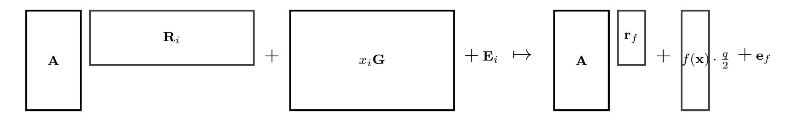

{0}------------------------------------------------

# Candidate Obfuscation via Oblivious LWE Sampling

Hoeteck Wee∗ Daniel Wichs†

March 4, 2021

#### **Abstract**

We present a new, simple candidate construction of indistinguishability obfuscation (iO). Our scheme is inspired by lattices and learning-with-errors (LWE) techniques, but we are unable to prove security under a standard assumption. Instead, we formulate a new falsifiable assumption under which the scheme is secure. Furthermore, the scheme plausibly achieves post-quantum security.

Our construction is based on the recent "split FHE" framework of Brakerski, Dottling, Garg, and Malavolta ¨ (EUROCRYPT '20), and we provide a new instantiation of this framework. As a first step, we construct an iO scheme that is provably secure assuming that LWE holds *and* that it is possible to obliviously generate LWE samples without knowing the corresponding secrets. We define a precise notion of oblivious LWE sampling that suffices for the construction. It is known how to obliviously sample from any distribution (in a very strong sense) using iO, and our result provides a converse, showing that the ability to obliviously sample from the specific LWE distribution (in a much weaker sense) already also implies iO. As a second step, we give a heuristic contraction of oblivious LWE sampling. On a very high level, we do this by homomorphically generating pseudorandom LWE samples using an encrypted pseudorandom function.

# **1 Introduction**

Indistinguishability obfuscation (iO) [\[BGI](#page-24-0)+01, [GR07\]](#page-26-0) is a probabilistic polynomial-time algorithm O that takes as input a circuit C and outputs an (obfuscated) circuit C 0 = O(C) satisfying two properties: (a) *functionality*: C and C 0 compute the same function; and (b) *security*: for any two circuits C1 and C2 that compute the same function (and have the same size), O(C1) and O(C2) are computationally indistinguishable. Since the first candidate for iO was introduced in [\[GGH](#page-25-0)+13b], a series of works have shown that iO would have a huge impact on cryptography. The state-of-the-art iO candidates with concrete instantiations may be broadly classified as follows:

- First, we have fairly simple and direct candidates based on graded "multi-linear" encodings [\[GGH](#page-25-0)+13b, [GGH13a,](#page-25-1) [GGH15,](#page-25-2) [FRS17,](#page-25-3) [CVW18,](#page-25-4) [BGMZ18,](#page-24-1) [CHVW19\]](#page-25-5) and that achieve plausible post-quantum security. These candidates have survived fairly intense scrutiny from cryptanalysts [\[CHL](#page-25-6)+15, [MSZ16,](#page-27-0) [CLLT16,](#page-25-7) [ADGM17,](#page-24-2) [CLLT17,](#page-25-8) [CGH17,](#page-25-9) [Pel18,](#page-27-1) [CVW18,](#page-25-4) [CCH](#page-25-10)+19], and several of them are also provably secure in restricted adversarial models that capture a large class of known attacks. However, none of these candidates have a security reduction to a simple, falsifiable assumption.
- Next, we have a beautiful and remarkable line of works that aims to base iO on a conjunction of simple and well-founded assumptions, starting from [\[Lin16,](#page-27-2) [LV16,](#page-27-3) [Lin17,](#page-27-4) [LT17\]](#page-27-5), through [\[AJL](#page-24-3)+19, [Agr19,](#page-24-4) [JLMS19,](#page-26-1) [GJLS20\]](#page-26-2), and culminating in the very recent (and independent) work of Jain, Lin and Sahai [\[JLS20\]](#page-26-3) basing iO on pairings, LWE, LPN and PRG in NC0. These constructions rely on the prior constructions of iO from functional encryption (FE) [\[BV15,](#page-25-11) [AJ15\]](#page-24-5), and proceed to build FE via a series of delicate and complex reductions, drawing upon techniques from a large body of works, including pairing-based FE for quadratic functions, lattice-based fully-homomorphic and attribute-based encryption, homomorphic secret-sharing, as well as hardness amplification.
- A number of more recent and incomparable candidates, including a direct candidate based on tensor products [\[GJK18\]](#page-26-4) and another based on affine determinant programs (with noise) [\[BIJ](#page-25-12)+20]; the BDGM candidate based on an intriguing interplay between a LWE-based and a DCR-based cryptosystems [\[BDGM20a\]](#page-24-6); the

∗NTT Research

†Northeastern and NTT Research

{1}------------------------------------------------

plausibly post-quantum secure candidates in [Agr19, AP20] that replace the use of pairings in the second line of works with direct candidates for FE for inner product plus noise. All of these candidates, as with the first line of work, do not present a security reduction to a simple, falsifiable assumption. 1

To the best of our knowledge, none of these existing approaches yields a lattice-inspired iO candidate that is plausibly post-quantum secure and enjoys a security reduction under a simple, falsifiable assumption referring solely to lattice-based cryptosystems, which is the focus of this work. We further believe that there is a certain aesthetic and minimalistic appeal to having an iO candidate whose hardness distills to a single source of computational hardness (as opposed to lattice plus pairing/number-theoretic hardness). Such a candidate is also potentially more amenable to crypto-analytic efforts as well as further research to reduce security to more standard lattice problems.

#### 1.1 Our Contributions

Our main contribution is a new candidate construction of iO that relies on techniques from lattices and learning-with-errors (LWE). We formulate a new falsifiable assumption on the indistinguishability of two distributions, and show that our construction is secure under this assumption. While we are unable to prove security under a standard assumption such as LWE, we view our construction as a hopeful step in that direction. To our knowledge, this is the first iO candidate that is simultaneously based on a clearly stated falsifiable assumption and plausibly post-quantum secure. Perhaps more importantly, we open up a new avenue towards iO by showing that, under the LWE assumption, the ability to "obliviously sample from the LWE distribution" (see below) provably implies iO. Unlike prior constructions of iO from simpler primitives (e.g., functional encryption [AJ15, BV15], succinct randomized encodings [LPST16b], XiO [LPST16a], etc.), oblivious LWE sampling does not inherently involve any "computation" and appears to be fundamentally different. Lastly, we believe our construction is conceptually simpler and more self-contained (relying on fewer disjoint components) than many of the prior candidates.

Our main building block is an "oblivious LWE sampler", which takes as input a matrix  $\mathbf{A} \in \mathbb{Z}_q^{m \times n}$  and allows us to generate LWE samples  $\mathbf{A} \cdot \mathbf{s} + \mathbf{e}$  with some small error  $\mathbf{e} \in \mathbb{Z}^m$  without knowing the secrets  $\mathbf{s}$ ,  $\mathbf{e}$ . We discuss the notion in more detail below (see the "Our Techniques" section), and provide a formal definition that suffices for our construction. Our notion can be seen as a significant relaxation of "invertible sampling" (in the common reference string model) [IKOS10, DKR15], and the equivalent notion of "pseudorandom encodings" [ACI+20]. The work of [DKR15] showed that, assuming iO, it is possible to invertibly sample from all distributions, and [ACI+20] asked whether it may be possible to do so under simpler assumptions that do not imply iO. As a side result of independent interest, we settle this question by showing that, under LWE, even our relaxed form of invertible sampling for the specific LWE distribution already implies iO.

Overall, our candidate iO construction consists of two steps. The first step is a provably secure construction of iO assuming we have an oblivious LWE sampler and that the LWE assumption holds (both with sub-exponential security). The second step is a candidate heuristic instantiation of an oblivious LWE sampler. On a very high level, our heuristic sampler performs a homomorphic computation that outputs a pseudorandom LWE sample generated using some pseudorandom function (PRF). Security boils down to a clearly stated falsifiable assumption that two distributions, both of which output LWE samples, are indistinguishable even if we give out the corresponding LWE secrets. Our assumption implicitly relies on some form of circular security: we assume that the error term in the pseudorandom LWE sample "drowns out" any error that comes out of the homomorphic computation over the PRF key that was used to generate it. We also discuss how our construction/assumption avoids some simple crypto-analytic attacks.

### 1.2 Technical Overview

Our iO construction is loosely inspired by the "split fully-homomorphic encryption (split FHE)" framework of Brakerski, Döttling, Garg, and Malavolta [BDGM20a] (henceforth BDGM). They defined a new cryptographic primitive called split FHE, which they showed to provably imply iO (under the LWE assumption). They then gave a candidate instantiation of split FHE by heuristically combining decisional composite residue (DCR) and LWE-based techniques, together with the use of a random oracle. We rely on a slight adaptation of their framework by replacing split-FHE with a variant that we call *functional encodings*. Our main contribution is a new instantiation of this framework via "oblivious LWE sampling", relying only on LWE-based techniques.

&lt;sup>1We defer a comparison with the independent and concurrent works [GP20, BDGM20b] to Section 1.3.3.

{2}------------------------------------------------

| Approach                                   | Falsifiable  | Circuit-Independent | Non-Interactive | Post-Quantum |
|--------------------------------------------|--------------|---------------------|-----------------|--------------|
| mmaps-based iO, cf. [GGH + 13b] |              |                     |                 | $\checkmark$ |
| NLFE candidates [Agr19, AP20]              |              | $\checkmark$        |                 | $\checkmark$ |
| split-FHE, DCR, LWE [BDGM20a]              |              |                     |                 |              |
| LWE, SXDH, LPN, PRG in NC0 [JLS20]         | $\checkmark$ | $\checkmark$        | $\checkmark$    |              |
| circular-SRL [GP20, BDGM20b]               | $\checkmark$ |                     |                 | $\checkmark$ |
| this work (Conjecture 6.4 HPLS)            | ✓            | <b>√</b>            | ✓               | $\checkmark$ |
| this work (Appendix B)                     |              | $(\checkmark)$      |                 | $\checkmark$ |

Figure 1: Summary of the main approaches and assumptions used for IO. The column "falsifiable" refers to whether there is a reduction to a clearly stated falsifiable assumption (we don't count just assuming the scheme is secure). The term "circuit-independent" means that the assumption does not refer to computation for general circuits (which is closely related to the notion of instance-independent assumptions [GLW14]). We consider assumptions that quantify over worst-case inputs/parameters to be interactive, since the adversary chooses them in the first step.

We first describe what functional encodings are and how to construct iO from functional encodings. Then we describe our instantiation of functional encodings via oblivious LWE sampling. We defer a detailed comparison to BDGM to Section 1.3.

### 1.2.1 iO from Functional Encodings

As in BDGM, instead of constructing iO directly, we construct a simpler a primitive called "exponentially efficient iO" XiO, which is known to imply iO under the LWE assumption [LPST16a]. We first describe what XiO is, and then discuss how to construct it from Functional Encodings via the BDGM framework.

**XiO.** An XiO scheme [LPST16a], has the same syntax, correctness and security requirements as iO, but relaxes the efficiency requirement. To obfuscate a circuit C with input length n, the obfuscator can run in exponential time  $2^{O(n)}$  and the size of the obfuscated circuit can be as large as  $2^{n(1-\varepsilon)}$  for some  $\varepsilon > 0$ . Such a scheme is useful when n is logarithmic in the security parameter, so that  $2^n$  is some large polynomial. Note that there is always a trivial obfuscator that outputs the entire truth table of the circuit C, which is of size  $2^n$ . Therefore, XiO is only required to do slightly better than the trivial construction, in that the size of the obfuscated circuit must be non-trivially smaller than the truth table. The work of [LPST16a] showed that XiO together with the LWE assumption (assuming both satisfy sub-exponential security) imply full iO.

**Functional Encodings.** We define a variant of the "split FHE" primitive from BDGM, which we call "functional encodings". A functional encoding can be used to encode a value  $x \in \{0,1\}^{\ell}$  to get an encoding c = Enc(x;r), where r is the randomness of the encoding process. Later, for any function  $f:\{0,1\}^\ell \to \{0,1\}^m$ , we can create an opening  $d = \mathsf{Open}(f, x, r)$  for f, which can be decoded to recover the function output  $\mathsf{Dec}(f, c, d) = f(x)$ . We require many-opening simulation based security: the encoding c = Enc(x;r) together with the many openings  $d_1 = \mathsf{Open}(f_1, x, r), \dots, d_Q = \mathsf{Open}(f_Q, x, r)$  can be simulated given only the functions  $f_1, \dots, f_Q$  and the outputs  $f_1(x), \ldots, f_Q(x)$ . In other words, nothing about the encoded value x is revealed beyond the function outputs  $f_i(x)$  for which openings are given. So far, we can achieve this by simply setting the opening d to be the function output f(x). The notion is made non-trivial, by additionally requiring succinctness: the size of the opening d is bounded by  $|d| = O(m^{1-\varepsilon})$  for some  $\varepsilon > 0$ , and therefore the opening must be non-trivially smaller than the output size of the function. We do not impose any restrictions on the size of the encoding c, which may depend polynomially on m. Unfortunately, this definition is unachievable in the plain model, as can be shown via a simple incompressibility argument. Therefore, we consider functional encodings in the common reference string (CRS) model and only require many-opening simulation security for some a-priori bound Q on the number of opening (i.e., Q-opening security). We allow the CRS size, (but not the encoding size or the opening size) to grow polynomially with the bound Q.

**XiO from Functional Encodings.** We construct XiO from functional encodings. As a first step, we construct XiO in the CRS model. Let  $C: \{0,1\}^n \to \{0,1\}$  be a circuit of size  $\ell$  that we want to obfuscate. We can partition the input domain  $\{0,1\}^n$  of the circuit into  $Q=2^n/m$  subsets  $S_i$ , each containing  $|S_i|=m$  inputs. We then define

{3}------------------------------------------------

Q functions  $f_i: \{0,1\}^\ell \to \{0,1\}^m$  such that  $f_i(C) = (C(x_1),\ldots,C(x_m))$  outputs the evaluations of C on all m inputs  $x_j \in S_i$ . Finally, we set the obfuscation of the circuit C to be  $(\text{Enc}(C;r), \text{Open}(f_1,C,r),\ldots,\text{Open}(f_Q,C,r))$ , which is sufficient to recover the value of the circuit at all  $Q \cdot m = 2^n$  possible inputs. By carefully balancing between m and  $Q = 2^n/m$ , we can ensure that the obfuscated circuit size is  $O(2^{n(1-\varepsilon)})$  for some constant  $\varepsilon > 0$ , and therefore satisfies the non-triviality requirement of XiO. On a high level, we amortize the large size of the encoding across sufficiently many openings to ensure that the total size of the encoding and all the openings together is smaller than the total output size.2 The above gives us XiO with a strong form of simulation-based security (the obfuscated circuit can be simulated given the truth table) in the CRS model, which also implies the standard indistinguishability-based security in the CRS model.

So far, we only got XiO in the CRS model, where the CRS size can be as large as  $poly(Q \cdot m) = 2^{O(n)}$ . As the second step, we show that XiO in the CRS model generically implies XiO in the plain model. A naive idea would be to simply make the CRS a part of the obfuscated program, but then we would lose succinctness, since the CRS is large. Instead, we repeat a variant of the previous trick to amortize the cost of the CRS. To obfuscate a circuit  $C:\{0,1\}^n \to \{0,1\}$ , we partition the domain  $\{0,1\}^n$  into  $Q=2^n/m$  subsets containing  $m=2^{n'}$  inputs each, and we define Q sub-circuits  $C_i:\{0,1\}^{n'} \to \{0,1\}$ , each of which evaluates C on the  $m=2^{n'}$  inputs in the i'th subset. We then choose a single CRS for input size n' and obfuscate all Q sub-circuits separately under this CRS; the final obfuscated circuit consists of the CRS and all the Q obfuscated sub-circuits. By carefully balancing between  $m=2^{n'}$  and  $Q=2^n/m$ , in the same manner as previously, we can ensure that the total size of the final obfuscated circuit is  $O(2^{n(1-\varepsilon)})$  for some constant  $\varepsilon>0$ , and therefore thescheme satisfies the non-triviality requirement of XiO.

#### 1.2.2 Constructing Functional Encodings

We now outline our construction of a functional encoding scheme. We start with a base scheme, which is insecure but serves as the basis of our eventual construction. We show that we can easily make it one-opening simulation secure under the LWE assumption, meaning that security holds in the special case where only a single opening is ever provided (i.e., Q=1). Then we show how to make it many-opening secure via oblivious LWE sampling. Concretely, we obtain a Q-opening secure functional encoding candidate for bounded-depth circuits  $f:\{0,1\}^\ell \to \{0,1\}^m$  with CRS size  $O(Q \cdot m)$ , encoding size  $O(m^2)$  and opening size O(1), and where  $O(\cdot)$  hides factors polynomial in the security parameter, input size  $\ell$ , and circuit depth.

**Base Scheme.** Our construction of functional encodings is based on a variant of the homomorphic encryption/commitment schemes of [GSW13, GVW15b]. Given a commitment to an input  $\mathbf{x} = (x_1, \dots, x_\ell) \in \{0, 1\}^\ell$ , along with a circuit  $f: \{0, 1\}^\ell \to \{0, 1\}^m$ , this scheme allows us to homomorphically compute a commitment to the output  $y = f(\mathbf{x})$ . Our variant is designed to ensure that the opening for the output commitment is smaller than the output size m.

Given a public random matrix  $\mathbf{A} \in \mathbb{Z}_q^{m \times n}$  where  $m \gg n$ , we define a commitment  $\mathbf{C}$  to an input  $\mathbf{x}$  via

$$\mathbf{C} = (\mathbf{A}\mathbf{R}_1 + x_1\mathbf{G} + \mathbf{E}_1, \dots, \mathbf{A}\mathbf{R}_\ell + x_\ell\mathbf{G} + \mathbf{E}_\ell)$$

where  $\mathbf{R}_i \leftarrow \mathbb{Z}_q^{n \times m \log q}$ ,  $\mathbf{E}_i \leftarrow \chi^{m \times m \log q}$  has its entries chosen from the error distribution  $\chi$ , and  $\mathbf{G} \in \mathbb{Z}_q^{m \times m \log q}$  is the gadget matrix of [MP12]. Although this looks similar to [GSW13, GVW15b], we stress that the parameters are different. Namely, in our scheme  $\mathbf{A}$  is a tall/thin matrix while in the prior schemes it is a short/fat matrix, we allow  $\mathbf{R}_i$  to be uniformly random over the entire space while in the prior schemes it had small entries, and we need to add some error  $\mathbf{E}_i$  that was not needed in the prior schemes. The commitment scheme is hiding by the LWE assumption. We can define the functional encoding  $\mathrm{Enc}(\mathbf{x};r)=(\mathbf{A},\mathbf{C})$  to consist of the matrix  $\mathbf{A}$  and the homomorphic commitment  $\mathbf{C}$ , where r is all the randomness used to sample the above values.

Although we modified several key parameters of [GSW13, GVW15b], it turns out that the same homomorphic evaluation procedure there still applies to our modified scheme. In particular, given the commitment  $\mathbf{C}$  to an input  $\mathbf{x}$  and a boolean circuit  $f: \{0,1\}^{\ell} \to \{0,1\}$ , we can homomorphically derive a commitment  $\mathbf{C}_f = \mathbf{A}\mathbf{R}_f + f(x)\mathbf{G} + \mathbf{E}_f$  to the output f(x). Furthermore, given a circuit  $f: \{0,1\}^{\ell} \to \{0,1\}^m$  with m bit output, we can

&lt;sup>2In detail, assume we start with a functional encoding where the encoding size is  $O(m^a)$  and the opening size is  $O(m^{1-\delta})$  for some constants  $a, \delta > 0$ , ignoring any other polynomial factors in the security parameter or the input size. The size of the obfuscated circuit above is then bounded by  $O(m^a + Qm^{1-\delta})$ . By choosing  $m = 2^{n/(a+\delta)}$  and recalling  $Q = 2^n/m$ , the bound becomes  $O(2^{n(1-\varepsilon)})$  for  $\varepsilon = \delta/(a+\delta)$ .

{4}------------------------------------------------

apply the above procedure to get commitments to each of the output bits and "pack" them together using the techniques of (e.g.,) [MW16, BTVW17, PS19, GH19, BDGM19] to obtain a vector  $\mathbf{c}_f \in \mathbb{Z}_q^m$  such that

$$\mathbf{c}_f = \mathbf{A} \cdot \mathbf{r}_f + f(\mathbf{x}) \cdot \frac{q}{2} + \mathbf{e}_f \in \mathbb{Z}_q^m$$

where  $f(\mathbf{x}) \in \{0,1\}^m$  is a column vector,  $\mathbf{r}_f \in \mathbb{Z}_q^n$ , and  $\mathbf{e}_f \in \mathbb{Z}^m$  is some small error term.

Now, observe that  $\mathbf{r}_f$  constitutes a succinct opening to  $f(\mathbf{x})$ , since  $|\mathbf{r}_f| \ll |f(\mathbf{x})|$  and  $\mathbf{r}_f$  allows us to easily recover  $f(\mathbf{x})$  from  $\mathbf{c}_f$  by computing round $_{q/2}(\mathbf{c}_f - \mathbf{A} \cdot \mathbf{r}_f)$ . Furthermore, we can efficiently compute  $\mathbf{r}_f$  by applying a homomorphic computation on the opening of the input commitment as in [GVW15b], or alternately, we can sample  $\mathbf{A}$  with a trapdoor and use the trapdoor to recover  $\mathbf{r}_f$ . Therefore, we can define the opening procedure of the functional encoding to output the value  $\mathbf{r}_f = \mathrm{Open}(f, \mathbf{x}, r)$ , and the decoding procedure can recover  $f(x) = \mathrm{Dec}(f, (\mathbf{A}, \mathbf{C}), \mathbf{r}_f)$  by homomorphically computing  $\mathbf{c}_f$  and using  $\mathbf{r}_f$  to recover f(x) as above. This gives us our base scheme (in the plain model), which has the correct syntax and succinctness properties. Unfortunately, the scheme so far does not satisfy even one-opening simulation security, since the opening  $\mathbf{r}_f$  (along with the error term  $\mathbf{e}_f$  that it implicitly reveals) may leak additional information about  $\mathbf{x}$  beyond  $f(\mathbf{x})$ .

One-Opening Security from LWE. We can modify the base scheme to get one-opening simulation security (still in the plain model). In particular, we augment the encoding by additionally including a single random LWE sample  $\mathbf{b} = \mathbf{A} \cdot \mathbf{s} + \mathbf{e}$  inside it. We then add this LWE sample to  $\mathbf{c}_f$  to "randomize" it, and release  $\mathbf{d}_f := \mathbf{r}_f + \mathbf{s}$  as an opening to  $f(\mathbf{x})$ . Given the encoding  $(\mathbf{A}, \mathbf{C}, \mathbf{b})$  and the opening  $\mathbf{d}_f$ , we can decode  $f(\mathbf{x})$  by homomorphically computing  $\mathbf{c}_f$  and outputting  $y = \operatorname{round}_{q/2}(\mathbf{c}_f + \mathbf{b} - \mathbf{A} \cdot \mathbf{d}_f)$ . Correctness follows from the fact that  $\mathbf{c}_f + \mathbf{b} \approx \mathbf{A}(\mathbf{r}_f + \mathbf{s}) + f(\mathbf{x}) \cdot q/2$ .

With the above modification, we can simulate an encoding/opening pair given only  $f(\mathbf{x})$  without knowing  $\mathbf{x}$ . Firstly, we can simulate the opening without knowing the randomness of the input commitments or the trapdoor for  $\mathbf{A}$ . In particular, the simulator samples  $\mathbf{d}_f$  uniformly at random from  $\mathbb{Z}_q^n$ , and then "programs" the value  $\mathbf{b}$  as  $\mathbf{b} := \mathbf{A} \cdot \mathbf{d}_f - \mathbf{c}_f + f(\mathbf{x}) \cdot \frac{q}{2} + \mathbf{e}$ . The only difference in the distributions is that in the real case the error contained in the LWE sample  $\mathbf{b}$  is  $\mathbf{e}$ , while in the simulated case it is  $\mathbf{e} - \mathbf{e}_f$ , but we can choose the error  $\mathbf{e}$  to be large enough to "smudge out" this difference and ensure that the distributions are statistically close. Once we can simulate the opening without having the randomness of the input commitments or the trapdoor for  $\mathbf{A}$ , we can rely on LWE to replace the input commitment to  $\mathbf{x}$  with a commitment to a dummy value.

**Many-Opening Security via Oblivious LWE Sampling.** We saw that we can upgrade the base scheme to get one-opening simulation security by adding a random LWE sample  $\mathbf{b} = \mathbf{A} \cdot \mathbf{s} + \mathbf{e}$  to the encoding. We could easily extend the same idea to achieve Q-opening simulation security by adding Q samples  $\mathbf{b}_i = \mathbf{A} \cdot \mathbf{s}_i + \mathbf{e}_i$  to the encoding. However, this would require the encoding size to grow with Q, which we cannot afford. So far, we have not relied on a CRS, and perhaps the next natural attempt would be to add the Q samples  $\mathbf{b}_i$  to the CRS of the scheme. Unfortunately, this also does not work, since the scheme needs to know the corresponding LWE secrets  $\mathbf{s}_i$  to generate the openings, and we would not be able to derive them from the CRS.

Imagine that we had an oracle that took as input an arbitrary matrix  $\mathbf{A}$  and would output Q random LWE samples  $\mathbf{b}_i = \mathbf{A} \cdot \mathbf{s}_i + \mathbf{e}_i$ . Such an oracle would allow us to construct Q-opening simulation secure functional encodings. The encoding procedure would choose the matrix  $\mathbf{A}$  with a trapdoor, call the oracle to get samples  $\mathbf{b}_i$  and use the trapdoor to recover the values  $\mathbf{s}_i$  that it would use to generate the openings. The decoding procedure would get  $\mathbf{A}$  and call the oracle to recover the samples  $\mathbf{b}_i$  needed to decode, but would not learn anything else. The simulator would be able to program the oracle and choose the values  $\mathbf{b}_i$  itself, which would allow us to prove security analogously to the one-opening setting. We define a cryptographic primitive called an "oblivious LWE sampler", whose goal is to approximate the functionality of the above oracle in the standard model with a CRS. We can have several flavors of this notion, and we start by describing a strong flavor, which we then relax in various ways to get our actual definition.

{5}------------------------------------------------

**Oblivious LWE Sampler (Strong Flavor).** A strong form of oblivious LWE sampling would consist of a deterministic sampling algorithm Sam that takes as input a long CRS along with a matrix  $\mathbf{A}$  and outputs Q LWE samples  $\mathbf{b}_i = \mathsf{Sam}(\mathsf{CRS}, \mathbf{A}, i)$  for  $i \in [Q]$ . The size of CRS can grow with Q and the CRS can potentially be chosen from some structured distribution, but it must be independent of  $\mathbf{A}$ . We want to be able to arbitrarily "program" the outputs of the sampler by programming the CRS. In other words, there is a simulator Sim that gets  $\mathbf{A}$  and Q random LWE samples  $\{\mathbf{b}_i\}$  as targets; it outputs a programmed string CRS  $\leftarrow \mathsf{Sim}(\mathbf{A}, \{\mathbf{b}_i\})$  that causes the sampler to output the target values  $\mathbf{b}_i = \mathsf{Sam}(\mathsf{CRS}, \mathbf{A}, i)$ . We want the real and the simulated CRS to be indistinguishable, even for a worst-case choice of  $\mathbf{A}$  for which an adversary may know a trapdoor that allows it to recover the LWE secrets. This notion would directly plug in to our construction to get a many-opening secure functional encoding scheme in the CRS model. It turns out that this strong form of oblivious LWE sampling can be seen as a special case of *invertible sampling* (in the CRS model) as proposed by [IKOS10], and can be constructed from iO [DKR15]. Invertible sampling is also equivalent to pseudorandom encodings (with computational security in the CRS model) [ACI+20], and we answer one of the main open problems posed by that work by showing that these notions provably imply iO under the LWE assumption. Unfortunately, we do not know how to heuristically instantiate this strong flavor of oblivious LWE sampling (without already having iO).

**Oblivious LWE Sampler (Relaxed).** We relax the above strong notion in several ways. Firstly, we allow ourselves to "pre-process" the matrix  $\mathbf{A}$  using some secret coins to generate a value  $\mathsf{pub} \leftarrow \mathsf{Init}(\mathbf{A})$  that is given as an additional input to the sampler  $\mathbf{b}_i = \mathsf{Sam}(\mathsf{CRS},\mathsf{pub},i)$ . We only require that the size of  $\mathsf{pub}$  is independent of the number of samples Q that will be generated. The simulator gets to program both CRS,  $\mathsf{pub}$  to produce the desired outcome. Secondly, we relax the requirement that, by programming CRS,  $\mathsf{pub}$ , the simulator can cause the sampler output arbitrary target values  $\mathbf{b}_i$ . Instead, we now give the simulator some target values  $\hat{\mathbf{b}}_i$  and the simulator is required to program (CRS,  $\mathsf{pub}$ )  $\leftarrow \mathsf{Sim}(\mathbf{A}, \hat{\mathbf{b}}_i)$  to ensure that the sampled values  $\mathbf{b}_i = \mathsf{Sam}(\mathsf{CRSpub},i)$  satisfy  $\mathbf{b}_i = \hat{\mathbf{b}}_i + \tilde{\mathbf{b}}_i$  for some LWE sample  $\tilde{\mathbf{b}}_i = \mathbf{A} \cdot \tilde{\mathbf{s}}_i + \tilde{\mathbf{e}}_i$  for which the simulator knows the corresponding secrets  $\tilde{\mathbf{s}}_i, \tilde{\mathbf{e}}_i$ . In other words, the produced samples  $\mathbf{b}_i$  need not exactly match the target values  $\hat{\mathbf{b}}_i$  given to the simulator, but the difference has to be an LWE sample  $\tilde{\mathbf{b}}_i$  for which the simulator can produce the corresponding secrets. Lastly, instead of requiring that the indistinguishability of the real and simulated (CRS,  $\mathsf{pub}$ ) holds even for a worst-case choice of  $\mathbf{A}$  with a known trapdoor, we only require that it holds for a random  $\mathbf{A}$ , but the adversary is additionally given the LWE secrets  $\mathbf{s}_i$  contained in the sampled values  $\mathbf{b}_i = \mathbf{A} \cdot \mathbf{s}_i + \mathbf{e}_i$ . In other words, we require that real/simulated distributions of (CRS,  $\mathsf{pub}$ ,  $\{\mathsf{s}_i\}$ ) are indistinguishable.

We show that this relaxed form of an oblivious LWE sampling suffices in our construction of functional encodings. Namely, we can simply add pub to the encoding of the functional encoding scheme, since it is short. In the proof, we can replace the real (CRS, pub) with a simulated one, using some random LWE tuples  $\hat{\mathbf{b}}_i$  as target values. Indistinguishability holds even given the LWE secrets  $\mathbf{s}_i$  for the produced samples  $\mathbf{b}_i = \mathsf{Sam}(\mathsf{CRS}, \mathsf{pub}, i)$ , which are used to generate the openings of the functional encoding. The  $\hat{\mathbf{b}}_i$  component of the produced samples  $\mathbf{b}_i = \hat{\mathbf{b}}_i + \tilde{\mathbf{b}}_i$  is sufficient to re-randomizes the output commitment  $\mathbf{c}_f$ , and the additional LWE sample  $\tilde{\mathbf{b}}_i$  that is added in does not hurt security, since we know the corresponding LWE secret  $\tilde{\mathbf{s}}_i$  and can use it to adjust the opening accordingly.

Constructing an Oblivious LWE Sampler. We give a heuristic construction of an oblivious LWE sampler, by relying on the same homomorphic commitments that we used to construct our base functional encoding scheme. The high level idea is to give out a commitment to a PRF key k and let the sampling algorithm homomorphically compute a pseudorandom LWE sample  $\mathbf{b}_{prf} := \mathbf{A} \cdot \mathbf{s}_{prf} + \mathbf{e}_{prf}$  where  $\mathbf{s}_{prf}$ ,  $\mathbf{e}_{prf}$  are sampled using randomness that comes from the PRF. The overall output of the sampler is a commitment to the above LWE sample, which is itself an LWE sample! While we do not know how to construct a simulator for this basic construction, we conjecture that it may already be sufficient to instantiate functional encodings (see Appendix B). To allow the simulator to program the output, we augment the computation to incorporate the CRS. We give a more detailed description below.

The CRS is a uniformly random string, which we interpret as consisting of Q values  $CRS_i \in \mathbb{Z}_q^m$ . To generate pub, we sample a random key k for a pseudorandom function  $PRF(k,\cdot)$  and set a flag bit  $\beta := 0$ . We creates a commitment C to the input  $(k,\beta)$  and we set the public value pub = (A,C). The algorithm  $b_i = Sample(CRS, pub, i)$  performs a homomorphic computation of the function  $g_i$  over the commitment C, where  $g_i$  is defined as follows:

$$g_i(\mathbf{k}, \beta)$$
: Use  $\mathsf{PRF}(\mathbf{k}, i)$  to sample  $\mathbf{b}_i^{\mathsf{prf}} := \mathbf{A} \cdot \mathbf{s}_i^{\mathsf{prf}} + \mathbf{e}_i^{\mathsf{prf}}$  and output  $\mathbf{b}_i^* := \mathbf{b}_i^{\mathsf{prf}} + \beta \cdot \mathsf{CRS}_i$ .

{6}------------------------------------------------

The output of this computation is a homomorphically evaluated commitment to  $\mathbf{b}_i^*$  and has the form  $\mathbf{b}_i = \mathbf{A} \cdot \mathbf{s}_i^{\text{eval}} + \mathbf{e}_i^{\text{eval}} + \mathbf{b}_i^*$  where  $\mathbf{s}_i^{\text{eval}}$  come from the homomorphic evaluation.3 Overall, the generated samples  $\mathbf{b}_i = \text{Sample}(\text{CRS}, \text{pub}, i)$  can be written as

$$\mathbf{b}_i = \mathbf{A} \cdot (\mathbf{s}_i^{\mathsf{eval}} + \mathbf{s}_i^{\mathsf{prf}}) + (\mathbf{e}_i^{\mathsf{eval}} + \mathbf{e}_i^{\mathsf{prf}}) + \beta \cdot \mathsf{CRS}_i$$

where  $\mathbf{s}_i^{\mathsf{prf}}, \mathbf{e}_i^{\mathsf{prf}}$  come from the PRF output and  $\mathbf{s}_i^{\mathsf{eval}}, \mathbf{e}_i^{\mathsf{eval}}$  come from the homomorphic evaluation.

In the real scheme, the flag  $\beta$  is set to 0 and so each output of Sample is an LWE sample  $\mathbf{b}_i = \mathbf{A} \cdot (\mathbf{s}_i^{\text{eval}} + \mathbf{s}_i^{\text{prf}}) + (\mathbf{e}_i^{\text{eval}} + \mathbf{e}_i^{\text{prf}})$ . In the simulation, the simulator gets some target values  $\hat{\mathbf{b}}_i$  and puts them in the CRS as CRSi :=  $\hat{\mathbf{b}}_i$ . It sets the flag to  $\beta = 1$ , which results in the output of Sample being  $\mathbf{b}_i = \mathbf{A} \cdot (\mathbf{s}_i^{\text{eval}} + \mathbf{s}_i^{\text{prf}}) + (\mathbf{e}_i^{\text{eval}} + \mathbf{e}_i^{\text{prf}}) + \hat{\mathbf{b}}_i$ . Note that the simulator knows the PRF key  $\mathbf{k}$  and the randomness of the homomorphic commitment, and therefore knows the values  $(\mathbf{s}_i^{\text{eval}} + \mathbf{s}_i^{\text{prf}}), (\mathbf{e}_i^{\text{eval}} + \mathbf{e}_i^{\text{prf}})$ . This means that the difference between the target values  $\hat{\mathbf{b}}_i$  and the output samples  $\mathbf{b}_i$  is an LWE tuple for which the simulator knows the corresponding secrets, as required.

**Security under a new conjecture.** We conjecture that the above construction is secure. In particular, we conjecture that the adversary cannot distinguish between  $\beta = 0$  and  $\beta = 1$  given the values:

$$(\mathsf{CRS} = \{\mathsf{CRS}_i = \mathbf{A}\hat{\mathbf{s}}_i + \hat{\mathbf{e}}_i\}_{i \in [Q]}, \mathsf{pub} = (\mathbf{A}, \mathbf{C} = \mathsf{Commit}(k, \beta)), \{\mathbf{s}_i = \mathbf{s}_i^{\mathsf{eval}} + \mathbf{s}_i^{\mathsf{prf}} + \beta\hat{\mathbf{s}}_i\}_{i \in [Q]})$$

We refer to this as the homomorphic pseudorandom LWE samples (HPLS) conjecture (see Conjecture 6.4 for a precise statement), and we argue heuristically why we believe it to hold. Since CRS, pub completely determine the values  $\mathbf{b}_i = \mathbf{A} \cdot \mathbf{s}_i + \mathbf{e}_i$ , revealing  $\mathbf{s}_i = \mathbf{s}_i^{\mathsf{eval}} + \mathbf{s}_i^{\mathsf{prf}} + \beta \hat{\mathbf{s}}_i$  also implicitly reveals  $\mathbf{e}_i = \mathbf{e}_i^{\mathsf{eval}} + \mathbf{e}_i^{\mathsf{prf}} + \beta \hat{\mathbf{e}}_i$ . We can think of the HPLS conjecture as consisting of two distinct heuristic components. The first component is to argue that the values  $s_i$ ,  $e_i$  look pseudorandom and independent of  $\beta$  given only (CRS, A), but without getting the commitment C. Intuitively, we believe this to hold since  $\mathbf{s}_i^{\mathsf{prf}}$ ,  $\mathbf{e}_i^{\mathsf{prf}}$  are provably pseudorandom (by the security of the PRF). Therefore, as long as we choose the noise  $\mathbf{e}_i^{\mathsf{prf}}$  to be large enough to "smudge out"  $\hat{\mathbf{e}}_i$ , we can provably argue that  $\mathbf{s}_i^{\mathsf{prf}} + \beta \hat{\mathbf{s}}_i$  and  $\mathbf{e}_i^{\mathsf{prf}} + \beta \hat{\mathbf{e}}_i$  are pseudorandom and independent of  $\beta$ . Unfortunately, this does not suffice – we still need to rely on a heuristic to ague that there are no computationally discernible correlations between these values and  $\mathbf{s}_i^{\text{eval}}$ ,  $\mathbf{e}_i^{\text{eval}}$  respectively. We believe this should hold with most natural PRFs. Although the first component is already heuristic, there is hope to remove the heuristic nature of this component by explicitly analyzing the distributions  $\mathbf{s}_i^{\text{eval}} + \mathbf{s}_i^{\text{prf}}$ ,  $\mathbf{e}_i^{\text{eval}} + \mathbf{e}_i^{\text{eval}}$  for a specific PRF, and leave this as a fascinating open problem for future work. The second heuristic component is to argue that security holds even in the presence of the commitment C. This part implicitly involves a circular security aspect between the pseudorandom function and the commitment. We'd like to argue that the PRF key k and the bit  $\beta$  are protected by the security of the commitment scheme, but we release  $\mathbf{s}_i = \mathbf{s}_i^{\text{eval}} + \mathbf{s}_i^{\text{prf}} + \beta \hat{\mathbf{s}}_i$ , where  $\mathbf{s}_i^{\text{eval}}$  depends on the commitment randomness; nevertheless we'd like to argue that this does not hurt commitment security since the value  $\mathbf{s}_i^{\text{eval}}$  is masked by the PRF output, but this argument is circular since the PRF key is contained in the commitment! This circularity does not easily lend itself to a proof, and we see much less hope in removing the heuristic nature of the second component than the first. Still, this type of circularity also seems difficult to attack: one cannot easily break the security of the commitment without first breaking the security of the PRF and vice versa.

**Simplified Construction.** In Appendix B, we also give a simplified direct construction of functional encodings in the plain model that we conjecture to satisfy indistinguishability based security. The simplified construction does not go through the intermediate "oblivious LWE sampler" primitive. In contrast to our main construction, which is secure under a non-interactive assumption that two distributions are indistinguishable, the assumption that our simplified construction is secure and interactive.

## 1.3 Discussion and Perspectives

#### 1.3.1 Comparison to BDGM

We now give a detailed comparison of our results/techniques with those of Brakerski, Döttling, Garg, and Malavolta [BDGM20a] (BDGM). BDGM defined a primitive called split FHE, which they show implies iO under the

&lt;sup>3Recall that previously we relied on a "packed" homomorphic evaluation, where we could evaluate a function  $f:\{0,1\}^\ell \to \{0,1\}^m$  on a commitment to  $\mathbf{x}$  to get a commitment  $\mathbf{c}_f = \mathbf{A} \cdot \mathbf{s}_f + \mathbf{e}_f + f(\mathbf{x}) \cdot \frac{q}{2}$ . The above relies on a slight variant that's even further packed and allows us to homomorphically evaluate a function  $g:\{0,1\}^\ell \to \mathbb{Z}_q^m$  over a commitment to  $\mathbf{x}$  and derive a commitment  $\mathbf{c}_g = \mathbf{A} \cdot \mathbf{s}_g + \mathbf{e}_g + g(\mathbf{x})$ .

{7}------------------------------------------------

LWE assumption. They then gave a candidate instantiation of split FHE by heuristically combining decisional composite residue (DCR) and LWE-based techniques, together with the use of a random oracle. While they gave compelling intuition for why they believe this construction of split FHE to be secure, they did not attempt to formulate an assumption under which they could prove security. In our work, we define a variant of split FHE that we call functional encodings. We then provide an entirely new instantiation of functional encodings via oblivious LWE sampling. The main advantages of our approach are:

- We get a provably secure construction of iO under the LWE assumption along with an additional assumption that there is an oblivious LWE sampler, where the latter is a clearly abstracted primitive, which we then instantiate heuristically. In particular, we are able to confine the heuristic portion of our construction to a single well defined component.
- We can prove security of our overall construction under a falsifiable, non-interactive assumption that is independent of the function being obfuscated.
- Our construction of iO relies only on LWE-based techniques rather than the additional use of DCR. In our opinion, this makes the construction conceptually simpler and easier to analyze. Furthermore, the construction is plausibly post-quantum secure.
- We avoid any reliance on random oracles.

On a technical level, we lightly adapt the split FHE framework of BDGM. In particular, our notion of functional encodings can be seen as a relaxed form of split FHE, and our result that functional encodings imply iO closely follows BDGM. The main differences between the two works, lie in the our respective instantiations of split-FHE and functional encodings. We explain the differences in the framework and the instantiation in more detail below.

**Functional Encodings vs Split FHE.** There are two differences between our notion of functional encodings versus the split FHE framework of BDGM. Firstly, our notion of functional encodings has a simplified syntax compared to split FHE (in particular, we do not require any key generation or homomorphic evaluation algorithms and the opening can depend on all of the randomness r used to generate the encoding rather than just a secret key). While we find the simplified syntax conceptually easier, it is not crucial, and our candidate construction of functional encodings can be adapted to also match the syntactic requirements of split FHE. The second difference is that we explicitly allow for a CRS in functional encodings, and show that the CRS can be removed when we go to XiO (in particular, we show that XiO in the CRS model implies XiO in the plain model). In contrast, the work of BDGM considered split FHE in the plain model (with indistinguishability rather than simulation security). Their instantiation relies on a random oracle model and they argued heuristically that the random oracle can be removed. The fact that we explicitly consider the CRS model allows us to avoid random oracles entirely, and therefore reduce the number of heuristic components in the final construction.[4](#page-7-0)

**Heuristic Instantiations.** Both BDGM and our work provide a heuristic instantiation of the main building block: split FHE and functional encodings, respectively. These instantiations are concretely very different, and rely on different techniques. On a conceptual level, they also differ in the role that heuristic arguments play. BDGM constructs a provably secure instantiation of split FHE under the combination of LWE and DCR assumptions, in some idealized oracle world (essentially, the oracle samples Damgard-Jurik encryptions of small values). They then give a heuristic instantiation of their oracle. However, there is no attempt to define any standard-model notion of security that such an instantiation could satisfy to make the overall scheme secure. In contrast, we construct a provably secure instantiation of functional encodings under the LWE assumption and assuming we have an "oblivious LWE sampler", where the latter is a cryptographic primitive in the standard model (with a CRS) with a well-defined security requirement. We then give a heuristic construction of an oblivious LWE sampler using LWE techniques. Although the security notion of oblivious LWE sampling involves a simulator, our heuristic construction comes with a candidate simulator for it. Therefore, the only heuristic component of our construction is a clearly stated falsifiable assumption that two distributions (real and simulated) are indistinguishable.

We conjecture that the split FHE construction of BDGM could similarly be proven secure under the LWE assumption, DCR assumption, and some type of "oblivious sampler" for Damgard-Jurik encryptions of random small values. Moreover, the heuristic instantiation of the oracle in BDGM could likely be seen as a heuristic candidate for such an oblivious sampler. However, BDGM does not appear to have a plausible candidate simulator

4We believe that this change could also be applied retroactively to remove the use of a random oracles in BDGM.

{8}------------------------------------------------

for this instantiation and hence security does not appear to follow from any simple falsifiable assumption (other than assuming that the full construction of split FHE is secure).

We note that BDGM (Section 4.4) also presents an alternate construction of split FHE based only the LWE assumption (without DCR) in some other idealized oracle world. However, they were not able to heuristically instantiate the oracle for this alternate construction, and hence it did not lead to even a heuristic candidate for post-quantum secure iO in their work.[5](#page-8-1) Their construction does yield a one-opening secure split-FHE / functional encoding under LWE, and our one-opening secure scheme is in part inspired by it (and can be seen as simplifying it). The main advantage of our scheme is that we can extend it to many-opening security via oblivious LWE sampling, which we then instantiate heuristically to get a candidate iO.

### **1.3.2 Comparison with FE**

The line of work on building iO from simple, well-founded assumptions first builds functional encryption (FE). A functional encryption scheme allows us to encrypt a value x and generate secret keys for functions f so that decryption returns f(x) while leaking no additional information about x. We also consider Q-key security, where an adversary given an encryption of x and Q secret keys for functions f1, . . . , fQ should learn nothing about x beyond f1(x), . . . , fQ(x). A functional encoding scheme can be viewed as a relaxation of a secret-key functional encryption where we allow the key for f to depend on x.

The state-of-the-art for functional encryption is analogous to that for functional encoding:

- We have one-key secure public-key FE for bounded-depth circuits f : {0, 1} ` → {0, 1} m from LWE with ciphertext size O(m) and key size O(1) [\[GKP](#page-26-11)+13, [GVW13,](#page-26-12) [BGG](#page-24-11)+14].
- A construction of iO from one-key secure public-key FE for bounded-depth circuits f : {0, 1} ` → {0, 1} m with ciphertext size O(m1− ) [\[BV15,](#page-25-11) [AJ15\]](#page-24-5). The latter is in turn implied by Q-key secure public-key FE for f : {0, 1} ` → {0, 1} with ciphertext size O(Q1− ).
- A construction of iO from Q-key secure secret-key FE bounded-depth circuits f : {0, 1} ` → {0, 1} m with ciphertext size Q1− · poly(m). Our main candidate is essentially the functional encoding analogue of such a secret-key FE scheme (in the CRS model).

This analogue raises two natural open problems: Do the techniques in this work also yield non-trivial FE schemes (that imply iO) with a polynomial security loss, without passing through iO as an intermediate building block? Can we simplify the constructions or assumptions underlying the FE schemes in [\[AJL](#page-24-3)+19, [Agr19,](#page-24-4) [JLMS19,](#page-26-1) [GJLS20,](#page-26-2) [JLS20\]](#page-26-3) by relaxing the requirements from FE to functional encodings (which would still suffice for iO)?

### **1.3.3 Comparison with Concurrent Works: [\[GP20,](#page-26-6) [BDGM20b\]](#page-24-9)**

The recent work of [\[GP20\]](#page-26-6) together with a follow-up to it [\[BDGM20b\]](#page-24-9) (both of which are concurrent and independent of our work), present new candidate constructions of iO by adapting the BDGM [\[BDGM20a\]](#page-24-6) framework. Just like our work, they go through the route of constructing XiO in the CRS model, and have instantiations that rely only on LWE-style techniques and are plausibly post-quantum secure. While there are many high-level similarities between these works and our work, the concrete construction and security assumption are different. In terms of construction, the main difference lies in how the works "re-randomize" the opening/hint that allows one to recover the output of the computation. In our case, we do so via an "oblivious LWE sampler", which is instantiated by using an encrypted PRF key to produce an encrypted pseudorandom LWE sample. The two works [\[GP20,](#page-26-6) [BDGM20b\]](#page-24-9) follow the original construction of [\[BDGM20a\]](#page-24-6) more closely and rely on homomorphically decrypting random ciphertexts in the CRS using a key cycle.[6](#page-8-2) Our overall construction is arguably somewhat simper than the others since it relies on a single homomorphic cryptosystem (a variant of GSW FHE) rather than switching between two different homomorphic cryptosystems with different properties. In terms of assumptions, both of the works [\[GP20,](#page-26-6) [BDGM20b\]](#page-24-9) prove security under a new assumption that a certain cryptosystem satisfies a (non-standard form of) "circular security" in the presence of some oracle. Comparing the assumption in our work with those in [\[GP20,](#page-26-6) [BDGM20b\]](#page-24-9) we note the following.

5As stated in BDGM Section 4.4: "We stress that, in contrast with the instantiation based on the Damgard-Jurik encryption scheme (Section 4.3), this scheme does not satisfy the syntactical requirements to apply the generic transformations (described in Section 4.2) to lift the scheme to the plain model."

6 Interestingly, since decrypting random ciphertexts is a (weak-)PRF, the two approaches may be more similar than may appear.

{9}------------------------------------------------

- Our assumption is non-interactive and states that two fixed distributions are computationally indistinguishable. The distributions involve some homomorphic computation, but only of some fixed function. On the other hand, the assumption in [\[GP20,](#page-26-6) [BDGM20b\]](#page-24-9) is naturally stated as an interactive assumption and requires that two distributions are indistignuishable for an adversary that can make queries to a certain oracle, or can choose some parameters of the distributions. It involves general homomorphic computation of arbitrary circuits.
- The assumption of [\[GP20,](#page-26-6) [BDGM20b\]](#page-24-9) has the conceptually clean format of a circular security assumption with an (interactive) oracle. In particular, they specify a public-key encryption scheme along with some oracle that contains the encrypted message and encryption randomness, but preserves IND-CPA security. The circular security with an oracle assumption says that IND-CPA should hold in the presence of the oracle, even if we append the secret key to the encrypted message. The format of the assumption as a form of circular security is used as a high-level justification for its validity. On the other hand, our assumption is written at the level of LWE-style algebra. While we provide some concrete security analysis showing that the assumption withstands simple attacks, we do not offer an analogous high-level conceptual justification.

We elaborate on the second point above in more detail. The works of [\[GP20,](#page-26-6) [BDGM20b\]](#page-24-9) justify their assumption by emphasizing its format as a form of "circular security". For example, [\[GP20\]](#page-26-6) assert that they rely on "qualitatively similar assumptions as (unleveled) FHE". While the format of the assumption in those works provides a nice conceptual framework, we think it's important to point out that there are important qualitative differences between the "basic circular security assumption" (for a bit-encryption scheme) used for unleveled FHE and the "circular security with an oracle" assumption needed for [\[GP20,](#page-26-6) [BDGM20b\]](#page-24-9).

Most importantly, it is extremely difficult to come up with even contrived cryptosystems for which the basic circular security assumption fails. Therefore, it appears safe to heuristically assume that it holds for a natural scheme, such as the GSW FHE [\[GSW13\]](#page-26-8). This is often viewed as a conservative heuristic assumption, akin to the random oracle heuristic. In contrast, for the non-standard "circular-security with an oracle" class of assumptions used in [\[GP20,](#page-26-6) [BDGM20b\]](#page-24-9), it is easy to come up with simple counterexample oracles for which such assumptions fail to hold.

Another important qualitative difference is that, given the specific oracles in these works, it is easy for an adversary to distinguish between the encryption of a key cycle versus an encryption of some other value, say 0. Indeed, the schemes [\[GP20,](#page-26-6) [BDGM20b\]](#page-24-9) crucially rely on giving out a key cycle for correctness, and if we switched it to an encryption of 0, correctness would no longer hold, which allows an attacker to easily distinguish the two cases. In the case of basic circular security, one of the main reasons to believe that giving out a key cycle cannot harm IND-CPA security is *because* it appears difficult to distinguish a key cycle from an encryption of 0, and the latter clearly cannot harm IND-CPA security. In the case of the assumptions in [\[GP20,](#page-26-6) [BDGM20b\]](#page-24-9), one needs to assume that a key cycle cannot harm IND-CPA security in the presence of an oracle, *despite* knowing that the it is easy to distinguish the key cycle from an encryption of 0 using the oracle.

To summarize, we have no reason to doubt the concrete assumptions in [\[GP20,](#page-26-6) [BDGM20b\]](#page-24-9) and do not know whether they are better or worse than the assumption in our work. However, we wish to clarify that the reason to trust such assumptions appears to be qualitatively different from the reason to trust basic circular security of bit encryption. We believe that the security of the assumptions in [\[GP20,](#page-26-6) [BDGM20b\]](#page-24-9) and in our work can only be understood by studying the specifics of the LWE-style algebra they entail rather than appearing to some general circularity heuristic. As a starting point, it is important to check that zeroizing attacks cannot be used to break security. We offer a discussion for why zeroizing attacks should fail for our scheme (See [\(7\)](#page-18-0) in Section [6.3\)](#page-17-1) and it would be worth to examining if similar reasoning can be applied to the schemes in [\[GP20,](#page-26-6) [BDGM20b\]](#page-24-9).

# **2 Preliminaries**

## **2.1 Notations**

We will denote by λ the security parameter. The notation negl(λ) denotes any function f such that f(λ) = λ −ω(1) , and poly(λ) denotes any function f such that f(λ) = O(λ c ) for some c > 0. For a probabilistic algorithm alg(inputs), we might explicit the randomness it uses by writing alg(inputs; coins). We will denote vectors by bold lower case letters (e.g. a) and matrices by bold upper cases letters (e.g. A). We will denote by a &gt; and A&gt; the transposes of a and A, respectively. We will denote by bxe the nearest integer to x, rounding towards 0 for half-integers. If x is a vector, bxe will denote the rounded value applied component-wise. For integral vectors and matrices (i.e., those over Z), we use the notation |r|, |R| to denote the maximum absolute value over all the entries.

{10}------------------------------------------------

We define the statistical distance between two random variables X and Y over some domain  $\Omega$  as:  $\mathbf{SD}(X,Y) = \frac{1}{2} \sum_{w \in \Omega} |X(w) - Y(w)|$ . We say that two ensembles of random variables  $X = \{X_{\lambda}\}$ ,  $Y = \{Y_{\lambda}\}$  are statistically indistinguishable, denoted  $X \stackrel{\mathrm{s}}{\approx} Y$ , if  $\mathbf{SD}(X_{\lambda}, Y_{\lambda}) \leq \mathsf{negl}(\lambda)$ .

We say that two ensembles of random variables  $X=\{X_\lambda\}$ , and  $Y=\{Y_\lambda\}$  are computationally indistinguishable, denoted  $X\overset{\circ}{\approx} Y$ , if, for all (non-uniform) PPT distinguishers Adv, we have  $|\Pr[\mathsf{Adv}(X_\lambda)=1]-\Pr[\mathsf{Adv}(Y_\lambda)=1]| \le \mathsf{negl}(\lambda)$ . We also refer to sub-exponential security, meaning that there exists some  $\varepsilon>0$  such that the distinguishing advantage is at most  $2^{-\lambda^\varepsilon}$ .

## 2.2 Learning With Errors

**Definition 2.1** (*B*-bounded distribution). We say that a distribution  $\chi$  over  $\mathbb{Z}$  is *B*-bounded if

$$\Pr[\chi \in [-B, B]] = 1.$$

We recall the definition of the (decision) *Learning with Errors* problem, introduced by Regev ([Reg05]).

**Definition 2.2** ((Decision) Learning with Errors ([Reg05])). Let  $n = n(\lambda)$  and  $q = q(\lambda)$  be integer parameters and  $\chi = \chi(\lambda)$  be a distribution over  $\mathbb{Z}$ . The Learning with Errors (LWE) assumption  $LWE_{n,q,\chi}$  states that for all polynomials  $m = \operatorname{poly}(\lambda)$  the following distributions are computationally indistinguishable:

$$(\mathbf{A}, \mathbf{s}^{\top} \mathbf{A} + \mathbf{e}) \stackrel{\mathrm{c}}{\approx} (\mathbf{A}, \mathbf{u})$$

where 
$$\mathbf{A} \leftarrow \mathbb{Z}_q^{n \times m}, \mathbf{s} \leftarrow \mathbb{Z}_q^n, \mathbf{e} \leftarrow \chi^m, \mathbf{u} \leftarrow \mathbb{Z}_q^m$$
.

Just like many prior works, we rely on LWE security with the following range of parameters. We assume that for any polynomial  $p=p(\lambda)=\operatorname{poly}(\lambda)$  there exists some polynomial  $n=n(\lambda)=\operatorname{poly}(\lambda)$ , some  $q=q(\lambda)=2^{\operatorname{poly}(\lambda)}$  and some  $B=B(\lambda)$ -bounded distribution  $\chi=\chi(\lambda)$  such that  $q/B\geq 2^p$  and the  $LWE_{n,q,\chi}$  assumption holds. Throughout the paper, the LWE assumption without further specification refers to the above parameters. The sub-exponentially secure LWE assumption further assumes that  $LWE_{n,q,\chi}$  with the above parameters is sub-exponentially secure, meaning that there exists some  $\varepsilon>0$  such that the distinguishing advantage of any polynomial-time distinguisher is  $2^{-\lambda^\varepsilon}$ .

The works of [Reg05, Pei09] showed that the (sub-exponentially secure) LWE assumption with the above parameters follows from the worst-case (sub-exponential) quantum hardness SIVP and classical hardness of GapSVP with sub-exponential approximation factors.

#### 2.3 Lattice tools

#### Noise smudging.

**Definition 2.3** (Noise Smudging). We say that a distribution  $\chi$  over  $\mathbb{Z}$  smudges out noise of size B if for any fixed  $y \in [-B, B]$  the statistical distance between  $\chi$  and  $\chi + y$  is  $2^{-\lambda^{\Omega(1)}}$ .

We will use the following fact.

**Lemma 2.4** (Smudging Lemma (e.g., [AJL+12])). Let  $B = B(\lambda)$ ,  $B' = B'(\lambda) \in \mathbb{Z}$  be parameters and and let U([-B, B]) be the uniform distribution over the integer interval [-B, B]. Then for any  $e \in [-B', B']$ , the statistical distance between U([-B, B]) and U([-B, B]) + e is B'/B.

**Lemma 2.5.** Assume that the  $LWE_{n,q,\chi}$  assumption holds for some B-bounded  $\chi$ , and let B' be some parameter. Then there exists a distributions  $\hat{\chi}$  that is  $\hat{B} = B + 2^{\lambda}B'$  bounded such that  $LWE_{n,q,\hat{\chi}}$  holds and  $\hat{\chi}$  smudges out noise of size B'.

*Proof.* Set 
$$\hat{\chi}$$
 to be the distribution  $\chi + U([-2^{\lambda}B', 2^{\lambda}B])$ .

**Gadget Matrix [MP12].** For an integer  $q \geq 2$ , define:  $\mathbf{g} = (1, 2, \cdot, 2^{\lceil \log q \rceil - 1}) \in \mathbb{Z}_q^{1 \times \lceil \log q \rceil}$ . The *Gadget Matrix*  $\mathbf{G}$  is defined as  $\mathbf{G} = \mathbf{g} \otimes \mathbf{I_n} \in \mathbb{Z}_q^{n \times m}$  where  $n \in \mathbb{N}$  and  $m = n \lceil \log q \rceil$ . There exists an efficiently computable deterministic function  $\mathbf{G}^{-1} : \mathbb{Z}_q^n \to \{0,1\}^m$  such for all  $\mathbf{u} \in \mathbb{Z}_q^n$  we have  $\mathbf{G} \cdot \mathbf{G}^{-1}(\mathbf{u}) = \mathbf{u}$ . We let  $\mathbf{G}^{-1}(\$)$  denote the distribution obtained by sampling  $\mathbf{u} \leftarrow \mathbb{Z}_q^n$  uniformly at random and outputting  $\mathbf{t} = \mathbf{G}^{-1}(\mathbf{u})$ .

{11}------------------------------------------------

**Lattice Trapdoors.** We rely on the fact that we can sample a random LWE matrix **A** together with a trapdoor to that allows us to solve the LWE problem: given  $\mathbf{b} = \mathbf{A} \cdot \mathbf{s} + \mathbf{e}$  for a sufficiently small  $\mathbf{e}$ , we can use the trapdoor to recover  $\mathbf{s}$  (and hence also  $\mathbf{e}$ ) from  $\mathbf{b}$ .

**Theorem 2.6** ([Ajt96, MP12]). There exists a PPT algorithm ( $\mathbf{A}$ , td)  $\leftarrow$  TrapGen( $1^n, 1^m, q$ ) and a deterministic polynomial time algorithm LWESolvetd( $\mathbf{b}$ ) such that the following holds for any  $n \ge 1, q \ge 2$ , and a sufficiently large m = O(nlogq):

- The statistical distance between  $(\mathbf{A} \leftarrow \mathbb{Z}_q^{m \times n})$  and  $(\mathbf{A} : (\mathbf{A}, \mathsf{td}) \leftarrow \mathsf{TrapGen}(1^n, 1^m, q))$  is negligible in n.
- For any  $\mathbf{b} = \mathbf{A} \cdot \mathbf{s} + \mathbf{e}$  where  $||\mathbf{e}||_{\infty} \le q/O(\sqrt{nm\log q})$  we have LWESolvetd( $\mathbf{b}$ ) =  $\mathbf{s}$ .

# 3 Functional Encodings

### 3.1 Definition of Functional Encodings

A functional encoding scheme (in the CRS model) for the family  $\mathcal{F}_{\ell,m,t} = \{f : \{0,1\}^{\ell} \to \{0,1\}^{m}\}$  of depth-t circuits consists of four PPT algorithms crsGen, Enc, Open, Dec where Open and Dec are deterministic, satisfying the following properties:

**Syntax:** The algorithms have the following syntax:

- CRS  $\leftarrow$  crsGen $(1^{\lambda}, 1^{Q}, \mathcal{F}_{\ell,m,t})$  outputs CRS for security parameter  $1^{\lambda}$  and a bound Q on the number of openings;
- $C \leftarrow \mathsf{Enc}(\mathsf{CRS}, x \in \{0,1\}^{\ell}; r)$  encodes x using randomness r;
- $d \leftarrow \mathsf{Open}(\mathsf{CRS}, f : \{0,1\}^\ell \to \{0,1\}^m, i \in [Q], x, r)$  computes the opening corresponding to i'th function f;
- $y \leftarrow \text{Dec}(CRS, f, i, C, d)$  computes a value y for the encoding C and opening d.

#### **Correctness:**

$$Dec(f, Enc(x, r), Open(f, x, r)) = f(x)$$

- *Q*-SIM **Security:** There exists a PPT simulator Sim such that the following distributions for all PPT adversaries  $\mathcal{A}$  and all  $x, f^1, \ldots, f^Q \leftarrow \mathcal{A}(1^{\lambda})$ , the following distributions of  $(\mathsf{CRS}, C, d_1, \ldots, d_Q)$  are computationally indistinguishable (even given  $x, f^1, \ldots, f^Q$ ):
  - Real Distribution: CRS  $\leftarrow$  crsGen $(1^{\lambda}, 1^{Q}), C \leftarrow$  Enc $(CRS, x; r), d_{i} \leftarrow$  Open $(CRS, f^{i}, i, x, r), i \in [Q].$
  - Simulated Distribution:  $(CRS, C, d_1, \dots, d_Q) \leftarrow Sim(\{f^i, f^i(x)\}_{i \in Q}).$

**Succinctness:** There exists a constant  $\epsilon > 0$  such that, for CRS  $\leftarrow \text{crsGen}(1^{\lambda}, 1^{Q}, \mathcal{F}_{\ell, m, t})$ ,  $C \leftarrow \text{Enc}(\text{CRS}, x; r)$ ,  $d \leftarrow \text{Open}(\text{CRS}, f, i, x, r)$  we have:

$$|\mathsf{CRS}| = \mathsf{poly}(Q, \lambda, \ell, m, t), |C| = \mathsf{poly}(\lambda, \ell, m, t), |d| = m^{1-\varepsilon} \mathsf{poly}(\lambda, \ell, t).$$

In our discussion, we also refer to indistinguishability-based security, a relaxation of Q-SIM security:

*Q*-IND **Security:** For all PPT adversaries  $\mathcal{A}$  and all  $\mathbf{x}_0, \mathbf{x}_1, f^1, \dots, f^Q \leftarrow \mathcal{A}(1^{\lambda})$  such that  $f^i(\mathbf{x}_0) = f^i(\mathbf{x}_1)$  for all  $i \in [Q]$ , the following distributions of  $(\mathsf{CRS}, C, d_1, \dots, d_Q)$  are computationally indistinguishable for  $\beta = 0$  and  $\beta = 1$ :

$$\mathsf{CRS} \leftarrow \mathsf{crsGen}(1^\lambda, 1^Q), C \leftarrow \mathsf{Enc}(\mathsf{CRS}, x^\beta; r), d_i \leftarrow \mathsf{Open}(\mathsf{CRS}, f^i, i, x^\beta, r), i \in [Q]$$

**Remark 3.1** (Comparison with split-FHE). One can think of functional encodings as essentially a relaxation of split-FHE, where we remove the explicit requirements for decryption (and secret keys) and for homomorphic evaluation. This simplifies both the syntax and the security definition. In the language of BDGM, Open corresponds to a decryption hint for an encryption of f(x), obtained by applying partial decryption to homomorphic evaluation of f(x) on the encryption of f(x). Note that in BDGM, the hint should be computable given the decryption key, whereas we allow the hint to depend on the encryption/commitment randomness. Finally, BDGM circumvents the impossibility of simulation-based security for many-time security in the plain model by turning to indistinguishability-based security, whereas we rely on a CRS.

**Remark 3.2** (Comparison with functional encryption). Functional encoding is very similar to (secret-key) functional encryption where given an encryption of x and a secret key for f, we learn f(x) and nothing else about x. A crucial distinction here is that Open also gets x as input.

{12}------------------------------------------------

# 4 Homomorphic Commitments with Short Openings

In this section, we describe a homomorphic commitment scheme with short openings.

**Lemma 4.1** (Homomorphic computation on matrices [GSW13, BGG+14]). Fix parameters  $m, q, \ell$ . Given a matrix  $\mathbf{C} \in \mathbb{Z}_q^{m \times \ell m \log q}$  and a circuit  $f : \{0,1\}^{\ell} \to \{0,1\}$  of depth t, we can efficiently compute a matrix  $\mathbf{C}_f$  such that for all  $\mathbf{x} \in \{0,1\}^{\ell}$ , there exists a matrix  $\mathbf{H}_{\mathbf{C},f,\mathbf{x}} \in \mathbb{Z}^{\ell m \log q \times m \log q}$  with  $|\mathbf{H}_{\mathbf{C},f,\mathbf{x}}| = m^{O(t)}$  such that7

$$(\mathbf{C} - \mathbf{x}^{\top} \otimes \mathbf{G}) \cdot \mathbf{H}_{\mathbf{C}, f, \mathbf{x}} = \mathbf{C}_f - f(\mathbf{x})\mathbf{G}$$
(1)

where  $\mathbf{G} \in \mathbb{Z}_q^{m \times m \log q}$  is the gadget matrix. Moreover,  $\mathbf{H}_{\mathbf{C},f,\mathbf{x}}$  is efficiently computable given  $\mathbf{C}, f, \mathbf{x}$ .

Using the "packing" techniques in [MW16, BTVW17, PS19], the above relation extends to circuits with m-bit output. Concretely, given a circuit  $f:\{0,1\}^\ell \to \{0,1\}^m$  of depth t, we can efficiently compute a vector  $\mathbf{c}_f$  such that for all  $\mathbf{x} \in \{0,1\}^\ell$ , there exists a vector  $\mathbf{h}_{\mathbf{C},f,\mathbf{x}} \in \mathbb{Z}^{\ell m \log q}$  with  $|\mathbf{h}_{\mathbf{C},f,\mathbf{x}}| = m^{O(t)}$  such that

$$(\mathbf{C} - \mathbf{x}^{\top} \otimes \mathbf{G}) \cdot \mathbf{h}_{\mathbf{C}, f, \mathbf{x}} = \mathbf{c}_f - f(\mathbf{x}) \cdot \frac{q}{2}$$
(2)

where  $f(\mathbf{x}) \in \{0,1\}^m$  is a column vector. Concretely, let  $f_1, \ldots, f_m : \{0,1\}^m \to \{0,1\}$  denote the circuits computing the output bits of f. Then, we have:

$$\mathbf{c}_{f} = \sum_{j=1}^{m} \mathbf{C}_{f_{j}} \cdot \mathbf{G}^{-1} (\mathbf{1}_{j} \cdot \frac{q}{2})$$

$$\mathbf{h}_{\mathbf{C},f,\mathbf{x}} = \sum_{j=1}^{m} \mathbf{H}_{\mathbf{C},f_{j},\mathbf{x}} \cdot \mathbf{G}^{-1} (\mathbf{1}_{j} \cdot \frac{q}{2})$$
(3)

where  $\mathbf{1}_j \in \{0,1\}^m$  is the indicator column vector whose j'th entry is 1 and 0 everywhere else, so that  $f(\mathbf{x}) = \sum_j f_i(\mathbf{x}) \cdot \mathbf{1}_j$ . Here,  $\mathbf{h}_{\mathbf{C},f,\mathbf{x}}$  is also efficiently computable given  $\mathbf{C}, f, \mathbf{x}$ .

**Construction 4.2** (homomorphic commitments pFHC). *The commitment scheme* pFHC ("packed fully homomorphic commitment") is parameterized by  $m, \ell$  and n, q, and is defined as follows.

- Gen chooses a uniformly random matrix  $\mathbf{A} \leftarrow \mathbb{Z}_q^{m \times n}$ .
- $\mathsf{Com}(\mathbf{A} \in \mathbb{Z}_q^{m \times n}, \mathbf{x} \in \{0,1\}^\ell; \mathbf{R} \in \mathbb{Z}_q^{n \times \ell m \log q}, \mathbf{E} \in \mathbb{Z}^{m \times \ell m \log q})$  outputs a commitment

$$\mathbf{C} := \mathbf{A}\mathbf{R} + \mathbf{x}^{\top} \otimes \mathbf{G} + \mathbf{E} \in \mathbb{Z}_q^{m \times \ell m \log q}.$$

Here,  $\mathbf{R} \leftarrow \mathbb{Z}_q^{n \times \ell m \log q}, \mathbf{E} \leftarrow \chi^{m \times \ell m \log q}$ 

- Eval $(f: \{0,1\}^{\ell} \to \{0,1\}^{m}, \mathbf{C} \in \mathbb{Z}_q^{m \times \ell m \log q})$  for a boolean circuit  $f: \{0,1\}^{\ell} \to \{0,1\}^{m}$ , deterministically outputs a (column) vector  $\mathbf{c}_f \in \mathbb{Z}_q^m$ . Here,  $\mathbf{c}_f$  is the same as that given in (2).
- Evalopen $(f, \mathbf{A} \in \mathbb{Z}_q^{m \times n}, \mathbf{x} \in \{0, 1\}^{\ell}, \mathbf{R} \in \mathbb{Z}_q^{n \times \ell m \log q}, \mathbf{E} \in \mathbb{Z}^{m \times \ell m \log q})$ : deterministically outputs (column) vectors  $\mathbf{r}_f \in \mathbb{Z}_q^n, \mathbf{e}_f \in \mathbb{Z}_q^m$ .

**Lemma 4.3.** The above commitment scheme pFHC satisfies the following properties:

• **Correctness.** For any boolean circuit  $f: \{0,1\}^{\ell} \to \{0,1\}^m$  of depth t, any  $\mathbf{x} \in \{0,1\}^{\ell}$ , any  $\mathbf{A} \in \mathbb{Z}_q^{m \times n}, \mathbf{R} \in \mathbb{Z}_q^{n \times \ell m \log q}, \mathbf{E} \in \mathbb{Z}^{m \times \ell m \log q}$ , we have

$$\mathbf{C} := \mathsf{Com}(\mathbf{A}, \mathbf{x}; \mathbf{R}, \mathbf{E}), \quad \mathbf{c}_f := \mathsf{Eval}(f, \mathbf{C}), \quad (\mathbf{r}_f, \mathbf{e}_f) := \mathsf{Eval}_{\mathsf{open}}(f, \mathcal{A}, \mathbf{x}, \mathbf{R}, \mathbf{E})$$

satisfies

$$\mathbf{c}_f = \mathbf{A}\mathbf{r}_f + f(\mathbf{x}) \cdot \frac{q}{2} + \mathbf{e}_f \in \mathbb{Z}_q^m$$

where  $f(\mathbf{x}) \in \{0,1\}^m$  is a column vector and  $|\mathbf{e}_f| = |\mathbf{E}| \cdot m^{O(t)}$ .

$$\mathbf{C} - \mathbf{x}^{\top} \otimes \mathbf{G} = [\mathbf{C}_1 - x_1 \mathbf{G} \mid \dots \mid \mathbf{C}_{\ell} - x_{\ell} \mathbf{G}]$$

&lt;sup>7 Note that if we write  $\mathbf{C} = [\mathbf{C}_1 \mid \cdots \mid \mathbf{C}_\ell]$  where  $\mathbf{C}_1, \ldots, \mathbf{C}_\ell \in \mathbb{Z}_q^{m \times m \log q}$  and  $\mathbf{x} = (x_1, \ldots, x_\ell)$ , then

{13}------------------------------------------------

• **Privacy.** *Under the LWE assumption, for all* x ∈ {0, 1} ` *, we have:*

$$\mathbf{A}, \mathsf{Com}(\mathbf{A}, \mathbf{x}) \approx_c \mathbf{A}, \mathsf{Com}(\mathbf{A}, \mathbf{0})$$

*Proof.* Correctness follows from substituting C = AR + x &gt; ⊗ G + E into [\(2\)](#page-12-1), which yields

$$\mathbf{c}_f = (\mathbf{A}\mathbf{R} + \mathbf{E}) \cdot \mathbf{h}_{\mathbf{C}, f, \mathbf{x}} + f(x) \cdot \frac{q}{2} = \mathbf{A} \cdot \underbrace{\mathbf{R} \cdot \mathbf{h}_{\mathbf{C}, f, \mathbf{x}}}_{\mathbf{r}_f} + f(x) \cdot \frac{q}{2} + \underbrace{\mathbf{E} \cdot \mathbf{h}_{\mathbf{C}, f, \mathbf{x}}}_{\mathbf{e}_f}.$$

The bound on |ef | follows from |hC,f,x| = mO(t) . Privacy follows readily from the pseudorandomness of(A, AR+ E), as implied by the LWE assumption.

**Handling** f : {0, 1} ` → Z m q **.** Next, we observe that we can also augment pFHC with a pair of algorithms Evalq , Evalq open to support bounded-depth circuits f : {0, 1} ` → Z m q (following [\[PS19\]](#page-27-10)). That is,

• **Correctness II.** For any boolean circuit f : {0, 1} ` → Z m q of depth t, any x ∈ {0, 1} ` , any A ∈ Z m×n q , R ∈ Z n×`m log q q , E ∈ Z m×`m log q , we have

$$\mathbf{C} := \mathsf{Com}(\mathbf{A}, \mathbf{x}; \mathbf{R}, \mathbf{E}), \quad \mathbf{c}_f := \mathsf{Eval}^q(f, \mathbf{C}), \quad (\mathbf{r}_f, \mathbf{e}_f) := \mathsf{Eval}^q_{\mathsf{open}}(f, \mathcal{A}, \mathbf{x}, \mathbf{R}, \mathbf{E})$$

satisfies

$$\mathbf{c}_f = \mathbf{A}\mathbf{r}_f + f(\mathbf{x}) + \mathbf{e}_f \in \mathbb{Z}_q^m$$

where f(x) ∈ Z m q is a column vector and |ef | = |E| · mO(t) .

Concretely, let f1, . . . , fm log q : {0, 1} m → {0, 1} denote the circuits computing the output of f interpreted as bits. Then, we have:

$$\mathbf{c}_{f} = \sum_{j=1}^{m \log q} \mathbf{C}_{f_{j}} \cdot \mathbf{G}^{-1} (\mathbf{1}_{j} \otimes \mathbf{g}^{\top})$$

$$\mathbf{h}_{\mathbf{C}, f, \mathbf{x}} = \sum_{j=1}^{m \log q} \mathbf{H}_{\mathbf{C}, f_{j}, \mathbf{x}} \cdot \mathbf{G}^{-1} (\mathbf{1}_{j} \otimes \mathbf{g}^{\top})$$

$$(4)$$

# **5** 1**-**SIM **Functional Encoding from LWE**

We construct a 1-SIM functional encoding scheme for bounded-depth circuits F`,m,t based on the LWE assumption. The scheme does not require a CRS. Such a result is given in [BDGM20, Section 4.4], starting from any FHE scheme with "almost linear" decryption; we provide a more direct construction that avoids key-switching.

## **Construction 5.1.**

• Enc(x; A, R, E, s, e)*. Sample*

$$\mathbf{A} \leftarrow \mathbb{Z}_q^{m \times n}, \mathbf{R} \leftarrow \mathbb{Z}_q^{n \times \ell m \log q}, \mathbf{E} \leftarrow \chi^{m \times \ell m \log q}, \mathbf{s} \leftarrow \mathbb{Z}_q^n, \mathbf{e} \leftarrow \hat{\chi}^m$$

*Compute*

$$C := pFHC.Com(A, x; R, E), b := As + e$$

*and output*

$$(\mathbf{A}, \mathbf{C}, \mathbf{b})$$

• Open(f, x; A, R, E, s, e)*: Compute* (rf , ef ) := pFHC.Evalopen(f, A, x, R, E) *and output*

$$\mathbf{d} := \mathbf{r}_f + \mathbf{s} \in \mathbb{Z}_q^n$$

• Dec(f,(A, C, b), d)*: Compute* cf := pFHC.Eval(f, C) *and output*

$$\mathsf{round}_{q/2}(\mathbf{c}_f + \mathbf{b} - \mathbf{Ad}) \in \left\{0, 1\right\}^m$$

*where* roundq/2 : Z m q → {0, 1} m *is coordinate-wise rounding to the nearest multiple of* q/2*.* 

{14}------------------------------------------------

**Parameters.** Here,  $\chi$  is B-bounded, and  $\hat{\chi}$  is  $\hat{B}$ -bounded. The choice of  $n,q,\chi,B$  comes from the LWE assumption subject to

$$n = \mathsf{poly}(t, \lambda), \quad \hat{B} = B \cdot m^{O(t)} \cdot 2^{\lambda}, \quad q = \hat{B} \cdot 2^{\lambda} = B \cdot m^{O(t)} \cdot 2^{2\lambda}$$

We choose  $\hat{\chi}$  to smudge out noise of size  $B \cdot m^{O(t)}$  and rely on Lemma 2.5. In particular, this guarantees that the size of the encoding/opening is bounded by

$$|C| = O(\ell m^2 \log q) = \tilde{O}(\ell m^2), \quad |d| = O(n \log q) = \tilde{O}(m)$$

where  $\tilde{O}(\cdot)$  hides  $\operatorname{poly}(\lambda, t, \log m)$  factors.

**Theorem 5.2.** Under the  $LWE_{n,q,\chi}$  assumption, the construction above is a 1-SIM functional encoding.

*Proof.* First, we prove correctness. By correctness of pFHC, we have

$$\mathbf{c}_f = \mathbf{A}\mathbf{r}_f + f(\mathbf{x}) \cdot \frac{q}{2} + \mathbf{e}_f$$

where  $|\mathbf{e}_f| \leq B \cdot m^{O(t)}$ . This means that

$$\mathbf{c}_f + \mathbf{b} - \mathbf{A}(\mathbf{r}_f + \mathbf{s}) = f(\mathbf{x}) \cdot \frac{q}{2} + \mathbf{e}_f + \mathbf{e}$$

Second, we prove security. We start by specifying the simulator Sim, which on input f, y,

- sample  $\mathbf{d} \leftarrow \mathbb{Z}_q^n, \mathbf{A} \leftarrow \mathbb{Z}_q^{m \times n}, \mathbf{C} \leftarrow \mathsf{pFHC.Com}(\mathbf{A}, \mathbf{0});$
- compute  $\mathbf{c}_f := \mathsf{pFHC}.\mathsf{Eval}(f, \mathbf{C})$  and  $\mathbf{b} := \mathbf{A} \cdot \mathbf{d} \mathbf{c}_f + \mathbf{y} \cdot \frac{q}{2} + \mathbf{e}'$
- output  $((\mathbf{A}, \mathbf{C}, \mathbf{b}), \mathbf{d})$ .

We prove indistinguishability of the Real and Simulated Distributions via a hybrid argument with the following hybrid distributions:

• Hybrid Distribution 1: Same as the real distribution with the following modifications to  $\mathbf{b}, \mathbf{d}$ : we sample  $\mathbf{d} \leftarrow \mathbb{Z}_q^n$  and compute  $\mathbf{b} := \mathbf{A} \cdot (\mathbf{d} - \mathbf{r}_f) + \mathbf{e}$ .

The Real Distribution and Hybrid Distribution 1 are identically distributed, since

$$(\mathbf{s}, \mathbf{r}_f + \mathbf{s}) \equiv (\mathbf{d} - \mathbf{r}_f, \mathbf{d})$$

• Hybrid Distribution 2: Same as Hybrid Distribution 1 with the following modification to b: we compute  $\mathbf{b} := \mathbf{A} \cdot \mathbf{d} - \mathbf{c}_f + f(\mathbf{x}) \cdot \frac{q}{2} + \mathbf{e}'$  instead of  $\mathbf{b} := \mathbf{A} \cdot \mathbf{d} - \mathbf{A}\mathbf{r}_f + \mathbf{e}$ .

Hybrid Distributions 1 and 2 are statistically close, since

$$-\mathbf{Ar}_f + \mathbf{e} = -\mathbf{c}_f + f(\mathbf{x}) \cdot \frac{q}{2} + \mathbf{e} - \mathbf{e}_f \approx_s -\mathbf{c}_f + f(\mathbf{x}) \cdot \frac{q}{2} + \mathbf{e}'$$

where the first equality follows from correctness of pFHC and the second  $\approx_s$  follows from noise smudging.

• Simulated Distribution: Same as Hybrid Distribution 2 with the following modification to C: we sample  $C \leftarrow \mathsf{pFHC}.\mathsf{Com}(\mathbf{0})$  instead of  $C \leftarrow \mathsf{pFHC}.\mathsf{Com}(\mathbf{x})$ .

Hybrid Distribution 2 and the Simulated Distribution are computationally indistinguishable via privacy of pFHC.

**Remark 5.3** (An attack given many openings.). We describe an attack strategy on our 1-SIM scheme in the Q-SIM setting, namely, when the adversary gets openings  $\mathbf{d}_1, \ldots, \mathbf{d}_Q$  corresponding to many functions  $f^1, \ldots, f^Q$ . (We stress that this does not contradict our preceding security claim.) Observe that we have

$$\mathbf{d}_i = \mathbf{R} \cdot \mathbf{h}_{\mathbf{C}, f^i, \mathbf{x}} + \mathbf{s}$$

where  $\mathbf{h}_{\mathbf{C},f^i,\mathbf{x}}$  (as defined in (2)) is efficiently computable given  $\mathbf{x},\mathbf{C},f^i$ . In the case of linear functions,  $\mathbf{h}_{\mathbf{C},f^i,\mathbf{x}}$  does not even depend on  $\mathbf{x}$ . This gives us Q linear equations in the unknowns  $\mathbf{R},\mathbf{s}$ , and allows us to recover  $\mathbf{R}$  and break many-opening security in both the indistinguishability-based and simulation-based settings as long as we can choose  $f^i$ 's in such a way that the equations are linearly independent.

{15}------------------------------------------------

# 6 Oblivious Sampling From Falsifiable Assumption

Oblivious LWE sampling allows us to compute Q seemingly random LWE samples  $\mathbf{b}_i = \mathbf{A}\mathbf{s}_i + \mathbf{e}_i$  relative to some LWE matrix  $\mathbf{A}$ , by applying some deterministic function to a long CRS that is independent of  $\mathbf{A}$  along with a short public value pub that can depend on  $\mathbf{A}$  but whose length is independent of Q. We require that there is a simulator that can indistinguishably program CRS, pub to ensures that the resulting samples  $\mathbf{b}_i$  "almost match" some arbitrary LWE samples  $\hat{\mathbf{b}}_i$  given to the simulator as inputs. Ideally, the simulator could ensure that  $\mathbf{b}_i = \hat{\mathbf{b}}_i$  match exactly. However, we relax this and only require the simulator to ensure that  $\mathbf{b}_i = \hat{\mathbf{b}}_i + \tilde{\mathbf{b}}_i$  for some LWE sample  $\tilde{\mathbf{b}}_i = \mathbf{A}\tilde{\mathbf{s}}_i + \tilde{\mathbf{e}}_i$  for which the simulator knows the corresponding secret  $\tilde{\mathbf{s}}_i$ . Note that the simulator does not get the secrets  $\hat{\mathbf{s}}_i$  for the target values  $\hat{\mathbf{b}}_i = \mathbf{A}\hat{\mathbf{s}}_i + \hat{\mathbf{e}}_i$ , but indistinguishability should hold even for a distinguisher that gets the secrets  $\mathbf{s}_i$  for the output samples  $\mathbf{b}_i = \mathbf{A}\mathbf{s}_i + \mathbf{e}_i$ . We show in Appendix A that we can construct a strong form of oblivious sampling using the notion of invertible sampling (in the CRS model) from [IKOS10, DKR15, ACI+20], which can be constructed from iO. This highlights that the notion is plausibly achievable. We then give a heuristic constructions of oblivious LWE sampling using LWE-style techniques and heuristically argue that security holds under a new falsifiable assumption.

## 6.1 Definition of Oblivious Sampling

An oblivious LWE sampler consists of four PPT algorithms:  $\mathsf{CRS} \leftarrow \mathsf{crsGen}(1^\lambda, 1^Q)$ ,  $\mathsf{pub} \leftarrow \mathsf{Init}(\mathbf{A})$ ,  $\mathbf{b}_i = \mathsf{Sample}(\mathsf{CRS}, \mathsf{pub}, i)$  and  $(\mathsf{CRS}, \mathsf{pub}, \{\tilde{\mathbf{s}}_i\}_{i \in [Q]}) \leftarrow \mathsf{Sim}(1^\lambda, 1^Q, \mathbf{A}, \{\hat{\mathbf{b}}_i\}_{i \in [Q]})$ . The Sample algorithm is required to be deterministic while the others are randomized. Let (TrapGen, LWESolve) be the algorithms from Theorem 2.6.

**Definition 6.1.** An  $(n, m, q, \hat{\chi}, B_{OLWE})$  oblivious LWE sampler satisfies the following properties:

**Correctness:** Let  $Q = Q(\lambda)$  be some polynomial. Let  $(\mathbf{A}, \mathsf{td}) \leftarrow \mathsf{TrapGen}(1^n, 1^m, q), \mathsf{CRS} \leftarrow \mathsf{crsGen}(1^\lambda, 1^Q), \mathsf{pub} \leftarrow \mathsf{Init}(\mathbf{A})$ . Then, with overwhelming probability over the above values, for all  $i \in [Q]$  there exists some  $\mathbf{s}_i \in \mathbb{Z}_q^n$  and  $\mathbf{e}_i \in \mathbb{Z}_q^m$  with  $||\mathbf{e}_i||_{\infty} \leq B_{\mathsf{OLWE}}$  such that  $\mathbf{b}_i = \mathbf{A}\mathbf{s}_i + \mathbf{e}_i$ .

**Security:** *The following distributions of* (CRS,  $\mathbf{A}$ , pub,  $\{\mathbf{s}_i\}_{i\in[Q]}$ ) *are computationally indistinguishable:* 

- Real Distribution: Sample  $(\mathbf{A},\mathsf{td}) \leftarrow \mathsf{TrapGen}(1^n,1^m,q)$ ,  $\mathsf{CRS} \leftarrow \mathsf{crsGen}(1^\lambda,1^Q)$ ,  $\mathsf{pub} \leftarrow \mathsf{Init}(\mathbf{A})$ . For  $i \in [Q]$  set  $\mathbf{b}_i = \mathsf{Sample}(\mathsf{CRS},\mathsf{pub},i)$ ,  $\mathbf{s}_i = \mathsf{LWESolve}_{\mathsf{td}}(\mathbf{b}_i)$ . Output  $(\mathsf{CRS},\mathbf{A},\mathsf{pub},\{\mathbf{s}_i\}_{i\in[Q]})$ .
- Simulated Distribution: Sample  $(\mathbf{A},\mathsf{td}) \leftarrow \mathsf{TrapGen}(1^n,1^m,q)$ ,  $\hat{\mathbf{s}}_i \leftarrow \mathbb{Z}_q^n$ ,  $\hat{\mathbf{e}}_i \leftarrow \hat{\chi}^m$  and let  $\hat{\mathbf{b}}_i = \mathbf{A}\hat{\mathbf{s}}_i + \hat{\mathbf{e}}_i$ . Sample  $(\mathsf{CRS},\mathsf{pub},\{\tilde{\mathbf{s}}_i\}_{i\in[Q]}) \leftarrow \mathsf{Sim}(1^\lambda,1^Q,\mathbf{A},\{\hat{\mathbf{b}}_i\}_{i\in[Q]})$  and let  $\mathbf{s}_i = \hat{\mathbf{s}}_i + \tilde{\mathbf{s}}_i$ . Output  $(\mathsf{CRS},\mathbf{A},\mathsf{pub},\{\mathbf{s}_i\}_{i\in[Q]})$ .

Observe that the algorithm pub  $\leftarrow \mathsf{Init}(\mathbf{A})$  in the above definition does not get Q as an input and therefore the size of pub is independent of Q. On the other hand, the algorithm  $\mathsf{CRS} \leftarrow \mathsf{crsGen}(1^\lambda, 1^Q)$  does not get  $\mathbf{A}$  as an input and hence  $\mathsf{CRS}$  must be independent of  $\mathbf{A}$ . This is crucial and otherwise there would be a trivial construction where either  $\mathsf{CRS}$  or pub would consist of Q LWE samples with respect to  $\mathbf{A}$ .

Note that the security property implicitly also guarantees the following correctness property of the simulated distribution. Assume we simulate the values  $(\mathsf{CRS}, \mathbf{A}, \mathsf{pub}, \{\tilde{\mathbf{s}}_i\}_{i \in [Q]}) \leftarrow \mathsf{Sim}(1^\lambda, 1^Q, \mathbf{A}, \{\hat{\mathbf{b}}_i\}_{i \in [Q]})$  where the simulator is given LWE samples  $\hat{\mathbf{b}}_i = \mathbf{A}\hat{\mathbf{s}}_i + \hat{\mathbf{e}}_i$  as input. Then the resulting  $(\mathsf{CRS}, \mathbf{A}, \mathsf{pub})$  will generate samples  $\mathbf{b}_i = \mathsf{Sample}(\mathsf{CRS}, \mathsf{pub}, i)$  of the form  $\mathbf{b}_i = \hat{\mathbf{b}}_i + \tilde{\mathbf{b}}_i$  where  $\tilde{\mathbf{b}}_i = \mathbf{A}\tilde{\mathbf{s}}_i + \tilde{\mathbf{e}}_i$  some small  $\tilde{\mathbf{e}}_i$ . This is because, in the simulation, we must have  $\mathbf{b}_i = \mathbf{A}\mathbf{s}_i + \mathbf{e}_i$  where  $||\mathbf{e}_i||_{\infty} \leq B$  as otherwise it would be trivial to distinguish the simulation from the real case. But  $\mathbf{s}_i = \hat{\mathbf{s}}_i + \tilde{\mathbf{s}}_i$  and so  $\mathbf{e}_i = \hat{\mathbf{e}}_i + \tilde{\mathbf{e}}_i$ . This implies  $\tilde{\mathbf{e}}_i = \mathbf{e}_i - \hat{\mathbf{e}}_i$  will be small.

**Remark 6.2** (Naive construction fails). *Consider the naive construction:* 

$$\mathsf{pub} := (\mathbf{AS} + \mathbf{E}), \quad \mathsf{CRS} := (\mathbf{r}_1, \dots, \mathbf{r}_Q), \quad \mathbf{b}_i := (\mathbf{AS} + \mathbf{E})\mathbf{r}_i$$

where

$$\mathbf{A} \leftarrow \mathbb{Z}_q^{m \times n}, \ \mathbf{S} \leftarrow \mathbb{Z}_q^{n \times m \log q}, \ \mathbf{E} \leftarrow \chi^{m \times m \log q} \ \mathbf{r}_i \leftarrow \chi^{m \log q}$$

We stress that the simulator receives a random  $\mathbf{A}$  but not the corresponding trapdoor. Indeed, under the LWE assumption, there does not exist an efficient simulator for the naive construction. In more detail, the simulator is required on input  $(\mathbf{A}, \{\hat{\mathbf{b}}_i\}_{i \in [Q]})$  to output  $(\{\mathbf{r}_i\}_{i \in [Q]}, \mathbf{B}, \{\tilde{\mathbf{s}}_i\}_{i \in [Q]})$  such that

$$(\{\mathbf{r}_i\}_{i\in[Q]},\mathbf{AS}+\mathbf{E},\{\mathbf{Sr}_i\}_{i\in[Q]})\approx_c(\{\mathbf{r}_i\}_{i\in[Q]},\mathbf{B},\{\hat{\mathbf{s}}_i+\tilde{\mathbf{s}}_i\}_{i\in[Q]})$$

{16}------------------------------------------------

We claim that checking whether  $\mathbf{Br}_i \approx \hat{\mathbf{b}}_i + \mathbf{A\tilde{s}}_i$  yields a distinguisher for whether  $(\mathbf{A}, \{\hat{\mathbf{b}}_i\}_{i \in [Q]})$  is drawn from LWE versus uniform distribution. The proof relies on the fact that given  $(\{\mathbf{r}_i\}_{i \in [Q]}, \{\mathbf{Sr}_i\}_{i \in [Q]})$  for  $Q \gg m$ , we can solve for  $\mathbf{S}$  via Gaussian elimination, which means that the matrix  $\mathbf{B}$  must be of the form  $\mathbf{AS}_0 + \mathbf{E}_0$  and therefore any  $\hat{\mathbf{b}}_i$  that passes the check satisfies  $\hat{\mathbf{b}}_i \approx \mathbf{A}(\mathbf{S}_0\mathbf{r}_i - \tilde{\mathbf{s}}_i)$ . Note that the LWE distinguisher works even if it does not know  $\mathbf{S}_0, \mathbf{E}_0$ .

### **6.2** Heuristic Construction

We now give our heuristic construction of an oblivious LWE sampler. Let n, m, q be some parameters and  $\chi, \chi_{\mathsf{prf}}, \hat{\chi}$  be distributions over  $\mathbb{Z}$  that are  $B, B_{\mathsf{prf}}, \hat{B}$  bounded respectively. Let D be an algorithms that samples tuples  $(\mathbf{s}, \mathbf{e})$  where  $\mathbf{s} \leftarrow \mathbb{Z}_q^n$  and  $\mathbf{e} \leftarrow \chi_{\mathsf{prf}}^m$ . Assume that D uses v random coins, and for  $r \in \{0,1\}^v$  define  $(\mathbf{s}, \mathbf{e}) = \mathsf{D}(r)$  to be the output of D with randomness r. Let PRF :  $\{0,1\}^\lambda \times \{0,1\}^* \to \{0,1\}^v$  be a pseudorandom function. We rely on the homomorphic commitment algorithms Com,  $\mathsf{Eval}_{\mathsf{open}}^q$  with parameters  $n, m, q, \chi$  from Section 4.

**Construction 6.3.** *We define the oblivious LWE sampler as follows:* 

- $\mathsf{CRS} \leftarrow \mathsf{crsGen}(1^\lambda, 1^Q)$ :  $\mathsf{CRS} := (\mathsf{CRS}_1, \dots, \mathsf{CRS}_Q)$  where  $\mathsf{CRS}_i \leftarrow \mathbb{Z}_q^m$ .
- pub  $\leftarrow$  Init(**A**): Sample a PRF key  $k \leftarrow \{0,1\}^{\lambda}$  and set a flag  $\beta := 0$ . Set pub  $:= (\mathbf{A}, \mathbf{C})$  where  $\mathbf{C} \leftarrow \mathsf{Com}(\mathbf{A}, (k, \beta))$ .
- $\mathbf{b}_i = \mathsf{Sample}(\mathsf{CRS}, \mathsf{pub}, i)$ : Let  $g_{i,\mathsf{CRS}_i,\mathbf{A}} : \{0,1\}^{\lambda+1} \to \mathbb{Z}_q^m$  be a circuit that contains the values  $(i,\mathbf{A},\mathsf{CRS}_i)$  hard-coded and performs the computation:

$$g_{i,\mathsf{CRS}_i,\mathbf{A}}(k,\beta): Let(\mathbf{s}_i^{\mathsf{prf}},\mathbf{e}_i^{\mathsf{prf}}) = \mathsf{D}(\mathsf{PRF}(k,i)). \ Output(\mathbf{A}\mathbf{s}_i^{\mathsf{prf}}+\mathbf{e}_i^{\mathsf{prf}}+\beta\cdot\mathsf{CRS}_i.$$

Output  $\mathbf{b}_i = \mathsf{Eval}^q(g_{i,\mathsf{CRS}_i,\mathbf{A}},\mathbf{C}).$ 

• (CRS, pub,  $\{\tilde{\mathbf{s}}_i\}_{i\in[Q]}$ )  $\leftarrow \text{Sim}(1^{\lambda}, 1^{Q}, \mathbf{A}, \{\hat{\mathbf{b}}_i\}_{i\in[Q]})$ : Set CRS :=  $(\hat{\mathbf{b}}_1, \dots, \hat{\mathbf{b}}_Q)$ . Set the flag  $\beta := 1$  and pub :=  $(\mathbf{A}, \mathbf{C})$  for  $\mathbf{C} = \text{Com}((k, \beta); \mathbf{R}, \mathbf{E})$  where  $\mathbf{R}, \mathbf{E}$  is the randomness of the commitment. Let  $(\mathbf{r}_i^{\text{eval}}, \mathbf{e}_i^{\text{eval}}) = \text{Eval}_{\text{open}}^q(g_{i, \text{CRS}_i, \mathbf{A}}, \mathbf{A}, (k, \beta))$  and  $(\mathbf{s}_i^{\text{prf}}, \mathbf{e}_i^{\text{prf}}) = \text{D}(\text{PRF}(k, i))$ . Set  $\tilde{\mathbf{s}}_i = \mathbf{r}_i^{\text{eval}} + \mathbf{s}_i^{\text{prf}}$ .

Form of samples  $\mathbf{b}_i$ . Let us examine this construction in more detail and see what the samples  $\mathbf{b}_i$  look like. In the real case, where  $\mathsf{pub} \leftarrow \mathsf{Init}(\mathbf{A})$ , we have  $\mathsf{pub} = (\mathbf{A}, \mathbf{C})$  where  $\mathbf{C} = \mathsf{Com}(\mathbf{A}, (k, 0); (\mathbf{R}, \mathbf{E}))$ . For  $\mathbf{b}_i = \mathsf{Sample}(\mathsf{CRS}, \mathsf{pub}, i)$  we can write

$$\mathbf{b}_{i} = \mathbf{A} \underbrace{(\mathbf{r}_{i}^{\text{eval}} + \mathbf{s}_{i}^{\text{prf}})}_{\mathbf{s}_{i}} + \underbrace{(\mathbf{e}_{i}^{\text{eval}} + \mathbf{e}_{i}^{\text{prf}})}_{\mathbf{e}_{i}}$$
(5)

where  $(\mathbf{s}_i^{\mathsf{prf}}, \mathbf{e}_i^{\mathsf{prf}}) = \mathsf{D}(\mathsf{PRF}(k, i))$  are sampled using the PRF and  $(\mathbf{r}_i^{\mathsf{eval}}, \mathbf{e}_i^{\mathsf{eval}}) = \mathsf{Eval}_{\mathsf{open}}^q(g_i, \mathbf{A}, (k, 0), \mathbf{R}, \mathbf{E})$  come from the homomorphic evaluation.

In the simulated case, where CRS, pub are chosen by the simulator, we have  $pub = (\mathbf{A}, \mathbf{C})$  where  $\mathbf{C} = \mathsf{Com}(\mathbf{A}, (k, 1); (\mathbf{R}, \mathbf{E}))$  and  $\mathsf{CRS}_i = \hat{\mathbf{b}}_i = \mathbf{A}\hat{\mathbf{s}}_i + \hat{\mathbf{e}}_i$ . For  $\mathbf{b}_i = \mathsf{Sample}(\mathsf{CRS}, \mathsf{pub}, i)$  we can write

$$\mathbf{b}_{i} = \mathbf{A} \underbrace{(\mathbf{r}_{i}^{\text{eval}} + \mathbf{s}_{i}^{\text{prf}} + \hat{\mathbf{s}}_{i})}_{\mathbf{s}_{i}} + \underbrace{(\mathbf{e}_{i}^{\text{eval}} + \mathbf{e}_{i}^{\text{prf}} + \hat{\mathbf{e}}_{i})}_{\mathbf{e}_{i}}$$
(6)

where  $(\mathbf{s}_i^{\mathsf{prf}}, \mathbf{e}_i^{\mathsf{prf}}) = \mathsf{D}(\mathsf{PRF}(k, i))$  are sampled using the PRF and  $(\mathbf{r}_i^{\mathsf{eval}}, \mathbf{e}_i^{\mathsf{eval}}) = \mathsf{Eval}_{\mathsf{open}}^q(g_{i,\mathsf{CRS}_i,\mathbf{A}}, \mathbf{A}, (k, 0), \mathbf{R}, \mathbf{E})$  come from the homomorphic evaluation.

**Correctness.** Equation 5 implies that the scheme satisfies the correctness of an  $n, m, q, \hat{\chi}, B_{\text{OLWE}}$  oblivious LWE sampler, where  $B_{\text{OLWE}}$  is a bound  $||\mathbf{e}_i||_{\infty}$ . In particular,  $B \leq B_{\text{prf}} + B \cdot m^{O(t)}$ , where t is the depth of the circuit  $g_{i,\text{CRS}_i,\mathbf{A}}$  (which is dominated by the depth of the PRF).

{17}------------------------------------------------

## **6.3 Security under a New Conjecture**

The security of our heuristic oblivious sampler boils down to the indistinguishability of the real and simulated distributions, which is captured by the following conjecture:

**Conjecture 6.4** (HPLS Conjecture)**.** *For* β ∈ {0, 1}*, let us define the distribution* DIST(β) *over*

$$(\{\hat{\mathbf{b}}_i = \mathbf{A}\hat{\mathbf{s}}_i + \hat{\mathbf{e}}_i\}_{i \in [Q]}, \mathbf{A}, \mathbf{C}, \{\mathbf{s}_i = \mathbf{r}_i^{\mathsf{eval}} + \mathbf{s}_i^{\mathsf{prf}} + \beta \cdot \hat{\mathbf{s}}_i\}_{i \in [Q]})$$

*where*

- A ← Z m×n q , ˆsi ← Z n q , eˆi ← χ m*,* bˆ i := Aˆsi + eˆi *.*
- k ← {0, 1} λ *,* (C = A · R + E + (k, β) ⊗ G) ← Com(A,(k, β); (R, E))
- (s prf i , e prf i ) := D(PRF(k, i))*,* (r eval i , e eval i ) := Evalq open(gi,bˆi,A, A,(k, β), R, E) *where*

$$g_{i,\hat{\mathbf{b}}_i,\mathbf{A}}(k,\beta): \ \textit{Let} \ (\mathbf{s}_i^{\mathsf{prf}},\mathbf{e}_i^{\mathsf{prf}}) = \mathsf{D}(\mathsf{PRF}(k,i)). \ \textit{Output} \ \mathbf{A}\mathbf{s}_i^{\mathsf{prf}} + \mathbf{e}_i^{\mathsf{prf}} + \beta \cdot \hat{\mathbf{b}}_i.$$

$$\bullet \ \mathbf{s}_i := (\mathbf{r}_i^{\mathsf{eval}} + \mathbf{s}_i^{\mathsf{prf}} + \beta \cdot \hat{\mathbf{s}}_i).$$

*The (sub-exponential)* homomorphic pseudorandom LWE samples (HPLS) *conjecture with parameters*(n, m, q, χ, χ, χ ˆ prf) *and pseudodrandom function* PRF *says that the distributions* DIST(0) *and* DIST(1) *are (sub-exponentially) computationally indistinguishable.*

*When we do not specify parameters, we assume the conjecture holds for some choice of* PRF *and any choices of* n, q, χ, χˆ *and any polynomial* m*, such that* LW En,q,χ *and* LW En,q,χˆ *assumptions hold and* χprf *smudges out error of size* Bˆ + B · mO(t) *, where* t *is the depth of the circuit* gi,CRSi,A *(which is dominated by the depth of the PRF).*

**Observations.** We begin with two simple observations about the conjecture:

• The distribution DIST(β) satisfies the following consistency check for both β = 0 and β = 1, namely

$$\mathsf{Eval}^q(g_{i,\mathbf{A}\hat{\mathbf{s}}_i+\hat{\mathbf{e}}_i,\mathbf{A}},\mathbf{C}) \approx \mathbf{A}\mathbf{s}_i$$

This means that we cannot rely on homomorphic evaluation to distinguish between the two distributions. In addition, note that the distinguisher can compute

$$\mathbf{e}_i := \mathsf{Eval}^q(g_{i,\mathbf{A}\hat{\mathbf{s}}_i + \hat{\mathbf{e}}_i,\mathbf{A}}, \mathbf{C}) - \mathbf{A}\mathbf{s}_i \quad = \quad \mathbf{e}_i^{\mathsf{eval}} + \mathbf{e}_i^{\mathsf{prf}} + \beta \cdot \hat{\mathbf{e}}_i$$

• If we omit r eval i from si , then indistinguishability follows from standard assumptions. Concretely, under the LWE assumption and security of PRF, we have:

$$\begin{split} &(\{\mathbf{A}\hat{\mathbf{s}}_i + \hat{\mathbf{e}}_i\}_{i \in [Q]}, \mathbf{A}, \mathbf{C}, \{\mathbf{s}_i^{\mathsf{prf}}, \mathbf{e}_i^{\mathsf{prf}}\}_{i \in [Q]}) \\ \approx_c &(\{\mathbf{A}\hat{\mathbf{s}}_i + \hat{\mathbf{e}}_i\}_{i \in [Q]}, \mathbf{A}, \mathbf{C}, \{\mathbf{s}_i^{\mathsf{prf}} + \hat{\mathbf{s}}_i, \mathbf{e}_i^{\mathsf{prf}} + \hat{\mathbf{e}}\}_{i \in [Q]}) \end{split}$$

By privacy of Com, we can replace C with a commitment to 0, and then security follows from PRF security plus noise smudging. In particular e prf i smudges out eˆi .

That is, the non-standard/heuristic nature of Conjecture [6.4](#page-17-0) arises from (1) the interaction and potential correlations between r eval i and s prf i (and between e eval i and e prf i ), and (2) the fact that giving out C = Com(A,(k, β)) introduces circularity between the PRF key and the commitment randomness – commitment security is needed to ensure PRF security by making sure that the PRF key is hidden by the commitment, while at the same time the PRF securty is needed to ensure commitment security by making sure that the values s prf i , e prf i mask any information about the commitment randomness contained in r eval i , e eval i .

{18}------------------------------------------------

**Oblivious LWE sampling from the new conjecture.** We now that the conjecture implies the (sub-exponential security) of our oblivious LWE sampler in Definition 6.1.

**Lemma 6.5.** Under the homomorphic pseudorandom LWE samples (HPLS) conjecture (Conjecture 6.4) (with sub-exponential security), the oblivious sampler construction is (sub-exponentially) secure.

*Proof.* Although the distributions  $\mathsf{DIST}(0)$  and  $\mathsf{DIST}(1)$  closely resemble the real and simulated distributions respectively in the definition, there are some modifications:

- 1. In the real/simulated distributions we sample  $(\mathbf{A},\mathsf{td}) \leftarrow \mathsf{TrapGen}(1^n,1^m,q)$ , while in  $\mathsf{DIST}(\beta)$  we sample  $\mathbf{A} \leftarrow \mathbb{Z}_q^{m \times n}$ .
- 2. In the real distribution we compute  $\mathbf{s}_i = \mathsf{LWESolve}_{\mathsf{td}}(\mathbf{b}_i)$ , while in  $\mathsf{DIST}(0)$  we set  $\mathbf{s}_i = \mathbf{r}_i^{\mathsf{eval}} + \mathbf{s}_i^{\mathsf{prf}}$ .
- 3. In the real distribution, we sample  $CRS_i \leftarrow \mathbb{Z}_q^m$  while in DIST(0) we sample it as  $CRS_i = \mathbf{A}\hat{\mathbf{s}}_i + \hat{\mathbf{e}}_i$ .

By Equation 5 and the correctness of solving LWE with a trapdoor, we have LWESolvetd( $\mathbf{b}_i$ ) =  $\mathbf{r}_i^{\text{eval}} + \mathbf{s}_i^{\text{prf}}$  in the real distribution, and therefore modification (2) is purely syntactic and does not change the distributions. Furthermore, the distribution of  $\mathbf{A}$  sampled via TrapGen is statistically close to uniform and therefore modification (1) is statistically indistinguishable. Lastly, once we remove the trapdoor with modifications (1),(2) we can rely on the LWE assumption (which is implied by the conjecture) to argue that modification (3) is computationally (sub-exponentially) indistinguishable. Therefore DIST(0) is computationally (sub-exponentially) indistinguishable from the real distribution assuming the conjecture holds and DIST(1) is statistically indistinguishable from the simulated distribution in Definition 6.1. This shows that if the the conjecture holds and DIST(0) is computationally (sub-exponentially) indistinguishable from DIST(1) then also the real and simulated distributions in Definition 6.1 are computationally (sub-exponentially) indistinguishable and therefore the oblivious LWE sampler is secure.

**Zeroizing attacks.** As a sanity check, we argue that zeroizing attacks used in cryptanalysis of iO candidates [CHL+15, ADGM17, CLLT17, CGH17, CVW18, CCH+19] are unlikely to work on Conjecture 6.4. These attacks start by exploiting consistency checks to obtain small values (so-called "zero encodings") whichs in turn yield equations over small secret values over the integers. In our setting, this corresponds to computing:

$$\mathbf{e}_{i,k,\beta} := \operatorname{Eval}^{q}(g_{i,\mathbf{A}\hat{\mathbf{s}}_{i}+\hat{\mathbf{e}}_{i},\mathbf{A}},\mathbf{C}) - \mathbf{A}\mathbf{s}_{i} = \mathbf{e}_{i}^{\operatorname{eval}} + \mathbf{e}_{i}^{\operatorname{prf}} + \beta \cdot \hat{\mathbf{e}}_{i} \in \mathbb{Z}^{m}, \ i = 1, \dots, Q$$
 (7)

We can further write  $\mathbf{e}_i^{\text{eval}} = \mathbf{E} \cdot \mathbf{h}_{\mathbf{C},i,\mathbf{A}\hat{\mathbf{s}}_i+\hat{\mathbf{e}}_i,\mathbf{A},k,\beta}$  where  $\mathbf{h}_{\mathbf{C},i,\mathbf{A}\hat{\mathbf{s}}_i+\hat{\mathbf{e}}_i,\mathbf{A},k,\beta}$  depends on  $\mathbf{C},i,g_{i,\mathbf{A}\hat{\mathbf{s}}_i+\hat{\mathbf{e}}_i,\mathbf{A}},k,\beta$  as in (2). There are two main variants of zeroizing attacks in the literature. The statistical variant [CCH+19] looks at  $\{|\mathbf{e}_{i,k,\beta}|\}_{i\in[Q]}$  which in our case leaks no information about  $\beta$ , thanks to noise smudging with our setting of parameters. The algebraic variant [CVW18] arranges the entries of  $\{\mathbf{e}_{i,k,\beta}\}_{i\in[Q]}$  into a square matrix and outputs the rank of the matrix; this appears unlikely to work in our setting due to the PRF, which means that the function  $g_i$  cannot by a read-once or read-constant branching program [CHVW19]. More generally, the structure of  $\mathbf{e}_{i,k,\beta}$  is quite similar to that of the "zero encodings" in the GGH15-based IO candidate in [CHVW19].8 It seems quite plausible that a zeroizing attack in our assumption would yield a zeroizing attack on the IO candidate and vice versa. Given that the latter resists all known zeroizing attacks in the literature, it seems quite plausible that our conjecture resists all known zeroizing in the literature.

**Towards proving the conjecture.** As a first step towards proving the conjecture under standard assumptions, consider the following (weaker) statement:

$$\{\mathbf{r}_i^{\mathsf{eval}} + \mathbf{s}_i^{\mathsf{prf}}\}_{i \in [Q]}$$
 is pseudorandom

even given A,  $\{\hat{\mathbf{b}}_i\}_{i\in[Q]}$  but *without* giving the commitment  $C = Com(k, \beta)$ . (In the introduction, we referred to this statement as the "first heuristic".) It is already an open problem to construct a PRF for which we could base

&lt;sup>8Note there are in fact multiple ways to implement homomorphic evaluation in our setting, which in turn yields different expressions for  $\mathbf{e}_{i,k,\beta}$ . The difference arise from the fact we can homomorphically multiply 4 GSW ciphertexts  $\mathbf{C}_1$ ,  $\mathbf{C}_2$ ,  $\mathbf{C}_3$ ,  $\mathbf{C}_4$  as  $\mathbf{C}_1 \cdot \mathbf{G}^{-1}(\mathbf{C}_2) \cdot \mathbf{G}^{-1}(\mathbf{C}_3) \cdot \mathbf{G}^{-1}(\mathbf{C}_4)$ , or  $(\mathbf{C}_1 \cdot \mathbf{G}^{-1}(\mathbf{C}_2)) \cdot \mathbf{G}^{-1}(\mathbf{C}_3 \cdot \mathbf{G}^{-1}(\mathbf{C}_4))$ , or  $\mathbf{C}_1 \cdot \mathbf{G}^{-1}(\mathbf{C}_3 \cdot \mathbf{G}^{-1}(\mathbf{C}_4))$ . Amongst the 3 options, the first is most similar to GGH15 encodings, whereas the second is the one used in Lemma 4.1.

{19}------------------------------------------------

this weaker statement under standard assumptions. The difficulty again arises from the fact that  $\mathbf{r}_i^{\text{eval}}$  depends on the PRF key k used to derive  $\mathbf{s}_i^{\text{prf}}$ . A related open problem is to construct a PRF for which we could base

$$\{\mathbf{e}_i^{\mathsf{eval}} + \mathbf{e}_i^{\mathsf{prf}}\}_{i \in [Q]} \approx_c \{\mathbf{e}_i^{\mathsf{eval}} + \mathbf{e}_i^{\mathsf{prf}} + \hat{\mathbf{e}}_i\}_{i \in [Q]}$$

on standard assumptions. Note that if we could argue that  $\mathbf{e}_i^{\mathsf{prf}}$  and  $\mathbf{e}_i^{\mathsf{eval}}$  are uncorrelated (this seems hard since both  $\mathbf{e}_i^{\mathsf{prf}}$  and  $\mathbf{e}_i^{\mathsf{eval}}$  depends on the PRF key k), then the above would hold since  $\mathbf{e}_i^{\mathsf{prf}}$  smudges out any uncorrelated error of size  $\mathbf{e}_i^{\mathsf{eval}} + \hat{\mathbf{e}}_i$ .

Note that towards proving security of the above statements, we need to write down the expression for  $s_i^{\text{eval}}$  or  $e_i^{\text{eval}}$ , which in turn requires specifying a homomorphic evaluation algorithm (as noted in footnote 8, there are multiple options even for simple computations). The natural starting point is to look at "simple" PRF or weak PRF candidates, such as that described in the next paragraph. We also stress that we do not know an equivalence of the above statements and the HPLS Conjecture. In particular, the HLPS conjecture additionally relies on security holding even in the presence of the commitment  $\mathbf{C} = \mathsf{Com}((k,\beta))$ , which introduces circularity.

**Relying on weak PRFs.** We can also consider a heuristic candidate for oblivious LWE sampling that relies a weak PRF wPRF, where  $(\mathbf{s}_i^{\mathsf{prf}}, \mathbf{e}_i^{\mathsf{prf}}) := \mathsf{D}(\mathsf{wPRF}(k, u_i))$  and  $u_i$  is published in the CRS. Under the LWE assumption, we have a weak PRF given by  $\mathsf{wPRF}(k, u_i) = \mathsf{round}_{q/2}(\langle k, u_i \rangle)$ . This allows us to realize security under a variant of Conjecture 6.4 where  $\mathsf{DIST}(\beta)$  is the distribution over

$$(\{\mathbf{A}\hat{\mathbf{s}}_i + \hat{\mathbf{e}}_i\}_{i \in [Q]}, \mathbf{A}, \mathbf{C}, \{\mathbf{U}_i, \mathbf{s}_i\}_{i \in [Q]})$$

where

- $\mathbf{A} \leftarrow \mathbb{Z}_q^{m \times n}, \ \hat{\mathbf{s}}_i \leftarrow \mathbb{Z}_q^n, \hat{\mathbf{e}}_i \leftarrow \hat{\chi}^m, \mathbf{U}_i \leftarrow \mathbb{Z}_q^{t \times n}$
- $\mathbf{k} \leftarrow \mathbb{Z}_q^n$ ,  $(\mathbf{C} = \mathbf{A} \cdot \mathbf{R} + \mathbf{E} + (\mathbf{k}, \beta) \otimes \mathbf{G}) \leftarrow \mathsf{Com}(\mathbf{A}, (\mathbf{k}, \beta); (\mathbf{R}, \mathbf{E}))$
- $\bullet (\mathbf{s}_i^{\mathsf{prf}}, \mathbf{e}_i^{\mathsf{prf}}) := \mathsf{D}(\mathsf{round}_{q/2}(\mathbf{U}_i\mathbf{k}))$
- $(\mathbf{r}_i^{\text{eval}}, \mathbf{e}_i^{\text{eval}}) := \text{Eval}_{\text{open}}^q(g_{i, \mathbf{A}\hat{\mathbf{s}}_i + \hat{\mathbf{e}}_i, \mathbf{A}}, \mathbf{A}, (\mathbf{k}, \beta), \mathbf{R}, \mathbf{E})$  where

$$g_{i,\mathbf{c},\mathbf{A}}(\mathbf{k},\beta)$$
: Let  $(\mathbf{s}_i^{\mathsf{prf}},\mathbf{e}_i^{\mathsf{prf}}) = \mathsf{D}(\mathsf{round}_{q/2}(\mathbf{U}_i\mathbf{k}))$ . Output  $\mathbf{A}\mathbf{s}_i^{\mathsf{prf}} + \mathbf{e}_i^{\mathsf{prf}} + \beta \cdot \mathbf{c}$ .

• If 
$$\beta = 0$$
 then  $\mathbf{s}_i := (\mathbf{r}_i^{\mathsf{eval}} + \mathbf{s}_i^{\mathsf{prf}})$  and if  $\beta = 1$  then  $\mathbf{s}_i := (\mathbf{r}_i^{\mathsf{eval}} + \mathbf{s}_i^{\mathsf{prf}} + \hat{\mathbf{s}}_i)$ 

More generally, we can also replace the PRF with a PRG with sufficient stretch.

We also note here that if we were to omit the PRF from Conjecture 6.4, then we do have an attack following Remark 5.3. That is, we can distinguish the following pairs of distributions:

$$(\{\hat{\mathbf{b}}_i = \mathbf{A}\hat{\mathbf{s}}_i + \hat{\mathbf{e}}_i\}_{i \in [Q]}, \mathbf{A}, \mathbf{A}\mathbf{R} + \mathbf{E}, \{\mathbf{R} \cdot \mathbf{G}^{-1}(\hat{\mathbf{b}}_i)\}_{i \in [Q]})$$

and

$$(\{\hat{\mathbf{b}}_i = \mathbf{A}\hat{\mathbf{s}}_i + \hat{\mathbf{e}}_i\}_{i \in [Q]}, \mathbf{A}, \mathbf{A}\mathbf{R} + \mathbf{E} + \mathbf{G}, \{\mathbf{R} \cdot \mathbf{G}^{-1}(\hat{\mathbf{b}}_i) + \hat{\mathbf{s}}_i\}_{i \in [Q]})$$

by using Gaussian elimination to solve for R.

# 7 Q-SIM Functional Encodings from Oblivious Sampling

We construct a Q-SIM functional encoding scheme (crsGen, Enc, Open, Dec) for bounded-depth circuits  $\mathcal{F}_{\ell,m,t}$  from LWE and an oblivious LWE sampler (OLWE.crsGen, Init, Sample).

#### Construction 7.1.

• crsGen $(1^{\lambda}, 1^{Q}, \mathcal{F}_{\ell,m,t})$ . Output OLWE.crsGen $(1^{\lambda}, 1^{Q})$ .

{20}------------------------------------------------

• Enc(CRS, x)*: Sample*

$$(\mathbf{A},\mathsf{td}) \leftarrow \mathsf{TrapGen}(1^n,1^m,q), \mathsf{pub} \leftarrow \mathsf{Init}(\mathsf{CRS},\mathbf{A}), \mathbf{R} \leftarrow \mathbb{Z}_q^{n \times \ell m \log q}, \mathbf{E} \leftarrow \chi^{m \times \ell m \log q}$$

*Compute*

$$C := \mathsf{pFHC}.\mathsf{Com}(\mathbf{A}, \mathbf{x}; \mathbf{R}, \mathbf{E})$$

*and output*

$$(\mathsf{pub}, \mathbf{A}, \mathbf{C})$$

• Open(f i , x)*: Compute*

$$(\mathbf{r}_{f^i},\mathbf{e}_{f^i}) := \mathsf{pFHC}.\mathsf{Eval}_{\mathsf{open}}(f^i,\mathbf{A},\mathbf{x},\mathbf{R},\mathbf{E}), \quad \mathbf{b}_i := \mathsf{Sample}(\mathsf{CRS},\mathsf{pub},i), \quad \mathbf{s}_i := \mathsf{LWESolve}_{\mathsf{td}}(\mathbf{b}_i)$$

*and output*

$$\mathbf{d}_i := \mathbf{r}_{f^i} + \mathbf{s}_i \in \mathbb{Z}_q^n$$

• Dec(f i ,(pub, A, C), di)*: Compute*

$$\mathbf{c}_{f^i} := \mathsf{pFHC}.\mathsf{Eval}(f, \mathbf{C}), \quad \mathbf{b}_i := \mathsf{Sample}(\mathsf{CRS}, \mathsf{pub}, i)$$

*and output*

$$\mathbf{y}_i := \mathsf{round}_{q/2}(\mathbf{c}_{f^i} + \mathbf{b}_i - \mathbf{Ad}_i) \in \left\{0, 1\right\}^m$$

**Parameters.** We rely on the n, q, χ LWE assumption, where χ is B-bounded. We rely on an (n, m, q, χ, B ˆ OLWE) oblivious sampler where χˆ is some distribution that smudges out error of size BmO(t) ; relying on Lemma [2.5,](#page-10-0) we can assume χˆ is Bˆ bounded for Bˆ = B · mO(t) · 2 λ . We assume that BOLWE = 2p(λ)Bˆ for some polynomial p(λ). We need BOLWE + BmO(t) ≤ q/4. This is guaranteed by our heuristic construction.

In particular, we can set

$$n = \mathsf{poly}(t,\lambda), \quad \hat{B} = B \cdot m^{O(t)} \cdot 2^{\lambda}, \quad q = (B_{\mathsf{OLWE}} + B \cdot m^{O(t)}) \cdot 2^{\lambda} = 2^{p(\lambda) + \lambda} B \cdot m^{O(t)}$$

In particular, this guarantees that the size of the encoding/opening is bounded by

$$|C| = O(\ell m^2 \log q) = \tilde{O}(\ell m^2), \quad |d| = O(n \log q) = \tilde{O}(m)$$

where O˜(·) hides poly(λ, t, log m) factors.

**Theorem 7.2.** *Under the LWE assumption and the existence of a* (n, m, q, χ, B) *oblivious LWE sampler, the construction above is a* Q*-*SIM *functional encoding.*

*Proof.* First, we prove correctness. By correctness of pFHC, we have

$$\mathbf{c}_{f^i} = \mathbf{A}\mathbf{r}_{f^i} + f^i(\mathbf{x}) \cdot \frac{q}{2} + \mathbf{e}_{f^i}$$

where |ef i | ≤ B · mO(t) . By correctness of the oblivious LWE sampler, we also have

$$\mathbf{b}_i = \mathbf{A}\mathbf{s}_i + \mathbf{e}_i$$

where |ei | ≤ BOLWE. This means that

$$\mathsf{round}_{q/2}(\mathbf{c}_{f^i} + \mathbf{b}_i - \mathbf{A}(\mathbf{r}_{f^i} + \mathbf{s})) = \mathsf{round}_{q/2}(f^i(\mathbf{x}) \cdot \tfrac{q}{2} + \mathbf{e}_{f^i} + \mathbf{e}) = f^i(\mathbf{x})$$

since ||ef i + e||∞ ≤ q/4.

Second, we prove security. We start by specifying the simulator Sim, which relies on the oblivious LWE sampler simulator OLWE.Sim. On input {f i , yi}i∈[Q] ,

- sample A ← Z m×n q , C ← pFHC.Com(A, 0);
- sample ˆsi ← Z n q , eˆi ← χ m;
- compute cf i := pFHC.Eval(f i , C);

{21}------------------------------------------------

| Hybrid | Commit $\mathbf{C}$                                           | Eval $\mathbf{c}_{f^i}$                           | Open $\mathbf{d}_i$                                            | Sample $\mathbf{b}_i$                                                                                    | CRS                                                                                  |
|--------|---------------------------------------------------------------|---------------------------------------------------|----------------------------------------------------------------|----------------------------------------------------------------------------------------------------------|--------------------------------------------------------------------------------------|
| real   | $\mathbf{A}\mathbf{R} + \mathbf{x}^{\top} \otimes \mathbf{G}$ | $\mathbf{Ar}_{f^i} + f^i(\mathbf{x}) \frac{q}{2}$ | $\overline{\mathbf{r}_{f^i} + \mathbf{s}_i}$                   | $\mathbf{A}\mathbf{s}_i$                                                                                 | real                                                                                 |
| 1      | $\downarrow$                                                  | <u> </u>                                          | $\mathbf{r}_{f^i} + \hat{\mathbf{s}}_i + \tilde{\mathbf{s}}_i$ | $\mathbf{A}(\hat{\mathbf{s}}_i + \tilde{\mathbf{s}}_i)$                                                  | $Sim(\mathbf{A}\hat{\mathbf{s}}_i)$                                                  |
| 2      | $\downarrow$                                                  | $\downarrow$                                      | $\hat{\mathbf{s}}_i + \tilde{\mathbf{s}}_i$                    | $\mathbf{A}(\hat{\mathbf{s}}_i + \tilde{\mathbf{s}}_i) - \mathbf{c}_{f^i} + f^i(\mathbf{x}) \frac{q}{2}$ | $Sim(\mathbf{A}\hat{\mathbf{s}}_i - \mathbf{c}_{f^i} + f^i(\mathbf{x}) \frac{q}{2})$ |
| sim    | $\mathbf{A}\mathbf{R} + 0^{\top} \otimes \mathbf{G}$          | $\mathbf{c}_{fi}$                                 | $\downarrow$                                                   | ↓                                                                                                        | , <u> </u>                                                                           |

Figure 2: Summary of our security proof.  $\downarrow$  denotes same as previous hybrid. Here, we suppress the noise terms. Observe that in each hybrid, we maintain the invariant  $\mathbf{c}_{f^i} + \mathbf{b}_i \approx \mathbf{A} \mathbf{d}_{f^i} + f^i(\mathbf{x}) \frac{q}{2}$ .

- sample (CRS, pub,  $\{\tilde{\mathbf{s}}_i\}_{i\in[Q]}$ )  $\leftarrow$  OLWE.Sim $(1^{\lambda},1^Q,\mathbf{A},\{\mathbf{A}\hat{\mathbf{s}}_i+\hat{\mathbf{e}}_i-\mathbf{c}_{f^i}+\mathbf{y}_i\cdot\frac{q}{2}\}_{i\in[Q]})$ ;
- compute  $\mathbf{d}_i := \hat{\mathbf{s}}_i + \tilde{\mathbf{s}}_i$ ;
- output  $((pub, \mathbf{A}, \mathbf{C}), \mathbf{d}_i)$ .

We prove distinguishability of the Real and Simulated Distributions via a hybrid argument with the following hybrid distributions summarized in Fig 2:

• Hybrid Distribution 1: Same as the real distribution with the following modifications to CRS and  $d_i$ :

$$\begin{split} & - (\mathsf{CRS}, \mathsf{pub}, \{\tilde{\mathbf{s}}_i\}_{i \in [Q]}) \leftarrow \mathsf{OLWE}.\mathsf{Sim}(1^\lambda, 1^Q, \mathbf{A}, \{\mathbf{A}\hat{\mathbf{s}}_i + \hat{\mathbf{e}}_i\}_{i \in [Q]}) \text{, for a random } \hat{\mathbf{s}}_i \leftarrow \mathbb{Z}_q^n, \hat{\mathbf{e}}_i \leftarrow \chi^m \\ & - \mathbf{d}_i := \mathbf{r}_{f^i} + \hat{\mathbf{s}}_i + \tilde{\mathbf{s}}_i \end{split}$$

Indistinguishable via oblivious LWE sampling. In more detail, the reduction samples randomness  $\mathbf{R}$ ,  $\mathbf{E}$  for pFHC.Com, from which it can compute  $\mathbf{r}_{f^i}$ . In the real/simulated distribution for oblivious LWE sampling, the distinguisher also gets either  $\mathbf{s}_i$  or  $\hat{\mathbf{s}}_i + \tilde{\mathbf{s}}_i$ , which allows the reduction to compute  $\mathbf{d}_i$  in the real distribution and Hybrid Distributions 1 respectively.

• Hybrid Distribution 2: Same as the real distribution with the following modifications to CRS and  $d_i$ :

$$\begin{split} & - (\mathsf{CRS}, \mathsf{pub}, \{ \tilde{\mathbf{s}}_i \}_{i \in [Q]}) \leftarrow \mathsf{OLWE}.\mathsf{Sim}(1^\lambda, 1^Q, \mathbf{A}, \{ \mathbf{A} \hat{\mathbf{s}}_i + \hat{\mathbf{e}}_i - \mathbf{c}_{f^i} + f^i(\mathbf{x}) \cdot \frac{q}{2} \}_{i \in [Q]}) \\ & - \mathbf{d}_i := \hat{\mathbf{s}}_i + \tilde{\mathbf{s}}_i. \end{split}$$

Hybrid Distributions 1 and 2 are statistically close. First, we have

$$(\hat{\mathbf{s}}_i, \mathbf{r}_{fi} + \hat{\mathbf{s}}_i, \hat{\mathbf{e}}_i) \approx_{s} (\hat{\mathbf{s}}_i - \mathbf{r}_{fi}, \hat{\mathbf{s}}_i, \hat{\mathbf{e}}_i + \mathbf{e}_{fi})$$

Next, by correctness of pFHC, we have

$$\mathbf{c}_{f^i} = \mathbf{A}\mathbf{r}_{f^i} + \mathbf{e}_{f^i} - f^i(\mathbf{x}) \cdot \frac{q}{2}$$

• Simulated Distribution: Same as Hybrid Distribution 2 with the following modification to C: we sample  $C \leftarrow \mathsf{pFHC}.\mathsf{Com}(\mathbf{0})$  instead of  $C \leftarrow \mathsf{pFHC}.\mathsf{Com}(\mathbf{x})$ .

Hybrid Distribution 2 and the Simulated Distribution are computationally indistinguishable via privacy of pFHC.

# 8 IO from Functional Encodings

We first recall the definition of XiO from [LPST16a].

**Definition 8.1** (XiO [LPST16a]). *A pair of algorithms* (XiO, Eval) *is an* exponentially efficient indistinguishability obfuscator (*XiO*) *scheme if it satisfies the following:* 

**Correctness:** For all circuits  $C: \{0,1\}^n \to \{0,1\}$  and for all inputs  $x \in \{0,1\}^n$  we have  $\Pr[\mathsf{Eval}(\tilde{C},x) = C(x) : \tilde{C} \to \mathsf{XiO}(1^\lambda,C)] = 1$ .

(Sub-Exponential) Security: Let  $\{C_{\lambda}^0\}$ ,  $\{C_{\lambda}^1\}$  be two circuit ensembles such that  $C_{\lambda}^0$ ,  $C_{\lambda}^1$  have the same input size, circuit size, and compute the same function. Furthermore, the input size is logarithmic  $n = O(\log \lambda)$ . Then we require that the distributions  $XiO(1^{\lambda}, C_{\lambda}^0)$  and  $XiO(1^{\lambda}, C_{\lambda}^1)$  are (sub-exponentially) computationally indistinguishable.

{22}------------------------------------------------

**Efficiency:** For a circuit  $C: \{0,1\}^n \to \{0,1\}$  with input length n and size s:

- The run-time of the obfuscation algorithm  $XiO(1^{\lambda}, C)$  is  $poly(2^n, \lambda, s)$ .
- There is some constant  $\varepsilon > 0$  such that the size of the obfuscated circuit outputted by  $XiO(1^{\lambda}, C)$  is  $2^{n(1-\varepsilon)}poly(\lambda, s)$ .
- The run-time of Eval is polynomial in its input size, meaning  $poly(2^n, \lambda, s)$ .

The work of [LPST16a] shows that XiO + LWE implies iO.

**Theorem 8.2** ([LPST16a]). Assuming the sub-exponential security of LWE and a sub-exponentially secure XiO scheme, there exists indistinguishability obfuscation.

**XiO with CRS.** We also consider XiO in the common reference string (CRS) model where the scheme is initiated by generating a CRS  $\leftarrow$  crsGen $(1^{\lambda}, 1^{n}, 1^{s})$  that depends on the input length n and the circuit size s. The algorithm  $\tilde{C} \leftarrow \text{XiO}(1^{\lambda}, \text{CRS}, C)$  nand  $\text{Eval}(\text{CRS}, \tilde{C}, x)$  now both take CRS as an input. The security property needs to hold even if the distinguisher is given the CRS. For efficiency, in addition to the requirements we had previously, we also require that the run-time of crsGen and its output size are bounded by  $\text{poly}(2^{n}, \lambda, s)$ .

**From CRS to plain model XiO.** Assume (crsGen, XiO, Eval) is an XiO scheme in the CRS model. We define an XiO scheme (XiO', Eval') in the plain model. The scheme is defined as follows:

 $XiO'(1^{\lambda}, C)$ : On input a circuit  $C: \{0,1\}^n \to \{0,1\}$  as a circuit with input length n and size |C| = s.

- Let  $n_1, n_2$  be parameters (defined later) such that  $n_1 + n_2 = n$  and let  $Q := 2^{n_1}$ .
- Define  $Q = 2^{n_1}$  circuits  $C_i : \{0,1\}^{n_2} \to \{0,1\}$  such that  $C_i(x)$  computes C(i||x), where we identify  $i \in [2^{n_2}]$  with a string in  $\{0,1\}^{n_2}$ .
- Sample CRS  $\leftarrow$  crsGen $(1^{\lambda}, 1^{n_2}, 1^s)$  and for  $i \in [Q]$  set  $\tilde{C}_i \leftarrow \mathsf{XiO}(1^{\lambda}, \mathsf{CRS}, C_i)$ .
- Define  $\tilde{C} = (\mathsf{CRS}, \{\tilde{C}_i\}_{i \in [Q]}).$

 $\text{Eval}'(\tilde{C}, x) : \text{Parse } x = (i, x') \in \{0, 1\}^{n_1} \times \{0, 1\}^{n_2}. \text{ Output Eval}(\mathsf{CRS}, \tilde{C}_i, x').$ 

We know that the length of the CRS  $\leftarrow$  crsGen $(1^{\lambda}, 1^n, 1^s)$  is at most  $\mathsf{poly}(2^n, \lambda, s) \leq 2^{a \cdot n} \mathsf{poly}(\lambda, s)$  for some constant a and the size of the obfuscated circuit outputted by  $\mathsf{XiO}(1^{\lambda}, \mathsf{CRS}, C)$  is  $2^{n(1-\varepsilon)} \mathsf{poly}(\lambda, s)$  for some  $\varepsilon > 0$ . Set  $n_2 = n/(a+\varepsilon)$  and  $n_1 = n - n_2$  in the above construction.

**Theorem 8.3.** If (crsGen, XiO, Eval) is a (sub-exponentially secure) XiO scheme in the CRS model, then (XiO', Eval') is a (sub-exponentially secure) XiO scheme in the plain model.

*Proof.* Correctness follows immediately and security follows by a simple hybrid argument over the  $Q=2^{n_1}=\operatorname{poly}(\lambda)$  component circuits  $C_i$ . For efficiency, it's also easy to see that the run-time of  $\operatorname{XiO}'$ ,  $\operatorname{Eval}'$  are  $\operatorname{poly}(2^n,\lambda,s)$ . Therefore the only thing left is to analyze the size of the obfuscated circuit  $\tilde{C}=(\operatorname{CRS},\{\tilde{C}_i\}_{i\in[Q]})$ . We have  $|\operatorname{CRS}|=2^{n\cdot n_2}\operatorname{poly}(\lambda,s)$  and  $|\tilde{C}_i|=2^{n_2(1-\varepsilon)}\operatorname{poly}(\lambda,s)$ . Therefore:

$$|\tilde{C}| = (2^{a \cdot n_2} + 2^{n_1} \cdot 2^{n_2(1-\varepsilon)}) \cdot \mathsf{poly}(\lambda, s) = 2^{an_2 + n - \varepsilon \cdot n_2} \cdot \mathsf{poly}(\lambda, s) = 2^{an/(a+\varepsilon)} \mathsf{poly}(\lambda, s).$$

This means we can write  $|\tilde{C}|=2^{(1-\varepsilon')n}\operatorname{poly}(\lambda,s)$  for a constant  $\varepsilon'=\varepsilon/(a+\varepsilon)>0$ .

From Functional Encodings to XiO with CRS. Assume that (crsGen, Com, Open, Dec) is a functional encoding scheme. We define (crsGen', XiO, Eval) to be an XiO scheme in the CRS model. Given n, we define  $n_1, n_2$  to be parameters (that we set later) such that  $n_1 + n_2 = n$  and let  $Q := 2^{n_1}$  and  $m = 2^{n_2}$ .

 $\mathsf{crsGen}'(1^\lambda, 1^n, 1^s) : \mathsf{Output} \ \mathsf{CRS} \leftarrow \mathsf{crsGen}(1^\lambda, 1^Q, \mathcal{F}_{\ell, m, t}) \ \text{where} \ t = \mathsf{poly}(s) \ \text{is an upper bound on the size (and depth) of the universal circuit that evaluates a circuit of size <math>s$  and  $\ell = s$ .

 $\mathsf{XiO}(1^\lambda,\mathsf{CRS},C)$ : Compute  $c \leftarrow \mathsf{Com}(\mathsf{CRS},C;r)$ . For  $i \in [Q]$ , define the functions  $f_i : \{0,1\}^s \to \{0,1\}^m$  such that  $f_i(C) = (C(i||1),\ldots,C(i||m))$  where we identify [Q] with  $\{0,1\}^{n_1}$  and [m] with  $\{0,1\}^{n_2}$ . Note that  $f_i$  computes m parallel copies of the universal circuit and is therefore of depth t. Let  $d_i = \mathsf{Open}(\mathsf{CRS},f,i,C,r)$ . Output  $\tilde{C} = (c,d_1,\ldots,d_Q)$ .

{23}------------------------------------------------

Eval(CRS,  $\tilde{C}, x$ ): Parse  $x = (i, j) \in [Q] \times [m]$ . Compute  $y = \text{Dec}(\text{CRS}, f_i, i, c, d_i)$ . Output the j'th bit of y.

We consider a succinct functional encoding where, for CRS  $\leftarrow$  crsGen $(1^{\lambda}, 1^{Q}, \mathcal{F}_{\ell,m,t})$ , the size of the CRS is  $\mathsf{poly}(\lambda, Q, \ell, m, t)$ , the length of  $C \leftarrow \mathsf{Com}(\mathsf{CRS}, x; r)$  is at most  $m^a \mathsf{poly}(\lambda, t, \ell)$  for some constant a, and that the size of the opening  $d_i = \mathsf{Open}(\mathsf{CRS}, f, i, C, r)$  is  $2^{m(1-\varepsilon)} \mathsf{poly}(\lambda, t, \ell)$  for some  $\varepsilon > 0$ . Set  $n_2 = n/(a+\varepsilon)$  and  $n_1 = n - n_2$  in the above construction.

**Theorem 8.4.** *If* (crsGen, Com, Open, Dec, Eval) *is a (sub-exponentially secure) functional encoding scheme, then* (crsGen', XiO, Eval) *is a (sub-exponentially secure) XiO scheme in the CRS model.* 

*Proof.* Correctness and security follow immediately from the definition of functional encodings. For efficiency, it's also easy to see that the run-time of  $\operatorname{crsGen}'(1^\lambda, 1^n, 1^s)$ ,  $\operatorname{XiO}(1^\lambda, \operatorname{CRS}, C)$  and  $\operatorname{Eval}(\operatorname{CRS}, \tilde{C}, x)$  are  $\operatorname{poly}(2^n, \lambda, s)$ . Therefore the only thing left is to analyze the size of the obfuscated circuit  $\tilde{C} = (c, d_1, \dots, d_Q)$ . We have  $|c| = 2^{a \cdot n_2} \operatorname{poly}(\lambda, s)$  and  $|d_i| = 2^{n_2(1-\varepsilon)} \operatorname{poly}(\lambda, s)$ . Therefore:

$$|\tilde{C}| = (2^{a \cdot n_2} + 2^{n_1} \cdot 2^{n_2(1-\varepsilon)}) \cdot \mathsf{poly}(\lambda, s) = 2^{an_2 + n - \varepsilon \cdot n_2} \cdot \mathsf{poly}(\lambda, s) = 2^{an/(a+\varepsilon)} \mathsf{poly}(\lambda, s).$$

This means we can write  $|\tilde{C}| = 2^{(1-\varepsilon')n} \operatorname{poly}(\lambda, s)$  for a constant  $\varepsilon' = \varepsilon/(a+\varepsilon) > 0$ .

Combining the above theorems we see that functional encodings imply XiO/iO.

**Corollary 8.5.** The existence of (sub-exponentially secure) functional encoding implies (sub-exponentially secure) XiO. In particular, sub-exponentially secure functional encodings and sub-exponential security of LWE imply the existence of iO.

# 9 Summary of Results

We now summarize our main results. By combining the the result (Corollary 8.5) that functional encodings imply iO and our constructions of functional encodings via oblivious LWE sampling (Theorem 7.2) we get the following.

**Corollary 9.1.** Assuming that there exists a sub-exponentially secure oblivious LWE sampler and that the sub-exponentially secure LWE assumption holds, there exists iO.

Using our heuristic instantiation of an oblivious LWE sampler under our new assumption (Lemma 6.5), we then also get the following.

**Corollary 9.2.** Assuming the sub-exponential security of Conjecture 6.4 and the sub-exponential security of LWE, there exists iO.

Lastly, as a side result of independent interest, we can rely on the fact that oblivious LWE sampling is possible via invertible sampling / pseudorandom encodings in the CRS model (Theorem A.1), as defined by [IKOS10, DKR15,  $ACI^{+}20$ ], to get the following corollary.

**Corollary 9.3.** Assuming the existence of a sub-exponentially secure invertible sampling (equivalently pseudorandom encodings) in the CRS model for the LWE distribution and the sub-exponential security of LWE, there exists iO.

Note that [ACI+20] explicitly discussed the "pseudorandom encoding hypothesis with setup", which assumes that invertible sampling / pseudorandom encodings are possible for all distributions with setup. They noted that this hypothesis is implied by iO and asked if it can be proven under weaker assumptions without relying on iO. The above corollary answers this question in the negative, by showing that this hypothesis (+LWE) implies iO.

**Acknowledgments.** We thank Yilei Chen and Vinod Vaikuntanathan for insightful discussions on cryptanalysis and bootstrapping.

{24}------------------------------------------------

# **References**

- [ACI+20] Thomas Agrikola, Geoffroy Couteau, Yuval Ishai, Stanislaw Jarecki, and Amit Sahai. On pseudorandom encodings. In *TCC*, 2020. Cryptology ePrint Archive, Report 2020/445, [https://eprint.](https://eprint.iacr.org/2020/445) [iacr.org/2020/445](https://eprint.iacr.org/2020/445).
- [ADGM17] Daniel Apon, Nico Dottling, Sanjam Garg, and Pratyay Mukherjee. Cryptanalysis of indistinguisha- ¨ bility obfuscations of circuits over GGH13. In Ioannis Chatzigiannakis, Piotr Indyk, Fabian Kuhn, and Anca Muscholl, editors, *ICALP 2017*, volume 80 of *LIPIcs*, pages 38:1–38:16. Schloss Dagstuhl, July 2017.
- [Agr19] Shweta Agrawal. Indistinguishability obfuscation without multilinear maps: New methods for bootstrapping and instantiation. In Yuval Ishai and Vincent Rijmen, editors, *EUROCRYPT 2019, Part I*, volume 11476 of *LNCS*, pages 191–225. Springer, Heidelberg, May 2019.
- [AJ15] Prabhanjan Ananth and Abhishek Jain. Indistinguishability obfuscation from compact functional encryption. In Rosario Gennaro and Matthew J. B. Robshaw, editors, *CRYPTO 2015, Part I*, volume 9215 of *LNCS*, pages 308–326. Springer, Heidelberg, August 2015.
- [AJL+12] Gilad Asharov, Abhishek Jain, Adriana Lopez-Alt, Eran Tromer, Vinod Vaikuntanathan, and Daniel ´ Wichs. Multiparty computation with low communication, computation and interaction via threshold FHE. In David Pointcheval and Thomas Johansson, editors, *EUROCRYPT 2012*, volume 7237 of *LNCS*, pages 483–501. Springer, Heidelberg, April 2012.
- [AJL+19] Prabhanjan Ananth, Aayush Jain, Huijia Lin, Christian Matt, and Amit Sahai. Indistinguishability obfuscation without multilinear maps: New paradigms via low degree weak pseudorandomness and security amplification. In Alexandra Boldyreva and Daniele Micciancio, editors, *CRYPTO 2019, Part III*, volume 11694 of *LNCS*, pages 284–332. Springer, Heidelberg, August 2019.
- [Ajt96] Miklos Ajtai. Generating hard instances of lattice problems (extended abstract). In ´ *28th ACM STOC*, pages 99–108. ACM Press, May 1996.
- [AP20] Shweta Agrawal and Alice Pellet-Mary. Indistinguishability obfuscation without maps: Attacks and fixes for noisy linear FE. In Anne Canteaut and Yuval Ishai, editors, *EUROCRYPT 2020, Part I*, volume 12105 of *LNCS*, pages 110–140. Springer, Heidelberg, May 2020.
- [BDGM19] Zvika Brakerski, Nico Dottling, Sanjam Garg, and Giulio Malavolta. Leveraging linear decryption: ¨ Rate-1 fully-homomorphic encryption and time-lock puzzles. In Dennis Hofheinz and Alon Rosen, editors, *TCC 2019, Part II*, volume 11892 of *LNCS*, pages 407–437. Springer, Heidelberg, December 2019.
- [BDGM20a] Zvika Brakerski, Nico Dottling, Sanjam Garg, and Giulio Malavolta. Candidate iO from homomor- ¨ phic encryption schemes. In Anne Canteaut and Yuval Ishai, editors, *EUROCRYPT 2020, Part I*, volume 12105 of *LNCS*, pages 79–109. Springer, Heidelberg, May 2020.
- [BDGM20b] Zvika Brakerski, Nico Dttling, Sanjam Garg, and Giulio Malavolta. Factoring and pairings are not necessary for io: Circular-secure lwe suffices. Cryptology ePrint Archive, Report 2020/1024, 2020.
- [BGG+14] Dan Boneh, Craig Gentry, Sergey Gorbunov, Shai Halevi, Valeria Nikolaenko, Gil Segev, Vinod Vaikuntanathan, and Dhinakaran Vinayagamurthy. Fully key-homomorphic encryption, arithmetic circuit ABE and compact garbled circuits. In Phong Q. Nguyen and Elisabeth Oswald, editors, *EU-ROCRYPT 2014*, volume 8441 of *LNCS*, pages 533–556. Springer, Heidelberg, May 2014.
- [BGI+01] Boaz Barak, Oded Goldreich, Russell Impagliazzo, Steven Rudich, Amit Sahai, Salil P. Vadhan, and Ke Yang. On the (im)possibility of obfuscating programs. In Joe Kilian, editor, *CRYPTO 2001*, volume 2139 of *LNCS*, pages 1–18. Springer, Heidelberg, August 2001.
- [BGMZ18] James Bartusek, Jiaxin Guan, Fermi Ma, and Mark Zhandry. Return of GGH15: Provable security against zeroizing attacks. In Amos Beimel and Stefan Dziembowski, editors, *TCC 2018, Part II*, volume 11240 of *LNCS*, pages 544–574. Springer, Heidelberg, November 2018.

{25}------------------------------------------------

- [BIJ+20] James Bartusek, Yuval Ishai, Aayush Jain, Fermi Ma, Amit Sahai, and Mark Zhandry. Affine determinant programs: A framework for obfuscation and witness encryption. In Thomas Vidick, editor, *ITCS 2020*, volume 151, pages 82:1–82:39. LIPIcs, January 2020.
- [BTVW17] Zvika Brakerski, Rotem Tsabary, Vinod Vaikuntanathan, and Hoeteck Wee. Private constrained PRFs (and more) from LWE. In Yael Kalai and Leonid Reyzin, editors, *TCC 2017, Part I*, volume 10677 of *LNCS*, pages 264–302. Springer, Heidelberg, November 2017.
- [BV15] Nir Bitansky and Vinod Vaikuntanathan. Indistinguishability obfuscation from functional encryption. In Venkatesan Guruswami, editor, *56th FOCS*, pages 171–190. IEEE Computer Society Press, October 2015.
- [CCH+19] Jung Hee Cheon, Wonhee Cho, Minki Hhan, Jiseung Kim, and Changmin Lee. Statistical zeroizing attack: Cryptanalysis of candidates of BP obfuscation over GGH15 multilinear map. In Alexandra Boldyreva and Daniele Micciancio, editors, *CRYPTO 2019, Part III*, volume 11694 of *LNCS*, pages 253–283. Springer, Heidelberg, August 2019.
- [CGH17] Yilei Chen, Craig Gentry, and Shai Halevi. Cryptanalyses of candidate branching program obfuscators. In Jean-Sebastien Coron and Jesper Buus Nielsen, editors, ´ *EUROCRYPT 2017, Part III*, volume 10212 of *LNCS*, pages 278–307. Springer, Heidelberg, April / May 2017.
- [CHL+15] Jung Hee Cheon, Kyoohyung Han, Changmin Lee, Hansol Ryu, and Damien Stehle. Cryptanalysis ´ of the multilinear map over the integers. In Elisabeth Oswald and Marc Fischlin, editors, *EURO-CRYPT 2015, Part I*, volume 9056 of *LNCS*, pages 3–12. Springer, Heidelberg, April 2015.
- [CHVW19] Yilei Chen, Minki Hhan, Vinod Vaikuntanathan, and Hoeteck Wee. Matrix PRFs: Constructions, attacks, and applications to obfuscation. In Dennis Hofheinz and Alon Rosen, editors, *TCC 2019, Part I*, volume 11891 of *LNCS*, pages 55–80. Springer, Heidelberg, December 2019.
- [CLLT16] Jean-Sebastien Coron, Moon Sung Lee, Tancr ´ ede Lepoint, and Mehdi Tibouchi. Cryptanalysis of ` GGH15 multilinear maps. In Matthew Robshaw and Jonathan Katz, editors, *CRYPTO 2016, Part II*, volume 9815 of *LNCS*, pages 607–628. Springer, Heidelberg, August 2016.
- [CLLT17] Jean-Sebastien Coron, Moon Sung Lee, Tancr ´ ede Lepoint, and Mehdi Tibouchi. Zeroizing attacks on ` indistinguishability obfuscation over CLT13. In Serge Fehr, editor, *PKC 2017, Part I*, volume 10174 of *LNCS*, pages 41–58. Springer, Heidelberg, March 2017.
- [CVW18] Yilei Chen, Vinod Vaikuntanathan, and Hoeteck Wee. GGH15 beyond permutation branching programs: Proofs, attacks, and candidates. In Hovav Shacham and Alexandra Boldyreva, editors, *CRYPTO 2018, Part II*, volume 10992 of *LNCS*, pages 577–607. Springer, Heidelberg, August 2018.
- [DKR15] Dana Dachman-Soled, Jonathan Katz, and Vanishree Rao. Adaptively secure, universally composable, multiparty computation in constant rounds. In Yevgeniy Dodis and Jesper Buus Nielsen, editors, *TCC 2015, Part II*, volume 9015 of *LNCS*, pages 586–613. Springer, Heidelberg, March 2015.
- [FRS17] Rex Fernando, Peter M. R. Rasmussen, and Amit Sahai. Preventing CLT attacks on obfuscation with linear overhead. In Tsuyoshi Takagi and Thomas Peyrin, editors, *ASIACRYPT 2017, Part III*, volume 10626 of *LNCS*, pages 242–271. Springer, Heidelberg, December 2017.
- [GGH13a] Sanjam Garg, Craig Gentry, and Shai Halevi. Candidate multilinear maps from ideal lattices. In Thomas Johansson and Phong Q. Nguyen, editors, *EUROCRYPT 2013*, volume 7881 of *LNCS*, pages 1–17. Springer, Heidelberg, May 2013.
- [GGH+13b] Sanjam Garg, Craig Gentry, Shai Halevi, Mariana Raykova, Amit Sahai, and Brent Waters. Candidate indistinguishability obfuscation and functional encryption for all circuits. In *54th FOCS*, pages 40–49. IEEE Computer Society Press, October 2013.
- [GGH15] Craig Gentry, Sergey Gorbunov, and Shai Halevi. Graph-induced multilinear maps from lattices. In Yevgeniy Dodis and Jesper Buus Nielsen, editors, *TCC 2015, Part II*, volume 9015 of *LNCS*, pages 498–527. Springer, Heidelberg, March 2015.

{26}------------------------------------------------

- [GH19] Craig Gentry and Shai Halevi. Compressible FHE with applications to PIR. In Dennis Hofheinz and Alon Rosen, editors, *TCC 2019, Part II*, volume 11892 of *LNCS*, pages 438–464. Springer, Heidelberg, December 2019.
- [GJK18] Craig Gentry, Charanjit S. Jutla, and Daniel Kane. Obfuscation using tensor products. Cryptology ePrint Archive, Report 2018/756, 2018. <https://eprint.iacr.org/2018/756>.
- [GJLS20] Romain Gay, Aayush Jain, Huijia Lin, and Amit Sahai. Indistinguishability obfuscation from simpleto-state hard problems: New assumptions, new techniques, and simplification. Cryptology ePrint Archive, Report 2020/764, 2020. <https://eprint.iacr.org/2020/764>.
- [GKP+13] Shafi Goldwasser, Yael Tauman Kalai, Raluca A. Popa, Vinod Vaikuntanathan, and Nickolai Zeldovich. Reusable garbled circuits and succinct functional encryption. In Dan Boneh, Tim Roughgarden, and Joan Feigenbaum, editors, *45th ACM STOC*, pages 555–564. ACM Press, June 2013.
- [GLW14] Craig Gentry, Allison B. Lewko, and Brent Waters. Witness encryption from instance independent assumptions. In Juan A. Garay and Rosario Gennaro, editors, *CRYPTO 2014, Part I*, volume 8616 of *LNCS*, pages 426–443. Springer, Heidelberg, August 2014.
- [GMM+16] Sanjam Garg, Eric Miles, Pratyay Mukherjee, Amit Sahai, Akshayaram Srinivasan, and Mark Zhandry. Secure obfuscation in a weak multilinear map model. In Martin Hirt and Adam D. Smith, editors, *TCC 2016-B, Part II*, volume 9986 of *LNCS*, pages 241–268. Springer, Heidelberg, October / November 2016.
- [GP20] Romain Gay and Rafael Pass. Indistinguishability obfuscation from circular security. Cryptology ePrint Archive, Report 2020/1010, 2020.
- [GR07] Shafi Goldwasser and Guy N. Rothblum. On best-possible obfuscation. In Salil P. Vadhan, editor, *TCC 2007*, volume 4392 of *LNCS*, pages 194–213. Springer, Heidelberg, February 2007.
- [GSW13] Craig Gentry, Amit Sahai, and Brent Waters. Homomorphic encryption from learning with errors: Conceptually-simpler, asymptotically-faster, attribute-based. In Ran Canetti and Juan A. Garay, editors, *CRYPTO 2013, Part I*, volume 8042 of *LNCS*, pages 75–92. Springer, Heidelberg, August 2013.
- [GVW12] Sergey Gorbunov, Vinod Vaikuntanathan, and Hoeteck Wee. Functional encryption with bounded collusions via multi-party computation. In Reihaneh Safavi-Naini and Ran Canetti, editors, *CRYPTO 2012*, volume 7417 of *LNCS*, pages 162–179. Springer, Heidelberg, August 2012.
- [GVW13] Sergey Gorbunov, Vinod Vaikuntanathan, and Hoeteck Wee. Attribute-based encryption for circuits. In Dan Boneh, Tim Roughgarden, and Joan Feigenbaum, editors, *45th ACM STOC*, pages 545–554. ACM Press, June 2013.
- [GVW15a] Sergey Gorbunov, Vinod Vaikuntanathan, and Hoeteck Wee. Predicate encryption for circuits from LWE. In Rosario Gennaro and Matthew J. B. Robshaw, editors, *CRYPTO 2015, Part II*, volume 9216 of *LNCS*, pages 503–523. Springer, Heidelberg, August 2015.
- [GVW15b] Sergey Gorbunov, Vinod Vaikuntanathan, and Daniel Wichs. Leveled fully homomorphic signatures from standard lattices. In Rocco A. Servedio and Ronitt Rubinfeld, editors, *47th ACM STOC*, pages 469–477. ACM Press, June 2015.
- [IKOS10] Yuval Ishai, Abishek Kumarasubramanian, Claudio Orlandi, and Amit Sahai. On invertible sampling and adaptive security. In Masayuki Abe, editor, *ASIACRYPT 2010*, volume 6477 of *LNCS*, pages 466– 482. Springer, Heidelberg, December 2010.
- [JLMS19] Aayush Jain, Huijia Lin, Christian Matt, and Amit Sahai. How to leverage hardness of constantdegree expanding polynomials overa R to build iO. In Yuval Ishai and Vincent Rijmen, editors, *EUROCRYPT 2019, Part I*, volume 11476 of *LNCS*, pages 251–281. Springer, Heidelberg, May 2019.
- [JLS20] Aayush Jain, Huijia Lin, and Amit Sahai. Indistinguishability obfuscation from well-founded assumptions. Cryptology ePrint Archive, Report 2020/1003, 2020.

{27}------------------------------------------------

- [Lin16] Huijia Lin. Indistinguishability obfuscation from constant-degree graded encoding schemes. In Marc Fischlin and Jean-Sebastien Coron, editors, ´ *EUROCRYPT 2016, Part I*, volume 9665 of *LNCS*, pages 28–57. Springer, Heidelberg, May 2016.
- [Lin17] Huijia Lin. Indistinguishability obfuscation from SXDH on 5-linear maps and locality-5 PRGs. In Jonathan Katz and Hovav Shacham, editors, *CRYPTO 2017, Part I*, volume 10401 of *LNCS*, pages 599–629. Springer, Heidelberg, August 2017.
- [LPST16a] Huijia Lin, Rafael Pass, Karn Seth, and Sidharth Telang. Indistinguishability obfuscation with nontrivial efficiency. In Chen-Mou Cheng, Kai-Min Chung, Giuseppe Persiano, and Bo-Yin Yang, editors, *PKC 2016, Part II*, volume 9615 of *LNCS*, pages 447–462. Springer, Heidelberg, March 2016.
- [LPST16b] Huijia Lin, Rafael Pass, Karn Seth, and Sidharth Telang. Output-compressing randomized encodings and applications. In Eyal Kushilevitz and Tal Malkin, editors, *TCC 2016-A, Part I*, volume 9562 of *LNCS*, pages 96–124. Springer, Heidelberg, January 2016.
- [LT17] Huijia Lin and Stefano Tessaro. Indistinguishability obfuscation from trilinear maps and block-wise local PRGs. In Jonathan Katz and Hovav Shacham, editors, *CRYPTO 2017, Part I*, volume 10401 of *LNCS*, pages 630–660. Springer, Heidelberg, August 2017.
- [LV16] Huijia Lin and Vinod Vaikuntanathan. Indistinguishability obfuscation from DDH-like assumptions on constant-degree graded encodings. In Irit Dinur, editor, *57th FOCS*, pages 11–20. IEEE Computer Society Press, October 2016.
- [MP12] Daniele Micciancio and Chris Peikert. Trapdoors for lattices: Simpler, tighter, faster, smaller. In David Pointcheval and Thomas Johansson, editors, *EUROCRYPT 2012*, volume 7237 of *LNCS*, pages 700–718. Springer, Heidelberg, April 2012.
- [MSZ16] Eric Miles, Amit Sahai, and Mark Zhandry. Annihilation attacks for multilinear maps: Cryptanalysis of indistinguishability obfuscation over GGH13. In Matthew Robshaw and Jonathan Katz, editors, *CRYPTO 2016, Part II*, volume 9815 of *LNCS*, pages 629–658. Springer, Heidelberg, August 2016.
- [MW16] Pratyay Mukherjee and Daniel Wichs. Two round multiparty computation via multi-key FHE. In Marc Fischlin and Jean-Sebastien Coron, editors, ´ *EUROCRYPT 2016, Part II*, volume 9666 of *LNCS*, pages 735–763. Springer, Heidelberg, May 2016.
- [Pei09] Chris Peikert. Public-key cryptosystems from the worst-case shortest vector problem: extended abstract. In Michael Mitzenmacher, editor, *41st ACM STOC*, pages 333–342. ACM Press, May / June 2009.
- [Pel18] Alice Pellet-Mary. Quantum attacks against indistinguishablility obfuscators proved secure in the weak multilinear map model. In Hovav Shacham and Alexandra Boldyreva, editors, *CRYPTO 2018, Part III*, volume 10993 of *LNCS*, pages 153–183. Springer, Heidelberg, August 2018.
- [PS19] Chris Peikert and Sina Shiehian. Noninteractive zero knowledge for NP from (plain) learning with errors. In Alexandra Boldyreva and Daniele Micciancio, editors, *CRYPTO 2019, Part I*, volume 11692 of *LNCS*, pages 89–114. Springer, Heidelberg, August 2019.
- [Reg05] Oded Regev. On lattices, learning with errors, random linear codes, and cryptography. In Harold N. Gabow and Ronald Fagin, editors, *37th ACM STOC*, pages 84–93. ACM Press, May 2005.

{28}------------------------------------------------

# A Oblivious LWE Sampling from Invertible Sampling (iO)

The works of [IKOS10, DKR15, ACI+20] define a general notion of invertible sampling in the CRS model (and the equivalent notion of "pseudorandom encodings"). Below we give a special case of their definition restricted to the LWE distribution.

**Invertible LWE sampler.** Let  $n, m, q, \chi$  be some LWE parameters defined in terms of the security parameter  $\lambda$ . An invertible  $(n, m, q, \chi)$ -LWE sampler with setup consists of three PPT algorithms: CRS  $\leftarrow$  Setup $(1^{\lambda})$ ,  $\mathbf{b} \leftarrow$  S(CRS,  $\mathbf{A}$ ),  $r \leftarrow$  S-1(CRS,  $\mathbf{A}$ ,  $\mathbf{b}$ ). We require the following properties:

**Distributional Correctness:** For any PPT adversary A, the probability of outputting 1 in the following two games is negligibly close:

- Standard LWE Sampling:  $\mathcal{A}(1^{\lambda})$  selects a matrix  $\mathbf{A} \in \mathbb{Z}_q^{m \times n}$ . The challenger chooses CRS  $\leftarrow$  Setup $(1^{\lambda})$ ,  $\mathbf{s} \leftarrow \mathbb{Z}_q^n$ ,  $\mathbf{e} \leftarrow \chi^m$  and gives CRS,  $\mathbf{b} = \mathbf{A}\mathbf{s} + \mathbf{e}$  to  $\mathcal{A}$ .
- Invertible LWE Sampling:  $\mathcal{A}(1^{\lambda})$  selects a matrix  $\mathbf{A} \in \mathbb{Z}_q^{m \times n}$ . The challenger chooses CRS  $\leftarrow$  Setup $(1^{\lambda})$  and  $\mathbf{b} \leftarrow \mathsf{S}(\mathsf{CRS}, \mathbf{A})$  and gives CRS,  $\mathbf{b}$  to  $\mathcal{A}$ .

**Invertibility:** Assume that  $S(CRS, \mathbf{A}; r)$  uses  $|r| = u(\lambda)$  bits of randomness. We require that for any PPT adversary  $\mathcal{A}$ , the probability of outputting 1 in the following two games is negligibly close:

- Forward Sample:  $\mathcal{A}(1^{\lambda})$  selects a matrix  $\mathbf{A} \in \mathbb{Z}_q^{m \times n}$ . The challenger chooses CRS  $\leftarrow$  Setup $(1^{\lambda})$ ,  $r \leftarrow \{0,1\}^{u(\lambda)}$ ,  $\mathbf{b} = \mathsf{S}(\mathsf{CRS},\mathbf{A};r)$  and gives  $(\mathsf{CRS},r,\mathbf{b})$  to  $\mathcal{A}$ .
- Invert Sample:  $\mathcal{A}(1^{\lambda})$  selects a matrix  $\mathbf{A} \in \mathbb{Z}_q^{m \times n}$ . The challenger chooses CRS  $\leftarrow$  Setup $(1^{\lambda})$ ,  $\mathbf{b} \leftarrow \mathsf{S}(\mathsf{CRS},\mathbf{A})$ ,  $r \leftarrow \mathsf{S}^{-1}(\mathsf{CRS},\mathbf{A},\mathbf{b})$  and gives  $(\mathsf{CRS},r,\mathbf{b})$  to  $\mathcal{A}$ .

Let  $(\mathsf{Setup}, \mathsf{S}, \mathsf{S}^{-1})$  be an invertible LWE sampler with setup, where  $\mathsf{S}$  uses  $u(\lambda)$  bits of randomness. We can use it to construct an oblivious LWE sampler in the CRS model as follows:

- CRS  $\leftarrow$  crsGen $(1^{\lambda}, 1^{Q})$ : Output CRS =  $(\mathsf{CRS}_{0}, r_{1}, \dots, r_{Q})$  where  $\mathsf{CRS}_{0} \leftarrow \mathsf{Setup}(1^{\lambda}), r_{i} \leftarrow \{0, 1\}^{u(\lambda)}$ .
- $pub \leftarrow Init(A)$ : Set pub = A.
- $\mathbf{b}_i = \mathsf{Sample}(\mathsf{CRS}, \mathsf{pub}, i)$ : Output  $\mathbf{b}_i = \mathsf{S}(\mathsf{CRS}_0, \mathbf{A}; r_i)$ .
- $\mathsf{Sim}(1^{\lambda}, 1^{Q}, \mathbf{A}, \{\hat{\mathbf{b}}_{i}\}_{i \in [Q]})$ :  $\mathsf{Sample} \ \mathsf{CRS}_{0} \leftarrow \mathsf{Setup}(1^{\lambda})$ . For  $i \in [Q] \ \mathsf{sample} \ r_{i} \leftarrow \mathsf{S}^{-1}(\mathsf{CRS}_{0}, \mathbf{A}, \hat{\mathbf{b}}_{i})$ .  $\mathsf{Set} \ \mathsf{CRS} = (\mathsf{CRS}_{0}, r_{1}, \dots, r_{Q})$ ,  $\mathsf{pub} = \mathbf{A}$  and  $\mathsf{output} \ (\mathsf{CRS}, \mathsf{pub}, \{\tilde{\mathbf{s}}_{i} = 0\}_{i \in [Q]})$ .

**Theorem A.1.** Assume that (Setup, S, S-1) is a (sub-exponentially secure) invertible  $(n, m, q, \chi)$ -LWE sampler for some B-bounded distribution  $\chi$ . Then (crsGen, Init, Sample, Sim) is an  $(n, m, q, \chi, B)$  oblivious LWE sampler (with sub-exponential security).

*Proof.* First, we prove correctness. Fix any polynomial Q and any  $i \in [Q]$  and consider the distribution  $(\mathbf{A}, \mathsf{td}) \leftarrow \mathsf{TrapGen}(1^n, 1^m, q), \mathsf{CRS} \leftarrow \mathsf{crsGen}(1^\lambda, 1^Q), \mathsf{pub} \leftarrow \mathsf{Init}(\mathbf{A}), \mathbf{b}_i = \mathsf{Sample}(\mathsf{CRS}, \mathsf{pub}, i).$  Note that  $\mathsf{CRS} = (\mathsf{CRS}_0, r_1, \ldots, r_Q)$  where  $\mathsf{CRS}_0 \leftarrow \mathsf{Setup}(1^\lambda)$  and  $r_i \leftarrow \{0,1\}^{u(\lambda)}$ , and  $\mathbf{b}_i = \mathsf{S}(\mathsf{CRS}_0, \mathbf{A}; r_i)$ . Let  $\varepsilon$  be the probability that  $\mathbf{s} = \mathsf{LWESolve}_{\mathsf{td}}(\mathbf{b}_i)$  does not satisfy  $||\mathbf{b}_i - \mathbf{As}_i||_\infty \leq B$ . By the distributional correctness of invertible sampling, the joint distribution of  $(\mathbf{A},\mathsf{td},\mathsf{CRS}_0,\mathbf{b}_i)$  above is indistinguishable from  $(\mathbf{A},\mathsf{td},\mathsf{CRS}_0,\mathbf{b}_i')$  where  $\mathbf{b}_i' = \mathbf{As}_i' + \mathbf{e}_i'$  for  $\mathbf{s}' \leftarrow \mathbb{Z}_q^n, \mathbf{e}' \leftarrow \chi^m$ . (To see this, note that the definition of correctness for invertible sampling allows the adversary to chose  $\mathbf{A}$  and therefore the above follows by considering an adversary that choose  $(\mathbf{A},\mathsf{td}) \leftarrow \mathsf{TrapGen}(1^n,1^m,q)$  randomly but remembers td). In the latter distribution,  $\mathsf{LWESolve}_{\mathsf{td}}(\mathbf{b}_i') = \mathbf{s}'$  by the correctness of LWE inversion with a trapdoor (Theorem 2.6) and hence the probability that  $||\mathbf{b}_i' - \mathbf{As}_i' = \mathbf{e}_i'||_\infty \leq B$  does not hold is 0. Since the distributions are indistinguishable,  $\varepsilon = \mathsf{negl}(\lambda)$ .

Second, we prove security. We do so via a hybrid argument:

• Real Distribution: Sample  $(\mathbf{A},\mathsf{td}) \leftarrow \mathsf{TrapGen}(1^n,1^m,q)$ ,  $\mathsf{CRS} \leftarrow \mathsf{crsGen}(1^\lambda,1^Q)$ ,  $\mathsf{pub} \leftarrow \mathsf{Init}(\mathbf{A})$ . For  $i \in [Q]$  set  $\mathbf{b}_i = \mathsf{Sample}(\mathsf{CRS},\mathsf{pub},i)$ ,  $\mathbf{s}_i = \mathsf{LWESolve}_{\mathsf{td}}(\mathbf{b}_i)$ . Output  $(\mathsf{CRS},\mathbf{A},\mathsf{pub},\{\mathbf{s}_i\}_{i\in [Q]})$ .

Note that  $\mathsf{CRS} = (\mathsf{CRS}_0,r_1,\ldots,r_Q)$  where  $\mathsf{CRS}_0 \leftarrow \mathsf{Setup}(1^\lambda)$  and for  $i \in [Q]$ :  $r_i \leftarrow \{0,1\}^{u(\lambda)}$ , and  $\mathbf{b}_i = \mathsf{S}(\mathsf{CRS}_0,\mathbf{A};r_i)$ .

{29}------------------------------------------------

• Hybrid Distribution 1: Sample  $(\mathbf{A},\mathsf{td}) \leftarrow \mathsf{TrapGen}(1^n,1^m,q)$ ,  $\mathsf{CRS}_0 \leftarrow \mathsf{Setup}(1^\lambda)$ , and for  $i \in [Q]$ :  $\mathbf{b}_i \leftarrow \mathsf{S}(\mathsf{CRS}_0,\mathbf{A})$ ,  $r_i \leftarrow \mathsf{S}^{-1}(\mathsf{CRS}_0,\mathbf{A},\hat{\mathbf{b}}_i)$ ,  $\mathbf{s}_i = \mathsf{LWESolve}_{\mathsf{td}}(\mathbf{b}_i)$ . Let  $\mathsf{CRS} = (\mathsf{CRS}_0,r_1,\ldots,r_Q)$  and output  $(\mathsf{CRS},\mathbf{A},\mathsf{pub},\{\mathbf{s}_i\}_{i\in[Q]})$ .

The only difference between the real and hybrid distributions is that in the former we sample  $r_i \leftarrow \{0,1\}^{u(\lambda)}$ , and  $\mathbf{b}_i = \mathsf{S}(\mathsf{CRS}_0, \mathbf{A}; r_i)$ , while in the latter we sample  $\mathbf{b}_i \leftarrow \mathsf{S}(\mathsf{CRS}_0, \mathbf{A})$ ,  $r_i \leftarrow \mathsf{S}^{-1}(\mathsf{CRS}_0, \mathbf{A}, \hat{\mathbf{b}}_i)$ . These are indistinguishable by the invertibility property.

• Hybrid Distribution 2: Sample  $(\mathbf{A},\mathsf{td}) \leftarrow \mathsf{TrapGen}(1^n,1^m,q)$ ,  $\mathsf{CRS}_0 \leftarrow \mathsf{Setup}(1^\lambda)$ . For  $i \in [Q]$ , sample  $\hat{\mathbf{s}}_i \leftarrow \mathbb{Z}_q^n$ ,  $\mathbf{e}_i \leftarrow \chi^m$  and let  $\mathbf{b}_i = \mathbf{A}\hat{\mathbf{s}}_i + \mathbf{e}_i$ ,  $\mathbf{s}_i = \mathsf{LWESolve}_{\mathsf{td}}(\mathbf{b}_i)$ ,  $r_i \leftarrow \mathsf{S}^{-1}(\mathsf{CRS}_0,\mathbf{A},\mathbf{b}_i)$ . Let  $\mathsf{CRS} = (\mathsf{CRS}_0,r_1,\ldots,r_Q)$  and output  $(\mathsf{CRS},\mathbf{A},\mathsf{pub},\{\mathbf{s}_i\}_{i\in[Q]})$ .

The only difference between the hybrid distributions 1 and 2 is that in the former we choose  $\mathbf{b}_i \leftarrow \mathsf{S}(\mathsf{CRS}_0, \mathbf{A})$  and let  $\mathbf{s}_i = \mathsf{LWESolve}_{\mathsf{td}}(\mathbf{b}_i)$ , while in the latter we choose  $\mathbf{b}_i = \mathbf{A}\hat{\mathbf{s}}_i + \mathbf{e}_i$  where  $\hat{\mathbf{s}}_i \leftarrow \mathbb{Z}_q^n, \mathbf{e}_i \leftarrow \chi^m$  and let  $\mathbf{s}_i = \mathsf{LWESolve}_{\mathsf{td}}(\mathbf{b}_i)$ . But this is indistinguishable by the correctness of the invertible sampler, which guarantees that the two distributions of  $\mathbf{b}_i$  are indistinguishable even given  $\mathsf{CRS}_0, \mathbf{A}$ , td (and the adversary can sample  $\mathbf{s}_i, r_i$  himself).

• Simulated Distribution: Sample  $(\mathbf{A},\mathsf{td}) \leftarrow \mathsf{TrapGen}(1^n,1^m,q)$ ,  $\mathsf{CRS}_0 \leftarrow \mathsf{Setup}(1^\lambda)$ . For  $i \in [Q]$ , sample  $\mathbf{s}_i \leftarrow \mathbb{Z}_q^n, \mathbf{e}_i \leftarrow \chi^m$  and let  $\mathbf{b}_i = \mathbf{A}\mathbf{s}_i + \mathbf{e}_i$ ,  $r_i \leftarrow \mathsf{S}^{-1}(\mathsf{CRS}_0, \mathbf{A}, \mathbf{b}_i)$ . Let  $\mathsf{CRS} = (\mathsf{CRS}_0, r_1, \dots, r_Q)$  and output  $(\mathsf{CRS}, \mathbf{A}, \mathsf{pub}, \{\mathbf{s}_i\}_{i \in [Q]})$ .

It is easy to check that the above matches the simulated distribution with our simulator Sim defined above. The only difference between hybrid distribution 2 and simulated distribution is that in the former we choose  $\mathbf{b}_i = \mathbf{A}\hat{\mathbf{s}}_i + \mathbf{e}_i$  where  $\hat{\mathbf{s}}_i \leftarrow \mathbb{Z}_q^n, \mathbf{e}_i \leftarrow \chi^m$  and set  $\mathbf{s}_i = \mathsf{LWESolve_{td}}(\mathbf{b}_i)$  while in the latter we set  $\mathbf{s}_i = \hat{\mathbf{s}}_i$ . But this is indistinguishable by by the correctness of the LWE Solver which guarantees that  $\mathbf{s}_i = \hat{\mathbf{s}}_i$  in the former distribution.

# **B** Simpler Functional Encoding from Interactive Assumptions

We sketch a simplified variant of our functional encoding scheme for bounded-depth circuits, for which we do not have an attack and whose security can based on an interactive and falsifiable assumption, the assumption being that the scheme satisfies indistinguishability-based security. (The assumption is interactive since the adversary chooses some parameters of the distributions, namely the input and the functions being encoded/opened, and we assume indistinguishability holds for any worst-case (adversarial) choice of parameters. In contrast the assumption we relied on for oblivious LWE sampling (Conjecture 6.4) assumed that two fixed distributions are indistinguishable and the adversary could not choose any parameters for them). The assumption also involves general computation, where the adversary can choose arbitrary circuits and inputs. However, we observe that combined with "bootstrapping techniques" in the literature (described in Section B.2 for completeness), we can remove general computation from the assumption and replace it with a particular computation that does inner-product and rounding. The ensuing assumption remains interactive (similar to the security of noisy linear FE candidates in [Agr19, AP20]), whereas our assumption in Conjecture 6.4 is non-interactive.

## **B.1** A Simple Many-Opening Candidate

The simplified scheme is a variant of our Q-SIM scheme in the body of the paper, where we essentially fix  $\beta=0$  and remove CRS in our oblivious LWE sampler. It can also be viewed as augmenting our 1-SIM scheme with a PRF to thwart the attack in Remark 5.3, as was done in GGH15-based iO candidates in [GMM+16, CHVW19]. We conjecture that this simplified scheme satisfies Q-IND-security.

#### **Construction B.1.**

• Enc(x; A, R, E, s, e). Sample

$$\mathbf{A} \leftarrow \mathbb{Z}_q^{m \times n}, \mathbf{R} \leftarrow \mathbb{Z}_q^{n \times \ell m \log q}, \mathbf{E} \leftarrow \chi^{m \times \ell m \log q}, \hat{\mathbf{R}} \leftarrow \mathbb{Z}_q^{n \times \lambda m \log q}, \hat{\mathbf{E}} \leftarrow \chi^{m \times \lambda m \log q}$$

{30}------------------------------------------------

Compute

$$\mathbf{C} := \mathsf{pFHC.Com}(\mathbf{A}, \mathbf{x}; \mathbf{R}, \mathbf{E}), \hat{\mathbf{C}} := \mathsf{pFHC.Com}(\mathbf{A}, k; \hat{\mathbf{R}}, \hat{\mathbf{E}})$$

and output

$$(\mathbf{A},\mathbf{C},\hat{\mathbf{C}})$$

• Open $(f^i, i, \mathbf{x}; \mathbf{A}, \mathbf{R}, \mathbf{E}, \mathbf{s}, \mathbf{e})$ : Compute

$$(\mathbf{r}_i^{\mathsf{eval}}, \mathbf{e}_i^{\mathsf{eval}}) := \mathsf{pFHC}.\mathsf{Eval}_{\mathsf{open}}(f^i, \mathbf{A}, \mathbf{x}, \mathbf{R}, \mathbf{E}), \; (\hat{\mathbf{r}}_i^{\mathsf{eval}}, \hat{\mathbf{e}}_i^{\mathsf{eval}}) := \mathsf{pFHC}.\mathsf{Eval}_{\mathsf{open}}^q(g_{i, \mathbf{A}}, \mathbf{A}, k, \hat{\mathbf{R}}, \hat{\mathbf{E}})$$

where

$$g_{i,\mathbf{A}}(k)$$
: Let  $(\mathbf{s}_i^{\mathsf{prf}}, \mathbf{e}_i^{\mathsf{prf}}) = \mathsf{D}(\mathsf{PRF}(k,i))$ . Output  $\mathbf{A}\mathbf{s}_i^{\mathsf{prf}} + \mathbf{e}_i^{\mathsf{prf}}$ .

Output

$$\mathbf{d}_i := \mathbf{r}_i^{\mathsf{eval}} + \hat{\mathbf{r}}_i^{\mathsf{eval}} + \mathbf{s}_i^{\mathsf{prf}} \in \mathbb{Z}_q^n$$

•  $Dec(f^i, i, (\mathbf{A}, \mathbf{C}, \hat{\mathbf{C}}), \mathbf{d}_i)$ : Compute

$$\mathbf{c}_{f^i} := \mathsf{pFHC}.\mathsf{Eval}(f, \mathbf{C}), \hat{\mathbf{c}}_{f^i} := \mathsf{pFHC}.\mathsf{Eval}^q(g_{i, \mathbf{A}}, \hat{\mathbf{C}})$$

and output

$$\mathsf{round}_{q/2}(\mathbf{c}_{f^i} + \hat{\mathbf{c}}_{f^i} - \mathbf{Ad}_i) \in \{0, 1\}^m$$

Correctness. Correctness uses the fact that

$$\mathbf{c}_{f^i} + \hat{\mathbf{c}}_{f^i} = (\mathbf{A}\mathbf{r}_i^{\mathsf{eval}} + f^i(\mathbf{x}) \cdot \frac{q}{2} + \mathbf{e}_i^{\mathsf{eval}}) + (\mathbf{A}\hat{\mathbf{r}}_i^{\mathsf{eval}} + \hat{\mathbf{e}}_i^{\mathsf{eval}} + \mathbf{A}\mathbf{s}_i^{\mathsf{prf}} + \mathbf{e}_i^{\mathsf{prf}})$$

**Cryptanalysis.** We clarify that the attack on our 1-SIM scheme described in Remark 5.3 does not work on this candidate. Here, we have

$$\mathbf{d}_i = \underbrace{\mathbf{R} \cdot \mathbf{h}_{\mathbf{C}, f^i, \mathbf{x}}}_{\mathbf{r}_i^{\mathsf{eval}}} + \underbrace{\left[ \underbrace{\hat{\mathbf{R}} \cdot \mathbf{h}_{\mathbf{C}, g_{i, \mathbf{A}}, k}}_{\hat{\mathbf{r}}_i^{\mathsf{eval}}} + \mathbf{s}_i^{\mathsf{prf}} \right]}$$

As before,  $\mathbf{h}_{\mathbf{C},f^i,\mathbf{x}}$  is efficiently computable given  $\mathbf{x},\mathbf{C},f^i$ , which are known to the adversary. However, the boxed terms (which are not present in our 1-SIM scheme) are "complex" functions of the secret k which is not known to the adversary. Also, if Open returns  $\mathbf{r}_i^{\text{eval}} + \mathbf{s}_i^{\text{prf}}$  instead of  $\mathbf{r}_i^{\text{eval}} + \hat{\mathbf{r}}_i^{\text{eval}} + \mathbf{s}_i^{\text{prf}}$ , then Q-IND security follows readily from LWE and PRF security: replace  $\hat{\mathbf{C}}$  with a commitment to 0; replace  $\mathbf{r}_i^{\text{eval}} + \mathbf{s}_i^{\text{prf}}$  with random; replace  $\mathbf{C}$  with a commitment to 0.

**Remark B.2** (A further simplification?). We also do not have an attack on the scheme where we omit  $\mathbf{s}_i^{\mathsf{prf}}$  from  $g_{i,\mathbf{A}}$  and  $\mathbf{d}_i$ . That is, we modify  $\mathsf{Open}$ ,  $\mathsf{Dec}$  as follows:

• Open $(f^i, i, \mathbf{x}; \mathbf{A}, \mathbf{R}, \mathbf{E}, \mathbf{s}, \mathbf{e})$ : Compute

$$(\mathbf{r}_i^{\text{eval}}, \mathbf{e}_i^{\text{eval}}) := \text{pFHC.Eval}_{\text{open}}(f^i, \mathbf{A}, \mathbf{x}, \mathbf{R}, \mathbf{E}), \; (\hat{\mathbf{r}}_i^{\text{eval}}, \hat{\mathbf{e}}_i^{\text{eval}}) := \text{pFHC.Eval}_{\text{open}}^q(g_i', \mathbf{A}, k, \hat{\mathbf{R}}, \hat{\mathbf{E}})$$

where

$$g_i'(k): Let(\mathbf{s}_i^{\mathsf{prf}}, \mathbf{e}_i^{\mathsf{prf}}) = \mathsf{D}(\mathsf{PRF}(k, i)). \ Output(\mathbf{e}_i^{\mathsf{prf}}).$$

Output

$$\mathbf{d}_i := \mathbf{r}_i^{\mathsf{eval}} + \hat{\mathbf{r}}_i^{\mathsf{eval}} \in \mathbb{Z}_q^n$$

•  $Dec(f^i, i, (\mathbf{A}, \mathbf{C}, \hat{\mathbf{C}}), \mathbf{d}_i)$ : As before except we replace  $g_{i,\mathbf{A}}$  with  $g'_i$ , i.e.,

$$(\hat{\mathbf{r}}_i^{\mathsf{eval}}, \hat{\mathbf{e}}_i^{\mathsf{eval}}) := \mathsf{pFHC.Eval}_{\mathsf{open}}^q(g_i', \mathbf{A}, k, \hat{\mathbf{R}}, \hat{\mathbf{E}})$$

Correctness uses the fact that

$$\mathbf{c}_{f^i} + \hat{\mathbf{c}}_{f^i} = (\mathbf{A}\mathbf{r}_i^{\mathsf{eval}} + f^i(\mathbf{x}) \cdot \tfrac{q}{2} + \mathbf{e}_i^{\mathsf{eval}}) + (\mathbf{A}\hat{\mathbf{r}}_i^{\mathsf{eval}} + \hat{\mathbf{e}}_i^{\mathsf{eval}} + \mathbf{e}_i^{\mathsf{prf}})$$

{31}------------------------------------------------

## **B.2** Bootstrapping from Inner Product with Rounding

We sketch how to build Q-SIM-secure functional encoding for circuits, starting from Q-SIM-secure functional encoding for inner product with rounding and FHE with "almost linear" decryption. This transformation is implicit in [BDGM20a], which in turn follows similar transformations in the literature on functional encryption [GVW12, GKP+13, GVW15a, Agr19]. Concretely, the transformation starts from a functional encoding scheme IPR for the family of functions parameterized by  $\mathbf{Y} \in \mathbb{Z}_q^{m \times \ell}$  that computes

$$\mathbf{x} \in \mathbb{Z}_q^{\ell} \mapsto \mathsf{round}_{q/2}(\mathbf{Y}\mathbf{x}) \in \{0,1\}^m$$

In addition, we require a FHE scheme satisfying

$$\operatorname{round}_{q/2}(\mathsf{FHE}.\mathsf{Eval}(f,\mathsf{FHE}.\mathsf{Enc}(\mathsf{sk},\mathbf{x}))\cdot\mathsf{sk}) = f(\mathbf{x})$$

#### **Construction B.3.**

- $\operatorname{crsGen}(1^{\lambda}, 1^{Q}, \mathcal{F}_{\ell,m,t})$ :  $Output \ \operatorname{CRS} \leftarrow \operatorname{IPR.crsGen}(1^{\lambda}, 1^{Q}, (q, 1^{m}, 1^{\ell}))$ .
- $\bullet \ \, {\sf Enc}(\mathbf{x}; {\sf sk}, r) \hbox{: Compute} \\ \\ {\sf ct} \leftarrow {\sf FHE.Enc}({\sf sk}, \mathbf{x}), c \leftarrow {\sf IPR.Enc}({\sf sk}; r) \\ \\ \textit{and output}$

 $(\mathsf{ct}, c)$ 

 $\bullet$  Open $(f, \mathbf{x}, \mathsf{sk}, r)$ : Compute  $\mathsf{ct}_f = \mathsf{FHE}.\mathsf{Eval}(f, \mathsf{ct})$  and output

$$d \leftarrow \mathsf{IPR.Open}(\mathsf{ct}_f, \mathsf{sk}, r)$$

• Dec(f,(ct,c),d): Compute  $ct_f = FHE.Eval(f,ct)$  and output

$$IPR.Dec(ct_f, c, d)$$

**Analysis.** Correctness relies on the fact that  $\operatorname{round}_{q/2}(\operatorname{ct}_f \cdot \operatorname{sk}) = f(\mathbf{x})$ . Security relies on the fact that we can simulate (c,d) using  $(\operatorname{ct}_f, f(\mathbf{x}))$ , upon which we can replace ct with FHE.Enc(sk,  $\mathbf{0}$ ).

#### **B.2.1** Bootstrapping from *Q*-IND-secure IPR

The following transformation works even if IPR only satisfies Q-IND security; it is implicit in [Agr19, Theorem 6.2].

#### Construction B.4.

• crsGen $(1^{\lambda}, 1^{Q}, \mathcal{F}_{\ell,m,t})$ : Sample  $\mathbf{U}_{i} \leftarrow \mathbb{Z}_{q}^{m \times \lambda}, \mathbf{z}_{i} \leftarrow \mathbb{Z}_{q}^{m}$  for  $i \in [Q]$  and IPR.CRS  $\leftarrow$  IPR.crsGen $(1^{\lambda}, 1^{Q}, (q, 1^{m}, 1^{\ell}))$ . Output

$$\mathsf{CRS} := (\mathsf{IPR}.\mathsf{CRS}, \{\mathbf{U}_i, \mathbf{z}_i\}_{i \in [Q]})$$

• Enc(x; sk, r): Compute

$$\mathsf{ct} \leftarrow \mathsf{FHE}.\mathsf{Enc}(\mathsf{sk}, \mathbf{x}), c \leftarrow \mathsf{IPR}.\mathsf{Enc}(\begin{pmatrix} \mathsf{sk} \\ \mathbf{0} \\ 0 \end{pmatrix}; r)$$

and output

$$(\mathsf{ct}, c)$$

• Open $(f, \mathbf{x}, \mathsf{sk}, r)$ : Compute  $\mathsf{ct}_f = \mathsf{FHE}.\mathsf{Eval}(f, \mathsf{ct})$  and output

$$d \leftarrow \mathsf{IPR.Open}((\mathsf{ct}_f \| \mathbf{U}_i \| \mathbf{z}_i), \mathsf{sk}, r)$$

• Dec(f,(ct,c),d): Compute  $ct_f = FHE.Eval(f,ct)$  and output

$$IPR.Dec(ct_f, c, d)$$

{32}------------------------------------------------

**Analysis.** Correctness is straight-forward. Security follows the following sequence of hybrids:

- First, we sample k ← Z λ q , ei ← χ m and replace zi with Uik + f i (x) · q 2 + ei . Indistinguishability from the real distribution follows from the LWE assumption.
- Next, we replace c with

$$c \leftarrow \mathsf{IPR}.\mathsf{Enc}(\begin{pmatrix} \mathbf{0} \\ -\mathbf{k} \\ 1 \end{pmatrix}; r)$$

Indistinguishability from the previous hybrid follows from Q-IND-security of IPR and the fact that

$$\mathsf{round}_{q/2}((\mathsf{ct}_f \mid \mathbf{U}_i \mid \mathbf{z}_i) \begin{pmatrix} \mathbf{0} \\ -\mathbf{k} \\ 1 \end{pmatrix}) = f^i(\mathbf{x}) = \mathsf{round}_{q/2}(\mathsf{ct}_f \cdot \mathsf{sk})$$

• Now, we can replace ct with FHE.Enc(0).

## **B.2.2 A Candidate** Q**-**IND**-secure** IPR

We can derive a simple candidate Q-IND-secure IPR based on Construction [B.1,](#page-29-1) and using e prf i to smudge the error term in Yx − roundq/2(Yx) · q 2 . That is,

- Enc outputs a commitment to (x, k).
- Open runs Evalq open with the function

$$g_{i,\mathbf{Y},\mathbf{A}}'(\mathbf{x},k): \ \mathrm{Let} \ (\mathbf{s}_i^{\mathsf{prf}},\mathbf{e}_i^{\mathsf{prf}}) = \mathsf{D}(\mathsf{PRF}(k,i)). \ \mathrm{Output} \ \mathbf{Y}\mathbf{x} + \mathbf{A}\mathbf{s}_i^{\mathsf{prf}} + \mathbf{e}_i^{\mathsf{prf}}.$$

Note that the output of Open will not depend on x, so the scheme satisfies the syntax of a private-key functional encryption scheme.